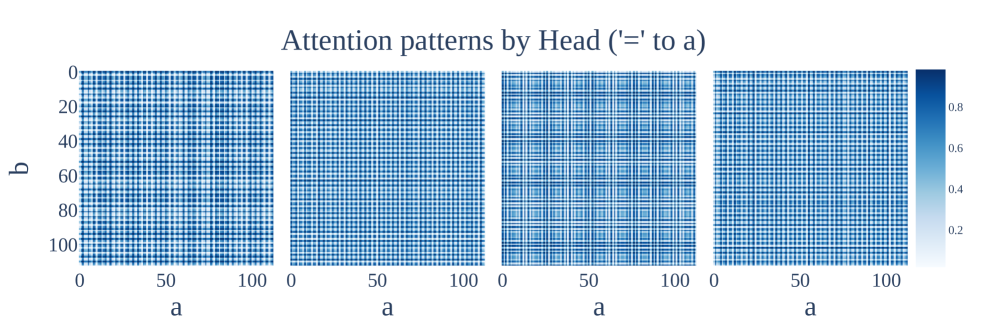

# Маршрутизация внимания (attention routing / heads)

[Нейронное касательное ядро](neural-tangent-kernel-ntk.md) ← предыдущая карточка, следующая → [Групповые представления и cosets](group-representations-cosets.md)

[Индекс карточек понятий](index.md), категория: [2. Механизмы и представления](index.md#cat-2)\
→ Следующая категория: [3. Задачи и наборы данных](modular-arithmetic.md)\
← Предыдущая категория: [1. Явления](grokking.md)

## Определение

«Маршрутизация внимания» (attention routing / heads) — механизм, которым головы внимания (attention heads — параллельные подмодули слоя самовнимания, self-attention; у каждой головы своя матрица внимания) перераспределяют информацию между позициями входной последовательности в зависимости от данных, через обучаемые взаимодействия «запрос-ключ» (query-key: скалярные произведения векторов-запросов и векторов-ключей, задающие веса внимания). В исследованиях [гроккинга](grokking.md) понятие разбирают в двух ракурсах: какие именно головы несут обобщающее вычисление (эвристическое ядро) \[[1.1](#ref-1-1)\] и является ли зависящая от данных маршрутизация необходимой «степенью свободы» архитектуры \[[2.1](#ref-2-1)\].



## Детализация

Bhaskar et al. \[[1.1](#ref-1-1)\] с помощью структурированного прореживания (structured pruning — обучаемое зануление подмножеств весов, оставляющее подсеть, которая приближает поведение полной модели) выделяют внутри одной обученной языковой модели множество подсетей — «подмножеств голов внимания и MLP-слоёв» — и обнаруживают, что все они, независимо от того обобщают они или нет, разделяют общий набор голов внимания, названный «эвристическим ядром» (heuristic core). Эти головы возникают рано в обучении и вычисляют «неглубокие», необобщающие признаки; модель начинает обобщать, доращивая поверх ядра дополнительные головы. Тем самым маршрутизация трактуется как вопрос о том, какой контур (подсеть, реализующая под-алгоритм) из голов внимания реально отвечает за обобщение, — сюжет, родственный переходу от [фазы запоминания](memorization-phase.md) к обобщению при гроккинге.

Второй ракурс задаёт Yıldırım \[[2.1](#ref-2-1)\]: он называет зависящую от данных маршрутизацию внимания одной из двух независимых «степеней свободы» стандартного трансформера (наряду с неограниченной нормой остаточного потока) и, чтобы проверить её роль, вводит вмешательство Uniform Attention Ablation — замену обучаемых query-key весов фиксированным равномерным распределением, сводящую внимание к «мешку токенов» (CBOW-агрегатору, усредняющему входные токены без учёта их взаимного положения). Опираясь на теоретический результат о том, что [модульное сложение](modular-arithmetic.md) реализуемо равномерным агрегированием, он показывает, что зависящая от данных маршрутизация «не строго необходима» для коммутативной задачи, а её удаление способно вовсе обойти гроккинг (модель с нормализацией сразу обобщает). Это трактует гроккинг как обходимый архитектурой [фазовый переход](phase-transition.md), но эффект оказывается специфичен для задачи: на [некоммутативной](group-composition-non-commutative-s5.md) композиции перестановок S5 удаление маршрутизации ускорения не даёт. Родственный сюжет — различие алгоритмов [Clock и Pizza](clock-vs-pizza.md), где именно тип внимания (равномерное против обучаемого) отличает два решения одной и той же задачи.

## Альтернативные определения и нюансы

### A. Головы внимания как вычислительные контуры (эвристическое ядро)

Здесь маршрутизация — это распределение вычисления по головам внимания: параметром, разделяющим трактовки, служит не «сила» внимания, а состав подсети и порядок появления голов. Общее «эвристическое ядро» голов возникает рано и считает необобщающие эвристики, а обобщение добавляется позже отдельными головами поверх ядра; ключевой источник различия между обобщающей и необобщающей моделью — какие головы подключены, а не изменение самих ядровых голов \[[1.1](#ref-1-1)\].

### B. Маршрутизация как архитектурная степень свободы

Здесь маршрутизация — это отдельная, управляемая и устранимая степень свободы: адаптивность query-key весов. Управляющим параметром выступает само вмешательство Uniform Attention Ablation, принудительно выставляющее равномерные веса (например, `[1/3, 1/3, 1/3]` на три токена); сравнение обученной и равномерной маршрутизации при прочих равных и есть проверка её вклада в задержку обобщения \[[2.1](#ref-2-1)\].

### Оспаривают

Yıldırım \[[2.1](#ref-2-1)\] оспаривает необходимость зависящей от данных маршрутизации: для коммутативного модульного сложения достаточно равномерного «мешка токенов», поэтому обучаемая query-key маршрутизация — не несущая степень свободы, и её абляция не ломает, а ускоряет обобщение. Проверяемое разграничение с трактовкой A: если бы маршрутизация была необходима для обобщения, равномерная абляция обрушила бы точность, — но модель с LayerNorm при равномерном внимании обобщает, тогда как на некоммутативной S5 ускорения нет, что и отделяет коммутативные задачи от остальных.

### Поддерживают

Li et al. \[[3.1](#ref-3-1)\] поддерживают, что вычисление действительно локализуется во внимании: их аналитическая характеризация признаков одно-скрытослойных сетей (каждый нейрон настроен на свой фурье-спектр) переносится и на трансформер — «те же вычислительные механизмы» наблюдаются в матрицах внимания одно-слойного трансформера. Отличающий источник: не абляция, а прямой анализ матриц внимания как носителя того же [фурье-контура](fourier-features-circuits.md) (подсети, реализующей модульное сложение через частоты), что и нейроны MLP.

## Ссылки

###### ref-1-1
**\[1.1\]** 2403.03942 — Bhaskar et al., «The Heuristic Core: Understanding Subnetwork Generalization in Pretrained Language Models». [`"subsets of attention heads and MLP layers"`](../papers/2403.03942.the-heuristic-core-understanding-subnetwork-generalization-in-pretrained-language-models/2403.03942.the-heuristic-core-understanding-subnetwork-generalization-in-pretrained-language-models.card.md#p1-6). *«[подмножества голов внимания и MLP-слоёв](../papers/2403.03942.the-heuristic-core-understanding-subnetwork-generalization-in-pretrained-language-models/2403.03942.the-heuristic-core-understanding-subnetwork-generalization-in-pretrained-language-models.card.md#p1-6)»*\
Доп. (эвристическое ядро): [`"these attention heads emerge early in training and compute shallow, non-generalizing features"`](../papers/2403.03942.the-heuristic-core-understanding-subnetwork-generalization-in-pretrained-language-models/2403.03942.the-heuristic-core-understanding-subnetwork-generalization-in-pretrained-language-models.card.md#p1-2). *«[эти головы внимания возникают рано в обучении и вычисляют поверхностные, не обобщающие признаки](../papers/2403.03942.the-heuristic-core-understanding-subnetwork-generalization-in-pretrained-language-models/2403.03942.the-heuristic-core-understanding-subnetwork-generalization-in-pretrained-language-models.card.md#p1-2)»*


###### ref-1-2
**\[1.2\]** 2306.17844 — Zhong et al. 2023, «The Clock and the Pizza». Вводит attention rate $\alpha$: непрерывную интерполяцию между обычным и постоянным вниманием. Нюанс: правило «сильное внимание — значит часы» не безусловно, приложение H даёт пиццу при $\alpha=1$ и ширине 1024, но «после нескольких попыток». [`"we modify this matrix to consist of a linear interpolation between the all-one matrix and the original attention (post-softmax), with the rate $\alpha$ controlling how much of the attention is kept"`](../papers/2306.17844.the-clock-and-the-pizza-two-stories-in-mechanistic-explanation-of-neural-networks/original/2306.17844.the-clock-and-the-pizza-two-stories-in-mechanistic-explanation-of-neural-networks.md#p8-2). *«[мы делаем эту матрицу линейной интерполяцией между матрицей из одних единиц и исходным вниманием (после softmax), а параметр $\alpha$ управляет тем, какая доля внимания сохраняется](../papers/2306.17844.the-clock-and-the-pizza-two-stories-in-mechanistic-explanation-of-neural-networks/2306.17844.the-clock-and-the-pizza-two-stories-in-mechanistic-explanation-of-neural-networks.card.md#p8-2)»*\
Доп.: [`"Crucial to this algorithm is the fact that the attention mechanism can be leveraged to perform multiplication."`](../papers/2306.17844.the-clock-and-the-pizza-two-stories-in-mechanistic-explanation-of-neural-networks/original/2306.17844.the-clock-and-the-pizza-two-stories-in-mechanistic-explanation-of-neural-networks.md#p3-3) — *«[Решающее для этого алгоритма обстоятельство — то, что механизм внимания может быть употреблён для выполнения умножения.](../papers/2306.17844.the-clock-and-the-pizza-two-stories-in-mechanistic-explanation-of-neural-networks/2306.17844.the-clock-and-the-pizza-two-stories-in-mechanistic-explanation-of-neural-networks.card.md#p3-3)»*; [`"After several tries, we are able to observe a trained circular model with distance irrelevance $0.156$ and gradient symmetricity $0.995$"`](../papers/2306.17844.the-clock-and-the-pizza-two-stories-in-mechanistic-explanation-of-neural-networks/original/2306.17844.the-clock-and-the-pizza-two-stories-in-mechanistic-explanation-of-neural-networks.md#p21-3) — *«[После нескольких попыток нам удалось наблюдать обученную круговую модель с distance irrelevance $0.156$ и gradient symmetricity $0.995$](../papers/2306.17844.the-clock-and-the-pizza-two-stories-in-mechanistic-explanation-of-neural-networks/2306.17844.the-clock-and-the-pizza-two-stories-in-mechanistic-explanation-of-neural-networks.card.md#p21-3)»*.

###### ref-1-3
**\[1.3\]** 2602.18523 — Xu, «The Geometry of Multi-Task Grokking: Transverse Instability, Superposition, and Weight Decay Phase Structure». Нюанс: перестройка операторов внимания отнесена к общему стволу — три задачи проходят свои пороги выравнивания в разных точках одной траектории, — тогда как считывание разделено геометрически: веса задачных голов почти ортогональны. Оговорка: единственная иллюстрация к общей траектории (рис. 19) построена на двухзадачном прогоне и трёх задач не показывает. [`"The commutator transition is a property of the trunk, not of any individual task head."`](../papers/2602.18523.the-geometry-of-multi-task-grokking-transverse-instability-superposition-and-weight-decay-phase-structure/original/2602.18523.the-geometry-of-multi-task-grokking-transverse-instability-superposition-and-weight-decay-phase-structure.md#p17-4). *«[Коммутаторный переход есть свойство ствола, а не какой-либо отдельной задачной головы](../papers/2602.18523.the-geometry-of-multi-task-grokking-transverse-instability-superposition-and-weight-decay-phase-structure/2602.18523.the-geometry-of-multi-task-grokking-transverse-instability-superposition-and-weight-decay-phase-structure.card.md#p17-4)»*\
Доп. (ортогональность голов): [`"all three pairs (add–mul, add–sq, mul–sq) stay within $[-0.01,+0.008]$, confirming that the tasks learn geometrically separated readout directions"`](../papers/2602.18523.the-geometry-of-multi-task-grokking-transverse-instability-superposition-and-weight-decay-phase-structure/original/2602.18523.the-geometry-of-multi-task-grokking-transverse-instability-superposition-and-weight-decay-phase-structure.md#p6-2) — *«[все три пары (add–mul, add–sq, mul–sq) держатся в пределах $[-0.01,+0.008]$, что подтверждает: задачи учат геометрически разделённые направления считывания](../papers/2602.18523.the-geometry-of-multi-task-grokking-transverse-instability-superposition-and-weight-decay-phase-structure/2602.18523.the-geometry-of-multi-task-grokking-transverse-instability-superposition-and-weight-decay-phase-structure.card.md#p6-2)»*.
## Ссылки на присоединившиеся работы

### Оспаривают

###### ref-2-1
**\[2.1\]** 2603.05228 — Yıldırım, «The Geometric Inductive Bias of Grokking: Bypassing Phase Transitions via Architectural Topology». Оспаривает: зависящая от данных маршрутизация — устранимая, а не необходимая степень свободы. [`"residual magnitude flexibility and data-dependent attention routing"`](../papers/2603.05228.the-geometric-inductive-bias-of-grokking-bypassing-phase-transitions-via-architectural-topology/original/2603.05228.the-geometric-inductive-bias-of-grokking-bypassing-phase-transitions-via-architectural-topology.md#p9-1). *«[гибкость величины остатка и зависящая от данных маршрутизация внимания](../papers/2603.05228.the-geometric-inductive-bias-of-grokking-bypassing-phase-transitions-via-architectural-topology/2603.05228.the-geometric-inductive-bias-of-grokking-bypassing-phase-transitions-via-architectural-topology.card.md#p9-1)»*\
Доп. (механизм): [`"attention routing through learned query-key interactions"`](../papers/2603.05228.the-geometric-inductive-bias-of-grokking-bypassing-phase-transitions-via-architectural-topology/original/2603.05228.the-geometric-inductive-bias-of-grokking-bypassing-phase-transitions-via-architectural-topology.md#p2-4). *«[маршрутизацией внимания через выученные взаимодействия запросов и ключей](../papers/2603.05228.the-geometric-inductive-bias-of-grokking-bypassing-phase-transitions-via-architectural-topology/2603.05228.the-geometric-inductive-bias-of-grokking-bypassing-phase-transitions-via-architectural-topology.card.md#p2-4)»*\
Доп. (абляция): [`"complex, data-dependent routing is not strictly necessary for this commutative operation"`](../papers/2603.05228.the-geometric-inductive-bias-of-grokking-bypassing-phase-transitions-via-architectural-topology/original/2603.05228.the-geometric-inductive-bias-of-grokking-bypassing-phase-transitions-via-architectural-topology.md#p12-2). *«[сложная, зависящая от данных маршрутизация для этой коммутативной операции строго не необходима](../papers/2603.05228.the-geometric-inductive-bias-of-grokking-bypassing-phase-transitions-via-architectural-topology/2603.05228.the-geometric-inductive-bias-of-grokking-bypassing-phase-transitions-via-architectural-topology.card.md#p12-2)»*


###### ref-2-2
**\[2.2\]** 2604.06256 — Xu, «Spectral Edge Dynamics Reveal Functional Modes of Learning». Нюанс: чистота головы $\approx 0.14$; опора выбрана для 8 сочетаний, а максимум измеряется по 32 блокам. [`"**The spectral edge is globally distributed across all heads.**"`](../papers/2604.06256.spectral-edge-dynamics-reveal-functional-modes-of-learning/original/2604.06256.spectral-edge-dynamics-reveal-functional-modes-of-learning.md#p7-5). *«[**Спектральная кромка глобально распределена по всем головам.**](../papers/2604.06256.spectral-edge-dynamics-reveal-functional-modes-of-learning/2604.06256.spectral-edge-dynamics-reveal-functional-modes-of-learning.card.md#p7-5)»*
### Поддерживают

###### ref-3-1
**\[3.1\]** 2402.09469 — Li, Liang, Shi, Song, Zhou 2024, «Fourier Circuits in Neural Networks and Transformers: A Case Study of Modular Arithmetic with Multiple Inputs». Нюанс: то же фурье-вычисление обнаруживается и в матрицах внимания. [`"we observe similar computational mechanisms in attention matrices of one-layer Transformers"`](../papers/2402.09469.fourier-circuits-in-neural-networks-and-transformers-a-case-study-of-modular-arithmetic-with-multiple-inputs/original/2402.09469.fourier-circuits-in-neural-networks-and-transformers-a-case-study-of-modular-arithmetic-with-multiple-inputs.md#p1-2). *«[мы наблюдаем схожие вычислительные устройства в матрицах внимания однослойных трансформеров](../papers/2402.09469.fourier-circuits-in-neural-networks-and-transformers-a-case-study-of-modular-arithmetic-with-multiple-inputs/2402.09469.fourier-circuits-in-neural-networks-and-transformers-a-case-study-of-modular-arithmetic-with-multiple-inputs.card.md#p1-2)»*\
Доп. (что именно видно): [`"the SGD trained one-layer transformer learns 2-dim cosine shape attention matrices, which is similar to the one-hidden layer neural networks in Figure 1"`](../papers/2402.09469.fourier-circuits-in-neural-networks-and-transformers-a-case-study-of-modular-arithmetic-with-multiple-inputs/original/2402.09469.fourier-circuits-in-neural-networks-and-transformers-a-case-study-of-modular-arithmetic-with-multiple-inputs.md#p12-2) — *«[обученный SGD однослойный трансформер выучивает матрицы внимания двумерного косинусного облика, схожие с сетями с одним скрытым слоем на рисунке 1](../papers/2402.09469.fourier-circuits-in-neural-networks-and-transformers-a-case-study-of-modular-arithmetic-with-multiple-inputs/2402.09469.fourier-circuits-in-neural-networks-and-transformers-a-case-study-of-modular-arithmetic-with-multiple-inputs.card.md#p12-2)»*.


###### ref-3-2
**\[3.2\]** 2507.20057 — Lyle et al., «What Can Grokking Teach Us About Learning Under Nonstationarity?». Даёт побочное, но проверяемое наблюдение (приложение B.1, Рисунок 8): гроккинг устойчиво совпадает с падением ранга выходов голов внимания. Тот же механизм объясняет отрицательный итог основного текста: layer normalization увеличивает входы внимания, отчего матрицы внимания имеют меньшую энтропию и труднее оптимизируются, а сеть с проекцией не может это исправить, пока к масштабным параметрам нормировки не приложен weight decay («scale decay»). Нюанс: что́ головы вычисляют, не разбирается — ранг здесь счётчик, а не толкование. [`"grokking consistently coincides with a reduction in the rank of the attention head outputs, and that reducing the rank of these outputs in networks with layer normalization requires reducing the norm of either the attention head inputs or the key and query matrices"`](../papers/2507.20057.what-can-grokking-teach-us-about-learning-under-nonstationarity/original/2507.20057.what-can-grokking-teach-us-about-learning-under-nonstationarity.md#p16-2). *«[гроккинг устойчиво совпадает со снижением ранга выходов голов внимания и что снижение ранга этих выходов в сетях со слоевой нормировкой требует снижения нормы либо входов голов внимания, либо матриц ключа и запроса](../papers/2507.20057.what-can-grokking-teach-us-about-learning-under-nonstationarity/2507.20057.what-can-grokking-teach-us-about-learning-under-nonstationarity.card.md#p16-2)»*

###### ref-3-3
**\[3.3\]** 2409.09281 — Lv et al., «Language Models “Grok” to Copy». Нюанс: показывает порядок складывания голов во времени (мелкие раньше глубоких), а не состав готового контура; связь с копированием установлена по совпадению во времени — ни абляции, ни вмешательства нет; сам порядок на рисунке 6 не строгий (голова слоя 10 появляется на 10 млрд токенов, голова слоя 8 — только на 15 млрд), и рисунок получен на одной модели, тогда как все точности усреднены по трём семенам. [`"attention heads responsible for copying tokens, form from shallow to deep layers during training"`](../papers/2409.09281.language-models-grok-to-copy/2409.09281.language-models-grok-to-copy.card.md#p2-4). *«[головы внимания, отвечающие за копирование токенов, — складываются от мелких слоёв к глубоким по ходу обучения](../papers/2409.09281.language-models-grok-to-copy/2409.09281.language-models-grok-to-copy.card.md#p2-4)»*\
Доп. (наблюдение): [`"the evolution of induction heads during training, revealing that they develop from shallower to deeper layers"`](../papers/2409.09281.language-models-grok-to-copy/2409.09281.language-models-grok-to-copy.card.md#p4-4) — *«[развитие индукционных голов по ходу обучения, обнаруживая, что они складываются от более мелких слоёв к более глубоким](../papers/2409.09281.language-models-grok-to-copy/2409.09281.language-models-grok-to-copy.card.md#p4-4)»*.

###### ref-3-4
**\[3.4\]** 2604.13082 — Gomezjurado Gonzalez, «The Long Delay to Arithmetic Generalization…». [`"layer-$1$ head $h_{1}$ captures $0.89$ of the BOS cross-attention on the last input position at step $66{,}000$, then disperses to $0.21$ by step $70{,}000$"`](../papers/2604.13082.the-long-delay-to-arithmetic-generalization-when-learned-representations-outrun-behavior/original/2604.13082.the-long-delay-to-arithmetic-generalization-when-learned-representations-outrun-behavior.md#p20-2). *«[голова $h_{1}$ слоя $1$ захватывает $0.89$ кросс-внимания BOS на последней входной позиции на шаге $66{,}000$, затем рассеивается до $0.21$ к шагу $70{,}000$](../papers/2604.13082.the-long-delay-to-arithmetic-generalization-when-learned-representations-outrun-behavior/2604.13082.the-long-delay-to-arithmetic-generalization-when-learned-representations-outrun-behavior.card.md#p20-2)»*

###### ref-3-5
**\[3.5\]** 2602.06702 — Singh, Misra, Orvieto, «Explaining Grokking in Transformers…». [`"LN on the inputs to the value channel of $\operatorname{MHSA}(\bullet)$ leads to fast grokking, whereas LN on query and key inputs actively hurts the network’s ability to generalize"`](../papers/2602.06702.explaining-grokking-in-transformers-through-the-lens-of-inductive-bias/2602.06702.explaining-grokking-in-transformers-through-the-lens-of-inductive-bias.card.md#fig-3). *«[LN на входах канала значений $\operatorname{MHSA}(\bullet)$ ведёт к быстрому гроккингу, тогда как LN на входах запросов и ключей активно вредит способности сети генерализовать](../papers/2602.06702.explaining-grokking-in-transformers-through-the-lens-of-inductive-bias/2602.06702.explaining-grokking-in-transformers-through-the-lens-of-inductive-bias.card.md#fig-3)»*\
Доп. (мера и величина эффекта): настройка $\mathbf{A^{qk}}$ [`"does not generalize within 10k epochs, falling behind **No LN** in both generalization and attention score entropy"`](../papers/2602.06702.explaining-grokking-in-transformers-through-the-lens-of-inductive-bias/2602.06702.explaining-grokking-in-transformers-through-the-lens-of-inductive-bias.card.md#p4-3) — *«[не генерализует за 10 тысяч эпох, отставая от **No LN** и по генерализации, и по энтропии оценок внимания](../papers/2602.06702.explaining-grokking-in-transformers-through-the-lens-of-inductive-bias/2602.06702.explaining-grokking-in-transformers-through-the-lens-of-inductive-bias.card.md#p4-3)»*; авторский вывод — [`"LN on inputs to query and key channels is detrimental to the degree of freedom of the network’s MHSA"`](../papers/2602.06702.explaining-grokking-in-transformers-through-the-lens-of-inductive-bias/2602.06702.explaining-grokking-in-transformers-through-the-lens-of-inductive-bias.card.md#p4-3), *«[LN на входах каналов запросов и ключей пагубна для степени свободы MHSA сети](../papers/2602.06702.explaining-grokking-in-transformers-through-the-lens-of-inductive-bias/2602.06702.explaining-grokking-in-transformers-through-the-lens-of-inductive-bias.card.md#p4-3)»*.\
Доп. (обратная сторона): [`"we introduce configuration $\mathbf{A^{v}}$ which only applies LN to the value inputs"`](../papers/2602.06702.explaining-grokking-in-transformers-through-the-lens-of-inductive-bias/2602.06702.explaining-grokking-in-transformers-through-the-lens-of-inductive-bias.card.md#p5-1) — *«[мы вводим настройку $\mathbf{A^{v}}$, которая применяет LN только на входы значений](../papers/2602.06702.explaining-grokking-in-transformers-through-the-lens-of-inductive-bias/2602.06702.explaining-grokking-in-transformers-through-the-lens-of-inductive-bias.card.md#p5-1)»*, и она сильно ускоряет гроккинг, оставаясь медленнее $\mathbf{M}$.

###### ref-3-6
**\[3.6\]** 2605.20441 — Verma 2026, «Weight Decay Regimes in Grokking Transformers: Cheap Online Diagnostics». Раскладывает обучение на две фазы, обе описанные через согласование голов: сближение вблизи поры гроккинга и расхождение после неё, при уже стоящей на полке точности. Отдельно выделяет размерность на голову $d/H$ как эмпирически преобладающую переменную для амплитуды расхождения (насыщающе-монотонный рост, полка при $d/H\geq 16$) и подпирает это элементарной границей ранга $\mathrm{rank}(QK^{\top})\leq d_{h}$. Нюанс: связь «что вычисляют головы» не разбирается вовсе — автор прямо оставляет опознание алгоритма последующей работе, а кластерный разбор ролей голов проведён на пилотных контрольных точках и назван шумным. [`"Phase 1 synchronization (median $\bar{s}$ rises during epochs 100 to 200) followed by Phase 2 differentiation (IQR-widening in $\bar{s}$ and $\sigma_{H}$ during epochs 1000 to 3000) while test accuracy remains near plateau"`](../papers/2605.20441.weight-decay-regimes-in-grokking-transformers-cheap-online-diagnostics/original/2605.20441.weight-decay-regimes-in-grokking-transformers-cheap-online-diagnostics.md#p6-3). *«[резкую синхронизацию фазы 1 (медиана $\bar{s}$ растёт на эпохах от 100 до 200), за которой следует расхождение фазы 2 (расширение межквартильного размаха у $\bar{s}$ и $\sigma_{H}$ на эпохах от 1000 до 3000), тогда как тестовая точность остаётся вблизи полки](../papers/2605.20441.weight-decay-regimes-in-grokking-transformers-cheap-online-diagnostics/2605.20441.weight-decay-regimes-in-grokking-transformers-cheap-online-diagnostics.card.md#p6-3)»*\
Доп. (граница разбора): [`"our diagnostics flag *when* differentiation occurs and its magnitude, not *what* the differentiated heads individually do"`](../papers/2605.20441.weight-decay-regimes-in-grokking-transformers-cheap-online-diagnostics/original/2605.20441.weight-decay-regimes-in-grokking-transformers-cheap-online-diagnostics.md#p18-2) — *«[наши диагностики отмечают, *когда* происходит расхождение и какова его величина, а не *что* делают разошедшиеся головы по отдельности](../papers/2605.20441.weight-decay-regimes-in-grokking-transformers-cheap-online-diagnostics/2605.20441.weight-decay-regimes-in-grokking-transformers-cheap-online-diagnostics.card.md#p18-2)»*.

###### ref-3-7
**\[3.7\]** 2606.12966 — Sivasankar, «Circuit Synchronization Precedes Generalization: A Causal Precursor to Grokking». [`"Block 1 attention is the most critical component"`](../papers/2606.12966.circuit-synchronization-precedes-generalization-a-causal-precursor-to-grokking/2606.12966.circuit-synchronization-precedes-generalization-a-causal-precursor-to-grokking.card.md#p8-2). *«[Внимание блока 1 — самая критическая компонента](../papers/2606.12966.circuit-synchronization-precedes-generalization-a-causal-precursor-to-grokking/2606.12966.circuit-synchronization-precedes-generalization-a-causal-precursor-to-grokking.card.md#p8-2)»* — обнуление снижает точность до 5.4 % при 87.97 % после обнуления MLP блока 0.\
Доп. (архитектурная абляция): [`"The *2-layer MLP-only* model does not grok within 15,000 steps, confirming that attention is a necessary component for the Fourier algorithm on addition."`](../papers/2606.12966.circuit-synchronization-precedes-generalization-a-causal-precursor-to-grokking/2606.12966.circuit-synchronization-precedes-generalization-a-causal-precursor-to-grokking.card.md#p10-2) — *«[*Двухслойная модель только с MLP* не грокает в пределах 15 000 шагов, что подтверждает: внимание есть необходимая компонента фурье-алгоритма на сложении.](../papers/2606.12966.circuit-synchronization-precedes-generalization-a-causal-precursor-to-grokking/2606.12966.circuit-synchronization-precedes-generalization-a-causal-precursor-to-grokking.card.md#p10-2)»*
## Цитирования

Работы, лишь упоминающие явление (обзор литературы, связанные работы, попутное цитирование) без его подробного разбора.

**\[4.1\]** 2505.18266 — McCracken et al. 2025, «Uncovering a Universal Abstract Algorithm for Modular Addition in Neural Networks». [`"roles of individual components–such as neurons, attention heads, or MLP weights"`](../papers/2505.18266.uncovering-a-universal-abstract-algorithm-for-modular-addition-in-neural-networks/original/2505.18266.uncovering-a-universal-abstract-algorithm-for-modular-addition-in-neural-networks.md#p13-5). *«[роли отдельных составляющих — нейронов, голов внимания, весов MLP](../papers/2505.18266.uncovering-a-universal-abstract-algorithm-for-modular-addition-in-neural-networks/2505.18266.uncovering-a-universal-abstract-algorithm-for-modular-addition-in-neural-networks.card.md#p13-5)»*

**\[4.2\]** 2603.13331 — Truong et al., «The Norm-Separation Delay Law of Grokking: A First-Principles Theory of Delayed Generalization». [`"Intervention B (the Uniform Attention Ablation) replaces data-dependent query–key routing with a uniform 1/n aggregator"`](../papers/2603.13331.the-norm-separation-delay-law-of-grokking-a-first-principles-theory-of-delayed-generalization/2603.13331.the-norm-separation-delay-law-of-grokking-a-first-principles-theory-of-delayed-generalization.card.md#p28-6). *«[Вмешательство B (равномерное упрощение внимания) заменяет зависящую от данных маршрутизацию запрос — ключ равномерным складывателем $1/n$](../papers/2603.13331.the-norm-separation-delay-law-of-grokking-a-first-principles-theory-of-delayed-generalization/2603.13331.the-norm-separation-delay-law-of-grokking-a-first-principles-theory-of-delayed-generalization.card.md#p28-6)»*

**\[4.3\]** 2305.18741 — Murty et al. 2023, «Grokking of Hierarchical Structure in Vanilla Transformers». Берёт из Merrill et al. 2021 цепочку «рост нормы весов ведёт к насыщению внимания» и меряет её конец через отрицательную среднюю энтропию распределений внимания. Нюанс: цепочка воспроизводится, но её предсказательная сила для иерархической генерализации опровергнута — самые разрежённые решения дают самые мелкие модели, которые не обобщают; отдельные головы четырёхголовой модели не разбираются, абляций голов нет. [`"As a proxy for attention sparsity of $f_{\theta}^{L}$, we compute the negative mean entropy of all distributions $\{\mathbf{a}^{p}_{k}\}$."`](../papers/2305.18741.grokking-of-hierarchical-structure-in-vanilla-transformers/original/2305.18741.grokking-of-hierarchical-structure-in-vanilla-transformers.md#p4-2). *«[В качестве заместителя разрежённости внимания у $f_{\theta}^{L}$ мы вычисляем отрицательную среднюю энтропию всех распределений $\{\mathbf{a}^{p}_{k}\}$.](../papers/2305.18741.grokking-of-hierarchical-structure-in-vanilla-transformers/2305.18741.grokking-of-hierarchical-structure-in-vanilla-transformers.card.md#p4-2)»*\
Доп.: [`"Weight norms and attention sparsity grow for all model settings in both datasets."`](../papers/2305.18741.grokking-of-hierarchical-structure-in-vanilla-transformers/original/2305.18741.grokking-of-hierarchical-structure-in-vanilla-transformers.md#p4-5) — *«[Нормы весов и разрежённость внимания растут при всех настройках модели на обоих наборах данных.](../papers/2305.18741.grokking-of-hierarchical-structure-in-vanilla-transformers/2305.18741.grokking-of-hierarchical-structure-in-vanilla-transformers.card.md#p4-5)»*.

**\[4.4\]** 2602.16967 — Xu, «Early-Warning Signals of Grokking via
Loss-Landscape Geometry». Нюанс: сосредоточенность PC1 у проекций внимания
70–85 % против 40–60 % у весов MLP; разбор по головам на Dyck даёт
одновременное выравнивание всех четырёх голов. Специализации голов и контуров
работа не ищет. [`"The mechanism is not head-specific—it operates at the whole-layer level, suggesting a global geometric reorganization rather than attention-head specialization."`](../papers/2602.16967.early-warning-signals-of-grokking-via-loss-landscape-geometry/original/2602.16967.early-warning-signals-of-grokking-via-loss-landscape-geometry.md#p18-4). *«[Механизм не свойствен отдельной голове — он работает на уровне целого слоя, что позволяет предположить общую геометрическую перестройку, а не специализацию голов внимания.](../papers/2602.16967.early-warning-signals-of-grokking-via-loss-landscape-geometry/2602.16967.early-warning-signals-of-grokking-via-loss-landscape-geometry.card.md#p18-4)»*

```
concept:
  category: 2                    # 2. Механизмы и представления (Mechanisms & representations)
  papers_linked: 16             # различных статей в разделах ссылок карточки
  counted_at: 2026-08-20
```
