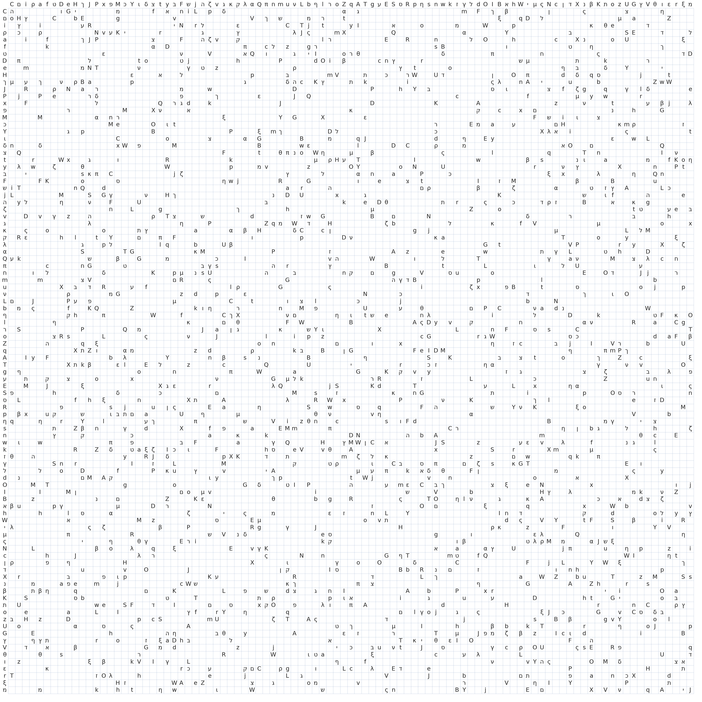

# Эталонный полигон гроккинга (canonical grokking testbed)

[Модульная арифметика](modular-arithmetic.md) ← предыдущая карточка, следующая → [Реальные данные и зрение](vision-real-world-data-mnist-cifar.md)

[Индекс карточек понятий](index.md), категория: [3. Задачи и наборы данных](index.md#cat-3)\
→ Следующая категория: [4. Факторы обучения и оптимизации](weight-decay.md)\
← Предыдущая категория: [2. Механизмы и представления](structured-representation-learning.md)

## Определение

**Эталонный полигон гроккинга** — экспериментальная постановка Power et al. (2022), унаследованная большинством работ корпуса как стандартная площадка для изучения [гроккинга](grokking.md). В отличие от карточки «[модульная арифметика](modular-arithmetic.md)», описывающей математический класс задач, полигон — это вся рамка предъявления: *«Рассматриваемые нами наборы данных — это таблицы бинарных операций вида $a\circ b=c$, где $a,b,c$ — дискретные символы без внутренней структуры, а $\circ$ — бинарная операция»* \[[1.1](#ref-1-1)\] — таблица бинарной операции, поданная уравнениями из пяти неинформативных токенов \[[1.2](#ref-1-2)\], со случайной долей таблицы в обучающей выборке как главным управляющим параметром \[[1.4](#ref-1-4)\] и малым декодерным трансформером как моделью по умолчанию \[[1.5](#ref-1-5)\]. Квинтэссенция полигона — канонический пример: деление mod 97 при половине данных в обучении \[[1.6](#ref-1-6)\]. «Following Power et al.» в поздних работах означает воспроизведение именно этой рамки, а не только выбор арифметической задачи.

## Детализация

Состав полигона задан в одной работе. **Данные** — таблица операции, превращённая в множество уравнений: каждый элемент, знак операции и знак равенства — отдельный токен \[[1.2](#ref-1-2)\]; перечень из 12 операций (девять модульных при $p=97$ и три на группе $S_{5}$, включая [некоммутативные](group-composition-non-commutative-s5.md)) закреплён в приложении A.1.1. **Символы неинформативны** — свойство, конституирующее весь класс. Авторы проговаривают его вскользь, одной фразой: *«сети не сообщается никакой внутренней структуры элементов, и о их свойствах ей приходится узнавать только из их взаимодействий с другими элементами»* \[[1.3](#ref-1-3)\], с примером — *«Например, сеть не видит чисел в десятичной записи или перестановок в строчной записи»* \[[1.3](#ref-1-3)\], — и из этой формулировки легко не заметить, насколько сильное ограничение наложено. Разворачивая: каждый из 97 вычетов подан отдельным токеном, и токены между собой ничем не связаны — сети не даны ни величина, ни порядок, ни соседство: символ для 5 не ближе к символу для 6, чем к символу для 91, и ничто не подсказывает, что 96 и 0 смежны по модулю; нет ни разрядной записи, чтобы вывести арифметику поразрядно, ни какого-либо признака, общего у чисел одного класса вычетов. Ровно так же для $S_{5}$: перестановка подана меткой, а не последовательностью, поэтому ни её длина, ни чётность, ни разложение на циклы сети не сообщены. Отсюда порядковое отношение между вычетами — не входные данные, а выученная структура: круговую топологию модульного сложения, соседство по прибавлению 8, разбиение $S_{5}$ на смежные классы подгруппы сеть восстанавливает исключительно из статистики совместной встречаемости символов в уравнениях. Это стоит держать в виду при переносе выводов на естественные данные, где токены, наоборот, несут и порядок, и близость, и общие признаки. **Главный рычаг** — [доля таблицы](data-fraction-critical-dataset-size.md) в обучении: *«Для каждого запуска обучения мы случайно выбирали долю всех доступных уравнений и объявляли их обучающей выборкой, а остальные уравнения — валидационной»* \[[1.4](#ref-1-4)\]. **Модель и оптимизация** — двухслойный декодерный трансформер ширины 128 с 4 головами (~4·10⁵ параметров) \[[1.5](#ref-1-5)\], основная серия — AdamW с weight decay 1; при этом канонический график получен в другом режиме (Adam без weight decay при растянутом бюджете) — см. раздел «Ошибочные пересказы и цитирования этой статьи» карточки Power о смешении двух режимов при наследовании.

Наследники воспроизводят рамку с точечными вариациями, сохраняя ядро — таблицу с неинформативными символами и долю сплита. Nanda et al. сместили модуль и рецепт: *«В нашем основном эксперименте мы берём $P=113$ и используем однослойный ReLU-трансформер»* \[[3.1](#ref-3-1)\] при 30 % данных; Gromov заменил модель и потерю — *«полносвязные двухслойные сети, обнаруживающие гроккинг на различных задачах модульной арифметики при обычном градиентном спуске с MSE-потерей и в отсутствие какой бы то ни было регуляризации»* \[[3.2](#ref-3-2)\]; Grokfast вернулся к *«то же модульное умножение, придуманное, чтобы сообщить о явлении гроккинга»* \[[3.3](#ref-3-3)\]; поздние работы берут *«четырёх основных действий модульной арифметики ($+,-,\times,\div$) над конечным полем $\mathcal{Z}_{p}=\{0,\dots,p-1\}$ при $p=97$»* \[[3.4](#ref-3-4)\] или начинают с 35 % данных, *«чтобы впервые наблюдать гроккинг, как продемонстрировано в предшествующей работе»* \[[3.5](#ref-3-5)\]; Furuta et al. расширили набор операций на полиномы в той же рамке \[[3.6](#ref-3-6)\].

Чего полигон **не фиксирует** — и на чём расходятся выводы наследников: функцию потерь и оптимизатор (MSE с ванильным градиентным спуском против кросс-энтропии с AdamW — от этого выбора зависит, нужна ли регуляризация для гроккинга вовсе); простоту модуля (она нужна лишь делению — Gromov работает с произвольным целым $p$); и точный состав гиперпараметров — наследники иногда склеивают два режима Power в один сетап (пример разобран в пункте mc-2201-02177 карточки Furuta).

## Альтернативные определения и нюансы

### A. Узкое: канонический пример

Полигон отождествляется с каноническим примером из рисунка 1 Power: *«бинарной операции деления mod 97 с $50\%$ данных в обучающей выборке»* \[[1.6](#ref-1-6)\], где каждый вычет подан отдельным символом. В этом употреблении «полигон» — конкретная задача-эталон, на которой демонстрируют новые методы и меры.

### B. Широкое: рамка предъявления таблиц операций

Полигон — весь класс постановок «таблица операции + неинформативные символы + доля сплита», включающий и неарифметические операции ($S_{5}$), и полиномиальные расширения, и вариации модели (MLP у Gromov, однослойный трансформер у Nanda). В этом употреблении принадлежность к полигону определяет кодировка и рычаг данных, а не конкретная операция.

### Выходят за пределы

Работы, покидающие полигон намеренно: Hwang et al. выводят исследование *«за пределы обычного полигона остаточной арифметики — в разнообразный набор алгебраических, структурных и отношенческих предметных областей»* \[[2.1](#ref-2-1)\], утверждая, что генерализацию определяет собственная симметрия задачи, а не свойства эталонной площадки; линия [реальных данных](vision-real-world-data-mnist-cifar.md) (Liu et al., Omnigrok) показывает, что явление воспроизводимо и вне полигона — но в вызванной постановке.

## Ссылки

###### ref-1-1
**\[1.1\]** 2201.02177 — Power et al., «Grokking: Generalization Beyond Overfitting on Small Algorithmic Datasets». [`"The datasets we consider are binary operation tables of the form $a\circ b=c$ where $a,b,c$ are discrete symbols with no internal structure, and $\circ$ is a binary operation"`](../papers/2201.02177.grokking-generalization-beyond-overfitting-on-small-algorithmic-datasets/2201.02177.grokking-generalization-beyond-overfitting-on-small-algorithmic-datasets.card.md#p2-1). *«[Рассматриваемые нами наборы данных — это таблицы бинарных операций вида $a\circ b=c$, где $a,b,c$ — дискретные символы без внутренней структуры, а $\circ$ — бинарная операция](../papers/2201.02177.grokking-generalization-beyond-overfitting-on-small-algorithmic-datasets/2201.02177.grokking-generalization-beyond-overfitting-on-small-algorithmic-datasets.card.md#p2-1)»*

###### ref-1-2
**\[1.2\]** 2201.02177 — там же, токенизация уравнений. [`"All of our experiments used a small transformer trained on datasets of equations of the form $a\circ b=c$, where each of “$a$”, “$\circ$”, “$b$”, “$=$”, and “$c$” is a separate token"`](../papers/2201.02177.grokking-generalization-beyond-overfitting-on-small-algorithmic-datasets/2201.02177.grokking-generalization-beyond-overfitting-on-small-algorithmic-datasets.card.md#sec-2). *«[Во всех наших экспериментах использовался небольшой трансформер, обучаемый на наборах данных из уравнений вида $a\circ b=c$, где каждый из «$a$», «$\circ$», «$b$», «$=$» и «$c$» — отдельный токен](../papers/2201.02177.grokking-generalization-beyond-overfitting-on-small-algorithmic-datasets/2201.02177.grokking-generalization-beyond-overfitting-on-small-algorithmic-datasets.card.md#sec-2)»*

###### ref-1-3
**\[1.3\]** 2201.02177 — там же, неинформативность символов. [`"the network is not made aware of any internal structure of the elements, and has to learn about their properties only from their interactions with other elements"`](../papers/2201.02177.grokking-generalization-beyond-overfitting-on-small-algorithmic-datasets/2201.02177.grokking-generalization-beyond-overfitting-on-small-algorithmic-datasets.card.md#p2-1). *«[сети не сообщается никакой внутренней структуры элементов, и о их свойствах ей приходится узнавать только из их взаимодействий с другими элементами](../papers/2201.02177.grokking-generalization-beyond-overfitting-on-small-algorithmic-datasets/2201.02177.grokking-generalization-beyond-overfitting-on-small-algorithmic-datasets.card.md#p2-1)»*\
Доп.: [`"For example the network doesn’t see numbers in decimal notation, or permutations in line notation"`](../papers/2201.02177.grokking-generalization-beyond-overfitting-on-small-algorithmic-datasets/2201.02177.grokking-generalization-beyond-overfitting-on-small-algorithmic-datasets.card.md#p2-1) — *«[Например, сеть не видит чисел в десятичной записи или перестановок в строчной записи](../papers/2201.02177.grokking-generalization-beyond-overfitting-on-small-algorithmic-datasets/2201.02177.grokking-generalization-beyond-overfitting-on-small-algorithmic-datasets.card.md#p2-1)»*.

###### ref-1-4
**\[1.4\]** 2201.02177 — там же, сплит как управляющий параметр. [`"For each training run, we chose a fraction of all available equations at random and declared them to be the training set, with the rest of equations being the validation set"`](../papers/2201.02177.grokking-generalization-beyond-overfitting-on-small-algorithmic-datasets/2201.02177.grokking-generalization-beyond-overfitting-on-small-algorithmic-datasets.card.md#sec-a1-1). *«[Для каждого запуска обучения мы случайно выбирали долю всех доступных уравнений и объявляли их обучающей выборкой, а остальные уравнения — валидационной](../papers/2201.02177.grokking-generalization-beyond-overfitting-on-small-algorithmic-datasets/2201.02177.grokking-generalization-beyond-overfitting-on-small-algorithmic-datasets.card.md#sec-a1-1)»*

###### ref-1-5
**\[1.5\]** 2201.02177 — там же, модель. [`"For all experiments we used a transformer with 2 layers, width 128, and 4 attention heads, with a total of about $4\cdot 10^{5}$ non-embedding parameters"`](../papers/2201.02177.grokking-generalization-beyond-overfitting-on-small-algorithmic-datasets/2201.02177.grokking-generalization-beyond-overfitting-on-small-algorithmic-datasets.card.md#sec-a1-2). *«[Во всех экспериментах мы использовали трансформер с 2 слоями, шириной 128 и 4 головами внимания, с общим числом около $4\cdot 10^{5}$ параметров, не считая эмбеддингов](../papers/2201.02177.grokking-generalization-beyond-overfitting-on-small-algorithmic-datasets/2201.02177.grokking-generalization-beyond-overfitting-on-small-algorithmic-datasets.card.md#sec-a1-2)»*

###### ref-1-6
**\[1.6\]** 2201.02177 — там же, канонический пример. [`"the binary operation of division mod 97 with 50% of the data in the training set"`](../papers/2201.02177.grokking-generalization-beyond-overfitting-on-small-algorithmic-datasets/2201.02177.grokking-generalization-beyond-overfitting-on-small-algorithmic-datasets.card.md#fig-1). *«[бинарной операции деления mod 97 с $50\%$ данных в обучающей выборке](../papers/2201.02177.grokking-generalization-beyond-overfitting-on-small-algorithmic-datasets/2201.02177.grokking-generalization-beyond-overfitting-on-small-algorithmic-datasets.card.md#fig-1)»*

## Ссылки на присоединившиеся работы

### Выходят за пределы

###### ref-2-1
**\[2.1\]** 2603.01968 — Hwang et al., «Intrinsic Task Symmetry Drives Generalization in Algorithmic Tasks». Намеренный выход за полигон: генерализацию определяет собственная симметрия задачи. [`"beyond the standard modular arithmetic testbed to a diverse suite of algebraic, structural, and relational domains"`](../papers/2603.01968.intrinsic-task-symmetry-drives-generalization-in-algorithmic-tasks/original/2603.01968.intrinsic-task-symmetry-drives-generalization-in-algorithmic-tasks.md#p1-5). *«[за пределы обычного полигона остаточной арифметики — в разнообразный набор алгебраических, структурных и отношенческих предметных областей](../papers/2603.01968.intrinsic-task-symmetry-drives-generalization-in-algorithmic-tasks/2603.01968.intrinsic-task-symmetry-drives-generalization-in-algorithmic-tasks.card.md#p1-5)»*

###### ref-2-2
**\[2.2\]** 2210.15435 — Žunkovič, Ilievski, «Grokking phase transitions in learning local rules with gradient descent». Нюанс: канонический полигон заменён целиком — вместо модульной арифметики и decoder-only трансформера здесь одномерный клеточный автомат «правило 30» и тензорно-сетевая модель внимания, обучается один шаг эволюции, тест берётся по всем длинам входа $M_{\rm test}=3,4,\ldots,\infty$. Постановка Power et al. присутствует только как источник имени явления; доли обучающих данных как управляющей величины здесь нет. [`"We will consider the rule 30 one-dimensional automaton ($K=1$) [51, 52], which exhibits chaotic behaviour and is defined by the rule $y_{i}=\mbox{rule30}(x_{i-1},x_{i},x_{i+1})$."`](../papers/2210.15435.grokking-phase-transitions-in-learning-local-rules-with-gradient-descent/2210.15435.grokking-phase-transitions-in-learning-local-rules-with-gradient-descent.card.md#p19-1). *«[Мы будем рассматривать одномерный автомат «правило 30» ($K=1$) [51, 52], который проявляет хаотическое поведение и задаётся правилом $y_{i}=\mbox{rule30}(x_{i-1},x_{i},x_{i+1})$](../papers/2210.15435.grokking-phase-transitions-in-learning-local-rules-with-gradient-descent/2210.15435.grokking-phase-transitions-in-learning-local-rules-with-gradient-descent.card.md#p19-1)»*\
Доп. (размеры численного опыта): [`"We also fix the bond dimension $d=2$ and study the 1–local rule, which facilitates the comparison with the results discussed in Section 3."`](../papers/2210.15435.grokking-phase-transitions-in-learning-local-rules-with-gradient-descent/2210.15435.grokking-phase-transitions-in-learning-local-rules-with-gradient-descent.card.md#p23-1) — *«[Мы также закрепляем размерность связи $d=2$ и изучаем 1-локальное правило, что облегчает сравнение с результатами, обсуждёнными в разделе 3](../papers/2210.15435.grokking-phase-transitions-in-learning-local-rules-with-gradient-descent/2210.15435.grokking-phase-transitions-in-learning-local-rules-with-gradient-descent.card.md#p23-1)»*.

###### ref-3-12
**\[3.12\]** 2211.12316 — Bhattamishra et al., «Simplicity Bias in Transformers and their Ability to Learn Sparse Boolean Functions». Нюанс: полигон — семейство $k$-разрежённых булевых функций (Parity-(n,k), Maj-(n,k), Dict-n, Juntas-(n,k)) с известной целевой функцией, где успех проверяется совпадением с целью, а не только проверочной точностью; на задачах переменной длины различие архитектур исчезает. [`"We find that LSTMs obtain 100% training accuracy on the dataset (see Figure 21, right); LSTMs validation accuracy on the Parity task is near 100% whereas it is 50% on the Sparse Parities task"`](../papers/2211.12316.simplicity-bias-in-transformers-and-their-ability-to-learn-sparse-boolean-functions/2211.12316.simplicity-bias-in-transformers-and-their-ability-to-learn-sparse-boolean-functions.card.md#p19-6). *«[Мы обнаруживаем, что LSTM получают 100% обучающей точности на этом наборе (см. рисунок 21, справа); проверочная точность LSTM на задаче Parity близка к 100%, тогда как на задаче Sparse Parities она равна 50%](../papers/2211.12316.simplicity-bias-in-transformers-and-their-ability-to-learn-sparse-boolean-functions/2211.12316.simplicity-bias-in-transformers-and-their-ability-to-learn-sparse-boolean-functions.card.md#p19-6)»*

###### ref-3-15
**\[3.15\]** 2411.00247 — Jeffares, Curth, van der Schaar, «Deep Learning Through A Telescoping Lens: A Simple Model Provides Empirical Insights On Grokking, Gradient Boosting & Beyond». Выходит за пределы полигона: модульной арифметики, таблиц бинарных операций и доли обучающих данных в работе нет вовсе, Power et al. цитируются лишь как источник явления. Вместо канона взяты полиномиальная регрессия Kumar et al. (воспроизведена в точности) и бинарная классификация 3 против 5 на MNIST при большой инициализации (воспроизведена изменённой). Нюанс: выбор продиктован не содержательно, а ограничениями меры — один выход, квадратичная потеря и малый шаг обучения. [`"we replicate the polynomial regression experiment from [KBGP24, Sec. 5] exactly"`](../papers/2411.00247.deep-learning-through-a-telescoping-lens-a-simple-model-provides-empirical-insights-on-grokking-gradient-boosting-and-beyond/original/2411.00247.deep-learning-through-a-telescoping-lens-a-simple-model-provides-empirical-insights-on-grokking-gradient-boosting-and-beyond.md#p23-1). *«[мы в точности воспроизводим опыт с полиномиальной регрессией из [KBGP24, разд. 5]](../papers/2411.00247.deep-learning-through-a-telescoping-lens-a-simple-model-provides-empirical-insights-on-grokking-gradient-boosting-and-beyond/2411.00247.deep-learning-through-a-telescoping-lens-a-simple-model-provides-empirical-insights-on-grokking-gradient-boosting-and-beyond.card.md#p23-1)»*\
Доп. (вторая постановка — изменённая): [`"we report an adapted version of [LMT22]’s experiment reporting grokking on MNIST data"`](../papers/2411.00247.deep-learning-through-a-telescoping-lens-a-simple-model-provides-empirical-insights-on-grokking-gradient-boosting-and-beyond/original/2411.00247.deep-learning-through-a-telescoping-lens-a-simple-model-provides-empirical-insights-on-grokking-gradient-boosting-and-beyond.md#p23-3) — *«[мы сообщаем приспособленную версию опыта из [LMT22], сообщающего о гроккинге на данных MNIST](../papers/2411.00247.deep-learning-through-a-telescoping-lens-a-simple-model-provides-empirical-insights-on-grokking-gradient-boosting-and-beyond/2411.00247.deep-learning-through-a-telescoping-lens-a-simple-model-provides-empirical-insights-on-grokking-gradient-boosting-and-beyond.card.md#p23-3)»*.

###### ref-3-17
**\[3.17\]** 2602.16967 — Xu, «Early-Warning Signals of Grokking via
Loss-Landscape Geometry». Нюанс: полигон заменён двумя задачами вне
модульной арифметики — SCAN (композиционная генерализация, кодировщик-декодировщик)
и Dyck-1 (предсказание глубины стека, decoder-only), — с изменением архитектуры,
области входа, типа выхода и устройства набора данных сразу. Обучающая точность
при этом не приводится, поэтому плато полигона Power et al. здесь не показано.
[`"These tasks differ from modular arithmetic in architecture (encoder–decoder and causal vs. encoder-only), input domain (natural language and formal language vs. numerical), output type (sequence generation and per-token classification vs. single-token classification), and dataset structure."`](../papers/2602.16967.early-warning-signals-of-grokking-via-loss-landscape-geometry/original/2602.16967.early-warning-signals-of-grokking-via-loss-landscape-geometry.md#p2-6). *«[Эти задачи отличаются от модульной арифметики архитектурой (кодировщик–декодировщик и причинная против encoder-only), областью входа (естественный и формальный язык против числовой), типом выхода (порождение последовательности и классификация по токенам против классификации одного токена) и устройством набора данных.](../papers/2602.16967.early-warning-signals-of-grokking-via-loss-landscape-geometry/2602.16967.early-warning-signals-of-grokking-via-loss-landscape-geometry.card.md#p2-6)»*

###### ref-3-19
**\[3.19\]** 2505.11411 — Zhang, Shang, Yang, Zhang, «Is Grokking a Computational Glass Relaxation?». Берёт полигон Nanda et al. целиком — та же однослойная модель, 4 головы шириной 32, размерность 128, MLP 512, разбиение 50/50 по закреплённому семени — и меняет одно: модуль 67 вместо 113, ради стоимости энтропийного сэмплирования. Одна и та же модель служит и обучению AdamW, и обучению WanD, и сэмплированию WLMD, так что все три картины сняты с одного объекта. Нюанс: проверки, что при 67 полигон ведёт себя как при 113, в работе нет — есть лишь утверждение, что гроккинг сохраняется. [`"The training part of our experiment is same as the setup of Nanda et al. nanda2023progress, that is, a one-layer transformer model trained in modular arithmetic tasks."`](../papers/2505.11411.is-grokking-a-computational-glass-relaxation/original/2505.11411.is-grokking-a-computational-glass-relaxation.md#p4-3). *«[Обучающая часть нашего опыта та же, что и в постановке Nanda et al. nanda2023progress, то есть однослойная модель-трансформер, обучаемая на задачах модульной арифметики.](../papers/2505.11411.is-grokking-a-computational-glass-relaxation/2505.11411.is-grokking-a-computational-glass-relaxation.card.md#p4-3)»*\
Доп. (состав модели): [`"This transformer model has 4 attention heads by default, each with a width of 32, yielding a model dimension of 128, and attached with an MLP layer with a width of 512."`](../papers/2505.11411.is-grokking-a-computational-glass-relaxation/original/2505.11411.is-grokking-a-computational-glass-relaxation.md#p14-1) — *«[Эта модель-трансформер имеет по умолчанию 4 головы внимания, каждая шириной 32, что даёт размерность модели 128, и снабжена слоем MLP шириной 512.](../papers/2505.11411.is-grokking-a-computational-glass-relaxation/2505.11411.is-grokking-a-computational-glass-relaxation.card.md#p14-1)»*\
Доп. (разбиение): [`"The entire dataset will be divided into a training set and a test set with a 50% fraction, by a fixed random seed."`](../papers/2505.11411.is-grokking-a-computational-glass-relaxation/original/2505.11411.is-grokking-a-computational-glass-relaxation.md#p4-4) — *«[Весь набор данных будет разделён на обучающую и тестовую части с долей 50 % по закреплённому случайному семени.](../papers/2505.11411.is-grokking-a-computational-glass-relaxation/2505.11411.is-grokking-a-computational-glass-relaxation.card.md#p4-4)»*.

###### ref-3-28
**\[3.28\]** 2604.13082 — Gomezjurado Gonzalez, «The Long Delay to Arithmetic Generalization…». [`"Each training step draws $1{,}000$ integers from $[1,10{,}000]$, and we evaluate on a fixed held-out set of $5{,}000$ unseen integers."`](../papers/2604.13082.the-long-delay-to-arithmetic-generalization-when-learned-representations-outrun-behavior/original/2604.13082.the-long-delay-to-arithmetic-generalization-when-learned-representations-outrun-behavior.md#p3-6). *«[Каждый шаг обучения берёт $1{,}000$ целых из $[1,10{,}000]$, а оцениваем мы на закреплённой отложенной выборке из $5{,}000$ невиданных целых.](../papers/2604.13082.the-long-delay-to-arithmetic-generalization-when-learned-representations-outrun-behavior/2604.13082.the-long-delay-to-arithmetic-generalization-when-learned-representations-outrun-behavior.card.md#p3-6)»*\
Доп. (несогласованность): приложение G при этом говорит, что размер пакета был 512, если не оговорено иное ([с. 23, абз. 2](../papers/2604.13082.the-long-delay-to-arithmetic-generalization-when-learned-representations-outrun-behavior/2604.13082.the-long-delay-to-arithmetic-generalization-when-learned-representations-outrun-behavior.card.md#p23-2)); оговорок в тексте нет.
### Наследуют

###### ref-3-1
**\[3.1\]** 2301.05217 — Nanda et al., «Progress Measures for Grokking via Mechanistic Interpretability». Вариация: $P=113$, однослойный трансформер, 30 % данных, кросс-энтропия. [`"In our mainline experiment, we take $P=113$ and use a one-layer ReLU transformer"`](../papers/2301.05217.progress-measures-for-grokking-via-mechanistic-interpretability/2301.05217.progress-measures-for-grokking-via-mechanistic-interpretability.card.md#sec-3). *«[В нашем основном эксперименте мы берём $P=113$ и используем однослойный ReLU-трансформер](../papers/2301.05217.progress-measures-for-grokking-via-mechanistic-interpretability/2301.05217.progress-measures-for-grokking-via-mechanistic-interpretability.card.md#sec-3)»*\
Доп.: [`"Our mainline dataset consists of 30% of the entire set of possible inputs"`](../papers/2301.05217.progress-measures-for-grokking-via-mechanistic-interpretability/2301.05217.progress-measures-for-grokking-via-mechanistic-interpretability.card.md#sec-3) — *«[Наш основной набор данных состоит из 30 % всего множества возможных входов](../papers/2301.05217.progress-measures-for-grokking-via-mechanistic-interpretability/2301.05217.progress-measures-for-grokking-via-mechanistic-interpretability.card.md#sec-3)»*.

###### ref-3-2
**\[3.2\]** 2301.02679 — Gromov, «Grokking modular arithmetic». Вариация: MLP вместо трансформера, MSE, ванильный градиентный спуск, one-hot вход без обучаемого энкодера. [`"fully-connected two-layer networks that exhibit grokking on various modular arithmetic tasks under vanilla gradient descent with the MSE loss function in the absence of any regularization"`](../papers/2301.02679.grokking-modular-arithmetic/2301.02679.grokking-modular-arithmetic.card.md#p1-2). *«[полносвязные двухслойные сети, обнаруживающие гроккинг на различных задачах модульной арифметики при обычном градиентном спуске с MSE-потерей и в отсутствие какой бы то ни было регуляризации](../papers/2301.02679.grokking-modular-arithmetic/2301.02679.grokking-modular-arithmetic.card.md#p1-2)»*

###### ref-3-3
**\[3.3\]** 2405.20233 — Lee et al., «Grokfast». Полигон как демонстрационная площадка метода. [`"the same modular multiplication task devised to report the grokking phenomenon"`](../papers/2405.20233.grokfast-accelerated-grokking-by-amplifying-slow-gradients/2405.20233.grokfast-accelerated-grokking-by-amplifying-slow-gradients.card.md#p7-1). *«[то же модульное умножение, придуманное, чтобы сообщить о явлении гроккинга](../papers/2405.20233.grokfast-accelerated-grokking-by-amplifying-slow-gradients/2405.20233.grokfast-accelerated-grokking-by-amplifying-slow-gradients.card.md#p7-1)»*

###### ref-3-4
**\[3.4\]** 2603.29262 — Zhang et al., «Grokking: From Abstraction to Intelligence». Наследование вплоть до $p=97$. [`"four primary modular arithmetic operations ($+,-,\times,\div$) over the finite field $\mathcal{Z}_{p}=\{0,\dots,p-1\}$ with $p=97$"`](../papers/2603.29262.grokking-from-abstraction-to-intelligence/2603.29262.grokking-from-abstraction-to-intelligence.card.md#p2-6). *«[четырёх основных действий модульной арифметики ($+,-,\times,\div$) над конечным полем $\mathcal{Z}_{p}=\{0,\dots,p-1\}$ при $p=97$](../papers/2603.29262.grokking-from-abstraction-to-intelligence/2603.29262.grokking-from-abstraction-to-intelligence.card.md#p2-6)»*

###### ref-3-5
**\[3.5\]** 2511.04760 — Singh et al., «When Data Falls Short». Сплит как стартовая точка эксперимента. [`"We begin training with 35% of the dataset to first observe grokking, as demonstrated in prior work"`](../papers/2511.04760.when-data-falls-short-grokking-below-the-critical-threshold/original/2511.04760.when-data-falls-short-grokking-below-the-critical-threshold.md#p3-3). *«[Мы начинаем обучение с 35 % набора данных, чтобы сперва увидеть гроккинг, как показано в прежних работах](../papers/2511.04760.when-data-falls-short-grokking-below-the-critical-threshold/2511.04760.when-data-falls-short-grokking-below-the-critical-threshold.card.md#p3-3)»*

###### ref-3-6
**\[3.6\]** 2402.16726 — Furuta et al., «Towards Empirical Interpretation of Internal Circuits and Properties in Grokked Transformers on Modular Polynomials». Расширение набора операций в той же рамке. [`"learning Transformers on complex modular arithmetic tasks, including polynomials"`](../papers/2402.16726.towards-empirical-interpretation-of-internal-circuits-and-properties-in-grokked-transformers-on-modular-polynomials/original/2402.16726.towards-empirical-interpretation-of-internal-circuits-and-properties-in-grokked-transformers-on-modular-polynomials.md#p1-1). *«[обучая трансформеры на сложных задачах модульной арифметики, включая многочлены](../papers/2402.16726.towards-empirical-interpretation-of-internal-circuits-and-properties-in-grokked-transformers-on-modular-polynomials/2402.16726.towards-empirical-interpretation-of-internal-circuits-and-properties-in-grokked-transformers-on-modular-polynomials.card.md#p1-1)»*

###### ref-3-7
**\[3.7\]** 2303.06173 — Davies, Langosco, Krueger, «Unifying Grokking and Double Descent». Нюанс: наследует полигон целиком (деление по модулю 97, decoder-only трансформер с каузальной маской), но разворачивает его в двумерную сетку «шаги оптимизации × размерность вложения»; прочие настройки закреплены и ни разу не меняются. [`"Following the original grokking setting of Power et al. 2022, we train decoder-only transformers (Vaswani et al. 2017) with causal attention masking on the binary operation of division mod 97"`](../papers/2303.06173.unifying-grokking-and-double-descent/2303.06173.unifying-grokking-and-double-descent.card.md#p4-1). *«[Следуя исходной постановке гроккинга у Power et al. 2022, мы обучаем decoder-only трансформеры (Vaswani et al. 2017) с каузальной маской внимания на бинарной операции деления по модулю 97](../papers/2303.06173.unifying-grokking-and-double-descent/2303.06173.unifying-grokking-and-double-descent.card.md#p4-1)»*\
Доп.: [`"we use a 2-layer network of width 128, with a single attention head"`](../papers/2303.06173.unifying-grokking-and-double-descent/2303.06173.unifying-grokking-and-double-descent.card.md#p8-3) — *«[мы берём двухслойную сеть ширины 128 с одной головой внимания](../papers/2303.06173.unifying-grokking-and-double-descent/2303.06173.unifying-grokking-and-double-descent.card.md#p8-3)»*.

###### ref-3-8
**\[3.8\]** 2306.17844 — Zhong et al. 2023, «The Clock and the Pizza». Полигон унаследован целиком (малое $p$, 80% обучающих данных, полный батч, AdamW с сильным weight decay, 20 000 эпох), но использован для вопроса «какой алгоритм», а не «когда обобщит». [`"Among all possible data points ($p^{2}=3481$ of them), we randomly select $80\%$ as training samples and $20\%$ as validation samples."`](../papers/2306.17844.the-clock-and-the-pizza-two-stories-in-mechanistic-explanation-of-neural-networks/original/2306.17844.the-clock-and-the-pizza-two-stories-in-mechanistic-explanation-of-neural-networks.md#p20-1). *«[Из всех возможных точек данных (их $p^{2}=3481$) мы случайно выбираем $80\%$ в качестве обучающих образцов и $20\%$ в качестве проверочных.](../papers/2306.17844.the-clock-and-the-pizza-two-stories-in-mechanistic-explanation-of-neural-networks/2306.17844.the-clock-and-the-pizza-two-stories-in-mechanistic-explanation-of-neural-networks.card.md#p20-1)»*\
Доп.: [`"We removed the runs that did not reach $100\%$ validation accuracy at the end of the training"`](../papers/2306.17844.the-clock-and-the-pizza-two-stories-in-mechanistic-explanation-of-neural-networks/original/2306.17844.the-clock-and-the-pizza-two-stories-in-mechanistic-explanation-of-neural-networks.md#p20-2) — *«[Мы убрали прогоны, не достигшие $100\%$ проверочной точности к концу обучения](../papers/2306.17844.the-clock-and-the-pizza-two-stories-in-mechanistic-explanation-of-neural-networks/2306.17844.the-clock-and-the-pizza-two-stories-in-mechanistic-explanation-of-neural-networks.card.md#p20-2)»*.

**\[4.1\]** 2402.15555 — Humayun, Balestriero, Baraniuk 2024, «Deep Networks Always Grok and Here is Why». Полигон Power et al. назван истоком явления и трактован как частный случай: главная заявка работы — что гроккинг не привязан ни к задаче, ни к инициализации. Нюанс: сам полигон здесь не воспроизводится — ни доли обучающих данных, ни модуля, ни таблицы операций; всё, что от него осталось, — один рисунок с модульным сложением. [`"It was first demonstrated by (Power et al. 2022) on simple Transformer architectures performing modular addition or division."`](../papers/2402.15555.deep-networks-always-grok-and-here-is-why/original/2402.15555.deep-networks-always-grok-and-here-is-why.md#p1-3). *«[Впервые оно было показано (Power et al. 2022) на простых архитектурах трансформера, выполняющих модульное сложение или деление.](../papers/2402.15555.deep-networks-always-grok-and-here-is-why/2402.15555.deep-networks-always-grok-and-here-is-why.card.md#p1-3)»*

**\[4.2\]** 2312.06581 — Stander et al. 2024, «Grokking Group Multiplication with Cosets». [`"trained with the Adam optimizer [Kingma & Ba 2014] with a fixed learning rate of $0.001$, weight decay set to $1.0$"`](../papers/2312.06581.grokking-group-multiplication-with-cosets/original/2312.06581.grokking-group-multiplication-with-cosets.md#p14-11). *«[обучались оптимизатором Adam [Kingma & Ba 2014] с постоянной скоростью обучения $0.001$, weight decay, заданным равным $1.0$](../papers/2312.06581.grokking-group-multiplication-with-cosets/2312.06581.grokking-group-multiplication-with-cosets.card.md#p14-11)»*

**\[4.3\]** 2310.02541 — Xu et al. 2023. Нюанс: у эталонного полигона взято только определение явления; сам полигон заменён на XOR-кластеры в высокой размерности с полнобатчевым GD и замороженным вторым слоем, воспроизводимость на алгоритмических данных не заявлена. [`"The phenomenon of grokking was first identified by [Pow+22] in decoder-only transformers trained on algorithmic datasets"`](../papers/2310.02541.benign-overfitting-and-grokking-in-relu-networks-for-xor-cluster-data/original/2310.02541.benign-overfitting-and-grokking-in-relu-networks-for-xor-cluster-data.md#p3-2). *«[Явление гроккинга впервые выявлено в [Pow+22] на decoder-only трансформерах, обучаемых на алгоритмических наборах данных](../papers/2310.02541.benign-overfitting-and-grokking-in-relu-networks-for-xor-cluster-data/2310.02541.benign-overfitting-and-grokking-in-relu-networks-for-xor-cluster-data.card.md#p3-2)»*

**\[4.4\]** 2305.18741 — Murty et al. 2023, «Grokking of Hierarchical Structure in Vanilla Transformers». Полный выход за полигон: ни таблицы бинарной операции, ни доли обучающих данных как управляющей величины; постановка взята у McCoy et al. 2020 — обучающая часть двусмысленна, проверка ведётся на отдельной выборке вне распределения, — а управляющей величиной служит глубина модели. Из полигона Power et al. заимствованы только имя явления и мысль, что обучение надо длить дальше насыщения. [`"we follow McCoy et al. 2020 and evaluate generalization in models trained on ambiguous tasks in which training data is consistent with both a “hierarchical rule” as well as a “non-hierarchical rule”"`](../papers/2305.18741.grokking-of-hierarchical-structure-in-vanilla-transformers/original/2305.18741.grokking-of-hierarchical-structure-in-vanilla-transformers.md#p2-3). *«[мы вслед за McCoy et al. 2020 оцениваем генерализацию у моделей, обученных на двусмысленных задачах, в которых обучающие данные согласуются и с «иерархическим правилом», и с «неиерархическим правилом»](../papers/2305.18741.grokking-of-hierarchical-structure-in-vanilla-transformers/2305.18741.grokking-of-hierarchical-structure-in-vanilla-transformers.card.md#p2-3)»*\
Доп.: [`"We find an inverted U-shaped scaling behavior—very shallow and very deep models are unsuccessful, while most seeds generalize in models of intermediate depth."`](../papers/2305.18741.grokking-of-hierarchical-structure-in-vanilla-transformers/original/2305.18741.grokking-of-hierarchical-structure-in-vanilla-transformers.md#p3-2) — *«[Мы обнаруживаем перевёрнутую U-образную зависимость от масштаба: очень мелкие и очень глубокие модели неуспешны, тогда как большинство семян обобщает у моделей промежуточной глубины.](../papers/2305.18741.grokking-of-hierarchical-structure-in-vanilla-transformers/2305.18741.grokking-of-hierarchical-structure-in-vanilla-transformers.card.md#p3-2)»*.

###### ref-3-9
**\[3.9\]** 2302.03025 — Chughtai et al., «A Toy Model of Universality: Reverse Engineering how Networks Learn Group Operations». Нюанс: постановка Power et al. унаследована почти целиком ($40\%$ таблицы, полный батч, AdamW, weight decay), но t-SNE-кластеризация разэмбеддинга по подгруппам не воспроизвелась — вышла через PCA, а кластеры во вложениях отвечают смежным классам другой, произвольной от прогона к прогону подгруппы. [`"We did not find the unembedding $W_{U}$ to cluster into subgroups as they did via t-SNE, but did via PCA."`](../papers/2302.03025.a-toy-model-of-universality-reverse-engineering-how-networks-learn-group-operations/2302.03025.a-toy-model-of-universality-reverse-engineering-how-networks-learn-group-operations.card.md#p22-2). *«[Мы не обнаружили, чтобы разэмбеддинг $W_{U}$ группировался по подгруппам, как это было у них, через t-SNE, но обнаружили это через PCA](../papers/2302.03025.a-toy-model-of-universality-reverse-engineering-how-networks-learn-group-operations/2302.03025.a-toy-model-of-universality-reverse-engineering-how-networks-learn-group-operations.card.md#p22-2)»*\
Доп.: [`"Our mainline model is trained on $40\%$ of all $n^{2}$ entries in the multiplication table of the group."`](../papers/2302.03025.a-toy-model-of-universality-reverse-engineering-how-networks-learn-group-operations/2302.03025.a-toy-model-of-universality-reverse-engineering-how-networks-learn-group-operations.card.md#p13-4) — *«[Наша основная модель обучается на $40\%$ всех $n^{2}$ клеток таблицы умножения группы](../papers/2302.03025.a-toy-model-of-universality-reverse-engineering-how-networks-learn-group-operations/2302.03025.a-toy-model-of-universality-reverse-engineering-how-networks-learn-group-operations.card.md#p13-4)»*.

###### ref-3-10
**\[3.10\]** 2401.10463 — Zhu et al. 2024. Нюанс: работа предъявляет сводную таблицу настроек предшествующих работ о гроккинге рядом со своими (таблица 2) и формулирует своё положение относительно эталонного полигона прямо; одновременное увеличение набора **и** модели названо очень трудным и оставлено вне работы. [`"compared to previous grokking studies, we significantly expand dataset size and scope (7-9K $\rightarrow$ 350K) within simplified language models"`](../papers/2401.10463.critical-data-size-of-language-models-from-a-grokking-perspective/2401.10463.critical-data-size-of-language-models-from-a-grokking-perspective.card.md#p15-1). *«[по сравнению с предшествующими исследованиями гроккинга мы значительно расширяем размер и охват наборов данных (7-9K $\rightarrow$ 350K) в пределах упрощённых языковых моделей](../papers/2401.10463.critical-data-size-of-language-models-from-a-grokking-perspective/2401.10463.critical-data-size-of-language-models-from-a-grokking-perspective.card.md#p15-1)»*\
Доп. (граница): [`"due to the fragile nature of the grokking, simultaneously enlarging both dataset and model sizes is very difficult"`](../papers/2401.10463.critical-data-size-of-language-models-from-a-grokking-perspective/2401.10463.critical-data-size-of-language-models-from-a-grokking-perspective.card.md#p15-1) — *«[из-за хрупкой природы гроккинга одновременное увеличение размеров и набора, и модели весьма затруднительно](../papers/2401.10463.critical-data-size-of-language-models-from-a-grokking-perspective/2401.10463.critical-data-size-of-language-models-from-a-grokking-perspective.card.md#p15-1)»*

**\[4.5\]** 2310.16441 — Levi et al. 2023. Нюанс: ни таблицы операции, ни неинформативных символов, ни доли обучающей выборки, ни трансформера; вместо полигона — гауссовы входы и совершенный учитель. Единственная унаследованная деталь — превращение регрессии в классификацию порогом $\epsilon$, взятое у Omnigrok, а не у Power et al. [`"Following the construction presented in [11], we can convert this regression problem into a classification task by setting a threshold $\epsilon>0$"`](../papers/2310.16441.grokking-in-linear-estimators-a-solvable-model-that-groks-without-understanding/original/2310.16441.grokking-in-linear-estimators-a-solvable-model-that-groks-without-understanding.md#p3-4). *«[Следуя построению, представленному в [11], мы можем превратить эту задачу регрессии в задачу классификации, задав порог $\epsilon>0$](../papers/2310.16441.grokking-in-linear-estimators-a-solvable-model-that-groks-without-understanding/2310.16441.grokking-in-linear-estimators-a-solvable-model-that-groks-without-understanding.card.md#p3-4)»*

**\[4.6\]** 2308.15594 — Charton, «Learning the greatest common divisor: explaining transformer predictions». Нюанс: работа стоит вне полигона целиком — задача оформлена как перевод цифровой записи, символы информативны, таблицы операции нет и доля данных управляющей величиной не служит; от Power et al. заимствовано одно слово, и оно взято в кавычки. Управляющие величины другие: основание записи и форма обучающего распределения. [`"GCD calculations are framed as a supervised translation task."`](../papers/2308.15594.learning-the-greatest-common-divisor-explaining-transformer-predictions/original/2308.15594.learning-the-greatest-common-divisor-explaining-transformer-predictions.md#p2-4). *«[Вычисление НОД оформлено как задача перевода с учителем](../papers/2308.15594.learning-the-greatest-common-divisor-explaining-transformer-predictions/2308.15594.learning-the-greatest-common-divisor-explaining-transformer-predictions.card.md#p2-4)»*\
Доп.: [`"All inputs pairs are sampled uniformly between $1$ and $M=10^{6}$."`](../papers/2308.15594.learning-the-greatest-common-divisor-explaining-transformer-predictions/original/2308.15594.learning-the-greatest-common-divisor-explaining-transformer-predictions.md#p2-5) — *«[Все входные пары берутся равномерно между $1$ и $M=10^{6}$](../papers/2308.15594.learning-the-greatest-common-divisor-explaining-transformer-predictions/2308.15594.learning-the-greatest-common-divisor-explaining-transformer-predictions.card.md#p2-5)»*.

###### ref-3-11
**\[3.11\]** 2311.07568 — Morwani et al. 2024, «Feature emergence via margin maximization: case studies in algebraic tasks». Берёт три задачи полигона — модульное сложение, разрежённую чётность, композицию в конечных группах — и намеренно снимает с них ту часть постановки, которая делает полигон полигоном гроккинга: трансформер заменён сетью с одним скрытым слоем и многочленным возбуждением без смещений, разбиения на обучение и тест нет, а измеряется не точность, а нормированный зазор. Нюанс: это делает результат сильнее как теорему и слабее как свидетельство о гроккинге — обобщать здесь не на что, и числа этой работы с числами полигона несопоставимы. [`"In this work, we will consider one-hidden layer neural networks with homogeneous polynomial activations, such as $x^{2}$, and no biases."`](../papers/2311.07568.feature-emergence-via-margin-maximization-case-studies-in-algebraic-tasks/2311.07568.feature-emergence-via-margin-maximization-case-studies-in-algebraic-tasks.card.md#p4-3). *«[В этой работе мы будем рассматривать нейросети с одним скрытым слоем с однородными многочленными возбуждениями, такими как $x^{2}$, и без смещений.](../papers/2311.07568.feature-emergence-via-margin-maximization-case-studies-in-algebraic-tasks/2311.07568.feature-emergence-via-margin-maximization-case-studies-in-algebraic-tasks.card.md#p4-3)»*\
Доп. (требование к ширине): [`"Consider one-hidden layer networks $f(\theta,a,b)$ of the form given in section 2 with $m\geq 4(p-1)$ neurons."`](../papers/2311.07568.feature-emergence-via-margin-maximization-case-studies-in-algebraic-tasks/2311.07568.feature-emergence-via-margin-maximization-case-studies-in-algebraic-tasks.card.md#p10-3) — *«[Рассмотрим сети с одним скрытым слоем $f(\theta,a,b)$ вида, данного в разделе 2, с $m\geq 4(p-1)$ нейронами.](../papers/2311.07568.feature-emergence-via-margin-maximization-case-studies-in-algebraic-tasks/2311.07568.feature-emergence-via-margin-maximization-case-studies-in-algebraic-tasks.card.md#p10-3)»*;
Доп. (что измеряется вместо точности): [`"For the quadratic activation, the network asymptotically reaches the maximum $L_{2,3}$ margin predicted by our analysis."`](../papers/2311.07568.feature-emergence-via-margin-maximization-case-studies-in-algebraic-tasks/2311.07568.feature-emergence-via-margin-maximization-case-studies-in-algebraic-tasks.card.md#fig-1) — *«[Для квадратичного возбуждения сеть асимптотически достигает максимального $L_{2,3}$-зазора, предсказанного нашим разбором.](../papers/2311.07568.feature-emergence-via-margin-maximization-case-studies-in-algebraic-tasks/2311.07568.feature-emergence-via-margin-maximization-case-studies-in-algebraic-tasks.card.md#fig-1)»*.

###### ref-3-13
**\[3.13\]** 2407.20199 — Mallinar et al., «Emergence in non-neural models: grokking modular arithmetic via average gradient outer product». Нюанс: от полигона Power сохранены только таблица операции, one-hot символы и доля обучения как рычаг; модель — однослойная квадратичная сеть Gromov и ядерная машина, модуль $61$, потеря квадратичная, трансформеров нет. [`"with quadratic activation $\sigma(z)=z^{2}$ on modulus $p=61$ data with a training fraction $50\%$"`](../papers/2407.20199.emergence-in-non-neural-models-grokking-modular-arithmetic-via-average-gradient-outer-product/original/2407.20199.emergence-in-non-neural-models-grokking-modular-arithmetic-via-average-gradient-outer-product.md#p11-1). *«[с квадратичной активацией $\sigma(z)=z^{2}$ на данных с модулем $p=61$ при доле обучения $50\%$](../papers/2407.20199.emergence-in-non-neural-models-grokking-modular-arithmetic-via-average-gradient-outer-product/2407.20199.emergence-in-non-neural-models-grokking-modular-arithmetic-via-average-gradient-outer-product.card.md#p11-1)»*

###### ref-3-14
**\[3.14\]** 2408.11804 — Yunis et al., «Approaching Deep Learning through the Spectral Dynamics of Weights». Наследует полигон Nanda et al. 2023 с единственным названным отличием — синусоидальные позиционные кодировки вместо обучаемых; полигон не оспаривается и не расширяется, а служит местом, где искомое явление заведомо есть. [`"We mostly follow the settings and architecture of Nanda et al. 2023, except we use sinusoidal positional encodings instead of learned."`](../papers/2408.11804.approaching-deep-learning-through-the-spectral-dynamics-of-weights/original/2408.11804.approaching-deep-learning-through-the-spectral-dynamics-of-weights.md#p22-5). *«[Мы по большей части следуем настройкам и архитектуре Nanda et al. 2023, за исключением того, что применяем синусоидальные позиционные кодировки вместо обучаемых](../papers/2408.11804.approaching-deep-learning-through-the-spectral-dynamics-of-weights/2408.11804.approaching-deep-learning-through-the-spectral-dynamics-of-weights.card.md#p22-5)»*

**\[4.7\]** 2504.16041 — Tveit, Remseth, Skogvold, «Muon Optimizer Accelerates Grokking». Нюанс: полигон взят целиком (mod 97, случайная перестановка таблицы, доля на обучение, малый трансформер) и служит только площадкой для сравнения приёмов оптимизации; добавлены наибольший общий делитель и чётность 10-битного числа, разбивки итога по задачам нет. [`"Training/validation splits were created by randomly permuting the full dataset and allocating a specific fraction to training (details in Figure 2)."`](../papers/2504.16041.muon-optimizer-accelerates-grokking/original/2504.16041.muon-optimizer-accelerates-grokking.md#p2-4). *«[Разбиения на обучение и проверку строились случайной перестановкой полного набора и выделением определённой доли на обучение (подробности на рисунке 2).](../papers/2504.16041.muon-optimizer-accelerates-grokking/2504.16041.muon-optimizer-accelerates-grokking.card.md#p2-4)»*

###### ref-3-16
**\[3.16\]** 2602.18523 — Xu, «The Geometry of Multi-Task Grokking: Transverse Instability, Superposition, and Weight Decay Phase Structure». Нюанс: рамка Power воспроизведена целиком ($p=97$, деление 50/50, малый трансформер, AdamW), а расширена одним: ствол общий, голов классификации две или три. Модель здесь кодировщик, а не декодер. [`"A 2-layer Transformer with a shared trunk and two classification heads, jointly trained on $(x+y)\bmod 97$ and $(x\cdot y)\bmod 97$."`](../papers/2602.18523.the-geometry-of-multi-task-grokking-transverse-instability-superposition-and-weight-decay-phase-structure/original/2602.18523.the-geometry-of-multi-task-grokking-transverse-instability-superposition-and-weight-decay-phase-structure.md#p3-5). *«[Двухслойный трансформер с общим стволом и двумя головами классификации, совместно обучаемый на $(x+y)\bmod 97$ и $(x\cdot y)\bmod 97$](../papers/2602.18523.the-geometry-of-multi-task-grokking-transverse-instability-superposition-and-weight-decay-phase-structure/2602.18523.the-geometry-of-multi-task-grokking-transverse-instability-superposition-and-weight-decay-phase-structure.card.md#p3-5)»*

###### ref-3-18
**\[3.18\]** 2507.20057 — Lyle et al., «What Can Grokking Teach Us About Learning Under Nonstationarity?». Наследует полигон не напрямую, а через Varma et al. 2023 (архитектура повторена дословно), и переставляет три его опоры: доля обучения $\rho=0.2$ вместо канонической половины, составной модуль 117 вместо простого, бюджет 1 млн шагов. Существенное отличие в предъявлении: обучающая точность не изображается вовсе, а тестовая кривая имеет пол около 20 % из-за неразличения $(x,y)$ и $(y,x)$. [`"We train a transformer with a single attention block on a modular arithmetic task, replicating the architecture of Varma et al. 2023"`](../papers/2507.20057.what-can-grokking-teach-us-about-learning-under-nonstationarity/original/2507.20057.what-can-grokking-teach-us-about-learning-under-nonstationarity.md#p5-5). *«[Мы обучаем трансформер с одним блоком внимания на задаче модульной арифметики, повторяя архитектуру Varma et al. 2023](../papers/2507.20057.what-can-grokking-teach-us-about-learning-under-nonstationarity/2507.20057.what-can-grokking-teach-us-about-learning-under-nonstationarity.card.md#p5-5)»*

###### ref-3-20
**\[3.20\]** 2603.25009 — Manir, Rupa, «A Systematic Empirical Study of Grokking…». [`"We define $T_{\text{train}}$ as the first step at which training accuracy $\geq 99\%$, and $T_{\text{grok}}$ as the first step at which validation (test) accuracy $\geq 99\%$."`](../papers/2603.25009.a-systematic-empirical-study-of-grokking-depth-architecture-activation-and-regularization/2603.25009.a-systematic-empirical-study-of-grokking-depth-architecture-activation-and-regularization.card.md#p3-9). *«[Мы определяем $T_{\text{train}}$ как первый шаг, на котором обучающая точность $\geq 99\%$, и $T_{\text{grok}}$ как первый шаг, на котором проверочная (тестовая) точность $\geq 99\%$.](../papers/2603.25009.a-systematic-empirical-study-of-grokking-depth-architecture-activation-and-regularization/2603.25009.a-systematic-empirical-study-of-grokking-depth-architecture-activation-and-regularization.card.md#p3-9)»* Сетка измерения — 2000 шагов; недошедшие за бюджет прогоны помечаются DNF и исключаются из средних с явным указанием числа успешных семян.

###### ref-3-21
**\[3.21\]** 2405.16658 — Park, Kim, Kim, «Acceleration of Grokking in Learning Arithmetic Operations via Kolmogorov-Arnold Representation». Нюанс: полигон унаследован целиком и без переделки — те же $\mathbb{Z}_{97}\times\mathbb{Z}_{97}$, тот же вход-уравнение, тот же трансформер, — и меняется ровно одно: откуда берутся начальные веса. Два отступления существенны при сверке: объём обучения задан абсолютным числом образцов $N$ (3000–9000 при $97^{2}$ парах), а не долей таблицы, и модель крупнее канонической (размерности вложений и внимания 256, два блока декодера по четыре головы). Полигон при этом расширен двумя задачами, которых у Power et al. нет: композицией из трёх и четырёх операндов и системой уравнений с неизвестными токенами. [`"As in the study [1], we train the transformer using an algorithmic dataset of binary relations defined on $\mathbb{Z}_{p}\times\mathbb{Z}_{p}$ for some prime number $p$."`](../papers/2405.16658.acceleration-of-grokking-in-learning-arithmetic-operations-via-kolmogorov-arnold-representation/2405.16658.acceleration-of-grokking-in-learning-arithmetic-operations-via-kolmogorov-arnold-representation.card.md#p17-1). *«[Как в исследовании [1], мы обучаем трансформер на алгоритмическом наборе данных бинарных отношений, определённых на $\mathbb{Z}_{p}\times\mathbb{Z}_{p}$ для некоторого простого числа $p$](../papers/2405.16658.acceleration-of-grokking-in-learning-arithmetic-operations-via-kolmogorov-arnold-representation/2405.16658.acceleration-of-grokking-in-learning-arithmetic-operations-via-kolmogorov-arnold-representation.card.md#p17-1)»*\
Доп.: [`"All experiments utilize the transformer that consists of an embedding layer with four MLP modules, two decoder blocks, each with four attention heads, and an MLP classifier layer."`](../papers/2405.16658.acceleration-of-grokking-in-learning-arithmetic-operations-via-kolmogorov-arnold-representation/2405.16658.acceleration-of-grokking-in-learning-arithmetic-operations-via-kolmogorov-arnold-representation.card.md#p18-6) — *«[Во всех опытах используется трансформер, состоящий из слоя вложений с четырьмя MLP-модулями, двух блоков декодера, каждый с четырьмя головами внимания, и MLP-слоя-классификатора](../papers/2405.16658.acceleration-of-grokking-in-learning-arithmetic-operations-via-kolmogorov-arnold-representation/2405.16658.acceleration-of-grokking-in-learning-arithmetic-operations-via-kolmogorov-arnold-representation.card.md#p18-6)»*.

###### ref-3-22
**\[3.22\]** 2505.15624 — AlQuabeh, Bojković, Nwadike, Inui, «Mechanistic Insights into Grokking from the Embedding Layer». Переносит полигон Power et al. на двухслойный MLP и приводит настройку целиком: вложение $d=128$, скрытый слой вчетверо шире, выход $P=97$, ReLU, Adam с weight decay 0.001, длина последовательности 4. Нюанс: настройки отобраны так, чтобы гроккинг сохранялся, и это сказано прямо — то есть срок задержки здесь величина обстановки, а не свойство задачи. [`"The architecture consists of two layers, where the hidden dimension of the first layer is set to four times the embedding dimension (where four is the sequence length), and embedding dimension is set to 128, as per prior work on grokking."`](../papers/2505.15624.mechanistic-insights-into-grokking-from-the-embedding-layer/original/2505.15624.mechanistic-insights-into-grokking-from-the-embedding-layer.md#p8-8). *«[Архитектура состоит из двух слоёв, где скрытая размерность первого слоя вчетверо больше размерности вложения (четыре — это длина последовательности), а размерность вложения равна 128, как в прежних работах о гроккинге.](../papers/2505.15624.mechanistic-insights-into-grokking-from-the-embedding-layer/2505.15624.mechanistic-insights-into-grokking-from-the-embedding-layer.card.md#p8-8)»*\
Доп. (авторское признание отбора настроек): [`"While aggressive tuning of learning rates and batch sizes can suppress or delay grokking, our goal is to study it where it naturally occurs. To that end, we identify configurations where grokking persists and focus our analysis there."`](../papers/2505.15624.mechanistic-insights-into-grokking-from-the-embedding-layer/original/2505.15624.mechanistic-insights-into-grokking-from-the-embedding-layer.md#p16-4) — *«[Хотя настойчивый подбор скоростей обучения и размеров пакетов способен подавить или задержать гроккинг, наша цель — изучать его там, где он возникает естественно. С этой целью мы выявляем настройки, в которых гроккинг сохраняется, и сосредоточиваем свой разбор на них.](../papers/2505.15624.mechanistic-insights-into-grokking-from-the-embedding-layer/2505.15624.mechanistic-insights-into-grokking-from-the-embedding-layer.card.md#p16-4)»*.

**\[4.8\]** 2310.12977 — Humayun, Balestriero, Baraniuk 2023, «Training Dynamics of Deep Network Linear Regions». Берёт из полигона только определение явления, а саму рамку заменяет: вместо таблицы операций и доли сплита — MNIST, полносвязная сеть и приём Liu et al. 2022, из настроек унаследована лишь среднеквадратичная потеря по one-hot векторам, взятая ради сопоставимости с не-гроккинговыми опытами. Нюанс существенный для корпуса: работа, на которую ссылаются как на геометрию гроккинга, ни разу не считала местную сложность на канонической задаче. [`"Grokking Power et al. 2022 is a phenomenon where networks tend to generalize significantly after overfitting, on small algorithmic task such as modular addition."`](../papers/2310.12977.training-dynamics-of-deep-network-linear-regions/original/2310.12977.training-dynamics-of-deep-network-linear-regions.md#p8-2). *«[Гроккинг Power et al. 2022 — явление, при котором сети склонны заметно генерализовать после переобучения на малой алгоритмической задаче, такой как модульное сложение.](../papers/2310.12977.training-dynamics-of-deep-network-linear-regions/2310.12977.training-dynamics-of-deep-network-linear-regions.card.md#p8-2)»*\
Доп. (что унаследовано из настроек): [`"We follow the experimental setup of Liu et al. 2022 and use a Mean Square Error loss over one-hot encoded vectors for the MNIST experiments with fully connected layers."`](../papers/2310.12977.training-dynamics-of-deep-network-linear-regions/original/2310.12977.training-dynamics-of-deep-network-linear-regions.md#p5-3) — *«[Мы следуем постановке опытов Liu et al. 2022 и употребляем среднеквадратичную потерю по one-hot закодированным векторам для опытов на MNIST с полносвязными слоями.](../papers/2310.12977.training-dynamics-of-deep-network-linear-regions/2310.12977.training-dynamics-of-deep-network-linear-regions.card.md#p5-3)»*.

###### ref-3-23
**\[3.23\]** 2406.06158 — Kunin et al., «Get rich quick: exact solutions reveal how unbalanced initializations promote rapid feature learning». Нюанс: порог гроккинга — 0.99 на поверочных данных, бюджет 30 000 шагов, 5 инициализаций на точку сетки; из полигона Power сохранена задача, но трансформер однослойный (обоснование — Nanda et al. 2023), а к нему добавлен приём Kumar et al. 2023 — логиты умножаются на $\tau$, скорость обучения делится на $\tau^{2}$. Ни weight decay, ни доля обучающих данных для этого опыта не указаны. [`"We study the effects on grokking time (defined as $\geq 0.99$ accuracy on the validation data) of two manipulations."`](../papers/2406.06158.get-rich-quick-exact-solutions-reveal-how-unbalanced-initializations-promote-rapid-feature-learning/2406.06158.get-rich-quick-exact-solutions-reveal-how-unbalanced-initializations-promote-rapid-feature-learning.card.md#p40-6). *«[Мы изучаем влияние на время гроккинга (определённое как $\geq 0.99$ точности на поверочных данных) двух вмешательств](../papers/2406.06158.get-rich-quick-exact-solutions-reveal-how-unbalanced-initializations-promote-rapid-feature-learning/2406.06158.get-rich-quick-exact-solutions-reveal-how-unbalanced-initializations-promote-rapid-feature-learning.card.md#p40-6)»*\
Доп. (вывод сеточного опыта, словами): [`"We clearly see the fastest grokking in an unbalanced rich setting."`](../papers/2406.06158.get-rich-quick-exact-solutions-reveal-how-unbalanced-initializations-promote-rapid-feature-learning/2406.06158.get-rich-quick-exact-solutions-reveal-how-unbalanced-initializations-promote-rapid-feature-learning.card.md#fig-12) — *«[Мы отчётливо видим самый быстрый гроккинг в несбалансированной богатой обстановке](../papers/2406.06158.get-rich-quick-exact-solutions-reveal-how-unbalanced-initializations-promote-rapid-feature-learning/2406.06158.get-rich-quick-exact-solutions-reveal-how-unbalanced-initializations-promote-rapid-feature-learning.card.md#fig-12)»*.

###### ref-3-25
**\[3.25\]** 2605.09724 — Song & Ye, «Model Capacity Determines Grokking through Competing Memorisation and Generalisation Speeds». Нюанс: полигон дополнен двумя измеримыми временами и мерой задержки $\Delta E(P)$ с разными порогами (99% на обучении, 98% на проверке). [`"All experiments use the same decoder-only Transformer architecture with depth $L_{\text{depth}}=2$ and a single attention head ($H=1$)"`](../papers/2605.09724.model-capacity-determines-grokking-through-competing-memorisation-and-generalisation-speeds/original/2605.09724.model-capacity-determines-grokking-through-competing-memorisation-and-generalisation-speeds.md#p4-5). *«[Во всех опытах используется одно и то же decoder-only устройство трансформера с глубиной $L_{\text{depth}}=2$ и одной головой внимания ($H=1$)](../papers/2605.09724.model-capacity-determines-grokking-through-competing-memorisation-and-generalisation-speeds/2605.09724.model-capacity-determines-grokking-through-competing-memorisation-and-generalisation-speeds.card.md#p4-5)»*

###### ref-3-26
**\[3.26\]** 2506.23286 — Jeffares & van der Schaar, «Not All Explanations for Deep Learning Phenomena Are Equally Valuable». Нюанс: ни операции, ни модуля, ни доли обучающих данных, ни оптимизатора, ни числа шагов не названо; усреднение по 10 семенам, графика потерь нет. [`"the grokking experiment uses the setting of Power et al. 2022 based on the implementation in https://github.com/teddykoker/grokking"`](../papers/2506.23286.not-all-explanations-for-deep-learning-phenomena-are-equally-valuable/original/2506.23286.not-all-explanations-for-deep-learning-phenomena-are-equally-valuable.md#p14-3). *«[опыт с гроккингом — обстановку Power et al. 2022 на основе реализации по адресу https://github.com/teddykoker/grokking](../papers/2506.23286.not-all-explanations-for-deep-learning-phenomena-are-equally-valuable/2506.23286.not-all-explanations-for-deep-learning-phenomena-are-equally-valuable.card.md#p14-3)»*\
Доп. (довод в защиту полигона как области): [`"Deep learning phenomena, by design, are extracted into their most simple setting and are typically approachable with even the most modest of resources"`](../papers/2506.23286.not-all-explanations-for-deep-learning-phenomena-are-equally-valuable/original/2506.23286.not-all-explanations-for-deep-learning-phenomena-are-equally-valuable.md#p8-4). *«[Явления глубокого обучения по своему замыслу выделены в их простейшую обстановку и обычно посильны даже при самых скромных ресурсах](../papers/2506.23286.not-all-explanations-for-deep-learning-phenomena-are-equally-valuable/2506.23286.not-all-explanations-for-deep-learning-phenomena-are-equally-valuable.card.md#p8-4)»*

###### ref-3-27
**\[3.27\]** 2604.06256 — Xu, «Spectral Edge Dynamics Reveal Functional Modes of Learning». Нюанс: перебора ни по $p$, ни по доле данных, ни по глубине нет; все фурье-величины посчитаны на одном семени (42). [`"We use a 2-layer Transformer with $d_{\mathrm{model}}=128$, 4 attention heads, $d_{\mathrm{ff}}=256$, pre-norm, GELU activation, and $\sim$290k parameters."`](../papers/2604.06256.spectral-edge-dynamics-reveal-functional-modes-of-learning/original/2604.06256.spectral-edge-dynamics-reveal-functional-modes-of-learning.md#p3-2). *«[Мы берём двухслойный трансформер с $d_{\mathrm{model}}=128$, 4 головами внимания, $d_{\mathrm{ff}}=256$, pre-norm, возбуждением GELU и $\sim$290 тыс. параметров.](../papers/2604.06256.spectral-edge-dynamics-reveal-functional-modes-of-learning/2604.06256.spectral-edge-dynamics-reveal-functional-modes-of-learning.card.md#p3-2)»*

###### ref-3-29
**\[3.29\]** 2602.06702 — Singh, Misra, Orvieto, «Explaining Grokking in Transformers…». [`"We follow (35) and use a one-layer transformer of width 128"`](../papers/2602.06702.explaining-grokking-in-transformers-through-the-lens-of-inductive-bias/2602.06702.explaining-grokking-in-transformers-through-the-lens-of-inductive-bias.card.md#p13-1). *«[Мы следуем (35) и используем однослойный трансформер ширины 128](../papers/2602.06702.explaining-grokking-in-transformers-through-the-lens-of-inductive-bias/2602.06702.explaining-grokking-in-transformers-through-the-lens-of-inductive-bias.card.md#p13-1)»* — 4 головы, скрытый слой MLP 512, без связывания весов в развложении, полный батч, 10000 эпох, AdamW при $\eta=0.001$ и $\lambda=1.0$, инициализация как в HookedTransformer, 5 семян на настройку.\
Доп. (устойчивость): [`"we also experiment with RMSNorm (52) to find very similar results"`](../papers/2602.06702.explaining-grokking-in-transformers-through-the-lens-of-inductive-bias/2602.06702.explaining-grokking-in-transformers-through-the-lens-of-inductive-bias.card.md#p3-3) — *«[мы также ставим опыты с RMSNorm (52) и находим весьма схожие результаты](../papers/2602.06702.explaining-grokking-in-transformers-through-the-lens-of-inductive-bias/2602.06702.explaining-grokking-in-transformers-through-the-lens-of-inductive-bias.card.md#p3-3)»*; и [`"one-layer transformers, our findings also hold for transformers of depth 3 under the same setup"`](../papers/2602.06702.explaining-grokking-in-transformers-through-the-lens-of-inductive-bias/2602.06702.explaining-grokking-in-transformers-through-the-lens-of-inductive-bias.card.md#p8-4) — *«[однослойных трансформерах, наши находки держатся и для трансформеров глубины 3 при той же постановке](../papers/2602.06702.explaining-grokking-in-transformers-through-the-lens-of-inductive-bias/2602.06702.explaining-grokking-in-transformers-through-the-lens-of-inductive-bias.card.md#p8-4)»* (при ширине, сниженной до 64).

###### ref-3-31
**\[3.31\]** 2605.08237 — Wang, Ying, Kanamori 2026, «Distributional Spectral Diagnostics for Localizing Grokking Transitions». Нюанс: гроккинг здесь вызывается weight decay и укладывается в 6000 шагов, поэтому числа упреждения несопоставимы с временны́м масштабом Power et al. напрямую. [`"We follow the modular addition (mod-$97$) task and training codebase introduced by [31] and use their open-source implementation"`](../papers/2605.08237.distributional-spectral-diagnostics-for-localizing-grokking-transitions/2605.08237.distributional-spectral-diagnostics-for-localizing-grokking-transitions.card.md#p16-1). *«[Мы следуем задаче модульного сложения (mod-$97$) и обучающей кодовой базе, введённым в [31], и употребляем их открытую реализацию](../papers/2605.08237.distributional-spectral-diagnostics-for-localizing-grokking-transitions/2605.08237.distributional-spectral-diagnostics-for-localizing-grokking-transitions.card.md#p16-1)»*\
Доп. (единственное изменение): [`"We modify only the training-set fraction, setting it to $0.4$"`](../papers/2605.08237.distributional-spectral-diagnostics-for-localizing-grokking-transitions/2605.08237.distributional-spectral-diagnostics-for-localizing-grokking-transitions.card.md#p16-1) — *«[Мы изменяем только долю обучающего множества, задавая её равной $0.4$](../papers/2605.08237.distributional-spectral-diagnostics-for-localizing-grokking-transitions/2605.08237.distributional-spectral-diagnostics-for-localizing-grokking-transitions.card.md#p16-1)»*

###### ref-3-33
**\[3.33\]** 2502.01774 — Carvalho et al. 2025, «Grokking Explained: A Statistical Phenomenon». [`"We introduce two synthetic datasets based on class hierarchies, designed to serve as benchmarks for analyzing late generalization and grokking intensity"`](../papers/2502.01774.grokking-explained-a-statistical-phenomenon/original/2502.01774.grokking-explained-a-statistical-phenomenon.md#p2-3). *«[Мы вводим два синтетических набора данных, основанных на иерархиях классов и созданных, чтобы служить бенчмарками для анализа поздней генерализации и интенсивности гроккинга](../papers/2502.01774.grokking-explained-a-statistical-phenomenon/2502.01774.grokking-explained-a-statistical-phenomenon.card.md#p2-3)»*
###### ref-3-35
**\[3.35\]** 2308.09543 — Hu, Chen, Saphra & Cho, «Delays, Detours, and Forks in the Road: Latent State Models of Training Dynamics». Нюанс: обе постановки полигона воспроизведены дословно по 40 семян каждая (модульное сложение по Nanda, чётности по Barak). [`"This is a replication of the experiments in Nanda et al. 2023"`](../papers/2308.09543.delays-detours-and-forks-in-the-road-latent-state-models-of-training-dynamics/original/2308.09543.delays-detours-and-forks-in-the-road-latent-state-models-of-training-dynamics.md#p5-7). *«[Это воспроизведение опытов Nanda et al. 2023](../papers/2308.09543.delays-detours-and-forks-in-the-road-latent-state-models-of-training-dynamics/2308.09543.delays-detours-and-forks-in-the-road-latent-state-models-of-training-dynamics.card.md#p5-7)»*

### Поддерживают

**\[4.9\]** 2604.20923 — Golwala, «ILDR: Geometric Early Detection of Grokking». [`"All models are trained with AdamW (Loshchilov & Hutter, 2019) at learning rate $\eta = 10^{-3}$ and weight decay $\lambda = 1.0$, with batch size $B = 512$ sampled uniformly with replacement."`](../papers/2604.20923.ildr-geometric-early-detection-of-grokking/original/2604.20923.ildr-geometric-early-detection-of-grokking.md#p5-3). *«[Все модели обучаются AdamW (Loshchilov & Hutter, 2019) со скоростью обучения $\eta = 10^{-3}$ и weight decay $\lambda = 1.0$, с размером пакета $B = 512$, отбираемым равномерно с возвращением.](../papers/2604.20923.ildr-geometric-early-detection-of-grokking/2604.20923.ildr-geometric-early-detection-of-grokking.card.md#p5-3)»*\
Доп. (отличие от полигона): [`"Each input pair $(a, b)$ is tokenized as a three-token sequence $[a,\, b,\, {=}]$, where $=$ acts as a readout token."`](../papers/2604.20923.ildr-geometric-early-detection-of-grokking/original/2604.20923.ildr-geometric-early-detection-of-grokking.md#p4-3) — *«[Каждая входная пара $(a, b)$ разбивается на трёхтокенную последовательность $[a,\, b,\, {=}]$, где $=$ работает как токен считывания.](../papers/2604.20923.ildr-geometric-early-detection-of-grokking/2604.20923.ildr-geometric-early-detection-of-grokking.card.md#p4-3)»*

###### ref-3-30
**\[3.30\]** 2605.06352 — Tang et al., «Topological Signatures of Grokking». AdamW ($\beta_{1}=0.9$, $\beta_{2}=0.98$, $\epsilon=10^{-6}$, weight decay $\lambda=0.1$), lr $3\times 10^{-3}$, разогрев 10 шагов, пакет 512, $6\times 10^{4}$ шагов, снимки каждые 500 шагов, семена 46–50 ([с. 3, абз. 5](../papers/2605.06352.topological-signatures-of-grokking/2605.06352.topological-signatures-of-grokking.card.md#p3-5)). [`"their setup uses four-token sequences of the form “$a+b=$”, while ours uses only the two input tokens $(a,b)$"`](../papers/2605.06352.topological-signatures-of-grokking/2605.06352.topological-signatures-of-grokking.card.md#p4-2). *«[в их постановке используются четырёхтокенные последовательности вида «$a+b=$», тогда как в нашей — только два входных токена $(a,b)$](../papers/2605.06352.topological-signatures-of-grokking/2605.06352.topological-signatures-of-grokking.card.md#p4-2)»*\
Доп. (счёт): вся сетка опытов сделана на одном ноутбучном GPU RTX 3070 (8 ГБ) под WSL2 — 8–10 минут на модель, 2 минуты на PH, 6 на LID ([с. 3, абз. 6](../papers/2605.06352.topological-signatures-of-grokking/2605.06352.topological-signatures-of-grokking.card.md#p3-6), [с. 3, абз. 7](../papers/2605.06352.topological-signatures-of-grokking/2605.06352.topological-signatures-of-grokking.card.md#p3-7)); ссылки на код в статье нет.

**\[4.10\]** 2412.18624 — Kozyrev, «How to explain grokking». Полигон пересказан, а не воспроизведён: четыре наблюдения Power et al. (времена $10^{3}$ и $10^{6}$, порог по размеру выборки, экспоненциальный рост времени при её уменьшении, окружность вложений) — это весь опытный материал работы. Собственных прогонов нет; литература по гроккингу ограничена четырьмя работами 2022–2023 годов и за четыре редакции не пополнилась. [`"Overparameterized network was trained to perform modular arithmetics (in particular, addition, multiplication and other operations modulo 97)."`](../papers/2412.18624.how-to-explain-grokking/2412.18624.how-to-explain-grokking.card.md#p4-2). *«[Переопараметризованная сеть обучалась выполнять модульную арифметику (в частности, сложение, умножение и другие операции по модулю 97)](../papers/2412.18624.how-to-explain-grokking/2412.18624.how-to-explain-grokking.card.md#p4-2)»*.

###### ref-3-32
**\[3.32\]** 2605.20441 — Verma 2026, «Weight Decay Regimes in Grokking Transformers: Cheap Online Diagnostics». Наследует полигон дословно и мотивирует это прямо: канонический набор гиперпараметров выбран ради сопоставимости с волной работ 2026 года. Взамен даёт полигону число — $\lambda_{c}$ с бутстрап-промежутком по 210 прогонам — и отвечает на оставленный в §4 Power et al. открытый вопрос о дешёвых мерах, коррелирующих с переходом. Нюанс: $p$, доля обучающих данных и скорость обучения зафиксированы во всех опытах, а композиции перестановок $S_{5}$ нет вовсе — о некоммутативных задачах работа не говорит ничего. [`"The canonical $(p,L,H,d,\mathrm{lr},\mathrm{batch})=(97,4,8,128,10^{-3},512)$ choice follows the Power 2022 modular-arithmetic grokking baseline used by Nanda et al. 2023; Kumar et al. 2024; Bi et al. 2026, ensuring direct comparability with the 2026 grokking-wave literature"`](../papers/2605.20441.weight-decay-regimes-in-grokking-transformers-cheap-online-diagnostics/original/2605.20441.weight-decay-regimes-in-grokking-transformers-cheap-online-diagnostics.md#p5-1). *«[Канонический выбор $(p,L,H,d,\mathrm{lr},\mathrm{batch})=(97,4,8,128,10^{-3},512)$ следует базовой постановке гроккинга на модульной арифметике Power 2022, употребляемой Nanda et al. 2023; Kumar et al. 2024; Bi et al. 2026, что обеспечивает прямую сопоставимость с литературой волны гроккинга 2026 года](../papers/2605.20441.weight-decay-regimes-in-grokking-transformers-cheap-online-diagnostics/2605.20441.weight-decay-regimes-in-grokking-transformers-cheap-online-diagnostics.card.md#p5-1)»*\
Доп. (на какой вопрос отвечает): [`"The original grokking paper (Power et al. 2022) §4 left open whether minimum-flatness or implicit-bias measures correlate with the memorization-to-generalization transition."`](../papers/2605.20441.weight-decay-regimes-in-grokking-transformers-cheap-online-diagnostics/original/2605.20441.weight-decay-regimes-in-grokking-transformers-cheap-online-diagnostics.md#p17-2) — *«[Исходная статья о гроккинге (Power et al. 2022) в §4 оставила открытым, коррелируют ли меры минимальной плоскости или неявного смещения с переходом от запоминания к генерализации.](../papers/2605.20441.weight-decay-regimes-in-grokking-transformers-cheap-online-diagnostics/2605.20441.weight-decay-regimes-in-grokking-transformers-cheap-online-diagnostics.card.md#p17-2)»*.

**\[4.11\]** 2606.12966 — Sivasankar, «Circuit Synchronization Precedes Generalization: A Causal Precursor to Grokking». [`"AdamW, $\eta=10^{-3}$, weight decay $\lambda=1.0$, batch size 512, 30% train / 70% validation split of all $p^{2}$ pairs"`](../papers/2606.12966.circuit-synchronization-precedes-generalization-a-causal-precursor-to-grokking/2606.12966.circuit-synchronization-precedes-generalization-a-causal-precursor-to-grokking.card.md#p3-5). *«[AdamW, $\eta=10^{-3}$, weight decay $\lambda=1.0$, размер пакета 512, разбиение всех $p^{2}$ пар на 30 % обучения / 70 % проверки](../papers/2606.12966.circuit-synchronization-precedes-generalization-a-causal-precursor-to-grokking/2606.12966.circuit-synchronization-precedes-generalization-a-causal-precursor-to-grokking.card.md#p3-5)»*\
Доп. (отличие от полигона): [`"A 2-layer transformer: $d_{\mathrm{model}}=128$, $n_{\mathrm{heads}}=4$, $d_{\mathrm{mlp}}=512$"`](../papers/2606.12966.circuit-synchronization-precedes-generalization-a-causal-precursor-to-grokking/2606.12966.circuit-synchronization-precedes-generalization-a-causal-precursor-to-grokking.card.md#p3-4) — *«[Двухслойный трансформер: $d_{\mathrm{model}}=128$, $n_{\mathrm{heads}}=4$, $d_{\mathrm{mlp}}=512$](../papers/2606.12966.circuit-synchronization-precedes-generalization-a-causal-precursor-to-grokking/2606.12966.circuit-synchronization-precedes-generalization-a-causal-precursor-to-grokking.card.md#p3-4)»*, вход $[a,\;b,\;\texttt{sep}]$, считывание с последней позиции.

###### ref-3-34
**\[3.34\]** 2606.13753 — Truong et al. 2026, «The Weight Norm Sets the Grokking Timescale: A Causal Delay Law». Сдвигает полигон: основная модель — двухслойный MLP над обучаемыми вложениями ($d=128$, $H=256$, GELU) при полнопакетном AdamW, а однослойная модель внимания употреблена только в разборе архитектур и намеренно в двух видах, с LayerNorm и без, чтобы выделить роль нормализации. Отсюда методическое следствие для всего полигона: в нормализованной сети «норма весов» обязана означать норму после нормализации, а не сырую полную. Нюанс: сравнение архитектур ставится не ради всеобщности, а ради разметки области применимости, и авторы это оговаривают; глубже одного слоя внимания и дальше двух архитектур перебор не идёт. [`"Unless noted, the network is a two-layer MLP over learned token embeddings"`](../papers/2606.13753.the-weight-norm-sets-the-grokking-timescale-a-causal-delay-law/2606.13753.the-weight-norm-sets-the-grokking-timescale-a-causal-delay-law.card.md#p4-5). *«[Если не оговорено иное, сеть есть двухслойный MLP над выучиваемыми вложениями лексем](../papers/2606.13753.the-weight-norm-sets-the-grokking-timescale-a-causal-delay-law/2606.13753.the-weight-norm-sets-the-grokking-timescale-a-causal-delay-law.card.md#p4-5)»*\
Доп. (зачем вторая архитектура): [`"We use this to map where the norm controls the timescale rather than to claim broad universality."`](../papers/2606.13753.the-weight-norm-sets-the-grokking-timescale-a-causal-delay-law/2606.13753.the-weight-norm-sets-the-grokking-timescale-a-causal-delay-law.card.md#p9-2) — *«[Мы употребляем это, чтобы наметить, где норма управляет временным масштабом, а не чтобы заявить широкую всеобщность.](../papers/2606.13753.the-weight-norm-sets-the-grokking-timescale-a-causal-delay-law/2606.13753.the-weight-norm-sets-the-grokking-timescale-a-causal-delay-law.card.md#p9-2)»*.

### Внешние работы

###### ref-5-1
**\[5.1\]** 2406.03999 — Внешняя работа (демотирована из корпуса): Song, Tan, Zou, Ma, Huang, «Unveiling the Dynamics of Information Interplay…». [`"Following Nanda et al. 2022; Tan & Huang 2023, we train a transformer to learn modular addition $c\equiv(a+b)\pmod{p}$, with $p$ being 113."`](../externals/2406.03999.unveiling-the-dynamics-of-information-interplay-in-supervised-learning/2406.03999.unveiling-the-dynamics-of-information-interplay-in-supervised-learning.card.md#p6-3). *«[Следуя Nanda et al. 2022; Tan & Huang 2023, мы обучаем трансформер выучивать модульное сложение $c\equiv(a+b)\pmod{p}$, где $p$ равно 113.](../externals/2406.03999.unveiling-the-dynamics-of-information-interplay-in-supervised-learning/2406.03999.unveiling-the-dynamics-of-information-interplay-in-supervised-learning.card.md#p6-3)»*\
Доп. (что осталось неопределённым): где именно берутся представления, не сказано — только «между представлением и весом полносвязного слоя»: ни токен, ни выборка (обучающая или тестовая), ни размер грам-матрицы не названы. Ссылки на код нет, число прогонов и семян не указано.
