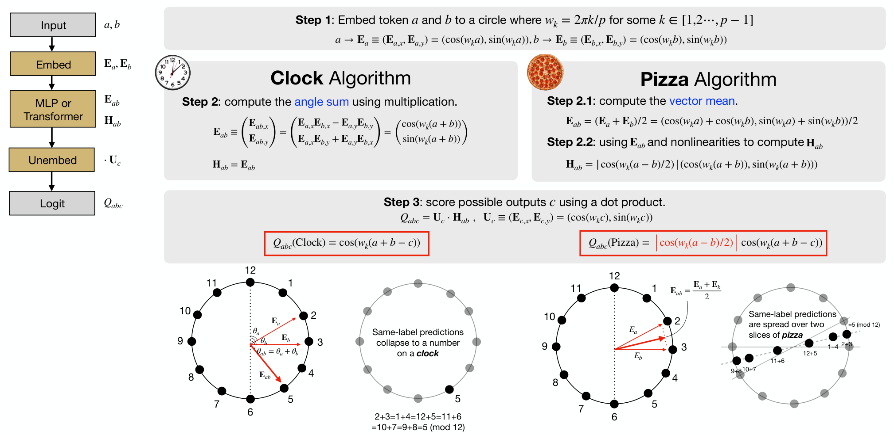

# Алгоритмы Clock и Pizza (Clock vs Pizza)

[Нейронный коллапс](neural-collapse.md) ← предыдущая карточка, следующая → [intrinsic-task-symmetry](intrinsic-task-symmetry.md)

[Индекс карточек понятий](index.md), категория: [2. Механизмы и представления](index.md#cat-2)\
→ Следующая категория: [3. Задачи и наборы данных](modular-arithmetic.md)\
← Предыдущая категория: [1. Явления](grokking.md)

## Определение

**Алгоритмы Clock и Pizza** («Часы» и «Пицца») — два качественно различных
внутренних контура (подсети, реализующей под-алгоритм задачи), к которым
нейросеть сходится, обучаясь [модульному сложению](modular-arithmetic.md) `c = (a + b) mod n`
(остаток от деления суммы на модуль; входы естественно раскладываются по
окружности из `n` точек). Различие введено Zhong et al. (2306.17844, «The
Clock and the Pizza»; в локальном корпусе отсутствует, поэтому идёт без
номерной ссылки) и в доступных работах формулируется так: **Clock** — это
структурное решение на непрерывных [признаках Фурье](fourier-features-circuits.md) (входы кодируются как
точки-корни из единицы на окружности, а сеть складывает их **углы**), тогда
как **Pizza** — фрагментированное, «кусочно-запоминающее» решение, вычисляющее
**среднее векторов** входных вложений на той же окружности
\[[1.1](#ref-1-1)\]. Оба контура доводят модульное сложение до идеальной
генерализации, но реализуют её геометрически по-разному.

## Детализация

Различие Clock/Pizza выросло из [механистической интерпретируемости](mechanistic-interpretability.md)
[грокинга](grokking.md) на модульной арифметике: после долгой [фазы
запоминания](memorization-phase.md) сеть переходит к обобщающему решению,
и это решение оказывается не единственным. В доступном корпусе наиболее
строгое определение обоих контуров даёт McCracken et al.: **Clock** и **Pizza**
различаются механизмом агрегации входов внутри трансформерного блока —
у Clock внимание (attention, механизм взвешивания входов) обучаемое и
складывает **углы** входных векторов, а у Pizza внимание жёстко равномерное
(коэффициент внимания `α = 0`), и блок сводится к усреднению векторов
\[[2.1](#ref-2-1)\]. Zhong et al. показали, что оба контура могут даже
сосуществовать в одной сети \[[2.1](#ref-2-1)\], что делает различие не
свойством задачи, а следствием избыточных степеней свободы архитектуры.

Вокруг этого различия сложились две конкурирующие трактовки. Первая
(Yildirim) относится к Clock/Pizza как к реальному, содержательному
противопоставлению и связывает **Pizza** с запоминанием: избыточные степени
свободы стандартного трансформера (свобода кодировать информацию в норме
вектора и в обучаемой [маршрутизации внимания](attention-routing-heads.md)) открывают «кусочно-запоминающие»
пути решения, которые и затягивают генерализацию, тогда как **Clock** — это
чистое структурное решение на признаках Фурье \[[1.1](#ref-1-1)\]. В этой
логике устранение лишних степеней свободы (жёсткая нормировка остаточного
потока или равномерное внимание) убирает [фазовый
переход](phase-transition.md) грокинга — сеть сразу идёт по «часовому» пути
\[[1.1](#ref-1-1)\]. Вторая трактовка (McCracken et al.) **оспаривает
фундаментальность** различия: Clock и Pizza — не разные алгоритмы, а частные
реализации одного абстрактного алгоритма (приближённой китайской теоремы об
остатках, CRT — разбиения `mod n` на независимые вычисления по взаимно простым
делителям); после перенормировки частот («remapping» — приведения нейронов к
общей частоте заменой переменной) их поведение оказывается качественно
эквивалентным \[[2.1](#ref-2-1)\]. Таким образом, Clock/Pizza — это одновременно
общепринятая иллюстрация неединственности выучиваемого решения и предмет спора о
том, идёт ли речь о двух алгоритмах или об одном.

## Альтернативные определения и нюансы

### A. Clock («Часы»): сложение углов на непрерывных признаках Фурье

Определение через механизм: сеть кодирует входы `a` и `b` как точки на
единичной окружности (признаки Фурье — синус/косинус от `2πa/n`) и после блока
внимания вычисляет **угол суммы** `a + b`, то есть непрерывно «поворачивает»
представление. Ключевой отличительный признак — обучаемое, зависящее от данных
внимание (`α = 1`) и опора на непрерывную фурье-структуру; именно её Yildirim
называет «structured, continuous Fourier solution» и связывает с быстрым, без
задержки, обобщением \[[1.1](#ref-1-1)\].

### B. Pizza («Пицца»): усреднение векторов и кусочная память

Определение через альтернативный механизм: вместо сложения углов блок с
**равномерным** вниманием (`α = 0`) вычисляет **среднее** входных векторов на
окружности; геометрически область решений дробится на «дольки» (отсюда
название), а само решение опирается на кусочное запоминание. Отличительный
источник различия — не задача, а избыточные степени свободы архитектуры (норма
вектора и обучаемая маршрутизация), которые допускают такой фрагментированный
путь; по Yildirim именно наличие Pizza-путей («memorization-heavy solution
pathways») откладывает генерализацию \[[1.1](#ref-1-1)\].

### Оспаривают. Единый абстрактный алгоритм: различие не фундаментально

Оспаривающая трактовка (McCracken et al.): противопоставление Clock/Pizza —
артефакт уровня описания, а не двух разных вычислений. Контролируемый параметр
здесь — частота нейрона: после её нормировки (remapping, Def. 4.2 у авторов)
нейроны MLP, Pizza- и Clock-трансформеров ведут себя одинаково, а обе схемы
трактуются как приближённая реализация китайской теоремы об остатках. Тестируемое
следствие, отличающее эту позицию: Clock и Pizza должны показывать качественную
эквивалентность после перенормировки и мочь сосуществовать в одной сети — что
авторы и демонстрируют \[[2.1](#ref-2-1)\].

## Ссылки

###### ref-1-1
**\[1.1\]** 2603.05228 — Yildirim, «The Geometric Inductive Bias of Grokking:
Bypassing Phase Transitions via Architectural Topology». [`"(the “Pizza” algorithm) rather than the structured, continuous Fourier solution (the “Clock”"`](../papers/2603.05228.the-geometric-inductive-bias-of-grokking-bypassing-phase-transitions-via-architectural-topology/original/2603.05228.the-geometric-inductive-bias-of-grokking-bypassing-phase-transitions-via-architectural-topology.md#p2-2). *«[(алгоритм «пицца») вместо устроенного непрерывного фурье-решения (алгоритм «часы»)](../papers/2603.05228.the-geometric-inductive-bias-of-grokking-bypassing-phase-transitions-via-architectural-topology/2603.05228.the-geometric-inductive-bias-of-grokking-bypassing-phase-transitions-via-architectural-topology.card.md#p2-2)»*\
Доп.: [`"Zhong et al. (2023) identified two qualitatively distinct solutions: a structured “Clock” algorithm using continuous Fourier features and a fragmented “Pizza” algorithm relying on piecewise memorization"`](../papers/2603.05228.the-geometric-inductive-bias-of-grokking-bypassing-phase-transitions-via-architectural-topology/original/2603.05228.the-geometric-inductive-bias-of-grokking-bypassing-phase-transitions-via-architectural-topology.md#p3-3) — *«[Zhong et al. (2023) выделили два качественно различных решения: устроенный алгоритм «часы», пользующийся непрерывными фурье-признаками, и раздробленный алгоритм «пицца», опирающийся на кусочное запоминание](../papers/2603.05228.the-geometric-inductive-bias-of-grokking-bypassing-phase-transitions-via-architectural-topology/2603.05228.the-geometric-inductive-bias-of-grokking-bypassing-phase-transitions-via-architectural-topology.card.md#p3-3)»*;
[`"memorization-heavy solution pathways that delay the emergence of invariant representations"`](../papers/2603.05228.the-geometric-inductive-bias-of-grokking-bypassing-phase-transitions-via-architectural-topology/original/2603.05228.the-geometric-inductive-bias-of-grokking-bypassing-phase-transitions-via-architectural-topology.md#p2-2) —
*«[пути решения, тяготеющие к запоминанию и откладывающие возникновение инвариантных представлений](../papers/2603.05228.the-geometric-inductive-bias-of-grokking-bypassing-phase-transitions-via-architectural-topology/2603.05228.the-geometric-inductive-bias-of-grokking-bypassing-phase-transitions-via-architectural-topology.card.md#p2-2)»*.

###### ref-1-2
**\[1.2\]** 2306.17844 — Zhong et al. 2023, «The Clock and the Pizza: Two Stories in Mechanistic Explanation of Neural Networks». Первоисточник различия: вводит оба имени и обе схемы. Нюанс: обе схемы круговые и фурье-устроенные, различаются требуемой нелинейностью, а не «структурностью против запоминания». [`"the *Pizza* algorithm operates *inside* the circle formed by embeddings (just as pepperoni are spread all over a pizza), instead of operating on the circumference of the circle"`](../papers/2306.17844.the-clock-and-the-pizza-two-stories-in-mechanistic-explanation-of-neural-networks/original/2306.17844.the-clock-and-the-pizza-two-stories-in-mechanistic-explanation-of-neural-networks.md#p4-2). *«[алгоритм *Pizza* действует *внутри* окружности, образованной вложениями (ровно как пепперони разложены по всей пицце), а не на самой окружности](../papers/2306.17844.the-clock-and-the-pizza-two-stories-in-mechanistic-explanation-of-neural-networks/2306.17844.the-clock-and-the-pizza-two-stories-in-mechanistic-explanation-of-neural-networks.card.md#p4-2)»*\
Доп.: [`"*Clock* requires multiplication of inputs in Step 2, while *Pizza* requires only absolute value computation, which is easily implemented by the ReLU layers"`](../papers/2306.17844.the-clock-and-the-pizza-two-stories-in-mechanistic-explanation-of-neural-networks/original/2306.17844.the-clock-and-the-pizza-two-stories-in-mechanistic-explanation-of-neural-networks.md#p4-3) — *«[*Clock* требует умножения входов на шаге 2, тогда как *Pizza* требует лишь вычисления абсолютной величины, которое легко осуществимо слоями ReLU](../papers/2306.17844.the-clock-and-the-pizza-two-stories-in-mechanistic-explanation-of-neural-networks/2306.17844.the-clock-and-the-pizza-two-stories-in-mechanistic-explanation-of-neural-networks.card.md#p4-3)»*; [`"both clock and pizza give perfect accuracy, but arrive at answers via different interal computations"`](../papers/2306.17844.the-clock-and-the-pizza-two-stories-in-mechanistic-explanation-of-neural-networks/original/2306.17844.the-clock-and-the-pizza-two-stories-in-mechanistic-explanation-of-neural-networks.md#p9-4) — *«[и часы, и пицца дают идеальную точность, но приходят к ответам через разные внутренние вычисления](../papers/2306.17844.the-clock-and-the-pizza-two-stories-in-mechanistic-explanation-of-neural-networks/2306.17844.the-clock-and-the-pizza-two-stories-in-mechanistic-explanation-of-neural-networks.card.md#p9-4)»*.
## Ссылки на присоединившиеся работы

### Оспаривают

###### ref-2-1
**\[2.1\]** 2505.18266 — McCracken et al. 2025, «Uncovering a Universal Abstract Algorithm for Modular Addition in Neural Networks». Оспаривает основательность различия: часы и пицца суть воплощения одного отвлечённого действия (приближённой CRT), а не разные действия. [`"unified under a common abstract algorithm. While prior work interpreted variations in neuron-level representations as evidence for distinct algorithms"`](../papers/2505.18266.uncovering-a-universal-abstract-algorithm-for-modular-addition-in-neural-networks/original/2505.18266.uncovering-a-universal-abstract-algorithm-for-modular-addition-in-neural-networks.md#p1-2). *«[объединены общим отвлечённым действием. Тогда как прежние работы истолковывали разницу в представлениях на уровне нейронов как свидетельство разных действий](../papers/2505.18266.uncovering-a-universal-abstract-algorithm-for-modular-addition-in-neural-networks/2505.18266.uncovering-a-universal-abstract-algorithm-for-modular-addition-in-neural-networks.card.md#p1-2)»*\
Доп.: [`"pizza and clock show qualitative equivalence after remapping"`](../papers/2505.18266.uncovering-a-universal-abstract-algorithm-for-modular-addition-in-neural-networks/original/2505.18266.uncovering-a-universal-abstract-algorithm-for-modular-addition-in-neural-networks.md#fig-1) — *«[пиццы и часов показывают качественную равнозначность после перекладки](../papers/2505.18266.uncovering-a-universal-abstract-algorithm-for-modular-addition-in-neural-networks/2505.18266.uncovering-a-universal-abstract-algorithm-for-modular-addition-in-neural-networks.card.md#fig-1)»*; [`"They introduced the *Pizza* circuit, which contrasted with [4]’s clock."`](../papers/2505.18266.uncovering-a-universal-abstract-algorithm-for-modular-addition-in-neural-networks/original/2505.18266.uncovering-a-universal-abstract-algorithm-for-modular-addition-in-neural-networks.md#p2-4) — *«[Они ввели контур *пиццы*, противопоставленный *часам* из [4]](../papers/2505.18266.uncovering-a-universal-abstract-algorithm-for-modular-addition-in-neural-networks/2505.18266.uncovering-a-universal-abstract-algorithm-for-modular-addition-in-neural-networks.card.md#p2-4)»*; [`"both clock and pizza circuits could coexist within the same network simultaneously"`](../papers/2505.18266.uncovering-a-universal-abstract-algorithm-for-modular-addition-in-neural-networks/original/2505.18266.uncovering-a-universal-abstract-algorithm-for-modular-addition-in-neural-networks.md#p2-4) — *«[контуры часов и пиццы могут сосуществовать в одной и той же сети одновременно](../papers/2505.18266.uncovering-a-universal-abstract-algorithm-for-modular-addition-in-neural-networks/2505.18266.uncovering-a-universal-abstract-algorithm-for-modular-addition-in-neural-networks.card.md#p2-4)»*.

## Цитирования

Работы, лишь упоминающие различие (обзор литературы, связанные работы, попутное
цитирование) без его подробного разбора.

**\[4.1\]** 2510.04930 — Saheb Pasand et al., «Egalitarian Gradient Descent: A
Simple Approach to Accelerated Grokking». [`"Notably, Zhong et al. (2023) identify complementary algorithmic mechanisms (“clock” and “pizza”) and circular embeddings that emerge at the grokking transition"`](../papers/2510.04930.egalitarian-gradient-descent-a-simple-approach-to-accelerated-grokking/original/2510.04930.egalitarian-gradient-descent-a-simple-approach-to-accelerated-grokking.md#p3-2). *«[Примечательно, что Zhong et al. (2023) указывают дополняющие друг друга алгоритмические устройства («часы» и «пицца») и круговые вложения, возникающие при переходе гроккинга](../papers/2510.04930.egalitarian-gradient-descent-a-simple-approach-to-accelerated-grokking/2510.04930.egalitarian-gradient-descent-a-simple-approach-to-accelerated-grokking.card.md#p3-2)»*

**\[4.2\]** 2602.16746 — Xu, «Low-Dimensional and Transversely Curved
Optimization Dynamics in Grokking». [`"Zhong et al. (2024) described clock and pizza representations in modular addition"`](../papers/2602.16746.low-dimensional-and-transversely-curved-optimization-dynamics-in-grokking/original/2602.16746.low-dimensional-and-transversely-curved-optimization-dynamics-in-grokking.md#p20-4). *«[Zhong et al. (2024) описали представления «часы» и «пицца» в модульном сложении](../papers/2602.16746.low-dimensional-and-transversely-curved-optimization-dynamics-in-grokking/2602.16746.low-dimensional-and-transversely-curved-optimization-dynamics-in-grokking.card.md#p20-4)»*

**\[4.3\]** 2603.15492 — Acharya et al., «Grokking as a Variance-Limited Phase
Transition». [`"These studies map the topology of the solution (e.g., the “Clock Circuit”) but lack a kinetic mechanism to explain the timescale of the transition"`](../papers/2603.15492.grokking-as-a-variance-limited-phase-transition-spectral-gating-and-the-epsilon-stability-threshold/original/2603.15492.grokking-as-a-variance-limited-phase-transition-spectral-gating-and-the-epsilon-stability-threshold.md#p1-7). *«[Эти работы описывают топологию решения (скажем, «контур-часы»), но кинетического объяснения сроков перехода не дают](../papers/2603.15492.grokking-as-a-variance-limited-phase-transition-spectral-gating-and-the-epsilon-stability-threshold/2603.15492.grokking-as-a-variance-limited-phase-transition-spectral-gating-and-the-epsilon-stability-threshold.card.md#p1-7)»*

**\[4.4\]** 2604.06256 — Xu, «Spectral Edge Dynamics Reveal Functional Modes of Learning». Нюанс: упоминание без разбора; год сдвинут. [`"Zhong et al. 2024 described clock and pizza representations in this setting."`](../papers/2604.06256.spectral-edge-dynamics-reveal-functional-modes-of-learning/original/2604.06256.spectral-edge-dynamics-reveal-functional-modes-of-learning.md#p14-7). *«[Zhong et al. 2024 описали представления часов и пиццы в этой постановке.](../papers/2604.06256.spectral-edge-dynamics-reveal-functional-modes-of-learning/2604.06256.spectral-edge-dynamics-reveal-functional-modes-of-learning.card.md#p14-7)»*

**\[4.5\]** 2602.06702 — Singh, Misra, Orvieto, «Explaining Grokking in Transformers…». Zhong et al. привлечены как довод о неединственности решения: (54) [`"find that this solution is not unique, and show that transformers can learn the “pizza” algorithm"`](../papers/2602.06702.explaining-grokking-in-transformers-through-the-lens-of-inductive-bias/2602.06702.explaining-grokking-in-transformers-through-the-lens-of-inductive-bias.card.md#p12-3). *«[находят, что это решение не единственно, и показывают, что трансформеры могут выучивать алгоритм «пиццы»](../papers/2602.06702.explaining-grokking-in-transformers-through-the-lens-of-inductive-bias/2602.06702.explaining-grokking-in-transformers-through-the-lens-of-inductive-bias.card.md#p12-3)»* В соседнем предложении того же абзаца результат Zhong et al. о фазовых переходах отнесён к другой работе — разбор в разделе «Ошибочные цитирования» карточки, якорь `mc-2306-17844`.

**\[4.6\]** 2606.12966 — Sivasankar, «Circuit Synchronization Precedes Generalization: A Causal Precursor to Grokking». [`"small hyperparameter changes induce qualitatively different procedures (a “clock” and a “pizza” algorithm), both Fourier-based"`](../papers/2606.12966.circuit-synchronization-precedes-generalization-a-causal-precursor-to-grokking/2606.12966.circuit-synchronization-precedes-generalization-a-causal-precursor-to-grokking.card.md#p16-3). *«[малые изменения гиперпараметров вызывают качественно различные процедуры (алгоритмы «часов» и «пиццы»), обе на основе Фурье](../papers/2606.12966.circuit-synchronization-precedes-generalization-a-causal-precursor-to-grokking/2606.12966.circuit-synchronization-precedes-generalization-a-causal-precursor-to-grokking.card.md#p16-3)»*
