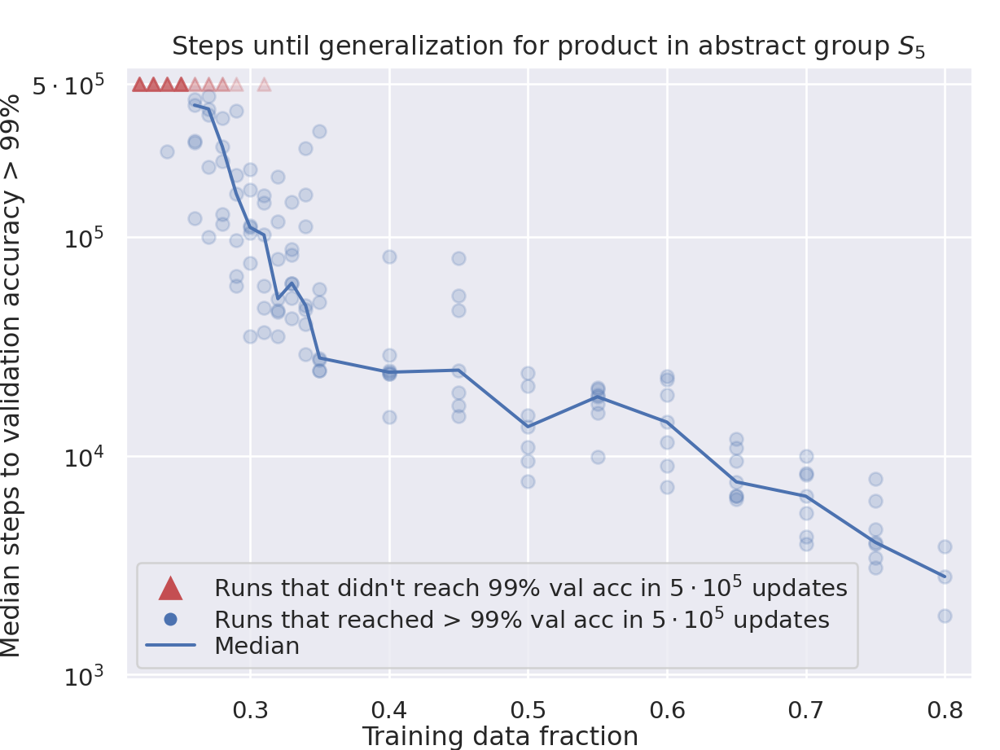

# Доля данных / критический размер набора (data fraction / critical dataset size)

[Weight decay / L2-регуляризация](weight-decay.md) ← предыдущая карточка, следующая → [Оптимизатор](optimizer-adam-adamw-sgd.md)

[Индекс карточек понятий](index.md), категория: [4. Факторы обучения и оптимизации](index.md#cat-4)\
→ Следующая категория: [5. Интервенции и методы](gradient-low-pass-filtering.md)\
← Предыдущая категория: [3. Задачи и наборы данных](modular-arithmetic.md)

## Определение

**Критический размер набора** (critical dataset size, Dcrit) — объём обучающей
выборки, разделяющий два режима поведения: если данных больше Dcrit, сеть в конце
концов обобщает ([грокает](grokking.md)), а если меньше — остаётся на
[запоминании](memorization-phase.md). Тот же порог удобно выражать через **долю
данных** (data fraction) — часть всех допустимых примеров задачи, отданную в
обучение (в коде часто параметр `TRAIN_FRAC`). Эмпирически зависимость грокинга
от размера набора впервые отмечена Power et al. (2022): меньшие наборы требуют
больше шагов оптимизации до генерализации \[[1.1](#ref-1-1)\]. Она формализована
как «критический размер обучающего набора» в [эффективной теории](effective-theory-statistical-mechanics.md) репрезентаций
Liu et al. (2022) \[[1.2](#ref-1-2)\] и названа критическим размером Dcrit в
теории [эффективности контуров](circuit-efficiency.md) Varma et al. (2023) \[[1.3](#ref-1-3)\].

## Детализация

Каноничный механизм — **эффективность контуров** (circuit efficiency; контур —
подсеть, реализующая некоторую функцию): по Varma et al. запоминающий контур
(хранящий отдельные примеры) становится тем **менее эффективным**, чем больше
обучающий набор, тогда как обобщающий контур (реализующий общий алгоритм задачи)
сохраняет эффективность независимо от размера данных. Отсюда существует точка
кроссовера — критический размер Dcrit, при котором оба контура равно эффективны
\[[1.3](#ref-1-3)\]. Этот порог задаёт целое семейство поведений. Если грокнутую
сеть дообучать на наборе заметно **меньше** Dcrit, запоминание снова выгоднее, и
сеть регрессирует к плохой тестовой точности — это [унгрокинг](ungrokking.md);
если же взять размер **ровно около** Dcrit, [фазовый переход](phase-transition.md)
всё же наступает, но выводит лишь на промежуточную точность —
[semi-grokking](semi-grokking.md) \[[1.3](#ref-1-3)\]. Huang et al. независимо
воспроизводят Dcrit в рамке конкуренции контуров, определяя его как узкий
диапазон, внутри которого эффективности сравнимы, а за которым грокинг вероятен
\[[3.1](#ref-3-1)\]; та же работа связывает критический размер с общим взглядом
на грокинг, [двойной спуск](double-descent.md) и [эмерджентные
способности](emergence.md).

Эффективная теория Liu et al. даёт независимую трактовку того же порога:
критический размер — это **наименьший** объём данных, достаточный, чтобы
однозначно задать «правильную» структурированную репрезентацию задачи
\[[1.2](#ref-1-2)\]; Gromov выводит критический объём данных из динамической
модели как условие «относительно быстрого» грокинга \[[3.4](#ref-3-4)\], а Kumar
et al. формулируют его как **окно**: данных должно быть достаточно много, чтобы
обобщение вообще стало возможным, но не настолько, чтобы обучающая и тестовая
потери совпадали с самого начала (переход из «ленивого» режима без обучения
признаков в «богатый» — [lazy-to-rich](lazy-to-rich-kernel-to-feature-learning.md)) \[[3.5](#ref-3-5)\]. Практически ниже порога
грокинг просто **ненаблюдаем**: Singh et al. изучают режимы дефицита данных, где
число обучающих примеров падает ниже критического, и показывают, что дистилляция
может индуцировать грокинг даже там \[[3.2](#ref-3-2)\]. Зависимость подтверждается
и в статистико-физических постановках: в модели Изинга задержка грокинга растёт по
мере уменьшения размера набора \[[3.6](#ref-3-6)\], а разрежённое подвыборивание
данных воспроизводит каноническую кривую грокинга \[[3.7](#ref-3-7)\].

Ряд работ, однако, **оспаривает** первичность именно размера. Wang et al. на
задачах неявного рассуждения обнаруживают, что скорость грокинга определяется
**отношением** выводимых и атомарных фактов в обучении и почти не зависит от
абсолютного объёма данных; отсюда предлагается замена «критического размера» на
**критическое распределение** данных \[[2.1](#ref-2-1)\]. He et al. в той же
линии делают отношение (inferred/atomic ratio) главным управляющим параметром
скорости грокинга \[[2.2](#ref-2-2)\]. Таким образом, современная картина
удерживает два конкурирующих управляющих параметра — **сколько** данных (Dcrit,
доля) и **какие/в какой пропорции** данные (критическое распределение).

## Альтернативные определения и нюансы

### A. Наименьший объём, задающий репрезентацию (эффективная теория, Liu)

Определение через выразимость структуры: критический размер — это минимальное
число обучающих примеров, которого хватает, чтобы однозначно (с точностью до
линейных преобразований) зафиксировать целевую структурированную репрезентацию
задачи \[[1.2](#ref-1-2)\]. Источник различия: порог здесь — свойство **задачи и
её репрезентации** (информационная достаточность выборки), а не динамики обучения.

### B. Кроссовер эффективности контуров Dcrit (Varma)

Определение через два конкурирующих контура: Dcrit — размер набора, при котором
запоминающий и обобщающий контуры одинаково эффективны; выше него побеждает
обобщение, ниже — запоминание \[[1.3](#ref-1-3)\]. Источник различия: управляющий
параметр — размер данных, но порог задаётся **относительной эффективностью
подсетей** (при обязательном [weight decay](weight-decay.md) — L2-штрафе на нормы весов), а не
информационной достаточностью. К этой трактовке присоединяется Huang et al.,
помещая Dcrit в рамку конкуренции контуров \[[3.1](#ref-3-1)\].

### C. Доля данных как управляемый параметр эксперимента (data fraction)

Операциональное определение: вместо абсолютного объёма фиксируют **долю**
`TRAIN_FRAC` всех допустимых примеров, отданную в обучение, и через неё
регулируют наступление и задержку грокинга \[[3.8](#ref-3-8)\]. Источник различия:
это не теоретический порог, а прямой экспериментальный рычаг; критический размер
проявляется как значение доли, ниже которого генерализация не наступает.

Самое прямое измерение этого рычага — у Nanda et al. \[[1.6](#ref-1-6)\]:
на каноническом полигоне ($P=113$) гроккинг существует только при 30–50 %
данных — выше генерализация немедленна, ниже её нет и за 40 тысяч эпох.
Окно при этом задаётся не одной долей: при $P=53$ оно открывается лишь
после усиления [weight decay](weight-decay.md) до $\lambda=5$, а при
$P=401$ его нет вовсе — ни при одном из шести значений $\lambda$ модель
либо обобщает сразу, либо переобучается \[[1.6](#ref-1-6)\]. Это
единственный ранний null-результат на большом модуле в литературе.

### Оспаривают

Что решает грокинг — **размер** или **распределение** данных. Wang et al.
показывают, что скорость обобщения зависит от отношения выводимых и атомарных
фактов, а не от абсолютного размера, и предлагают говорить о **критическом
распределении** вместо критического размера \[[2.1](#ref-2-1)\]. He et al.
присоединяются, делая это отношение (inferred/atomic ratio) первичным
детерминантом скорости грокинга \[[2.2](#ref-2-2)\]. Источник различия:
управляющий параметр смещается с кардинальности выборки на её **состав/пропорцию
классов примеров**. Корень этой ветки старше, чем её работы: ещё в 2023
Громов двумя предложениями проговорил, что критическая доля зависит от
способа отбора примеров и что направленный выбор её снизит, — предвидение
без эксперимента \[[3.4](#ref-3-4)\].

### Поддерживают

Присоединяются к тому, что порог задаётся именно размером/долей данных:
эффективность контуров у критического размера (Huang, \[[3.1](#ref-3-1)\]);
ненаблюдаемость грокинга ниже критического порога (Singh, \[[3.2](#ref-3-2)\]);
зависимость от размера как «многих аспектов» через LU-механизм — рассогласование
ландшафтов обучающей и тестовой потерь (Omnigrok, \[[3.3](#ref-3-3)\]);
критический объём как условие быстрого грокинга (Gromov, \[[3.4](#ref-3-4)\]);
размер-окно между «ленивым» и «богатым» режимами (Kumar, \[[3.5](#ref-3-5)\]);
рост задержки при уменьшении набора в модели Изинга (Hutchison,
\[[3.6](#ref-3-6)\]); воспроизведение кривой грокинга разрежённым подвыбориванием
(Ersoy, \[[3.7](#ref-3-7)\]); доля данных `TRAIN_FRAC` как прямой управляющий
рычаг грокинга (Salah, \[[3.8](#ref-3-8)\]); отношение выведенных фактов к
атомарным вместо абсолютного объёма, оказавшееся у настоящего корпуса на порядок
ниже порога (Abramov, \[[3.9](#ref-3-9)\]).

## Ссылки

###### ref-1-1
**\[1.1\]** 2201.02177 — Power et al., «Grokking: Generalization Beyond
Overfitting on Small Algorithmic Datasets». [`"smaller datasets require increasing amounts of optimization for generalization"`](../papers/2201.02177.grokking-generalization-beyond-overfitting-on-small-algorithmic-datasets/2201.02177.grokking-generalization-beyond-overfitting-on-small-algorithmic-datasets.card.md#p1-4). *«[меньшим наборам данных требуется всё больший объём оптимизации для генерализации](../papers/2201.02177.grokking-generalization-beyond-overfitting-on-small-algorithmic-datasets/2201.02177.grokking-generalization-beyond-overfitting-on-small-algorithmic-datasets.card.md#p1-4)»*

###### ref-1-2
**\[1.2\]** 2205.10343 — Liu et al., «Towards Understanding Grokking: An Effective
Theory of Representation Learning». [`"The critical training set size corresponds to the least amount of training data that can determine such a representation"`](../papers/2205.10343.towards-understanding-grokking-an-effective-theory-of-representation-learning/original/2205.10343.towards-understanding-grokking-an-effective-theory-of-representation-learning.md#p1-6). *«[критический размер обучающей выборки соответствует наименьшему количеству обучающих данных, которого достаточно, чтобы определить такое представление](../papers/2205.10343.towards-understanding-grokking-an-effective-theory-of-representation-learning/2205.10343.towards-understanding-grokking-an-effective-theory-of-representation-learning.card.md#p1-6)»*

###### ref-1-3
**\[1.3\]** 2309.02390 — Varma et al., «Explaining Grokking Through Circuit
Efficiency». [`"which we call the critical dataset size"`](../papers/2309.02390.explaining-grokking-through-circuit-efficiency/2309.02390.explaining-grokking-through-circuit-efficiency.card.md#p2-1). *«[мы называем её критическим размером набора данных](../papers/2309.02390.explaining-grokking-through-circuit-efficiency/2309.02390.explaining-grokking-through-circuit-efficiency.card.md#p2-1)»*

###### ref-1-4
**\[1.4\]** 2401.10463 — Zhu et al. 2024, «Critical Data Size of Language Models from a Grokking Perspective». Нюанс: критический размер определён операционально — наименьшее $n$, дающее почти полное запоминание и сошедшуюся тестовую точность; опознаётся по пику числа шагов до генерализации на кривой «доля данных → шаги» и измеряется задним числом полным перебором долей, а не предсказывается. [`"the *Critical Data Size* denotes the minimum number of samples $n$ required to achieve approximately 100% training accuracy on $S_{train}$ and a converged test accuracy $\epsilon$ on $S_{test}$"`](../papers/2401.10463.critical-data-size-of-language-models-from-a-grokking-perspective/2401.10463.critical-data-size-of-language-models-from-a-grokking-perspective.card.md#p3-2). *«[*критический размер данных* обозначает наименьшее число примеров $n$, требуемое для достижения примерно 100 % обучающей точности на $S_{train}$ и сошедшейся тестовой точности $\epsilon$ на $S_{test}$](../papers/2401.10463.critical-data-size-of-language-models-from-a-grokking-perspective/2401.10463.critical-data-size-of-language-models-from-a-grokking-perspective.card.md#p3-2)»*\
Доп. (авторское размежевание с Varma): [`"However, the phenomenon they explain and the settings are completely different from ours."`](../papers/2401.10463.critical-data-size-of-language-models-from-a-grokking-perspective/2401.10463.critical-data-size-of-language-models-from-a-grokking-perspective.card.md#p12-2) — *«[Однако явление, которое они объясняют, и постановки полностью отличны от наших.](../papers/2401.10463.critical-data-size-of-language-models-from-a-grokking-perspective/2401.10463.critical-data-size-of-language-models-from-a-grokking-perspective.card.md#p12-2)»*\
Доп. (неформальность): [`"Our hypothesis is informal, as it depends on prior knowledge of the model’s optimal performance $\epsilon$ and the current dataset distribution $\mathcal{D}$."`](../papers/2401.10463.critical-data-size-of-language-models-from-a-grokking-perspective/2401.10463.critical-data-size-of-language-models-from-a-grokking-perspective.card.md#p3-9) — *«[Наша гипотеза неформальна, поскольку она опирается на предварительное знание оптимального качества модели $\epsilon$ и текущего распределения набора $\mathcal{D}$.](../papers/2401.10463.critical-data-size-of-language-models-from-a-grokking-perspective/2401.10463.critical-data-size-of-language-models-from-a-grokking-perspective.card.md#p3-9)»*

###### ref-1-5
**\[1.5\]** 2310.16441 — Levi et al. 2023. Нюанс: порог задан не объёмом набора, а отношением размерности к объёму; разделение выведено, а не измерено, и оно строгое — при $\lambda>1$ совершенное обобщение невозможно вовсе. Оговорка: расходимость при $\lambda\to 1$ есть утверждение о пределе больших $d_{\mathrm{in}},N_{\mathrm{tr}}$, тогда как все опыты идут при одном $d_{\mathrm{in}}=10^{3}$. [`"The grokking time is mainly determined by a single parameter, the ratio between input dimension and number of training samples $\lambda=d_{\mathrm{in}}/N_{\mathrm{tr}}$"`](../papers/2310.16441.grokking-in-linear-estimators-a-solvable-model-that-groks-without-understanding/original/2310.16441.grokking-in-linear-estimators-a-solvable-model-that-groks-without-understanding.md#p2-1). *«[Время гроккинга определяется в основном одним параметром — отношением входной размерности к числу обучающих образцов $\lambda=d_{\mathrm{in}}/N_{\mathrm{tr}}$](../papers/2310.16441.grokking-in-linear-estimators-a-solvable-model-that-groks-without-understanding/2310.16441.grokking-in-linear-estimators-a-solvable-model-that-groks-without-understanding.card.md#p2-1)»*\
Доп. (что стоит по обе стороны от единицы): [`"When $d_{\mathrm{out}}=1$, the two regimes correspond directly to underparameterization ($\lambda<1$) and overparameterization ($\lambda>1$)"`](../papers/2310.16441.grokking-in-linear-estimators-a-solvable-model-that-groks-without-understanding/original/2310.16441.grokking-in-linear-estimators-a-solvable-model-that-groks-without-understanding.md#p5-1) — *«[При $d_{\mathrm{out}}=1$ два режима отвечают прямо недоопределённости ($\lambda<1$) и переопределённости ($\lambda>1$)](../papers/2310.16441.grokking-in-linear-estimators-a-solvable-model-that-groks-without-understanding/2310.16441.grokking-in-linear-estimators-a-solvable-model-that-groks-without-understanding.card.md#p5-1)»*
###### ref-1-6
**\[1.6\]** 2301.05217 — Nanda et al., «Progress Measures for Grokking via Mechanistic Interpretability». Прямое измерение окна по доле данных на каноническом полигоне ($P=113$) и единственный ранний null-результат на большом модуле: при $P=401$ окна гроккинга нет вовсе. [`"Grokking occurs when between $30-50\%$ of the dataset is used during training and lower fractions of data lead to slower grokking. Using $\geq 60\%$ data leads to immediate generalization, while using $10\%$ or $20\%$ of the data doesn’t lead to grokking even after 40k epochs"`](../papers/2301.05217.progress-measures-for-grokking-via-mechanistic-interpretability/2301.05217.progress-measures-for-grokking-via-mechanistic-interpretability.card.md#fig-20). *«[Гроккинг возникает, когда при обучении используется $30-50\%$ набора данных, причём меньшие доли данных ведут к более медленному гроккингу. Использование $\geq 60\%$ данных приводит к немедленной генерализации, тогда как при $10\%$ или $20\%$ данных гроккинг не наступает даже после 40 тысяч эпох](../papers/2301.05217.progress-measures-for-grokking-via-mechanistic-interpretability/2301.05217.progress-measures-for-grokking-via-mechanistic-interpretability.card.md#fig-20)»*\
Доп. (окно зависит и от weight decay, $P=53$): [`"With the original weight decay setting of $\lambda=1$, we found that the models never generalized. However, increasing the weight decay to $\lambda=5$ does allow the model to grok"`](../papers/2301.05217.progress-measures-for-grokking-via-mechanistic-interpretability/2301.05217.progress-measures-for-grokking-via-mechanistic-interpretability.card.md#p22-5) — *«[При исходной настройке weight decay $\lambda=1$ мы обнаружили, что модели вообще не обобщали. Однако увеличение weight decay до $\lambda=5$ действительно позволяет модели грокнуть](../papers/2301.05217.progress-measures-for-grokking-via-mechanistic-interpretability/2301.05217.progress-measures-for-grokking-via-mechanistic-interpretability.card.md#p22-5)»*.\
Доп. (null-результат на большом модуле): [`"For $P=401$ (Figure 25), we could not get grokking, even by varying the weight decay parameter $\lambda\in\{0.3,0.5,1,3,5,8\}$. Instead, the model immediately learns the generalizing solution"`](../papers/2301.05217.progress-measures-for-grokking-via-mechanistic-interpretability/2301.05217.progress-measures-for-grokking-via-mechanistic-interpretability.card.md#p22-7) — *«[Для $P=401$ (рисунок 25) добиться гроккинга нам не удалось даже при переборе параметра weight decay $\lambda\in\{0.3,0.5,1,3,5,8\}$. Вместо этого модель сразу выучивает обобщающее решение](../papers/2301.05217.progress-measures-for-grokking-via-mechanistic-interpretability/2301.05217.progress-measures-for-grokking-via-mechanistic-interpretability.card.md#p22-7)»*.

## Ссылки на присоединившиеся работы

### Оспаривают

###### ref-2-1
**\[2.1\]** 2405.15071 — Wang et al., «Grokked Transformers are Implicit
Reasoners: A Mechanistic Journey to the Edge of Generalization». Оспаривает:
характеристики грокинга задаёт не критический размер, а критическое
распределение данных. [`"a correction of prior explanations of grokking based on critical data size"`](../papers/2405.15071.grokked-transformers-are-implicit-reasoners/2405.15071.grokked-transformers-are-implicit-reasoners.card.md#p2-2). *«[поправка к прежним объяснениям гроккинга, опирающимся на *критический размер данных*](../papers/2405.15071.grokked-transformers-are-implicit-reasoners/2405.15071.grokked-transformers-are-implicit-reasoners.card.md#p2-2)»*\
Доп.: [`"it should instead be the critical data distribution that decides the characteristics of grokking"`](../papers/2405.15071.grokked-transformers-are-implicit-reasoners/2405.15071.grokked-transformers-are-implicit-reasoners.card.md#p2-2) — *«[характеристики гроккинга должно определять вместо него *критическое распределение данных*](../papers/2405.15071.grokked-transformers-are-implicit-reasoners/2405.15071.grokked-transformers-are-implicit-reasoners.card.md#p2-2)»*.

###### ref-2-2
**\[2.2\]** 2601.09049 — He et al., «Is Grokking Worthwhile? Functional Analysis
and Transferability of Generalization Circuits». Оспаривает: первичный
детерминант скорости грокинга — отношение выводимых к атомарным фактам, а не
абсолютный размер. [`"serves as the primary determinant for the speed of grokking"`](../papers/2601.09049.is-grokking-worthwhile-functional-analysis-and-transferability-of-generalization-circuits-in-transformers/original/2601.09049.is-grokking-worthwhile-functional-analysis-and-transferability-of-generalization-circuits-in-transformers.md#p9-6). *«[служит главным определителем скорости гроккинга](../papers/2601.09049.is-grokking-worthwhile-functional-analysis-and-transferability-of-generalization-circuits-in-transformers/2601.09049.is-grokking-worthwhile-functional-analysis-and-transferability-of-generalization-circuits-in-transformers.card.md#p9-6)»*\
Доп.: [`"which data distributions favor circuit formation over pattern memorization"`](../papers/2601.09049.is-grokking-worthwhile-functional-analysis-and-transferability-of-generalization-circuits-in-transformers/original/2601.09049.is-grokking-worthwhile-functional-analysis-and-transferability-of-generalization-circuits-in-transformers.md#p5-2) — *«[какие распределения данных благоприятствуют складыванию контура, а какие — запоминанию образцов](../papers/2601.09049.is-grokking-worthwhile-functional-analysis-and-transferability-of-generalization-circuits-in-transformers/2601.09049.is-grokking-worthwhile-functional-analysis-and-transferability-of-generalization-circuits-in-transformers.card.md#p5-2)»*.

### Поддерживают

###### ref-3-1
**\[3.1\]** 2402.15175 — Huang et al., «Unified View of Grokking, Double Descent
and Emergent Abilities: A Perspective from Circuits Competition». Нюанс:
критический размер как диапазон равной эффективности контуров. [`"established a critical dataset size Dcrit, a specific range within which memorization and generalization circuits exhibit comparable efficiency, and beyond which grokking is likely to occur"`](../papers/2402.15175.unified-view-of-grokking-double-descent-and-emergent-abilities/original/2402.15175.unified-view-of-grokking-double-descent-and-emergent-abilities.md#p1-4). *«[ввели критический размер набора данных $D_{crit}$ — тот диапазон, в котором запоминающие и обобщающие контуры сопоставимы по эффективности и за которым вероятен гроккинг](../papers/2402.15175.unified-view-of-grokking-double-descent-and-emergent-abilities/2402.15175.unified-view-of-grokking-double-descent-and-emergent-abilities.card.md#p1-4)»*

###### ref-3-2
**\[3.2\]** 2511.04760 — Singh et al., «When Data Falls Short: Grokking Below the
Critical Threshold». Нюанс: ниже критического порога грокинг ненаблюдаем. [`"the number of training samples falls below the critical threshold, making grokking unobservable"`](../papers/2511.04760.when-data-falls-short-grokking-below-the-critical-threshold/original/2511.04760.when-data-falls-short-grokking-below-the-critical-threshold.md#p1-3). *«[число обучающих примеров падает ниже критического порога, отчего гроккинг становится ненаблюдаем](../papers/2511.04760.when-data-falls-short-grokking-below-the-critical-threshold/2511.04760.when-data-falls-short-grokking-below-the-critical-threshold.card.md#p1-3)»*

###### ref-3-3
**\[3.3\]** 2210.01117 — Liu et al., «Omnigrok: Grokking Beyond Algorithmic
Data». Нюанс: зависимость от размера данных объясняется рассогласованием
ландшафтов обучающей и тестовой потерь (LU-механизм). [`"can nicely explain many aspects of grokking: data size dependence"`](../papers/2210.01117.omnigrok-grokking-beyond-algorithmic-data/original/2210.01117.omnigrok-grokking-beyond-algorithmic-data.md#p1-3). *«[способен изящно объяснить многие стороны гроккинга: зависимость от размера данных](../papers/2210.01117.omnigrok-grokking-beyond-algorithmic-data/2210.01117.omnigrok-grokking-beyond-algorithmic-data.card.md#p1-3)»*

###### ref-3-4
**\[3.4\]** 2301.02679 — Gromov, «Grokking modular arithmetic». Нюанс:
критический объём данных как условие относительно быстрого грокинга. [`"This model indeed leads to some quantitative predictions such as the critical amount of data needed for grokking to happen relatively fast"`](../papers/2301.02679.grokking-modular-arithmetic/2301.02679.grokking-modular-arithmetic.card.md#p1-6). *«[Эта модель действительно приводит к некоторым количественным предсказаниям — например, к критическому объёму данных, необходимому, чтобы гроккинг произошёл сравнительно быстро](../papers/2301.02679.grokking-modular-arithmetic/2301.02679.grokking-modular-arithmetic.card.md#p1-6)»*\
Доп. (зависимость критической доли от модуля): [`"the modular functions with larger modulus are likely simpler since we find empirically that $\alpha_{c}$ is a decreasing function of $p$"`](../papers/2301.02679.grokking-modular-arithmetic/2301.02679.grokking-modular-arithmetic.card.md#p10-4) — *«[модульные функции с бо́льшим модулем, вероятно, проще, поскольку эмпирически мы находим, что $\alpha_{c}$ — убывающая функция $p$](../papers/2301.02679.grokking-modular-arithmetic/2301.02679.grokking-modular-arithmetic.card.md#p10-4)»*.\
Доп. (рычаг выборки, предвидение 2023 года без эксперимента): [`"One can imagine a random sampling or a guided algorithmic choice of training examples. The latter will lead to smaller $\alpha_{c}$"`](../papers/2301.02679.grokking-modular-arithmetic/2301.02679.grokking-modular-arithmetic.card.md#p9-1) — *«[Можно вообразить случайную выборку или направленный алгоритмический выбор обучающих примеров. Последний приведёт к меньшему $\alpha_{c}$](../papers/2301.02679.grokking-modular-arithmetic/2301.02679.grokking-modular-arithmetic.card.md#p9-1)»*.\
Замечание редактора вики: убывание $\alpha_{c}$ с ростом $p$ — кандидатное объяснение null-результата Nanda при $P=401$ \[[1.6](#ref-1-6)\]: при фиксированных 30 % данных больший модуль означает долю выше критической, и окно гроккинга исчезает — тогда как сами авторы Nanda объясняют это лишь догадкой об абсолютном объёме данных. Оговорка: зависимость заявлена Громовым эмпирической, но чисел, таблицы или графика по разным $p$ в статье нет (тезис 39 его разбора).

###### ref-3-5
**\[3.5\]** 2310.06110 — Kumar et al., «Grokking as the Transition from Lazy to
Rich». Нюанс: критический размер как окно — достаточно велик для генерализации,
но не настолько, чтобы потери совпадали сразу. [`"the dataset size is large enough so that it is possible for the network to generalize eventually"`](../papers/2310.06110.grokking-as-the-transition-from-lazy-to-rich-training-dynamics/original/2310.06110.grokking-as-the-transition-from-lazy-to-rich-training-dynamics.md#p1-3). *«[размер набора данных достаточно велик, чтобы сеть в конце концов могла генерализовать](../papers/2310.06110.grokking-as-the-transition-from-lazy-to-rich-training-dynamics/2310.06110.grokking-as-the-transition-from-lazy-to-rich-training-dynamics.card.md#p1-3)»*

###### ref-3-6
**\[3.6\]** 2510.25966 — Hutchison et al., «Grokking in the Ising Model». Нюанс:
задержка грокинга растёт при уменьшении размера набора. [`"the grokking delay, defined as the number of training steps required for a model to generalize after first reaching maximum training set accuracy, increases as the dataset size decreases"`](../papers/2510.25966.grokking-in-the-ising-model/original/2510.25966.grokking-in-the-ising-model.md#p2-2). *«[задержка гроккинга, определяемая как число шагов обучения, требуемое модели для генерализации после первого достижения максимальной точности на обучающем наборе, растёт при уменьшении размера набора данных](../papers/2510.25966.grokking-in-the-ising-model/2510.25966.grokking-in-the-ising-model.card.md#p2-2)»*

###### ref-3-7
**\[3.7\]** 2606.17120 — Ersoy et al., «Noise-Driven Escape from Metastable
Phases explains Grokking in Deep Neural Networks». Нюанс: разрежённое
подвыборивание данных воспроизводит каноническую кривую грокинга. [`"Using sparse sub-sampling we also reproduce the canonical grokking curve where test error eventually approaches the final training error"`](../papers/2606.17120.noise-driven-escape-from-metastable-phases-explains-grokking/original/2606.17120.noise-driven-escape-from-metastable-phases-explains-grokking.md#p1-2). *«[Разрежённым подвыбором мы воспроизводим и хрестоматийную кривую гроккинга, где ошибка на проверке в конце концов приближается к итоговой ошибке на обучении](../papers/2606.17120.noise-driven-escape-from-metastable-phases-explains-grokking/2606.17120.noise-driven-escape-from-metastable-phases-explains-grokking.card.md#p1-2)»*

###### ref-3-8
**\[3.8\]** 2411.05353 — Salah et al., «Controlling Grokking with Nonlinearity
and Data Symmetry». Нюанс: доля данных как операциональный управляющий параметр
грокинга. [`"the fraction of the data employed for training data is TRAIN_FRAC"`](../papers/2411.05353.controlling-grokking-with-nonlinearity-and-data-symmetry/original/2411.05353.controlling-grokking-with-nonlinearity-and-data-symmetry.md#p3-3). *«[доля данных, употребляемых на обучение, — TRAIN_FRAC](../papers/2411.05353.controlling-grokking-with-nonlinearity-and-data-symmetry/2411.05353.controlling-grokking-with-nonlinearity-and-data-symmetry.card.md#p3-3)»*

###### ref-3-9
**\[3.9\]** 2504.20752 — Abramov et al., «Grokking in the Wild: Data Augmentation for Real-World Multi-Hop Reasoning with Transformers». Нюанс: роль критического объёма здесь играет отношение выведенных фактов к атомарным, и у реального корпуса оно на порядок ниже порога. [`"the initial ratio $\phi\approx 0.5$ – that is, each two atomic fact spawn only one inferred fact – making it insufficient for grokking to emerge naturally"`](../papers/2504.20752.grokking-in-the-wild-data-augmentation-for-real-world-multi-hop-reasoning-with-transformers/2504.20752.grokking-in-the-wild-data-augmentation-for-real-world-multi-hop-reasoning-with-transformers.card.md#p5-9). *«[исходное отношение $\phi\approx 0.5$ — то есть каждые два атомарных факта порождают лишь один выведенный, — чего недостаточно, чтобы гроккинг возник сам собой](../papers/2504.20752.grokking-in-the-wild-data-augmentation-for-real-world-multi-hop-reasoning-with-transformers/2504.20752.grokking-in-the-wild-data-augmentation-for-real-world-multi-hop-reasoning-with-transformers.card.md#p5-9)»*\
Доп.: [`"the relation-specific ratio $\phi_{n,r}$ (i.e., the ratio of n-hop to 1-hop facts for relation r) remains bounded above by $b^{\,n-1}$"`](../papers/2504.20752.grokking-in-the-wild-data-augmentation-for-real-world-multi-hop-reasoning-with-transformers/2504.20752.grokking-in-the-wild-data-augmentation-for-real-world-multi-hop-reasoning-with-transformers.card.md#p5-3) — *«[отношение $\phi_{n,r}$, зависящее от связи (то есть отношение n-шаговых фактов к одношаговым для связи r), остаётся ограниченным сверху величиной $b^{\,n-1}$](../papers/2504.20752.grokking-in-the-wild-data-augmentation-for-real-world-multi-hop-reasoning-with-transformers/2504.20752.grokking-in-the-wild-data-augmentation-for-real-world-multi-hop-reasoning-with-transformers.card.md#p5-3)»*.

###### ref-3-10
**\[3.10\]** 2207.08799 — Barak et al., «Hidden Progress in Deep Learning: SGD Learns Parities Near the Computational Limit». Нюанс: три режима по размеру выборки $m$ (обобщение / гроккинг / отказ обучения) наблюдаются, но порог не назван и не сосчитан, а его положение сдвигается weight decay. [`"When $m$ is sufficiently large (much larger than the statistical threshold $\Theta(k\log n)$), generalization error is negligible. When $m$ is too small, the model fails to train."`](../papers/2207.08799.hidden-progress-in-deep-learning-sgd-learns-parities-near-the-computational-limit/2207.08799.hidden-progress-in-deep-learning-sgd-learns-parities-near-the-computational-limit.card.md#fig-15). *«[Когда $m$ достаточно велико (много больше статистического порога $\Theta(k\log n)$), ошибка обобщения пренебрежимо мала. Когда $m$ слишком мало, модель не обучается](../papers/2207.08799.hidden-progress-in-deep-learning-sgd-learns-parities-near-the-computational-limit/2207.08799.hidden-progress-in-deep-learning-sgd-learns-parities-near-the-computational-limit.card.md#fig-15)»*

###### ref-3-11
**\[3.11\]** 2210.15435 — Žunkovič, Ilievski, «Grokking phase transitions in learning local rules with gradient descent». Нюанс: вводит вероятность гроккинга — вероятность вытянуть обучающий набор, на котором достижима нулевая тестовая ошибка, — и выписывает её в замкнутом виде; она растёт с $N$, а ожидаемое время гроккинга с $N$ убывает. Собственного критического размера выборки работа не вводит (критический размер Liu et al. лишь упомянут), а в численной части под тем же именем считается другая величина — доля случайных тензоров внимания, дающих линейно разделимые признаки, при закреплённом наборе из всех образцов длины $M=3$. [`"We are also interested in the probability to sample a training dataset with which we can train the model to zero test error. We name this probability the *grokking probability*."`](../papers/2210.15435.grokking-phase-transitions-in-learning-local-rules-with-gradient-descent/2210.15435.grokking-phase-transitions-in-learning-local-rules-with-gradient-descent.card.md#p8-1). *«[Нас также занимает вероятность вытянуть такой обучающий набор, на котором модель можно обучить до нулевой тестовой ошибки. Мы называем эту вероятность *вероятностью гроккинга*](../papers/2210.15435.grokking-phase-transitions-in-learning-local-rules-with-gradient-descent/2210.15435.grokking-phase-transitions-in-learning-local-rules-with-gradient-descent.card.md#p8-1)»*\
Доп. (подмена величины в численной части): [`"We estimate the grokking probability as the fraction of the sampled attention tensors $A$ that leads to linearly separable feature space data for the studied rule."`](../papers/2210.15435.grokking-phase-transitions-in-learning-local-rules-with-gradient-descent/2210.15435.grokking-phase-transitions-in-learning-local-rules-with-gradient-descent.card.md#p23-6) — *«[Мы оцениваем вероятность гроккинга как долю выбранных тензоров внимания $A$, приводящих к линейно разделимым данным в пространстве признаков для изучаемого правила](../papers/2210.15435.grokking-phase-transitions-in-learning-local-rules-with-gradient-descent/2210.15435.grokking-phase-transitions-in-learning-local-rules-with-gradient-descent.card.md#p23-6)»*.

###### ref-3-12
**\[3.12\]** 2211.12316 — Bhattamishra et al., «Simplicity Bias in Transformers and their Ability to Learn Sparse Boolean Functions». Нюанс: доли данных здесь нет — выборки берутся независимо из пространства $2^{40}$ строк, а управляющей величиной служит абсолютное число примеров; окно двустороннее (1k — переобучение, 2500 — успех, 5k-10k — переобучение при большой глубине), и ни порог, ни его имя не вводятся. [`"for training sets of size $1000$, Transformers overfit across all runs"`](../papers/2211.12316.simplicity-bias-in-transformers-and-their-ability-to-learn-sparse-boolean-functions/2211.12316.simplicity-bias-in-transformers-and-their-ability-to-learn-sparse-boolean-functions.card.md#p8-5). *«[при обучающих наборах размера $1000$ трансформеры переобучаются во всех прогонах](../papers/2211.12316.simplicity-bias-in-transformers-and-their-ability-to-learn-sparse-boolean-functions/2211.12316.simplicity-bias-in-transformers-and-their-ability-to-learn-sparse-boolean-functions.card.md#p8-5)»*\
Доп.: [`"it is perhaps surprising that Transformers learn the correct function even with as little as $2500$ training examples in less than $10000$ computational steps"`](../papers/2211.12316.simplicity-bias-in-transformers-and-their-ability-to-learn-sparse-boolean-functions/2211.12316.simplicity-bias-in-transformers-and-their-ability-to-learn-sparse-boolean-functions.card.md#p8-5) — *«[пожалуй, неожиданно, что трансформеры выучивают верную функцию даже всего лишь при $2500$ обучающих примерах менее чем за $10000$ вычислительных шагов](../papers/2211.12316.simplicity-bias-in-transformers-and-their-ability-to-learn-sparse-boolean-functions/2211.12316.simplicity-bias-in-transformers-and-their-ability-to-learn-sparse-boolean-functions.card.md#p8-5)»*.

###### ref-3-13
**\[3.13\]** 2407.20199 — Mallinar et al., «Emergence in non-neural models: grokking modular arithmetic via average gradient outer product». Нюанс: порог по доле обучения виден только в точности; тестовая потеря и согласованность AGOP по той же оси меняются плавно, и авторы сами допускают здесь «мираж». Ни имени, ни формулы порога работа не даёт. [`"while the test accuracy improves fairly sharply at about $25\%$ training fraction threshold, the test loss exhibits gradual improvement as a function of the training data with no obvious phase transitions"`](../papers/2407.20199.emergence-in-non-neural-models-grokking-modular-arithmetic-via-average-gradient-outer-product/original/2407.20199.emergence-in-non-neural-models-grokking-modular-arithmetic-via-average-gradient-outer-product.md#p15-6). *«[тогда как тестовая точность улучшается довольно резко около порога доли обучения в $25\%$, тестовая потеря обнаруживает постепенное улучшение как функция объёма обучающих данных, без явных фазовых переходов](../papers/2407.20199.emergence-in-non-neural-models-grokking-modular-arithmetic-via-average-gradient-outer-product/2407.20199.emergence-in-non-neural-models-grokking-modular-arithmetic-via-average-gradient-outer-product.card.md#p15-6)»*

###### ref-3-14
**\[3.14\]** 2408.11804 — Yunis et al., «Approaching Deep Learning through the Spectral Dynamics of Weights». Доля данных выступает вторым рычагом наряду с weight decay: 30 %, 70 % и 90 % дают три качественно разных исхода на одной архитектуре, причём при 90 % низкий ранг держится с самого начала обучения, то есть не добывается, а наследуется. Нюанс: точек три, промежуточные доли не перебираются, критического размера набора работа не измеряет. [`"Without weight decay and with less data, neither grokking nor the other phenomena occur during the entire training budget, but using more data, even without weight decay, leads to low-rank solutions from the beginning of training."`](../papers/2408.11804.approaching-deep-learning-through-the-spectral-dynamics-of-weights/original/2408.11804.approaching-deep-learning-through-the-spectral-dynamics-of-weights.md#fig-2). *«[Без weight decay и при меньшем объёме данных ни гроккинга, ни прочих явлений за весь бюджет обучения не происходит, но при большем объёме данных, даже без weight decay, низкоранговые решения возникают с самого начала обучения](../papers/2408.11804.approaching-deep-learning-through-the-spectral-dynamics-of-weights/2408.11804.approaching-deep-learning-through-the-spectral-dynamics-of-weights.card.md#fig-2)»*

###### ref-3-15
**\[3.15\]** 2505.11411 — Zhang, Shang, Yang, Zhang, «Is Grokking a Computational Glass Relaxation?». Пользуется долей обучающей выборки как известным рычагом устранения гроккинга и прогоняет по нему сравнение оптимизаторов: доли 50, 60, 70 и 80 % на двух задачах при одной скорости обучения, и WanD достигает генерализации раньше AdamW при всех четырёх. Нюанс: критического значения доли работа не ищет и не называет, основной энтропийный ландшафт снят только при 50 %, а WanD в этом опыте отжигается вместе с AdamW с весом, вычисляемым по **тестовой** точности, отчего сравнение неравноправно. [`"Increasing the training dataset split fraction is an effective way to eliminate grokking [8]."`](../papers/2505.11411.is-grokking-a-computational-glass-relaxation/original/2505.11411.is-grokking-a-computational-glass-relaxation.md#p16-3). *«[Увеличение доли обучающей выборки — действенный способ устранить гроккинг [8].](../papers/2505.11411.is-grokking-a-computational-glass-relaxation/2505.11411.is-grokking-a-computational-glass-relaxation.card.md#p16-3)»*\
Доп. (итог опыта): [`"The results show that WanD has a significant training efficiency advantage in tasks with severe grokking, and even in tasks where grokking is greatly eliminated, WanD can still achieve generalization ahead of AdamW."`](../papers/2505.11411.is-grokking-a-computational-glass-relaxation/original/2505.11411.is-grokking-a-computational-glass-relaxation.md#p17-1) — *«[Результаты показывают, что WanD обладает значительным преимуществом в эффективности обучения на задачах с сильным гроккингом и даже на задачах, где гроккинг в значительной мере устранён, WanD всё же способен достичь генерализации раньше AdamW.](../papers/2505.11411.is-grokking-a-computational-glass-relaxation/2505.11411.is-grokking-a-computational-glass-relaxation.card.md#p17-1)»*\
Доп. (чем сравнение неравноправно): [`"Here we anneal WanD with AdamW so that the update weight of WanD increases first and then decreases during training"`](../papers/2505.11411.is-grokking-a-computational-glass-relaxation/original/2505.11411.is-grokking-a-computational-glass-relaxation.md#p16-3) — *«[Здесь мы отжигаем WanD вместе с AdamW так, чтобы вес обновления WanD по ходу обучения сперва рос, а затем убывал](../papers/2505.11411.is-grokking-a-computational-glass-relaxation/2505.11411.is-grokking-a-computational-glass-relaxation.card.md#p16-3)»*.

###### ref-3-16
**\[3.16\]** 2405.16658 — Park, Kim, Kim, «Acceleration of Grokking in Learning Arithmetic Operations via Kolmogorov-Arnold Representation». Нюанс: даёт наблюдение, важное для понятия порога, — перенос весов сдвигает саму границу, за которой гроккинг случается, а не только ускоряет его: при $N=4000$ на умножении базовый прогон не грокает, а с пополнением грокает, и композиция трёх множителей при $N=100000$ не грокает без переноса и грокает с ним. Закона критического размера работа не формулирует и оценить его не пытается; $N$ задан абсолютным числом образцов без пересчёта в долю таблицы, а половина строк идёт с разбросом $(\pm 0)$, то есть по одному прогону на настройку. [`"such a task often suffers from grokking when the training set is small"`](../papers/2405.16658.acceleration-of-grokking-in-learning-arithmetic-operations-via-kolmogorov-arnold-representation/2405.16658.acceleration-of-grokking-in-learning-arithmetic-operations-via-kolmogorov-arnold-representation.card.md#p14-2). *«[такая задача часто страдает гроккингом, когда обучающее множество мало](../papers/2405.16658.acceleration-of-grokking-in-learning-arithmetic-operations-via-kolmogorov-arnold-representation/2405.16658.acceleration-of-grokking-in-learning-arithmetic-operations-via-kolmogorov-arnold-representation.card.md#p14-2)»*\
Доп.: [`"Number of steps required to achieve grokking via commutative augmentation (CA). Grokking is tested with full data besides training data. Here, $N$ denotes the number of training samples."`](../papers/2405.16658.acceleration-of-grokking-in-learning-arithmetic-operations-via-kolmogorov-arnold-representation/2405.16658.acceleration-of-grokking-in-learning-arithmetic-operations-via-kolmogorov-arnold-representation.card.md#tab-1) — *«[Число шагов, требуемое для достижения гроккинга посредством коммутативного пополнения (CA). Гроккинг проверяется на полных данных помимо обучающих. Здесь $N$ обозначает число обучающих образцов](../papers/2405.16658.acceleration-of-grokking-in-learning-arithmetic-operations-via-kolmogorov-arnold-representation/2405.16658.acceleration-of-grokking-in-learning-arithmetic-operations-via-kolmogorov-arnold-representation.card.md#tab-1)»*.

###### ref-3-18
**\[3.18\]** 2605.09724 — Song & Ye, «Model Capacity Determines Grokking through Competing Memorisation and Generalisation Speeds». Нюанс: критической доли как таковой работа не ищет; при $\alpha\in\{0.6,0.7\}$ измерение упирается в край сетки ширин, что авторы признают. [`"the multiplicative offset between $\widehat{P}_{\text{cross}}$ and $P_{\text{onset}}$ shifts smoothly across $\alpha$"`](../papers/2605.09724.model-capacity-determines-grokking-through-competing-memorisation-and-generalisation-speeds/original/2605.09724.model-capacity-determines-grokking-through-competing-memorisation-and-generalisation-speeds.md#p19-1). *«[мультипликативное смещение между $\widehat{P}_{\text{cross}}$ и $P_{\text{onset}}$ плавно смещается по $\alpha$](../papers/2605.09724.model-capacity-determines-grokking-through-competing-memorisation-and-generalisation-speeds/2605.09724.model-capacity-determines-grokking-through-competing-memorisation-and-generalisation-speeds.card.md#p19-1)»*

###### ref-3-19
**\[3.19\]** 2409.09281 — Lv et al., «Language Models “Grok” to Copy». Нюанс: независимость показана в предобучении при трёх размерах пакета и общих начальных весах, с обратной сверкой — сходимость обучающей потери, наоборот, привязана к числу токенов. Оговорка при переносе: у Wang et al. 2024, откуда утверждение взято, независимость доказана при фиксированном отношении выводимых фактов к атомарным, а здесь аналога этого отношения нет; критического размера набора работа не измеряет. [`"context copying is developed after certain updates, rather than after processing a specific quantity of tokens"`](../papers/2409.09281.language-models-grok-to-copy/2409.09281.language-models-grok-to-copy.card.md#p2-2). *«[копирование из контекста складывается после определённого числа обновлений, а не после прохождения определённого количества токенов](../papers/2409.09281.language-models-grok-to-copy/2409.09281.language-models-grok-to-copy.card.md#p2-2)»*\
Доп. (обратная сверка): [`"the convergence on the training set is token-count-dependent"`](../papers/2409.09281.language-models-grok-to-copy/2409.09281.language-models-grok-to-copy.card.md#p3-3) — *«[сходимость на обучающем множестве зависит от числа токенов](../papers/2409.09281.language-models-grok-to-copy/2409.09281.language-models-grok-to-copy.card.md#p3-3)»*.

###### ref-3-20
**\[3.20\]** 2604.20923 — Golwala, «ILDR: Geometric Early Detection of Grokking». [`"ILDR's lead time is bounded by the duration of the consolidation phase, which shrinks monotonically with f."`](../papers/2604.20923.ildr-geometric-early-detection-of-grokking/original/2604.20923.ildr-geometric-early-detection-of-grokking.md#p10-1). *«[Опережение ILDR ограничено длительностью фазы уплотнения, которая монотонно сокращается с ростом f.](../papers/2604.20923.ildr-geometric-early-detection-of-grokking/2604.20923.ildr-geometric-early-detection-of-grokking.card.md#p10-1)»* — при $f=0.2$ опережение 3400 шагов (22%), при $f=0.4$ **запаздывание** 500 шагов, при $f=0.5$ нуль.

###### ref-3-21
**\[3.21\]** 2412.18624 — Kozyrev, «How to explain grokking». Нюанс: единственный количественный вывод работы — порог по размеру выборки и экспоненциальное убывание времени гроккинга — получен из введённого тут же допущения о равном проценте отсекаемого объёма, применённого только к переобучающей части многообразия. Применённое ко всему многообразию, оно даёт линейное падение и $S_{1}$, разность $S_{1}-S_{0}$ остаётся постоянной, и порога не возникает. Критический размер набора не вычислен и не назван, разброса времён гроккинга по задачам и долям данных автор не обсуждает, ни одной проверки не проведено. [`"for sufficiently large samples the entropy $S_{0}$ of the overfitting region becomes less than the entropy $S_{1}$ of the generalizing region, and second law of thermodynamics predicts transition to generalization by increasing of entropy"`](../papers/2412.18624.how-to-explain-grokking/2412.18624.how-to-explain-grokking.card.md#p5-1). *«[для достаточно больших выборок энтропия $S_{0}$ переобучающей области становится меньше энтропии $S_{1}$ обобщающей области, и второе начало термодинамики предсказывает переход к генерализации за счёт возрастания энтропии](../papers/2412.18624.how-to-explain-grokking/2412.18624.how-to-explain-grokking.card.md#p5-1)»*\
Доп. (допущение, из которого следует экспонента): [`"Let us suppose that the imposition of each additional condition $\mathcal{L}(z,x)=0$, $z\in\{z\}$ removes an equal percentage of the volume of the overfitting part of the zero-risk manifold."`](../papers/2412.18624.how-to-explain-grokking/2412.18624.how-to-explain-grokking.card.md#p5-2) — *«[Предположим, что наложение каждого дополнительного условия $\mathcal{L}(z,x)=0$, $z\in\{z\}$ убирает равный процент объёма переобучающей части многообразия нулевого риска](../papers/2412.18624.how-to-explain-grokking/2412.18624.how-to-explain-grokking.card.md#p5-2)»*.

###### ref-3-22
**\[3.22\]** 2502.01774 — Carvalho et al. 2025, «Grokking Explained: A Statistical Phenomenon». [`"Extreme distribution shifts in larger datasets (4000 and 5000 samples) still exhibit grokking, contradicting previous assumptions that grokking only occurs in small datasets."`](../papers/2502.01774.grokking-explained-a-statistical-phenomenon/original/2502.01774.grokking-explained-a-statistical-phenomenon.md#fig-3). *«[Крайние сдвиги распределения в бо́льших наборах данных (4000 и 5000 образцов) всё ещё обнаруживают гроккинг, что противоречит прежним предположениям, будто гроккинг возникает только на малых наборах данных.](../papers/2502.01774.grokking-explained-a-statistical-phenomenon/2502.01774.grokking-explained-a-statistical-phenomenon.card.md#fig-3)»*\
Доп. (текст раздела 5.2 противоречит этой подписи): [`"we find that grokking diminishes as the number of samples increases, only existing in considerably small sample sizes"`](../papers/2502.01774.grokking-explained-a-statistical-phenomenon/original/2502.01774.grokking-explained-a-statistical-phenomenon.md#p6-2). *«[мы обнаруживаем, что гроккинг ослабевает с ростом числа образцов и существует только при заметно малых размерах выборки](../papers/2502.01774.grokking-explained-a-statistical-phenomenon/2502.01774.grokking-explained-a-statistical-phenomenon.card.md#p6-2)»*
### Выходят за пределы

###### ref-3-17
**\[3.17\]** 2505.15624 — AlQuabeh, Bojković, Nwadike, Inui, «Mechanistic Insights into Grokking from the Embedding Layer». Расщепляет привычный рычаг: доля обучающих данных закреплена (20 % в тест, 30 % от полного набора в обучение), а меняется **строение** разбиения — равномерное, перекошенное, случайное. При одной и той же доле перекошенное разбиение подгоняет обучающую выборку и не обобщает. Нюанс: перекошенное разбиение меняет и состав тестового набора (рисунок 8), то есть сдвигает саму задачу, а не только частоты обновлений; критического размера набора работа не ищет. [`"For our experiments, we randomly set aside 20% of the data as a test set, ensuring that evaluation is performed on unseen samples. From the remaining data, $30/80\%$ (i.e. 30% from total set) is sampled as the training set according to each sampling strategy."`](../papers/2505.15624.mechanistic-insights-into-grokking-from-the-embedding-layer/original/2505.15624.mechanistic-insights-into-grokking-from-the-embedding-layer.md#p8-10). *«[Для наших опытов мы случайно откладываем 20 % данных как тестовый набор, обеспечивая проверку на невиданных образцах. Из оставшихся данных $30/80\%$ (то есть 30 % от всего набора) отбирается как обучающий набор согласно каждой стратегии выборки.](../papers/2505.15624.mechanistic-insights-into-grokking-from-the-embedding-layer/2505.15624.mechanistic-insights-into-grokking-from-the-embedding-layer.card.md#p8-10)»*\
Доп. (что именно показано о перекошенном разбиении): [`"our results show that skewed sampling—despite fitting the training data and preserving the overall train-test ratio—consistently leads to suboptimal generalization"`](../papers/2505.15624.mechanistic-insights-into-grokking-from-the-embedding-layer/original/2505.15624.mechanistic-insights-into-grokking-from-the-embedding-layer.md#p9-2) — *«[наши результаты показывают: перекошенная выборка — несмотря на подгонку обучающих данных и сохранение общего отношения обучения к тесту — неизменно приводит к неоптимальной генерализации](../papers/2505.15624.mechanistic-insights-into-grokking-from-the-embedding-layer/2505.15624.mechanistic-insights-into-grokking-from-the-embedding-layer.card.md#p9-2)»*.
## Цитирования

Работы, лишь упоминающие явление (обзор литературы, связанные работы, попутное цитирование) без его подробного разбора.

**\[4.1\]** 2402.09469 — Li, Liang, Shi, Song, Zhou 2024, «Fourier Circuits in Neural Networks and Transformers: A Case Study of Modular Arithmetic with Multiple Inputs». Нюанс: число нейронов, нужное для решения наибольшего отступа, предлагается как мера сложности данных. [`"Thus, we use our Theorem 4.1 as a metric to measure the data complexity"`](../papers/2402.09469.fourier-circuits-in-neural-networks-and-transformers-a-case-study-of-modular-arithmetic-with-multiple-inputs/original/2402.09469.fourier-circuits-in-neural-networks-and-transformers-a-case-study-of-modular-arithmetic-with-multiple-inputs.md#p12-3). *«[Поэтому мы берём нашу теорему 4.1 как меру сложности данных](../papers/2402.09469.fourier-circuits-in-neural-networks-and-transformers-a-case-study-of-modular-arithmetic-with-multiple-inputs/2402.09469.fourier-circuits-in-neural-networks-and-transformers-a-case-study-of-modular-arithmetic-with-multiple-inputs.card.md#p12-3)»*

**\[4.2\]** 2410.03569 — Saxena et al. 2024, «Making Hard Problems Easier with Custom Data Distributions and Loss Regularization: A Case Study in Modular Arithmetic». Нюанс: требование Mohamadi et al. здесь косвенно оспорено — доля виденного пространства примеров составляет $2.76\cdot 10^{-31}$, а обобщение есть. [`"found that models need to be trained on a constant fraction of all possible modular arithmetic behaviors for a given $N$ and $q$ to generalize"`](../papers/2410.03569.making-hard-problems-easier-with-custom-data-distributions-and-loss-regularization/original/2410.03569.making-hard-problems-easier-with-custom-data-distributions-and-loss-regularization.md#p3-1). *«[обнаружили, что для генерализации модели нужно обучать на постоянной доле всех возможных поведений остаточной арифметики при данных $N$ и $q$](../papers/2410.03569.making-hard-problems-easier-with-custom-data-distributions-and-loss-regularization/2410.03569.making-hard-problems-easier-with-custom-data-distributions-and-loss-regularization.card.md#p3-1)»*

**\[4.3\]** 2506.05718 — Notsawo et al., «Grokking Beyond the Euclidean Norm of Model Parameters». [`"grokking can be amplified solely through data selection, with any other hyperparameter fixed"`](../papers/2506.05718.grokking-beyond-the-euclidean-norm-of-model-parameters/original/2506.05718.grokking-beyond-the-euclidean-norm-of-model-parameters.md#p1-2). *«[гроккинг можно усилить одним лишь отбором данных при всех прочих настройках закреплённых](../papers/2506.05718.grokking-beyond-the-euclidean-norm-of-model-parameters/2506.05718.grokking-beyond-the-euclidean-norm-of-model-parameters.card.md#p1-2)»*

**\[4.4\]** 2509.21519 — Tian, «Provable Scaling Laws of Feature Emergence from Learning Dynamics of Grokking». [`"Scaling Laws of Feature Emergence, Generalization and Memorization can be derived by inspecting how the landscape changes with the data distribution"`](../papers/2509.21519.provable-scaling-laws-of-feature-emergence-from-learning-dynamics-of-grokking/original/2509.21519.provable-scaling-laws-of-feature-emergence-from-learning-dynamics-of-grokking.md#p2-5). *«[*Законы масштабирования возникновения признаков, генерализации и запоминания* выводятся из того, как ландшафт меняется вместе с распределением данных](../papers/2509.21519.provable-scaling-laws-of-feature-emergence-from-learning-dynamics-of-grokking/2509.21519.provable-scaling-laws-of-feature-emergence-from-learning-dynamics-of-grokking.card.md#p2-5)»*

**\[4.5\]** 2511.12768 — Hong et al., «Evidence of Phase Transitions in Small (Language) Models». [`"new capabilities appear abruptly once models surpass critical thresholds of scale"`](../papers/2511.12768.evidence-of-phase-transitions-in-small-transformer-based-language-models/original/2511.12768.evidence-of-phase-transitions-in-small-transformer-based-language-models.md#p1-4). *«[новые умения появляются внезапно, как только модель переходит решающие пороги масштаба](../papers/2511.12768.evidence-of-phase-transitions-in-small-transformer-based-language-models/2511.12768.evidence-of-phase-transitions-in-small-transformer-based-language-models.card.md#p1-4)»*

**\[4.6\]** 2603.15492 — Acharya et al., «Grokking as a Variance-Limited Phase Transition». [`"Our ablation studies identify three complexity regimes: (1) Capacity Collapse (P < 23)"`](../papers/2603.15492.grokking-as-a-variance-limited-phase-transition-spectral-gating-and-the-epsilon-stability-threshold/original/2603.15492.grokking-as-a-variance-limited-phase-transition-spectral-gating-and-the-epsilon-stability-threshold.md#p1-4). *«[Наши опыты с отсечением выделяют три режима сложности: (1) **обвал ёмкости** ($P<23$)](../papers/2603.15492.grokking-as-a-variance-limited-phase-transition-spectral-gating-and-the-epsilon-stability-threshold/2603.15492.grokking-as-a-variance-limited-phase-transition-spectral-gating-and-the-epsilon-stability-threshold.card.md#p1-4)»*\
Доп. (перевес устойчивости): [`"As $P$ increases, the volume of the parameter space occupied by valid memorization solutions shrinks exponentially relative to the structural solution"`](../papers/2603.15492.grokking-as-a-variance-limited-phase-transition-spectral-gating-and-the-epsilon-stability-threshold/original/2603.15492.grokking-as-a-variance-limited-phase-transition-spectral-gating-and-the-epsilon-stability-threshold.md#p7-1) — *«[С ростом $P$ объём пространства параметров, занятый годными запоминающими решениями, показательно сжимается относительно строительного решения](../papers/2603.15492.grokking-as-a-variance-limited-phase-transition-spectral-gating-and-the-epsilon-stability-threshold/2603.15492.grokking-as-a-variance-limited-phase-transition-spectral-gating-and-the-epsilon-stability-threshold.card.md#p7-1)»*

**\[4.7\]** 2603.24746 — Bi et al., «Grokking as a Falsifiable Finite-Size Transition». [`"treating the group order p of Zp as an admissible extensive variable"`](../papers/2603.24746.grokking-as-a-falsifiable-finite-size-transition/2603.24746.grokking-as-a-falsifiable-finite-size-transition.card.md#p1-2). *«[беря порядок группы $p$ группы $\mathbb{Z}_{p}$ за допустимую экстенсивную переменную](../papers/2603.24746.grokking-as-a-falsifiable-finite-size-transition/2603.24746.grokking-as-a-falsifiable-finite-size-transition.card.md#p1-2)»*

**\[4.8\]** 2603.29262 — Zhang et al., «Grokking: From Abstraction to Intelligence». Нюанс: трудность задачи измеряется модулем, и время до гроккинга растёт по степенному закону. [`"The observed grokking time $t_{g}$ scales as approximately $p^{2.2}$"`](../papers/2603.29262.grokking-from-abstraction-to-intelligence/2603.29262.grokking-from-abstraction-to-intelligence.card.md#p16-7) — *«[Наблюдаемое время гроккинга $t_{g}$ растёт примерно как $p^{2.2}$](../papers/2603.29262.grokking-from-abstraction-to-intelligence/2603.29262.grokking-from-abstraction-to-intelligence.card.md#p16-7)»*

**\[4.9\]** 2604.00316 — Tomàs, Mallinar, Belkin, «Breaking Data Symmetry is Needed For Generalization in Feature Learning Kernels». Нюанс: меньший обучающий набор может обобщать лучше, если удалённое нарушает симметрию. [`"Thus, *less* training data can generalize better when the moved point(s) break symmetry."`](../papers/2604.00316.breaking-data-symmetry-is-needed-for-generalization-in-feature-learning-kernels/original/2604.00316.breaking-data-symmetry-is-needed-for-generalization-in-feature-learning-kernels.md#p4-3) — *«[Тем самым *меньшее* число обучающих данных может обобщать лучше, если перенесённые точки нарушают симметрию.](../papers/2604.00316.breaking-data-symmetry-is-needed-for-generalization-in-feature-learning-kernels/2604.00316.breaking-data-symmetry-is-needed-for-generalization-in-feature-learning-kernels.card.md#p4-3)»*

**\[4.10\]** 2604.13123 — Truong et al., «Spectral Entropy Collapse as a Phase Transition in Delayed Generalisation». Нюанс: слежение за энтропией позволяет остановить обучение сразу после пересечения порога. [`"A practitioner can stop training within $1{,}000$ steps of $\tilde{H}^{*}$-crossing without sacrificing final accuracy"`](../papers/2604.13123.spectral-entropy-collapse-as-a-phase-transition-in-delayed-generalisation/2604.13123.spectral-entropy-collapse-as-a-phase-transition-in-delayed-generalisation.card.md#p14-5) — *«[Практик может остановить обучение в пределах $1{,}000$ шагов после пересечения $\tilde{H}^{*}$, не жертвуя итоговой точностью](../papers/2604.13123.spectral-entropy-collapse-as-a-phase-transition-in-delayed-generalisation/2604.13123.spectral-entropy-collapse-as-a-phase-transition-in-delayed-generalisation.card.md#p14-5)»*

**\[4.11\]** 2503.23298 — Wang et al., «Learning Towards Emergence: Paving the Way to Induce Emergence by Inhibiting Monosemantic Neurons on Pre-trained Models». Нюанс: моносемантичность убывает с ростом масштаба, что проверено на шести масштабах и трёх наборах. [`"The K-S statistics decrease as the scale increases, indicating that the prominence of the monosemantic set diminishes"`](../papers/2503.23298.learning-towards-emergence-inhibiting-monosemantic-neurons-on-pre-trained-models/2503.23298.learning-towards-emergence-inhibiting-monosemantic-neurons-on-pre-trained-models.card.md#p5-3) — *«[Статистика К—С убывает с ростом масштаба, то есть выделенность моносемантического набора слабеет](../papers/2503.23298.learning-towards-emergence-inhibiting-monosemantic-neurons-on-pre-trained-models/2503.23298.learning-towards-emergence-inhibiting-monosemantic-neurons-on-pre-trained-models.card.md#p5-3)»*

**\[4.13\]** 2306.17844 — Zhong et al. 2023, «The Clock and the Pizza». Доля обучающих данных зафиксирована на 80% и названа средством ускорить обучение; перебора доли, критического размера набора и зависимости выбора алгоритма от объёма обучения в работе нет. [`"This choice (small $p$ and high training data fraction) helps accelerating the training."`](../papers/2306.17844.the-clock-and-the-pizza-two-stories-in-mechanistic-explanation-of-neural-networks/original/2306.17844.the-clock-and-the-pizza-two-stories-in-mechanistic-explanation-of-neural-networks.md#p20-1). *«[Этот выбор (малое $p$ и высокая доля обучающих данных) помогает ускорить обучение.](../papers/2306.17844.the-clock-and-the-pizza-two-stories-in-mechanistic-explanation-of-neural-networks/2306.17844.the-clock-and-the-pizza-two-stories-in-mechanistic-explanation-of-neural-networks.card.md#p20-1)»*

**\[4.14\]** 2302.03025 — Chughtai et al., «A Toy Model of Universality: Reverse Engineering how Networks Learn Group Operations». Нюанс: доля обучающих данных зафиксирована на $40\%$ таблицы умножения и как управляющая величина не перебирается; критического размера набора работа не вводит. [`"As there are only $n^{2}$ possible input pairs, we evaluate test loss and accuracy on all pairs of inputs not used for training."`](../papers/2302.03025.a-toy-model-of-universality-reverse-engineering-how-networks-learn-group-operations/2302.03025.a-toy-model-of-universality-reverse-engineering-how-networks-learn-group-operations.card.md#p13-4). *«[Поскольку возможных входных пар всего $n^{2}$, мы вычисляем потерю и точность на тесте на всех парах входов, не использованных для обучения](../papers/2302.03025.a-toy-model-of-universality-reverse-engineering-how-networks-learn-group-operations/2302.03025.a-toy-model-of-universality-reverse-engineering-how-networks-learn-group-operations.card.md#p13-4)»*

**\[4.15\]** 2402.15555 — Humayun, Balestriero, Baraniuk 2024, «Deep Networks Always Grok and Here is Why». Размер обучающего набора перебран от 1K до 60K образцов MNIST, и рост объёма ускоряет и гроккинг, и переселение областей. Нюанс: ни критического размера, ни порога, ни доли обучающих данных как управляющей величины в смысле Power et al. работа не вводит — перебор служит лишь тому, чтобы развести генерализацию и запоминание. [`"We see that increasing the size of the dataset hastens grokking."`](../papers/2402.15555.deep-networks-always-grok-and-here-is-why/original/2402.15555.deep-networks-always-grok-and-here-is-why.md#p9-5). *«[Мы видим, что увеличение размера набора данных ускоряет гроккинг.](../papers/2402.15555.deep-networks-always-grok-and-here-is-why/2402.15555.deep-networks-always-grok-and-here-is-why.card.md#p9-5)»*

**\[4.16\]** 2308.15594 — Charton, «Learning the greatest common divisor: explaining transformer predictions». Нюанс: обучающего множества постоянного объёма нет, и критического размера в этой постановке быть не может; управляющей величиной оказывается не объём, а форма обучающего распределения — лог-равномерные операнды поднимают точность по всем основаниям, а совершенно равномерное распределение исходов качество ухудшает. [`"The size of the problem space ($10^{12}$ possible input pairs) guarantees minimal duplication between train and test set."`](../papers/2308.15594.learning-the-greatest-common-divisor-explaining-transformer-predictions/original/2308.15594.learning-the-greatest-common-divisor-explaining-transformer-predictions.md#p2-7). *«[Размер пространства задачи ($10^{12}$ возможных входных пар) обеспечивает минимальное дублирование между обучающим и испытательным множествами](../papers/2308.15594.learning-the-greatest-common-divisor-explaining-transformer-predictions/2308.15594.learning-the-greatest-common-divisor-explaining-transformer-predictions.card.md#p2-7)»*\
Доп.: [`"Accuracy for all bases is between $94$ and $99\%$, compared to $61$ and $97\%$ with uniform operands."`](../papers/2308.15594.learning-the-greatest-common-divisor-explaining-transformer-predictions/original/2308.15594.learning-the-greatest-common-divisor-explaining-transformer-predictions.md#p6-3) — *«[Точность для всех оснований лежит между $94$ и $99\%$ против $61$ и $97\%$ при равномерных операндах](../papers/2308.15594.learning-the-greatest-common-divisor-explaining-transformer-predictions/2308.15594.learning-the-greatest-common-divisor-explaining-transformer-predictions.card.md#p6-3)»*.

**\[4.17\]** 2504.16041 — Tveit, Remseth, Skogvold, «Muon Optimizer Accelerates Grokking». Нюанс: доля обучающей выборки не изучается, но задана разной по задачам — 50/80/80/70/50/50 % для Gcd, Mod-add, Mod-div, Mod-exp, Mod-mul и Parity — без всякого обоснования; поскольку прогоны всех шести задач слиты в одну выборку, разброс по долям подмешивается к сравнению приёмов оптимизации. [`"9409 rows, 50% train split"`](../papers/2504.16041.muon-optimizer-accelerates-grokking/original/2504.16041.muon-optimizer-accelerates-grokking.md#fig-2). *«[9409 строк, 50% на обучение](../papers/2504.16041.muon-optimizer-accelerates-grokking/2504.16041.muon-optimizer-accelerates-grokking.card.md#fig-2)»*

**\[4.18\]** 2602.16967 — Xu, «Early-Warning Signals of Grokking via
Loss-Landscape Geometry». Нюанс: на Dyck взяты 50 обучающих
последовательностей против 5 000 тестовых именно ради усиления эффекта;
ни зависимости от доли данных, ни критического размера набора работа не
измеряет — обе задачи взяты в одной точке по этой оси. [`"We use an extreme data-scarcity regime: $N_{\text{train}}=50$ sequences, $N_{\text{test}}=5{,}000$ sequences. This large train–test ratio amplifies the grokking effect."`](../papers/2602.16967.early-warning-signals-of-grokking-via-loss-landscape-geometry/original/2602.16967.early-warning-signals-of-grokking-via-loss-landscape-geometry.md#p5-8). *«[Мы пользуемся режимом крайней нехватки данных: $N_{\text{train}}=50$ последовательностей, $N_{\text{test}}=5{,}000$ последовательностей. Столь большое отношение обучающего набора к тестовому усиливает эффект гроккинга.](../papers/2602.16967.early-warning-signals-of-grokking-via-loss-landscape-geometry/2602.16967.early-warning-signals-of-grokking-via-loss-landscape-geometry.card.md#p5-8)»*

**\[4.19\]** 2507.20057 — Lyle et al., «What Can Grokking Teach Us About Learning Under Nonstationarity?». Лишь задаёт: в постановке с гроккингом доля обучающей выборки закреплена на $\rho=0.2$ и ни разу не перебирается, критического размера работа не ищет. Зато в опытах с warm-starting доля данных выступает управляющим параметром другого рода — предобучение на 10 %, 50 % или 100 % CIFAR-10 с последующим дообучением на полном наборе, — и главный итог там в том, что повторный разогрев ELR выводит на одно и то же итоговое качество независимо от исходной доли. [`"we randomly extract a fraction $\rho=0.2$ of the set of all $x,y$ pairs"`](../papers/2507.20057.what-can-grokking-teach-us-about-learning-under-nonstationarity/original/2507.20057.what-can-grokking-teach-us-about-learning-under-nonstationarity.md#p5-5). *«[мы случайно извлекаем долю $\rho=0.2$ из множества всех пар $x,y$](../papers/2507.20057.what-can-grokking-teach-us-about-learning-under-nonstationarity/2507.20057.what-can-grokking-teach-us-about-learning-under-nonstationarity.card.md#p5-5)»*\
Доп. (доля данных в warm-starting): [`"we include one setting where we “pretrain” on 100% of the training data, which presents an upper bound on the expected performance improvement from our approach"`](../papers/2507.20057.what-can-grokking-teach-us-about-learning-under-nonstationarity/original/2507.20057.what-can-grokking-teach-us-about-learning-under-nonstationarity.md#p7-4) — *«[мы включаем постановку, где мы «предобучаем» на 100 % обучающих данных, что даёт верхнюю границу ожидаемого улучшения качества от нашего подхода](../papers/2507.20057.what-can-grokking-teach-us-about-learning-under-nonstationarity/2507.20057.what-can-grokking-teach-us-about-learning-under-nonstationarity.card.md#p7-4)»*.

**\[4.20\]** 2603.25009 — Manir, Rupa, «A Systematic Empirical Study of Grokking…». [`"This small training fraction is critical for inducing the memorization phase necessary for grokking; with larger fractions, models generalize without the characteristic delay."`](../papers/2603.25009.a-systematic-empirical-study-of-grokking-depth-architecture-activation-and-regularization/2603.25009.a-systematic-empirical-study-of-grokking-depth-architecture-activation-and-regularization.card.md#p3-7). *«[Эта малая доля обучающих данных критична для того, чтобы вызвать фазу запоминания, необходимую для гроккинга; при больших долях модели обобщают без характерной задержки.](../papers/2603.25009.a-systematic-empirical-study-of-grokking-depth-architecture-activation-and-regularization/2603.25009.a-systematic-empirical-study-of-grokking-depth-architecture-activation-and-regularization.card.md#p3-7)»*

**\[4.21\]** 2310.12977 — Humayun, Balestriero, Baraniuk 2023, «Training Dynamics of Deep Network Linear Regions». Размер обучающего набора служит рычагом, меняющим фазовую картину: чем больше честно размеченных образцов, тем сильнее и раньше генерализация и тем слабее пик подъёма местной сложности. Нюанс: ни доли данных как управляющей величины в смысле Power et al., ни критического размера, ни порога работа не вводит; перебираются абсолютные числа образцов, и в тексте они не названы — видны только на рисунках. [`"We see that increasing the dataset size for ground truth labels, increases generalization, which gradually removes the ascent phase."`](../papers/2310.12977.training-dynamics-of-deep-network-linear-regions/original/2310.12977.training-dynamics-of-deep-network-linear-regions.md#p9-3). *«[Мы видим, что увеличение размера набора данных с истинными метками увеличивает генерализацию, что постепенно убирает фазу подъёма.](../papers/2310.12977.training-dynamics-of-deep-network-linear-regions/2310.12977.training-dynamics-of-deep-network-linear-regions.card.md#p9-3)»*

**\[4.22\]** 2211.13239 — Brown et al., «Relating Regularization and Generalization through the Intrinsic Dimension of Activations». Нюанс: доля данных $p\in\{0.15,0.2,0.25,0.3\}$ взята второй осью развёртки ровно потому, что она задаёт срок гроккинга; три прогона с малыми $p$ и без weight decay (или с малым) не догрокали в бюджете 40 тыс. шагов. Порога работа не называет и не считает — это ручка, а не предмет. [`"Accuracy of runs where model does not achieve perfect validation accuracy in the allotted compute budget of 40k training steps is shown in red."`](../papers/2211.13239.relating-regularization-and-generalization-through-the-intrinsic-dimension-of-activations/original/2211.13239.relating-regularization-and-generalization-through-the-intrinsic-dimension-of-activations.md#fig-3). *«[Точность прогонов, где модель не достигает безупречной проверочной точности в отведённом вычислительном бюджете 40 тыс. обучающих шагов, показана красным](../papers/2211.13239.relating-regularization-and-generalization-through-the-intrinsic-dimension-of-activations/2211.13239.relating-regularization-and-generalization-through-the-intrinsic-dimension-of-activations.card.md#fig-3)»*

**\[4.24\]** 2506.23286 — Jeffares & van der Schaar, «Not All Explanations for Deep Learning Phenomena Are Equally Valuable». Нюанс: ни критического размера, ни какой-либо зависимости работа не меряет и о накопленных корпусом законах критического размера не упоминает. [`"As the dataset grows, the grokking effect is generally found to be less extreme (Liu et al. 2022a)"`](../papers/2506.23286.not-all-explanations-for-deep-learning-phenomena-are-equally-valuable/original/2506.23286.not-all-explanations-for-deep-learning-phenomena-are-equally-valuable.md#p4-1). *«[По мере роста набора данных эффект гроккинга, вообще говоря, оказывается менее выраженным (Liu et al. 2022a)](../papers/2506.23286.not-all-explanations-for-deep-learning-phenomena-are-equally-valuable/2506.23286.not-all-explanations-for-deep-learning-phenomena-are-equally-valuable.card.md#p4-1)»*

**\[4.25\]** 2602.06702 — Singh, Misra, Orvieto, «Explaining Grokking in Transformers…». [`"The train-test data split is $30$-$70\%$ with the total number of samples being $p^{2}$"`](../papers/2602.06702.explaining-grokking-in-transformers-through-the-lens-of-inductive-bias/2602.06702.explaining-grokking-in-transformers-through-the-lens-of-inductive-bias.card.md#p13-1). *«[Разбиение данных на обучающие и тестовые — $30$-$70\%$ при общем числе образцов $p^{2}$](../papers/2602.06702.explaining-grokking-in-transformers-through-the-lens-of-inductive-bias/2602.06702.explaining-grokking-in-transformers-through-the-lens-of-inductive-bias.card.md#p13-1)»* Ни одной точки при другой доле в работе нет; голодание по данным упомянуто один раз, и то при пересказе чужих работ.

**\[4.26\]** 2605.08237 — Wang, Ying, Kanamori 2026, «Distributional Spectral Diagnostics for Localizing Grokking Transitions». Нюанс: доля обучения 0.4 — единственное изменение относительно Power et al.; перебор доли существует лишь строкой сводной таблицы, чисел по нему нет. [`"Sweeping the training fraction and modulus prime size yields partial transfer with explicit failure cases under the same operating rule."`](../papers/2605.08237.distributional-spectral-diagnostics-for-localizing-grokking-transitions/2605.08237.distributional-spectral-diagnostics-for-localizing-grokking-transitions.card.md#p30-1). *«[Перебор доли обучения и величины простого модуля даёт частичный перенос с явными случаями провала при том же рабочем правиле.](../papers/2605.08237.distributional-spectral-diagnostics-for-localizing-grokking-transitions/2605.08237.distributional-spectral-diagnostics-for-localizing-grokking-transitions.card.md#p30-1)»*

### Внешние работы

###### ref-5-1
**\[5.1\]** 2212.07677 — Внешняя работа (демотирована из корпуса): von Oswald et al., «Transformers Learn In-Context by Gradient Descent». Нюанс: ограничение набора задач выступает условием обоих наблюдений — grokking-подобного перехода на 8192 задачах и слома выравнивания с GD при 128. [`"trained Transformers fail to align with GD when provided with a very small amount of tasks"`](../externals/2212.07677.transformers-learn-in-context-by-gradient-descent/2212.07677.transformers-learn-in-context-by-gradient-descent.card.md#fig-16) — *«[обученные трансформеры не выравниваются с GD при очень малом количестве задач](../externals/2212.07677.transformers-learn-in-context-by-gradient-descent/2212.07677.transformers-learn-in-context-by-gradient-descent.card.md#fig-16)»*.\
Доп. (постановка перехода): [`"we train a single Transformer block (self-attention layer and MLP) on a limited amount of data (8192 tasks)"`](../externals/2212.07677.transformers-learn-in-context-by-gradient-descent/2212.07677.transformers-learn-in-context-by-gradient-descent.card.md#p22-2) — *«[мы обучаем один блок трансформера (слой самовнимания и MLP) на ограниченном количестве данных (8192 задачи)](../externals/2212.07677.transformers-learn-in-context-by-gradient-descent/2212.07677.transformers-learn-in-context-by-gradient-descent.card.md#p22-2)»*.

###### ref-5-2
**\[5.2\]** 2406.03999 — Внешняя работа (демотирована из корпуса): Song, Tan, Zou, Ma, Huang, «Unveiling the Dynamics of Information Interplay…». [`"We use 30% of all possible inputs ($113\times 113$ pairs) for training data and test performance on the remaining 70%."`](../externals/2406.03999.unveiling-the-dynamics-of-information-interplay-in-supervised-learning/2406.03999.unveiling-the-dynamics-of-information-interplay-in-supervised-learning.card.md#p6-3). *«[Мы берём 30 % всех возможных входов ($113\times 113$ пар) как обучающие данные и проверяем качество на оставшихся 70 %.](../externals/2406.03999.unveiling-the-dynamics-of-information-interplay-in-supervised-learning/2406.03999.unveiling-the-dynamics-of-information-interplay-in-supervised-learning.card.md#p6-3)»*
