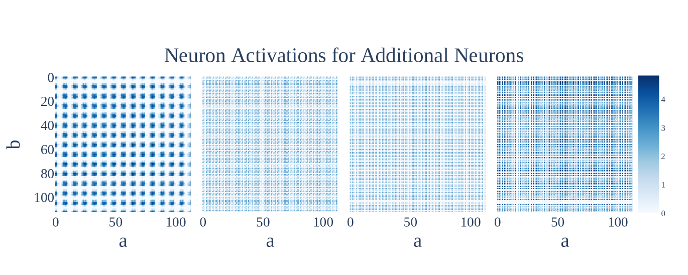

# Фурье-признаки и контуры (Fourier features / circuits)

[Возникновение признаков](feature-emergence-feature-learning.md) ← предыдущая карточка, следующая → [Переход lazy→rich](lazy-to-rich-kernel-to-feature-learning.md)

[Индекс карточек понятий](index.md), категория: [2. Механизмы и представления](index.md#cat-2)\
→ Следующая категория: [3. Задачи и наборы данных](modular-arithmetic.md)\
← Предыдущая категория: [1. Явления](grokking.md)

## Определение

**Фурье-признаки** — это периодические (синус/косинусные) представления входов
на небольшом наборе «ключевых частот», в которые сеть кодирует числа при
обучении [модульной арифметике](modular-arithmetic.md) (`c = (a + b) mod p`, остаток суммы по простому
модулю). **Фурье-контур** — реализующая под-алгоритм подсеть, которая, опираясь
на эти признаки, выполняет сложение через тригонометрические тождества (сложение
углов на окружности). Механизм впервые полностью восстановлен обратной
инженерией у Nanda et al.: обучившийся [грокингу](grokking.md) трансформер
использует дискретные преобразования Фурье и тригонометрические тождества, чтобы
свести сложение чисел к повороту по окружности \[[1.1](#ref-1-1)\]. Независимо и
аналитически ту же периодическую структуру признаков вывел Gromov, показав, что
грокинг модульной арифметики соответствует выучиванию определённых карт
признаков, структура которых задаётся самой задачей \[[1.2](#ref-1-2)\].

## Детализация

Фурье-контур — это каноническая иллюстрация того, что за скачком
генерализации стоит не «магия», а конкретный, читаемый в весах
алгоритм. По разбору Nanda et al. эмбеддинг-матрица отображает входы `a`, `b` в
синусы и косинусы на разреженном наборе ключевых частот \[[1.1](#ref-1-1)\]
(**ключевые частоты** — те немногие частоты `w_k`, на
которых сосредоточена почти вся норма представления, тогда как остальные ~95%
частот сеть подавляет), после чего блоки внимания и MLP тригонометрическими
тождествами вычисляют синус и косинус суммы. Тот же разбор задаёт трёхфазную
картину обучения — запоминание, формирование контура, очистка, — где долгая
[фаза запоминания](memorization-phase.md) сменяется усилением уже структурного
фурье-механизма; в этом смысле «резкость» грокинга как
[эмерджентного явления](emergence.md) (внезапного качественного скачка при масштабировании
обучения) оказывается кажущейся.

Вокруг этого механизма сложилась широкая поддержка и один принципиальный спор.
С поддерживающей стороны теория объясняет, *почему* сеть приходит именно к Фурье:
Li et al. доказывают, что решение с максимальным зазором (**max-margin** —
классификатор, максимизирующий отступ между верным и неверными логитами) для
`k`-входной модульной суммы реализуется через Фурье-признаки, а Tian показывает,
что для абелевой группы эмерджентное представление и обязано быть базисом Фурье.
Со спорной стороны McCracken et al. **оспаривают фундаментальность** конкретного
фурье-узора на уровне нейронов: разные наблюдаемые частотные картины (в частности
контуры [Clock и Pizza](clock-vs-pizza.md)) — не разные алгоритмы, а один
абстрактный алгоритм (приближённая китайская теорема об остатках), к которому они
сводятся заменой переменной («перенормировкой» частот). Иными словами, что
именно является Фурье-признаком — реальная вычислительная сущность или удобный
базис описания — остаётся предметом дискуссии, тогда как сам факт периодичности
представлений после грокинга практически не оспаривается. Не следует путать этот
Фурье-механизм с [фазовым переходом](phase-transition.md) обучения: Фурье-контур
— это *решение*, к которому сеть приходит, а фазовый переход — форма *динамики*
этого прихода.

## Альтернативные определения и нюансы

### A. Механистический Фурье-контур (обратная инженерия) — Nanda et al.

Определение через восстановленный из весов вычислительный механизм. Различающая
машинерия здесь — конкретная последовательность операций: эмбеддинг кодирует
входы синусами/косинусами на ключевых частотах, а блоки внимания и MLP
тригонометрическими тождествами превращают сложение чисел в сложение углов и
«читают» ответ с логитов. Ключевой отличительный признак трактовки — опора на
*эмпирическую* верификацию (сеть операционализирует тригонометрические тождества
для вычисления синуса и косинуса `w_k(a + b)` \[[1.1](#ref-1-1)\]),
подтверждённую абляциями в пространстве Фурье; это описание конкретной
обученной сети, а не гарантия для всех сетей.

### B. Аналитическое решение: периодические карты признаков — Gromov

Определение через замкнутую аналитическую форму весов. Различающая машинерия —
не восстановление постфактум, а *конструкция*: Gromov выписывает точное решение
для двухслойной MLP, у которого веса периодичны по индексам входов, а набор
частот задаётся модулем. Отличительный источник различия от трактовки A —
периодичность весов по индексам входов как первый ингредиент точного решения
\[[1.2](#ref-1-2)\]: периодичность здесь — доказанное свойство аналитического
минимума, а совпадение с тем, что находит обычный градиентный спуск, — отдельно
проверяемое утверждение, а не постулат. Тем самым Фурье-структура получает статус
не только наблюдения, но и вывода.

### Оспаривают. Единый абстрактный алгоритм: нейронный узор Фурье не фундаментален

Оспаривающая трактовка (McCracken et al.): вариативность частотных картин на
уровне нейронов — артефакт уровня описания, а не свидетельство разных вычислений.
Контролируемый параметр здесь — частота нейрона: после её нормировки
(«перенормировка», замена переменной `h(x) = cos(2πf x/n)`) нейроны разных
трансформеров ведут себя одинаково, и все схемы трактуются как приближённая
китайская теорема об остатках (разбиение `mod n` на независимые вычисления по
взаимно простым делителям). Тестируемое следствие, отличающее эту позицию:
контуры «пицца» и «часы» демонстрируют качественную эквивалентность после
перенормировки \[[2.1](#ref-2-1)\], то есть конкретный набор частот у нейрона взаимозаменяем
и не несёт самостоятельного алгоритмического смысла.

### Поддерживают. Теоретическая необходимость Фурье-базиса

Поддерживающая трактовка (Li et al.; Tian): Фурье-признаки — не случайность
конкретного прогона, а следствие оптимизируемой цели. Различающая машинерия —
доказательство через [максимизацию зазора](margin-maximization-implicit-bias.md): у Li et al. каждый нейрон фокусируется
на одной отдельной частоте Фурье \[[3.1](#ref-3-1)\], а Tian сводит это к теории
представлений: для абелевой группы все
неприводимые представления одномерны, поэтому итоговое представление и
оказывается базисом Фурье \[[3.3](#ref-3-3)\]. Тестируемое следствие, отличающее эту позицию от чисто
эмпирических A/B: Фурье-структура должна воспроизводиться при разных обучающих
процедурах и распространяться за пределы сложения — что Furuta et al.
подтверждают для более сложных модульных операций \[[3.2](#ref-3-2)\].

## Ссылки

###### ref-1-1
**\[1.1\]** 2301.05217 — Nanda et al., «Progress Measures for Grokking via Mechanistic Interpretability». [`"discrete Fourier transforms and trigonometric identities to convert addition to rotation about a circle"`](../papers/2301.05217.progress-measures-for-grokking-via-mechanistic-interpretability/2301.05217.progress-measures-for-grokking-via-mechanistic-interpretability.card.md#p1-2). *«[дискретные преобразования Фурье и тригонометрические тождества, чтобы свести сложение к повороту вокруг окружности](../papers/2301.05217.progress-measures-for-grokking-via-mechanistic-interpretability/2301.05217.progress-measures-for-grokking-via-mechanistic-interpretability.card.md#p1-2)»*\
Доп.: [`"embedding matrix maps the inputs a, b to sines and cosines at a sparse set of key frequencies"`](../papers/2301.05217.progress-measures-for-grokking-via-mechanistic-interpretability/2301.05217.progress-measures-for-grokking-via-mechanistic-interpretability.card.md#p2-1) — *«[матрица эмбеддингов отображает входы $a,b$ в синусы и косинусы на разрежённом наборе ключевых частот](../papers/2301.05217.progress-measures-for-grokking-via-mechanistic-interpretability/2301.05217.progress-measures-for-grokking-via-mechanistic-interpretability.card.md#p2-1)»*; [`"The attention and MLP layers then combine these using trigonometric identities to compute the sine and cosine of wk(a + b)"`](../papers/2301.05217.progress-measures-for-grokking-via-mechanistic-interpretability/2301.05217.progress-measures-for-grokking-via-mechanistic-interpretability.card.md#p2-1) — *«[слои внимания и MLP затем комбинируют их с помощью тригонометрических тождеств, чтобы вычислить синус и косинус $w_{k}(a+b)$](../papers/2301.05217.progress-measures-for-grokking-via-mechanistic-interpretability/2301.05217.progress-measures-for-grokking-via-mechanistic-interpretability.card.md#p2-1)»*.

###### ref-1-2
**\[1.2\]** 2301.02679 — Gromov, «Grokking Modular Arithmetic». [`"grokking modular arithmetic corresponds to learning specific feature maps whose structure is determined by the task"`](../papers/2301.02679.grokking-modular-arithmetic/2301.02679.grokking-modular-arithmetic.card.md#p1-2). *«[гроккинг модульной арифметики отвечает выучиванию определённых карт признаков, структура которых определяется задачей](../papers/2301.02679.grokking-modular-arithmetic/2301.02679.grokking-modular-arithmetic.card.md#p1-2)»*\
Доп.: [`"The first ingredient is the periodicity of weights with respect to the indices"`](../papers/2301.02679.grokking-modular-arithmetic/2301.02679.grokking-modular-arithmetic.card.md#p5-2) — *«[Первая — периодичность весов по индексам](../papers/2301.02679.grokking-modular-arithmetic/2301.02679.grokking-modular-arithmetic.card.md#p5-2)»*.

###### ref-1-3
**\[1.3\]** 2207.08799 — Barak et al., «Hidden Progress in Deep Learning: SGD Learns Parities Near the Computational Limit». Нюанс: первоисточник фурье-зазора; здесь Фурье живёт в популяционном градиенте и служит условием обучаемости, а не описанием выученного алгоритма — обратного инжиниринга обученной сети в работе нет. [`"At each relevant coordinate ($i\in S$), the population gradient is the order-($k-1$) Fourier coefficient $S\setminus\{i\}$; for the irrelevant features ($i\not\in S$), it is instead the order-$(k+1)$ coefficient $S\cup\{i\}$."`](../papers/2207.08799.hidden-progress-in-deep-learning-sgd-learns-parities-near-the-computational-limit/2207.08799.hidden-progress-in-deep-learning-sgd-learns-parities-near-the-computational-limit.card.md#p7-4). *«[На каждой нужной координате ($i\in S$) популяционный градиент есть коэффициент Фурье порядка ($k-1$) при $S\setminus\{i\}$; для ненужных признаков ($i\not\in S$) это, наоборот, коэффициент порядка $(k+1)$ при $S\cup\{i\}$](../papers/2207.08799.hidden-progress-in-deep-learning-sgd-learns-parities-near-the-computational-limit/2207.08799.hidden-progress-in-deep-learning-sgd-learns-parities-near-the-computational-limit.card.md#p7-4)»*

###### ref-1-4
**\[1.4\]** 2311.07568 — Morwani et al. 2024, «Feature emergence via margin maximization: case studies in algebraic tasks». Здесь фурье-строение впервые не наблюдено, а **выведено как необходимое**: у всякого решения максимального $L_{2,3}$-зазора каждый нейрон занят ровно одной частотой, а фазы связаны условием $\theta_{u}^{*}+\theta_{v}^{*}=\theta_{w}^{*}$; разрежённость возникает как решение задачи максимизации $\frac{2}{(p-1)p^{2}}\sum_{j\neq 0}\hat{u}(j)\hat{v}(j)\hat{w}(-j)$ при квадратичном ограничении на норму, а не постулируется. Нюанс: сеть с одним скрытым слоем и $x^{2}$-возбуждением, норма $L_{2,3}$, полная популяционная выборка; для ReLU-сети теория не работает, и опыт даёт мощность около $0.9$, а не $1$. [`"For every neuron, there exists a frequency such that the Fourier spectra of the input and output weight vectors are supported only on that frequency."`](../papers/2311.07568.feature-emergence-via-margin-maximization-case-studies-in-algebraic-tasks/2311.07568.feature-emergence-via-margin-maximization-case-studies-in-algebraic-tasks.card.md#p3-7). *«[Для каждого нейрона существует частота, такая что фурье-спектры входных и выходного векторов весов имеют носитель только на этой частоте.](../papers/2311.07568.feature-emergence-via-margin-maximization-case-studies-in-algebraic-tasks/2311.07568.feature-emergence-via-margin-maximization-case-studies-in-algebraic-tasks.card.md#p3-7)»*\
Доп. (все частоты заняты): [`"There exists at least one neuron of each frequency in the network."`](../papers/2311.07568.feature-emergence-via-margin-maximization-case-studies-in-algebraic-tasks/2311.07568.feature-emergence-via-margin-maximization-case-studies-in-algebraic-tasks.card.md#p3-7) — *«[В сети есть по крайней мере один нейрон каждой частоты.](../papers/2311.07568.feature-emergence-via-margin-maximization-case-studies-in-algebraic-tasks/2311.07568.feature-emergence-via-margin-maximization-case-studies-in-algebraic-tasks.card.md#p3-7)»*;
Доп. (откуда берётся разрежённость): [`"We have arrived at the crux of why any max margin solution must be sparse in the Fourier domain"`](../papers/2311.07568.feature-emergence-via-margin-maximization-case-studies-in-algebraic-tasks/2311.07568.feature-emergence-via-margin-maximization-case-studies-in-algebraic-tasks.card.md#p25-8) — *«[Мы добрались до сути того, почему любое решение максимального зазора обязано быть разрежённым в фурье-области](../papers/2311.07568.feature-emergence-via-margin-maximization-case-studies-in-algebraic-tasks/2311.07568.feature-emergence-via-margin-maximization-case-studies-in-algebraic-tasks.card.md#p25-8)»*.

###### ref-1-5
**\[1.5\]** 2407.20199 — Mallinar et al., «Emergence in non-neural models: grokking modular arithmetic via average gradient outer product». Нюанс: показано, что фурье-умножение — свойство задачи и вида признаков, а не устройства сети; но теорема говорит о вручную заданных признаковых матрицах и обучении на всех дискретных данных, а не о том, что RFM их выучивает. [`"the kernel predictor $f=[f_{0},\ldots,f_{p-1}]$ is equivalent to Fourier Multiplication Algorithm for modular subtraction (Eq. (14))"`](../papers/2407.20199.emergence-in-non-neural-models-grokking-modular-arithmetic-via-average-gradient-outer-product/original/2407.20199.emergence-in-non-neural-models-grokking-modular-arithmetic-via-average-gradient-outer-product.md#p14-1). *«[ядерный предсказатель $f=[f_{0},\ldots,f_{p-1}]$ равносилен алгоритму фурье-умножения для модульного вычитания (ур. (14))](../papers/2407.20199.emergence-in-non-neural-models-grokking-modular-arithmetic-via-average-gradient-outer-product/2407.20199.emergence-in-non-neural-models-grokking-modular-arithmetic-via-average-gradient-outer-product.card.md#p14-1)»*\
Доп. (авторская оговорка): [`"Note our construction differs from RFM in that we use a different feature matrix $M_{\ell}$ for each output coordinate, rather than a single feature matrix across all output coordinates."`](../papers/2407.20199.emergence-in-non-neural-models-grokking-modular-arithmetic-via-average-gradient-outer-product/original/2407.20199.emergence-in-non-neural-models-grokking-modular-arithmetic-via-average-gradient-outer-product.md#p14-2) — *«[Заметим, что наше построение отличается от RFM тем, что мы пользуемся отдельной признаковой матрицей $M_{\ell}$ для каждой выходной координаты, а не одной признаковой матрицей на все выходные координаты](../papers/2407.20199.emergence-in-non-neural-models-grokking-modular-arithmetic-via-average-gradient-outer-product/2407.20199.emergence-in-non-neural-models-grokking-modular-arithmetic-via-average-gradient-outer-product.card.md#p14-2)»*.
## Ссылки на присоединившиеся работы

### Оспаривают

###### ref-2-1
**\[2.1\]** 2505.18266 — McCracken et al. 2025, «Uncovering a Universal Abstract Algorithm for Modular Addition in Neural Networks». Оспаривает: частотный узор на уровне нейронов не основателен — разные картины сводятся к одному отвлечённому действию заменой переменной. [`"While prior work interpreted variations in neuron-level representations as evidence for distinct algorithms"`](../papers/2505.18266.uncovering-a-universal-abstract-algorithm-for-modular-addition-in-neural-networks/original/2505.18266.uncovering-a-universal-abstract-algorithm-for-modular-addition-in-neural-networks.md#p1-2). *«[Тогда как прежние работы истолковывали разницу в представлениях на уровне нейронов как свидетельство разных действий](../papers/2505.18266.uncovering-a-universal-abstract-algorithm-for-modular-addition-in-neural-networks/2505.18266.uncovering-a-universal-abstract-algorithm-for-modular-addition-in-neural-networks.card.md#p1-2)»*\
Доп.: [`"pizza and clock show qualitative equivalence after remapping (Def. 4.2): they all have frequency 1."`](../papers/2505.18266.uncovering-a-universal-abstract-algorithm-for-modular-addition-in-neural-networks/original/2505.18266.uncovering-a-universal-abstract-algorithm-for-modular-addition-in-neural-networks.md#fig-1) — *«[пиццы и часов показывают качественную равнозначность после перекладки (опр. 4.2): у всех частота 1](../papers/2505.18266.uncovering-a-universal-abstract-algorithm-for-modular-addition-in-neural-networks/2505.18266.uncovering-a-universal-abstract-algorithm-for-modular-addition-in-neural-networks.card.md#fig-1)»*.

###### ref-2-2
**\[2.2\]** 2312.06581 — Stander et al. 2024, «Grokking Group Multiplication with Cosets». Оспаривает: что сосредоточенность весов на неприводимых представлениях означает реализацию матричных представлений в весах. [`"This is due, however, to concentration on cosets of specific subgroups, not because the matrix representations are realized anywhere in the weights."`](../papers/2312.06581.grokking-group-multiplication-with-cosets/original/2312.06581.grokking-group-multiplication-with-cosets.md#p8-6). *«[Это происходит, однако, из-за сосредоточенности на смежных классах определённых подгрупп, а не потому, что матричные представления где-либо в весах реализованы](../papers/2312.06581.grokking-group-multiplication-with-cosets/2312.06581.grokking-group-multiplication-with-cosets.card.md#p8-6)»*\
Доп. (авторская оговорка, которую нельзя терять): [`"We do not have an explanation for why the coset circuits always do concentrate one irrep."`](../papers/2312.06581.grokking-group-multiplication-with-cosets/original/2312.06581.grokking-group-multiplication-with-cosets.md#p23-5) — *«[У нас нет объяснения тому, почему контуры на смежных классах всегда сосредоточиваются на одном неприводимом представлении](../papers/2312.06581.grokking-group-multiplication-with-cosets/2312.06581.grokking-group-multiplication-with-cosets.card.md#p23-5)»*.

### Поддерживают

###### ref-3-1
**\[3.1\]** 2402.09469 — Li, Liang, Shi, Song, Zhou 2024, «Fourier Circuits in Neural Networks and Transformers: A Case Study of Modular Arithmetic with Multiple Inputs». Нюанс: даёт теоретическое основание тому, отчего наращивание отступа приводит именно к фурье-контуру. [`"We characterize the Fourier features to perform modular addition with $k$ input in the one-hidden-layer neuron network"`](../papers/2402.09469.fourier-circuits-in-neural-networks-and-transformers-a-case-study-of-modular-arithmetic-with-multiple-inputs/original/2402.09469.fourier-circuits-in-neural-networks-and-transformers-a-case-study-of-modular-arithmetic-with-multiple-inputs.md#p8-6). *«[Мы описываем фурье-признаки, которыми исполняется остаточное сложение $k$ входов в сети с одним скрытым слоем](../papers/2402.09469.fourier-circuits-in-neural-networks-and-transformers-a-case-study-of-modular-arithmetic-with-multiple-inputs/2402.09469.fourier-circuits-in-neural-networks-and-transformers-a-case-study-of-modular-arithmetic-with-multiple-inputs.card.md#p8-6)»*\
Доп.: [`"We show that every neuron only focuses on a distinct Fourier frequency"`](../papers/2402.09469.fourier-circuits-in-neural-networks-and-transformers-a-case-study-of-modular-arithmetic-with-multiple-inputs/original/2402.09469.fourier-circuits-in-neural-networks-and-transformers-a-case-study-of-modular-arithmetic-with-multiple-inputs.md#p8-6) — *«[Мы показываем, что каждый нейрон занят лишь одной частотой фурье](../papers/2402.09469.fourier-circuits-in-neural-networks-and-transformers-a-case-study-of-modular-arithmetic-with-multiple-inputs/2402.09469.fourier-circuits-in-neural-networks-and-transformers-a-case-study-of-modular-arithmetic-with-multiple-inputs.card.md#p8-6)»*; [`"Transformers can solve modular addition using Fourier-based circuits"`](../papers/2402.09469.fourier-circuits-in-neural-networks-and-transformers-a-case-study-of-modular-arithmetic-with-multiple-inputs/original/2402.09469.fourier-circuits-in-neural-networks-and-transformers-a-case-study-of-modular-arithmetic-with-multiple-inputs.md#p4-3) — *«[трансформеры решают остаточное сложение при помощи фурье-контуров](../papers/2402.09469.fourier-circuits-in-neural-networks-and-transformers-a-case-study-of-modular-arithmetic-with-multiple-inputs/2402.09469.fourier-circuits-in-neural-networks-and-transformers-a-case-study-of-modular-arithmetic-with-multiple-inputs.card.md#p4-3)»*.

###### ref-3-2
**\[3.2\]** 2402.16726 — Furuta et al., «Towards Empirical Interpretation of Internal Circuits and Properties in Grokked Transformers on Modular Polynomials». Нюанс: расширяет фурье-объяснение с чистого сложения на более сложные модульные операции и полиномы. [`"Grokking on modular addition has been known to implement Fourier representation and its calculation circuits with trigonometric identities in Transformers"`](../papers/2402.16726.towards-empirical-interpretation-of-internal-circuits-and-properties-in-grokked-transformers-on-modular-polynomials/original/2402.16726.towards-empirical-interpretation-of-internal-circuits-and-properties-in-grokked-transformers-on-modular-polynomials.md#p1-1). *«[Известно, что гроккинг на модульном сложении реализуется в трансформерах фурье-представлением и вычислительными контурами на тригонометрических тождествах](../papers/2402.16726.towards-empirical-interpretation-of-internal-circuits-and-properties-in-grokked-transformers-on-modular-polynomials/2402.16726.towards-empirical-interpretation-of-internal-circuits-and-properties-in-grokked-transformers-on-modular-polynomials.card.md#p1-1)»*.

###### ref-3-3
**\[3.3\]** 2509.21519 — Tian, «Provable Scaling Laws of Feature Emergence from Learning Dynamics of Grokking». Нюанс: выводит Фурье-базис из теории представлений — для абелевой группы иначе и быть не может. [`"We can apply the above theorem to the popular modular addition task which is an Abelian group. The resulting representation is Fourier bases."`](../papers/2509.21519.provable-scaling-laws-of-feature-emergence-from-learning-dynamics-of-grokking/original/2509.21519.provable-scaling-laws-of-feature-emergence-from-learning-dynamics-of-grokking.md#p6-9). *«[Приведённую теорему можно применить к популярной задаче модульного сложения, которая является абелевой группой. Получающееся представление — базисы Фурье.](../papers/2509.21519.provable-scaling-laws-of-feature-emergence-from-learning-dynamics-of-grokking/2509.21519.provable-scaling-laws-of-feature-emergence-from-learning-dynamics-of-grokking.card.md#p6-9)»*

###### ref-3-4
**\[3.4\]** 2306.17844 — Zhong et al. 2023, «The Clock and the Pizza». Нюанс: круговые вложения взяты как известный факт со ссылкой на Liu et al.; вклад в том, что на одной и той же фурье-геометрии стоят два разных вычисления. Вводит меру circularity. [`"embeddings ($\mathbf{E}_{a},\mathbf{E}_{b}$ in Figure 1) usually describe a circle [8] in the plane spanned by the first two principal components of the embedding matrix"`](../papers/2306.17844.the-clock-and-the-pizza-two-stories-in-mechanistic-explanation-of-neural-networks/original/2306.17844.the-clock-and-the-pizza-two-stories-in-mechanistic-explanation-of-neural-networks.md#p2-4). *«[вложения ($\mathbf{E}_{a},\mathbf{E}_{b}$ на рисунке 1) обычно описывают окружность [8] в плоскости, натянутой на первые две главные компоненты матрицы вложений](../papers/2306.17844.the-clock-and-the-pizza-two-stories-in-mechanistic-explanation-of-neural-networks/2306.17844.the-clock-and-the-pizza-two-stories-in-mechanistic-explanation-of-neural-networks.card.md#p2-4)»*\
Доп.: [`"we consider models with circularity $\geq 99.5\%$ **circular**"`](../papers/2306.17844.the-clock-and-the-pizza-two-stories-in-mechanistic-explanation-of-neural-networks/original/2306.17844.the-clock-and-the-pizza-two-stories-in-mechanistic-explanation-of-neural-networks.md#p14-7) — *«[мы считаем **круговыми** модели с circularity $\geq 99.5\%$](../papers/2306.17844.the-clock-and-the-pizza-two-stories-in-mechanistic-explanation-of-neural-networks/2306.17844.the-clock-and-the-pizza-two-stories-in-mechanistic-explanation-of-neural-networks.card.md#p14-7)»*.

###### ref-3-5
**\[3.5\]** 2302.03025 — Chughtai et al., «A Toy Model of Universality: Reverse Engineering how Networks Learn Group Operations». Нюанс: встраивает фурье-описание в теорию представлений — частота $\omega_{k}$ отвечает двумерному представлению $\mathbf{2_{k}}$, а найденные Nanda et al. синусы и косинусы суть матричные элементы $\rho(a)$; фурье-язык при этом объявлен привязанным к модульному сложению. [`"distinct Fourier modes are better thought of as distinct *irreducible representations* of the cyclic group"`](../papers/2302.03025.a-toy-model-of-universality-reverse-engineering-how-networks-learn-group-operations/2302.03025.a-toy-model-of-universality-reverse-engineering-how-networks-learn-group-operations.card.md#p1-4). *«[различные фурье-моды лучше мыслить как различные *неприводимые представления* циклической группы](../papers/2302.03025.a-toy-model-of-universality-reverse-engineering-how-networks-learn-group-operations/2302.03025.a-toy-model-of-universality-reverse-engineering-how-networks-learn-group-operations.card.md#p1-4)»*\
Доп.: [`"Fourier transforms are elegant, but specific to the modular addition task."`](../papers/2302.03025.a-toy-model-of-universality-reverse-engineering-how-networks-learn-group-operations/2302.03025.a-toy-model-of-universality-reverse-engineering-how-networks-learn-group-operations.card.md#p13-2) — *«[Преобразования Фурье изящны, но привязаны к задаче модульного сложения](../papers/2302.03025.a-toy-model-of-universality-reverse-engineering-how-networks-learn-group-operations/2302.03025.a-toy-model-of-universality-reverse-engineering-how-networks-learn-group-operations.card.md#p13-2)»*.

###### ref-3-6
**\[3.6\]** 2603.25009 — Manir, Rupa, «A Systematic Empirical Study of Grokking…». [`"the Transformer concentrates 98.5% of its embedding energy in just 5 frequencies, compared to 74.7% for MLP-GELU and 75.6% for MLP-ReLU"`](../papers/2603.25009.a-systematic-empirical-study-of-grokking-depth-architecture-activation-and-regularization/2603.25009.a-systematic-empirical-study-of-grokking-depth-architecture-activation-and-regularization.card.md#p12-1). *«[трансформер сосредоточивает 98.5% энергии своих вложений всего в 5 частотах против 74.7% у MLP-GELU и 75.6% у MLP-ReLU](../papers/2603.25009.a-systematic-empirical-study-of-grokking-depth-architecture-activation-and-regularization/2603.25009.a-systematic-empirical-study-of-grokking-depth-architecture-activation-and-regularization.card.md#p12-1)»*\
Доп. (что не показано): подпись [рис. 7](../papers/2603.25009.a-systematic-empirical-study-of-grokking-depth-architecture-activation-and-regularization/2603.25009.a-systematic-empirical-study-of-grokking-depth-architecture-activation-and-regularization.card.md#fig-7) утверждает `"The circular/elliptical structure in all three panels confirms that the learned representations encode modular arithmetic via sinusoidal patterns"`, тогда как на панелях (d–f) видно рассеянное облако точек, и раскраска по остатку по углу не упорядочена.

###### ref-3-7
**\[3.7\]** 2505.15624 — AlQuabeh, Bojković, Nwadike, Inui, «Mechanistic Insights into Grokking from the Embedding Layer». Применяет ДПФ не к логитам и не к активациям, а к самой матрице вложений — по входной размерности, с $\ell_{2}$-нормой по размерности вложения — и получает самостоятельный довод: на сложении спектр сосредоточен в нескольких частотах, на делении размазан, а при Adam-LR картина на сложении та же, то есть ускоритель сдвигает срок, а не выученное строение. Нюанс: панели умножения на рисунке нет, хотя текст говорит о сложении и умножении; ни контуров, ни разбора того, как частоты складываются в алгоритм, в работе нет. [`"Following the approach in [12], we apply the Discrete Fourier Transform (DFT) along the input dimension of the embedding matrix and compute the $\ell_{2}$-norm across the embedding dimension."`](../papers/2505.15624.mechanistic-insights-into-grokking-from-the-embedding-layer/original/2505.15624.mechanistic-insights-into-grokking-from-the-embedding-layer.md#p16-2). *«[Следуя подходу из [12], мы применяем дискретное преобразование Фурье (ДПФ) вдоль входной размерности матрицы вложений и вычисляем $\ell_{2}$-норму по размерности вложения.](../papers/2505.15624.mechanistic-insights-into-grokking-from-the-embedding-layer/2505.15624.mechanistic-insights-into-grokking-from-the-embedding-layer.card.md#p16-2)»*\
Доп. (что даёт частотное строение): [`"Notably, such structure emerges even without explicit Fourier features, especially for modular addition and multiplication."`](../papers/2505.15624.mechanistic-insights-into-grokking-from-the-embedding-layer/original/2505.15624.mechanistic-insights-into-grokking-from-the-embedding-layer.md#p16-3) — *«[Примечательно, что такое строение возникает даже без явных фурье-признаков, особенно для модульного сложения и умножения.](../papers/2505.15624.mechanistic-insights-into-grokking-from-the-embedding-layer/2505.15624.mechanistic-insights-into-grokking-from-the-embedding-layer.card.md#p16-3)»*\
Доп. (фурье-признаки как замена вложениям): [`"such features can bypass the need for learned embeddings and mitigate challenges like sparse updates for rare tokens"`](../papers/2505.15624.mechanistic-insights-into-grokking-from-the-embedding-layer/original/2505.15624.mechanistic-insights-into-grokking-from-the-embedding-layer.md#p16-1) — *«[такие признаки способны обойти нужду в выученных вложениях и ослабить трудности вроде разрежённых обновлений для редких токенов](../papers/2505.15624.mechanistic-insights-into-grokking-from-the-embedding-layer/2505.15624.mechanistic-insights-into-grokking-from-the-embedding-layer.card.md#p16-1)»*.

###### ref-3-8
**\[3.8\]** 2604.06256 — Xu, «Spectral Edge Dynamics Reveal Functional Modes of Learning». Нюанс: встречная проверка базисом — сложение в «чужом» базисе теряет сосредоточенность ровно так же, как умножение выигрывает в «своём». [`"As a control, addition’s Fourier concentration *decreases* under the discrete-log basis ($0.2$–$0.3\times$ of its additive-basis value), confirming that the improvement is basis-specific."`](../papers/2604.06256.spectral-edge-dynamics-reveal-functional-modes-of-learning/original/2604.06256.spectral-edge-dynamics-reveal-functional-modes-of-learning.md#p9-8). *«[Как сверка, сосредоточенность Фурье у сложения *убывает* в базисе дискретного логарифма (до $0.2$–$0.3\times$ от её значения в аддитивном базисе), что подтверждает: улучшение свойственно именно базису.](../papers/2604.06256.spectral-edge-dynamics-reveal-functional-modes-of-learning/2604.06256.spectral-edge-dynamics-reveal-functional-modes-of-learning.card.md#p9-8)»*\
Доп. (граница заявки): [`"the multi-mode description is a plausible interpretation but is not supported by a clean separation from the null"`](../papers/2604.06256.spectral-edge-dynamics-reveal-functional-modes-of-learning/original/2604.06256.spectral-edge-dynamics-reveal-functional-modes-of-learning.md#p10-5). *«[многомодовое описание есть правдоподобное толкование, но оно не подкреплено чистым отделением от нулевой модели](../papers/2604.06256.spectral-edge-dynamics-reveal-functional-modes-of-learning/2604.06256.spectral-edge-dynamics-reveal-functional-modes-of-learning.card.md#p10-5)»*

###### ref-3-9
**\[3.9\]** 2602.06702 — Singh, Misra, Orvieto, «Explaining Grokking in Transformers…». [`"all variants arrive at periodically structured general solutions regardless of LN position"`](../papers/2602.06702.explaining-grokking-in-transformers-through-the-lens-of-inductive-bias/2602.06702.explaining-grokking-in-transformers-through-the-lens-of-inductive-bias.card.md#p3-5). *«[все варианты приходят к периодически структурированным общим решениям независимо от положения LN](../papers/2602.06702.explaining-grokking-in-transformers-through-the-lens-of-inductive-bias/2602.06702.explaining-grokking-in-transformers-through-the-lens-of-inductive-bias.card.md#p3-5)»*\
Доп. (мера): $\mathcal{C}_{\text{Fourier}}$ — отношение межмодовой и внутримодовой дисперсии в фурье-образе матрицы вложений, объявленное родственным F-статистике ANOVA, с порогом $1.0$; код приведён целиком в Приложении D.\
Доп. (объём свидетельства): заявленная «вполне симметричная» связь между сроком выхода $\mathcal{C}_{\text{Fourier}}$ за $1.0$ и сроком генерализации опирается на диаграмму рассеяния из четырёх точек — по одной на настройку LN ([рис. 2](../papers/2602.06702.explaining-grokking-in-transformers-through-the-lens-of-inductive-bias/2602.06702.explaining-grokking-in-transformers-through-the-lens-of-inductive-bias.card.md#fig-2), панель c).

###### ref-3-10
**\[3.10\]** 2606.12966 — Sivasankar, «Circuit Synchronization Precedes Generalization: A Causal Precursor to Grokking». [`"The algorithm exploits the identity"`](../papers/2606.12966.circuit-synchronization-precedes-generalization-a-causal-precursor-to-grokking/2606.12966.circuit-synchronization-precedes-generalization-a-causal-precursor-to-grokking.card.md#p3-1) — *«[Алгоритм пользуется тождеством](../papers/2606.12966.circuit-synchronization-precedes-generalization-a-causal-precursor-to-grokking/2606.12966.circuit-synchronization-precedes-generalization-a-causal-precursor-to-grokking.card.md#p3-1)»* $\cos\!\bigl(2\pi k(a+b)/p\bigr)=\cos(2\pi ka/p)\cos(2\pi kb/p)-\sin(2\pi ka/p)\sin(2\pi kb/p)$, то есть ровно тем же, что у Nanda et al. 2023.\
Доп. (измеренное сжатие представления): [`"Median Fourier rank descends monotonically"`](../papers/2606.12966.circuit-synchronization-precedes-generalization-a-causal-precursor-to-grokking/2606.12966.circuit-synchronization-precedes-generalization-a-causal-precursor-to-grokking.card.md#p6-2) — *«[Медианный фурье-ранг монотонно спускается](../papers/2606.12966.circuit-synchronization-precedes-generalization-a-causal-precursor-to-grokking/2606.12966.circuit-synchronization-precedes-generalization-a-causal-precursor-to-grokking.card.md#p6-2)»* $6\to 1$ в фазе 1 и держится на 1 всю фазу 2; при $p=113$ ранг сходится к 2, и работа объясняет это тем, что модульное тождество там требует двух одновременно действующих частот.
###### ref-3-11
**\[3.11\]** 2511.01938 — Musat, «The Geometry of Grokking: Norm Minimization on the Zero-Loss Manifold». Нюанс: фурье-признаки не постулируются и не добываются обратной инженерией, а возникают в моделируемой динамике минимизации нормы на многообразии нулевой потери. [`"Fourier features norms equalize, suggesting the presence of equally-sized circles"`](../papers/2511.01938.the-geometry-of-grokking-norm-minimization-on-the-zero-loss-manifold/original/2511.01938.the-geometry-of-grokking-norm-minimization-on-the-zero-loss-manifold.md#fig-6). *«[нормы фурье-признаков выравниваются, из чего следует наличие окружностей одинакового размера](../papers/2511.01938.the-geometry-of-grokking-norm-minimization-on-the-zero-loss-manifold/2511.01938.the-geometry-of-grokking-norm-minimization-on-the-zero-loss-manifold.card.md#fig-6)»*\
Доп.: [`"Fourier features become orthogonal, suggesting that circles are located in orthogonal planes"`](../papers/2511.01938.the-geometry-of-grokking-norm-minimization-on-the-zero-loss-manifold/original/2511.01938.the-geometry-of-grokking-norm-minimization-on-the-zero-loss-manifold.md#fig-6) — *«[фурье-признаки становятся ортогональны, из чего следует, что окружности лежат в ортогональных плоскостях](../papers/2511.01938.the-geometry-of-grokking-norm-minimization-on-the-zero-loss-manifold/2511.01938.the-geometry-of-grokking-norm-minimization-on-the-zero-loss-manifold.card.md#fig-6)»*.

###### ref-3-12
**\[3.12\]** 2603.05228 — Yildirim, «The Geometric Inductive Bias of Grokking: Bypassing Phase Transitions via Architectural Topology». Нюанс: фурье-строение взято как известная цель, а проверка ведётся вмешательством до обучения — архитектурная топология задаёт представленческие степени свободы заранее, в обход пост-фактум разбора. [`"Mechanistic interpretability has shown that Transformers trained on modular arithmetic eventually implement structured representations based on discrete Fourier features (Nanda et al., 2023)"`](../papers/2603.05228.the-geometric-inductive-bias-of-grokking-bypassing-phase-transitions-via-architectural-topology/original/2603.05228.the-geometric-inductive-bias-of-grokking-bypassing-phase-transitions-via-architectural-topology.md#p2-1). *«[Механистическая интерпретируемость показала, что трансформеры, обучаемые модульной арифметике, в конце концов строят устроенные представления на основе дискретных фурье-признаков (Nanda et al., 2023)](../papers/2603.05228.the-geometric-inductive-bias-of-grokking-bypassing-phase-transitions-via-architectural-topology/2603.05228.the-geometric-inductive-bias-of-grokking-bypassing-phase-transitions-via-architectural-topology.card.md#p2-1)»*\
Доп.: [`"we modify architectural structure *before* training to test whether specific representational degrees of freedom influence grokking dynamics"`](../papers/2603.05228.the-geometric-inductive-bias-of-grokking-bypassing-phase-transitions-via-architectural-topology/original/2603.05228.the-geometric-inductive-bias-of-grokking-bypassing-phase-transitions-via-architectural-topology.md#p2-1) — *«[мы меняем архитектурное устройство *до* обучения, чтобы проверить, влияют ли определённые представленческие степени свободы на динамику гроккинга](../papers/2603.05228.the-geometric-inductive-bias-of-grokking-bypassing-phase-transitions-via-architectural-topology/2603.05228.the-geometric-inductive-bias-of-grokking-bypassing-phase-transitions-via-architectural-topology.card.md#p2-1)»*.

## Цитирования

Работы, лишь упоминающие явление (обзор литературы, связанные работы, попутное цитирование) без его подробного разбора.

**\[4.1\]** 2303.11873 — Merrill et al., «A Tale of Two Circuits: Grokking as Competition of Sparse and Dense Subnetworks». [`"Past work analyzing grokking has reverse-engineered the network behavior in Fourier space (Nanda et al., 2023)"`](../papers/2303.11873.a-tale-of-two-circuits-grokking-as-competition-of-sparse-and-dense-subnetworks/original/2303.11873.a-tale-of-two-circuits-grokking-as-competition-of-sparse-and-dense-subnetworks.md#p1-5). *«[Прошлые работы, анализировавшие гроккинг, разобрали поведение сети обратным инжинирингом в фурье-пространстве (Nanda et al., 2023)](../papers/2303.11873.a-tale-of-two-circuits-grokking-as-competition-of-sparse-and-dense-subnetworks/2303.11873.a-tale-of-two-circuits-grokking-as-competition-of-sparse-and-dense-subnetworks.card.md#p1-5)»*

**\[4.2\]** 2310.19470 — Minegishi et al., «Bridging Lottery Ticket and Grokking: Understanding Grokking from Inner Structure of Networks». [`"transformers trained on modular addition tasks rely on these periodic representations to achieve generalization"`](../papers/2310.19470.bridging-lottery-ticket-and-grokking-understanding-grokking-from-inner-structure-of-networks/original/2310.19470.bridging-lottery-ticket-and-grokking-understanding-grokking-from-inner-structure-of-networks.md#p9-3). *«[трансформеры, обучаемые задачам модульного сложения, опираются на эти периодические представления для достижения генерализации](../papers/2310.19470.bridging-lottery-ticket-and-grokking-understanding-grokking-from-inner-structure-of-networks/2310.19470.bridging-lottery-ticket-and-grokking-understanding-grokking-from-inner-structure-of-networks.card.md#p9-3)»*

**\[4.3\]** 2408.08944 — Clauw, Stramaglia, Marinazzo 2024, «Information-Theoretic Progress Measures reveal Grokking is an Emergent Phase Transition». [`"Several progress measures have been proposed based on L2 norm (Liu et al., 2022) or Fourier gap (Barak et al., 2023)"`](../papers/2408.08944.information-theoretic-progress-measures-reveal-grokking-is-an-emergent-phase-transition/original/2408.08944.information-theoretic-progress-measures-reveal-grokking-is-an-emergent-phase-transition.md#p2-2). *«[Предложено несколько мер продвижения — на основе нормы L2 (Liu et al., 2022) или фурье-разрыва (Barak et al., 2023)](../papers/2408.08944.information-theoretic-progress-measures-reveal-grokking-is-an-emergent-phase-transition/2408.08944.information-theoretic-progress-measures-reveal-grokking-is-an-emergent-phase-transition.card.md#p2-2)»*

**\[4.4\]** 2504.03162 — Gu et al., «Beyond Progress Measures: Theoretical Insights into the Mechanism of Grokking». [`"The first perspective is based on frequency and Fourier coefficients, inspired by circuit signal analysis (Nanda et al., 2023; Zhou et al., 2024; Furuta et al., 2024)"`](../papers/2504.03162.beyond-progress-measures-theoretical-insights-into-the-mechanism-of-grokking/2504.03162.beyond-progress-measures-theoretical-insights-into-the-mechanism-of-grokking.card.md#p3-2). *«[Первый взгляд опирается на частоты и фурье-коэффициенты, вдохновляясь разбором контурных сигналов (Nanda et al., 2023; Zhou et al., 2024; Furuta et al., 2024)](../papers/2504.03162.beyond-progress-measures-theoretical-insights-into-the-mechanism-of-grokking/2504.03162.beyond-progress-measures-theoretical-insights-into-the-mechanism-of-grokking.card.md#p3-2)»*

**\[4.5\]** 2504.13292 — Xu et al., «Let Me Grok for You: Accelerating Grokking via Embedding Transfer from a Weaker Model». [`"Fourier embeddings, inspired by the analytical solutions learned by neural networks (Nanda et al., 2023; Morwani et al., 2024), encode task-specific information"`](../papers/2504.13292.let-me-grok-for-you-accelerating-grokking-via-embedding-transfer-from-a-weaker-model/original/2504.13292.let-me-grok-for-you-accelerating-grokking-via-embedding-transfer-from-a-weaker-model.md#p4-1). *«[Фурье-вложения, навеянные аналитическими решениями, выучиваемыми нейронными сетями (Nanda et al., 2023; Morwani et al., 2024), кодируют сведения, относящиеся к самой задаче](../papers/2504.13292.let-me-grok-for-you-accelerating-grokking-via-embedding-transfer-from-a-weaker-model/2504.13292.let-me-grok-for-you-accelerating-grokking-via-embedding-transfer-from-a-weaker-model.card.md#p4-1)»*

**\[4.6\]** 2603.13331 — Truong Xuan Khanh et al., «The Norm-Separation Delay Law of Grokking: A First-Principles Theory of Delayed Generalization». [`"the internal mechanisms that emerge after generalisation, showing that models converge to structured Fourier circuits or symmetry-aligned representations (Nanda et al., 2023; Chughtai et al., 2023)"`](../papers/2603.13331.the-norm-separation-delay-law-of-grokking-a-first-principles-theory-of-delayed-generalization/2603.13331.the-norm-separation-delay-law-of-grokking-a-first-principles-theory-of-delayed-generalization.card.md#p1-6). *«[внутренние устройства, возникающие *после* генерализации, показывая, что модели сходятся к устроенным фурье-контурам или согласованным с симметрией представлениям (Nanda et al., 2023; Chughtai et al., 2023)](../papers/2603.13331.the-norm-separation-delay-law-of-grokking-a-first-principles-theory-of-delayed-generalization/2603.13331.the-norm-separation-delay-law-of-grokking-a-first-principles-theory-of-delayed-generalization.card.md#p1-6)»*

**\[4.7\]** 2603.15492 — Acharya, Dhakal, «Grokking as a Variance-Limited Phase Transition: Spectral Gating and the Epsilon-Stability Threshold». Нюанс: обвал ёмкости объяснён нехваткой размерности для представления фурье-мод задачи. [`"When the embedding space lacks the geometric bandwidth to represent the $P$ discrete Fourier modes required for the solution [2], the gradient signal becomes **rank-deficient**"`](../papers/2603.15492.grokking-as-a-variance-limited-phase-transition-spectral-gating-and-the-epsilon-stability-threshold/original/2603.15492.grokking-as-a-variance-limited-phase-transition-spectral-gating-and-the-epsilon-stability-threshold.md#p11-5) — *«[Когда пространству вложений недостаёт геометрической полосы, чтобы представить $P$ дискретных фурье-мод, потребных для решения [2], градиентный сигнал становится **неполноранговым**](../papers/2603.15492.grokking-as-a-variance-limited-phase-transition-spectral-gating-and-the-epsilon-stability-threshold/2603.15492.grokking-as-a-variance-limited-phase-transition-spectral-gating-and-the-epsilon-stability-threshold.card.md#p11-5)»*

**\[4.8\]** 2603.29262 — Zhang et al., «Grokking: From Abstraction to Intelligence». Нюанс: сосредоточение спектральной энергии измерено коэффициентом Джини и обратным отношением участия. [`"A simultaneous rise in $G(\mathbf{s})$ and $P(\mathbf{s})$ during emergence stage indicates spectral energy concentrates onto a sparse subset of frequencies aligned with the modular structure"`](../papers/2603.29262.grokking-from-abstraction-to-intelligence/2603.29262.grokking-from-abstraction-to-intelligence.card.md#p4-2) — *«[Одновременный рост $G(\mathbf{s})$ и $P(\mathbf{s})$ на поре возникновения означает, что спектральная энергия сосредоточивается на разрежённом подмножестве частот, согласованном с модульным строением](../papers/2603.29262.grokking-from-abstraction-to-intelligence/2603.29262.grokking-from-abstraction-to-intelligence.card.md#p4-2)»*

**\[4.9\]** 2604.13123 — Truong et al., «Spectral Entropy Collapse as a Phase Transition in Delayed Generalisation». Нюанс: падение спектральной энтропии совпадает с ростом фурье-согласованности представлений. [`"both are scalar summaries of the *same* underlying structural transition"`](../papers/2604.13123.spectral-entropy-collapse-as-a-phase-transition-in-delayed-generalisation/2604.13123.spectral-entropy-collapse-as-a-phase-transition-in-delayed-generalisation.card.md#p13-4) — *«[обе они суть скалярные сводки *одного и того же* подлежащего строительного перехода](../papers/2604.13123.spectral-entropy-collapse-as-a-phase-transition-in-delayed-generalisation/2604.13123.spectral-entropy-collapse-as-a-phase-transition-in-delayed-generalisation.card.md#p13-4)»*

**\[4.10\]** 2405.16658 — Park, Kim, Kim, «Acceleration of Grokking in Learning Arithmetic Operations via Kolmogorov-Arnold Representation». Нюанс: работа приходит к фурье-базису циклической группы с противоположной стороны — характер $\exp(2\pi ix/p)$ выписан из теории представлений как одно из многих возможных KA-представлений, а не извлечён из обученной сети. Ни спектрального разбора весов или логитов, ни выделения ключевых частот, ни языка контуров в статье нет; Nanda et al. и Zhong et al. упомянуты одной фразой в разделе родственных работ. Приписывать авторам механистическое объяснение алгоритма сложения нельзя (наблюдённый случай такого приписывания разобран в карточке статьи). [`"[11, 12] focuses on learning modular addition by leveraging discrete Fourier transforms and trigonometric identities, which transform modular addition to rotations around a circle"`](../papers/2405.16658.acceleration-of-grokking-in-learning-arithmetic-operations-via-kolmogorov-arnold-representation/2405.16658.acceleration-of-grokking-in-learning-arithmetic-operations-via-kolmogorov-arnold-representation.card.md#p2-3). *«[[11, 12] сосредоточены на обучении модульному сложению, пользуясь дискретными преобразованиями Фурье и тригонометрическими тождествами, которые превращают модульное сложение во вращения вокруг окружности](../papers/2405.16658.acceleration-of-grokking-in-learning-arithmetic-operations-via-kolmogorov-arnold-representation/2405.16658.acceleration-of-grokking-in-learning-arithmetic-operations-via-kolmogorov-arnold-representation.card.md#p2-3)»*\
Доп.: [`"In fact, we can find the following KA representation with the embedding dimension of $2$:"`](../papers/2405.16658.acceleration-of-grokking-in-learning-arithmetic-operations-via-kolmogorov-arnold-representation/2405.16658.acceleration-of-grokking-in-learning-arithmetic-operations-via-kolmogorov-arnold-representation.card.md#p8-4) — *«[В самом деле, мы можем найти следующее KA-представление с размерностью вложения $2$:](../papers/2405.16658.acceleration-of-grokking-in-learning-arithmetic-operations-via-kolmogorov-arnold-representation/2405.16658.acceleration-of-grokking-in-learning-arithmetic-operations-via-kolmogorov-arnold-representation.card.md#p8-4)»*.

**\[4.11\]** 2605.06352 — Tang et al., «Topological Signatures of Grokking». Спектр вложений сосредоточивается, ограниченная и исключающая точности следуют за тестовой ([рис. 2](../papers/2605.06352.topological-signatures-of-grokking/2605.06352.topological-signatures-of-grokking.card.md#fig-2)). [`"Whereas Fourier analysis identifies dominant frequency components associated with the learned modular arithmetic circuit, PH captures the evolving geometric and topological organization of the learned representations."`](../papers/2605.06352.topological-signatures-of-grokking/2605.06352.topological-signatures-of-grokking.card.md#p5-1). *«[Тогда как фурье-разбор выявляет господствующие частотные составляющие, связанные с выученным контуром модульной арифметики, PH схватывает изменяющуюся геометрическую и топологическую организацию выученных представлений.](../papers/2605.06352.topological-signatures-of-grokking/2605.06352.topological-signatures-of-grokking.card.md#p5-1)»*

**\[4.12\]** 2605.08237 — Wang, Ying, Kanamori 2026, «Distributional Spectral Diagnostics for Localizing Grokking Transitions». Нюанс: весь разбор ведётся на mod 97, и при этом фурье-структура представлений не рассматривается ни разу — наблюдаемая берётся с выхода. [`"Mechanistic interpretability identifies the emergence of specific computational circuits"`](../papers/2605.08237.distributional-spectral-diagnostics-for-localizing-grokking-transitions/2605.08237.distributional-spectral-diagnostics-for-localizing-grokking-transitions.card.md#p30-7). *«[Механистическая интерпретируемость выявляет возникновение определённых вычислительных контуров](../papers/2605.08237.distributional-spectral-diagnostics-for-localizing-grokking-transitions/2605.08237.distributional-spectral-diagnostics-for-localizing-grokking-transitions.card.md#p30-7)»*

**\[4.13\]** 2606.13753 — Truong et al. 2026, «The Weight Norm Sets the Grokking Timescale: A Causal Delay Law». Меряет фурье-сосредоточенность вложения коэффициентом Джини спектра мощности по лексемам и показывает, что она растёт в том же окне, где weight decay расслабляет норму, — то есть на спуске, ведущем к гроккингу. Из этого предлагается разделение труда между двумя объяснениями: контуры правят тем, что выучивается, а расслабление нормы — тем, когда оно обобщает. Нюанс, который при пересказе отпадает первым: связь только временна́я, вмешательства в контуры нет, и авторы признают это трижды, — при том что заголовок «Мост между двумя объяснениями» и шестой пункт списка вкладов ставят её в один ряд с измеренными результатами. [`"suggesting that norm relaxation toward $\|W\|_{c}$ *may organize* the feature formation of the circuit account"`](../papers/2606.13753.the-weight-norm-sets-the-grokking-timescale-a-causal-delay-law/2606.13753.the-weight-norm-sets-the-grokking-timescale-a-causal-delay-law.card.md#p5-6). *«[что наводит на мысль, что расслабление нормы к $\|W\|_{c}$ *может устраивать* образование признаков объяснения через контуры](../papers/2606.13753.the-weight-norm-sets-the-grokking-timescale-a-causal-delay-law/2606.13753.the-weight-norm-sets-the-grokking-timescale-a-causal-delay-law.card.md#p5-6)»*\
Доп. (собственная оговорка): [`"the temporal alignment suggests, but does not prove, that it organizes the features"`](../papers/2606.13753.the-weight-norm-sets-the-grokking-timescale-a-causal-delay-law/2606.13753.the-weight-norm-sets-the-grokking-timescale-a-causal-delay-law.card.md#p11-6) — *«[временное совпадение наводит на мысль, но не доказывает, что она устраивает признаки](../papers/2606.13753.the-weight-norm-sets-the-grokking-timescale-a-causal-delay-law/2606.13753.the-weight-norm-sets-the-grokking-timescale-a-causal-delay-law.card.md#p11-6)»*.
