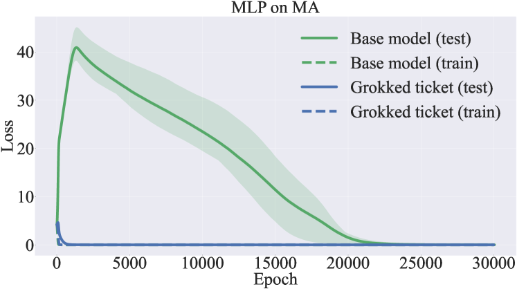

# Замораживание подсети / edge-popup (freezing subnetwork)

[StableMax / perp-Grad](numerical-stability-fix.md) ← предыдущая карточка, следующая → [Сферическое ограничение нормы](spherical-weight-norm-constraint.md)

[Индекс карточек понятий](index.md), категория: [5. Интервенции и методы](index.md#cat-5)\
→ Следующая категория: [6. Аналитические инструменты и метрики](progress-measures.md)\
← Предыдущая категория: [4. Факторы обучения и оптимизации](weight-decay.md)

## Определение

**Замораживание подсети / edge-popup** — приём, при котором веса нейросети
фиксируются («замораживаются») и не обновляются, а оптимизируется только
структура сети: какие связи (рёбра) оставить активными, а какие отсечь.
Генерализация здесь достигается не изменением весов, а нахождением хорошей
подсети внутри уже имеющейся (случайно инициализированной или обученной) сети.
В контекст [грокинга](grokking.md) этот приём ввели Minegishi et al. через
алгоритм edge-popup (Ramanujan et al., 2020), показав, что меморизирующую
сеть можно превратить в генерализирующую одним лишь отсечением связей, без
единого шага обновления весов \[[1.1](#ref-1-1)\].



## Детализация

Механически edge-popup работает так: каждому весу приписывается обучаемый
скор (score); скоры обновляются обратным распространением, и на прямом проходе
сеть использует только рёбра с наибольшими скорами (топ-(1−k) при доле
отсечения k) — сами веса при этом остаются неизменными \[[1.1](#ref-1-1)\].
Такую подсеть, дающую хорошее качество без обучения весов, называют «сильным
[лотерейным билетом](sparse-subnetwork-lottery-ticket.md)» (strong lottery ticket); она — усиление гипотезы
лотерейного билета (lottery ticket hypothesis, Frankle & Carbin: случайно
инициализированная переобученная сеть содержит разреженную подсеть, обучаемую
до хорошего качества). Ключевой тезис
Minegishi et al. — что источник ускоренной генерализации не снижение нормы
весов и не структурная разреженность (sparsity, доля отсечённых связей) сами
по себе, а именно обнаружение «хорошей структуры» (good structure): из трёх
конкурирующих гипотез (H1 — норма весов, H2 — разреженность, H3 — структура)
контролируемые эксперименты отвергают H1 и H2 и оставляют H3
\[[1.1](#ref-1-1)\]. Переход от [фазы запоминания](memorization-phase.md) к
генерализации в этой картине синхронизирован не с падением нормы, а с быстрой
перестройкой маски подсети (мерой служит расстояние Жаккара между масками на
соседних чекпойнтах). Тот же методический приём — заморозить веса и
оптимизировать лишь бинарную маску структурным прунингом (structured pruning,
отсечение целых компонент: голов внимания и MLP-слоёв, а не отдельных весов) —
использует Bhaskar et al., но переносит его на предобученные языковые модели и
оспаривает саму «конкуренцию подсетей» как объяснение генерализации: вместо
непересекающихся конкурирующих подсетей они находят общее «эвристическое ядро»
(heuristic core, набор голов внимания, присутствующих во всех подсетях), а
эффективный размер (effective size, размер наименьшей подсети, чья точность
совпадает с полной моделью) при генерализации у них растёт, а не падает, как в
грокинге \[[2.1](#ref-2-1)\]. Таким образом, замораживание подсети — это и
порождающий инструмент (индуцировать генерализацию отсечением связей), и
диагностический (выделить и сравнить подсети внутри фиксированной модели);
интерпретация того, что именно «хорошая подсеть» объясняет, остаётся спорной.

## Альтернативные определения и нюансы

### A. Порождающая трактовка: edge-popup находит генерализирующую подсеть без изменения весов

Определение через механизм индукции генерализации. Веса заморожены;
обучается только маска (через скоры edge-popup), и меморизирующая сеть
переходит в генерализирующую без обновления весов \[[1.1](#ref-1-1)\].
Отличительная «машинерия»: [параметр порядка](order-parameter.md) здесь — структурная дистанция
(расстояние Жаккара) между масками подсети, а не норма весов; причина
ускорения — обнаружение хорошей структуры, что эмпирически отделено от снижения
нормы (H1) и от разреженности (H2) контролируемыми экспериментами. То есть
замораживание подсети трактуется как достаточное условие генерализации:
структурного поиска хватает, обновление весов не требуется.

### B. Диагностическая трактовка: заморозка весов и структурный прунинг как инструмент выделения подсетей

Определение через анализ, а не индукцию. Модель замораживают после дообучения
и оптимизируют лишь бинарную маску структурным прунингом, чтобы выделить разные
подсети, сохраняющие поведение полной модели, и сравнить их генерализацию
\[[2.1](#ref-2-1)\]. Отличие от трактовки A: цель не «включить» генерализацию
отсечением связей, а декомпозировать уже обученную модель и проверить гипотезу
конкурирующих подсетей; заморозка нужна для верности (faithfulness) подсети
исходной модели, а источник различия между подсетями — случайный сид прунинга.

### Оспаривают

Bhaskar et al., применив ту же заморозку-и-прунинг к предобученным языковым
моделям, оспаривают перенос картины «конкурирующих подсетей» (по которой
генерализация есть переключение с плотной меморизирующей подсети на разреженную
генерализирующую, с падением эффективного размера): вместо непересекающихся
подсетей они находят общее эвристическое ядро из голов внимания, присутствующее
во всех подсетях, включая вовсе не генерализирующие, а при выходе в
генерализацию эффективный размер не падает, а резко растёт \[[2.1](#ref-2-1)\].
То есть замораживание подсети как приём переносится, но вывод «хорошая
разреженная подсеть = генерализация» — нет.

## Ссылки

###### ref-1-1
**\[1.1\]** 2310.19470 — Minegishi et al., «Bridging Lottery Ticket and
Grokking: Understanding Grokking from Inner Structure of Networks».
[`"pruning techniques like the edge-popup algorithm can identify these effective structures without modifying the weights"`](../papers/2310.19470.bridging-lottery-ticket-and-grokking-understanding-grokking-from-inner-structure-of-networks/original/2310.19470.bridging-lottery-ticket-and-grokking-understanding-grokking-from-inner-structure-of-networks.md#p1-2). *«[приёмы прореживания вроде алгоритма edge-popup способны найти эти действенные структуры, не меняя весов](../papers/2310.19470.bridging-lottery-ticket-and-grokking-understanding-grokking-from-inner-structure-of-networks/2310.19470.bridging-lottery-ticket-and-grokking-understanding-grokking-from-inner-structure-of-networks.card.md#p1-2)»*\
Доп.: [`"each weight is assigned a score, and these scores are updated through backpropagation"`](../papers/2310.19470.bridging-lottery-ticket-and-grokking-understanding-grokking-from-inner-structure-of-networks/original/2310.19470.bridging-lottery-ticket-and-grokking-understanding-grokking-from-inner-structure-of-networks.md#p12-3) — *«[каждому весу приписывается оценка, и эти оценки обновляются обратным распространением](../papers/2310.19470.bridging-lottery-ticket-and-grokking-understanding-grokking-from-inner-structure-of-networks/2310.19470.bridging-lottery-ticket-and-grokking-understanding-grokking-from-inner-structure-of-networks.card.md#p12-3)»*; [`"generalization can be achieved solely through structural exploration without updating the weights"`](../papers/2310.19470.bridging-lottery-ticket-and-grokking-understanding-grokking-from-inner-structure-of-networks/original/2310.19470.bridging-lottery-ticket-and-grokking-understanding-grokking-from-inner-structure-of-networks.md#p13-1) — *«[генерализация достижима одним обследованием структур, без обновления весов](../papers/2310.19470.bridging-lottery-ticket-and-grokking-understanding-grokking-from-inner-structure-of-networks/2310.19470.bridging-lottery-ticket-and-grokking-understanding-grokking-from-inner-structure-of-networks.card.md#p13-1)»*; [`"rather to the discovery of good subnetworks"`](../papers/2310.19470.bridging-lottery-ticket-and-grokking-understanding-grokking-from-inner-structure-of-networks/original/2310.19470.bridging-lottery-ticket-and-grokking-understanding-grokking-from-inner-structure-of-networks.md#p1-2) — *«[а обнаружением хороших подсетей](../papers/2310.19470.bridging-lottery-ticket-and-grokking-understanding-grokking-from-inner-structure-of-networks/2310.19470.bridging-lottery-ticket-and-grokking-understanding-grokking-from-inner-structure-of-networks.card.md#p1-2)»*.

## Ссылки на присоединившиеся работы

### Оспаривают

###### ref-2-1
**\[2.1\]** 2403.03942 — Bhaskar et al., «The Heuristic Core: Understanding
Subnetwork Generalization in Pretrained Language Models». Оспаривает: перенос
«конкурирующих подсетей» на предобученные языковые модели — при генерализации
эффективный размер растёт, а не падает, и все подсети делят общее эвристическое
ядро. [`"We freeze the model after fine-tuning and only optimize the pruning masks to"`](../papers/2403.03942.the-heuristic-core-understanding-subnetwork-generalization-in-pretrained-language-models/2403.03942.the-heuristic-core-understanding-subnetwork-generalization-in-pretrained-language-models.card.md#p3-2). *«[Мы замораживаем модель после донастройки и оптимизируем только маски прореживания, чтобы](../papers/2403.03942.the-heuristic-core-understanding-subnetwork-generalization-in-pretrained-language-models/2403.03942.the-heuristic-core-understanding-subnetwork-generalization-in-pretrained-language-models.card.md#p3-2)»*\
Доп.: [`"we use structured pruning"`](../papers/2403.03942.the-heuristic-core-understanding-subnetwork-generalization-in-pretrained-language-models/2403.03942.the-heuristic-core-understanding-subnetwork-generalization-in-pretrained-language-models.card.md#p1-6) — *«[мы применяем структурное прореживание](../papers/2403.03942.the-heuristic-core-understanding-subnetwork-generalization-in-pretrained-language-models/2403.03942.the-heuristic-core-understanding-subnetwork-generalization-in-pretrained-language-models.card.md#p1-6)»*; [`"generalization in our case is accompanied by a sharp increase in effective size"`](../papers/2403.03942.the-heuristic-core-understanding-subnetwork-generalization-in-pretrained-language-models/2403.03942.the-heuristic-core-understanding-subnetwork-generalization-in-pretrained-language-models.card.md#p2-1) — *«[в нашем случае генерализация сопровождается резким ростом эффективного размера](../papers/2403.03942.the-heuristic-core-understanding-subnetwork-generalization-in-pretrained-language-models/2403.03942.the-heuristic-core-understanding-subnetwork-generalization-in-pretrained-language-models.card.md#p2-1)»*; [`"generalization in simple algorithmic tasks"`](../papers/2403.03942.the-heuristic-core-understanding-subnetwork-generalization-in-pretrained-language-models/2403.03942.the-heuristic-core-understanding-subnetwork-generalization-in-pretrained-language-models.card.md#p1-2) — *«[генерализацию в простых алгоритмических задачах](../papers/2403.03942.the-heuristic-core-understanding-subnetwork-generalization-in-pretrained-language-models/2403.03942.the-heuristic-core-understanding-subnetwork-generalization-in-pretrained-language-models.card.md#p1-2)»* (та самая трактовка через конкуренцию
подсетей, которую работа оспаривает).

## Цитирования

Работы, лишь упоминающие явление (обзор литературы, связанные работы, попутное цитирование) без его подробного разбора.

**\[4.1\]** 2205.10343 — Liu et al., «Towards Understanding Grokking: An
Effective Theory of Representation Learning». [`"Some of the structure required for generalization exists before training hinting at a connection with the Lottery Ticket Hypothesis"`](../papers/2205.10343.towards-understanding-grokking-an-effective-theory-of-representation-learning/original/2205.10343.towards-understanding-grokking-an-effective-theory-of-representation-learning.md#p8-8). *«[Часть структуры, необходимой для генерализации, существует ещё до обучения, что намекает на связь с гипотезой лотерейного билета](../papers/2205.10343.towards-understanding-grokking-an-effective-theory-of-representation-learning/2205.10343.towards-understanding-grokking-an-effective-theory-of-representation-learning.card.md#p8-8)»*

**\[4.2\]** 2301.05217 — Nanda et al., «Progress Measures for Grokking via
Mechanistic Interpretability». [`"Returning to phase transitions, the lottery ticket-style explanation suggests that we might expect phase transitions as circuits form"`](../papers/2301.05217.progress-measures-for-grokking-via-mechanistic-interpretability/2301.05217.progress-measures-for-grokking-via-mechanistic-interpretability.card.md#p35-3). *«[возвращаясь к фазовым переходам: объяснение в духе лотерейного
билета позволяет ожидать фазовых переходов по мере формирования
контуров](../papers/2301.05217.progress-measures-for-grokking-via-mechanistic-interpretability/2301.05217.progress-measures-for-grokking-via-mechanistic-interpretability.card.md#p35-3)»*

**\[4.3\]** 2402.16726 — Furuta et al., «Towards Empirical Interpretation of
Internal Circuits and Properties in Grokked Transformers on Modular Polynomials».
[`"The sparse lottery tickets in neural networks may also promote grokking (Minegishi et al., 2023)"`](../papers/2402.16726.towards-empirical-interpretation-of-internal-circuits-and-properties-in-grokked-transformers-on-modular-polynomials/original/2402.16726.towards-empirical-interpretation-of-internal-circuits-and-properties-in-grokked-transformers-on-modular-polynomials.md#p2-2). *«[Разрежённые «счастливые билеты» в нейронных сетях тоже могут способствовать гроккингу (Minegishi et al., 2023)](../papers/2402.16726.towards-empirical-interpretation-of-internal-circuits-and-properties-in-grokked-transformers-on-modular-polynomials/2402.16726.towards-empirical-interpretation-of-internal-circuits-and-properties-in-grokked-transformers-on-modular-polynomials.card.md#p2-2)»*

**\[4.4\]** 2504.13292 — Xu et al., «Let Me Grok For You: Accelerating
Grokking». [`"Minegishi et al. (2024) demonstrated that the gap between memorization and generalization can be nearly eliminated if a lottery ticket, a set of sparse mask matrices, is applied to the model during training"`](../papers/2504.13292.let-me-grok-for-you-accelerating-grokking-via-embedding-transfer-from-a-weaker-model/original/2504.13292.let-me-grok-for-you-accelerating-grokking-via-embedding-transfer-from-a-weaker-model.md#p3-1). *«[Minegishi et al. (2024) показали: разрыв между запоминанием и генерализацией можно почти устранить, если применять к модели в ходе обучения лотерейный билет — набор разрежённых матриц-масок](../papers/2504.13292.let-me-grok-for-you-accelerating-grokking-via-embedding-transfer-from-a-weaker-model/2504.13292.let-me-grok-for-you-accelerating-grokking-via-embedding-transfer-from-a-weaker-model.card.md#p3-1)»*

**\[4.5\]** 2511.04760 — Singh et al., «When Data Falls Short: Grokking Below
the Critical Threshold». [`"lottery-ticket approaches [22], transferring embeddings from a weaker to a stronger"`](../papers/2511.04760.when-data-falls-short-grokking-below-the-critical-threshold/original/2511.04760.when-data-falls-short-grokking-below-the-critical-threshold.md#p3-1). *«[подходы через счастливый билет (Minegishi et al., 2023), перенос вложений от более слабой модели к более сильной](../papers/2511.04760.when-data-falls-short-grokking-below-the-critical-threshold/2511.04760.when-data-falls-short-grokking-below-the-critical-threshold.card.md#p3-1)»*

**\[4.6\]** 2603.29262 — Zhang et al., «Grokking: From Abstraction to Intelligence». Нюанс: обход сорока срединных слоёв истолкован как отбор простоты, а не как побочность переизбыточного устройства. [`"the model indeed effectively bypasses $\approx 40$ intermediate layers"`](../papers/2603.29262.grokking-from-abstraction-to-intelligence/2603.29262.grokking-from-abstraction-to-intelligence.card.md#p14-3) — *«[модель и впрямь действенно обходит $\approx 40$ срединных слоёв](../papers/2603.29262.grokking-from-abstraction-to-intelligence/2603.29262.grokking-from-abstraction-to-intelligence.card.md#p14-3)»*

**\[4.7\]** 2604.00316 — Tomàs, Mallinar, Belkin, «Breaking Data Symmetry is Needed For Generalization in Feature Learning Kernels». Нюанс: навязанная начальная признаковая матрица запирает модель в подгруппе, и обобщение идёт лишь на её орбиту. [`"RFM is unable to *escape the symmetry*, and will only generalize to points within the orbit of that reflection"`](../papers/2604.00316.breaking-data-symmetry-is-needed-for-generalization-in-feature-learning-kernels/original/2604.00316.breaking-data-symmetry-is-needed-for-generalization-in-feature-learning-kernels.md#p7-4) — *«[мы лишаем RFM возможности *уйти от симметрии*, и он обобщит лишь на точки орбиты этого отражения](../papers/2604.00316.breaking-data-symmetry-is-needed-for-generalization-in-feature-learning-kernels/2604.00316.breaking-data-symmetry-is-needed-for-generalization-in-feature-learning-kernels.card.md#p7-4)»*

**\[4.8\]** 2503.23298 — Wang et al., «Learning Towards Emergence: Paving the Way to Induce Emergence by Inhibiting Monosemantic Neurons on Pre-trained Models». Нюанс: подавление прилагается лишь к срединным слоям, признанным более полисемантическими. [`"Besides, middle layers exhibit higher FKR, suggesting they are more polysemantic. This coincides with their role in abstraction and reasoning."`](../papers/2503.23298.learning-towards-emergence-inhibiting-monosemantic-neurons-on-pre-trained-models/2503.23298.learning-towards-emergence-inhibiting-monosemantic-neurons-on-pre-trained-models.card.md#p15-1) — *«[Сверх того, у срединных слоёв FKR выше, то есть они полисемантичнее, что совпадает с их ролью в отвлечении и рассуждении.](../papers/2503.23298.learning-towards-emergence-inhibiting-monosemantic-neurons-on-pre-trained-models/2503.23298.learning-towards-emergence-inhibiting-monosemantic-neurons-on-pre-trained-models.card.md#p15-1)»*

**\[4.9\]** 2405.16658 — Park, Kim, Kim, «Acceleration of Grokking in Learning Arithmetic Operations via Kolmogorov-Arnold Representation». Нюанс: заморозка иного рода, чем edge-popup, — фиксируются обученные веса целого модуля, перенесённого из другой задачи (блок декодера при переносе от операции к операции, слой вложений при переносе на композицию), а доучивается остаток. В задаче с неизвестными заморозка частичная: рядом с перенесённым вложением заведён новый обучаемый слой для новых токенов. Сравнения «заморожено против дообучаемо» нет ни разу, поэтому неизвестно, чем именно из ускорения обязаны заморозке, а чем самой инициализации. [`"For learning a different commutative binary operation, the transferred decoder block is frozen, and only the embedding and classifier layer are learned."`](../papers/2405.16658.acceleration-of-grokking-in-learning-arithmetic-operations-via-kolmogorov-arnold-representation/2405.16658.acceleration-of-grokking-in-learning-arithmetic-operations-via-kolmogorov-arnold-representation.card.md#p15-2). *«[Для обучения другой коммутативной бинарной операции перенесённый блок декодера замораживается, и обучаются только слой вложений и слой-классификатор](../papers/2405.16658.acceleration-of-grokking-in-learning-arithmetic-operations-via-kolmogorov-arnold-representation/2405.16658.acceleration-of-grokking-in-learning-arithmetic-operations-via-kolmogorov-arnold-representation.card.md#p15-2)»*\
Доп.: [`"it is not reasonable to freeze the entire embedding layer because these new tokens require their own representations"`](../papers/2405.16658.acceleration-of-grokking-in-learning-arithmetic-operations-via-kolmogorov-arnold-representation/2405.16658.acceleration-of-grokking-in-learning-arithmetic-operations-via-kolmogorov-arnold-representation.card.md#p16-3) — *«[замораживать весь слой вложений неразумно, поскольку эти новые токены требуют собственных представлений](../papers/2405.16658.acceleration-of-grokking-in-learning-arithmetic-operations-via-kolmogorov-arnold-representation/2405.16658.acceleration-of-grokking-in-learning-arithmetic-operations-via-kolmogorov-arnold-representation.card.md#p16-3)»*.

```
concept:
  category: 5                    # 5. Интервенции и методы (Interventions & methods)
  papers_linked: 11             # различных статей в разделах ссылок карточки
  counted_at: 2026-08-20
```
