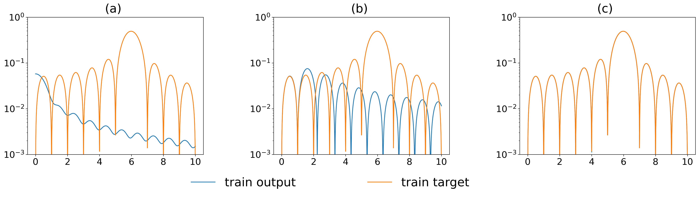

# Частотный принцип / спектральное смещение (frequency principle / spectral bias)

[Алгоритмы Clock и Pizza](clock-vs-pizza.md) ← предыдущая карточка, следующая → [Ортогональность градиента](orthogonal-gradient-perp-grad.md)

[Индекс карточек понятий](index.md), категория: [2. Механизмы и представления](index.md#cat-2)\
→ Следующая категория: [3. Задачи и наборы данных](modular-arithmetic.md)\
← Предыдущая категория: [1. Явления](grokking.md)

## Определение

**Частотный принцип** (frequency principle, F-Principle), он же **спектральное
смещение** (spectral bias) — неявное индуктивное смещение нейросетей, при
котором они подгоняют целевую функцию «от низких частот к высоким»: сперва
выучиваются медленно меняющиеся (низкочастотные) компоненты сигнала, а
высокочастотные детали — существенно позже \[[1.1](#ref-1-1)\]. Само понятие
введено вне корпуса по гроккингу — как «frequency principle (F-Principle)» у Xu
et al. (2019, 2020, 2022) и как «spectral bias» у Rahaman et al. (2019); в
контексте [гроккинга](grokking.md) эту оптику ввели Zhou et al. (2024), объяснив
отложенную генерализацию через частотную динамику обучения: на ранней стадии
сеть выучивает менее выраженные (в тесте) частотные компоненты, что и порождает
задержку \[[1.1](#ref-1-1)\].



## Детализация

Частота здесь — это частота в спектре (разложении Фурье) целевой функции по
входу, а не «частота встречаемости»; «низкие частоты» — плавные, глобальные
закономерности, «высокие» — резкие, локальные детали. Ключевое наблюдение
F-принципа: скорость убывания потерь в частотной области определяется гладкостью
(регулярностью) функций активации, поэтому при обычной (малой) инициализации
сеть сначала сходится по низким частотам \[[1.1](#ref-1-1)\]. Zhou et al.
связывают это с гроккингом так: при недостаточной и неравномерной выборке в
спектре обучающих данных появляется ложная низкочастотная компонента (эффект
наложения спектров, aliasing — когда высокая частота из-за редкой дискретизации
«маскируется» под низкую), которой нет в спектре теста; следуя F-принципу, сеть
сперва добросовестно подгоняет эту паразитную низкую частоту — train-потери
падают, а test-потери растут (это соответствует [фазе
запоминания](memorization-phase.md)), и лишь позже, выучив истинные высокие
частоты, сеть генерализует \[[1.1](#ref-1-1)\]. Резкий скачок теста в этот момент
роднит картину с трактовкой гроккинга как [фазового
перехода](phase-transition.md). Важный управляющий параметр — масштаб
инициализации весов: при большой инициализации F-принцип перестаёт держаться,
сеть подгоняет все частоты примерно одновременно, и механизм задержки меняется
(показано Zhou et al. на MNIST с большой инициализацией) \[[1.1](#ref-1-1)\].
Отдельная (более теоретическая) линия объясняет спектральное смещение через
спектр [нейронного касательного ядра](neural-tangent-kernel-ntk.md) (NTK — линеаризация сети вокруг начальных
весов, при которой обучение сводится к ядерной регрессии): скорость сходимости
каждой ошибочной моды пропорциональна соответствующему собственному значению
ядра, а поскольку «крупными» оказываются лишь немногие собственные значения,
большинство (высокочастотных) мод сходится медленно \[[3.1](#ref-3-1)\]. Из этой
же оптики вытекает связь спектрального смещения с ленивым (NTK / kernel) режимом
обучения: затянутое пребывание в нём и есть источник задержки перед
генерализацией \[[3.1](#ref-3-1)\].

## Альтернативные определения и нюансы

### A. Частотное рассогласование train/test как причина гроккинга (Zhou et al.)

Определение через спектральное рассогласование выборок: гроккинг возникает не
из-за регуляризации или адаптивных [оптимизаторов](optimizer-adam-adamw-sgd.md), а из-за несовпадения спектров
обучающих и тестовых данных, порождённого недостаточной и неравномерной
выборкой \[[1.1](#ref-1-1)\]. [Параметр порядка](order-parameter.md) здесь — расхождение между
«предпочитаемой» в динамике обучения частотой и доминирующей частотой теста;
управляющие рычаги — плотность/равномерность выборки (при достаточном или
равномерном сэмплировании спектры совпадают и гроккинг исчезает) и масштаб
инициализации (переключающий, держится ли F-принцип). Ключевое отличие от
объяснений через веса и оптимизатор: механизм не требует ни ограничений на
размерность данных, ни явной регуляризации, а держится на одной лишь частотной
динамике; авторы явно оговаривают, что на языковых (алгоритмических) данных
механизм может не работать.

### B. Спектральное смещение через собственный спектр NTK (Jiang et al.)

Определение через линейную алгебру ядра: спектральное смещение — прямое
следствие эволюции ошибки по собственным модам NTK, где мода с собственным
значением λ убывает со скоростью, задаваемой этим λ, а глобальная сходимость
управляется числом обусловленности ядра \[[3.1](#ref-3-1)\]. Отличие от рамки
Zhou et al.: источник различия перенесён с распределения данных на спектр
касательного ядра, а управляющий рычаг — предобуславливатель градиента
(preconditioned GD, методы типа Гаусса—Ньютона и Левенберга—Марквардта):
выравнивая собственные значения, он «стирает» спектральное смещение, позволяет
равномерно исследовать частотные моды и тем сокращает задержку гроккинга. Тем
самым спектральное смещение из чисто описательного факта становится величиной, на
которую можно целенаправленно воздействовать оптимизатором.

### Поддерживают

Jiang et al. присоединяются к спектральной трактовке гроккинга и усиливают её:
и рамка Zhou et al. (частотное рассогласование), и родственная ей рамка Kumar et
al. (затянутый ленивый режим) сводятся к тому, что «гроккинг проистекает из
спектрального смещения в сочетании с длительным удержанием в ленивом режиме»
\[[3.1](#ref-3-1)\]. Их собственный вклад — эмпирическое и теоретическое
свидетельство: предобусловленный градиентный спуск, снимая спектральное
смещение в NTK-режиме, равномерно сокращает задержку до генерализации на ряде
задач ([модульная арифметика](modular-arithmetic.md), полиномиальная регрессия, MNIST), откуда вывод, что
не переобучение и не адаптивность, а именно спектральное смещение играет
ведущую роль \[[3.1](#ref-3-1)\].

## Ссылки

###### ref-1-1
**\[1.1\]** 2405.17479 — Zhou et al., «A Rationale from Frequency Perspective for Grokking in Training Neural Network». [`"The implicit frequency bias of NNs that fit the target function from low to high frequency is named as frequency principle (F-Principle) (Xu et al., 2019, 2020, 2022) or spectral bias (Rahaman et al., 2019)"`](../papers/2405.17479.a-rationale-from-frequency-perspective-for-grokking-in-training-neural-network/2405.17479.a-rationale-from-frequency-perspective-for-grokking-in-training-neural-network.card.md#p2-3). *«[Неявное частотное смещение НС, подгоняющих целевую функцию от низких частот к высоким, названо частотным принципом (F-принципом) (Xu et al., 2019, 2020, 2022) или спектральным смещением (Rahaman et al., 2019)](../papers/2405.17479.a-rationale-from-frequency-perspective-for-grokking-in-training-neural-network/2405.17479.a-rationale-from-frequency-perspective-for-grokking-in-training-neural-network.card.md#p2-3)»*\
Доп.: [`"The key insight is that, in the initial stages of training, NNs learn the less salient frequency components present in the test data"`](../papers/2405.17479.a-rationale-from-frequency-perspective-for-grokking-in-training-neural-network/2405.17479.a-rationale-from-frequency-perspective-for-grokking-in-training-neural-network.card.md#p1-5) — *«[Основное наблюдение таково: на первых порах обучения НС выучивают менее заметные частотные составляющие, присутствующие в тестовых данных](../papers/2405.17479.a-rationale-from-frequency-perspective-for-grokking-in-training-neural-network/2405.17479.a-rationale-from-frequency-perspective-for-grokking-in-training-neural-network.card.md#p1-5)»*; [`"Grokking arises due to a misalignment between the preferred frequency in the training dynamics and the dominant frequency in the test data, which is a consequence of insufficient sampling"`](../papers/2405.17479.a-rationale-from-frequency-perspective-for-grokking-in-training-neural-network/2405.17479.a-rationale-from-frequency-perspective-for-grokking-in-training-neural-network.card.md#p1-5) — *«[Гроккинг возникает из-за несогласия между частотой, предпочитаемой динамикой обучения, и главенствующей частотой в тестовых данных, — а это следствие недостаточной выборки](../papers/2405.17479.a-rationale-from-frequency-perspective-for-grokking-in-training-neural-network/2405.17479.a-rationale-from-frequency-perspective-for-grokking-in-training-neural-network.card.md#p1-5)»*; [`"The key insight of the F-principle is that the decay rate of a loss function in the frequency domain derives from the regularity of the activation functions"`](../papers/2405.17479.a-rationale-from-frequency-perspective-for-grokking-in-training-neural-network/2405.17479.a-rationale-from-frequency-perspective-for-grokking-in-training-neural-network.card.md#p2-3) — *«[Основное наблюдение F-принципа в том, что скорость убывания функции потерь в частотной области определяется регулярностью функций активации](../papers/2405.17479.a-rationale-from-frequency-perspective-for-grokking-in-training-neural-network/2405.17479.a-rationale-from-frequency-perspective-for-grokking-in-training-neural-network.card.md#p2-3)»*

## Ссылки на присоединившиеся работы

### Поддерживают

###### ref-3-1
**\[3.1\]** 2601.03162 — Jiang et al., «On the Convergence Behavior of Preconditioned Gradient Descent Toward the Rich Learning Regime». Нюанс: спектральное смещение как собственный спектр NTK, на который воздействует предобуславливатель, сокращая задержку гроккинга. [`"Spectral bias, the tendency of neural networks to learn low frequencies first, can be both a blessing and a curse"`](../papers/2601.03162.on-the-convergence-behavior-of-preconditioned-gradient-descent-toward-the-rich-learning-regime/2601.03162.on-the-convergence-behavior-of-preconditioned-gradient-descent-toward-the-rich-learning-regime.card.md#p1-2). *«[Спектральное смещение — склонность нейронных сетей выучивать сперва низкие частоты — может быть и благом, и проклятием](../papers/2601.03162.on-the-convergence-behavior-of-preconditioned-gradient-descent-toward-the-rich-learning-regime/2601.03162.on-the-convergence-behavior-of-preconditioned-gradient-descent-toward-the-rich-learning-regime.card.md#p1-2)»*\
Доп.: [`"grokking mainly arises from a spectral mismatch in the training and test data. Due to spectral bias, the model first learns low-frequency modes that are dominant in the train set but may not be predictive for the test set"`](../papers/2601.03162.on-the-convergence-behavior-of-preconditioned-gradient-descent-toward-the-rich-learning-regime/2601.03162.on-the-convergence-behavior-of-preconditioned-gradient-descent-toward-the-rich-learning-regime.card.md#p3-7) — *«[гроккинг главным образом возникает из спектрального несоответствия обучающих и тестовых данных. Из-за спектрального смещения модель сперва выучивает низкочастотные моды, главенствующие в обучающем наборе, но, возможно, непредсказательные для тестового](../papers/2601.03162.on-the-convergence-behavior-of-preconditioned-gradient-descent-toward-the-rich-learning-regime/2601.03162.on-the-convergence-behavior-of-preconditioned-gradient-descent-toward-the-rich-learning-regime.card.md#p3-7)»*; [`"Both views argue that grokking stems from spectral bias combined with prolonged confinement to the lazy training regime"`](../papers/2601.03162.on-the-convergence-behavior-of-preconditioned-gradient-descent-toward-the-rich-learning-regime/2601.03162.on-the-convergence-behavior-of-preconditioned-gradient-descent-toward-the-rich-learning-regime.card.md#p5-8) — *«[Оба взгляда доказывают, что гроккинг происходит от спектрального смещения вместе с долгим заточением в ленивом режиме обучения](../papers/2601.03162.on-the-convergence-behavior-of-preconditioned-gradient-descent-toward-the-rich-learning-regime/2601.03162.on-the-convergence-behavior-of-preconditioned-gradient-descent-toward-the-rich-learning-regime.card.md#p5-8)»*; [`"This supports recent theories proposed by (Kumar et al., 2024; Zhou et al., 2024), that overfitting or adaptivity are not the main reason for grokking. We propose that spectral bias plays an important role"`](../papers/2601.03162.on-the-convergence-behavior-of-preconditioned-gradient-descent-toward-the-rich-learning-regime/2601.03162.on-the-convergence-behavior-of-preconditioned-gradient-descent-toward-the-rich-learning-regime.card.md#p7-2) — *«[Это подкрепляет недавние теории (Kumar et al., 2024; Zhou et al., 2024), по которым ни переобучение, ни приспособляемость не суть главные причины гроккинга. Мы предполагаем, что важную роль играет спектральное смещение](../papers/2601.03162.on-the-convergence-behavior-of-preconditioned-gradient-descent-toward-the-rich-learning-regime/2601.03162.on-the-convergence-behavior-of-preconditioned-gradient-descent-toward-the-rich-learning-regime.card.md#p7-2)»*


###### ref-3-2
**\[3.2\]** 2211.12316 — Bhattamishra et al., «Simplicity Bias in Transformers and their Ability to Learn Sparse Boolean Functions». Нюанс: порядок «от простого к сложному» измерен через чувствительность, а не через спектр, и перенесён на текстовые данные (SST, IMDB), где фурье-разбор неприменим; связь с частотным принципом Rahaman et al. 2019 заявлена ссылкой, а не измерением. [`"Functions with lower average sensitivity also have a lower frequency and hence these observations are closely connected."`](../papers/2211.12316.simplicity-bias-in-transformers-and-their-ability-to-learn-sparse-boolean-functions/2211.12316.simplicity-bias-in-transformers-and-their-ability-to-learn-sparse-boolean-functions.card.md#p6-4). *«[Функции с более низкой средней чувствительностью также имеют более низкую частоту, и потому эти наблюдения тесно связаны](../papers/2211.12316.simplicity-bias-in-transformers-and-their-ability-to-learn-sparse-boolean-functions/2211.12316.simplicity-bias-in-transformers-and-their-ability-to-learn-sparse-boolean-functions.card.md#p6-4)»*
## Цитирования

Работы, лишь упоминающие явление (обзор литературы, связанные работы, попутное цитирование) без его подробного разбора.

**\[4.1\]** 2504.03162 — Gu et al., «Beyond Progress Measures: Theoretical Insights into the Mechanism of Grokking». [`"The first perspective is based on frequency and Fourier coefficients, inspired by circuit signal analysis (Nanda et al., 2023; Zhou et al., 2024; Furuta et al., 2024)"`](../papers/2504.03162.beyond-progress-measures-theoretical-insights-into-the-mechanism-of-grokking/2504.03162.beyond-progress-measures-theoretical-insights-into-the-mechanism-of-grokking.card.md#p3-2). *«[Первый взгляд опирается на частоты и фурье-коэффициенты, вдохновляясь разбором контурных сигналов (Nanda et al., 2023; Zhou et al., 2024; Furuta et al., 2024)](../papers/2504.03162.beyond-progress-measures-theoretical-insights-into-the-mechanism-of-grokking/2504.03162.beyond-progress-measures-theoretical-insights-into-the-mechanism-of-grokking.card.md#p3-2)»*

**\[4.2\]** 2506.05718 — Notsawo et al., «Grokking Beyond the Euclidean Norm of Model Parameters». [`"various factors, such as neuron activity (Nanda et al., 2023), weight norm of the model parameters (Liu et al., 2023a), sparsity (Merrill et al., 2023), time scales of pattern formation (Davies et al., 2023), Fourier gap (Barak et al., 2022), last layer norm (Thilak et al., 2022), fast vs low-frequency components (Zhou et al., 2024)"`](../papers/2506.05718.grokking-beyond-the-euclidean-norm-of-model-parameters/original/2506.05718.grokking-beyond-the-euclidean-norm-of-model-parameters.md#p16-2). *«[разные причины: деятельность нейронов (Nanda et al., 2023), норма весов модели (Liu et al., 2023a), разрежённость (Merrill et al., 2023), временны́е масштабы складывания образцов (Davies et al., 2023), фурье-разрыв (Barak et al., 2022), норма последнего слоя (Thilak et al., 2022), быстрые и медленные составляющие (Zhou et al., 2024)](../papers/2506.05718.grokking-beyond-the-euclidean-norm-of-model-parameters/2506.05718.grokking-beyond-the-euclidean-norm-of-model-parameters.card.md#p16-2)»*

**\[4.3\]** 2603.07323 — Truong, Truong, «Norm-Hierarchy Transitions in Representation Learning…». Нюанс: спектральное смещение взято как готовый довод, не проверяется. [`"gradient-based optimisers exhibit a spectral or frequency bias: they fit low-complexity functions before high-complexity ones"`](../papers/2603.07323.norm-hierarchy-transitions-in-representation-learning-when-and-why-neural-networks-abandon-shortcuts/2603.07323.norm-hierarchy-transitions-in-representation-learning-when-and-why-neural-networks-abandon-shortcuts.card.md#p4-3). *«[градиентные оптимизаторы обнаруживают спектральное, или частотное, смещение: они подгоняют функции малой сложности прежде функций большой сложности](../papers/2603.07323.norm-hierarchy-transitions-in-representation-learning-when-and-why-neural-networks-abandon-shortcuts/2603.07323.norm-hierarchy-transitions-in-representation-learning-when-and-why-neural-networks-abandon-shortcuts.card.md#p4-3)»*

**\[4.4\]** 2606.12966 — Sivasankar, «Circuit Synchronization Precedes Generalization: A Causal Precursor to Grokking». [`"our Fourier rank collapse is consistent with this bias compressing the Fourier circuit representation to its minimal frequency set"`](../papers/2606.12966.circuit-synchronization-precedes-generalization-a-causal-precursor-to-grokking/2606.12966.circuit-synchronization-precedes-generalization-a-causal-precursor-to-grokking.card.md#p17-2). *«[наш обвал фурье-ранга согласуется с тем, что это смещение сжимает представление фурье-контура до его наименьшего набора частот](../papers/2606.12966.circuit-synchronization-precedes-generalization-a-causal-precursor-to-grokking/2606.12966.circuit-synchronization-precedes-generalization-a-causal-precursor-to-grokking.card.md#p17-2)»*

```
concept:
  category: 2                    # 2. Механизмы и представления (Mechanisms & representations)
  papers_linked: 7             # различных статей в разделах ссылок карточки
  counted_at: 2026-08-20
```
