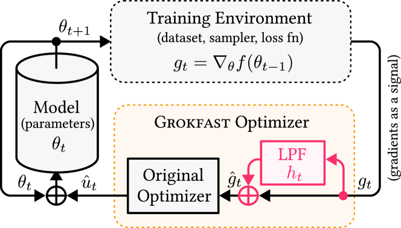

# Grokfast / фильтрация градиента (gradient low-pass filtering)

— ← предыдущая карточка, следующая → [StableMax / perp-Grad](numerical-stability-fix.md)

[Индекс карточек понятий](index.md), категория: [5. Интервенции и методы](index.md#cat-5)\
→ Следующая категория: [6. Аналитические инструменты и метрики](progress-measures.md)\
← Предыдущая категория: [4. Факторы обучения и оптимизации](weight-decay.md)

## Определение

**Grokfast** (низкочастотная фильтрация градиента, gradient low-pass filtering) —
приём ускорения [гроккинга](grokking.md), то есть отложенной генерализации, при
которой сеть сначала почти идеально запоминает обучающую выборку, а обобщение
наступает на порядки итераций позже. Идея приёма: рассматривать последовательность
градиентов каждого параметра по итерациям обучения как временной сигнал, спектрально
(через частотное разложение) выделить в нём медленно-меняющуюся, «обобщающую»
компоненту и усилить её, добавляя к текущему градиенту его же копию, пропущенную
через низкочастотный фильтр (low-pass filter, LPF — фильтр, пропускающий медленные и
подавляющий быстрые колебания сигнала) \[[1.1](#ref-1-1)\]. Понятие введено работой
Lee et al. (Grokfast), показавшей, что такое усиление ускоряет обобщение всего лишь
«несколькими строками кода» \[[1.1](#ref-1-1)\].



## Детализация

Исходная гипотеза Grokfast трактует градиентный спуск сигнально: траекторию параметра
под градиентным спуском можно разложить на быстро-меняющуюся, порождающую переобучение
компоненту и медленно-меняющуюся, вызывающую обобщение компоненту, — и именно вторая,
низкочастотная, отвечает за отложенный характер перехода \[[1.1](#ref-1-1)\]. Отсюда
рецепт: усилить низкочастотную часть градиента, чтобы обобщение (см.
[фазу запоминания](memorization-phase.md), которую этот приём стремится сократить)
наступало раньше. Технически это реализуется как аддитивный фильтр: к текущему обновлению
параметра прибавляется усреднённая по недавним шагам («сглаженная») версия градиента.
Работа предлагает два варианта фильтра — скользящее среднее по окну фиксированного размера
(moving average, MA) и экспоненциальное скользящее среднее (exponential moving average,
EMA), — управляемые двумя гиперпараметрами: коэффициентом усиления и размером окна (для EMA
— коэффициентом затухания). Приём совместим с обычным [weight decay](weight-decay.md) (L2-регуляризацией) и,
по наблюдению авторов, даёт с ним синергетический эффект. В индексе понятий этот же приём
проходит и под именем «низкочастотный фильтр градиента» (low-pass gradient filter) —
это одно и то же семейство методов.

Последующие работы приняли эмпирический результат (манипуляция спектром градиента ускоряет
гроккинг), но оспорили статус именно фиксированной низкочастотной фильтрации как правильного
механизма. NeuralGrok заменяет «строгую» низкочастотную фильтрацию обучаемым преобразованием
градиента, указывая на чувствительность Grokfast к гиперпараметрам \[[2.1](#ref-2-1)\].
Egalitarian Gradient Descent (EGD) идёт дальше и называет Grokfast «эвристическим частотным
фильтром без гарантий», предлагая вместо него принципиальное выравнивание [скоростей обучения](learning-rate.md)
вдоль сингулярных направлений градиента \[[2.2](#ref-2-2)\]. Таким образом, вокруг понятия
сложилась не линия поддержки, а линия конкурирующих замен: гроккинг здесь по-прежнему
описывается как резкий [фазовый переход](phase-transition.md), но спор идёт о том, какая
именно операция над градиентом его ускоряет.

## Альтернативные определения и нюансы

### A. Аддитивный низкочастотный фильтр градиента (операционная трактовка)

Определение через саму операцию: Grokfast — это добавление к градиенту его копии, пропущенной
через низкочастотный фильтр, `"Amplifying the low-frequencies of the gradients g(t) can be achieved by adding a low-pass filtered signal g(t) to itself."`
\[[1.1](#ref-1-1)\]. Различающая машинерия здесь — устройство самого фильтра: у него ровно два
скалярных гиперпараметра (коэффициент усиления и размер окна), а конкретная реализация —
скользящее среднее по очереди фиксированной ёмкости, чьё среднее и есть добавляемая
низкочастотная компонента `"low-pass filtered gradients which is added to the current parameter update at each optimizer step"`
\[[1.1](#ref-1-1)\]. В этой трактовке понятие определяется тем, ЧТО делает [оптимизатор](optimizer-adam-adamw-sgd.md) с
сигналом градиента, а не тем, почему это работает.

### B. Разделение траектории на переобучающую и обобщающую компоненты (спектральная трактовка)

Определение через причинную гипотезу: параметрическая траектория раскладывается на две
частотные компоненты — быструю (переобучающую) и медленную (обобщающую), — и отложенная
генерализация есть следствие именно медленной, низкочастотной компоненты обновлений
\[[1.1](#ref-1-1)\]. Отличие от трактовки A — источник различия не в конструкции фильтра,
а в спектральной модели градиентного сигнала: приём определяется тем, КАКУЮ из двух
спектральных компонент он усиливает, и почему усиление именно низкочастотной части ускоряет
переход. Трактовка A — это способ реализации, трактовка B — обоснование выбора компоненты.

### Оспаривают

Две работы оспаривают статус фиксированной низкочастотной фильтрации как правильного или
достаточного механизма ускорения, сохраняя при этом более широкий тезис о манипуляции
градиентом. NeuralGrok отказывается от «строгой» низкочастотной фильтрации в пользу обучаемого
двухуровневого (bilevel) преобразования градиента и указывает, что оконный вариант Grokfast
чувствителен к настройке гиперпараметров и зависит от задачи \[[2.1](#ref-2-1)\]. EGD
характеризует Grokfast как «эвристический частотный фильтр без гарантий» и предлагает взамен
выравнивание скоростей сходимости вдоль главных (сингулярных) направлений градиента, что, в
отличие от буферизующего окна Grokfast, не требует хранить большой буфер прошлых обновлений
\[[2.2](#ref-2-2)\]. Оба возражения направлены не на факт (спектральная манипуляция ускоряет
гроккинг), а на конкретную форму — фиксированный низкочастотный фильтр.

## Ссылки

###### ref-1-1
**\[1.1\]** 2405.20233 — Lee et al., «Grokfast: Accelerated Grokking by Amplifying Slow Gradients». [`"Amplifying the low-frequencies of the gradients g(t) can be achieved by adding a low-pass filtered signal g(t) to itself."`](../papers/2405.20233.grokfast-accelerated-grokking-by-amplifying-slow-gradients/2405.20233.grokfast-accelerated-grokking-by-amplifying-slow-gradients.card.md#p3-1). *«[Усиления низких частот градиентов $g(t)$ можно добиться, добавив к сигналу $g(t)$ его же, пропущенный через фильтр нижних частот](../papers/2405.20233.grokfast-accelerated-grokking-by-amplifying-slow-gradients/2405.20233.grokfast-accelerated-grokking-by-amplifying-slow-gradients.card.md#p3-1)»*\
Доп. (гипотеза): [`"the delayed generalization of grokking is a consequence of the slow-varying component of the parameter updates"`](../papers/2405.20233.grokfast-accelerated-grokking-by-amplifying-slow-gradients/2405.20233.grokfast-accelerated-grokking-by-amplifying-slow-gradients.card.md#p2-5) — *«[отложенная генерализация гроккинга есть следствие медленно меняющейся составляющей обновлений параметров](../papers/2405.20233.grokfast-accelerated-grokking-by-amplifying-slow-gradients/2405.20233.grokfast-accelerated-grokking-by-amplifying-slow-gradients.card.md#p2-5)»*;\
Доп. (реализация): [`"low-pass filtered gradients which is added to the current parameter update at each optimizer step"`](../papers/2405.20233.grokfast-accelerated-grokking-by-amplifying-slow-gradients/2405.20233.grokfast-accelerated-grokking-by-amplifying-slow-gradients.card.md#p3-10) — *«[градиенты, пропущенные через ФНЧ; они добавляются к текущему обновлению параметра на каждом шаге оптимизатора](../papers/2405.20233.grokfast-accelerated-grokking-by-amplifying-slow-gradients/2405.20233.grokfast-accelerated-grokking-by-amplifying-slow-gradients.card.md#p3-10)»*;\
Доп. (ускорение): [`"lines of code that amplifies the slow-varying components of gradients"`](../papers/2405.20233.grokfast-accelerated-grokking-by-amplifying-slow-gradients/2405.20233.grokfast-accelerated-grokking-by-amplifying-slow-gradients.card.md#p1-2) — *«[строчками кода, усиливающими медленно меняющиеся составляющие градиентов](../papers/2405.20233.grokfast-accelerated-grokking-by-amplifying-slow-gradients/2405.20233.grokfast-accelerated-grokking-by-amplifying-slow-gradients.card.md#p1-2)»*.

## Ссылки на присоединившиеся работы

### Оспаривают

###### ref-2-1
**\[2.1\]** 2504.17243 — Zhou et al., «NeuralGrok: Accelerate Grokking by Neural Gradient Transformation». Оспаривает: вместо строгой низкочастотной фильтрации — обучаемое преобразование градиента. [`"Instead of strict low-pass filtering, we propose NEURALGROK"`](../papers/2504.17243.neuralgrok-accelerate-grokking-by-neural-gradient-transformation/original/2504.17243.neuralgrok-accelerate-grokking-by-neural-gradient-transformation.md#p1-4). *«[Вместо строгой низкочастотной фильтрации мы предлагаем NEURALGROK](../papers/2504.17243.neuralgrok-accelerate-grokking-by-neural-gradient-transformation/2504.17243.neuralgrok-accelerate-grokking-by-neural-gradient-transformation.card.md#p1-4)»*\
Доп. (что делает Grokfast): [`"Lee et al. (2024) demonstrated that by amplifying the low-frequency component of the gradient by a low-pass filter (LPF), the generalization can be greatly accelerated"`](../papers/2504.17243.neuralgrok-accelerate-grokking-by-neural-gradient-transformation/original/2504.17243.neuralgrok-accelerate-grokking-by-neural-gradient-transformation.md#p1-3) — *«[Lee et al. (2024) показали, что усилением низкочастотной составляющей градиента низкочастотным фильтром (LPF) генерализацию можно значительно ускорить](../papers/2504.17243.neuralgrok-accelerate-grokking-by-neural-gradient-transformation/2504.17243.neuralgrok-accelerate-grokking-by-neural-gradient-transformation.card.md#p1-3)»*;\
Доп. (претензия): [`"GROKFAST-MA is quite sensitive to hyperparameter settings, which can be task-dependent."`](../papers/2504.17243.neuralgrok-accelerate-grokking-by-neural-gradient-transformation/original/2504.17243.neuralgrok-accelerate-grokking-by-neural-gradient-transformation.md#p4-2) — *«[GrokFast-MA довольно чувствителен к настройкам гиперпараметров, которые могут зависеть от задачи](../papers/2504.17243.neuralgrok-accelerate-grokking-by-neural-gradient-transformation/2504.17243.neuralgrok-accelerate-grokking-by-neural-gradient-transformation.card.md#p4-2)»*

###### ref-2-2
**\[2.2\]** 2510.04930 — Saheb Pasand et al., «Egalitarian Gradient Descent: A Simple Approach to Accelerated Grokking». Оспаривает: Grokfast — эвристический фильтр без гарантий; принципиальная альтернатива — выравнивание скоростей вдоль сингулярных направлений. [`"Grokfast is a heuristic frequency filter without such guarantees"`](../papers/2510.04930.egalitarian-gradient-descent-a-simple-approach-to-accelerated-grokking/original/2510.04930.egalitarian-gradient-descent-a-simple-approach-to-accelerated-grokking.md#p8-9). *«[Grokfast же есть эвристический частотный фильтр без таких ручательств](../papers/2510.04930.egalitarian-gradient-descent-a-simple-approach-to-accelerated-grokking/2510.04930.egalitarian-gradient-descent-a-simple-approach-to-accelerated-grokking.card.md#p8-9)»*\
Доп. (что делает Grokfast): [`"Grokfast amplifies slow (low-frequency) gradient components via simple optimizer-side filters, consistently accelerating grokking across tasks and architectures"`](../papers/2510.04930.egalitarian-gradient-descent-a-simple-approach-to-accelerated-grokking/original/2510.04930.egalitarian-gradient-descent-a-simple-approach-to-accelerated-grokking.md#p4-2) — *«[Grokfast усиливает медленные (низкочастотные) составляющие градиента простыми фильтрами со стороны оптимизатора, неизменно ускоряя гроккинг на разных задачах и устройствах](../papers/2510.04930.egalitarian-gradient-descent-a-simple-approach-to-accelerated-grokking/2510.04930.egalitarian-gradient-descent-a-simple-approach-to-accelerated-grokking.card.md#p4-2)»*;\
Доп. (отличие): [`"unlike Grokfast, EGD equalizes the optimization speed across principal directions"`](../papers/2510.04930.egalitarian-gradient-descent-a-simple-approach-to-accelerated-grokking/original/2510.04930.egalitarian-gradient-descent-a-simple-approach-to-accelerated-grokking.md#p8-8) — *«[в отличие от Grokfast, EGD уравнивает скорость оптимизации по главным направлениям](../papers/2510.04930.egalitarian-gradient-descent-a-simple-approach-to-accelerated-grokking/2510.04930.egalitarian-gradient-descent-a-simple-approach-to-accelerated-grokking.card.md#p8-8)»*.


###### ref-2-3
**\[2.3\]** 2506.12284 — Walker et al., «GrokAlign: Geometric Characterisation and Acceleration of Grokking». Ставит Grokfast в прямое сравнение по десяти семенам на MNIST-обиходе Liu et al. и получает отрицательный итог: при кросс-энтропии Grokfast чуть медленнее базового прогона (↑1,01× по шагам, ↑1,03× по времени), при среднеквадратичной ошибке даёт ↓1,08× против ↓1,69× у GrokAlign. Нюанс: настройки Grokfast не названы вовсе — ни α, ни λ, ни выбор между EMA и MA, — поэтому по опубликованному нельзя отличить проигрыш приёма от проигрыша его настройки; строка базового прогона в таблице пуста, абсолютных сроков нет. [`"Grokfast provides a relatively lower improvement in the mean-squared error case and is ineffective in the cross-entropy case"`](../papers/2506.12284.grokalign-geometric-characterisation-and-acceleration-of-grokking/original/2506.12284.grokalign-geometric-characterisation-and-acceleration-of-grokking.md#p9-3). *«[Grokfast даёт относительно меньшее улучшение в случае среднеквадратичной ошибки и недейственен в случае кросс-энтропии](../papers/2506.12284.grokalign-geometric-characterisation-and-acceleration-of-grokking/2506.12284.grokalign-geometric-characterisation-and-acceleration-of-grokking.card.md#p9-3)»*\
Доп. (как приём описан): [`"Grokfast [32] works to improve the rate of grokking by manipulating the gradients during training to amplify certain signals."`](../papers/2506.12284.grokalign-geometric-characterisation-and-acceleration-of-grokking/original/2506.12284.grokalign-geometric-characterisation-and-acceleration-of-grokking.md#p9-2) — *«[Grokfast [32] работает над улучшением темпа гроккинга, перерабатывая градиенты во время обучения так, чтобы усиливать определённые сигналы.](../papers/2506.12284.grokalign-geometric-characterisation-and-acceleration-of-grokking/2506.12284.grokalign-geometric-characterisation-and-acceleration-of-grokking.card.md#p9-2)»*

###### ref-2-4
**\[2.4\]** 2604.20923 — Golwala, «ILDR: Geometric Early Detection of Grokking». Оспаривает пригодность медленного градиента как признака, но проверяет его в пассивном режиме: [`"the amplification step is removed so that training remains unchanged across all conditions"`](../papers/2604.20923.ildr-geometric-early-detection-of-grokking/original/2604.20923.ildr-geometric-early-detection-of-grokking.md#p2-5) — *«[шаг усиления убран, так что обучение остаётся неизменным во всех условиях](../papers/2604.20923.ildr-geometric-early-detection-of-grokking/2604.20923.ildr-geometric-early-detection-of-grokking.card.md#p2-5)»*. [`"On seeds $0, 1,$ and $42$ it leads by $\sim 2000$ steps and on seeds $2, 3, 777,$ and $9999$ it lags by $4000\text{--}6500$ steps."`](../papers/2604.20923.ildr-geometric-early-detection-of-grokking/original/2604.20923.ildr-geometric-early-detection-of-grokking.md#p7-5). *«[На семенах $0, 1,$ и $42$ он опережает на $\sim 2000$ шагов, а на семенах $2, 3, 777,$ и $9999$ запаздывает на $4000\text{--}6500$ шагов.](../papers/2604.20923.ildr-geometric-early-detection-of-grokking/2604.20923.ildr-geometric-early-detection-of-grokking.card.md#p7-5)»*\
Доп. (зависимость от глубины): запаздывание сокращается с глубиной — 13600, 4900 и 1000 шагов при 1, 2 и 4 слоях ([с. 9, абз. 4](../papers/2604.20923.ildr-geometric-early-detection-of-grokking/2604.20923.ildr-geometric-early-detection-of-grokking.card.md#p9-4)), откуда автор заключает, что признак ловит свойство модели, а не задачи.\
Доп. (ошибка атрибуции): работа приписывает Grokfast авторам «Liu, Y., et al.» в тексте, в подписи к мере и в списке литературы; разбор — в разделе «Ошибочные цитирования» карточки, якорь `mc-2405-20233`.
## Цитирования

Работы, лишь упоминающие явление (обзор литературы, связанные работы, попутное цитирование) без его подробного разбора.

**\[4.1\]** 2504.13292 — Xu et al., «Let Me Grok For You: Accelerating Grokking». [`"Lee et al. (2024) proposed a gradient amplification algorithm GrokFast to accelerate grokking."`](../papers/2504.13292.let-me-grok-for-you-accelerating-grokking-via-embedding-transfer-from-a-weaker-model/original/2504.13292.let-me-grok-for-you-accelerating-grokking-via-embedding-transfer-from-a-weaker-model.md#p10-2). *«[Lee et al. (2024) предложили алгоритм усиления градиента GrokFast для ускорения гроккинга.](../papers/2504.13292.let-me-grok-for-you-accelerating-grokking-via-embedding-transfer-from-a-weaker-model/2504.13292.let-me-grok-for-you-accelerating-grokking-via-embedding-transfer-from-a-weaker-model.card.md#p10-2)»*

**\[4.2\]** 2506.05718 — Notsawo et al., «Grokking Beyond the Euclidean Norm of Model Parameters». [`"Lee et al. (2024) accelerate grokking by amplifying slow gradient components, reducing training time across tasks."`](../papers/2506.05718.grokking-beyond-the-euclidean-norm-of-model-parameters/original/2506.05718.grokking-beyond-the-euclidean-norm-of-model-parameters.md#p17-4). *«[Lee et al. (2024) ускоряют гроккинг, усиливая медленные составляющие градиента, что сокращает время обучения на разных задачах.](../papers/2506.05718.grokking-beyond-the-euclidean-norm-of-model-parameters/2506.05718.grokking-beyond-the-euclidean-norm-of-model-parameters.card.md#p17-4)»*

**\[4.3\]** 2603.01968 — Hwang et al., «Intrinsic Task Symmetry Drives Generalization in Algorithmic Tasks». [`"optimization techniques like GrokFast that amplify slow-varying gradients (Lee et al., 2024)"`](../papers/2603.01968.intrinsic-task-symmetry-drives-generalization-in-algorithmic-tasks/original/2603.01968.intrinsic-task-symmetry-drives-generalization-in-algorithmic-tasks.md#p2-6). *«[приёмы оптимизации вроде *GrokFast*, усиливающие медленно меняющиеся градиенты (Lee et al., 2024)](../papers/2603.01968.intrinsic-task-symmetry-drives-generalization-in-algorithmic-tasks/2603.01968.intrinsic-task-symmetry-drives-generalization-in-algorithmic-tasks.card.md#p2-6)»*

**\[4.4\]** 2603.05228 — Yildirim, «The Geometric Inductive Bias of Grokking». [`"via gradient low-pass filtering—is complementary but operates within the memorize-then-generalize paradigm"`](../papers/2603.05228.the-geometric-inductive-bias-of-grokking-bypassing-phase-transitions-via-architectural-topology/original/2603.05228.the-geometric-inductive-bias-of-grokking-bypassing-phase-transitions-via-architectural-topology.md#p4-1). *«[низкочастотной фильтрацией градиента, дополняет наш, но действует внутри правила «сперва запомнить, потом обобщить»](../papers/2603.05228.the-geometric-inductive-bias-of-grokking-bypassing-phase-transitions-via-architectural-topology/2603.05228.the-geometric-inductive-bias-of-grokking-bypassing-phase-transitions-via-architectural-topology.card.md#p4-1)»*

**\[4.5\]** 2603.24746 — Bi et al., «Grokking as a Falsifiable Finite-Size Transition». [`"Lee et al. [28] accelerate the phenomenon by amplifying slow gradients"`](../papers/2603.24746.grokking-as-a-falsifiable-finite-size-transition/2603.24746.grokking-as-a-falsifiable-finite-size-transition.card.md#p12-2). *«[Lee et al. [28] ускоряют явление усилением медленных градиентов](../papers/2603.24746.grokking-as-a-falsifiable-finite-size-transition/2603.24746.grokking-as-a-falsifiable-finite-size-transition.card.md#p12-2)»*

**\[4.6\]** 2604.13123 — Truong Xuan Khanh et al., «Spectral Entropy Collapse as a Phase Transition in Delayed Generalisation». [`"Lee et al. (2024) showed that amplifying slow gradient components accelerates grokking"`](../papers/2604.13123.spectral-entropy-collapse-as-a-phase-transition-in-delayed-generalisation/2604.13123.spectral-entropy-collapse-as-a-phase-transition-in-delayed-generalisation.card.md#p2-5) — *«[Lee et al. (2024) показали, что усиление медленных составляющих градиента ускоряет гроккинг](../papers/2604.13123.spectral-entropy-collapse-as-a-phase-transition-in-delayed-generalisation/2604.13123.spectral-entropy-collapse-as-a-phase-transition-in-delayed-generalisation.card.md#p2-5)»*

**\[4.7\]** 2606.12966 — Sivasankar, «Circuit Synchronization Precedes Generalization: A Causal Precursor to Grokking». [`"Lee et al. 2024 amplify slow-varying gradient components; our intervention is complementary"`](../papers/2606.12966.circuit-synchronization-precedes-generalization-a-causal-precursor-to-grokking/2606.12966.circuit-synchronization-precedes-generalization-a-causal-precursor-to-grokking.card.md#p16-4). *«[Lee et al. 2024 усиливают медленно меняющиеся составляющие градиента; наше вмешательство дополняет их](../papers/2606.12966.circuit-synchronization-precedes-generalization-a-causal-precursor-to-grokking/2606.12966.circuit-synchronization-precedes-generalization-a-causal-precursor-to-grokking.card.md#p16-4)»*

```
concept:
  category: 5                    # 5. Интервенции и методы (Interventions & methods)
  papers_linked: 12             # различных статей в разделах ссылок карточки
  counted_at: 2026-08-20
```
