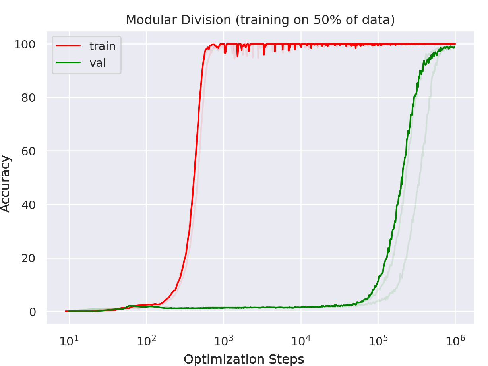

# Гроккинг (Grokking)

— ← предыдущая карточка, следующая → [Фаза меморизации / плато](memorization-phase.md)

[Индекс карточек понятий](index.md), категория: [1. Явления](index.md#cat-1)\
→ Следующая категория: [2. Механизмы и представления](structured-representation-learning.md)\
← Предыдущая категория: [7. Теория и формальные результаты](effective-theory-statistical-mechanics.md)

## Определение

**Гроккинг** — феномен отложенной генерализации, при котором нейросеть
сначала практически идеально подгоняет обучающую выборку (train accuracy
близка к 100 %) при низкой обобщающей способности, а затем, спустя
значительно более продолжительное обучение — нередко на порядки больше
шагов, — тестовая точность резко возрастает до высокой \[[1.1](#ref-1-1)\].
Термин и само явление введены Power et al. (2022) на малых алгоритмических
датасетах \[[1.1](#ref-1-1)\].

## Детализация

Изначально гроккинг наблюдали на алгоритмических задачах (прежде всего
[модульной арифметике](modular-arithmetic.md)) при обучении с [weight decay](weight-decay.md), где разрыв между [фазой запоминания](memorization-phase.md) и наступлением генерализации может быть на порядки больше по числу шагов оптимизации \[[1.1](#ref-1-1)\]. Сам переход, как правило, резкий и всё
чаще описывается как [фазовый переход](phase-transition.md) — скачок тестовой точности после
долгого плато \[[1.3](#ref-1-3)\]\[[1.4](#ref-1-4)\], вплоть до формализации
как норм-управляемого (движимого падением нормы весов) \[[3.1](#ref-3-1)\] или фазового перехода первого рода
\[[3.3](#ref-3-3)\]. Однако ряд работ оспаривает разрывность перехода:
механистические progress-measures (непрерывные [меры прогресса](progress-measures.md), считываемые из внутренней структуры сети) показывают, что за «внезапностью» стоит
постепенный процесс \[[2.2](#ref-2-2)\]. Механистически гроккинг связывают со
сменой «запоминающего» решения «обобщающим» — вытеснением неэффективного
меморизационного контура (подсети, хранящей примеры) эффективным обобщающим контуром/подсетью, реализующей алгоритм задачи ([эффективность контуров](circuit-efficiency.md))
\[[1.7](#ref-1-7)\]\[[1.8](#ref-1-8)\]\[[3.5](#ref-3-5)\]; при этом часть работ
приписывает эффект не снижению нормы весов \[[2.6](#ref-2-6)\], а нахождению хорошей подсети
\[[2.1](#ref-2-1)\]. Гроккинг воспроизводится и без явной регуляризации
\[[2.4](#ref-2-4)\]\[[2.5](#ref-2-5)\]\[[2.3](#ref-2-3)\], и даже вне [SGD](optimizer-adam-adamw-sgd.md)/нейросетей
\[[2.9](#ref-2-9)\]. Отдельные работы оспаривают и само содержание перехода —
трактуя его как устранимое геометрическое рассогласование \[[2.8](#ref-2-8)\] и
ставя под вопрос, что гроккинг даёт подлинное обобщающее рассуждение
\[[2.7](#ref-2-7)\]. Позже было показано, что он не ограничен алгоритмическими
задачами: он воспроизводится на [реальных данных](vision-real-world-data-mnist-cifar.md) —
впервые на MNIST ещё в работе об эффективной теории \[[4.1](#ref-4-1)\],
систематически в Omnigrok \[[1.2](#ref-1-2)\] — и даже в предобучении больших
языковых моделей \[[1.10](#ref-1-10)\]. Таким образом, современное понимание трактует гроккинг
как общий феномен обучения, а не как артефакт узкого класса синтетических
задач.

## Альтернативные определения и нюансы

### A. Классическое эмпирическое: отложенная генерализация после переобучения

Базовая формулировка Power et al.: генерализация наступает намного позже
переобучения на обучающих данных \[[1.1](#ref-1-1)\]. Omnigrok обобщает то же
определение, снимая привязку к алгоритмическим задачам \[[1.2](#ref-1-2)\].

### B. Внезапный / резкий фазовый переход

Акцент на скачкообразности: гроккинг определяется как **резкий переход** от
меморизации к генерализации после длительного обучения
\[[1.3](#ref-1-3)\]\[[1.6](#ref-1-6)\]\[[1.11](#ref-1-11)\]\[[1.12](#ref-1-12)\]. Явление формализуют как фазовый
переход — вплоть до «variance-limited» \[[1.5](#ref-1-5)\] и «emergent phase
transition» \[[1.4](#ref-1-4)\], норм-управляемого перехода
\[[3.1](#ref-3-1)\]\[[3.2](#ref-3-2)\], перехода первого рода \[[3.3](#ref-3-3)\] или подлинной
реорганизации, а не метрического артефакта \[[3.4](#ref-3-4)\]. Контр-позиция:
за скачком стоит постепенный процесс, а не разрыв \[[2.2](#ref-2-2)\].

### C. Конкуренция запоминающего и обобщающего решения

Определение через два конкурирующих решения: сеть сначала находит
запоминающий контур, а гроккинг — момент переключения на более эффективный
обобщающий контур/подсеть \[[1.7](#ref-1-7)\]\[[1.8](#ref-1-8)\]\[[3.5](#ref-3-5)\].
Здесь гроккинг — не столько «поздняя генерализация», сколько **смена
доминирующего решения**; часть работ относит причину к обнаружению хорошей
подсети, а не к снижению нормы \[[2.1](#ref-2-1)\].

### D. Компрессия / рост простоты решения

Определение через сжатие: обобщающее решение «проще»/эффективнее
запоминающего, поэтому появляется позже; гроккинг = процесс компрессии
сложности сети до генерализующего минимума \[[1.9](#ref-1-9)\].

### E. Расширенная трактовка: вне алгоритмических задач

Определение, снимающее привязку к синтетике: гроккинг — общий эффект
отложенной генерализации, наблюдаемый на реальных данных \[[1.2](#ref-1-2)\],
в практическом предобучении LLM \[[1.10](#ref-1-10)\] и даже вне нейросетей и
SGD \[[2.9](#ref-2-9)\]. Сильнее всего эту трактовку подкрепляет перенос на
настоящий фактический корпус: гроккинг воспроизводится на многошаговых вопросах к
2WikiMultiHopQA, то есть не является особенностью нарочно построенных игрушечных
наборов \[[3.6](#ref-3-6)\].

### F. По какой кривой определять: потеря против точности

Ось, на которой корпус расходится втрое: какая кривая и какой порог делают
прогон «грокнувшим». Kumar et al. различают «гроккинг в потере» и «гроккинг
в точности» и доказывают, что первый — строго более сильное условие: гроккинг
в потере влечёт гроккинг в точности, но не наоборот \[[2.5](#ref-2-5)\]
(их §16.3 отдельно разбирает случаи гроккинга только по точности, не стоящие
изучения). Nanda et al. сужают термин со стороны потери: без начального
расхождения кривых потерь на обучении и тесте гроккинга нет
\[[2.2](#ref-2-2)\]. Третий полюс — Notsawo et al., растворяющие ось ради
простоты: гроккингом называется любая ситуация с генерализацией
\[[2.10](#ref-2-10)\]. Практическое следствие: вердикт «грокнул / не грокнул»
для одного и того же прогона может смениться при смене метрики или порога.

### Более ранние наблюдения (до термина)

Единственное в корпусе опубликованное утверждение о том, что само явление
старше термина: Mohamadi et al. пишут, что отложенную генерализацию,
«возможно, раньше наблюдали» Li, Wang & Arora при обучении диагональных
линейных сетей label-noise SGD через минимизацию остроты — до того, как
это стало известно как гроккинг \[[4.13](#ref-4-13)\]. Проверка по
первоисточнику (task-018) показывает, что хедж «возможно» несёт настоящий
вес: в работе \[[5.1](#ref-5-1)\]↗ нет ни слова «grokking», ни
экспериментов с кривыми обучения — «наблюдение» там теоретическое.
Доказана двухфазная динамика: обобщающее разреженное решение достигается
после интерполяции, на медленном масштабе $\Theta(\eta^{-2})$, дрейфом
вдоль многообразия нулевой потери с неявной минимизацией остроты. Схема
«интерполяция -> дрейф по многообразию -> простое решение» структурно
совпадает с корпусной линией «интерполяция, затем минимизация нормы»
(2505.20172, которая эту работу и цитирует), поэтому утверждение уместно
как хеджированная заявка на предысторию, а не как факт наблюдения
гроккинга до Power et al.

## Ссылки

Формат: `[группа.номер]` статья — название. Ключевая цитата (дословно,
англ., номер строки локального txt), далее *наиболее точный русский перевод*
курсивом. Если важных цитат несколько — дополнительные приведены следом.

###### ref-1-1
**\[1.1\]** 2201.02177 — Power et al., «Grokking: Generalization
Beyond Overfitting on Small Algorithmic Datasets». [`"generalization far after overfitting on an algorithmic dataset"`](../papers/2201.02177.grokking-generalization-beyond-overfitting-on-small-algorithmic-datasets/2201.02177.grokking-generalization-beyond-overfitting-on-small-algorithmic-datasets.card.md#fig-1). *«[генерализации намного позже переобучения на алгоритмическом наборе данных](../papers/2201.02177.grokking-generalization-beyond-overfitting-on-small-algorithmic-datasets/2201.02177.grokking-generalization-beyond-overfitting-on-small-algorithmic-datasets.card.md#fig-1)»*

###### ref-1-2
**\[1.2\]** 2210.01117 — Liu et al., «Omnigrok: Grokking Beyond
Algorithmic Data». [`"generalization happens long after overfitting the training data"`](../papers/2210.01117.omnigrok-grokking-beyond-algorithmic-data/original/2210.01117.omnigrok-grokking-beyond-algorithmic-data.md#p1-3). *«[генерализация наступает много позже переобучения на обучающих данных](../papers/2210.01117.omnigrok-grokking-beyond-algorithmic-data/2210.01117.omnigrok-grokking-beyond-algorithmic-data.card.md#p1-3)»*

###### ref-1-3
**\[1.3\]** 2303.11873 — Merrill et al., «A Tale of Two Circuits: Grokking as
Competition of Sparse and Dense Subnetworks». [`"after a large amount of additional training, undergoes a phase transition to generalize perfectly"`](../papers/2303.11873.a-tale-of-two-circuits-grokking-as-competition-of-sparse-and-dense-subnetworks/original/2303.11873.a-tale-of-two-circuits-grokking-as-competition-of-sparse-and-dense-subnetworks.md#p1-2). *«[после большого объёма дополнительного обучения, претерпевает фазовый переход к идеальной генерализации](../papers/2303.11873.a-tale-of-two-circuits-grokking-as-competition-of-sparse-and-dense-subnetworks/2303.11873.a-tale-of-two-circuits-grokking-as-competition-of-sparse-and-dense-subnetworks.card.md#p1-2)»*

###### ref-1-4
**\[1.4\]** 2408.08944 — Clauw, Stramaglia, Marinazzo 2024, «Information-Theoretic Progress
Measures reveal Grokking is an Emergent Phase Transition». [`"grokking where models suddenly generalize after delayed memorization"`](../papers/2408.08944.information-theoretic-progress-measures-reveal-grokking-is-an-emergent-phase-transition/original/2408.08944.information-theoretic-progress-measures-reveal-grokking-is-an-emergent-phase-transition.md#p1-2). *«[гроккинге, где модели внезапно начинают обобщать после отложенного запоминания](../papers/2408.08944.information-theoretic-progress-measures-reveal-grokking-is-an-emergent-phase-transition/2408.08944.information-theoretic-progress-measures-reveal-grokking-is-an-emergent-phase-transition.card.md#p1-2)»*

###### ref-1-5
**\[1.5\]** 2603.15492 — Acharya et al., «Grokking as a Variance-Limited Phase
Transition». [`"phase transition, known as grokking [1], challenges the traditional view"`](../papers/2603.15492.grokking-as-a-variance-limited-phase-transition-spectral-gating-and-the-epsilon-stability-threshold/original/2603.15492.grokking-as-a-variance-limited-phase-transition-spectral-gating-and-the-epsilon-stability-threshold.md#p1-5). *«[фазовый переход, известный как *гроккинг* [1], оспаривает привычный взгляд](../papers/2603.15492.grokking-as-a-variance-limited-phase-transition-spectral-gating-and-the-epsilon-stability-threshold/2603.15492.grokking-as-a-variance-limited-phase-transition-spectral-gating-and-the-epsilon-stability-threshold.card.md#p1-5)»*\
Доп. (переформулировка): [`"Our findings suggest this is actually a problem of **spectral accessibility**"`](../papers/2603.15492.grokking-as-a-variance-limited-phase-transition-spectral-gating-and-the-epsilon-stability-threshold/original/2603.15492.grokking-as-a-variance-limited-phase-transition-spectral-gating-and-the-epsilon-stability-threshold.md#p10-1) — *«[Наши находки наводят на мысль, что дело здесь в **спектральной доступности**](../papers/2603.15492.grokking-as-a-variance-limited-phase-transition-spectral-gating-and-the-epsilon-stability-threshold/2603.15492.grokking-as-a-variance-limited-phase-transition-spectral-gating-and-the-epsilon-stability-threshold.card.md#p10-1)»*

###### ref-1-6
**\[1.6\]** 2603.01192 — Cullen, «A Basin-Selection Perspective on
Grokking». [`"Grokking, the abrupt transition from memorization to generalisation"`](../papers/2603.01192.a-basin-selection-perspective-on-grokking-via-singular-learning-theory/2603.01192.a-basin-selection-perspective-on-grokking-via-singular-learning-theory.card.md#p1-2). *«[Гроккинг — резкий переход от запоминания к генерализации](../papers/2603.01192.a-basin-selection-perspective-on-grokking-via-singular-learning-theory/2603.01192.a-basin-selection-perspective-on-grokking-via-singular-learning-theory.card.md#p1-2)»*\
Доп. (определение): [`"Grokking refers to a training phenomenon in which a model attains near-zero empirical loss early, yet generalises poorly for a long period, followed by an abrupt improvement in test performance after continued optimisation"`](../papers/2603.01192.a-basin-selection-perspective-on-grokking-via-singular-learning-theory/2603.01192.a-basin-selection-perspective-on-grokking-via-singular-learning-theory.card.md#p1-3) — *«[Гроккингом называют явление обучения, при котором модель рано достигает почти нулевой эмпирической потери, однако долго обобщает плохо, а затем, при продолжении оптимизации, качество на тесте резко улучшается](../papers/2603.01192.a-basin-selection-perspective-on-grokking-via-singular-learning-theory/2603.01192.a-basin-selection-perspective-on-grokking-via-singular-learning-theory.card.md#p1-3)»*

###### ref-1-7
**\[1.7\]** 2309.02390 — Varma et al., «Explaining Grokking Through Circuit
Efficiency». [`"upon further training, transition to perfect generalisation"`](../papers/2309.02390.explaining-grokking-through-circuit-efficiency/2309.02390.explaining-grokking-through-circuit-efficiency.card.md#p1-3). *«[при дальнейшем обучении переходит к идеальной генерализации](../papers/2309.02390.explaining-grokking-through-circuit-efficiency/2309.02390.explaining-grokking-through-circuit-efficiency.card.md#p1-3)»*\
Доп.:
[`"is grokking: a network with perfect training accuracy but poor generalisation"`](../papers/2309.02390.explaining-grokking-through-circuit-efficiency/2309.02390.explaining-grokking-through-circuit-efficiency.card.md#p1-3) — *«[гроккинг: сеть с идеальной точностью на обучении, но плохой генерализацией](../papers/2309.02390.explaining-grokking-through-circuit-efficiency/2309.02390.explaining-grokking-through-circuit-efficiency.card.md#p1-3)»* (начало абзаца с определением через конкуренцию
контуров).

###### ref-1-8
**\[1.8\]** 2403.03942 — Bhaskar et al., «The Heuristic Core: Understanding
Subnetwork Generalization». [`"generalization in simple algorithmic"`](../papers/2403.03942.the-heuristic-core-understanding-subnetwork-generalization-in-pretrained-language-models/2403.03942.the-heuristic-core-understanding-subnetwork-generalization-in-pretrained-language-models.card.md#p1-2).
*«[генерализацию в простых алгоритмических](../papers/2403.03942.the-heuristic-core-understanding-subnetwork-generalization-in-pretrained-language-models/2403.03942.the-heuristic-core-understanding-subnetwork-generalization-in-pretrained-language-models.card.md#p1-2)»*

###### ref-1-9
**\[1.9\]** 2310.05918 — Liu et al., «Grokking as
Compression: A Nonlinear Complexity Perspective». [`"generalization is much delayed after memorization"`](../papers/2310.05918.grokking-as-compression-a-nonlinear-complexity-perspective/original/2310.05918.grokking-as-compression-a-nonlinear-complexity-perspective.md#p1-2). *«[генерализация сильно запаздывает за запоминанием](../papers/2310.05918.grokking-as-compression-a-nonlinear-complexity-perspective/2310.05918.grokking-as-compression-a-nonlinear-complexity-perspective.card.md#p1-2)»*\
Доп.: [`"many of them share a similar high-level idea which is"`](../papers/2310.05918.grokking-as-compression-a-nonlinear-complexity-perspective/original/2310.05918.grokking-as-compression-a-nonlinear-complexity-perspective.md#p1-3) — *«[многие из них разделяют схожую мысль высокого уровня](../papers/2310.05918.grokking-as-compression-a-nonlinear-complexity-perspective/2310.05918.grokking-as-compression-a-nonlinear-complexity-perspective.card.md#p1-3)»*; [`"memorization solution is easier to be learned so learned at first"`](../papers/2310.05918.grokking-as-compression-a-nonlinear-complexity-perspective/original/2310.05918.grokking-as-compression-a-nonlinear-complexity-perspective.md#p1-3) — *«[решение-запоминание выучить проще, поэтому оно выучивается первым](../papers/2310.05918.grokking-as-compression-a-nonlinear-complexity-perspective/2310.05918.grokking-as-compression-a-nonlinear-complexity-perspective.card.md#p1-3)»*.

###### ref-1-10
**\[1.10\]** 2506.21551 — Li et al., «Grokking in LLM Pretraining?».
[`"the first study of grokking in practical LLM pretraining"`](../papers/2506.21551.grokking-in-llm-pretraining-monitor-memorization-to-generalization-without-test/2506.21551.grokking-in-llm-pretraining-monitor-memorization-to-generalization-without-test.card.md#p1-2).
*«[первое исследование гроккинга в практическом предобучении больших языковых моделей](../papers/2506.21551.grokking-in-llm-pretraining-monitor-memorization-to-generalization-without-test/2506.21551.grokking-in-llm-pretraining-monitor-memorization-to-generalization-without-test.card.md#p1-2)»*

###### ref-1-11
**\[1.11\]** 2504.13292 — Xu et al., «Let Me Grok For You: Accelerating
Grokking». [`"memorizes training data and generalizes poorly, but then suddenly transitions to near-perfect generalization after prolonged training"`](../papers/2504.13292.let-me-grok-for-you-accelerating-grokking-via-embedding-transfer-from-a-weaker-model/original/2504.13292.let-me-grok-for-you-accelerating-grokking-via-embedding-transfer-from-a-weaker-model.md#p1-2). *«[запоминает обучающие данные и обобщает плохо, а затем, после продолжительного обучения, внезапно переходит к почти безупречной генерализации](../papers/2504.13292.let-me-grok-for-you-accelerating-grokking-via-embedding-transfer-from-a-weaker-model/2504.13292.let-me-grok-for-you-accelerating-grokking-via-embedding-transfer-from-a-weaker-model.card.md#p1-2)»*

###### ref-1-12
**\[1.12\]** 2602.16746 — Xu, [`"Grokking—the abrupt onset of generalization long after memorization"`](../papers/2602.16746.low-dimensional-and-transversely-curved-optimization-dynamics-in-grokking/original/2602.16746.low-dimensional-and-transversely-curved-optimization-dynamics-in-grokking.md#p1-2). *«[Гроккинг — резкое наступление генерализации много позже запоминания](../papers/2602.16746.low-dimensional-and-transversely-curved-optimization-dynamics-in-grokking/2602.16746.low-dimensional-and-transversely-curved-optimization-dynamics-in-grokking.card.md#p1-2)»*

###### ref-1-13
**\[1.13\]** 2311.18817 — Lyu et al., «Dichotomy of Early and Late Phase Implicit Biases Can Provably Induce Grokking». Нюанс: первое строгое доказательство гроккинга в нейросетевой постановке и первый количественный ответ на вопрос о резкости; доказано, однако, лишь на двух построенных примерах (разрежённая линейная классификация диагональными сетями и матричное восполнение), а модульное сложение остаётся опытом. [`"Our theoretical analysis attributes this to the following *dichotomy* of early and late phase implicit biases: the large initialization induces a very strong early phase implicit bias towards kernel predictors, but over time, it decays and competes with a late phase implicit bias towards min-norm/max-margin predictors induced by the small weight decay, resulting in a transition that turns out to be provably sharp in between."`](../papers/2311.18817.dichotomy-of-early-and-late-phase-implicit-biases-can-provably-induce-grokking/original/2311.18817.dichotomy-of-early-and-late-phase-implicit-biases-can-provably-induce-grokking.md#p2-2). *«[Наш теоретический разбор относит это на счёт следующей *дихотомии* ранних и поздних неявных смещений: большая инициализация наводит очень сильное неявное смещение ранней фазы к ядерным предсказателям, но со временем оно затухает и вступает в состязание с неявным смещением поздней фазы к предсказателям минимальной нормы / максимального зазора, наводимым малым затуханием весов, — и в промежутке возникает переход, оказывающийся доказуемо резким](../papers/2311.18817.dichotomy-of-early-and-late-phase-implicit-biases-can-provably-induce-grokking/2311.18817.dichotomy-of-early-and-late-phase-implicit-biases-can-provably-induce-grokking.card.md#p2-2)»*\
Доп. (авторская оговорка): [`"our work only studies the training dynamics with large initialization and small weight decay, but these may not be the only source of the dichotomy of the implicit biases"`](../papers/2311.18817.dichotomy-of-early-and-late-phase-implicit-biases-can-provably-induce-grokking/original/2311.18817.dichotomy-of-early-and-late-phase-implicit-biases-can-provably-induce-grokking.md#p9-9) — *«[наша работа изучает динамику обучения только при большой инициализации и малом затухании весов, но они могут быть не единственным источником дихотомии неявных смещений](../papers/2311.18817.dichotomy-of-early-and-late-phase-implicit-biases-can-provably-induce-grokking/2311.18817.dichotomy-of-early-and-late-phase-implicit-biases-can-provably-induce-grokking.card.md#p9-9)»*.

###### ref-1-14
**\[1.14\]** 2402.15555 — Humayun, Balestriero, Baraniuk 2024, «Deep Networks Always Grok and Here is Why». Вводит **отложенную устойчивость**: поздний подъём точности на состязательных образцах при обычной инициализации, с weight decay и без него. Нюанс: проверочный набор заменён на состязательные образцы, порождаемые заново после каждого шага обучения, — измеряется задержка устойчивости, а не задержка обобщения; определения, отличающего гроккинг от любого позднего подъёма любой оценки, работа не даёт. [`"For a number of training settings, with standard initialization with or without weight decay, DNNs grok adversarial samples long after generalizing on the test dataset. We dub this novel, previously unreported form of grokking **delayed robustness**."`](../papers/2402.15555.deep-networks-always-grok-and-here-is-why/original/2402.15555.deep-networks-always-grok-and-here-is-why.md#p2-3). *«[В целом ряде постановок обучения, при стандартной инициализации, с weight decay или без него, ГНС гроккают состязательные образцы много позже, чем обобщают на проверочном наборе данных. Мы называем эту новую, ранее не описанную разновидность гроккинга **отложенной устойчивостью**.](../papers/2402.15555.deep-networks-always-grok-and-here-is-why/2402.15555.deep-networks-always-grok-and-here-is-why.card.md#p2-3)»*\
Доп. (исходный вопрос): [`"How subjective is the onset of grokking on the test data?"`](../papers/2402.15555.deep-networks-always-grok-and-here-is-why/original/2402.15555.deep-networks-always-grok-and-here-is-why.md#p2-1) — *«[Насколько произволен момент наступления гроккинга на проверочных данных?](../papers/2402.15555.deep-networks-always-grok-and-here-is-why/2402.15555.deep-networks-always-grok-and-here-is-why.card.md#p2-1)»*;
Доп. (как измеряется): [`"we generate adversarial samples after each training update by using PGD (Madry et al. 2017) attacks on the test data and monitor accuracy on adversarial samples"`](../papers/2402.15555.deep-networks-always-grok-and-here-is-why/original/2402.15555.deep-networks-always-grok-and-here-is-why.md#p2-2) — *«[после каждого обновления при обучении мы порождаем состязательные образцы атаками PGD (Madry et al. 2017) по проверочным данным и следим за точностью на состязательных образцах](../papers/2402.15555.deep-networks-always-grok-and-here-is-why/2402.15555.deep-networks-always-grok-and-here-is-why.card.md#p2-2)»*.

###### ref-1-15
**\[1.15\]** 2310.02541 — Xu et al. 2023, «Benign Overfitting and Grokking in ReLU Networks for XOR Cluster Data». Нюанс: заявка на первое строгое доказательство гроккинга в нейросетевой постановке; доказаны, однако, две точки — $t=1$ (тест ровно случаен) и $t\in[Cn^{0.01},\sqrt{n}]$ (тест почти нулевой), — а не период: нижней оценки длительности плато, резкости перехода и поведения при $t\to\infty$ теорема не даёт. [`"no prior work has established a rigorous proof of grokking in a neural network setting"`](../papers/2310.02541.benign-overfitting-and-grokking-in-relu-networks-for-xor-cluster-data/original/2310.02541.benign-overfitting-and-grokking-in-relu-networks-for-xor-cluster-data.md#p2-1). *«[ни в одной из предшествующих работ строгого доказательства гроккинга в нейросетевой постановке не установлено](../papers/2310.02541.benign-overfitting-and-grokking-in-relu-networks-for-xor-cluster-data/2310.02541.benign-overfitting-and-grokking-in-relu-networks-for-xor-cluster-data.card.md#p2-1)»*\
Доп. (что именно доказано): [`"the network continues to overfit to the training data while simultaneously achieving test error $\exp(-\Omega(n^{2.01}))$, which guarantees a near-zero test error for large $n$"`](../papers/2310.02541.benign-overfitting-and-grokking-in-relu-networks-for-xor-cluster-data/original/2310.02541.benign-overfitting-and-grokking-in-relu-networks-for-xor-cluster-data.md#p6-6) — *«[сеть продолжает переобучаться на обучающие данные и одновременно достигает ошибки на тесте $\exp(-\Omega(n^{2.01}))$, что гарантирует почти нулевую ошибку на тесте при больших $n$](../papers/2310.02541.benign-overfitting-and-grokking-in-relu-networks-for-xor-cluster-data/2310.02541.benign-overfitting-and-grokking-in-relu-networks-for-xor-cluster-data.card.md#p6-6)»*

###### ref-1-16
**\[1.16\]** 2305.18741 — Murty et al. 2023, «Grokking of Hierarchical Structure in Vanilla Transformers». Первоисточник термина **структурный гроккинг**: перенос имени и рамки Power et al. с алгоритмических задач на языковые. Нюанс: отложена генерализация на нарочно построенную выборку вне распределения, тогда как внутридоменная проверочная точность рано и надолго около 100 %; запоминающего провала на удержанных данных того же распределения работа не показывает, и управляющая величина здесь — глубина модели, а не доля данных или weight decay. [`"We term this phenomenon *structural grokking*, by analogy to existing findings on simple classification tasks (Power et al. 2022)."`](../papers/2305.18741.grokking-of-hierarchical-structure-in-vanilla-transformers/original/2305.18741.grokking-of-hierarchical-structure-in-vanilla-transformers.md#p1-3). *«[Мы называем это явление *структурным гроккингом*, по аналогии с уже известными находками на простых задачах классификации (Power et al. 2022).](../papers/2305.18741.grokking-of-hierarchical-structure-in-vanilla-transformers/2305.18741.grokking-of-hierarchical-structure-in-vanilla-transformers.card.md#p1-3)»*\
Доп.: [`"We hypothesize a similar *structural grokking*, where the model groks hierarchical structure long after in-domain validation performance has saturated"`](../papers/2305.18741.grokking-of-hierarchical-structure-in-vanilla-transformers/original/2305.18741.grokking-of-hierarchical-structure-in-vanilla-transformers.md#p2-4) — *«[Мы предполагаем сходный *структурный гроккинг*, при котором модель грокает иерархическую структуру долго спустя после того, как внутридоменное проверочное качество вышло на насыщение](../papers/2305.18741.grokking-of-hierarchical-structure-in-vanilla-transformers/2305.18741.grokking-of-hierarchical-structure-in-vanilla-transformers.card.md#p2-4)»*; [`"On the datasets where this prior work reports generalization accuracies below 20%, *simply by training for longer*, mean accuracy across random seeds reaches 80%"`](../papers/2305.18741.grokking-of-hierarchical-structure-in-vanilla-transformers/original/2305.18741.grokking-of-hierarchical-structure-in-vanilla-transformers.md#p1-5) — *«[На наборах, где эти прежние работы сообщают о точности генерализации ниже 20 %, *просто за счёт более долгого обучения* средняя по случайным семенам точность достигает 80 %](../papers/2305.18741.grokking-of-hierarchical-structure-in-vanilla-transformers/2305.18741.grokking-of-hierarchical-structure-in-vanilla-transformers.card.md#p1-5)»*.

###### ref-1-17
**\[1.17\]** 2505.20172 — Boursier et al., «A Theoretical Framework for Grokking: Interpolation followed by Riemannian Norm Minimisation». Нюанс: даёт корпусу самое короткое формальное определение — гроккинг есть непереставимость пределов $\lambda\to 0$ и $t\to\infty$; определение чисто оптимизационное, классификация исключена по построению, о тестовой ошибке не доказано ничего. [`"grokking is observed when the two limits cannot be exchanged"`](../papers/2505.20172.a-theoretical-framework-for-grokking-interpolation-followed-by-riemannian-norm-minimisation/2505.20172.a-theoretical-framework-for-grokking-interpolation-followed-by-riemannian-norm-minimisation.card.md#p5-8). *«[гроккинг наблюдается, когда два предела нельзя переставить](../papers/2505.20172.a-theoretical-framework-for-grokking-interpolation-followed-by-riemannian-norm-minimisation/2505.20172.a-theoretical-framework-for-grokking-interpolation-followed-by-riemannian-norm-minimisation.card.md#p5-8)»*\
Доп. (авторская оговорка): [`"no statistical assumptions are made, and it *a priori* does not imply any improvement in test loss during the slow phase"`](../papers/2505.20172.a-theoretical-framework-for-grokking-interpolation-followed-by-riemannian-norm-minimisation/2505.20172.a-theoretical-framework-for-grokking-interpolation-followed-by-riemannian-norm-minimisation.card.md#p2-6) — *«[никаких статистических предположений не делается, и он *a priori* не влечёт какого-либо улучшения тестовой потери на медленной поре](../papers/2505.20172.a-theoretical-framework-for-grokking-interpolation-followed-by-riemannian-norm-minimisation/2505.20172.a-theoretical-framework-for-grokking-interpolation-followed-by-riemannian-norm-minimisation.card.md#p2-6)»*.

###### ref-1-18
**\[1.18\]** 2507.20057 — Lyle et al., «What Can Grokking Teach Us About Learning Under Nonstationarity?». Нюанс: меняет роль явления в корпусе — гроккинг здесь измерительный прибор для динамики выучивания признаков и испытательный стенд для переносимого вмешательства, а не объясняемое явление; определение взято у Power et al. 2022 дословно, собственной теории гроккинга нет. [`"we focus on *using* grokking as an indicator of feature-learning in the network"`](../papers/2507.20057.what-can-grokking-teach-us-about-learning-under-nonstationarity/original/2507.20057.what-can-grokking-teach-us-about-learning-under-nonstationarity.md#p5-4). *«[мы сосредоточиваемся на *употреблении* гроккинга как указателя выучивания признаков в сети](../papers/2507.20057.what-can-grokking-teach-us-about-learning-under-nonstationarity/2507.20057.what-can-grokking-teach-us-about-learning-under-nonstationarity.card.md#p5-4)»*\
Доп. (гроккинг оказывается не только отсроченным, но и отложимым и вызываемым): [`"even after several hundred thousand optimizer steps, it is still possible to induce grokking via ELR re-warming"`](../papers/2507.20057.what-can-grokking-teach-us-about-learning-under-nonstationarity/original/2507.20057.what-can-grokking-teach-us-about-learning-under-nonstationarity.md#p7-2) — *«[даже после нескольких сотен тысяч шагов оптимизатора всё ещё возможно вызвать гроккинг повторным разогревом ELR](../papers/2507.20057.what-can-grokking-teach-us-about-learning-under-nonstationarity/2507.20057.what-can-grokking-teach-us-about-learning-under-nonstationarity.card.md#p7-2)»*.

###### ref-1-19
**\[1.19\]** 2505.11411 — Zhang, Shang, Yang, Zhang, «Is Grokking a Computational Glass Relaxation?». Даёт гроккингу истолкование из физики стекла и первое измерение больцмановской энтропии сети с сотнями тысяч параметров: запоминание отвечает быстрому охлаждению в неравновесное стекло, гроккинг — медленной структурной релаксации к состоянию большей энтропии. Нюанс: стеклянность остаётся аналогией — ни времени релаксации, ни двухступенчатой корреляционной функции, ни старения работа не меряет, а температура существует только внутри её собственных алгоритмов. [`"we propose an interpretation for grokking by framing it as a *computational glass relaxation*"`](../papers/2505.11411.is-grokking-a-computational-glass-relaxation/original/2505.11411.is-grokking-a-computational-glass-relaxation.md#p1-2). *«[мы предлагаем истолкование гроккинга, представляя его как *вычислительную стеклянную релаксацию*](../papers/2505.11411.is-grokking-a-computational-glass-relaxation/2505.11411.is-grokking-a-computational-glass-relaxation.card.md#p1-2)»*\
Доп. (развёрнутое отображение): [`"the grokking process can be mapped to a computational *glass relaxation*: the training loss of a NN is equivalent to the internal energy of a glass, the memorization training mimics a rapid liquid cooling to form a non-equilibrium glass at low temperature, and the eventual grokking emerges as a slow relaxation process towards a more stable, higher-entropy configuration that generalizes"`](../papers/2505.11411.is-grokking-a-computational-glass-relaxation/original/2505.11411.is-grokking-a-computational-glass-relaxation.md#p2-2) — *«[процесс гроккинга отображается на вычислительную *стеклянную релаксацию*: обучающая потеря НС равнозначна внутренней энергии стекла, обучение с запоминанием подражает быстрому охлаждению жидкости, образующему неравновесное стекло при низкой температуре, а гроккинг в итоге возникает как медленный процесс релаксации к более устойчивому строению с более высокой энтропией, которое обобщает](../papers/2505.11411.is-grokking-a-computational-glass-relaxation/2505.11411.is-grokking-a-computational-glass-relaxation.card.md#p2-2)»*\
Доп. (стекольные измерения отложены): [`"a promising future direction is to explore whether the conclusions in winter2025glassy holds in our setup"`](../papers/2505.11411.is-grokking-a-computational-glass-relaxation/original/2505.11411.is-grokking-a-computational-glass-relaxation.md#p4-1) — *«[многообещающим направлением дальнейшей работы будет выяснить, выполняются ли выводы winter2025glassy в нашей постановке](../papers/2505.11411.is-grokking-a-computational-glass-relaxation/2505.11411.is-grokking-a-computational-glass-relaxation.card.md#p4-1)»*.

###### ref-1-20
**\[1.20\]** 2605.09724 — Song & Ye, «Model Capacity Determines Grokking through Competing Memorisation and Generalisation Speeds». Нюанс: показано на модульном делении, двухслойном одноголовом трансформере и при $\alpha=1/2$; совпадение предсказания с наблюдением — с постоянным сдвигом около $-0.16$ dex. [`"the onset of grokking sits at a parameter count strictly larger than the capacity threshold"`](../papers/2605.09724.model-capacity-determines-grokking-through-competing-memorisation-and-generalisation-speeds/original/2605.09724.model-capacity-determines-grokking-through-competing-memorisation-and-generalisation-speeds.md#p1-4). *«[начало гроккинга сидит на числе параметров строго большем, чем порог ёмкости](../papers/2605.09724.model-capacity-determines-grokking-through-competing-memorisation-and-generalisation-speeds/2605.09724.model-capacity-determines-grokking-through-competing-memorisation-and-generalisation-speeds.card.md#p1-4)»*\
Доп. (предсказатель молчит там, где явление есть): [`"deeper models ($L_{\text{depth}}\geq 6$) routinely fail to exhibit a speed crossover within the param-count range we sweep"`](../papers/2605.09724.model-capacity-determines-grokking-through-competing-memorisation-and-generalisation-speeds/original/2605.09724.model-capacity-determines-grokking-through-competing-memorisation-and-generalisation-speeds.md#p20-3). *«[более глубокие модели ($L_{\text{depth}}\geq 6$) сплошь и рядом не показывают пересечения скоростей внутри развёртываемого нами промежутка чисел параметров](../papers/2605.09724.model-capacity-determines-grokking-through-competing-memorisation-and-generalisation-speeds/2605.09724.model-capacity-determines-grokking-through-competing-memorisation-and-generalisation-speeds.card.md#p20-3)»*

###### ref-1-21
**\[1.21\]** 2503.10483 — Pomarico et al., «Grokking as an entanglement transition in tensor network machine learning». Нюанс: ни модульной арифметики, ни SGD/Adam, ни weight decay; определение гроккинга взято у Power et al. и шести других работ одним блоком, разбора ни с одной не ведётся; сопоставления с обычной нейронной сетью на тех же данных нет. [`"This means that grokking implies an entanglement transition, but the viceversa does not hold true."`](../papers/2503.10483.grokking-as-an-entanglement-transition-in-tensor-network-machine-learning/2503.10483.grokking-as-an-entanglement-transition-in-tensor-network-machine-learning.card.md#p13-1). *«[Это означает, что гроккинг влечёт переход запутанности, но обратное неверно.](../papers/2503.10483.grokking-as-an-entanglement-transition-in-tensor-network-machine-learning/2503.10483.grokking-as-an-entanglement-transition-in-tensor-network-machine-learning.card.md#p13-1)»*\
Доп. (двойная примета): [`"grokking manifests through two concurrent signatures: an improvement in test data classification performance and a distinct change in the entanglement entropy scaling along the one-dimensional qubit chain"`](../papers/2503.10483.grokking-as-an-entanglement-transition-in-tensor-network-machine-learning/2503.10483.grokking-as-an-entanglement-transition-in-tensor-network-machine-learning.card.md#p3-3) — *«[гроккинг проявляется через две сопутствующие приметы: улучшение качества классификации тестовых данных и отчётливую перемену в законе роста энтропии запутанности вдоль одномерной цепочки кубитов](../papers/2503.10483.grokking-as-an-entanglement-transition-in-tensor-network-machine-learning/2503.10483.grokking-as-an-entanglement-transition-in-tensor-network-machine-learning.card.md#p3-3)»*.\
Доп. (опорное измерение): [`"The peculiar grokking behavior emerges after approximately 60 sweeps"`](../papers/2503.10483.grokking-as-an-entanglement-transition-in-tensor-network-machine-learning/2503.10483.grokking-as-an-entanglement-transition-in-tensor-network-machine-learning.card.md#p10-2) — *«[Своеобразное поведение гроккинга возникает приблизительно после 60 развёрток](../papers/2503.10483.grokking-as-an-entanglement-transition-in-tensor-network-machine-learning/2503.10483.grokking-as-an-entanglement-transition-in-tensor-network-machine-learning.card.md#p10-2)»*.
## Ссылки на присоединившиеся работы

Работы, где само понятие не вводится и не определяется, но которые трактуют
термин в контексте конкретного нюанса — оспаривают её / присоединяются к
опровержению (**\[2.#\]**) либо присоединяются к трактовке (**\[3.#\]**).

### Оспаривают

###### ref-2-1
**\[2.1\]** 2310.19470 — Minegishi et al., «Bridging Lottery Ticket and Grokking».
Оспаривает: причина не в снижении нормы/росте разреженности, а в обнаружении
хорошей подсети. [`"it is not due to a reduction in weight norm or an increase in sparsity, but rather the discovery of *good structure*"`](../papers/2310.19470.bridging-lottery-ticket-and-grokking-understanding-grokking-from-inner-structure-of-networks/original/2310.19470.bridging-lottery-ticket-and-grokking-understanding-grokking-from-inner-structure-of-networks.md#fig-1). *«[дело не в снижении нормы весов и не в росте разрежённости, а в обнаружении хорошей структуры](../papers/2310.19470.bridging-lottery-ticket-and-grokking-understanding-grokking-from-inner-structure-of-networks/2310.19470.bridging-lottery-ticket-and-grokking-understanding-grokking-from-inner-structure-of-networks.card.md#fig-1)»*

###### ref-2-2
**\[2.2\]** 2301.05217 — Nanda et al., «Progress Measures for
Grokking via Mechanistic Interpretability». Оспаривает разрывность: за
«внезапностью» стоит постепенный процесс. [`"grokking, rather than being a sudden shift, arises from the gradual"`](../papers/2301.05217.progress-measures-for-grokking-via-mechanistic-interpretability/2301.05217.progress-measures-for-grokking-via-mechanistic-interpretability.card.md#p1-2). *«[гроккинг, вместо того
чтобы быть внезапным сдвигом, возникает из постепенного…](../papers/2301.05217.progress-measures-for-grokking-via-mechanistic-interpretability/2301.05217.progress-measures-for-grokking-via-mechanistic-interpretability.card.md#p1-2)»*\
Доп. (граница термина, прил. E.1): [`"grokking does *not* occur when both train and test loss improve together without the initial divergence"`](../papers/2301.05217.progress-measures-for-grokking-via-mechanistic-interpretability/2301.05217.progress-measures-for-grokking-via-mechanistic-interpretability.card.md#p22-27) — *«[гроккинг *не* возникает, когда потери на обучении и на тесте улучшаются вместе, без первоначального расхождения](../papers/2301.05217.progress-measures-for-grokking-via-mechanistic-interpretability/2301.05217.progress-measures-for-grokking-via-mechanistic-interpretability.card.md#p22-27)»*.

###### ref-2-3
**\[2.3\]** 2511.04760 — Singh et al., «When Data Falls Short: Grokking Below
the Critical \[Threshold\]». Оспаривает необходимость нормы/weight decay.
[`"generalization does not depend on smaller weight norms or weight decay"`](../papers/2511.04760.when-data-falls-short-grokking-below-the-critical-threshold/original/2511.04760.when-data-falls-short-grokking-below-the-critical-threshold.md#p1-6). *«[генерализация не зависит ни от меньших норм весов, ни от weight decay](../papers/2511.04760.when-data-falls-short-grokking-below-the-critical-threshold/2511.04760.when-data-falls-short-grokking-below-the-critical-threshold.card.md#p1-6)»*

###### ref-2-4
**\[2.4\]** 2506.04434 — Prakash & Martin 2025, «Grokking and Generalization Collapse: Insights from HTSR theory». Оспаривает требование сглаживания. [`"grokking occurs even without weight decay (leading to an increasing norm), suggesting weight norm alone is not a complete explanation"`](../papers/2506.04434.grokking-and-generalization-collapse-insights-from-htsr-theory/original/2506.04434.grokking-and-generalization-collapse-insights-from-htsr-theory.md#p2-1). *«[гроккинг случается и без ослабления весов (отчего норма растёт), а значит, одна норма весов не есть полное объяснение](../papers/2506.04434.grokking-and-generalization-collapse-insights-from-htsr-theory/2506.04434.grokking-and-generalization-collapse-insights-from-htsr-theory.card.md#p2-1)»*

###### ref-2-5
**\[2.5\]** 2310.06110 — Kumar et al., «Grokking as the Transition from Lazy
to Rich». Оспаривает: гроккинг возможен без регуляризации так, что старые
норм-теории его не объясняют. [`"grokking without regularization in a way that cannot be explained by existing theories"`](../papers/2310.06110.grokking-as-the-transition-from-lazy-to-rich-training-dynamics/original/2310.06110.grokking-as-the-transition-from-lazy-to-rich-training-dynamics.md#p1-3). *«[гроккинг без всякой регуляризации и притом так, что имеющиеся теории этого объяснить не могут](../papers/2310.06110.grokking-as-the-transition-from-lazy-to-rich-training-dynamics/2310.06110.grokking-as-the-transition-from-lazy-to-rich-training-dynamics.card.md#p1-3)»*\
Доп. (метрическая ось, §16.4): [`"We have also shown the converse is *not* true, demonstrating that grokking in loss, the way we have defined it, is a *stronger* condition than grokking in accuracy"`](../papers/2310.06110.grokking-as-the-transition-from-lazy-to-rich-training-dynamics/original/2310.06110.grokking-as-the-transition-from-lazy-to-rich-training-dynamics.md#p23-4) — *«[Мы также показали, что обратное *неверно*, — тем самым гроккинг в потере в нашем определении есть *более сильное* условие, чем гроккинг в точности](../papers/2310.06110.grokking-as-the-transition-from-lazy-to-rich-training-dynamics/2310.06110.grokking-as-the-transition-from-lazy-to-rich-training-dynamics.card.md#p23-4)»*.

###### ref-2-6
**\[2.6\]** 2506.05718 — Notsawo et al., «Grokking Beyond the Euclidean Norm of
Model Parameters». Оспаривает: ℓ2-норма — ненадёжный индикатор генерализации.
[`"the $\ell_{2}$ norm is not a reliable proxy for generalization when the model is regularized toward a different property"`](../papers/2506.05718.grokking-beyond-the-euclidean-norm-of-model-parameters/original/2506.05718.grokking-beyond-the-euclidean-norm-of-model-parameters.md#p1-2). *«[норма $\ell_{2}$ не есть надёжный заместитель способности обобщать, когда модель сглаживается к иному свойству](../papers/2506.05718.grokking-beyond-the-euclidean-norm-of-model-parameters/2506.05718.grokking-beyond-the-euclidean-norm-of-model-parameters.card.md#p1-2)»*

###### ref-2-7
**\[2.7\]** 2601.09049 — He et al., «Is Grokking Worthwhile? Functional
Analysis and Transferability of Generalization Circuits». Оспаривает, что
гроккинг — подлинное обретение обобщающего рассуждения. [`"grokking merely integrates memorized facts into naturally established circuits"`](../papers/2601.09049.is-grokking-worthwhile-functional-analysis-and-transferability-of-generalization-circuits-in-transformers/original/2601.09049.is-grokking-worthwhile-functional-analysis-and-transferability-of-generalization-circuits-in-transformers.md#p4-6). *«[гроккинг лишь встраивает запомненные факты в естественно сложившиеся контуры](../papers/2601.09049.is-grokking-worthwhile-functional-analysis-and-transferability-of-generalization-circuits-in-transformers/2601.09049.is-grokking-worthwhile-functional-analysis-and-transferability-of-generalization-circuits-in-transformers.card.md#p4-6)»*

###### ref-2-8
**\[2.8\]** 2603.05228 — Yildirim, «The Geometric Inductive Bias
of Grokking». Оспаривает трактовку как неизбежного оптимизационного артефакта:
это репрезентационно-геометрическое согласование. [`"bypassing the generalization delay is possible—but strictly depends on alignment between architectural priors and task symmetry"`](../papers/2603.05228.the-geometric-inductive-bias-of-grokking-bypassing-phase-transitions-via-architectural-topology/original/2603.05228.the-geometric-inductive-bias-of-grokking-bypassing-phase-transitions-via-architectural-topology.md#p1-2). *«[обойти задержку генерализации возможно, но строго при условии согласия архитектурных предпочтений с симметрией задачи](../papers/2603.05228.the-geometric-inductive-bias-of-grokking-bypassing-phase-transitions-via-architectural-topology/2603.05228.the-geometric-inductive-bias-of-grokking-bypassing-phase-transitions-via-architectural-topology.card.md#p1-2)»*

###### ref-2-9
**\[2.9\]** 2604.13123 — Truong et al., «Spectral Entropy Collapse as a Phase
Transition in Delayed Generalisation». Оспаривает привязку к нейросетям/SGD:
гроккинг возникает и в kernel-машинах. [`"grokking in modular arithmetic does not require neural architecture or SGD"`](../papers/2604.13123.spectral-entropy-collapse-as-a-phase-transition-in-delayed-generalisation/2604.13123.spectral-entropy-collapse-as-a-phase-transition-in-delayed-generalisation.card.md#p3-2). *«[гроккинг в модульной арифметике не требует ни нейронного устройства, ни SGD](../papers/2604.13123.spectral-entropy-collapse-as-a-phase-transition-in-delayed-generalisation/2604.13123.spectral-entropy-collapse-as-a-phase-transition-in-delayed-generalisation.card.md#p3-2)»*\
Доп. (две поры): [`"grokking proceeds in two phases — norm expansion followed by entropy collapse — and that entropy collapse is the proximate signal preceding generalisation"`](../papers/2604.13123.spectral-entropy-collapse-as-a-phase-transition-in-delayed-generalisation/2604.13123.spectral-entropy-collapse-as-a-phase-transition-in-delayed-generalisation.card.md#p1-2) — *«[гроккинг протекает в две поры — расширение нормы, а затем схлопывание энтропии, — и что именно схлопывание энтропии есть ближайший признак, предшествующий генерализации](../papers/2604.13123.spectral-entropy-collapse-as-a-phase-transition-in-delayed-generalisation/2604.13123.spectral-entropy-collapse-as-a-phase-transition-in-delayed-generalisation.card.md#p1-2)»*

###### ref-2-10
**\[2.10\]** 2306.13253 — Notsawo et al., «Predicting Grokking Long Before it Happens: A look into the loss landscape of models which grok». Оспаривает границы термина, растворяя их: любая генерализация объявляется гроккингом. [`"But in our case, for the sake of simplicity, we will characterize all situations with generalization as grokking"`](../papers/2306.13253.predicting-grokking-long-before-it-happens/original/2306.13253.predicting-grokking-long-before-it-happens.md#p2-9). *«[Но в нашем случае, ради простоты, мы будем называть гроккингом все ситуации с генерализацией](../papers/2306.13253.predicting-grokking-long-before-it-happens/2306.13253.predicting-grokking-long-before-it-happens.card.md#p2-9)»*\
Доп. (пересказ канонического определения): [`"of grokking in neural networks, a phenomenon in which perfect generalization emerges long after signs of overfitting or memorization are observed"`](../papers/2306.13253.predicting-grokking-long-before-it-happens/original/2306.13253.predicting-grokking-long-before-it-happens.md#p1-2). *«[в нейросети гроккинг, — явление, при котором идеальная генерализация возникает намного позже того, как наблюдаются признаки переобучения или запоминания](../papers/2306.13253.predicting-grokking-long-before-it-happens/2306.13253.predicting-grokking-long-before-it-happens.card.md#p1-2)»*

###### ref-2-11
**\[2.11\]** 2210.15435 — Žunkovič, Ilievski, «Grokking phase transitions in learning local rules with gradient descent». Нюанс: гроккинг здесь переопределён как разность времени обнуления тестовой ошибки и времени обнуления обучающей, плато случайного угадывания в моделях не возникает (тестовая ошибка убывает гладко от $\le 1/2$ до нуля), а сам гроккинг заложен в постановку предположением о линейной разделимости; времена гроккинга — единицы безразмерного времени градиентного потока, а не два-пять порядков по шагам. [`"By construction, the setup displays the grokking phenomena due to the separability assumption."`](../papers/2210.15435.grokking-phase-transitions-in-learning-local-rules-with-gradient-descent/2210.15435.grokking-phase-transitions-in-learning-local-rules-with-gradient-descent.card.md#p6-1). *«[По построению эта постановка демонстрирует явление гроккинга ввиду предположения о разделимости](../papers/2210.15435.grokking-phase-transitions-in-learning-local-rules-with-gradient-descent/2210.15435.grokking-phase-transitions-in-learning-local-rules-with-gradient-descent.card.md#p6-1)»*\
Доп. (определение): [`"We define the *grokking time* as the difference between $t_{\epsilon}$ (zero-test-error time) and the time at which the training error becomes zero."`](../papers/2210.15435.grokking-phase-transitions-in-learning-local-rules-with-gradient-descent/2210.15435.grokking-phase-transitions-in-learning-local-rules-with-gradient-descent.card.md#p9-1) — *«[Мы определяем *время гроккинга* как разность между $t_{\epsilon}$ (временем нулевой тестовой ошибки) и временем, в которое обучающая ошибка становится нулевой](../papers/2210.15435.grokking-phase-transitions-in-learning-local-rules-with-gradient-descent/2210.15435.grokking-phase-transitions-in-learning-local-rules-with-gradient-descent.card.md#p9-1)»*\
Доп. (заявка о новизне, позже перекрытая корпусом — Gromov 2301.02679, Rubin et al. 2310.03789, Beck et al. 2410.04489): [`"However, no exactly solvable model exhibiting the grokking phenomenon has been discussed so far."`](../papers/2210.15435.grokking-phase-transitions-in-learning-local-rules-with-gradient-descent/2210.15435.grokking-phase-transitions-in-learning-local-rules-with-gradient-descent.card.md#p3-3) — *«[Однако ни одной точно решаемой модели, демонстрирующей явление гроккинга, до сих пор не обсуждалось](../papers/2210.15435.grokking-phase-transitions-in-learning-local-rules-with-gradient-descent/2210.15435.grokking-phase-transitions-in-learning-local-rules-with-gradient-descent.card.md#p3-3)»*.

###### ref-2-12
**\[2.12\]** 2310.16441 — Levi, Beck, Bar Sinai 2023, «Grokking in Linear Estimators – A Solvable Model that Groks without Understanding». Оспаривает вариант F (по какой кривой определять гроккинг): точность здесь есть явная функция потери, и резкость её подъёма не отвечает никакому событию в динамике потерь. Приоритет тезиса авторы отдают Omnigrok. [`"is an artifact of the definition of accuracy and does not represent a transition from “memorization” to “understanding”"`](../papers/2310.16441.grokking-in-linear-estimators-a-solvable-model-that-groks-without-understanding/original/2310.16441.grokking-in-linear-estimators-a-solvable-model-that-groks-without-understanding.md#p7-1). *«[есть артефакт определения точности и не представляет собой ни перехода от «запоминания» к «пониманию»](../papers/2310.16441.grokking-in-linear-estimators-a-solvable-model-that-groks-without-understanding/2310.16441.grokking-in-linear-estimators-a-solvable-model-that-groks-without-understanding.card.md#p7-1)»*\
Доп. (рабочее определение гроккинга в этой модели): [`"grokking is simply the phenomenon in which $\mathcal{L}_{\mathrm{tr}}$ drops below $\epsilon$ before $\mathcal{L}_{\mathrm{gen}}$ does"`](../papers/2310.16441.grokking-in-linear-estimators-a-solvable-model-that-groks-without-understanding/original/2310.16441.grokking-in-linear-estimators-a-solvable-model-that-groks-without-understanding.md#p6-1) — *«[гроккинг — попросту явление, при котором $\mathcal{L}_{\mathrm{tr}}$ падает ниже $\epsilon$ раньше, чем это делает $\mathcal{L}_{\mathrm{gen}}$](../papers/2310.16441.grokking-in-linear-estimators-a-solvable-model-that-groks-without-understanding/2310.16441.grokking-in-linear-estimators-a-solvable-model-that-groks-without-understanding.card.md#p6-1)»*

###### ref-2-13
**\[2.13\]** 2407.20199 — Mallinar et al., «Emergence in non-neural models: grokking modular arithmetic via average gradient outer product». Оспаривает привязку к нейросетям и градиентной оптимизации параметров: гроккинг воспроизведён в ядерной машине с выучиванием признаков через AGOP, причём обучающая потеря там тождественно нулевая по построению, а не по совпадению. [`"we show that the phenomenon of grokking is not specific to neural networks nor to gradient descent-based optimization"`](../papers/2407.20199.emergence-in-non-neural-models-grokking-modular-arithmetic-via-average-gradient-outer-product/original/2407.20199.emergence-in-non-neural-models-grokking-modular-arithmetic-via-average-gradient-outer-product.md#p1-2). *«[мы показываем, что явление гроккинга не свойственно ни нейронным сетям, ни оптимизации на основе градиентного спуска](../papers/2407.20199.emergence-in-non-neural-models-grokking-modular-arithmetic-via-average-gradient-outer-product/2407.20199.emergence-in-non-neural-models-grokking-modular-arithmetic-via-average-gradient-outer-product.card.md#p1-2)»*\
Доп.: [`"As we solve kernel ridgeless regression exactly, all iterations of RFM result in zero training loss and 100% training accuracy."`](../papers/2407.20199.emergence-in-non-neural-models-grokking-modular-arithmetic-via-average-gradient-outer-product/original/2407.20199.emergence-in-non-neural-models-grokking-modular-arithmetic-via-average-gradient-outer-product.md#p7-2) — *«[Поскольку мы решаем безгребневую ядерную регрессию точно, все итерации RFM дают нулевую обучающую потерю и 100 % точности на обучении](../papers/2407.20199.emergence-in-non-neural-models-grokking-modular-arithmetic-via-average-gradient-outer-product/2407.20199.emergence-in-non-neural-models-grokking-modular-arithmetic-via-average-gradient-outer-product.card.md#p7-2)»*.

###### ref-2-14
**\[2.14\]** 2506.23286 — Jeffares & van der Schaar, «Not All Explanations for Deep Learning Phenomena Are Equally Valuable». Нюанс: позиционная статья ICML 2025; довод держится на обзоре чужих работ и на отсутствии встречных сообщений, собственного поиска гроккинга в приложениях нет. [`"it has captured the interest of many in the research community despite not being a practical concern in training frontier models"`](../papers/2506.23286.not-all-explanations-for-deep-learning-phenomena-are-equally-valuable/original/2506.23286.not-all-explanations-for-deep-learning-phenomena-are-equally-valuable.md#p1-5). *«[оно захватило интерес многих в исследовательском сообществе, не будучи при этом практической заботой при обучении передовых моделей](../papers/2506.23286.not-all-explanations-for-deep-learning-phenomena-are-equally-valuable/2506.23286.not-all-explanations-for-deep-learning-phenomena-are-equally-valuable.card.md#p1-5)»*\
Доп. (сведённый в один абзац перечень доводов о несущественности): [`"The settings in which grokking can be shown to occur are typically limited to small algorithmic datasets"`](../papers/2506.23286.not-all-explanations-for-deep-learning-phenomena-are-equally-valuable/original/2506.23286.not-all-explanations-for-deep-learning-phenomena-are-equally-valuable.md#p4-1). *«[обстановки, в которых удаётся показать возникновение гроккинга, обычно сводятся к малым алгоритмическим наборам данных](../papers/2506.23286.not-all-explanations-for-deep-learning-phenomena-are-equally-valuable/2506.23286.not-all-explanations-for-deep-learning-phenomena-are-equally-valuable.card.md#p4-1)»*
###### ref-2-15
**\[2.15\]** 2502.01739 — Manning-Coe, Gliozzi, Stapleton, Hirst, De Tomasi, Bradlyn & Berman 2025, «Grokking vs. Learning: Same features, different encodings». Оспаривает и отдельность, и полезность явления: гроккинг и ровное обучение — два конца непрерывной настройки множителя весов, конечные модели выучивают одни и те же признаки, а сжимается ровное обучение лучше. Нюанс: определение гроккинга собственное ($t_{grok}>t_{train}$), задачи игрушечные, и авторы сами признают, что могут существовать задачи, поддающиеся только гроккингу. [`"This leaves it unclear whether grokking is simply a slower form of ordinary learning, or whether there are more fundamental differences between these two learning paths"`](../papers/2502.01739.grokking-vs-learning-same-features-different-encodings/original/2502.01739.grokking-vs-learning-same-features-different-encodings.md#p1-5). *«[Это оставляет неясным, есть ли гроккинг просто более медленная форма обычного обучения, или между этими двумя путями обучения есть более фундаментальные различия](../papers/2502.01739.grokking-vs-learning-same-features-different-encodings/2502.01739.grokking-vs-learning-same-features-different-encodings.card.md#p1-5)»*\
Доп. (непрерывность настройки): [`"Increasing the weight initialization scale $w_{0}$ smoothly interpolates between the grokking and steady learning regimes"`](../papers/2502.01739.grokking-vs-learning-same-features-different-encodings/original/2502.01739.grokking-vs-learning-same-features-different-encodings.md#p3-8) — *«[Увеличение масштаба инициализации весов $w_{0}$ гладко интерполирует между режимами гроккинга и ровного обучения](../papers/2502.01739.grokking-vs-learning-same-features-different-encodings/2502.01739.grokking-vs-learning-same-features-different-encodings.card.md#p3-8)»*.

### Поддерживают

###### ref-3-1
**\[3.1\]** 2603.13331 — Truong et al., «The Norm-Separation Delay Law of
Grokking». Нюанс: гроккинг как норм-управляемый фазовый переход.
[`"grokking is a norm-driven representational phase transition"`](../papers/2603.13331.the-norm-separation-delay-law-of-grokking-a-first-principles-theory-of-delayed-generalization/2603.13331.the-norm-separation-delay-law-of-grokking-a-first-principles-theory-of-delayed-generalization.card.md#p1-2).
*«[гроккинг есть **представленческий фазовый переход, движимый нормой**](../papers/2603.13331.the-norm-separation-delay-law-of-grokking-a-first-principles-theory-of-delayed-generalization/2603.13331.the-norm-separation-delay-law-of-grokking-a-first-principles-theory-of-delayed-generalization.card.md#p1-2)»*

###### ref-3-2
**\[3.2\]** 2511.01938 — Musat, «The Geometry of Grokking: Norm
Minimization on the Zero-Loss Manifold». Нюанс: минимизация нормы весов как
драйвер (в духе Omnigrok). [`"effectively minimizes the weight norm on the zero-loss manifold"`](../papers/2511.01938.the-geometry-of-grokking-norm-minimization-on-the-zero-loss-manifold/original/2511.01938.the-geometry-of-grokking-norm-minimization-on-the-zero-loss-manifold.md#p1-2). *«[по сути минимизирует норму весов на многообразии нулевой потери](../papers/2511.01938.the-geometry-of-grokking-norm-minimization-on-the-zero-loss-manifold/2511.01938.the-geometry-of-grokking-norm-minimization-on-the-zero-loss-manifold.card.md#p1-2)»*

###### ref-3-3
**\[3.3\]** 2606.17120 — Ersoy et al., «Noise-Driven Escape from Metastable
Phases explains Grokking in Deep Neural Networks». Нюанс: гроккинг как фазовый
переход первого рода, управляемый L2. [`"exhibit first-order phase transitions under variations of the L2 regularisation strength"`](../papers/2606.17120.noise-driven-escape-from-metastable-phases-explains-grokking/original/2606.17120.noise-driven-escape-from-metastable-phases-explains-grokking.md#p1-2). *«[обнаруживают фазовые переходы первого рода при изменении силы сглаживания L2](../papers/2606.17120.noise-driven-escape-from-metastable-phases-explains-grokking/2606.17120.noise-driven-escape-from-metastable-phases-explains-grokking.card.md#p1-2)»*

###### ref-3-4
**\[3.4\]** 2511.12768 — Hong et al., «Evidence of Phase Transitions in Small
(Language) Models». Нюанс: подлинный фазовый переход, а не метрический артефакт
(присоединение к опровержению «emergence is a mirage»).
[`"genuine phase-transition-like reorganization rather than a gradual drift"`](../papers/2511.12768.evidence-of-phase-transitions-in-small-transformer-based-language-models/original/2511.12768.evidence-of-phase-transitions-in-small-transformer-based-language-models.md#p7-4).
*«[подлинной перестройке в духе фазового перехода, а не о постепенном сносе](../papers/2511.12768.evidence-of-phase-transitions-in-small-transformer-based-language-models/2511.12768.evidence-of-phase-transitions-in-small-transformer-based-language-models.card.md#p7-4)»*

###### ref-3-5
**\[3.5\]** 2402.15175 — Huang et al., «Unified View of Grokking, Double
Descent and Emergent Abilities: A Perspective from Circuits Competition».
Нюанс: конкуренция контуров запоминания и генерализации.
[`"between memorization circuits and generalization"`](../papers/2402.15175.unified-view-of-grokking-double-descent-and-emergent-abilities/original/2402.15175.unified-view-of-grokking-double-descent-and-emergent-abilities.md#p1-3).
*«[между запоминающими и обобщающими контурами](../papers/2402.15175.unified-view-of-grokking-double-descent-and-emergent-abilities/2402.15175.unified-view-of-grokking-double-descent-and-emergent-abilities.card.md#p1-3)»*

###### ref-3-6
**\[3.6\]** 2504.20752 — Abramov et al., «Grokking in the Wild: Data Augmentation for Real-World Multi-Hop Reasoning with Transformers». Нюанс: воспроизводит гроккинг на реальном фактическом корпусе, а не на алгоритмической задаче. [`"grokking is not an artifact confined to contrived toy datasets"`](../papers/2504.20752.grokking-in-the-wild-data-augmentation-for-real-world-multi-hop-reasoning-with-transformers/2504.20752.grokking-in-the-wild-data-augmentation-for-real-world-multi-hop-reasoning-with-transformers.card.md#p2-8). *«[гроккинг — не артефакт, замкнутый в надуманных игрушечных наборах](../papers/2504.20752.grokking-in-the-wild-data-augmentation-for-real-world-multi-hop-reasoning-with-transformers/2504.20752.grokking-in-the-wild-data-augmentation-for-real-world-multi-hop-reasoning-with-transformers.card.md#p2-8)»*\
Доп.: [`"Training solely on the original *structured comparison* data produces $100\%$ training accuracy with *no* late-phase OOD jump"`](../papers/2504.20752.grokking-in-the-wild-data-augmentation-for-real-world-multi-hop-reasoning-with-transformers/2504.20752.grokking-in-the-wild-data-augmentation-for-real-world-multi-hop-reasoning-with-transformers.card.md#p7-2) — *«[Обучение только на исходных *структурированных данных сравнения* даёт $100\%$ точности на обучении и *никакого* позднего скачка OOD](../papers/2504.20752.grokking-in-the-wild-data-augmentation-for-real-world-multi-hop-reasoning-with-transformers/2504.20752.grokking-in-the-wild-data-augmentation-for-real-world-multi-hop-reasoning-with-transformers.card.md#p7-2)»*.

###### ref-3-7
**\[3.7\]** 2207.08799 — Barak et al., «Hidden Progress in Deep Learning: SGD Learns Parities Near the Computational Limit». Нюанс: гроккинг воспроизведён на разрежённой чётности при конечной выборке (приложение C.5); в основной онлайновой части разрыва обучающей и проверочной ошибок нет по построению, и тамошнее плато гроккингом не является. [`"For small $m$ and appropriately tuned $\lambda$, we observe *grokking*: the model initially overfits the training data, but finds a classifier that generalizes after a large number of iterations."`](../papers/2207.08799.hidden-progress-in-deep-learning-sgd-learns-parities-near-the-computational-limit/2207.08799.hidden-progress-in-deep-learning-sgd-learns-parities-near-the-computational-limit.card.md#p43-2). *«[При малых $m$ и подходяще подобранном $\lambda$ мы наблюдаем *гроккинг*: модель сперва переобучается на обучающих данных, но после большого числа итераций находит классификатор, который обобщает](../papers/2207.08799.hidden-progress-in-deep-learning-sgd-learns-parities-near-the-computational-limit/2207.08799.hidden-progress-in-deep-learning-sgd-learns-parities-near-the-computational-limit.card.md#p43-2)»*\
Доп.: [`"While this mitigates the confounding factor of overfitting, it couples the resources of training time and independent samples in a suboptimal way"`](../papers/2207.08799.hidden-progress-in-deep-learning-sgd-learns-parities-near-the-computational-limit/2207.08799.hidden-progress-in-deep-learning-sgd-learns-parities-near-the-computational-limit.card.md#p10-3) — *«[Хотя это смягчает мешающую причину переобучения, оно неоптимальным образом связывает ресурсы времени обучения и независимых примеров](../papers/2207.08799.hidden-progress-in-deep-learning-sgd-learns-parities-near-the-computational-limit/2207.08799.hidden-progress-in-deep-learning-sgd-learns-parities-near-the-computational-limit.card.md#p10-3)»*.

###### ref-3-8
**\[3.8\]** 2303.06173 — Davies, Langosco, Krueger, «Unifying Grokking and Double Descent». Нюанс: вводит термин *model-wise grokking* (гроккинг по размеру модели) и даёт его первую демонстрацию; определения гроккинга работа не даёт — берёт целиком у Power et al., и вся опытная часть стоит на одной задаче (деление по модулю 97) без семян и разбросов. [`"provide the first demonstration of model-wise grokking"`](../papers/2303.06173.unifying-grokking-and-double-descent/2303.06173.unifying-grokking-and-double-descent.card.md#p1-2). *«[даём первую демонстрацию гроккинга по размеру модели](../papers/2303.06173.unifying-grokking-and-double-descent/2303.06173.unifying-grokking-and-double-descent.card.md#p1-2)»*\
Доп.: [`"For a range of values, delayed generalization occurs both when moving vertically (epoch-wise grokking), as well as when moving horizontally (model-wise grokking)."`](../papers/2303.06173.unifying-grokking-and-double-descent/2303.06173.unifying-grokking-and-double-descent.card.md#p4-2) — *«[Для целого набора значений отложенная генерализация происходит и при движении вертикально (поэпохный гроккинг), и при движении горизонтально (гроккинг по размеру модели)](../papers/2303.06173.unifying-grokking-and-double-descent/2303.06173.unifying-grokking-and-double-descent.card.md#p4-2)»*.

###### ref-3-9
**\[3.9\]** 2302.03025 — Chughtai et al., «A Toy Model of Universality: Reverse Engineering how Networks Learn Group Operations». Нюанс: гроккинг воспроизведён на некоммутативной композиции $S_{5}$ по 50 сидам; объяснение целиком заимствовано у Nanda et al. 2023, а на одном сиде наблюдены две фазы гроккинга подряд, вызванные выучиванием разных представлений в разное время. [`"These models consistently exhibit grokking: they quickly overfit early in training, but then suddenly generalize much later."`](../papers/2302.03025.a-toy-model-of-universality-reverse-engineering-how-networks-learn-group-operations/2302.03025.a-toy-model-of-universality-reverse-engineering-how-networks-learn-group-operations.card.md#fig-2). *«[Эти модели последовательно проявляют гроккинг: они быстро переобучаются в начале обучения, но затем внезапно обобщаются много позже](../papers/2302.03025.a-toy-model-of-universality-reverse-engineering-how-networks-learn-group-operations/2302.03025.a-toy-model-of-universality-reverse-engineering-how-networks-learn-group-operations.card.md#fig-2)»*\
Доп.: [`"We see two phases of grokking."`](../papers/2302.03025.a-toy-model-of-universality-reverse-engineering-how-networks-learn-group-operations/2302.03025.a-toy-model-of-universality-reverse-engineering-how-networks-learn-group-operations.card.md#fig-14) — *«[Мы видим две фазы гроккинга](../papers/2302.03025.a-toy-model-of-universality-reverse-engineering-how-networks-learn-group-operations/2302.03025.a-toy-model-of-universality-reverse-engineering-how-networks-learn-group-operations.card.md#fig-14)»*.

###### ref-3-10
**\[3.10\]** 2401.10463 — Zhu et al. 2024. Нюанс: единственная в корпусе работа, объявляющая гроккинг **линзой**, а не предметом объяснения: он нужен, чтобы замедлить обучение до наблюдаемости и разглядеть роль данных. Обратная сторона в том же тексте: воспроизвести гроккинг на моделях порядка 7B этой настройкой авторы прямо признают неспособность. [`"We aim to utilize grokking as a lens through which to understand the training dynamics of language models, rather than explaining grokking like previous studies"`](../papers/2401.10463.critical-data-size-of-language-models-from-a-grokking-perspective/2401.10463.critical-data-size-of-language-models-from-a-grokking-perspective.card.md#p16-4). *«[Мы стремимся использовать гроккинг как линзу, через которую понять динамику обучения языковых моделей, а не объяснять гроккинг, как это делали предшествующие исследования](../papers/2401.10463.critical-data-size-of-language-models-from-a-grokking-perspective/2401.10463.critical-data-size-of-language-models-from-a-grokking-perspective.card.md#p16-4)»*\
Доп. (граница применимости): [`"reproducing grokking on more complex tasks and larger models (e.g., 7B) is a potential challenge of our work"`](../papers/2401.10463.critical-data-size-of-language-models-from-a-grokking-perspective/2401.10463.critical-data-size-of-language-models-from-a-grokking-perspective.card.md#p18-1) — *«[воспроизведение гроккинга на более сложных задачах и более крупных моделях (например, 7B) — потенциальная трудность нашей работы](../papers/2401.10463.critical-data-size-of-language-models-from-a-grokking-perspective/2401.10463.critical-data-size-of-language-models-from-a-grokking-perspective.card.md#p18-1)»*

###### ref-3-12
**\[3.12\]** 2211.12316 — Bhattamishra et al., «Simplicity Bias in Transformers and their Ability to Learn Sparse Boolean Functions». Нюанс: гроккинг наблюдён в приложении E на Parity-(40,4) при Adam и **без** weight decay; окно по размеру набора зависит от способа кодирования позиций (абсолютное — 30k, обучаемое — 5k), а величина задержки, число прогонов и разброс не измерены. [`"Another interesting phenomenon we observe in Transformers is that in some cases the training accuracies start increasing gradually with no change in the validation accuracy."`](../papers/2211.12316.simplicity-bias-in-transformers-and-their-ability-to-learn-sparse-boolean-functions/2211.12316.simplicity-bias-in-transformers-and-their-ability-to-learn-sparse-boolean-functions.card.md#p20-2). *«[Другое любопытное явление, которое мы наблюдаем у трансформеров, состоит в том, что в некоторых случаях обучающие точности начинают постепенно расти без изменения проверочной точности](../papers/2211.12316.simplicity-bias-in-transformers-and-their-ability-to-learn-sparse-boolean-functions/2211.12316.simplicity-bias-in-transformers-and-their-ability-to-learn-sparse-boolean-functions.card.md#p20-2)»*\
Доп.: [`"We also tried SGD with weight decay but could not get either Transformers or LSTMs to perform well on parities, sparse parities, or random k-sparse functions."`](../papers/2211.12316.simplicity-bias-in-transformers-and-their-ability-to-learn-sparse-boolean-functions/2211.12316.simplicity-bias-in-transformers-and-their-ability-to-learn-sparse-boolean-functions.card.md#p22-3) — *«[Мы также пробовали SGD с weight decay, но не смогли добиться, чтобы трансформеры или LSTM показали хорошее качество на чётностях, разрежённых чётностях или случайных k-разрежённых функциях](../papers/2211.12316.simplicity-bias-in-transformers-and-their-ability-to-learn-sparse-boolean-functions/2211.12316.simplicity-bias-in-transformers-and-their-ability-to-learn-sparse-boolean-functions.card.md#p22-3)»*.

###### ref-3-13
**\[3.13\]** 2408.11804 — Yunis et al., «Approaching Deep Learning through the Spectral Dynamics of Weights». Гроккинг взят как испытательный стенд, а не как предмет: падение поверочной потери совпадает по времени с началом низкорангового поведения сингулярных чисел. Нюанс: новизну самого факта авторы отрицают (он следует из фурье-разложения Nanda et al.), заявленная новизна — переносимость меры; причинного опыта на гроккинге в работе нет. [`"the sudden drop in validation loss coincides precisely with the onset of low-rank behavior in the singular values"`](../papers/2408.11804.approaching-deep-learning-through-the-spectral-dynamics-of-weights/original/2408.11804.approaching-deep-learning-through-the-spectral-dynamics-of-weights.md#p6-1). *«[внезапное падение поверочной потери в точности совпадает с началом низкорангового поведения сингулярных чисел](../papers/2408.11804.approaching-deep-learning-through-the-spectral-dynamics-of-weights/2408.11804.approaching-deep-learning-through-the-spectral-dynamics-of-weights.card.md#p6-1)»*\
Доп. (авторское снятие новизны): [`"so our observations on low rank weights will directly follow"`](../papers/2408.11804.approaching-deep-learning-through-the-spectral-dynamics-of-weights/original/2408.11804.approaching-deep-learning-through-the-spectral-dynamics-of-weights.md#p6-1) — *«[так что наши наблюдения о низкоранговых весах прямо из него следуют](../papers/2408.11804.approaching-deep-learning-through-the-spectral-dynamics-of-weights/2408.11804.approaching-deep-learning-through-the-spectral-dynamics-of-weights.card.md#p6-1)»*\
Доп. (оговорка, теряемая при цитировании): [`"high-rank solutions might also generalize"`](../papers/2408.11804.approaching-deep-learning-through-the-spectral-dynamics-of-weights/original/2408.11804.approaching-deep-learning-through-the-spectral-dynamics-of-weights.md#p6-2) — *«[высокоранговые решения тоже могут обобщать](../papers/2408.11804.approaching-deep-learning-through-the-spectral-dynamics-of-weights/2408.11804.approaching-deep-learning-through-the-spectral-dynamics-of-weights.card.md#p6-2)»*.

###### ref-3-14
**\[3.14\]** 2411.00247 — Jeffares, Curth, van der Schaar, «Deep Learning Through A Telescoping Lens: A Simple Model Provides Empirical Insights On Grokking, Gradient Boosting & Beyond». Поддерживает трактовку гроккинга как разновидности доброкачественного переобучения и добавляет к ней измеримую величину — эффективные параметры, считаемые отдельно на обучающих и тестовых точках и не требующие тестовых меток. Хедж «может» авторский: наблюдение о совпадении во времени, а не о причине; модульной арифметики в работе нет. [`"suggesting that grokking may reflect *transition into* a measurably benign overfitting regime during training"`](../papers/2411.00247.deep-learning-through-a-telescoping-lens-a-simple-model-provides-empirical-insights-on-grokking-gradient-boosting-and-beyond/original/2411.00247.deep-learning-through-a-telescoping-lens-a-simple-model-provides-empirical-insights-on-grokking-gradient-boosting-and-beyond.md#p5-6). *«[из чего следует, что гроккинг может отражать *переход в* измеримо доброкачественный режим переобучения в ходе обучения](../papers/2411.00247.deep-learning-through-a-telescoping-lens-a-simple-model-provides-empirical-insights-on-grokking-gradient-boosting-and-beyond/2411.00247.deep-learning-through-a-telescoping-lens-a-simple-model-provides-empirical-insights-on-grokking-gradient-boosting-and-beyond.card.md#p5-6)»*\
Доп. (опыт Omnigrok воспроизведён изменённым, и авторы называют следствие): [`"has a side effect that the grokking phenomenon appears visually less extreme as perfect training performance is achieved later in training"`](../papers/2411.00247.deep-learning-through-a-telescoping-lens-a-simple-model-provides-empirical-insights-on-grokking-gradient-boosting-and-beyond/original/2411.00247.deep-learning-through-a-telescoping-lens-a-simple-model-provides-empirical-insights-on-grokking-gradient-boosting-and-beyond.md#p5-6) — *«[имеет побочным следствием то, что явление гроккинга выглядит зрительно менее резким, поскольку совершенное качество на обучении достигается позже в обучении](../papers/2411.00247.deep-learning-through-a-telescoping-lens-a-simple-model-provides-empirical-insights-on-grokking-gradient-boosting-and-beyond/2411.00247.deep-learning-through-a-telescoping-lens-a-simple-model-provides-empirical-insights-on-grokking-gradient-boosting-and-beyond.card.md#p5-6)»*\
Доп. (вывод разбора случая 1): [`"whose relative behavior on train and test data can quantify benign overfitting in neural networks"`](../papers/2411.00247.deep-learning-through-a-telescoping-lens-a-simple-model-provides-empirical-insights-on-grokking-gradient-boosting-and-beyond/original/2411.00247.deep-learning-through-a-telescoping-lens-a-simple-model-provides-empirical-insights-on-grokking-gradient-boosting-and-beyond.md#p6-2) — *«[чьё относительное поведение на обучающих и тестовых данных может количественно установить доброкачественное переобучение в нейронных сетях](../papers/2411.00247.deep-learning-through-a-telescoping-lens-a-simple-model-provides-empirical-insights-on-grokking-gradient-boosting-and-beyond/2411.00247.deep-learning-through-a-telescoping-lens-a-simple-model-provides-empirical-insights-on-grokking-gradient-boosting-and-beyond.card.md#p6-2)»*.

###### ref-3-15
**\[3.15\]** 2602.18523 — Xu, «The Geometry of Multi-Task Grokking: Transverse Instability, Superposition, and Weight Decay Phase Structure». Переносит явление в многозадачную постановку: один общий ствол на две или три модульные операции, каждая задача грокает в свой момент. Нюанс: определений в работе два — гроккинг как 98 % с удержанием три замера и «шаг гроккинга» как первое достижение 90 %, — и все таблицы порядка задач построены на втором. [`"multiplication generalizes first, followed by squaring and then addition, with consistent delays across seeds"`](../papers/2602.18523.the-geometry-of-multi-task-grokking-transverse-instability-superposition-and-weight-decay-phase-structure/original/2602.18523.the-geometry-of-multi-task-grokking-transverse-instability-superposition-and-weight-decay-phase-structure.md#p1-3). *«[первым обобщает умножение, за ним возведение в квадрат, затем сложение, с согласованными задержками по семенам](../papers/2602.18523.the-geometry-of-multi-task-grokking-transverse-instability-superposition-and-weight-decay-phase-structure/2602.18523.the-geometry-of-multi-task-grokking-transverse-instability-superposition-and-weight-decay-phase-structure.card.md#p1-3)»*\
Доп. (второе определение): [`"The **grok step** is the first step at which test accuracy reaches 90%."`](../papers/2602.18523.the-geometry-of-multi-task-grokking-transverse-instability-superposition-and-weight-decay-phase-structure/original/2602.18523.the-geometry-of-multi-task-grokking-transverse-instability-superposition-and-weight-decay-phase-structure.md#p3-7) — *«[**Шаг гроккинга** — первый шаг, на котором тестовая точность достигает 90 %](../papers/2602.18523.the-geometry-of-multi-task-grokking-transverse-instability-superposition-and-weight-decay-phase-structure/2602.18523.the-geometry-of-multi-task-grokking-transverse-instability-superposition-and-weight-decay-phase-structure.card.md#p3-7)»*.

###### ref-3-16
**\[3.16\]** 2602.16967 — Xu, «Early-Warning Signals of Grokking via
Loss-Landscape Geometry». Нюанс: на Dyck при $\eta=10^{-2}$ точность
пересекает порог 0.98 по 80–87 раз за прогон; автор называет это
*неустойчивым гроккингом* и показывает цену отказа от критерия с выдержкой.
Оговорка для корпуса: обучающая точность в работе не приводится ни разу, так
что формально показанное есть поздняя генерализация с предвестником, а не
гроккинг в смысле Power et al. [`"Without the sustained-accuracy criterion, this run would appear to grok 13$\times$ faster than it actually does."`](../papers/2602.16967.early-warning-signals-of-grokking-via-loss-landscape-geometry/original/2602.16967.early-warning-signals-of-grokking-via-loss-landscape-geometry.md#p15-3). *«[Без критерия с выдержкой точности этот прогон выглядел бы грокающим в 13$\times$ быстрее, чем он грокает на самом деле.](../papers/2602.16967.early-warning-signals-of-grokking-via-loss-landscape-geometry/2602.16967.early-warning-signals-of-grokking-via-loss-landscape-geometry.card.md#p15-3)»*

###### ref-3-17
**\[3.17\]** 2603.25009 — Manir, Rupa, «A Systematic Empirical Study of Grokking: Depth, Architecture, Activation, and Regularization». Управляемая систематика на модульном сложении mod 97: перебираются глубина, семейство устройств, функция активации и сила weight decay при 3–5 семенах на настройку. Вмешательств, кроме смены гиперпараметров, нет ни одного. [`"grokking dynamics are not primarily determined by architecture, but by interactions between optimization stability and regularization"`](../papers/2603.25009.a-systematic-empirical-study-of-grokking-depth-architecture-activation-and-regularization/2603.25009.a-systematic-empirical-study-of-grokking-depth-architecture-activation-and-regularization.card.md#p1-3). *«[динамика гроккинга определяется не столько устройством сети, сколько взаимодействием между устойчивостью оптимизации и регуляризацией](../papers/2603.25009.a-systematic-empirical-study-of-grokking-depth-architecture-activation-and-regularization/2603.25009.a-systematic-empirical-study-of-grokking-depth-architecture-activation-and-regularization.card.md#p1-3)»*\
Доп. (полка до перехода — не уровень случайного угадывания): при 97 исходах он около 1%, а на [рис. 1](../papers/2603.25009.a-systematic-empirical-study-of-grokking-depth-architecture-activation-and-regularization/2603.25009.a-systematic-empirical-study-of-grokking-depth-architecture-activation-and-regularization.card.md#fig-1) полка держится около 20%, и авторы сами пишут `"test accuracy stagnates near chance ($\approx$19.9%)"`.

###### ref-3-18
**\[3.18\]** 2505.15624 — AlQuabeh, Bojković, Nwadike, Inui, «Mechanistic Insights into Grokking from the Embedding Layer». Называет причиной задержки слой вложений и выводит её из двух устройств — разрежённости обновлений редких токенов при равномерном weight decay и двулинейной связки $\mathbf{E}\mathbf{W}$. Нюанс: сравнение «с вложением / без вложения» проведено против модели со **скалярным** входом (операнды поданы числами в четырёхмерном векторе), которая на умножении не достигает и 0,1 обучающей точности, — то есть у неё нет момента подгонки, через задержку после которого гроккинг и определён; все кривые — одиночные прогоны без семян и полос. [`"We show that embeddings are central to grokking: introducing them into MLPs induces delayed generalization in modular arithmetic tasks, whereas MLPs without embeddings can generalize immediately"`](../papers/2505.15624.mechanistic-insights-into-grokking-from-the-embedding-layer/original/2505.15624.mechanistic-insights-into-grokking-from-the-embedding-layer.md#p1-2). *«[Мы показываем, что вложения занимают в гроккинге центральное место: введение их в MLP вызывает отложенную генерализацию на задачах модульной арифметики, тогда как MLP без вложений могут обобщать сразу](../papers/2505.15624.mechanistic-insights-into-grokking-from-the-embedding-layer/2505.15624.mechanistic-insights-into-grokking-from-the-embedding-layer.card.md#p1-2)»*\
Доп. (формулировка основного текста): [`"Interestingly, MLPs without embedding layers can often generalize without grokking, suggesting that embeddings introduce unique dynamics that delay generalization."`](../papers/2505.15624.mechanistic-insights-into-grokking-from-the-embedding-layer/original/2505.15624.mechanistic-insights-into-grokking-from-the-embedding-layer.md#p2-1) — *«[Занятно, что MLP без слоёв вложений часто могут обобщать без гроккинга, что указывает на то, что вложения привносят своеобразную динамику, задерживающую генерализацию.](../papers/2505.15624.mechanistic-insights-into-grokking-from-the-embedding-layer/2505.15624.mechanistic-insights-into-grokking-from-the-embedding-layer.card.md#p2-1)»*\
Доп. (чем на деле является модель сравнения): [`"In this setup, input tokens ($a$, $b$, operation ($P$), and equality sign ($P+1$)) are encoded directly into a 4-dimensional input vector."`](../papers/2505.15624.mechanistic-insights-into-grokking-from-the-embedding-layer/original/2505.15624.mechanistic-insights-into-grokking-from-the-embedding-layer.md#p4-7) — *«[В этой постановке входные токены ($a$, $b$, операция ($P$) и знак равенства ($P+1$)) кодируются напрямую в 4-мерный входной вектор.](../papers/2505.15624.mechanistic-insights-into-grokking-from-the-embedding-layer/2505.15624.mechanistic-insights-into-grokking-from-the-embedding-layer.card.md#p4-7)»*.

###### ref-3-19
**\[3.19\]** 2406.06158 — Kunin et al., «Get rich quick: exact solutions reveal how unbalanced initializations promote rapid feature learning». Нюанс: механизм lazy→rich здесь **принят по ссылкам** на Kumar et al. 2023, Lyu et al. 2024 и Rubin et al. 2024 и в статье не проверяется; проверяется следствие — что послойный дисбаланс инициализации этим переходом управляет. Показано на одной задаче модульной арифметики, при 5 семенах и бюджете 30 000 шагов; зависимость от модуля, доли данных и weight decay не измерялась. [`"We show that decreasing the variance of the embedding in a single-layer transformer ($<6\%$ of all parameters) significantly reduces the time to grokking."`](../papers/2406.06158.get-rich-quick-exact-solutions-reveal-how-unbalanced-initializations-promote-rapid-feature-learning/2406.06158.get-rich-quick-exact-solutions-reveal-how-unbalanced-initializations-promote-rapid-feature-learning.card.md#p10-2). *«[Мы показываем, что уменьшение дисперсии вложения в однослойном трансформере ($<6\%$ всех параметров) значительно сокращает время до гроккинга](../papers/2406.06158.get-rich-quick-exact-solutions-reveal-how-unbalanced-initializations-promote-rapid-feature-learning/2406.06158.get-rich-quick-exact-solutions-reveal-how-unbalanced-initializations-promote-rapid-feature-learning.card.md#p10-2)»*\
Доп. (источник объяснения — чужой): [`"This behavior, termed grokking, is thought to result from a transition from lazy to rich learning [69, 70, 71]"`](../papers/2406.06158.get-rich-quick-exact-solutions-reveal-how-unbalanced-initializations-promote-rapid-feature-learning/2406.06158.get-rich-quick-exact-solutions-reveal-how-unbalanced-initializations-promote-rapid-feature-learning.card.md#p10-2) — *«[Считается, что это поведение, названное гроккингом, происходит из перехода от ленивого к богатому обучению [69, 70, 71]](../papers/2406.06158.get-rich-quick-exact-solutions-reveal-how-unbalanced-initializations-promote-rapid-feature-learning/2406.06158.get-rich-quick-exact-solutions-reveal-how-unbalanced-initializations-promote-rapid-feature-learning.card.md#p10-2)»*.

###### ref-3-20
**\[3.20\]** 2310.12977 — Humayun, Balestriero, Baraniuk 2023, «Training Dynamics of Deep Network Linear Regions». Даёт гроккингу геометрическое сопровождение: при наведённом гроккинге запоминание приходится на фазу подъёма местной сложности, а генерализация — на её второй спуск. Нюанс: показано совпадение по времени на MNIST-MLP с гроккингом, наведённым по Liu et al. 2022; вмешательства, меняющего местную сложность независимо, нет, алгоритмических задач нет, число семян не указано. [`"Memorization phase of grokking happens during the ascent phase of LC. Generalization occurs during the second descent of LC."`](../papers/2310.12977.training-dynamics-of-deep-network-linear-regions/original/2310.12977.training-dynamics-of-deep-network-linear-regions.md#fig-9). *«[Фаза запоминания при гроккинге приходится на фазу подъёма LC. Генерализация происходит в ходе второго спуска LC.](../papers/2310.12977.training-dynamics-of-deep-network-linear-regions/2310.12977.training-dynamics-of-deep-network-linear-regions.card.md#fig-9)»*\
Доп. (наблюдение, не сохранившееся в 2402.15555): [`"The presence of two ascents during grokking is possible indication that the network increases the local complexity near training points both during memorization and generalization."`](../papers/2310.12977.training-dynamics-of-deep-network-linear-regions/original/2310.12977.training-dynamics-of-deep-network-linear-regions.md#p9-1) — *«[Присутствие двух подъёмов при гроккинге — возможное указание на то, что сеть увеличивает местную сложность вблизи обучающих точек и при запоминании, и при генерализации.](../papers/2310.12977.training-dynamics-of-deep-network-linear-regions/2310.12977.training-dynamics-of-deep-network-linear-regions.card.md#p9-1)»*;
Доп. (что меняет наведение гроккинга в самой кривой): [`"The first descent phase is almost non-existent with ascent happening from early training."`](../papers/2310.12977.training-dynamics-of-deep-network-linear-regions/original/2310.12977.training-dynamics-of-deep-network-linear-regions.md#p8-2) — *«[Первая фаза спуска почти отсутствует, подъём происходит с раннего обучения.](../papers/2310.12977.training-dynamics-of-deep-network-linear-regions/2310.12977.training-dynamics-of-deep-network-linear-regions.card.md#p8-2)»*.

###### ref-3-21
**\[3.21\]** 2211.13239 — Brown et al., «Relating Regularization and Generalization through the Intrinsic Dimension of Activations». Нюанс: постановка Power воспроизведена через перереализацию Snell, но сужена до одной операции (деление по модулю $97$) и бюджета 40 тыс. шагов; вклад — не механизм, а сопутствующая величина. Отдельно ценен всплеск LLID *в начале* гроккинга с последующим спуском ниже прежней полки: в корпусе это наблюдение почти не разобрано. [`"Remarkably, we find a co-occurrent decrease in LLID when the model groks."`](../papers/2211.13239.relating-regularization-and-generalization-through-the-intrinsic-dimension-of-activations/original/2211.13239.relating-regularization-and-generalization-through-the-intrinsic-dimension-of-activations.md#p2-2). *«[Примечательно, что мы находим совпадающее с этим по времени понижение LLID, когда модель грокает](../papers/2211.13239.relating-regularization-and-generalization-through-the-intrinsic-dimension-of-activations/2211.13239.relating-regularization-and-generalization-through-the-intrinsic-dimension-of-activations.card.md#p2-2)»*\
Доп.: [`"there is an initial LLID spike when the model begins grokking followed by a descent into a lower LLID than the previous plateau"`](../papers/2211.13239.relating-regularization-and-generalization-through-the-intrinsic-dimension-of-activations/original/2211.13239.relating-regularization-and-generalization-through-the-intrinsic-dimension-of-activations.md#p6-1) — *«[в момент, когда модель начинает грокать, происходит первоначальный всплеск LLID, за которым следует спуск к более низкому LLID, чем прежняя полка](../papers/2211.13239.relating-regularization-and-generalization-through-the-intrinsic-dimension-of-activations/2211.13239.relating-regularization-and-generalization-through-the-intrinsic-dimension-of-activations.card.md#p6-1)»*.

###### ref-3-24
**\[3.24\]** 2604.13082 — Gomezjurado Gonzalez, «The Long Delay to Arithmetic Generalization: When Learned Representations Outrun Behavior». Одношаговое отображение Коллатца на энкодер-декодерном трансформере 6+6 слоёв; полигон Power et al. не используется — нет ни таблицы бинарной операции, ни доли обучающих данных, примеры порождаются онлайн. [`"We build on this and ask not whether internal structure precedes behavior, but where the resulting gap is located."`](../papers/2604.13082.the-long-delay-to-arithmetic-generalization-when-learned-representations-outrun-behavior/original/2604.13082.the-long-delay-to-arithmetic-generalization-when-learned-representations-outrun-behavior.md#p8-2). *«[Мы опираемся на это и спрашиваем не о том, предшествует ли внутренняя структура поведению, а о том, где именно расположен возникающий разрыв.](../papers/2604.13082.the-long-delay-to-arithmetic-generalization-when-learned-representations-outrun-behavior/2604.13082.the-long-delay-to-arithmetic-generalization-when-learned-representations-outrun-behavior.card.md#p8-2)»*\
Доп. (чего нет): обучающая точность не приведена ни на одном графике и ни в одной таблице; «плато» описано только по отложенной выборке.\
Доп. (расхождение внутри статьи): аннотация обещает точность «около уровня случайного угадывания» ([с. 1, абз. 2](../papers/2604.13082.the-long-delay-to-arithmetic-generalization-when-learned-representations-outrun-behavior/2604.13082.the-long-delay-to-arithmetic-generalization-when-learned-representations-outrun-behavior.card.md#p1-2)), §4.1 в той же постановке даёт 38% ([с. 4, абз. 1](../papers/2604.13082.the-long-delay-to-arithmetic-generalization-when-learned-representations-outrun-behavior/2604.13082.the-long-delay-to-arithmetic-generalization-when-learned-representations-outrun-behavior.card.md#p4-1)).

###### ref-3-25
**\[3.25\]** 2602.06702 — Singh, Misra, Orvieto, «Explaining Grokking in Transformers through the Lens of Inductive Bias». Определение взято без изменений: [`"where a network attains near-zero training loss yet only generalizes after a long delay"`](../papers/2602.06702.explaining-grokking-in-transformers-through-the-lens-of-inductive-bias/2602.06702.explaining-grokking-in-transformers-through-the-lens-of-inductive-bias.card.md#p1-5). *«[когда сеть достигает почти нулевой обучающей потери, но генерализует лишь после долгой задержки](../papers/2602.06702.explaining-grokking-in-transformers-through-the-lens-of-inductive-bias/2602.06702.explaining-grokking-in-transformers-through-the-lens-of-inductive-bias.card.md#p1-5)»*\
Доп. (собственный ход): гроккинг разбирается через *модуляторы* — архитектурные и оптимизационные решения, систематически меняющие его поведение; узость области объявлена достоинством, [`"This deliberately specific scope is chosen in order to avoid conflating interpretations of grokking with effects specific to optimizer, architecture, or task."`](../papers/2602.06702.explaining-grokking-in-transformers-through-the-lens-of-inductive-bias/2602.06702.explaining-grokking-in-transformers-through-the-lens-of-inductive-bias.card.md#p1-8) — *«[Такая нарочито узкая область выбрана для того, чтобы не смешивать истолкования гроккинга с эффектами, свойственными именно оптимизатору, устройству или задаче.](../papers/2602.06702.explaining-grokking-in-transformers-through-the-lens-of-inductive-bias/2602.06702.explaining-grokking-in-transformers-through-the-lens-of-inductive-bias.card.md#p1-8)»*\
Доп. (мера задержки): порога, кроме «тестовая потеря ниже $0.01$», в работе нет, и ни одного сводного числа задержки в тексте не приведено — все сроки читаются с кривых ([рис. 2](../papers/2602.06702.explaining-grokking-in-transformers-through-the-lens-of-inductive-bias/2602.06702.explaining-grokking-in-transformers-through-the-lens-of-inductive-bias.card.md#fig-2)).

###### ref-3-26
**\[3.26\]** 2506.12284 — Walker et al., «GrokAlign: Geometric Characterisation and Acceleration of Grokking». Причина явления названа прямо и без хеджей: выравнивание якобианов сети с самими обучающими точками. Нюанс: под одним словом соединены отложенная генерализация и отложенная устойчивость, и дальше работа рассуждает о них как об одном; необходимость выравненности не доказана — она получена из Теоремы 3 плюс эмпирического допущения о низком ранге, — а якобиан-выравненности в смысле собственного Определения 1 нет ни в одном опыте: наибольшее измеренное косинусное сходство строк якобиана с точкой равно 0,709 при требуемой единице. [`"the cause of grokking is the alignment of the deep network’s Jacobian matrices"`](../papers/2506.12284.grokalign-geometric-characterisation-and-acceleration-of-grokking/original/2506.12284.grokalign-geometric-characterisation-and-acceleration-of-grokking.md#p2-3). *«[причина гроккинга — выравнивание матриц Якоби глубокой сети](../papers/2506.12284.grokalign-geometric-characterisation-and-acceleration-of-grokking/2506.12284.grokalign-geometric-characterisation-and-acceleration-of-grokking.card.md#p2-3)»*\
Доп. (что соединено под одним словом): [`"Subsequently, the grokking concept has been expanded to include *delayed robustness* [7], which involves prolonged training inducing a robustification of the deep network to input perturbations."`](../papers/2506.12284.grokalign-geometric-characterisation-and-acceleration-of-grokking/original/2506.12284.grokalign-geometric-characterisation-and-acceleration-of-grokking.md#p1-3) — *«[Впоследствии понятие гроккинга было расширено и на *отложенную устойчивость* [7], состоящую в том, что длительное обучение делает глубокую сеть устойчивой к возмущениям входа.](../papers/2506.12284.grokalign-geometric-characterisation-and-acceleration-of-grokking/2506.12284.grokalign-geometric-characterisation-and-acceleration-of-grokking.card.md#p1-3)»*\
Доп. (шаг к необходимости, опёртый на допущение): [`"delayed robustness ought to necessarily involve the Jacobian alignment of deep networks"`](../papers/2506.12284.grokalign-geometric-characterisation-and-acceleration-of-grokking/original/2506.12284.grokalign-geometric-characterisation-and-acceleration-of-grokking.md#p3-8) — *«[отложенная устойчивость должна с необходимостью включать выравнивание якобиана глубоких сетей](../papers/2506.12284.grokalign-geometric-characterisation-and-acceleration-of-grokking/2506.12284.grokalign-geometric-characterisation-and-acceleration-of-grokking.card.md#p3-8)»*.

###### ref-3-27
**\[3.27\]** 2605.06352 — Tang, Wang, García-Redondo, Monod, «Topological Signatures of Grokking». Модульное сложение при $p\in\{113,149,197\}$, двухслойный трансформер-кодировщик и MLP, доли обучения 0.20–0.30, AdamW, 60 000 шагов, пять семян. [`"a clear and consistent topological signature of grokking: a sharp increase in both the maximum and total persistence of first homology ($H_{1}$)"`](../papers/2605.06352.topological-signatures-of-grokking/2605.06352.topological-signatures-of-grokking.card.md#p1-2). *«[ясную и устойчивую топологическую подпись гроккинга: резкий рост как максимальной, так и суммарной устойчивости первых гомологий ($H_{1}$)](../papers/2605.06352.topological-signatures-of-grokking/2605.06352.topological-signatures-of-grokking.card.md#p1-2)»*\
Доп. (порядок во времени против собственной рамки): [`"Changes in test accuracy consistently preceded shifts in the PH statistics"`](../papers/2605.06352.topological-signatures-of-grokking/2605.06352.topological-signatures-of-grokking.card.md#p8-2) — *«[Изменения тестовой точности устойчиво предшествовали сдвигам статистик PH](../papers/2605.06352.topological-signatures-of-grokking/2605.06352.topological-signatures-of-grokking.card.md#p8-2)»*; запаздывание около 1000 шагов, измерено на сетке снимков в 500 шагов, только для $H_{0}$ total и только у трансформера, а у MLP пик CCF лежит на нуле ([с. 15, абз. 2](../papers/2605.06352.topological-signatures-of-grokking/2605.06352.topological-signatures-of-grokking.card.md#p15-2)).\
Доп. (чего нет): шаг гроккинга нигде не определён — ни порога по точности, ни правила выделения момента перехода; вмешательств нет ни одного.

###### ref-3-28
**\[3.28\]** 2605.20441 — Verma 2026, «Weight Decay Regimes in Grokking Transformers: Cheap Online Diagnostics». Картирует условия появления гроккинга по одной оси и разводит два разных отказа: ниже порога сеть остаётся в запоминании, выше верхнего края головы сводятся к тождественным образцам. Отсюда следует, что гроккинг в этой постановке — область в пространстве настроек, а не свойство задачи или архитектуры. Нюанс: механизма нет — ни контуров, ни фурье-разбора, ни разбора выученного; определение операционально (тестовая точность $\geq 0.99$ внутри горизонта), а охват сужен самим автором. [`"$\lambda{<}0.0158$ yields near-zero grokking; $\lambda\in[0.1,2.0]$ gives roughly 90 to 100% grokking with monotone time-to-grok decrease $1090\to 83$ epochs; $\lambda=10$ collapses all heads to identical patterns ($\bar{s}=1.000$ exact)"`](../papers/2605.20441.weight-decay-regimes-in-grokking-transformers-cheap-online-diagnostics/original/2605.20441.weight-decay-regimes-in-grokking-transformers-cheap-online-diagnostics.md#p6-2). *«[$\lambda{<}0.0158$ даёт почти нулевой гроккинг; $\lambda\in[0.1,2.0]$ даёт примерно от 90 до 100 % гроккинга при монотонном падении времени до гроккинга $1090\to 83$ эпох; $\lambda=10$ сводит все головы к тождественным образцам ($\bar{s}=1.000$ ровно)](../papers/2605.20441.weight-decay-regimes-in-grokking-transformers-cheap-online-diagnostics/2605.20441.weight-decay-regimes-in-grokking-transformers-cheap-online-diagnostics.card.md#p6-2)»*\
Доп. (граница охвата): [`"The empirical scope is modular arithmetic in transformer attention models up to 85 M parameters."`](../papers/2605.20441.weight-decay-regimes-in-grokking-transformers-cheap-online-diagnostics/original/2605.20441.weight-decay-regimes-in-grokking-transformers-cheap-online-diagnostics.md#p16-3) — *«[Эмпирическая область — модульная арифметика в трансформерных моделях внимания до 85 М параметров.](../papers/2605.20441.weight-decay-regimes-in-grokking-transformers-cheap-online-diagnostics/2605.20441.weight-decay-regimes-in-grokking-transformers-cheap-online-diagnostics.card.md#p16-3)»*.

###### ref-3-29
**\[3.29\]** 2412.18624 — Kozyrev, «How to explain grokking». Нюанс: самая короткая формулировка энтропийной гипотезы гроккинга — вторая фаза идёт по многообразию нулевого риска, и туда, где энтропия выше, систему гонит второе начало термодинамики. Опытов в работе нет ни одного, все числа пересказаны из Power et al.; оценка «время гроккинга есть квадрат времени запоминания» держится на ничем не подкреплённом равенстве длин путей и не содержит ни размерности пространства гипотез, ни температуры, ни шага. Weight decay не упомянут ни разу. [`"By the second law of thermodynamics the system performing Brownian motion will travel to regions of high entropy at the zero risk manifold (which is the grokking transition)."`](../papers/2412.18624.how-to-explain-grokking/2412.18624.how-to-explain-grokking.card.md#p4-11). *«[По второму началу термодинамики система, совершающая броуновское движение, будет перемещаться в области высокой энтропии на многообразии нулевого риска (что и есть гроккинг-переход)](../papers/2412.18624.how-to-explain-grokking/2412.18624.how-to-explain-grokking.card.md#p4-11)»*\
Доп. (что обещано в аннотации): [`"Explanation of grokking (delayed generalization) in learning is given by modeling grokking by the stochastic gradient Langevin dynamics (Brownian motion) and applying the ideas of thermodynamics."`](../papers/2412.18624.how-to-explain-grokking/2412.18624.how-to-explain-grokking.card.md#p1-2) — *«[Объяснение гроккинга (отложенной генерализации) в обучении даётся моделированием гроккинга стохастической градиентной ланжевеновой динамикой (броуновским движением) и применением идей термодинамики](../papers/2412.18624.how-to-explain-grokking/2412.18624.how-to-explain-grokking.card.md#p1-2)»*\
Доп. (единственная количественная оценка задержки, целиком на допущении): [`"If we assume that the memorization and grokking result in similar path lengths, then the duration of grokking (in the SGD steps) will be the square of the duration of memorization, which is observed in simulation ($10^{3}$ and $10^{6}$)."`](../papers/2412.18624.how-to-explain-grokking/2412.18624.how-to-explain-grokking.card.md#p4-14) — *«[Если предположить, что запоминание и гроккинг дают сходные длины путей, то длительность гроккинга (в шагах SGD) будет квадратом длительности запоминания, что и наблюдается в моделировании ($10^{3}$ и $10^{6}$)](../papers/2412.18624.how-to-explain-grokking/2412.18624.how-to-explain-grokking.card.md#p4-14)»*.

###### ref-3-30
**\[3.30\]** 2502.01774 — Carvalho et al. 2025, «Grokking Explained: A Statistical Phenomenon». [`"To the best of our knowledge, no definition for grokking exists in the literature, only descriptions and examples of the phenomenon."`](../papers/2502.01774.grokking-explained-a-statistical-phenomenon/original/2502.01774.grokking-explained-a-statistical-phenomenon.md#p2-6). *«[Насколько нам известно, определения гроккинга в литературе не существует — есть только описания и примеры явления.](../papers/2502.01774.grokking-explained-a-statistical-phenomenon/2502.01774.grokking-explained-a-statistical-phenomenon.card.md#p2-6)»*\
Доп. (само определение): [`"We say that *grokking* took place if at time point $\alpha_{1}$ ¿ $\alpha_{0}$, the test set performance is within $\Delta_{T}$ and remains within $\Delta_{T}$ for an interval $S\gg(\alpha_{1}-\alpha_{0})$."`](../papers/2502.01774.grokking-explained-a-statistical-phenomenon/original/2502.01774.grokking-explained-a-statistical-phenomenon.md#p4-1). *«[Мы говорим, что *гроккинг* имел место, если в момент времени $\alpha_{1}$ ¿ $\alpha_{0}$ качество на тестовой выборке находится внутри $\Delta_{T}$ и остаётся внутри $\Delta_{T}$ в течение интервала $S\gg(\alpha_{1}-\alpha_{0})$.](../papers/2502.01774.grokking-explained-a-statistical-phenomenon/2502.01774.grokking-explained-a-statistical-phenomenon.card.md#p4-1)»*\
Доп. (тезис работы): [`"grokking is a statistical phenomenon derived from a distribution shift between test data and training data, which can be reproduced systematically and which is amplified, not defined, by high regularization and use of specific parametrization and initialization values"`](../papers/2502.01774.grokking-explained-a-statistical-phenomenon/original/2502.01774.grokking-explained-a-statistical-phenomenon.md#p4-3). *«[гроккинг — статистическое явление, проистекающее из сдвига распределения между тестовыми и обучающими данными, которое может быть воспроизведено систематически и которое усиливается, но не определяется высокой регуляризацией и использованием определённой параметризации и значений инициализации](../papers/2502.01774.grokking-explained-a-statistical-phenomenon/2502.01774.grokking-explained-a-statistical-phenomenon.card.md#p4-3)»*

###### ref-3-31
**\[3.31\]** 2606.13753 — Truong et al. 2026, «The Weight Norm Sets the Grokking Timescale: A Causal Delay Law». Переистолковывает ходовое наблюдение корпуса: «предотвращение» гроккинга высокой нормой оказывается не отдельным явлением, а хвостом экспоненты при конечном бюджете. Довод опытный и двойной: при $\rho=1.30$ ни одно семя не грокает раньше 20 тыс. шагов, но к 30 тыс. грокают $12$–$16/16$; на ненормализованной модели внимания случай $\rho=1.15$ при коротком бюджете выходил на полку и выглядел предотвращением, а при расширенном грокнул на $\approx 7.4\times 10^{4}$ шагах. Нюанс: авторы сами оставляют открытым существование верхнего порога при нормах много выше проверенных, а весь довод стоит на модульном сложении и разрежённой чётности — проверок на настоящих данных нет вовсе. [`"Holding the norm above $\|W\|_{c}$ thus delays grokking rather than preventing it — an apparent “prevention” under a fixed budget is the finite-budget tail of this law"`](../papers/2606.13753.the-weight-norm-sets-the-grokking-timescale-a-causal-delay-law/2606.13753.the-weight-norm-sets-the-grokking-timescale-a-causal-delay-law.card.md#p1-2). *«[Удержание нормы выше $\|W\|_{c}$ тем самым задерживает гроккинг, а не предотвращает его — видимое «предотвращение» при закреплённом бюджете есть хвост этого закона при конечном бюджете](../papers/2606.13753.the-weight-norm-sets-the-grokking-timescale-a-causal-delay-law/2606.13753.the-weight-norm-sets-the-grokking-timescale-a-causal-delay-law.card.md#p1-2)»*\
Доп. (что осталось открытым): [`"We cannot, however, rule out an upper threshold $\rho^{*}$ at norms well above those tested"`](../papers/2606.13753.the-weight-norm-sets-the-grokking-timescale-a-causal-delay-law/2606.13753.the-weight-norm-sets-the-grokking-timescale-a-causal-delay-law.card.md#p12-4) — *«[Мы, однако, не можем исключить верхнего порога $\rho^{*}$ при нормах много выше проверенных](../papers/2606.13753.the-weight-norm-sets-the-grokking-timescale-a-causal-delay-law/2606.13753.the-weight-norm-sets-the-grokking-timescale-a-causal-delay-law.card.md#p12-4)»*.
###### ref-3-32
**\[3.32\]** 2308.09543 — Hu, Chen, Saphra & Cho, «Delays, Detours, and Forks in the Road: Latent State Models of Training Dynamics». Нюанс: стабилизация обучения (возврат layer normalization, батч 2048→256) снимает гроккинг — расцепление лечится оптимизационными ручками без вмешательства в норму весов. [`"These modifications to training help the transformer converge around 30 times faster on modular addition data"`](../papers/2308.09543.delays-detours-and-forks-in-the-road-latent-state-models-of-training-dynamics/original/2308.09543.delays-detours-and-forks-in-the-road-latent-state-models-of-training-dynamics.md#p9-1). *«[Эти изменения обучения помогают трансформеру сходиться примерно в 30 раз быстрее на данных модульного сложения](../papers/2308.09543.delays-detours-and-forks-in-the-road-latent-state-models-of-training-dynamics/2308.09543.delays-detours-and-forks-in-the-road-latent-state-models-of-training-dynamics.card.md#p9-1)»*

###### ref-3-33
**\[3.33\]** 2309.03800 — Edelman, Goel, Kakade, Malach & Zhang 2023, «Pareto Frontiers in Neural Feature Learning: Data, Compute, Width, and Luck». Самая связная в корпусе привязка гроккинга к доказанному пределу: из SQ-границы (Предложение 3) при падении $m$ обязано расти время $T$, и опытно гроккинг локализован у нижней кромки годных размеров выборки — как пограничное явление ресурсного фронта, а не свойство задачи вообще. Нюанс: размен «данные против времени» доказательной части не имеет, а разрыв обучающей и тестовой кривых количественно не снимается. [`"This entails a *data vs. time* tradeoff: for small $m$ where learning is marginally feasible, optimization requires significantly more training iterations $T$"`](../papers/2309.03800.pareto-frontiers-in-neural-feature-learning-data-compute-width-and-luck/2309.03800.pareto-frontiers-in-neural-feature-learning-data-compute-width-and-luck.card.md#p9-1). *«[Он влечёт размен *данных и времени*: при малых $m$, где обучение едва осуществимо, оптимизация требует значительно большего числа итераций обучения $T$](../papers/2309.03800.pareto-frontiers-in-neural-feature-learning-data-compute-width-and-luck/2309.03800.pareto-frontiers-in-neural-feature-learning-data-compute-width-and-luck.card.md#p9-1)»*\
Доп. (локализация): [`"We observe a **data vs. time tradeoff** in the grokking regime (at the edge of feasibility)"`](../papers/2309.03800.pareto-frontiers-in-neural-feature-learning-data-compute-width-and-luck/2309.03800.pareto-frontiers-in-neural-feature-learning-data-compute-width-and-luck.card.md#fig-2) — *«[Мы наблюдаем **размен данных и времени** в режиме гроккинга (на краю осуществимости)](../papers/2309.03800.pareto-frontiers-in-neural-feature-learning-data-compute-width-and-luck/2309.03800.pareto-frontiers-in-neural-feature-learning-data-compute-width-and-luck.card.md#fig-2)»*.

###### ref-3-35
**\[3.35\]** 2504.12700 — de Mello Koch & Ghosh 2025, «A Two-Phase Perspective on Deep Learning Dynamics». Гроккинг как «дрозофила генерализации» и проявление двухпоровой поступи: быстрая подгонка кривой и медленное сжатие-«забывание». Нюанс: довод — совпадение трёх сроков (гроккинг, двойной спуск, информационное бутылочное горлышко), снятых глазом с одних прогонов; гроккинг получен при нулевом спаде весов, и работа этого не отмечает. [`"grokking provides a tractable, interpretable setting – what one might call the “fruit fly” of generalization"`](../papers/2504.12700.a-two-phase-perspective-on-deep-learning-dynamics/original/2504.12700.a-two-phase-perspective-on-deep-learning-dynamics.md#p2-4). *«[гроккинг даёт податливую, истолковываемую постановку — то, что можно назвать «дрозофилой» генерализации](../papers/2504.12700.a-two-phase-perspective-on-deep-learning-dynamics/2504.12700.a-two-phase-perspective-on-deep-learning-dynamics.card.md#p2-4)»*\
Доп. (гипотеза): [`"*Learning in a DNN proceeds through two distinct phases — an initial phase of curve fitting, followed by a slower phase of “coarse graining” or compression."`](../papers/2504.12700.a-two-phase-perspective-on-deep-learning-dynamics/original/2504.12700.a-two-phase-perspective-on-deep-learning-dynamics.md#p11-6) — *«[обучение в DNN идёт через две отчётливые поры — начальную пору подгонки кривой, за которой следует более медленная пора «огрубления», или сжатия](../papers/2504.12700.a-two-phase-perspective-on-deep-learning-dynamics/2504.12700.a-two-phase-perspective-on-deep-learning-dynamics.card.md#p11-6)»*.

###### ref-3-36
**\[3.36\]** 2505.20076 — Eichin, Du, Mondorf, Matveev, Plank & Hedderich 2025, «ExPLAIND: Unifying Model, Data, and Training Attribution to Study Model Behavior». Переписывает тройку фаз Nanda et al.: третья фаза — не чистка, а выравнивание внешних слоёв (вложения и декодера) вокруг конвейера представлений, сложившегося в срединных слоях; причинная опора — пересадка срединных слоёв, дающая мгновенное обобщение. Нюанс: разбор фаз влияния — один прогон одной однослойной модели, и пара «вложение и декодер» в причинной проверке работает лишь вместе со вторым линейным слоем. [`"The rapid increase in test accuracy can thus be explained by a *simultaneous alignment of the input embeddings and decoder around the representation pipeline in the intermediate layers*"`](../papers/2505.20076.explaind-unifying-model-data-and-training-attribution-to-study-model-behavior/2505.20076.explaind-unifying-model-data-and-training-attribution-to-study-model-behavior.card.md#p7-3). *«[Быстрый рост тестовой точности тем самым объясняется *одновременным выравниванием входных вложений и декодера вокруг конвейера представлений в промежуточных слоях*](../papers/2505.20076.explaind-unifying-model-data-and-training-attribution-to-study-model-behavior/2505.20076.explaind-unifying-model-data-and-training-attribution-to-study-model-behavior.card.md#p7-3)»*\
Доп. (пересадка): [`"this initialization leads to instant generalization within the first $200$ training steps, and, in particular, bypasses the usual memorization phase"`](../papers/2505.20076.explaind-unifying-model-data-and-training-attribution-to-study-model-behavior/2505.20076.explaind-unifying-model-data-and-training-attribution-to-study-model-behavior.card.md#p7-4) — *«[эта инициализация ведёт к мгновенной генерализации в первые $200$ шагов обучения и, в частности, минует обычную фазу запоминания](../papers/2505.20076.explaind-unifying-model-data-and-training-attribution-to-study-model-behavior/2505.20076.explaind-unifying-model-data-and-training-attribution-to-study-model-behavior.card.md#p7-4)»*.

###### ref-3-37
**\[3.37\]** 2606.18465 — Truong 2026, «What Does the Weight Norm Control in Grokking? Logit-Scale Mediation under Cross-Entropy». Задержка гроккинга под кросс-энтропией сведена к функции одной переменной — действенного масштаба логитов: по сетке $\rho\times\tau$ он один объясняет $R^{2}=0.97$ дисперсии $\ln T_{\mathrm{grok}}$, доза нормы добавляет $1$–$2\%$, а действие температуры целиком падает на фазу отложенной генерализации (время запоминания движется на 25–50 шагов против тысяч у задержки). Нюанс: механизм зависит от потери — под MSE масштаб логитов пришпилен регрессионной целью, канал недоступен, и вдвое меньший эффект нормы остаётся без механизма. [`"The delay is, to this precision, a function of the effective logit scale alone"`](../papers/2606.18465.what-does-the-weight-norm-control-in-grokking-logit-scale-mediation-under-cross-entropy/2606.18465.what-does-the-weight-norm-control-in-grokking-logit-scale-mediation-under-cross-entropy.card.md#p5-1). *«[Задержка есть, с этой точностью, функция одного лишь действенного масштаба логитов](../papers/2606.18465.what-does-the-weight-norm-control-in-grokking-logit-scale-mediation-under-cross-entropy/2606.18465.what-does-the-weight-norm-control-in-grokking-logit-scale-mediation-under-cross-entropy.card.md#p5-1)»*\
Доп. (через что действует норма): [`"the norm matters because it sets the logit scale, which sets the softmax saturation"`](../papers/2606.18465.what-does-the-weight-norm-control-in-grokking-logit-scale-mediation-under-cross-entropy/2606.18465.what-does-the-weight-norm-control-in-grokking-logit-scale-mediation-under-cross-entropy.card.md#p4-3). *«[норма имеет значение потому, что задаёт масштаб логитов, который задаёт насыщение софтмакса](../papers/2606.18465.what-does-the-weight-norm-control-in-grokking-logit-scale-mediation-under-cross-entropy/2606.18465.what-does-the-weight-norm-control-in-grokking-logit-scale-mediation-under-cross-entropy.card.md#p4-3)»*

###### ref-3-38
**\[3.38\]** 2606.32000 — Tiwari, Chauhan & Singh 2026, «Radial Suppression Accelerates Algorithmic Generalization: A Geometric Analysis of Delayed Generalization». Ускоритель гроккинга с геометрической переформулировкой задержки в пространстве активаций: мягкий штраф $\frac{1}{d}(\|h\|_{2}-\sqrt{d})^{2}$ переводит обучение в угловые обновления и даёт наступление на эпохе 2,460 против 15,540 у сильного weight decay ($6.3\times$, MLP $P{=}97$), причём при $f_{\text{train}}{=}0.3$ штраф гроккает там, где сильный WD не гроккает вовсе. Нюанс: «до $6\times$» держится только для MLP (трансформер — $1.5\times$), «опорный прогон» статьи вовсе не гроккает, а срок под штрафом для одной настройки назван двумя несовместимыми числами (2,460 и 6,167). [`"cross-entropy drives radial inflation, trapping networks in memorization basins, and principled radial suppression provides a direct lever to accelerate the phase transition"`](../papers/2606.32000.radial-suppression-accelerates-algorithmic-generalization-a-geometric-analysis-of-delayed-generalization/2606.32000.radial-suppression-accelerates-algorithmic-generalization-a-geometric-analysis-of-delayed-generalization.card.md#p6-2). *«[кросс-энтропия гонит радиальное раздувание, запирая сети в котловинах запоминания, а принципиальное радиальное подавление даёт прямой рычаг ускорения фазового перехода](../papers/2606.32000.radial-suppression-accelerates-algorithmic-generalization-a-geometric-analysis-of-delayed-generalization/2606.32000.radial-suppression-accelerates-algorithmic-generalization-a-geometric-analysis-of-delayed-generalization.card.md#p6-2)»*\
Доп. (малоданный режим): [`"demonstrating that radial suppression provides a decisive advantage precisely in the low-data regime where isotropic regularization breaks down"`](../papers/2606.32000.radial-suppression-accelerates-algorithmic-generalization-a-geometric-analysis-of-delayed-generalization/2606.32000.radial-suppression-accelerates-algorithmic-generalization-a-geometric-analysis-of-delayed-generalization.card.md#p14-1). *«[показывая, что радиальное подавление даёт решающее преимущество именно в малоданном режиме, где изотропная регуляризация ломается](../papers/2606.32000.radial-suppression-accelerates-algorithmic-generalization-a-geometric-analysis-of-delayed-generalization/2606.32000.radial-suppression-accelerates-algorithmic-generalization-a-geometric-analysis-of-delayed-generalization.card.md#p14-1)»*

###### ref-3-39
**\[3.39\]** 2605.04396 — Ali 2026, «Critical Windows of Complexity Control: When Transformers Decide to Reason or Memorize». Редкий прямой опыт «оконный против постоянного weight decay» на модульной арифметике ($p{=}67$, доля 40%): оба расписания доходят до OOD $\approx 1.0$, но явление критического окна, найденное на композиционной anchor-задаче, объявлено непереносимым — гроккингу, по авторам, нужна непрерывная тяга к многообразию нормы весов, а не выбор бассейна в окне. Нюанс существенный: бюджет в этом опыте не уравнен (оконное расписание получает половину бюджета постоянного), $\lambda^{*}{=}0.01$ — лучший для постоянного и крайняя точка сетки, а по рисунку окно открывается на шаге 3000 и гроккинг наступает на $\approx 3400$ — сразу после включения; показан скорее сдвиг момента гроккинга вслед моменту включения WD, чем бесполезность времени. [`"The constant-WD schedule groks (reaches OOD $\geq 0.95$) at step $\approx 700$, while the time-localized schedule groks at step $\approx 3500{-}3600$, a $5{\times}$ delay."`](../papers/2605.04396.critical-windows-of-complexity-control-when-transformers-decide-to-reason-or-memorize/original/2605.04396.critical-windows-of-complexity-control-when-transformers-decide-to-reason-or-memorize.md#p26-1). *«[Расписание с постоянным WD гроккает (достигает OOD $\geq 0.95$) на шаге $\approx 700$, тогда как локализованное во времени расписание гроккает на шаге $\approx 3500{-}3600$ — задержка в $5{\times}$](../papers/2605.04396.critical-windows-of-complexity-control-when-transformers-decide-to-reason-or-memorize/2605.04396.critical-windows-of-complexity-control-when-transformers-decide-to-reason-or-memorize.card.md#p26-1)»*\
Доп. (истолкование авторов): [`"The grokking solution lives on a particular weight-norm manifold [10]; reaching it requires a continuous tug toward that manifold."`](../papers/2605.04396.critical-windows-of-complexity-control-when-transformers-decide-to-reason-or-memorize/original/2605.04396.critical-windows-of-complexity-control-when-transformers-decide-to-reason-or-memorize.md#p26-2). *«[Решение гроккинга живёт на определённом многообразии нормы весов [10]; чтобы его достичь, нужна непрерывная тяга к этому многообразию](../papers/2605.04396.critical-windows-of-complexity-control-when-transformers-decide-to-reason-or-memorize/2605.04396.critical-windows-of-complexity-control-when-transformers-decide-to-reason-or-memorize.card.md#p26-2)»*

###### ref-3-40
**\[3.40\]** 2607.12735 — Howe 2026, «What Makes a Representational Prior Work? Feature Families, Label-Free Invariances, and Critical Windows in Grokking». Безметочное ускорение гроккинга: прививка одной лишь коммутативности $(a,b)\!\sim\!(b,a)$ — без каких-либо сведений об ответе — грокает 15/15 при медианном $2.7\times$, надёжнее надзорной истинно-строенной прививки ($p=0.038$); связка с зажимом нормы даёт медианные $17\times$. Очерчена и граница явления: задачи, где обобщение приходит раньше запоминания (синтетические грамматики, малая чётность), задержки не имеют, и там продолжение обучения разрушает достигнутое обобщение. Нюанс: $17\times$ получены при оптимальном значении зажима, где по собственному измерению авторов чистая кросс-энтропия идёт с той же скоростью, — собственный вклад прививки в это число — устойчивость к настройке нормы, а не скорость. [`"This is the proof-of-concept that *self-supervised* representational priors work: the structure can come from known invariances rather than answers."`](../papers/2607.12735.what-makes-a-representational-prior-work-feature-families-label-free-invariances-and-critical-windows-in-grokking/2607.12735.what-makes-a-representational-prior-work-feature-families-label-free-invariances-and-critical-windows-in-grokking.card.md#p3-2). *«[Это доказательство осуществимости *самонадзорных* представленческих прививок: строение может приходить из известных неизменностей, а не из ответов](../papers/2607.12735.what-makes-a-representational-prior-work-feature-families-label-free-invariances-and-critical-windows-in-grokking/2607.12735.what-makes-a-representational-prior-work-feature-families-label-free-invariances-and-critical-windows-in-grokking.card.md#p3-2)»*\
Доп. (граница режима): [`"The memorize-first precondition of grokking is absent — the rule is easier than memorization for this model class — so there is no delay for a representational prior to control."`](../papers/2607.12735.what-makes-a-representational-prior-work-feature-families-label-free-invariances-and-critical-windows-in-grokking/2607.12735.what-makes-a-representational-prior-work-feature-families-label-free-invariances-and-critical-windows-in-grokking.card.md#p5-1). *«[Предусловие гроккинга «сначала запоминание» отсутствует — правило для этого класса моделей легче запоминания, — так что нет задержки, которой представленческая прививка могла бы править](../papers/2607.12735.what-makes-a-representational-prior-work-feature-families-label-free-invariances-and-critical-windows-in-grokking/2607.12735.what-makes-a-representational-prior-work-feature-families-label-free-invariances-and-critical-windows-in-grokking.card.md#p5-1)»*

###### ref-3-41
**\[3.41\]** 2607.20512 — Wang 2026, «The Active Ingredient in Muon’s Grokking». Готовый измерительный обычай для линии ускорителей: каждая заявка о скорости гроккинга даётся в двух мерах — «первое пересечение» порога и «устойчивый грок» (порог удержан до конца обучения), — и переворот вывода показан на собственном предложении авторов: вариант $ns{=}1$ быстрейший по касанию ($1395$ против $1750$ у канонического Muon, $p{=}0.005$), но худший по устойчивой мере. Нюанс: бюджет основного опыта не назван, а «устойчивость до конца обучения» — свойство длины прогона: цитирующая 2608.07436 показывает пост-гроковый обвал и при канонических пяти итерациях на горизонтах от 100 тысяч шагов. [`"but on 6/8 seeds it collapses (to as low as $0.23$–$0.38$) after first grok, so its *stable* grok (3800) is *worse* than Muon’s (1750)"`](../papers/2607.20512.the-active-ingredient-in-muons-grokking/original/2607.20512.the-active-ingredient-in-muons-grokking.md#p4-3). *«[но на 6/8 семян после первого грока обваливается (до $0.23$–$0.38$), так что его *устойчивый* грок (3800) *хуже*, чем у Muon (1750)](../papers/2607.20512.the-active-ingredient-in-muons-grokking/2607.20512.the-active-ingredient-in-muons-grokking.card.md#p4-3)»*\
Доп. (методическая мораль): [`"grokking-speed claims must be made under a stability-aware metric, or they can silently invert"`](../papers/2607.20512.the-active-ingredient-in-muons-grokking/original/2607.20512.the-active-ingredient-in-muons-grokking.md#p5-1). *«[заявки о скорости гроккинга должны делаться под мерой, учитывающей устойчивость, иначе они могут молча переворачиваться](../papers/2607.20512.the-active-ingredient-in-muons-grokking/2607.20512.the-active-ingredient-in-muons-grokking.card.md#p5-1)»*

###### ref-3-42
**\[3.42\]** 2404.16367 — Ahuja et al. 2024, «Learning Syntax Without Planting Trees: Understanding Hierarchical Generalization in Transformers». Структурный гроккинг (отложенное иерархическое обобщение трансформеров на двусмысленных синтаксических данных) получил новую управляющую переменную — **цель обучения**: из пяти целей лишь языковое моделирование стабильно ведёт к иерархическому обобщению на пяти задачах, и именно различием целей объяснено расхождение предшественников (seq2seq у McCoy/Petty/Mueller против ЯМ у Murty); отложенность воспроизведена на всех задачах. Нюанс: работа объясняет, *какое* из двух обобщений побеждает, и ничего не говорит о том, *почему* победа отложена — признано в заключении; ни одна из ходовых мер корпуса (норма, разрежённость, спектр) не измеряется. [`"we observe that only the language modeling objective consistently obtains high generalization accuracy on all five tasks, while models trained with other objectives often struggle"`](../papers/2404.16367.learning-syntax-without-planting-trees-understanding-hierarchical-generalization-in-transformers/original/2404.16367.learning-syntax-without-planting-trees-understanding-hierarchical-generalization-in-transformers.md#p6-4). *«[мы наблюдаем, что лишь цель языкового моделирования стабильно достигает высокой обобщающей точности на всех пяти задачах, тогда как модели с другими целями часто буксуют](../papers/2404.16367.learning-syntax-without-planting-trees-understanding-hierarchical-generalization-in-transformers/2404.16367.learning-syntax-without-planting-trees-understanding-hierarchical-generalization-in-transformers.card.md#p6-4)»*\
Доп. (GRU-проверка против архитектурного вывода): [`"RNNs also generalize hierarchically on the question formation task when trained using the language modeling objective, but that’s not the case for the seq2seq objective"`](../papers/2404.16367.learning-syntax-without-planting-trees-understanding-hierarchical-generalization-in-transformers/original/2404.16367.learning-syntax-without-planting-trees-understanding-hierarchical-generalization-in-transformers.md#p6-7). *«[RNN тоже обобщаются иерархически на вопросообразовании при обучении с целью языкового моделирования, но не с целью seq2seq](../papers/2404.16367.learning-syntax-without-planting-trees-understanding-hierarchical-generalization-in-transformers/2404.16367.learning-syntax-without-planting-trees-understanding-hierarchical-generalization-in-transformers.card.md#p6-7)»*

###### ref-3-43
**\[3.43\]** 2412.04619 — Qin, Saphra & Alvarez-Melis 2024, «Sometimes I am a Tree: Data Drives Unstable Hierarchical Generalization in LMs». Данные как управляющая переменная структурного гроккинга (прямой спор с 2404.16367 при общей постановке — цель обучения закреплена, меняются данные): доля центрально-вложенных предложений решает выбор правила (без них ни одно из 50 семян не берёт иерархию), а число различных синтаксических деревьев — быть ли всеобщему правилу вместо запоминания; сам структурный гроккинг объявлен порождённым соперничеством линейно- и иерархически-склоняющих подмножеств данных, причём после схождения обучающей потери все прогоны сперва стоят строго на линейном правиле. Нюанс: заявка о гроккинге не подкреплена измерением времени — срок обобщения нигде не меряется, полная вариация ловит колебания, а не задержку, и перенос на классический гроккинг остаётся рассуждением по соответствию. [`"Without competing subsets, the model immediately learns either the linear or the hierarchical rule without a gradual transition. When these rules compete, training is unstable, leaving an opening for delayed hierarchical generalization."`](../papers/2412.04619.sometimes-i-am-a-tree-data-drives-unstable-hierarchical-generalization/original/2412.04619.sometimes-i-am-a-tree-data-drives-unstable-hierarchical-generalization.md#p9-6). *«[Без соперничающих подмножеств модель немедленно выучивает либо линейное, либо иерархическое правило без постепенного перехода. Когда эти правила соперничают, обучение неустойчиво, что оставляет щель для отложенного иерархического обобщения](../papers/2412.04619.sometimes-i-am-a-tree-data-drives-unstable-hierarchical-generalization/2412.04619.sometimes-i-am-a-tree-data-drives-unstable-hierarchical-generalization.card.md#p9-6)»*\
Доп. (динамика на исходных данных): [`"after convergence on training loss, all runs reach $0\%$ on the generalization set, indicating that the model strictly prefers linear rules on OOD data"`](../papers/2412.04619.sometimes-i-am-a-tree-data-drives-unstable-hierarchical-generalization/original/2412.04619.sometimes-i-am-a-tree-data-drives-unstable-hierarchical-generalization.md#p17-2). *«[после схождения обучающей потери все прогоны достигают $0\%$ на обобщающем наборе — модель строго предпочитает линейные правила на внедоменных данных](../papers/2412.04619.sometimes-i-am-a-tree-data-drives-unstable-hierarchical-generalization/2412.04619.sometimes-i-am-a-tree-data-drives-unstable-hierarchical-generalization.card.md#p17-2)»*

###### ref-3-44
**\[3.44\]** 2507.23346 — Pomarico et al. 2025, «Transfer entropy and O-information to detect grokking in tensor network multi-class classification problems». Перенос слова на постановку, где не выполняется ни одна часть его же определения из введения статьи («отложенное, но внезапное улучшение генерализации после подгонки обучающих данных»): у MPS-классификатора трёхклассового fashion MNIST $6\times 6$ обучающая выборка не подгоняется никогда, а скачки на обучении и тесте одновременны (развёртки 8–12); «гроккингом» назван выигрыш около восьми процентных пунктов общей тестовой точности, опознаваемый по смене знака O-информации выходных оценок. [`"The general training accuracy increases steadily and saturates near $70\%$, but the test accuracy is limited by the poor generalization of the bag class."`](../papers/2507.23346.transfer-entropy-and-o-information-to-detect-grokking-in-tensor-network-multi-class-classification-problems/2507.23346.transfer-entropy-and-o-information-to-detect-grokking-in-tensor-network-multi-class-classification-problems.card.md#p8-1). *«[Общая обучающая точность растёт устойчиво и насыщается около $70\%$, но тестовая точность ограничена слабой генерализацией класса сумки.](../papers/2507.23346.transfer-entropy-and-o-information-to-detect-grokking-in-tensor-network-multi-class-classification-problems/2507.23346.transfer-entropy-and-o-information-to-detect-grokking-in-tensor-network-multi-class-classification-problems.card.md#p8-1)»*\
Доп. (заявка): [`"These patterns yield a grokking transition based on an effective features extraction useful for unseen data."`](../papers/2507.23346.transfer-entropy-and-o-information-to-detect-grokking-in-tensor-network-multi-class-classification-problems/2507.23346.transfer-entropy-and-o-information-to-detect-grokking-in-tensor-network-multi-class-classification-problems.card.md#p7-10). *«[Эти узоры дают гроккинговый переход на основе действенного извлечения признаков, полезного для невиданных данных.](../papers/2507.23346.transfer-entropy-and-o-information-to-detect-grokking-in-tensor-network-multi-class-classification-problems/2507.23346.transfer-entropy-and-o-information-to-detect-grokking-in-tensor-network-multi-class-classification-problems.card.md#p7-10)»*

###### ref-3-45
**\[3.45\]** 2509.21016 — Sun et al. 2025, «RL Grokking Recipe: How Does RL Unlock and Transfer New Algorithms in LLMs?». Первый в корпусе перенос слова в RL-дообучение LLM — с несоответствием собственному определению по Power et al.: фазы запоминания нет, измеряется доля полных прохождений на *обучающих* данных (плато ~450 шагов GRPO у нуля, затем скачок к ~100% на семействе головоломок Manufactoria-HAS, где эталонный Qwen3-4B давал 0% при pass@128), а отложенного роста тестовой кривой при насыщенной обучающей не показано ни на одном рисунке; регуляризации нет вовсе (KL-штраф выключен, weight decay не упомянут) — переход движется выходом разведки из области нулевой награды при ступенчатой награде (разогрев долей пройденных тестов, затем двоичная). [`"After a sudden **grokking moment**, the model discovers the key strategy to solve the family."`](../papers/2509.21016.rl-grokking-recipe-how-does-rl-unlock-and-transfer-new-algorithms-in-llms/2509.21016.rl-grokking-recipe-how-does-rl-unlock-and-transfer-new-algorithms-in-llms.card.md#p6-9). *«[После внезапного **момента гроккинга** модель открывает ключевую стратегию решения семейства.](../papers/2509.21016.rl-grokking-recipe-how-does-rl-unlock-and-transfer-new-algorithms-in-llms/2509.21016.rl-grokking-recipe-how-does-rl-unlock-and-transfer-new-algorithms-in-llms.card.md#p6-9)»*\
Доп. (плато): [`"For $\sim$450 steps, the model remains in an *exploration phase*, with full-pass rate still $<1$%."`](../papers/2509.21016.rl-grokking-recipe-how-does-rl-unlock-and-transfer-new-algorithms-in-llms/2509.21016.rl-grokking-recipe-how-does-rl-unlock-and-transfer-new-algorithms-in-llms.card.md#p6-9). *«[около $\sim$450 шагов модель остаётся в *фазе разведки*, с долей полных прохождений всё ещё $<1$%.](../papers/2509.21016.rl-grokking-recipe-how-does-rl-unlock-and-transfer-new-algorithms-in-llms/2509.21016.rl-grokking-recipe-how-does-rl-unlock-and-transfer-new-algorithms-in-llms.card.md#p6-9)»*

###### ref-3-46
**\[3.46\]** 2601.22450 — Huang, Mirzasoleiman 2026, «Tuning the Implicit Regularizer of Masked Diffusion Language Models: Enhancing Generalization via Insights from $k$-Parity». Новый рычаг: задержка убирается сменой самой цели обучения — на $(20,6)$-parity опорный nanoGPT с надзором по метке грокает (100% на обучении сразу, 50% на проверке долго; поздняя сходимость подтверждена продлённым прогоном), а цель маскированной диффузии при том же weight decay $0.1$ сводит кривые почти одновременно; теоретическая причина — шумовое слагаемое MD-потери прижимает выход к нулю на невосстановимых входах (встроенный неявный упорядочиватель). Нюанс: сравнение не выровнено по объёму надзора — MD надзирает все маскированные символы, и по обратимости XOR это в $k+1$ раз более богатый надзор той же задачи (при $k=6$ — семикратный); разделяющего опыта нет, семян и полос разброса нет, а теория выводит существование упорядочивателя, но не отсутствие задержки. [`"In contrast, masked diffusion (purple and orange) facilitates near-simultaneous convergence of training and validation accuracy."`](../papers/2601.22450.tuning-the-implicit-regularizer-of-masked-diffusion-language-models-enhancing-generalization-via-insights-from-k-parity/original/2601.22450.tuning-the-implicit-regularizer-of-masked-diffusion-language-models-enhancing-generalization-via-insights-from-k-parity.md#p6-6). *«[Напротив, маскированная диффузия (фиолетовое и оранжевое) способствует почти одновременной сходимости обучающей и валидационной точности.](../papers/2601.22450.tuning-the-implicit-regularizer-of-masked-diffusion-language-models-enhancing-generalization-via-insights-from-k-parity/2601.22450.tuning-the-implicit-regularizer-of-masked-diffusion-language-models-enhancing-generalization-via-insights-from-k-parity.card.md#p6-6)»*\
Доп. (опорный прогон): [`"While the model achieves $100\%$ training accuracy almost immediately, the validation accuracy remains at a baseline of $50\%$, indicating a failure to learn generalizable features in the early stage."`](../papers/2601.22450.tuning-the-implicit-regularizer-of-masked-diffusion-language-models-enhancing-generalization-via-insights-from-k-parity/original/2601.22450.tuning-the-implicit-regularizer-of-masked-diffusion-language-models-enhancing-generalization-via-insights-from-k-parity.md#p6-6). *«[Хотя модель достигает $100\%$ обучающей точности почти немедленно, валидационная точность остаётся на базовом уровне $50\%$, указывая на неспособность выучить обобщаемые признаки на ранней стадии.](../papers/2601.22450.tuning-the-implicit-regularizer-of-masked-diffusion-language-models-enhancing-generalization-via-insights-from-k-parity/2601.22450.tuning-the-implicit-regularizer-of-masked-diffusion-language-models-enhancing-generalization-via-insights-from-k-parity.card.md#p6-6)»*

###### ref-3-47
**\[3.47\]** 2602.08302 — Das, Vedantam, Lakshminarayanan 2026, «Grokking in Linear Models for Logistic Regression». Гроккинг в однослойной линейной модели через динамику одного скаляра — заведомо лишнего обучаемого смещения $b$: три фазы (популяционная; опорно-векторное разучивание, уводящее $b$ от нуля; генерализация ростом $||\mathbf{w}||\sim\log t$), собственное определение с порогом $\zeta\geq 100$ и замкнутое решение $b(t)$. Нюанс: определение меряет долю достигнутого *супремума*, а не абсолютное качество (полки обучения $0.82$–$0.88$), и гроккинг возникает лишь при рассогласовании распределений — на тесте из обучающего распределения его нет ($\zeta=4$ и $1$), задержка есть только на тесте, сжатом в полосу $\alpha\gamma$ у границы, или состязательном; количественная формула времени задержки с опытом не сверена (проверен только знак зависимости от перекоса опорных векторов). [`"For the standard test distribution (right panel), we do not observe grokking. In contrast, for the concentrated test distribution (left panel), we observe clear grokking."`](../papers/2602.08302.grokking-in-linear-models-for-logistic-regression/original/2602.08302.grokking-in-linear-models-for-logistic-regression.md#p7-4). *«[Для стандартного тестового распределения (правая панель) мы не наблюдаем гроккинга. Напротив, для сосредоточенного тестового распределения (левая панель) мы наблюдаем ясный гроккинг.](../papers/2602.08302.grokking-in-linear-models-for-logistic-regression/2602.08302.grokking-in-linear-models-for-logistic-regression.card.md#p7-4)»*

###### ref-3-48
**\[3.48\]** 2602.19533 — Notsawo, Dumas, Rabusseau 2026, «Grokking Finite-Dimensional Algebra». Первое систематическое вынесение гроккинга за пределы групповых операций — на конечномерные алгебры со структурным тензором $\mathbf{\boldsymbol{\mathcal{C}}}\in\mathbb{F}^{n\times n\times n}$; самый чистый рычаг: одиночное изменение одного произведения таблицы умножения (например, $\mathbf{i}^{2}=-1$ на $\mathbf{i}^{2}=1$ в комплексных числах над $\mathbb{F}_{7}$) резко сдвигает задержку $\Delta t_{\text{gen}}=t_{4}-t_{2}$ при неизменных данных, модели и доле обучения. Нюанс: все опыты — только над конечными полями (вещественная теория осталась без опытов), повторов мало (10 тензоров на категорию, 2 прогона на точку), а объяснение различий между категориями алгебр — рассуждение через число допустимых представлений, без прямой проверки. [`"we observed that the model exhibits grokking (Figure 1), but in a manner highly sensitive to the specific entries of $\mathbf{\boldsymbol{\mathcal{C}}}^{*}$."`](../papers/2602.19533.grokking-finite-dimensional-algebra/original/2602.19533.grokking-finite-dimensional-algebra.md#p7-4). *«[мы наблюдали, что модель являет гроккинг (рисунок 1), но образом, крайне чувствительным к конкретным элементам $\mathbf{\boldsymbol{\mathcal{C}}}^{*}$.](../papers/2602.19533.grokking-finite-dimensional-algebra/2602.19533.grokking-finite-dimensional-algebra.card.md#p7-4)»*

###### ref-3-49
**\[3.49\]** 2602.22600 — Schiffman 2026, «Transformers Converge to Invariant Algorithmic Cores». «Алгоритмическое ядро» (причинно необходимое и достаточное подпространство активаций) кристаллизуется ровно на поре гроккинга модульного сложения mod 53, а из избыточности равнозначных фурье-мод выведен обратный закон времени: $\tau_{\rm grok}(p)=-\Omega\log(1-p_{\rm crit}/p)\propto 1/(\omega p)$, сверенный свёртками ($\tau\propto\omega^{-1.02}$; решение ОДУ с $R^{2}>0.99$, $\hat{p}_{\rm crit}\approx 23$). Нюанс: совпадение кристаллизации с гроккингом разрешено с точностью до 100 эпох и по трём моделям разом; «избыточность» в свёртке менялась вместе с самой задачей (модулем $p$); закон измерен в шагах полнобатчевого спуска — в полной работе время растёт с $p$ — и прямо спорит с $t_{g}\propto p^{2.2}$ из 2603.29262 без обсуждения; доля данных в теории отсутствует (всюду 50/50). [`"Coincident with this delayed generalization, algorithmic cores crystallized – condensing into low-dimensional, ablation-defined necessary and sufficient subspaces"`](../papers/2602.22600.transformers-converge-to-invariant-algorithmic-cores/original/2602.22600.transformers-converge-to-invariant-algorithmic-cores.md#p3-2). *«[Одновременно с этой отложенной генерализацией алгоритмические ядра кристаллизовались — сгущаясь в малоразмерные, определённые отсечением необходимые и достаточные подпространства](../papers/2602.22600.transformers-converge-to-invariant-algorithmic-cores/2602.22600.transformers-converge-to-invariant-algorithmic-cores.card.md#p3-2)»*

###### ref-3-50
**\[3.50\]** 2603.23784 — Swaroop 2026, «Latent Algorithmic Structure Precedes Grokking: A Mechanistic Study of ReLU MLPs on Modular Arithmetic». Переосмысление того, что гроккинг совершает: не открытие алгоритма, а заточка латентной структуры, уже закодированной при запоминании — в ReLU-MLP на $a+b\bmod 97$ извлечение DFT-частот и фаз из весов *точки насыщения* (99% на обучении, тест около нуля) и подстановка в идеальную конструкцию даёт 0.65–0.88 точности при всех уровнях шума меток. Нюанс: сам гроккинг ни разу не показан на собственных прогонах (ни одной кривой обучения, срок не измерен), один прогон на уровень шума без семян; заголовочная цифра 95.5% взята с конечной точки несгроккавшей модели, а не с точки насыщения; извлечение вкладывает заранее известную конструкцию Gromov — показано «параметры уже правильные», а не «алгоритм уже собран». [`"This result implies that grokking does not discover the correct algorithm."`](../papers/2603.23784.latent-algorithmic-structure-precedes-grokking-a-mechanistic-study-of-relu-mlps-on-modular-arithmetic/original/2603.23784.latent-algorithmic-structure-precedes-grokking-a-mechanistic-study-of-relu-mlps-on-modular-arithmetic.md#p2-5). *«[Этот результат означает, что гроккинг не открывает правильный алгоритм.](../papers/2603.23784.latent-algorithmic-structure-precedes-grokking-a-mechanistic-study-of-relu-mlps-on-modular-arithmetic/2603.23784.latent-algorithmic-structure-precedes-grokking-a-mechanistic-study-of-relu-mlps-on-modular-arithmetic.card.md#p2-5)»*\
Доп. (заточка): [`"Grokking sharpens the latent algorithmic structure until generalization is achieved."`](../papers/2603.23784.latent-algorithmic-structure-precedes-grokking-a-mechanistic-study-of-relu-mlps-on-modular-arithmetic/original/2603.23784.latent-algorithmic-structure-precedes-grokking-a-mechanistic-study-of-relu-mlps-on-modular-arithmetic.md#p2-5). *«[Гроккинг затачивает латентную алгоритмическую структуру, пока не будет достигнута генерализация.](../papers/2603.23784.latent-algorithmic-structure-precedes-grokking-a-mechanistic-study-of-relu-mlps-on-modular-arithmetic/2603.23784.latent-algorithmic-structure-precedes-grokking-a-mechanistic-study-of-relu-mlps-on-modular-arithmetic.card.md#p2-5)»*
###### ref-3-51
**\[3.51\]** 2604.12434 — Qchohi, Rossi 2026, «A Bayesian Perspective on the Role of Epistemic Uncertainty for Delayed Generalization in In-Context Learning». Перенос имени на ICL-постановку по He et al. ($z=ax+by\bmod 29$, вектор задачи скрыт, модель выводит его из троек в контексте): OOD-генерализация возникает только при наибольших разнообразиях задач и требует настройки доли данных, и в тех же настройках конечная эпистемическая неопределённость низка — заявлено как не требующая меток сигнатура гроккинга. Нюанс: кривой обучающей точности в статье нет ни одной, отложенность как таковая не измерена; главные рисунки — карты конечных значений по сетке $(T,\alpha)$, а не траектории, при временном языке подачи («обрушивается, когда модель гроккает»); настоящих траекторий обучения две, и обе говорят о пике EU до порога точности, а не об обрушении. [`"OOD Val generalization emerges only at the highest task counts for both methods and requires careful tuning of training data fraction."`](../papers/2604.12434.a-bayesian-perspective-on-the-role-of-epistemic-uncertainty-for-delayed-generalization-in-in-context-learning/original/2604.12434.a-bayesian-perspective-on-the-role-of-epistemic-uncertainty-for-delayed-generalization-in-in-context-learning.md#p4-6). *«[Генерализация OOD Val возникает только при наибольших числах задач у обоих методов и требует тщательной настройки доли обучающих данных.](../papers/2604.12434.a-bayesian-perspective-on-the-role-of-epistemic-uncertainty-for-delayed-generalization-in-in-context-learning/2604.12434.a-bayesian-perspective-on-the-role-of-epistemic-uncertainty-for-delayed-generalization-in-in-context-learning.card.md#p4-6)»*\
Доп. (пик, а не обрушение): [`"Note that the peak of the epistemic uncertainty does not occur at the same time as the accuracy threshold, but rather before it, when the excess risk is still around $1.10\,\epsilon$ (instead of $\epsilon/8$)"`](../papers/2604.12434.a-bayesian-perspective-on-the-role-of-epistemic-uncertainty-for-delayed-generalization-in-in-context-learning/original/2604.12434.a-bayesian-perspective-on-the-role-of-epistemic-uncertainty-for-delayed-generalization-in-in-context-learning.md#p9-4). *«[Заметим, что пик эпистемической неопределённости наступает не одновременно с порогом точности, а раньше, когда избыточный риск ещё около $1.10\,\epsilon$ (вместо $\epsilon/8$)](../papers/2604.12434.a-bayesian-perspective-on-the-role-of-epistemic-uncertainty-for-delayed-generalization-in-in-context-learning/2604.12434.a-bayesian-perspective-on-the-role-of-epistemic-uncertainty-for-delayed-generalization-in-in-context-learning.card.md#p9-4)»*

###### ref-3-52
**\[3.52\]** 2604.17673 — Kim, Park, Østby, Gu 2026, «Grokking of Diffusion Models: Case Study on Modular Addition». Первый перенос явления на порождающую диффузионную модель: однослойный DiT с потоковым сопоставлением на модульном сложении в пиксельном пространстве (символы — буквы EMNIST), в токеноподобном режиме $N=1$ — классическая картина с резким поздним переходом. Нюанс: все прогоны единичные, без семян и разброса; доля обучающих пар закреплена ($R=0.9$), weight decay не обсуждается; при $N=4$ подпись к рисунку 2 сама описывает взлёт проверочной точности до насыщения обучающей — это не отложенная генерализация, но режим $N=256$ объявлен «согласующимся со случаем $N=4$», и числовых характеристик задержки для него нет. [`"After prolonged overfitting, validation accuracy undergoes a sharp transition to near-perfect generalization, indicating that the model has discovered the underlying algorithmic structure of modular addition."`](../papers/2604.17673.grokking-of-diffusion-models-case-study-on-modular-addition/original/2604.17673.grokking-of-diffusion-models-case-study-on-modular-addition.md#p5-5). *«[После затянувшегося переобучения проверочная точность претерпевает резкий переход к почти полной генерализации, указывая, что модель открыла лежащую в основе алгоритмическую структуру модульного сложения.](../papers/2604.17673.grokking-of-diffusion-models-case-study-on-modular-addition/2604.17673.grokking-of-diffusion-models-case-study-on-modular-addition.card.md#p5-5)»*

###### ref-3-53
**\[3.53\]** 2604.25143 — Xu 2026, «Gradient-Direction Sensitivity Reveals Linear-Centroid Coupling Hidden by Optimizer Trajectories». Гроккинг взят как данность (Power et al. в тексте ни разу не процитирован) и служит мерой отклика причинной интервенции: ограничение обновления attention любым рангом-3 — SED-базисом или свежим случайным подпространством — сокращает шаг гроккинга примерно в 2.3 раза при $p=97$ и weight decay 1.0, а удаление ранга-3 гроккингу не мешает; при $\lambda=0$ не гроккает ни одно условие за 8000 шагов. Нюанс: доля обучающей выборки не указана нигде — существенный пропуск для работы, меряющей шаг гроккинга; контроли двух таблиц интервенции расходятся на тех же семенах без объяснения; «статистически неразличимы» — без критерия при трёх семенах; работы об ускорении гроккинга (GrokFast и родня) не упомянуты. [`"Keeping only rank 3 (SED or random) accelerates grokking $\approx 2.3\times$."`](../papers/2604.25143.gradient-direction-sensitivity-reveals-linear-centroid-coupling-hidden-by-optimizer-trajectories/original/2604.25143.gradient-direction-sensitivity-reveals-linear-centroid-coupling-hidden-by-optimizer-trajectories.md#p11-2). *«[Оставление только ранга 3 (SED или случайного) ускоряет гроккинг $\approx 2.3\times$.](../papers/2604.25143.gradient-direction-sensitivity-reveals-linear-centroid-coupling-hidden-by-optimizer-trajectories/2604.25143.gradient-direction-sensitivity-reveals-linear-centroid-coupling-hidden-by-optimizer-trajectories.card.md#p11-2)»*

###### ref-3-54
**\[3.54\]** 2605.08119 — Xu 2026, «Feature Repulsion and Spectral Lock-in: An Empirical Study of Two-Layer Network Grokking». Двухслойный игрушечный вариант явления по постановке Tian ($M=71$, $K=2048$, MSE): рисунок 3 Tian воспроизведён количественно на 15 семенах с парной сверкой $\eta=0$ на совпадающих семенах. Нюанс: разрыв «запоминание→обобщение» здесь 4–5 крат, а не порядки шагов, как у Power et al., и расхождение масштабов отсрочки не обсуждается; заголовок говорит о «two-layer network grokking» вообще, но вся работа — одна задача, одна ширина, один оптимизатор. [`"test accuracy crosses $0.5$ at median epoch $102$ at $\eta=2\!\times\!10^{-4}$ and never at $\eta=0$"`](../papers/2605.08119.feature-repulsion-and-spectral-lock-in-an-empirical-study-of-two-layer-network-grokking/original/2605.08119.feature-repulsion-and-spectral-lock-in-an-empirical-study-of-two-layer-network-grokking.md#p3-8). *«[тестовая пересекает $0.5$ на медианной эпохе $102$ при $\eta=2\!\times\!10^{-4}$ и никогда при $\eta=0$](../papers/2605.08119.feature-repulsion-and-spectral-lock-in-an-empirical-study-of-two-layer-network-grokking/2605.08119.feature-repulsion-and-spectral-lock-in-an-empirical-study-of-two-layer-network-grokking.card.md#p3-8)»*

###### ref-3-55
**\[3.55\]** 2605.08464 — Walker, Roddenberry, Humayun, Balestriero, Baraniuk 2026, «The Geometric Structure of Models Learning Sparse Data». Гроккинг как частный случай «разрежённого» режима (где гипотеза многообразия неприменима) и полигон приёма GrokAlign — штрафа на норму Фробениуса якобиана: 100% гроккинга во всех пяти постановках (XOR, sparse parity, MNIST на двух потерях, модульное сложение) с ускорением 1.51–19.76 раза и $p<10^{-4}$, против Grokfast (незначим в 4/5) и OrthoGrad (не гроккает в 2/5) на общем стенде с парным критерием и десятью семенами. Нюанс: «гроккинг — прототипически разрежённая задача по определению» принято без проверки; пороги гроккед-состояния заданы вручную и различаются по задачам; модульное сложение — MLP с квадратичной активацией по Mallinar et al., не трансформер, и там ускорение наименьшее (1.60); мостик от теоремы 3 к приёму — обращение импликации. [`"we see that GrokAlign provides the most significant acceleration of grokking."`](../papers/2605.08464.the-geometric-structure-of-models-learning-sparse-data/original/2605.08464.the-geometric-structure-of-models-learning-sparse-data.md#p7-10). *«[мы видим, что GrokAlign даёт самое значительное ускорение гроккинга.](../papers/2605.08464.the-geometric-structure-of-models-learning-sparse-data/2605.08464.the-geometric-structure-of-models-learning-sparse-data.card.md#p7-10)»*

###### ref-3-56
**\[3.56\]** 2605.14659 — So, Lee, No 2026, «Slower Generalization, Faster Memorization: A Sweet Spot in Algorithmic Learning». Размер набора сделан свободной переменной: сметка по $N$ на порождении матрицы Нидлмана–Вунша (зачёт только за полное совпадение всех клеток) укладывает в одну временную диаграмму отложенную генерализацию (малые $N$), почти синхронную сходимость и послепороговое замедление (большие $N$); в полосе слабой валидации рост $N$ ускоряет подгонку обучающего набора — запоминание и генерализация не строго последовательны. Нюанс: заявлено «уточняет классическую картину, а не противоречит», и тут же главным свидетельством названо то, что модель не достраивает запоминание перед генерализацией; чисел в тексте нет ни одного, немонотонность статистически не проверена, а нормировка на эпохи возвращает монотонную картину; разрыв $I_{V}-I_{T}$ как величина нигде не построен. [`"delayed generalization, near-synchronous train–validation convergence, and post-threshold slowdown can appear in one timing diagram."`](../papers/2605.14659.slower-generalization-faster-memorization-a-sweet-spot-in-algorithmic-learning/original/2605.14659.slower-generalization-faster-memorization-a-sweet-spot-in-algorithmic-learning.md#p2-4). *«[отложенная генерализация, почти синхронная сходимость обучения и валидации и послепороговое замедление могут появляться в одной временной диаграмме.](../papers/2605.14659.slower-generalization-faster-memorization-a-sweet-spot-in-algorithmic-learning/2605.14659.slower-generalization-faster-memorization-a-sweet-spot-in-algorithmic-learning.card.md#p2-4)»*

### Выходят за пределы

###### ref-3-11
**\[3.11\]** 2308.15594 — Charton, «Learning the greatest common divisor: explaining transformer predictions». Нюанс: пограничный случай — внезапный рост точности после долгой полки потери на обучении, полученный при данных, порождаемых на лету, без weight decay и без разрыва обучающей и проверочной ошибок; отношение к гроккингу выражено словом «родственно», а в разделе 7 автор по определению Power et al. отвечает, что это не гроккинг. [`"This phenomenon is related to grokking (Power et al. 2022)"`](../papers/2308.15594.learning-the-greatest-common-divisor-explaining-transformer-predictions/original/2308.15594.learning-the-greatest-common-divisor-explaining-transformer-predictions.md#p4-6). *«[Это явление родственно гроккингу (Power et al. 2022)](../papers/2308.15594.learning-the-greatest-common-divisor-explaining-transformer-predictions/2308.15594.learning-the-greatest-common-divisor-explaining-transformer-predictions.card.md#p4-6)»*\
Доп. (авторская оговорка, теряемая при цитировании): [`"The similarity with grokking lies in the sudden change in accuracy after a long stagnation of the training loss."`](../papers/2308.15594.learning-the-greatest-common-divisor-explaining-transformer-predictions/original/2308.15594.learning-the-greatest-common-divisor-explaining-transformer-predictions.md#p9-9) — *«[Сходство с гроккингом состоит во внезапной перемене точности после долгого застоя потери на обучении](../papers/2308.15594.learning-the-greatest-common-divisor-explaining-transformer-predictions/2308.15594.learning-the-greatest-common-divisor-explaining-transformer-predictions.card.md#p9-9)»*.

###### ref-3-23
**\[3.23\]** 2409.09281 — Lv et al., «Language Models “Grok” to Copy». Нюанс: перенос имени в предобучение языковой модели естественного масштаба по одному признаку — отложенному резкому росту; проверка идёт на постороннем синтетическом распределении, а не на удержанной части обучающего, и переобучения в однопроходном предобучении нет. [`"context copying accuracy shows a sudden increase long after the training loss stabilizes"`](../papers/2409.09281.language-models-grok-to-copy/2409.09281.language-models-grok-to-copy.card.md#p2-1). *«[точность копирования из контекста внезапно возрастает много позже того, как обучающая потеря стабилизируется](../papers/2409.09281.language-models-grok-to-copy/2409.09281.language-models-grok-to-copy.card.md#p2-1)»*\
Доп. (срок скачка): [`"A surge in accuracy occurs at 15B tokens."`](../papers/2409.09281.language-models-grok-to-copy/2409.09281.language-models-grok-to-copy.card.md#p3-1) — *«[Всплеск точности приходится на 15 млрд токенов.](../papers/2409.09281.language-models-grok-to-copy/2409.09281.language-models-grok-to-copy.card.md#p3-1)»*
###### ref-3-34
**\[3.34\]** 2411.03541 — Kumar, Bordelon, Pehlevan, Murthy & Gershman 2024, «Do Mice Grok? Glimpses of Hidden Progress During Overtraining in Sensory Cortex». Единственный перенос словаря гроккинга на данные о живой коре: у мышей при поведении на потолке внутренние меры пириформной коры продолжают расти. Нюанс: вопрос заглавия ответа не получает — резкий переход в обобщении показан только в синтетическом MLP, а в биоданных кривой обобщения во времени нет вовсе. [`"In deep learning, this has changed with the discovery of the grokking phenomenon (Power et al. 2022), whereby neural networks first fit their training data to high accuracy, then many epochs of training later (“overtraining”), abruptly generalize"`](../papers/2411.03541.do-mice-grok-glimpses-of-hidden-progress-during-overtraining-in-sensory-cortex/original/2411.03541.do-mice-grok-glimpses-of-hidden-progress-during-overtraining-in-sensory-cortex.md#p2-2). *«[В глубоком обучении это изменилось с открытием явления гроккинга (Power et al. 2022), при котором нейросети сперва подгоняют свои обучающие данные до высокой точности, а много эпох обучения спустя («переобучение») внезапно генерализуют](../papers/2411.03541.do-mice-grok-glimpses-of-hidden-progress-during-overtraining-in-sensory-cortex/2411.03541.do-mice-grok-glimpses-of-hidden-progress-during-overtraining-in-sensory-cortex.card.md#p2-2)»*\
Доп. (где показан переход): [`"There is an abrupt grokking-like transition in test accuracy (the fraction of probe trials correctly classified) during the overtraining period"`](../papers/2411.03541.do-mice-grok-glimpses-of-hidden-progress-during-overtraining-in-sensory-cortex/original/2411.03541.do-mice-grok-glimpses-of-hidden-progress-during-overtraining-in-sensory-cortex.md#p8-2) — *«[Есть резкий гроккинг-подобный переход в тестовой точности (доле верно классифицированных пробных проб) в период переобучения](../papers/2411.03541.do-mice-grok-glimpses-of-hidden-progress-during-overtraining-in-sensory-cortex/2411.03541.do-mice-grok-glimpses-of-hidden-progress-during-overtraining-in-sensory-cortex.card.md#p8-2)»*.

## Цитирования

Работы, лишь упоминающие явление (обзор литературы, связанные работы, попутное цитирование) без его подробного разбора.

###### ref-4-1
**\[4.1\]** 2205.10343 — Liu et al., «Towards Understanding Grokking: An Effective Theory of Representation Learning». Здесь же — первая демонстрация гроккинга вне алгоритмических данных (MNIST, раздел 4.3): [`"We now demonstrate, for the first time, that grokking (significantly delayed generalization) is a more general phenomenon in machine learning"`](../papers/2205.10343.towards-understanding-grokking-an-effective-theory-of-representation-learning/original/2205.10343.towards-understanding-grokking-an-effective-theory-of-representation-learning.md#p9-2) — *«[Теперь мы впервые демонстрируем, что гроккинг (существенно отложенная генерализация) — более общее явление машинного обучения](../papers/2205.10343.towards-understanding-grokking-an-effective-theory-of-representation-learning/2205.10343.towards-understanding-grokking-an-effective-theory-of-representation-learning.card.md#p9-2)»*. [`"Grokking refers to the surprising phenomenon of delayed generalization where neural networks, on certain learning problems, generalize long after overfitting their training set"`](../papers/2205.10343.towards-understanding-grokking-an-effective-theory-of-representation-learning/original/2205.10343.towards-understanding-grokking-an-effective-theory-of-representation-learning.md#p1-3). *«[Гроккинг — это удивительное явление *отложенной генерализации*, при котором нейросети на некоторых задачах обучения генерализуют ещё долго после того, как переобучились на обучающей выборке](../papers/2205.10343.towards-understanding-grokking-an-effective-theory-of-representation-learning/2205.10343.towards-understanding-grokking-an-effective-theory-of-representation-learning.card.md#p1-3)»*

**\[4.2\]** 2206.04817 — Thilak et al., «The Slingshot Mechanism: An Empirical Study of Adaptive Optimizers and the Grokking Phenomenon». [`"The grokking phenomenon as reported by Power et al. [17] refers to a regime where a long period of overfitting is followed by a seemingly sudden transition to perfect generalization"`](../papers/2206.04817.the-slingshot-mechanism-an-empirical-study-of-adaptive-optimizers-and-grokking/2206.04817.the-slingshot-mechanism-an-empirical-study-of-adaptive-optimizers-and-grokking.card.md#p1-2). *«[*Явление гроккинга*, о котором сообщили Power et al. \[17\], относится к режиму, в котором за долгим периодом переобучения следует, по-видимому, внезапный переход к идеальной генерализации](../papers/2206.04817.the-slingshot-mechanism-an-empirical-study-of-adaptive-optimizers-and-grokking/2206.04817.the-slingshot-mechanism-an-empirical-study-of-adaptive-optimizers-and-grokking.card.md#p1-2)»*

**\[4.3\]** 2301.02679 — Gromov, «Grokking modular arithmetic». [`"We present a simple neural network that can learn modular arithmetic tasks and exhibits a sudden jump in generalization known as “grokking”"`](../papers/2301.02679.grokking-modular-arithmetic/2301.02679.grokking-modular-arithmetic.card.md#p1-2). *«[Мы представляем простую нейросеть, способную выучивать задачи модульной арифметики и обнаруживающую внезапный скачок генерализации, известный как «гроккинг»](../papers/2301.02679.grokking-modular-arithmetic/2301.02679.grokking-modular-arithmetic.card.md#p1-2)»*

**\[4.4\]** 2310.03789 — Rubin et al., «Grokking as a First Order Phase Transition in Two Layer Networks». [`"While mainly reflected as a sudden increase in test accuracy, Grokking is also believed to be a beyond lazy-learning/Gaussian Process (GP) phenomenon involving feature learning"`](../papers/2310.03789.grokking-as-a-first-order-phase-transition-in-two-layer-networks/original/2310.03789.grokking-as-a-first-order-phase-transition-in-two-layer-networks.md#p1-2). *«[Проявляясь в основном как внезапный рост тестовой точности, гроккинг считается также явлением за пределами ленивого обучения и гауссовских процессов (GP), связанным с обучением признаков](../papers/2310.03789.grokking-as-a-first-order-phase-transition-in-two-layer-networks/2310.03789.grokking-as-a-first-order-phase-transition-in-two-layer-networks.card.md#p1-2)»*

**\[4.5\]** 2310.17247 — Miller, O'Neill, Bui 2024, «Grokking Beyond Neural Networks: An Empirical Exploration with Model Complexity». Нюанс: явление здесь переопределено шире и показано вне нейронных сетей. [`"In some settings neural networks exhibit a phenomenon known as *grokking*, where they achieve perfect or near-perfect accuracy on the validation set long after the same performance has been achieved on the training set"`](../papers/2310.17247.grokking-beyond-neural-networks-an-empirical-exploration-with-model-complexity/2310.17247.grokking-beyond-neural-networks-an-empirical-exploration-with-model-complexity.card.md#p1-1). *«[В некоторых условиях нейронные сети являют явление, известное как *гроккинг*: они достигают безукоризненной или почти безукоризненной точности на проверочном наборе много позже того, как та же точность достигнута на обучающем](../papers/2310.17247.grokking-beyond-neural-networks-an-empirical-exploration-with-model-complexity/2310.17247.grokking-beyond-neural-networks-an-empirical-exploration-with-model-complexity.card.md#p1-1)»*\
Доп. (расширение круга): [`"grokking is not limited to neural networks but occurs in other settings such as Gaussian process (GP) classification, GP regression, linear regression and Bayesian neural networks"`](../papers/2310.17247.grokking-beyond-neural-networks-an-empirical-exploration-with-model-complexity/2310.17247.grokking-beyond-neural-networks-an-empirical-exploration-with-model-complexity.card.md#p1-1) — *«[гроккинг не ограничен нейронными сетями, а возникает и в иных условиях — при распознавании гауссовым процессом (GP), при регрессии гауссовым процессом, при линейной регрессии и у байесовых нейронных сетей](../papers/2310.17247.grokking-beyond-neural-networks-an-empirical-exploration-with-model-complexity/2310.17247.grokking-beyond-neural-networks-an-empirical-exploration-with-model-complexity.card.md#p1-1)»*.

**\[4.6\]** 2311.06597 — Tan et al., «Understanding Grokking Through A Robustness Viewpoint». [`"Grokking refers to the unexpected generalization of learning tasks that occurs long after the models have initially overfitted the training data"`](../papers/2311.06597.understanding-grokking-through-a-robustness-viewpoint/2311.06597.understanding-grokking-through-a-robustness-viewpoint.card.md#p1-3). *«[Гроккинг — это неожиданная генерализация задач обучения, наступающая много позже того, как модель изначально переобучилась на обучающие данные](../papers/2311.06597.understanding-grokking-through-a-robustness-viewpoint/2311.06597.understanding-grokking-through-a-robustness-viewpoint.card.md#p1-3)»*

**\[4.7\]** 2402.09469 — Li, Liang, Shi, Song, Zhou 2024, «Fourier Circuits in Neural Networks and Transformers: A Case Study of Modular Arithmetic with Multiple Inputs». [`"the “grokking” phenomenon, where models abruptly transition from bad generalization to perfect generalization after a large number of training steps"`](../papers/2402.09469.fourier-circuits-in-neural-networks-and-transformers-a-case-study-of-modular-arithmetic-with-multiple-inputs/original/2402.09469.fourier-circuits-in-neural-networks-and-transformers-a-case-study-of-modular-arithmetic-with-multiple-inputs.md#p4-3). *«[явление «гроккинга», при котором модели внезапно переходят от плохой генерализации к безукоризненной после большого числа шагов обучения](../papers/2402.09469.fourier-circuits-in-neural-networks-and-transformers-a-case-study-of-modular-arithmetic-with-multiple-inputs/2402.09469.fourier-circuits-in-neural-networks-and-transformers-a-case-study-of-modular-arithmetic-with-multiple-inputs.card.md#p4-3)»*\
Доп. (предсказание, проверенное опытом): [`"the grokking weakens as the number of $k$ increases, which is consistent with our analysis"`](../papers/2402.09469.fourier-circuits-in-neural-networks-and-transformers-a-case-study-of-modular-arithmetic-with-multiple-inputs/original/2402.09469.fourier-circuits-in-neural-networks-and-transformers-a-case-study-of-modular-arithmetic-with-multiple-inputs.md#p12-3) — *«[гроккинг слабеет с ростом числа $k$, что согласуется с нашим разбором](../papers/2402.09469.fourier-circuits-in-neural-networks-and-transformers-a-case-study-of-modular-arithmetic-with-multiple-inputs/2402.09469.fourier-circuits-in-neural-networks-and-transformers-a-case-study-of-modular-arithmetic-with-multiple-inputs.card.md#p12-3)»*.

**\[4.8\]** 2402.16726 — Furuta et al., «Towards Empirical Interpretation of Internal Circuits and Properties in Grokked Transformers on Modular Polynomials». [`"identifying interpretable representations and algorithms inside the grokked models is a suggestive hint to understanding its mechanism"`](../papers/2402.16726.towards-empirical-interpretation-of-internal-circuits-and-properties-in-grokked-transformers-on-modular-polynomials/original/2402.16726.towards-empirical-interpretation-of-internal-circuits-and-properties-in-grokked-transformers-on-modular-polynomials.md#p1-1). *«[выделение интерпретируемых представлений и алгоритмов внутри грокнувших моделей — наводящая подсказка к пониманию его механизма](../papers/2402.16726.towards-empirical-interpretation-of-internal-circuits-and-properties-in-grokked-transformers-on-modular-polynomials/2402.16726.towards-empirical-interpretation-of-internal-circuits-and-properties-in-grokked-transformers-on-modular-polynomials.card.md#p1-1)»*

**\[4.9\]** 2405.15071 — Wang et al., «Grokked Transformers are Implicit Reasoners: A Mechanistic Journey to the Edge of Generalization». [`"we consistently find that transformers can learn implicit reasoning, but only through grokking, i.e., extended training far beyond overfitting"`](../papers/2405.15071.grokked-transformers-are-implicit-reasoners/2405.15071.grokked-transformers-are-implicit-reasoners.card.md#p1-2). *«[мы неизменно обнаруживаем, что трансформеры *способны* выучить неявное рассуждение, но лишь через *гроккинг*, то есть продлённое обучение далеко за пределами переобучения](../papers/2405.15071.grokked-transformers-are-implicit-reasoners/2405.15071.grokked-transformers-are-implicit-reasoners.card.md#p1-2)»*

**\[4.10\]** 2405.17479 — Zhou et al., «A rationale from frequency perspective for grokking in training neural network». [`"Grokking is the phenomenon where neural networks (NNs) initially fit the training data and later generalize to the test data during training"`](../papers/2405.17479.a-rationale-from-frequency-perspective-for-grokking-in-training-neural-network/2405.17479.a-rationale-from-frequency-perspective-for-grokking-in-training-neural-network.card.md#p1-2). *«[Гроккинг — явление, при котором нейронные сети (НС) сперва подгоняют обучающие данные, а обобщать на тестовые начинают позже, уже в ходе обучения](../papers/2405.17479.a-rationale-from-frequency-perspective-for-grokking-in-training-neural-network/2405.17479.a-rationale-from-frequency-perspective-for-grokking-in-training-neural-network.card.md#p1-2)»*

**\[4.11\]** 2405.19454 — Fan, Pascanu, Jaggi 2024, «Deep Grokking: Would Deep Neural Networks Generalize Better?». [`"*Grokking* refers to a sharp rise of the network’s generalization accuracy on the test set, which occurs long after an extended overfitting phase"`](../papers/2405.19454.deep-grokking-would-deep-neural-networks-generalize-better/2405.19454.deep-grokking-would-deep-neural-networks-generalize-better.card.md#p1-2). *«[*Гроккингом* называют резкий рост точности сети на тестовом наборе, наступающий много позже затянувшейся поры переобучения](../papers/2405.19454.deep-grokking-would-deep-neural-networks-generalize-better/2405.19454.deep-grokking-would-deep-neural-networks-generalize-better.card.md#p1-2)»*\
Доп. (глубина усиливает гроккинг): [`"deeper MLP networks are more prone to experiencing *grokking* compared to their shallower counterparts"`](../papers/2405.19454.deep-grokking-would-deep-neural-networks-generalize-better/2405.19454.deep-grokking-would-deep-neural-networks-generalize-better.card.md#p3-1) — *«[более глубокие сети MLP чаще испытывают *гроккинг*, чем их более мелкие двойники](../papers/2405.19454.deep-grokking-would-deep-neural-networks-generalize-better/2405.19454.deep-grokking-would-deep-neural-networks-generalize-better.card.md#p3-1)»*

**\[4.12\]** 2405.20233 — Lee et al., «Grokfast: Accelerated Grokking by Amplifying Slow Gradients». [`"One puzzling artifact in machine learning dubbed grokking is where delayed generalization is achieved tenfolds of iterations after near perfect overfitting to the training data"`](../papers/2405.20233.grokfast-accelerated-grokking-by-amplifying-slow-gradients/2405.20233.grokfast-accelerated-grokking-by-amplifying-slow-gradients.card.md#p1-2). *«[Один озадачивающий артефакт машинного обучения, прозванный *гроккингом*, состоит в том, что отложенная генерализация достигается спустя десятикратное число итераций после почти идеального переобучения на обучающих данных](../papers/2405.20233.grokfast-accelerated-grokking-by-amplifying-slow-gradients/2405.20233.grokfast-accelerated-grokking-by-amplifying-slow-gradients.card.md#p1-2)»*

###### ref-4-13
**\[4.13\]** 2407.12332 — Mohamadi et al., «A Theoretical Analysis of Grokking Modular Addition». [`"We present a theoretical explanation of the “grokking” phenomenon (Power et al., 2022), where a model generalizes long after overfitting"`](../papers/2407.12332.why-do-you-grok-a-theoretical-analysis-of-grokking-modular-addition/original/2407.12332.why-do-you-grok-a-theoretical-analysis-of-grokking-modular-addition.md#p1-2). *«[Мы даём теоретическое объяснение явления «гроккинга» [41], при котором модель генерализует много позже переобучения](../papers/2407.12332.why-do-you-grok-a-theoretical-analysis-of-grokking-modular-addition/2407.12332.why-do-you-grok-a-theoretical-analysis-of-grokking-modular-addition.card.md#p1-2)»*\
Доп. (генеалогическое утверждение о до-терминологическом наблюдении; развязка [24] — Li, Wang & Arora, ICLR 2022, arXiv:2110.06914, см. \[[5.1](#ref-5-1)\]↗): [`"The notion of delayed generalization was perhaps earlier observed by [24] when training diagonal linear networks with label noise SGD and through sharpness minimization, before it was known as grokking [41]"`](../papers/2407.12332.why-do-you-grok-a-theoretical-analysis-of-grokking-modular-addition/original/2407.12332.why-do-you-grok-a-theoretical-analysis-of-grokking-modular-addition.md#p1-4) — *«[Понятие отложенной генерализации, возможно, раньше наблюдали [24] при обучении диагональных линейных сетей стохастическим спуском с шумом в метках и через минимизацию остроты — ещё до того, как это стало известно как гроккинг [41]](../papers/2407.12332.why-do-you-grok-a-theoretical-analysis-of-grokking-modular-addition/2407.12332.why-do-you-grok-a-theoretical-analysis-of-grokking-modular-addition.card.md#p1-4)»*.

**\[4.14\]** 2410.03569 — Saxena et al. 2024, «Making Hard Problems Easier with Custom Data Distributions and Loss Regularization: A Case Study in Modular Arithmetic». Нюанс: сама работа гроккинга не наблюдает — доля виденного пространства примеров ничтожна. [`"Modular arithmetic is a common task used to study “grokking“ as the model suddenly transitions from memorization to generalization on this task"`](../papers/2410.03569.making-hard-problems-easier-with-custom-data-distributions-and-loss-regularization/original/2410.03569.making-hard-problems-easier-with-custom-data-distributions-and-loss-regularization.md#p2-7). *«[Остаточная арифметика есть расхожая задача для изучения «гроккинга», когда модель внезапно переходит от запоминания к генерализации](../papers/2410.03569.making-hard-problems-easier-with-custom-data-distributions-and-loss-regularization/2410.03569.making-hard-problems-easier-with-custom-data-distributions-and-loss-regularization.card.md#p2-7)»*

**\[4.15\]** 2410.04489 — Beck et al., «Grokking at the Edge of Linear Separability». [`"We investigate the phenomenon of grokking – delayed generalization accompanied by non-monotonic test loss behavior – in a simple binary logistic classification task"`](../papers/2410.04489.grokking-at-the-edge-of-linear-separability/2410.04489.grokking-at-the-edge-of-linear-separability.card.md#p1-2). *«[Мы исследуем явление гроккинга — отложенную генерализацию, сопровождаемую немонотонным поведением тестовой потери, — в простой задаче бинарной логистической классификации](../papers/2410.04489.grokking-at-the-edge-of-linear-separability/2410.04489.grokking-at-the-edge-of-linear-separability.card.md#p1-2)»*

**\[4.16\]** 2411.05353 — Salah et al., «Controlling Grokking with Nonlinearity and Data Symmetry». [`"of grokking, the model exhibits a high level of training accuracy but a low test accuracy. After further training, however, the test performance improves markedly"`](../papers/2411.05353.controlling-grokking-with-nonlinearity-and-data-symmetry/original/2411.05353.controlling-grokking-with-nonlinearity-and-data-symmetry.md#p1-7). *«[гроккинга модель показывает высокий уровень обучающей точности, но низкую тестовую точность. Однако после дальнейшего обучения тестовое качество заметно улучшается](../papers/2411.05353.controlling-grokking-with-nonlinearity-and-data-symmetry/2411.05353.controlling-grokking-with-nonlinearity-and-data-symmetry.card.md#p1-7)»*

**\[4.17\]** 2501.04697 — Prieto et al., «Grokking at the Edge of Numerical Stability». [`"Grokking, or sudden generalization that occurs after prolonged overfitting, is a surprising phenomenon that has challenged our understanding of deep learning"`](../papers/2501.04697.grokking-at-the-edge-of-numerical-stability/2501.04697.grokking-at-the-edge-of-numerical-stability.card.md#p1-2). *«[Гроккинг — внезапная генерализация, наступающая после продолжительного переобучения, — удивительное явление, бросившее вызов нашему пониманию глубокого обучения](../papers/2501.04697.grokking-at-the-edge-of-numerical-stability/2501.04697.grokking-at-the-edge-of-numerical-stability.card.md#p1-2)»*

**\[4.18\]** 2504.03162 — Gu et al., «Beyond Progress Measures: Theoretical Insights into the Mechanism of Grokking». [`"GROKKING, or delayed generalization, refers to the phenomenon where a model’s test accuracy abruptly improves after a prolonged period of overfitting"`](../papers/2504.03162.beyond-progress-measures-theoretical-insights-into-the-mechanism-of-grokking/2504.03162.beyond-progress-measures-theoretical-insights-into-the-mechanism-of-grokking.card.md#p1-3). *«[Гроккинг, или отложенная генерализация, означает явление, при котором точность модели на тесте резко улучшается после долгой поры переобучения](../papers/2504.03162.beyond-progress-measures-theoretical-insights-into-the-mechanism-of-grokking/2504.03162.beyond-progress-measures-theoretical-insights-into-the-mechanism-of-grokking.card.md#p1-3)»*

**\[4.19\]** 2504.17243 — Zhou et al., «Accelerate Grokking by Neural Gradient Transformation». [`"Grokking is proposed and widely studied as an intricate phenomenon in which generalization is achieved after a long-lasting period of overfitting"`](../papers/2504.17243.neuralgrok-accelerate-grokking-by-neural-gradient-transformation/original/2504.17243.neuralgrok-accelerate-grokking-by-neural-gradient-transformation.md#p1-2). *«[*Гроккинг* предложен и широко изучается как замысловатое явление, при котором генерализация достигается после долгой поры переобучения](../papers/2504.17243.neuralgrok-accelerate-grokking-by-neural-gradient-transformation/2504.17243.neuralgrok-accelerate-grokking-by-neural-gradient-transformation.card.md#p1-2)»*

**\[4.20\]** 2507.11645 — Salah et al., «Tracing the Path to Grokking: Embeddings, Dropout, and Network Activation». [`"Grokking refers to delayed generalization in which the increase in test accuracy of a neural network occurs appreciably after the improvement in training accuracy"`](../papers/2507.11645.tracing-the-path-to-grokking-embeddings-dropout-and-network-activation/original/2507.11645.tracing-the-path-to-grokking-embeddings-dropout-and-network-activation.md#p1-5). *«[Гроккинг означает отложенную генерализацию, при которой рост тестовой точности нейросети происходит ощутимо позже улучшения обучающей точности](../papers/2507.11645.tracing-the-path-to-grokking-embeddings-dropout-and-network-activation/2507.11645.tracing-the-path-to-grokking-embeddings-dropout-and-network-activation.card.md#p1-5)»*

**\[4.21\]** 2509.17738 — Han et al., «Flatness is Necessary, Neural Collapse is Not: Rethinking Generalization via Grokking». [`"in some cases, only begin to generalize after complete memorization, a phenomenon known as grokking [Power et al., 2022]"`](../papers/2509.17738.flatness-is-necessary-neural-collapse-is-not-rethinking-generalization-via-grokking/original/2509.17738.flatness-is-necessary-neural-collapse-is-not-rethinking-generalization-via-grokking.md#p1-3). *«[иногда начинают обобщать лишь после полного запоминания — это явление известно как гроккинг (Power et al., 2022)](../papers/2509.17738.flatness-is-necessary-neural-collapse-is-not-rethinking-generalization-via-grokking/2509.17738.flatness-is-necessary-neural-collapse-is-not-rethinking-generalization-via-grokking.card.md#p1-3)»*

**\[4.22\]** 2509.20829 — Sakamoto et al., «Explaining Grokking and Information Bottleneck through Neural Collapse Emergence». [`"Two prominent examples are grokking, where test performance improves abruptly long after the training loss has plateaued"`](../papers/2509.20829.explaining-grokking-and-information-bottleneck-through-neural-collapse-emergence/2509.20829.explaining-grokking-and-information-bottleneck-through-neural-collapse-emergence.card.md#p1-2). *«[Два приметных примера — гроккинг, при котором качество на тесте резко улучшается много позже того, как обучающая потеря вышла на плато](../papers/2509.20829.explaining-grokking-and-information-bottleneck-through-neural-collapse-emergence/2509.20829.explaining-grokking-and-information-bottleneck-through-neural-collapse-emergence.card.md#p1-2)»*

**\[4.23\]** 2509.21519 — Tian, «Provable Scaling Laws of Feature Emergence from Learning Dynamics of Grokking». [`"While the phenomenon of grokking, i.e., delayed generalization, has been studied extensively, it remains an open problem whether there is a mathematical framework"`](../papers/2509.21519.provable-scaling-laws-of-feature-emergence-from-learning-dynamics-of-grokking/original/2509.21519.provable-scaling-laws-of-feature-emergence-from-learning-dynamics-of-grokking.md#p1-2). *«[Хотя явление гроккинга, то есть отложенной генерализации, изучено обширно, остаётся открытым вопрос, существует ли математическая рамка](../papers/2509.21519.provable-scaling-laws-of-feature-emergence-from-learning-dynamics-of-grokking/2509.21519.provable-scaling-laws-of-feature-emergence-from-learning-dynamics-of-grokking.card.md#p1-2)»*

**\[4.24\]** 2510.04930 — Saheb Pasand et al., «Egalitarian Gradient Descent: A Simple Approach to Accelerated Grokking». [`"This causes the overall dynamics of vanilla (S)GD to stall for arbitrarily long times, leading to delayed generalization"`](../papers/2510.04930.egalitarian-gradient-descent-a-simple-approach-to-accelerated-grokking/original/2510.04930.egalitarian-gradient-descent-a-simple-approach-to-accelerated-grokking.md#fig-4). *«[Из-за этого общая динамика обычного (S)GD глохнет на сколь угодно долгое время, что и ведёт к отложенной генерализации](../papers/2510.04930.egalitarian-gradient-descent-a-simple-approach-to-accelerated-grokking/2510.04930.egalitarian-gradient-descent-a-simple-approach-to-accelerated-grokking.card.md#fig-4)»*

**\[4.25\]** 2510.25966 — Hutchison et al., «Grokking in the Ising Model». [`"Delayed  generalization,  termed  grokking,  in  a  machine  learning  calculation  occurs  when  the increase in test accuracy is delayed relative to the training accuracy"`](../papers/2510.25966.grokking-in-the-ising-model/original/2510.25966.grokking-in-the-ising-model.md#p1-5). *«[Отложенная генерализация, называемая гроккингом, в вычислении машинного обучения происходит, когда рост тестовой точности запаздывает относительно обучающей точности](../papers/2510.25966.grokking-in-the-ising-model/2510.25966.grokking-in-the-ising-model.card.md#p1-5)»*

**\[4.26\]** 2512.03437 — Liang & Li, «Grokked Models are Better Unlearners». [`"*Grokking*—delayed generalization that emerges well after a model has fit the training data—has been linked to robustness and representation quality"`](../papers/2512.03437.grokked-models-are-better-unlearners/2512.03437.grokked-models-are-better-unlearners.card.md#p1-2). *«[*Гроккинг* — отложенная генерализация, наступающая много позже подгонки обучающих данных, — связывают со стойкостью и качеством представлений](../papers/2512.03437.grokked-models-are-better-unlearners/2512.03437.grokked-models-are-better-unlearners.card.md#p1-2)»*

**\[4.27\]** 2601.03162 — Jiang et al., «On the Convergence Behavior of Preconditioned Gradient Descent Toward the Rich Learning Regime». [`"The delayed generalization phenomenon known as grokking is another barrier to rapid training of neural networks"`](../papers/2601.03162.on-the-convergence-behavior-of-preconditioned-gradient-descent-toward-the-rich-learning-regime/2601.03162.on-the-convergence-behavior-of-preconditioned-gradient-descent-toward-the-rich-learning-regime.card.md#p1-2). *«[Явление отложенной генерализации, известное как гроккинг, есть другая преграда быстрому обучению нейронных сетей](../papers/2601.03162.on-the-convergence-behavior-of-preconditioned-gradient-descent-toward-the-rich-learning-regime/2601.03162.on-the-convergence-behavior-of-preconditioned-gradient-descent-toward-the-rich-learning-regime.card.md#p1-2)»*

**\[4.28\]** 2601.19791 — Xu et al., «To Grok Grokking: Provable Grokking in Ridge Regression». [`"We study grokking—the onset of generalization long after overfitting—in a classical ridge regression setting"`](../papers/2601.19791.to-grok-grokking-provable-grokking-in-ridge-regression/original/2601.19791.to-grok-grokking-provable-grokking-in-ridge-regression.md#p1-2). *«[Мы изучаем гроккинг — наступление генерализации много позже переобучения — в классическом устройстве гребневой регрессии](../papers/2601.19791.to-grok-grokking-provable-grokking-in-ridge-regression/2601.19791.to-grok-grokking-provable-grokking-in-ridge-regression.card.md#p1-2)»*

**\[4.30\]** 2602.02859 — Prakash et al., «Late-Stage Generalization Collapse in Grokking: Detecting anti-grokking with WeightWatcher». [`"Grokking is an intriguing phenomenon where a neural network achieves near-perfect training accuracy quickly, yet the test accuracy lags significantly, often near chance level, before abruptly surging towards high generalization"`](../papers/2602.02859.late-stage-generalization-collapse-in-grokking-detecting-anti-grokking-with-weightwatcher/original/2602.02859.late-stage-generalization-collapse-in-grokking-detecting-anti-grokking-with-weightwatcher.md#p1-6). *«[Гроккинг есть занятное явление, при котором нейронная сеть быстро достигает почти безупречной точности на обучении, тогда как точность на тесте значительно отстаёт, часто держась около случайной, прежде чем резко взмыть к высокой генерализации](../papers/2602.02859.late-stage-generalization-collapse-in-grokking-detecting-anti-grokking-with-weightwatcher/2602.02859.late-stage-generalization-collapse-in-grokking-detecting-anti-grokking-with-weightwatcher.card.md#p1-6)»*

**\[4.31\]** 2603.01968 — Hwang et al., «Intrinsic Task Symmetry Drives Generalization in Algorithmic Tasks». [`"grokking (Power et al., 2022) has emerged as a particularly revealing testbed for studying generalization, characterized by a delayed yet abrupt transition from memorization to generalization"`](../papers/2603.01968.intrinsic-task-symmetry-drives-generalization-in-algorithmic-tasks/original/2603.01968.intrinsic-task-symmetry-drives-generalization-in-algorithmic-tasks.md#p1-3). *«[гроккинг (Power et al., 2022) и стал особенно показательным полигоном для изучения обобщения: он отличается отложенным, но резким переходом от запоминания к обобщению](../papers/2603.01968.intrinsic-task-symmetry-drives-generalization-in-algorithmic-tasks/2603.01968.intrinsic-task-symmetry-drives-generalization-in-algorithmic-tasks.card.md#p1-3)»*

**\[4.32\]** 2603.24746 — Bi et al., «Grokking as a Falsifiable Finite-Size Transition». [`"Grokking—the delayed onset of generalization after early memorization—is often described with phase-transition language, but that claim has lacked falsifiable finite-size inputs"`](../papers/2603.24746.grokking-as-a-falsifiable-finite-size-transition/2603.24746.grokking-as-a-falsifiable-finite-size-transition.card.md#p1-2). *«[Гроккинг — отложенное наступление генерализации после раннего запоминания — часто описывают на языке фазовых переходов, но этой заявке недоставало опровержимых конечноразмерных входных величин](../papers/2603.24746.grokking-as-a-falsifiable-finite-size-transition/2603.24746.grokking-as-a-falsifiable-finite-size-transition.card.md#p1-2)»*

**\[4.33\]** 2603.29262 — Zhang et al., «Grokking: From Abstraction to Intelligence». [`"Grokking in modular arithmetic has established itself as the quintessential “fruit fly”experiment, serving as a critical domain for investigating the mechanistic origins of model generalization"`](../papers/2603.29262.grokking-from-abstraction-to-intelligence/2603.29262.grokking-from-abstraction-to-intelligence.card.md#p1-2). *«[Гроккинг в модульной арифметике утвердился как образцовый опыт-«дрозофила», служа важнейшей областью для изучения механистических истоков генерализации моделей](../papers/2603.29262.grokking-from-abstraction-to-intelligence/2603.29262.grokking-from-abstraction-to-intelligence.card.md#p1-2)»*\
Доп. (объяснение через бережливость): [`"grokking originates from a spontaneous simplification of internal model structures governed by the principle of parsimony"`](../papers/2603.29262.grokking-from-abstraction-to-intelligence/2603.29262.grokking-from-abstraction-to-intelligence.card.md#p1-2) — *«[гроккинг происходит от самопроизвольного упрощения внутренних строений модели, подчинённого началу бережливости](../papers/2603.29262.grokking-from-abstraction-to-intelligence/2603.29262.grokking-from-abstraction-to-intelligence.card.md#p1-2)»*

**\[4.34\]** 2604.00316 — Tomàs et al., «Breaking Data Symmetry is Needed For Generalization in Feature Learning Kernels». [`"Grokking refers to the delayed generalization effect where a model perfectly fits (or interpolates) the training dataset almost immediately"`](../papers/2604.00316.breaking-data-symmetry-is-needed-for-generalization-in-feature-learning-kernels/original/2604.00316.breaking-data-symmetry-is-needed-for-generalization-in-feature-learning-kernels.md#p1-5). *«[Гроккингом называют действие отложенной генерализации, при котором модель почти сразу безупречно подгоняет (то есть *интерполирует*) обучающий набор](../papers/2604.00316.breaking-data-symmetry-is-needed-for-generalization-in-feature-learning-kernels/2604.00316.breaking-data-symmetry-is-needed-for-generalization-in-feature-learning-kernels.card.md#p1-5)»*\
Доп. (перенос вопроса на данные): [`"generalization occurs only when a certain symmetry in the training set is broken"`](../papers/2604.00316.breaking-data-symmetry-is-needed-for-generalization-in-feature-learning-kernels/original/2604.00316.breaking-data-symmetry-is-needed-for-generalization-in-feature-learning-kernels.md#p1-4) — *«[генерализация наступает лишь тогда, когда нарушена определённая симметрия обучающего набора](../papers/2604.00316.breaking-data-symmetry-is-needed-for-generalization-in-feature-learning-kernels/2604.00316.breaking-data-symmetry-is-needed-for-generalization-in-feature-learning-kernels.card.md#p1-4)»*

**\[4.35\]** 2605.06152 — Liu, Cao, Li, Zhou 2026, «Grokking or Glitching? How Low-Precision Drives Slingshot Loss Spikes». [`"Grokking refers to the phenomenon where neural networks achieve sudden generalization long after reaching perfect training accuracy Power et al. (2022)"`](../papers/2605.06152.grokking-or-glitching-how-low-precision-drives-slingshot-loss-spikes/original/2605.06152.grokking-or-glitching-how-low-precision-drives-slingshot-loss-spikes.md#p1-3). *«[Гроккингом называют явление, при котором нейронные сети внезапно начинают обобщать много позже достижения безукоризненной точности на обучении Power et al. (2022)](../papers/2605.06152.grokking-or-glitching-how-low-precision-drives-slingshot-loss-spikes/2605.06152.grokking-or-glitching-how-low-precision-drives-slingshot-loss-spikes.card.md#p1-3)»*\
Доп. (связь с пращой): [`"in the modular division task, each loss spike is accompanied by a stepwise increase in test accuracy, which eventually reaches $100\%$"`](../papers/2605.06152.grokking-or-glitching-how-low-precision-drives-slingshot-loss-spikes/original/2605.06152.grokking-or-glitching-how-low-precision-drives-slingshot-loss-spikes.md#p7-5) — *«[в задаче остаточного деления каждый всплеск потери сопровождается ступенчатым ростом точности на тесте, которая в конце концов достигает $100\%$](../papers/2605.06152.grokking-or-glitching-how-low-precision-drives-slingshot-loss-spikes/2605.06152.grokking-or-glitching-how-low-precision-drives-slingshot-loss-spikes.card.md#p7-5)»*.

**\[4.36\]** 2503.23298 — Wang et al., «Learning Towards Emergence: Paving the Way to Induce Emergence by Inhibiting Monosemantic Neurons on Pre-trained Models». Нюанс: гроккинг сопоставлен с возникновением как соседнее явление о вреде запоминания на малых моделях. [`"their analysis on algorithmic datasets aligns with our findings, hypothesizing that memorization hinders more complex reasoning"`](../papers/2503.23298.learning-towards-emergence-inhibiting-monosemantic-neurons-on-pre-trained-models/2503.23298.learning-towards-emergence-inhibiting-monosemantic-neurons-on-pre-trained-models.card.md#p19-2) — *«[их разбор на алгоритмических наборах согласуется с нашими находками и с догадкой, что запоминание мешает более сложному рассуждению](../papers/2503.23298.learning-towards-emergence-inhibiting-monosemantic-neurons-on-pre-trained-models/2503.23298.learning-towards-emergence-inhibiting-monosemantic-neurons-on-pre-trained-models.card.md#p19-2)»*

**\[4.38\]** 2306.17844 — Zhong et al. 2023, «The Clock and the Pizza». Слово «grokking» в теле статьи не встречается ни разу (только в четырёх записях списка литературы), кривых отложенной генерализации нет, а все переходы идут по гиперпараметрам, а не по времени обучения. Ближайшее к динамике — два приложения по одному прогону каждое: промежуточный алгоритм не совпадает с итоговым. [`"Pizza-like pattern was observed early in the training, but the pattern gradually disappeared during the run"`](../papers/2306.17844.the-clock-and-the-pizza-two-stories-in-mechanistic-explanation-of-neural-networks/original/2306.17844.the-clock-and-the-pizza-two-stories-in-mechanistic-explanation-of-neural-networks.md#p21-8). *«[Пиццеподобный узор наблюдался рано в обучении, но по ходу прогона узор постепенно исчезал](../papers/2306.17844.the-clock-and-the-pizza-two-stories-in-mechanistic-explanation-of-neural-networks/2306.17844.the-clock-and-the-pizza-two-stories-in-mechanistic-explanation-of-neural-networks.card.md#p21-8)»*\
Доп.: [`"removing that circle brings accuracy down from 99.7% to 97.9%"`](../papers/2306.17844.the-clock-and-the-pizza-two-stories-in-mechanistic-explanation-of-neural-networks/original/2306.17844.the-clock-and-the-pizza-two-stories-in-mechanistic-explanation-of-neural-networks.md#p23-1) — *«[удаление этого круга роняет точность с 99.7% до 97.9%](../papers/2306.17844.the-clock-and-the-pizza-two-stories-in-mechanistic-explanation-of-neural-networks/2306.17844.the-clock-and-the-pizza-two-stories-in-mechanistic-explanation-of-neural-networks.card.md#p23-1)»*.

**\[4.39\]** 2312.06581 — Stander et al. 2024, «Grokking Group Multiplication with Cosets». [`"We conducted all the analysis on fully grokked models with perfect test accuracy, as models that show this behavior have often formed clean generalizing circuits that are more easily interpreted"`](../papers/2312.06581.grokking-group-multiplication-with-cosets/original/2312.06581.grokking-group-multiplication-with-cosets.md#p2-2). *«[Весь разбор мы вели на полностью грокнувших моделях со стопроцентной тестовой точностью, поскольку модели, обнаруживающие такое поведение, часто образуют чистые обобщающие контуры, которые легче поддаются истолкованию](../papers/2312.06581.grokking-group-multiplication-with-cosets/2312.06581.grokking-group-multiplication-with-cosets.card.md#p2-2)»*

**\[4.40\]** 2311.07568 — Morwani et al. 2024, «Feature emergence via margin maximization: case studies in algebraic tasks». Гроккинга не изучает: слово встречается в статье дважды и оба раза в пересказе чужого — модульное сложение названо задачей, «впервые изученной в Power et al. 2022 при исследовании гроккинга», и ещё раз при упоминании мер прогресса Nanda et al. Ни задержка генерализации, ни порядок фаз обучения из максимума зазора не выводятся и не обсуждаются: max-margin описывает конец пути, а гроккинг — сам путь. Приписывать этой работе объяснение гроккинга нельзя — это самое частое искажение при её цитировании. [`"Let’s begin by reviewing the case of learning modular addition with neural networks, first studied in Power et al. 2022 in their study of “grokking”."`](../papers/2311.07568.feature-emergence-via-margin-maximization-case-studies-in-algebraic-tasks/2311.07568.feature-emergence-via-margin-maximization-case-studies-in-algebraic-tasks.card.md#p2-1). *«[Начнём с обзора случая обучения модульному сложению нейросетями, впервые изученного в Power et al. 2022 при их исследовании «гроккинга».](../papers/2311.07568.feature-emergence-via-margin-maximization-case-studies-in-algebraic-tasks/2311.07568.feature-emergence-via-margin-maximization-case-studies-in-algebraic-tasks.card.md#p2-1)»*\
Доп. (второе и последнее упоминание): [`"use this knowledge to define progress measures that precede the grokking phase transition which was previously observed to occur for this task (Power et al. 2022)"`](../papers/2311.07568.feature-emergence-via-margin-maximization-case-studies-in-algebraic-tasks/2311.07568.feature-emergence-via-margin-maximization-case-studies-in-algebraic-tasks.card.md#p18-5) — *«[употребить это знание для определения мер прогресса, предшествующих фазовому переходу гроккинга, который ранее наблюдался для этой задачи (Power et al. 2022)](../papers/2311.07568.feature-emergence-via-margin-maximization-case-studies-in-algebraic-tasks/2311.07568.feature-emergence-via-margin-maximization-case-studies-in-algebraic-tasks.card.md#p18-5)»*.

**\[4.41\]** 2405.12755 — Golechha 2024, «Progress Measures for Grokking on Real-world Tasks». Гроккинг на MNIST и IMDb рассматривается целиком внутри постановки Omnigrok: выборка урезана до 1000 примеров, масштаб инициализации поднят до 8.0, — то есть показана вызываемость явления на реальных данных, а не его встречаемость. Нюанс: заявленная потеря расходится внутри самой статьи (текст говорит о кросс-энтропии, таблица 1 — `MSELoss`), и корпус уже цитирует работу обоими способами; ни одного повтора, семени или доверительной полосы, ни таблицы результатов, ни ссылки на код в работе нет. [`"This paper explores grokking in real-world datasets using deep neural networks for classification under the cross-entropy loss."`](../papers/2405.12755.progress-measures-for-grokking-on-real-world-tasks/original/2405.12755.progress-measures-for-grokking-on-real-world-tasks.md#p1-2). *«[Эта статья исследует гроккинг на реальных наборах данных при помощи глубоких нейронных сетей для классификации при потере кросс-энтропии.](../papers/2405.12755.progress-measures-for-grokking-on-real-world-tasks/2405.12755.progress-measures-for-grokking-on-real-world-tasks.card.md#p1-2)»*\
Доп. (унаследованная постановка): [`"We keep the setup the same as in Liu et al. 2022b, and train a $3$-layer, $200-width$ MLP with ReLU non-linearities on the MNIST dataset using AdamW optimizer with weight decay."`](../papers/2405.12755.progress-measures-for-grokking-on-real-world-tasks/original/2405.12755.progress-measures-for-grokking-on-real-world-tasks.md#p2-5) — *«[Мы сохраняем постановку такой же, как в Liu et al. 2022b, и обучаем $3$-слойный MLP шириной $200-width$ с нелинейностями ReLU на наборе данных MNIST при помощи оптимизатора AdamW с weight decay.](../papers/2405.12755.progress-measures-for-grokking-on-real-world-tasks/2405.12755.progress-measures-for-grokking-on-real-world-tasks.card.md#p2-5)»*.

**\[4.42\]** 2504.16041 — Tveit, Remseth, Skogvold, «Muon Optimizer Accelerates Grokking». Нюанс: операциональная мера засчитывает первое пересечение порога и устойчивости не требует, а кривых обучения в работе нет вовсе — вторая половина собственного определения (что обучающая точность вышла на 100 % раньше) не показана ни для одного прогона. [`"Grokking is operationally defined as the first epoch where validation accuracy reaches or exceeds 95%, occurring after the training accuracy has already stabilized near 100%."`](../papers/2504.16041.muon-optimizer-accelerates-grokking/original/2504.16041.muon-optimizer-accelerates-grokking.md#p4-2). *«[Гроккинг операционально определяется как первая эпоха, где проверочная точность достигает 95% или превосходит их, наступающая после того, как обучающая точность уже устоялась вблизи 100%.](../papers/2504.16041.muon-optimizer-accelerates-grokking/2504.16041.muon-optimizer-accelerates-grokking.card.md#p4-2)»*

**\[4.43\]** 2405.16658 — Park, Kim, Kim, «Acceleration of Grokking in Learning Arithmetic Operations via Kolmogorov-Arnold Representation». Нюанс: работа стоит целиком в линии ускорения — гроккинг взят как данность и измеряется одним числом, номером шага, на котором точность на тесте перешла порог; механизм задержки не затрагивается вовсе, обучающая потеря не показана ни на одном рисунке, а слово «degrokking» заимствовано у Tan & Huang. [`"We regard that the model is grokked when the test accuracy exceeds $99\%$ within $10^{5}$ steps."`](../papers/2405.16658.acceleration-of-grokking-in-learning-arithmetic-operations-via-kolmogorov-arnold-representation/2405.16658.acceleration-of-grokking-in-learning-arithmetic-operations-via-kolmogorov-arnold-representation.card.md#p18-7). *«[Мы считаем модель грокнувшей, когда точность на тесте превышает $99\%$ в пределах $10^{5}$ шагов](../papers/2405.16658.acceleration-of-grokking-in-learning-arithmetic-operations-via-kolmogorov-arnold-representation/2405.16658.acceleration-of-grokking-in-learning-arithmetic-operations-via-kolmogorov-arnold-representation.card.md#p18-7)»*\
Доп.: [`"such a task often suffers from grokking when the training set is small, we propose a way of encompassing the algebraic nature of the binary relation to accelerate it, which is referred to *degrokking* [14]"`](../papers/2405.16658.acceleration-of-grokking-in-learning-arithmetic-operations-via-kolmogorov-arnold-representation/2405.16658.acceleration-of-grokking-in-learning-arithmetic-operations-via-kolmogorov-arnold-representation.card.md#p14-2) — *«[такая задача часто страдает гроккингом, когда обучающее множество мало; мы предлагаем способ учесть алгебраическую природу бинарного отношения, чтобы ускорить его, что называют дегроккингом [14]](../papers/2405.16658.acceleration-of-grokking-in-learning-arithmetic-operations-via-kolmogorov-arnold-representation/2405.16658.acceleration-of-grokking-in-learning-arithmetic-operations-via-kolmogorov-arnold-representation.card.md#p14-2)»*.

**\[4.44\]** 2603.07323 — Truong, Truong, «Norm-Hierarchy Transitions in Representation Learning…». Нюанс: гроккинг заявлен частным случаем рамки, но ни одного прогона по нему в статье нет. [`"Shortcut $=$ memorisation; structure $=$ Fourier features. Delay $=$ grokking gap."`](../papers/2603.07323.norm-hierarchy-transitions-in-representation-learning-when-and-why-neural-networks-abandon-shortcuts/2603.07323.norm-hierarchy-transitions-in-representation-learning-when-and-why-neural-networks-abandon-shortcuts.card.md#p14-1). *«[Короткий путь $=$ запоминание; структура $=$ фурье-признаки. Задержка $=$ разрыв гроккинга.](../papers/2603.07323.norm-hierarchy-transitions-in-representation-learning-when-and-why-neural-networks-abandon-shortcuts/2603.07323.norm-hierarchy-transitions-in-representation-learning-when-and-why-neural-networks-abandon-shortcuts.card.md#p14-1)»*\
Доп. (оговорка): [`"a full empirical study is deferred to concurrent work"`](../papers/2603.07323.norm-hierarchy-transitions-in-representation-learning-when-and-why-neural-networks-abandon-shortcuts/2603.07323.norm-hierarchy-transitions-in-representation-learning-when-and-why-neural-networks-abandon-shortcuts.card.md#p4-6). *«[полное опытное исследование отложено к одновременной работе](../papers/2603.07323.norm-hierarchy-transitions-in-representation-learning-when-and-why-neural-networks-abandon-shortcuts/2603.07323.norm-hierarchy-transitions-in-representation-learning-when-and-why-neural-networks-abandon-shortcuts.card.md#p4-6)»*

**\[4.45\]** 2604.06256 — Xu, «Spectral Edge Dynamics Reveal Functional Modes of Learning». Нюанс: рабочий порог вместо измерения; ни одной кривой обучения. [`"The first four grok (achieve $>$95% test accuracy within 5000 steps); the last two do not, and serve as non-grokking controls."`](../papers/2604.06256.spectral-edge-dynamics-reveal-functional-modes-of-learning/original/2604.06256.spectral-edge-dynamics-reveal-functional-modes-of-learning.md#p3-2). *«[Первые четыре грокают (достигают $>$95 % точности на проверке за 5000 шагов); последние две — нет и служат сверками без гроккинга.](../papers/2604.06256.spectral-edge-dynamics-reveal-functional-modes-of-learning/2604.06256.spectral-edge-dynamics-reveal-functional-modes-of-learning.card.md#p3-2)»*

**\[4.46\]** 2604.20923 — Golwala, «ILDR: Geometric Early Detection of Grokking». [`"The grokking step is the first evaluation checkpoint where held-out accuracy exceeds $95\%$."`](../papers/2604.20923.ildr-geometric-early-detection-of-grokking/original/2604.20923.ildr-geometric-early-detection-of-grokking.md#p5-3). *«[Шаг гроккинга — первая контрольная точка оценки, где точность на отложенной выборке превышает $95\%$.](../papers/2604.20923.ildr-geometric-early-detection-of-grokking/2604.20923.ildr-geometric-early-detection-of-grokking.card.md#p5-3)»*\
Доп. (чего нет): обучающая точность и обучающая потеря не приведены ни на графике, ни в таблице; прогонов без гроккинга в оценке признака нет вовсе, кроме тех, где переход подавлен собственным вмешательством ([с. 12, абз. 2](../papers/2604.20923.ildr-geometric-early-detection-of-grokking/2604.20923.ildr-geometric-early-detection-of-grokking.card.md#p12-2)).

**\[4.47\]** 2605.08237 — Wang, Ying, Kanamori 2026, «Distributional Spectral Diagnostics for Localizing Grokking Transitions». Нюанс: гроккинг не объясняется, а превращается в предмет обнаружения; разбор обрезан 6000 шагами, и негрокающий класс собран из прогонов, не дошедших до onset внутри бюджета. [`"Grokking onset is defined as the first step at which test accuracy crosses $99\%$"`](../papers/2605.08237.distributional-spectral-diagnostics-for-localizing-grokking-transitions/2605.08237.distributional-spectral-diagnostics-for-localizing-grokking-transitions.card.md#p5-2). *«[Onset гроккинга определяется как первый шаг, на котором тестовая точность пересекает $99\%$](../papers/2605.08237.distributional-spectral-diagnostics-for-localizing-grokking-transitions/2605.08237.distributional-spectral-diagnostics-for-localizing-grokking-transitions.card.md#p5-2)»*\
Доп. (границы заявки): [`"We do not claim a universal predictor of grokking, an architecture-independent diagnostic, or an automatic intervention rule."`](../papers/2605.08237.distributional-spectral-diagnostics-for-localizing-grokking-transitions/2605.08237.distributional-spectral-diagnostics-for-localizing-grokking-transitions.card.md#p2-4) — *«[Мы не заявляем ни универсального предиктора гроккинга, ни архитектурно-независимой диагностики, ни автоматического правила вмешательства.](../papers/2605.08237.distributional-spectral-diagnostics-for-localizing-grokking-transitions/2605.08237.distributional-spectral-diagnostics-for-localizing-grokking-transitions.card.md#p2-4)»*

**\[4.48\]** 2606.12966 — Sivasankar, «Circuit Synchronization Precedes Generalization: A Causal Precursor to Grokking». [`"Pearson correlations between FSD and validation accuracy range from 0.49 to 0.78."`](../papers/2606.12966.circuit-synchronization-precedes-generalization-a-causal-precursor-to-grokking/2606.12966.circuit-synchronization-precedes-generalization-a-causal-precursor-to-grokking.card.md#p4-12). *«[Корреляции Пирсона между FSD и проверочной точностью лежат в пределах от 0.49 до 0.78.](../papers/2606.12966.circuit-synchronization-precedes-generalization-a-causal-precursor-to-grokking/2606.12966.circuit-synchronization-precedes-generalization-a-causal-precursor-to-grokking.card.md#p4-12)»*\
Доп. (устройство признака): [`"For addition mod 97 (seed 42), FSD rises to $\approx 0.84$ at step 1,000, first crosses the synchronisation threshold (FSD $\geq 0.80$) at step 1,500, and stabilises at $\approx 0.97$ post-grokking at step 4,000—a 2,500-step lead."`](../papers/2606.12966.circuit-synchronization-precedes-generalization-a-causal-precursor-to-grokking/2606.12966.circuit-synchronization-precedes-generalization-a-causal-precursor-to-grokking.card.md#p4-12) — *«[Для сложения mod 97 (семя 42) FSD поднимается до $\approx 0.84$ на шаге 1000, впервые пересекает порог синхронизации (FSD $\geq 0.80$) на шаге 1500 и устанавливается на $\approx 0.97$ после гроккинга на шаге 4000 — опережение в 2500 шагов.](../papers/2606.12966.circuit-synchronization-precedes-generalization-a-causal-precursor-to-grokking/2606.12966.circuit-synchronization-precedes-generalization-a-causal-precursor-to-grokking.card.md#p4-12)»* — значение 0.84 уже выше порога 0.80, и это первая из внутренних несогласованностей работы (разбор — в карточке).

###### ref-4-14
**\[4.14\]** 2509.06931 — Shutman, Louidor & Tessler 2025, «Learning words in groups: fusion algebras, tensor ranks and Grokking». Задача расширена до произвольных слов в произвольных конечных группах — гроккинг «в обычном смысле» подтверждён и там, однако ни задержка, ни её зависимости не измерены, а вопрос, почему градиентный спуск приходит к малоранговому решению, прямо объявлен открытым. [`"We also verified that the usual Grokking phenomenon is still exhibited when the learning task is of general group words"`](../papers/2509.06931.learning-words-in-groups-fusion-algebras-tensor-ranks-and-grokking/2509.06931.learning-words-in-groups-fusion-algebras-tensor-ranks-and-grokking.card.md#p14-1). *«[Мы также подтвердили, что обычное явление гроккинга по-прежнему проявляется, когда задача обучения — общие групповые слова](../papers/2509.06931.learning-words-in-groups-fusion-algebras-tensor-ranks-and-grokking/2509.06931.learning-words-in-groups-fusion-algebras-tensor-ranks-and-grokking.card.md#p14-1)»*\
Доп. (механизм прихода): [`"This work did not address, however, the mechanism-by-which and reason-for-which such a solution is reached via gradient descent, for a general word"`](../papers/2509.06931.learning-words-in-groups-fusion-algebras-tensor-ranks-and-grokking/2509.06931.learning-words-in-groups-fusion-algebras-tensor-ranks-and-grokking.card.md#p20-2) — *«[Работа, однако, не разобрала механизм и причину, по которым такое решение достигается градиентным спуском для общего слова](../papers/2509.06931.learning-words-in-groups-fusion-algebras-tensor-ranks-and-grokking/2509.06931.learning-words-in-groups-fusion-algebras-tensor-ranks-and-grokking.card.md#p20-2)»*.

###### ref-4-15
**\[4.15\]** 2509.10562 — Lopatin, Kozyrev & Pechen 2025, «Predator–Prey Model: Driven Hunt for Accelerated Grokking». Гроккинг принят как данность и лечится: второй агент («хищник») гонит «жертву» вдоль оврага ландшафта, превращая диффузию по дну в перенос; числа ускорения — единичные прогоны без сравнения с Grokfast и NeuralGrok. [`"Since the gradient for the predator is not called, for both ModuloOperation and for MNIST we get an acceleration of grokking of about 100 times in the number of iterations"`](../papers/2509.10562.predator-prey-model-driven-hunt-for-accelerated-grokking/2509.10562.predator-prey-model-driven-hunt-for-accelerated-grokking.card.md#p8-3). *«[Поскольку градиент для хищника не вызывается, как для ModuloOperation, так и для MNIST мы получаем ускорение гроккинга примерно в 100 раз по числу итераций](../papers/2509.10562.predator-prey-model-driven-hunt-for-accelerated-grokking/2509.10562.predator-prey-model-driven-hunt-for-accelerated-grokking.card.md#p8-3)»*.

###### ref-4-16
**\[4.16\]** 2512.00686 — Lakkapragada 2025, «Using physics-inspired Singular Learning Theory to understand grokking & other phase transitions in modern neural networks». Срок гроккинга предложено предсказывать аррениусовской гипотезой через изменение свободной энергии SLT; фактическая подгонка объясняет около шести процентов разброса по 168 отобранным прогонам, а сопутствующая гистограмма даёт редкую статистику: скачок сложности $\Delta\lambda\approx-22$ — грокнутое решение проще запомнившего. [`"demonstrates a consistent negative slope, albeit with a low $R^{2}$ score"`](../papers/2512.00686.using-physics-inspired-singular-learning-theory-to-understand-grokking-and-other-phase-transitions-in-modern-neural-networks/original/2512.00686.using-physics-inspired-singular-learning-theory-to-understand-grokking-and-other-phase-transitions-in-modern-neural-networks.md#p3-4). *«[демонстрирует устойчиво отрицательный наклон, хотя и с низким показателем $R^{2}$](../papers/2512.00686.using-physics-inspired-singular-learning-theory-to-understand-grokking-and-other-phase-transitions-in-modern-neural-networks/2512.00686.using-physics-inspired-singular-learning-theory-to-understand-grokking-and-other-phase-transitions-in-modern-neural-networks.card.md#p3-4)»*.

###### ref-4-17
**\[4.17\]** 2602.12039 — Beck, Bar-Sinai & Levi 2026, «The Implicit Bias of Logit Regularization». Редкий механизм, где управляющий параметр гроккинга — сила регуляризации: логит-штраф сдвигает порог интерполяции с половины на единицу, и в полосе между порогами модель сначала переобучается по нерегуляризованному смещению, а затем сходится к скучиванию логитов; временно́й масштаб задержки не выведен, а единственный двоичный опыт поставлен при вдесятеро ослабленном сигнале. [`"we find that logit regularization can also induce grokking dynamics across the broad region $1/2<\lambda<1$"`](../papers/2602.12039.the-implicit-bias-of-logit-regularization/original/2602.12039.the-implicit-bias-of-logit-regularization.md#p6-2). *«[мы находим, что логит-регуляризация тоже может порождать динамику гроккинга — в широкой области $1/2<\lambda<1$](../papers/2602.12039.the-implicit-bias-of-logit-regularization/2602.12039.the-implicit-bias-of-logit-regularization.card.md#p6-2)»*\
Доп. (расходимость задержки): [`"The timescale of this delay (“grokking time”) diverges as $\alpha\to 0$"`](../papers/2602.12039.the-implicit-bias-of-logit-regularization/original/2602.12039.the-implicit-bias-of-logit-regularization.md#p6-2) — *«[Временно́й масштаб этой задержки («время гроккинга») расходится при $\alpha\to 0$](../papers/2602.12039.the-implicit-bias-of-logit-regularization/2602.12039.the-implicit-bias-of-logit-regularization.card.md#p6-2)»*.

###### ref-4-18
**\[4.18\]** 2602.18649 — Xu 2026, «Global Low-Rank, Local Full-Rank: The Holographic Encoding of Learned Algorithms». Гроккинг как полигон для «принципа голографического кодирования»: траектория обучения низкоразмерна, веса локально полноранговые; связь с самим гроккингом остаётся заявленной — ни одной кривой обучения в статье нет, и нет ни одного контроля не грокающей моделью, отделяющего голографичность от свойства любой обученной сети. [`"Higher weight decay dramatically accelerates grokking: the baseline model groks at ${\sim}157$K steps with $\lambda=0.1$ versus ${\sim}25$K steps with $\lambda=1.0$"`](../papers/2602.18649.global-low-rank-local-full-rank-the-holographic-encoding-of-learned-algorithms/original/2602.18649.global-low-rank-local-full-rank-the-holographic-encoding-of-learned-algorithms.md#p3-6). *«[Более высокий weight decay резко ускоряет гроккинг: базовая модель грокает за ${\sim}157$ тыс. шагов при $\lambda=0.1$ против ${\sim}25$ тыс. шагов при $\lambda=1.0$](../papers/2602.18649.global-low-rank-local-full-rank-the-holographic-encoding-of-learned-algorithms/2602.18649.global-low-rank-local-full-rank-the-holographic-encoding-of-learned-algorithms.card.md#p3-6)»*.

###### ref-4-19
**\[4.19\]** 2604.07380 — Xu 2026, «The Lifecycle of the Spectral Edge: From Gradient Learning to Weight-Decay Compression». Сонаправление градиентной и weight-decay составляющих обновления вдоль спектральной кромки объявлено «микроскопическим признаком фазового перехода»; определения гроккинга и кривых обучения в статье нет, а сверка «нет выравнивания без гроккинга» тождественна сверке «нет weight decay», так что причинная связь остаётся заявленной. [`"The alignment on $v_{1}$ is the phase transition signature: at grokking, the optimizer’s gradient and its regularizer *agree* on the edge direction"`](../papers/2604.07380.the-lifecycle-of-the-spectral-edge-from-gradient-learning-to-weight-decay-compression/original/2604.07380.the-lifecycle-of-the-spectral-edge-from-gradient-learning-to-weight-decay-compression.md#p4-1). *«[Выравнивание на $v_{1}$ — признак фазового перехода: в точке гроккинга градиент оптимизатора и его регуляризатор *согласны* о направлении кромки](../papers/2604.07380.the-lifecycle-of-the-spectral-edge-from-gradient-learning-to-weight-decay-compression/2604.07380.the-lifecycle-of-the-spectral-edge-from-gradient-learning-to-weight-decay-compression.card.md#p4-1)»*.

###### ref-4-20
**\[4.20\]** 2605.12394 — Prakash & Martin 2026, «Detecting overfitting in Neural Networks during long-horizon grokking using Random Matrix Theory». Гроккинг взят как лаборатория переобучения на долгом горизонте, и главный урок сформулирован прямо: найденное при гроккинге обобщающее правило может быть потеряно при продолжении оптимизации — гроккинг перестаёт быть концом обучения; сам гроккинг у MLP наведён домножением начальных весов на восемь, и основной прогон — одно семя. [`"The main lesson is that grokking is not always the end of training. A model can first learn a rule that generalizes, and then lose that generalization under continued optimization"`](../papers/2605.12394.detecting-overfitting-in-neural-networks-during-long-horizon-grokking-using-random-matrix-theory/original/2605.12394.detecting-overfitting-in-neural-networks-during-long-horizon-grokking-using-random-matrix-theory.md#p8-3). *«[Главный урок в том, что гроккинг — не всегда конец обучения. Модель может сначала выучить правило, которое обобщается, а затем потерять эту генерализацию при продолжении оптимизации](../papers/2605.12394.detecting-overfitting-in-neural-networks-during-long-horizon-grokking-using-random-matrix-theory/2605.12394.detecting-overfitting-in-neural-networks-during-long-horizon-grokking-using-random-matrix-theory.card.md#p8-3)»*.

###### ref-4-21
**\[4.21\]** 2606.04405 — Li 2026, «Low-Rank Decay for Grokking in Scale-Invariant Transformers: A Spectral-Geometric View». Гроккинг как мишень спектрального регуляризатора: шаг вдоль полярного множителя ядерной нормы выводит модель на тестовую точность выше 0.95 за три тысячи шагов — горизонт, на котором канонический гроккинг ещё не наступает, и задержки между запоминанием и обобщением у приёма почти нет; причинная связь обрушения ранга с генерализацией прямо признана неустановленной. [`"We have not established a causal link between rank collapse and generalization—temporal precedence alone is insufficient"`](../papers/2606.04405.low-rank-decay-for-grokking-in-scale-invariant-transformers-a-spectral-geometric-view/2606.04405.low-rank-decay-for-grokking-in-scale-invariant-transformers-a-spectral-geometric-view.card.md#p8-3). *«[Мы не установили причинной связи между обрушением ранга и генерализацией — одного временно́го предшествования недостаточно](../papers/2606.04405.low-rank-decay-for-grokking-in-scale-invariant-transformers-a-spectral-geometric-view/2606.04405.low-rank-decay-for-grokking-in-scale-invariant-transformers-a-spectral-geometric-view.card.md#p8-3)»*.

###### ref-4-22
**\[4.22\]** 2606.05863 — Tan, Gai & Zhang 2026, «Deciphering Two Training Clocks in Grokking via Deep Linear Network Theory with Conditional ReLU Reduction». Гроккинг перестроен вокруг сравнения двух времён остановки — часов классификатора (логарифмических при допущении роста зазоров) и часов представления (полиномиальных при допущении острого KL-хвоста); оба закона условны, их допущения для одной траектории напрямую несовместимы, а в собственном опыте оценщики часов ни разу не вычислены. [`"The training loss can become small on the classifier clock, while the structural quantity needed for robust generalization continues to evolve on the representation clock"`](../papers/2606.05863.deciphering-two-training-clocks-in-grokking-via-deep-linear-network-theory-with-conditional-relu-reduction/2606.05863.deciphering-two-training-clocks-in-grokking-via-deep-linear-network-theory-with-conditional-relu-reduction.card.md#p16-9). *«[Обучающая потеря может стать малой по часам классификатора, тогда как структурная величина, нужная для робастного обобщения, продолжает эволюционировать по часам представления](../papers/2606.05863.deciphering-two-training-clocks-in-grokking-via-deep-linear-network-theory-with-conditional-relu-reduction/2606.05863.deciphering-two-training-clocks-in-grokking-via-deep-linear-network-theory-with-conditional-relu-reduction.card.md#p16-9)»*.

###### ref-4-23
**\[4.23\]** 2606.08985 — Tan, Gai & Zhang 2026, «Beyond Neural Collapse: Task-Intrinsic Geometry Governs Neural Representations in Modular Arithmetic». Гроккинг переописан как иерархическое событие — сначала классификатор находит малоранговый код, затем вложения запираются в его плоскости и фазово выстраиваются; о сроке задержки теория молчит (весь разбор терминальный), а опытного раздела в работе нет вовсе. [`"The sudden emergence of the circle is therefore best understood as a hierarchical grokking event: first the classifier discovers the correct low-rank code, then the embeddings align to it, and only then does perfect generalization become possible"`](../papers/2606.08985.beyond-neural-collapse-task-intrinsic-geometry-governs-neural-representations-in-modular-arithmetic/2606.08985.beyond-neural-collapse-task-intrinsic-geometry-governs-neural-representations-in-modular-arithmetic.card.md#p3-3). *«[Внезапное появление окружности потому лучше всего понимать как иерархическое гроккинговое событие: сначала классификатор открывает верный малоранговый код, затем вложения выравниваются с ним, и лишь потом становится возможной совершенная генерализация](../papers/2606.08985.beyond-neural-collapse-task-intrinsic-geometry-governs-neural-representations-in-modular-arithmetic/2606.08985.beyond-neural-collapse-task-intrinsic-geometry-governs-neural-representations-in-modular-arithmetic.card.md#p3-3)»*.

### Внешние работы

###### ref-5-1
**\[5.1\]** 2110.06914 — Внешняя работа (выдержка): Li, Wang & Arora, «What Happens after SGD Reaches Zero Loss? — A Mathematical Framework» (ICLR 2022). Работа-адресат генеалогического утверждения Mohamadi \[[4.13](#ref-4-13)\]; слова «grokking» в ней нет (v1 — октябрь 2021, до Power et al.), вынесена во внешние работы с карточкой-выдержкой (task-018/019). Чистая теория без кривых обучения: доказана двухфазная динамика — после выхода SGD на многообразие нулевой обучающей потери label-noise SGD на медленном масштабе $\Theta(\eta^{-2})$ дрейфует вдоль многообразия, минимизируя остроту $\mathrm{tr}[\nabla^{2}L]$, и в разделе 6 (диагональная линейная параметризация $w=u^{\odot 2}-v^{\odot 2}$) доказуемо достигает разреженного обобщающего решения уже после интерполяции. [`"In Section 6, we show for any initialization, SGD with label noise achieves $O(\kappa\ln d)$ sample complexity for learning a $\kappa$-sparse overparametrized linear model"`](../externals/2110.06914.what-happens-after-sgd-reaches-zero-loss-a-mathematical-framework/2110.06914.what-happens-after-sgd-reaches-zero-loss-a-mathematical-framework.card.md#p4-2) — *«[В разделе 6 мы показываем, что при любой инициализации SGD с шумом в метках достигает выборочной сложности $O(\kappa\ln d)$ при выучивании $\kappa$-разреженной переобученной линейной модели](../externals/2110.06914.what-happens-after-sgd-reaches-zero-loss-a-mathematical-framework/2110.06914.what-happens-after-sgd-reaches-zero-loss-a-mathematical-framework.card.md#p4-2)»*.

###### ref-5-2
**\[5.2\]** 2406.03999 — Внешняя работа (демотирована из корпуса): Song, Tan, Zou, Ma, Huang, «Unveiling the Dynamics of Information Interplay in Supervised Learning». [`"Figure 7 also reveals a clear two-phase variation in both MIR and HDR between data representation and the weight of fully connected layer."`](../externals/2406.03999.unveiling-the-dynamics-of-information-interplay-in-supervised-learning/2406.03999.unveiling-the-dynamics-of-information-interplay-in-supervised-learning.card.md#p6-4). *«[Рисунок 7 обнаруживает также явственное двухфазное изменение и MIR, и HDR между представлением данных и весом полносвязного слоя.](../externals/2406.03999.unveiling-the-dynamics-of-information-interplay-in-supervised-learning/2406.03999.unveiling-the-dynamics-of-information-interplay-in-supervised-learning.card.md#p6-4)»*\
Доп. (итог перехода): [`"After the model achieves the grokking, MIR reaches its lowest, and HDR rapidly declines from its highest point."`](../externals/2406.03999.unveiling-the-dynamics-of-information-interplay-in-supervised-learning/2406.03999.unveiling-the-dynamics-of-information-interplay-in-supervised-learning.card.md#p6-4) — *«[После того как модель достигает гроккинга, MIR доходит до своего наименьшего значения, а HDR быстро снижается со своего наибольшего.](../externals/2406.03999.unveiling-the-dynamics-of-information-interplay-in-supervised-learning/2406.03999.unveiling-the-dynamics-of-information-interplay-in-supervised-learning.card.md#p6-4)»* По [рис. 7](../externals/2406.03999.unveiling-the-dynamics-of-information-interplay-in-supervised-learning/2406.03999.unveiling-the-dynamics-of-information-interplay-in-supervised-learning.card.md#fig-7): HDR подскакивает примерно с 0.08 до 0.49 ровно там, где вверх идёт тестовая точность (около $7\cdot 10^{3}$ эпох), и оседает к 0.12; MIR обваливается с полки около 0.62 до примерно 0.36 — ниже начальных примерно 0.47.\
Доп. (расхождение с собственной рамкой): по теореме 4.2 обобщившая модель должна иметь MIR у наибольшего значения и HDR у нуля; здесь модель со 100 % на тесте имеет наименьший за прогон MIR. В тексте расхождение не отмечено.

###### ref-5-3
**\[5.3\]** 2601.21150 — Внешняя работа (демотирована из корпуса): Kvinge et al., «Can Neural Networks Learn Small Algebraic Worlds? An Investigation Into the Group-theoretic Structures Learned By Narrow Models Trained To Predict Group \[Operations\]». [`"cleaner solutions that tend to arise via grokking may capture more algebraic structure along the way"`](../externals/2601.21150.can-neural-networks-learn-small-algebraic-worlds/2601.21150.can-neural-networks-learn-small-algebraic-worlds.card.md#p8-1). *«[более чистые решения, склонные возникать через гроккинг, попутно схватывают больше алгебраического строения](../externals/2601.21150.can-neural-networks-learn-small-algebraic-worlds/2601.21150.can-neural-networks-learn-small-algebraic-worlds.card.md#p8-1)»*

###### ref-5-4
**\[5.4\]** 2212.07677 — Внешняя работа (демотирована из корпуса): von Oswald et al., «Transformers Learn In-Context by Gradient Descent». Нюанс: гроккинг-подобный переход в мета-обучении in-context регрессии — хеджированное наблюдение одного абзаца приложения (без weight decay, под Adam; рычаги — скорость обучения и размер пакета; «We leave a thorough investigation of these phenomena for future study»). [`"when carefully tuning the learning rate and batchsize we can also make the Transformers trained in these linear regression tasks *grokk*"`](../externals/2212.07677.transformers-learn-in-context-by-gradient-descent/2212.07677.transformers-learn-in-context-by-gradient-descent.card.md#p22-2) — *«[при тщательном подборе скорости обучения и размера пакета мы можем заставить трансформеры, обучаемые на этих задачах линейной регрессии, тоже *гроккать*](../externals/2212.07677.transformers-learn-in-context-by-gradient-descent/2212.07677.transformers-learn-in-context-by-gradient-descent.card.md#p22-2)»*.\
Доп. (хедж и картина кривых): [`"observe grokking like train and test loss phase transitions where test set first increases drastically before experiencing a sudden drop in loss almost matching the desired GD loss of $~0.2$"`](../externals/2212.07677.transformers-learn-in-context-by-gradient-descent/2212.07677.transformers-learn-in-context-by-gradient-descent.card.md#p22-2) — *«[наблюдаем похожие на гроккинг фазовые переходы обучающей и тестовой потерь, где тестовая сперва резко растёт, а затем испытывает внезапное падение потери, почти совпадая с желаемой потерей GD $~0.2$](../externals/2212.07677.transformers-learn-in-context-by-gradient-descent/2212.07677.transformers-learn-in-context-by-gradient-descent.card.md#p22-2)»*.
