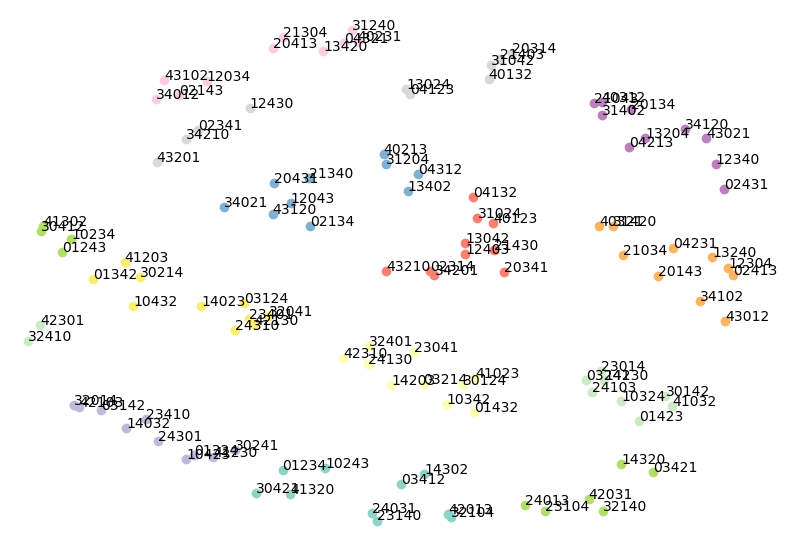

# Композиция групп / некоммутативность (group composition, non-commutative, S5)

[Шум в метках / случайные метки](label-noise-random-labels.md) ← предыдущая карточка, следующая → [Рассуждение и графы знаний](reasoning-knowledge-graphs.md)

[Индекс карточек понятий](index.md), категория: [3. Задачи и наборы данных](index.md#cat-3)\
→ Следующая категория: [4. Факторы обучения и оптимизации](weight-decay.md)\
← Предыдущая категория: [2. Механизмы и представления](structured-representation-learning.md)

## Определение

**Композиция групп** — класс алгоритмических задач [гроккинга](grokking.md), в
которых сеть учится предсказывать результат бинарной операции группы (композицию
двух её элементов a∘b) по входной паре. Группа здесь — множество с ассоциативной
бинарной операцией, нейтральным элементом и обратными. Ключевой водораздел
проходит по коммутативности: [модульная арифметика](modular-arithmetic.md) коммутативна (a+b = b+a), тогда
как главный «трудный» подкласс — **некоммутативные (неабелевы) группы**, где
порядок операндов существен (a∘b ≠ b∘a). Канонический представитель — 
симметрическая группа S5: все 120 перестановок пяти элементов с операцией
композиции. Эта постановка введена Power et al. как один из алгоритмических
датасетов, на которых наблюдается гроккинг \[[1.1](#ref-1-1)\].

## Детализация

S5 фигурирует уже в основополагающей работе: среди алгоритмических датасетов
Power et al. отдельно выделяют задачу обучения произведению в абстрактной группе
S5 \[[1.1](#ref-1-1)\]. Содержательное отличие от модульной арифметики —
механизм решения. Для циклических (абелевых) групп сеть выучивает
[Фурье-признаки](fourier-features-circuits.md) (синусоидальные представления частот), тогда как для
некоммутативной S5 [механистическая интерпретируемость](mechanistic-interpretability.md) находит опору на
дискретные косет-структуры (смежные классы — подмножества вида gH, порождённые
умножением подгруппы H на элемент g), а не на непрерывные Фурье-компоненты.
McCracken et al. формулируют гипотезу универсальности для всех теоретико-групповых
датасетов, связывая косет-контуры (подсети, реализующие операцию через смежные
классы) в группах перестановок с [косетами](group-representations-cosets.md) и частотами в модульном сложении
\[[1.2](#ref-1-2)\]. Kvinge et al. систематически исследуют, какие
теоретико-групповые структуры выучивают узкие сети, обученные предсказывать
групповые операции, и подчёркивают, что симметрическая группа Sn некоммутативна
\[[5.1](#ref-5-1)\]↗.

Главный спорный нюанс — переносятся ли механизмы и теории, установленные на
коммутативной модульной арифметике, на некоммутативную композицию. В пользу
переноса: Truong et al. показывают, что сигнатура коллапса спектральной энтропии
единообразно проявляется и в модульной арифметике, и в композиции перестановок
S5 \[[3.2](#ref-3-2)\], а Tian распространяет закон масштабирования [эмерджентности](emergence.md)
признаков в том числе на неабелевы группы \[[3.1](#ref-3-1)\]. Против —
Yildirim использует некоммутативную S5 как негативный контроль и обнаруживает,
что [сферическое ограничение](spherical-weight-norm-constraint.md), устраняющее гроккинг на циклической арифметике, на
S5 полностью не срабатывает: обход [фазы запоминания](memorization-phase.md)
зависит от согласования архитектурных априорных предпочтений с внутренней
симметрией задачи, а не является универсальным эффектом \[[2.1](#ref-2-1)\].
Тем самым S5 играет роль критического теста: она отделяет объяснения, привязанные
к Фурье-геометрии абелева случая, от объяснений, претендующих на общий [фазовый
переход](phase-transition.md).

## Альтернативные определения и нюансы

### A. Групповая операция как обобщение модульной арифметики

Определение через произвольную бинарную групповую операцию: задача — предсказать
a∘b по паре (a, b), а модульная арифметика оказывается частным (коммутативным)
случаем циклической группы Zp. Отличительная машинерия этой трактовки —
единый теоретико-групповой язык, в котором датасеты различаются лишь структурой
группы (циклическая, произведение циклических, перестановочная), что и позволяет
ставить вопрос об универсальном абстрактном алгоритме поверх разных групп
\[[1.1](#ref-1-1)\]\[[1.2](#ref-1-2)\].

### B. Некоммутативность как источник иного механизма

Определение, выделяющее S5 в отдельный режим: поскольку композиция перестановок
некоммутативна (a∘b ≠ b∘a), представление обязано кодировать порядок операндов,
и решение опирается не на Фурье-частоты, а на дискретные косет-структуры
(смежные классы). Ключевой источник различия здесь — не размер группы, а
отсутствие коммутативности: именно оно меняет [параметр порядка](order-parameter.md) решения (косеты
вместо частот) и делает S5 диагностическим негативным контролем для теорий,
выведенных на абелевом случае \[[5.1](#ref-5-1)\]↗\[[2.1](#ref-2-1)\].

### Оспаривают

Yildirim: то, что устраняет гроккинг на циклической арифметике (сферическое
ограничение на норму представлений), на некоммутативной S5 не работает вовсе —
модели не генерализуют ни на одном сиде при идеальной точности на обучении.
Отсюда вывод: снятие задержки генерализации — не универсальный оптимизационный
эффект, а следствие согласования архитектурного приора с симметрией задачи
\[[2.1](#ref-2-1)\].

### Поддерживают

Tian и Truong et al.: механизмы, найденные на абелевой модульной арифметике,
воспроизводятся на неабелевых группах. У Tian закон масштабирования эмерджентности
признаков валидируется в том числе на неабелевых группах с максимальной
неприводимой размерностью 2 \[[3.1](#ref-3-1)\]; у Truong et al. сигнатура коллапса
спектральной энтропии совпадает между Z/pZ и композицией перестановок S5
\[[3.2](#ref-3-2)\], что поддерживает единство механизма поверх типа группы.

## Ссылки

###### ref-1-1
**\[1.1\]** 2201.02177 — Power et al., «Grokking: Generalization Beyond Overfitting on Small Algorithmic Datasets». [`"for the problem of learning the product in the abstract group S5"`](../papers/2201.02177.grokking-generalization-beyond-overfitting-on-small-algorithmic-datasets/2201.02177.grokking-generalization-beyond-overfitting-on-small-algorithmic-datasets.card.md#fig-2). *«[для задачи обучения произведению в абстрактной группе $S_{5}$](../papers/2201.02177.grokking-generalization-beyond-overfitting-on-small-algorithmic-datasets/2201.02177.grokking-generalization-beyond-overfitting-on-small-algorithmic-datasets.card.md#fig-2)»*

###### ref-1-2
**\[1.2\]** 2505.18266 — McCracken et al. 2025, «Uncovering a Universal Abstract Algorithm for Modular Addition in Neural Networks». [`"the universality hypothesis as a testable conjecture across all group-theoretic datasets"`](../papers/2505.18266.uncovering-a-universal-abstract-algorithm-for-modular-addition-in-neural-networks/original/2505.18266.uncovering-a-universal-abstract-algorithm-for-modular-addition-in-neural-networks.md#p2-1). *«[догадку о всеобщности как проверяемое предположение для всех теоретико-групповых наборов данных](../papers/2505.18266.uncovering-a-universal-abstract-algorithm-for-modular-addition-in-neural-networks/2505.18266.uncovering-a-universal-abstract-algorithm-for-modular-addition-in-neural-networks.card.md#p2-1)»*\
Доп.: [`"coset circuits in networks trained on permuting lists (permutation groups) [9]"`](../papers/2505.18266.uncovering-a-universal-abstract-algorithm-for-modular-addition-in-neural-networks/original/2505.18266.uncovering-a-universal-abstract-algorithm-for-modular-addition-in-neural-networks.md#p2-1) — *«[контуры на смежных классах в сетях, обучаемых перестановкам списков (группы перестановок) [9]](../papers/2505.18266.uncovering-a-universal-abstract-algorithm-for-modular-addition-in-neural-networks/2505.18266.uncovering-a-universal-abstract-algorithm-for-modular-addition-in-neural-networks.card.md#p2-1)»*.

###### ref-1-4
**\[1.4\]** 2302.03025 — Chughtai et al., «A Toy Model of Universality: Reverse Engineering how Networks Learn Group Operations». Нюанс: задаёт корпусу полигон из семи групп ($C_{113}$, $C_{118}$, $D_{59}$, $D_{61}$, $S_{5}$, $S_{6}$, $A_{5}$) на двух архитектурах и вводит имена неприводимых представлений $S_{5}$ — sign, standard, standard_sign, 5d_a, 5d_b, 6d. [`"We focus on composition of arbitrary groups as this defines a large family of related tasks, forming an algorithmic test bed for investigating universality."`](../papers/2302.03025.a-toy-model-of-universality-reverse-engineering-how-networks-learn-group-operations/2302.03025.a-toy-model-of-universality-reverse-engineering-how-networks-learn-group-operations.card.md#p1-4). *«[Мы сосредоточиваемся на композиции произвольных групп, поскольку она задаёт большое семейство родственных задач, образующее алгоритмический полигон для исследования универсальности](../papers/2302.03025.a-toy-model-of-universality-reverse-engineering-how-networks-learn-group-operations/2302.03025.a-toy-model-of-universality-reverse-engineering-how-networks-learn-group-operations.card.md#p1-4)»*\
Доп.: [`"unlike $C_{113}$ studied by Nanda et al. 2023, $S_{5}$ is not abelian, so the composition is non-commutative"`](../papers/2302.03025.a-toy-model-of-universality-reverse-engineering-how-networks-learn-group-operations/2302.03025.a-toy-model-of-universality-reverse-engineering-how-networks-learn-group-operations.card.md#p4-5) — *«[в отличие от $C_{113}$, изучавшейся Nanda et al. 2023, $S_{5}$ не абелева, так что композиция некоммутативна](../papers/2302.03025.a-toy-model-of-universality-reverse-engineering-how-networks-learn-group-operations/2302.03025.a-toy-model-of-universality-reverse-engineering-how-networks-learn-group-operations.card.md#p4-5)»*.

###### ref-1-5
**\[1.5\]** 2312.06581 — Stander et al. 2024, «Grokking Group Multiplication with Cosets». Нюанс: механизм существует именно потому, что $S_{n}$ неабелева — на нормальной подгруппе он не строится. [`"conjugate subgroups are guaranteed to exist in non-abelian groups, whereas there are many simple groups without normal subgroups at all"`](../papers/2312.06581.grokking-group-multiplication-with-cosets/original/2312.06581.grokking-group-multiplication-with-cosets.md#p16-12). *«[сопряжённые подгруппы гарантированно существуют в неабелевых группах, тогда как есть много простых групп, у которых нормальных подгрупп нет вовсе](../papers/2312.06581.grokking-group-multiplication-with-cosets/2312.06581.grokking-group-multiplication-with-cosets.card.md#p16-12)»*\
Доп.: [`"The left and right embeddings encode different information—membership in right and left cosets, respectively—and cannot be interchanged."`](../papers/2312.06581.grokking-group-multiplication-with-cosets/original/2312.06581.grokking-group-multiplication-with-cosets.md#p7-3) — *«[Левый и правый эмбеддинги кодируют разные сведения — членство в правых и левых смежных классах соответственно — и не могут быть взаимно заменены](../papers/2312.06581.grokking-group-multiplication-with-cosets/2312.06581.grokking-group-multiplication-with-cosets.card.md#p7-3)»*.

###### ref-1-6
**\[1.6\]** 2311.07568 — Morwani et al. 2024, «Feature emergence via margin maximization: case studies in algebraic tasks». Даёт для композиции в конечных группах точное значение максимального $L_{2,3}$-зазора $\gamma^{*}=\frac{2}{3\sqrt{3|G|}}\frac{1}{\left(\sum_{n=2}^{K}d_{R_{n}}^{2.5}\right)}$ и опытное подтверждение на $S_{3}$ ($m=30$), $S_{4}$ ($m=200$) и $S_{5}$ ($m=2000$, SGD с пакетом 1000): нейроны к концу обучения сосредоточены на одном представлении, а представления большей размерности получают больше нейронов. Нюанс: условие на характеры, без которого теорема 9 не работает, проверено выполненным лишь для $S_{k}$ до $k=5$; обобщение в приложении I.2 — схема с тремя условиями разрешимости, ни одной конкретной группой не проиллюстрированная. [`"The condition that $\sum_{n=2}^{K}{d_{R_{n}}}^{1.5}\chi_{R_{n}}(C)<0$ for every non-trivial conjugacy class $C$ holds for the symmetric group $S_{k}$ up until $k=5$."`](../papers/2311.07568.feature-emergence-via-margin-maximization-case-studies-in-algebraic-tasks/2311.07568.feature-emergence-via-margin-maximization-case-studies-in-algebraic-tasks.card.md#p13-6). *«[Условие $\sum_{n=2}^{K}{d_{R_{n}}}^{1.5}\chi_{R_{n}}(C)<0$ для каждого нетривиального класса сопряжённости $C$ выполняется для симметрической группы $S_{k}$ вплоть до $k=5$.](../papers/2311.07568.feature-emergence-via-margin-maximization-case-studies-in-algebraic-tasks/2311.07568.feature-emergence-via-margin-maximization-case-studies-in-algebraic-tasks.card.md#p13-6)»*\
Доп. (границы теоремы): [`"Although Theorem 9 does not apply to all finite groups with real representations, it can be extended to apply more generally."`](../papers/2311.07568.feature-emergence-via-margin-maximization-case-studies-in-algebraic-tasks/2311.07568.feature-emergence-via-margin-maximization-case-studies-in-algebraic-tasks.card.md#p13-7) — *«[Хотя теорема 9 применима не ко всем конечным группам с вещественными представлениями, её можно распространить на более общий случай.](../papers/2311.07568.feature-emergence-via-margin-maximization-case-studies-in-algebraic-tasks/2311.07568.feature-emergence-via-margin-maximization-case-studies-in-algebraic-tasks.card.md#p13-7)»*;
Доп. (настройки для $S_{5}$): [`"We train a 1-hidden layer quadratic network with $m=2000$, using stochastic gradient descent for $75000$ steps, with a batch size of $1000$ and $L_{2,3}$ regularization of $1e-5$."`](../papers/2311.07568.feature-emergence-via-margin-maximization-case-studies-in-algebraic-tasks/2311.07568.feature-emergence-via-margin-maximization-case-studies-in-algebraic-tasks.card.md#p20-1) — *«[Мы обучаем квадратичную сеть с одним скрытым слоем при $m=2000$, употребляя стохастический градиентный спуск в течение $75000$ шагов, с размером пакета $1000$ и $L_{2,3}$-регуляризацией $1e-5$.](../papers/2311.07568.feature-emergence-via-margin-maximization-case-studies-in-algebraic-tasks/2311.07568.feature-emergence-via-margin-maximization-case-studies-in-algebraic-tasks.card.md#p20-1)»*.
## Ссылки на присоединившиеся работы

### Оспаривают

###### ref-2-1
**\[2.1\]** 2603.05228 — Yildirim, «The Geometric Inductive Bias of Grokking». Оспаривает: механизм, устраняющий гроккинг на циклической арифметике, не переносится на некоммутативную S5 — эффект не универсален. [`"using non-commutative $S_{5}$ permutation composition as a negative control, we find that the same spherical constraint fails entirely"`](../papers/2603.05228.the-geometric-inductive-bias-of-grokking-bypassing-phase-transitions-via-architectural-topology/original/2603.05228.the-geometric-inductive-bias-of-grokking-bypassing-phase-transitions-via-architectural-topology.md#p2-5). *«[беря некоммутативную композицию перестановок $S_{5}$ как отрицательный контроль, мы находим, что то же сферическое ограничение совершенно не работает](../papers/2603.05228.the-geometric-inductive-bias-of-grokking-bypassing-phase-transitions-via-architectural-topology/2603.05228.the-geometric-inductive-bias-of-grokking-bypassing-phase-transitions-via-architectural-topology.card.md#p2-5)»*\
Доп.: [`"bypassing the memorization phase depends on alignment between architectural priors and the task’s intrinsic symmetry"`](../papers/2603.05228.the-geometric-inductive-bias-of-grokking-bypassing-phase-transitions-via-architectural-topology/original/2603.05228.the-geometric-inductive-bias-of-grokking-bypassing-phase-transitions-via-architectural-topology.md#p2-5). *«[обход фазы запоминания зависит от согласия архитектурных предпочтений с внутренней симметрией задачи](../papers/2603.05228.the-geometric-inductive-bias-of-grokking-bypassing-phase-transitions-via-architectural-topology/2603.05228.the-geometric-inductive-bias-of-grokking-bypassing-phase-transitions-via-architectural-topology.card.md#p2-5)»*

### Поддерживают

###### ref-3-1
**\[3.1\]** 2509.21519 — Tian, «Provable Scaling Laws of Feature Emergence from Learning Dynamics of Grokking». Нюанс: закон масштабирования эмерджентности признаков подтверждается и на неабелевых группах. [`"Non-Abelian groups with $\max_{k}d_{k}=2$ (maximal irreducible dimension $2$)"`](../papers/2509.21519.provable-scaling-laws-of-feature-emergence-from-learning-dynamics-of-grokking/original/2509.21519.provable-scaling-laws-of-feature-emergence-from-learning-dynamics-of-grokking.md#fig-5). *«[неабелевы группы с $\max_{k}d_{k}=2$ (максимальная неприводимая размерность $2$)](../papers/2509.21519.provable-scaling-laws-of-feature-emergence-from-learning-dynamics-of-grokking/2509.21519.provable-scaling-laws-of-feature-emergence-from-learning-dynamics-of-grokking.card.md#fig-5)»*\
Доп.: [`"From these non-Abelian groups, for each group size M , we pick one for our scaling law experiments"`](../papers/2509.21519.provable-scaling-laws-of-feature-emergence-from-learning-dynamics-of-grokking/original/2509.21519.provable-scaling-laws-of-feature-emergence-from-learning-dynamics-of-grokking.md#p42-12). *«[Из этих неабелевых групп для каждого размера группы $M$ мы выбираем одну для наших экспериментов с законами масштабирования](../papers/2509.21519.provable-scaling-laws-of-feature-emergence-from-learning-dynamics-of-grokking/2509.21519.provable-scaling-laws-of-feature-emergence-from-learning-dynamics-of-grokking.card.md#p42-12)»*

###### ref-3-2
**\[3.2\]** 2604.13123 — Truong et al., «Spectral Entropy Collapse as a Phase Transition in Delayed Generalisation». Нюанс: механизм (коллапс спектральной энтропии) един для абелевых и неабелевых групп. [`"The same entropy-collapse signature appears across modular arithmetic ($\mathbb{Z}/p\mathbb{Z}$, abelian) and $S_{5}$ permutation composition (non-abelian, 120 classes)"`](../papers/2604.13123.spectral-entropy-collapse-as-a-phase-transition-in-delayed-generalisation/2604.13123.spectral-entropy-collapse-as-a-phase-transition-in-delayed-generalisation.card.md#p1-2). *«[тот же признак схлопывания энтропии возникает и на модульной арифметике ($\mathbb{Z}/p\mathbb{Z}$, абелева), и на композиции перестановок $S_{5}$ (неабелева, 120 родов)](../papers/2604.13123.spectral-entropy-collapse-as-a-phase-transition-in-delayed-generalisation/2604.13123.spectral-entropy-collapse-as-a-phase-transition-in-delayed-generalisation.card.md#p1-2)»*\
Доп. (постановка $S_{5}$): [`"$S_{5}$ is non-abelian ($94\%$ of pairs do not commute), has no simple Fourier representation over a cyclic group, and has $120$ output classes"`](../papers/2604.13123.spectral-entropy-collapse-as-a-phase-transition-in-delayed-generalisation/2604.13123.spectral-entropy-collapse-as-a-phase-transition-in-delayed-generalisation.card.md#p10-3) — *«[Группа $S_{5}$ неабелева ($94\%$ пар не коммутируют), простого фурье-представления над циклической группой не имеет и содержит $120$ выходных родов](../papers/2604.13123.spectral-entropy-collapse-as-a-phase-transition-in-delayed-generalisation/2604.13123.spectral-entropy-collapse-as-a-phase-transition-in-delayed-generalisation.card.md#p10-3)»*

###### ref-3-3
**\[3.3\]** 2606.12966 — Sivasankar, «Circuit Synchronization Precedes Generalization: A Causal Precursor to Grokking». [`"composition on the non-abelian symmetric group $S_{5}$"`](../papers/2606.12966.circuit-synchronization-precedes-generalization-a-causal-precursor-to-grokking/2606.12966.circuit-synchronization-precedes-generalization-a-causal-precursor-to-grokking.card.md#p13-2). *«[композиция на неабелевой симметрической группе $S_{5}$](../papers/2606.12966.circuit-synchronization-precedes-generalization-a-causal-precursor-to-grokking/2606.12966.circuit-synchronization-precedes-generalization-a-causal-precursor-to-grokking.card.md#p13-2)»* — задача выбрана потому, что её контур доказуемо не одномерно-фурьевский (Chughtai et al. 2023).\
Доп. (раскрытое исключение): [`"the contrast ($6/6$ vs. $1/6$ as a precursor) is strong but not absolute"`](../papers/2606.12966.circuit-synchronization-precedes-generalization-a-causal-precursor-to-grokking/2606.12966.circuit-synchronization-precedes-generalization-a-causal-precursor-to-grokking.card.md#p14-4) — *«[противопоставление ($6/6$ против $1/6$ как предвестник) сильно, но не безусловно](../papers/2606.12966.circuit-synchronization-precedes-generalization-a-causal-precursor-to-grokking/2606.12966.circuit-synchronization-precedes-generalization-a-causal-precursor-to-grokking.card.md#p14-4)»*.
## Цитирования

Работы, лишь упоминающие явление (обзор литературы, связанные работы, попутное цитирование) без его подробного разбора.

**\[4.1\]** 2311.06597 — Tan et al., «Understanding Grokking Through A Robustness Viewpoint». [`"from group theory, it shall obey the commutative law once it actually learns the general addition rule"`](../papers/2311.06597.understanding-grokking-through-a-robustness-viewpoint/2311.06597.understanding-grokking-through-a-robustness-viewpoint.card.md#p7-1). *«[из теории групп следует, что, как только модель по-настоящему выучит общее правило сложения, она обязана подчиняться закону коммутативности](../papers/2311.06597.understanding-grokking-through-a-robustness-viewpoint/2311.06597.understanding-grokking-through-a-robustness-viewpoint.card.md#p7-1)»*

**\[4.2\]** 2504.13292 — Xu et al., «Let Me Grok for You: Accelerating Grokking via Embedding Transfer». [`"the grokking phenomenon has since been observed in other settings such as learning group operations (Chughtai et al., 2023)"`](../papers/2504.13292.let-me-grok-for-you-accelerating-grokking-via-embedding-transfer-from-a-weaker-model/original/2504.13292.let-me-grok-for-you-accelerating-grokking-via-embedding-transfer-from-a-weaker-model.md#p1-4). *«[явление гроккинга с тех пор наблюдалось и в других постановках — при обучении групповым операциям (Chughtai et al., 2023)](../papers/2504.13292.let-me-grok-for-you-accelerating-grokking-via-embedding-transfer-from-a-weaker-model/2504.13292.let-me-grok-for-you-accelerating-grokking-via-embedding-transfer-from-a-weaker-model.card.md#p1-4)»*

**\[4.3\]** 2504.17243 — Zhou et al., «NeuralGrok: Accelerate Grokking by Neural Gradient Transformation». [`"NEURALGROK significantly accelerates generalization, ranging from simple operations"`](../papers/2504.17243.neuralgrok-accelerate-grokking-by-neural-gradient-transformation/original/2504.17243.neuralgrok-accelerate-grokking-by-neural-gradient-transformation.md#p2-1). *«[NeuralGrok значительно ускоряет генерализацию — от простых операций](../papers/2504.17243.neuralgrok-accelerate-grokking-by-neural-gradient-transformation/2504.17243.neuralgrok-accelerate-grokking-by-neural-gradient-transformation.card.md#p2-1)»*

**\[4.4\]** 2604.00316 — Tomàs et al., «Breaking Data Symmetry is Needed For Generalization in Feature Learning Kernels». [`"we examine how RFM learns features on a broader class of algebraic tasks, extending beyond modular arithmetic to other Abelian groups"`](../papers/2604.00316.breaking-data-symmetry-is-needed-for-generalization-in-feature-learning-kernels/original/2604.00316.breaking-data-symmetry-is-needed-for-generalization-in-feature-learning-kernels.md#p2-1). *«[мы разбираем, как RFM выучивает признаки на более широком круге алгебраических задач, выходя за пределы модульной арифметики к другим абелевым группам](../papers/2604.00316.breaking-data-symmetry-is-needed-for-generalization-in-feature-learning-kernels/2604.00316.breaking-data-symmetry-is-needed-for-generalization-in-feature-learning-kernels.card.md#p2-1)»*

**\[4.5\]** 2405.16658 — Park, Kim, Kim, «Acceleration of Grokking in Learning Arithmetic Operations via Kolmogorov-Arnold Representation». Нюанс: даёт проверяемое до опыта предсказание о некоммутативных операциях — у антиабелевой операции те же вложение и внешняя функция, что у порождающей абелевой, меняется только промежуточная часть (сумма становится разностью), — и предсказание подтверждено переносом блока декодера в обе стороны, из вычитания в деление и обратно. Неабелевых групп в работе нет: $S_{5}$ и композиции перестановок не рассматриваются, а «некоммутативность» ограничена вычитанием и делением. [`"Let $\bullet$ be an anti-abelian binary operation for the abelian group operation $\circ$."`](../papers/2405.16658.acceleration-of-grokking-in-learning-arithmetic-operations-via-kolmogorov-arnold-representation/2405.16658.acceleration-of-grokking-in-learning-arithmetic-operations-via-kolmogorov-arnold-representation.card.md#p10-2). *«[Пусть $\bullet$ — антиабелева бинарная операция для абелевой групповой операции $\circ$](../papers/2405.16658.acceleration-of-grokking-in-learning-arithmetic-operations-via-kolmogorov-arnold-representation/2405.16658.acceleration-of-grokking-in-learning-arithmetic-operations-via-kolmogorov-arnold-representation.card.md#p10-2)»*\
Доп.: [`"Since subtraction and division are anti-abelian for addition and multiplication respectively they have the following representations by Theorem 5:"`](../papers/2405.16658.acceleration-of-grokking-in-learning-arithmetic-operations-via-kolmogorov-arnold-representation/2405.16658.acceleration-of-grokking-in-learning-arithmetic-operations-via-kolmogorov-arnold-representation.card.md#p11-7) — *«[Поскольку вычитание и деление антиабелевы для сложения и умножения соответственно, они имеют следующие представления по теореме 5:](../papers/2405.16658.acceleration-of-grokking-in-learning-arithmetic-operations-via-kolmogorov-arnold-representation/2405.16658.acceleration-of-grokking-in-learning-arithmetic-operations-via-kolmogorov-arnold-representation.card.md#p11-7)»*.

**\[4.6\]** 2604.20923 — Golwala, «ILDR: Geometric Early Detection of Grokking». [`"The group has $|S_5| = 120$ elements, giving $120^2 = 14{,}400$ input pairs and 120 output classes."`](../papers/2604.20923.ildr-geometric-early-detection-of-grokking/original/2604.20923.ildr-geometric-early-detection-of-grokking.md#p5-2). *«[В группе $|S_5| = 120$ элементов, что даёт $120^2 = 14{,}400$ входных пар и 120 выходных классов.](../papers/2604.20923.ildr-geometric-early-detection-of-grokking/2604.20923.ildr-geometric-early-detection-of-grokking.card.md#p5-2)»*\
Доп. (постановка): двухслойный трансформер с $d = 256$ на бюджете 40 000 шагов ([с. 6, абз. 3](../papers/2604.20923.ildr-geometric-early-detection-of-grokking/2604.20923.ildr-geometric-early-detection-of-grokking.card.md#p6-3)); гроккинг наступает на шаге 20200, вдвое-впятеро позже всех арифметических прогонов работы.

### Внешние работы

###### ref-5-1
**\[5.1\]** 2601.21150 — Внешняя работа (демотирована из корпуса): Kvinge et al., «Can Neural Networks Learn Small Algebraic Worlds? An Investigation Into the Group-theoretic Structures Learned By Narrow Models Trained To Predict Group Operations». [`"The symmetric group $S_{n}$ is the set of all permutations of $n$ elements with the binary operation of composition of permutations"`](../externals/2601.21150.can-neural-networks-learn-small-algebraic-worlds/2601.21150.can-neural-networks-learn-small-algebraic-worlds.card.md#p3-4). *«[симметрическая группа $S_{n}$ есть множество всех перестановок $n$ элементов с двуместным действием композиции перестановок](../externals/2601.21150.can-neural-networks-learn-small-algebraic-worlds/2601.21150.can-neural-networks-learn-small-algebraic-worlds.card.md#p3-4)»*\
Доп. (непереместительность): [`"the order of $S_{n}$ is $n!$. It is not commutative"`](../externals/2601.21150.can-neural-networks-learn-small-algebraic-worlds/2601.21150.can-neural-networks-learn-small-algebraic-worlds.card.md#p3-4). *«[порядок $S_{n}$ равен $n!$. Она непереместительна](../externals/2601.21150.can-neural-networks-learn-small-algebraic-worlds/2601.21150.can-neural-networks-learn-small-algebraic-worlds.card.md#p3-4)»*
