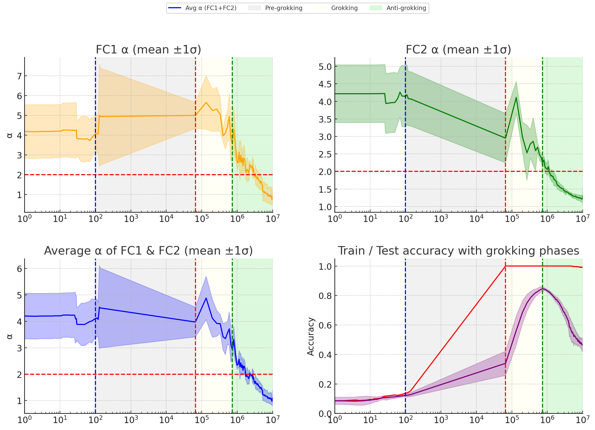

# Тяжёлохвостовая саморегуляризация (heavy-tailed self-regularization, HTSR)

[Параметр порядка](order-parameter.md) ← предыдущая карточка, следующая → [Линейное зондирование](linear-sparse-probing.md)

[Индекс карточек понятий](index.md), категория: [6. Аналитические инструменты и метрики](index.md#cat-6)\
→ Следующая категория: [7. Теория и формальные результаты](effective-theory-statistical-mechanics.md)\
← Предыдущая категория: [5. Интервенции и методы](gradient-low-pass-filtering.md)

## Определение

**Тяжёлохвостовая саморегуляризация (HTSR)** — теория (Martin & Mahoney, 2021),
которая изучает эмпирическую спектральную плотность (ESD — распределение
собственных значений матрицы корреляций весов слоя) отдельных весовых матриц и
характеризует её единственным показателем — тяжёлохвостовым степенным (power-law,
PL) показателем α. В корпусе гроккинга HTSR как аналитическую линзу вводят
Prakash & Martin: они применяют её к отложенной генерализации, показывая, что
HTSR-показатель α отслеживает переход в фазу [гроккинга](grokking.md) и предсказывает
последующее падение генерализации \[[1.1](#ref-1-1)\]\[[1.2](#ref-1-2)\].

## Детализация

Механика такова. Для каждой весовой матрицы `W` строится матрица корреляций (Грама),
её собственные значения дают ESD; если элементы `W` были бы независимы и одинаково
распределены (i.i.d.), ESD сходилась бы к распределению **Марченко–Пастура (MP)** —
это «нулевая модель» случайной матрицы, с которой сравнивают реально обученные веса.
У обученных слоёв правый край ESD вместо M-бугра «расплывается» в степенной хвост
`ρ ∼ λ^−α`, и показатель α квантует силу корреляций \[[1.1](#ref-1-1)\]. Тем самым α
работает как **[параметр порядка](order-parameter.md)**: по HTSR
разные диапазоны α отвечают разным фазам обучения — α ≳ 5–6 (слой почти случаен, мало
структуры), 2 ≲ α ≲ 5–6 (умеренно тяжёлый хвост, слой хорошо обусловлен и лучше
генерализует), α = 2 (идеал — полностью оптимизированный слой) и α < 2 (очень тяжёлый
хвост, VHT — признак переобучения) \[[1.1](#ref-1-1)\]. Нижняя граница α = 2 — жёсткая
отсечка, верхняя (5–6) мягче и зависит от форм-фактора матрицы.

Отсюда практический вывод: α ≈ 2 — универсальная цель сходимости слоя, а траектория
α(t) — чувствительный индикатор состояния сети. Резкое падение α к 2 совпадает с
началом гроккинга, а дальнейший провал ниже 2 предвещает и затем характеризует
поздний коллапс — [анти-грокинг](anti-grokking.md) \[[1.2](#ref-1-2)\]. Более поздняя
работа связывает HTSR с продолжающей её теорией **SETOL** (Semi-Empirical Theory of
Learning) и добавляет вторую спектральную метрику — [Correlation Traps](correlation-traps.md) (аномально
большие собственные значения перетасованной матрицы весов), причём именно ловушки, а не α, объявляются
основным сигналом коллапса, и в MA-модели их появление сопровождается ростом α > 2 —
[катастрофическим забыванием](catastrophic-forgetting.md) \[[1.2](#ref-1-2)\]. Оба
статуса α (по фазам) и природа коллапса роднят HTSR с более широким кругом явлений —
[фазовыми переходами](phase-transition.md) в динамике обучения.

## Альтернативные определения и нюансы

### A. α как параметр порядка / метрика качества слоя (HTSR)

Трактовка α не просто как числа, а как параметра порядка: единственная величина,
извлекаемая из ESD слоя, монотонно связывающая силу корреляций весов с фазой обучения
и уровнем сходимости конкретного слоя \[[1.1](#ref-1-1)\]. Источник различия: показатель
привязан к отдельному слою (layer quality) и задаёт диапазоны (α > 5–6 «случайный»,
2–5 «жирнохвостый», < 2 «сверхтяжёлый»), а не к сети целиком; α = 2 выступает жёсткой
универсальной отсечкой между хорошей генерализацией и переобучением.

### B. α = 2 как фазовая граница термодинамического равновесия (SETOL)

Трактовка α = 2 не эмпирически, а как границы фаз: по дополняющей HTSR теории SETOL
слой приходит в термодинамическое равновесие при оптимальной генерализации, и условие
α = 2 отвечает границе между идеальной генерализацией и переобучением, а слой с α < 2
и/или с Correlation Traps находится в состоянии переобучения \[[1.2](#ref-1-2)\].
Источник различия: α = 2 получает теоретическое обоснование (аналогия с точной
ренормгруппой Вильсона), а не постулируется из наблюдений.

### Поддерживают

- **Спектральная энтропия как дополняющий параметр порядка** \[[3.1](#ref-3-1)\]:
  работа берёт HTSR-показатель α как ориентир, но предлагает собственную величину —
  нормированную спектральную энтропию представлений, — и прямо выдвигает гипотезу, что
  её критический порог соответствует тому самому HTSR-переходу спектра весов от
  MP-бугра к «бугор + степенной хвост». Источник различия: явление описывается
  дополнительным, независимо измеряемым параметром порядка, согласованным с
  тяжелохвостовой картиной, а не противопоставляемым ей.

## Ссылки

###### ref-1-1
**\[1.1\]** 2506.04434 — Prakash & Martin 2025, «Grokking and Generalization Collapse: Insights from HTSR theory». [`"HTSR theory examines the empirical spectral density (ESD) of individual layer weight matrices $(\mathbf{W})$, quantified by the heavy-tailed power law (PL) exponent $\alpha$"`](../papers/2506.04434.grokking-and-generalization-collapse-insights-from-htsr-theory/original/2506.04434.grokking-and-generalization-collapse-insights-from-htsr-theory.md#p1-4). *«[Теория HTSR рассматривает опытную спектральную плотность (ESD) матриц весов отдельных слоёв $(\mathbf{W})$, описываемую тяжелохвостым степенным (PL) показателем $\alpha$](../papers/2506.04434.grokking-and-generalization-collapse-insights-from-htsr-theory/2506.04434.grokking-and-generalization-collapse-insights-from-htsr-theory.card.md#p1-4)»*\
Доп.: [`"with the exponent $\alpha$ quantifying the strength of the correlations"`](../papers/2506.04434.grokking-and-generalization-collapse-insights-from-htsr-theory/original/2506.04434.grokking-and-generalization-collapse-insights-from-htsr-theory.md#p3-10) — *«[где показатель $\alpha$ описывает силу связей](../papers/2506.04434.grokking-and-generalization-collapse-insights-from-htsr-theory/2506.04434.grokking-and-generalization-collapse-insights-from-htsr-theory.card.md#p3-10)»*; [`"$\alpha=2$ **Ideal value:** Corresponds to fully optimized layers in models. Associated with layers in models that generalize best."`](../papers/2506.04434.grokking-and-generalization-collapse-insights-from-htsr-theory/original/2506.04434.grokking-and-generalization-collapse-insights-from-htsr-theory.md#p4-1) — *«[$\alpha=2$ **Наилучшее значение:** отвечает вполне доведённым слоям моделей. Связано со слоями тех моделей, что обобщают лучше всего.](../papers/2506.04434.grokking-and-generalization-collapse-insights-from-htsr-theory/2506.04434.grokking-and-generalization-collapse-insights-from-htsr-theory.card.md#p4-1)»*.

###### ref-1-2
**\[1.2\]** 2602.02859 — Prakash & Martin, «Late-Stage Generalization Collapse in Grokking: Detecting anti-grokking with WeightWatcher». [`"we examine two layer quality metrics: (i) the HTSR PL exponent α, and (ii) the SETOL Correlation Traps"`](../papers/2602.02859.late-stage-generalization-collapse-in-grokking-detecting-anti-grokking-with-weightwatcher/original/2602.02859.late-stage-generalization-collapse-in-grokking-detecting-anti-grokking-with-weightwatcher.md#p3-8). *«[мы рассматриваем две послойные меры качества: (i) степенной показатель HTSR $\alpha$ и (ii) ловушки корреляции по SETOL](../papers/2602.02859.late-stage-generalization-collapse-in-grokking-detecting-anti-grokking-with-weightwatcher/2602.02859.late-stage-generalization-collapse-in-grokking-detecting-anti-grokking-with-weightwatcher.card.md#p3-8)»*\
Доп. (α < 2 — очень тяжёлый хвост, переобучение): [`"$\alpha<2$: **Very-Heavy-Tailed (VHT)** Extremely heavy tails indicate overfitting to the training data"`](../papers/2602.02859.late-stage-generalization-collapse-in-grokking-detecting-anti-grokking-with-weightwatcher/original/2602.02859.late-stage-generalization-collapse-in-grokking-detecting-anti-grokking-with-weightwatcher.md#p3-11) — *«[$\alpha<2$: **очень тяжелохвостый (VHT)** — крайне тяжёлые хвосты указывают на переобучение на обучающих данных](../papers/2602.02859.late-stage-generalization-collapse-in-grokking-detecting-anti-grokking-with-weightwatcher/2602.02859.late-stage-generalization-collapse-in-grokking-detecting-anti-grokking-with-weightwatcher.card.md#p3-11)»*.\
Доп. (α = 2 как фазовая граница, SETOL): [`"A layer with $\alpha<2$, and/or one or more Correlation Traps (below), corresponds to states of overfitting, as observed here"`](../papers/2602.02859.late-stage-generalization-collapse-in-grokking-detecting-anti-grokking-with-weightwatcher/original/2602.02859.late-stage-generalization-collapse-in-grokking-detecting-anti-grokking-with-weightwatcher.md#p3-13) — *«[Слой с $\alpha<2$ и (или) с одной или несколькими ловушками корреляции (ниже) отвечает состояниям переобучения, как и наблюдается здесь](../papers/2602.02859.late-stage-generalization-collapse-in-grokking-detecting-anti-grokking-with-weightwatcher/2602.02859.late-stage-generalization-collapse-in-grokking-detecting-anti-grokking-with-weightwatcher.card.md#p3-13)»*.

## Ссылки на присоединившиеся работы

### Поддерживают

###### ref-3-1
**\[3.1\]** 2604.13123 — Truong et al., «Spectral Entropy Collapse as a Phase Transition in Delayed Generalisation: An Interventional and Predictive Framework for Grokking». Нюанс: берёт HTSR-показатель α как ориентир и предлагает согласованный с ним дополнительный параметр порядка — спектральную энтропию. [`"Prakash and Martin (2025) use Heavy-Tailed Self-Regularisation with the spectral exponent $\alpha$ and identify an *anti-grokking* regime"`](../papers/2604.13123.spectral-entropy-collapse-as-a-phase-transition-in-delayed-generalisation/2604.13123.spectral-entropy-collapse-as-a-phase-transition-in-delayed-generalisation.card.md#p3-5) — *«[Prakash and Martin (2025) пользуются тяжелохвостым самоупорядочением со спектральным показателем $\alpha$ и выделяют режим *антигроккинга*](../papers/2604.13123.spectral-entropy-collapse-as-a-phase-transition-in-delayed-generalisation/2604.13123.spectral-entropy-collapse-as-a-phase-transition-in-delayed-generalisation.card.md#p3-5)»*\
Доп. (гипотеза о соответствии переходу бугор→хвост): [`"the threshold $\tilde{H}^{*}\approx 0.609$ corresponds to the point at which the weight-matrix spectrum transitions from Marchenko–Pastur-dominated (bulk regime) to bulk + power-law-tail (learned-feature regime)"`](../papers/2604.13123.spectral-entropy-collapse-as-a-phase-transition-in-delayed-generalisation/2604.13123.spectral-entropy-collapse-as-a-phase-transition-in-delayed-generalisation.card.md#p18-4) — *«[порог $\tilde{H}^{*}\approx 0.609$ отвечает точке, где спектр весовой матрицы переходит от главенства Марченко — Пастура (режим основной части) к строению «основная часть плюс степенной хвост» (режим выученных признаков)](../papers/2604.13123.spectral-entropy-collapse-as-a-phase-transition-in-delayed-generalisation/2604.13123.spectral-entropy-collapse-as-a-phase-transition-in-delayed-generalisation.card.md#p18-4)»*.

###### ref-3-2
**\[3.2\]** 2605.12394 — Prakash & Martin 2026, «Detecting overfitting in Neural Networks during long-horizon grokking using Random Matrix Theory». Переворот прибора внутри линии: вместо тяжелохвостой структуры коррелированной матрицы $\mathbf{W}$ анализируется спектр поэлементно перемешанной $\mathbf{W}^{\mathrm{rand}}$ — выброс, переживший перемешивание, говорит об атипичности самого распределения членов; показатель $\alpha$ не используется, и прямо оговорено, что механизм не требует хвоста с показателем меньше двух. [`"Prior spectral diagnostics use heavy-tailed structure of the correlated (unrandomized) layer weight matrices $\mathbf{W}$, and related metrics to characterize trained networks. We analyze the spectral properties of the randomized $\mathbf{W}$"`](../papers/2605.12394.detecting-overfitting-in-neural-networks-during-long-horizon-grokking-using-random-matrix-theory/original/2605.12394.detecting-overfitting-in-neural-networks-during-long-horizon-grokking-using-random-matrix-theory.md#p2-7). *«[Прежние спектральные диагностики используют тяжелохвостую структуру коррелированных (нерандомизированных) весовых матриц слоёв $\mathbf{W}$ и связанные метрики для характеристики обученных сетей. Мы анализируем спектральные свойства рандомизированной $\mathbf{W}$](../papers/2605.12394.detecting-overfitting-in-neural-networks-during-long-horizon-grokking-using-random-matrix-theory/2605.12394.detecting-overfitting-in-neural-networks-during-long-horizon-grokking-using-random-matrix-theory.card.md#p2-7)»*\
Доп. (не нужен показатель < 2): [`"The mechanism does not require exponent $<2$, and the observed traps are often driven by several large or moderately large entries rather than one extraordinary coordinate"`](../papers/2605.12394.detecting-overfitting-in-neural-networks-during-long-horizon-grokking-using-random-matrix-theory/original/2605.12394.detecting-overfitting-in-neural-networks-during-long-horizon-grokking-using-random-matrix-theory.md#p20-3) — *«[Механизм не требует показателя $<2$, и наблюдаемые ловушки часто движимы несколькими большими или умеренно большими членами, а не одной исключительной координатой](../papers/2605.12394.detecting-overfitting-in-neural-networks-during-long-horizon-grokking-using-random-matrix-theory/2605.12394.detecting-overfitting-in-neural-networks-during-long-horizon-grokking-using-random-matrix-theory.card.md#p20-3)»*.

### Оспаривают

###### ref-2-1
**\[2.1\]** 2605.20441 — Verma 2026, «Weight Decay Regimes in Grokking Transformers: Cheap Online Diagnostics». Применяет Weightwatcher к канонической траектории гроккинг-трансформера и получает расхождение по времени с тем, ради чего мера сюда пришла: тяжёлый хвост складывается при входе в гроккинг, а не при позднем коллапсе, поэтому признак «третьей фазы» как прямой определитель начала коллапса не годится. Нюанс: режим анти-гроккинга при этом не оспаривается — оспаривается употребление $\alpha$ как его детектора; след взят по медиане слоёв на одном семени, слоевого разреза и межсеменного покрытия нет. [`"$\alpha$ falls from $2.07$ at initialization to $1.39$ by epoch 500 (Phase 1 grokking onset) and remains $\lesssim 1.5$ through Phase 5."`](../papers/2605.20441.weight-decay-regimes-in-grokking-transformers-cheap-online-diagnostics/original/2605.20441.weight-decay-regimes-in-grokking-transformers-cheap-online-diagnostics.md#p8-2). *«[$\alpha$ падает с $2.07$ при инициализации до $1.39$ к эпохе 500 (вход в гроккинг фазы 1) и остаётся $\lesssim 1.5$ вплоть до фазы 5.](../papers/2605.20441.weight-decay-regimes-in-grokking-transformers-cheap-online-diagnostics/2605.20441.weight-decay-regimes-in-grokking-transformers-cheap-online-diagnostics.card.md#p8-2)»*\
Доп. (осторожность вывода): [`"We report this as a partial parallel rather than a reproduction."`](../papers/2605.20441.weight-decay-regimes-in-grokking-transformers-cheap-online-diagnostics/original/2605.20441.weight-decay-regimes-in-grokking-transformers-cheap-online-diagnostics.md#p8-2) — *«[Мы сообщаем это как частичную параллель, а не как воспроизведение.](../papers/2605.20441.weight-decay-regimes-in-grokking-transformers-cheap-online-diagnostics/2605.20441.weight-decay-regimes-in-grokking-transformers-cheap-online-diagnostics.card.md#p8-2)»*.
## Цитирования

Работы, лишь упоминающие явление (обзор литературы, связанные работы, попутное цитирование) без его подробного разбора.

**\[4.1\]** 2605.06152 — Liu, Cao, Li, Zhou 2026, «Grokking or Glitching? How Low-Precision Drives Slingshot Loss Spikes». Работа Prakash and Martin (2025) названа среди показов гроккинга без явного сглаживания. [`"growing empirical evidence shows that grokking can also occur without explicit regularization, although many of these demonstrations are conducted under mean-squared error (MSE) loss Gromov (2023); Kumar et al. (2024); Golechha (2024); Prakash and Martin (2025)"`](../papers/2605.06152.grokking-or-glitching-how-low-precision-drives-slingshot-loss-spikes/original/2605.06152.grokking-or-glitching-how-low-precision-drives-slingshot-loss-spikes.md#p3-1). *«[накапливается опытное свидетельство того, что гроккинг возникает и без явного сглаживания, хотя многие такие показы поставлены при потере среднего квадрата отклонения (MSE) Gromov (2023); Kumar et al. (2024); Golechha (2024); Prakash and Martin (2025)](../papers/2605.06152.grokking-or-glitching-how-low-precision-drives-slingshot-loss-spikes/2605.06152.grokking-or-glitching-how-low-precision-drives-slingshot-loss-spikes.card.md#p3-1)»*

**\[4.2\]** 2408.11804 — Yunis et al., «Approaching Deep Learning through the Spectral Dynamics of Weights». Нюанс: Martin & Mahoney цитируются как эмпирическая опора линии о низкоранговых свойствах весов, но связь с HTSR исчерпывается ссылкой — ни эмпирической спектральной плотности, ни показателя степенного закона, ни границы Марченко — Пастура работа не считает, спектр весов сворачивается в энтропию распределения сингулярных чисел. [`"Numerous studies investigate low-rank biases in various matrices, including the Jacobian (Pennington et al. 2018), weight matrices (Le & Jegelka 2021; Martin & Mahoney 2020; Martin & Mahoney 2021; Frei et al. 2022; Ongie & Willett 2022), Gram matrix (Huh et al. 2022), and features (Yu & Wu 2023; Feng et al. 2022)."`](../papers/2408.11804.approaching-deep-learning-through-the-spectral-dynamics-of-weights/original/2408.11804.approaching-deep-learning-through-the-spectral-dynamics-of-weights.md#p4-2). *«[Многочисленные работы исследуют низкоранговые смещения в разных матрицах, включая якобиан (Pennington et al. 2018), весовые матрицы (Le & Jegelka 2021; Martin & Mahoney 2020; Martin & Mahoney 2021; Frei et al. 2022; Ongie & Willett 2022), грам-матрицу (Huh et al. 2022) и признаки (Yu & Wu 2023; Feng et al. 2022)](../papers/2408.11804.approaching-deep-learning-through-the-spectral-dynamics-of-weights/2408.11804.approaching-deep-learning-through-the-spectral-dynamics-of-weights.card.md#p4-2)»*

**\[4.3\]** 2602.06702 — Singh, Misra, Orvieto, «Explaining Grokking in Transformers…». [`"higher values of weight decay show more heavy-tailed eigenspectra in $Z$"`](../papers/2602.06702.explaining-grokking-in-transformers-through-the-lens-of-inductive-bias/2602.06702.explaining-grokking-in-transformers-through-the-lens-of-inductive-bias.card.md#p7-10). *«[более высокие значения weight decay показывают более тяжелохвостые собственные спектры в $Z$](../papers/2602.06702.explaining-grokking-in-transformers-through-the-lens-of-inductive-bias/2602.06702.explaining-grokking-in-transformers-through-the-lens-of-inductive-bias.card.md#p7-10)»* — где $Z$ есть корреляционная матрица пре-логитов, а не весовая матрица; в этом отличие от линии HTSR, на которую работа не ссылается.

**\[4.4\]** 2605.08237 — Wang, Ying, Kanamori 2026, «Distributional Spectral Diagnostics for Localizing Grokking Transitions». Нюанс: ближайшая по замыслу линия «дешёвой спектральной диагностики без доступа к тесту» упомянута одной фразой и ни разу не сопоставлена с невязкой. [`"Weight-matrix spectra have been studied via random-matrix theory and heavy-tailed self-regularization [30, 25]."`](../papers/2605.08237.distributional-spectral-diagnostics-for-localizing-grokking-transitions/2605.08237.distributional-spectral-diagnostics-for-localizing-grokking-transitions.card.md#p31-2). *«[Спектры весовых матриц изучались через теорию случайных матриц и тяжелохвостовую саморегуляризацию [30, 25].](../papers/2605.08237.distributional-spectral-diagnostics-for-localizing-grokking-transitions/2605.08237.distributional-spectral-diagnostics-for-localizing-grokking-transitions.card.md#p31-2)»*
