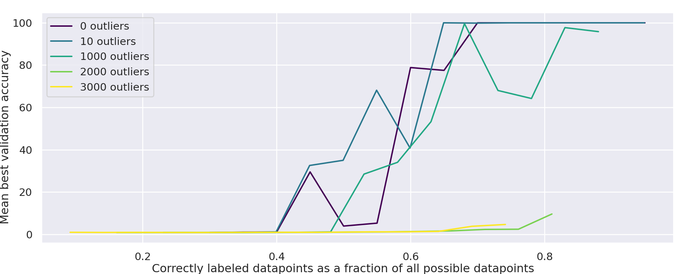

# Шум в метках / случайные метки (label noise / random labels)

[Разрежённая чётность](sparse-parity.md) ← предыдущая карточка, следующая → [Композиция групп / некоммутативность](group-composition-non-commutative-s5.md)

[Индекс карточек понятий](index.md), категория: [3. Задачи и наборы данных](index.md#cat-3)\
→ Следующая категория: [4. Факторы обучения и оптимизации](weight-decay.md)\
← Предыдущая категория: [2. Механизмы и представления](structured-representation-learning.md)

## Определение

Шум в метках — намеренная замена истинных обучающих меток случайными: либо у части примеров, либо у всех сразу. В корпус [гроккинга](grokking.md) постановку ввели Power et al.: в обучающую выборку [эталонного полигона](canonical-grokking-testbed.md) вводится $k$ «выбросов» (outliers) — уравнений, ответы которых случайно переставлены, — и измеряется, как их число влияет на наступление генерализации \[[1.1](#ref-1-1)\].

## Детализация

В корпусе понятие выступает в трёх ролях, различающихся долей испорченных меток и целью. **Частичный шум (выбросы)** проверяет устойчивость генерализации к исключениям: малое число выбросов (до 1000) на качество генерализации заметно не влияет, а большое — существенно ему препятствует \[[1.1](#ref-1-1)\]; сами авторы истолковали устойчивость к малому шуму как свидетельство того, что ёмкость сети намного превосходит необходимую для простого запоминания обучающих меток, поэтому сам факт наступления генерализации требует нетривиального объяснения (приложение A.4 работы). **Полный шум (случайные метки)** — методический приём, восходящий к Zhang et al. (2021; работа вне корпуса): когда случайны все метки, в данных нет ничего обобщаемого, и обучение вынужденно сводится к чистому запоминанию. Так получают сети-эталоны запоминания — для сравнения запоминающих и обобщающих контуров (контур — подсеть, реализующая под-алгоритм; см. [эффективность контуров](circuit-efficiency.md)) \[[3.1](#ref-3-1)\], для прямого измерения ёмкости запоминания на задаче [модульной арифметики](modular-arithmetic.md) \[[3.2](#ref-3-2)\] и как отрицательный контроль мер сложности: без генерализации оценка [колмогоровской сложности](kolmogorov-complexity.md) сети не падает \[[3.4](#ref-3-4)\]. Третья роль — **разрыв корреляций**: постановки с зашумлёнными метками входят в число сетапов, разрывающих связь генерализации с [neural collapse](neural-collapse.md), и потому служат инструментом отделения необходимых условий генерализации от сопутствующих ей явлений \[[3.3](#ref-3-3)\].

## Альтернативные определения и нюансы

### A. Выбросы: частичный шум при сохранённой структуре задачи

Постановка Power et al. Управляющий параметр — число $k$ испорченных уравнений; истинная структура операции в остальных данных сохраняется, поэтому генерализующее решение обязано выучить правило и отдельно заучить $k$ исключений. Наблюдаемое — сдвиг границы генерализации: рост $k$ сужает диапазон [долей обучающих данных](data-fraction-critical-dataset-size.md), при которых обучение сходится к генерализующим моделям, но вплоть до $k$ порядка тысячи эффект слаб \[[1.1](#ref-1-1)\]. Отличительная механика — конкуренция «простое правило плюс исключения» против чистого запоминания, а не отсутствие правила как такового.

### B. Случайные метки: полный шум как изолятор запоминания

Приём: случайными делаются все обучающие метки (по образцу Zhang et al., 2021), после чего генерализация невозможна в принципе и обучение строит только запоминающее решение. Это превращает постановку в измерительный прибор. Varma et al. получают так сети «только-$C_{\text{mem}}$», опорные для их сравнения эффективности запоминающих и обобщающих контуров \[[3.1](#ref-3-1)\]. Huang et al. измеряют ёмкость запоминания как точность модели на полном наборе пар со случайными метками, причём коммутативным парам $(a+b)$ и $(b+a)$ назначаются одинаковые случайные метки, чтобы сеть не могла воспользоваться симметрией задачи \[[3.2](#ref-3-2)\]. Zhang et al. используют случайные метки как отрицательный контроль меры сложности BDM (Block Decomposition Method — блочное приближение колмогоровской сложности): без генерализации сложность сети не схлопывается \[[3.4](#ref-3-4)\].

### C. Зашумлённые метки как разрыватель корреляций генерализации

Роль, в которой шум в метках — не объект изучения, а условие эксперимента. Существующие исследования neural collapse показывают, что сеть способна обобщать и без него, а постановки вроде зашумлённых меток способны разорвать связь между генерализацией и NC \[[3.3](#ref-3-3)\]; значит, коррелят генерализации, не переживающий зашумления меток, — сопутствующее явление, а не необходимое условие. На этом различении Han et al. строят свой главный вывод о плоскостности и NC.

## Ссылки

###### ref-1-1
**\[1.1\]** 2201.02177 — Power et al., «Grokking: Generalization Beyond Overfitting on Small Algorithmic Datasets». [`"Effect on data efficiency of introducing $k\in[0,10,100,1000,2000,3000]$ outliers (examples with random labels) into the training data. Small number of outliers doesn’t noticeably impact generalization performance, but a large number hinders it significantly."`](../papers/2201.02177.grokking-generalization-beyond-overfitting-on-small-algorithmic-datasets/2201.02177.grokking-generalization-beyond-overfitting-on-small-algorithmic-datasets.card.md#fig-6). *«[Влияние на эффективность по данным введения $k\in[0,10,100,1000,2000,3000]$ выбросов (примеров со случайными метками) в обучающие данные. Малое число выбросов заметно не влияет на качество генерализации, но большое число существенно ему препятствует.](../papers/2201.02177.grokking-generalization-beyond-overfitting-on-small-algorithmic-datasets/2201.02177.grokking-generalization-beyond-overfitting-on-small-algorithmic-datasets.card.md#fig-6)»*

###### ref-1-2
**\[1.2\]** 2310.02541 — Xu et al. 2023. Нюанс: переворот постоянной доли меток — условие теоремы, а не помеха; «доброкачественность» и есть совершенная подгонка к перевёрнутым меткам при почти нулевой чистой ошибке на тесте. Зависимости задержки от $\eta$ работа не изучает, а стадия 50% на шаге 1 от $\eta$ не зависит вовсе. [`"a constant fraction of the training labels are flipped"`](../papers/2310.02541.benign-overfitting-and-grokking-in-relu-networks-for-xor-cluster-data/original/2310.02541.benign-overfitting-and-grokking-in-relu-networks-for-xor-cluster-data.md#p1-2). *«[постоянная доля обучающих меток перевёрнута](../papers/2310.02541.benign-overfitting-and-grokking-in-relu-networks-for-xor-cluster-data/2310.02541.benign-overfitting-and-grokking-in-relu-networks-for-xor-cluster-data.card.md#p1-2)»*

###### ref-1-3
**\[1.3\]** 2211.12316 — Bhattamishra et al., «Simplicity Bias in Transformers and their Ability to Learn Sparse Boolean Functions». Нюанс: при 5-20 % перевёрнутых меток трансформер выходит на почти идеальное обобщение, а обучающая точность садится на долю чистых меток; при этом идеальное обобщение — свойство отрезка обучения, а не предела. [`"In some cases, after training for a large number of iterations post-convergence, Transformers begin to overfit on the noise."`](../papers/2211.12316.simplicity-bias-in-transformers-and-their-ability-to-learn-sparse-boolean-functions/2211.12316.simplicity-bias-in-transformers-and-their-ability-to-learn-sparse-boolean-functions.card.md#p7-7). *«[В некоторых случаях после обучения в течение большого числа итераций после сходимости трансформеры начинают переобучаться на шуме](../papers/2211.12316.simplicity-bias-in-transformers-and-their-ability-to-learn-sparse-boolean-functions/2211.12316.simplicity-bias-in-transformers-and-their-ability-to-learn-sparse-boolean-functions.card.md#p7-7)»*\
Доп. (случайные метки как мерило ёмкости, приложение F): [`"We find that both the models are able to conveniently fit the training set near-perfectly."`](../papers/2211.12316.simplicity-bias-in-transformers-and-their-ability-to-learn-sparse-boolean-functions/2211.12316.simplicity-bias-in-transformers-and-their-ability-to-learn-sparse-boolean-functions.card.md#p22-1) — *«[Мы обнаруживаем, что обе модели способны без труда подогнать обучающий набор почти идеально](../papers/2211.12316.simplicity-bias-in-transformers-and-their-ability-to-learn-sparse-boolean-functions/2211.12316.simplicity-bias-in-transformers-and-their-ability-to-learn-sparse-boolean-functions.card.md#p22-1)»*.

###### ref-1-4
**\[1.4\]** 2408.11804 — Yunis et al., «Approaching Deep Learning through the Spectral Dynamics of Weights». Воспроизведение опыта Zhang et al. 2021 на четырёхслойном MLP на CIFAR10 с постоянной скоростью обучения вместо расписания оригинала: обе постановки достигают нулевой ошибки, но при истинных метках внутренние слои низкоранговые и согласование сохраняется, а при случайных ранг высок и согласование возникает и пропадает — всё это без weight decay, то есть различие даёт сама структура данных. Объяснение авторы дают в виде догадки, промежуточных долей шума не перебирают. [`"with true labels the inner layers are low rank, while with random labels they are much higher rank"`](../papers/2408.11804.approaching-deep-learning-through-the-spectral-dynamics-of-weights/original/2408.11804.approaching-deep-learning-through-the-spectral-dynamics-of-weights.md#p9-1). *«[при истинных метках внутренние слои низкоранговые, а при случайных метках они много выше рангом](../papers/2408.11804.approaching-deep-learning-through-the-spectral-dynamics-of-weights/2408.11804.approaching-deep-learning-through-the-spectral-dynamics-of-weights.card.md#p9-1)»*\
Доп.: [`"even without weight decay, inner layers align with true labels, while with random labels, this alignment occurs and then disappears with more training"`](../papers/2408.11804.approaching-deep-learning-through-the-spectral-dynamics-of-weights/original/2408.11804.approaching-deep-learning-through-the-spectral-dynamics-of-weights.md#p9-1) — *«[даже без weight decay внутренние слои согласуются при истинных метках, тогда как при случайных метках это согласование возникает, а затем при дальнейшем обучении пропадает](../papers/2408.11804.approaching-deep-learning-through-the-spectral-dynamics-of-weights/2408.11804.approaching-deep-learning-through-the-spectral-dynamics-of-weights.card.md#p9-1)»*.

###### ref-1-5
**\[1.5\]** 2605.09724 — Song & Ye, «Model Capacity Determines Grokking through Competing Memorisation and Generalisation Speeds». Нюанс: доля шума не перебирается — она всегда равна единице; промежуточных долей повреждения меток в работе нет. [`"each label $Y_{i}\in\{0,\dots,V-1\}$ is drawn independently and uniformly, so there is no structure to generalise"`](../papers/2605.09724.model-capacity-determines-grokking-through-competing-memorisation-and-generalisation-speeds/original/2605.09724.model-capacity-determines-grokking-through-competing-memorisation-and-generalisation-speeds.md#p5-1). *«[каждая метка $Y_{i}\in\{0,\dots,V-1\}$ берётся независимо и равномерно, так что никакой структуры для обобщения нет](../papers/2605.09724.model-capacity-determines-grokking-through-competing-memorisation-and-generalisation-speeds/2605.09724.model-capacity-determines-grokking-through-competing-memorisation-and-generalisation-speeds.card.md#p5-1)»*
## Ссылки на присоединившиеся работы

### Поддерживают

###### ref-3-1
**\[3.1\]** 2309.02390 — Varma et al., «Explaining grokking through circuit efficiency». Нюанс: полностью случайные метки изолируют чисто запоминающие сети. [`"We produce $C_{\text{mem}}\,$-only networks by using completely random labels for the training data (Zhang et al., 2021)"`](../papers/2309.02390.explaining-grokking-through-circuit-efficiency/2309.02390.explaining-grokking-through-circuit-efficiency.card.md#p7-12). *«[Сети только с $C_{\text{mem}}\,$мы получаем, используя для обучающих данных полностью случайные метки (Zhang et al., 2021)](../papers/2309.02390.explaining-grokking-through-circuit-efficiency/2309.02390.explaining-grokking-through-circuit-efficiency.card.md#p7-12)»*

###### ref-3-2
**\[3.2\]** 2402.15175 — Huang et al., «Unified View of Grokking, Double Descent and Emergent Abilities: A Perspective from Circuits Competition». Нюанс: случайные метки как измеритель ёмкости запоминания. [`"For this purpose, we assign random labels to the training data (Zhang et al., 2021)"`](../papers/2402.15175.unified-view-of-grokking-double-descent-and-emergent-abilities/original/2402.15175.unified-view-of-grokking-double-descent-and-emergent-abilities.md#p4-5). *«[Для этого мы назначаем обучающим данным случайные метки (Zhang et al., 2021)](../papers/2402.15175.unified-view-of-grokking-double-descent-and-emergent-abilities/2402.15175.unified-view-of-grokking-double-descent-and-emergent-abilities.card.md#p4-5)»*

###### ref-3-3
**\[3.3\]** 2509.17738 — Han et al., «Flatness is Necessary, Neural Collapse is Not: Rethinking Generalization via Grokking». Нюанс: зашумлённые метки разрывают связь генерализации с neural collapse. [`"a network can generalize without NC and some setups (like noisy labels) can break the link between generalization and NC"`](../papers/2509.17738.flatness-is-necessary-neural-collapse-is-not-rethinking-generalization-via-grokking/original/2509.17738.flatness-is-necessary-neural-collapse-is-not-rethinking-generalization-via-grokking.md#p3-5). *«[сеть способна обобщать без NC, а некоторые постановки (вроде зашумлённых меток) способны разорвать связь между генерализацией и NC](../papers/2509.17738.flatness-is-necessary-neural-collapse-is-not-rethinking-generalization-via-grokking/2509.17738.flatness-is-necessary-neural-collapse-is-not-rethinking-generalization-via-grokking.card.md#p3-5)»*

###### ref-3-4
**\[3.4\]** 2603.29262 — Zhang et al., «Grokking: From Abstraction to Intelligence». Нюанс: случайные метки как отрицательный контроль меры сложности. [`"When trained on unlearnable random labels, the model does not grok, and BDM remains high"`](../papers/2603.29262.grokking-from-abstraction-to-intelligence/2603.29262.grokking-from-abstraction-to-intelligence.card.md#p13-3). *«[при обучении на невыучиваемых случайных метках модель не гроккает, а BDM остаётся высоким](../papers/2603.29262.grokking-from-abstraction-to-intelligence/2603.29262.grokking-from-abstraction-to-intelligence.card.md#p13-3)»*

###### ref-3-5
**\[3.5\]** 2207.08799 — Barak et al., «Hidden Progress in Deep Learning: SGD Learns Parities Near the Computational Limit». Нюанс: шум в метках служит не наведению гроккинга, а исключению догадки о неявном гауссовом исключении; постановка онлайновая, переобучаться не на чем. [`"The models learn the features and converge successfully (measured by accuracy on the noiseless distribution), even with $49\%$ of labels flipped randomly (i.e. $\epsilon=0.01$)."`](../papers/2207.08799.hidden-progress-in-deep-learning-sgd-learns-parities-near-the-computational-limit/2207.08799.hidden-progress-in-deep-learning-sgd-learns-parities-near-the-computational-limit.card.md#fig-16). *«[Модели выучивают признаки и успешно сходятся (что измеряется точностью на незашумлённом распределении) даже при $49\%$ случайно перевёрнутых меток (то есть $\epsilon=0.01$)](../papers/2207.08799.hidden-progress-in-deep-learning-sgd-learns-parities-near-the-computational-limit/2207.08799.hidden-progress-in-deep-learning-sgd-learns-parities-near-the-computational-limit.card.md#fig-16)»*

###### ref-3-6
**\[3.6\]** 2402.15555 — Humayun, Balestriero, Baraniuk 2024, «Deep Networks Always Grok and Here is Why». Случайные метки употреблены как ручка, разводящая два направления объёма данных: рост объёма честных данных ускоряет гроккинг, рост объёма случайно размеченных — откладывает. Нюанс: смешанных долей шума нет — метки либо все настоящие, либо все случайные; зависимости от доли зашумлённых меток работа не даёт. [`"When training an MLP on varying number of randomly labeled MNIST samples, we see that with increase in the number of samples, the local complexity dynamics get delayed, especially the ascent phase gets elongated."`](../papers/2402.15555.deep-networks-always-grok-and-here-is-why/original/2402.15555.deep-networks-always-grok-and-here-is-why.md#fig-13). *«[При обучении MLP на разном числе случайно размеченных образцов MNIST мы видим, что с ростом числа образцов динамика местной сложности откладывается, особенно удлиняется фаза подъёма.](../papers/2402.15555.deep-networks-always-grok-and-here-is-why/2402.15555.deep-networks-always-grok-and-here-is-why.card.md#fig-13)»*\
Доп.: [`"We see that in this case, increasing dataset size results in more memorization requirement, therefore it delays the region migration phase."`](../papers/2402.15555.deep-networks-always-grok-and-here-is-why/original/2402.15555.deep-networks-always-grok-and-here-is-why.md#p9-5) — *«[Мы видим, что в этом случае увеличение размера набора данных влечёт большую потребность в запоминании, а потому откладывает фазу переселения областей.](../papers/2402.15555.deep-networks-always-grok-and-here-is-why/2402.15555.deep-networks-always-grok-and-here-is-why.card.md#p9-5)»*.

###### ref-3-7
**\[3.7\]** 2411.00247 — Jeffares, Curth, van der Schaar, «Deep Learning Through A Telescoping Lens: A Simple Model Provides Empirical Insights On Grokking, Gradient Boosting & Beyond». Нюанс: шум в метках выступает условием видимости двойного спуска, а не приёмом, вызывающим отложенную генерализацию, — на MNIST без шума ухудшения тестовой ошибки нет ни при какой ширине, а при $20\%$ перевёрнутых меток характерная форма возникает (на MNIST-1D взято $15\%$). Расхождение эффективных параметров на обучении и на тесте видно в тех же прогонах, то есть мера ведёт себя одинаково при подгонке под шум и при чистой подгонке. [`"Because [NKB+21] found that double descent can be more apparent in the presence of label noise, we repeat this experiment while adding $20\%$ label noise to the training data, in which case the double descent shape in test error indeed emerges."`](../papers/2411.00247.deep-learning-through-a-telescoping-lens-a-simple-model-provides-empirical-insights-on-grokking-gradient-boosting-and-beyond/original/2411.00247.deep-learning-through-a-telescoping-lens-a-simple-model-provides-empirical-insights-on-grokking-gradient-boosting-and-beyond.md#p22-6). *«[Поскольку [NKB+21] обнаружили, что двойной спуск может быть более заметен при наличии шума в метках, мы повторяем этот опыт, добавляя $20\%$ шума в метках к обучающим данным, и в этом случае форма двойного спуска в тестовой ошибке и вправду возникает](../papers/2411.00247.deep-learning-through-a-telescoping-lens-a-simple-model-provides-empirical-insights-on-grokking-gradient-boosting-and-beyond/2411.00247.deep-learning-through-a-telescoping-lens-a-simple-model-provides-empirical-insights-on-grokking-gradient-boosting-and-beyond.card.md#p22-6)»*

###### ref-3-8
**\[3.8\]** 2310.12977 — Humayun, Balestriero, Baraniuk 2023, «Training Dynamics of Deep Network Linear Regions». Случайные метки употреблены как ручка, разводящая два направления объёма данных: при честных метках рост набора убирает фазу подъёма местной сложности, при случайных — удлиняет её и поднимает пик. Обе ветви получены на одной установке (MLP глубины 3 и ширины 200 на MNIST) и отличаются только природой меток. Нюанс: смешанных долей шума нет — метки либо все настоящие, либо все случайные; проверки, что при случайных метках достигнута интерполяция, тоже нет. [`"Here more training samples would require more memorization, therefore we do not see the ascent peak get reduced, like we see with non-random labels."`](../papers/2310.12977.training-dynamics-of-deep-network-linear-regions/original/2310.12977.training-dynamics-of-deep-network-linear-regions.md#fig-11). *«[Здесь большее число обучающих образцов потребовало бы большего запоминания, поэтому мы не видим, чтобы пик подъёма уменьшался, как мы видим при неслучайных метках.](../papers/2310.12977.training-dynamics-of-deep-network-linear-regions/2310.12977.training-dynamics-of-deep-network-linear-regions.card.md#fig-11)»*\
Доп. (постановка развёртки): [`"On the other hand we also sweep the dataset size for a random label memorization task."`](../papers/2310.12977.training-dynamics-of-deep-network-linear-regions/original/2310.12977.training-dynamics-of-deep-network-linear-regions.md#p9-2) — *«[С другой стороны, мы также перебираем размер набора данных для задачи запоминания случайных меток.](../papers/2310.12977.training-dynamics-of-deep-network-linear-regions/2310.12977.training-dynamics-of-deep-network-linear-regions.card.md#p9-2)»*.

###### ref-3-9
**\[3.9\]** 2605.06352 — Tang et al., «Topological Signatures of Grokking». Трансформер при $\alpha=0.3$, MLP при $\alpha=0.2$, 60 000 шагов; тестовые метки остаются исходными. [`"At higher permutation levels ($P_{\mathrm{frac}}\geq 20\%$), the model was not able to generalize within the 60,000-step training window."`](../papers/2605.06352.topological-signatures-of-grokking/2605.06352.topological-signatures-of-grokking.card.md#p7-2). *«[При более высоких уровнях перестановки ($P_{\mathrm{frac}}\geq 20\%$) модель не смогла обобщить в пределах окна обучения в 60 000 шагов.](../papers/2605.06352.topological-signatures-of-grokking/2605.06352.topological-signatures-of-grokking.card.md#p7-2)»*\
Доп. (что из этого выведено): [`"the previously observed correlations between test accuracy and PH measures largely disappeared"`](../papers/2605.06352.topological-signatures-of-grokking/2605.06352.topological-signatures-of-grokking.card.md#p7-3) — *«[ранее наблюдавшиеся корреляции между тестовой точностью и мерами PH по большей части исчезли](../papers/2605.06352.topological-signatures-of-grokking/2605.06352.topological-signatures-of-grokking.card.md#p7-3)»*; при $P_{\mathrm{frac}}\leq 10\%$ связи сильные: $H_{0}$ total до $\rho=-0.91$, $H_{1}$ max до $\rho=0.81$ ([табл. 1](../papers/2605.06352.topological-signatures-of-grokking/2605.06352.topological-signatures-of-grokking.card.md#tab-1)).\
Доп. (расхождение внутри статьи): подпись [таблицы 2](../papers/2605.06352.topological-signatures-of-grokking/2605.06352.topological-signatures-of-grokking.card.md#tab-2) обещает устойчивую связь у глубоких слоёв MLP «даже при 50 % шума», тогда как основной текст выводит порог утраты связи на $P_{\mathrm{frac}}\geq 20\%$.

###### ref-3-10
**\[3.10\]** 2603.23784 — Swaroop 2026, «Latent Algorithmic Structure Precedes Grokking: A Mechanistic Study of ReLU MLPs on Modular Arithmetic». Фазовая структура переживает порчу меток, губящую генерализацию: при доле порченых меток $\alpha$ до 0.30 проверочная точность падает сигмоидой до 0.0023, средняя периодичность нейронов убывает плавно, но фазовая сумма держится у самых периодичных нейронов при всех $\alpha$ ($r^{\prime}\geq 0.998$), и извлечение из финальной точки даёт 0.9548 при $\alpha=0.30$. Нюанс: при $\alpha=0.30$ структурированных нейронов остаётся семь, а извлечение с 95.5% идёт по всем 256 — работоспособную разметку несут и нейроны, объявленные непериодичными и вкладом пренебрежёнными; результат Doshi et al. по форме весов под порчей не сопоставлен. [`"we find that the $\phi_{\mathrm{out}}=\phi_{a}+\phi_{b}$ relation is preserved for the highest-periodicity neurons within each tested $\alpha$ level."`](../papers/2603.23784.latent-algorithmic-structure-precedes-grokking-a-mechanistic-study-of-relu-mlps-on-modular-arithmetic/original/2603.23784.latent-algorithmic-structure-precedes-grokking-a-mechanistic-study-of-relu-mlps-on-modular-arithmetic.md#p4-6). *«[мы находим, что соотношение $\phi_{\mathrm{out}}=\phi_{a}+\phi_{b}$ сохраняется у нейронов наивысшей периодичности внутри каждого проверенного уровня $\alpha$.](../papers/2603.23784.latent-algorithmic-structure-precedes-grokking-a-mechanistic-study-of-relu-mlps-on-modular-arithmetic/2603.23784.latent-algorithmic-structure-precedes-grokking-a-mechanistic-study-of-relu-mlps-on-modular-arithmetic.card.md#p4-6)»*
## Цитирования

**\[4.1\]** 2412.09810 — DeMoss et al., «The Complexity Dynamics of Grokking». [`"For neural networks, this means a network implementing a simple pattern should have low complexity despite having many parameters, while a network memorizing random labels must have high complexity"`](../papers/2412.09810.the-complexity-dynamics-of-grokking/original/2412.09810.the-complexity-dynamics-of-grokking.md#p3-1). *«[Для нейронных сетей это означает, что сеть, реализующая простую закономерность, должна иметь малую сложность несмотря на множество параметров, тогда как сеть, запомнившая случайные метки, обязана иметь высокую сложность](../papers/2412.09810.the-complexity-dynamics-of-grokking/2412.09810.the-complexity-dynamics-of-grokking.card.md#p3-1)»*

**\[4.2\]** 2506.21551 — Li et al., «Grokking in LLM Pretraining? Monitor Memorization-to-Generalization without Test». [`"Training labels $y_{i}=f^{*}(x_{i})+\epsilon_{i}$ with $\epsilon_{i}\sim\mathcal{N}(0,\sigma^{2})$, independent of $x_{i}$"`](../papers/2506.21551.grokking-in-llm-pretraining-monitor-memorization-to-generalization-without-test/2506.21551.grokking-in-llm-pretraining-monitor-memorization-to-generalization-without-test.card.md#p15-1). *«[обучающие метки $y_{i}=f^{*}(x_{i})+\epsilon_{i}$ с $\epsilon_{i}\sim\mathcal{N}(0,\sigma^{2})$, независимым от $x_{i}$](../papers/2506.21551.grokking-in-llm-pretraining-monitor-memorization-to-generalization-without-test/2506.21551.grokking-in-llm-pretraining-monitor-memorization-to-generalization-without-test.card.md#p15-1)»*

**\[4.3\]** 2310.16441 — Levi et al. 2023. Нюанс: шум в метках не меняет динамику ученика и лишь добавляет к обобщающей потере постоянную $\propto\sigma^{2}_{\delta}$; предсказание опытами не проверено. [`"for small $\epsilon$, grokking to perfect generalization cannot occur, but rather just to some finite accuracy"`](../papers/2310.16441.grokking-in-linear-estimators-a-solvable-model-that-groks-without-understanding/original/2310.16441.grokking-in-linear-estimators-a-solvable-model-that-groks-without-understanding.md#p6-4). *«[при малом $\epsilon$ гроккинг к совершенному обобщению произойти не может — только к некоторой конечной точности](../papers/2310.16441.grokking-in-linear-estimators-a-solvable-model-that-groks-without-understanding/2310.16441.grokking-in-linear-estimators-a-solvable-model-that-groks-without-understanding.card.md#p6-4)»*

**\[4.4\]** 2605.20441 — Verma 2026, «Weight Decay Regimes in Grokking Transformers: Cheap Online Diagnostics». Употребляет случайные метки как нулевую сверку амплитуды параметра порядка и делает из совпадения порядка величины осторожный вывод: различие значимо, но мало, поэтому сверка объявлена нижней границей амплитуды, а не эквивалентностью режиму малой размерности на голову. Нюанс: перебора доли зашумлённых меток нет — метки либо все настоящие, либо все случайные; и метка когорты в этом месте расходится с указателем опытов (см. раздел «Несогласованности» карточки статьи). [`"A random-label null control ($n{=}15$ extended random-label control runs, superseding the smaller E8 pilot) yields peak $\sigma_{H}{=}0.087\pm 0.025$"`](../papers/2605.20441.weight-decay-regimes-in-grokking-transformers-cheap-online-diagnostics/original/2605.20441.weight-decay-regimes-in-grokking-transformers-cheap-online-diagnostics.md#p13-1). *«[Нулевая сверка со случайными метками ($n{=}15$ расширенных прогонов сверки со случайными метками, вытеснивших меньший пилот E8) даёт пиковый $\sigma_{H}{=}0.087\pm 0.025$](../papers/2605.20441.weight-decay-regimes-in-grokking-transformers-cheap-online-diagnostics/2605.20441.weight-decay-regimes-in-grokking-transformers-cheap-online-diagnostics.card.md#p13-1)»*\
Доп. (осторожность вывода): [`"so the null control is a meaningful lower bound on amplitude rather than statistically equivalent to $d/H{=}2$"`](../papers/2605.20441.weight-decay-regimes-in-grokking-transformers-cheap-online-diagnostics/original/2605.20441.weight-decay-regimes-in-grokking-transformers-cheap-online-diagnostics.md#p13-1) — *«[так что нулевая сверка есть содержательная нижняя граница амплитуды, а не статистическая эквивалентность $d/H{=}2$](../papers/2605.20441.weight-decay-regimes-in-grokking-transformers-cheap-online-diagnostics/2605.20441.weight-decay-regimes-in-grokking-transformers-cheap-online-diagnostics.card.md#p13-1)»*.
