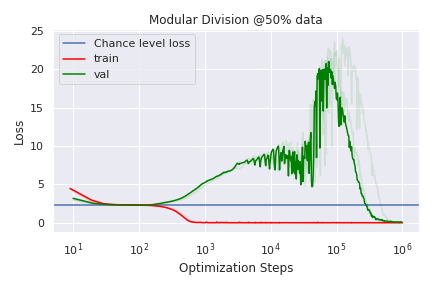

# Фаза меморизации / плато (memorization phase / plateau)

[Гроккинг](grokking.md) ← предыдущая карточка, следующая → [Фазовый переход](phase-transition.md)

[Индекс карточек понятий](index.md), категория: [1. Явления](index.md#cat-1)\
→ Следующая категория: [2. Механизмы и представления](structured-representation-learning.md)\
← Предыдущая категория: [7. Теория и формальные результаты](effective-theory-statistical-mechanics.md)

## Определение

**Фаза меморизации (плато)** — начальный этап обучения при [гроккинге](grokking.md), на
котором модель достигает почти идеальной точности на обучающей выборке
(запоминает / переобучается), тогда как тестовая точность остаётся низкой
\[[1.4](#ref-1-4)\]. Это затяжное плато предшествует резкому переходу к
генерализации \[[1.1](#ref-1-1)\]\[[1.6](#ref-1-6)\].

## Детализация

На фазе меморизации сеть «запоминает» обучающие данные, ещё не построив
обобщающего механизма \[[1.2](#ref-1-2)\]\[[1.3](#ref-1-3)\]; длина этого плато
может быть очень большой и сама по себе служит объектом изучения
\[[1.5](#ref-1-5)\]. Механистически меморизацию трактуют как отдельное
«запоминающее» решение/контур (подсеть, хранящая примеры) в рамке [эффективности контуров](circuit-efficiency.md); оно доминирует до появления обобщающего
\[[1.11](#ref-1-11)\]\[[1.12](#ref-1-12)\], а весь процесс раскладывают на
несколько последовательных фаз (запоминание → формирование контура → очистка — удаление лишних запоминающих компонент)
\[[1.9](#ref-1-9)\]\[[1.10](#ref-1-10)\]. Ряд работ трактует фазу меморизации
как **устойчивое высоконормовое состояние**, вслед за которым оптимизация
минимизирует норму на [многообразии нулевой потери](weight-norm-minimization.md) (множестве параметров с нулевой обучающей ошибкой) \[[3.1](#ref-3-1)\]\[[3.2](#ref-3-2)\].
Однако интрузивность/неизбежность плато оспаривается: архитектурные ограничения
способны **полностью устранить** фазу меморизации \[[2.1](#ref-2-1)\]; само
«запоминание» в ленивом режиме (lazy/[NTK](neural-tangent-kernel-ntk.md): признаки почти не меняются) несовершенно \[[2.2](#ref-2-2)\]; а переобучение
может наступать и вовсе **без** последующего гроккинга — из-за численных
ошибок \[[2.3](#ref-2-3)\].

## Альтернативные определения и нюансы

### A. Классическое: фаза переобучения / интерполяции

Фаза, на которой сеть подгоняет (запоминает) обучающую выборку почти идеально
при низкой генерализации \[[1.1](#ref-1-1)\]\[[1.2](#ref-1-2)\]\[[1.3](#ref-1-3)\]\[[1.4](#ref-1-4)\].

### B. Плато перед резким переходом

Определение через положение во времени: затяжное плато, предшествующее
внезапному переходу «меморизация → генерализация»
\[[1.5](#ref-1-5)\]\[[1.6](#ref-1-6)\]\[[1.7](#ref-1-7)\]\[[1.8](#ref-1-8)\].

### C. Меморизация как отдельное решение / контур

Определение через конкуренцию решений: меморизация — это отдельное
«запоминающее» решение (высоко-LLC состояние), доминирующее до переключения на
обобщающий контур \[[1.11](#ref-1-11)\]\[[1.12](#ref-1-12)\]. Основополагающая работа, впрочем, сама даёт прямое контрсвидетельство
безусловному вытеснению: при введении испорченных уравнений запомненные
исключения сосуществуют с обобщающим решением в одних весах
(приложение A.4) \[[2.4](#ref-2-4)\].

### D. Первая фаза в многофазной декомпозиции

Определение как первого именованного этапа в последовательности фаз обучения
(запоминание, формирование контура, очистка / обретение симметрии)
\[[1.9](#ref-1-9)\]\[[1.10](#ref-1-10)\].

## Ссылки

###### ref-1-1
**\[1.1\]** 2201.02177 — Power et al., «Grokking: Generalization Beyond Overfitting on Small Algorithmic Datasets». [`"beyond memorization of the finite training dataset"`](../papers/2201.02177.grokking-generalization-beyond-overfitting-on-small-algorithmic-datasets/2201.02177.grokking-generalization-beyond-overfitting-on-small-algorithmic-datasets.card.md#p1-4). *«[за пределами запоминания конечной обучающей выборки](../papers/2201.02177.grokking-generalization-beyond-overfitting-on-small-algorithmic-datasets/2201.02177.grokking-generalization-beyond-overfitting-on-small-algorithmic-datasets.card.md#p1-4)»*

###### ref-1-2
**\[1.2\]** 2309.02390 — Varma et al., «Explaining Grokking Through Circuit Efficiency». [`"The network first “memorises” the data"`](../papers/2309.02390.explaining-grokking-through-circuit-efficiency/2309.02390.explaining-grokking-through-circuit-efficiency.card.md#p1-4). *«[сеть сначала «запоминает» данные](../papers/2309.02390.explaining-grokking-through-circuit-efficiency/2309.02390.explaining-grokking-through-circuit-efficiency.card.md#p1-4)»*

###### ref-1-3
**\[1.3\]** 2601.19791 — Xu et al., «To Grok Grokking: Provable Grokking in Ridge Regression». [`"the model overfits the training"`](../papers/2601.19791.to-grok-grokking-provable-grokking-in-ridge-regression/original/2601.19791.to-grok-grokking-provable-grokking-in-ridge-regression.md#p1-2). *«[модель переобучается на обучающих данных](../papers/2601.19791.to-grok-grokking-provable-grokking-in-ridge-regression/2601.19791.to-grok-grokking-provable-grokking-in-ridge-regression.card.md#p1-2)»*

###### ref-1-4
**\[1.4\]** 2604.13123 — Truong et al., «Spectral Entropy Collapse as a Phase Transition in Delayed Generalisation». [`"a model achieves near-perfect training accuracy early on, yet generalisation — measured by test accuracy — is delayed by thousands of optimisation steps"`](../papers/2604.13123.spectral-entropy-collapse-as-a-phase-transition-in-delayed-generalisation/2604.13123.spectral-entropy-collapse-as-a-phase-transition-in-delayed-generalisation.card.md#p1-4) — *«[модель рано достигает почти безупречной точности на обучении, а генерализация, измеряемая точностью на тесте, запаздывает на тысячи шагов оптимизации](../papers/2604.13123.spectral-entropy-collapse-as-a-phase-transition-in-delayed-generalisation/2604.13123.spectral-entropy-collapse-as-a-phase-transition-in-delayed-generalisation.card.md#p1-4)»*

###### ref-1-5
**\[1.5\]** 2306.13253 — Notsawo et al., «Predicting Grokking Long Before it Happens». [`"long memorization phase (figure 1)"`](../papers/2306.13253.predicting-grokking-long-before-it-happens/original/2306.13253.predicting-grokking-long-before-it-happens.md#p2-9). *«[долгой фазой запоминания (рисунок 1)](../papers/2306.13253.predicting-grokking-long-before-it-happens/2306.13253.predicting-grokking-long-before-it-happens.card.md#p2-9)»*

###### ref-1-6
**\[1.6\]** 2408.08944 — Clauw, Stramaglia, Marinazzo 2024, «Information-Theoretic Progress Measures reveal Grokking is an Emergent Phase Transition». [`"neural networks during training suddenly generalize after prolonged memorization with limited progress in the loss"`](../papers/2408.08944.information-theoretic-progress-measures-reveal-grokking-is-an-emergent-phase-transition/original/2408.08944.information-theoretic-progress-measures-reveal-grokking-is-an-emergent-phase-transition.md#p1-3). *«[нейронные сети в ходе обучения внезапно начинают обобщать после долгого запоминания при малом продвижении по потере](../papers/2408.08944.information-theoretic-progress-measures-reveal-grokking-is-an-emergent-phase-transition/2408.08944.information-theoretic-progress-measures-reveal-grokking-is-an-emergent-phase-transition.card.md#p1-3)»*

###### ref-1-7
**\[1.7\]** 2410.03569 — Saxena et al. 2024, «Making Hard Problems Easier with Custom Data Distributions and Loss Regularization: A Case Study in Modular Arithmetic». [`"the model suddenly transitions from memorization to generalization on this task"`](../papers/2410.03569.making-hard-problems-easier-with-custom-data-distributions-and-loss-regularization/original/2410.03569.making-hard-problems-easier-with-custom-data-distributions-and-loss-regularization.md#p2-7). *«[когда модель внезапно переходит от запоминания к генерализации](../papers/2410.03569.making-hard-problems-easier-with-custom-data-distributions-and-loss-regularization/2410.03569.making-hard-problems-easier-with-custom-data-distributions-and-loss-regularization.card.md#p2-7)»*

###### ref-1-8
**\[1.8\]** 2504.13292 — Xu et al., «Let Me Grok For You: Accelerating Grokking». [`"There is a clear phase transition between memorization and generalization if we train the model from scratch"`](../papers/2504.13292.let-me-grok-for-you-accelerating-grokking-via-embedding-transfer-from-a-weaker-model/original/2504.13292.let-me-grok-for-you-accelerating-grokking-via-embedding-transfer-from-a-weaker-model.md#fig-1). *«[При обучении с нуля между запоминанием и генерализацией виден ясный фазовый переход](../papers/2504.13292.let-me-grok-for-you-accelerating-grokking-via-embedding-transfer-from-a-weaker-model/2504.13292.let-me-grok-for-you-accelerating-grokking-via-embedding-transfer-from-a-weaker-model.card.md#fig-1)»*

###### ref-1-9
**\[1.9\]** 2301.05217 — Nanda et al., «Progress Measures for Grokking via Mechanistic Interpretability». [`"memorization, circuit formation, and cleanup"`](../papers/2301.05217.progress-measures-for-grokking-via-mechanistic-interpretability/2301.05217.progress-measures-for-grokking-via-mechanistic-interpretability.card.md#p1-2). *«[запоминание, формирование контура и очистка](../papers/2301.05217.progress-measures-for-grokking-via-mechanistic-interpretability/2301.05217.progress-measures-for-grokking-via-mechanistic-interpretability.card.md#p1-2)»*

###### ref-1-10
**\[1.10\]** 2603.01968 — Park et al., «Intrinsic Task Symmetry Drives Generalization in Algorithmic Tasks». [`"we identify a consistent three-stage training dynamic: (i) Memorization, (ii) Symmetry Acquisition, and (iii) Geometric Organization"`](../papers/2603.01968.intrinsic-task-symmetry-drives-generalization-in-algorithmic-tasks/original/2603.01968.intrinsic-task-symmetry-drives-generalization-in-algorithmic-tasks.md#p1-6). *«[мы выделяем неизменно повторяющийся трёхпорный ход обучения: (i) запоминание, (ii) обретение симметрии и (iii) устроение геометрии](../papers/2603.01968.intrinsic-task-symmetry-drives-generalization-in-algorithmic-tasks/2603.01968.intrinsic-task-symmetry-drives-generalization-in-algorithmic-tasks.card.md#p1-6)»*

###### ref-1-11
**\[1.11\]** 2410.04489 — Beck et al., «Grokking at the Edge of Linear Separability». [`""memorizing" and "generalizing" solutions can be strictly defined"`](../papers/2410.04489.grokking-at-the-edge-of-linear-separability/2410.04489.grokking-at-the-edge-of-linear-separability.card.md#p1-2). *««запоминающее» и «обобщающее» решения можно \[строго определить\]»*

###### ref-1-12
**\[1.12\]** 2603.01192 — Cullen, «A Basin-Selection Perspective on Grokking». [`"a transition from a higher-LLC (memorising) basin"`](../papers/2603.01192.a-basin-selection-perspective-on-grokking-via-singular-learning-theory/2603.01192.a-basin-selection-perspective-on-grokking-via-singular-learning-theory.card.md#p1-2). *«[переходу из котловины с большим LLC (запоминающей)](../papers/2603.01192.a-basin-selection-perspective-on-grokking-via-singular-learning-theory/2603.01192.a-basin-selection-perspective-on-grokking-via-singular-learning-theory.card.md#p1-2)»*\
Доп. (LLC запоминающей котловины): [`"the local learning coefficient at the ridge memorisation solution satisfies $\lambda\;=\;\frac{1}{2}p\,\min\{l,K\}$"`](../papers/2603.01192.a-basin-selection-perspective-on-grokking-via-singular-learning-theory/2603.01192.a-basin-selection-perspective-on-grokking-via-singular-learning-theory.card.md#p7-4) — *«[местный коэффициент обучения в гребневом запоминающем решении удовлетворяет $\lambda\;=\;\frac{1}{2}p\,\min\{l,K\}$](../papers/2603.01192.a-basin-selection-perspective-on-grokking-via-singular-learning-theory/2603.01192.a-basin-selection-perspective-on-grokking-via-singular-learning-theory.card.md#p7-4)»*

###### ref-1-13
**\[1.13\]** 2310.02541 — Xu et al. 2023. Нюанс: единственная в корпусе постановка, где «запоминающая» стадия опознана явно — это линейный классификатор, подгоняющийся к любым меткам за счёт почти ортогональности высокоразмерных данных, а не таблица и не подсеть; при этом плато потерь отсутствует — обучающая потеря во всём окне остаётся около $\log 2$. [`"linear classifiers only achieve 50% test error for the XOR cluster distribution"`](../papers/2310.02541.benign-overfitting-and-grokking-in-relu-networks-for-xor-cluster-data/original/2310.02541.benign-overfitting-and-grokking-in-relu-networks-for-xor-cluster-data.md#p10-1). *«[линейные классификаторы на XOR-кластерном распределении достигают лишь 50% ошибки на тесте](../papers/2310.02541.benign-overfitting-and-grokking-in-relu-networks-for-xor-cluster-data/2310.02541.benign-overfitting-and-grokking-in-relu-networks-for-xor-cluster-data.card.md#p10-1)»*

###### ref-1-14
**\[1.14\]** 2310.16441 — Levi et al. 2023. Нюанс: единственная в корпусе постановка, где фазы запоминания нет вовсе — обе потери спадают монотонно с первого шага, а разрыв берётся из того, что обобщающая потеря есть норма того же вектора в другой метрике. Плато на кривой точности — лишь участок, где потеря ещё выше порога $\epsilon$. [`"which is the norm of the same vector but calculated wirth respect to a different metric, also vanishes exponentially but somewhat slower"`](../papers/2310.16441.grokking-in-linear-estimators-a-solvable-model-that-groks-without-understanding/original/2310.16441.grokking-in-linear-estimators-a-solvable-model-that-groks-without-understanding.md#p6-6). *«[которая есть норма того же самого вектора, но вычисленная относительно другой метрики, тоже обращается в нуль экспоненциально, но несколько медленнее](../papers/2310.16441.grokking-in-linear-estimators-a-solvable-model-that-groks-without-understanding/2310.16441.grokking-in-linear-estimators-a-solvable-model-that-groks-without-understanding.card.md#p6-6)»*

###### ref-1-15
**\[1.15\]** 2602.18523 — Xu, «The Geometry of Multi-Task Grokking: Transverse Instability, Superposition, and Weight Decay Phase Structure». Нюанс: фаза запоминания получает геометрический образ — «леса», главенствующие направления PCA, несущие более 98 % дисперсии смещения весов и дающие при восстановлении случайный уровень точности; обобщающее решение живёт в остатке менее 1 %. [`"The PCA manifold captures the *scaffold* of the training trajectory: the dominant directions of weight change during memorization."`](../papers/2602.18523.the-geometry-of-multi-task-grokking-transverse-instability-superposition-and-weight-decay-phase-structure/original/2602.18523.the-geometry-of-multi-task-grokking-transverse-instability-superposition-and-weight-decay-phase-structure.md#p28-7). *«[Многообразие PCA улавливает *леса* обучающей траектории: главенствующие направления изменения весов во время запоминания](../papers/2602.18523.the-geometry-of-multi-task-grokking-transverse-instability-superposition-and-weight-decay-phase-structure/2602.18523.the-geometry-of-multi-task-grokking-transverse-instability-superposition-and-weight-decay-phase-structure.card.md#p28-7)»*\
Доп. (прямой вывод, показанный измерением): [`"variance explained is not a reliable proxy for functional relevance"`](../papers/2602.18523.the-geometry-of-multi-task-grokking-transverse-instability-superposition-and-weight-decay-phase-structure/original/2602.18523.the-geometry-of-multi-task-grokking-transverse-instability-superposition-and-weight-decay-phase-structure.md#p23-4) — *«[доля объяснённой дисперсии не есть надёжная замена функциональной значимости](../papers/2602.18523.the-geometry-of-multi-task-grokking-transverse-instability-superposition-and-weight-decay-phase-structure/2602.18523.the-geometry-of-multi-task-grokking-transverse-instability-superposition-and-weight-decay-phase-structure.card.md#p23-4)»*.

###### ref-1-16
**\[1.16\]** 2605.09724 — Song & Ye, «Model Capacity Determines Grokking through Competing Memorisation and Generalisation Speeds». Нюанс: меряется на случайных метках, а не на самой модульной задаче; связь с $E_{\text{train}}(P)$ из определения задержки не измеряется. [`"memorisation speed is determined by the capacity fraction, rather than model size or dataset complexity alone"`](../papers/2605.09724.model-capacity-determines-grokking-through-competing-memorisation-and-generalisation-speeds/original/2605.09724.model-capacity-determines-grokking-through-competing-memorisation-and-generalisation-speeds.md#fig-3). *«[скорость запоминания определяется долей ёмкости, а не размером модели или сложностью набора данных по отдельности](../papers/2605.09724.model-capacity-determines-grokking-through-competing-memorisation-and-generalisation-speeds/2605.09724.model-capacity-determines-grokking-through-competing-memorisation-and-generalisation-speeds.card.md#fig-3)»*
## Ссылки на присоединившиеся работы

### Оспаривают

###### ref-2-1
**\[2.1\]** 2603.05228 — Yildirim, «The Geometric Inductive Bias of Grokking». Оспаривает неизбежность плато: архитектурное ограничение полностью устраняет фазу меморизации. [`"eliminates the memorization phase entirely on modular addition"`](../papers/2603.05228.the-geometric-inductive-bias-of-grokking-bypassing-phase-transitions-via-architectural-topology/original/2603.05228.the-geometric-inductive-bias-of-grokking-bypassing-phase-transitions-via-architectural-topology.md#p1-2). *«[полностью устраняет фазу запоминания на модульном сложении](../papers/2603.05228.the-geometric-inductive-bias-of-grokking-bypassing-phase-transitions-via-architectural-topology/2603.05228.the-geometric-inductive-bias-of-grokking-bypassing-phase-transitions-via-architectural-topology.card.md#p1-2)»*

###### ref-2-2
**\[2.2\]** 2310.06110 — Kumar et al., «Grokking as the Transition from Lazy to Rich». Оспаривает «чистоту» меморизации: в линеаризованном режиме запоминание несовершенно. [`"“memorizing” its training set (albeit imperfectly) in the linearized regime"`](../papers/2310.06110.grokking-as-the-transition-from-lazy-to-rich-training-dynamics/original/2310.06110.grokking-as-the-transition-from-lazy-to-rich-training-dynamics.md#p1-6). *«[«запоминать» свою обучающую выборку (пусть и несовершенно) в линеаризованном режиме](../papers/2310.06110.grokking-as-the-transition-from-lazy-to-rich-training-dynamics/2310.06110.grokking-as-the-transition-from-lazy-to-rich-training-dynamics.card.md#p1-6)»*

###### ref-2-3
**\[2.3\]** 2501.04697 — Prieto et al., «Grokking at the Edge of Numerical Stability». Оспаривает, что за меморизацией всегда следует гроккинг: переобучение без гроккинга бывает из-за численных ошибок. [`"overfitting without grokking are due to floating point errors"`](../papers/2501.04697.grokking-at-the-edge-of-numerical-stability/2501.04697.grokking-at-the-edge-of-numerical-stability.card.md#p2-4). *«[случаи переобучения без гроккинга вызваны ошибками плавающей точки](../papers/2501.04697.grokking-at-the-edge-of-numerical-stability/2501.04697.grokking-at-the-edge-of-numerical-stability.card.md#p2-4)»*

###### ref-2-4
**\[2.4\]** 2201.02177 — Power et al., «Grokking: Generalization Beyond Overfitting on Small Algorithmic Datasets». Оспаривает вытеснение меморизации генерализацией: в приложении A.4 сеть при $k$ испорченных уравнениях всегда интерполирует все метки, и при малых $k$ запомненные исключения сосуществуют с обобщающим решением в одних весах. [`"all experiments reach 100% training accuracy at some point, and this point is not considerably affected by changing the number of outliers $k$"`](../papers/2201.02177.grokking-generalization-beyond-overfitting-on-small-algorithmic-datasets/2201.02177.grokking-generalization-beyond-overfitting-on-small-algorithmic-datasets.card.md#p9-5). *«[все эксперименты в какой-то момент достигают 100 % точности на обучении, и этот момент существенно не зависит от изменения числа выбросов $k$](../papers/2201.02177.grokking-generalization-beyond-overfitting-on-small-algorithmic-datasets/2201.02177.grokking-generalization-beyond-overfitting-on-small-algorithmic-datasets.card.md#p9-5)»*\
Доп.: [`"However the effect of introducing a small number of outliers (up to 1000) is not very pronounced"`](../papers/2201.02177.grokking-generalization-beyond-overfitting-on-small-algorithmic-datasets/2201.02177.grokking-generalization-beyond-overfitting-on-small-algorithmic-datasets.card.md#p9-5) — *«[Однако эффект от введения небольшого числа выбросов (до 1000) выражен не очень сильно](../papers/2201.02177.grokking-generalization-beyond-overfitting-on-small-algorithmic-datasets/2201.02177.grokking-generalization-beyond-overfitting-on-small-algorithmic-datasets.card.md#p9-5)»*.

###### ref-2-5
**\[2.5\]** 2207.08799 — Barak et al., «Hidden Progress in Deep Learning: SGD Learns Parities Near the Computational Limit». Нюанс: плато здесь существует в онлайновой постановке, где обучающей выборки нет и запоминать нечего, — то есть порождено вычислительной трудностью задачи, а не запоминанием. [`"progress only becomes visible in the loss once the relevant weights become larger than all of the irrelevant weights"`](../papers/2207.08799.hidden-progress-in-deep-learning-sgd-learns-parities-near-the-computational-limit/2207.08799.hidden-progress-in-deep-learning-sgd-learns-parities-near-the-computational-limit.card.md#p41-3). *«[продвижение становится видимым в потере лишь тогда, когда нужные веса становятся больше всех ненужных весов](../papers/2207.08799.hidden-progress-in-deep-learning-sgd-learns-parities-near-the-computational-limit/2207.08799.hidden-progress-in-deep-learning-sgd-learns-parities-near-the-computational-limit.card.md#p41-3)»*

###### ref-2-6
**\[2.6\]** 2210.15435 — Žunkovič, Ilievski, «Grokking phase transitions in learning local rules with gradient descent». Нюанс: фазы запоминания в этих моделях нет — тестовая ошибка убывает гладко и монотонно от $\le 1/2$ до нуля, плато на уровне случайного угадывания не возникает, и весь «гроккинг» умещается между двумя моментами обнуления ошибок. Ни запоминания, ни соревнования двух решений, ни деления обучения на фазы работа не рассматривает; приписывающее ей такое деление цитирование (2402.16726) ошибочно. [`"We define the *grokking time* as the difference between $t_{\epsilon}$ (zero-test-error time) and the time at which the training error becomes zero."`](../papers/2210.15435.grokking-phase-transitions-in-learning-local-rules-with-gradient-descent/2210.15435.grokking-phase-transitions-in-learning-local-rules-with-gradient-descent.card.md#p9-1). *«[Мы определяем *время гроккинга* как разность между $t_{\epsilon}$ (временем нулевой тестовой ошибки) и временем, в которое обучающая ошибка становится нулевой](../papers/2210.15435.grokking-phase-transitions-in-learning-local-rules-with-gradient-descent/2210.15435.grokking-phase-transitions-in-learning-local-rules-with-gradient-descent.card.md#p9-1)»*\
Доп. (гладкость перехода): [`"Grokking in the considered 1D exponential model is a second-order phase transition with the test-error critical exponent equal to one."`](../papers/2210.15435.grokking-phase-transitions-in-learning-local-rules-with-gradient-descent/2210.15435.grokking-phase-transitions-in-learning-local-rules-with-gradient-descent.card.md#p7-10) — *«[Гроккинг в рассматриваемой одномерной показательной модели есть фазовый переход второго рода с критическим показателем тестовой ошибки, равным единице](../papers/2210.15435.grokking-phase-transitions-in-learning-local-rules-with-gradient-descent/2210.15435.grokking-phase-transitions-in-learning-local-rules-with-gradient-descent.card.md#p7-10)»*.

###### ref-2-7
**\[2.7\]** 2308.15594 — Charton, «Learning the greatest common divisor: explaining transformer predictions». Нюанс: даёт долгое плато потери на обучении в постановке, где обучающей выборки постоянного объёма нет и запоминать нечего; второй вид плато (при равномерных исходах) прямо разобран — за ним стоит перебор представителей класса кратных, а не заучивание таблицы. [`"All data is generated on the fly: different training epochs use different examples for the train and test set."`](../papers/2308.15594.learning-the-greatest-common-divisor-explaining-transformer-predictions/original/2308.15594.learning-the-greatest-common-divisor-explaining-transformer-predictions.md#p2-5). *«[Все данные порождаются на лету: разные эпохи обучения используют разные примеры для обучающего и испытательного множеств](../papers/2308.15594.learning-the-greatest-common-divisor-explaining-transformer-predictions/2308.15594.learning-the-greatest-common-divisor-explaining-transformer-predictions.card.md#p2-5)»*\
Доп.: [`"In all experiments, training and test data are generated on the fly from a very large problem space. No overfitting can happen"`](../papers/2308.15594.learning-the-greatest-common-divisor-explaining-transformer-predictions/original/2308.15594.learning-the-greatest-common-divisor-explaining-transformer-predictions.md#p9-9) — *«[Во всех опытах обучающие и испытательные данные порождаются на лету из очень большого пространства задачи. Никакого переобучения случиться не может](../papers/2308.15594.learning-the-greatest-common-divisor-explaining-transformer-predictions/2308.15594.learning-the-greatest-common-divisor-explaining-transformer-predictions.card.md#p9-9)»*.

###### ref-2-8
**\[2.8\]** 2407.20199 — Mallinar et al., «Emergence in non-neural models: grokking modular arithmetic via average gradient outer product». Нюанс: у RFM обучающая потеря численно нулевая с первой итерации, то есть «переобучение» достигнуто мгновенно и не меняется, а плато тестового качества всё равно есть; языка вытеснения запоминающего решения обобщающим работа не употребляет. [`"the first several iterations of RFM result in near-zero test accuracy and approximately constant, large test loss"`](../papers/2407.20199.emergence-in-non-neural-models-grokking-modular-arithmetic-via-average-gradient-outer-product/original/2407.20199.emergence-in-non-neural-models-grokking-modular-arithmetic-via-average-gradient-outer-product.md#p7-2). *«[первые несколько итераций RFM дают близкую к нулю тестовую точность и приблизительно неизменную, большую тестовую потерю](../papers/2407.20199.emergence-in-non-neural-models-grokking-modular-arithmetic-via-average-gradient-outer-product/2407.20199.emergence-in-non-neural-models-grokking-modular-arithmetic-via-average-gradient-outer-product.card.md#p7-2)»*

###### ref-2-9
**\[2.9\]** 2505.11411 — Zhang, Shang, Yang, Zhang, «Is Grokking a Computational Glass Relaxation?». Отрицает у фазы запоминания и равновесность, и метастабильность, а долготу плато относит не на преграду, а на кинетику — очень малые градиенты в области малой потери. Нюанс: отсутствие преграды в выбранной двумерной проекции не есть отсутствие метастабильности, и опыта, различающего эти два положения, нет; кроме того, на лёгкой задаче собственные кривые работы дают плато тестовой точности около 50 %, тогда как в тексте фаза описана как «тестовая точность остаётся очень низкой». [`"there is no entropy barrier between the memorization state and the generalization state, which means that the memorization state is not in an equilibrium or meta-stable state"`](../papers/2505.11411.is-grokking-a-computational-glass-relaxation/original/2505.11411.is-grokking-a-computational-glass-relaxation.md#p9-1). *«[между состоянием запоминания и состоянием генерализации нет энтропийной преграды, что означает, что состояние запоминания не находится ни в равновесном, ни в метастабильном состоянии](../papers/2505.11411.is-grokking-a-computational-glass-relaxation/2505.11411.is-grokking-a-computational-glass-relaxation.card.md#p9-1)»*\
Доп. (чем тогда объяснена долгота плато): [`"parameters located in the low train loss regime exhibit very small gradients, which severely limits the ability of gradient-based optimizers to effectively update the network toward this generalizing equilibrium"`](../papers/2505.11411.is-grokking-a-computational-glass-relaxation/original/2505.11411.is-grokking-a-computational-glass-relaxation.md#p9-4) — *«[параметры, расположенные в режиме малой обучающей потери, обнаруживают очень малые градиенты, что сильно ограничивает способность градиентных оптимизаторов действенно обновлять сеть в сторону этого обобщающего равновесия](../papers/2505.11411.is-grokking-a-computational-glass-relaxation/2505.11411.is-grokking-a-computational-glass-relaxation.card.md#p9-4)»*.
### Поддерживают

###### ref-3-1
**\[3.1\]** 2603.13331 — Truong et al., «The Norm-Separation Delay Law of Grokking». Нюанс: фаза меморизации — устойчивое высоконормовое состояние перед внезапным переходом. [`"model first perfectly memorises its training data, yet fails to generalise for a long period before suddenly transitioning to near-perfect generalisation"`](../papers/2603.13331.the-norm-separation-delay-law-of-grokking-a-first-principles-theory-of-delayed-generalization/2603.13331.the-norm-separation-delay-law-of-grokking-a-first-principles-theory-of-delayed-generalization.card.md#p1-3). *«[модель сперва безупречно запоминает обучающие данные, но долгое время не обобщает, а затем внезапно переходит к почти безупречной генерализации](../papers/2603.13331.the-norm-separation-delay-law-of-grokking-a-first-principles-theory-of-delayed-generalization/2603.13331.the-norm-separation-delay-law-of-grokking-a-first-principles-theory-of-delayed-generalization.card.md#p1-3)»*

###### ref-3-2
**\[3.2\]** 2511.01938 — Musat, «The Geometry of Grokking: Norm Minimization on the Zero-Loss Manifold». Нюанс: после завершения меморизации оптимизация минимизирует норму на многообразии нулевой потери. [`"following the complete memorization of the training data. Previous research has linked"`](../papers/2511.01938.the-geometry-of-grokking-norm-minimization-on-the-zero-loss-manifold/original/2511.01938.the-geometry-of-grokking-norm-minimization-on-the-zero-loss-manifold.md#p1-2). *«[следующей за полным запоминанием обучающих данных. Прежние исследования связывали](../papers/2511.01938.the-geometry-of-grokking-norm-minimization-on-the-zero-loss-manifold/2511.01938.the-geometry-of-grokking-norm-minimization-on-the-zero-loss-manifold.card.md#p1-2)»*

###### ref-3-3
**\[3.3\]** 2303.06173 — Davies, Langosco, Krueger, «Unifying Grokking and Double Descent». Нюанс: запоминание описано не как фаза, а как один из трёх родов образцов, и из него выведено наблюдаемое следствие — провал проверочной точности ниже случайного уровня на ранней поре; причина провала (антикорреляция обучающих и проверочных значений) объявлена словом «likely» и не проверена. [`"the development of poorly-generalizing Type 2 features then leads to *worse-than-chance* performance on the rest of the data"`](../papers/2303.06173.unifying-grokking-and-double-descent/2303.06173.unifying-grokking-and-double-descent.card.md#p4-3). *«[складывание плохо обобщающих признаков Type 2 затем ведёт к качеству *хуже случайного* на остальных данных](../papers/2303.06173.unifying-grokking-and-double-descent/2303.06173.unifying-grokking-and-double-descent.card.md#p4-3)»*\
Доп.: [`"an **overfitting pattern** that is fast, though slower than the heuristic, and generalizes poorly"`](../papers/2303.06173.unifying-grokking-and-double-descent/2303.06173.unifying-grokking-and-double-descent.card.md#p3-3) — *«[**переобучающего образца**, который быстр, хотя и медленнее эвристики, и обобщает плохо](../papers/2303.06173.unifying-grokking-and-double-descent/2303.06173.unifying-grokking-and-double-descent.card.md#p3-3)»*.

###### ref-3-4
**\[3.4\]** 2302.03025 — Chughtai et al., «A Toy Model of Universality: Reverse Engineering how Networks Learn Group Operations». Нюанс: воспроизводит трёхфазное деление Nanda et al. на групповой композиции и даёт свои границы — запоминание 0–2k, формирование контура 2.2k–87k, очистка 87k–120k; фазы названы частично перекрывающимися. [`"Notably, the circuit is formed well before grokking."`](../papers/2302.03025.a-toy-model-of-universality-reverse-engineering-how-networks-learn-group-operations/2302.03025.a-toy-model-of-universality-reverse-engineering-how-networks-learn-group-operations.card.md#p18-6). *«[Примечательно, что контур формируется задолго до гроккинга](../papers/2302.03025.a-toy-model-of-universality-reverse-engineering-how-networks-learn-group-operations/2302.03025.a-toy-model-of-universality-reverse-engineering-how-networks-learn-group-operations.card.md#p18-6)»*\
Доп.: [`"training splits into three partially overlapping phases – memorization, circuit formation, and cleanup"`](../papers/2302.03025.a-toy-model-of-universality-reverse-engineering-how-networks-learn-group-operations/2302.03025.a-toy-model-of-universality-reverse-engineering-how-networks-learn-group-operations.card.md#p6-11) — *«[обучение разбивается на три частично перекрывающиеся фазы — запоминание, формирование контура и очистку](../papers/2302.03025.a-toy-model-of-universality-reverse-engineering-how-networks-learn-group-operations/2302.03025.a-toy-model-of-universality-reverse-engineering-how-networks-learn-group-operations.card.md#p6-11)»*.

###### ref-3-5
**\[3.5\]** 2311.18817 — Lyu et al., «Dichotomy of Early and Late Phase Implicit Biases Can Provably Induce Grokking». Поддерживает: плато — не бездействие, а подгонка обучающей выборки ядерным предсказателем, форма которого выписана в замкнутом виде (максимальный $L^{2}$-зазор на NTK-признаках в классификации, минимально-нормовое ядерное решение в регрессии). Нюанс: длительность плато задана формулой $\frac{1}{\lambda}\log\alpha$, а не измерена; меры запоминания работа не вводит. [`"Before this point, gradient flow fits the training data perfectly while maintaining the parameter direction within a local region near the initial direction, which causes the classifier to behave like a kernel classifier based on Neural Tangent Kernel (NTK)"`](../papers/2311.18817.dichotomy-of-early-and-late-phase-implicit-biases-can-provably-induce-grokking/original/2311.18817.dichotomy-of-early-and-late-phase-implicit-biases-can-provably-induce-grokking.md#p5-6). *«[До этой точки градиентный поток идеально подгоняет обучающие данные, удерживая направление параметров в пределах локальной области близ начального направления, из-за чего классификатор ведёт себя как ядерный классификатор на основе нейронного касательного ядра (NTK)](../papers/2311.18817.dichotomy-of-early-and-late-phase-implicit-biases-can-provably-induce-grokking/2311.18817.dichotomy-of-early-and-late-phase-implicit-biases-can-provably-induce-grokking.card.md#p5-6)»*

###### ref-3-6
**\[3.6\]** 2402.15555 — Humayun, Balestriero, Baraniuk 2024, «Deep Networks Always Grok and Here is Why». Даёт плато геометрический признак: фаза подъёма местной сложности идёт, пока не достигнута интерполяция, и нелинейности в ней скапливаются вокруг обучающих точек плотнее, чем вокруг проверочных. Нюанс: меры запомненного в работе нет, разделения на запоминающую и обобщающую составляющие нет — «потребность в запоминании» задаётся только объёмом случайно размеченных данных. [`"the local complexity generally keeps ascending until training interpolation is reached"`](../papers/2402.15555.deep-networks-always-grok-and-here-is-why/original/2402.15555.deep-networks-always-grok-and-here-is-why.md#p7-3). *«[местная сложность в целом продолжает расти, пока не достигнута интерполяция обучающего набора](../papers/2402.15555.deep-networks-always-grok-and-here-is-why/2402.15555.deep-networks-always-grok-and-here-is-why.card.md#p7-3)»*\
Доп.: [`"This shows that with increased demand for memorization the network takes longer to complete ascent and later undergo region migration."`](../papers/2402.15555.deep-networks-always-grok-and-here-is-why/original/2402.15555.deep-networks-always-grok-and-here-is-why.md#fig-13) — *«[Это показывает, что при возросшей потребности в запоминании сети требуется больше времени, чтобы завершить подъём и затем претерпеть переселение областей.](../papers/2402.15555.deep-networks-always-grok-and-here-is-why/2402.15555.deep-networks-always-grok-and-here-is-why.card.md#fig-13)»*.

###### ref-3-7
**\[3.7\]** 2305.18741 — Murty et al. 2023, «Grokking of Hierarchical Structure in Vanilla Transformers». Переразметка того, что считать запоминанием: заучено не отображение примеров, а линейное правило, объясняющее обучающую выборку ровно так же, как иерархическое. Нюанс: плато обучающей потери здесь отсутствует — она выходит на полку около 10 тысяч шагов, задолго до перехода, — а вместо плато проверочной точности стоит зазор между внутридоменной и обобщающей точностью. [`"gradually shifts from memorization (high in-domain accuracy, poor out-of-domain accuracy) to generalization"`](../papers/2305.18741.grokking-of-hierarchical-structure-in-vanilla-transformers/original/2305.18741.grokking-of-hierarchical-structure-in-vanilla-transformers.md#p4-7). *«[постепенно сдвигается от запоминания (высокая внутридоменная точность, плохая внедоменная) к генерализации](../papers/2305.18741.grokking-of-hierarchical-structure-in-vanilla-transformers/2305.18741.grokking-of-hierarchical-structure-in-vanilla-transformers.card.md#p4-7)»*\
Доп.: [`"We note that training losses generally saturate before in-domain validation performance saturates (also noted in Power et al. 2022)."`](../papers/2305.18741.grokking-of-hierarchical-structure-in-vanilla-transformers/original/2305.18741.grokking-of-hierarchical-structure-in-vanilla-transformers.md#p7-11) — *«[Мы отмечаем, что обучающие потери, как правило, выходят на насыщение раньше, чем внутридоменное проверочное качество (это отмечено и у Power et al. 2022).](../papers/2305.18741.grokking-of-hierarchical-structure-in-vanilla-transformers/2305.18741.grokking-of-hierarchical-structure-in-vanilla-transformers.card.md#p7-11)»*.

###### ref-3-8
**\[3.8\]** 2401.10463 — Zhu et al. 2024. Нюанс: единственное в корпусе прямое сопоставление того, как число шагов до запоминания зависит от размера набора на алгоритмической и на языковой задаче, — и зависимости эти противоположны: на модульном сложении её почти нет, на IMDB и Yelp шаги растут вместе с набором. Гипотеза при этом формулируется для обеих семей сразу; расхождение разобрано в разделе «Несогласованности внутри статьи» карточки. [`"the number of memorization steps is almost unaffected by the dataset size"`](../papers/2401.10463.critical-data-size-of-language-models-from-a-grokking-perspective/2401.10463.critical-data-size-of-language-models-from-a-grokking-perspective.card.md#p5-1). *«[число шагов до запоминания почти не затронуто размером набора](../papers/2401.10463.critical-data-size-of-language-models-from-a-grokking-perspective/2401.10463.critical-data-size-of-language-models-from-a-grokking-perspective.card.md#p5-1)»*\
Доп. (языковые наборы): [`"the memorization steps in training increase with the data size increases"`](../papers/2401.10463.critical-data-size-of-language-models-from-a-grokking-perspective/2401.10463.critical-data-size-of-language-models-from-a-grokking-perspective.card.md#p5-3) — *«[число шагов до запоминания при обучении растёт с ростом размера данных](../papers/2401.10463.critical-data-size-of-language-models-from-a-grokking-perspective/2401.10463.critical-data-size-of-language-models-from-a-grokking-perspective.card.md#p5-3)»*

###### ref-3-9
**\[3.9\]** 2211.12316 — Bhattamishra et al., «Simplicity Bias in Transformers and their Ability to Learn Sparse Boolean Functions». Нюанс: запоминание опознаётся не только по кривым, но и по сложности решения — переобучившийся LSTM садится на чувствительность много выше целевой, тогда как обобщивший трансформер — ровно на целевую; почему переобучается именно LSTM, авторы объявляют неизвестным. [`"when LSTMs overfit and reach zero training error, they converge to functions of much higher sensitivity than that of the target function"`](../papers/2211.12316.simplicity-bias-in-transformers-and-their-ability-to-learn-sparse-boolean-functions/2211.12316.simplicity-bias-in-transformers-and-their-ability-to-learn-sparse-boolean-functions.card.md#p8-3). *«[когда LSTM переобучаются и достигают нулевой ошибки обучения, они сходятся к функциям куда более высокой чувствительности, чем у целевой функции](../papers/2211.12316.simplicity-bias-in-transformers-and-their-ability-to-learn-sparse-boolean-functions/2211.12316.simplicity-bias-in-transformers-and-their-ability-to-learn-sparse-boolean-functions.card.md#p8-3)»*

###### ref-3-10
**\[3.10\]** 2505.20172 — Boursier et al., «A Theoretical Framework for Grokking: Interpolation followed by Riemannian Norm Minimisation». Поддерживает: даёт плато выведенную, а не измеренную длину — отрезок $[M^{\prime},\varepsilon/\lambda]$, где $M^{\prime}$ есть характерное время сходимости нерегуляризованного потока, а последующий спад занимает $[\varepsilon/\lambda,M/\lambda]$. Нюанс: запоминания как такового здесь нет — на плато стоит интерполянт ленивого режима, а не запомненная таблица, и о происходящем внутри сети не сказано ничего. [`"then the plateau extends over the interval $[M^{\prime},\varepsilon/\lambda]$"`](../papers/2505.20172.a-theoretical-framework-for-grokking-interpolation-followed-by-riemannian-norm-minimisation/2505.20172.a-theoretical-framework-for-grokking-interpolation-followed-by-riemannian-norm-minimisation.card.md#p8-1). *«[тогда плато простирается на отрезке $[M^{\prime},\varepsilon/\lambda]$](../papers/2505.20172.a-theoretical-framework-for-grokking-interpolation-followed-by-riemannian-norm-minimisation/2505.20172.a-theoretical-framework-for-grokking-interpolation-followed-by-riemannian-norm-minimisation.card.md#p8-1)»*

###### ref-3-11
**\[3.11\]** 2602.16967 — Xu, «Early-Warning Signals of Grokking via
Loss-Landscape Geometry». Нюанс: разложение интегрируемости по трём базисам
разделяет фазу запоминания и окно перед гроккингом количественно — отношение
исполнительного к случайному около 1.0 в первой и 2–3$\times$ во втором.
Оговорка редактора: рисунок 8, на который текст ссылается, узора не
подтверждает — полоса 2–3$\times$ по обоим базисам держится на одном сиде из
трёх, средние по трём сидам не достигают её и не отделены от случайного уровня
разбросом, а фазовые точки взяты фиксированными шагами, из которых «перед
гроккингом» приходится на шаг 16 000 при гроккинге на 2 900–7 500. Границы фаз
операционально не определены, обучающая точность не измерена.
[`"The exec/random ratio spikes to 2–3$\times$ at the pre-grok phase for the Weight and $\Delta W$ bases, while remaining near 1.0 in the early and memorization phases"`](../papers/2602.16967.early-warning-signals-of-grokking-via-loss-landscape-geometry/original/2602.16967.early-warning-signals-of-grokking-via-loss-landscape-geometry.md#p12-1). *«[Отношение исполнительного к случайному подскакивает до 2–3$\times$ в фазе перед гроккингом для базисов весов и $\Delta W$, оставаясь около 1.0 в ранней фазе и в фазе запоминания](../papers/2602.16967.early-warning-signals-of-grokking-via-loss-landscape-geometry/2602.16967.early-warning-signals-of-grokking-via-loss-landscape-geometry.card.md#p12-1)»*

###### ref-3-12
**\[3.12\]** 2603.25009 — Manir, Rupa, «A Systematic Empirical Study of Grokking…». [`"the regularization prevents the network from memorizing the training set at all, which is a prerequisite for grokking"`](../papers/2603.25009.a-systematic-empirical-study-of-grokking-depth-architecture-activation-and-regularization/2603.25009.a-systematic-empirical-study-of-grokking-depth-architecture-activation-and-regularization.card.md#p8-4). *«[регуляризация не даёт сети вовсе запомнить обучающую выборку, что есть предпосылка гроккинга](../papers/2603.25009.a-systematic-empirical-study-of-grokking-depth-architecture-activation-and-regularization/2603.25009.a-systematic-empirical-study-of-grokking-depth-architecture-activation-and-regularization.card.md#p8-4)»*\
Доп.: срок запоминания $T_{\text{train}}$ по всем таблицам держится на 2000 шагах (реже 4000) при любой глубине, устройстве и семени — меняется только срок генерализации ([с. 3, абз. 9](../papers/2603.25009.a-systematic-empirical-study-of-grokking-depth-architecture-activation-and-regularization/2603.25009.a-systematic-empirical-study-of-grokking-depth-architecture-activation-and-regularization.card.md#p3-9)); то же наблюдение независимо получено в 2412.10898 на другой сетке измерения.

###### ref-3-13
**\[3.13\]** 2310.12977 — Humayun, Balestriero, Baraniuk 2023, «Training Dynamics of Deep Network Linear Regions». Даёт фазе запоминания геометрический признак со стороны входного пространства: подъём местной сложности — это скучивание нелинейностей вокруг обучающих точек, и он удлиняется ровно тогда, когда от сети требуется больше запоминания. Нюанс: меры запомненного в работе нет — «потребность в запоминании» задаётся только объёмом случайно размеченных данных, а связь подъёма с переобучением набрана из совпадений по времени, без вмешательства. [`"Training on a set of randomly labeled samples is a task that requires memorization or overfitting on training data. Therefore, gradually increasing training dataset size elongates the ascent phase, gradually increasing the peak train and test LC."`](../papers/2310.12977.training-dynamics-of-deep-network-linear-regions/original/2310.12977.training-dynamics-of-deep-network-linear-regions.md#p9-4). *«[Обучение на наборе случайно размеченных образцов — задача, требующая запоминания или переобучения на обучающих данных. Поэтому постепенное увеличение размера обучающего набора данных удлиняет фазу подъёма, постепенно повышая пиковую обучающую и проверочную LC.](../papers/2310.12977.training-dynamics-of-deep-network-linear-regions/2310.12977.training-dynamics-of-deep-network-linear-regions.card.md#p9-4)»*\
Доп. (как получена связь): [`"The early ascent during grokking and removed ascent during early generalization further strengthens the connection between the ascent phase and overfitting."`](../papers/2310.12977.training-dynamics-of-deep-network-linear-regions/original/2310.12977.training-dynamics-of-deep-network-linear-regions.md#p9-3) — *«[Ранний подъём при гроккинге и убранный подъём при ранней генерализации дополнительно подкрепляют связь между фазой подъёма и переобучением.](../papers/2310.12977.training-dynamics-of-deep-network-linear-regions/2310.12977.training-dynamics-of-deep-network-linear-regions.card.md#p9-3)»*.

###### ref-3-14
**\[3.14\]** 2211.13239 — Brown et al., «Relating Regularization and Generalization through the Intrinsic Dimension of Activations». Нюанс: плато здесь не пустое — обучающая точность у всех 16 прогонов достигает $100\%$ очень быстро, а обучающий LLID идёт тем же ходом, что и проверочный, то есть перестройка представления происходит внутри плато. Разбора самого плато работа не даёт: что сеть делает, пока LLID высок, здесь не спрашивается, и понятий запоминающего и обобщающего решения как двух механизмов в тексте нет. [`"train accuracy very quickly reaches $100\%$ for all models and training LLID follows the same trends as validation LLID"`](../papers/2211.13239.relating-regularization-and-generalization-through-the-intrinsic-dimension-of-activations/original/2211.13239.relating-regularization-and-generalization-through-the-intrinsic-dimension-of-activations.md#fig-7). *«[обучающая точность очень быстро достигает $100\%$ у всех моделей, а обучающий LLID следует тем же ходам, что и проверочный LLID](../papers/2211.13239.relating-regularization-and-generalization-through-the-intrinsic-dimension-of-activations/2211.13239.relating-regularization-and-generalization-through-the-intrinsic-dimension-of-activations.card.md#fig-7)»*\
Доп.: [`"well after training accuracy saturates, when models “grok” and validation accuracy suddenly improves from random to perfect, there is a co-occurent sudden drop in LLID"`](../papers/2211.13239.relating-regularization-and-generalization-through-the-intrinsic-dimension-of-activations/original/2211.13239.relating-regularization-and-generalization-through-the-intrinsic-dimension-of-activations.md#p1-3) — *«[много позже насыщения обучающей точности, когда модели «грокают» и проверочная точность внезапно улучшается со случайного угадывания до безупречной, происходит совпадающее с этим по времени внезапное падение LLID](../papers/2211.13239.relating-regularization-and-generalization-through-the-intrinsic-dimension-of-activations/2211.13239.relating-regularization-and-generalization-through-the-intrinsic-dimension-of-activations.card.md#p1-3)»*.

###### ref-3-15
**\[3.15\]** 2604.13082 — Gomezjurado Gonzalez, «The Long Delay to Arithmetic Generalization…». [`"a linear probe for parity ($n\bmod 2$) on the final encoder layer reaches 99.7% accuracy by step 2,000, while sequence-level output accuracy at that point is still only 38%"`](../papers/2604.13082.the-long-delay-to-arithmetic-generalization-when-learned-representations-outrun-behavior/original/2604.13082.the-long-delay-to-arithmetic-generalization-when-learned-representations-outrun-behavior.md#p4-1). *«[линейный зонд для чётности ($n\bmod 2$) на последнем слое энкодера достигает 99.7% точности к шагу 2000, тогда как точность выхода на уровне последовательности в этот момент составляет всего 38%](../papers/2604.13082.the-long-delay-to-arithmetic-generalization-when-learned-representations-outrun-behavior/2604.13082.the-long-delay-to-arithmetic-generalization-when-learned-representations-outrun-behavior.card.md#p4-1)»*\
Доп. (двоичный случай): пик 56.0% на шаге 16 000, затем обвал в нуль без восстановления до 500k шагов ([с. 19, абз. 8](../papers/2604.13082.the-long-delay-to-arithmetic-generalization-when-learned-representations-outrun-behavior/2604.13082.the-long-delay-to-arithmetic-generalization-when-learned-representations-outrun-behavior.card.md#p19-8)); при этом обучение идёт онлайн, свежими 1000 целых на шаг, так что закреплённого набора для запоминания в постановке нет.

###### ref-3-16
**\[3.16\]** 2602.06702 — Singh, Misra, Orvieto, «Explaining Grokking in Transformers…». Введена мера SR-train — обучающая потеря при подмене $\text{MLP}(\bullet)\to\text{MLP}(\bullet/\|\bullet\|)$ без обратного распространения: [`"SR-train reduces as the delayed descent in test loss, i.e., grokking, occurs and increases when the network memorizes at near-zero train loss and large test loss"`](../papers/2602.06702.explaining-grokking-in-transformers-through-the-lens-of-inductive-bias/2602.06702.explaining-grokking-in-transformers-through-the-lens-of-inductive-bias.card.md#p4-2). *«[SR-train уменьшается по мере того, как происходит отсроченный спуск тестовой потери, то есть гроккинг, и увеличивается, когда сеть запоминает при почти нулевой обучающей потере и большой тестовой](../papers/2602.06702.explaining-grokking-in-transformers-through-the-lens-of-inductive-bias/2602.06702.explaining-grokking-in-transformers-through-the-lens-of-inductive-bias.card.md#p4-2)»*\
Доп. (что это даёт корпусу): запоминание здесь опознаётся как короткий путь по масштабу активаций — сеть опирается на масштаб признаков, а не на их направления; убрать этот путь нормировкой входа MLP означает ускорить гроккинг ([рис. 3](../papers/2602.06702.explaining-grokking-in-transformers-through-the-lens-of-inductive-bias/2602.06702.explaining-grokking-in-transformers-through-the-lens-of-inductive-bias.card.md#fig-3)).

###### ref-3-17
**\[3.17\]** 2604.20923 — Golwala, «ILDR: Geometric Early Detection of Grokking». [`"During the memorization phase, same class representations are scattered in the latent space (intra-class spread is high, inter-class separation is low), and ILDR remains low here."`](../papers/2604.20923.ildr-geometric-early-detection-of-grokking/original/2604.20923.ildr-geometric-early-detection-of-grokking.md#p4-2). *«[Во время фазы запоминания представления одного класса рассеяны в латентном пространстве (внутриклассовый разброс велик, межклассовое разделение мало), и ILDR здесь остаётся низким.](../papers/2604.20923.ildr-geometric-early-detection-of-grokking/2604.20923.ildr-geometric-early-detection-of-grokking.card.md#p4-2)»*

###### ref-3-18
**\[3.18\]** 2412.18624 — Kozyrev, «How to explain grokking». Нюанс: фаза меморизации определена не наблюдаемой величиной, а геометрически — достижением многообразия нулевого риска спуском с ненулевым градиентом, откуда путь $\sim t$ против $\sim\sqrt{t}$ у последующего блуждания. Плато при этом не «пустое»: система движется по многообразию, только медленно. Ни меры прогресса, ни диагностики, отличающей фазы, работа не предлагает, и ни одного прогона не показывает. [`"Memorization of the training sample is achieving the zero risk manifold $f(\{z\},x)=0$ by the stochastic gradient descent with non-zero gradient, in this case the path traveled in the hypothesis space is proportional to the number of descent steps $\sim t$."`](../papers/2412.18624.how-to-explain-grokking/2412.18624.how-to-explain-grokking.card.md#p4-12). *«[Запоминание обучающей выборки есть достижение многообразия нулевого риска $f(\{z\},x)=0$ стохастическим градиентным спуском с ненулевым градиентом; в этом случае путь, пройденный в пространстве гипотез, пропорционален числу шагов спуска $\sim t$](../papers/2412.18624.how-to-explain-grokking/2412.18624.how-to-explain-grokking.card.md#p4-12)»*.

###### ref-3-19
**\[3.19\]** 2606.13753 — Truong et al. 2026, «The Weight Norm Sets the Grokking Timescale: A Causal Delay Law». Уточняет, где на траектории стоит переход: норма даёт всплеск при запоминании (пик около шага 340), затем weight decay её расслабляет, и гроккинг случается **на спуске**, когда норма подходит к $\|W\|_{c}$. Фаза запоминания тем самым оказывается не просто плато, а участком, на котором набирается тот самый запас нормы, чью выработку и меряет закон задержки. Нюанс: шаг вмешательства $t_{\mathrm{int}}$ назван только качественно («после запоминания, до гроккинга») и нигде не приведён числом, хотя именно он задаёт, сколько сеть провела в свободной динамике; в законе задержки он не учтён ни параметром, ни проверенной незначимостью. [`"The norm overshoots during memorization (peaking near step $340$ in Fig. 1C), after which weight decay relaxes it; grokking occurs on the descent as the norm approaches $\|W\|_{c}$."`](../papers/2606.13753.the-weight-norm-sets-the-grokking-timescale-a-causal-delay-law/2606.13753.the-weight-norm-sets-the-grokking-timescale-a-causal-delay-law.card.md#p5-6). *«[Норма даёт всплеск при запоминании (с пиком около шага $340$ на рис. 1C), после чего weight decay её расслабляет; гроккинг случается на спуске, когда норма подходит к $\|W\|_{c}$.](../papers/2606.13753.the-weight-norm-sets-the-grokking-timescale-a-causal-delay-law/2606.13753.the-weight-norm-sets-the-grokking-timescale-a-causal-delay-law.card.md#p5-6)»*\
Доп. (где ставится вмешательство): [`"at every step after a fixed point $t_{\mathrm{int}}$ (chosen after memorization, before grokking)"`](../papers/2606.13753.the-weight-norm-sets-the-grokking-timescale-a-causal-delay-law/2606.13753.the-weight-norm-sets-the-grokking-timescale-a-causal-delay-law.card.md#p5-8) — *«[на каждом шаге после закреплённой точки $t_{\mathrm{int}}$ (выбранной после запоминания, до гроккинга)](../papers/2606.13753.the-weight-norm-sets-the-grokking-timescale-a-causal-delay-law/2606.13753.the-weight-norm-sets-the-grokking-timescale-a-causal-delay-law.card.md#p5-8)»*.

###### ref-3-20
**\[3.20\]** 2606.12966 — Sivasankar, «Circuit Synchronization Precedes Generalization: A Causal Precursor to Grokking». [`"the gap collapses to 0.003 in a single checkpoint interval"`](../papers/2606.12966.circuit-synchronization-precedes-generalization-a-causal-precursor-to-grokking/2606.12966.circuit-synchronization-precedes-generalization-a-causal-precursor-to-grokking.card.md#p6-3). *«[разрыв обваливается до 0.003 за один промежуток между контрольными точками](../papers/2606.12966.circuit-synchronization-precedes-generalization-a-causal-precursor-to-grokking/2606.12966.circuit-synchronization-precedes-generalization-a-causal-precursor-to-grokking.card.md#p6-3)»* — при пике 0.894 на шаге 1000 и точности на обучении 100 % с того же шага.
###### ref-3-21
**\[3.21\]** 2505.20076 — Eichin, Du, Mondorf, Matveev, Plank & Hedderich 2025, «ExPLAIND: Unifying Model, Data, and Training Attribution to Study Model Behavior». Локализует запоминание в конкретном слое: по кривым влияния фаза запоминания совпадает с вершинами поглощённой важности и относительного влияния регуляризации у декодера, а пересадка срединных слоёв позволяет миновать фазу запоминания вовсе. [`"the memorization phase coincides with a peak in regularization influence $D_{s}(\Theta_{layer})$ (bottom right), and absolute influences $\bar{\Psi}_{s}(\Theta_{layer})$ (top right) of the decoder"`](../papers/2505.20076.explaind-unifying-model-data-and-training-attribution-to-study-model-behavior/2505.20076.explaind-unifying-model-data-and-training-attribution-to-study-model-behavior.card.md#p6-4). *«[фаза запоминания совпадает с вершиной влияния регуляризации $D_{s}(\Theta_{layer})$ (справа внизу) и абсолютных влияний $\bar{\Psi}_{s}(\Theta_{layer})$ (справа вверху) декодера](../papers/2505.20076.explaind-unifying-model-data-and-training-attribution-to-study-model-behavior/2505.20076.explaind-unifying-model-data-and-training-attribution-to-study-model-behavior.card.md#p6-4)»*\
Доп. (итог): [`"This establishes the decoder as the most influential component for memorization"`](../papers/2505.20076.explaind-unifying-model-data-and-training-attribution-to-study-model-behavior/2505.20076.explaind-unifying-model-data-and-training-attribution-to-study-model-behavior.card.md#p6-4) — *«[Это утверждает декодер как самую влиятельную составную часть для запоминания](../papers/2505.20076.explaind-unifying-model-data-and-training-attribution-to-study-model-behavior/2505.20076.explaind-unifying-model-data-and-training-attribution-to-study-model-behavior.card.md#p6-4)»*.

###### ref-3-22
**\[3.22\]** 2412.04619 — Qin, Saphra & Alvarez-Melis 2024, «Sometimes I am a Tree: Data Drives Unstable Hierarchical Generalization in LMs». Запоминание как *устойчивый* режим, а не переходная фаза: при разнообразии данных ниже 5 синтаксических деревьев обучение стабилизируется без приверженности какому-либо правилу — модель применяет иерархическое правило к виденным при обучении структурам и не переносит его на далёкие (при разнообразии 1 внедоменная точность падает с ростом расстояния правки деревьев, при 5 связь исчезает); итоговая рамка «запоминание — лишь ещё одно правило» объединяет гроккинг с другими фазовыми переходами. Нюанс: при закреплённом числе примеров малое разнообразие есть одновременно многократное повторение одних деревьев — «мало разных» и «много повторов» постановка не разводит. [`"In a sense, memorization is just another rule to capture the training distribution."`](../papers/2412.04619.sometimes-i-am-a-tree-data-drives-unstable-hierarchical-generalization/original/2412.04619.sometimes-i-am-a-tree-data-drives-unstable-hierarchical-generalization.md#p9-7). *«[В известном смысле запоминание — лишь ещё одно правило для схватывания обучающего распределения](../papers/2412.04619.sometimes-i-am-a-tree-data-drives-unstable-hierarchical-generalization/2412.04619.sometimes-i-am-a-tree-data-drives-unstable-hierarchical-generalization.card.md#p9-7)»*\
Доп. (проверка переносимости по TED): [`"When trained on low-diversity data (Figure 15, *left*), generalization accuracy is negatively correlated with TED."`](../papers/2412.04619.sometimes-i-am-a-tree-data-drives-unstable-hierarchical-generalization/original/2412.04619.sometimes-i-am-a-tree-data-drives-unstable-hierarchical-generalization.md#p18-2). *«[При обучении на данных низкого разнообразия (рисунок 15, *слева*) обобщающая точность отрицательно соотнесена с TED](../papers/2412.04619.sometimes-i-am-a-tree-data-drives-unstable-hierarchical-generalization/2412.04619.sometimes-i-am-a-tree-data-drives-unstable-hierarchical-generalization.card.md#p18-2)»*

###### ref-3-23
**\[3.23\]** 2603.23784 — Swaroop 2026, «Latent Algorithmic Structure Precedes Grokking: A Mechanistic Study of ReLU MLPs on Modular Arithmetic». Алгоритмическая разметка закодирована уже в фазе запоминания: из весов точки насыщения (99% на обучении, реальная проверочная точность около нуля) извлечение частот и фаз с подстановкой в идеальную конструкцию Sq$\to$Cos восстанавливает 0.65–0.88 точности при всех уровнях шума меток — до наступления гроккинга и даже в режимах, где модель не гроккает вовсе. Нюанс: из модели берутся только частота и три фазы на нейрон, а конструкция (прямоугольный вход, косинусный выход, фазовая сумма) заранее известна как рабочая; реальная точность насыщения указана $<0.0001$ — строго ниже случайного $1/97$ — без комментария; один прогон на уровень шума. [`"The saturation results confirm that the algorithmic structure—the appropriate phases and frequencies to perform modular addition—is already encoded to a significant degree at memorization, before grokking occurs."`](../papers/2603.23784.latent-algorithmic-structure-precedes-grokking-a-mechanistic-study-of-relu-mlps-on-modular-arithmetic/original/2603.23784.latent-algorithmic-structure-precedes-grokking-a-mechanistic-study-of-relu-mlps-on-modular-arithmetic.md#p7-3). *«[Результаты насыщения подтверждают, что алгоритмическая структура — подходящие фазы и частоты для модульного сложения — уже в значительной мере закодирована при запоминании, до наступления гроккинга.](../papers/2603.23784.latent-algorithmic-structure-precedes-grokking-a-mechanistic-study-of-relu-mlps-on-modular-arithmetic/2603.23784.latent-algorithmic-structure-precedes-grokking-a-mechanistic-study-of-relu-mlps-on-modular-arithmetic.card.md#p7-3)»*
###### ref-3-24
**\[3.24\]** 2605.14659 — So, Lee, No 2026, «Slower Generalization, Faster Memorization: A Sweet Spot in Algorithmic Learning». Проба случайным суффиксом как дешёвый разделитель правилоопосредованной подгонки и попримерного запоминания: к каждой цели дописаны четыре не выводимых из входа бита, и при больших $N$ матрица из 36 связанных клеток подгоняется раньше четырёх битов — против «длиннотного» предсказания; разрыв $G=A_{T}-A_{R}$ становится положительным ровно тогда, когда начинает расти валидация, и на раннем участке $A_{T}\approx A_{R}+A_{V}$. Нюанс: уровень случайного угадывания для $A_{R}$ (1/16) нигде не назван; проба меняет задачу, так что перенос механизма на основную сметку — допущение; внутренних цепей статья не вскрывает, остаточная подгонка может быть местным ассоциативным или копирующим механизмом. [`"the model fits the rule-generated matrix before the much shorter random suffix."`](../papers/2605.14659.slower-generalization-faster-memorization-a-sweet-spot-in-algorithmic-learning/original/2605.14659.slower-generalization-faster-memorization-a-sweet-spot-in-algorithmic-learning.md#p6-6). *«[модель подгоняет порождённую правилом матрицу раньше много более короткого случайного суффикса.](../papers/2605.14659.slower-generalization-faster-memorization-a-sweet-spot-in-algorithmic-learning/2605.14659.slower-generalization-faster-memorization-a-sweet-spot-in-algorithmic-learning.card.md#p6-6)»*

###### ref-3-25
**\[3.25\]** 2605.18022 — Liu, Lu 2026, «Unveiling Memorization–Generalization Coexistence: A Case Study on Arithmetic Tasks with Label Noise». Сосуществование как разделение в весах, а не во времени: генерализация и запоминание живут в одних нейронах, но в разных частотах — G-часть даёт тест, R-часть подгоняет шум; перенос на трансформер (топ-20 частот unembedding-головы) роняет шумную точность со 100% до 36.8% и поднимает тест с 76.8% до 87.8%; отбор нейронов (IPR или предложенная задаче-независимая Str) уступает фильтрации — структура распределена, а не локализована. Нюанс: всё показано только в конечной точке обучения — когда внутреннее правило возникает и как соотносится с моментом гроккинга, не показано ни одним рисунком; «подавление» выражения правила не измерено (разложение неаддитивно по функции); отбор шумной подсети требует знания, какие метки испорчены. [`"generalization and memorization coexist in the trained network but are encoded differently in frequency space."`](../papers/2605.18022.unveiling-memorization-generalization-coexistence-a-case-study-on-arithmetic-tasks-with-label-noise/original/2605.18022.unveiling-memorization-generalization-coexistence-a-case-study-on-arithmetic-tasks-with-label-noise.md#p6-6). *«[генерализация и запоминание сосуществуют в обученной сети, но закодированы по-разному в частотном пространстве.](../papers/2605.18022.unveiling-memorization-generalization-coexistence-a-case-study-on-arithmetic-tasks-with-label-noise/2605.18022.unveiling-memorization-generalization-coexistence-a-case-study-on-arithmetic-tasks-with-label-noise.card.md#p6-6)»*

###### ref-3-26
**\[3.26\]** 2608.01833 — Chan, Zhang, Shang, Zhang, Yang 2026, «Tunneling the Loss Landscape: Bypassing Memorization with Monte Carlo Parameter Swapping». Плато получает динамический диагноз: ровно при достижении 99% обучающей точности фрактальная размерность траектории в пространстве весов обваливается к $D_{f}\approx 1$ — путь становится прямым, канальным, — подвижность падает с $\sim 1$ до $\sim 10^{-2}$ и далее к $\sim 10^{-4}$, а корреляция реплик выходит на полку; сеть не просто ползёт, она ползёт по коридору и не имеет доступных развилок. Нюанс: обе стекольные меры существуют только у «зондированной» сети (гауссов шум $\sigma=10^{-5}$ во все параметры) — без него $RC\equiv 1$ и $D_{f}$ тривиально равна 1, то есть меряется отклик на подмешанный шум, а не собственная динамика AdamW; полка RC лежит на $q\approx 0.97$ при оси главной панели 0.96–1.00. [`"Once training accuracy reaches 99%, $D_{f}$ collapses toward 1, indicating that the optimization trajectory becomes effectively low-dimensional and ballistic-like."`](../papers/2608.01833.tunneling-the-loss-landscape-bypassing-memorization-with-monte-carlo-parameter-swapping/original/2608.01833.tunneling-the-loss-landscape-bypassing-memorization-with-monte-carlo-parameter-swapping.md#p4-3). *«[Как только обучающая точность достигает 99%, $D_{f}$ обваливается к 1, указывая, что оптимизационная траектория становится действенно низкоразмерной и баллистикоподобной.](../papers/2608.01833.tunneling-the-loss-landscape-bypassing-memorization-with-monte-carlo-parameter-swapping/2608.01833.tunneling-the-loss-landscape-bypassing-memorization-with-monte-carlo-parameter-swapping.card.md#p4-3)»*

## Цитирования

Работы, лишь упоминающие явление (обзор литературы, связанные работы, попутное цитирование) без его подробного разбора.

**\[4.1\]** 2303.11873 — Merrill et al., «A Tale of Two Circuits: Grokking as Competition of Sparse and Dense Subnetworks». [`"Since the network appears to be simply memorizing the data in this phase, we refer to this as the memorization phase."`](../papers/2303.11873.a-tale-of-two-circuits-grokking-as-competition-of-sparse-and-dense-subnetworks/original/2303.11873.a-tale-of-two-circuits-grokking-as-competition-of-sparse-and-dense-subnetworks.md#p1-3). *«[Поскольку в этой фазе сеть, по видимости, просто запоминает данные, мы называем её *фазой запоминания*](../papers/2303.11873.a-tale-of-two-circuits-grokking-as-competition-of-sparse-and-dense-subnetworks/2303.11873.a-tale-of-two-circuits-grokking-as-competition-of-sparse-and-dense-subnetworks.card.md#p1-3)»*\
Доп. (поправка самих авторов, §3.3): [`"The network active during the so-called memorization phase is not exactly memorizing"`](../papers/2303.11873.a-tale-of-two-circuits-grokking-as-competition-of-sparse-and-dense-subnetworks/original/2303.11873.a-tale-of-two-circuits-grokking-as-competition-of-sparse-and-dense-subnetworks.md#p4-3) — *«[Сеть, активная в так называемой фазе запоминания, не совсем запоминает](../papers/2303.11873.a-tale-of-two-circuits-grokking-as-competition-of-sparse-and-dense-subnetworks/2303.11873.a-tale-of-two-circuits-grokking-as-competition-of-sparse-and-dense-subnetworks.card.md#p4-3)»*.

**\[4.2\]** 2310.19470 — Minegishi et al., «Bridging Lottery Ticket and Grokking: Understanding Grokking from Inner Structure of Networks». [`"Grokking is an intriguing phenomenon of delayed generalization, where neural networks initially memorize training data with perfect accuracy but exhibit poor generalization, subsequently transitioning to a generalizing solution with continued training."`](../papers/2310.19470.bridging-lottery-ticket-and-grokking-understanding-grokking-from-inner-structure-of-networks/original/2310.19470.bridging-lottery-ticket-and-grokking-understanding-grokking-from-inner-structure-of-networks.md#p1-2). *«[Гроккинг — занимательное явление отложенной генерализации, при котором нейронные сети сперва запоминают обучающие данные с безупречной точностью, но обобщают плохо, а затем, при продолжении обучения, переходят к обобщающему решению.](../papers/2310.19470.bridging-lottery-ticket-and-grokking-understanding-grokking-from-inner-structure-of-networks/2310.19470.bridging-lottery-ticket-and-grokking-understanding-grokking-from-inner-structure-of-networks.card.md#p1-2)»*

**\[4.3\]** 2405.19454 — Fan, Pascanu, Jaggi 2024, «Deep Grokking: Would Deep Neural Networks Generalize Better?». [`"Numerical rank of representations, which indicates the extent of compression"`](../papers/2405.19454.deep-grokking-would-deep-neural-networks-generalize-better/2405.19454.deep-grokking-would-deep-neural-networks-generalize-better.card.md#p2-2). *«[численный ранг представлений, который говорит о степени сжатия](../papers/2405.19454.deep-grokking-would-deep-neural-networks-generalize-better/2405.19454.deep-grokking-would-deep-neural-networks-generalize-better.card.md#p2-2)»*

**\[4.4\]** 2405.20233 — Lee et al., «Grokfast: Accelerated Grokking by Amplifying Slow Gradients». [`"The recently discovered grokking phenomenon [Power et al., 2022] signifies one possibility of overparameterized neural networks generalizing (and reasoning) beyond memorization of the given dataset."`](../papers/2405.20233.grokfast-accelerated-grokking-by-amplifying-slow-gradients/2405.20233.grokfast-accelerated-grokking-by-amplifying-slow-gradients.card.md#p9-2). *«[Недавно обнаруженное явление гроккинга [Power et al., 2022] означает одну из возможностей перепараметризованных нейросетей генерализовать (и рассуждать) за пределами запоминания заданного набора данных](../papers/2405.20233.grokfast-accelerated-grokking-by-amplifying-slow-gradients/2405.20233.grokfast-accelerated-grokking-by-amplifying-slow-gradients.card.md#p9-2)»*

**\[4.5\]** 2411.05353 — Salah et al., «Controlling Grokking with Nonlinearity and Data Symmetry». [`"The analysis of Varma et al. [5] and Liu et al. [7] do not incorporate slingshot or oscillation behavior but instead is based on the relative strength of memorization and generalization."`](../papers/2411.05353.controlling-grokking-with-nonlinearity-and-data-symmetry/original/2411.05353.controlling-grokking-with-nonlinearity-and-data-symmetry.md#p2-2). *«[Анализы Varma et al. \[5\] и Liu et al. \[7\] не включают слингшот или осцилляционное поведение, а основаны на относительной силе](../papers/2411.05353.controlling-grokking-with-nonlinearity-and-data-symmetry/2411.05353.controlling-grokking-with-nonlinearity-and-data-symmetry.card.md#p2-2)»*

**\[4.6\]** 2506.04434 — Prakash & Martin 2025, «Grokking and Generalization Collapse: Insights from HTSR theory». [`"analyses identifying competing memorization and generalization circuits"`](../papers/2506.04434.grokking-and-generalization-collapse-insights-from-htsr-theory/original/2506.04434.grokking-and-generalization-collapse-insights-from-htsr-theory.md#p2-4). *«[разбор, распознающий соперничающие контуры запоминания и обобщения](../papers/2506.04434.grokking-and-generalization-collapse-insights-from-htsr-theory/2506.04434.grokking-and-generalization-collapse-insights-from-htsr-theory.card.md#p2-4)»*

**\[4.7\]** 2506.05718 — Notsawo et al., «Grokking Beyond the Euclidean Norm of Model Parameters». [`"the training dynamics can be decomposed in two phases; the memorization phase where update $\mathbf{A}^{(t)}$ first moves near the least square solution"`](../papers/2506.05718.grokking-beyond-the-euclidean-norm-of-model-parameters/original/2506.05718.grokking-beyond-the-euclidean-norm-of-model-parameters.md#p6-3). *«[ход обучения распадается на две поры: пору запоминания, где обновление $\mathbf{A}^{(t)}$ сперва движется к решению наименьших квадратов](../papers/2506.05718.grokking-beyond-the-euclidean-norm-of-model-parameters/2506.05718.grokking-beyond-the-euclidean-norm-of-model-parameters.card.md#p6-3)»*

**\[4.8\]** 2506.21551 — Li et al., «Grokking in LLM Pretraining? Monitor Memorization-to-Generalization without Test». [`"This depicts a transition from memorization to generalization."`](../papers/2506.21551.grokking-in-llm-pretraining-monitor-memorization-to-generalization-without-test/2506.21551.grokking-in-llm-pretraining-monitor-memorization-to-generalization-without-test.card.md#p1-2). *«[Это и рисует переход от запоминания к генерализации.](../papers/2506.21551.grokking-in-llm-pretraining-monitor-memorization-to-generalization-without-test/2506.21551.grokking-in-llm-pretraining-monitor-memorization-to-generalization-without-test.card.md#p1-2)»*

**\[4.9\]** 2507.11645 — Salah et al., «Tracing the Path to Grokking: Embeddings, Dropout, and Network Activation». [`"the variation of the accuracy with the dropout rate as the model transitions from memorization to generalization."`](../papers/2507.11645.tracing-the-path-to-grokking-embeddings-dropout-and-network-activation/original/2507.11645.tracing-the-path-to-grokking-embeddings-dropout-and-network-activation.md#p1-5). *«[изменения точности с долей дропаута по мере перехода модели от запоминания к генерализации](../papers/2507.11645.tracing-the-path-to-grokking-embeddings-dropout-and-network-activation/2507.11645.tracing-the-path-to-grokking-embeddings-dropout-and-network-activation.card.md#p1-5)»*

**\[4.10\]** 2509.17738 — Han et al., «Flatness is Necessary, Neural Collapse is Not: Rethinking Generalization via Grokking». [`"We disentangle these questions using grokking, a training regime in which memorization precedes generalization, allowing us to temporally separate generalization from training dynamics"`](../papers/2509.17738.flatness-is-necessary-neural-collapse-is-not-rethinking-generalization-via-grokking/original/2509.17738.flatness-is-necessary-neural-collapse-is-not-rethinking-generalization-via-grokking.md#p1-2). *«[Мы разделяем эти вопросы, пользуясь гроккингом — режимом обучения, в котором запоминание предшествует генерализации, что позволяет разнести генерализацию и динамику обучения во времени](../papers/2509.17738.flatness-is-necessary-neural-collapse-is-not-rethinking-generalization-via-grokking/2509.17738.flatness-is-necessary-neural-collapse-is-not-rethinking-generalization-via-grokking.card.md#p1-2)»*

**\[4.11\]** 2509.20829 — Sakamoto et al., «Explaining Grokking and Information Bottleneck through Neural Collapse Emergence». [`"DNNs do not move directly toward an IB-optimal solution; instead, they first enter a fitting phase where they memorize the training data, followed by a later compression phase"`](../papers/2509.20829.explaining-grokking-and-information-bottleneck-through-neural-collapse-emergence/2509.20829.explaining-grokking-and-information-bottleneck-through-neural-collapse-emergence.card.md#p1-3). *«[ГНС не движутся прямо к оптимальному по IB решению; вместо этого они сперва входят в фазу подгонки, где запоминают обучающие данные, а затем, на более поздней поре обучения, — в фазу сжатия](../papers/2509.20829.explaining-grokking-and-information-bottleneck-through-neural-collapse-emergence/2509.20829.explaining-grokking-and-information-bottleneck-through-neural-collapse-emergence.card.md#p1-3)»*

**\[4.12\]** 2509.21519 — Tian, «Provable Scaling Laws of Feature Emergence from Learning Dynamics of Grokking». [`"At the lazy learning stage, top layer overfits to random hidden representation and the model appears to memorize"`](../papers/2509.21519.provable-scaling-laws-of-feature-emergence-from-learning-dynamics-of-grokking/original/2509.21519.provable-scaling-laws-of-feature-emergence-from-learning-dynamics-of-grokking.md#p1-2). *«[На стадии ленивого обучения верхний слой переобучается на случайное скрытое представление, и модель выглядит запоминающей](../papers/2509.21519.provable-scaling-laws-of-feature-emergence-from-learning-dynamics-of-grokking/2509.21519.provable-scaling-laws-of-feature-emergence-from-learning-dynamics-of-grokking.card.md#p1-2)»*

**\[4.13\]** 2511.04760 — Singh et al., «When Data Falls Short: Grokking Below the Critical Data Size». [`"Circuit-efficiency analysis shows that generalization is slower but more efficient, implying a critical data size below which models memorize rather than generalize [34]."`](../papers/2511.04760.when-data-falls-short-grokking-below-the-critical-threshold/original/2511.04760.when-data-falls-short-grokking-below-the-critical-threshold.md#p2-4). *«[Разбор действенности контуров показывает, что генерализация медленнее, но действеннее, откуда следует критический размер данных, ниже которого модели запоминают, а не обобщают](../papers/2511.04760.when-data-falls-short-grokking-below-the-critical-threshold/2511.04760.when-data-falls-short-grokking-below-the-critical-threshold.card.md#p2-4)»*

**\[4.14\]** 2511.12768 — Hong et al., «Evidence of Phase Transitions in Small Transformer-Based Language Models». [`"Power et al. observed that models first overfit—achieving near-zero training loss but random test accuracy—and then, after many additional epochs, suddenly transition to perfect generalization."`](../papers/2511.12768.evidence-of-phase-transitions-in-small-transformer-based-language-models/original/2511.12768.evidence-of-phase-transitions-in-small-transformer-based-language-models.md#p4-4). *«[Power et al. заметили, что модели сперва переобучаются — достигая почти нулевой обучающей потери при случайной точности на тесте, — а затем, после множества добавочных эпох, внезапно переходят к безупречной генерализации.](../papers/2511.12768.evidence-of-phase-transitions-in-small-transformer-based-language-models/2511.12768.evidence-of-phase-transitions-in-small-transformer-based-language-models.card.md#p4-4)»*\
Доп. (повторяющиеся обрывки до перехода): [`"**Incorrect words** begin in a repetitive, variance-suppressed regime (sub-Poisson) dominated by short, recurring fragments"`](../papers/2511.12768.evidence-of-phase-transitions-in-small-transformer-based-language-models/original/2511.12768.evidence-of-phase-transitions-in-small-transformer-based-language-models.md#p6-12) — *«[**Неверные слова** начинают в повторяющемся режиме с подавленной дисперсией (субпуассоновском), где главенствуют короткие повторяющиеся обрывки](../papers/2511.12768.evidence-of-phase-transitions-in-small-transformer-based-language-models/2511.12768.evidence-of-phase-transitions-in-small-transformer-based-language-models.card.md#p6-12)»*

**\[4.15\]** 2512.03437 — Liang & Li, «Grokked Models are Better Unlearners». Нюанс: до гроккинга продлённое обучение делает забывание всё труднее, и лишь переход разворачивает эту зависимость. [`"as the model learns, it progressively memorizes forget examples more deeply, creating increasingly entangled representations"`](../papers/2512.03437.grokked-models-are-better-unlearners/2512.03437.grokked-models-are-better-unlearners.card.md#fig-1). *«[по мере обучения модель всё глубже запоминает забываемые примеры, создавая всё более спутанные представления](../papers/2512.03437.grokked-models-are-better-unlearners/2512.03437.grokked-models-are-better-unlearners.card.md#fig-1)»*

**\[4.16\]** 2601.03162 — Jiang et al., «On the Convergence Behavior of Preconditioned Gradient Descent toward the Rich Learning Regime». [`"The discussion of generalization of higher-order methods extends to the concept of grokking, a phenomenon where generalization on test data occurs long after the model has memorized the training data."`](../papers/2601.03162.on-the-convergence-behavior-of-preconditioned-gradient-descent-toward-the-rich-learning-regime/2601.03162.on-the-convergence-behavior-of-preconditioned-gradient-descent-toward-the-rich-learning-regime.card.md#p1-5). *«[Разговор о генерализации приёмов высшего порядка простирается и на понятие гроккинга — явления, при котором генерализация на тестовых данных наступает много позже того, как модель запомнила обучающие](../papers/2601.03162.on-the-convergence-behavior-of-preconditioned-gradient-descent-toward-the-rich-learning-regime/2601.03162.on-the-convergence-behavior-of-preconditioned-gradient-descent-toward-the-rich-learning-regime.card.md#p1-5)»*

**\[4.17\]** 2601.09049 — He et al., «Is Grokking Worthwhile? Functional Analysis and Transferability of Generalization Circuits in Transformers». [`"We show that grokked and non-grokked models follow identical reasoning paths, revealing that grokking merely integrates memorized facts into naturally established circuits."`](../papers/2601.09049.is-grokking-worthwhile-functional-analysis-and-transferability-of-generalization-circuits-in-transformers/original/2601.09049.is-grokking-worthwhile-functional-analysis-and-transferability-of-generalization-circuits-in-transformers.md#p4-6). *«[Мы показываем, что гроккнувшие и негроккнувшие модели следуют тождественным путям рассуждения, а значит, гроккинг лишь встраивает запомненные факты в естественно сложившиеся контуры](../papers/2601.09049.is-grokking-worthwhile-functional-analysis-and-transferability-of-generalization-circuits-in-transformers/2601.09049.is-grokking-worthwhile-functional-analysis-and-transferability-of-generalization-circuits-in-transformers.card.md#p4-6)»*

**\[4.18\]** 2602.02859 — Prakash et al., «Late-Stage Generalization Collapse in Grokking: Detecting Anti-Grokking with WeightWatcher». [`"Memorization in neural networks lacks a precise operational definition and is often inferred from the grokking regime, where training accuracy saturates while test accuracy remains very low."`](../papers/2602.02859.late-stage-generalization-collapse-in-grokking-detecting-anti-grokking-with-weightwatcher/original/2602.02859.late-stage-generalization-collapse-in-grokking-detecting-anti-grokking-with-weightwatcher.md#p1-2). *«[Запоминание в нейронных сетях не имеет точного рабочего определения и часто выводится из режима гроккинга, где точность на обучении насыщается, тогда как точность на тесте остаётся весьма низкой](../papers/2602.02859.late-stage-generalization-collapse-in-grokking-detecting-anti-grokking-with-weightwatcher/2602.02859.late-stage-generalization-collapse-in-grokking-detecting-anti-grokking-with-weightwatcher.card.md#p1-2)»*

**\[4.19\]** 2603.24746 — Bi et al., «Grokking as a Falsifiable Finite-Size Transition». [`"Neural networks on modular arithmetic tasks often memorize quickly and then generalize only after long optimization, a delayed phenomenon now widely called grokking [1–5]."`](../papers/2603.24746.grokking-as-a-falsifiable-finite-size-transition/2603.24746.grokking-as-a-falsifiable-finite-size-transition.card.md#p1-3). *«[Нейронные сети на задачах модульной арифметики часто быстро запоминают, а обобщать начинают лишь после долгой оптимизации; это отложенное явление ныне широко зовут гроккингом](../papers/2603.24746.grokking-as-a-falsifiable-finite-size-transition/2603.24746.grokking-as-a-falsifiable-finite-size-transition.card.md#p1-3)»*

**\[4.20\]** 2603.29262 — Zhang et al., «Grokking: From Abstraction to Intelligence». [`"to reveal that the transition from memorization to generalization corresponds to the physical collapse of redundant manifolds and deep information compression"`](../papers/2603.29262.grokking-from-abstraction-to-intelligence/2603.29262.grokking-from-abstraction-to-intelligence.card.md#p1-2). *«[показываем, что переход от запоминания к генерализации отвечает вещественному схлопыванию избыточных многообразий и глубокому сжатию сведений](../papers/2603.29262.grokking-from-abstraction-to-intelligence/2603.29262.grokking-from-abstraction-to-intelligence.card.md#p1-2)»*

**\[4.22\]** 2503.23298 — Wang et al., «Learning Towards Emergence: Paving the Way to Induce Emergence by Inhibiting Monosemantic Neurons on Pre-trained Models». Нюанс: моносемантичность истолкована как зубрёжка, мешающая сложному рассуждению. [`"To prevent the model from overfitting-style rote memory, we aim to keep the polysemantic neurons and inhibit the monosemantic ones"`](../papers/2503.23298.learning-towards-emergence-inhibiting-monosemantic-neurons-on-pre-trained-models/2503.23298.learning-towards-emergence-inhibiting-monosemantic-neurons-on-pre-trained-models.card.md#p6-3) — *«[Чтобы уберечь модель от зубрёжки в духе переобучения, мы стремимся сохранить полисемантические нейроны и подавить моносемантические](../papers/2503.23298.learning-towards-emergence-inhibiting-monosemantic-neurons-on-pre-trained-models/2503.23298.learning-towards-emergence-inhibiting-monosemantic-neurons-on-pre-trained-models.card.md#p6-3)»*

**\[4.23\]** 2504.16041 — Tveit, Remseth, Skogvold, «Muon Optimizer Accelerates Grokking». Нюанс: ни длительности плато, ни момента выхода обучающей точности на 100 %, ни каких-либо величин, разделяющих запоминающее и обобщающее решения, в работе нет — измеряется только эпоха первого пересечения проверочного порога; авторский хедж «appears to» при цитировании обязан сохраняться. [`"Muon appears to steer the model away from purely memorizing solutions, thereby facilitating earlier discovery of the true pattern"`](../papers/2504.16041.muon-optimizer-accelerates-grokking/original/2504.16041.muon-optimizer-accelerates-grokking.md#p5-7). *«[Muon, по-видимому, уводит модель прочь от чисто запоминающих решений, тем самым облегчая более раннее обнаружение истинной закономерности](../papers/2504.16041.muon-optimizer-accelerates-grokking/2504.16041.muon-optimizer-accelerates-grokking.card.md#p5-7)»*

**\[4.24\]** 2507.20057 — Lyle et al., «What Can Grokking Teach Us About Learning Under Nonstationarity?». Лишь опирается: фаза запоминания входит в определение гроккинга и в схему Рисунка 1, но не измеряется — обучающие кривые не приведены, и гроккинг опознаётся только по поздней ступеньке тестовой точности. Отдельно: тестовая кривая имеет пол около 20 % из-за неразличения пар $(x,y)$ и $(y,x)$, и часть сетей опускается *ниже* него до гроккинга. [`"We do not plot the training accuracy of these networks due to space constraints, but note that almost all networks attain perfect or near-perfect training accuracy almost immediately after training begins (typically within one thousand steps)"`](../papers/2507.20057.what-can-grokking-teach-us-about-learning-under-nonstationarity/original/2507.20057.what-can-grokking-teach-us-about-learning-under-nonstationarity.md#p5-5). *«[Мы не изображаем обучающую точность этих сетей из-за нехватки места, но отмечаем, что почти все сети достигают идеальной или почти идеальной обучающей точности почти сразу после начала обучения (обыкновенно в пределах тысячи шагов)](../papers/2507.20057.what-can-grokking-teach-us-about-learning-under-nonstationarity/2507.20057.what-can-grokking-teach-us-about-learning-under-nonstationarity.card.md#p5-5)»*

**\[4.25\]** 2505.15624 — AlQuabeh, Bojković, Nwadike, Inui, «Mechanistic Insights into Grokking from the Embedding Layer». Пользуется картиной «пора запоминания — внезапный скачок теста» как готовой и называет её формой кривой — «trapezoid pattern». Нюанс: что происходит на плато, работа не меряет — тепловые карты градиента сняты на шагах 1, 12, 40 и 68, за два порядка до скачка, и величины, растущей на плато, не предложено. [`"This delay corresponds to the grokking phenomenon, which appears as a "trapezoid pattern" in performance plots: a phase of memorization followed by a sudden leap in test accuracy"`](../papers/2505.15624.mechanistic-insights-into-grokking-from-the-embedding-layer/original/2505.15624.mechanistic-insights-into-grokking-from-the-embedding-layer.md#p5-2). *«[Эта задержка отвечает явлению гроккинга, которое выглядит как «трапециевидный узор» на графиках качества: пора запоминания, за которой следует внезапный скачок тестовой точности](../papers/2505.15624.mechanistic-insights-into-grokking-from-the-embedding-layer/2505.15624.mechanistic-insights-into-grokking-from-the-embedding-layer.card.md#p5-2)»*.

**\[4.27\]** 2409.09281 — Lv et al., «Language Models “Grok” to Copy». Нюанс: определение приводится вместе с фазой переобучения, но в самой работе её нет — 162-миллионная модель проходит 40 млрд токенов один раз, и авторы сами признают, что обучающая потеря насыщения не улавливает. [`"Grokking refers to the abrupt improvement in test set generalization long after models have overfit."`](../papers/2409.09281.language-models-grok-to-copy/2409.09281.language-models-grok-to-copy.card.md#p1-4). *«[Гроккингом называют резкое улучшение генерализации на проверочном множестве много позже того, как модели переобучились.](../papers/2409.09281.language-models-grok-to-copy/2409.09281.language-models-grok-to-copy.card.md#p1-4)»*\
Доп. (замена условия): [`"the training loss doesn’t fully capture the performance saturation seen in traditional grokking tasks"`](../papers/2409.09281.language-models-grok-to-copy/2409.09281.language-models-grok-to-copy.card.md#p5-5) — *«[обучающая потеря не улавливает в полной мере насыщение качества, наблюдаемое в традиционных задачах на гроккинг](../papers/2409.09281.language-models-grok-to-copy/2409.09281.language-models-grok-to-copy.card.md#p5-5)»*.

**\[4.28\]** 2503.10483 — Pomarico et al., «Grokking as an entanglement transition in tensor network machine learning». Нюанс: длительность плато в тексте не названа (по Рис. 4 — около 40 развёрток из 100); на генных сообществах скачок на независимом наборе приходится примерно на ту же развёртку, что и наибольшая точность на обучающем, то есть отложенной генерализации там нет. [`"aforementioned metrics increase in an overfitting regime for the training set"`](../papers/2503.10483.grokking-as-an-entanglement-transition-in-tensor-network-machine-learning/2503.10483.grokking-as-an-entanglement-transition-in-tensor-network-machine-learning.card.md#p10-2). *«[упомянутые метрики растут в режиме переобучения для обучающего набора](../papers/2503.10483.grokking-as-an-entanglement-transition-in-tensor-network-machine-learning/2503.10483.grokking-as-an-entanglement-transition-in-tensor-network-machine-learning.card.md#p10-2)»*\
Доп. (где задержки нет): [`"the training dynamics for C29 shows the gain in generalization performance approximately corresponding to the same sweep of the maximal performance in accuracy for the training set"`](../papers/2503.10483.grokking-as-an-entanglement-transition-in-tensor-network-machine-learning/2503.10483.grokking-as-an-entanglement-transition-in-tensor-network-machine-learning.card.md#p16-1) — *«[динамика обучения для C29 показывает выигрыш в качестве генерализации приблизительно на той же развёртке, что и наибольшее качество по точности для обучающего набора](../papers/2503.10483.grokking-as-an-entanglement-transition-in-tensor-network-machine-learning/2503.10483.grokking-as-an-entanglement-transition-in-tensor-network-machine-learning.card.md#p16-1)»*.

**\[4.29\]** 2605.08237 — Wang, Ying, Kanamori 2026, «Distributional Spectral Diagnostics for Localizing Grokking Transitions». Нюанс: плато взято как источник трудности, а не как объект; что происходит внутри сети на плато, работа не разбирает. [`"The flatness is the difficulty"`](../papers/2605.08237.distributional-spectral-diagnostics-for-localizing-grokking-transitions/2605.08237.distributional-spectral-diagnostics-for-localizing-grokking-transitions.card.md#p1-3). *«[Плоскость и есть трудность](../papers/2605.08237.distributional-spectral-diagnostics-for-localizing-grokking-transitions/2605.08237.distributional-spectral-diagnostics-for-localizing-grokking-transitions.card.md#p1-3)»*

**\[4.30\]** 2502.01774 — Carvalho et al. 2025, «Grokking Explained: A Statistical Phenomenon». [`"The interval between the inflection points $\alpha_{0}$ (end of memorization phase) and $\alpha_{1}$ (start of generalization phase) signifies the transition phase"`](../papers/2502.01774.grokking-explained-a-statistical-phenomenon/original/2502.01774.grokking-explained-a-statistical-phenomenon.md#p3-4). *«[Интервал между точками перегиба $\alpha_{0}$ (конец фазы запоминания) и $\alpha_{1}$ (начало фазы генерализации) означает фазу перехода](../papers/2502.01774.grokking-explained-a-statistical-phenomenon/2502.01774.grokking-explained-a-statistical-phenomenon.card.md#p3-4)»*

**\[4.31\]** 2308.09543 — Hu, Chen, Saphra & Cho, «Delays, Detours, and Forks in the Road: Latent State Models of Training Dynamics». [`"State 1 encapsulates the memorization phase transition: the training loss drop to near-zero in state 1, while validation loss increases"`](../papers/2308.09543.delays-detours-and-forks-in-the-road-latent-state-models-of-training-dynamics/original/2308.09543.delays-detours-and-forks-in-the-road-latent-state-models-of-training-dynamics.md#p6-1). *«[состояние 1 вмещает фазовый переход запоминания — обучающая потеря падает почти до нуля в состоянии 1, тогда как проверочная потеря растёт](../papers/2308.09543.delays-detours-and-forks-in-the-road-latent-state-models-of-training-dynamics/2308.09543.delays-detours-and-forks-in-the-road-latent-state-models-of-training-dynamics.card.md#p6-1)»*

### Внешние работы

###### ref-5-1
**\[5.1\]** 2406.03999 — Внешняя работа (демотирована из корпуса): Song, Tan, Zou, Ma, Huang, «Unveiling the Dynamics of Information Interplay…». [`"in the early stages of training, the model quickly fits the training data and achieves 100% accuracy on the training set"`](../externals/2406.03999.unveiling-the-dynamics-of-information-interplay-in-supervised-learning/2406.03999.unveiling-the-dynamics-of-information-interplay-in-supervised-learning.card.md#p6-4). *«[на ранних порах обучения модель быстро подгоняется под обучающие данные и достигает 100 % точности на обучающей выборке](../externals/2406.03999.unveiling-the-dynamics-of-information-interplay-in-supervised-learning/2406.03999.unveiling-the-dynamics-of-information-interplay-in-supervised-learning.card.md#p6-4)»* По [рис. 7](../externals/2406.03999.unveiling-the-dynamics-of-information-interplay-in-supervised-learning/2406.03999.unveiling-the-dynamics-of-information-interplay-in-supervised-learning.card.md#fig-7) обучающая точность выходит на 100 % около 150 эпох, а MIR продолжает расти примерно до $10^{3}$ эпох и лишь затем поворачивает: внутри плато различимы две части, разделённые не точностью, а поворотом меры. Авторы этого разделения не проговаривают.
