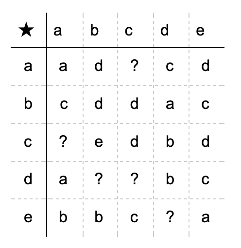

# Модульная арифметика (modular arithmetic)

— ← предыдущая карточка, следующая → [Эталонный полигон гроккинга](canonical-grokking-testbed.md)

[Индекс карточек понятий](index.md), категория: [3. Задачи и наборы данных](index.md#cat-3)\
→ Следующая категория: [4. Факторы обучения и оптимизации](weight-decay.md)\
← Предыдущая категория: [2. Механизмы и представления](structured-representation-learning.md)

## Определение

**Модульная арифметика** — класс алгоритмических задач вида (a + b) mod p
(сложение, вычитание, умножение, деление по модулю числа p), на
котором впервые наблюдали и который стал каноническим полигоном для изучения
[гроккинга](grokking.md). Простота модуля — требование одного лишь деления,
а не понятия: деление задаётся обращением умножения и однозначно только при
простом p (при составном уравнение $b\cdot y\equiv a\bmod p$ имеет ноль или
несколько решений, и датасет деления содержал бы одинаковые входы с разными
ответами); сложению, вычитанию и умножению годится любое целое p — Громов
прямо допускает составные модули для своего класса тотальных функций
\[[1.2](#ref-1-2)\], довод Power об эквивалентности (§3.2) сам идёт через
вычитание mod 96, а Lyle et al. ставят сложение по составному модулю 117
\[[4.36](#ref-4-36)\]. Power et al. (2022) ввели её как тестовую среду:
модель обучали на «бинарной операции деления по модулю 97», используя лишь
половину данных \[[1.1](#ref-1-1)\]. Gromov (2023) дал первое аналитическое
рассмотрение того, как простая сеть осваивает задачи модульной арифметики
\[[1.2](#ref-1-2)\]. Экспериментальная рамка, в которой эти задачи предъявляются сети — кодировка
неинформативными символами, случайный сплит таблицы, малый трансформер, — вынесена
в отдельную карточку: [эталонный полигон гроккинга](canonical-grokking-testbed.md).

## Детализация

Изначально модульную арифметику ввели как *алгоритмический датасет*: пары
остатков по модулю простого p подаются на вход как отдельные символы, а сеть
должна предсказать результат бинарной операции — например, деления по модулю 97
\[[1.1](#ref-1-1)\]. Задача удобна тем, что она мала, полностью наблюдаема и
допускает аналитическое рассмотрение динамики обучения \[[1.2](#ref-1-2)\].
Каноническое механистическое описание дал Nanda et al.: обученная на модульном
сложении сеть реализует алгоритм на дискретном преобразовании Фурье и
тригонометрических тождествах, переводя сложение в поворот по окружности
\[[1.3](#ref-1-3)\] (конкурирующие алгоритмические решения этой задачи —
[«часы против пиццы»](clock-vs-pizza.md)). Формально задачу записывают
как операцию над кольцом вычетов Zp (остатков по модулю p), (a + b) mod p
\[[1.4](#ref-1-4)\]. С теоретико-групповой точки зрения модульное сложение — это
абелева (коммутативная) группа, и естественное представление для неё есть базис
Фурье \[[3.5](#ref-3-5)\]; сети улавливают и другие теоретико-групповые свойства
— единичный элемент, коммутативность, подгруппы \[[5.1](#ref-5-1)\]↗ — и до
гроккинга с трудом осваивают даже коммутативный закон \[[3.1](#ref-3-1)\]. Задача
не ограничивается сложением: её расширяют на умножение, вычитание и деление, а
также на полиномиальные и составные («комплексные») модульные операции
\[[3.2](#ref-3-2)\].

Модульная арифметика служит стандартным полигоном, на котором проверяют и
оспаривают общие утверждения о гроккинге. Классически на ней наблюдают долгую
[фазу запоминания](memorization-phase.md) с плато тестовой точности, сменяемую
резким [фазовым переходом](phase-transition.md) к генерализации; именно на
модульном сложении её использовали и для объединяющего взгляда на гроккинг,
[двойной спуск](double-descent.md) и [эмерджентные способности](emergence.md).
Однако ряд работ показывает, что ни «внезапность» перехода, ни само плато не
являются неотъемлемыми свойствами задачи: настройка параметра ленивости (мера
того, насколько сеть остаётся в почти линейном, ядровом режиме) заставляет
гроккинг на модульном сложении исчезать непрерывно \[[2.1](#ref-2-1)\], а сети с
ограниченной (косинусной) геометрией выхода обучаются на модульном сложении и
умножении вовсе без отделимой фазы запоминания \[[2.2](#ref-2-2)\]. Обсуждается и
источник трудности задачи: её связывают с симметриями таблицы сложения
\[[3.3](#ref-3-3)\] и с собственной симметрией задачи \[[3.7](#ref-3-7)\], а
генерализацию — с необходимостью нарушить симметрию данных в постановке
заполнения таблицы Кэли (таблицы умножения группы) \[[3.8](#ref-3-8)\]. При этом
часть работ отстаивает универсальность: разрозненные нейросетевые решения
модульного сложения сводятся к одному абстрактному алгоритму
\[[3.4](#ref-3-4)\].

## Альтернативные определения и нюансы

### A. Канонический алгоритмический полигон («дрозофила» гроккинга)

Базовая трактовка Power et al.: модульная арифметика — набор алгоритмических
задач (бинарная операция над остатками по простому модулю), на котором впервые
показали отложенную генерализацию \[[1.1](#ref-1-1)\]. Малость, полная
наблюдаемость и требование точного обобщения делают её эталонным управляемым
полигоном; Gromov довёл её до аналитически разрешимой модели с ванильным
градиентным спуском без регуляризации \[[1.2](#ref-1-2)\]. Единица трактовки
здесь — сама постановка задачи как тестовой среды, а не механизм её решения.

### B. Теоретико-групповая и Фурье-структура

Здесь модульная арифметика определяется не операционально, а через алгебру:
модульное сложение — абелева группа (кольцо вычетов Zp), и оптимальные
представления для неё суть базисы Фурье \[[3.5](#ref-3-5)\]. Каноническое решение
сети — тригонометрические тождества, переводящие сложение в поворот по окружности
\[[1.3](#ref-1-3)\]; сеть улавливает единичный элемент, коммутативность и
подгруппы \[[5.1](#ref-5-1)\]↗ и лишь с трудом осваивает коммутативный закон до
гроккинга \[[3.1](#ref-3-1)\]. Ключевое отличие трактовки: единица различия — это
алгебраическая структура задачи (симметрии группы), а не оптимизационная динамика
обучения.

### C. Расширение за пределы модульного сложения

Определение, снимающее привязку к сложению: модульная арифметика включает
умножение, вычитание и деление по модулю, а также полиномиальные и составные
операции над Zp \[[3.2](#ref-3-2)\]. Ключевое различие с трактовкой A/B: меняется
набор операций и их Фурье-сигнатуры (полиномы дают суперпозицию частот
элементарных операций), что расширяет тестовую поверхность за пределы единственной
операции сложения.

### D. Универсальность абстрактного алгоритма

Трактовка через инвариант решения: несмотря на вариативность нейронных
представлений, разные сети (MLP и трансформеры) на модульном сложении реализуют
один и тот же абстрактный алгоритм \[[3.4](#ref-3-4)\]. Отличие от трактовки B:
единица анализа — не конкретная схема нейронов, а инвариантный к архитектуре
абстрактный алгоритм над группой; вариации на уровне нейронов трактуются как
разные реализации одного решения, а не как разные алгоритмы.

### Оспаривают

Оспаривается, что классические признаки гроккинга — плато запоминания и
разрывность перехода — суть неотъемлемые свойства модульной арифметики. Kumar et
al.: одной лишь настройки параметра ленивости (масштаба выхода сети) достаточно,
чтобы гроккинг на модульном сложении исчезал непрерывно, — значит «внезапность»
не есть свойство задачи \[[2.1](#ref-2-1)\]. Yildirim: при ограниченной косинусной
геометрии выходного слоя сеть на модульном сложении и умножении обучается вовсе
без отделимой фазы запоминания \[[2.2](#ref-2-2)\]. Источник различия здесь —
управляющий параметр (ленивость либо геометрия выходной головы), а не сама
арифметика.

### Поддерживают

Присоединяются к структурной/симметрийной трактовке задачи: генерализацию на
модульной арифметике связывают с симметриями таблицы сложения
\[[3.3](#ref-3-3)\], с собственной симметрией задачи, переносимой на более широкий
класс алгебраических доменов \[[3.7](#ref-3-7)\], и с необходимостью нарушить
симметрию данных при заполнении таблицы Кэли \[[3.8](#ref-3-8)\]. Общий тезис: то,
что делает модульную арифметику разрешимой через гроккинг, — её алгебраическая
симметрия, а не частные детали процедуры обучения.

## Ссылки

###### ref-1-1
**\[1.1\]** 2201.02177 — Power et al., «Grokking: Generalization Beyond Overfitting
on Small Algorithmic Datasets». [`"the binary operation of division mod 97 with 50% of the data in the training set"`](../papers/2201.02177.grokking-generalization-beyond-overfitting-on-small-algorithmic-datasets/2201.02177.grokking-generalization-beyond-overfitting-on-small-algorithmic-datasets.card.md#fig-1). *«[бинарной операции деления mod 97 с $50\%$ данных в обучающей выборке](../papers/2201.02177.grokking-generalization-beyond-overfitting-on-small-algorithmic-datasets/2201.02177.grokking-generalization-beyond-overfitting-on-small-algorithmic-datasets.card.md#fig-1)»*

###### ref-1-2
**\[1.2\]** 2301.02679 — Gromov, «Grokking modular arithmetic». [`"can learn modular arithmetic tasks and exhibits a sudden jump in generalization"`](../papers/2301.02679.grokking-modular-arithmetic/2301.02679.grokking-modular-arithmetic.card.md#p1-2). *«[способную выучивать задачи модульной арифметики и обнаруживающую внезапный скачок генерализации](../papers/2301.02679.grokking-modular-arithmetic/2301.02679.grokking-modular-arithmetic.card.md#p1-2)»*\
Доп. (модуль не обязан быть простым; постановка ограничена тотальными функциями, деления в его списке задач нет): [`"we fix an integer $p$ (that does not have to be prime) and consider functions over $\mathbb{Z}_{p}$"`](../papers/2301.02679.grokking-modular-arithmetic/2301.02679.grokking-modular-arithmetic.card.md#p3-4) — *«[мы фиксируем целое $p$ (не обязательно простое) и рассматриваем функции над $\mathbb{Z}_{p}$](../papers/2301.02679.grokking-modular-arithmetic/2301.02679.grokking-modular-arithmetic.card.md#p3-4)»*.

###### ref-1-3
**\[1.3\]** 2301.05217 — Nanda et al., «Progress Measures for Grokking via
Mechanistic Interpretability». [`"small transformers trained on modular addition tasks. We fully reverse engineer the algorithm learned by these networks, which uses discrete Fourier transforms and trigonometric identities to convert addition to rotation about a circle"`](../papers/2301.05217.progress-measures-for-grokking-via-mechanistic-interpretability/2301.05217.progress-measures-for-grokking-via-mechanistic-interpretability.card.md#p1-2). *«[малыми трансформерами, обученными задачам модульного сложения. Мы полностью разбираем обратным инжинирингом алгоритм, выученный этими сетями: он использует дискретные преобразования Фурье и тригонометрические тождества, чтобы свести сложение к повороту вокруг окружности](../papers/2301.05217.progress-measures-for-grokking-via-mechanistic-interpretability/2301.05217.progress-measures-for-grokking-via-mechanistic-interpretability.card.md#p1-2)»*

###### ref-1-4
**\[1.4\]** 2408.08944 — Clauw, Stramaglia, Marinazzo 2024, «Information-Theoretic Progress
Measures reveal Grokking is an Emergent Phase Transition». [`"We study the modular addition operation $\mathbb{Z}_{p}$ by generating equations of the form"`](../papers/2408.08944.information-theoretic-progress-measures-reveal-grokking-is-an-emergent-phase-transition/original/2408.08944.information-theoretic-progress-measures-reveal-grokking-is-an-emergent-phase-transition.md#p2-3). *«[Мы изучаем действие остаточного сложения $\mathbb{Z}_{p}$, порождая равенства вида](../papers/2408.08944.information-theoretic-progress-measures-reveal-grokking-is-an-emergent-phase-transition/2408.08944.information-theoretic-progress-measures-reveal-grokking-is-an-emergent-phase-transition.card.md#p2-3)»*

###### ref-1-5
**\[1.5\]** 2407.20199 — Mallinar et al., «Emergence in non-neural models: grokking modular arithmetic via average gradient outer product». Нюанс: четыре действия при одном модуле $p=61$; умножение и деление сводятся к сложению и вычитанию переупорядочением дискретным логарифмом, и лишь после него строение признаков делается видимым. [`"For Mul and Div, rows and columns of the individual sub-matrices of the AGOP are re-ordered by the discrete logarithm base $2$, revealing the block-circulant structure in the features."`](../papers/2407.20199.emergence-in-non-neural-models-grokking-modular-arithmetic-via-average-gradient-outer-product/original/2407.20199.emergence-in-non-neural-models-grokking-modular-arithmetic-via-average-gradient-outer-product.md#fig-3). *«[Для Mul и Div строки и столбцы отдельных подматриц AGOP переупорядочены дискретным логарифмом по основанию $2$, что обнажает блочно-циркулянтное строение в признаках](../papers/2407.20199.emergence-in-non-neural-models-grokking-modular-arithmetic-via-average-gradient-outer-product/2407.20199.emergence-in-non-neural-models-grokking-modular-arithmetic-via-average-gradient-outer-product.card.md#fig-3)»*\
Доп.: [`"there are $p^{2}$ discrete input pairs ($a,b$) for all modular operations except for $f^{*}(a,b)=(a\div b)\,\mathrm{mod}\,p$, which has $p(p-1)$ inputs as the denominator cannot be $0$"`](../papers/2407.20199.emergence-in-non-neural-models-grokking-modular-arithmetic-via-average-gradient-outer-product/original/2407.20199.emergence-in-non-neural-models-grokking-modular-arithmetic-via-average-gradient-outer-product.md#p4-3) — *«[дискретных входных пар ($a,b$) имеется $p^{2}$ для всех модульных действий, кроме $f^{*}(a,b)=(a\div b)\,\mathrm{mod}\,p$, у которого входов $p(p-1)$, поскольку знаменатель не может быть $0$](../papers/2407.20199.emergence-in-non-neural-models-grokking-modular-arithmetic-via-average-gradient-outer-product/2407.20199.emergence-in-non-neural-models-grokking-modular-arithmetic-via-average-gradient-outer-product.card.md#p4-3)»*.

###### ref-1-6
**\[1.6\]** 2602.18523 — Xu, «The Geometry of Multi-Task Grokking: Transverse Instability, Superposition, and Weight Decay Phase Structure». Нюанс: три операции при $p=97$ — сложение, умножение и $x^{2}+y^{2}$; порядок их освоения обоснован родством строения, но само строение задач нигде не разбирается — операции различаются только временем достижения порога точности. [`"$x^{2}+y^{2}$ shares multiplicative structure with $x\cdot y$, while addition is algebraically distinct"`](../papers/2602.18523.the-geometry-of-multi-task-grokking-transverse-instability-superposition-and-weight-decay-phase-structure/original/2602.18523.the-geometry-of-multi-task-grokking-transverse-instability-superposition-and-weight-decay-phase-structure.md#p4-5). *«[$x^{2}+y^{2}$ делит мультипликативное строение с $x\cdot y$, тогда как сложение алгебраически иное](../papers/2602.18523.the-geometry-of-multi-task-grokking-transverse-instability-superposition-and-weight-decay-phase-structure/2602.18523.the-geometry-of-multi-task-grokking-transverse-instability-superposition-and-weight-decay-phase-structure.card.md#p4-5)»*

###### ref-1-7
**\[1.7\]** 2505.15624 — AlQuabeh, Bojković, Nwadike, Inui, «Mechanistic Insights into Grokking from the Embedding Layer». Даёт корпусу довод, почему для сети со слоем вложений модульное сложение и модульное умножение — одна и та же задача: вложение лишает элементы группы числового значения, а сами группы изоморфны. Набор задач — четыре операции при одном модуле $P=97$: $(a+b)$, $(a\div b)$, $(a\times b)$, $(a^{2}+b^{2})$. Нюанс: сопровождающее изоморфизм утверждение об образующих ложно для обеих групп (в $\mathbb{Z}_{6}$ образующие только $1$ и $5$), а слово «simple» употреблено в значении «циклическая». [`"The embedding layer strips the input group elements of their numerical meanings, and assigns a general, abstract vector to each element."`](../papers/2505.15624.mechanistic-insights-into-grokking-from-the-embedding-layer/original/2505.15624.mechanistic-insights-into-grokking-from-the-embedding-layer.md#p4-3). *«[Слой вложений лишает входные элементы группы их числовых значений и приписывает каждому элементу общий, отвлечённый вектор.](../papers/2505.15624.mechanistic-insights-into-grokking-from-the-embedding-layer/2505.15624.mechanistic-insights-into-grokking-from-the-embedding-layer.card.md#p4-3)»*\
Доп. (следствие для сети без вложения): [`"In contrast to this, the MLP without the embedding layer is able to fit and generalize on modular addition, while it completely fails on modular multiplication."`](../papers/2505.15624.mechanistic-insights-into-grokking-from-the-embedding-layer/original/2505.15624.mechanistic-insights-into-grokking-from-the-embedding-layer.md#p4-3) — *«[В противоположность этому, MLP без слоя вложений способен подогнать и обобщить на модульном сложении, тогда как на модульном умножении он терпит полную неудачу.](../papers/2505.15624.mechanistic-insights-into-grokking-from-the-embedding-layer/2505.15624.mechanistic-insights-into-grokking-from-the-embedding-layer.card.md#p4-3)»*\
Доп. (ошибочное утверждение об образующих): [`"In the first group, any element different from $0$ is the group generator while in the second group, any element different from $1$ is the generator"`](../papers/2505.15624.mechanistic-insights-into-grokking-from-the-embedding-layer/original/2505.15624.mechanistic-insights-into-grokking-from-the-embedding-layer.md#p4-2) — *«[В первой группе образующей служит любой элемент, отличный от $0$, тогда как во второй группе образующей служит любой элемент, отличный от $1$](../papers/2505.15624.mechanistic-insights-into-grokking-from-the-embedding-layer/2505.15624.mechanistic-insights-into-grokking-from-the-embedding-layer.card.md#p4-2)»*.
## Ссылки на присоединившиеся работы

### Оспаривают

###### ref-2-1
**\[2.1\]** 2310.06110 — Kumar et al., «Grokking as the Transition from Lazy to
Rich». Оспаривает: «внезапность» гроккинга на модульном сложении устраняется
непрерывно простой настройкой ленивости. [`"merely tuning the network output scaling/laziness parameter $\alpha$ is alone sufficient to make grokking continuously vanish on the one-layer Transformer used in that work"`](../papers/2310.06110.grokking-as-the-transition-from-lazy-to-rich-training-dynamics/original/2310.06110.grokking-as-the-transition-from-lazy-to-rich-training-dynamics.md#p3-1). *«[одной лишь настройки параметра масштаба выхода сети / ленивости $\alpha$ достаточно, чтобы гроккинг непрерывно исчез на однослойном трансформере, использованном в той работе](../papers/2310.06110.grokking-as-the-transition-from-lazy-to-rich-training-dynamics/2310.06110.grokking-as-the-transition-from-lazy-to-rich-training-dynamics.card.md#p3-1)»*

###### ref-2-2
**\[2.2\]** 2603.05228 — Yildirim, «The Geometric Inductive Bias of Grokking».
Оспаривает неотъемлемость фазы запоминания на модульной арифметике. [`"on both modular addition and multiplication over Zp: rather than exhibiting the characteristic memorization plateau followed by delayed generalization, bounded models show training and test accuracy rising concurrently from initialization, with no separable memorization phase"`](../papers/2603.05228.the-geometric-inductive-bias-of-grokking-bypassing-phase-transitions-via-architectural-topology/original/2603.05228.the-geometric-inductive-bias-of-grokking-bypassing-phase-transitions-via-architectural-topology.md#p2-3). *«[и на модульном сложении, и на умножении над $\mathbb{Z}_{p}$: вместо свойственного гроккингу плато запоминания с последующей отложенной генерализацией ограниченные модели обнаруживают одновременный рост точности на обучении и на тесте с самой инициализации, без отделимой фазы запоминания](../papers/2603.05228.the-geometric-inductive-bias-of-grokking-bypassing-phase-transitions-via-architectural-topology/2603.05228.the-geometric-inductive-bias-of-grokking-bypassing-phase-transitions-via-architectural-topology.card.md#p2-3)»*

### Поддерживают

###### ref-3-1
**\[3.1\]** 2311.06597 — Tan et al., «Understanding Grokking Through A Robustness
Viewpoint». Нюанс: на датасете сложения по модулю сеть до гроккинга едва осваивает
базовые групповые операции. [`"we examine the standard training process on the modulo addition dataset and find that it hardly learns other basic group operations before grokking, for example, the commutative law"`](../papers/2311.06597.understanding-grokking-through-a-robustness-viewpoint/2311.06597.understanding-grokking-through-a-robustness-viewpoint.card.md#p1-2). *«[мы рассматриваем обычный процесс обучения на наборе модульного сложения и находим, что до гроккинга он почти не выучивает других основных групповых операций — например, закона коммутативности](../papers/2311.06597.understanding-grokking-through-a-robustness-viewpoint/2311.06597.understanding-grokking-through-a-robustness-viewpoint.card.md#p1-2)»*

###### ref-3-2
**\[3.2\]** 2402.16726 — Furuta et al., «Towards Empirical Interpretation of
Internal Circuits and Properties in Grokked Transformers on Modular Polynomials».
Нюанс: расширение задачи на сложные модульные операции и полиномы. [`"learning Transformers on complex modular arithmetic tasks, including polynomials"`](../papers/2402.16726.towards-empirical-interpretation-of-internal-circuits-and-properties-in-grokked-transformers-on-modular-polynomials/original/2402.16726.towards-empirical-interpretation-of-internal-circuits-and-properties-in-grokked-transformers-on-modular-polynomials.md#p1-1). *«[обучая трансформеры на сложных задачах модульной арифметики, включая многочлены](../papers/2402.16726.towards-empirical-interpretation-of-internal-circuits-and-properties-in-grokked-transformers-on-modular-polynomials/2402.16726.towards-empirical-interpretation-of-internal-circuits-and-properties-in-grokked-transformers-on-modular-polynomials.card.md#p1-1)»*

###### ref-3-3
**\[3.3\]** 2411.05353 — Salah et al., «Controlling Grokking with Nonlinearity and
Data Symmetry». Нюанс: гроккинг на модульном сложении объясняется симметриями
таблицы сложения. [`"Grokking in the modular addition problem could be explained by symmetries in the addition table"`](../papers/2411.05353.controlling-grokking-with-nonlinearity-and-data-symmetry/original/2411.05353.controlling-grokking-with-nonlinearity-and-data-symmetry.md#p11-1). *«[Гроккинг в задаче модульного сложения мог бы объясняться симметриями в таблице сложения](../papers/2411.05353.controlling-grokking-with-nonlinearity-and-data-symmetry/2411.05353.controlling-grokking-with-nonlinearity-and-data-symmetry.card.md#p11-1)»*

###### ref-3-4
**\[3.4\]** 2505.18266 — McCracken et al. 2025, «Uncovering a Universal Abstract Algorithm for Modular Addition in Neural Networks». Нюанс: разрозненные решения остаточного сложения суть одно отвлечённое действие (всеобщность). [`"neural network solutions observed in the simple task of modular addition are unified under a common abstract algorithm"`](../papers/2505.18266.uncovering-a-universal-abstract-algorithm-for-modular-addition-in-neural-networks/original/2505.18266.uncovering-a-universal-abstract-algorithm-for-modular-addition-in-neural-networks.md#p1-2). *«[решения нейронных сетей, наблюдаемые в простой задаче остаточного сложения, объединены общим отвлечённым действием](../papers/2505.18266.uncovering-a-universal-abstract-algorithm-for-modular-addition-in-neural-networks/2505.18266.uncovering-a-universal-abstract-algorithm-for-modular-addition-in-neural-networks.card.md#p1-2)»*

###### ref-3-5
**\[3.5\]** 2509.21519 — Tian, «Provable Scaling Laws of Feature Emergence from
Learning Dynamics of Grokking». Нюанс: модульное сложение — абелева группа,
представление — базис Фурье. [`"the popular modular addition task which is an Abelian group. The resulting representation is Fourier bases"`](../papers/2509.21519.provable-scaling-laws-of-feature-emergence-from-learning-dynamics-of-grokking/original/2509.21519.provable-scaling-laws-of-feature-emergence-from-learning-dynamics-of-grokking.md#p6-9). *«[популярной задаче модульного сложения, которая является абелевой группой. Получающееся представление — базисы Фурье](../papers/2509.21519.provable-scaling-laws-of-feature-emergence-from-learning-dynamics-of-grokking/2509.21519.provable-scaling-laws-of-feature-emergence-from-learning-dynamics-of-grokking.card.md#p6-9)»*

###### ref-3-7
**\[3.7\]** 2603.01968 — Hwang et al., «Intrinsic Task Symmetry Drives
Generalization in Algorithmic Tasks». Нюанс: за пределы стандартного полигона
модульной арифметики; генерализацию определяет собственная симметрия задачи. [`"beyond the standard modular arithmetic testbed to a diverse suite of algebraic, structural, and relational domains"`](../papers/2603.01968.intrinsic-task-symmetry-drives-generalization-in-algorithmic-tasks/original/2603.01968.intrinsic-task-symmetry-drives-generalization-in-algorithmic-tasks.md#p1-5). *«[за пределы обычного полигона остаточной арифметики — в разнообразный набор алгебраических, структурных и отношенческих предметных областей](../papers/2603.01968.intrinsic-task-symmetry-drives-generalization-in-algorithmic-tasks/2603.01968.intrinsic-task-symmetry-drives-generalization-in-algorithmic-tasks.card.md#p1-5)»*

###### ref-3-8
**\[3.8\]** 2604.00316 — Tomàs et al., «Breaking Data Symmetry is Needed For
Generalization in Feature Learning Kernels». Нюанс: модульная арифметика как
заполнение таблицы Кэли; для генерализации нужно нарушить симметрию данных. [`"entries of a Cayley table for modular arithmetic"`](../papers/2604.00316.breaking-data-symmetry-is-needed-for-generalization-in-feature-learning-kernels/original/2604.00316.breaking-data-symmetry-is-needed-for-generalization-in-feature-learning-kernels.md#p1-5). *«[клеток таблицы Кэли для модульной арифметики](../papers/2604.00316.breaking-data-symmetry-is-needed-for-generalization-in-feature-learning-kernels/2604.00316.breaking-data-symmetry-is-needed-for-generalization-in-feature-learning-kernels.card.md#p1-5)»*\
Доп. (обобщение на абелевы группы): [`"The symmetry group of $f(a,b)=a\star b$ for $a,b\in\mathcal{A}$ is isomorphic to the generalized dihedral group"`](../papers/2604.00316.breaking-data-symmetry-is-needed-for-generalization-in-feature-learning-kernels/original/2604.00316.breaking-data-symmetry-is-needed-for-generalization-in-feature-learning-kernels.md#p12-11) — *«[Группа симметрий $f(a,b)=a\star b$ при $a,b\in\mathcal{A}$ изоморфна обобщённой диэдральной группе](../papers/2604.00316.breaking-data-symmetry-is-needed-for-generalization-in-feature-learning-kernels/2604.00316.breaking-data-symmetry-is-needed-for-generalization-in-feature-learning-kernels.card.md#p12-11)»*

###### ref-3-9
**\[3.9\]** 2303.06173 — Davies, Langosco, Krueger, «Unifying Grokking and Double Descent». Нюанс: деление по модулю 97 взято ради того, что на нём рамка указала, что искать, до того, как посмотрели: ранний образец $0/b=0\bmod n$ даёт пик в 96 верных примеров, отвечающий безошибочности на таких примерах и случайности (1/97) на прочих. Разложения выученного решения — ни по частотам, ни по представлениям — в работе нет. [`"Early in training, the model learns that for all $b$, $0/b=0\mod n$."`](../papers/2303.06173.unifying-grokking-and-double-descent/2303.06173.unifying-grokking-and-double-descent.card.md#p4-3). *«[Рано в обучении модель выучивает, что для всех $b$ верно $0/b=0\mod n$](../papers/2303.06173.unifying-grokking-and-double-descent/2303.06173.unifying-grokking-and-double-descent.card.md#p4-3)»*

###### ref-3-10
**\[3.10\]** 2306.17844 — Zhong et al. 2023, «The Clock and the Pizza». Нюанс: одна задача и один модуль; зависимости чего-либо от $p$ в работе нет, ограничение признано авторами. [`"We use $p=59$ throughout the paper."`](../papers/2306.17844.the-clock-and-the-pizza-two-stories-in-mechanistic-explanation-of-neural-networks/original/2306.17844.the-clock-and-the-pizza-two-stories-in-mechanistic-explanation-of-neural-networks.md#p2-3). *«[Всюду в статье мы берём $p=59$.](../papers/2306.17844.the-clock-and-the-pizza-two-stories-in-mechanistic-explanation-of-neural-networks/2306.17844.the-clock-and-the-pizza-two-stories-in-mechanistic-explanation-of-neural-networks.card.md#p2-3)»*\
Доп.: [`"We have focused on a single learning problem: modular addition."`](../papers/2306.17844.the-clock-and-the-pizza-two-stories-in-mechanistic-explanation-of-neural-networks/original/2306.17844.the-clock-and-the-pizza-two-stories-in-mechanistic-explanation-of-neural-networks.md#p10-3) — *«[Мы сосредоточились на единственной задаче обучения: модульном сложении.](../papers/2306.17844.the-clock-and-the-pizza-two-stories-in-mechanistic-explanation-of-neural-networks/2306.17844.the-clock-and-the-pizza-two-stories-in-mechanistic-explanation-of-neural-networks.card.md#p10-3)»*.

###### ref-3-11
**\[3.11\]** 2302.03025 — Chughtai et al., «A Toy Model of Universality: Reverse Engineering how Networks Learn Group Operations». Нюанс: модульное сложение переопределено как композиция в $C_{113}$, то есть одна точка семейства, а не отдельная задача; при этом у циклических групп доля объяснённой дисперсии логитов заметно выше, и объяснения этому авторы не дают, а лишь «подозревают» связь с ортогональностью ДПФ. [`"the task presented in Nanda et al. 2023 is a special case of our task, as addition mod $113$ is equivalent to composition for $G=C_{113}$, the cyclic group of $113$ elements"`](../papers/2302.03025.a-toy-model-of-universality-reverse-engineering-how-networks-learn-group-operations/2302.03025.a-toy-model-of-universality-reverse-engineering-how-networks-learn-group-operations.card.md#p3-2). *«[задача, представленная в Nanda et al. 2023, есть частный случай нашей задачи, поскольку сложение по модулю $113$ равносильно композиции при $G=C_{113}$, циклической группе из $113$ элементов](../papers/2302.03025.a-toy-model-of-universality-reverse-engineering-how-networks-learn-group-operations/2302.03025.a-toy-model-of-universality-reverse-engineering-how-networks-learn-group-operations.card.md#p3-2)»*\
Доп.: [`"We suspect the high FVE of models trained on composition in the cyclic group is related to orthogonality properties of the discrete Fourier transform not shared by general irreducible representations."`](../papers/2302.03025.a-toy-model-of-universality-reverse-engineering-how-networks-learn-group-operations/2302.03025.a-toy-model-of-universality-reverse-engineering-how-networks-learn-group-operations.card.md#p23-9) — *«[Мы подозреваем, что высокая FVE моделей, обученных композиции в циклической группе, связана со свойствами ортогональности дискретного преобразования Фурье, не общими для произвольных неприводимых представлений](../papers/2302.03025.a-toy-model-of-universality-reverse-engineering-how-networks-learn-group-operations/2302.03025.a-toy-model-of-universality-reverse-engineering-how-networks-learn-group-operations.card.md#p23-9)»*.

###### ref-3-12
**\[3.12\]** 2311.07568 — Morwani et al. 2024, «Feature emergence via margin maximization: case studies in algebraic tasks». Берёт модульное сложение в самой узкой форме, какая позволяет доказательство: $\mathcal{X}={\mathbb{Z}}_{p}\times{\mathbb{Z}}_{p}$, $\mathcal{Y}={\mathbb{Z}}_{p}$ и **полная популяционная выборка**; сеть — один скрытый слой без смещений с возбуждением $x^{2}$, вход one-hot. В опыте $p=71$, $m=500$, полный градиентный спуск, 40000 шагов, регуляризация $10^{-4}$. Нюанс: разбиения на обучение и тест в работе нет ни в одном опыте, тестовых кривых нет, измеряемая величина — нормированный зазор. [`"Consider the input space $\mathcal{X}:={\mathbb{Z}}_{p}\times{\mathbb{Z}}_{p}$ and output space $\mathcal{Y}:={\mathbb{Z}}_{p}$. Let the dataset $D_{p}:=\{((a,b),a+b):a,b\in{\mathbb{Z}}_{p}\}$."`](../papers/2311.07568.feature-emergence-via-margin-maximization-case-studies-in-algebraic-tasks/2311.07568.feature-emergence-via-margin-maximization-case-studies-in-algebraic-tasks.card.md#p10-2). *«[Рассмотрим входное пространство $\mathcal{X}:={\mathbb{Z}}_{p}\times{\mathbb{Z}}_{p}$ и выходное пространство $\mathcal{Y}:={\mathbb{Z}}_{p}$. Пусть набор данных $D_{p}:=\{((a,b),a+b):a,b\in{\mathbb{Z}}_{p}\}$.](../papers/2311.07568.feature-emergence-via-margin-maximization-case-studies-in-algebraic-tasks/2311.07568.feature-emergence-via-margin-maximization-case-studies-in-algebraic-tasks.card.md#p10-2)»*\
Доп. (настройки опыта): [`"We train a 1-hidden layer network with $m=500$, using gradient descent on the task of learning modular addition for $p=71$ for $40000$ steps."`](../papers/2311.07568.feature-emergence-via-margin-maximization-case-studies-in-algebraic-tasks/2311.07568.feature-emergence-via-margin-maximization-case-studies-in-algebraic-tasks.card.md#p19-2) — *«[Мы обучаем сеть с одним скрытым слоем при $m=500$, употребляя градиентный спуск на задаче обучения модульному сложению для $p=71$ в течение $40000$ шагов.](../papers/2311.07568.feature-emergence-via-margin-maximization-case-studies-in-algebraic-tasks/2311.07568.feature-emergence-via-margin-maximization-case-studies-in-algebraic-tasks.card.md#p19-2)»*.

###### ref-3-13
**\[3.13\]** 2505.11411 — Zhang, Shang, Yang, Zhang, «Is Grokking a Computational Glass Relaxation?». Берёт полигон при $p=67$ с тремя операциями по возрастанию трудности — $x+y$, $x^{2}+y$ и намеренно невыучиваемая $x^{3}+xy^{2}+y$, — и третья работает как управляющий опыт: на ней и состояние максимума энтропии не обобщает, то есть высокая энтропия сама по себе генерализации не производит. Нюанс: модуль снижен со 113 ради стоимости энтропийного сэмплирования, других модулей и групповых операций в работе нет. [`"In this paper, $p$ is set to a prime number 67."`](../papers/2505.11411.is-grokking-a-computational-glass-relaxation/original/2505.11411.is-grokking-a-computational-glass-relaxation.md#p4-4). *«[В этой статье $p$ положено равным простому числу 67.](../papers/2505.11411.is-grokking-a-computational-glass-relaxation/2505.11411.is-grokking-a-computational-glass-relaxation.card.md#p4-4)»*\
Доп. (управляющий опыт на невыучиваемой операции): [`"For the third unlearnable task, the equilibrium state also fails to generalize, although some states present a higher test accuracy (about 20%) than random selection (about 1.5%)."`](../papers/2505.11411.is-grokking-a-computational-glass-relaxation/original/2505.11411.is-grokking-a-computational-glass-relaxation.md#p6-3) — *«[У третьей, невыучиваемой задачи равновесное состояние тоже не обобщает, хотя некоторые состояния и обнаруживают более высокую тестовую точность (около 20 %), чем случайный выбор (около 1,5 %).](../papers/2505.11411.is-grokking-a-computational-glass-relaxation/2505.11411.is-grokking-a-computational-glass-relaxation.card.md#p6-3)»*\
Доп. (почему модуль снижен): [`"In order to reduce the computational cost of WLMD entropy sampling, we selected a smaller prime number 67 as the modulus for our task."`](../papers/2505.11411.is-grokking-a-computational-glass-relaxation/original/2505.11411.is-grokking-a-computational-glass-relaxation.md#p14-1) — *«[Чтобы снизить вычислительную стоимость энтропийного сэмплирования WLMD, мы выбрали для нашей задачи меньшее простое число 67 в качестве модуля.](../papers/2505.11411.is-grokking-a-computational-glass-relaxation/2505.11411.is-grokking-a-computational-glass-relaxation.card.md#p14-1)»*.

###### ref-3-14
**\[3.14\]** 2603.25009 — Manir, Rupa, «A Systematic Empirical Study of Grokking…». Опыт 8 переносит H2 и H3 на $(a\times b)\bmod 97$ (9216 пар после исключения нулевых сомножителей): [`"suggesting that at optimal regularisation multiplication is not harder than addition for these models"`](../papers/2603.25009.a-systematic-empirical-study-of-grokking-depth-architecture-activation-and-regularization/2603.25009.a-systematic-empirical-study-of-grokking-depth-architecture-activation-and-regularization.card.md#p13-4). *«[что позволяет предположить, что при оптимальной регуляризации умножение не труднее сложения для этих моделей](../papers/2603.25009.a-systematic-empirical-study-of-grokking-depth-architecture-activation-and-regularization/2603.25009.a-systematic-empirical-study-of-grokking-depth-architecture-activation-and-regularization.card.md#p13-4)»*\
Доп. (оговорка): для GELU и ReLU сложение взято при $\lambda=5\times 10^{-4}$, а умножение при $\lambda=10^{-3}$, и панель (c) [рис. 8](../papers/2603.25009.a-systematic-empirical-study-of-grokking-depth-architecture-activation-and-regularization/2603.25009.a-systematic-empirical-study-of-grokking-depth-architecture-activation-and-regularization.card.md#fig-8) ставит эти столбцы рядом.

###### ref-3-15
**\[3.15\]** 2405.16658 — Park, Kim, Kim, «Acceleration of Grokking in Learning Arithmetic Operations via Kolmogorov-Arnold Representation». Нюанс: десять бинарных операций разложены на три класса по тому, какую часть KA-представления они делят, — коммутативные делят $\Sigma$ (сумму), антиабелевы делят $\Sigma$ (разность), абелевы делят $\Phi$ (вложение); понятие антиабелевой операции (вычитание и деление) введено здесь. Зависимости чего-либо от $p$ в работе нет: всё измерено при одном модуле, и переноса между разными $p$ не испытано. [`"We say an operation $\bullet$ is anti-abelian for the abelian group $<G,\circ>$, if $x_{1}\bullet x_{2}=x_{1}\circ x_{2}^{-1}$ where $x_{2}^{-1}$ is an inverse of $x_{2}$."`](../papers/2405.16658.acceleration-of-grokking-in-learning-arithmetic-operations-via-kolmogorov-arnold-representation/2405.16658.acceleration-of-grokking-in-learning-arithmetic-operations-via-kolmogorov-arnold-representation.card.md#p10-1). *«[Мы говорим, что операция $\bullet$ антиабелева для абелевой группы $<G,\circ>$, если $x_{1}\bullet x_{2}=x_{1}\circ x_{2}^{-1}$, где $x_{2}^{-1}$ — обратный к $x_{2}$](../papers/2405.16658.acceleration-of-grokking-in-learning-arithmetic-operations-via-kolmogorov-arnold-representation/2405.16658.acceleration-of-grokking-in-learning-arithmetic-operations-via-kolmogorov-arnold-representation.card.md#p10-1)»*\
Доп.: [`"We set $p=97$ for all experiments."`](../papers/2405.16658.acceleration-of-grokking-in-learning-arithmetic-operations-via-kolmogorov-arnold-representation/2405.16658.acceleration-of-grokking-in-learning-arithmetic-operations-via-kolmogorov-arnold-representation.card.md#p17-1) — *«[Мы полагаем $p=97$ во всех опытах](../papers/2405.16658.acceleration-of-grokking-in-learning-arithmetic-operations-via-kolmogorov-arnold-representation/2405.16658.acceleration-of-grokking-in-learning-arithmetic-operations-via-kolmogorov-arnold-representation.card.md#p17-1)»*.

###### ref-3-16
**\[3.16\]** 2605.09724 — Song & Ye, «Model Capacity Determines Grokking through Competing Memorisation and Generalisation Speeds». Нюанс: операций две — деление и сложение; умножение и вычитание объявлены запланированными и не сделаны. [`"We use all 10 primes in the range from 90 to 140 for our experiments"`](../papers/2605.09724.model-capacity-determines-grokking-through-competing-memorisation-and-generalisation-speeds/original/2605.09724.model-capacity-determines-grokking-through-competing-memorisation-and-generalisation-speeds.md#p12-1). *«[Мы используем все 10 простых в промежутке от 90 до 140 для наших опытов](../papers/2605.09724.model-capacity-determines-grokking-through-competing-memorisation-and-generalisation-speeds/2605.09724.model-capacity-determines-grokking-through-competing-memorisation-and-generalisation-speeds.card.md#p12-1)»*

###### ref-3-17
**\[3.17\]** 2604.06256 — Xu, «Spectral Edge Dynamics Reveal Functional Modes of Learning». Нюанс: тот же набор из шести действий, что у Furuta et al. (2402.16726) при том же $p=97$ и $\mathrm{wd}=1.0$, но без ссылки на неё. [`"We study six binary operations: $(a+b)$, $(a-b)$, $(a\cdot b)$, $(a^{2}+b^{2})$, $(a^{2}+ab+b^{2})$, and $(a^{3}+ab)$ mod $p$."`](../papers/2604.06256.spectral-edge-dynamics-reveal-functional-modes-of-learning/original/2604.06256.spectral-edge-dynamics-reveal-functional-modes-of-learning.md#p3-2). *«[Мы изучаем шесть бинарных операций: $(a+b)$, $(a-b)$, $(a\cdot b)$, $(a^{2}+b^{2})$, $(a^{2}+ab+b^{2})$ и $(a^{3}+ab)$ по модулю $p$.](../papers/2604.06256.spectral-edge-dynamics-reveal-functional-modes-of-learning/2604.06256.spectral-edge-dynamics-reveal-functional-modes-of-learning.card.md#p3-2)»*

###### ref-3-20
**\[3.20\]** 2605.06352 — Tang et al., «Topological Signatures of Grokking». Простые свои ($113$, $149$, $197$), полный набор из $p^{2}$ пар, вход двухтокенный. [`"We study the modular addition task: given two integers $a,b\in\{0,\ldots,p-1\}$, predict $(a+b)\bmod p$."`](../papers/2605.06352.topological-signatures-of-grokking/2605.06352.topological-signatures-of-grokking.card.md#p3-2). *«[Мы изучаем задачу модульного сложения: по двум целым $a,b\in\{0,\ldots,p-1\}$ предсказать $(a+b)\bmod p$.](../papers/2605.06352.topological-signatures-of-grokking/2605.06352.topological-signatures-of-grokking.card.md#p3-2)»*\
Доп. (чего нет): ни умножения, ни некоммутативных групп, ни иных алгоритмических задач — единственная проверка на задаче без кругового строения сделана переносом на MNIST.

###### ref-3-21
**\[3.21\]** 2604.20923 — Golwala, «ILDR: Geometric Early Detection of Grokking». [`"Division over $\mathbb{Z}_p$ requires the network to implicitly learn modular inverses via Fermat's little theorem"`](../papers/2604.20923.ildr-geometric-early-detection-of-grokking/original/2604.20923.ildr-geometric-early-detection-of-grokking.md#p8-2). *«[Деление над $\mathbb{Z}_p$ требует от сети неявно выучить обратные по модулю через малую теорему Ферма](../papers/2604.20923.ildr-geometric-early-detection-of-grokking/2604.20923.ildr-geometric-early-detection-of-grokking.card.md#p8-2)»* — и именно там опережение геометрии над поведением наибольшее среди арифметических операций (2900 шагов, 32%) против ~400 шагов у сложения и умножения ([с. 8, абз. 1](../papers/2604.20923.ildr-geometric-early-detection-of-grokking/2604.20923.ildr-geometric-early-detection-of-grokking.card.md#p8-1)).

###### ref-3-22
**\[3.22\]** 2605.20441 — Verma 2026, «Weight Decay Regimes in Grokking Transformers: Cheap Online Diagnostics». Развёртывает полигон с одного сложения до четырёх операций при $p=97$ и даёт корпусу упорядочение по доле гроккинга при одинаковом укладе на 280 прогонах: вычитание грокает заметно реже прочих трёх. Нюанс: при $n{=}5$ на ячейку упорядочение по задачам автором объявлено недостаточно мощным, доверительные промежутки взаимно перекрываются, и вывод несёт сводная монотонная картина управления через weight decay, а не порядок операций. [`"Per-task grok rate (pooled WDs and scales) is $\mathrm{mod}_{+}\,0.73$, $\mathrm{mod}_{\div}\,0.71$, $\mathrm{mod}_{\times}\,0.70$, $\mathrm{mod}_{-}\,0.49$, recovering the $\mathrm{mod}_{-}$ slow-grok ordering of the original E3 cohort at much larger $n$."`](../papers/2605.20441.weight-decay-regimes-in-grokking-transformers-cheap-online-diagnostics/original/2605.20441.weight-decay-regimes-in-grokking-transformers-cheap-online-diagnostics.md#p13-2). *«[Доля гроккинга по задачам (сводно по WD и масштабам) составляет $\mathrm{mod}_{+}\,0.73$, $\mathrm{mod}_{\div}\,0.71$, $\mathrm{mod}_{\times}\,0.70$, $\mathrm{mod}_{-}\,0.49$, что восстанавливает медленно-грокающий порядок $\mathrm{mod}_{-}$ исходной когорты E3 при куда большем $n$.](../papers/2605.20441.weight-decay-regimes-in-grokking-transformers-cheap-online-diagnostics/2605.20441.weight-decay-regimes-in-grokking-transformers-cheap-online-diagnostics.card.md#p13-2)»*\
Доп. (устройство набора для деления): [`"For $\mathrm{mod}_{\div}$, pairs with $b=0$ are excluded before the same split, because division by zero is undefined modulo prime $p$."`](../papers/2605.20441.weight-decay-regimes-in-grokking-transformers-cheap-online-diagnostics/original/2605.20441.weight-decay-regimes-in-grokking-transformers-cheap-online-diagnostics.md#p5-1) — *«[Для $\mathrm{mod}_{\div}$ пары с $b=0$ исключаются до того же разбиения, потому что деление на нуль по простому модулю $p$ не определено.](../papers/2605.20441.weight-decay-regimes-in-grokking-transformers-cheap-online-diagnostics/2605.20441.weight-decay-regimes-in-grokking-transformers-cheap-online-diagnostics.card.md#p5-1)»*.

###### ref-3-23
**\[3.23\]** 2606.13753 — Truong et al. 2026, «The Weight Norm Sets the Grokking Timescale: A Causal Delay Law». Добавляет полигону величину, растущую с модулем: критическая норма при гроккинге масштабируется степенным законом по $p$, и на этом масштабировании держится сворачивание закона задержки — относительная норма $\rho=\|W\|/\|W\|_{c}(p)$ сворачивает четыре модуля в одну экспоненту, а абсолютная подгоняет хуже. Отдельно объясняется, почему недостижимый для регуляризации режим высокой нормы есть именно на модульном сложении: решение почти единственно и пришпилено к своему масштабу, тогда как у разрежённой чётности обобщающих решений много. Нюанс: показатель измерен дважды на разных наборах модулей ($p^{0.38}$ и $p^{0.44}$) и второе названо согласующимся с первым без оценки разброса; объяснение про почти единственное фурье-построение подано авторами прямо как догадка, а не как проверенное утверждение. [`"scales with system size as $\|W\|_{c}(p)=\{42,48,55,61,67\}$ for $p=\{29,41,59,79,97\}$, a power law $\|W\|_{c}\propto p^{0.38}$"`](../papers/2606.13753.the-weight-norm-sets-the-grokking-timescale-a-causal-delay-law/2606.13753.the-weight-norm-sets-the-grokking-timescale-a-causal-delay-law.card.md#p5-5). *«[масштабируется с размером системы как $\|W\|_{c}(p)=\{42,48,55,61,67\}$ для $p=\{29,41,59,79,97\}$, то есть степенным законом $\|W\|_{c}\propto p^{0.38}$](../papers/2606.13753.the-weight-norm-sets-the-grokking-timescale-a-causal-delay-law/2606.13753.the-weight-norm-sets-the-grokking-timescale-a-causal-delay-law.card.md#p5-5)»*\
Доп. (догадка о единственности решения): [`"modular addition is solved by a near-unique Fourier construction pinned to a particular scale"`](../papers/2606.13753.the-weight-norm-sets-the-grokking-timescale-a-causal-delay-law/2606.13753.the-weight-norm-sets-the-grokking-timescale-a-causal-delay-law.card.md#p11-2) — *«[модульное сложение решается почти единственным фурье-построением, пришпиленным к определённому масштабу](../papers/2606.13753.the-weight-norm-sets-the-grokking-timescale-a-causal-delay-law/2606.13753.the-weight-norm-sets-the-grokking-timescale-a-causal-delay-law.card.md#p11-2)»*.

###### ref-3-24
**\[3.24\]** 2606.12966 — Sivasankar, «Circuit Synchronization Precedes Generalization: A Causal Precursor to Grokking». [`"Modular multiplication shows FSD lagging grokking by 10,000 steps, confirming the precursor is operation-specific."`](../papers/2606.12966.circuit-synchronization-precedes-generalization-a-causal-precursor-to-grokking/2606.12966.circuit-synchronization-precedes-generalization-a-causal-precursor-to-grokking.card.md#p4-12). *«[Модульное умножение даёт FSD, запаздывающий относительно гроккинга на 10 000 шагов, что подтверждает: предвестник специфичен для операции.](../papers/2606.12966.circuit-synchronization-precedes-generalization-a-causal-precursor-to-grokking/2606.12966.circuit-synchronization-precedes-generalization-a-causal-precursor-to-grokking.card.md#p4-12)»*\
Доп. (предсказание, сделанное до опыта и подтверждённое): [`"$(a-b)\bmod p$ is algebraically equivalent to addition modulo $p$ (same group structure, same Fourier identity)."`](../papers/2606.12966.circuit-synchronization-precedes-generalization-a-causal-precursor-to-grokking/2606.12966.circuit-synchronization-precedes-generalization-a-causal-precursor-to-grokking.card.md#p9-1) — *«[$(a-b)\bmod p$ алгебраически равносильно сложению по модулю $p$ (то же групповое устройство, то же фурье-тождество).](../papers/2606.12966.circuit-synchronization-precedes-generalization-a-causal-precursor-to-grokking/2606.12966.circuit-synchronization-precedes-generalization-a-causal-precursor-to-grokking.card.md#p9-1)»*
###### ref-3-25
**\[3.25\]** 2604.12434 — Qchohi, Rossi 2026, «A Bayesian Perspective on the Role of Epistemic Uncertainty for Delayed Generalization in In-Context Learning». ICL-вариант канонического полигона: $z=ax+by\bmod 29$ по He et al., вектор задачи $(a,b)$ модели никогда не показывается — она выводит его из 32 троек $(x,y,z)$ в контексте (окно 96 токенов); четыре среза (ID Train/Val, OOD Train/Val) скрещивают невиданность задач и входов, обучение только на ID Train. Нюанс: один модуль ($p=29$), одна архитектура, одно семейство линейных задач; «число задач $T$» основного текста и «базовое $n_{\mathrm{task}}$ с параллелограммным расширением $4n_{\mathrm{task}}$» приложения нигде явно не сшиты. [`"We follow He et al. (2024) and focus on linear modular arithmetic tasks of the form $z=ax+by\pmod{p}$"`](../papers/2604.12434.a-bayesian-perspective-on-the-role-of-epistemic-uncertainty-for-delayed-generalization-in-in-context-learning/original/2604.12434.a-bayesian-perspective-on-the-role-of-epistemic-uncertainty-for-delayed-generalization-in-in-context-learning.md#p4-1). *«[Мы следуем He et al. (2024) и сосредотачиваемся на линейных задачах модульной арифметики вида $z=ax+by\pmod{p}$](../papers/2604.12434.a-bayesian-perspective-on-the-role-of-epistemic-uncertainty-for-delayed-generalization-in-in-context-learning/2604.12434.a-bayesian-perspective-on-the-role-of-epistemic-uncertainty-for-delayed-generalization-in-in-context-learning.card.md#p4-1)»*

###### ref-3-26
**\[3.26\]** 2604.17673 — Kim, Park, Østby, Gu 2026, «Grokking of Diffusion Models: Case Study on Modular Addition». Канонический полигон впервые перенесён в пиксельное пространство: $a+b=c\pmod{P}$, символы — картинки букв EMNIST или Kuzushiji-MNIST ($P=23$ основной; ablation 27–47), ответ модель рисует, шумоподавляя гауссову карту $32\times 32$; коммутативность закрыта строже обычного — неупорядоченная пара $\{a,b\}$ выбрасывается из обучения целиком. Нюанс: правильность меряется сторонним классификатором ResNet18 с точностью «свыше 95%», и модель с 94–95% упирается в потолок измерителя; множитель объёма проверочного набора $11\times P^{2}$ не объяснён. [`"we adapt the modular addition task to the image domain."`](../papers/2604.17673.grokking-of-diffusion-models-case-study-on-modular-addition/original/2604.17673.grokking-of-diffusion-models-case-study-on-modular-addition.md#p4-3). *«[мы адаптируем задачу модульного сложения к домену изображений.](../papers/2604.17673.grokking-of-diffusion-models-case-study-on-modular-addition/2604.17673.grokking-of-diffusion-models-case-study-on-modular-addition.card.md#p4-3)»*

###### ref-3-27
**\[3.27\]** 2606.17399 — Nguyen 2026, «The Discrete-Log Clock: How a Transformer Learns Modular Multiplication». Постановка на мультипликативной группе: $a\cdot b\bmod 113$ по всем парам из $\{1,\ldots,112\}$ с нарочным исключением нуля, так что изоморфизм $\log_{g}$ (первообразный корень $g=3$) превращает таблицу умножения в таблицу сложения по модулю 112; обстановка — точное повторение канонической постановки Nanda et al. (30% пар, AdamW, weight decay 1.0, 40 000 эпох полным батчем) с единственной заменой задачи, гроккинг между эпохами 9 000 и 14 000. Нюанс: исключение нуля делает задачу групповой операцией, но уводит её от постановки прежних работ, получавших «все частоты», и эта возможность объяснения расхождения не рассмотрена; один прогон, разбросов и статистики для главных чисел нет. [`"We train a 1-layer decoder-only transformer on $a\cdot b\bmod 113$ for all $a,b\in\{1,\ldots,112\}$ (excluding zero, which lies outside the multiplicative group)."`](../papers/2606.17399.the-discrete-log-clock-how-a-transformer-learns-modular-multiplication/original/2606.17399.the-discrete-log-clock-how-a-transformer-learns-modular-multiplication.md#p2-2). *«[Мы обучаем однослойный decoder-only трансформер на $a\cdot b\bmod 113$ для всех $a,b\in\{1,\ldots,112\}$ (исключая ноль, который лежит вне мультипликативной группы).](../papers/2606.17399.the-discrete-log-clock-how-a-transformer-learns-modular-multiplication/2606.17399.the-discrete-log-clock-how-a-transformer-learns-modular-multiplication.card.md#p2-2)»*

###### ref-3-28
**\[3.28\]** 2607.13749 — Kam, Cadet, Bessafi, Cadet 2026, «Algebraic Representability as the Limiting Regime of Grokking: An Exactly Solvable Model with Holomorphic Activations». Кодирование корнями из единицы как естественная параметризация модульных задач: $a\mapsto\omega^{a}$ обращает сложение mod $p$ в умножение комплексных чисел, и точный фурье-критерий представимости доказан в обе стороны — линейно-фазовая цель $ma+nb$ представима ⟺ $(m,n)\bmod p\in S_{k}$, для малых $m,n$ это $m+n=k$; вычитание $a-b$ даёт $(1,p-1)$ с суммой $\equiv 0$ и требует $k=p=97$ — практически непредставимо; ранговый барьер не зависит от базиса, и $\omega^{ab}$ — полноранговая матрица ДПФ — непредставима ни при каком кодировании. Нюанс: все опыты при единственном $p=97$ и $k\leq 6$, развёртки по $p$ нет; ранговое условие — лишь необходимое, достаточность показана только для ранга 1; догадка Doshi et al. о делении модульных многочленов имеет ту же форму — здесь доказана её непредставимая сторона (в голоморфной постановке). [`"a linear-phase target is either in $\mathcal{F}_{k}$ as a single character, or orthogonal to the entire subspace."`](../papers/2607.13749.algebraic-representability-as-the-limiting-regime-of-grokking-an-exactly-solvable-model-with-holomorphic-activations/original/2607.13749.algebraic-representability-as-the-limiting-regime-of-grokking-an-exactly-solvable-model-with-holomorphic-activations.md#p5-11). *«[линейно-фазовая цель либо в $\mathcal{F}_{k}$ как одиночный характер, либо ортогональна всему подпространству.](../papers/2607.13749.algebraic-representability-as-the-limiting-regime-of-grokking-an-exactly-solvable-model-with-holomorphic-activations/2607.13749.algebraic-representability-as-the-limiting-regime-of-grokking-an-exactly-solvable-model-with-holomorphic-activations.card.md#p5-11)»*

### Наследуют

###### ref-3-18
**\[3.18\]** 2602.06702 — Singh, Misra, Orvieto, «Explaining Grokking in Transformers…». [`"We use the setting of one-layer transformers learning modular addition, it is the most widely studied setting for grokking in transformers"`](../papers/2602.06702.explaining-grokking-in-transformers-through-the-lens-of-inductive-bias/2602.06702.explaining-grokking-in-transformers-through-the-lens-of-inductive-bias.card.md#p2-4). *«[Мы используем обстановку однослойных трансформеров, выучивающих модульное сложение: это наиболее широко изучаемая обстановка гроккинга в трансформерах](../papers/2602.06702.explaining-grokking-in-transformers-through-the-lens-of-inductive-bias/2602.06702.explaining-grokking-in-transformers-through-the-lens-of-inductive-bias.card.md#p2-4)»* Задача берётся при $p=113$, три токена $(a,b,=)$, развложается только последний.\
Доп. (граница, признанная авторами): работа «особо ограничена трансформерами, выучивающими модульное сложение при адаптивных оптимизаторах», и находки «могут не переноситься на другие обстановки» ([с. 8, абз. 4](../papers/2602.06702.explaining-grokking-in-transformers-through-the-lens-of-inductive-bias/2602.06702.explaining-grokking-in-transformers-through-the-lens-of-inductive-bias.card.md#p8-4)).

###### ref-3-19
**\[3.19\]** 2506.12284 — Walker et al., «GrokAlign: Geometric Characterisation and Acceleration of Grokking». Проверяет свой приём на каноническом модульном сложении по обиходу Nanda et al. и получает отрицательный итог, который называет прямо: ускорения нет, и объяснение дано задним числом — трансформер выучивает алгоритмическое решение, несовместимое с якобиан-центроидной рамкой. Положительным итог становится лишь после заморозки матриц вложения и развложения, то есть после вмешательства, отбирающего у модели алгоритмический путь. Нюанс: ни модуля, ни доли данных, ни числа семян для этих прогонов не приведено; на рисунке 8 GrokAlign не просто не ускоряет, а замедляет примерно втрое, чего текст не отмечает. [`"applying GrokAlign does not accelerate the rate of grokking"`](../papers/2506.12284.grokalign-geometric-characterisation-and-acceleration-of-grokking/original/2506.12284.grokalign-geometric-characterisation-and-acceleration-of-grokking.md#p9-6). *«[применение GrokAlign не ускоряет темп гроккинга](../papers/2506.12284.grokalign-geometric-characterisation-and-acceleration-of-grokking/2506.12284.grokalign-geometric-characterisation-and-acceleration-of-grokking.card.md#p9-6)»*\
Доп. (что меняется при заморозке вложений): [`"we observe that the transformer groks earlier with GrokAlign than with weight-decay"`](../papers/2506.12284.grokalign-geometric-characterisation-and-acceleration-of-grokking/original/2506.12284.grokalign-geometric-characterisation-and-acceleration-of-grokking.md#p10-2) — *«[мы наблюдаем, что трансформер гроккает раньше с GrokAlign, чем с weight decay](../papers/2506.12284.grokalign-geometric-characterisation-and-acceleration-of-grokking/2506.12284.grokalign-geometric-characterisation-and-acceleration-of-grokking.card.md#p10-2)»*.
## Цитирования

Работы, лишь упоминающие явление (обзор литературы, связанные работы, попутное цитирование) без его подробного разбора.

**\[4.1\]** 2205.10343 — Liu et al., «Towards Understanding Grokking: An Effective Theory of Representation Learning». [`"a transformer learning modular addition. We observe that generalization coincides with the emergence of structure in the embeddings"`](../papers/2205.10343.towards-understanding-grokking-an-effective-theory-of-representation-learning/original/2205.10343.towards-understanding-grokking-an-effective-theory-of-representation-learning.md#fig-1). *«[трансформера, обучаемого модульному сложению. Мы наблюдаем, что генерализация совпадает с появлением структуры в эмбеддингах](../papers/2205.10343.towards-understanding-grokking-an-effective-theory-of-representation-learning/2205.10343.towards-understanding-grokking-an-effective-theory-of-representation-learning.card.md#fig-1)»*

**\[4.2\]** 2306.13253 — Notsawo et al., «Predicting Grokking Long Before it Happens: A look into the loss landscape of models which grok». [`"We train on modular addition with r = 0.5. The left curve shows a case where the model did not grok after 10k steps of training"`](../papers/2306.13253.predicting-grokking-long-before-it-happens/original/2306.13253.predicting-grokking-long-before-it-happens.md#fig-1). *«[Мы обучаем на модульном сложении при $r=0.5$. Левая кривая показывает случай, когда модель не грокнула за 10 тыс. шагов обучения](../papers/2306.13253.predicting-grokking-long-before-it-happens/2306.13253.predicting-grokking-long-before-it-happens.card.md#fig-1)»*

**\[4.3\]** 2310.03789 — Rubin et al., «Grokking as a First Order Phase Transition in Two Layer Networks». [`"two teacher-student models with cubic-polynomial and modular addition teachers"`](../papers/2310.03789.grokking-as-a-first-order-phase-transition-in-two-layer-networks/original/2310.03789.grokking-as-a-first-order-phase-transition-in-two-layer-networks.md#p1-2). *«[двум моделям «учитель — ученик» с учителем-кубическим многочленом и учителем-модульным сложением](../papers/2310.03789.grokking-as-a-first-order-phase-transition-in-two-layer-networks/2310.03789.grokking-as-a-first-order-phase-transition-in-two-layer-networks.card.md#p1-2)»*

**\[4.4\]** 2310.17247 — Miller, O'Neill, Bui 2024, «Grokking Beyond Neural Networks: An Empirical Exploration with Model Complexity». [`"(Nanda et al., 2023) discovered that a set of trigonometric identities were employed by a transformer to encode an algorithm for solving modular arithmetic"`](../papers/2310.17247.grokking-beyond-neural-networks-an-empirical-exploration-with-model-complexity/2310.17247.grokking-beyond-neural-networks-an-empirical-exploration-with-model-complexity.card.md#p10-2). *«[(Nanda et al., 2023) обнаружили, что трансформер применяет набор тригонометрических тождеств, чтобы закодировать алгоритм решения остаточной арифметики](../papers/2310.17247.grokking-beyond-neural-networks-an-empirical-exploration-with-model-complexity/2310.17247.grokking-beyond-neural-networks-an-empirical-exploration-with-model-complexity.card.md#p10-2)»*

**\[4.5\]** 2310.19470 — Minegishi et al., «Bridging Lottery Ticket and Grokking». [`"various tasks, including multiple modular arithmetic operations, polynomial regression, sparse parity, and MNIST classification"`](../papers/2310.19470.bridging-lottery-ticket-and-grokking-understanding-grokking-from-inner-structure-of-networks/original/2310.19470.bridging-lottery-ticket-and-grokking-understanding-grokking-from-inner-structure-of-networks.md#p1-2). *«[разных задачах, включая несколько операций модульной арифметики, многочленную регрессию, разрежённую чётность и классификацию MNIST](../papers/2310.19470.bridging-lottery-ticket-and-grokking-understanding-grokking-from-inner-structure-of-networks/2310.19470.bridging-lottery-ticket-and-grokking-understanding-grokking-from-inner-structure-of-networks.card.md#p1-2)»*

**\[4.6\]** 2402.09469 — Li, Liang, Shi, Song, Zhou 2024, «Fourier Circuits in Neural Networks and Transformers: A Case Study of Modular Arithmetic with Multiple Inputs». Нюанс: задача расширена с двух входов до $k$. [`"We direct our focus to the complex algebraic learning task of modular addition involving $k$ inputs"`](../papers/2402.09469.fourier-circuits-in-neural-networks-and-transformers-a-case-study-of-modular-arithmetic-with-multiple-inputs/original/2402.09469.fourier-circuits-in-neural-networks-and-transformers-a-case-study-of-modular-arithmetic-with-multiple-inputs.md#p1-2). *«[Мы обращаем внимание на сложную алгебраическую задачу обучения — остаточное сложение $k$ входов](../papers/2402.09469.fourier-circuits-in-neural-networks-and-transformers-a-case-study-of-modular-arithmetic-with-multiple-inputs/2402.09469.fourier-circuits-in-neural-networks-and-transformers-a-case-study-of-modular-arithmetic-with-multiple-inputs.card.md#p1-2)»*\
Доп. (что доказано о решении): [`"For each frequency*$\zeta\in\{1,\ldots,\frac{p-1}{2}\}$*, there exists one neuron using this frequency only"`](../papers/2402.09469.fourier-circuits-in-neural-networks-and-transformers-a-case-study-of-modular-arithmetic-with-multiple-inputs/original/2402.09469.fourier-circuits-in-neural-networks-and-transformers-a-case-study-of-modular-arithmetic-with-multiple-inputs.md#p8-9) — *«[Для каждой частоты*$\zeta\in\{1,\ldots,\frac{p-1}{2}\}$*существует нейрон, пользующийся только этой частотой](../papers/2402.09469.fourier-circuits-in-neural-networks-and-transformers-a-case-study-of-modular-arithmetic-with-multiple-inputs/2402.09469.fourier-circuits-in-neural-networks-and-transformers-a-case-study-of-modular-arithmetic-with-multiple-inputs.card.md#p8-9)»*.

**\[4.7\]** 2402.15175 — Huang et al., «Unified View of Grokking, Double Descent and Emergent Abilities: A Perspective from Circuits Competition». [`"training set and validation set on this modular addition task"`](../papers/2402.15175.unified-view-of-grokking-double-descent-and-emergent-abilities/original/2402.15175.unified-view-of-grokking-double-descent-and-emergent-abilities.md#p3-7). *«[обучающем и валидационном наборах этой задачи](../papers/2402.15175.unified-view-of-grokking-double-descent-and-emergent-abilities/2402.15175.unified-view-of-grokking-double-descent-and-emergent-abilities.card.md#p3-7)»*

**\[4.8\]** 2405.20233 — Lee et al., «Grokfast: Accelerated Grokking by Amplifying Slow Gradients». [`"the same modular multiplication task devised to report the grokking phenomenon"`](../papers/2405.20233.grokfast-accelerated-grokking-by-amplifying-slow-gradients/2405.20233.grokfast-accelerated-grokking-by-amplifying-slow-gradients.card.md#p7-1). *«[то же модульное умножение, придуманное, чтобы сообщить о явлении гроккинга](../papers/2405.20233.grokfast-accelerated-grokking-by-amplifying-slow-gradients/2405.20233.grokfast-accelerated-grokking-by-amplifying-slow-gradients.card.md#p7-1)»*

**\[4.9\]** 2407.12332 — Mohamadi et al., «A Theoretical Analysis of Grokking Modular Addition». [`"we address these questions with rigorous theoretical analyses of learning modular addition with gradient descent on two-layer MLPs"`](../papers/2407.12332.why-do-you-grok-a-theoretical-analysis-of-grokking-modular-addition/original/2407.12332.why-do-you-grok-a-theoretical-analysis-of-grokking-modular-addition.md#p3-1). *«[мы отвечаем на эти вопросы строгим теоретическим разбором выучивания модульного сложения градиентным спуском на двухслойных MLP](../papers/2407.12332.why-do-you-grok-a-theoretical-analysis-of-grokking-modular-addition/2407.12332.why-do-you-grok-a-theoretical-analysis-of-grokking-modular-addition.card.md#p3-1)»*

**\[4.10\]** 2410.03569 — Saxena et al. 2024, «Making Hard Problems Easier with Custom Data Distributions and Loss Regularization: A Case Study in Modular Arithmetic». [`"Prior work connected this issue to the difficulty of training ML models to do modular arithmetic, a core feature of the LWE problem"`](../papers/2410.03569.making-hard-problems-easier-with-custom-data-distributions-and-loss-regularization/original/2410.03569.making-hard-problems-easier-with-custom-data-distributions-and-loss-regularization.md#p1-3). *«[Прежние работы связали эту трудность с тем, что модели машинного обучения плохо обучаются остаточной арифметике — существенной черте задачи LWE](../papers/2410.03569.making-hard-problems-easier-with-custom-data-distributions-and-loss-regularization/2410.03569.making-hard-problems-easier-with-custom-data-distributions-and-loss-regularization.card.md#p1-3)»*

**\[4.11\]** 2501.04697 — Prieto et al., «Grokking at the Edge of Numerical Stability». [`"predominantly studied in algorithmic tasks like modular addition or multiplication"`](../papers/2501.04697.grokking-at-the-edge-of-numerical-stability/2501.04697.grokking-at-the-edge-of-numerical-stability.card.md#p1-4). *«[изучалось преимущественно на алгоритмических задачах вроде модульного сложения или умножения](../papers/2501.04697.grokking-at-the-edge-of-numerical-stability/2501.04697.grokking-at-the-edge-of-numerical-stability.card.md#p1-4)»*

**\[4.12\]** 2504.03162 — Gu et al., «Beyond Progress Measures: Theoretical Insights into the Mechanism of Grokking». [`"This phenomenon was first identified by Power et al. (Power et al., 2022) in the context of operations within a prime number field"`](../papers/2504.03162.beyond-progress-measures-theoretical-insights-into-the-mechanism-of-grokking/2504.03162.beyond-progress-measures-theoretical-insights-into-the-mechanism-of-grokking.card.md#p1-3). *«[Впервые это явление указано Power и др. (Power et al., 2022) в связи с операциями в поле простых чисел](../papers/2504.03162.beyond-progress-measures-theoretical-insights-into-the-mechanism-of-grokking/2504.03162.beyond-progress-measures-theoretical-insights-into-the-mechanism-of-grokking.card.md#p1-3)»*

**\[4.13\]** 2504.13292 — Xu et al., «Let Me Grok For You: Accelerating Grokking». [`"Initially reported for Transformer models trained on modular arithmetic tasks"`](../papers/2504.13292.let-me-grok-for-you-accelerating-grokking-via-embedding-transfer-from-a-weaker-model/original/2504.13292.let-me-grok-for-you-accelerating-grokking-via-embedding-transfer-from-a-weaker-model.md#p1-4). *«[Сообщённое поначалу для моделей-трансформеров, обучаемых задачам модульной арифметики](../papers/2504.13292.let-me-grok-for-you-accelerating-grokking-via-embedding-transfer-from-a-weaker-model/2504.13292.let-me-grok-for-you-accelerating-grokking-via-embedding-transfer-from-a-weaker-model.card.md#p1-4)»*

**\[4.14\]** 2504.17243 — Zhou et al., «Accelerate Grokking by Neural Gradient Transformation». [`"All arithmetic tasks are under modular arithmetic, with a prime number p"`](../papers/2504.17243.neuralgrok-accelerate-grokking-by-neural-gradient-transformation/original/2504.17243.neuralgrok-accelerate-grokking-by-neural-gradient-transformation.md#p11-3). *«[Все арифметические задачи — модульные, с простым числом $p$](../papers/2504.17243.neuralgrok-accelerate-grokking-by-neural-gradient-transformation/2504.17243.neuralgrok-accelerate-grokking-by-neural-gradient-transformation.card.md#p11-3)»*

**\[4.15\]** 2506.05718 — Notsawo et al., «Grokking Beyond the Euclidean Norm of Model Parameters». [`"a MLP trained on modular addition with $\ell_{1}$ (left), $\ell_{2}$ (middle), and $\ell_{*}$ (right) regularization for different values of the regularization strength"`](../papers/2506.05718.grokking-beyond-the-euclidean-norm-of-model-parameters/original/2506.05718.grokking-beyond-the-euclidean-norm-of-model-parameters.md#fig-1). *«[MLP, обученного остаточному сложению со сглаживанием $\ell_{1}$ (слева), $\ell_{2}$ (посередине) и $\ell_{*}$ (справа) при разных значениях силы сглаживания](../papers/2506.05718.grokking-beyond-the-euclidean-norm-of-model-parameters/2506.05718.grokking-beyond-the-euclidean-norm-of-model-parameters.card.md#fig-1)»*

**\[4.16\]** 2507.11645 — Salah et al., «Tracing the Path to Grokking: Embeddings, Dropout, and Network Activation». [`"several practical metrics for grokking in neural networks in the context of modular addition that can be employed to predict and analyze delayed generalization"`](../papers/2507.11645.tracing-the-path-to-grokking-embeddings-dropout-and-network-activation/original/2507.11645.tracing-the-path-to-grokking-embeddings-dropout-and-network-activation.md#p2-3). *«[несколько практических метрик гроккинга в нейросетях в контексте модульного сложения, которые можно применять для предсказания и разбора отложенной генерализации](../papers/2507.11645.tracing-the-path-to-grokking-embeddings-dropout-and-network-activation/2507.11645.tracing-the-path-to-grokking-embeddings-dropout-and-network-activation.card.md#p2-3)»*

**\[4.17\]** 2509.17738 — Han et al., «Flatness is Necessary, Neural Collapse is Not: Rethinking Generalization via Grokking». [`"we study grokking on symbolic algorithmic tasks such as modular arithmetic"`](../papers/2509.17738.flatness-is-necessary-neural-collapse-is-not-rethinking-generalization-via-grokking/original/2509.17738.flatness-is-necessary-neural-collapse-is-not-rethinking-generalization-via-grokking.md#p6-2). *«[мы изучаем гроккинг на символьных алгоритмических задачах вроде модульной арифметики](../papers/2509.17738.flatness-is-necessary-neural-collapse-is-not-rethinking-generalization-via-grokking/2509.17738.flatness-is-necessary-neural-collapse-is-not-rethinking-generalization-via-grokking.card.md#p6-2)»*

**\[4.18\]** 2510.04930 — Saheb Pasand et al., «Egalitarian Gradient Descent: A Simple Approach to Accelerated Grokking». [`"on classical arithmetic problems like modular addition and sparse parity"`](../papers/2510.04930.egalitarian-gradient-descent-a-simple-approach-to-accelerated-grokking/original/2510.04930.egalitarian-gradient-descent-a-simple-approach-to-accelerated-grokking.md#p1-2). *«[на классических арифметических задачах вроде модульного сложения и разрежённой чётности](../papers/2510.04930.egalitarian-gradient-descent-a-simple-approach-to-accelerated-grokking/2510.04930.egalitarian-gradient-descent-a-simple-approach-to-accelerated-grokking.card.md#p1-2)»*

**\[4.19\]** 2511.01938 — Musat, «The Geometry of Grokking: Norm Minimization on the Zero-Loss Manifold». [`"first observed in synthetic problems such as modular addition (Power et al., 2022)"`](../papers/2511.01938.the-geometry-of-grokking-norm-minimization-on-the-zero-loss-manifold/original/2511.01938.the-geometry-of-grokking-norm-minimization-on-the-zero-loss-manifold.md#p1-4). *«[впервые наблюдалось в синтетических задачах вроде модульного сложения (Power et al., 2022)](../papers/2511.01938.the-geometry-of-grokking-norm-minimization-on-the-zero-loss-manifold/2511.01938.the-geometry-of-grokking-norm-minimization-on-the-zero-loss-manifold.card.md#p1-4)»*

**\[4.20\]** 2511.04760 — Singh et al., «When Data Falls Short: Grokking Below the Critical Threshold». [`"reverse-engineered a grokked modular-addition transformer and found it learns a composition of trigonometric and inverse-trigonometric functions"`](../papers/2511.04760.when-data-falls-short-grokking-below-the-critical-threshold/original/2511.04760.when-data-falls-short-grokking-below-the-critical-threshold.md#p2-2). *«[разобрали гроккнувший трансформер модульного сложения и нашли, что он выучивает сочетание тригонометрических и обратных тригонометрических функций](../papers/2511.04760.when-data-falls-short-grokking-below-the-critical-threshold/2511.04760.when-data-falls-short-grokking-below-the-critical-threshold.card.md#p2-2)»*

**\[4.21\]** 2511.12768 — Hong et al., «Evidence of Phase Transitions in Small (Language) Models». [`"They studied a two-layer teacher–student network trained on modular addition and derived an effective potential describing the system’s macroscopic state"`](../papers/2511.12768.evidence-of-phase-transitions-in-small-transformer-based-language-models/original/2511.12768.evidence-of-phase-transitions-in-small-transformer-based-language-models.md#p5-1). *«[Они изучили двухслойную сеть «учитель — ученик», обучаемую модульному сложению, и вывели эффективный потенциал, описывающий макроскопическое состояние системы](../papers/2511.12768.evidence-of-phase-transitions-in-small-transformer-based-language-models/2511.12768.evidence-of-phase-transitions-in-small-transformer-based-language-models.card.md#p5-1)»*

**\[4.22\]** 2602.02859 — Prakash et al., «Late-Stage Generalization Collapse in Grokking: Detecting anti-grokking with WeightWatcher». [`"a transformer trained on modular addition, but extended training far beyond standard"`](../papers/2602.02859.late-stage-generalization-collapse-in-grokking-detecting-anti-grokking-with-weightwatcher/original/2602.02859.late-stage-generalization-collapse-in-grokking-detecting-anti-grokking-with-weightwatcher.md#p1-3). *«[трансформеру, обучаемому модульному сложению, — но с обучением, продлённым далеко за обычные пределы](../papers/2602.02859.late-stage-generalization-collapse-in-grokking-detecting-anti-grokking-with-weightwatcher/2602.02859.late-stage-generalization-collapse-in-grokking-detecting-anti-grokking-with-weightwatcher.card.md#p1-3)»*

**\[4.23\]** 2602.16746 — Xu, «Low-Dimensional and Transversely Curved Optimization Dynamics in Grokking». [`"the weight space of transformers trained on modular arithmetic"`](../papers/2602.16746.low-dimensional-and-transversely-curved-optimization-dynamics-in-grokking/original/2602.16746.low-dimensional-and-transversely-curved-optimization-dynamics-in-grokking.md#p1-2). *«[пространстве весов трансформеров, обучаемых модульной арифметике](../papers/2602.16746.low-dimensional-and-transversely-curved-optimization-dynamics-in-grokking/2602.16746.low-dimensional-and-transversely-curved-optimization-dynamics-in-grokking.card.md#p1-2)»*

**\[4.24\]** 2603.01192 — Cullen, «A Basin-Selection Perspective on Grokking». [`"This behaviour is prominent on algorithmic tasks such as modular arithmetic"`](../papers/2603.01192.a-basin-selection-perspective-on-grokking-via-singular-learning-theory/2603.01192.a-basin-selection-perspective-on-grokking-via-singular-learning-theory.card.md#p1-3). *«[Это поведение заметно на алгоритмических задачах вроде модульной арифметики](../papers/2603.01192.a-basin-selection-perspective-on-grokking-via-singular-learning-theory/2603.01192.a-basin-selection-perspective-on-grokking-via-singular-learning-theory.card.md#p1-3)»*\
Доп. (постановка): [`"The modular addition function $f:\mathbb{Z}_{p}\times\mathbb{Z}_{p}\rightarrow\mathbb{Z}_{p}$ is given by $f(a,b)=a+b\mod p$"`](../papers/2603.01192.a-basin-selection-perspective-on-grokking-via-singular-learning-theory/2603.01192.a-basin-selection-perspective-on-grokking-via-singular-learning-theory.card.md#p3-7) — *«[Функция сложения по модулю $f:\mathbb{Z}_{p}\times\mathbb{Z}_{p}\rightarrow\mathbb{Z}_{p}$ задана как $f(a,b)=a+b\mod p$](../papers/2603.01192.a-basin-selection-perspective-on-grokking-via-singular-learning-theory/2603.01192.a-basin-selection-perspective-on-grokking-via-singular-learning-theory.card.md#p3-7)»*

**\[4.25\]** 2603.13331 — Truong et al., «The Norm-Separation Delay Law of Grokking». [`"we confirm three falsifiable predictions: inverse scaling with weight decay ($R^{2}=0.97$), inverse scaling with learning rate ($R^{2}=0.92$), and logarithmic dependence on the norm ratio"`](../papers/2603.13331.the-norm-separation-delay-law-of-grokking-a-first-principles-theory-of-delayed-generalization/2603.13331.the-norm-separation-delay-law-of-grokking-a-first-principles-theory-of-delayed-generalization.card.md#p1-2). *«[мы подтверждаем три опровержимых предсказания: обратный рост с weight decay ($R^{2}=0.97$), обратный рост со скоростью обучения ($R^{2}=0.92$) и логарифмическую зависимость от отношения норм](../papers/2603.13331.the-norm-separation-delay-law-of-grokking-a-first-principles-theory-of-delayed-generalization/2603.13331.the-norm-separation-delay-law-of-grokking-a-first-principles-theory-of-delayed-generalization.card.md#p1-2)»*

**\[4.26\]** 2603.15492 — Acharya et al., «Grokking as a Variance-Limited Phase Transition». [`"This work analyzes AdamW dynamics on modular arithmetic tasks, revealing a “Spectral Gating” mechanism"`](../papers/2603.15492.grokking-as-a-variance-limited-phase-transition-spectral-gating-and-the-epsilon-stability-threshold/original/2603.15492.grokking-as-a-variance-limited-phase-transition-spectral-gating-and-the-epsilon-stability-threshold.md#p1-2). *«[Эта работа разбирает динамику AdamW на задачах модульной арифметики и вскрывает механизм «спектрального затвора»](../papers/2603.15492.grokking-as-a-variance-limited-phase-transition-spectral-gating-and-the-epsilon-stability-threshold/2603.15492.grokking-as-a-variance-limited-phase-transition-spectral-gating-and-the-epsilon-stability-threshold.card.md#p1-2)»*\
Доп. (постановка): [`"Our experiments utilize an MLP with 2 hidden layers (width 128, ReLU activations) trained on the modular addition task $a+b\pmod{P}$ with embeddings learned from scratch"`](../papers/2603.15492.grokking-as-a-variance-limited-phase-transition-spectral-gating-and-the-epsilon-stability-threshold/original/2603.15492.grokking-as-a-variance-limited-phase-transition-spectral-gating-and-the-epsilon-stability-threshold.md#p4-6) — *«[В наших опытах берётся MLP с 2 скрытыми слоями (ширина 128, активации ReLU), обучаемая задаче модульного сложения $a+b\pmod{P}$ с вложениями, выучиваемыми с нуля](../papers/2603.15492.grokking-as-a-variance-limited-phase-transition-spectral-gating-and-the-epsilon-stability-threshold/2603.15492.grokking-as-a-variance-limited-phase-transition-spectral-gating-and-the-epsilon-stability-threshold.card.md#p4-6)»*

**\[4.27\]** 2603.24746 — Bi et al., «Grokking as a Falsifiable Finite-Size Transition». [`"Neural networks on modular arithmetic tasks often memorize quickly and then generalize only after long optimization"`](../papers/2603.24746.grokking-as-a-falsifiable-finite-size-transition/2603.24746.grokking-as-a-falsifiable-finite-size-transition.card.md#p1-3). *«[Нейронные сети на задачах модульной арифметики часто быстро запоминают, а обобщать начинают лишь после долгой оптимизации](../papers/2603.24746.grokking-as-a-falsifiable-finite-size-transition/2603.24746.grokking-as-a-falsifiable-finite-size-transition.card.md#p1-3)»*

**\[4.28\]** 2603.29262 — Zhang et al., «Grokking: From Abstraction to Intelligence». [`"Grokking in modular arithmetic has established itself as the quintessential “fruit fly”experiment"`](../papers/2603.29262.grokking-from-abstraction-to-intelligence/2603.29262.grokking-from-abstraction-to-intelligence.card.md#p1-2). *«[Гроккинг в модульной арифметике утвердился как образцовый опыт-«дрозофила»](../papers/2603.29262.grokking-from-abstraction-to-intelligence/2603.29262.grokking-from-abstraction-to-intelligence.card.md#p1-2)»*\
Доп. (все четыре действия): [`"We focus on learning four primary modular arithmetic operations ($+,-,\times,\div$) over the finite field $\mathcal{Z}_{p}=\{0,\dots,p-1\}$ with $p=97$"`](../papers/2603.29262.grokking-from-abstraction-to-intelligence/2603.29262.grokking-from-abstraction-to-intelligence.card.md#p2-6) — *«[Мы сосредоточиваемся на выучивании четырёх основных действий модульной арифметики ($+,-,\times,\div$) над конечным полем $\mathcal{Z}_{p}=\{0,\dots,p-1\}$ при $p=97$](../papers/2603.29262.grokking-from-abstraction-to-intelligence/2603.29262.grokking-from-abstraction-to-intelligence.card.md#p2-6)»*

**\[4.29\]** 2604.13123 — Truong et al., «Spectral Entropy Collapse as a Phase Transition in Delayed Generalisation». [`"Across three modular-arithmetic tasks and 10 random seeds"`](../papers/2604.13123.spectral-entropy-collapse-as-a-phase-transition-in-delayed-generalisation/2604.13123.spectral-entropy-collapse-as-a-phase-transition-in-delayed-generalisation.card.md#p1-2). *«[на трёх задачах модульной арифметики и 10 случайных семенах](../papers/2604.13123.spectral-entropy-collapse-as-a-phase-transition-in-delayed-generalisation/2604.13123.spectral-entropy-collapse-as-a-phase-transition-in-delayed-generalisation.card.md#p1-2)»*\
Доп. (порог свойствен задаче): [`"entropy collapse is a *consistent signature* of grokking across both abelian ($\mathbb{Z}/p\mathbb{Z}$) and non-abelian ($S_{5}$) group structures, while $\tilde{H}^{*}$ itself is task-specific"`](../papers/2604.13123.spectral-entropy-collapse-as-a-phase-transition-in-delayed-generalisation/2604.13123.spectral-entropy-collapse-as-a-phase-transition-in-delayed-generalisation.card.md#p10-4) — *«[схлопывание энтропии есть *постоянный признак* гроккинга и при абелевом ($\mathbb{Z}/p\mathbb{Z}$), и при неабелевом ($S_{5}$) групповом строении, тогда как сам $\tilde{H}^{*}$ свойствен задаче](../papers/2604.13123.spectral-entropy-collapse-as-a-phase-transition-in-delayed-generalisation/2604.13123.spectral-entropy-collapse-as-a-phase-transition-in-delayed-generalisation.card.md#p10-4)»*

**\[4.30\]** 2311.18817 — Lyu et al., «Dichotomy of Early and Late Phase Implicit Biases Can Provably Induce Grokking». Нюанс: модульное сложение при $p=97$ взято как мотивирующий опыт в намеренно упрощённой постановке (двухслойная ReLU-сеть, полнобатчевый GD, 40 % данных), и на нём крутятся оба рычага теории; при этом для самой задачи не доказано ничего — ни что max-margin-решение обобщает, ни что ядерное не обобщает. [`"For simplicity, we focus on a simple setting without involving too many confounding factors: training a two-layer ReLU net with full-batch GD."`](../papers/2311.18817.dichotomy-of-early-and-late-phase-implicit-biases-can-provably-induce-grokking/original/2311.18817.dichotomy-of-early-and-late-phase-implicit-biases-can-provably-induce-grokking.md#p3-4). *«[Ради простоты мы сосредоточиваемся на простой постановке, не вовлекающей слишком много мешающих причин: обучение двухслойной ReLU-сети полнобатчевым GD](../papers/2311.18817.dichotomy-of-early-and-late-phase-implicit-biases-can-provably-induce-grokking/2311.18817.dichotomy-of-early-and-late-phase-implicit-biases-can-provably-induce-grokking.card.md#p3-4)»*\
Доп. (воспроизведение): [`"the training accuracy reaches $100\%$ in $10^{6}$ steps while the test accuracy remains close to random guessing, but after training for one additional order of magnitude in the number of steps, the test accuracy suddenly jumps to $100\%$"`](../papers/2311.18817.dichotomy-of-early-and-late-phase-implicit-biases-can-provably-induce-grokking/original/2311.18817.dichotomy-of-early-and-late-phase-implicit-biases-can-provably-induce-grokking.md#p3-5) — *«[обучающая точность достигает $100\%$ за $10^{6}$ шагов, тогда как тестовая точность остаётся близкой к случайному угадыванию, но после обучения ещё на один порядок по числу шагов тестовая точность внезапно скачет к $100\%$](../papers/2311.18817.dichotomy-of-early-and-late-phase-implicit-biases-can-provably-induce-grokking/2311.18817.dichotomy-of-early-and-late-phase-implicit-biases-can-provably-induce-grokking.card.md#p3-5)»*.

**\[4.31\]** 2402.15555 — Humayun, Balestriero, Baraniuk 2024, «Deep Networks Always Grok and Here is Why». Показывает, что переселение областей происходит и на каноническом полигоне — у трансформера с активацией GeLU на модульном сложении. Нюанс: ни модуля, ни доли обучающих данных, ни числа слоёв, ни семян не названо, состязательной кривой на рисунке нет, а в тексте заявка занимает половину предложения — вся она держится на одном рисунке. [`"By measuring the local complexity for the GeLU activated fully connected layers of a Transformer architecture, we see that here as well, region migration occurs during grokking."`](../papers/2402.15555.deep-networks-always-grok-and-here-is-why/original/2402.15555.deep-networks-always-grok-and-here-is-why.md#fig-8). *«[Измеряя местную сложность для полносвязных слоёв с активацией GeLU в архитектуре трансформера, мы видим, что и здесь переселение областей происходит в ходе гроккинга.](../papers/2402.15555.deep-networks-always-grok-and-here-is-why/2402.15555.deep-networks-always-grok-and-here-is-why.card.md#fig-8)»*

**\[4.32\]** 2312.06581 — Stander et al. 2024, «Grokking Group Multiplication with Cosets». [`"The DFT has a particularly nice interpretation as a function on the cyclic group $C_{n}$, which is isomorphic to addition modulo $n$."`](../papers/2312.06581.grokking-group-multiplication-with-cosets/original/2312.06581.grokking-group-multiplication-with-cosets.md#p3-13). *«[У ДПФ есть особенно приятное истолкование как функции на циклической группе $C_{n}$, изоморфной сложению по модулю $n$](../papers/2312.06581.grokking-group-multiplication-with-cosets/2312.06581.grokking-group-multiplication-with-cosets.card.md#p3-13)»*

**\[4.33\]** 2401.10463 — Zhu et al. 2024. Нюанс: модульное сложение служит только контрольным полигоном для проверки гипотезы о данных; постановка взята у Varma et al. без изменений, а никакого разбора выученного алгоритма в работе нет. [`"Following Varma et al. 2023, we construct the modular addition using the formula a+b%p=n."`](../papers/2401.10463.critical-data-size-of-language-models-from-a-grokking-perspective/2401.10463.critical-data-size-of-language-models-from-a-grokking-perspective.card.md#p4-8). *«[Следуя Varma et al. 2023, мы строим модульное сложение по формуле a+b%p=n.](../papers/2401.10463.critical-data-size-of-language-models-from-a-grokking-perspective/2401.10463.critical-data-size-of-language-models-from-a-grokking-perspective.card.md#p4-8)»*

**\[4.34\]** 2408.11804 — Yunis et al., «Approaching Deep Learning through the Spectral Dynamics of Weights». Нюанс: единственное действие и единственный модуль — сложение по модулю 97 на однослойном трансформере; ни перебора операций, ни перебора модулей, ни разбора выученного алгоритма нет, задача служит местом, где падение эффективного ранга видно рядом с резким переходом. [`"optimizing a single-layer Transformer for modular addition"`](../papers/2408.11804.approaching-deep-learning-through-the-spectral-dynamics-of-weights/original/2408.11804.approaching-deep-learning-through-the-spectral-dynamics-of-weights.md#p4-4). *«[оптимизируя однослойный трансформер для сложения по модулю](../papers/2408.11804.approaching-deep-learning-through-the-spectral-dynamics-of-weights/2408.11804.approaching-deep-learning-through-the-spectral-dynamics-of-weights.card.md#p4-4)»*\
Доп.: [`"W perform addition modulo 97."`](../papers/2408.11804.approaching-deep-learning-through-the-spectral-dynamics-of-weights/original/2408.11804.approaching-deep-learning-through-the-spectral-dynamics-of-weights.md#p22-6) — *«[Мы выполняем сложение по модулю 97](../papers/2408.11804.approaching-deep-learning-through-the-spectral-dynamics-of-weights/2408.11804.approaching-deep-learning-through-the-spectral-dynamics-of-weights.card.md#p22-6)»* (в оригинале опечатка «W perform»).

**\[4.35\]** 2504.16041 — Tveit, Remseth, Skogvold, «Muon Optimizer Accelerates Grokking». Нюанс: класс задач взят как готовая площадка — ни разбора выученного представления, ни сравнения операций между собой; наибольший общий делитель отнесён к модульным операциям, хотя таковой не является, и что именно берётся по модулю, не сказано. [`"The full dataset for modular tasks contains all $97\times 97=9409$ possible input combinations."`](../papers/2504.16041.muon-optimizer-accelerates-grokking/original/2504.16041.muon-optimizer-accelerates-grokking.md#p2-4). *«[Полный набор данных для модульных задач содержит все $97\times 97=9409$ возможных сочетаний входа.](../papers/2504.16041.muon-optimizer-accelerates-grokking/2504.16041.muon-optimizer-accelerates-grokking.card.md#p2-4)»*

###### ref-4-36
**\[4.36\]** 2507.20057 — Lyle et al., «What Can Grokking Teach Us About Learning Under Nonstationarity?». Лишь пользуется: одна задача — модульное сложение, причём по **составному** модулю 117 ($9\cdot 13$), тогда как корпус почти всюду берёт простое; последствия составного модуля (делители нуля, распад на подгруппы) нигде не обсуждаются. Перебора операций нет; вход при этом записан как $x\cdot y=\square$, а ответ объявлен $x+y\mod 117$. [`"the correct answer is of the form $x+y\mod 117$"`](../papers/2507.20057.what-can-grokking-teach-us-about-learning-under-nonstationarity/original/2507.20057.what-can-grokking-teach-us-about-learning-under-nonstationarity.md#p5-5). *«[правильный ответ имеет вид $x+y\mod 117$](../papers/2507.20057.what-can-grokking-teach-us-about-learning-under-nonstationarity/2507.20057.what-can-grokking-teach-us-about-learning-under-nonstationarity.card.md#p5-5)»*

**\[4.37\]** 2406.06158 — Kunin et al., «Get rich quick: exact solutions reveal how unbalanced initializations promote rapid feature learning». Нюанс: модульная арифметика служит одним из четырёх приложений и своего разбора не получает — ни операция, ни модуль $p$, ни доля обучающих данных в тексте не названы, развёртка идёт только по масштабам $\tau$ и $\alpha$. [`"We are training a one layer transformer model on the modular arithmetic task in Power et al. 2022."`](../papers/2406.06158.get-rich-quick-exact-solutions-reveal-how-unbalanced-initializations-promote-rapid-feature-learning/2406.06158.get-rich-quick-exact-solutions-reveal-how-unbalanced-initializations-promote-rapid-feature-learning.card.md#p40-5). *«[Мы обучаем однослойную модель трансформера на задаче модульной арифметики из Power et al. 2022](../papers/2406.06158.get-rich-quick-exact-solutions-reveal-how-unbalanced-initializations-promote-rapid-feature-learning/2406.06158.get-rich-quick-exact-solutions-reveal-how-unbalanced-initializations-promote-rapid-feature-learning.card.md#p40-5)»*

**\[4.38\]** 2211.13239 — Brown et al., «Relating Regularization and Generalization through the Intrinsic Dimension of Activations». Нюанс: из набора Power взята ровно одна операция — деление по модулю $97$, готовым набором из перереализации Snell. Ни сложения, ни умножения, ни композиции перестановок, зависимости от модуля нет, устройство выученного решения не разбирается: полигон нужен, чтобы получить внезапную генерализацию, а не чтобы что-то узнать об арифметике. [`"The modular division modulo $97$ dataset is obtained from (Snell 2022)."`](../papers/2211.13239.relating-regularization-and-generalization-through-the-intrinsic-dimension-of-activations/original/2211.13239.relating-regularization-and-generalization-through-the-intrinsic-dimension-of-activations.md#p11-2). *«[Набор данных деления по модулю $97$ взят из (Snell 2022)](../papers/2211.13239.relating-regularization-and-generalization-through-the-intrinsic-dimension-of-activations/2211.13239.relating-regularization-and-generalization-through-the-intrinsic-dimension-of-activations.card.md#p11-2)»*

**\[4.40\]** 2603.07323 — Truong, Truong, «Norm-Hierarchy Transitions in Representation Learning…». Нюанс: воплощение рамки на модульной арифметике задано, прогонов нет. [`"$\mathcal{M}_{\mathrm{sc}}$ is the memorisation manifold ($\|\theta\|^{2}=\Theta(p)$) and $\mathcal{M}_{\mathrm{st}}$ is the Fourier manifold ($\|\theta\|^{2}=\Theta(K)$)"`](../papers/2603.07323.norm-hierarchy-transitions-in-representation-learning-when-and-why-neural-networks-abandon-shortcuts/2603.07323.norm-hierarchy-transitions-in-representation-learning-when-and-why-neural-networks-abandon-shortcuts.card.md#p4-6). *«[$\mathcal{M}_{\mathrm{sc}}$ — многообразие запоминания ($\|\theta\|^{2}=\Theta(p)$), а $\mathcal{M}_{\mathrm{st}}$ — фурье-многообразие ($\|\theta\|^{2}=\Theta(K)$)](../papers/2603.07323.norm-hierarchy-transitions-in-representation-learning-when-and-why-neural-networks-abandon-shortcuts/2603.07323.norm-hierarchy-transitions-in-representation-learning-when-and-why-neural-networks-abandon-shortcuts.card.md#p4-6)»*

**\[4.41\]** 2604.13082 — Gomezjurado Gonzalez, «The Long Delay to Arithmetic Generalization…». [`"Unlike modular arithmetic benchmarks governed by a single global rule, the Collatz step mixes easy and hard cases within the same task."`](../papers/2604.13082.the-long-delay-to-arithmetic-generalization-when-learned-representations-outrun-behavior/original/2604.13082.the-long-delay-to-arithmetic-generalization-when-learned-representations-outrun-behavior.md#p2-1). *«[В отличие от эталонов модульной арифметики, управляемых одним глобальным правилом, шаг Коллатца смешивает лёгкие и трудные случаи внутри одной задачи.](../papers/2604.13082.the-long-delay-to-arithmetic-generalization-when-learned-representations-outrun-behavior/2604.13082.the-long-delay-to-arithmetic-generalization-when-learned-representations-outrun-behavior.card.md#p2-1)»*

**\[4.42\]** 2605.08237 — Wang, Ying, Kanamori 2026, «Distributional Spectral Diagnostics for Localizing Grokking Transitions». Нюанс: приложение о переносе не приводит ни одного числа — ни упреждения, ни FPR. [`"The same sustained_K2_tau10 rule triggers on wd$=1$ modular-multiplication runs but with shorter lead than mod-addition."`](../papers/2605.08237.distributional-spectral-diagnostics-for-localizing-grokking-transitions/2605.08237.distributional-spectral-diagnostics-for-localizing-grokking-transitions.card.md#p30-2). *«[То же правило sustained_K2_tau10 срабатывает на прогонах модульного умножения wd$=1$, но с более коротким упреждением, чем на модульном сложении.](../papers/2605.08237.distributional-spectral-diagnostics-for-localizing-grokking-transitions/2605.08237.distributional-spectral-diagnostics-for-localizing-grokking-transitions.card.md#p30-2)»*

**\[4.43\]** 2412.18624 — Kozyrev, «How to explain grokking». Упоминание одной строкой при пересказе постановки Power et al. Ни задача, ни модуль, ни доля обучающих данных дальше в разборе не участвуют: построение работы к арифметике не привязано и в равной мере относилось бы к любой переопараметризованной постановке. [`"modular arithmetics (in particular, addition, multiplication and other operations modulo 97)"`](../papers/2412.18624.how-to-explain-grokking/2412.18624.how-to-explain-grokking.card.md#p4-2). *«[модульную арифметику (в частности, сложение, умножение и другие операции по модулю 97)](../papers/2412.18624.how-to-explain-grokking/2412.18624.how-to-explain-grokking.card.md#p4-2)»*.

### Внешние работы

###### ref-5-1
**\[5.1\]** 2601.21150 — Внешняя работа (демотирована из корпуса): Kvinge et al., «Can Neural Networks Learn Small Algebraic
Worlds? An Investigation Into the Group-theoretic Structures Learned By Narrow
Models Trained To Predict Group Operations». Нюанс: модульная арифметика как
групповая операция; сеть улавливает теоретико-групповые понятия. [`"to predict a group operation (for example, performing modular arithmetic or composition of permutations)"`](../externals/2601.21150.can-neural-networks-learn-small-algebraic-worlds/2601.21150.can-neural-networks-learn-small-algebraic-worlds.card.md#p1-2). *«[предсказывать групповое действие (скажем, выполнять остаточную арифметику или композицию перестановок)](../externals/2601.21150.can-neural-networks-learn-small-algebraic-worlds/2601.21150.can-neural-networks-learn-small-algebraic-worlds.card.md#p1-2)»*\
Доп.: [`"model captures significant group-theoretic notions such as the identity element, commutativity, or subgroups"`](../externals/2601.21150.can-neural-networks-learn-small-algebraic-worlds/2601.21150.can-neural-networks-learn-small-algebraic-worlds.card.md#p1-2) — *«[схватывает ли модель значимые теоретико-групповые понятия — единичный элемент, переместительность или подгруппы](../externals/2601.21150.can-neural-networks-learn-small-algebraic-worlds/2601.21150.can-neural-networks-learn-small-algebraic-worlds.card.md#p1-2)»*.

###### ref-5-2
**\[5.2\]** 2406.03999 — Внешняя работа (демотирована из корпуса): Song, Tan, Zou, Ma, Huang, «Unveiling the Dynamics of Information Interplay…». [`"where $a$ and $b$ are encoded into $p$-dimensional one-hot vectors"`](../externals/2406.03999.unveiling-the-dynamics-of-information-interplay-in-supervised-learning/2406.03999.unveiling-the-dynamics-of-information-interplay-in-supervised-learning.card.md#p6-3). *«[где $a$ и $b$ закодированы в $p$-мерные one-hot векторы](../externals/2406.03999.unveiling-the-dynamics-of-information-interplay-in-supervised-learning/2406.03999.unveiling-the-dynamics-of-information-interplay-in-supervised-learning.card.md#p6-3)»* Переноса на другие операции и другие модули в работе нет, поэтому считать наблюдённую двухфазность свойством задачи, а не одного прогона, оснований она не даёт.
