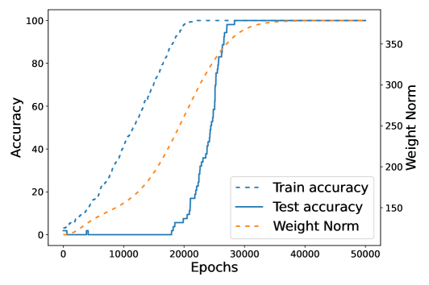

# Нейронное касательное ядро (neural tangent kernel, NTK)
[Разрежённая подсеть / lottery ticket](sparse-subnetwork-lottery-ticket.md) ← предыдущая карточка, следующая → [Маршрутизация внимания](attention-routing-heads.md)

[Индекс карточек понятий](index.md), категория: [2. Механизмы и представления](index.md#cat-2)\
→ Следующая категория: [3. Задачи и наборы данных](modular-arithmetic.md)\
← Предыдущая категория: [1. Явления](grokking.md)

## Определение

Нейронное касательное ядро (NTK) — это ядро, к которому сводится обучение
нейросети в «ленивом» (линеаризованном) режиме: если сеть аппроксимировать
линейной по параметрам моделью вокруг начальной точки, то градиентный спуск
эквивалентен ядровому методу с ядром `K(x, x′) = ∇wf(x)·∇wf(x′)`, вычисленным
на инициализации. В теории [грокинга](grokking.md) NTK ввели как объект,
задающий начальную (запоминающую) фазу: при квадратичной ошибке решение,
которое сеть находит в этом режиме, есть в точности ядровая регрессия с
начальным NTK \[[1.1](#ref-1-1)\].

## Детализация

NTK пришёл в исследования грокинга как инструмент, отделяющий «запоминание» от
«обобщения». Ключевая гипотеза (Kumar et al.) состоит в том, что грокинг — это
переход из **ленивого режима** (lazy regime; сеть меняет выход, почти не меняя
своих внутренних признаков, то есть `∇wf` остаётся приблизительно постоянным)
в **богатый режим** (rich / feature-learning regime; сеть перестраивает
признаки под задачу) \[[1.1](#ref-1-1)\]. В ленивом режиме сеть ведёт себя как
ядровой предиктор с фиксированным начальным NTK, поэтому ранняя фаза
воспроизводит [фазу запоминания](memorization-phase.md): сеть подгоняет
обучающую выборку, но плохо обобщает, а поздний скачок обобщения — это выход из
линеаризованного приближения. Такой взгляд связывает грокинг с более широким
кругом явлений: с резкостью
позднего скачка ([фазовый переход](phase-transition.md)),
с трактовкой грокинга как примера внезапного возникновения способностей
([emergence](emergence.md)) и с наблюдением Davies et al. о родстве грокинга и
[двойного спуска](double-descent.md) как явлений о скорости, с которой
осваиваются паттерны разной сложности \[[1.1](#ref-1-1)\]. При этом наличие
[слингшота](slingshot.md) или адаптивного [оптимизатора](optimizer-adam-adamw-sgd.md) для грокинга не
обязательно: механизм формулируется через NTK и не требует ни распада нормы
весов, ни аномалий Adam \[[1.1](#ref-1-1)\].

Насколько «выровнено» начальное NTK с задачей, измеряют через **выравнивание
ядра с задачей** (task-model kernel alignment), которое в общем случае берут как
центрированное ядровое выравнивание CKA (centered-kernel alignment) — скалярную
меру согласованности старших собственных векторов ядра с целевыми метками. Это
величина играет роль **[параметра порядка](order-parameter.md)** (order parameter; в духе статфизики —
скаляр, чьё изменение отмечает смену режима): при низком выравнивании линейная
ядровая модель заведомо плоха на задаче, и обобщение откладывается до тех пор,
пока сеть не выучит признаки \[[1.1](#ref-1-1)\]. Позднейшие работы уточняют и
поддерживают эту картину. Mohamadi et al. отслеживают эмпирическое ядро **eNTK**
(empirical NTK — конечноширинную оценку NTK по градиентам выхода на данных) и
показывают, что оно почти не меняется до переобучения и резко меняется после,
подтверждая, что основное [обучение признаков](feature-emergence-feature-learning.md) происходит уже за пределами
ядрового режима \[[3.1](#ref-3-1)\]. Jiang et al. добавляют к этой картине
**[спектральное смещение](frequency-principle-spectral-bias.md)** (spectral bias — склонность сети сначала выучивать
низкочастотные компоненты) как причину, удерживающую сеть в ленивом NTK-режиме,
и показывают, что предобусловленный (Гаусс — Ньютон) спуск равномерно исследует
моды NTK и сжимает задержку грокинга \[[3.2](#ref-3-2)\].

## Альтернативные определения и нюансы

### A. NTK как ядро линеаризованной модели

Первое, «механическое» определение: NTK — это грам-матрица градиентов выхода
сети по параметрам, взятых на инициализации; в ленивом режиме сеть эквивалентна
линейной по параметрам модели, а при MSE её обучающий минимум совпадает с
ядровой регрессией на этом ядре \[[1.1](#ref-1-1)\]. Отличительная машинерия
здесь — **фиксированность ядра во времени**: пока `∇wf` не меняется, ядро равно
начальному NTK, и обучение признаков (feature learning) определяется именно как
уход сети с этого линеаризованного подпространства. Именно поэтому «запоминающее»
решение грокинга отождествляют с ранней ленивой динамикой.

### B. NTK-выравнивание как параметр порядка грокинга

Второе определение фокусируется не на самом ядре, а на его **согласованности с
задачей**. У Kumar et al. управляющих параметров два: [скорость обучения](learning-rate.md) признаков
(параметр лености α, масштабирующий выход сети) и начальное выравнивание NTK с
метками (в общей форме — CKA) \[[1.1](#ref-1-1)\]. Отличие от трактовки A: здесь
NTK интересен не как фиксированное ядро, а как источник **параметра порядка** —
грокинг возникает, когда старшие собственные векторы начального NTK и метки
рассогласованы, но данных достаточно, чтобы обобщение всё же стало возможным
\[[1.1](#ref-1-1)\]. Тестируемое следствие, отделяющее эту рамку от прочих:
ухудшение начального выравнивания усиливает и удлиняет грокинг, а не устраняет
его.

### Поддерживают

Mohamadi et al. поддерживают рамку «ядро → богатый режим», но сдвигают источник
трудности. Ключевое отличие их трактовки: провал ядрового режима на модульном
сложении — это не случайное низкое выравнивание конкретной сети, а
**свойство самой задачи через перестановочную эквивариантность** (permutation
equivariance — инвариантность обучающего алгоритма к перестановкам символов):
ни один перестановочно-эквивариантный ядровой метод не обобщает, пока не увидит
постоянную долю всех возможных данных, хотя то же ядро способно достичь нулевой
ошибки на обучении \[[3.1](#ref-3-1)\]. Эмпирически они подтверждают переход,
измеряя резкий рост изменения eNTK сразу после переобучения \[[3.1](#ref-3-1)\].

Jiang et al. поддерживают ту же гипотезу с оптимизационной стороны. Их
отличительный механизм — **спектральное смещение**: медленная сходимость мод с
малыми собственными значениями NTK удерживает сеть в ленивом режиме, а
предобусловленный спуск (Levenberg — Marquardt, Gauss — Newton), выравнивая
скорость сходимости всех мод, равномерно исчерпывает NTK-подпространство и почти
устраняет задержку грокинга; это они прочитывают как прямое свидетельство того,
что грокинг есть переходное поведение между ленивым NTK-режимом и богатым
\[[3.2](#ref-3-2)\].

Cullen et al. подходят с третьей стороны — со стороны меры сложности решения.
Отличительная машинерия здесь — местный коэффициент обучения (LLC, величина
байесовской теории особого обучения): для линеаризации по NTK он выражается
через ранг матрицы Фишера, то есть ровно вдвое меньше числа направлений, в
которых модель на самом деле меняется \[[3.3](#ref-3-3)\]. Это привязывает
ленивый режим к чему-то счётному: пока сеть остаётся ядровой, её сложность
задана рангом ядра, и переход в богатый режим виден как расхождение LLC с этой
ядровой оценкой.

## Ссылки

###### ref-1-1
**\[1.1\]** 2310.06110 — Kumar et al., «Grokking as the transition from lazy to rich training dynamics». [`"It can thus be recast as a kernel method with the neural tangent kernel K"`](../papers/2310.06110.grokking-as-the-transition-from-lazy-to-rich-training-dynamics/original/2310.06110.grokking-as-the-transition-from-lazy-to-rich-training-dynamics.md#p4-5). *«[Поэтому его можно переписать как ядровой метод с нейронным касательным ядром $K$](../papers/2310.06110.grokking-as-the-transition-from-lazy-to-rich-training-dynamics/2310.06110.grokking-as-the-transition-from-lazy-to-rich-training-dynamics.card.md#p4-5)»*\
Доп. (управляющий параметр — выравнивание): [`"The task-model kernel alignment between the neural tangent kernel (NTK) of the network at initialization and the test labels"`](../papers/2310.06110.grokking-as-the-transition-from-lazy-to-rich-training-dynamics/original/2310.06110.grokking-as-the-transition-from-lazy-to-rich-training-dynamics.md#p2-4). *«[согласованность ядра задачи и модели между нейронным касательным ядром (NTK) сети при инициализации и тестовыми метками](../papers/2310.06110.grokking-as-the-transition-from-lazy-to-rich-training-dynamics/2310.06110.grokking-as-the-transition-from-lazy-to-rich-training-dynamics.card.md#p2-4)»*\
Доп. (условие грокинга): [`"the top eigenvectors of the initial neural tangent kernel and the task labels y(x) are misaligned"`](../papers/2310.06110.grokking-as-the-transition-from-lazy-to-rich-training-dynamics/original/2310.06110.grokking-as-the-transition-from-lazy-to-rich-training-dynamics.md#p1-3). *«[старшие собственные векторы исходного нейронного касательного ядра и метки задачи $y(x)$ рассогласованы](../papers/2310.06110.grokking-as-the-transition-from-lazy-to-rich-training-dynamics/2310.06110.grokking-as-the-transition-from-lazy-to-rich-training-dynamics.card.md#p1-3)»*\
Доп. (запоминание = ленивая динамика): [`"the “memorizing” solutions that have been documented in prior works on grokking are equivalent to early-time lazy training dynamics"`](../papers/2310.06110.grokking-as-the-transition-from-lazy-to-rich-training-dynamics/original/2310.06110.grokking-as-the-transition-from-lazy-to-rich-training-dynamics.md#p4-2). *«[«запоминающие» решения, задокументированные в прежних работах о гроккинге, равносильны ленивой динамике обучения на ранних временах](../papers/2310.06110.grokking-as-the-transition-from-lazy-to-rich-training-dynamics/2310.06110.grokking-as-the-transition-from-lazy-to-rich-training-dynamics.card.md#p4-2)»*

###### ref-1-2
**\[1.2\]** 2411.00247 — Jeffares, Curth, van der Schaar, «Deep Learning Through A Telescoping Lens: A Simple Model Provides Empirical Insights On Grokking, Gradient Boosting & Beyond». Даёт способ пользоваться касательным ядром, не принимая допущения о лености: линеаризация применяется заново на каждом шаге и телескопируется вдоль траектории, отчего приближение точнее разложения вокруг $\boldsymbol{\theta}_{0}$ на порядки. Нюанс: инструмент объявлен средством опытного разбора, а не способом обучать сети, и требует градиентов по каждому обучающему и тестовому примеру на каждом шаге. [`"Instead of applying the approximation across the entire training trajectory at once as in $\textstyle f^{lin}_{\boldsymbol{\theta}_{T}}(\mathbf{x})$, we consider using it *incrementally* at each batch update during training"`](../papers/2411.00247.deep-learning-through-a-telescoping-lens-a-simple-model-provides-empirical-insights-on-grokking-gradient-boosting-and-beyond/original/2411.00247.deep-learning-through-a-telescoping-lens-a-simple-model-provides-empirical-insights-on-grokking-gradient-boosting-and-beyond.md#p3-1). *«[Вместо того чтобы применять приближение сразу ко всей траектории обучения, как в $\textstyle f^{lin}_{\boldsymbol{\theta}_{T}}(\mathbf{x})$, мы рассматриваем его *пошаговое* применение при каждом обновлении по партии в ходе обучения](../papers/2411.00247.deep-learning-through-a-telescoping-lens-a-simple-model-provides-empirical-insights-on-grokking-gradient-boosting-and-beyond/2411.00247.deep-learning-through-a-telescoping-lens-a-simple-model-provides-empirical-insights-on-grokking-gradient-boosting-and-beyond.card.md#p3-1)»*\
Доп. (насколько точнее): [`"iteratively telescoping out the updates instead improves the approximation *by orders of magnitude*"`](../papers/2411.00247.deep-learning-through-a-telescoping-lens-a-simple-model-provides-empirical-insights-on-grokking-gradient-boosting-and-beyond/original/2411.00247.deep-learning-through-a-telescoping-lens-a-simple-model-provides-empirical-insights-on-grokking-gradient-boosting-and-beyond.md#p4-1) — *«[пошаговое телескопирование обновлений вместо этого улучшает приближение *на порядки величины*](../papers/2411.00247.deep-learning-through-a-telescoping-lens-a-simple-model-provides-empirical-insights-on-grokking-gradient-boosting-and-beyond/2411.00247.deep-learning-through-a-telescoping-lens-a-simple-model-provides-empirical-insights-on-grokking-gradient-boosting-and-beyond.card.md#p4-1)»*\
Доп. (родство с градиентным бустингом): [`"the telescoping model of a neural network and GBTs have *identical* structure and differ only in their used kernel!"`](../papers/2411.00247.deep-learning-through-a-telescoping-lens-a-simple-model-provides-empirical-insights-on-grokking-gradient-boosting-and-beyond/original/2411.00247.deep-learning-through-a-telescoping-lens-a-simple-model-provides-empirical-insights-on-grokking-gradient-boosting-and-beyond.md#p7-2) — *«[телескопическая модель нейронной сети и GBT имеют *тождественное* строение и различаются лишь используемым ядром!](../papers/2411.00247.deep-learning-through-a-telescoping-lens-a-simple-model-provides-empirical-insights-on-grokking-gradient-boosting-and-beyond/2411.00247.deep-learning-through-a-telescoping-lens-a-simple-model-provides-empirical-insights-on-grokking-gradient-boosting-and-beyond.card.md#p7-2)»*\
Доп. (сглаживатель приспосабливающийся, а не линейный): [`"The smoother implied by the telescoping model is *not* necessarily a linear smoother because $\mathbf{S}_{\boldsymbol{\theta}_{T}}$ can depend on $\mathbf{y}$ through changes in gradients during training"`](../papers/2411.00247.deep-learning-through-a-telescoping-lens-a-simple-model-provides-empirical-insights-on-grokking-gradient-boosting-and-beyond/original/2411.00247.deep-learning-through-a-telescoping-lens-a-simple-model-provides-empirical-insights-on-grokking-gradient-boosting-and-beyond.md#p21-6) — *«[Сглаживатель, подразумеваемый телескопической моделью, *не* обязательно есть линейный сглаживатель, потому что $\mathbf{S}_{\boldsymbol{\theta}_{T}}$ может зависеть от $\mathbf{y}$ через изменения градиентов в ходе обучения](../papers/2411.00247.deep-learning-through-a-telescoping-lens-a-simple-model-provides-empirical-insights-on-grokking-gradient-boosting-and-beyond/2411.00247.deep-learning-through-a-telescoping-lens-a-simple-model-provides-empirical-insights-on-grokking-gradient-boosting-and-beyond.card.md#p21-6)»*.

###### ref-1-3
**\[1.3\]** 2406.06158 — Kunin et al., «Get rich quick: exact solutions reveal how unbalanced initializations promote rapid feature learning». Нюанс: динамика в пространстве функций записана как предобусловленный градиентный поток $\dot{\beta}=-MX^{\intercal}\rho$, где $M$ выражена через $\beta$ и $\delta$ в замкнутом виде и она же характеризует NTK-матрицу; три предела $M$ дают ленивый, богатый и отложенный богатый режимы. В кусочно-линейной сети NTK зависит уже и от матрицы активаций $C$, и именно это разведение позволяет показать, что раннее движение NTK связано с изменением образцов активации, а не с движением параметров. [`"Thus, understanding the evolution of $M$ along the trajectory $\beta_{0}$ to $\beta_{*}$ offers a method to discern between lazy and rich learning."`](../papers/2406.06158.get-rich-quick-exact-solutions-reveal-how-unbalanced-initializations-promote-rapid-feature-learning/2406.06158.get-rich-quick-exact-solutions-reveal-how-unbalanced-initializations-promote-rapid-feature-learning.card.md#p6-3). *«[Тем самым понимание эволюции $M$ вдоль траектории от $\beta_{0}$ к $\beta_{*}$ даёт способ различать ленивое и богатое обучение](../papers/2406.06158.get-rich-quick-exact-solutions-reveal-how-unbalanced-initializations-promote-rapid-feature-learning/2406.06158.get-rich-quick-exact-solutions-reveal-how-unbalanced-initializations-promote-rapid-feature-learning.card.md#p6-3)»*
## Ссылки на присоединившиеся работы

### Поддерживают

###### ref-3-1
**\[3.1\]** 2407.12332 — Mohamadi et al., «Why Do You Grok? A Theoretical Analysis of Grokking Modular Addition». Поддерживает: провал ядрового режима на модульном сложении задан симметрией задачи, а не случайным выравниванием. [`"permutation-equivariant networks which are well-approximated by their neural tangent kernel approximation cannot generalize well"`](../papers/2407.12332.why-do-you-grok-a-theoretical-analysis-of-grokking-modular-addition/original/2407.12332.why-do-you-grok-a-theoretical-analysis-of-grokking-modular-addition.md#p3-4). *«[перестановочно-эквивариантные сети, хорошо приближаемые своим приближением нейронного касательного ядра, генерализовать не могут](../papers/2407.12332.why-do-you-grok-a-theoretical-analysis-of-grokking-modular-addition/2407.12332.why-do-you-grok-a-theoretical-analysis-of-grokking-modular-addition.card.md#p3-4)»*\
Доп. (определение eNTK): [`"gradient descent in over-parameterized neural networks locally approximates the behavior of a kernel model using the empirical neural tangent kernel (eNTK)"`](../papers/2407.12332.why-do-you-grok-a-theoretical-analysis-of-grokking-modular-addition/original/2407.12332.why-do-you-grok-a-theoretical-analysis-of-grokking-modular-addition.md#p6-1). *«[градиентный спуск в перепараметризованных нейросетях локально приближает поведение ядровой модели с эмпирическим нейронным касательным ядром (eNTK)](../papers/2407.12332.why-do-you-grok-a-theoretical-analysis-of-grokking-modular-addition/2407.12332.why-do-you-grok-a-theoretical-analysis-of-grokking-modular-addition.card.md#p6-1)»*\
Доп. (эмпирика перехода): [`"the change in empirical NTK is orders of magnitude larger after overfitting the training set, implying that most feature learning happens only later"`](../papers/2407.12332.why-do-you-grok-a-theoretical-analysis-of-grokking-modular-addition/original/2407.12332.why-do-you-grok-a-theoretical-analysis-of-grokking-modular-addition.md#p10-1). *«[изменение эмпирического NTK на порядки больше после переобучения на обучающем наборе, откуда следует, что бо́льшая часть обучения признакам происходит лишь позднее](../papers/2407.12332.why-do-you-grok-a-theoretical-analysis-of-grokking-modular-addition/2407.12332.why-do-you-grok-a-theoretical-analysis-of-grokking-modular-addition.card.md#p10-1)»*\
Доп. (тезис): [`"our results strongly support the case for grokking as a consequence of the transition from kernel-like behavior to limiting behavior of gradient descent on deep networks"`](../papers/2407.12332.why-do-you-grok-a-theoretical-analysis-of-grokking-modular-addition/original/2407.12332.why-do-you-grok-a-theoretical-analysis-of-grokking-modular-addition.md#p1-2). *«[наши результаты сильно поддерживают взгляд на гроккинг как на следствие перехода от ядроподобного поведения к предельному поведению градиентного спуска в глубоких сетях](../papers/2407.12332.why-do-you-grok-a-theoretical-analysis-of-grokking-modular-addition/2407.12332.why-do-you-grok-a-theoretical-analysis-of-grokking-modular-addition.card.md#p1-2)»*

###### ref-3-2
**\[3.2\]** 2601.03162 — Jiang et al., «On the convergence behavior of preconditioned gradient descent toward the rich learning regime». Поддерживает: спектральное смещение удерживает сеть в NTK-режиме; предобусловливание сжимает задержку грокинга. [`"grokking represents a transitional behavior between the lazy regime characterized by the NTK and the rich regime"`](../papers/2601.03162.on-the-convergence-behavior-of-preconditioned-gradient-descent-toward-the-rich-learning-regime/2601.03162.on-the-convergence-behavior-of-preconditioned-gradient-descent-toward-the-rich-learning-regime.card.md#p1-2). *«[гроккинг есть переходное поведение между ленивым режимом, описываемым NTK, и богатым](../papers/2601.03162.on-the-convergence-behavior-of-preconditioned-gradient-descent-toward-the-rich-learning-regime/2601.03162.on-the-convergence-behavior-of-preconditioned-gradient-descent-toward-the-rich-learning-regime.card.md#p1-2)»*\
Доп. (NTK как объяснение спектрального смещения): [`"One explanation of spectral bias is through the lens of the neural tangent kernels (NTKs)"`](../papers/2601.03162.on-the-convergence-behavior-of-preconditioned-gradient-descent-toward-the-rich-learning-regime/2601.03162.on-the-convergence-behavior-of-preconditioned-gradient-descent-toward-the-rich-learning-regime.card.md#p1-4). *«[Одно из объяснений спектрального смещения даётся сквозь призму нейронных касательных ядер (NTK)](../papers/2601.03162.on-the-convergence-behavior-of-preconditioned-gradient-descent-toward-the-rich-learning-regime/2601.03162.on-the-convergence-behavior-of-preconditioned-gradient-descent-toward-the-rich-learning-regime.card.md#p1-4)»*\
Доп. (подкрепление теорий): [`"This supports recent theories proposed by (Kumar et al., 2024; Zhou et al., 2024), that overfitting or adaptivity are not the main reason for grokking"`](../papers/2601.03162.on-the-convergence-behavior-of-preconditioned-gradient-descent-toward-the-rich-learning-regime/2601.03162.on-the-convergence-behavior-of-preconditioned-gradient-descent-toward-the-rich-learning-regime.card.md#p7-2). *«[Это подкрепляет недавние теории (Kumar et al., 2024; Zhou et al., 2024), по которым ни переобучение, ни приспособляемость не суть главные причины гроккинга](../papers/2601.03162.on-the-convergence-behavior-of-preconditioned-gradient-descent-toward-the-rich-learning-regime/2601.03162.on-the-convergence-behavior-of-preconditioned-gradient-descent-toward-the-rich-learning-regime.card.md#p7-2)»*

###### ref-3-3
**\[3.3\]** 2603.01192 — Cullen et al., «A Basin-Selection Perspective on Grokking via Singular Learning Theory». Поддерживает: для линеаризации NTK LLC равен половине ранга матрицы Фишера. [`"In particular, if $\mathcal{I}$ is full rank ($r=\tilde{d}$), the model is regular and $\lambda=\tilde{d}/2$; if $r<\tilde{d}$, the model is singular but still has $\lambda=r/2$."`](../papers/2603.01192.a-basin-selection-perspective-on-grokking-via-singular-learning-theory/2603.01192.a-basin-selection-perspective-on-grokking-via-singular-learning-theory.card.md#p6-11) — *«[В частности, если $\mathcal{I}$ полного ранга ($r=\tilde{d}$), модель регулярна и $\lambda=\tilde{d}/2$; если же $r<\tilde{d}$, модель сингулярна, но по-прежнему $\lambda=r/2$.](../papers/2603.01192.a-basin-selection-perspective-on-grokking-via-singular-learning-theory/2603.01192.a-basin-selection-perspective-on-grokking-via-singular-learning-theory.card.md#p6-11)»*

**\[3.4\]** 2604.00316 — Tomàs, Mallinar, Belkin, «Breaking Data Symmetry is Needed For Generalization in Feature Learning Kernels». Поддерживает: перестановочно эквивариантные ядра на модульной арифметике обобщать не способны. [`"permutation equivariant kernel methods cannot generalize on modular arithmetic tasks, and that neural networks grok when they leave the kernel regime and learn features"`](../papers/2604.00316.breaking-data-symmetry-is-needed-for-generalization-in-feature-learning-kernels/original/2604.00316.breaking-data-symmetry-is-needed-for-generalization-in-feature-learning-kernels.md#p8-5) — *«[перестановочно эквивариантные ядерные приёмы не способны обобщать на задачах модульной арифметики и что нейронные сети гроккают, покидая ядерный режим и выучивая признаки](../papers/2604.00316.breaking-data-symmetry-is-needed-for-generalization-in-feature-learning-kernels/2604.00316.breaking-data-symmetry-is-needed-for-generalization-in-feature-learning-kernels.card.md#p8-5)»*

## Цитирования

**\[4.1\]** 2310.02541 — Xu et al. 2023. Нюанс: NTK помянут один раз и только применительно к Wei+19; собственная динамика в терминах ядра не разбирается, ядро не вычисляется, режим сети не классифицируется. [`"have better sample complexity guarantees than neural networks in the neural tangent kernel (NTK) regime in this setting"`](../papers/2310.02541.benign-overfitting-and-grokking-in-relu-networks-for-xor-cluster-data/original/2310.02541.benign-overfitting-and-grokking-in-relu-networks-for-xor-cluster-data.md#p3-3). *«[имеют в этой постановке лучшие гарантии выборочной сложности, чем нейросети в режиме нейронного касательного ядра (NTK)](../papers/2310.02541.benign-overfitting-and-grokking-in-relu-networks-for-xor-cluster-data/2310.02541.benign-overfitting-and-grokking-in-relu-networks-for-xor-cluster-data.card.md#p3-3)»*

**\[4.2\]** 2310.16441 — Levi et al. 2023. Нюанс: NTK привлечён, чтобы обосновать перенос линейных результатов на сеть с $\tanh$ при большой ширине; ядро не измеряется, ширина перехода не проверяется, вся проверка — один рисунок. [`"we expect the network to begin to linearize, eventually converging to the Neural Tangent Kernel (NTK) regime [9]"`](../papers/2310.16441.grokking-in-linear-estimators-a-solvable-model-that-groks-without-understanding/original/2310.16441.grokking-in-linear-estimators-a-solvable-model-that-groks-without-understanding.md#p10-3). *«[мы ожидаем, что сеть начнёт линеаризоваться, в конце концов сходясь к режиму нейронного касательного ядра (NTK) [9]](../papers/2310.16441.grokking-in-linear-estimators-a-solvable-model-that-groks-without-understanding/2310.16441.grokking-in-linear-estimators-a-solvable-model-that-groks-without-understanding.card.md#p10-3)»*

###### ref-3-5
**\[3.5\]** 2207.08799 — Barak et al., «Hidden Progress in Deep Learning: SGD Learns Parities Near the Computational Limit». Нюанс: NTK взят предметом теоремы о невозможности (теорема 5), а не режимом динамики; языка перехода lazy→rich в работе нет. [`"our low-width results lie outside the NTK regime, which requires far larger models (size $n^{\Omega(k)}$) to express parities"`](../papers/2207.08799.hidden-progress-in-deep-learning-sgd-learns-parities-near-the-computational-limit/2207.08799.hidden-progress-in-deep-learning-sgd-learns-parities-near-the-computational-limit.card.md#p8-6). *«[наши результаты при малой ширине лежат вне режима NTK, который требует куда больших моделей (размера $n^{\Omega(k)}$) для выражения чётностей](../papers/2207.08799.hidden-progress-in-deep-learning-sgd-learns-parities-near-the-computational-limit/2207.08799.hidden-progress-in-deep-learning-sgd-learns-parities-near-the-computational-limit.card.md#p8-6)»*\
Доп. (авторская оговорка о цене): [`"the NTK analysis does give better sample complexity guarantees than the ones presented in this work, with a somewhat more natural version of SGD"`](../papers/2207.08799.hidden-progress-in-deep-learning-sgd-learns-parities-near-the-computational-limit/2207.08799.hidden-progress-in-deep-learning-sgd-learns-parities-near-the-computational-limit.card.md#p19-6) — *«[разбор через NTK даёт лучшие гарантии выборочной сложности, чем представленные в этой работе, при несколько более естественном варианте SGD](../papers/2207.08799.hidden-progress-in-deep-learning-sgd-learns-parities-near-the-computational-limit/2207.08799.hidden-progress-in-deep-learning-sgd-learns-parities-near-the-computational-limit.card.md#p19-6)»*.

###### ref-3-6
**\[3.6\]** 2311.18817 — Lyu et al., «Dichotomy of Early and Late Phase Implicit Biases Can Provably Induce Grokking». Поддерживает: ядерный режим держится не малостью смещения весов, а большим множителем $\alpha^{L}e^{-L\lambda t}$ при экспоненциально падающей норме. Нюанс: NTK здесь — признак $\nabla f(\bar{{\boldsymbol{\theta}}}_{\mathrm{init}};{\boldsymbol{x}})$ конечной модели, асимптотика ведётся по масштабу инициализации, а не по ширине; эмпирического NTK работа не измеряет. [`"our result is qualitatively different from existing NTK analyses in that in our setting, the weight norm changes significantly (due to weight decay), while in the usual NTK regime, the weight changes only by a small amount, and so does its norm"`](../papers/2311.18817.dichotomy-of-early-and-late-phase-implicit-biases-can-provably-induce-grokking/original/2311.18817.dichotomy-of-early-and-late-phase-implicit-biases-can-provably-induce-grokking.md#p2-5). *«[наш результат качественно отличается от существующих NTK-разборов тем, что в нашей постановке норма весов значительно меняется (из-за затухания весов), тогда как в обычном NTK-режиме веса меняются лишь на малую величину, а с ними и их норма](../papers/2311.18817.dichotomy-of-early-and-late-phase-implicit-biases-can-provably-induce-grokking/2311.18817.dichotomy-of-early-and-late-phase-implicit-biases-can-provably-induce-grokking.card.md#p2-5)»*\
Доп. (техническая находка): [`"the norm of ${\boldsymbol{\theta}}(t;\alpha\bar{{\boldsymbol{\theta}}}_{\mathrm{init}})$ decays but the direction remains close to $\bar{{\boldsymbol{\theta}}}_{\mathrm{init}}$"`](../papers/2311.18817.dichotomy-of-early-and-late-phase-implicit-biases-can-provably-induce-grokking/original/2311.18817.dichotomy-of-early-and-late-phase-implicit-biases-can-provably-induce-grokking.md#p6-3) — *«[норма ${\boldsymbol{\theta}}(t;\alpha\bar{{\boldsymbol{\theta}}}_{\mathrm{init}})$ убывает, а направление остаётся близким к $\bar{{\boldsymbol{\theta}}}_{\mathrm{init}}$](../papers/2311.18817.dichotomy-of-early-and-late-phase-implicit-biases-can-provably-induce-grokking/2311.18817.dichotomy-of-early-and-late-phase-implicit-biases-can-provably-induce-grokking.card.md#p6-3)»*.

**\[4.3\]** 2505.20172 — Boursier et al., «A Theoretical Framework for Grokking: Interpolation followed by Riemannian Norm Minimisation». Лишь упоминает: NTK входит как словарь для описания большой инициализации, ни ядра, ни его постоянства, ни отклонения от линеаризации не вычисляется. [`"large initialisation scales give rise to the lazy or NTK regime, where features change little during training"`](../papers/2505.20172.a-theoretical-framework-for-grokking-interpolation-followed-by-riemannian-norm-minimisation/2505.20172.a-theoretical-framework-for-grokking-interpolation-followed-by-riemannian-norm-minimisation.card.md#p7-11). *«[большие масштабы инициализации порождают ленивый, или NTK-режим, где признаки мало меняются во время обучения](../papers/2505.20172.a-theoretical-framework-for-grokking-interpolation-followed-by-riemannian-norm-minimisation/2505.20172.a-theoretical-framework-for-grokking-interpolation-followed-by-riemannian-norm-minimisation.card.md#p7-11)»*

**\[4.4\]** 2408.11804 — Yunis et al., «Approaching Deep Learning through the Spectral Dynamics of Weights». Нюанс: NTK помянут во введении как пример «более отвлечённого объекта», которому, по мнению авторов, недостаёт разрешения и предсказательной силы по сравнению с прямым разбором весов; это оценочное замечание, а не результат — NTK в работе не вычисляется. [`"they often focus on more abstract objects like the gram matrix (Huh et al. 2022) or NTK (Fort et al. 2020), and thus do not have the granularity and predictive power of the previous two categories"`](../papers/2408.11804.approaching-deep-learning-through-the-spectral-dynamics-of-weights/original/2408.11804.approaching-deep-learning-through-the-spectral-dynamics-of-weights.md#p1-5). *«[они нередко сосредоточены на более отвлечённых объектах вроде грам-матрицы (Huh et al. 2022) или NTK (Fort et al. 2020) и потому не обладают разрешением и предсказательной силой двух предыдущих разрядов](../papers/2408.11804.approaching-deep-learning-through-the-spectral-dynamics-of-weights/2408.11804.approaching-deep-learning-through-the-spectral-dynamics-of-weights.card.md#p1-5)»*

**\[4.5\]** 2507.20057 — Lyle et al., «What Can Grokking Teach Us About Learning Under Nonstationarity?». Лишь упоминает: NTK входит как словарь для перечня трёх величин, задающих режим при инициализации (начальная норма параметров, скорость обучения, множитель выходов слоя). Никакого ядра работа не вычисляет и утверждений о ширине не проверяет. [`"the neural tangent kernel regime (Jacot et al. 2018) maintains a fixed kernel throughout training, enabling $O(1)$ change in the network outputs by balancing the vanishing parameter updates with growth in the network Jacobian"`](../papers/2507.20057.what-can-grokking-teach-us-about-learning-under-nonstationarity/original/2507.20057.what-can-grokking-teach-us-about-learning-under-nonstationarity.md#p4-6). *«[режим нейронного касательного ядра (Jacot et al. 2018) удерживает ядро закреплённым на всём обучении, обеспечивая изменение выходов сети порядка $O(1)$ за счёт уравновешивания исчезающих обновлений параметров ростом якобиана сети](../papers/2507.20057.what-can-grokking-teach-us-about-learning-under-nonstationarity/2507.20057.what-can-grokking-teach-us-about-learning-under-nonstationarity.card.md#p4-6)»*

**\[4.6\]** 2503.10483 — Pomarico et al., «Grokking as an entanglement transition in tensor network machine learning». Нюанс: пересказ линии Liu et al. 2022 и Zhang et al. 2023; своей картины перехода с ней авторы не сопоставляют, работа Guo & Draper о NTK для MPS цитируется в другом месте и по другому поводу. [`"In the quantum context, grokking manifests as a dynamical phase transition between frozen-kernel and frozen-error phases, characterized by a transcritical bifurcation"`](../papers/2503.10483.grokking-as-an-entanglement-transition-in-tensor-network-machine-learning/2503.10483.grokking-as-an-entanglement-transition-in-tensor-network-machine-learning.card.md#p2-5). *«[В квантовом контексте гроккинг проявляется как динамический фазовый переход между фазами замороженного ядра и замороженной ошибки, отличающийся транскритической бифуркацией](../papers/2503.10483.grokking-as-an-entanglement-transition-in-tensor-network-machine-learning/2503.10483.grokking-as-an-entanglement-transition-in-tensor-network-machine-learning.card.md#p2-5)»*

**\[4.7\]** 2602.06702 — Singh, Misra, Orvieto, «Explaining Grokking in Transformers…». [`"in the lazy regime, the network drifts negligibly from its NTK at initialization"`](../papers/2602.06702.explaining-grokking-in-transformers-through-the-lens-of-inductive-bias/2602.06702.explaining-grokking-in-transformers-through-the-lens-of-inductive-bias.card.md#p12-1). *«[в ленивом режиме сеть пренебрежимо мало отходит от своего NTK при инициализации](../papers/2602.06702.explaining-grokking-in-transformers-through-the-lens-of-inductive-bias/2602.06702.explaining-grokking-in-transformers-through-the-lens-of-inductive-bias.card.md#p12-1)»* Работа спорит с лениво-богатым истолкованием гроккинга, но эту величину не измеряет ни разу.

**\[4.8\]** 2605.08237 — Wang, Ying, Kanamori 2026, «Distributional Spectral Diagnostics for Localizing Grokking Transitions». Нюанс: Jacot et al. стоят одним номером в перечне линий описания обучения; NTK в работе не вычисляется. [`"distinct lazy/rich regimes [16, 6, 17, 45], with the precise scaling determining whether feature learning occurs [46]"`](../papers/2605.08237.distributional-spectral-diagnostics-for-localizing-grokking-transitions/2605.08237.distributional-spectral-diagnostics-for-localizing-grokking-transitions.card.md#p31-2). *«[различных ленивом/богатом режимах [16, 6, 17, 45], причём точное масштабирование определяет, происходит ли обучение признакам [46]](../papers/2605.08237.distributional-spectral-diagnostics-for-localizing-grokking-transitions/2605.08237.distributional-spectral-diagnostics-for-localizing-grokking-transitions.card.md#p31-2)»*

###### ref-3-7
**\[3.7\]** 2506.12284 — Walker et al., «GrokAlign: Geometric Characterisation and Acceleration of Grokking». Предлагает ядру дешёвый заменитель: Теорема 9 связывает производную по времени скалярного произведения точки с её центроидом со взвешенной суммой ядра этой точки с обучающими точками, а центроид считается одним якобиан-векторным произведением. Нюанс: постановка узкая — двухслойная сеть без смещений, скалярный выход, кросс-энтропия, полнопакетный градиентный спуск; для векторного выхода (приложение A) связь с ядром не выписывается; эмпирическая проверка одна — одна точка двухклассового MNIST, и «область обучения признаков» на рисунке выделена без числового порога. [`"a changing inner product implies a dynamic neural tangent kernel, which corresponds to the feature learning regime of training"`](../papers/2506.12284.grokalign-geometric-characterisation-and-acceleration-of-grokking/original/2506.12284.grokalign-geometric-characterisation-and-acceleration-of-grokking.md#p5-6). *«[меняющееся скалярное произведение влечёт меняющееся нейронное касательное ядро, что отвечает режиму обучения признаков](../papers/2506.12284.grokalign-geometric-characterisation-and-acceleration-of-grokking/2506.12284.grokalign-geometric-characterisation-and-acceleration-of-grokking.card.md#p5-6)»*
###### ref-3-8
**\[3.8\]** 2309.03800 — Edelman, Goel, Kakade, Malach & Zhang 2023, «Pareto Frontiers in Neural Feature Learning: Data, Compute, Width, and Luck». Чётность как разделяющий случай: никакое фиксированное ядро не решает её выборочно-эффективно, а механизм статьи — параллельный отбор признаков по подсетям — прямо противопоставлен ядерному режиму, где переопределённость отбор признаков убирает. [`"it has been shown that the NTK (more generally, any fixed kernel) cannot achieve low $\ell_{2}$ error on the $(n,k)$-parity problem, unless the sample complexity grows as $\Omega(n^{k})$"`](../papers/2309.03800.pareto-frontiers-in-neural-feature-learning-data-compute-width-and-luck/2309.03800.pareto-frontiers-in-neural-feature-learning-data-compute-width-and-luck.card.md#p6-6). *«[показано, что NTK (шире — любое фиксированное ядро) не может достичь низкой $\ell_{2}$-ошибки на задаче $(n,k)$-чётности, если выборочная сложность не растёт как $\Omega(n^{k})$](../papers/2309.03800.pareto-frontiers-in-neural-feature-learning-data-compute-width-and-luck/2309.03800.pareto-frontiers-in-neural-feature-learning-data-compute-width-and-luck.card.md#p6-6)»*\
Доп. (противопоставление): [`"This departs significantly from the *neural tangent kernel* (Jacot et al., 2018) regime of function approximation with wide networks, in which overparameterization *removes* data-dependent feature selection (rather than parallelizing it across subnetworks)"`](../papers/2309.03800.pareto-frontiers-in-neural-feature-learning-data-compute-width-and-luck/2309.03800.pareto-frontiers-in-neural-feature-learning-data-compute-width-and-luck.card.md#p2-2) — *«[Это существенно расходится с режимом *нейронного касательного ядра* (Jacot et al., 2018) приближения функций широкими сетями, в котором переопределённость *убирает* зависящий от данных отбор признаков (а не распараллеливает его по подсетям)](../papers/2309.03800.pareto-frontiers-in-neural-feature-learning-data-compute-width-and-luck/2309.03800.pareto-frontiers-in-neural-feature-learning-data-compute-width-and-luck.card.md#p2-2)»*.

###### ref-3-9
**\[3.9\]** 2505.20076 — Eichin, Du, Mondorf, Matveev, Plank & Hedderich 2025, «ExPLAIND: Unifying Model, Data, and Training Attribution to Study Model Behavior». NTK как предельный случай измерительного средства: точное траекторное ядро (EPK) переформулирует обученную модель как ядерную машину и обобщает NTK по всей траектории обучения, с расширением на AdamW (мини-батчи, оба момента, расписание шага, развязанный weight decay). [`"This connects the EPK to the Neural Tangent Kernel (Jacot et al., 2018), which it generalizes over the training trajectory"`](../papers/2505.20076.explaind-unifying-model-data-and-training-attribution-to-study-model-behavior/2505.20076.explaind-unifying-model-data-and-training-attribution-to-study-model-behavior.card.md#p2-7). *«[Это связывает EPK с нейронным касательным ядром (Jacot et al., 2018), которое оно обобщает по траектории обучения](../papers/2505.20076.explaind-unifying-model-data-and-training-attribution-to-study-model-behavior/2505.20076.explaind-unifying-model-data-and-training-attribution-to-study-model-behavior.card.md#p2-7)»*.
