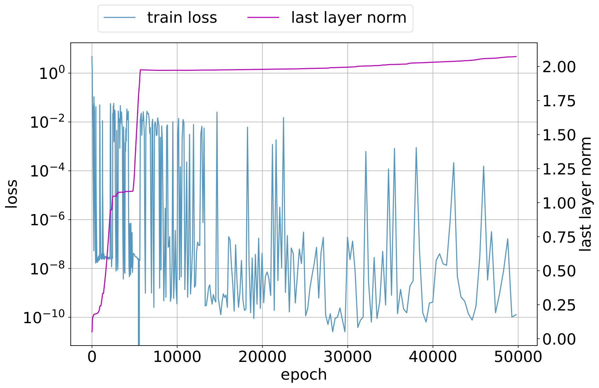

# Оптимизатор (optimizer: Adam / AdamW / SGD)

[Доля данных / критический размер набора](data-fraction-critical-dataset-size.md) ← предыдущая карточка, следующая → [Минимизация нормы весов](weight-norm-minimization.md)

[Индекс карточек понятий](index.md), категория: [4. Факторы обучения и оптимизации](index.md#cat-4)\
→ Следующая категория: [5. Интервенции и методы](gradient-low-pass-filtering.md)\
← Предыдущая категория: [3. Задачи и наборы данных](modular-arithmetic.md)

## Определение

**Оптимизатор** — алгоритм, который на каждом шаге обновляет веса нейросети по
градиентам функции потерь; он «критичен для успеха обучения, диктуя, насколько
быстро и эффективно модель сходится к решению» \[[5.1](#ref-5-1)\]↗. В корпусе
по [гроккингу](grokking.md) выбор оптимизатора — не нейтральная деталь настройки: уже в
исходной работе Power et al. показали, что «детали оптимизации» (тип
оптимизатора, [weight decay](weight-decay.md), темп обучения) существенно влияют на то, наступит
ли отложенная генерализация \[[1.1](#ref-1-1)\]. Практически повсеместно
применяются адаптивные оптимизаторы Adam и AdamW (реже — чистый SGD и новые
методы вроде Muon), и именно с аномалией адаптивных оптимизаторов на поздних
стадиях обучения Thilak et al. впервые связали механизм гроккинга
\[[1.2](#ref-1-2)\].

## Детализация

Оптимизаторы делятся на два семейства. Чистый SGD (stochastic gradient descent —
стохастический градиентный спуск) двигает все параметры с общим темпом,
пропорциональным градиенту. Адаптивные оптимизаторы Adam / AdamW назначают
каждому параметру собственный темп, нормируя шаг на бегущие оценки первого и
второго моментов градиента; AdamW дополнительно отвязывает weight decay
(регуляризацию, тянущую веса к нулю) от градиента потерь. Поскольку гроккинг в
классической постановке требует именно weight decay, оптимизатор и его связка с
регуляризацией оказываются в центре объяснений: Thilak et al. эмпирически
показали, что без явной регуляризации гроккинг почти исключительно возникает на
старте [слингшота](slingshot.md) — циклической аномалии адаптивных оптимизаторов, при которой
обучение периодически перескакивает между устойчивым и неустойчивым режимами
(в духе [Edge of Stability](edge-of-stability.md), «края устойчивости») \[[1.2](#ref-1-2)\]. Эту линию
поддерживают работы, трактующие саму динамику AdamW как драйвер перехода:
AdamW описывают как «варианс-гейтед» (управляемую дисперсией) стохастическую
систему, где накопление дисперсии градиента открывает доступ к обобщающему
решению \[[3.2](#ref-3-2)\], а адаптивный момент — как условие заметного
гроккинга даже там, где чистый градиентный спуск его не даёт
\[[3.3](#ref-3-3)\]. Однако интерпретация слингшота как внутренней динамики
оптимизатора оспаривается: показано, что скачки нормы вызваны не оптимизатором,
а конечной точностью арифметики при вычислении кросс-энтропии
\[[2.1](#ref-2-1)\]. Отдельная нить дискуссии — сам выбор SGD против AdamW:
одни работы утверждают, что оптимизатор обязан «расцеплять запоминание и
сжатие», и что SGD полностью проваливается там, где AdamW надёжно грокает
\[[3.1](#ref-3-1)\]; причину связывают с плохой обусловленностью градиентов
(ill-conditioning — сильный разброс масштабов градиента по направлениям),
которую предобусловливающие оптимизаторы (Muon, Gauss-Newton, а также
специально сконструированные методы) исправляют, ускоряя гроккинг
\[[3.4](#ref-3-4)\]\[[3.5](#ref-3-5)\]\[[3.6](#ref-3-6)\]. Обратную позицию
занимает трактовка гроккинга как [шумо-управляемого](gradient-noise.md) выхода из метастабильного
состояния, где переход через энергетический барьер обеспечивает именно шум SGD,
а не адаптивная механика \[[2.2](#ref-2-2)\].

## Альтернативные определения и нюансы

### A. Оптимизатор как правило обновления параметров

Общее (вне гроккинга) определение: оптимизатор — процедура, задающая, как
градиент превращается в шаг по параметрам, и именно она определяет скорость и
качество сходимости \[[5.1](#ref-5-1)\]↗. Ключевое различие внутри понятия —
между неадаптивным SGD (единый масштаб шага) и адаптивными Adam / AdamW
(покоординатный масштаб из моментов градиента). Уже Power et al. трактуют выбор
и настройку оптимизатора как управляющий параметр data-efficiency и самого
факта поздней генерализации \[[1.1](#ref-1-1)\].

### B. Адаптивный оптимизатор и слингшот как условие гроккинга

Определение через аномалию адаптивного оптимизатора: в отсутствие явной
регуляризации гроккинг привязан к слингшоту — циклическим фазовым скачкам
адаптивного оптимизатора на поздних стадиях, отслеживаемым по норме весов
последнего слоя \[[1.2](#ref-1-2)\]. Отличительная «машинерия» здесь —
управляющим параметром выступает не датасет и не weight decay, а сама
неустойчивость шага адаптивного оптимизатора; в поддерживающей формулировке
роль контролирующей величины играет накопленная дисперсия градиента, «гейтящая»
вход в обобщающий бассейн \[[3.2](#ref-3-2)\]\[[3.3](#ref-3-3)\].

### C. Выбор SGD против AdamW и обусловленность градиентов

Определение через свойства оптимизатора, а не через регуляризацию: гроккинг
наступает, только если оптимизатор способен разделить запоминание и сжатие
нормы, из-за чего AdamW грокает, а SGD при тех же гиперпараметрах — нет
\[[3.1](#ref-3-1)\]. Источник различия называется явно — обусловленность
градиентной матрицы: плохо обусловленные градиенты растягивают отложенную
генерализацию, а предобусловливание (higher-order методы, Muon, выравнивание
сингулярных скоростей) её ускоряет \[[3.4](#ref-3-4)\]\[[3.5](#ref-3-5)\]\[[3.6](#ref-3-6)\].

### Оспаривают

Оспаривается, что наблюдаемые эффекты — это внутренняя динамика адаптивного
оптимизатора. Одна работа показывает, что слингшот вызван конечной точностью
арифметики кросс-энтропии, а не оптимизатором как таковым \[[2.1](#ref-2-1)\].
Другая переносит причину гроккинга на шум SGD: модель покидает метастабильное
состояние, когда шум перебрасывает её через энергетический барьер, — то есть
адаптивный оптимизатор для эффекта не обязателен \[[2.2](#ref-2-2)\].

### Поддерживают

Присоединяются к тезису, что тип и динамика оптимизатора управляют гроккингом:
AdamW как варианс-гейтед система \[[3.2](#ref-3-2)\], адаптивный момент как
усилитель гроккинга \[[3.3](#ref-3-3)\], разница SGD/AdamW из-за расцепления
запоминания и сжатия \[[3.1](#ref-3-1)\], а также объяснения через
обусловленность и предобусловливание градиентов
\[[3.4](#ref-3-4)\]\[[3.5](#ref-3-5)\]\[[3.6](#ref-3-6)\].

## Ссылки

###### ref-1-1
**\[1.1\]** 2201.02177 — Power et al., «Grokking: Generalization Beyond
Overfitting on Small Algorithmic Datasets». [`"compare various optimization details to measure their impact on data efficiency"`](../papers/2201.02177.grokking-generalization-beyond-overfitting-on-small-algorithmic-datasets/2201.02177.grokking-generalization-beyond-overfitting-on-small-algorithmic-datasets.card.md#p2-3). *«[сравниваем различные детали оптимизации, чтобы измерить их влияние на эффективность по данным](../papers/2201.02177.grokking-generalization-beyond-overfitting-on-small-algorithmic-datasets/2201.02177.grokking-generalization-beyond-overfitting-on-small-algorithmic-datasets.card.md#p2-3)»*

###### ref-1-2
**\[1.2\]** 2206.04817 — Thilak et al., «The Slingshot Mechanism: An Empirical
Study of Adaptive Optimizers and the Grokking Phenomenon». [`"an optimization anomaly plaguing adaptive optimizers at extremely late stages of training, referred to as the Slingshot Mechanism"`](../papers/2206.04817.the-slingshot-mechanism-an-empirical-study-of-adaptive-optimizers-and-grokking/2206.04817.the-slingshot-mechanism-an-empirical-study-of-adaptive-optimizers-and-grokking.card.md#p1-2). *«[оптимизационную аномалию, донимающую адаптивные оптимизаторы на крайне поздних стадиях обучения, которую называем *механизмом рогатки*](../papers/2206.04817.the-slingshot-mechanism-an-empirical-study-of-adaptive-optimizers-and-grokking/2206.04817.the-slingshot-mechanism-an-empirical-study-of-adaptive-optimizers-and-grokking.card.md#p1-2)»*\
Доп.: [`"Grokking as reported in [17] almost exclusively happens at the onset of Slingshots"`](../papers/2206.04817.the-slingshot-mechanism-an-empirical-study-of-adaptive-optimizers-and-grokking/2206.04817.the-slingshot-mechanism-an-empirical-study-of-adaptive-optimizers-and-grokking.card.md#p1-2). *«[гроккинг, о котором сообщается в [17], происходит почти исключительно в момент начала *рогаток*](../papers/2206.04817.the-slingshot-mechanism-an-empirical-study-of-adaptive-optimizers-and-grokking/2206.04817.the-slingshot-mechanism-an-empirical-study-of-adaptive-optimizers-and-grokking.card.md#p1-2)»*

###### ref-1-4
**\[1.4\]** 2211.12316 — Bhattamishra et al., «Simplicity Bias in Transformers and their Ability to Learn Sparse Boolean Functions». Нюанс: отрицательный результат по SGD (в том числе с weight decay) сообщён словами, без кривых, и делает все наблюдения статьи, включая гроккинг, свойствами обучения Adam. [`"For both LSTMs and Transformers, we were unable to get them to generalize well with SGD on either Sparse Parities or standard Parity."`](../papers/2211.12316.simplicity-bias-in-transformers-and-their-ability-to-learn-sparse-boolean-functions/2211.12316.simplicity-bias-in-transformers-and-their-ability-to-learn-sparse-boolean-functions.card.md#p20-1). *«[Ни LSTM, ни трансформеры нам не удалось заставить хорошо обобщать с SGD ни на Sparse Parities, ни на стандартной Parity](../papers/2211.12316.simplicity-bias-in-transformers-and-their-ability-to-learn-sparse-boolean-functions/2211.12316.simplicity-bias-in-transformers-and-their-ability-to-learn-sparse-boolean-functions.card.md#p20-1)»*

###### ref-1-5
**\[1.5\]** 2505.11411 — Zhang, Shang, Yang, Zhang, «Is Grokking a Computational Glass Relaxation?». Переописывает роль оптимизатора как скорость охлаждения: Adam и AdamW загоняют параметры в область малой потери слишком быстро и с недостаточными возмущениями, отчего сеть застревает в «вычислительном стекле», а неравномерное масштабирование градиентов приглушает и без того малые обновления. Отсюда WanD — игрушечный оптимизатор на одномерной молекулярной динамике Wang-Landau, сопоставимый с AdamW по сроку и быстрее по времени. Нюанс: скорость охлаждения не измерена и не варьируется, а WanD объявлен пробой замысла, чувствительной к гиперпараметрам и неустойчивой вблизи генерализации. [`"the gradient descent based optimizers, especially adaptive optimizer like Adam, effectively implement a rapid ’cooling’ process by aggressively driving parameters towards regions of reduced training loss"`](../papers/2505.11411.is-grokking-a-computational-glass-relaxation/original/2505.11411.is-grokking-a-computational-glass-relaxation.md#p9-3). *«[оптимизаторы на основе градиентного спуска, особенно приспосабливающиеся вроде Adam, действенно осуществляют быстрое «охлаждение», напористо гоня параметры к областям пониженной обучающей потери](../papers/2505.11411.is-grokking-a-computational-glass-relaxation/2505.11411.is-grokking-a-computational-glass-relaxation.card.md#p9-3)»*\
Доп. (чем именно вреден приспосабливающийся шаг): [`"The effect is further exacerbated by adaptive optimizers like Adam, where the non-uniform scaling of gradients can further dampen parameter updates, increasing the likelihood of being trapped in non-generalizable minima zhou2020towards."`](../papers/2505.11411.is-grokking-a-computational-glass-relaxation/original/2505.11411.is-grokking-a-computational-glass-relaxation.md#p9-4) — *«[Действие это дополнительно усугубляется приспосабливающимися оптимизаторами вроде Adam, где неравномерное масштабирование градиентов способно ещё сильнее приглушить обновления параметров, повышая вероятность застревания в необобщающих минимумах zhou2020towards.](../papers/2505.11411.is-grokking-a-computational-glass-relaxation/2505.11411.is-grokking-a-computational-glass-relaxation.card.md#p9-4)»*\
Доп. (цена WanD): [`"WanD has a shorter running time, taking about 50 seconds per 1K steps compared to roughly 72 seconds for AdamW on a single GeForce RTX 4090 GPU."`](../papers/2505.11411.is-grokking-a-computational-glass-relaxation/original/2505.11411.is-grokking-a-computational-glass-relaxation.md#p8-3) — *«[У WanD меньше время работы: около 50 секунд на 1К шагов против примерно 72 секунд у AdamW на одном GPU GeForce RTX 4090.](../papers/2505.11411.is-grokking-a-computational-glass-relaxation/2505.11411.is-grokking-a-computational-glass-relaxation.card.md#p8-3)»*\
Доп. (статус WanD): [`"WanD has only been tested in arithmetic task scenarios, is sensitive to hyperparameters, and exhibits instability near generalization."`](../papers/2505.11411.is-grokking-a-computational-glass-relaxation/original/2505.11411.is-grokking-a-computational-glass-relaxation.md#p10-2) — *«[WanD испытан только в обстановке арифметической задачи, чувствителен к гиперпараметрам и обнаруживает неустойчивость вблизи генерализации.](../papers/2505.11411.is-grokking-a-computational-glass-relaxation/2505.11411.is-grokking-a-computational-glass-relaxation.card.md#p10-2)»*.

###### ref-1-6
**\[1.6\]** 2505.15624 — AlQuabeh, Bojković, Nwadike, Inui, «Mechanistic Insights into Grokking from the Embedding Layer». Предлагает Adam-LR — вариант Adam, отличающийся ровно одним числом: скорость обучения вложений вдесятеро выше остальной. Вторая линия ценнее первой: работа связывает «блочную неоднородность» спектра гессиана, которой объясняют превосходство Adam над SGD у трансформеров, с двулинейностью весов. Нюанс: ускорение измерено как выход теста на 100 % примерно вдвое быстрее при $lr=0.01$ и пакете 512 — в обстановке, где разрыв между подгонкой и обобщением и без того мал; SGD в опытах не участвует, сопоставлений с другими ускорителями гроккинга нет. [`"Using our proposed optimizer, Adam-LR, which scales the embedding learning rate by a factor of $10$, the results demonstrate a significant acceleration in the grokking process compared to the baseline Adam optimizer across all datasets."`](../papers/2505.15624.mechanistic-insights-into-grokking-from-the-embedding-layer/original/2505.15624.mechanistic-insights-into-grokking-from-the-embedding-layer.md#p9-4). *«[С применением предложенного нами оптимизатора Adam-LR, который масштабирует скорость обучения вложений множителем $10$, результаты показывают существенное ускорение процесса гроккинга по сравнению с базовым оптимизатором Adam на всех наборах данных.](../papers/2505.15624.mechanistic-insights-into-grokking-from-the-embedding-layer/2505.15624.mechanistic-insights-into-grokking-from-the-embedding-layer.card.md#p9-4)»*\
Доп. (догадка о происхождении блочной неоднородности): [`"We hypothesize that this stems from the bilinear nature of weights, particularly in the embedding and attention mechanisms."`](../papers/2505.15624.mechanistic-insights-into-grokking-from-the-embedding-layer/original/2505.15624.mechanistic-insights-into-grokking-from-the-embedding-layer.md#p14-5) — *«[Мы предполагаем, что он проистекает из двулинейной природы весов, в частности во вложениях и устройствах внимания.](../papers/2505.15624.mechanistic-insights-into-grokking-from-the-embedding-layer/2505.15624.mechanistic-insights-into-grokking-from-the-embedding-layer.card.md#p14-5)»*.
## Ссылки на присоединившиеся работы

### Оспаривают

###### ref-2-1
**\[2.1\]** 2605.06152 — Liu, Cao, Li, Zhou 2026, «Grokking or Glitching? How Low-Precision Drives Slingshot Loss Spikes». Оспаривает: праща есть не внутренняя динамика приёма оптимизации, а след конечной точности. Adam при этом остаётся усилителем: пока градиенты близки к нулю, действующая скорость подходит к пределу $\eta/\varepsilon_{\text{Adam}}$. [`"*In contrast*, we show that Slingshot is not primarily caused by the intrinsic optimization dynamics of the model"`](../papers/2605.06152.grokking-or-glitching-how-low-precision-drives-slingshot-loss-spikes/original/2605.06152.grokking-or-glitching-how-low-precision-drives-slingshot-loss-spikes.md#p1-4). *«[*Мы же* показываем, что пращевой ход вызван не столько внутренней динамикой оптимизации модели](../papers/2605.06152.grokking-or-glitching-how-low-precision-drives-slingshot-loss-spikes/2605.06152.grokking-or-glitching-how-low-precision-drives-slingshot-loss-spikes.card.md#p1-4)»*\
Доп. (подвижность не нужна): [`"we switched the optimizer from Adam to vanilla GD immediately after the training loss reached strict zero. We manually set the learning rate to $\eta=10^{5}$ to emulate the massive effective step size"`](../papers/2605.06152.grokking-or-glitching-how-low-precision-drives-slingshot-loss-spikes/original/2605.06152.grokking-or-glitching-how-low-precision-drives-slingshot-loss-spikes.md#p8-1) — *«[мы переключили приём оптимизации с Adam на обычный градиентный спуск сразу после того, как обучающая потеря достигла строгого нуля. Скорость обучения мы вручную положили равной $\eta=10^{5}$, подражая огромному действующему шагу](../papers/2605.06152.grokking-or-glitching-how-low-precision-drives-slingshot-loss-spikes/2605.06152.grokking-or-glitching-how-low-precision-drives-slingshot-loss-spikes.card.md#p8-1)»*.

###### ref-2-2
**\[2.2\]** 2606.17120 — Ersoy et al., «Noise-Driven Escape from Metastable
Phases explains Grokking in Deep Neural Networks». Оспаривает необходимость
адаптивного оптимизатора: переход обеспечивает шум SGD. [`"a model in a low-accuracy metastable state escapes only when SGD noise drives it across an energy barrier"`](../papers/2606.17120.noise-driven-escape-from-metastable-phases-explains-grokking/original/2606.17120.noise-driven-escape-from-metastable-phases-explains-grokking.md#p1-2).
*«[метастабильном состоянии с низкой точностью выбирается оттуда лишь тогда, когда шум SGD переносит её через энергетическую преграду](../papers/2606.17120.noise-driven-escape-from-metastable-phases-explains-grokking/2606.17120.noise-driven-escape-from-metastable-phases-explains-grokking.card.md#p1-2)»*

### Поддерживают

###### ref-3-1
**\[3.1\]** 2603.13331 — Truong et al., «The Norm-Separation Delay Law of
Grokking». Нюанс: выбор оптимизатора критичен — AdamW грокает, SGD проваливается.
[`"an optimiser capable of decoupling memorisation from contraction—SGD fails entirely at the same hyperparameters where AdamW reliably groks"`](../papers/2603.13331.the-norm-separation-delay-law-of-grokking-a-first-principles-theory-of-delayed-generalization/2603.13331.the-norm-separation-delay-law-of-grokking-a-first-principles-theory-of-delayed-generalization.card.md#p1-2).
*«[оптимизатора, способного расцепить запоминание и сжатие: SGD не справляется вовсе при тех же гиперпараметрах, при которых AdamW надёжно грокает](../papers/2603.13331.the-norm-separation-delay-law-of-grokking-a-first-principles-theory-of-delayed-generalization/2603.13331.the-norm-separation-delay-law-of-grokking-a-first-principles-theory-of-delayed-generalization.card.md#p1-2)»*

###### ref-3-2
**\[3.2\]** 2603.15492 — Acharya и Dhakal, «Grokking as a Variance-Limited Phase
Transition: Spectral Gating and the Epsilon-Stability Threshold». Нюанс: динамика
AdamW как драйвер перехода. [`"AdamW operates as a variance-gated stochastic system"`](../papers/2603.15492.grokking-as-a-variance-limited-phase-transition-spectral-gating-and-the-epsilon-stability-threshold/original/2603.15492.grokking-as-a-variance-limited-phase-transition-spectral-gating-and-the-epsilon-stability-threshold.md#p1-3). *«[AdamW работает как система, запираемая по разбросу](../papers/2603.15492.grokking-as-a-variance-limited-phase-transition-spectral-gating-and-the-epsilon-stability-threshold/2603.15492.grokking-as-a-variance-limited-phase-transition-spectral-gating-and-the-epsilon-stability-threshold.card.md#p1-3)»*\
Доп.: [`"revealing a “Spectral Gating” mechanism that regulates the transition from memorization to generalization"`](../papers/2603.15492.grokking-as-a-variance-limited-phase-transition-spectral-gating-and-the-epsilon-stability-threshold/original/2603.15492.grokking-as-a-variance-limited-phase-transition-spectral-gating-and-the-epsilon-stability-threshold.md#p1-2). *«[вскрывает механизм «спектрального затвора», управляющий переходом от запоминания к генерализации](../papers/2603.15492.grokking-as-a-variance-limited-phase-transition-spectral-gating-and-the-epsilon-stability-threshold/2603.15492.grokking-as-a-variance-limited-phase-transition-spectral-gating-and-the-epsilon-stability-threshold.card.md#p1-2)»*\
Доп. (ограниченная диффузивность): [`"In contrast, AdamW diffusion saturates at a fixed limit ($\mathcal{D}_{eff}\to\eta$)"`](../papers/2603.15492.grokking-as-a-variance-limited-phase-transition-spectral-gating-and-the-epsilon-stability-threshold/original/2603.15492.grokking-as-a-variance-limited-phase-transition-spectral-gating-and-the-epsilon-stability-threshold.md#p3-4) — *«[Напротив, диффузия AdamW насыщается на закреплённом пределе ($\mathcal{D}_{eff}\to\eta$)](../papers/2603.15492.grokking-as-a-variance-limited-phase-transition-spectral-gating-and-the-epsilon-stability-threshold/2603.15492.grokking-as-a-variance-limited-phase-transition-spectral-gating-and-the-epsilon-stability-threshold.card.md#p3-4)»*

###### ref-3-3
**\[3.3\]** 2410.04489 — Beck et al., «Grokking at the Edge of Linear
Separability». Нюанс: адаптивный момент усиливает гроккинг. [`"using adaptive momentum based optimizers like ADAM"`](../papers/2410.04489.grokking-at-the-edge-of-linear-separability/2410.04489.grokking-at-the-edge-of-linear-separability.card.md#p7-3). *«[при использовании оптимизаторов с приспосабливающимся моментом вроде ADAM](../papers/2410.04489.grokking-at-the-edge-of-linear-separability/2410.04489.grokking-at-the-edge-of-linear-separability.card.md#p7-3)»*\
Доп.: [`"can see significant grokking even for"`](../papers/2410.04489.grokking-at-the-edge-of-linear-separability/2410.04489.grokking-at-the-edge-of-linear-separability.card.md#p7-3). *«[заметный гроккинг виден даже при](../papers/2410.04489.grokking-at-the-edge-of-linear-separability/2410.04489.grokking-at-the-edge-of-linear-separability.card.md#p7-3)»*

###### ref-3-4
**\[3.4\]** 2601.03162 — Jiang et al., «On the Convergence Behavior of
Preconditioned Gradient Descent Toward the Rich Learning Regime». Нюанс: тип
оптимизатора (higher-order против Adam) меняет гроккинг. [`"The discussion of generalization of higher-order methods extends to the concept of grokking"`](../papers/2601.03162.on-the-convergence-behavior-of-preconditioned-gradient-descent-toward-the-rich-learning-regime/2601.03162.on-the-convergence-behavior-of-preconditioned-gradient-descent-toward-the-rich-learning-regime.card.md#p1-5). *«[Разговор о генерализации приёмов высшего порядка простирается и на понятие гроккинга](../papers/2601.03162.on-the-convergence-behavior-of-preconditioned-gradient-descent-toward-the-rich-learning-regime/2601.03162.on-the-convergence-behavior-of-preconditioned-gradient-descent-toward-the-rich-learning-regime.card.md#p1-5)»*\
Доп.: [`"we explore the use of Gauss-Newton and Levenberg-Marquardt that use curvature information"`](../papers/2601.03162.on-the-convergence-behavior-of-preconditioned-gradient-descent-toward-the-rich-learning-regime/2601.03162.on-the-convergence-behavior-of-preconditioned-gradient-descent-toward-the-rich-learning-regime.card.md#p1-4). *«[мы исследуем применение Гаусса — Ньютона и Левенберга — Марквардта, берущих сведения о кривизне](../papers/2601.03162.on-the-convergence-behavior-of-preconditioned-gradient-descent-toward-the-rich-learning-regime/2601.03162.on-the-convergence-behavior-of-preconditioned-gradient-descent-toward-the-rich-learning-regime.card.md#p1-4)»*

###### ref-3-5
**\[3.5\]** 2509.21519 — Tian, «Provable Scaling Laws of Feature Emergence from
Learning Dynamics of Grokking». Нюанс: объясняет, почему новые оптимизаторы
эффективны в гроккинге. [`"why recent optimizers such as Muon can be effective, from the first principles of gradient dynamics"`](../papers/2509.21519.provable-scaling-laws-of-feature-emergence-from-learning-dynamics-of-grokking/original/2509.21519.provable-scaling-laws-of-feature-emergence-from-learning-dynamics-of-grokking.md#p1-2). *«[почему недавние оптимизаторы вроде Muon оказываются действенны, — из первых принципов градиентной динамики](../papers/2509.21519.provable-scaling-laws-of-feature-emergence-from-learning-dynamics-of-grokking/2509.21519.provable-scaling-laws-of-feature-emergence-from-learning-dynamics-of-grokking.card.md#p1-2)»*

###### ref-3-6
**\[3.6\]** 2510.04930 — Saheb Pasand et al., «Egalitarian Gradient Descent: A
Simple Approach to Accelerated Grokking». Нюанс: отложенная генерализация при
SGD вызвана плохо обусловленными градиентами. [`"delayed generalization in vanilla (S)GD is caused by ill-conditioned gradient matrices"`](../papers/2510.04930.egalitarian-gradient-descent-a-simple-approach-to-accelerated-grokking/original/2510.04930.egalitarian-gradient-descent-a-simple-approach-to-accelerated-grokking.md#p4-4). *«[отложенная генерализация при обычном (S)GD вызвана дурно обусловленными градиентными матрицами](../papers/2510.04930.egalitarian-gradient-descent-a-simple-approach-to-accelerated-grokking/2510.04930.egalitarian-gradient-descent-a-simple-approach-to-accelerated-grokking.card.md#p4-4)»*\
Доп.:
[`"This stabilizes the training by reducing the effect of ill-conditioned"`](../papers/2510.04930.egalitarian-gradient-descent-a-simple-approach-to-accelerated-grokking/original/2510.04930.egalitarian-gradient-descent-a-simple-approach-to-accelerated-grokking.md#p1-6). *«[Это делает обучение устойчивее, ослабляя влияние дурно обусловленных](../papers/2510.04930.egalitarian-gradient-descent-a-simple-approach-to-accelerated-grokking/2510.04930.egalitarian-gradient-descent-a-simple-approach-to-accelerated-grokking.card.md#p1-6)»*

###### ref-3-7
**\[3.7\]** 2411.00247 — Jeffares, Curth, van der Schaar, «Deep Learning Through A Telescoping Lens: A Simple Model Provides Empirical Insights On Grokking, Gradient Boosting & Beyond». Встраивает приспосабливающийся шаг прямо в ядро: делитель $\boldsymbol{\phi}_{t}$ получает истолкование как перемасштабирование относительного влияния признаков. Отсюда же методологическая оговорка, важная для чтения всех опытов работы: под Adam(W) обновления больше, и приближение требует меньшего шага обучения, чем под SGD, — из-за чего опыт Omnigrok пришлось вести при $\gamma=10^{-4}$. Нюанс: Adam и SGD нигде не противопоставляются как причины или устранители гроккинга. [`"Adam(W) [KB14, LH17] naturally makes larger updates due to rescaling (see Section 5) and therefore requires smaller $\gamma$ to ensure approximation quality than SGD"`](../papers/2411.00247.deep-learning-through-a-telescoping-lens-a-simple-model-provides-empirical-insights-on-grokking-gradient-boosting-and-beyond/original/2411.00247.deep-learning-through-a-telescoping-lens-a-simple-model-provides-empirical-insights-on-grokking-gradient-boosting-and-beyond.md#p4-1). *«[Adam(W) [KB14, LH17] естественным образом совершает большие обновления из-за перемасштабирования (см. раздел 5) и потому требует меньшего $\gamma$ для обеспечения качества приближения, чем SGD](../papers/2411.00247.deep-learning-through-a-telescoping-lens-a-simple-model-provides-empirical-insights-on-grokking-gradient-boosting-and-beyond/2411.00247.deep-learning-through-a-telescoping-lens-a-simple-model-provides-empirical-insights-on-grokking-gradient-boosting-and-beyond.card.md#p4-1)»*\
Доп. (что приспосабливающийся шаг делает с ядром): [`"${\boldsymbol{\phi}_{t}}$ admits an elegant interpretation as *re-scaling the relative influence of features* on the tangent kernel"`](../papers/2411.00247.deep-learning-through-a-telescoping-lens-a-simple-model-provides-empirical-insights-on-grokking-gradient-boosting-and-beyond/original/2411.00247.deep-learning-through-a-telescoping-lens-a-simple-model-provides-empirical-insights-on-grokking-gradient-boosting-and-beyond.md#p10-3) — *«[${\boldsymbol{\phi}_{t}}$ допускает изящное истолкование как *перемасштабирование относительного влияния признаков* на касательное ядро](../papers/2411.00247.deep-learning-through-a-telescoping-lens-a-simple-model-provides-empirical-insights-on-grokking-gradient-boosting-and-beyond/2411.00247.deep-learning-through-a-telescoping-lens-a-simple-model-provides-empirical-insights-on-grokking-gradient-boosting-and-beyond.card.md#p10-3)»*.

###### ref-3-8
**\[3.8\]** 2504.16041 — Tveit, Remseth, Skogvold, «Muon Optimizer Accelerates Grokking». Нюанс: первый в корпусе прямой замер эффекта смены приёма оптимизации — средняя эпоха гроккинга падает со 153.09 до 102.89 примерно в 1,49 раза; при этом скорость обучения не названа ни для AdamW, ни для Muon, величина weight decay объявлена равной, но не приведена, число прогонов не названо, а механизм не измерен ни разу. [`"the Muon optimizer, characterized by its use of spectral norm constraints and second-order information, significantly accelerates the onset of grokking compared to the widely used AdamW optimizer"`](../papers/2504.16041.muon-optimizer-accelerates-grokking/original/2504.16041.muon-optimizer-accelerates-grokking.md#p1-2). *«[оптимизатор Muon, отличающийся использованием ограничений спектральной нормы и сведений второго порядка, существенно ускоряет наступление гроккинга по сравнению с широко употребляемым оптимизатором AdamW](../papers/2504.16041.muon-optimizer-accelerates-grokking/2504.16041.muon-optimizer-accelerates-grokking.card.md#p1-2)»*\
Доп. (заявка о выделении действия приёма): [`"Both optimizers were configured with equivalent weight decay strengths to isolate the impact of their distinct update mechanisms."`](../papers/2504.16041.muon-optimizer-accelerates-grokking/original/2504.16041.muon-optimizer-accelerates-grokking.md#p5-3) — *«[Оба оптимизатора были настроены на равные силы weight decay, чтобы выделить действие их отличных друг от друга устройств обновления.](../papers/2504.16041.muon-optimizer-accelerates-grokking/2504.16041.muon-optimizer-accelerates-grokking.card.md#p5-3)»*.

###### ref-3-9
**\[3.9\]** 2507.20057 — Lyle et al., «What Can Grokking Teach Us About Learning Under Nonstationarity?». Различает оптимизаторы по показателю действенной скорости обучения: $\eta/\|\theta\|^{2}$ для градиентного спуска и $\eta/\|\theta\|$ для адаптивных, приближающих нормированное обновление. Во всех опытах взят Adam; перебора оптимизаторов нет. Нюанс: приложение C отдельно обосновывает, почему повторный разогрев полезен именно при нормировке параметров и снижающем шаг адаптивном оптимизаторе — на стационарной задаче он безвреден, а после смены задачи ускоряет схождение к новой граничной точке. [`"$\tilde{\eta}(\theta)=\frac{\eta}{\|\theta\|}$ in adaptive optimizers like RMSProp and Adam which approximate the update $\frac{\nabla f(\theta)}{\|\nabla f(\theta)\|}$"`](../papers/2507.20057.what-can-grokking-teach-us-about-learning-under-nonstationarity/original/2507.20057.what-can-grokking-teach-us-about-learning-under-nonstationarity.md#p3-4). *«[$\tilde{\eta}(\theta)=\frac{\eta}{\|\theta\|}$ для адаптивных оптимизаторов вроде RMSProp и Adam, которые приближают обновление $\frac{\nabla f(\theta)}{\|\nabla f(\theta)\|}$](../papers/2507.20057.what-can-grokking-teach-us-about-learning-under-nonstationarity/2507.20057.what-can-grokking-teach-us-about-learning-under-nonstationarity.card.md#p3-4)»*

###### ref-3-10
**\[3.10\]** 2603.25009 — Manir, Rupa, «A Systematic Empirical Study of Grokking…». [`"The Transformer thus requires 5,000$\times$ stronger weight decay than the MLP to reach its optimum, reflecting AdamW’s fundamentally different gradient scaling."`](../papers/2603.25009.a-systematic-empirical-study-of-grokking-depth-architecture-activation-and-regularization/2603.25009.a-systematic-empirical-study-of-grokking-depth-architecture-activation-and-regularization.card.md#p9-7). *«[Тем самым трансформеру требуется в 5,000$\times$ более сильный weight decay, чем MLP, чтобы достичь своего оптимума, что отражает принципиально иное масштабирование градиентов у AdamW.](../papers/2603.25009.a-systematic-empirical-study-of-grokking-depth-architecture-activation-and-regularization/2603.25009.a-systematic-empirical-study-of-grokking-depth-architecture-activation-and-regularization.card.md#p9-7)»*\
Доп. (авторское признание границы метода): [`"fully isolating architecture from optimization is an open challenge"`](../papers/2603.25009.a-systematic-empirical-study-of-grokking-depth-architecture-activation-and-regularization/2603.25009.a-systematic-empirical-study-of-grokking-depth-architecture-activation-and-regularization.card.md#p16-4) — *«[полное отделение устройства от оптимизации остаётся открытой задачей](../papers/2603.25009.a-systematic-empirical-study-of-grokking-depth-architecture-activation-and-regularization/2603.25009.a-systematic-empirical-study-of-grokking-depth-architecture-activation-and-regularization.card.md#p16-4)»*.\
Доп. (постановка): [`"The architectures use different optimizers by design"`](../papers/2603.25009.a-systematic-empirical-study-of-grokking-depth-architecture-activation-and-regularization/2603.25009.a-systematic-empirical-study-of-grokking-depth-architecture-activation-and-regularization.card.md#p7-3) — *«[Устройства используют разные оптимизаторы по замыслу](../papers/2603.25009.a-systematic-empirical-study-of-grokking-depth-architecture-activation-and-regularization/2603.25009.a-systematic-empirical-study-of-grokking-depth-architecture-activation-and-regularization.card.md#p7-3)»* — при том что аннотация называет то же сравнение проведённым «при согласованных гиперпараметрах».

###### ref-3-11
**\[3.11\]** 2602.06702 — Singh, Misra, Orvieto, «Explaining Grokking in Transformers…». Из вида обновления AdamW при $\epsilon\to0$ множитель $\alpha$ сокращается: [`"This shows that parameter updates would be approximately comparable across $\alpha$, at least in the initial stages of training."`](../papers/2602.06702.explaining-grokking-in-transformers-through-the-lens-of-inductive-bias/2602.06702.explaining-grokking-in-transformers-through-the-lens-of-inductive-bias.card.md#p6-2). *«[Это показывает, что обновления параметров были бы приблизительно сопоставимы по $\alpha$, по крайней мере на начальных стадиях обучения.](../papers/2602.06702.explaining-grokking-in-transformers-through-the-lens-of-inductive-bias/2602.06702.explaining-grokking-in-transformers-through-the-lens-of-inductive-bias.card.md#p6-2)»*\
Доп. (вывод): [`"using AdamW instead of SGD changes how readout scale affects the network"`](../papers/2602.06702.explaining-grokking-in-transformers-through-the-lens-of-inductive-bias/2602.06702.explaining-grokking-in-transformers-through-the-lens-of-inductive-bias.card.md#p6-2) — *«[использование AdamW вместо SGD меняет то, как масштаб выхода влияет на сеть](../papers/2602.06702.explaining-grokking-in-transformers-through-the-lens-of-inductive-bias/2602.06702.explaining-grokking-in-transformers-through-the-lens-of-inductive-bias.card.md#p6-2)»*.\
Доп. (реализационная сторона): [`"PyTorch (39) and JAX (12) multiply weight decay strength with learning rate in their implementations of AdamW"`](../papers/2602.06702.explaining-grokking-in-transformers-through-the-lens-of-inductive-bias/2602.06702.explaining-grokking-in-transformers-through-the-lens-of-inductive-bias.card.md#p6-2) — *«[PyTorch (39) и JAX (12) в своих реализациях AdamW умножают силу weight decay на скорость обучения](../papers/2602.06702.explaining-grokking-in-transformers-through-the-lens-of-inductive-bias/2602.06702.explaining-grokking-in-transformers-through-the-lens-of-inductive-bias.card.md#p6-2)»*, поэтому правка шага на $1/\alpha^{2}$ смешивает ещё и силу регуляризации.

###### ref-3-12
**\[3.12\]** 2605.20441 — Verma 2026, «Weight Decay Regimes in Grokking Transformers: Cheap Online Diagnostics». Даёт корпусу первую эмпирическую выверку того, насколько развязанный weight decay в AdamW сжимает норму быстрее номинального $\eta\lambda$: множитель усиления $\kappa=18.6$ подогнан по траектории фробениусовой нормы. Нюанс: величина подогнана по одной канонической траектории, по семенам двумодальна, и медленную релаксацию двух семян модель, по признанию автора, не объясняет; SGD, Lion и Sophia прямо объявлены вне области рассмотрения, так что заявка привязана к AdamW. [`"an exponential fit to the $\Omega_{\text{total}}(t)$ trajectory across $11$ saved checkpoints (training $\lambda{=}1.0$) gives $\Omega_{\infty}=28.4$, $\Omega_{0}\approx 200$ (fit upper bound, trajectory starts at $55.2$), and $\eta\lambda_{\text{eff}}=1.86\times 10^{-2}$, hence $\kappa=18.6$"`](../papers/2605.20441.weight-decay-regimes-in-grokking-transformers-cheap-online-diagnostics/original/2605.20441.weight-decay-regimes-in-grokking-transformers-cheap-online-diagnostics.md#p26-4). *«[экспоненциальная подгонка к траектории $\Omega_{\text{total}}(t)$ по $11$ сохранённым контрольным точкам (при обучении с $\lambda{=}1.0$) даёт $\Omega_{\infty}=28.4$, $\Omega_{0}\approx 200$ (верхняя граница подгонки, траектория начинается с $55.2$) и $\eta\lambda_{\text{eff}}=1.86\times 10^{-2}$, откуда $\kappa=18.6$](../papers/2605.20441.weight-decay-regimes-in-grokking-transformers-cheap-online-diagnostics/2605.20441.weight-decay-regimes-in-grokking-transformers-cheap-online-diagnostics.card.md#p26-4)»*\
Доп. (разброс по семенам): [`"Restricting the fit to the M$\to$G transition window ($t\leq 5\,000$) eliminates contamination from the late cycle and yields $\kappa$ values $\{18.4,19.2,17.9,8.1,8.6\}$ across the same $5$ seeds"`](../papers/2605.20441.weight-decay-regimes-in-grokking-transformers-cheap-online-diagnostics/original/2605.20441.weight-decay-regimes-in-grokking-transformers-cheap-online-diagnostics.md#p26-5) — *«[Ограничение подгонки окном перехода M$\to$G ($t\leq 5\,000$) устраняет загрязнение поздним циклом и даёт значения $\kappa$ $\{18.4,19.2,17.9,8.1,8.6\}$ на тех же $5$ семенах](../papers/2605.20441.weight-decay-regimes-in-grokking-transformers-cheap-online-diagnostics/2605.20441.weight-decay-regimes-in-grokking-transformers-cheap-online-diagnostics.card.md#p26-5)»*.

###### ref-3-13
**\[3.13\]** 2606.13753 — Truong et al. 2026, «The Weight Norm Sets the Grokking Timescale: A Causal Delay Law». Ставит оптимизатор в довод дважды и оба раза деятелем: зажим намеренно не сбрасывает моменты AdamW, чтобы отделить состояние нормы от действенной скорости обучения, и именно способность оптимизатора заново приводить норму к равновесию объявлена причиной того, почему одноразовый толчок смывается, а действие требует непрерывного удержания. Нюанс: сравнения с другими оптимизаторами в работе нет вовсе — весь довод поставлен при AdamW с развязанным weight decay на весовых матрицах, и переносимость на SGD или Muon не обсуждается. [`"holding the norm at a chosen multiple of the critical value without resetting the optimizer moments"`](../papers/2606.13753.the-weight-norm-sets-the-grokking-timescale-a-causal-delay-law/2606.13753.the-weight-norm-sets-the-grokking-timescale-a-causal-delay-law.card.md#p5-8). *«[удерживая норму на выбранном кратном от критического значения и не сбрасывая моменты оптимизатора](../papers/2606.13753.the-weight-norm-sets-the-grokking-timescale-a-causal-delay-law/2606.13753.the-weight-norm-sets-the-grokking-timescale-a-causal-delay-law.card.md#p5-8)»*\
Доп. (почему толчок не работает): [`"A *one-shot* rescale at a single step produces only a weak effect, because the optimizer re-equilibrates the norm and the kick washes out"`](../papers/2606.13753.the-weight-norm-sets-the-grokking-timescale-a-causal-delay-law/2606.13753.the-weight-norm-sets-the-grokking-timescale-a-causal-delay-law.card.md#p7-2) — *«[*Одноразовое* перемасштабирование на одном шаге даёт лишь слабое действие, потому что оптимизатор заново приводит норму к равновесию и толчок смывается](../papers/2606.13753.the-weight-norm-sets-the-grokking-timescale-a-causal-delay-law/2606.13753.the-weight-norm-sets-the-grokking-timescale-a-causal-delay-law.card.md#p7-2)»*.
## Цитирования

Работы, лишь упоминающие явление (обзор литературы, связанные работы, попутное цитирование) без его подробного разбора.

**\[4.1\]** 2306.13253 — Notsawo et al., «Predicting Grokking Long Before it Happens: A look into the loss landscape of models which grok». [`"We use the following hyperparameters unless stated otherwise: AdamW optimizer"`](../papers/2306.13253.predicting-grokking-long-before-it-happens/original/2306.13253.predicting-grokking-long-before-it-happens.md#p2-8). *«[Если не сказано иное, мы используем следующие гиперпараметры: оптимизатор AdamW](../papers/2306.13253.predicting-grokking-long-before-it-happens/2306.13253.predicting-grokking-long-before-it-happens.card.md#p2-8)»*

**\[4.2\]** 2405.19454 — Fan, Pascanu, Jaggi 2024, «Deep Grokking: Would Deep Neural Networks Generalize Better?». [`"All the models are trained with the Adam optimizer (learning rate $1\times 10^{-3}$) and Mean Square Error (MSE) for $10^{5}$ steps"`](../papers/2405.19454.deep-grokking-would-deep-neural-networks-generalize-better/2405.19454.deep-grokking-would-deep-neural-networks-generalize-better.card.md#p2-1). *«[Все модели обучаются приёмом оптимизации Adam (скорость обучения $1\times 10^{-3}$) с потерей среднего квадрата отклонения (MSE) в течение $10^{5}$ шагов](../papers/2405.19454.deep-grokking-would-deep-neural-networks-generalize-better/2405.19454.deep-grokking-would-deep-neural-networks-generalize-better.card.md#p2-1)»*

**\[4.3\]** 2405.20233 — Lee et al., «Grokfast: Accelerated Grokking by Amplifying Slow Gradients». [`"empirically proved in the previous sections with Adam [Kingma and Ba, 2014] and AdamW [Loshchilov and Hutter, 2018] optimizers"`](../papers/2405.20233.grokfast-accelerated-grokking-by-amplifying-slow-gradients/2405.20233.grokfast-accelerated-grokking-by-amplifying-slow-gradients.card.md#p8-2). *«[эмпирически подтверждено в предыдущих разделах с оптимизаторами Adam [Kingma and Ba, 2014] и AdamW [Loshchilov and Hutter, 2018]](../papers/2405.20233.grokfast-accelerated-grokking-by-amplifying-slow-gradients/2405.20233.grokfast-accelerated-grokking-by-amplifying-slow-gradients.card.md#p8-2)»*

**\[4.4\]** 2408.08944 — Clauw, Stramaglia, Marinazzo 2024, «Information-Theoretic Progress Measures reveal Grokking is an Emergent Phase Transition». [`"using full-batch AdamW optimization with a 0.03 learning rate"`](../papers/2408.08944.information-theoretic-progress-measures-reveal-grokking-is-an-emergent-phase-transition/original/2408.08944.information-theoretic-progress-measures-reveal-grokking-is-an-emergent-phase-transition.md#p2-3). *«[приёмом оптимизации AdamW на полной выборке со скоростью обучения 0,03](../papers/2408.08944.information-theoretic-progress-measures-reveal-grokking-is-an-emergent-phase-transition/2408.08944.information-theoretic-progress-measures-reveal-grokking-is-an-emergent-phase-transition.card.md#p2-3)»*

**\[4.5\]** 2410.03569 — Saxena et al. 2024, «Making Hard Problems Easier with Custom Data Distributions and Loss Regularization: A Case Study in Modular Arithmetic». [`"using the Adam optimizer (Kingma and Ba, 2015) with a learning rate of $3\cdot 10^{-5}$, an initial linear warm-up phase of 1,000 optimization steps, and cosine scheduling"`](../papers/2410.03569.making-hard-problems-easier-with-custom-data-distributions-and-loss-regularization/original/2410.03569.making-hard-problems-easier-with-custom-data-distributions-and-loss-regularization.md#p5-3). *«[приёмом оптимизации Adam (Kingma and Ba, 2015) со скоростью обучения $3\cdot 10^{-5}$, начальным линейным разогревом в 1000 шагов и косинусным расписанием](../papers/2410.03569.making-hard-problems-easier-with-custom-data-distributions-and-loss-regularization/2410.03569.making-hard-problems-easier-with-custom-data-distributions-and-loss-regularization.card.md#p5-3)»*

**\[4.6\]** 2411.05353 — Salah et al., «Controlling Grokking with Nonlinearity and Data Symmetry». [`"utilized together with an Adam optimizer (Loshchilov & Hutter, 2019) [12] with weight decay"`](../papers/2411.05353.controlling-grokking-with-nonlinearity-and-data-symmetry/original/2411.05353.controlling-grokking-with-nonlinearity-and-data-symmetry.md#p3-1). *«[применяется кросс-энтропийная потеря вместе с оптимизатором Adam (Loshchilov & Hutter, 2019) \[12\] с weight decay](../papers/2411.05353.controlling-grokking-with-nonlinearity-and-data-symmetry/2411.05353.controlling-grokking-with-nonlinearity-and-data-symmetry.card.md#p3-1)»*

**\[4.7\]** 2504.17243 — Zhou et al., «Accelerate Grokking by Neural Gradient Transformation». [`"Specifically, NeuralGrok trains an auxiliary module (e.g., an MLP block) in conjunction with the base model. This module dynamically modulates the influence of individual gradient components based on their contribution to generalization, guided by a bilevel optimization algorithm"`](../papers/2504.17243.neuralgrok-accelerate-grokking-by-neural-gradient-transformation/original/2504.17243.neuralgrok-accelerate-grokking-by-neural-gradient-transformation.md#p1-2). *«[А именно, NeuralGrok обучает вспомогательный блок (например, блок MLP) совместно с основной моделью. Этот блок динамически соразмеряет влияние отдельных составляющих градиента по их вкладу в генерализацию, руководствуясь алгоритмом двухуровневой оптимизации](../papers/2504.17243.neuralgrok-accelerate-grokking-by-neural-gradient-transformation/2504.17243.neuralgrok-accelerate-grokking-by-neural-gradient-transformation.card.md#p1-2)»*

**\[4.8\]** 2507.11645 — Salah et al., «Tracing the Path to Grokking: Embeddings, Dropout, and Network Activation». [`"The network employs cross entropy loss together with the AdamW optimizer"`](../papers/2507.11645.tracing-the-path-to-grokking-embeddings-dropout-and-network-activation/original/2507.11645.tracing-the-path-to-grokking-embeddings-dropout-and-network-activation.md#p3-2). *«[Сеть использует кросс-энтропийную потерю вместе с оптимизатором AdamW](../papers/2507.11645.tracing-the-path-to-grokking-embeddings-dropout-and-network-activation/2507.11645.tracing-the-path-to-grokking-embeddings-dropout-and-network-activation.card.md#p3-2)»*

**\[4.9\]** 2509.17738 — Han et al., «Flatness is Necessary, Neural Collapse is Not: Rethinking Generalization via Grokking». [`"training a 2 layer-transformer using the AdamW optimizer"`](../papers/2509.17738.flatness-is-necessary-neural-collapse-is-not-rethinking-generalization-via-grokking/original/2509.17738.flatness-is-necessary-neural-collapse-is-not-rethinking-generalization-via-grokking.md#p6-2). *«[обучая двухслойный трансформер оптимизатором AdamW](../papers/2509.17738.flatness-is-necessary-neural-collapse-is-not-rethinking-generalization-via-grokking/2509.17738.flatness-is-necessary-neural-collapse-is-not-rethinking-generalization-via-grokking.card.md#p6-2)»*

**\[4.10\]** 2603.01192 — Cullen et al., «A Basin-Selection Perspective on Grokking via Singular Learning Theory». Нюанс: SGD с малым шагом и малой пачкой рассматривается как выборщик Гиббса при температуре, заданной шагом и размером пачки. [`"Thus stochastic gradient descent is formally a **Gibbs sampler** at *temperature* $T\propto\eta/(nB)$"`](../papers/2603.01192.a-basin-selection-perspective-on-grokking-via-singular-learning-theory/2603.01192.a-basin-selection-perspective-on-grokking-via-singular-learning-theory.card.md#p18-8) — *«[Тем самым случайный градиентный спуск формально есть **выборщик Гиббса** при *температуре* $T\propto\eta/(nB)$](../papers/2603.01192.a-basin-selection-perspective-on-grokking-via-singular-learning-theory/2603.01192.a-basin-selection-perspective-on-grokking-via-singular-learning-theory.card.md#p18-8)»*

**\[4.11\]** 2207.08799 — Barak et al., «Hidden Progress in Deep Learning: SGD Learns Parities Near the Computational Limit». Нюанс: результаты получены на ванильном SGD; Adam понадобился только трансформеру, и разбора того, чем именно он помогает, работа не даёт. [`"Unlike the other settings considered in this paper, we were unable to observe successful convergence beyond a few small $(n,k)$ using standard SGD."`](../papers/2207.08799.hidden-progress-in-deep-learning-sgd-learns-parities-near-the-computational-limit/2207.08799.hidden-progress-in-deep-learning-sgd-learns-parities-near-the-computational-limit.card.md#p50-8). *«[В отличие от прочих рассматриваемых в этой статье настроек, нам не удалось наблюдать успешной сходимости за пределами нескольких малых $(n,k)$ при использовании стандартного SGD](../papers/2207.08799.hidden-progress-in-deep-learning-sgd-learns-parities-near-the-computational-limit/2207.08799.hidden-progress-in-deep-learning-sgd-learns-parities-near-the-computational-limit.card.md#p50-8)»*

**\[4.12\]** 2303.06173 — Davies, Langosco, Krueger, «Unifying Grokking and Double Descent». Нюанс: AdamW взят вместе с постановкой Power et al. и не обсуждается; ни сравнения с SGD, ни разбора свойств адаптивного шага в работе нет, хотя объяснение гроккинга через аномалию адаптивных оптимизаторов к тому времени уже существовало. [`"We typically train for 400 thousand optimization steps via AdamW ($\beta_{1}=0.9$, $\beta_{2}=0.98$), with learning rate of 1e-3 and weight decay of 1e-5."`](../papers/2303.06173.unifying-grokking-and-double-descent/2303.06173.unifying-grokking-and-double-descent.card.md#p8-3). *«[Обычно мы обучаем 400 тысяч шагов оптимизации через AdamW ($\beta_{1}=0.9$, $\beta_{2}=0.98$), со скоростью обучения 1e-3 и weight decay 1e-5](../papers/2303.06173.unifying-grokking-and-double-descent/2303.06173.unifying-grokking-and-double-descent.card.md#p8-3)»*

**\[4.13\]** 2306.17844 — Zhong et al. 2023, «The Clock and the Pizza». Оптимизатор поставлен как часть постановки: сравнения оптимизаторов нет, роль адаптивности не обсуждается, ни один результат к выбору AdamW не привязан. [`"We used AdamW optimizer [29] with learning rate $\gamma=0.001$ and weight decay factor $\beta=2$."`](../papers/2306.17844.the-clock-and-the-pizza-two-stories-in-mechanistic-explanation-of-neural-networks/original/2306.17844.the-clock-and-the-pizza-two-stories-in-mechanistic-explanation-of-neural-networks.md#p20-2). *«[Мы употребляли оптимизатор AdamW [29] со скоростью обучения $\gamma=0.001$ и множителем weight decay $\beta=2$.](../papers/2306.17844.the-clock-and-the-pizza-two-stories-in-mechanistic-explanation-of-neural-networks/2306.17844.the-clock-and-the-pizza-two-stories-in-mechanistic-explanation-of-neural-networks.card.md#p20-2)»*

**\[4.14\]** 2210.15435 — Žunkovič, Ilievski, «Grokking phase transitions in learning local rules with gradient descent». Нюанс: аналитическая часть работает с градиентным потоком по квадратичной потере, численная — с Adam при скорости обучения 0.005; зависимости от оптимизатора работа не изучает и разброса по скоростям обучения не даёт, хотя ровно на границе между этими двумя постановками критический показатель перестаёт быть независимым от регуляризации. [`"We train the model with the Adam optimiser (with standard parameter setting) and learning rate 0.005."`](../papers/2210.15435.grokking-phase-transitions-in-learning-local-rules-with-gradient-descent/2210.15435.grokking-phase-transitions-in-learning-local-rules-with-gradient-descent.card.md#p26-2). *«[Мы обучаем модель оптимизатором Adam (со стандартной настройкой параметров) и скоростью обучения 0.005](../papers/2210.15435.grokking-phase-transitions-in-learning-local-rules-with-gradient-descent/2210.15435.grokking-phase-transitions-in-learning-local-rules-with-gradient-descent.card.md#p26-2)»*

**\[4.15\]** 2402.15555 — Humayun, Balestriero, Baraniuk 2024, «Deep Networks Always Grok and Here is Why». Adam поставлен как часть постановки во всех опытах, и авторы прямо относят это к ограничениям, называя динамику SGD и минимизацию с учётом остроты предметом будущей работы. Нюанс: сравнения оптимизаторов нет, проверки, что переселение областей не есть свойство Adam, нет. [`"We also see empirical evidence of region migration while using Adam as the optimizer."`](../papers/2402.15555.deep-networks-always-grok-and-here-is-why/original/2402.15555.deep-networks-always-grok-and-here-is-why.md#p9-6). *«[Мы также видим эмпирические свидетельства переселения областей при употреблении Adam в качестве оптимизатора.](../papers/2402.15555.deep-networks-always-grok-and-here-is-why/2402.15555.deep-networks-always-grok-and-here-is-why.card.md#p9-6)»*

**\[4.16\]** 2305.18741 — Murty et al. 2023, «Grokking of Hierarchical Structure in Vanilla Transformers». Оптимизатор поставлен как часть постановки: сравнения оптимизаторов нет, роль адаптивности не обсуждается, ни один результат к выбору AdamW не привязан. Нюанс существенный для корпуса: величина затухания весов в AdamW не названа ни в теле, ни в приложении B с полным списком гиперпараметров оптимизации, хотя норма весов разбирается как один из трёх внутренних признаков. [`"AdamW ($\beta_{1}$: 0.9, $\beta_{2}$: 0.999, $\epsilon$: 1e-7), with learning rates in {1e-4, 5e-5, 1e-5}, noting that 1e-4 works best for all experiments."`](../papers/2305.18741.grokking-of-hierarchical-structure-in-vanilla-transformers/original/2305.18741.grokking-of-hierarchical-structure-in-vanilla-transformers.md#p7-6). *«[AdamW ($\beta_{1}$: 0.9, $\beta_{2}$: 0.999, $\epsilon$: 1e-7), со скоростями обучения из {1e-4, 5e-5, 1e-5}, отмечая, что 1e-4 работает лучше всего во всех опытах.](../papers/2305.18741.grokking-of-hierarchical-structure-in-vanilla-transformers/2305.18741.grokking-of-hierarchical-structure-in-vanilla-transformers.card.md#p7-6)»*

**\[4.21\]** 2401.10463 — Zhu et al. 2024. Нюанс: во всех опытах AdamW при закреплённой скорости обучения 1e-3; модульное сложение обучается полным батчем, языковые наборы — мини-пакетом 128. Сравнения оптимизаторов нет, и в объяснении гроккинга оптимизатор не участвует. [`"We optimize the model with full batch training (i.e., using the whole training data as the training batch in each step.), using AdamW optimizer with $\beta_{1}=0.9,\beta_{2}=0.98$."`](../papers/2401.10463.critical-data-size-of-language-models-from-a-grokking-perspective/2401.10463.critical-data-size-of-language-models-from-a-grokking-perspective.card.md#p13-2). *«[Мы оптимизируем модель полнобатчевым обучением (то есть используя весь обучающий набор как обучающий пакет на каждом шаге), применяя оптимизатор AdamW с $\beta_{1}=0.9,\beta_{2}=0.98$.](../papers/2401.10463.critical-data-size-of-language-models-from-a-grokking-perspective/2401.10463.critical-data-size-of-language-models-from-a-grokking-perspective.card.md#p13-2)»*

**\[4.17\]** 2310.16441 — Levi et al. 2023. Нюанс: Adam, AdamW и мини-батчи в работе не появляются вовсе; действие выбора оптимизатора на гроккинг названо направлением дальнейшего изучения. [`"studying the effect of different optimizers on grokking could provide insights into how algorithmic choices influence the memorization to generalization transition"`](../papers/2310.16441.grokking-in-linear-estimators-a-solvable-model-that-groks-without-understanding/original/2310.16441.grokking-in-linear-estimators-a-solvable-model-that-groks-without-understanding.md#p11-3). *«[изучение действия различных оптимизаторов на гроккинг могло бы дать понимание того, как алгоритмические выборы влияют на переход от запоминания к обобщению](../papers/2310.16441.grokking-in-linear-estimators-a-solvable-model-that-groks-without-understanding/2310.16441.grokking-in-linear-estimators-a-solvable-model-that-groks-without-understanding.card.md#p11-3)»*

**\[4.18\]** 2405.12755 — Golechha 2024, «Progress Measures for Grokking on Real-world Tasks». AdamW взят частью постановки Omnigrok и один раз попадает в содержательное рассуждение: добавленный к потере член реализуется под AdamW иначе, чем weight decay, и потому вмешательство нельзя прочесть как простую смену знака у распада весов. Нюанс: сравнения оптимизаторов нет, прогонов с другим оптимизатором нет, проверки, что показанное не есть свойство AdamW, тоже нет. [`"Note that for the AdamW optimizer, this is implemented differently than weight decay."`](../papers/2405.12755.progress-measures-for-grokking-on-real-world-tasks/original/2405.12755.progress-measures-for-grokking-on-real-world-tasks.md#p3-1). *«[Заметим, что для оптимизатора AdamW это реализуется иначе, чем weight decay.](../papers/2405.12755.progress-measures-for-grokking-on-real-world-tasks/2405.12755.progress-measures-for-grokking-on-real-world-tasks.card.md#p3-1)»*

**\[4.19\]** 2407.20199 — Mallinar et al., «Emergence in non-neural models: grokking modular arithmetic via average gradient outer product». Нюанс: снята привязка к градиентной оптимизации **параметров**, а не к градиентам вообще — AGOP есть усреднение внешних произведений градиентов предсказателя по входу; в сетевых опытах — AdamW, а ванильный SGD появляется лишь в опыте с AGOP-регуляризацией. [`"is not tied to gradient-based optimization methods"`](../papers/2407.20199.emergence-in-non-neural-models-grokking-modular-arithmetic-via-average-gradient-outer-product/original/2407.20199.emergence-in-non-neural-models-grokking-modular-arithmetic-via-average-gradient-outer-product.md#p2-4). *«[не привязан к градиентным методам оптимизации](../papers/2407.20199.emergence-in-non-neural-models-grokking-modular-arithmetic-via-average-gradient-outer-product/2407.20199.emergence-in-non-neural-models-grokking-modular-arithmetic-via-average-gradient-outer-product.card.md#p2-4)»*\
Доп.: [`"the Average Gradient Outer Product (AGOP), ${G}$, is defined as,"`](../papers/2407.20199.emergence-in-non-neural-models-grokking-modular-arithmetic-via-average-gradient-outer-product/original/2407.20199.emergence-in-non-neural-models-grokking-modular-arithmetic-via-average-gradient-outer-product.md#p5-5) — *«[усреднённое внешнее произведение градиентов (AGOP) ${G}$ определяется как](../papers/2407.20199.emergence-in-non-neural-models-grokking-modular-arithmetic-via-average-gradient-outer-product/2407.20199.emergence-in-non-neural-models-grokking-modular-arithmetic-via-average-gradient-outer-product.card.md#p5-5)»*.

**\[4.20\]** 2408.11804 — Yunis et al., «Approaching Deep Learning through the Spectral Dynamics of Weights». Нюанс: порог того, какой weight decay уже «слишком большой» и ведёт к полному коллапсу нормы, разнится по архитектурам, и авторы хеджированно относят это к применению SGD с моментом для VGG против AdamW для остальных трёх; опыта, разводящего оптимизатор и архитектуру, в работе нет — каждая задача идёт со своим оптимизатором из литературы. [`"The exact choice of “too much” varies across architectures and tasks"`](../papers/2408.11804.approaching-deep-learning-through-the-spectral-dynamics-of-weights/original/2408.11804.approaching-deep-learning-through-the-spectral-dynamics-of-weights.md#p8-3). *«[Точный выбор того, что значит «слишком», разнится по архитектурам и задачам](../papers/2408.11804.approaching-deep-learning-through-the-spectral-dynamics-of-weights/2408.11804.approaching-deep-learning-through-the-spectral-dynamics-of-weights.card.md#p8-3)»*

**\[4.22\]** 2405.16658 — Park, Kim, Kim, «Acceleration of Grokking in Learning Arithmetic Operations via Kolmogorov-Arnold Representation». Нюанс: AdamW со скоростью обучения $0.001$ взят у Power et al. и удержан во всех опытах; сравнения оптимизаторов нет, и ни одно утверждение работы не опирается на свойства AdamW — ускорение получено переносом весов, а не заменой оптимизатора. [`"A weight decay is applied through the AdamW optimizer [19, 20] with a learning set and a decay rate of $0.001$ and $0.1$ respectively."`](../papers/2405.16658.acceleration-of-grokking-in-learning-arithmetic-operations-via-kolmogorov-arnold-representation/2405.16658.acceleration-of-grokking-in-learning-arithmetic-operations-via-kolmogorov-arnold-representation.card.md#p18-7). *«[Weight decay применяется через оптимизатор AdamW [19, 20] со скоростью обучения и скоростью спада $0.001$ и $0.1$ соответственно](../papers/2405.16658.acceleration-of-grokking-in-learning-arithmetic-operations-via-kolmogorov-arnold-representation/2405.16658.acceleration-of-grokking-in-learning-arithmetic-operations-via-kolmogorov-arnold-representation.card.md#p18-7)»*\
Доп.: [`"For the size of the mini-batch, we leverage 1024 for learning binary operations and a system of equations with unknowns, and 4096 for the composition of operations."`](../papers/2405.16658.acceleration-of-grokking-in-learning-arithmetic-operations-via-kolmogorov-arnold-representation/2405.16658.acceleration-of-grokking-in-learning-arithmetic-operations-via-kolmogorov-arnold-representation.card.md#p18-7) — *«[В качестве размера мини-батча мы берём 1024 для обучения бинарным операциям и системе уравнений с неизвестными и 4096 для композиции операций](../papers/2405.16658.acceleration-of-grokking-in-learning-arithmetic-operations-via-kolmogorov-arnold-representation/2405.16658.acceleration-of-grokking-in-learning-arithmetic-operations-via-kolmogorov-arnold-representation.card.md#p18-7)»*.

**\[4.23\]** 2211.13239 — Brown et al., «Relating Regularization and Generalization through the Intrinsic Dimension of Activations». Нюанс: CIFAR идёт на SGD с моментом $0.9$ и ступенчатым расписанием, трансформер — на ADAM с постоянной скоростью; выбор унаследован у предшественников и не обсуждается, сравнения оптимизаторов и разбора их вклада в измеряемую величину нет. [`"The ADAM optimizer (Kingma and Ba 2014) is used with beta values of $(0.9,0.98)$ and a constant learning rate of $0.001$ for $40k$ training steps."`](../papers/2211.13239.relating-regularization-and-generalization-through-the-intrinsic-dimension-of-activations/original/2211.13239.relating-regularization-and-generalization-through-the-intrinsic-dimension-of-activations.md#p11-2). *«[Используется оптимизатор ADAM (Kingma and Ba 2014) со значениями бет $(0.9,0.98)$ и постоянной скоростью обучения $0.001$ на протяжении $40k$ обучающих шагов](../papers/2211.13239.relating-regularization-and-generalization-through-the-intrinsic-dimension-of-activations/2211.13239.relating-regularization-and-generalization-through-the-intrinsic-dimension-of-activations.card.md#p11-2)»*

**\[4.25\]** 2605.09724 — Song & Ye, «Model Capacity Determines Grokking through Competing Memorisation and Generalisation Speeds». Нюанс: сравнения с SGD нет; постоянная ёмкости $C_{\text{model}}=2.16$ тоже привязана к AdamW. [`"We train the model on $n$ random-labels using AdamW [15] until training accuracy exceeds saturation threshold (we used 99%)"`](../papers/2605.09724.model-capacity-determines-grokking-through-competing-memorisation-and-generalisation-speeds/original/2605.09724.model-capacity-determines-grokking-through-competing-memorisation-and-generalisation-speeds.md#p5-7). *«[Мы обучаем модель на $n$ случайных метках с помощью AdamW [15], пока обучающая точность не превысит порог насыщения (мы использовали 99%)](../papers/2605.09724.model-capacity-determines-grokking-through-competing-memorisation-and-generalisation-speeds/2605.09724.model-capacity-determines-grokking-through-competing-memorisation-and-generalisation-speeds.card.md#p5-7)»*

**\[4.26\]** 2603.07323 — Truong, Truong, «Norm-Hierarchy Transitions in Representation Learning…». Нюанс: теория написана для штрафа $\ell_{2}$, опыты — на расцепленном затухании AdamW; расхождение не обсуждается. [`"$\gamma_{\mathrm{eff}}=\eta\lambda$ for SGD and $\gamma_{\mathrm{eff}}\geq\eta\lambda$ for AdamW"`](../papers/2603.07323.norm-hierarchy-transitions-in-representation-learning-when-and-why-neural-networks-abandon-shortcuts/2603.07323.norm-hierarchy-transitions-in-representation-learning-when-and-why-neural-networks-abandon-shortcuts.card.md#p5-2). *«[$\gamma_{\mathrm{eff}}=\eta\lambda$ для SGD и $\gamma_{\mathrm{eff}}\geq\eta\lambda$ для AdamW](../papers/2603.07323.norm-hierarchy-transitions-in-representation-learning-when-and-why-neural-networks-abandon-shortcuts/2603.07323.norm-hierarchy-transitions-in-representation-learning-when-and-why-neural-networks-abandon-shortcuts.card.md#p5-2)»*

**\[4.27\]** 2604.06256 — Xu, «Spectral Edge Dynamics Reveal Functional Modes of Learning». Нюанс: наблюдаемая построена на матрице Грама подряд идущих $\delta\theta_{t}$ оптимизатора AdamW ($\beta_{2}=0.98$), тогда как догадка говорит об SGD. [`"that SGD concentrates its updates along directions aligned with the task-relevant eigenmodes"`](../papers/2604.06256.spectral-edge-dynamics-reveal-functional-modes-of-learning/original/2604.06256.spectral-edge-dynamics-reveal-functional-modes-of-learning.md#p5-10). *«[что SGD сосредоточивает свои обновления вдоль направлений, выровненных с существенными для задачи собственными модами](../papers/2604.06256.spectral-edge-dynamics-reveal-functional-modes-of-learning/2604.06256.spectral-edge-dynamics-reveal-functional-modes-of-learning.card.md#p5-10)»*

*Замечание о переводе:* в карточке фраза стоит в придаточном без союза «что» («Догадка — о *динамике обучения*: о том, что SGD сосредоточивает…»), поэтому в записи выше «что» вынесено в начало цитаты — расхождение только в союзе, как и допускает `papers/README.md` для склоняемых цитат. Если координатор предпочтёт полное совпадение, цитату можно сократить до `"SGD concentrates its updates along directions aligned with the task-relevant eigenmodes"` (тоже проходит `grep -F`).

**\[4.28\]** 2604.20923 — Golwala, «ILDR: Geometric Early Detection of Grokking». [`"interventions trigger when ILDR exceeds $2.5\times$ its baseline value established at step 3000, scaling LR by $5\times$ and/or WD by $3\times$ for accelerating configs and reducing by $10\times$ for suppressing configs"`](../papers/2604.20923.ildr-geometric-early-detection-of-grokking/original/2604.20923.ildr-geometric-early-detection-of-grokking.md#p7-2). *«[вмешательства запускаются, когда ILDR превышает в $2.5\times$ своё базовое значение, установленное на шаге 3000, умножая LR на $5\times$ и/или WD на $3\times$ для ускоряющих настроек и уменьшая в $10\times$ для подавляющих](../papers/2604.20923.ildr-geometric-early-detection-of-grokking/2604.20923.ildr-geometric-early-detection-of-grokking.card.md#p7-2)»*

**\[4.29\]** 2605.08237 — Wang, Ying, Kanamori 2026, «Distributional Spectral Diagnostics for Localizing Grokking Transitions». Нюанс: сравнение оптимизаторов сделано только там, где гроккинга нет (FCN на MNIST и CIFAR-10); трансформерная часть идёт целиком на AdamW. [`"AdamW tends to yield lower effective rank than SGD under matched settings"`](../papers/2605.08237.distributional-spectral-diagnostics-for-localizing-grokking-transitions/2605.08237.distributional-spectral-diagnostics-for-localizing-grokking-transitions.card.md#p30-5). *«[AdamW склонен давать меньший эффективный ранг, чем SGD, при согласованных настройках](../papers/2605.08237.distributional-spectral-diagnostics-for-localizing-grokking-transitions/2605.08237.distributional-spectral-diagnostics-for-localizing-grokking-transitions.card.md#p30-5)»*

**\[4.30\]** 2412.18624 — Kozyrev, «How to explain grokking». Оспаривает неявно и, по разбору, ошибочно: чтобы применить броуновскую картину к чужому опыту, поставленному не на SGLD, автор объявляет, что на многообразии нулевого риска градиент обращается в нуль и AdamW становится блужданием без ускорения. Довод неверен дважды: при убывании весов градиент полного целевого функционала на многообразии в нуль не обращается — остаётся снос $\lambda x$; и Adam делит шаг на корень из среднего квадрата градиента, отчего при исчезающих градиентах шаг не затухает, а нормируется. Ни Thilak et al., ни какая-либо иная работа об адаптивных оптимизаторах при этом не процитирована; weight decay не упомянут ни разу, хотя буква W в названии оптимизатора есть именно он. [`"in a zero-risk manifold, the gradient vanishes, and AdamW turns into a random walk without acceleration"`](../papers/2412.18624.how-to-explain-grokking/2412.18624.how-to-explain-grokking.card.md#p5-4). *«[на многообразии нулевого риска градиент обращается в нуль, и AdamW превращается в случайное блуждание без ускорения](../papers/2412.18624.how-to-explain-grokking/2412.18624.how-to-explain-grokking.card.md#p5-4)»*.

### Внешние работы

###### ref-5-1
**\[5.1\]** 2502.20763 — Внешняя работа (демотирована из корпуса): Tan & Huang 2025, «Information-Theoretic Perspectives on Optimizers». [`"Optimizers are critical to the success of neural network training, dictating how quickly and effectively a model converges to a solution"`](../externals/2502.20763.information-theoretic-perspectives-on-optimizers/2502.20763.information-theoretic-perspectives-on-optimizers.card.md#p1-2). *«[Приёмы оптимизации решают успех обучения нейронной сети, задавая, насколько быстро и действенно модель сходится к решению](../externals/2502.20763.information-theoretic-perspectives-on-optimizers/2502.20763.information-theoretic-perspectives-on-optimizers.card.md#p1-2)»*

###### ref-5-2
**\[5.2\]** 2406.03999 — Внешняя работа (демотирована из корпуса): Song, Tan, Zou, Ma, Huang, «Unveiling the Dynamics of Information Interplay…». [`"We train the model using full-batch gradient descent, a learning rate of 0.001, and an AdamW optimizer with a weight decay parameter of 1."`](../externals/2406.03999.unveiling-the-dynamics-of-information-interplay-in-supervised-learning/2406.03999.unveiling-the-dynamics-of-information-interplay-in-supervised-learning.card.md#p6-3). *«[Мы обучаем модель полнобатчевым градиентным спуском, со скоростью обучения 0.001 и оптимизатором AdamW с параметром weight decay 1.](../externals/2406.03999.unveiling-the-dynamics-of-information-interplay-in-supervised-learning/2406.03999.unveiling-the-dynamics-of-information-interplay-in-supervised-learning.card.md#p6-3)»* Сравнения оптимизаторов на одной задаче в работе нет, поэтому приписывать разницу между двумя картинами самому явлению, а не настройкам, оснований она не даёт.
