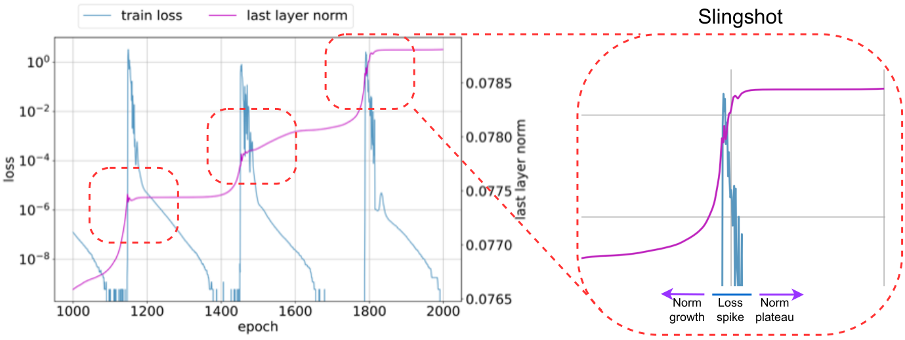

# Эффект рогатки / слингшот (slingshot effect / mechanism)

[Фазовый переход](phase-transition.md) ← предыдущая карточка, следующая → [Эмерджентность / эмерджентные способности](emergence.md)

[Индекс карточек понятий](index.md), категория: [1. Явления](index.md#cat-1)\
→ Следующая категория: [2. Механизмы и представления](structured-representation-learning.md)\
← Предыдущая категория: [7. Теория и формальные результаты](effective-theory-statistical-mechanics.md)

## Определение

**Эффект (механизм) рогатки — «слингшот»** — оптимизационная аномалия
адаптивных [оптимизаторов](optimizer-adam-adamw-sgd.md) (Adam/AdamW) на очень поздних стадиях обучения
(терминальная фаза, после достижения почти 100 % train accuracy): обучение
циклически переключается между устойчивым и неустойчивым режимами; полный
цикл — быстрый рост нормы весов последнего слоя, всплеск train-потери на
переломе, полка нормы \[[1.1](#ref-1-1)\]. Введён Thilak et al. (2022) при
изучении [гроккинга](grokking.md).

## Детализация

Наблюдаемый признак слингшота — **циклическое поведение нормы весов последнего
слоя**: каждый цикл — быстрый рост нормы, затем резкая дестабилизация (всплеск
train-потери с кратким «сбоем» на обучающих примерах), затем плато
\[[1.1](#ref-1-1)\]. Явление привязано к адаптивным оптимизаторам и наблюдается в режиме
**без явной регуляризации** — это условие стоит в самой формулировке
наблюдения \[[1.1](#ref-1-1)\]. Его же описывают как циклические
[фазовые переходы](phase-transition.md) между стабильным и нестабильным
режимами \[[1.2](#ref-1-2)\]\[[1.4](#ref-1-4)\].
Связь с силой регуляризации у Thilak et al. измерена прямо, и она
двоякая. В развёртке [weight decay](weight-decay.md) $0{-}1.0$ (AdamW;
деление, сложение, умножение) уже при наименьшем ненулевом значении
$0.1$ исчезают и слингшот, и гроккинг — исчезает задержка, а не
генерализация: валидация выходит на 100 % за единицы тысяч эпох против
десятков тысяч при $\mathrm{wd}=0$ (рис. 39–40); промежуток $0{-}0.1$ не
зондировался, так что порог разрушения известен лишь сверху. Пропадает
при этом именно цикл нормы, по которому слингшот опознаётся, —
всплесковая неустойчивость не уменьшается, а по авторским подписям к
рис. 39–41 с ростом weight decay даже усиливается
\[[1.1](#ref-1-1)\]. Частота же циклов управляется числовым параметром
$\epsilon$ Адама: чем меньше $\epsilon$, тем больше циклов
\[[1.1](#ref-1-1)\]. Интерпретации
расходятся: одни видят в слингшоте функционально необходимый механизм —
впрыск дисперсии (полезное добавление [шума в градиент](gradient-noise.md)) \[[3.1](#ref-3-1)\] или неявный регуляризатор (скрытое ограничение сложности решения)
\[[3.2](#ref-3-2)\]; другие переосмысливают его как численный артефакт низкой
точности \[[2.1](#ref-2-1)\].

## Альтернативные определения и нюансы

### A. Оптимизационная аномалия адаптивных оптимизаторов

Исходная трактовка Thilak et al.: слингшот — **оптимизационная аномалия**
адаптивного оптимизатора на терминальной фазе; её опознают по
**циклическому осциллированию нормы весов последнего слоя** и по
чередованию устойчивого/неустойчивого режимов
\[[1.1](#ref-1-1)\]\[[1.3](#ref-1-3)\]; формально — циклический фазовый переход в
динамике обучения \[[1.2](#ref-1-2)\]\[[1.4](#ref-1-4)\]. При этом аномалия у них
не бесполезная: механизм вскрывает неявное смещение Adam, часто
способствующее генерализации через пресечение роста нормы и последующее
обучение признакам \[[1.1](#ref-1-1)\]. Необходимость условна: без явной
регуляризации гроккинг почти исключительно совпадает с началом слингшота
и без него отсутствует, но weight decay даёт сопоставимую генерализацию
много быстрее безо всякого слингшота, и сами авторы заключают, что
слингшот может быть не единственным путём к хорошей генерализации
\[[1.1](#ref-1-1)\]. Источник различия: **полезное неявное смещение
оптимизатора** (без Adam/AdamW не появляется), почти обязательный спутник
гроккинга в безрегуляризационном режиме — но не универсальная причина
генерализации: заменим явной регуляризацией.

### B. Функциональный механизм: впрыск дисперсии / неявная регуляризация

Переосмысление слингшота как **функционально необходимого**, а не побочного:
в spectral-gating-картине это **впрыск дисперсии градиента**, без которого
оптимизатор не может войти в острый генерализующий бассейн — слингшот
«формализуется не как аномалия, а как механизм впрыска дисперсии»
\[[3.1](#ref-3-1)\]; в progress-measures-линии его трактуют как **неявный
регуляризатор** \[[3.2](#ref-3-2)\]. Источник различия: слингшот здесь —
**причина** генерализации (полезная накачка дисперсии/регуляризация), а не
безвредный артефакт.

### C. Численный глюк низкой точности

Ещё одно прочтение: спайки слингшота — следствие **пределов точности
арифметики с плавающей точкой** при высокой уверенности модели (авторы
называют это Numerical Feature Inflation), а не оптимизационная динамика как
таковая; отсюда и вопрос в заголовке «Grokking or Glitching?»
\[[2.1](#ref-2-1)\]. Источник различия: слингшот — **численный артефакт малой
разрядности**, чья воспроизводимость зависит от precision, а не универсальное
свойство оптимизатора. Зерно этого прочтения есть уже у самих Thilak et al.:
и частота, и наличие циклов у них управляются числовым параметром
устойчивости $\epsilon$ Адама (см. Детализацию, \[[1.1](#ref-1-1)\]).

Генеалогия прочтения старше, чем кажется по году работы \[[2.1](#ref-2-1)\].
Первую прямую связь дали Nanda et al. 2023 одним предложением приложения
D.2: рогатки удалось вызвать на однослойной модели понижением точности
вычисления потери, с наброском механизма — градиенты округляются в ноль, и
разброс их масштабов растёт \[[3.2](#ref-3-2)\]. Prieto et al. разобрали
арифметику самого отказа ([Softmax Collapse](softmax-collapse.md)) и в
приложении H предположили, что рогатка — самоспасение оптимизации от
полного SC \[[3.3](#ref-3-3)\]; работа \[[2.1](#ref-2-1)\] довела прочтение
до полного механизма и прямо называет Nanda et al. первыми, связавшими
пращу с численной неустойчивостью.

## Ссылки

###### ref-1-1
**\[1.1\]** 2206.04817 — Thilak et al., «The Slingshot Mechanism: An Empirical Study of Adaptive Optimizers and the Grokking Phenomenon». [`"we uncover an optimization anomaly"`](../papers/2206.04817.the-slingshot-mechanism-an-empirical-study-of-adaptive-optimizers-and-grokking/2206.04817.the-slingshot-mechanism-an-empirical-study-of-adaptive-optimizers-and-grokking.card.md#p1-2). *«[мы обнаруживаем оптимизационную аномалию](../papers/2206.04817.the-slingshot-mechanism-an-empirical-study-of-adaptive-optimizers-and-grokking/2206.04817.the-slingshot-mechanism-an-empirical-study-of-adaptive-optimizers-and-grokking.card.md#p1-2)»*\
Доп.: [`"cyclic behavior of the norm of the last layers weights"`](../papers/2206.04817.the-slingshot-mechanism-an-empirical-study-of-adaptive-optimizers-and-grokking/2206.04817.the-slingshot-mechanism-an-empirical-study-of-adaptive-optimizers-and-grokking.card.md#p1-2) — *«[циклическому поведению нормы весов последних слоёв](../papers/2206.04817.the-slingshot-mechanism-an-empirical-study-of-adaptive-optimizers-and-grokking/2206.04817.the-slingshot-mechanism-an-empirical-study-of-adaptive-optimizers-and-grokking.card.md#p1-2)»*; [`"without explicit regularization, Grokking as reported in [17] almost exclusively happens at the onset of *Slingshots*, and is absent without it"`](../papers/2206.04817.the-slingshot-mechanism-an-empirical-study-of-adaptive-optimizers-and-grokking/2206.04817.the-slingshot-mechanism-an-empirical-study-of-adaptive-optimizers-and-grokking.card.md#p1-2) — *«[без явной регуляризации гроккинг, о котором сообщается в [17], происходит почти исключительно в момент начала *рогаток* и без них отсутствует](../papers/2206.04817.the-slingshot-mechanism-an-empirical-study-of-adaptive-optimizers-and-grokking/2206.04817.the-slingshot-mechanism-an-empirical-study-of-adaptive-optimizers-and-grokking.card.md#p1-2)»*.\
Доп. (определение полного цикла): [`"We denote the observations above as the *Slingshot Effect*, which is defined to be the full cycle starting from the norm growth phase, and ending in the norm plateau phase"`](../papers/2206.04817.the-slingshot-mechanism-an-empirical-study-of-adaptive-optimizers-and-grokking/2206.04817.the-slingshot-mechanism-an-empirical-study-of-adaptive-optimizers-and-grokking.card.md#p2-8) — *«[Приведённые наблюдения мы называем *эффектом рогатки*, определяя его как полный цикл, начинающийся с фазы роста нормы и заканчивающийся фазой плато нормы](../papers/2206.04817.the-slingshot-mechanism-an-empirical-study-of-adaptive-optimizers-and-grokking/2206.04817.the-slingshot-mechanism-an-empirical-study-of-adaptive-optimizers-and-grokking.card.md#p2-8)»*.\
Доп. (всплеск потери на переломе): [`"This phase change is accompanied by a sudden spike in training loss, and a plateau in the norm growth of the final classification layer"`](../papers/2206.04817.the-slingshot-mechanism-an-empirical-study-of-adaptive-optimizers-and-grokking/2206.04817.the-slingshot-mechanism-an-empirical-study-of-adaptive-optimizers-and-grokking.card.md#p2-4) — *«[Это изменение фазы сопровождается внезапным всплеском потери на обучении и выходом на плато роста нормы финального классифицирующего слоя](../papers/2206.04817.the-slingshot-mechanism-an-empirical-study-of-adaptive-optimizers-and-grokking/2206.04817.the-slingshot-mechanism-an-empirical-study-of-adaptive-optimizers-and-grokking.card.md#p2-4)»*.\
Доп. (гашение развёрткой weight decay): [`"as weight decay strength increases, both Slingshot Effects and Grokking phenomenon disappear"`](../papers/2206.04817.the-slingshot-mechanism-an-empirical-study-of-adaptive-optimizers-and-grokking/2206.04817.the-slingshot-mechanism-an-empirical-study-of-adaptive-optimizers-and-grokking.card.md#p32-2) — *«[с ростом силы weight decay исчезают и эффекты рогатки, и явление гроккинга](../papers/2206.04817.the-slingshot-mechanism-an-empirical-study-of-adaptive-optimizers-and-grokking/2206.04817.the-slingshot-mechanism-an-empirical-study-of-adaptive-optimizers-and-grokking.card.md#p32-2)»*.\
Доп. (неустойчивость при этом не уменьшается): [`"this regularization does not decrease training instability"`](../papers/2206.04817.the-slingshot-mechanism-an-empirical-study-of-adaptive-optimizers-and-grokking/2206.04817.the-slingshot-mechanism-an-empirical-study-of-adaptive-optimizers-and-grokking.card.md#p32-3) — *«[эта регуляризация не снижает неустойчивости обучения](../papers/2206.04817.the-slingshot-mechanism-an-empirical-study-of-adaptive-optimizers-and-grokking/2206.04817.the-slingshot-mechanism-an-empirical-study-of-adaptive-optimizers-and-grokking.card.md#p32-3)»*.\
Доп. (частота циклов от $\epsilon$): [`"the number of Slingshot Effect cycles is higher for smaller values of $\epsilon$"`](../papers/2206.04817.the-slingshot-mechanism-an-empirical-study-of-adaptive-optimizers-and-grokking/2206.04817.the-slingshot-mechanism-an-empirical-study-of-adaptive-optimizers-and-grokking.card.md#p6-4) — *«[число циклов эффекта рогатки больше для меньших значений $\epsilon$](../papers/2206.04817.the-slingshot-mechanism-an-empirical-study-of-adaptive-optimizers-and-grokking/2206.04817.the-slingshot-mechanism-an-empirical-study-of-adaptive-optimizers-and-grokking.card.md#p6-4)»*.\
Доп. (полезное смещение): [`"exposes an interesting implicit bias of Adam that often promotes generalization, due to it’s arresting of the norm growth and ensuing feature learning"`](../papers/2206.04817.the-slingshot-mechanism-an-empirical-study-of-adaptive-optimizers-and-grokking/2206.04817.the-slingshot-mechanism-an-empirical-study-of-adaptive-optimizers-and-grokking.card.md#p8-2) — *«[вскрывает интересное неявное смещение Adam, которое часто способствует генерализации — благодаря пресечению роста нормы и последующему обучению признакам](../papers/2206.04817.the-slingshot-mechanism-an-empirical-study-of-adaptive-optimizers-and-grokking/2206.04817.the-slingshot-mechanism-an-empirical-study-of-adaptive-optimizers-and-grokking.card.md#p8-2)»*.\
Доп. (заменимость явной регуляризацией): [`"regularization leads to comparable generalization, and much more quickly"`](../papers/2206.04817.the-slingshot-mechanism-an-empirical-study-of-adaptive-optimizers-and-grokking/2206.04817.the-slingshot-mechanism-an-empirical-study-of-adaptive-optimizers-and-grokking.card.md#p8-2) — *«[регуляризация вместо этого приводит к сопоставимой генерализации, причём много быстрее](../papers/2206.04817.the-slingshot-mechanism-an-empirical-study-of-adaptive-optimizers-and-grokking/2206.04817.the-slingshot-mechanism-an-empirical-study-of-adaptive-optimizers-and-grokking.card.md#p8-2)»* и [`"Slingshot may not be the only way to achieve good generalization"`](../papers/2206.04817.the-slingshot-mechanism-an-empirical-study-of-adaptive-optimizers-and-grokking/2206.04817.the-slingshot-mechanism-an-empirical-study-of-adaptive-optimizers-and-grokking.card.md#p32-3) — *«[рогатка может быть не единственным способом достичь хорошей генерализации](../papers/2206.04817.the-slingshot-mechanism-an-empirical-study-of-adaptive-optimizers-and-grokking/2206.04817.the-slingshot-mechanism-an-empirical-study-of-adaptive-optimizers-and-grokking.card.md#p32-3)»*.
###### ref-1-2
**\[1.2\]** 2510.04930 — Saheb Pasand et al., «Egalitarian Gradient Descent». [`"mechanism called ”Slingshot” in which cyclic phase transitions"`](../papers/2510.04930.egalitarian-gradient-descent-a-simple-approach-to-accelerated-grokking/original/2510.04930.egalitarian-gradient-descent-a-simple-approach-to-accelerated-grokking.md#p4-1). *«[устройство, названное «рогаткой», при котором цикличные фазовые переходы](../papers/2510.04930.egalitarian-gradient-descent-a-simple-approach-to-accelerated-grokking/2510.04930.egalitarian-gradient-descent-a-simple-approach-to-accelerated-grokking.card.md#p4-1)»*

###### ref-1-3
**\[1.3\]** 2601.19791 — Xu et al., «To Grok Grokking: Provable Grokking in Ridge Regression». [`"an optimization anomaly named the “Slingshot Mechanism”"`](../papers/2601.19791.to-grok-grokking-provable-grokking-in-ridge-regression/original/2601.19791.to-grok-grokking-provable-grokking-in-ridge-regression.md#p3-2). *«[оптимизационному отклонению, названному «приёмом рогатки»](../papers/2601.19791.to-grok-grokking-provable-grokking-in-ridge-regression/2601.19791.to-grok-grokking-provable-grokking-in-ridge-regression.card.md#p3-2)»*

###### ref-1-4
**\[1.4\]** 2405.19454 — Fan, Pascanu, Jaggi 2024, «Deep Grokking: Would Deep Neural Networks Generalize Better?». [`"*slingshot effect*, which corresponding to a cyclic phase transitions between stable-and-unstable training regimes"`](../papers/2405.19454.deep-grokking-would-deep-neural-networks-generalize-better/2405.19454.deep-grokking-would-deep-neural-networks-generalize-better.card.md#p6-2). *«[*пращевым действием*, которому отвечают повторяющиеся фазовые переходы между устойчивым и неустойчивым режимами обучения](../papers/2405.19454.deep-grokking-would-deep-neural-networks-generalize-better/2405.19454.deep-grokking-would-deep-neural-networks-generalize-better.card.md#p6-2)»*\
Доп. (не подтверждено на глубоких сетях): [`"for the multi-stage generalization on deep networks, we have not observed any significant plateaus of the norm of the last layer or the entire set of model parameters"`](../papers/2405.19454.deep-grokking-would-deep-neural-networks-generalize-better/2405.19454.deep-grokking-would-deep-neural-networks-generalize-better.card.md#p6-2) — *«[при многопорной генерализации на глубоких сетях мы не наблюдали заметных полок ни у нормы последнего слоя, ни у всего набора параметров модели](../papers/2405.19454.deep-grokking-would-deep-neural-networks-generalize-better/2405.19454.deep-grokking-would-deep-neural-networks-generalize-better.card.md#p6-2)»*.

## Ссылки на присоединившиеся работы

### Оспаривают

###### ref-2-1
**\[2.1\]** 2605.06152 — Liu, Cao, Li, Zhou 2026, «Grokking or Glitching? How Low-Precision Drives Slingshot Loss Spikes». Оспаривает истолкование через оптимизацию: праща есть численный след низкой точности (численное раздувание признаков), а не свойство приёма оптимизации. [`"Our results reinterpret Slingshot as a numerical dynamic of finite-precision training, and provide a testable explanation for abnormal parameter growth and logit divergence in late-stage training"`](../papers/2605.06152.grokking-or-glitching-how-low-precision-drives-slingshot-loss-spikes/original/2605.06152.grokking-or-glitching-how-low-precision-drives-slingshot-loss-spikes.md#p1-2). *«[Наши итоги перетолковывают пращевой ход как численную динамику обучения при конечной точности и дают проверяемое объяснение ненормальному росту параметров и расхождению логитов на поздних порах обучения](../papers/2605.06152.grokking-or-glitching-how-low-precision-drives-slingshot-loss-spikes/2605.06152.grokking-or-glitching-how-low-precision-drives-slingshot-loss-spikes.card.md#p1-2)»*\
Доп. (вмешательство в звено вывода): [`"we constrain the update of $W$ to remain in the subspace satisfying the zero-sum constraint in Eq. 4"`](../papers/2605.06152.grokking-or-glitching-how-low-precision-drives-slingshot-loss-spikes/original/2605.06152.grokking-or-glitching-how-low-precision-drives-slingshot-loss-spikes.md#p7-3) — *«[мы удерживаем обновление $W$ в подпространстве, удовлетворяющем условию нулевой суммы из выражения 4](../papers/2605.06152.grokking-or-glitching-how-low-precision-drives-slingshot-loss-spikes/2605.06152.grokking-or-glitching-how-low-precision-drives-slingshot-loss-spikes.card.md#p7-3)»*.

###### ref-2-2
**\[2.2\]** 2210.15435 — Žunkovič, Ilievski, «Grokking phase transitions in learning local rules with gradient descent». Нюанс: воспроизводит наблюдение Thilak et al. о совпадении гроккинга со всплесками обучающей потери, но подводит под них другой механизм — ступенчатые изменения эффективной размерности, то есть перестройку пространства признаков; ни цикличности всплесков, ни норм весов, ни кривизны работа не измеряет. Отсюда практическое предложение откатывать модель после всплеска только при выросшей эффективной размерности. [`"A sling-shot mechanism (related to edge of stability [15]) has been proposed as a necessary condition for grokking."`](../papers/2210.15435.grokking-phase-transitions-in-learning-local-rules-with-gradient-descent/2210.15435.grokking-phase-transitions-in-learning-local-rules-with-gradient-descent.card.md#p4-3). *«[Механизм рогатки (sling-shot, связанный с краем устойчивости [15]) был предложен как необходимое условие гроккинга](../papers/2210.15435.grokking-phase-transitions-in-learning-local-rules-with-gradient-descent/2210.15435.grokking-phase-transitions-in-learning-local-rules-with-gradient-descent.card.md#p4-3)»*\
Доп. (собственная трактовка и практическое следствие): [`"For example, we can revert the model only if the training-loss spikes correspond to increased effective dimension."`](../papers/2210.15435.grokking-phase-transitions-in-learning-local-rules-with-gradient-descent/2210.15435.grokking-phase-transitions-in-learning-local-rules-with-gradient-descent.card.md#p30-1) — *«[Например, мы можем откатывать модель, только если всплески обучающей потери отвечают увеличенной эффективной размерности](../papers/2210.15435.grokking-phase-transitions-in-learning-local-rules-with-gradient-descent/2210.15435.grokking-phase-transitions-in-learning-local-rules-with-gradient-descent.card.md#p30-1)»*.

###### ref-2-3
**\[2.3\]** 2408.11804 — Yunis et al., «Approaching Deep Learning through the Spectral Dynamics of Weights». Оспаривает не сам эффект, а его резкость: постановка Thilak et al. воспроизведена (с оговоркой — однослойная архитектура Nanda вместо двухслойной оригинала), и на линейной оси генерализация выглядит куда менее внезапной. Спектральной подписи самой рогатки работа не измеряет. [`"The original grokking plot in Thilak et al. 2022 appears much more dramatic as it log-scales the x-axis, which we do not do here for clarity."`](../papers/2408.11804.approaching-deep-learning-through-the-spectral-dynamics-of-weights/original/2408.11804.approaching-deep-learning-through-the-spectral-dynamics-of-weights.md#p22-6). *«[Исходный график гроккинга в Thilak et al. 2022 выглядит куда более впечатляюще, поскольку там ось x дана в логарифмической шкале, чего мы здесь ради ясности не делаем](../papers/2408.11804.approaching-deep-learning-through-the-spectral-dynamics-of-weights/2408.11804.approaching-deep-learning-through-the-spectral-dynamics-of-weights.card.md#p22-6)»*\
Доп.: [`"when plotted on a linear-scale x-axis the generalization appears much less sudden than the setting with weight decay"`](../papers/2408.11804.approaching-deep-learning-through-the-spectral-dynamics-of-weights/original/2408.11804.approaching-deep-learning-through-the-spectral-dynamics-of-weights.md#p6-1) — *«[при построении по линейной шкале оси x генерализация выглядит куда менее внезапной, чем в постановке с weight decay](../papers/2408.11804.approaching-deep-learning-through-the-spectral-dynamics-of-weights/2408.11804.approaching-deep-learning-through-the-spectral-dynamics-of-weights.card.md#p6-1)»*.
### Поддерживают

###### ref-3-1
**\[3.1\]** 2603.15492 — Acharya et al., «Grokking as a Variance-Limited Phase Transition». Нюанс: слингшот — не аномалия, а функциональный впрыск дисперсии, открывающий доступ в острый бассейн. [`"We formalize the Slingshot not as an anomaly, but as a *variance-injection mechanism*"`](../papers/2603.15492.grokking-as-a-variance-limited-phase-transition-spectral-gating-and-the-epsilon-stability-threshold/original/2603.15492.grokking-as-a-variance-limited-phase-transition-spectral-gating-and-the-epsilon-stability-threshold.md#p2-4). *«[Мы описываем рогатку не как отклонение, а как *механизм впрыска разброса*](../papers/2603.15492.grokking-as-a-variance-limited-phase-transition-spectral-gating-and-the-epsilon-stability-threshold/2603.15492.grokking-as-a-variance-limited-phase-transition-spectral-gating-and-the-epsilon-stability-threshold.card.md#p2-4)»*\
Доп. (механизм входа): [`"A Slingshot causes a spike in the second moment estimator $v_{t}$"`](../papers/2603.15492.grokking-as-a-variance-limited-phase-transition-spectral-gating-and-the-epsilon-stability-threshold/original/2603.15492.grokking-as-a-variance-limited-phase-transition-spectral-gating-and-the-epsilon-stability-threshold.md#p10-6) — *«[рогатка даёт всплеск оценки второго момента $v_{t}$](../papers/2603.15492.grokking-as-a-variance-limited-phase-transition-spectral-gating-and-the-epsilon-stability-threshold/2603.15492.grokking-as-a-variance-limited-phase-transition-spectral-gating-and-the-epsilon-stability-threshold.card.md#p10-6)»*

###### ref-3-2
**\[3.2\]** 2301.05217 — Nanda et al., «Progress Measures for Grokking via Mechanistic Interpretability». Нюанс: слингшот может действовать как неявный регуляризатор; здесь же, в одном предложении приложения D.2, — первая в литературе связь рогатки с численной точностью, за три года до \[[2.1](#ref-2-1)\] (обе поздние численные работы, \[[2.1](#ref-2-1)\] и \[[3.3](#ref-3-3)\], признают это первенство). [`"the slingshot mechanism, which may act as an implicit regularizer"`](../papers/2301.05217.progress-measures-for-grokking-via-mechanistic-interpretability/2301.05217.progress-measures-for-grokking-via-mechanistic-interpretability.card.md#p2-5). *«[механизмом рогатки (slingshot) и которая может действовать как неявный регуляризатор](../papers/2301.05217.progress-measures-for-grokking-via-mechanistic-interpretability/2301.05217.progress-measures-for-grokking-via-mechanistic-interpretability.card.md#p2-5)»*\
Доп. (первенство численного прочтения, приложение D.2): [`"We were even able to induce slingshots on a 1-layer by reducing the precision of the loss calculations (as this causes many gradients to round to 0 and thus greatly increases the differences in scale of gradients)"`](../papers/2301.05217.progress-measures-for-grokking-via-mechanistic-interpretability/2301.05217.progress-measures-for-grokking-via-mechanistic-interpretability.card.md#p22-17) — *«[Нам даже удалось вызвать рогатки на однослойной модели, снизив точность вычисления потери (из-за чего многие градиенты округляются до 0, а значит, различия в масштабе градиентов сильно возрастают)](../papers/2301.05217.progress-measures-for-grokking-via-mechanistic-interpretability/2301.05217.progress-measures-for-grokking-via-mechanistic-interpretability.card.md#p22-17)»*.

###### ref-3-3
**\[3.3\]** 2501.04697 — Prieto et al., «Grokking at the Edge of Numerical Stability». Разбирает арифметику самого отказа ([Softmax Collapse](softmax-collapse.md)) и отдаёт первенство численной связи Nanda et al.; гипотеза приложения H — рогатка как самоспасение оптимизации от полного SC, что объясняло бы гроккинг без weight decay в некоторых постановках. [`"In the grokking setting, Nanda et al. (2023) showed that the slingshots observed in Thilak et al. (2022) can be explained by a very similar mechanism to the one involved in SC"`](../papers/2501.04697.grokking-at-the-edge-of-numerical-stability/2501.04697.grokking-at-the-edge-of-numerical-stability.card.md#p10-2). *«[В постановке гроккинга Nanda et al. (2023) показали, что рогатки, наблюдавшиеся в Thilak et al. (2022), объяснимы весьма схожим механизмом с тем, что задействован в SC](../papers/2501.04697.grokking-at-the-edge-of-numerical-stability/2501.04697.grokking-at-the-edge-of-numerical-stability.card.md#p10-2)»*\
Доп. (приложение H): [`"we believe that slingshots could lead to generalization because they prevent full SC"`](../papers/2501.04697.grokking-at-the-edge-of-numerical-stability/2501.04697.grokking-at-the-edge-of-numerical-stability.card.md#p18-4) — *«[мы полагаем, что рогатки могут вести к генерализации потому, что предотвращают полный SC](../papers/2501.04697.grokking-at-the-edge-of-numerical-stability/2501.04697.grokking-at-the-edge-of-numerical-stability.card.md#p18-4)»*.

###### ref-3-4
**\[3.4\]** 2607.20552 — Pandey 2026, «Thermodynamic Weight Decay: Exploring Grokking Acceleration via Attention Specific Heat». Слингшот как причина отказа дискретных вмешательств: при крупной перестройке цепей train_acc транзиентно проваливается ниже 0.99, ворота памяти закрываются ровно на пике $C_{v}$, и одноразовый триггер слепнет («ослепление слингшотом»); лекарство — непрерывный пропорциональный отклик, накапливающий импульс до закрытия ворот, — «тепло подаётся, пока гора растёт, а не после». Нюанс: это единственная содержательно работающая цитата статьи (slingshot 2206.04817) и переносимый урок дизайна — принцип непрерывности как защита от временны́х ошибок, фатальных для одноразовых триггеров; два других отказа детектора (шум инициализации — все триггеры на эпохе 16; батч-рябь — срабатывание на эпохе 240) задокументированы с устраняющими элементами. [`"In one run a large $C_{v}$ spike coincided with train_acc dropping below $0.99$, closing the gate exactly at the peak and blinding a discrete trigger."`](../papers/2607.20552.thermodynamic-weight-decay-exploring-grokking-acceleration-via-attention-specific-heat/original/2607.20552.thermodynamic-weight-decay-exploring-grokking-acceleration-via-attention-specific-heat.md#p3-7). *«[В одном прогоне большой всплеск $C_{v}$ совпал с падением train_acc ниже $0.99$, закрыв ворота ровно на пике и ослепив дискретный триггер.](../papers/2607.20552.thermodynamic-weight-decay-exploring-grokking-acceleration-via-attention-specific-heat/2607.20552.thermodynamic-weight-decay-exploring-grokking-acceleration-via-attention-specific-heat.card.md#p3-7)»*

## Цитирования

Работы, лишь упоминающие явление (обзор литературы, связанные работы, попутное цитирование) без его подробного разбора.

**\[4.1\]** 2301.02679 — Gromov, «Grokking modular arithmetic». [`"in order for grokking to happen without regularization, the training dynamics must undergo a slingshot – a sudden explosion"`](../papers/2301.02679.grokking-modular-arithmetic/2301.02679.grokking-modular-arithmetic.card.md#p2-1). *«[чтобы гроккинг произошёл без регуляризации, динамика обучения должна пройти через рогатку — внезапный взрыв](../papers/2301.02679.grokking-modular-arithmetic/2301.02679.grokking-modular-arithmetic.card.md#p2-1)»*

**\[4.2\]** 2303.11873 — Merrill et al., «A Tale of Two Circuits: Grokking as Competition of Sparse and Dense Subnetworks». [`"observe a “slingshot” pattern during grokking: the final layer weight norm follows a roughly sigmoidal growth trend around the grokking phase transition"`](../papers/2303.11873.a-tale-of-two-circuits-grokking-as-competition-of-sparse-and-dense-subnetworks/original/2303.11873.a-tale-of-two-circuits-grokking-as-competition-of-sparse-and-dense-subnetworks.md#p1-5). *«[наблюдают картину «рогатки» при гроккинге: норма весов финального слоя следует примерно сигмоидальной тенденции роста вблизи фазового перехода гроккинга](../papers/2303.11873.a-tale-of-two-circuits-grokking-as-competition-of-sparse-and-dense-subnetworks/2303.11873.a-tale-of-two-circuits-grokking-as-competition-of-sparse-and-dense-subnetworks.card.md#p1-5)»*

**\[4.3\]** 2306.13253 — Notsawo et al., «Predicting Grokking Long Before it Happens». [`"such as the emergence of structure in embedding space (Liu et al., 2022) and the slingshot effect (Thilak et al., 2022)"`](../papers/2306.13253.predicting-grokking-long-before-it-happens/original/2306.13253.predicting-grokking-long-before-it-happens.md#p2-1). *«такие как возникновение структуры в пространстве эмбеддингов (Liu et al., 2022) и эффект слингшота (Thilak et al., 2022)»* — слингшот в перечне явлений, сопутствующих гроккингу

**\[4.4\]** 2405.20233 — Lee et al., «Grokfast: Accelerated Grokking by Amplifying Slow Gradients». [`"Thilak et al. [2022] found a similarity between grokking and the slingshot mechanism in adaptive optimizers"`](../papers/2405.20233.grokfast-accelerated-grokking-by-amplifying-slow-gradients/2405.20233.grokfast-accelerated-grokking-by-amplifying-slow-gradients.card.md#p9-2). *«[Thilak et al. [2022] нашли сходство между гроккингом и механизмом рогатки у адаптивных оптимизаторов](../papers/2405.20233.grokfast-accelerated-grokking-by-amplifying-slow-gradients/2405.20233.grokfast-accelerated-grokking-by-amplifying-slow-gradients.card.md#p9-2)»*

**\[4.5\]** 2407.12332 — Mohamadi et al., «Why Do You Grok? A Tale of Two Circuits Behind Grokking». [`"Grokking has been variously attributed to difficulty of representation learning [26], the “slingshot” mechanism [47]"`](../papers/2407.12332.why-do-you-grok-a-theoretical-analysis-of-grokking-modular-addition/original/2407.12332.why-do-you-grok-a-theoretical-analysis-of-grokking-modular-addition.md#p1-4). *«[Гроккинг по-разному приписывали трудности обучения представлениям [26], механизму «рогатки» [47]](../papers/2407.12332.why-do-you-grok-a-theoretical-analysis-of-grokking-modular-addition/2407.12332.why-do-you-grok-a-theoretical-analysis-of-grokking-modular-addition.card.md#p1-4)»*

**\[4.6\]** 2410.04489 — Beck et al., «Grokking at the Edge of Linear Separability». [`"Additional works proposed "slingshots" (Thilak et al., 2022) or "oscillations" (Notsawo et al., 2023)"`](../papers/2410.04489.grokking-at-the-edge-of-linear-separability/2410.04489.grokking-at-the-edge-of-linear-separability.card.md#p2-3). *«другие работы предлагали «слингшоты» (Thilak et al., 2022) или «осцилляции» (Notsawo et al., 2023)»*

**\[4.7\]** 2411.05353 — Salah et al., «Controlling Grokking with Nonlinearity and Data Symmetry». [`"do not incorporate slingshot or oscillation behavior but instead is based on the relative strength"`](../papers/2411.05353.controlling-grokking-with-nonlinearity-and-data-symmetry/original/2411.05353.controlling-grokking-with-nonlinearity-and-data-symmetry.md#p2-2). *«[не включают слингшот или осцилляционное поведение, а основаны на относительной силе](../papers/2411.05353.controlling-grokking-with-nonlinearity-and-data-symmetry/2411.05353.controlling-grokking-with-nonlinearity-and-data-symmetry.card.md#p2-2)»*

**\[4.8\]** 2603.05228 — Yildirim, «The Geometric Inductive Bias of Grokking». [`"transient drops in generalization before eventual stabilization—consistent with the “slingshot effect” reported in prior work"`](../papers/2603.05228.the-geometric-inductive-bias-of-grokking-bypassing-phase-transitions-via-architectural-topology/original/2603.05228.the-geometric-inductive-bias-of-grokking-bypassing-phase-transitions-via-architectural-topology.md#p9-4). *«[мимолётные провалы генерализации до окончательного установления, — в согласии с «эффектом рогатки», сообщённым в прежних работах](../papers/2603.05228.the-geometric-inductive-bias-of-grokking-bypassing-phase-transitions-via-architectural-topology/2603.05228.the-geometric-inductive-bias-of-grokking-bypassing-phase-transitions-via-architectural-topology.card.md#p9-4)»*

**\[4.9\]** 2311.18817 — Lyu et al., «Dichotomy of Early and Late Phase Implicit Biases Can Provably Induce Grokking». Нюанс: рогатка упомянута дважды и оба раза как чужое эмпирическое наблюдение; собственные опыты работы ведутся на полнобатчевом GD, где рогатки нет. [`"Thilak et al. 2022 identified the Slingshot mechanism, which refers to a cyclic behavior of the last-layer parameter norm that empirically causes grokking"`](../papers/2311.18817.dichotomy-of-early-and-late-phase-implicit-biases-can-provably-induce-grokking/original/2311.18817.dichotomy-of-early-and-late-phase-implicit-biases-can-provably-induce-grokking.md#p16-1). *«[Thilak et al. 2022 выявили механизм рогатки, отсылающий к циклическому поведению нормы параметров последнего слоя, которое эмпирически вызывает гроккинг](../papers/2311.18817.dichotomy-of-early-and-late-phase-implicit-biases-can-provably-induce-grokking/2311.18817.dichotomy-of-early-and-late-phase-implicit-biases-can-provably-induce-grokking.card.md#p16-1)»*

**\[4.10\]** 2310.02541 — Xu et al. 2023. Нюанс: наблюдённое Thilak et al. совпадение по времени пересказано глаголом «attributed», то есть как причинное объяснение; разбор — в разделе «Ошибочные цитирования» карточки под якорем `mc-2206-04817`. [`"attributed grokking to the slingshot mechanism"`](../papers/2310.02541.benign-overfitting-and-grokking-in-relu-networks-for-xor-cluster-data/original/2310.02541.benign-overfitting-and-grokking-in-relu-networks-for-xor-cluster-data.md#p3-2). *«[отнесли гроккинг к действию механизма рогатки (slingshot)](../papers/2310.02541.benign-overfitting-and-grokking-in-relu-networks-for-xor-cluster-data/2310.02541.benign-overfitting-and-grokking-in-relu-networks-for-xor-cluster-data.card.md#p3-2)»*

**\[4.11\]** 2310.16441 — Levi et al. 2023. Нюанс: всплесков потери в постановке нет по устройству (полнобатчевый GD в пределе градиентного потока), и рогатка названа лишь как объяснение, без которого их разбор обходится. [`"Some works suggest "slingshots" [21] or "oscillations" [17] underlie grokking, but our explanation applies even without these dynamics"`](../papers/2310.16441.grokking-in-linear-estimators-a-solvable-model-that-groks-without-understanding/original/2310.16441.grokking-in-linear-estimators-a-solvable-model-that-groks-without-understanding.md#p2-2). *«[В некоторых работах предполагается, что в основе гроккинга лежат «рогатки» [21] или «осцилляции» [17], но наше объяснение действует и без этой динамики](../papers/2310.16441.grokking-in-linear-estimators-a-solvable-model-that-groks-without-understanding/2310.16441.grokking-in-linear-estimators-a-solvable-model-that-groks-without-understanding.card.md#p2-2)»*

**\[4.12\]** 2507.20057 — Lyle et al., «What Can Grokking Teach Us About Learning Under Nonstationarity?». Лишь упоминает: Thilak et al. 2022 названы источником связи между неустойчивостью оптимизации, ростом нормы и переходом в обобщении. Ни рогатки, ни всплесков потери работа не измеряет, а сходство собственного приёма — преходящего повышения действенного шага — с рогаткой не обсуждает. [`"phase transitions in the model’s generalization performance accompany periods of instability in the network’s optimization dynamics and rapid increases in the parameter norm (Thilak et al. 2022)"`](../papers/2507.20057.what-can-grokking-teach-us-about-learning-under-nonstationarity/original/2507.20057.what-can-grokking-teach-us-about-learning-under-nonstationarity.md#p3-2). *«[фазовые переходы в способности модели обобщать сопровождаются периодами неустойчивости в динамике оптимизации сети и быстрым ростом нормы параметров (Thilak et al. 2022)](../papers/2507.20057.what-can-grokking-teach-us-about-learning-under-nonstationarity/2507.20057.what-can-grokking-teach-us-about-learning-under-nonstationarity.card.md#p3-2)»*

**\[4.13\]** 2505.11411 — Zhang, Shang, Yang, Zhang, «Is Grokking a Computational Glass Relaxation?». Упоминание в ряду механизмов, с которыми энтропийный разбор согласуется: слингшот сведён к тезису «возмущение полезно», поддержанному тем, что ланжевеновские возмущения внутри WanD гроккинг снимают. Ни скачков нормы, ни всплесков потери, ни численных явлений оптимизатора работа не измеряет. [`"Our work also supports the finding that perturbation is beneficial to the grokking learning process thilak2022slingshot, as WanD is able to eliminate grokking directly."`](../papers/2505.11411.is-grokking-a-computational-glass-relaxation/original/2505.11411.is-grokking-a-computational-glass-relaxation.md#p10-1). *«[Наша работа поддерживает также находку о том, что возмущение полезно для процесса обучения при гроккинге thilak2022slingshot, поскольку WanD способен устранить гроккинг напрямую.](../papers/2505.11411.is-grokking-a-computational-glass-relaxation/2505.11411.is-grokking-a-computational-glass-relaxation.card.md#p10-1)»*.

**\[4.14\]** 2603.25009 — Manir, Rupa, «A Systematic Empirical Study of Grokking…». [`"the generalization transition in attention-based models is more sensitive to oscillatory weight-norm dynamics"`](../papers/2603.25009.a-systematic-empirical-study-of-grokking-depth-architecture-activation-and-regularization/2603.25009.a-systematic-empirical-study-of-grokking-depth-architecture-activation-and-regularization.card.md#p7-5). *«[переход к генерализации у моделей на основе внимания более чувствителен к колебательной динамике нормы весов](../papers/2603.25009.a-systematic-empirical-study-of-grokking-depth-architecture-activation-and-regularization/2603.25009.a-systematic-empirical-study-of-grokking-depth-architecture-activation-and-regularization.card.md#p7-5)»* На [рис. 6](../papers/2603.25009.a-systematic-empirical-study-of-grokking-depth-architecture-activation-and-regularization/2603.25009.a-systematic-empirical-study-of-grokking-depth-architecture-activation-and-regularization.card.md#fig-6), панель (a), пилообразные колебания тестовой точности у трансформера при $\lambda=1.0$ видны, но не обсуждаются.

**\[4.15\]** 2605.09724 — Song & Ye, «Model Capacity Determines Grokking through Competing Memorisation and Generalisation Speeds». Нюанс: все опыты идут под AdamW, то есть в том самом классе оптимизаторов, но ни всплесков потери, ни колебаний нормы работа не смотрит. [`"identify late-stage “slingshot” dynamics in adaptive optimisers that often coincide with the grokking transition"`](../papers/2605.09724.model-capacity-determines-grokking-through-competing-memorisation-and-generalisation-speeds/original/2605.09724.model-capacity-determines-grokking-through-competing-memorisation-and-generalisation-speeds.md#p3-3). *«[выявляют позднюю динамику «рогатки» в адаптивных оптимизаторах, часто совпадающую с гроккинг-переходом](../papers/2605.09724.model-capacity-determines-grokking-through-competing-memorisation-and-generalisation-speeds/2605.09724.model-capacity-determines-grokking-through-competing-memorisation-and-generalisation-speeds.card.md#p3-3)»*

**\[4.16\]** 2506.23286 — Jeffares & van der Schaar, «Not All Explanations for Deep Learning Phenomena Are Equally Valuable». Нюанс: ни механизма, ни оптимизаторов, ни всплесков потери работа не разбирает. [`"*slingshots in the parameters norm* (Thilak et al. 2024)"`](../papers/2506.23286.not-all-explanations-for-deep-learning-phenomena-are-equally-valuable/original/2506.23286.not-all-explanations-for-deep-learning-phenomena-are-equally-valuable.md#p4-2). *«[*рогатки в норме параметров* (Thilak et al. 2024)](../papers/2506.23286.not-all-explanations-for-deep-learning-phenomena-are-equally-valuable/2506.23286.not-all-explanations-for-deep-learning-phenomena-are-equally-valuable.card.md#p4-2)»*

**\[4.17\]** 2602.06702 — Singh, Misra, Orvieto, «Explaining Grokking in Transformers…». При увеличении глубины до 3 слоёв [`"more depth shows significantly more slingshots (45)"`](../papers/2602.06702.explaining-grokking-in-transformers-through-the-lens-of-inductive-bias/2602.06702.explaining-grokking-in-transformers-through-the-lens-of-inductive-bias.card.md#fig-8). *«[большая глубина показывает значительно больше рогаток (45)](../papers/2602.06702.explaining-grokking-in-transformers-through-the-lens-of-inductive-bias/2602.06702.explaining-grokking-in-transformers-through-the-lens-of-inductive-bias.card.md#fig-8)»* Ссылка на Thilak et al. стоит один раз и служит именем для явления.\
Доп. (как с ними обходятся): показатель степенной подгонки выводится агрегацией минимумом по 5 семенам, чтобы устранить вызванные рогатками всплески ([рис. 6](../papers/2602.06702.explaining-grokking-in-transformers-through-the-lens-of-inductive-bias/2602.06702.explaining-grokking-in-transformers-through-the-lens-of-inductive-bias.card.md#fig-6)); в [рис. 2](../papers/2602.06702.explaining-grokking-in-transformers-through-the-lens-of-inductive-bias/2602.06702.explaining-grokking-in-transformers-through-the-lens-of-inductive-bias.card.md#fig-2) кривые двух настроек, «показывающих рогатки», рисуются с меньшей непрозрачностью.

**\[4.18\]** 2605.08237 — Wang, Ying, Kanamori 2026, «Distributional Spectral Diagnostics for Localizing Grokking Transitions». Нюанс: Thilak et al. упомянуты одной скобкой; ни рогаточных всплесков, ни поведения нормы во времени работа не разбирает. [`"stability-based accounts link grokking to logit scaling and softmax collapse [42, 32]"`](../papers/2605.08237.distributional-spectral-diagnostics-for-localizing-grokking-transitions/2605.08237.distributional-spectral-diagnostics-for-localizing-grokking-transitions.card.md#p1-4). *«[объяснения на основе устойчивости связывают гроккинг с масштабированием логитов и коллапсом softmax [42, 32]](../papers/2605.08237.distributional-spectral-diagnostics-for-localizing-grokking-transitions/2605.08237.distributional-spectral-diagnostics-for-localizing-grokking-transitions.card.md#p1-4)»*

**\[4.19\]** 2606.12966 — Sivasankar, «Circuit Synchronization Precedes Generalization: A Causal Precursor to Grokking». [`"link grokking to a “slingshot” optimisation instability under adaptive optimisers—which we observe as the post-grokking destabilisation at high $\lambda$"`](../papers/2606.12966.circuit-synchronization-precedes-generalization-a-causal-precursor-to-grokking/2606.12966.circuit-synchronization-precedes-generalization-a-causal-precursor-to-grokking.card.md#p16-2). *«[связывают гроккинг с оптимизационной неустойчивостью «рогатки» при адаптивных оптимизаторах — которую мы наблюдаем как потерю устойчивости после гроккинга при больших $\lambda$](../papers/2606.12966.circuit-synchronization-precedes-generalization-a-causal-precursor-to-grokking/2606.12966.circuit-synchronization-precedes-generalization-a-causal-precursor-to-grokking.card.md#p16-2)»*
