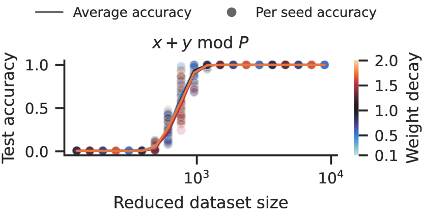

# Унгрокинг (ungrokking)

[Катастрофическое забывание](catastrophic-forgetting.md) ← предыдущая карточка, следующая → [Полу-грокинг](semi-grokking.md)

[Индекс карточек понятий](index.md), категория: [1. Явления](index.md#cat-1)\
→ Следующая категория: [2. Механизмы и представления](structured-representation-learning.md)\
← Предыдущая категория: [7. Теория и формальные результаты](effective-theory-statistical-mechanics.md)

## Определение

**Ungrokking (унгрокинг)** — переход, обратный [гроккингу](grokking.md): сеть,
уже достигшая идеальной тестовой точности, при дальнейшем обучении
**регрессирует к низкой** тестовой точности — то есть возвращается от
генерализации к [запоминанию](memorization-phase.md). Предсказано и
продемонстрировано Varma et al. (2023) на основе теории [эффективности контуров](circuit-efficiency.md)
\[[1.1](#ref-1-1)\].

## Детализация

Механизм — **эффективность контуров** (contour/circuit efficiency; контур —
подсеть, реализующая некоторую функцию). Запоминающий контур становится тем
**менее эффективным**, чем больше обучающий набор, а обобщающий контур — нет;
значит, есть **[критический размер данных](data-fraction-critical-dataset-size.md)** Dcrit, при котором оба одинаково
эффективны \[[1.1](#ref-1-1)\]. Если грокнутую (уже обобщающую) сеть продолжить
обучать на наборе **меньше** Dcrit, запоминание снова оказывается эффективнее, и
сеть **скатывается обратно** к плохой тестовой точности \[[1.1](#ref-1-1)\].
Обязательные условия механизма — регуляризация **[weight decay](weight-decay.md)** (L2-штраф на
нормы весов) и уменьшенный датасет. У самого порога (D ≈ Dcrit) та же теория даёт
родственное поведение — **[semi-grokking](semi-grokking.md)**: отложенную генерализацию не до
идеальной, а лишь до **частичной** тестовой точности.

Приложение A.2 сравнивает точку перехода с двух сторон: запуск с
полу-грокингом достигает тестовой точности $\sim$0.7 при размере набора
$\sim$2000, а запуски с унгрокингом удерживают ту же точность вплоть до
$\sim$800–1000 — меньше половины \[[1.1](#ref-1-1)\]. Направлениезависимая
точка перехода — определение гистерезиса, сигнатуры [фазового перехода](phase-transition.md)
первого рода. Замечание редактора вики: сами авторы термином «гистерезис» не
пользуются, а корпусные теории перехода первого рода (Rubin et al.;
Ersoy & Wiesner, у которых гистерезис — центральный механизм) это самое
раннее двустороннее измерение не цитируют.

Присоединившиеся работы очерчивают границы явления. Huang et al. **воспроизводят**
унгрокинг в рамке конкуренции контуров: при сдвиге баланса в пользу запоминания
сеть выбирает чистое запоминание без генерализации \[[3.1](#ref-3-1)\]. Prakash
et al., напротив, **оспаривают полноту** механизма: они наблюдают отдельный
поздний [коллапс генерализации](anti-grokking.md) — **«анти-гроккинг»** — на **исходном** датасете,
**без** weight decay, после очень долгого обучения (порядка 10⁷ шагов); ungrokking
такого не предсказывает, поскольку это выходит за рамки его предположений (малый
датасет и weight decay) \[[2.1](#ref-2-1)\].

## Альтернативные определения и нюансы

### A. Регрессия к запоминанию ниже Dcrit (Varma)

Каноническая трактовка: унгрокинг — потеря генерализации при дообучении грокнутой
сети на датасете меньше критического размера Dcrit, где кроссовер эффективностей
делает запоминание выгоднее обобщения \[[1.1](#ref-1-1)\]. Источник различия:
управляющий параметр — **размер обучающего набора**, а предпосылка — режим weight
decay.

### B. Родственное поведение: semi-grokking (у Dcrit)

Из той же теории следует не регрессия, а **частичная** генерализация: при
D ≈ Dcrit сеть грокает с задержкой, но выходит лишь на **неполную** тестовую
точность \[[1.1](#ref-1-1)\]. Источник различия: это не откат, а **плато** ровно в
точке равной эффективности контуров.

### Оспаривают

- **«Анти-гроккинг» вне условий унгрокинга** \[[2.1](#ref-2-1)\]: поздний коллапс
  генерализации возникает на исходном датасете и без weight decay после очень
  долгого обучения — то есть за пределами предположений теории эффективности
  контуров, и ею не предсказывается. Источник различия: коллапс генерализации
  бывает и там, где механизм унгрокинга (малый датасет + WD) неприменим.

### Поддерживают

- **Воспроизведение в конкуренции контуров** \[[3.1](#ref-3-1)\]: сдвиг баланса
  эффективности в пользу запоминания заставляет модель выбрать чистое запоминание
  без генерализации — прямое согласие с унгрокингом Varma et al. Источник
  различия: то же явление получено в независимой рамке «конкуренции контуров».

## Ссылки

###### ref-1-1
**\[1.1\]** 2309.02390 — Varma et al., «Explaining grokking through circuit efficiency». [`"ungrokking, in which a network regresses from perfect to low test accuracy"`](../papers/2309.02390.explaining-grokking-through-circuit-efficiency/2309.02390.explaining-grokking-through-circuit-efficiency.card.md#p1-3). *«[унгрокинг, при котором сеть скатывается с идеальной тестовой точности к низкой](../papers/2309.02390.explaining-grokking-through-circuit-efficiency/2309.02390.explaining-grokking-through-circuit-efficiency.card.md#p1-3)»*\
Доп. (двустороннее измерение, приложение A.2): [`"ungrokking runs that achieve a test accuracy of $\sim$0.7 with a dataset size of around 800–1000, less than half of what the semi-grokking run required"`](../papers/2309.02390.explaining-grokking-through-circuit-efficiency/2309.02390.explaining-grokking-through-circuit-efficiency.card.md#p17-3) — *«[запуски с унгрокингом, достигающие тестовой точности $\sim$0.7 при размере набора около 800–1000 — меньше половины того, что потребовалось запуску с полу-грокингом](../papers/2309.02390.explaining-grokking-through-circuit-efficiency/2309.02390.explaining-grokking-through-circuit-efficiency.card.md#p17-3)»*.\
Доп. (механизм): [`"memorising circuits become more inefficient with larger training datasets while generalising circuits do not, suggesting there is a critical dataset size"`](../papers/2309.02390.explaining-grokking-through-circuit-efficiency/2309.02390.explaining-grokking-through-circuit-efficiency.card.md#p1-3) — *«[запоминающие контуры становятся менее эффективными с ростом обучающего набора, тогда как обобщающие — нет, а значит, существует критический размер набора данных](../papers/2309.02390.explaining-grokking-through-circuit-efficiency/2309.02390.explaining-grokking-through-circuit-efficiency.card.md#p1-3)»*.\
Доп. (условие): [`"a model that has successfully grokked returns to poor test accuracy when further trained on a dataset much smaller than"`](../papers/2309.02390.explaining-grokking-through-circuit-efficiency/2309.02390.explaining-grokking-through-circuit-efficiency.card.md#p2-1) — *«[модель, успешно грокнувшая, возвращается к плохой тестовой точности, если её дообучать на наборе, существенно меньшем](../papers/2309.02390.explaining-grokking-through-circuit-efficiency/2309.02390.explaining-grokking-through-circuit-efficiency.card.md#p2-1)»*.

## Ссылки на присоединившиеся работы

### Оспаривают

###### ref-2-1
**\[2.1\]** 2506.04434 — Prakash & Martin 2025, «Grokking and Generalization Collapse: Insights from HTSR theory». Оспаривает полноту устройства: поздний обвал генерализации («антигроккинг») происходит вне условий унгроккинга. [`"**late-stage generalization collapse** (’anti-grokking’) occurring on the *original* dataset after prolonged training (~$10^{7}$ steps) *without* WD (WD=0)"`](../papers/2506.04434.grokking-and-generalization-collapse-insights-from-htsr-theory/original/2506.04434.grokking-and-generalization-collapse-insights-from-htsr-theory.md#p3-1). *«[**поздний обвал генерализации** («антигроккинг») на *исходном* наборе данных после долгого обучения (~$10^{7}$ шагов) *без* WD (WD=0)](../papers/2506.04434.grokking-and-generalization-collapse-insights-from-htsr-theory/2506.04434.grokking-and-generalization-collapse-insights-from-htsr-theory.card.md#p3-1)»*\
Доп.: [`"This distinct phenomenon is not predicted by varma2023explaining as it falls outside of the crucial weight decay assumption on which it relies"`](../papers/2506.04434.grokking-and-generalization-collapse-insights-from-htsr-theory/original/2506.04434.grokking-and-generalization-collapse-insights-from-htsr-theory.md#p3-1) — *«[Это отдельное явление не предсказывается varma2023explaining, ибо выпадает из решающего допущения об ослаблении весов, на котором та работа держится](../papers/2506.04434.grokking-and-generalization-collapse-insights-from-htsr-theory/2506.04434.grokking-and-generalization-collapse-insights-from-htsr-theory.card.md#p3-1)»*.

### Поддерживают

###### ref-3-1
**\[3.1\]** 2402.15175 — Huang et al., «Unified View of Grokking, Double Descent and Emergent Abilities: A Perspective from Circuits Competition». Нюанс: унгрокинг воспроизводится в рамке конкуренции контуров. [`"choose pure memorization without generalization, which is consistent with ungrokking stated by Varma et al. (2023)"`](../papers/2402.15175.unified-view-of-grokking-double-descent-and-emergent-abilities/original/2402.15175.unified-view-of-grokking-double-descent-and-emergent-abilities.md#p2-2). *«[выбирает чистое запоминание без генерализации, что согласуется с унгрокингом, описанным Varma et al. (2023)](../papers/2402.15175.unified-view-of-grokking-double-descent-and-emergent-abilities/2402.15175.unified-view-of-grokking-double-descent-and-emergent-abilities.card.md#p2-2)»*

###### ref-3-2
**\[3.2\]** 2311.18817 — Lyu et al., «Dichotomy of Early and Late Phase Implicit Biases Can Provably Induce Grokking». Нюанс: вводит *misgrokking* — регресс теста при неизменной обучающей выборке, порождённый несовпадением **позднего** смещения с данными, тогда как ungrokking у Varma et al. вызван сокращением выборки после гроккинга. Ценность для корпуса — довод против отождествления гроккинга с обретением простоты: направление перехода задаётся совпадением позднего смещения с данными, а не простотой решения. [`"the neural net first fits the training set and achieves $100\%$ test accuracy, and then after training for sufficiently longer, the test accuracy drops to nearly $50\%$"`](../papers/2311.18817.dichotomy-of-early-and-late-phase-implicit-biases-can-provably-induce-grokking/original/2311.18817.dichotomy-of-early-and-late-phase-implicit-biases-can-provably-induce-grokking.md#p7-8). *«[нейросеть сперва подгоняет обучающую выборку и достигает $100\%$ тестовой точности, а затем, после достаточно долгого дальнейшего обучения, тестовая точность падает почти до $50\%$](../papers/2311.18817.dichotomy-of-early-and-late-phase-implicit-biases-can-provably-induce-grokking/2311.18817.dichotomy-of-early-and-late-phase-implicit-biases-can-provably-induce-grokking.card.md#p7-8)»*\
Доп. (механизм): [`"the early phase implicit bias can make the neural net generalize easily, but the late phase implicit bias can destroy this good generalization since the ground-truth weight vector may not have a large $L^{1}$-margin"`](../papers/2311.18817.dichotomy-of-early-and-late-phase-implicit-biases-can-provably-induce-grokking/original/2311.18817.dichotomy-of-early-and-late-phase-implicit-biases-can-provably-induce-grokking.md#p7-8) — *«[неявное смещение ранней фазы может позволить нейросети легко обобщать, а неявное смещение поздней фазы может разрушить это хорошее обобщение, поскольку истинный вектор весов может не обладать большим $L^{1}$-зазором](../papers/2311.18817.dichotomy-of-early-and-late-phase-implicit-biases-can-provably-induce-grokking/2311.18817.dichotomy-of-early-and-late-phase-implicit-biases-can-provably-induce-grokking.card.md#p7-8)»*.

## Цитирования

Работы, лишь упоминающие явление (обзор литературы, связанные работы, попутное цитирование) без его подробного разбора.

**\[4.1\]** 2405.17479 — Zhou et al., «A rationale from frequency perspective for grokking in training neural network». [`"Varma et al. (2023) explained grokking through circuit efficiency and discovered two novel phenomena called ungrokking and semi-grokking"`](../papers/2405.17479.a-rationale-from-frequency-perspective-for-grokking-in-training-neural-network/2405.17479.a-rationale-from-frequency-perspective-for-grokking-in-training-neural-network.card.md#p2-2). *«[Varma et al. (2023) объяснили гроккинг действенностью контуров и обнаружили два новых явления, названных разгроккиванием и полугроккингом](../papers/2405.17479.a-rationale-from-frequency-perspective-for-grokking-in-training-neural-network/2405.17479.a-rationale-from-frequency-perspective-for-grokking-in-training-neural-network.card.md#p2-2)»*

**\[4.2\]** 2601.19791 — Xu et al., «To Grok Grokking: Provable Grokking in Ridge Regression». [`"Varma et al. (2023) interpreted grokking from the perspective of circuit efficiency, and discovered two related phenomena named “ungrokking” and “semi-grokking”"`](../papers/2601.19791.to-grok-grokking-provable-grokking-in-ridge-regression/original/2601.19791.to-grok-grokking-provable-grokking-in-ridge-regression.md#p3-2). *«[Varma et al. (2023) истолковали гроккинг со стороны действенности контуров и открыли два родственных явления, названных «разгроккиванием» и «полугроккингом»](../papers/2601.19791.to-grok-grokking-provable-grokking-in-ridge-regression/2601.19791.to-grok-grokking-provable-grokking-in-ridge-regression.card.md#p3-2)»*

**\[4.3\]** 2401.10463 — Zhu et al. 2024. Нюанс: унгрокинг помянут только как содержание работы Varma et al.; донастройки грокнутых моделей на меньших наборах в работе не ставится. [`"And fine-tuning grokked models with smaller data sizes will lead to poor test performance (i.e., ungrokking)."`](../papers/2401.10463.critical-data-size-of-language-models-from-a-grokking-perspective/2401.10463.critical-data-size-of-language-models-from-a-grokking-perspective.card.md#p12-2). *«[А донастройка грокнутых моделей на меньших размерах данных приведёт к плохому тестовому качеству (то есть к унгрокингу).](../papers/2401.10463.critical-data-size-of-language-models-from-a-grokking-perspective/2401.10463.critical-data-size-of-language-models-from-a-grokking-perspective.card.md#p12-2)»*
