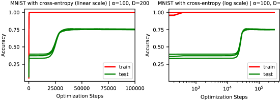

# Реальные данные и зрение (vision / real-world data: MNIST, CIFAR, ...)

[Эталонный полигон гроккинга](canonical-grokking-testbed.md) ← предыдущая карточка, следующая → [Разрежённая чётность](sparse-parity.md)

[Индекс карточек понятий](index.md), категория: [3. Задачи и наборы данных](index.md#cat-3)\
→ Следующая категория: [4. Факторы обучения и оптимизации](weight-decay.md)\
← Предыдущая категория: [2. Механизмы и представления](structured-representation-learning.md)

## Определение

«Реальные данные и зрение» — собирательное понятие для случаев, когда
[гроккинг](grokking.md) (феномен отложенной генерализации) наблюдается не на
синтетических алгоритмических задачах ([модульная арифметика](modular-arithmetic.md) и подобные), а на
«естественных» датасетах — прежде всего в задачах классификации изображений
(MNIST, CIFAR, ImageNet), а также на тексте и молекулах. Первую демонстрацию
гроккинга за пределами алгоритмических данных дали Liu et al. ещё в работе об
эффективной теории обучения представлений — на MNIST, с урезанной выборкой и
увеличенным масштабом инициализации: *«Теперь мы впервые демонстрируем, что гроккинг (существенно отложенная генерализация) — более общее явление в машинном обучении»* \[[1.3](#ref-1-3)\]. Широким и
систематическим это расширение сделала следующая работа тех же авторов,
Omnigrok: проанализировав [ландшафты потерь](loss-landscape-basins.md), они показали, что при подходящем масштабе
начальной нормы весов сеть грокает и *«вызвать гроккинг на задачах с изображениями, языком и молекулами»* \[[1.1](#ref-1-1)\]. Таким образом гроккинг
перестаёт быть артефактом узкого класса синтетических задач и трактуется как
явление, воспроизводимое на реальных, в том числе зрительных, данных.

## Детализация

Изначально гроккинг наблюдали исключительно на алгоритмических датасетах
(модульная арифметика), поэтому ключевой вопрос Omnigrok звучал так: возникает
ли он на данных иной природы. Ответ положительный, но с оговоркой —
демонстрация потребовала специальной «индукции»: масштабирования начальной
нормы весов (large-init-norm), поскольку без него на изображениях эффект слабее
и часто не проявляется \[[1.1](#ref-1-1)\]. Механически Omnigrok объясняет
задержку «LU-механизмом» — рассогласованием ландшафтов обучающей и тестовой
потери как функций нормы весов (кривые напоминают «L» и «U»); гроккинг на
реальных данных при этом менее драматичен, чем на алгоритмических. Ещё раньше
Thilak et al. в исследовании механизма [слингшот](slingshot.md) обучали
полносвязную ReLU-сеть на маленьком подмножестве CIFAR-10 и наблюдали
гроккинг-подобную динамику на зрительных данных \[[1.2](#ref-1-2)\]. Далее
целый ряд работ подтвердил гроккинг на реальных/зрительных данных, каждая — со
своим механизмом: переход от «ленивого» к «богатому» режиму обучения (lazy →
rich, то есть от режима, где признаки почти не меняются, к режиму активного
[обучения признаков](feature-emergence-feature-learning.md)) на MNIST \[[3.1](#ref-3-1)\]; частотная динамика (сеть
сначала учит менее выраженные частотные компоненты) на синтетике и реальных
данных \[[3.2](#ref-3-2)\]; демонстрация на архитектуре ResNet-18
\[[3.3](#ref-3-3)\]; связь с «[нейронным коллапсом](neural-collapse.md)» (neural collapse —
стягивание внутриклассовой дисперсии представлений) на MNIST
\[[3.4](#ref-3-4)\]; масштабирование вплоть до CIFAR/SVHN/ImageNet
\[[3.6](#ref-3-6)\] и даже перенос на классификацию конфигураций 2D-модели
Изинга, рассматриваемых как изображения \[[3.5](#ref-3-5)\]. Вместе с тем часть
работ оспаривает «естественность» и устойчивость зрительного гроккинга: по
Han et al. на реальных зрительных постановках (ResNet на CIFAR-10, ViT на
ImageNet) гроккинг сам по себе, как правило, не возникает и его приходится
искусственно индуцировать, регуляризуя решение прочь от «плоскости» ландшафта
(flatness) \[[2.1](#ref-2-1)\]; а Prakash & Martin показывают, что после
успешной генерализации на подмножестве MNIST наступает [anti-grokking](anti-grokking.md) — поздний
коллапс генерализации обратно к уровню случайного угадывания
\[[2.2](#ref-2-2)\], что связывает зрительный гроккинг с
[катастрофическим забыванием](catastrophic-forgetting.md).

## Альтернативные определения и нюансы

### A. Отложенная генерализация вне алгоритмических задач (Omnigrok, LU-механизм)

Базовая трактовка Liu et al.: гроккинг — не свойство алгоритмических данных, а
общий эффект отложенной генерализации, определяемый геометрией ландшафтов
потерь. Отличительная «машинерия» здесь — рассогласование обучающего и
тестового ландшафтов как функций нормы весов: чтобы получить гроккинг на
изображениях, авторы намеренно управляют начальной нормой весов, и тем же
приёмом в обратную сторону его устраняют на алгоритмических данных
\[[1.1](#ref-1-1)\]. То есть источник различия между «зрительным» и
«алгоритмическим» гроккингом — степень драматичности сигнала, объясняемая
обучением представлений, а не сама возможность явления.

### B. Механизм-независимая феноменология на реальных данных

Альтернативная рамка: «зрительный гроккинг» — это не одна теория, а
воспроизводимое эмпирическое явление, к которому сходятся разные механизмы. Его
отличительный признак — та же временнáя сигнатура (train-точность насыщается
рано, test-точность растёт много позже), но уже на MNIST/CIFAR/ImageNet, а не на
синтетике. Ключевой источник различия между работами — какой управляющий фактор
объявляется причиной: [скорость обучения](learning-rate.md) признаков (lazy → rich)
\[[3.1](#ref-3-1)\], выравнивание частот \[[3.2](#ref-3-2)\], геометрия
представлений и нейронный коллапс \[[3.4](#ref-3-4)\] или структурная
[разрежённость подсети](sparse-subnetwork-lottery-ticket.md) \[[3.5](#ref-3-5)\]. Такая множественность объяснений
сама по себе — довод в пользу того, что перед нами общий феномен обучения.

### Оспаривают

Нюанс «зрительный гроккинг возникает спонтанно и даёт устойчивую
генерализацию» оспаривается с двух сторон. Han et al.: на реальных зрительных
постановках (ResNet/CIFAR-10, ViT/ImageNet) гроккинг «типично не возникает» и
появляется лишь как побочный эффект намеренной регуляризации против плоскости
ландшафта — то есть он индуцирован, а не естественен \[[2.1](#ref-2-1)\].
Prakash & Martin: даже там, где зрительный гроккинг достигнут (подмножество
MNIST), при продлённом обучении наступает поздний коллапс генерализации
([anti-grokking](anti-grokking.md)) — устойчивость решения ставится под вопрос \[[2.2](#ref-2-2)\].

### Поддерживают

Нюанс «гроккинг — общий феномен, воспроизводимый на реальных/зрительных данных»
поддержан серией работ, каждая из которых предъявляет собственный механизм и
собственную зрительную постановку: MNIST через [переход lazy](lazy-to-rich-kernel-to-feature-learning.md) → rich
\[[3.1](#ref-3-1)\]; MNIST и другие реальные данные через частотную динамику
\[[3.2](#ref-3-2)\]; ResNet-18 через связь равномерности эмбеддингов и
распределения данных \[[3.3](#ref-3-3)\]; MNIST через нейронный коллапс и
информационное бутылочное горлышко \[[3.4](#ref-3-4)\]; классификацию
изображений 2D-модели Изинга через разрежение подсетей \[[3.5](#ref-3-5)\]; и
масштабирование до ImageNet в задаче «раз-обучения» (unlearning)
\[[3.6](#ref-3-6)\].

## Ссылки

###### ref-1-1
**\[1.1\]** 2210.01117 — Liu et al., «Omnigrok: Grokking Beyond Algorithmic Data». [`"induce grokking on tasks involving images, language and molecules"`](../papers/2210.01117.omnigrok-grokking-beyond-algorithmic-data/original/2210.01117.omnigrok-grokking-beyond-algorithmic-data.md#p1-3). *«[вызвать гроккинг на задачах с изображениями, языком и молекулами](../papers/2210.01117.omnigrok-grokking-beyond-algorithmic-data/2210.01117.omnigrok-grokking-beyond-algorithmic-data.card.md#p1-3)»*\
Доп.: [`"we demonstrate grokking for a wide range of machine learning tasks in Section 4, including image classification, sentiment analysis and molecule property prediction"`](../papers/2210.01117.omnigrok-grokking-beyond-algorithmic-data/original/2210.01117.omnigrok-grokking-beyond-algorithmic-data.md#p1-7) — *«[в разделе 4 мы демонстрируем гроккинг для широкого круга задач машинного обучения, включая классификацию изображений, анализ тональности и предсказание свойств молекул](../papers/2210.01117.omnigrok-grokking-beyond-algorithmic-data/2210.01117.omnigrok-grokking-beyond-algorithmic-data.card.md#p1-7)»*.

###### ref-1-2
**\[1.2\]** 2206.04817 — Thilak et al., «The Slingshot Mechanism: An Empirical Study of Adaptive Optimizers and the Grokking Phenomenon». [`"The FCN is trained with 200 randomly chosen CIFAR-10 samples with Adam"`](../papers/2206.04817.the-slingshot-mechanism-an-empirical-study-of-adaptive-optimizers-and-grokking/2206.04817.the-slingshot-mechanism-an-empirical-study-of-adaptive-optimizers-and-grokking.card.md#fig-1). *«[FCN обучается на 200 случайно выбранных образцах CIFAR-10 с помощью Adam](../papers/2206.04817.the-slingshot-mechanism-an-empirical-study-of-adaptive-optimizers-and-grokking/2206.04817.the-slingshot-mechanism-an-empirical-study-of-adaptive-optimizers-and-grokking.card.md#fig-1)»*

###### ref-1-3
**\[1.3\]** 2205.10343 — Liu et al., «Towards Understanding Grokking: An Effective Theory of Representation Learning». Первая демонстрация гроккинга вне алгоритмических данных (MNIST, раздел 4.3, приложение J). [`"We now demonstrate, for the first time, that grokking (significantly delayed generalization) is a more general phenomenon in machine learning that can occur not only on algorithmic datasets, but also on mainstream benchmark datasets"`](../papers/2205.10343.towards-understanding-grokking-an-effective-theory-of-representation-learning/original/2205.10343.towards-understanding-grokking-an-effective-theory-of-representation-learning.md#p9-2). *«[Теперь мы впервые демонстрируем, что гроккинг (существенно отложенная генерализация) — более общее явление машинного обучения, которое может возникать не только на алгоритмических наборах данных, но и на общепринятых эталонных наборах](../papers/2205.10343.towards-understanding-grokking-an-effective-theory-of-representation-learning/2205.10343.towards-understanding-grokking-an-effective-theory-of-representation-learning.card.md#p9-2)»*

###### ref-1-4
**\[1.4\]** 2402.15555 — Humayun, Balestriero, Baraniuk 2024, «Deep Networks Always Grok and Here is Why». Расширяет полигон корпуса на реальные данные шире всех предшественников: MNIST, CIFAR10, CIFAR100, Imagenette, текст Шекспира. Нюанс: единственная крупная постановка — ResNet18 с батч-нормализацией на полном ImageNet — стоит в приложении, и там LC растёт неограниченно, признаков переселения областей нет; прогона на полном ImageNet без батч-нормализации, то есть в настройке всех прочих результатов, в работе нет. [`"We make this observation for a number of training settings including for fully connected networks trained on MNIST (Figure 2), Convolutional Neural Networks (CNNs) trained on CIFAR10 and CIFAR100 (Figure 6), ResNet18 without batch-normalization, trained on CIFAR10 (Figure 1) and Imagenette (Figure 6), and a GPT-based Architecture trained on Shakespeare Text (Figure 9)."`](../papers/2402.15555.deep-networks-always-grok-and-here-is-why/original/2402.15555.deep-networks-always-grok-and-here-is-why.md#p2-4). *«[Мы делаем это наблюдение для целого ряда постановок обучения, включая полносвязные сети, обучаемые на MNIST (рисунок 2), свёрточные нейронные сети (CNN), обучаемые на CIFAR10 и CIFAR100 (рисунок 6), ResNet18 без батч-нормализации, обучаемый на CIFAR10 (рисунок 1) и Imagenette (рисунок 6), и архитектуру на основе GPT, обучаемую на тексте Шекспира (рисунок 9).](../papers/2402.15555.deep-networks-always-grok-and-here-is-why/2402.15555.deep-networks-always-grok-and-here-is-why.card.md#p2-4)»*\
Доп.: [`"While training a ResNet18 with Batch Norm on Imagenet Full (Figure 22), we see that the local complexity keeps increasing indefinitely, removing any signs of region migration."`](../papers/2402.15555.deep-networks-always-grok-and-here-is-why/original/2402.15555.deep-networks-always-grok-and-here-is-why.md#p9-3) — *«[При обучении ResNet18 с Batch Norm на полном Imagenet (рисунок 22) мы видим, что местная сложность растёт неограниченно, убирая всякие признаки переселения областей.](../papers/2402.15555.deep-networks-always-grok-and-here-is-why/2402.15555.deep-networks-always-grok-and-here-is-why.card.md#p9-3)»*.
## Ссылки на присоединившиеся работы

### Оспаривают

###### ref-2-1
**\[2.1\]** 2509.17738 — Han et al., «Flatness is Necessary, Neural Collapse is Not: Rethinking Generalization via Grokking». Оспаривает: на реальных зрительных данных гроккинг не возникает сам по себе, а индуцируется регуляризацией против плоскости ландшафта. [`"regularizing against flatness, i.e., encouraging sharp solutions, reliably delays generalization and induces grokking-like behavior even in settings where it does not typically arise, including ResNets on CIFAR-10, ViTs on ImageNet"`](../papers/2509.17738.flatness-is-necessary-neural-collapse-is-not-rethinking-generalization-via-grokking/original/2509.17738.flatness-is-necessary-neural-collapse-is-not-rethinking-generalization-via-grokking.md#p2-3). *«[регуляризация против плоскостности, то есть поощрение резких решений, надёжно откладывает генерализацию и вызывает поведение вроде гроккинга даже там, где он обыкновенно не возникает: на ResNet с CIFAR-10, на ViT с ImageNet](../papers/2509.17738.flatness-is-necessary-neural-collapse-is-not-rethinking-generalization-via-grokking/2509.17738.flatness-is-necessary-neural-collapse-is-not-rethinking-generalization-via-grokking.card.md#p2-3)»*

###### ref-2-2
**\[2.2\]** 2602.02859 — Prakash et al., «Late-Stage Generalization Collapse in Grokking: Detecting anti-grokking with WeightWatcher». Оспаривает устойчивость зрительного гроккинга: после генерализации на MNIST наступает поздний коллапс. [`"We revisit two canonical grokking setups: a 3-layer MLP trained on a subset of MNIST"`](../papers/2602.02859.late-stage-generalization-collapse-in-grokking-detecting-anti-grokking-with-weightwatcher/original/2602.02859.late-stage-generalization-collapse-in-grokking-detecting-anti-grokking-with-weightwatcher.md#p1-3). *«[Мы возвращаемся к двум узаконенным постановкам гроккинга: трёхслойной MLP, обучаемой на подмножестве MNIST](../papers/2602.02859.late-stage-generalization-collapse-in-grokking-detecting-anti-grokking-with-weightwatcher/2602.02859.late-stage-generalization-collapse-in-grokking-detecting-anti-grokking-with-weightwatcher.card.md#p1-3)»*\
Доп.: [`"We observe that after each model has transitioned from pre-grokking to grokking (successful generalization), test accuracy collapses back to chance while training accuracy remains perfect"`](../papers/2602.02859.late-stage-generalization-collapse-in-grokking-detecting-anti-grokking-with-weightwatcher/original/2602.02859.late-stage-generalization-collapse-in-grokking-detecting-anti-grokking-with-weightwatcher.md#p1-8) — *«[Мы наблюдаем, что после перехода каждой модели от предгроккинга к гроккингу (удавшейся генерализации) точность на тесте обрушивается назад к случайной, тогда как точность на обучении остаётся безупречной](../papers/2602.02859.late-stage-generalization-collapse-in-grokking-detecting-anti-grokking-with-weightwatcher/2602.02859.late-stage-generalization-collapse-in-grokking-detecting-anti-grokking-with-weightwatcher.card.md#p1-8)»*.

###### ref-2-3
**\[2.3\]** 2506.23286 — Jeffares & van der Schaar, «Not All Explanations for Deep Learning Phenomena Are Equally Valuable». Нюанс: собственной проверки утверждения о других видах данных нет; работы корпуса, показывающие отложенные переходы в зрительных и языковых постановках при обычной инициализации (2402.15555, 2401.10463, 2405.12755, 2409.09281, 2504.20752), не разбираются. [`"While grokking can technically be induced on other data modalities"`](../papers/2506.23286.not-all-explanations-for-deep-learning-phenomena-are-equally-valuable/original/2506.23286.not-all-explanations-for-deep-learning-phenomena-are-equally-valuable.md#p4-1). *«[Хотя гроккинг технически можно навести и на других видах данных](../papers/2506.23286.not-all-explanations-for-deep-learning-phenomena-are-equally-valuable/2506.23286.not-all-explanations-for-deep-learning-phenomena-are-equally-valuable.card.md#p4-1)»*\
Доп. (единственный собственный опыт с реальными данными — про двойной спуск): [`"The double descent experiment uses the setting described in Greydanus & Kobak 2024"`](../papers/2506.23286.not-all-explanations-for-deep-learning-phenomena-are-equally-valuable/original/2506.23286.not-all-explanations-for-deep-learning-phenomena-are-equally-valuable.md#p14-3). *«[опыт с двойным спуском использует обстановку, описанную у Greydanus & Kobak 2024](../papers/2506.23286.not-all-explanations-for-deep-learning-phenomena-are-equally-valuable/2506.23286.not-all-explanations-for-deep-learning-phenomena-are-equally-valuable.card.md#p14-3)»*
### Поддерживают

###### ref-3-1
**\[3.1\]** 2310.06110 — Kumar et al., «Grokking as the Transition from Lazy to Rich Training Dynamics». Нюанс: зрительный гроккинг на MNIST управляется переходом от ленивого к богатому режиму обучения. [`"this transition from lazy (linear model) to rich training (feature learning) can control grokking in more general settings, like on MNIST, one-layer Transformers, and student-teacher networks"`](../papers/2310.06110.grokking-as-the-transition-from-lazy-to-rich-training-dynamics/original/2310.06110.grokking-as-the-transition-from-lazy-to-rich-training-dynamics.md#p1-3). *«[этот переход от ленивого обучения (линейная модель) к богатому (обучение признакам) способен управлять гроккингом и в более общих постановках — например, на MNIST, однослойных трансформерах и сетях «учитель — ученик»](../papers/2310.06110.grokking-as-the-transition-from-lazy-to-rich-training-dynamics/2310.06110.grokking-as-the-transition-from-lazy-to-rich-training-dynamics.card.md#p1-3)»*

###### ref-3-2
**\[3.2\]** 2405.17479 — Zhou et al., «A rationale from frequency perspective for grokking in training neural network». Нюанс: гроккинг на реальных данных объясняется частотной динамикой обучения. [`"We observe this phenomenon across both synthetic and real datasets, offering a novel viewpoint"`](../papers/2405.17479.a-rationale-from-frequency-perspective-for-grokking-in-training-neural-network/2405.17479.a-rationale-from-frequency-perspective-for-grokking-in-training-neural-network.card.md#p1-2). *«[Мы наблюдаем это явление и на искусственных, и на настоящих наборах данных, чем предлагаем новый угол зрения](../papers/2405.17479.a-rationale-from-frequency-perspective-for-grokking-in-training-neural-network/2405.17479.a-rationale-from-frequency-perspective-for-grokking-in-training-neural-network.card.md#p1-2)»*

###### ref-3-3
**\[3.3\]** 2504.03162 — Gu et al., «Beyond Progress Measures: Theoretical Insights into the Mechanism of Grokking». Нюанс: гроккинг воспроизводится на зрительной архитектуре ResNet-18. [`"we design a dedicated dataset to validate our theory on ResNet-18, successfully showcasing the occurrence of grokking"`](../papers/2504.03162.beyond-progress-measures-theoretical-insights-into-the-mechanism-of-grokking/2504.03162.beyond-progress-measures-theoretical-insights-into-the-mechanism-of-grokking.card.md#p1-2). *«[мы устраиваем нарочитый набор данных для проверки нашей теории на ResNet-18 и успешно показываем возникновение гроккинга](../papers/2504.03162.beyond-progress-measures-theoretical-insights-into-the-mechanism-of-grokking/2504.03162.beyond-progress-measures-theoretical-insights-into-the-mechanism-of-grokking.card.md#p1-2)»*

###### ref-3-4
**\[3.4\]** 2509.20829 — Sakamoto et al., «Explaining Grokking and Information Bottleneck through Neural Collapse Emergence». Нюанс: зрительный гроккинг на MNIST связывается со стягиванием внутриклассовой дисперсии (нейронный коллапс). [`"We first analyze the relationship between grokking, within-class variance, and neural collapse. Following Liu et al. (2023a), we train an MLP on the MNIST dataset"`](../papers/2509.20829.explaining-grokking-and-information-bottleneck-through-neural-collapse-emergence/2509.20829.explaining-grokking-and-information-bottleneck-through-neural-collapse-emergence.card.md#p7-10). *«[Сперва мы разбираем отношение между гроккингом, внутриклассовой дисперсией и нейронным коллапсом. Вслед за Liu et al. (2023a) мы обучаем MLP на наборе данных MNIST](../papers/2509.20829.explaining-grokking-and-information-bottleneck-through-neural-collapse-emergence/2509.20829.explaining-grokking-and-information-bottleneck-through-neural-collapse-emergence.card.md#p7-10)»*

###### ref-3-5
**\[3.5\]** 2510.25966 — Hutchison et al., «Grokking in the Ising Model». Нюанс: гроккинг переносится на классификацию конфигураций 2D-модели Изинга, трактуемых как изображения. [`"This paper demonstrates that grokking can occur when a dense neural network is applied to the Ising model in the presence of weight decay"`](../papers/2510.25966.grokking-in-the-ising-model/original/2510.25966.grokking-in-the-ising-model.md#p1-7). *«[Модель Изинга, рассматриваемая как генератор изображений с наибольшей случайностью при заданной корреляции спинов](../papers/2510.25966.grokking-in-the-ising-model/2510.25966.grokking-in-the-ising-model.card.md#p1-8)»*.

###### ref-3-6
**\[3.6\]** 2512.03437 — Liang & Li, «Grokked Models are Better Unlearners». Нюанс: постановка гроккинга на зрительных данных взята у Omnigrok и доведена до CIFAR-10, SVHN и ImageNet-100. [`"We compare applying standard unlearning methods *before* versus *after* the grokking transition across vision (CNNs/ResNets on CIFAR, SVHN and ImageNet) and language (a transformer on a TOFU‑style setup)"`](../papers/2512.03437.grokked-models-are-better-unlearners/2512.03437.grokked-models-are-better-unlearners.card.md#p1-2). *«[Мы сравниваем приложение обычных приёмов разучивания *до* и *после* перехода к гроккингу на зрении (свёрточные сети и ResNet на CIFAR, SVHN и ImageNet) и на языке (трансформер в постановке в духе TOFU)](../papers/2512.03437.grokked-models-are-better-unlearners/2512.03437.grokked-models-are-better-unlearners.card.md#p1-2)»*

###### ref-3-7
**\[3.7\]** 2401.10463 — Zhu et al. 2024. Нюанс: расширение линии Omnigrok на два порядка по объёму (1 тыс. примеров IMDB двухслойной LSTM → полный IMDB и Yelp однослойным трансформером со словарём BERT); при этом на Yelp гроккинг получен лишь на 10-процентном подмножестве, а на полном наборе наступает де-гроккинг. [`"We further extend to full IMDB (21K samples) and Yelp (350K samples) datasets using a 1-layer Transformer (vocab_size=30K, the same as BERT)."`](../papers/2401.10463.critical-data-size-of-language-models-from-a-grokking-perspective/2401.10463.critical-data-size-of-language-models-from-a-grokking-perspective.card.md#p15-2). *«[Мы идём дальше и расширяем до полного IMDB (21K примеров) и Yelp (350K примеров) с однослойным трансформером (vocab_size=30K, тот же, что у BERT).](../papers/2401.10463.critical-data-size-of-language-models-from-a-grokking-perspective/2401.10463.critical-data-size-of-language-models-from-a-grokking-perspective.card.md#p15-2)»*\
Доп. (оговорка про Yelp): [`"This was achieved using a smaller, 10% subset of the Yelp dataset."`](../papers/2401.10463.critical-data-size-of-language-models-from-a-grokking-perspective/2401.10463.critical-data-size-of-language-models-from-a-grokking-perspective.card.md#p6-2) — *«[Это было достигнуто на меньшем, 10-процентном подмножестве набора Yelp.](../papers/2401.10463.critical-data-size-of-language-models-from-a-grokking-perspective/2401.10463.critical-data-size-of-language-models-from-a-grokking-perspective.card.md#p6-2)»*

###### ref-3-8
**\[3.8\]** 2405.12755 — Golechha 2024, «Progress Measures for Grokking on Real-world Tasks». Обе постановки работы неалгоритмические — MLP на MNIST и модель на основе LSTM на IMDb, — и обе взяты у Liu et al. 2022b без изменений; перенос трёх мер с одной архитектуры на другую заявлен как отдельный вклад. Нюанс: результаты на IMDb автор сам называет ограниченными, ось шагов на рисунке 4 обрывается около 4000 против 100 000 на MNIST, зоны переобучения и генерализации не размечены, обучающая точность стоит на единице с самого начала, а проверочная колеблется без позднего скачка — отложенной генерализации на этом рисунке не видно, хотя подпись называет его гроккингом. [`"with the exact same setup and hyperparameters as in Liu et al. 2022b"`](../papers/2405.12755.progress-measures-for-grokking-on-real-world-tasks/original/2405.12755.progress-measures-for-grokking-on-real-world-tasks.md#p9-9). *«[с ровно теми же постановкой и гиперпараметрами, что в Liu et al. 2022b](../papers/2405.12755.progress-measures-for-grokking-on-real-world-tasks/2405.12755.progress-measures-for-grokking-on-real-world-tasks.card.md#p9-9)»*\
Доп. (собственная оценка): [`"We show limited results on the IMDb dataset (Maas et al. 2011) in Appendix D."`](../papers/2405.12755.progress-measures-for-grokking-on-real-world-tasks/original/2405.12755.progress-measures-for-grokking-on-real-world-tasks.md#p5-6) — *«[Ограниченные результаты на наборе данных IMDb (Maas et al. 2011) мы показываем в приложении D.](../papers/2405.12755.progress-measures-for-grokking-on-real-world-tasks/2405.12755.progress-measures-for-grokking-on-real-world-tasks.card.md#p5-6)»*.

###### ref-3-10
**\[3.10\]** 2411.00247 — Jeffares, Curth, van der Schaar, «Deep Learning Through A Telescoping Lens: A Simple Model Provides Empirical Insights On Grokking, Gradient Boosting & Beyond». Нюанс: все зрительные опыты идут на нарочно уменьшенных данных — CIFAR-10 (кошки против собак) и MNIST (3 против 5) переведены в оттенки серого, сжаты до $8\times8$ и урезаны до $n=1000$; это цена вычислимости телескопического приближения, требующего градиентов по каждому примеру на каждом шаге. Из крупных постановок остаётся только ResNet-20 на CIFAR-10 в опыте со связностью мод, но там приближение не строится. [`"we grayscale and downsize images to $d=8\times 8$ format and use $n=1000$ training examples"`](../papers/2411.00247.deep-learning-through-a-telescoping-lens-a-simple-model-provides-empirical-insights-on-grokking-gradient-boosting-and-beyond/original/2411.00247.deep-learning-through-a-telescoping-lens-a-simple-model-provides-empirical-insights-on-grokking-gradient-boosting-and-beyond.md#p22-5). *«[мы переводим изображения в оттенки серого и уменьшаем до размера $d=8\times 8$, используем $n=1000$ обучающих примеров](../papers/2411.00247.deep-learning-through-a-telescoping-lens-a-simple-model-provides-empirical-insights-on-grokking-gradient-boosting-and-beyond/2411.00247.deep-learning-through-a-telescoping-lens-a-simple-model-provides-empirical-insights-on-grokking-gradient-boosting-and-beyond.card.md#p22-5)»*\
Доп. (та же мера для опыта с гроккингом): [`"we once more consider the binary classification task 3-vs-5 from $n=1000$ images downsampled to $d=8\times 8$ features"`](../papers/2411.00247.deep-learning-through-a-telescoping-lens-a-simple-model-provides-empirical-insights-on-grokking-gradient-boosting-and-beyond/original/2411.00247.deep-learning-through-a-telescoping-lens-a-simple-model-provides-empirical-insights-on-grokking-gradient-boosting-and-beyond.md#p23-3) — *«[мы вновь рассматриваем задачу бинарной классификации 3 против 5 на $n=1000$ изображениях, уменьшенных до $d=8\times 8$ признаков](../papers/2411.00247.deep-learning-through-a-telescoping-lens-a-simple-model-provides-empirical-insights-on-grokking-gradient-boosting-and-beyond/2411.00247.deep-learning-through-a-telescoping-lens-a-simple-model-provides-empirical-insights-on-grokking-gradient-boosting-and-beyond.card.md#p23-3)»*.

###### ref-3-11
**\[3.11\]** 2507.20057 — Lyle et al., «What Can Grokking Teach Us About Learning Under Nonstationarity?». Употребляет CIFAR-10 не как площадку для гроккинга, а как вторую, независимую проверку того же рычага: ResNet-18 без слагаемых смещения и малая свёрточная сеть, 70 эпох на доле данных, затем добавление остатка и ещё 70 эпох по распорядку Ash & Adams 2020. Гроккинга на зрительных данных работа не показывает и не заявляет. Отдельный отрицательный итог: масштаб последнего линейного слоя, на важности которого для гроккинга в зрительных задачах настаивали Liu et al. 2022b, здесь заметного действия не оказал. [`"In this section, all experiments are run with convolutional architectures on the CIFAR-10 dataset."`](../papers/2507.20057.what-can-grokking-teach-us-about-learning-under-nonstationarity/original/2507.20057.what-can-grokking-teach-us-about-learning-under-nonstationarity.md#p7-4). *«[В этом разделе все опыты проведены со свёрточными архитектурами на наборе данных CIFAR-10](../papers/2507.20057.what-can-grokking-teach-us-about-learning-under-nonstationarity/2507.20057.what-can-grokking-teach-us-about-learning-under-nonstationarity.card.md#p7-4)»*

###### ref-3-12
**\[3.12\]** 2406.06158 — Kunin et al., «Get rich quick: exact solutions reveal how unbalanced initializations promote rapid feature learning». Нюанс: два опыта на зрении — LeNet-5 на MNIST (раннее движение NTK объяснено изменением активаций, 8 прогонов) и малый ResNet на CIFAR-10 с ядром $15\times 15$ и обнулённым weight decay (габороподобные фильтры при $\alpha=10$, шум при $\alpha=0.1$). Гроккинга здесь не ищут, а связь гладкости фильтров с качеством работа не устанавливает, а прямо показывает её отсутствие. [`"we increase the convolution kernel size from $3\times 3$ to $15\times 15$, to better observe the learned spatial patterns, and we set the weight decay parameter to $0$ to avoid confounding variables"`](../papers/2406.06158.get-rich-quick-exact-solutions-reveal-how-unbalanced-initializations-promote-rapid-feature-learning/2406.06158.get-rich-quick-exact-solutions-reveal-how-unbalanced-initializations-promote-rapid-feature-learning.card.md#p39-2). *«[мы увеличиваем размер свёрточного ядра с $3\times 3$ до $15\times 15$, чтобы лучше наблюдать выучиваемые пространственные узоры, и устанавливаем параметр weight decay в $0$, чтобы избежать смешивающих факторов](../papers/2406.06158.get-rich-quick-exact-solutions-reveal-how-unbalanced-initializations-promote-rapid-feature-learning/2406.06158.get-rich-quick-exact-solutions-reveal-how-unbalanced-initializations-promote-rapid-feature-learning.card.md#p39-2)»*\
Доп. (качество не меняется): [`"all networks achieve comparable training and test accuracy, despite the modification in initialization"`](../papers/2406.06158.get-rich-quick-exact-solutions-reveal-how-unbalanced-initializations-promote-rapid-feature-learning/2406.06158.get-rich-quick-exact-solutions-reveal-how-unbalanced-initializations-promote-rapid-feature-learning.card.md#fig-11) — *«[все сети достигают сопоставимой обучающей и тестовой точности, несмотря на изменение инициализации](../papers/2406.06158.get-rich-quick-exact-solutions-reveal-how-unbalanced-initializations-promote-rapid-feature-learning/2406.06158.get-rich-quick-exact-solutions-reveal-how-unbalanced-initializations-promote-rapid-feature-learning.card.md#fig-11)»*.

###### ref-3-13
**\[3.13\]** 2310.12977 — Humayun, Balestriero, Baraniuk 2023, «Training Dynamics of Deep Network Linear Regions». Задаёт полигон, на котором позже мерялась местная сложность: MNIST с полносвязными сетями и CIFAR10 со свёрточными и ResNet18, места замера — обучающие, проверочные и случайные точки области данных. Нюанс: постановок крупнее CIFAR10 нет, алгоритмических задач нет вовсе, а полоса на всех рисунках — нестандартная величина, взятая по точкам замера, а не по прогонам; число прогонов и семян не указано нигде. [`"We perform experiments on MNIST with fully connected DNs and on CIFAR10 with CNN and Resnet architectures."`](../papers/2310.12977.training-dynamics-of-deep-network-linear-regions/original/2310.12977.training-dynamics-of-deep-network-linear-regions.md#p5-2). *«[Мы проводим опыты на MNIST с полносвязными ГС и на CIFAR10 со свёрточными и Resnet-архитектурами.](../papers/2310.12977.training-dynamics-of-deep-network-linear-regions/2310.12977.training-dynamics-of-deep-network-linear-regions.card.md#p5-2)»*\
Доп. (как считается разброс): [`"In all the results presented, we plot a confidence interval corresponding to $25\%$ of the standard deviation of LC computed."`](../papers/2310.12977.training-dynamics-of-deep-network-linear-regions/original/2310.12977.training-dynamics-of-deep-network-linear-regions.md#p5-2) — *«[Во всех представленных результатах мы рисуем доверительный промежуток, отвечающий $25\%$ стандартного отклонения вычисленной LC.](../papers/2310.12977.training-dynamics-of-deep-network-linear-regions/2310.12977.training-dynamics-of-deep-network-linear-regions.card.md#p5-2)»*.

###### ref-3-14
**\[3.14\]** 2503.10483 — Pomarico et al., «Grokking as an entanglement transition in tensor network machine learning». Нюанс: девять задач «кроссовок против каждой из прочих меток», одинаковая размерность связи $\chi=400$; исходного разрешения, MNIST, CIFAR, доверительных интервалов и повторов по семенам нет. [`"we use subsamples composed by $1\%$ of the original images, then split in half for train and test"`](../papers/2503.10483.grokking-as-an-entanglement-transition-in-tensor-network-machine-learning/2503.10483.grokking-as-an-entanglement-transition-in-tensor-network-machine-learning.card.md#p7-1). *«[мы пользуемся подвыборками, составленными из $1\%$ исходных изображений, затем разделёнными пополам на обучение и тест](../papers/2503.10483.grokking-as-an-entanglement-transition-in-tensor-network-machine-learning/2503.10483.grokking-as-an-entanglement-transition-in-tensor-network-machine-learning.card.md#p7-1)»*\
Доп. (насколько задача проста): [`"The characterizing trait of sneaker in the low resolution is based on the first and last black pixel rows, with just one confounding label referring to sandal, making it an easily recognized pattern."`](../papers/2503.10483.grokking-as-an-entanglement-transition-in-tensor-network-machine-learning/2503.10483.grokking-as-an-entanglement-transition-in-tensor-network-machine-learning.card.md#p7-1) — *«[Отличительная черта кроссовка при низком разрешении основана на первой и последней чёрных строках пикселей, с единственной путающей меткой, относящейся к сандалии, что делает эту картину легко распознаваемой.](../papers/2503.10483.grokking-as-an-entanglement-transition-in-tensor-network-machine-learning/2503.10483.grokking-as-an-entanglement-transition-in-tensor-network-machine-learning.card.md#p7-1)»*

###### ref-3-15
**\[3.15\]** 2603.07323 — Truong, Truong, «Norm-Hierarchy Transitions in Representation Learning…». Нюанс: качественная половина закона переносится на зрение, количественная — нет. [`"We construct a modified CIFAR-10 in which a colored border correlates with the class label."`](../papers/2603.07323.norm-hierarchy-transitions-in-representation-learning-when-and-why-neural-networks-abandon-shortcuts/2603.07323.norm-hierarchy-transitions-in-representation-learning-when-and-why-neural-networks-abandon-shortcuts.card.md#p7-3). *«[Мы строим изменённый CIFAR-10, в котором цветная рамка связана с меткой класса.](../papers/2603.07323.norm-hierarchy-transitions-in-representation-learning-when-and-why-neural-networks-abandon-shortcuts/2603.07323.norm-hierarchy-transitions-in-representation-learning-when-and-why-neural-networks-abandon-shortcuts.card.md#p7-3)»*

###### ref-3-16
**\[3.16\]** 2506.12284 — Walker et al., «GrokAlign: Geometric Characterisation and Acceleration of Grokking». Ведёт почти всю свою эмпирику на зрительных данных: MNIST служит и проверкой теории, и площадкой торможения, и площадкой ускорения, а на подвыборке CIFAR-10 в 1024 образца свёрточная сеть без смещений показывает, что под GrokAlign устойчивость к Autoattack растёт, тогда как под одним weight decay к концу обучения падает. Нюанс: абсолютные величины малы — тестовая точность держится около 0,36, устойчивая около 0,14 против 0,02, — то есть показано относительное улучшение заведомо слабой модели; сетей со смещениями нет ни одной, поскольку допущение о нулевом смещении перенесено из теории в опыты. [`"by using GrokAlign we can induce Jacobian alignment, as evidenced by the increasing centroid alignment, which translates into improved robustness"`](../papers/2506.12284.grokalign-geometric-characterisation-and-acceleration-of-grokking/original/2506.12284.grokalign-geometric-characterisation-and-acceleration-of-grokking.md#p7-5). *«[с помощью GrokAlign мы можем навести выравненность якобиана, о чём свидетельствует растущая выравненность центроидов, которая переходит в улучшенную устойчивость](../papers/2506.12284.grokalign-geometric-characterisation-and-acceleration-of-grokking/2506.12284.grokalign-geometric-characterisation-and-acceleration-of-grokking.card.md#p7-5)»*

###### ref-3-17
**\[3.17\]** 2605.06352 — Tang et al., «Topological Signatures of Grokking». Постановка Omnigrok (Liu et al.) с изменением масштаба инициализации, пять семян, слой 1. [`"In contrast to modular arithmetic, no sustained increase in total persistence is observed, and no clearly dominant long-lived $H_{1}$ feature emerges."`](../papers/2605.06352.topological-signatures-of-grokking/2605.06352.topological-signatures-of-grokking.card.md#p9-2). *«[В отличие от модульной арифметики, устойчивого роста суммарной устойчивости не наблюдается, и ясно выраженной господствующей долгоживущей черты $H_{1}$ не возникает.](../papers/2605.06352.topological-signatures-of-grokking/2605.06352.topological-signatures-of-grokking.card.md#p9-2)»*\
Доп. (оговорка, снимающая часть силы вывода): по признанию самих авторов на MNIST [`"test accuracy increases more gradually"`](../papers/2605.06352.topological-signatures-of-grokking/2605.06352.topological-signatures-of-grokking.card.md#p8-3) — *«[тестовая точность растёт более постепенно](../papers/2605.06352.topological-signatures-of-grokking/2605.06352.topological-signatures-of-grokking.card.md#p8-3)»*.

###### ref-3-18
**\[3.18\]** 2507.23346 — Pomarico et al. 2025, «Transfer entropy and O-information to detect grokking in tensor network multi-class classification problems». Трёхклассовый fashion MNIST, огрублённый до $6\times 6$ (платье/кроссовок/сумка, 10% выборки, 36 кубитов MPS-классификатора), с нарочно «сбивающим» классом; отрицательная сверка — гиперспектральные снимки PRISMA (43 признака после отбора Boruta: виноградник/олива/пашня), где та же модель переобучается. Нюанс: сумка на тесте систематически антипредсказывается — точность ниже 10% при случайных 33%, — а сравнение задач различает разом предмет, шум, число признаков и примеров, так что вывод «структура данных правит истолковываемой динамикой» не отделим от прочих различий. [`"Bag class performs poorly as a confounding case, with training accuracy around $25\%$, with oscillations, and test performance reaching a value even smaller than $10\%$."`](../papers/2507.23346.transfer-entropy-and-o-information-to-detect-grokking-in-tensor-network-multi-class-classification-problems/2507.23346.transfer-entropy-and-o-information-to-detect-grokking-in-tensor-network-multi-class-classification-problems.card.md#p7-10). *«[Класс сумки работает плохо как сбивающий случай: обучающая точность около $25\%$ с колебаниями, а тестовое качество достигает значения даже меньше $10\%$.](../papers/2507.23346.transfer-entropy-and-o-information-to-detect-grokking-in-tensor-network-multi-class-classification-problems/2507.23346.transfer-entropy-and-o-information-to-detect-grokking-in-tensor-network-multi-class-classification-problems.card.md#p7-10)»*
### Наследуют

###### ref-3-9
**\[3.9\]** 2408.11804 — Yunis et al., «Approaching Deep Learning through the Spectral Dynamics of Weights». Самый широкий в корпусе набор носителей для одной спектральной меры: CIFAR-10 (VGG-16), порождение MNIST (диффузионная UNet), LibriSpeech (двунаправленная LSTM), Wikitext-103 (двенадцатислойный трансформер), причём гиперпараметры взяты из литературы намеренно. Существенная оговорка: ни в одной из четырёх задач гроккинга нет, и падение эффективного ранга там — фоновая склонность обучения. [`"This ensures that any correlations observed are likely a reflection of common practices, not introduced bias on our part."`](../papers/2408.11804.approaching-deep-learning-through-the-spectral-dynamics-of-weights/original/2408.11804.approaching-deep-learning-through-the-spectral-dynamics-of-weights.md#p6-6). *«[Это обеспечивает, что любые наблюдаемые соотнесения, скорее всего, отражают расхожую практику, а не привнесённое нами смещение](../papers/2408.11804.approaching-deep-learning-through-the-spectral-dynamics-of-weights/2408.11804.approaching-deep-learning-through-the-spectral-dynamics-of-weights.card.md#p6-6)»*\
Доп. (оговорка, решающая для переноса): [`"we do not see such an obvious rank minimization as in grokking, nor is there a sudden transition from memorization to generalization"`](../papers/2408.11804.approaching-deep-learning-through-the-spectral-dynamics-of-weights/original/2408.11804.approaching-deep-learning-through-the-spectral-dynamics-of-weights.md#p2-5) — *«[мы не видим столь же очевидной минимизации ранга, как при гроккинге, и нет там внезапного перехода от запоминания к генерализации](../papers/2408.11804.approaching-deep-learning-through-the-spectral-dynamics-of-weights/2408.11804.approaching-deep-learning-through-the-spectral-dynamics-of-weights.card.md#p2-5)»*.
## Цитирования

Работы, лишь упоминающие явление (обзор литературы, связанные работы, попутное цитирование) без его подробного разбора.

**\[4.1\]** 2310.19470 — Minegishi et al., «Bridging Lottery Ticket and Grokking: Understanding Grokking from Inner Structure of Networks». [`"significantly reduces delayed generalization across various tasks, including multiple modular arithmetic operations, polynomial regression, sparse parity, and MNIST classification"`](../papers/2310.19470.bridging-lottery-ticket-and-grokking-understanding-grokking-from-inner-structure-of-networks/original/2310.19470.bridging-lottery-ticket-and-grokking-understanding-grokking-from-inner-structure-of-networks.md#p1-2). *«[значительно сокращает отложенную генерализацию в разных задачах, включая несколько операций модульной арифметики, многочленную регрессию, разрежённую чётность и классификацию MNIST](../papers/2310.19470.bridging-lottery-ticket-and-grokking-understanding-grokking-from-inner-structure-of-networks/2310.19470.bridging-lottery-ticket-and-grokking-understanding-grokking-from-inner-structure-of-networks.card.md#p1-2)»*

**\[4.2\]** 2311.06597 — Tan et al., «Understanding Grokking Through A Robustness Viewpoint». [`"initially observed in training on unconventional Algorithmic datasets [11], and later found in traditional tasks such as image classification [6]"`](../papers/2311.06597.understanding-grokking-through-a-robustness-viewpoint/2311.06597.understanding-grokking-through-a-robustness-viewpoint.card.md#p1-3). *«[впервые замеченное при обучении на нетрадиционных алгоритмических наборах данных [Power et al., 2022], а позже найденное и в обычных задачах вроде классификации изображений [Liu et al., 2022b]](../papers/2311.06597.understanding-grokking-through-a-robustness-viewpoint/2311.06597.understanding-grokking-through-a-robustness-viewpoint.card.md#p1-3)»*

**\[4.3\]** 2501.04697 — Prieto et al., «Grokking at the Edge of Numerical Stability». [`"recent findings suggest that grokking may be a more pervasive phenomenon, also manifesting in more complex tasks involving vision and language (Lv et al., 2024; Humayun et al., 2024)"`](../papers/2501.04697.grokking-at-the-edge-of-numerical-stability/2501.04697.grokking-at-the-edge-of-numerical-stability.card.md#p1-4). *«[недавние находки наводят на мысль, что гроккинг может оказаться более распространённым явлением, проявляющимся и в более сложных задачах зрения и языка (Lv et al., 2024; Humayun et al., 2024)](../papers/2501.04697.grokking-at-the-edge-of-numerical-stability/2501.04697.grokking-at-the-edge-of-numerical-stability.card.md#p1-4)»*

**\[4.4\]** 2504.13292 — Xu et al., «Let Me Grok For You: Accelerating Grokking via Embedding Transfer from a Weaker Model». [`"the grokking phenomenon has since been observed in other settings such as learning group operations (Chughtai et al., 2023), sparse parity (Barak et al., 2022), and image classification (Liu et al., 2023)"`](../papers/2504.13292.let-me-grok-for-you-accelerating-grokking-via-embedding-transfer-from-a-weaker-model/original/2504.13292.let-me-grok-for-you-accelerating-grokking-via-embedding-transfer-from-a-weaker-model.md#p1-4). *«[явление гроккинга с тех пор наблюдалось и в других постановках — при обучении групповым операциям (Chughtai et al., 2023), разрежённой чётности (Barak et al., 2022) и классификации изображений (Liu et al., 2023)](../papers/2504.13292.let-me-grok-for-you-accelerating-grokking-via-embedding-transfer-from-a-weaker-model/2504.13292.let-me-grok-for-you-accelerating-grokking-via-embedding-transfer-from-a-weaker-model.card.md#p1-4)»*

**\[4.5\]** 2211.13239 — Brown et al., «Relating Regularization and Generalization through the Intrinsic Dimension of Activations». Нюанс: ResNet-18 на CIFAR-10/CIFAR-100 взят не ради гроккинга — отложенной генерализации на изображениях здесь нет и не ищется, все модели достигают безупречной обучающей точности сразу, а все точки сняты на конец обучения. Корпусу отсюда полезны порядки величин и знаки: LLID падает с $\approx 24$ до $\approx 7$ при усилении регуляризации, PID держится примерно в пределах $80$–$110$ и обрушивается до $40$–$60$ при избыточной. [`"We note that all models trained achieve perfect accuracy on the training set."`](../papers/2211.13239.relating-regularization-and-generalization-through-the-intrinsic-dimension-of-activations/original/2211.13239.relating-regularization-and-generalization-through-the-intrinsic-dimension-of-activations.md#p4-3). *«[Заметим, что все обученные модели достигают безупречной точности на обучающей выборке](../papers/2211.13239.relating-regularization-and-generalization-through-the-intrinsic-dimension-of-activations/2211.13239.relating-regularization-and-generalization-through-the-intrinsic-dimension-of-activations.card.md#p4-3)»*\
Доп.: [`"although it is advantageous to have a simple representation of the data at deeper layers, it should not come at the expense of the ability to extract rich features in earlier layers"`](../papers/2211.13239.relating-regularization-and-generalization-through-the-intrinsic-dimension-of-activations/original/2211.13239.relating-regularization-and-generalization-through-the-intrinsic-dimension-of-activations.md#p5-2) — *«[хотя простое представление данных на более глубоких слоях и выгодно, оно не должно достигаться ценой способности извлекать богатые признаки на более ранних слоях](../papers/2211.13239.relating-regularization-and-generalization-through-the-intrinsic-dimension-of-activations/2211.13239.relating-regularization-and-generalization-through-the-intrinsic-dimension-of-activations.card.md#p5-2)»*.

**\[4.7\]** 2605.08237 — Wang, Ying, Kanamori 2026, «Distributional Spectral Diagnostics for Localizing Grokking Transitions». Нюанс: обе постановки на реальных данных гроккинга не содержат и объявлены проверками, а не результатами. [`"CIFAR-10 is included as a portability check only, not as a grokking diagnostic benchmark"`](../papers/2605.08237.distributional-spectral-diagnostics-for-localizing-grokking-transitions/2605.08237.distributional-spectral-diagnostics-for-localizing-grokking-transitions.card.md#p23-1). *«[CIFAR-10 включена только как проверка переносимости, а не как эталонный тест диагностики гроккинга](../papers/2605.08237.distributional-spectral-diagnostics-for-localizing-grokking-transitions/2605.08237.distributional-spectral-diagnostics-for-localizing-grokking-transitions.card.md#p23-1)»*\
Доп. (FCN на MNIST): [`"We do not interpret these FCN results as a grokking diagnostic claim"`](../papers/2605.08237.distributional-spectral-diagnostics-for-localizing-grokking-transitions/2605.08237.distributional-spectral-diagnostics-for-localizing-grokking-transitions.card.md#p30-5) — *«[Мы не истолковываем эти результаты по FCN как диагностическую заявку о гроккинге](../papers/2605.08237.distributional-spectral-diagnostics-for-localizing-grokking-transitions/2605.08237.distributional-spectral-diagnostics-for-localizing-grokking-transitions.card.md#p30-5)»*

**\[4.8\]** 2502.01774 — Carvalho et al. 2025, «Grokking Explained: A Statistical Phenomenon». Опыты объявлены, но в статье отсутствуют — см. раздел «Несогласованности внутри статьи» карточки. [`"In addition to the synthetic datasets, we conduct experiments on the MNIST dataset to explore grokking under a real-world scenario of induced distribution shifts."`](../papers/2502.01774.grokking-explained-a-statistical-phenomenon/original/2502.01774.grokking-explained-a-statistical-phenomenon.md#p1-6). *«[Помимо синтетических наборов данных, мы проводим опыты на наборе MNIST, чтобы исследовать гроккинг в реалистичном сценарии наведённых сдвигов распределения.](../papers/2502.01774.grokking-explained-a-statistical-phenomenon/2502.01774.grokking-explained-a-statistical-phenomenon.card.md#p1-6)»*

**\[4.9\]** 2606.13753 — Truong et al. 2026, «The Weight Norm Sets the Grokking Timescale: A Causal Delay Law». Ссылается на настоящие данные только как на место, где работает противная сторона: гроккинг на MNIST и IMDb вне ожидаемого промежутка норм принят не опровержением, а сужением области — норма правит временем лишь там, где задаёт масштаб функции. Нюанс существенный для карточки: собственных прогонов на настоящих данных в работе нет ни одного, весь довод стоит на модульном сложении и разрежённой чётности, и авторы называют это ограничением сами. [`"Golechha 2024 reports grokking on real-world data (MNIST, IMDb) outside the expected norm range — even without weight decay, with the norm increasing — concluding weight norms are correlative, not causal."`](../papers/2606.13753.the-weight-norm-sets-the-grokking-timescale-a-causal-delay-law/2606.13753.the-weight-norm-sets-the-grokking-timescale-a-causal-delay-law.card.md#p3-1). *«[Golechha 2024 сообщает о гроккинге на данных реального мира (MNIST, IMDb) вне ожидаемого промежутка норм — даже без weight decay, при возрастающей норме, — заключая, что нормы весов коррелятивны, а не причинны.](../papers/2606.13753.the-weight-norm-sets-the-grokking-timescale-a-causal-delay-law/2606.13753.the-weight-norm-sets-the-grokking-timescale-a-causal-delay-law.card.md#p3-1)»*

### Внешние работы

###### ref-5-1
**\[5.1\]** 2406.03999 — Внешняя работа (демотирована из корпуса): Song, Tan, Zou, Ma, Huang, «Unveiling the Dynamics of Information Interplay…». [`"Our models are trained on CIFAR-10 and CIFAR-100."`](../externals/2406.03999.unveiling-the-dynamics-of-information-interplay-in-supervised-learning/2406.03999.unveiling-the-dynamics-of-information-interplay-in-supervised-learning.card.md#p4-11). *«[Наши модели обучаются на CIFAR-10 и CIFAR-100.](../externals/2406.03999.unveiling-the-dynamics-of-information-interplay-in-supervised-learning/2406.03999.unveiling-the-dynamics-of-information-interplay-in-supervised-learning.card.md#p4-11)»* Опоры — WideResNet-28-2 и WideResNet-28-8, SGD с моментом 0.9 и weight decay $5e^{-4}$, шаг 0.03 с косинусным затуханием, батч 64, $2^{20}$ итераций. Свидетельством гроккинга на реальных данных эта работа не является.
