# von Oswald et al. 2023 — Transformers Learn In-Context by Gradient Descent

**Внешняя работа (демотирована из корпуса, task-019).** Предмет статьи — механизм обучения в контексте; гроккинг занимает один хеджированный абзац приложения A.11. Карточка сохранена целиком как сверхполная выдержка; в индексах и счётчиках корпуса работа не участвует. Конвенция — `papers/README.md`, раздел «Внешние работы». Оригинал — [`original/`](https://arxiv.org/abs/2212.07677); разбор тезисов — соседний `…claims.txt`.

См. также: [глобальный индекс понятий](../../concepts/index.md).
arXiv [2212.07677v2](https://arxiv.org/abs/2212.07677), 15 декабря 2022 (v2 — 31 мая 2023). Колонтитул PDF: «Proceedings of the 40th International Conference on Machine Learning, Honolulu, Hawaii, USA. PMLR 202, 2023».

**Johannes von Oswald** — Department of Computer Science, ETH Zürich; Google Research.
**Eyvind Niklasson, Ettore Randazzo, Alexander Mordvintsev, Andrey Zhmoginov, Max Vladymyrov** — Google Research.
**João Sacramento** — Department of Computer Science, ETH Zürich.

Файлы разбора этой статьи:

- [`2212.07677.transformers-learn-in-context-by-gradient-descent.claims.txt`](2212.07677.transformers-learn-in-context-by-gradient-descent.claims.txt) — пронумерованные утверждения статьи с пометками разбора.
- [`2212.07677.transformers-learn-in-context-by-gradient-descent.license.txt`](2212.07677.transformers-learn-in-context-by-gradient-descent.license.txt) — лицензионная запись arXiv для этой статьи.

Схема якорей и правила ссылок на карточку — в [README папки статей](../README.md).

**Карточка-выдержка.** Лицензия статьи (`arxiv-nonexclusive`) не разрешает публикацию копии оригинала и полного перевода, поэтому карточка содержит редакторские секции и цитируемые фрагменты перевода (право цитирования). Полный текст статьи: <https://arxiv.org/abs/2212.07677>.

## Затрагиваемые понятия

**[Гроккинг](../../concepts/grokking.md)** — работа даёт корпусу наблюдение гроккинг-подобного перехода на новом носителе, и делает это в одном абзаце приложения ([A.11](#p22-2)): при «тщательном подборе скорости обучения и размера пакета» один блок трансформера (слой самовнимания и MLP), обучаемый на ограниченном наборе из 8192 задач линейной регрессии, показывает «grokking like» фазовые переходы обучающей и поверочной потерь — поверочная сперва резко растёт, затем около 12 тысяч шагов обе обрушиваются почти к потере градиентного спуска ([fig-15](#fig-15), справа). Ссылка на Power et al. 2022 — единственная ссылка на гроккинг во всей статье, и оформлена она как сходство вида кривых («look reminiscent of»), а не как перенос механизма. Чего в работе нет: обучающая потеря к моменту скачка не выходит на почти нулевой уровень, кривые падают одновременно, настройки прогона не названы, а абзац заканчивается словами «We leave a thorough investigation of these phenomena for future study» — ссылаться на это как на измеренный гроккинг в in-context регрессии нельзя. Существенно для корпуса, что переход получен вне классической постановки: MSE-регрессия вместо классификации, ограниченный набор задач вместо запоминания таблицы, без weight decay ([A.12](#p22-4): «We did not use any regularisation»), под Adam, а рычагами служат скорость обучения и размер пакета.

**[Фазовый переход](../../concepts/phase-transition.md)** — статья наблюдает фазовые переходы в необычном месте: в мета-обучении внутреннего алгоритма, а не в обучении задаче. В основном опыте потеря сходит ступенями ([fig-2](#fig-2), слева), а в [A.11](#p22-1) показано, что при одной голове самовнимания часть из десяти семян сидит на плато «with virtually zero progress» по 1500–4000 шагов, после чего потеря внезапно обрушивается к уровню градиентного спуска; переход на две головы снимает зависимость от семени, и все прогоны сходятся ровно и быстро ([fig-15](#fig-15), слева и в центре). Работа не вводит ни языка фазовых переходов как теории, ни параметров порядка — слово «переход» у авторов описательное, и главный их вклад здесь — архитектурный рычаг (вторая голова), выключающий задержку.

**[Меры прогресса](../../concepts/progress-measures.md)** — работа даёт раннее наблюдение внутренней величины, опережающей внешний скачок, не называя его никаким термином: при обучении двухслойного трансформера на чередующихся токенах норма частной производной выхода первого слоя по соседнему токену начинает расти до того, как потеря срывается с плато ([fig-5](#fig-5): «Before the Transformer performance jumps to the one of GD, the first layer becomes highly sensitive to the next token»), тогда как чувствительность к прочим токенам остаётся нулевой. Термин «progress measures» появился у Nanda et al. (2023) позже подачи статьи и в ней не употребляется; «hidden progress» Barak et al. (2022) статья цитирует, но не в этой роли. Приписывать авторам постановку о мерах прогресса нельзя — но сама измеримая величина, предвещающая срыв, здесь есть.

**[Доля данных / критический размер набора](../../concepts/data-fraction-critical-dataset-size.md)** — ограничение объёма данных выступает условием обоих ключевых наблюдений с данными. Гроккинг-подобный переход ([A.11](#p22-2)) получен только при обучении на зафиксированных 8192 задачах — в основных опытах каждый шаг берёт свежие задачи, и там переобучения нет по устройству. Отдельно, в [A.12](#p23-1), при обучении на зафиксированном наборе из $B$ задач выравнивание обученного слоя с построением рушится при $B=128$ и становится почти идеальным при $B>2048$ ([fig-16](#fig-16)). Закона критического размера работа не формулирует — есть две точки зависимости поведения от объёма набора.

**[Скорость обучения](../../concepts/learning-rate.md)** — в единственном гроккинг-абзаце ([A.11](#p22-2)) именно подбор скорости обучения и размера пакета назван тем, что включает гроккинг-подобный переход: «when carefully tuning the learning rate and batchsize we can also make the Transformers … *grokk*». Значения не названы; общие настройки ([A.12](#p22-4): Adam, lr 0.001 при глубине $K<3$ и 0.0005 иначе, батч 2048) относятся к остальным опытам. Работа не измеряет зависимость от этих рычагов — она лишь фиксирует, что ими переход включается.

---

## Несогласованности внутри статьи

**Утверждение 1 в основном тексте и в приложении расходятся индексами.** В [основной формулировке](#p4-2) динамика записана как $(x_{j},y_{j})+P\,VK^{T}q_{j}$, а в повторении утверждения в [A.1](#sec-a1) первая пара несёт индекс $i$: $(x_{i},y_{i})+P\,VK^{T}q_{j}$. Опечатка, но она стоит в формулировке центрального утверждения; при цитировании формулы стоит сверяться с выводом в A.1.

**Гипотеза распространяется на авторегрессионные задачи, опыты — нет.** [Гипотеза 1](#p3-1) говорит об авторегрессионных задачах, тогда как все опыты — регрессия с потерей на одном последнем токене, без шума и без регуляризации; сами авторы признают, что такая потеря «stands in contrast to usual autoregressive training and the training setup of Garg et al. 2022» ([sec-a12](#sec-a12)). Гипотеза при этом не сужена — читателю стоит держать разрыв в голове.

---

# Цитируемые фрагменты перевода

Ниже приведены только те фрагменты перевода, на которые ссылаются карточки корпуса (право цитирования). Нумерация якорей `pN-M` / `fig-N` / `sec-X` совпадает с полной карточкой и оригиналом.

##### **Гипотеза 1** (Трансформеры учатся в контексте градиентным спуском)**.**

###### p3-1

*При обучении трансформеров на авторегрессионных задачах обучение в контексте в прямом проходе трансформера осуществляется градиентной оптимизацией неявной авторегрессионной внутренней потери, построенной из его контекстных данных.*

##### **Утверждение 1****.**

###### p4-2

*Для однолинейного слоя внимания с одной головой и токенов $e_{j}=(x_{j},y_{j})$, $j=1,\ldots,N$, можно построить матрицы ключей, запросов и значений $W_{K},W_{Q},W_{V}$ и матрицу проекции $P$ так, что шаг трансформера на каждом токене $e_{j}$ тождествен градиентной динамике $e_{j}\leftarrow(x_{j},y_{j})+(0,-\Delta Wx_{j})=(x_{j},y_{j})+P\,VK^{T}q_{j}$, так что $e_{j}=(x_{j},y_{j}-\Delta y_{j})$. Для токена тестовых данных $(x_{N+1},y_{N+1})$ динамика тождественна.*

## 3 Обученные трансформеры *действительно* имитируют градиентный спуск на задачах линейной регрессии

###### fig-2

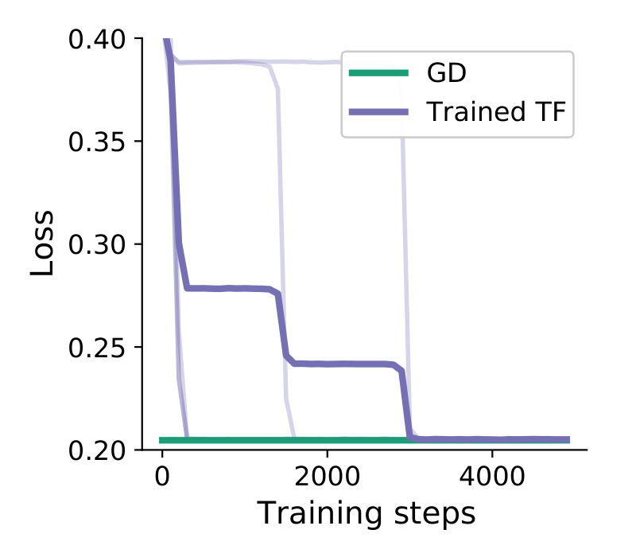

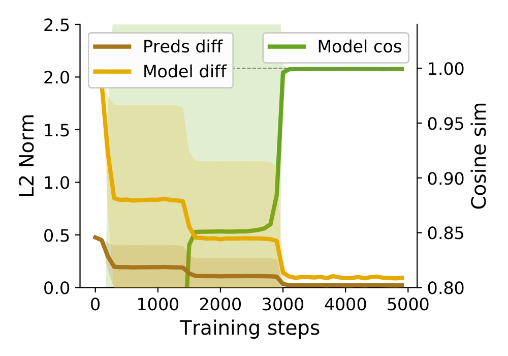

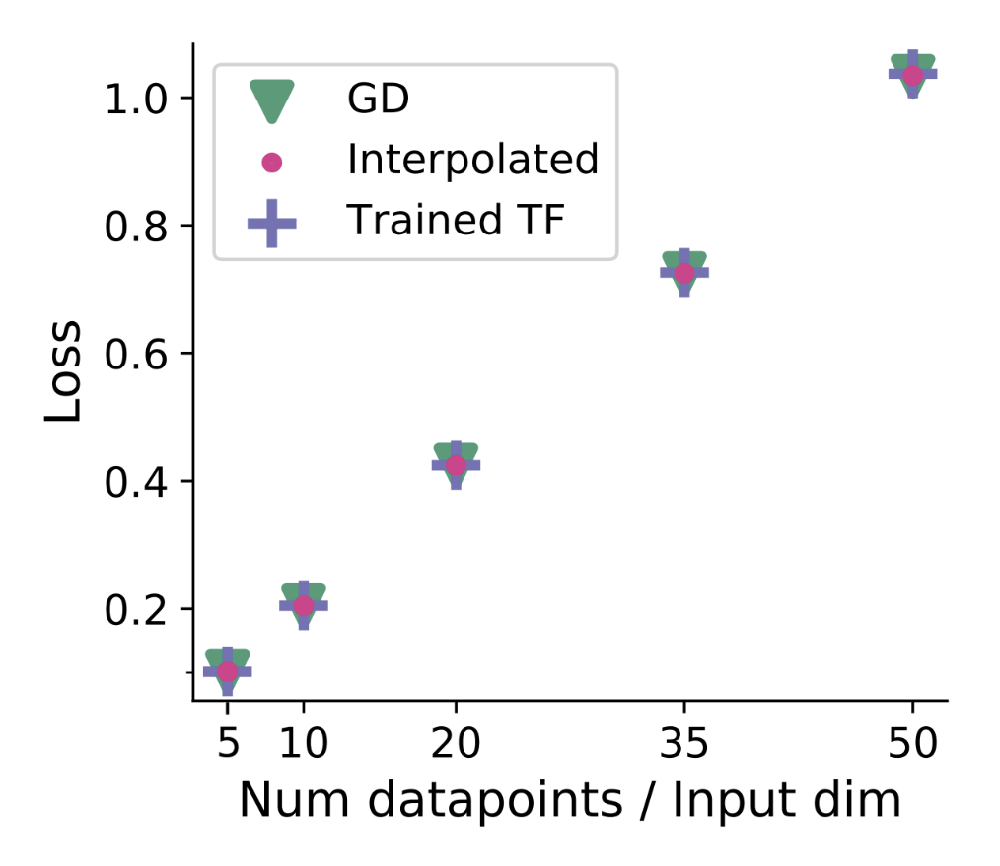

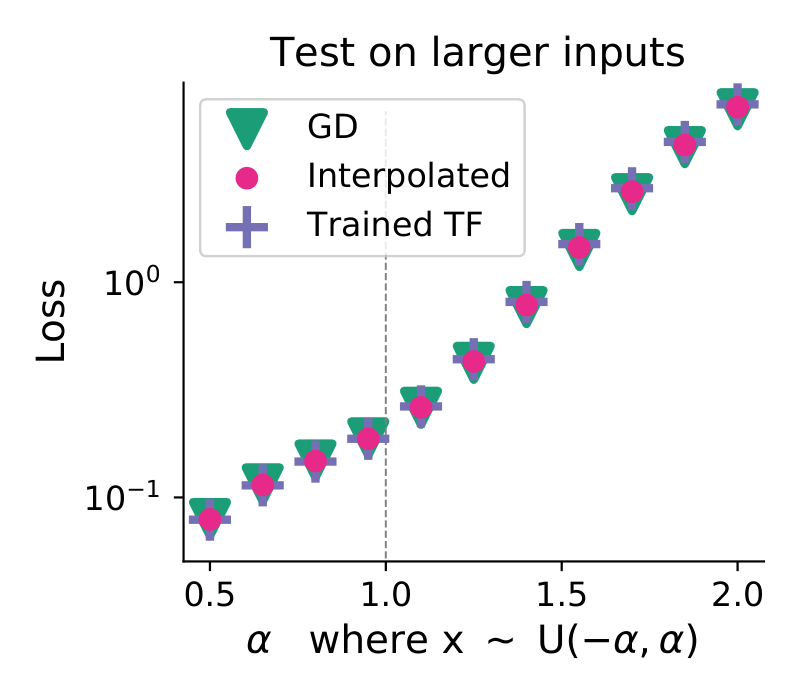

*Рисунок 2: **Сравнение одного шага GD с обученным одиночным линейным слоем самовнимания.** *Крайний слева:* качество обученного одиночного LSA-слоя тождественно качеству градиентного спуска. *Второй слева*: почти идеальное выравнивание GD и модели, порождаемой SA-слоем после обучения, по косинусной близости и L2-расстоянию между моделями и между их предсказаниями. *Второй справа:* тождественная потеря GD, модели LSA-слоя и модели, полученной интерполяцией между построением и оптимизированными весами LSA-слоя, для разных $N=N_{x}$. *Крайний справа:* обученный LSA-слой, градиентный спуск и их интерполяция показывают тождественную потерю (в лог-масштабе) на входных данных, отличных от обучающих, то есть при масштабе 1. Показаны среднее/ст. откл. или отдельные прогоны 5 семян.* **[p. 5]**

##### **Утверждение 3****.**

###### fig-5

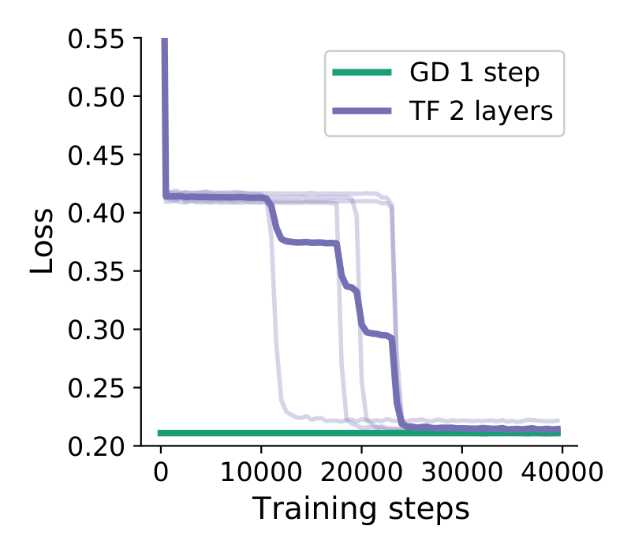

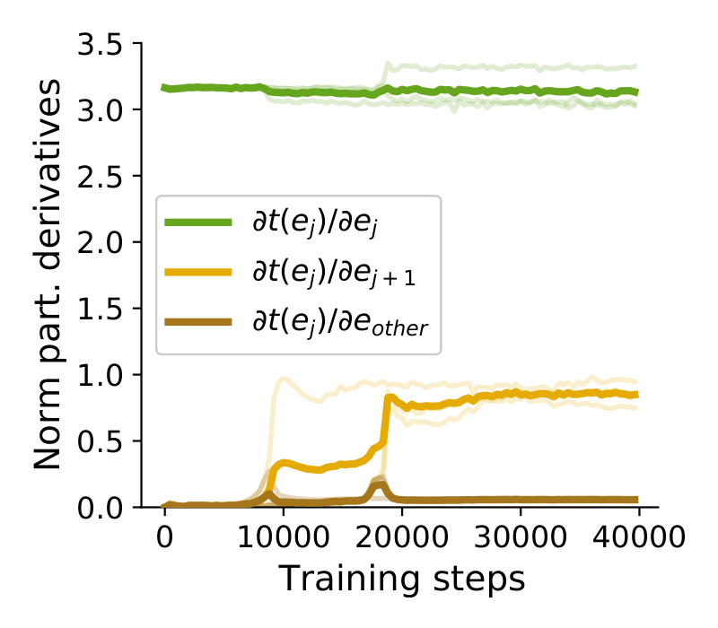

*Рисунок 5: **Обучение двухслойного трансформера из одних SA-слоёв при стандартной сборке токенов.** *Слева:* потеря обученных TF совпадает с одним шагом GD, не двумя, а обучение занимает на порядок дольше. *Справа*: норма частных производных выхода первого слоя самовнимания по входным токенам. Прежде чем качество трансформера прыгает к качеству GD, первый слой становится высокочувствительным к следующему токену.* **[p. 8]**

###### sec-a1

## Приложение A

### A.11 Фазовые переходы

###### p22-1

Мы коротко комментируем любопытно выглядящие фазовые переходы обучающей потери, наблюдаемые во многих наших опытах, см. рисунок 2. Тем не менее простой переход от одноголового слоя самовнимания к двухголовому смягчает зависящие от случайного семени неустойчивости обучения в наших опытах основного текста, см. левый и центральный графики рисунка 15.

###### p22-2

Далее, эти переходы выглядят напоминающими недавно наблюдённое поведение «гроккинга» (Power et al. 2022). Занятно, что при тщательном подборе скорости обучения и размера пакета мы можем заставить трансформеры, обучаемые на этих задачах линейной регрессии, тоже *гроккать*. Для этого мы обучаем один блок трансформера (слой самовнимания и MLP) на ограниченном количестве данных (8192 задачи), см. правый график рисунка 15, и наблюдаем похожие на гроккинг фазовые переходы обучающей и тестовой потерь, где тестовая сперва резко растёт, а затем испытывает внезапное падение потери, почти совпадая с желаемой потерей GD $~0.2$. Тщательное исследование этих явлений мы оставляем будущему изучению.

###### fig-15

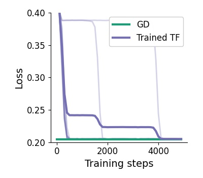

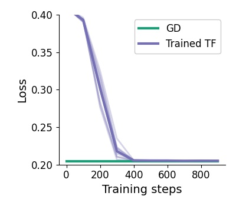

*Рисунок 15: **Фазовые переходы при обучении**. *Слева:* потеря по 10 разным случайным семенам при оптимизации одноголового слоя самовнимания. Для некоторых семян мы наблюдаем очень долгие начальные фазы практически нулевого прогресса, после которых потеря внезапно падает к желаемой потере GD. *В центре:* тот же опыт, но с оптимизацией *двух*голового слоя самовнимания. Мы наблюдаем быструю и устойчивую сходимость к потере GD. *Справа:* обучение одного блока трансформера, то есть слоя самовнимания с MLP, при уменьшенном размере обучающего набора в 8192 задачи. Мы наблюдаем похожие на гроккинг фазовые переходы обучающей и тестовой потерь, где тестовый набор сперва резко растёт, прежде чем испытать внезапное падение потери, почти совпадающее с желаемой потерей GD $~0.2$.* **[p. 23]**

###### sec-a12

### A.12 Детали опытов

###### p22-4

- Оптимизатор: Adam (Kingma & Ba 2014) с параметрами по умолчанию и скоростью обучения 0.001 для трансформеров глубины $K<3$ и 0.0005 иначе. Мы используем размер пакета 2048 и применяем обрезку градиента до глобальной нормы $10$. Использована библиотека Optax.
- Инициализация весов Haiku (fan-in) усечённой нормалью со ст. откл. $0.002/K$, где $K$ — число слоёв.
- Мы не использовали никакой регуляризации и наблюдали для более глубоких трансформеров с $K>2$ неустойчивости при достижении качества GD. Мы предполагаем, что это происходит потому, что качество GD для данных обучающих задач уже близко к расходимости, как видно при подаче задач с большими диапазонами входов. Поэтому обучение трансформеров тоже становится **[p. 23]** неустойчивым, когда мы приближаемся к GD с оптимальной скоростью обучения. Ради устойчивости обучения мы просто обрезали значения токенов до диапазона $[-10,10]$.
- Где применимо, мы используем стандартные позиционные кодировки размера $20$, приклеиваемые ко всем токенам.
- Для простоты и близкого следования приведённому построению весов мы использовали квадратные матрицы параметров ключей, значений и запросов во всех опытах.
- Длительность обучения различалась между постановками и считывается с наших обучающих графиков в статье.
- При обучении мета-параметров градиентного спуска, то есть $\eta$ и $\gamma$, мы использовали тождественную постановку обучения, но обычно обучение требовало гораздо меньше итераций.
- Во всех опытах мы выбираем начальное $W_{0}=0$ для моделей, обучаемых градиентным спуском.

###### p23-1

Вдохновляясь (Garg et al. 2022), мы дополнительно приводим результаты обучения одного линейного слоя самовнимания на фиксированном числе обучающих задач. Для этого мы итерируем по одному фиксированному пакету размера $B$ вместо набора нового пакета задач на каждой итерации. Результаты — на рисунке 16. Интригующе, что (мета)градиентный спуск находит веса трансформера, замечательно выравнивающиеся с приведённым построением и, следовательно, с градиентным спуском, даже при, казалось бы, очень малом числе обучающих задач. Мы считаем, что это снова подчёркивает сильное индуктивное смещение LSA-слоя к (приближённому) осуществлению градиентного обучения в его прямом проходе.

###### fig-16

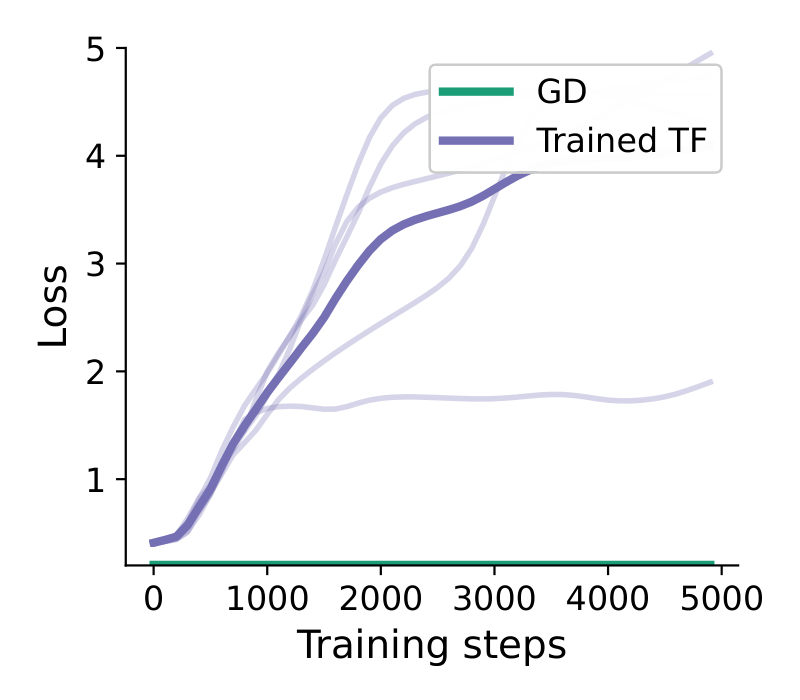

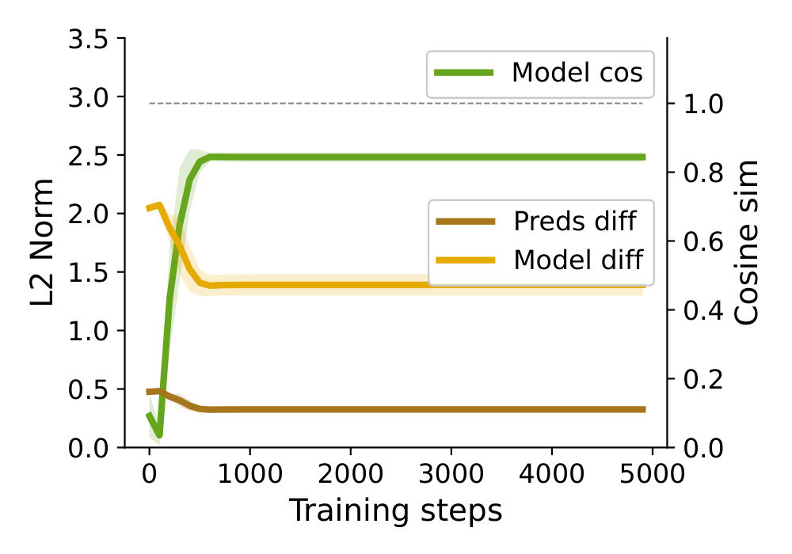

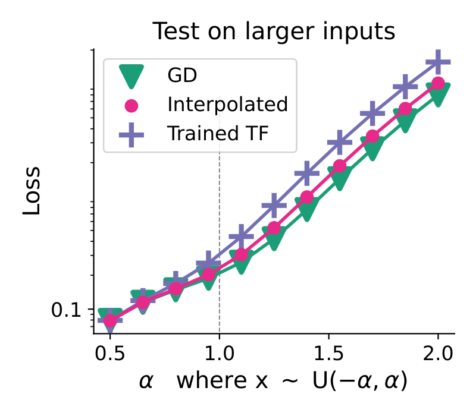

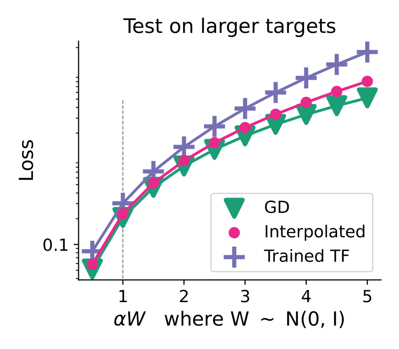

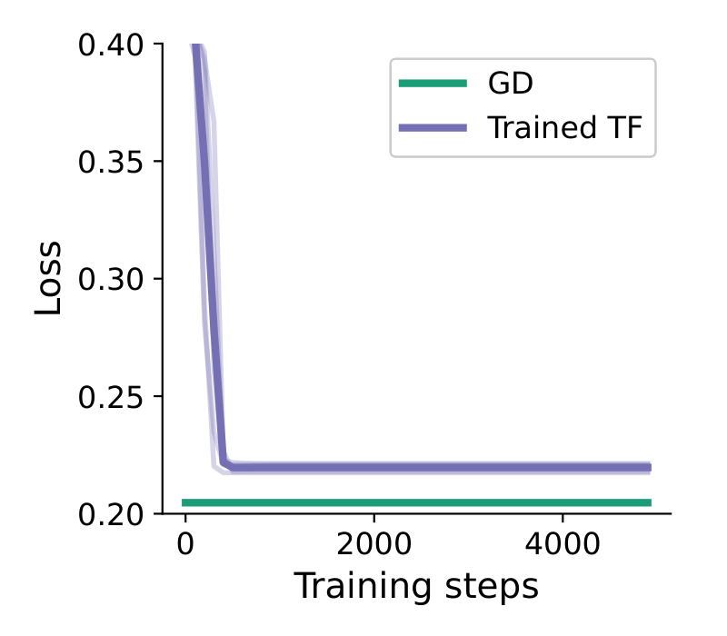

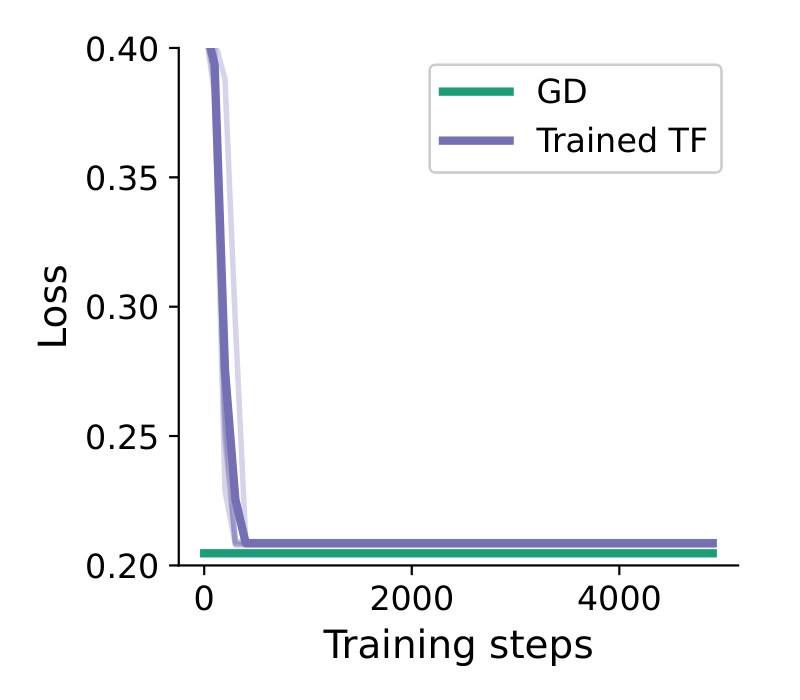

*Рисунок 16: **Сравнение обученных трансформеров с GD и их весовой интерполяцией при обучении трансформера на обучающем наборе фиксированного размера $B$**. По нашим мерам выравнивания и проверкам поведения вне обучения обученные трансформеры не выравниваются с GD при очень малом количестве задач. Тем не менее уже в нашей базовой постановке $N=N_{x}=10$ при $B>2048$ задач мы видим почти идеальное выравнивание. Во всех постановках мы обучаем трансформер (нестохастическим) градиентным спуском, итерируя по одному пакету задач размера $B$, равного числу в заголовках панелей рисунка (128, 512, 2048, 8192).* **[p. 24]**
