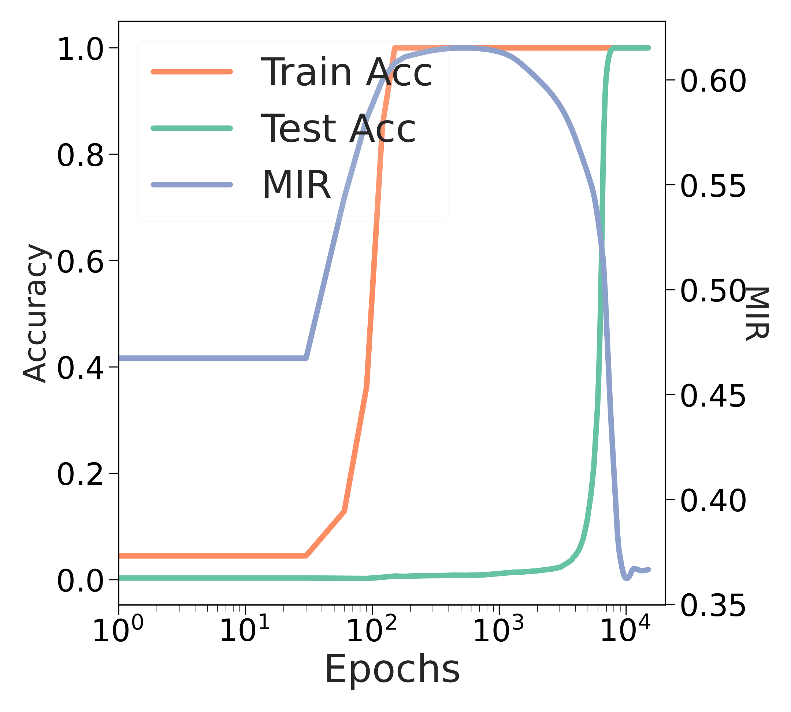
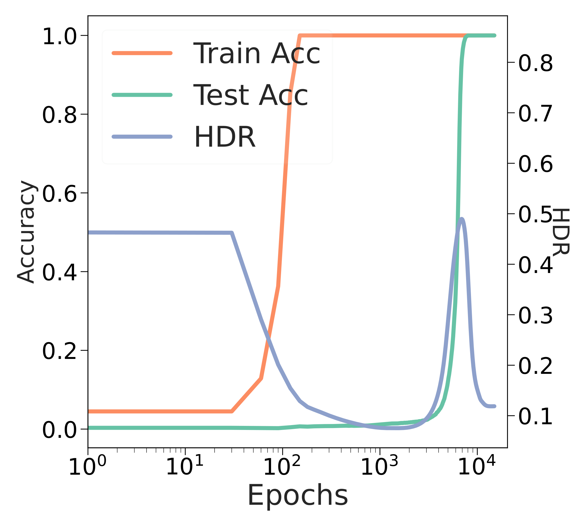

# Song et al. 2024 — Unveiling the Dynamics of Information Interplay in Supervised Learning

**Внешняя работа (демотирована из корпуса, task-019).** Предмет статьи — нейронный коллапс; гроккинг — один подраздел из пяти без теории. Карточка сохранена целиком как сверхполная выдержка; в индексах и счётчиках корпуса работа не участвует. Конвенция — `papers/README.md`, раздел «Внешние работы». Оригинал — [`original/`](https://arxiv.org/abs/2406.03999); разбор тезисов — соседний `…claims.txt`.

См. также: [глобальный индекс понятий](../../concepts/index.md).
arXiv [2406.03999v1](https://arxiv.org/abs/2406.03999), 6 июня 2024. Колонтитул PDF: «Proceedings of the 41 st International Conference on Machine Learning, Vienna, Austria. PMLR 235, 2024».

**Kun Song** — University of Science and Technology Beijing (равный вклад).
**Zhiquan Tan** — Department of Mathematical Sciences, Tsinghua University (равный вклад).
**Bochao Zou** — University of Science and Technology Beijing.
**Huimin Ma** — University of Science and Technology Beijing (переписка).
**Weiran Huang** — MIFA Lab, Qing Yuan Research Institute, SEIEE, Shanghai Jiao Tong University; Shanghai AI Laboratory (переписка).

Файлы разбора этой статьи:

- [`2406.03999.unveiling-the-dynamics-of-information-interplay-in-supervised-learning.claims.txt`](2406.03999.unveiling-the-dynamics-of-information-interplay-in-supervised-learning.claims.txt) — пронумерованные утверждения статьи с пометками разбора.
- [`2406.03999.unveiling-the-dynamics-of-information-interplay-in-supervised-learning.license.txt`](2406.03999.unveiling-the-dynamics-of-information-interplay-in-supervised-learning.license.txt) — лицензионная запись arXiv для этой статьи.

Схема якорей и правила ссылок на карточку — в [README папки статей](../README.md).

**Карточка-выдержка.** Лицензия статьи (`arxiv-nonexclusive`) не разрешает публикацию копии оригинала и полного перевода, поэтому карточка содержит редакторские секции и цитируемые фрагменты перевода (право цитирования). Полный текст статьи: <https://arxiv.org/abs/2406.03999>.

## Затрагиваемые понятия

**[Нейронный коллапс](../../concepts/neural-collapse.md)** — работа задаёт инструмент, а не объяснение: она берёт три условия NC как данность и вычисляет, чему при них равны две матричные величины между грам-матрицей представлений и грам-матрицей строк классификационной головы. Теорема 4.2 ([с. 3, абз. 19](#p3-19)) даёт $\operatorname{HDR}=0$ и $\operatorname{MIR}=\frac{1}{C-1}+\frac{(C-2)\log(C-2)}{(C-1)\log(C-1)}$, а замечание после следствия 4.3 ([с. 3, абз. 22](#p3-22)) добавляет, что это выражение $\approx 1$, — отсюда рабочее ожидание всей статьи: по ходу обучения MIR растёт, HDR падает ([с. 1, абз. 5](#p1-5)). Ценность для корпуса в том, что обе величины считаются **между** признаками и головой, а не внутри признаков: NC3 (самодвойственность) получает скалярную наблюдаемую. Чего в работе нет: ни одного прямого измерения самого коллапса — условия NC1–NC3 нигде не проверяются, а вывод «MIR и HDR описывают путь к нейронному коллапсу» ([с. 4, абз. 12](#p4-12)) сделан по форме кривых; до значения MIR $\approx 1$ они не доходят ни разу ([рис. 1](#fig-1)). Причинности здесь тоже нет: коллапс не поощряют и ему не мешают, вмешательств никаких.

**[Гроккинг](../../concepts/grokking.md)** — гроккинг занимает в статье один подраздел из пяти ([§5.5](#sec-5-5)), один рисунок из семи и ни строчки теории. Вклад — наблюдение: обе меры ведут себя двухфазно, сперва как при обычном обучении (MIR растёт, HDR падает), а затем поворачивают, и у самой поры обобщения дают резкий выброс ([с. 6, абз. 4](#p6-4)). По [рис. 7](#fig-7) HDR подскакивает примерно с 0.08 до 0.49 ровно там, где вверх идёт тестовая точность, а MIR обваливается с полки около 0.62 до наименьшего за весь прогон значения около 0.36 — ниже, чем в начале обучения. Это делает переход видимым со стороны, не связанной ни с точностью, ни с нормой весов. Чего в работе нет: объяснения (толкование «модель ищет новые точки оптимума» авторы подают как рассуждение), предсказания поры перехода, вмешательства, семян, разбросов и сверок — прогон один, задача одна, модуль один. Отдельно существенно, что итог опыта расходится с собственной рамкой статьи: модель, вышедшая на 100 % на тесте, имеет наименьший MIR и HDR выше своего минимума, тогда как теорема 4.2 обещает обратное; в тексте расхождение не отмечено — разбор ниже, в разделе «Несогласованности внутри статьи».

**[Фаза меморизации / плато](../../concepts/memorization-phase.md)** — работа даёт по этой фазе одно попутное измерение, которого нет в исходных постановках: пока тестовая точность стоит на нуле, информационные величины не стоят. По [рис. 7](#fig-7) обучающая точность выходит на 100 % около 150 эпох, а MIR продолжает расти примерно до $10^{3}$ эпох и лишь затем начинает медленно снижаться — то есть внутри плато есть две различимые части, разделённые не точностью, а поворотом меры. Авторы этого разделения не проговаривают: у них сказано только, что «в ранних порах обучения модель быстро подгоняется под обучающие данные» и что дальше MIR начинает снижаться ([с. 6, абз. 4](#p6-4)). Чего в работе нет: момент поворота не измерен числом, не проверен на воспроизводимость и не связан ни с одной из известных величин плато.

**[Меры прогресса](../../concepts/progress-measures.md)** — понятие в статье не употребляется ни разу, хотя постановка опыта взята из работы, где меры прогресса и были построены. Это важно записать прямо, потому что цитирующие работы уже приписывают MIR роль меры прогресса — наблюдённые формулировки разобраны ниже, в разделе «Ошибочные пересказы и цитирования этой статьи». Мерой прогресса MIR по построению не является: она не монотонна, у поры перехода падает, а не растёт, и ни с restricted/excluded loss, ни с долей энергии в ключевых частотах, ни с нормой весов не сопоставлена. Единственное место, где величина могла бы работать ранним признаком, — начало медленного снижения MIR примерно с $10^{3}$ эпох, задолго до подъёма тестовой точности ([рис. 7](#fig-7)); момент отрыва в статье не измерен. Итоговая формулировка раздела — что информационные меры «способны описать» явление и дают «основу для дальнейших исследований» ([с. 6, абз. 4](#p6-4)) — по силе ровно такова, как написана, и сильнее её читать нельзя.

**[Фазовый переход](../../concepts/phase-transition.md)** — языка фазовых переходов в статье нет: авторы пишут о «двухфазном изменении» (two-phase variation) MIR и HDR ([с. 6, абз. 4](#p6-4)) и на этом останавливаются. Ни параметра порядка, ни критической точки, ни показателей, ни конечноразмерного разбора здесь не заводится, и выброс HDR у поры обобщения параметром порядка не назван. Для корпуса это, тем не менее, кандидат в наблюдаемые: величина, скачущая на порядок в узком окне вокруг перехода и оседающая после него, — но кандидат непроверенный, на одном прогоне.

**[Эталонный полигон гроккинга](../../concepts/canonical-grokking-testbed.md)** — постановка унаследована опосредованно, через Nanda et al. и Tan & Huang: однослойный ReLU-трансформер, размерность токена 128, четыре головы по 32, MLP шириной 512, вход «$a~b=$», полнобатчевый спуск, AdamW, шаг 0.001 ([с. 6, абз. 3](#p6-3)). Тем самым работа — свидетельство того, насколько полигон к 2024 году стал переносимым: он взят целиком, без обоснования и без разбора. Чего в работе нет: ссылки на код, числа прогонов, семян, ни одной сверки (другие $p$, другие операции, случайные метки, другая доля обучающих пар), а также ответа на то, где именно берутся представления, — сказано лишь «между представлением и весом полносвязного слоя», без указания токена и выборки.

**[Модульная арифметика](../../concepts/modular-arithmetic.md)** — задача взята в самом обычном виде: $c\equiv(a+b)\pmod{p}$ при $p$, равном 113, входы кодируются $p$-мерными one-hot векторами ([с. 6, абз. 3](#p6-3)). Работа не пользуется ни одной особенностью модульной арифметики: ни фурье-строения, ни круговых представлений, ни разбора голов внимания здесь нет — задача служит только носителем гроккинга, на котором меряются две величины, определённые вообще для любой классификации. Чего в работе нет: переноса на другие операции и другие модули, а значит, и оснований считать наблюдённую двухфазность свойством задачи, а не одного прогона.

**[Обучение структурированных представлений](../../concepts/structured-representation-learning.md)** — статья ставит вопрос о согласованности представлений выборки с классификационной головой и делает эту согласованность единственным предметом измерения ([с. 4, абз. 10](#p4-10)). Это иной срез, чем принятый в корпусе: структура представлений здесь не описывается геометрически (ни параллелограммов, ни окружностей, ни кластеров), а сворачивается в два скаляра, снятых с грам-матриц. Отсюда и главное ограничение, которое авторы оговаривают сами: энтропия набора заменена батчевой из-за вычислительных ограничений, — а на CIFAR-100 батч (64) меньше числа классов (100), так что грам-матрица батча заведомо не может нести строение всех голов.

**[Сжатие многообразия представлений](../../concepts/manifold-representation-compression.md)** — вторая теоретическая линия работы связывает разность энтропий с рангами: лемма 4.5 ограничивает ошибку регрессии хвостом сингулярных чисел, теорема 4.6 ограничивает эту границу сверху величиной $1-\frac{\text{rank}(\mathbf{Z}_{2})}{\text{rank}(\mathbf{Z}_{1})}$, а переход от рангов к энтропии держится на приближении $\exp{(\operatorname{H}(\mathbf{G}(\mathbf{Z}))}$ $\approx$ $\text{rank}(\mathbf{Z})$, взятом у Wei et al. 2024 и Zhang et al. 2023a ([с. 4, абз. 9](#p4-9)). Тем самым HDR получает смысл суррогатной границы на разницу выразительности двух представлений — величина сжатия, а не структуры. Чего в работе нет: оценки погрешности этого приближения; ранги в опытах не измеряются ни разу, и связь «энтропия ↔ эффективный ранг» остаётся заимствованной, а не проверенной здесь.

**[Ландшафт потерь / бассейны](../../concepts/loss-landscape-basins.md)** — линейная связность мод разобрана как отдельный сюжет ([с. 5, абз. 1](#p5-1)): две копии из одной инициализации, разный порядок данных и аугментации, затем линейная интерполяция весов. На CIFAR-100 связность есть, и обе меры вдоль отрезка почти не меняются; на CIFAR-10 при шаге $3e^{-2}$ связности нет — при весе интерполяции между 0.4 и 0.6 точность падает до случайного угадывания ([рис. 3](#fig-3)). Самое ценное здесь — расхождение мер с точностью: в середине провала MIR даёт горб, а у весов около 0.1 и 0.93 HDR падает вместе с точностью, и авторы прямо пишут, что затрудняются это объяснить ([с. 5, абз. 2](#p5-2)). Чего в работе нет: барьера потерь как числа, разбора того, чем именно интерполированная модель отличается, и какой-либо связи этого сюжета с гроккингом.

**[Скорость обучения](../../concepts/learning-rate.md)** — единственный рычаг, которым в статье что-то включается и выключается: связность мод на CIFAR-10 отсутствует при $3e^{-2}$ и восстанавливается при $3e^{-4}$, а колебания точности, MIR и HDR по мере снижения шага затухают ([с. 5, абз. 3](#p5-3), [рис. 4](#fig-4)). Сама зависимость связности от настроек обучения взята у Altıntaş et al. 2023; вклад работы — измерение двух мер поверх известного. Чего в работе нет: перебора шага в опытах с гроккингом — там он закреплён на 0.001 и не варьируется.

**[Разрежённая подсеть / lottery ticket](../../concepts/sparse-subnetwork-lottery-ticket.md)** — прореживание входит как четвёртый сюжет: неструктурированное прореживание по величине с последующей дообучкой оставшихся весов ([с. 6, абз. 1](#p6-1)). Показано, что признаки до и после прореживания сохраняют высокий взаимный MIR даже при разрежённости 90 %, а сами меры и точность меняются мало ([с. 6, абз. 2](#p6-2), [рис. 6](#fig-6)). Существенная оговорка, которой в тексте нет: здесь MIR считается между двумя наборами признаков, а не между признаками и головой, — смысл величины между разделами меняется молча, и «высокий» MIR на [рис. 6](#fig-6) — это около 0.5 по правой оси. Чего в работе нет: самой подсети — маски не разбираются, гипотеза лотерейного билета не проверяется, с гроккингом прореживание не связывается.

**[Реальные данные и зрение](../../concepts/vision-real-world-data-mnist-cifar.md)** — основная обстановка статьи целиком на CIFAR-10 (WideResNet-28-2) и CIFAR-100 (WideResNet-28-8): SGD с моментом 0.9 и weight decay $5e^{-4}$, начальный шаг 0.03 с косинусным затуханием, батч 64, $2^{20}$ итераций ([с. 4, абз. 11](#p4-11)). Для корпуса важно записать это отрицательно: гроккинга на этих данных работа не наблюдает и не ищет — четыре из пяти сюжетов идут в режиме обычного обучения, где никакой отложенности нет, а гроккинг вынесен на отдельный синтетический полигон. Считать эту работу свидетельством гроккинга на реальных данных нельзя.

**[Weight decay / L2-регуляризация](../../concepts/weight-decay.md)** — величина присутствует в обеих постановках и ни в одной не изучается: $5e^{-4}$ в опытах на CIFAR ([с. 4, абз. 11](#p4-11)) и 1 в опыте с гроккингом ([с. 6, абз. 3](#p6-3)). Второе значение — то самое, при котором гроккинг на этом полигоне обычно и получают, и оно унаследовано вместе с постановкой. Чего в работе нет: перебора weight decay, отдельного прогона без него и любой попытки связать поведение MIR и HDR с силой регуляризации, — при том что весь сюжет разворачивается именно при $\lambda=1$.

**[Оптимизатор](../../concepts/optimizer-adam-adamw-sgd.md)** — в статье уживаются два: SGD с моментом 0.9 в опытах на CIFAR ([с. 4, абз. 11](#p4-11)) и AdamW в опыте с гроккингом ([с. 6, абз. 3](#p6-3)). Смена не обсуждается и следствий из неё не делается, но для корпуса это ещё один вход в наблюдение, что двухфазная картина MIR и HDR снята под AdamW при weight decay 1, а «эталон» обычного обучения, с которым она сравнивается, — под SGD при $5e^{-4}$. Чего в работе нет: сравнения оптимизаторов на одной задаче, то есть и оснований приписывать разницу между двумя картинами самому явлению, а не настройкам.

**[Доля данных / критический размер набора](../../concepts/data-fraction-critical-dataset-size.md)** — доля закреплена: 30 % всех возможных входов ($113\times 113$ пар) в обучении, оставшиеся 70 % — тест ([с. 6, абз. 3](#p6-3)). Значение унаследовано вместе с постановкой и ни разу не меняется, так что зависимости задержки или поведения мер от объёма данных работа не даёт. Чего в работе нет: второго разбиения, а значит, и оснований отличать разброс по инициализации от разброса по выборке — прогон всё равно один.

---

## Несогласованности внутри статьи

**Гроккинг приписан разным работам в разных местах.** Во введении явление названо в одном ряду с нейронным коллапсом и линейной связностью мод и отнесено к Power et al. 2022 ([с. 1, абз. 3](#p1-3)); в обзоре прямо сказано, что именно они обнаружили переход от простого запоминания к индуктивной обработке ([с. 2, абз. 5](#p2-5)), а Nanda et al. 2022 стоят рядом отдельным предложением, как нашедшие связь гроккинга на модульном сложении с тригонометрическими функциями. В самом же разделе про гроккинг ([с. 6, абз. 3](#p6-3)) явление названо `"a phenomenon referred to as Grokking(Nanda et al. 2022)"` — *«явление, называемое гроккингом (Nanda et al. 2022)»*, то есть источник термина подменён работой, которая его разбирает. Ошибка узкая, но она стоит в единственном разделе, ради которого работу цитирует корпус.

**Результат опыта с гроккингом расходится с собственной рамкой статьи.** Вся постановка держится на ожидании, выведенном из теоремы 4.2 и замечания после следствия 4.3: у хорошо обученной модели MIR должен быть у своего наибольшего значения, а HDR — у нуля ([с. 3, абз. 22](#p3-22)), и именно это ожидание объявлено во введении как рабочее ([с. 1, абз. 5](#p1-5)). В опыте с гроккингом модель выходит на 100 % на тестовой выборке — и оказывается с наименьшим за весь прогон MIR и с HDR, осевшим выше своего минимума ([с. 6, абз. 4](#p6-4), [рис. 7](#fig-7)). Авторы описывают это как есть (`"MIR reaches its lowest, and HDR rapidly declines from its highest point"`), но расхождения с теоремой не отмечают и не объясняют. Для цитирующего это ключевое место: одна и та же пара величин объявлена и признаком движения к коллапсу, и признаком обобщения, а в опыте эти два прочтения указывают в разные стороны.

**Приложения перенумерованы, а ссылки внутри них — нет.** Приложения A и B дословно повторяют абзацы разделов 4.1 и 4.2 и заводят собственные номера утверждений (Theorem A.1, Corollary A.2, Lemma B.1, Lemma B.2, Theorem B.3), но текст внутри приложений продолжает ссылаться на номера основного текста: «theorem 4.3» ([с. 11, абз. 5](#p11-5)), «lemma 4.4» ([с. 12, абз. 1](#p12-1)), «lemma 4.5» и «theorem 4.6» ([с. 12, абз. 5](#p12-5)). Вдобавок в самом основном тексте следствие названо Corollary 4.3, а ссылка на него в замечании и в приложении дана как «theorem 4.3».

**Следствие A.2 сформулировано про одни матрицы, а доказано про другие.** Утверждение говорит о $\operatorname{HDR}(\mathbf{Z}_{1},\mathbf{Z}_{2})$ и $\operatorname{MIR}(\mathbf{Z}_{1},\mathbf{Z}_{2})$, где $\mathbf{Z}_{1}$ — представления выборки, а $\mathbf{Z}_{2}$ — соответствующие им строки головы ([с. 11, абз. 6](#p11-6)); выкладка же ведётся про $\mathbf{G}(\mathbf{W}^{T})$ и $\mathbf{G}(\mathbf{M})$ ([с. 11, абз. 9](#p11-9)) — те же матрицы, что и в теореме 4.2, только домноженные кронекеровым произведением на матрицу единиц. Утверждение при этом верное, но записано оно не про те объекты, про которые проведено доказательство.

**Меряется одно, оптимизируется другое.** Весь разбор ведётся в нормированных MIR и HDR, а в лосс добавляются ненормированные $\text{MI}\left(\mathbf{G}(f),\mathbf{G}(V)\right)$ и $\left|\text{H}(\mathbf{G}(f))-\text{H}(\mathbf{G}(V))\right|$; связь между тем, что описывает динамику, и тем, что оптимизируется, не проговорена нигде.

## Что измерено, что показано и что предположено

**Измерено.** Две величины, снятые с грам-матриц по батчу, вдоль обучения на CIFAR-10 и CIFAR-100 ([рис. 1](#fig-1), [рис. 2](#fig-2)); те же величины вдоль отрезка интерполяции двух копий модели при трёх скоростях обучения ([рис. 3](#fig-3), [рис. 4](#fig-4)); те же при разных уровнях сглаживания меток ([рис. 5](#fig-5)) и разной разрежённости ([рис. 6](#fig-6)); те же вдоль одного прогона гроккинга ([рис. 7](#fig-7)). Плюс два прикладных сравнения: полуобучение (табл. 1) и обучение с учителем (табл. 2).

**Показано.** Что MIR идёт почти вровень с точностью, а HDR — против неё, в обычном обучении, и что на CIFAR-100 HDR подходит к своему теоретическому нулю. Что при отсутствии связности мод обе меры ведут себя не как точность. Что при разрежённости до 90 % признаки до и после прореживания остаются взаимно согласованы. Что при гроккинге обе меры двухфазны и дают выброс у поры обобщения. Хеджи авторов в этих местах стоят и переносятся как есть: «in most cases», «in most instances».

**Предположено.** Толкование поворота — `"indicating the model is seeking new optimal points"` — *«что указывает на то, что модель ищет новые точки оптимума»* — ничем не измерено; это рассуждение, а не результат. Так же не измерено объяснение провала связности на CIFAR-10 через слишком большой шаг: авторы прямо пишут `"we posit"`.

**Чего показанное не выдерживает.** Вывод «MIR и HDR описывают путь к нейронному коллапсу» ([с. 4, абз. 12](#p4-12)) сделан без единого измерения коллапса; кривые к теоретическому значению не подходят — на [рис. 1](#fig-1) MIR на CIFAR-10 доходит примерно до 0.55 при теоретических $\approx 0.996$ для десяти классов. Про сглаживание меток сделан вывод, что меры «эффективно описывают» приём, — из того, что меры не меняются там, где не меняется точность ([рис. 5](#fig-5)); это отсутствие сигнала, а не сигнал. В разделе про прореживание величина «высокий MIR» — около 0.5 по правой оси [рис. 6](#fig-6), и считается она между двумя наборами признаков, а не между признаками и головой.

**Объём свидетельства.** Для опытов на CIFAR число прогонов задано глухо — `"We report the performance metrics over several runs of seeds"`, — а разбросы приведены только в таблице 1; в таблице 2 их нет. Для гроккинга число прогонов не указано вовсе, и по [рис. 7](#fig-7) он один. Ссылки на код в статье нет.

## Ошибочные пересказы и цитирования этой статьи

Ниже — узоры, наблюдённые в цитирующих работах корпуса. Каждая запись говорит, что именно искажается, и ведёт к авторским абзацам, где стоит теряемая оговорка. Разбор конкретных формулировок должен стоять в разделах «Ошибочные цитирования» цитирующих карточек; на момент сборки этой карточки таких разделов ещё нет, поэтому ссылок «подробности» здесь не приводится.

**«MIR — мера прогресса, отделяющая генерализацию от запоминания» (ошибочное).** Работу помещают в перечень величин, по которым отслеживают приближение обобщения, наравне с нормой весов, разрежённостью, фурье-разрывом и активностью нейронов: в 2506.05718 она стоит в списке «progressions measures for generalization» как `"mutual information ratio of neural representation (Song et al., 2024)"`. Из статьи это не следует ни в какой части. Термина «progress measure» в ней нет; величина не монотонна; у поры обобщения MIR не растёт, а падает до наименьшего за прогон значения ([с. 6, абз. 4](#p6-4), [рис. 7](#fig-7)); порога, по которому можно было бы предсказать переход, не построено, и с известными мерами прогресса на той же задаче MIR не сопоставлен. Собственная итоговая формулировка авторов слабее на порядок: информационные меры «способны описать» явление и дают «основу для дальнейших исследований».

**«MIR/HDR дают единый взгляд на гроккинг» (расширяющее, не проверенное).** В 2504.03162 работа названа в ряду методов, стремящихся дать более единую точку зрения: `"Recently, some methods have aimed to provide a more unified perspective (Yunis et al., 2024; Song et al., 2024)."` Формулировка сама по себе осторожна («aimed to»), но переносит на статью замысел, которого в разделе про гроккинг нет: единая рамка в ней строится вокруг нейронного коллапса и обычного обучения, а гроккинг стоит пятым сюжетом рядом со сглаживанием меток и прореживанием ([с. 1, абз. 2](#p1-2)) и в теорию не возвращается — теоретическая часть его не касается вовсе. Более того, единственная попытка приложить рамку к гроккингу даёт результат, противоположный ожиданию рамки (см. «Несогласованности»).

**«Информационные меры объясняют динамику гроккинга» (расширяющее).** Формулировка идёт из аннотации и заключения самой статьи: там сказано, что MIR и HDR применяются, чтобы «получить представление о динамике гроккинга» ([с. 1, абз. 2](#p1-2)), а в заключении гроккинг назван примером явлений, в прояснении которых меры показали свою действенность ([с. 8, абз. 4](#p8-4)). Читать это как объяснение нельзя: показано поведение двух кривых на одном прогоне одной задачи, механизма за ними не предложено, вмешательств нет. Отдельная опасность — вторая версия той же работы: 2409.16767 (те же авторы, расширенный вариант) описывает тот же опыт, и в корпусе эти два входа нельзя считать независимыми подтверждениями.

---

# Цитируемые фрагменты перевода

Ниже приведены только те фрагменты перевода, на которые ссылаются карточки корпуса (право цитирования). Нумерация якорей `pN-M` / `fig-N` / `sec-X` совпадает с полной карточкой и оригиналом.

## Аннотация

###### p1-2

В этой статье мы пользуемся матричной теорией информации как аналитическим инструментом, чтобы разобрать динамику информационного взаимодействия между представлениями данных и векторами классификационных голов в ходе обучения с учителем. А именно, вдохновившись теорией нейронного коллапса, мы вводим отношение матричной взаимной информации (MIR) и отношение разности матричных энтропий (HDR), чтобы оценивать взаимодействия представлений данных и классификационных голов классов при обучении с учителем, и определяем теоретические оптимальные значения MIR и HDR при наступлении нейронного коллапса. Наши опыты показывают, что MIR и HDR способны действенно объяснять многие явления, происходящие в нейронных сетях, — например, динамику обычного обучения с учителем, линейную связность мод, а также действие сглаживания меток и прореживания. Кроме того, мы пользуемся MIR и HDR, чтобы получить представление о динамике гроккинга — занятного явления, наблюдаемого при обучении с учителем, когда модель обнаруживает способность к обобщению спустя долгое время после того, как научилась подгоняться под обучающие данные. Далее мы вводим MIR и HDR как слагаемые функции потерь в обучении с учителем и в полуобучении, чтобы оптимизировать информационные взаимодействия между объектами и классификационными головами. Эмпирические результаты свидетельствуют о действенности метода и показывают, что использование MIR и HDR не только помогает понять динамику на протяжении всего обучения, но и способно улучшить сам ход обучения.

## 1 Введение

###### p1-3

Обучение с учителем — значительная часть машинного обучения, развитие которой прослеживается до самых ранних дней искусственного интеллекта. Опираясь на обильные размеченные данные крупных наборов вроде ImageNet (Krizhevsky et al. 2012) и COCO (Lin et al. 2014), обучение с учителем добилось выдающихся достижений в таких задачах, как распознавание изображений (He et al. 2016; Girshick 2015; Ronneberger et al. 2015), распознавание речи (Hinton et al. 2012; Chan et al. 2016) и обработка естественного языка (Vaswani et al. 2017), продвигая тем самым развитие искусственного интеллекта. Вместе с ростом его достижений в приложениях проявились и некоторые занятные явления обучения с учителем — такие как нейронный коллапс (Papyan et al. 2020), линейная связность мод (Frankle et al. 2020) и гроккинг (Power et al. 2022). Всё больше работ начинает исследовать причины этих явлений.

###### p1-5

Существующие работы по теории нейронного коллапса преимущественно сосредоточены исключительно на сходстве признаков либо на сходстве классификационных голов, и мало какие исследуют информацию между признаками и классификационными головами классов. Мы вводим матричную теорию информации как аналитический инструмент, пользуясь матрицами сходства, построенными по признакам объектов и по классификационным головам классов, чтобы разобрать информационную динамику вдоль обучения. Согласно нейронному коллапсу, у хорошо обученной модели на её терминальной поре признаки объектов и соответствующие классификационные головы классов хорошо выравнены. Таким образом, на поре нейронного коллапса матрица сходства признаков **[p. 2]** объектов выравнивается с матрицей сходства, построенной по соответствующим классификационным головам классов. Поэтому мы сперва теоретически вычисляем их отношение матричной взаимной информации и отношение разности матричных энтропий в точке нейронного коллапса. Мы находим, что в точке нейронного коллапса теоретический MIR близок к своему наибольшему значению, а HDR достигает своего теоретического наименьшего. Поэтому мы ожидаем роста MIR и убывания HDR вдоль обучения. Опыты показывают, что MIR и HDR действенно описывают такие явления в ходе обучения. Воодушевлённые успехом в понимании динамики обычного обучения, мы исследуем и другие их применения — линейную связность мод, сглаживание меток, прореживание и гроккинг. По сравнению с точностью MIR и HDR не только способны описывать перечисленные явления, но и обладают собственной аналитической значимостью. Мы также исследуем внесение информационных ограничений на качество модели, добавляя MIR и HDR как слагаемое функции потерь в обучении с учителем и в полуобучении. Опыты показывают, что добавление дополнительных информационных ограничений при обучении действенно улучшает качество модели, особенно в полуобучении с ограниченным числом размеченных объектов, где информационные ограничения помогают модели лучше извлекать информацию из неразмеченных объектов.

#### Явления при обучении нейросетей.

###### p2-5

Недавние исследования выявили несколько занятных явлений, значимых для понимания поведения и динамики обучения нейронных сетей. Во-первых, Papyan et al. 2020 замечают, что на завершающих порах обучения глубокой нейронной сети векторы признаков последнего слоя стремятся сойтись к своим классовым центроидам, а эти классовые центроиды выравниваются с весами соответствующего класса в последнем полносвязном слое. Это явление известно как **нейронный коллапс**. Нейронный коллапс возникает и при MSE-потере, и при перекрёстной энтропии (Han et al. 2021; Zhou et al. 2022). Во-вторых, Frankle et al. 2020 находят, что модели, обученные из одной и той же начальной точки, даже при изменении порядка входных данных и аугментации в конце концов сходятся в одну и ту же локальную область. Это явление названо **линейной связностью мод**, и на него влияют архитектура, стратегия обучения и набор данных (Altıntaş et al. 2023). Наконец, Power et al. 2022 обнаруживают, что после продолжительного обучения модели способны перейти от простого запоминания данных к их индуктивной обработке. Это явление известно как **гроккинг**. Nanda et al. 2022 находят связи гроккинга на задаче модульного сложения с тригонометрическими функциями.

##### **Теорема 4.2****.**

###### p3-19

*Пусть наступил нейронный коллапс. Тогда $\operatorname{HDR}(\mathbf{G}(\mathbf{W}^{T}),\mathbf{G}(\mathbf{M}))=0$ и $\operatorname{MIR}(\mathbf{G}(\mathbf{W}^{T}),\mathbf{G}(\mathbf{M}))=\frac{1}{C-1}+\frac{(C-2)\log(C-2)}{(C-1)\log(C-1)}$.*

##### **Следствие 4.3****.**

###### p3-22

**Замечание:** заметим, что $\frac{1}{C-1}+\frac{(C-2)\log(C-2)}{(C-1)\log(C-1)}\approx\frac{1}{C-1}+\frac{(C-2)\log(C-1)}{(C-1)\log(C-1)}=1$, а MIR, HDR $\in[0,1]$. Эти обстоятельства делают величины, полученные в теоремах 4.2 и 4.3, весьма занятными, поскольку HDR достигает наименьшего возможного значения, а MIR приближённо достигает наибольшего возможного.

##### **Теорема 4.6****.**

###### p4-9

Доказательство можно найти в приложении B.3. Согласно (Wei et al. 2024; Zhang et al. 2023a), $\exp{(\operatorname{H}(\mathbf{G}(\mathbf{Z}))}$ хорошо приближает $\text{rank}(\mathbf{Z})$. Тогда мы видим, что $\frac{\text{rank}(\mathbf{Z}_{2})}{\text{rank}(\mathbf{Z}_{1})}\approx\exp{(\operatorname{H}(\mathbf{G}(\mathbf{Z}_{2}))-\operatorname{H}(\mathbf{G}(\mathbf{Z}_{1})))}$, что делает разность энтропий хорошей суррогатной границей ошибки приближения.

## 5 Информационное взаимодействие в обучении с учителем

###### p4-10

Вдохновившись матричной теорией информации и теорией нейронного коллапса, мы сосредоточиваемся прежде всего на согласованности между представлениями объектов и классификационными головами классов. Отношения между объектами мы определяем, строя матрицу сходства представлений объектов набора данных. Согласно NC1 и NC3, матрица сходства между объектами приближает матрицу сходства соответствующих классовых центров, которая же есть и матрица сходства соответствующих весов в полносвязном слое. Поэтому при нейронном коллапсе отношение сходства между объектами равносильно отношению сходства соответствующих классовых весов в полносвязном слое. Наш разбор, опирающийся на матричную теорию информации, сосредоточен прежде всего на отношении между представлениями объектов и весами полносвязного слоя. Из-за ограниченности вычислительных ресурсов мы приближаем матричную энтропию набора данных батчевой матричной энтропией.

###### p4-11

Наши модели обучаются на CIFAR-10 и CIFAR-100. Настройка опытов по умолчанию состоит в обучении моделей оптимизатором SGD (момент 0.9, weight decay $5e^{-4}$), с начальной скоростью обучения 0.03 при косинусном затухании, размером батча 64 и всего $2^{20}$ обучающих итераций. Опорная архитектура — WideResNet-28-2 для CIFAR-10 и WideResNet-28-8 для CIFAR-100.

### 5.1 Информационное взаимодействие в ходе обычного обучения с учителем

###### fig-1

*Рисунок 1: Точность и MIR на тестовой выборке вдоль обучения.* **[p. 4]**

###### p4-12

Согласно нейронному коллапсу, на завершающих порах обучения признаки объектов выравниваются с весами полносвязного слоя. Теорема 4.2 указывает, что вдоль обучения MIR растёт к своему теоретическому верхнему пределу, а HDR убывает к 0. Мы строим графики точности модели на тестовой выборке вдоль обучения, а также MIR и HDR между представлениями данных и соответствующими классификационными головами. Как показано на рисунке 1, на CIFAR-10 и CIFAR-100 точность и MIR обнаруживают почти одинаковые ходы изменения. В большинстве случаев и точность, и MIR растут или убывают одновременно, причём MIR устойчиво обнаруживает восходящий ход, двигаясь по своей траектории к своему теоретическому наибольшему значению. Как показано на рисунке 2, вдоль обучения в большинстве случаев точность и HDR обнаруживают противоположные ходы: HDR непрерывно убывает и на CIFAR-100 даже подходит к своему теоретическому наименьшему **[p. 5]** значению 0. В итоге MIR и HDR действенно описывают ход обучения к нейронному коллапсу.

###### fig-2

*Рисунок 2: Точность и HDR на тестовой выборке вдоль обучения.* **[p. 5]**

###### fig-3

*Рисунок 3: Точность, MIR и HDR моделей, интерполированных с разными весами, на тестовой выборке.* **[p. 5]**

###### fig-4

*Рисунок 4: Точность, MIR и HDR моделей, интерполированных с разными весами, на тестовой выборке CIFAR-10.* **[p. 5]**

### 5.2 Информационное взаимодействие при линейной связности мод

###### p5-1

Линейная связность мод (Frankle et al. 2020) говорит, что при определённых наборах данных и настройках опытов модели, начатые из одних и тех же случайных параметров, будут оптимизированы вблизи одного и того же локального оптимального бассейна, даже если порядок обучающих данных и аугментация различаются. Мы исследуем поведение MIR и HDR в условиях линейной связности мод. Мы начинаем модели из одних и тех же случайных параметров и обучаем их разными последовательностями данных и случайными аугментациями. Затем мы линейно интерполируем эти две контрольные точки и получаем новую модель $h=(1-\omega)\cdot h_{1}+\omega\cdot h_{2}$, где $h_{1}$ и $h_{2}$ — две контрольные точки, а $\omega$ — вес интерполяции. Далее мы проверяем эти модели на тестовой выборке по точности, MIR и HDR.

###### p5-2

Мы проводим опыты на CIFAR-10 и CIFAR-100. Как показано на рисунках 3(a) и 3(b). На CIFAR-100 качество моделей, полученных вдоль линии интерполяции, близко, что согласуется с линейной связностью мод. При этом MIR и HDR остаются почти неизменными. Однако на CIFAR-10 модели линейной связности мод не обнаруживают. Когда значение веса интерполяции лежит между 0.4 и 0.6, качество интерполированных моделей падает даже до уровня случайного угадывания. Неожиданным образом MIR при этом обнаруживает дополнительный восходящий ход. Более того, когда значение веса интерполяции близко к 0 и 1, HDR тоже убывает, несмотря на небольшое снижение качества. Хотя нам трудно объяснить эту аномалию, она всё же показывает, что HDR и MIR обладают отличительными свойствами по сравнению с мерой точности, что представляет занятное направление для дальнейшего исследования.

###### p5-3

Altıntaş et al. 2023 указывают, что линейная связность мод связана с настройкой опыта. Поэтому мы полагаем, что снижение качества интерполированной модели на CIFAR-10 связано с чрезмерно высокой скоростью обучения. На поре обучения модели движутся по ландшафтам потерь в поисках наименьших значений, а две модели с линейной связностью мод оптимизируются вблизи одного и того же локального оптимума. Когда скорость обучения слишком велика, разный порядок обучающих объектов и разные аугментации направляют оптимизацию модели в различные области ландшафтов потерь. Мы ставим опыты с разными скоростями обучения на CIFAR-10 и проверяем их линейную связность мод. Замечено, что по мере снижения скорости обучения колебания точности, MIR и HDR тоже уменьшались. Когда скорость обучения снижена до $3e^{-4}$, модель обнаруживает линейную связность мод на CIFAR-10. Это позволяет предположить, что HDR и MIR действенны и в описании линейной связности мод там, где она есть.

### 5.3 Информационное взаимодействие при сглаживании меток

###### fig-5

*Рисунок 5: Точность, MIR и HDR при разных уровнях сглаживания.* **[p. 6]**

###### fig-6

*Рисунок 6: Точность, MIR и HDR признаков, извлечённых моделью до и после прореживания.* **[p. 6]**

### 5.4 Информационное взаимодействие при прореживании модели

###### p6-1

Мы хотели бы воспользоваться MIR и HDR, чтобы понять, почему приём прореживания действенно сохраняет сравнительно высокую точность. Мы применяем к моделям стандартное неструктурированное прореживание: для хорошо обученной модели мы определяем число параметров, подлежащих удалению, обозначаемое $k$. Параметры модели упорядочиваются по убыванию их абсолютных значений, и наименьшие $k$ параметров удаляются. Затем оставшиеся параметры вновь дообучаются на наборе данных (Han et al. 2015).

###### fig-7

*Рисунок 7: Точность, MIR и HDR в ходе гроккинга.* **[p. 6]**

###### p6-2

Мы прореживаем модель при разных уровнях разрежённости и извлекаем признаки моделью до и после прореживания. Мы вычисляем MIR и HDR признаков, извлечённых моделью до и после прореживания. Как показано на рисунке 6, даже при разрежённости модели 90 % признаки, извлечённые прореженной моделью, сохраняют высокий MIR с признаками, извлечёнными до прореживания. При различных долях разрежённости изменения MIR и HDR у моделей после прореживания малы по сравнению с моделями до него, и различия в качестве моделей до и после прореживания тоже незначительны. Это указывает, что дообучение прореженной подсети способно восстановить достаточные способности извлечения информации.

###### sec-5-5

### 5.5 Информационное взаимодействие при гроккинге

###### p6-3

В обучении с учителем обучение моделей на некоторых наборах данных может приводить к аномальному положению дел. Сперва модели быстро выучивают узоры обучающей выборки, но их качество на тестовой выборке при этом очень плохо. По мере продолжения обучения модели выучивают представления, способные обобщаться на тестовую выборку, — явление, называемое гроккингом (Nanda et al. 2022). Мы стремимся исследовать информационное взаимодействие при гроккинге. Следуя Nanda et al. 2022; Tan & Huang 2023, мы обучаем трансформер выучивать модульное сложение $c\equiv(a+b)\pmod{p}$, где $p$ равно 113. Вход модели — «$a~b=$», где $a$ и $b$ закодированы в $p$-мерные one-hot векторы, а «$=$» служит для обозначения выходного значения $c$. Наша модель — однослойный ReLU-трансформер с размерностью кодирования токена 128 для выучивания позиционных кодировок, четырьмя головами внимания размерности 32 каждая и MLP со скрытым слоем размерности 512. Мы обучаем модель полнобатчевым градиентным спуском, со скоростью обучения 0.001 и оптимизатором AdamW с параметром weight decay 1. Мы берём 30 % всех возможных входов ($113\times 113$ пар) как обучающие данные и проверяем качество на оставшихся 70 %.

###### p6-4

Как показано на рисунке 7, мы строим графики точности и на обучающей, и на тестовой выборках в ходе гроккинга, а также изменения MIR и HDR между представлением и полносвязным слоем. Можно заметить, что на ранних порах обучения модель быстро подгоняется под обучающие данные и достигает 100 % точности на обучающей выборке. Однако качество на тестовой выборке при этом почти равно случайному угадыванию. По мере продолжения обучения модель постепенно обнаруживает способность к обобщению на тестовой выборке, в конце концов достигая 100 % точности, что и есть отличительный признак гроккинга. Рисунок 7 обнаруживает также явственное двухфазное изменение и MIR, и HDR между представлением данных и весом полносвязного слоя. Сперва, подобно полному обучению с учителем, MIR растёт, а HDR убывает. Однако по мере продолжения обучения MIR начинает убывать, а HDR — расти, что указывает на то, что модель ищет новые точки оптимума. После того как модель достигает гроккинга, MIR доходит до своего наименьшего значения, а HDR быстро снижается со своего наибольшего. Опыты показывают, что HDR и MIR обнаруживают различные явления на двух порах, что позволяет предположить, что информационные меры способны **[p. 7]** описать явление гроккинга, давая основу для дальнейших исследований.

## 7 Заключение

###### p8-4

Рядом строгих теоретических и эмпирических разборов мы показываем действенность MIR и HDR в прояснении разнообразных явлений нейронных сетей — таких как **[p. 9]** гроккинг, — и их полезность в улучшении динамики обучения. Включение этих мер как функций потерь в обучение с учителем и в полуобучение показывает многообещающие результаты, указывая на их потенциал в улучшении качества модели и действенности обучения. Это исследование не только вносит вклад в область машинного обучения, предлагая новые аналитические инструменты, но и применяет матричную информацию для оптимизации алгоритмов обучения с учителем.

##### Доказательство.

###### p11-5

Поскольку линейную весовую матрицу $\mathbf{W}$ можно рассматривать как (прототипное) вложение каждого класса, естественно рассмотреть взаимную информацию и разность энтропий между вложением объекта и вложением метки. Мы обсуждаем это в следующей теореме 4.3.

##### **Следствие A.2****.**

###### p11-6

*Пусть набор данных сбалансирован по классам, $\mu_{G}=0$ и наступил нейронный коллапс. Обозначим $\mathbf{Z}_{1}=[h(\mathbf{x}_{1})\cdots h(\mathbf{x}_{n})]\in\mathbb{R}^{d\times n}$ и $\mathbf{Z}_{2}=[w_{y_{1}}\cdots w_{y_{n}}]\in\mathbb{R}^{d\times n}$. Тогда $\operatorname{HDR}(\mathbf{Z}_{1},\mathbf{Z}_{2})=0$ и $\operatorname{MIR}(\mathbf{Z}_{1},\mathbf{Z}_{2})=\frac{1}{C-1}+\frac{(C-2)\log(C-2)}{(C-1)\log(C-1)}$.*

##### Доказательство.

###### p11-9

Из (NC 1) мы знаем, что $\mathbf{G}(\mathbf{W}^{T})=\mathbf{G}(\mathbf{M})=\mathcal{E}(\frac{-1}{C-1})\otimes\mathbf{1}_{n_{1},n_{1}}$ и $\mathbf{G}(\mathbf{W}^{T})\odot\mathbf{G}(\mathbf{M})=\mathcal{E}(\frac{1}{(C-1)^{2}})\otimes\mathbf{1}_{n_{1},n_{1}}$, где $\otimes$ — кронекерово произведение. По свойству спектра кронекерова произведения ненулевой спектр $\mathbf{G}(\mathbf{W}^{T})$ будет в $n_{1}$ раз больше спектра $\mathcal{E}(\frac{-1}{C-1})$. Тогда это следствие вытекает из того же доказательства, что и теорема 4.2. ∎

###### p12-1

Из леммы 4.4 мы знаем, что ошибка регрессии $\mathbf{Z}_{1}$ на $\mathbf{Z}_{2}$ существенна для понимания различий представлений. Далее мы ограничиваем ошибку регрессии рангом и сингулярными числами в следующей лемме 4.5.

###### p12-5

Границу, даваемую леммой 4.5, понять не так прямо. Полагая признаки нормированными, мы успешно вывели связь ошибки регрессии с отношением рангов в теореме 4.6.
