# Nakaishi, Nishikawa, Hukushima 2024 — Phase transition in large language models and the criticality of natural languages

**Внешняя работа (демотирована из корпуса, task-019).** Статья не о гроккинге — о критичности естественного языка; соседствует по существу. Карточка сохранена целиком как сверхполная выдержка; в индексах и счётчиках корпуса работа не участвует. Конвенция — `papers/README.md`, раздел «Внешние работы». Оригинал — [`original/`](original/2406.05335.phase-transition-in-large-language-models-and-the-criticality-of-natural-languages.md); разбор тезисов — соседний `…claims.txt`.

См. также: [глобальный индекс понятий](../../concepts/index.md).

**Kai Nakaishi** (RIKEN AIP; Национальный институт японского языка и языкознания), **Yoshihiko Nishikawa** (Университет Нагои), **Koji Hukushima** (Токийский университет).

arXiv [2406.05335](https://arxiv.org/abs/2406.05335), июнь 2024, версия v3 (последняя из трёх; в ней работа переименована и перестроена — версии v1 и v2 назывались «Critical Phase Transition in Large Language Models»). Числа цитирований в таблице корпуса нет. Работа в корпусе как соседняя ветвь: гроккинг здесь не разбирается, но измеряется фазовый переход у языковой модели по внешним статистикам порождаемого текста. Источник — нативный HTML arXiv версии v3.

Оригинал и производные файлы этой папки:

- [`original/2406.05335.native.html`](original/2406.05335.native.html) — первоисточник, нативный HTML arXiv (v3), скачан как есть.
- [`original/2406.05335.phase-transition-in-large-language-models-and-the-criticality-of-natural-languages.md`](original/2406.05335.phase-transition-in-large-language-models-and-the-criticality-of-natural-languages.md) — конверсия оригинала в Markdown без правок содержания.
- [`images/`](images/) — 19 иллюстраций статьи в исходном разрешении.

Схема якорей и правила ссылок на карточку — в [README папки статей](../README.md).

## Затрагиваемые понятия

**[Фазовый переход](../../concepts/phase-transition.md)** — здесь он не образ, а измеренная величина. Проинтегрированная корреляция $\tau$ по частеречным последовательностям растёт с длиной текста линейно при $T\lesssim 1$ и выходит на конечное значение при $T\gtrsim 1$; отсюда её расходимость в пределе $N\to\infty$ и наличие перехода при $T_{c}\approx 1$ ([`p4-1`](#p4-1), [`fig-2`](#fig-2)). Существенно, что предмет перехода — не сеть, а **порождаемый ею случайный ход**: температура выборки играет роль управляющего параметра, которого у самого языка нет ([`p2-1`](#p2-1)).

**[Управляющий параметр](../../concepts/order-parameter.md)** — им служит температура softmax $T$, и она прямо сопоставлена физической: вид выражения для вероятностей отвечает распределению Больцмана, но с существенной оговоркой — здесь это вероятности лексем при данной предыстории, а не не зависящие от времени вероятности состояний ([`p7-6`](#p7-6)).

**[Эффективная теория и статистическая физика](../../concepts/effective-theory-statistical-mechanics.md)** — вся рамка работы. Степенное поведение (законы Ципфа и Хипса, степенное убывание корреляций) в статистической физике означает критичность, а критичность — близость к точке перехода ([`p1-7`](#p1-7)). Догадка работы: случайный ход, отвечающий естественному языку, лежит **на опасной поверхности**, разделяющей повторяющуюся и невразумительную поры ([`p7-1`](#p7-1), [`fig-1`](#fig-1)).

**[Возникновение способностей](../../concepts/emergence.md)** — критическое поведение не задано устройством, а **возникает при обучении**: при $k=0$ и 16 шагах проинтегрированная корреляция почти не зависит от температуры, а около $k_{c}\approx 10^{2}$ вдруг начинает расти с длиной последовательности ([`p5-2`](#p5-2), [`fig-4`](#fig-4)). Отсюда вывод, что и критичность, и повторяющиеся строения происходят из самого естественного языка.

**[Меры прогресса](../../concepts/progress-measures.md)** — работа даёт три независимые наблюдаемые: проинтегрированную корреляцию, спектр мощности (число вершин) и недоумение на наборе Pile. Они дают **разные** пороги обучения: критичность возникает около $k\approx 10^{2}$, а расходящееся число вершин — лишь около $k\approx 10^{3}$ ([`p5-3`](#p5-3)). Авторы прямо толкуют это как усвоение двух различных строений на разных порах.

**[Критическое замедление](../../concepts/edge-of-stability.md)** — прямое следствие степенного убывания: переходное время до неподвижного состояния близ $T_{c}$ резко растёт ([`p4-2`](#p4-2), [`fig-15`](#fig-15)). Проверено и по одной частеречной метке, и разбором по главным составляющим во всём восемнадцатимерном пространстве, где видно, что близ опасной точки два устойчивых состояния сосуществуют ([`p10-4`](#p10-4)).

**[Спектральный разбор](../../concepts/spectral-analysis-svd-esd-fve.md)** — спектр мощности частеречных последовательностей. При низких температурах число вершин растёт линейно с длиной текста, то есть расходится: повторы не просто есть, их **бесконечно много различных периодов** ([`p4-6`](#p4-6), [`fig-3`](#fig-3)). Это отделяет наблюдаемое строение от простых предельных циклов и периодических цепей Маркова.

**[Запоминание](../../concepts/memorization-phase.md)** — низкотемпературная пора и есть режим повторов: тексты скатываются в «The number of schools in the United States\n\n…», и разбор отдельных последовательностей показывает вершины на частотах, кратных $1/p$, где $p$ — период повтора ([`p10-8`](#p10-8), [`fig-17`](#fig-17)).

**[Наивная минимизация потерь](../../concepts/nlm.md)** — здесь её родственник: недоумение немонотонно по шагу обучения. Около $k=32$ распределение модели при низких температурах сосредоточивается на предельно простых повторах («\n\n\n …», «the the the …»), и недоумение там **выше**, чем у почти равномерного распределения в самом начале обучения ([`p6-3`](#p6-3), [`fig-6`](#fig-6)).

**[Гроккинг](../../concepts/grokking.md)** — прямого разбора гроккинга в работе нет; связь косвенная и потому важная для корпуса: и там, и здесь резкая перестройка наступает на определённом шаге обучения и невидима по обычным мерам качества. Здесь порог назван числом ($k_{c}\approx 10^{2}$ против $k\approx 10^{3}$ для второго строения) и измерен тремя независимыми наблюдаемыми.

**[Языковые модели на реальных данных](../../concepts/vision-real-world-data-mnist-cifar.md)** — постановка сплошь житейская: Pythia от 160 млн до 2,8 млрд параметров, набор Pile, а также модели для китайского, французского, японского, корейского и испанского ([`p7-7`](#p7-7), [`p9-3`](#p9-3)). Стойкость итогов проверена и к размеру модели, и к языку, и к способу отображения текста в последовательность.

Отдельно стоит сказать, чего в работе **нет**. Нет критических показателей: ни одного показателя степени, кроме измеренного $\eta\approx 0.2$, не оценено, конечноразмерного масштабирования не сделано, разряд всеобщности не установлен — сами авторы называют это направлением дальнейшей работы ([`p7-2`](#p7-2)). Нет и объяснения: показано, что расходящееся число вершин возникает из обучения на естественном языке, но какое именно строение языка за это отвечает, названо незакрытой задачей ([`p7-1`](#p7-1)).

Карточки статей корпуса: [Hong & Hong 2025](../../papers/2511.12768.evidence-of-phase-transitions-in-small-transformer-based-language-models/2511.12768.evidence-of-phase-transitions-in-small-transformer-based-language-models.card.md) — ближайшая работа: те же внешние статистики порождённого текста как признак перехода, но там управляющим параметром служит шаг обучения, а здесь температура; [Rubin et al. 2024](../../papers/2310.03789.grokking-as-a-first-order-phase-transition-in-two-layer-networks/2310.03789.grokking-as-a-first-order-phase-transition-in-two-layer-networks.card.md) — переход первого рода в пространстве весов; [Truong et al. 2026](../../papers/2604.13123.spectral-entropy-collapse-as-a-phase-transition-in-delayed-generalisation/2604.13123.spectral-entropy-collapse-as-a-phase-transition-in-delayed-generalisation.card.md) — управляющий параметр, измеряемый внутри модели; [Power et al. 2022](../../papers/2201.02177.grokking-generalization-beyond-overfitting-on-small-algorithmic-datasets/2201.02177.grokking-generalization-beyond-overfitting-on-small-algorithmic-datasets.card.md) — исходное явление резкой перестройки на определённом шаге обучения; [Liu et al. 2023](../../papers/2506.21551.grokking-in-llm-pretraining-monitor-memorization-to-generalization-without-test/2506.21551.grokking-in-llm-pretraining-monitor-memorization-to-generalization-without-test.card.md) — гроккинг при предобучении языковых моделей.

## Что показано, а что предположено

Замечания редактора карточки по итогам разбора утверждений (`…claims.txt`). Работа физическая по духу и оформлению (вёрстка PNAS), 18 страниц с приложениями; для корпуса это соседняя ветвь.

**Замысел решает настоящую трудность, и решает изящно.** У естественного языка нет управляемых параметров, поэтому проверить его критичность напрямую нельзя ([`p2-1`](#p2-1)). Языковая модель даёт такой параметр — температуру выборки — и при этом остаётся правдоподобной моделью языка. Это и есть главный вклад работы.

**Переход установлен не по виду кривых, а по расходимости.** Ключ — зависимость $\tau$ от длины последовательности: линейный рост при $T\lesssim 1$ против насыщения при $T\gtrsim 1$ ([`p4-1`](#p4-1)). Такой довод устойчив к выбору порога и к сглаживанию, в отличие от разговоров о «резком изломе».

**Природа низкотемпературной поры описана точнее, чем в предшествующих работах.** Показано не просто «повторы», а расходящееся число различных периодов ([`p4-6`](#p4-6)), и это подтверждено разбором отдельных последовательностей, где виден период 9, 12, 18 у разных текстов ([`p10-8`](#p10-8)).

**Возникновение при обучении — сильнейшая часть.** Оба явления отсутствуют в начале обучения и появляются позже ([`p5-1`](#p5-1)), причём с **разными** порогами: $k_{c}\approx 10^{2}$ для критичности и $k\approx 10^{3}$ для сложных повторов ([`p5-3`](#p5-3)). Различие порогов — самостоятельная находка, а не побочное замечание.

**Догадка проверена мерой, принятой в самой области.** Недоумение на Pile наименьшее ровно там, где предсказано: на последнем шаге обучения и при $T=1$ ([`p6-2`](#p6-2), [`fig-6`](#fig-6)). Это связывает физическую картину с обычной мерой качества языковой модели.

**Стойкость проверена по трём осям.** Размер модели (от 160 млн до 2,8 млрд), язык (шесть языков) и способ отображения текста (частеречные метки против двоичной разметки пробелов) — итоги повторяются везде ([`p8-8`](#p8-8), [`p9-3`](#p9-3), [`p9-5`](#p9-5)).

**Однако «критичность» здесь показана лишь по одной оси.** Ни критических показателей (кроме измеренного $\eta\approx 0.2$), ни конечноразмерного масштабирования, ни разряда всеобщности не установлено ([`p7-2`](#p7-2)). Тем самым «языки критичны» пока означает «близ точки, где расходится проинтегрированная корреляция», а не полное описание перехода.

**Мера сильно зависит от выбора пары меток.** Основной разбор ведётся для пары (PROPN, PROPN), дающей наибольший вклад ([`p3-4`](#p3-4)); прочие пары проверены в приложении D, но всего восемь из $18^{2}$ возможных ([`p9-7`](#p9-7)).

**Порог для вершин спектра выбран вручную.** Вершиной считается точка, где выступ превышает $0.1$ ([`p8-5`](#p8-5)); при этом именно число вершин и его расходимость есть вторая главная величина работы.

**Разметка частей речи — посредник, и это признано.** При крайних температурах разметчик приписывает метки неестественным кускам текста ([`p8-3`](#p8-3)); авторы отвечают на это проверкой на двоичной разметке пробелов, но основной разбор остаётся на посреднике.

**Связь с естественным языком показана по совпадению статистик, а не по устройству.** В приложении H сверены корреляция, проинтегрированная корреляция, динамика и спектр для Pile — все схожи с критической моделью ([`p11-2`](#p11-2)). Однако у самого языка расходящегося числа вершин не наблюдается, и авторы это прямо оговаривают ([`p7-1`](#p7-1)).

**Место в корпусе.** Работа не о гроккинге, но соседствует с ним по существу: та же мысль о резкой перестройке, наступающей на определённой поре обучения и невидимой по обычным мерам. Ценны три вещи: приём — брать языковую модель как управляемую модель языка, ибо у самого языка ручек нет; довод через расходимость, а не через вид кривой; и различие двух порогов обучения ($10^{2}$ и $10^{3}$), означающее, что модель усваивает два разных строения порознь. Цена — «критичность» установлена по одной наблюдаемой, показателей и масштабирования нет, а связь с языком показана совпадением статистик.

---

# Текст статьи

## Аннотация

###### p1-2

Порождение текста и речи на естественных языках можно описывать как случайный ход. Эта мысль восходит к основополагающей работе Маркова, а затем и Шеннона, и лежит в основе недавнего развития больших языковых моделей (LLM). Случайные ходы, отвечающие естественным языкам, должны отличаться от тех, что порождают неязыковые последовательности. Одна из черт, различающих языковые и неязыковые последовательности, — степенное поведение, всеобще наблюдаемое в разных языках. В статистической физике такое поведение говорит о том, что естественные языки *критичны*: они лежат близ точки фазового перехода в пространстве случайных ходов с параметрами. Однако проверить эту догадку непросто. Фазовый переход, даже если он существует, нельзя наблюдать напрямую в настоящих естественных языках, ибо у них нет управляемых параметров. Здесь мы берём большие языковые модели как управляемые действенные модели естественных языков. Статистическим разбором текстов, порождённых такими моделями, мы находим, что при изменении параметра, подобного физической температуре, языковая модель претерпевает фазовый переход. Переход разделяет низкотемпературную пору со сложными повторяющимися строениями в порождаемых текстах и высокотемпературную, в которой модель порождает невразумительные тексты. В опасной точке между этими порами порождённые тексты дают степенное поведение, подобное поведению естественных языков, и ближе всего походят на естественный язык по обычной мере из обработки естественного языка. Эти итоги сильно поддерживают

Текст и речь естественно рассматривать как последовательность знаков, порождаемую случайным ходом, в котором следующее слово после данной последовательности берётся из распределения вероятностей, зависящего от синтаксических, смысловых, речевых и прочих причин. Скажем, при обстановке *Alice was beginning to* вероятность, приписываемая слову *get* как следующему, много выше, чем у *gets*, которое грамматически неверно. Эта мысль — рассматривать естественные языки как случайные ходы — восходит к основополагающей работе Маркова [24], показавшей, что знаки в тексте не независимы, и к работе Шеннона [39], измерившей сведения, переносимые знаком. Позже эта же мысль легла в основу разработки языковых моделей, обучаемых предсказывать следующую лексему.

Мы делаем следующий шаг и спрашиваем, какова природа естественных языков: какие черты выделяют случайные ходы, отвечающие естественным языкам, среди всех возможных ходов, порождающих знаковые последовательности? Где такие ходы лежат в пространстве возможных случайных ходов?

Отличительная статистическая черта естественных языков — *степенное поведение*. Наиболее известный пример — закон Ципфа [51], гласящий, что частоты слов подчиняются степенному закону как действие их рангов. Закон Хипса [16, 15] описывает степенную связь между числом различных слов и длиной документа. Убывание корреляций между языковыми единицами — звуками, знаками, словами — тоже подчиняется степенному закону по расстоянию между единицами [21, 9, 8, 47, 22, 45, 40, 46, 37, 25]. Примечательно, что эти явления всеобще наблюдаются в разных сводах, языках и при разных подробностях приёма.

Для объяснения этих явлений предложено множество теорий — от простых случайных ходов [27] и моделей предпочтительной выборки [41] до правила наименьшего усилия [52, 23] и объяснений через подлежащее иерархическое строение [22]. Однако остаётся неясным, довольно ли эти устройства объясняют степенное поведение в естественных языках [34, 30].

###### p1-7

С другой стороны, в статистической физике степенное поведение означает фазовые переходы и критичность [43]. Фазовым переходом называют резкое качественное изменение в поведении системы как целого, происходящее при изменении управляющего параметра — скажем, температуры или внешнего поля. Так, с ростом температуры магнит, составленный из множества магнитных спинов, претерпевает переход от упорядоченной поры, где спины выстроены, к беспорядочной, где их направления почти независимы. Систему называют *критической*, когда она находится близ опасной точки, то есть точки, разделяющей поры. Когда система критична, в разных статистических величинах возникает степенное поведение; это явление известно как критическое. Хотя понятие критических явлений возникло в физике твёрдого тела, с тех пор оно приложено к широкому кругу систем, включая живые [29], стихийные бедствия [36], хозяйственные и денежные системы [6] и вычисления [20]. **[p. 2]** Степенное поведение в естественных языках тем самым побуждает догадку о том, что естественные языки критичны: случайный ход, отвечающий естественному языку, лежит близ опасной точки между двумя различными порами в пространстве случайных ходов с параметрами.

###### p2-1

Проверить эту догадку непросто. Поскольку у естественных языков нет опытно управляемых параметров, мы не можем прямо наблюдать, происходит ли фазовый переход при изменении параметра. По этой причине прежние попытки связать естественные языки с фазовыми переходами опирались на математические модели [10, 12, 11, 35]. Однако эти модели чрезмерно упрощены, и остаётся неясным, в какой мере они дают понимание настоящих естественных языков.

Большие языковые модели (LLM) могут служить более правдоподобными моделями естественных языков. Языковая модель, обученная на больших настоящих сводах некоторого естественного языка, способна порождать чрезвычайно разнообразные и языково естественные тексты на этом языке. Кроме того, в отличие от естественных языков, у языковых моделей есть управляемые параметры, что позволяет опытно исследовать статистические свойства порождённых текстов как действия этих параметров. Кроме того, языковые модели являют примечательное поведение при изменении параметра *температуры* $T$, подобного физической температуре. Опытно тексты, порождённые при низких температурах, содержат повторяющиеся образцы [17] — скажем, *The number of schools in the United States\n\nThe number of schools in the United States\n\n …*, — тогда как при высоких температурах тексты становятся невразумительными, как в *detached speeches tailor hello cellular networks early Symbol dissentuggest table price laced efma …*. Такое поведение напоминает фазовый переход из упорядоченной поры в беспорядочную и наводит на мысль о связи естественных языков с фазовыми переходами.

Тем не менее лишь немногие работы связывали это изменение с температурой с фазовыми переходами. Bahamondes [3] наблюдал корреляции в текстах, порождённых языковой моделью, и доказывал, что фазовый переход происходит, однако опыт был поставлен в ограниченном объёме. Отметим также, что разбираемое там явление, по-видимому, отлично от явлений в прочих работах, включая нашу, ибо температура перехода, о которой сообщает Bahamondes [3], заметно ниже. Arnold et al. [2] и Sun and Haghighat [44] ввели величины, подобные энергии, и наблюдали в них особенное поведение как действие температуры, что указывает на наличие фазового перехода. Mikhaylovskiy [26] сообщал, что законы Ципфа и Хипса возникают близ температуры перехода. Однако эти работы не описали до конца природы пор, разделяемых переходом, и не разобрали ясно, как фазовые переходы связаны с критичностью естественных языков.

В этой работе мы ведём статистический разбор текстов, порождённых языковыми моделями, и показываем, что поведение корреляций качественно меняется при $T\approx 1$, чем устанавливается наличие фазового перехода и критических явлений. Разбором спектра мощности мы также показываем, что повторяющиеся строения в низкотемпературной поре сложны и отличаются расходящимся числом различных периодов. Далее мы ведём схожий разбор для частично обученных моделей, которые в прежних работах не рассматривались. Итоги показывают, что критическое поведение и повторяющиеся строения возникают по мере того, как модель выучивает естественный язык, а значит и то и другое присуще естественным языкам. Наконец, пользуясь недоумением (perplexity) — обычной мерой в обработке естественного языка, — мы показываем, что на завершающей поре обучения модель ближе всего совпадает с набором данных естественного языка близ опасной точки.

Эти итоги сильно поддерживают догадку о том, что естественные языки и впрямь критичны. Наша догадка изображена на рис. 1. Возьмём пространство, в котором каждая точка отвечает случайному ходу, порождающему знаковые последовательности. Случайный ход, отвечающий естественному языку, лежит на опасной поверхности, разделяющей это пространство на повторяющуюся и невразумительную поры. Языковая модель, обученная на этом естественном языке, задаёт семейство случайных ходов с параметром — температурой. Это семейство ходов можно изобразить одномерным многообразием в том же пространстве. При опасной температуре это многообразие пересекает опасную поверхность, и пересечение лежит близ точки, отвечающей естественному языку.

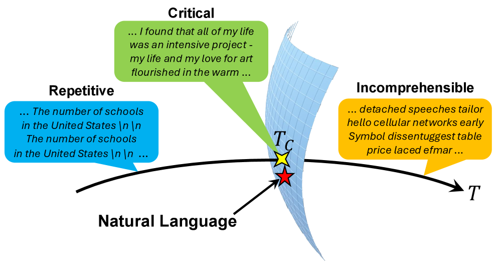

###### fig-1

*Рисунок 1: Схематическое изображение нашей догадки. В пространстве случайных ходов, порождающих знаковые последовательности, ход, отвечающий естественному языку, лежит на опасной поверхности. Языковая модель, обученная на этом естественном языке, задаёт одномерное многообразие случайных ходов с параметром — температурой $T$. При опасной температуре это многообразие пересекает опасную поверхность близ точки, отвечающей естественному языку.* **[p. 2]**

## Фазовый переход у предобученных моделей

Чтобы проверить догадку о критичности естественных языков, мы берём языковые модели как действенные модели этих языков. А именно, мы порождали тексты моделью на 160 млн параметров из набора Pythia [5], обученной на Pile — большом английском наборе данных [13]. **[p. 3]** Порождённые тексты отображались в последовательности частеречных меток (POS), принимающих 18 различных значений. Всюду в этой работе мы берём первые $N$ меток $y_{0},\cdots,y_{N-1}$ каждой последовательности как временной ряд длины $N$, где $y_{t}$ означает состояние в миг $t$. В приложениях A–C мы показываем, что схожие итоги получаются для более крупных моделей, для моделей, обученных на других языках, и при ином отображении текстов в последовательности, что подкрепляет стойкость итогов основного текста.

### Корреляция

В текстах на естественном языке выбор следующей единицы — слова или знака — зависит от предшествующих через синтаксические, смысловые и прочие языковые причины. Чтобы измерить, как далеко и как сильно простираются такие зависимости, можно посмотреть, как корреляции между единицами убывают с расстоянием. Такой подход широко принят в прежних работах, показавших, что убывание подчиняется степенному закону [21, 9, 8, 47, 22, 45, 40, 46, 37, 25]. Это степенное поведение означает, что корреляции способны удерживаться на замечательно больших расстояниях; иными словами, далёкие единицы текста остаются статистически зависимыми.

Побуждаемые этими наблюдениями, мы начинаем с измерения корреляций в текстах, порождённых языковыми моделями, и рассматриваем их зависимость от температуры $T$. Если наблюдается степенное убывание, это значит, что порождённые тексты воспроизводят ключевое статистическое свойство естественных языков. Иначе это говорит о качественном отличии от них. Временна́я корреляция двух состояний $y_{t}$ и $y_{t+\Delta t}$, разделённых промежутком $\Delta t$, определяется как

$$
C_{ab}(t,t+\Delta t)=\mathbb{E}[\delta_{a,y_{t}}\delta_{b,y_{t+\Delta t}}]-\mathbb{E}[\delta_{a,y_{t}}]\mathbb{E}[\delta_{b,y_{t+\Delta t}}], \tag{1}
$$

где $a$ и $b$ суть частеречные метки вроде NOUN и VERB, $\delta_{a,b}$ есть символ Кронекера, а $\mathbb{E}[\cdot]$ означает усреднение по частеречным последовательностям, порождённым при закреплённой температуре $T$. Быстрое убывание корреляции с $\Delta t$ означает беспорядочность текстов. Напротив, если корреляция остаётся конечной даже при больших $\Delta t$, в текстах есть некоторый порядок.

###### p3-4

Среди $18^{2}$ возможных пар $a$ и $b$ мы разбираем главным образом случай, когда и $a$, и $b$ суть PROPN (имя собственное), ибо эта пара даёт наибольший вклад в корреляцию. Такой выбор оправдан тем, что корреляция для прочих пар с большим вкладом ведёт себя схоже, как разобрано в приложении D. Далее мы будем просто писать $C$ вместо $C_{\text{PROPN},\text{PROPN}}$. Если не оговорено иное, то же соглашение принято и для прочих величин.

Рисунки 2A–C показывают корреляцию $C(t,t+\Delta t)$ при $T=0.4$, $1$ и $1.6$ соответственно. При $T=0.4$ корреляция с ростом промежутка $\Delta t$ сходится к положительному значению, причём высота полки растёт со временем $t$. Такое схождение к положительному значению означает, что у системы есть дальний порядок. При $T=1$ корреляция являет степенное убывание при разных значениях $t$, следуя $C\sim(\Delta t)^{-\eta}$ с $\eta\approx 0.2$. При $T=1.6$ корреляция при больших $t$, по-видимому, меньше, а её убывание с $\Delta t$ явно быстрее, чем при $T=1$. Такое поведение говорит о беспорядочности системы, хотя в пределах нынешней численной точности остаётся неясным, следует ли корреляция в пределе показательному убыванию, обыкновенно наблюдаемому в беспорядочной поре.

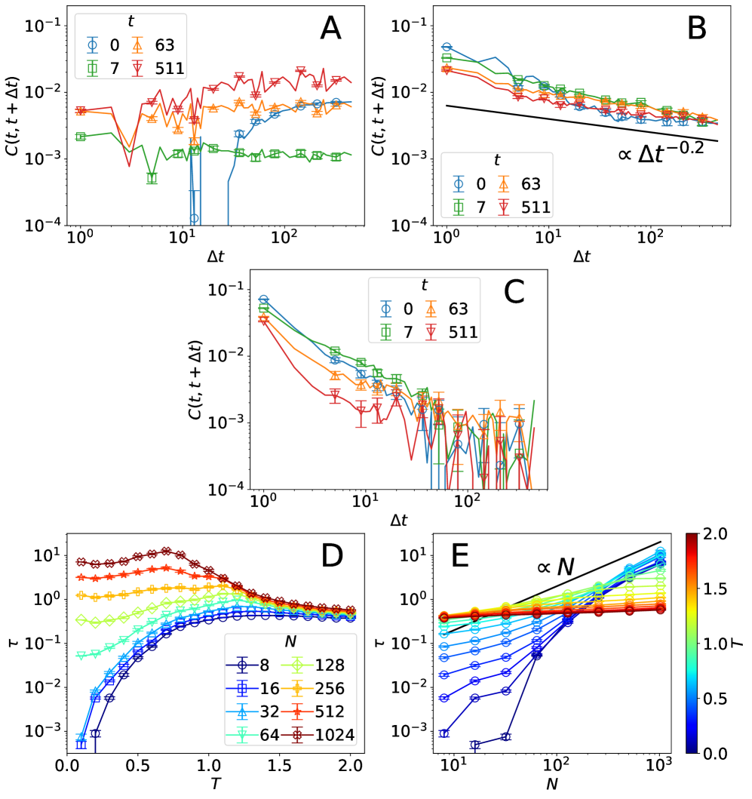

###### fig-2

*Рисунок 2: (A–C) Корреляция $C(t,t+\Delta t)=C_{\text{PROPN},\text{PROPN}}(t,t+\Delta t)$ при (A) $T=0.4$, (B) $T=1$ и (C) $T=1.6$ как действие промежутка $\Delta t$, для длины последовательности $N=1024$. Чёрная черта в (B) означает прямую, пропорциональную $\Delta t^{-0.2}$. При низких температурах корреляция выходит на положительную полку, при высоких — падает до нуля. Близ граничной температуры корреляция убывает по степенному закону. (D) Проинтегрированная корреляция $\tau=\tau_{\text{PROPN},{\text{PROPN}}}$ как действие температуры $T$ при разных длинах последовательности $N$. (E) Та же величина как действие длины $N$ при разных температурах $T$. Чёрная черта пропорциональна $N$. Проинтегрированная корреляция продолжает расти с $N$ при $T\lesssim 1$, тогда как при $T\gtrsim 1$ она выходит на насыщение. Эти итоги говорят о фазовом переходе при $T_{c}\approx 1$.* **[p. 3]**

Чтобы лучше понять зависимость корреляции от $T$, мы вычисляем проинтегрированную корреляцию, описывающую временно́й размах корреляции: {align} *τ*_ab = 1N ∑_t, t^′ C_ab(t, t^′) = N (E [m_a m_b] - E [m_a] E [m_b]), где **[p. 4]** $m_{a}=\sum_{t}\delta_{a,y_{t}}/N$ есть доля частеречной метки $a$ в последовательности. Если корреляция сходится к положительному значению, то $\tau_{ab}$ расходится в пределе $N\to\infty$. Напротив, при близкодействующих корреляциях, где убывание быстрее степенного, $\tau_{ab}$ в этом пределе остаётся конечной. Тем самым зависимость $\tau_{ab}$ от $N$ позволяет отчётливо различать эти два поведения.

###### p4-1

Рисунок 2D приводит проинтегрированную корреляцию $\tau=\tau_{\text{PROPN},\text{PROPN}}$ как действие $T$. Зависимость проинтегрированной корреляции от $N$ различна при низких и высоких температурах: при низких эта величина продолжает расти с длиной последовательности $N$, тогда как при высоких она почти нечувствительна к $N$. Эти различные поведения отчётливее видны на рис. 2E, где та же величина дана как действие $N$. В низкотемпературном режиме, $T\lesssim 1$, величина $\tau$ растёт линейно с $N$, а значит $\tau$ расходится в пределе $N\to\infty$. Напротив, при высоких температурах $T\gtrsim 1$ она сходится к конечному значению, как и ожидается при близкодействующих корреляциях в беспорядочной поре. Эти наблюдения означают, что $\tau$ становится особенной в пределе $N\to\infty$: по мере приближения температуры к опасной $T_{c}\approx 1$ сверху проинтегрированная корреляция растёт и в конце концов расходится при $T=T_{c}$. Такое особенное поведение и устанавливает наличие фазового перехода при $T_{c}$.

###### p4-2

Степенное убывание корреляции означает, что временно́й размах корреляции расходится. Соответственно, вблизи $T_{c}$ следует ожидать медленного установления к неподвижному состоянию — явления, известного как *критическое замедление*. В приложении E мы подтверждаем это замедление, наблюдая, как со временем $t$ меняется вероятность того, что $y_{t}$ принимает данную частеречную метку, $v_{a}(t)=\mathbb{E}[\delta_{y_{t},a}]$.

### Спектр мощности

Как показано в предыдущем разделе, убывание корреляции качественно меняется при $T_{c}$. При $T<T_{c}$ корреляция при больших $\Delta t$ сходится к положительному значению, тогда как при $T>T_{c}$ она быстро падает. Такое поведение означает, что при низких температурах порождённые тексты являют упорядоченное строение, отсутствующее при высоких. Отсюда вопрос: какого рода строение возникает ниже $T_{c}$? Повторяющиеся образцы, наблюдаемые в текстах при низких температурах, наводят на мысль, что это строение связано с периодичностью. Поэтому мы разбираем спектр мощности — обычную меру для обнаружения периодичности во временном ряду. Она определяется так

$$
S_{a}(\omega)=N\left(\mathbb{E}\left[\left|f_{a}(\omega)\right|^{2}\right]-\left|\mathbb{E}\left[f_{a}(\omega)\right]\right|^{2}\right), \tag{2}
$$

###### p4-4

где $f_{a}(\omega)=\sum_{t}\mathrm{e}^{-2\pi i\omega t}\delta_{a,y_{t}}/N$ означает фурье-преобразование двоичной последовательности $\delta_{a,y_{t}}$. Большая вершина спектра мощности на частоте $\omega$ означает наличие периодических строений с этой частотой.

Рисунки 3A–C показывают $S(\omega)=S_{\text{PROPN}}(\omega)$ при $T=0.6$, $1$ и $1.4$ соответственно. При $T=1.4$ у спектра есть лишь одна нерасходящаяся вершина при $\omega=0$, что согласуется с беспорядочным строением порождённых текстов. При $T=1$, весьма близко к $T_{c}$, спектр являет несколько малых вершин помимо вершины при $\omega=0$, но их высоты почти не зависят от $N$. С понижением температуры $S(\omega)$ обрастает многими вершинами, чьи высоты растут с $N$, как видно при $T=0.6$. Эти расходящиеся вершины означают наличие неоднородного дальнего порядка. Такое поведение спектра согласуется с опытными наблюдениями. При низких температурах порождённые тексты обыкновенно скатываются в повторы вроде *The number of schools in the United States\n\nThe number of schools in the United States\n\n…*. Как подтверждают разборы спектра мощности, определённого для отдельных последовательностей, такой повторяющийся текст даёт вершины при $\omega=n/p$ ($n=1,2,\cdots$), где $p$ есть период повтора (подробнее в приложении F). Усреднение по многим текстам, у каждого из которых свой период, и даёт спектр мощности со многими вершинами.

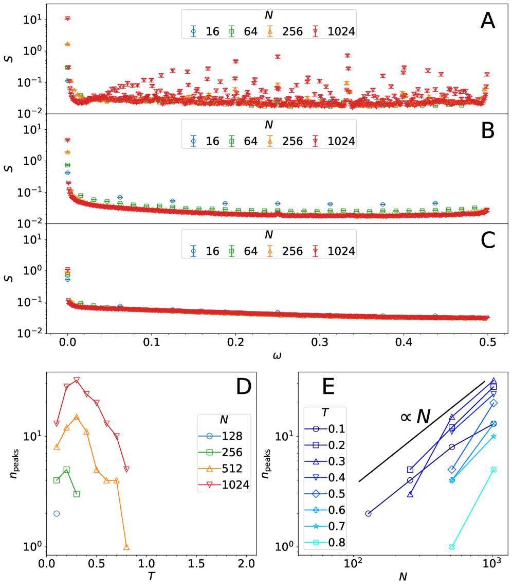

###### fig-3

*Рисунок 3: (A–C) Спектр мощности $S=S_{\text{PROPN}}$ частеречных последовательностей как действие $\omega$ при (A) $T=0.6$, (B) $T=1$ и (C) $T=1.4$. (D) Число вершин спектра мощности, $n_{\text{peaks}}$, как действие $T$ при разных длинах последовательности $N$. (E) Та же величина как действие длины $N$ при разных температурах $T$. Чёрная черта означает прямую, пропорциональную $N$. Величина $n_{\text{peaks}}$ расходится при низких температурах, что говорит о сложных повторяющихся строениях.* **[p. 4]**

###### p4-6

Наш разбор обнаруживает при низких температурах ещё более богатое строение. Рисунки 3D и E показывают число вершин спектра мощности, $n_{\text{peaks}}$, как действие $T$ и $N$ соответственно. При $T<T_{c}$ величина $n_{\text{peaks}}$ растёт линейно с $N$, а значит расходится при $N\to\infty$. Такая зависимость от $N$ говорит о том, что повторяющиеся образцы становятся **[p. 5]** разнообразнее с ростом длины текста и что при $N\to\infty$ возникает бесконечно много различных образцов. Это поведение резко отлично от простых периодических строений вроде предельных циклов в динамических системах [4] и периодических цепей Маркова [32].

## Возникновение фазового перехода при обучении

###### p5-1

В предыдущем разделе мы показали, что тексты, порождённые предобученной моделью, являют два примечательных явления: критическое поведение при $T_{c}$ и наличие сложных повторяющихся строений при низких температурах. Следует ожидать, что эти явления возникают при обучении на наборе данных естественного языка. Поэтому мы упорядоченно разбираем тексты, порождённые частично обученными моделями на разных шагах обучения. Итоги показывают, что оба явления отсутствуют на ранних шагах обучения, но возникают на поздних, а значит происходят из естественных языков.

### Корреляция

###### p5-2

Поскольку проинтегрированная корреляция $\tau=\tau_{\text{PROPN},\text{PROPN}}$ даёт отчётливое свидетельство фазового перехода у предобученной модели, мы берём ту же величину, чтобы посмотреть, как порождённые тексты меняются по шагам обучения. На рис. 4A–E мы показываем $\tau$ на шагах обучения $k=0$, 16, 64, 128 и 512. При $k=0$ и 16 величина $\tau$ остаётся почти неизменной по температурам, а значит фазового перехода, наблюдаемого у предобученной модели, на самой ранней поре обучения нет, как и следовало ожидать. Зависимость $\tau$ от $T$ и $N$ постепенно меняется при обучении, и при $k\gtrsim 128$ она становится весьма похожа на зависимость у предобученной модели. Рисунок 4F показывает зависимость $\tau$ от $k$ при низкой температуре $T=0.6$. Проинтегрированная корреляция почти не зависит от $N$ при $k\lesssim 10^{2}$, но вдруг начинает расти с $N$ при $k=128$. Эти итоги означают, что модель начинает усваивать нетривиальные строения естественного языка около $k_{c}\approx 10^{2}$, что и даёт критический фазовый переход. Как разобрано в приложении G, критическое замедление в среднем временном ряду $v_{a}(t)$ тоже появляется при $k\gtrsim 10^{2}$, что согласуется с итогами по $\tau$.

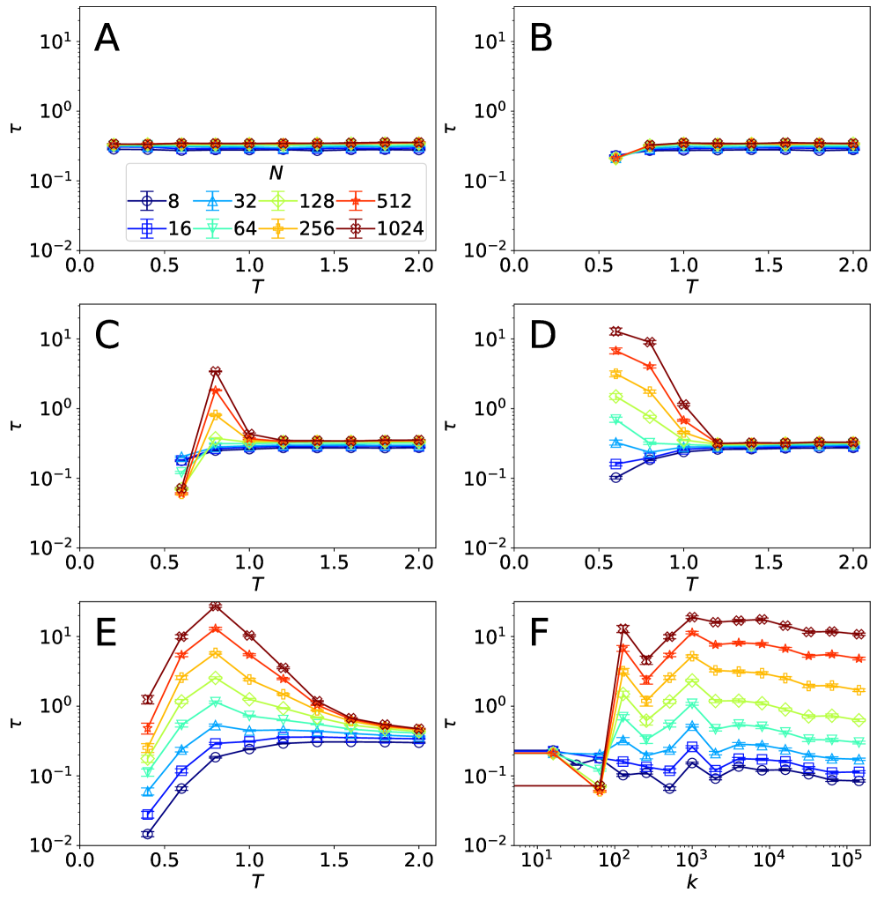

###### fig-4

*Рисунок 4: (A–E) Проинтегрированная корреляция $\tau=\tau_{\text{PROPN},{\text{PROPN}}}$ как действие температуры $T$ на шагах обучения $k=0$ (A), 16 (B), 64 (C), 128 (D) и 512 (E). (F) Проинтегрированная корреляция как действие шага обучения $k$ при $T=0.6$. Эти итоги говорят, что фазовый переход возникает около $k_{c}\approx 10^{2}$. Несколько значений проинтегрированной корреляции на ранних шагах обучения и при низких температурах не показаны, ибо порождение текста обрывается слишком рано, чтобы набрать достаточно длинных последовательностей.* **[p. 5]**

### Спектр мощности

###### p5-3

Чтобы посмотреть, как при обучении возникают сложные повторяющиеся строения при низких температурах, мы меряем спектр мощности на разных шагах обучения, как это сделано для предобученной модели. В высокотемпературном режиме спектр мощности ни на каком шаге обучения не даёт примечательных черт: у него лишь одна вершина при $\omega=0$, что согласуется с тем, что тексты, порождённые при высоких температурах, ни на какой поре обучения нетривиального строения не являют. В низкотемпературном же режиме обучение существенно влияет на спектр мощности, см. рис. 5A–D. У модели со случайным начальным приближением, то есть на шаге обучения $k=0$, спектр мощности даёт лишь одну вершину при $\omega=0$, а значит повторяющегося строения нет вовсе. На шаге $k=128$ помимо вершины при $\omega=0$ начинают появляться вершины при $\omega=1/2$ и $1/3$, но их высоты почти не зависят от длины последовательности $N$. Эти наблюдения согласуются с тем, что повторы с периодом 2 и 3 присутствуют, но не преобладают, а большинство порождённых текстов имеет повторы с периодом 1 — вроде *””” …* и *the the the …*. При $k=512$ у $S(\omega)$ появляется несколько вершин, чьи высоты растут с $N$. С дальнейшим ростом $k$ спектр мощности становится сложнее, и при $k\gtrsim 10^{3}$ он даёт многочисленные растущие вершины при $\omega\neq 0$, как и наблюдалось у предобученной модели. Число вершин $n_{\text{peaks}}$ начинает расти с $N$ лишь около $k\approx 10^{3}$, см. рис. 5E. Это начало наступает позже шага обучения $k_{c}\approx 10^{2}$, на котором проинтегрированная корреляция начинает являть критическое поведение. Различие этих двух начал говорит о том, что модель усваивает два различных строения на разных порах обучения: одно отвечает критичности, другое — сложным повторяющимся строениям.

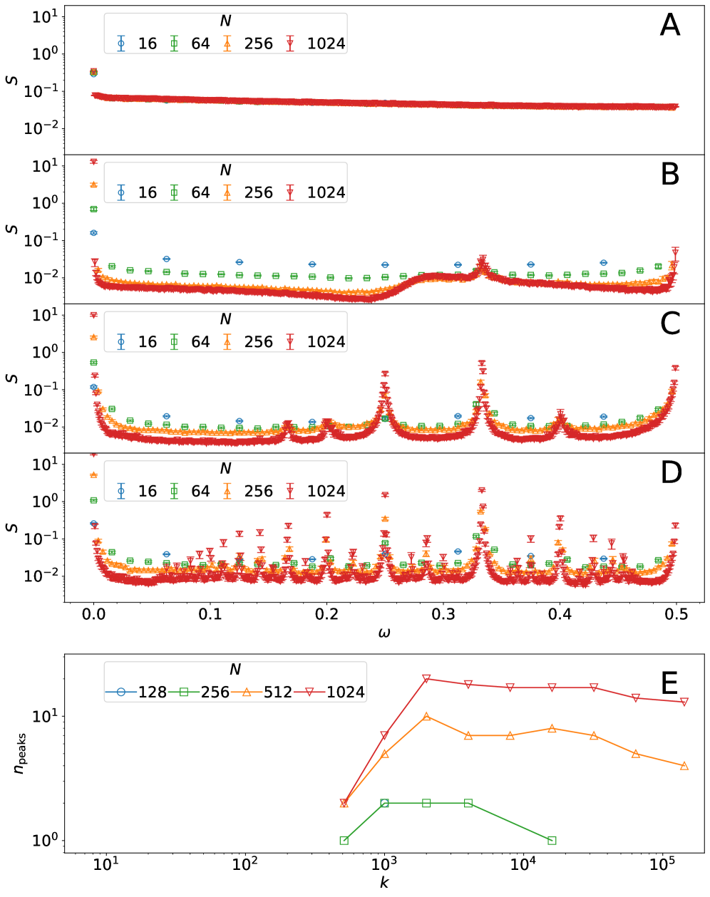

**[p. 6]**

*Рисунок 5: (A–D) Спектр мощности $S=S_{\text{PROPN}}$ при $T=0.6$ на шаге обучения (A) $k=0$, (B) 128, (C) 512 и (D) 1000. (E) Число вершин $n_{\text{peaks}}$ в спектре мощности при $T=0.6$ как действие шага обучения. Величина $n_{\text{peaks}}$ начинает расти около шага $k\approx 10^{3}$, то есть позже шага, на котором возникает фазовый переход.* **[p. 6]**

## Естественный язык ближе всего к критической модели

Приведённые выше итоги показывают, что предобученная модель близ опасной температуры $T_{c}$ являет степенное поведение, наблюдаемое и в естественных языках. В приложении H мы дополнительно подтверждаем, что статистическое поведение естественных языков схоже с поведением текстов, порождённых критической предобученной моделью, — по корреляции, проинтегрированной корреляции, среднему временному ряду и спектру мощности. Отсюда мы ожидаем, что среди моделей на разных шагах обучения и при разных температурах именно модель на последнем шаге обучения и близ $T_{c}$ порождает тексты, наиболее близкие к текстам естественного языка.

###### p6-2

Чтобы проверить это ожидание количественно, мы меряем согласие между текстами естественного языка и текстами, порождёнными моделями на разных шагах обучения и при разных температурах. А именно, мы берём недоумение (perplexity) — широко применяемую меру оценивания языковых моделей в обработке естественного языка [19]. Эта мера определяется как показательная функция от среднего отрицательного логарифма правдоподобия модели на данном наборе данных естественного языка. Меньшее недоумение тем самым означает лучшее согласие между случайным ходом, задаваемым моделью, и набором данных естественного языка. Рисунок 6 показывает натуральный логарифм недоумения на наборе Pile. Недоумение наименьшее при $k=143000$, на последнем шаге обучения, и при $T=1$, близко к $T_{c}$. Этот итог количественно подтверждает, что критическая предобученная модель ближе всего совпадает с текстами естественного языка в наборе. Такое согласие даёт свидетельство в пользу догадки о критичности естественных языков, изображённой на рис. 1.

###### p6-3

Отметим также, что при низких температурах недоумение немонотонно как действие $k$: оно становится замечательно большим около $k=32$. Такое немонотонное поведение объясняется изменениями порождаемых текстов при обучении. При очень малых $k$ тексты остаются беспорядочными даже при низких температурах, ибо модель ещё не усвоила нетривиальных строений. Около $k=32$ распределение модели при низких температурах сосредоточивается на немногих крайне простых повторяющихся текстах вроде *\n\n\n …* и *the the the …*. Высокое недоумение около этой точки означает, что такое распределение дальше от набора данных естественного языка, чем почти равномерное распределение на самой ранней поре обучения. С дальнейшим ходом обучения повторы сохраняются, но повторяемые образцы становятся естественнее и разнообразнее — вроде *You can use a button.\n\nYou can use a button.\n\n …* и *I have a new value of $50\n\nI have a new value of $50\n\n …*. Это изменение согласуется с убыванием недоумения, а значит распределение модели становится ближе к набору данных естественного языка.

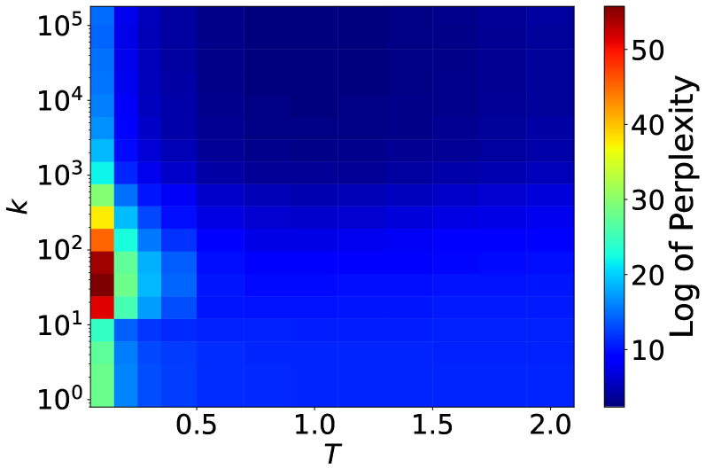

###### fig-6

*Рисунок 6: Натуральный логарифм недоумения моделей на наборе Pile при разных температурах и шагах обучения. Недоумение наименьшее у предобученной модели около опасной точки, что поддерживает догадку о критичности естественных языков. При низких температурах недоумение наибольшее около шага обучения $k=32$, что согласуется с сосредоточением распределения модели на простых повторяющихся текстах в этом режиме.* **[p. 6]**

## Итоги и обсуждение

Естественные языки являют степенное поведение в своих статистических свойствах. Этот хорошо известный обстоятельство наводит на связь естественных языков с критическими явле**[p. 7]**ниями. Мы исследовали эту возможную связь, взяв большие языковые модели как действенные модели естественных языков. Наши разборы текстов, порождённых такими моделями, показывают, что они претерпевают фазовый переход при $T_{c}\approx 1$ с критическим поведением и что низкотемпературная пора являет сложные повторяющиеся строения с расходящимся числом вершин в спектре мощности — в резком отличии от простых периодических строений с конечным числом вершин. Критическое поведение и сложные повторяющиеся строения происходят из естественных языков, ибо и то и другое отсутствует на ранней поре обучения и возникает по мере того, как модель учится на наборе данных естественного языка. Наконец, мы численно показываем, что набор данных естественного языка статистически ближе всего к текстам, порождённым критической предобученной моделью, если мерить недоумением. Как разобрано в приложениях A и B, схожие итоги получаются для более крупных моделей и для моделей, обученных на других языках. Эти добавочные итоги говорят о том, что наблюдаемые здесь явления стойки к размеру модели и к языку.

###### p7-1

Взятые вместе, наши разборы дают сильное свидетельство в пользу догадки о критичности естественных языков: случайный ход, отвечающий естественному языку, лежит на опасной поверхности, разделяющей повторяющуюся и невразумительную поры. В первой из них число вершин спектра мощности расходится с ростом длины текста. Такого поведения в спектрах мощности естественных языков не наблюдается. Тем не менее, поскольку оно возникает как следствие обучения модели на естественном языке, это поведение происходит из некоторого строения в самом естественном языке. Распознание этого строения есть важная незакрытая задача.

###### p7-2

Эта работа открывает путь к изучению естественных языков понятиями, выработанными при изучении критических явлений. Одно из таких понятий — *разряды всеобщности*. Если критические поведения разных систем описываются одним и тем же набором показателей, системы относят к одному разряду всеобщности. Системы одного разряда разделяют коренные черты — соразмерности, размерность, дальность взаимодействия. Такие показатели можно оценить для языковых моделей, обученных на разных естественных языках. Одно из возможных направлений — распределить естественные языки по этим показателям и спросить, какие коренные черты общи языкам одного разряда. Такой подход мог бы дать рамку для описания естественных языков через их поведение как целого.

Наши итоги имеют следствия не только для естественных языков, но и для самих языковых моделей. Одно из направлений дальнейшего изучения языковых моделей касается связи их качества с критическим поведением. Следует ожидать, что порождённые тексты не будут ни повторяющимися, ни невразумительными в пределах того временно́го размаха, на котором удерживается степенное поведение. Этот размах конечен при температурах вдали от опасной точки и расходится ровно в ней. Если бы удалось предсказать зависимость этого размаха от температуры, это дало бы верхнюю границу длины последовательности, за которой модель перестаёт порождать естественные тексты. Такой взгляд может также помочь объяснить, отчего некоторые нынешние языковые модели редко дают повторы даже при температуре, много ниже $T_{c}$. У моделей с большим окном обстановки и разнообразными приёмами этот размах, вероятно, заметно длиннее, чем длины последовательностей, нужные в житейских задачах, даже при низких температурах.

Наша работа опирается на взгляд на естественные языки как на случайные ходы и побуждена степенным поведением, наблюдаемым в естественных языках. У этого взгляда долгая история, и степенное поведение в естественных языках изучается давно. Ключевая мысль нашей работы — взять большие языковые модели как действенные модели естественных языков. Такой подход позволяет доказывать, что естественные языки критичны, — вывод, который трудно было получить на игрушечных математических моделях. Мы полагаем, что наша работа есть ощутимый шаг к пониманию природы естественных языков со стороны статистической физики.

## Материалы и приёмы

### Параметр температуры у больших языковых моделей

###### p7-5

Языковые модели саморегрессивно порождают последовательность лексем, отвечающих словам или их частям, а затем обращают её в текст. При выборке с температурой [1] $t$-я лексема $x_{t}$ берётся из распределения softmax

$$
P(x_{t}|x_{0},\cdots,x_{t-1})\propto\exp\left(-\frac{1}{T}H(x_{t}|x_{0},\cdots,x_{t-1})\right), \tag{3}
$$

###### p7-6

где $T$ есть параметр температуры, а $H$ означает отрицательный логит, отвечающий возможной лексеме $x_{t}$ при данных предшествующих лексемах. Когда $T$ равно своему значению по умолчанию, единице, распределение softmax совпадает с выученным распределением без изменений. При меньшей температуре распределение сильнее смещается к лексемам большой вероятности, а с ростом температуры оно приближается к равномерному. Этот параметр подобен физической температуре, ибо вид выражения 3 отвечает распределению Больцмана в статистической физике. Однако мы подчёркиваем, что выражение 3 задаёт вероятности отдельных лексем при условии лексем, порождённых прежде, в отличие от распределения Больцмана, дающего не зависящие от времени вероятности состояний.

### Приём выборки

###### p7-7

Мы брали модели из набора Pythia [5]. Этот набор даёт модели разных размеров и на разных шагах обучения на одном и том же английском наборе данных, что позволяет ставить опыты в управляемых условиях. Все данные основного текста получены на модели с 160 млн параметров. Добавочные разборы для проверки стойкости наших итогов проведены на более крупных моделях с 410 млн, 1 млрд, 1,4 млрд и 2,8 млрд параметров, а также **[p. 8]** на моделях, обученных на других языках — китайском, французском, японском, корейском и испанском, см. приложения A и B.

Для каждой длины последовательности $N$ и температуры $T$ мы брали $10^{4}$ частеречных последовательностей у всех моделей, кроме корреляционных действий на рис. 2A–C, для которых бралось $1.6\times 10^{5}$ последовательностей ради надёжной оценки на больших расстояниях. Тексты порождались с лексемы начала предложения на входе. Мы не применяли ни выборку по $k$ наибольшим, ни по доле $p$, ни лучевой поиск, чтобы сохранить подобие между выражением 3 и распределением Больцмана. Полосы ошибок на рисунках означают $80\%$-е доверительные промежутки, оценённые соразмерным приёмом бутстрап-$t$ [14].

### Отображение в частеречные последовательности

Чтобы вести статистический разбор, нужно отобразить каждый текст в последовательность конечного числа состояний. В этой работе мы представляли каждый текст последовательностью частеречных меток при помощи библиотеки spaCy [28] с конвейером en_core_web_sm, где каждому слову или пробелу приписывается одна из 18 меток (17 всеобщих частеречных меток плюс метка SPACE). Скажем, предложение *The first time I saw the film.* обращается в $(\text{DET},\text{ADJ},\text{NOUN},\text{PRON},\text{VERB},\text{DET},\text{NOUN},\text{PUNCT})$. При такой постановке каждое состояние допускает более ясное истолкование и удерживает больше языковых сведений, чем при иных отображениях — скажем, при сопоставлении каждому знаку числа [21, 8]. Более того, умеренное число возможных состояний позволяет надёжно оценивать статистические величины. Наконец, тексты на разных языках можно отобразить в последовательности одних и тех же меток, что позволяет вести согласованный межъязыковой разбор

###### p8-3

При очень низких или очень высоких температурах порождённые тексты иногда содержат неестественные куски, но разметчик всё равно приписывает частеречные метки. Хотя такой ход в принципе мог бы вносить искажения, вблизи опасной точки — а именно она нас и занимает — это действие должно быть пренебрежимо мало. И впрямь, мы не наблюдали никакого поведения, говорящего о заметном таком влиянии. Чтобы дополнительно подкрепить, что наши выводы не суть искажения частеречной разметки, мы провели те же разборы и в иной постановке, где такого действия нет вовсе. Там каждый текст обращался в двоичную последовательность сопоставлением каждому знаку 0 или 1 в зависимости от того, пробел это или нет. Итоги схожи с полученными при частеречной разметке, как приведено в приложении C.

Чтобы изучать частеречные последовательности длины $N$, мы отбирали последовательности длиннее $N$ меток и разбирали первые $N$ меток $y_{0},\cdots,y_{N-1}$ с начала каждой последовательности.

### Обнаружение вершин в спектре мощности

###### p8-5

Мы считали число вершин спектра мощности $n_{\text{peaks}}$ действием find_peaks из библиотеки SciPy [49]. А именно, мы считали, что у спектра мощности $S(\omega)$ есть вершина на частоте $\omega$, когда выступ в $\omega$ больше порога. Выступ определяется как $S(\omega)-\min_{\omega_{\text{left}}<\omega^{\prime}<\omega_{\text{right}}}S(\omega^{\prime})$, где $\omega_{\mathrm{left}}$ и $\omega_{\mathrm{right}}$ суть ближайшие к $\omega$ частоты $\omega^{\prime}$ такие, что $S(\omega^{\prime})>S(\omega)$. Мы взяли порог $0.1$, чтобы превзойти оценённую статистическую ошибку.

### Вычисление недоумения

Вычислить недоумение в точности непрактично, ибо это требует оценивать правдоподобие каждой лексемы при условии всей предшествующей обстановки. На деле недоумение приближают, сдвигая окно размером с длину обстановки модели по набору данных с закреплённым шагом [18]. В этой работе мы вычисляли недоумение на $200$ текстах из набора Pile при шаге $512$ лексем.

### Доступность данных, материалов и программ

Исходный код доступен по адресу https://github.com/K-Nakaishi/transition-in-llm [31].

##### Благодарности.

## Приложение A Более крупные модели

###### p8-8

В основном тексте мы разбирали тексты, порождённые моделью на 160 млн параметров из набора Pythia [5]. Однако на деле применяются много более крупные модели. Чтобы подтвердить, что более крупные модели являют схожие явления, мы оцениваем проинтегрированную корреляцию и спектр мощности для Pythia на 410 млн, 1 млрд, 1,4 млрд и 2,8 млрд параметров при той же постановке.

Проинтегрированная корреляция $\tau=\tau_{\text{PROPN},{\text{PROPN}}}$ у более крупных моделей, приведённая на рис. 7, ведёт себя схоже с тем, что наблюдалось у Pythia 160M: $\tau$ расходится при низких температурах и выходит на насыщение при высоких. Спектр мощности $S(\omega)=S_{\text{PROPN}}(\omega)$ даёт схожее соответствие. **[p. 9]** При высоких температурах у спектра лишь одна вершина при $\omega=0$, а значит порождённые тексты имеют тривиальное строение. Напротив, при низких температурах появляются многочисленные расходящиеся вершины, как в итогах при $T=0.6$ на рис. 8. Эти итоги означают, что и фазовый переход, и сложные повторяющиеся строения есть у моделей разных размеров.

В основном тексте мы разбирали и недоумение частично обученных моделей на 160 млн параметров. Итоги показывают, что недоумение наименьшее у критической предобученной модели и наибольшее около шага обучения $k=32$ при низких температурах. Чтобы проверить, стойки ли эти итоги к размеру модели, мы вычисляем недоумение частично обученных моделей с 410 млн, 1 млрд, 1,4 млрд и 2,8 млрд параметров.

Итоги приведены на рис. 9. Поведение недоумения одинаково у моделей разных размеров. Оно наименьшее у критической предобученной модели, а значит порождённые тексты ближе всего к набору данных естественного языка около этой точки. Кроме того, недоумение заметно возрастает около шага $k=32$ при низких температурах. Эти итоги говорят, что статистические свойства порождённых текстов меняются схожим образом у моделей разных размеров.

## Приложение B Другие языки

###### p9-3

Набор Pythia, разбираемый в основном тексте, обучен на английском наборе данных. Естественно спросить, возникают ли наблюдаемые явления и у моделей, обученных на других языках. Чтобы ответить на этот вопрос, мы проводим те же разборы на моделях, обученных на китайском, французском, японском, корейском и испанском наборах. А именно, мы разбираем uer/gpt2-chinese-cluecorpussmall [48], dbddv01/gpt2-french-small [7], rinna/japanese-gpt2-small [50, 38], SKT-AI/KoGPT2 [42] и datificate/gpt2-small-spanish [33] при той же постановке, что и в основном тексте.

Во всех этих языках проинтегрированная корреляция $\tau=\tau_{\text{PROPN},{\text{PROPN}}}$ являет схожую зависимость от температуры, как показано на рис. 10. При низких температурах проинтегрированная корреляция растёт с длиной последовательности и, по-видимому, расходится. При высоких она выходит на конечное значение, хотя у испанского схождение чуть медленнее. Мы разбираем и спектр мощности $S(\omega)=S_{\text{PROPN}}(\omega)$. При высоких температурах у спектра одна вершина при $\omega=0$. Напротив, при низких температурах он даёт многочисленные вершины для всех языков, как показано на рис. 11. Отсюда мы ожидаем, что фазовый переход и сложные повторяющиеся строения наблюдаются всеобще, во всех языках.

## Приложение C Последовательности по знакам

###### p9-5

Надёжный статистический разбор требует отображать каждый текст в последовательность умеренного числа состояний. В основном тексте мы отображали тексты в последовательности частеречных меток библиотекой spaCy [28]. Хотя нельзя вполне исключить непредвиденных действий частеречной разметки, никакого поведения, говорящего о таких искажениях, мы не наблюдали. Чтобы дополнительно упрочить выводы основного текста, мы разбираем последовательности, полученные иным отображением, не опирающимся на частеречную разметку. А именно, мы сопоставляем каждому знаку текста 1, если он есть пробельный по мере isspace в Python, и 0 иначе. Для получившихся двоичных последовательностей мы меряли проинтегрированную корреляцию и спектр мощности теми же приёмами, что и в основном тексте.

Проинтегрированная корреляция $\tau_{1,1}$ приведена на рис. 12, где длина последовательности $N$ определена как число знаков в ней. Проинтегрированная корреляция продолжает расти с $N$ при низких температурах, но выходит на насыщение при высоких. Это поведение согласуется с наблюдаемым в основном тексте. Рисунок 13 показывает спектр мощности $S_{1}$. При низких температурах появляются многочисленные вершины, и их число $n_{\text{peaks}}$, по-видимому, расходится. И здесь итоги согласуются с итогами основного текста. Эти итоги показывают, что находки основного текста не суть искажения частеречной разметки.

## Приложение D Проинтегрированные корреляции для прочих частеречных пар

###### p9-7

Проинтегрированная корреляция $\tau_{ab}$ зависит от частеречной пары $(a,b)$. В основном тексте мы наблюдали фазовый переход, разбирая эту величину для пары $(a,b)=(\text{PROPN},\text{PROPN})$, дающей наибольший вклад. Здесь мы показываем, что фазовый переход наблюдается и для прочих пар с большим вкладом. Рисунок 14 показывает проинтегрированные корреляции для восьми пар с наибольшими по величине значениями $\tau_{ab}$ при $T=1$ и $N=1024$, кроме $(\text{PROPN},\text{PROPN})$. Заметим, что $(a,b)$ и $(b,a)$ считаются одной парой, ибо $\tau_{ab}=\tau_{ba}$. Для всех пар проинтегрированная корреляция растёт с длиной последовательности $N$ при $T\lesssim 1$, а значит расходится при $N\to\infty$, тогда как при $T\gtrsim 1$ она выходит на конечное значение. Такое поведение означает, что для этих частеречных пар фазовый переход происходит близ $T=1$, как и в случае $(\text{PROPN},\text{PROPN})$.

## Приложение E Динамика

Корреляция, наблюдаемая в основном тексте, говорит о том, что происходит критическое замедление, то есть схождение к неподвижному состоянию вблизи $T_{c}$ становится заметно медленнее. Чтобы проверить это ожидание, мы смотрим, как частеречные метки меняются со временем $t$. А именно, мы вычисляем вероятность того, что метка в миг $t$ равна $a$:

$$
v_{a}(t)=\mathbb{E}[\delta_{y_{t},a}]. \tag{4}
$$

**[p. 10]**

Рисунок 15 показывает $v(t)=v_{\text{PROPN}}(t)$ как действие времени $t$ при нескольких температурах. При высоких температурах $v(t)$ быстро выходит на своё предельное значение. При низких температурах динамика тоже, по-видимому, быстро подходит к неподвижному состоянию, но являет заметные колебания. Спектр мощности, приведённый в основном тексте, показывает, что внутри этих колебаний сосуществуют многочисленные периодические строения. Близ опасной точки между двумя режимами переходное время до неподвижного состояния становится больше, что и говорит о критическом замедлении.

До сих пор мы сосредоточивались на $v(t)=v_{\mathrm{PROPN}}(t)$. Однако, поскольку $a$ принимает 18 различных частеречных меток, величины $v_{a}(t)$ образуют восемнадцатимерный вектор $\boldsymbol{v}(t)$. Чтобы вскрыть подлежащую динамику во всём восемнадцатимерном пространстве, мы применяем разбор по главным составляющим (PCA). А именно, мы сцепляем $\boldsymbol{v}(0),\ldots,\boldsymbol{v}(N-1)$ по 20 температурным точкам $T=0.1,0.2,\ldots,2$ в матрицу данных $18\times 20N$ и прилагаем к ней PCA.

Доли вклада главных составляющих, приведённые на рис. 16A, показывают, что вклад первой главной составляющей (PC1) достаточно велик. Рисунок 16B показывает элементы PC1, где элемент, отвечающий PROPN, имеет наибольшее по величине значение, что оправдывает наше сосредоточение на динамике для PROPN.

###### p10-4

Рисунок 16C показывает динамику $\boldsymbol{v}(t)$ при разных температурах, спроецированную на двумерное пространство главных составляющих. Итог показывает, что неподвижные состояния, к которым приходит $\boldsymbol{v}(t)$ при $t\to\infty$, разделяются на два рода. Выше опасной точки динамика сходится к одному состоянию, ниже — к другому. Около опасной точки переходное время больше, чем при более высоких или более низких температурах. Эти наблюдения согласуются с разбором одномерной динамики $v_{\mathrm{PROPN}}(t)$. Динамика в пространстве главных составляющих далее говорит о том, что критическое замедление возникает там, где два устойчивых состояния способны сосуществовать.

## Приложение F Спектры мощности отдельных последовательностей

В основном тексте мы описывали повторяющиеся строения текстов, порождённых при низких температурах, разбирая спектр мощности

$$
S_{a}(\omega)=N\left(\mathbb{E}\left[\left|f_{a}(\omega)\right|^{2}\right]-\left|\mathbb{E}\left[f_{a}(\omega)\right]\right|^{2}\right). \tag{5}
$$

Эта величина не позволяет рассмотреть строение отдельных последовательностей, ибо определена как среднее по последовательностям. Здесь мы вводим спектр мощности отдельной последовательности $(y_{0},\cdots,y_{N-1})$, определяемый как

$$
\aligned&S_{a}(\omega;y_{0},\cdots,y_{N-1})\\
&=N\left(\left|f_{a}(\omega;y_{0},\cdots,y_{N-1})\right|^{2}-\left|\mathbb{E}\left[f_{a}(\omega)\right]\right|^{2}\right). \tag{6}
$$

Эта величина описывает периодичность отдельных последовательностей.

###### p10-8

На рис. 17 мы приводим спектры мощности трёх отдельных последовательностей, порождённых при $T=0.6$, каждая из которых содержит повторяющиеся образцы. Рисунок 17A показывает итог для последовательности с повторами *The number of schools in the United States\n\n*. Поскольку частеречная разметка разлагает это выражение на девять меток, такой повтор даёт строение с периодом 9. Спектр мощности этой последовательности являет отчётливые вершины на частотах, кратных $1/9$. Схожим образом рис. 17B и C показывают итоги для последовательностей с повторами периода 12 и 18 соответственно. Эти спектры тоже дают вершины на отвечающих им частотах, а именно кратных $1/12$ и $1/18$.

Эти итоги показывают, что отдельные последовательности являют периодические строения с разными периодами в зависимости от повторяющихся образцов в них. Усреднение по таким последовательностям и даёт сложное повторяющееся строение, отличающееся расходящимся числом вершин в среднем спектре мощности.

## Приложение G Возникновение критического замедления при обучении

Проинтегрированная корреляция у частично обученных моделей говорит, что фазовый переход возникает около шага обучения $k_{c}\approx 10^{2}$. Критическое замедление следует ожидать в той же точке. Чтобы проверить это ожидание, мы оцениваем вероятность $v(t)$ того, что $t$-я метка $y_{t}$ есть PROPN, на разных шагах обучения.

Рисунки 18A–C показывают итоги для шагов $k=0$, 128 и 512. У модели со случайным начальным приближением ($k=0$) динамика $v(t)$ тривиальна: она быстро сходится к одному и тому же неподвижному состоянию при всех температурах. По мере приближения шага обучения к $k_{c}$ динамика начинает зависеть от температуры. На шаге $k=128$ предельное значение $v(t)$ больше при высоких температурах и меньше при низких. С дальнейшим обучением предельные значения при низких и высоких температурах разделяются отчётливее, как видно при $k=512$. Кроме того, переходное время до неподвижного состояния при промежуточных температурах растёт, что говорит о начале критического замедления.

Чтобы упорядоченно установить, когда возникает критическое замедление, мы смотрим, как предельное значение $v(t)$ зависит от шага обучения $k$. Мы оцениваем предельное значение усреднением $v(t)$ по последним $M$ мгновениям, то есть $\bar{v}=\sum_{t=N-M}^{N-1}v(t)/M$. Рисунок 18D показывает эту оценку как действие $k$ при разных температурах, где взято $N=1024$ и $M=128$. Итоги показывают, что предельные значения при низких и высоких температурах начинают расходиться около $k_{c}$, что согласуется с ожиданием, что фазовый переход и критическое замедление возникают на одной и той же поре обучения.

**[p. 11]**

## Приложение H Статистические свойства естественного языка

Мы показали, что тексты, порождённые предобученной моделью, являют критическое поведение. Близ опасной точки $T_{c}$ статистические свойства этих текстов должны совпадать со свойствами естественных языков, ибо степенное поведение наблюдалось во всех естественных языках. Чтобы проверить это ожидание, мы меряем те же статистические величины на $1.6\times 10^{5}$ текстах, взятых из набора Pile [13], на котором обучены модели Pythia.

###### p11-2

Рисунки 19A–D показывают соответственно корреляцию, проинтегрированную корреляцию, динамику и спектр мощности для набора Pile. Все эти величины ведут себя схоже с тем, что наблюдалось у критической предобученной модели: корреляция являет критическое убывание; **[p. 14]** проинтегрированная корреляция продолжает расти со скоростью, схожей со скоростью у критической модели; схождение $v(t)$ к предельному значению медленнее, чем у предобученной модели, и при низких, и при высоких температурах; а спектр мощности даёт одну расходящуюся вершину при $\omega=0$ и малые конечные вершины на прочих частотах, как и наблюдалось для текстов, порождённых при $T=1$. Эти итоги подтверждают, что

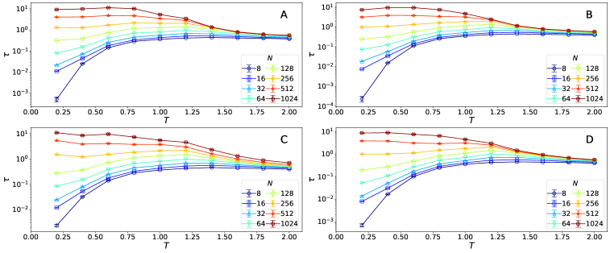

*Рисунок 7: Проинтегрированная корреляция $\tau=\tau_{\text{PROPN},\text{PROPN}}$ для текстов, порождённых Pythia (A) 410M, (B) 1B, (C) 1.4B и (D) 2.8B. Фазовый переход неизменно наблюдается при всех размерах модели.* **[p. 12]**

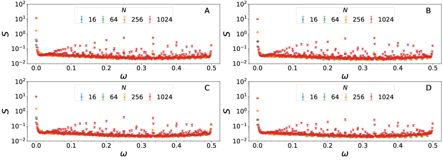

*Рисунок 8: Спектры мощности для текстов, порождённых при $T=0.6$ моделями Pythia (A) 410M, (B) 1B, (C) 1.4B и (D) 2.8B. Как и у Pythia 160M, появляются многочисленные вершины, а значит порождённые тексты являют сложное повторяющееся строение.* **[p. 12]**

*Рисунок 9: Натуральный логарифм недоумения моделей Pythia (A) 410M, (B) 1B, (C) 1.4B и (D) 2.8B на наборе Pile при разных температурах $T$ и шагах обучения $k$. При всех размерах модели оно наименьшее у критической предобученной модели и замечательно велико близ шага $k=32$ при низких температурах* **[p. 12]**

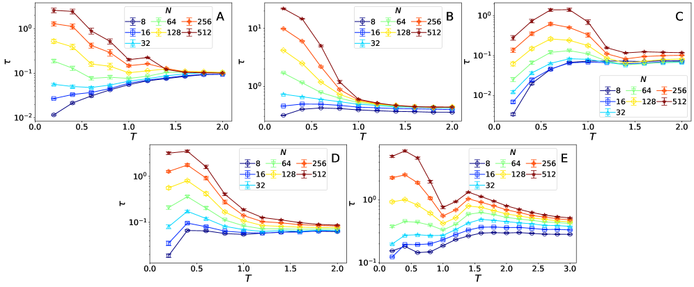

*Рисунок 10: Проинтегрированная корреляция $\tau=\tau_{\text{PROPN},\text{PROPN}}$ для текстов, порождённых моделями, обученными на (A) китайском, (B) французском, (C) японском, (D) корейском и (E) испанском. Фазовый переход неизменно наблюдается в разных языках.* **[p. 13]**

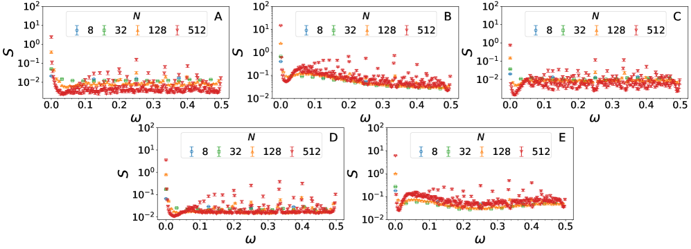

*Рисунок 11: Спектры мощности $S=S_{\text{PROPN}}$ для текстов, порождённых при $T=0.4$ моделями, обученными на (A) китайском, (B) французском, (C) японском, (D) корейском и (E) испанском. Как и у Pythia, обученной на английском, появляются многочисленные вершины, а значит порождённые тексты имеют сложные повторяющиеся строения.* **[p. 13]**

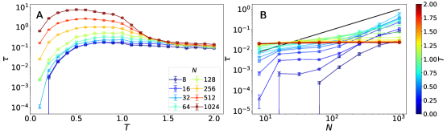

*Рисунок 12: (A) Проинтегрированная корреляция $\tau=\tau_{1,1}$ двоичных последовательностей по знакам как действие температуры $T$ при разных длинах последовательности $N$. (B) Та же величина как действие длины $N$ при разных температурах $T$. Чёрная черта означает прямую, пропорциональную $N$. Эти итоги говорят, что фазовый переход происходит близ $T\approx 1$, что согласуется с итогами для частеречных последовательностей.* **[p. 13]**

*Рисунок 13: (A–C) Спектр мощности $S=S_{1}$ двоичных последовательностей по знакам как действие $\omega$ при (A) $T=0.6$, (B) $T=1$ и (C) $T=1.4$. (D) Число вершин спектра мощности как действие $T$ при разных длинах последовательности $N$. (E) Та же величина как действие длины $N$ при разных температурах $T$. Чёрная черта означает прямую, пропорциональную $N$. Число вершин при низких температурах растёт с длиной последовательности, а значит низкотемпературный режим являет сложное повторяющееся строение, как и у частеречных последовательностей.* **[p. 14]**

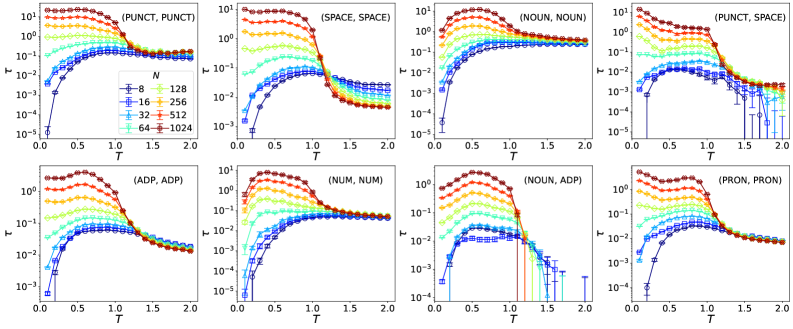

*Рисунок 14: Проинтегрированная корреляция $\tau_{ab}$ для восьми частеречных пар $(a,b)$ с наибольшим вкладом. Для всех пар проинтегрированная корреляция продолжает расти при низких температурах и выходит на насыщение при высоких, что и означает фазовый переход.* **[p. 14]**

###### fig-15

*Рисунок 15: Вероятность $v(t)=v_{\text{PROPN}}(t)$ того, что $t$-я метка есть PROPN, как действие времени $t$ при разных температурах; длина последовательности $N=1024$. Переходное время до неподвижного состояния становится чрезвычайно большим близ $T_{c}$, что говорит о критическом замедлении.* **[p. 14]**

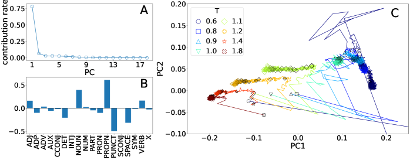

*Рисунок 16: Итоги разбора по главным составляющим (PCA), приложенного к динамике $\boldsymbol{v}(t)$. (A) Доли вклада главных составляющих. (B) Элементы PC1. (C) Динамика $\boldsymbol{v}(t)$ при разных температурах, спроецированная на двумерное пространство главных составляющих. Точки нанесены через каждые 32 шага времени, причём более тёмные отвечают меньшим $t$. Близ опасной точки динамика замедляется.* **[p. 15]**

###### fig-17

*Рисунок 17: Спектры мощности отдельных последовательностей, порождённых предобученной моделью при $T=0.6$. Повторяющийся образец каждой последовательности показан справа от её изображения: (A) *The number of schools in the United States\n\n* (период 9), (B) *The default value for the parameter is:\nmyFunction(param)\n\n* (период 12) и (C) *Course One is a graduate course in Education\n\nin the Department of Education (E.D.E.)\n\n* (период 18). Единицы, выделенные частеречным разметчиком, подсвечены попеременно. Единицы с меткой PROPN даны полужирным. Спектр мощности последовательности с повторами периода $p$ даёт вершины на частотах, кратных $1/p$.* **[p. 15]**

*Рисунок 18: (A–C) Вероятность $v(t)=v_{\text{PROPN}}(t)$ того, что $t$-я метка есть PROPN, как действие времени $t$ при разных температурах на шагах обучения (A) 0, (B) 128 и (C) 512; длина последовательности $N=1024$. (D) Оценённое предельное значение $\bar{v}$ как действие шага обучения при $N=1024$ и $M=128$. Замедление динамики возникает на шагах обучения $k\approx 10^{2}$, что согласуется с началом фазового перехода при $k_{c}\approx 10^{2}$. Несколько значений $v(t)$ и $\bar{v}$ для ранних шагов при низких температурах не показаны, ибо порождение текста обрывается слишком рано, чтобы набрать достаточно длинных последовательностей.* **[p. 16]**

*Рисунок 19: (A) Корреляция $C(t,t+\Delta t)=C_{\text{PROPN},\text{PROPN}}(t,t+\Delta t)$ для набора Pile как действие промежутка $\Delta t$; длина последовательности $N=1024$. Чёрная черта означает прямую, пропорциональную $\Delta t^{-0.2}$. (B) Проинтегрированная корреляция $\tau=\tau_{\mathrm{PROPN},\mathrm{PROPN}}$ для Pile и для последовательностей, порождённых Pythia 160M при $T=0.9$, $1$ и $1.1$, как действие длины последовательности $N$. (C) Динамика $v(t)=v_{\text{PROPN}}(t)$ для Pile вместе с динамикой для текстов, порождённых предобученной моделью при нескольких температурах. Длина последовательности $N=1024$. (D) Спектр мощности $S=S_{\mathrm{PROPN}}$ для Pile. Для всех этих величин набор Pile ведёт себя схоже с критической предобученной моделью Pythia.* **[p. 16]**

## Список литературы

- D. H. Ackley, G. E. Hinton, and T. J. Sejnowski (1985) A learning algorithm for boltzmann machines. Cognitive science 9 (1), pp. 147–169. Cited by: Temperature parameter in large language models.

- J. Arnold, F. Holtorf, F. Schäfer, and N. Lörch (2024) Phase transitions in the output distribution of large language models. arXiv preprint arXiv:2405.17088. Cited by: Phase transition in large language models and the criticality of natural languages.

- S. Bahamondes (2023) Study of the possibility of phase transitions in llms. Note: https://community.wolfram.com/groups/-/m/t/2958851 Cited by: Phase transition in large language models and the criticality of natural languages.

- P. Bergé, Y. Pomeau, and C. Vidal (1986) Order within chaos: towards a deterministic approach to turbulence. John Wiley & Sons, New York. Note: Translated by Laurette Tuckerman. Originally published in French in 1984. Cited by: Power spectrum.

- S. Biderman, H. Schoelkopf, Q. G. Anthony, H. Bradley, K. O’Brien, E. Hallahan, M. A. Khan, S. Purohit, U. S. Prashanth, E. Raff, et al. (2023) Pythia: a suite for analyzing large language models across training and scaling. In International Conference on Machine Learning, pp. 2397–2430. Cited by: Appendix A, Phase transition in pretrained models, Sampling method.

- J. Bouchaud (2024) The self-organized criticality paradigm in economics & finance. arXiv preprint arXiv:2407.10284. Cited by: Phase transition in large language models and the criticality of natural languages.

- (2021) Dbddv01/gpt2-french-small. Note: https://huggingface.co/dbddv01/gpt2-french-small Cited by: Appendix B.

- W. Ebeling and A. Neiman (1995-05) Long-range correlations between letters and sentences in texts. Physica A 215 (3), pp. 233–241. Cited by: Correlation, Mapping to part-of-speech sequences, Phase transition in large language models and the criticality of natural languages.

- W. Ebeling and T. Pöschel (1994-05) Entropy and Long-Range correlations in literary english. Europhysics Letters 26 (4), pp. 241. Cited by: Correlation, Phase transition in large language models and the criticality of natural languages.

- R. Ferrer i Cancho and R. Solé (2003) Least effort and the origins of scaling in human language. Proceedings of the National Academy of Sciences 100, pp. 788–791. Cited by: Phase transition in large language models and the criticality of natural languages.

- R. Ferrer i Cancho and A. Díaz-Guilera (2007) The global minima of the communicative energy of natural communication systems. Journal of Statistical Mechanics: Theory and Experiment 2007 (06), pp. P06009. Cited by: Phase transition in large language models and the criticality of natural languages.

- R. Ferrer i Cancho (2005) Zipf’s law from a communicative phase transition. The European Physical Journal B 47 (3), pp. 449–457. Cited by: Phase transition in large language models and the criticality of natural languages.

- L. Gao, S. Biderman, S. Black, L. Golding, T. Hoppe, C. Foster, J. Phang, H. He, A. Thite, N. Nabeshima, S. Presser, and C. Leahy (2020) The Pile: an 800gb dataset of diverse text for language modeling. arXiv preprint arXiv:2101.00027. Cited by: Appendix H, Phase transition in pretrained models.

- P. Hall (1988) On symmetric bootstrap confidence intervals. Journal of the Royal Statistical Society Series B: Statistical Methodology 50 (1), pp. 35–45. Cited by: Sampling method.

- H. S. Heaps (1978) Information retrieval: computational and theoretical aspects. Academic Press. Cited by: Phase transition in large language models and the criticality of natural languages.

- G. Herdan (1964) Quantitative linguistics. Butterworths. Cited by: Phase transition in large language models and the criticality of natural languages.

- A. Holtzman, J. Buys, L. Du, M. Forbes, and Y. Choi (2020) The curious case of neural text degeneration. In International Conference on Learning Representations, Cited by: Phase transition in large language models and the criticality of natural languages.

- Hugging Face (2025) Perplexity of fixed-length models. Note: https://huggingface.co/docs/transformers/v4.40.2/en/perplexity Cited by: Computation of perplexity.

- D. Jurafsky and J. H. Martin (2026) Speech and language processing: an introduction to natural language processing, computational linguistics, and speech recognition with language models. 3rd edition. Note: Online manuscript released January 6, 2026 External Links: Link Cited by: Natural language is closest to the critical model.

- C. G. Langton (1990) Computation at the edge of chaos: phase transitions and emergent computation. Physica D: nonlinear phenomena 42 (1-3), pp. 12–37. Cited by: Phase transition in large language models and the criticality of natural languages.

- W. Li (1989) Mutual information functions of natural language texts. Technical report Technical Report 89-10-008, Santa Fe Institute. Cited by: Correlation, Mapping to part-of-speech sequences, Phase transition in large language models and the criticality of natural languages.

- H. W. Lin and M. Tegmark (2017-06) Critical behavior in physics and probabilistic formal languages. Entropy 19 (7), pp. 299. Cited by: Correlation, Phase transition in large language models and the criticality of natural languages, Phase transition in large language models and the criticality of natural languages.

- B. B. Mandelbrot (1965) Information theory and psycholinguistics. Scientific Psychology, pp. 250–368. Cited by: Phase transition in large language models and the criticality of natural languages.

- A. A. **[p. 17]** Markov (2006) An example of statistical investigation of the text eugene onegin concerning the connection of samples in chains. Science in Context 19 (4), pp. 591–600. Note: English translation by Gloria Custance and David Link. Originally published in Russian in 1913 Cited by: Phase transition in large language models and the criticality of natural languages.

- N. Mikhaylovskiy and I. Churilov (2023) Autocorrelations decay in texts and applicability limits of language models. arXiv preprint arXiv:2305.06615. Cited by: Correlation, Phase transition in large language models and the criticality of natural languages.

- N. Mikhaylovskiy (2025-11) Zipf’s and heaps’ laws for tokens and LLM-generated texts. In Findings of the Association for Computational Linguistics: EMNLP 2025, C. Christodoulopoulos, T. Chakraborty, C. Rose, and V. Peng (Eds.), Suzhou, China, pp. 15469–15481. External Links: ISBN 979-8-89176-335-7 Cited by: Phase transition in large language models and the criticality of natural languages.

- G. A. Miller (1957) Some effects of intermittent silence. The American journal of psychology 70 (2), pp. 311–314. Cited by: Phase transition in large language models and the criticality of natural languages.

- I. Montani, M. Honnibal, M. Honnibal, A. Boyd, S. V. Landeghem, and H. Peters (2023-10) explosion/spaCy: v3.7.2: Fixes for APIs and requirements. Zenodo. Note: https://doi.org/10.5281/zenodo.10009823 External Links: Document Cited by: Appendix C, Mapping to part-of-speech sequences.

- M. A. Munoz (2018) Colloquium: criticality and dynamical scaling in living systems. Reviews of Modern Physics 90 (3), pp. 031001. Cited by: Phase transition in large language models and the criticality of natural languages.

- K. Nakaishi, R. Yoshida, K. Kajikawa, K. Hukushima, and Y. Oseki (to appear) Rethinking the relationship between the power law and hierarchical structures. Transactions of the Association for Computational Linguistics. Cited by: Phase transition in large language models and the criticality of natural languages.

- K. Nakaishi (2026) K-Nakaishi/transition-in-llm. Note: https://github.com/K-Nakaishi/transition-in-llm Cited by: Data, Materials, and Software Availability.

- J. R. **[p. 18]** Norris (1997) Markov chains. Cambridge Series in Statistical and Probabilistic Mathematics, Cambridge University Press. Cited by: Power spectrum.

- J. Obregon and B. Carrera (2020) Datificate/gpt2-small-spanish. Note: https://huggingface.co/datificate/gpt2-small-spanish Cited by: Appendix B.

- S. T. Piantadosi (2014) Zipf’s word frequency law in natural language: a critical review and future directions. Psychonomic bulletin & review 21 (5), pp. 1112–1130. Cited by: Phase transition in large language models and the criticality of natural languages.

- M. Prokopenko, N. Ay, O. Obst, and D. Polani (2010) Phase transitions in least-effort communications. Journal of Statistical Mechanics: Theory and Experiment 2010 (11), pp. P11025. Cited by: Phase transition in large language models and the criticality of natural languages.

- M. Sachs, M. Yoder, D. Turcotte, J. Rundle, and B. Malamud (2012) Black swans, power laws, and dragon-kings: earthquakes, volcanic eruptions, landslides, wildfires, floods, and soc models. The European Physical Journal Special Topics 205, pp. 167–182. Cited by: Phase transition in large language models and the criticality of natural languages.

- T. Sainburg, B. Theilman, M. Thielk, and T. Q. Gentner (2019) Parallels in the sequential organization of birdsong and human speech. Nature Communications 10 (1), pp. 3636. Cited by: Correlation, Phase transition in large language models and the criticality of natural languages.

- K. Sawada, T. Zhao, M. Shing, K. Mitsui, A. Kaga, Y. Hono, T. Wakatsuki, and K. Mitsuda (2024) Release of pre-trained models for the Japanese language. In Proceedings of the 2024 Joint International Conference on Computational Linguistics, Language Resources and Evaluation (LREC-COLING 2024), Cited by: Appendix B.

- C. E. Shannon (1951) Prediction and entropy of printed english. The Bell System Technical Journal 30 (1), pp. 50–64. Cited by: Phase transition in large language models and the criticality of natural languages.

- H. Shen (2019) Mutual information scaling and expressive power of sequence models. arXiv preprint arXiv:1905.04271. Cited by: Correlation, Phase transition in large language models and the criticality of natural languages.

- H. A. Simon (1955) On a class of skew distribution functions. Biometrika 42 (3/4), pp. 425–440. Cited by: Phase transition in large language models and the criticality of natural languages.

- (2021) SKT-AI/KoGPT2. Note: https://github.com/SKT-AI/KoGPT2 Cited by: Appendix B.

- H. E. Stanley (1971) Introduction to phase transitions and critical phenomena. International Series of Monographs on Physics, Vol. 46, Clarendon Press, Oxford. External Links: ISBN 0198512570 Cited by: Phase transition in large language models and the criticality of natural languages.

- Y. Sun and B. Haghighat (2025) Phase transitions in large language models and the $O(N)$ model. arXiv preprint arXiv:2501.16241. Cited by: Phase transition in large language models and the criticality of natural languages.

- S. Takahashi and K. Tanaka-Ishii (2017) Do neural nets learn statistical laws behind natural language?. PloS one 12 (12), pp. e0189326. Cited by: Correlation, Phase transition in large language models and the criticality of natural languages.

- S. Takahashi and K. Tanaka-Ishii (2019) Evaluating computational language models with scaling properties of natural language. Computational Linguistics 45 (3), pp. 481–513. Cited by: Correlation, Phase transition in large language models and the criticality of natural languages.

- K. Tanaka-Ishii and A. Bunde (2016-11) Long-range memory in literary texts: on the universal clustering of the rare words. PLoS One 11 (11), pp. e0164658. Cited by: Correlation, Phase transition in large language models and the criticality of natural languages.

- (2021) Uer/gpt2-chinese-cluecorpussmall. Note: https://huggingface.co/uer/gpt2-chinese-cluecorpussmall Cited by: Appendix B.

- P. Virtanen, R. Gommers, T. E. Oliphant, M. Haberland, T. Reddy, D. Cournapeau, E. Burovski, P. Peterson, W. Weckesser, J. Bright, S. J. van der Walt, M. Brett, J. Wilson, K. J. Millman, N. Mayorov, A. R. J. Nelson, E. Jones, R. Kern, E. Larson, C. J. Carey, İ. Polat, Y. Feng, E. W. Moore, J. VanderPlas, D. Laxalde, J. Perktold, R. Cimrman, I. Henriksen, E. A. Quintero, C. R. Harris, A. M. Archibald, A. H. Ribeiro, F. Pedregosa, P. van Mulbregt, and SciPy 1.0 Contributors (2020) SciPy 1.0: Fundamental Algorithms for Scientific Computing in Python. Nature Methods 17, pp. 261–272. External Links: Document Cited by: Peak detection in the power spectrum.

- T. Zhao and K. Sawada (2021) Rinna/japanese-gpt2-small. Note: https://huggingface.co/rinna/japanese-gpt2-small Cited by: Appendix B.

- G. K. Zipf (1935) The psychobiology of language: an introduction to dynamic philology. Houghton Mifflin. Cited by: Phase transition in large language models and the criticality of natural languages.

- G. K. Zipf (1949) Human behavior and the principle of least effort. Addison-Wesley Press. Cited by: Phase transition in large language models and the criticality of natural languages.
