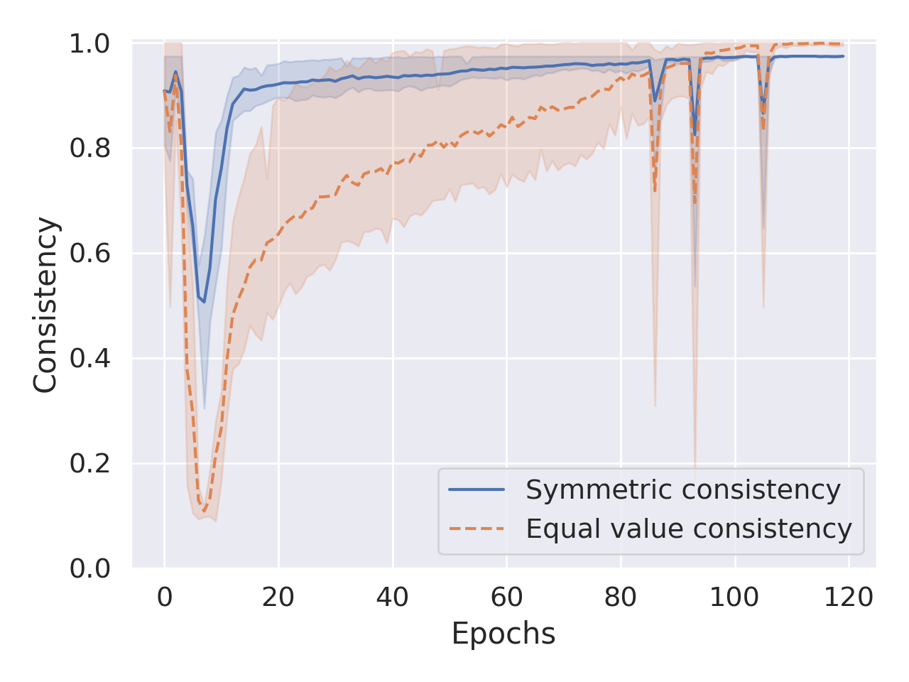
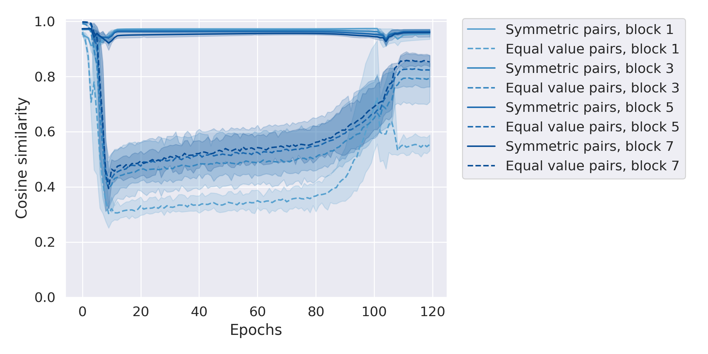
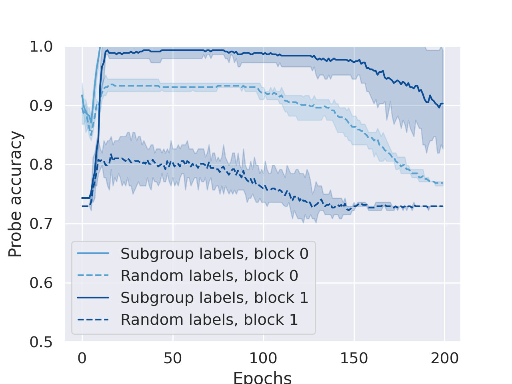

# Kvinge et al. 2026 — Can Neural Networks Learn Small Algebraic Worlds?

**Внешняя работа (демотирована из корпуса, task-019).** Гроккинг появляется в статье одной догадкой; корпусу ценен приём. Карточка сохранена целиком как сверхполная выдержка; в индексах и счётчиках корпуса работа не участвует. Конвенция — `papers/README.md`, раздел «Внешние работы». Оригинал — [`original/`](https://arxiv.org/abs/2601.21150); разбор тезисов — соседний `…claims.txt`.

См. также: [глобальный индекс понятий](../../concepts/index.md).

**Henry Kvinge**, **Andrew Aguilar**, **Nayda Farnsworth**, **Grace O’Brien**, **Robert Jasper**, **Sarah Scullen**, **Helen Jenne** (Тихоокеанская северо-западная государственная лаборатория; кафедра математики Вашингтонского университета; Колгейтский университет).

arXiv [2601.21150](https://arxiv.org/abs/2601.21150), январь 2026 (единственная версия v1), 11 страниц, 3 рисунка, 1 таблица. Числа цитирований в таблице корпуса нет. Работа не о гроккинге: она спрашивает, выучивает ли узкая сеть, обученная одному закреплённому действию, более широкое математическое строение, которое можно оттуда извлечь. Пробным случаем взято групповое действие, а искомыми понятиями — переместительность, единица и подгруппы. Гроккинг появляется в одной догадке: более чистые решения, склонные возникать через него, попутно схватывают больше алгебраического строения. Источник — нативный HTML arXiv версии v1.

Файлы разбора этой статьи:

- [`2601.21150.can-neural-networks-learn-small-algebraic-worlds.claims.txt`](2601.21150.can-neural-networks-learn-small-algebraic-worlds.claims.txt) — пронумерованные утверждения статьи с пометками разбора.
- [`2601.21150.can-neural-networks-learn-small-algebraic-worlds.license.txt`](2601.21150.can-neural-networks-learn-small-algebraic-worlds.license.txt) — лицензионная запись arXiv для этой статьи.

**О заголовке.** Полное название длиннее и вынесено в первую строку самой конверсии: «Can Neural Networks Learn Small Algebraic Worlds? An Investigation Into the Group-theoretic Structures Learned By Narrow Models Trained To Predict Group Operations». В индексе корпуса работа значится по короткой части.

Схема якорей и правила ссылок на карточку — в [README папки статей](../README.md).

**Карточка-выдержка.** Лицензия статьи (`arxiv-nonexclusive`) не разрешает публикацию копии оригинала и полного перевода, поэтому карточка содержит редакторские секции и цитируемые фрагменты перевода (право цитирования). Полный текст статьи: <https://arxiv.org/abs/2601.21150>.

## Затрагиваемые понятия

**[Остаточная арифметика](../../concepts/modular-arithmetic.md)** — одна из трёх разбираемых постановок, но взятая не как задача о гроккинге, а как простейший образец группы: циклическая группа $\mathbb{Z}/p\mathbb{Z}$ с действием $\overline{a}+\overline{b}=\overline{a+b\mod p}$ ([`p3-3`](#p3-3)). Размеры перебраны намеренно составные и простые — $C_{64}$, $C_{67}$, $C_{100}$, $C_{256}$, $C_{257}$, $C_{508}$, $C_{512}$, — ибо от делителей $p$ зависит решётка подгрупп ([`p4-1`](#p4-1)).

**[Композиция перестановок и некоммутативность](../../concepts/group-composition-non-commutative-s5.md)** — вторая постановка: симметрические группы $S_{4}$, $S_{5}$, $S_{6}$ порядка $n!$, непереместительные, со знакопеременной подгруппой размера $n!/2$ ([`p3-4`](#p3-4)). Третья — двугранные группы $D_{n}$ порядка $2n$ с подгруппой всех $n$ поворотов ([`p3-5`](#p3-5)). Такое сочетание и позволяет разделить переместительность как понятие от переместительности как свойства набора данных.

**[Групповые представления и смежные классы](../../concepts/group-representations-cosets.md)** — исходное побуждение работы. Разборы моделей, обученных остаточной арифметике и композиции перестановок, находили в них изощрённые алгоритмы, опирающиеся на теорию представлений соответствующих групп ([`p2-1`](#p2-1)); отсюда и вопрос, можно ли извлечь из сети сами теоретико-групповые понятия, а не только алгоритм ([`p2-2`](#p2-2)).

**[Линейное и разрежённое прощупывание](../../concepts/linear-sparse-probing.md)** — главный рабочий приём и единственная проверка, давшая положительный итог по подгруппам. Возбуждения $v_{g_{1},g_{2}}^{k}$ на слое $k$ размечаются по тому, верно ли $g_{1},g_{2}\in H$, и на этих метках обучается линейный щуп ([`p7-2`](#p7-2)). Существенна поверка: тот же щуп обучается на случайном подмножестве $R\subset G$ того же размера, подгруппы не образующем ([`p7-4`](#p7-4)). Качество на подгруппах заметно выше, особенно на поздних слоях, где влияние чистой входной кодировки ослабло ([`p7-6`](#p7-6), [`fig-3`](#fig-3)).

**[Устройственная истолковываемость](../../concepts/mechanistic-interpretability.md)** — работа помещает себя рядом с ней, но намеренно в стороне: третья призма, строение внутренних представлений, «согласуется с укладом устройственной истолковываемости» ([`p3-7`](#p3-7)), однако разбирать алгоритм на части здесь не пытаются. Вопрос ставится слабее и потому дешевле: извлекаются ли отвлечённые понятия независимо от того, восстановим ли точный алгоритм ([`p9-3`](#p9-3)).

**[Обучение устроенным представлениям](../../concepts/structured-representation-learning.md)** — предмет второй половины работы. Переместительность обнаруживается в том, что представления $g_{1}\star g_{2}$ и $g_{2}\star g_{1}$ ближе по косинусу, чем произвольные пары равного значения ([`p4-7`](#p4-7), [`p5-5`](#p5-5), [`fig-2`](#fig-2)); принадлежность к подгруппе — в линейной отделимости на поздних слоях.

**[Возникновение признаков](../../concepts/feature-emergence-feature-learning.md)** — первая призма опирается прямо на неё: подробный разбор обучения показал, что внезапные падения потери могут отвечать обретению сетью отдельной способности, и работа ищет такие же изломы там, где сеть выучивала бы переместительность или единицу ([`p3-7`](#p3-7)). Из трёх понятий эта призма сработала лишь на одном.

**[Гроккинг](../../concepts/grokking.md)** — упомянут ровно один раз и в виде догадки: более чистые решения, склонные возникать через гроккинг, попутно схватывают больше алгебраического строения ([`p8-1`](#p8-1)). Наблюдение под ней такое: у трансформеров на $S_{5}$ при схождении за 20–50 эпох знакопеременная подгруппа щупом не обнаруживалась, а при схождении после 100 с лишним эпох — обнаруживалась.

**[Масштаб начального приближения](../../concepts/initialization-scale.md)** — та же заметка с другой стороны: картины мира чувствительны к выбору настроек и к начальному приближению, и даже при одинаковых настройках прогоны различались по тому, какое строение из них удавалось извлечь ([`p8-1`](#p8-1)). Отсюда и совет: перебирать много начальных приближений даже после того, как модель уже успешно обучена ([`p9-1`](#p9-1)).

**[Скорость обучения](../../concepts/learning-rate.md)** — как настройка перебора: все модели обучены приёмом Adam с разными значениями скорости обучения и ослабления весов на одной Nvidia A100 ([`p3-8`](#p3-8)); точные значения для каждого рисунка даны в приложении A.

Карточки статей корпуса: [Power et al. 2022](../../papers/2201.02177.grokking-generalization-beyond-overfitting-on-small-algorithmic-datasets/2201.02177.grokking-generalization-beyond-overfitting-on-small-algorithmic-datasets.card.md) — исходное явление, на которое здесь ссылается лишь одна догадка; [Nanda et al. 2023](../../papers/2301.05217.progress-measures-for-grokking-via-mechanistic-interpretability/2301.05217.progress-measures-for-grokking-via-mechanistic-interpretability.card.md) — разбор алгоритма остаточного сложения, от которого работа сознательно отступает к более слабому вопросу; [McCracken et al. 2025](../../papers/2505.18266.uncovering-a-universal-abstract-algorithm-for-modular-addition-in-neural-networks/2505.18266.uncovering-a-universal-abstract-algorithm-for-modular-addition-in-neural-networks.card.md) — прямо процитирована как основание думать, что строение подгрупп участвует в вычислении; [Gromov 2023](../../papers/2301.02679.grokking-modular-arithmetic/2301.02679.grokking-modular-arithmetic.card.md) — та же задача, разобранная аналитически. Zhong et al. 2023, Chughtai et al. 2023, Stander et al. 2023 и Wu et al. 2024, на которые работа опирается в разделе смежных работ ([`p9-3`](#p9-3)), в корпусе карточек не имеют.

## Что показано, а что предположено

Замечания редактора карточки по итогам разбора утверждений (`…claims.txt`). Работа короткая: 9 страниц основного текста, 3 рисунка, 1 таблица, приложение с настройками.

**Рамка построена честно и до опытов.** Три призмы — ход обучения, обобщение вне распределения, строение представлений — заданы в разделе 3 и приложены ко всем трём понятиям единообразно ([`p3-6`](#p3-6), [`p3-7`](#p3-7)). Итог сведён в решётку из восьми проверок, где каждая клетка помечена «да» или «нет» ([`tab-1`](#tab-1)). Работ, которые сперва объявляют способ проверки, а потом докладывают и провалы, в корпусе мало.

**Защита от тривиального объяснения поставлена дважды, и оба раза к месту.** Симметрическую согласованность саму по себе можно довести до единицы простым ростом точности, потому введена согласованность при равных значениях ([`p4-5`](#p4-5)). Линейный щуп на подгруппе можно объяснить запоминанием произвольного набора элементов, потому введён случайный набор $R$ того же размера ([`p7-4`](#p7-4)). Без этих двух поверок обе положительные находки не стоили бы ничего.

**Проверка вне распределения устроена жёстко.** Элемент $g^{\prime}$ изымается из обучения целиком, и уже потом измеряется согласованность на парах с ним ([`p4-6`](#p4-6)). Симметрическая согласованность там после первоначального падения не восстанавливается, но держится выше уровня угадывания $1/|G|$ ([`p5-4`](#p5-4), [`fig-1`](#fig-1)) — это и есть довод в пользу понятия, а не таблицы подстановки.

**Отрицательные итоги доложены прямо.** Единица не обнаружена ни одной призмой: точность на ней идёт вплотную за общей, а вне распределения ни одна модель не предсказала $g\star e=g$ для невиданного $g$ ([`p6-3`](#p6-3)). Точность на подгруппе тоже ничего не дала ([`p7-5`](#p7-5)). Более того, авторы прямо оговаривают, что не могут отличить «понятие не выучено» от «наши средства его не видят» ([`p2-3`](#p2-3)).

**Объяснение отрицательного итога связно.** Особое свойство единицы приложимо лишь к $2|G|-1$ случаям из $|G|^{2}$, тогда как переместительность — ко всем; кодировать первое невыгодно, второе выгодно ([`p7-9`](#p7-9)). Правило сформулировано как предсказание для будущих работ, а не как отговорка.

**Однако главный довод о переместительности получен на устройстве, ей предрасположенном.** Авторы сами пишут, что у трансформера представления знаков $g_{1}$ и $g_{2}$ в $g_{1}\star g_{2}$ и в $g_{2}\star g_{1}$ совпадают с точностью до позиционного кодирования, тогда как унитарные кодировки для MLP вообще говоря ортогональны ([`p5-2`](#p5-2)). Оговорка сделана — а вот проверка, которая различила бы выученное понятие и свойство устройства, нет: рисунки 1 и 2 показывают только трансформеры на $C_{100}$, и ни одного рисунка по переместительности у MLP в работе нет.

**Догадка о гроккинге держится ровно на том разбросе, который сами авторы объявили чрезмерным.** Наблюдение таково: у трансформеров на $S_{5}$ поздно сошедшиеся прогоны давали обнаружимую знакопеременную подгруппу, рано сошедшиеся — нет ([`p8-1`](#p8-1)). Но в подписи к рисунку 3 прямо сказано, что качество трансформера на $S_{5}$ колебалось от одного начального приближения к другому слишком сильно, чтобы строить доверительные промежутки ([`fig-3`](#fig-3)). Прогонов три. Гроккинг при этом не измерен: ни разрыва между обучением и проверкой, ни кривых для поздних прогонов не приведено, и «сошлась позже» приравнено к «грокнула».

**Постановка для гроккинга и не предназначалась.** По приложению A на обучение отведено 80 % всех случаев ([`p3-8`](#p3-8)); доля данных не перебирается вовсе, тогда как именно она в корпусе служит главной ручкой отложенной генерализации. Догадку стоит проверять не здесь, а там, где гроккинг ставится намеренно.

**Текст не вычитан в двух местах.** Обещаны «три наглядных правила» предсказания того, будет ли свойство $X$ выучено, а приведены два ([`p7-8`](#p7-8), [`p7-9`](#p7-9)). Подпись таблицы 1 говорит о «малых LLM», тогда как обучались трансформеры только с раскодировщиком в четыре блока и языковых моделей в работе нет ([`tab-1`](#tab-1)).

**Чисел в тексте нет ни одного.** Ни точности предсказания, ни качества щупа, ни величины разрыва между сплошной и пунктирной линиями — всё оставлено рисункам. При этом настройки даны полно: приложение A перечисляет устройство, скорость обучения, ослабление весов и разбиение для каждого рисунка. Странное сочетание щедрости в одном и скупости в другом.

**Ценное для корпуса — приём, а не итог.** Решётка «понятие x призма» переносится на любое явление, о котором спрашивают «выучила ли модель понятие, а не правило»; поверка случайным подмножеством при линейном прощупывании обязана войти в обиход; а догадка о связи позднего схождения с богатством выученного строения заслуживает отдельной проверки в постановке, где отложенная генерализация вызывается намеренно.

Henry Kvinge*1,2*, Andrew Aguilar*1,2*, Nayda Farnsworth*1,3*, Grace O’Brien*1,2*, **Robert Jasper*1***, **Sarah Scullen*1***, **Helen Jenne*1* 1**Тихоокеанская северо-западная государственная лаборатория 2Кафедра математики, Вашингтонский университет 3Колгейтский университет henry.kvinge@pnnl.gov

---

# Цитируемые фрагменты перевода

Ниже приведены только те фрагменты перевода, на которые ссылаются карточки корпуса (право цитирования). Нумерация якорей `pN-M` / `fig-N` / `sec-X` совпадает с полной карточкой и оригиналом.

## Аннотация

###### p1-2

Хотя настоящее исследование в математике и может направляться побуждающим вопросом, ход математического открытия обыкновенно не имеет заранее назначенного предела. В лучшем случае поиск, потребный для ответа на исходный вопрос, выявляет новые строения, образцы и прозрения, ценные сами по себе. Это расходится с экзаменационным укладом, в котором сообщество машинного обучения обыкновенно прилагает ИИ к математике. Чтобы продвижение математики средствами ИИ было наибольшим, придётся выйти за пределы простого ответа на вопросы. С этой мыслью мы выясняем, в какой мере узкие модели, обученные решать закреплённую математическую задачу, выучивают более широкое математическое строение, которое исследователь или иная система ИИ способны оттуда извлечь. Как основной пробный случай мы берём задачу обучения нейронной сети предсказывать групповое действие (скажем, выполнять остаточную арифметику или композицию перестановок). Мы описываем набор проверок, назначенных выяснить, схватывает ли модель значимые теоретико-групповые понятия — единичный элемент, переместительность или подгруппы. Обширными опытами мы находим свидетельства того, что модели выучивают представления, способные схватывать отвлечённые алгебраические свойства. Скажем, мы находим намёки на то, что модели схватывают переместительность остаточной арифметики. Нам удаётся и обучить линейные распознаватели, надёжно отличающие элементы некоторых подгрупп (хотя никаких меток этих подгрупп в данных нет). С другой стороны, извлечь такие понятия, как понятие единичного элемента, нам не удаётся. В совокупности наши итоги дают основание думать, что в некоторых случаях представления даже малых нейронных сетей можно применять, чтобы выпаривать любопытное отвлечённое строение из новых математических предметов.

## 1 Введение

###### p2-1

Если цель — выработать приёмы, дающие более свободный от предела поиск, то одно из возможных решений состоит в том, чтобы приглядеться к успешным узким моделям. Не содержат ли они уже ценных прозрений, выученных по ходу решения исходной задачи? Есть ряд разборов, дающих такой догадке основание. Скажем, внимательный разбор моделей, обученных выполнять остаточную арифметику Nanda et al. (2023a) или композицию перестановок Chughtai et al. (2023); Stander et al. (2023); Wu et al. (2024), выявил изощрённые алгоритмы, опирающиеся на теорию представлений соответствующих групп. Схожим образом разбор графовой нейронной сети, назначенной распознавать класс мутационной равносильности колчана конечного или аффинного типа, показал, что она естественно собирает случаи в скопления, согласные с человеческими укладами распознавания He et al..

###### p2-2

Побуждаемые этим вопросом, мы разбираем простейший случай нейронной сети, обученной предсказывать действие группы $G$, и спрашиваем, в какой мере в такой сети можно распознать основные теоретико-групповые понятия. Среди рассматриваемых понятий — переместительность, единица и подгруппы, все они основные в теории групп. Мы разбираем три подхода к распознаванию этих понятий: (i) через ход обучения, где мы ищем изменения потери или точности, которые могли бы отвечать выучиванию моделью нового понятия, (ii) различия в качестве на подмножествах входных случаев (скажем, модель, «понимающая» единичный элемент $e$, должна всегда давать верный ответ на вопросах вида $g\star e$ или $e\star g$, даже если $g$ она прежде не видела) и (iii) строение внутренних представлений группы.

###### p2-3

Мы прощупываем MLP и трансформеры, обученные выполнять групповое действие для циклических, симметрических и двугранных групп разных размеров. Во всех этих постановках мы приводим свидетельства того, что по крайней мере часть изучаемых нами математических понятий этими простыми моделями схватывается. Скажем, для некоторых подгрупп $H$ линейные щупы надёжно отличают пары элементов $(g_{1},g_{2})$, обе части которых принадлежат $H$, от пар, где $g_{1}$ или $g_{2}$ к $H$ не принадлежит. Это существенно, ибо эти модели обучались без всяких сведений о подгруппах. С другой стороны, иных понятий — скажем, значимости единичного элемента — нам распознать не удалось. Оттого ли это, что модель этого понятия так и не выучила, или оттого, что оно слишком тонко, чтобы легко уловить его имеющимися у нас средствами разбора моделей, остаётся неясным.

## 2 Конечные группы и связанные с ними понятия

###### p3-3

**Циклические группы, $\mathbb{Z}/p\mathbb{Z}$:** циклические группы знакомы, ибо отвечают остаточному сложению. Мы можем представить $\mathbb{Z}/p\mathbb{Z}$ элементами $\{\overline{0},\overline{1},\dots,\overline{p-1}\}$ и осуществить двуместное действие как $\overline{a}+\overline{b}=\overline{a+b\mod p}$. Группа $\mathbb{Z}/p\mathbb{Z}$ переместительна и имеет порядок $|\mathbb{Z}/p\mathbb{Z}|=p$. Подгруппы $\mathbb{Z}/p\mathbb{Z}$ находятся во взаимно однозначном соответствии с целыми $1\leq k\leq p$ такими, что $k$ делит $p$. Если $k$ делит $p$, то соответствующую подгруппу можно осуществить как $\{\overline{0},\overline{k},\overline{2k},\dots\}$.

###### p3-4

**Симметрические группы, $S_{n}$:** симметрическая группа $S_{n}$ есть множество всех перестановок $n$ элементов с двуместным действием композиции перестановок. Оттого порядок $S_{n}$ равен $n!$. Она непереместительна. У $S_{n}$ много подгрупп, но мы будем работать с одной из наиболее известных — *знакопеременной (под)группой*, состоящей из всех чётных перестановок $n$ элементов. Знакопеременная группа имеет размер $n!/2$.

###### p3-5

**Двугранные группы $D_{n}$:** двугранную группу $D_{n}$ можно осуществить как множество поворотов и отражений, сохраняющих $n$-угольник. Она состоит из $n$ поворотов и $n$ отражений, а значит, имеет порядок $2n$. Среди подгрупп $D_{n}$ есть подгруппа всех $n$ поворотов.

## 3 Как распознать, выучила ли модель математическое понятие?

###### p3-6

Пусть $f:G\times G\rightarrow G$ — нейронная сеть, обученная выполнять двуместное действие $\star$ группы. Стало быть, получив $g_{1},g_{2}\in G$, сеть $f$ предсказывает $g_{1}\star g_{2}$. Мы очерчиваем три широких подхода, которыми пользуемся, чтобы распознать, «выучила» ли $f$ алгебраические понятия, определяющие группы (по крайней мере в том виде, в каком их описал бы человек-математик).

###### p3-7

- **Ход обучения:** подробный разбор обучения нейронных сетей показал, что (по крайней мере в простых задачах) внезапные падения потери могут отвечать обретению сетью отдельной способности Chen et al.; Olsson et al. (2022). Не увидим ли мы схожих изменений на кривой потери, когда сеть, обученная двуместному действию группы, выучивает понятие вроде переместительности $\star$? Побуждаемые этой мыслью, мы выясняем, согласуются ли изменения точности или потери с изменениями качества модели на отдельных подсовокупностях проверочного набора, схватывающих то или иное понятие. Скажем, можно вообразить, что внезапное падение потери отвечает достижению моделью высокой точности на случаях вида $e\star g$ или $g\star e$, а это говорило бы о том, что модель выучила понятие единичного элемента.
- **Обобщение:** математические понятия ценны именно тем, что позволяют рассуждать широко, о случаях, которых мы прежде не видели. Может статься, что с числами $2,483,402$ и $5,840,202$ никто никогда не работал, но мы тотчас можем сказать, что $2,483,402+5,840,202=5,840,202+2,483,402$, опираясь на уже усвоенные нами математические понятия. Один из способов оценить, выучила ли модель понятие, — посмотреть, сумеет ли она приложить это понятие к примеру вне распределения.
- **Строение внутренних представлений:** усвоение моделью понятия может проявиться строением скрытых возбуждений модели. Скажем, модель может закодировать переместительность, представляя $g_{1}\star g_{2}$ и $g_{2}\star g_{1}$ более схожими, нежели произвольные $g_{1}\star g_{2}$ и $g_{3}\star g_{4}$, даже когда $g_{1}\star g_{2}=g_{3}\star g_{4}$. Такой взгляд согласуется с укладом устройственной истолковываемости.

### 3.1 Подробности опытов

###### p3-8

В наших опытах мы применяем MLP и трансформеры такого размера, который доступен большинству исследователей, но которого довольно, чтобы выучить групповое действие. Наши MLP состоят из плотных линейных слоёв **[p. 4]**, перемежаемых нелинейностями ReLU. Наши трансформеры — только с раскодировщиком и с нелинейностями GeLU. Задача поставлена как предсказание и потому пользуется обычной перекрёстно-энтропийной потерей. Все модели обучены приёмом Adam с разными значениями скорости обучения и ослабления весов на одной Nvidia A100. В большинстве опытов мы перебираем широкий набор настроек. Настройки, применённые для рисунков статьи, приведены в разделе A приложения.

###### p4-1

В наших опытах элементы $G$ закодированы унитарно. Для MLP мы кодируем $g_{1}\star g_{2}$, сцепляя два вектора длины $|G|$ в один вход размерности $2|G|$. Поскольку предсказываемый выход есть элемент $G$, размерность выхода равна $|G|$. Для трансформеров мы кодируем $g_{1}\star g_{2}$ последовательностью длины 3: первый знак отвечает $g_{1}$, второй — $g_{2}$. Последний знак, по которому трансформер делает предсказание, можно считать отвечающим «$=$». Стало быть, трансформер работает со словарём размера $|G|+1$. В опытах мы работаем с циклическими группами $C_{64}$, $C_{67}$, $C_{100}$, $C_{256}$, $C_{257}$, $C_{508}$, $C_{512}$, симметрическими группами $S_{4}$, $S_{5}$ и $S_{6}$ и двугранными группами $D_{30}$, $D_{50}$, $D_{60}$, $D_{120}$ и $D_{240}$.

### 3.2 Переместительность

###### p4-5

Значения симметрической согласованности, близкие к 1, указывают, что $f$ даёт более согласованные предсказания на парах $(g_{1},g_{2})$ и $(g_{2},g_{1})$. Однако нужна осторожность: эту величину саму по себе можно довести до наибольшего и просто лучшим качеством на проверочном наборе. Иначе говоря, у всякой модели, достигшей 100 % точности на проверочных примерах, симметрическая согласованность будет равна 1, даже если это просто таблица подстановки. Чтобы этого избежать, мы измеряем и *согласованность при равных значениях* — долю случаев, когда $f$ предсказывает $f(g_{1},g_{2})=f(g_{3},g_{4})$ для $(g_{1},g_{2}),(g_{3},g_{4})\in S$ таких, что $g_{1}\star g_{2}=g_{3}\star g_{4}$. Мы сравниваем их по ходу обучения. Рост симметрической согласованности, не зависящий от согласованности при равных значениях, может быть свидетельством выученного моделью понятия переместительности.

###### p4-6

Ещё один способ прощупать переместительность — посмотреть, насколько крепко симметрическая согласованность держится на примерах вне распределения, не виданных при обучении. Эту разновидность мы называем *симметрической согласованностью вне распределения (OOD)*. Здесь мы выбираем некоторое $g^{\prime}\in G$ и удаляем из обучающего набора все примеры из $S_{g^{\prime}}:=\{(g^{\prime},g)$,$(g,g^{\prime})\;|\;g\in G\}$. Затем мы измеряем симметрическую согласованность на $S_{g^{\prime}}$, чтобы увидеть, способна ли модель приложить сколько-нибудь выученное понятие переместительности к элементам $S_{g^{\prime}}$, куда входит невиданный элемент $g^{\prime}$.

###### p4-7

**Косинусная близость:** переместительность означает, что алгебраически нам дозволено считать $g_{1}\star g_{2}$ и $g_{2}\star g_{1}$ равными. Применительно к большим языковым моделям Kvinge et al. выдвинули догадку, что такое усвоение может проявиться тем, что модель строит внутренние представления $g_{1}\star g_{2}$ и $g_{2}\star g_{1}$, более близкие в пространстве скрытых возбуждений. Для данного входа $(g_{1},g_{2})$ обозначим через $v^{k}_{g_{1},g_{2}}$ вектор возбуждений, отвечающий $(g_{1},g_{2})$ и снятый с $k$-го слоя $f$. *Симметрическая представленческая близость $f$ на слое $k$* есть

###### p5-2

**Схватывают ли модели переместительность?:** единственный разряд переместительных групп, который мы разбирали, — циклические группы, потому на них мы и сосредоточим разбор. Отметим, что по самому своему устройству трансформеры лучше приспособлены схватывать переместительность, ибо представления знаков, отвечающих $g_{1}$ и $g_{2}$ в $g_{1}\star g_{2}$, совпадают с представлениями знаков, отвечающих $g_{1}$ и $g_{2}$ в $g_{2}\star g_{1}$, с точностью до правки позиционным кодированием. Унитарные же кодировки $g_{1}\star g_{2}$ и $g_{2}\star g_{1}$ вообще говоря ортогональны.

###### p5-4

В постановке OOD значения симметрической согласованности после первоначального падения снова не растут, но остаются выше того, чего следовало бы ждать, если бы эти модели просто независимо угадывали значения $g^{\prime}\star g$ и $g\star g^{\prime}$, то есть выше $1/|G|$. Это изображено на рисунке 1 для пяти трансформеров, обученных предсказывать двуместное действие циклической группы $C_{100}$.

###### p5-5

Наконец, разбор внутренних представлений добротной модели тоже обнаруживает отпечатки переместительности: косинусная близость между парами $g_{1}\star g_{2}$ и $g_{2}\star g_{1}$ выше, чем между произвольными парами равного значения. Изображение этого — на рисунке 2.

###### fig-1




*Рисунок 1: графики симметрической согласованности против согласованности при равных значениях **(слева)** и симметрической согласованности вне распределения против неё же **(справа)** для пяти трансформеров, обученных выполнять остаточную арифметику в $C_{100}$. Затенённые области отвечают доверительным промежуткам $95\%$.* **[p. 5]**

###### fig-2



*Рисунок 2: график симметрической представленческой близости (сплошные линии) и близости при равных значениях (пунктирные линии) на разных блоках трансформера только с раскодировщиком, обученного на группе $C_{100}$. Затенение отвечает доверительным промежуткам 95 % по 5 случайным начальным приближениям.* **[p. 6]**

### 3.3 Единица

###### p6-3

**Есть ли у моделей понятие единичного элемента?:** во всех наших опытах точность на единице шла вплотную за общей точностью модели, не давая ни намёка на точку, где модель выучила бы особое правило предсказания вокруг единичного элемента. Это подкрепляется и итогами по точности на единице вне распределения: ни одна модель не сумела надёжно предсказать, что $g\star e=g$ или $e\star g=g$, если $g$ она при обучении не видела.

### 3.4 Строение подгрупп

###### p7-2

**Линейное прощупывание принадлежности к подгруппе:** проверить, строит ли $f$ отдельное представление $H$, можно, прощупывая принадлежность к подгруппе по скрытым возбуждениям $f$. Точнее, мы можем собрать представления $v_{g_{1},g_{2}}^{k}\in\mathbb{R}^{d_{k}}$, отвечающие $g_{1}\star g_{2}$ на слое $k$, разметить их по тому, верно ли $g_{1},g_{2}\in H$, и затем обучить линейный щуп предсказывать эти метки.

###### p7-4

Чтобы точнее выверить показания щупа, мы обучаем щупы и на парах элементов из $R\subset G$ — случайной выборки $|H|$ элементов группы, подгруппы не образующих. Если линейные щупы отличают элементы $H$ успешнее, чем элементы $R$, у нас будет свидетельство того, что строение подгрупп в скрытых представлениях модели схвачено.

###### p7-5

**Видят ли модели подгруппы?:** в отличие от того, как группу мог бы выучивать человек — сперва усвоив более простую подгруппу, а затем восходя к пониманию всей группы, — мы находим, что по всем группам, подгруппам, устройствам и настройкам точность на подгруппе идёт вплотную за общей точностью. Это согласуется со склонностями точности на единице, замеченными в разделе 3.3.

###### p7-6

С другой стороны, мы находим весомое свидетельство того, что добротные модели иной раз всё же схватывают строение подгрупп во внутренних представлениях, до которых мы добираемся линейным прощупыванием. Мы прощупываем несколько больших подгрупп циклических групп, в том числе подгруппы порядков $50$ и $20$, порождённые в $C_{100}$, подгруппы, порождённые всеми поворотами в $D_{30}$ и $D_{50}$ (порядков $30$ и $50$ соответственно), и знакопеременную подгруппу порядка $60$ в $S_{5}$. Точность этих щупов, обученных как на истинных метках подгруппы (сплошные линии), так и на случайных метках (пунктирные линии), по ходу обучения (ось $x$) и на разных слоях (цвета) показана на рисунке 3 для трансформера, обученного на $S_{5}$ (слева), и MLP, обученного на $D_{30}$ (справа). Вообще качество щупа на подгруппах заметно выше качества на случайных подмножествах, особенно на поздних слоях, где влияние чистой входной кодировки уже ослабло.

###### fig-3




*Рисунок 3: качество линейного щупа на **(слева)** трансформере, обученном предсказывать двуместное действие $S_{5}$, и **(справа)** MLP, обученном предсказывать двуместное действие на $D_{30}$. Сплошные линии — точность щупа, когда метки отвечают знакопеременной подгруппе и подгруппе поворотов соответственно, пунктирная же линия отвечает щупу, обученному на случайной разметке группы. На правом графике затенение означает доверительные промежутки 95 % по трём случайным начальным приближениям (качество трансформера на $S_{5}$ от одного случайного начального приближения к другому колебалось слишком сильно, чтобы в случае трансформера быть полезным). У MLP прощупывание велось после каждого слоя ReLU, у трансформера — после каждого слоя внимания.* **[p. 8]**

## 4 Обсуждение

###### p7-8

**Какие математические строения малая нейронная сеть схватывает чаще всего?** На этот вопрос важно ответить, ибо он помогает понять, будет ли уклад малых моделей полезен для той или иной работы по ИИ для математики. Опираясь на описанные выше удачи и неудачи, мы предлагаем три наглядных правила, позволяющих предсказать, будет ли данное математическое свойство $X$ выучено малой моделью, обученной работе $Y$.

###### p7-9

- Кодирование $X$ позволяет нейронной сети найти более простое решение, приложимое ко многим случаям работы $Y$. Скажем, кодирование переместительности и тривиальной природы единичного **[p. 8]** элемента ведёт к более простым решениям и в том, и в другом случае. Но если переместительность приложима ко всем случаям, то особое свойство единицы приложимо лишь к $2|G|-1$ случаям из $|G|^{2}$.
- $X$ укладывается в имеющуюся рамку истолковываемости. Нам оказалось трудно выяснить, распознают ли модели значимость единичного элемента, ибо это свойство трудно выразить в понятиях приёмов истолкования и разбора, приложимых к малым моделям. Скажем, мы не сумели придумать, как перевести это понятие в строение, которое можно было бы искать в пространстве возбуждений.

###### tab-1

*Таблица 1: сводка алгебраического строения, схватываемого малыми LLM и MLP, обученными выполнять двуместное действие группы.* **[p. 8]**

###### p8-1

**Математические картины мира чувствительны к выбору настроек и начального приближения.** Отчасти это может быть следствием «хрупкой» природы малых алгоритмических задач. Как и другие, мы нашли, что качество в этих постановках чувствительнее к начальным условиям и источникам случайности при обучении, чем в иных малых задачах (скажем, CIFAR10, MNIST). Но даже среди прогонов с одинаковыми настройками (сошедшихся) мы нашли заметные различия в том, какие математические строения нам удавалось извлечь. Скажем, одна склонность, замеченная нами при обучении трансформеров на $S_{5}$, состоит в том, что при более раннем схождении модели (после $~20-50$ эпох) знакопеременная подгруппа линейным прощупыванием не обнаруживалась, а при схождении после более долгого обучения ($>100$ эпох) — обнаруживалась. Мы выдвигаем догадку, что более чистые решения, склонные возникать через гроккинг, попутно схватывают больше алгебраического строения.

###### p9-1

Мы полагаем, что предлагаемые здесь проверки могут стать любопытным окном в то, насколько по существу разные решения модель выучивает при разных настройках обучения. Прощупывание математических картин мира может оказаться сравнительно дешёвым способом узнать о решении, к которому модель сошлась, не разбирая его на части (а это работа трудоёмкая). В целом мы настоятельно советуем при обучении моделей, которым предстоит применяться в последующем математическом поиске, перебирать много разных настроек и начальных приближений — даже после того, как некоторые модели уже успешно обучены.

## 5 Смежные работы

###### p9-3

Ближе всего к нашей постановке устройственные разборы, разбирающие на части то, как малые MLP и трансформеры выучивают групповые действия. Nanda et al. (2023a); Zhong et al. (2023); Chughtai et al. (2023); Stander et al. (2023); Wu et al. (2024); McCracken et al. (2025). Эти работы часто находили, что выученные алгоритмы пользуются теоретико-групповым строением, хотя иной раз расходятся в том, какие именно алгоритмы они разбирают Chughtai et al. (2023); Stander et al. (2023). Наша работа их дополняет: мы спрашиваем, можно ли извлечь свидетельства отвлечённых понятий вроде переместительности или строения подгрупп независимо от того, удаётся ли извлечь точный применяемый алгоритм.

```yaml
paper:
  id: 2601.21150
  title: "Can Neural Networks Learn Small Algebraic Worlds? An Investigation Into
    the Group-theoretic Structures Learned By Narrow Models Trained To Predict
    Group Operations"
  authors: [Henry Kvinge, Andrew Aguilar, Nayda Farnsworth, Grace O'Brien,
    Robert Jasper, Sarah Scullen, Helen Jenne]
  affiliation: "Pacific Northwest National Laboratory; University of Washington;
    Colgate University"
  date: 2026-01
  version: "v1 (единственная)"
  venue: "препринт"
  citations: "нет данных (в таблицу citations_to_power_2022 не попала)"
  source: native-html
  role_in_corpus: "не о гроккинге: рамка проверки того, выучивает ли узкая модель
    отвлечённые понятия сверх поставленной работы; гроккинг — в одной догадке"

core_claim:
  name: "математические картины мира узких моделей"
  thesis: "модель, обученная одному лишь групповому действию, выучивает
    представления, из которых извлекаются отвлечённые алгебраические понятия"
  grid: "три понятия (переместительность, единица, подгруппы) x три призмы
    (ход обучения, обобщение вне распределения, строение представлений)"
  captured: "переместительность — да по всем трём призмам; подгруппы — да только
    по строению представлений; единица — нет ни по одной"
  grokking_conjecture: "более чистые решения, склонные возникать через гроккинг,
    попутно схватывают больше алгебраического строения"

setup:
  groups: "циклические C_64, C_67, C_100, C_256, C_257, C_508, C_512;
    симметрические S_4, S_5, S_6; двугранные D_30, D_50, D_60, D_120, D_240"
  architectures: "MLP с ReLU; трансформеры только с раскодировщиком, GeLU"
  encoding: "MLP — сцепление двух унитарных векторов, вход 2|G|, выход |G|;
    трансформер — последовательность из трёх знаков (g1, g2, '='), словарь |G|+1"
  loss: "перекрёстная энтропия"
  optimizer: "Adam, разные скорости обучения и ослабление весов"
  hardware: "одна Nvidia A100"
  data_split: "80 % на обучение, 20 % на проверку (приложение A)"
  hyperparameters_fig12: "трансформер: 4 блока внимания и 4 блока MLP,
    остаточный поток 1000, 8 голов, lr 0.0001, weight decay 0.001, 10000 случаев"
  hyperparameters_fig3: "слева 3 трансформера тех же настроек на 14400 случаях;
    справа 3 MLP глубины 2 и ширины 1000, lr 0.001, weight decay 0.0005,
    3600 случаев"
  seeds: "5 начальных приближений для рисунков 1 и 2, 3 для рисунка 3;
    доверительные промежутки 95 %"

measures:
  symmetric_consistency: "доля пар, где f(g1,g2) = f(g2,g1)"
  equal_value_consistency: "поверка: доля пар с g1*g2 = g3*g4, где f(g1,g2)=f(g3,g4)"
  ood_symmetric_consistency: "то же после изъятия из обучения всех пар с g'"
  symmetric_representational_similarity: "косинусная близость возбуждений
    v(g1,g2) и v(g2,g1) на слое k"
  identity_accuracy: "точность на примерах вида g*e и e*g"
  ood_identity_accuracy: "то же для отложенных элементов g'"
  subgroup_accuracy: "точность на парах из подгруппы H"
  subgroup_probe: "линейный щуп по возбуждениям, метка — принадлежность g1,g2 к H;
    поверка на случайном подмножестве R того же размера"

results:
  commutativity: "симметрическая согласованность падает меньше и растёт быстрее
    согласованности при равных значениях; вне распределения держится выше 1/|G|;
    косинусная близость выше у переставленных пар"
  identity: "точность на единице идёт вплотную за общей; вне распределения
    ни одна модель не предсказала g*e = g для невиданного g"
  subgroups: "точность на подгруппе ничего не даёт; линейный щуп на поздних слоях
    заметно превосходит щуп на случайном подмножестве"
  probed_subgroups: "порядки 50 и 20 в C_100; все повороты в D_30 и D_50;
    знакопеременная подгруппа порядка 60 в S_5"
  variability: "качество щупа колеблется от прогона к прогону; при высокой
    точности предсказания щуп бывает на уровне угадывания"

findings:
  - id: 1
    claim: "переместительность схватывается всеми тремя призмами"
    anchor: p5-2
  - id: 2
    claim: "единица не схватывается ни одной призмой"
    anchor: p6-3
  - id: 3
    claim: "подгруппы читаются линейным щупом, но не точностью"
    anchor: p7-6
  - id: 4
    claim: "правило: свойство выучивается, если приложимо ко многим случаям"
    anchor: p7-9
  - id: 5
    claim: "поздно сошедшиеся прогоны дают обнаружимую подгруппу"
    anchor: p8-1

concept_cards:
  modular-arithmetic: p3-3
  group-composition-non-commutative-s5: p3-4
  group-representations-cosets: p2-1
  linear-sparse-probing: p7-2
  mechanistic-interpretability: p3-7
  structured-representation-learning: p4-7
  feature-emergence-feature-learning: p3-7
  grokking: p8-1
  initialization-scale: p8-1
  learning-rate: p3-8

sources:
  original_html: original/2601.21150.native.html
  converted_text: original/2601.21150.can-neural-networks-learn-small-algebraic-worlds.md
  images_dir: images/
  pdf: https://arxiv.org/pdf/2601.21150v1

anchors:
  scheme: "pN-M | fig-N | tab-N (token headings, cross-viewer portable)"
  policy: "якоря заводятся только там, где на них ссылаются; разрывы страниц якорей не несут"
  paragraph: [p1-2, p2-1, p2-2, p2-3, p3-3, p3-4, p3-5, p3-6, p3-7, p3-8, p4-1,
    p4-5, p4-6, p4-7, p5-2, p5-4, p5-5, p6-3, p7-2, p7-4, p7-5, p7-6, p7-8, p7-9,
    p8-1, p9-1, p9-3]
  figure: [fig-1, fig-2, fig-3]
  table: [tab-1]

review_summary:                   # см. раздел «Что показано, а что предположено»
  strong: "рамка из трёх призм задана до опытов и приложена ко всем трём понятиям
    единообразно, а итог сведён в решётку с явными «нет»;
    обе положительные находки защищены поверками — согласованностью при равных
    значениях и случайным подмножеством того же размера;
    проверка вне распределения изымает элемент из обучения целиком;
    отрицательные итоги доложены прямо, вместе с оговоркой, что отличить
    «понятие не выучено» от «средства его не видят» авторы не могут;
    объяснено, отчего единица могла остаться невыученной: 2|G|-1 случаев из |G|^2"
  weak: "довод о переместительности получен на трансформерах, устройством к ней
    предрасположенных, а проверки на MLP, где кодировки ортогональны, нет;
    догадка о гроккинге стоит на трёх прогонах и на том самом разбросе, который
    в подписи к рисунку 3 объявлен чрезмерным для доверительных промежутков;
    гроккинг в этом наблюдении не измерен: «сошлась позже» приравнено к «грокнула»;
    доля обучающих данных закреплена на 80 % и не перебирается;
    обещаны три правила, приведены два;
    подпись таблицы 1 говорит о «малых LLM», которых в работе нет;
    ни одного числа в тексте — всё оставлено рисункам"
  authors_own_limits:
    - "искомые строения известны заранее, и потому главная трудность работы
      такого рода (знать, что искать) обойдена стороной"
    - "каждая проверка сама по себе даёт слабое свидетельство; вес имеет только
      их совокупность"
    - "неясно, не выучена ли единица или не видна имеющимися средствами"

translation:
  status: complete
  formula_parity: "display 2/2, inline поблочно совпадает во всех переведённых блоках"
  figures: "5/5"
  pagination: "14 отметок страниц, совпадает с оригиналом"
```
