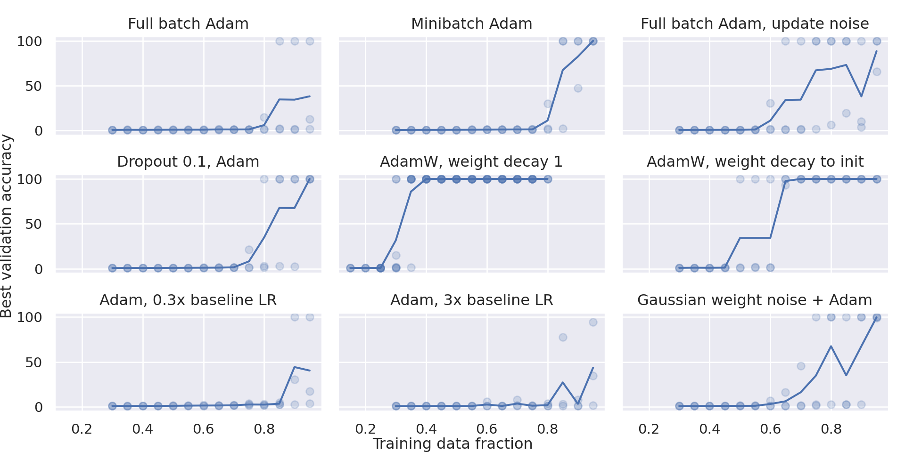
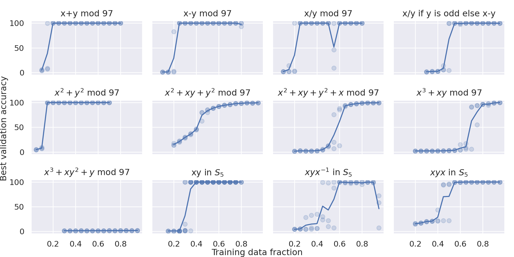

# Power et al. 2022 — Grokking: Generalization Beyond Overfitting on Small Algorithmic Datasets

См. также: [глобальный индекс понятий](../../concepts/index.md).

**Alethea Power, Yuri Burda, Harri Edwards, Igor Babuschkin** — OpenAI.
**Vedant Misra** — Google (был в OpenAI во время работы).

arXiv [2201.02177v1](https://arxiv.org/abs/2201.02177), 6 января 2022. Заголовок PDF: «Published as a conference paper at ICLR 2022». Работа, вводящая термин **grokking**.

Файлы разбора этой статьи:

- [`2201.02177.grokking-generalization-beyond-overfitting-on-small-algorithmic-datasets.claims.txt`](2201.02177.grokking-generalization-beyond-overfitting-on-small-algorithmic-datasets.claims.txt) — пронумерованные утверждения статьи с пометками разбора.
- [`2201.02177.grokking-generalization-beyond-overfitting-on-small-algorithmic-datasets.license.txt`](2201.02177.grokking-generalization-beyond-overfitting-on-small-algorithmic-datasets.license.txt) — лицензионная запись arXiv для этой статьи.

Схема якорей и правила ссылок на карточку — в [README папки статей](../README.md).

**Карточка-выдержка.** Лицензия статьи (`arxiv-nonexclusive`) не разрешает публикацию копии оригинала и полного перевода, поэтому карточка содержит редакторские секции и цитируемые фрагменты перевода (право цитирования). Полный текст статьи: <https://arxiv.org/abs/2201.02177>.

## Затрагиваемые понятия

**[Гроккинг](../../concepts/grokking.md)** — работа вводит понятие и даёт ему имя. Термин появляется в перечне вкладов ([`p2-4`](#p2-3)) как название для наблюдения: «спустя долгое время после сильного переобучения точность на валидации иногда внезапно начинает расти от уровня случайного угадывания к идеальной генерализации». Определяющая иллюстрация — [`fig-1`](#fig-1): деление mod 97, точность на обучении близка к идеальной за $<10^{3}$ шагов, а точность на валидации достигает того же уровня около $10^{6}$ шагов. Деталь сетапа, которая теряется при пересказах: этот рисунок получен на Adam **без weight decay** при бюджете $10^{6}$ шагов ([A.1.2](#sec-a1-2)), тогда как основная часть работы — включая вывод о действенности weight decay — идёт на AdamW с weight decay 1 и бюджетом $10^{5}$. То есть канонический график гроккинга демонстрирует не эффект weight decay, а масштаб задержки при его отсутствии. Работа задала явлению эмпирическую, а не механистическую рамку: разрыва перехода она не утверждает, мер прогресса не вводит и механизма не предлагает — всё это появляется у более поздних авторов, и в карточке понятия оно идёт от них, а не отсюда.

**[Модульная арифметика](../../concepts/modular-arithmetic.md)** — работа делает модульную арифметику стандартным полигоном для изучения отложенной генерализации. Каноническим сетапом стало деление mod 97 при 50 % данных в обучающей выборке, где каждый из 97 вычетов подаётся сети отдельным неинформативным символом ([`fig-1`](#fig-1)). Полный перечень из 12 операций — 9 модульных при $p=97$ и 3 на $S_{5}$ — задан в [приложении A.1.1](#sec-a1-1); именно этот набор задач унаследовала значительная часть последующих работ корпуса, вплоть до конкретного выбора $p=97$.

**[Эталонный полигон гроккинга](../../concepts/canonical-grokking-testbed.md)** — работа задаёт полигон целиком, а не только задачу: таблицы бинарных операций как уравнения из пяти неинформативных токенов ([`sec-2`](#sec-2)), перечень из 12 операций ([A.1.1](#sec-a1-1)), случайная доля таблицы как главный управляющий параметр и малый декодерный трансформер с подобранной оптимизацией ([A.1.2](#sec-a1-2)). Именно эта рамка унаследована корпусом: «following Power et al.» в поздних работах означает воспроизведение кодировки, сплита и архитектуры, с точечными вариациями (модуль, потеря, модель). На неинформативности символов держится и эквивалентность операций из [§3.2](#sec-3-2): $x+y\pmod{p-1}$ и $x*y\pmod{p}$ неразличимы для сети именно потому, что различать таблицы можно только по структуре взаимодействий символов. Состав рамки и вариации наследников разобраны в карточке понятия.

**[Фаза меморизации](../../concepts/memorization-phase.md)** — работа формулирует предмет изучения так, что запоминание становится опорной точкой отсчёта: генерализация исследуется «за пределами запоминания конечной обучающей выборки» ([`p1-1`](#p1-4)). При этом запоминание здесь — состояние, из которого сеть выходит, а не фаза с собственным внутренним устройством: представления о вытеснении запоминающего решения обобщающим работа не содержит, и понятие получает от неё только рамку «сначала запомнила, потом обобщила».

**[Доля данных / критический размер набора](../../concepts/data-fraction-critical-dataset-size.md)** — работа даёт первое количественное наблюдение того, как объём данных управляет временем до генерализации: меньшим наборам требуется всё больший объём оптимизации ([`p1-1`](#p1-4)). Мера эффекта — в [§3.1.1](#sec-3-1-1): в окрестности 25–30 % данных уменьшение обучающей выборки на 1 % даёт рост медианного времени до генерализации на 40–50 %, тогда как число шагов до 99 % точности на обучении в это время, наоборот, снижается. Порогового языка работа не вводит: термин «критический размер набора» появляется позже, у Liu et al., как осмысление этой же кривой.

**[Фазовый переход](../../concepts/phase-transition.md)** — работа поставляет понятию исходное наблюдение, но не трактовку. Формулировка «внезапно начинает расти» ([`p2-4`](#p2-3)) стала тем фактом, который последующие работы описали языком фазовых переходов; у самих Power et al. ни параметров порядка, ни неаналитичности, ни слова «переход» в этом смысле нет, поэтому в карточке работа проходит по разделу «Цитирования», а не как источник определения.

**[Возникновение признаков](../../concepts/feature-emergence-feature-learning.md)** — работа впервые показывает, что у обобщившей сети в эмбеддингах проступает структура самих математических объектов ([`p2-4`](#p2-3)). Развёрнуто это в [§3.4](#sec-3-4) и подписи к рисунку 3: t-SNE выходного слоя даёт смежные классы подгруппы для $S_{5}$ и круговую «числовую прямую» для модульного сложения, причём структура отчётливее при обучении с weight decay. Вклад остаётся качественным — авторы так и называют раздел «качественной визуализацией» и никакой меры возникновения признаков не предлагают. Вес этих визуализаций задаёт неинформативность символов: круговая топология сложения и смежные классы подгруппы не даны сети на входе и восстановлены из одной статистики совместной встречаемости — поэтому §3.4 показывает больше, чем «на графике видны кластеры» (см. карточку [эталонного полигона](../../concepts/canonical-grokking-testbed.md)).

**[Оптимизатор](../../concepts/optimizer-adam-adamw-sgd.md)** — работа впервые ставит вопрос о влиянии деталей оптимизации на эффективность по данным и отвечает на него перебором ([`p2-4`](#p2-3)). Набор сравниваемых вариантов, заданный в [приложении A.1.2](#sec-a1-2), стал образцом для последующих абляций: полнобатчевый Adam, обычный Adam, Adam с гауссовым шумом в направлении обновления, Adam с residual dropout 0.1, AdamW с weight decay 1, AdamW с weight decay в сторону инициализации, Adam с lr $3\cdot10^{-4}$ и $3\cdot10^{-3}$, Adam с гауссовым шумом в весах 0.01.

**[Weight decay](../../concepts/weight-decay.md)** — работа устанавливает weight decay как самое действенное из проверенных вмешательств ([`p2-4`](#p2-3)) и даёт этому меру в [§3.3](#sec-3-3): он «более чем вдвое сокращает необходимое число примеров по сравнению с большинством других вмешательств». Там же — авторская оговорка, ограничивающая объяснение: weight decay в сторону инициализации тоже работает, но слабее, чем в сторону начала координат, поэтому априор о примерно нулевых весах объясняет «часть, но не всё» превосходства. Именно эта оговорка оставила место позднейшим объяснениям через норму весов.

**[Композиция групп / S5](../../concepts/group-composition-non-commutative-s5.md)** — работа вводит в оборот некоммутативную задачу: произведение в абстрактной группе $S_{5}$ ([`fig-2`](#fig-2)), ставшее стандартным контрпримером к «грокинг — это про модульную арифметику». Родственные операции $x\cdot y\cdot x^{-1}$ и $x\cdot y\cdot x$ заданы в [A.1.1](#sec-a1-1), а подпись к рисунку 3 добавляет к задаче первое структурное наблюдение — кластеры эмбеддингов оказываются смежными классами подгруппы.

**[Границы генерализации](../../concepts/generalization-bounds.md)** — работа затрагивает тему дважды и по-разному. В обзоре ([`p7-6`](#p7-6)) она лишь упоминает выборочную сложность на алгоритмических задачах — по этому фрагменту карточка и цитирует её, в разделе «Цитирования». Содержательный же вклад лежит в [A.5](#sec-a5): резкость минимума по Keskar даёт корреляцию Спирмена $-0.79548$ с точностью на валидации, что стало первым указанием на связь мер генерализации с гроккингом. Сами авторы называют это предварительным исследованием на одном наборе данных.

**[Двойной спуск](../../concepts/double-descent.md)** — работа проводит разграничение, которым понятие пользуется до сих пор ([`p9-2`](#p9-2)): наблюдаемый второй спуск потерь на валидации, по мнению авторов, может отличаться от двойного спуска Nakkiran/Belkin, потому что происходит намного позже момента, когда потери на обучении впервые становятся очень малыми, и не сопровождается немонотонностью точности. Разграничение подано как гипотеза, а не установленный факт, и в карточке понятия занимает позицию оспаривающей стороны.

Карточки остальных работ корпуса перечислены в [индексе статей](../index.md). Работы, цитирующие Power et al. 2022, собраны во внешней таблице цитирований (в этом репозитории не хранится); их тексты сюда не копировались — корпус ссылается на собственные `original/` карточек.

**[Роль шума градиента](../../concepts/gradient-noise.md)** — работа одновременно открывает и ограничивает шумовую линию: гипотеза, что гроккинг «может быть обусловлен шумом от SGD» ([A.3](#sec-a3)); два гауссовых шумовых вмешательства в переборе [A.1.2](#sec-a1-2), улучшающих эффективность по данным, но уступающих weight decay; и полнобатчевая абляция, где генерализация происходит без шума вовсе ([`fig-2`](#fig-2)). Батч основной серии — min(512, половина обучающего набора), так что канонические запуски почти бесшумны.

**[Когда регуляризация необходима](../../concepts/regularization-necessity.md)** — работа закладывает обе стороны будущего спора: weight decay установлен как самое действенное из вмешательств ([`p2-4`](#p2-3)), но канонический запуск сделан [вовсе без него](#sec-a1-2) ([`fig-1`](#fig-1)) — генерализация наступает и так, лишь много позже. В карточке спора работа стоит первоисточником вопроса.

## Несогласованности внутри статьи

Замечания редактора карточки, а не текст авторов. Речь не о спорных трактовках, а о местах, где два фрагмента самой статьи говорят разное. Все три важны при цитировании: в пересказы обычно попадает короткая формулировка из основного текста, а уточнение остаётся в подписи к рисунку или в приложении.

**Множитель задержки: 1000× или 100×.** В [§3.1](#sec-3-1) сказано, что точность на валидации начинает расти выше случайного уровня «только после в 1000 раз большего числа шагов, чем требуется точности на обучении, чтобы приблизиться к оптимальной». Подпись к рисунку 1 ([`fig-1`](#fig-1)) даёт другие числа: точность на обучении близка к идеальной за $<10^{3}$ шагов, «вплоть до $10^{5}$ шагов мы почти не видим свидетельств какой-либо генерализации», а уровня обучения валидация достигает около $10^{6}$. По началу роста отношение равно $10^{5}/10^{3} = 100$. Множитель 1000 получается только при сравнении момента, когда обучение достигло оптимума, с моментом, когда валидация его догнала. Цитируя «в 1000 раз», нужно оговаривать, что речь о завершении гроккинга, а не о его начале.

**«Типично для всех операций» против операций, которые не грокнули.** [§3.1](#sec-3-1) утверждает, что описанное поведение «типично для всех бинарных операций при размерах набора данных, близких к минимальному, при котором сеть генерализовала в пределах отведённого бюджета». В [§3.2](#sec-3-2) сообщается, что часть операций (например $x^{3}+xy^{2}+y\pmod{97}$) не генерализовала ни при какой доле данных вплоть до 95 %. Для них минимального размера не существует, то есть «все» их молча исключает. Формально оговорка спасает утверждение, но фраза из §3.1, взятая отдельно, сильнее того, что показано.

**Перечень операций не покрывает рисунок 2.** [Приложение A.1.1](#sec-a1-1) перечисляет 12 операций и не содержит ни $x*y\pmod{p}$, ни операций по модулю $p-1$ — только $x+y\pmod{p}$. При этом [§3.2](#sec-3-2) разбирает эквивалентность $x+y\pmod{p-1}$ и $x*y\pmod{p}$, а затем называет $x*y$ среди симметричных операций, «перечисленных на рисунке 2 (справа)» ([`fig-2`](#fig-2)). Значит либо перечень A.1.1 неполон, либо на рисунке 2 есть операции вне него. Существенно потому, что именно A.1.1 воспроизводится последующими работами как «набор задач Power et al.».

## Ошибочные пересказы и цитирования этой статьи

Узоры ошибочного или расширенного цитирования этой работы, наблюдённые в цитирующих статьях корпуса. Каждая запись описывает, что именно искажается при пересказе, и ведёт к абзацам самих авторов, где стоит теряемая оговорка. Разбор конкретных формулировок — в карточках цитирующих работ, в их разделах «Ошибочные цитирования», куда ведут ссылки «подробности».

**«Weight decay необходим для гроккинга» (ошибочное).** Работе приписывают утверждение, что без weight decay гроккинг не происходит вовсе — что точность на тесте без него так и не вырастет. Сами Power et al. такого не писали, и их собственный канонический график это опровергает: запуск рисунка 1 сделан [на Adam вовсе без weight decay](#sec-a1-2), и точность на валидации на нём всё же достигает уровня обучения — просто спустя $\sim 10^{6}$ шагов. Реальное утверждение работы скромнее и касается экономии данных: [weight decay «особенно эффективен для улучшения генерализации на изучаемых нами задачах»](#p2-3) — он ускоряет и облегчает генерализацию, но не является её условием. Подробности: [2310.19470](../2310.19470.bridging-lottery-ticket-and-grokking-understanding-grokking-from-inner-structure-of-networks/2310.19470.bridging-lottery-ticket-and-grokking-understanding-grokking-from-inner-structure-of-networks.card.md#mc-2201-02177).

**«Weight decay вызывает гроккинг» (расширяющее, явно опровергнутое).** Мягкая форма того же дрейфа: weight decay называют предусловием гроккинга или «одним из факторов, вызывающих» его, со ссылкой на эту работу. У самих авторов гроккинг на рисунке 1 происходит без какого-либо weight decay, а в корпусе тезис опровергнут и напрямую: [Thilak et al.](../2206.04817.the-slingshot-mechanism-an-empirical-study-of-adaptive-optimizers-and-grokking/2206.04817.the-slingshot-mechanism-an-empirical-study-of-adaptive-optimizers-and-grokking.card.md) наблюдают гроккинг вовсе без явной регуляризации (механизм слингшот), [Gromov](../2301.02679.grokking-modular-arithmetic/2301.02679.grokking-modular-arithmetic.card.md) — на vanilla градиентном спуске без регуляризации. Образец аккуратной формулировки даёт Varma et al. (2309.02390): «grokking has been observed even when weight decay is not present … (though it is slower and often much harder to elicit …)» — факт назван вместе со встречной оговоркой и её источником. Подробности: [2402.16726](../2402.16726.towards-empirical-interpretation-of-internal-circuits-and-properties-in-grokked-transformers-on-modular-polynomials/2402.16726.towards-empirical-interpretation-of-internal-circuits-and-properties-in-grokked-transformers-on-modular-polynomials.card.md#mc-2201-02177), [2310.19470](../2310.19470.bridging-lottery-ticket-and-grokking-understanding-grokking-from-inner-structure-of-networks/2310.19470.bridging-lottery-ticket-and-grokking-understanding-grokking-from-inner-structure-of-networks.card.md#mc-2201-02177).

**Смешение двух режимов работы (фон большинства пересказов).** Канонический график и вывод о weight decay обычно цитируют как одно целое, но в самой статье они получены в разных режимах. Рисунок 1 — Adam без weight decay и нарочно растянутый бюджет $10^{6}$ шагов: авторы прямо пишут, что так сделано, [«чтобы подчеркнуть, насколько поздно … может начаться генерализация»](#sec-a1-2). Вывод же о действенности weight decay идёт из основной серии экспериментов — AdamW с weight decay 1 и бюджетом $10^{5}$ шагов. Пересказ, склеивающий эти режимы — «у Power при weight decay 1 генерализация наступает через $10^{6}$ шагов», — описывает постановку, которой в работе нет. Наблюдённое следствие: таблица гиперпараметров 2402.16726 со ссылкой «following Power et al.» совмещает «Weight Decay 1.0» с бюджетом 1e6. Подробности: [2402.16726](../2402.16726.towards-empirical-interpretation-of-internal-circuits-and-properties-in-grokked-transformers-on-modular-polynomials/2402.16726.towards-empirical-interpretation-of-internal-circuits-and-properties-in-grokked-transformers-on-modular-polynomials.card.md#mc-2201-02177).

**«Гроккинг — это генерализация, наступающая спустя долгое время после выучивания обучающей выборки» (расширяющее, явно опровергнутое — Omnigrok, 2210.01117).** Цитирующие работы вносят большую задержку в само определение явления со ссылкой на эту статью — как безусловное, отличительное свойство: генерализация «наступает лишь много позже» переобучения, вплоть до универсального множителя «более чем десятикратного числа итераций». У авторов задержка обусловлена постановкой. В перечне вкладов [точность на валидации лишь «иногда» внезапно начинает расти после переобучения](#p2-3); [ярко выраженным эффект назван «в некоторых случаях», а при больших размерах набора кривые обучения и валидации следуют друг за другом теснее](#sec-3-1); [время до генерализации быстро растёт по мере уменьшения доли обучающих данных — на 40–50 % за каждый убранный процент в окрестности 25–30 % данных](#sec-3-1-1) (см. также [центральную панель рисунка 1](#fig-1)); наконец, [канонический график с разрывом в тысячу раз получен на Adam без weight decay и с растянутым до $10^{6}$ шагов бюджетом — нарочно, «чтобы подчеркнуть, насколько поздно… может начаться генерализация», тогда как настройка по умолчанию — AdamW с weight decay 1](#sec-a1-2). Как безусловный тезис задержка опровергнута: по [подписи к рисунку 2 Omnigrok](../2210.01117.omnigrok-grokking-beyond-algorithmic-data/2210.01117.omnigrok-grokking-beyond-algorithmic-data.card.md#fig-2) при большой регуляризации генерализация быстрая, а число шагов до неё обратно пропорционально weight decay — при weight decay порядка 1 долгой задержки нет. Образец аккуратной формулировки есть у самого Grokfast, в его обзоре: `Power et al. [2022] demonstrated that various factors related to optimization … influence the model’s grokking pattern` — «Power et al. [2022] показали, что на картину гроккинга модели влияют различные факторы, связанные с оптимизацией». Подробности: [Grokfast (2405.20233)](../2405.20233.grokfast-accelerated-grokking-by-amplifying-slow-gradients/2405.20233.grokfast-accelerated-grokking-by-amplifying-slow-gradients.card.md#mc-2201-02177), [Xu, Vardi, Safran (2601.19791)](../2601.19791.to-grok-grokking-provable-grokking-in-ridge-regression/2601.19791.to-grok-grokking-provable-grokking-in-ridge-regression.card.md#mc-2201-02177), [Saheb Pasand, Dohmatob (2510.04930)](../2510.04930.egalitarian-gradient-descent-a-simple-approach-to-accelerated-grokking/2510.04930.egalitarian-gradient-descent-a-simple-approach-to-accelerated-grokking.card.md#mc-2201-02177). Более мягкие определительные отголоски того же узора: [2310.05918](../2310.05918.grokking-as-compression-a-nonlinear-complexity-perspective/2310.05918.grokking-as-compression-a-nonlinear-complexity-perspective.card.md), [2405.19454](../2405.19454.deep-grokking-would-deep-neural-networks-generalize-better/2405.19454.deep-grokking-would-deep-neural-networks-generalize-better.card.md), [2504.17243](../2504.17243.neuralgrok-accelerate-grokking-by-neural-gradient-transformation/2504.17243.neuralgrok-accelerate-grokking-by-neural-gradient-transformation.card.md), [2509.17738](../2509.17738.flatness-is-necessary-neural-collapse-is-not-rethinking-generalization-via-grokking/2509.17738.flatness-is-necessary-neural-collapse-is-not-rethinking-generalization-via-grokking.card.md), [2511.04760](../2511.04760.when-data-falls-short-grokking-below-the-critical-threshold/2511.04760.when-data-falls-short-grokking-below-the-critical-threshold.card.md), [2512.03437](../2512.03437.grokked-models-are-better-unlearners/2512.03437.grokked-models-are-better-unlearners.card.md), [2605.06152](../2605.06152.grokking-or-glitching-how-low-precision-drives-slingshot-loss-spikes/2605.06152.grokking-or-glitching-how-low-precision-drives-slingshot-loss-spikes.card.md), [2606.17120](../2606.17120.noise-driven-escape-from-metastable-phases-explains-grokking/2606.17120.noise-driven-escape-from-metastable-phases-explains-grokking.card.md).

---

# Цитируемые фрагменты перевода

Ниже приведены только те фрагменты перевода, на которые ссылаются карточки корпуса (право цитирования). Нумерация якорей `pN-M` / `fig-N` / `sec-X` совпадает с полной карточкой и оригиналом.

## Аннотация

###### p1-4

В этой работе мы предлагаем изучать генерализацию нейросетей на малых алгоритмически сгенерированных наборах данных. В такой постановке вопросы эффективности по данным, [запоминания](../../concepts/memorization-phase.md), генерализации и скорости обучения можно изучать очень подробно. Мы показываем, что в некоторых ситуациях нейросети обучаются через процесс «[гроккинга](../../concepts/grokking.md)» закономерности в данных, улучшая качество генерализации от уровня случайного угадывания до идеальной генерализации, и что это улучшение генерализации может происходить далеко за точкой переобучения. Мы также изучаем генерализацию [как функцию размера набора данных](../../concepts/data-fraction-critical-dataset-size.md) и обнаруживаем, что меньшим наборам данных требуется всё больший объём оптимизации для генерализации. Мы утверждаем, что такие наборы данных дают благодатную почву для изучения плохо понятого аспекта глубокого обучения: генерализации перепараметризованных нейросетей за пределами запоминания конечной обучающей выборки.

## 1 Введение

###### fig-1

*Рисунок 1: **Слева**. Гроккинг: яркий пример генерализации намного позже переобучения на алгоритмическом наборе данных. Мы обучаем на бинарной операции деления mod 97 с $50\%$ данных в обучающей выборке. Каждый из 97 вычетов подаётся сети как отдельный символ, аналогично представлению на рисунке справа. Красные кривые показывают точность на обучении, зелёные — точность на валидации. Точность на обучении становится близка к идеальной за $<10^{3}$ шагов оптимизации, но точности на валидации требуется около $10^{6}$ шагов, чтобы достичь того же уровня, и вплоть до $10^{5}$ шагов мы почти не видим свидетельств какой-либо генерализации. **В центре**. Время обучения, необходимое для достижения 99 % точности на валидации, быстро растёт по мере уменьшения доли обучающих данных. **Справа**. Пример небольшой таблицы бинарной операции. Предлагаем читателю самому догадаться, какие элементы пропущены.* **[p. 1]**

###### p2-1

Рассматриваемые нами наборы данных — это таблицы бинарных операций вида $a\circ b=c$, где $a,b,c$ — дискретные символы без внутренней структуры, а $\circ$ — бинарная операция. Примеры бинарных операций: сложение, композиция перестановок и многочлены от двух переменных. Обучение нейросети на собственном подмножестве всех возможных уравнений тогда сводится к заполнению пропусков в таблице бинарной операции, во многом похожему на решение судоку. Пример показан справа на рисунке 1. Поскольку мы используем различные абстрактные символы для всех различных элементов $a,b,c$, входящих в уравнения, сети не сообщается никакой внутренней структуры элементов, и о их свойствах ей приходится узнавать только из их взаимодействий с другими элементами. Например, сеть не видит чисел в десятичной записи или перестановок в строчной записи.

###### p2-3

- Мы показываем, что нейросети способны генерализовать на пустые клетки в разнообразных таблицах бинарных операций.
- Мы показываем, что спустя долгое время после сильного переобучения точность на валидации иногда внезапно начинает расти от уровня случайного угадывания к идеальной генерализации. Мы называем это явление «гроккингом». Пример показан на рисунке 1.
- Мы приводим кривые эффективности по данным для разнообразных бинарных операций.
- Мы эмпирически показываем, что объём оптимизации, необходимый для генерализации, быстро растёт по мере уменьшения размера набора данных.
- Мы сравниваем различные детали оптимизации, чтобы измерить их влияние на эффективность по данным. Мы обнаруживаем, что [weight decay](../../concepts/weight-decay.md) особенно эффективен для улучшения генерализации на изучаемых нами задачах.
- Мы визуализируем эмбеддинги символов, выученные этими сетями, и обнаруживаем, что они иногда выявляют узнаваемую структуру математических объектов, представленных этими символами.

###### sec-2

Во всех наших экспериментах использовался небольшой трансформер, обучаемый на наборах данных из уравнений вида $a\circ b=c$, где каждый из «$a$», «$\circ$», «$b$», «$=$» и «$c$» — отдельный токен. Подробности об изучаемых операциях, архитектуре, гиперпараметрах обучения и токенизации приведены в приложении A.1.

## 2 Метод

###### sec-3-1

### 3.1 Генерализация за пределами переобучения

###### sec-3-1-1

#### 3.1.1 Кривые времени обучения

###### sec-3-2

### 3.2 Гроккинг на разнообразных задачах

###### p3-4

Некоторые из операций, перечисленных на рисунке 2 (справа), симметричны относительно порядка операндов ($x+y$, $x*y$, $x^{2}+y^{2}$ и $x^{2}+xy+y^{2}$). Такие операции, как правило, требуют меньше данных для генерализации, чем близкие к ним несимметричные аналоги ($x-y$, $x/y$, $x^{2}+xy+y^{2}+x$). Мы полагаем, что этот эффект может отчасти зависеть от архитектуры, поскольку трансформеру легко выучить симметричную функцию операндов, игнорируя позиционный эмбеддинг.

###### fig-2

*Рисунок 2: **Слева**. Разные алгоритмы оптимизации приводят к разной степени генерализации в пределах бюджета оптимизации в $10^{5}$ шагов для задачи обучения произведению в абстрактной группе $S_{5}$. Weight decay улучшает генерализацию сильнее всего, но некоторая генерализация происходит даже с полнобатчевыми оптимизаторами и на моделях без шума в весах или активациях при высоких долях обучающих данных. Неудачный выбор гиперпараметров сильно ограничивает генерализацию. Не показано: точность на обучении достигает 100 % после $10^{3}$–$10^{4}$ обновлений для всех методов оптимизации. **Справа**. Наилучшая точность на валидации, достигнутая после $10^{5}$ шагов на разнообразных алгоритмических наборах данных, усреднённая по 3 сидам. Генерализация наступает при более высоких долях данных для интуитивно более сложных и менее симметричных операций.* **[p. 3]**

###### sec-3-3

### 3.3 Абляции и приёмы

###### p4-1

Мы обнаруживаем, что добавление weight decay оказывает очень большое влияние на эффективность по данным, более чем вдвое сокращая необходимое число примеров по сравнению с большинством других вмешательств. Мы обнаружили, что weight decay в сторону инициализации сети тоже эффективен, но не настолько, как weight decay в сторону начала координат. Это заставляет нас думать, что априорное предположение, будто примерно нулевые веса пригодны для малых алгоритмических задач, объясняет часть, но не всё превосходство weight decay. Добавление некоторого шума в процесс оптимизации (например, градиентного шума от использования мини-батчей, гауссова шума, применяемого к весам до или после вычисления градиентов) благотворно для генерализации, что согласуется с идеей, что такой шум может побуждать оптимизацию находить более плоские минимумы, которые лучше генерализуют. Мы обнаружили, что скорость обучения приходилось подбирать в довольно узком окне, чтобы генерализация происходила (в пределах 1 порядка величины).

###### sec-3-4

### 3.4 Качественная визуализация эмбеддингов

Чтобы получить некоторое представление о сетях, которые генерализуют, мы визуализировали матрицу выходного слоя для случая модульного сложения и $S_{5}$. На рисунке 3 мы показываем t-SNE-проекции векторов-строк. Для некоторых сетей мы находим на этих графиках отчётливые отражения структуры лежащих в основе математических объектов. Например, круговая топология модульного сложения показана «числовой прямой», образованной прибавлением 8 к каждому элементу. Структура более отчётлива в сетях, которые оптимизировались с weight decay.

###### sec-a1-1

#### A.1.1 Бинарные операции

Для каждого запуска обучения мы случайно выбирали долю всех доступных уравнений и объявляли их обучающей выборкой, а остальные уравнения — валидационной.

###### sec-a1-2

#### A.1.2 Модель и оптимизация

Мы обучали стандартный decoder-only трансформер Vaswani et al. (2017) с каузальным маскированием внимания и вычисляли потери и точность только на той части уравнения, которая является ответом. Во всех экспериментах мы использовали трансформер с 2 слоями, шириной 128 и 4 головами внимания, с общим числом около $4\cdot 10^{5}$ параметров, не считая эмбеддингов.

Для экспериментов, описанных в разделе 3.1, мы увеличили бюджет оптимизации до $10^{6}$ и использовали оптимизатор Adam без weight decay, чтобы подчеркнуть, насколько поздно в процессе оптимизации может начаться генерализация.

###### sec-a3

### A.3 Связанные работы

###### p7-6

В этой работе мы изучаем динамику обучения и генерализации на малых простых алгоритмических наборах данных. В прошлом алгоритмические наборы данных использовались, чтобы прощупать способность нейросетей к символьным и алгоритмическим рассуждениям. Например, задачи копирования, обращения и сортировки случайно сгенерированных последовательностей, а также выполнения арифметических операций над многозначными числами использовались как стандартные бенчмарки для sequence-to-sequence моделей Graves et al. (2014), Weston et al. (2014) Kaiser & Sutskever (2015) Reed & De Freitas (2015), Grefenstette et al. (2015), Zaremba & Sutskever (2015), Graves (2016), Dehghani et al. (2018). Обычно, однако, в этих работах акцент делается на качестве в режиме неограниченных данных, а генерализация часто изучается по отношению к длине входной последовательности. Некоторые статьи изучают выборочную сложность на алгоритмических задачах Reed & De Freitas (2015), но в основном сосредоточены на влиянии архитектурного выбора. В отличие от них мы изучаем явление генерализации в режиме ограниченных данных, с акцентом на явлениях, которые, как мы полагаем, не зависят от архитектуры.

###### p8-4

В Jiang et al. (2019) изучалось большое число мер генерализации или сложности на свёрточных нейросетях, чтобы понять, какие из них, если такие есть, предсказывают качество генерализации. Они обнаруживают, что наиболее предсказательны меры, основанные на плоскостности, которые стремятся количественно оценить чувствительность обученной нейросети к возмущениям параметров. Мы предположили, что явления гроккинга, **[p. 9]** о которых мы сообщаем в этой работе, могут быть обусловлены шумом от SGD, направляющим оптимизацию к более плоским/простым решениям, которые лучше генерализуют, и надеемся исследовать в будущей работе, предсказывает ли какая-либо из этих мер гроккинг.

###### p9-2

Nakkiran et al. (2019); Belkin et al. (2018) сосредоточены на явлении двойного спуска потерь как функции ёмкости модели и процедуры оптимизации. Они обнаруживают, что за классической U-образной кривой потерь на валидации в некоторых постановках (включая обучение нейросетей) следует второй спуск потерь, начинающийся примерно с той минимальной ёмкости, которая необходима, чтобы интерполировать хоть какие-то обучающие данные. Мы наблюдаем второй спуск потерь на валидации (но не точности) как функцию объёма обучения в некоторых наших экспериментах, и он происходит за точкой интерполяции обучающих данных. Мы полагаем, что описываемое нами явление может отличаться от явлений двойного спуска, описанных в Nakkiran et al. (2019); Belkin et al. (2018), поскольку мы наблюдаем второй спуск потерь намного позже того момента, когда потери на обучении впервые становятся очень малыми (десятки тысяч эпох в некоторых наших экспериментах), и мы не наблюдаем немонотонного поведения точности. Изучаемая нами постановка малых алгоритмических наборов данных также даёт меньшую, более удобную площадку для изучения тонких явлений генерализации, чем естественные наборы данных, изучаемые в Nakkiran et al. (2019).

### A.4 Генерализация с запоминанием нескольких выбросов

###### fig-6

*Рисунок 6: Влияние на эффективность по данным введения $k\in[0,10,100,1000,2000,3000]$ выбросов (примеров со случайными метками) в обучающие данные. Малое число выбросов заметно не влияет на качество генерализации, но большое число существенно ему препятствует.* **[p. 9]**

###### p9-5

В наших экспериментах мы обнаруживаем, что первый вариант не реализуется — все эксперименты в какой-то момент достигают 100 % точности на обучении, и этот момент существенно не зависит от изменения числа выбросов $k$. Второе явление происходит в некотором диапазоне долей обучающих данных и чисел выбросов $k$ — увеличение $k$ уменьшает диапазон долей обучающих данных, при которых процедура оптимизации сходится к моделям, которые генерализуют. Однако эффект от введения небольшого числа выбросов (до 1000) выражен не очень сильно — см. рисунок 6. Мы истолковываем это как дополнительное свидетельство того, что ёмкость сети и процедуры оптимизации намного превосходит ёмкость, необходимую для **[p. 10]** запоминания всех меток на обучающих данных, и что сам факт наступления генерализации требует нетривиального объяснения.

###### sec-a5

### A.5 Меры генерализации
