# Liu et al. 2022 — Towards Understanding Grokking: An Effective Theory of Representation Learning

См. также: [глобальный индекс понятий](../../concepts/index.md).

**Ziming Liu**, **Ouail Kitouni**, **Niklas Nolte**, **Eric J. Michaud**, **Max Tegmark**, **Mike Williams** — Department of Physics, Institute for AI and Fundamental Interactions, MIT.

arXiv [2205.10343](https://arxiv.org/abs/2205.10343), 20 мая 2022. 259 цитирований — вторая по цитируемости работа корпуса после Nanda et al. Нативного HTML для неё нет, источник — ar5iv.

Оригинал и производные файлы этой папки:

- [`original/2205.10343.ar5iv.html`](original/2205.10343.ar5iv.html) — первоисточник, ar5iv-рендеринг (LaTeXML), скачан как есть.
- [`original/2205.10343.towards-understanding-grokking-an-effective-theory-of-representation-learning.md`](original/2205.10343.towards-understanding-grokking-an-effective-theory-of-representation-learning.md) — конверсия оригинала в Markdown без правок содержания.
- [`images/`](images/) — 39 иллюстраций статьи в исходном разрешении.

Схема якорей и правила ссылок на карточку — в [README папки статей](../README.md).

## Затрагиваемые понятия

**[Эффективная теория / статистическая механика обучения](../../concepts/effective-theory-statistical-mechanics.md)** — работа **вводит подход** в исследования гроккинга и задаёт его образец: динамика эмбеддингов моделируется не градиентным спуском по настоящей потере задачи, а спуском по эффективной потере $\ell_{\rm eff}$, зависящей только от представлений и не зависящей от декодера ([`p3-1`](#p3-1)). Авторы прямо называют это шагом к «статистической физике глубокого обучения», связывающей «микрофизику» динамики сети с «термодинамикой» её поведения. Важно, чего в работе нет: эффективная потеря не выводится из настоящей в общем случае — приложение L выводит её лишь для линейной регрессии в адиабатическом пределе, а для нейросети она постулируется.

**[Зона Златовласки](../../concepts/goldilocks-zone.md)** — понятие **введено здесь**. Обучение представлений идёт только в промежуточной зоне между запоминанием и путаницей ([`p1-2`](#p1-2)), и авторы уподобляют её «интеллекту от голода» в дарвиновской эволюции. У Liu et al. зона задана гиперпараметрами оптимизатора (скорости обучения энкодера и декодера, weight decay), а не нормой весов: перенос в пространство весов — это уже Omnigrok, более поздняя работа тех же авторов.

**[Структурированное обучение представлений](../../concepts/structured-representation-learning.md)** — работа даёт понятию **операциональную меру**. «Структура» определена через $\delta$-параллелограммы ($\mathbf{E}_{i}+\mathbf{E}_{j}=\mathbf{E}_{m}+\mathbf{E}_{n}$), а их доля от всех допустимых даёт индекс качества представления RQI ([`p4-10`](#p4-4)). Это редкий для корпуса случай, когда качество представления не оценивается «на глаз» по картинке PCA, а считается числом и сопоставляется с точностью. Ограничение авторы называют сами: в высоких размерностях определение слишком строго — представление может быть линейным по одной оси и произвольным по остальным $N-1$, давая $\text{RQI}\approx 0$ при хорошей генерализации.

**[Доля данных / критический размер набора](../../concepts/data-fraction-critical-dataset-size.md)** — работа даёт **первое механистическое объяснение порога**. Критический размер выборки — это наименьший объём данных, задающий представление однозначно: порог возникает там, где размерность ядра системы линейных уравнений $A(P)$ падает до 2 (сдвиг и масштаб), и представление становится линейным. Предсказание количественное: фазовый переход около $r_{c}=0.4$ для сложения при $p=10$ и около $r_{c}=0.5$ для $S_{3}$ — и оно подтверждается эмпирически ([`p6-1`](#p6-1)).

**[Скорость обучения](../../concepts/learning-rate.md)** — работа делает её **осью фазовой диаграммы**, а не просто гиперпараметром. Ключ — не абсолютное значение, а *отношение* скоростей обучения представления и декодера: быстрый декодер при медленном представлении даёт запоминание, обратное — понимание, но слишком медленный декодер затягивает генерализацию. Именно из этого соотношения возникают четыре фазы.

**[Фазовый переход](../../concepts/phase-transition.md)** — работа переносит понятие из физики в буквальном смысле: не метафора резкого скачка, а фазовая диаграмма с границами между четырьмя режимами (понимание, гроккинг, запоминание, путаница), определёнными формальными критериями в таблице 1 ([`sec-a`](#sec-a)). Отсюда следует вывод, который для корпуса важнее самой диаграммы: гроккинг — не неизбежное свойство задачи, а **область в пространстве гиперпараметров**, зажатая между пониманием и запоминанием, и потому устранимая настройкой.

**[Фаза меморизации](../../concepts/memorization-phase.md)** — получает соседей по классификации. Запоминание здесь — одна из четырёх фаз, отличаемая от гроккинга формальным критерием (обучение достигает 90 %, валидация — нет), а от путаницы тем, что обучающая выборка вообще запомнена.

**[Нейронный коллапс](../../concepts/neural-collapse.md)** — работа связывает с ним свою эффективную теорию в приложении I: та же потеря воспроизводит стягивание представлений одного класса к среднему класса. Но авторы сами отмечают предел: равноугловую тесную рамку между средними классов теория **не** даёт, и они лишь предполагают, что помогло бы явное отталкивание между классами (аналогия с задачей Томсона).

**[Замораживание подсети / лотерейный билет](../../concepts/freezing-subnetwork.md)** — приложение K даёт **нестандартное прочтение гипотезы**: выигрышный билет здесь не веса и не подсеть, а оси — проекция эмбеддингов при инициализации на главные компоненты уже обученных эмбеддингов содержит бо́льшую часть будущей структуры ([`sec-k`](#sec-k)). Обучение при таком взгляде отсекает лишние измерения, а не создаёт структуру с нуля. Это наблюдение, а не проверенная гипотеза: авторы не проверяют его абляцией.

**[Появление признаков / обучение признакам](../../concepts/feature-emergence-feature-learning.md)** — работа даёт наблюдение, ставшее для корпуса опорным: генерализация **совпадает по времени** с появлением структуры в эмбеддингах ([`p2-1`](#fig-1)), причём на трансформере структура видна простым PCA только к моменту генерализации. Авторы честно оговаривают, что ни один метод понижения размерности не гарантирует обнаружения структуры, так что «структуры нет» и «структура не найдена» здесь не различимы.

**[Модульная арифметика](../../concepts/modular-arithmetic.md)** — работа берёт задачу у Power et al. и **сводит её к минимуму**: вместо трансформера — сумма двух обучаемых эмбеддингов, поданная в MLP-декодер, $(a,b)\mapsto{\rm Dec}(\mathbf{E}_{a}+\mathbf{E}_{b})$. Приложение B обосновывает, что этого достаточно для всех абелевых групп, а приложение H расширяет конструкцию на неабелевы через матричные эмбеддинги и умножение.

**[Гроккинг](../../concepts/grokking.md)** — работа впервые показывает гроккинг **вне алгоритмических данных**: на MNIST, при уменьшенной до 1 тыс. образцов выборке и увеличенном масштабе инициализации ([`sec-j`](#sec-j)). Это перевело явление из разряда курьёза алгоритмических задач в общее свойство обучения — вместе с выводом, что достаточная регуляризация (weight decay, dropout) убирает задержку.

Карточки статей корпуса: [Power et al. 2022](../2201.02177.grokking-generalization-beyond-overfitting-on-small-algorithmic-datasets/2201.02177.grokking-generalization-beyond-overfitting-on-small-algorithmic-datasets.card.md) — источник задачи и наблюдения, которое здесь объясняется; [Nanda et al. 2023](../2301.05217.progress-measures-for-grokking-via-mechanistic-interpretability/2301.05217.progress-measures-for-grokking-via-mechanistic-interpretability.card.md) — независимо разбирает ту же задачу изнутри сети и приходит к структуре Фурье там, где здесь описан параллелограмм; [Varma et al. 2023](../2309.02390.explaining-grokking-through-circuit-efficiency/2309.02390.explaining-grokking-through-circuit-efficiency.card.md) — объясняет тот же порог через эффективность контуров, то есть даёт второй, независимый вывод критического размера выборки.

**[Роль шума градиента](../../concepts/gradient-noise.md)** — фазовые диаграммы [приложения G](#sec-g) дают раннюю точку против шумовых механизмов: большой размер батча (при малой скорости обучения) ведёт к пониманию, а меньший, по-видимому, вреден — то есть минибатчевый шум в этой постановке мешает, а не помогает.

**[Фазовая диаграмма](../../concepts/phase-diagram.md)** — работа вводит сам приём: макроскопический разбор через карту качества по гиперпараметрам ([`p1-2`](#p1-2)). Критический размер обучающей выборки в этой рамке не отдельное явление, а координата границы на диаграмме ([`p1-6`](#p1-6)).

**[Фазы: понимание, гроккинг, запоминание, путаница](../../concepts/comprehension-confusion-phases.md)** — отсюда происходит сама четвёрка: плоскость настроек разбивается на понимание, гроккинг, запоминание и путаницу ([`p7-2`](#p7-2)). Это разметка пространства гиперпараметров, а не хода обучения, и смешивать её с трёхчастной разметкой времени нельзя.

**[Разрежённые решения и скрытый прогресс](../../concepts/sparse-solutions-hidden-progress.md)** — работа показывает и обратную сторону скрытого прогресса: он виден не всякой мерой, и на ранних шагах ни PCA, ни t-SNE структуры в эмбеддингах не находят ([`p8-8`](#p8-8)). Отсутствие структуры в проекции, стало быть, не довод против её наличия.

**[Избирательный weight decay](../../concepts/selective-weight-decay.md)** — работа отмечает своё отличие от исходной постановки прямо: weight decay приложен только к декодеру, а не к слою эмбеддингов ([`p8-8`](#p8-8)). Оговорка существенна, потому что вывод о полезности штрафа получен именно при таком разбиении и на трансформере, тогда как в игрушечной модели знак действия иной.
## Что показано, а что предположено

Замечания редактора карточки по итогам разбора утверждений (`…claims.txt`). Работа заметно неоднородна: часть результатов выведена до эксперимента и подтверждена, часть держится на постулатах, честно названных постулатами, а часть перенесена за пределы проверенного.

**Сильная часть — предсказание порога.** Критический размер выборки выведен из соображения о размерности ядра системы линейных уравнений: пока данных мало, представление недоопределено; как только степеней свободы остаётся две (сдвиг и масштаб), представление обязано стать линейным. Отсюда **до эксперимента** получен фазовый переход около $r_{c}=0.4$ для сложения при $p=10$, и он подтверждён ([`p6-1`](#p6-1)). Для $S_{3}$ тем же способом получено $r_{c}=0.5$. Это редкий для корпуса случай, когда порог не измерен, а вычислен.

**Эффективная теория — постулат, а не вывод.** Формулировка «мы будем предполагать, что нормированные векторы эмбеддингов подчиняются градиентному потоку» ([`p3-1`](#p3-1)) стоит в самом определении. Приложение L выводит ту же потерю из настоящей MSE-потери, но при условиях, которые не выполняются ни в одном эксперименте статьи: линейный декодер, $\mathbf{r}^{\prime}=-\mathbf{r}$, адиабатический предел $\eta_{A}\to 0$ и $\mathbf{A}_{0}^{T}\mathbf{A}_{0}\approx\mathbf{I}$. В экспериментах декодер — MLP или трансформер, а скорости обучения энкодера и декодера перебираются в одном диапазоне $[10^{-5},10^{-2}]$, то есть сравнимы. Приложение L следует читать как мотивировку формы потери, а не как её обоснование для изучаемой системы.

**RQI проверен там, где его ограничение не действует.** Согласие предсказанной и измеренной точности получено при одномерных эмбеддингах. В приложении D авторы сами пишут, что в высоких размерностях определение слишком строго: представление может быть линейным по одной оси и произвольным по остальным $N-1$, давая $\text{RQI}\approx 0$ при хорошей генерализации, — и что тривиального переноса они не ожидают. На $S_{3}$ это уже видно: предсказанная точность оказывается **нижней** границей измеренной, откуда авторы заключают, что «должен существовать какой-то механизм генерализации помимо RQI». Вывод раздела 3 при этом остаётся сформулированным без этой оговорки.

**Что именно показано про структуру.** Измерено, что точность предсказывается по представлению; не измерено направление причинности — вмешательства, навязывающего структуру, в работе нет. Отдельно стоит помнить оговорку самих авторов: ни PCA, ни t-SNE не гарантируют обнаружения структуры, так что «структуры нет» и «структура не найдена выбранным методом» в этой постановке не различимы.

**Гроккинг на MNIST получен настройкой, а не найден.** Выборка урезана с 50 тыс. до 1 тыс. образцов, масштаб инициализации увеличен ([`sec-j`](#sec-j)). Это показывает, что гроккинг **вызываем** вне алгоритмических данных, — утверждение более слабое, чем «встречается на обычных данных», и цитировать его стоит именно так.

**Незакрытый вопрос, отмеченный авторами.** Weight decay декодера действует противоположно в двух постановках: в игрушечной модели уводит в запоминание или путаницу, на трансформере ускоряет генерализацию. Авторы называют это различием, объясняют гипотезой о размерности эмбеддингов и пишут, что вопрос требует изучения. Это не противоречие внутри статьи, но и не решённый вопрос — а weight decay здесь один из двух главных управляющих параметров.

**«Принцип Александра».** Верхние границы для RQI и точности (уравнения 16–17) выведены из положения, которое авторы сами называют «не строгим рассуждением, а убеждением»: сети способны лишь воспроизводить то, что задано данными. Формальные неравенства, стоящие на объявленном убеждении, — редкая честность, но при цитировании границ об их основании забывать не следует.

## Ошибочные пересказы и цитирования этой статьи

Узоры ошибочного или расширенного цитирования этой работы, наблюдённые в цитирующих статьях корпуса. Каждая запись описывает, что именно искажается при пересказе, и ведёт к абзацам самих авторов, где стоит теряемая оговорка. Разбор конкретных формулировок — в карточках цитирующих работ, в их разделах «Ошибочные цитирования», куда ведут ссылки «подробности». Главный источник ошибок — конфляция с Omnigrok: у той же группы через полгода вышла работа-продолжение, и признаки двух работ при цитировании перемешиваются.

**Весовая зона Златовласки приписана этой работе (ошибочное).** Зона Златовласки введена здесь [в пространстве гиперпараметров — скоростей обучения и weight decay, между запоминанием и путаницей](#p1-2); версия зоны в пространстве норм весов (сферическая оболочка) — это Omnigrok. Пересказы «Goldilocks zone of weight norms (Liu et al., 2022)» строят химеру: терминология фаз отсюда, весовая зона — из другой работы; заодно такая химера наследует и возражение [Miller et al.](../2310.17247.grokking-beyond-neural-networks-an-empirical-exploration-with-model-complexity/2310.17247.grokking-beyond-neural-networks-an-empirical-exploration-with-model-complexity.card.md) о сферичности, адресованное Omnigrok. Крайний случай — систематическая ошибка библиографии: в одной статье все Omnigrok-материалы (l2-анализ, MNIST-сетап) повешены на эту работу, потому что Omnigrok в её списке литературы отсутствует. Подробности: [2604.13123](../2604.13123.spectral-entropy-collapse-as-a-phase-transition-in-delayed-generalisation/2604.13123.spectral-entropy-collapse-as-a-phase-transition-in-delayed-generalisation.card.md#mc-2205-10343), [2510.04930](../2510.04930.egalitarian-gradient-descent-a-simple-approach-to-accelerated-grokking/2510.04930.egalitarian-gradient-descent-a-simple-approach-to-accelerated-grokking.card.md#mc-2205-10343), [2602.02859](../2602.02859.late-stage-generalization-collapse-in-grokking-detecting-anti-grokking-with-weightwatcher/2602.02859.late-stage-generalization-collapse-in-grokking-detecting-anti-grokking-with-weightwatcher.card.md#mc-2205-10343), [2405.17479](../2405.17479.a-rationale-from-frequency-perspective-for-grokking-in-training-neural-network/2405.17479.a-rationale-from-frequency-perspective-for-grokking-in-training-neural-network.card.md#mc-2205-10343).

**Потеря хеджа о причинности структуры (расширяющее).** Авторская формула — «good evidence» того, что генерализация связана со структурой представлений; причинность вмешательством не установлена, а мера качества представления проверена в узкой постановке. Пересказы «shows that structured representations lead to generalization» подают свидетельство как показанный механизм. Мягкие отголоски: [2509.20829](../2509.20829.explaining-grokking-and-information-bottleneck-through-neural-collapse-emergence/2509.20829.explaining-grokking-and-information-bottleneck-through-neural-collapse-emergence.card.md), [2506.21551](../2506.21551.grokking-in-llm-pretraining-monitor-memorization-to-generalization-without-test/2506.21551.grokking-in-llm-pretraining-monitor-memorization-to-generalization-without-test.card.md).

**Стирание первенств (ошибочное, мягкое).** Две вещи, введённые здесь, мигрируют к другим работам: [первая демонстрация гроккинга вне алгоритмических данных — MNIST, раздел 4.3](#p9-2) — уходит Omnigrok (явно возвращает её паре работ только [2601.03162](../2601.03162.on-the-convergence-behavior-of-preconditioned-gradient-descent-toward-the-rich-learning-regime/2601.03162.on-the-convergence-behavior-of-preconditioned-gradient-descent-toward-the-rich-learning-regime.card.md)); [критический размер выборки, предсказанный теорией до эксперимента](#p6-1), — приписывается Varma, Zhu или Omnigrok. Подробности: [2504.03162](../2504.03162.beyond-progress-measures-theoretical-insights-into-the-mechanism-of-grokking/2504.03162.beyond-progress-measures-theoretical-insights-into-the-mechanism-of-grokking.card.md#mc-2205-10343); мягкие отголоски: [2511.04760](../2511.04760.when-data-falls-short-grokking-below-the-critical-threshold/2511.04760.when-data-falls-short-grokking-below-the-critical-threshold.card.md), [2301.05217](../2301.05217.progress-measures-for-grokking-via-mechanistic-interpretability/2301.05217.progress-measures-for-grokking-via-mechanistic-interpretability.card.md) — точечное «echoing the results on toy models» для результата, показанного на трансформере.

Образцы аккуратного цитирования: [Varma et al.](../2309.02390.explaining-grokking-through-circuit-efficiency/2309.02390.explaining-grokking-through-circuit-efficiency.card.md) — результат плюс явная граница («such a theory does not explain semi-grokking»); [2306.13253](../2306.13253.predicting-grokking-long-before-it-happens/2306.13253.predicting-grokking-long-before-it-happens.card.md) — самый подробный верный пересказ с сохранением таксономии фаз; [2511.04760](../2511.04760.when-data-falls-short-grokking-below-the-critical-threshold/2511.04760.when-data-falls-short-grokking-below-the-critical-threshold.card.md) — единственная точная формула зоны Златовласки («between memorization and confusion», без весов); [2601.03162](../2601.03162.on-the-convergence-behavior-of-preconditioned-gradient-descent-toward-the-rich-learning-regime/2601.03162.on-the-convergence-behavior-of-preconditioned-gradient-descent-toward-the-rich-learning-regime.card.md) — корректное MNIST-первенство.

---

# Текст статьи

# Towards Understanding Grokking: An Effective Theory of Representation Learning

Ziming Liu, Ouail Kitouni, Niklas Nolte, Eric J. Michaud, Max Tegmark, Mike Williams Department of Physics, Institute for AI and Fundamental Interactions, MIT {zmliu,kitouni,nnolte,ericjm,tegmark,mwill}@mit.edu

## Аннотация

###### p1-2

Мы стремимся понять *гроккинг* — явление, при котором модели генерализуют ещё долго после того, как переобучились на обучающей выборке. Мы приводим и *микроскопический* анализ, опирающийся на эффективную теорию, и *макроскопический* анализ фазовых диаграмм, описывающих качество обучения по гиперпараметрам. Мы обнаруживаем, что генерализация происходит из структурированных представлений, динамику обучения которых и зависимость от размера обучающей выборки удаётся предсказать нашей эффективной теорией в игрушечной постановке. Эмпирически мы наблюдаем четыре фазы обучения: *понимание* (comprehension), *гроккинг*, *запоминание* (memorization) и *путаницу* (confusion). Мы обнаруживаем, что обучение представлений происходит только в «зоне Златовласки» (включающей понимание и гроккинг) между запоминанием и путаницей. Мы обнаруживаем, что на трансформерах фаза гроккинга держится ближе к фазе запоминания (по сравнению с фазой понимания), что и приводит к отложенной генерализации. Фаза Златовласки напоминает «интеллект от голода» в дарвиновской эволюции, где ограниченность ресурсов подталкивает к нахождению более эффективных решений. Эта работа не только даёт интуитивные объяснения происхождения гроккинга, но и подчёркивает полезность инструментов, заимствованных из физики, — например, эффективных теорий и фазовых диаграмм — для понимания глубокого обучения.

## 1 Введение

###### p1-3
Пожалуй, *центральный* вызов научного понимания глубокого обучения состоит в том, чтобы объяснить генерализацию нейросетей. Power et al. [1] недавно добавили к задаче понимания генерализации новую загадку, обнаружив *гроккинг*. Гроккинг — это удивительное явление *отложенной генерализации*, при котором нейросети на некоторых задачах обучения генерализуют ещё долго после того, как переобучились на обучающей выборке. Явление редкое, но яркое, и оно нарушает обычные интуиции машинного обучения, поднимая три ключевых вопроса:

- *Происхождение генерализации*: при обучении на алгоритмических наборах данных, где возникает гроккинг, каким образом модели вообще генерализуют?
- *Критический размер обучающей выборки*: почему время обучения, необходимое, чтобы «грокнуть» (генерализовать), расходится по мере уменьшения обучающей выборки к критической точке?
- *Отложенная генерализация*: при каких условиях возникает отложенная генерализация?

Мы приводим свидетельства того, что обучение представлений — ключ к ответу на каждый из этих вопросов. Наши ответы можно кратко изложить так:

###### p1-6

- Генерализацию можно отнести на счёт обучения хорошего представления входных эмбеддингов — то есть представления, обладающего подходящей для задачи структурой, которое предсказывается теорией из раздела 3. **[p. 2]** См. рисунки 1 и 2.
- Критический размер обучающей выборки соответствует наименьшему количеству обучающих данных, которого достаточно, чтобы определить такое представление (в некоторых случаях — однозначно с точностью до линейных преобразований).
- Гроккинг — это фаза между фазами «понимания» и «запоминания», и его можно устранить надлежащим подбором гиперпараметров, как показывают фазовые диаграммы на рисунке 6.

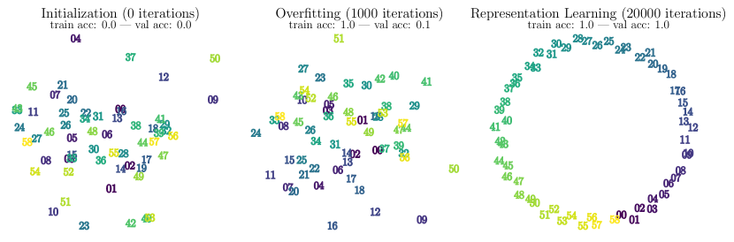

###### fig-1

*Рисунок 1: Визуализация первых двух главных компонент выученных входных эмбеддингов на разных стадиях обучения трансформера, обучаемого модульному сложению. Мы наблюдаем, что генерализация совпадает с появлением структуры в эмбеддингах. Детали обучения см. в разделе 4.2.* **[p. 2]**

###### p2-1

Статья устроена так. В разделе 2 мы вводим постановку задачи и строим упрощённую игрушечную модель. В разделе 3 мы применим подход *эффективной теории* — полезный инструмент теоретической физики, — чтобы пролить свет на вопросы **Q1** и **Q2** и показать связь между генерализацией и обучением структурированных представлений. В разделе 4 мы объясняем **Q3**, приводя фазовые диаграммы, полученные перебором гиперпараметров по сетке, и показываем, как можно «раз-отложить» генерализацию, следуя интуиции, выработанной по фазовой диаграмме. Связанные работы мы обсуждаем в разделе 5, после чего следуют выводы в разделе 6.111Код проекта доступен по адресу: https://github.com/ejmichaud/grokking-squared

## 2 Постановка задачи

Power et al. [1] наблюдают гроккинг на менее распространённой задаче — обучении «алгоритмическим» бинарным операциям. По заданной бинарной операции $\circ$ сеть должна выучить отображение $(a,b)\mapsto c$, где $c=a\circ b$. Они используют decoder-only трансформер, чтобы предсказать предпоследний токен в токенизированном уравнении вида «<lhs> <op> <rhs> <eq> **<result>** <eos>». Каждый токен представлен 256-мерным вектором эмбеддинга. Эмбеддинги обучаемы и инициализируются случайно. После трансформера финальный линейный слой отображает выход в логиты классов для каждого токена.

**Игрушечная модель** В основном мы изучаем гроккинг на более простой игрушечной модели, которая тем не менее сохраняет ключевые поведения из постановки [1]. Хотя [1] рассматривали это как задачу классификации, мы изучаем и регрессию (среднеквадратичная ошибка), и классификацию (кросс-энтропия). Базовая постановка такова: наша модель принимает на вход символы $a,b$ и отображает их в обучаемые векторы эмбеддингов $\mathbf{E}_{a},\mathbf{E}_{b}\in\mathbb{R}^{d_{\text{in}}}$. Затем она складывает $\mathbf{E}_{a},\mathbf{E}_{b}$ и пропускает получившийся вектор через «декодер» — MLP. Целевой выходной вектор, обозначаемый $\mathbf{Y}_{c}\in\mathbb{R}^{d_{\text{out}}}$, — это фиксированный случайный вектор (задача регрессии) или one-hot вектор (задача классификации). Архитектуру нашей модели поэтому можно компактно описать как $(a,b)\mapsto{\rm Dec}(\mathbf{E}_{a}+\mathbf{E}_{b})$, где эмбеддинги $\mathbf{E}_{*}$ и декодер обучаемы. Несмотря на простоту, эта игрушечная модель обобщается на все абелевы группы (обсуждается в приложении B). В разделах 3–4.1 мы рассматриваем только бинарную операцию сложения. Модульное сложение мы рассматриваем в разделе 4.2, чтобы перенести часть наших результатов на архитектуру трансформера, а общие неабелевы операции изучаем в приложении H.

**Набор данных** В нашей игрушечной постановке мы занимаемся обучением операции сложения. **[p. 3]** Образец данных, соответствующий $i+j$, для простоты обозначается $(i,j)$. Если $i,j\in\{0,\ldots,p-1\}$, всего есть $p(p+1)/2$ различных образцов, поскольку мы считаем $i+j$ и $j+i$ одним и тем же образцом. Набор данных $D$ — это множество неповторяющихся образцов. Полный набор данных мы обозначаем $D_{0}$ и разбиваем его на обучающий набор $D$ и валидационный набор $D^{\prime}$, то есть $D\bigcup D^{\prime}=D_{0}$, $D\bigcap D^{\prime}=\emptyset$. Мы определяем *долю обучающих данных* $=|D|/|D_{0}|$, где $|\cdot|$ обозначает мощность множества.

## 3 Почему происходит генерализация: представления и динамика

###### p3-1

Мы видим, что генерализация, по-видимому, связана с появлением сильно структурированных эмбеддингов на рисунке 2. В частности, рисунок 2 (a, b) показывает параллелограммы в игрушечном сложении, а (c, d) — окружность в игрушечном модульном сложении. Теперь мы ограничимся постановкой игрушечного сложения, формализуем понятие качества представления и покажем, что оно предсказывает качество модели. Затем мы разовьём вдохновлённую физикой *эффективную* теорию обучения, которая способна точно предсказывать критический размер обучающей выборки и траектории обучения представлений. Понятие эффективной теории в физике сродни редукции модели в вычислительных методах: она стремится описать сложные явления простыми, но интуитивно понятными картинами. В нашей эффективной теории мы будем моделировать динамику обучения представлений не как градиентный спуск по истинной потере задачи, а как спуск по более простой эффективной функции потерь $\ell_{\text{eff}}$, которая зависит только от представлений в пространстве эмбеддингов и не зависит от декодера.

*(a) Запоминание в игрушечном сложении*

*(b) Генерализация в игрушечном сложении*

*(c) Запоминание в игрушечном модульном сложении*

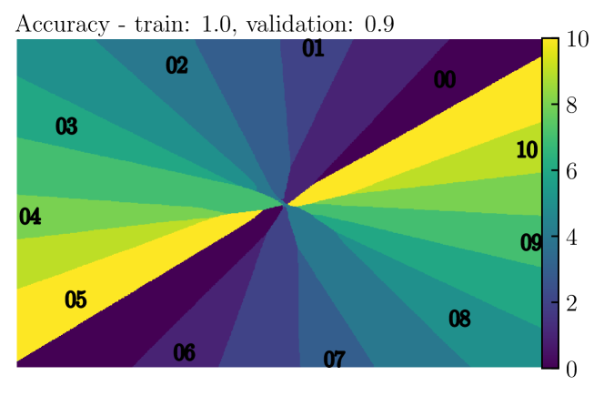

*(d) Генерализация в игрушечном модульном сложении*

*Рисунок 2: Визуализация выученного набора эмбеддингов ($p=11$) и связанной с ним функции декодера для случая двумерных эмбеддингов. Оси соответствуют измерениям выученных эмбеддингов. Декодер вычисляется на сетке точек в пространстве эмбеддингов, и цвет каждой точки отвечает классу с наибольшей вероятностью. Ради наглядности декодер обучен на входах вида $(\mathbf{E}_{i}+\mathbf{E}_{j})/2$. Выход декодера при подаче операции $i\circ j$ можно считать с этого рисунка, просто взяв середину отрезка между соответствующими эмбеддингами $i$ и $j$.* **[p. 3]**

### 3.1 Качество представления предсказывает генерализацию для игрушечной модели

Необходимо строгое определение *структуры* в выученном представлении. Мы предлагаем следующее определение.

##### **Определение 1****.**

$(i,j,m,n)$ *является $\delta$-**параллелограммом** в представлении $\mathbf{R}\equiv[\mathbf{E}_{0},\cdots,\mathbf{E}_{p-1}]$, если*

$$
|(\mathbf{E}_{i}+\mathbf{E}_{j})-(\mathbf{E}_{m}+\mathbf{E}_{n})|\leq\delta.
$$

**[p. 4]**

В дальнейших выводах $\delta$ — малый порог, допускающий численные погрешности, — можно считать нулём.

##### **Утверждение 1****.**

*Когда потеря на обучении равна нулю, любой параллелограмм $(i,j,m,n)$ в представлении $\mathbf{R}$ удовлетворяет $i+j=m+n$.*

##### Доказательство.

Предположим, что это не так, то есть пусть $\mathbf{E}_{i}+\mathbf{E}_{j}=\mathbf{E}_{m}+\mathbf{E}_{n}$, но $i+j\neq m+n$; тогда $\mathbf{Y}_{i+j}=\mathrm{Dec}(\mathbf{E}_{i}+\mathbf{E}_{j})=\mathrm{Dec}(\mathbf{E}_{m}+\mathbf{E}_{n})=\mathbf{Y}_{m+n}$, где первое и последнее равенства следуют из предположения о нулевой потере на обучении. Однако, поскольку $i+j\neq m+n$, имеем $\mathbf{Y}_{i+j}\neq\mathbf{Y}_{n+m}$ (почти наверное в задаче регрессии) — противоречие. ∎

Удобно определить множество допустимых параллелограммов, связанное с обучающим набором $D$ («допустимый» означает согласованный со 100 % точностью на обучении), как

$$
P_{0}(D)=\{(i,j,m,n)|(i,j)\in D,\,(m,n)\in D,\,i+j=m+n\}. \tag{1}
$$

Для простоты обозначим $P_{0}\equiv P_{0}(D_{0})$. По заданному представлению $\mathbf{R}$ можно проверить, сколько допустимых параллелограммов действительно существует в $\mathbf{R}$ с точностью $\delta$, поэтому определим множество параллелограммов, отвечающее $\mathbf{R}$, как

$$
P(\mathbf{R},\delta)=\{(i,j,m,n)|(i,j,m,n)\in P_{0},|(\mathbf{E}_{i}+\mathbf{E}_{j})-(\mathbf{E}_{m}+\mathbf{E}_{n})|\leq\delta\}. \tag{2}
$$

Для краткости мы будем писать $P(\mathbf{R})$, опуская зависимость от $\delta$. Определим *индекс качества представления* (representation quality index, RQI) как

$$
{\rm RQI}(\mathbf{R})=\frac{|P(\mathbf{R})|}{|P_{0}|}\in[0,1]. \tag{3}
$$

###### p4-4

Термином *линейное представление* или *линейная структура* мы будем называть представление, эмбеддинги которого имеют вид $\mathbf{E}_{k}=\mathbf{a}+k\mathbf{b}\ (k=0,\cdots,p-1;\mathbf{a},\mathbf{b}\in\mathbb{R}^{d_{\text{in}}})$. Линейное представление имеет ${\rm RQI}=1$, тогда как случайное представление (взятое, скажем, из нормального распределения) с высокой вероятностью имеет ${\rm RQI}=0$.

Количественно мы обозначаем «предсказанную точность» $\widehat{{\rm Acc}}$ как точность, достижимую на всём наборе данных при заданном представлении $\mathbf{R}$ (полные детали см. в приложении D). На рисунке 3 видно, что предсказанная $\widehat{{\rm Acc}}$ хорошо согласуется с истинной точностью ${\rm Acc}$, что даёт весомое свидетельство: структурированное представление входных эмбеддингов ведёт к генерализации. Поясним происхождение генерализации на примере. В постановке рисунка 2 (b) предположим, что декодер способен достичь нулевой потери на обучении и что $\mathbf{E}_{6}+\mathbf{E}_{8}$ — обучающий образец, откуда ${\rm Dec}(\mathbf{E}_{6}+\mathbf{E}_{8})=\mathbf{Y}_{14}$. На валидации декодер должен предсказать валидационный образец $\mathbf{E}_{5}+\mathbf{E}_{9}$. Поскольку $(5,9,6,8)$ образует параллелограмм, такой что $\mathbf{E}_{5}+\mathbf{E}_{9}=\mathbf{E}_{6}+\mathbf{E}_{8}$, декодер способен предсказать валидационный образец верно, потому что ${\rm Dec}(\mathbf{E}_{5}+\mathbf{E}_{9})={\rm Dec}(\mathbf{E}_{6}+\mathbf{E}_{8})=\mathbf{Y}_{14}$.

*Рисунок 3: Мы вычисляем точность (на полном наборе данных) — либо измеренную эмпирически ${\rm Acc}$, либо предсказанную по представлению эмбеддингов $\widehat{{\rm Acc}}$. Эти две точности как функции доли обучающих данных отложены на (a)(b), а их согласие показано на (c).* **[p. 4]**

### 3.2 Динамика векторов эмбеддингов

Предположим, что у нас есть идеальная модель $\mathcal{M}^{*}=({\rm Dec}^{*},\mathbf{R}^{*})$ такая, что:222Апостериори можно проверить, близка ли обученная модель $\mathcal{M}$ к идеальной модели $\mathcal{M}^{*}$. Детали см. в приложении E.

- (1) $\mathcal{M}^{*}$ способна достичь нулевой потери на обучении;
- (2) $\mathcal{M}^{*}$ имеет инъективный декодер, то есть ${\rm Dec^{*}}(\mathbf{x}_{1})\neq{\rm Dec^{*}}(\mathbf{x}_{2})$ для любых $\mathbf{x}_{1}\neq\mathbf{x}_{2}$.

Тогда утверждение 2 даёт механизм образования параллелограммов.

##### **Утверждение 2****.**

*Если обучающий набор $D$ содержит два образца $(i,j)$ и $(m,n)$ с $i+j=m+n$, то $\mathcal{M}^{*}$ выучивает представление $\mathbf{R}^{*}$ такое, что $\mathbf{E}_{i}+\mathbf{E}_{j}=\mathbf{E}_{m}+\mathbf{E}_{n}$, то есть $(i,j,m,n)$ образует параллелограмм.*

##### Доказательство.

В силу предположения о нулевой потере на обучении имеем ${\rm Dec}^{*}(\mathbf{E}_{i}+\mathbf{E}_{j})=\mathbf{Y}_{i+j}=\mathbf{Y}_{m+n}={\rm Dec}^{*}(\mathbf{E}_{m}+\mathbf{E}_{n})$. Тогда инъективность ${\rm Dec^{*}}$ влечёт $\mathbf{E}_{i}+\mathbf{E}_{j}=\mathbf{E}_{m}+\mathbf{E}_{n}$. ∎

Динамика обучаемых векторов эмбеддингов определяется различными факторами, взаимодействующими сложным образом: деталями архитектуры декодера, гиперпараметрами оптимизатора и разного рода неявной регуляризацией, порождаемой самой процедурой обучения. Мы увидим, что динамику нормированных величин — а именно нормированных эмбеддингов в момент $t$, определяемых как $\tilde{\mathbf{E}}_{k}^{(t)}=\frac{\mathbf{E}_{k}^{(t)}-\mu_{t}}{\sigma_{t}}$, где $\mu_{t}=\frac{1}{p}\sum_{k}\mathbf{E}_{k}^{(t)}$ и $\sigma_{t}=\frac{1}{p}\sum_{k}|\mathbf{E}_{k}^{(t)}-\mu_{t}|^{2}$, — качественно можно описать простой эффективной потерей (в смысле эффективных теорий физики). Мы будем предполагать, что нормированные векторы эмбеддингов подчиняются градиентному потоку для эффективной функции потерь вида

$$
\frac{d\mathbf{\tilde{E}}_{i}}{dt}=-\frac{\partial\ell_{\text{eff}}}{\partial\mathbf{\tilde{E}}_{i}}, \tag{4}
$$

$$
\ell_{\text{eff}}=\frac{\ell_{0}}{Z_{0}},\quad\ell_{0}\equiv\sum_{(i,j,m,n)\in P_{0}(D)}|\mathbf{\tilde{E}}_{i}+\mathbf{\tilde{E}}_{j}-\mathbf{\tilde{E}}_{m}-\mathbf{\tilde{E}}_{n}|^{2}/|P_{0}(D)|,\quad Z_{0}\equiv\sum_{k}|\mathbf{\tilde{E}}_{k}|^{2}, \tag{5}
$$

где $|\cdot|$ обозначает евклидову норму вектора. Заметим, что эмбеддинги не схлопываются в тривиальное решение $\mathbf{E}_{0}=\cdots=\mathbf{E}_{p-1}=0$, если только не были так инициализированы, поскольку существуют две сохраняющиеся величины, что доказано в приложении F:

$$
\mathbf{C}=\sum_{k}\mathbf{E}_{k},\quad Z_{0}=\sum_{k}|\mathbf{E}_{k}|^{2}. \tag{6}
$$

Теперь мы применим эффективную динамику, чтобы объяснить эмпирические наблюдения — например, существование критического размера обучающей выборки для генерализации.

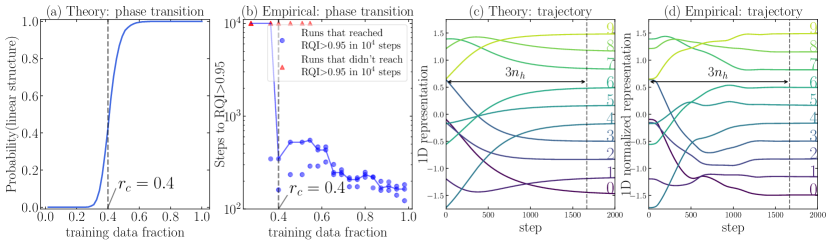

*Рисунок 4: (a) Эффективная теория предсказывает фазовый переход в вероятности получить линейное представление около $r_{c}=0.4$. (b) Эмпирические результаты показывают фазовый переход RQI около $r_{c}=0.4$, что согласуется с теорией (синяя линия показывает медиану по нескольким случайным сидам). Эволюция одномерных представлений, предсказанная эффективной теорией или полученная при обучении нейросети (показаны на (c) и (d) соответственно), согласуется вполне достойно.* **[p. 5]**

**Вырожденность основных состояний (оптимумов потери)** Основными состояниями мы называем представления, удовлетворяющие $\ell_{\text{eff}}=0$, для чего требуется выполнение следующих линейных уравнений:

$$
A(P)=\{\mathbf{E}_{i}+\mathbf{E}_{j}=\mathbf{E}_{m}+\mathbf{E}_{n}|(i,j,m,n)\in P\}. \tag{7}
$$

Поскольку каждое измерение эмбеддинга подчиняется одному и тому же набору линейных уравнений, мы без ограничения общности будем считать, что $d_{\rm in}=1$. Размерность ядра $A(P)$, обозначаемая $n_{0}$, — это число степеней свободы основных состояний. По множеству параллелограммов, задаваемому обучающим набором $D$, размерность ядра $A(P(D))$ можно получить, вычислив сингулярные числа $0\leq\sigma_{1}\leq\cdots\leq\sigma_{p}$. Всегда выполнено $n_{0}\geq 2$, то есть $\sigma_{1}=\sigma_{2}=0$, поскольку размерность ядра $A(P_{0})$ — набора линейных уравнений, задаваемого всеми возможными параллелограммами, — равна $\mathrm{Nullity}(A(P_{0}))=2$, что объясняется двумя степенями **[p. 6]** свободы (сдвиг и масштабирование). Если $n_{0}=2$, представление единственно с точностью до сдвигов и множителей масштаба, и эмбеддинги имеют вид $\mathbf{E}_{k}=\mathbf{a}+k\mathbf{b}$. Иначе, при $n_{0}>2$, представление недостаточно ограничено, чтобы все эмбеддинги лежали на одной прямой.

###### p6-1

Теоретические предсказания вместе с эмпирическими результатами для сложения ($p=10$) мы приводим на рисунке 4. Как показано на рисунке 4 (a), наша эффективная теория предсказывает, что вероятность того, что обучающий набор задаёт единственную линейную структуру (что дало бы идеальную генерализацию), зависит от доли обучающих данных и имеет фазовый переход около $r_{c}=0.4$. Эмпирические результаты обучения различных моделей показаны на рисунке 4 (b). Видно, что число шагов до достижения ${\rm RQI}>0.95$ имеет фазовый переход при $r_{c}=0.4$, что согласуется с предложенной эффективной теорией и с эмпирическими наблюдениями в [1].

**Время до линейной структуры** Определим матрицу Гессе для $\ell_{0}$ как

$$
\mathbf{H}_{ij}=\frac{1}{Z_{0}}\frac{\partial^{2}\ell_{0}}{\partial\mathbf{E}_{i}\partial\mathbf{E}_{j}}, \tag{8}
$$

Заметим, что $\ell_{\rm eff}=\frac{1}{2}\mathbf{R}^{T}\mathbf{H}\mathbf{R}$, $\mathbf{R}=[\mathbf{E}_{0},\mathbf{E}_{1},\cdots,\mathbf{E}_{p-1}]$, так что градиентный спуск линеен, то есть

$$
\frac{d\mathbf{R}}{dt}=-\mathbf{H}\mathbf{R}. \tag{9}
$$

Если $\mathbf{H}$ имеет собственные значения $\lambda_{i}=\sigma_{i}^{2}$ (упорядоченные по возрастанию) и собственные векторы $\bar{\mathbf{v}}_{i}$, а начальное условие есть $\mathbf{R}(t=0)=\sum_{i}a_{i}\bar{\mathbf{v}}_{i}$, то $\mathbf{R}(t)=\sum_{i}a_{i}\bar{\mathbf{v}}_{i}e^{-\lambda_{i}t}$. Первые два собственных значения обращаются в нуль, а $t_{h}=1/\lambda_{3}$ задаёт временной масштаб, за который самая медленная компонента убывает в $e$ раз. Величину $\lambda_{3}$ мы называем *скоростью гроккинга* (grokking rate). При размере шага $\eta$ соответствующее число шагов равно $n_{h}=t_{h}/\eta=1/(\lambda_{3}\eta)$.

Приведённый анализ мы проверяем эмпирическими результатами. Рисунок 4 (c)(d) показывает траектории, полученные из эффективной теории и из обучения нейросети соответственно. Одномерные нейросетевые представления на рисунке 4 (d) вручную нормированы к нулевому среднему и единичной дисперсии. Две траектории качественно согласуются, и обеим требуется около $3n_{h}$ шагов, чтобы сойтись к линейной структуре. Количественные различия могут объясняться отсутствием декодера в эффективной теории, которая предполагает, что декодер делает бесконечно малые шаги.

**Зависимость гроккинга от размера данных** Заметим, что $\ell_{\rm eff}$ включает усреднение по параллелограммам обучающего набора, поэтому зависит от размера обучающих данных — а значит, зависит и $\lambda_{3}$. На рисунке 5 (a) мы откладываем зависимость $\lambda_{3}$ от доли обучающих данных. Наборов данных одного и того же размера много, поэтому $\lambda_{3}$ — вероятностная функция размера данных.

Из этого графика можно извлечь два наблюдения о гроккинге: (i) когда доля данных ниже некоторого порога (около 0.4), $\lambda_{3}$ с высокой вероятностью равна нулю, что отвечает отсутствию генерализации. Это ещё раз подтверждает нашу критическую точку с рисунка 4. (ii) Когда размер данных выше порога, $\lambda_{3}$ (в среднем) — возрастающая функция размера данных. Отсюда следует, что время гроккинга $t\sim 1/\lambda_{3}$ убывает с ростом размера обучающей выборки — важное наблюдение из [1].

Чтобы проверить нашу эффективную теорию, мы сравниваем число шагов до гроккинга, полученное при реальном обучении нейросети (определяемое как число шагов до ${\rm RQI}>0.95$), с предсказанным нашей теорией $t_{\rm th}\sim\frac{1}{\lambda_{3}\eta}$ ($\eta$ — скорость обучения эмбеддингов); см. рисунок 5 (b). Теория качественно согласуется с нейросетями, показывая тенденцию к уменьшению числа шагов до гроккинга с ростом размера данных. Количественные различия можно объяснить разрывом между нашей эффективной потерей и фактической потерей.

**Ограничения эффективной теории** Хотя наша теория определяет эффективную потерю через евклидово расстояние между эмбеддингами $\mathbf{E}_{i}+\mathbf{E}_{j}$ и $\mathbf{E}_{n}+\mathbf{E}_{m}$, можно вообразить обобщение теории, определяющее более широкое понятие параллелограмма через какую-нибудь иную метрику на пространстве представлений. Например, если декодер устроен как на рисунке 2 (d), то расстояние между различными представлениями внутри одного и того же «куска пиццы» мало — а значит, представления, не образующие параллелограммов относительно евклидовой метрики, могут оказаться параллелограммами относительно метрики, задаваемой декодером.

*(a)*

*(b)*

*Рисунок 5: Эффективная теория объясняет зависимость времени гроккинга от размера данных для задачи сложения. (a) Зависимость $\lambda_{3}$ от доли обучающих данных. Выше критической доли данных (около 0.4) с ростом размера данных $\lambda_{3}$ увеличивается, поэтому время гроккинга $t\sim 1/\lambda_{3}$ (предсказанное нашей эффективной теорией) уменьшается. (b) Сравнение числа шагов до гроккинга (определяемого как ${\rm RQI}>0.95$), предсказанного эффективной теорией, с реальными результатами нейросетей. $\eta=10^{-3}$ — скорость обучения эмбеддингов.* **[p. 7]**

## 4 Отложенная генерализация: фазовая диаграмма

###### p6-10

К этому моменту мы (1) эмпирически наблюдали, что генерализация на алгоритмических наборах данных отвечает появлению хорошо структурированных представлений, (2) определили понятие качества представления в игрушечной постановке и показали, что оно предсказывает генерализацию, и (3) разработали эффективную теорию, описывающую динамику обучения представлений в той же игрушечной постановке. Теперь мы изучаем, как гиперпараметры оптимизатора влияют на качество обучения на высоком уровне. В частности, мы строим фазовые диаграммы того, как качество обучения зависит от скорости обучения представлений, скорости обучения декодера и weight decay декодера. Эти параметры интересны тем, что именно они наиболее явно регулируют своего рода *конкуренцию* между энкодером и декодером, как мы поясняем ниже.

### 4.1 Фазовая диаграмма игрушечной модели

**Детали обучения** Представление и декодер мы обновляем разными оптимизаторами. Для одномерных эмбеддингов мы используем оптимизатор Adam со скоростью обучения из $[10^{-5},10^{-2}]$ и нулевым weight decay. Для декодера мы используем AdamW со скоростью обучения из $[10^{-5},10^{-2}]$ и weight decay из $[0,10]$ (регрессия) или $[0,20]$ (классификация). Для разбиения на обучение/валидацию мы выбираем 45/10 для немодульного сложения ($p=10$) и 24/12 для группы перестановок $S_{3}$. Сложение или матричное умножение (детали в приложении H) мы жёстко зашиваем в декодер — для группы сложения и группы перестановок соответственно.

###### p7-2

Для каждого выбора скорости обучения и weight decay мы вычисляем число шагов до достижения высокой (90 %) точности на обучении/валидации. Двумерная плоскость разбивается на четыре фазы: *понимание* (comprehension), *гроккинг*, *запоминание* (memorization) и *путаница* (confusion), определённые в таблице 1 приложения A. И понимание, и гроккинг способны генерализовать (находятся в «зоне Златовласки»), хотя у фазы гроккинга генерализация отложена. Запоминание называют также переобучением, а путаница означает неспособность даже запомнить обучающие данные. Рисунок 6 показывает фазовые диаграммы для группы сложения и группы перестановок. Они демонстрируют весьма богатые явления.

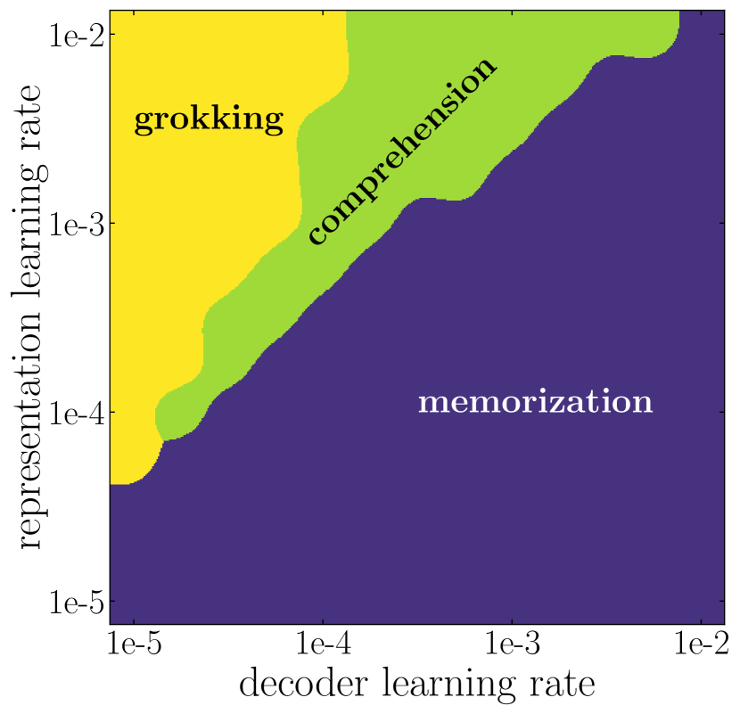

*(a) Сложение, регрессия*

*(b) Сложение, регрессия*

*(c) Сложение, классификация*

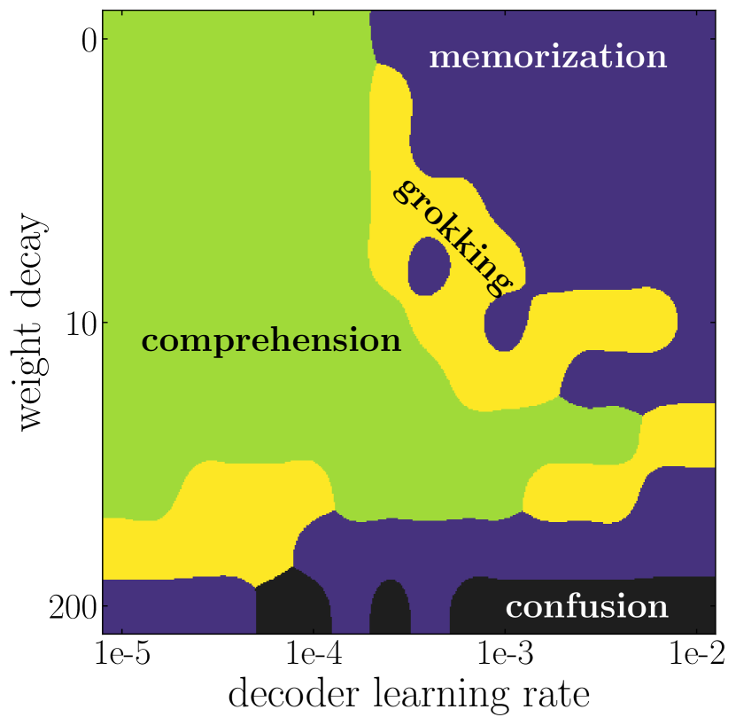

*(d) Перестановки, регрессия*

*Рисунок 6: Фазовые диаграммы обучения для группы сложения и группы перестановок. (a) показывает конкуренцию между представлением и декодером. (b)(c)(d): каждая фазовая диаграмма содержит четыре фазы — понимание, гроккинг, запоминание и путаница, — определённые в таблице 1. На (b)(c)(d) гроккинг зажат между пониманием и запоминанием.* **[p. 8]**

**Конкуренция между обучением представлений и переобучением декодера** В регрессионной постановке набора данных сложения мы показываем на рисунке 6 (a), как конкуренция между обучением представления и обучением декодера (зависящая, среди прочего, и от скорости обучения, и от weight decay) приводит к разным фазам обучения. Как и следовало ожидать, быстрый декодер в паре с медленным обучением представления (внизу справа) ведёт к запоминанию. В противоположной крайности крайне медленный декодер в паре с быстрым обучением представления (вверху слева) в конце концов генерализует, но время до генерализации велико из-за неэффективного обучения декодера. Идеальная фаза (понимание) требует, чтобы обучение представления было быстрее декодера — но не слишком.

По аналогии с физическими системами векторы эмбеддингов можно мыслить как набор частиц. В нашей эффективной теории из раздела 3.2 динамика частиц описывается *только* их взаимным расположением; в этом смысле структура возникает главным образом из межчастичных взаимодействий (в действительности эти взаимодействия опосредованы декодером и потерей). Декодер играет роль среды, действующей на эмбеддинги внешними силами. Если величина внешних сил мала/велика, можно ожидать лучших/худших представлений.

**Универсальность фазовых диаграмм** Мы фиксируем скорость обучения эмбеддингов равной $10^{-3}$ и вместо неё перебираем weight decay декодера на рисунке 6 (b)(c)(d). Фазовые диаграммы отвечают сложению-регрессии (b), сложению-классификации (c) и перестановкам-регрессии (d) соответственно. Из этих разных задач проступают общие явления: (i) все они включают четыре фазы; (ii) верхний правый угол (быстрый и мощный декодер) — фаза запоминания; (iii) нижний правый угол (быстрый и простой декодер) — фаза путаницы; (iv) гроккинг зажат между пониманием и запоминанием, что, по-видимому, означает, что это нежелательная фаза, возникающая из-за неудачно подобранных гиперпараметров.

### 4.2 За пределами игрушечной модели

Мы предполагаем, что многие принципы, которые, как мы видели, управляют динамикой обучения в игрушечной модели, применимы и шире. Ниже мы увидим, как наша рамка переносится на архитектуры трансформеров для задачи сложения по модулю $p$ — минимального воспроизводимого примера из исходной статьи о гроккинге [1].

Сначала мы кодируем $p=53$ целых чисел в 256-мерные обучаемые эмбеддинги, затем подаём два числа в decoder-only архитектуру трансформера. Для простоты символы операции мы здесь не кодируем. Выходы последнего слоя конкатенируются и подаются в линейный слой для классификации. Обучение и энкодера, и декодера одним и тем же оптимизатором (то есть с одинаковыми гиперпараметрами) приводит к явлению гроккинга. Генерализация появляется гораздо раньше, как только мы понижаем эффективную ёмкость декодера с помощью weight decay (полная фазовая диаграмма на рисунке 7).

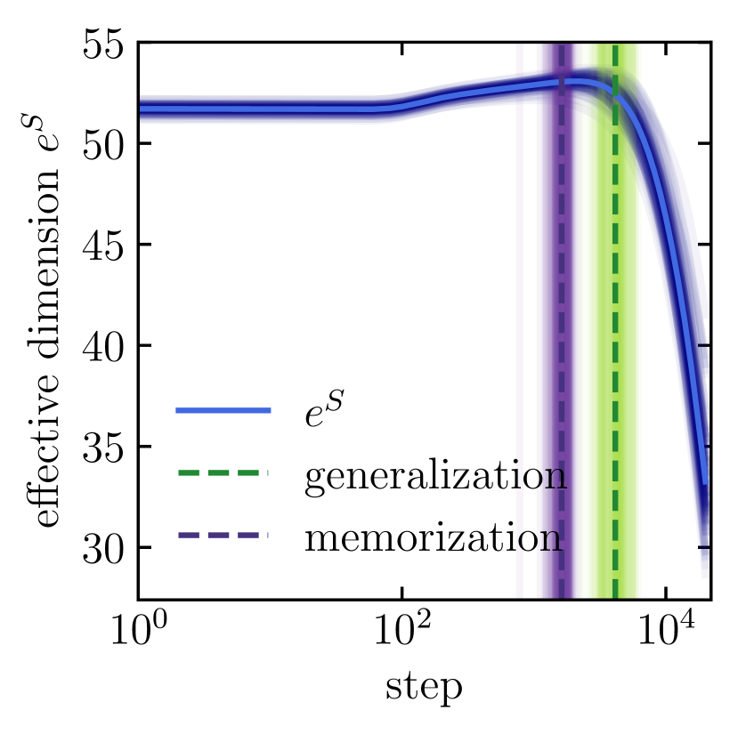

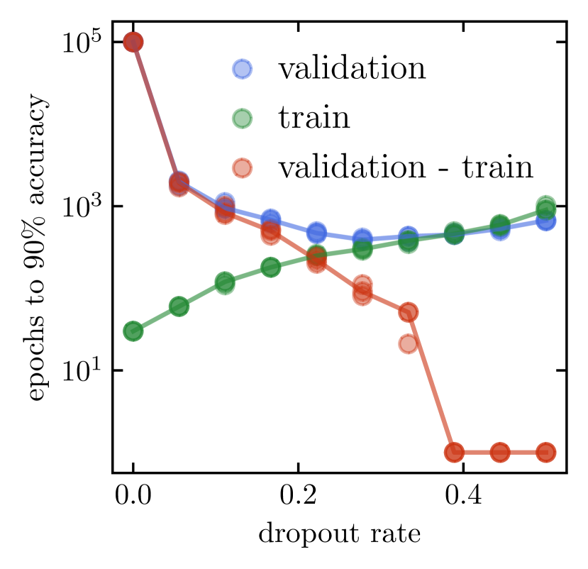

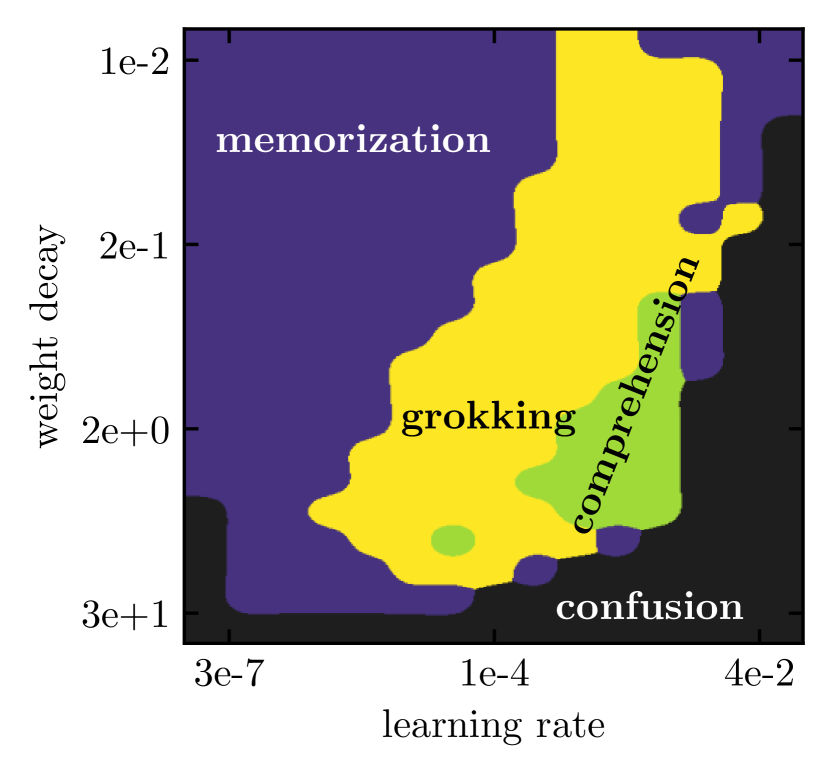

*Рисунок 7: Слева: эволюция эффективной размерности эмбеддингов (определяемой как экспонента энтропии) в ходе обучения, усреднённая по 100 сидам. В центре: влияние dropout на ускорение генерализации. Справа: фазовая диаграмма архитектуры трансформера. Перебор ведётся по weight decay и скорости обучения декодера, тогда как скорость обучения эмбеддингов зафиксирована на $10^{-3}$ (при нулевом weight decay).* **[p. 9]**

###### p8-8
Поначалу модель способна идеально подогнать обучающий набор, вовсе не генерализуя. **[p. 9]** Мы изучаем эмбеддинги в разные моменты обучения и обнаруживаем, что ни PCA (показан на рисунке 1), ни t-SNE (здесь не показан) не выявляют никакой структуры. В конце концов точность на валидации начинает расти, и идеальная генерализация совпадает с тем, что PCA проецирует эмбеддинги в окружность в 2D. Разумеется, ни один способ понижения размерности не гарантирует, что структура будет найдена, и потому явно показать, что генерализация происходит только при наличии структуры, затруднительно. Тем не менее то обстоятельство, что вместе с неявной регуляризацией оптимизатора в сторону разреженных решений столь ясная структура так быстро проявляется в простом PCA именно ко времени генерализации, наводит на мысль, что наш анализ в игрушечной постановке применим и здесь. Это видно и по эволюции энтропии доли объяснённой дисперсии в PCA эмбеддингов (определяемой как $S=-\sum_{i}\sigma_{i}\log\sigma_{i}$, где $\sigma_{i}$ — доля дисперсии, объяснённая $i$-й главной компонентой). Как видно на рисунке 7, энтропия растёт вплоть до момента генерализации, а затем резко падает, что согласовалось бы с предположением, что генерализация происходит, когда обнаруживается низкоразмерная структура. Далее декодер опирается в основном на информацию этого низкоразмерного многообразия и по сути «отсекает» остальное высокоразмерное пространство эмбеддингов. Ещё одно интересное наблюдение возникает, когда мы проецируем эмбеддинги при инициализации на главные оси, полученные в конце обучения. Часть структуры, необходимой для генерализации, существует ещё до обучения, что намекает на связь с гипотезой лотерейного билета. Подробнее см. приложение K.

На рисунке 7 (справа) мы приводим фазовую диаграмму, сопоставимую с рисунком 6, но вычисленную теперь в постановке с трансформером. Заметим, что, в отличие от постановки [1], weight decay применялся только к декодеру, а не к слою эмбеддингов. В противоположность игрушечной модели, определённое количество weight decay оказывается полезным для генерализации и существенно её ускоряет. Мы предполагаем, что это различие происходит из-за разных размерностей эмбеддингов. В сильно перепараметризованной постановке ненулевой weight decay даёт решающий стимул снизить сложность декодера и помогает генерализовать за меньшее число шагов. Это требует дальнейшего изучения. Мы также исследуем влияние слоёв dropout в блоках декодера трансформера. При значительной доле dropout время генерализации удаётся снизить до менее чем $10^{3}$ шагов, и явление гроккинга исчезает полностью. Общая тенденция позволяет предположить, что ограничение декодера теми же средствами, какими борются с переобучением, сокращает время генерализации и позволяет избежать явления гроккинга. То же наблюдается и в задаче классификации изображений, где нам удалось вызвать гроккинг. Подробнее см. приложение J.

### 4.3 Эксперимент с гроккингом на MNIST

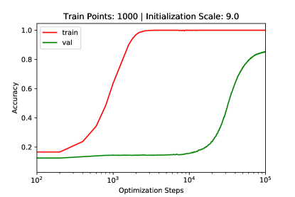

*(a)*

*(b)*

*Рисунок 8: Слева: кривые обучения для запуска на MNIST в постановке, где мы наблюдаем гроккинг. Справа: фазовая диаграмма с четырьмя фазами динамики обучения на MNIST.* **[p. 10]**

###### p9-2

Теперь мы впервые демонстрируем, что гроккинг (существенно отложенная генерализация) — более общее явление машинного обучения, которое может возникать не только на алгоритмических наборах данных, но и на общепринятых эталонных наборах. В частности, мы показываем гроккинг на MNIST на рисунке 8 и демонстрируем, что можем управлять гроккингом, варьируя гиперпараметры оптимизации. Подробнее об экспериментальной постановке — в приложении J.

## 5 Связанные работы

**[p. 10]**

Сравнительно немного работ анализировали явление гроккинга. [2] описывают контур, которым трансформеры выполняют модульное сложение, прослеживают его формирование в ходе обучения и в общих чертах высказывают мысль, что гроккинг связан с явлением «фазовых изменений» при обучении нейросетей. [3, 4] ранее высказывали спекулятивные, неформальные предположения о гроккинге [3, 4]. Наша работа связана со следующими широкими направлениями исследований.

**Обучение математическим структурам** [5] обучают нейросеть арифметической операции по изображениям цифр, но гроккинга не наблюдают из-за обилия обучающих данных. Помимо арифметических отношений, машинное обучение применялось к другим математическим структурам, включая геометрию [6], теорию узлов [7] и теорию групп [8].

**Двойной спуск** Гроккинг отчасти напоминает явление «поэпохного» *двойного спуска* [9], где генерализация может улучшаться после периода переобучения. [10] обнаруживают, что регуляризация способна смягчить двойной спуск — возможно, схоже с тем, как weight decay влияет на гроккинг.

**Обучение представлений** Обучение представлений лежит в основе машинного обучения [11, 12, 13, 14]. Качество представления обычно измеряют (пожалуй, расплывчатыми) семантическими значениями или качеством на последующих задачах. В нашей работе простота арифметических наборов данных позволяет определить качество представления и изучать эволюцию представлений количественно.

**Физика обучения** Инструменты, вдохновлённые физикой, оказались полезны для теоретического понимания глубокого обучения. К ним относятся эффективные теории [15, 16], законы сохранения [17] и принцип свободной энергии [18]. Кроме того, статистическая физика была признана мощным инструментом изучения генерализации в нейросетях [19, 20, 21, 22]. Наша работа связывает низкоуровневое понимание моделей с их высокоуровневым качеством. В недавней работе исследователи из Anthropic [23] связывают внезапное падение потери в ходе обучения с появлением *индукционных голов* в их моделях. Они уподобляют свою работу *статистической физике*, поскольку та наводит мост между «микроскопическим», механистическим пониманием сетей и «макроскопическими» фактами об общем качестве модели.

## 6 Заключение

Мы показали — и на игрушечных моделях, и в общих постановках, — что представление обеспечивает генерализацию, когда оно отражает структуру в данных. Мы разработали эффективную теорию динамики обучения представлений (в игрушечной постановке), которая предсказывает критическую зависимость обучения от доли обучающих данных. Затем мы представили четыре фазы обучения (понимание, гроккинг, запоминание и путаница), зависящие от ёмкости декодера и скорости обучения (задаваемых, среди прочего, скоростью обучения и weight decay) в decoder-only архитектурах. Хотя мы сосредоточились в основном на игрушечной модели, мы находим предварительные свидетельства того, что наши результаты переносятся на постановку [1].

###### p10-6

Нашу работу можно рассматривать как шаг к *статистической физике глубокого обучения*, связывающей «микрофизику» низкоуровневой динамики сети с «термодинамикой» высокоуровневого поведения модели. Применение теоретических инструментов физики, таких как эффективные теории [24], мы считаем богатым полем для дальнейшей работы. Более широкое влияние такой работы, если она удастся, могло бы состоять в том, чтобы сделать модели прозрачнее и предсказуемее [23, 25, 26], что критично для задачи обеспечения безопасности продвинутых систем ИИ**[p. 11]**.

## Литература

- Alethea Power, Yuri Burda, Harri Edwards, Igor Babuschkin, and Vedant Misra. Grokking: Generalization beyond overfitting on small algorithmic datasets. *arXiv preprint arXiv:2201.02177*, 2022.

- Neel Nanda and Tom Lieberum. A mechanistic interpretability analysis of grokking, 2022. URL https://www.alignmentforum.org/posts/N6WM6hs7RQMKDhYjB/a-mechanistic-interpretability-analysis-of-grokking.

- Beren Millidge. Grokking ’grokking’. https://beren.io/2022-01-11-Grokking-Grokking/, 2022.

- Rohin Shah. Alignment Newsletter #159. https://www.alignmentforum.org/posts/zvWqPmQasssaAWkrj/an-159-building-agents-that-know-how-to-experiment-by#DEEP_LEARNING_, 2021.

- Yedid Hoshen and Shmuel Peleg. Visual learning of arithmetic operation. In *AAAI*, 2016.

- Yang-Hui He. Machine-learning mathematical structures. *arXiv preprint arXiv:2101.06317*, 2021.

- Sergei Gukov, James Halverson, Fabian Ruehle, and Piotr Sułkowski. Learning to unknot. *Machine Learning: Science and Technology*, 2(2):025035, 2021.

- Alex Davies, Petar Veličković, Lars Buesing, Sam Blackwell, Daniel Zheng, Nenad Tomašev, Richard Tanburn, Peter Battaglia, Charles Blundell, András Juhász, et al. Advancing mathematics by guiding human intuition with ai. *Nature*, 600(7887):70–74, 2021.

- Preetum Nakkiran, Gal Kaplun, Yamini Bansal, Tristan Yang, Boaz Barak, and Ilya Sutskever. Deep double descent: Where bigger models and more data hurt. *Journal of Statistical Mechanics: Theory and Experiment*, 2021(12):124003, 2021.

- Preetum Nakkiran, Prayaag Venkat, Sham Kakade, and Tengyu Ma. Optimal regularization can mitigate double descent. *arXiv preprint arXiv:2003.01897*, 2020.

- Yoshua Bengio, Aaron Courville, and Pascal Vincent. Representation learning: A review and new perspectives. *IEEE transactions on pattern analysis and machine intelligence*, 35(8):1798–1828, 2013.

- Yassine Ouali, Céline Hudelot, and Myriam Tami. An overview of deep semi-supervised learning. *arXiv preprint arXiv:2006.05278*, 2020.

- Jean-Bastien Grill, Florian Strub, Florent Altché, Corentin Tallec, Pierre Richemond, Elena Buchatskaya, Carl Doersch, Bernardo Avila Pires, Zhaohan Guo, Mohammad Gheshlaghi Azar, et al. Bootstrap your own latent-a new approach to self-supervised learning. *Advances in Neural Information Processing Systems*, 33:21271–21284, 2020.

- Phuc H Le-Khac, Graham Healy, and Alan F Smeaton. Contrastive representation learning: A framework and review. *IEEE Access*, 8:193907–193934, 2020.

- James Halverson, Anindita Maiti, and Keegan Stoner. Neural networks and quantum field theory. *Machine Learning: Science and Technology*, 2(3):035002, 2021.

- Daniel A Roberts, Sho Yaida, and Boris Hanin. The principles of deep learning theory. *arXiv preprint arXiv:2106.10165*, 2021.

- Daniel Kunin, Javier Sagastuy-Brena, Surya Ganguli, Daniel LK Yamins, and Hidenori Tanaka. Neural mechanics: Symmetry and broken conservation laws in deep learning dynamics. *arXiv preprint arXiv:2012.04728*, 2020.

- Yansong Gao and Pratik Chaudhari. A free-energy principle for representation learning. In *International Conference on Machine Learning*, pages 3367–3376. **[p. 12]** PMLR, 2020.

- Federica Gerace, Bruno Loureiro, Florent Krzakala, Marc Mézard, and Lenka Zdeborová. Generalisation error in learning with random features and the hidden manifold model. In *International Conference on Machine Learning*, pages 3452–3462. PMLR, 2020.

- Mohammad Pezeshki, Amartya Mitra, Yoshua Bengio, and Guillaume Lajoie. Multi-scale feature learning dynamics: Insights for double descent. In *International Conference on Machine Learning*, pages 17669–17690. PMLR, 2022.

- Sebastian Goldt, Bruno Loureiro, Galen Reeves, Florent Krzakala, Marc Mezard, and Lenka Zdeborova. The gaussian equivalence of generative models for learning with shallow neural networks. In Joan Bruna, Jan Hesthaven, and Lenka Zdeborova, editors, *Proceedings of the 2nd Mathematical and Scientific Machine Learning Conference*, volume 145 of *Proceedings of Machine Learning Research*, pages 426–471. PMLR, 16–19 Aug 2022. URL https://proceedings.mlr.press/v145/goldt22a.html.

- R Kuhn and S Bos. Statistical mechanics for neural networks with continuous-time dynamics. *Journal of Physics A: Mathematical and General*, 26(4):831, 1993.

- Catherine Olsson, Nelson Elhage, Neel Nanda, Nicholas Joseph, Nova DasSarma, Tom Henighan, Ben Mann, Amanda Askell, Yuntao Bai, Anna Chen, Tom Conerly, Dawn Drain, Deep Ganguli, Zac Hatfield-Dodds, Danny Hernandez, Scott Johnston, Andy Jones, Jackson Kernion, Liane Lovitt, Kamal Ndousse, Dario Amodei, Tom Brown, Jack Clark, Jared Kaplan, Sam McCandlish, and Chris Olah. In-context learning and induction heads. *Transformer Circuits Thread*, 2022. https://transformer-circuits.pub/2022/in-context-learning-and-induction-heads/index.html.

- Daniel A. Roberts, Sho Yaida, and Boris Hanin. *The Principles of Deep Learning Theory*. Cambridge University Press, 2022. https://deeplearningtheory.com.

- Deep Ganguli, Danny Hernandez, Liane Lovitt, Nova DasSarma, Tom Henighan, Andy Jones, Nicholas Joseph, Jackson Kernion, Ben Mann, Amanda Askell, et al. Predictability and surprise in large generative models. *arXiv preprint arXiv:2202.07785*, 2022.

- Jacob Steinhardt. Future ML Systems Will Be Qualitatively Different. https://www.lesswrong.com/s/4aARF2ZoBpFZAhbbe/p/pZaPhGg2hmmPwByHc, 2022.

- Manzil Zaheer, Satwik Kottur, Siamak Ravanbakhsh, Barnabas Poczos, Russ R Salakhutdinov, and Alexander J Smola. Deep sets. *Advances in neural information processing systems*, 30, 2017.

- Vardan Papyan, XY Han, and David L Donoho. Prevalence of neural collapse during the terminal phase of deep learning training. *Proceedings of the National Academy of Sciences*, 117(40):24652–24663, 2020.

- Wikipedia contributors. Thomson problem — Wikipedia, the free encyclopedia. https://en.wikipedia.org/w/index.php?title=Thomson_problem&oldid=1091431454, 2022. [Online; accessed 29-July-2022].

- Xinlei Chen and Kaiming He. Exploring simple siamese representation learning. In *Proceedings of the IEEE/CVF Conference on Computer Vision and Pattern Recognition*, pages 15750–15758, 2021.

- Zhi-Qin John Xu, Yaoyu Zhang, and Yanyang Xiao. Training behavior of deep neural network in frequency domain. In *International Conference on Neural Information Processing*, pages 264–274. Springer, 2019.

- Yaoyu Zhang, Zhi-Qin John Xu, Tao Luo, and Zheng Ma. A type of generalization error induced by initialization in deep neural networks. In *Mathematical and Scientific Machine Learning*, pages 144–164. PMLR, 2020.

- Ziming Liu, Eric J. Michaud, and Max Tegmark. **[p. 13]** Omnigrok: Grokking beyond algorithmic data, 2022.

- Blake Woodworth, Suriya Gunasekar, Jason D. Lee, Edward Moroshko, Pedro Savarese, Itay Golan, Daniel Soudry, and Nathan Srebro. Kernel and rich regimes in overparametrized models. In Jacob Abernethy and Shivani Agarwal, editors, *Proceedings of Thirty Third Conference on Learning Theory*, volume 125 of *Proceedings of Machine Learning Research*, pages 3635–3673. PMLR, 09–12 Jul 2020. URL https://proceedings.mlr.press/v125/woodworth20a.html.

## Контрольный список

1. Для всех авторов… Точно ли основные утверждения аннотации и введения отражают вклад и охват статьи? [Да] Описали ли вы ограничения своей работы? [Да] Обсудили ли вы возможные негативные общественные последствия своей работы? [Неприменимо] Прочли ли вы руководство по этической экспертизе и убедились ли, что статья ему соответствует? [Да]
2. Если вы приводите теоретические результаты… Указали ли вы полный набор предположений всех теоретических результатов? [Да] Привели ли вы полные доказательства всех теоретических результатов? [Да]
3. Если вы проводили эксперименты… Включили ли вы код, данные и инструкции, необходимые для воспроизведения основных экспериментальных результатов (в дополнительных материалах или по ссылке)? [Да] Указали ли вы все детали обучения (например, разбиения данных, гиперпараметры, способ их выбора)? [Да] Приводили ли вы доверительные интервалы (например, по случайному сиду при многократных запусках)? [Да] Указали ли вы суммарный объём вычислений и тип использованных ресурсов (например, тип GPU, внутренний кластер или облачный провайдер)? [Да] Все эксперименты выполнялись на рабочей станции с двумя NVIDIA A6000 GPU в течение нескольких дней.
4. Если вы используете существующие ресурсы (например, код, данные, модели) или готовите/публикуете новые… Если в работе используются существующие ресурсы, процитировали ли вы их создателей? [Неприменимо] Упомянули ли вы лицензию ресурсов? [Неприменимо] Включили ли вы новые ресурсы в дополнительные материалы или по ссылке? [Неприменимо] Обсудили ли вы, было ли получено согласие людей, чьи данные вы используете/готовите, и каким образом? [Неприменимо] Обсудили ли вы, содержат ли используемые/подготавливаемые данные персональные сведения или оскорбительный контент? [Неприменимо]
5. Если вы применяли краудсорсинг или проводили исследования с участием людей… Включили ли вы полный текст инструкций, выданных участникам, и снимки экрана, если применимо? [Неприменимо] Описали ли вы возможные риски для участников со ссылками на одобрения институционального наблюдательного совета (IRB), если применимо? [Неприменимо] Указали ли вы оценку почасовой оплаты участников и общую сумму, потраченную на их вознаграждение? [Неприменимо]

Приложение

**[p. 14]**

###### sec-a

## Приложение A Определения фаз обучения

*Таблица 1: Определения четырёх фаз обучения*

|  | критерии |  |  |
|---|---|---|---|
| Фаза | точность на обучении > 90 % за $10^{5}$ шагов | точность на валидации > 90 % за $10^{5}$ шагов | шаг(точность на валидации>90 %) $-$ шаг(точность на обучении>90 %)<$10^{3}$ |
| **Понимание** | Да | Да | Да |
| **Гроккинг** | Да | Да | Нет |
| **Запоминание** | Да | Нет | Неприменимо |
| **Путаница** | Нет | Нет | Неприменимо |

## Приложение B Применимость нашей игрушечной постановки

В основном тексте мы сосредоточились на игрушечной постановке с (1) набором данных сложения и (2) операцией сложения, жёстко зашитой в декодер. Хотя оба упрощения выглядят весьма ограничивающими, ниже мы доказываем, что анализ игрушечной постановки на деле применим ко всем абелевым группам.

**Набор данных сложения — строительный блок всех абелевых групп** Циклическая группа — это группа, порождённая одним элементом. Конечная циклическая группа порядка $n$ есть $C_{n}=\{e,g,g^{2},\cdots,g^{n-1}\}$, где $e$ — единичный элемент, $g$ — образующая, и $g^{i}=g^{j}$ всякий раз, когда $i=j\ ({\rm mod\ }n)$. Сложение по модулю и $\{0,1,\cdots,n-1\}$ образуют циклическую группу с $e=0$, а $g$ может быть любым числом $q$, взаимно простым с $n$, то есть $(q,n)=1$. Поскольку алгоритмические наборы данных содержат только символьную, но не арифметическую информацию, наборы данных модульного сложения применимы ко всем прочим циклическим группам — например, к умножению по модулю и группам дискретных поворотов в 2D.

Хотя не все абелевы группы циклические, конечную абелеву группу $G$ всегда можно разложить в прямое произведение $k$ циклических групп $G=C_{n_{1}}\times C_{n_{2}}\cdots C_{n_{k}}$. Поэтому, обучив $k$ нейросетей, каждая из которых обрабатывает одну циклическую группу по отдельности, легко построить более крупную нейросеть, обрабатывающую всю абелеву группу.

**Операция сложения годится для всех абелевых групп** В [27] доказано, что для перестановочно инвариантной функции $f(x_{1},x_{2},\cdots,x_{n})$ существуют $\rho$ и $\phi$ такие, что

$$
f(x_{1},x_{2},\cdots,x_{n})=\rho[\sum_{i=1}^{n}\phi(x_{i})], \tag{10}
$$

или $f(x_{1},x_{2})=\rho(\phi(x_{1})+\phi(x_{2}))$ при $n=2$. Заметим, что $\phi(x_{i})$ отвечает вектору эмбеддинга $\mathbf{E}_{i}$, а $\rho$ отвечает декодеру. Оператор сложения естественно возникает из коммутативности оператора, не ограничивая сам оператор сложением. Например, умножение двух чисел $x_{1}$ и $x_{2}$ можно записать как $x_{1}x_{2}={\rm exp}({\rm ln}(x_{1})+{\rm ln}(x_{2}))$, где $\rho(x)={\rm exp}(x)$ и $\phi(x)={\rm ln}(x)$.

## Приложение C Поясняющий пример

На конкретном случае поясним, почему параллелограммы ведут к генерализации (см. рисунок 9). Ради наглядности мы используем постановку с учебным планом (curriculum learning), где нейросети каждый раз подаётся несколько новых образцов. Мы покажем, что по мере роста числа образцов в обучающем наборе идеальная модель $\mathcal{M}^{*}$ (определённая в разделе 3.2) располагает представление $\mathbf{R}^{*}$ всё более структурированно, то есть образуется больше параллелограммов, что помогает генерализации на невиданные валидационные образцы. Для простоты выберем $p=6$.

- $D_{1}=(0,4)$ и $D_{2}=(1,3)$ имеют одну и ту же метку, поэтому $(0,4,1,3)$ становится параллелограммом, так что $\mathbf{E}_{0}+\mathbf{E}_{4}=\mathbf{E}_{1}+\mathbf{E}_{3}\to\mathbf{E}_{3}-\mathbf{E}_{0}=\mathbf{E}_{4}-\mathbf{E}_{1}$. $D_{3}=(1,5)$ и $D_{4}=(2,4)$ имеют **[p. 15]** одну и ту же метку, поэтому $(1,5,2,4)$ становится параллелограммом, так что $\mathbf{E}_{1}+\mathbf{E}_{5}=\mathbf{E}_{2}+\mathbf{E}_{4}\to\mathbf{E}_{4}-\mathbf{E}_{1}=\mathbf{E}_{5}-\mathbf{E}_{2}$. Из первых двух уравнений можно вывести, что $\mathbf{E}_{5}-\mathbf{E}_{2}=\mathbf{E}_{3}-\mathbf{E}_{0}\to\mathbf{E}_{0}+\mathbf{E}_{5}=\mathbf{E}_{2}+\mathbf{E}_{3}$, откуда следует, что $(0,5,2,3)$ — тоже параллелограмм (см. рисунок 9(a)). Это означает, что если $(0,5)$ в обучающем наборе, наша модель может верно предсказать $(2,3)$.
- $D_{5}=(0,2)$ и $D_{6}=(1,1)$ имеют одну и ту же метку, поэтому $\mathbf{E}_{0}+\mathbf{E}_{2}=2\mathbf{E}_{1}$, то есть $1$ — середина между $0$ и $2$ (см. рисунок 9(b)). Теперь можно вывести, что $2\mathbf{E}_{4}=\mathbf{E}_{3}+\mathbf{E}_{5}$, то есть $4$ — середина между $3$ и $5$. Если $(4,4)$ есть в обучающих данных, наша модель может верно предсказать $(3,5)$.
- Наконец, $D_{7}=(2,4)$ и $D_{8}=(3,3)$ имеют одну и ту же метку, поэтому $2\mathbf{E}_{3}=\mathbf{E}_{2}+\mathbf{E}_{4}$, то есть $3$ должно располагаться в середине между $2$ и $4$, что даёт рисунок 9(c). Эта линейная структура согласуется с арифметической структурой $\mathbb{R}$.

Итого: хотя при $p=6$ у нас $p(p+1)/2=21$ различный обучающий образец, нам нужно лишь $8$ обучающих образцов, чтобы однозначно определить идеальную линейную структуру (с точностью до линейного преобразования). Соль в том, что именно представления ведут к генерализации.

*Рисунок 9: По мере включения новых данных в обучающий набор (идеальная) модель способна обнаруживать всё более структурированные представления (лучший RQI) — от (a) к (b) и к (c).* **[p. 15]**

## Приложение D Определение $\widehat{\rm Acc}$

Пусть даны обучающий набор $D$ и представление $\mathbf{R}$; если $(i,j)$ — валидационный образец, способна ли нейросеть верно предсказать его выход, то есть ${\rm Dec}(\mathbf{E}_{i}+\mathbf{E}_{j})=\mathbf{Y}_{i+j}$? Поскольку нейросеть никогда не видела $(i,j)$ в обучающем наборе, один из возможных механизмов вывода — через

$$
{\rm Dec}(\mathbf{E}_{i}+\mathbf{E}_{j})={\rm Dec}(\mathbf{E}_{m}+\mathbf{E}_{n})=\mathbf{Y}_{m+n}(=\mathbf{Y}_{i+j}). \tag{11}
$$

Первое равенство ${\rm Dec}(\mathbf{E}_{i}+\mathbf{E}_{j})={\rm Dec}(\mathbf{E}_{m}+\mathbf{E}_{n})$ выполняется только тогда, когда $\mathbf{E}_{i}+\mathbf{E}_{j}=\mathbf{E}_{m}+\mathbf{E}_{n}$ (то есть $(i,j,m,n)$ — параллелограмм). Второе равенство $\rm{Dec}(\mathbf{E}_{m}+\mathbf{E}_{n})=\mathbf{Y}_{m+n}$ выполняется, когда $(m,n)$ есть в обучающем наборе, то есть $(m,n)\in D$, при предположении о нулевой потере на обучении. Строго говоря, по обучающему набору $D$ и множеству параллелограммов $P$ (которое вычисляется по $\mathbf{R}$) мы собираем все образцы с нулевой потерей в *расширенный* обучающий набор $\overline{D}$

$$
\overline{D}(D,P)=D\bigcup\{(i,j)|\exists(m,n)\in D,(i,j,m,n)\in P\}. \tag{12}
$$

При фиксированном $D$ большее $P$, вероятно, даст большее $\overline{D}$, то есть если $P_{1}\subseteq P_{2}$, то $\overline{D}(D,P_{1})\subseteq\overline{D}(P,P_{2})$; именно поэтому определённый в уравнении (3) ${\rm RQI}\propto|P|$ и получил название «индекс качества представления» — ведь более высокий RQI обычно означает лучшую генерализацию. Наконец, ожидаемая точность по набору данных $D$ и множеству параллелограммов $P$ равна:

$$
\widehat{{\rm Acc}}=\frac{|\overline{D}(D,P)|}{|D_{0}|}, \tag{13}
$$

что и есть оценка точности (на полном наборе данных), а $P=P(\mathbf{R})$ определено на представлении после обучения. С другой стороны, точность ${\rm Acc}$ можно получить эмпирически из обученной нейросети. Мы проверили ${\rm Acc}\approx\widehat{\rm Acc}$ в игрушечной постановке (набор данных сложения $p=10$, одномерное пространство эмбеддингов, жёстко зашитое сложение), как показано на рисунке 3 (c). Рисунок 3 (a)(b) показывает ${\rm Acc}$ и $\widehat{\rm Acc}$ как функции доли обучающего набора, где каждая точка отвечает своему случайному сиду. Пунктирная красная диагональ отвечает запоминанию обучающего набора, а вертикальный зазор — генерализации.

**[p. 16]**

Хотя для одномерных векторов эмбеддингов согласие хорошее, мы не ожидаем, что оно тривиально распространится на высокоразмерные векторы эмбеддингов. В высоких размерностях наше определение RQI слишком ограничительно. Например, пусть пространство эмбеддингов имеет $N$ измерений. Хотя представление может образовать линейную структуру в первом измерении, в остальных $N-1$ измерениях оно может быть произвольным, что даёт $\text{RQI}\approx 0$. Однако модель всё же может хорошо генерализовать, если декодер научится оставлять только полезное измерение и отбрасывать все прочие $N-1$ бесполезных. Было бы интересно в будущих работах исследовать, как определить RQI, учитывающий роль декодера.

## Приложение E Разрыв между реалистичной моделью $\mathcal{M}$ и идеальной моделью $\mathcal{M}^{*}$

Реалистичные модели $\mathcal{M}$ обычно образуют меньше параллелограммов, чем идеальные модели $\mathcal{M}^{*}$. В этом разделе мы анализируем свойства идеальных моделей и вычисляем идеальный RQI и идеальную точность, которые задают верхние границы для эмпирических RQI и точности. Соотношения верхних границ проверены численными экспериментами на рисунке 10.

Подобно уравнению (12), где часть валидационных образцов выводится из обучающих, мы показываем, как *неявные параллелограммы* могут быть «выведены» из явных в $P_{0}(D)$. Так называемый вывод опирается на простое геометрическое рассуждение: если $A_{1}B_{1}$ равен и параллелен $A_{2}B_{2}$, а $A_{2}B_{2}$ равен и параллелен $A_{3}B_{3}$, то можно заключить, что $A_{1}B_{1}$ равен и параллелен $A_{3}B_{3}$ (а значит, $(A_{1},B_{2},A_{2},B_{1})$ — параллелограмм).

Напомним, что параллелограмм $(i,j,m,n)$ равносилен $\mathbf{E}_{i}+\mathbf{E}_{j}=\mathbf{E}_{m}+\mathbf{E}_{n}$ $(*)$. Поэтому мы, равносильно, спрашиваем, выражается ли уравнение $(*)$ линейной комбинацией уравнений из $A(P_{0}(D))$. Если да, то $(*)$ зависимо от $A(P_{0}(D))$ (определено в уравнении (7)), то есть $A(P_{0}(D))$ и $A(P_{0}(D)\bigcup{(i,j,m,n)})$ должны иметь одинаковый ранг. Мы дополняем $P_{0}(D)$ неявными параллелограммами и обозначаем расширенное множество параллелограммов как

$$
P(D)=P_{0}(D)\bigcup\{q\equiv(i,j,m,n)|q\in P_{0},{\rm rank}(A(P_{0}(D)))={\rm rank}(A(P_{0}(D)\bigcup q))\}. \tag{14}
$$

Подчеркнём, что за уравнением (14) стоит предположение о наличии идеальной модели $\mathcal{M}^{*}$. Когда модель не идеальна — например, когда нарушается инъективность энкодера, — ожидается образование меньшего числа параллелограммов, то есть

$$
P(R)\subseteq P(D). \tag{15}
$$

Это неравенство говорит: всякий раз, когда после обучения в представлении образуется параллелограмм, причина этого скрыта в обучающем наборе. Это не строгое рассуждение, а скорее убеждение, что сегодняшние нейросети способны лишь воспроизводить то, что им (явно или неявно) велят наборы данных, без какого-либо самостоятельного творчества или интеллекта. Для краткости мы называем это убеждение *принципом Александра*. В очень редких случаях, когда случается что-то удачное (например, нейросеть инициализирована приблизительно верными весами), принцип Александра может нарушаться. Принцип Александра задаёт верхнюю границу для ${\rm RQI}$:

$$
{\rm RQI}(R)\leq\frac{|P(D)|}{|P_{0}|}\equiv\overline{\rm RQI}, \tag{16}
$$

и задаёт верхнюю границу для $\widehat{\rm Acc}$:

$$
\widehat{\rm Acc}\equiv\widehat{\rm Acc}(D,P(R))\leq\widehat{\rm Acc}(D,P(D))\equiv\overline{{\rm Acc}}. \tag{17}
$$

*Рисунок 10: Мы сравниваем RQI и Acc для идеального алгоритма (с чертой) и реалистичного алгоритма (без черты). На (a)(b)(d)(e) показаны четыре величины (RQI, $\overline{\rm RQI}$, Acc, $\overline{\rm Acc}$) как функции доли обучающих данных. На (c)(f) RQI и Acc идеального алгоритма задают верхние границы для соответствующих величин реалистичного алгоритма.* **[p. 17]**

На рисунке 10 (c)(f) мы проверяем уравнения (16) и (17). Для вычисления RQI($R$,$\delta$) мы выбираем $\delta=0.01$. Мы обнаруживаем, что обученные модели обычно далеки от идеальных, хотя мы уже применяем несколько полезных приёмов, предложенных в разделе 4, чтобы усилить обучение представлений. Интересным направлением дальнейшей работы было бы разработать лучшие алгоритмы, чтобы разрыв, связанный с принципом Александра, удалось сократить или даже закрыть. На рисунке 10 (a)(b)(d)(e) показаны четыре величины (RQI, $\overline{\rm RQI}$, Acc, $\overline{\rm Acc}$) как функции доли обучающих данных, где каждая точка отвечает одному случайному сиду. **[p. 17]** Интересно отметить, что $\overline{\rm RQI}=1$ возможно уже при $<40\%$ обучающих данных, то есть при $55\times 0.4=22$ образцах, что согласуется с нашим наблюдением из раздела 3.

**Реалистичные представления** Пусть идеальная модель $\mathcal{M}^{*}$ и реалистичная модель $\mathcal{M}$, обучаясь на обучающем наборе $D$, дают представления $R^{*}$ и $R$ соответственно. Каково соотношение между $R$ и $R_{*}$? В силу принципа Александра мы знаем, что $P(R)\subseteq P(D)=P(R^{*})$. Это означает, что у $R^{*}$ больше параллелограммов, чем у $R$, а значит, у $R^{*}$ меньше степеней свободы, чем у $R$.

Поясним на игрушечном случае $p=4$. Весь набор данных содержит $p(p+1)/2=10$ образцов, то есть

$$
D_{0}=\{(0,0),(0,1),(0,2),(0,3),(1,1),(1,2),(1,3),(2,2),(2,3),(3,3)\}. \tag{18}
$$

Множество параллелограммов содержит лишь три элемента:

$$
P_{0}=\{(0,1,1,2),(0,1,2,3),(1,2,2,3)\}, \tag{19}
$$

или, равносильно, набор уравнений

$$
A_{0}=\{{\rm A1:\mathbf{E}_{0}+\mathbf{E}_{2}=2\mathbf{E}_{1},A2:\mathbf{E}_{0}+\mathbf{E}_{3}=\mathbf{E}_{1}+\mathbf{E}_{2},A3:\mathbf{E}_{1}+\mathbf{E}_{3}=2\mathbf{E}_{2}}\}. \tag{20}
$$

Наглядно все возможные подмножества $\{A|A\subseteq A_{0}\}$ можно разложить по уровням, где уровень задаётся $|A|$ (числом элементов). Подмножество $A_{1}$ на $i$-м уровне указывает стрелкой на другое подмножество $A_{2}$ на $(i+1)$-м уровне, если $A_{2}\subset A_{1}$; мы говорим, что $A_{2}$ — потомок $A_{1}$, а $A_{1}$ — родитель $A_{2}$. Каждое подмножество $A$ определяет представление $R$ с $n(A)$ степенями свободы. Значит, $R$ должно быть потомком $R_{*}$, и $n(R_{*})\leq n(R)$. Численно $n(A)$ равно размерности ядра $A$.

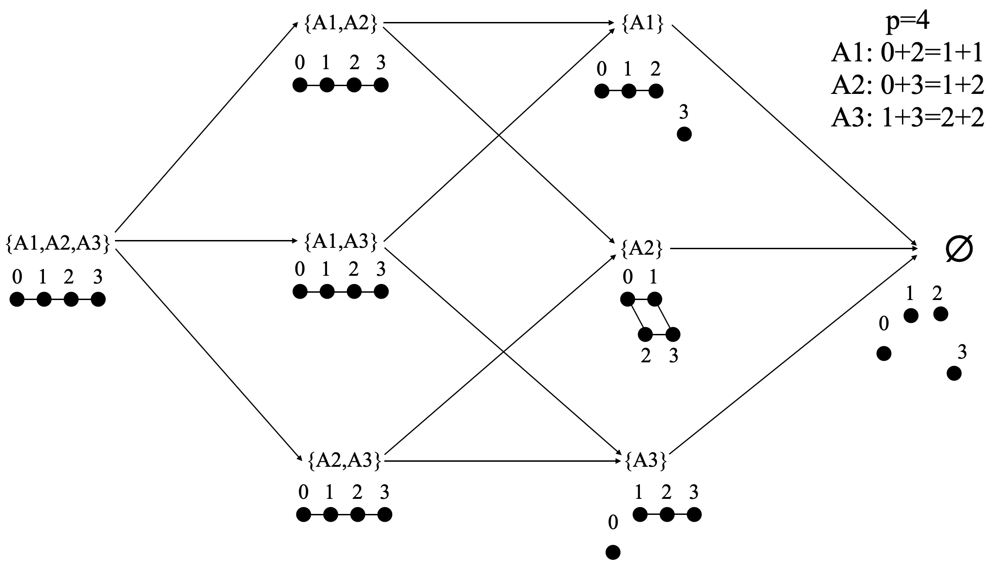

*Рисунок 11: Случай $p=4$. Набор уравнений $A$ (или, геометрически, представление) имеет иерархию: $a\to b$ означает, что $a$ — родитель $b$, а $b$ — потомок $a$. Реалистичная модель может порождать только представления, являющиеся потомками представления, порождаемого идеальной моделью.* **[p. 18]**

*Рисунок 12: Случай $p=4$. Показаны представления, полученные обучением нейросетей. $\eta_{1}$ и $\eta_{2}$ — скорости обучения представления и декодера соответственно. Как описано в основном тексте, $(\eta_{1},\eta_{2})=(10^{-2},10^{-3})$ (справа) идеальнее, чем $(\eta_{1},\eta_{2})=(10^{-3},10^{-2})$ (слева), и потому даёт представления, содержащие больше параллелограммов.* **[p. 18]**

Пусть у нас есть обучающий набор

$$
D=\{(0,2),(1,1),(0,3),(1,2),(1,3),(2,2)\}, \tag{21}
$$

и соответственно $P(D)=P_{0},A(P)=A_{0}$. Тогда идеальная модель $\mathcal{M}_{*}$ будет иметь линейную структуру $\mathbf{E}_{k}=\mathbf{a}+k\mathbf{b}$ (см. рисунок 11, слева). Однако реалистичная модель $\mathcal{M}$ может дать любого потомка линейной структуры — в зависимости от различных гиперпараметров и даже от случайных сидов.

**[p. 18]**

На рисунке 12 мы показываем, что наши алгоритмы действительно порождают все возможные представления. У нас две постановки: (1) быстрый декодер $(\eta_{1},\eta_{2})=(10^{-3},10^{-2})$ (рисунок 12, слева) и (2) относительно медленный декодер $(\eta_{1},\eta_{2})=(10^{-2},10^{-3})$ (рисунок 12, справа). Относительно медленный декодер даёт лучшие представления (в смысле более высокого RQI), чем быстрый, что согласуется с нашим наблюдением из раздела 4.

## Приложение F Законы сохранения эффективной теории

Напомним эффективную функцию потерь

$$
\ell_{\text{eff}}=\frac{\ell_{0}}{Z_{0}},\quad\ell_{0}\equiv\sum_{(i,j,m,n)\in P_{0}(D)}|\mathbf{E}_{i}+\mathbf{E}_{j}-\mathbf{E}_{m}-\mathbf{E}_{n}|^{2}/|P_{0}(D)|,\quad Z_{0}\equiv\sum_{k}|\mathbf{E}_{k}|^{2} \tag{22}
$$

где $\ell_{0}$ и $Z_{0}$ — обе квадратичные функции от $R=\{\mathbf{E}_{0},\cdots,\mathbf{E}_{p-1}\}$, и $\ell_{\text{eff}}=0$ остаётся нулём при масштабировании и сдвиге $\mathbf{E}_{i}^{\prime}=a\mathbf{E}_{i}+\mathbf{b}$. Множитель $1/|P_{0}(D)|$ в $\ell_{0}$ мы будем опускать, поскольку его наличие равносильно перемасштабированию времени, что не влияет на законы сохранения. Вектор представления $\mathbf{E}_{i}$ эволюционирует по градиентному спуску

$$
\frac{d\mathbf{E}_{i}}{dt}=-\frac{\partial\ell_{\text{eff}}}{\partial\mathbf{E}_{i}}. \tag{23}
$$

Мы докажем, что сохраняются следующие две величины:

$$
\mathbf{C}=\sum_{k}\mathbf{E}_{k},\quad Z_{0}=\sum_{k}|\mathbf{E}_{k}|^{2}. \tag{24}
$$

Уравнения (22) и (23) дают

$$
\frac{d\mathbf{E}_{i}}{dt}=-\frac{\ell_{\text{eff}}}{\partial\mathbf{E}_{i}}=-\frac{\partial(\frac{\ell_{0}}{Z_{0}})}{\partial\mathbf{E}_{i}}=-\frac{1}{Z_{0}}\frac{\partial\ell_{0}}{\partial\mathbf{E}_{i}}+\frac{\ell_{0}}{Z_{0}^{2}}\frac{\partial Z_{0}}{\partial\mathbf{E}_{i}}. \tag{25}
$$

Тогда

$$
\frac{dZ_{0}}{dt} =2\sum_{i}\mathbf{E}_{k}\cdot\frac{d\mathbf{E}_{k}}{dt} \\
=\frac{2}{Z_{0}^{2}}\sum_{i}\mathbf{E}_{i}\cdot(-Z_{0}\frac{\partial\ell_{0}}{\partial\mathbf{E}_{k}}+2\ell_{0}\mathbf{E}_{k}) \\
=\frac{2}{Z_{0}}(-\sum_{k}\frac{\partial\ell_{0}}{\partial\mathbf{E}_{k}}\cdot\mathbf{E}_{k}+2\ell_{0}) \\
=0. \tag{26}
$$

где в последнем равенстве использовано то, что

**[p. 19]**

$$
\sum_{k}\frac{\partial\ell_{0}}{\partial\mathbf{E}_{k}}\cdot\mathbf{E}_{k} =2\sum_{k}\sum_{(i,j,m,n)\in P_{0}(D)}(\mathbf{E}_{i}+\mathbf{E}_{j}-\mathbf{E}_{m}-\mathbf{E}_{n})(\delta_{ik}+\delta_{jk}-\delta_{mk}-\delta_{nk})\cdot\mathbf{E}_{k} \\
=2\sum_{(i,j,m,n)\in P_{0}(D)}(\mathbf{E}_{i}+\mathbf{E}_{j}-\mathbf{E}_{m}-\mathbf{E}_{n})\sum_{k}(\delta_{ik}+\delta_{jk}-\delta_{mk}-\delta_{nk})\cdot\mathbf{E}_{k} \\
=\sum_{(i,j,m,n)\in P_{0}(D)}(\mathbf{E}_{i}+\mathbf{E}_{j}-\mathbf{E}_{m}-\mathbf{E}_{n})\cdot(\mathbf{E}_{i}+\mathbf{E}_{j}-\mathbf{E}_{m}-\mathbf{E}_{n}) \\
=2\ell_{0}
$$

Сохранение $Z_{0}$ не даёт представлению схлопнуться в нуль. Теперь, показав, что $Z_{0}$ — сохраняющаяся величина, мы можем показать и

$$
\frac{d\mathbf{C}}{dt} =\sum_{k}\frac{d\mathbf{E}_{k}}{dt} \\
=-\frac{1}{Z_{0}}\sum_{k}\frac{\partial\ell_{0}}{\partial\mathbf{E}_{k}} \\
=-\frac{2}{Z_{0}}\sum_{k}\sum_{(i,j,m,n)\in P_{0}(D)}(\mathbf{E}_{i}+\mathbf{E}_{j}-\mathbf{E}_{m}-\mathbf{E}_{n})(\delta_{ik}+\delta_{jk}-\delta_{mk}-\delta_{nk}) \\
=\bf 0. \tag{27}
$$

Последнее равенство выполняется потому, что две суммы можно переставить и $\sum_{k}(\delta_{ik}+\delta_{jk}-\delta_{mk}-\delta_{nk})=0$.

###### sec-g

## Приложение G Дополнительные фазовые диаграммы игрушечной постановки

Мы изучаем ещё три гиперпараметра игрушечной постановки, приводя фазовые диаграммы, схожие с рисунком 6. Игрушечная постановка такова: (1) сложение без взятия по модулю ($p=10$); (2) разбиение обучение/валидация — 45/10; (3) жёстко зашитое сложение; (4) одномерный эмбеддинг. В следующих экспериментах декодер — MLP размера 1-200-200-30. Представление и энкодер оптимизируются AdamW с разными гиперпараметрами. Скорость обучения представления равна $10^{-3}$. Скорость обучения декодера мы перебираем в диапазоне $[10^{-4},10^{-2}]$ по оси x, а по оси y перебираем другой гиперпараметр. По умолчанию мы используем полный размер батча 45, масштаб инициализации $s=1$ и нулевой weight decay представления.

**Размер батча** управляет количеством шума в динамике обучения. На рисунке 13 область гроккинга появляется вверху слева фазовой диаграммы (малая скорость обучения декодера и малый размер батча). Однако большой размер батча (при малой скорости обучения) ведёт к пониманию, откуда следует, что меньший размер батча, по-видимому, вреден. Это осмысленно: чтобы получить в эксперименте кристаллы (хорошие структуры), нужна морозильная камера, постепенно понижающая температуру, а не нечто возмущающее систему шумом.

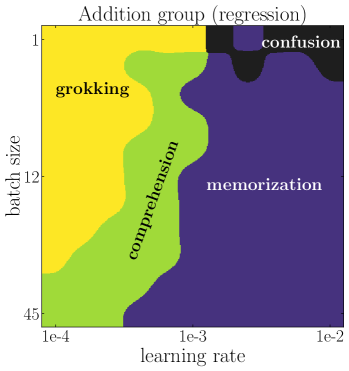

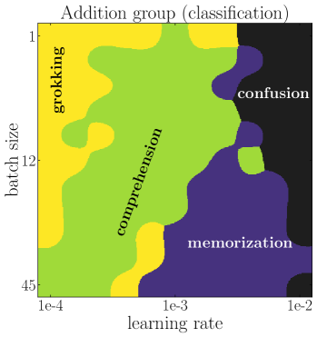

*Рисунок 13: Фазовые диаграммы скорости обучения декодера (ось x) и размера батча (ось y) для группы сложения (слева: регрессия; справа: классификация). Малая скорость обучения декодера и большой размер батча (внизу слева) ведут к пониманию.* **[p. 20]**

**Масштаб инициализации** управляет расстояниями между векторами эмбеддингов при инициализации. Компоненты векторов эмбеддингов мы инициализируем из независимого равномерного распределения $U[-s/2,s/2]$, где $s$ называется масштабом инициализации. Как показано на рисунке 14, выгодно использовать меньший масштаб инициализации. Это согласуется с физической интуицией: более близкие частицы охотнее взаимодействуют и образуют структуры. Например, расстояния между молекулами во льду много меньше, чем в газе.

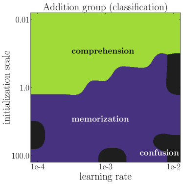

*Рисунок 14: Фазовые диаграммы скорости обучения декодера (ось x) и инициализации (ось y) для группы сложения (слева: регрессия; справа: классификация). Малый масштаб инициализации (вверху) ведёт к пониманию.* **[p. 20]**

**Weight decay представления** управляет величиной векторов эмбеддингов. Как показано на рисунке 15, weight decay представления в целом не слишком влияет на качество модели.

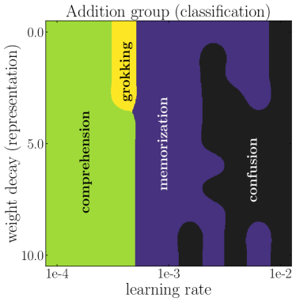

*Рисунок 15: Фазовые диаграммы скорости обучения декодера (ось x) и weight decay представления (ось y) для группы сложения (слева: регрессия; справа: классификация). Weight decay представления не слишком влияет на качество модели.* **[p. 21]**

## Приложение H Общие группы

### H.1 Теория

Бо́льшую часть статьи мы сосредоточивались на абелевых группах. **[p. 21]** Это, однако, объясняется лишь педагогическими соображениями. В этом разделе мы показываем, что определения параллелограммов и индекса качества представления (RQI) прямо переносятся на общие неабелевы группы. Мы также покажем, что большинство (если не все) качественных результатов для группы сложения применимы и к группе перестановок.

**Матричное представление для общих групп** Сначала напомним определение представления группы. Представление группы $G$ на векторном пространстве $V$ — это гомоморфизм групп из $G$ в ${\rm GL}(V)$, полную линейную группу на $V$. То есть представление — это отображение $\rho:G\to{\rm GL}(V)$ такое, что

$$
\rho(g_{1}g_{2})=\rho(g_{1})\rho(g_{2}),\quad\forall g_{1},g_{2}\in G. \tag{28}
$$

В случае, когда $V$ конечномерно размерности $n$, ${\rm GL}(V)$ принято отождествлять с обратимыми матрицами $n$ на $n$. Соль в том, что каждый элемент группы можно представить матрицей, а бинарную операцию — матричным умножением.

**Новая архитектура для общих групп** Вдохновившись матричным представлением, мы вкладываем каждый элемент группы $a$ как обучаемую матрицу $\mathbf{E}_{a}\in\mathbb{R}^{d\times d}$ (а не вектор) и вручную выполняем матричное умножение, прежде чем отправить произведение в декодер для регрессии или классификации. Конкретнее, для $a\circ b=c$ наша архитектура принимает на вход две матрицы эмбеддингов $\mathbf{E}_{a}$ и $\mathbf{E}_{b}$ и стремится предсказать $\mathbf{Y}_{c}$ так, что $\mathbf{Y}_{c}={\rm Dec}(\mathbf{E}_{a}\mathbf{E}_{b})$, где $\mathbf{E}_{a}\mathbf{E}_{b}$ означает матричное умножение $\mathbf{E}_{a}$ и $\mathbf{E}_{b}$. Цель этого упрощения — расцепить обучение представления и обучение арифметической операции (то есть матричного умножения). Мы покажем, что даже с этим упрощением нам всё ещё удаётся воспроизвести характерное поведение гроккинга и другие богатые явления.

**Обобщённые параллелограммы** Определим обобщённые параллелограммы: $(a,b,c,d)$ — обобщённый параллелограмм в представлении, если $||\mathbf{E}_{a}\mathbf{E}_{b}-\mathbf{E}_{c}\mathbf{E}_{d}||_{F}^{2}\leq\delta$, где $\delta>0$ — порог, допускающий численные погрешности. Прежде чем приводить численные результаты для группы перестановок, покажем интуитивную картину того, как новые параллелограммы выводятся из старых для общих групп, — а это и есть ключ к генерализации.

*Рисунок 16: Вывод параллелограммов* **[p. 22]**

**Вывод параллелограммов** Сначала напомним случай абелевой группы (например, группы сложения). Как показано на рисунке 16, когда $(a,d,b,c)$ и $(c,f,d,e)$ — два параллелограмма, имеем

$$
\mathbf{E}_{a}+\mathbf{E}_{d}=\mathbf{E}_{b}+\mathbf{E}_{c}, \\
\mathbf{E}_{c}+\mathbf{E}_{f}=\mathbf{E}_{d}+\mathbf{E}_{d}.
$$

Отсюда можно вывести $\mathbf{E}_{a}+\mathbf{E}_{f}=\mathbf{E}_{b}+\mathbf{E}_{e}$, откуда следует, что $(a,f,b,e)$ — тоже параллелограмм. То есть для абелевых групп, чтобы вывести новый параллелограмм, нужны два параллелограмма.

Для неабелевой группы, если у нас есть только два параллелограмма, такие что

$$
\mathbf{E}_{a}\mathbf{E}_{d}=\mathbf{E}_{b}\mathbf{E}_{c}, \\
\mathbf{E}_{f}\mathbf{E}_{c}=\mathbf{E}_{e}\mathbf{E}_{d},
$$

мы имеем $\mathbf{E}_{b}^{-1}\mathbf{E}_{a}=\mathbf{E}_{c}\mathbf{E}_{d}^{-1}=\mathbf{E}_{f}^{-1}\mathbf{E}_{e}$, но это не приводит к чему-либо вроде $\mathbf{E}_{f}\mathbf{E}_{a}=\mathbf{E}_{e}\mathbf{E}_{b}$, а потому бесполезно для генерализации. Однако если у нас есть третий параллелограмм, такой что

$$
\mathbf{E}_{e}\mathbf{E}_{h}=\mathbf{E}_{f}\mathbf{E}_{g} \tag{31}
$$

**[p. 22]**

мы имеем $\mathbf{E}_{b}^{-1}\mathbf{E}_{a}=\mathbf{E}_{c}\mathbf{E}_{d}^{-1}=\mathbf{E}_{f}^{-1}\mathbf{E}_{e}=\mathbf{E}_{g}\mathbf{E}_{h}^{-1}$, что равносильно $\mathbf{E}_{a}\mathbf{E}_{h}=\mathbf{E}_{b}\mathbf{E}_{g}$ и тем самым устанавливает новый параллелограмм $(a,h,b,g)$. То есть для неабелевых групп, чтобы вывести новый параллелограмм, нужны три параллелограмма.

### H.2 Численные результаты

В этом разделе мы проводим численные эксперименты на простой неабелевой группе — группе перестановок $S_{3}$. У группы 6 элементов, поэтому полный набор данных содержит 36 образцов. Каждый элемент группы $a$ мы вкладываем в обучаемую матрицу эмбеддинга $\mathbf{E}_{a}$ размера $3\times 3$. Мы применяем новую архитектуру, описанную в предыдущем подразделе: матричное умножение двух входных матриц эмбеддингов мы жёстко зашиваем перед подачей в декодер. Определив в прошлом подразделе обобщённый параллелограмм, мы можем далее определить RQI (как в разделе 3) и предсказывать точность $\widehat{\rm Acc}$ по представлению (как в приложении D). Мы также вычисляем число шагов, необходимое для достижения ${\rm RQI}=0.95$.

**Представление** Каждую матрицу эмбеддинга мы вытягиваем в вектор и применяем к векторам метод главных компонент (PCA). Первые три главные компоненты этих элементов группы показаны на рисунке 17. На плоскости ${\rm PC}1$ и ${\rm PC}3$ шесть точек организованы в шестиугольник.

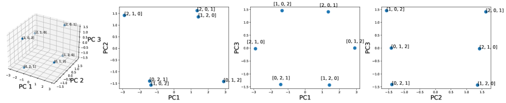

*Рисунок 17: Группа перестановок $S_{3}$. Первые три главные компоненты шести матриц эмбеддингов $\mathbb{R}^{3\times 3}$.* **[p. 22]**

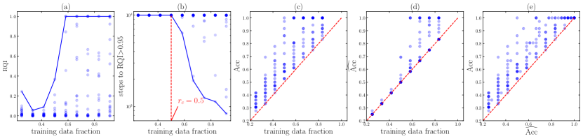

*Рисунок 18: Группа перестановок $S_{3}$. (a) RQI растёт по мере увеличения обучающего набора. Каждая точка — случайный сид, а синяя линия — наибольший RQI, полученный при фиксированной доле обучающего набора; (b) число шагов до достижения ${\rm RQI}>0.95$. Синяя линия — наименьшее требуемое число шагов. Около $r_{c}=0.5$ есть фазовый переход. (c) настоящая точность ${\rm Acc}$; (d) предсказанная точность $\widehat{\rm Acc}$; (e) сравнение ${\rm Acc}$ и $\widehat{\rm Acc}$: $\widehat{\rm Acc}$ служит нижней границей для ${\rm Acc}$.* **[p. 23]**

**RQI** На рисунке 18 (a) мы показываем RQI как функцию доли обучающих данных. Для каждой доли обучающих данных мы запускаем 11 случайных сидов (показаны точками), а синяя линия отвечает наибольшему RQI.

**Число шагов до RQI$=0.95$** На рисунке 18 (b) мы показываем число шагов до достижения ${\rm RQI}>0.95$ как функцию доли обучающих данных и обнаруживаем фазовый переход при $r=r_{c}=0.5$. Синяя линия отвечает лучшей модели (наименьшему числу шагов).

**Точность** Настоящая точность ${\rm Acc}$ показана на рисунке 18 (c), а предсказанная точность $\widehat{\rm Acc}$ (вычисленная по RQI) — на рисунке 18 (d). Их сравнение приведено на (e): $\widehat{\rm Acc}$ — нижняя граница для ${\rm Acc}$, откуда следует, что должен существовать какой-то механизм генерализации помимо RQI.

**Фазовая диаграмма** Мы исследуем, как качество модели меняется при повороте двух ручек: скорости обучения декодера и weight decay декодера. Мы вычисляем число шагов до точности на обучении $\geq 0.9$ и до точности на валидации $\geq 0.9$ соответственно; см. рисунок 6 (d).

## Приложение I Эффективная теория для классификации изображений

*Рисунок 19: Наша эффективная теория применима к классификации изображений MNIST. Изображения одного класса схлопываются к средним своего класса, тогда как средние разных классов остаются разделимыми. Тем самым эффективная теория служит новым методом самообучения (self-supervised learning), а также проливает свет на нейронный коллапс. См. текст приложения I.* **[p. 24]**

В этом разделе мы показываем, что предложенная в разделе 3.2 эффективная теория переносится за пределы алгоритмических наборов данных. В частности, мы применим эффективную теорию к классификации изображений. Мы обнаруживаем, что: (i) эффективная теория естественно порождает новый метод самообучения, который доказуемо избегает схлопывания мод без контрастных пар; (ii) эффективная теория способна пролить свет на явление нейронного коллапса [28], при котором представления одного класса схлопываются к средним своего класса.

Сначала опишем, как эффективная теория применяется к классификации изображений. Основная мысль снова в том, что, как и на алгоритмических наборах данных, нейросети пытаются выработать структурированное представление входов на основе реляционной информации между образцами (метки классов в случае классификации изображений, суммовые параллелограммы в случае сложения и т. д.). У эффективной теории две составляющие: (i) образцы с одинаковой меткой поощряются иметь схожие представления; (ii) эффективная функция потерь масштабно-инвариантна, чтобы избежать схлопывания всех представлений в нуль (глобального коллапса). В итоге эффективная потеря для классификации изображений имеет вид

$$
\ell_{\rm eff}=\frac{\ell}{Z},\quad\ell=\sum_{(\mathbf{x},\mathbf{y})\in P}|\mathbf{f}(\mathbf{x})-\mathbf{f}(\mathbf{y})|^{2},\quad Z=\sum_{\mathbf{x}}|\mathbf{f}(\mathbf{x})|^{2} \tag{32}
$$

где $\mathbf{x}$ — изображение, $\mathbf{f}(\mathbf{x})$ — его представление, а $(\mathbf{x},\mathbf{y})\in P$ обозначает уникальные пары $\mathbf{x}$ и $\mathbf{y}$ с одинаковой меткой. Масштабная инвариантность означает, что функция потерь $\ell_{\rm eff}$ не меняется при линейном масштабировании $\mathbf{f}(\mathbf{x})\to a\mathbf{f}(\mathbf{x})$.

###### p23-6

**Связь с нейронным коллапсом** В [28] было замечено, что представления изображений в предпоследнем слое модели обладают интересными свойствами: (i) представления изображений одного класса схлопываются к средним своего класса; (ii) средние разных классов складываются в равноугловую тесную рамку (equiangular tight frame). Наша эффективная теория способна предсказать схлопывание внутри класса, но не обязательно укладывает средние классов в равноугловые тесные рамки. Мы предполагаем, что небольшое явное отталкивание между разными классами может помочь средним классов сложиться в равноугловую тесную рамку — подобно тому, как электроны выстраиваются в решётчатые структуры на сфере под действием кулоновского отталкивания (задача Томсона [29]). Эту модификацию эффективной теории мы хотели бы исследовать в будущем.

**Эксперимент на MNIST** Мы напрямую применяем эффективную потерю из уравнения (32) к набору данных MNIST. Сначала каждое изображение $\mathbf{x}$ случайно кодируется в двумерный эмбеддинг $\mathbf{f}(\mathbf{x})$ одним и тем же энкодером-MLP со случайно инициализированными весами. Затем мы обучаем эти эмбеддинги, минимизируя эффективную потерю $\ell_{\rm eff}$ **[p. 24]** оптимизатором Adam (скорость обучения $10^{-3}$) в течение 100 шагов. Эволюцию этих эмбеддингов мы показываем на рисунке 19. Изображения одного класса схлопываются к средним своего класса, а средние разных классов не схлопываются. Это означает, что наша эффективная теория способна породить хороший метод обучения представлений, использующий лишь неконтрастную реляционную информацию в наборах данных.

**Связь с самообучением** Заметим, что сама по себе $\ell$ уязвима к глобальному коллапсу в контексте сиамского обучения без контрастных пар. Чтобы избежать глобального коллапса, предлагались различные приёмы (например, декодер с моментом, остановка градиента) [13, 30]. Однако причины, по которым эти приёмы позволяют избежать глобального коллапса, неясны. Мы утверждаем, что $\ell$ терпит неудачу просто потому, что $\ell\to a^{2}\ell$ при масштабировании $\mathbf{f}(\mathbf{x})\to a\mathbf{f}(\mathbf{x})$, так что градиентный спуск по $\ell$ поощряет $a\to 0$. Исходя из этой картины, наша эффективная теория предлагает другое возможное исправление: сделать функцию потерь $\ell$ масштабно-инвариантной (через нормированную потерю $\ell_{\rm eff}$), чтобы у градиентного потока не было стимула менять масштабы представлений. **[p. 25]** На деле мы можем доказать, что градиентный поток по $\ell_{\rm eff}$ сохраняет $Z$ (дисперсию представлений), так что глобальный коллапс доказуемо исключён:

$$
\frac{\partial\ell_{\rm eff}}{\partial\mathbf{f}(\mathbf{x})} =\frac{1}{Z}\frac{\partial\ell}{\partial\mathbf{f}(\mathbf{x})}-\frac{l}{Z^{2}}\frac{\partial Z}{\partial\mathbf{f}(\mathbf{x})}=\frac{2}{Z}\sum_{\mathbf{y}\sim\mathbf{x}}(\mathbf{f}(\mathbf{x})-\mathbf{f}(\mathbf{y}))-\frac{2\ell}{Z^{2}}\mathbf{f}(\mathbf{x}), \\
\frac{dZ}{dt} =2\sum_{\mathbf{x}}\mathbf{f}(\mathbf{x})\cdot\frac{d\mathbf{f}(\mathbf{x})}{dt}=2\sum_{\mathbf{x}}\mathbf{f}(\mathbf{x})\cdot\frac{\partial\ell_{\rm eff}}{\partial\mathbf{f}(\mathbf{x})} \\
=\frac{4}{Z}\sum_{\mathbf{x}}\mathbf{f}(\mathbf{x})\cdot(\sum_{\mathbf{y}\sim\mathbf{x}}(\mathbf{f}(\mathbf{x})-\mathbf{f}(\mathbf{y}))-\frac{\ell}{Z}\mathbf{f}(\mathbf{x})) \\
=\frac{4}{Z}\big{[}\sum_{\mathbf{x}}\mathbf{f}(\mathbf{x})\cdot\sum_{\mathbf{y}\sim\mathbf{x}}(\mathbf{f}(\mathbf{x})-\mathbf{f}(\mathbf{y}))-\sum_{\mathbf{x}}\frac{\ell}{Z}|\mathbf{f}(\mathbf{x})|^{2}\big{]} \\
=0.
$$

где мы использовали то, что

$$
\sum_{\mathbf{x}}\mathbf{f}(\mathbf{x})\cdot\sum_{\mathbf{y}\sim\mathbf{x}}(\mathbf{f}(\mathbf{x})-\mathbf{f}(\mathbf{y}))=\sum_{(\mathbf{x},\mathbf{y})\in P}(\mathbf{f}(\mathbf{x})-\mathbf{f}(\mathbf{y}))\cdot(\mathbf{f}(\mathbf{x})-\mathbf{f}(\mathbf{y}))=\ell \tag{34}
$$

###### sec-j

## Приложение J Гроккинг на MNIST

Чтобы вызвать гроккинг на MNIST, мы принимаем два нестандартных решения: (1) уменьшаем размер обучающего набора с 50 тыс. до 1 тыс. образцов (беря случайное подмножество) и (2) увеличиваем масштаб распределения инициализации весов (умножая начальные веса, взятые по равномерной инициализации Кайминга, на константу $>1$).

Выбор больших инициализаций оправдан работами [31, 32, 33], которые обнаруживают, что большие инициализации легко переобучаются на данных, но склонны к плохой генерализации. С этим связано и то, что масштаб инициализации, как выяснено, регулирует «ядровой» и «богатый» режимы обучения в сетях [34].

С этими изменениями размера обучающего набора и масштаба инициализации мы обучаем MLP глубины 3 и ширины 200 с активациями ReLU оптимизатором AdamW. Мы используем MSE-потерю с one-hot целями, а не кросс-энтропию. При такой постановке мы обнаруживаем, что сеть быстро подгоняет обучающий набор, а много позже в ходе обучения улучшается точность на валидации, как показано на рисунке 8(a). Это близко следует стереотипному обучению с гроккингом, впервые наблюдавшемуся на алгоритмических наборах данных.

Для этой же постановки мы вычисляем фазовую диаграмму по weight decay модели и скорости обучения последнего слоя. См. рисунок 8(b). Хотя в MLP менее ясно, какие части сети считать «энкодером», а какие «декодером», для наших целей мы считаем последний слой «декодером» и меняем его скорость обучения относительно остальной сети. Полученная фазовая диаграмма имеет некоторое сходство с рисунком 7. Мы наблюдаем фазу «путаницы» внизу справа (высокая скорость обучения и высокий weight decay), граничащую с ней фазу «понимания», фазу «гроккинга» по мере уменьшения weight decay и скорости обучения декодера и фазу «запоминания» при низком weight decay и низкой скорости обучения. Вместо порога точности 95 % мы используем здесь для точности на валидации порог 60 %, чтобы запуск считался пониманием или гроккингом. Эта фазовая диаграмма показывает, что при достаточной регуляризации мы снова можем «раз-грокнуть» обучение.

Мы также исследуем влияние размера обучающего набора на время до генерализации на MNIST. Мы получаем результат, схожий с наблюдением Power et al. [1]: время генерализации быстро растёт, как только опускаешься ниже определённого объёма обучающих данных. См. рисунок 20.

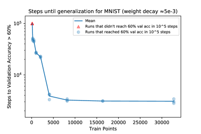

*Рисунок 20: Время до генерализации как функция размера обучающего набора на MNIST.* **[p. 26]**

###### sec-k

## Приложение K Связь с гипотезой лотерейного билета

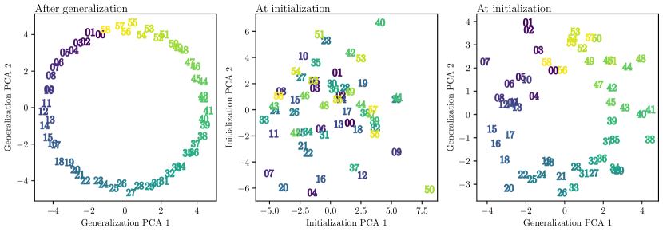

*Рисунок 21: **(Слева) Входные эмбеддинги после генерализации, спроецированные на первые 2 главные компоненты. (В центре) Входные эмбеддинги при инициализации, спроецированные на первые 2 главные компоненты. (Справа) Входные эмбеддинги при инициализации, спроецированные на первые 2 главные компоненты эмбеддингов после генерализации в конце обучения (тот же PCA, что и на левом рисунке).*** **[p. 26]**

**[p. 26]**

На рисунке 21 мы показываем проекцию выученных эмбеддингов после генерализации на их первые две главные компоненты. По сравнению с проекцией при инициализации в пространстве эмбеддингов явно проступает структура, когда нейросеть оказывается способна генерализовать ($>99\%$ точности на валидации). Что любопытно, проекция эмбеддингов при инициализации на главные компоненты эмбеддингов в момент генерализации, по-видимому, уже содержит бо́льшую часть этой структуры. В этом смысле структурированное представление, необходимое для генерализации, (частично) существовало уже при инициализации. Процедура обучения по сути отсекает прочие ненужные измерения и образует требуемые для генерализации параллелограммы. Это нестандартное прочтение гипотезы лотерейного билета, где выигрышные билеты — не веса и не подсети, а определённые оси или линейные комбинации весов (выученные эмбеддинги).

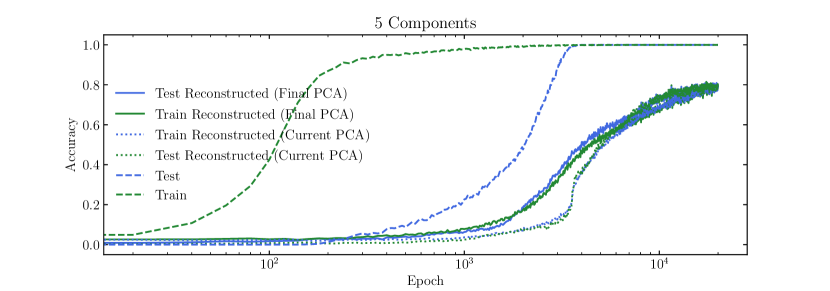

*Рисунок 22: Точность на обучении и на тесте, вычисленная при использовании настоящих эмбеддингов (штриховая линия), эмбеддингов, спроецированных на первые $n$ главных компонент и восстановленных из них (пунктирные линии), и, наконец, эмбеддингов, спроецированных на первые $n$ главных компонент эмбеддингов в конце обучения и восстановленных из них (сплошные линии).* **[p. 27]**

На рисунке 22 мы показываем исходные кривые обучения (штриховые линии). Сплошными линиями мы пересчитываем точность для моделей, использующих эмбеддинги, спроецированные на $n$ главных компонент эмбеддингов в конце обучения (и обратно). Ясно, что первых нескольких главных компонент достаточно, чтобы достичь $99\%$ точности. Первые несколько главных компонент по определению объясняют наибольшую дисперсию, однако отметим, что это не обязательно главная причина того, почему они так хорошо генерализуют. На деле эмбеддинги, восстановленные из PCA в конце обучения (сплошные линии), работают лучше, чем текущие оси наибольшей дисперсии (пунктирная линия). Это поведение устойчиво по сидам.

**[p. 28]**

## Приложение L Вывод эффективной потери

В этом разделе мы дополнительно обоснуем использование нашей эффективной потери для изучения динамики обучения представлений, выведя её из динамики градиентного потока по фактической MSE-потере в линейной регрессии. Ландшафт потерь нейросети в общем случае нелинеен, но линейный случай может пролить свет на то, как эффективная потеря выводится из фактической. Для образца $\mathbf{r}$ (который является суммой двух эмбеддингов $\mathbf{E}_{i}$ и $\mathbf{E}_{j}$) предсказание линейной сети есть $D(\mathbf{r})=\mathbf{A}\mathbf{r}+\mathbf{b}$. Функция потерь такова ($\mathbf{y}$ — соответствующая метка):

$$
\ell=\underbrace{\frac{1}{2}|\mathbf{A}\mathbf{r}+\mathbf{b}-\mathbf{y}|^{2}}_{\ell_{\rm pred}}+\underbrace{\frac{\gamma}{2}||\mathbf{A}||_{F}^{2}}_{\ell_{\rm reg}}, \tag{35}
$$

где первое и второе слагаемые — ошибка предсказания и регуляризация соответственно. И модель $(\mathbf{A},\mathbf{b})$, и вход $\mathbf{r}$ обновляются градиентным потоком со скоростями обучения $\eta_{A}$ и $\eta_{x}$ соответственно:

$$
\frac{d\mathbf{A}}{dt}=-\eta_{A}\frac{\partial\ell}{\partial\mathbf{A}},\frac{d\mathbf{b}}{dt}=-\eta_{A}\frac{\partial\ell}{\partial\mathbf{b}},\frac{d\mathbf{r}}{dt}=-\eta_{x}\frac{\partial\ell}{\partial\mathbf{r}}. \tag{36}
$$

Подставляя $\ell$ в приведённые уравнения, получаем градиентный поток:

$$
\frac{d\mathbf{A}}{dt}=-\eta_{A}\frac{\partial\ell}{\partial\mathbf{A}}=-\eta_{A}[\mathbf{A}(\mathbf{r}\mathbf{r}^{T}+\gamma)+(\mathbf{b}-\mathbf{y})\mathbf{r}^{T}], \\
\frac{d\mathbf{b}}{dt}=-\eta_{A}\frac{\partial\ell}{\partial\mathbf{b}}=-\eta_{A}(\mathbf{A}\mathbf{r}+\mathbf{b}-\mathbf{y}) \\
\frac{d\mathbf{r}}{dt}=-\eta_{x}\frac{\partial\ell}{\partial\mathbf{r}}=-\eta_{x}\mathbf{A}^{T}(\mathbf{A}\mathbf{r}+\mathbf{b}-\mathbf{y}).
$$

Для уравнения на $d\mathbf{b}/dt$, отбросив слагаемое $\mathbf{A}\mathbf{r}$ и задав начальное условие $\mathbf{b}(0)=\mathbf{0}$, мы аналитически получаем $\mathbf{b}(t)=(1-e^{-2\eta_{A}t})\mathbf{y}$. Подставляя это в первое и третье уравнения, имеем

$$
\frac{d\mathbf{A}}{dt}=-\eta_{A}[\mathbf{A}(\mathbf{r}\mathbf{r}^{T}+\gamma)-e^{-2\eta_{A}t}\mathbf{y}\mathbf{r}^{T}], \\
\frac{d\mathbf{r}}{dt}=\underbrace{-\eta_{x}\mathbf{A}^{T}\mathbf{A}\mathbf{r}}_{\rm internal\ interaction}+\underbrace{\eta_{x}e^{-2\eta_{A}t}\mathbf{A}^{T}\mathbf{y}}_{\rm external\ force}.
$$

Во втором уравнении на эволюцию $d\mathbf{r}/dt$ правую часть можно искусственно разложить на два слагаемых по признаку того, зависят ли они от метки $\mathbf{y}$. Так первое слагаемое мы называем «внутренним взаимодействием», поскольку оно не зависит от $\mathbf{y}$, а второе — «внешней силой». Заметим, что с математической точки зрения это различие выглядит несколько искусственным, но с точки зрения физики оно может быть концептуально полезным. Ниже мы покажем, что слагаемое внутреннего взаимодействия важно для образования представлений. Поскольку нас интересует, как взаимодействуют два образца, рассмотрим теперь другой образец в точке $\mathbf{r}^{\prime}$; эволюция становится такой:

$$
\frac{d\mathbf{A}}{dt}=-\eta_{A}[\mathbf{A}(\mathbf{r}\mathbf{r}^{T}+\mathbf{r}^{\prime}\mathbf{r}^{\prime T}+2\gamma)-e^{-2\eta_{A}t}\mathbf{y}(\mathbf{r}+\mathbf{r}^{\prime})^{T}], \\
\frac{d\mathbf{r}}{dt}=-\eta_{x}\mathbf{A}^{T}\mathbf{A}\mathbf{r}+\eta_{x}e^{-2\eta_{A}t}\mathbf{A}^{T}\mathbf{y}, \\
\frac{d\mathbf{r}^{\prime}}{dt}=-\eta_{x}\mathbf{A}^{T}\mathbf{A}\mathbf{r}^{\prime}+\eta_{x}e^{-2\eta_{A}t}\mathbf{A}^{T}\mathbf{y}.
$$

Вычитая $d\mathbf{r}^{\prime}/dt$ из $d\mathbf{r}/dt$ и полагая $\mathbf{r}^{\prime}=-\mathbf{r}$, приведённые уравнения ещё упрощаются до

$$
\frac{d\mathbf{A}}{dt}=-2\eta_{A}\mathbf{A}(\mathbf{r}\mathbf{r}^{T}+\gamma), \\
\frac{d\mathbf{r}}{dt}=-\eta_{x}\mathbf{A}^{T}\mathbf{A}\mathbf{r}.
$$

Второе уравнение означает, что пара образцов взаимодействует через квадратичный потенциал $U(\mathbf{r})=\frac{1}{2}\mathbf{r}^{T}\mathbf{A}^{T}\mathbf{A}\mathbf{r}$, что даёт линейную силу притяжения $f(r)\propto r$. Теперь рассмотрим адиабатический предел, где $\eta_{A}\to 0$.

**[p. 29]**

**Адиабатический предел** При стандартной инициализации нейросетей (например, инициализации Ксавье) имеем $\mathbf{A}_{0}^{T}\mathbf{A}_{0}\approx\mathbf{I}$. В результате квадратичный потенциал становится $U(\mathbf{r})=\frac{1}{2}\mathbf{r}^{T}\mathbf{r}$, который не зависит от времени, поскольку $\eta_{A}\to 0$. Теперь мы можем проанализировать задачу сложения. Два образца $\mathbf{x}^{(1)}=\mathbf{E}_{i}+\mathbf{E}_{j}$ и $\mathbf{x}^{(2)}=\mathbf{E}_{m}+\mathbf{E}_{n}$ с одинаковой меткой ($i+j=m+n$) дают вклад в слагаемое взаимодействия

$$
U(i,j,m,n)=\frac{1}{2}|\mathbf{E}_{i}+\mathbf{E}_{j}-\mathbf{E}_{m}-\mathbf{E}_{n}|_{2}^{2}. \tag{41}
$$

Усредняя по всем возможным четвёркам в обучающем наборе $D$, получаем полную энергию системы

$$
\ell_{0}=\sum_{(i,j,m,n)\in P_{0}(D)}\frac{1}{2}|\mathbf{E}_{i}+\mathbf{E}_{j}-\mathbf{E}_{m}-\mathbf{E}_{n}|_{2}^{2}/|P_{0}(D)|, \tag{42}
$$

где $P_{0}(D)=\{(i,j,m,n)|i+j=m+n,(i,j)\in D,(m,n)\in D\}$. Чтобы сделать её масштабно-инвариантной, мы определяем нормированный гамильтониан уравнения (42) как

$$
\ell_{\rm eff}=\frac{\ell_{0}}{Z_{0}},\quad Z_{0}=\sum_{i}|\mathbf{E}_{i}|_{2}^{2} \tag{43}
$$

что и есть эффективная потеря, использованная нами в разделе 3.2.
