# Barak et al. 2022 — Hidden Progress in Deep Learning: SGD Learns Parities Near the Computational Limit

См. также: [глобальный индекс понятий](../../concepts/index.md).
arXiv [2207.08799v3](https://arxiv.org/abs/2207.08799), 15 января 2023 (v1 — июль 2022). Колонтитула с площадкой публикации в PDF нет.

**Boaz Barak, Benjamin L. Edelman** — Harvard University.
**Surbhi Goel** — Microsoft Research; University of Pennsylvania.
**Sham Kakade** — Harvard University; Microsoft Research.
**Eran Malach** — Hebrew University of Jerusalem.
**Cyril Zhang** — Microsoft Research.

Файлы разбора этой статьи:

- [`2207.08799.hidden-progress-in-deep-learning-sgd-learns-parities-near-the-computational-limit.claims.txt`](2207.08799.hidden-progress-in-deep-learning-sgd-learns-parities-near-the-computational-limit.claims.txt) — пронумерованные утверждения статьи с пометками разбора.
- [`2207.08799.hidden-progress-in-deep-learning-sgd-learns-parities-near-the-computational-limit.license.txt`](2207.08799.hidden-progress-in-deep-learning-sgd-learns-parities-near-the-computational-limit.license.txt) — лицензионная запись arXiv для этой статьи.

Схема якорей и правила ссылок на карточку — в [README папки статей](../README.md).

**Карточка-выдержка.** Лицензия статьи (`arxiv-nonexclusive`) не разрешает публикацию копии оригинала и полного перевода, поэтому карточка содержит редакторские секции и цитируемые фрагменты перевода (право цитирования). Полный текст статьи: <https://arxiv.org/abs/2207.08799>.

## Затрагиваемые понятия

**[Разрежённая чётность](../../concepts/sparse-parity.md)** — работа вводит задачу в корпус и задаёт её как полигон: метка есть произведение $k\ll n$ знаков случайной строки длины $n$, задача статистически лёгкая ($\Theta(k\log n)$ примеров) и вычислительно трудная — из ортогональности чётностей выводится нижняя граница в модели статистических запросов, $\Omega(n^{k})$ запросов с постоянным шумом ([с. 4, абз. 4](#p4-4)). Ценность постановки для корпуса именно в этом: точка перехода привязана к **доказанному** вычислительному пределу, а не к эмпирическому порогу. Отсюда унаследованы и рабочие обозначения — $(n,k)$-чётность, «нужные» и «ненужные» координаты, время сходимости $t_c$, — и перебор пятнадцати устроений сети (двухслойные MLP с ReLU и степенной активацией, однонейронные сети с зигзаговой, степенной, $\infty$-зигзаговой и синусоидальной активациями, трансформер, PolyNet) при трёх начальных распределениях, трёх потерях, размерах партии от 1 до 1024 и четырёх скоростях обучения ([с. 6, абз. 1](#p6-1)). Чего в работе нет: разбора самой чётности как «грокающей» задачи. Основные результаты сняты в **онлайновой** постановке ([с. 4, абз. 5](#p4-5)), где свежая партия на каждом шаге по построению убирает переобучение, а значит, и разрыв между обучающей и проверочной ошибками.

**[Гроккинг](../../concepts/grokking.md)** — работа берёт гроккинг у Power et al. 2022 как заимствованное явление и воспроизводит его на новом носителе. Гроккинг здесь — отдельный опыт при **конечной** выборке (приложение [C.5](#sec-c5)): ReLU-MLP ширины 100, $B=32$, $\eta=0.1$, потеря hinge, многопроходное обучение на закреплённой выборке размера $m$ и weight decay $\lambda$ ([с. 43, абз. 1](#p43-1)); при малых $m$ и подобранном $\lambda$ «модель сперва переобучается на обучающих данных, но после большого числа итераций находит классификатор, который обобщает» ([с. 43, абз. 2](#p43-2), [рис. 15](#fig-15), [рис. 4](#fig-4)). Существенное для корпуса различение вытекает из постановки и проведено самими авторами: **плато в онлайновой части — это не гроккинг**, потому что там нет разрыва между обучающей и проверочной ошибками ([с. 10, абз. 3](#p10-3)). Чего в работе нет: объяснения гроккинга. Раздел 5 назван «предварительными исследованиями», меры скрытого прогресса на гроккающих прогонах не считаются, число семян и разброс для рисунка 15 не приводятся, а заявка «дополняют и подкрепляют находки Nanda and Lieberum 2022» остаётся словесной.

**[Меры прогресса](../../concepts/progress-measures.md)** — здесь понятие вводится и получает имя. Определение дано **общим**, через предсказание, а не через разбор устройства: мера прогресса есть «любая функция состояния обучающего алгоритма… которая предсказывает время до сходимости», и из определения прямо выводится, что мер прогресса лишены только алгоритмы с беспамятным временем сходимости ([с. 40, абз. 2](#p40-2)). Столь же важна авторская оговорка, которая теряется при цитировании: «назначение показа скрытых мер прогресса $\rho$ *не* в том, чтобы дать дополнительные свидетельства того, что SGD находит признаки при помощи фурье-зазоров», — годятся и пустые меры (для полного перебора мерой прогресса служит сам номер шага), а назначение иное: опровергнуть догадку о беспамятном ланжевеновом поиске и попробовать измерить продвижение там, где потеря и точность плоские ([с. 41, абз. 1](#p41-1)). Предложены три меры: фурье-зазор популяционного градиента во времени, движение весов на нужных координатах и $\ell_{\infty}$-длина пути $\rho(w_{0:t}):=||w_{t}-w_{0}||_{\infty}$ ([с. 41, абз. 4](#p41-4), [рис. 3](#fig-3), [рис. 13](#fig-13)). Чего в работе нет: причинной связи меры с переходом — слова «causal» в статье нет, а динамику $\rho$ авторы описывать не берутся; нет и вычисления мер на гроккающих прогонах приложения C.5.

**[Фазовый переход](../../concepts/phase-transition.md)** — слово стоит у авторов и в аннотации, и в основном тексте: «почти для всех архитектур… кривые обучения обнаруживают фазовые переходы… долгие промежутки видимого отсутствия продвижения, за которыми следуют поры быстрого убывания проверочной ошибки» ([с. 6, абз. 3](#p6-3), [рис. 1](#fig-1)). Главный вклад в понятие — не наблюдение, а **теорема**: для градиентного потока на disjoint-PolyNet при $k\geq3$ выполнено $\frac{T(0.49)}{T(0)}\geq 1-O\left((n^{\prime})^{1-k/2}\right)$, то есть доля времени до выхода на «чуть лучше тривиального» стремится к единице ([с. 9, абз. 3](#p9-3)); своими словами авторы формулируют это так: «сеть тратит куда больше времени на достижение чуть лучшей, чем тривиальная, точности, чем на переход от чуть лучшей, чем тривиальная, к идеальной точности» ([с. 9, абз. 4](#p9-4)). Это плато получено в **полностью детерминированной** динамике, без шума партий, — тем самым объяснения перехода через устройство задачи отделяются от объяснений через шумовой выход из метастабильного состояния. Чего в работе нет: языка статистической физики — ни параметра порядка, ни критических показателей, ни конечноразмерного анализа; «фазовый переход» у авторов описателен, а в теореме 6 переход — свойство траектории, а не термодинамического предела. Отдельно назван и отрицательный случай: при широких MLP со степенной активацией и больших партиях плато **исчезает** ([с. 6, абз. 3](#p6-3), [C.8](#sec-c8)).

**[Фаза меморизации / плато](../../concepts/memorization-phase.md)** — работа даёт корпусу плато, которого нечего запоминать. В онлайновой части долгое плоское плато потери и ошибки существует при полном отсутствии обучающей выборки как таковой: каждая партия свежая, запоминать нечего, и плато порождено вычислительной трудностью задачи, а не конкуренцией запоминания с обобщением. Наблюдение о видимости сформулировано прямо: «продвижение становится видимым в потере лишь тогда, когда нужные веса становятся больше всех ненужных весов» ([с. 41, абз. 3](#p41-3), [рис. 13](#fig-13)). Пора переобучения в привычном смысле появляется только в конечновыборочном опыте [C.5](#sec-c5). Чего в работе нет: измерения того, что происходит с обучающей ошибкой на плато в гроккающих прогонах, и вообще разделения «запоминающего» и «обобщающего» решений — этого словаря у авторов ещё нет.

**[Эмерджентность](../../concepts/emergence.md)** — статья написана как ответ на эмерджентные способности больших моделей: во введении названы и скачкообразное появление рассуждения и обучения по нескольким примерам при увеличении языковых моделей, и «критический масштаб» Srivastava et al. 2022, и гроккинг Power et al. 2022 как скачок при росте одного лишь времени обучения ([с. 1, абз. 4](#p1-4)). Вклад в понятие — смена вопроса: авторы отделяют статистическую сторону роста возможностей от **вычислительной** и строят наименьшую постановку, где скачок есть, а статистического дефицита нет ([с. 1, абз. 2](#p1-2)). Чего в работе нет: переноса на настоящие данные. Вопрос, встроены ли в языковые и программные задачи чётностеподобные подзадачи полного перебора, поставлен как открытый ([с. 11, абз. 1](#p11-1)); слово «emergence» в разделе о шуме употреблено ещё дотерминологически, без каких-либо мер или порогов.

**[Доля данных / критический размер набора](../../concepts/data-fraction-critical-dataset-size.md)** — размер выборки $m$ выступает управляющей величиной в приложении [C.5](#sec-c5), и картина трёхчастна: при $m$, много большем статистического порога $\Theta(k\log n)$, ошибка обобщения пренебрежимо мала; при слишком малом $m$ модель не обучается вовсе; между ними наблюдается отложенная сходимость к верному решению, то есть гроккинг ([рис. 15](#fig-15)). Ключевое для корпуса: этот порог по $m$ **сдвигается weight decay**, то есть он не есть свойство одной лишь задачи. Чего в работе нет: ни имени, ни формулы для порога — ни «критического размера набора», ни $D_{\textrm{crit}}$; значения $m$ на границах режимов не выписаны в тексте, а читаются только с панелей рисунка 15, и число семян за ними не названо.

**[Weight decay](../../concepts/weight-decay.md)** — здесь weight decay впервые назван ручкой **вычислительно-статистического размена**: «он улучшает обобщение (расширяя набор $m$, при которых обучение в конце концов находит верное решение), но при больших значениях $\lambda$ модель не обучается» ([с. 43, абз. 2](#p43-2), [рис. 15](#fig-15), нижняя строка). Это двустороннее утверждение — и польза, и цена — редко в корпусе и получено без всякой отсылки к норме весов или к сжатию. В теоретической части weight decay появляется совсем в иной роли: в теореме 4 расписание $\lambda_{0}=1$ на первом шаге попросту **обнуляет** начальные веса первого слоя, оставляя ровно один градиентный шаг, а дальше $\lambda_{t}=0$ ([с. 8, абз. 2](#p8-2)). Чего в работе нет: утверждения, что weight decay необходим для гроккинга или что он и есть его причина; онлайновые результаты, составляющие тело статьи, получены без него.

**[Возникновение признаков / обучение признакам](../../concepts/feature-emergence-feature-learning.md)** — работа даёт элементарный пример того, что сама называет *комбинаторным обучением признакам*: сеть может сойтись, только выучив разрежённое представление малой ширины ([с. 3, абз. 5](#p3-5)). Устройство названо и посчитано: координаты популяционного градиента суть коэффициенты Фурье функции $x\mapsto\sigma^{\prime}(w^{\top}x)$ — порядка $k-1$ на нужных координатах и порядка $k+1$ на ненужных, и требуется лишь различимый **зазор** между ними ([с. 7, абз. 4](#p7-4)). Проверяемое предсказание, вытекающее из такого устройства, — что ширина не даёт распараллеливания — проверено до ширин $3\times10^{6}$ при 1000 прогонов на настройку: ускорения в $r$ раз нет, время выходит на полку, а польза ширины оказывается иной — уменьшение разброса ([с. 41, абз. 8](#p41-8), [рис. 14](#fig-14)). Чего в работе нет: разбора того, что происходит с признаками **после** их появления, и объяснения того, почему фурье-зазор по ходу обучения растёт, — авторы отмечают это дважды и признают, что их разбор такого роста не описывает ([с. 8, абз. 3](#p8-3), [рис. 12](#fig-12)).

**[Фурье-признаки](../../concepts/fourier-features-circuits.md)** — фурье-величина входит в корпус здесь и именно как *фурье-зазор*: определение 1 требует, чтобы у каждого $(k-1)$-подмножества коэффициент был не меньше, чем у любого $(k+1)$-надмножества, плюс зазор $\gamma$ ([с. 7, абз. 4](#p7-4)); для единичного начального приближения производная ReLU есть функция большинства, у которой зазор считается в замкнутом виде, $\gamma=\Theta(n^{-(k-1)/2})$. Отличие от более поздних фурье-разборов корпуса принципиально: здесь Фурье живёт в **градиенте**, а не в выученном представлении, и служит условием обучаемости, а не описанием найденного алгоритма. Чего в работе нет: обратного инжиниринга обученной сети, разложения выученных весов по частотам и вообще какого-либо разбора конечного решения; численные фурье-зазоры приложения [C.1](#sec-c1) сняты полным перебором по $2^{n}$ входам при $n=15$ и объявлены предварительными.

**[Нейронное касательное ядро (NTK)](../../concepts/neural-tangent-kernel-ntk.md)** — работа пользуется NTK как границей, за которую её результаты выходят. Теорема 5: никакое $D$-мерное вложение с $DR^{2}<\epsilon^{2}\cdot\binom{n}{k}$ не подгоняет все $k$-чётности с большим отступом, а размерность NTK есть число параметров сети ([с. 8, абз. 4](#p8-4)); отсюда вывод, что рассматриваемые узкие сети лежат вне режима NTK и обязаны учить признаки ([с. 8, абз. 6](#p8-6)). Ценно для корпуса и то, что авторы сами называют цену: разбор через NTK даёт **лучшие** оценки выборочной сложности, чем их собственный, — $O(n^{2})$ у Ji and Telgarsky 2019 против $\approx n^{k}$ здесь, — но при несравнимо больших сетях ([с. 19, абз. 6](#p19-6)). Чего в работе нет: языка перехода от ленивого режима к богатому и вообще измерения того, насколько веса уходят от начального приближения; NTK здесь — предмет теоремы о невозможности, а не режим динамики.

**[Роль шума градиента](../../concepts/gradient-noise.md)** — работа ставит шумовой догадке самый жёсткий в корпусе предел. Опровергаемая гипотеза названа дважды: SGD «бродит в темноте», ведя случайный поиск, например через стохастическую градиентную ланжевенову динамику ([с. 2, абз. 1](#p2-1)), — и он же «каким-то образом неявно выполняет случайный поиск методом Монте-Карло, „отскакивая“ по ландшафту потерь в отсутствие полезного градиентного сигнала» ([с. 6, абз. 5](#p6-5)). Против неё выдвинуты четыре довода, полученных снаружи: время сходимости подстраивается под $k$, тогда как случайное приближение близко к решению с вероятностью $2^{-\Omega(n)}\ll n^{-k}$; в $10^{6}$ испытаний нет ранних удач и гистограмма не геометрическая; время сходимости определяется начальным приближением, а не случайностью партий; при больших $n$ показатель степенного закона портится ([с. 6, абз. 6](#p6-6), [рис. 2](#fig-2)). Решающее же — теорема 6: плато существует в **градиентном потоке**, где шума нет вовсе ([с. 9, абз. 3](#p9-3), [с. 9, абз. 4](#p9-4)). Чего в работе нет: опыта, где шум партий менялся бы независимо от размера партии, и какого-либо утверждения о пользе или вреде шума за пределами опровергаемой догадки.

**[Шум в метках / случайные метки](../../concepts/label-noise-random-labels.md)** — приложение [C.6](#sec-c6) распространяет результаты на *зашумлённые* чётности: метки переворачиваются независимо с вероятностью $\frac{1}{2}-\epsilon$, и ReLU-MLP ширины 100 сходится к верному решению даже при 49 % перевёрнутых меток, то есть при $\epsilon=0.01$ ([с. 45, абз. 2](#p45-2), [рис. 16](#fig-16)). Довод, ради которого опыт поставлен, — не устойчивость сама по себе, а исключение обходного объяснения: без шума чётность решается гауссовым исключением за $O(n^{3})$, и устойчивость к шуму снимает догадку, что сеть неявно повторяет именно его. Отдельно случайные метки служат **контролем меры прогресса**: тот же $\rho$, посчитанный на прогоне со случайными метками, растёт иначе, чем при подлинном усилении признака ([рис. 3](#fig-3), справа). Чего в работе нет: шума в метках как приёма, вызывающего гроккинг; шум здесь удлиняет время сходимости, а при постоянной скорости обучения итерации SGD «не всегда сходятся к решениям с точностью 100 %».

**[Статистическая механика обучения](../../concepts/effective-theory-statistical-mechanics.md)** — работа явно наследует линии статистической физики и называет её: фазовые переходы в кривых обучения (Gardner and Derrida 1989, Watkin et al. 1993, Engel and Van den Broeck 2001), *чётностная машина* как классическая игрушечная архитектура и работы о плато субоптимальной ошибки обобщения ([с. 19, абз. 5](#p19-5)). PolyNet и disjoint-PolyNet прямо объявлены вещественновыходными вариантами чётностной машины, в том числе древесной. Отличие своей постановки авторы формулируют сами: прежние работы не показывали, что $k$-разрежённые чётности выучиваются за число итераций, почти совпадающее с известными нижними границами, и не изучали фазовых переходов именно в этой задаче. Чего в работе нет: термодинамического предела, свободной энергии, отжига и вообще аппарата — родство с физикой здесь на уровне постановки и объекта, а не метода.

**[Масштаб инициализации](../../concepts/initialization-scale.md)** — начальное приближение здесь не масштабный параметр, а **распределение**, от которого зависит успех. Опытный результат снят при трёх схемах — равномерной (Ксавье), гауссовой (Каймин) и бернуллиевой ([с. 48, абз. 1](#p48-1)); теорема 4 работает только при знаковом начальном приближении, и авторы прямо признают это ограничением ([с. 8, абз. 3](#p8-3)). Сильнее прочего — наблюдение, что «кривые потерь и времена сходимости сильно связаны со случайным начальным приближением архитектуры и довольно сосредоточены при закреплённом начальном приближении» ([с. 6, абз. 6](#p6-6), [рис. 2](#fig-2), в центре): разброс времени сходимости порождается началом, а не траекторией. В приложении [C.2](#sec-c2) названа и двойственность роли: $w_{0}$ должно быть близко к искомому решению и одновременно таким, чтобы SGD успешно усиливал фурье-зазор. Чего в работе нет: изменения *масштаба* начального приближения как управляющей величины — множитель $c$ берётся по стандартному соглашению, и авторы отмечают, что опыты к его выбору вполне терпимы.

**[Оптимизатор](../../concepts/optimizer-adam-adamw-sgd.md)** — вся работа держится на ванильном SGD, и это существенно: заявленное устройство — постепенное усиление сигнала в начальном популяционном градиенте — сформулировано для правила обновления без вспомогательных переменных, что авторы отдельно оговаривают в сноске к определению меры прогресса ([с. 40, абз. 2](#p40-2)). Единственное исключение — трансформер: «нам не удалось наблюдать успешной сходимости за пределами нескольких малых $(n,k)$ при использовании стандартного SGD», поэтому настройка (\*iii) обучалась Adam ([с. 50, абз. 8](#p50-8)) и вместе с наименьшими по ширине MLP не входит в «надёжное пространство» результатов ([с. 6, абз. 1](#p6-1)). Чего в работе нет: разбора того, чем именно Adam помогает; авторы отсылают к Zhang et al. 2020 и Agarwal et al. 2020 и прямо выводят вопрос за рамки, настраивая у Adam лишь скорость обучения.

**[Скорость обучения](../../concepts/learning-rate.md)** — скорость обучения здесь и рычаг, и источник главного ограничения. Опытный результат заявлен как «хотя бы при одном выборе $\eta\in\{0.001,0.01,0.1,1\}$» ([с. 6, абз. 1](#p6-1)), то есть скорость подбирается под настройку. Существеннее отрицательное следствие: при **постоянной** скорости обучения степенной закон $t_{c}\propto n^{\alpha k}$ не продолжается неограниченно — показатель портится на больших $n$ ([рис. 2](#fig-2), справа), и авторы предполагают, что виной уход $w_{t}$ от начальной точки, из-за которого популяционный градиент «плывёт» ([с. 39, абз. 5](#p39-5)). Обе теоремы обходят это расписанием: теорема 4 использует $\eta_{0}$, зависящее от $|\xi_{k-1}|$, а теорема 7 опирается на существование **приспосабливающегося** расписания ([с. 9, абз. 5](#p9-5)) — то есть постоянной скорости, при которой велись опыты, ни одна из теорем не покрывает. Чего в работе нет: измерения зависимости времени сходимости от $\eta$ как таковой — приводится лучшее значение, а не кривая.

---

**[Разрежённые решения и скрытый прогресс](../../concepts/sparse-solutions-hidden-progress.md)** — отсюда происходит само выражение: внешние кривые дают долгое плато и резкий переход, скрывая постепенное продвижение внутри итераций SGD ([`fig-3`](#fig-3)). Оговорка о переносимости здесь же — исходный результат получен в онлайновом обучении, которое снимает переобучение и потому не совпадает с постановкой гроккинга на закреплённой выборке ([`p10-3`](#p10-3)).

**[Переопараметризация и глубина](../../concepts/overparameterization-depth.md)** — задержка воспроизводится и без избытка параметров ([`p3-5`](#p3-5)), а значит объяснение через одну лишь ёмкость не проходит. Усиливает это и то, что никакое закреплённое ядро задачу разрежённой чётности не решает ([`p8-4`](#p8-4)) — дело в вычислительной трудности, а не в числе параметров.

**[Избирательный weight decay](../../concepts/selective-weight-decay.md)** — в теоретической постановке избирательность заложена в саму формулировку: разным слоям позволены разные расписания скорости обучения и weight decay ([`p4-5`](#p4-5)). Это не выбор опыта, а степень свободы, которую разбор оставляет за собой.
## Несогласованности внутри статьи

**Вероятность в теореме 7 расходится втрое между основным текстом и приложением.** В [основной формулировке](#p9-5) сказано: «с вероятностью 0.99 ошибка падает ниже $\epsilon$», тогда как полная формулировка в [B.4](#p33-5) даёт «с вероятностью 1/2 по случайности начального приближения и $1-\delta$ по взятию выборки SGD». Множитель 1/2 не случаен и не улучшаем: он берётся из условия $\prod_{j=1}^{k}\xi_{j}>0$ на знаки начальных весов, которое выполняется ровно с вероятностью одна вторая. Цитировать «0.99» из основного текста как гарантию теоремы 7 нельзя.

**Заголовок B.4 говорит о градиентном потоке, а раздел разбирает SGD.** Раздел назван «Глобальная сходимость и фазовый переход для градиентного потока на disjoint-PolyNet», но его первая же фраза — «в этом разделе мы разберём обучение disjoint-PolyNet с помощью SGD с онлайновыми… партиями» ([с. 33, абз. 4](#p33-4)), и анонс в [B.3](#p27-5) говорит то же: «раздел B.3.1 рассмотрит оптимизацию градиентным потоком, а раздел B.4 — оптимизацию SGD при любом размере партии». Градиентный поток разбирается в B.3.1, а не в B.4. Ссылка на «B.4» как на результат о градиентном потоке ведёт не туда.

**Обозначения архитектур в приложении D.1.7 противоречат разделу 3.1 сразу в трёх пунктах.** В [перечне архитектур](#p5-2) настройка (vii) — кусочно-линейная $k$-зигзаговая активация, (viii) — осциллирующий многочлен, (iv) — MLP ширины 10 со степенной активацией, (v) — то же при ширине 100, (xv) — PolyNet. В [подписях к рисунку 10](#p52-1) те же метки означают другое: «(vii): MLP ширины $1$ с осциллирующей степенной активацией», «(iv): PolyNet степени $k$», «(xv): MLP ширины $100$ с активацией $\sigma(z)=z^{k}$». Соседнее приложение D.1.5 при этом согласовано с разделом 3.1. Читателю, сопоставляющему панели рисунка 10 с архитектурами, надо опираться на раздел 3.1, а не на подписи D.1.7.

**Ширина конфигурации (ii) в приложении D.1.6 расходится и с разделом 3.1, и с подписью самого рисунка.** В [D.1.6](#p51-5) сказано, что первая строка рисунка 6 использует «конфигурацию ReLU-MLP ширины $10$ $(ii)$», тогда как [подпись рисунка 6](#fig-6) описывает ту же строку как «ReLU-MLP ширины $100$», а раздел 3.1 закрепляет за (ii) ширину 100. Верны подпись и раздел 3.1; «ширины 10» в D.1.6 — описка.

**Ссылка в заключении указывает на раздел, где обещанного нет.** В [заключении](#p10-6) сказано: «Мы полагаем, что было бы поучительно исследовать выучивание чётности, когда три ресурса — примеры, время и размер модели — масштабируются порознь. Некоторые весьма предварительные находки в этом направлении представлены в разделе 3». Разделение ресурсов — предмет раздела 5 и приложений C.4 и C.5; раздел 3 целиком ведён в онлайновой постановке, которая, по собственным словам авторов, время и примеры как раз **связывает** ([с. 10, абз. 3](#p10-3)).

---

## Что доказано, что показано и что предположено

Работа состоит из трёх слоёв разной прочности, и цена цитаты сильно зависит от того, из какого она слоя взята.

**Доказано.** Теорема 5 (никакое ядро малой размерности не подгоняет все чётности) и теорема 6 (плато занимает долю времени $1-o(1)$ в детерминированном градиентном потоке) — законченные утверждения, не требующие оговорок. Теорема 6 при этом самая ценная для корпуса: она отделяет плато, порождённое устройством задачи, от плато, порождённого шумом.

**Доказано с ценой, которую надо называть.** Теорема 4 сквозная, но требует размера партии $B=\Omega(n^{k}\log(n/\epsilon))$, и в сноске 9 к [этому абзацу](#p8-3) авторы сами пишут: «на самом деле при таком размере партии верные индексы чётности проступают за один шаг SGD». То есть доказано не постепенное усиление, а одношаговое выделение признака; постепенность остаётся опытным наблюдением. Теорема 4 не покрывает ни малых партий (вплоть до $B=1$), ни равномерного и гауссова начальных приближений, ни других активаций — для этого нужна «фурье-антиконцентрация», нижних оценок для которой в литературе нет, и авторы выставляют их открытой задачей. Теорема 7 добавляет к цене приспосабливающееся расписание скорости обучения (опыты велись с постоянной) и вероятность 1/2 по начальному приближению.

**Предсказано до опыта и подтверждено.** Из устройства объяснения следует, что ширина не должна давать распараллеливания, — проверено на ширинах до $3\times10^{6}$ ([рис. 14](#fig-14)). Оттуда же следует контрпример послойному обучению: у $L$-слойного MLP с квадратичной активацией популяционный градиент отдельного слоя тождественно нулевой, а сквозное обучение всё равно доходит до 100 % ([C.7](#sec-c7)), причём поставлена и проверка на отрицательный исход — при $k>2^{L-1}$ сходимости нет.

**Объявлено рассуждением.** Ухудшение показателя степенного закона при больших $n$ объяснено уходом $w_{t}$ от начальной точки: «мы предполагаем, что смещение, вносимое этим уплывающим $w_{t}$… объясняет ухудшения» ([с. 39, абз. 5](#p39-5)). Опыта, разделяющего это объяснение с другими, не поставлено.

**Оставлено необъяснённым самими авторами.** Фурье-зазор не только положителен в начале, но и **растёт** по ходу обучения; авторы отмечают это дважды и оба раза признают, что их разбор такого роста не описывает ([с. 8, абз. 3](#p8-3), [рис. 12](#fig-12) справа). Динамику меры $\rho$ они также описывать не берутся ([с. 41, абз. 6](#p41-6)). Наконец, честный отрицательный итог: при широких MLP со степенной активацией и больших партиях плато исчезает, продвижение становится видимым в кривых, и это прямо названо исключением из главной темы статьи ([с. 47, абз. 6](#p47-6), [C.8](#sec-c8)).

---

## Ошибочные пересказы и цитирования этой статьи

Ниже — узоры, наблюдённые в цитирующих работах корпуса. Для каждого сказано, что именно искажается, и даны ссылки на авторские абзацы с теряемой оговоркой. Разделы «Ошибочные цитирования» на стороне цитирующих карточек ещё не заведены, поэтому подробные разборы пока не адресуются, а цитирующие работы перечислены простыми ссылками на карточки.

**«Barak et al. ввели меры прогресса как величины, причинно связанные с переходом» (ошибочное).** Цитирующие работы регулярно приписывают статье причинную связь. Nanda et al. 2023 определяют заимствованное понятие как `"hidden progress measures (Barak et al., 2022): metrics that precede and are causally linked to the phase transition, and which vary more smoothly"`; Humayun et al. 2024 пишут `"Barak et al. 2022 introduced the notion of *progress measures* for DNN training, as scalar quantities that are causally linked with the training state of a network"`; Clauw et al. 2024 — `"identify hidden progress measures – metrics causally related to the loss (Barak et al., 2023)"`. У самих авторов определение иное и слабее: мера прогресса — «любая функция состояния обучающего алгоритма… которая предсказывает время до сходимости», то есть требуется лишь статистическая зависимость $\rho$ и $t_c-t$ ([с. 40, абз. 2](#p40-2)). Более того, авторы отдельно предупреждают, что показ скрытых мер прогресса **не** есть свидетельство их устройства, и приводят пустой пример: для алгоритма полного перебора мерой прогресса служит сам номер шага ([с. 41, абз. 1](#p41-1)). Слово «causal» в статье не встречается. Затронутые работы: [Nanda et al. 2023](../2301.05217.progress-measures-for-grokking-via-mechanistic-interpretability/2301.05217.progress-measures-for-grokking-via-mechanistic-interpretability.card.md), Humayun et al. 2024 (карточки ещё нет), [Clauw et al. 2024](../2408.08944.information-theoretic-progress-measures-reveal-grokking-is-an-emergent-phase-transition/2408.08944.information-theoretic-progress-measures-reveal-grokking-is-an-emergent-phase-transition.card.md).

**«Показано, что за гроккингом стоит скрытый постепенный прогресс» (расширяющее).** Скрытый прогресс и гроккинг у Barak et al. живут в разных постановках, а при цитировании сливаются в одну. Merrill et al. 2023 пишут `"found measures of progress towards generalization before the grokking transition (Barak et al., 2022)"`; Lee et al. 2024 — `"Barak et al. [2022] argued that optimizers reach delayed generalization by amplifying sparse solutions through hidden progress"`; Miller et al. 2024 — `"stochastic gradient descent (SGD) slowly amplifies a sparse solution to algorithmic problems which is hidden to loss and error metrics (Barak et al., 2022)"`. На деле постепенное усиление признака показано в **онлайновой** постановке, где свежая партия на каждом шаге по построению исключает переобучение, а значит, и разрыв обучающей и проверочной ошибок ([с. 4, абз. 5](#p4-5), [с. 10, абз. 3](#p10-3)); гроккинг же — отдельный конечновыборочный опыт приложения [C.5](#sec-c5), на котором ни одна из трёх мер прогресса не посчитана. Из корпуса есть и образцовая формулировка для сравнения: Edelman et al. 2023 всюду оговаривают постановку — `"in the case of *online* (infinite-data) parity learning, SGD provides a feature learning signal for a *single neuron*"` и `"In such regimes, which are far outside the online setting considered by Barak et al., 2022"`; так же аккуратны Shehper и Vaswani 2026: `"Barak et al. [2022] study hidden progress measures, i.e. scalar functions of the training state predictive of convergence time, and use sparse parity learning as a testbed in which grokking-style phase transitions arise and are consistent with their hidden-progress framework"`. Затронутые работы: [Merrill et al. 2023](../2303.11873.a-tale-of-two-circuits-grokking-as-competition-of-sparse-and-dense-subnetworks/2303.11873.a-tale-of-two-circuits-grokking-as-competition-of-sparse-and-dense-subnetworks.card.md), [Lee et al. 2024](../2405.20233.grokfast-accelerated-grokking-by-amplifying-slow-gradients/2405.20233.grokfast-accelerated-grokking-by-amplifying-slow-gradients.card.md), [Miller et al. 2024](../2310.17247.grokking-beyond-neural-networks-an-empirical-exploration-with-model-complexity/2310.17247.grokking-beyond-neural-networks-an-empirical-exploration-with-model-complexity.card.md).

**«Результаты опираются на очень широкие сети» (ошибочное).** В обзоре одной из работ корпуса статья отнесена к тем, что `"leveraging property of very wide networks (Barak et al., 2022; Mohamadi et al., 2024; Rubin et al., 2024)"`. Это прямо противоположно её содержанию: положительные результаты заявлены «даже *без* какой-либо избыточной параметризации» ([с. 1, абз. 5](#p1-5)), в наборе есть однонейронные сети ширины 1 и MLP при $r=k$ — наименьшей ширине, при которой чётность вообще представима ([с. 5, абз. 2](#p5-2)); теорема 5 существует ровно для того, чтобы показать, что **малая** ширина вынуждает обучение признакам ([с. 8, абз. 4](#p8-4)); а приложение C.4 показывает, что большая ширина ускорения не даёт ([рис. 14](#fig-14)). Затронутая работа: [Tian 2025](../2509.21519.provable-scaling-laws-of-feature-emergence-from-learning-dynamics-of-grokking/2509.21519.provable-scaling-laws-of-feature-emergence-from-learning-dynamics-of-grokking.card.md).

**«Шум во входе задерживает генерализацию на разрежённой чётности» (ошибочное).** Prieto et al. 2025 пишут: `"It has also been shown that generalization can be delayed in the Sparse Parity task by increasing the amount of noise in the input, which makes overfitting easier (Barak et al., 2022)"`. У Barak et al. шум вносится не во вход, а в **метку** ($\frac{1}{2}-\epsilon$ вероятность переворота), опыт ведётся в онлайновой постановке, где переобучаться не на чем, и заявляется не задержка генерализации, а устойчивость к шуму — с оговоркой, что при постоянной скорости обучения сходимость к 100 % не гарантирована ([с. 45, абз. 2](#p45-2), [рис. 16](#fig-16)). Затронутая работа: [Prieto et al. 2025](../2501.04697.grokking-at-the-edge-of-numerical-stability/2501.04697.grokking-at-the-edge-of-numerical-stability.card.md).

Более мягкие отголоски, не заслужившие отдельного разбора: отнесение работы к «арифметическим задачам» (Qin et al. 2024, карточки ещё нет) и к объяснениям через «минимизацию энергии» ([Zhang et al. 2026](../2603.29262.grokking-from-abstraction-to-intelligence/2603.29262.grokking-from-abstraction-to-intelligence.card.md)); отнесение к объяснениям гроккинга через неявную регуляризацию weight decay ([Singh et al. 2025](../2511.04760.when-data-falls-short-grokking-below-the-critical-threshold/2511.04760.when-data-falls-short-grokking-below-the-critical-threshold.card.md)), тогда как weight decay появляется у Barak et al. только в одном приложенческом опыте.

---

# Цитируемые фрагменты перевода

Ниже приведены только те фрагменты перевода, на которые ссылаются карточки корпуса (право цитирования). Нумерация якорей `pN-M` / `fig-N` / `sec-X` совпадает с полной карточкой и оригиналом.

## Аннотация

###### p1-2

Свидетельств *эмерджентных явлений* в возможностях методов глубокого обучения при увеличении наборов данных, размеров моделей и времени обучения становится всё больше. И хотя есть некоторые объяснения того, как эти ресурсы управляют статистической ёмкостью, об их влиянии на *вычислительную* задачу обучения модели известно куда меньше. Настоящая работа проводит такое исследование через призму выучивания $k$-разрежённой чётности от $n$ битов — канонической дискретной поисковой задачи, статистически лёгкой, но вычислительно трудной. Опытно мы находим, что разнообразные нейросети успешно выучивают разрежённые чётности, причём в кривых обучения возникают разрывные фазовые переходы. На малых примерах обучение внезапно происходит примерно на $n^{O(k)}$ итерациях; это почти совпадает с нижними границами SQ, несмотря на видимое отсутствие разрежающего приора. Наш теоретический разбор показывает, что эти наблюдения *не* объясняются ленжевеновским устройством, при котором SGD «бродит в темноте», пока не найдёт скрытый набор признаков (естественный алгоритм, работающий тоже за $n^{O(k)}$). Вместо этого мы показываем, что SGD постепенно усиливает разрежённое решение через *фурье-зазор* в популяционном градиенте, непрерывно продвигаясь так, что это невидимо мерам потери и ошибки.

## 1 Введение

###### p1-4

Эти *фазовые переходы* нельзя объяснить одной лишь статистической ёмкостью: они могут появляться, даже когда объём данных остаётся закреплённым, а растут только размер модели или время обучения. Уместный пример — появление способностей к рассуждению и к обучению по нескольким примерам при увеличении языковых моделей (Radford et al. 2019, Brown et al. 2020, Chowdhery et al. 2022, Hoffmann et al. 2022); Srivastava et al. 2022 указывают ряд задач, которые языковые модели способны решить, только если они больше некоторого критического масштаба. Power et al. 2022 дают примеры разрывных улучшений популяционной точности («гроккинг») при увеличении времени работы, тогда как размеры набора данных и модели остаются закреплёнными.

###### p1-5

В этой работе мы разбираем вычислительную сторону масштабирования в глубоком обучении в элементарной синтетической постановке, которая уже обнаруживает разрывные улучшения. А именно, мы рассматриваем задачу обучения с учителем *выучивания разрежённой чётности*: метка есть чётность (XOR) $k\ll n$ битов в случайной двоичной строке длины $n$. Эта задача вычислительно трудна для целого ряда алгоритмов, включая градиентные (Kearns 1998) и потоковые (Kol et al. 2017). Мы сосредоточиваемся на разборе ресурсной меры *времени обучения* и показываем, что кривые потерь для разрежённых чётностей обнаруживают фазовый переход при самых разных **[p. 2]** архитектурах и гиперпараметрах (см. рисунок 1, слева). Что примечательно, мы наблюдаем, что SGD находит разрежённое подмножество (и тем самым достигает нулевой ошибки) при разнообразных функциях активации и схемах начального приближения, даже *без* какой-либо избыточной параметризации.

###### fig-1

*Рисунок 1: Основные опытные находки одним взглядом. Разнообразные нейросети при стандартном обучении и начальном приближении способны решить задачу выучивания $(n,k)$-чётности за число итераций, растущее как $n^{O(k)}$. *Слева:* Кривые обучения при разных алгоритмических выборах (архитектура, размер партии, скорость обучения) на задаче $(n=50,k=3)$-чётности. *Справа:* Медианные времена сходимости для малых $(n,k)$.* **[p. 2]**

###### p2-1

Естественной догадкой, объясняющей успех SGD в выучивании чётностей при отсутствии видимого продвижения по ошибке и потере на протяжении большей части обучения, было бы то, что он попросту «бродит в темноте», выполняя случайный поиск неизвестной цели (например, через стохастическую градиентную ланжевенову динамику). Если бы это было так, мы могли бы ожидать времени сходимости $2^{\Omega(n)}$, как у наивного перебора по параметрам или по подмножествам индексов. Однако рисунок 1 *(справа)* уже даёт некоторые свидетельства против этой догадки о «случайном поиске»: время сходимости подстраивается под параметр разрежённости $k$, растя как $n^{O(k)}$ на малых примерах. Примечательно, что такая скорость сходимости означает, что SGD ближе к достижению *оптимального* времени вычисления среди естественного класса алгоритмов (а именно алгоритмов статистических запросов).

##### **Неформальная теорема 3****.**

###### p3-5

Наши теоретические и опытные результаты справедливы в режимах без избыточной параметризации (включая синусоидальный нейрон ширины $1$), в которых никакое закреплённое ядро, в том числе нейронное касательное ядро (NTK) (Jacot et al. 2018), недостаточно выразительно, чтобы подогнать все разрежённые чётности с большим отступом. Тем самым наши находки составляют элементарный пример *комбинаторного обучения признакам*: SGD может успешно сойтись, только выучив разрежённое представление малой ширины.

#### Разрежённые чётности.

###### p4-4

То есть учащийся, угадывающий индексы $S^{\prime}$, не может использовать корреляции (равносильно — точность гипотезы $\chi_{S^{\prime}}$) как обратную связь, обнажающую, какие индексы в $S^{\prime}$ верны, если только $S^{\prime}$ не есть *в точности* верное подмножество. Это понятие неразличимости ведёт к *вычислительной* нижней границе в модели статистических запросов (SQ) (Kearns 1998): необходимо $\Omega(n^{k})$ запросов с постоянным шумом, что намного больше статистического предела в $\Theta(\log\binom{n}{k})\approx k\log n$ примеров. Трудность чётности использовалась для вывода результатов о вычислительной трудности в других постановках, таких как агностическое выучивание полупространств (Klivans and Kothari 2014) и MLP (Goel et al. 2019). За пределами ограниченной вычислительной модели статистических запросов чётности без шума выучиваются за $\mathrm{poly}(n)$ времени методом гауссова исключения. Однако считается, что выучивание разрежённых *зашумлённых* чётностей, даже при очень малом уровне шума (то есть $o(1)$ или $n^{-\delta}$), по сути требует $n^{\Omega(k)}$ вычислительных шагов.44 4 Впервые это явно предположил Alekhnovich 2003, и это легло в основу нескольких криптографических схем (например, (Ishai et al. 2008, Applebaum et al. 2009, Applebaum et al. 2010, Bogdanov et al. 2019)). В целом выучивание разрежённых чётностей — хорошо изученная комбинаторная задача, воплощающая вычислительную трудность выучивания совместной зависимости от нескольких нужных признаков.

#### Обозначения для нейросетей и обучения.

###### p4-5

Наши основные результаты представлены в постановке *онлайнового обучения*, с потоком независимых одинаково распределённых партий примеров. На каждой итерации $t=1,\ldots,T$ обучающий алгоритм $\mathcal{A}$ получает партию из $B$ примеров $\{(x_{t,i},y_{t,i})\}_{i=1}^{B}$, взятых независимо из $\mathcal{D}_{S}$, а затем выдаёт классификатор $\widehat{y}_{t}:\{\pm 1\}^{n}\rightarrow\{\pm 1\}$. Мы говорим, что $\mathcal{A}$ решает задачу чётности за $t$ шагов (с ошибкой $\epsilon$), если

для функции потерь $\ell:\{\pm 1\}\times\mathbb{R}\rightarrow\mathbb{R}$, расписания скорости обучения $\{\eta_{t}\}_{t=1}^{T}$ и расписания weight decay $\{\lambda_{t}\}_{t=1}^{T}$66 6 Мы допускаем, чтобы у разных слоёв были разные расписания скорости обучения и weight decay.. **[p. 5]** Начальное приближение $\theta_{0}$ берётся случайно из выбранного распределения.

## 3 Опытные находки

###### fig-2

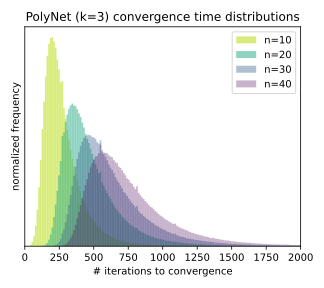

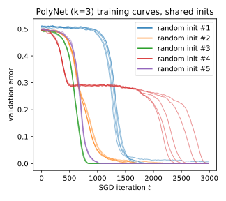

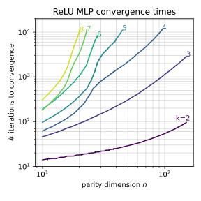

*Рисунок 2: Наблюдения над динамикой обучения по принципу чёрного ящика. *Слева:* Гистограммы времён сходимости по $10^{6}$ случайным испытаниям, с тяжёлыми верхними хвостами, но без наблюдаемых удач вблизи $t=0$ (в отличие от случайного поиска). *В центре:* Кривые потерь (а значит, и время сходимости) сильно зависят от начального приближения, а не от случайности SGD; здесь показано $B=128,\eta=0.01$. *Справа:* Показатель степенного закона ($\alpha$ такое, что $t_{c}\propto n^{\alpha}$) в конце концов портится на больших примерах задачи.* **[p. 5]**

### 3.1 SGD на нейросетях выучивает разрежённые чётности

###### p5-2

- **Двухслойные MLP:** активация ReLU $(\sigma(z)=(z)_{+})$ или степенная ($\sigma(z)=z^{k}$), в самых разных режимах ширины $r\geq k$. Настройки (i), (ii), (iii) (соотв. (iv), (v), (vi)) используют $r=\{10,100,1000\}$ активаций ReLU (соотв. степенных). Мы рассматриваем также $r=k$ (исключительные настройки (*i), (*ii)) — наименьшую ширину, при которой $k$-кратная чётность представима, для обеих активаций.
- **Однонейронные сети:** Далее мы рассматриваем нестандартные функции активации $\sigma$, позволяющие однонейронной архитектуре $f(x;w)=\sigma(w^{\top}x)$ реализовать $k$-кратные чётности. Построения исходят из выбора $w^{*}=\sum_{i\in S}e_{i}$ и построения $\sigma(\cdot)$, интерполирующей (при подходящем масштабировании) $\frac{k-{w^{*}}^{\top}x}{2}\text{ mod }2$, кусочно-линейной *$k$-зигзаговой* активацией (vii) или многочленом степени $k$ (viii). Идя ещё дальше, единственный *$\infty$-зигзаговый* (ix) или *синусоидальный* (x) нейрон может представить *все* $k$-кратные чётности. В настройках (xi), (xii), (xiii), (xiv) мы убираем второй обучаемый слой (полагая $u=1$). Мы находим, что более широкие архитектуры с этими активациями тоже обучаются успешно.
- **Трансформеры:** Растёт интерес к использованию чётности как эталона для обучения комбинаторным функциям, обучения дальним зависимостям и обобщения по длине у трансформеров (Lu et al. 2021, Edelman et al. 2021, Hahn 2020, Anil et al. 2022, Liu et al. 2022). Отталкиваясь от этих недавних теоретических и опытных работ, мы рассматриваем упрощённую специализацию архитектуры трансформера под эту задачу классификации последовательностей. Это менее устойчивая настройка (*iii); архитектура и оптимизатор описаны в приложении D.1.3.
- **PolyNet:** Наша последняя настройка (xv) — PolyNet, слегка изменённый вариант архитектуры чётностной машины. Чётностные машины подробно изучались в литературе по статистической механике машинного обучения (см. раздел о смежных работах), а также в череде работ по «нейронной криптографии» (Rosen-Zvi et al. **[p. 6]** 2002). Чётностная машина выдаёт знак произведения $k$ линейных функций входа. PolyNet просто выдаёт само произведение. Обе архитектуры, очевидно, могут реализовать $k$-разрежённые чётности. Архитектура PolyNet изначально возникла из поиска идеализированной постановки, в которой сквозной разбор траектории оптимизации поддаётся вычислению (см. раздел 4.1); в этих опытах мы обнаружили, что она обучается очень устойчиво и выборочно-экономно.

#### Надёжное пространство положительных результатов.

###### p6-1

Все перечисленные выше сети, как наблюдалось, успешно выучивают разрежённые чётности в самых разных настройках. Наши находки мы подытоживаем так: для всех сочетаний $n\in\{10,20,30\}$, $k\in\{2,3,4\}$, размеров партий $B\in\{1,2,4,\ldots,1024\}$, начальных приближений $\{$равномерное, гауссово, бернуллиево$\}$, функций потерь $\{$hinge, квадратичная, перекрёстная энтропия$\}$ и конфигураций архитектуры $\{\text{(i)},\text{(ii)},\ldots,\text{(xv)}\}$ SGD решал задачу чётности (со $100\%$ точностью, проверенной на партии из $2^{13}$ примеров) по крайней мере в $20\%$ из $25$ случайных испытаний, по крайней мере при одном выборе скорости обучения $\eta\in\{0.001,0.01,0.1,1\}$. Модели сходились за $t_{c}\leq c\cdot n^{\alpha k}\leq 10^{5}$ шагов, для малых зависящих от архитектуры постоянных $c,\alpha$ (см. приложение C). Рисунок 1 *(слева)* показывает несколько представительных кривых обучения.

#### Фазовые переходы в кривых обучения.

###### p6-3

Почти для всех архитектур мы находим, что кривые обучения обнаруживают фазовые переходы по времени работы (а значит, в постановке онлайнового обучения — и по размеру набора данных): долгие промежутки видимого отсутствия продвижения, за которыми следуют поры быстрого убывания проверочной ошибки. Что примечательно, для архитектур (v) и (vi) это плато отсутствует: ошибка в начальной поре, по-видимому, убывает с линейным наклоном. Больше графиков см. в приложении C.8.

### 3.2 Случайный поиск или скрытый прогресс?

###### p6-5

Естественной догадкой было бы, что SGD каким-то образом неявно выполняет случайный поиск методом Монте-Карло, «отскакивая» по ландшафту потерь в отсутствие полезного градиентного сигнала. При ближайшем рассмотрении несколько опытных наблюдений вступают с этой догадкой в противоречие:

###### p6-6

- **Рост времён сходимости:** Без явного разрежающего приора в архитектуре или начальном приближении неясно, чем объяснить времена работы, наблюдаемые в опытах, — они подстраиваются под разрежённость $k$. Начальные приближения, которые уж точно не предпочитают разрежённых функций77 7 Действительно, при всех стандартных архитектурах и начальных приближениях вероятность того, что случайная сеть $\Omega(1)$-коррелирована с разрежённой чётностью, была бы $2^{-\Omega(n)}$, поскольку с этой вероятностью $1-o(1)$ полного влияния приходилось бы на $n-k$ ненужных признаков., близки к верным решениям с вероятностью $2^{-\Omega(n)}\ll n^{-k}$.
- **Нет ранних сходимостей:** На большом числе случайных испытаний ни одна копия этого рандомизированного алгоритма не оказывается «удачливой» (то есть не решает задачу за существенно меньшее, чем медианное, число итераций); см. рисунок 2 *(слева)*. Времена успеха случайного полного перебора были бы распределены как $\mathrm{Geom}(1/\binom{n}{k})$, у которого масса вероятности наибольшая при $t=0$ и монотонно убывает с $t$.
- **Чувствительность к начальному приближению, а не к примерам SGD:** Прогоняя эти постановки обучения по нескольким стохастическим партиям из общего начального приближения, мы находим, что кривые потерь и времена сходимости сильно связаны со случайным начальным приближением архитектуры и довольно сосредоточены при закреплённом начальном приближении; см. рисунок 2 *(в центре)*.
- **Изломы в кривых роста:** Для больших $n$ степенной закон перестаёт выполняться: показатель портится (см. рисунок 2 *(справа)*, а также обсуждение в приложении C.2). Для случайного полного перебора это было бы не так.

###### fig-3

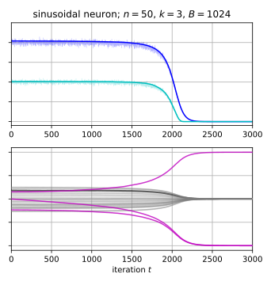

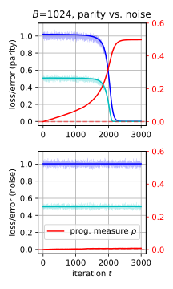

*Рисунок 3: Скрытый прогресс при выучивании чётностей нейросетями. *Слева, в центре:* Потери и точности, видимые снаружи, обнаруживают долгое плато и резкий фазовый переход (сверху), скрывая постепенное продвижение в итерациях SGD (снизу). *Справа:* Скрытая мера прогресса, отличающая постепенное усиление признака (сверху) от обучения на шуме (снизу).* **[p. 7]**

### 4.1 Доказуемое возникновение индексов чётности в градиентах высокой точности

###### p7-4

Ключевое наблюдение состоит в том, что каждая координата в выражении выше есть корреляция между чётностью и функцией $x\mapsto-\mathbb{1}[\sum_{i}x_{i}\geq 0]$, а значит, коэффициент Фурье этой булевой функции. На каждой нужной координате ($i\in S$) популяционный градиент есть коэффициент Фурье порядка ($k-1$) при $S\setminus\{i\}$; для ненужных признаков ($i\not\in S$) это, наоборот, коэффициент порядка $(k+1)$ при $S\cup\{i\}$. Всё, что нам требуется, — обнаружимый *зазор* между этими величинами. Формально, полагая $f(x;w)=\sigma(w^{\top}x)$ и обозначая через $\widehat{f}(S):=\mathop{\mathbb{E}}\left[f(x)\chi_{S}(x)\right]$ коэффициент Фурье функции $f$ при $S$, мы выделяем искомое свойство:

##### **Теорема 4**(SGD на MLP выучивает разрежённые чётности)**.**

###### p8-2

*Пусть $\epsilon\in(0,1)$. Пусть $k\geq 2$ — чётное целое, и пусть $n=\Omega(k^{4}\log(nk/\epsilon))$ — нечётное целое. Тогда существуют схема случайного начального приближения, $\eta_{t}$ и $\lambda_{t}$ такие, что для всякого $S\subseteq[n]$ размера $k$ SGD на ReLU-MLP ширины $r=\Omega(2^{k}k\log(k/\epsilon))$, с размером партии $B=\Omega(n^{k}\log(n/\epsilon))$ на $\mathcal{D}_{S}$ с потерей hinge выдаёт сеть $f(x;\theta_{t})$ с ожидаемой88 8 Ожидание берётся по случайности начального приближения, обучения и взятия $(x,y)\sim\mathcal{D}_{S}$. потерей $\mathop{\mathbb{E}}\left[\ell(f(x;\theta_{t}),y)\right]\leq\epsilon$ не более чем за $O(k^{3}r^{2}n/\epsilon^{2})$ итераций.*

###### p8-3

Это не охватывает всего набора постановок, в которых мы опытно наблюдаем успешную сходимость. Во-первых, здесь требуется начальное приближение знаковым вектором, тогда как мы наблюдаем сходимость и при других схемах случайного начального приближения (а именно равномерной и гауссовой). Во-вторых, здесь требуется, чтобы размер партии рос как $n^{\Omega(k)}$99 9 На самом деле при таком размере партии верные индексы чётности проступают за один шаг SGD., тогда как мы получаем положительные результаты и при малых $B$ (даже $B=1$). Соответствующие утверждения для этих случаев (как и для других активаций и потерь) потребовали бы фурье-зазоров для функций популяционного градиента, отличных от функции большинства; нижние оценки на коэффициенты степени $(k-1)$ (*«фурье-антиконцентрация»*) в литературе особенно неуловимы, и мы оставляем открытым вызовом их установление в более общих постановках. Предварительные опытные данные мы даём в приложении C.1; они наводят на мысль, что фурье-зазоры в наших опытных постановках достаточно велики.1010 10 Любопытно, что мы наблюдаем склонность фурье-зазора *возрастать* по ходу обучения. Наш нынешний теоретический разбор этого не схватывает.

#### Малая ширина вынуждает обучение признакам.

###### p8-4

Заметим, что в рассматриваемых в этой работе режимах малой ширины (без избыточной параметризации) никакое закреплённое ядро (включая нейронное касательное ядро (Jacot et al. 2018), размерность которого есть число параметров сети) не может решить задачу разрежённой чётности. Следующее есть следствие результатов из (Kamath et al. 2020, Malach and Shalev-Shwartz 2022):

##### **Теорема 5**(NTK малой ширины не может подогнать все чётности)**.**

###### p8-6

Тем самым наши результаты при малой ширине лежат вне режима NTK, который требует куда больших моделей (размера $n^{\Omega(k)}$) для выражения чётностей. Однако заметим, что в режиме NTK возможны лучшие оценки выборочной сложности при алгоритме, более схожем со стандартным SGD (см. (Telgarsky 2022) и приложение A.3).

##### **Теорема 6**(плато потери для градиентного потока на disjoint-PolyNet)**.**

###### p9-3

*Пусть $k\geq 3$. Пусть $T(\epsilon)$ обозначает наименьшее время, к которому ошибка не превосходит $\epsilon$. Тогда,*

###### p9-4

Неформально, сеть тратит куда больше времени на достижение чуть лучшей, чем тривиальная, точности, чем на переход от чуть лучшей, чем тривиальная, к идеальной точности. Возвращаясь к дискретному времени, мы также разбираем траекторию disjoint-PolyNet, обучаемых онлайновым SGD при любом размере партии, подтверждая, что нейросеть способна выучить $k$-разрежённые непересекающиеся чётности за $n^{O(k)}$ итераций.

##### **Теорема 7**(SGD на disjoint-PolyNet выучивает непересекающиеся чётности)**.**

###### p9-5

*Предположим, мы обучаем disjoint-PolyNet, приближённый начально как выше, онлайновым SGD. Тогда существует приспосабливающееся расписание скорости обучения такое, что для любого $\epsilon>0$ с вероятностью 0.99 ошибка падает ниже $\epsilon$ за $\tilde{O}\left((n^{\prime})^{(2k-1)}\log(1/\epsilon)\right)$ шагов.*

## 5 Скрытый прогресс: обсуждение и дополнительные опыты

###### fig-4

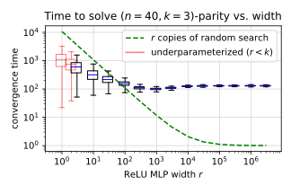

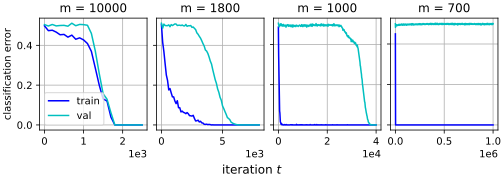

*Рисунок 4: Чётность как песочница для понимания влияния размера модели и размера набора данных. *Слева:* Времена успеха в зависимости от ширины сети $r$ на закреплённой задаче $(40,3)$-чётности: в согласии с теорией распараллеливание испытывает убывающую отдачу (в отличие от ожидаемых времён успеха для случайного поиска, показанных зелёным). Недостаточно параметризованные модели ($r=1,2$) считались успешными при достижении $55\%$ точности. *Справа:* Кривые обучения, где изменяется только размер выборки $m$. Две средние панели показывают *«гроккинг»*: большой разрыв между временем до нулевой ошибки на обучении и временем до нулевой ошибки на тесте.* **[p. 9]**

#### Возникновение гроккинга в конечновыборочной (многопроходной) постановке.

###### p10-3

Наши основные результаты представлены в постановке *онлайнового обучения* (свежие мини-партии из $\mathcal{D}_{S}$ на каждой итерации). Хотя это смягчает мешающую причину переобучения, оно неоптимальным образом связывает ресурсы времени обучения и независимых примеров — из-за вычислительно-статистического разрыва в задаче выучивания чётности. В приложении C.5 мы находим опытно, что мини-партийный SGD (с weight decay) способен выучивать разрежённые чётности даже при меньших размерах выборки $m\ll n^{k}$. Мы надёжно наблюдаем явление *гроккинга* (Power et al. 2022): сперва пора переобучения, затем *отложенный* фазовый переход в ошибке обобщения; см. две средние панели рисунка 4 *(справа)*. Эти результаты дополняют и подкрепляют находки Nanda and Lieberum 2022, которые разбирают скрытый прогресс трансформеров, обучаемых арифметическим задачам (постановка, тоже обнаруживающая гроккинг).

## 6 Заключение

###### p10-6

Даже в этой простой постановке есть несколько открытых опытных и теоретических вопросов. Эта работа в основном сосредоточена на случае онлайнового обучения, который связывает итерации обучения со свежими независимыми примерами. Мы полагаем, что было бы поучительно исследовать выучивание чётности, когда три ресурса — примеры, время и размер модели — масштабируются порознь. Некоторые весьма предварительные находки в этом направлении представлены в разделе 3. Расширить наши теоретические результаты на постановку с малыми партиями, а также на весь набор архитектур и потерь из наших опытов — открытая задача. Разрешение этих вопросов потребовало бы лучшего понимания **[p. 11]** поведения антиконцентрации булевых коэффициентов Фурье, которое изучено куда хуже, чем аналогичные явления концентрации.

###### p11-1

Другое важное направление для продолжения — понять, насколько эти наблюдения распространяются с выучивания чётности на более сложные (в том числе реальные) постановки комбинаторных задач, а также насколько несинтетические задачи (например, в обработке естественного языка и синтезе программ) содержат внутри себя чётностеподобные подзадачи полного комбинаторного перебора. Мы надеемся, что наши результаты приведут к дальнейшему продвижению в понимании и улучшении динамики оптимизации, стоящей за недавним потоком впечатляющих опытных успехов глубокого обучения в такого рода областях.

#### Статистическая механика машинного обучения.

###### p19-5

Обширный корпус работ, берущий начало в сообществе статистической физики, изучал фазовые переходы в кривых обучения нейросетей (Gardner and Derrida 1989, Watkin et al. 1993, Engel and Van den Broeck 2001). Эти работы обычно сосредоточены на обучении «ученик — учитель» в «термодинамическом пределе», в котором число обучающих примеров в $\alpha$ раз больше размерности входа и обе величины устремляются к бесконечности. Одна из классических игрушечных архитектур, разбираемых в этой литературе, — *чётностная машина* (Mitchison and Durbin 1989, Hansel et al. 1992, Opper 1994, Kabashima 1994, Simonetti and Caticha 1996). В нашей работе мы вводим PolyNet — вариант чётностных машин, в котором выход вещественный, а не $\pm 1$; и мы теоретически разбираем disjoint-PolyNet, вещественновыходной аналог часто рассматриваемых чётностных машин с древесной архитектурой. Хотя бо́льшая часть литературы по статистической механике машинного обучения сосредоточена на идеализированном пределе обучения, в котором веса достигают равновесия распределения Гиббса, есть и линия литературы, стремящаяся описать траекторию обучения SGD в высокоразмерном пределе наборами обыкновенных дифференциальных уравнений постоянного размера (Saad and Solla 1995b, Saad and Solla 1995a, Goldt et al. 2019). Эти статьи обсуждают случаи, включая задачи, разделяющие некоторые черты с 2-разрежёнными чётностями Refinetti et al. 2021, где сеть застревает на плато неоптимальной ошибки обобщения (а затем выбирается с него). Недавно Arous et al. 2021 изучили (для задач оценивания параметра ранга один) относительную долю времени, проводимого SGD в начальной поре «поиска» с высокой ошибкой в сравнении с заключительной порой «спуска», что перекликается с постановкой теоремы 6. Однако, насколько нам известно, предшествующие работы не показывали, что $k$-разрежённые чётности выучиваются за число итераций, почти совпадающее с известными нижними границами, и не изучали специально фазовых переходов в выучивании $k$-разрежённой чётности при градиентном спуске.

#### Выучивание чётностей с помощью NTK.

###### p19-6

Другая относящаяся к делу череда работ изучает выучивание задачи чётности с помощью нейронного касательного ядра (NTK) (Jacot et al. 2018). А именно, в некоторых постановках, когда веса сети на протяжении обучения остаются вблизи своего начального приближения, SGD сходится к решению, задаваемому линейной функцией над начальными признаками NTK. Как показано в теореме 5, выучивание чётностей над закреплённым набором признаков требует, чтобы размер модели был $\Omega(n^{k})$. Напротив, рассматриваемый в этой статье размер модели (число скрытых нейронов) вовсе не зависит от размерности входа $n$. Тем не менее разбор через NTK даёт лучшие гарантии выборочной сложности, чем представленные в этой работе, при несколько более естественном варианте SGD. Например, работа Ji and Telgarsky 2019 демонстрирует выучивание 2-разрежённых чётностей разбором через NTK с выборочной сложностью $O(n^{2})$, что совпадает с нижней границей выборочной сложности для выучивания этой задачи с NTK (см. Wei et al. 2019). Параллельная работа Telgarsky 2022 показывает, что эту выборочную сложность можно улучшить до $O(n)$, коль скоро оптимизация покидает режим NTK. Однако этот разбор дан для сетей размера $O(n^{n})$ — куда больших, чем сети, рассматриваемые в этой статье. Отсылаем читателя к таблице 1 в Telgarsky 2022 за полным сравнением оценок выборочной сложности, времени работы и размера модели, достигнутых разными работами об изучении 2-разрежённых чётностей.

### B.3 Глобальная сходимость для disjoint-PolyNet

###### p27-5

В этом разделе мы разовьём теорию для disjoint-PolyNet, обучаемых корреляционной потерей, как показано на рисунке 5. Раздел B.3.1 рассмотрит оптимизацию градиентным потоком, а раздел B.4 — оптимизацию SGD при любом размере партии $B\geq 1$.

### B.4 Глобальная сходимость и фазовый переход для градиентного потока на disjoint-PolyNet

###### p33-4

В этом разделе мы разберём обучение disjoint-PolyNet с помощью SGD с онлайновыми (независимыми одинаково распределёнными) партиями. Мы покажем результат о сходимости для ошибки 0-1 выученного классификатора.

##### **Теорема****7**(SGD на disjoint-PolyNet выучивает непересекающиеся чётности; полная формулировка)**.**

###### p33-5

*Предположим, что мы случайно приблизили disjoint-PolyNet весами, взятыми равномерно из $\{\pm 1\}$. Закрепим $\epsilon\in(0,1/2)$ и запустим SGD при любом размере партии $B\geq 1$ на $T\geq 6\log(2nT/\delta)\log(2k/\epsilon)(3n^{\prime}-2)^{2k-1}$ итераций. Существует приспосабливающееся расписание скорости обучения такое, что с вероятностью 1/2 по случайности начального приближения и $1-\delta$ по взятию выборки SGD выполнено следующее:*

## Приложение C Дополнительные рисунки, опыты и обсуждение

###### fig-6

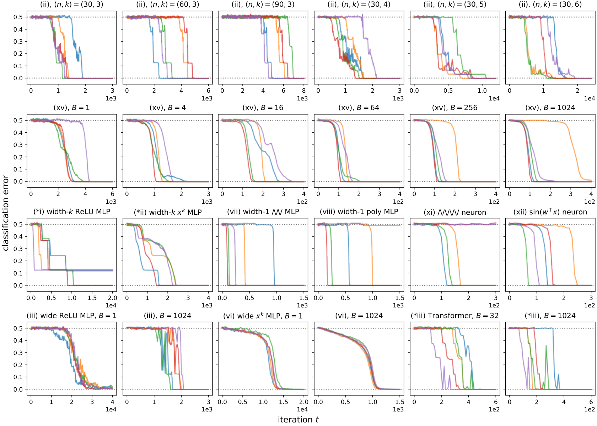

*Рисунок 6: Дополнительные кривые обучения (на задаче $(50,3)$-чётности, кроме первой строки); полные подробности — в приложении D.1.6. *1-я строка:* Одна и та же архитектура, начальное приближение и обучающий алгоритм (в данном случае ReLU-MLP ширины $100$), без явного разрежающего приора, подстраивается под параметры вычислительной трудности $n,k$. *2-я строка:* Наши положительные опытные результаты держатся в широком наборе размеров партий $B$, вплоть до $B=1$. Обучение неустойчиво (больше выбросов) при очень больших и очень малых размерах партий. *3-я строка:* Даже наименее избыточно параметризованные нейросети, едва достаточно широкие, чтобы представить чётность, сходятся с разумной вероятностью (иногда не достигая глобального минимума). *4-я строка:* Более крупные модели (MLP ширины $1000$ и трансформеры с $d_{\mathrm{emb}}=1024$) устойчивы к широкому набору размеров партий. Обратите внимание на отсутствие плато в настройке (vi), к чему мы возвращаемся в приложении C.8.* **[p. 35]**

###### sec-c1

### C.1 Фурье-зазоры при начальном приближении и на итерациях SGD

#### Случайные не-LTF.

###### fig-12

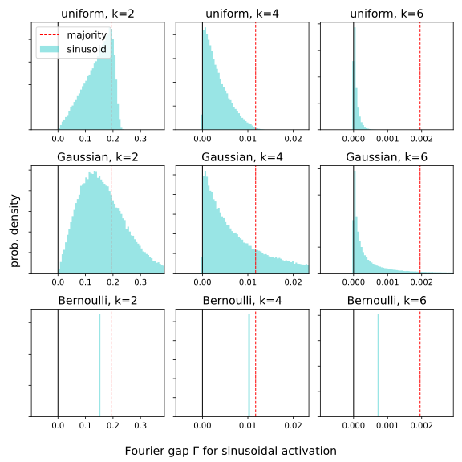

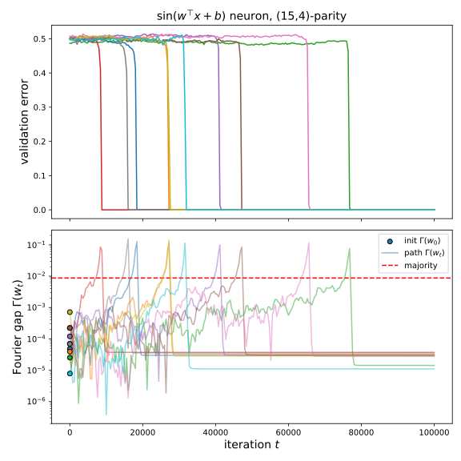

*Рисунок 12: Численные свидетельства фурье-зазоров за пределами случайных LTF. *Слева:* Фурье-зазоры точных популяционных градиентов $\mathop{\mathbb{E}}_{\mathcal{D}_{S}}[yx_{i}\sin(w^{\top}x/\sqrt{n})]$, наводимых синусоидальными активациями, для случайных начальных приближений $w$. В этих малых случаях они сопоставимы с фурье-зазорами функции большинства (красная пунктирная линия). *Справа:* Фурье-зазоры популяционных градиентов синусоидального нейрона вдоль пути оптимизации SGD (показано 10 испытаний). Фурье-зазор неизменно положителен при начальном приближении, но несколько меньше, чем у функции большинства (красная пунктирная линия). Любопытно, что он усиливается по ходу обучения.* **[p. 40]**

###### sec-c2

### C.2 Противоречащие ожиданию роли строительных блоков глубокого обучения

###### p39-5

- *Функции активации.* Это устройство возникновения признаков через фурье-зазоры (см. определение 1) сильнее всего при негладких активациях, таких как ReLU, чьи производные суть разрывные пороговые функции. Это соображение ортогонально представительной ёмкости и смягчению локальных минимумов (из которых можно было бы заключить, что оптимальны степенные активации степени $k$). Итого, в постановках обучения признакам, где фурье-зазоры и решения низкой сложности важны одновременно, для функции активации возникает *размен между резкостью и гладкостью*.
- *Смещения.* Симметрия функции большинства (как и всех несмещённых LTF) обращает её коэффициенты Фурье чётной степени в нуль; тем самым некоторые варианты постановок раздела 3 отказывают при нечётном $k$. Члены смещения (обучаемые или закреплённые) необходимы, чтобы нарушить эту симметрию, — и в теории, и на практике. Одновременно смещения играют более привычную роль сдвига поверхности потерь; о том, как это сказалось на подробностях выбора смещений в опытах, см. раздел D.1.2.
- *Начальные приближения.* Роль распределения начального приближения в этой постановке столь же двойственна: $w_{0}$ должно быть близко к искомому решению $w^{*}$, но оно также должно быть выбрано так, чтобы SGD успешно усиливал фурье-зазор. Третье соображение, которое мы не пытаемся изучить в этой работе, состоит в том, что несколько случайно приближённых нейронов будут склонны выучивать верные признаки в разное время (см. изображения траекторий весов на рисунке 3 и рисунке 13, а также лестницеподобные кривые обучения, видимые для MLP на рисунке 1 *(слева)*). Мы ожидаем, что это явление *нарушения симметрии* присутствует и в более сложных постановках обучения признакам. Наконец, как показывают кривые обучения из настройки (vi) на рисунке 6 и, подробнее, приложение C.8, выбор функции активации влияет на качественное поведение кривых обучения — а именно, исчезают ли плато при больших ширинах и размерах партий.
- *Размеры партий и скорости обучения.* И опытные, и теоретические результаты наводят на мысль, что SGD использует независимые примеры, чтобы постепенно усилить сигнал, содержащий верные признаки, в начальном популяционном градиенте корреляции $\left(\nabla_{w}\mathop{\mathbb{E}}[-yx_{i}\sigma^{\prime}(w^{\top}x)]\right)|_{w=w_{0}}$. Однако этому устройству было бы вернее оставаться в начальном приближении $w_{0}$, пока алгоритм не накопит достаточно данных, чтобы различить верные индексы (равносильно — увеличить размер партии); напротив, стандартное обучение берёт градиенты относительно $w_{t}$ вдоль пути SGD. Мы предполагаем, что смещение, вносимое этим уплывающим $w_{t}$ (а значит, и уплывающим популяционным градиентом), объясняет ухудшения, видимые на рисунке 2 *(справа)* и рисунке 10. Однако рисунок 12 *(справа)* показывает, что движение SGD может быть полезным, усиливая фурье-зазор.

### C.3 Скрытые меры прогресса

###### p40-2

Для конвейера обучения нейросети, выдающего последовательность итераций $\theta_{0},\ldots,\theta_{T}\in\Theta$, мы определяем *меру прогресса* $\rho:\Theta\rightarrow\mathbb{R}$ как любую функцию состояния обучающего алгоритма1616 16 Помимо параметров модели, в полное состояние процедуры обучения должны входить также вспомогательные переменные, задаваемые алгоритмом оптимизации; две вездесущие в глубоком обучении — вектор момента и приспосабливающийся предобусловливатель. Здесь мы рассматриваем лишь ванильный SGD, который никаких вспомогательных переменных не держит., которая предсказывает время до сходимости (то есть при закреплённом $\theta_{t}$ случайные величины $\rho$ и $t_{c}-t$ не независимы). По этому определению единственные алгоритмы, у которых мер прогресса нет, — те, чьи времена сходимости $t_{c}$ *беспамятны* (независимы от $\theta_{t}$).

###### p41-1

Заметим, что существует множество тривиальных мер прогресса: пример, который стоит держать в уме, — для алгоритма, полным перебором проходящего детерминированный список гипотез (скажем, возможные $k$-элементные подмножества $S$ в лексикографическом порядке) и останавливающегося, когда он находит верную, мерой прогресса служит текущая итерация $t$. Тем самым назначение показа скрытых мер прогресса $\rho$ *не* в том, чтобы дать дополнительные свидетельства того, что SGD находит признаки при помощи фурье-зазоров. Скорее оно в том, чтобы (1) дополнительно опровергнуть догадку о том, что SGD ведёт беспамятный ланжевенов случайный поиск, и (2) дать предварительное исследование того, как продвижение может быть измерено даже тогда, когда естественные меры потери и точности выглядят плоскими.

#### Фурье-зазоры во времени.

###### fig-13

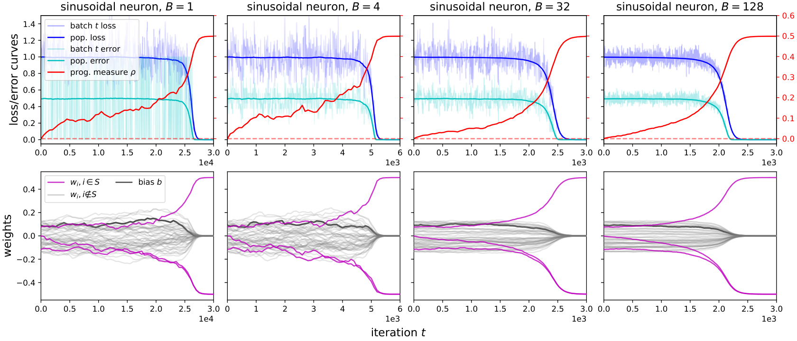

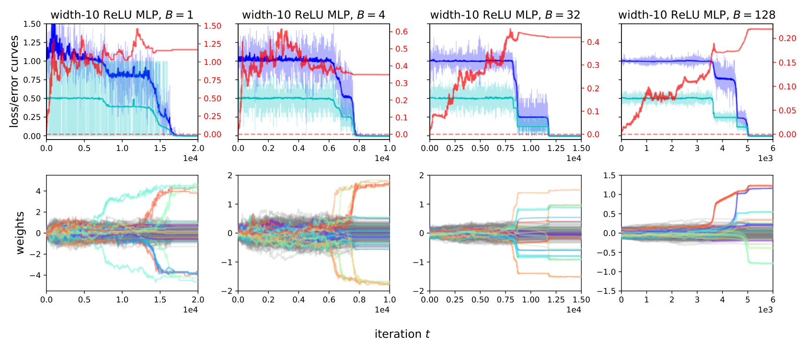

*Рисунок 13: Дополнительные графики для изображения траектории оптимизации $w_{t}$ и скрытой меры прогресса $\rho(w_{0:t})$. На графиках MLP единственный скаляр $\rho$ есть $\infty$-норма всего первого слоя $W$, а веса раскрашены по строкам (то есть по нейронам). При малых размерах партий $B\in\{1,4\}$ потери за итерацию усреднены по короткому окну (длины $16$ и $4$ соответственно).* **[p. 42]**

#### Движение весов.

###### p41-3

Самое прямое наблюдение скрытого прогресса попросту происходит из движения весов нейронов на нужных индексах: то есть для весов одного нейрона $w_{t}\in\mathbb{R}^{n}$ — величина $\rho([w_{t}]_{i}):i\in S$. В основной части статьи рисунок 3 *(слева, в центре)* прямо изображает развитие весов $w_{t}$ для одного синусоидального нейрона (со смещением, но без второго слоя). Рисунок 13 дополняет эти графики из основной части дополнительными графиками траекторий весов при разных размерах партий $B$, а также для архитектуры MLP ширины 10. Как видно на этих графиках, продвижение становится видимым в потере лишь тогда, когда нужные веса становятся больше всех ненужных весов.

#### Длина пути в $\ell_{\infty}$.

###### p41-4

Наконец, мы представляем пример *единственного* измерения пути оптимизации, схватывающего скрытый прогресс в этой постановке, которое можно строить рядом с кривыми потери и точности. Для любых итераций весов нейрона $w_{t}\in\mathbb{R}^{n}$ мы выбираем $\infty$-норму движения от начального приближения: $\rho(w_{0:t}):=||w_{t}-w_{0}||_{\infty}$. Мы даём краткий наглядный набросок побуждений к такому выбору $\rho(\cdot)$ и несколько дополнительных изображений.

###### p41-6

Эта мера прогресса показана рядом с кривыми потерь на рисунке 13, красным. Мы не пытаемся описать динамику $\rho$; мы лишь отмечаем, что она явно отличима от максимума $n$ несмещённых случайных блужданий, даже когда SGD выглядит не продвигающимся в терминах потери и точности. Более количественное изучение скрытых мер прогресса в глубоком обучении, а также в более общих постановках, представляет плодотворное направление будущей работы.

#### Результаты.

###### p41-8

Мы не нашли свидетельств таких параллельных ускорений на $1000$ прогонах в каждой настройке; см. рисунок 14. Это служит дополнительным свидетельством того, что устройство, которым стандартное обучение решает чётность, лучше всего понимать как детерминированное и последовательное, а не как ведущее себя подобно случайному поиску по подмножествам размера $k$. Польза ширины, по-видимому, состоит в *уменьшении разброса*: верхний хвост долгих времён сходимости смягчается большим числом случайно приближённых нейронов.

###### fig-14

*Рисунок 14: Число итераций, за которое MLP (со стандартным начальным приближением и обучением) сходятся на задачах разрежённой чётности, в зависимости от ширины $r$. Прямоугольники обозначают межквартильные размахи по 1000 прогонам; усы обозначают $\pm 1.5\cdot\mathrm{IQR}$; метки $\times$ обозначают наименьший и наибольший выбросы. Недостаточно параметризованные модели ($r<k$) показаны красным и считаются «сошедшимися» при точности $55\%$. Такое масштабирование $r$ не ведёт к параллельным ускорениям в $r\times$, как у ожидаемого времени успеха для $r$ копий случайного поиска (показано зелёным для сравнения).* **[p. 43]**

###### sec-c5

### C.5 Обучение и гроккинг в конечновыборочном случае

###### fig-15

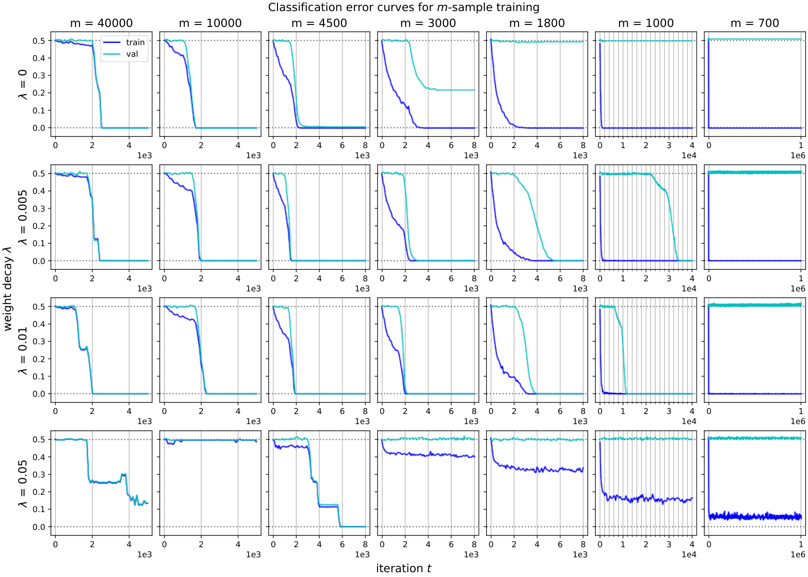

*Рисунок 15: Дополнительные графики для конечновыборочной постановки. Одна и та же конфигурация (ReLU-MLP ширины $100$, $B=32,\eta=0.1$) при изменении размера выборки $m$ (убывающего слева направо) и weight decay $\lambda$ (возрастающего сверху вниз). Когда $m$ достаточно велико (много больше статистического порога $\Theta(k\log n)$), ошибка обобщения пренебрежимо мала. Когда $m$ слишком мало, модель не обучается. Между этими случаями мы наблюдаем в конце концов сходимость к верному решению, причём кривые обучения обнаруживают явление *гроккинга*. Weight decay управляет в этой постановке статистически-вычислительным разменом: большее $\lambda$ улучшает обобщение, но может привести к отказу оптимизации (нижняя строка).* **[p. 44]**

###### p43-1

Мы даём некоторые дополнительные графики к опытам, намеченным на рисунке 4 *(справа)*. В этих настройках закреплённая архитектура (MLP ширины $100$ с активациями ReLU) обучается мини-партийным SGD в остальном при закреплённой конфигурации (потеря hinge, скорость обучения $\eta=0.1$, партии размера $B=32$) на конечной обучающей выборке размера $m$. Мы также изменяем параметр *weight decay* $\lambda$.

###### p43-2

Как показано на рисунке 15, параметр weight decay $\lambda$ управляет тонким вычислительно-статистическим разменом: он улучшает обобщение (расширяя набор $m$, при которых обучение в конце концов находит верное решение), но при больших значениях $\lambda$ модель не обучается. При малых $m$ и подходяще подобранном $\lambda$ мы наблюдаем *гроккинг*: модель сперва переобучается на обучающих данных, но после большого числа итераций находит классификатор, который обобщает.

###### sec-c6

### C.6 Выучивание зашумлённых чётностей

#### Теория.

###### fig-16

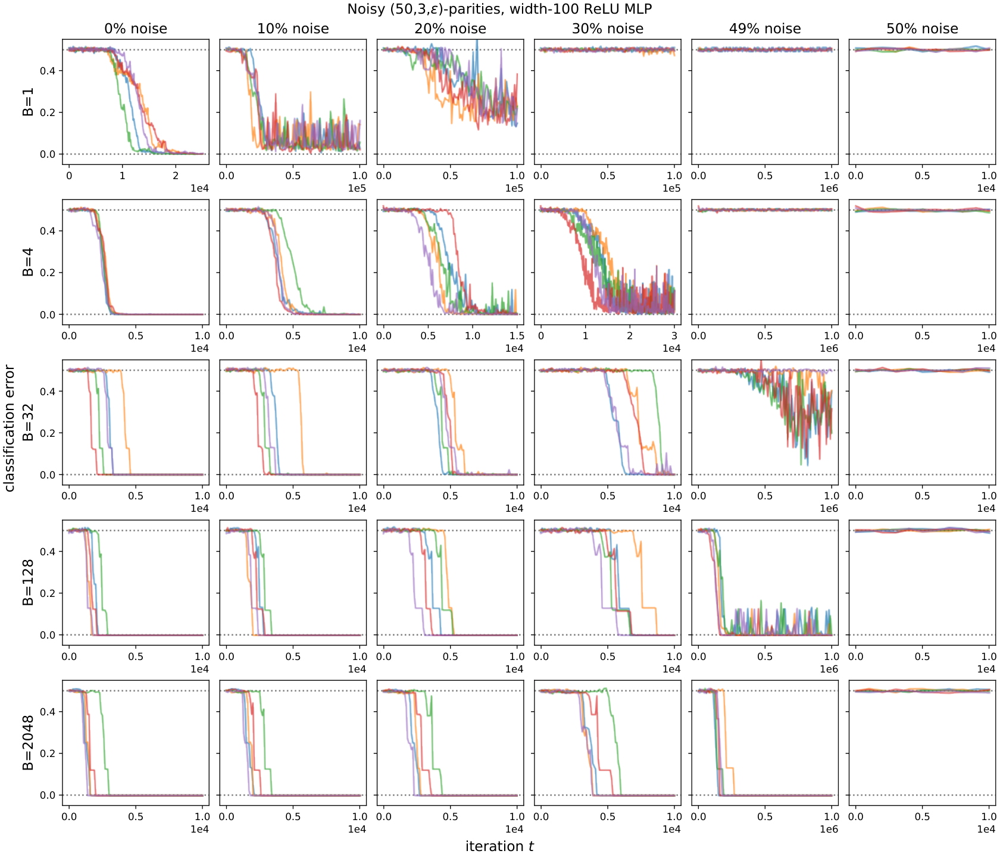

*Рисунок 16: Кривые обучения (по $5$ случайным семенам) для ReLU-MLP ширины $100$ на зашумлённых задачах выучивания $(50,3,\epsilon)$-чётности при различных размерах партий $B$ и уровнях шума (переворачивание меток с вероятностью $p$, так что $\epsilon=1-2p$). Модели выучивают признаки и успешно сходятся (что измеряется точностью на незашумлённом распределении) даже при $49\%$ случайно перевёрнутых меток (то есть $\epsilon=0.01$). Это предварительное подтверждение того, что исследуемые в этой статье явления устойчивы к независимому одинаково распределённому шуму в метках. Заметим, что масштаб $t$ много больше для малых партий и высокого шума.* **[p. 46]**

#### Опыты.

###### p45-2

Мы находим, что опытные находки устойчивы к шуму в метках в том смысле, что модели способны получить нетривиальную (а иногда и $100\%$) точность; см. рисунок 16 с несколькими кривыми обучения при различных значениях $\epsilon$. Это даёт конкретное свидетельство против (и без того крайне сомнительной) догадки о том, что нейросети при стандартном начальном приближении и обучении выучивают незашумлённые чётности, неявно воспроизводя действенный алгоритм вроде гауссова исключения. Заметим, что при постоянной скорости обучения (здесь $\eta=0.1$) и шуме в метках итерации SGD не всегда сходятся к решениям с точностью $100\%$.

###### sec-c7

### C.7 Контрпример для послойного обучения

###### sec-c8

### C.8 Отсутствие плато у широких MLP со степенной активацией

###### p47-6

Это составляет исключение из главной темы этой статьи — «скрытого прогресса» за плоскими кривыми потери (или ошибки): при достаточной избыточной параметризации *и* «избыточной выборке» непрерывное продвижение SGD в этой постановке более не скрыто и проявляется в кривых обучения. Это явление, по-видимому, свойственно определённым функциям активации (то есть $x^{k}$, но не ReLU); мы оставляем будущей работе понять, почему и когда оно возникает, а также каковы возможные практические следствия.

#### Начальные приближения.

###### p48-1

Наши опытные результаты используют следующие независимые одинаково распределённые начальные приближения весов:

#### Обучение.

###### p50-8

Каждый параметр в форме матрицы был приближён начально по принятому в PyTorch по умолчанию соглашению «Xavier uniform». В отличие от прочих рассматриваемых в этой статье настроек, нам не удалось наблюдать успешной сходимости за пределами нескольких малых $(n,k)$ при использовании стандартного SGD. Как принято при обучении трансформеров, в наших опытах мы использовали Adam (Kingma and Ba 2014) со стандартными приспосабливающимися параметрами $\beta_{1}=0.9,\beta_{2}=0.999,\epsilon=10^{-8}$. Хотя есть более тонкие объяснения того, почему Adam превосходит ванильный SGD (Zhang et al. 2020, Agarwal et al. 2020), поиск оптимальной конфигурации оптимизатора и исследование абляций этого оптимизатора лежат вне рамок этой работы. В этой работе мы настраиваем лишь скорость обучения $\eta$ у Adam.

#### D.1.6 Подробности к рисунку 6

###### p51-5

Первая строка использует конфигурацию ReLU-MLP ширины $10$ $(ii)$, удерживая $B=32$ и $\eta=0.1$ и изменяя трудность задачи по 6 настройкам: $(n,k)\in\{(30,3),(60,3),(90,3),(30,4),(30,5),(30,6)\}$. Прочие графики все относятся к настройке $(50,3)$.

#### D.1.7 Подробности к рисунку 10

###### p52-1

- Настройка (vii): MLP ширины $1$ с осциллирующей степенной активацией степени $k$, интерполирующей функцию чётности ($\eta=0.01$).
- Настройка (xiv): одиночный синусоидальный нейрон без второго слоя ($\eta=0.01$).
- Настройка (*iii): Parity Transformer, с $d_{\mathrm{emb}}=1024,d_{\mathrm{attn}}=8,H=128$ ($B=32,\eta=3\times 10^{-4}$).
- Настройка (iv): PolyNet степени $k$ ($\eta=0.05$).
- Настройка (ii): MLP ширины $100$ с активацией ReLU ($\eta=1$), показывающая расширенный набор $n$ для меньших $k$.
- Настройка (xv): MLP ширины $100$ с активацией $\sigma(z)=z^{k}$ ($\eta=1$), показывающая расширенный набор $n$ для меньших $k$.
