# Liu et al. 2022 — Omnigrok: Grokking Beyond Algorithmic Data

См. также: [глобальный индекс понятий](../../concepts/index.md).

**Ziming Liu**, **Eric J. Michaud**, **Max Tegmark** — Department of Physics, Institute for AI and Fundamental Interactions, MIT.

arXiv [2210.01117](https://arxiv.org/abs/2210.01117), 3 октября 2022. ICLR 2023. 146 цитирований — четвёртая по цитируемости работа корпуса. Нативного HTML для неё нет, источник — ar5iv.

Оригинал и производные файлы этой папки:

- [`original/2210.01117.ar5iv.html`](original/2210.01117.ar5iv.html) — первоисточник, ar5iv-рендеринг (LaTeXML), скачан как есть.
- [`original/2210.01117.omnigrok-grokking-beyond-algorithmic-data.md`](original/2210.01117.omnigrok-grokking-beyond-algorithmic-data.md) — конверсия оригинала в Markdown без правок содержания.
- [`images/`](images/) — 38 иллюстраций статьи в исходном разрешении.

Заголовок и строка авторов идут дважды: так они стоят в самом ar5iv-рендеринге (в HTML два элемента `h1`), и здесь это сохранено, чтобы структура карточки и оригинала совпадали.

Схема якорей и правила ссылок на карточку — в [README папки статей](../README.md).

## Затрагиваемые понятия

**[Ограничение нормы весов на сфере](../../concepts/spherical-weight-norm-constraint.md)** — работа **вводит приём** и делает его основным инструментом: приведённая потеря $\tilde{f}(w)$ определяется минимизацией по угловым направлениям при фиксированной норме, а практически реализуется перемасштабированием весов обратно к исходной норме после каждого шага оптимизации ([`p2-4`](#p2-1)). Из этого же приёма получается и главный практический результат: обучение при постоянной норме весов **почти полностью устраняет гроккинг** в исходной постановке Power et al. ([`p9-2`](#p9-2)).

**[Ландшафт потерь и бассейны](../../concepts/loss-landscape-basins.md)** — работа даёт понятию количественную форму, пригодную для сравнения задач. Ландшафт сводится к двум переменным (норма весов и размер данных либо норма весов и неопрятность представления), после чего его можно нарисовать и сопоставить между MNIST и модульным сложением. Именно это сравнение и объясняет, почему на одной задаче гроккинг есть, а на другой нет ([`p9-9`](#p9-5)).

**[Зона Златовласки](../../concepts/goldilocks-zone.md)** — понятие переносится **в пространство весов**: зона Златовласки здесь не диапазон гиперпараметров, как в предыдущей работе тех же авторов, а сферическая оболочка радиуса $w_{c}$, где генерализация лучше, чем вне её ([`p2-7`](#p2-3)). Отсюда и «U»-форма тестовой потери по норме весов. Заимствование указано явно: картина взята у Fort and Scherlis (2019).

**[Масштаб инициализации](../../concepts/initialization-scale.md)** — работа делает его **управляющим параметром гроккинга**. Ответ на вопрос «почему гроккинг наблюдают редко» прямой: стандартные схемы инициализируют норму не больше $w_{c}$, а если увеличить масштаб явно или неявно, гроккинг появляется ([`p3-3`](#p3-3)). Все эксперименты статьи параметризованы одним множителем $\alpha=w/w_{0}$ к стандартной инициализации.

**[Weight decay](../../concepts/weight-decay.md)** — получает **количественный закон, а не эвристику**: если после переобучения обучающая потеря пренебрежима, weight decay сжимает норму экспоненциально, откуда время до генерализации $t\approx\ln(w_{0}/w_{c})/\gamma\propto\gamma^{-1}$ ([`p3-2`](#p3-2)). Закон проверен перебором на двух постановках и держится примерно на двух порядках величины (приложение C). Отмечено и совпадение с наблюдением Lewkowycz and Gur-Ari (2020) о $t\propto1/\lambda$ вне контекста гроккинга.

**[Реальные данные: зрение, MNIST, CIFAR](../../concepts/vision-real-world-data-mnist-cifar.md)** — работа **выводит гроккинг за пределы алгоритмических задач**: MNIST, отзывы IMDb (LSTM) и молекулы QM9 (GCNN). Существенная оговорка авторов: на этих задачах признак гроккинга «обычно менее драматичен», а на IMDb скачок прямо назван нерезким — отложенность есть, резкости нет.

**[Доля данных / критический размер набора](../../concepts/data-fraction-critical-dataset-size.md)** — порог получает **геометрическое прочтение**: линии постоянной тестовой ошибки имеют форму большого пальца, и кончик пальца задаёт минимальный объём данных для генерализации ([`p6-3`](#p4-6)). Отличие от эффективной теории предшествующей работы авторы называют сами: та применима только к алгоритмическим наборам с известным оптимальным представлением, а анализ ландшафта — к любой задаче обучения с учителем.

**[Структурированное обучение представлений](../../concepts/structured-representation-learning.md)** — работа отвечает на вопрос, **почему гроккинг ярче на алгоритмических данных**: там качество представления решает, будет ли точность случайной или идеальной, а на MNIST — 95 % или 100 %. Формально это показано через неопрятность представления $m$: тестовая потеря сильно зависит от $m$ на сложении и почти не зависит на MNIST ([`p9-9`](#p9-5)).

**[Гроккинг](../../concepts/grokking.md)** — понятие получает **механизм, обратимый в обе стороны**: гроккинг можно вызвать (увеличив инициализацию, урезав данные) и убрать (ограничив норму весов). Это сильное утверждение о природе явления: гроккинг оказывается не свойством задачи, а следствием того, где стартовала норма весов относительно $w_{c}$.

**[Фаза меморизации](../../concepts/memorization-phase.md)** — переобучение здесь имеет измеримую подпись в пространстве весов: норма растёт и достигает максимума именно в период переобучения, а затем падает **ниже начальной**, когда модель генерализует ([`p6-7`](#p6-2)). Это же наблюдение независимо отмечено у Nanda et al.

**[Двойной спуск](../../concepts/double-descent.md)** — работа снимает кажущееся противоречие: «U»-форма тестовой потери не спорит с двойным спуском, потому что по оси отложена норма весов, а не число параметров. Сами авторы добавляют оговорку, которую при цитировании обычно опускают: «U»-форму лучше считать эмпирически распространённой, чем доказуемо универсальной.

Карточки статей корпуса: [Power et al. 2022](../2201.02177.grokking-generalization-beyond-overfitting-on-small-algorithmic-datasets/2201.02177.grokking-generalization-beyond-overfitting-on-small-algorithmic-datasets.card.md) — постановка, в которой здесь гроккинг устраняют; [Liu et al. 2022](../2205.10343.towards-understanding-grokking-an-effective-theory-of-representation-learning/2205.10343.towards-understanding-grokking-an-effective-theory-of-representation-learning.card.md) — предыдущая работа тех же авторов, чью «зону Златовласки» здесь переносят из пространства гиперпараметров в пространство весов; [Nanda et al. 2023](../2301.05217.progress-measures-for-grokking-via-mechanistic-interpretability/2301.05217.progress-measures-for-grokking-via-mechanistic-interpretability.card.md) — её постановка взята для экспериментов с трансформером, и в ней же независимо отмечено падение нормы весов при генерализации; [Varma et al. 2023](../2309.02390.explaining-grokking-through-circuit-efficiency/2309.02390.explaining-grokking-through-circuit-efficiency.card.md) — объясняет то же через эффективность контуров, где норма параметров играет роль цены решения.

**[Когда регуляризация необходима](../../concepts/regularization-necessity.md)** — версия «зависит от масштаба инициализации»: [при большой инициализации без регуляризации генерализации нет, при малой — генерализация быстра и без регуляризации](#fig-2). Ось инициализации — вклад этой работы в карточку спора.

## Что показано, а что предположено

Замечания редактора карточки по итогам разбора утверждений (`…claims.txt`). Работа устроена как одна простая идея, проведённая через пять постановок; сила её в предсказании, слабость — в том, на каких допущениях построены картинки, из которых эта идея читается.

**Настоящее предсказание — закон времени.** Из механизма LU до эксперимента получено $t\propto\gamma^{-1}$: если weight decay сжимает норму экспоненциально, то время до генерализации обратно пропорционально $\gamma$ ([`p3-2`](#p3-2)). Проверка в приложении C подтверждает его на трансформере примерно на двух порядках величины. Это редкий случай, когда объяснение гроккинга даёт проверяемое количественное следствие, а не только пересказ наблюдений. Вторая проверяемая часть — раз-гроккинг: ограничение нормы весов действительно сближает кривые обучения и теста в исходной постановке Power et al. ([`p9-2`](#p9-2)).

**Область действия закона уже, чем кажется.** На MNIST $t\propto\gamma^{-1}$ держится лишь при $\gamma$ от 0.1 до 1.0. Вне этого диапазона закон нарушается в обе стороны, и оба отклонения объяснены постфактум: большой weight decay «портит оптимизацию», малый даёт генерализацию быстрее ожидаемой из-за неявной регуляризации. Проверенный диапазон — один порядок из двух.

**Ландшафты получены при замороженных величинах.** В ландшафтном анализе обучаемо только направление весов: и норма, и представление зафиксированы (таблица 1 приложения D). То есть картины, по которым объясняется динамика, построены в постановке, где двух из трёх движущихся величин нет. Вдобавок «глобальный минимум на сфере» — это на практике точка, куда пришёл Adam за $10^{4}$ шагов; насколько она близка к настоящему минимуму, не проверяется.

**Ключевая формула выведена из мысленного эксперимента.** Время гроккинга $t=(L+h\tan\theta)/(\eta_{D}\gamma)$ и объяснение зависимости от размера данных получены из «анализа приведённой траектории» — так его называют сами авторы, — который держится на двух допущениях: разделении масштабов и **линейности эволюции представления**. Второе предопределяет вывод: неопрятность $m$ по построению движется по отрезку между случайным и линейным представлением, а движется ли по нему настоящее обучение, не проверяется. Авторы возможное отклонение признают.

**Перенос на реальные данные слабее, чем звучит в аннотации.** Гроккинг на MNIST вызван теми же двумя приёмами, что и в предыдущей работе группы: выборка урезана в 60 раз, инициализация увеличена. На IMDb авторы прямо пишут, что скачок «не так резок», — а в сноске 5 признают, что там приведённая обучающая ошибка имеет форму «U» вместо предсказанной «L», списывая это на трудности оптимизации. Иными словами, на одной из трёх реальных задач центральная предпосылка механизма эмпирически не выполняется, и сказано об этом только в сноске. При кросс-энтропии (приложение E) картина сохраняется лишь качественно: нужна инициализация $\alpha=100$, а точность на тесте выходит на плато выше случайного угадывания.

**Что стоит цитировать осторожно.** Утверждение $w_{c}(\text{плохое представление})>w_{c}(\text{хорошее представление})$ — центральное для объяснения, почему алгоритмические задачи грокают при стандартной инициализации, — вводится в разделе 2 ссылкой вперёд на рисунок 6(d) и самостоятельного вывода не имеет: оно прочитывается с ландшафта, построенного при перечисленных выше допущениях.

**Мелочи источника.** В приложении D осталась опечатка «норма весов сначала растёт, а затем растёт» (по рисунку 7(a) второе — убывает) и неразрешённая ссылка LaTeX; оба следа перенесены в карточку как есть.

## Ошибочные пересказы и цитирования этой статьи

Узоры ошибочного или расширенного цитирования этой работы, наблюдённые в цитирующих статьях корпуса. Каждая запись описывает, что именно искажается при пересказе, и ведёт к абзацам самих авторов, где стоит теряемая оговорка. Разбор конкретных формулировок — в карточках цитирующих работ, в их разделах «Ошибочные цитирования», куда ведут ссылки «подробности».

**«Гроккинг на MNIST введён этой работой» (ошибочное).** Работе приписывают первенство расширения гроккинга за пределы алгоритмических данных — вплоть до формулы «задача классификации MNIST, введённая в [Liu et al., 2022b]». Первая демонстрация принадлежит предыдущей работе тех же авторов: [2205.10343, раздел 4.3](../2205.10343.towards-understanding-grokking-an-effective-theory-of-representation-learning/2205.10343.towards-understanding-grokking-an-effective-theory-of-representation-learning.card.md#p9-2) прямо начинается со слов «We now demonstrate, for the first time…» — гроккинг на MNIST показан там, с урезанной до 1 тыс. образцов выборкой и увеличенным масштабом инициализации. Omnigrok сделал это расширение широким и систематическим — MNIST, IMDb, QM9, плюс механизм LU, — но слова «впервые» в нём нет. Подробности: [2311.06597](../2311.06597.understanding-grokking-through-a-robustness-viewpoint/2311.06597.understanding-grokking-through-a-robustness-viewpoint.card.md#mc-2210-01117).

**«Наблюдался на реальных данных» без оговорки о вызове (расширяющее, позже подтверждённое).** Самый распространённый узор: гроккинг «has been observed / found / documented» на классификации изображений и других реальных данных со ссылкой сюда — как будто явление там встречается в обычном обучении. Авторы же оговариваются трижды: гроккинг на этих задачах они [«оказываемся способны вызвать»](#p1-3), получен он [«в слегка нестандартной постановке, где он относительно слаб»](#p1-9), а его признаки [«обычно менее драматичны, чем для алгоритмических наборов данных»](#p1-7). Расширенное прочтение со временем получило поддержку: [2506.21551](../2506.21551.grokking-in-llm-pretraining-monitor-memorization-to-generalization-without-test/2506.21551.grokking-in-llm-pretraining-monitor-memorization-to-generalization-without-test.card.md) сообщает о гроккинг-подобной динамике перехода от запоминания к генерализации в предобучении больших языковых моделей — уже без искусственно раздутой инициализации. Образцы аккуратной формулировки: [Miller et al.](../2310.17247.grokking-beyond-neural-networks-an-empirical-exploration-with-model-complexity/2310.17247.grokking-beyond-neural-networks-an-empirical-exploration-with-model-complexity.card.md) — «via alteration of the initialisation and dataset size», [2601.03162](../2601.03162.on-the-convergence-behavior-of-preconditioned-gradient-descent-toward-the-rich-learning-regime/2601.03162.on-the-convergence-behavior-of-preconditioned-gradient-descent-toward-the-rich-learning-regime.card.md) — «induced … by scaling initial weights», Grokfast — «treated to exhibit the grokking phenomenon». Подробности: [2405.17479](../2405.17479.a-rationale-from-frequency-perspective-for-grokking-in-training-neural-network/2405.17479.a-rationale-from-frequency-perspective-for-grokking-in-training-neural-network.card.md#mc-2210-01117), [2504.13292](../2504.13292.let-me-grok-for-you-accelerating-grokking-via-embedding-transfer-from-a-weaker-model/2504.13292.let-me-grok-for-you-accelerating-grokking-via-embedding-transfer-from-a-weaker-model.card.md#mc-2210-01117), [2510.04930](../2510.04930.egalitarian-gradient-descent-a-simple-approach-to-accelerated-grokking/2510.04930.egalitarian-gradient-descent-a-simple-approach-to-accelerated-grokking.card.md#mc-2210-01117), [2511.01938](../2511.01938.the-geometry-of-grokking-norm-minimization-on-the-zero-loss-manifold/2511.01938.the-geometry-of-grokking-norm-minimization-on-the-zero-loss-manifold.card.md#mc-2210-01117), [2512.03437](../2512.03437.grokked-models-are-better-unlearners/2512.03437.grokked-models-are-better-unlearners.card.md#mc-2210-01117), [2405.20233](../2405.20233.grokfast-accelerated-grokking-by-amplifying-slow-gradients/2405.20233.grokfast-accelerated-grokking-by-amplifying-slow-gradients.card.md#mc-2210-01117), [2311.06597](../2311.06597.understanding-grokking-through-a-robustness-viewpoint/2311.06597.understanding-grokking-through-a-robustness-viewpoint.card.md#mc-2210-01117).

**«Гроккинг происходит при малой инициализации» (ошибочное).** Единственный, но опубликованный случай инверсии центрального результата: цитирующая работа пишет, что по этой статье гроккинг происходит при малой инициализации независимо от weight decay. У авторов ровно наоборот: [«малая инициализация (α=0.5) всегда генерализует быстро, независимо от weight decay»](#fig-2) — задержку создаёт большая инициализация, и именно масштабированием начальных весов гроккинг здесь вызывается. Подробности: [2509.21519](../2509.21519.provable-scaling-laws-of-feature-emergence-from-learning-dynamics-of-grokking/2509.21519.provable-scaling-laws-of-feature-emergence-from-learning-dynamics-of-grokking.card.md#mc-2210-01117).

**«Убывание нормы весов — объяснение гроккинга» как всеобщий механизм (расширяющее, явно опровергнутое).** Механизм LU пересказывают как общее объяснение гроккинга через убывание нормы весов, а weight decay возводят в его главную причину. Авторы прямо ограничили общность механизма: [«U»-образную форму лучше считать эмпирически распространённой, нежели доказуемо универсальной](#sec-6). Всеобщее прочтение опровергнуто и экспериментально: [2310.06110](../2310.06110.grokking-as-the-transition-from-lazy-to-rich-training-dynamics/2310.06110.grokking-as-the-transition-from-lazy-to-rich-training-dynamics.card.md), раздел 3, строит контрпример, где гроккинг идёт при растущей норме весов; [2506.05718](../2506.05718.grokking-beyond-the-euclidean-norm-of-model-parameters/2506.05718.grokking-beyond-the-euclidean-norm-of-model-parameters.card.md) показывает, что большая инициализация с ненулевым weight decay не обязательно дают гроккинг, и переносит анализ за пределы евклидовой нормы. Подробности: [2511.01938](../2511.01938.the-geometry-of-grokking-norm-minimization-on-the-zero-loss-manifold/2511.01938.the-geometry-of-grokking-norm-minimization-on-the-zero-loss-manifold.card.md#mc-2210-01117), [2311.06597](../2311.06597.understanding-grokking-through-a-robustness-viewpoint/2311.06597.understanding-grokking-through-a-robustness-viewpoint.card.md#mc-2210-01117).

**«С кросс-энтропией гроккинг воспроизводится без проблем» (ошибочное).** Цитирующая работа утверждает, что «в приложении подтверждено, что гроккинг происходил без каких-либо проблем даже с кросс-энтропией», — со ссылкой на то самое [приложение E](#sec-e), где авторы пишут противоположное: для кросс-энтропии нужен масштаб инициализации α=100, точность на тесте сначала выходит на плато выше случайного угадывания, и «динамика не столь чиста, как при MSE-потере». Подробности: [2310.19470](../2310.19470.bridging-lottery-ticket-and-grokking-understanding-grokking-from-inner-structure-of-networks/2310.19470.bridging-lottery-ticket-and-grokking-understanding-grokking-from-inner-structure-of-networks.card.md#mc-2210-01117).

**«Закрепление нормы весов вызывает гроккинг» (ошибочное, единичное).** У работы два противоположных инструмента, и цитирующая статья меняет их местами: вызывает гроккинг большая инициализация сама по себе, а [«обучение с ограниченной нормой весов способно почти полностью устранить гроккинг»](#p1-9) — закрепление нормы устраняет задержку, а не создаёт её. Подробности: [2408.08944](../2408.08944.information-theoretic-progress-measures-reveal-grokking-is-an-emergent-phase-transition/2408.08944.information-theoretic-progress-measures-reveal-grokking-is-an-emergent-phase-transition.card.md#mc-2210-01117).

---

# Текст статьи

# Omnigrok: Grokking Beyond Algorithmic Data

Ziming Liu, Eric J. Michaud & Max Tegmark Department of Physics, Institute for AI and Fundamental Interactions Massachusetts Institute of Technology {zmliu,ericjm,tegmark}@mit.edu

# Omnigrok: Grokking Beyond Algorithmic Data

Ziming Liu, Eric J. Michaud & Max Tegmark Department of Physics, Institute for AI and Fundamental Interactions Massachusetts Institute of Technology {zmliu,ericjm,tegmark}@mit.edu

## Аннотация

###### p1-3

Гроккинг — необычное явление на алгоритмических наборах данных, при котором генерализация наступает много позже переобучения на обучающих данных, — до сих пор оставался неуловимым. Мы стремимся понять гроккинг, анализируя ландшафты потерь нейросетей, и указываем на рассогласование между ландшафтами обучающей и тестовой потерь как на причину гроккинга. Мы называем это «механизмом LU», поскольку обучающая и тестовая потери (как функции нормы весов модели) обычно напоминают «L» и «U» соответственно. Этот простой механизм способен изящно объяснить многие стороны гроккинга: зависимость от размера данных, зависимость от weight decay, появление представлений и прочее. Руководствуясь этой наглядной картиной, мы оказываемся способны вызвать гроккинг на задачах с изображениями, языком и молекулами. В обратную сторону мы оказываемся способны устранить гроккинг на алгоритмических наборах данных. Драматичность гроккинга на алгоритмических наборах данных мы относим на счёт обучения представлений.

## 1 Введение

###### p1-4

Генерализация лежит в самом сердце машинного обучения. Хорошая модель машинного обучения, надо полагать, должна уметь генерализовать быстро и вести себя гладко/предсказуемо при изменении (гипер)параметров. Гроккинг — явление, при котором модель генерализует ещё долго после переобучения на обучающей выборке, — поставил интересные вопросы после того, как был замечен на алгоритмических наборах данных в [Power et al., 2022]:

- *Происхождение гроккинга*: почему генерализация настолько запаздывает относительно переобучения?
- *Распространённость гроккинга*: может ли гроккинг возникать на наборах данных, отличных от алгоритмических?

Эта статья стремится ответить на эти вопросы, анализируя ландшафты потерь нейросетей:

###### p1-7

- Гроккинг вызывается рассогласованием между ландшафтами обучающей и тестовой потерь. Именно, (приведённые) обучающая и тестовая потери, отложенные против нормы весов модели, напоминают «L» и «U» соответственно, как показано на рисунке 1(b). Мы называем это явление «механизмом LU» и подробно разбираем его в разделах 2 и 3.
- **Да**. Действительно, в разделе 4 мы демонстрируем гроккинг для широкого круга задач машинного обучения, включая классификацию изображений, анализ тональности и предсказание свойств молекул. Наблюдаемые для этих задач признаки гроккинга обычно менее драматичны, чем для алгоритмических наборов данных, что мы в разделе 5 относим на счёт обучения представлений.

###### p1-8

Частичные ответы на **Q1** дают недавние работы: Liu et al. [2022] относят гроккинг на счёт медленного формирования хороших представлений, Thilak et al. [2022] пытаются связать гроккинг с механизмом рогатки у адаптивных оптимизаторов, а Barak et al. [2022] описывают скрытый прогресс через фурье-зазор. Эта статья стремится понять гроккинг через призму ландшафтов потерь нейросетей. Наш анализ ландшафта способен объяснить многие стороны гроккинга: зависимость от размера данных, зависимость от weight decay, появление представлений и прочее.

**[p. 2]**

###### p1-9

Статья устроена так. В разделе 2 мы напоминаем сведения о генерализации и вводим *механизм LU*. В разделе 3 мы показываем, как механизм LU приводит к гроккингу в игрушечной постановке «учитель — ученик». В разделе 4 мы показываем, что интуиция, полученная на игрушечной задаче, переносится на реалистичные наборы данных (MNIST, отзывы IMDb и QM9), для которых мы тоже наблюдаем гроккинг — хотя и в слегка нестандартной постановке, где он относительно слаб. В разделе 5 мы обсуждаем, почему гроккинг драматичнее на алгоритмических наборах данных, чем на прочих (например, MNIST), сравнивая их ландшафты потерь. Попутно мы обнаруживаем, что обучение с ограниченной нормой весов способно почти полностью устранить гроккинг. Связанные работы мы разбираем в разделе 6, а выводы подводим в разделе 7. Код доступен по адресу https://github.com/KindXiaoming/Omnigrok.

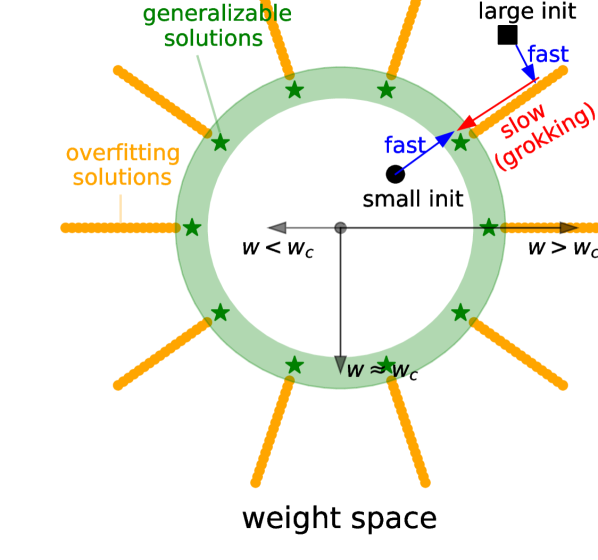

*(a)*

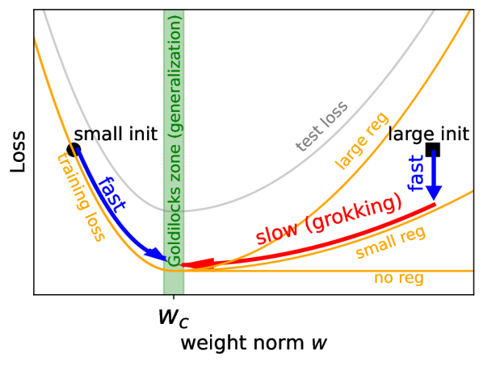

*(b)*

*Рисунок 1: (a) $w$: $L_{2}$-норма весов модели. Генерализующие решения (зелёные звёзды) сосредоточены вокруг сферы в пространстве весов, где $w\approx w_{c}$ (зелёный). Переобученные решения (оранжевый) заселяют область $w\gtrsim w_{c}$. (b) Обучающая потеря (оранжевый) и тестовая потеря (серый) имеют форму L и U соответственно. Их рассогласование в области $w>w_{c}$ ведёт к быстро-медленной динамике, из чего и получается гроккинг.* **[p. 2]**

## 2 Механизм LU для гроккинга

###### p2-1

**Норма весов и приведённая потеря** Пусть $\mathbf{w}$ обозначает веса модели; тогда любая функция $f(\mathbf{w})$ (например, обучающая/тестовая потеря или точность) зависит и от нормы весов $w\equiv||\mathbf{w}||_{2}$, и от углового направления $\hat{\mathbf{w}}\equiv\mathbf{w}/w$. Подобно [Fort and Scherlis, 2019], мы определяем приведённую функцию $\tilde{f}(w)$, минимизируя обучающую потерю $l_{\rm train}(\mathbf{w})$ по угловым направлениям, то есть

$$
\quad\tilde{f}(w)\equiv f(\mathbf{w}^{*}(w)),\quad{\rm where}\ \mathbf{w}^{*}(w)\equiv\underset{||\mathbf{w}||_{2}=w}{\rm argmin}\ l_{\rm train}(\mathbf{w}) \tag{1}
$$

###### p2-2

На практике мы выполняем эту минимизацию с ограничением, перемасштабируя веса модели обратно к их исходной норме после каждого шага оптимизации без ограничений. Мы увидим, что этот приведённый одномерный ландшафт потерь, который легко изобразить, схватывает важные черты, связанные с гроккингом. Всюду в статье наша модель инициализируется умножением стандартной инициализации на множитель $\alpha\equiv w/w_{0}$111Под стандартной инициализацией понимается принятая по умолчанию в PyTorch., где $w_{0}$ и $w$ — норма весов сети до и после умножения на $\alpha$.

###### p2-3

**Механизм LU** Хотя ландшафты потерь нейросетей нелинейны, [Fort and Scherlis, 2019] выявляют простую картину ландшафта: в пространстве весов существует сферическая оболочка («зона Златовласки»), где генерализация лучше, чем вне этой зоны. Зону Златовласки мы изображаем зелёной областью со средним радиусом $w_{c}$ на рисунке 1(a); зелёные звёзды — генерализующие решения. Тем самым тестовая потеря выше и при $w>w_{c}$, и при $w<w_{c}$, образуя U-образную форму по $w$ на рисунке 1(b) (серая кривая). Напротив, обучающая потеря имеет L-образную форму по норме весов222$\ell_{\rm train}(w)$ не возрастает: всегда можно построить бо́льшую сеть, добавив к меньшей бесполезные ненулевые веса, не меняя функциональности модели.. Существует множество решений, переобучающихся на обучающих данных при $w>w_{c}$, тогда как при $w<w_{c}$ обучающая потеря высока. Этому и отвечает L-образная кривая на рисунке 1(b) (оранжевая кривая, без регуляризации). Итого: (приведённые) обучающая и тестовая потери имеют форму L и U по норме весов соответственно, и это мы всюду в статье называем механизмом LU.

**[p. 3]**

В статистике хорошо известно, что ошибка генерализации имеет «U»-образную форму по ёмкости модели, что обычно относят на счёт компромисса между смещением и разбросом. Хотя эта общепринятая мудрость была поставлена под сомнение наблюдением двойного спуска [Nakkiran et al., 2021], «U»-образную кривую можно восстановить из двойного спуска, попросту сменив ось x с числа параметров модели $N$ на 2-норму параметров модели $w\equiv||\mathbf{w}||_{2}$ [Ng and Ma, 2022]. Хотя механизм LU может напомнить читателю о родственных явлениях [Schoenholz et al., 2016, Yang and Schoenholz, 2017, Nakkiran et al., 2021], их постановки не в точности совпадают с нашей. Что важнее, наш фокус и вклад — понять гроккинг, совершенно новую загадку генерализации.

###### p3-2

**Динамика гроккинга** Причиной гроккинга мы объявляем «механизм LU». Если норма весов инициализирована большой (например, чёрный квадрат в области $w>w_{c}$), модель сначала быстро перемещается к ближайшему переобученному решению, минимизируя обучающую потерю. Без всякой регуляризации модель так и останется на месте, потому что градиент обучающей потери почти нулевой вдоль долины переобученных решений, а значит, генерализация не происходит. К счастью, обычно имеются явные и/или неявные регуляризации, способные увести вектор весов к зоне Златовласки $w\approx w_{c}$. Когда величина регуляризации ненулевая, но мала, радиальное движение может быть (сколь угодно) медленным. Если weight decay — единственный источник регуляризации, а обучающая потеря после переобучения пренебрежимо мала, то weight decay $\gamma$ даёт $w(t)\approx{\rm exp}(-\gamma t)w_{0}$ при $w_{0}>w_{c}$, так что до генерализации проходит время $t\approx{\rm ln}(w_{0}/w_{c})/\gamma\propto\gamma^{-1}$. Малое $\gamma$ приводит к огромной задержке генерализации (то есть к гроккингу). Зависимость от величины регуляризации показана на рисунке 1(b): при $\gamma=0$ генерализации не происходит вовсе, малое $\gamma$ ведёт к медленной генерализации (гроккингу), а большое $\gamma$ — к более быстрой генерализации333$\gamma$ не должно быть слишком большим, иначе оно приведёт веса к тривиальному решению $\mathbf{w}=\mathbf{0}$.. Приведённый анализ применим только к большим инициализациям $w>w_{c}$. Малые инициализации $w<w_{c}$ всегда способны генерализовать быстро444$w$ не должно быть слишком малым, чтобы не повредить оптимизации., независимо от регуляризации.

###### p3-3

**Почему гроккинг наблюдают нечасто?** Стандартные схемы инициализации обычно задают $w$ не больше $w_{c}$. Однако если увеличить масштабы инициализации (явно или неявно), гроккинг может появиться. В разделах 3 и 4 мы обнаруживаем, что явное увеличение нормы весов при инициализации способно вызвать гроккинг. В разделе 5 мы приводим доводы, что для алгоритмических наборов данных (показано на рисунке 6(d))

$$
w_{c}({\rm bad\ representation})>w_{c}({\rm good\ representation}), \tag{2}
$$

то есть подходящая инициализация для плохого представления оказывается фактически слишком большой для хорошего представления, что и ведёт к гроккингу. Возьмём для примера сложение (по основанию $p$): при хорошем (линейном) представлении или при плохом (случайном) представлении декодеру нужно научиться классифицировать $O(p)$ или $O(p^{2})$ примеров соответственно.

## 3 Гроккинг в постановке «учитель — ученик»


*(a)*

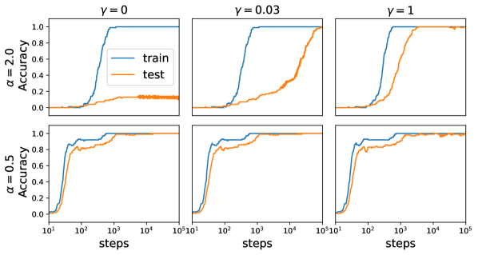

*(b)*


*(c)*

###### fig-2

*Рисунок 2: Постановка «учитель — ученик». $\alpha$: масштаб инициализации ученика, $\gamma$: weight decay. (a) Приведённые обучающая и тестовая потери имеют форму «L» и «U» соответственно. (b) Верхний ряд: большая инициализация ($\alpha=2.0$) способна показать отсутствие генерализации (без регуляризации), гроккинг (малая регуляризация) и быструю генерализацию (большая регуляризация). Нижний: малая инициализация ($\alpha=0.5$) всегда генерализует быстро, независимо от weight decay. (c) $\alpha=2$. Число шагов до переобучения не зависит от weight decay, тогда как число шагов до генерализации масштабируется обратно пропорционально weight decay.* **[p. 3]**

Чтобы показать, как механизм LU приводит к гроккингу, мы применяем игрушечную постановку «учитель — ученик». Учитель и ученик имеют одинаковую архитектуру (MLP 5-100-100-5 с активацией tanh), но **[p. 4]** инициализируются с разными сидами. Сеть-ученик инициализируется стандартной инициализацией (принятой по умолчанию в PyTorch), но каждый вес перемасштабируется одним и тем же множителем $\alpha\equiv w/w_{0}$, где $w_{0}$ и $w$ — норма весов сети-ученика до и после перемасштабирования. Сеть-учитель инициализируется стандартно, то есть $\alpha_{\rm teacher}=1$. Входы и выходы имеют размерности $d_{\rm in}=5$ и $d_{\rm out}=5$ соответственно. Мы порождаем $N_{\rm train}=100$ обучающих и $N_{\rm test}=100$ тестовых образцов, сначала беря входы из стандартного гауссова распределения $N(0,\mathbf{I}_{d_{\rm in}\times d_{\rm in}})$, а затем подавая входные данные учителю, чтобы получить выходные метки. Сеть-ученик обучается оптимизатором Adam (скорость обучения $3\times 10^{-4}$) в течение $10^{5}$ шагов.

**Ландшафты LU** Сначала мы вычисляем приведённые потери, минимизируя обучающую потерю (без учёта weight decay) при постоянной норме весов сети-ученика. Точку сходимости после обучения мы принимаем за глобальный минимум на сферической поверхности, что явно задаёт приведённые потери $\tilde{l}_{\rm train}(\alpha)$ и $\tilde{l}_{\rm test}(\alpha)$. Как показано на рисунке 2(a), $\tilde{l}_{\rm test}(\alpha)$ сначала убывает, а затем растёт с ростом $\alpha$, образуя U-образную форму с минимумом при $\alpha\approx 1$. Напротив, $\tilde{l}_{\rm train}(\alpha)$ убывает при $\alpha<1$ и остаётся плоской вблизи нуля при $\alpha\geq 1$, образуя L-образную форму. При наличии weight decay $\gamma$ обучающий ландшафт становится $\tilde{l}_{\rm train}(\alpha,\gamma)=\tilde{l}_{\rm train}(\alpha)+\gamma\alpha^{2}C^{2}$, где $C$ — средняя величина параметра, задаваемая стандартной инициализацией.

**Динамика обучения** Наша задача — регрессия, но поведение задачи классификации можно сымитировать, вручную задав порог $\theta=0.01$ и объявив образец «классифицированным» верно, если ошибка предсказания меньше $\theta$. Мы изучаем динамику точности на обучении и на тесте. Мы проводим эксперименты с двумя инициализациями $\alpha=0.5$ (малая) и $\alpha=2.0$ (большая) и тремя значениями weight decay: $\gamma=0$ (без регуляризации), $\gamma=0.03$ (малая регуляризация) и $\gamma=1$ (большая регуляризация). Как показано на рисунке 2(b) (внизу), запуски с малой инициализацией всегда генерализуют быстро, независимо от регуляризации. Запуски с большой инициализацией (вверху) зависели от weight decay: без регуляризации генерализовать не удаётся, при малой регуляризации генерализация идёт медленно (гроккинг), а при большой — быстрее.

Для большой инициализации $\alpha=2.0$ мы делаем более мелкий перебор $\gamma$ в $[0.03,1]$. Мы вычисляем число шагов и норму весов $w$ в момент, когда точность на обучении или на тесте достигает 95 %. Как показано на рисунке 2(c), время (число шагов) до достижения 95 % точности на обучении не зависит от weight decay $\gamma$, тогда как время до достижения 95 % точности на тесте обратно пропорционально weight decay — как мы и вывели выше для механизма LU.

## 4 Omnigrok: гроккинг для более интересных задач

Теперь мы анализируем ландшафты потерь и ищем гроккинг для нескольких более интересных наборов данных и видим, что представления, полученные на игрушечной модели, переносятся и на них. Основные результаты мы приводим здесь, а детали экспериментов — в приложении A.

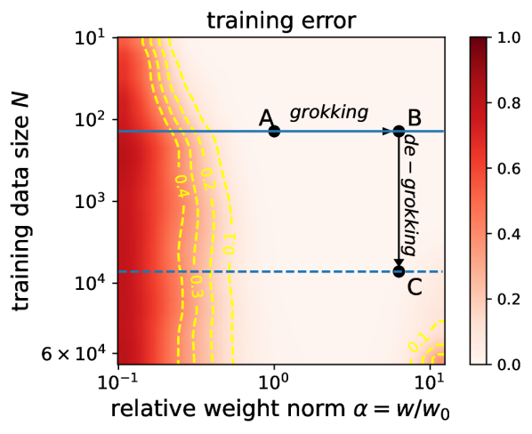

*(a)*

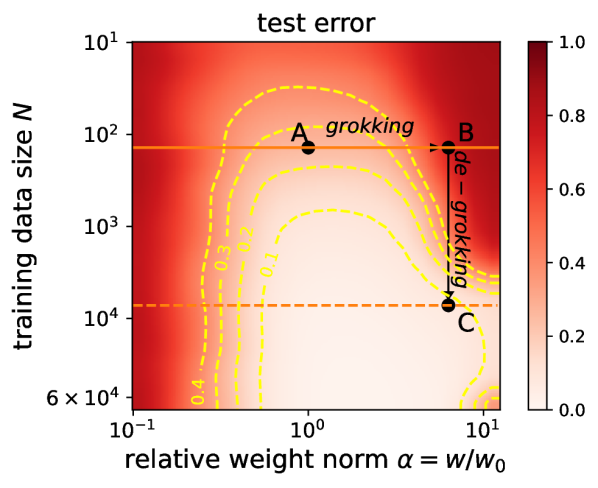

*(b)*

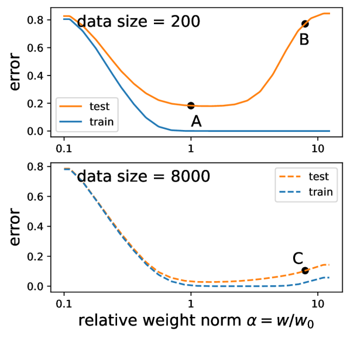

*(c)*


*(d)*


*(e)*

*Рисунок 3: MNIST. (a) приведённая ошибка на обучении, (b) приведённая ошибка на тесте. Сравнение A и B: бо́льшая норма весов заставляет обучение грокать (задерживает генерализацию). Сравнение B и C: бо́льший размер обучающих данных заставляет обучение раз-грокать (ускоряет генерализацию). (c) «LU» тем вернее, чем меньше данных. (d) Кривые точности для MNIST в постановке, где мы наблюдаем гроккинг. (e) Время до генерализации как функция размера обучающего набора $N$.* **[p. 5]**

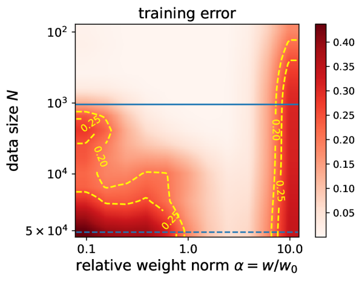

*(a)*


*(b)*


*(c)*

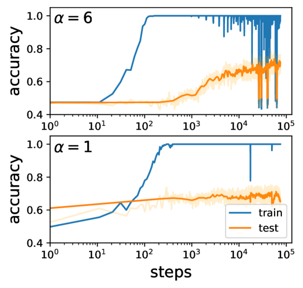

*(d)*

*Рисунок 4: Мы используем LSTM для предсказания отзывов IMDb. (a) ошибка на обучении; (b) ошибка на тесте; (c) приведённые потери для размера данных 1 тыс. (вверху) и 50 тыс. (внизу); (d) при 1 тыс. данных (слабый) признак гроккинга наблюдается для больших инициализаций ($\alpha=6$), тогда как при стандартных инициализациях ($\alpha=1$) гроккинга не наблюдается.* **[p. 5]**


*(a)*


*(b)*

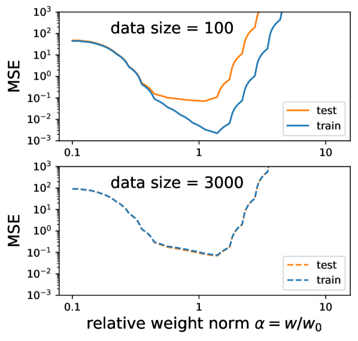

*(c)*


*(d)*

*Рисунок 5: Мы используем GCNN для предсказания изотропной поляризуемости молекул в наборе данных QM9. (a) потеря на обучении; (b) потеря на тесте; (c) приведённые потери для размера данных 100 (вверху) и 3000 (внизу); (d) при 200 обучающих образцах гроккинг наблюдается для большой инициализации ($\alpha=3$), тогда как при стандартных инициализациях ($\alpha=1$) гроккинга не наблюдается.* **[p. 6]**

**Классификация изображений** Мы визуализируем ландшафты потерь MNIST [Deng, 2012], чтобы проверить механизм LU, и изучаем зависимость от размера обучающих данных. Как и в случае «учитель — ученик», мы приводим потери и ошибки (единица минус точность) к двум переменным (норма весов $w$ и размер данных $N$), минимизируя по угловым направлениям весов, то есть

$$
\tilde{l}_{\rm train}(w,N)\equiv l_{\rm train}(\mathbf{w}^{*},N),\quad\tilde{l}_{\rm test}(w,N)\equiv l_{\rm test}(\mathbf{w}^{*},N),\quad\mathbf{w}^{*}(w,N)\equiv\underset{||\mathbf{w}||_{2}=w}{\rm argmin}\ l_{\rm train}(\mathbf{w},N), \tag{3}
$$

###### p4-6

как показано на рисунке 3 (a)(b). Приведённый ландшафт потерь выявляет три вещи. (1) Бо́льшие инициализации ведут к гроккингу. Точка **A** на рисунке 3 отвечает стандартной инициализации $(\alpha=1)$, у которой низки и обучающая, и тестовая ошибки, а значит, гроккинга нет. При увеличении нормы весов до точки **B** обучающая ошибка остаётся низкой, а тестовая становится высокой, что приводит к отложенной генерализации (гроккингу), если регуляризация мала. (2) Бо́льшие наборы данных ведут к раз-гроккингу. Сравнивая **B** и **C** на рисунке 3, видим, что у **C** размер обучающей выборки больше, а тестовая ошибка ниже. Бо́льший размер данных $N$ делает зону Златовласки шире, уменьшая или устраняя гроккинг даже при больших инициализациях весов. (3) Можно определить критический размер данных. Как сообщается в [Power et al., 2022, Liu et al., 2022], мы видим, что существует критический размер обучающей выборки, ниже которого генерализация невозможна. Анализ эффективной теории в [Liu et al., 2022] применим только к алгоритмическим наборам данных, но не к другим наборам с неизвестными оптимальными представлениями. Анализ ландшафта потерь, представленный в этой работе, применим ко всем задачам обучения с учителем. Как показано на рисунке 3 (b), линии постоянной тестовой ошибки имеют форму большого пальца, и кончик этого пальца определяет минимальное количество данных, необходимое для генерализации.

Руководствуясь анализом ландшафта, мы принимаем два нестандартных решения, чтобы вызвать гроккинг на MNIST: (1) уменьшаем размер обучающего набора с 60 тыс. до 1 тыс. образцов (беря случайное подмножество) и (2) увеличиваем масштаб распределения инициализации весов (умножая начальные веса, взятые по равномерной инициализации Кайминга, на константу $\alpha>1$). С этими изменениями размера обучающего набора и масштаба инициализации мы обучаем MLP глубины 3 и ширины 200 с активациями ReLU оптимизатором AdamW, используя MSE-потерю с one-hot целями. Мы обнаруживаем, что сеть быстро подгоняет обучающий набор, а точность на тесте улучшается много позже, как показано на рисунке 3(d) — ровно как в стереотипном обучении с гроккингом, впервые замеченном на алгоритмических наборах данных. Рисунок 3(e) показывает влияние размера обучающего набора на время до генерализации для MNIST. Мы получаем результат, схожий с наблюдением [Power et al., 2022]: время генерализации быстро растёт, как только приближаешься к некоторому критическому размеру набора данных. Фазовую диаграмму обучения мы также приводим в приложении LABEL:app:mnist_pd.

**Анализ тональности текста** Мы ищем гроккинг, используя LSTM [Hochreiter and Schmidhuber, 1997] на наборе данных IMDb [Maas et al., 2011]. Подобно уравнению (3), мы приводим обучающую и тестовую потери к зависимости только от нормы весов $w$ и размера данных $N$. Приведённые обучающую и тестовую ошибки мы показываем на рисунке 4 (a)(b). При большом размере данных — скажем, на полном наборе — обучающая и тестовая ошибки имеют схожие «U»-образные формы555В принципе приведённые обучающие потери должны быть невозрастающими («L»), но при слишком больших инициализациях могут возникать трудности оптимизации [Schoenholz et al., 2016]., так что создать гроккинг через механизм «LU» невозможно. Однако при малом размере данных — скажем, 1 тыс. — рассогласование между обучающей и тестовой ошибками делает возможным создание гроккинга большими инициализациями. На рисунке 4 (c) мы инициализируем веса больше ($\alpha=6$) при weight decay 1: переобучение завершается в пределах $10^{2}$ шагов, а генерализация начинается лишь около $10^{3}$ шагов. Отметим, что «скачок» генерализации здесь не так резок, как на алгоритмических наборах данных [Power et al., 2022] или на MNIST, но генерализация по крайней мере отложена. Напротив, при стандартной инициализации ($\alpha=1$) без weight decay генерализация происходит рано в ходе обучения и после переобучения улучшается незначительно.

**Молекулы** Мы ищем гроккинг, используя графовую свёрточную нейросеть (GCNN) на наборе данных QM9 [Ramakrishnan et al., 2014]. Подобно уравнению (3), мы определяем приведённые обучающую/тестовую потери, зависящие только от нормы весов $w$ и размера данных $N$. Как показано на рисунке 5(a)(b), при большом размере данных обучающая и тестовая потери имеют схожие «U»-образные формы, а потому гроккинг через «механизм LU» невозможен. При малом размере данных обучающая и тестовая потери рассогласуются где-то в области $\alpha=w/w_{0}>1$, что делает гроккинг возможным. Действительно, как показано на рисунке 5(d), при инициализации втрое больше стандартной около $10^{4}$ шагов происходит резкое падение тестовой потери, тогда как стандартная инициализация к гроккингу не приводит. Отметим, что в обоих случаях применяется нулевой weight decay, откуда следует существование неявных регуляризаций.

## 5 Представление — ключ к гроккингу

###### p6-2

В разделе 4 мы показали, что увеличение масштабов инициализации способно вызвать гроккинг на стандартных задачах машинного обучения. Однако это выглядит несколько искусственным и не объясняет, почему стандартная инициализация приводит к гроккингу на алгоритмических наборах данных, но не на стандартных наборах машинного обучения — скажем, на MNIST. Ключевое различие в том, насколько задача опирается на обучение представлений. Для набора данных MNIST качество представления решает, будет ли тестовая точность 95 % или 100 %; напротив, на алгоритмических наборах данных качество представления решает, будет ли тестовая точность случайным угадыванием (плохое представление) или 100 % (хорошее представление). Поэтому переобучение (при плохом представлении) действует на алгоритмических наборах данных драматичнее: веса модели во время переобучения быстро растут, а тестовая точность остаётся низкой. Во время переобучения норма весов модели много больше, чем при инициализации, но затем падает ниже нормы при инициализации, когда модель генерализует, как показано на рисунке 7(a) и как наблюдали также [Nanda et al., 2023]. Попутно нам удаётся устранить гроккинг, ограничив модель сферой малой нормы весов, как показано на рисунке 7(b).

Далее мы сравним алгоритмические наборы данных (раздел 5.1) с MNIST (раздел 5.2). Мы покажем, как их ландшафты потерь по-разному зависят от представлений и как это различие приводит к разным исходам (гроккинг или его отсутствие).

**[p. 7]**

### 5.1 Алгоритмические наборы данных

**Постановка** Мы берём игрушечную постановку сложения из [Liu et al., 2022], где каждая входная цифра $0\leq i\leq p-1$ (выходная метка $0\leq k\leq 2(q-1)$) вкладывается как вектор $\mathbf{E}_{i}$ ($\mathbf{Y}_{k}$). Для предсказания $\mathbf{Y}_{k}={\rm Dec}(\mathbf{E}_{i}+\mathbf{E}_{j})\ (k=i+j)$ применяется декодер-MLP. В постановке гроккинга обучаемы и декодер, и входные представления $\mathbf{R}\equiv\{\mathbf{E}_{i}$} со скоростями обучения $\eta_{D}$ и $\eta_{R}$ соответственно; в постановке анализа ландшафта обучаем только декодер, как мы поясняем ниже. Обучающая и тестовая потери зависят от трёх факторов: (i) представления $\mathbf{R}$, (ii) нормы весов $w$ и (iii) направления весов $\hat{\mathbf{w}}$. Как и в предыдущих разделах, $\hat{\mathbf{w}}$ можно оптимизировать, минимизируя обучающую потерю на сферах постоянной нормы весов. Высокоразмерные представления мы дополнительно приводим к одномерию, интерполируя вдоль определённого направления:

$$
\mathbf{R}=m\mathbf{R}_{\rm random}+(1-m)\mathbf{R}_{\rm linear} \tag{4}
$$

где $\mathbf{R}_{\rm linear}$ обозначает линейное представление, в котором число $k$ вкладывается как $\mathbf{E}_{k}=[k,0,\cdots,0]$, $\mathbf{R}_{\rm random}$ берётся из гауссовых распределений, то есть $\mathbf{E}_{k}\sim N(\mathbf{0},\mathbf{I})$, а $m\in[0,1]$ — скаляр, интерполирующий между $\mathbf{R}_{\rm linear}$ и $\mathbf{R}_{\rm random}$, который мы называем *неопрятностью представления* (representation messiness), поскольку $\mathbf{R}=\mathbf{R}_{\rm linear}$ при $m=0$ и $\mathbf{R}=\mathbf{R}_{\rm random}$ при $m=1$. После этих приведений и обучающая, и тестовая потери становятся функциями двух переменных — неопрятности представления $m$ и нормы весов $w$:

$$
\mathbf{w}^{*}(w,m)\equiv\underset{||\mathbf{w}||_{2}=w}{\rm argmin}\ l_{\rm train}(\mathbf{w},m),\quad\tilde{l}_{\rm train}(w,m)\equiv l_{\rm train}(\mathbf{w}^{*},m),\quad\tilde{l}_{\rm test}(w,m)\equiv l_{\rm test}(\mathbf{w}^{*},m) \tag{5}
$$

Заметим, что наше определение $\tilde{l}_{\rm train}(w,m)$ исключает слагаемое weight decay $\ell_{\rm reg}=\frac{1}{2}\gamma w^{2}$, но о его наличии следует помнить при анализе динамики $(w,m)$, которая управляется градиентным потоком по $\tilde{l}_{\rm train}(w,m)$ плюс weight decay ($\eta_{R}/\eta_{D}$ — скорости обучения представления/декодера):

$$
\frac{dw}{dt}=-\eta_{D}\left(\frac{\partial\tilde{l}_{\rm train}}{\partial w}+\gamma w\right),\quad\frac{dm}{dt}=-\eta_{R}\frac{\partial\tilde{l}_{\rm train}}{\partial m}, \tag{6}
$$

**Ландшафт** Мы показываем $\tilde{l}_{\rm train}(w,m)$ и $\tilde{l}_{\rm test}(w,m)$ на рисунках 6(a) и 6(b), отмечая генерализующее решение зелёной звездой. По приведённой обучающей потере (рисунок 6(a)) двумерную плоскость можно разделить на две области **I** и **II**, разграниченные жёлтой пунктирной линией (линией уровня обучающей потери = 0.05): (**I**) более тёмная область с высокими обучающими потерями/градиентами и малой нормой весов; (**II**) более светлая область с низкими обучающими потерями/градиентами и большой нормой весов. Сравнение рисунков 6(a) и 6(b) показывает, что ландшафты обучающей и тестовой потерь различаются, особенно в области **II**. Более того, обучающая потеря зависит от $m$ слабо, а тестовая потеря зависит от $m$ сильно. Как мы увидим, именно (слабая) зависимость обучающей потери от представления гонит модель к генерализующему решению. Но движущая сила мала, потому что зависимость слаба, — отсюда и гроккинг. Ниже мы подробно разбираем, как именно эти ландшафты потерь приводят к гроккингу.


*(a)*


*(b)*

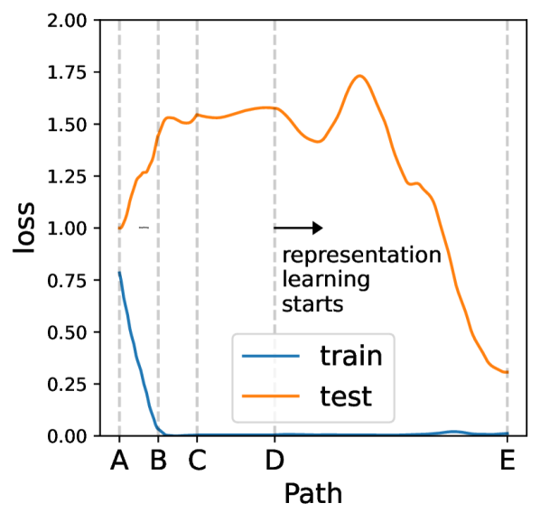

*(c)*

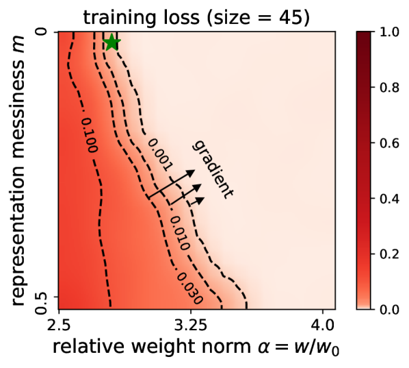

*(d)*

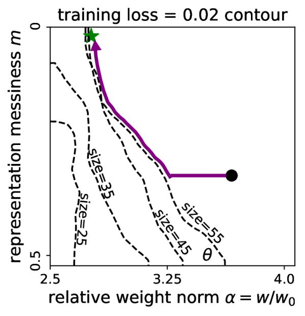

*(e)*

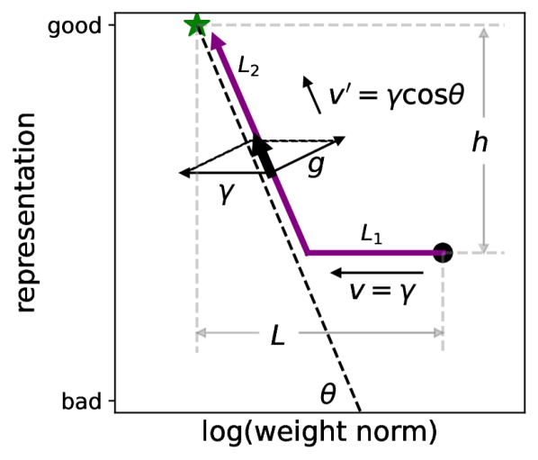

*(f)*

*Рисунок 6: Ландшафты потерь для игрушечного MLP на двумерной плоскости $(w,m)$. (a) Обучающая потеря делит плоскость на две области: большая потеря и малое $w$ (быстрая динамика) и малая потеря и большое $w$ (медленная динамика). (b) Тестовая потеря; зелёная звезда — генерализующее решение. (c) Потери вдоль показательного пути $\rm A\to E$, демонстрирующие многократный спуск; (d) увеличенный фрагмент обучающей потери, подчёркивающий градиенты на границе. (e) граница зависит от размера обучающих данных; (f) простая иллюстрация динамики гроккинга.* **[p. 8]**

**Динамика гроккинга** В области **II** динамика медленна (при малом $\gamma$) из-за почти исчезающих градиентов. Напротив, динамика в области **I** относительно быстра. Как мы поясним, динамика медленна и на границе **I** и **II**, а гроккинг есть следствие прохождения области **II** и/или границы.

Разберём типичный путь **A** → **E**, показанный на рисунке 6(a)(b). **A** скатывается «под гору» к **B**, следуя обучающим градиентам, и, возможно, продолжает до **C** по инерции. **C** лежит в **II**, где $\tilde{l}_{\rm train}\approx 0$, так что согласно уравнению (6) $dm/dt\approx 0$ и $dw/dt\approx-\eta_{D}\gamma w$ или, равносильно, $d({\rm log}w)/dt\approx-\eta_{D}\gamma$. Значит, $({\rm log}w,m)$ движется с постоянной скоростью $v=\eta_{D}\gamma$ в направлении $-w$ от **C** к **D** — точке вблизи границы. Отрицательные градиенты вблизи границы направлены в сторону большего $w$ и меньшего $m$, как показано на рисунке 6(d) (увеличенный фрагмент рисунка 6(a)). Градиенты становятся всё больше по мере углубления модели в область **I**, и в некоторый момент градиент полностью гасит $v$ в направлении градиента, отчего модель начинает дрейфовать вдоль границы, как показано на рисунке 6(f). Затем модель движется вдоль границы с новой скоростью $v^{\prime}=v{\rm cos\theta}$666Для простоты мы полагаем здесь $\eta_{R}=\eta_{D}$, но анализ применим к любым $(\eta_{R},\eta_{D})$., пока не достигнет генерализующего решения **E**.


*(a)*


*(b)*

*Рисунок 7: Обучение однослойного трансформера на модульном сложении ($p=113$). (a) Норма весов, точность на обучении и точность на тесте по времени при обычных инициализации и обучении. Норма весов сначала растёт и максимальна в период переобучения, но затем падает и становится ниже начальной нормы весов, когда модель генерализует. (b) Оптимизация с ограничением на постоянную норму весов $(\alpha=0.8)$ по большей части устраняет гроккинг: точности на тесте и на обучении растут одновременно.* **[p. 8]**

###### p7-7

Медленная динамика от **C** к **E** и есть источник гроккинга. В этот период модель сначала движется в направлении $-w$ со скоростью $v$ на расстояние $L_{1}=L-h{\rm cot}\theta$, а затем движется вдоль границы со скоростью $v^{\prime}$ на расстояние $L_{2}=h/{\rm sin}\theta$. Значит, полное время равно $t=L_{1}/v+L_{2}/v^{\prime}=(L+h{\rm tan}\theta)/(\eta_{D}\gamma)$. Эта формула согласуется с наблюдением, что большие значения weight decay $\gamma$ и/или бо́льшие скорости обучения декодера $\eta_{D}$ способны ускорить наступление генерализации [Power et al., 2022, Liu et al., 2022]. Кроме того, путь обнаруживает любопытный многократный спуск тестовой потери, показанный на рисунке 6(c).

Приведённую картину подтверждает эксперимент с трансформером: на рисунке 7(a) показано, как норма модели меняется со временем, и мы видим первоначальный рост нормы весов, достигающий пика во время переобучения, а затем падение в период генерализации до значения ниже нормы при инициализации. Для этого эксперимента мы использовали постановку [Nanda et al., 2023], обучая однослойный трансформер на **[p. 9]** модульном сложении ($p=113$). Ширина модели $d_{\text{model}}=128$, 4 головы внимания, $d_{\text{mlp}}=512$ с активациями ReLU. Мы обучаем AdamW со скоростью обучения 0.001 и weight decay $\gamma=1$.

**Зависимость гроккинга от размера обучающих данных** Ещё одно важное наблюдение [Power et al., 2022] состоит в том, что гроккинг происходит быстрее при большем размере обучающей выборки. Наш анализ ландшафта способен объяснить и зависимость от размера данных. На рисунке 6(e) мы показываем линии уровня (обучающая потеря = 0.02) для разных размеров обучающей выборки (25, 35, 45, 55). Линии уровня для размеров 45 и 55 обе соединяются с зелёной звездой, а значит, генерализация в конце концов наступит. Однако наклоны линий различны, то есть $\theta_{55}<\theta_{45}$. Поскольку $t=(L+h{\rm tan}\theta)/(\eta_{D}\gamma)$ растёт с ростом $\theta$, имеем $t_{55}<t_{45}$, то есть больше обучающих данных ведёт к более быстрому гроккингу. Для размеров 35 и 25 линии уровня с зелёной звездой не соединяются, поэтому генерализация не наступит, сколь угодно долго ни вести обучение.

###### p9-2

**Раз-гроккинг ограничением нормы весов** Руководствуясь нашим пониманием гроккинга из механизма LU, мы обнаруживаем, что можем управлять гроккингом в той самой постановке, где он был впервые замечен Power et al. [2022], — на трансформерах, обучаемых алгоритмическим задачам. Как показано на рисунке 7(b), уменьшение масштаба инициализации и ограничение оптимизации так, чтобы норма весов модели оставалась постоянной в ходе обучения, сближает кривые точности на обучении и на тесте, почти устраняя гроккинг.

### 5.2 MNIST

Теперь мы изучаем, как обучающая и тестовая потери зависят от неопрятности представления на наборе данных MNIST. Изображения $28\times 28$ мы обозначаем как сырое представление $\mathbf{R}_{\rm raw}$. Линейно разделимое представление $\mathbf{R}_{\rm linear}$ мы строим, назначая входные представления пропорционально их метке $y_{i}$: например, изображение двойки представляется матрицей, все элементы которой равны 2. Подобно уравнению (4), мы используем $m\in[0,1]$ для интерполяции между $\mathbf{R}_{\rm raw}$ и $\mathbf{R}_{\rm linear}$:

$$
\mathbf{R}=m\mathbf{R}_{\rm raw}+(1-m)\mathbf{R}_{\rm linear}, \tag{7}
$$

Подобно уравнению (5), мы определяем и строим $\tilde{l}_{\rm train}(w,m)$ и $\tilde{l}_{\rm test}(w,m)$ на рисунке 8, используя полный набор данных $N=60000$. Сравнение рисунков 8(a) и 8(b) выявляет две вещи: (1) обучающая и тестовая потери ведут себя схоже; (2) и обучающая, и тестовая потери зависят от $m$ очень слабо. Отсюда следует, что сырое представление изображений уже довольно близко к оптимальному, так что приличную тестовую точность можно получить и без обучения оптимальных представлений. В результате гроккинга не происходит (рисунок 8(c)).


*(a)*


*(b)*

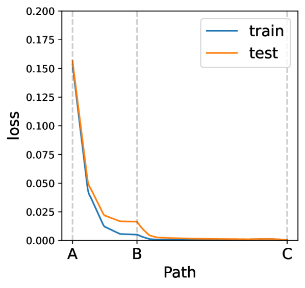

*(c)*

*Рисунок 8: Ландшафты MNIST как функции неопрятности представления $m$ и нормы весов $w$: (a) обучающая потеря и (b) тестовая потеря. Обучающая и тестовая потери не имеют существенного рассогласования, и ни одна из них не зависит от представления сильно, что резко контрастирует с алгоритмическими наборами данных (рисунок 6). (c) показательный путь $\rm A\to B\to C$ гроккинга не обнаруживает.* **[p. 9]**

###### p9-5

Сравнивая рисунки 6 и 8, мы видим, что (сильная) зависимость тестового качества от представления и есть ключ к гроккингу: для алгоритмических наборов данных зависимость от представления сильна, поэтому гроккинг происходит. Напротив, для MNIST зависимость слаба, поэтому гроккинга не происходит.

**Обсуждение: гроккинг на языковых моделях?** Мы предполагаем, что гроккинг легче наблюдать на задачах, где генерализация сильно опирается на обучение хороших представлений (с нуля). Это, по-видимому, означает возможность гроккинга на языковых задачах, где эмбеддинги слов ключевы для генерализации. Однако ясных признаков гроккинга для больших языковых моделей мы пока не наблюдали — возможно, потому что: (i) структура языков сложна, так что «оптимальное представление» для языка может оказаться много «неопрятнее» алгоритмических представлений; (ii) предобучение избавляет от обучения представлений с нуля и тем самым помогает снизить возможный гроккинг.

**[p. 10]**

###### sec-6

## 6 Отношение к связанным работам

**Гроккинг** был впервые замечен на алгоритмических наборах данных в [Power et al., 2022]. Было предпринято несколько формальных и неформальных попыток понять гроккинг: (a) [Liu et al., 2022] относят гроккинг на счёт медленного формирования хороших представлений. (b) [Shah, 2021] полагает, что генерализующие решения достигают меньшей потери, чем переобученные, что даёт обучающий сигнал, поощряющий генерализацию. (c) [Nanda et al., 2023] полагают, что гроккинг — фазовое изменение, вызванное ограниченностью данных и регуляризацией. (d) [Barak et al., 2022] полагают, что генерализация происходит не из случайного поиска, а из скрытого прогресса SGD, постепенно усиливающего фурье-зазор. (e) [Thilak et al., 2022] связывают гроккинг с «механизмом рогатки», присущим адаптивным оптимизаторам. (f) [Millidge, 2022] описывает обучение как случайное блуждание по параметрам. Наш вывод поддерживает (a)(b)(c)(d), но не обязательно отрицает (e)(f).

**Двойной спуск** — явление, при котором качество сначала ухудшается, а затем улучшается по мере увеличения размера модели, размера данных, числа эпох обучения или регуляризации [Nakkiran et al., 2021, Yilmaz and Heckel, 2022]. Типичная «U»-образная форма тестовой потери в этой статье не противоречит двойному спуску, поскольку мы откладываем норму весов, а не число параметров модели [Ng and Ma, 2022]. Однако «U»-образную форму лучше считать эмпирически распространённой, нежели доказуемо универсальной. На деле взаимодействие свойств данных и индуктивных смещений алгоритмов обучения может быть сложнее двойного спуска [Chen et al., 2021, d’Ascoli et al., 2020].

**Инициализация** С точки зрения оптимизации инициализации обычно опираются на идею «края хаоса», по которой дисперсия признаков и градиентов должна сохраняться при прямом и обратном проходе [Glorot and Bengio, 2010, He et al., 2015, Bahri et al., 2020, Yang and Schoenholz, 2017, Jing et al., 2017], либо на анализ якобианов и/или гессианов [Skorski et al., 2020]. С точки зрения генерализации было показано, что большие инициализации легко переобучаются на данных, но дают плохую генерализацию [Xu et al., 2019, Zhang et al., 2020], что согласуется с нашим механизмом LU.

**Регуляризация weight decay** — стандартный приём машинного обучения, оказывающий разнообразное влияние на оптимизацию и генерализацию [Zhang et al., 2018, Van Laarhoven, 2017]. В частности, [Lewkowycz and Gur-Ari, 2020] наблюдают, что до достижения максимального тестового качества требуется $t\propto 1/\lambda$ шагов обучения. Это разительно похоже на время гроккинга $t\propto 1/\lambda$, которое мы вывели из механизма LU.

## 7 Выводы

Эта работа проясняет явление гроккинга с точки зрения ландшафтов потерь. Наши выводы таковы: (i) гроккинг происходит из рассогласования между обучающей и тестовой потерями (механизм «LU»); (ii) гроккинг может возникать в различных моделях на широком круге наборов данных, хотя его проявление обычно наиболее драматично на алгоритмических наборах; (iii) драматичность гроккинга зависит от того, насколько задача опирается на обучение представлений. Эта работа не только раскрывает механизм гроккинга, но и показывает, что анализ приведённого ландшафта — полезный инструмент для описания взаимодействия данных и модели и обучения представлений.

## Благодарности

Мы благодарим Wenxian Shi, Niklas Nolte, Ouail Kitouni и Mike Williams за полезные обсуждения. Работа поддержана The Casey and Family Foundation, Foundational Questions Institute, Rothberg Family Fund for Cognitive Science, NSF Graduate Research Fellowship (грант № 2141064) и NSF AI Institute for Artificial Intelligence and Fundamental Interactions (IAIFI) через грант NSF № PHY-2019786.

## Литература

- Alethea Power, Yuri Burda, Harri Edwards, Igor Babuschkin, and Vedant Misra. Grokking: Generalization beyond overfitting on small algorithmic datasets. *arXiv preprint arXiv:2201.02177*, 2022.

- Ziming Liu, Ouail Kitouni, Niklas Nolte, Eric J Michaud, Max Tegmark, and Mike Williams. Towards understanding grokking: An effective theory of representation learning. *arXiv preprint arXiv:2205.10343*, 2022.

**[p. 11]**

- Vimal Thilak, Etai Littwin, Shuangfei Zhai, Omid Saremi, Roni Paiss, and Joshua Susskind. The slingshot mechanism: An empirical study of adaptive optimizers and the grokking phenomenon. *arXiv preprint arXiv:2206.04817*, 2022.

- Boaz Barak, Benjamin L Edelman, Surbhi Goel, Sham Kakade, Eran Malach, and Cyril Zhang. Hidden progress in deep learning: Sgd learns parities near the computational limit. *arXiv preprint arXiv:2207.08799*, 2022.

- Stanislav Fort and Adam Scherlis. The goldilocks zone: Towards better understanding of neural network loss landscapes. In *Proceedings of the AAAI Conference on Artificial Intelligence*, volume 33, pages 3574–3581, 2019.

- Preetum Nakkiran, Gal Kaplun, Yamini Bansal, Tristan Yang, Boaz Barak, and Ilya Sutskever. Deep double descent: Where bigger models and more data hurt. *Journal of Statistical Mechanics: Theory and Experiment*, 2021(12):124003, 2021.

- Andrew Ng and Tengyu Ma. Cs229 lecture notes. *https://cs229.stanford.edu/lectures-spring2022/main_notes.pdf*, page 115, 2022.

- Samuel S Schoenholz, Justin Gilmer, Surya Ganguli, and Jascha Sohl-Dickstein. Deep information propagation. *arXiv preprint arXiv:1611.01232*, 2016.

- Ge Yang and Samuel Schoenholz. Mean field residual networks: On the edge of chaos. *Advances in neural information processing systems*, 30, 2017.

- Li Deng. The mnist database of handwritten digit images for machine learning research. *IEEE Signal Processing Magazine*, 29(6):141–142, 2012.

- Sepp Hochreiter and Jürgen Schmidhuber. Long short-term memory. *Neural computation*, 9(8):1735–1780, 1997.

- Andrew L. Maas, Raymond E. Daly, Peter T. Pham, Dan Huang, Andrew Y. Ng, and Christopher Potts. Learning word vectors for sentiment analysis. In *Proceedings of the 49th Annual Meeting of the Association for Computational Linguistics: Human Language Technologies*, pages 142–150, Portland, Oregon, USA, June 2011. Association for Computational Linguistics. URL http://www.aclweb.org/anthology/P11-1015.

- Raghunathan Ramakrishnan, Pavlo O Dral, Matthias Rupp, and O Anatole von Lilienfeld. Quantum chemistry structures and properties of 134 kilo molecules. *Scientific Data*, 1, 2014.

- Neel Nanda, Lawrence Chan, Tom Liberum, Jess Smith, and Jacob Steinhardt. Progress measures for grokking via mechanistic interpretability. *arXiv preprint arXiv:2301.05217*, 2023.

- Rohin Shah. Alignment Newsletter #159. https://www.alignmentforum.org/posts/zvWqPmQasssaAWkrj/an-159-building-agents-that-know-how-to-experiment-by#DEEP_LEARNING_, 2021.

- Beren Millidge. Grokking ’grokking’. https://beren.io/2022-01-11-Grokking-Grokking/, 2022.

- Fatih Furkan Yilmaz and Reinhard Heckel. Regularization-wise double descent: Why it occurs and how to eliminate it. In *2022 IEEE International Symposium on Information Theory (ISIT)*, pages 426–431. IEEE, 2022.

- Lin Chen, Yifei Min, Mikhail Belkin, and Amin Karbasi. Multiple descent: Design your own generalization curve. *Advances in Neural Information Processing Systems*, 34:8898–8912, 2021.

- Stéphane d’Ascoli, Levent Sagun, and Giulio Biroli. Triple descent and the two kinds of overfitting: Where & why do they appear? *Advances in Neural Information Processing Systems*, 33:3058–3069, 2020.

- Xavier Glorot and Yoshua Bengio. Understanding the difficulty of training deep feedforward neural networks. In *Proceedings of the thirteenth international conference on artificial intelligence and statistics*, pages 249–256. JMLR Workshop and Conference Proceedings, 2010.

**[p. 12]**

- Kaiming He, Xiangyu Zhang, Shaoqing Ren, and Jian Sun. Delving deep into rectifiers: Surpassing human-level performance on imagenet classification. In *Proceedings of the IEEE international conference on computer vision*, pages 1026–1034, 2015.

- Yasaman Bahri, Jonathan Kadmon, Jeffrey Pennington, Sam S Schoenholz, Jascha Sohl-Dickstein, and Surya Ganguli. Statistical mechanics of deep learning. *Annual Review of Condensed Matter Physics*, 11(1), 2020.

- Li Jing, Yichen Shen, Tena Dubcek, John Peurifoy, Scott Skirlo, Yann LeCun, Max Tegmark, and Marin Soljačić. Tunable efficient unitary neural networks (eunn) and their application to rnns. In *International Conference on Machine Learning*, pages 1733–1741. PMLR, 2017.

- Maciej Skorski, Alessandro Temperoni, and Martin Theobald. Revisiting initialization of neural networks. *arXiv preprint arXiv:2004.09506*, 2020.

- Zhi-Qin John Xu, Yaoyu Zhang, and Yanyang Xiao. Training behavior of deep neural network in frequency domain. In *International Conference on Neural Information Processing*, pages 264–274. Springer, 2019.

- Yaoyu Zhang, Zhi-Qin John Xu, Tao Luo, and Zheng Ma. A type of generalization error induced by initialization in deep neural networks. In *Mathematical and Scientific Machine Learning*, pages 144–164. PMLR, 2020.

- Guodong Zhang, Chaoqi Wang, Bowen Xu, and Roger Grosse. Three mechanisms of weight decay regularization. *arXiv preprint arXiv:1810.12281*, 2018.

- Twan Van Laarhoven. L2 regularization versus batch and weight normalization. *arXiv preprint arXiv:1706.05350*, 2017.

- Aitor Lewkowycz and Guy Gur-Ari. On the training dynamics of deep networks with $l\_2$ regularization. *Advances in Neural Information Processing Systems*, 33:4790–4799, 2020.

- Diederik P Kingma and Jimmy Ba. Adam: A method for stochastic optimization. *arXiv preprint arXiv:1412.6980*, 2014.

Appendix

**[p. 13]**

## Приложение A Детали экспериментов

**Анализ тональности текста** IMDb [Maas et al., 2011] включает 50 тыс. отзывов на фильмы, которые нужно классифицировать как положительные или отрицательные. Для предобработки данных мы извлекаем 1000 самых частых слов и токенизируем каждый отзыв в массив индексов токенов. Менее частые слова игнорируются, а массив каждого отзыва дополняется до длины 500. Для классификации мы применяем модель LSTM [Hochreiter and Schmidhuber, 1997] с двумя слоями, размерностью эмбеддинга 64 и скрытой размерностью 128. Мы используем оптимизатор Adam [Kingma and Ba, 2014] со скоростью обучения 0.001 для минимизации бинарной кросс-энтропийной потери. Мы удерживаем 25 % набора данных для тестирования.

**Молекулы** QM9 — база данных малых молекул и их свойств. Для предсказания изотропной поляризуемости мы используем графовую свёрточную нейросеть (GCNN). GCNN содержит 2 свёрточных слоя с активацией ReLU, за которыми следует линейный слой. Мы используем оптимизатор Adam со скоростью обучения 0.001 для минимизации MSE-потери. Набор данных мы делим на обучение/тест в отношении 50/50.

**MNIST** Мы обучаем ReLU-MLP ширины 200 и глубины 3 на наборе данных MNIST с MSE-потерей. Мы используем оптимизатор AdamW со скоростью обучения 0.001 и размером батча 200.

## Приложение B Приведённая потеря для модульного сложения с трансформерами

На рисунке 9 мы показываем графики приведённого ландшафта потерь для трансформеров, обученных модульному сложению. Мы используем постановку Nanda et al. [2023] и обучаем однослойный трансформер модульному сложению ($p=113$) при $d_{\text{model}}=128$, 4 головах внимания и $d_{\text{mlp}}=512$ с активациями ReLU. Мы обучаем со скоростью обучения 0.001, ограничивая норму весов модели, для ряда значений $\alpha$ и ряда долей обучающего набора. Форма LU держится при $\alpha\in[0.1,4]$ (за рост обучающей потери при $\alpha>4$, возможно, отвечают трудности оптимизации). Мы видим, что критический размер обучающего набора составляет примерно 0.25, что согласуется с более ранними исследованиями гроккинга.

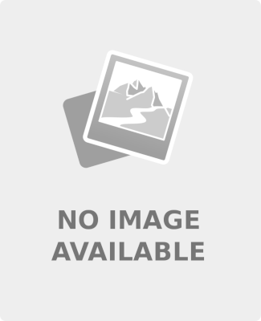

*Рисунок 9: Приведённые ландшафты потерь для трансформеров, обученных модульному сложению, — в исходной постановке, где наблюдался гроккинг.* **[p. 13]**

###### sec-c

## Приложение C Время до генерализации против weight decay

При обсуждении «механизма LU» как объяснения гроккинга в разделе 2 мы предсказали, что время обучения, необходимое модели для генерализации, должно быть $t\propto\gamma^{-1}$, где $\gamma$ — weight decay. Чтобы это проверить, мы выполняем перебор по сетке значений weight decay $\gamma$ и откладываем число шагов обучения, требуемое моделям для достижения заданного уровня тестовой точности, на рисунках 10(a)–10(b). Полные кривые обучения для этих запусков мы также показываем на рисунках 10(c)–10(d). Мы проводим эксперименты в двух постановках:

- **Трансформер на модульном сложении**: мы используем воспроизведение гроккинга из Nanda et al. [2023] и обучаем однослойный трансформер модульному сложению ($p=113$ и доля обучающего набора $0.3$) при $d_{\text{model}}=128$, 4 головах внимания, $d_{\text{mlp}}=512$, активациях ReLU и **[p. 14]** скорости обучения AdamW 0.001. По рисунку 10(a) мы обнаруживаем, что $t\propto\gamma^{-1}$ выполняется примерно на двух порядках величины $t$ и $\gamma$. Есть некоторая зависимость времени генерализации от сида (некоторым сидам стабильно требуется больше времени на генерализацию), но для каждого сида (то есть для конкретной инициализации модели) соотношение $t\propto\gamma^{-1}$, по-видимому, хорошо описывает данные.
- **ReLU-MLP на MNIST**: мы обучаем ReLU-MLP на MNIST, как описано в приложении A. Мы используем $\alpha=9.0$ и обучаем на уменьшенном обучающем наборе из 1000 образцов, чтобы задержать генерализацию / вызвать гроккинг. По рисунку 10(b) мы обнаруживаем, что для $\gamma$ примерно между 0.1 и 1.0 соотношение $t\propto\gamma^{-1}$ выполняется. Очень высокие значения weight decay, по-видимому, портят оптимизацию. С другой стороны, при очень низком weight decay модель генерализует быстрее, чем можно было бы наивно ожидать, — возможно, из-за неявной регуляризации.

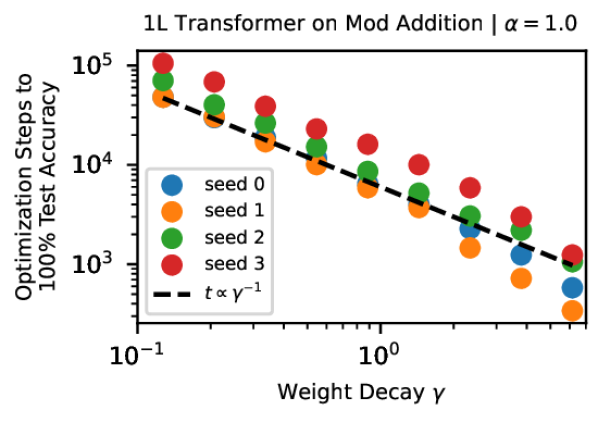

*(a)*


*(b)*

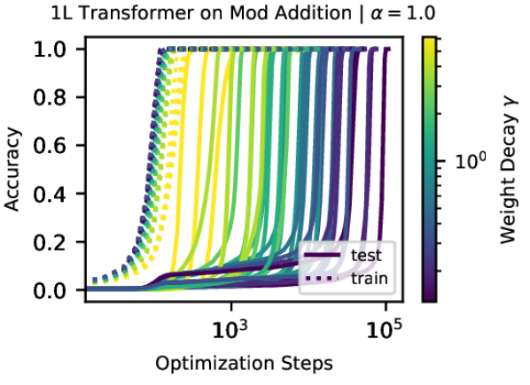

*(c)*

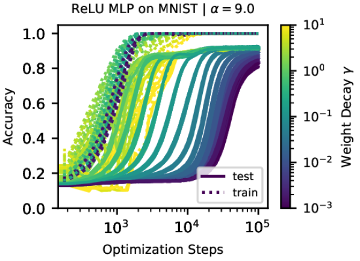

*(d)*

*Рисунок 10: Время до генерализации как функция weight decay: мы исследуем, в какой мере выполняется соотношение $t\propto\gamma^{-1}$, где $t$ — число шагов обучения, необходимое модели для генерализации, а $\gamma$ — weight decay в AdamW. При меньшем weight decay модели проводят больше времени в периоде переобучения, прежде чем в конце концов генерализовать. Время генерализации $t$ как функцию $\gamma$ мы показываем на (a)–(b), а полные кривые обучения для этих запусков — на (c)–(d).* **[p. 14]**

## Приложение D Постановка раздела 5.1

**Архитектура** Подобно Liu et al. [2022], архитектура декодера — MLP с жёстко зашитым сложением. Каждый входной символ $i$ кодируется скаляром $E_{i}$. Каждый выходной символ $k$ представлен 30-мерным случайным вектором $\hat{\mathbf{Y}}_{k}$. Мы рассматриваем сложение по основанию $p$, так что вход $0\leq i,j\leq p-1$ и выход $0\leq k=i+j\leq 2(p-1)$. *Представлением* мы называем $\mathbf{R}=\{E_{0},E_{1}\cdots,E_{p-1}\}$. MLP имеет два скрытых слоя с числом нейронов 1-200-200-30 по слоям и активациями ReLU. По обучающему образцу $(E_{i},E_{j})\to\mathbf{Y}_{k}$, где $i+j=k$, предсказание декодера-MLP есть

$$
\mathbf{Y}_{k}={\rm Dec}_{\mathbf{w}}(E_{i}+E_{j}), \tag{8}
$$

а функция потерь — среднеквадратичная ошибка (MSE) между $\mathbf{Y}_{k}$ и $\hat{\mathbf{Y}}_{k}$, где $\mathbf{w}$ — веса декодера. Хотя обычная постановка гроккинга делает обучаемыми и представление $\mathbf{R}$, и декодер $\mathbf{w}$, часть из них мы будем замораживать для удобства анализа. Здесь может возникнуть путаница, поэтому мы явно различаем три постановки: *анализ ландшафта*, *анализ приведённой траектории* и *анализ полной траектории*. В каждой постановке обучаемо своё подмножество параметров, как показано в таблице 1.

*Таблица 1: Три постановки, используемые в этой статье, с разными наборами обучаемых параметров.*

**[p. 15]**

| Обучаемость | веса декодера $\mathbf{w}$ | Представление $\mathbf{R}$ |  |  |
|---|---|---|---|---|
| норма $w=\|\|\mathbf{w}\|\|_{2}$ | направление $\hat{\mathbf{w}}=\mathbf{w}/w$ | неопрятность $m$ | Прочее |  |
| Анализ ландшафта | Нет, $w$ | Да | Нет, $m$ | Нет, 0 |
| Приведённая траектория | Да | Нет, $\hat{\mathbf{w}}^{*}(w,m)$ | Да | Нет, 0 |
| Полная траектория | Да | Да | Да | Да |

**Анализ ландшафта** И представление $\mathbf{R}$, и норма весов $w$ фиксированы. Обучаемо только направление весов $\hat{\mathbf{w}}$. Представление $\mathbf{R}$ фиксируется согласно уравнению (4) и зависит от $m$ — неопрятности представления. У декодера фиксирована норма весов $w$, но направление весов $\hat{\mathbf{w}}$ обучаемо. Для каждой фиксированной пары $(w,m)$ мы минимизируем обучающую потерю по $\hat{\mathbf{w}}$, получая

$$
\hat{\mathbf{w}}^{*}(w,m)=\underset{\hat{\mathbf{w}}}{\rm argmin}\ \ell_{\rm train}(w,m,\hat{\mathbf{w}}), \tag{9}
$$

и определяем приведённые обучающую и тестовую потери, как в уравнении (5). Минимизация выполняется оптимизатором Adam со скоростью обучения $10^{-3}$ в течение $10^{4}$ шагов. Хотя $(w,m)$ не обучаемы, приведённую минимизацию мы повторяем независимо для разных $(w,m)$. На рисунке 6 (a)(b)(d) фоновые тепловые карты относятся к анализу ландшафта.

**Анализ приведённой траектории** — это «мысленный эксперимент», опирающийся на анализ ландшафта. Поскольку анализ полной траектории может оказаться неподъёмным из-за слишком высокой размерности, мы пытаемся свести анализ траектории к двумерному, сделав два предположения о настоящей динамике: (1) *разделение масштабов*: динамика $\hat{\mathbf{w}}$ много быстрее динамики вдоль $w$ и вдоль $m$, так что $\hat{\mathbf{w}}(t)=\hat{\mathbf{w}}^{*}(w(t),m(t))$ верно в каждый момент обучения; (2) *эволюция представления линейна*, то есть представляет собой интерполяцию между начальным случайным гауссовым и конечным линейным представлением. При этих двух предположениях динамика обучения фактически сводится к двумерной, зависящей только от $(w,m)$ и подчиняющейся уравнению (6). На рисунке 6 (a)(b)(c) путь ${\rm A}\to{\rm E}$ относится к анализу приведённой траектории.

Надо признать, приведённая траектория может отклоняться от полной, поскольку предположения могут не выполняться, но она способна пролить свет на полную траекторию: норма весов сначала растёт, а затем растёт, и убывание нормы весов сильно коррелирует с генерализацией (см. приложение LABEL:app:weight_evolution и рисунок 7.

###### sec-e

## Приложение E Эксперименты на MNIST с кросс-энтропийной потерей

Отвечая на опасение рецензента, будто использование MSE-потери и есть «секрет» получения гроккинга на MNIST (рисунок 3), мы перезапустили эксперименты с кросс-энтропийной (CE) потерей. Результаты качественно схожи, с некоторыми количественными различиями.

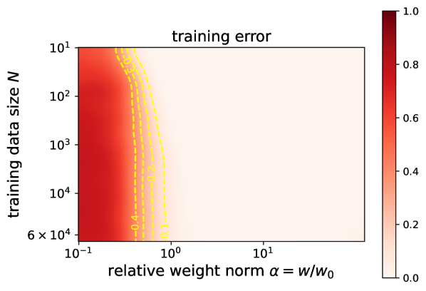

*(a)*

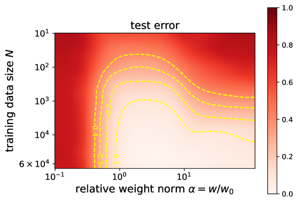

*(b)*


*(c)*

*Рисунок 11: MNIST с кросс-энтропийной потерей (в отличие от MSE-потери, использованной на рисунке 3). (a) приведённая ошибка на обучении, (b) приведённая ошибка на тесте. (c) «LU» для кросс-энтропийной потери всё ещё держится, но эффект мягче, чем при MSE-потере. В частности, «зона Златовласки» (диапазон весов, где происходит генерализация) шире.* **[p. 16]**

**Анализ ландшафта**

###### p15-8

Сравнивая рисунок 3 (MSE) и рисунок 11 (CE), мы замечаем их качественное сходство: (1) для малых наборов данных приведённые ошибка на обучении и ошибка на тесте напоминают «L» и «U» по норме весов соответственно; (2) для больших наборов данных «U» становится больше похожа на «L», то есть рассогласование между приведёнными ошибками на обучении и на тесте мало. Однако есть и количественное различие: CE даёт более широкую «зону Златовласки» (диапазон весов, где происходит генерализация), чем MSE. **[p. 16]** Отсюда следует, что для того, чтобы вызвать гроккинг с CE, норму весов нужно увеличивать до большего значения (скажем, $\alpha=100$).

**Динамика обучения**

Нам удаётся наблюдать отложенную генерализацию при обучении на MNIST с кросс-энтропийной потерей, но для этого требуется большее $\alpha$, чем было нужно при MSE-потере, — как и предсказывают приведённые ландшафты потерь на рисунке 11. Рисунок 12 показывает траектории обучения трёхслойного ReLU-MLP на MNIST, обученного с кросс-энтропийной потерей при $\alpha=100$ и $D=200$. Мы видим, что точность на тесте рано в обучении поднимается до 30–40 %, затем выходит на продолжительное плато, после чего растёт до $\approx$75 %, тогда как точность на обучении остаётся 100 %. Хотя динамика не столь чиста, как при MSE-потере, поскольку точность на тесте сначала выходит на плато выше случайного угадывания, мы полагаем, что называть такую динамику «гроккингом» всё же справедливо — ввиду улучшения генерализации поздно в обучении после плато.


*Рисунок 12: Кривые обучения с кросс-энтропийной потерей на MNIST. Нам всё ещё удаётся наблюдать отложенную генерализацию на MNIST с кросс-энтропийной потерей, хотя точность на тесте сначала выходит на плато выше точности случайного угадывания.* **[p. 16]**

---

# Машиночитаемый блок фактов

```yaml
paper:
  id: 2210.01117
  title: "Omnigrok: Grokking Beyond Algorithmic Data"
  authors: [Ziming Liu, Eric J. Michaud, Max Tegmark]
  affiliation: MIT, Department of Physics / Institute for AI and Fundamental Interactions
  date: 2022-10-03
  venue: ICLR 2023
  citations: 146
  source: ar5iv

core_claim:
  name: "LU mechanism"
  statement: "приведённая обучающая потеря по норме весов имеет форму L, тестовая — форму U;
    их рассогласование при w > w_c и есть причина гроккинга"
  reduced_loss: "f~(w) = f(w*), где w* = argmin l_train при ||w||_2 = w"
  timing_law: "t ~ ln(w0/w_c)/gamma ∝ 1/gamma при единственном источнике регуляризации"

setups:
  teacher_student:
    architecture: "MLP 5-100-100-5, tanh; учитель и ученик одной архитектуры, разные сиды"
    data: "N_train = 100, N_test = 100, входы из N(0, I), метки от учителя"
    optimizer: "Adam, lr 3e-4, 1e5 шагов"
    alpha: [0.5, 2.0]
    gamma: [0, 0.03, 1]
  mnist:
    architecture: "MLP глубины 3, ширины 200, ReLU"
    loss: MSE с one-hot целями (приложение E повторяет с кросс-энтропией)
    optimizer: "AdamW, lr 1e-3, батч 200"
    grokking_recipe: "выборка 60k -> 1k, alpha > 1"
  imdb: "LSTM, 2 слоя, эмбеддинг 64, скрытая 128; Adam lr 1e-3; гроккинг при alpha=6, 1k данных"
  qm9: "GCNN, 2 свёрточных слоя + линейный; Adam lr 1e-3; гроккинг при alpha=3, 200 образцов"
  transformer: "постановка Nanda et al.: 1 слой, d_model 128, 4 головы, d_mlp 512, p=113, AdamW lr 1e-3"

findings:
  - id: 1
    claim: "гроккинг вызван рассогласованием ландшафтов обучающей и тестовой потерь"
    anchor: p2-3
  - id: 2
    claim: "время до генерализации обратно пропорционально weight decay"
    anchor: p3-2
  - id: 3
    claim: "стандартные инициализации дают w <= w_c, поэтому гроккинг наблюдают редко"
    anchor: p3-3
  - id: 4
    claim: "больший набор данных расширяет зону Златовласки и убирает гроккинг"
    anchor: p4-6
  - id: 5
    claim: "гроккинг воспроизведён на MNIST, IMDb (LSTM) и QM9 (GCNN)"
    anchor: null
  - id: 6
    claim: "норма весов растёт при переобучении и падает ниже начальной при генерализации"
    anchor: p6-2
  - id: 7
    claim: "обучение при постоянной норме весов почти устраняет гроккинг"
    anchor: p9-2
  - id: 8
    claim: "сила зависимости тестовой потери от представления объясняет разницу между алгоритмическими данными и MNIST"
    anchor: p9-5

concept_cards:
  spherical-weight-norm-constraint: p2-1
  loss-landscape-basins: p9-5
  goldilocks-zone: p2-3
  initialization-scale: p3-3
  weight-decay: p3-2
  vision-real-world-data-mnist-cifar: null
  data-fraction-critical-dataset-size: p4-6
  structured-representation-learning: p9-5
  grokking: p9-2
  memorization-phase: p6-2
  double-descent: null

sources:
  original_html: original/2210.01117.ar5iv.html
  converted_text: original/2210.01117.omnigrok-grokking-beyond-algorithmic-data.md
  images_dir: images/
  pdf: https://arxiv.org/pdf/2210.01117
  code: https://github.com/KindXiaoming/Omnigrok

anchors:
  scheme: "pN-M | fig-N | sec-N (token headings, cross-viewer portable)"
  policy: "якоря заводятся только там, где на них ссылаются; разрывы страниц якорей не несут"
  paragraph: [p1-3, p1-4, p1-7, p1-8, p1-9, p2-1, p2-2, p2-3, p3-2, p3-3, p4-6, p6-2, p7-7, p9-2, p9-5]

review_summary:                   # см. раздел «Что показано, а что предположено»
  strong: "t ∝ 1/gamma выведено из механизма до эксперимента и подтверждено на двух
    порядках величины для трансформера; раз-гроккинг ограничением нормы весов работает"
  weak: "формула времени и зависимость от размера данных выведены из приведённой
    траектории, которая держится на допущении о линейной эволюции представления"
  authors_own_limits:
    - "признак гроккинга на неалгоритмических задачах обычно менее драматичен"
    - "на IMDb приведённая обучающая ошибка имеет форму U вместо предсказанной L (сноска 5)"
    - "приведённая траектория может отклоняться от полной (приложение D)"
    - "U-форму лучше считать эмпирически распространённой, а не доказуемо универсальной"
  method_caveats:
    - "в ландшафтном анализе обучаемо только направление весов; норма и представление заморожены"
    - "глобальный минимум на сфере заменён точкой сходимости Adam за 1e4 шагов"
    - "t ∝ 1/gamma на MNIST держится лишь для gamma в [0.1, 1.0]"
    - "гроккинг на MNIST вызван урезанием выборки в 60 раз и увеличением инициализации"
    - "порог theta = 0.01, задающий момент генерализации в разделе 3, не обоснован"

translation:
  status: complete
  formula_parity: "display 9/9, inline 263/263"
  figures: "38/38, подписей 12/12"
  note: "заголовок и строка авторов идут дважды — так в ar5iv-рендеринге (два h1);
    сломанная ссылка LaTeX 'Appendix LABEL:app:mnist_pd' перенесена как есть"
```
