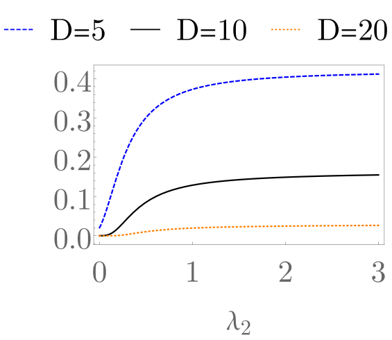
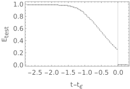
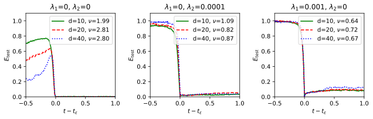
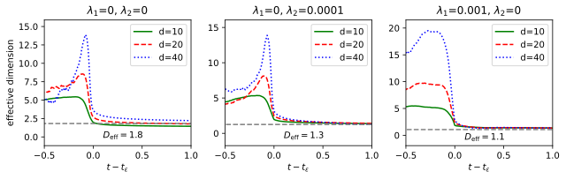
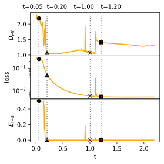

# Žunkovič, Ilievski 2022 — Grokking phase transitions in learning local rules with gradient descent

См. также: [глобальный индекс понятий](../../concepts/index.md).
arXiv [2210.15435v1](https://arxiv.org/abs/2210.15435), 26 октября 2022 (cond-mat.stat-mech). Колонтитула с площадкой публикации в PDF нет.

**Bojan Žunkovič** — Faculty of computer and information science, University of Ljubljana, Ljubljana, Slovenia (переписка: bojan.zunkovic@fri.uni-lj.si).
**Enej Ilievski** — Faculty of mathematics and physics, University of Ljubljana, Ljubljana, Slovenia.

Файлы разбора этой статьи:

- [`2210.15435.grokking-phase-transitions-in-learning-local-rules-with-gradient-descent.claims.txt`](2210.15435.grokking-phase-transitions-in-learning-local-rules-with-gradient-descent.claims.txt) — пронумерованные утверждения статьи с пометками разбора.
- [`2210.15435.grokking-phase-transitions-in-learning-local-rules-with-gradient-descent.license.txt`](2210.15435.grokking-phase-transitions-in-learning-local-rules-with-gradient-descent.license.txt) — лицензионная запись arXiv для этой статьи.

Схема якорей и правила ссылок на карточку — в [README папки статей](../README.md).

**Карточка-выдержка.** Лицензия статьи (`arxiv-nonexclusive`) не разрешает публикацию копии оригинала и полного перевода, поэтому карточка содержит редакторские секции и цитируемые фрагменты перевода (право цитирования). Полный текст статьи: <https://arxiv.org/abs/2210.15435>.

## Затрагиваемые понятия

**[Гроккинг](../../concepts/grokking.md)** — работа даёт корпусу первую точно решаемую постановку, в которой величины гроккинга выписаны в замкнутом виде, и заодно переопределяет само явление: гроккингом здесь названа **разность между временем обнуления тестовой ошибки и временем обнуления обучающей** ([p9-1](#p9-1)), а не задержка генерализации после плато. Гроккинг в обеих моделях заложен в постановку, и авторы говорят это прямо: классы линейно разделимы с зазором $2\epsilon$, «по построению эта постановка демонстрирует явление гроккинга ввиду предположения о разделимости» ([p6-1](#p6-1)). Показано, следовательно, не то, что гроккинг возникает, а то, как его вероятность, время и критический показатель зависят от параметров. Чего в работе нет: плато на уровне случайного угадывания (тестовая ошибка убывает гладко и монотонно от $\le 1/2$ до нуля), разрыва в два-пять порядков по числу шагов (времена гроккинга здесь — единицы безразмерного времени градиентного потока), любых алгоритмических наборов данных и любой глубокой сети. Имя явления взято у Power et al. ([p3-3](#p3-3)) — вместе с заявкой, что «ни одной точно решаемой модели, демонстрирующей явление гроккинга, до сих пор не обсуждалось»; сопоставления с наблюдениями Power et al. по существу нет, кроме двух качественных зависимостей ([p9-4](#p9-4)). Аннотация ([p1-2](#p1-2)) формулирует итог утвердительно и без оговорки о разделимости — именно эта формулировка и расходится по корпусу.

**[Фазовый переход](../../concepts/phase-transition.md)** — здесь корпус впервые получает гроккинг, разобранный полным аппаратом критических явлений: не аналогия и не описательное «резко», а показатель неаналитичности тестовой ошибки в точке её обнуления. В одномерной модели это переход **второго рода** с критическим показателем, равным единице, причём ни начальное условие, ни сила регуляризации показателя не меняют — только префактор ([p7-10](#p7-10)). В $D$-мерной модели шара показатель определяется **только** размерностью распределения признаков, $\nu=(D+1)/2$ ([p12-2](#p12-2)), а для изотропной плотности с алгебраической расходимостью — $\nu=(D+1-2\xi)/2$ ([p17-5](#p17-5)). Разделение ролей проговорено отдельно: вероятность и время гроккинга зависят от начальных условий и хода обучения, а показатель — только от плотности данных у границы области ([p18-1](#p18-1)). Чего в работе нет: параметра порядка, конечноразмерного анализа и универсальности в смысле классов эквивалентности. Существенно и то, что в самой работе есть контрпример собственному тезису: при **точных** тензорах внимания наблюдается переход **первого** рода со скачком $1/4$ ([fig-9](#fig-9)), и несовместимость с общим утверждением не обсуждается. При случайных тензорах внимания измеренный показатель во всех случаях меньше единицы и почти не зависит от $\lambda_{1,2}$ ([p24-1](#p24-1)).

**[Параметр порядка](../../concepts/order-parameter.md)** — работа лишь пользуется языком критических показателей, не вводя параметра порядка: роль неаналитичной величины играет сама тестовая ошибка, а управляющим параметром служит время обучения. Полученный показатель объявлен универсальным для изотропных плотностей, не обращающихся в нуль на границе шара ([p17-5](#p17-5)), и именно он, по ожиданию авторов, переносится за пределы модели ([p18-1](#p18-1)). Ни симметрии, ни величины, отличающей фазы, работа не называет — приписывать ей ландауовскую постановку нельзя.

**[Фаза меморизации / плато](../../concepts/memorization-phase.md)** — понятие затронуто **отсутствием**, и это существенно для корпуса. В решаемых моделях плато нет вовсе: тестовая ошибка убывает гладко от $\le 1/2$ к нулю, и весь «гроккинг» умещается в промежуток между двумя моментами обнуления ошибок ([p9-1](#p9-1), [p7-10](#p7-10)). Соответственно нет здесь ни запоминания, ни соревнования запоминающего и обобщающего решений, ни какого-либо трёхфазного деления обучения — язык, которым работу иногда пересказывают, ей не принадлежит.

**[Эффективная теория / статистическая механика](../../concepts/effective-theory-statistical-mechanics.md)** — главный технический вклад: тензорно-сетевое отображение, связывающее стандартную статистико-механическую постановку «учитель — ученик» с постановкой гроккинга. В стандартной теории веса учителя и ученика берутся равномерно на $M$-сфере, репличный приём даёт $E_{\rm test}\propto\frac{1}{\alpha}$, а внезапные переходы возможны лишь при ограничении фазового пространства (изинговский перцептрон) ([p18-2](#p18-2)); отсюда вывод, что «стандартная теория обучения правилам не описывает явление гроккинга» ([p18-3](#p18-3)). Отображение $z_{i}(x)$ переводит вход переменной длины в вектор длины $2d^{2}$, и задача обучения локальному правилу становится перцептронной задачей раздела 3 при $D=2d^{2}$ ([p22-3](#p22-3)). Тезис работы: степенной спад $1/\alpha$ есть следствие среднеполевого правила бесконечного радиуса, а гроккинг — следствие **локальности** учителя ([p5-3](#p5-3)). Чего в работе нет: доказательства для произвольного локального правила — заявка «для любого локального правила мы будем наблюдать гроккинг» опирается на существование подходящих матриц $A$ и на отбраковочную выборку ([p23-2](#p23-2)).

**[Варианты регуляризации](../../concepts/regularization-variants.md)** — единственная работа корпуса, где различие $L_{1}$ и $L_{2}$ **выведено аналитически**, а не измерено. Из $\epsilon_{\lambda}=\epsilon(1+\lambda_{2})+\lambda_{1}$ следует, что $L_{2}$ действует на зазор мультипликативно, а $L_{1}$ — аддитивно; поэтому при бесконечно малом зазоре и конечном $N$ конечную вероятность нулевой тестовой ошибки удерживает только $L_{1}$ ([p8-7](#p8-7)). В шаровой модели при $\lambda_{1}>0$ вероятность гроккинга поднимается выше $90\%$ при любом $D\geq 2$, а нижняя граница даёт максимум не ниже $0.915$ при любых $\epsilon$, $D$, $N$ ([p14-4](#p14-4)). Численно то же различие держится и на клеточном автомате: при равной силе регуляризации $L_{1}$-модель всегда имеет большую вероятность гроккинга ([fig-10](#fig-10)), меньшее время гроккинга ([p28-1](#p28-1)) и меньшую эффективную размерность. Отдельно от этого при обучении полной модели критический показатель **начинает зависеть** от регуляризации ($\nu\approx 2.5$ без неё, $\approx 0.7$ при $L_{1}$, $\approx 0.9$ при $L_{2}$ — [p27-1](#p27-1), [fig-14](#fig-14)) — в прямом отличии от линейного случая. Перенос на глубокое обучение заявлен как ожидание, не как результат ([p14-5](#p14-5), [p29-3](#p29-3)).

**[Weight decay](../../concepts/weight-decay.md)** — weight decay входит сюда как $L_{2}$-член $\lambda_{2}$ решаемой модели, и работа даёт ему аналитическое обоснование в узком смысле: при $\lambda_{1}=0$ рост $\lambda_{2}$ увеличивает вероятность гроккинга вплоть до максимума, зависящего от остальных параметров, что сочтено обоснованием численного наблюдения Power et al., Liu et al. и Thilak et al. о расширении области гроккинга при большем weight decay ([p13-5](#p13-5), [fig-5](#fig-5)). Ожидаемое время гроккинга при этом убывает с ростом $N$ и $\epsilon_{\lambda}$ — что сочтено согласным с сообщениями о более коротком гроккинге при большем числе примеров и большем weight decay ([p9-4](#p9-4)). Чего в работе нет: закона задержки вида $t\propto\gamma^{-1}$, опытов с настоящим weight decay в глубокой сети и разбора того, что $\lambda_{2}$ здесь стоит при квадратичной потере, а не при кросс-энтропии. Важна и оговорка, которую легко потерять: работы [6, 8] различия между $L_{1}$ и $L_{2}$ не изучают, и авторы это отмечают прямо ([p14-5](#p14-5)).

**[Обучение структурированных представлений](../../concepts/structured-representation-learning.md)** — прямое возражение эффективной теории Liu et al. 2205.10343 и, вероятно, самое ценное для корпуса место работы. Связь гроккинга с образованием структур утверждена **на уровне ансамбля**, а не отдельного прогона: «авторы [8] обсуждают связь между гроккингом и образованием структур на уровне отдельной модели. Мы же, напротив, доказываем, что гроккинг и образование структур связаны в среднем» ([p27-3](#p27-3)). Разведение подкреплено с двух сторон: показаны прогоны с отчётливой геометрической структурой при большой тестовой ошибке и прогоны с почти нулевой ошибкой при исчезающей структуре ([p27-4](#p27-4), [fig-16](#fig-16), [fig-17](#fig-17)) — и добавлен довод от решаемой модели, которой никакой геометрической структуры, кроме линейной разделимости, не требуется. Терминология введена здесь же: **помодельное образование структур** и **помодельный гроккинг** ([p27-3](#p27-3)); итог сформулирован как разведение двух явлений на уровне отдельных прогонов ([p29-4](#p29-4)). Чего в работе нет: разбора того, *какая* структура возникает — структуры «могут быть разными в каждом примере», и никакой их классификации не предлагается.

**[Сжатие многообразия представлений](../../concepts/manifold-representation-compression.md)** — работа даёт корпусу операциональную меру и её поведение на переходе. Эффективная размерность определена как экспонента энтропии долей объяснённой дисперсии главных компонент, $D_{\rm eff}=\mathrm{e}^{S}$, $S=-\sum_{k}\sigma_{k}\log\sigma_{k}$ ([p24-2](#p24-2)), и средняя $D_{\rm eff}$ **резко падает непосредственно перед** переходом гроккинга ([p27-2](#p27-2), [fig-15](#fig-15)). Регуляризация её снижает, сильнее всего $L_{1}$. Со стороны теории сюда же примыкает вывод шаровой модели: при $\lambda_{1}=0$ вероятность гроккинга экспоненциально убывает с размерностью $D$, откуда общий вывод, что распределения с малой эффективной размерностью предпочтительнее для генерализации ([p13-5](#p13-5)). Существенная оговорка, которую работа сама же и снимает в другом месте: при $\lambda_{1}>0$ зависимость обратная ([p14-4](#p14-4)).

**[Нейронный коллапс](../../concepts/neural-collapse.md)** — понятие взято как второе из двух «недавних эмпирических наблюдений», способных прояснить генерализацию ([p3-1](#p3-1)), изложено в четырёх канонических пунктах (NC1–NC4) и снабжено прямым признанием: отношение нейронного коллапса к гроккингу «до сих пор не обсуждалось», и в самой работе «мы не наблюдаем NC в определённом выше смысле» ([p3-2](#p3-2), [p5-1](#p5-1)). При обучении полной модели авторы говорят лишь, что наблюдают «явления, связанные с нейронным коллапсом» ([p26-2](#p26-2)). Ни одной из четырёх величин NC работа не измеряет — ссылаться на неё как на измерение нейронного коллапса при гроккинге нельзя.

**[Эффект рогатки](../../concepts/slingshot.md)** — работа воспроизводит наблюдение Thilak et al. о всплесках обучающей потери, но привязывает их к иному механизму. Механизм рогатки изложен как предложенное **необходимое условие** гроккинга ([p4-3](#p4-3)); совпадение признано («гроккинг совпадает со всплесками обучающей потери»), однако всплески здесь связаны со ступенчатыми изменениями эффективной размерности, то есть с перестройкой пространства признаков, а не с краем устойчивости и не с ростом нормы весов. Отсюда практическое предложение: откатывать модель после всплеска только тогда, когда эффективная размерность выросла ([p30-1](#p30-1)). Ни циклической природы всплесков, ни норм весов работа не измеряет.

**[Край устойчивости](../../concepts/edge-of-stability.md)** — понятие лишь упомянуто, одной скобкой, при изложении механизма рогатки ([p4-3](#p4-3)). Ни кривизны, ни собственных значений гессиана, ни каких-либо величин, относящихся к краю устойчивости, работа не считает.

**[Доля данных / критический размер набора](../../concepts/data-fraction-critical-dataset-size.md)** — здесь размер обучающего набора входит в **вероятность** гроккинга, а не в порог: определена вероятность вытянуть такой обучающий набор, на котором достижима нулевая тестовая ошибка ([p8-1](#p8-1)), выписана в замкнутом виде и растёт с $N$; ожидаемое время гроккинга с ростом $N$ убывает ([p9-4](#p9-4)). Критический размер выборки Liu et al. упомянут как то, что их эффективная теория позволяет вычислить ([p4-3](#p4-3)), но своего порога работа не вводит. Отдельно стоит держать в уме, что в численной части «вероятность гроккинга» подменена другой величиной — долей случайных тензоров внимания, дающих линейно разделимые признаки, при закреплённом обучающем наборе из всех образцов длины $M=3$ ([p23-6](#p23-6)).

**[Двойной спуск](../../concepts/double-descent.md)** — упомянут дважды и только как фон: с него начинается введение («несмотря на недавние успехи в понимании явления двойного спуска… у нас до сих пор нет полной теории генерализации», [p3-1](#p3-1)), и он назван среди наблюдений, подкрепляемых пользой терминальной фазы обучения ([p4-3](#p4-3)). Никакого сопоставления гроккинга с двойным спуском работа не проводит.

**[Эталонный полигон гроккинга](../../concepts/canonical-grokking-testbed.md)** — работа сознательно уходит с канонического полигона и ставит на его место другой: одномерный клеточный автомат «правило 30», хаотический, обучается один шаг эволюции, тест берётся по всем длинам входа $M_{\rm test}=3,4,\ldots,\infty$ ([p19-1](#p19-1)). Это единственный численный опыт статьи; ни модульной арифметики, ни трансформера, ни decoder-only архитектуры, ни доли обучающих данных как управляющей величины здесь нет. Постановка Power et al. присутствует только как источник имени явления ([p3-3](#p3-3)), а связь с ней — через тензорно-сетевое отображение, а не через данные ([p22-3](#p22-3)).

**[Оптимизатор](../../concepts/optimizer-adam-adamw-sgd.md)** — аналитическая часть работает с градиентным потоком (непрерывным по времени градиентным спуском) и квадратичной потерей ([p5-5](#p5-5)); численная часть с полной моделью обучается Adam со стандартными настройками и скоростью обучения 0.005 ([p26-2](#p26-2)). Зависимости от оптимизатора работа не изучает — сопоставления градиентного потока с Adam, разбора роли шума партий и перебора скоростей обучения в ней нет, хотя именно смена оптимизатора отделяет линейный случай (где показатель от регуляризации не зависит) от полной модели (где зависит).

---

## Несогласованности внутри статьи

**Регуляризатор в Ур. 4 записан по не тому параметру.** В одномерной модели вес закреплён, $w=1$, и единственный параметр — $b$; тем не менее $L_{1}$-штраф в [Ур. 4](#p6-7) записан как $\lambda_{1}|w|$, тогда как уравнение движения [Ур. 5](#p7-2) дифференцирует его так, как если бы стояло $\lambda_{1}|b|$ (в градиенте появляется $-\mathrm{sgn}(b)\lambda_{1}$). Ошибка записи, но она стоит в определении модели, из которой выведен весь раздел 3.1.

**$L_{2}$-член общей потери записан без квадрата нормы.** В [Ур. 2](#p5-5) слагаемое стоит как $\frac{\lambda_{2}}{2}||\theta||_{2}$, то есть без квадрата, тогда как в [Ур. 19](#p11-1) тот же член записан как $\frac{\lambda_{2}||w||_{2}^{2}}{2}$. Все дальнейшие выкладки (в частности, линейное по $b$ и по $w$ слагаемое в градиенте) отвечают форме с квадратом.

**В Ур. 14 стоят символы, не определённые в этом разделе.** Замкнутое выражение для вероятности гроккинга ([Ур. 14](#p8-4)) содержит $\Gamma(Nd)$ и множитель $(B\epsilon_{\lambda})^{2N}$, где ни $d$, ни $B$ в разделе 3.1 не введены; по смыслу выкладки, идущей от гамма-распределения с $\Gamma(N)$, требуется $\Gamma(N)$. Опечатка нигде не оговорена, а проверить её по частному случаю нельзя: приведённое упрощение при $N=2$ выписано отдельной формулой.

**Зависимость вероятности гроккинга от размерности приведена с противоположными знаками.** В [случае $\lambda_{1}=0$](#p13-5) вероятность гроккинга «экспоненциально убывает с размерностью распределения данных в латентном пространстве $D$», откуда следует общий вывод о предпочтительности малой эффективной размерности. В [случае $\lambda_{1}>0$](#p14-4) вероятность гроккинга, наоборот, **растёт** с $D$ и при $D\to\infty$ становится равной 100 % при $0<\lambda_{1}<\epsilon$. Оба утверждения верны в своих пределах, но в широкой формулировке («модели с распределениями в латентном пространстве, имеющими малую эффективную размерность, скорее приведут к хорошей генерализации») оговорка $\lambda_{1}=0$ опущена — а именно эта формулировка и вынесена во [«Более широкое влияние»](#p4-2) и в итоги.

**Переход объявлен вторым родом, а в одном из опытов наблюдается первым.** Всюду в работе гроккинг заявлен как фазовый переход второго рода ([p7-10](#p7-10)); при этом при точных тензорах внимания наблюдается переход **первого** рода со скачком $1/4$ в тестовой/обучающей ошибке ([p23-4](#p23-4), [fig-9](#fig-9)). Скачок объяснён тем, что окрестность любой позиции имеет четыре возможных значения, но несовместимость с общим тезисом не обсуждается, и в итогах этот результат не упомянут.

**«Вероятность гроккинга» в разделе 4 означает не то же, что в разделе 3.** В разделе 3 это вероятность по выборке обучающего набора ([p8-1](#p8-1)); в разделе 4.3.1 это доля случайных тензоров внимания $A$, дающих линейно разделимые признаки, при **закреплённом** обучающем наборе из всех образцов длины $M=3$ ([p23-6](#p23-6)). Величины сопоставляются с теорией раздела 3 без оговорки о подмене.

**Измеренный показатель расходимости лежит вне области, для которой выведена Ур. 50.** Формула $\nu=(D+1-2\xi)/2$ выведена при условии $0<\xi<1$ ([p17-5](#p17-5)), тогда как измеренные значения составляют $\xi^{*}=1.2,\,1.8,\,1.6$ ([tab-1](#tab-1)) — все вне области. Оговорка «нам, возможно, придётся ослабить условие $0<\xi<1$» в работе есть ([p18-1](#p18-1)), но вывод формулы при $\xi>1$ не проделан. Сама проверка соотношения признана частичной самими авторами: «в двух из трёх рассмотренных случаев оказывается разумно близким» ([p25-2](#p25-2)) — третий случай даёт $1.16$ против $1.6$.

**Настройки опыта с $L_{1}$-регуляризацией выписаны как настройки без неё.** В [описании опытов](#p26-2) три положения перечислены так: без регуляризации ($\lambda_{1,2}=0$), с $L_{2}$ ($\lambda_{1}=0$, $\lambda_{2}=0.0001$) и с $L_{1}$ ($\lambda_{1}=0$, $\lambda_{2}=0.001$). В третьем случае по смыслу и по подписям рисунков должно стоять $\lambda_{1}=0.001$, $\lambda_{2}=0$: иначе «$L_{1}$-регуляризация» отличалась бы от «$L_{2}$-регуляризации» только силой $\lambda_{2}$, а все выводы о различии $L_{1}$ и $L_{2}$ в разделе 4.3.2 лишились бы предмета.

## Что доказано, что показано и что предположено

Работа разложена на три слоя разной прочности, и при цитировании они смешиваются.

**Выведено точно** — в двух постановках, где нулевая тестовая ошибка достижима **по построению** ([p6-1](#p6-1)): динамика параметров, время обнуления тестовой ошибки, критический показатель ([p7-10](#p7-10), [p12-2](#p12-2), [p17-5](#p17-5)), вероятность гроккинга в замкнутом виде ([p8-4](#p8-4), [p14-4](#p14-4)) и ПРВ времени гроккинга. У последней есть две оговорки, которые в пересказах теряются первыми: она посчитана только в нулевом порядке по $1/\sqrt{N}$ и только при $\lambda_{1}=0$, и это распределение **верхней оценки** — условие нулевой обучающей ошибки взято по наихудшему обучающему образцу ([p15-1](#p15-1)). Сами авторы количественного описания опыта от неё не ждут: переносимы лишь двухмодовость и качественные зависимости ([p17-2](#p17-2)).

**Показано численно** — на одном клеточном автомате «правило 30» при размерности связи $d\le 40$: показатель $\nu<1$, не зависящий от $\lambda_{1,2}$, при фиксированных случайных тензорах внимания ([p24-1](#p24-1)); двухмодовость ПРВ времени гроккинга и разделение собственных значений $G$ на два множества ([p25-4](#p25-4)); падение эффективной размерности перед переходом ([p27-2](#p27-2)); разведение гроккинга и образования структур на уровне прогона ([p27-4](#p27-4)). Согласие с теорией авторы оценивают осторожно: предсказание показателя «грубо согласуется с численной оценкой», а приближение ПРВ времени гроккинга «предсказывает действительную численную оценку лишь качественно» ([p29-2](#p29-2)). Есть и прямое расхождение: рост $\lambda_{2}$ в опыте **часто увеличивает** время гроккинга, тогда как шаровая модель предсказывает обратное; расхождение отнесено на недиагональность $G$ ([p25-4](#p25-4)).

**Заявлено как ожидание** — всё, что относится к глубоким сетям. Предпочтительность малой эффективной размерности ([p4-2](#p4-2)), преимущество $L_{1}$ перед $L_{2}$ в общей постановке классификации ([p29-3](#p29-3)), мониторинг эффективной размерности вместо ранней остановки ([p30-1](#p30-1)) — всё это высказано как предположение и ожидание, опытов с глубокими сетями в работе нет, а расширение теории на них сами авторы называют трудным в рамках предложенного построения ([p30-2](#p30-2)). Сюда же относится заявка «для любого локального правила мы будем наблюдать гроккинг» ([p22-3](#p22-3)): она опирается на существование подходящих матриц $A$ и на отбраковочную выборку, при которой матрицы, не дающие линейно разделимых признаков, попросту отбрасываются ([p23-2](#p23-2)); доказательства для произвольного локального правила нет. Не изучено и влияние начального распределения классифицирующего тензора $B$ — оно «оставлено для будущих исследований» ([p26-1](#p26-1)).

## Ошибочные пересказы и цитирования этой статьи

Ниже — узоры, наблюдённые в цитирующих работах корпуса (обследованы `original/` двадцати пяти работ, ссылающихся на эту). Каждая запись говорит, что именно искажается, и ведёт к авторским абзацам, где стоит теряемая оговорка. Якорей `mc-*` на цитирующих карточках пока не заведено, поэтому ссылок «подробности» здесь нет; список кандидатов передан координатору.

**«Гроккинг связан с образованием структур / обучением представлений» (ошибочное и расширяющее).** Работу ставят в один ряд с Liu et al. 2205.10343 как подкрепляющую представленческое объяснение: 2307.09550 пишет `"Grokking has also been described as a phase transition (Žunkovič and Ilievski 2022,Liu et al. 2022b) within the framework of representation learning."` — то есть приписывает ей ровно ту рамку, с которой она спорит. Мягче, но с той же потерей: 2310.16441 (`"analyze solvable models displaying grokking and relate results to latent-space structure formation."`) и 2410.04489 (`"analyzed solvable models exhibiting grokking and related their findings to the formation of latent-space structure"`). Авторская формулировка прямо противоположна: связь утверждена **на уровне ансамбля**, а помодельно два явления разведены ([p27-3](#p27-3), [p27-4](#p27-4), [p29-4](#p29-4)), и решаемая модель раздела 3 «не требует никакой особой геометрической структуры (помимо условия линейной разделимости)». Образцовая формулировка для контраста — у 2502.01774, где схвачены и тезис о локальности учителя, и отбраковочная выборка в основании оценки вероятности гроккинга.

**«Отсюда взят степенной закон времени гроккинга по доле данных» (ошибочное).** 2306.13253 дважды пишет `"Empirically, $t_{4}$ follows a power law of the form $t_{4}(r)=ar^{-\gamma}+b$. This was first predicted by Žunkovič & Ilievski (2022)."` Такого предсказания в работе нет: выведены ПРВ времени гроккинга (двухмодовая, с дельтой Дирака в медленной ветви) и качественное утверждение, что ожидаемое время гроккинга убывает с ростом $N$ и $\epsilon_{\lambda}$ ([p9-4](#p9-4)); ни степенного закона по доле обучающих данных, ни величины $\gamma$ в статье не появляется. Это самый тяжёлый из наблюдённых случаев, потому что фабрикуемое предсказание подано как численно подтверждённое.

**«Разобрана линейная регрессия» и «разобрана модульная арифметика» (ошибочное).** 2504.13292 относит работу к `"linear regression with linear models (Žunkovič & Ilievski, 2022)"`, тогда как здесь двоичная **классификация** перцептроном с квадратичной потерей на метках $\pm 1$ ([p5-5](#p5-5), [p11-3](#p11-3)). 2509.17738 пишет `"Analytical studies reveal closed-form grokking solutions in modular arithmetic tasks (Gromov, 2023; Žunkovič and Ilievski, 2024)"` — модульной арифметики в работе нет вовсе, единственная численная задача — клеточный автомат «правило 30» ([p19-1](#p19-1)). Точная формулировка того же места есть у 2310.02541, называющей ровно то, что показано: `"showed a time separation between achieving zero training error and zero test error in a binary classification task on a linearly separable distribution."`

**«Отсюда трёхфазное деление обучения» (ошибочное).** 2402.16726 включает работу в перечень, обосновывающий деление обучения на запоминание, образование контуров и очистку. Ни одной из этих фаз в работе нет: плато на уровне случайного угадывания в её моделях не возникает вовсе ([p9-1](#p9-1), [p7-10](#p7-10)), контуров она не рассматривает, а само деление принадлежит Nanda et al. 2301.05217.

**«Задержку можно устранить» (расширяющее).** 2606.05863 относит работу к показавшим, что задержку «можно сократить, усилить или **устранить**» изменением регуляризации, размера данных, инициализации и оптимизации. Сократить и усилить — да; устранить — нет: гроккинг здесь присутствует по построению ([p6-1](#p6-1)), меняются лишь его вероятность и время.

Более мягкие отголоски, не заслужившие отдельных записей: 2307.09550 в другом месте помещает работу в абзац об эмерджентных явлениях **глубоких** нейронных сетей, тогда как её результат — утверждение об одном перцептронном слое, а расширение на глубокие сети сами авторы называют трудным ([p30-2](#p30-2)); 2607.13749 приписывает разобранным работам «режим универсальной аппроксимации», тогда как здесь модель — один перцептрон; 2601.19791 добавляет от себя, что «строгих доказательств авторы не привели», чего работа о себе не говорит; 2311.18817 называет переход «резким» (`sharp`), тогда как он непрерывный, второго рода.

Отдельно стоит отметить, чего в корпусе **не** случилось: ни одна цитирующая работа не приписала этой статье переход **первого** рода — во всех шести работах, где род перехода назван, первый род отнесён к Rubin et al. 2310.03789, а сюда — критические показатели; наблюдение самой статьи о первом роде при точных тензорах внимания ([fig-9](#fig-9)) не процитировано никем. Не случилось и подмены различия $L_{1}$/$L_{2}$ на weight decay: 2311.06597 излагает его точно.

---
---

# Цитируемые фрагменты перевода

Ниже приведены только те фрагменты перевода, на которые ссылаются карточки корпуса (право цитирования). Нумерация якорей `pN-M` / `fig-N` / `sec-X` совпадает с полной карточкой и оригиналом.

## Аннотация

###### p1-2

Мы обсуждаем две решаемые модели гроккинга (генерализации за пределами переобучения) в постановке обучения правилу. Мы показываем, что гроккинг есть фазовый переход, и находим точные аналитические выражения для критических показателей, вероятности гроккинга и распределения времени гроккинга. Далее мы вводим тензорно-сетевое отображение, связывающее предложенную постановку гроккинга со стандартной (перцептронной) статистической теорией обучения, и показываем, что гроккинг есть следствие локальности модели учителя. В качестве примера мы разбираем задачу обучения клеточному автомату, численно определяем критический показатель и распределения времени гроккинга и сравниваем их с предсказанием предложенной модели гроккинга. Наконец, мы численно разбираем связь между образованием структур и гроккингом.

## 1 Введение

###### p3-1

Несмотря на недавние успехи в понимании явления двойного спуска [1, 2, 3, 4], у нас до сих пор нет полной теории генерализации в переопараметризованных моделях. Два недавних эмпирических наблюдения — нейронный коллапс [5] и гроккинг (генерализация за пределами переобучения) [6] — могут помочь нам понять свойства обучения и генерализации переопараметризованных моделей.

###### p3-2

Нейронный коллапс происходит в терминальной фазе обучения, то есть в фазе с нулевой обучающей ошибкой. Он состоит в схлопывании $N-$мерных признаков последнего слоя (входа последнего/классифицирующего слоя) [5] в $(C-1)$-мерную структуру равноугольного жёсткого фрейма (ETF), где $C$ — число классов. Векторы признаков сходятся к вершинам ETF-структуры так, что признаки каждого класса оказываются вблизи одной вершины. Кроме того, расстояние между вершинами много больше всех внутриклассовых разбросов признаков. Отчасти нейронный коллапс удаётся понять в рамках моделей несвязанных признаков и локальной упругости [7]. Однако его роль в генерализации, отношение к гроккингу и возникновение различных структур латентного пространства до конца не поняты.

###### p3-3

Гроккинг также происходит во время терминальной фазы обучения. При обучении на алгоритмических наборах данных за пределами нулевой обучающей ошибки наблюдается внезапное падение тестовой ошибки примерно с единицы до нуля [6]. Явление гроккинга обсуждалось в рамках подхода эффективной теории [8], где была установлена эмпирическая связь между образованием представлений/структур и генерализацией. Эмпирическое исследование [9] установило отношение между гроккингом, всплесками обучающей потери и ростом нормы весов. Однако ни одной точно решаемой модели, демонстрирующей явление гроккинга, до сих пор не обсуждалось. Кроме того, неясно, как согласовать гроккинг со стандартной теорией генерализации, основанной на методах статистического обучения [10]. Теория статистического обучения предсказывает (в постановке «учитель — ученик») алгебраическое (как $t^{-\nu}$, где $\nu=1$ для большинства правил обучения) убывание ошибки генерализации со временем обучения $t$ (или числом обучающих образцов) [10].

###### p4-2

Хотя наши результаты основаны на простых моделях, они могут быть значимы и для практики обучения глубоких сетей. Мы предполагаем, что хорошая генерализация более вероятна у моделей, чьи распределения данных в латентном пространстве имеют малую эффективную размерность. Наши результаты намекают, что $L_{1}$-регуляризация может улучшить свойства генерализации глубоких моделей по сравнению с $L_{2}$-регуляризацией. Далее, мы показываем, что всплески потери (часто возникающие при обучении глубоких нейронных сетей) отвечают структурным изменениям латентного пространства, которые могут быть полезны или вредны для генерализации. Если предположить, что это верно и для глубоких сетей, мы можем воспользоваться сведениями об эффективной размерности латентного пространства, чтобы откатить модель к состоянию до всплеска или продолжить обучение с нынешней моделью.

## 2 Смежные работы

###### p4-3

Внезапный переход от нуля к 100 % точности на алгоритмических наборах данных в переобученных трансформерных моделях был впервые описан в [6] и назван гроккингом. В фазе гроккинга наблюдалось образование простых структур, отражающих свойства задачи. Эта находка противоречит общепринятой практике ранней остановки и подкрепляет недавние наблюдения о пользе терминальной фазы обучения [11, 1, 12] и явление двойного спуска [1, 13, 2, 14]. В [8] была предложена эффективная теория гроккинга. В рамках этой эффективной теории можно вычислить критический размер обучающей выборки, при котором наблюдается гроккинг. Авторы связывают гроккинг с хорошим представлением (или образованием структур) и вводят его как фазу между генерализацией и запоминанием. Мы идём дальше этих находок, поскольку получаем точные решения предложенной постановки и вычисляем даже функцию плотности вероятности (ПРВ) времени гроккинга. Систематическое опытное исследование явления гроккинга представлено в [9]. Механизм рогатки (sling-shot, связанный с краем устойчивости [15]) был предложен как необходимое условие гроккинга. Механизм рогатки состоит в возникновении при обучении циклических всплесков обучающей потери и ступеней в нормах весов. Поведение рогатки не ограничено алгоритмическими наборами данных, но присутствует и в различных обычных задачах классификации [9]. Мы находим схожее поведение, а именно то, что гроккинг совпадает со всплесками обучающей потери. Более того, мы связываем всплески обучающей потери с разрывной ступенчатой эволюцией эффективной размерности представления данных в латентном пространстве, которая указывает на структурные изменения этого представления.

###### p5-1

Роль функции потерь, регуляризации, пакетной нормализации и оптимизатора обсуждалась в рамках модели несвязанных признаков [16, 17, 7] и предположения о локальной упругости [7]. Отношение NC к свойствам генерализации обсуждалось в [18, 19, 7]. Однако отношения к гроккингу до сих пор не обсуждалось. Хотя мы не наблюдаем NC в определённом выше смысле, наши находки касательно всплесков обучающей потери и структуры данных в латентном пространстве могут оказаться значимы и для динамики NC.

###### p5-3

Наконец, наша работа связана со статистико-механической теорией обучения с учителем [10]. В перцептронном случае «учитель — ученик» с учителем предсказано алгебраическое убывание ошибки генерализации с размером обучающей выборки (временем обучения) [10]. Фазовый переход первого рода выведен лишь в ограниченной постановке с дискретными весами [10]. Эти результаты обычно опираются на метод реплик [47], требующий термодинамического предела, где и число образцов, и размерность велики, а их отношение закреплено. Выдающиеся недавние результаты в этом направлении касаются разбора оптимальных ошибок генерализации обобщённых линейных моделей [48, 49]. Мы изучаем ту же постановку «учитель — ученик», но с ограничением на локального учителя (по-прежнему в термодинамическом пределе). Локальность учителя/правила позволяет нам отобразить задачу в конечномерное латентное пространство, где мы и обсуждаем гроккинг (фазовый переход второго рода) и образование структур в латентном пространстве.

## 3 Перцептронный гроккинг

###### p5-5

где $w,x\in\mathbb{R}^{D}$ и $b\in\mathbb{R}$. Мы берём $N$ положительных и $N$ отрицательных образцов и затем обучаем модель градиентным спуском

###### p6-1

где $\lambda_{1}$, $\lambda_{2}$ обозначают параметры регуляризации, $\theta$ обозначает совокупность всех параметров модели $w$, $b$, а $||\bullet||_{1,2}$ обозначают одну и две нормы. По построению эта постановка демонстрирует явление гроккинга ввиду предположения о разделимости. Вероятность гроккинга, время гроккинга и критический показатель зависят от подробностей постановки.

### 3.1 Одномерная показательная модель

###### p6-7

где $b$ — единственный параметр модели (вес мы закрепляем, $w=1$). Как описано выше, мы обучаем модель градиентным спуском с потерей

#### 3.1.1 Динамика тестовой ошибки

###### p7-2

Сперва мы вычислим динамику параметров модели, задаваемую отрицательным градиентом функции потерь

###### p7-10

Гроккинг в рассматриваемой одномерной показательной модели есть фазовый переход второго рода с критическим показателем тестовой ошибки, равным единице. Параметры регуляризации и расстояние между распределениями положительного и отрицательного классов меняют лишь префактор. В общем случае мы ожидаем, что критический показатель зависит и от распределения, и от параметров обучения, например от силы регуляризации.

#### 3.1.2 Вероятность гроккинга

###### p8-1

Нас также занимает вероятность вытянуть такой обучающий набор, на котором модель можно обучить до нулевой тестовой ошибки. Мы называем эту вероятность *вероятностью гроккинга*. В рассматриваемом одномерном случае конечная тестовая ошибка обращается в нуль лишь при $|\bar{x}_{\lambda}|<\epsilon$. Мы записываем это условие нулевой тестовой ошибки (ошибки генерализации) обученной модели как

###### p8-4

где $K_{n}(z)$ обозначает модифицированную функцию Бесселя второго рода. Вероятность получить набор данных с нулевой тестовой ошибкой тогда даётся выражением

###### p8-7

Влияние $L_{1}$- и $L_{2}$-регуляризаций на обученную модель различно. $L_{2}$-регуляризация мультипликативна, а $L_{1}$-регуляризация аддитивна по отношению к зазору $\epsilon$ между положительными и отрицательными образцами. Следовательно, в случае малого зазора $L_{1}$-регуляризация становится куда действеннее. Иначе говоря, при бесконечно малом зазоре ($\epsilon\ll 1$) и конечном $N$ $L_{1}$-регуляризация обеспечивает конечную вероятность нулевой тестовой ошибки. При использовании $L_{2}$-регуляризации это не так.

#### 3.1.3 Время гроккинга

###### p9-1

Мы определяем *время гроккинга* как разность между $t_{\epsilon}$ (временем нулевой тестовой ошибки) и временем, в которое обучающая ошибка становится нулевой. В нашем простом случае мы имеем

###### p9-4

На рис. 3 мы показываем несколько численно точных ПРВ времени гроккинга. Ожидаемое время гроккинга уменьшается с ростом обучающей выборки $N$ и действенного разделения классов $\epsilon_{\lambda}$. Это согласуется с наблюдениями [6, 8], где сообщалось о меньшем времени гроккинга при увеличенном числе обучающих образцов и большем weight decay.

### 3.2 D-мерная модель равномерного шара

###### p11-1

Мы записываем обучающую потерю с $L_{1}$- и $L_{2}$-регуляризацией как

###### p11-3

Представленная модель значима в постановке переноса обучения [50], если переобучается лишь последний слой сети, а в предпоследнем слое стоят сигмоидные функции активации. Если модель хорошо переносится на новую задачу классификации, то распределения новых классов в латентном пространстве линейно разделимы и могут быть ограничены $D-$мерным шаром. Поскольку подробности распределений нам неизвестны, мы предполагаем равномерное распределение в шаре. Далее, распределения положительных и отрицательных признаков могут быть вложены в латентное пространство большей размерности. В этом случае $D$ отвечает эффективной размерности данных, которую можно вычислить по ковариационной матрице. Как мы увидим в следующем разделе, введённая $D-$мерная модель шара качественно воспроизводит критический показатель и ПРВ времени гроккинга в задаче обучения локальному правилу.

#### 3.2.1 Динамика тестовой ошибки

###### p12-2

где $t_{\epsilon}$ определено как время, в которое тестовая ошибка обращается в нуль, а коэффициент $k_{G}$ даётся линейным разложением $w(t)$ около $t_{\epsilon}$. Тем самым критический показатель определяется только размерностью распределения признаков.

#### Случай $\mathbf{\lambda_{1}=0}$ –

###### p13-5

При заданном наборе параметров $\lambda_{2}$, $D$ и $\varepsilon$ мы можем численно и действенно вычислить интеграл в Ур. 30 (и полную формулу, приведённую в приложении B). На рис. 5 мы показываем полную вероятность гроккинга как функцию $D$, $\lambda_{2}$, $N$ и $\varepsilon$. Как и ожидалось, вероятность гроккинга больше при увеличении расстояния $\varepsilon$ и числа образцов $N$. Мы также наблюдаем, что вероятность гроккинга экспоненциально убывает с размерностью распределения данных в латентном пространстве $D$. Поэтому распределение в латентном пространстве с малой эффективной размерностью предпочтительнее для лучшей генерализации. Этот результат отчасти объясняет наблюдение в [8], связывающее гроккинг с образованием структур и уменьшением эффективной размерности на переходе. Мы ожидаем, что малая эффективная размерность в латентном пространстве улучшает генерализацию и в более общей постановке, за пределами простой постановки гроккинга, описанной в этом разделе. Иначе говоря, модели с распределениями в латентном пространстве, имеющими малую эффективную размерность, скорее приведут к хорошей генерализации. Наконец, при увеличении силы $L_{2}$-регуляризации $\lambda_{2}$ вероятность гроккинга растёт вплоть до максимума, зависящего от остальных параметров. Эти результаты дают некоторое обоснование численного наблюдения в [6, 8, 9] о том, что weight decay увеличивает область параметров, где наблюдается гроккинг.

###### fig-5

*Рисунок 5: Вероятность гроккинга как функция $D$, $\lambda_{2}$, $N$ и $\varepsilon$. Мы находим, что большая размерность $D$ уменьшает вероятность гроккинга. Напротив, большая сила регуляризации $\lambda_{2}$ увеличивает вероятность гроккинга. Как и ожидалось, увеличенное разделение классов $\varepsilon$ и число обучающих образцов $N$ также увеличивают вероятность гроккинга. Если в панелях не указано иное, дополнительные параметры положены равными: $D=10$, $\lambda_{2}=0.1$, $N=10$ и $\varepsilon=1.01$.* **[p. 14]**

#### Случай $\mathbf{\lambda_{1}>0}$ –

###### p14-4

Мы находим то же различие между $L_{1}$- и $L_{2}$-регуляризациями, что и в простом одномерном случае. При $\varepsilon=1$ и $\lambda_{1}=0$ вероятность гроккинга обращается в нуль при любом значении $\lambda_{2}$. Напротив, при $\lambda_{1}>0$ вероятность гроккинга может подниматься даже выше $90\%$ при любом $D\geq 2$. Занятно, что вероятность гроккинга растёт с размерностью распределения данных $D$. Более того, если устремить $D\rightarrow\infty$, вероятность гроккинга становится равной 100 % при $0<\lambda_{1}<\epsilon$. Этот результат есть следствие концентрации меры равномерного распределения «вокруг экватора». Схожим образом, пользуясь нижней границей Ур. 33, мы оцениваем наилучшее значение $\lambda_{1}$ при любых $\epsilon$, $D$ и $N$ и находим, что максимум вероятности гроккинга всегда больше $0.915$. Напротив, в случае $\lambda_{1}=0$ вероятность гроккинга становится экспоненциально малой с ростом $D$ независимо от значений остальных параметров. Схожие наблюдения мы делаем и при ослаблении условия $\lambda_{2}\gg 1$ (см. приложение B).

###### p14-5

Обсуждаемые результаты могут быть применимы и более широко. Было бы интересно проверить, значительно ли $L_{1}$-регуляризация весов в последнем (классифицирующем) слое улучшает генерализацию глубоких моделей по сравнению **[p. 15]** с $L_{2}$-регуляризацией. Работы [6, 8] не изучают различия между $L_{1}$- и $L_{2}$-регуляризациями. В [8] сделано согласующееся наблюдение, а именно что больший weight decay в большинстве случаев приводит к большей области параметров, где наблюдается гроккинг. Мы подтверждаем это ожидание на простой модели, обсуждаемой в разделе 4.3.1 и разделе 4.3.2.

#### 3.2.3 Время гроккинга

###### p15-1

Чтобы вычислить время гроккинга, мы сперва определим условие нулевой обучающей ошибки. В отличие от простого одномерного случая, это условие нетривиально зависит от обучающего набора и от начального условия $w(0)$. Чтобы упростить расчёт, мы вычисляем распределение верхней границы времени гроккинга в пределе $N\gg 1$. Наиболее осторожную оценку для нулевой обучающей ошибки мы получаем, выбирая обучающий образец $\tilde{x}$, образующий наименьший угол с плоскостью, задаваемой вектором сдвига $\epsilon$. Мы записываем это условие через косинус угла как

###### p17-2

Мы не ожидаем, что аналитически полученная ПРВ времени гроккинга количественно опишет реальные опыты, в особенности потому, что это решение нулевого порядка при большом $N$. Однако двухмодовая структура и качественная зависимость от параметров должны присутствовать и в более реалистичных постановках. Один такой пример мы обсудим в разделе 4.3.

#### 3.2.4 Критические показатели для произвольной изотропной ПРВ данных

###### p17-5

где $B(a,b)$ — бета-функция Эйлера. Полученный критический показатель $\nu=\frac{D+1}{2}$ универсален для изотропных плотностей вероятности, не обращающихся в нуль на границе шара, и согласуется с результатом Ур. 23. **[p. 18]** Если вдобавок плотность $\rho(\delta h)$ имеет алгебраическую расходимость, например $\rho(\delta h)\approx\rho_{\xi}\delta h^{-\xi}$, где $0<\xi<1$, мы получаем

###### p18-1

Критический показатель тестовой ошибки раскрывает поведение плотности образцов на границе области образцов. Тогда как и вероятность гроккинга, и ПРВ времени гроккинга зависят от подробностей начальных параметров модели и её эволюции, критический показатель $\nu$ зависит только от распределения данных на границе области. Поэтому мы ожидаем, что Ур. 50 описывает критический показатель количественно и в более общей постановке. В этом случае нам, возможно, придётся ослабить условие $0<\xi<1$, чтобы вместить более общую расходимость распределения данных на границе области образцов.

## 4 Обучение локальным правилам неглубокими тензорными сетями

###### p18-2

В стандартной теории обучения правилам модель «учитель — ученик» описывает постановку, в которой модель-ученик должна выучить правило, задаваемое моделью-учителем, см. [10]. В простейшей постановке, где и учитель, и ученик — перцептроны вида Ур. 18, мы пользуемся методами статистической механики, чтобы вычислить ожидаемую ошибку генерализации при заданном числе обучающих образцов (или заданном времени обучения). Это достигается в термодинамическом пределе, где размер входа $M$ и число обучающих образцов $N$ устремляются к бесконечности так, что $N=\alpha M$. Веса учителя и ученика берутся равномерно на $M$-сфере. В этой постановке можно воспользоваться репличным приёмом [47], чтобы вычислить поведение тестовой ошибки как функции $\alpha$. Находится $E_{\rm test}\propto\frac{1}{\alpha}$ при $\alpha\rightarrow\infty$. Хотя внезапные переходы к нулевой ошибке генерализации возможны, они суть следствие ограничения на фазовое пространство параметров, например в изинговском перцептроне параметры могут принимать лишь значения $\pm 1$.

###### p18-3

Итак, стандартная теория обучения правилам не описывает явление гроккинга, и неясно, как согласовать стандартное алгебраическое убывание к нулевой тестовой ошибке с переходом гроккинга, наблюдаемым в глубоких моделях и представленным в разделе 3.

### 4.1 Локальная модель учителя

###### p19-1

Такую модель мы называем $K-$локальной моделью. Ур. 51 описывает хорошо известную вычислительную парадигму клеточных автоматов. Клеточные автоматы — универсальные дискретные пространственно-временные динамические системы с конечным набором возможных состояний в каждой позиции [51, 52]. Клеточный автомат мы задаём набором правил, преобразующих одну конфигурацию состояний в другую. Мы будем рассматривать одномерный автомат «правило 30» ($K=1$) [51, 52], который проявляет хаотическое поведение и задаётся правилом $y_{i}=\mbox{rule30}(x_{i-1},x_{i},x_{i+1})$. Следующее состояние клетки $i$, то есть $y_{i}$, определяется текущей конфигурацией в клетках $i-1$, $i$ и $i+1$, то есть $x_{i-1},x_{i},x_{i+1}$, следующим образом

#### 4.2.3 Тензорно-сетевое отображение

###### p22-3

В приведённой формуле $\vec{B}$ обозначает векторизованный классифицирующий тензор $B$. Положив $D=2d^{2}$, мы отобразили задачу обучения локальному правилу в термодинамическом пределе в задачу (гроккинг-)классификации вида, обсуждённого в разделе 3. Занятно, что для $K-$локального правила мы можем найти $4^{K}$-мерные матрицы $A$, при которых преобразованная задача решается простой перцептронной моделью и демонстрирует явление гроккинга. Поэтому зависимость $1/\alpha$ от размера обучающей выборки, получаемая из стандартной теории обучения правилам, по-видимому, есть следствие среднеполевого правила бесконечного радиуса. Для любого локального правила мы будем наблюдать гроккинг.

#### 4.3.1 Постоянные тензоры внимания

###### p23-1

Теперь мы обсудим результаты численного опыта, полученные при закреплённых тензорах внимания $A$. А именно, мы пользуемся предложенной тензорно-сетевой моделью как отображением из $\{-1,1\}^{M}$ в $\mathbb{R}^{2d^{2}}$, как обсуждалось в разделе 4.2.3 и показано на рис. 8. Мы выбираем левый и правый граничные векторы $v^{\rm L,R}$ равными собственным векторам $A_{0}$, отвечающим наибольшему собственному значению. Мы также закрепляем размерность связи $d=2$ и изучаем 1-локальное правило, что облегчает сравнение с результатами, обсуждёнными в разделе 3.

###### p23-2

Тензоры внимания $A$ мы определяем, независимо беря каждый элемент из нормального распределения с нулевым средним и единичной дисперсией. Поскольку не все векторы внимания приводят к разрешимым задачам, мы проводим отбраковочную выборку, проверяя, имеют ли конечные параметры модели, даваемые Ур. 21, нулевую тестовую ошибку. Получив разрешимый образец тензора внимания $A$, мы не меняем его параметры во время обучения.

#### Точное 1-локальное внимание

###### p23-4

Минимальную размерность связи точного решения можно снизить до 2, если обобщить модель и обучать различные левый и правый тензоры внимания $A$. В точном 1-локальном случае внимания векторы $z_{i}(x)$ содержат сведения только о состоянии соседних позиций. Поскольку наименьший размер $M=3$ содержит все восемь возможных входов, больший размер обучающего набора $M$ результатов не меняет. После усреднения по многим инициализациям классифицирующей части сети $B$ мы получаем среднюю тестовую ошибку, показанную на рис. 9. Мы наблюдаем переход первого рода со скачком 1/4 в тестовой/обучающей ошибке. Множитель 1/4 берётся здесь из того, что окрестность любой заданной позиции имеет четыре возможных различных значения.

###### fig-9

*Рисунок 9: Фазовый переход первого рода при обучении с точными тензорами внимания $A$, приведёнными в Ур. 4.3.1. Скачок на переходе равен 1/4.* **[p. 23]**

#### Вероятность гроккинга

###### p23-6

Мы оцениваем вероятность гроккинга как долю выбранных тензоров внимания $A$, приводящих к линейно разделимым данным в пространстве признаков для изучаемого правила. В отличие от вероятностей гроккинга, обсуждённых в разделе 3, здесь мы закрепляем обучающий набор так, чтобы он содержал все возможные образцы длины $M=3$. На рис. 10 мы показываем зависимость вероятности гроккинга от сил регуляризации $\lambda_{1,2}$. Мы наблюдаем, что $L_{2}$-регуляризация уменьшает вероятность гроккинга, тогда как $L_{1}$-регуляризация сперва слегка увеличивает вероятность гроккинга **[p. 24]** , а затем уменьшает её по сравнению с моделями без регуляризации. Во всех случаях модель с $L_{1}$-регуляризацией имеет большую вероятность гроккинга, чем модель с $L_{2}$-регуляризацией той же силы. Большая вероятность гроккинга у моделей с $L_{1}$-регуляризацией — ещё один признак того, что $L_{1}$-регуляризация могла бы приводить к лучшей генерализации по сравнению с $L_{2}$-регуляризацией.

###### fig-10

*Рисунок 10: Вероятность гроккинга ($P_{\rm G}$), представляющая долю тензоров внимания $A$, которые отображают 1-локальное правило в линейно разделимые данные. Мы показываем зависимость $P_{\rm G}$ от силы $L_{1}$-регуляризации ($\lambda_{1}$, синие кружки) и силы $L_{2}$-регуляризации ($\lambda_{2}$, оранжевые квадраты). Модели с $L_{1}$-регуляризацией имеют большую вероятность гроккинга по сравнению с моделями с $L_{2}$-регуляризацией. Для оценки вероятности гроккинга мы использовали 20 тысяч случайных тензоров внимания.* **[p. 24]**

#### Критический показатель $\nu$

###### p24-1

Выбранные векторы внимания $H^{\rm L,R}(i)$ содержат сведения о входе и за пределами одних лишь соседних позиций. Более того, сведения о соседях неполны. Поэтому мы наблюдаем переход второго рода, как обсуждалось в разделе 3. На рис. 11 мы показываем среднюю тестовую ошибку для трёх различных, но закреплённых тензоров внимания, полученных отбраковочной выборкой. Точные значения векторов внимания приведены в приложении C. Мы находим, что критический показатель $\nu$ не зависит от сил регуляризации $\lambda_{1,2}$ и во всех случаях меньше единицы, что согласуется с предсказаниями простой модели гроккинга, обсуждённой в разделе 3.

###### p24-2

Помимо критического показателя тестовой ошибки мы оцениваем несколько свойств распределений признаков. В частности, мы вычисляем эффективную размерность $D_{\rm eff}$, показатель расходимости $\xi$ ПРВ образцов на границе области и расстояние между положительными и отрицательными образцами $\varepsilon$. Эти величины вычисляются по признакам обучающего набора $z_{i}(x)$. Чтобы вычислить эффективную размерность $D_{\rm eff}$, мы сперва находим $\sigma_{k}$, определённую как доля дисперсии, объясняемая $k$-й главной компонентой признаков обучающего набора $z_{i}(x)$. Затем мы вычисляем энтропию $S$ долей $\sigma_{k}$, определённую как **[p. 25]** $S=-\sum_{k}\sigma_{k}\log\sigma_{k}$. Наконец, эффективная размерность получается как экспонента энтропии, то есть $D_{\rm eff}=\mathrm{e}^{S}$. Эффективные размерности для рассматриваемых Примеров 1–3 мы приводим в таблице 1.

###### p25-2

В разделе 3.2.4 мы вывели соотношение между показателями $\nu$, $\xi$ и эффективной размерностью для простой $D-$мерной модели шара. Занятно, что соотношение, даваемое Ур. 50 и полученное из простой сферически симметричной модели, в двух из трёх рассмотренных случаев оказывается разумно близким (см. таблицу 1).

###### tab-1

*Таблица 1: Критический показатель $\nu$ и численно вычисленные характерные параметры распределения вектора признаков $z_{i}(x)$. Мы также сравниваем численно оценённую расходимость ПРВ образцов на границе $\xi^{*}$ с предсказанием сферической модели (Ур. 50).* **[p. 25]**

#### Время гроккинга

###### p25-4

Наконец, мы оцениваем ПРВ времени гроккинга, см. рис. 13. Мы не ожидаем, что предсказание раздела 3.2.3 количественно опишет оценённую ПРВ времени гроккинга. Помимо предположения о «наихудшем» начальном условии, здесь не выполняется условие $N\gg 1$. Следовательно, действительное значение $G$ далеко от единичной матрицы. Однако некоторые качественные предсказания $D-$мерной модели шара всё же удаётся наблюдать. Прежде всего мы замечаем двухмодовую структуру **[p. 26]** оценённой ПРВ времени гроккинга. В сферической модели два пика суть следствие разделения между медленными и быстрыми модами, где динамика медленных мод определялась по сути силой регуляризации $\lambda_{2}$. Схожим образом во всех трёх рассмотренных случаях (то есть в Примерах 1–3) мы можем разделить собственные значения $G$ по величине на два множества. В одном множестве собственные значения на порядок величины больше, чем в другом. Однако увеличение силы регуляризации $\lambda_{2}$ часто приводит к увеличенному времени гроккинга, чего не происходит в простой модели равномерного шара. Расхождение есть следствие недиагональности матрицы $G$, которая смешивает различные компоненты вектора $z_{i}(x)$. Мы также наблюдаем, что большая эффективная размерность $D_{\rm eff}$ (см. таблицу 1) приводит к более долгим временам гроккинга, а большее разделение классов $\varepsilon$ — к меньшим временам гроккинга. Последние два наблюдения согласуются с $D-$мерной моделью шара, обсуждённой в разделе 3.2.3.

###### p26-1

Представленные результаты получены усреднением по многим инициализациям классифицирующего тензора $B$. Начальные элементы $B$ мы берём из нормального распределения с нулевым средним и единичной дисперсией. Изменение начального распределения может повлиять на результаты. Определение влияния начального распределения $B$ на ПРВ времени гроккинга и на критический показатель оставлено для будущих исследований.

#### 4.3.2 Обучение полной модели и образование структур

###### p26-2

В этом разделе мы обсуждаем свойства гроккинга и образования структур у полной модели-ученика, введённой в разделе 4.2. Мы инициализируем модель случайным начальным условием, где все элементы тензоров $A,B$ некоррелированы и взяты из нормального распределения с нулевым средним и единичной дисперсией. Мы обучаем модель оптимизатором Adam (со стандартной настройкой параметров) и скоростью обучения 0.005. Мы пользуемся той же потерей, что и в предыдущих разделах, Ур. 4, с силой $L_{1,2}$-регуляризации $\lambda_{1,2}\in[0,0.001]$. Сила регуляризации одинакова для тензора внимания $A$ и классифицирующего тензора $B$. Перед конечной знаковой нелинейностью мы добавляем сигмоидную нелинейность, чтобы улучшить устойчивость обучения и сократить время обучения. Мы рассматриваем только открытые граничные условия и полагаем $x_{-1}=x_{M+1}=-1$. Наконец, в основном тексте мы рассматриваем только 1-локальное правило. 2- и 3-локальные правила мы обсуждаем в приложении D. Мы проводим проверки в трёх положениях, а именно без регуляризации ($\lambda_{1,2}=0$), с $L_{2}$-регуляризацией ($\lambda_{1}=0$, $\lambda_{2}=0.0001$) и с $L_{1}$-регуляризацией ($\lambda_{1}=0$, $\lambda_{2}=0.001$). Мы выбрали силы регуляризации $\lambda_{1,2}$ как наибольшие силы регуляризации, при которых после времени гроккинга во всплесках обучающей потери остаётся лишь несколько всплесков. Чтобы получить нулевую тестовую ошибку, достаточно (почти во всех случаях) обучать только параметры внимания $A$ и закрепить классифицирующие параметры $B$. Это следствие калибровочной симметрии тензорного слоя внимания [36]. Однако мы всегда будем обучать все параметры модели. Поскольку полная тензорная модель внимания нелинейна, мы не ожидаем, что теория, развитая в разделе 3, будет верна. С другой стороны, мы действительно наблюдаем явления, связанные с нейронным коллапсом [5] и образованием структур [8].

#### Средняя тестовая ошибка и средняя эффективная размерность

###### p27-1

Сперва мы исследуем динамику средней тестовой ошибки и вычисляем критический показатель $\nu$. На рис. 14 мы показываем, что критический показатель уменьшается при увеличении регуляризации. Большая регуляризация приводит к более резкому переходу к нулевой тестовой ошибке, в отличие от линейного случая, изученного в разделе 3.2.2 и в разделе 4.3.1, где критический показатель оказался не зависящим от сил регуляризации $\lambda_{1,2}$. На переходе гроккинга тестовая ошибка падает до нуля. После перехода гроккинга тестовая ошибка ненулевая и испытывает колебания. Эти колебания могут быть обнаружены как резкие подъёмы обучающей потери и более обычны у моделей с большой регуляризацией. Поэтому модели с $L_{1,2}$-регуляризацией имеют большую среднюю тестовую ошибку после перехода гроккинга.

###### fig-14

*Рисунок 14: Средняя тестовая ошибка на фазовом переходе. Мы совмещаем первую точку, где тестовая ошибка становится нулевой (то есть время $t_{\epsilon}$), и берём среднее по многим ($\sim 1000$) инициализациям параметров модели. Обучение без регуляризации даёт больший критический показатель $\nu\approx 2.5$, чем обучение с $L_{1}$- ($\nu\approx 0.7$) или $L_{2}$-регуляризацией ($\nu\approx 0.9$). Во всех опытах мы использовали скорость обучения 0.005. В легендах мы приводим размерность связи обученных моделей $d$ и соответствующий подогнанный критический показатель $\nu$.* **[p. 27]**

###### p27-2

Форма средней тестовой ошибки вблизи точки перехода $t_{\epsilon}$ (или критический показатель $\nu$) лишь слегка зависит от размера модели (размерности связи $d$). Это наводит на мысль, что эффективная размерность отображённых данных $D_{\rm eff}$ не зависит от размера модели. Мы подтверждаем это вычислением эффективной размерности признаков $z(i)$. Поскольку мы изучаем только открытые граничные условия, мы рассматриваем лишь эффективную размерность левых контекстных векторов $v^{\rm L}H^{\rm L}_{\rm N}(i)$. Правые контекстные векторы $H^{\rm R}_{\rm N}(i)v^{\rm R}$ имеют те же свойства ввиду симметрии модели. Как показано на рис. 15, средняя эффективная размерность значительно падает непосредственно перед переходом гроккинга. Мы наблюдаем, что регуляризация значительно уменьшает эффективную размерность отображённых векторов $v^{\rm L}H^{\rm L}_{\rm N}(i)$. Эффективная размерность наименьшая при $L_{1}$-регуляризации, чего и следовало ожидать, поскольку $L_{1}$-регуляризация принуждает к разрежённости, а $L_{2}$-регуляризация — к гладкости.

###### fig-15

*Рисунок 15: Средняя эффективная размерность, отвечающая ошибке на рис. 14. Большая регуляризация даёт меньшую эффективную размерность $D_{\rm eff}$ после перехода гроккинга. Горизонтальная штриховая линия отвечает среднему наименьшей эффективной размерности данных с нулевой тестовой ошибкой (по всем образцам при закреплённом $d$).* **[p. 28]**

#### Образование структур и гроккинг

###### p27-3

Мы связываем уменьшение эффективной размерности с образованием структур. Как видно на примерах, показанных на рис. 16 и рис. 17, малая эффективная размерность сигнализирует о возникающей структуре пространства признаков, которая, однако, может быть разной в каждом примере. Схожим образом в [8] авторы доказывают, что гроккинг в глубоких моделях связан с образованием структур. Наши находки отличаются от находок [8] тем, что мы обсуждаем ансамблевые/средние явления. Авторы [8] обсуждают связь между гроккингом и образованием структур на уровне отдельной модели. Мы же, напротив, доказываем, что гроккинг и образование структур связаны в среднем, как показано на рис. 14 и рис. 15, а не для каждого отдельного прогона обучения. Образование структур и гроккинг при отдельном обучении модели мы называем помодельным образованием структур и помодельным гроккингом. Мы разводим помодельное образование структур и помодельный гроккинг, наблюдая определённые обучающие образцы. Как правило, мы наблюдаем возникновение простой структуры в данных вблизи перехода гроккинга. Это согласуется с резким падением средней эффективной размерности на переходе (показанным на рис. 15). Дополнительно мы наблюдаем, что структуры пространства признаков могут быть различны при различных параметрах модели и инициализациях.

###### p27-4

На рис. 16 и рис. 17 мы показываем структуры, возникающие в признаках $v^{\rm L}H^{\rm L}_{\rm n}(i)$ при размерности связи $d=3$. **[p. 28]** На рис. 16 мы видим, что структура данных в пространстве признаков меняется и в ходе одного прогона. Это можно обнаружить как всплеск обучающей потери или как ступенчатый скачок эффективной размерности (см. рис. 16). Структуры могут меняться с меньшей размерности на большую и наоборот, например см. рис. 16 — переход между $t=1$ и $t=1.2$ увеличивает эффективную размерность $D_{\rm eff.}$ отображённых данных. Возникновение геометрических структур в латентном пространстве не обязательно ведёт к хорошей генерализации, то есть к малой тестовой ошибке (см. рис. 17 при времени $t=0.57$). Наконец, мы также показываем на рис. 17, что малая ошибка генерализации/тестовая ошибка может быть и при сложных или неявных структурах пространства признаков (см. рис. 17 при времени $t=1.19$). Эти опытные наблюдения наводят на мысль, что гроккинг и образование структур не связаны помодельно. То, что образование структур и гроккинг суть в общем случае два разных явления, дополнительно подкрепляется нашей простой моделью гроккинга, обсуждённой в разделе 3, которая не требует никакой особой геометрической структуры (помимо условия линейной разделимости).

###### fig-16

*Рисунок 16: Несколько возникающих структур в пространстве признаков (Пример 1). На левых графиках показаны эффективная размерность $D_{\rm eff}$ (сверху), обучающая потеря (в центре) и тестовая ошибка (снизу). Чёрные маркеры показывают значения изображаемых величин в определённые моменты времени, отмеченные вертикальными пунктирными линиями и написанные сверху левых панелей. Правые панели показывают структуру признаков в отмеченные моменты. Мы наблюдаем, что по сути одномерное распределение признаков с двумя различными островками признаков расщепляется в почти двумерное распределение признаков с тремя изолированными островками. Этот переход можно обнаружить как резкий пик в потере и ступень в эффективной размерности $D_{\rm eff}$.* **[p. 29]**

###### fig-17

*Рисунок 17: Несколько возникающих структур в пространстве признаков (Пример 2). На левых графиках показаны эффективная размерность $D_{\rm eff}$ (сверху), обучающая потеря (в центре) и тестовая ошибка (снизу). Чёрные маркеры показывают значения изображаемых величин в моменты времени, отмеченные вертикальными пунктирными линиями и написанные сверху первого графика. Правые панели показывают структуру признаков в отмеченные моменты. Мы наблюдаем, что структурированные данные возникают и в случае большой тестовой ошибки ($t=0.57$). Структура при нулевой тестовой ошибке ($t=0.67$) отличается от структуры в примере на рис. 16. Здесь мы видим двумерную структуру с четырьмя изолированными островками признаков. Наконец, в момент времени $t=1.19$ структура начинает исчезать, тогда как тестовая ошибка по-прежнему заметно мала (меньше $1\%$).* **[p. 30]**

#### Время гроккинга

###### p28-1

Наконец, мы оцениваем ПРВ времён гроккинга, см. рис. 18 (верхние панели). Взяв нерегуляризованный случай за исходный уровень, мы находим, что $L_{1}$-регуляризация уменьшает среднее время гроккинга $\overline{t_{\rm G}}$ значительно сильнее, чем $L_{2}$-регуляризация. Далее, времена гроккинга у моделей с $L_{2}$-регуляризацией растут с размером модели. С другой стороны, у нерегуляризованных моделей и моделей с $L_{1}$-регуляризацией ПРВ времени гроккинга, а следовательно и среднее время гроккинга, примерно не зависят от размера модели.

#### Перцептронный гроккинг

###### p29-1

Изучая две решаемые модели гроккинга, мы показываем, что гроккинг есть фазовый переход, и вычисляем критический показатель, вероятность гроккинга и ПРВ времени гроккинга. Полученные аналитические выражения позволяют нам определить влияние параметров модели и обучения на вероятность гроккинга и ПРВ времени гроккинга. В частности, мы находим разительное различие между моделями с $L_{1}$- и $L_{2}$-регуляризацией. Модели с $L_{1}$-регуляризацией имеют большую вероятность гроккинга и меньшее время гроккинга, чем модели с $L_{2}$-регуляризацией. Мы также получаем универсальное выражение для критического показателя тестовой ошибки у сферически симметричных моделей, значимое в постановке переноса обучения, где переобучается лишь последний слой.

#### Обучение локальным правилам неглубокими тензорными сетями

###### p29-2

Мы пользуемся тензорно-сетевой моделью внимания с закреплёнными тензорами внимания $A$, чтобы проверить предсказания постановки перцептронного гроккинга на задаче обучения правилу 30 одномерного клеточного автомата. Наше предсказание критического показателя грубо согласуется с численной оценкой, тем самым подтверждая постановку гроккинга на простой задаче. С другой стороны, приближение ПРВ времени гроккинга, опирающееся на сильные предположения, предсказывает действительную численную оценку лишь качественно.

###### p29-3

Мы также проводим обучение полной тензорно-сетевой модели-ученика. Схожим образом с решаемыми моделями перцептронного гроккинга мы наблюдаем различие между моделями с $L_{1}$-регуляризацией и с $L_{2}$-регуляризацией. У первых меньше время гроккинга и меньше эффективная размерность, что согласуется с аналитическими предсказаниями моделей перцептронного гроккинга. Поэтому мы ожидаем, что $L_{1}$-регуляризация приводит к улучшенным свойствам генерализации (например, к меньшей тестовой ошибке) по сравнению с $L_{2}$-регуляризацией и в более общей постановке классификации.

###### p29-4

В случае обучения полной тензорно-сетевой модели-ученика мы обсуждаем связь между гроккингом и образованием структур. Переход гроккинга мы определяем, наблюдая среднюю тестовую ошибку. Мы показываем, что средняя эффективная размерность данных в пространстве признаков резко уменьшается на переходе гроккинга. **[p. 30]** Наблюдая отдельные модели, мы находим также, что малые эффективные размерности отвечают определённым структурам пространства признаков. Соответственно мы связываем гроккинг с образованием структур на уровне ансамбля. Напротив, мы находим несколько моделей с нулевой тестовой ошибкой без явных структур пространства признаков и наоборот. Это показывает, что в отдельных (хотя и редких) случаях тестовая ошибка падает до нуля, даже если в данных не присутствует никакой структуры. Схожим образом простые структуры могут возникать в ходе обучения и тогда, когда тестовая ошибка не обращается в нуль. Тем самым мы разводим гроккинг и образование структур на уровне отдельных прогонов обучения.

###### p30-1

Как отличительную черту обучения полной тензорной сети мы выделяем всплески обучающей потери. Мы наблюдаем, что всплески учащаются при большей $L_{1,2}$-регуляризации. Мы также связываем всплески обучающей потери с изменениями структур пространства признаков, которые в ходе обучения могут становиться менее или более сложными. Мы можем оценить форму структур пространства признаков, наблюдая эффективную размерность, которая ведёт себя ступенчато всякий раз, когда мы наблюдаем всплеск обучающей потери. Как правило, менее сложные структуры отвечают меньшей эффективной размерности. Эти находки могут быть значимы для обучения глубоких нейронных сетей, где всплески обучающей потери также наблюдаются. Частых всплесков обучающей потери можно избежать, пользуясь меньшей регуляризацией. Более того, мы можем определить, следует ли откатывать параметры модели, наблюдая эффективную размерность пространства признаков. Например, мы можем откатывать модель, только если всплески обучающей потери отвечают увеличенной эффективной размерности.

###### p30-2

Наконец, предложенное тензорно-сетевое отображение связывает явления гроккинга, наблюдавшиеся до сих пор только в глубоких моделях, со стандартной постановкой обучения «учитель — ученик». Рассмотренная локальная тензорно-сетевая постановка обучения правилу есть крайний пример правила обучения. Стандартная среднеполевая постановка «учитель — ученик» есть противоположная крайность. Было бы интересно изучить, можно ли расширить предложенную постановку гроккинга и тензорно-сетевое отображение так, чтобы изучать алгебраически убывающие правила, промежуточные между этими двумя крайностями. Расширение представленной теории на глубокие нейронные сети представляется трудным в рамках предложенного построения.
