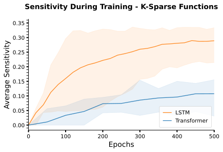
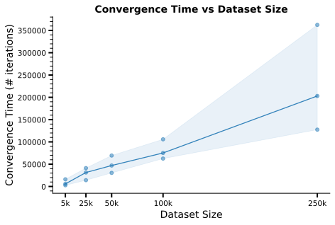

# Bhattamishra et al. 2023 — Simplicity Bias in Transformers and their Ability to Learn Sparse Boolean Functions

См. также: [глобальный индекс понятий](../../concepts/index.md).
arXiv [2211.12316v2](https://arxiv.org/abs/2211.12316), 10 июля 2023 (v1 — 22 ноября 2022). Колонтитула с площадкой публикации в PDF нет; в поле Comments на arXiv указано «ACL 2023».

**Satwik Bhattamishra, Varun Kanade** — University of Oxford.
**Arkil Patel** — Mila; McGill University.
**Phil Blunsom** — University of Oxford; Cohere.

Файлы разбора этой статьи:

- [`2211.12316.simplicity-bias-in-transformers-and-their-ability-to-learn-sparse-boolean-functions.claims.txt`](2211.12316.simplicity-bias-in-transformers-and-their-ability-to-learn-sparse-boolean-functions.claims.txt) — пронумерованные утверждения статьи с пометками разбора.
- [`2211.12316.simplicity-bias-in-transformers-and-their-ability-to-learn-sparse-boolean-functions.license.txt`](2211.12316.simplicity-bias-in-transformers-and-their-ability-to-learn-sparse-boolean-functions.license.txt) — лицензионная запись arXiv для этой статьи.

Схема якорей и правила ссылок на карточку — в [README папки статей](../README.md).

**Карточка-выдержка.** Лицензия статьи (`arxiv-nonexclusive`) не разрешает публикацию копии оригинала и полного перевода, поэтому карточка содержит редакторские секции и цитируемые фрагменты перевода (право цитирования). Полный текст статьи: <https://arxiv.org/abs/2211.12316>.

## Затрагиваемые понятия

**[Разрежённая чётность](../../concepts/sparse-parity.md)** — работа задаёт разрежённой чётности вторую в корпусе роль: не полигон для разбора одной архитектуры, а **разделяющую** задачу, на которой расходятся два семейства моделей. Обозначения взяты у теории обучения и введены аккуратно: $\textsc{Parity}\text{-}(n,k)$ при $k\ll n$ есть ${k\textsc{-sparse}}$ функция со средней чувствительностью не выше $k$ ([с. 3, абз. 7](#p3-7)), а её обучение градиентными методами требует «по меньшей мере $n^{\Omega(k)}$ вычислительных шагов» со ссылкой на Kearns 1998 ([с. 7, абз. 1](#p7-1)). Главный результат корпусу отсюда — перевёрнутый контраст: на полной $\textsc{Parity}\text{-}40$ хорошо обобщают LSTM, а трансформеры не справляются; на $\textsc{Parity}\text{-}(40,4)$ ровно наоборот — трансформеры обобщают, а LSTM «жестоко переобучаются», достигая $100\%$ на обучении при проверочной точности около уровня угадывания ([с. 7, абз. 6](#p7-6), [рис. 5](#fig-5)). Опыты идут при 30k обучающих и 10k проверочных примеров на пяти наборах, а строки берутся независимо из $\{0,1\}^{40}$, а не как доли одной маленькой таблицы. Чего в работе нет: теории — ни доказательства, ни разбора устройства; авторы прямо отсылают за возможным механизмом к Barak et al. 2022 и оговаривают, что «точные подробности неясны» ([с. 8, абз. 6](#p8-6)). Нет и утверждения, что трансформеры учат произвольные $k$-разрежённые функции: при $n=100$ и $k=5$ хорошего обобщения добиться не удалось ([с. 8, абз. 4](#p8-4)).

**[Гроккинг](../../concepts/grokking.md)** — гроккинг здесь **не предмет работы, а побочное наблюдение приложения**: в основном тексте о нём одна фраза-отсылка ([с. 7, абз. 7](#p7-7)), а описан он абзацем в [приложении E](#sec-e). Описание дано по форме кривых: «обучающие точности начинают постепенно расти без изменения проверочной точности. После некоторого числа итераций проверочная точность растёт и совпадает с обучающей точностью» ([с. 20, абз. 2](#p20-2), [рис. 18](#fig-18), [рис. 19](#fig-19)). Ценного для корпуса здесь три вещи. Во-первых, гроккинг получен **без weight decay**: всюду используется Adam, а SGD с weight decay, по прямому признанию авторов, не дал обобщиться ни трансформерам, ни LSTM ни на чётностях, ни на разрежённых чётностях, ни на случайных $k$-разрежённых функциях ([с. 22, абз. 3](#p22-3)). Во-вторых, целевая функция известна, так что «обобщение» здесь означает совпадение с целью, а не просто рост проверочной точности. В-третьих, размер выборки, при котором гроккинг виден, зависит от способа кодирования позиций: при абсолютном кодировании он наблюдается на относительно больших наборах (30k), а при обучаемых позиционных вложениях — «надёжно» на малых (5k) ([с. 19, абз. 2](#p19-2)). Чего в работе нет: никакой меры задержки, числа прогонов и разброса по семенам именно для гроккинг-прогонов, зависимости задержки от чего бы то ни было; слово «надёжно» количественно не подкреплено. Ссылка на Power et al. 2022 — единственная, и стоит она как указание на сходство наблюдаемого, рядом с Barak et al. 2022.

**[Фазовый переход](../../concepts/phase-transition.md)** — работа разводит два явления, которые в корпусе часто сливают. Фазовый переход: обучающая и проверочная точности «не меняются в течение большого числа итераций обучения, а затем резко достигают почти идеальной точности за несколько итераций» ([с. 20, абз. 1](#p20-1), [рис. 6](#fig-6)) — это то же, что сообщают Barak et al. 2022, и авторы прямо на них ссылаются. Гроккинг — другая форма кривых, с постепенным ростом обучающей точности при неподвижной проверочной ([с. 20, абз. 2](#p20-2)). Существенно и то, что внезапность не есть черта одной архитектуры: те же резкие переходы наблюдаются у LSTM на полной чётности $\textsc{Parity}\text{-}30$ ([рис. 17](#fig-17)). Чего в работе нет: ни языка статистической физики, ни параметра порядка, ни каких-либо измерений самого перехода — слово «переход» здесь описательное, а разбор целиком качественный.

**[Фаза меморизации / плато](../../concepts/memorization-phase.md)** — работа даёт корпусу редкий случай, когда «запоминание» видно **не только по кривым, но и по сложности выученной функции**. LSTM на $\textsc{Parity}\text{-}(40,4)$ достигают $100\%$ на обучении, оставаясь у уровня угадывания на проверке ([с. 7, абз. 6](#p7-6)), и то же повторяется на случайных $k$-разрежённых функциях ([с. 8, абз. 2](#p8-2)); при этом измерена чувствительность выученной функции: переобучившийся LSTM «сходится к функциям куда более высокой чувствительности, чем у целевой функции», тогда как у трансформера она совпадает с целевой ([с. 8, абз. 3](#p8-3), [рис. 16](#fig-16)). Тем самым запоминание получает измеримый признак — избыточная сложность решения при нулевой ошибке обучения. Чего в работе нет: словаря «запоминающего» и «обобщающего» решений, разделения подсетей, разбора того, почему именно LSTM переобучается, — последнее авторы объявляют неизвестным прямым текстом ([с. 8, абз. 6](#p8-6)).

**[Шум в метках / случайные метки](../../concepts/label-noise-random-labels.md)** — шум в метках здесь не приём, вызывающий отложенную генерализацию, а **проверка на устойчивость**, и в этой роли даёт самый сильный опыт статьи: при 5-20% перевёрнутых меток трансформеры «достигают идеальной точности обобщения», а обучающая точность садится ровно на долю чистых меток $1-\eta$ ([с. 7, абз. 3](#p7-3), [с. 7, абз. 7](#p7-7), [рис. 6](#fig-6)). Тут же стоит авторская оговорка, которая легко теряется: «В некоторых случаях после обучения в течение большого числа итераций после сходимости трансформеры начинают переобучаться на шуме», то есть идеальное обобщение есть свойство отрезка обучения, а не предела. Отдельно случайные метки служат мерилом ёмкости: на булевых строках со случайными метками обе архитектуры доводятся до нулевой ошибки обучения ([с. 6, абз. 2](#p6-2)), а на SST со случайными метками обе «без труда подгоняют обучающий набор почти идеально», тратя на это заметно больше итераций ([с. 22, абз. 1](#p22-1), [рис. 23](#fig-23)). Чего в работе нет: измерения момента, когда начинается подгонка под шум, и вообще какой-либо количественной зависимости от $\eta$.

**[Доля данных / критический размер набора](../../concepts/data-fraction-critical-dataset-size.md)** — управляющей величиной служит **абсолютное число примеров**, а не доля от полной таблицы: обучающая и проверочная выборки берутся независимо из $\{0,1\}^{n}$, так что «доля данных» в постановке Power et al. здесь попросту не определена. Зато окно зажато с двух сторон и названо числами: при $1000$ обучающих примеров трансформеры переобучаются во всех прогонах ([рис. 20](#fig-20)), при $2500$ уже выучивают верную функцию менее чем за $10000$ вычислительных шагов, а при $5000$ - $10000$ переобучение возвращается у моделей большей глубины ([с. 8, абз. 5](#p8-5)). Сверху к этому добавлена зависимость времени сходимости от размера набора: на пяти размерах ({5k, 25k, 50k, 100k и 250k}) отложены медиана, минимум и максимум числа итераций по 50-100 успешным прогонам ([с. 19, абз. 7](#p19-7), [рис. 22](#fig-22)). Чего в работе нет: ни имени, ни формулы для порога — ни «критического размера набора», ни разбора того, как порог сдвигается регуляризацией; и учитываются только успешные прогоны, так что кривая рисунка 22 не говорит, какая доля прогонов сошлась.

**[Оптимизатор](../../concepts/optimizer-adam-adamw-sgd.md)** — работа даёт корпусу чистое отрицательное свидетельство об оптимизаторе: «Ни LSTM, ни трансформеры нам не удалось заставить хорошо обобщать с SGD ни на Sparse Parities, ни на стандартной Parity. Обе архитектуры, по-видимому, преуспевают с оптимизатором Adam» ([с. 20, абз. 1](#p20-1)), а в подробностях реализации сказано сильнее: пробовали и SGD с weight decay — без успеха на всех трёх семействах задач ([с. 22, абз. 3](#p22-3)). Тем самым все наблюдения статьи, включая гроккинг, привязаны к Adam. Чего в работе нет: разбора того, чем именно Adam помогает, перебора его настроек помимо скорости обучения и хотя бы одной кривой для SGD — отрицательный результат сообщён словами.

**[Weight decay](../../concepts/weight-decay.md)** — работа ценна для этого понятия именно **отсутствием** weight decay: единственное его упоминание — неудачная попытка обучать SGD с weight decay ([с. 22, абз. 3](#p22-3)), а все положительные результаты, включая гроккинг на $\textsc{Parity}\text{-}(40,4)$, получены Adam без него. Ближайшее к регуляризации место — опыт с LSTM: dropout и L2 удлиняют сходимость, но модель «всё равно переобучается и сходится к функции с более высокой чувствительностью, чем целевая», а при дальнейшем усилении перестаёт подгонять и обучающие данные ([с. 19, абз. 4](#p19-4)). Чего в работе нет: ни утверждения, что weight decay нужен для гроккинга, ни того, что он вреден; величины $\lambda$ и коэффициенты dropout не названы, кривых для этого опыта нет.

**[Когда регуляризация необходима](../../concepts/regularization-necessity.md)** — статья устроена так, что явная регуляризация в ней не нужна ни для чего: обобщение трансформеров на разрежённых функциях получено при чистом Adam, а на LSTM явная регуляризация проверена и **не спасает** ([с. 19, абз. 4](#p19-4)). Объяснение авторы возлагают на неявную регуляризацию, оставаясь в рамках хеджа: «в процедуре обучения нейросетевых моделей есть некоторый вид неявной регуляризации, удерживающий их от переобучения, несмотря на их невероятную ёмкость» ([с. 9, абз. 6](#p9-6)). Чего в работе нет: попытки назвать эту неявную регуляризацию величиной — ни нормы весов, ни зазора, ни сложности решения в роли того, что минимизируется; чувствительность здесь измеряется, но не объявляется регуляризуемой величиной.

**[Масштаб инициализации](../../concepts/initialization-scale.md)** — масштаб начального приближения оказывается тем, от чего целиком зависит главный «априорный» результат. При равномерной выборке весов в $[-10,10]$ и при гауссовой с $\sigma=10$ распределение чувствительности трансформеров резко скошено к нулю, а у LSTM оно заметно выше ([с. 4, абз. 5](#p4-5), [с. 5, абз. 1](#p5-1), [рис. 3](#fig-3)); при инициализациях, применяемых на практике (Xavier normal и Xavier uniform, $\sigma=d^{-1/2}$), низкую чувствительность дают **обе** архитектуры, и разрыв сжимается до «относительно ниже». То есть смещение видно при широком просмотре пространства параметров, а не в рабочей точке. Отдельно стоит счётный опыт: среди 10 миллионов случайных LSTM глубины $2$ и скрытого размера $8$ функция Parity встречается примерно 1 раз на 30 000 — «более чем в **60 000** раз вероятнее, чем случайной выборкой булевых функций», — а среди 10 миллионов случайных трансформеров не нашлось ни одной ([с. 15, абз. 3](#p15-3)). Чего в работе нет: разбора того, как смещение меняется при промежуточных масштабах между $\sigma=10$ и $\sigma=d^{-1/2}$, и какого-либо утверждения о влиянии масштаба на обучаемость — обучающие опыты ведутся только при Xavier normal.

**[Колмогоровская сложность](../../concepts/kolmogorov-complexity.md)** — работа выбирает чувствительность именно как **вычислимую замену** невычислимым мерам простоты и говорит об этом прямо: функции низкой чувствительности «имеют низкую колмогоровскую сложность» (с авторской сноской «Обратное верно не всегда»), более простые спектры Фурье и представимы решающими деревьями малой глубины, тогда как «меры вроде колмогоровской сложности невычислимы, чувствительность можно оценивать разрешимым образом» ([с. 1, абз. 6](#p1-6)). Соседние меры простоты не оставлены на веру: в [B.1](#sec-b1) к чувствительности добавлены размер наименьшего выражения в форме суммы произведений (SOP), энтропия меток и доля критических примеров (CSR), посчитанные на длине 7 по 200k случайных моделей ([рис. 9](#fig-9)). Существенна и оговорка о направлении связи: высокая чувствительность влечёт высокие энтропию и CSR, но не наоборот — функция-диктатор даёт максимальную энтропию при очень низкой чувствительности ([с. 14, абз. 7](#p14-7)). Чего в работе нет: сжатия, описания длины и вообще какой-либо оценки самой колмогоровской сложности — она упоминается лишь как ориентир для выбора меры.

**[Частотный принцип / спектральное смещение](../../concepts/frequency-principle-spectral-bias.md)** — наблюдение, что обе архитектуры учат функции **возрастающей** чувствительности ([с. 6, абз. 3](#p6-3), [рис. 16](#fig-16)), авторы сами приписывают уже известной линии и связывают с частотой: результаты «вторят прежним наблюдениям», что сети, обучаемые SGD, учат функции возрастающей сложности (Nakkiran et al. 2019), а «функции с более низкой средней чувствительностью также имеют более низкую частоту, и потому эти наблюдения тесно связаны» с наблюдением Rahaman et al. 2019 о низкочастотных модах ([с. 6, абз. 4](#p6-4)). Вклад работы здесь в переносе: чувствительность, в отличие от фурье-спектра, естественно распространяется на текстовые данные, и тот же порядок «от простого к сложному» показан на SST и IMDB. Чего в работе нет: собственно частотного разбора — ни фурье-разложения выученных функций, ни спектральных мер; связь с частотой заявлена словесно, через известные соотношения между чувствительностью и степенью фурье-разложения.

**[Меры прогресса](../../concepts/progress-measures.md)** — работа даёт величину, которую позже стали использовать как меру прогресса, но сама этого не делает. Чувствительность выученной функции измеряется **на каждой эпохе обучения** ([с. 6, абз. 2](#p6-2), [с. 6, абз. 3](#p6-3)) и на $k$-разрежённых функциях ведёт себя показательно: у трансформера она приходит ровно к чувствительности целевой функции, у переобучившегося LSTM уходит много выше ([с. 8, абз. 3](#p8-3), [рис. 16](#fig-16)). Термина «мера прогресса» в статье нет, время до сходимости через чувствительность не предсказывается, и на гроккинг-прогонах приложения E чувствительность не посчитана — так что мерой прогресса эту величину сделали более поздние работы (Vasudeva et al. 2024, в корпусе `2403.06925`; карточки ещё нет). Существенна и отрицательная половина: на реальных наборах данных ход тот же, но итог другой — «на реальных наборах данных мы не обнаружили, чтобы трансформеры сходились к функциям более низкой чувствительности» ([с. 17, абз. 8](#p17-8)).

**[Границы генерализации](../../concepts/generalization-bounds.md)** — в [D.1](#sec-d1) чувствительность встроена в классическую машинерию ёмкости: класс функций с максимальной чувствительностью не выше $k$ однозначно определяется значениями на шаре Хэмминга радиуса $2k$, откуда $\mathsf{VCD}(\mathcal{F}_{k})=\mathcal{O}(n^{2k})$ и обычная оценка разрыва истинной и выборочной ошибок (Утверждение D.1) ([с. 18, абз. 2](#p18-2)). Это утверждение о **классе функций**, а не об обученной сети: ничто в нём не говорит, что найденная сетью функция лежит в $\mathcal{F}_{k}$ с малым $k$. Эмпирическая половина отдельна и слабее: на SST измерена положительная корреляция суррогатных мер чувствительности с разрывом обобщения, причём RoBERTa имеет более низкую чувствительность при лучшей тестовой точности ([с. 18, абз. 7](#p18-7), [рис. 14](#fig-14)). Чего в работе нет: подстановки измеренных чувствительностей в границу, числовых значений границы и вообще связи между теоретической и опытной половинами приложения D.

**[Эталонный полигон гроккинга](../../concepts/canonical-grokking-testbed.md)** — работа предлагает корпусу площадку иного устройства, чем таблица модульной операции: семейство ${k\textsc{-sparse}}$ функций (разрежённые чётности, разрежённое большинство $\textsc{Maj}\text{-}(n,k)$, функция-диктатор $\textsc{Dict}\text{-}n$, случайные юнты $\textsc{Juntas}\text{-}(n,k)$) с известной целевой функцией, настраиваемой сложностью через $k$ и $n$ и допустимым шумом в метках ([с. 7, абз. 1](#p7-1)). Две особенности делают её ценной: успех проверяется совпадением с целью, а не одной лишь проверочной точностью ([с. 8, абз. 3](#p8-3)); и на ней ставится опыт, разводящий смещения архитектур внутри одного набора, — «смешанная чётность», где первый бит выбирает между полной и разрежённой чётностью, и LSTM берёт полную, а трансформер разрежённую ([с. 19, абз. 6](#p19-6), [рис. 21](#fig-21)). Чего в работе нет: заявки на канон — площадка строится ради сравнения архитектур, гроккинг на ней замечен попутно, а на задачах переменной длины различие архитектур исчезает вовсе ([с. 21, абз. 4](#p21-4), [E.1](#sec-e1)).

---

## Несогласованности внутри статьи

**Размер набора для рисунка 17 указан дважды и по-разному.** В тексте приложения E сказано, что LSTM на стандартной чётности «обучаются на наборах данных размера 20k, где входные строки имеют длину 30» ([с. 19, абз. 1](#p19-1)), тогда как подпись к самому рисунку говорит о наборе, «содержащем 30k примеров» ([рис. 17](#fig-17)). Расхождение есть и в опубликованном PDF, то есть это не след конверсии. Ссылаясь на этот опыт как на пример резкого перехода у рекуррентной модели, размер набора называть нельзя.

**Подпись к рисунку 20 приписывает LSTM обучающий набор, которого в статье нет.** Подпись говорит, что переобучение трансформеров на 1k примеров «схоже с тем, как LSTM переобучаются на куда больших обучающих наборах (40k примеров)» ([рис. 20](#fig-20)), тогда как в разделе 5.2 обучающий набор для чётностей — 30k примеров, а 10k составляют проверочный набор ([с. 7, абз. 5](#p7-5)). Число 40k нигде больше в статье не встречается; вероятнее всего, оно получено сложением обучающего и проверочного наборов, но как размер обучающего набора LSTM оно не подтверждено.

**Описание инициализации Xavier uniform противоречит определению Xavier normal в основном тексте.** В основном тексте стандартное отклонение задано как $\sigma=d^{-1/2}$, где $d$ — число скрытых единиц ([с. 4, абз. 5](#p4-5)); в приложении B.3 про Xavier uniform сказано, что «все значения в матрицах весов берутся равномерно между $-d^{1/2}$ и $d^{1/2}$» ([с. 15, абз. 2](#p15-2)), то есть с показателем противоположного знака — при $d=256$ это промежуток шириной 32 вместо $1/8$. Формула сохранена в переводе как есть; при воспроизведении опытов с Xavier uniform опираться следует на основной текст и на схему PyTorch, а не на эту строку. В claims-файле статьи этой несогласованности нет — она найдена при сверке карточки с PDF.

---

## Что показано, что объявлено догадкой и что признано неизвестным

Статья честно раскладывает собственные слои прочности, и при цитировании важно, из какого слоя взято утверждение.

**Измерено.** Распределения чувствительности случайно инициализированных моделей при четырёх схемах выборки весов и по десяткам конфигураций ([с. 4, абз. 5](#p4-5), [рис. 3](#fig-3)); счётный опыт с поиском Parity среди 10 миллионов случайных моделей каждой архитектуры ([с. 15, абз. 3](#p15-3)); рост чувствительности по ходу обучения и её значение в точке нулевой ошибки обучения — 20 наборов по 100 прогонов и отдельно 15 наборов по 100 обученных моделей ([с. 6, абз. 2](#p6-2), [рис. 4](#fig-4)); контраст архитектур на разрежённых булевых функциях, в том числе при шуме в метках ([с. 7, абз. 6](#p7-6), [с. 8, абз. 2](#p8-2)); зависимость числа шагов до сходимости от размера набора ([рис. 22](#fig-22)).

**Объявлено догадкой прямым текстом.** Главный вывод статьи хеджирован в самой аннотации и во введении: «мы выдвигаем гипотезу, что одной из причин практической действенности трансформеров может быть то, что они сильнее смещены к простым функциям» ([с. 1, абз. 5](#p1-5)). Догадка о причине смещения случайных трансформеров — тоже: при осмотре весов внимания они ведут себя схоже с трансформерами с жёстким вниманием, а те выражают лишь $\text{AC}^{0}$, где чувствительность низка, и «это **может помочь объяснить**, почему у случайных трансформеров низкая чувствительность» ([с. 15, абз. 6](#p15-6)). Мост от априорного распределения к обученным моделям взят чужой и с оговоркой: равенство байесовского и SGD-апостериора $P_{B}(f|S)\approx P_{SGD}(f|S)$ — результат Mingard et al. 2021, полученный на других архитектурах и данных, откуда следует лишь, что $P_{SGD}(f|S)$ «**могло бы** быть смещено к функциям низкой чувствительности» ([с. 5, абз. 4](#p5-4)).

**Признано неизвестным самими авторами.** Раздел [«Уточнения»](#sec-6) отсекает лёгкое прочтение дважды. На вопрос, объясняет ли смещение к низкой чувствительности хорошее обобщение на $k$-разрежённых функциях, ответ — «Нет»: связь возможна, но «точные подробности неясны, и, что важнее, почему и как переобучаются LSTM, неясно тоже» ([с. 8, абз. 6](#p8-6)). На вопрос, действенны ли трансформеры на практике прежде всего из-за смещения к простоте, ответ — «На этот вопрос трудно ответить» ([с. 9, абз. 3](#p9-3)).

**Отрицательные результаты, названные авторами.** Произвольные $k$-разрежённые функции трансформер не учит: при $n=100$ и $k=5$ хорошего обобщения добиться не удалось ([с. 8, абз. 4](#p8-4)). На задачах переменной длины (VarParity, VarMaj) различие архитектур исчезает, и авторы прямо пишут, что «эти результаты не подкрепляют гипотезу, выдвинутую в разделе 1» ([с. 21, абз. 4](#p21-4)). На текстовых наборах SST и IMDB трансформеры не сходятся к меньшей чувствительности, чем LSTM ([с. 17, абз. 8](#p17-8)). Обобщения с SGD не удалось добиться ни одной архитектуре ни на одной из задач ([с. 20, абз. 1](#p20-1)).

**Не измерено вовсе.** Гроккинг разобран качественно: ни величины задержки, ни числа прогонов и разброса по семенам для гроккинг-прогонов, ни зависимости задержки от размера набора или способа кодирования позиций — слово «надёжно» ([с. 20, абз. 2](#p20-2)) количественно не подкреплено. Не измерен и момент, с которого трансформер начинает подгоняться под шум ([с. 7, абз. 7](#p7-7)).

---

## Ошибочные пересказы и цитирования этой статьи

Ниже — узоры, наблюдённые в цитирующих работах корпуса. Для каждого сказано, что именно искажается, и даны ссылки на авторские абзацы с теряемой оговоркой. Разделы «Ошибочные цитирования» на стороне цитирующих карточек ещё не заведены, поэтому подробные разборы пока не адресуются, а цитирующие работы перечислены простыми ссылками на карточки.

**«Смещение трансформеров к низкой чувствительности объясняет отложенную генерализацию» (ошибочное).** Работу цитируют как одну из гипотез о причине гроккинга. Jiang et al. 2026 перечисляют её среди объяснений отложенной генерализации: `"or architectural bias in transformers that favors simpler, low-sensitivity functions that generalize better (Bhattamishra et al., 2022)"`; Ahuja et al. 2024 относят её к объяснениям через смещение к простоте: `"The other explanations rely on *simplicity bias*, hypothesizing that the solutions that generalize are simpler but slower to learn (Shah 2023, Nanda et al. 2023, Bhattamishra et al. 2023, Varma et al. 2023)"`. Сами авторы отвечают на этот вопрос отрицательно и в отдельном разделе: на прямо поставленный вопрос, объясняет ли смещение к низкой чувствительности хорошее качество на $k$-разрежённых функциях, ответ — «Нет», связь названа возможной, но не прямым объяснением, а почему переобучается LSTM, объявлено неизвестным ([с. 8, абз. 6](#p8-6)); на вопрос о практической действенности трансформеров ответ — «На этот вопрос трудно ответить» ([с. 9, абз. 3](#p9-3)). Гроккинга это объяснение и подавно не касается: гроккинг наблюдён в приложении E, а чувствительность на гроккинг-прогонах не считалась ([с. 20, абз. 2](#p20-2)). Затронутые работы: [Jiang et al. 2026](../2601.03162.on-the-convergence-behavior-of-preconditioned-gradient-descent-toward-the-rich-learning-regime/2601.03162.on-the-convergence-behavior-of-preconditioned-gradient-descent-toward-the-rich-learning-regime.card.md), Ahuja et al. 2024 (карточки ещё нет).

**«Работа показала, что при большей доле обучающих данных проверочная потеря падает раньше» (расширяющее).** Zhou et al. 2024 сопоставляют свои кривые по долям разбиения с этой статьёй: `"This observation aligns with the findings reported in Barak et al. (2022); Bhattamishra et al. (2023), corroborating the described phenomenon."` — речь у них идёт о «разных долях разбиения на обучающую и тестовую части». В постановке Bhattamishra et al. такой доли не существует: обучающая и проверочная выборки берутся независимо из $\{0,1\}^{n}$, и управляющей величиной служит абсолютное число примеров. Ближайшее по смыслу измерение — число шагов до сходимости против размера набора ([с. 19, абз. 7](#p19-7), [рис. 22](#fig-22)), но оно снято только по успешным прогонам и ничего не говорит о доле сошедшихся; вдобавок зависимость не монотонна в подразумеваемую сторону — на 1k примеров трансформер просто переобучается ([с. 8, абз. 5](#p8-5), [рис. 20](#fig-20)). Затронутая работа: [Zhou et al. 2024](../2405.17479.a-rationale-from-frequency-perspective-for-grokking-in-training-neural-network/2405.17479.a-rationale-from-frequency-perspective-for-grokking-in-training-neural-network.card.md).

**«У Bhattamishra et al. гроккинг наблюдался на разрежённой чётности» (точное, но требующее оговорки).** Этот пересказ встречается в корпусе чаще всего и сам по себе верен: Lyu et al. 2024 пишут `"grokking has been reported in learning group operations (Chughtai et al. 2023), learning sparse parity (Barak et al. 2022; Bhattamishra et al. 2023)"`, Mohamadi et al. 2024 — что гроккинг бывает «за пределами модульной арифметики: при обучении разрежённым чётностям». Оговорка, которая при этом теряется: наблюдение живёт в одном абзаце приложения E и в двух парах кривых ([с. 20, абз. 2](#p20-2), [рис. 18](#fig-18), [рис. 19](#fig-19)), задержка не измерена, число прогонов не названо, а условия названы двумя — способ кодирования позиций и размер набора ([с. 19, абз. 2](#p19-2)). Работу правомерно цитировать как свидетельство существования гроккинга на этой задаче, но не как его измерение или разбор. Затронутые работы: [Lyu et al. 2024](../2311.18817.dichotomy-of-early-and-late-phase-implicit-biases-can-provably-induce-grokking/2311.18817.dichotomy-of-early-and-late-phase-implicit-biases-can-provably-induce-grokking.card.md), [Mohamadi et al. 2024](../2407.12332.why-do-you-grok-a-theoretical-analysis-of-grokking-modular-addition/2407.12332.why-do-you-grok-a-theoretical-analysis-of-grokking-modular-addition.card.md).

Образцовые по точности формулировки для сравнения дают работы, наследующие саму меру, а не явление: Vasudeva et al. 2024 пишут `"Bhattamishra et al. 2023b and Hahn & Rofin 2024 show that transformers are biased to learn functions with low sensitivity on Boolean inputs"` и отдельно оговаривают отрицательную половину — что пословная чувствительность «экспериментально показана схожей для трансформеров и LSTM»; Teney et al. 2025 ограничиваются утверждением, что `"The simplicity bias exists in transformers Bhattamishra et al. 2022; Zhou et al. 2023"`. Карточек у обеих работ (`2403.06925`, `2503.10065`) ещё нет.

---

# Цитируемые фрагменты перевода

Ниже приведены только те фрагменты перевода, на которые ссылаются карточки корпуса (право цитирования). Нумерация якорей `pN-M` / `fig-N` / `sec-X` совпадает с полной карточкой и оригиналом.

## 1 Введение

###### p1-5

Хотя рекуррентные модели вроде LSTM показывали себя лучше на формальных языках, таких как Parity, мы обнаруживаем, что им трудно хорошо обобщать на нескольких разрежённых булевых функциях, таких как Sparse Parities. Мы находим ясный контраст между способностями трансформеров и LSTM к обобщению на различных ${k\textsc{-sparse}}$ булевых функциях, обладающих низкой чувствительностью. Кроме того, посредством обширного эмпирического разбора мы даём сильные свидетельства, указывающие на различия в смещении к функциям низкой сложности между трансформерами и рекуррентными моделями. Опираясь на наши результаты, мы выдвигаем гипотезу, что одной из причин практической действенности трансформеров может быть то, что они сильнее смещены к простым функциям в сравнении с рекуррентными моделями, что может вести к лучшему обобщению.

###### p1-6

В частности, мы сосредоточиваемся на мере сложности **[p. 2]** под названием чувствительность (Kahn et al. 1989), которая измеряет, насколько вероятно, что значение функции изменится из-за «малого» изменения входа. Чувствительность связана с несколькими другими мерами сложности; функции с низкой чувствительностью имеют низкую колмогоровскую сложность,22 2 Обратное верно не всегда. более простые спектры Фурье и могут быть представлены решающими деревьями малой глубины. Связь между чувствительностью и обобщением также изучалась ранее в литературе (Novak et al. 2018; Franco 2006).33 3 Более обстоятельное обсуждение дано в приложении B.2 Тогда как меры вроде колмогоровской сложности невычислимы, чувствительность можно оценивать разрешимым образом, а расширения чувствительности можно использовать для оценки сложности функций в более реалистичных задачах NLP (Hahn et al. 2021).

### 3.1 Чувствительность булевых функций

###### p3-7

**Разрежённые булевы функции.** Другой класс функций — ${k\textsc{-sparse}}$ функции (их также называют $k$-юнтами), у которых значение функции зависит не более чем от $k$ координат входа. Более формально, функция $f\colon\{0,1\}^{n}\rightarrow\{\pm 1\}$ является ${k\textsc{-sparse}}$, если существуют индексы $1\leq i_{1}<i_{2}<\ldots<i_{k}\leq n$ и функция **[p. 4]** $g\colon\{0,1\}^{k}\rightarrow\{\pm 1\}$ такие, что для каждого $x\in\{0,1\}^{n}$ выполнено $f(x_{1},x_{2},\ldots,x_{n})=g(x_{i_{1}},x_{i_{2}},\ldots,x_{i_{k}})$. Пусть $\textsc{SPARSE}\text{-}(k,n)$ — класс ${k\textsc{-sparse}}$ функций на входах длины $n$, зависящих не более чем от $k$ битов. Легко видеть, что для любой $f\in\textsc{SPARSE}\text{-}(k,n)$ средняя чувствительность $s(f)\leq k$ (а значит, $\mathcal{S}(f)\leq\frac{k}{n}$).

### 4.1 Чувствительность случайно инициализированных моделей

###### p4-5

В наших опытах мы исследуем четыре стратегии выборки случайных сетей: равномерную, гауссову, Xavier uniform и Xavier normal инициализации. При равномерной выборке каждому параметру (весам и смещениям) присваивается значение равномерной выборкой в $[-10,10]$. Аналогично, при гауссовой инициализации каждый параметр берётся из $\mathcal{N}(0,\sigma^{2})$, где мы задаём сигму равной $10$. Инициализация Xavier normal (Glorot and Bengio 2010) — это та, что **[p. 5]** чаще применяется на практике при обучении таких моделей. Все веса инициализируются из $\mathcal{N}(0,\sigma^{2})$, где стандартное отклонение $\sigma=d^{-1/2}$, а $d$ — число скрытых единиц. Все векторы входных вложений и векторы позиционных вложений инициализируются из $\mathcal{N}(0,1)$, что является схемой по умолчанию в PyTorch (Paszke et al. 2019). Для длин входа больше 10 мы оцениваем чувствительность каждой модели, вычисляя среднее по выбранному набору битовых строк. Мы берём 10k битовых строк и вычисляем среднюю чувствительность по этим примерам. Для каждой конфигурации гиперпараметров мы берём от 75 до 1000 различных моделей для оценки их чувствительности — в зависимости от связанных с этим вычислительных затрат. Для большинства результатов, приводимых в основном тексте, мы рассматриваем битовые строки длины $20$. Но мы также ставим опыты с длинами $\in\{5,7,10,15,20,50,100,200\}$.

###### fig-3

*Рисунок 3: Распределение чувствительности случайно инициализированных трансформеров и LSTM при закреплённом гиперпараметре (layers=2, width=256).* **[p. 5]**

###### p5-1

**Результаты.** Рисунок 2 (верхний ряд) и рисунок 3 (слева) показывают распределение чувствительности для равномерно инициализированных трансформеров и LSTM. Распределение для трансформеров сильно скошено к функциям очень низкой чувствительности в сравнении с LSTM. Та же картина сохраняется и при гауссовой инициализации (см. рисунок 1, внизу справа). Для стратегий инициализации, применяемых на практике, таких как Xavier normal и Xavier uniform, мы находим, что и трансформеры, и LSTM имеют низкую чувствительность (см. рисунок 2, нижний ряд, и рисунок 3, справа), причём у трансформеров средняя чувствительность относительно ниже. Результаты с инициализацией Xavier uniform см. в разделе B.3 приложения.

###### fig-4

*Рисунок 4: Распределение чувствительности трансформеров и LSTM, обученных на булевых строках со случайными метками. Подробности см. в разделе 4.2.* **[p. 5]**

###### p5-4

**Почему случайно инициализированные модели?** Каждый случайно инициализированный трансформер или RNN, ограниченный на область $\{0,1\}^{n}$, представляет одну из $2^{2^{n}}$ булевых функций $f$ из $\mathcal{F}$. Распределение на $\mathcal{F}$, порождаемое случайно инициализированными моделями, можно рассматривать как их априорное распределение $P(f)$. Пусть дан набор (обучающих) примеров $S=\{(x_{1},y_{1}),\ldots,(x_{m},y_{m})\}$; обозначим через $P_{B}(f|S)$ вероятность выбрать $f$ при условии, что выбранная функция согласована с $S$ (совпадает со всеми отображениями вход-выход в $S$). Мы можем применить правило Байеса и вычислить апостериорное распределение $P_{B}(f|S)=P(S|f)P(f)/P(S)$, пользуясь априорным $P(f)$, правдоподобием $P(S|f)$ и маргинальным правдоподобием $P(S)$. Поскольку мы обусловливаемся на том, что $f$ согласована с $S$ (нулевая ошибка обучения), правдоподобие $P(S|f)=1$, если $\forall x_{i}\in S$ выполнено $f(x_{i})=y_{i}$, и $0$ иначе. Пусть $U(S)$ обозначает множество всех функций $f\in\mathcal{F}$, согласованных с $S$. Заметим, что при закреплённом обучающем наборе $S$, поскольку $P(S)$ постоянно, вероятность выбора $f\in U(S)$ в конечном счёте зависит от априорного распределения $P(f)$. На практике мы не подгоняем обучающий набор, выбирая модели, пока не найдётся согласованная с ним. Однако недавняя работа Mingard et al. 2021 показала, что $P_{B}(f|S)\approx P_{SGD}(f|S)$ для целого ряда нейросетевых архитектур и наборов данных. Апостериорное распределение на основе SGD, $P_{SGD}(f|S)$, обозначает вероят**[p. 6]** ность того, что нейронная сеть сойдётся к функции $f$, будучи обучена подгонять $S$. Следовательно, наши результаты позволяют предположить, что для трансформеров $P_{B}(f|S)$ было бы сосредоточено на функциях низкой чувствительности, а значит, и $P_{SGD}(f|S)$ могло бы быть смещено к функциям низкой чувствительности.

### 4.2 Модели учат функции возрастающей чувствительности

###### p6-2

**Постановка.** Мы создаём наборы данных размером по $1$k, равномерно выбирая битовые строки длины $40$. Метка каждой входной строки назначается случайно ($+1$ или $-1$ с вероятностью $1/2$). Все веса моделей инициализируются инициализацией Xavier normal, а смещения — нулевыми векторами. Мы рассматриваем трансформеры и LSTM при различных конфигурациях гиперпараметров с близким числом параметров. Мы обучаем модели, пока они не достигнут нулевой ошибки обучения, и оцениваем чувствительность моделей на каждой эпохе. Мы проводим опыты на $20$ различных наборах данных, по $100$ прогонов для трансформеров и LSTM каждый.

###### p6-3

**Чувствительность в ходе обучения.** Мы обнаруживаем, что и трансформеры, и LSTM постепенно учат функции возрастающей чувствительности, причём трансформеры сходятся к функциям куда более низкой чувствительности, чем LSTM (см. рисунок 1, вверху справа). Мы наблюдаем схожее поведение, когда модели обучаются на различных разрежённых булевых функциях, включая разрежённые чётности. Хотя чувствительность определена на булевых функциях, мы исследуем несколько естественных расширений для оценки чувствительности моделей, обученных на реальных наборах данных, таких как классификация тональности. На двух наборах для классификации тональности, а именно SST и IMDB, мы обнаружили схожие наблюдения: и трансформеры, и LSTM, по-видимому, постепенно учат функции возрастающей чувствительности. Подробнее см. приложение C.

###### fig-5

*Рисунок 5: Кривые обучения и проверки для трансформеров и LSTM, обученных на Sparse Parities длины $n=40$ и $k=4$.* **[p. 6]**

###### p6-4

**Обсуждение.** Даже если последовательностные модели, такие как трансформеры или LSTM, способны представлять произвольные функции, наши результаты позволяют предположить, что они в первую очередь учат более простые узоры. Эти результаты вторят прежним наблюдениям, указывающим, что нейронные сети типа сетей прямого распространения, обучаемые SGD, учат функции возрастающей сложности (Nakkiran et al. 2019; Arpit et al. 2017). Rahaman et al. 2019 обнаруживают, что нейронные сети с ReLU сперва учат функции более низкочастотных мод. Функции с более низкой средней чувствительностью также имеют более низкую частоту, и потому эти наблюдения тесно связаны. Что важнее, среднюю чувствительность можно естественным образом распространить на реальные данные, что позволяет нам эмпирически исследовать это на текстовых данных.

### 5.1 Постановка.

###### p7-1

**Булевы функции.** Мы сосредоточиваемся на ${k\textsc{-sparse}}$ булевых функциях, обладающих низкой чувствительностью при $k\ll n$ (определение см. в разделе 3). Сначала мы рассматриваем некоторые булевы функции, широко изучаемые в анализе булевых функций. Первая — Sparse Parities, которую можно истолковать как ${k\textsc{-sparse}}$ вариант стандартной чётности. Мы обозначаем экземпляр Sparse Parities как $\textsc{Parity}\text{-}(n,k)$, где $n$ обозначает длину входной строки, а $k$ — число значимых битов. Экземпляр стандартной Parity мы обозначаем как $\textsc{Parity}\text{-}n$, где $n$ обозначает длину входной строки, а выход вычисляется по числу единиц во всех индексах. У обучения $\textsc{Parity}\text{-}(n,k)$ градиентными методами есть хорошо известные результаты о трудности $-$ требуется по меньшей мере $n^{\Omega(k)}$ вычислительных шагов, чтобы найти верную целевую функцию (Kearns 1998). Две другие булевы функции, которые мы рассматриваем, — разрежённые большинства (обозначаются $\textsc{Maj}\text{-}(n,k)$) и функция-диктатор (обозначается $\textsc{Dict}\text{-}n$). Выход функции-диктатора зависит лишь от одного входного бита, что делает её, пожалуй, одной из простейших булевых функций с очень низкой чувствительностью. В $\textsc{Maj}\text{-}(n,k)$ выход для строки длины $n$ определяется тем, больше ли число единиц числа нулей в $k$ значимых индексах.

###### fig-6

*Рисунок 6: Кривые обучения и проверки для трансформеров, обученных на $\textsc{Parity}\text{-}(40,4)$ при $10\%$ шума в обучающих данных. Подробности см. в разделе 5.* **[p. 7]**

###### p7-3

**Зашумлённые метки.** Мы также ставим опыты, чтобы изучить способность моделей учиться при наличии шума. В этих опытах метки обучающих данных переворачиваются с некоторой вероятностью $\eta$. Тем самым около $1-\eta$ доли обучающих данных чисты, а $\eta$ доля обучающих данных имеет неверные метки. Проверочный набор чист, без каких-либо изменений. Цель — исследовать, устойчива ли модель к шуму в ходе обучения.

### 5.2 Опыты

###### p7-5

**Чётности.** Для $\textsc{Parity}\text{-}(40,4)$ и $\textsc{Parity}\text{-}40$ мы создаём $5$ различных наборов данных и приводим результаты по максимальной точности, достигнутой на невиданных проверочных данных. Обучающий набор состоит из 30k примеров, а проверочные наборы содержат 10k примеров.

###### p7-6

Мы наблюдаем разительный контраст между качеством трансформеров и LSTM на разных вариантах задачи чётности. Мы обнаруживаем, что трансформерам трудно подогнать и обобщить $\textsc{Parity}\text{-}40$, тогда как LSTM легко (в целом ряде гиперпараметров) обобщают на них. С другой стороны, что, пожалуй, неожиданно, на $\textsc{Parity}\text{-}(40,4)$ мы обнаруживаем, что трансформеры обобщают хорошо, а LSTM жестоко переобучаются и достигают плохой проверочной точности. Хотя LSTM достигают $100\%$ обучающей точности на обучающих данных, их проверочная точность не уходит далеко от уровня угадывания ($50\%$). Рисунок 5 изображает кривые обучающей и проверочной точности для трансформеров и LSTM на задаче $\textsc{Parity}\text{-}(40,4)$. Мы находим схожее поведение у LSTM даже с обучаемыми позиционными вложениями.

###### p7-7

**Устойчивость к шуму.** На наборах Sparse Parities мы обнаруживаем, что трансформеры неожиданно устойчивы к шуму. Когда обучающие данные содержат 5%-20% шума ($\eta$), трансформеры достигают идеальной точности обобщения, а обучающая точность схо**[p. 8]** дится на $1-\eta$. В некоторых случаях после обучения в течение большого числа итераций после сходимости трансформеры начинают переобучаться на шуме. Это наблюдение вторит схожей находке Tänzer et al. 2022, где такое поведение наблюдалось при дообучении больших предобученных моделей на задачах разметки последовательностей при наличии шума. Кривые обучающей и проверочной точности приведены на рисунке 6. Поведение рекуррентных моделей то же, что и в предыдущем случае с чистыми данными: они переобучаются на обучающих данных, достигая проверочной точности уровня угадывания. Дополнительные результаты по $\textsc{Parity}\text{-}(n,k)$ при разных размерах наборов данных, вариациях задачи, а также исследующие такие явления, как фазовые переходы и гроккинг, приведены в приложении E.

###### p8-2

**Случайные k-разрежённые функции.** Для $\textsc{Juntas}\text{-}(n,k)$ мы ставим опыты с различными наборами данных для $\textsc{Juntas}\text{-}(n,5)$ при $n\in\{30,50,80,150,200\}$. Для длин $n<150$ мы обнаруживаем, что LSTM хорошо обобщают на некоторых из функций $\textsc{Juntas}\text{-}(n,5)$. Однако при наличии $10\%$ шума (то есть $\eta=0.1$) их качество резко падает. Мы создаём 10 наборов данных для $\textsc{Juntas}\text{-}(50,5)$ при $\eta=0.1$, и, подобно предыдущим случаям, LSTM с трудом обобщают хорошо (>75%), тогда как трансформеры способны обобщать идеально на всех наборах данных (см. рисунок 1, вверху в середине). Однако даже когда проверочные точности LSTM были ниже $75\%$, их обучающая точность достигала $100\%$, что указывает на переобучение на обучающих данных. Рисунок 1 (внизу слева) показывает кривые обучения и проверки LSTM на $10$ наборах данных.

###### p8-3

**Чувствительность в ходе обучения.** Мы наблюдаем, что на ${k\textsc{-sparse}}$ функциях и трансформеры, и LSTM учат функции возрастающей чувствительности. Однако когда LSTM переобучаются и достигают нулевой ошибки обучения, они сходятся к функциям куда более высокой чувствительности, чем у целевой функции (см. рисунок 16. Поскольку трансформеры обобщают идеально, их чувствительность совпадает с чувствительностью целевой функции.

###### sec-6

## 6 Уточнения

###### p8-4

**(1)** *Означают ли наши результаты, что трансформеры могут выучить любые ${k\textsc{-sparse}}$ функции при малом (практичном) числе примеров?* Нет. Для малых длин ($n=50$) и $k=3$ мы смогли перебором проверить, что они способны выучить все функции при наличии 10% шума. Однако по мере роста длины $n$ и числа значимых битов $k$ трансформерам становится трудно показывать хорошее качество. Ввиду вычислительной трудности, связанной с обучением Sparse Parities, задача становится куда сложнее с ростом $n$ и $k$. Для $n=100$ и $k=5$ нам не удалось получить хорошее качество обобщения с трансформерами.

###### p8-5

**(2)** *Значит ли это, что трансформеры никогда не переобучаются на ${k\textsc{-sparse}}$ функциях?* Они переобучаются, когда размер обучающих данных очень мал. Для Sparse Parities с $n=40$ и $k=4$, пожалуй, неожиданно, что трансформеры выучивают верную функцию даже всего лишь при $2500$ обучающих примерах менее чем за $10000$ вычислительных шагов. Однако при обучающих наборах размера $1000$ трансформеры переобучаются во всех прогонах. Кроме того, при обучающих наборах размера $5000$ - $10000$ трансформеры с большей глубиной в некоторых случаях переобучаются. Подробнее см. приложение E.

###### p8-6

**(3)** *Объясняет ли смещение трансформеров к низкой чувствительности (раздел 4) их хорошее качество обобщения на ${k\textsc{-sparse}}$ функциях, таких как Sparse Parities?* Нет. Наши находки из раздела 4 побудили нас сравнить качество трансформеров и LSTM на функциях низкой чувствитель**[p. 9]** ности, таких как ${k\textsc{-sparse}}$ функции. Хотя смещение к функциям низкой чувствительности и хорошее качество на различных ${k\textsc{-sparse}}$ функциях могут быть связаны, это не прямое объяснение их качества на ${k\textsc{-sparse}}$. Для Sparse Parities естественно ожидать, что трансформеры следуют некоторому устройству в духе представленного в Barak et al. 2022 для FFN, обучаемых SGD. Однако точные подробности неясны, и, что важнее, почему и как переобучаются LSTM, неясно тоже.

###### p9-3

**(6)** *Действенны ли трансформеры на практике прежде всего благодаря их смещению к простоте?* На этот вопрос трудно ответить. В нашей работе мы стараемся высветить конкретные различия между трансформерами и LSTM в отношении определённых свойств, тесно связанных с обобщением. Хотя эти свойства и могут отчасти быть причиной их хорошего качества обобщения, возможно и то, что они повсеместны на практике потому, что действенно моделируют дальние зависимости и могут эффективно обучаться.

## 7 Обсуждение и заключительные замечания

###### p9-6

Наши результаты указывают, что, хотя трансформеры плохо справляются с некоторыми регулярными языками, они обобщают действеннее рекуррентных моделей на различных разрежённых булевых функциях. Более того, мы показали, что и случайные трансформеры, и обученные градиентными алгоритмами смещены к функциям низкой чувствительности. Наши результаты пополняют совокупность работ, позволяющих предположить, что в процедуре обучения нейросетевых моделей есть некоторый вид неявной регуляризации, удерживающий их от переобучения, несмотря на их невероятную ёмкость.

###### sec-b1

### B.1 Дополнительные меры

###### p14-7

Как видно на рисунке 9, между чувствительностью и другими мерами есть значительная корреляция. Заметим, что функции высокой чувствительности всегда будут иметь высокую энтропию и высокий CSR, но **[p. 15]** обратное неверно. Функции с максимальной энтропией могут иметь и низкую чувствительность. Например, функция-диктатор имеет максимальную энтропию (поскольку у половины входов метка 1, а у другой половины — 0), обладая при этом очень низкой чувствительностью. Схожим образом CSR можно рассматривать как более слабый вариант чувствительности.

### B.2 Почему чувствительность?

###### fig-9

*Рисунок 9: Распределения (на диагонали) и сравнения (вне диагонали) 4 различных мер сложности для случайных (a) трансформеров и (b) LSTM с весами, выбранными равномерно в [-10, 10]. Меры вычислены по всем входам из $\{0,1\}^{7}$. CSR обозначает долю критических примеров, а SOP — размер наименьшего выражения в форме суммы произведений, представляющего таблицу истинности. Подробности см. в разделе B.1.* **[p. 16]**

### B.3 Дополнительные результаты по чувствительности

###### p15-2

Распределение чувствительности трансформеров и LSTM, инициализированных распределением Xavier uniform, дано на рисунке 11 соответственно. Для гауссовой инициализации веса берутся со средним 0 и $\sigma=10$. Для инициализации Xavier uniform все значения в матрицах весов берутся равномерно между $-d^{1/2}$ и $d^{1/2}$, где $d$ — число скрытых единиц. Значения в векторах смещений полагаются нулевыми, а значения в векторах входных вложений берутся из $\mathcal{N}(0,1)$.

###### p15-3

**Поиск Parity.** Для строк длины $5$ общее число возможных функций равно $2^{2^{5}}$. Если булевы функции берутся равномерно, то вероятность выбрать функцию Parity меньше, чем 1 к двум миллиардам. Однако при равномерной выборке $10$ миллионов LSTM глубины $2$ и скрытого размера $8$ мы обнаружили, что вероятность найти LSTM, представляющий Parity, равна 1 к 30 000. Следовательно, найти функцию Parity выборкой LSTM более чем в **60 000** раз вероятнее, чем случайной выборкой булевых функций. Это указывает, что в пространстве параметров рекуррентных моделей, таких как LSTM, функции Parity представлены значительно, что может помочь объяснить, почему им проще выучивать Parity. С другой стороны, для трансформеров мы не нашли ни одной выборки, представляющей Parity, среди 10 миллионов выборок.

###### p15-6

Хотя не вполне ясно, почему случайные трансформеры относительно сильнее смещены к функциям низкой сложности, мы наблюдаем, что при осмотре весов внимания они ведут себя схоже с трансформерами с жёстким вниманием. Недавние работы (Hao et al. 2022; Hahn 2020) показали, что трансформеры с жёстким **[p. 17]** вниманием могут представлять лишь функции из $\text{AC}^{0}$ (который содержит функции, представимые схемами из AND/OR постоянной глубины). Поскольку схемы $\text{AC}^{0}$ могут представлять лишь функции низкой средней чувствительности (O’Donnell 2021), это может помочь объяснить, почему у случайных трансформеров низкая чувствительность.

### C.1 Опытная постановка

###### p17-8

Мы обнаруживаем, что по всем трём мерам и трансформеры, и LSTM учат функции возрастающей чувствительности, в первую очередь выучивая функции более низкой чувствительности. Мы обнаружили, что «пословная меточная чувствительность» и «пословная softmax-чувствительность» хорошо коррелируют с *разрывом обобщения* (то есть разницей между обучающей и тестовой точностью). Поскольку меры очень схожи, есть сильная корреляция и между самими этими двумя мерами. **[p. 18]** Никакой нетривиальной корреляции между «меточной чувствительностью вложений» и разрывом обобщения мы не нашли. Заметим, что, в отличие от случайных и разрежённых булевых функций, на реальных наборах данных мы не обнаружили, чтобы трансформеры сходились к функциям более низкой чувствительности.

###### sec-d1

### D.1 Чувствительность как мера ёмкости

###### p18-2

Пусть $\mathcal{F}_{k}\colon\{0,1\}^{n}\rightarrow\{\pm 1\}$ — класс функций такой, что максимальная чувствительность любой функции $f\in\mathcal{F}_{k}$ ограничена сверху величиной $k$, где $0\leq k\leq n$. Любая функция $f$ с максимальной чувствительностью $k$ однозначно определяется своими значениями на любом шаре Хэмминга радиуса $2k$ в $\{0,1\}^{n}$ (Gopalan et al. 2016). Это можно использовать, чтобы ограничить сверху размер класса функций $|\mathcal{F}_{k}|\leq 2^{\binom{n}{\leq 2k}}$. Поскольку VC-размерность (обозначаемая $\mathsf{VCD}$) класса функций $\mathcal{F}$ ограничена сверху величиной $\log|\mathcal{F}|$, мы получаем, что

### D.2 Чувствительность и разрыв обобщения

###### p18-7

Мы обучаем различные модели на наборе SST до сходимости, а затем сравниваем чувствительность с разрывом обобщения. Разрыв обобщения — это попросту разница между обучающей и тестовой ошибкой; больший разрыв указывает на переобучение. **[p. 19]** Мы откладываем пословную меточную чувствительность и пословную softmax-чувствительность (определённые в разделе C) для трансформеров, LSTM и предобученной большой языковой модели (RoBERTa (Liu et al. 2019)) против разрыва обобщения (см. рисунок 14). Мы наблюдаем положительную корреляцию между этими мерами и разрывом обобщения, что указывает, что при более высокой чувствительности модели вероятнее переобучаются и достигают худшего качества обобщения. Большие языковые модели, такие как RoBERTa, имеют более низкую чувствительность, достигая при этом лучшей тестовой точности, чем трансформеры и LSTM, обученные с нуля.

###### fig-14

*Рисунок 14: Чувствительность против разрыва обобщения для трансформеров, LSTM и RoBERTa LLM, обученных на SST.* **[p. 19]**

###### sec-e

## Приложение E Дополнительные опыты на разрежённых булевых функциях

###### p19-1

**Стандартная чётность.** Кривые обучения для LSTM на стандартной чётности приведены на рисунке 17. Модели обучаются на наборах данных размера 20k, где входные строки имеют длину 30. Подобно трансформерам на Sparse Parities, мы наблюдаем фазовые переходы для LSTM на задаче стандартной Parity.

###### p19-2

**Разрежённые чётности.** Результаты на разрежённых чётностях с длиной $n$=40 и $k$=4 значимыми битами для трансформеров с абсолютными позиционными кодировками приведены на рисунке 18. Мы обнаруживаем, что трансформеры с абсолютными позиционными кодировками способны хорошо обобщать на задаче Sparse Parities и обнаруживают гроккинг на относительно больших наборах данных (30k примеров) в сравнении с моделями с обучаемыми позиционными вложениями. Для трансформеров, обучаемых с обучаемой кодировкой, мы надёжно наблюдаем гроккинг на малых наборах данных. Рисунок 19 изображает кривые обучения для трансформеров, обученных на наборах данных размера 5k.

###### fig-16

*Рисунок 16: Чувствительность трансформеров и LSTM на разных стадиях обучения на различных ${k\textsc{-sparse}}$ функциях длины $50$. Подробности см. в разделе 5.* **[p. 20]**

###### p19-4

**Влияние регуляризации на LSTM.** Мы исследуем влияние dropout и L2-регуляризации на обучение LSTM. При обучении на разрежённых чётностях мы обнаруживаем, что усиление регуляризации увеличивает время сходимости, но модель всё равно переобучается и сходится к функции с более высокой чувствительностью, чем целевая. При дальнейшем усилении регуляризации модель не может подогнать обучающие данные.

###### p19-6

Мы обучаем трансформеры и LSTM (с обучаемыми позиционными кодировками) глубины $2$ и ширины $64$ при различных скоростях обучения $\in[0.01,0.00001]$ на наборе Mixed Parity. Мы обнаруживаем, что LSTM получают 100% обучающей точности на этом наборе (см. рисунок 21, справа); проверочная точность LSTM на задаче Parity близка к 100%, тогда как на задаче Sparse Parities она равна 50%. В противоположность этому обучающая точность трансформеров сходится около 75% (см. рисунок 21, слева); их проверочная точность на задаче Parity равна 50%, тогда как на Sparse Parities они достигают почти 100% проверочной точности.

###### fig-17

*Рисунок 17: Кривые обучения и проверки для LSTM, обученных на наборе стандартной чётности ($\textsc{Parity}\text{-}30$), содержащем 30k примеров. Подобно поведению трансформеров на Sparse Parities, мы наблюдаем резкие фазовые переходы у LSTM, где происходит резкий рост обучающей и проверочной точности.* **[p. 20]**

###### fig-18

*Рисунок 18: Кривые обучения и проверки для трансформеров с абсолютными позиционными кодировками, обученных на задаче разрежённой чётности (длина n=40 и k=4). Обучающая точность постепенно начинает расти без изменения проверочной точности. После некоторого момента обучающая и проверочная точности совпадают.* **[p. 20]**

###### p19-7

**Время сходимости против размера выборки.** Для трансформеров, обучаемых на Sparse Parities, мы ставим опыты, сравнивающие число вычислительных шагов, требуемых для успешного выучивания Sparse Parities, с размером набора данных, на котором они обучаются. Мы рассматриваем длину $n$=40 и $k$=4 и создаём наборы данных пяти разных размеров ({5k, 25k, 50k, 100k и 250k}). Для каждого набора данных мы обучаем трансформер глубины 2 и ширины 128 **[p. 20]** при 100 различных инициализациях со скоростью обучения $\in\{0.0001,0.0005\}$ и размером пакета 500. Каждую итерацию мы считаем вычислительным шагом. Медиану, минимум и максимум шагов для каждого набора данных мы приводим на рисунке 22. Мы обнаруживаем, что нейронные сети, такие как трансформеры, могут успешно выучивать Sparse Parities за относительно малое число вычислительных шагов на малоразмерных обучающих наборах. Пожалуй, неожиданно, что для Sparse Parities с $n$=40 и $k$=4 трансформеры могут успешно хорошо обобщать менее чем за $20000$ вычислительных шагов более чем в 75 из 100 прогонов.

###### p20-1

**Фазовые переходы.** Как сообщается в Barak et al. 2022, мы наблюдаем фазовые переходы на задачах Parity, где обучающая и проверочная точности не меняются в течение большого числа итераций обучения, а затем резко достигают почти идеальной точности за несколько итераций (см. рисунок 6). Это явление наблюдалось для сетей прямого распространения (FFN) и трансформеров в Barak et al. 2022 и теоретически объяснено для ReLU-FFN, обучаемых SGD. Мы наблюдаем другое такое поведение для LSTM на $\textsc{Parity}\text{-}n$ (кривые обучения на $\textsc{Parity}\text{-}30$ см. на рисунке 17). Ни LSTM, ни трансформеры нам не удалось заставить хорошо обобщать с SGD ни на Sparse Parities, ни на стандартной Parity. Обе архитектуры, по-видимому, преуспевают с оптимизатором Adam (Kingma and Ba 2014).

###### p20-2

**Гроккинг.** Другое любопытное явление, которое мы наблюдаем у трансформеров, состоит в том, что в некоторых случаях обучающие точности начинают постепенно расти без изменения проверочной точности. После некоторого числа итераций проверочная точность растёт и совпадает с обучающей точностью. Мы надёжно наблюдали это явление при обучении трансформеров с абсолютными позиционными кодировками на обучающих наборах различных размеров (см. рисунок 18) и при обучении с обучаемыми кодировками на малоразмерных **[p. 21]** обучающих наборах (см. рисунок 19). Схожие наблюдения гроккинга (Power et al. 2022) были сделаны в Barak et al. 2022 для ReLU-FFN, обучаемых на малоразмерных обучающих наборах.

###### sec-e1

### E.1 Опыты на входах переменной длины

###### p21-4

**Результаты.** В противоположность случаю закреплённой длины мы наблюдаем, что трансформеры и LSTM работают на этих задачах схоже. И для $\textsc{VarParity}\text{-}(n,k)$, и для $\textsc{VarMaj}\text{-}(n,k)$ мы ставим опыты с различными средними длинами и дисперсиями при $k=5$. Общее поведение таково, что и трансформеры, и LSTM хорошо обобщают, когда задачи заданы на коротких последовательностях ($<40$ для $\textsc{VarParity}\text{-}(n,k)$ и $<100$ для $\textsc{VarMaj}\text{-}(n,k)$). Однако когда длины входа выходят за эти пределы, обе архитектуры обобщают плохо.

###### fig-19

*Рисунок 19: Кривые обучения и проверки для трансформеров, обученных на наборе разрежённой чётности (длина n=40 и k=4) всего с 5k обучающих примеров. Обучающая точность постепенно начинает расти без изменения проверочной точности. После некоторого момента обучающая и проверочная точности совпадают.* **[p. 21]**

###### fig-20

*Рисунок 20: Кривые обучающей и проверочной точности для трансформеров, обученных на наборе разрежённой чётности (длина n=40 и k=4) с 1k обучающих примеров. Поведение схоже с тем, как LSTM переобучаются на куда больших обучающих наборах (40k примеров). Мы наблюдаем схожее поведение у трансформеров с большими глубинами на наборах данных размера 5k.* **[p. 21]**

###### fig-21

*Рисунок 21: Кривые обучения для трансформеров и LSTM, обученных на наборе Mixed Parity (длина n=30) с 15k обучающих примеров. Подробности см. в разделе E.* **[p. 22]**

###### fig-22

*Рисунок 22: Число вычислительных шагов до сходимости против размера обучающих данных для трансформеров, обученных на $\textsc{Parity}\text{-}(40,4)$. Кривая изображает медианное число (вместе с минимумом/максимумом) итераций при размере пакета 500 по 50-100 успешным прогонам для каждого размера набора данных. Подробности см. в разделе E.* **[p. 22]**

## Приложение F Подгонка случайно размеченных данных

###### p22-1

Рисунок 23 изображает кривые обучения для трансформеров и LSTM. Мы обнаруживаем, что обе модели способны без труда подогнать обучающий набор почти идеально. Для обеих моделей обучение занимает значительно большее число итераций/эпох в сравнении с обучением на исходном наборе с истинными метками, которое занимает лишь несколько эпох.

###### fig-23

*Рисунок 23: Кривые обучения трансформеров и LSTM при обучении на наборе SST со случайно назначенными метками. Обе архитектуры без труда подгоняют весь набор, хотя это занимает у них куда больше времени в сравнении с обучением на исходных метках.* **[p. 22]**

## Приложение G Подробности реализации

###### p22-3

Для каждого набора данных мы обстоятельно перебираем несколько гиперпараметров и приводим результаты по наилучшим по качеству моделям. Таблица 1 перечисляет гиперпараметры, использованные для перебора моделей в опытах с булевыми функциями из раздела 5. Для перебора гиперпараметров мы используем процедуру поиска по решётке. Модели обучались с перекрёстно-энтропийной потерей. Для всех наших результатов мы использовали оптимизатор Adam и перебирали скорости обучения. Мы также пробовали SGD с weight decay, но не смогли добиться, чтобы трансформеры или LSTM показали хорошее качество на чётностях, разрежённых чётностях или случайных k-разрежённых функциях.
