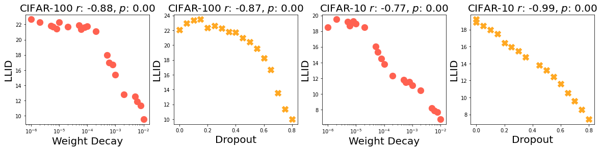
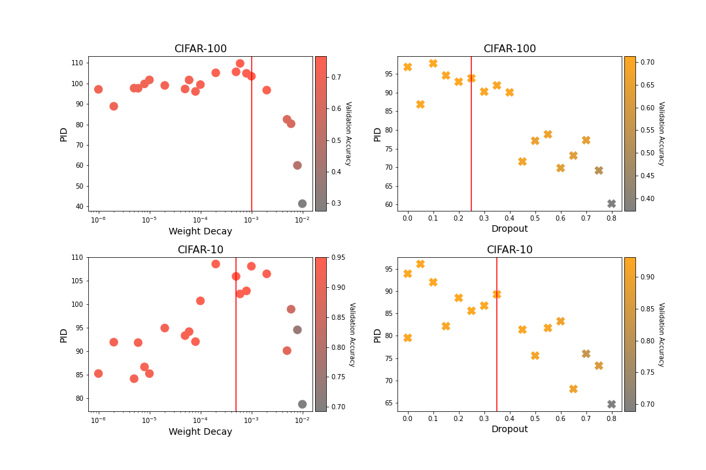
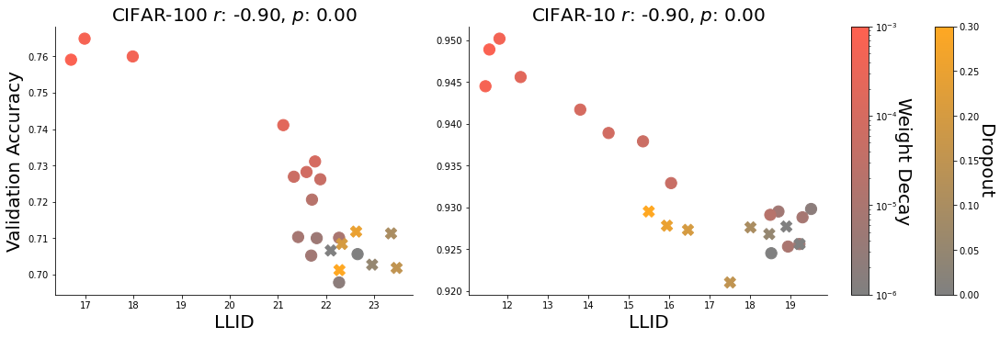

# Brown et al. 2022 — Relating Regularization and Generalization through the Intrinsic Dimension of Activations

См. также: [глобальный индекс понятий](../../concepts/index.md).
arXiv [2211.13239v1](https://arxiv.org/abs/2211.13239), 23 ноября 2022. Колонтитул PDF: «OPT2022: 14th Annual Workshop on Optimization for Machine Learning».

**Bradley C.A. Brown, Jordan Juravsky** — University of Waterloo.
**Anthony L. Caterini, Gabriel Loaiza-Ganem** — Layer 6 AI.

Оригинал и производные файлы этой папки:

- [`original/2211.13239.native.html`](original/2211.13239.native.html) — первоисточник, HTML-рендеринг arXiv (LaTeXML), скачан как есть.
- [`original/2211.13239.relating-regularization-and-generalization-through-the-intrinsic-dimension-of-activations.md`](original/2211.13239.relating-regularization-and-generalization-through-the-intrinsic-dimension-of-activations.md) — конверсия оригинала в Markdown без правок содержания; английский текст для сверки перевода.
- [`images/`](images/) — иллюстрации статьи в исходном разрешении (7 файлов).
- [`2211.13239.relating-regularization-and-generalization-through-the-intrinsic-dimension-of-activations.claims.txt`](2211.13239.relating-regularization-and-generalization-through-the-intrinsic-dimension-of-activations.claims.txt) — рабочий разбор: пронумерованные утверждения с пометками.

Схема якорей и правила ссылок на карточку — в [README папки статей](../README.md).

## Затрагиваемые понятия

**[Сжатие многообразия представлений](../../concepts/manifold-representation-compression.md)** — работа даёт корпусу самое раннее прямое наблюдение того, что размерность активаций падает в пору гроккинга, и делает это в чистом виде варианта B (геометрия представлений): параметр порядка живёт в пространстве активаций, а не в весах и не в сложности отображения «вход-выход». Мера взята готовой у Ansuini et al. 2019 — оценщик TwoNN по отношению расстояний до двух ближайших соседей ([p2-4](#p2-4), [p3-1](#p3-1)) — и из неё сделаны две величины: LLID (ID активаций последнего слоя на проверочной выборке) и PID (наибольший ID по слоям); «проще» у авторов значит «ниже LLID», «правдоподобнее» — «выше обучающая точность и PID» ([p1-5](#p1-5)). Главное наблюдение: у 16 трансформерных прогонов на делении по модулю $97$ падение LLID совпадает по времени со взлётом проверочной точности, а средний наименьший LLID у грокающих моделей $8.53$ против $16.16$ у не догрокавших ([p6-1](#p6-1), [fig-3](#fig-3)). Чего в работе нет: ни одного вмешательства — LLID нигде не понижают принудительно, чтобы проверить, наступит ли генерализация, и оптимизация по LLID названа направлением будущих работ; понятий «нейросхлопывание», «информационное горлышко», «низкоранговость весов» здесь нет вовсе; PID у трансформеров не измеряется ни разу, так что заявленный размен PID/LLID к гроккингу не приложен. Кроме того, сама мера объявлена внутренне несогласованной самими авторами ([p3-4](#p3-4)) — подробнее ниже.

**[Гроккинг](../../concepts/grokking.md)** — работа берёт явление как данность и навешивает на него новое измерение, не оспаривая и не переопределяя. Постановка воспроизведена по Power et al. 2022 через неофициальную перереализацию Snell 2022, но сужена: одна операция вместо двенадцати, бюджет 40 тыс. шагов, развёртка 4×4 по доле данных и weight decay ([p5-4](#p5-4), [p11-2](#p11-2)). Вклад в понятие — не механизм, а сопутствующая величина: «много позже насыщения обучающей точности… происходит совпадающее с этим по времени внезапное падение LLID» ([p1-3](#p1-3), [p2-2](#p2-2)). Отдельно стоит наблюдение, в позднейших работах корпуса почти не разобранное: на позднем гроккинге при малой доле данных LLID сперва даёт всплеск, а потом опускается ниже прежней полки ([p6-1](#p6-1)). Чего в работе нет: языка фазовых переходов, мер прогресса, контуров, разбора того, что именно происходит с представлением, — только скаляр на слой и его ход во времени; число семян не названо, полос разброса нет ни на одном рисунке.

**[Weight decay](../../concepts/weight-decay.md)** — выступает сразу в двух ролях и обе взяты у предшественников. Первая: пересказ находки Power et al. — «более сильная регуляризация заставляла гроккинг наступать существенно раньше по ходу обучения» ([p3-5](#p3-5)); именно поэтому weight decay и взят одной из двух осей развёртки. Вторая: собственное измерение — усиление weight decay монотонно понижает LLID у ResNet-18, Пирсон $-0.88$ на CIFAR-100 и $-0.77$ на CIFAR-10 ([p4-4](#p4-4), [fig-1](#fig-1)). Чего в работе нет: нормы весов — она не измеряется ни разу, так что связь «weight decay → низкий LLID» не разложена ни на какой промежуточный механизм; нет и разделения того, что задаёт weight decay в трансформерных прогонах — срок гроккинга или уровень LLID, — а различаются группы $8.53$ и $16.16$ ровно по weight decay и доле данных.

**[Варианты регуляризации](../../concepts/regularization-variants.md)** — работа сравнивает два приёма, dropout и weight decay, по общему для них следствию и находит его: оба единообразно понижают LLID ([p4-4](#p4-4), [fig-1](#fig-1)). Отсюда же её главный собственный тезис — двусторонность регуляризации: понижать LLID без оглядки нельзя, потому что регуляризация понижает и ID ранних слоёв, то есть PID, мешая выучиванию достаточно разнообразных признаков ([p2-1](#p2-1)); за порогом наилучшей регуляризации PID и проверочная точность обрушиваются вместе, заметнее на CIFAR-100 ([p5-3](#p5-3), [fig-4](#fig-4)). Работа завершается призывом к послойно различающимся приёмам регуляризации ([p4-1](#p4-1)) — сам такой приём здесь не предлагается и не проверяется. Чего в работе нет: разделения того, чем именно dropout и weight decay различаются в действии на PID; высокие значения отношения PID/LLID на рисунке 2 дают исключительно прогоны с weight decay ([fig-2](#fig-2)), так что связь может быть межсемейственной, а не внутрисемейственной.

**[Когда регуляризация необходима](../../concepts/regularization-necessity.md)** — работа не занимает позиции в этом споре и на вопрос не отвечает, но её развёртка даёт материал: гроккинг в ней наблюдается и при weight decay $=0$ ([fig-3](#fig-3), окошки $p=0.25$ и $p=0.3$), то есть регуляризация в этой постановке (ADAM, постоянная скорость обучения, деление по модулю $97$, бюджет 40 тыс. шагов) для гроккинга не обязательна. Сами авторы этого вывода не делают и не обсуждают: они пересказывают Power et al. о том, что weight decay ускоряет гроккинг ([p3-5](#p3-5)), и берут его как ось развёртки, а не как условие. Чего в работе нет: сравнения «с регуляризацией / без» как отдельного опыта и вообще какого-либо утверждения о необходимости.

**[Зрение и реальные данные](../../concepts/vision-real-world-data-mnist-cifar.md)** — половина работы стоит на ResNet-18 и CIFAR-10/CIFAR-100, но гроккинга там нет и не ищется: изображения служат полигоном для связки «регуляризация — LLID — генерализация», а все обученные модели достигают безупречной обучающей точности сразу ([p4-3](#p4-3)). Корпусу отсюда полезны порядки величин и знаки корреляций: LLID при усилении регуляризации падает с $\approx 24$ до $\approx 7$ ([fig-1](#fig-1)), PID при обычной регуляризации держится примерно в пределах $80$–$110$ и обрушивается до $40$–$60$ при избыточной ([fig-4](#fig-4)), а связь точности с LLID отрицательна ($r=-0.90$ на обоих наборах), с PID — положительна ($r=0.82$ и $r=0.86$) ([p5-2](#p5-2), [fig-5](#fig-5), [fig-6](#fig-6)). Чего в работе нет: отложенной генерализации на изображениях, разбора динамики по ходу обучения (все точки CIFAR сняты на конец обучения) и переноса вывода про гроккинг на реальные данные.

**[Модульная арифметика](../../concepts/modular-arithmetic.md)** — из набора Power et al. взята ровно одна операция, деление по модулю $97$, и взята она готовым набором из перереализации Snell ([p5-4](#p5-4), [p11-2](#p11-2)). Ни сложения, ни умножения, ни композиции перестановок в работе нет, зависимость от модуля не проверяется, устройство выученного решения не разбирается. Понятие затронуто, таким образом, только как носитель: полигон нужен, чтобы получить внезапную генерализацию, а не чтобы что-то узнать про арифметику.

**[Фаза меморизации / плато](../../concepts/memorization-phase.md)** — работа даёт этой фазе одно точное наблюдение: обучающая точность у всех 16 прогонов достигает $100\%$ очень быстро, а обучающий LLID идёт тем же ходом, что и проверочный ([fig-7](#fig-7)). То есть падение LLID приходится на пору, когда обучающая часть давно насыщена, и вся описываемая перестройка представления происходит внутри плато ([p1-3](#p1-3)). Чего в работе нет: разбора самого плато — что сеть делает, пока LLID высок, здесь не спрашивается; понятий «запоминающее решение» и «обобщающее решение» как двух разных механизмов в тексте не появляется.

**[Доля данных / критический размер набора](../../concepts/data-fraction-critical-dataset-size.md)** — доля обучающих данных взята второй осью развёртки, $p\in\{0.15,0.2,0.25,0.3\}$, ровно потому, что «эти параметры сильно влияют на то, когда модели начинают грокать, и на длительность поры гроккинга» ([p5-4](#p5-4)). Наблюдаемое следствие: три прогона — $p=0.15$ при $WD=0$ и при $WD=10^{-4}$, а также $p=0.2$ при $WD=0$ — не догрокали в бюджете 40 тыс. шагов и показаны красным ([fig-3](#fig-3)). Чего в работе нет: ни порога, ни его имени, ни попытки его посчитать — доля данных здесь управляющая ручка развёртки, а не предмет изучения.

**[Меры прогресса](../../concepts/progress-measures.md)** — понятие затронуто ровно настолько, чтобы стало видно, чем LLID от меры прогресса отличается. По определению корпуса мера прогресса *предшествует* скачку и причинно с ним связана; LLID у авторов *совпадает* со скачком по времени («co-occurent»), причинной проверки нет, а предложение оптимизировать по LLID вынесено в будущую работу ([p6-1](#p6-1)). Термина «progress measure» в статье нет ни разу, хотя Barak et al. вышли раньше; приписывать авторам постановку о мерах прогресса нельзя. Единственное, что здесь ближе к предвестнику, — всплеск LLID *в начале* гроккинга, но он описан на одном окошке и истолкован рассуждением.

**[Оптимизатор](../../concepts/optimizer-adam-adamw-sgd.md)** — две половины работы идут на разных оптимизаторах, и это унаследовано от предшественников без обсуждения: SGD с моментом $0.9$, ступенчатым расписанием скорости обучения и $200$ эпохами на CIFAR ([p11-1](#p11-1)); ADAM с бетами $(0.9,0.98)$, постоянной скоростью $0.001$ и $40k$ шагов на трансформере ([p11-2](#p11-2)). Чего в работе нет: сравнения оптимизаторов, обсуждения их вклада в LLID и вообще какого-либо разбора того, что рогатки, адаптивность или расписание могли бы сделать с измеряемой величиной.

---

**[Переопараметризация и глубина](../../concepts/overparameterization-depth.md)** — работа снимает кажущееся противоречие: успех крайне переопараметризованных сетей выглядит противоречащим интуиции ([`p2-1`](#p2-1)) лишь пока сложность считают по числу параметров, а не по размерности выученного представления.
## Несогласованности внутри статьи

**Заглавная «внезапность» держится не на всех окошках рисунка 3.** Текст утверждает «внезапное падение LLID, совпадающее по времени с внезапным ростом проверочной точности» ([p6-1](#p6-1)), но на самом рисунке ([fig-3](#fig-3)) ход по окошкам разный. У $p=0.2$, $WD=10^{-4}$ зелёная кривая убывает постепенно на протяжении всего прогона: спуск начинается в первые тысячи шагов, задолго до подъёма точности около 15–22 тыс. шагов, и продолжается ещё десяток тысяч шагов после него. У $p=0.15$, $WD=0.01$ — того самого окошка, на которое авторы ссылаются как на пример всплеска, — LLID к моменту скачка уже опустился с $\approx 25$ до $\approx 12$, то есть большая часть падения приходится на пору *до* гроккинга. «Совпадение по времени» верно для части развёртки, а не для развёртки целиком.

**У двух прогонов LLID после падения возвращается наверх при проверочной точности $1.0$.** В окошке $p=0.3$, $WD=0$ ([fig-3](#fig-3)) LLID опускается до $\approx 13.5$ около 10 тыс. шагов, а затем растёт до $\approx 20$ и держится там до конца прогона, тогда как точность вышла на $1.0$ ещё раньше. В окошке $p=0.25$, $WD=0.01$ минимум $\approx 11$ достигается ровно в точке скачка, после чего LLID возвращается к $\approx 15$ и остаётся там. Связка «низкий LLID ↔ генерализация» этими двумя прогонами не поддерживается, и в тексте они не упомянуты. С этим прямо связан выбор меры в сводке: числа $8.53$ и $16.16$ ([p6-1](#p6-1)) считаны по *наименьшему за прогон* LLID, а не по итоговому — то есть по величине, которая у обоих названных прогонов является кратковременным провалом, а не установившимся уровнем.

**Мера, на которой стоит вся работа, объявлена внутренне несогласованной самими авторами.** В [p3-4](#p3-4) сказано прямо: внутренняя размерность не может расти вдоль слоёв сети, поскольку слой есть функция лишь предшествующих активаций, — а оценка растёт, и именно этот рост даёт «горбатую» форму, из которой берётся PID. Расхождение отнесено на счёт погрешностей оценщика, после чего оценщик оставлен как годный, поскольку «от нас требуется лишь согласованность ходов и сравнений». Это честная оговорка, но она означает, что PID — величина, существующая только благодаря признанной погрешности измерения, и что весь размен PID/LLID построен на ней.

**Запись развёртки weight decay в приложении A не отвечает рисунку 1.** В [p11-1](#p11-1) значения weight decay заданы как $ae^{-b}$ при $a\in\{1,2,5,6,8\}$ и $b\in\{-6,-5,-4,-3,-2\}$; буквально это дало бы значения от $e^{2}\approx 7$ до $8e^{6}\approx 3200$. На [fig-1](#fig-1) же ось weight decay идёт от $10^{-6}$ до $10^{-2}$, то есть имелось в виду $a\cdot 10^{b}$. Кроме того, в [p4-4](#p4-4) не сказано, по какой величине считается корреляция Пирсона — по самому weight decay или по его логарифму; при развёртке в четыре порядка это меняет число, а на окошке CIFAR-100/dropout зависимость к тому же немонотонна (LLID растёт до dropout $\approx 0.15$ и лишь потом падает), тогда как $r$ считается по всей кривой.

## Что показано, а что предположено

**Показано** (измерением, на своих данных): регуляризация обоих видов понижает LLID у ResNet-18 ([fig-1](#fig-1)); проверочная точность отрицательно связана с LLID и положительно с PID, а отношение PID/LLID связано с точностью сильнее любой из величин по отдельности ([fig-2](#fig-2), [fig-5](#fig-5), [fig-6](#fig-6)); за порогом наилучшей регуляризации PID и точность падают вместе ([fig-4](#fig-4)); на 16 трансформерных прогонах падение LLID приходится на ту же пору, что и взлёт точности, а обучающая точность к этому времени давно на $100\%$ ([fig-3](#fig-3), [fig-7](#fig-7)).

**Не показано, но читается как показанное.** Всё перечисленное — совпадения по времени и корреляции по одной точке на прогон; так это и названо в заключении, где итог работы сформулирован как «сильная корреляция между внутренней размерностью активаций и генерализацией» ([p7-1](#p7-1)). Ни одного вмешательства в работе нет: LLID нигде не понижают принудительно, PID нигде не удерживают, и сами авторы называют оптимизацию по LLID направлением будущих работ ([p6-1](#p6-1)). Сравнение $8.53$ против $16.16$ идёт между группами, различающимися ровно по weight decay и доле данных, — то есть по величинам, о которых в самой же статье сказано, что они задают срок гроккинга ([p3-5](#p3-5)) и уровень LLID ([fig-1](#fig-1)); общая причина здесь не исключена. Число семян не названо ни для одной развёртки, полос разброса нет ни на одном рисунке.

**Заявлено рассуждением.** Истолкование всплеска LLID как «намёка на выход из локального минимума» и вывод, что более высокий weight decay «помогает такому прыжку», — догадки, не подкреплённые ни одним измерением: ни ландшафт, ни норма весов, ни какая-либо иная величина при этом не считаются ([p6-1](#p6-1)). Догадкой же объявлено и объяснение того, почему картина на CIFAR-100 резче ([p5-3](#p5-3)), и объяснение сходства ID после первого и второго блоков трансформера малым размером сети ([p5-4](#p5-4)).

**Обещано и не выполнено в самой статье.** PID для трансформерных прогонов не измеряется вовсе — заявленный размен PID/LLID, главный вывод первой половины работы, к гроккингу не приложен ни разу. Код обещан «по принятии» ([p2-3](#p2-3)), ссылкой это обещание не подкреплено.

---

# Текст статьи

University of Waterloo Layer 6 AI

# Relating Regularization and Generalization through the Intrinsic Dimension of Activations

Bradley C.A. Brown (bcabrown@uwaterloo.ca), Jordan Juravsky (jordanjuravsky@gmail.com) — University of Waterloo; Anthony L. Caterini (anthony@layer6.ai), Gabriel Loaiza-Ganem (gabriel@layer6.ai) — Layer 6 AI.

## Аннотация

###### p1-3

Пусть дана пара моделей со схожим качеством на обучающей выборке; естественно предположить, что модель, обладающая более простыми внутренними представлениями, покажет лучшую генерализацию. В этой работе мы даём эмпирические свидетельства в пользу такой интуиции через разбор внутренней размерности (intrinsic dimension, ID) активаций модели, которую можно понимать как наименьшее число факторов изменчивости в представлении данных моделью. Сначала мы показываем, что распространённые приёмы регуляризации единообразно понижают ID последнего слоя (last-layer ID, LLID) активаций проверочной выборки у моделей классификации изображений, и показываем, насколько сильно это сказывается на качестве генерализации. Мы также исследуем, как избыточная регуляризация снижает способность модели извлекать признаки из данных на более ранних слоях, что отрицательно сказывается на проверочной точности даже тогда, когда LLID продолжает падать, а обучающая точность остаётся почти безупречной. Наконец, мы рассматриваем LLID на протяжении обучения моделей, у которых наблюдается гроккинг. Мы наблюдаем, что много позже насыщения обучающей точности, когда модели «грокают» и проверочная точность внезапно улучшается со случайного угадывания до безупречной, происходит совпадающее с этим по времени внезапное падение LLID, что даёт больше понимания динамики внезапной генерализации.

## 1 Введение

Бритва Оккама гласит, что из набора правдоподобных объяснений следует предпочесть простейшее. Польза от приложения этой мысли к моделям машинного обучения интуитивно понятна: любой метод, решающие правила которого слишком сложны, может выучиться подгоняться под шум и смещения в данных, не относящиеся к решаемой задаче. Напротив, методы, способные описать наблюдаемые данные при наименьшем числе допущений, с большей вероятностью нашли в данных обобщаемые закономерности, приложимые к невиданным примерам. Успешное приложение этой мысли видно во всём машинном обучении (например, (Tishby et al. 2000; Alemi et al. 2016; Birdal et al. 2021; Recanatesi et al. 2019; D’Amario et al. 2021; Chen et al. 2018)). Едва ли не заметнее всего то, что и сам байесовский вывод можно увидеть через призму бритвы Оккама (MacKay et al. 2003): правдоподобие и априорное распределение поощряют соответственно правдоподобность и простоту.

###### p1-5

Нашу работу можно рассматривать как ещё одно приложение бритвы Оккама: мы разбираем, как регуляризация влияет на простоту и правдоподобность выученных нейросетевых представлений и как они связаны с генерализацией. Точнее, мы проясняем эту мысль при помощи внутренней размерности (ID) активаций проверочных данных, которую можно понимать как наименьшее число факторов изменчивости в их представлении. Мы вводим две меры представленческой сложности нейросетей: ID последнего слоя (LLID) и пиковый ID (PID). LLID — это внутренняя размерность **[p. 2]** последнего слоя активаций проверочной выборки, а PID — наибольшая внутренняя размерность активаций проверочной выборки по всем слоям модели (которая во всех опытах всегда приходится на ранние слои сети). Как мы покажем, в рамке бритвы Оккама нейросеть считается тем «проще», чем ниже её LLID, и «правдоподобной», если обучающая точность и PID достаточно высоки.

###### p2-1

Ввиду связи между простотой представления и генерализацией успех крайне переопараметризованных нейросетей (Zhang et al. 2016) выглядит противоречащим интуиции. Мы выделяем два объяснения этого кажущегося противоречия. Во-первых, Ansuini et al. 2019 и Recanatesi et al. 2019 показывают, что, несмотря на обширное объемлющее пространство, активации живут на многообразиях, размерность которых на порядки меньше. Во-вторых, хотя глубокие сети и обучаются на предельное качество на обучающей выборке, они при этом ещё и регуляризуются. Приёмы регуляризации склоняют модель к более простым и общим решениям, тем самым уменьшая переобучение. В этой работе мы сводим эти два объяснения воедино, показывая, что распространённые приёмы регуляризации понижают размерность многообразий активаций глубже в сети и позволяют моделям классификации изображений лучше обобщаться на проверочную выборку. Тем не менее нельзя произвольно понижать LLID регуляризацией и ожидать гарантированного улучшения генерализации. Мы предполагаем, что отчасти это оттого, что регуляризация понижает также и ID начальных слоёв сети, а значит, понижает PID, мешая выучиванию достаточно сложных/разнообразных признаков. Мы показываем, что достижение хорошей генерализации требует размена между понижением LLID и удержанием PID достаточно высоким.

###### p2-2

Чтобы укрепить наше понимание связи между простотой представления и генерализацией, мы изучаем также задачу, на которой модели способны выучиться обобщать безупречно. Точнее, мы разбираем внутренние представления малых трансформерных моделей, обучаемых выполнять деление по модулю. Power et al. 2022 обнаружили на этих задачах удивительное поведение: много позже того, как обучающая точность насыщается на $100\%$, модели способны «грокнуть» задачу и внезапно поднять своё проверочное качество со случайного угадывания до $100\%$. Примечательно, что мы находим совпадающее с этим по времени понижение LLID, когда модель грокает. Это позволяет предположить, что между нахождением обобщаемых закономерностей в данных и простотой представления у модели есть сильная связь, что дополнительно подтверждает уместность измерения LLID.

###### p2-3

Мы надеемся, что наши находки, связывающие широко распространённые приёмы регуляризации с измеримыми показателями простоты, побудят сообщество и дальше изучать следствия LLID и PID — и как признаков того, когда на генерализацию модели можно положиться, и как целей оптимизации. В частности, распутывание действия приёмов регуляризации приглашает будущие работы к изучению теории того, как связаны LLID, PID, регуляризация и генерализация, ради дальнейшего улучшения приёмов регуляризации и оптимизации. Мы откроем код по принятии статьи, чтобы облегчить эти будущие исследования.

## 2 Смежные работы

#### Внутренняя размерность

###### p2-4

Гипотеза о многообразии утверждает, что, несмотря на высокую объемлющую размерность, интересующие нас данные живут на многообразии много меньшей размерности (Bengio et al. 2012). Эта гипотеза экспериментально проверена и для изображений, и для активаций в глубоких нейросетях (Pope et al. 2021; Ansuini et al. 2019; Brown et al. 2022). Размерность этого многообразия называют *внутренней размерностью* данных: например, если данные лежат на единичной окружности в $\mathbb{R}^{2}$, то их внутренняя и объемлющая размерности будут $1$ и $2$ соответственно. В этом исследовании мы используем оценку внутренней размерности последнего слоя активаций как показатель простоты представления нейросети. Поскольку вычислить точную внутреннюю размерность неподъёмно, мы используем оценщик TwoNN из Facco et al. 2017, следуя реализации, описанной в Ansuini et al. 2019. **[p. 3]** Этот оценщик предполагает, что плотность локально постоянна вокруг всех точек данных, и далее опирается на наблюдение, что отношение

$$
\frac{\log{(1-F(\mu))}}{\log{(\mu)}} \tag{1}
$$

###### p3-1

приближает внутреннюю размерность, где $F(\mu)$ — функция распределения величины $\mu=r^{(2)}/r^{(1)}$: отношения расстояний от каждой точки данных до её второго и первого ближайших соседей. Хотя это и не сразу очевидно, результат получается явным выводом $F(\mu)$ через $\mu$ и ID. Зная функциональный вид $F(\mu)$, легко затем проверить, что отношение в (1) совпадает с ID (Facco et al. 2017). На практике по данным вычисляется эмпирическая функция распределения $F^{emp}$, а за оценку внутренней размерности берётся наклон прямой, проходящей через начало координат и подогнанной к наблюдённым координатам $\{(\log(\mu_{i}),-\log(1-F^{emp}(\mu_{i})))\}_{i}$. Этой процедурой мы получаем оценки $\hat{d}_{\ell}$ внутренней размерности всех слоёв активаций $\ell=1,\dots,L$ нейросети (по проверочным данным, если не оговорено иное) и определяем её LLID и PID как

$$
\text{LLID}=\hat{d}_{L},\hskip 40.0pt\text{PID}=\max_{\ell}\hat{d}_{\ell}. \tag{2}
$$

Хотя существуют и более свежие оценщики ID (Gomtsyan et al. 2019; Block et al. 2021; Lim et al. 2021; Tempczyk et al. 2022; Levina and Bickel 2004), мы выбираем именно этот, поскольку он практически надёжен (Ansuini et al. 2019) и вычислительно эффективен для расчёта ID на наших активациях с высокой объемлющей размерностью.

#### Внутренняя размерность активаций

Хотя предлагались и другие меры простоты (Dherin et al. 2022; Gao and Jojic 2016; Blier and Ollivier 2018), мы выбираем внутреннюю размерность как показатель представленческой сложности, поскольку прежние работы обнаружили, что активации живут на нелинейных многообразиях, а оценщики внутренней размерности оказались проницательны в выявлении важных свойств геометрического строения представлений данных (Ansuini et al. 2019; Recanatesi et al. 2019; Lee and Chung 2021; Ma et al. 2018; Kienitz et al. 2022). В частности: Ansuini et al. 2019 показывают, что LLID у более крупных сетей ниже и связан с генерализацией; Lee and Chung 2021 используют ID активаций как правило ранней остановки при few-shot-подстройке вложений; а Ma et al. 2018 используют ID активаций как правило понижения доверия к зашумлённым меткам ради избежания переобучения.

###### p3-4

Примечательно, что Ansuini et al. 2019 показывают: оценка ID многообразий активаций в моделях классификации имеет горбатую форму, при которой внутренняя размерность быстро достигает пика на ранних слоях сети, а затем неуклонно убывает до последнего слоя активаций. Заметим, что внутренняя размерность не может расти вдоль слоёв нейросети, которые суть функции лишь предшествующих им активаций, и мы относим это несоответствие на счёт погрешностей оценщика ID. Поскольку от нас требуется лишь согласованность ходов и сравнений ID (а не их точность), мы находим этот оценщик тем не менее полезным. Иными словами, хотя приложение функции и не может изменить истинный ID, оно, очевидно, может изменить расстояния до ближайших соседей, а с ними и оценку ID, которая, невзирая на это, остаётся правомерной мерой сложности выученных представлений. Мы продолжаем работу Ansuini et al. 2019 (которые тоже сочли эту оценку ID пригодной) и подкрепляем полезность измерения ID активаций, показывая, как на PID и LLID действует регуляризация, как они связаны с генерализацией и насколько сильно они сцеплены с явлением безупречной генерализации — гроккингом.

#### Гроккинг

###### p3-5

Недавние работы выявили режимы обучения, в которых модели переживают пору быстрой генерализации много позже того, как модель безупречно запомнила обучающий набор; это известно как гроккинг. Power et al. 2022 обнаружили это явление, обучая двухслойные трансформерные модели на малых процедурно порождённых алгоритмических наборах данных. Примечательно, что величина weight decay, прилагаемого **[p. 4]** в ходе обучения, сильно влияла на число шагов, требуемых модели для генерализации: более сильная регуляризация заставляла гроккинг наступать существенно раньше по ходу обучения.

#### Регуляризация

###### p4-1

Регуляризация была решающей для успеха методов глубокого обучения (Kukačka et al. 2017; Srivastava et al. 2014; Krogh and Hertz 1991). Особый интерес для нашей работы представляют приёмы регуляризации, пытающиеся понизить сложность активаций (Bhalodia et al. 2019; Zhu et al. 2017). Наша работа измеряет это понижение сложности, показывает, что заметные приёмы регуляризации (Srivastava et al. 2014; Krogh and Hertz 1991) тоже дают такое действие, и призывает к более прицельным, послойно различающимся приёмам регуляризации.

## 3 Опыты

Мы вводим две меры представленческой сложности: (оценённую) внутреннюю размерность последнего слоя активаций проверочной выборки и наибольшую (оценённую) внутреннюю размерность активаций проверочной выборки по всем слоям сети — обе определены в (2). В этом разделе мы разбираем действие LLID и PID в моделях классификации изображений (раздел 3.1) и в трансформерных моделях (раздел 3.2).

### 3.1 Регуляризация и генерализация в классификации изображений

#### Постановка:

###### p4-3

Чтобы разобрать связь между LLID и регуляризацией, мы обучаем модели ResNet-18 (He et al. 2015) на наборах классификации изображений CIFAR-10 и CIFAR-100 (Krizhevsky et al. 2009), независимо перебирая значения dropout и weight decay (Srivastava et al. 2014; Krogh and Hertz 1991). Подробности обучения даны в приложении A. LLID для этих моделей определён на активациях после последнего слоя усредняющего пулинга, а PID неизменно приходится на активации после первого блока ResNet. Заметим, что все обученные модели достигают безупречной точности на обучающей выборке.

###### fig-1

*Рисунок 1: LLID для моделей ResNet-18 на наборах CIFAR-100/CIFAR-10 при различных значениях weight decay и доли dropout. Усиление силы регуляризации понижает LLID.* **[p. 4]**

#### Регуляризация понижает LLID:

###### p4-4

На рисунке 1 мы изображаем итоговый LLID моделей с разной величиной регуляризации на конец обучения. Ясно видно, что усиление силы регуляризации (вероятности dropout или коэффициента weight decay) понижает LLID, что подтверждается коэффициентами корреляции Пирсона $r$ и $p$-значениями проверки независимости по $t$-критерию, показанными в заголовках графиков. Эта сильная связь подтверждает интуицию, что регуляризация понижает сложность нейросетевых представлений.

###### fig-2

*Рисунок 2: Связь между отношением PID / LLID и проверочной точностью у моделей, обученных при различных значениях dropout (отмечены крестиками) и weight decay (отмечены кружками). Большая насыщенность красного и жёлтого цветов означает соответственно большее значение weight decay и большую долю dropout.* **[p. 5]**

**[p. 5]**

#### Генерализация связана с PID и LLID:

Мы показали, что понижение LLID — одно из действий регуляризации, общее для обоих изученных приёмов. Однако разные приёмы регуляризации, очевидно, имеют разные последствия, способные как помочь генерализации, так и повредить ей, и подбор силы регуляризации требует размена между этими действиями. Мы изучаем одно такое отрицательное последствие, наблюдаемое у наших моделей, — понижение PID, — а более подробное изучение прочих последствий регуляризации оставляем будущим работам.

###### p5-2

Рисунки 5 и 6 в приложении B показывают, что достижение более высокой проверочной точности связано с понижением LLID и повышением PID. Это указывает, что, хотя простое представление данных на более глубоких слоях и выгодно, оно не должно достигаться ценой способности извлекать богатые признаки на более ранних слоях. Рисунок 2 выделяет этот размен, показывая связь между проверочной точностью и отношением PID к LLID (то есть тем, насколько сильно модель понижает ID активаций вдоль слоёв). Виден отчётливый ход: более высокое отношение PID/LLID указывает на лучшее проверочное качество, и это подчёркивает необходимость уравновешивать действие понижения сложности последнего слоя активаций (которые отделены от логитов единственным линейным слоем и потому образуют основу окончательной классификации модели), не наказывая при этом модель за извлечение потенциально сложных признаков на более ранних слоях, требуемых для построения этого представления.

###### p5-3

Уместность PID проявляется резче, когда сила регуляризации выводится за обычные пределы. На рисунке 4 приложения B мы изображаем, как PID меняется при избыточной регуляризации. Мы видим, что вскоре после увеличения регуляризации сверх значения, дающего наилучшую проверочную точность, наступает быстрое падение и PID, и проверочной точности. Особенно это верно для более трудного набора CIFAR-100, где, как мы предполагаем, увеличение числа классов требует выучивания более разнообразных признаков на ранних слоях. Пользуясь рамкой бритвы Оккама, мы видим, что избыточная регуляризация препятствует «правдоподобности», а PID — сильный признак наступления этого.

### 3.2 LLID и гроккинг

#### Постановка:

###### p5-4

Напоследок мы исследуем связь между LLID и явлением гроккинга, наблюдённым в Power et al. 2022. Гроккинг описывает внезапный рост проверочного качества много позже того, как **[p. 6]** модель безупречно запомнила обучающий набор. Это действие было замечено именно на малом алгоритмическом наборе данных при использовании двухслойной трансформерной модели (Vaswani et al. 2017). Мы воспроизводим эту постановку обучения, отслеживая LLID обучающей и проверочной выборок на протяжении обучения. Мы обучаем 16 разных моделей, перебирая силу регуляризации weight decay и размер обучающего набора, поскольку эти параметры сильно влияют на то, когда модели начинают грокать, и на длительность поры гроккинга. Для этих двухслойных трансформерных моделей мы определяем LLID как внутреннюю размерность активаций после MLP второго трансформерного блока (мы также измеряем ID активаций после первого трансформерного блока и находим схожие узоры, что, как мы предполагаем, объясняется малым размером сети). Дополнительные подробности обучения даны в приложении A.

###### fig-3

*Рисунок 3: Проверочная точность (синим) и LLID (зелёным) трансформерных моделей на протяжении обучения задачам деления по модулю (в заголовках графиков показаны доля использованных обучающих данных $p$ и коэффициент weight decay $WD$). Мы наблюдаем совпадающие по времени падения ID, когда трансформеры «грокают». Точность прогонов, где модель не достигает безупречной проверочной точности в отведённом вычислительном бюджете 40 тыс. обучающих шагов, показана красным.* **[p. 6]**

#### Падения LLID совпадают с гроккингом:

###### p6-1

На рисунке 3 мы наблюдаем внезапное падение LLID, совпадающее по времени с внезапным ростом проверочной точности, наблюдаемым у моделей, обнаруживающих внезапную генерализацию (тот же график вместе с обучающими LLID и точностью каждого прогона мы показываем на рисунке 7 приложения B). Примечательно, что у моделей, которые грокают, средний наименьший LLID равен $8.53$ — много ниже среднего наименьшего LLID ($16.16$) у моделей, остающихся при низкой проверочной точности в отведённом вычислительном бюджете, что вновь подтверждает уместность простоты представлений для генерализации в измерении через LLID. Любопытно, что мы наблюдаем также: при меньшем количестве обучающих данных, когда гроккинг наступает позже по ходу обучения (напр. график с $p=0.15$, weight decay$=0.01$ на рисунке 3), в момент, когда модель начинает грокать, происходит первоначальный всплеск LLID, за которым следует спуск к более низкому LLID, чем прежняя полка. Это намекает на выход из локального минимума, а наступление этого явления при более высоких значениях weight decay указывает, что регуляризация помогает такому прыжку. Эта связь между LLID и гроккингом воодушевляет, поскольку она и подтверждает правомерность измерения простоты через LLID, и показывает, что он напрямую связан с генерализацией. Более того, оптимизация по LLID с целью воспроизвести это улучшение генерализации — воодушевляющее направление для будущих приёмов оптимизации и регуляризации.

**[p. 7]**

## 4 Заключение

###### p7-1

В этой работе мы исследовали связь между простотой внутреннего представления и качеством генерализации, разбирая внутреннюю размерность активаций модели. Мы выявили сильную корреляцию между возрастанием величины регуляризации и понижением LLID в моделях классификации изображений. Мы также показали, что понижение LLID и повышение PID связаны с улучшением генерализации — вплоть до точки, за которой избыточная регуляризация снижает способность моделей извлекать осмысленные признаки на более ранних слоях. Наконец, мы установили совпадение по времени между внезапным ростом проверочной точности (то есть гроккингом) и внезапным падением LLID на малых моделях, обучаемых на алгоритмических наборах данных. В целом наши результаты показывают сильную корреляцию между внутренней размерностью активаций и генерализацией. Мы надеемся, что это приведёт к возросшему интересу к пониманию этого явления с теоретической стороны и к распутыванию той роли, которую регуляризация играет для внутренней размерности через оптимизацию.

## Литература

- Alexander A. Alemi, Ian Fischer, Joshua V. Dillon, and Kevin Murphy. Deep variational information bottleneck. 2016. 10.48550/ARXIV.1612.00410. URL https://arxiv.org/abs/1612.00410.

- Alessio Ansuini, Alessandro Laio, Jakob H Macke, and Davide Zoccolan. Intrinsic dimension of data representations in deep neural networks. *Advances in Neural Information Processing Systems*, 32, 2019. URL https://papers.nips.cc/paper/2019/hash/cfcce0621b49c983991ead4c3d4d3b6b-Abstract.html.

- Yoshua Bengio, Aaron Courville, and Pascal Vincent. Representation learning: A review and new perspectives, 2012. URL https://arxiv.org/abs/1206.5538.

- Riddhish Bhalodia, Shireen Elhabian, Ladislav Kavan, and Ross Whitaker. Coopsubnet: Cooperating subnetwork for data-driven regularization of deep networks under limited training budgets, 2019. URL https://arxiv.org/abs/1906.05441.

- Tolga Birdal, Aaron Lou, Leonidas Guibas, and Umut Şimşekli. Intrinsic dimension, persistent homology and generalization in neural networks, 2021. URL https://arxiv.org/abs/2111.13171.

- Léonard Blier and Yann Ollivier. The description length of deep learning models, 2018. URL https://arxiv.org/abs/1802.07044.

- Adam Block, Zeyu Jia, Yury Polyanskiy, and Alexander Rakhlin. Intrinsic dimension estimation using wasserstein distances, 2021. URL https://arxiv.org/abs/2106.04018.

- Bradley C. A. Brown, Anthony L. Caterini, Brendan Leigh Ross, Jesse C. Cresswell, and Gabriel Loaiza-Ganem. The union of manifolds hypothesis and its implications for deep generative modelling, 2022. URL https://arxiv.org/abs/2207.02862.

- Chao Chen, Xiuyan Ni, Qinxun Bai, and Yusu Wang. A topological regularizer for classifiers via persistent homology, 2018. URL https://arxiv.org/abs/1806.10714.

**[p. 8]**

- Vanessa D’Amario, Sanjana Srivastava, Tomotake Sasaki, and Xavier Boix. The foes of neural network’s data efficiency among unnecessary input dimensions, 2021. URL https://arxiv.org/abs/2107.06409.

- Benoit Dherin, Michael Munn, Mihaela C. Rosca, and David G. T. Barrett. Why neural networks find simple solutions: the many regularizers of geometric complexity, 2022. URL https://arxiv.org/abs/2209.13083.

- Elena Facco, Maria d’Errico, Alex Rodriguez, and Alessandro Laio. Estimating the intrinsic dimension of datasets by a minimal neighborhood information. *Scientific Reports*, 7(1):12140, Sep 2017. ISSN 2045-2322. 10.1038/s41598-017-11873-y. URL https://doi.org/10.1038/s41598-017-11873-y.

- Tianxiang Gao and Vladimir Jojic. Degrees of freedom in deep neural networks, 2016. URL https://arxiv.org/abs/1603.09260.

- Marina Gomtsyan, Nikita Mokrov, Maxim Panov, and Yury Yanovich. Geometry-aware maximum likelihood estimation of intrinsic dimension, 2019. URL https://arxiv.org/abs/1904.06151.

- Kaiming He, Xiangyu Zhang, Shaoqing Ren, and Jian Sun. Deep residual learning for image recognition, 2015. URL https://arxiv.org/abs/1512.03385.

- Daniel Kienitz, Ekaterina Komendantskaya, and Michael Lones. The effect of manifold entanglement and intrinsic dimensionality on learning. *Proceedings of the AAAI Conference on Artificial Intelligence*, 36(7):7160–7167, Jun. 2022. 10.1609/aaai.v36i7.20676. URL https://ojs.aaai.org/index.php/AAAI/article/view/20676.

- Diederik P. Kingma and Jimmy Ba. Adam: A method for stochastic optimization, 2014. URL https://arxiv.org/abs/1412.6980.

- Alex Krizhevsky, Geoffrey Hinton, et al. Learning multiple layers of features from tiny images. 2009.

- Anders Krogh and John Hertz. A simple weight decay can improve generalization. In J. Moody, S. Hanson, and R.P. Lippmann, editors, *Advances in Neural Information Processing Systems*, volume 4. Morgan-Kaufmann, 1991. URL https://proceedings.neurips.cc/paper/1991/file/8eefcfdf5990e441f0fb6f3fad709e21-Paper.pdf.

- Jan Kukačka, Vladimir Golkov, and Daniel Cremers. Regularization for deep learning: A taxonomy, 2017. URL https://arxiv.org/abs/1710.10686.

- Dong Hoon Lee and Sae-Young Chung. Unsupervised embedding adaptation via early-stage feature reconstruction for few-shot classification, 2021. URL https://arxiv.org/abs/2106.11486.

- Elizaveta Levina and Peter Bickel. Maximum likelihood estimation of intrinsic dimension. *Advances in neural information processing systems*, 17, 2004.

**[p. 9]**

- Uzu Lim, Vidit Nanda, and Harald Oberhauser. Tangent space and dimension estimation with the wasserstein distance. *arXiv preprint arXiv:2110.06357*, 2021.

- Xingjun Ma, Yisen Wang, Michael E. Houle, Shuo Zhou, Sarah M. Erfani, Shu-Tao Xia, Sudanthi Wijewickrema, and James Bailey. Dimensionality-driven learning with noisy labels, 2018. URL https://arxiv.org/abs/1806.02612.

- David JC MacKay, David JC Mac Kay, et al. *Information theory, inference and learning algorithms*. Cambridge university press, 2003.

- Phillip Pope, Chen Zhu, Ahmed Abdelkader, Micah Goldblum, and Tom Goldstein. The intrinsic dimension of images and its impact on learning, 2021. URL https://arxiv.org/abs/2104.08894.

- Alethea Power, Yuri Burda, Harri Edwards, Igor Babuschkin, and Vedant Misra. Grokking: Generalization beyond overfitting on small algorithmic datasets, 2022. URL https://arxiv.org/abs/2201.02177.

- Stefano Recanatesi, Matthew Farrell, Madhu Advani, Timothy Moore, Guillaume Lajoie, and Eric Shea-Brown. Dimensionality compression and expansion in deep neural networks, 2019. URL https://arxiv.org/abs/1906.00443.

- Charlie Snell. unofficial re-implementation of ”grokking: Generalization beyond overfitting on small algorithmic datasets”. https://github.com/Sea-Snell/grokking, 2022.

- Nitish Srivastava, Geoffrey Hinton, Alex Krizhevsky, Ilya Sutskever, and Ruslan Salakhutdinov. Dropout: A simple way to prevent neural networks from overfitting. *Journal of Machine Learning Research*, 15(56):1929–1958, 2014. URL http://jmlr.org/papers/v15/srivastava14a.html.

- Piotr Tempczyk, Rafał Michaluk, Lukasz Garncarek, Przemysław Spurek, Jacek Tabor, and Adam Golinski. Lidl: Local intrinsic dimension estimation using approximate likelihood. In *International Conference on Machine Learning*, pages 21205–21231. PMLR, 2022.

- Naftali Tishby, Fernando C. Pereira, and William Bialek. The information bottleneck method, 2000. URL https://arxiv.org/abs/physics/0004057.

- Ashish Vaswani, Noam Shazeer, Niki Parmar, Jakob Uszkoreit, Llion Jones, Aidan N. Gomez, Lukasz Kaiser, and Illia Polosukhin. Attention is all you need, 2017. URL https://arxiv.org/abs/1706.03762.

- Thomas Wolf, Lysandre Debut, Victor Sanh, Julien Chaumond, Clement Delangue, Anthony Moi, Pierric Cistac, Tim Rault, Rémi Louf, Morgan Funtowicz, Joe Davison, Sam Shleifer, Patrick von Platen, Clara Ma, Yacine Jernite, Julien Plu, Canwen Xu, Teven Le Scao, Sylvain Gugger, Mariama Drame, Quentin Lhoest, and Alexander M. Rush. Huggingface’s transformers: State-of-the-art natural language processing, 2019. URL https://arxiv.org/abs/1910.03771.

**[p. 10]**

- Chiyuan Zhang, Samy Bengio, Moritz Hardt, Benjamin Recht, and Oriol Vinyals. Understanding deep learning requires rethinking generalization, 2016. URL https://arxiv.org/abs/1611.03530.

- Wei Zhu, Qiang Qiu, Jiaji Huang, Robert Calderbank, Guillermo Sapiro, and Ingrid Daubechies. Ldmnet: Low dimensional manifold regularized neural networks, 2017. URL https://arxiv.org/abs/1711.06246.

**[p. 11]**

## Приложение A Подробности обучения

#### Классификация изображений CIFAR

###### p11-1

Для наших развёрток по регуляризации мы независимо перебираем weight decay со значениями $ae^{-b}$ по всем сочетаниям $a\in\{1,2,5,6,8\}$ и $b\in\{-6,-5,-4,-3,-2\}$, а также dropout (Srivastava et al. 2014; Krogh and Hertz 1991) между каждыми остаточными блоками с вероятностями dropout от $0.05$ до $0.8$ с шагом $0.05$. По окончании обучения мы оцениваем внутреннюю размерность по всем проверочным точкам данных после каждого из блоков ResNet (там, где меняется размерность каналов) и после последнего слоя усредняющего пулинга. Чтобы вычислить внутреннюю размерность, мы вытягиваем активации в вектор и считаем по нему ID оценщиком TwoNN (Facco et al. 2017). Для обучения всех моделей мы используем оптимизатор SGD с моментом $0.9$ и скоростью обучения $0.1$, уменьшаемой множителем $0.2$ на эпохах $60,120$ и $160$. Всего мы обучаем $200$ эпох. Данные дополняются случайными вырезками, случайными горизонтальными отражениями с вероятностью $0.5$ и случайными поворотами в пределах от $-15$ до $15$ градусов.

#### Трансформерные модели для деления по модулю

###### p11-2

Для обучения всех моделей мы используем двухслойную трансформерную decoder-модель с $4$ головами и размерностью вложения $128$, взятую из библиотеки huggingface transformers (Wolf et al. 2019; Vaswani et al. 2017). Используется оптимизатор ADAM (Kingma and Ba 2014) со значениями бет $(0.9,0.98)$ и постоянной скоростью обучения $0.001$ на протяжении $40k$ обучающих шагов. Набор данных деления по модулю $97$ взят из (Snell 2022).

## Приложение B Дополнительные рисунки

Из-за ограничений на объём в этом разделе мы приводим дополнительные результаты.

#### Результаты на CIFAR:

На рисунке 4 мы показываем действие избыточной регуляризации на PID моделей ResNet-18. Мы отмечаем, что по мере вывода регуляризации за обычные пределы PID и проверочная точность падают. На рисунках 5 и 6 мы дополнительно раскладываем связь, показанную на рисунке 2, изображая корреляцию соответственно LLID и PID с проверочной точностью.

#### Результаты по гроккингу:

На рисунке 7 мы показываем более крупный и подробный вариант рисунка 3, включающий и обучающую точность, и LLID.

###### fig-4

*Рисунок 4: Связь между PID и большими значениями регуляризации. Более насыщенный красный и жёлтый цвет означает более высокую проверочную точность. За определённой силой регуляризации PID и проверочная точность быстро падают. Вертикальная красная черта на каждом графике указывает силу регуляризации у наилучшей по качеству модели.* **[p. 12]**

###### fig-5

*Рисунок 5: Корреляция между LLID и проверочной точностью для наборов CIFAR-100 (слева) и CIFAR-10 (справа) при различных значениях dropout и weight decay.* **[p. 12]**

###### fig-6

*Рисунок 6: Корреляция между PID и проверочной точностью для наборов CIFAR-100 (слева) и CIFAR-10 (справа) при различных значениях dropout и weight decay.* **[p. 13]**

###### fig-7

*Рисунок 7: Значения обучающей точности (серым), проверочной точности (синим и красным), обучающего LLID (жёлтым) и LLID (зелёным) трансформерных моделей на протяжении обучения задаче деления по модулю. В дополнение к ходам, наблюдаемым на 3, обучающая точность очень быстро достигает $100\%$ у всех моделей, а обучающий LLID следует тем же ходам, что и проверочный LLID.* **[p. 14]**
