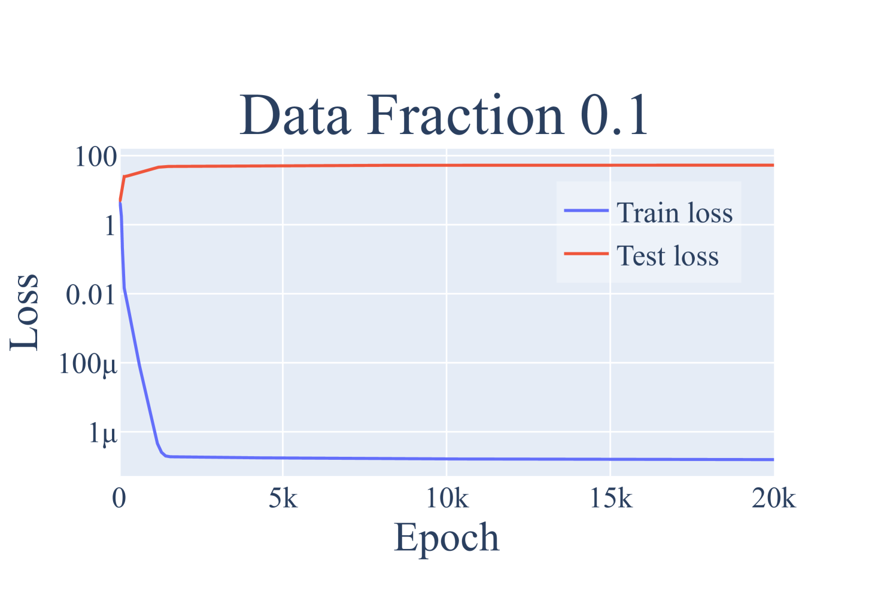
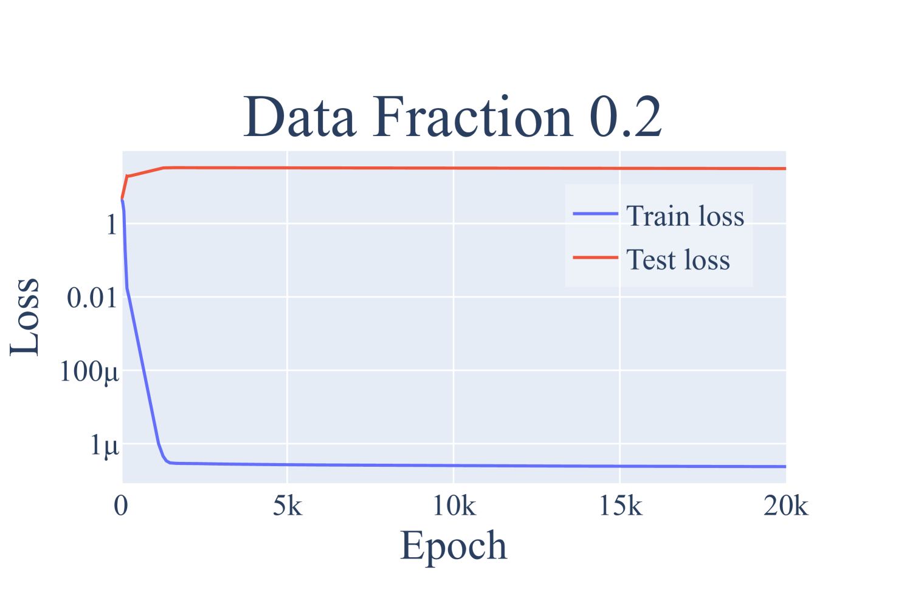
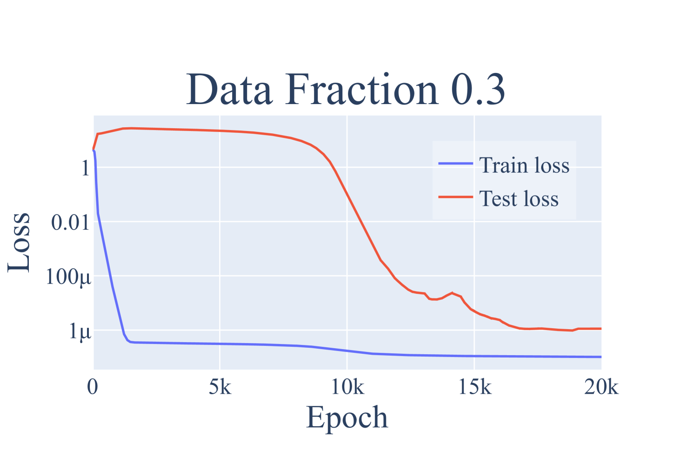
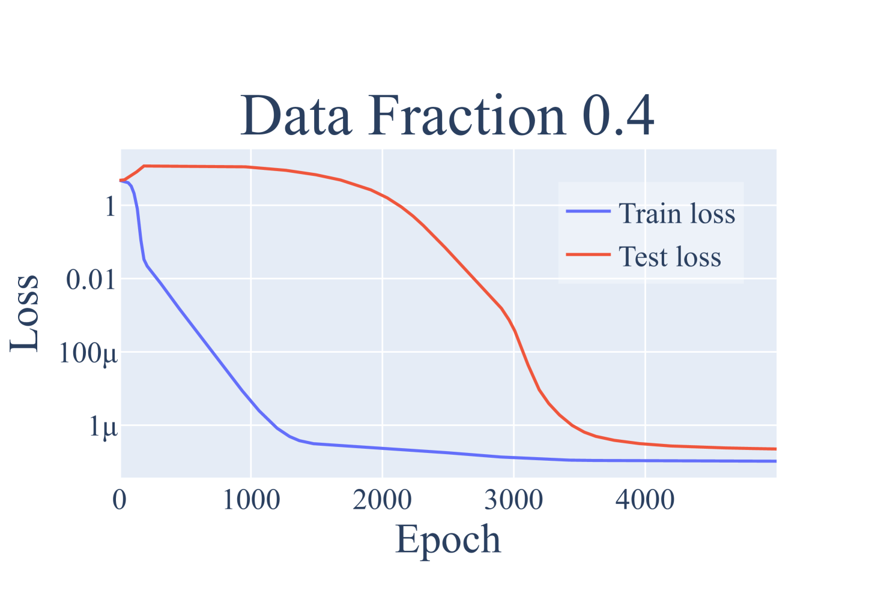
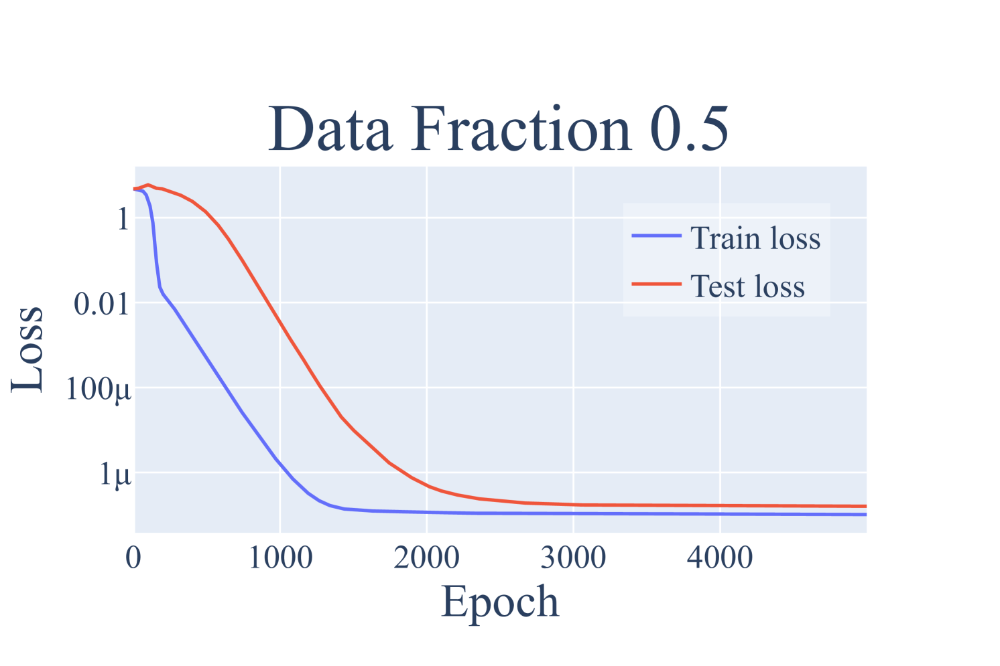
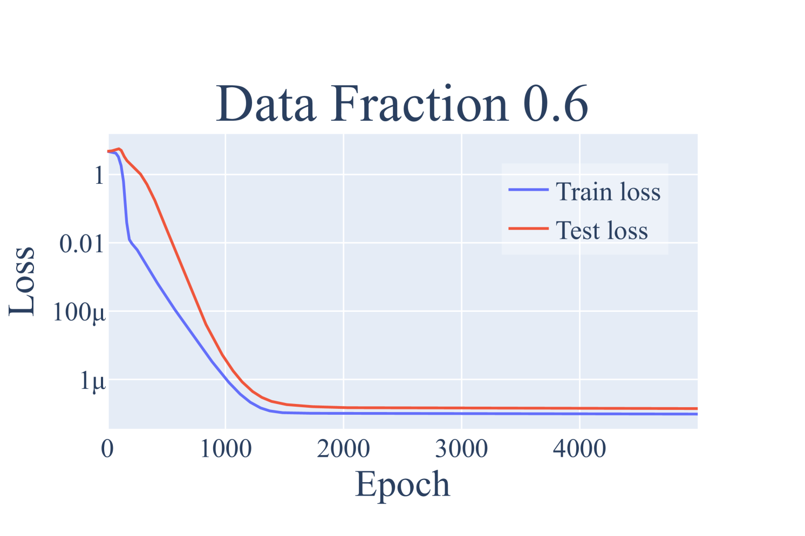
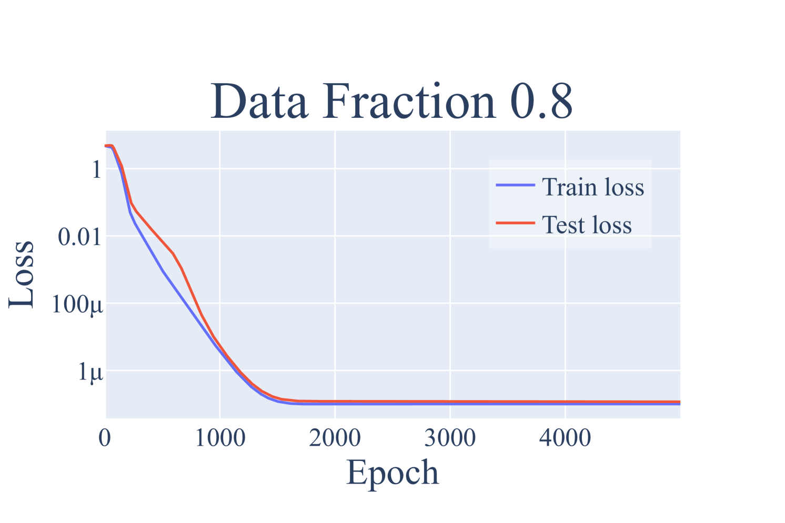
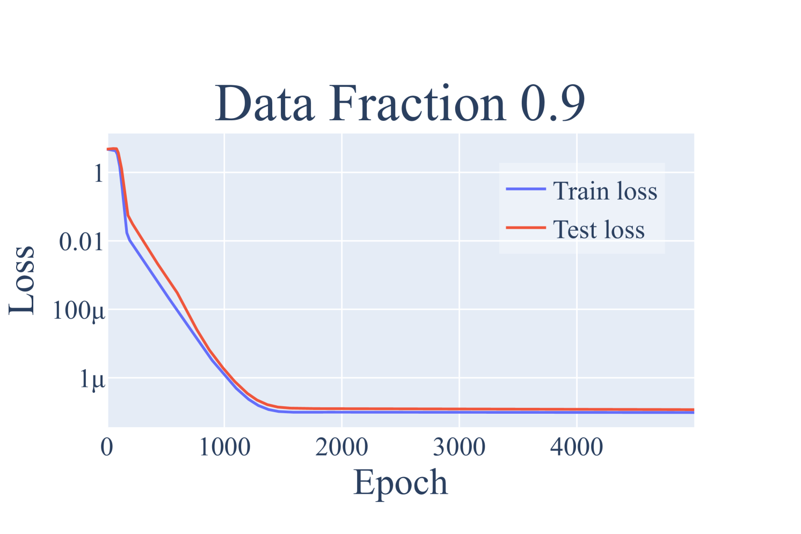

# Nanda et al. 2023 — Progress measures for grokking via mechanistic interpretability

См. также: [глобальный индекс понятий](../../concepts/index.md).

**Neel Nanda** — независимый исследователь (корреспондирующий автор).
**Lawrence Chan**, **Jacob Steinhardt** — University of California, Berkeley.
**Tom Lieberum**, **Jess Smith** — независимые исследователи.

arXiv [2301.05217v3](https://arxiv.org/abs/2301.05217), 12 января 2023. Заголовок PDF: «Published as a conference paper at ICLR 2023». Самая цитируемая работа корпуса после Power et al. 2022 (858 цитирований против 272 у следующей по счёту).

Файлы разбора этой статьи:

- [`2301.05217.progress-measures-for-grokking-via-mechanistic-interpretability.claims.txt`](2301.05217.progress-measures-for-grokking-via-mechanistic-interpretability.claims.txt) — пронумерованные утверждения статьи с пометками разбора.
- [`2301.05217.progress-measures-for-grokking-via-mechanistic-interpretability.license.txt`](2301.05217.progress-measures-for-grokking-via-mechanistic-interpretability.license.txt) — лицензионная запись arXiv для этой статьи.

Схема якорей и правила ссылок на карточку — в [README папки статей](../README.md).

> **Состояние карточки.** Переведена полностью: разделы 1–6 и приложения A–F. Список литературы не переводится по конвенции. 35 страниц, 15 476 слов оригинала, 76 рисунков, 9 таблиц.

**Карточка-выдержка.** Лицензия статьи (`arxiv-nonexclusive`) не разрешает публикацию копии оригинала и полного перевода, поэтому карточка содержит редакторские секции и цитируемые фрагменты перевода (право цитирования). Полный текст статьи: <https://arxiv.org/abs/2301.05217>.

## Затрагиваемые понятия

**[Меры прогресса](../../concepts/progress-measures.md)** — работа вводит понятие в оборот корпуса и даёт ему рабочее определение: непрерывная метрика, которая предшествует резкому переходу и причинно с ним связана ([`p1-2`](#p1-2)). Принципиально, что меры здесь не подбираются снаружи, а **выводятся из понятого механизма**: зная, что сеть считает через ключевые частоты, авторы строят *restricted loss* (обнуляя все не-ключевые частоты) и *excluded loss* (обнуляя ключевые). Это отличает подход от метрик вроде кросс-энтропии, которые, как отмечают авторы, меняются плавно, но не объясняют, *почему* происходит переход.

**[Механистическая интерпретируемость](../../concepts/mechanistic-interpretability.md)** — работа стала образцом жанра: полный обратный инжиниринг обученной сети, а не частичное объяснение. Авторы заявляют, что «полностью разобрали алгоритм, выученный этими сетями» ([`p1-2`](#p1-2)), и подтверждают его четырьмя независимыми линиями свидетельств — периодичностью весов и активаций, композицией матриц, приближением нейронов синусами и косинусами, абляциями в фурье-пространстве. Именно связка «сначала механизм, затем метрика» и делает работу опорной для всего направления.

**[Модульная арифметика](../../concepts/modular-arithmetic.md)** — работа превращает задачу из полигона в решённый случай. Для сложения по модулю $P=113$ показано, что сеть отображает входы на окружность и складывает повороты: эмбеддинги дают синусы и косинусы на разрежённом наборе ключевых частот, слои внимания и MLP собирают из них $\cos(w_k(a+b))$ и $\sin(w_k(a+b))$ по тригонометрическим тождествам, а выходная матрица «считывает» логиты поворотом на $-c$. После этой работы задача Power et al. перестала быть чёрным ящиком.

**[Фурье-признаки и контуры](../../concepts/fourier-features-circuits.md)** — источник самого механизма: дискретное преобразование Фурье как выученное представление, ключевые частоты как разрежённый базис, тригонометрические тождества как способ композиции. Отсюда в корпус пришёл язык описания решений модульной арифметики через частоты.

**[Гроккинг](../../concepts/grokking.md)** — работа даёт понятию **оспаривающую позицию**, которой оно пользуется до сих пор: гроккинг, «вместо того чтобы быть внезапным сдвигом, возникает из постепенного усиления структурированных механизмов, закодированных в весах, с последующим удалением запоминающих компонент» ([`p1-2`](#p1-2)). Внезапность оказывается свойством наблюдаемой метрики, а не процесса под ней.

**[Фаза меморизации](../../concepts/memorization-phase.md)** — работа разбивает обучение на три непрерывные фазы: memorization, circuit formation, cleanup ([`p1-2`](#p1-2)). Запоминание перестаёт быть просто состоянием «до»: оно становится первой фазой процесса, компоненты которой затем целенаправленно удаляются, что видно по росту коэффициента Джини для фурье-компонент $W_E$ и $W_L$ на стадии cleanup.

**[Возникновение признаков](../../concepts/feature-emergence-feature-learning.md)** — берёт формулировку о «постепенном усилении структурированных механизмов, закодированных в весах» ([`p1-2`](#p1-2)): структура не появляется в момент скачка, а нарастает всё время плато.

**[Фазовый переход](../../concepts/phase-transition.md)** — работа снабжает понятие контр-аргументом. Резкость перехода в этой картине — артефакт того, что тестовая ошибка не видит уже происходящей перестройки; собственно скачок приходится на фазу cleanup.

**[Weight decay](../../concepts/weight-decay.md)** — сетап работы закрепляет weight decay как условие воспроизводимого гроккинга: «малые трансформеры, обученные с weight decay на этой задаче, стабильно демонстрируют гроккинг» ([`p1-5`](#p1-5)), $\lambda=1$ при полнобатчевом AdamW. Раздел 5.3 разбирает его роль как силы, вычищающей запоминающие компоненты.

**[Эмерджентность](../../concepts/emergence.md)** — работа помещает гроккинг в более широкую рамку: сети «часто демонстрируют эмерджентное поведение, когда качественно новые способности возникают при масштабировании» ([`p1-2`](#p1-2)), и предлагает меры прогресса как общий способ делать такие переходы предсказуемыми — с явной отсылкой к резким скачкам на бенчмарках больших языковых моделей.

**[Эффект рогатки](../../concepts/slingshot.md)** — упоминается как возможный неявный регуляризатор ([`p2-5`](#p2-5)); в приложении D.2 показано, что слингшот часто сопутствует гроккингу, но для него не необходим.

**[Замораживание подсети / lottery ticket](../../concepts/freezing-subnetwork.md)** — в приложении E ([`p35-3`](#p35-3)) обсуждается объяснение фазовых переходов в духе лотерейного билета и предлагается гипотеза, что переходы присущи композиции контуров.

Карточка Power et al. 2022 — [`2201.02177`](../2201.02177.grokking-generalization-beyond-overfitting-on-small-algorithmic-datasets/2201.02177.grokking-generalization-beyond-overfitting-on-small-algorithmic-datasets.card.md); эта работа прямо продолжает её, беря ту же задачу и объясняя механизм.

**[Когда регуляризация необходима](../../concepts/regularization-necessity.md)** — полюс «необходима»: [без weight decay или иной формы регуляризации сети авторов на модульной арифметике не грокают вовсе](#sec-5-3), а заголовок [приложения D.1](#sec-d-1) утверждает необходимость и регуляризации, и ограниченности данных. Полюс получен в постановке кросс-энтропии с AdamW — оговорка, которая в карточке спора и разводит стороны.

## Несогласованности внутри статьи

Замечания редактора карточки: места, где два фрагмента самой работы говорят разное. Важны при цитировании — в пересказ обычно попадает словесная формулировка, а уточняющие числа остаются в приложении.

**Направление эффекта weight decay противоречит собственным числам.** Приложение D.1 утверждает: «Меньшие значения weight decay ведут к более медленному гроккингу, большие — к более быстрому», и тут же приводит измерения: $\lambda=0.3$ — около 3 тысяч эпох, $\lambda=1.0$ — 5–10 тысяч, $\lambda=3.0$ — 20 тысяч. Числа говорят обратное: **меньший** weight decay даёт более быстрый гроккинг, больший — более медленный. Противоречие в статье не отмечается и не объясняется. Существенно потому, что §5.3 и D.1 опираются на этот пассаж как на свидетельство того, что weight decay движет продвижение к обобщающему решению.

Полная картина по данным работы получается немонотонной:

| weight decay | результат |
|---|---|
| $\lambda=0$ | гроккинга нет вовсе; исключающая потеря не растёт, контур не формируется (D.1) |
| $\lambda=0.3$ | ~3 тысячи эпох |
| $\lambda=1.0$ | 5–10 тысяч эпох |
| $\lambda=3.0$ | ~20 тысяч эпох |

То есть при нуле гроккинг не наступает, а дальше время до него растёт с ростом $\lambda$ — значит, между $0$ и $0.3$ зависимость разворачивается и где-то там лежит оптимум. Сами авторы этого не обсуждают.

Внешняя сторона спора — измерение Omnigrok на воспроизведении этого же сетапа ($t\propto\gamma^{-1}$, противоречащее приведённым числам), независимое чтение рисунка 27 Кумаром и гипотеза об оптимуме $\lambda$, зависящем от задачи, — собрана в карточке понятия [направление влияния weight decay](../../concepts/weight-decay-direction.md); здесь остаётся только внутреннее противоречие текста и чисел.

**Отсылка к несуществующему разделу.** Приложение D.1 начинается словами «Как обсуждается в разделе 7 и приложении C.2», тогда как разделов верхнего уровня в статье шесть; по содержанию имеется в виду [§5.3](#sec-5-3).

**Отсылка к чужой таблице.** Приложение C.1.3 отсылает к «таблице 1», а приводится таблица 2; таблица 1 находится в §4.2 и содержит другое — проекции активаций MLP.

**Шестая частота.** §4.1 сообщает, что $W_E$ имеет существенно ненулевую норму на **шести** частотах, из которых «только 5, по-видимому, существенно используются» дальше в модели. Что происходит с шестой, не сказано нигде: она не входит в ключевые, не участвует в абляциях и не обсуждается, хотя всё построение мер прогресса опирается на деление частот на ключевые и не-ключевые.

## Приложение E: спекулятивная часть и типичное ошибочное цитирование

Замечание редактора карточки. Приложение E авторы прямо объявляют рассуждением: «свидетельства лишь наводящие, так что это перспективное направление для будущих исследований» ([`sec-e-1`](#sec-e-1)). Ни одно утверждение этих двух разделов в работе не измеряется. Между тем корпус цитирует их наравне с результатами разделов 4–5, поэтому статус стоит держать в уме: что сложность запоминания растёт с размером обучающей выборки, а сложность обобщения постоянна, и «в какой-то точке они обязаны пересечься»; что гипотеза лотерейного билета «выглядит наиболее объясняющей»; что фазовые переходы присущи композиции контуров. Всё это гипотезы авторов, а не их результаты.

В том же приложении лежит методическая оговорка, ради которой раздел и стоит читать, — сноска 4:

> Явление гроккинга часто неверно резюмируют как «модель научилась обобщать даже после достижения нулевой потери». **Нулевой потери при кросс-энтропии не существует.** Хотя модель достигает идеальной *точности*, обучается она на оптимизацию потери, а не точности. Это значит, что у модели *всегда* есть стимул улучшаться дальше. В частности, простейший способ улучшить качество при идеальной точности — увеличивать логиты. Это снижает температуру и приближает softmax к argmax.

Практический смысл для карточек понятий. Формулировка «генерализация наступает после того, как потеря на обучении достигла нуля» — а она встречается и в пересказах Power et al. 2022, и в определениях гроккинга — описывает не то, что происходит. Обучение не останавливается на идеальной точности: потеря продолжает убывать за счёт роста логитов, и именно это продолжающееся давление, уравновешиваемое weight decay, движет фазами формирования контура и очистки из [§5.2](#sec-5-2). Корректная формулировка опирается на **точность**, а не на потерю: сеть достигает идеальной точности на обучении, и лишь много позже — на тесте.

Отсюда же следует, почему в этой работе меры прогресса строятся по потере, а не по точности: точность на обучении насыщается на 100 % и перестаёт что-либо различать, тогда как потеря продолжает нести сигнал всё то время, пока внутри сети идёт перестройка.

---

# Цитируемые фрагменты перевода

Ниже приведены только те фрагменты перевода, на которые ссылаются карточки корпуса (право цитирования). Нумерация якорей `pN-M` / `fig-N` / `sec-X` совпадает с полной карточкой и оригиналом.

## Аннотация

###### p1-2

Нейросети часто демонстрируют [эмерджентное поведение](../../concepts/emergence.md), при котором качественно новые способности возникают при увеличении числа параметров, объёма обучающих данных или числа шагов обучения. Один из подходов к пониманию эмерджентности — найти непрерывные *меры прогресса*, лежащие в основе кажущихся разрывными качественных изменений. Мы утверждаем, что меры прогресса можно найти с помощью [механистической интерпретируемости](../../concepts/mechanistic-interpretability.md): обратного инжиниринга выученных поведений в отдельные составляющие. В качестве примера мы исследуем недавно обнаруженное явление «гроккинга», проявляемое малыми трансформерами, обученными задачам [модульного сложения](../../concepts/modular-arithmetic.md). Мы полностью разбираем обратным инжинирингом алгоритм, выученный этими сетями: он использует дискретные преобразования Фурье и тригонометрические тождества, чтобы свести сложение к повороту вокруг окружности. Мы подтверждаем алгоритм, анализируя активации и веса и выполняя абляции в фурье-пространстве. Опираясь на это понимание, мы определяем меры прогресса, которые позволяют изучить динамику обучения и разделить обучение на три непрерывные фазы: запоминание, формирование контура и очистка. Наши результаты показывают, что гроккинг, вместо того чтобы быть внезапным сдвигом, возникает из постепенного усиления структурированных механизмов, закодированных в весах, с последующим удалением запоминающих компонент.

## 1 Введение

###### p1-4

Эмерджентность удивляет сильнее всего, когда она резкая — как в случае взлома функции вознаграждения, рассуждения цепочкой или других [фазовых переходов](../../concepts/phase-transition.md) (Ganguli et al., 2022; Wei et al., 2022a). Мы могли бы лучше понимать и предсказывать эти фазовые переходы, находя *скрытые меры прогресса* (Barak et al., 2022): метрики, которые предшествуют фазовому переходу, причинно с ним связаны и меняются более плавно. Например, Wei et al. (2022a) показывают, что, хотя большие языковые модели демонстрируют резкие скачки качества на многих бенчмарках, их кросс-энтропийная потеря убывает с масштабом модели плавно. Однако кросс-энтропия не объясняет, *почему* происходят смены фаз.

###### p1-5

В этой работе мы предлагаем иной подход к обнаружению скрытых мер прогресса: через *механистические объяснения*.111Интерактивные версии рисунков, а также код для воспроизведения наших результатов доступны по адресу https://neelnanda.io/grokking-paper. **[p. 2]** Механистическое объяснение стремится разобрать обратным инжинирингом механизмы сети, как правило через выявление контуров (Cammarata et al., 2020; Elhage et al., 2021) внутри модели, реализующих то или иное поведение. С помощью таких объяснений мы изучаем *гроккинг*, при котором модели резко переходят к обобщающему решению после большого числа шагов обучения, несмотря на первоначальное переобучение (Power et al., 2022). Конкретно мы изучаем модульное сложение, где модель получает входы $a,b\in\{0,\ldots,P-1\}$ для некоторого простого $P$ и предсказывает их сумму $c$ по модулю $P$. Малые трансформеры, обученные с [weight decay](../../concepts/weight-decay.md) на этой задаче, стабильно демонстрируют гроккинг (рисунок 2, приложение C.2).

###### p2-1

Мы разбираем обратным инжинирингом веса этих трансформеров и обнаруживаем, что задачу они выполняют, отображая входы на окружность и выполняя сложение на окружности. Конкретно, мы показываем, что матрица эмбеддингов отображает входы $a,b$ в синусы и косинусы на разрежённом наборе *ключевых частот* $w_{k}$. Слои внимания и MLP затем комбинируют их с помощью тригонометрических тождеств, чтобы вычислить синус и косинус $w_{k}(a+b)$, а выходные матрицы сдвигают и складывают эти частоты.

###### p2-2

Мы подтверждаем это понимание четырьмя линиями свидетельств (раздел 4): (1) веса и активации сети обнаруживают согласованную периодическую структуру; (2) отображение «нейрон → логит» $W_{L}$ хорошо приближается суммой синусоидальных функций ключевых частот, а проецирование активаций MLP на эти синусоидальные функции позволяет «считывать» тригонометрические тождества с нейронов; (3) [головы внимания](../../concepts/attention-routing-heads.md) и нейроны MLP хорошо приближаются многочленами степени $2$ от тригонометрических функций одной частоты; и (4) абляция ключевых частот, используемых моделью, снижает качество до случайного, тогда как абляция остальных 95 % частот качество слегка *улучшает*.

###### p2-3

Опираясь на понимание выученного алгоритма, мы строим две меры прогресса для задачи модульного сложения: *ограниченную потерю* (restricted loss), где мы удаляем абляцией все не-ключевые частоты, и *исключающую потерю* (excluded loss), где мы, наоборот, удаляем все ключевые частоты. Обе метрики улучшаются непрерывно ещё до наступления гроккинга. С их помощью мы разбираемся в динамике обучения, лежащей в основе гроккинга, и обнаруживаем, что обучение можно разделить на три фазы: **запоминание** обучающих данных; **формирование контура**, когда сеть выучивает обобщающий механизм; и **очистка**, когда weight decay удаляет запоминающие компоненты. Что удивительно, внезапный переход к идеальной тестовой точности при гроккинге происходит во время очистки — *после* того, как обобщающий механизм уже выучен. Эти результаты показывают, что гроккинг, вместо того чтобы быть внезапным сдвигом, возникает из постепенного усиления структурированных механизмов, закодированных в весах, с последующим удалением запоминающих компонент.

## 2 Связанные работы

###### p2-5

**Гроккинг.** Гроккинг впервые описан в Power et al. (2022), где двухслойные трансформеры обучались нескольким алгоритмическим задачам и обнаружилось, что тестовая точность часто резко возрастает намного позже достижения идеальной точности на обучении. Millidge (2022) предполагает, что это может быть связано с тем, что SGD представляет собой случайное блуждание по оптимальному многообразию. Наши результаты вторят Barak et al. (2022), показывая, что сеть вместо этого непрерывно продвигается к обобщающему алгоритму. Liu et al. (2022) конструируют малые примеры гроккинга, по которым вычисляют фазовые диаграммы с четырьмя отдельными «фазами» обучения. Thilak et al. (2022) утверждают, что гроккинг может возникать без явной регуляризации — из оптимизационной аномалии, которую они называют механизмом рогатки (slingshot) и которая может действовать как неявный регуляризатор.

###### sec-3

Мы обучаем трансформеры выполнять сложение по модулю $P$. Вход модели имеет вид «$a\ b\ \!=$», где $a$ и $b$ закодированы $P$-мерными one-hot векторами, а $=$ — специальный токен, над которым мы считываем выход $c$. В нашем основном эксперименте мы берём $P=113$ и используем однослойный ReLU-трансформер, эмбеддинги токенов размерности $d=128$, обучаемые позиционные эмбеддинги, $4$ головы внимания размерности $d/4=32$ и $n=512$ скрытых единиц в MLP. В остальных экспериментах мы варьируем глубину и размерность модели. Мы не использовали LayerNorm и не связывали матрицы эмбеддинга и разэмбеддинга.

Наш основной набор данных состоит из 30 % всего множества возможных входов (то есть 30 % от $113\cdot 113$ пар чисел по модулю $P$). Мы используем полнобатчевый градиентный спуск с оптимизатором AdamW (Loshchilov & Hutter, 2017) со [скоростью обучения](../../concepts/learning-rate.md) $\gamma=0.001$ и параметром weight decay $\lambda=1$. Мы проводим $40,000$ эпох обучения. Поскольку возможных пар всего $113\cdot 113$, тестовые потерю и точность мы оцениваем на всех парах входов, не использованных при обучении.

## 3 Постановка и предварительные сведения

###### sec-3-1

### 3.1 Алгоритм [фурье-умножения](../../concepts/fourier-features-circuits.md)

###### sec-4-1

### 4.1 Наводящее свидетельство: неожиданная периодичность

###### sec-5-2

### 5.2 Фазы гроккинга: запоминание, формирование контура и очистка

###### sec-5-3

### 5.3 Гроккинг и weight decay

#### Однослойные трансформеры при разных долях обучающих данных

В предыдущем разделе мы видели, что каждой фазе гроккинга соответствует точка перегиба $\ell_{2}$-нормы весов. Это говорит о том, что weight decay — важная составляющая гроккинга, движущая продвижение к обобщающему решению. В приложении D.1 мы приводим дополнительные свидетельства того, что weight decay необходим для гроккинга: при меньших его значениях сети требуется существенно больше времени, чтобы грокнуть (что вторит результатам на игрушечных моделях у Liu et al. (2022)), а без weight decay или иной формы регуляризации наши сети на задаче модульной арифметики не грокают. В приложении C.2 мы также обнаруживаем, что на гроккинг влияет объём данных: когда сетям дают достаточно данных, разрыва между потерями на обучении и на тесте больше нет (вместо этого обе резко убывают через некоторое число эпох обучения). Наконец, в приложении D.3 мы воспроизводим эти результаты на нескольких дополнительных алгоритмических задачах.

###### fig-20


















*Рисунок 20: Потери на обучении и на тесте для однослойного трансформера на задаче модульного сложения при $P=113$, с разными долями из $113\cdot 113$ пар возможных входов, использованными при обучении. Гроккинг возникает, когда при обучении используется $30-50\%$ набора данных, причём меньшие доли данных ведут к более медленному гроккингу. Использование $\geq 60\%$ данных приводит к немедленной генерализации, тогда как при $10\%$ или $20\%$ данных гроккинг не наступает даже после 40 тысяч эпох. Обратите внимание на разные оси X: для запусков с долей данных $\geq 40\%$ мы показываем только 5 тысяч эпох, чтобы было подробнее видно.* **[p. 23]**

#### Меньшие и большие простые числа

###### p22-5

Мы также исследовали меньшие и большие простые модули. Для $P=53$ (рисунок 24) мы перебрали разные значения weight decay, чтобы наблюдать гроккинг в случае малого простого числа. При исходной настройке weight decay $\lambda=1$ мы обнаружили, что модели вообще не обобщали. Однако увеличение weight decay до $\lambda=5$ действительно позволяет модели грокнуть. **[p. 26]** Мы предполагаем, что причина в том, что запоминающее решение здесь существенно меньше (поскольку всего пар лишь $53\cdot 53$), а значит, чтобы обобщающее решение оказалось предпочтительным, требуется более агрессивный weight decay.

###### p22-7

Для $P=401$ (рисунок 25) добиться гроккинга нам не удалось даже при переборе параметра weight decay $\lambda\in\{0.3,0.5,1,3,5,8\}$. Вместо этого модель сразу выучивает обобщающее решение. Мы полагаем, что дело в существенно большем объёме данных, который видит модель, по сравнению со случаем $P=113$ (с 30 % от $113\cdot 113$ пар до 30 % от $401\cdot 401$ пар), из-за чего обобщающее решение оказывается предпочтительным с самого начала. Затем мы обучили по 3 модели, используя $5\%$, $10\%$ и $20\%$ пар обучающих данных при $\lambda=1$, и обнаружили, что модели, обученные на $5\%$ и $10\%$ данных, немедленно переобучались и никогда не обобщали, тогда как модели, обученные на $20\%$ данных, тоже обобщали сразу же.

###### sec-d-1

### D.1 И регуляризация, и ограниченность данных необходимы для гроккинга

На рисунке 27 мы приводим тестовую потерю и потерю на обучении для моделей, обученных с $\lambda=0.3$ и $\lambda=3.0$. Меньшие значения weight decay ведут к более медленному гроккингу, большие — к более быстрому: в среднем моделям требуется около 3 тысяч эпох, чтобы грокнуть при weight decay $\lambda=0.3$, 5–10 тысяч эпох при $\lambda=1.0$ и 20 тысяч эпох при $\lambda=3.0$.

###### sec-d-2

### D.2 Механизм рогатки часто возникает, но для гроккинга не нужен

###### p22-17

Как отмечено в разделе C.2, наши двухслойные трансформеры демонстрируют при обучении заметные рогатки (Thilak et al., 2022). Мы предполагаем, что дело в том, как градиенты разного масштаба взаимодействуют с адаптивными оптимизаторами. Нам даже удалось вызвать рогатки на однослойной модели, снизив точность вычисления потери (из-за чего многие градиенты округляются до 0, а значит, различия в масштабе градиентов сильно возрастают).

###### sec-e-1

### E.1 Интуитивное объяснение гроккинга

###### p22-27

Гроккинг возникает, когда модели, обученные алгоритмическим задачам при определённых гиперпараметрах, сначала переобучаются на обучающих данных: потеря на обучении существенно улучшается, тестовая ухудшается, и они расходятся. Но позже в обучении происходит внезапное улучшение тестовой потери, и тестовая потеря сходится с обучающей. В отличие от Power et al. (2022), но в согласии с Liu et al. (2022), гроккинг *не* возникает, когда потери на обучении и на тесте улучшаются вместе, без первоначального расхождения, как видно на многих рисунках этой статьи, например на рисунках 2 и 18.

### E.2 Гипотеза: фазовые переходы присущи композиции

###### p35-3

Возвращаясь к фазовым переходам: объяснение в духе лотерейного билета позволяет ожидать фазовых переходов по мере формирования контуров. На ранних стадиях формирования контура каждая его часть груба, поэтому влияние улучшения любой отдельной компоненты на потерю слабо, а значит, градиенты малы. По мере развития каждой компоненты остальные становятся полезнее, а значит, все градиенты нелинейно растут вместе. По мере приближения контура к завершению следует ожидать ускорения на кривой потери для этого контура, что и выливается в фазовый переход.

```yaml
id: arxiv:2301.05217v3
title: "Progress measures for grokking via mechanistic interpretability"
authors: [Neel Nanda, Lawrence Chan, Tom Lieberum, Jess Smith, Jacob Steinhardt]
affiliations: {independent: [Nanda, Lieberum, Smith], "UC Berkeley": [Chan, Steinhardt]}
date: 2023-01-12
venue_header: "Published as a conference paper at ICLR 2023"
pages: 35
figures: 34            # 76 image files, several figures have many panels
tables: 9
formulas: 721
type: empirical + mechanistic analysis
citations_when_indexed: 858     # highest in the corpus after Power et al. 2022

task:
  family: modular addition
  modulus: 113
  form: "a + b mod P, inputs one-hot, loss on the answer position"
  split: "all pairs not used for training serve as the test set"

model:
  arch: one-layer ReLU transformer
  embedding_dim: 128
  heads: 4
  head_dim: 32
  mlp_hidden: 512
  positional: learned

optimization:
  optimizer: AdamW
  batching: full batch gradient descent
  learning_rate: 1.0e-3
  weight_decay: 1
  epochs: 40000

mechanism:
  claim: "the network maps inputs onto a circle and adds by composing rotations"
  representation: "embeddings give sin/cos at a sparse set of key frequencies w_k"
  composition: "attention and MLP combine them via trigonometric identities into cos/sin of w_k(a+b)"
  readout: "output matrix rotates by -c, so the logit peaks when a+b = c mod P"
  evidence: [periodicity of weights and activations, composition of model weights,
             approximating neurons with sines and cosines, ablations in Fourier space]

progress_measures:
  - name: restricted loss
    definition: "loss after ablating every non-key frequency"
  - name: excluded loss
    definition: "loss after ablating the key frequencies"
  - name: Gini coefficient of Fourier components of W_E and W_L
    behaviour: "rises sharply during cleanup"

phases: [memorization, circuit formation, cleanup]
central_claim: "grokking is not a sudden shift but gradual amplification of structure
  already encoded in the weights, followed by removal of the memorizing components"

concept_cards:                   # обратные ссылки: карточка понятия -> якорь здесь
  emergence.md: p1-2
  mechanistic-interpretability.md: p1-2
  modular-arithmetic.md: p1-2
  memorization-phase.md: p1-2
  grokking.md: p1-2
  feature-emergence-feature-learning.md: p1-2
  weight-decay.md: p1-5
  slingshot.md: p2-5
  freezing-subnetwork.md: p35-3

paper_cards:
  - 2201.02177: "Power et al. 2022 - the paper this one explains the mechanism for"

sources:
  original_html: original/2301.05217.arxiv-html.html
  converted_text: original/2301.05217.progress-measures-for-grokking-via-mechanistic-interpretability.md
  images_dir: images/
  pdf: https://arxiv.org/pdf/2301.05217v3

internal_inconsistencies:          # два места самой статьи говорят разное
  - what: "D.1 states smaller weight decay gives slower grokking, its own numbers say the opposite"
    detail: "lambda 0.3 -> ~3k epochs, 1.0 -> 5-10k, 3.0 -> ~20k; with lambda 0 there is no
      grokking at all, so the dependence turns around somewhere below 0.3"
    anchors: [sec-5-3]
  - what: "D.1 refers to a Section 7; the paper has six sections (5.3 is meant)"
    anchors: [sec-5-3]
  - what: "C.1.3 refers to Table 1 while presenting Table 2"
  - what: "4.1 finds six non-negligible frequencies in W_E but only five are ever used"

anchors:
  scheme: "pN-M | fig-N | sec-N (token headings, cross-viewer portable)"
  policy: "anchors exist only where something links to them; page breaks carry no anchor"
  paragraph: [p1-2, p1-4, p1-5, p2-1, p2-2, p2-3, p2-5, p35-3]
  section: [sec-5-2, sec-5-3, sec-e-1]
  mirrored_in: original/2301.05217.progress-measures-for-grokking-via-mechanistic-interpretability.md
  page_breaks_marked_as: "**[p. N]**  (visible marker, no anchor)"
  pagination_coverage: "23 of 35 pages; the rest are pages occupied entirely by figure
    captions, where there is no body text to anchor a break to"

language:
  card: ru                       # fully translated
  original: en
  planned: ru
```
