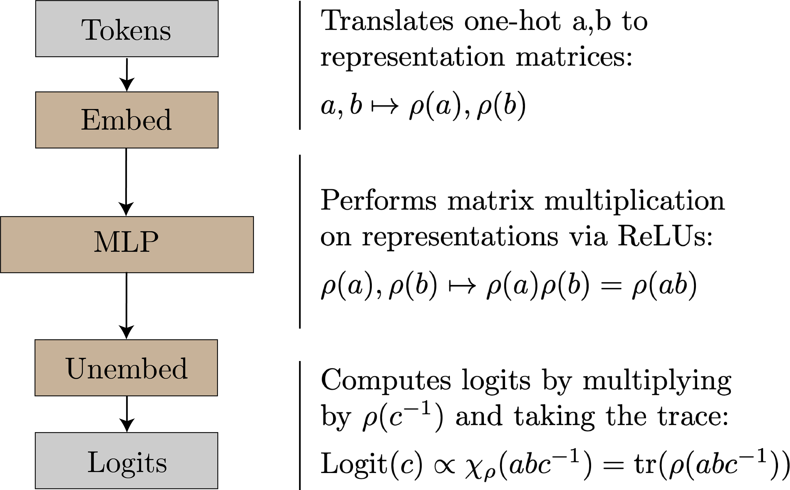
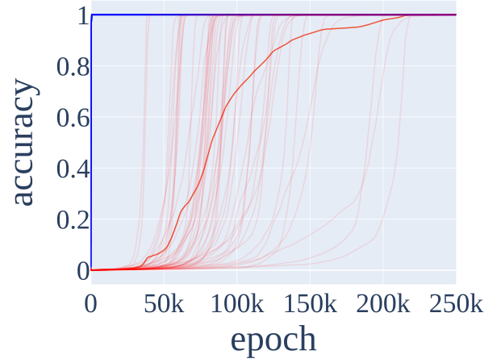
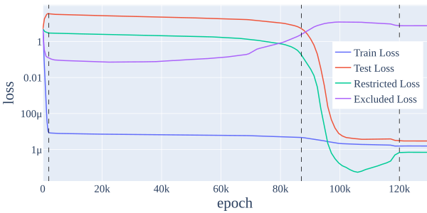
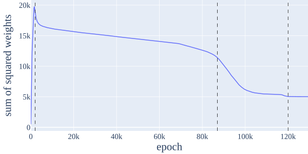
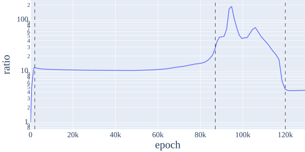

# Chughtai et al. 2023 — A Toy Model of Universality: Reverse Engineering how Networks Learn Group Operations

См. также: [глобальный индекс понятий](../../concepts/index.md).
arXiv [2302.03025v2](https://arxiv.org/abs/2302.03025), 6 февраля 2023 (v2 — 24 мая 2023). Колонтитул PDF: «Proceedings of the 40 th International Conference on Machine Learning, Honolulu, Hawaii, USA. PMLR 202, 2023».

**Bilal Chughtai** — Independent (переписка: brchughtaii@gmail.com).
**Lawrence Chan** — UC Berkeley.
**Neel Nanda** — Independent.

Файлы разбора этой статьи:

- [`2302.03025.a-toy-model-of-universality-reverse-engineering-how-networks-learn-group-operations.claims.txt`](2302.03025.a-toy-model-of-universality-reverse-engineering-how-networks-learn-group-operations.claims.txt) — пронумерованные утверждения статьи с пометками разбора.
- [`2302.03025.a-toy-model-of-universality-reverse-engineering-how-networks-learn-group-operations.license.txt`](2302.03025.a-toy-model-of-universality-reverse-engineering-how-networks-learn-group-operations.license.txt) — лицензионная запись arXiv для этой статьи.

Схема якорей и правила ссылок на карточку — в [README папки статей](../README.md).

**Карточка-выдержка.** Лицензия статьи (`arxiv-nonexclusive`) не разрешает публикацию копии оригинала и полного перевода, поэтому карточка содержит редакторские секции и цитируемые фрагменты перевода (право цитирования). Полный текст статьи: <https://arxiv.org/abs/2302.03025>.

## Затрагиваемые понятия

**[Групповые представления и cosets](../../concepts/group-representations-cosets.md)** — работа вводит в корпус сам язык: алгоритм GCR (group composition via representations), в котором сеть вкладывает входы в матрицы представлений $\rho(a)$, $\rho(b)$, перемножает их нелинейностью в $\rho(ab)$ и читает логиты как характеры $\chi_{\rho}(abc^{-1})$ ([§4](#sec-4), [рис. 1](#fig-1)). Про алгоритм прямо сказано, что в прежней литературе авторы его не встречали ([p3-7](#p3-7)). Ключевой ход рамки — не единственный алгоритм, а **семейство** из $k$ независимых контуров по числу неприводимых представлений группы, из которых сеть вольна взять любое подмножество ([p3-12](#p3-12)); корректность опирается на теорему D.7 (характер максимален на единице группы). Чего в работе нет: смежных классов (cosets) как отдельного механизма — слово `coset` встречается лишь в определении знакового представления ([p16-11](#p16-11)) и в неудавшейся попытке воспроизвести кластеризацию по подгруппам ([E.4](#p22-2)); объяснение через coset-контуры на $S_{5}$ появилось позже и авторам этой работы не принадлежит. Нет и полноты вне рамки: перечислены все неприводимые представления, то есть все решения **вида GCR**, а не все решения вообще.

**[Композиция групп / некоммутативность](../../concepts/group-composition-non-commutative-s5.md)** — работа делает композицию произвольной конечной группы стандартным полигоном корпуса и объясняет зачем: это «большое семейство родственных задач, образующее алгоритмический полигон для исследования универсальности» ([p1-4](#p1-4)). Разобрано семь групп — $C_{113}$, $C_{118}$, $D_{59}$, $D_{61}$, $S_{5}$, $S_{6}$, $A_{5}$ — на двух архитектурах по четыре сида ([p7-4](#p7-4)), а основной разбор ведётся на $S_{5}$, где композиция некоммутативна и где выбор оправдан теоремой Кэли ([p4-5](#p4-5)). Отсюда же в корпус пришли имена неприводимых представлений $S_{5}$ — sign, standard, standard_sign, 5d_a, 5d_b, 6d размерностей $d=\{1,4,4,5,5,6\}$. Чего в работе нет: обобщения на полугруппы и на прочие бинарные операции — они названы будущей работой ([F](#p23-4)), причём для полугрупп прямо сказано, что аналога теории представлений нет.

**[Механистическая интерпретируемость](../../concepts/mechanistic-interpretability.md)** — работа задаёт корпусу постановку вопроса об **универсальности** и разводит её надвое: сильная универсальность утверждает, что одни и те же признаки и контуры возникают во всех схожим образом обученных моделях; слабая — что есть общие начала, но любая отдельная модель воплощает их «в некоторой степени произвольным образом» ([p2-3](#p2-3)). Итог сформулирован как смешанный: доводы за слабую и против сильной, а практическое следствие — «разбор одной сети недостаточен для понимания поведения сетей вообще» ([p8-6](#p8-6)). Довод устроен нестандартно: задача выбрана так, чтобы можно было перечислить все решения и сверять выученное с полным списком, — на основной модели $S_{5}$ увидены только два из шести возможных контуров ([p12-5](#p12-5)). Чего в работе нет: автоматических методов — они названы тем, к чему следует перейти, если универсальность ложна ([p1-3](#p1-3)); нет и переноса на настоящие модели, оставленного будущей работе.

**[Меры прогресса](../../concepts/progress-measures.md)** — работа переносит ограниченную и исключающую потерю Nanda et al. 2023 на вторую задачу, и это её прямая цель: ограничением прежней работы названо то, что приём «может не обобщаться за пределы одной конкретной задачи» ([p6-10](#p6-10)). Определения перенесены с заменой частот на представления: **ограниченная потеря** срезает активации MLP до $16+1$-мерного подпространства $\rho(ab)$ в ключевых представлениях, **исключающая** — наоборот, удаляет эти направления и потому считается только на обучающей выборке ([E.1](#p18-2)). Существенна названная прямо оговорка: ограниченная потеря «предполагает, что у запоминающего алгоритма нет выделенного подпространства в слое MLP» ([p18-2](#p18-2)) — проверки этого допущения в работе нет. Чего в работе нет: новых мер прогресса и причинности — меры взяты готовыми, а вклад заявлен в другом, в применении их к вопросу об универсальности.

**[Гроккинг](../../concepts/grokking.md)** — работа даёт корпусу устойчивое воспроизведение гроккинга на некоммутативной групповой композиции: на $S_{5}$ по 50 сидам модели «быстро переобучаются в начале обучения, но затем внезапно обобщаются много позже» ([рис. 2](#fig-2)). Согласие с корпусом заявлено дословно: с Liu et al. 2022c в том, что гроккинг «по-видимому, внутренне связан с соотношением между качеством и нормами весов», и с Barak et al. 2023 и Nanda et al. 2023 в том, что сети непрерывно продвигаются к обобщающему алгоритму ([p3-1](#p3-1)). Отдельная находка — **две фазы гроккинга** в одном прогоне: модель грокает, очистив запоминание при готовом стандартном контуре, застаивается и грокает снова после освоения представления 5d_b около эпохи 100k ([рис. 14](#fig-14)). Чего в работе нет: собственного объяснения гроккинга — оно взято у Nanda et al. целиком, вместе с выводом, что скачок приходится на очистку, уже **после** начала падения ограниченной потери ([p6-11](#p6-11)).

**[Фаза меморизации / плато](../../concepts/memorization-phase.md)** — работа воспроизводит трёхфазное деление обучения на новой задаче и даёт ему числовые границы: запоминание (эпохи 0–2k), формирование контура (2.2k–87k), очистка (87k–120k) ([рис. 6](#fig-6), [E.1](#p18-5)). Фазы названы частично перекрывающимися ([p6-11](#p6-11)), а к делению приложена согласующаяся величина: сумма квадратов весов достигает пика в конце запоминания, плавно убывает при формировании контура и резко — при очистке, откуда вывод, что обе фазы связаны с weight decay ([рис. 12](#fig-12)). Чего в работе нет: проверки, что запоминающее решение действительно не занимает выделенного подпространства, — без неё исключающая потеря остаётся мерой по построению, а не измерением запоминающего контура.

**[Фурье-признаки и контуры](../../concepts/fourier-features-circuits.md)** — работа встраивает фурье-описание в более общую рамку: тригонометрический алгоритм Nanda et al. 2023 объявлен частным случаем GCR, а «различные фурье-моды лучше мыслить как различные *неприводимые представления* циклической группы» ([p1-4](#p1-4)). Соответствие разобрано поэлементно ([p4-1](#p4-1), [p4-2](#p4-2)): найденные там $\cos\left(\omega_{k}a\right)$, $\sin\left(\omega_{k}a\right)$ — в точности элементы матрицы $\rho(a)$, частота $\omega_{k}=\frac{2\pi k}{n}$ отвечает двумерному представлению $\mathbf{2_{k}}$, а семь квадратичных членов на нейрон получаются как $\rho(a),\rho(b),\rho(ab)$ по две степени свободы плюс постоянная ([B](#p13-3)). Чего в работе нет: утверждения, что фурье-описание неверно, — оно объявлено «изящным, но привязанным к задаче модульного сложения» ([p13-2](#p13-2)), и на $C_{113}$ результаты прежней работы воспроизведены в новой рамке.

**[Модульная арифметика](../../concepts/modular-arithmetic.md)** — работа переопределяет задачу корпуса как частный случай своей: «сложение по модулю $113$ равносильно композиции при $G=C_{113}$, циклической группе из $113$ элементов» ([p3-2](#p3-2)). Практическое следствие для корпуса — модульное сложение перестаёт быть отдельной задачей и становится одной точкой в семействе, а неабелевы группы дают ту же задачу без коммутативности. Попутно отмечено неразъяснённое различие: у циклических групп доля объяснённой дисперсии логитов заметно выше, чем у прочих групп, и авторы лишь «подозревают» связь с особыми свойствами ортогональности дискретного преобразования Фурье, не общими для произвольных неприводимых представлений ([H](#p23-9)).

**[Обучение структурированных представлений](../../concepts/structured-representation-learning.md)** — работа даёт корпусу редкий случай, когда выученное представление сверяется не с чутьём разборщика, а с полным заранее известным списком: матрицы представлений извлекаются из активаций явно — знаковые совпадают точно, стандартные с MSE ниже $10^{-8}$, а для невыученных представлений не извлекается ничего ([p6-3](#p6-3)). Эмбеддинги и разэмбеддинг оказались низкоранговыми: ранг $16+1$ вместо возможных $120$, ровно по размерностям двух ключевых представлений ([p5-2](#p5-2)); нейроны разбиваются на непересекающиеся кучки по представлениям — $7$ знаковых, $119$ стандартных, $2$ всегда выключены, и разбиение одинаково на входах и выходах ([p5-4](#p5-4)). Чего в работе нет: утверждения, что представление выбирается однозначно, — набор, число и порядок освоения представлений от сида к сиду разнятся.

**[Каузальная абляция](../../concepts/causal-ablation-intervention.md)** — работа даёт корпусу двустороннюю схему сверки и один из самых сильных её исходов. Исключающая сторона: при исходной потере $2.38\times 10^{-6}$ абляция $\rho_{standard}(ab)$ поднимает её до $7.55$, $\rho_{sign}(ab)$ — до $0.0009$ ([p6-2](#p6-2)); абляция предсказаний алгоритма в логитах по обоим ключевым представлениям даёт $7.60$ — «существенно хуже случайного» ([p6-9](#p6-9)). Ограничивающая сторона: замена нейронов на сами матрицы представлений снижает потерю на $70\%$, проекция на $16+1$ направление — ещё на $12\%$, а абляция того, что предсказано шумом, потерю не портит и часто **улучшает** ([p2-2](#p2-2)). Чего в работе нет: причинного языка и вмешательств по ходу обучения — все абляции сняты с обученной модели.

**[Weight decay / L2-регуляризация](../../concepts/weight-decay.md)** — работа ставит weight decay причиной обеих непервых фаз, а не одной: падение суммы квадратов весов при формировании контура «позволяет предположить, что формирование контура, вероятно, происходит благодаря weight decay» ([p18-6](#p18-6)), а на очистке weight decay «побуждает сеть сбросить запомненное решение», поскольку обобщающий контур при сопоставимом качестве весит меньше ([p18-7](#p18-7)). В основных опытах $\lambda=1$ при AdamW ([C](#p13-4)). Чего в работе нет: проверки необходимости — опыта без weight decay здесь не ставили, и утверждение «без регуляризации гроккинга нет» этой работе не принадлежит; сказано ровно обратное по охвату: «другие регуляризаторы тоже способны проявлять гроккинг» ([p7-1](#p7-1)).

**[Минимизация нормы весов](../../concepts/weight-norm-minimization.md)** — работа даёт корпусу неудобный частный случай размена нормы на качество: сеть предпочитает представление standard, хотя standard_sign «на деле даёт *лучшее* качество при фиксированной норме весов» ([p8-2](#p8-2)). Тот же размен объясняет и мелкую деталь конца обучения — лёгкий рост ограниченной потери, поскольку умножение всего контура на постоянную $r>1$ уменьшает потерю, но требует больше веса ([p18-7](#p18-7)). Существенно, что размен здесь мешает построить меру сложности: представления с большим числом степеней свободы могут давать лучшее качество при той же норме, «так что неясно, какое из них модель предпочтёт и какое, значит, наименее сложно» ([p8-3](#p8-3)).

**[Спектральный анализ / FVE](../../concepts/spectral-analysis-svd-esd-fve.md)** — работа делает долю объяснённой дисперсии (FVE) основной сводной величиной разбора и распространяет её на подпространства представлений: проекция ведётся QR-разложением тензора $n\times d^{2}$ уплощённых матриц представления ([E.5](#p22-4)), а перед подсчётом активации центрируются, иначе положительное среднее после ReLU искусственно завысило бы все доли ([p23-1](#p23-1)). Числами отчитываются все семь групп и обе архитектуры ([табл. 3](#sec-6)). Оговорка вынесена авторами отдельно: FVE логитов заметно ниже $100\%$, и объяснено это не ошибкой разбора, а тем, что ReLU лишь приближает матричное умножение и подмешивает члены $\rho(a)$ и $\rho(b)$, не ортогональные нужным направлениям ([p23-9](#p23-9)).

**[Эталонный полигон гроккинга](../../concepts/canonical-grokking-testbed.md)** — работа наследует постановку Power et al. 2022 и Nanda et al. 2023 почти целиком: доля обучающих данных $40\%$ таблицы умножения, полный батч, AdamW, кросс-энтропия, $250,000$ эпох ([C](#p13-4)). Отдельного упоминания стоит отрицательный результат воспроизведения: кластеризацию разэмбеддинга по подгруппам через t-SNE, как у Power et al., получить не удалось — вышло через PCA, а во вложениях кластеры отвечают смежным классам **другой** подгруппы, притом от прогона к прогону произвольной, и «трудно сказать, осмысленно ли это наблюдение» ([E.4](#p22-2)). Чего в работе нет: перебора долей данных и вообще управляющих величин — доля зафиксирована одна.

**[Варианты регуляризации](../../concepts/regularization-variants.md)** — работа сообщает, что приём не привязан к weight decay: «мы обнаруживаем, что модели грокают произвольную групповую композицию при dropout, и подход мер прогресса тоже может быть использован для понимания гроккинга в этом случае» ([p7-1](#p7-1)). Ссылка при этом на прежнюю работу — результат назван зеркалящим Nanda et al. 2023. Чего в работе нет: чисел — ни доли dropout, ни кривых, ни таблицы для этого прогона в статье не приведено; утверждение стоит одной фразой.

**[Возникновение признаков](../../concepts/feature-emergence-feature-learning.md)** — работа даёт корпусу измеренный **порядок** освоения признаков и показывает, что он не детерминирован: одномерное знаковое представление осваивается устойчиво первым, но обобщает плохо, тогда как высокоразмерные точные (faithful) — наоборот, труднее выучиваются и лучше обобщают; это соотнесено с типами 1 и 3 по таксономии Davies et al. 2022 ([p8-5](#p8-5)). При этом строгого порядка по размерности нет, и это записано как опровержение собственного предсказания ([p8-2](#p8-2)). Признаки здесь отождествлены с неприводимыми представлениями, а контуры — с тем, как веса ими распоряжаются ([p7-3](#p7-3)); в сноске оговорено, что удовлетворительного определения признака у поля нет. Чего в работе нет: меры сложности признака — она лишь названа возможной по вероятностному тренду ([p8-3](#p8-3)).

**[Разрежённая подсеть / lottery ticket](../../concepts/sparse-subnetwork-lottery-ticket.md)** — лишь упоминание, и притом в будущей работе: авторы предполагают, что «лотерейные билеты (Frankle & Carbin 2019) могут присутствовать в инициализированных весах, что позволило бы предугадывать выучиваемые признаки обученной сети *до обучения*» ([p9-1](#p9-1)). Опыта в эту сторону в работе нет, и вероятностный характер выбора представлений с лотерейными билетами авторами не связывается.

**[Доля данных / критический размер набора](../../concepts/data-fraction-critical-dataset-size.md)** — лишь упоминание в виде зафиксированной настройки: обучение идёт на $40\%$ всех $n^{2}$ клеток таблицы умножения группы, а потеря и точность на тесте считаются на всех парах, не попавших в обучение ([C](#p13-4)). Зависимости от доли работа не измеряет и критического размера не вводит.

**[Эмерджентность / эмерджентные способности](../../concepts/emergence.md)** — лишь упоминание, но задающее рамку: гроккинг назван «формой эмерджентности» ([p3-1](#p3-1)), а меры прогресса — приёмом понимания эмерджентности из механистических объяснений ([p6-10](#p6-10)). В обзоре смежного рядом стоят масштабные наблюдения — резкая смена способностей с ростом модели и быстрое освоение AlphaZero человеческих шахматных понятий между 10k и 30k шагами обучения ([p2-7](#p2-7)). Собственных опытов с масштабом в работе нет.

**[Фазовый переход](../../concepts/phase-transition.md)** — лишь упоминание, описательное: слово «фазовые изменения» стоит в заголовке обзорного абзаца ([p2-7](#p2-7)) и в замечании, что «иногда мы находим дополнительные фазовые изменения» — со ссылкой на прогон с двумя фазами гроккинга ([p7-2](#p7-2)). Ни параметра порядка, ни языка фазовых переходов как теории работа не вводит, и деление обучения на фазы у неё — деление по мерам прогресса, а не по термодинамической аналогии.

---

## Несогласованности внутри статьи

**Ортогональность характеров приписана двум разным теоремам.** В [§4](#p3-12) сказано, что ортогональность характеров по различным представлениям даёт теорема D.9, «факт, которым мы пользуемся в разделе 5.1»; в самом [§5.1](#p4-11) тот же факт выведен из теоремы D.8. По формулировкам приложения D характеров касается именно D.8 (соотношение ортогональности Шура для характеров), а D.9 — матричных элементов; ссылкой на D.9 в §5.2 работа пользуется правильно. То есть ошибочна перекрёстная ссылка в §4, и при цитировании математической части сверяться следует с приложением.

**Ранг $16+1$ заявлен для всех трёх матриц, но таблица его не подтверждает для разэмбеддинга.** [§5.2](#p5-2) утверждает, что каждая матрица «имеет ранг лишь $16+1$, отвечающий в точности двум ключевым представлениям», и что содержащиеся во всех трёх представления одни и те же. Таблица 1 тут же даёт остаток $0.00\%$ для $W_{a}$ и $W_{b}$, но $5.96\%$ для $W_{U}$, и [§5.5](#p6-8) с этим остатком отдельно работает — проекция на ключевые направления «отсекает $5.96\%$ остатка в $W_{U}$» и снижает потерю на $12\%$. Для $W_{U}$ утверждение о ранге, таким образом, приблизительное, а не точное. Той же природы мелкое расхождение в §5.3: в тексте остаток стандартных нейронов назван $12.0\%$, в таблице 2 стоит $12.1\%$.

**Две соседние фразы §5.1 описывают одно вмешательство и дают разный результат.** [Там](#p4-11) сказано, что приближение логитов двумя направлениями снижает потерю на $70\%$ относительно, — и сразу же, что «если мы отсечём оставшиеся $15\%$ логитов, потеря не меняется». Но приближение логитов двумя направлениями и есть отсечение остатка: две направления объясняют $84.8\%$ разброса. Одно из двух чисел описывает не то вмешательство, которое названо; какое именно — из текста не восстанавливается.

**Тождество для знаковых нейронов не сходится с выписанными строкой выше коэффициентами.** В [E.2](#p20-2) семь нейронов выписаны явно, причём $n_{113}$ — единственный с коэффициентом $y$, остальные с $x$; следующая же строка утверждает $n_{2}+n_{8}+n_{111}+n_{113}=2x\times sign(a)\times sign(b)$. При подстановке значений $\pm 1$ равенство выполняется, только если, во-первых, $y=x$, и, во-вторых, два «отрицательных» нейрона входят в сумму со знаком минус — как и предписывает отображение в логиты, описанное в том же подразделе. Первое условие рисунком не подтверждается: на рисунке 15 нейрон $113$ заметно сильнее прочих шести, то есть $y$ и $x$ различны. Содержательный вывод (сеть считает XOR знаков, а не общее умножение) от этого не меняется, но выписанное тождество в буквальном виде неверно.

**Число знаковых нейронов названо дважды и по-разному.** [§5.3](#p5-4) сообщает, что в основной модели знаковых нейронов $7$; [E.2](#p21-1) — что «эмпирически мы обнаружили, что число знаковых нейронов часто было ровно четыре», и объясняет седьмой нейрон тем, что $n_{113}$, по-видимому, задействован сразу в двух таких вычислениях. Противоречия между разбираемой моделью и общим наблюдением нет, но какое число типично, работа не решает, и ссылаться на «семь знаковых нейронов» как на устойчивую величину нельзя.

---

## Что доказано, что показано и что предположено

Разбор этой работы удобно читать по трём разным опорам, потому что её части держатся на разном.

**Доказано.** Корректность GCR — теорема D.7: характер не превосходит размерности представления и достигает её только на единице группы, откуда $ab\in\operatorname*{arg\,max}_{c}\chi_{\rho}(abc^{-1})$, а при точном (faithful) представлении argmax единствен ([p3-9](#p3-9)). Это утверждение о математике, а не о сетях: оно говорит, что алгоритм работает, но не что сеть его выбирает.

**Показано измерением.** Что основная модель $S_{5}$ реализует GCR — четырьмя независимыми линиями свидетельств, включая двустороннюю абляцию с исходом «хуже случайного» ([p6-9](#p6-9)). Что слабая универсальность держится на семи группах и двух архитектурах ([табл. 3](#sec-6)). Что сильная универсальность не держится — тремя разными способами: разнится набор выученных представлений, разнится их **число**, разнится порядок освоения ([p7-6](#p7-6), [p8-4](#p8-4), [p8-5](#p8-5)). Что трансформеры устойчиво выучивают **меньше** представлений, чем MLP, несмотря на большее число параметров, — авторы называют это неожиданным ([p8-4](#p8-4)).

**Предсказано до опыта и опровергнуто опытом — авторами, прямо.** Ожидалось, что сети предпочтут представления наименьшей размерности и что на $S_{5}$ дело ограничится четырёхмерными; эмпирически это «оказалось ложным», сети регулярно берут более высокоразмерные, а шестимерное не берут никогда ([p8-2](#p8-2), [рис. 7](#fig-7)).

**Предположено.** Почему сеть выбирает именно GCR — приложение G: почти все шаги алгоритма суть умножение активаций на параметры, и лишь один требует умножения активации на активацию, что сетям даётся заметно тяжелее ([p23-6](#p23-6)); оттуда же догадка, что число нейронов в кучке отвечает числу ReLU, нужных для матричного умножения ([p22-1](#p22-1)). Что осмысленные меры сложности признака существуют — по вероятностному тренду, самой меры нет ([p8-3](#p8-3)). Что высокая FVE у циклических групп связана с ортогональностью дискретного преобразования Фурье — сказано словом «подозреваем» ([p23-9](#p23-9)). Что «периодическая таблица» универсальных признаков может существовать и для настоящих задач — итоговая надежда, а не результат ([p8-6](#p8-6)).

**Ограничения, признанные, но лежащие в приложениях.** Допущение, на котором стоит ограниченная потеря, — что у запоминающего решения нет выделенного подпространства в слое MLP ([p18-2](#p18-2)). Порог «ключевого» представления — логитовая схожесть выше $0.005$ — задан числом без обоснования, а на нём держится всё деление на ключевые и неключевые ([p4-10](#p4-10)). Внимание убрано из архитектуры с обоснованием «эмпирически несущественно в прежней работе и не предсказано нашим алгоритмом» ([p13-5](#p13-5)) — то есть архитектура согласована с гипотезой до её проверки; трансформерная ветвь §6 это отчасти покрывает.

---

## Ошибочные пересказы и цитирования этой статьи

Ниже — узоры, наблюдённые в цитирующих работах корпуса; каждая запись говорит, что именно искажается, и ведёт на собственные абзацы авторов. Ссылок «подробности» здесь нет: якорей `mc-2302-03025` на цитирующих карточках пока не заведено, а часть цитирующих работ карточек ещё не имеет; кандидаты перечислены в рабочих материалах импорта.

**«Сети универсально решают групповую композицию через теорию представлений» (расширяющее, оспорено на той же постановке).** Самый частый узор — цитировать работу как установившую, что модели сходятся к теоретико-представленческому решению: `"In such settings, it is now established that models like Transformers generalize by recovering the representation of the group itself"` (2602.19533), `"models converge to structured Fourier circuits or symmetry-aligned representations"` (2603.13331), а один раз даже с модальностью доказанного — `"a task whose grokking circuit is provably *not* one-dimensional Fourier"` (2606.12966). Авторы утверждают противоположное по силе: их итог — доводы за слабую и **против сильной** универсальности, а «точные выученные контуры — как и порядок их развития — произвольны» ([аннотация](#p1-2), [p2-3](#p2-3), [p8-6](#p8-6)). Тезис в расширенном виде был позже оспорен на той же постановке: [Stander et al. 2024](../2312.06581.grokking-group-multiplication-with-cosets/2312.06581.grokking-group-multiplication-with-cosets.card.md) (2312.06581, «Grokking Group Multiplication with Cosets») воспроизвели ту же постановку на $S_{5}$ и $S_{6}$ и нашли контуры на смежных классах, заявив, что `"most of the evidence [Chughtai et al. 2023] put forward is also consistent with coset circuits"` и что им не удалось найти `"any evidence that the linear layer implements matrix multiplication, again excluding scalar multiplication of the sign irrep"` Вслед за ними [Sharma et al. 2025](../2505.18266.uncovering-a-universal-abstract-algorithm-for-modular-addition-in-neural-networks/2505.18266.uncovering-a-universal-abstract-algorithm-for-modular-addition-in-neural-networks.card.md) пишут о `"refuting the GCR universality claim"`. Образцовая формулировка для контраста — у [Prieto et al. 2025](../2501.04697.grokking-at-the-edge-of-numerical-stability/2501.04697.grokking-at-the-edge-of-numerical-stability.card.md): `"although some of these findings were disputed in Stander et al. (2024) which propose that grokked networks learn a coset based algorithm for these same tasks"`.

**«Результат обобщён на произвольные группы» (расширяющее).** Работу цитируют как распространившую разбор на группы вообще: `"Chughtai et al. (2023) extend this result to arbitrary group compositions"` ([Varma et al. 2023](../2309.02390.explaining-grokking-through-circuit-efficiency/2309.02390.explaining-grokking-through-circuit-efficiency.card.md)), `"Chughtai et al. (2023) generalize this to arbitrary group operations"` (2607.05104). Обобщение «на произвольную конечную группу» относится у авторов к **алгоритму** ([p3-7](#p3-7)), а не к охвату опытов: измерено семь групп на двух архитектурах по четыре сида ([p7-4](#p7-4)), причём архитектуры — MLP с одним скрытым слоем и однослойный трансформер ([C](#p13-5)). Вторая формулировка вдобавок переставляет хронологию, объявляя работу обобщением дихотомии clock/pizza, которая вышла позже неё.

**«Сети выучивают неприводимые представления группы» без оговорки о произвольности выбора (расширяющее).** Цитаты вида `"Chughtai et al. (2023) showed that grokked networks learn irreducible representations of the underlying group"` ([Yildirim 2026](../2604.13123.spectral-entropy-collapse-as-a-phase-transition-in-delayed-generalisation/2604.13123.spectral-entropy-collapse-as-a-phase-transition-in-delayed-generalisation.card.md)) и `"networks trained on group operations learn irreducible representations of the relevant group"` (2606.17399) верны по существу, но теряют ровно то, ради чего работа написана: **какие** представления, **сколько** их и **в каком порядке** они осваиваются — от сида к сиду разное ([p7-6](#p7-6), [p8-4](#p8-4), [p8-5](#p8-5)), шестимерное представление $S_{5}$ не выучивается никогда ([рис. 7](#fig-7)), а предсказание авторов о предпочтении простых представлений опровергнуто их же опытом ([p8-2](#p8-2)). Теряется и признанная авторами неполнота объяснения: доля объяснённой дисперсии логитов заметно ниже $100\%$, и причина этого разобрана отдельно ([H](#p23-9)).

**Фурье-язык и модульное сложение, приписанные этой работе (ошибочное).** Часть цитирований переносит на неё утверждения о циклическом случае: `"Others analyzed the trigonometric algorithms learned by networks after grokking (Nanda et al., 2023; Chughtai et al., 2023; ...)"` ([Beck et al. 2024](../2410.04489.grokking-at-the-edge-of-linear-separability/2410.04489.grokking-at-the-edge-of-linear-separability.card.md)), `"this ffn layer in transformer is also crucial for the generalization process in the modular addition task (Nanda et al., 2023; Chughtai et al., 2023)"` ([Wang et al. 2024](../2402.15175.unified-view-of-grokking-double-descent-and-emergent-abilities/2402.15175.unified-view-of-grokking-double-descent-and-emergent-abilities.card.md)), а 2602.22600 ссылается на неё за подсчётом $\lfloor p/2\rfloor$ фурье-мод модульного сложения. Авторы говорят обратное: тригонометрия «изящна, но привязана к задаче модульного сложения», и они «вместо этого работают с матрицами представлений и подпространствами» ([B](#p13-2)); слово «тригонометрический» в неабелевом случае неприменимо, а модульное сложение у них — один из семи разобранных случаев, целиком заимствованный у Nanda et al. ([p3-2](#p3-2)).

**Порча самой ссылки (ошибочное).** Отдельный узор — работа цитируется под чужим именем или вовсе подменяется несуществующей: 2509.06931 приписывает ссылку на неё «Nanda», 2505.18266 разводит одну и ту же работу по двум библиографическим записям и цитирует их взаимозаменяемо, а в работе 2504.16041 («Muon Optimizer Accelerates Grokking») в списке литературы стоят две записи с Chughtai в авторах — `"Grokking Shows Long Optimization Dynamics"` и `"Grokking as Competition of Functions"`, — которых не существует, тогда как настоящая работа не цитируется вовсе. Это не спор о формулировке, а неверная ссылка: проверять её следует по arXiv-идентификатору 2302.03025, а не по имени.

Более мягкие отголоски, не заслужившие отдельного разбора, — перечисления вида «гроккинг наблюдался и на групповых операциях (Chughtai et al., 2023)»: [2311.18817](../2311.18817.dichotomy-of-early-and-late-phase-implicit-biases-can-provably-induce-grokking/2311.18817.dichotomy-of-early-and-late-phase-implicit-biases-can-provably-induce-grokking.card.md), [2405.17479](../2405.17479.a-rationale-from-frequency-perspective-for-grokking-in-training-neural-network/2405.17479.a-rationale-from-frequency-perspective-for-grokking-in-training-neural-network.card.md), [2504.13292](../2504.13292.let-me-grok-for-you-accelerating-grokking-via-embedding-transfer-from-a-weaker-model/2504.13292.let-me-grok-for-you-accelerating-grokking-via-embedding-transfer-from-a-weaker-model.card.md), [2512.03437](../2512.03437.grokked-models-are-better-unlearners/2512.03437.grokked-models-are-better-unlearners.card.md). Они верны по факту ([рис. 2](#fig-2)), но ничего не говорят о том, что работа на деле показала.

---

# Цитируемые фрагменты перевода

Ниже приведены только те фрагменты перевода, на которые ссылаются карточки корпуса (право цитирования). Нумерация якорей `pN-M` / `fig-N` / `sec-X` совпадает с полной карточкой и оригиналом.

## Аннотация

###### p1-2

Универсальность — ключевая гипотеза механистической интерпретируемости: разные модели выучивают схожие признаки и контуры, когда обучаются на схожих задачах. В этой работе мы изучаем гипотезу универсальности, разбирая, как малые нейросети выучиваются реализовывать групповую композицию. Мы представляем новый алгоритм, которым нейросети могут реализовывать композицию для произвольной конечной группы через математическую теорию представлений. Затем мы показываем, что сети последовательно выучивают этот алгоритм, разбирая обратным инжинирингом логиты и веса моделей, и подтверждаем наше понимание абляциями. Изучая сети различных архитектур, обученные на различных группах, мы находим смешанные свидетельства об универсальности: при помощи нашего алгоритма мы можем полностью охарактеризовать семейство контуров и признаков, которые сети выучивают на этой задаче, но для отдельно взятой сети точные выученные контуры — как и порядок их развития — произвольны.

## 1 Введение

###### fig-1

*Рисунок 1: Алгоритм, реализуемый MLP с одним скрытым слоем для произвольной групповой композиции. По двум входным элементам группы $a$ и $b$ модель выучивает матрицы представлений $\rho(a)$ и $\rho(b)$ в своих эмбеддингах. Затем, пользуясь ReLU-активациями в слое MLP, она перемножает эти матрицы, вычисляя $\rho(a)\rho(b)=\rho(ab)$. Наконец, она «считывает» логиты для каждого выходного элемента группы $c$, вычисляя *характеры* — след матрицы $\operatorname{tr}\rho(abc^{-1})$, обозначаемый $\chi_{\rho}(abc^{-1})$, который максимален при $c=ab$.* **[p. 1]**

###### p1-3

Сходятся ли модели к одним и тем же решениям задачи или же реализуемые алгоритмы произвольны и непредсказуемы? *Гипотеза универсальности* (Olah et al. 2020; Li et al. 2016) утверждает, что модели выучивают схожие признаки и контуры в разных моделях, когда обучаются на схожих задачах. Это открытый вопрос, имеющий значительную важность для области *механистической интерпретируемости*. Область сосредоточена на обратном инжиниринге передовых моделей через выявление контуров (Elhage et al. 2021; Olsson et al. 2022; Nanda et al. 2023; Wang et al. 2022) — подграфов сетей, состоящих из наборов тесно связанных признаков и весов между ними (Olah et al. 2020). В последнее время область механистической интерпретируемости всё больше смещается к поиску малых игрушечных моделей, которые легче интерпретировать, и к применению трудоёмких подходов к подробному обратному инжинирингу конкретных признаков и контуров (Elhage et al. 2021; Wang et al. 2022; Nanda et al. 2023). Если гипотеза универсальности верна, то соображения и начала, найденные при изучении малых моделей, перенесутся на передовые модели, применяемые на практике. Но если универсальность ложна, то, хотя мы и можем извлечь из малых моделей некоторые общие начала, нам следует сместить внимание к разработке масштабируемых, более автоматизированных приёмов интерпретируемости, способных напрямую интерпретировать модели подлинного интереса.

###### p1-4

В этой работе мы изучаем, в какой мере верна гипотеза универсальности, интерпретируя сети, обученные на композиции элементов группы в различных конечных группах[^1]. Мы сосредоточиваемся на композиции произвольных групп, поскольку она задаёт большое семейство родственных задач, образующее алгоритмический полигон для исследования универсальности. Сначала мы предъявляем общий алгоритм, которым сети могут вычислять композиции элементов в произвольной конечной группе, пользуясь понятиями из математической области теории представлений[^2] и теории характеров. **[p. 2]** Мы делаем это, опираясь на работу Nanda et al. 2023, которые разобрали обратным инжинирингом сети, обученные грокать модульное сложение $\pmod{p}$, и обнаружили, что сети пользуются алгоритмом на основе преобразования Фурье и тригонометрического (trig) тождества для вычисления логитов. Мы показываем, что этот кустарный, основанный на тригонометрическом тождестве алгоритм есть частный случай нашего алгоритма и что различные фурье-моды лучше мыслить как различные *неприводимые представления* циклической группы. Наш алгоритм и то, как мы находим его реализованным в компонентах сети, описаны на рисунке 1.

###### p2-2

Мы проверяем наше понимание модели, обученной выполнять групповую композицию, четырьмя линиями свидетельств в разделе 5. (1) Логиты таковы, как предсказано алгоритмом по набору ключевых представлений $\rho$. (2) Эмбеддинги и разэмбеддинги состоят исключительно из запомненной таблицы соответствия, переводящей входы и выходы в соответствующие матрицы представлений $\rho(a)$, $\rho(b)$ и $\rho(c^{-1})$. (3) Нейроны MLP вычисляют $\rho(ab)$, и мы можем явно извлечь эти матрицы представлений из активаций сети. Более того, мы можем прочесть отображение «нейрон → логит» прямо из весов, а нейроны группируются по представлениям. (4) Абляция компонент весов и активаций, предсказанных нашим алгоритмом, разрушает качество, тогда как абляция частей, которые мы предсказываем шумом, на потерю не влияет и часто её *улучшает*.

###### p2-3

Наконец, мы пользуемся нашим механистическим пониманием моделей, чтобы исследовать гипотезу универсальности в разделе 6. Мы разлагаем универсальность на сильную и слабую формы. Сильная универсальность утверждает, что одни и те же признаки и контуры возникают во всех моделях, обученных схожим образом; слабая универсальность утверждает, что существуют лежащие в основе начала, которые предстоит понять, но что любая отдельно взятая модель реализует эти начала в признаках и контурах в некоторой степени произвольным образом. Хотя модели последовательно реализуют наш алгоритм на всех группах и архитектурах, выучивая признаки и контуры теории представлений, мы обнаруживаем, что выбор конкретных представлений, используемых сетями, значительно разнится. Более того, число выученных представлений и порядок их выучивания не согласованы между разными гиперпараметрами или случайными сидами. Мы считаем это убедительным свидетельством в пользу слабой универсальности, но против сильной: интерпретации одной сети недостаточно для понимания поведения сетей вообще.

###### fig-2

*Рисунок 2: Точность на обучении (синим) и на тесте (красным) (**слева**) и потеря на обучении и на тесте (**справа**) для MLP, обученного групповой композиции на $S_{5}$, группе перестановок порядка 5, по 50 случайным сидам. Эти модели последовательно проявляют гроккинг: они быстро переобучаются в начале обучения, но затем внезапно обобщаются много позже. Жирная линия обозначает среднюю точность/потерю.* **[p. 2]**

## 2 Смежные работы

###### p2-7

**Фазовые изменения и эмерджентность.** Недавние работы наблюдали эмерджентное поведение в нейросетях: модели часто **[p. 3]** быстро развивают качественно иное поведение по мере увеличения их масштаба (Ganguli et al. 2022; Wei et al. 2022). Brown et al. 2020 обнаруживают, что, хотя суммарная потеря масштабируется предсказуемо с размером модели, способность моделей выполнять конкретные задачи может меняться резко с масштабом. McGrath et al. 2022 обнаруживают, что AlphaZero быстро осваивает многие человеческие шахматные понятия между 10k и 30k шагами обучения и заново изобретает человеческую теорию дебютов между 25k и 60k шагами обучения.

###### p3-1

**Гроккинг.** Гроккинг — форма эмерджентности, впервые сообщённая (Power et al. 2022), которые обучали малые сети на алгоритмических задачах и обнаружили, что точность на тесте часто резко возрастала много позже максимизации точности на обучении. Liu et al. 2022b строят дальнейшие малые примеры гроккинга, которыми пользуются для вычисления фазовых диаграмм с четырьмя отдельными «фазами» обучения. Davies et al. 2022 объединяют явления гроккинга и двойного спуска как случаи явлений, зависящих от «скоростей выучивания узоров». Наши находки согласуются с Liu et al. 2022c в том, что гроккинг, по-видимому, внутренне связан с отношением между качеством и нормами весов, и с Barak et al. 2023 и Nanda et al. 2023 в том, что сети непрерывно продвигаются к обобщающему алгоритму, что может отслеживаться по ходу обучения при помощи непрерывных *мер прогресса*.

### 3.1 Описание задачи

###### p3-2

Мы обучаем модели выполнять групповую композицию на конечных группах $G$ порядка $|G|=n$. Вход модели — упорядоченная пара $(a,b)$ с $a,b\in G$, и мы обучаем предсказывать элемент группы $c=ab$. В нашем основном опыте мы пользуемся архитектурой, состоящей из левого и правого эмбеддингов[^3], MLP с одним скрытым слоем и разэмбеддинга $W_{U}$. Эта архитектура представлена на рисунке 1 и подробнее разобрана в приложении C. Отметим, что задача, представленная в Nanda et al. 2023, есть частный случай нашей задачи, поскольку сложение по модулю $113$ равносильно композиции при $G=C_{113}$, циклической группе из $113$ элементов. Мы обучаем наши модели способом, схожим с Nanda et al. 2023; подробности можно найти в приложении C.

###### sec-4

## 4 Алгоритм групповой композиции

###### p3-7

Теперь мы представляем алгоритм, который мы называем групповой композицией через представления (group composition via representations, GCR), на произвольной группе $G$, снабжённой представлением $\rho$ размерности $d$. Алгоритм и его отображение на компоненты сети описаны на рисунке 1. Нам не известно о существовании этого алгоритма в какой-либо прежней литературе.

###### p3-9

Существенно, что теорема D.7 влечёт $ab\in\operatorname*{arg\,max}_{c}\chi_{\rho}(abc^{-1})$, так что логиты максимизируются на $c^{*}=ab$, где $abc^{-1}=e$. Если $\rho$ *точно* (faithful, см. определение D.5), этот argmax единствен.

###### p3-12

Каждая конечная группа $G$ снабжена конечным набором из $k$ *неприводимых* представлений (определение D.2). Поскольку любое представление может быть разложено в конечный набор неприводимых **[p. 4]** представлений (теоремы D.3 и D.4), мы можем ограничить наше внимание этими неприводимыми представлениями. Тогда полезно мыслить наш алгоритм для фиксированной группы $G$ как *семейство* из $k$ независимых контуров, занумерованных выбором неприводимого представления $\rho$. В общем случае отдельная сеть может выбрать для реализации любое подмножество этих $k$ контуров, так что наблюдаемые логиты суть линейная комбинация характеров из нескольких представлений. Далее всякое представление можно считать неприводимым, и это слово мы будем опускать. Поскольку у каждого представления $\chi_{\rho}(abc^{-1})$ максимизируется на верных ответах, использование нескольких представлений даёт конструктивную интерференцию на $c^{*}=ab$, придавая $c^{*}$ большой логит. Теорема D.9 влечёт, что характеры ортогональны по различным представлениям, — факт, которым мы пользуемся в разделе 5.1.

##### **Пример****.**

###### p4-1

Наш алгоритм GCR есть обобщение кажущегося кустарным алгоритма, представленного в Nanda et al. 2023 для модульного сложения, которое в нашей рамке есть композиция на циклической группе из 113 элементов, $C_{113}$. Каждый элемент нашего алгоритма отображается на их алгоритм фурье-умножения, с представлениями $\rho=\mathbf{2_{k}}$ (которые мы определяем в приложении D.1.1), отвечающими частоте $\omega_{k}=\frac{2\pi k}{n}$.

###### p4-2

Nanda et al. 2023 обнаружили, что эмбеддинги выучивают члены $\cos\left(\omega_{k}a\right)$, $\sin\left(\omega_{k}a\right)$, $\cos\left(\omega_{k}b\right)$ и $\sin\left(\omega_{k}b\right)$ — в точности матричные элементы $\rho(a)$ и $\rho(b)$. Члены $\cos\left(\omega_{k}(a+b)\right)$ и $\sin\left(\omega_{k}(a+b)\right)$, найденные в нейронах MLP, отвечают прямо матричным элементам $\rho(ab)$. Наконец, мы находим прямым вычислением или при помощи свойства группового гомоморфизма представлений, что характеры

## 5 Обратный инжиниринг композиции группы перестановок в однослойном ReLU-MLP

###### p4-5

В нашем основном опыте мы обучаем архитектуру MLP, описанную в разделе 3.1, на группе перестановок (или симметрической группе) 5 элементов, $S_{5}$, порядка $|G|=n=120$. Отметим, что в отличие от $C_{113}$, изучавшейся Nanda et al. 2023, $S_{5}$ не абелева, так что композиция некоммутативна. Мы представляем подробный анализ этого случая, поскольку симметрические группы в некотором смысле самые основные: всякая группа изоморфна подгруппе симметрической группы (теорема Кэли D.10). Итак, понимание композиции на симметрической группе влечёт понимание, в теории, композиции на любой группе. (Нетривиальные) неприводимые представления $S_{5}$ называются sign, standard, standard_sign, 5d_a, 5d_b и 6d, имеют размерности $d=\{1,4,4,5,5,6\}$ и перечислены в приложении D.1.3.

### 5.1 Атрибуция логитов

###### p4-10

**Логитовая схожесть**. Мы называем корреляцию между логитами $l(a,b,c)$ и характерами $\chi_{\rho}(abc^{-1})$ *логитовой схожестью*. Мы называем представления с логитовой схожестью (см. приложение E.5) больше $0.005$ «ключевыми».

###### p4-11

Наша модель имеет логитовую схожесть $0.509$ с $\chi_{sign}$ и $0.767$ с $\chi_{standard}$ и нулевую со всеми остальными характерами представлений. Теорема D.8 влечёт, что эти векторы характеров **[p. 5]** ортогональны, так что мы можем приблизить логиты этими двумя направлениями. Сделав так, мы объясняем $84.8\%$ разброса логитов. Это удивительно — $120$ выходных логитов хорошо объясняются лишь двумя направлениями. В подтверждение корректности нашего алгоритма: если мы вычисляем потерю на тесте, пользуясь только этим приближением логитов, мы видим *снижение* потери на $70\%$ относительно. Если мы аблируем оставшиеся $15\%$ логитов, потеря не меняется.

### 5.2 Эмбеддинги и разэмбеддинги

###### p5-2

**Мы находим свидетельства представлений в эмбеддингах и разэмбеддингах**. Мы обнаруживаем, что матрицы эмбеддинга и матрица разэмбеддинга хорошо приближаются разрежённым набором представлений (таблица 1) и что представления, содержащиеся во всех трёх, одни и те же. Это удивительно: каждый эмбеддинг и разэмбеддинг потенциально может быть ранга $120$, но имеет ранг лишь $16+1$, отвечающий в точности двум ключевым представлениям. Качественно продвижение выучивания представлений схоже во всех трёх матрицах эмбеддинга и разэмбеддинга, причём каждое представление выучивается внезапно и примерно в одно и то же время, см. рисунок 9.

### 5.3 Нейроны MLP

###### p5-4

**Нейроны группируются по представлениям**. Наши нейроны группируются в непересекающиеся разряды, отвечающие ключевым представлениям. Эта группировка одинакова на входах и выходах нейронов. $7$ нейронов — «знаковые нейроны»: эти нейроны полностью представляют $\rho_{sign}(a)$ в левом эмбеддинге и $\rho_{sign}(b)$ в правом эмбеддинге. На выходах после активации они представляют некоторую линейную комбинацию $\rho_{sign}(a)$, $\rho_{sign}(b)$ и $\rho_{sign}(ab)$, но не какое-либо иное представление. $119$ нейронов суть, соответственно, «стандартные нейроны». Последние $2$ нейрона всегда выключены.

###### p6-2

С другой стороны, абляция направлений, отвечающих $\rho(ab)$ в ключевых представлениях, серьёзно портит потерю. Исходная потеря составляет $2.38\times 10^{-6}$. Абляция $\rho_{standard}(ab)$ увеличивает потерю до $7.55$, тогда как абляция $\rho_{sign}(ab)$ увеличивает потерю до $0.0009$.

###### p6-3

**Мы можем явно восстановить матрицы представлений из скрытых активаций**. Сменив базис (через рисунок 11) на скрытом подпространстве представления, отвечающем $\rho(ab)$, мы можем восстановить матрицы $\rho(ab)$. Выученные матрицы знакового представления согласуются с $\rho_{sign}(ab)$ полностью, а выученные матрицы стандартного представления согласуются с $\rho_{standard}(ab)$ с MSE-потерей $<10^{-8}$. Мы не можем восстановить матрицы представлений для представлений, которые не были выучены.

### 5.5 Проверки корректности: абляции

###### p6-8

**Разэмбеддинги.** В разделе 5.4 мы обнаружили, что $W_{U}$ хорошо приближается $16+1$ направлениями, отвечающими пространству представления на двух ключевых представлениях. Если мы спроецируем нейроны MLP только на эти направления, аблируя $5.96\%$ остатка в $W_{U}$, мы обнаружим, что потеря убывает на $12\%$, тогда как если мы спроецируем только на этот остаток, потеря вырастет до $4.80$ — случайной.

###### p6-9

**Логиты.** В разделе 5.1 мы обнаружили, что наблюдаемые логиты хорошо приближаются алгоритмом GCR в ключевых представлениях. Мы обнаруживаем, что абляция предсказаний нашего алгоритма в ключевых представлениях портит потерю: до 0.0006 при исключении знакового представления, до 7.23 при исключении стандартного представления и до 7.60 при исключении обоих — существенно хуже случайного. Абляция прочих направлений качество улучшает.

### 5.6 Понимание динамики обучения при помощи мер прогресса

###### fig-6

*Рисунок 6: Развитие двух мер прогресса по ходу обучения. Вертикальные линии разграничивают 3 фазы обучения: запоминание, формирование контура и очистку (и финальную стабильную фазу). Исключающая потеря отслеживает продвижение запоминающего контура и соответственно падает во время первой фазы, а после растёт во время формирования контура и очистки. Ограниченная потеря отслеживает продвижение обобщённого алгоритма и начинает падать к концу формирования контура. Отметим, что гроккинг происходит во время очистки, только после того, как ограниченная потеря начала падать.* **[p. 7]**

###### p6-10

Ограничение прежней работы по использованию *скрытых мер прогресса* из механистических объяснений как подхода к пониманию эмерджентности (Nanda et al. 2023) состоит в том, что развитый приём может не обобщаться за пределы одной конкретной задачи. Мы показываем, что их результаты устойчивы, воспроизведя их на нашей сети, обученной на $S_{5}$.

###### p6-11

Мы утверждаем, что сеть реализует два класса кон**[p. 7]** туров — сперва «запоминающие» контуры, а позже «обобщающие». Оба суть допустимые решения на обучающем распределении. Чтобы их развести, мы определяем две меры прогресса. **Ограниченная потеря** отслеживает только качество обобщающего контура через наш алгоритм. **Исключающая потеря** — противоположность, она отслеживает качество только запоминающего контура и потому вычисляется только на обучающих данных. Мы обнаруживаем, что на нашей основной модели обучение разбивается на три частично перекрывающиеся фазы — запоминание, формирование контура и очистку. Во время формирования контура сеть плавно переходит от запоминания к обобщению. Поскольку качество на тесте требует общего решения и никакого запоминания, гроккинг происходит во время очистки. Дальнейшее обсуждение можно найти в приложении E.1.

###### p7-1

В наших основных опытах мы используем weight decay как основную схему регуляризации. Другие регуляризаторы тоже способны проявлять гроккинг. Наши результаты зеркалят (Nanda et al. 2023): мы обнаруживаем, что модели грокают произвольную групповую композицию при dropout, и подход мер прогресса тоже может быть использован для понимания гроккинга в этом случае.

###### p7-2

Иногда мы находим дополнительные фазовые изменения. Рисунок 14 демонстрирует две *фазы гроккинга* в отдельном прогоне, вызванные выучиванием различных представлений в разное время.

###### sec-6

## 6 Универсальность

###### p7-3

В этом разделе мы исследуем, в какой мере гипотеза универсальности (Olah et al. 2020; Li et al. 2016) выполняется на нашем наборе задач групповой композиции. Здесь «признаки» отвечают неприводимым представлениям элементов группы[^4], а «контуры» отвечают тому, как именно сети манипулируют ими своими весами.

###### p7-4

Мы интерпретируем модели архитектур MLP и трансформера (приложение C), обученные групповой композиции для семи групп: $C_{113}$, $C_{118}$, $D_{59}$, $D_{61}$, $S_{5}$, $S_{6}$ и $A_{5}$, каждая на четырёх сидах. Мы находим свидетельства в пользу *слабой универсальности*: все наши модели характеризуются семейством контуров, отвечающим нашему алгоритму GCR, по всем представлениям группы. Однако мы находим свидетельства против *сильной универсальности*: наши модели выучивают разные представления, из чего следует, что конкретные признаки и контуры будут различаться между моделями.

###### fig-7

*Рисунок 7: (**Слева**) Сколько раз каждое представление выучивается по 50 сидам, для $S_{5}$, обученной на архитектуре MLP. Мы видим, что 1-мерное представление sign и 4-мерное standard выучиваются чаще всего, standard_sign (4d), 5d_a и 5d_b выучиваются приблизительно одинаково часто и реже, а 6d не выучивается никогда. (**Справа**) Число ключевых представлений в этих 50 прогонах. Чаще всего у нас два ключевых представления (обычно sign и standard), но иногда мы выучиваем больше.* **[p. 7]**

###### p7-6

**Конкретные выученные представления разнятся между случайными сидами.** У каждой группы есть несколько представлений, которые могут быть выучены. При сильной универсальности мы ожидали бы, что выученные представления согласованы между случайными сидами при обучении на одной и той же группе. В общем случае мы этого не обнаруживаем (рисунок 7). Когда у задачи есть несколько допустимых решений, модель в некоторой степени произвольно выбирает между ними — даже когда обучающие данные и архитектура одинаковы.

###### p8-2

Мы наивно полагали, что сложность общего представления будет коррелировать с его размерностью[^5]. Для $S_{5}$, поскольку 4-мерные представления — наименьшие точные (faithful), мы ожидали, что будут выучиваться представления размерности не выше этой, а модель будет произвольно выбирать между тем, чтобы выучить любое из этих двух, или оба. Эмпирически мы обнаружили, что это утверждение ложно. В частности, сети обыкновенно выучивали более высокоразмерные представления, как видно на рисунке 7. Мы также видим на рисунках 7 и 8, что сеть предпочитала представление standard представлению standard_sign, тогда как на деле standard_sign даёт *лучшее* качество при фиксированной норме весов.

###### p8-3

Хотя это и не детерминировано, рисунок 7 показывает по меньшей мере вероятностный тренд между нашей наивной сложностью признака и частотой выучивания, что позволяет предположить, что осмысленные меры сложности признака могут существовать. Одно осложнение здесь в том, что, как обсуждалось в разделе 5.6, модели разменивают вес на качество. Представления с большим числом степеней свободы могут также давать лучшее качество при фиксированной суммарной норме весов, так что неясно, какое из них модель предпочтёт и какое, значит, наименее сложно.

###### p8-4

**Число выученных представлений разнится.** Между сидами, вдобавок к тому, что выучиваются разные представления, мы обнаруживаем также, что выучивается разное *число* представлений, что тоже показано на рисунке 7. Это для нас удивительно. Мы дополнительно обнаруживаем, что трансформеры последовательно выучивают меньше представлений, чем MLP, несмотря на *большее* число параметров. Мы рассматриваем это как дальнейшее свидетельство против сильнейших форм универсальности контуров и признаков, и это позволяет предположить, что в том, какие решения выучивают модели, есть доля случайности.

###### p8-5

**Более низкоразмерные представления обыкновенно (но не всегда) выучиваются первыми.** При любом разумном определении сложности 1-мерное представление sign проще прочих представлений $S_{5}$. Рисунок 8 показывает, что представление sign последовательно выучивается первым. Хотя оно выучивается очень легко, оно и обобщает плохо. Напротив, более высокоразмерные точные (faithful) признаки труднее выучиваются, но лучше обобщают. Они отвечают узорам типа 1 и типа 3 согласно таксономии, представленной в Davies et al. 2022. Мы, однако, *не находим свидетельств того, что все представления выучиваются в строгом порядке размерности*, вопреки предсказаниям нашей наивной гипотезы, — дальнейшее свидетельство против сильной универсальности.

## 7 Заключение и обсуждение

###### p8-6

В этой работе мы пользуемся механистической интерпретируемостью, чтобы показать, что малые нейросети выполняют групповую композицию через интерпретируемый алгоритм на основе теории представлений, на нескольких группах и архитектурах. Затем мы определяем меры прогресса (Barak et al. 2023; Nanda et al. 2023), чтобы изучить, как внутренности сетей развиваются по ходу **[p. 9]** обучения. Мы пользуемся этим пониманием, чтобы изучить гипотезу универсальности — что сети, обученные на схожих задачах, выучивают аналогичные признаки и алгоритмы. Мы находим свидетельства в пользу слабых, но не сильных форм универсальности: хотя все изученные сети пользуются вариантом алгоритма GCR, разные сети (с одной и той же архитектурой) могут выучивать разные наборы представлений, и даже сети, пользующиеся одними и теми же представлениями, могут выучивать их в разном порядке. Это позволяет предположить, что обратного инжиниринга конкретных поведений в отдельных сетях недостаточно для полного понимания этого поведения сетей вообще. При этом, даже если сильная универсальность в общем случае не выполняется, всё же есть надежда, что «периодическая таблица» универсальных признаков, сродни представлениям в нашей теоретико-групповой задаче, может существовать в общем случае и для настоящих задач. Дальнейшее обсуждение того, как эта работа встраивается в более широкую область механистической интерпретируемости, мы включаем в приложение A. Ниже мы обсуждаем некоторые направления будущей работы, с дальнейшим обсуждением в приложении F.

###### p9-1

**Дальнейшее исследование универсальности в алгоритмических задачах.** Мы поднимаем в разделе 6 много вопросов о том, какие представления выучивают сети. Лучшее понимание скоростей выучивания и обобщающих свойств признаков даёт многообещающее направление будущей работы в понимании универсальности сетей. Дальнейшее понимание вероятностной природы того, какие признаки выучиваются и в какое время, тоже может иметь будущую значимость. В частности, лотерейные билеты (Frankle & Carbin 2019) могут присутствовать в инициализированных весах, что позволило бы предугадывать выучиваемые признаки обученной сети *до обучения*.

## Приложение A. Значимость для механистической интерпретируемости

###### p12-5

В нашей работе мы стремились ответить на этот вопрос. Мы выбрали игрушечную задачу, где мы (к нашему удивлению) смогли полностью перечислить все возможные решения через различные представления, которые были различной сложности. Наши методы позволили нам осмотреть, какие из этих эталонных признаков сети выучили. Через это мы обнаружили, что обратного инжиниринга одной модели недостаточно для понимания поведения вообще. Наша основная модель S5 дала нам понимание лишь двух из возможных контуров, используемых для решения задачи (отвечающих представлениям sign и standard), из возможных шести. Только изучив ещё много моделей, мы сумели наблюдать все различные механизмы, применяемые для реализации одного-единственного поведения.

## Приложение B. Сходства и различия с прежней работой по обратному инжинирингу модульного сложения

###### p13-2

Мы следуем этому подходу вплотную. Наши приёмы в разделе 5 сильно вдохновлены подходом Nanda et al. Наш точный анализ, однако, существенно отличается. Преобразования Фурье изящны, но привязаны к задаче модульного сложения. Мы вместо этого работаем с матрицами представлений и подпространствами.

###### p13-3

На модульном сложении 113 элементов, то есть групповой композиции на $C_{113}$, мы способны воспроизвести их результаты в нашей рамке. Как обсуждалось в разделе 4, их алгоритм отображается в точности на наш алгоритм GCR, и оба подхода могут применяться для понимания задачи циклической группы. Отображение их находок на наши довольно ясно для эмбеддингов, разэмбеддингов и логитов. Для нейронов MLP они обнаружили, что большинство нейронов хорошо объясняются квадратичной формой синусоидальных функций от 9 членов внутри одной частоты. Эта квадратичная форма имела общие коэффициенты так, что у неё оказывалось 2 избыточные степени свободы, что даёт 7 членов. В нашем случае нейроны MLP содержат сведения, относящиеся к $\rho(a)$, $\rho(b)$ и $\rho(ab)$. В частном случае циклических представлений (см. приложение D.1.1) у каждого из этих членов 2 степени свободы по антисимметрии. Добавление постоянной даёт в точности те же семь членов.

## Приложение C. Подробности об архитектуре

###### p13-4

Наша основная модель обучается на $40\%$ всех $n^{2}$ клеток таблицы умножения группы. Мы пользуемся полнобатчевым градиентным спуском. Мы пользуемся weight decay с $\lambda=1$ и оптимизатором AdamW со скоростью обучения $\gamma=0.001,\beta_{1}=0.9$ и $\beta_{2}=0.98$. Мы выполняем $250,000$ эпох обучения. Поскольку возможных входных пар всего $n^{2}$, мы вычисляем потерю и точность на тесте на всех парах входов, не использованных для обучения.

### C.1 MLP

###### p13-5

Наша архитектура MLP сведена на рисунке 1. Входы $a$ и $b$ кодируются как $n$-мерные one-hot векторы. Каждый one-hot вектор вкладывается с $d=256$. Они конкатенируются в $512$-мерный вектор, который подаётся в линейный слой $h=128$, без члена смещения[^6]. Выход отображается разэмбеддингом — линейным отображением $W_{U}$ — в $n$ логитов, отвечающих каждому из $n$ элементов группы. Мы не связывали матрицы левого эмбеддинга, правого эмбеддинга и разэмбеддинга. Это упрощённая версия трансформерной архитектуры, использованной Nanda et al. 2023 (описана ниже), в которой убрано внимание. Внимание и эмпирически несущественно в этой прежней работе, и не предсказано необходимым нашим алгоритмом. Итак, форма логитов такова:

##### **Теорема D.10****.**

###### p16-11

Знаковое представление — это набор матриц $1\times 1$, представляющих своего рода чётность. Перестановки могут быть разложены в (неединственную) последовательность транспозиций. Чётность этого числа транспозиций на деле определена корректно и задаёт подгруппу симметрической группы, называемую знакопеременной группой. Отображение этой знакопеременной группы в $+1$, а смежного класса — в $-1$ даёт знаковое **[p. 17]** представление. В общем случае всякая группа, содержащая подгруппу индекса 2, естественно наделена знаковым представлением схожим образом.

### E.1 Меры прогресса

###### fig-12

*Рисунок 12: Сумма квадратов весов (**слева**) и отношение потери на тесте к ограниченной потере (**справа**). Сумма квадратов весов плавно убывает во время формирования контура и более резко — во время очистки, что указывает на связь обеих фаз с weight decay. Интуитивно, ограниченная потеря — это когда мы искусственно очищаем часть модели (кроме $W_{U}$), тогда как потеря на тесте требует и формирования контура, и очистки. Так что большое расхождение показывает, что скорость формирования контура превосходит скорость очистки во время гроккинга.* **[p. 20]**

###### p18-2

**Ограниченная потеря.** Мы ограничиваем активации MLP членами, отвечающими $\rho(ab)$ в ключевых представлениях, — $16+1$-мерным подпространством $\mathbb{R}^{128}$, — а затем отображаем этот ограниченный слой MLP в логиты. Тем самым мы выделяем качество обобщающего алгоритма. Это предполагает, что у запоминающего алгоритма нет выделенного подпространства в слое MLP.

###### p18-5

**Запоминание.** (Эпохи 0–2k) Сперва мы наблюдаем убывание и исключающей потери, и потери на обучении, тогда как потеря на тесте и ограниченная потеря обе остаются высокими. Иначе говоря, модель запоминает обучающие данные. Сумма квадратов весов достигает пика в конце запоминания, так что weight decay эти запомненные контуры не предпочитает. Поскольку потеря на тесте растёт, а ограниченная потеря остаётся постоянной, так как продвижения к обобщению нет, отношение потери на тесте к ограниченной потере растёт.

###### p18-6

**Формирование контура.** (Эпохи 2.2k–87k) В этой фазе исключающая потеря растёт, сумма квадратов весов падает (рисунок 12), ограниченная потеря начинает падать, а потери на обучении и на тесте остаются плоскими. Это позволяет предположить, что поведение модели на обучающей выборке плавно переходит от запоминающего решения к обобщающему. Падение суммы квадратов весов позволяет предположить, что формирование контура, вероятно, происходит благодаря weight decay. Примечательно, что контур формируется задолго до гроккинга.

###### p18-7

**Очистка.** (Эпохи 87k–120k) В этой фазе ограниченная потеря продолжает падать, потеря на тесте внезапно падает, сумма квадратов весов резко падает, а отношение потери на тесте к ограниченной потере изменчиво, а затем резко убывает (рисунок 12). Поскольку обобщающий контур и хорошо решает задачу, и имеет меньший вес при сопоставимом качестве по сравнению с запоминающими контурами на обучающей выборке, weight decay побуждает сеть сбросить запомненное решение. Weight decay вносит важное индуктивное смещение в наши сети (Neyshabur et al. 2015). Лёгкий рост ограниченной потери в самом конце обучения **[p. 19]** тоже есть следствие размена веса на качество — умножение всего контура на фиксированную постоянную $r>1$ уменьшит потерю, хотя и потребует больше веса.

###### fig-14

*Рисунок 14: (**Слева**) Потеря на обучении и на тесте основной модели, только на другом случайном сиде. (**Справа**) Логитовая схожесть этого прогона по ходу обучения. Мы видим две фазы гроккинга. Модель сперва грокает, поскольку запоминающий контур очищается при наличии допустимого общего стандартного контура. Затем потеря выходит на плато, поскольку контур 5d_b выучивается около эпохи 100k, прежде чем модель грокает снова по мере продолжения очистки.* **[p. 21]**

### E.2 Полный анализ контура: знаковое представление

###### p20-2

Тогда мы можем выписать, для $x,y$ некоторых положительных постоянных и $n_{i}$ нейрона $i$:

###### p21-1

Это по сути вычисление вентиля XOR на входах, и, в частности, не умножение произвольных входов, — вот почему сеть может выполнять эту операцию идеально. Отметим, что нам нужно минимум четыре нейрона, чтобы реализовать эту операцию таким способом[^8]. Эмпирически мы обнаружили, что число знаковых нейронов часто было ровно четыре. В этом случае нейрон 113, по-видимому, используется в двух таких вычислениях умножения.

### E.3 Реализация умножения через ReLU

###### p22-1

Мы выдвигаем гипотезу, что число нейронов в каждом выученном разряде представления связано с числом таких ReLU-активаций, требуемых для вычисления матричного умножения, что объясняет, почему стандартных нейронов у нас много больше, чем знаковых, даже с учётом большей размерности представления. Разумеется, сети не будут реализовывать поэлементное умножение, а скорее какой-нибудь эффективный матричный алгоритм, вроде алгоритма Штрассена.

### E.4 Визуализация эмбеддингов и разэмбеддингов.

###### p22-2

Power et al. 2022 нашли полезным использовать t-SNE для визуализации разэмбеддинга в их сетях, обученных на $S_{5}$. Здесь мы воспроизводим их результаты и показываем дополнительную осмысленную визуализацию на рисунке 16. Мы не обнаружили, чтобы разэмбеддинг $W_{U}$ группировался по подгруппам, как это было у них, через t-SNE, но обнаружили это через PCA. Мы обнаружили группировку в эмбеддингах по смежным классам подгруппы $S_{5}$, хотя обнаружили, что смежные классы принадлежат другой подгруппе. От прогона к прогону эти подгруппы были произвольны, хотя, учитывая стохастическую природу t-SNE, трудно сказать, осмысленно ли это наблюдение.

### E.5 Дальнейшие подробности обратного инжиниринга

###### p22-4

**Пространство представления и проекция.** Мы выполняем операцию, аналогичную извлечению фурье-мод периодической функции на каждой частоте[^9]. Каждое представление даёт набор из $n$ матриц $d\times d$, по одной на каждый элемент группы. Мы хотим исследовать, в какой мере они присутствуют в различных весах или активациях модели. Мы можем мыслить каждое представление как тензор $n\times d^{2}$ уплощённых матриц $R$. Мы называем $n$-мерное пространство, натянутое на эти $d^{2}$ столбца, *пространством представления*. Чтобы спроецировать на это пространство, мы применяем QR-разложение к $R$, получая $\tilde{R}$.

###### p23-1

**Центрирование.** Активации нейросети часто содержат большие смещения, даже без присутствия явных членов смещения в архитектуре. Нейроны MLP следуют за активацией ReLU, так что необходимо имеют положительную среднюю активацию. Учёт этого искусственно увеличил бы все метрики «доли объяснённого разброса». Чтобы этого избежать, мы убираем это смещение, вычитая среднее по размерности батча перед интерпретацией активаций MLP.

## Приложение F. Дальнейшая будущая работа

###### p23-4

**Дальнейшие теоретико-групповые задачи.** В этой работе мы сосредоточиваемся на задаче групповой композиции. Power et al. 2022 обнаруживают, что несколько других бинарных операций на парах входных элементов тоже грокают, причём некоторые из них допустимы на любой группе. Тривиальным расширением была бы задача $(a,b)\to ab^{-1}$, которая может быть решена просто выучиванием перестановки правого эмбеддинга. Нетривиальным расширением было бы сопряжение $(a,b)\to aba^{-1}$, имеющее математическую значимость. Или $(a,b,c)\to abc$. Каждая из них может быть решена схожими теоретико-представленческими алгоритмами, хотя, как мы выдвигаем гипотезу, потребовала бы двух слоёв ReLU для реализации двух матричных умножений. Другие классы теоретико-групповых задач включают задачи групповых действий (надмножество задач вида групповой композиции) или теоретико-групповые автоматы, где мы ожидаем, что теоретико-представленческие алгоритмы тоже применимы. Расширение на полугруппы (произвольные ассоциативные таблицы умножения) расширяет набор задач, которые можно моделировать, хотя для полугрупп нет эквивалента теории представлений.

## Приложение G. Дальнейшее обсуждение индуктивных смещений

###### p23-6

Наша работа полезна тем, что демонстрирует важность *линейности* в сетях. На первый взгляд наш алгоритм кажется нам чрезмерно сложным решением задачи, требующим для понимания некоторой продвинутой математики. Однако сети чрезвычайно хороши в умножении векторов активаций на матрицы параметров. Наш алгоритм состоит в основном из этих операций, с единственным шагом умножения активации на активацию посередине для реализации матричного умножения $\rho(a),\rho(b)\to\rho(a)\rho(b)$. Мы обсуждаем, как сети могут реализовывать эту операцию, в приложении E.3. Отметим, что различие между умножением параметра на активацию и активации на активацию важно, причём первое существенно легче реализовать сетям. Мы также пользуемся факторизованной архитектурой (приложение C), что даёт низкоранговое неявное смещение, которое может способствовать выучиванию разрежённого числа представлений. Более субъективно, мы нашли процесс продумывания алгоритма и его реализации в модели проливающим свет и на наше собственное понимание сетей.

## Приложение H. Результаты по универсальности

###### p23-9

**Почему оценки FVE логитов относительно низки?** Отметим, что предсказание нашего алгоритма объясняет не все логиты, как видно из того, что FVE меньше 100%. Здесь мы приводим некоторое обсуждение этого. Мы не считаем это свидетельством против нашего утверждения, что мы полностью понимаем важные алгоритмы, реализуемые нашей сетью. **[p. 24]** Скорее мы полагаем, что это побочный продукт ограничений нашей архитектуры. В частности, как мы обсуждаем в разделе 5.3 и приложении E.3, модель пользуется ReLU-активациями для реализации матричного умножения $\rho(a)$ и $\rho(b)$ в $\rho(ab)$. Это может быть лишь приближено ReLU и порождает другие члены, в частности существенные компоненты $\rho(a)$ и $\rho(b)$. Это означает, что сеть не может идеально извлечь компоненты $\rho(ab)$, поскольку они не отвечают направлениям, ортогональным всем остальным членам, в результате чего отображение в логиты $W_{U}$ извлекает другие члены, а в логитах присутствуют не-характерные члены. Мы подозреваем, что высокая FVE моделей, обученных композиции в циклической группе, связана со свойствами ортогональности дискретного преобразования Фурье, не общими для произвольных неприводимых представлений.
