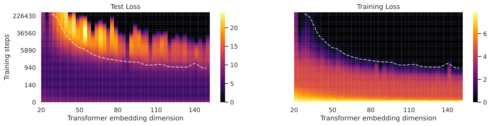
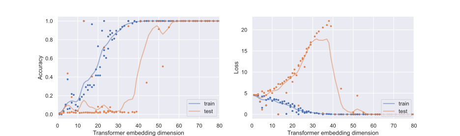
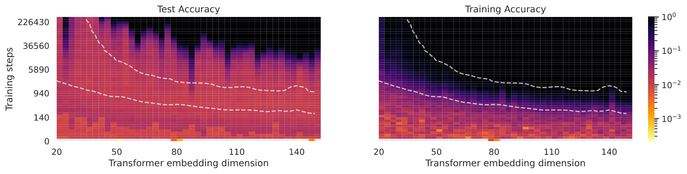
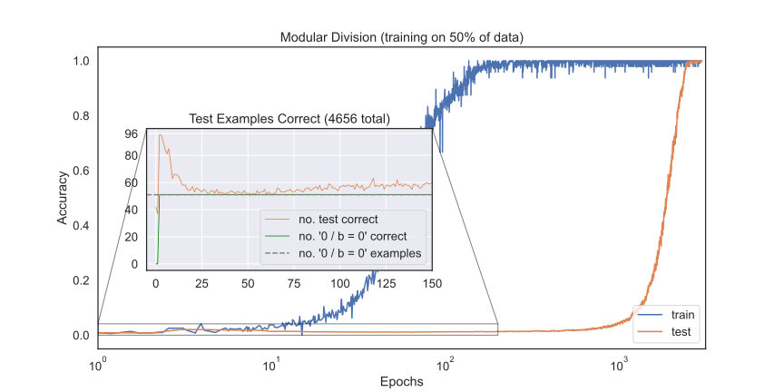

# Davies et al. 2023 — Unifying Grokking and Double Descent

См. также: [глобальный индекс понятий](../../concepts/index.md).
arXiv [2303.06173v1](https://arxiv.org/abs/2303.06173), 10 марта 2023 (доклад мастерской — декабрь 2022). Колонтитул PDF: «ML Safety Workshop, 36th Conference on Neural Information Processing Systems (NeurIPS 2022)».

**Xander Davies** — Harvard University; равный вклад, переписка: alexander_davies@college.harvard.edu.
**Lauro Langosco** — University of Cambridge; равный вклад.
**David Krueger** — University of Cambridge.

Файлы разбора этой статьи:

- [`2303.06173.unifying-grokking-and-double-descent.claims.txt`](2303.06173.unifying-grokking-and-double-descent.claims.txt) — пронумерованные утверждения статьи с пометками разбора.
- [`2303.06173.unifying-grokking-and-double-descent.license.txt`](2303.06173.unifying-grokking-and-double-descent.license.txt) — лицензионная запись arXiv для этой статьи.

Схема якорей и правила ссылок на карточку — в [README папки статей](../README.md).

**Карточка-выдержка.** Лицензия статьи (`arxiv-nonexclusive`) не разрешает публикацию копии оригинала и полного перевода, поэтому карточка содержит редакторские секции и цитируемые фрагменты перевода (право цитирования). Полный текст статьи: <https://arxiv.org/abs/2303.06173>.

## Затрагиваемые понятия

**[Двойной спуск](../../concepts/double-descent.md)** — здесь двойной спуск впервые в корпусе поставлен не рядом с [гроккингом](../../concepts/grokking.md), а на его место: работа заявляет, что оба «лучше рассматривать как два проявления одного и того же явления» ([с. 1, абз. 4](#p1-4)), и делает это первоисточником всей позднейшей линии объединения. Существенны для корпуса три вещи. Первая — наблюдение, что в самой постановке Power et al. двойной спуск **есть**, но виден только в логарифмической шкале точности и отчётливее по потере, чем по точности, и сами авторы называют его «небольшим» ([рис. 1](#fig-1)). Вторая — понятийная рамка: обе кривые порождаются взаимодействием образцов, выучиваемых с разной скоростью, а переход между двумя картинами получается изменением ровно одного рода параметров ([с. 3, абз. 4](#p3-4)). Третья — перенос двойного спуска и гроккинга на общую ось: авторы предъявляют тепловые карты по числу шагов и размерности вложения, где отложенная генерализация видна и по вертикали, и по горизонтали ([рис. 4](#fig-4), [рис. 6](#fig-6)). Чего в работе нет: ни одной попытки разобрать возражение Power et al. — что гроккинг отличен от двойного спуска, поскольку генерализация наступает далеко за порогом интерполяции. Возражение приведено дословно ([с. 5, абз. 2](#p5-2)) и оставлено без разбора; ни порог интерполяции, ни ёмкость запоминания в работе не считаются.

**[Гроккинг](../../concepts/grokking.md)** — работа задаёт гроккингу новую ось. Из своего Claim 2 («образцы можно рассматривать как функцию размера модели наравне с функцией времени обучения») авторы **до опыта** выводят следствие: гроккинг должен наблюдаться и по размеру модели, — и объявляют его первую демонстрацию ([с. 2, абз. 6](#p2-6), [с. 4, абз. 2](#p4-2)). Термин *model-wise grokking* («гроккинг по размеру модели») входит в корпус отсюда, и позднейшие работы ссылаются на него именно как на введённый здесь. Второй вклад в понятие — количественно подтверждённое предсказание о ранней поре обучения: рамка требует, чтобы быстрый хорошо обобщающий образец дал всплеск точности **выше** случайной, и такой всплеск найден и посчитан — пик в 96 верных примеров, отвечающий безошибочности на $0/b=0$ и случайности (1/97) на остальных данных ([рис. 7](#fig-7)). Чего в работе нет: определения гроккинга — оно берётся у Power et al. целиком; нет и разбора внутреннего устройства сети. Опытная часть держится на одной задаче (деление по модулю 97) и одной архитектуре, ни числа семян, ни доверительных полос не приведено, а сама рамка ни к одной измеренной кривой не подгонялась.

**[Эталонный полигон гроккинга](../../concepts/canonical-grokking-testbed.md)** — постановка Power et al. взята целиком и без изменений: decoder-only трансформер с каузальной маской внимания на бинарной операции деления по модулю 97, каждый вычет закодирован отдельным символом, потеря и точность считаются только на части равенства с ответом ([с. 4, абз. 1](#p4-1), [с. 8, абз. 3](#p8-3)). Работа добавляет к полигону **вторую управляющую величину**: ёмкость меняется размерностью вложения, а прочие настройки закреплены (2 слоя, ширина 128, одна голова внимания, 400 тысяч шагов оптимизации, AdamW, скорость обучения 1e-3, weight decay 1e-5). Именно эта двумерная развёртка «шаги × размерность вложения» и есть то, что корпус отсюда унаследовал. Чего в работе нет: ни второй задачи, ни второй архитектуры, ни разбора того, чем гроккинг по размеру модели отличается от давно известного двойного спуска по размеру модели, кроме отложенности.

**[Модульная арифметика](../../concepts/modular-arithmetic.md)** — единственная задача работы, и взята она в одном частном виде: деление по модулю 97. Ценность этого выбора для корпуса в том, что именно на делении рамка дала проверяемое предсказание о конкретном подмножестве примеров: рано в обучении модель выучивает, что для всех $b$ верно $0/b=0\bmod n$ — образец, который обобщается хорошо и выучивается быстро ([с. 4, абз. 3](#p4-3)). Следом наблюдается провал **ниже** случайного уровня, объяснённый складыванием плохо обобщающих образцов и, по предположению авторов, антикорреляцией значений обучающей и проверочной выборок по делимому и делителю. Отмечено, что этот бугор различим и на графиках Power et al. 2022, но там авторами не замечен. Чего в работе нет: разложения выученного решения — ни по частотам, ни по представлениям; «образец» здесь остаётся понятием рамки, а не измеряемой в сети величиной.

**[Возникновение признаков](../../concepts/feature-emergence-feature-learning.md)** — работа предлагает абстрактную модель обучения сети как *выучивания образцов*: сеть представлена набором из $n$ образцов, вероятность верной классификации точки $i$-м образцом задана сигмоидой с тремя параметрами — предельной предсказательностью $\gamma_{i}$, точкой перегиба $b_{i}$ и скоростью выучивания $\alpha_{i}$ ([с. 2, абз. 8](#p2-8)). Отличие от предшественников авторы называют сами: у Heckel & Yilmaz 2020 и Pezeshki et al. 2021 образцы уже были, но здесь к ним добавлены отдельные параметры обобщения $g_{i}$, предельная предсказательность разведена со скоростью выучивания, и введено понятие *предпочтённого образца* ([с. 4, абз. 4](#p4-4)). Три рода образцов — эвристический (быстрый, обобщает хорошо), переобучающий (быстрый, хотя медленнее эвристики, обобщает плохо) и медленный обобщающий, который в итоге и предпочитается, — и есть весь словарь работы ([с. 3, абз. 3](#p3-3)). Чего в работе нет: измерения хотя бы одного образца в настоящей сети. Параметры сигмоид расставлены руками так, чтобы получились нужные кривые; ни одного числового сопоставления модели с опытными кривыми не приведено, а «предпочтённый образец» — рукотворная вставка, на которой держится весь итоговый переход к обобщению и которая ни из чего не выводится и ничем не измеряется.

**[Фаза меморизации / плато](../../concepts/memorization-phase.md)** — запоминание входит в рамку как *переобучающий образец* (Type 2): быстрый, хотя медленнее эвристики, и обобщающий плохо ([с. 3, абз. 3](#p3-3)). Существенное для корпуса — предсказание о том, что этот образец делает с проверочной точностью на ранней поре: складывание плохо обобщающих Type 2 образцов ведёт к качеству **хуже случайного** на остальных данных, и это наблюдение подтверждено опытом ([с. 4, абз. 3](#p4-3), [рис. 7](#fig-7)). Чего в работе нет: разделения «запоминающего» и «обобщающего» решений на уровне весов или подсетей — этого словаря у авторов ещё нет, а причина антикорреляции обучающих и проверочных значений объяснена словом «likely» и не проверена.

**[Weight decay](../../concepts/weight-decay.md)** — работе принадлежит формулировка догадки, которую позднейший корпус повторяет часто: «Мы предполагаем, что это происходит из-за того, что weight decay мешает решениям через запоминание, тем самым ускоряя складывание лучше обобщающего решения» ([с. 5, абз. 3](#p5-3)). Ценность для корпуса — в том, что догадка поставлена рядом с обратным наблюдением из линии двойного спуска: у Nakkiran et al. 2021 и Pezeshki et al. 2021 weight decay работает как ограничение ёмкости и **мешает** выучиванию медленных признаков, тогда как в постановке гроккинга он существенно ускоряет наступление генерализации. Чего в работе нет: ни одного опыта с weight decay — величина 1e-5 закреплена в приложении B и никогда не меняется; слово «speculate» стоит у авторов, и снимать его при цитировании нельзя.

**[Скорость обучения](../../concepts/learning-rate.md)** — скорость обучения появляется здесь в непривычной роли: как рычаг, **выравнивающий скорости образцов**. Работа читает находку Liu et al. 2022 — что гроккинг ускоряется большей скоростью обучения для вложения, чем для декодера, — как согласную с находкой Heckel & Yilmaz 2020 о том, что уменьшение скоростей обучения в поздних слоях (которые учатся быстрее) выравнивает скорости выучивания образцов, и объявляет это дополнительным свидетельством за Claim 1 ([с. 5, абз. 2](#p5-2)). Чего в работе нет: собственного опыта со скоростями обучения. Значение 1e-3 закреплено, послойных скоростей не пробовалось, и связь «выравнивание скоростей → исчезновение гроккинга», проверенная у Heckel & Yilmaz для двойного спуска, здесь на гроккинге не воспроизводится, а лишь заимствуется как довод.

**[Оптимизатор](../../concepts/optimizer-adam-adamw-sgd.md)** — работа лишь упоминает оптимизатор: AdamW с $\beta_{1}=0.9$, $\beta_{2}=0.98$ назван в приложении B как часть унаследованной от Power et al. постановки ([с. 8, абз. 3](#p8-3)) и больше нигде не обсуждается. Ни свойства адаптивного шага, ни сравнение с SGD в работе не разбираются, хотя объяснение гроккинга через аномалию адаптивных оптимизаторов к тому времени уже существовало. Существенно для чтения тепловых карт: все результаты по размеру модели сняты при одном оптимизаторе и одном расписании.

---

**[Компромисс сложность–ошибка](../../concepts/model-complexity-error-tradeoff.md)** — сложность здесь задаётся снаружи, числом параметров, и наблюдается исход, а не измеряется сложность обученной сети ([`p4-1`](#p4-1)). Работа сама указывает соперничающее объяснение немонотонности: рассогласование скоростей обучения разных частей сети ([`p4-4`](#p4-4)).
## Несогласованности внутри статьи

**Одна и та же величина названа то шагами оптимизации, то эпохами.** В [разделе 3.1](#p4-2) сказано: «Рисунок 5 показывает гроккинг по размеру модели у моделей, обученных 400 тысяч эпох», тогда как [подпись самого рисунка 5](#fig-5) говорит «обученного 400 тысяч шагов оптимизации», и [приложение B](#p8-3) закрепляет: «Обычно мы обучаем 400 тысяч шагов оптимизации через AdamW». Верны подпись и приложение; «эпох» в разделе 3.1 — описка. Разница существенна: при доле обучающих данных Power et al. эпоха и шаг различаются на порядки.

**Двойной спуск на тепловых картах назван и «отчётливым», и «слабым».** [Раздел 3.1](#p4-2) утверждает: «Рисунок 6 показывает отвечающие тепловые карты точности с отчётливым поведением двойного спуска и поэпохно, и по размеру модели», тогда как [подпись рисунка 6](#fig-6) говорит о том же графике: «Виден слабый двойной спуск по проверочной точности». Та же осторожность стоит и в [подписи рисунка 1](#fig-1) («небольшой двойной спуск»). При цитировании силы наблюдения надо брать подписи, а не текст раздела.

**Сумма в формуле (2) пробегает подмножества, на части которых подынтегральная величина не определена.** Проверочная точность определена как $\text{acc}_{\text{test}}(t)=\sum_{A\subseteq\{1,\dots,n\}}P_{A}(t)G(A)$, где сумма явно взята по **всем** подмножествам $\{1,\dots,n\}$, включая пустое, — а средняя способность к обобщению задана как $G(A)=1/{|A|}\sum_{i\in A}g_{i}$ и при $A=\emptyset$ не определена ([с. 3, абз. 1](#p3-1)). Соглашения о том, чему равно слагаемое при $A=\emptyset$ (то есть чему равна проверочная точность, когда ни один образец не сработал), в статье нет.

**Область изменения индекса в приложении A не совпадает с основным текстом.** Образцы всюду занумерованы $1,\dots,n$, а условие предпочтённости в [приложении A](#p8-2) записано как $\forall j\in\{0,\cdots,n\},i\neq j\implies\mathcal{D}_{i}\cap\mathcal{D}_{j}=\emptyset$ — с нуля. Описка, но она стоит в единственной формуле приложения.

---

## Что показано, а что предположено

Работа — шестистраничный доклад мастерской, и её слои различаются по прочности сильнее, чем у обычной статьи; цена цитаты сильно зависит от того, из какого слоя она взята.

**Предсказано до опыта и подтверждено количественно.** Из рамки следует, что быстрый хорошо обобщающий образец должен дать всплеск проверочной точности выше случайной **до** провала. Всплеск найден, опознан ($0/b=0\bmod n$) и посчитан: пик в 96 верных примеров отвечает безошибочности на таких примерах и случайности (1/97) на прочих ([рис. 7](#fig-7)). Это единственное место работы, где рамка сказала, что искать, прежде чем посмотрели, — и попутно оно указывает на бугор, различимый у Power et al. и там не замеченный ([с. 4, абз. 3](#p4-3)).

**Показано опытом.** Отложенная генерализация наблюдается и по размеру модели, а не только по числу шагов ([рис. 4](#fig-4), [рис. 5](#fig-5), [рис. 6](#fig-6)). Это следствие Claim 2, выведенное до опыта и затем проверенное; опыт, однако, поставлен на одной задаче и одной архитектуре, без семян и разбросов, а на рисунке 5 кривые сглажены гауссовым фильтром, ширина которого в подписи не названа и видна только в имени файла иллюстрации.

**Показано как возможность, а не как факт о сети.** Главная заявка — что гроккинг и двойной спуск суть одно устройство — держится на игрушечной модели, параметры которой расставлены руками. Модель ни к каким данным не подгоняется, числового сопоставления её кривых с опытными в работе нет, и потому показано лишь то, что обе формы кривых **порождаемы** одним семейством сигмоид, а не то, что они **порождены** им в настоящей сети. Переход между двумя картинами получается изменением одной лишь предельной предсказательности $\gamma$ у эвристики и у медленного обобщающего образца ([с. 3, абз. 4](#p3-4)) — это красивое свойство модели, а не измерение.

**Объявлено предположением.** Роль weight decay: «Мы предполагаем, что это происходит из-за того, что weight decay мешает решениям через запоминание» ([с. 5, абз. 3](#p5-3)) — опыта нет. Причина провала ниже случайного уровня: «по всей видимости, из-за антикорреляции значений обучающей и проверочной выборок» ([с. 4, абз. 3](#p4-3)) — проверено лишь то, что провал есть, но не то, что причина названа верно. Довод приложения C о пользе науки о глубоком обучении для безопасности авторы сами называют умозрительным и, быть может, ошибочным ([с. 8, абз. 6](#p8-6)).

**Признано авторами оговоркой в самой модели.** Зависимость исхода от принадлежности точки к обучающей или проверочной выборке «не имеет смысла в случае независимых одинаково распределённых данных» — авторы пишут это сами и всё же вводят такую зависимость, чтобы моделировать переобучающиеся сети ([с. 3, абз. 1](#p3-1)).

**Оставлено без разбора.** Возражение Power et al. — что гроккинг отличен от двойного спуска, поскольку генерализация наступает далеко за порогом интерполяции, — приведено дословно и не разобрано ни числом, ни опытом ([с. 5, абз. 2](#p5-2)). Не поставлено и ни одного вмешательства: ускорить или замедлить отдельный образец в настоящей сети и проследить, изменится ли гроккинг, — хотя рамка на такое напрашивается, а подобные опыты уже были у Heckel & Yilmaz 2020 и Stephenson & Lee 2021 для двойного спуска ([с. 4, абз. 4](#p4-4)).

---

## Ошибочные пересказы и цитирования этой статьи

Ниже — узоры, наблюдённые в цитирующих работах корпуса. Для каждого сказано, что именно искажается, и даны ссылки на авторские абзацы с теряемой оговоркой. Разделы «Ошибочные цитирования» на стороне цитирующих карточек ещё не заведены, поэтому подробные разборы пока не адресуются, а цитирующие работы перечислены простыми ссылками на карточки.

**«Davies et al. объясняют гроккинг геометрией ландшафта потерь» (ошибочное).** Два обзора корпуса приписывают работе предмет, которого в ней нет ни в одном виде. Abramov et al. 2025 пишут: `"Subsequent work has linked grokking to double descent (Belkin et al., 2019; Nakkiran et al., 2020), the geometry of deep-network loss landscapes (Davies et al., 2023), and weight decay (Pezeshki et al., 2022; Nanda et al., 2023)"`; Truong et al. 2026 повторяют то же дважды — `"Existing accounts appeal to weight-norm dynamics (Liu et al., 2023; Kumar et al., 2024), Fourier-feature formation (Nanda et al., 2023; Gromov, 2023), circuit efficiency (Varma et al., 2023; Merrill et al., 2023), group-theoretic representations (Chughtai et al., 2023), and loss-landscape geometry (Davies et al., 2022)"`. Ландшафта потерь в статье нет: её единственная величина — вероятность $p_{i}(t)$ верной классификации отдельным образцом, заданная сигмоидой от номера шага ([с. 2, абз. 8](#p2-8)), а весов, их нормы и рельефа потерь работа не касается вовсе. Ландшафтное объяснение гроккинга принадлежит Liu et al. 2022 (Omnigrok), которых оба обзора цитируют рядом. Затронутые работы: [Abramov et al. 2025](../2504.20752.grokking-in-the-wild-data-augmentation-for-real-world-multi-hop-reasoning-with-transformers/2504.20752.grokking-in-the-wild-data-augmentation-for-real-world-multi-hop-reasoning-with-transformers.card.md), [Truong et al. 2026](../2604.13123.spectral-entropy-collapse-as-a-phase-transition-in-delayed-generalisation/2604.13123.spectral-entropy-collapse-as-a-phase-transition-in-delayed-generalisation.card.md).

**«Рамка Davies говорит о конкуренции контуров и о мерах прогресса» (ошибочное).** Позднейшие работы регулярно переписывают образцы Davies в словарь, сложившийся после статьи. Liu и Lu 2026 пишут: `"Davies et al. [35], Huang et al. [36] further unify double descent with grokking by framing both phenomena as a competition between memorization and generalization circuits"`; Truong et al. 2026 — `"Davies et al. (2022) hypothesised connections between grokking and double descent via hidden progress measures"`; Notsawo et al. 2025 помещают работу в перечень мер прогресса как `"time scales of pattern formation (Davies et al., 2023)"`; Furuta et al. 2024 относят её к работам, у которых `"the training process could be a phase transition divided into memorization, circuit formation, and cleanup phase"`. Ни слова «circuit», ни слов «progress measure», ни трёхфазного деления в статье нет: у авторов есть три **рода образцов** — эвристический, переобучающий и медленный обобщающий ([с. 3, абз. 3](#p3-3)), — и ни одна величина, растущая по ходу обучения и предвещающая переход, не предлагается. Конкуренция контуров как рамка объединения принадлежит Huang et al. 2024, которых Liu и Lu называют рядом; трёхфазное деление — Nanda et al. 2023. Затронутые работы: Liu и Lu 2026 (карточки ещё нет), [Truong et al. 2026](../2604.13123.spectral-entropy-collapse-as-a-phase-transition-in-delayed-generalisation/2604.13123.spectral-entropy-collapse-as-a-phase-transition-in-delayed-generalisation.card.md), [Notsawo et al. 2025](../2506.05718.grokking-beyond-the-euclidean-norm-of-model-parameters/2506.05718.grokking-beyond-the-euclidean-norm-of-model-parameters.card.md), [Furuta et al. 2024](../2402.16726.towards-empirical-interpretation-of-internal-circuits-and-properties-in-grokked-transformers-on-modular-polynomials/2402.16726.towards-empirical-interpretation-of-internal-circuits-and-properties-in-grokked-transformers-on-modular-polynomials.card.md).

**«Объединение состоялось» вместо «мы предполагаем» (расширяющее).** Заглавие статьи — утвердительное, и при цитировании оно вытесняет собственную формулировку авторов, которая всюду хеджирована: «Мы предполагаем, что гроккинг и двойной спуск можно понимать как проявления одной и той же динамики обучения» ([с. 1, абз. 2](#p1-2)), и это гипотеза, а не итог. Zhao et al. 2024 пишут: `"A unified framework has been developed to integrate grokking with double descent, treating them as two manifestations of the same underlying process (Davies et al. 2023)"`; Zhou et al. 2025 — `"Davies et al. (2023) unified grokking with the double-descent phenomenon, attributing delayed generalization to the interplay between model capacity and data complexity"`, причём «data complexity» в статье не встречается вовсе, а ёмкость модели служит осью опыта, а не объяснением. Заметно, что аккуратные цитирования в корпусе многочисленнее: Xu et al. 2026 пишут `"Davies et al. (2023) hypothesized that grokking and double descent can be understood using the same pattern-learning model, and provided the first demonstration of model-wise grokking"`; Das et al. 2026 — `"The connection between double descent (Nakkiran et al. 2019) and grokking has been explored (Davies et al. 2023), but without theoretical justification"`; Miller et al. 2024 приводят Claim 1 дословно; Lyu et al. 2023 добавляют к пересказу собственное возражение — `"it is unclear how these notions can be rigorously defined for general training dynamics"`. Затронутые работы: Zhao et al. 2024 (карточки ещё нет), [Zhou et al. 2025](../2504.17243.neuralgrok-accelerate-grokking-by-neural-gradient-transformation/2504.17243.neuralgrok-accelerate-grokking-by-neural-gradient-transformation.card.md).

**«Гипотеза о двойственности так и не проверена» (ошибочное, в обратную сторону).** Huang et al. 2024, работа, прямо продолжающая эту линию, пишет: `"Davies et al. (2022) attempted to bridge the concepts of *double descent* and *grokking*. This was approached through a proposed duality between model size and scaling time, though this hypothesis remains to be empirically verified"`. Опытная проверка следствия из Claim 2 составляет весь раздел 3.1 и три рисунка из семи ([рис. 4](#fig-4), [рис. 5](#fig-5), [рис. 6](#fig-6)), а в аннотации заявлена «первая демонстрация гроккинга по размеру модели». Занятно, что те же авторы несколькими страницами раньше приписывают Davies et al. сам термин *model-wise grokking* и наблюдают явление у себя. Затронутая работа: [Huang et al. 2024](../2402.15175.unified-view-of-grokking-double-descent-and-emergent-abilities/2402.15175.unified-view-of-grokking-double-descent-and-emergent-abilities.card.md).

Более мягкие отголоски, не заслужившие отдельного разбора: приписывание работе наблюдения гроккинга «в широком наборе постановок и архитектур» (Xu 2026, карточки ещё нет), тогда как задача и архитектура здесь одни; отнесение к объяснениям через предпочтение «более простых» решений ([Liang и Li 2025](../2512.03437.grokked-models-are-better-unlearners/2512.03437.grokked-models-are-better-unlearners.card.md)) при том, что простота у авторов нигде не фигурирует, а предпочтение постулировано; отнесение к работам об эмерджентных способностях ([Saheb Pasand и Dohmatob 2026](../2510.04930.egalitarian-gradient-descent-a-simple-approach-to-accelerated-grokking/2510.04930.egalitarian-gradient-descent-a-simple-approach-to-accelerated-grokking.card.md)), которых в статье нет; и пересказ различия между двойным спуском и гроккингом как вопроса о том, «рано или поздно выучиваются эвристические образцы» (Kubo, Uda, Iida 2026, карточки ещё нет), тогда как у авторов две картины разводятся предельной предсказательностью $\gamma$, а не порядком выучивания.

---

# Цитируемые фрагменты перевода

Ниже приведены только те фрагменты перевода, на которые ссылаются карточки корпуса (право цитирования). Нумерация якорей `pN-M` / `fig-N` / `sec-X` совпадает с полной карточкой и оригиналом.

## Аннотация

###### p1-2

Основательное понимание генерализации в глубоком обучении может потребовать объединения разрозненных наблюдений под одной понятийной рамкой. Прежние работы изучали *гроккинг* — динамику обучения, при которой за долгой порой почти идеального качества на обучении и почти случайного качества на проверке в конце концов следует генерализация, — а также поверхностно схожий *двойной спуск*. До сих пор эти предметы изучались порознь. Мы предполагаем, что гроккинг и двойной спуск можно понимать как проявления одной и той же динамики обучения в рамках скоростей выучивания образцов. Мы предполагаем, что эта рамка применима и при изменении ёмкости модели вместо числа шагов оптимизации, и даём первую демонстрацию гроккинга по размеру модели.

## 1 Введение

###### fig-1

*Рисунок 1: Три взгляда на один и тот же прогон обучения, воспроизведённый по Power et al. 2022.* **[p. 1]**

###### p1-4

Мы доказываем, что двойной спуск и гроккинг лучше рассматривать как два проявления одного и того же явления, при котором индуктивные предпочтения отдают предпочтение лучше обобщающим, но медленнее выучиваемым образцам, что ведёт к переходу от плохо обобщающих образцов к хорошо обобщающим. Этот переход происходит и *поэпохно*, как функция времени обучения (рисунок 1), и *по размеру модели*, как функция размера модели (рисунок 4).

##### **Claim 2**(Двойственность размера модели и масштабирования времени)**.**

###### p2-6

*Образцы можно рассматривать как функцию размера модели наравне с функцией времени обучения, и динамика обучения в этих двух случаях схожа.11 1 Разумно говорить о выучивании образцов как о функции эффективной ёмкости (Arpit et al. 2017) или эффективной сложности модели (Nakkiran et al. 2021), однако мы избегаем этого в настоящей работе, чтобы не связывать себя выбором точной меры.*

### 2.2 Модель динамики обучения

###### p2-8

В нашей модели нейросеть состоит из набора в $n$ образцов, складывающихся во времени по ходу обучения. Для любой обучающей точки вероятность того, что образец $i$ классифицирует её верно на шаге $t$, есть $p_{i}(t)$.Мы моделируем $p_{i}$ сигмоидой

###### p3-1

Чтобы вычислить проверочную точность нашей модели, мы приписываем дополнительные параметры обобщения $g_{1},\dots,g_{n}\in[0,1]$, выражающие мысль о том, что одни образцы обобщают лучше других.22 2 В этой модели то, классифицирует ли сеть данный вход верно, зависит от того, находится ли он в обучающей или в проверочной выборке, что не имеет смысла в случае независимых одинаково распределённых данных: в настоящем мире то, классифицирован ли данный пример $(x,y)$ верно или нет, есть исключительно факт о значении $(x,y)$ и о параметрах модели и не зависит от того, находится ли он в обучающей или проверочной выборке. Тем не менее мы включаем такую зависимость, чтобы моделировать нейросети, которые переобучаются на обучающей выборке и потому лучше способны классифицировать обучающие примеры. Наглядно каждому образцу отвечает «множество обобщения» из входов, которые классифицируются этим образцом, даже если они не встречались во время обучения. Параметр обобщения тогда можно рассматривать как долю множества обобщения, классифицируемую верно. Мы полагаем, что образцы, чаще оказывавшиеся успешными во время обучения, больше используются во время проверки. Для любого подмножества $A$ из $\{1,\dots,n\}$ мы определяем вероятность $P_{A}(t)=\prod_{i\in A}p_{i}(t)\prod_{j\notin A}(1-p_{j}(t))$ того, что успешны только образцы из $A$, а также среднюю способность к обобщению $G(A)=1/{|A|}\sum_{i\in A}g_{i}$ образцов из $A$. Общая проверочная точность в момент $t$ тогда даётся средней способностью к обобщению, взвешенной вероятностью успеха во время обучения,

### 2.3 Двойной спуск и гроккинг с родами образцов

###### p3-3

Мы моделируем обучение при двойном спуске и гроккинге как взаимодействие трёх образцов, выучиваемых с разной скоростью по ходу обучения: **эвристического образца**, который быстр и обобщает хорошо; **переобучающего образца**, который быстр, хотя и медленнее эвристики, и обобщает плохо; и **медленного обобщающего образца**, который медлен и обобщает хорошо. Этот последний образец в конце концов и предпочитается индуктивными предпочтениями модели.

###### p3-4

Как показано на рисунке 2, эта простая модель способна порождать и гроккинг, и двойной спуск; между ними можно перейти, меняя лишь предельную предсказательность ($\gamma$) эвристического и медленного обобщающего образцов.33 3 Код, воспроизводящий наши итоги, доступен по адресу github.com/xanderdavies/unifying-grok-dd, включая интерактивную тетрадь для изучения модели выучивания образцов и перехода между гроккингом и двойным спуском.

## 3 Опыты

###### fig-4

*Рисунок 4: **Гроккинг по размеру модели.** Более тёмный цвет означает меньшую потерю, прерывистая линия отвечает 90 % точности на обучении. *Слева:* проверочная потеря как функция числа шагов обучения и размера модели. *Справа:* обучающая потеря. Поэпохный гроккинг: двигаясь вертикально от нуля шагов обучения, видим, что проверочная потеря сперва падает, затем резко растёт (начиная с почти идеальной подгонки обучающей выборки), а потом падает снова. Гроккинг по размеру модели: двигаясь горизонтально вдоль тех значений числа шагов обучения, которые в конце концов приведут к низкой потере, видим ту же картину: сперва проверочная потеря убывает, затем быстро растёт вблизи подгонки обучающей выборки, а затем в конце концов убывает. Горизонтальный срез см. на рисунке 5.* **[p. 4]**

### 3.1 Гроккинг по размеру модели

###### p4-1

Следуя исходной постановке гроккинга у Power et al. 2022, мы обучаем decoder-only трансформеры (Vaswani et al. 2017) с каузальной маской внимания на бинарной операции деления по модулю 97 (подробности в приложении B). Мы исследуем действие управления эффективной сложностью модели через изменение числа параметров.

###### p4-2

Рисунок 4 показывает обучающую и проверочную потерю в зависимости от числа шагов оптимизации и размерности вложения. Для целого набора значений отложенная генерализация происходит и при движении вертикально (поэпохный гроккинг), и при движении горизонтально (гроккинг по размеру модели). Рисунок 6 показывает отвечающие тепловые карты точности с отчётливым поведением двойного спуска и поэпохно, и по размеру модели. Рисунок 5 показывает гроккинг по размеру модели у моделей, обученных 400 тысяч эпох.

### 3.2 Образец Type 1 в обстановке гроккинга

###### p4-3

В обстановке модульного деления у Power et al. 2022 проверочная точность немонотонна (рисунок 1). Рано в обучении модель выучивает, что для всех $b$ верно $0/b=0\mod n$. Этот образец обобщается хорошо и выучивается быстро, отвечая образцу Type 1 в нашей модели. Как и предсказано нашей моделью, это ведёт к начальному всплеску проверочной точности выше случайной. Занятно, что складывание плохо обобщающих признаков Type 2 затем ведёт к качеству *хуже случайного* на остальных данных, по всей видимости, из-за антикорреляции значений обучающей и проверочной выборок по каждому делимому и делителю при модульном делении, что вызывает спад проверочного качества. Этот небольшой бугор различим у Power et al. 2022, но авторами не отмечен. Мы проверяем эту догадку опытом (рисунок 7).

#### Выучивание образцов с разной скоростью.

###### p4-4

Heckel & Yilmaz 2020 находят, что выучивание разных частей сетей с разной скоростью может порождать две кривые размена смещения и разброса с разными минимумами, что ведёт к двойному спуску проверочной ошибки; они показывают, что подстройка величин шага у разных слоёв позволяет выровнять кривые обучения и устранить поведение двойного спуска. Они доказывают, что поэпохный двойной спуск происходит из-за этой разницы в скорости выучивания, а не из-за управления сложностью модели. Pezeshki et al. 2021 пользуются линейной моделью «учитель — ученик», чтобы показать, что поэпохный двойной спуск объясняется выучиванием разных образцов с разной скоростью. Stephenson & Lee 2021 показывают опытом, что двойного спуска можно избежать, убрав или ускорив медленно выучиваемые признаки. В настоящей работе мы распространяем эту рамку выучивания образцов на истолкование не только поведения двойного спуска, но и поведения гроккинга и предлагаем математическую модель, объединяющую оба явления. Наша рамка пользуется понятием отдельных образцов с индивидуальной силой (Heckel & Yilmaz 2020; Pezeshki et al. 2021), но отличается тем, что допускает **[p. 5]** отдельные параметры обобщения у каждого образца и разводит предельную предсказательность со скоростью выучивания, а также вводит понятие «предпочтённого» образца.

#### Двойной спуск.

###### fig-5

*Рисунок 5: Гроккинг по размеру модели, где каждая точка — трансформер отвечающей размерности вложения, обученный 400 тысяч шагов оптимизации. Линии — данные, сглаженные гауссовым фильтром. **Слева:** точность, с отложенной генерализацией. **Справа:** потеря, с ростом проверочной потери и последующим быстрым спадом.* **[p. 5]**

#### Гроккинг.

###### p5-2

Гроккинг был впервые показан у Power et al. 2022, которые утверждают, что гроккинг отличен от двойного спуска, поскольку генерализация происходит далеко за порогом интерполяции. Liu et al. 2022 показывают, что скорость наступления генерализации при гроккинге можно ускорить в простой модели «вложение — декодер», взяв бо́льшую скорость обучения для вложения, чем для декодера. Это согласуется с находками Heckel & Yilmaz 2020 о поэпохном двойном спуске, где уменьшение скоростей обучения в поздних слоях (которые учатся быстрее) выравнивает скорости выучивания образцов. Мы считаем это дополнительным свидетельством того, что и гроккинг, и поэпохный двойной спуск происходят вследствие схожей динамики обучения, порождаемой разными скоростями складывания образцов. Nanda & Lieberum 2022 исследуют гроккинг средствами механистической интерпретируемости, и их находки согласуются с нашими итогами (в частности, они наблюдают складывание образца Type 3).

#### Weight decay

###### p5-3

И Nakkiran et al. 2021, и Pezeshki et al. 2021 находят, что weight decay действует как ограничение ёмкости, что даёт как двойной спуск по weight decay, так и препятствование выучиванию более медленных признаков. В обстановке гроккинга, однако, weight decay играет существенную роль в ускорении времени до генерализации (Power et al. 2022). Мы предполагаем, что это происходит из-за того, что weight decay мешает решениям через запоминание, тем самым ускоряя складывание лучше обобщающего решения.

## Приложение A Иное наглядное представление о предпочтённых образцах

###### p8-2

Мы можем тогда сказать, что *предпочтённый образец* принуждает свою область определения $\mathcal{D}_{i}$ быть непересекающейся со всеми прочими областями определения образцов на проверочной выборке; то есть $\mathcal{D}_{i}$ предпочтён, если $\forall j\in\{0,\cdots,n\},i\neq j\implies\mathcal{D}_{i}\cap\mathcal{D}_{j}=\emptyset$.

## Приложение B Подробности опытов

###### p8-3

Во всех наших опытах мы обучаем decoder-only трансформер с каузальной маской внимания. Каждый вычет закодирован как символ, а потеря и точность оцениваются только на части равенства с ответом. Если не оговорено иное, мы берём двухслойную сеть ширины 128 с одной головой внимания. Обычно мы обучаем 400 тысяч шагов оптимизации через AdamW ($\beta_{1}=0.9$, $\beta_{2}=0.98$), со скоростью обучения 1e-3 и weight decay 1e-5.

## Приложение C Обсуждение: насколько наука о глубоком обучении важна для безопасности ИИ?

###### p8-6

Наука о глубоком обучении может оказаться и вредна, если теоретические или опытные прорывы приведут к более быстрому продвижению потенциально опасных возможностей. Это крупный недостаток этой линии исследований. Предварительный довод в пользу научной / понятийной работы состоит в том, что, по-видимому, возможно построить системы ИИ человеческого уровня без коренным образом улучшенного понимания глубокого обучения; однако построение *безопасного* ИИ человеческого уровня — задача более трудная, которая, вероятно, потребует более надёжной теории. Стало быть, продвижение науки о глубоком обучении представляется несколько более решающим для решения задач безопасности, нежели задач возможностей. Этот довод умозрителен и может оказаться ошибочным.

## Приложение D Дополнительные рисунки

###### fig-6

*Рисунок 6: **Слева:** проверочная точность как функция числа шагов обучения и размера модели. Виден слабый двойной спуск по проверочной точности, а отложенная генерализация отчётлива и поэпохно (по вертикали), и по размеру модели (по горизонтали). **Справа:** обучающая точность как функция числа шагов обучения и размера модели.* **[p. 9]**

###### fig-7

*Рисунок 7: Рано в обучении модель выучивает $0/b=0\mod n$, поскольку число верных $0/b=0\mod n$ (зелёное) совпадает со всеми такими примерами (прерывистое серое). Это ведёт к краткому пику в 96 верных примеров, отвечающему идеальному качеству на $0/b=0$ и случайному качеству (1/97) на прочих данных. Проверочная точность на всех прочих примерах затем падает ниже случайной из-за запоминания.* **[p. 9]**
