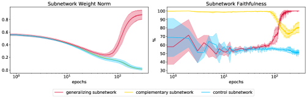
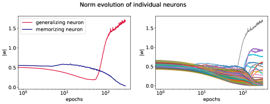
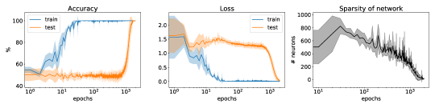

# Merrill et al. 2023 — A Tale of Two Circuits: Grokking as Competition of Sparse and Dense Subnetworks

См. также: [глобальный индекс понятий](../../concepts/index.md).

**William Merrill**, **Nikolaos Tsilivis**, **Aman Shukla** — New York University.

arXiv [2303.11873](https://arxiv.org/abs/2303.11873), 21 марта 2023. ICLR 2023 Workshop. 85 цитирований — седьмая по цитируемости работа корпуса. Нативного HTML для неё нет, источник — ar5iv.

Оригинал и производные файлы этой папки:

- [`original/2303.11873.ar5iv.html`](original/2303.11873.ar5iv.html) — первоисточник, ar5iv-рендеринг (LaTeXML), скачан как есть.
- [`original/2303.11873.a-tale-of-two-circuits-grokking-as-competition-of-sparse-and-dense-subnetworks.md`](original/2303.11873.a-tale-of-two-circuits-grokking-as-competition-of-sparse-and-dense-subnetworks.md) — конверсия оригинала в Markdown без правок содержания.
- [`images/`](images/) — 9 иллюстраций статьи в исходном разрешении.

Схема якорей и правила ссылок на карточку — в [README папки статей](../README.md).

## Затрагиваемые понятия

**[Разрежённая подсеть / лотерейный билет](../../concepts/sparse-subnetwork-lottery-ticket.md)** — работа даёт понятию **операциональное определение и измеримую динамику**. «Активная подсеть» находится прунингом по величине весов до минимального размера, при котором предсказания не меняются ни на одном входе; число её нейронов авторы называют *эффективной разрежённостью* ([`p3-1`](#p2-5)). После гроккинга сеть становится на порядки разрежённее — и этот переход совпадает по времени с переходом в потере.

**[Разрежённая чётность](../../concepts/sparse-parity.md)** — задача, на которой всё построено: $(n,k)$-чётность с $n=40$, $k=3$, $N=1000$, взятая у Barak et al. Её преимущество здесь в том, что для неё известны **точные конструкции** — сколько нейронов нужно, чтобы вычислить чётность, — и потому размер найденной подсети можно сопоставить с теоретическим минимумом.

**[Эффективность контуров](../../concepts/circuit-efficiency.md)** — работа даёт **другой механизм конкуренции**, чем у Varma et al.: там обобщающий контур побеждает потому, что эффективнее по норме параметров, здесь — потому что его нейроны избирательно растут в норме, а конкурент «вымирает» ([`p4-2`](#p4-1)). Существенно, что направление противоположно: у Varma побеждает решение с **меньшей** нормой, здесь — с большей. Авторы оговаривают это прямо в сноске: рост избирательных весов даёт эффективную разрежённость, потому что большие веса доминируют в линейных слоях.

**[Фаза меморизации](../../concepts/memorization-phase.md)** — работа **уточняет само понятие**: сеть в этой фазе не совсем запоминает. На сложении точность до гроккинга ровно та, которую даёт коммутативность — то есть одно свойство операции уже обобщено; на делении (некоммутативном) генерализация до перехода близка к нулю ([`p4-4`](#p4-3)). «Запоминание» оказывается плотной подсетью, которая кое-что обобщает.

**[Фазовый переход](../../concepts/phase-transition.md)** — переход получает **внутреннюю подпись, вычислимую по обучающим данным**: эффективная разрежённость падает на порядки одновременно со скачком тестовой точности, но измеряется без тестовой выборки. Это редкое свойство для меры прогресса.

**[Меры прогресса](../../concepts/progress-measures.md)** — эффективная разрежённость и есть кандидат в такую меру, причём иного рода, чем фурье-меры Nanda et al.: она не требует знания алгоритма задачи.

**[Фурье-признаки и контуры](../../concepts/fourier-features-circuits.md)** — прямое сопоставление: Nanda et al. нашли разрежённость **в фурье-области**, здесь она найдена в обычной структуре сети ([`p3-5`](#p3-4)). Два независимых способа увидеть одно и то же сжатие.

**[Эффект рогатки](../../concepts/slingshot.md)** — работа отталкивается от наблюдения Thilak et al. о сигмоидальном росте нормы последнего слоя и уточняет его: рост нормы не общий, а **избирательный** — у одних нейронов взрывной, у других убывание. Это ответ на упрёк, который сами авторы формулируют: у Thilak et al. нет описания поведения отдельных нейронов.

**[Эмерджентность](../../concepts/emergence.md)** — гроккинг предлагается как **управляемый стенд** для эмерджентных способностей больших языковых моделей. В заключении это доводится до конкретной гипотезы: у Dettmers et al. небольшое подмножество весов предобученных языковых моделей имеет большую величину и подавляюще объясняет предсказания — то есть та же картина «направленный рост нормы → разрежённость».

**[Эффективная теория / статистическая механика обучения](../../concepts/effective-theory-statistical-mechanics.md)** — работа отмечает, что похожие фазовые переходы давно изучались в статистической физике, но в иной постановке (онлайн-спуск, большие пределы), и формулирует требования к «эффективной теории» таких явлений: понимать причинные механизмы, предсказывать, где переход случится, и расцеплять статистическую и вычислительную стороны.

**[Гроккинг](../../concepts/grokking.md)** — понятие получает объяснение через смену доминирующей структуры, а не через изменение одной. Ограничение работы названо самими авторами: показано «по крайней мере в определённой постановке» — одна задача, одна архитектура, пять сидов.

Карточки статей корпуса: [Power et al. 2022](../2201.02177.grokking-generalization-beyond-overfitting-on-small-algorithmic-datasets/2201.02177.grokking-generalization-beyond-overfitting-on-small-algorithmic-datasets.card.md) — задача бинарных операторов, на которой проверяется довод про коммутативность; [Nanda et al. 2023](../2301.05217.progress-measures-for-grokking-via-mechanistic-interpretability/2301.05217.progress-measures-for-grokking-via-mechanistic-interpretability.card.md) — разрежённость в фурье-области против разрежённости в структуре; [Slingshot](../2206.04817.the-slingshot-mechanism-an-empirical-study-of-adaptive-optimizers-and-grokking/2206.04817.the-slingshot-mechanism-an-empirical-study-of-adaptive-optimizers-and-grokking.card.md) — наблюдение о росте нормы, которое здесь уточняется до избирательного; [Varma et al. 2023](../2309.02390.explaining-grokking-through-circuit-efficiency/2309.02390.explaining-grokking-through-circuit-efficiency.card.md) — та же идея конкуренции двух контуров, но с противоположным знаком по норме параметров.

## Что показано, а что предположено

Замечания редактора карточки по итогам разбора утверждений (`…claims.txt`). Работа короткая (воркшоп-формат) и осторожная в формулировках: «мы полагаем», «по крайней мере в определённой постановке». Цитируют её обычно жёстче, чем она написана.

**Измерено твёрдо и красиво.** Эффективная разрежённость — число нейронов минимальной подсети, воспроизводящей предсказания полной, — падает на порядки ровно тогда, когда происходит переход в потере ([`p3-1`](#p2-5)). Достоверность разрежённой подсети скачком выходит на полную, а качество её дополнения одновременно падает: это и есть измеренная смена доминирующей структуры, а не пересказ кривой обучения. Отдельная ценность меры в том, что она вычислима **по обучающим данным**, а коррелирует с тестовым переходом.

**Причинность не установлена, и авторы это говорят.** «Мы полагаем, что это, вероятно, причинное следствие роста нормы» — вмешательства, которое подавило бы рост нормы у отобранных нейронов и проверило, исчезнет ли переход, в работе нет. Порядок «избирательный рост нормы → доминирование разрежённой подсети» показан совпадением во времени.

**Самое сильное место — про фазу запоминания.** На сложении точность до гроккинга ровно та, которую даёт коммутативность: сеть уже обобщила одно свойство операции, хотя выглядит запоминающей. На делении, где коммутативности нет, генерализация до перехода близка к нулю ([`p4-4`](#p4-3)). Это проверяемое различение на двух операторах, и оно меняет смысл слова «запоминание» для всего корпуса.

**Вывод про ДНФ слабее, чем выглядит.** Размер подсети по пяти прогонам — 6 или 8 нейронов, что совпадает с размерами двух ДНФ-конструкций для чётности трёх битов. Но совпадает только **число нейронов**: сопоставления весов с конструкцией нет. И главное — существует конструкция из 4 нейронов через пороговый вентиль, которую сети **не находят**. Значит, размер подсети говорит скорее о том, какие решения достижимы для SGD, чем о том, какой контур нужен задаче. Факт авторы приводят, но следствия для собственного вывода не разбирают.

**Роль регуляризации не изолирована.** Разрежение отнесено на счёт нормовой регуляризации, «вступающей в силу» после обнуления основной части потери. При этом прогон с меньшим weight decay даёт ту же картину, а прогона **без** weight decay нет вовсе — то есть необходимость регуляризации для механизма не проверена.

**Не определён носитель, на котором меряется разрежённость.** Определение активной подсети требует совпадения предсказаний «для всех $x\in\mathcal{X}$», но какой именно $\mathcal{X}$ берётся в экспериментах, не сказано. От этого прямо зависит измеряемая величина.

**Место в корпусе.** Механизм противоположен по знаку объяснению Varma et al.: там побеждает контур с **меньшей** нормой параметров, здесь — подсеть с растущей. Обе работы говорят о конкуренции двух контуров и расходятся в том, что даёт победу; в корпусе это расхождение остаётся открытым. Наблюдение Thilak et al. о росте нормы последнего слоя здесь уточняется до избирательного, а разрежённость Nanda et al. в фурье-области получает аналог в обычной структуре сети.

## Ошибочные пересказы и цитирования этой статьи

Узоры ошибочного или расширенного цитирования этой работы, наблюдённые в цитирующих статьях корпуса. Каждая запись описывает, что именно искажается при пересказе, и ведёт к абзацам самих авторов, где стоит теряемая оговорка. Разбор конкретных формулировок — в карточках цитирующих работ, в их разделах «Ошибочные цитирования», куда ведут ссылки «подробности».

**Слияние «Merrill; Varma» в один тезис (расширяющее).** Четыре работы корпуса цитируют эту статью и [Varma et al.](../2309.02390.explaining-grokking-through-circuit-efficiency/2309.02390.explaining-grokking-through-circuit-efficiency.card.md) парой под общим утверждением «гроккинг — конкуренция разреженной и плотной подсетей». Слияние стирает открытое расхождение: здесь побеждает подсеть с [растущей нормой](#p4-1), у Varma — контур с меньшей нормой (эффективность); знаки противоположны, и ни один цитирующий этого не отмечает. Отголоски: [2504.13292](../2504.13292.let-me-grok-for-you-accelerating-grokking-via-embedding-transfer-from-a-weaker-model/2504.13292.let-me-grok-for-you-accelerating-grokking-via-embedding-transfer-from-a-weaker-model.card.md), [2512.03437](../2512.03437.grokked-models-are-better-unlearners/2512.03437.grokked-models-are-better-unlearners.card.md), [2603.15492](../2603.15492.grokking-as-a-variance-limited-phase-transition-spectral-gating-and-the-epsilon-stability-threshold/2603.15492.grokking-as-a-variance-limited-phase-transition-spectral-gating-and-the-epsilon-stability-threshold.card.md), [2604.13123](../2604.13123.spectral-entropy-collapse-as-a-phase-transition-in-delayed-generalisation/2604.13123.spectral-entropy-collapse-as-a-phase-transition-in-delayed-generalisation.card.md) — их формулировки разобраны в пунктах mc-2309-02390 карточек цитирующих.

**Потеря авторской оговорки масштаба (расширяющее).** Выводы работы сопровождены хеджами: конкуренция подсетей показана «at least in a specific setting» — одна задача, одна архитектура, — а о причинности сказано лишь [«we believe this is likely a causal effect of norm growth»](#p4-1). Пересказы «demonstrated that grokking results from», «driven by», «grokking is» превращают осторожную гипотезу в доказанный общий факт. Отголоски: [2405.17479](../2405.17479.a-rationale-from-frequency-perspective-for-grokking-in-training-neural-network/2405.17479.a-rationale-from-frequency-perspective-for-grokking-in-training-neural-network.card.md), [2402.16726](../2402.16726.towards-empirical-interpretation-of-internal-circuits-and-properties-in-grokked-transformers-on-modular-polynomials/2402.16726.towards-empirical-interpretation-of-internal-circuits-and-properties-in-grokked-transformers-on-modular-polynomials.card.md), [2408.08944](../2408.08944.information-theoretic-progress-measures-reveal-grokking-is-an-emergent-phase-transition/2408.08944.information-theoretic-progress-measures-reveal-grokking-is-an-emergent-phase-transition.card.md), [2603.15492](../2603.15492.grokking-as-a-variance-limited-phase-transition-spectral-gating-and-the-epsilon-stability-threshold/2603.15492.grokking-as-a-variance-limited-phase-transition-spectral-gating-and-the-epsilon-stability-threshold.card.md).

**Смещение атрибуции sparse parity (ошибочное, мягкое).** Задача разрежённой чётности и первое наблюдение гроккинга на ней принадлежат Barak et al. 2022 — [сами авторы это фиксируют](#p2-2); часть цитирующих отдаёт задачу этой работе. Отголоски: [2310.19470](../2310.19470.bridging-lottery-ticket-and-grokking-understanding-grokking-from-inner-structure-of-networks/2310.19470.bridging-lottery-ticket-and-grokking-understanding-grokking-from-inner-structure-of-networks.card.md), [2310.17247](../2310.17247.grokking-beyond-neural-networks-an-empirical-exploration-with-model-complexity/2310.17247.grokking-beyond-neural-networks-an-empirical-exploration-with-model-complexity.card.md), [2510.04930](../2510.04930.egalitarian-gradient-descent-a-simple-approach-to-accelerated-grokking/2510.04930.egalitarian-gradient-descent-a-simple-approach-to-accelerated-grokking.card.md). Родственная подмена величины: «activation sparsity» вместо [прунинга по величине весов](#p2-5) — [2506.04434](../2506.04434.grokking-and-generalization-collapse-insights-from-htsr-theory/2506.04434.grokking-and-generalization-collapse-insights-from-htsr-theory.card.md), [2602.02859](../2602.02859.late-stage-generalization-collapse-in-grokking-detecting-anti-grokking-with-weightwatcher/2602.02859.late-stage-generalization-collapse-in-grokking-detecting-anti-grokking-with-weightwatcher.card.md).

**Приписывание чужого предмета (ошибочное).** Работе приписывают анализ тригонометрических алгоритмов модульной арифметики (это Nanda и Gromov; здесь — чётность и ДНФ-подобные конструкции) и наблюдение гроккинга «в моделях, не являющихся нейросетями» (сеттинг работы — [однослойная ReLU-сеть](#p1-3)); в одном случае — концепцию circuit efficiency (это Varma). Подробности: [2410.04489](../2410.04489.grokking-at-the-edge-of-linear-separability/2410.04489.grokking-at-the-edge-of-linear-separability.card.md#mc-2303-11873), [2601.19791](../2601.19791.to-grok-grokking-provable-grokking-in-ridge-regression/2601.19791.to-grok-grokking-provable-grokking-in-ridge-regression.card.md#mc-2303-11873), [2604.13123](../2604.13123.spectral-entropy-collapse-as-a-phase-transition-in-delayed-generalisation/2604.13123.spectral-entropy-collapse-as-a-phase-transition-in-delayed-generalisation.card.md#mc-2303-11873).

Образцы аккуратного цитирования: [2310.19470](../2310.19470.bridging-lottery-ticket-and-grokking-understanding-grokking-from-inner-structure-of-networks/2310.19470.bridging-lottery-ticket-and-grokking-understanding-grokking-from-inner-structure-of-networks.card.md) — тезис вместе с границей применимости («where sparsity is evident»); [2601.19791](../2601.19791.to-grok-grokking-provable-grokking-in-ridge-regression/2601.19791.to-grok-grokking-provable-grokking-in-ridge-regression.card.md) — «attributed grokking **therein**»; [2403.03942](../2403.03942.the-heuristic-core-understanding-subnetwork-generalization-in-pretrained-language-models/2403.03942.the-heuristic-core-understanding-subnetwork-generalization-in-pretrained-language-models.card.md) — переносит методику, проверяет предпосылки и честно сообщает, где они не выполняются; [2506.05718](../2506.05718.grokking-beyond-the-euclidean-norm-of-model-parameters/2506.05718.grokking-beyond-the-euclidean-norm-of-model-parameters.card.md) — задача отдана Barak, собственное расширение помечено как гипотеза.

---

# Текст статьи

## Аннотация

###### p1-2

Гроккинг — явление, при котором модель, обученная на алгоритмической задаче, сначала переобучается, но затем, после большого объёма дополнительного обучения, претерпевает фазовый переход к идеальной генерализации. Мы эмпирически изучаем внутреннюю структуру сетей, проходящих гроккинг на задаче разрежённой чётности, и обнаруживаем, что фазовый переход гроккинга отвечает появлению разрежённой подсети, доминирующей в предсказаниях модели. На уровне оптимизации мы обнаруживаем, что эта подсеть возникает, когда малое подмножество нейронов проходит быстрый рост нормы, тогда как остальные нейроны сети медленно убывают по норме. Тем самым мы полагаем, что фазовый переход гроккинга можно понимать как возникающий из *конкуренции* двух в значительной мере различных подсетей: плотной, доминирующей до перехода и плохо обобщающей, и разрежённой, доминирующей после него.

## 1 Введение

###### p1-3
Гроккинг (Power et al., 2022; Barak et al., 2022) — любопытная тенденция генерализации нейросетей, обучаемых на некоторых алгоритмических задачах. При гроккинге график точности (и потери) сети обнаруживает две фазы. Рано в обучении точность на обучении выходит на $100\%$, тогда как точность генерализации остаётся вблизи случайной. Поскольку в этой фазе сеть, по видимости, просто запоминает данные, мы называем её *фазой запоминания*. Существенно позже в обучении точность генерализации внезапно подскакивает до $100\%$, что мы называем *переходом гроккинга*.

###### p1-4

Эта загадочная картина бросает вызов общепринятой мудрости машинного обучения: после первоначального переобучения модель каким-то образом выучивает верное, обобщающее поведение, не получая из данных никаких различающих свидетельств. Объяснение этого странного поведения побуждает развивать теорию гроккинга, укоренённую в оптимизации. Более того, гроккинг напоминает так называемое эмерджентное поведение больших языковых моделей (Zoph et al., 2022), где качество на некоторой (часто алгоритмической) способности остаётся на уровне случайного ниже критического порога масштаба, но при достаточном масштабе показывает примерно монотонное улучшение. Поэтому мы можем рассматривать гроккинг как управляемый испытательный стенд для эмерджентности в больших языковых моделях и надеяться, что понимание динамики гроккинга приведёт к гипотезам для анализа таких эмерджентных способностей. В идеале эффективная теория подобных явлений должна уметь понимать причинные механизмы фазовых переходов, предсказывать, на каких прикладных задачах они могут произойти, и расцеплять статистические (объём данных) и вычислительные (время вычислений, размер сети) стороны задачи.

###### p1-5

Хотя гроккинг изначально был выявлен на алгоритмических задачах, Liu et al. (2023) показывают, что при подходящих гиперпараметрах его можно вызвать и на естественных задачах из других областей. Кроме того, похожие на гроккинг фазовые переходы давно изучаются в сообществе статистической физики (Engel & Van den Broeck, 2001), хотя и в несколько иной постановке (онлайн-градиентный спуск, большие пределы числа параметров модели и объёма данных и т. д.). Прошлые работы, анализировавшие гроккинг, разобрали поведение сети обратным инжинирингом в фурье-пространстве (Nanda et al., 2023) и нашли меры прогресса в сторону генерализации до перехода гроккинга (Barak et al., 2022). Thilak et al. (2022) наблюдают картину «рогатки» при гроккинге: норма весов финального слоя следует примерно сигмоидальной тенденции роста вблизи фазового перехода гроккинга. **[p. 2]** Это наводит на мысль, что гроккинг связан с величиной нейронов внутри сети, — хотя без ясного теоретического объяснения или описания поведения отдельных нейронов.

В этой работе мы стремимся лучше понять гроккинг на разрежённой чётности (Barak et al., 2022), изучая *разрежённость* и *вычислительную структуру* модели во времени. Мы эмпирически показываем связь между гроккингом, эмерджентной разрежённостью и конкуренцией разных структур внутри модели (рисунок 1). Сначала мы показываем, что после гроккинга поведением сети управляет разрежённая подсеть (а до перехода — плотная). Стремясь лучше понять эту разрежённую подсеть, мы затем показываем, что фазовый переход гроккинга отвечает ускоренному росту нормы у *определённого* набора нейронов и убыванию нормы в остальных. После этого роста нормы мы обнаруживаем, что целевые нейроны быстро начинают доминировать в предсказаниях сети, что и приводит к появлению разрежённой подсети. Мы также обнаруживаем, что размер разрежённой подсети отвечает размеру контура в дизъюнктивной нормальной форме для вычисления чётности, — откуда следует, что модель, возможно, делает именно это. Взятые вместе, наши результаты наводят на мысль, что гроккинг возникает из направленного роста нормы у определённых нейронов внутри сети. Этот направленный рост нормы разрежает сеть, потенциально позволяя обобщающее дискретное поведение, полезное для алгоритмических задач.


*Рисунок 1: Иллюстрация структуры нейросети в ходе обучения на алгоритмических задачах. Нейросети часто обнаруживают фазу запоминания, отвечающую плотной сети, за которой следует фаза генерализации, где верх берёт разрежённая модель, в значительной мере не пересекающаяся с предыдущей.* **[p. 2]**

## 2 Задачи, модели и методы

#### Функция разрежённой чётности.

###### p2-2

Мы сосредоточиваемся на анализе гроккинга в задаче выучивания разрежённой $(n,k)$-функции чётности (Barak et al., 2022). $(n,k)$-функция чётности принимает на вход строку $x\in\{\pm 1\}^{n}$ и возвращает $\pi(x)=\prod_{i\in S}x_{i}\in\{\pm 1\}$, где $S$ — фиксированное *скрытое* множество из $k$ индексов. Обучающая выборка состоит из $N$ независимых одинаково распределённых образцов $x$ и $\pi(x)$. Задачу $(n,k)$-чётности мы называем *разрежённой*, когда $k\ll n$, что выполнено при нашем выборе $n=40$, $k=3$ и $N=1000$.

#### Архитектура сети.

Вслед за Barak et al. (2022) мы используем $1$-слойную ReLU-сеть:

$$
f(x) =u^{\intercal}\sigma(Wx+b) \\
\tilde{y} =\mathrm{sgn}\left(f(x)\right),
$$

где $\sigma(x)=\max(0,x)$ — ReLU, $u\in\mathbb{R}^{p},W\in\mathbb{R}^{p\times n}$ и $b\in\mathbb{R}^{p}$. Мы минимизируем hinge-потерю $\ell(x,y)=\max(0,1-f(x)y)$ стохастическим градиентным спуском (размер батча $B$) с постоянной скоростью обучения $\eta$ и (возможным) weight decay силы $\lambda$ (то есть минимизируем регуляризованную потерю $\ell(x,y)+\lambda\|\theta\|_{2}$, где $\theta$ обозначает все параметры модели). Если не указано иное, мы используем weight decay $\lambda=0.01$, скорость обучения $\eta=0.1$, размер батча $B=32$ и скрытый размер $p=1000$. Каждую сеть мы обучаем 5 раз, варьируя случайный сид для порождения обучающей выборки и обучения модели, но сохраняя тестовую выборку из $100$ точек фиксированной.

### 2.1 Активные подсети и эффективная разрежённость

**[p. 3]**

###### p2-5

Чтобы находить активные подсети, управляющие предсказаниями всей сети, мы используем разновидность прунинга по величине весов (Mozer & Smolensky, 1989). Метод предполагает заданный носитель входных данных $\mathcal{X}$. Пусть $f$ — функция предсказания сети, а $f_{k}$ — предсказание, в котором $p-k$ нейронов с входящими рёбрами наименьшей величины отсечены. *Активной подсетью* $f$ мы называем $f_{k}$ при минимальном $k$ таком, что для всех $x\in\mathcal{X}$ выполнено $f(x)=f_{k}(x)$.

Активную подсеть мы будем использовать для выявления важных структур внутри сети в ходе гроккинга. Естественным образом её можно использовать и для измерения разрежённости: *эффективной разрежённостью* $f$ мы называем число нейронов в скрытом слое активной подсети $f$.

## 3 Результаты

###### p3-2

На рисунке 2 мы видим, что наша задача разрежённой чётности действительно обнаруживает гроккинг — и по точности, и по потере. Теперь мы обращаемся к анализу внутренней структуры сети до, во время и после гроккинга. За дополнительными конфигурациями (меньший weight decay или больший размер чётности), подтверждающими наши выводы, отсылаем к приложению C111Код доступен на https://github.com/Tsili42/parity-nn.


*Рисунок 2: Точность (слева), средняя потеря (в центре) и эффективная разрежённость (справа) при обучении полносвязной сети на $(40,3)$-чётности. Точность генерализации внезапно подскакивает от случайного угадывания к безупречному предсказанию одновременно с разрежением модели. Затенённые области показывают случайность по выборке обучающего набора, инициализации модели и стохастичности SGD (5 случайных сидов).* **[p. 3]**

### 3.1 Гроккинг отвечает разрежению

Рисунок 2 (справа) показывает эффективную разрежённость (число активных нейронов; ср. раздел 2.1) сети во времени. Примечательно, что сеть становится на порядки разрежённее ровно тогда, когда начинает генерализовать на тестовую выборку, и, что существенно, этот фазовый переход происходит одновременно с фазовым переходом потери. Это можно напрямую отнести на счёт регуляризации нормы, применяемой в функции потерь, поскольку она вступает в силу сразу после того, как часть потери, отвечающая за соответствие данным, достигает (почти) нуля. Любопытно, что этот фазовый переход вычислим исключительно по обучающим данным, но коррелирует с фазовым переходом тестовой точности.

###### p3-4

Nanda et al. (2023) наблюдают разрежённость в фурье-области после гроккинга, тогда как мы обнаружили её и в обычной структуре сети. Побуждаемые открытием этой разрежённой подсети, мы теперь обращаем внимание на то, почему она возникает и какова её структура.

### 3.2 Избирательный рост нормы порождает разрежённость при гроккинге

Выявив разрежённую подсеть нейронов, которая возникает и управляет поведением сети после перехода гроккинга, мы изучаем свойства этих нейронов на протяжении обучения (до образования разрежённой подсети). Рисунок 3 (слева) откладывает среднюю норму нейрона для трёх наборов нейронов: нейронов, оказавшихся в разрежённой подсети, дополнения к ним и набора случайных нейронов того же размера, что и разрежённая подсеть. Мы обнаруживаем, что у трёх сетей схожая средняя норма вплоть до момента незадолго до фазового перехода гроккинга, в который норма обобщающей подсети начинает быстро расти.

**[p. 4]**

На рисунке 3 (справа) мы измеряем достоверность нейронов разрежённой подсети во времени — иначе говоря, способность этих нейронов в одиночку воспроизвести предсказания всей сети на тестовой выборке, измеряемую точностью. Фазовый переход гроккинга отвечает тому, что эти сети начинают полностью объяснять предсказания сети, и мы полагаем, что это, вероятно, причинное следствие роста нормы.222Общепринятая мудрость машинного обучения связывает малую норму весов с разрежённостью, поэтому может показаться противоречащим интуиции, что разрежённость порождает *рост* нормы. Отметим, что рост избирательных весов может вести к эффективной разрежённости, поскольку большие веса доминируют в линейных слоях (Merrill et al., 2021). То обстоятельство, что качество дополнения к ней ухудшается после гроккинга, поддерживает вывод, что разрежённая сеть «конкурирует» с другой сетью за влияние на предсказания модели и что переход гроккинга отвечает внезапному переключению, при котором разрежённая сеть начинает доминировать в выходе модели.

###### p4-1

Элемент конкуренции между разными контурами становится ещё нагляднее, если отложить норму отдельных нейронов во времени. Рисунок 5 в приложении показывает, что нейроны, активные в фазе запоминания, слегка растут по норме перед гроккингом, но затем «вымирают», тогда как нейроны разрежённой подсети неактивны при запоминании, а затем взрывообразно растут по норме. То, что модель перепараметризована, и позволяет такой конкуренции происходить.

### 3.3 Вычислительная структура подсети

#### Разрежённая подсеть.

По $5$ прогонам разрежённая подсеть имеет размер $\{6,6,6,8,8\}$. Отсюда следует, что сеть, возможно, вычисляет чётность через представление, напоминающее дизъюнктивную нормальную форму (ДНФ), — по следующему рассуждению. Стандартная конструкция ДНФ использует $2^{k}=8$ нейронов для вычисления чётности $k=3$ битов (утверждение 1). Мы также выводим изменённую ДНФ-сеть, использующую лишь $6$ нейронов для вычисления чётности $3$ битов (утверждение 2). Поскольку наша разрежённая подсеть всегда содержит либо $6$, либо $8$ нейронов, мы предполагаем, что она, возможно, всегда реализует вариант этих конструкций. Однако существует ещё меньшая сеть, вычисляющая $(n,3)$-чётность всего 4 нейронами через конструкцию с пороговым вентилем, но нашими сетями она, по-видимому, не находится (утверждение 3).

#### Плотная подсеть.

###### p4-3

Сеть, активная в так называемой фазе запоминания, не совсем запоминает. Свидетельство этого утверждения даёт наблюдение гроккинга на задаче бинарных операторов Power et al. (2022). Для изначально описанной задачи оператора деления сеть получает почти нулевую генерализацию до гроккинга (рисунок 4, справа). Однако при смене оператора на сложение точность генерализации до гроккинга оказывается выше случайной (рисунок 4, слева). Мы выдвигаем гипотезу, что это происходит потому, что сеть даже до гроккинга способна генерализовать на невиданные данные, поскольку сложение (в отличие от деления) коммутативно. В этом смысле она не запоминает обучающие данные в строгом смысле.



*Рисунок 3: Слева: средняя норма различных подсетей в ходе обучения. Справа: согласие между предсказаниями подсети и всей сети на тестовой выборке. *Обобщающая* подсеть — итоговая разрежённая сеть, *дополнительная* подсеть — её дополнение, а *контрольная* подсеть — случайная сеть того же размера, что и обобщающая.* **[p. 4]**

## 4 Заключение

Мы эмпирически показали, что фазовый переход гроккинга — по крайней мере в определённой постановке — возникает из конкуренции между разрежённой подсетью и (плотной) остальной частью сети. Более того, гроккинг, по-видимому, возникает из избирательного роста нормы нейронов этой подсети. **[p. 5]** В результате разрежённая подсеть в значительной мере неактивна в фазе запоминания, но вскоре после гроккинга полностью управляет предсказаниями модели.

Мы предполагаем, что рост нормы и разрежённость могут способствовать эмерджентному поведению больших языковых моделей так же, как они действуют при гроккинге. В качестве предварительного свидетельства Merrill et al. (2021) наблюдали монотонный рост нормы параметров в T5, ведущий к «насыщению» сети в функциональном пространстве.333Насыщение измеряет дискретность функции сети, но может быть связано с эффективной разрежённостью. Ещё многообещающе то, что Dettmers et al. (2022) наблюдают, что у направленного подмножества весов в предобученных языковых моделях велика величина и что эти веса подавляюще объясняют предсказания модели. Было бы интересно распространить наш анализ гроккинга и на большие языковые модели: а именно, способствуют ли подсети направленного роста нормы у больших языковых моделей (Dettmers et al., 2022) эмерджентному поведению?

## 5 Благодарности

Эта работа выполнена при поддержке Национального научного фонда, грант NSF Award 1922658.

## Литература

- Boaz Barak, Benjamin L. Edelman, Surbhi Goel, Sham M. Kakade, Eran Malach, and Cyril Zhang. Hidden progress in deep learning: SGD learns parities near the computational limit. In Alice H. Oh, Alekh Agarwal, Danielle Belgrave, and Kyunghyun Cho (eds.), *Advances in Neural Information Processing Systems*, 2022.

- Tim Dettmers, Mike Lewis, Younes Belkada, and Luke Zettlemoyer. GPT3.int8(): 8-bit matrix multiplication for transformers at scale. In Alice H. Oh, Alekh Agarwal, Danielle Belgrave, and Kyunghyun Cho (eds.), *Advances in Neural Information Processing Systems*, 2022.

- A. Engel and C. Van den Broeck. *Statistical Mechanics of Learning*. Cambridge University Press, 2001.

- Ziming Liu, Eric J Michaud, and Max Tegmark. Omnigrok: Grokking beyond algorithmic data. In *International Conference on Learning Representations*, 2023.

- William Merrill, Vivek Ramanujan, Yoav Goldberg, Roy Schwartz, and Noah A. Smith. Effects of parameter norm growth during transformer training: Inductive bias from gradient descent. In *Proceedings of the 2021 Conference on Empirical Methods in Natural Language Processing*, pp. 1766–1781, Online and Punta Cana, Dominican Republic, November 2021. Association for Computational Linguistics. doi: 10.18653/v1/2021.emnlp-main.133. URL https://aclanthology.org/2021.emnlp-main.133.

- Michael C. Mozer and Paul Smolensky. *Skeletonization: A Technique for Trimming the Fat from a Network via Relevance Assessment*, pp. 107–115. Morgan Kaufmann Publishers Inc., 1989. ISBN 1558600159.

- Neel Nanda, Lawrence Chan, Tom Lieberum, Jess Smith, and Jacob Steinhardt. Progress measures for grokking via mechanistic interpretability. In *International Conference on Learning Representations*, 2023.

- Alethea Power, Yuri Burda, Harri Edwards, Igor Babuschkin, and Vedant Misra. Grokking: Generalization beyond overfitting on small algorithmic datasets, 2022. URL https://arxiv.org/abs/2201.02177.

- Vimal Thilak, Etai Littwin, Shuangfei Zhai, Omid Saremi, Roni Paiss, and Joshua M. Susskind. The slingshot mechanism: An empirical study of adaptive optimizers and the \emph{Grokking Phenomenon}. In *Has it Trained Yet? NeurIPS 2022 Workshop*, 2022.

- Barret Zoph, Colin Raffel, Dale Schuurmans, Dani Yogatama, Denny Zhou, Don Metzler, Ed H. Chi, Jason Wei, Jeff Dean, Liam B. Fedus, Maarten Paul Bosma, Oriol Vinyals, Percy Liang, Sebastian Borgeaud, Tatsunori B. **[p. 6]** Hashimoto, and Yi Tay. Emergent abilities of large language models. *TMLR*, 2022.

## Приложение A Эксперименты с бинарными операторами

Мы обучали decoder-only трансформер с 2 слоями, шириной 128 и 4 головами внимания (Power et al., 2022). В обеих постановках с операторами мы использовали оптимизатор AdamW со скоростью обучения $10^{-3}$, $\beta_{1}=0.9$ и $\beta_{2}=0.98$, weight decay, равным 1, размером батча 512, 9400 точками выборки и ограничением оптимизации в $10^{5}$ обновлений. Эксперименты для обоих операторов мы повторили с 3 случайными сидами и агрегировали результаты.


*Рисунок 4: Кривые точности для сложения (слева) и деления (справа). Для оператора сложения пунктирная линия обозначает % набора данных, который можно решить, переставив тестовые точки местами и затем отыскав их в запомненной обучающей выборке. Точность генерализации до гроккинга совпадает с этим уровнем, откуда следует, что сеть научилась обобщать свойство коммутативности сложения раньше, чем научилась обобщать полностью.* **[p. 6]**

## Приложение B Дополнительные графики



*Рисунок 5: Норма весов отдельных нейронов в ходе обучения. Слева: эволюция доминирующих нейронов в эпоху запоминания (первый раз, когда мы достигаем $>$ 98 % точности на обучении) и в финальную эпоху (отвечающую обобщающей подсети). Справа: норма весов во времени для всех нейронов. Заметьте, что большинство из них сводится к 0.* **[p. 6]**

## Приложение C Дополнительные конфигурации

Мы приводим графики точности, потери, разрежённости, нормы подсети и достоверности подсети для меньшего weight decay (рисунки 6 и 7) и для большего размера чётности (рисунки 8 и 9). Экспериментальные наблюдения согласуются с приведёнными в основной части статьи.



*Рисунок 6: Воспроизведение рисунка 2 для меньшего weight decay $\lambda=0.001$ (остальные гиперпараметры те же, что в стандартной постановке). Точность (слева), средняя потеря (в центре) и эффективная разрежённость (справа) при обучении полносвязной сети на $(40,3)$-чётности.* **[p. 7]**


*Рисунок 7: Воспроизведение рисунка 3 для меньшего weight decay $\lambda=0.001$ (остальные гиперпараметры те же, что в стандартной постановке). Слева: средняя норма различных подсетей в ходе обучения. Справа: согласие между предсказаниями подсети и всей сети на тестовой выборке.* **[p. 7]**


*Рисунок 8: Воспроизведение рисунка 2 для большего размера чётности $k=4$ (остальные гиперпараметры те же, что в стандартной постановке). Точность (слева), средняя потеря (в центре) и эффективная разрежённость (справа) при обучении полносвязной сети на $(40,4)$-чётности.* **[p. 7]**


*Рисунок 9: Воспроизведение рисунка 3 для большего размера чётности $k=4$ (остальные гиперпараметры те же, что в стандартной постановке). Слева: средняя норма различных подсетей в ходе обучения. **[p. 8]** Справа: согласие между предсказаниями подсети и всей сети на тестовой выборке.* **[p. 7]**

## Приложение D Вычисление чётности нейросетями

Мы говорим, что нейросеть вида, определённого в разделе 2, вычисляет чётность тогда и только тогда, когда её выход положителен при чётности $1$ и отрицателен иначе.

Сначала мы показываем общий способ представить чётность в ReLU-сетях для любого размера чётности $k$. Эта конструкция требует $2^{k}$ скрытых нейронов.

##### **Утверждение 1****.**

*Для любого $n$ существует однослойная ReLU-сеть с $2^{k}$ нейронами, вычисляющая $(n,k)$-чётность.*

##### Доказательство.

Мы используем каждый из $2^{k}$ нейронов, чтобы сопоставить конкретную конфигурацию $k$ битов чётности, реализуя первым аффинным преобразованием вентиль И (заметим, что слагаемое смещения здесь принципиально). В выходном слое мы добавляем положительный вес на рёбрах от нейронов, отвечающих конфигурациям с чётностью $1$, и отрицательный вес для нейронов, отвечающих конфигурациям с чётностью $-1$. ∎

В случае $k=3$ мы показываем, что существует более простая конструкция с $6$ нейронами.

##### **Утверждение 2****.**

*Для любого $n$ существует однослойная ReLU-сеть с $6$ нейронами, вычисляющая $(n,3)$-чётность.*

##### Доказательство.

Пусть $x_{1},x_{2},x_{3}$ — $3$ бита чётности. Мы строим $\mathbf{h}\in\mathbb{R}^{6}$ следующим образом, где $\sigma$ — ReLU:

$$
h_{1} =\sigma(-x_{1}+-x_{2}+10x_{3}-9) \\
h_{2} =\sigma(-x_{1}-x_{2}+x_{3}-2) \\
h_{3} =\sigma(x_{1}+x_{2}+x_{3}-2) \\
h_{4} =\sigma(x_{1}-x_{2}-10x_{3}-9) \\
h_{5} =\sigma(-x_{1}+x_{2}-x_{3}-2) \\
h_{6} =\sigma(x_{1}-x_{2}-x_{3}-2).
$$

В финальном слое мы назначаем $h_{1}$ и $h_{4}$ вес $-1$, а $h_{2},h_{3},h_{5}$ и $h_{6}$ — вес $+10$.

Чтобы показать корректность, сначала охарактеризуем логическое условие, кодируемое каждым нейроном:

$$
h_{1}>0 \iff(x_{1}=-1\vee x_{2}=-1)\wedge x_{3}=1 \\
h_{2}>0 \iff x_{1}=-1\wedge x_{2}=-1\wedge x_{3}=1 \\
h_{3}>0 \iff x_{1}=1\wedge x_{2}=1\wedge x_{3}=1 \\
h_{4}>0 \iff(x_{1}=1\vee x_{2}=-1)\wedge x_{3}=-1 \\
h_{5}>0 \iff x_{1}=-1\wedge x_{2}=1\wedge x_{3}=-1 \\
h_{6}>0 \iff x_{1}=1\wedge x_{2}=-1\wedge x_{3}=-1.
$$

В финальном слое $h_{1}$ и $h_{4}$ вносят вес $-1$ всякий раз, когда чётность отрицательна (и ещё в двух случаях). Но в четырёх случаях, когда истинная чётность положительна, один из остальных нейронов вносит положительный вес $+10$. Тем самым знак выхода сети верен во всех $8$ случаях. Заключаем, что эта сеть из $6$ нейронов верно вычисляет чётность $x_{1},x_{2}$ и $x_{3}$. ∎

Однако существует конструкция из $4$ нейронов, вычисляющая чётность,444Мы благодарим анонимного рецензента 3kdq за демонстрацию этой конструкции. которую, что любопытно, наши сети не находят:

##### **Утверждение 3****.**

*Для любого $n$ существует $1$-слойная ReLU-сеть с $4$ нейронами, вычисляющая $(n,3)$-чётность.*

##### Доказательство.

Пусть $X=x_{1}+x_{2}+x_{3}$ — сумма битов чётности. Мы строим $\mathbf{h}\in\mathbb{R}^{4}$ следующим образом:

$$
h_{1} =1 \\
h_{2} =\sigma(X-1) \\
h_{3} =\sigma(X+1) \\
h_{4} =\sigma(-X-1).
$$

В финальном слое мы назначаем $h_{1}$ вес $1$, $h_{2}$ — вес $2$, а $h_{3}$ и $h_{4}$ — вес $-1$. **[p. 9]** Далее разбираем случаи по возможным значениям $X\in\{\pm 1,\pm 3\}$, которые однозначно определяют чётность:

1. $X=-3$: тогда три входных бита имеют значение $-1$, так что чётность равна $-1$. Видим, что $h_{1}=1$, $h_{2}=0$, $h_{3}=0$ и $h_{4}=2$. Значит, выход равен $h_{1}-h_{4}=-1$.
2. $X=-1$: тогда два входных бита имеют значение $-1$, так что чётность равна $1$. Видим, что $h_{1}=1$, $h_{2}=0$, $h_{3}=0$ и $h_{4}=0$. Значит, выход равен $h_{1}=1$.
3. $X=1$: тогда один вход имеет значение $-1$, так что чётность равна $-1$. Видим, что $h_{1}=1$, $h_{2}=0$, $h_{3}=2$ и $h_{4}=0$. Значит, выход равен $h_{1}-h_{3}=-1$.
4. $X=3$: тогда входов со значением $-1$ нет, так что чётность равна $1$. Видим, что $h_{1}=1$, $h_{2}=2$, $h_{3}=4$ и $h_{3}=0$. Значит, выход равен $h_{1}+2h_{2}-h_{3}=1$.

Заключаем, что эта сеть из $4$ нейронов верно вычисляет чётность $x_{1}$, $x_{2}$ и $x_{3}$. ∎

---

# Машиночитаемый блок фактов

```yaml
paper:
  id: 2303.11873
  title: "A Tale of Two Circuits: Grokking as Competition of Sparse and Dense Subnetworks"
  authors: [William Merrill, Nikolaos Tsilivis, Aman Shukla]
  affiliation: New York University
  date: 2023-03-21
  venue: ICLR 2023 Workshop
  citations: 85
  source: ar5iv

core_claim:
  name: "конкуренция разрежённой и плотной подсетей"
  statement: "до перехода предсказаниями управляет плотная подсеть, после — разрежённая;
    они в значительной мере не пересекаются"
  mechanism: "избирательный рост нормы: у нейронов будущей разрежённой подсети норма растёт
    взрывообразно, у остальных медленно убывает"
  counterintuitive: "разрежённость порождается ростом, а не убыванием нормы: большие веса
    доминируют в линейных слоях (сноска авторов)"

task:
  name: "разрежённая (n,k)-чётность"
  params: "n = 40, k = 3, N = 1000; тестовая выборка 100 точек фиксирована"
  source: "Barak et al. 2022"

model:
  architecture: "1-слойная ReLU-сеть f(x) = u^T sigma(Wx + b), скрытый размер p = 1000"
  loss: "hinge, l(x,y) = max(0, 1 - f(x) y)"
  optimizer: "SGD, lr 0.1, батч 32, weight decay 0.01"
  seeds: 5

method:
  active_subnetwork: "прунинг по величине весов до минимального k, при котором предсказания
    совпадают с полной сетью на всём носителе данных"
  effective_sparsity: "число нейронов скрытого слоя активной подсети"
  property: "вычислима только по обучающим данным, но коррелирует с переходом тестовой точности"

findings:
  - id: 1
    claim: "эффективная разрежённость падает на порядки одновременно с переходом в потере"
    anchor: p2-5
  - id: 2
    claim: "разрежённость найдена в обычной структуре сети, а не только в фурье-области"
    anchor: p3-4
  - id: 3
    claim: "нейроны фазы запоминания слегка растут по норме, затем вымирают; нейроны
      разрежённой подсети неактивны при запоминании, затем взрывообразно растут"
    anchor: p4-1
  - id: 4
    claim: "фаза запоминания не совсем запоминает: на сложении точность до гроккинга равна
      доле, которую даёт коммутативность"
    anchor: p4-3
  - id: 5
    claim: "размер разрежённой подсети по 5 прогонам — {6,6,6,8,8}, что совпадает с размерами
      ДНФ-конструкций для чётности 3 битов"
    anchor: null

dnf_constructions:
  proposition_1: "2^k нейронов для (n,k)-чётности"
  proposition_2: "6 нейронов для (n,3)-чётности"
  proposition_3: "4 нейрона через пороговый вентиль — сетями не находится"

concept_cards:
  sparse-subnetwork-lottery-ticket: p2-5
  sparse-parity: null
  circuit-efficiency: p4-1
  memorization-phase: p4-3
  phase-transition: null
  progress-measures: null
  fourier-features-circuits: p3-4
  slingshot: null
  emergence: null
  effective-theory-statistical-mechanics: null
  grokking: null

sources:
  original_html: original/2303.11873.ar5iv.html
  converted_text: original/2303.11873.a-tale-of-two-circuits-grokking-as-competition-of-sparse-and-dense-subnetworks.md
  images_dir: images/
  pdf: https://arxiv.org/pdf/2303.11873
  code: https://github.com/Tsili42/parity-nn

anchors:
  scheme: "pN-M | fig-N | sec-N (token headings, cross-viewer portable)"
  policy: "якоря заводятся только там, где на них ссылаются; разрывы страниц якорей не несут"
  paragraph: [p1-2, p1-3, p1-4, p1-5, p2-2, p2-5, p3-2, p3-4, p4-1, p4-3]

review_summary:                   # см. раздел «Что показано, а что предположено»
  strong: "эффективная разрежённость падает на порядки одновременно с переходом в потере и
    вычислима по обучающим данным; достоверность подсети скачком выходит на полную;
    фаза запоминания на сложении уже обобщает коммутативность"
  weak: "причинность не установлена — только совпадение во времени; вывод о ДНФ опирается
    лишь на совпадение числа нейронов"
  authors_own_limits:
    - "«мы полагаем» в аннотации и «по крайней мере в определённой постановке» в заключении"
    - "конструкция из 4 нейронов существует, но сетями не находится"
    - "причинное следствие роста нормы названо вероятным, не доказанным"
  method_caveats:
    - "носитель X, на котором меряется активная подсеть, в статье не указан"
    - "прогона без weight decay нет: необходимость регуляризации не проверена"
    - "одна задача, одна архитектура, 5 сидов"
  corpus_tension: "механизм противоположен по знаку объяснению Varma et al.: там побеждает
    меньшая норма параметров, здесь — растущая; расхождение в корпусе открыто"

translation:
  status: complete
  formula_parity: "display 4/4, inline 147/147"
  figures: "9/9, подписей 9/9"
  note: "авторы непоследовательны в записи «1-layer»: дважды как формула $1$, дважды простым
    текстом; в переводе это сохранено"
```
