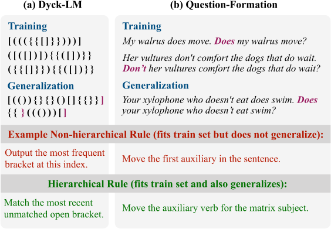
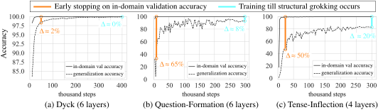

# Murty et al. 2023 — Grokking of Hierarchical Structure in Vanilla Transformers

См. также: [глобальный индекс понятий](../../concepts/index.md).
arXiv [2305.18741v1](https://arxiv.org/abs/2305.18741), 30 мая 2023. Колонтитула у PDF нет (препринт до публикации в ACL 2023).

**Shikhar Murty, Christopher D. Manning** — Computer Science Department, Stanford University.
**Pratyusha Sharma, Jacob Andreas** — MIT CSAIL.

Оригинал и производные файлы этой папки:

- [`original/2305.18741.native.html`](original/2305.18741.native.html) — первоисточник, нативный HTML-рендеринг arXiv (LaTeXML), скачан как есть.
- [`original/2305.18741.grokking-of-hierarchical-structure-in-vanilla-transformers.md`](original/2305.18741.grokking-of-hierarchical-structure-in-vanilla-transformers.md) — конверсия оригинала в Markdown без правок содержания; английский текст для сверки перевода.
- [`images/`](images/) — иллюстрации статьи в исходном разрешении (5 файлов).
- [`2305.18741.grokking-of-hierarchical-structure-in-vanilla-transformers.claims.txt`](2305.18741.grokking-of-hierarchical-structure-in-vanilla-transformers.claims.txt) — рабочий разбор: пронумерованные утверждения с пометками.

Схема якорей и правила ссылок на карточку — в [README папки статей](../README.md).

## Затрагиваемые понятия

**[Гроккинг](../../concepts/grokking.md)** — работа переносит имя и рамку Power et al. 2022 с алгоритмических задач на языковые и даёт корпусу новый термин: *структурный гроккинг* ([p1-3](#p1-3), «by analogy to existing findings on simple classification tasks»). Предъявлено оно как гипотеза, проверенная опытом: [p2-4](#p2-4) прямо говорит «We hypothesize a similar *structural grokking*», а [рис. 2](#fig-2) показывает, что на всех трёх наборах точность на обобщающей выборке продолжает расти многие тысячи шагов после того, как внутридоменная проверочная точность вышла на насыщение, местами подходя почти к единице ([p2-7](#p2-7)). Существенно, чего в работе нет: гроккинга в исходном смысле — задержки на удержанных данных **того же** распределения — здесь не показано; внутридоменная проверочная точность у всех прогонов достигает почти 100 % рано и остаётся такой, а отложена генерализация на нарочно построенную выборку вне распределения ([p2-3](#p2-3)). Нет также ни устройства явления, ни вмешательства, ускоряющего или отменяющего его: единственный найденный рычаг — глубина модели, и он не объяснён. Не проверено и то, не грокают ли глубокие модели просто позже отведённых 300 тысяч шагов ([p2-6](#p2-6)).

**[Фаза меморизации / плато](../../concepts/memorization-phase.md)** — работа заново размечает, что считать «запоминанием»: в заключении обучение описано как постепенный сдвиг «from memorization (high in-domain accuracy, poor out-of-domain accuracy) to generalization» ([p4-7](#p4-7)). То есть меморизацией здесь названо усвоение неиерархического (линейного) правила, которое обучающую выборку объясняет ровно так же, как иерархическое, — а не запоминание отдельных примеров. Обычного плато корпуса — низкой проверочной точности при почти идеальной обучающей — на графиках нет вовсе; вместо него на [рис. 2](#fig-2) стоит зазор между внутридоменной и обобщающей точностью. Обучающая потеря, как показано в приложении D, выходит на полку около 10 тысяч шагов — задолго до всякого перехода ([p7-11](#p7-11), [рис. 5](#fig-5)), и никакого «затяжного плато обучающей потери» в работе не наблюдается. Слово «plateaued» авторы прилагают к качеству на обучающем распределении ([p1-3](#p1-3)), а не к внутреннему состоянию сети; фазы, которую корпус называет меморизацией, они не выделяют и границ между фазами не проводят.

**[Обучение структурированных представлений](../../concepts/structured-representation-learning.md)** — работа даёт языковой извод формулы Liu et al. 2022 и делает это явно: «Liu et al. 2022 note that, on algorithmic tasks, grokking “coincides with the emergence of structure in embeddings”. Similarly, for language tasks, we find that structural grokking coincides with the emergence of tree structured internal computations» ([p4-5](#p4-5)). Структура здесь — не геометрия вложений, а древовидность самого вычисления: мера $t_{\text{score}}$ древесных проекций Murty et al. 2023 говорит, насколько внутреннее вычисление трансформера приближается древовидным кодировщиком ([p4-3](#p4-3), [p7-7](#p7-7)). Ценное для корпуса отрицательное наблюдение стоит рядом: **верность** извлекаемых деревьев эталонному синтаксису ($t_{\text{parseval}}$) генерализации не обещает — по ней сходятся к разметке синтаксиса все модели, и обобщающие, и нет ([p4-6](#p4-6), [рис. 4](#fig-4)). Слова «совпадает по времени» — предел того, что здесь показано: причинности не проверяли, вмешательства (усилить древовидность и получить гроккинг там, где его не было) в работе нет.

**[Меры прогресса](../../concepts/progress-measures.md)** — работа ставит ровно тот вопрос, которым занята эта карточка, — «can we identify when it has happened (or predict when it will occur)?» ([p3-3](#p3-3)) — и перебирает три внутренние величины, считая их каждые 3 тысячи шагов обновления ([p4-4](#p4-4)). Термином «progress measures» она при этом не пользуется ни разу, и Nanda et al. 2023 в ней не цитируются. Ответ получен различительный, а не временной: древовидность выделяет **подходящую глубину**, а не момент перехода ([p4-5](#p4-5), [рис. 3b](#fig-3)); ни одна из трёх величин не предъявлена как предвестник скачка во времени. Приписывать авторам меру прогресса нельзя — но нельзя и не заметить, что две величины, которые корпус считал кандидатами в такие меры, здесь отвергнуты по прямому опыту.

**[Минимизация нормы весов](../../concepts/weight-norm-minimization.md)** — работа даёт корпусу отчётливый контрпример к норм-ориентированным объяснениям на языковом материале: нормы весов растут во всех настройках обоих наборов, но удачные глубины от неудачных не отличают, а самые мелкие модели дают **наибольшую** норму весов и при этом не обобщают иерархически никогда ([p4-5](#p4-5), [рис. 3b](#fig-3)). Норма измеряется поделённой на число слоёв, чтобы сравнивать разные глубины ([p4-4](#p4-4)). Чего в работе нет: движения по многообразию нулевой потери, послойного разбора нормы, зависимости времени перехода от нормы — норма здесь только измеряемый признак, отвергнутый как различитель, а не механизм.

**[Зона Златовласки](../../concepts/goldilocks-zone.md)** — понятие названо в обзоре смежных величин: «Liu et al. 2022 identify a “goldilocks zone” in weight norm space where grokking occurs» ([p4-1](#p4-1)). Дальше этого упоминание не идёт: зона в работе не ищется, границ по норме весов не проводится, и весь дальнейший разбор состоит в том, что норма весов монотонно растёт и различать удачные архитектуры не годится ([p4-5](#p4-5)). Понятие здесь употребляется, а не проверяется.

**[Маршрутизация внимания](../../concepts/attention-routing-heads.md)** — работа берёт из Merrill et al. 2021 цепочку «рост нормы весов ведёт к насыщению внимания» и меряет её конец: разрежённость внимания определена как отрицательная средняя энтропия всех распределений внимания $\{\mathbf{a}^{p}_{k}\}$ ([p4-2](#p4-2)). Цепочка воспроизводится — разрежённость растёт у всех моделей, — но её предсказательная сила для иерархической генерализации опровергнута: самые мелкие модели дают самые разрежённые решения и не обобщают ([p4-5](#p4-5)). Головы по отдельности в работе не разбираются: ни какая голова что маршрутизирует, ни абляций голов здесь нет — измеряется одно скалярное среднее по всем распределениям внимания четырёхголовой модели ([p7-4](#p7-4)).

**[Эталонный полигон гроккинга](../../concepts/canonical-grokking-testbed.md)** — работа выходит за полигон целиком и намеренно. Таблицы бинарной операции нет; доли обучающих данных как управляющей величины нет; управляющей величиной служит **глубина** модели ([p3-2](#p3-2)). Постановка унаследована не у Power et al., а у McCoy et al. 2020: обучающая часть двусмысленна — она равно объяснима иерархическим и неиерархическим правилом, — а проверка ведётся на отдельной выборке вне распределения, которую проходит только усвоивший иерархическое правило ([p2-3](#p2-3), [рис. 1](#fig-1)). Из полигона Power et al. заимствованы только имя явления и мысль, что обучение надо длить дальше насыщения.

**[Эмерджентность / эмерджентные способности](../../concepts/emergence.md)** — слово встречается в статье лишь как оборот при пересказе смежных работ: «emergent linguistic structure» у Merrill et al. 2022 ([p4-2](#p4-2)) и «emergent hierarchical structure in transformers» в постановке вопроса ([p3-3](#p3-3)). Скачков по масштабу модели работа не изучает, порогов не ищет, и слово «emergent» к собственным находкам не прилагает: зависимость от глубины у неё не пороговая, а перевёрнутая U ([p3-2](#p3-2)).

**[Оптимизатор](../../concepts/optimizer-adam-adamw-sgd.md)** — AdamW ($\beta_{1}$: 0.9, $\beta_{2}$: 0.999, $\epsilon$: 1e-7) поставлен как часть постановки и не перебирался ([p7-6](#p7-6)). Сравнения оптимизаторов нет, роль адаптивности не обсуждается, ни один результат к выбору AdamW не привязан. Существенная для корпуса лакуна: величина затухания весов в AdamW нигде не названа — при том что норма весов разбирается как один из трёх внутренних признаков.

**[Скорость обучения](../../concepts/learning-rate.md)** — перебраны три значения, {1e-4, 5e-5, 1e-5}, и 1e-4 названа лучшей для всех опытов; вдобавок стоит линейный разогрев от 0 до конечного значения за 10 тысяч шагов обновления ([p7-6](#p7-6)). Зависимости самого явления от скорости обучения работа не измеряет — перебор служит выбором настройки, а не предметом.

**[Weight decay](../../concepts/weight-decay.md)** — упомянут единственный раз, при пересказе Power et al. 2022: «find weight decay to improve grokking speed» ([p4-1](#p4-1)). Собственного значения затухания весов работа не приводит нигде, включая приложение B с полным списком гиперпараметров оптимизации ([p7-6](#p7-6)); опытов с регуляризацией и без неё нет. Ссылаться на эту работу как на свидетельство о роли weight decay при гроккинге нельзя.

---

## Несогласованности внутри статьи

**Аннотация говорит «на нескольких наборах», введение — «на двух».** Одно и то же утверждение о перевёрнутой U-образной зависимости от глубины в [аннотации](#p1-2) стоит как «On multiple datasets, structural grokking exhibits inverted U-shaped scaling in model depth», а во [введении](#p1-4) — как «On two datasets, we show that structural grokking exhibits inverted U-shaped scaling behavior as a function of model depth». Верно второе: перебор глубин ведётся только на Question-Formation и Tense-Inflection ([p3-2](#p3-2), [рис. 3a](#fig-3)), Dyck в нём не участвует и в разборе внутренних признаков тоже ([p4-4](#p4-4)). При цитировании аннотации счёт наборов удваивается: наборов в работе три, а перевёрнутая U измерена на двух.

**Подписи-ярлыки на панелях рисунка 3b расходятся с самими кривыми и с текстом.** Над панелями «weight norm» и «attention sparsity» стоят ярлыки «10 layer > 6 layer > 2 layer» (Question-Formation) и «6 layer > 4 layer > 2 layer» (Tense-Inflection), тогда как по общей легенде рисунка (2 слоя — розовый, 4 — оранжевый, 6 — зелёный, 10 — фиолетовый) верхняя кривая на обеих панелях розовая, то есть двухслойная модель. Порядок кривых, таким образом, обратный ярлыку — и совпадает не с ярлыком, а с [текстом](#p4-5): «shallow models learn the sparsest solutions as well as solutions with largest weight norms». На панелях «tree structuredness» те же ярлыки («6 layer > 10 layer > 2 layer», «4 layer > 6 layer > 2 layer») порядку кривых отвечают. Читать ярлыки первых двух панелей как порядок величины нельзя; при цитировании рисунка 3b надёжен текст, а не ярлык.

**Числа в тексте про раннюю остановку и разрывы на рисунке 2 сходятся не полностью.** [Текст](#p3-1) даёт «average generalization goes up from <40%, <50% to <90%, <80% on Question-Formation and Tense-Inflection, respectively», а [подпись и разметка рисунка 2](#fig-2) — разрывы $\Delta$ между внутридоменной и обобщающей точностью: на Question-Formation ≈65 % при ранней остановке и ≈8 % в конце обучения. При внутридоменной точности около 100 % второе число даёт около 92 %, а не «<90 %». Расхождение мелкое и лежит в пределах авторского «≈», но при цитировании точных значений опираться следует на рисунок.

## Что показано, что измерено и что предположено

Разметка отмечена здесь потому, что три заявки работы стоят на разной опоре, а в цитированиях сливаются в одну.

**Показано опытом.** Отложенная генерализация на выборке вне распределения на всех трёх наборах ([рис. 2](#fig-2)); перевёрнутая U по глубине на двух наборах — доля семян из десяти, у которых обобщающая точность в итоге переходит 80 % ([p3-2](#p3-2), [рис. 3a](#fig-3)); рост нормы весов и разрежённости внимания во всех настройках и их неспособность отличить удачные глубины от неудачных ([p4-5](#p4-5)); сходимость извлекаемых деревьев к эталонному синтаксису у всех моделей независимо от того, обобщают они или нет ([p4-6](#p4-6), [рис. 4](#fig-4)). Отдельно снята пара очевидных возражений: обучающие потери на Question-Formation выходят на полку около 10 тысяч шагов, задолго до перехода, и все глубины в итоге приходят к сопоставимой устойчивой обучающей потере, так что перевёрнутая U — не следствие плохой оптимизации крайних глубин ([p7-11](#p7-11), [рис. 5](#fig-5)).

**Измерено, но задним числом.** Заявка «подходящую глубину можно распознать по древовидности» подана в [аннотации](#p1-2) предсказательно — «optimal depth for grokking can be identified using the tree-structuredness metric» — а получена сопоставлением: подходящая глубина уже была известна из перебора, и древовидность лишь оказалась на ней наибольшей ([p4-5](#p4-5)). Опыт держится на трёх глубинах из пяти — самой мелкой, подходящей и самой глубокой из тех, где грокает хоть одно семя ([p4-4](#p4-4)); сопоставимость $t_{\text{score}}$ между разными глубинами не обосновывается, тогда как для нормы весов поправка на число слоёв введена нарочно. Вмешательства — усилить древовидность и получить гроккинг там, где его не было, — в работе нет. Мера при этом своя же, из предыдущей работы тех же авторов ([p4-3](#p4-3)), и независимой её проверки здесь не производится.

**Предположено и оговорено самими авторами.** Что находки могут иметь более широкие следствия — «we believe these results may have broader implications» ([p4-7](#p4-7)); что явление общее — «while we believe this to be a general phenomenon, we leave investigating similar behavior on other datasets for future work» ([p5-3](#p5-3)). Там же перечислены пределы: только английский язык, только три набора, влияние размера обучающей выборки не изучалось, и все наборы построены по контекстно-свободным грамматикам, так что построение подобных проверок на настоящих языковых данных названо задачей будущего.

## Ошибочные пересказы и цитирования этой статьи

Ниже — узоры, наблюдённые в цитирующих работах корпуса: что именно искажается и к каким авторским абзацам стоит вернуться. Конкретные формулировки цитирующих приведены здесь же дословно; отдельных пунктов `mc-*` в карточках цитирующих работ пока не заведено.

**«Гроккинг показан на настоящих, естественноязыковых данных» (ошибочное).** Работу цитируют как перенос гроккинга на реальные данные и естественный язык: Yildirim (2509.17738) пишет `"recent work shows that grokking also arises in deeper architectures and real-world datasets (Murty et al., 2023; Humayun et al., 2024)"` — *«недавние работы показывают, что гроккинг возникает и в более глубоких архитектурах, и на реальных наборах данных»*; в 2606.26050 стоит `"Murty et al. 2023 observe it for hierarchical structure in transformers trained on natural language"` — *«Murty et al. 2023 наблюдают его для иерархической структуры в трансформерах, обученных на естественном языке»*. Ни то ни другое из работы не следует. Все три набора синтетические и построены по контекстно-свободным грамматикам, два из них взяты у McCoy et al. 2020, третий — язык правильно вложенных скобок ([p2-5](#p2-5), [p7-2](#p7-2)); сами авторы в [ограничениях](#p5-3) пишут, что «all datasets here are based on context-free grammars» и что построение подобных проверок «on real language data is a good avenue for future work». Формулировка «в более глубоких архитектурах» вдобавок противоположна главному результату: глубокие модели здесь обобщают **хуже**, 12 слоёв Mueller et al. названы одной из причин прежних неудач ([p3-2](#p3-2), [рис. 3a](#fig-3)). Для контраста, точные образцы того же тезиса: в 2606.00230 — `"Subsequent work extends grokking to richer language-like synthetic tasks involving hierarchical structure (Murty et al., 2023)"`, в 2310.11282 — `"More recent work has suggested that transformers can grok hierarchical linguistic structure after extremely prolonged training (Murty et al. 2023)"`; во втором вдобавок сохранено авторское «suggested».

**«Древовидность предсказывает, когда модель грокнет» (расширяющее).** В 2506.05718 сказано: `"They introduce a “tree-structuredness” (Murty et al., 2022) metric that significantly outperforms weight norm in predicting whether and when a model will grok"` — *«Они вводят меру „древовидности“, которая значительно превосходит норму весов в предсказании того, грокнет ли модель и когда»*. Первая половина верна, вторая — нет: **когда** работа не предсказывает нигде. Древовидность измеряется по ходу обучения, но выделяет она не момент перехода, а подходящую **глубину** ([p4-5](#p4-5), [рис. 3b](#fig-3)); о времени перехода в работе не сказано ничего, и мера сопоставлена с уже известным из перебора ответом ([p4-4](#p4-4)). Первую часть той же фразы — что норма весов и разрежённость внимания ненадёжны — та же работа передаёт верно.

**«Работа про композиционную генерализацию» (ошибочное).** В 2602.16967 работа поставлена в перечень как `"compositional generalization [Murty et al. 2023]"` — *«композиционная генерализация»*. Слова «compositional generalization» в статье нет; предмет назван «hierarchical generalization» с первой строки [аннотации](#p1-2) и до конца, а на композиционную генерализацию авторы ссылаются отдельно и в другую сторону — как на смежную область, где длительное обучение тоже помогает (Csordás et al. 2021, [p4-7](#p4-7)).

Более мягкие отголоски того же сдвига, отдельных разборов не заслужившие: `"NLP (Murty et al., 2023)"` в перечне областей гроккинга (2402.16726); `"structural grokking has been shown to occur in language models, where models discover hierarchical sentence structures after extensive training"` (2510.04930) — модели здесь обучены с нуля на синтетике, а не «языковые модели» в обиходном смысле; отнесение работы к тем, кто `"leveraged the phenomenon to improve model performance"` (2601.09049), тогда как никакого приёма улучшения качества она не предлагает. Образцовый по точности разбор различия между классическим и структурным гроккингом даёт 2412.04619: `"In classic grokking, the model transitions from memorization to generalization, allowing it to achieve non-trivial performance on unseen data from the same distribution as the train set. In structural grokking, a model transitions from the simple linear rule to the hierarchical rule, allowing non-trivial performance on OOD data."`

---

# Текст статьи

# Grokking of Hierarchical Structure in Vanilla Transformers

Shikhar Murty (Computer Science Department, Stanford University), Pratyusha Sharma (MIT CSAIL), Jacob Andreas (MIT CSAIL), Christopher D. Manning (Computer Science Department, Stanford University); {smurty, manning}@cs.stanford.edu, {pratyusha, jda}@mit.edu

## Аннотация

###### p1-2

У людей порождение и понимание языка чувствительны к иерархической структуре предложений. В обработке естественного языка прежние работы ставили под вопрос, насколько успешно нейросетевые последовательностные модели вроде трансформеров улавливают эту иерархическую структуру, когда обобщают на структурно новые входы. Мы показываем, что трансформерные языковые модели способны научиться обобщать иерархически после обучения в течение крайне долгого времени — далеко за той порой, когда внутридоменная точность вышла на насыщение. Мы называем это явление *структурным гроккингом*. На нескольких наборах данных структурный гроккинг обнаруживает перевёрнутую U-образную зависимость от глубины модели: модели промежуточной глубины обобщают лучше и очень глубоких, и очень мелких трансформеров. Разбирая связь между внутренними свойствами модели и гроккингом, мы находим, что подходящую для гроккинга глубину можно распознать по мере древовидности Murty et al. 2023. В целом наша работа даёт весомые свидетельства того, что при продлённом обучении обычные трансформеры открывают иерархическую структуру и пользуются ею.

## 1 Введение

###### p1-3

Хотя человеческий язык порождается как линейная последовательность, устроен он иерархически. Меньшие единицы складываются в большие составляющие. Способность вывести эту иерархическую структуру лежит в основе нашей способности порождать и понимать новые предложения (Chomsky 1965; Crain and Nakayama 1987). В этой статье мы выясняем, могут ли стандартные нейросетевые трансформерные модели Vaswani et al. 2017 тоже обобщать иерархически, будучи обучены на языковых задачах (рис. 1). Главная наша находка в том, что иерархическая генерализация у трансформеров всё-таки происходит, но очень медленно: качество на структурно новых предложениях растёт постепенно, долго спустя после того, как качество на предложениях из обучающего распределения вышло на плато. Мы называем это явление *структурным гроккингом*, по аналогии с уже известными находками на простых задачах классификации (Power et al. 2022).

###### p1-4

На двух наборах данных мы показываем, что структурный гроккинг обнаруживает перевёрнутую U-образную зависимость от масштаба как функцию глубины модели: иерархическая генерализация сперва улучшается, затем ухудшается по мере того, как мы обучаем всё более глубокие модели. Прежние работы дают основания думать, что появление иерархической структуры в трансформерах могут отслеживать несколько внутренних свойств модели, включая нормы весов (Merrill et al. 2021; Liu et al. 2022; Power et al. 2022), разрежённость внимания (Merrill et al. 2021) и функциональную древовидность (Murty et al. 2023). Мы находим, что предсказывать структурный гроккинг способна единственно функциональная древовидность: нормы весов и разрежённость внимания растут монотонно по глубине модели, тогда как древовидность наибольшая у моделей подходящей для структурного гроккинга глубины.



###### fig-1

*Рисунок 1: Примеры из наборов данных языкового моделирования, на которых мы оцениваем иерархическую генерализацию у обычных трансформеров. Эти наборы построены так, что обучающую выборку одинаково хорошо объясняет и неиерархическое, и иерархическое правило, но обобщается на структурно новые входы только иерархическое.* **[p. 1]**

###### p1-5

Наши результаты оспаривают находки прежних работ (Mueller et al. 2022; Petty and Frank 2021), утверждающих, что обычные трансформеры полностью проваливаются на изучаемых нами проверках иерархической генерализации. Мы объясняем эти провалы ранней остановкой по внутридоменному проверочному качеству, которая существенно **[p. 2]** занижает иерархическую генерализацию из-за структурного гроккинга. На наборах, где эти прежние работы сообщают о точности генерализации ниже 20 %, *просто за счёт более долгого обучения* средняя по случайным семенам точность достигает 80 %, а несколько семян доходят почти до идеальной генерализации. Прежние находки отчасти объясняются и U-образной зависимостью от масштаба: в этих работах взяты либо слишком мелкие модели (Mueller et al. 2022; Petty and Frank 2021), либо слишком глубокие (Mueller et al. 2022). Наши результаты согласуются с прежними находками о роли продлённого обучения в других задачах обработки языка (Csordás et al. 2021; Hoffmann et al. 2022).

## 2 Предпосылки

#### Трансформеры

Дана последовательность токенов $w_{\leq{i}}=w_{1},w_{2},\ldots,w_{i}$, где каждый токен берётся из фиксированного словаря $V$; $L$-слойная трансформерная языковая модель (LM) $f_{\theta}^{L}$ выдаёт распределение на следующем токене $w_{i+1}\in V$, то есть $f_{\theta}^{L}(w_{\leq{i}})\in\mathbb{R}^{|V|}$. Ключевая часть архитектуры — последовательность из $L$ слоёв *самовнимания*, где слой $p$ вычисляет контекстные векторы токена $k$ как нелинейную параметрическую функцию выпуклой комбинации контекстных векторов токенов $w_{\leq{k}}$ с предыдущего слоя, а коэффициенты $\mathbf{a}^{p}_{k}\in\mathbb{R}^{k}$ известны как *распределение внимания*. Веса LM обучаются максимизацией логарифма вероятности верного продолжения $w_{k+1}$ при данном префиксе $w_{\leq{k}}$.

#### Иерархическая структура в трансформерах

Хотя обучение трансформеров без учителя на предварительном этапе привело к передовым результатам переноса обучения по всему кругу задач обработки языка, самой архитектуре приписывают отсутствие человекоподобных индуктивных предпочтений в сторону иерархической структуры (Tran et al. 2018; Hahn 2020; Petty and Frank 2021; Mueller et al. 2022). В этой работе мы возвращаемся к этим утверждениям.

###### p2-3

Чтобы понять, есть ли у данной модели предпочтение к усвоению иерархической структуры, мы вслед за McCoy et al. 2020 оцениваем генерализацию у моделей, обученных на двусмысленных задачах, в которых обучающие данные согласуются и с «иерархическим правилом», и с «неиерархическим правилом» (рис. 1). Чтобы проверить, усвоено ли иерархическое правило, мы проверяем генерализацию на отдельной тестовой выборке вне распределения, построенной так, что успешны на ней только усвоившие иерархическое правило.

#### Гроккинг

###### p2-4

Power et al. 2022 выявляют явление *гроккинга* на малых алгоритмических наборах данных, где качество на тесте улучшается долго спустя после того, как качество на обучении вышло на насыщение. Мы предполагаем сходный *структурный гроккинг*, при котором модель грокает иерархическую структуру долго спустя после того, как внутридоменное проверочное качество вышло на насыщение, и, следовательно, иерархическая генерализация может продолжать улучшаться при продлённом обучении.



###### fig-2

*Рисунок 2: Средняя по 10 случайным семенам точность на внутридоменной проверочной выборке (сплошная) и на обобщающей выборке (пунктир) для всех наборов данных. Качество генерализации улучшается даже после того, как внутридоменные точности вышли на насыщение, — это и есть *структурный гроккинг*. Оранжевой и синей линиями мы выделяем разрыв между внутридоменной и обобщающей точностью в точке ранней остановки по качеству на внутридоменной проверочной выборке и в конце обучения, отмечая, что прежние работы останавливают обучение на оранжевой линии. Остановка обучения до структурного гроккинга способна привести к громадной недооценке качества генерализации.* **[p. 3]**


###### fig-3

*Рисунок 3: (a) Перевёрнутые U-образные законы для гроккинга: на Question-Formation (сверху) и Tense-Inflection (снизу) мы находим, что и очень маленькие, и очень глубокие модели либо не обнаруживают структурного гроккинга, либо обнаруживают его редко — по сравнению с промежуточной подходящей глубиной модели. (b) Тогда как нормы весов и разрежённость внимания растут у всех моделей и между разными размерами не различают, древовидность наибольшая у подходящей глубины модели.* **[p. 3]**

## 3 Опыты

#### Наборы данных

###### p2-5

Поскольку наша цель — понять иерархическую генерализацию у трансформеров, мы берём два набора из (McCoy et al. 2020) и дополнительно оцениваем на простой задаче слежения за скобками. Для *Dyck* модели обучаются предсказывать следующие токены в строках, взятых из $\mathrm{Dyck}_{20,10}$ — языка правильно вложенных скобок с $20$ видами скобок и глубиной вложенности не более $10$. Мы оцениваем генерализацию на структурно ненаблюдавшихся строках из $\mathrm{Dyck}_{20,10}$ (примеры см. на рис. 1, подробности — в приложении A). Из наборов McCoy et al. 2020: в *Question-Formation* модели должны превращать английские предложения в вопросы, а в *Tense-Inflection* — отображать предложения и пометки времени в подобающим образом перестроенные предложения. Генерализацию мы оцениваем на тестовой выборке вне распределения из McCoy et al. 2020.

#### Модель

###### p2-6

Мы обучаем трансформерные LM с {2, 4, 6, 8, 10} слоями (подробности см. в приложении B). На каждой глубине мы обучаем модели с 10 случайными семенами по 300 тысяч шагов (400 тысяч для Dyck). На проверке мы раскодируем из модели жадно по данному входному предложению (или префиксу в случае Dyck). Для Dyck мы сообщаем точность порождения верного вида закрывающей скобки при ранжировании среди закрывающих скобок и данном входном префиксе из языка. Как это делалось в прежних работах (McCoy et al. 2020; Petty and Frank 2021; Mueller et al. 2022), для Question-Formation мы сообщаем точность по первому слову раскодированного вопроса, а для Tense-Inflection — долю тестовых входов, на которых целевой глагол перестроен верно.

### 3.1 Основные результаты

#### Трансформеры обнаруживают структурный гроккинг

###### p2-7

Сначала мы приводим на рис. 2 результаты, полученные на лучшей глубине модели, для всех наборов данных. Мы находим ясное свидетельство структурного гроккинга: на всех наборах генерализация улучшается многие шаги обучения спустя после того, как точность внутри распределения вышла на насыщение, местами приближаясь к идеальной точности.

**[p. 3]**

#### Ранняя остановка считается вредной

###### p3-1

Далее мы сравниваем точность генерализации, полученную ранней остановкой по внутридоменной проверочной точности (как это делается в Petty and Frank 2021; Mueller et al. 2022), с более долгими прогонами обучения (рис. 2). Ранняя остановка ведёт к громадной недооценке генерализации. Например, средняя генерализация растёт с <40 %, <50 % до <90 %, <80 % на Question-Formation и Tense-Inflection соответственно.

#### Перевёрнутая U-образная зависимость от масштаба

###### p3-2

На Question-Formation и Tense-Inflection мы обучаем модели возрастающей глубины, от 2 до 10 слоёв. Для каждой глубины мы приводим на рис. 3a долю семян (из 10), у которых точность генерализации в итоге переходит 80 %. Мы обнаруживаем перевёрнутую U-образную зависимость от масштаба: очень мелкие и очень глубокие модели неуспешны, тогда как большинство семян обобщает у моделей промежуточной глубины. Возможно, этим же объясняется, почему прежние работы, бравшие либо очень мелкие модели (трансформеры в 1–3 слоя у Petty and Frank 2021; Mueller et al. 2022), либо очень глубокие (двенадцатислойные трансформеры у Mueller et al. 2022), не сумели хорошо обобщить.

## 4 Разбор

###### p3-3

Раз структурный гроккинг случается лишь у части модельных архитектур, можем ли мы распознать, когда он произошёл (или предсказать, когда произойдёт)? Утверждалось, что с гроккингом или с возникающей иерархической **[p. 4]** структурой в трансформерах связаны несколько внутренних свойств модели.

#### Нормы весов

###### p4-1

Недавние работы (Power et al. 2022; Liu et al. 2022) выделяют $L_{2}$-норму весов-параметров как важную величину для гроккинга. Например, Power et al. 2022 находят, что weight decay улучшает скорость гроккинга, а Liu et al. 2022 выделяют «goldilocks zone» в пространстве нормы весов, где гроккинг и происходит. В более общем виде рост нормы по ходу обучения изучался как ключевой фактор генерализации нейросетей (Soudry et al. 2018).

#### Разрежённость внимания

###### p4-2

Merrill et al. 2021 доказывают, что рост нормы в трансформерах ведёт к насыщению внимания — важному свойству для возникающей языковой структуры (Merrill et al. 2022). В качестве заместителя разрежённости внимания у $f_{\theta}^{L}$ мы вычисляем отрицательную среднюю энтропию всех распределений $\{\mathbf{a}^{p}_{k}\}$.

#### Древовидность

###### p4-3

McCoy et al. 2020 показывают, что древовидные кодировщики вроде Tai et al. 2015 обнаруживают почти идеальную иерархическую генерализацию. Тогда как трансформеры сравнительно мало стеснены, недавние свидетельства дают основания думать, что при обучении на языковых данных они неявно осуществляют (приближённо) древовидные вычисления. В частности, метод *древесной проекции* Murty et al. 2023 точно характеризует, насколько внутреннее вычисление трансформера на входе приближается древовидным нейросетевым кодированием, давая для любого трансформера меру древовидности ($t_{\text{score}}$) и двоичное дерево, лучше всего приближающее его вычисление на входной строке (подробности см. в приложении C). Чтобы оценить, отвечают ли эти деревья человеческим представлениям о синтаксисе, мы дополнительно сравниваем восстановленные деревья с эталонными (Black et al. 1991, $t_{\text{parseval}}$,).

### 4.1 Результаты

###### p4-4

Мы характеризуем *динамику* норм весов (нормированных на число слоёв, чтобы сравнивать разные глубины модели), разрежённости внимания и древовидности, вычисляя эти величины каждые 3 тысячи шагов градиентного обновления для Question-Formation и Tense-Inflection. Для свойств, зависящих от данных, — таких как разрежённость внимания и древовидность — мы берём выборку в 10 тысяч примеров из обучающих данных. Эти величины мы наносим на рис. 3b для самой маленькой модели, для самой большой модели, у которой хотя бы один прогон обнаруживает успешный гроккинг, и для подходящей глубины модели.

#### Подходящие модели наиболее древовидны

###### p4-5

Нормы весов и разрежённость внимания растут при всех настройках модели на обоих наборах данных. Однако сами по себе эти свойства неспособны предсказать, что провалятся и мелкие, и глубокие модели: мелкие модели выучивают и самые разрежённые решения, и решения с наибольшими нормами весов, но иерархически не обобщают никогда. Как отмечено у Murty et al. 2023, $t_{\text{score}}{}$ со временем улучшается у всех моделей, указывая на рост древовидности по ходу обучения. На обоих наборах «подходящая» модель выучивает наиболее древовидное решение по сравнению и с глубокими, и с мелкими моделями. Liu et al. 2022 отмечают, что на алгоритмических задачах гроккинг «coincides with the emergence of structure in embeddings». Схожим образом для языковых задач мы находим, что структурный гроккинг совпадает по времени с появлением древовидных внутренних вычислений.

#### Трансформеры на удивление хороши в наведении структуры

###### p4-6

По динамике $t_{\text{parseval}}{}$ на рис. 4 мы отмечаем, что все модели — *независимо от того, обобщают они или нет* — выучивают структуры, близкие к эталонному синтаксису, местами превосходя правоветвящееся базовое решение. McCoy et al. 2020 отмечают, что древовидные кодировщики обобщают только тогда, когда устроены согласно верным деревьям разбора. Здесь же мы находим, что верные древесные структуры выучивают все трансформеры, но лучше всего обобщают только наиболее древовидные.


###### fig-4

*Рисунок 4: Хотя часть моделей проваливается в иерархической генерализации, все модели успешно выучивают вычисления, ближайшие древесные структуры которых постепенно движутся к эталонному синтаксису, сравниваясь с правоветвящимся базовым решением или превосходя его (красным пунктиром).* **[p. 4]**

## 5 Заключение

###### p4-7

Эта работа показывает, что трансформеры способны обнаруживать *чувствительную к структуре* «иерархическую генерализацию» через механизм гроккинга. Их общее поведение при обучении постепенно сдвигается от запоминания (высокая внутридоменная точность, плохая внедоменная) к генерализации (высокая и внутридоменная, и **[p. 5]** внедоменная точность). Хотя такое поведение мы показываем на сравнительно небольших наборах данных с небольшими моделями, мы полагаем, что у этих результатов могут быть более широкие следствия, поскольку показано, что более долгое обучение помогает даже при языковом моделировании веб-масштаба (Hoffmann et al. 2022) и на задачах композиционной генерализации (Csordás et al. 2021). Структурный гроккинг случается чаще всего при «среднем» размере глубины модели, а и очень мелкие, и очень глубокие модели его не обнаруживают. Тогда как свойства, прежде связывавшиеся с языковой генерализацией у трансформеров, — такие как нормы весов и разрежённость внимания — не отличают хорошие архитектуры от плохих, функциональная древовидность трансформера вполне может предсказать подходящую глубину модели. Хотя у трансформерной архитектуры есть явные ограничения (вроде неспособности осуществлять неограниченную рекурсию), наши результаты показывают, что индуктивные предпочтения у неё могут быть сильнее, чем считалось прежде: при достаточном обучении трансформеры способны представлять иерархическую структуру предложения и пользоваться этой структурой, чтобы обобщать верно.

## 6 Воспроизводимость

Весь код и данные для этих опытов доступны по адресу https://github.com/MurtyShikhar/structural-grokking.git.

## 7 Благодарности

SM был поддержан грантом от Apple Inc. CM — стипендиат программы CIFAR Learning in Machines and Brains. Мы благодарим John Hewitt, Belinda Li, Rishi Bommasani и участников группы Stanford NLP за отзывы о статье.

## Ограничения

###### p5-3

У нашей работы есть следующие ограничения. Во-первых, мы оцениваем генерализацию только на наборах данных, основанных на английском языке. Во-вторых, мы показываем структурный гроккинг на трёх наборах данных, и, хотя мы полагаем, что это явление общее, исследование сходного поведения на других наборах мы оставляем будущей работе. Далее, мы также не изучаем влияние размера обучающих данных на структурный гроккинг и не выясняем, научаются ли трансформеры грокать иерархическую структуру в режимах малого количества данных. Наконец, все наборы данных здесь основаны на контекстно-свободных грамматиках, либо схожих с прежними работами, либо взятых из них напрямую, и мы полагаем, что построение подобных проверок генерализации на настоящих языковых данных — хорошее направление для будущей работы.

## Список литературы

- E. Black, S. Abney, D. Flickenger, C. Gdaniec, R. Grishman, P. Harrison, D. Hindle, R. Ingria, F. Jelinek, J. Klavans, M. Liberman, M. Marcus, S. Roukos, B. Santorini, and T. Strzalkowski. 1991. A procedure for quantitatively comparing the syntactic coverage of English grammars. In *Speech and Natural Language: Proceedings of a Workshop Held at Pacific Grove, California, February 19-22, 1991*.

- Noam Chomsky. 1965. *Aspects of the Theory of Syntax*. The MIT Press, Cambridge.

- Stephen Crain and Mineharu Nakayama. 1987. Structure dependence in grammar formation. *Language*, 63(3):522–543.

- Róbert Csordás, Kazuki Irie, and Juergen Schmidhuber. 2021. The devil is in the detail: Simple tricks improve systematic generalization of transformers. In *Proceedings of the 2021 Conference on Empirical Methods in Natural Language Processing*, pages 619–634, Online and Punta Cana, Dominican Republic. Association for Computational Linguistics.

- Michael Hahn. 2020. Theoretical limitations of self-attention in neural sequence models. *Transactions of the Association for Computational Linguistics*, 8:156–171.

- Jordan Hoffmann, Sebastian Borgeaud, Arthur Mensch, Elena Buchatskaya, Trevor Cai, Eliza Rutherford, Diego de Las Casas, Lisa Anne Hendricks, Johannes Welbl, Aidan Clark, et al. 2022. Training compute-optimal large language models. In *Proceedings of the 36th Conference on Neural Information Processing Systems (NeurIPS 2022)*.

- Ziming Liu, Eric J Michaud, and Max Tegmark. 2022. Omnigrok: Grokking beyond algorithmic data. In *The Eleventh International Conference on Learning Representations*.

- R. Thomas McCoy, Robert Frank, and Tal Linzen. 2020. Does syntax need to grow on trees? Sources of hierarchical inductive bias in sequence-to-sequence networks. *Transactions of the Association for Computational Linguistics*.

- William Merrill, Vivek Ramanujan, Yoav Goldberg, Roy Schwartz, and Noah A. Smith. 2021. Effects of parameter norm growth during transformer training: Inductive bias from gradient descent. In *Proceedings of the 2021 Conference on Empirical Methods in Natural Language Processing*, pages 1766–1781, Online and Punta Cana, Dominican Republic. Association for Computational Linguistics.

- William Merrill, Ashish Sabharwal, and Noah A. Smith. 2022. Saturated transformers are constant-depth threshold circuits. *Transactions of the Association for Computational Linguistics*, 10:843–856.

- Aaron Mueller, Robert Frank, Tal Linzen, Luheng Wang, and Sebastian Schuster. 2022. **[p. 6]** Coloring the blank slate: Pre-training imparts a hierarchical inductive bias to sequence-to-sequence models. In *Findings of the Association for Computational Linguistics: ACL 2022*, pages 1352–1368, Dublin, Ireland. Association for Computational Linguistics.

- Shikhar Murty, Pratyusha Sharma, Jacob Andreas, and Christopher D Manning. 2023. Characterizing intrinsic compositionality in transformers with tree projections. In *The Eleventh International Conference on Learning Representations*.

- Jackson Petty and Robert Frank. 2021. Transformers generalize linearly. *arXiv preprint arXiv:2109.12036*.

- Alethea Power, Yuri Burda, Harri Edwards, Igor Babuschkin, and Vedant Misra. 2022. Grokking: Generalization beyond overfitting on small algorithmic datasets. *arXiv preprint arXiv:2201.02177*.

- Ofir Press and Lior Wolf. 2017. Using the output embedding to improve language models. In *Proceedings of the 15th Conference of the European Chapter of the Association for Computational Linguistics: Volume 2, Short Papers*, pages 157–163, Valencia, Spain. Association for Computational Linguistics.

- Daniel Soudry, Elad Hoffer, Mor Shpigel Nacson, Suriya Gunasekar, and Nathan Srebro. 2018. The implicit bias of gradient descent on separable data. *The Journal of Machine Learning Research*, 19(1):2822–2878.

- Kai Sheng Tai, Richard Socher, and Christopher D. Manning. 2015. Improved semantic representations from tree-structured long short-term memory networks. In *Proceedings of the 53rd Annual Meeting of the Association for Computational Linguistics and the 7th International Joint Conference on Natural Language Processing (Volume 1: Long Papers)*, pages 1556–1566, Beijing, China. Association for Computational Linguistics.

- Ke M Tran, Arianna Bisazza, and Christof Monz. 2018. The importance of being recurrent for modeling hierarchical structure. In *Proceedings of the 2018 Conference on Empirical Methods in Natural Language Processing*, pages 4731–4736.

- Ashish Vaswani, Noam Shazeer, Niki Parmar, Jakob Uszkoreit, Llion Jones, Aidan N Gomez, Łukasz Kaiser, and Illia Polosukhin. 2017. Attention is all you need. In *Advances in Neural Information Processing Systems*, volume 30.

## Приложение A Подробности о наборах данных

*Таблица 1: Статистика по всем наборам данных, использованным в этой работе.* **[p. 7]**

| **Набор данных** | Обучение | Внутридоменная проверка | Генерализация |
|---|---|---|---|
| Dyck | 200000 | 20000 | 20000 |
| Question-Formation | 100000 | 1000 | 10000 |
| Tense-Inflection | 100000 | 1000 | 10000 |

**[p. 7]**

Вся статистика — в таблице 1. Для Question-Formation и Tense-Inflection мы берём разбиения в том виде, как они даны в McCoy et al. 2020, без дополнительной предобработки. Подробности о Dyck мы даём ниже.

#### Подробности о Dyck

###### p7-2

Свой набор Dyck мы строим, беря выборку в 200 тысяч строк из $\mathrm{Dyck}_{20,10}$ — языка правильно вложенных скобок с 20 разными видами скобок и глубиной вложенности не более 10. Для каждой строки мы определяем её структуру как двоичный вектор из нулей и единиц. Например, структура строки «(([]))» — это «11110000». Чтобы построить обобщающую выборку, мы берём строки с ненаблюдавшимися структурами, то есть строки, чья структура из 0 и 1 не совпадает со структурой ни одной из обучающих строк. Поскольку задача на проверке — измерить точность закрывающей скобки, мы ранжируем вероятность модели только среди всех закрывающих скобок и оцениваем только на тех префиксах, где открывающая скобка отстоит от соответствующей ей закрывающей не менее чем на 10 токенов.

## Приложение B Подробности о модели

Мы берём трансформерную языковую модель со следующими гиперпараметрами:

###### p7-4

- Число голов внимания = 4
- Скрытая размерность = 512
- Связанные входная и выходная матрицы, как это делается в Press and Wolf 2017

Далее, для оптимизации мы берём следующие гиперпараметры:

###### p7-6

- AdamW ($\beta_{1}$: 0.9, $\beta_{2}$: 0.999, $\epsilon$: 1e-7), со скоростями обучения из {1e-4, 5e-5, 1e-5}, отмечая, что 1e-4 работает лучше всего во всех опытах. Мы берём линейный планировщик разогрева, разогревающий от 0 до конечной скорости обучения за 10 тысяч шагов градиента.
- Мы обрезаем градиенты так, чтобы наибольшая $L_{2}$-норма была равна 10.
- Мы берём размер пакета $8$.

## Приложение C Функциональная древовидность

###### p7-7

Древесные проекции (tree projections, TP; Murty et al. 2023) измеряют, насколько хорошо вычисления, выполняемые данным трансформером $f$, приближаются древовидными кодировщиками. Для этого TP решает следующую задачу оптимизации:

$$
\phi_{\text{proj}},T_{\text{proj}}\triangleq\operatorname*{arg\,min}_{\phi,T}\mathcal{L}(f,g_{\phi},T), \tag{1}
$$

где $g_{\phi}$ — класс древовидных кодировщиков, обрабатывающих предложение $S$ согласно деревьям $T(S)$ снизу вверх, а $\mathcal{L}$ — функция расстояния между векторными выходами $f$ и $g_{\phi}$ на отрезках из двоичного дерева $T$. TP минимизирует уравнение 1 приближённо и восстанавливает приближённое $\widehat{T}_{\text{proj}}$. Древесная мера на наборе данных $\mathcal{D}$ определяется как

$$
t_{\text{score}}{}\triangleq\frac{\sum_{S\in\mathcal{D}}\mathbb{E}_{T}{\mathrm{SCI}{}(S,T)}-\mathrm{SCI}{}(S,\widehat{T}_{\text{proj}}(S))}{|\mathcal{D}|}, \tag{2}
$$

где $\mathrm{SCI}$ (span contextual invariance, контекстная инвариантность отрезков) — расстояние между контекстными и внеконтекстными векторными представлениями всех отрезков $p$ в $T$ (подробнее см. Murty et al. 2023). В частности, мера $\mathrm{SCI}$ для предложения $S$, устроенного согласно $T(S)$, равна

$$
\mathrm{SCI}{}(S,T)\triangleq\sum_{s\in T}d({\boldsymbol{v}}^{S}_{p},\tilde{{\boldsymbol{v}}}_{p}) \tag{3}
$$

при подходящим образом выбранной функции расстояния $d$ (здесь — косинусной близости). Чтобы измерить F1 по скобочной разметке (PARSEVAL; Black et al. 1991) для наведённой древесной проекции трансформера $\widehat{T}_{\text{proj}}$ против эталонных деревьев золотого стандарта $T_{g}$, когда те доступны, Murty et al. 2023 определяют

$$
t_{\text{parseval}}{}\triangleq\text{PARSEVAL}(\widehat{T}_{\text{proj}},T_{g},\mathcal{D}). \tag{4}
$$

## Приложение D Кривые обучающей потери

###### p7-11

Мы разбираем на рис. 5 гипотезу, что синтаксический гроккинг — просто следствие того, что обучающая потеря продолжает уменьшаться даже после того, как внутридоменное проверочное качество вышло на насыщение. Мы отмечаем, что обучающие потери, как правило, выходят на насыщение раньше, чем внутридоменное проверочное качество (это отмечено и у Power et al. 2022). Далее мы также находим, что все модели, независимо от того, грокают они или нет, в итоге приходят к сопоставимым обучающим потерям. Мы заключаем, что перевёрнутая U-образная зависимость — не артефакт плохо оптимизированных моделей.

**[p. 8]**


###### fig-5

*Рисунок 5: Мы наносим среднюю обучающую потерю для всех глубин модели на наборе Question-Formation. Мы отмечаем, что (1) гроккинг происходит, хотя обучающие потери полностью выходят на прямую около 10 тысяч шагов градиента, и что (2) перевёрнутая U-образная зависимость от масштаба не следствие плохой оптимизации маленьких / больших моделей, поскольку все модели в итоге приходят к той же устойчивой обучающей потере, что и подходящая глубина модели.* **[p. 8]**

---

# Машиночитаемый блок фактов

```
paper:
  arxiv: 2305.18741
  version: v1 (2023-05-30)
  venue: "ACL 2023 (short); PDF препринта колонтитула не несёт"
  authors: Murty, Sharma, Andreas, Manning
  citations_s2: 78             # на 2026-08-14, по списку citations-2201.02177.txt
  citations_in_corpus: 20

setup:
  task_family: "иерархическая генерализация на трёх синтетических наборах по контекстно-свободным грамматикам: Dyck_{20,10} (свой), Question-Formation и Tense-Inflection (McCoy et al. 2020, без доп. предобработки)"
  ambiguity: "обучающая часть равно объяснима иерархическим и неиерархическим правилом; обобщающая выборка — out-of-distribution, её проходит только усвоивший иерархическое правило"
  model: "трансформерная языковая модель (LM), глубины {2,4,6,8,10}, 4 головы внимания, скрытая размерность 512, связанные входная и выходная матрицы (Press and Wolf 2017)"
  optimizer: "AdamW (beta1 0.9, beta2 0.999, eps 1e-7), lr из {1e-4, 5e-5, 1e-5} — лучшая 1e-4, линейный разогрев 0->lr за 10k шагов, обрезка градиента по L2-норме 10, batch 8; ЗНАЧЕНИЕ weight decay НЕ УКАЗАНО"
  budget: "10 семян на глубину, 300k шагов (400k для Dyck); на проверке жадное раскодирование"
  metrics: "Dyck — точность закрывающей скобки при ранжировании только среди закрывающих, на префиксах с расстоянием >=10 токенов; QF — точность первого слова вопроса; TI — доля верно перестроенных целевых глаголов"
  data_sizes: "Dyck 200000/20000/20000; QF и TI 100000/1000/10000 (обучение / внутридоменная проверка / генерализация)"
  internal_properties: "считаются каждые 3k шагов обновления; для зависящих от данных — выборка 10k примеров из обучающей части; графики по трём глубинам на набор"

findings:
  - {claim: "генерализация на OOD-выборке продолжает расти многие тысячи шагов после насыщения внутридоменной точности — структурный гроккинг", anchor: p2-7, fig: fig-2}
  - {claim: "ранняя остановка по внутридоменной проверке занижает генерализацию: с <40%, <50% до <90%, <80% на QF и TI", anchor: p3-1, fig: fig-2}
  - {claim: "перевёрнутая U по глубине: доля семян из 10, переходящих порог 80%, сперва растёт с глубиной, затем падает (только QF и TI)", anchor: p3-2, fig: fig-3}
  - {claim: "объяснение прошлых неудач: 1-3 слоя у Petty and Frank / Mueller — слишком мелко, 12 слоёв у Mueller — слишком глубоко", anchor: p3-2, fig: null}
  - {claim: "нормы весов и разрежённость внимания растут во всех настройках и удачные глубины от неудачных не отличают; самые мелкие модели дают наибольшую норму и самые разрежённые решения, но не обобщают никогда", anchor: p4-5, fig: fig-3}
  - {claim: "t_score растёт у всех моделей, но наибольший — на подходящей глубине, на обоих наборах", anchor: p4-5, fig: fig-3}
  - {claim: "по t_parseval все модели, и обобщающие и нет, сходятся к эталонному синтаксису, местами превосходя правоветвящееся базовое решение", anchor: p4-6, fig: fig-4}
  - {claim: "обучающие потери на QF выходят на полку около 10k шагов; все глубины приходят к сопоставимой устойчивой потере — U не артефакт недооптимизации", anchor: p7-11, fig: fig-5}

grokking_relation:
  citation_of_power: "имя и рамка взяты прямо: 'by analogy to existing findings on simple classification tasks (Power et al. 2022)'"
  regime: "языковые задачи, decoder-only LM, отложенность на OOD-выборке при уже насыщенной внутридоменной точности; управляющая величина — ГЛУБИНА, не доля данных и не weight decay"
  difference_from_power: "запоминающего провала на удержанных данных ТОГО ЖЕ распределения не показано: внутридоменная проверочная точность рано и надолго ~100%"
  hedges: ["We hypothesize a similar structural grokking", "we believe these results may have broader implications", "while we believe this to be a general phenomenon", "may have stronger inductive biases than previously believed", "can well predict the optimal model depth"]

overcited:
  - {claim: "«показано, что гроккинг возникает на реальных / естественноязыковых данных»", anchor: p5-3,
     status: "все три набора синтетические, по контекстно-свободным грамматикам; авторы прямо называют проверки на настоящих языковых данных задачей будущего"}
  - {claim: "«показано, что гроккинг возникает в более глубоких архитектурах»", anchor: p3-2,
     status: "противоположно результату: глубокие модели обобщают хуже, 12 слоёв названы причиной прежних неудач"}
  - {claim: "«древовидность предсказывает, грокнет ли модель и КОГДА»", anchor: p4-5,
     status: "о времени перехода в работе нет ничего; мера различает подходящую ГЛУБИНУ и сопоставлена с уже известным из перебора ответом"}
  - {claim: "«доказано, что трансформеры грокают иерархию языка»", anchor: p1-2,
     status: "три искусственных набора, глубины 2-10, бюджет 300-400k шагов; перевёрнутая U измерена на двух наборах из трёх"}

concept_cards:
  grokking.md: p1-3
  memorization-phase.md: p4-7
  structured-representation-learning.md: p4-5
  progress-measures.md: p3-3
  weight-norm-minimization.md: p4-5
  goldilocks-zone.md: p4-1
  attention-routing-heads.md: p4-2
  canonical-grokking-testbed.md: p2-3
  emergence.md: p3-3
  optimizer-adam-adamw-sgd.md: p7-6
  learning-rate.md: p7-6
  weight-decay.md: p4-1

sources:
  original_html: original/2305.18741.native.html
  converted_text: original/2305.18741.grokking-of-hierarchical-structure-in-vanilla-transformers.md
  images_dir: images/
  pdf: https://arxiv.org/pdf/2305.18741v1
  code: https://github.com/MurtyShikhar/structural-grokking.git

internal_inconsistencies:
  - what: "аннотация: 'On multiple datasets' про перевёрнутую U; введение: 'On two datasets'. Перебор глубин ведётся только на QF и TI"
    anchors: [p1-2, p1-4, p3-2]
  - what: "ярлыки над панелями weight norm и attention sparsity рис. 3b дают порядок глубин, обратный порядку самих кривых и тексту p4-5"
    anchors: [fig-3, p4-5]
  - what: "'<90%' в тексте про конец обучения на QF против разрыва Δ≈8% при внутридоменной точности ~100% на рис. 2 (даёт ~92%)"
    anchors: [p3-1, fig-2]

not_in_the_paper:
  - "механизм явления: почему именно средняя глубина даёт наибольшую древовидность — не объяснено"
  - "вмешательство: усилить древовидность и получить гроккинг там, где его не было"
  - "проверка, не грокают ли глубокие модели позже отведённых 300k шагов"
  - "значение weight decay; опыты с регуляризацией и без неё"
  - "доверительные промежутки и проверки значимости (мера успеха двоичная, 10 семян на точку)"
  - "перебор глубин и разбор внутренних признаков на Dyck"
  - "независимая проверка меры t_score (мера — своя же прежняя работа Murty et al. 2023)"
  - "термины 'фазовый переход', 'меры прогресса', 'контур', 'отложенная генерализация' — ни одного из них в статье нет"

anchors:
  scheme: "pN-M | fig-N (token headings, cross-viewer portable)"
  policy: "anchors exist only where something links to them"
  paragraph: [p1-2, p1-3, p1-4, p1-5, p2-3, p2-4, p2-5, p2-6, p2-7, p3-1, p3-2, p3-3, p4-1, p4-2, p4-3, p4-4, p4-5, p4-6, p4-7, p5-3, p7-2, p7-4, p7-6, p7-7, p7-11]
  figure: [fig-1, fig-2, fig-3, fig-4, fig-5]
  mirrored_in: original/2305.18741.grokking-of-hierarchical-structure-in-vanilla-transformers.md
  page_breaks_marked_as: "**[p. N]**  (visible marker, no anchor)"

language:
  card: ru
  original: en
  quotes_in_concept_cards: "verbatim en (link to original/), translation must match this card"
  untranslated: [references, work titles, author names, "weight decay", "goldilocks zone", "Dyck / Question-Formation / Tense-Inflection", "PARSEVAL", "span contextual invariance"]
```
