# Notsawo et al. 2023 — Predicting Grokking Long Before it Happens

См. также: [глобальный индекс понятий](../../concepts/index.md).

**Pascal Jr. Tikeng Notsawo**, **Hattie Zhou**, **Irina Rish**, **Guillaume Dumas** — Университет Монреаля и Mila; **Mohammad Pezeshki** — Meta AI (FAIR).

arXiv [2306.13253](https://arxiv.org/abs/2306.13253), 22 июня 2023. 33 цитирования — тринадцатая по цитируемости работа корпуса. Нативного HTML для неё нет, источник — ar5iv.

Оригинал и производные файлы этой папки:

- [`original/2306.13253.ar5iv.html`](original/2306.13253.ar5iv.html) — первоисточник, ar5iv-рендеринг (LaTeXML), скачан как есть.
- [`original/2306.13253.predicting-grokking-long-before-it-happens.md`](original/2306.13253.predicting-grokking-long-before-it-happens.md) — конверсия оригинала в Markdown без правок содержания.
- [`images/`](images/) — 124 иллюстрации статьи в исходном разрешении; самая иллюстрированная работа корпуса после Slingshot.

Схема якорей и правила ссылок на карточку — в [README папки статей](../README.md).

## Затрагиваемые понятия

**[Меры прогресса](../../concepts/progress-measures.md)** — работа предлагает меру иного рода, чем весь остальной корпус: не внутреннюю величину обученной сети, а **спектральную подпись кривой обучения** ([`p3-1`](#p3-1)). Берётся потеря на обучении за первые 400 шагов, из неё удаляются неколебательные составляющие, и считается спектральная энергия — она же активность Хьорта. Ценность в том, что мера считается **до** гроккинга и стоит четыреста шагов вместо десяти тысяч.

**[Ландшафт потерь и бассейны](../../concepts/loss-landscape-basins.md)** — центральный предмет работы. Выдвинуты три гипотезы: модель застревает в локальных решениях; модель пересекает плохо обусловленную долину; либо и то и другое сразу ([`p4-1`](#p4-1)). Одномерные срезы вдоль направления «текущая точка → минимум» показывают **два минимизатора** потери на обучении, из которых лишь один минимизирует потерю на валидации: во время запоминания модель сидит в первом, а гроккинг наступает, когда ей удаётся из него вырваться.

**[Эффект рогатки](../../concepts/slingshot.md)** — колебания кривой обучения отождествлены с рогатками Thilak et al., и работа добавляет к ним **объяснение на уровне ландшафта**: это выход из острых гор, окружающих локальные оптимумы. Измеримые признаки рогатки перечислены: внезапный рост-падение потери, скачок относительного косинусного сходства весов и препятствие на срезе ландшафта.

**[Край устойчивости](../../concepts/edge-of-stability.md)** — связь проведена явно через условие $\lambda_{t}(i)>2/\epsilon_{t}$, при котором шаг спуска **увеличивает** потерю ([`p12-12`](#p12-12)). Отсюда же прогрессирующее заострение Cohen et al.: $\max_{i}\lambda_{t}(i)$ дорастает до $2\epsilon_{t}^{-1}$, и модель входит в режим края устойчивости.

**[Фаза меморизации](../../concepts/memorization-phase.md)** — даны рабочие определения четырёх моментов: $t_{1}$ — точность на обучении впервые выше нуля, $t_{2}$ — она достигла 100 %, $t_{3}$ — точность на валидации впервые выше нуля, $t_{4}$ — она достигла 100 % ([`p2-9`](#p2-9)). Гроккингом называется большая задержка $t_{4}-t_{2}$; при этом авторы честно оговаривают, что ради простоты называют гроккингом любую генерализацию.

**[Критический размер данных](../../concepts/data-fraction-critical-dataset-size.md)** — момент генерализации следует степенному закону $t_{4}(r)=ar^{-\gamma}+b$, и подогнанные значения приведены: $(\gamma,a,b)=(7.73,1.09\times 10^{15},1442.63)$ для модульного сложения и $(1.18,1.85\times 10^{6},0)$ для $S_{5}$. Закон используется утилитарно — как критерий, когда прекращать обучение, решив, что гроккинга не будет.

**[Двойной спуск](../../concepts/double-descent.md)** — гроккинг предложено видеть как **очень медленный двойной спуск** или как крайний случай голодания градиента ([`p7-3`](#p7-3)); отмечено, что потеря на валидации и правда ведёт себя соответствующим образом — убывает, растёт, затем падает до нуля.

**[Скорость обучения](../../concepts/learning-rate.md)** — воспроизведён и применён вывод Jastrzębski et al.: управляющий параметр SGD — не размер батча сам по себе, а **отношение** скорости обучения к батчу, и бо́льшие его значения ведут в более широкие минимумы ([`p1-4`](#p1-4)). Рост скорости обучения ускоряет гроккинг вплоть до порога, зависящего от weight decay.

**[Weight decay](../../concepts/weight-decay.md)** — фазовые диаграммы строятся именно в координатах «weight decay × скорость обучения», и генерализация чаще всего наблюдается при **малых** значениях обоих ([`p3-4`](#p3-4)). Это стоит сопоставить с Omnigrok, где weight decay, наоборот, ускоряет гроккинг.

**[Оптимизаторы](../../concepts/optimizer-adam-adamw-sgd.md)** — базовая постановка на AdamW ([`p2-8`](#p2-8)), а в приложении D шесть оптимизаторов сравниваются на функциях Розенброка и Растригина как на игрушечных моделях гроккинга. Вывод: адаптивные методы (rmsprop, rprop, adam, adamax) овраг Розенброка проходят, обычный SGD — нет; глобального минимума Растригина не достигает **никто**.

**[От ленивого к богатому](../../concepts/lazy-to-rich-kernel-to-feature-learning.md)** — измерено, что модель бо́льшую часть времени пребывает в **ленивом режиме**: косинусное расстояние между весами соседних шагов почти постоянно, кроме мест рогатки. Это делает картину «долгое почти-стояние, прерываемое скачками» количественной.

**[Сжатие представлений](../../concepts/manifold-representation-compression.md)** — приложение C измеряет **внутреннюю размерность** многообразий активаций по слоям (методами TWONN и MLE): она растёт в самом начале обучения, затем убывает с сильными колебаниями и стабилизируется. Размерность последнего слоя коррелирует с колебаниями качества.

**[Фильтрация градиента нижними частотами](../../concepts/gradient-low-pass-filtering.md)** — перекличка с Grokfast, вышедшим годом позже, и стоит различать: здесь фильтр нижних частот применяется к **кривой потерь** ради измерения, там — к **градиенту** ради вмешательства. Обе работы исходят из одного: медленная составляющая динамики связана с генерализацией.

**[Модульная арифметика](../../concepts/modular-arithmetic.md)** — постановка Power et al.: $x\cdot y \bmod 97$ и умножение в $S_{5}$, двухслойный трансформер, около $4\cdot 10^{5}$ параметров ([`fig-1`](#fig-1)).

**[Гроккинг](../../concepts/grokking.md)** — понятие переводится в инженерную плоскость: не «что это такое», а «как узнать заранее». Заявка сформулирована аккуратно — спектральная подпись названа не мерой ёмкости, а величиной, у которой информативной может оказаться как положительная, так и отрицательная связь с генерализацией ([`p3-4`](#p3-4)).

Карточки статей корпуса: [Power et al. 2022](../2201.02177.grokking-generalization-beyond-overfitting-on-small-algorithmic-datasets/2201.02177.grokking-generalization-beyond-overfitting-on-small-algorithmic-datasets.card.md) — задача, постановка и обозначения; [Liu et al. 2022](../2205.10343.towards-understanding-grokking-an-effective-theory-of-representation-learning/2205.10343.towards-understanding-grokking-an-effective-theory-of-representation-learning.card.md) — таксономия фаз (смятение, запоминание, понимание), которую работа принимает целиком ([`p6-1`](#p6-1)); [Slingshot](../2206.04817.the-slingshot-mechanism-an-empirical-study-of-adaptive-optimizers-and-grokking/2206.04817.the-slingshot-mechanism-an-empirical-study-of-adaptive-optimizers-and-grokking.card.md) — наблюдение о колебаниях, которому здесь даётся ландшафтное объяснение; [Grokfast](../2405.20233.grokfast-accelerated-grokking-by-amplifying-slow-gradients/2405.20233.grokfast-accelerated-grokking-by-amplifying-slow-gradients.card.md) — та же мысль о медленной составляющей, но обращённая в ускоритель.

**[Фазы: понимание, гроккинг, запоминание, путаница](../../concepts/comprehension-confusion-phases.md)** — здесь разметка идёт по времени обучения: три последовательные фазы одного прогона ([`p2-9`](#p2-9)). Это не та четвёрка, что размечает плоскость настроек, и совпадение слова «фаза» в двух разметках — источник постоянной путаницы.

**[Фазовая диаграмма](../../concepts/phase-diagram.md)** — работа опирается на наблюдение, ради которого диаграмма и нужна: гроккинг живёт лишь в определённом диапазоне гиперпараметров ([`p2-1`](#p2-1)), а значит предсказание перехода имеет смысл только внутри этого диапазона.
## Что показано, а что предположено

Замечания редактора карточки по итогам разбора утверждений (`…claims.txt`). Заголовок работы обещает больше, чем её содержание, — и это стоит держать в уме, потому что цитируют её обычно по заголовку.

**Предсказателя в работе нет.** Есть сходство двух тепловых карт в координатах «weight decay × скорость обучения»: одна — точность на валидации через 10 тыс. шагов, другая — спектральная энергия потери за первые 400 шагов ([`p3-4`](#p3-4)). Ни правила решения с порогом, ни доли верно предсказанных прогонов, ни ошибок первого и второго рода. Единственный коэффициент корреляции во всей статье относится к сравнению двух оценщиков внутренней размерности, а не к предсказанию гроккинга.

**Авторы осторожнее заголовка.** Спектральная подпись прямо названа не мерой ёмкости, и оговорено, что информативной может оказаться как положительная, так и отрицательная связь с генерализацией. Отдельно признано, что большие скорости обучения усиливают колебания, но к гроккингу это **не ведёт**, — то есть колебания не достаточный признак, а правила, отделяющего полезные колебания от бесполезных, не предложено.

**«Гроккингом» здесь названа любая генерализация.** Определение через задержку $t_{4}-t_{2}$ дано, а затем прямо отброшено ради простоты ([`p2-9`](#p2-9)). Значит, предсказывается не отложенность, а сам факт генерализации.

**Самая ценная картинка — два минимума в одном срезе.** Одномерная проекция вдоль направления «текущая точка → минимум» показывает два минимизатора потери на обучении, из которых лишь один минимизирует потерю на валидации ([`p4-1`](#p4-1)). Запоминающее и обобщающее решения оказываются видимы одновременно, а гроккинг — выходом из первого. Оговорка авторов уместна: это одномерный срез, и два минимума в нём не обязаны быть двумя минимумами в полном пространстве.

**Отрицательный результат, который сильнее положительных.** Обрезание нормы градиента ослабляет всплески, но генерализацию не отменяет — только замедляет. Отсюда следует, что рогатки **сопутствуют** гроккингу, а не вызывают его, — уточнение к Thilak et al., которое сама работа не подчёркивает.

**Связка Хьорта с ландшафтом сделана аккуратно.** Активность равна $m_{0}(L)$, подвижность — активности нормы градиента, сложность — активности спектра гессиана. Это не украшение: три параметра сигнала оказываются тремя величинами оптимизации.

**Степенной закон подогнан по узкому диапазону.** $t_{4}(r)=ar^{-\gamma}+b$ с $\gamma=7.73$ и $a\approx10^{15}$ для сложения; проверки на отложенных значениях $r$ нет, и авторы сами говорят, что закон разрушается при $r\rightarrow 0$. Используется он утилитарно — как критерий, когда прекращать обучение, — и в этом качестве работает.

**Игрушечные модели остались аналогией.** Функции Розенброка и Растригина предложены как модели гроккинга, но ни спектральная подпись, ни $t_{4}(r)$ на них не проверяются. Честный результат там один: глобального минимума Растригина не достигает ни один из шести оптимизаторов.

**Место в корпусе.** Работа принимает таксономию фаз Liu et al. целиком и переносит её с фазовой диаграммы на траекторию обучения. Рогатке Thilak et al. даёт ландшафтное объяснение. И предвосхищает Grokfast: та же мысль о медленной составляющей динамики — но здесь фильтр нижних частот применяется к кривой потерь ради измерения, а там к градиенту ради вмешательства. Отдельно стоит отметить расхождение с Omnigrok: здесь генерализация чаще при **малом** weight decay, там weight decay гроккинг ускоряет; сопоставления в работе нет.

## Ошибочные пересказы и цитирования этой статьи

Узоры ошибочного или расширенного цитирования этой работы, наблюдённые в цитирующих статьях корпуса. Каждая запись описывает, что именно искажается при пересказе, и ведёт к абзацам самих авторов, где стоит теряемая оговорка. Разбор конкретных формулировок — в карточках цитирующих работ, в их разделах «Ошибочные цитирования», куда ведут ссылки «подробности». Карточка предсказывала: «цитируют её обычно по заголовку» — узоры ниже это подтверждают.

**«Осцилляции — установленный предиктор» (расширяющее).** В работе количественного предсказателя нет: свидетельство — [сходство двух тепловых карт, поданное как «we conjecture … can hint us»](#p3-1), с оговорками, что [спектральная подпись — не мера ёмкости и знак связи не установлен](#p3-4), а [«большие скорости обучения могут усиливать осцилляции, но это не ведёт напрямую к гроккингу»](#p3-4). Пересказы «identified … as predictors», «предложили осцилляции как объяснение» роняют все хеджи разом. Подробности: [2506.21551](../2506.21551.grokking-in-llm-pretraining-monitor-memorization-to-generalization-without-test/2506.21551.grokking-in-llm-pretraining-monitor-memorization-to-generalization-without-test.card.md#mc-2306-13253); мягкие отголоски: [2410.04489](../2410.04489.grokking-at-the-edge-of-linear-separability/2410.04489.grokking-at-the-edge-of-linear-separability.card.md), [2311.06597](../2311.06597.understanding-grokking-through-a-robustness-viewpoint/2311.06597.understanding-grokking-through-a-robustness-viewpoint.card.md), [2506.05718](../2506.05718.grokking-beyond-the-euclidean-norm-of-model-parameters/2506.05718.grokking-beyond-the-euclidean-norm-of-model-parameters.card.md) — самоцитирование первого автора сильнее исходной модальности.

**Помещение не в тот жанр (ошибочное).** Работу ставят в ряд механистической интерпретируемости и reverse engineering — при том, что в ней [спектральный анализ кривой потерь и срезы ландшафта](#p3-4), без единого разбора контуров. Подробности: [2402.16726](../2402.16726.towards-empirical-interpretation-of-internal-circuits-and-properties-in-grokked-transformers-on-modular-polynomials/2402.16726.towards-empirical-interpretation-of-internal-circuits-and-properties-in-grokked-transformers-on-modular-polynomials.card.md#mc-2306-13253).

**«Сдвиг к более плоским минимумам» (ошибочное).** Работе приписывают вывод о движении к плоским минимумам — ровно противоположный её картине: [плохо обусловленная долина, острые структуры вокруг оптимумов, большие числа обусловленности](#p4-1). Подробности: [2512.03437](../2512.03437.grokked-models-are-better-unlearners/2512.03437.grokked-models-are-better-unlearners.card.md#mc-2306-13253).

**Дрейф приоритета осцилляций (расширяющее, мягкое).** «Previous work discovered oscillation in the loss» — сами авторы [отдают наблюдение и имя рогаток Thilak et al.](#p2-11). Отголосок: [2408.08944](../2408.08944.information-theoretic-progress-measures-reveal-grokking-is-an-emergent-phase-transition/2408.08944.information-theoretic-progress-measures-reveal-grokking-is-an-emergent-phase-transition.card.md). Отдельная особенность, которую не оговаривает никто: [гроккингом в работе названа любая генерализация](#p2-9) — «предсказание гроккинга» здесь не означает предсказания отложенности. И путаница авторов: в одном цитировании первым автором назван Pezeshki (третий автор работы) — [2603.24746](../2603.24746.grokking-as-a-falsifiable-finite-size-transition/2603.24746.grokking-as-a-falsifiable-finite-size-transition.card.md).

Образцы аккуратного цитирования: [Varma et al.](../2309.02390.explaining-grokking-through-circuit-efficiency/2309.02390.explaining-grokking-through-circuit-efficiency.card.md) — пересказ плюс явная граница расхождения («applies even where there are no slingshots or oscillations»); [2511.04760](../2511.04760.when-data-falls-short-grokking-below-the-critical-threshold/2511.04760.when-data-falls-short-grokking-below-the-critical-threshold.card.md) — «has been attempted»; [2510.04930](../2510.04930.egalitarian-gradient-descent-a-simple-approach-to-accelerated-grokking/2510.04930.egalitarian-gradient-descent-a-simple-approach-to-accelerated-grokking.card.md) и [2402.15175](../2402.15175.unified-view-of-grokking-double-descent-and-emergent-abilities/2402.15175.unified-view-of-grokking-double-descent-and-emergent-abilities.card.md) — «proposed as predictors» / «potential indicators».

---

# Текст статьи

## Аннотация

###### p1-2
Эта работа посвящена предсказанию того, случится ли в нейросети гроккинг, — явление, при котором идеальная генерализация возникает намного позже того, как наблюдаются признаки переобучения или запоминания. Сообщалось, что гроккинг наблюдается лишь при определённых гиперпараметрах. Это делает решающим выявление параметров, ведущих к гроккингу. Однако, поскольку гроккинг наступает после большого числа эпох, поиск ведущих к нему гиперпараметров затратен по времени. В этой работе мы предлагаем дешёвый метод предсказания гроккинга без обучения в течение большого числа эпох. По сути, изучая кривую обучения первых нескольких эпох, мы показываем, что можно предсказать, случится ли гроккинг впоследствии. А именно, если в ранних эпохах возникают определённые колебания, то можно ожидать, что гроккинг произойдёт, если модель обучать существенно дольше. Мы предлагаем использовать *спектральную подпись* кривой обучения, получаемую применением преобразования Фурье, чтобы количественно оценить амплитуду низкочастотных составляющих и тем самым обнаружить наличие таких колебаний. Мы приводим также дополнительные эксперименты, объясняющие причину этих колебаний и характеризующие ландшафт потерь.

## 1 Введение

Несмотря на недавний рост теоретических исследований и эмпирические успехи нейросетей (Graves et al., 2013; He et al., 2015; Krizhevsky et al., 2012; Silver et al., 2016), понимание того, почему такие сети находят обобщающие решения в перепараметризованных режимах, где число обучаемых параметров много больше числа обучающих примеров, остаётся открытым вопросом. Действительно, одна из главных сложностей глубокого обучения в том, что на практике нейросети сильно перепараметризованы (Allen-Zhu et al., 2019; Zhang et al., 2017), и в некоторых случаях наблюдается, что перепараметризация эмпирически улучшает оптимизацию и генерализацию, — что как будто противоречит традиционной теории обучения. Например, Livni et al. (2014) наблюдали, что на синтетических данных, порождённых целевой сетью, выучиваемая сеть сходится быстрее, когда у неё больше параметров, чем у целевой. Arora et al. (2018) обнаружили также, что на практике обученные перепараметризованные сети часто удаётся сжать в более простые сети с гораздо меньшим числом параметров без ущерба для их обобщающей способности. Nakkiran et al. (2020) экспериментально наблюдают явление двойного спуска, где с ростом размера модели качество сперва ухудшается, а затем улучшается. Недавно Power et al. (2022) показали посредством явления, названного ими *гроккингом*, что спустя долгое время после сильного переобучения точность на валидации иногда внезапно начинает расти от случайного уровня до идеальной генерализации, и что объём оптимизации, требуемый для этой генерализации, быстро растёт с уменьшением размера набора данных.

###### p1-4
Явление гроккинга открывает путь к новым исследованиям устройства минимума, находимого стохастическим градиентным спуском (SGD), и того, как сети ведут себя в окрестности сходимости обучения SGD. Действительно, нейронную активность часто отличает исследовательская ранняя фаза быстрого обучения с быстрым и порой резким убыванием функции потерь (Nakkiran et al., 2020; Feng & Tu, 2021). За этой фазой следует вторая, часто называемая диффузионной (Shwartz-Ziv & Tishby, 2017), когда ошибка обучения достигает минимального значения, а общая потеря снова убывает, но гораздо медленнее и постепеннее. Эта вторая фаза, зачастую хаотическая (Herrmann et al., 2022; Cohen et al., 2021; Thilak et al., 2022), характерна для устройства минимума, найденного алгоритмом оптимизации (Goodfellow & Vinyals, 2015; Im et al., 2016; Smith & Topin, 2017; Keskar et al., 2017; Li et al., 2018; Jastrzębski et al., 2018; Feng & Tu, 2021). Гиперпараметры оптимизации и инициализация сильно влияют на динамику обучения в этих фазах, на сходимость к определённой области пространства параметров, а также на геометрию и обобщающие свойства решений, находимых SGD (Keskar et al., 2017; Jastrzębski et al., 2018). Например, Keskar et al. **[p. 2]** (2017) эмпирически показали, что бо́льший размер батча связан с более острыми или изолированными минимумами и худшей генерализацией, тогда как методы с малым батчем связаны с более плоскими минимумами. Jastrzębski et al. (2018) находят, что критическим управляющим параметром для SGD является не размер батча сам по себе, а отношение скорости обучения к размеру батча, и что бо́льшие значения этого отношения ведут к сходимости к более широким минимумам.

###### p2-1
Недавние работы показали, что гроккинг наблюдается лишь в определённом диапазоне гиперпараметров (Power et al., 2022; Liu et al., 2022). Другие изучали микроскопические явления, совпадающие или сопутствующие отложенной генерализации, — такие как возникновение структуры в пространстве эмбеддингов (Liu et al., 2022) и эффект рогатки (Thilak et al., 2022). Но наблюдение гроккинга часто требует очень долгого обучения модели, что затрудняет построение фазовой диаграммы генерализации, охватывающей все гиперпараметры. В этой работе мы предлагаем дешёвый метод, способный предсказать гроккинг задолго до того, как он случится. Наш основной вклад таков:

###### p2-2

- Мы изучаем кривые обучения трансформерной сети (Vaswani et al., 2017), обучаемой на арифметических данных, в постановках с гроккингом и без него (раздел 2).
- Мы предлагаем *спектральную подпись*, чтобы количественно оценить колебания потери на ранних фазах обучения, и показываем, что эмпирически её можно использовать для предсказания возможной генерализации (раздел 3).
- Чтобы понять происхождение колебаний и форму минимизатора, мы разбираем ландшафт потерь модели вдоль траектории обучения и приводим свидетельства, связывающие форму этого ландшафта с различными явлениями, относящимися к гроккингу, — такими как механизм рогатки (Thilak et al., 2022) (раздел 4).

## 2 Предварительные сведения

### 2.1 Обозначения

Индекс $t$ используется для обозначения шагов обучения ($\theta_{t}$ и так далее). $L_{t}=L(\theta_{t})$ обозначает потерю в $\theta_{t}$ (обновление параметров в момент $t$ при выбранном алгоритме оптимизации), $G_{t}=\nabla L(\theta_{t})$ — градиент функции потерь в $\theta_{t}$, а $\mathcal{H}_{t}=\nabla^{2}L(\theta_{t})$ — локальную матрицу Гессе потери в $\theta_{t}$ ($\theta(t)$, $L(t)$, $G(t)$ и $\mathcal{H}(t)$ в непрерывном случае). Для функции времени $x=x(t)$ мы определяем $\dot{x}=\partial x(t)/\partial t$.

### 2.2 Определение задачи и схема обучения

Пусть $\circ$ — бинарный математический оператор (например, сложение или умножение), а $p$ и $q$ — два строго положительных целых числа. Задача — предсказать $(a\circ b)\ mod\ q$ для любой пары чисел $(a,b)\in[p]^{2}$, где $[p]=\{0,\dots,p-1\}$. Набор данных $\mathcal{D}$, который мы таким образом можем составить, имеет размер $p(p+1)/2$, если $\circ$ симметричен (и мы считаем $a\circ b$ и $b\circ a$ одной и той же операцией), и $p^{2}$ иначе. $\mathcal{D}$ случайно разбивается на два непересекающихся непустых множества $\mathcal{D}_{train}$ и $\mathcal{D}_{val}$ — обучающий и валидационный наборы соответственно. Доля обучающих данных $r=|\mathcal{D}_{train}|/|\mathcal{D}|$ — гиперпараметр.

Эту задачу можно решать авторегрессионным подходом. Для $a,b\in[p]$ положим $s=s_{1}\dots s_{5}=\langle a\rangle\langle\circ\rangle\langle b\rangle\langle=\rangle\langle(a\circ b)\ mod\ q\rangle$, где $s_{i}=\langle x\rangle$ обозначает токен, отвечающий элементу $x$. Обучение выполняется максимизацией правдоподобия при прямой авторегрессионной факторизации, а потеря (равно как и точность) вычисляется только на ответной части $s_{5}$ уравнения:

$$
\max_{\theta}\log\ p_{\theta}(s_{5}|s_{<5})=\log\mbox{ }\frac{\exp(h_{\theta}(s_{<5})^{T}e(s_{5}))}{\sum_{x\in[q]}\exp(h_{\theta}(s_{<5})^{T}e(\langle x\rangle))}
$$

где $h_{\theta}(s_{<5})\in\mathbb{R}^{m}$ — представление контекста, порождаемое нейросетевыми моделями с параметрами $\theta$ для $s_{<5}=s_{1}\dots s_{4}$, а $e(s_{i})$ — обучаемый вектор эмбеддинга $s_{i}$ (веса эмбеддинга используются как веса выходного линейного классифицирующего слоя).

Мы сосредоточиваемся на следующих бинарных операциях при простом числе $p=97$ и $q=p$: модульное сложение ($+$), $a\circ b=a+b\ (mod\ p)$ для $a,b\in[p]$; и умножение в группе перестановок $S_{5}$, $a\circ b=a\cdot b$ для $a,b\in S_{5}$.

###### p2-8
Во всех экспериментах мы использовали трансформер с 2 слоями, 128 эмбеддингами и 4 головами внимания, всего примерно $4\cdot 10^{5}$ параметров без учёта эмбеддингов. Если не сказано иное, мы используем следующие гиперпараметры: оптимизатор AdamW со скоростью обучения $10^{-4}$, weight decay $1$ и ($\beta_{1},\beta_{2})=(0.9,0.98)$, линейный разогрев скорости обучения на первых $10$ обновлениях и размер мини-батча $|\mathcal{D}_{train}|$.

### 2.3 Гроккинг и его отсутствие

###### p2-9
Явление гроккинга характеризуется тремя последовательными фазами: 1) начальная фаза обучения, где и обучающее, и валидационное качество плохи; 2) вторая фаза, где обучающее качество почти идеально, а валидационное низко; 3) фаза генерализации, где валидационное качество вырастает до уровня обучающего. Явление гроккинга отмечено долгой фазой запоминания (рисунок 1). Точнее, пусть $t_{1}$ — шаг перехода от фазы 1 к фазе 2 (когда точность на обучении впервые становится строго больше 0 %), $t_{2}$ — шаг, на котором обучающие данные полностью запомнены (когда точность на обучении впервые достигает 100 %), $t_{3}$ — шаг перехода от запоминания к пониманию (когда точность на валидации впервые становится строго больше 0 %), и $t_{4}$ — шаг, на котором модель генерализует (когда точность на валидации впервые достигает 100 %). **[p. 3]** Именно задержка между запоминанием и генерализацией $t_{4}-t_{2}$ позволяет, вообще говоря, назвать процесс обучения гроккингом или простой генерализацией. Но в нашем случае, ради простоты, мы будем называть гроккингом все ситуации с генерализацией.

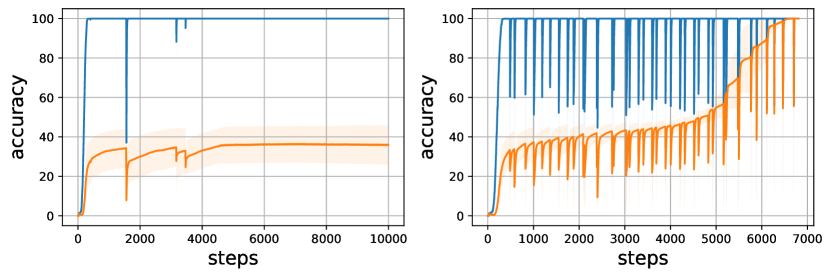

###### fig-1
*Рисунок 1: Колебания точности на обучении и на валидации. Мы обучаем на модульном сложении при $r=0.5$. Левая кривая показывает случай, когда модель не грокнула за 10 тыс. шагов обучения. Правая кривая показывает генерализацию после переобучения. Точность на обучении становится близка к идеальной за $t_{2}<300$ шагов оптимизации, но точности на валидации требуется около $t_{4}\approx 7k$ шагов, чтобы достичь того же уровня.* **[p. 3]**

Хотя гроккинг легко распознать, дать формальное определение его противоположности очень трудно, поскольку на практике мы не можем обучать модель бесконечное число шагов. Мы поступили эмпирически: обучили модели для широкого диапазона гиперпараметров и подогнали функцию, предсказывающую $t_{4}$ — шаг генерализации — для каждой доли обучающих данных $r$. То есть если при прочих гиперпараметрах и при данной доле обучающих данных $r$ мы обучаем модель $t_{4}(r)+\epsilon$ шагов (мы использовали $\epsilon=1k$) и генерализации нет, то обучение можно остановить. Вообще говоря, больше данных ведёт к более быстрому гроккингу (то есть $t_{2}(r)$ и $t_{4}(r)$ — убывающие функции $r$). Эмпирически $t_{4}$ следует степенному закону вида $t_{4}(r)=ar^{-\gamma}+b$. Впервые это было предсказано Žunkovič & Ilievski (2022). Подробнее мы даём в приложении (A).

## 3 Предсказание гроккинга

###### p2-11
Отправное наблюдение состоит в том, что кривые обучения моделей, которые грокают, обнаруживают колебательное поведение (рисунок 1). Родственное явление — эффект рогатки — недавно наблюдали и назвали Thilak et al. (2022). Это явление характеризуется циклическими переходами между устойчивым и неустойчивым режимами обучения. Thilak et al. (2022) охарактеризовали его как полный цикл, начинающийся фазой роста нормы и заканчивающийся фазой плато нормы, и обнаружили, что оно вездесуще и легко воспроизводится в множестве сценариев, охватывающих разнообразные модели и наборы данных. Они наблюдают, что рогатки и гроккинг склонны идти вместе: гроккинг почти исключительно случается в начале рогаток и отсутствует без них. Как отмечают Thilak et al. (2022), такой тип перехода напоминает *явление катапульты* (Lewkowycz et al., 2020), где потеря сперва растёт и начинает убывать, как только модель катапультируется в область меньшей кривизны на раннем этапе обучения при достаточно большом шаге обучения.

###### p3-1
Исходя из этого наблюдения, мы высказываем предположение, что *спектральная подпись потери на обучении в ранних эпохах может подсказать нам о предстоящем гроккинге*. Сперва мы пробуем сравнительно оценить колебания потери на обучении, когда модель грокает и когда не грокает; идеал — останавливать обучение, если модель, по-видимому, грокнуть не способна, чтобы сберечь вычислительные ресурсы. Из уравнения градиентного потока $\dot{\theta}=-G(t)$ следует, что $\dot{L}\approx-\|G(t)\|^{2}$ и $\ddot{L}\approx 2G(t)^{T}H(t)G(t)=2\sum_{i}\lambda_{i}(t)\langle G(t),v_{i}(t)\rangle^{2}$, где $\{\lambda_{i}(t)\}_{i}$ — спектр $H(t)$, а $\{v_{i}(t)\}_{i}$ — соответствующие собственные векторы. Отсюда становится ясно, что эволюция $L$ во времени зависит от нормы градиента, а скорость её изменения — от кривизны ландшафта. У любого сигнала, представимого как меняющаяся во времени величина, есть соответствующий частотный спектр. Мы рассмотрели потерю на обучении $L$ по шагам обучения (и на ранних этапах обучения) как сигналы и разобрали её спектральную подпись. Под спектральной подписью потери мы понимаем любую меру или набор мер, способных количественно оценить колебания потери, — например, спектральную энергию или параметры Хьорта (Hjorth, 1970): активность, подвижность и сложность. Активность Хьорта, представляющая собой дисперсию сигнала во временной области, равна спектральной энергии, если сигнал $L$ имеет нулевое среднее. Последнее условие достигается пропусканием $L$ через достаточно низкочастотный фильтр в частотной области, что удаляет его неколебательные составляющие111Неколебательная составляющая сигнала — это любая составляющая, не меняющаяся быстро со временем: постоянное значение, линейный тренд или гладкая кривая. Такие составляющие обычно считаются низкочастотными сигналами и могут быть удалены пропусканием сигнала через фильтр нижних частот., не нужные для количественной оценки колебаний. В этом случае параметры Хьорта напрямую связаны с ландшафтом потерь, как показано ниже.

###### p3-4
Обозначим через $\mathcal{F}(L)$ преобразование Фурье $L(t)$ и через $m_{n}(L)=\int\omega^{n}|\mathcal{F}(L)(\omega)|^{2}d\omega$ — $n^{th}$ момент $\mathcal{F}^{2}(L)$, где $|\mathcal{F}(L)(\omega)|^{2}$ — спектральная плотность энергии на частоте $\omega$. Активность Хьорта представляет мощность сигнала, площадь спектра мощности в частотной области. Она задаётся как $m_{0}(L)$, что по теореме Парсеваля равно $\int L^{2}(t)dt$222Подвижность Хьорта — это средняя частота, или доля стандартного отклонения спектра мощности; она задаётся как $\sqrt{m_{2}(L)/m_{0}(L)}$, где $m_{2}(L)=\int|\omega\mathcal{F}(L)(\omega)|^{2}d\omega=\int\dot{L}^{2}(t)dt\approx m_{0}(\dot{L})$ — активность нормы градиента $\|G(t)\|^{2}$. Схожим образом сложность Хьорта, показывающая, насколько форма сигнала близка к чистой синусоиде, задаётся как $\sqrt{m_{4}(L)/m_{2}(L)}$, где $m_{4}(L)=\int|\omega^{2}\mathcal{F}(L)(\omega)|^{2}d\omega=\int\ddot{L}^{2}(t)dt\approx m_{0}(\ddot{L})$ — активность спектра гессиана.. Рисунок 2 показывает сходство между колебаниями потери на обучении на ранних фазах обучения и точностью на валидации при $r=0.5$ (больше результатов в приложении **[p. 4]** A), что наводит на мысль, что спектральная подпись может служить косвенным указателем на предстоящее явление гроккинга. Генерализация чаще всего наблюдается при малой скорости обучения и малом weight decay. Хотя большие скорости обучения усиливают колебания, это не ведёт напрямую к гроккингу и не обязательно заметно на ранних шагах — скорее вблизи бассейна притяжения минимума. Существенно, что спектральная подпись потери не является явной мерой ёмкости, поэтому потенциально информативной может быть как положительная, так и отрицательная связь с генерализацией. Наши наблюдения соотносятся с эмпирическими находками Jiang et al. (2019). Они исследуют более 40 мер сложности, выведенных как из теоретических, так и из эмпирических работ, и обучают разнообразные модели, систематически меняя общеупотребительные гиперпараметры. Их результаты подсказывают, что трудность оптимизации на начальной фазе идёт на пользу итоговой генерализации, но эволюция потери после достижения ею определённого значения не связана с генерализацией итогового решения.

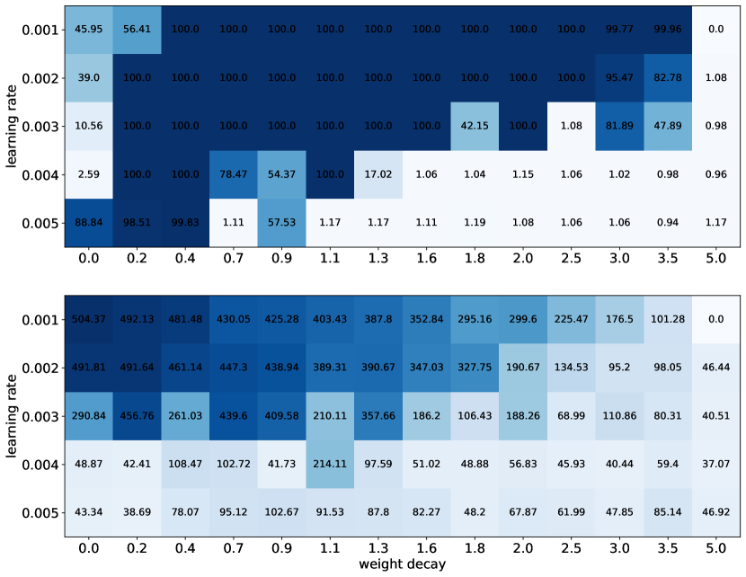

###### fig-2
*Рисунок 2: Первый рисунок (сверху) представляет точность на валидации (%) в конце обучения ($10k$ шагов), а второй (снизу) — спектральную энергию (активность) потери на обучении за первые 400 шагов обучения ($r=0.5$). По оси x отложена сила weight decay, по оси y — скорость обучения. Наблюдается сходство между картинами колебаний потери на обучении на начальных этапах и точностью на валидации. Это подсказывает, что спектральную подпись можно использовать как указатель или косвенную оценку предстоящего явления гроккинга. Наибольшая степень генерализации обычно наблюдается при малых скоростях обучения и малом weight decay. Хотя большие скорости обучения могут усиливать колебания, это не ведёт напрямую к гроккингу и не обязательно заметно на ранних этапах обучения. Скорее такие эффекты становятся заметнее вблизи бассейна притяжения минимума.* **[p. 4]**

## 4 Ландшафт потерь при гроккинге

###### p4-1
Каким может быть объяснение колебаний, наблюдаемых на ранних фазах, и явления рогатки? На деле для примирения колебаний с отложенной генерализацией можно выдвинуть много гипотез. *Колеблется ли модель в фазах смятения, запоминания и понимания вокруг локального минимума, пересекает ли очень плоскую область или огибает крупное препятствие?* Первое интуитивное объяснение отложенной генерализации могло бы состоять в том, что в фазе запоминания модель застревает в локальных решениях. Лёгкость выхода из этих локальных решений зависит от таких факторов, как инициализация, или от гиперпараметров вроде объёма обучающих данных, и модель достигает гроккинга, когда ей удаётся вырваться из бассейна притяжения таких решений. Это объяснение сходно с рабочей гипотезой Dziugaite & Roy (2017): SGD находит хорошие решения, только если они окружены сравнительно большим объёмом решений почти столь же хороших. Вторая попытка объяснить ландшафт гроккинга состоит в том, что модель пересекает плохо обусловленную поверхность — возможно, долину, где почти нет кривизны в большинстве направлений и очень высокая кривизна в некоторых. Это даёт слабое продвижение в направлениях малой кривизны и множество метаний туда-обратно в направлениях высокой кривизны. Третья попытка — рассмотреть первые две гипотезы вместе. То есть модель в ходе обучения проходит через несколько плохо обусловленных локальных минимумов. Далее мы приводим ландшафт потерь при гроккинге и обсуждение того, как он связан с нашей гипотезой.

Поскольку нейросетевые функции потерь живут в пространстве очень большой размерности, визуализация возможна лишь с помощью низкоразмерных одномерных (линия) или двумерных (поверхность) графиков. В этой работе мы придерживаемся подхода Li et al. (2018). Пусть $\theta$ — точка, вблизи которой мы хотим наблюдать ландшафт потерь. Мы строим потерю и точность как функцию $A\subseteq\mathbb{R}$, $f(\alpha)=L(\theta+\alpha\vec{\delta})$, где $\vec{\delta}$ — тщательно выбранный вектор направления в $\vec{\Theta}$333В двумерном случае потеря строится как функция $A\times B\subseteq\mathbb{R}^{2}$, $f(\alpha,\beta)=L(\theta+\alpha\vec{\delta}+\beta\vec{\eta})$, где $\vec{\delta}$ и $\vec{\eta}$ — два тщательно выбранных вектора направления в $\vec{\Theta}$. $\vec{\delta}$ и $\vec{\eta}$ можно выбрать случайно либо определить как $\vec{\delta}=\theta^{{}^{\prime}}-\theta$ и $\vec{\eta}=\theta^{{}^{\prime\prime}}-\theta$, где $\theta^{{}^{\prime}}$ и $\theta^{{}^{\prime\prime}}$ — другие точки, выбор которых будет уточнён.. Из-за инвариантности весов сети к масштабу этот подход может не схватывать внутреннюю геометрию поверхностей потерь. Чтобы устранить этот эффект масштаба, мы строим функции потерь, пользуясь приспособленной версией пофильтровой нормировки направлений (Li et al., 2018), то есть $w_{k}(\vec{\delta})\leftarrow\frac{w_{k}(\vec{\delta})}{\|w_{k}(\vec{\delta})\|}\|w_{k}(\theta)\|\text{ and }b_{k}(\vec{\delta})\leftarrow\frac{b_{k}(\vec{\delta})}{|b_{k}(\vec{\delta})|}|b_{k}(\theta)|$ для каждого веса $W=[\dots,w_{k},\dots]^{T}$ ($w_{k}$ — вектор) и смещения $b=[\dots,b_{k},\dots]$ ($b_{k}$ — скаляр) в каждом слое $\theta$ и $\vec{\delta}$444То же и для $\vec{\eta}$, когда он применяется. **[p. 5]** Этот способ визуализации ландшафта потерь, при всей своей простоте, обладает тем достоинством, что позволяет увидеть возможную локальную выпуклость потери в выбранном направлении555Функция $f:\mathbb{R}^{n}\to\mathbb{R}$ выпукла тогда и только тогда, когда $g_{(x,y)}\colon\alpha\in[0,1]\mapsto g_{(x,y)}(\alpha)=f\big{(}x+\alpha(y-x)\big{)}$ выпукла для всех $x,y\in\mathbb{R}^{n}$.. Для $r=0.3$ рисунок 3 показывает одномерную проекцию поверхности потерь при гроккинге для одной эпохи обучения (сразу после шага гроккинга), тогда как рисунки 4 ($\vec{\delta}_{t}\propto\theta^{*}-\theta_{t}$), 6 ($\vec{\delta}_{t}\propto\theta_{t+1}-\theta_{t}$), 11 ($\vec{\delta}_{t}\propto\theta_{0}-\theta_{t}$) и 10 (случайные $\vec{\delta}_{t}$) показывают её для разных эпох обучения (больше экспериментов в приложении B). Видно, что одномерное подпространство от начальных параметров к конечным и от одного минимизатора к другому содержит множество трудных и причудливых структур.

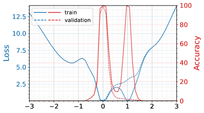

*(a) умножение ($S_{5}$)*

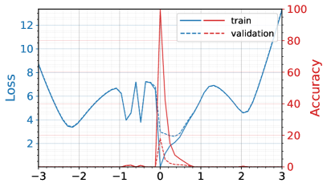

*(b) сложение ($+$)*

*Рисунок 3: Одномерная проекция поверхности потерь и точности при гроккинге ($r=0.3$). По оси x отложено $\alpha\in[-3,3]$, по оси y — потеря (левая ось) и точность (правая ось) в $\theta^{*}+\alpha\delta$ при $\delta\propto\theta_{0}-\theta^{*}$ (с приспособленной пофильтровой нормировкой (Li et al., 2018)), где $\theta_{0}$ — начальный параметр, а $\theta^{*}$ — параметр сразу после того, как модель грокнула (a), и до гроккинга (b). Видно, что одномерное подпространство от инициализации до гроккинга содержит множество трудных и причудливых структур. В (a) у нас два минимизатора потери на обучении (сплошная линия), но лишь один из них минимизирует и потерю на валидации (пунктир).* **[p. 5]**

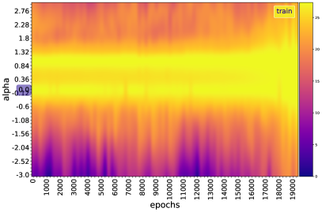

*(a) Поверхность потерь: $f_{t}(\alpha)=Loss(\theta_{t}+\alpha\vec{\delta}_{t})$ для каждой эпохи $t$*

*(a) Поверхность потерь: $f_{t}(\alpha)=Loss(\theta_{t}+\alpha\vec{\delta}_{t})$ для каждой эпохи $t$*

*(b) Поверхность точности: $f_{t}(\alpha)=Acc(\theta_{t}+\alpha\vec{\delta}_{t})$ для каждой эпохи $t$*

*(b) Поверхность точности: $f_{t}(\alpha)=Acc(\theta_{t}+\alpha\vec{\delta}_{t})$ для каждой эпохи $t$*

*Рисунок 4: Одномерная проекция поверхности потерь и точности при гроккинге. Соответствует рисунку 3.a, но для нескольких эпох обучения ($r=0.3$). Направление $\vec{\delta}_{t}$, используемое для каждой эпохи обучения $t$, — единичный вектор $\theta^{*}-\theta_{t}$ (пофильтровая нормировка (Li et al., 2018)), направление от параметра на эпохе $t$ к минимуму. Здесь структура ещё причудливее. Ясно видны два минимизатора потери на обучении, но лишь один минимизирует потерю на валидации: во время запоминания модель находится в этом локальном минимуме, а гроккинга достигает, когда ей удаётся вырваться из этого локального решения.* **[p. 5]**

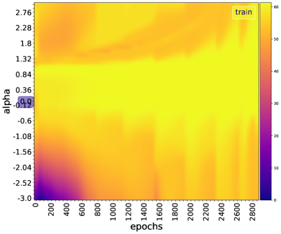

*(a) Поверхность потерь: $f_{t}(\alpha)=Loss(\theta_{t}+\alpha\vec{\delta}_{t})$ для каждой эпохи $t$*

*(a) Поверхность потерь: $f_{t}(\alpha)=Loss(\theta_{t}+\alpha\vec{\delta}_{t})$ для каждой эпохи $t$*

*(b) Поверхность точности: $f_{t}(\alpha)=Acc(\theta_{t}+\alpha\vec{\delta}_{t})$ для каждой эпохи $t$*

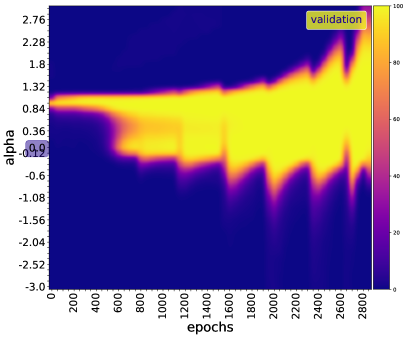

*(b) Поверхность точности: $f_{t}(\alpha)=Acc(\theta_{t}+\alpha\vec{\delta}_{t})$ для каждой эпохи $t$*

*Рисунок 5: Как на рисунке 4, но при $r=0.8$. Между двумя рисунками меняется время, требуемое модели, чтобы достичь глобального минимума. Это время убывает с $r$ как $\Theta\left(1/r^{\gamma}\right)$, $\gamma>0$ (раздел A).* **[p. 5]**

*(a) Поверхность потерь: $f_{t}(\alpha)=Loss(\theta_{t}+\alpha\vec{\delta}_{t})$ для каждой эпохи $t$*

*(a) Поверхность потерь: $f_{t}(\alpha)=Loss(\theta_{t}+\alpha\vec{\delta}_{t})$ для каждой эпохи $t$*

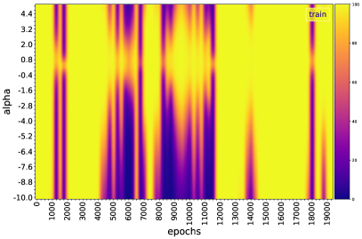

*(b) Поверхность точности: $f_{t}(\alpha)=Acc(\theta_{t}+\alpha\vec{\delta}_{t})$ для каждой эпохи $t$*

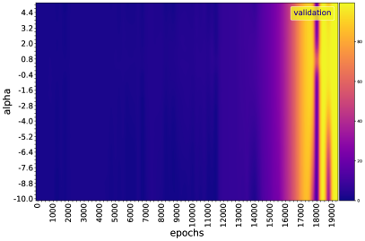

*(b) Поверхность точности: $f_{t}(\alpha)=Acc(\theta_{t}+\alpha\vec{\delta}_{t})$ для каждой эпохи $t$*

*Рисунок 6: Одномерная проекция поверхности потерь/точности при гроккинге от эпохи к эпохе, $\vec{\delta}_{t}\propto\theta_{t+1}-\theta_{t}\propto-\nabla L(\theta_{t})$. Это позволяет ближе рассмотреть поведение ландшафта в (локальном) направлении градиента на каждом шаге обучения $t$. При некоторых $t$ потеря, хотя и возмущена, остаётся локально плоской (в пределах разрешения, использованного для визуализации). Это мгновения, в которые веса продвигаются вдоль направлений наименьшей кривизны, отчего потеря застаивается. За такими точками обычно следует рогатка.* **[p. 6]**

Чтобы измерить степень кривизны функции потерь, мы вычисляем максимальное (${\lambda}_{max}$) и минимальное (${\lambda}_{min}$) собственные значения её гессиана (подробнее в приложении B.1). Мы наблюдаем, что значимой отрицательной кривизны на траектории нет. Кривизна остаётся в целом положительной и сильно возмущается в точках рогатки (${\lambda}_{min}$ в целом остаётся вблизи 0, тогда как ${\lambda}_{max}$ велика, но во время рогатки ${\lambda}_{min}$ становится отрицательной). Наша потеря ${\lambda}_{max}$-гладкая, то есть её градиент ${\lambda}_{max}$-липшицев. Из литературы по оптимизации известно, что у функции с ограниченными собственными значениями гессиана градиент склонен затухать по мере приближения параметра к минимуму — в отличие от негладкой, у которой обычно есть резкие изломы в минимуме, вызывающие значительные колебания градиентного спуска (Bubeck et al., 2015). Мы наблюдали также, что более 98 % полной дисперсии в пространстве параметров приходится на первые 2 моды PCA — гораздо меньше полного числа весов, — что наводит на мысль, что динамика оптимизации вложена в низкоразмерное пространство (Li et al., 2018; Feng & Tu, 2021). Более того, модель бо́льшую часть времени остаётся в ленивом режиме обучения (Chizat et al., 2019; Berner et al., 2021), поскольку мера косинусного расстояния между весами модели от одного шага обучения к следующему остаётся почти постоянной — кроме мест рогатки. Эти наблюдения, по-видимому, поддерживают гипотезу, что модель пересекает возмущённую долину плохих решений и испытывает возмущения вдоль направления долины. Долина здесь — просто поверхность с большой кривизной в большинстве направлений и без кривизны (с малой кривизной) в остальных. Отсюда обучающая деятельность SGD управляется этими направлениями высокой кривизны. Когда итерации падают в долину, мы оказываемся в минимуме обучающей цели (рисунок 4), так что модель может запомнить обучающие данные. Этот локальный минимум плоск в направлениях долины, но остр в направлениях высокой кривизны. При ускоренных или адаптивных градиентных методах патологическая кривизна перестаёт быть проблемой, но локальный минимум и седловые точки — остаются. Такое истолкование гроккинга было рабочей гипотезой Dziugaite & Roy (2017): SGD находит хорошие решения, только если они окружены сравнительно большим объёмом решений почти столь же хороших, — как мы и видели выше с оптимумом гроккинга, окружённым множеством локальных минимумов вдоль главных направлений кривизны. Их работа сосредоточена на том, чтобы показать, что при реалистичных предположениях SGD выполняет неявную регуляризацию или склонен находить решения, обладающие некоторым структурным свойством, о котором нам уже известно, что оно связано с генерализацией, — например, более широкие минимумы, достичь которых SGD легче, чем более острых, поскольку у них большой бассейн притяжения. Более того, функция потерь здесь, по-видимому, не удовлетворяет свойству строгого седла ($\lambda_{min}<0$), которое гарантирует, что градиентный спуск не сойдётся к седловым точкам на непрерывно дифференцируемых функциях при шаге меньше $1/\lambda_{max}$ (Lee et al., 2016). Динамика, таким образом, имеет составляющие в неустойчивом подпространстве гессиана (подпространстве, натянутом на измерения с неотрицательными собственными значениями), и если $\theta_{0}$ выбрана вне этого пространства (что при случайной инициализации происходит с нулевой вероятностью), есть надежда, что мы быстро сойдёмся к глобальному решению. Спектральная подпись отражает динамику внутри этого неустойчивого подпространства и вне его. Свойство строгого седла и вправду выполняется только при сильных колебаниях.

## 5 Связанные работы

#### Гроккинг

###### p6-1
Power et al. (2022) первыми изучили и назвали явление гроккинга. Они обучают каузальный трансформер, состоящий только из декодера (Vaswani et al., 2017), предсказывать ответ $c$ бинарной операции вида $a\circ b=c$, где $a$, $b$, $c$ — дискретные символы без внутренней структуры, а $\circ$ — бинарная операция (сложение, композиция перестановок, двумерные многочлены и прочее). Liu et al. (2022) изучали гроккинг в простых игрушечных моделях — слой эмбеддинга, за которым следует многослойный перцептрон, — для классификации и регрессии. Авторы эмпирически показывают, что генерализация на алгоритмических наборах данных совпадает с возникновением структуры в эмбеддингах, что качество представления предсказывает генерализацию; они определили понятие качества представления в игрушечной постановке и показали, что оно предсказывает генерализацию, разработав эффективную теорию, описывающую динамику обучения представлений в той же постановке. Они также приводят фазовые диаграммы, включающие запоминание, понимание, смятение и гроккинг (сходный с пониманием, но с очень большим числом шагов обучения между запоминанием и генерализацией), как функцию гиперпараметров. Таксономия, используемая в этой работе, совпадает с их, с той разницей, что мы говорим о фазах вдоль траектории обучения. Мы подробнее рассмотрели ландшафт потерь в течение этих различных фаз обучения, но не разбираем структуру эмбеддингов. Механизм рогатки Thilak et al. (2022) вполне соотносится с нашими гипотезами о колебаниях. Их работа сосредоточена на описании периодических колебаний, наблюдаемых в разных фазах обучения модели, и они первыми эмпирически заметили, что гроккинг почти исключительно случается в начале рогаток и отсутствует без них. Наша работа вскрывает, что эти колебания вызваны на уровне ландшафта выходом из острых гор, окружающих локальные оптимумы. Более того, веса модели меняются резко во время рогатки и слабо вне её. **[p. 7]** Гроккингом в последнее время занимались и другие работы — например, механистическая интерпретируемость гроккинга (Nanda & Lieberum, 2022) и гроккинг как фазовый переход (Žunkovič & Ilievski, 2022).

#### Ландшафт потерь нейросетей

Методы визуализации, используемые в этой работе, впервые ввели Goodfellow & Vinyals (2015); они и по сей день остаются одними из самых употребительных для изучения влияния ландшафта потерь на генерализацию (Goodfellow & Vinyals, 2015; Im et al., 2016; Smith & Topin, 2017; Keskar et al., 2017; Li et al., 2018; Feng & Tu, 2021). Li et al. (2018) наблюдают, что, когда сети становятся достаточно глубокими, нейросетевые ландшафты потерь быстро переходят от почти выпуклых к сильно хаотическим, и что этот переход совпадает с резким ростом ошибки генерализации и в конечном счёте с потерей обучаемости. Feng & Tu (2021) исследуют связь между ландшафтом функции потерь и динамикой обучения стохастическим градиентным спуском (SGD). Они показывают, что вокруг решения, найденного SGD, ландшафт функции потерь можно охарактеризовать его плоскостью в каждом направлении PCA. Как и Li et al. (2018), они показывают, что траектории оптимизации лежат в пространстве крайне малой размерности.

#### Плоскость, острота

Hochreiter & Schmidhuber (1997) определили плоский минимизатор как (большую) область в пространстве весов со свойством, что каждый весовой вектор из этой области ведёт к схожей малой ошибке, и предложили алгоритм поиска такого минимизатора, названный поиском плоского минимума. Аналогично можно сказать, что минимизатор остр, когда функция потерь имеет (очень) высокое число обусловленности вблизи него, в любой точке его бассейна притяжения. Keskar et al. (2017) описывают плоскость через собственные значения гессиана и эмпирически показывают, что методы с большим батчем делают минимизаторы обучающей и тестовой функций острыми, тогда как методы с малым батчем делают их плоскими. Способы количественной оценки остроты у Hochreiter & Schmidhuber (1997) и Keskar et al. (2017) не инвариантны к симметриям сети и потому недостаточны для определения обобщающей способности, как показали Dinh et al. (2017); Neyshabur et al. (2017).

#### Родственные явления

###### p7-3
Гроккинг можно рассматривать как крайний случай явления голодания градиента (Pezeshki et al., 2021a) или как очень медленный двойной спуск (Nakkiran et al., 2020), при котором модели удаётся выучить признаки, необходимые для генерализации, лишь в конечных фазах обучения (Pezeshki et al., 2021b). Действительно, мы наблюдаем, что потеря на валидации обнаруживает поведение двойного спуска: сперва убывает, затем растёт, а потом быстро падает до нуля, когда модель грокает. Гроккинг можно рассматривать и как фазовый переход (см. (Nanda & Lieberum, 2022; Žunkovič & Ilievski, 2022)). Что до катастрофического забывания, есть связь между ним при обучении многим задачам и остротой оптимума для каждой задачи: малейшее обновление под одну задачу выводит оптимум из его бассейна притяжения для других задач. Mirzadeh et al. (2020, 2021) это формализуют.

## 6 Сводка и обсуждение

Мы сделали следующие наблюдения:

1. Фаза запоминания характеризуется возмущённым ландшафтом и отделена от понимания возмущённой долиной плохих решений. Малые данные приводят к медленному продвижению SGD в этой области, вызывая задержку генерализации. В фазе понимания потеря и точность на обучении и на валидации обнаруживают периодическое возмущение. Thilak et al. (2022) назвали родственное явление *механизмом рогатки*. Мы обнаружили, что эти точки возмущения характеризуются на уровне потери (соответственно точности) внезапным ростом-падением (соответственно падением-ростом), на уровне весов модели — внезапным изменением относительного косинусного сходства, а на уровне ландшафта потерь — препятствиями. Последнее противоречит тому, что наблюдали Goodfellow & Vinyals (2015), а именно что разнообразные передовые нейросети никогда не встречают значимых препятствий на пути от инициализации к решению. Механизм рогатки противоречит также представлению, что SGD проводит бо́льшую часть времени, исследуя плоскую область на дне долины вокруг плоского минимизатора (Goodfellow & Vinyals, 2015), поскольку он сопровождает модель от смятения до конечной фазы обучения — даже после того, как модель генерализовала, — на многих наборах данных.

2. Гессиан функции потерь при гроккинге характеризуется бо́льшими числами обусловленности, что ведёт к более медленной сходимости градиентного спуска. Мы наблюдали, что более 98 % полной дисперсии в пространстве параметров приходится на первые 2 моды PCA — гораздо меньше полного числа весов, — что наводит на мысль, что динамика оптимизации вложена в низкоразмерное пространство (Li et al., 2018; Feng & Tu, 2021). Более того, модель бо́льшую часть времени остаётся в ленивом режиме обучения (Chizat et al., 2019; Berner et al., 2021), поскольку мера косинусного расстояния между весами модели от одного шага обучения к следующему остаётся почти постоянной — кроме мест рогатки.

С точки зрения ландшафта гроккинг становится немного яснее: геометрия ландшафта влияет на генерализацию и позволяет на ранних этапах обучения узнать, будет ли модель генерализовать, — по одной лишь микроскопической величине, характерной для этого ландшафта, вроде эмпирического риска.

#### Ограничения

Некоторые ограничения, требующие дальнейшего разбора:

1. Мы смотрим на поверхность потерь при резком снижении размерности, и истолковывать эти графики нужно осторожно.

2. Мы оптимизируем лишь несмещённую оценку полной функции потерь (просуммированной по всем обучающим примерам), устройство которой может **[p. 8]** отличаться от глобальной функции потерь, так что задержка генерализации может быть следствием каждого отдельного слагаемого функции потерь, или шума, вносимого выборкой этих слагаемых, или стохастичности инициализации весов, порождения масок dropout и прочего (Goodfellow & Vinyals, 2015). Требуются дальнейшие исследования, чтобы выяснить, действительно ли именно возмущённость поверхности потерь вызывает генерализацию в отдалённой перспективе.

#### Перспективы

Дальнейшее направление — изучить, что общего у объяснения двойного спуска через обучение признакам (Pezeshki et al., 2021b) с гроккингом, и посмотреть, возможно ли построить конкретную кривую обучения, как Chen et al. (2021) вывели для кривой генерализации. Кроме того, эта работа сосредоточена на обнаружении гроккинга, но в конечном счёте прокладывает путь и к тому, чтобы гроккинг вызывать. Ещё одно направление развития — перейти от арифметических задач с детерминированными ответами к языковым моделям и компьютерному зрению с более вероятностными ответами.

## Благодарности

Мы благодарим за поддержку программу Canada CIFAR AI Chair и программу Canada Excellence Research Chairs. В этом исследовании использованы вычислительные ресурсы суперкомпьютера Summit в Oak Ridge Leadership Computing Facility — пользовательском центре Управления науки Министерства энергетики США, поддерживаемом по контракту DE-AC05-00OR22725. Квота была выделена проекту INCITE «Scalable Foundation Models for Transferable Generalist AI».

## Литература

- Allen-Zhu, Z., Li, Y., and Liang, Y. Learning and generalization in overparameterized neural networks, going beyond two layers. *ArXiv*, abs/1811.04918, 2019.

- Arora, S., Ge, R., Neyshabur, B., and Zhang, Y. Stronger generalization bounds for deep nets via a compression approach. *CoRR*, abs/1802.05296, 2018. URL http://arxiv.org/abs/1802.05296.

- Belkin, M. and Niyogi, P. Laplacian eigenmaps and spectral techniques for embedding and clustering. In Dietterich, T., Becker, S., and Ghahramani, Z. (eds.), *Advances in Neural Information Processing Systems*, volume 14. MIT Press, 2001. URL https://proceedings.neurips.cc/paper/2001/file/f106b7f99d2cb30c3db1c3cc0fde9ccb-Paper.pdf.

- Berner, J., Grohs, P., Kutyniok, G., and Petersen, P. The modern mathematics of deep learning. *arXiv preprint arXiv: Arxiv-2105.04026*, 2021.

- Bubeck, S. et al. Convex optimization: Algorithms and complexity. *Foundations and Trends® in Machine Learning*, 8(3-4):231–357, 2015.

- Chen, L., Min, Y., Belkin, M., and Karbasi, A. Multiple descent: Design your own generalization curve. *Advances in Neural Information Processing Systems*, 34:8898–8912, 2021.

- Chizat, L., Oyallon, E., and Bach, F. On lazy training in differentiable programming. *Advances in Neural Information Processing Systems*, 32, 2019.

- Cohen, J. M., Kaur, S., Li, Y., Kolter, J. Z., and Talwalkar, A. S. Gradient descent on neural networks typically occurs at the edge of stability. *International Conference On Learning Representations*, 2021.

- David J.C., M. and Zoubin, G. Comments on ‘maximum likelihood estimation of intrinsic dimension’ by elizaveta levina and peter bickel (2004). 2005. URL http://www.inference.org.uk/mackay/dimension/.

- Dinh, L., Pascanu, R., Bengio, S., and Bengio, Y. Sharp minima can generalize for deep nets. In Precup, D. and Teh, Y. W. (eds.), *Proceedings of the 34th International Conference on Machine Learning, ICML 2017, Sydney, NSW, Australia, 6-11 August 2017*, volume 70 of *Proceedings of Machine Learning Research*, pp. 1019–1028. PMLR, 2017. URL http://proceedings.mlr.press/v70/dinh17b.html.

- Donoho, D. L. and Grimes, C. Hessian eigenmaps: Locally linear embedding techniques for high-dimensional data. *Proceedings of the National Academy of Sciences*, 100(10):5591–5596, 2003. doi: 10.1073/pnas.1031596100. URL https://www.pnas.org/doi/abs/10.1073/pnas.1031596100.

- Dziugaite, G. K. and Roy, D. M. Computing nonvacuous generalization bounds for deep (stochastic) neural networks with many more parameters than training data. In Elidan, G., Kersting, K., and Ihler, A. T. (eds.), *Proceedings of the Thirty-Third Conference on Uncertainty in Artificial Intelligence, UAI 2017, Sydney, Australia, August 11-15, 2017*. AUAI Press, 2017. URL http://auai.org/uai2017/proceedings/papers/173.pdf.

- Facco, E., d’Errico, M., Rodriguez, A., and Laio, A. Estimating the intrinsic dimension of datasets by a minimal neighborhood information. *Scientific Reports*, 7(1), sep 2017. doi: 10.1038/s41598-017-11873-y. URL https://doi.org/10.1038%2Fs41598-017-11873-y.

- Feng, Y. and Tu, Y. **[p. 9]** The inverse variance–flatness relation in stochastic gradient descent is critical for finding flat minima. *Proceedings of the National Academy of Sciences*, 118(9):e2015617118, 2021. doi: 10.1073/pnas.2015617118. URL https://www.pnas.org/doi/abs/10.1073/pnas.2015617118.

- Goodfellow, I. J. and Vinyals, O. Qualitatively characterizing neural network optimization problems. In Bengio, Y. and LeCun, Y. (eds.), *3rd International Conference on Learning Representations, ICLR 2015, San Diego, CA, USA, May 7-9, 2015, Conference Track Proceedings*, 2015. URL http://arxiv.org/abs/1412.6544.

- Graves, A., Mohamed, A., and Hinton, G. E. Speech recognition with deep recurrent neural networks. *CoRR*, abs/1303.5778, 2013. URL http://arxiv.org/abs/1303.5778.

- He, K., Zhang, X., Ren, S., and Sun, J. Deep residual learning for image recognition. *CoRR*, abs/1512.03385, 2015. URL http://arxiv.org/abs/1512.03385.

- Herrmann, L., Granz, M., and Landgraf, T. Chaotic dynamics are intrinsic to neural network training with SGD. In Oh, A. H., Agarwal, A., Belgrave, D., and Cho, K. (eds.), *Advances in Neural Information Processing Systems*, 2022. URL https://openreview.net/forum?id=ffy-h0GKZbK.

- Hinton, G. Neural networks for machine learning. coursera, video lectures, 2012.

- Hjorth, B. Eeg analysis based on time domain properties. *Electroencephalography and Clinical Neurophysiology*, 29(3):306–310, 1970. ISSN 0013-4694. doi: https://doi.org/10.1016/0013-4694(70)90143-4. URL https://www.sciencedirect.com/science/article/pii/0013469470901434.

- Hochreiter, S. and Schmidhuber, J. Flat Minima. *Neural Computation*, 9(1):1–42, 01 1997. ISSN 0899-7667. doi: 10.1162/neco.1997.9.1.1. URL https://doi.org/10.1162/neco.1997.9.1.1.

- Im, D. J., Tao, M., and Branson, K. An empirical analysis of the optimization of deep network loss surfaces. *arXiv preprint arXiv: Arxiv-1612.04010*, 2016.

- Jastrzębski, S., Kenton, Z., Arpit, D., Ballas, N., Fischer, A., Bengio, Y., and Storkey, A. Three factors influencing minima in sgd. *ICLR*, 2018.

- Jiang, Y., Neyshabur, B., Mobahi, H., Krishnan, D., and Bengio, S. Fantastic generalization measures and where to find them. *International Conference On Learning Representations*, 2019.

- Keskar, N. S., Mudigere, D., Nocedal, J., Smelyanskiy, M., and Tang, P. T. P. On large-batch training for deep learning: Generalization gap and sharp minima. In *5th International Conference on Learning Representations, ICLR 2017, Toulon, France, April 24-26, 2017, Conference Track Proceedings*. OpenReview.net, 2017. URL https://openreview.net/forum?id=H1oyRlYgg.

- Kingma, D. P. and Ba, J. Adam: A method for stochastic optimization. *International Conference On Learning Representations*, 2014.

- Kok, S. and Sandrock, C. Locating and characterizing the stationary points of the extended rosenbrock function. *Evol. Comput.*, 17(3):437–453, sep 2009. ISSN 1063-6560. doi: 10.1162/evco.2009.17.3.437. URL https://doi.org/10.1162/evco.2009.17.3.437.

- Krizhevsky, A., Sutskever, I., and Hinton, G. E. Imagenet classification with deep convolutional neural networks. In Pereira, F., Burges, C., Bottou, L., and Weinberger, K. (eds.), *Advances in Neural Information Processing Systems*, volume 25. Curran Associates, Inc., 2012. URL https://proceedings.neurips.cc/paper/2012/file/c399862d3b9d6b76c8436e924a68c45b-Paper.pdf.

- Lee, J. D., Simchowitz, M., Jordan, M. I., and Recht, B. Gradient descent converges to minimizers. *arXiv preprint arXiv: Arxiv-1602.04915*, 2016.

- Levina, E. and Bickel, P. Maximum likelihood estimation of intrinsic dimension. In Saul, L., Weiss, Y., and Bottou, L. (eds.), *Advances in Neural Information Processing Systems*, volume 17. MIT Press, 2004. URL https://proceedings.neurips.cc/paper/2004/file/74934548253bcab8490ebd74afed7031-Paper.pdf.

- Lewkowycz, A., Bahri, Y., Dyer, E., Sohl-Dickstein, J., and Gur-Ari, G. The large learning rate phase of deep learning: the catapult mechanism. *arXiv preprint arXiv: Arxiv-2003.02218*, 2020.

- Li, H., Xu, Z., Taylor, G., Studer, C., and Goldstein, T. Visualizing the loss landscape of neural nets. In Bengio, S., Wallach, H. M., Larochelle, H., Grauman, K., Cesa-Bianchi, N., and Garnett, R. (eds.), *Advances in Neural Information Processing Systems 31: Annual Conference on Neural Information Processing Systems 2018, NeurIPS 2018, December 3-8, 2018, Montréal, Canada*, pp. 6391–6401, 2018. **[p. 10]** URL https://proceedings.neurips.cc/paper/2018/hash/a41b3bb3e6b050b6c9067c67f663b915-Abstract.html.

- Liu, Z., Kitouni, O., Nolte, N. S., Michaud, E. J., Tegmark, M., and Williams, M. Towards understanding grokking: An effective theory of representation learning. *ArXiv*, abs/2205.10343, 2022.

- Livni, R., Shalev-Shwartz, S., and Shamir, O. On the computational efficiency of training neural networks. *CoRR*, abs/1410.1141, 2014. URL http://arxiv.org/abs/1410.1141.

- Mirzadeh, S. I., Farajtabar, M., Pascanu, R., and Ghasemzadeh, H. Understanding the role of training regimes in continual learning. *Advances in Neural Information Processing Systems*, 33:7308–7320, 2020.

- Mirzadeh, S. I., Chaudhry, A., Hu, H., Pascanu, R., Gorur, D., and Farajtabar, M. Wide neural networks forget less catastrophically. *ICML*, 2021.

- Nakkiran, P., Kaplun, G., Bansal, Y., Yang, T., Barak, B., and Sutskever, I. Deep double descent: Where bigger models and more data hurt. In *8th International Conference on Learning Representations, ICLR 2020, Addis Ababa, Ethiopia, April 26-30, 2020*. OpenReview.net, 2020. URL https://openreview.net/forum?id=B1g5sA4twr.

- Nanda, N. and Lieberum, T. A mechanistic interpretability analysis of grokking. *Alignment Forum*, Aug 2022.

- Neyshabur, B., Bhojanapalli, S., McAllester, D., and Srebro, N. Exploring generalization in deep learning. In Guyon, I., von Luxburg, U., Bengio, S., Wallach, H. M., Fergus, R., Vishwanathan, S. V. N., and Garnett, R. (eds.), *Advances in Neural Information Processing Systems 30: Annual Conference on Neural Information Processing Systems 2017, December 4-9, 2017, Long Beach, CA, USA*, pp. 5947–5956, 2017. URL https://proceedings.neurips.cc/paper/2017/hash/10ce03a1ed01077e3e289f3e53c72813-Abstract.html.

- Pezeshki, M., Kaba, O., Bengio, Y., Courville, A. C., Precup, D., and Lajoie, G. Gradient starvation: A learning proclivity in neural networks. In Ranzato, M., Beygelzimer, A., Dauphin, Y., Liang, P., and Vaughan, J. W. (eds.), *Advances in Neural Information Processing Systems*, volume 34, pp. 1256–1272. Curran Associates, Inc., 2021a. URL https://proceedings.neurips.cc/paper/2021/file/0987b8b338d6c90bbedd8631bc499221-Paper.pdf.

- Pezeshki, M., Mitra, A., Bengio, Y., and Lajoie, G. Multi-scale feature learning dynamics: Insights for double descent. *icml*, 2021b.

- Polyak, B. Some methods of speeding up the convergence of iteration methods. *USSR Computational Mathematics and Mathematical Physics*, 4(5):1–17, 1964. ISSN 0041-5553. doi: https://doi.org/10.1016/0041-5553(64)90137-5. URL https://www.sciencedirect.com/science/article/pii/0041555364901375.

- Pope, P., Zhu, C., Abdelkader, A., Goldblum, M., and Goldstein, T. The intrinsic dimension of images and its impact on learning. *arXiv preprint arXiv:2104.08894*, 2021.

- Power, A., Burda, Y., Edwards, H., Babuschkin, I., and Misra, V. Grokking: Generalization beyond overfitting on small algorithmic datasets. *arXiv preprint arXiv:2201.02177*, 2022.

- Riedmiller, M. and Braun, H. A direct adaptive method for faster backpropagation learning: the rprop algorithm. In *IEEE International Conference on Neural Networks*, pp. 586–591 vol.1, 1993. doi: 10.1109/ICNN.1993.298623.

- Roweis, S. T. and Saul, L. K. Nonlinear dimensionality reduction by locally linear embedding. *Science*, 290(5500):2323–2326, 2000. doi: 10.1126/science.290.5500.2323. URL https://www.science.org/doi/abs/10.1126/science.290.5500.2323.

- Shwartz-Ziv, R. and Tishby, N. Opening the black box of deep neural networks via information. *arXiv preprint arXiv: Arxiv-1703.00810*, 2017.

- Silver, D., Huang, A., Maddison, C. J., Guez, A., Sifre, L., van den Driessche, G., Schrittwieser, J., Antonoglou, I., Panneershelvam, V., Lanctot, M., Dieleman, S., Grewe, D., Nham, J., Kalchbrenner, N., Sutskever, I., Lillicrap, T., Leach, M., Kavukcuoglu, K., Graepel, T., and Hassabis, D. Mastering the game of go with deep neural networks and tree search. *Nature*, 529:484–503, 2016. URL http://www.nature.com/nature/journal/v529/n7587/full/nature16961.html.

- Smith, L. N. and Topin, N. Exploring loss function topology with cyclical learning rates. *arXiv preprint arXiv: Arxiv-1702.04283*, 2017.

- Tenenbaum, J. B., de Silva, V., and Langford, J. C. A global geometric framework for nonlinear dimensionality reduction. *Science*, 290(5500):2319–2323, 2000. doi: 10.1126/science.290.5500.2319. URL https://www.science.org/doi/abs/10.1126/science.290.5500.2319.

- Thilak, V., Littwin, E., Zhai, S., Saremi, O., Paiss, R., and Susskind, J. M. **[p. 11]** The slingshot mechanism: An empirical study of adaptive optimizers and the *{*Grokking Phenomenon}. 2022.

- Vaswani, A., Shazeer, N., Parmar, N., Uszkoreit, J., Jones, L., Gomez, A. N., Kaiser, L., and Polosukhin, I. Attention is all you need. *CoRR*, abs/1706.03762, 2017. URL http://arxiv.org/abs/1706.03762.

- Zhang, C., Bengio, S., Hardt, M., Recht, B., and Vinyals, O. Understanding deep learning requires rethinking generalization. *ArXiv*, abs/1611.03530, 2017.

- Žunkovič, B. and Ilievski, E. Grokking phase transitions in learning local rules with gradient descent. *arXiv preprint arXiv: Arxiv-2210.15435*, 2022.

## Приложение A. Гроккинг

### A.1 Фазы обучения

Предшествующие работы (Power et al., 2022; Liu et al., 2022) использовали термины «смятение», «запоминание» и «понимание» в фазовой диаграмме по разным гиперпараметрам, но в этой работе они относятся также к фазам вдоль траектории обучения. Обычное обучение глубоких нейросетей делится на две фазы (Shwartz-Ziv & Tishby, 2017; Nakkiran et al., 2020; Feng & Tu, 2021). Первая фаза, в течение которой сеть выучивает функцию с малым разрывом генерализации, и вторая, в течение которой сеть начинает переобучаться на данных, что ведёт к росту тестовой ошибки. Однако Nakkiran et al. (2020) показывают, что в некоторых режимах тестовая ошибка снова убывает и к концу обучения может достичь значения меньшего, чем первый минимум, — что наводит на мысль о фазах обучения, которыми стоит воспользоваться. Feng & Tu (2021) различают две фазы: начальную фазу быстрого обучения, где функция потерь убывает быстро и порой резко, и следующую за ней фазу исследования, когда ошибка обучения достигает минимального значения, а общая потеря всё ещё убывает, но гораздо медленнее и постепеннее. Однако рассмотрения всего двух фаз недостаточно, чтобы как следует изучить гроккинг, поскольку вся суть гроккинга — в фазе запоминания и в том, как модель в неё входит и из неё выходит.

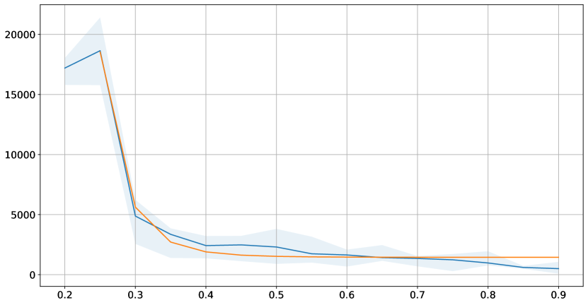

*Рисунок 7: $t_{4}(r)$ — шаг перехода от запоминания к генерализации для каждой доли обучающих данных $r>=0.2$. Синяя кривая показывает эмпирически полученные значения $t_{4}(r)$ (ось y) как функцию $r$ (ось x), а оранжевая представляет оценку вида $t_{4}(r)=ar^{-\gamma}+b$, подогнанную по полученным данным, с $(\gamma,a,b)=(7.73,1.09\times 10^{15},1442.63)$ в этом случае.* **[p. 11]**

### A.2 Отсутствие гроккинга

Хотя гроккинг легко распознать, дать формальное определение его противоположности очень трудно, поскольку ничто не противоречит тому, что, если позволить модели обучаться бесконечно, она в конце концов не генерализует. Зная гиперпараметры (скорость обучения, силу weight decay и прочие), которые позволяют получить гроккинг (обозначим через $H_{g}$ множество значений таких гиперпараметров), мы используем их, чтобы обучать нашу модель при разных объёмах данных. Затем мы подгоняем функцию, предсказывающую $t_{4}$ — шаг генерализации — для каждой доли обучающих данных $r$. Далее мы использовали полученное выражение $t_{4}(r)$ как оценку числа шагов обучения, нужного для генерализации при каждом $r$. То есть если при других гиперпараметрах, не входящих в $H_{g}$, и при данной доле обучающих данных $r$ мы обучаем модель $t_{4}(r)+\epsilon$ шагов (мы использовали $\epsilon=1k$) и генерализации нет, то обучение можно остановить. Это не обязательно означает, что гроккинга не будет, если оставить модель обучаться дольше. Ограничение такого подхода в том, что $t_{4}(r)$ — лишь эмпирический закон, оценённый при $r\geq r_{min}>0$, который разрушается при $r\rightarrow 0$.

### A.3 Отношение перепараметризации и влияние параметров оптимизатора

Вообще говоря, больше данных ведёт к более быстрому гроккингу (рисунок 7-b), то есть $t_{2}(r)$ и $t_{4}(r)$ — убывающие функции $r$. Эмпирически $t_{4}$ следует степенному закону вида $t_{4}(r)=ar^{-\gamma}+b$. Впервые это предсказали Žunkovič & Ilievski (2022). Для $r\geq r_{min}$ мы нашли $(\gamma,a,b)=(7.73,1.09\times 10^{15},1442.63)$ для модульного сложения (рисунок 7.b) и $(\gamma,a,b)=(1.18,1.85\times 10^{6},0.0)$ для умножения в $S_{5}$, в $H_{g}$. Меньшие скорости обучения требуют больше шагов обучения для сходимости, тогда как бо́льшие приводят к быстрым изменениям и требуют меньшего числа эпох обучения. Но слишком большая скорость обучения может заставить модель слишком быстро сойтись к неоптимальному решению, а слишком малая — привести к застреванию процесса. **[p. 12]** С гроккингом это хорошо подтверждается: чем сильнее мы увеличиваем шаг обучения, тем быстрее наблюдаем гроккинг — вплоть до порога, зависящего от использованного значения силы weight decay.

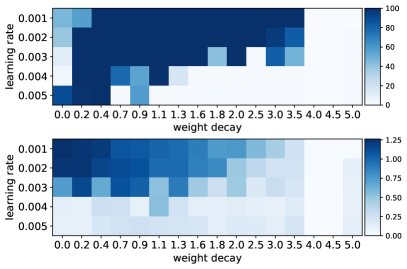

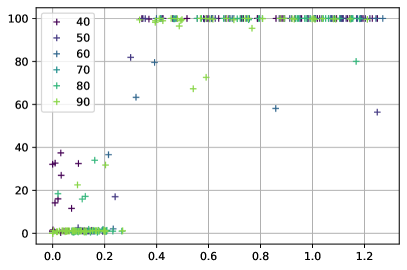

*Рисунок 8: Слева) Первый рисунок (сверху) представляет точность на валидации (%) в конце обучения ($10k$ шагов), а второй (снизу) — спектральную энергию (активность) потери на обучении за первые 400 шагов обучения ($r=0.5$). По оси x отложена сила weight decay, по оси y — скорость обучения. Справа) По оси x отложена (нормированная) активность (400 шагов), по оси y — точность на валидации (%) при разных значениях $r$. По оси x отложена сила weight decay, по оси y — скорость обучения. Наблюдается сходство между картинами колебаний потери на обучении на начальных этапах и точностью на валидации. Это подсказывает, что спектральную подпись можно использовать как указатель или косвенную оценку предстоящего явления гроккинга. Наибольшая степень генерализации обычно наблюдается при малых скоростях обучения и малом weight decay. Хотя большие скорости обучения могут усиливать колебания, это не ведёт напрямую к гроккингу и не обязательно заметно на ранних этапах обучения. Скорее такие эффекты становятся заметнее вблизи бассейна притяжения минимума.* **[p. 12]**

### A.4 Спектральная подпись

Рисунки 8 и 9 показывают сходство между колебаниями потери на обучении на ранних фазах обучения и точностью на валидации при многих значениях $r$.

*(a) $r=0.4$*

*(b) $r=0.5$*

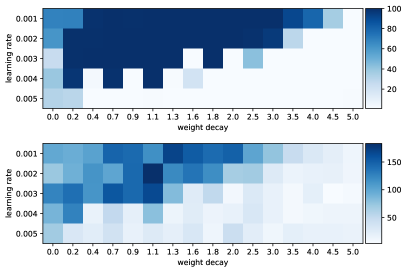

*(c) $r=0.7$*

*(d) $r=0.9$*

*Рисунок 9: Для (a)–(d) первый рисунок (сверху) представляет точность на валидации ($\%$) в конце обучения (10 тыс. шагов), а второй (снизу) — спектральную энергию (активность) потери на обучении за первые 400 шагов обучения. По оси x отложена сила weight decay, по оси y — скорость обучения. Наблюдается сходство между картинами колебаний потери на обучении на начальных этапах и точностью на валидации.* **[p. 12]**

## Приложение B. Ландшафт потерь

Для $r=0.3$ рисунок 3 показывает одномерную проекцию поверхности потерь при гроккинге для одной эпохи обучения (сразу после шага гроккинга), тогда как рисунки 4 ($\vec{\delta}_{t}\propto\theta^{*}-\theta_{t}$), 6 ($\vec{\delta}_{t}\propto\theta_{t+1}-\theta_{t}$), 11 ($\vec{\delta}_{t}\propto\theta_{0}-\theta_{t}$) и 10 (случайные $\vec{\delta}_{t}$) показывают её для разных эпох обучения.

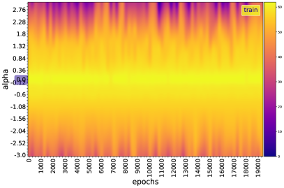

*(a) Поверхность потерь: $f_{t}(\alpha)=Loss(\theta_{t}+\alpha\vec{\delta}_{t})$ для каждой эпохи $t$*

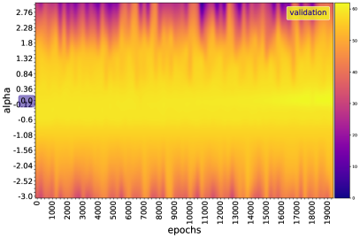

*(a) Поверхность потерь: $f_{t}(\alpha)=Loss(\theta_{t}+\alpha\vec{\delta}_{t})$ для каждой эпохи $t$*

*(b) Поверхность точности: $f_{t}(\alpha)=Acc(\theta_{t}+\alpha\vec{\delta}_{t})$ для каждой эпохи $t$*

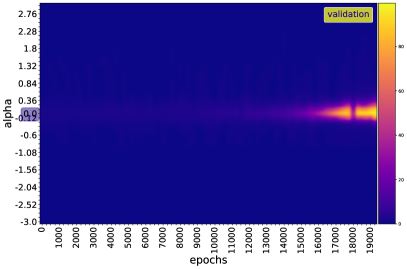

*(b) Поверхность точности: $f_{t}(\alpha)=Acc(\theta_{t}+\alpha\vec{\delta}_{t})$ для каждой эпохи $t$*

*Рисунок 10: Одномерная проекция поверхности потерь/точности при гроккинге в случайном направлении $\vec{\delta}$. В этом направлении вдоль траектории препятствий не видно, и поверхность довольно хорошо обусловлена.* **[p. 13]**

*(a) Поверхность потерь: $f_{t}(\alpha)=Loss(\theta_{t}+\alpha\vec{\delta}_{t})$ для каждой эпохи $t$*

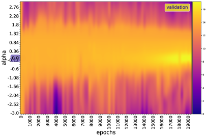

*(a) Поверхность потерь: $f_{t}(\alpha)=Loss(\theta_{t}+\alpha\vec{\delta}_{t})$ для каждой эпохи $t$*

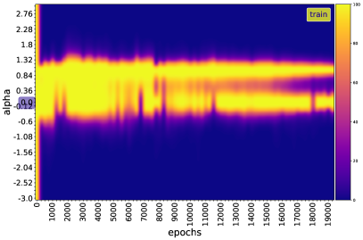

*(b) Поверхность точности: $f_{t}(\alpha)=Acc(\theta_{t}+\alpha\vec{\delta}_{t})$ для каждой эпохи $t$*

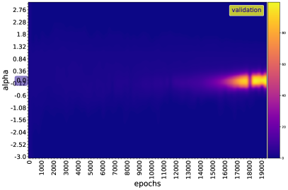

*(b) Поверхность точности: $f_{t}(\alpha)=Acc(\theta_{t}+\alpha\vec{\delta}_{t})$ для каждой эпохи $t$*

*Рисунок 11: Одномерная проекция поверхности потерь/точности при гроккинге от точки инициализации к произвольному шагу $t$, $\vec{\delta}_{t}\propto\theta_{0}-\theta_{t}$. В этом направлении каждая рассматриваемая точка ведёт себя локально как минимум, а по мере приближения к оптимуму локальные минимумы начинают преобладать.* **[p. 13]**

### B.1 Кривизна поверхности потерь

Подход, описанный в предыдущем разделе, позволяет увидеть поверхность потерь при резком снижении размерности, и истолковывать эти графики нужно осторожно. Один из способов измерить степень выпуклости функции потерь — вычислить главные кривизны, которые суть просто собственные значения гессиана. Поскольку мы находимся в очень большой размерности, вычислять все собственные значения гессиана — или просто сам гессиан — непрактично. Чтобы обойти эту трудность размерности, мы оценивали кривизну через число обусловленности гессиана $L(\theta)$ на каждом шаге $t$ — попросту отношение $\lambda_{min}(t)/\lambda_{max}(t)$, где $\lambda_{min}(t)$ и $\lambda_{max}(t)$ — соответственно минимальное и максимальное собственные значения гессиана $L_{t}$. Число обусловленности — прямая мера патологической кривизны. Бо́льшие числа обусловленности означают более медленную сходимость градиентного спуска. Li et al. (2018) вычисляют это отношение в каждой точке поверхности потерь и наблюдают, что области, выглядящие выпуклыми на графиках поверхности, отвечают областям с незначительными отрицательными собственными значениями, тогда как хаотические области содержат большие отрицательные кривизны; и что для поверхностей, выглядящих выпуклыми, отрицательные собственные значения остаются крайне малыми.

Чтобы измерить степень кривизны функции потерь, мы вычисляем максимальное (${\lambda}_{max}$) и минимальное (${\lambda}_{min}$) собственные значения её гессиана (рисунок 12). Мы наблюдаем, что значимой отрицательной кривизны на траектории нет. Кривизна остаётся в целом положительной и сильно возмущается в точках рогатки (${\lambda}_{min}$ в целом остаётся вблизи 0, тогда как ${\lambda}_{max}$ велика, но во время рогатки ${\lambda}_{min}$ становится отрицательной). Наша потеря ${\lambda}_{max}$-гладкая, то есть её градиент ${\lambda}_{max}$-липшицев. Из литературы по оптимизации известно, что у функции с ограниченными собственными значениями гессиана градиент склонен затухать по мере приближения параметра к минимуму — в отличие от негладкой, у которой обычно есть резкие изломы в минимуме, вызывающие значительные колебания градиентного спуска (Bubeck et al., 2015).

###### p12-12
На деле, пусть $\{\lambda_{t}(i)\}_{i}$ — собственные значения $\mathcal{H}_{t}$, а $\{v_{t}(i)\}_{i}$ — соответствующие собственные векторы. При очень малом шаге $\epsilon_{t}$ SGD имеем $L_{t+1}-L_{t}\approx-\epsilon_{t}\|G_{t}\|^{2}+\frac{1}{2}\epsilon_{t}^{2}G_{t}^{T}\mathcal{H}_{t}G_{t}-o(\epsilon_{t}^{2}\|G_{t}\|^{2})$. Далее, если $\lambda_{t}(i)>2/\epsilon_{t}$, то получаем $-\epsilon_{t}\|G_{t}\|^{2}+\frac{1}{2}\epsilon_{t}^{2}G_{t}^{T}\mathcal{H}_{t}G_{t}>0$666Это следует из того, что вблизи $\theta_{t}$ выполняется $L(\theta)\approx L_{t}+(\theta-\theta_{t})^{T}G_{t}+\frac{1}{2}(\theta-\theta_{t})^{T}\mathcal{H}_{t}(\theta-\theta_{t})+o(\|\theta-\theta_{t}\|^{2})$. Подстановка $\theta=\theta_{t}-\epsilon_{t}G_{t}$ даёт первое приближение. Последнее неравенство получается с $G_{t}^{T}\mathcal{H}_{t}G_{t}=\sum_{i}\lambda_{t}(i)\langle G_{t},v_{t}(i)\rangle^{2}$ и $\sum_{i}\langle G_{t},v_{t}(i)\rangle^{2}=\|G_{t}\|^{2}$.. Когда у $\mathcal{H}_{t}$ есть несколько больших положительных собственных значений (то есть направления высокой кривизны) и несколько собственных значений вблизи 0 (направления малой кривизны), градиентный спуск мечется туда-обратно в направлениях высокой кривизны и медленно продвигается в направлениях малой. В этом случае задача оптимизации имеет плохо обусловленную кривизну. Более того, если функция потерь вблизи $\theta_{t}$ имеет высокое число обусловленности, то есть очень малые шаги вызывают рост функции стоимости (например, если $\theta_{t}$ — очень острый минимум, окружённый областями высокой потери), задача оптимизации тоже становится плохо обусловленной. В ходе обучения, если норма градиента не убывает, а $G_{t}^{T}\mathcal{H}_{t}G_{t}$ растёт на порядок, обучение может стать очень медленным несмотря на сильный градиент. Приведённое наблюдение ($\lambda_{t}(i)>2\epsilon_{t}^{-1}$) сходно с тем, что Herrmann et al. (2022) [теорема 2.1] определяют для собственных значений положительно определённого $\mathcal{H}_{t}$ как локально хаотическое поведение обучения по локальным показателям Ляпунова. Они приводят свидетельства того, что обучение нейросети по своей природе локально хаотично из-за отрицательной части спектра гессиана и что обучение сети с SGD обнаруживает глобально краехаотическое поведение. Это наблюдение связано также с явлением *прогрессирующего заострения* (Cohen et al., 2021), при котором $max_{i}\lambda_{t}(i)$ растёт и достигает значения, равного $2\epsilon_{t}^{-1}$ или чуть большего, отчего модель входит в режим края устойчивости, где потеря обнаруживает немонотонное поведение обучения на коротких промежутках времени (Thilak et al., 2022).

*Рисунок 12: Число обусловленности гессиана по эпохам обучения для модульного сложения (сверху $r=0.3$, снизу $r=0.8$). Видно, что значимой отрицательной кривизны на траектории нет (рисунок 12). Кривизна остаётся в целом положительной и сильно возмущается в точках рогатки.* **[p. 14]**

### B.2 Другие меры ландшафта

Чтобы понять, насколько далеко оптимизация уходит от главного линейного подпространства, мы строим норму остатка значения параметра после проецирования параметров каждой эпохи в одномерное подпространство двумя следующими способами. Пусть $M=[\theta_{t}-\theta_{T}]_{1\leq t\leq T-1}\in\mathbb{R}^{(T-1)\times d}$, где $T$ — полное число шагов обучения. Мы применили PCA к матрице $M$, выбрали $2$ наиболее объясняющих направления, а затем спроецировали каждый параметр $\theta_{t}$ на эти два направления, получив $\alpha(t)$ и $\beta(t)$. На рисунке 13 мы строим проекцию вдоль первых 2 осей PCA от инициализации к решению, $\alpha(t)$ и $\beta(t)$. Более 98 % полной дисперсии в пространстве параметров приходится на первые 2 моды PCA — гораздо меньше полного числа весов, — что наводит на мысль, что динамика оптимизации вложена в низкоразмерное пространство (Li et al., 2018; Feng & Tu, 2021).

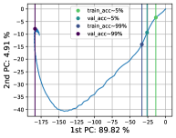

*(a) $r=30\%$*

*(b) $r=35\%$*

*(c) $r=40\%$*

*(d) $r=45\%$*

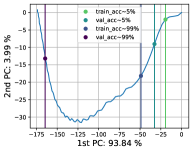

*(e) $r=50\%$*

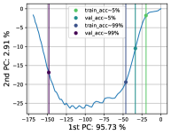

*(f) $r=55\%$*

*(g) $r=60\%$*

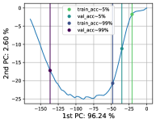

*(h) $r=65\%$*

*(i) $r=70\%$*

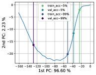

*(j) $r=75\%$*

*(k) $r=80\%$*

*(l) $r=90\%$*

*Рисунок 13: Проекция вдоль оси от инициализации к решению, $\alpha(t)$ и $\beta(t)$. Видно, что более 98 % полной дисперсии в пространстве параметров приходится на первые 2 моды PCA — гораздо меньше полного числа весов, — что наводит на мысль, что динамика оптимизации вложена в низкоразмерное пространство.* **[p. 14]**

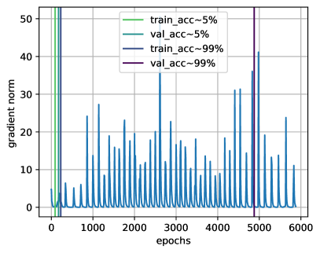

*(a) $r=0.3$*

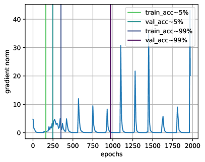

*(b) $r=0.8$*

*Рисунок 14: Норма градиента $\|G_{t}\|^{2}$. Бо́льшую часть времени значимого градиента нет, отчего градиентный спуск продвигается слабо.* **[p. 14]**

*Рисунок 15: Относительное косинусное сходство ($r=0.3$ и $0.8$). Слева) $cos(\theta_{t}$, $\theta_{t+1})$ Справа) $cos(\theta_{t}$, $\theta_{0})$. Бо́льшую часть времени веса продвигаются очень мало, совершая скачок при взрыве градиента, с эффектом рогатки.* **[p. 15]**

Кроме того, мера косинусного сходства между весами модели от одной эпохи к следующей остаётся почти постоянной — кроме мест рогатки (рисунок 15). Это позволяет увидеть, что наша модель проходит через отмеченные выше аномалии. Показано, что с высокой вероятностью по инициализации итерации алгоритма градиентного спуска даже остаются в малой фиксированной окрестности инициализации на протяжении обучения. Поскольку параметры смещаются очень мало, такой вид обучения назвали также ленивым обучением (Chizat et al., 2019; berner20modern). Те шаги, где расстояния меняются резко, вызваны всплесками градиента обучения (рисунок 14).

### B.3 Механизм рогатки

Выше мы выводим $\dot{L}(t)=-\|G(t)\|^{2}$ при достаточно малом шаге. Это релаксационное свойство градиентного спуска отражает то, что функция потерь не может возрастать. Однако мы теряем это свойство при некоторых ускоренных или адаптивных методах вроде Adam, а также на плохо обусловленных задачах, как мы видели выше с $L_{t+1}>L_{t}$ при $\epsilon_{t}\lambda_{t}(i)>2$. В случае гроккинга потеря, даже став нулевой, обнаруживает внезапный рост с последующим спадом — и притом периодически. Thilak et al. (2022) недавно показали, что это явление общо для оптимизации глубоких нейросетей. Между двумя рогатками градиент почти нулевой, все собственные значения гессиана неотрицательны, и есть одно направление очень большой кривизны, доминирующее над остальными и над обновлением весов, отчего вес меняется от одного шага обучения к другому мало. Модель, таким образом, будто пересекает плоскую долину.

Чтобы ослабить это явление (то есть амплитуду всплесков), мы обрезали норму градиента в ходе обучения (по порогу $\eta>0$). Это замедлило генерализацию, но не предотвратило её.

$$
\dot{\theta}=\left\{\begin{array}[]{ll}-\frac{\eta}{\|G(t)\|}G(t)&\mbox{if }\|G(t)\|\geq\eta\\
-G(t)&\mbox{otherwise.}\end{array}\right.(\eta>0)
$$

$$
\Longrightarrow\dot{L}=\left\{\begin{array}[]{ll}-\eta\|G(t)\|&\mbox{if }\|G(t)\|\geq\eta\\
-\|G(t)\|^{2}&\mbox{otherwise.}\end{array}\right.(\eta>0)
$$

Всплески ослабевают при $\eta\rightarrow 0$, но остаются заметными при $\theta\rightarrow\theta^{*}$. При крайне малой скорости обучения всплески тоже становятся менее заметны, но мы платим ту же цену: модели требуется больше шагов, чтобы генерализовать.

### B.4 Трёхмерные визуализации

Этого можно достичь, глядя на тепловую карту функции стоимости в двумерии (рисунок 16).

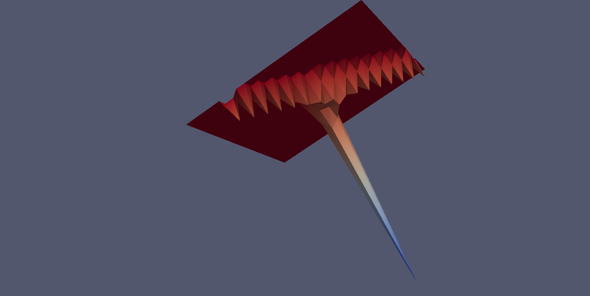

*Рисунок 16: 3D ($r=0.5$)* **[p. 15]**

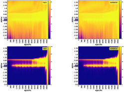

*(a) $r=0.90$*

*(b) $r=0.85$*

*(c) $r=0.80$*

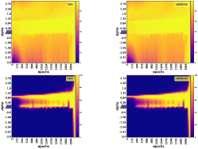

*(d) $r=0.75$*

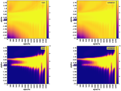

*(e) $r=0.70$*

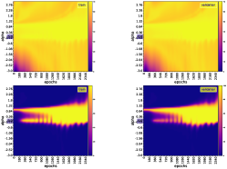

*(f) $r=0.65$*

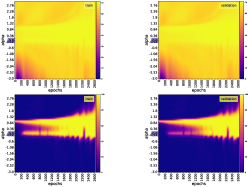

*(g) $r=0.60$*

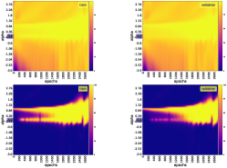

*(h) $r=0.55$*

*(i) $r=0.50$*

*(j) $r=0.40$*

*(k) $r=0.35$*

*(l) $r=0.25$*

*Рисунок 17: Одномерная проекция поверхности потерь (сверху) и точности (снизу) при гроккинге для разных значений доли обучающих данных $r$, для **модульного сложения**. Направление, используемое для каждой эпохи обучения $t$, — $\vec{\delta}_{t}=\theta^{*}-\theta_{t}$.* **[p. 16]**

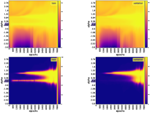

*(a) $r=0.90$*

*(b) $r=0.85$*

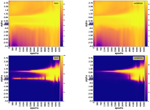

*(c) $r=0.80$*

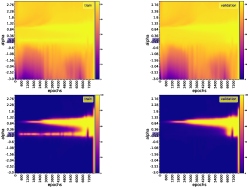

*(d) $r=0.75$*

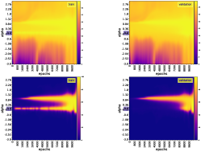

*(e) $r=0.70$*

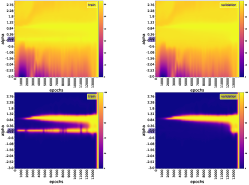

*(f) $r=0.65$*

*(g) $r=0.60$*

*(h) $r=0.55$*

*(i) $r=0.50$*

*(j) $r=0.45$*

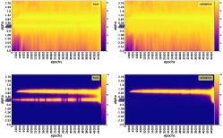

*(k) $r=0.40$*

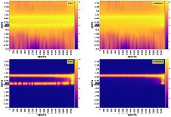

*(l) $r=0.35$*

*Рисунок 18: Одномерная проекция поверхности потерь (сверху) и точности (снизу) при гроккинге для разных значений доли обучающих данных $r$, для **умножения в $S_{5}$**. Направление, используемое для каждой эпохи обучения $t$, — $\vec{\delta}_{t}=\theta^{*}-\theta_{t}$.* **[p. 17]**

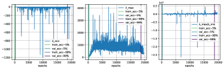

*(a) $r=0.25$*

*(b) $r=0.35$*

*(c) $r=0.40$*

*(d) $r=0.45$*

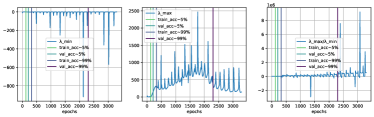

*(e) $r=0.50$*

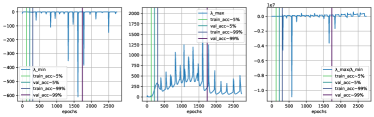

*(f) $r=0.55$*

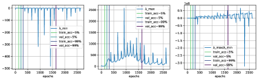

*(g) $r=0.60$*

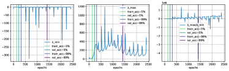

*(h) $r=0.65$*

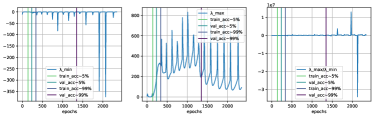

*(i) $r=0.70$*

*(j) $r=0.75$*

*(k) $r=0.85$*

*(l) $r=0.90$*

*Рисунок 19: Число обусловленности гессиана по эпохам обучения для модульного сложения.* **[p. 18]**

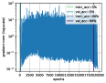

*(a) $r=0.25$*

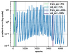

*(b) $r=0.35$*

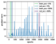

*(c) $r=0.40$*

*(d) $r=0.45$*

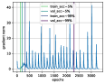

*(e) $r=0.50$*

*(f) $r=0.55$*

*(g) $r=0.60$*

*(h) $r=0.65$*

*(i) $r=0.70$*

*(j) $r=0.75$*

*(k) $r=0.85$*

*(l) $r=0.90$*

*Рисунок 20: Норма градиента для модульного сложения.* **[p. 19]**

*(a) $r=0.25$*

*(b) $r=0.35$*

*(c) $r=0.40$*

*(d) $r=0.45$*

*(e) $r=0.50$*

*(f) $r=0.55$*

*(g) $r=0.60$*

*(h) $r=0.65$*

*(i) $r=0.70$*

*(j) $r=0.75$*

*(k) $r=0.85$*

*(l) $r=0.90$*

**[p. 20]**

*Рисунок 21: Относительное косинусное расстояние для модульного сложения. Слева) $cos(\theta_{t}$, $\theta_{t+1})$ Справа) $cos(\theta_{t}$, $\theta_{0})$* **[p. 19]**

## Приложение C. Оценка внутренней размерности

Мы также эмпирически исследуем связь между эволюцией целевой функции нейросети в ходе обучения и эволюцией внутренней размерности (ID) многообразий активаций её слоёв. Мы обнаружили, что размерность слоёв сети (главным образом последнего слоя) коррелирует с колебаниями качества на обучении и валидации (потери и точности) как в игрушечных моделях (Liu et al., 2022), так и в трансформере (Power et al., 2022). Внутренняя размерность растёт в самом начале обучения, затем убывает (очень сильно колеблясь), пока не стабилизируется на некотором уровне обучения.

### C.1 Методы

Данные обычно представляются высокоразмерными векторами признаков, но во многих случаях их в принципе можно вложить в пространства меньшей размерности без потери информации (Facco et al., 2017). Иначе говоря, любой набор точек высокоразмерного объемлющего пространства $\mathbb{R}^{D}$ обычно на деле лежит на (или близ) другом пространстве размерности $d$, меньшей $D$: тогда $d$ называют внутренней размерностью объемлющего пространства $\mathbb{R}^{D}$. Для оценки этой внутренней размерности давно разработано несколько методов (Roweis & Saul, 2000; Tenenbaum et al., 2000; Belkin & Niyogi, 2001; Donoho & Grimes, 2003; Levina & Bickel, 2004; David J.C. & Zoubin, 2005), среди которых метод двух ближайших соседей (TWONN) (Facco et al., 2017) и подходы максимального правдоподобия (MLE) (Levina & Bickel, 2004; David J.C. & Zoubin, 2005), рассматривающие окрестность каждой точки и вычисляющие евклидово расстояние до $k^{th}$ ближайшего соседа (Pope et al., 2021).

В предположении, что плотность постоянна в малых окрестностях, MLE (Levina & Bickel, 2004) моделирует пуассоновским процессом число точек, находимых случайной выборкой в заданном радиусе вокруг каждой точки выборки (Pope et al., 2021). Связывая интенсивность этого процесса с площадью поверхности сферы, уравнения правдоподобия дают оценку внутренней размерности в данной точке $x$ как

$$
\hat{m}_{k}(x)=\bigg{[}\frac{1}{k-1}\sum_{j=1}^{k-1}log\frac{T_{k}(x)}{T_{j}(x)}\bigg{]}^{-1}
$$

где $T_{j}(x)$ — евклидово расстояние от $x$ до его $j^{th}$ ближайшего соседа. Levina & Bickel (2004) предлагают усреднить локальные оценки по всем точкам, чтобы получить глобальную оценку ($n$ — размер выборки):

$$
\hat{m}_{k}=\frac{1}{n}\sum_{i=1}^{n}\hat{m}_{k}(x_{i})
$$

David J.C. & Zoubin (2005) предлагают поправку, основанную на усреднении обратных величин:

$$
\hat{m}_{k}=\bigg{[}\frac{1}{n}\sum_{i=1}^{n}\hat{m}_{k}(x_{i})^{-1}\bigg{]}^{-1}
$$

TWONN (Facco et al., 2017) использует для оценки лишь двух ближайших соседей каждой точки. Распределение $R=\frac{\Delta v_{2}}{\Delta v_{1}}$ имеет плотность вероятности $g(R)=\frac{1}{(1+R)^{2}}$ (Facco et al., 2017), где $\Delta v_{l}=\omega_{d}(r_{l}^{d}-r_{l-1}^{d})$ — объём гиперсферического слоя, заключённого между двумя последовательными соседями $l-1$ и $l$ данной точки $i$ набора данных ($r_{l}$ — расстояние между $i$ и её $l^{th}$ ближайшим соседом), $d$ — размерность пространства, в которое вложены точки, а $\omega_{d}=\frac{\pi^{d/2}}{\Gamma(d/2+1)}$ — объём d-сферы единичного радиуса ($\Gamma$ — гамма-функция Эйлера). Положим $\mu=\frac{r_{2}}{r_{1}}\geq 1$, тогда $R=\mu^{d}-1$, поскольку $r_{0}=0$, что позволяет найти явную формулу для распределения $\mu$: $f(\mu)=d\mu^{-d-1}\mathbb{1}_{[1,+\infty]}(\mu)$, а значит, и для его функции распределения $F(\mu)=(1-\mu^{-d})\mathbb{1}_{[1,+\infty]}(\mu)\Rightarrow d=-\frac{log(1-F(\mu))}{log(\mu)},\mu\geq 1$. Отсюда получается алгоритм 1.

Заметим, что последний шаг этого алгоритма 1 состоит в решении линейного уравнения $-\log(1-F(\mu_{i}))=d*log(\mu_{i})$ для любой точки $i$ набора данных, что методом наименьших квадратов сводится к $d^{*}=argmin_{d\in\mathbb{R}}\sum_{i=1}^{n}\big{(}\log(1-F(\mu_{i}))+d*log(\mu_{i})\big{)}^{2}$, то есть $d^{*}=-\frac{\sum_{i=1}^{n}log(\mu_{i})\log(1-F(\mu_{i}))}{\sum_{i=1}^{n}log(\mu_{i})^{2}}=-\frac{\sum_{i=1}^{n}log(1-i/n)*log(\mu_{\sigma(i)})}{\sum_{i=1}^{n}log(\mu_{i})^{2}}$. При $k=2$ имеем $\hat{m}_{ki}=log(\mu_{i})^{-1}$ для любой точки $i$ набора данных. Отсюда, если $-\log(1-F(\mu_{i}))=d^{*}*log(\mu_{i})\ \forall i$, то $\hat{m}_{k}^{-1}d^{*}=\frac{1}{n}\sum_{i=1}^{n}\hat{m}_{ki}^{-1}d^{*}=-\frac{1}{n}\sum_{i=1}^{n}\log(1-i/n)$, то есть $\hat{m}_{k}\propto d^{*}$ с точностью до ошибки наименьших квадратов $\sum_{i=1}^{n}\big{(}\log(1-F(\mu_{i}))\big{)}^{2}-(d^{*})^{2}\sum_{i=1}^{n}log(\mu_{i})^{2}$. Эмпирически мы получили коэффициент корреляции Пирсона $\sim 99.60\%$ между MLE (при $k=2$) и TWONN (с *p-значением* порядка $\sim 10^{-7}$). **[p. 21]** Поскольку нас будет занимать лишь эволюция внутренней размерности (а не само её значение), в нашей работе можно пользоваться любым из двух методов.

**Алгоритм 1** Оценка внутренней размерности методом TWONN

1. Вычислить попарные расстояния для каждой точки набора данных $i=1,\dots,n$
2. Для каждой точки $i$ найти два кратчайших расстояния $r_{i}(i)$ и $r_{i}(2)$.
3. Для каждой точки $i$ вычислить $\mu_{i}=\frac{r_{i}(2)}{r_{i}(1)}$
4. Вычислить эмпирическую функцию распределения $F(\mu_{i})$, отсортировав значения $\{\mu_{i}\}_{i=1}^{n}$ по возрастанию перестановкой $\sigma$, а затем положив $F(\mu_{\sigma(i)})=\frac{i}{n}$
5. Подогнать точки плоскости с координатами $\{(log(\mu_{i}),-log(1-F(\mu_{i})))\ |\ i=1,\dots,n\}$ прямой, проходящей через начало координат.

### C.2 Результаты

Мы используем подход максимального правдоподобия David J.C. & Zoubin (2005) с $k=2$ соседями, чтобы оценить внутреннюю размерность каждого слоя нашей модели в ходе обучения — на обучающих и на валидационных данных. Для модульного сложения мы меняли долю обучающих данных от 0.35 до 0.9 с шагом 0.5, то есть в $\{0.35,0.40,\dots,0.85,0.90\}$. Каждый эксперимент для каждого размера набора данных мы повторяли с 2/3/5 случайными сидами. Скорость обучения зафиксирована на $10^{-4}$. См. рисунки 22 и 23 ниже.

*Рисунок 22: Модульное сложение, 2 разных начальных условия (по одному на строку). Шаги — это шаги обучения $\times 100$.* **[p. 21]**

*(a)*

*(a)*

*(b)*

*(b)*

*Рисунок 23: Точность и потеря на обучении и валидации в сопоставлении с оценённой внутренней размерностью в случае модульного сложения, $2$ разных начальных условия (по одному на столбец)* **[p. 22]**

*(a) Accuracy*

*(b) Loss*

*Рисунок 24: (Гроккинг) Точность и потеря на валидации для модульного сложения при разных объёмах данных. Для других операторов точность на валидации остаётся на 0, прежде чем начать расти. **[p. 23]** Для сложения она в начале обучения поднимается до доли обучающих данных, держится там, а гроккинг наступает позже.* **[p. 22]**

## Приложение D. Теоретические модели гроккинга

Для обозначения наших алгоритмов мы будем пользоваться следующими сокращениями: sgd — обычный SGD, momentum — SGD с моментом (Polyak, 1964), rmsprop — алгоритм RMSProp (Hinton, 2012), rprop — алгоритм устойчивого обратного распространения (Riedmiller & Braun, 1993), adam — Adam (Kingma & Ba, 2014) и adamax — Adamax (Kingma & Ba, 2014).

### D.1 Функция Розенброка

Обычная функция Розенброка задаётся как $g_{n}(x)=\sum_{i=1}^{n/2}\big{[}100(x_{2i}-x_{2i-1}^{2})^{2}+(x_{2i-1}-1)^{2}\big{]}$, с градиентом $\nabla_{i}g_{n}(x)=200(x_{i}-x_{i-1}^{2})\cdot\mathbb{1}_{i\in 2\mathbb{N}}-\big{[}400x_{i}(x_{i+1}-x_{i}^{2})-2(x_{i}-1)\big{]}\cdot\mathbb{1}_{i\in 2\mathbb{N}-1}$ и $x^{*}\in\{(1,\dots,1),(-1,1,\dots,1)\}\subset\{x,\nabla g_{n}(x)=0\}$777Когда координаты пробегают от $0$ до $n-1$, $g_{n}(x)=\sum_{i=0}^{n/2-1}\big{[}100(x_{2i+1}-x_{2i}^{2})^{2}+(x_{2i}-1)^{2}\big{]}$ и $\nabla_{i}g_{n}(x)=200(x_{i}-x_{i-1}^{2})\cdot\mathbb{1}_{i\in 2\mathbb{N}+1}-\big{[}400x_{i}(x_{i+1}-x_{i}^{2})-2(x_{i}-1)\big{]}\cdot\mathbb{1}_{i\in 2\mathbb{N}}$.. Более сложный вариант задаётся как $g_{n}(x)=\sum_{i=1}^{n-1}\big{[}100(x_{i+1}-x_{i}^{2})^{2}+(x_{i}-1)^{2}\big{]}$, с градиентом $\nabla_{i}g_{n}(x)=200(x_{i}-x_{i-1}^{2})\cdot\mathbb{1}_{i>1}-\big{[}400x_{i}(x_{i+1}-x_{i}^{2})-2(x_{i}-1)\big{]}\cdot\mathbb{1}_{i<n}$ и $x^{*}=\{1,\dots,1)\}\subset\{x,\nabla g_{n}(x)=0\}$888Когда координаты пробегают от $0$ до $n-1$, $g_{n}(x)=\sum_{i=0}^{n-2}\big{[}100(x_{i+1}-x_{i}^{2})^{2}+(x_{i}-1)^{2}\big{]}$ и $\nabla_{i}g_{n}(x)=200(x_{i}-x_{i-1}^{2})\cdot\mathbb{1}_{i>0}-\big{[}400x_{i}(x_{i+1}-x_{i}^{2})-2(x_{i}-1)\big{]}\cdot\mathbb{1}_{i<n-1}$.. Число стационарных точек этой функции растёт экспоненциально с размерностью $n$, и бо́льшая их часть — неустойчивые седловые точки (Kok & Sandrock, 2009).

*Рисунок 25: Слева) Функция Розенброка в логарифмическом масштабе при $n=2$, В центре) Линии уровня, Справа) Поле градиента: обратите внимание, насколько велики по норме эти векторы вблизи глобального минимума; это важно для понимания того, как даже вблизи этого глобального оптимума многие оптимизаторы могут его не достичь.* **[p. 23]**

*Рисунок 26: Сравнительная визуализация ошибки продвижения каждого алгоритма на функции Розенброка* **[p. 24]**

*Рисунок 27: Сравнительная визуализация продвижения каждого алгоритма на функции Розенброка* **[p. 24]**

Мы оптимизировали функцию Розенброка в логарифмическом масштабе (чтобы создать овраг, рисунок 25) при $n=2$. Функция унимодальна, а глобальный минимум очень остр и в направлении оврага окружён множеством локальных минимумов. В начале оптимизации мы очень быстро скатываемся в овраг, поскольку поверхность хорошо обусловлена. Затем, в зависимости от скорости обучения и используемого оптимизатора (а также связанных с ним гиперпараметров), мы спускаемся по оврагу очень медленно. Действительно, без момента мы не идём прямо вниз к минимуму, поскольку градиент вдоль направления оврага почти нулевой, а в перпендикулярных направлениях очень велик: мы ходим слева направо (поперёк оврага), понемногу спускаясь, но очень медленно. Более того, оказавшись вблизи минимума, мы кружим там почти бесконечно. С адаптивным градиентом мы спускаемся к минимуму очень быстро, поскольку эта проблема направлений исправлена (благодаря моменту перпендикулярные оврагу направления влево-вправо взаимно уничтожаются): если скорость обучения слишком мала, мы тоже будем спускаться очень медленно (малый градиент в плоском направлении оврага). В отличие от SGD, здесь мы всегда достигаем минимума (и остаёмся в нём). Кроме того, при некоторых скоростях обучения и инициализациях наблюдается двойной спуск (Nakkiran et al., 2020) по ошибке (евклидову расстоянию между глобальным минимумом и текущим положением в данный момент) при попадании в овраг. Методы, которым удаётся достичь минимума, — rmsprop, rprop, adam, adamax (рисунки 26 и 27). Метод, подходящий близко, но не достигающий его, — momentum.

### D.2 Функция Растригина

Функция Растригина задаётся как $g_{n}(x)=na+\sum_{i=1}^{n}\big{[}x_{i}^{2}-a\cos(2\pi x_{i})\big{]}=na+x^{T}x-a1_{n}^{T}\cos(2\pi x)$ при $a\in\mathbb{R}$. Её градиент есть $\nabla g_{n}(x)=2x+2\pi a\sin(2\pi x)$, а $x^{*}=\{0,\dots,0)\}\subset\{x,\nabla g_{n}(x)=0\}$.

*Рисунок 28: Слева) Функция Растригина в логарифмическом масштабе ($a=10,n=2$), В центре) Линии уровня, Справа) Поле градиента* **[p. 25]**

**[p. 24]**

Мы также оптимизировали функцию Растригина в логарифмическом масштабе (чтобы создать множество локальных минимумов и сделать глобальный минимум острым, рисунок 28). Функция унимодальна, а глобальный минимум остр и симметрично окружён множеством локальных минимумов. В начале оптимизации мы очень быстро попадаем в один локальный минимум. Затем, в зависимости от скорости обучения и используемого оптимизатора (и связанных с ним гиперпараметров), мы можем последовательно переходить от одного минимума к другому, пока не достигнем глобального. Ни одному методу не удалось достичь глобального минимума (рисунки 29 и 30).

*Рисунок 29: Сравнительная визуализация ошибки продвижения каждого алгоритма на функции Растригина* **[p. 25]**

*Рисунок 30: Сравнительная визуализация продвижения каждого алгоритма на функции Растригина* **[p. 26]**
