# Zhong et al. 2023 — The Clock and the Pizza: Two Stories in Mechanistic Explanation of Neural Networks

См. также: [глобальный индекс понятий](../../concepts/index.md).
arXiv [2306.17844v2](https://arxiv.org/abs/2306.17844), 30 июня 2023 (v2 — 21 ноября 2023). Колонтитул PDF: «37th Conference on Neural Information Processing Systems (NeurIPS 2023).»

**Ziqian Zhong\*, Ziming Liu\*, Max Tegmark, Jacob Andreas** — Massachusetts Institute of Technology. Звёздочка — равный вклад («*Equal contribution*»).

Оригинал и производные файлы этой папки:

- [`original/2306.17844.native.html`](original/2306.17844.native.html) — первоисточник, нативный HTML-рендеринг arXiv, скачан как есть.
- [`original/2306.17844.the-clock-and-the-pizza-two-stories-in-mechanistic-explanation-of-neural-networks.md`](original/2306.17844.the-clock-and-the-pizza-two-stories-in-mechanistic-explanation-of-neural-networks.md) — конверсия оригинала в Markdown без правок содержания; английский текст для сверки перевода.
- [`images/`](images/) — иллюстрации статьи в исходном разрешении (31 файл).
- [`2306.17844.the-clock-and-the-pizza-two-stories-in-mechanistic-explanation-of-neural-networks.claims.txt`](2306.17844.the-clock-and-the-pizza-two-stories-in-mechanistic-explanation-of-neural-networks.claims.txt) — рабочий разбор: пронумерованные утверждения с пометками.

Схема якорей и правила ссылок на карточку — в [README папки статей](../README.md).

## Затрагиваемые понятия

**[Алгоритмы Clock и Pizza](../../concepts/clock-vs-pizza.md)** — работа вводит само различие и обе половины его имени. *Clock* здесь взят как готовое описание, данное [Nanda et al.](../2301.05217.progress-measures-for-grokking-via-mechanistic-interpretability/2301.05217.progress-measures-for-grokking-via-mechanistic-interpretability.card.md) для их модели: входы кладутся на окружность, углы складываются тригонометрическими тождествами ([§2.1](#p3-2)). *Pizza* описан впервые: вложения усредняются **внутри** круга, а не складываются углами на окружности, и сеть определяет, в какую из $2p$ зеркальных «долек» попала средняя точка ([§3.1](#p4-2), [рис. 1](#fig-1)). Различие сформулировано механически: часам нужно умножение входов, пицце — только абсолютная величина, «которое легко осуществимо слоями ReLU» ([§3.1](#p4-3)); отсюда довод от записи логита — у часов $\nabla_{\mathbf{E}_{a}}Q_{abc}\neq\nabla_{\mathbf{E}_{b}}Q_{abc}$, поэтому симметрия градиента часы **исключает** ([§2.2](#p3-5)). Чего в работе нет: слова «запоминание» применительно к пицце — оба решения дают идеальную точность и различаются только внутренним вычислением ([§5](#p9-4)), пицца так же кругова (circularity около $99.8\%$, [приложение B](#p14-7)) и так же собрана из тригонометрии ([приложение A](#p13-2)), как часы; нет и утверждения, что одна из мер важнее в обе стороны — авторы прямо пишут, что решающей мерой пиццы служит distance irrelevance, а gradient symmetricity годится лишь на то, чтобы исключить часы ([§4.1.3](#p7-11)).

**[Механистическая интерпретируемость](../../concepts/mechanistic-interpretability.md)** — работа ставит под сомнение неявную опору всей области: что у хорошо понятой задачи есть одно решение, которое сеть и переоткрывает. Вопрос вынесен в первую фразу аннотации — надёжно ли сети заново открывают известные алгоритмы решения задач, которые сами хорошо поняты ([аннотация](#p1-2)), — и ответ отрицательный. Отсюда заявленный сдвиг цели: описывать не единственное решение, а **алгоритмическое фазовое пространство**, «характеризацию алгоритмических фазовых пространств, а не только отдельных алгоритмических решений» ([§1](#p2-1)); в заключении к этому добавлены два открытых вопроса — как систематически находить и толковать незнакомые алгоритмы и как расплетать несколько параллельных реализаций ([§6](#p10-2)). Работа даёт корпусу и приёмы: изоляцию кругов, зрительный разбор корректных логитов, градиентные меры симметрии и разбор линейной пиццы до отдельных весов ([приложение L](#p26-5)). Чего в работе нет: разбора некруговых решений, составляющих большинство прогонов у глубоких сетей, — он целиком отложен ([§4.2](#p9-1), [приложение B](#p14-4)); нет и прямого спора с гипотезой универсальности — работа [Chughtai, Chan, Nanda](../2302.03025.a-toy-model-of-universality-reverse-engineering-how-networks-learn-group-operations/2302.03025.a-toy-model-of-universality-reverse-engineering-how-networks-learn-group-operations.card.md) стоит у Zhong et al. только в общем перечне работ по механистической интерпретируемости, и «универсальность» как термин в тексте не обсуждается.

**[Модульная арифметика](../../concepts/modular-arithmetic.md)** — задача взята как «прототипическая» и единственная: $a+b=c\ ({\rm mod}\ p)$ при $p=59$ всюду ([§2](#p2-3)). Работа задаёт корпусу постановку, в которой на одной и той же задаче сравниваются **разные** внутренние решения, и вводит для этого сравнения две воспроизводимые меры. Чего в работе нет: зависимости чего-либо от $p$ — модуль один; нет ни других операций, ни некоммутативных задач. Ограничение признано авторами: «Мы сосредоточились на единственной задаче обучения: модульном сложении» ([Limitations](#p10-3)).

**[Фурье-признаки и контуры](../../concepts/fourier-features-circuits.md)** — круговые вложения $\mathbf{E}_{a}\approx[{\rm cos}(w_{k}a),{\rm sin}(w_{k}a)]$ взяты как известный факт со ссылкой на [Liu et al.](../2205.10343.towards-understanding-grokking-an-effective-theory-of-representation-learning/2205.10343.towards-understanding-grokking-an-effective-theory-of-representation-learning.card.md) ([§2.1](#p2-4)), а вклад работы в том, что **на одной и той же фурье-геометрии** стоят два разных вычисления. Обе схемы выведены из тождеств $\cos x+\cos y=\cos((x-y)/2)(2\cos((x+y)/2))$ и $\sin x+\sin y=\cos((x-y)/2)(2\sin((x+y)/2))$ ([приложение A](#p13-2)), и разница между ними — множитель $\lvert\cos(w_{k}(a-b)/2)\rvert$ в логите пиццы ([§3.2](#p4-4)). Введена мера **circularity** по фурье-содержанию первых четырёх главных компонент, круговыми считаются модели с $c\geq 99.5\%$ ([приложение B](#p14-7)). Чего в работе нет: разбора того, как выбирается набор частот и сколько их нужно, — частоты берутся из готовой визуализации; и нет утверждения, что круговые решения преобладают: у однослойных трансформеров круговых $34.31\%$ ([рис. 10](#fig-10)), у двух-, трёх- и четырёхслойных — $9.95\%$, $11.55\%$ и $6.08\%$ ([рис. 11](#fig-11)).

**[Фазовый переход](../../concepts/phase-transition.md)** — работа даёт корпусу переход особого рода и сама его называет: «изучаемый в этой статье фазовый переход — *представленческий*: и часы, и пицца дают идеальную точность, но приходят к ответам через разные внутренние вычисления» ([§5](#p9-4)). Переход резкий и двумерный: по силе внимания $\alpha$ при фиксированной ширине и по паре «сила внимания — ширина слоя», где граница почти линейна, а точка перехода растёт с шириной ([§4.2](#p8-5), [рис. 7](#fig-7)). Объяснение авторское и так и помечено — «Our explanation is»: при высокой силе внимания доступно умножение и возникают часы, при низкой преобладают линейные слои и возникает пицца ([§4.2](#p8-7)). Чего в работе нет: **ось перехода здесь — гиперпараметр, а не время обучения**; каждая точка на рисунке 7 — отдельный завершённый прогон, а не момент одного прогона. Нет параметра порядка, нет теории перехода, а линии на рисунке 7 проведены логистической регрессией по бинарным признакам ($s_{g}>98\%$ и $q<0.6$), то есть являются границей классификатора, а не измеренной точкой перехода.

**[Маршрутизация внимания](../../concepts/attention-routing-heads.md)** — работа вводит **attention rate** $\alpha$: пост-softmax матрица внимания заменяется на $M^{\prime}=M\alpha+J(1-\alpha)$, то есть на интерполяцию между обычным вниманием ($\alpha=1$) и постоянным ($\alpha=0$) ([§4.2](#p8-2)). Это даёт корпусу непрерывную ручку между «трансформером» и «MLP» — Model A с $\alpha=0$ авторы прямо приравнивают к ReLU-MLP ([§2](#p2-3)) — и делает роль внимания измеримой: именно оно, по разбору авторов, доставляет сети умножение входов, без которого часы неосуществимы ([§2.1](#p3-3)). Чего в работе нет: правила «сильное внимание — значит часы» как безусловного; приложение H даёт пиццу при $\alpha=1$ и ширине $1024$ ($q=0.156$, $s_{g}=0.995$), но «после нескольких попыток», и доля таких прогонов не названа ([приложение H](#p21-3)).

**[Каузальная абляция](../../concepts/causal-ablation-intervention.md)** — работа даёт корпусу приём **circle isolation**: матрица вложений заменяется рядом ранг-2 приближений (первая и вторая главные компоненты, затем третья и четвёртая и так далее), после чего модель продолжает вести себя осмысленно, и по остаточному поведению видно, какой алгоритм в ней зашит ([§3.3](#p5-1), [рис. 4](#fig-4)). Тем же приёмом получено наблюдение об **исправлении ошибок ансамблированием**: один круг у Model A даёт $32.8\%$ общей точности, три круга — $91.4\%$, тогда как Model B на первых шести компонентах даёт $100\%$. Чего в работе нет: вмешательства во время обучения — круги удаляются только у обученной сети; и сам вывод об ансамблировании сделан по падению точности при удалении, а не по включению или выключению отдельного круга при обучении. Ближе всего к динамике — снимок на 600-й эпохе, где удаление сопровождающего круга роняет точность с $99.7\%$ до $97.9\%$ ([приложение K](#p23-1)).

**[Спектральный анализ / FVE](../../concepts/spectral-analysis-svd-esd-fve.md)** — доля объяснённой дисперсии применена здесь как средство различить две формулы на одних и тех же данных: по **всем** $59\times 59\times 59$ логитам Model A формула пиццы объясняет $99.18$–$99.28\%$ дисперсии против $75.38$–$75.62\%$ у формулы часов, обе стороны предварительно нормированы на среднее $0$ и дисперсию $1$ ([§3.3](#p5-2)). Тем же способом измерены сопровождающие пиццы — $97.23$–$97.69\%$ ([приложение D](#p15-4)). Работа опирается и на анализ главных компонент: круги ищутся попарно в PCA вложений, а в приложении L PCA применён к матрицам вложения и развложения сразу ([приложение L](#p26-5)). Чего в работе нет: спектра весов, распределения сингулярных чисел и вообще какой-либо связи FVE с ходом обучения — все числа сняты у обученных моделей.

**[Разрежённая подсеть / lottery ticket](../../concepts/sparse-subnetwork-lottery-ticket.md)** — работа лишь заимствует язык лотерейных билетов, и делает это в явно объявленной догадке: «Мы предполагаем, что динамика обучения такова: (1) при инициализации пиццы #1/#2/#3 отвечают трём разным “лотерейным билетам”… (3) по мере обучения (в присутствии weight decay) нейросеть обрезается» ([§3.4](#p6-2)). Ни одного измерения к этой догадке не приложено: ни отслеживания кругов от инициализации, ни перезапуска с масками. Чего в работе нет: собственного вклада в понятие — лотерейный билет здесь метафора для объяснения того, почему сопровождающие пиццы видны в пространстве вложений, но почти не участвуют в предсказании.

**[Weight decay / L2-регуляризация](../../concepts/weight-decay.md)** — работа ставит необычно сильный weight decay ($\beta=2$ при AdamW и скорости обучения $\gamma=0.001$) как часть постановки, не обсуждая его ([приложение F.1](#p20-2)), и один раз даёт ему содержательную роль — в догадке об обрезке сопровождающих пицц ([§3.4](#p6-2)). Чего в работе нет: перебора значений $\beta$, сравнения с прогонами без регуляризации и вообще какого-либо измерения влияния weight decay на выбор между часами и пиццей — фазовые диаграммы построены по силе внимания, ширине и глубине.

**[Эталонный полигон гроккинга](../../concepts/canonical-grokking-testbed.md)** — постановка ровно та, в которой корпус наблюдает отложенную генерализацию: небольшой простой модуль $p=59$, вся таблица из $p^{2}=3481$ пар, случайные $80\%$ в обучение и $20\%$ в проверку, полный батч без минибатчей, AdamW с сильным weight decay, $20\,000$ эпох от случайной инициализации ([приложение F.1](#p20-1), [F.1](#p20-2)). Работа наследует полигон и переиспользует его для другого вопроса — какой алгоритм получится, а не когда наступит генерализация. Чего в работе нет: кривых обучения и проверки; более того, прогоны, не дошедшие до $100\%$ проверочной точности, из разбора **выброшены** ([приложение F.1](#p20-2)), так что задержка генерализации на этом полигоне здесь принципиально не наблюдаема. Цена постановки названа: $226$ GPU-дней V100 ([приложение F.3](#p20-6)).

**[Гроккинг](../../concepts/grokking.md)** — слово «grokking» в тексте статьи не встречается ни разу: оно есть только в четырёх записях списка литературы (Power et al., Nanda et al., Liu et al., Omnigrok). Отложенной генерализации работа не измеряет и кривых её не приводит; все переходы, о которых она говорит, идут **по гиперпараметрам** (сила внимания, ширина, глубина) и разделяют не моменты одного прогона, а разные обученные модели ([§4.2](#p8-2), [§5](#p9-4)). Косвенное отношение к гроккингу у работы двоякое. Во-первых, постановка — та же, что у корпуса ([приложение F.1](#p20-1)). Во-вторых, два приложения показывают, что промежуточный алгоритм не совпадает с итоговым: на прогоне с вниманием пиццеподобный узор виден рано и постепенно «растворяется», а итог — часы ([приложение J](#p21-8), [рис. 22](#fig-22)); на прогоне без внимания сопровождающая пицца возникает рано, и на 600-й эпохе её удаление роняет точность с $99.7\%$ до $97.9\%$, тогда как в обученной Model A стоит уже почти ничего ([приложение K](#p23-1), [рис. 23](#fig-23)). Чего в работе нет: ни повторов этих двух прогонов, ни кривых потерь, ни привязки снимков к моменту генерализации — на рисунке 22 подписаны шаги (90, 210, 300, 510, 840), и как они соотносятся с выходом на $100\%$ проверочной точности, не сказано. Приписывать авторам утверждение «переход часы↔пицца есть переход гроккинга» нельзя.

**[Меры прогресса](../../concepts/progress-measures.md)** — работа вводит две измеримые величины, **gradient symmetricity** $s_{g}\in[-1,1]$ — среднюю косинусную близость градиентов логита по двум входным вложениям ([§4.1.1](#p7-3)) — и **distance irrelevance** $q\in[0,1]$ — отношение средней по $d$ ско корректных логитов вдоль диагоналей $L_{i,i+d}$ к общей ско матрицы ([§4.1.2](#p7-7)), — но это меры **не прогресса, а принадлежности к алгоритму**: они считаются у обученной модели и служат тому, чтобы автоматически рассортировать прогоны. Ни одна из них не измеряется по ходу обучения и не предъявляется как предвестник чего-либо. Термин «progress measures» в статье не употребляется, хотя работа Nanda et al., откуда он идёт, процитирована как источник алгоритма часов. Пороговые значения назначены вручную и без обоснования: $98\%$ для $s_{g}$, $0.6$ для $q$, $99.5\%$ для circularity, а «типичные» диапазоны distance irrelevance ($0$–$0.4$ для пиццы, $0.4$–$1$ для часов) даны просто наблюдением ([§4.1.2](#p7-10)).

**[Параметр порядка](../../concepts/order-parameter.md)** — двумерная диаграмма «сила внимания — ширина» с резкой границей между двумя фазами и две скалярные величины, по которым фазы различаются, устроены так же, как строится фазовая диаграмма в физике; авторы и говорят, что внутримодельные переходы «ближе к соответствующим явлениям в физических системах» ([§5](#p9-4)). Но термина «параметр порядка» в статье нет, ни одна из двух мер так не названа и не проверена на роль параметра порядка: их совместное распределение показано как облако точек по совокупности прогонов ([рис. 6](#fig-6)), а не как зависимость от управляющего параметра с особенностью в точке перехода. Приписывать работе язык параметров порядка нельзя.

**[Обучение структурированных представлений](../../concepts/structured-representation-learning.md)** — работа даёт корпусу важное отрицательное наблюдение: круговое представление **недоопределяет** алгоритм. Одна и та же геометрия — точки на окружности — обслуживает два разных вычисления, а сверх того существуют вовсе некруговые представления: прямые и трёхмерные кривые типа Лиссажу ([§4.2](#p9-1), [приложение B](#p14-4)). Чего в работе нет: разбора того, как круг возникает, и вообще какой-либо динамики представлений — вложения рассматриваются только у обученных сетей; некруговые решения не разобраны и признаков, различающих их между собой, у авторов нет.

**[Доля данных / критический размер набора](../../concepts/data-fraction-critical-dataset-size.md)** — доля обучающих данных зафиксирована на $80\%$ и объявлена средством ускорить обучение: «Этот выбор (малое $p$ и высокая доля обучающих данных) помогает ускорить обучение» ([приложение F.1](#p20-1)). Работа лишь упоминает величину как настройку. Чего в работе нет: перебора доли данных, критического размера набора и вообще какой-либо зависимости выбора алгоритма от объёма обучения.

**[Оптимизатор](../../concepts/optimizer-adam-adamw-sgd.md)** — AdamW со скоростью обучения $\gamma=0.001$, полный батч, $20\,000$ эпох ([приложение F.1](#p20-2)). Работа лишь ставит оптимизатор как часть постановки: сравнения оптимизаторов нет, роль адаптивности не обсуждается, и ни один из результатов не привязан к выбору AdamW.

**[Эмерджентность / эмерджентные способности](../../concepts/emergence.md)** — упомянута только в обзоре смежных работ: способность зовётся «эмерджентной», если качество на подзадаче внезапно растёт с ростом размера модели, «хотя такие заявления зависят от выбора меры», и приведена гипотеза о том, что эмерджентность способности отвечает возникновению модульного контура ([§5](#p10-1)). Собственного вклада в понятие у работы нет: масштаб модели она не меняет (ширина перебирается в узком диапазоне $[32,512]$ и служит осью фазовой диаграммы, а не мерой масштаба), внезапного роста качества не наблюдает и слова «эмерджентность» к своим переходам не применяет.

**[Групповые представления и cosets](../../concepts/group-representations-cosets.md)** — работа лишь упоминает смежное: обучение групповых структур названо в перечне математических задач, к которым применяли машинное обучение ([§5](#p9-3)), а работа Chughtai, Chan, Nanda о переоткрытии сетями групповых операций стоит в общем списке работ по механистической интерпретируемости. Ни групповых представлений, ни разложения по неприводимым характерам в статье нет: вся задача — абелева, и вся геометрия — окружность.

---

## Несогласованности внутри статьи

**Model A и Model B перепутаны в первой фразе раздела 4.** Написано: «В разделе 3 мы показали типичные *Clock* (Model A) и *Pizza* (Model B)» ([§4](#p7-1)), тогда как всюду в статье Model A — это пицца (постоянное внимание, симметричные градиенты, зависимость логитов от $a-b$), а Model B — часы. Ошибка авторская, а не следствие конверсии: сверено по PDF, страница 7. Цитировать эту фразу как определение моделей нельзя.

**Одна и та же тройка кругов даёт два разных числа точности.** В [§3.3](#p5-1) изоляция кругов у Model A по первым шести главным компонентам (три круга) даёт «общую точность $91.4\%$», а в сноске к [§3.4](#p6-2) сказано: «Сопровождаемые пиццы #1/#2/#3 могут достигать точности 99.7%». Числа сходятся только при разном прочтении: $91.4\%$ — это модель, **урезанная** до трёх кругов, а $99.7\%$ — полная модель, из которой **удалены** три сопровождающих круга (так это и сформулировано в [приложении K](#p23-1): «удаление сопровождающих пицц в обученной Model A роняет точность лишь до 99.7%»). В самой сноске это различие не оговорено, и при цитировании числа $99.7\%$ как «точности трёх пицц» получится утверждение, которого в работе нет.

---

## Что показано, что выведено из записи алгоритма и что предположено

Работа сама помечает свои догадки, и эти пометки при цитировании теряются первыми.

**Показано измерением.** Симметричность градиентов Model A и Model B — $99.37\%$ и $33.36\%$ ([§4.1.1](#p7-6)); зависимость корректных логитов Model A от $a-b$ и её отсутствие у Model B ([§2.3](#p3-7)); поведение обеих моделей после изоляции кругов ([§3.3](#p5-1)); доли объяснённой дисперсии — $99.18$–$99.28\%$ у формулы пиццы против $75.38$–$75.62\%$ у формулы часов ([§3.3](#p5-2)) и $97.23$–$97.69\%$ у сопровождающих пицц ([приложение D](#p15-4)); резкая двумерная граница фаз ([§4.2](#p8-5), [рис. 7](#fig-7)); доли круговых решений по глубине ([рис. 10](#fig-10), [рис. 11](#fig-11)); устойчивость картины к замене ReLU на GeLU, к раздельным вложениям двух токенов и к добавлению знака «=» ([приложение I](#p21-4)); нерабочесть второго ReLU в линейной пицце — после его удаления точность остаётся $100\%$, а потеря даже падает с $6.20\times 10^{-7}$ до $5.89\times 10^{-7}$ ([приложение L.3](#p26-2)).

**Выведено из записи алгоритма, а не измерено.** То, что часы исключаются симметрией градиента, — следствие выражения (1), а не наблюдение: раз логит часов содержит произведение вложений, градиенты по двум входам вообще говоря различны, значит модель с симметричными градиентами реализует что-то другое ([§2.2](#p3-5)). Измерением проверено уже следствие.

**Предположено, и авторы это говорят.** Динамика возникновения и обрезки сопровождающих пицц — «Мы предполагаем, что динамика обучения такова» ([§3.4](#p6-2)). Неожиданная зависимость логитов часов от $a+b$ — «Наша догадка состоит в том, что шаги 1 и 2 осуществлены (почти) без шума… однако шаг 3 после изоляции круга несовершенен» ([§3.3](#p5-4)). Возможность гибридных алгоритмов — «Непрерывная смена фазы наводит на существование сетей, лежащих между алгоритмами *Clock* и *Pizza*» ([§4.2](#p8-8)); отдельной такой модели не разобрано. Объяснение самой границы фаз — «Наше объяснение таково» ([§4.2](#p8-7)).

**Назначено вручную.** Пороги $98\%$ для gradient symmetricity, $0.6$ для distance irrelevance и $99.5\%$ для circularity, а также «типичные» диапазоны distance irrelevance ($0$–$0.4$ и $0.4$–$1$) даны без обоснования ([§4.1.2](#p7-10), [приложение B](#p14-7)); линии фазового перехода — граница логистической регрессии по этим бинарным признакам, а не измеренная точка перехода ([рис. 7](#fig-7)).

**Отбор прогонов.** Из разбора выброшены прогоны, не дошедшие до $100\%$ проверочной точности («большинство прогонов достигло $100\%$», [приложение F.1](#p20-2)); пицца при полном внимании и ширине $1024$ получена «после нескольких попыток», и доля таких прогонов не названа ([приложение H](#p21-3)).

**Ограничения, признанные авторами.** Одна задача, одно $p$, и «Требуется значительная дополнительная работа, чтобы перенести эти приёмы на куда более сложные модели» ([Limitations](#p10-3)); разбор некруговых решений отложен на будущее ([§4.2](#p9-1), [приложение B](#p14-4)), хотя у глубоких сетей именно они составляют большинство прогонов.

---

## Ошибочные пересказы и цитирования этой статьи

Ниже — узоры, замеченные в цитирующих работах корпуса; каждая запись говорит, что именно искажается, и ведёт на авторские абзацы с теряемой оговоркой.

**«Пицца — это кусочно-запоминающее решение, откладывающее генерализацию» (ошибочное).** Цитирующие приписывают работе противопоставление «структурное фурье-решение против запоминания»: у Yildirim (2603.05228) пицца — это `"a fragmented “Pizza” algorithm relying on piecewise memorization"` («раздробленный алгоритм «пицца», опирающийся на кусочное запоминание»), а сама возможность такого решения объявлена причиной задержки — `"memorization-heavy solution pathways that delay the emergence of invariant representations"` («пути решения, тяготеющие к запоминанию и откладывающие возникновение инвариантных представлений»). У Zhong et al. ничего подобного нет. Пицца — такое же круговое фурье-решение, как часы: её вложения ложатся на окружность, circularity Model A около $99.8\%$ ([приложение B](#p14-7)), а её логит выведен из тех же тригонометрических тождеств, что и логит часов ([приложение A](#p13-2)), и отличается от него одним множителем ([§3.2](#p4-4)). Обе фазы доходят до идеальной точности, и авторы прямо называют переход между ними представленческим, а не качественным: «и часы, и пицца дают идеальную точность, но приходят к ответам через разные внутренние вычисления» ([§5](#p9-4)). Слова «memorization» в статье нет, а прогоны, не дошедшие до $100\%$ проверочной точности, из разбора выброшены ([приложение F.1](#p20-2)), так что «задержка» здесь не только не показана, но и не наблюдаема. Для сравнения — формулировка, сохраняющая обе половины: у 2606.12966 «Zhong et al. 2023 show that small hyperparameter changes induce qualitatively different procedures (a “clock” and a “pizza” algorithm), both Fourier-based», где важное «both Fourier-based» на месте. Подробности — в карточке цитирующей работы: [Yildirim, 2603.05228](../2603.05228.the-geometric-inductive-bias-of-grokking-bypassing-phase-transitions-via-architectural-topology/2603.05228.the-geometric-inductive-bias-of-grokking-bypassing-phase-transitions-via-architectural-topology.card.md).

**«Часы и пицца возникают на переходе гроккинга» (ошибочное).** У Saheb Pasand et al. (2510.04930) читаем: `"Notably, Zhong et al. (2023) identify complementary algorithmic mechanisms (“clock” and “pizza”) and circular embeddings that emerge at the grokking transition"` («Примечательно, что Zhong et al. (2023) указывают дополняющие друг друга алгоритмические устройства («часы» и «пицца») и круговые вложения, возникающие при переходе гроккинга»); у Xu (2602.16746) работа стоит в перечне призм на гроккинг как `"circuit formation (Zhong et al., 2024)"`. Слова «grokking» в теле статьи Zhong et al. нет ни разу — оно встречается только в четырёх записях списка литературы. Ось перехода здесь — гиперпараметр: сила внимания $\alpha$, ширина слоя, глубина ([§4.2](#p8-2), [§4.2](#p8-5)), и каждая точка фазовой диаграммы есть отдельный завершённый прогон, а не момент одного прогона; авторы отделяют свой переход от привычных литературе переходов по качеству именно тем, что он представленческий ([§5](#p9-4)). «Дополняющими друг друга» у Zhong et al. названы не часы и пицца, а сопровождаемая и сопровождающая пиццы — два круга внутри одной модели, из которых второй работает лучше всего на антиподальных парах, губительных для первого ([§3.4](#p6-1), [§3.4](#p6-2)). Подробности — в карточках цитирующих работ: [Saheb Pasand et al., 2510.04930](../2510.04930.egalitarian-gradient-descent-a-simple-approach-to-accelerated-grokking/2510.04930.egalitarian-gradient-descent-a-simple-approach-to-accelerated-grokking.card.md), [Xu, 2602.16746](../2602.16746.low-dimensional-and-transversely-curved-optimization-dynamics-in-grokking/2602.16746.low-dimensional-and-transversely-curved-optimization-dynamics-in-grokking.card.md).

**«Пицца — это то, что получается без внимания, и она обходится без тригонометрических тождеств» (ошибочное).** У Furuta et al. (2402.16726) в сноске сказано: `"Zhong et al., 2023 revealed the existence of algorithms independent of trigonometric identities if the model does not have attention. Since we employ a Transformer with attention, this paper assumes the algorithms based on trigonometric identities."` («Zhong et al., 2023 выявили существование алгоритмов, не зависящих от тригонометрических тождеств, если у модели нет внимания. Поскольку мы берём трансформер с вниманием, эта статья исходит из алгоритмов, основанных на тригонометрических тождествах»). Обе половины расходятся с текстом Zhong et al. Пицца выведена **из** тригонометрических тождеств: приложение A начинается с $\cos x+\cos y=\cos((x-y)/2)(2\cos((x+y)/2))$ и приходит к $Q^{\prime}_{abc}\approx\lvert\cos(w_{k}(a-b)/2)\rvert\cos(w_{k}(a+b-c))$ ([приложение A](#p13-2)), и в самой лемме A.1 показано, что множитель $\cos((x-y)/2)$ появляется у **любой** симметричной линейной комбинации синусов и косинусов. И пицца не привязана к отсутствию внимания: приложение H предъявляет пиццу при полном внимании $\alpha=1$ и ширине $1024$ ([приложение H](#p21-3)), а фазовая граница на рисунке 7 сдвигается вверх с ростом ширины, так что при широкой модели пицца возможна и при сильном внимании. Отсутствие внимания у Zhong et al. — не условие пиццы, а один конец непрерывной шкалы $\alpha$. Подробности — в карточке цитирующей работы: [Furuta et al., 2402.16726](../2402.16726.towards-empirical-interpretation-of-internal-circuits-and-properties-in-grokked-transformers-on-modular-polynomials/2402.16726.towards-empirical-interpretation-of-internal-circuits-and-properties-in-grokked-transformers-on-modular-polynomials.card.md).

Более мягкие отголоски, не заслужившие отдельного разбора: пересказы вида «разные архитектуры сходятся к разным решениям» (2604.17673, 2606.17399) верны по существу, но «архитектура» у Zhong et al. означает положение внутри одного семейства однослойных трансформеров по силе внимания и ширине, а не разные архитектуры в обычном смысле; и в нескольких работах ([Xu, 2602.16746](../2602.16746.low-dimensional-and-transversely-curved-optimization-dynamics-in-grokking/2602.16746.low-dimensional-and-transversely-curved-optimization-dynamics-in-grokking.card.md), [2511.01938](../2511.01938.the-geometry-of-grokking-norm-minimization-on-the-zero-loss-manifold/2511.01938.the-geometry-of-grokking-norm-minimization-on-the-zero-loss-manifold.card.md), 2604.06256, 2602.18523) работа датирована 2024 годом, тогда как препринт вышел в июне 2023-го, а v2 — в ноябре 2023-го.

---

# Текст статьи

# The Clock and the Pizza: Two Stories in Mechanistic Explanation of Neural Networks

Ziqian Zhong* Ziming Liu* Max Tegmark Jacob Andreas Аффилиация: Massachusetts Institute of Technology Аффилиация: {ziqianz, zmliu, tegmark, jda}@mit.edu

## Аннотация

###### p1-2

Надёжно ли нейросети, обученные на хорошо понятых алгоритмических задачах, заново открывают известные алгоритмы решения этих задач? Несколько недавних исследований, на задачах от групповой арифметики до линейной регрессии в контексте, наводили на мысль, что да. Взяв модульное сложение как прототипическую задачу, мы показываем, что открытие алгоритма в нейросетях иногда устроено сложнее. Малые изменения гиперпараметров модели и инициализаций способны вызвать открытие качественно разных алгоритмов на одном и том же обучающем наборе и даже параллельные реализации нескольких таких алгоритмов. Часть сетей, обученных выполнять модульное сложение, осуществляет знакомый алгоритм *Clock* (описанный ранее у Nanda et al. [1]); другие осуществляют ранее не описанную, менее умозрительную, но постижимую процедуру, которую мы называем алгоритмом *Pizza*, или ряд ещё более сложных процедур. Наши результаты показывают, что даже простые задачи обучения допускают удивительное разнообразие решений, что побуждает разрабатывать новые средства описания поведения нейросетей во всём их алгоритмическом фазовом пространстве. 11 1 Код доступен по адресу https://github.com/fjzzq2002/pizza.

## 1 Введение

Механистическое понимание глубоких сетевых моделей — обратный инжиниринг выученных ими алгоритмов и схем представления — остаётся серьёзным вызовом во всех предметных областях. В нескольких недавних исследованиях [2, 3, 4, 5, 1] предъявлены отдельные примеры того, как модели, по-видимому, заново открывают интерпретируемые (а иногда и знакомые) решения задач вроде выделения кривых, копирования последовательностей и модульной арифметики. Эти модели — исключение или правило? При каких условиях нейросетевые модели открывают знакомые алгоритмические решения алгоритмических задач?

В этой статье мы сосредоточиваемся именно на задаче обучения модульному сложению, обучая сети вычислять суммы вида $8+6=2\ (\mathrm{mod}\ 12)$. Модульную арифметику можно осуществить простым геометрическим решением, знакомым всякому, кто научился читать по часам: каждое целое число представляется углом, входные углы складываются, а полученный угол вычисляется, чтобы получить модульную сумму (рисунок 1, слева). Nanda et al. [1] показывают, что определённые нейросетевые архитектуры, обученные выполнять модульное сложение, осуществляют этот алгоритм *Clock*. В этой работе мы показываем, что алгоритм *Clock* — лишь часть более сложной картины обучения алгоритмам в глубоких сетях. В частности, сети, структурно схожие с обученными у Nanda et al., предпочтительно осуществляют качественно другой подход к модульной арифметике, который мы называем алгоритмом *Pizza* (рисунок 1, справа), а иногда и ещё более сложные решения. Модели обнаруживают резкие *алгоритмические фазовые переходы* [6] между алгоритмами *Clock* и *Pizza* по мере того, как меняются их ширина и сила внимания, и нередко осуществляют несколько несовершенных копий алгоритма *Pizza* параллельно.

**[p. 2]**

###### p2-1

Наши результаты подчёркивают сложность механистического описания даже у моделей, обученных выполнять простые задачи. Они указывают на характеризацию алгоритмических фазовых пространств, а не только отдельных алгоритмических решений, как на важную цель интерпретируемости на уровне алгоритмов.

*Таблица 1: Разные нейросетевые алгоритмы модульного сложения* **[p. 2]**

| Алгоритм | Выученные вложения | Симметрия градиента | Требуемая нелинейность |
|---|---|---|---|
| Clock | Окружность | Нет | Умножение |
| Pizza | Окружность | Да | Абсолютная величина |
| Non-circular | Прямая, кривые типа Лиссажу и др. | Н/д | Н/д |

**Устройство статьи** В разделе 2 мы разбираем алгоритм *Clock* [1] и приводим эмпирические свидетельства отклонения от него у моделей, обученных выполнять модульное сложение. В разделе 3 мы показываем, что эти отклонения объяснимы альтернативным алгоритмом *Pizza*. В разделе 4 мы определяем дополнительные меры, различающие эти алгоритмы, и обнаруживаем фазовые переходы между ними (и другими алгоритмами, *Non-circular*), когда меняются архитектуры и гиперпараметры. Связь этих находок с прочими работами по толкованию моделей мы обсуждаем в разделе 5 и заключаем в разделе 6.

###### fig-1

*Рисунок 1: Иллюстрация алгоритмов *Clock* и *Pizza*.* **[p. 2]**

## 2 Модульная арифметика и алгоритм *Clock*

###### p2-3

**Постановка** Мы обучаем нейросети выполнять модульное сложение $a+b=c\ ({\rm mod}\ p)$, где $a,b,c=0,1,\cdots,p-1$. Всюду в статье мы берём $p=59$. В этих сетях у каждого целого $t$ есть связанный с ним вектор вложения $\mathbf{E}_{t}\in\mathbb{R}^{d}$. Сети принимают на вход вложения $[\mathbf{E}_{a},\mathbf{E}_{b}]\in\mathbb{R}^{2d}$ и предсказывают категориальный выход $c$. Обучаемы и вложения, и параметры сети. В предварительных опытах мы обучаем на задаче модульной арифметики две разные сетевые архитектуры, которые называем Model A и Model B. **Model A** — однослойный ReLU-трансформер [7] с постоянным вниманием, а **Model B** — обычный однослойный ReLU-трансформер (подробности в приложении F.1). Поскольку внимание в Model A не участвует, её можно понимать и как ReLU-MLP (приложение G).

### 2.1 Разбор алгоритма *Clock*

###### p2-4

Как и в прошлых работах, мы находим, что после обучения и Model A, и Model B вложения ($\mathbf{E}_{a},\mathbf{E}_{b}$ на рисунке 1) обычно описывают окружность [8] в плоскости, натянутой на первые две главные компоненты матрицы вложений. Формально $\mathbf{E}_{a}\approx[{\rm cos}(w_{k}a),{\rm sin}(w_{k}a)]$, где $w_{k}=2\pi k/p$, а $k$ — целое из $[1,p-1]$. Nanda et al. [1] обнаружили контур, который пользуется этими круговыми вложениями, чтобы осуществить интерпретируемый алгоритм модульной арифметики; мы называем его алгоритмом *Clock*.

**[p. 3]**

«Если встреча начинается в 10 и длится 3 часа, то она закончится в 1». Этот привычный факт есть описание модульной суммы, $10+3=1\ ({\rm mod}\ 12)$, а движение часовой стрелки описывает простой алгоритм модульной арифметики: числа от 1 до 12 расставлены по окружности с шагом $360^{\circ}/12=30^{\circ}$, углы $10\times 30^{\circ}$ и $3\times 30^{\circ}$ складываются, после чего полученный угол вычисляется и оказывается отвечающим $1\times 30^{\circ}$.

###### p3-2

Примечательно, что Nanda et al. [1] находят, что нейросети вроде нашей Model B осуществляют этот алгоритм *Clock*, изображённый на рисунке 1 (слева): они представляют токены $a$ и $b$ как двумерные векторы и складывают их полярные углы тригонометрическими тождествами. Конкретно алгоритм *Clock* состоит из трёх шагов. На шаге 1 токены $a$ и $b$ вкладываются как $\mathbf{E}_{a}=[{\rm cos}(w_{k}a),{\rm sin}(w_{k}a)]$ и $\mathbf{E}_{b}=[{\rm cos}(w_{k}b),{\rm sin}(w_{k}b)]$ соответственно, где $w_{k}=2\pi k/p$ (у обычных часов $p=12$ и $k=1$). Затем полярные углы $\mathbf{E}_{a}$ и $\mathbf{E}_{b}$ складываются (на шаге 2) и извлекаются (на шаге 3) тригонометрическими тождествами. Для каждого возможного выхода $c$ мы обозначаем логит $Q_{abc}$; предсказанный выход — $c^{*}={\rm argmax}_{c}~Q_{abc}$.

###### p3-3

Решающее для этого алгоритма обстоятельство — то, что механизм внимания может быть употреблён для выполнения умножения. Что происходит в вариантах модели, где механизма внимания нет, как в Model A? Мы находим два свидетельства отклонения от алгоритма *Clock* у Model A.

### 2.2 Первое свидетельство нарушения *Clock*: симметричность градиента

Поскольку у алгоритма *Clock* логиты таковы:

$$
Q_{abc}^{\rm Clock}=(\mathbf{E}_{a,x}\mathbf{E}_{b,x}-\mathbf{E}_{a,y}\mathbf{E}_{b,y})\mathbf{E}_{c,x}+(\mathbf{E}_{a,x}\mathbf{E}_{b,y}+\mathbf{E}_{a,y}\mathbf{E}_{b,x})\mathbf{E}_{c,y}, \tag{1}
$$

###### p3-5

(см. рисунок 1) градиенты $Q_{abc}$ вообще говоря лишены перестановочной симметрии по порядку аргументов: $\nabla_{\mathbf{E}_{a}}Q_{abc}\neq\nabla_{\mathbf{E}_{b}}Q_{abc}$. Значит, если выученные модели обнаруживают перестановочную симметрию ($\nabla_{\mathbf{E}_{a}}Q_{abc}=\nabla_{\mathbf{E}_{b}}Q_{abc}$), они должны осуществлять какой-то другой алгоритм.

Мы вычисляем 6 наибольших главных компонент векторов входных вложений. Затем мы вычисляем градиенты выходных логитов (ненормированных логарифмов вероятностей из модели) по входным вложениям. Затем мы проецируем их на эти 6 главных компонент (поскольку углы, существенные для алгоритмов *Clock* и *Pizza*, закодированы в первых нескольких главных компонентах). Эти проекции показаны на рисунке 2. Тогда как Model B обнаруживает асимметрию в целом, Model A обнаруживает симметрию градиента.

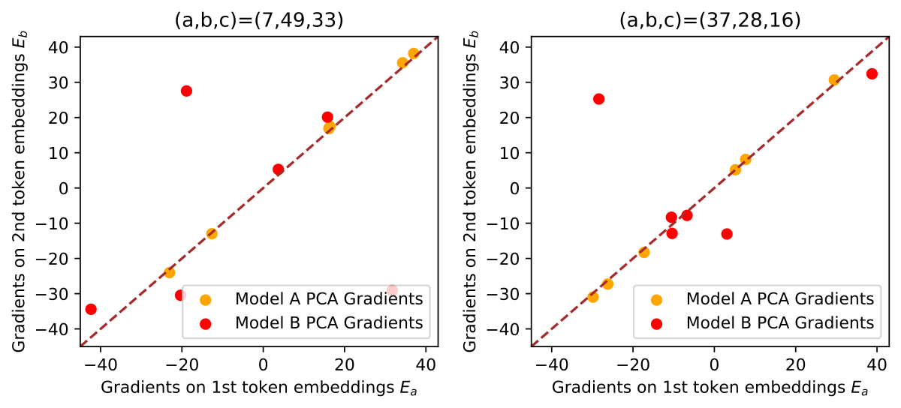

*Рисунок 2: Градиенты на первых шести главных компонентах входных вложений. $(a,b,c)$ в заголовке означает взятие градиентов по выходному логиту $c$ при входе $(a,b)$. Оси x и y представляют градиенты для вложений первого и второго токена. Пунктирная прямая $y=x$ означает симметричный градиент.* **[p. 3]**

### 2.3 Второе свидетельство нарушения *Clock*: узоры логитов

###### p3-7

Рассмотрение выходов моделей, вдобавок к входам, вскрывает дальнейшие различия. Для каждой входной пары $(a,b)$ мы вычисляем выходной логит, приписанный верной метке $a+b$. Эти *корректные логиты* Model A и Model B мы изображаем на рисунке 3. Заметим, что строки индексируются $a-b$, а столбцы — $a+b$. Из рисунка 3 видно, что корректные логиты Model A имеют явную зависимость от $a-b$ в том смысле, что внутри каждой строки корректные логиты примерно одинаковы, тогда как у Model B такого узора не наблюдается. Это наводит на мысль, что Model A и Model B осуществляют разные алгоритмы.

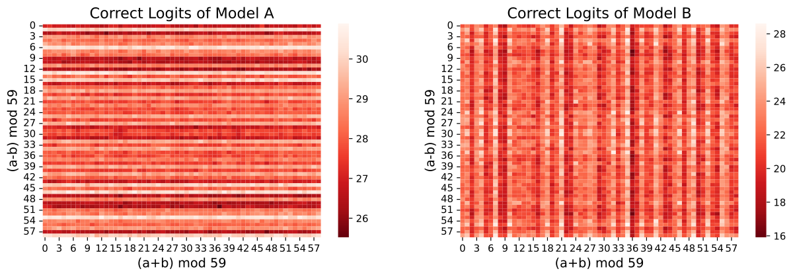

*Рисунок 3: Корректные логиты Model A и Model B. Корректные логиты Model A (слева) имеют явную зависимость от $a-b$, тогда как у Model B (справа) — нет.* **[p. 4]**

**[p. 4]**

## 3 Альтернативное решение: алгоритм *Pizza*

Как Model A выполняет модульную арифметику? Каким бы ни было осуществляемое ею решение, оно должно обнаруживать симметричность градиента с рисунка 2 и узоры выходов с рисунка 3. В этом разделе мы описываем новый алгоритм модульной арифметики, который называем алгоритмом *Pizza*, а затем приводим свидетельства того, что именно эта процедура осуществлена в Model A.

### 3.1 Алгоритм *Pizza*

###### p4-2

В отличие от алгоритма *Clock*, алгоритм *Pizza* действует *внутри* окружности, образованной вложениями (ровно как пепперони разложены по всей пицце), а не на самой окружности. Основная мысль изображена на рисунке 1: при фиксированной метке $c$ для *всех* $(a,b)$ с $a+b=c\ ({\rm mod}\ p)$ точки $\mathbf{E}_{ab}=(\mathbf{E}_{a}+\mathbf{E}_{b})/2$ лежат на прямой, проходящей через начало координат двумерной плоскости, а точки, которые ближе к этой прямой, чем к прямым, отвечающим любому другому $c$, образуют две из $2p$ зеркальных «долек пиццы», как показано справа на рисунке. Тем самым, чтобы выполнить модульную арифметику, сеть может определить, в какой паре долек лежит среднее двух векторов вложения. Конкретно алгоритм *Pizza* тоже состоит из трёх шагов. Шаг 1 такой же, как в алгоритме *Clock*: токены $a$ и $b$ вкладываются в $\mathbf{E}_{a}=({\rm cos}(w_{k}a),{\rm sin}(w_{k}a))$ и $\mathbf{E}_{b}=({\rm cos}(w_{k}b),{\rm sin}(w_{k}b))$ соответственно. Шаг 2 и шаг 3 отличаются от алгоритма *Clock*. На шаге 2.1 $\mathbf{E}_{a}$ и $\mathbf{E}_{b}$ усредняются, давая вложение $\mathbf{E}_{ab}$. На шаге 2.2 и шаге 3 полярный угол $\mathbf{E}_{ab}$ (неявно) вычисляется вычислением логита $Q_{abc}$ для любых возможных выходов $c$. Хотя одна из возможностей сделать это — взять абсолютную величину скалярного произведения $\mathbf{E}_{ab}$ с $(\cos(w_{k}c/2),\sin(w_{k}c/2))$, в нейросетях она обычно не наблюдается (и даёт другой узор логитов). Вместо этого шаг 2.2 преобразует $\mathbf{E}_{ab}$ в вектор, кодирующий $|\cos(w_{k}(a-b)/2)|(\cos(w_{k}(a+b)),\sin(w_{k}(a+b)))$, который затем скалярно умножается на выходное вложение $U_{c}=(\cos(w_{k}c),\sin(w_{k}c))$. Наконец, предсказание есть $c^{*}={\rm argmax}_{c}Q_{abc}$. Более подробный разбор нейронного контура, вычисляющего $\mathbf{H}_{ab}$ в настоящей сети, — в приложении A и приложении L.

###### p4-3

Ключевое различие двух алгоритмов лежит в том, какие нелинейные операции требуются: *Clock* требует умножения входов на шаге 2, тогда как *Pizza* требует лишь вычисления абсолютной величины, которое легко осуществимо слоями ReLU. Если у нейросетей нет индуктивных смещений в сторону осуществления умножения, они могут с большей вероятностью осуществить *Pizza*, а не *Clock*, что мы и проверим в разделе 4.

### 3.2 Первое свидетельство в пользу *Pizza*: узоры логитов

###### p4-4

И *Clock*, и *Pizza* вычисляют логиты $Q_{abc}$ на шаге 3, но у них разный вид, показанный на рисунке 1. А именно, у $Q_{abc}({\it Pizza})$ есть дополнительный множитель $|{\rm cos}(w_{k}(a-b)/2)|$ по сравнению с $Q_{abc}({\it Clock})$. Как следствие, при $c=a+b$ величина $Q_{abc}({\it Pizza})$ зависит от $a-b$, а $Q_{abc}({\it Clock})$ — нет. Смысл этой зависимости в том, что образец с большей вероятностью классифицируется верно, если $\mathbf{E}_{ab}$ длиннее. Норма же этого вектора зависит от $a-b$. Как мы наблюдаем на рисунке 3, логиты Model A и вправду обнаруживают сильную зависимость от $a-b$.

**[p. 5]**

### 3.3 Второе свидетельство в пользу *Pizza*: более чёткие узоры логитов через изоляцию кругов

###### p5-1

Чтобы лучше понять поведение этого алгоритма, мы заменяем матрицу вложений $\mathbf{E}$ рядом приближений ранга 2: беря только первую и вторую главные компоненты, или только третью и четвёртую, и так далее. Для каждой такой матрицы вложения лежат в двумерном подпространстве. И для Model A, и для Model B мы находим, что вложения образуют в этом подпространстве окружность (рисунок 4 и рисунок 5, внизу). Мы называем эту процедуру *изоляцией круга*. Даже после столь резкого изменения параметров обученных моделей и Model A, и Model B продолжают вести себя интерпретируемо: часть предсказаний остаётся высокоточной, и эта часть определяется периодичностью $k$ изолированного круга. Как и предсказано алгоритмами *Pizza* и *Clock*, описанными на рисунке 1, точность Model A падает до нуля при определённых значениях $a-b$, тогда как точность Model B инвариантна по $a-b$. Применение изоляции круга к Model A на двух главных компонентах (один круг) даёт модель с общей точностью $32.8\%$, тогда как сохранение первых шести главных компонент (три круга) даёт общую точность $91.4\%$. Дальнейшее обсуждение — в приложении D. Model B, напротив, достигает $100\%$, когда вложения урезаны до первых шести главных компонент. Тем самым изоляция круга вскрывает механизм *исправления ошибок*, достигаемого ансамблированием: когда алгоритм (часы или пицца) обнаруживает систематические ошибки на части входов, модели могут осуществлять несколько вариантов алгоритма параллельно, получая более устойчивые предсказания.

###### fig-4

*Рисунок 4: Корректные логиты Model A (*Pizza*) после изоляции круга. Самая правая пицца сопровождает третью пиццу (обсуждается в разделе 3.4 и приложении D). *Вверху:* Узор логитов зависит от $a-b$. *Внизу:* Вложения для каждого круга.* **[p. 5]**

*Рисунок 5: Корректные логиты Model B (*Clock*) после изоляции круга. *Вверху:* Узор логитов зависит от $a+b$. *Внизу:* Вложения для каждого круга.* **[p. 6]**

###### p5-2

Пользуясь этими изолированными вложениями, мы можем вдобавок вычислить изолированные логиты прямо по формулам с рисунка 1 и сравнить их с настоящими логитами Model A. Результаты показаны в таблице 2. Мы находим, что $Q_{abc}({\it Pizza})$ объясняет существенно больше дисперсии, чем $Q_{abc}({\it Clock})$.

**Почему мы разбираем только корректные логиты?** Логиты алгоритма *Pizza* даются формулой $Q_{abc}({\it Pizza})=\lvert\cos(w_{k}(a-b)/2)\rvert\cos(w_{k}(a+b-c))$. Напротив, у алгоритма *Clock* логиты таковы: $Q_{abc}({\it Clock})=\cos(w_{k}(a+b-c))$. Словом, у $Q_{abc}({\it Pizza})$ есть дополнительный множитель $|\cos(w_{k}(a-b)/2)|$ по сравнению с $Q_{abc}({\it Clock})$. Ограничивая $c=a+b$ (отчего ${\rm cos}(w_{k}(a+b-c))=1$), множитель $\lvert\cos(w_{k}(a-b)/2)\rvert$ можно выявить.

###### p5-4

**(Неожиданная) зависимость логитов $Q_{abc}({\it Clock})$ от $a+b$**: Хотя наш разбор выше и ожидает, что логиты $Q_{abc}({\it Clock})$ не зависят от $a-b$, он не предсказывает их зависимости от $a+b$. На рисунке 5 мы, к своему удивлению, находим, что $Q_{abc}({\it Clock})$ чувствительны к этой сумме. Наша догадка состоит в том, что шаги 1 и 2 алгоритма *Clock* осуществлены (почти) без шума, так что образцы с одной меткой стягиваются в одну точку после шага 2. Однако шаг 3 (классификация) после изоляции круга несовершенен, что даёт колебания логитов. Входы с одинаковыми суммами $a+b$ дают одинаковые логиты.

*Таблица 2: Доля объяснённой дисперсии (FVE) **всех** выходных логитов Model A ($59\times 59\times 59$ штук) различными формулами после изоляции кругов во входных вложениях. И выходные логиты модели, и результаты формул нормируются на среднее $0$ и дисперсию $1$ перед взятием FVE. Значения $w_{k}$ вычислены по визуализации. Например, расстояние между $0$ и $1$ в круге #1 равно $17$, поэтому $w_{k}=2\pi/59\cdot 17$.* **[p. 6]**

**[p. 6]**

| Круг | $w_{k}$ | FVE у $Q_{abc}({\rm clock})$ | FVE у $Q_{abc}({\rm pizza})$ |
|---|---|---|---|
| #1 | $2\pi/59\cdot 17$ | 75.41% | 99.18% |
| #2 | $2\pi/59\cdot 3$ | 75.62% | 99.18% |
| #3 | $2\pi/59\cdot 44$ | 75.38% | 99.28% |

### 3.4 Третье свидетельство в пользу *Pizza*: сопровождаемая и сопровождающая пиццы

###### p6-1

Ахиллесова пята алгоритма *Pizza* — антиподальные пары. Если два входа $(a,b)$ окажутся лежащими антиподально, то их средняя точка ляжет в начало координат, где верную «дольку пиццы» опознать трудно. Например, на рисунке 1 справа антиподальные пары — это (1,7), (2,8), (3,9) и так далее, чьи средние точки все стягиваются в начало координат, но метки классов у них разные. Модели не могут различить, а стало быть и верно классифицировать эти пары. Даже при нечётных $p$, когда строго антиподальных пар нет, приближённо антиподальные пары тоже с большей вероятностью классифицируются неверно, чем неантиподальные.

###### p6-2

Занятно, что нейросети находят хитрый способ возместить этот изъян. мы находим, что пиццы обычно приходят с «сопровождающими пиццами». Сопровождаемая пицца и сопровождающая её дополняют друг друга в том смысле, что почти антиподальные пары в сопровождаемой пицце становятся соседними или близкими (то есть весьма неантиподальными) в сопровождающей. Если обозначить разность между соседними числами на окружности как $\delta$, а для сопровождаемой и сопровождающей пицц — как $\delta_{1}$ и $\delta_{2}$ соответственно, то $\delta_{1}=2\delta_{2}\ ({\rm mod}\ p)$. В опыте мы обнаружили, что у пицц #1/#2/#3 на рисунке 4 есть сопровождающие пиццы, которые мы называем пиццами #4/#5/#6 (подробности в приложении D). Однако эти сопровождающие пиццы не играют существенной роли в итоговых предсказаниях модели 22 2 Сопровождаемые пиццы #1/#2/#3 могут достигать точности 99.7%, а сопровождающие пиццы #4/#5/#6 — лишь 16.7%.. Мы предполагаем, что динамика обучения такова: (1) при инициализации пиццы #1/#2/#3 отвечают трём разным «лотерейным билетам» [9]. (2) На ранних стадиях обучения, чтобы возместить слабости (антиподальные пары) пицц #1/#2/#3, образуются пиццы #4/#5/#6. (3) По мере обучения (в присутствии weight decay) нейросеть обрезается. Как следствие, пиццы #4/#5/#6 существенно не участвуют в предсказании, хотя и продолжают быть видимы в пространстве вложений.

**[p. 7]**

## 4 Алгоритмическое фазовое пространство

###### p7-1

В разделе 3 мы показали типичные *Clock* (Model A) и *Pizza* (Model B). В этом разделе мы изучаем, как архитектуры и гиперпараметры управляют выбором между этими двумя алгоритмическими «фазами». В разделе 4.1 мы предлагаем количественные меры, способные различить *Pizza* и *Clock*. В разделе 4.2 мы наблюдаем, как эти меры ведут себя при разных архитектурах и гиперпараметрах, обнаруживая резкие фазовые переходы. Результаты этого раздела сосредоточены на моделях *Clock* и *Pizza*, но обнаруживаются и другие алгоритмические решения модульного сложения, подробнее разбираемые в приложении B.

### 4.1 Меры

Мы хотим изучить распределение алгоритмов *Pizza* и *Clock* статистически, а для этого нам потребуется различать два алгоритма автоматически. Чтобы это сделать, мы формализуем наши наблюдения из разделов 2.2 и 2.3, приходя к двум мерам: **gradient symmetricity** (симметричности градиента) и **distance irrelevance** (несущественности расстояния).

#### 4.1.1 Gradient Symmetricity

###### p7-3

Чтобы измерить симметричность градиентов, мы выбираем некоторую входо-выходную группу $(a,b,c)$, вычисляем векторы градиентов выходного логита в позиции $c$ по входным вложениям и затем вычисляем косинусную близость. Усреднение по многим парам даёт gradient symmetricity.

##### **Определение 4.1**(Gradient Symmetricity)**.**

*Для фиксированного множества $S\subseteq\mathbb{Z}_{p}^{3}$ входо-выходных пар33 3 Чтобы ускорить вычисления, в наших опытах $S$ берётся как случайное подмножество $\mathbb{Z}_{p}^{3}$ размера $100$. определим **gradient-symmetricity** сети $M$ со слоем вложений $E$ как*

$$
s_{g}\equiv\frac{1}{|S|}\sum_{(a,b,c)\in S}\text{sim}\left(\frac{\partial Q_{abc}}{\partial\mathbf{E}_{a}},\frac{\partial Q_{abc}}{\partial\mathbf{E}_{b}}\right),
$$

*где $\text{sim}(a,b)=\frac{a\cdot b}{|a||b|}$ — косинусная близость, а $Q_{abc}$ — логит класса $c$ при входах $a$ и $b$. Очевидно, что $s_{g}\in[-1,1]$.*

###### p7-6

Как мы обсуждали в разделе 2.2, у алгоритма *Pizza* градиенты симметричны, а у алгоритма *Clock* — асимметричны. У Model A и Model B из раздела 3 gradient symmetricity составляет $99.37\%$ и $33.36\%$ соответственно (рисунок 2).

#### 4.1.2 Distance Irrelevance

###### p7-7

Чтобы измерить зависимость корректных логитов от разностей двух входов, отражающих расстояния между входами на окружностях, мы измеряем, какая доля дисперсии в матрице корректных логитов от неё зависит. Мы делаем это, сравнивая среднее стандартное отклонение корректных логитов от входов с одинаковыми разностями со стандартным отклонением по всем входам.

##### **Определение 4.2**(Distance Irrelevance)**.**

*Для некоторой сети $M$ с матрицей корректных логитов $L$ ($L_{i,j}=Q_{ij,i+j}$) определим её **distance irrelevance** как*

$$
q\equiv\frac{\frac{1}{p}\sum_{d\in\mathbb{Z}_{p}}\mathrm{std}\left(L_{i,i+d}\mid i\in\mathbb{Z}_{p}\right)}{\mathrm{std}\left(L_{i,j}\mid i,j\in\mathbb{Z}_{p}^{2}\right)},
$$

*где $\mathrm{std}$ вычисляет стандартное отклонение множества. Очевидно, что $q\in[0,1]$.*

###### p7-10

У Model A и Model B из раздела 3 distance irrelevance составляет 0.17 и 0.85 соответственно (рисунок 3). Типичная distance irrelevance у алгоритма *Pizza* лежит в пределах от 0 до 0.4, тогда как типичная distance irrelevance у алгоритма *Clock* лежит в пределах от 0.4 до 1.

#### 4.1.3 Какая мера решающая?

###### p7-11

Когда две меры дают противоречащие результаты, какая из них решающая? Мы считаем distance irrelevance решающим признаком алгоритма *Pizza*, поскольку зависимость выходных логитов от расстояния весьма показательна для *Pizza*. С другой стороны, gradient symmetricity можно употребить, чтобы исключить алгоритм *Clock*, поскольку он требует умножения (преобразованных) входов, что даёт асимметричные градиенты. Рисунок 6 подтвердил, что при низкой distance irrelevance (что наводит на пиццу) gradient symmetricity почти всегда близка к 1 (что наводит на не-часы).

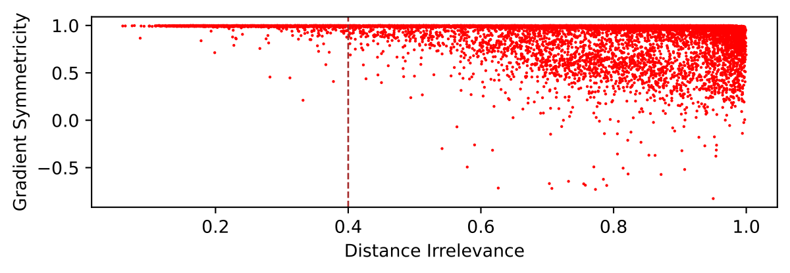

###### fig-6

*Рисунок 6: Distance irrelevance против gradient symmetricity по всем основным опытам.* **[p. 8]**

**[p. 8]**

### 4.2 Выявление алгоритмических фазовых переходов

Как модели «выбирают», осуществлять ли алгоритм *Clock* или *Pizza*? Мы исследуем этот вопрос, интерполируя между Model A (трансформер без внимания) и Model B (трансформер с вниманием). Чтобы это сделать, мы вводим новый гиперпараметр $\alpha$, который называем **attention rate** (силой внимания).

###### p8-2

Для модели с силой внимания $\alpha$ мы изменяем матрицу внимания $M$ каждой головы внимания на $M^{\prime}=M\alpha+J(1-\alpha)$. Иначе говоря, мы делаем эту матрицу линейной интерполяцией между матрицей из одних единиц и исходным вниманием (после softmax), а параметр $\alpha$ управляет тем, какая доля внимания сохраняется. Трансформер с вниманием и без внимания отвечает случаям $\alpha=1$ (внимание сохранено) и $\alpha=0$ (постоянная матрица внимания). Этим параметром мы можем управлять соотношением внимания и линейных слоёв в трансформерах.

Мы провели следующий набор опытов на трансформерах (архитектура и подробности обучения — в приложении F.1). (1) Однослойные трансформеры с шириной $128$ и силой внимания, равномерно выбранной из $[0,1]$ (рисунок 7). (2) Однослойные трансформеры с шириной, логарифмически равномерно выбранной из $[32,512]$, и силой внимания, равномерно выбранной из $[0,1]$ (рисунок 7). (3) Трансформеры с $2$–$4$ слоями, шириной $128$ и силой внимания, равномерно выбранной из $[0,1]$ (рисунок 11).

###### fig-7

*Рисунок 7: Результаты обучения однослойных трансформеров. Каждая точка на графиках представляет прогон обучения, достигший круговых вложений и 100% проверочной точности. Дополнительные графики — в приложении C. *Вверху:* Ширина модели зафиксирована равной 128. *Внизу:* Ширина модели меняется. Линии фазового перехода вычислены логистической регрессией (классифицирующей прогоны по тому, верно ли gradient symmetricity $>98\%$ и верно ли distance irrelevance $<0.6$).* **[p. 9]**

#### Алгоритмы *Pizza* и *Clock* — преобладающие алгоритмы с круговыми вложениями.

У круговых моделей большинство наблюдённых моделей имеют либо низкую gradient symmetricity (что отвечает алгоритму *Clock*), либо низкую distance irrelevance (что отвечает алгоритму *Pizza*).

#### Двумерная смена фазы наблюдается по силе внимания и ширине слоя.

###### p8-5

В опыте с фиксированной шириной мы наблюдали ясный фазовый переход от алгоритма *Pizza* к алгоритму *Clock* (охарактеризованный через gradient symmetricity и distance irrelevance). Мы наблюдаем также почти линейную фазовую границу по обеим величинам — силе внимания и ширине слоя. Иначе говоря, точка перехода по силе внимания растёт по мере того, как модель становится шире.

#### Преобладание линейных слоёв определяет, какой алгоритм предпочтён — *Pizza* или *Clock*.

Для однослойных трансформеров мы изучаем точку перехода в зависимости от силы внимания и ширины:

###### p8-7

- Алгоритм *Clock* преобладает, когда сила внимания выше точки смены фазы, а алгоритм *Pizza* преобладает, когда сила внимания ниже этой точки. Наше объяснение таково: при высокой силе внимания механизм внимания заметнее в сети, что порождает алгоритм часов. При низкой силе внимания заметнее линейные слои, что порождает алгоритм пиццы.
- Точка смены фазы становится выше, когда ширина модели растёт. Наше объяснение таково: когда модель становится шире, линейные слои становятся способнее, тогда как механизм внимания выигрывает меньше (внимания остаются скалярами, тогда как выходы линейных слоёв становятся более широкими векторами). Стало быть, у более широкой модели линейный слой получает больше веса.

#### Возможные гибридные алгоритмы между *Clock* и *Pizza*.

###### p8-8

Непрерывная смена фазы наводит на существование сетей, лежащих между алгоритмами *Clock* и *Pizza*. Этого можно достичь, если часть главных компонент работает как *Clock*, а часть — как *Pizza*.

**[p. 9]**

#### Существование некруговых алгоритмов.

###### p9-1

Хотя наше изложение сосредоточено на круговых алгоритмах (то есть таких, чьи вложения круговые), мы находим, что в нейросетях присутствуют и некруговые алгоритмы (то есть такие, чьи вложения не образуют окружности ни при какой проекции на плоскость). Предварительные находки — в приложении B. Мы находим, что более глубокие сети с большей вероятностью образуют некруговые алгоритмы. Мы наблюдаем также появление некруговых сетей при низкой силе внимания. Тем не менее алгоритм *Pizza* продолжает наблюдаться (низкая distance irrelevance, высокая gradient symmetricity).

## 5 Смежные работы

**Механистическая интерпретируемость** нацелена на механическое понимание нейросетей их обратным инжинирингом [2, 3, 5, 4, 10, 11, 1, 12, 13, 14]. Можно либо искать узоры в весах и активациях, изучая поведение отдельных нейронов (суперпозиция [11], моносемантичные нейроны [15]), либо изучать осмысленные модули или контуры, сгруппированные по нейронам [4, 14]. Механистическая интерпретируемость тесно связана с динамикой обучения [8, 13, 1].

###### p9-3

**Обучение математическим задачам**: Математические задачи дают полезные бенчмарки для интерпретируемости нейросетей, поскольку сами задачи хорошо понятны. Постановка может быть обучением по изображениям [16, 17], с обучаемыми вложениями [18] или с числами на входе [19, 5]. Помимо арифметических отношений, машинное обучение применяли и к обучению другим математическим структурам, включая геометрию [20], теорию узлов [21] и теорию групп [22].

###### p9-4

**Алгоритмические фазовые переходы**: Фазовые переходы присутствуют в классических алгоритмах [23] и в глубоком обучении [6, 24, 25]. Обычно фазовый переход означает, что качество алгоритма резко **[p. 10]** меняется, когда меняется некоторый параметр (скажем, объём данных, ёмкость сети и тому подобное). Однако изучаемый в этой статье фазовый переход — *представленческий*: и часы, и пицца дают идеальную точность, но приходят к ответам через разные внутренние вычисления. Такие внутримодельные фазовые переходы изучать труднее, но они ближе к соответствующим явлениям в физических системах [24].

###### p10-1

**Обучение алгоритмам в нейросетях**: Эмерджентные способности глубоких нейросетей, особенно больших языковых моделей, в последнее время привлекли значительное внимание [26]. Способность «эмерджентна», если качество на подзадаче внезапно растёт с ростом размера модели, хотя такие заявления зависят от выбора меры [27]. Высказывалась гипотеза, что возникновение конкретной способности в модели отвечает возникновению модульного контура, отвечающего за эту способность, и что возникновение части поведения моделей проистекает тем самым из последовательности шагов квантованного открытия контуров [5].

## 6 Заключение

###### p10-2

Мы предложили более пристальный взгляд на недавние находки о том, что в нейросетях, обученных на определённых алгоритмических задачах, возникают знакомые алгоритмы. В модульной арифметике мы показали, что такие алгоритмические открытия не неизбежны: вдобавок к алгоритму *Clock*, разобранному обратным инжинирингом в [1], мы находим, что в обученных моделях распространены и другие алгоритмы (включая алгоритм *Pizza* и более сложные процедуры). Эти различные алгоритмические фазы можно различать разнообразными новыми и уже существующими приёмами интерпретируемости, включая визуализацию логитов, изоляцию главных компонент в пространстве вложений и градиентные меры симметрии модели. Эти приёмы позволяют *автоматически* классифицировать обученные сети по осуществляемым ими алгоритмам и вскрывают алгоритмические фазовые переходы в пространстве гиперпараметров модели. Здесь мы нашли, в частности, что возникновение алгоритма *Pizza* или *Clock* зависит от относительной силы линейных слоёв и выходов внимания. Мы дополнительно показали, что эти алгоритмы осуществляются не поодиночке: вместо этого сети иногда ансамблируют несколько копий алгоритма параллельно. Эти результаты ставят перед механистической интерпретируемостью новые волнующие задачи: (1) Как систематически находить, классифицировать и толковать незнакомые алгоритмы? (2) Как расплетать несколько параллельных реализаций алгоритма при наличии ансамблирования?

#### Ограничения

###### p10-3

Мы сосредоточились на единственной задаче обучения: модульном сложении. Даже в этой ограниченной области у разных архитектур и семян возникают качественно разные поведения моделей. Требуется значительная дополнительная работа, чтобы перенести эти приёмы на куда более сложные модели, употребляемые в настоящих задачах.

#### Более широкое влияние

Мы полагаем, что приёмы интерпретируемости могут сыграть решающую роль в создании и улучшении безопасных систем ИИ. Однако их могут употребить и для построения более точных систем, со всеми сопутствующими рисками, присущими всякой технологии двойного назначения. Поэтому при развёртывании таких приёмов необходимо проявлять осторожность и принимать ответственные решения.

## Благодарности

Мы хотели бы поблагодарить Mingyang Deng и анонимных рецензентов за ценные и плодотворные обсуждения, а MIT SuperCloud — за предоставленные вычислительные ресурсы. ZL и MT поддержаны Foundational Questions Institute, Rothberg Family Fund for Cognitive Science и IAIFI через грант NSF PHY-2019786. JA поддержан даром от OpenPhilanthropy Foundation.

## References

- Neel Nanda, Lawrence Chan, Tom Lieberum, Jess Smith, and Jacob Steinhardt. Progress measures for grokking via mechanistic interpretability. In *The Eleventh International Conference on Learning Representations*, 2023.

- Chris Olah, Nick Cammarata, Ludwig Schubert, Gabriel Goh, Michael Petrov, and Shan Carter. Zoom in: An introduction to circuits. *Distill*, 2020. https://distill.pub/2020/circuits/zoom-in.

- Catherine Olsson, Nelson Elhage, Neel Nanda, Nicholas Joseph, Nova DasSarma, Tom Henighan, Ben Mann, Amanda Askell, Yuntao Bai, Anna Chen, Tom Conerly, Dawn Drain, **[p. 11]** Deep Ganguli, Zac Hatfield-Dodds, Danny Hernandez, Scott Johnston, Andy Jones, Jackson Kernion, Liane Lovitt, Kamal Ndousse, Dario Amodei, Tom Brown, Jack Clark, Jared Kaplan, Sam McCandlish, and Chris Olah. In-context learning and induction heads. *Transformer Circuits Thread*, 2022. https://transformer-circuits.pub/2022/in-context-learning-and-induction-heads/index.html.

- Kevin Ro Wang, Alexandre Variengien, Arthur Conmy, Buck Shlegeris, and Jacob Steinhardt. Interpretability in the wild: a circuit for indirect object identification in GPT-2 small. In *The Eleventh International Conference on Learning Representations*, 2023.

- Eric J Michaud, Ziming Liu, Uzay Girit, and Max Tegmark. The quantization model of neural scaling. *arXiv preprint arXiv:2303.13506*, 2023.

- Ekin Akyürek, Dale Schuurmans, Jacob Andreas, Tengyu Ma, and Denny Zhou. What learning algorithm is in-context learning? investigations with linear models. In *The Eleventh International Conference on Learning Representations*, 2023.

- Ashish Vaswani, Noam Shazeer, Niki Parmar, Jakob Uszkoreit, Llion Jones, Aidan N Gomez, Łukasz Kaiser, and Illia Polosukhin. Attention is all you need. *Advances in Neural Information Processing Systems*, 30, 2017.

- Ziming Liu, Ouail Kitouni, Niklas S Nolte, Eric Michaud, Max Tegmark, and Mike Williams. Towards understanding grokking: An effective theory of representation learning. *Advances in Neural Information Processing Systems*, 35:34651–34663, 2022.

- Jonathan Frankle and Michael Carbin. The lottery ticket hypothesis: Finding sparse, trainable neural networks. In *International Conference on Learning Representations*, 2019.

- Nelson Elhage, Neel Nanda, Catherine Olsson, Tom Henighan, Nicholas Joseph, Ben Mann, Amanda Askell, Yuntao Bai, Anna Chen, Tom Conerly, Nova DasSarma, Dawn Drain, Deep Ganguli, Zac Hatfield-Dodds, Danny Hernandez, Andy Jones, Jackson Kernion, Liane Lovitt, Kamal Ndousse, Dario Amodei, Tom Brown, Jack Clark, Jared Kaplan, Sam McCandlish, and Chris Olah. A mathematical framework for transformer circuits. *Transformer Circuits Thread*, 2021. https://transformer-circuits.pub/2021/framework/index.html.

- Nelson Elhage, Tristan Hume, Catherine Olsson, Nicholas Schiefer, Tom Henighan, Shauna Kravec, Zac Hatfield-Dodds, Robert Lasenby, Dawn Drain, Carol Chen, Roger Grosse, Sam McCandlish, Jared Kaplan, Dario Amodei, Martin Wattenberg, and Christopher Olah. Toy models of superposition. *Transformer Circuits Thread*, 2022.

- Bilal Chughtai, Lawrence Chan, and Neel Nanda. A toy model of universality: Reverse engineering how networks learn group operations. In *The Fortieth International Conference on Machine Learning*, 2023.

- Ziming Liu, Eric J Michaud, and Max Tegmark. Omnigrok: Grokking beyond algorithmic data. In *The Eleventh International Conference on Learning Representations*, 2023.

- Arthur Conmy, Augustine N Mavor-Parker, Aengus Lynch, Stefan Heimersheim, and Adrià Garriga-Alonso. Towards automated circuit discovery for mechanistic interpretability. *arXiv preprint arXiv:2304.14997*, 2023.

- Wes Gurnee, Neel Nanda, Matthew Pauly, Katherine Harvey, Dmitrii Troitskii, and Dimitris Bertsimas. Finding neurons in a haystack: Case studies with sparse probing. *arXiv preprint arXiv:2305.01610*, 2023.

- Yedid Hoshen and Shmuel Peleg. Visual learning of arithmetic operation. In *Proceedings of the AAAI Conference on Artificial Intelligence*, 2016.

- Samuel Kim, Peter Y Lu, Srijon Mukherjee, Michael Gilbert, Li Jing, Vladimir Čeperić, and Marin Soljačić. Integration of neural network-based symbolic regression in deep learning for scientific discovery. *IEEE Transactions on Neural Networks and Learning Systems*, 32(9):4166–4177, 2020.

- Alethea Power, Yuri Burda, Harri Edwards, Igor Babuschkin, and Vedant Misra. Grokking: Generalization beyond overfitting on small algorithmic datasets. *arXiv preprint arXiv:2201.02177*, 2022.

- Boaz Barak, Benjamin Edelman, Surbhi Goel, Sham Kakade, Eran Malach, and Cyril Zhang. Hidden progress in deep learning: SGD learns parities near the computational limit. *Advances in Neural Information Processing Systems*, 35:21750–21764, 2022.

**[p. 12]**

- Yang-Hui He. Machine-learning mathematical structures. *International Journal of Data Science in the Mathematical Sciences*, 1(01):23–47, 2023.

- Sergei Gukov, James Halverson, Fabian Ruehle, and Piotr Sułkowski. Learning to unknot. *Machine Learning: Science and Technology*, 2(2):025035, 2021.

- Alex Davies, Petar Veličković, Lars Buesing, Sam Blackwell, Daniel Zheng, Nenad Tomašev, Richard Tanburn, Peter Battaglia, Charles Blundell, András Juhász, et al. Advancing mathematics by guiding human intuition with ai. *Nature*, 600(7887):70–74, 2021.

- Alexander K Hartmann and Martin Weigt. *Phase transitions in combinatorial optimization problems: basics, algorithms and statistical mechanics*. John Wiley & Sons, 2006.

- Lorenza Saitta, Attilio Giordana, and Antoine Cornuejols. *Phase transitions in machine learning*. Cambridge University Press, 2011.

- Ekdeep Singh Lubana, Eric J Bigelow, Robert P Dick, David Krueger, and Hidenori Tanaka. Mechanistic mode connectivity. In *International Conference on Machine Learning*, pages 22965–23004. PMLR, 2023.

- Jason Wei, Yi Tay, Rishi Bommasani, Colin Raffel, Barret Zoph, Sebastian Borgeaud, Dani Yogatama, Maarten Bosma, Denny Zhou, Donald Metzler, Ed H. Chi, Tatsunori Hashimoto, Oriol Vinyals, Percy Liang, Jeff Dean, and William Fedus. Emergent abilities of large language models. *Transactions on Machine Learning Research*, 2022. Survey Certification.

- Rylan Schaeffer, Brando Miranda, and Sanmi Koyejo. Are emergent abilities of large language models a mirage? *arXiv preprint arXiv:2304.15004*, 2023.

- Michael Hassid, Hao Peng, Daniel Rotem, Jungo Kasai, Ivan Montero, Noah A. Smith, and Roy Schwartz. How much does attention actually attend? questioning the importance of attention in pretrained transformers. In *Findings of the Association for Computational Linguistics: EMNLP 2022*, pages 1403–1416, Abu Dhabi, United Arab Emirates, December 2022. Association for Computational Linguistics.

- Ilya Loshchilov and Frank Hutter. Decoupled weight decay regularization. In *International Conference on Learning Representations*, 2019.

**Дополнительные материалы**

**[p. 13]**

## Приложение A Математический разбор и пример алгоритма Pizza

###### p13-2

В алгоритме пиццы мы имеем $E_{ab}=\cos(w_{k}(a-b)/2)\cdot(\cos(w_{k}(a+b)/2),\sin(w_{k}(a+b)/2))$, поскольку $\cos x+\cos y=\cos((x-y)/2)(2\cos((x+y)/2))$ и $\sin x+\sin y=\cos((x-y)/2)(2\sin((x+y)/2))$.

Чтобы получить $\lvert\cos(w_{k}(a-b)/2)\rvert(\cos(w_{k}(a+b)),\sin(w_{k}(a+b)))$, мы обобщаем это до $\lvert\cos(w_{k}(a-b)/2)\rvert\cos(w_{k}(a+b-u))$ (два данных случая отвечают $u=0$ и $u=\pi/2/w_{k}$).

$$
\lvert(\cos(w_{k}u/2),\sin(w_{k}u/2))\cdot E_{ab}\rvert=\lvert\cos(w_{k}(a-b)/2)\cos(w_{k}(a+b-u)/2)\rvert \\
\lvert(-\sin(w_{k}u/2),\cos(w_{k}u/2))\cdot E_{ab}\rvert=\lvert\cos(w_{k}(a-b)/2)\sin(w_{k}(a+b-u)/2)\rvert
$$

тем самым их разность будет равна

$$
\lvert\cos(w_{k}(a-b)/2)\rvert(\lvert\cos(w_{k}(a+b-u)/2)\rvert-\lvert\sin(w_{k}(a+b-u)/2)\rvert).
$$

Теперь заметим, что $\lvert\cos(t)\rvert-\lvert\sin(t)\rvert\approx\cos(2t)$ для любого $t\in\mathbb{R}$ (рисунок 8), так что разность приблизительно равна $\lvert\cos(w_{k}(a-b)/2)\rvert\cos(w_{k}(a+b-u))$.

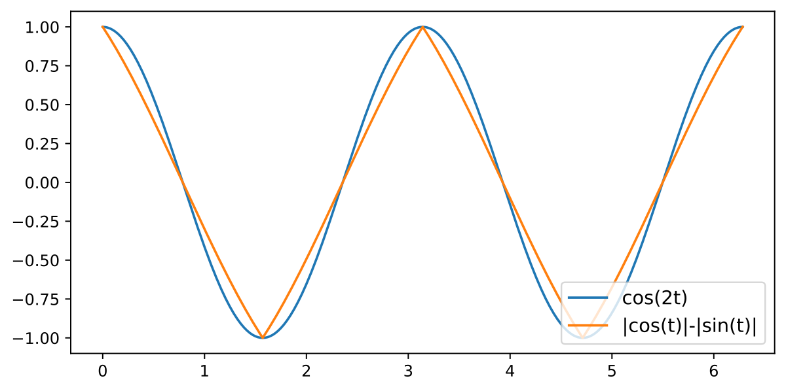

*Рисунок 8: $\lvert\cos(t)\rvert-\lvert\sin(t)\rvert$ приблизительно равно $\cos(2t)$ для любого $t\in\mathbb{R}$*

Подставляя $u=0$ и $u=\pi/2/w_{k}$, как упомянуто, мы получаем следующую конкретную реализацию алгоритма пиццы.

#### Алгоритм: Pizza, пример

- На данных входах $a$ и $b$ вложить их кругообразно в два вектора на окружности: $(\cos(w_{k}a),\sin(w_{k}a))$ и $(\cos(w_{k}b),\sin(w_{k}b))$.
- Вычислить:

$$
\alpha =\lvert\cos(w_{k}a)+\cos(w_{k}b)\rvert/2-\lvert\sin(w_{k}a)+\sin(w_{k}b)\rvert/2 \\
\approx\lvert\cos(w_{k}(a-b)/2)\rvert\cos(w_{k}(a+b)) \\
\beta =\lvert\cos(w_{k}a)+\cos(w_{k}b)+\sin(w_{k}a)+\sin(w_{k}b)\rvert/(2\sqrt{2}) \\
-\lvert\cos(w_{k}a)+\cos(w_{k}b)-\sin(w_{k}a)-\sin(w_{k}b)\rvert/(2\sqrt{2}) \\
=\lvert\cos(w_{k}a-\pi/4)+\cos(w_{k}b-\pi/4)\rvert/2-\lvert\sin(w_{k}a-\pi/4)+\sin(w_{k}b-\pi/4)\rvert/2 \\
\approx\lvert\cos(w_{k}(a-b)/2)\rvert\cos(w_{k}(a+b)-\pi/2)=\lvert\cos(w_{k}(a-b)/2)\rvert\sin(w_{k}(a+b))
$$
- Выход этой пиццы вычисляется как скалярное произведение.

$$
Q^{\prime}_{abc}=\alpha\cos(w_{k}c)+\beta\sin(w_{k}c)\approx\lvert\cos(w_{k}(a-b)/2)\rvert\cos(w_{k}(a+b-c))
$$

Схожие контуры наблюдаются и в природе, но вместо приведённого двучленного приближения наблюдается более сложное. Подробности — в приложении L.

Дополнительный член $\lvert\cos(w_{k}(a-b)/2)\rvert$ не случаен. Мы можем обобщить наш вывод следующим образом.

##### **Лемма A.1****.**

*Симметричную функцию $f(x,y)$, являющуюся линейной комбинацией $\cos x,\sin x,\cos y,\sin y$44 4 Настоящие нейросети могут быть сложнее — даже если наша нейросеть локально линейна и симметрична, локально они могут быть асимметричны (скажем, $|x|+|y|$ локально может быть $x-y$). Тем не менее в наших обученных сетях этот узор наблюдается., всегда можно записать как $\cos((x-y)/2)g(x+y)$ для некоторой функции $g$.*

##### Доказательство.

Заметим, что $\cos x+\cos y=\cos((x-y)/2)(2\cos((x+y)/2))$ и $\sin x+\sin y=\cos((x-y)/2)(2\sin((x+y)/2))$, так что $\alpha(\cos x+\cos y)+\beta(\sin x+\sin y)=\cos((x-y)/2)(2\alpha\cos((x+y)/2)+2\beta\sin((x+y)/2))$. ∎

Поэтому мы и считаем определяющим признаком алгоритма пиццы узор выходов с **[p. 14]** членами $\lvert\cos(w_{k}(a-b)/2)\rvert$, а не сами вычислительные контуры.

## Приложение B Некруговые алгоритмы

###### p14-4

Ещё одно обстоятельство, усложняющее наш опыт, — существование некруговых вложений. Тогда как в предыдущих работах [8, 1] сообщается только о круговых алгоритмах, в наших опытах обнаруживается множество некруговых вложений, скажем одномерные прямые или трёхмерные кривые типа Лиссажу, как показано на рисунке 9. Подробный разбор этих некруговых алгоритмов мы оставляем будущему исследованию. Поскольку главный предмет нашего изучения — круговые алгоритмы, мы предлагаем следующую меру **circularity** (круговость), чтобы отфильтровать некруговые алгоритмы. Мера достигает максимума $1$, когда главные компоненты выравнены с косинусоидами.

*Рисунок 9: Визуализация главных компонент входных вложений для двух обученных некруговых моделей. *Вверху:* Прямоподобная первая главная компонента. Заметьте переупорядоченную ось x (идентификатор токена). *Внизу:* Первые три главные компоненты, образующие трёхмерный некруговой узор. Каждая точка представляет вложение токена.* **[p. 14]**

##### **Определение B.1**(Circularity)**.**

*Для некоторой сети, пусть $l$-я главная компонента её входных вложений есть $v_{l,0},v_{l,1},\cdots,v_{l,p-1}$; определим её **circularity** по первым четырём компонентам как*

$$
c=\frac{1}{4}\sum_{l=1}^{4}\left(\max_{k\in[1,2,\cdots,p-1]}\left(\frac{2}{p{\sum_{j=0}^{p-1}v_{l,j}^{2}}}\left\lvert\sum_{j=0}^{p-1}v_{l,j}e^{2\pi\textbf{i}\cdot jk/p}\right\rvert^{2}\right)\right)
$$

*где **i** — мнимая единица. $c\in[0,1]$ по фурье-анализу. $c=1$ означает, что первые четыре компоненты суть волны Фурье.*

###### p14-7

И у Model A, и у Model B из раздела 3 circularity составляет около $99.8\%$, и мы считаем **круговыми** модели с circularity $\geq 99.5\%$.

## Приложение C Дополнительные результаты основных опытов

Здесь мы приводим рисунок 7 с неотфильтрованными некруговыми сетями (рисунок 10). Видно, что на графике появляется больше шума. Мы приводим также результаты обучения многослойных трансформеров (рисунок 11).

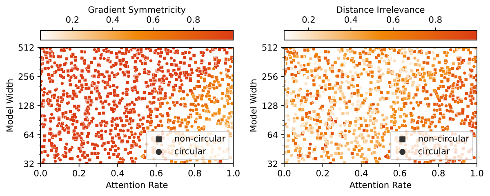

###### fig-10

*Рисунок 10: Результаты обучения однослойных трансформеров. Каждая точка на графиках представляет прогон обучения, достигший 100% проверочной точности. Среди всех обученных однослойных трансформеров 34.31% круговые. *Вверху:* Ширина модели зафиксирована равной 128. *Внизу:* Ширина модели меняется.* **[p. 15]**

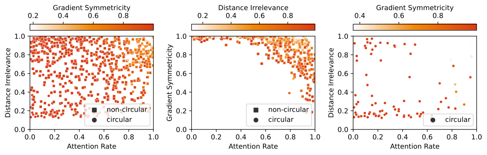

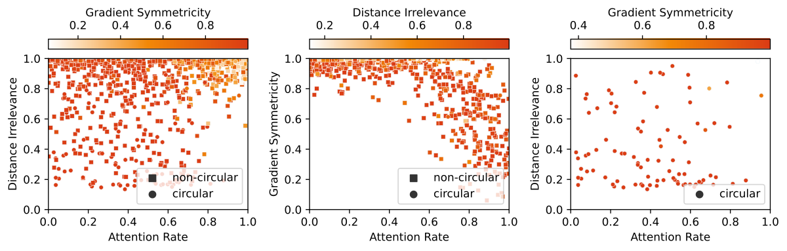

###### fig-11

*Рисунок 11: Результаты обучения трансформеров с 2, 3 и 4 слоями. Среди всех обученных трансформеров с 2, 3 и 4 слоями круговых 9.95%, 11.55% и 6.08% соответственно.* **[p. 16]**

**[p. 15]**

## Приложение D Пиццы приходят парами

Осторожный читатель может заметить, что алгоритм пиццы несовершенен: для почти антиподальных точек вектор суммы будет иметь очень малую норму, и результат окажется чувствителен к шуму. Хотя эта беда отчасти облегчена употреблением нескольких кругов вместо одного, мы заметили и другой возникающий узор: **сопровождающие пиццы**.

Мысль такова: пусть разность между соседними точками равна $2k\bmod p$, тогда у антиподальных точек разность равна $\pm k$. Поэтому, если устроить новую окружность с разностью $k$ между соседними точками, мы получим пиццу, которая работает **лучше всего** для бывших антиподальных точек.

#### Алгоритм: Сопровождающая пицца

- Взять $w_{k}$ от сопровождаемой пиццы. На данных входах $a$ и $b$ вложить их кругообразно в два вектора на окружности: $(\cos(2w_{k}a),\sin(2w_{k}a))$ и $(\cos(2w_{k}b),\sin(2w_{k}b))$.
- Вычислить среднюю точку:

$$
s=\frac{1}{2}(\cos(2w_{k}a)+\cos(2w_{k}b),\sin(2w_{k}a)+\sin(2w_{k}b))
$$
- Выход этой пиццы вычисляется как скалярное произведение.

$$
A_{c}=-(\cos(w_{k}c),\sin(w_{k}c))\cdot s
$$

*Рисунок 12: Иллюстрация алгоритма сопровождающей пиццы* **[p. 16]**

###### p15-4

Именно это мы и наблюдали в Model A (таблица 3, рисунок 13). С шестью кругами (пиццами и сопровождающими пиццами), включёнными во вложения, Model A тоже получает 100% точности.

*Таблица 3: Доля объяснённой дисперсии (FVE) **всех** выходных логитов Model A различными формулами после изоляции сопровождающих кругов во входных вложениях. И выходные логиты модели, и результаты формул нормируются на среднее $0$ и дисперсию $1$ перед взятием FVE. У сопровождающей и сопровождаемой пиццы одинаковое $w_{k}$.* **[p. 17]**

| Круг | $w_{k}$ | FVE у $A_{c}$ |
|---|---|---|
| #4 (сопровождает #1) | $2\pi/59\cdot 17$ | 97.56% |
| #5 (сопровождает #2) | $2\pi/59\cdot 3$ | 97.23% |
| #6 (сопровождает #3) | $2\pi/59\cdot 44$ | 97.69% |

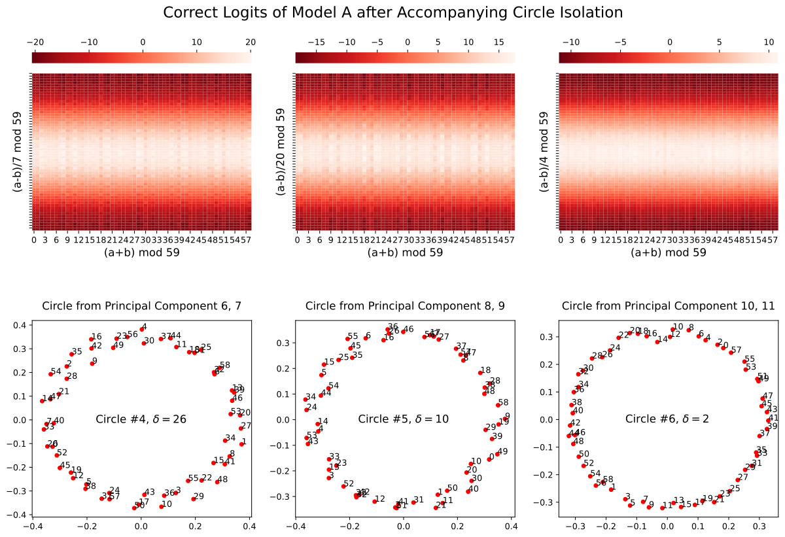

*Рисунок 13: Корректные логиты Model A (*Pizza*) после изоляции круга. Показаны только сопровождающие пиццы. Заметьте дополняющий узор логитов (рисунок 4).* **[p. 17]**

**[p. 17]**

## Приложение E Результаты на других линейных архитектурах

Хотя это и не главный предмет нашей статьи, мы провели опыты и на следующих четырёх различных постановках с линейными моделями (подробности постановки — в разделе F.2).

- Для всех моделей мы сперва кодируем входные токены $(a,b)$ обучаемым слоем вложений $W_{E}$: $x_{1}=W_{E,a},~x_{2}=W_{E,b}$ (позиционное вложение убрано для простоты). $L_{1},L_{2},L_{3}$ — обучаемые линейные слои. У самых внешних слоёв (обычно называемых слоями развложения) смещений нет, а у остальных слоёв смещения включены для общности.
- Model $\alpha$: вычисляет выходные логиты как $L_{2}(\text{ReLU}(L_{1}(x_{1}+x_{2})))$.
- Model $\beta$: вычисляет выходные логиты как $L_{3}(\text{ReLU}(L_{2}(\text{ReLU}(L_{1}(x_{1}+x_{2})))))$.
- Model $\gamma$: вычисляет выходные логиты как $L_{3}(\text{ReLU}(L_{2}(\text{ReLU}(L_{1}(x_{1})+L_{1}(x_{2})))))$.
- Model $\delta$: вычисляет выходные логиты как $L_{2}(\text{ReLU}(L_{1}([x_{1};x_{2}])))$ (где $[x_{1};x_{2}]$ означает конкатенацию $x_{1}$ и $x_{2}$)

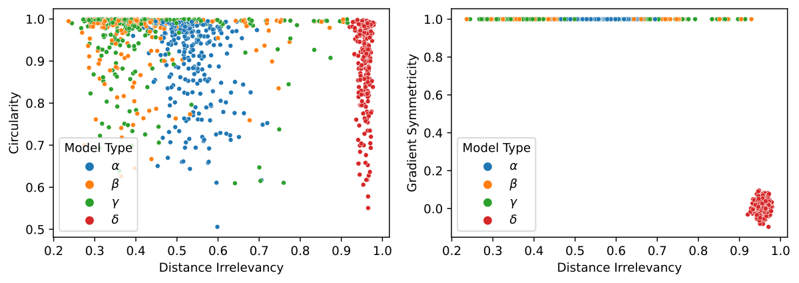

*Рисунок 14: Результаты обучения линейных моделей. Каждая точка на графиках первой строки представляет прогон обучения. Вторая строка — гистограммы distance irrelevancy для каждого типа модели.* **[p. 18]**

Результаты показаны на рисунке 14. Довольно неожиданно, что Model $\alpha$, Model $\beta$ и Model $\delta$ дали радикально разные результаты. Model $\beta$ и Model $\gamma$ весьма схожи, и в целом они более пиццеподобны, **[p. 18]** чем Model $\alpha$: с более низкой distance irrelevancy и более высокой circularity. Это может объясняться добавлением ещё одного линейного слоя.

Однако Model $\delta$ дала результаты, весьма отличные от Model $\alpha$, хотя обе они — однослойные линейные модели. Она с большей вероятностью оказывается некруговой и в целом имеет очень высокую distance irrelevancy. Иначе говоря, конкатенация вместо сложения вложений даёт радикально иное поведение однослойной линейной модели. Этот результат снова напомнил нам о значимости индуктивных смещений в нейросетях.

Мы хотим отметить также, что употребление разных вложений для двух токенов Model $\alpha$ не устраняет расхождения. Следующая модель

- Model $\alpha^{\prime}$: вычисляет выходные логиты как $L_{2}(\text{ReLU}(L_{1}(x_{1}+x_{2})))$, где $x_{1}=W^{A}_{E,a},~x_{2}=W^{B}_{E,b}$ на входе $(a,b)$, а $W_{E}^{A},W_{E}^{B}$ — разные слои вложений

даёт примерно тот же результат, что и Model $\alpha$ (рисунок 14, правый нижний угол).

На рисунке 15 показаны корректные логиты после изоляции круга (раздел 3.3) круговой модели типа Model $\beta$, осуществляющей алгоритм пиццы. На рисунке 16 показаны корректные логиты после изоляции круга (раздел 3.3) круговой модели типа Model $\delta$. Видно, что узор схож с узором алгоритма часов (рисунок 5), но отличается от него. Изучение таких моделей мы оставляем будущей работе.

*Рисунок 15: Корректные логиты Model $\beta$ после изоляции круга.* **[p. 19]**

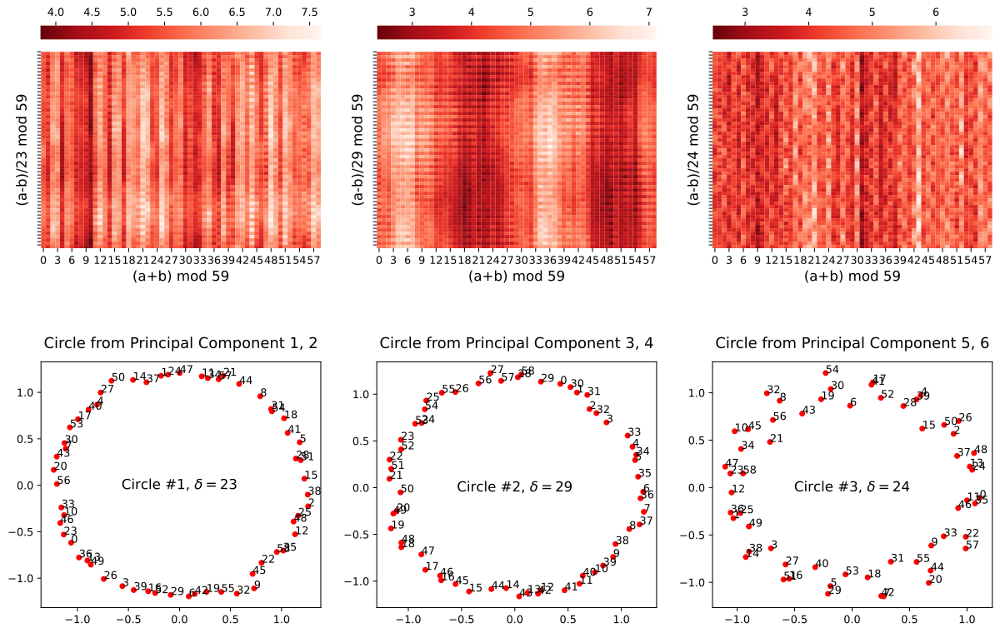

*Рисунок 16: Корректные логиты Model $\delta$ после изоляции круга.* **[p. 19]**

## Приложение F Подробности архитектуры и обучения

### F.1 Трансформеры

Здесь мы описываем нашу постановку для основных опытов. Опыты на других постановках — в приложении E и приложении I.

#### Архитектура

Мы обучаем двунаправленные трансформеры (внимание без маскирования) выполнять модульное сложение $\bmod~p$, где $p=59$. Чтобы вычислить $(a+b)\bmod p$, вход подаётся модели как последовательность **[p. 19]** из двух токенов $[a,b]$. Выходом модели считается выходной логит на последнем токене. У трансформера с «шириной» $d$ входное вложение и остаточный поток будут $d$-мерными, будут употреблены $4$ головы внимания размерности $\lfloor{d/4}\rfloor$, а MLP будет с $4d$ скрытыми единицами. По умолчанию выбрано $d=128$. В качестве функции активации употребляется ReLU, нормировка по слою не применяется. Матрица внимания после softmax интерполируется между матрицей из одних единиц и исходной, как **[p. 20]** задано силой внимания (раздел 4.2). Мы хотим отметить, что постановка с трансформерами с постоянным вниманием рассматривалась и в предыдущей работе [28].

#### Данные

###### p20-1

Из всех возможных точек данных (их $p^{2}=3481$) мы случайно выбираем $80\%$ в качестве обучающих образцов и $20\%$ в качестве проверочных. Этот выбор (малое $p$ и высокая доля обучающих данных) помогает ускорить обучение.

#### Обучение

###### p20-2

Мы употребляли оптимизатор AdamW [29] со скоростью обучения $\gamma=0.001$ и множителем weight decay $\beta=2$. Мы не пользуемся минибатчами, и перемешанные обучающие данные подаются целым батчем на каждой эпохе. Каждый прогон мы начинаем обучать с нуля и обучаем $20,000$ эпох. Мы убрали прогоны, не достигшие $100\%$ проверочной точности к концу обучения (большинство прогонов достигло $100\%$).

### F.2 Линейные модели

Здесь мы описываем нашу постановку для опытов с линейными моделями (приложение E).

#### Архитектура

Мы обучаем несколько типов линейных моделей выполнять модульное сложение $\bmod~p$, где $p=59$. Входное вложение, остаточный поток и скрытый слой все $d=256$-мерные. В качестве функции активации употребляется ReLU. Действительное устройство типов сетей задано в приложении E.

#### Данные и обучение

Те же, что и в предыдущем разделе (раздел F.1).

### F.3 Вычислительные ресурсы

###### p20-6

На этот проект потрачено в общей сложности 226 GPU-дней NVidia V100, хотя мы ожидаем, что воспроизведение потребует существенно меньших ресурсов.

## Приложение G Математическое описание трансформера с постоянным вниманием

В этом разделе мы разбираем устройство трансформеров с постоянным вниманием, вольно следуя обозначениям [10].

Обозначим вес слоя вложений как $W_{E}$, вес позиционного вложения как $W_{\text{pos}}$, веса матриц значений и выхода $j$-й головы $t$-го слоя как $W_{V}^{t,j}$ и $W_{O}^{t,j}$, веса и смещения входного линейного отображения MLP в $t$-м слое как $W_{\text{in}}^{t}$ и $b_{\text{in}}^{t}$, соответствующие веса и смещения выходного линейного отображения как $W_{\text{out}}^{t}$ и $b_{\text{out}}^{t}$, а вес слоя развложения как $W_{U}$. Заметим, что матрицы запросов и ключей несущественны, поскольку матрица внимания заменена матрицей из одних единиц. Обозначим $x^{j}$ как значение вектора остаточного потока после первых $j$ слоёв, а $c_{i}$ — как символ в $i$-й позиции. Нижние индексы вроде $x_{t}$ мы употребляем для обозначения взятия определённого элемента вектора.

Мы можем формализовать вычисление логитов следующим образом:

- Вложение: $x^{0}_{i}=W_{E,c_{i}}+W_{\text{pos},i}$. - Для каждого слоя $t$ от $1$ до $n_{\text{layer}}$: **Постоянное** внимание: $w^{t}_{i}=x^{t-1}_{i}+\sum_{j}W_{O}^{t,j}W_{V}^{t,j}\sum_{k}x^{t-1}_{k}$. MLP: $x^{t}=w^{t}+b_{\text{out}}^{t}+W_{\text{out}}^{t}\text{ReLU}(b_{\text{in}}^{t}+W_{\text{in}}^{t}w^{t})$. - Выход: $O=W_{U}x^{n_{\text{layer}}}$.

В частном случае, когда длина входа равна $2$, число слоёв равно $1$, а нас занимает логит на последней позиции, мы можем переформулировать это так (обозначив $z$ как $x^{1}$ и $y$ как $w^{1}$):

- Вложение: $x_{1}=W_{E,c_{1}}+W_{\text{pos},1},~x_{2}=W_{E,c_{2}}+W_{\text{pos},2}$. - Постоянное внимание: $y=x_{2}+\sum_{j}W_{O}^{j}W_{V}^{j}(x_{1}+x_{2})$. - MLP: $z=y+b_{\text{out}}^{t}+W_{\text{out}}^{t}\text{ReLU}(b_{\text{in}}^{t}+W_{\text{in}}^{t}y)$. - **[p. 21]** Выход: $o=W_{U}z$.

Если убрать skip-соединения, сеть после вложения можно рассматривать как

$$
o=L_{U}\left(L_{\text{out}}\left(\text{ReLU}\left(L_{\text{in}}\left(\sum_{j}L_{O}^{j}\left(L_{V}^{j}\left(x_{1}+x_{2}\right)\right)\right)\right)\right)\right)
$$

где $L_{V}^{j},L_{O}^{j},L_{\text{in}},L_{\text{out}},L_{U}$ — ряд линейных слоёв, отвечающих этим матрицам.

## Приложение H Пицца с вниманием

###### p21-3

Экстраполируя рисунок 7, мы обучили трансформеры с шириной $1024$ и силой внимания $1$ (обычное внимание). После нескольких попыток нам удалось наблюдать обученную круговую модель с distance irrelevance $0.156$ и gradient symmetricity $0.995$, что отвечает нашему определению *Pizza* (рисунок 17).

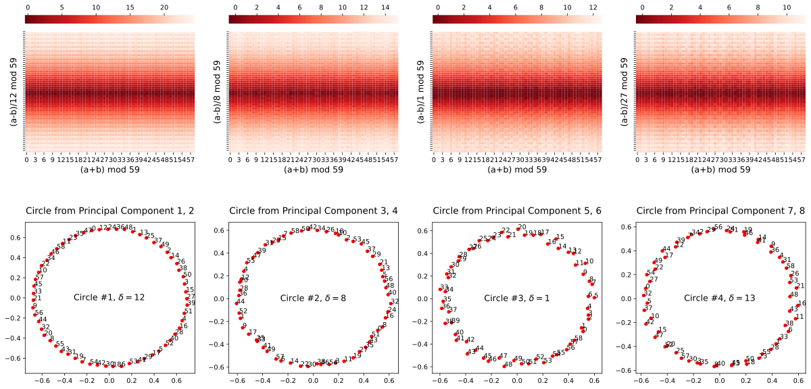

*Рисунок 17: Корректные логиты обученной модели из раздела H после изоляции круга (раздел 3.3).* **[p. 21]**

## Приложение I Результаты на слегка изменённых постановках

###### p21-4

Мы рассмотрели следующие изменения наших постановок (приложение F.1, раздел 4), при которых существование пицц и часов, равно как и смены фаз, по-прежнему наблюдается.

#### GeLU вместо ReLU

Мы провели тот же опыт с однослойным трансформером, взяв в качестве функции активации GeLU вместо ReLU. Наблюдаются весьма схожие результаты (рисунок 18).

#### Кодировать два токена по-разному

Мы провели опыты с однослойным трансформером, но с разными вложениями для двух токенов. Снова наблюдаются весьма схожие результаты (рисунок 19). Мы обнаружили также, что вложения двух токенов часто выравниваются, чтобы осуществить алгоритмы *Pizza* и *Clock* (рисунок 20).

#### Добавление знака равенства

Мы провели опыт с однослойным трансформером с добавленным знаком равенства. Наблюдаются весьма схожие результаты (рисунок 21).

*Рисунок 18: Результаты обучения однослойных трансформеров с GeLU вместо ReLU в качестве функции активации. Каждая точка на графиках представляет прогон обучения, достигший 100% проверочной точности.* **[p. 22]**

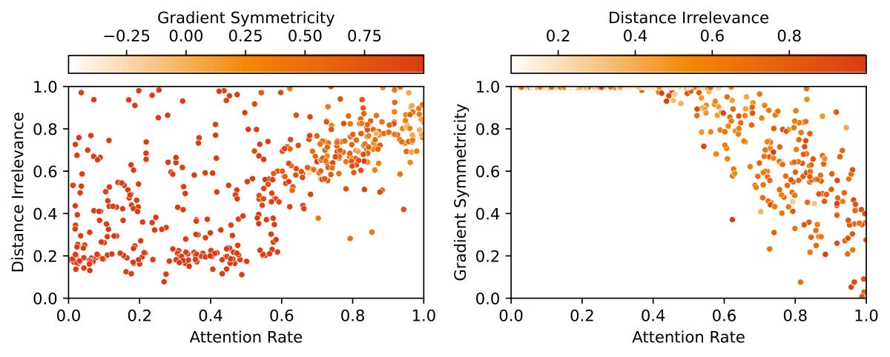

*Рисунок 19: Результаты обучения однослойных трансформеров, где два токена пользуются разными вложениями (модели на входе $(a,b)$ подаётся $[a,b+p]$; $2p$ токенов обрабатываются в слое вложений). Каждая точка на графиках представляет прогон обучения, достигший 100% проверочной точности. Мы не пользовались circularity для фильтрации результата, поскольку она более не определена корректно.* **[p. 22]**

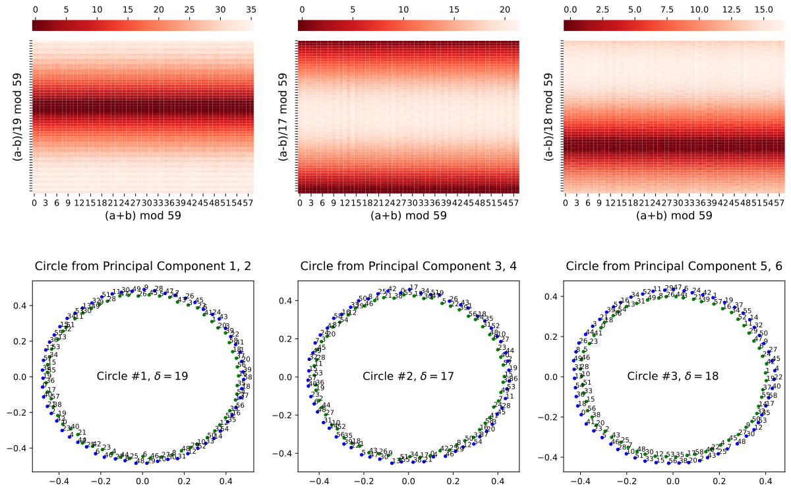

*Рисунок 20: Корректные логиты после изоляции круга у обученной модели, где два токена пользуются разными вложениями. Синие точки представляют вложения первого токена, а зелёные точки — вложения второго токена. Модель осуществляет алгоритм *Pizza*. Узор корректных логитов сдвинут по сравнению с предыдущими узорами, поскольку вложения двух токенов не выстраиваются в точности. Например, у третьего круга почти максимальный корректный логит при $a=6,b=3$ (две точки выстраиваются наверху) и $(a-b)/18\equiv 10\pmod{59}$. По этой причине узор корректных логитов и выглядит сдвинутым на 10 единиц вниз.* **[p. 23]**

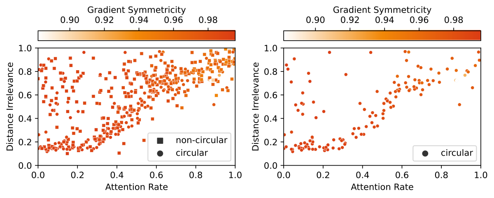

*Рисунок 21: Результаты обучения однослойных трансформеров, где добавлен знак равенства (модели на входе $(a,b)$ подаётся $[a,b,\text{=}]$, где = — особый токен; $p+1$ токенов обрабатываются в слое вложений; длина контекста модели становится $3$). Каждая точка на графиках представляет прогон обучения, достигший 100% проверочной точности. Мы не пользовались circularity для фильтрации результата, поскольку она более не определена корректно.* **[p. 23]**

## Приложение J Пицца возникает рано при обучении часов

###### p21-8

Мы построили промежуточные состояния во время обучения модели с вниманием (сила внимания 1). Пиццеподобный узор наблюдался рано в обучении, но по ходу прогона узор постепенно исчезал (рисунок 22).

###### fig-22

*Рисунок 22: Для однослойного трансформера с вниманием — корректные логиты после изоляции главных компонент (возможно, не круга) в различных состояниях во время обучения. Пиццеподобный узор постепенно *растворился*.* **[p. 24]**

**[p. 23]**

## Приложение K Сопровождающая пицца возникает рано при обучении пиццы

###### p23-1

Мы построили промежуточные состояния во время обучения модели без внимания (сила внимания 0). Мы наблюдали раннее возникновение узора, схожего с сопровождающей пиццей, в прогонах обучения (рисунок **[p. 24]** 23), и удаление этого круга роняет точность с 99.7% до 97.9%. Позже в сети они менее полезны (удаление сопровождающих пицц в обученной Model A роняет точность лишь до 99.7%).

###### fig-23

*Рисунок 23: Промежуточное состояние после 600 эпох обучения однослойного трансформера с постоянным вниманием.* **[p. 25]**

**[p. 25]**

## Приложение L Пристальный взгляд на линейную модель-пиццу

В этом разделе мы даём полную картину линейной модели, показанной на рисунке 15, разбирая настоящие веса в модели.

### L.1 Устройство модели

Как описано в приложении E, на входе $(a,b)$ выходные логиты модели вычисляются как

$$
L_{3}(\text{ReLU}(L_{2}(\text{ReLU}(L_{1}(\text{Embed}[a]+\text{Embed}[b]))))).
$$

Обозначим вес слоя вложений как $W_{E}$, вес слоя развложения ($L_{3}$) как $W_{U}$, а веса и смещения $L_{1}$ и $L_{2}$ как $W_{1},b_{1}$ и $W_{2},b_{2}$ соответственно; тогда выходные логиты на входе $(a,b)$ можно записать как

$$
W_{U}\text{ReLU}(b_{2}+W_{2}\text{ReLU}(b_{1}+W_{1}(W_{E}[a]+W_{E}[b]))).
$$

### L.2 Общая картина

Сперва мы выполняем визуализацию главных компонент матриц вложения и развложения. Из рисунка 24 видно, что матрицы вложения и развложения образовали *согласованные окружности* (окружности с одинаковым зазором $\delta$ между соседними записями).

Теперь дадим общий обзор контура. Каждая пара согласованных окружностей образует экземпляр *Pizza*, и они действуют независимо (с довольно ограниченным взаимным влиянием). А именно, для каждой пары:

- Матрица вложений сперва помещает входы $a,b$ на окружность: $W_{E}^{\prime}[a]\approx(\cos(w_{k}a),\sin(w_{k}a))$ и $W_{E}^{\prime}[b]\approx(\cos(w_{k}b),\sin(w_{k}b))$ ($w_{k}=2\pi k/p$ для некоторого целого $k\in[1,p-1]$, как в разделе 2.1; $W_{E}^{\prime}$ означает две рассматриваемые сейчас главные компоненты $W_{E}$; поворот и масштабирование для краткости опущены).
- **[p. 26]** Вложения складываются, давая

$$
(\cos(w_{k}a)+\cos(w_{k}b),\sin(w_{k}a)+\sin(w_{k}b)) \\
= \cos(w_{k}(a-b)/2)\cdot(\cos(w_{k}(a+b)/2),\sin(w_{k}(a+b)/2))
$$
- Затем это пропускается через первый линейный слой $L_{1}$. Каждая полученная запись до ReLU будет тем самым линейной комбинацией двух измерений упомянутых векторов, то есть $\cos(w_{k}(a-b)/2)\cdot(\alpha\cos(w_{k}(a+b)/2)+\beta\sin(w_{k}(a+b)/2))$ при некоторых $\alpha,\beta$, что после ReLU станет $\lvert\cos(w_{k}(a-b)/2)\rvert\lvert\alpha\cos(w_{k}(a+b)/2)+\beta\sin(w_{k}(a+b)/2))\rvert$.
- Затем эти значения пропускаются через второй линейный слой $L_{2}$. Эмпирически не наблюдается, чтобы ReLU был действенным, поскольку большинство значений положительны. Выходные записи тогда суть просто линейные комбинации упомянутых выходов $L_{1}$.
- Наконец применяется матрица развложения. В рассматриваемых нами главных компонентах $W_{U}^{\prime}[c]\approx(\cos(w_{k}c),\sin(w_{k}c))$. ($W_{U}^{\prime}$ означает две рассматриваемые сейчас главные компоненты $W_{U}$; поворот и масштабирование для краткости опущены), и эти две главные компоненты отвечают линейной комбинации выходных записей $L_{2}$, которые в свою очередь отвечают линейной комбинации выходов $L_{1}$ (благодаря нерабочему ReLU).
- Подобно формуле $|\sin(t)|-|\cos(t)|\approx\cos(2t)$, обсуждённой в приложении A, эти линейные комбинации дают хорошие приближения для $\lvert\cos(w_{k}(a-b)/2)\rvert\cos(w_{k}(a+b))$ и $\lvert\cos(w_{k}(a-b)/2)\rvert\sin(w_{k}(a+b))$. Наконец мы приходим к

$$
\lvert\cos(w_{k}(a-b)/2)\rvert(\cos(w_{k}c)\cos(w_{k}(a+b))+\sin(w_{k}c)\sin(w_{k}(a+b))) \\
= \lvert\cos(w_{k}(a-b)/2)|\cos(w_{k}(a+b-c))
$$

 .

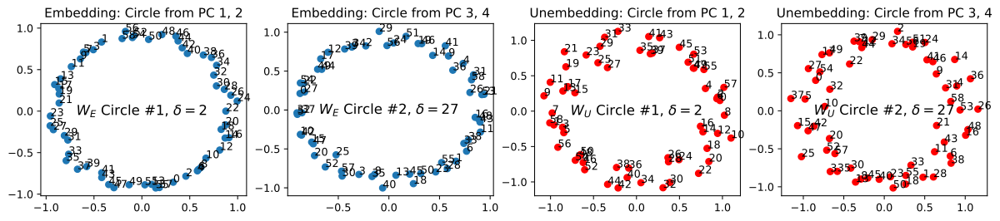

*Рисунок 24: Визуализация главных компонент матриц вложения и развложения.* **[p. 26]**

### L.3 Выравнивание весовых матриц

###### p26-2

Сперва мы проверяем, что ReLU второго слоя нерабочий. После его удаления точность модели остаётся $100\%$, а перекрёстно-энтропийная потеря даже *уменьшилась* с $6.20\times 10^{-7}$ до $5.89\times 10^{-7}$.

Стало быть, выход модели можно приближённо записать как

$$
W_{U}(b_{2}+W_{2}\text{ReLU}(b_{1}+W_{1}(W_{E}[a]+W_{E}[b])))=W_{U}b_{2}+W_{U}W_{2}\text{ReLU}(b_{1}+W_{1}(W_{E}[a]+W_{E}[b])).
$$

Теперь мы «выравниваем» весовые матрицы $W_{1}$ и $W_{2}$, отображая их через направления главных компонент вложений и развложений. То есть мы вычисляем, как эти матрицы действуют на главные направления и в них (рассматриваем $W_{1}v$ для каждого главного направления $v$ в $W_{E}$ и $v^{T}W_{2}$ для каждого главного направления $v$ в $W_{U}$). Другое измерение выравненных $W_{1}$ и $W_{2}$ мы называем выходным и исходным измерениями соответственно (рисунок 25).

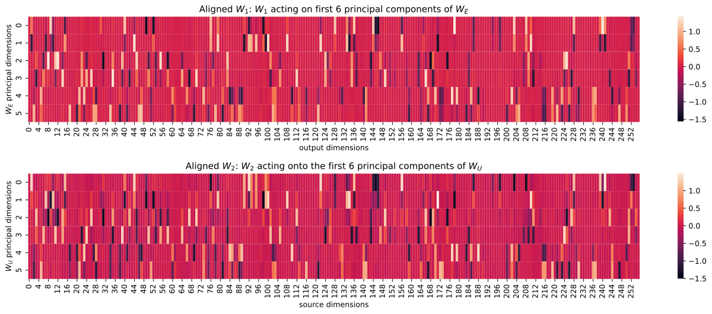

*Рисунок 25: Визуализация выравненных $W_{1}$ и $W_{2}$.* **[p. 27]**

###### p26-5

В выравненных весовых матрицах виден отчётливый доминошный узор: у большинства выходных или исходных измерений значимо ненулевые значения имеют лишь две главные компоненты, и они отвечают паре согласованных окружностей, то есть пицце. Таким образом каждое промежуточное измерение обслуживает ровно одну пиццу, так что пиццы не мешают друг другу.

**[p. 27]**

### L.4 Приближение

Всё становится куда яснее после перевыравнивания матриц. Для пиццы и двух отвечающих ей главных измерений вложения / развложения величина $W_{E}^{\prime}[a]+W_{E}^{\prime}[b]\approx\cos(w_{k}(a-b)/2)\cdot(\cos(w_{k}(a+b)/2),\sin(w_{k}(a+b)/2))$ будет отображена перевыравненной $W_{1}$ в отвечающие ей столбцы (разные у каждой пиццы), сложена с $b_{1}$, после чего применяется ReLU. Результат затем отображается перевыравненной $W_{2}$, складывается с *перевыравненным* $b_{2}$ и наконец умножается на $(\cos(w_{k}c),\sin(w_{k}c))$.

Для первых двух главных измерений у перевыравненной $W_{1}$ есть $44$ отвечающих столбца (с коэффициентами абсолютной величины $>0.1$). Пусть вложенный вход есть $(x,y)=W_{E}^{\prime}[a]+W_{E}^{\prime}[b]\approx\cos(w_{k}(a-b)/2)\cdot(\cos(w_{k}(a+b)/2),\sin(w_{k}(a+b)/2))$, тогда промежуточные столбцы суть

$\text{ReLU}([0.530x-1.135y+0.253,-0.164x-1.100y+0.205,1.210x-0.370y+0.198,-0.478x-1.072y+0.215,-1.017x+0.799y+0.249,0.342x-0.048y+0.085,1.149x-0.598y+0.212,-0.443x+1.336y+0.159,-1.580x-0.000y+0.131,-1.463x+0.410y+0.178,1.038x+0.905y+0.190,0.568x+1.188y+0.128,0.235x-1.337y+0.164,-1.180x+1.052y+0.139,-0.173x+0.918y+0.148,-0.200x+1.060y+0.173,-1.342x+0.390y+0.256,0.105x-1.246y+0.209,0.115x+1.293y+0.197,0.252x+1.247y+0.140,-0.493x+1.252y+0.213,1.120x+0.262y+0.239,0.668x+1.096y+0.205,-0.487x-1.302y+0.145,1.134x-0.862y+0.273,1.143x+0.435y+0.171,-1.285x-0.644y+0.142,-1.454x-0.285y+0.218,-0.924x+1.068y+0.145,-0.401x+0.167y+0.106,-0.411x-1.389y+0.249,1.422x-0.117y+0.227,-0.859x-0.778y+0.121,-0.528x-0.216y+0.097,-0.884x-0.724y+0.171,1.193x+0.724y+0.131,1.086x+0.667y+0.218,0.402x+1.240y+0.213,1.069x-0.903y+0.120,0.506x-1.042y+0.153,1.404x-0.064y+0.152,0.696x-1.249y+0.199,-0.752x-0.880y+0.106,-0.956x-0.581y+0.223]).$

Для первого главного измерения развложения оно будет скалярно умножено на

$[1.326,0.179,0.142,-0.458,1.101,-0.083,0.621,1.255,-0.709,0.123,-1.346,-0.571,1.016,\\ 1.337,0.732,0.839,0.129,0.804,0.377,0.078,1.322,-1.021,-0.799,-0.339,1.117,-1.162,\\ -1.423,-1.157,1.363,0.156,-0.165,-0.451,-1.101,-0.572,-1.180,-1.386,-1.346,-0.226,\\ 1.091,1.159,-0.524,1.441,-0.949,-1.248].$

Назовём эту функцию $f(x,y)$. Подставляя $x=\cos(t),y=\sin(t)$, мы получаем функцию, хорошо приближающую $8\cos(2t+2)$ (рисунок 26). Стало быть, полагая $t=w_{k}(a+b)/2$, скалярное произведение будет приблизительно равно $8\lvert\cos(w_{k}(a-b)/2)\rvert\cos(w_{k}(a+b)+2)$, или $\lvert\cos(w_{k}(a-b)/2)\rvert\cos(w_{k}(a+b))$, если пренебречь фазой и масштабом. Это завершает описанную нами выше картину.

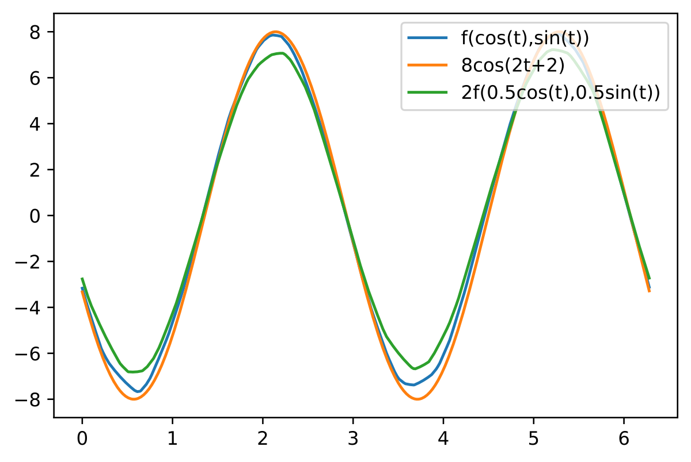

*Рисунок 26: $f(\cos(t),\sin(t))$ хорошо приближает $8\cos(2t+2)$.* **[p. 28]**
