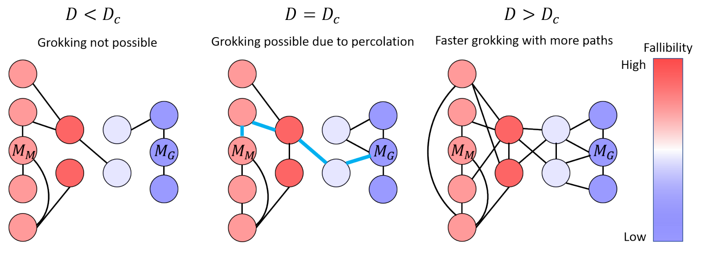
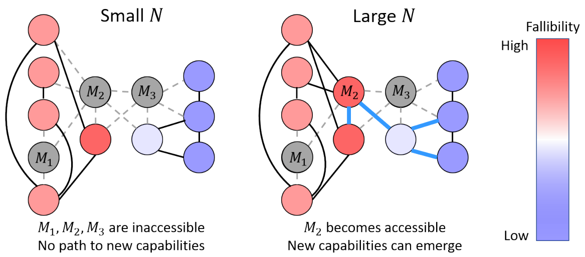

# Gokhale 2023 — The semantic landscape paradigm for neural networks

См. также: [глобальный индекс понятий](../../concepts/index.md).

**Shreyas Gokhale** (физический факультет, Массачусетский технологический институт).

arXiv [2307.09550](https://arxiv.org/abs/2307.09550), июль 2023 (v1), 14 страниц, 4 рисунка (все — схемы). Чисто концептуальная работа физика-статистика: обучение сети описано как блуждание по графу, узлы которого — возникающие внутренние алгоритмы («эвристические модели»), рельеф задан ненаблюдаемой «погрешимостью» $\mathcal{F}$ (сумма KL-расхождений по *всем возможным* входам), а переходы аррениусовы — через «семантические барьеры». В этой рамке гроккинг объявлен **перколяционным** переходом: данные суть рёбра графа (размер набора $D$ пропорционален средней степени), ниже $D_{c}$ компонента запоминающей модели отрезана от обобщающей, и генерализация невозможна при сколь угодно долгом обучении; возникновение с масштабом — та же перколяция, но по $N$ (параметры добавляют узлы); законы масштабирования выведены из модели ловушек Бушо для стёкол. Единственная работа корпуса, где гроккинг заявлен именно как перколяция — переход геометрический, по связности пространства решений; опытной части при этом нет вовсе, и сама перколяция нигде не построена как модель.

Оригинал и производные файлы этой папки:

- [`original/2307.09550.native.html`](original/2307.09550.native.html) — первоисточник, нативный HTML arXiv (v1), скачан как есть.
- [`original/2307.09550.the-semantic-landscape-paradigm-for-neural-networks.md`](original/2307.09550.the-semantic-landscape-paradigm-for-neural-networks.md) — конверсия оригинала в Markdown без правок содержания.
- [`2307.09550.the-semantic-landscape-paradigm-for-neural-networks.claims.txt`](2307.09550.the-semantic-landscape-paradigm-for-neural-networks.claims.txt) — пронумерованные утверждения статьи с пометками разбора.
- [`images/`](images/) — 4 рисунка.

Схема якорей и правила ссылок на карточку — в [README папки статей](../README.md).

## Затрагиваемые понятия

**[Фазовый переход](../../concepts/phase-transition.md)** — единственная в корпусе трактовка гроккинга как **перколяционного** перехода: переход геометрический, по связности пространства решений — при $D<D_{c}$ граф эвристических моделей распадается, и путь от запоминающей модели $\mathcal{M}_{M}$ к обобщающей $\mathcal{M}_{G}$ не существует ([`p6-1`](#p6-1)); возникновение с масштабом — та же перколяция, но по $N$: параметры добавляют узлы, данные — рёбра ([`p6-2`](#p6-2)). Разбор: перколяция нигде не построена как модель — нет явного графа, доли занятых рёбер, параметра порядка, ни одного критического показателя; смешаны два перехода — перколяция задаёт лишь *возможность* гроккинга (по $D$), а резкость *во времени* при $D>D_{c}$ — задача о первом достижении, которая не решается.

**[Критический размер набора данных](../../concepts/data-fraction-critical-dataset-size.md)** — известный критический размер $D_{c}$ переописан как порог перколяции: обучающие примеры суть рёбра графа моделей (они не добавляют моделей — они добавляют переходы между ними), и в простейшем приближении $D$ пропорционален средней степени графа ([`p5-4`](#p5-4)); над порогом скорость гроккинга пропорциональна избыточной степени, $t_{g}\propto 1/(D-D_{c})$, с заявленным согласием с теорией представлений Liu et al. ([`p6-1`](#p6-1)). Разбор: отождествление $D$ со средней степенью ничем не обосновано и несёт всю тяжесть вывода; согласие с 2205.10343 установлено на уровне вида зависимости, а не показателя.

**[Ландшафт потерь и котловины](../../concepts/loss-landscape-basins.md)** — предложено огрубление ландшафта потерь до «смыслового ландшафта»: рельеф задан погрешимостью $\mathcal{F}$ над пространством алгоритмов, улучшение возможно лишь через пересечение *семантических барьеров*, и переходы аррениусовы, $\tau_{ij}=\tau_{ij}^{0}e^{\beta(\mathcal{F}_{j}-\mathcal{F}_{i})}$ ([`p4-3`](#p4-3)); отсюда предсказание, что тестовая потеря при гроккинге должна временно вырасти перед падением, а величина всплеска несёт сведения о высоте барьеров ([`p5-3`](#p5-3)). Разбор: всплеск подан как предсказание, но подкреплён ссылками на уже опубликованные наблюдения — это ретросказание; полезная же развилка для корпуса — где помещать барьер: в ландшафте потерь по весам (как позже у линии активационного побега) или на графе алгоритмов, как здесь.

**[Эмерджентность](../../concepts/emergence.md)** — возникновение новых способностей с масштабом объяснено перколяцией по $N$: рост числа параметров расширяет «словарь» сети и добавляет узлы-модели, и путь к моделям низкой погрешимости открывается лишь при достаточно большом $N$ ([`p6-2`](#p6-2)); в споре о «мираже эмерджентности» занята чёткая позиция — эмерджентность должна определяться появлением *способности*, независимо от метрик потерь, а установить её можно, лишь заглянув внутрь сети механистическим разбором ([`p10-2`](#p10-2)). Разбор: опытной части нет вовсе — все четыре рисунка суть схемы, и слово «show» аннотации относится к рассуждению, а не измерению.

## Что показано, а что предположено

Замечания редактора карточки по итогам разбора утверждений (`…claims.txt`, 45 пунктов).

**Ценное — словарь и одна ясная развилка.** Разделение ролей $D$ и $N$ — данные суть рёбра, параметры суть узлы — компактный образ, из которого сразу следуют и критический размер набора, и возникновение с масштабом, и известное насыщение при росте одного параметра при закреплённом другом. Явно поставлен вопрос, где живёт барьер, который сеть пересекает при гроккинге, — в ландшафте потерь по весам или на графе алгоритмов: аррениусова форма (3) предвосхищает кинетику активационного побега (2606.17120), но помещает барьер в другое пространство. Против «миража эмерджентности» — внятная позиция: способность, а не форма кривой.

**Опыта нет, и перколяция не построена.** Ни численного расчёта на явном графе, ни обучения, ни подгонки к собственным данным; «we show» аннотации — о рассуждении. Заявление «это перколяционный переход» — переименование известного факта о $D_{c}$: нет явного графа, доли занятых рёбер, параметра порядка (размера гигантской компоненты), показателей, конечно-размерного разбора — претензия 2603.24746 к «фазовопереходной риторике без опровержимых конечноразмерных величин» бьёт ровно в такую подачу. Аннотация обещает «first passage and percolation», но задача о первом достижении нигде не решается — а именно она отвечает за резкость перехода во времени при закреплённом $D>D_{c}$.

**Свободных величин много, и все ненаблюдаемы.** $\beta$, $\tau^{0}$, $\mu$, $\alpha$, $d_{f}$, $\ell_{0}$, $\ell_{\infty}$, $D_{k}$ — показатель $\mu/(d_{f}\alpha)$ подгоняется под почти любое измеренное значение, что подано как достоинство. Догадка **C1** почти неопровержима (гёделева нумерация делает отображение существующим едва ли не автоматически), и эмпирическая подпорка создаёт видимость проверенности тривиального. Две опечатки живут и в опубликованном PDF: формула (2) записана тремя знаками суммы без сложения; в §4.2 случаи $d_{f}=2$ и $d_{f}=1$ снабжены одним и тем же $\mathcal{F}(N)\propto 1/\sqrt{N}$, тогда как формула (7) при $d_{f}=1,\alpha=1$ даёт $1/N$.

**Как работу будут цитировать** («показано, что гроккинг есть перколяционный переход») — точнее: предложен словарь, в котором известный критический размер набора переописан как порог перколяции на нигде не построенном графе; расчёта и опыта в работе нет. Отголосок образа вернулся в корпус независимо: 2602.18523 описывает «percolation-like» порог в геометрии оптимизации спустя три года и без ссылки.

---

# Текст статьи

## Парадигма смыслового ландшафта для нейронных сетей

**Shreyas Gokhale** — физический факультет, Массачусетский технологический институт, Кембридж, MA 02139. Email: gokhales@mit.edu

## Аннотация

Глубокие нейронные сети являют завораживающий спектр явлений — от предсказуемых законов масштабирования до непредсказуемого возникновения новых способностей как функции времени обучения, размера набора данных и размера сети. Анализ этих явлений открыл существование понятий и алгоритмов, закодированных в выученных представлениях этих сетей. Хотя в объяснении наблюдаемых явлений по отдельности достигнуты значительные успехи, объединённой рамки для понимания, препарирования и предсказания качества нейронных сетей недостаёт. Здесь мы вводим парадигму смыслового ландшафта — концептуальную и математическую рамку, описывающую динамику обучения нейронных сетей как траектории на графе, чьи узлы отвечают возникающим алгоритмам, внутренне присущим выученным представлениям сетей. Эта абстракция позволяет нам описать широкий круг нейросетевых явлений в терминах хорошо изученных задач статистической физики. А именно, мы показываем, что гроккинг и возникновение с масштабом связаны с перколяционными явлениями, а нейронные законы масштабирования объяснимы в терминах статистики случайных блужданий по графам. Наконец, мы обсуждаем, как парадигма смыслового ландшафта дополняет существующие теоретические и практические подходы к пониманию и истолкованию глубоких нейронных сетей.

*Ключевые слова* Artificial Intelligence $\cdot$ Machine Learning $\cdot$ Statistical Physics

## 1 Введение

Мы живём в эпоху, когда читатели этой рукописи никогда не могут быть вполне уверены, написана ли она человеком или большой языковой моделью (сноска: для протокола — эта рукопись целиком написана человеком по имени Shreyas Gokhale). Этот отрезвляющий факт разом подчёркивает и ошеломляющие технологические успехи искусственного интеллекта (AI) последних лет, и настоятельную нужду понять внутреннее устройство глубоких нейронных сетей, сделавших эти успехи возможными. Понимание нейронных сетей требует знать, *что* сети способны делать, *как* их качество зависит от разных факторов и, наконец, *почему* они преуспевают или проваливаются в разных обстоятельствах. За последние несколько лет исследователи начали отвечать на эти вопросы внушительным набором опытных результатов и теоретических идей. Ряд исследований сообщил эмпирические наблюдения степенного масштабирования тестовой потери как функции размера сети (числа параметров), размера набора данных (числа обучающих примеров), вычислительного бюджета и времени обучения (Hestness et al. 2017; Rosenfeld et al. 2019; Kaplan et al. 2020; Gordon et al. 2021; Zhai et al. 2022; Hoffmann et al. 2022). Затем был выдвинут ряд различных теоретических предложений для объяснения наблюдаемых степенных законов (Bahri et al. 2021; Hutter 2021; Sharma and Kaplan 2022; Maloney et al. 2022; Michaud et al. 2023).

В дополнение к этим вездесущим степенным законам, дающим точный отчёт об улучшении качества модели с масштабом, ряд исследований сообщил и о внезапном возникновении новых способностей у нейронных сетей. Новые способности могут возникать либо как функция времени — явление, известное как гроккинг (Power et al. 2022; Thilak et al. 2022; Liu et al. 2022a), — либо как функция размера сети, что мы в этой статье будем звать «возникновением с масштабом» (Wei et al. 2022; Ganguli et al. 2022). Несмотря на распространённость, природа возникающих явлений в глубоких **[p. 2]** нейронных сетях остаётся далёкой от понимания. Одни работы поддерживают взгляд, что гроккинг связан с фазовым переходом (Žunkovič and Ilievski 2022; Liu et al. 2022b), другие возражали, что внезапное возникновение — лишь иллюзия, происходящая от метрики, которой измеряют потерю, и что качество сети на деле развивается постепенно (Schaeffer et al. 2023). Более того, сети могут делать скрытый прогресс до ясного проявления возникновения, остающийся незамеченным в кривых потерь (Barak et al. 2022).

Многообещающий подход к распутыванию этих на вид противоречивых наблюдений о возникновении — заглянуть под капот сети и определить, что рассматриваемые сети на деле учатся делать. Эта линия расспросов привела к поистине замечательным открытиям о природе выученных представлений в нейронных сетях. Пользуясь рассечением сети (Bau et al. 2017), Bau et al. 2020) показали, что отдельные нейроны свёрточных нейронных сетей (CNN) могут представлять понятия, связанные с физическими предметами. Обратной инженерией нейронных сетей (Cammarata et al. 2020) ряд исследований показал, что трансформерные языковые модели могут выучивать разнообразные алгоритмы для задач, включая предсказание текста (Elhage et al. 2021; Olsson et al. 2022), модульное сложение (Nanda et al. 2023; Zhong et al. 2023) и групповые операции (Chughtai et al. 2023). В совокупности эти находки устанавливают факт, что глубокие нейронные сети способны выучивать вполне определённые вычисления, дающие улучшенные способности предсказания. На этой идее (Michaud et al. 2023) недавно предложили модель квантования для объяснения масштабирования и возникновения в языковых моделях.

Благодаря изобилию данных о метриках качества и растущей литературе о механистических прозрениях предложено несколько независимых теоретических подходов, нацеленных на объяснение различных сторон нейросетевой феноменологии, как обсуждено в предыдущих абзацах. Хотя все эти подходы безмерно ценны, они следуют из различных концептуальных рамок. Это затрудняет понимание того, как разные подходы соотносятся друг с другом и пересекаются ли — и когда — их области применимости. Объединённая концептуальная рамка, сводящая количественные метрики качества нейронных сетей с качественными запросами интерпретируемости, крайне желательна: она даст общий язык теоретическому дискурсу и направит дальнейшие разработки в поле.

В настоящей работе мы вводим такую объединённую концептуальную рамку, определяя смысловой ландшафт в пространстве, натянутом на внутренние алгоритмы, выучиваемые нейронными сетями, которые мы зовём эвристическими моделями. Затем мы показываем, как несколько различных качественных и количественных сторон нейросетевой феноменологии находят естественное и согласованное описание в терминах траекторий на смысловом ландшафте. Остаток статьи организован так: в разделе $2$ мы даём математические определения ключевых понятий смыслового ландшафта. В разделе $3$ мы показываем, как гроккинг и возникновение с масштабом описываются в терминах первого достижения и перколяционных явлений на смысловом ландшафте. В разделе $4$ мы выводим законы масштабирования тестовой потери как функции размера сети, размера набора данных и времени обучения для конкретного выбора топографии смыслового ландшафта. Наконец, в разделе $5$ мы обсуждаем, как парадигма смыслового ландшафта соединяется с существующими подходами, как её можно развивать дальше и каковы её следствия для будущих исследований.

## 2 Парадигма смыслового ландшафта

### 2.1 От ландшафта потерь к смысловому ландшафту

В своей сердцевине обучение нейронной сети — задача оптимизации со многими взаимодействующими степенями свободы. Этот факт давно привлекает внимание статистических физиков, поскольку позволяет им приложить свой внушительный арсенал теоретических инструментов к трудной задаче громадной практической важности Mehta et al. 2019. В частности, понятие ландшафта потерь, определяемого потерей сети как функцией нейронных весов, играет центральную роль в нашем понимании нейронных сетей — благодаря сходству с хорошо изученными объектами вроде энергетических ландшафтов в физике (Debenedetti and Stillinger 2001) и химии (Onuchic et al. 1997) и ландшафтов приспособленности в эволюционной биологии (De Visser and Krug 2014). В частности, понятия масштабирования и ренормгруппы (Geiger et al. 2020; Bahri et al. 2021; Roberts et al. 2022), стёкол (Baity-Jesi et al. 2018) и джемминга (Spigler et al. 2019) дали значительные прозрения о природе динамики обучения. Ландшафт потерь безмерно полезен: он позволяет понимать динамику обучения по аналогии с хорошо понятыми физическими явлениями, о которых у нас куда лучшая интуиция. Однако недавние исследования механистической интерпретируемости (Nanda and Lieberum 2022; Zhong et al. 2023) высветили существенный пробел в нашем понимании того, как нейронные сети работают. А именно, мы пока не понимаем, как динамика на ландшафте потерь может порождать выходы, выглядящие так, будто они следуют из последовательности интерпретируемых логических шагов. Чтобы закрыть этот пробел, нужно развить огрублённое описание, которое, с одной стороны, сохраняет связи с ландшафтами потерь, а с другой — прямо принимает во внимание возникающие алгоритмы, открываемые растущим числом исследований. Цель этой статьи — ввести такое описание в терминах смыслового ландшафта и показать, что оно способно согласованно объяснить ряд разрозненных нейросетевых явлений в одной концептуальной рамке.

**[p. 3]**

### 2.2 Эвристические модели

Понять, как нейронные сети работают, — то же, что понять, как происходит обработка информации между их входным и выходным слоями. Исследования механистической интерпретируемости сильно намекают, что эта обработка информации аналогична исполнению возникающих алгоритмов, закодированных в выученных представлениях нейронных сетей. Парадигма смыслового ландшафта формализует это представление с помощью следующей догадки

- Для всякой нейронной сети существует хотя бы одна функция, отображающая подмножества множества параметров сети в правильно построенные формулы некоторого формального языка.

Формальный язык $L$ определяется как множество слов, образованных из символов алфавита $\Sigma$ по данному набору правил. Правильно построенная формула $f$ в $L$ определяется как конечная последовательность символов из $\Sigma$, построенная по правилам $L$. Тем самым формальный язык $L$ отождествим с множеством всех правильно построенных формул в $L$. Заметим также, что обсуждаемый здесь «формальный язык» связан с внутренними представлениями нейронной сети и никак не относится к языку программирования, на котором написан код сети. Математически догадка выше выражается так:

- **C1**: для нейронной сети с множеством параметров $W=\{w_{i}|i\in\mathbb{N}^{+},i\leq N\}$ и формального языка $L$ с множеством правильно построенных формул $\mathcal{S}_{F}=\{f_{i}|i\in\mathbb{N}^{+},i\leq N_{L}\}$, $\exists\mathcal{G}\neq\emptyset$, такое что $\forall G_{i}\in\mathcal{G},\\ G_{i}:W^{m}\mapsto\mathcal{S}_{F}$ для некоторого $m\in\mathbb{N}^{+}$.

Чем интересны такие функции $G_{i}$, отображающие нейронные веса в правильно построенные формулы? Причина в том, что правильно построенные формулы любого языка всегда можно однозначно закодировать числами схемами вроде гёделевой нумерации (Gödel 1931). Функции $G_{i}$ потому обеспечивали бы математическую равнозначность между состоянием нейронной сети, описанным набором нейронных весов, и состоянием сети, описанным набором правильно построенных формул формального языка. Поскольку алгоритмы по определению суть наборы правильно построенных формул в данном формальном языке, **C1** влечёт: совокупная нейронная активность во всех скрытых слоях при закреплённом наборе весов математически равнозначна исполнению алгоритма в некотором формальном языке $L$.

Догадка **C1** сильно поддержана эмпирическими свидетельствами по разным моделям и наборам данных в виде концепт-нейронов (Bau et al. 2020), индукционных голов (Elhage et al. 2021), выученных алгоритмов математических операций (Nanda et al. 2023; Chughtai et al. 2023; Zhong et al. 2023) и автоматически открываемых квантов (Michaud et al. 2023). Более того, эти исследования показали, что за пределами формулирования логических предложений нейронные сети способны сводить эти предложения в возникающие эвристические алгоритмы, позволяющие сети порождать верные выходы для большинства входов. Мы употребляем слово «эвристический», чтобы подчеркнуть: возникновение логической процедуры определения выхода не предполагает врождённого знания или понимания сетью подлежащих математических или фактических истин. В парадигме смыслового ландшафта мы формализуем понятие возникновения таких внутренних эвристических алгоритмов, определяя эвристическую модель так:

- **Def. 1**: эвристическая модель $\mathcal{M}_{H}$ — алгоритм в $L$, составленный из конечной последовательности правильно построенных формул $f_{i}\in\mathcal{S}_{F}$, порождающий единственное условное распределение вероятностей $\mathcal{P}_{H}(y|x)$ над всеми возможными выходами $y$ для каждого возможного входа $x$.

В **Def 1** мы говорим о распределениях выходов, а не об однозначных выходах, поскольку для некоторых задач, например предсказания естественного языка, единственного «правильного» ответа может не быть, и диапазон уместных откликов обычно происходит из некоторого распределения над алфавитом этого естественного языка. Иерархия шагов от весов к правильно построенным формулам и далее к эвристическим моделям показана схематически на рис. 1a. О понятии эвристических моделей уместно несколько замечаний. Во-первых, хотя эвристические модели — наборы правильно построенных формул в $L$, это не означает, что они будут делать верные предсказания для входов или давать низкую тестовую потерю. На деле, вообще говоря, большинство эвристических моделей — скорее всего *плохие* алгоритмы, дающие *высокую* тестовую потерю. По ходу обучения сеть улучшает качество, открывая всё лучшие эвристические модели. Успешно обученная сеть — та, что «нашла» эвристическую модель, способную обобщаться на большую долю возможных тестовых данных. Например, в примере модульного сложения, изученном Nanda et al. 2023, сеть сначала пользуется плохой эвристической моделью, лишь запоминающей обучающие данные, но позже находит остроумный математический алгоритм, хорошо обобщающийся на все входы.

*Рисунок 1: **Построение смыслового ландшафта:** (a) Схема огрубления от нейронных весов к правильно построенным формулам и их последующего сведения в эвристические модели, как предложено в догадке **C1**. (b) Схема смыслового ландшафта, заданного изменением погрешимости $\mathcal{F}$ над эвристическими моделями в пространстве предложений. В конкретный момент обучения нейронные веса принимают конкретные значения, и сеть занимает один узел на графе эвристических моделей. Позже нейронные веса меняются, позволяя сети занять другой узел графа эвристических моделей.* **[p. 4]**

Другой важный момент: сеть закреплённого размера, вообще говоря, не сможет сформулировать все возможные эвристические модели. Это прямо следует из **C1**: с ростом числа параметров $N$ растёт и число способов свести веса в правильно построенные формулы. В просторечии, увеличение размера сети увеличивает «словарь» сети. В разделе $3$ мы увидим, что этот рост способности формулировать алгоритмы с размером сети критичен для возникновения новых способностей с масштабом.

**[p. 4]**

### 2.3 Погрешимость и смысловой ландшафт

По сути, изложенное означает, что динамику обучения нейронной сети можно рассматривать как динамику на графе, чьи вершины — эвристические модели. В данный момент обучения сеть занимает один узел графа эвристических моделей. По ходу обучения, с подстройкой нейронных весов, сеть может принять другую эвристическую модель, что отвечает переходу с узла на узел. Скорости переходов от одной эвристической модели к другой управляются рядом факторов, включая размер сети и размер набора данных, качество данных и гиперпараметры архитектуры и алгоритма обучения. В принципе можно принять восходящий подход и вычислить эти скорости переходов систематическим огрублением по параметрам сети для конкретных выборов архитектуры и алгоритма обучения. Сейчас, однако, такая задача запретительно трудна. Вместо этого в настоящей вводной версии парадигмы смыслового ландшафта мы реализуем нисходящий подход, делая упрощённые выборы скоростей переходов, мотивированные измерениями качества сетей и согласные с ними. Чтобы делать такие выборы, нужно точно измерить, насколько данная эвристическая модель *хороша* или *плоха*. Мы делаем это, определяя погрешимость $\mathcal{F}$ данной эвристической модели $\mathcal{M}_{H}$ как

$$
\mathcal{F}(\mathcal{M}_{H})=\sum_{x\in\mathcal{I}}D_{KL}\big(\mathcal{P}_{GT}(y|x)\parallel\mathcal{P}_{H}(y|x)\big) \tag{1}
$$

где $\mathcal{P}_{GT}(y|x)$ — истинное распределение вероятностей над всеми возможными выходами $y$ для входа $x\in\mathcal{I}$, а $D_{KL}(P\parallel Q)$ — расхождение Кульбака—Лейблера $P$ от $Q$. Из определения ясно, что $\mathcal{F}(\mathcal{M}_{H})\geq 0\hskip 2.84526pt\forall\mathcal{M}_{H}$, и $\mathcal{F}(\mathcal{M}_{H})=0$ тогда и только тогда, когда распределение выходов, порождаемое $\mathcal{M}_{H}$, неотличимо от истинного для каждого $x\in\mathcal{I}$. Тем самым чем ниже значение $\mathcal{F}$, тем лучше эвристическая модель. Важно заметить, что погрешимость модели определена над *всеми возможными* входами, а не только над входами обучающего и тестового наборов. Она потому отлична от измеряемой потери. Однако при хорошем качестве обучающих данных измеренная тестовая потеря будет ниже у моделей низкой погрешимости, чем у моделей высокой. Это видно явно, если рассматривать множество всех возможных входов $\mathcal{I}$ как объединение обучающего набора $\mathcal{I}_{\rm{train}}$, тестового набора $\mathcal{I}_{\rm{test}}$ и оставшихся невиданных данных $\mathcal{I}_{\rm{unseen}}$. Здесь $\mathcal{I}_{\rm{unseen}}$ — множество входов, которых сеть не видела ни при обучении, ни при тестировании.

$$
\mathcal{F}=\sum_{x\in\mathcal{I}_{\rm{train}}}\sum_{x\in\mathcal{I}_{\rm{test}}}\sum_{x\in\mathcal{I}_{\rm{unseen}}}D_{KL}\big(\mathcal{P}_{GT}(y|x)\parallel\mathcal{P}_{H}(y|x)\big)=\mathcal{F}_{\rm{train}}+\mathcal{F}_{\rm{test}}+\mathcal{F}_{\rm{unseen}} \tag{2}
$$

###### p4-3

Тем самым если сеть просто запомнила обучающий набор, у неё низкое $\mathcal{F}_{\rm{train}}$, а значит, низкая измеренная обучающая потеря, но, вообще говоря, высокое $\mathcal{F}_{\rm{test}}$, а потому высокая измеренная тестовая потеря. Напротив, сеть, успешно научившаяся обобщаться на все входы, даст низкие значения $\mathcal{F}_{\rm{train}}$, $\mathcal{F}_{\rm{test}}$, а также $\mathcal{F}_{\rm{unseen}}$, и потому низкую тестовую потерю. Определённая так погрешимость эвристической модели аналогична энергии **[p. 5]** возбуждённого состояния, отсчитанной от энергии основного. По аналогии с энергетическими ландшафтами над пространством конфигураций для стёкол (Debenedetti and Stillinger 2001) и белков (Onuchic et al. 1997) или ландшафтами приспособленности над геномами (De Visser and Krug 2014) мы можем определить смысловой ландшафт нейронных сетей через изменение погрешимости $\mathcal{F}$ в пространстве правильно построенных формул $f_{i}\in\mathcal{S}_{F}$, так что каждая «конфигурация» $\{f_{i}\}$ отвечает конкретной эвристической модели $\mathcal{M}_{H}$ (рис. 1b). Немедленное следствие этого определения: нейронная сеть потенциально может застревать в локальных минимумах смыслового ландшафта, мешающих ей улучшать качество. Такая ситуация означает, что малые изменения принятой сетью эвристической модели непременно поведут к худшим предсказаниям, а потому к большей потере. Чтобы делать точные предсказания для большинства входов, такой сети пришлось бы крупно менять свою эвристическую модель. Тем самым улучшение качества возможно лишь если сеть способна пересечь определённые *семантические барьеры*. Понятие семантических барьеров мотивирует естественный выбор скоростей переходов — по аналогии с термически активированным перескоком через энергетический барьер. Мы потому принимаем, что скорость перехода от модели $\mathcal{M}_{i}$ к $\mathcal{M}_{j}$ имеет аррениусоподобный вид $R_{ij}=R_{ij}^{0}\rm{exp}\left[-\beta(\mathcal{F}_{j}-\mathcal{F}_{i})\right]$. Эти скорости переходов, в свою очередь, влекут аррениусоподобный закон для времени ожидания $\tau_{ij}$ перехода от $\mathcal{M}_{i}$ к $\mathcal{M}_{j}$:

$$
\tau_{ij}=\tau_{ij}^{0}e^{\beta(\mathcal{F}_{j}-\mathcal{F}_{i})} \tag{3}
$$

Константы $\beta$ и $\tau_{ij}^{0}$ могут зависеть от размера набора данных $D$, числа параметров $N$ и гиперпараметров нейронной сети, но сами погрешимости — нет. Ради экономии мы будем всюду далее полагать, что $\beta$ не зависит от $D$ и $N$, и лишь $\tau_{ij}^{0}$ меняется с этими величинами. В следующих двух разделах мы покажем, что даже при этих сравнительно мягких допущениях парадигма смыслового ландшафта способна объяснить ряд эмпирических результатов о масштабировании и возникновении в глубоких нейронных сетях.

## 3 Объяснение возникающих явлений смысловыми ландшафтами

### 3.1 Гроккинг

Слово «гроккинг» обозначает явление, в котором нейронные сети являют отложенную генерализацию: проверочная точность остаётся низкой в течение обучения долго после того, как обучающая точность достигла 100%, и лишь на поздних временах внезапно растёт. Гроккинг впервые наблюдали Power et al. 2022 на малых алгоритмических наборах, и с тех пор он наблюдался в широком круге контекстов (Liu et al. 2022a; Murty et al. 2023). Предложен ряд объяснений гроккинга, основанных на поведении норм весов при обучении и тестировании. Среди них механизм слингшота (Thilak et al. 2022), модель LU (Liu et al. 2022a) и соперничество разрежённых и плотных подсетей (Merrill et al. 2023). Гроккинг описывали и как фазовый переход (Žunkovič and Ilievski 2022, Liu et al. 2022b) в рамке выучивания представлений. Nanda et al. 2023 дали захватывающий отчёт о последовательности стадий обучения, состоящей из запоминания, образования цепи и зачистки.

###### p5-3

В парадигме смыслового ландшафта то, явит ли данная сеть гроккинг, зависит от топографии смыслового ландшафта, которая в свою очередь зависит от задачи, которую сеть должна решать. Если способов решить задачу верно сравнительно мало, а способов решить её неверно много, смысловой ландшафт будет характеризоваться одним или немногими очень глубокими минимумами, окружёнными морем сравнительно мелких, отвечающих высокой погрешимости, и отделёнными от них семантическими барьерами. Такая топография смыслового ландшафта вероятнее всего даст наблюдаемый гроккинг. Причина в том, что, стартуя с любой из моделей высокой погрешимости, сеть должна суметь найти одно из немногих решений, ведущих к низкой погрешимости (а значит, низкой тестовой потере), что, вообще говоря, займёт куда дольше, чем запоминание обучающего набора. Это следует из интуиции, что запоминание — самая лёгкая для принятия эвристическая модель: она требует лишь хранения и извлечения информации без дополнительной обработки. Например, если нейронной сети поручена классификация собак и голубей, запомнить обучающие изображения легче, чем развить эвристики, включающие формулирование осмысленных понятий вроде «крыльев» или «ног» извлечением признаков из этих изображений. Этот довод даёт простое интуитивное объяснение, почему гроккинг вероятнее наблюдать на алгоритмических наборах, и поддержан находкой, что гроккинг на реалистичных наборах, когда присутствует, слабее, чем на алгоритмических (Liu et al. 2022a). Далее, поскольку поиск хорошо обобщающихся решений включает пересечение семантических барьеров, парадигма смыслового ландшафта предсказывает, что тестовая потеря при гроккинге должна временно расти с шагами обучения, прежде чем снова падать, — что и наблюдалось в исследованиях гроккинга (Power et al. 2022; Nanda et al. 2023). Величина временного роста потери несёт сведения о высоте семантических барьеров и, вероятно, сыграет решающую роль в будущей работе по соединению динамики норм весов сети с обсуждаемыми здесь эвристическими моделями.

###### p5-4

Важное наблюдение о гроккинге — существование критического размера обучающего набора (Power et al. 2022), ниже которого сеть неспособна обобщиться, сколь бы долго ни длилась фаза обучения. **[p. 6]** Может ли парадигма смыслового ландшафта объяснить существование такого критического размера данных? Для ответа нужно понять, как обучающие данные влияют на динамику на смысловом ландшафте. Прежде всего, именно наличие обучающих примеров и позволяет сети перескакивать между эвристическими моделями. Поставка большего числа данных открывает сети доступ к большему числу моделей. Тем самым конфигурационное пространство эвристических моделей — граф, чьи вершины отвечают эвристическим моделям, а связность определяется обучающими данными. Если между двумя моделями присутствует несколько рёбер, мы можем истолковать это как повышенную склонность к переходам между этими двумя моделями. Наоборот, если рёбер между двумя моделями нет, переход между ними невозможен. В простейшем приближении можно считать размер набора данных $D$ пропорциональным средней степени графа эвристических моделей.

*Рисунок 2: **Гроккинг как перколяционное явление:** схема того, как гроккинг возникает в парадигме смыслового ландшафта. Гроккинг отвечает процессу первого достижения эвристической модели $\mathcal{M}_{G}$ начиная с $\mathcal{M}_{M}$ через промежуточные семантические барьеры, отвечающие моделям с более высоким $\mathcal{F}$, как указано цветовой шкалой. Этот процесс возможен лишь когда существует непрерывный путь между $\mathcal{M}_{M}$ и $\mathcal{M}_{G}$ (средняя панель, толстые синие линии), что случается лишь при $D\geq D_{c}$. Дальнейший рост $D$ ведёт к более быстрому гроккингу из-за возросшей связности графа.* **[p. 6]**

###### p6-1

Предположим, что сеть приняла эвристическую модель $\mathcal{M}_{M}$, отвечающую запоминанию обучающего набора. При достаточно большом $D$ всегда существует непрерывный путь, соединяющий $\mathcal{M}_{M}$ с моделью, отвечающей обобщающему решению $\mathcal{M}_{G}$. Однако с уменьшением размера набора рёбра между моделями прогрессивно удаляются, пока мы не достигнем критического размера набора $D_{c}$, ниже которого граф становится несвязным, и переход от $\mathcal{M}_{M}$ к $\mathcal{M}_{G}$ невозможен, сколь бы долго мы ни вели обучение (рис. 2). Это означает, что модель неспособна к обобщению ниже критического размера набора, как наблюдалось в прежних работах (Power et al. 2022; Liu et al. 2022b). Существенно, что этот простой довод влечёт: связанный с гроккингом фазовый переход есть *перколяционный переход* на графе эвристических моделей. Парадигма смыслового ландшафта успешно предсказывает и убывание времени гроккинга с размером набора над критическим порогом. Поскольку число рёбер графа управляет вероятностью перехода между узлами, скорость гроккинга $\lambda_{g}$ пропорциональна «избыточной степени» графа над порогом перколяции, то есть $\lambda_{g}\propto(D-D_{c})$, и потому обращается в нуль при $D=D_{c}$. Соответственно, время гроккинга $t_{g}\propto 1/(D-D_{c})$. Весьма примечательно, что этот масштабирующий довод согласуется с теоретическими предсказаниями и опытными наблюдениями в (Liu et al. 2022b), что намекает на соответствие двух рамок.

### 3.2 Возникновение новых способностей с масштабом

###### p6-2

Если гроккинг — возникновение новых способностей во времени, ряд исследований сообщил и о внезапном возникновении новых способностей с ростом размера модели, то есть числа параметров $N$ (Brown et al. 2020; Rae et al. 2021; Austin et al. 2021; Wei et al. 2022; Michaud et al. 2023). Как и у гроккинга, непредсказуемая природа возникновения с масштабом делает его одновременно одной из самых трудных и самых важных задач AI, которые нужно решить в ближайшем будущем (Ganguli et al. 2022). Пока сравнительно немногие исследования предложили объяснение резкого возникновения новых способностей с масштабом. Недавно предположено, что гроккинг и двойной спуск — особая форма возникновения с масштабом — могут быть родственными явлениями (Davies et al. 2023). Самое заметное усилие в этом направлении — модель квантования нейронного масштабирования (Michaud et al. 2023), объясняющая возникновение последовательным приобретением дискретных вычислительных способностей, называемых «квантами». Парадигма смыслового ландшафта делит с моделью квантования интересные сходства, которые мы обсуждаем отдельно в разделе $5$. Чтобы объяснить возникновение с масштабом, нужно понять, как смысловой ландшафт зависит от $N$. **[p. 7]** Предположим, что размер набора $D\gg D_{c}$, так что мы не ограничены нехваткой данных. Как обсуждалось в разделе $2$, рост $N$ повышает способность сети формулировать новые предложения, а значит, формулировать новые эвристические модели. Тем самым действие роста $N$ — увеличение числа узлов графа эвристических моделей. Если конкретный узел выпадает из сети, все соединяющие его рёбра тоже должны выпасть, даже при бесконечно большом наборе $D$. Физически это значит, что сеть неспособна сформулировать эту конкретную эвристическую модель, сколько бы обучающих примеров она ни видела. Тем самым если рассматривать конфигурационное пространство как граф *всех возможных узлов при всех $N$*, узлы моделей, формулируемых лишь при больших $N$, останутся отсоединёнными при малых $N$. С этим прозрением легко видеть, что возникновение с масштабом отвечает перколяционному переходу с ростом $N$: непрерывный путь к моделям низкой $\mathcal{F}$ открывается лишь при достаточно большом $N$ (рис. 3).

*Рисунок 3: **Возникновение с масштабом как перколяционное явление:** левая панель: при малом $N$ сеть неспособна сформулировать эвристические модели $\mathcal{M}_{1}$, $\mathcal{M}_{2}$ и $\mathcal{M}_{3}$ (серые), и потому связанные пути (пунктирные серые линии) запрещены. Правая панель: рост $N$ позволяет сети сформулировать модель $\mathcal{M}_{2}$, что открывает путь к моделям низкой погрешимости (толстые синие линии) и позволяет сети выучить новые способности.* **[p. 7]**

Перколяция может объяснить и различные поведения потокенной потери в больших языковых моделях (LLM), наблюдённые Michaud et al. 2023. Даже если сеть находит эвристическую модель меньшей $\mathcal{F}$, особенно для сложных задач вроде предсказания языка, вероятно, что улучшенная модель заметно лучше на некоторых, но не на всех токенах. Некоторые токены могут требовать от сети нескольких последовательных прыжков ко всё меньшим состояниям $\mathcal{F}$, чтобы предсказываться точно. Michaud et al. 2023 зовут их «полигенными токенами». Для сложных задач вроде предсказания языка смысловой ландшафт, вероятно, изрезан — состоит из большого числа минимумов и седловых точек, — что даёт естественное объяснение присутствию полигенных токенов.

## 4 Объяснение нейронных законов масштабирования смысловыми ландшафтами

Помимо непредсказуемых возникающих явлений, нейронные сети являют и предсказуемое степенное масштабирование с ростом $D$, $N$, а также числа шагов обучения $S$, как упомянуто в разделе $1$. Первое важное опытное наблюдение: качество нейронной сети может быть ограничено как $D$, так и $N$, что ведёт к убывающей отдаче при масштабировании другого параметра (Kaplan et al. 2020). Это наблюдение уже предвосхищено парадигмой смыслового ландшафта, как видно из предыдущего раздела. А именно, если ограничивает $D$, качество выходит на плато потому, что сеть *не может найти пути* к хорошим эвристическим моделям, даже имея способность их сформулировать (то есть $N\to\infty$). Если же ограничивает $N$, качество выходит на плато потому, что сеть *не может сформулировать* хорошую эвристическую модель, даже если пути к ней в принципе открыты (то есть $D\to\infty$). В дальнейшем обсуждении мы потому будем полагать $D$ и $N$ достаточно большими, чтобы граф эвристических моделей был всегда связен.

### 4.1 Семантическая модель ловушек

*Рисунок 4: **Схематическая иллюстрация семантической модели ловушек.*** **[p. 8]**

Чтобы вывести нейронные законы масштабирования в парадигме смыслового ландшафта, нужно сделать допущения о топографии смыслового ландшафта. В случае LLM, на которых сосредоточена большая часть работ о нейронном масштабировании, мы ожидаем, что смысловой ландшафт весьма изрезан — подобно энергетическим ландшафтам неупорядоченных систем, таких как структурные (Debenedetti and Stillinger 2001) и спиновые стёкла (Mézard et al. 1987). При низких температурах изрезанность, то есть изобилие метастабильных энергетических минимумов, заставляет динамику на таких ландшафтах идти вяло, активированными перескоками, нестационарным образом — процесс, известный как старение (Berthier and Biroli 2011). Похожей динамики следует ждать и на смысловом ландшафте LLM: продвижению к моделям меньшей $\mathcal{F}$, надо полагать, мешает большое число семантических барьеров. Вдохновляясь моделью ловушек Бушо для стекольной динамики (Bouchaud 1992), мы определяем аналогичную семантическую модель ловушек для LLM. Мы полагаем, что динамика на смысловом ландшафте состоит из активированных перескоков через большие семантические барьеры $\Delta\mathcal{F}_{i}$ к моделям меньшей $\mathcal{F}$, перемежающихся экскурсиями вдоль относительно плоских направлений, не меняющих $\mathcal{F}$ существенно. Далее полагаем, что погрешимость $\mathcal{F}$ сети после $N_{b}$ пересечений барьеров обратно пропорциональна $N_{b}$. Модель схематически показана на рис. 4. По аналогии с моделью ловушек (Bouchaud 1992) полагаем, что эти большие семантические барьеры имеют экспоненциальное распределение

$$
\rho(\Delta\mathcal{F})=\beta\rho_{0}\rm{exp}\left(-\beta\mu\Delta\mathcal{F}\right) \tag{4}
$$

где $\rho_{0}$, $\beta$ и $\mu$ — константы. В модели ловушек $\mu=T/T_{g}$, где $T$ — температура, а $T_{g}$ — температура стеклования. Известно, что экспоненциальное распределение высот барьеров возникает в ряде неупорядоченных систем (Monthus and Bouchaud 1996) и, как полагают, следует из статистики крайних событий (Bouchaud and Mézard 1997). Вместе с активированной формой динамики на смысловом ландшафте (ур. 3) ур. 4 влечёт распределение времён ожидания $\psi(\tau)$ со степенным хвостом для долгих ожиданий вида

$$
\psi(\tau)=\psi_{0}\tau_{0}^{\mu}\tau^{-(1+\mu)} \tag{5}
$$

где $\psi_{0}$ — нормировочная константа (Bouchaud 1992). При пересечении каждого семантического барьера время ожидания пересечения выбирается независимо, и потому время пересечения $N_{b}$ барьеров есть $t(N_{b})=\sum_{i}^{N_{b}}\tau_{i}$, что даёт масштабирование $t(N_{b})\propto\tau_{0}N_{b}^{1/\mu}$ (Bouchaud and Georges 1990). Полагая, что время меряется числом шагов обучения $S$, и пользуясь $\mathcal{F}\propto 1/N_{b}$, получаем следующий масштабирующий вид погрешимости от времени обучения

$$
\mathcal{F}(S)=\left(\frac{S_{0}}{S}\right)^{\mu} \tag{6}
$$

где $S_{0}$ — константа. Обратная пропорциональность между $\mathcal{F}$ и $N_{b}$ — решающее отличие семантической модели ловушек от модели Бушо. Модель Бушо отвечает *процессу восстановления*, в котором система полностью теряет память после активированного перескока, и энергия нового состояния выбирается случайно **[p. 9]** после каждого перескока. Напротив, семантическая модель ловушек предсказуемо снижает свою погрешимость на величину, пропорциональную $1/N_{b}^{2}$, при $(N_{b}+1)^{\rm{th}}$ активированном перескоке.

Чтобы получить масштабирование погрешимости по размеру набора $D$ и числу параметров $N$, вспомним сначала наше допущение раздела $2$, что погрешимость, а потому и сами семантические барьеры, не зависят от $D$ и $N$. Масштабирующий вид потому определяется зависимостью $\tau_{0}$ от $D$ и $N$. В семантической модели ловушек $1/\tau_{0}$ — частота попыток активированных перескоков к меньшей $\mathcal{F}$, и $\tau_{0}$ потому отвечает времени, за которое сеть исследует подграф плоских областей смыслового ландшафта между перескоками (горизонтальные ряды узлов на рис. 4). Из обсуждения раздела $3.1$ и рис. 2, $D$ пропорционален связности подграфа. Тем самым скорость $\gamma$, с которой подграф обходится, растёт с $D$. Из раздела $3.2$ и рис. 3 видно, что $N$ увеличивает число эвристических моделей, которые сеть может сформулировать. Тем самым рост $N$ увеличивает число путей, которыми сеть может найти модели меньшей $\mathcal{F}$. Значит, типичное расстояние $\ell$ между узлами подграфа, которое сеть должна пройти, прежде чем сможет перескочить к модели меньшей $\mathcal{F}$, убывает с $N$. Для динамического процесса с показателем $\alpha$ на подграфе имеем потому $\ell(N)\propto(\gamma(D)t)^{\alpha}$. Показатель $\alpha$ характеризует природу процесса, которым сеть перемещается по графу эвристических моделей. Так, $\alpha=1$ для баллистической динамики, $\alpha=0.5$ для диффузионной, $0<\alpha<0.5$ для субдиффузионной и $\alpha>0.5$ для супердиффузионной. Поскольку представление сети эволюционирует за конечное время даже в пределе бесконечных данных, полагаем $\gamma(D)=\gamma_{\infty}D/(D+D_{k})$. Аналогично, не все модели поведут к меньшей погрешимости даже для бесконечно большой сети, и потому $\ell(N)=\ell_{0}/N^{1/d_{f}}+\ell_{\infty}$, где $d_{f}$ — фрактальная размерность подграфа. Этот масштабирующий вид мотивирован интуицией: если $n$ точек случайно распределены в $d$-мерном объёме, типичное расстояние между ними масштабируется как $n^{-1/d}$. Тем самым при $D\to\infty$ имеем $\tau_{0}\propto N^{-1/(\alpha d_{f})}$. Далее, поскольку $\mathcal{F}\propto 1/N_{b}$ и $N_{b}\propto\tau_{0}^{-\mu}$, имеем следующий закон масштабирования при $D\to\infty$

$$
\mathcal{F}(N)=\left(\frac{N_{0}}{N}\right)^{\mu/(d_{f}\alpha)} \tag{7}
$$

где $N_{0}$ — константа. Наконец, при $N\to\infty$ получаем $\tau_{0}\propto 1/D$, что даёт закон масштабирования

$$
\mathcal{F}(D)=\left(\frac{D_{0}}{D}\right)^{\mu} \tag{8}
$$

где $D_{0}$ — константа. Ур. 7 и 8 держатся, пока $D_{c}\ll D\ll D_{k}$ и $N_{c}\ll N\ll(\ell_{0}/\ell_{\infty})^{d_{f}}$, что согласуется с диапазоном, в котором работают типичные LLM (Kaplan et al. 2020). Поразительно, что из ур. 6 и 8 видно: семантическая модель ловушек предсказывает совпадение показателей масштабирования по набору данных и по времени обучения — что предсказывает и модель квантования (Michaud et al. 2023), исходя из другого набора допущений, — а это намекает на интригующие связи двух рамок.

### 4.2 Истолкование показателей масштабирования

Хотя семантическая модель ловушек — возможно, простейший выбор для описания обучения на изрезанном смысловом ландшафте, безусловно можно строить и более изощрённые модели. Однако при всей простоте семантическая модель ловушек способна воспроизвести широкий диапазон эмпирически наблюдаемых законов масштабирования (Villalobos; Michaud et al. 2023), поскольку показатели масштабирования по $D$ и $N$ независимы. В простейшем случае, если ландшафт гладок и семантических барьеров нет, законы масштабирования не зависят от $\mu$. В этом случае для баллистического движения $\alpha=1$ на регулярном 2D-графе с $d_{f}=2$ воспроизводится вариансно-ограниченное масштабирование глубоких нейронных сетей ($\mathcal{F}(D)\propto 1/D$ и $\mathcal{F}(N)\propto 1/\sqrt{N}$), а $\alpha=1$, $d_{f}=1$ даёт масштабирование линейных сетей ($\mathcal{F}(D)\propto 1/D$ и $\mathcal{F}(N)\propto 1/\sqrt{N}$) (Bahri et al. 2021). Мы надеемся, что будущие работы объяснят это соответствие систематическим огрублением от весов к предложениям. Сравнивая масштабирование по $D$ с наблюдаемым в больших языковых моделях (Kaplan et al. 2020), получаем $\mu\approx 0.1$. В модели ловушек (Bouchaud 1992) $\mu<1$ отвечает температурам ниже температуры стеклования, где динамика крайне вялая и система являет старение. Любопытно, что молекулярно-динамические расчёты стёкол сообщали, что снижение потенциальной энергии со временем совместимо со степенным спадом с малым показателем $\approx 0.144$ (Kob and Barrat 1997). Поскольку показатель масштабирования по $D$ и по времени в семантической модели ловушек один и тот же, сходство наблюдаемых масштабирований в стекольных системах и семантической модели ловушек весьма многозначительно и заслуживает дальнейшего исследования.

**[p. 10]**

## 5 Обсуждение

В предыдущих разделах мы ввели и формально определили понятия эвристических моделей, погрешимости и смыслового ландшафта. Мы показали, что широкий круг нейросетевых явлений, включая гроккинг, возникновение с масштабом и разные формы нейронного масштабирования, — доселе объяснявшиеся разрозненными теоретическими рамками — находит естественные и согласованные объяснения в парадигме смыслового ландшафта при довольно общих допущениях. Главное преимущество обращения к парадигме смыслового ландшафта в том, что нейросетевые явления можно переизложить в терминах хорошо изученных задач статистической физики, таких как перколяция, спиновые стёкла и случайные блуждания по графам. По построению парадигма смыслового ландшафта интерполирует между нисходящими эмпирическими наблюдениями высокоуровневой механистической интерпретации функции нейронных сетей (Nanda et al. 2023; Chughtai et al. 2023), получаемыми обратной инженерией, и восходящими подходами на основе огрубления по параметрам сети Roberts et al. 2022. Естественно, на этой зачаточной стадии уместно обсуждение того, как парадигма смыслового ландшафта может дополнить существующие подходы и как её развивать дальше. Мы потому завершаем статью серией замечаний, раскрывающих эти вопросы и их возможные ответы.

### 5.1 Как определить, эмерджентно ли явление?

###### p10-2

Поскольку немалая часть этой статьи посвящена объяснению возникающих явлений, стоит обратиться к интересной контрарной точке зрения на эмерджентность, выдвинутой Schaeffer et al. 2023. Авторы показывают, что кривые потерь могут являть либо гладкую, либо резкую эволюцию с размером сети смотря по метрике, которой измеряют потерю. На этом основании они утверждают, что эмерджентность может не быть фундаментальным свойством масштабирования нейросетевых моделей. Мы отстаиваем точку зрения, что эмерджентность должна непременно означать возникновение новых способностей и потому совершенно независима от метрик потерь. Одни метрики могут быть чувствительны к возникновению, другие — нечувствительны. И наоборот, резкое изменение конкретных метрик потерь само по себе не означает, что возникла новая способность. Единственный настоящий способ определить, возникла ли новая способность, — заглянуть под капот и выяснить, что изменилось в выученных представлениях сети. Такой анализ *механистической интерпретируемости* (Nanda et al. 2023) может быть сложен для сложных задач — не в последнюю очередь потому, что сеть может приобретать несколько новых способностей одновременно так, что средняя кривая потерь выглядит гладкой (Nanda and Lieberum 2022). Однако мы твёрдо убеждены, что настоящий прогресс в понимании эмерджентности возможен лишь через расшифровку логики, развивающейся во внутренних представлениях сети при обучении.

### 5.2 Смысловые ландшафты и модель квантования

Модель квантования (Michaud et al. 2023) — теоретическая рамка, способная объяснить и эмерджентность, и масштабирование в нейронных сетях. Она начинает с трёх гипотез, кратко описываемых так: QH1) нейронные сети выучивают ряд дискретных вычислений, называемых «квантами», которые способствуют снижению потери. QH2) Кванты выучиваются в порядке полезности: более важные кванты выучиваются раньше. Порядок приоритета выучивания квантов потому можно задать «Q-последовательностью». QH3) Частота использования квантов спадает степенным законом по индексу кванта в Q-последовательности, что в итоге объясняет нейронные законы масштабирования. У семантической модели ловушек много интересных сходств, а также интересных отличий от модели квантования. Поскольку эвристические модели — алгоритмы во внутреннем формальном языке сети, эвристическая модель меньшей $\mathcal{F}$ непременно содержит больше квантов. Семантическая модель ловушек полагает, что $\mathcal{F}$ масштабируется обратно числу $N_{b}$ снижающих $\mathcal{F}$ перескоков. Это по сути означает, что более полезные кванты выучиваются раньше, как гипотезируется в QH2. Заметим, однако, что для выполнения масштабирующих соотношений ур. 6–8 обратная связь между $\mathcal{F}$ и $N_{b}$ должна держаться лишь в среднем, и достаточно более слабой версии QH2, допускающей отдельные нарушения Q-последовательности. Важно, что парадигма смыслового ландшафта даёт строгое определение «полезности» квантов. «Полезность» кванта $q$ в точности равна снижению $\mathcal{F}$ после выучивания $q$, которое в свою очередь пропорционально числу дополнительных токенов, предсказываемых с улучшенной точностью. Это автоматически объясняет, почему менее полезные кванты — и менее часто используемые. В будущей работе было бы захватывающе спросить, зависит ли полезность конкретного кванта от присутствия или отсутствия других квантов — наподобие эпистатических взаимодействий между мутациями в эволюции (Wolf et al. 2000).

В отличие от QH3, семантическая модель ловушек не постулирует степенные законы явно. Вместо этого степенное распределение времён ожидания следует из допущения об экспоненциальном распределении семантических барьеров. Хотя этот выбор всё ещё чисто феноменологичен, у него есть прецеденты в разнообразных неупорядоченных системах (Monthus and Bouchaud 1996), и он потенциально весьма распространён благодаря происхождению из теории больших уклонений (Bouchaud and Mézard 1997). Существенно, что нейронное масштабирование в парадигме смыслового ландшафта следует из структуры смыслового ландшафта, которая хотя бы в принципе формально выводима из весов сети. Смысловые ландшафты потому служат согласованным концептуальным **[p. 11]** основанием для контролируемых гипотез в разных постановках и легко обобщаются на разные архитектуры и задачи.

### 5.3 Соединение ландшафтов потерь со смысловыми ландшафтами

Как отмечено ранее, картина ландшафта потерь оказалась бесценной для нашего нынешнего понимания нейронных сетей (Mehta et al. 2019; Spigler et al. 2019; Baity-Jesi et al. 2018; Bahri et al. 2021; Roberts et al. 2022). С теоретической точки зрения ландшафты потерь окажутся крайне ценными и в построении смысловых ландшафтов — через систематическое огрубление нейронных весов. В частности, такие исследования помогут оценить, для каких архитектур и алгоритмов обучения допущение аррениусоподобных скоростей переходов остаётся годным. Однако мы подчёркиваем, что несколько предсказаний парадигмы смыслового ландшафта — включая существование критического размера набора для гроккинга, возникновение новых способностей с масштабом, а также степенное масштабирование потери по размеру сети и набора — определяются топологией графа эвристических моделей и не зависят от конкретных выборов скоростей переходов. Аррениусова форма скоростей переходов существенна прежде всего для получения нетривиальных показателей масштабирования по данным. Рассмотрение этих находок сквозь линзу ландшафта потерь заметно продвинет развитие и оттачивание парадигмы смыслового ландшафта в ближайшие годы.

### 5.4 Механистическая интерпретируемость и парадигма смыслового ландшафта

Парадигма смыслового ландшафта даёт согласованную и гибкую концептуальную рамку, которая окажется особенно полезной исследованиям, стремящимся к механистическим прозрениям в динамику обучения нейронных сетей. За последние пару лет растущее число исследований обратной инженерией нейронных сетей открыло цепи, реализующие серии вычислений, позволяющих сети обобщаться за пределы обучающего набора (Nanda and Lieberum 2022; Wang et al. 2022; Hernandez et al. 2022; Chughtai et al. 2023; Lindner et al. 2023; Conmy et al. 2023; Zhong et al. 2023). По мере роста и развития этого расцветающего поля ему безмерно пригодилась бы рамка, отслеживающая процесс обучения не в терминах абстрактных функций нейронных весов, а в терминах вполне определённых и интерпретируемых возникающих алгоритмов. Ровно это и предлагает парадигма смыслового ландшафта, воображая процесс обучения траекторией на графе выученных алгоритмов. Более того, поскольку возникающие алгоритмы должны в конечном счёте происходить из весов, исследования механистической интерпретируемости будут бесценны в развитии парадигмы смыслового ландшафта в более строгую теорию: они могут одновременно отслеживать микроскопические и макроскопические стороны обучения. Исследования, сводящие теоретические идеи парадигмы смыслового ландшафта с эмпирическими подходами механистической интерпретируемости, окажутся инструментальными в прояснении тонкостей нейросетевого обучения, прокладывая путь к более сильным и эффективным системам AI.

### 5.5 Всё ли в AI решает масштаб?

Ganguli et al. 2022 проницательно заметили, что хотя тестовая потеря больших порождающих моделей улучшается с ростом вычислительных ресурсов и нестрого коррелирует с улучшением качества на многих задачах, конкретные способности нельзя предсказать заранее. Существенно, что предсказуемые стороны качества движут разработкой и развёртыванием этих моделей, а непредсказуемые затрудняют предвидение последствий такой разработки и развёртывания. Резонно спросить, так ли непременно велика эта проблема. В самом деле, можно возразить, что проблема исчезнет, если просто достаточно масштабировать наши нейронные сети: недостающие сейчас способности откроются их увеличенными версиями. Нет сомнения, что *количественно* сети с большим числом параметров приобретут больше способностей. Однако нет гарантии, что желаемые нами *качественные* способности найдутся простым увеличением масштаба. В физике стёкол потенциальная энергия стекольных состояний лишь слегка выше энергии глобального минимума свободной энергии, отвечающего кристаллическому состоянию (Debenedetti and Stillinger 2001), и всё же стёкла существенно отличаются от кристаллов по ряду важных свойств. Более того, стеклу практически невозможно «найти» кристаллическое состояние без внешнего вмешательства. Если смысловой ландшафт больших порождающих моделей похож на энергетический ландшафт стекла, они вполне могут столкнуться с похожей проблемой. Как следствие, одна лишь тестовая потеря может не быть лучшим показателем качества сети. Масштабирование сети может не решить эту проблему: даже если большая сеть способна открыть решение, недоступное меньшей, она может не суметь «найти» это решение при своём обучении. Возможно, придётся настраивать гиперпараметры, конструировать промпты или реализовать совсем иной, быть может мозгоподобный (Liu et al. 2023) алгоритм обучения, чтобы она приобрела желаемую способность. В конечном счёте, если мы не понимаем алгоритмов, которые сеть учится реализовать, мы не сможем оценить, как менять процесс её обучения ради желаемых результатов. И возможно, именно в решении этой критической проблемы слияние исследований механистической интерпретируемости с парадигмой смыслового ландшафта найдёт свой звёздный час.

**[p. 12]**

## Благодарности

Автор благодарит Jeff Gore, Sarah Marzen, Chih-Wei Joshua Liu, Yizhou Liu, Jinyeop Song, Jiliang Hu и Yu-Chen Chao за проясняющие обсуждения и отклики на рукопись, а также Amit Nagarkar и Satyajit Gokhale за критическое чтение рукописи. Автор признателен фонду Gordon and Betty Moore Foundation за поддержку в качестве Physics of Living Systems Fellow по гранту No. GBMF4513.

## References

- Joel Hestness, Sharan Narang, Newsha Ardalani, Gregory Diamos, Heewoo Jun, Hassan Kianinejad, Md Mostofa Ali Patwary, Yang Yang, and Yanqi Zhou. Deep learning scaling is predictable, empirically. *arXiv preprint arXiv:1712.00409*, 2017.

- Jonathan S Rosenfeld, Amir Rosenfeld, Yonatan Belinkov, and Nir Shavit. A constructive prediction of the generalization error across scales. *arXiv preprint arXiv:1909.12673*, 2019.

- Jared Kaplan, Sam McCandlish, Tom Henighan, Tom B Brown, Benjamin Chess, Rewon Child, Scott Gray, Alec Radford, Jeffrey Wu, and Dario Amodei. Scaling laws for neural language models. *arXiv preprint arXiv:2001.08361*, 2020.

- Mitchell A Gordon, Kevin Duh, and Jared Kaplan. Data and parameter scaling laws for neural machine translation. In *Proceedings of the 2021 Conference on Empirical Methods in Natural Language Processing*, pages 5915–5922, 2021.

- Xiaohua Zhai, Alexander Kolesnikov, Neil Houlsby, and Lucas Beyer. Scaling vision transformers. In *Proceedings of the IEEE/CVF Conference on Computer Vision and Pattern Recognition*, pages 12104–12113, 2022.

- Jordan Hoffmann, Sebastian Borgeaud, Arthur Mensch, Elena Buchatskaya, Trevor Cai, Eliza Rutherford, Diego de Las Casas, Lisa Anne Hendricks, Johannes Welbl, Aidan Clark, et al. Training compute-optimal large language models. *arXiv preprint arXiv:2203.15556*, 2022.

- Yasaman Bahri, Ethan Dyer, Jared Kaplan, Jaehoon Lee, and Utkarsh Sharma. Explaining neural scaling laws. *arXiv preprint arXiv:2102.06701*, 2021.

- Marcus Hutter. Learning curve theory. *arXiv preprint arXiv:2102.04074*, 2021.

- Utkarsh Sharma and Jared Kaplan. Scaling laws from the data manifold dimension. *The Journal of Machine Learning Research*, 23(1):343–376, 2022.

- Alexander Maloney, Daniel A Roberts, and James Sully. A solvable model of neural scaling laws. *arXiv preprint arXiv:2210.16859*, 2022.

- Eric J Michaud, Ziming Liu, Uzay Girit, and Max Tegmark. The quantization model of neural scaling. *arXiv preprint arXiv:2303.13506*, 2023.

- Alethea Power, Yuri Burda, Harri Edwards, Igor Babuschkin, and Vedant Misra. Grokking: Generalization beyond overfitting on small algorithmic datasets. *arXiv preprint arXiv:2201.02177*, 2022.

- Vimal Thilak, Etai Littwin, Shuangfei Zhai, Omid Saremi, Roni Paiss, and Joshua Susskind. The slingshot mechanism: An empirical study of adaptive optimizers and the grokking phenomenon. *arXiv preprint arXiv:2206.04817*, 2022.

- Ziming Liu, Eric J Michaud, and Max Tegmark. Omnigrok: Grokking beyond algorithmic data. *arXiv preprint arXiv:2210.01117*, 2022a.

- Jason Wei, Yi Tay, Rishi Bommasani, Colin Raffel, Barret Zoph, Sebastian Borgeaud, Dani Yogatama, Maarten Bosma, Denny Zhou, Donald Metzler, et al. Emergent abilities of large language models. *arXiv preprint arXiv:2206.07682*, 2022.

- Deep Ganguli, Danny Hernandez, Liane Lovitt, Amanda Askell, Yuntao Bai, Anna Chen, Tom Conerly, Nova Dassarma, Dawn Drain, Nelson Elhage, et al. Predictability and surprise in large generative models. In *Proceedings of the 2022 ACM Conference on Fairness, Accountability, and Transparency*, pages 1747–1764, 2022.

- Bojan Žunkovič and Enej Ilievski. Grokking phase transitions in learning local rules with gradient descent. *arXiv preprint arXiv:2210.15435*, 2022.

- Ziming Liu, Ouail Kitouni, Niklas S Nolte, Eric Michaud, Max Tegmark, and Mike Williams. Towards understanding grokking: An effective theory of representation learning. *Advances in Neural Information Processing Systems*, 35:34651–34663, 2022b.

- Rylan Schaeffer, Brando Miranda, and Sanmi Koyejo. Are emergent abilities of large language models a mirage? *arXiv preprint arXiv:2304.15004*, 2023.

**[p. 13]**

- Boaz Barak, Benjamin Edelman, Surbhi Goel, Sham Kakade, Eran Malach, and Cyril Zhang. Hidden progress in deep learning: Sgd learns parities near the computational limit. *Advances in Neural Information Processing Systems*, 35:21750–21764, 2022.

- David Bau, Bolei Zhou, Aditya Khosla, Aude Oliva, and Antonio Torralba. Network dissection: Quantifying interpretability of deep visual representations. In *Proceedings of the IEEE conference on computer vision and pattern recognition*, pages 6541–6549, 2017.

- David Bau, Jun-Yan Zhu, Hendrik Strobelt, Agata Lapedriza, Bolei Zhou, and Antonio Torralba. Understanding the role of individual units in a deep neural network. *Proceedings of the National Academy of Sciences*, 117(48):30071–30078, 2020.

- Nick Cammarata, Shan Carter, Gabriel Goh, Chris Olah, Michael Petrov, Ludwig Schubert, Chelsea Voss, Ben Egan, and Swee Kiat Lim. Thread: Circuits. *Distill*, 2020. doi:10.23915/distill.00024. https://distill.pub/2020/circuits.

- Nelson Elhage, Neel Nanda, Catherine Olsson, Tom Henighan, Nicholas Joseph, Ben Mann, Amanda Askell, Yuntao Bai, Anna Chen, Tom Conerly, Nova DasSarma, Dawn Drain, Deep Ganguli, Zac Hatfield-Dodds, Danny Hernandez, Andy Jones, Jackson Kernion, Liane Lovitt, Kamal Ndousse, Dario Amodei, Tom Brown, Jack Clark, Jared Kaplan, Sam McCandlish, and Chris Olah. A mathematical framework for transformer circuits. *Transformer Circuits Thread*, 2021. https://transformer-circuits.pub/2021/framework/index.html.

- Catherine Olsson, Nelson Elhage, Neel Nanda, Nicholas Joseph, Nova DasSarma, Tom Henighan, Ben Mann, Amanda Askell, Yuntao Bai, Anna Chen, et al. In-context learning and induction heads. *arXiv preprint arXiv:2209.11895*, 2022.

- Neel Nanda, Lawrence Chan, Tom Liberum, Jess Smith, and Jacob Steinhardt. Progress measures for grokking via mechanistic interpretability. *arXiv preprint arXiv:2301.05217*, 2023.

- Ziqian Zhong, Ziming Liu, Max Tegmark, and Jacob Andreas. The clock and the pizza: Two stories in mechanistic explanation of neural networks. *arXiv preprint arXiv:2306.17844*, 2023.

- Bilal Chughtai, Lawrence Chan, and Neel Nanda. A toy model of universality: Reverse engineering how networks learn group operations. *arXiv preprint arXiv:2302.03025*, 2023.

- Pankaj Mehta, Marin Bukov, Ching-Hao Wang, Alexandre GR Day, Clint Richardson, Charles K Fisher, and David J Schwab. A high-bias, low-variance introduction to machine learning for physicists. *Physics reports*, 810:1–124, 2019.

- Pablo G Debenedetti and Frank H Stillinger. Supercooled liquids and the glass transition. *Nature*, 410(6825):259–267, 2001.

- José Nelson Onuchic, Zaida Luthey-Schulten, and Peter G Wolynes. Theory of protein folding: the energy landscape perspective. *Annual review of physical chemistry*, 48(1):545–600, 1997.

- J Arjan GM De Visser and Joachim Krug. Empirical fitness landscapes and the predictability of evolution. *Nature Reviews Genetics*, 15(7):480–490, 2014.

- Mario Geiger, Arthur Jacot, Stefano Spigler, Franck Gabriel, Levent Sagun, Stéphane d’Ascoli, Giulio Biroli, Clément Hongler, and Matthieu Wyart. Scaling description of generalization with number of parameters in deep learning. *Journal of Statistical Mechanics: Theory and Experiment*, 2020(2):023401, 2020.

- Daniel A Roberts, Sho Yaida, and Boris Hanin. *The principles of deep learning theory*. Cambridge University Press Cambridge, MA, USA, 2022.

- Marco Baity-Jesi, Levent Sagun, Mario Geiger, Stefano Spigler, Gérard Ben Arous, Chiara Cammarota, Yann LeCun, Matthieu Wyart, and Giulio Biroli. Comparing dynamics: Deep neural networks versus glassy systems. In *International Conference on Machine Learning*, pages 314–323. PMLR, 2018.

- Stefano Spigler, Mario Geiger, Stéphane d’Ascoli, Levent Sagun, Giulio Biroli, and Matthieu Wyart. A jamming transition from under-to over-parametrization affects generalization in deep learning. *Journal of Physics A: Mathematical and Theoretical*, 52(47):474001, 2019.

- Neel Nanda and Tom Lieberum. A mechanistic interpretability analysis of grokking. In *Alignment Forum*, 2022.

- Kurt Gödel. Über formal unentscheidbare sätze der principia mathematica und verwandter systeme i. *Monatshefte für mathematik und physik*, 38:173–198, 1931.

- Shikhar Murty, Pratyusha Sharma, Jacob Andreas, and Christopher D Manning. Grokking of hierarchical structure in vanilla transformers. *arXiv preprint arXiv:2305.18741*, 2023.

- William Merrill, Nikolaos Tsilivis, and Aman Shukla. A tale of two circuits: Grokking as competition of sparse and dense subnetworks. *arXiv preprint arXiv:2303.11873*, 2023.

**[p. 14]**

- Tom Brown, Benjamin Mann, Nick Ryder, Melanie Subbiah, Jared D Kaplan, Prafulla Dhariwal, Arvind Neelakantan, Pranav Shyam, Girish Sastry, Amanda Askell, et al. Language models are few-shot learners. *Advances in neural information processing systems*, 33:1877–1901, 2020.

- Jack W Rae, Sebastian Borgeaud, Trevor Cai, Katie Millican, Jordan Hoffmann, Francis Song, John Aslanides, Sarah Henderson, Roman Ring, Susannah Young, et al. Scaling language models: Methods, analysis & insights from training gopher. *arXiv preprint arXiv:2112.11446*, 2021.

- Jacob Austin, Augustus Odena, Maxwell Nye, Maarten Bosma, Henryk Michalewski, David Dohan, Ellen Jiang, Carrie Cai, Michael Terry, Quoc Le, et al. Program synthesis with large language models. *arXiv preprint arXiv:2108.07732*, 2021.

- Xander Davies, Lauro Langosco, and David Krueger. Unifying grokking and double descent. *arXiv preprint arXiv:2303.06173*, 2023.

- Marc Mézard, Giorgio Parisi, and Miguel Angel Virasoro. *Spin glass theory and beyond: An Introduction to the Replica Method and Its Applications*, volume 9. World Scientific Publishing Company, 1987.

- Ludovic Berthier and Giulio Biroli. Theoretical perspective on the glass transition and amorphous materials. *Reviews of modern physics*, 83(2):587, 2011.

- Jean-Philippe Bouchaud. Weak ergodicity breaking and aging in disordered systems. *Journal de Physique I*, 2(9):1705–1713, 1992.

- Cécile Monthus and Jean-Philippe Bouchaud. Models of traps and glass phenomenology. *Journal of Physics A: Mathematical and General*, 29(14):3847, 1996.

- Jean-Philippe Bouchaud and Marc Mézard. Universality classes for extreme-value statistics. *Journal of Physics A: Mathematical and General*, 30(23):7997, 1997.

- Jean-Philippe Bouchaud and Antoine Georges. Anomalous diffusion in disordered media: statistical mechanisms, models and physical applications. *Physics reports*, 195(4-5):127–293, 1990.

- Pablo Villalobos. Scaling laws literature review cite this post.

- Walter Kob and Jean-Louis Barrat. Aging effects in a lennard-jones glass. *Physical review letters*, 78(24):4581, 1997.

- Jason B Wolf, Edmund D Brodie, and Michael John Wade. *Epistasis and the evolutionary process*. Oxford University Press, USA, 2000.

- Kevin Wang, Alexandre Variengien, Arthur Conmy, Buck Shlegeris, and Jacob Steinhardt. Interpretability in the wild: a circuit for indirect object identification in gpt-2 small. *arXiv preprint arXiv:2211.00593*, 2022.

- Danny Hernandez, Tom Brown, Tom Conerly, Nova DasSarma, Dawn Drain, Sheer El-Showk, Nelson Elhage, Zac Hatfield-Dodds, Tom Henighan, Tristan Hume, et al. Scaling laws and interpretability of learning from repeated data. *arXiv preprint arXiv:2205.10487*, 2022.

- David Lindner, János Kramár, Matthew Rahtz, Thomas McGrath, and Vladimir Mikulik. Tracr: Compiled transformers as a laboratory for interpretability. *arXiv preprint arXiv:2301.05062*, 2023.

- Arthur Conmy, Augustine N Mavor-Parker, Aengus Lynch, Stefan Heimersheim, and Adrià Garriga-Alonso. Towards automated circuit discovery for mechanistic interpretability. *arXiv preprint arXiv:2304.14997*, 2023.

- Ziming Liu, Eric Gan, and Max Tegmark. Seeing is believing: Brain-inspired modular training for mechanistic interpretability. *arXiv preprint arXiv:2305.08746*, 2023.
