# Hu, Chen, Saphra & Cho 2023 — Delays, Detours, and Forks in the Road: Latent State Models of Training Dynamics

См. также: [глобальный индекс понятий](../../concepts/index.md).

**Michael Y. Hu**, **Angelica Chen**, **Naomi Saphra**, **Kyunghyun Cho** (Нью-Йоркский университет; Cho — также Prescient Design, Genentech и CIFAR LMB).

arXiv [2308.09543](https://arxiv.org/abs/2308.09543), август 2023, актуальная версия v3 (январь 2024), TMLR 12/2023. Всего цитирований по Semantic Scholar — 21, в картотеке — 1. Заглавие в метаданных arXiv короче заглавия самой статьи («Latent State Models of Training Dynamics»); в корпусе взято заглавие статьи. Работа надстраивает над обучением скрытую марковскую модель (HMM) по 14 метрикам весов и извлекает из неё «карту обучения» — граф скрытых состояний; на гроккинг-задачах карта разветвляется по случайным семенам, и обнаруживаются **детур-состояния**, посещение которых удлиняет сходимость. Источник — нативный HTML arXiv.

Оригинал и производные файлы этой папки:

- [`original/2308.09543.delays-detours-and-forks-in-the-road-latent-state-models-of-training-dynamics.md`](original/2308.09543.delays-detours-and-forks-in-the-road-latent-state-models-of-training-dynamics.md) — конверсия оригинала в Markdown без правок содержания.
- [`original/2308.09543.native.html`](original/2308.09543.native.html) — первоисточник, нативный HTML arXiv как получен.
- [`images/`](images/) — 22 иллюстрации статьи.

Схема якорей и правила ссылок на карточку — в [README папки статей](../README.md).

## Затрагиваемые понятия

**[Гроккинг](../../concepts/grokking.md)** — не предмет, а главная арена: модульное сложение и разрежённые чётности взяты как обстановки с явными фазовыми переходами, в противовес гладким CIFAR-100, MNIST и MultiBERTs ([`p5-4`](#p5-4)). Два вклада в разговор о гроккинге: карта путей разной длины от запоминания к генерализации с детур-состояниями на медленных путях ([`p5-8`](#p5-8)) и показ, что стабилизация обучения (возврат layer normalization, уменьшение батча) ускоряет сходимость примерно в 30 раз и убирает чувствительность к семени ([`p9-1`](#p9-1)). Отдельно — авторская догадка, хеджированная словом «we conjecture»: гроккинг есть следствие резкого ландшафта оптимизации ([`p12-2`](#p12-2)).

**[Меры прогресса](../../concepts/progress-measures.md)** — заявленное отличие от линии ручного подбора мер: вместо одной тщательно выбранной метрики считается набор из 14 общих метрик весов, а структуру среди них находит обучение без учителя ([`p12-4`](#p12-4)). Ярлыки «запоминание» и «генерализация» при этом присваиваются состояниям соотнесением с кривыми потерь, а не устройством вычисления — механистического содержания у состояний нет.

**[Фазовый переход](../../concepts/phase-transition.md)** — работа даёт операциональное определение: фазовый переход — период обучения с переломом вогнутости потери, который затем удерживается, без возврата к случайному качеству ([`p5-4`](#p5-4)). Переход запоминания отождествлён с состоянием 1 карты модульного сложения, и срок перехода к генерализации связан с тем, как быстро падает $L_{2}$ сразу после запоминания ([`p5-9`](#p5-9)).

**[Канонический полигон гроккинга](../../concepts/canonical-grokking-testbed.md)** — обе постановки воспроизведены дословно: модульное сложение по Nanda et al. (однослойный трансформер без layer norm, 30 % пар, weight decay 1.0, батч 2048) и разрежённые чётности по Barak et al.; по 40 прогонов на настройку ([`p5-7`](#p5-7), таблицы 5–6).

**[Минимизация нормы весов](../../concepts/weight-norm-minimization.md)** и **[зона Златовласки](../../concepts/goldilocks-zone.md)** — центральное качественное наблюдение: быстрый путь к генерализации отличает падение $L_{2}$ «в самый раз» (just-right) — ↓1.68 σ против ↓0.59 у среднего и ↓2.08 у самого медленного пути ([`p5-9`](#p5-9)); в §5.2 это прямо связано с гипотезой зоны Златовласки в изложении Liu et al. ([`p12-3`](#p12-3)). Оговорка корпусу: немонотонность держится на быстрой ветви из 2 прогонов из 40, а первым по важности признаком быстрого пути стоит не $L_{2}$, а разброс весов.

**[Фаза запоминания](../../concepts/memorization-phase.md)** — расхождение прогонов по семени возникает в самом начале обучения, сразу после перехода запоминания, — и в гроккинг-задачах, и в дестабилизированном CIFAR-100 ([`p12-5`](#p12-5)); отсюда практический совет оценивать настройку по ранней изменчивости нескольких семян.

**[Ландшафт потерь](../../concepts/loss-landscape-basins.md)** — опора заключительной догадки: layer norm и малый батч известны в литературе как сглаживающие ландшафт, потому снятие гроккинга этими ручками читается как довод, что гроккинг — следствие резкого ландшафта ([`p12-2`](#p12-2)). Прямых измерений ландшафта в работе нет.

## Что показано, а что предположено

Замечания редактора карточки по итогам разбора утверждений (`…claims.txt`, 45 пунктов).

**Метод — главный вклад, и он честно описан.** HMM по 14 метрикам весов, выбор числа состояний по BIC на отложенных траекториях, важность признаков через частные производные лог-апостериора (способ исправлен после указания на ошибку в ранних версиях — авторы прямо благодарят за находку; числа v1/v2 в этой части недействительны). Семантика состояний — линейной регрессией времени сходимости по «мешку состояний», с честной оговоркой «we are not forecasting»: это описание связи, не предсказание.

**Что держится на малых ветвях.** Быстрый путь модульного сложения — 2 прогона из 40; «быстрая» ветвь чётностей — 1 прогон из 40. На них стоят и «just-right» падение $L_{2}$, и само выделение детур-состояний. $R^{2}$ регрессий (0.977, 0.961, 0.905) даны без отложенной проверки при 5–6 признаках на 40 наблюдений.

**Определительная тонкость детуров.** В линейной карте каждый прогон проходит все состояния, и первое условие определения детура невыполнимо в принципе — авторы это пишут прямо, но вывод «стабилизация убирает детур-состояния» подан как содержательный. Выделенный детур — не состояние с наибольшим коэффициентом регрессии: отбор решает считываемая с карты «необязательность».

**Внутренние шероховатости.** Подпись к рис. 5 объясняет стабилизацию «layer normalization и меньшей скоростью обучения», тогда как §3.3 и таблица 6 говорят об уменьшении батча (скорость обучения в обоих случаях 1e-3). Сравнение с базовыми линиями (приложение C) неполно: BIC несопоставим между классами моделей, и способность k-means находить детуры не проверялась. Вывод по MultiBERTs держится на пяти прогонах без регрессии.

**Как работу будут цитировать** («показано, что у гроккинга есть детур-состояния») — точнее: показано на двух алгоритмических настройках по 40 семян и одной дестабилизированной ResNet-настройке, причём быстрые ветви, которыми определение детура и задаётся, содержат 2 и 1 прогон соответственно.

---

# Текст статьи

## Аннотация

###### p1-2

Влияние случайности на обучение моделей понято плохо. Как именно различия в порядке данных и инициализации проявляются в модели — так, что одни обучающие прогоны превосходят другие или сходятся быстрее? Далее, как истолковывать получающиеся динамики обучения и фазовые переходы, характеризующие разные траектории? Чтобы понять действие случайности на динамику и исходы обучения нейронных сетей, мы обучаем модели много раз с разными случайными семенами и вычисляем по ходу обучения разнообразные метрики, такие как $L_{2}$-норма, среднее и разброс весов нейронной сети. Затем мы подгоняем скрытую марковскую модель (Baum & Petrie 1966, HMM;) над получающимися последовательностями метрик. HMM представляет обучение как стохастический процесс переходов между скрытыми состояниями, давая наглядный обзор значимых перемен по ходу обучения. Нашим способом мы получаем малоразмерное дискретное представление динамики обучения на гроккинг-задачах, классификации изображений и маскированном языковом моделировании. Мы используем HMM-представление для изучения фазовых переходов и выявляем скрытые «детур-состояния», замедляющие сходимость.

## 1 Введение

У нас есть сильная интуиция о том, как разные настраиваемые гиперпараметры, такие как скорость обучения или weight decay, влияют на динамику и исходы обучения модели (Galanti et al. 2023; Lyu et al. 2022). Например, большая скорость обучения может вести к более быстрой сходимости ценой неоптимальных решений (Hazan 2019; Smith et al. 2021; Wu et al. 2019). Однако подобных интуиций о влиянии случайности нам недостаёт. Как и другие гиперпараметры, случайные семена тоже существенно влияют на обучение (Madhyastha & Jain 2019; Sellam et al. 2022), но наше понимание того, как случайность обучения на деле проявляется в модели, ограничено.

В этой работе мы изучаем влияние случайных семян через малоразмерное представление динамики обучения, которым мы визуализируем и кластеризуем обучающие траектории с разными инициализациями параметров и порядками данных. А именно, мы анализируем обучающие траектории с помощью **скрытой марковской модели** (HMM), подогнанной на наборе общих метрик, собираемых по ходу обучения, таких как средние и разбросы весов и смещений **[p. 2]** нейронной сети. Из HMM мы выводим наглядную сводку того, как происходит выучивание задачи при разных случайных семенах.

Эта работа — первый шаг к принципиальной и автоматизированной рамке понимания изменчивости обучения моделей. Выучивая малоразмерное представление обучающих траекторий, мы анализируем обучение на более высоком уровне отвлечения, чем прямое изучение весов модели. Мы используем HMM, чтобы вывести марковскую цепь над скрытыми состояниями обучения, и связываем получающиеся пути по марковской цепи с исходами обучения.

Наши вклады:

###### p2-2

1. Мы предлагаем использовать HMM как принципиальный, автоматизированный и эффективный способ анализа изменчивости обучения моделей. Мы подгоняем HMM на наборе готовых метрик и позволяем модели выводить переходы скрытых состояний из метрик. Затем мы извлекаем из HMM «карту обучения», которая визуализирует, как развивается обучение, и описывает важные метрики каждого скрытого состояния (раздел 2). Чтобы показать широкую применимость нашего способа, мы обучаем HMM на обучающих траекториях гроккинг-задач, языкового моделирования и классификации изображений на разнообразных архитектурах и размерах моделей. В этих обстановках мы используем карту обучения, чтобы охарактеризовать, как разные случайные семена ведут к разным обучающим траекториям. Далее, мы анализируем **фазовые переходы** в гроккинге, сопоставляя их с соответствующими скрытыми состояниями карты обучения и тем самым с важными метриками каждого фазового перехода (раздел 3.1).
2. Мы обнаруживаем **детур**-состояния — выученные скрытые состояния, связанные с более медленной сходимостью. Мы выявляем детур-состояния линейной регрессией над картой обучения и предлагаем наш регрессионный способ как общий путь присваивания семантики скрытым состояниям (разделы 2.3, 3.4). Чтобы связать детур-состояния с оптимизацией, мы обнаруживаем, что можем наводить детур-состояния в классификации изображений, дестабилизируя процесс оптимизации, и, наоборот, убирать детур-состояния в гроккинге, стабилизируя процесс оптимизации. Внеся несколько изменений, известных как стабилизирующие обучение нейронных сетей, — например, добавив слои нормализации, — мы находим, что зазор между запоминанием и генерализацией в гроккинге резко сокращается. Наши результаты, вместе с прежней работой Liu et al. 2023, показывают, что гроккинга можно избежать изменением архитектуры или оптимизации глубоких сетей (раздел 3.3).

Наш код доступен по адресу https://github.com/michahu/modeling-training.

## 2 Методы

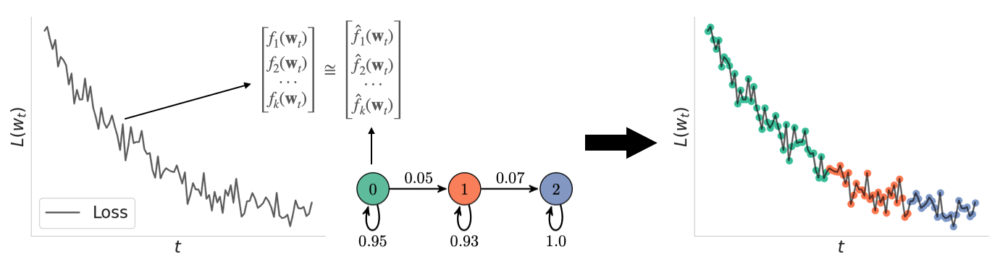

*Рисунок 1: Из обучающих прогонов мы собираем метрики — функции весов нейронных сетей. Затем мы обучаем скрытую марковскую модель предсказывать последовательности метрик, порождённые обучающими прогонами. Скрытая марковская модель выучивает дискретное скрытое состояние над последовательностью, которым мы кластеризуем и анализируем обучающую траекторию.* **[p. 2]**

В этой работе мы кластеризуем обучающие траектории от разных случайных семян и затем анализируем эти кластеры, чтобы лучше понять их динамику обучения и то, как они соотносятся друг с другом. Для кластеризации траекторий мы приписываем каждую контрольную точку модели дискретному скрытому состоянию с помощью HMM. **[p. 3]** Мы выбираем HMM, потому что это простая модель временных рядов с дискретным скрытым пространством, а дискретное скрытое пространство мы выбираем именно потому, что предыдущие работы (Nanda et al. 2023; Olsson et al. 2022) показали, что обучение может являть несколько дискретных, качественно различных состояний.

Пусть $\mathbf{w}_{1:T}\in\mathbb{R}^{D\times T}$ — последовательность весов нейронной сети, наблюдаемых при обучении. Каждое $\mathbf{w}_{t}$ — контрольная точка модели. В этой работе мы используем гауссову HMM, чтобы пометить каждую контрольную точку $\mathbf{w}_{1:T}$ собственным скрытым состоянием $s_{1:T}$. Подгонять HMM прямо над весами вычислительно неподъёмно, потому что выборочная сложность HMM с $O(D^{2})$ параметрами была бы запретительно высока. Наше решение этой проблемы — вычислить небольшое число метрик $f_{1}(\mathbf{w}_{1:T}),\ldots,f_{d}(\mathbf{w}_{1:T})$ из $\mathbf{w}_{1:T}$, где $d\ll D$ и $f_{i}:\mathbb{R}^{D}\to\mathbb{R},1\leq i\leq d$.

### 2.1 Обучение HMM над метриками

В этой работе мы сосредоточены на том, чтобы схватить, как меняется вычисление нейронной сети при обучении, моделируя эволюцию весов нейронной сети. Чтобы сжато представить веса, мы вычисляем разные метрики, такие как средние послойные $L_{1}$- и $L_{2}$-нормы, средние и разбросы весов и смещений сети, а также средние и разбросы сингулярных чисел каждой весовой матрицы. Полный перечень 14 используемых нами метрик, с формулами и обоснованиями, — в приложении B.

Чтобы подогнать HMM, мы соединяем эти метрики в последовательность наблюдений $z_{1:T}$. Затем мы применяем z-нормализацию (также известную как стандартизация), приводя каждый признак к нулевому среднему и единичному стандартному отклонению, поскольку HMM чувствительны к масштабу признаков. Так мы получаем нормированную последовательность $\tilde{z}_{1:T}$. Чтобы ограничить влияние длины обучающей траектории, мы вычисляем z-оценки по оценённым среднему и разбросу (не более чем) первых 1000 собранных контрольных точек.

$$
z_{t} =\begin{bmatrix}f_{1}(\mathbf{w}_{t})\\
\vdots\\
f_{d}(\mathbf{w}_{t})\end{bmatrix}, \tilde{z}_{t} =\begin{bmatrix}[f_{1}(\mathbf{w}_{t})-\mu(f_{1}(\mathbf{w}_{1:T}))]/\sigma(f_{1}(\mathbf{w}_{1:T}))\\
\vdots\\
[f_{d}(\mathbf{w}_{t})-\mu(f_{d}(\mathbf{w}_{1:T}))]/\sigma(f_{d}(\mathbf{w}_{1:T}))\end{bmatrix}
$$

Всего мы собираем $N$ последовательностей наблюдений $\{z_{1:T}\}_{1}^{N}$ от $N$ разных случайных семян, нормируем распределение каждой метрики по ходу обучения для данного семени и обучаем HMM над последовательностями $\{\tilde{z}_{1:T}\}_{1}^{N}$ алгоритмом Баума–Велча (Baum et al. 1970). Главный гиперпараметр HMM — число скрытых состояний, которое обычно настраивают по логарифму правдоподобия, информационному критерию Акаике (AIC) и/или байесовскому информационному критерию (BIC). (Akaike 1998; Schwarz 1978) Здесь мы откладываем 20 % из $N$ траекторий как проверочные последовательности и выбираем число скрытых состояний, дающее наименьший BIC. Мы используем BIC, потому что BIC сильнее предпочитает более простые, а потому более истолковываемые модели. Кривые выбора модели — в приложении H.

### 2.2 Извлечение карты обучения

Далее мы используем HMM, чтобы описать важные признаки каждого скрытого состояния и то, как скрытые состояния соотносятся друг с другом. Мы преобразуем HMM в «карту обучения», представляющую скрытые состояния вершинами, а переходы скрытых состояний — рёбрами диаграммы состояний (см. рисунок 2).

Сначала мы извлекаем из HMM структуру диаграммы состояний. У выученной HMM два набора параметров: матрица переходов $p(s_{t}|s_{t-1})$ между скрытыми состояниями и распределение эмиссий $p(\tilde{z}_{t}|s_{t}=k)\sim N(\mu_{k},\Sigma_{k})$, где $\mu_{k}$ и $\Sigma_{k}$ — среднее и ковариация гауссианы при условии скрытого состояния $k$ соответственно. Матрица переходов есть марковская цепь, задающая структуру диаграммы состояний: скрытые состояния и возможные переходы, или рёбра, между скрытыми состояниями *a priori*. Мы обнуляем веса рёбер марковской цепи, если ребро не появляется ни в одной из $N$ траекторий скрытых состояний, выведенных HMM.

**[p. 4]**

Мы аннотируем скрытые состояния $s_{1:T}$, ранжируя признаки $\tilde{z}_{t}[i]$ по модулю частной производной лог-апостериора по $\tilde{z}_{t}$:11 1 Вычислять важности признаков через частные производные апостериора предложили Nguyen Hung Quang и Khoa Doan. Предыдущие версии этой статьи использовали иной способ вычисления.

$$
\left|\frac{\partial\log p(s_{t}=k|\tilde{z}_{1:t})}{\partial\tilde{z}_{t}}\right|
$$

Модуль этой частной производной есть вектор. Интуитивно, если $i$-я компонента этого вектора велика, то изменения признака $\tilde{z}_{t}[i]$ сильно влияют на предсказание, что $s_{t}=k$. Замкнутый вид этой производной мы вычисляем в приложении A.

Чтобы охарактеризовать рёбра диаграммы состояний, где скрытое состояние меняется $j\to k$, мы используем эту производную вместе с выученными средними $\mu_{j}$ и $\mu_{k}$. Смена скрытого состояния с $j$ на $k$ означает, что новое наблюдение приблизилось к $\mu_{k}$. Тем самым мы можем суммировать движение признаков от $j$ к $k$ вектором разности $\mu_{k}-\mu_{j}$. Однако не все эти изменения обязательно важны для веры, что $s_{t}=k$. Чтобы это учесть, мы можем ранжировать эти изменения нашей мерой влияния, вычисленной из частных производных апостериора.

В дальнейших результатах, разбирая переход состояния $j\to k$ на шаге $t$, мы приводим 3 самых влиятельных признака скрытого состояния $k$. Для сведе́ния по прогонам мы усредняем векторы модулей.

Итого, карту обучения можно получить из HMM, извлекая:

- структуру диаграммы состояний из прореженной матрицы переходов;
- метки рёбер из 1) разностей выученных средних и 2) частных производных апостериора.

### 2.3 Присваивание семантики скрытым состояниям

Из матрицы переходов HMM мы получаем карту обучения — марковскую цепь между выученными скрытыми состояниями обучения. Затем мы помечаем переходы карты обучения выученными средними HMM и частными производными апостериора. Но что мы узнаём из пути, который обучающий прогон проходит по карте? В частности, как посещение конкретного состояния влияет на исходы обучения?

Чтобы связать состояния HMM с исходами обучения, мы выбираем метрику и предсказываем её по пути, который обучающий прогон проходит по марковской цепи. Для этого нужно признаково описать последовательность скрытых состояний, и в этой работе мы используем униграммное описание, или модель «мешка состояний». Формально пусть $s_{1},s_{2},\ldots,s_{T}$ — скрытые состояния, посещённые за обучающий прогон. Эмпирическое распределение по состояниям можно вычислить как:

$$
\hat{P}(s=k)=\frac{\sum_{j}\mathbb{1}(s_{j}=k)}{T}
$$

где $k$ — конкретное состояние, а $T$ — полное число контрольных точек траектории. Это распределение записывается $d$-мерным вектором, что равносильно униграммному описанию.

В этой работе мы исследуем, как конкретные состояния влияют на время сходимости, которое мы измеряем как первый шаг, на котором точность на проверке пересекает порог. Порог мы ставим чуть меньше максимальной точности на проверке (см. раздел 3.4). Мы используем линейную регрессию, чтобы предсказывать время сходимости из $\hat{P}$. Здесь мы не прогнозируем момент сходимости модели по более ранним шагам; мы лишь используем линейную регрессию, чтобы выучить функцию между скрытыми состояниями и временем сходимости.

Обучив регрессионную модель, мы смотрим на коэффициенты регрессии, чтобы увидеть, какие состояния коррелируют с более медленной или быстрой сходимостью. Если коэффициент регрессии состояния положителен при предсказании времени сходимости, то дополнительное время прогона в этом состоянии означает более долгую сходимость. Кроме того, если это же состояние посещается не всеми траекториями, мы можем считать его **детуром**, потому что траектории, посещающие необязательное состояние, заодно задерживают своё время сходимости.

**[p. 5]**

#### Определение.

###### p5-1

Выученное скрытое состояние есть **детур-состояние**, если:

- Некоторые обучающие прогоны сходятся, не посещая состояние. Это указывает, что состояние «необязательно».
- Его коэффициент линейной регрессии при предсказании времени сходимости положителен. Это указывает, что прогон, проводящий в состоянии больше времени, будет иметь более долгое время сходимости.

Наш способ присваивания семантики скрытым состояниям расширяем на другие метрики. Например, можно регрессией предсказывать меру гендерного смещения, которая может сильно меняться между обучающими прогонами (Sellam et al. 2022), из эмпирического распределения по скрытым состояниям. Карта обучения тогда становится картой того, как гендерное смещение проявляется в обучающих прогонах. Мы рекомендуем вычислять $p$-значение линейной регрессии и истолковывать коэффициенты, лишь когда они статистически значимы.

## 3 Результаты

###### p5-4

Чтобы показать применимость нашего HMM-способа в разных обучающих обстановках и архитектурах моделей, мы ставим опыты на пяти задачах: модульное сложение, разрежённые чётности, маскированное языковое моделирование, MNIST и CIFAR-100. Все подробности о гиперпараметрах — в приложении D. В этой работе при подсчёте метрик мы игнорируем матрицы вложений и слои нормализации, поскольку нас прежде всего занимает то, как меняется функция, представляемая нейронной сетью.

###### p5-5

Модульная арифметика и разрежённые чётности — задачи, где модели устойчиво являют **гроккинг** (Power et al. 2022) — явление, при котором обучающая и проверочная потери кажутся расцеплёнными, и проверочная потеря резко падает после периода почти без улучшений. Модель сперва запоминает обучающие данные, а затем генерализует на проверочный набор. Эти резкие перемены мы называем «фазовыми переходами» — периодами обучения, содержащими перелом потери (то есть смену вогнутости потери), который затем удерживается (без возврата к случайному качеству).

Мы изучаем модульную арифметику и разрежённые чётности, чтобы увидеть, как фазовые переходы представляются дискретным скрытым пространством HMM. Мы дополняем эти задачи маскированным языковым моделированием (приложение E) и классификацией изображений. В разделах 3.1 и 3.2 мы используем карту обучения для рассмотрения черт медленно и быстро сходящихся обучающих прогонов в гроккинг-обстановках и классификации изображений. В разделе 3.3 мы показываем, что изменчивость времён сходимости между прогонами можно регулировать сменой обучающих гиперпараметров или архитектуры модели. Наконец, в разделе 3.4 мы формализуем наблюдения раздела 3.3, связывая линейной регрессией детур-состояния со временем сходимости.

### 3.1 Алгоритмические данные: модульная арифметика и разрежённые чётности

#### Модульная арифметика: рисунок 2.

###### p5-7

В модульном сложении мы обучаем однослойный авторегрессионный трансформер предсказывать $z=(x+y)\mod 113$ по входам $x$ и $y$. Мы собираем траектории по 40 случайным семенам и обучаем и проверяем HMM на случайном разбиении 80-20 — разбиении, которое мы используем для всех обстановок. Это воспроизведение опытов Nanda et al. 2023.

###### fig-2

| Ребро | 3 важнейших изменения признаков (z-оценка) | Частота перехода | Средняя эпоха сходимости |
|---|---|---|---|
| $1\to 3$ | $\sigma(\mathbf{w})$ $\downarrow$1.99, $L_{2}$ $\downarrow$1.68, $L_{1}$ $\downarrow$1.83 | 2 / 40 | $1810\pm 71.5$ |
| $1\to 2$ | $L_{2}$ $\downarrow$0.59, $L_{1}$ $\downarrow$0.88, $\mu(\lambda)$ $\downarrow$1.29 | 34 / 40 | $2950\pm 104$ |
| $1\to 5$ | $L_{2}$ $\downarrow$2.08, $L_{1}$ $\downarrow$2.25, $\sigma(\mathbf{w})$ $\downarrow$2.16 | 4 / 40 | $5450\pm 313$ |

*Рисунок 2: Однослойный трансформер, обученный на модульном сложении. Рёбра, выходящие из состояния инициализации 1, все имеют разные средние эпохи сходимости. Изменения признаков упорядочены по важности от большей к меньшей. Например, «$L_{2}\downarrow$0.59» означает, что состояние 2 имеет выученную $L_{2}$-норму на 0.59 стандартного отклонения ниже состояния 1, и $L_{2}$-норма — важнейший признак состояния 2. Словарь метрик — в приложении B, способ выявления важных признаков — в разделе 2.2.* **[p. 6]**

###### p5-8

В модульной арифметике некоторые обучающие прогоны сходятся на тысячи эпох раньше других. Рассматривая карту обучения модульного сложения, мы находим несколько путей разной длины: одни прогоны идут к сходимости кратчайшим путём по карте, другие — нет. Три таких пути мы выделяем на рисунке 2. Все прогоны начинаются в состоянии 1 и достигают низкой потери в состоянии 3, но путей из 1 в 3 несколько. Самый длинный путь $(1\to 5\to 2\to 3)$ совпадает с самым долгим временем сходимости из трёх выделенных, а кратчайший $(1\to 3)$ — с самым коротким.

###### p5-9

С помощью HMM мы далее препарируем эту изменчивость, связывая рёбра, выходящие из состояния 1, с тем, чем быстро и медленно генерализующие прогоны различаются по внутренностям модели. Итоги этого рассмотрения — в таблице рисунка 2. Здесь мы берём 3 важнейших признака состояний 2, 5 и 3 по выученным ковариационным матрицам и количественно выражаем движения этих признаков, вычитая выученные средние (вспомните $\tilde{z}$) между этими состояниями и состоянием 1. Мы находим, что быстро генерализующий путь $(1\to 3)$ характеризуется падением $L_{2}$-нормы «в самый раз» **[p. 6]** ($\downarrow$1.68, см. таблицу). Медленнее генерализующие прогоны $(1\to 2\to 3)$ и $(1\to 5\to 2\to 3)$ характеризуются либо меньшим ($\downarrow$0.59), либо большим ($\downarrow$2.08) падением $L_{2}$-нормы.

###### p6-1

Мы можем также связать результаты нашей карты обучения с фазовыми переходами, найденными в модульном сложении прежними работами Nanda et al. 2023; Power et al. 2022: состояние 1 вмещает фазовый переход запоминания — обучающая потеря падает почти до нуля в состоянии 1, тогда как проверочная потеря растёт. Тем самым, согласно карте обучения, эпоха, на которой происходит фазовый переход генерализации, зависит от того, как быстро падает $L_{2}$-норма сразу после фазового перехода запоминания. Падение $L_{2}$-нормы «в самый раз» коррелирует с самым быстрым наступом генерализации.

**[p. 7]**

#### Разрежённые чётности: рисунок 9 в приложении F.

Разрежённые чётности — задача на правило, схожая с модульным сложением: многослойный перцептрон должен научиться применять операцию $AND$ к 3 битам внутри 40-битного вектора; суть задачи — выучить, какие 3 из 40 битов значимы. Мы вновь собираем 40 обучающих прогонов.

Как и в модульной арифметике, изменчивость путей по карте обучения в разрежённых чётностях тоже появляется в начале обучения. Медленно генерализующие прогоны идут путём $(2\to 0\to 5)$, а быстро генерализующие — более прямым путём $(2\to 5)$. $L_{2}$-норма и здесь остаётся важной: ребро $(2\to 0)$ характеризуется ростом $L_{2}$-нормы, а ребро $(2\to 5)$ — падением. И вновь скорость наступления фазового перехода генерализации связана с определённым изменением $L_{2}$-нормы сразу после фазового перехода запоминания.

### 3.2 Классификация изображений: CIFAR-100 и MNIST

#### CIFAR-100: рисунок 3

Обучение нейронных сетей на алгоритмических данных — задача зарождающаяся. Как противовес гроккинг-обстановкам рассмотрим классификацию изображений — задачу, хорошо изученную в компьютерном зрении и машинном обучении. Мы собираем 40 прогонов ResNet18 (He et al. 2016), обученного на CIFAR-100 (Krizhevsky 2009), и находим, что динамика обучения гладка и нечувствительна к случайному семени. В отличие от результатов предыдущего раздела, карта обучения CIFAR-100 — линейный граф, и все переходы состояний склонны являть растущую дисперсию весов. 3 важнейших признака каждого перехода состояний мы показываем в таблице рисунка 3. $L_{1}$- и $L_{2}$-нормы монотонно растут на всех переходах состояний.

| Ребро | 3 важнейших изменения признаков (z-оценка) |
|---|---|
| $4\to 1$ | $L_{1}$ $\uparrow$0.62, $\mu(\lambda)$ $\uparrow$0.56, $\sigma(\lambda)$ $\uparrow$0.70 |
| $1\to 3$ | $\mu(\lambda)$ $\uparrow$0.75, $L_{2}$ $\uparrow$0.76, $L_{1}$ $\uparrow$0.76 |
| $3\to 2$ | $L_{2}$ $\uparrow$0.80, $\mu(\lambda)$ $\uparrow$0.82, $\sigma(\lambda)$ $\uparrow$0.77 |
| $2\to 0$ | $L_{2}$ $\uparrow$0.72, $\mu(\lambda)$ $\uparrow$0.75, $\sigma(\mathbf{w})$ $\uparrow$0.81 |

*Рисунок 3: ResNet18, обученный на CIFAR-100. Все 40 собранных нами прогонов CIFAR-100 идут одним путём, хотя отдельные прогоны могут проводить в каждом состоянии слегка разное время. Как показывает таблица, динамики обучения CIFAR-100 между состояниями схожи.* **[p. 7]**

#### MNIST: рисунок 10 в приложении G.

Динамика MNIST схожа с динамикой CIFAR-100. Мы собираем 40 обучающих прогонов двухслойного MLP, учащегося классифицировать изображения MNIST, с гиперпараметрами по Simard et al. 2003. Прогоны MNIST вновь идут единой траекторией по карте обучения. Мы рассматриваем несколько переходов состояний по ходу обучения и находим, что переходы тоже характеризуются монотонно растущими изменениями признаков.

### 3.3 Дестабилизация классификации изображений, стабилизация гроккинга

###### p7-5

Из двух предыдущих разделов мы наблюдаем, что динамика обучения нейронных сетей на алгоритмических данных (модульное сложение и разрежённые чётности) высокочувствительна к случайному семени, тогда как динамика сетей на классификации изображений случайным семенем почти не затронута. **[p. 8]** Теперь мы покажем, что это различие в чувствительности к семени происходит от решений о гиперпараметрах и архитектуре внутри обучающих постановок, которые мы выбрали для воспроизведения. Изменчивость динамики обучения не обязательно есть свойство задачи, и она не есть свойство задач, рассматриваемых в этой статье. Гроккинг тоже зависит от архитектуры модели и гиперпараметров оптимизации, и малые изменения обучения могут разом закрыть зазор между запоминанием и генерализацией в гроккинге и сделать обучение устойчивым к смене случайного семени. Более того, изъятие улучшений из процесса обучения классификации изображений может навести изменчивость там, где её прежде не было.

Сначала мы рассматриваем динамику обучения ResNet без batch normalization (Ioffe & Szegedy 2015) и остаточных связей. Остаточные связи помогают ResNet избегать исчезающих градиентов (He et al. 2016) и сглаживают ландшафт потерь (Li et al. 2018). О batch norm схоже показано, что он добавляет гладкости ландшафту потерь (Santurkar et al. 2018), а также способствует автоматической настройке скорости обучения (Arora et al. 2019). Мы убираем batch norm и остаточные связи из ResNet18 и обучаем урезанные сети с нуля на CIFAR-100 по 40 случайным семенам.

###### fig-4

| Ребро | 3 важнейших изменения признаков (z-оценка) | Частота перехода | Средний шаг сходимости |
|---|---|---|---|
| $3\to 2$ | $\mu(\lambda)$ $\downarrow$0.17, $L_{1}$ $\downarrow$0.18, $\frac{L_{1}}{L_{2}}$ $\downarrow$ 2.12 | 29 / 40 | $3530\pm 460$ |
| $3\to 1$ | $\mu(\lambda)\uparrow$ 0.67, $L_{2}$ $\uparrow$ 0.74, $L_{1}$ $\uparrow$ 0.63 | 12 / 40 | $7260\pm 3010$ |

*Рисунок 4: Без остаточных связей и batch normalization обучение ResNet становится неустойчивым, и времена сходимости начинают существенно различаться. Медленно генерализующие прогоны делают переход $(3\to 1)$, быстро генерализующие — переход $(3\to 2)$. (Прогоны могут идти путём $(3\to 1\to 3\to 2)$, поэтому частоты переходов не суммируются в 40.) Изменчивость, наведённая изъятием остаточных связей и batch norm, возникает в начале обучения.* **[p. 8]**

В этом опыте мы показываем, что смена динамики обучения задачи меняет и карту обучения. Без batch norm и остаточных связей динамика обучения ResNet18 становится значительно чувствительнее к случайности. См. рисунок 4. В зависимости от случайного семени модель может застаиваться на много обновлений, прежде чем генерализовать. Этот рост случайной изменчивости виден в выученной карте обучения, которая теперь ветвится на выходе из состояния 3 — состояния инициализации. Теперь существуют медленно генерализующий путь $(3\to 1)$ и быстро генерализующий путь $(3\to 2)$, характеризуемые движениями признаков в противоположные стороны.

**[p. 9]**

###### p9-1

Если изъятие batch normalization дестабилизирует обучение ResNet на CIFAR-100, то добавление layer normalization (которую убрали Nanda et al. 2023) должно стабилизировать обучение на модульном сложении. Поэтому мы возвращаем layer normalization и обучаем по 40 случайным семенам. Мы также уменьшаем размер батча, что ведёт SGD к более плоским минимумам (Keskar et al. 2017). Эти изменения обучения помогают трансформеру сходиться примерно в 30 раз быстрее на данных модульного сложения. Более того, чувствительность к случайному семени исчезает — карта обучения модульного сложения на рисунке 5 становится линейным графом.

###### fig-5

| Ребро | 3 важнейших изменения признаков (z-оценка) |
|---|---|
| $0\to 2$ | $L_{1}$ $\downarrow$0.93, $\lambda_{max}$ $\uparrow$0.93, $\sigma(\lambda)$ $\downarrow$1.52 |
| $2\to 1$ | $\sigma(\lambda)$ $\downarrow$2.00, $\sigma(\mathbf{w})$ $\downarrow$1.56, $\mu(\lambda)$ $\downarrow$1.11 |

*Рисунок 5: С layer normalization и меньшей скоростью обучения однослойный трансформер быстро выучивает задачу модульной арифметики, со временем сходимости, устойчивым к случайному семени. Эта устойчивость схвачена линейной картой обучения. Существенно, что карта по-прежнему отражает фазовые переходы гроккинга: запоминание, происходящее в состоянии 0, и генерализацию, происходящую в состоянии 2.* **[p. 9]**

Из этого раздела мы делаем два вывода. Первый: выбор настроек обучения модели может усиливать или сводить к минимуму эффект гроккинга. Второй: разные гиперпараметры или архитектуры могут давать разные карты обучения для одной задачи. В обучающих постановках, чувствительных к случайному семени, HMM связывает различия динамики обучения с разными скрытыми состояниями.

### 3.4 Предсказание времени сходимости

В разделе 3.1 мы выявили скрытые состояния, посещаемые медленно генерализующими прогонами и пропускаемые быстро генерализующими. Теперь мы используем нашу рамку присваивания семантики скрытым состояниям из раздела 2.3, чтобы определить эти пропускаемые скрытые состояния как детур-состояния — состояния, замедляющие сходимость. Первый шаг нашей рамки — использовать пути по карте обучения как признаки линейной регрессии для предсказания времени сходимости. Мы определяем время сходимости как итерацию, где точность на проверке превышает некоторый порог, и берём этот порог равным 0.9 для модульного сложения и разрежённых чётностей, 0.6 для устойчивой версии CIFAR-100, 0.4 для дестабилизированного CIFAR-100 и 0.97 для MNIST. Эти значения мы ставим чуть меньше максимальной точности на проверке для каждой задачи соответственно. Визуализация разброса времён сходимости — в приложении I.

###### p9-4

В таблице 1 мы находим, что линейная регрессия предсказывает время сходимости из эмпирического распределения прогона по скрытым состояниям весьма точно — пока карта обучения содержит разветвлённые пути. Если же карта линейна, обучение идёт схожими путями по HMM при разных случайных семенах. Мы формализуем эту интуицию **непохожести траекторий** как ожидаемое расстояние Вассерштейна $W(\cdot,\cdot)$ (Kantorovich 1939; Vaserstein 1969) между любыми двумя эмпирическими распределениями $p$ и $q$, выбираемыми равномерно по $N$ случайным семенам.

$$
\text{Trajectory dissimilarity}:=\mathbb{E}[W(p,q)]=\frac{2}{N(N-1)}\sum_{i=1}^{N}\sum_{j=1}^{i}W(p_{i},q_{j}) \tag{1}
$$

*Таблица 1: Предсказуемость эпохи сходимости по униграммной модели состояний. Непохожесть дана по уравнению 1; карты обучения помечены как ветвящиеся, если они не линейны.* **[p. 10]**

**[p. 10]**

| **Набор данных** | $R^{2}$ | $p$**-значение** | **Непохожесть** | **Ветвление** |
|---|---|---|---|---|
| Модульное сложение | 0.977 | $<$0.001 | 0.496 | ✓ |
| Модульное сложение, стабилизированное | 0.514 | $<$0.001 | 0.038 |  |
| CIFAR-100 | 0.094 | 0.469 | 0.028 |  |
| CIFAR-100, дестабилизированный | 0.905 | $<$0.001 | 0.806 | ✓ |
| Разрежённые чётности | 0.961 | $<$0.001 | 0.183 | ✓ |
| MNIST | 0.049 | 0.611 | 0.063 |  |

Со статистически значимыми ($p<0.001$) регрессионными моделями для модульного сложения, разрежённых чётностей и дестабилизированного CIFAR-100 мы можем использовать выученные коэффициенты регрессии для поиска детур-состояний. В таблице 2 мы выделяем эти детур-состояния, определяемые как любое состояние с положительным коэффициентом регрессии, посещаемое лишь строгим подмножеством обучающих траекторий. В наших задачах с линейными графами детур-состояний нет, потому что каждый прогон посещает каждое скрытое состояние. Наш регрессионный анализ по большей части подтверждает наблюдения из карт и траекторий предыдущих разделов: состояния 2 и 5 — детур-состояния в модульном сложении, состояние 0 — детур-состояние в разрежённых чётностях, состояние 1 — детур-состояние в дестабилизированном CIFAR-100.

*(a) Модульное сложение*

| **Состояние** | **Коэффициент** |
|---|---|
| 0 | -0.15 |
| 1 | 0.98 |
| 2 | **1.19** |
| 3 | -0.20 |
| 4 | 0.18 |
| 5 | **0.95** |

*(b) Разрежённые чётности*

| **Состояние** | **Коэффициент** |
|---|---|
| 0 | **0.77** |
| 1 | 0.41 |
| 2 | 0.98 |
| 3 | -0.23 |
| 4 | 0.58 |
| 5 | 1.13 |

*(c) CIFAR-100, дестабилизированный*

| **Состояние** | **Коэффициент** |
|---|---|
| 0 | 0.66 |
| 1 | **1.20** |
| 2 | 0.28 |
| 3 | 1.91 |
| 4 | 1.12 |

*Таблица 2: Выученные коэффициенты линейной регрессии. Если значение положительно, время в состоянии коррелирует с ростом времени сходимости, и наоборот. Детур-состояния выделены жирным.* **[p. 10]**

###### p10-2

Детур-состояния сигнализируют о неустойчивости исхода обучения: они появляются в обучающих постановках, чувствительных к случайности, и исчезают в постановках, устойчивых к случайности. Добавляя layer norm и уменьшая размер батча, мы убираем детур-состояния в модульном сложении, и карта обучения становится линейным графом. Наоборот, изъятие batch norm и остаточных связей дестабилизирует обучение ResNet, наводя в карте обучения вилки, ведущие к детур-состояниям.

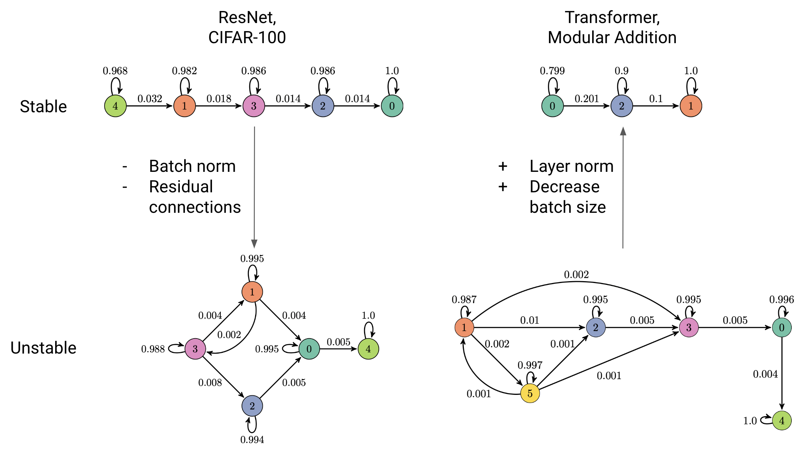

*Рисунок 7: Карты обучения выражают изменчивость динамики обучения более плотно связанным графом. Для устойчивых обучающих постановок HMM выучивает линейный граф в качестве карты обучения. Динамику обучения можно стабилизировать или дестабилизировать сменой гиперпараметров (размера батча) или архитектуры (слоёв нормализации, остаточных связей).* **[p. 11]**

## 4 Связанные работы

Прежние работы рассматривали влияние случайного семени на исход обучения (Sellam et al. 2022; Picard 2023; Fellicious et al. 2020). Насколько нам известно, это первая работа, которая 1) анализирует случайное семя вероятностной моделью и 2) показывает, как случайное семя проявляется конкретными изменениями метрик по ходу обучения. Weiss et al. 2018; Weiss et al. 2019 моделируют вычисление нейронных сетей детерминированными конечными автоматами (DFA), что отчасти похоже на аннотированную марковскую цепь, которую мы извлекаем из обучающих прогонов. Williams 1992 использует расширенный фильтр Калмана (EKF) для обучения рекуррентной нейронной сети и отмечает сходство EKF с алгоритмом real-time recurrent learning (Marschall et al. 2020). В отличие от существующей литературы, мы используем машины состояний для понимания процесса обучения, а не процесса вывода. Измерение состояния нейронной сети разными метриками делалось и в Frankle et al. 2020.

Анализ временных рядов в вероятностной рамке успешно применялся ко многим другим задачам машинного обучения (Kim et al. 2017; Hughey & Krogh 1996; Bartolucci et al. 2014). В близком нашей работе духе Batty et al. 2019 используют авторегрессионную HMM (ARHMM) для сегментации поведенческих видео **[p. 11]** на семантически схожие куски. ARHMM может схватывать и дискретную, и непрерывную скрытую динамику, что делает её интересной моделью для будущей работы.

###### p11-1

Наша работа существенно вдохновлена литературой о мерах прогресса, которая стремится найти метрики, способные предсказывать скачкообразное улучшение или сходимость нейронных сетей. Barak et al. 2022 первыми выдвинули гипотезу о существовании скрытых мер прогресса. Olsson et al. 2022 нашли меру прогресса для induction heads в трансформерных языковых моделях, а Nanda et al. 2023 нашли меру прогресса для гроккинга в задаче модульной арифметики.

$L_{2}$-норма также известна как важная для гроккинга и предсказывающая его, что и мотивирует применение weight decay для ускорения сходимости в гроккинг-обстановках (Nanda et al. 2023; Power et al. 2022; Thilak et al. 2022). Liu et al. 2023 подчёркивают важность $L_{2}$-нормы, исправляя гроккинг проектированным градиентным спуском внутри $L_{2}$-шара фиксированного размера; наоборот, они же наводят гроккинг на новых наборах данных, выбирая невыгодную $L_{2}$-норму. Наши результаты показывают, что у гроккинга есть и другие средства, помимо прямого воздействия на $L_{2}$-норму. Merrill et al. 2023 и Nanda et al. 2023 показывают, что гроккинг в разрежённых чётностях и модульной арифметике (соответственно) объясним возникновением разрежённой подсети внутри большей сети.

Наконец, эта работа широко соотносится с эмпирическим изучением динамики обучения. Значительная часть литературы трактует обучение как процесс, где рост обучающих данных ведёт к предсказуемому росту тестового качества (Kaplan et al. 2020; Razeghi et al. 2022) и сложности модели (Choshen et al. 2022; Mangalam & Prabhu 2019; Nakkiran et al. 2019). Однако такая трактовка обучения игнорирует, сколь неоднородны бывают его составляющие. Разные способности выучиваются с разной скоростью (Srivastava et al. 2022), разные слои сходятся с разной скоростью (Raghu et al. 2017), разные скрытые размерности возникают с разной скоростью (Jarvis et al. 2023; Saxe et al. 2019). Хотя ранние стадии обучения можно почти точно моделировать простыми способами (Hu et al. 2020; Jacot et al. 2018), ранние стадии заметно отличны от поздних, и простые модели часто скрывают распространённые обучающие явления (Fort et al. 2020). Следовательно, способы вроде нашего, трактующие обучение как неоднородный процесс, критичны для понимания реалистичных обучающих траекторий.

**[p. 12]**

## 5 Обсуждение

Карты обучения, выводимые из HMM, — истолковываемые описания динамики обучения, суммирующие сходства и различия обучающих прогонов. Наши результаты показывают, что существует малоразмерное, *дискретное* представление динамики обучения. Через HMM это представление в целом предсказательно для следующего набора метрик траектории при данных предыдущих. Более того, в некоторых случаях это малоразмерное дискретное представление можно использовать даже для предсказания итерации, на которой модели сходятся.

### 5.1 Гроккинг и ландшафт оптимизации

###### p12-2

Мы предполагаем, что гроккинг есть следствие резкого ландшафта оптимизации. Рассмотрим правки, которыми мы значительно уменьшили эффект гроккинга: добавление layer normalization и уменьшение размера батча. Слои нормализации и уменьшение размера батча описаны в литературе как увеличивающие гладкость ландшафта потерь (Santurkar et al. 2018; Arora et al. 2019; Keskar et al. 2017). Классификация изображений — хорошо изученная задача со множеством приёмов повышения эффективности обучения; возможно, обучение на алгоритмических данных в будущем станет столь же эффективным, так что гроккинг перестанет быть заботой.

### 5.2 Меры прогресса и фазовые переходы

###### p12-3

Моделируя время сходимости в гроккинг-обстановках, мы анализируем фазовые переходы. Мы находим, что фазовый переход генерализации можно ускорить, избегая детур-состояний. Эти детур-состояния в целом характеризуются определёнными требованиями к метрикам, таким как $L_{2}$-норма. Например, в обстановке модульной арифметики избегание детур-состояний без смены обучающей постановки требует падения $L_{2}$-нормы «в самый раз» — не слишком малого и не слишком большого. Это наблюдение согласуется с гипотезой Liu et al. 2023, где авторы полагают, что гроккинг происходит оттого, что норма весов медленно достигает оболочки определённой $L_{2}$-нормы в пространстве весов, прежде названной «зоной Златовласки» (Fort & Scherlis 2018).

###### p12-4

Наш автоматизированный подход может дополнять литературу о мерах прогресса, которая в прежних работах находила меры, предсказывающие фазовые переходы, вручную (Barak et al. 2022; Nanda et al. 2023). В этой работе, вместо тщательного выбора одной метрики, мы вычисляем разнообразные метрики и находим структуру среди них обучением без учителя. Затем мы используем выученное скрытое представление для анализа фазовых переходов.

### 5.3 Влияние случайного семени

###### p12-5

Мы рекомендуем исследователям динамики обучения экспериментировать с большим числом обучающих семян. Когда заявления основаны на малом числе прогонов, аномальные обучающие явления могут быть упущены просто из-за выборки. Эти аномальные явления могут быть самыми поучительными, как в наших гроккинг-опытах, где малое число прогонов сходится быстрее остальных. Роль случайной изменчивости подчёркивалась для качества и генерализации обученных моделей (McCoy et al. 2020; Sellam et al. 2022; Juneja et al. 2023), но исследований изменчивости динамики обучения меньше. Мы рекомендуем изучать обучение по многим прогонам и, возможно, опираться на диаграммы состояний вроде наших, чтобы отличать типичные и аномальные обучающие явления.

### 5.4 Ограничения и будущая работа

Наша работа предполагает, что динамику обучения можно представить линейной, дискретной и марковской моделью. Несмотря на успехи нашего подхода, модель большей мощности могла бы схватить ещё больше сведений о динамике обучения. Ослабление допущений HMM — вероятно, плодотворная область будущей работы. Кроме того, в этой работе мы понижаем размерность через отобранные вручную метрики. Мы используем эти метрики как истолковываемые признаки наших карт обучения, но полностью безнадзорный подход без явных метрик тоже заслуживает исследования. Для очень больших моделей обучение HMM по многим случайным семенам может быть неподъёмным. Возможная последующая работа могла бы посмотреть, генерализуют ли модели динамики обучения zero-shot между архитектурами и размерами архитектур (Yang et al. 2021). Будь это так, модели динамики можно было бы переиспользовать для истолкования обучения.

**[p. 13]**

Наконец, наши находки наводят на будущую работу о поиске гиперпараметров. Мы демонстрируем, что 1) неустойчивость обучения к случайному семени сильно зависит от гиперпараметров и 2) неустойчивость проявляется рано в обучении. Потому может быть эффективнее измерять раннюю изменчивость по нескольким семенам для быстрой оценки настройки гиперпараметров, чем ждать итоговой точности обученной модели.

## 6 Заключение

Мы делаем два главных вклада. Первый: мы предлагаем прямое моделирование динамики обучения как новое направление для интерпретируемости и исследований динамики обучения. Мы показываем, что даже простой моделью вроде HMM можно выучить представления динамики обучения, предсказательные для ключевых метрик вроде времени сходимости. Второй: мы обнаруживаем детур-состояния обучения и показываем, что детур-состояния связаны и с тем, как быстро модели сходятся, и с тем, насколько весь процесс обучения чувствителен к случайному семени. Детур-состояния можно убрать, найдя более эффективные обучающие гиперпараметры или архитектуры моделей.

### Благодарности

Мы хотели бы поблагодарить Nguyen Hung Quang, Khoa Doan и William Merrill за их проницательные замечания и предложения. Особо благодарим Quang, который великодушно сообщил о значительной ошибке в предыдущей версии (см. раздел 2.2) и чьё предложенное исправление вошло в статью. MYH поддержан стипендией NSF Graduate Research Fellowship. Эта работа поддержана Hyundai Motor Company (проект Uncertainty in Neural Sequence Modeling), Samsung Advanced Institute of Technology (проект Next Generation Deep Learning: From Pattern Recognition to AI) и National Science Foundation (грант NSF 1922658).

## Список литературы

- Hirotogu Akaike. *Information Theory and an Extension of the Maximum Likelihood Principle*, pp. 199–213. Springer New York, New York, NY, 1998. ISBN 978-1-4612-1694-0. doi: 10.1007/978-1-4612-1694-0_15. URL https://doi.org/10.1007/978-1-4612-1694-0_15.

- Sanjeev Arora, Zhiyuan Li, and Kaifeng Lyu. Theoretical analysis of auto rate-tuning by batch normalization. In *International Conference on Learning Representations*, 2019. URL https://openreview.net/forum?id=rkxQ-nA9FX.

- Boaz Barak, Benjamin L. Edelman, Surbhi Goel, Sham M. Kakade, eran malach, and Cyril Zhang. Hidden progress in deep learning: SGD learns parities near the computational limit. In Alice H. Oh, Alekh Agarwal, Danielle Belgrave, and Kyunghyun Cho (eds.), *Advances in Neural Information Processing Systems*, 2022. URL https://openreview.net/forum?id=8XWP2ewX-im.

- Francesco Bartolucci, Alessio Farcomeni, and Fulvia Pennoni. Latent markov models: a review of a general framework for the analysis of longitudinal data with covariates. *TEST*, 23:433–465, 2014.

- Eleanor Batty, Matthew R Whiteway, Shreya Saxena, Dan Biderman, Taiga Abe, Simon Musall, Winthrop F. Gillis, Jeffrey E. Markowitz, Anne K. Churchland, John P. Cunningham, Sandeep Robert Datta, Scott W. Linderman, and Liam Paninski. Behavenet: nonlinear embedding and bayesian neural decoding of behavioral videos. In *Neural Information Processing Systems*, 2019.

- Leonard E. Baum and Ted Petrie. Statistical Inference for Probabilistic Functions of Finite State Markov Chains. *The Annals of Mathematical Statistics*, 37(6):1554 – 1563, 1966. doi: 10.1214/aoms/1177699147. URL https://doi.org/10.1214/aoms/1177699147.

- Leonard E. Baum, Ted Petrie, George W. Soules, and Norman Weiss. A maximization technique occurring in the statistical analysis of probabilistic functions of markov chains. *Annals of Mathematical Statistics*, 41:164–171, 1970.

**[p. 14]**

- Leshem Choshen, Guy Hacohen, Daphna Weinshall, and Omri Abend. The Grammar-Learning Trajectories of Neural Language Models. *arXiv:2109.06096 [cs]*, March 2022. URL http://arxiv.org/abs/2109.06096. arXiv: 2109.06096.

- Jacob Devlin, Ming-Wei Chang, Kenton Lee, and Kristina Toutanova. BERT: Pre-training of deep bidirectional transformers for language understanding. In *Proceedings of the 2019 Conference of the North American Chapter of the Association for Computational Linguistics: Human Language Technologies, Volume 1 (Long and Short Papers)*, pp. 4171–4186, Minneapolis, Minnesota, June 2019. Association for Computational Linguistics. doi: 10.18653/v1/N19-1423. URL https://aclanthology.org/N19-1423.

- Christofer Fellicious, Thomas Weissgerber, and Michael Granitzer. Effects of random seeds on the accuracy of convolutional neural networks. In Giuseppe Nicosia, Varun Ojha, Emanuele La Malfa, Giorgio Jansen, Vincenzo Sciacca, Panos Pardalos, Giovanni Giuffrida, and Renato Umeton (eds.), *Machine Learning, Optimization, and Data Science*, pp. 93–102. Springer International Publishing, 2020. ISBN 978-3-030-64580-9.

- Stanislav Fort and Adam Scherlis. The goldilocks zone: Towards better understanding of neural network loss landscapes. *CoRR*, abs/1807.02581, 2018. URL http://arxiv.org/abs/1807.02581.

- Stanislav Fort, Gintare Karolina Dziugaite, Mansheej Paul, Sepideh Kharaghani, Daniel M. Roy, and Surya Ganguli. Deep learning versus kernel learning: an empirical study of loss landscape geometry and the time evolution of the neural tangent kernel. In Hugo Larochelle, Marc’Aurelio Ranzato, Raia Hadsell, Maria-Florina Balcan, and Hsuan-Tien Lin (eds.), *Advances in Neural Information Processing Systems 33: Annual Conference on Neural Information Processing Systems 2020, NeurIPS 2020, December 6-12, 2020, virtual*, 2020. URL https://proceedings.neurips.cc/paper/2020/hash/405075699f065e43581f27d67bb68478-Abstract.html.

- Jonathan Frankle, David J. Schwab, and Ari S. Morcos. The early phase of neural network training. In *International Conference on Learning Representations*, 2020. URL https://openreview.net/forum?id=Hkl1iRNFwS.

- Tomer Galanti, Zachary S. Siegel, Aparna Gupte, and Tomaso Poggio. Sgd and weight decay provably induce a low-rank bias in neural networks, 2023.

- Mina Ghashami, Edo Liberty, Jeff M. Phillips, and David P. Woodruff. Frequent directions: Simple and deterministic matrix sketching. *SIAM Journal on Computing*, 45(5):1762–1792, 2016. doi: 10.1137/15M1009718. URL https://doi.org/10.1137/15M1009718.

- Elad Hazan. Introduction to online convex optimization. *CoRR*, abs/1909.05207, 2019. URL http://arxiv.org/abs/1909.05207.

- Kaiming He, Xiangyu Zhang, Shaoqing Ren, and Jian Sun. Deep residual learning for image recognition. In *2016 IEEE Conference on Computer Vision and Pattern Recognition (CVPR)*, pp. 770–778, 2016. doi: 10.1109/CVPR.2016.90.

- Wei Hu, L. Xiao, Ben Adlam, and Jeffrey Pennington. The Surprising Simplicity of the Early-Time Learning Dynamics of Neural Networks. *ArXiv*, 2020.

- Richard Hughey and Anders Krogh. Hidden markov models for sequence analysis: extension and analysis of the basic method. *Computer applications in the biosciences: CABIOS*, 12 2:95–107, 1996.

- Niall P. Hurley and Scott T. Rickard. Comparing measures of sparsity. *IEEE Transactions on Information Theory*, 55:4723–4741, 2008.

- Sergey Ioffe and Christian Szegedy. Batch normalization: Accelerating deep network training by reducing internal covariate shift. In Francis Bach and David Blei (eds.), *Proceedings of the 32nd International Conference on Machine Learning*, volume 37 of *Proceedings of Machine Learning Research*, pp. 448–456, Lille, France, 07–09 Jul 2015. PMLR. URL https://proceedings.mlr.press/v37/ioffe15.html.

**[p. 15]**

- Arthur Jacot, Franck Gabriel, and Clément Hongler. Neural Tangent Kernel: Convergence and Generalization in Neural Networks. *arXiv:1806.07572 [cs, math, stat]*, June 2018. URL http://arxiv.org/abs/1806.07572. arXiv: 1806.07572.

- Devon Jarvis, Richard Klein, Benjamin Rosman, and Andrew M Saxe. On the specialization of neural modules. In *The Eleventh International Conference on Learning Representations*, 2023. URL https://openreview.net/forum?id=Fh97BDaR6I.

- Jeevesh Juneja, Rachit Bansal, Kyunghyun Cho, João Sedoc, and Naomi Saphra. Linear connectivity reveals generalization strategies. In *The Eleventh International Conference on Learning Representations*, 2023. URL https://openreview.net/forum?id=hY6M0JHl3uL.

- Dan Jurafsky and James H. Martin. Speech and language processing - an introduction to natural language processing, computational linguistics, and speech recognition. In *Prentice Hall series in artificial intelligence*, 2023. URL https://web.stanford.edu/˜jurafsky/slp3/A.pdf.

- Leonid V Kantorovich. Mathematical methods of organizing and planning production. *Management science*, 6(4), 1939.

- Jared Kaplan, Sam McCandlish, Tom Henighan, Tom B. Brown, Benjamin Chess, Rewon Child, Scott Gray, Alec Radford, Jeffrey Wu, and Dario Amodei. Scaling Laws for Neural Language Models. *arXiv:2001.08361 [cs, stat]*, January 2020. URL http://arxiv.org/abs/2001.08361. arXiv: 2001.08361.

- Nitish Shirish Keskar, Dheevatsa Mudigere, Jorge Nocedal, Mikhail Smelyanskiy, and Ping Tak Peter Tang. On large-batch training for deep learning: Generalization gap and sharp minima. In *International Conference on Learning Representations*, 2017. URL https://openreview.net/forum?id=H1oyRlYgg.

- Bomin Kim, Kevin H. Lee, Lingzhou Xue, and Xiaoyue Niu. A review of dynamic network models with latent variables. *Statistics surveys*, 12:105–135, 2017.

- Alex Krizhevsky. Learning multiple layers of features from tiny images. Master’s thesis, University of Toronto, 2009. URL https://api.semanticscholar.org/CorpusID:18268744.

- Hao Li, Zheng Xu, Gavin Taylor, and Tom Goldstein. Visualizing the loss landscape of neural nets, 2018. URL https://openreview.net/forum?id=HkmaTz-0W.

- Ziming Liu, Eric J Michaud, and Max Tegmark. Omnigrok: Grokking beyond algorithmic data. In *The Eleventh International Conference on Learning Representations*, 2023. URL https://openreview.net/forum?id=zDiHoIWa0q1.

- Kaifeng Lyu, Zhiyuan Li, and Sanjeev Arora. Understanding the generalization benefit of normalization layers: Sharpness reduction. In Alice H. Oh, Alekh Agarwal, Danielle Belgrave, and Kyunghyun Cho (eds.), *Advances in Neural Information Processing Systems*, 2022. URL https://openreview.net/forum?id=xp5VOBxTxZ.

- Pranava Madhyastha and Rishabh Jain. On model stability as a function of random seed. In *Proceedings of the 23rd Conference on Computational Natural Language Learning (CoNLL)*, pp. 929–939, Hong Kong, China, November 2019. Association for Computational Linguistics. doi: 10.18653/v1/K19-1087. URL https://aclanthology.org/K19-1087.

- Karttikeya Mangalam and Vinay Uday Prabhu. Do deep neural networks learn shallow learnable examples first? *ICML 2019 Workshop on Identifying and Understanding Deep Learning Phenomena*, 2019. URL https://openreview.net/forum?id=HkxHv4rn24.

- Owen Marschall, Kyunghyun Cho, and Cristina Savin. A unified framework of online learning algorithms for training recurrent neural networks. *J. Mach. Learn. Res.*, 21(1), jan 2020. ISSN 1532-4435.

- Romit Maulik and Gianmarco Mengaldo. Pyparsvd: A streaming, distributed and randomized singular-value-decomposition library. In *2021 7th International Workshop on Data Analysis and Reduction for Big Scientific Data (DRBSD-7)*, pp. 19–25, 2021. doi: 10.1109/DRBSD754563.2021.00007.

**[p. 16]**

- R. Thomas McCoy, Junghyun Min, and Tal Linzen. BERTs of a feather do not generalize together: Large variability in generalization across models with similar test set performance. In *Proceedings of the Third BlackboxNLP Workshop on Analyzing and Interpreting Neural Networks for NLP*, pp. 217–227, Online, November 2020. Association for Computational Linguistics. doi: 10.18653/v1/2020.blackboxnlp-1.21. URL https://aclanthology.org/2020.blackboxnlp-1.21.

- William Merrill, Nikolaos Tsilivis, and Aman Shukla. A tale of two circuits: Grokking as competition of sparse and dense subnetworks, 2023.

- Preetum Nakkiran, Gal Kaplun, Dimitris Kalimeris, Tristan Yang, Benjamin L. Edelman, Fred Zhang, and Boaz Barak. SGD on Neural Networks Learns Functions of Increasing Complexity. *arXiv:1905.11604 [cs, stat]*, May 2019. URL http://arxiv.org/abs/1905.11604. arXiv: 1905.11604.

- Neel Nanda, Lawrence Chan, Tom Lieberum, Jess Smith, and Jacob Steinhardt. Progress measures for grokking via mechanistic interpretability. In *The Eleventh International Conference on Learning Representations*, 2023. URL https://openreview.net/forum?id=9XFSbDPmdW.

- Catherine Olsson, Nelson Elhage, Neel Nanda, Nicholas Joseph, Nova DasSarma, Tom Henighan, Ben Mann, Amanda Askell, Yuntao Bai, Anna Chen, Tom Conerly, Dawn Drain, Deep Ganguli, Zac Hatfield-Dodds, Danny Hernandez, Scott Johnston, Andy Jones, Jackson Kernion, Liane Lovitt, Kamal Ndousse, Dario Amodei, Tom Brown, Jack Clark, Jared Kaplan, Sam McCandlish, and Chris Olah. In-context learning and induction heads, 2022.

- David Picard. Torch.manual_seed(3407) is all you need: On the influence of random seeds in deep learning architectures for computer vision, 2023.

- Alethea Power, Yuri Burda, Harrison Edwards, Igor Babuschkin, and Vedant Misra. Grokking: Generalization beyond overfitting on small algorithmic datasets. *CoRR*, abs/2201.02177, 2022. URL https://arxiv.org/abs/2201.02177.

- Maithra Raghu, Justin Gilmer, Jason Yosinski, and Jascha Sohl-Dickstein. SVCCA: Singular Vector Canonical Correlation Analysis for Deep Learning Dynamics and Interpretability. *arXiv:1706.05806 [cs, stat]*, June 2017. URL http://arxiv.org/abs/1706.05806. arXiv: 1706.05806.

- Yasaman Razeghi, Robert L Logan IV, Matt Gardner, and Sameer Singh. Impact of Pretraining Term Frequencies on Few-Shot Numerical Reasoning. In *Findings of the Association for Computational Linguistics: EMNLP 2022*, pp. 840–854, Abu Dhabi, United Arab Emirates, December 2022. Association for Computational Linguistics. URL https://aclanthology.org/2022.findings-emnlp.59.

- Audrey Repetti, Mai Quyen Pham, Laurent Duval, Emilie Chouzenoux, and Jean-Christophe Pesquet. Euclid in a taxicab: Sparse blind deconvolution with smoothed regularization. *IEEE signal processing letters*, 22(5):539–543, 2014.

- Shibani Santurkar, Dimitris Tsipras, Andrew Ilyas, and Aleksander Mądry. How does batch normalization help optimization? In *Proceedings of the 32nd International Conference on Neural Information Processing Systems*, NIPS’18, pp. 2488–2498, Red Hook, NY, USA, 2018. Curran Associates Inc.

- Andrew M. Saxe, James L. McClelland, and Surya Ganguli. A mathematical theory of semantic development in deep neural networks. *Proceedings of the National Academy of Sciences*, 116(23):11537–11546, June 2019. ISSN 0027-8424, 1091-6490. doi: 10.1073/pnas.1820226116. URL https://www.pnas.org/content/116/23/11537. Publisher: National Academy of Sciences Section: PNAS Plus.

- Gideon Schwarz. Estimating the dimension of a model. *Annals of Statistics*, 6:461–464, 1978.

- Thibault Sellam, Steve Yadlowsky, Ian Tenney, Jason Wei, Naomi Saphra, Alexander D’Amour, Tal Linzen, Jasmijn Bastings, Iulia Raluca Turc, Jacob Eisenstein, Dipanjan Das, and Ellie Pavlick. The multiBERTs: BERT reproductions for robustness analysis. In *International Conference on Learning Representations*, 2022. URL https://openreview.net/forum?id=K0E_F0gFDgA.

**[p. 17]**

- Patrice Y. Simard, Dave Steinkraus, and John Platt. Best practices for convolutional neural networks applied to visual document analysis. In *Seventh International Conference on Document Analysis and Recognition, 2003. Proceedings.*, pp. 958–963, 2003. doi: 10.1109/ICDAR.2003.1227801.

- Samuel L Smith, Benoit Dherin, David Barrett, and Soham De. On the origin of implicit regularization in stochastic gradient descent. In *International Conference on Learning Representations*, 2021. URL https://openreview.net/forum?id=rq_Qr0c1Hyo.

- Aarohi Srivastava, Abhinav Rastogi, Abhishek Rao, Abu Awal Md Shoeb, Abubakar Abid, Adam Fisch, Adam R. Brown, Adam Santoro, Aditya Gupta, Adrià Garriga-Alonso, Agnieszka Kluska, Aitor Lewkowycz, Akshat Agarwal, Alethea Power, Alex Ray, Alex Warstadt, Alexander W. Kocurek, Ali Safaya, Ali Tazarv, Alice Xiang, Alicia Parrish, Allen Nie, Aman Hussain, Amanda Askell, Amanda Dsouza, Ambrose Slone, Ameet Rahane, Anantharaman S. Iyer, Anders Andreassen, Andrea Madotto, Andrea Santilli, Andreas Stuhlmüller, Andrew Dai, Andrew La, Andrew Lampinen, Andy Zou, Angela Jiang, Angelica Chen, Anh Vuong, Animesh Gupta, Anna Gottardi, Antonio Norelli, Anu Venkatesh, Arash Gholamidavoodi, Arfa Tabassum, Arul Menezes, Arun Kirubarajan, Asher Mullokandov, Ashish Sabharwal, Austin Herrick, Avia Efrat, Aykut Erdem, Ayla Karakaş, B. Ryan Roberts, Bao Sheng Loe, Barret Zoph, Bartłomiej Bojanowski, Batuhan Özyurt, Behnam Hedayatnia, Behnam Neyshabur, Benjamin Inden, Benno Stein, Berk Ekmekci, Bill Yuchen Lin, Blake Howald, Cameron Diao, Cameron Dour, Catherine Stinson, Cedrick Argueta, César Ferri Ramírez, Chandan Singh, Charles Rathkopf, Chenlin Meng, Chitta Baral, Chiyu Wu, Chris Callison-Burch, Chris Waites, Christian Voigt, Christopher D. Manning, Christopher Potts, Cindy Ramirez, Clara E. Rivera, Clemencia Siro, Colin Raffel, Courtney Ashcraft, Cristina Garbacea, Damien Sileo, Dan Garrette, Dan Hendrycks, Dan Kilman, Dan Roth, Daniel Freeman, Daniel Khashabi, Daniel Levy, Daniel Moseguí González, Danielle Perszyk, Danny Hernandez, Danqi Chen, Daphne Ippolito, Dar Gilboa, David Dohan, David Drakard, David Jurgens, Debajyoti Datta, Deep Ganguli, Denis Emelin, Denis Kleyko, Deniz Yuret, Derek Chen, Derek Tam, Dieuwke Hupkes, Diganta Misra, Dilyar Buzan, Dimitri Coelho Mollo, Diyi Yang, Dong-Ho Lee, Ekaterina Shutova, Ekin Dogus Cubuk, Elad Segal, Eleanor Hagerman, Elizabeth Barnes, Elizabeth Donoway, Ellie Pavlick, Emanuele Rodola, Emma Lam, Eric Chu, Eric Tang, Erkut Erdem, Ernie Chang, Ethan A. Chi, Ethan Dyer, Ethan Jerzak, Ethan Kim, Eunice Engefu Manyasi, Evgenii Zheltonozhskii, Fanyue Xia, Fatemeh Siar, Fernando Martínez-Plumed, Francesca Happé, Francois Chollet, Frieda Rong, Gaurav Mishra, Genta Indra Winata, Gerard de Melo, Germán Kruszewski, Giambattista Parascandolo, Giorgio Mariani, Gloria Wang, Gonzalo Jaimovitch-López, Gregor Betz, Guy Gur-Ari, Hana Galijasevic, Hannah Kim, Hannah Rashkin, Hannaneh Hajishirzi, Harsh Mehta, Hayden Bogar, Henry Shevlin, Hinrich Schütze, Hiromu Yakura, Hongming Zhang, Hugh Mee Wong, Ian Ng, Isaac Noble, Jaap Jumelet, Jack Geissinger, Jackson Kernion, Jacob Hilton, Jaehoon Lee, Jaime Fernández Fisac, James B. Simon, James Koppel, James Zheng, James Zou, Jan Kocoń, Jana Thompson, Jared Kaplan, Jarema Radom, Jascha Sohl-Dickstein, Jason Phang, Jason Wei, Jason Yosinski, Jekaterina Novikova, Jelle Bosscher, Jennifer Marsh, Jeremy Kim, Jeroen Taal, Jesse Engel, Jesujoba Alabi, Jiacheng Xu, Jiaming Song, Jillian Tang, Joan Waweru, John Burden, John Miller, John U. Balis, Jonathan Berant, Jörg Frohberg, Jos Rozen, Jose Hernandez-Orallo, Joseph Boudeman, Joseph Jones, Joshua B. Tenenbaum, Joshua S. Rule, Joyce Chua, Kamil Kanclerz, Karen Livescu, Karl Krauth, Karthik Gopalakrishnan, Katerina Ignatyeva, Katja Markert, Kaustubh D. Dhole, Kevin Gimpel, Kevin Omondi, Kory Mathewson, Kristen Chiafullo, Ksenia Shkaruta, Kumar Shridhar, Kyle McDonell, Kyle Richardson, Laria Reynolds, Leo Gao, Li Zhang, Liam Dugan, Lianhui Qin, Lidia Contreras-Ochando, Louis-Philippe Morency, Luca Moschella, Lucas Lam, Lucy Noble, Ludwig Schmidt, Luheng He, Luis Oliveros Colón, Luke Metz, Lütfi Kerem Şenel, Maarten Bosma, Maarten Sap, Maartje ter Hoeve, Maheen Farooqi, Manaal Faruqui, Mantas Mazeika, Marco Baturan, Marco Marelli, Marco Maru, Maria Jose Ramírez Quintana, Marie Tolkiehn, Mario Giulianelli, Martha Lewis, Martin Potthast, Matthew L. Leavitt, Matthias Hagen, Mátyás Schubert, Medina Orduna Baitemirova, Melody Arnaud, Melvin McElrath, Michael A. Yee, Michael Cohen, Michael Gu, Michael Ivanitskiy, Michael Starritt, Michael Strube, Michał Swędrowski, Michele Bevilacqua, Michihiro Yasunaga, Mihir Kale, Mike Cain, Mimee Xu, Mirac Suzgun, Mo Tiwari, Mohit Bansal, Moin Aminnaseri, Mor Geva, Mozhdeh Gheini, Mukund Varma T, Nanyun Peng, Nathan Chi, Nayeon Lee, Neta Gur-Ari Krakover, Nicholas Cameron, Nicholas Roberts, Nick Doiron, Nikita Nangia, Niklas Deckers, Niklas Muennighoff, Nitish Shirish Keskar, Niveditha S. Iyer, Noah Constant, Noah Fiedel, Nuan Wen, Oliver Zhang, Omar Agha, Omar Elbaghdadi, **[p. 18]** Omer Levy, Owain Evans, Pablo Antonio Moreno Casares, Parth Doshi, Pascale Fung, Paul Pu Liang, Paul Vicol, Pegah Alipoormolabashi, Peiyuan Liao, Percy Liang, Peter Chang, Peter Eckersley, Phu Mon Htut, Pinyu Hwang, Piotr Miłkowski, Piyush Patil, Pouya Pezeshkpour, Priti Oli, Qiaozhu Mei, Qing Lyu, Qinlang Chen, Rabin Banjade, Rachel Etta Rudolph, Raefer Gabriel, Rahel Habacker, Ramón Risco Delgado, Raphaël Millière, Rhythm Garg, Richard Barnes, Rif A. Saurous, Riku Arakawa, Robbe Raymaekers, Robert Frank, Rohan Sikand, Roman Novak, Roman Sitelew, Ronan LeBras, Rosanne Liu, Rowan Jacobs, Rui Zhang, Ruslan Salakhutdinov, Ryan Chi, Ryan Lee, Ryan Stovall, Ryan Teehan, Rylan Yang, Sahib Singh, Saif M. Mohammad, Sajant Anand, Sam Dillavou, Sam Shleifer, Sam Wiseman, Samuel Gruetter, Samuel R. Bowman, Samuel S. Schoenholz, Sanghyun Han, Sanjeev Kwatra, Sarah A. Rous, Sarik Ghazarian, Sayan Ghosh, Sean Casey, Sebastian Bischoff, Sebastian Gehrmann, Sebastian Schuster, Sepideh Sadeghi, Shadi Hamdan, Sharon Zhou, Shashank Srivastava, Sherry Shi, Shikhar Singh, Shima Asaadi, Shixiang Shane Gu, Shubh Pachchigar, Shubham Toshniwal, Shyam Upadhyay, Shyamolima, Debnath, Siamak Shakeri, Simon Thormeyer, Simone Melzi, Siva Reddy, Sneha Priscilla Makini, Soo-Hwan Lee, Spencer Torene, Sriharsha Hatwar, Stanislas Dehaene, Stefan Divic, Stefano Ermon, Stella Biderman, Stephanie Lin, Stephen Prasad, Steven T. Piantadosi, Stuart M. Shieber, Summer Misherghi, Svetlana Kiritchenko, Swaroop Mishra, Tal Linzen, Tal Schuster, Tao Li, Tao Yu, Tariq Ali, Tatsu Hashimoto, Te-Lin Wu, Théo Desbordes, Theodore Rothschild, Thomas Phan, Tianle Wang, Tiberius Nkinyili, Timo Schick, Timofei Kornev, Timothy Telleen-Lawton, Titus Tunduny, Tobias Gerstenberg, Trenton Chang, Trishala Neeraj, Tushar Khot, Tyler Shultz, Uri Shaham, Vedant Misra, Vera Demberg, Victoria Nyamai, Vikas Raunak, Vinay Ramasesh, Vinay Uday Prabhu, Vishakh Padmakumar, Vivek Srikumar, William Fedus, William Saunders, William Zhang, Wout Vossen, Xiang Ren, Xiaoyu Tong, Xinran Zhao, Xinyi Wu, Xudong Shen, Yadollah Yaghoobzadeh, Yair Lakretz, Yangqiu Song, Yasaman Bahri, Yejin Choi, Yichi Yang, Yiding Hao, Yifu Chen, Yonatan Belinkov, Yu Hou, Yufang Hou, Yuntao Bai, Zachary Seid, Zhuoye Zhao, Zijian Wang, Zijie J. Wang, Zirui Wang, and Ziyi Wu. Beyond the Imitation Game: Quantifying and extrapolating the capabilities of language models, June 2022. URL http://arxiv.org/abs/2206.04615. Number: arXiv:2206.04615 arXiv:2206.04615 [cs, stat].

- Vimal Thilak, Etai Littwin, Shuangfei Zhai, Omid Saremi, Roni Paiss, and Joshua Susskind. The slingshot mechanism: An empirical study of adaptive optimizers and the grokking phenomenon, 2022.

- Leonid Nisonovich Vaserstein. Markov processes over denumerable products of spaces, describing large systems of automata. *Problemy Peredachi Informatsii*, 5(3):64–72, 1969.

- Gail Weiss, Yoav Goldberg, and Eran Yahav. Extracting automata from recurrent neural networks using queries and counterexamples. In Jennifer Dy and Andreas Krause (eds.), *Proceedings of the 35th International Conference on Machine Learning*, volume 80 of *Proceedings of Machine Learning Research*, pp. 5247–5256. PMLR, 10–15 Jul 2018. URL https://proceedings.mlr.press/v80/weiss18a.html.

- Gail Weiss, Yoav Goldberg, and Eran Yahav. Learning deterministic weighted automata with queries and counterexamples. In H. Wallach, H. Larochelle, A. Beygelzimer, F. d'Alché-Buc, E. Fox, and R. Garnett (eds.), *Advances in Neural Information Processing Systems*, volume 32. Curran Associates, Inc., 2019. URL https://proceedings.neurips.cc/paper_files/paper/2019/file/d3f93e7766e8e1b7ef66dfdd9a8be93b-Paper.pdf.

- R.J. Williams. Training recurrent networks using the extended kalman filter. In *[Proceedings 1992] IJCNN International Joint Conference on Neural Networks*, volume 4, pp. 241–246 vol.4, 1992. doi: 10.1109/IJCNN.1992.227335.

- Y. Wu, L. Liu, J. Bae, K. Chow, A. Iyengar, C. Pu, W. Wei, L. Yu, and Q. Zhang. Demystifying learning rate policies for high accuracy training of deep neural networks. In *2019 IEEE International Conference on Big Data (Big Data)*, pp. 1971–1980, Los Alamitos, CA, USA, dec 2019. IEEE Computer Society. doi: 10.1109/BigData47090.2019.9006104. URL https://doi.ieeecomputersociety.org/10.1109/BigData47090.2019.9006104.

- Greg Yang, Edward J Hu, Igor Babuschkin, Szymon Sidor, Xiaodong Liu, David Farhi, Nick Ryder, Jakub Pachocki, Weizhu Chen, and Jianfeng Gao. Tuning large neural networks via zero-shot hyperparameter **[p. 19]** transfer. In A. Beygelzimer, Y. Dauphin, P. Liang, and J. Wortman Vaughan (eds.), *Advances in Neural Information Processing Systems*, 2021. URL https://openreview.net/forum?id=Bx6qKuBM2AD.

- Wenjian Yu, Yu Gu, and Jian Li. Single-pass pca of large high-dimensional data. In *Proceedings of the 26th International Joint Conference on Artificial Intelligence*, IJCAI’17, pp. 3350–3356. AAAI Press, 2017. ISBN 9780999241103.

**[p. 20]**

## Приложение A Вывод

Мы используем лог-апостериор, потому что для гауссиан он имеет упрощённый вид. Лог-апостериор таков:

$$
p(s_{t}=k|\tilde{z}_{1:t}) =\frac{p(\tilde{z}_{t}|s_{t}=k)p(s_{t}=k,\tilde{z}_{1:t-1})}{p(\tilde{z}_{1:t})} \\
\Rightarrow\log p(s_{t}=k|\tilde{z}_{1:t}) =\log p(\tilde{z}_{t}|s_{t}=k)+\log p(s_{t}=k,\tilde{z}_{1:t-1})-\log p(\tilde{z}_{1:t})
$$

Мы берём производные этих трёх членов порознь:

$$
\frac{\partial\log p(\tilde{z}_{t}|s_{t}=k)}{\partial\tilde{z}_{t}} =\Sigma_{k}^{-1}(\mu_{k}-z_{t}) \\
\frac{\partial\log p(s_{t}=k,\tilde{z}_{1:t-1})}{\partial\tilde{z}_{t}} =0 \\
\frac{\partial\log p(\tilde{z}_{1:t})}{\partial\tilde{z}_{t}} =\frac{1}{p(\tilde{z}_{1:t})}\cdot\frac{\partial p(\tilde{z}_{1:t})}{\partial\tilde{z}_{t}} \\
=\frac{1}{p(\tilde{z}_{1:t})}\cdot\frac{\partial\left[\sum_{h\in\Omega}p(\tilde{z}_{t}|s_{t}=h)p(s_{t}=h,\tilde{z}_{1:t-1})\right]}{\partial\tilde{z}_{t}} \\
=\frac{1}{p(\tilde{z}_{1:t})}\cdot\sum_{h\in\Omega}p(s_{t}=h,\tilde{z}_{1:t-1})\frac{\partial p(\tilde{z}_{t}|s_{t}=h)}{\partial\tilde{z}_{t}} \\
=\frac{1}{p(\tilde{z}_{1:t})}\cdot\sum_{h\in\Omega}p(s_{t}=h,\tilde{z}_{1:t-1})p(\tilde{z}_{t}|s_{t}=h)\frac{\partial\log p(\tilde{z}_{t}|s_{t}=h)}{\partial\tilde{z}_{t}} \\
=\sum_{h\in\Omega}\frac{p(s_{t}=h,\tilde{z}_{1:t-1})p(\tilde{z}_{t}|s_{t}=h)}{p(\tilde{z}_{1:t})}\Sigma_{h}^{-1}(\mu_{h}-z_{t}) \\
=\sum_{h\in\Omega}p(s_{t}=h|\tilde{z}_{1:t})\Sigma_{h}^{-1}(\mu_{h}-z_{t})
$$

Итак, для шага $t$ и скрытого состояния $k$,

$$
\left|\frac{\partial\log p(s_{t}=k|\tilde{z}_{1:t})}{\partial\tilde{z}_{t}}\right|=\left|\Sigma_{k}^{-1}(\mu_{k}-z_{t})-\sum_{h\in\Omega}p(s_{t}=h|\tilde{z}_{1:t})\Sigma_{h}^{-1}(\mu_{h}-z_{t})\right|
$$

$p(s_{t}=h|\tilde{z}_{1:t})$ эффективно вычисляется прямым алгоритмом. Ссылка — Jurafsky & Martin 2023, глава A.

**[p. 21]**

## Приложение B Метрики

Таблица этого раздела перечисляет 14 статистик, вычисляемых нами для каждой контрольной точки модели. Мы используем эти статистики, чтобы схватить либо 1) то, как веса нейронной сети рассеяны в пространстве, либо 2) свойства функции, вычисляемой слоем. Например, $L_{2}$-норма измеряет рассеяние, потому что описывает, как далеко веса от начала координат. Спектральная норма помогает схватить вычисляемую нейронной сетью функцию, потому что описывает наибольшее изменение вектора при прохождении через слой.

Разумеется, 1) и 2) связаны, а потому связаны и вычисляемые нами статистики; $L_{2}$-норма матрицы ограничивает сверху спектральную норму. Наша философия (и рекомендация) — выбирать при моделировании динамики обучения разнообразные метрики, допуская взаимодействия между ними.

Для метрик, которые становится неподъёмно вычислять при обучении больших моделей, мы рекомендуем потоковые алгоритмы, алгоритмы скетчей матриц или иные приближения, повышающие эффективность вычисления. Например, сингулярные числа можно вычислять потоковыми алгоритмами (Maulik & Mengaldo 2021; Yu et al. 2017) или на скетче матрицы уменьшенного размера (Ghashami et al. 2016).

*Таблица 3: Словарь метрик. Столбец «Имя» содержит обозначения метрик в тексте. Метка 1) означает, что статистика призвана схватить, как веса нейронной сети рассеяны в пространстве. Метка 2) означает, что статистика призвана схватить свойства функции, вычисляемой слоем.* **[p. 21]**

| **Имя** | **Описание** |
|---|---|
| 1) $L_{1}$ | $L_{1}$-норма, усреднённая по матрицам. $\frac{1}{K}\\|w\\|_{1}=\frac{1}{K}\sum_{i=1}^{n}\|w_{i}\|$, где $K$ — число весовых матриц нейронной сети. Мы усредняем по матрицам, чтобы модели разной глубины были сопоставимы. |
| 1) $L_{2}$ | $L_{2}$-норма, усреднённая по матрицам. $\frac{1}{K}\\|w\\|_{2}=\frac{1}{K}\sum_{i=1}^{n}\sqrt{w_{i}^{2}}$ |
| 1) $\frac{L_{1}}{L_{2}}$ | Измеряет разреженность весов (Repetti et al. 2014). $\frac{1}{K}\sum_{i=1}^{K}\frac{L_{1}^{(i)}}{L_{2}^{(i)}}$ — метрика $\frac{L_{1}}{L_{2}}$, усреднённая по $K$ весовым матрицам. Меньше — разреженнее. Например, one-hot вектор полностью разрежен и имеет кодовую разреженность 1. Обсуждение мер разреженности — Hurley & Rickard 2008. |
| 1) $\mu(\mathbf{w})$ | Выборочное среднее весов. $\frac{1}{N}\sum_{i=1}^{N}w_{i}$, где $N$ — число параметров сети. |
| 1) $median(\mathbf{w})$ | Медиана весов, рассматриваемых как соединённое множество. |
| 1) $\sigma(\mathbf{w})$ | Выборочный разброс весов без поправки Бесселя. $\frac{{\sum_{i=1}^{N}(w_{i}-\bar{w})^{2}}}{{N}}$ |
| 1) $\mu(b)$ | Выборочное среднее смещений. Смещения мы рассматриваем отдельно, потому что их истолкование отлично от весов. |
| 1) $median(b)$ | Медиана смещений, рассматриваемых как соединённое множество. |
| 1) $\sigma(b)$ | Выборочный разброс смещений без поправки Бесселя. |
| 2) trace | Средний след по $K$ весовым матрицам. $\frac{1}{K}\sum_{i=1}^{K}\texttt{tr}(W_{k})$, где $W_{k}$ — $k$-я весовая матрица. |
| 2) $\lambda_{max}$ | Средняя спектральная норма. $\frac{1}{K}\sum_{i=1}^{K}\\|W_{k}\\|_{2}$. |
| 2) $\frac{trace}{\lambda_{max}}$ | Средний след, делённый на спектральную норму. $\frac{1}{K}\sum_{i=1}^{K}\frac{\texttt{tr}(W_{k})}{\\|W_{k}\\|_{2}}$. |
| 2) $\mu(\lambda)$ | Среднее сингулярное число по всем матрицам. |
| 2) $\sigma(\lambda)$ | Выборочный разброс сингулярных чисел по всем матрицам. |

**[p. 22]**

## Приложение C Базовые линии

Мы сравниваем качество полной HMM, обученной на всех 14 статистиках приложения B, с двумя базовыми линиями:

1. Кластеризация k-means, которая выучивает дискретное скрытое пространство подобно HMM, но не схватывает временную структуру.
2. HMM-1 — HMM, обученная моделировать только $L_{2}$-норму. Эту базовую линию мы выбрали потому, что нашли $L_{2}$-норму одной из важнейших метрик во всех обстановках (см. разделы 3.1 и 3.2), и $L_{2}$-норма также отмечалась как метрика, предсказывающая качества модели, в прежних работах (Liu et al. 2023; Nanda et al. 2023; Thilak et al. 2022).

Для каждой обстановки мы выполняем выбор модели и берём оптимальное число компонент по BIC. Ниже мы приводим число компонент лучшей модели вместе с её BIC. Мы находим, что k-means и HMM-1 склонны использовать **стабильно больше компонент** по сравнению с базовой HMM. Мы считаем это нежелательным, потому что больше компонент размывает истолкование каждой отдельной компоненты. В частности, k-means склонна использовать максимальное разрешённое нами число кластеров для кластеризации данной последовательности.

(NB: BIC несопоставимы между моделями; мы приводим их для сравнения на случай, если читатель обучит модель того же класса.)

*Таблица 4: Оценки по наборам данных* **[p. 22]**

| **Набор данных** | **k-means** | **HMM-1** | **HMM** |  |  |  |
|---|---|---|---|---|---|---|
|  | **Компоненты** | **BIC** | **Компоненты** | **BIC** | **Компоненты** | **BIC** |
| Модульное сложение | 16 | 103700 | 15 | -14070 | 6 | -5724 |
| Модульное, стабилизированное | 10 | 3864 | 5 | 166.0 | 3 | 759.9 |
| CIFAR-100 | 16 | 19360 | 10 | -1851 | 5 | -124400 |
| CIFAR-100, дестабилизированный | 16 | 23210 | 15 | -1432 | 5 | -59080 |
| Разрежённые чётности | 16 | 23660 | 13 | -2965 | 6 | -49530 |
| MNIST | 16 | 3244 | 11 | -1064 | 6 | -101200 |

## Приложение D Гиперпараметры обучения

Для MultiBERTs (Sellam et al. 2022) мы используем открытые обучающие контрольные точки без дополнительного обучения.

*Таблица 5: Разрежённые чётности, воспроизведение Barak et al. 2022* **[p. 22]**

| **Гиперпараметр** | **Значение** |
|---|---|
| Learning Rate | 1e-1 |
| Batch Size | 32 |
| Training data size (randomly generated) | 1000 |
| Test data (randomly generated) | 100 |
| Architecture | Multilayer perceptron |
| Number of hidden layers | 1 |
| Model Hidden Size | 128 |
| Weight Decay | 0.01 |
| Seed | 0 through 40 |
| Optimizer | SGD |

*Таблица 6: Модульное сложение, воспроизведение Nanda et al. 2023. Для **стабилизации** обучения (рисунок 5) мы уменьшили размер батча с 2048 до 256 и вернули layer normalization.* **[p. 23]**

| **Гиперпараметр** | **Значение** |
|---|---|
| Learning Rate | 1e-3 |
| Batch Size | 2048 |
| Training data size | 3831 (30% of all possible samples) |
| Architecture | Transformer, no layer normalization |
| Transformer Number of Layers | 1 |
| Transformer Number of Heads | 4 |
| Model Hidden Size | 128 |
| Model Head Size | 32 |
| Weight Decay | 1.0 |
| Seed | 0 through 40 |
| Optimizer | AdamW |

*Таблица 7: CIFAR-100. Для **дестабилизации** обучения (рисунок 4) мы убрали batch normalization и остаточные связи.* **[p. 23]**

| **Гиперпараметр** | **Значение** |
|---|---|
| Learning Rate | 1e-3 |
| Batch Size | 256 |
| Training data size | 50000 (splits downloaded from PyTorch) |
| Architecture | ResNet18 |
| Weight Decay | 1.0 |
| Seed | 0 through 40 |
| Optimizer | AdamW |
| Data preprocessing | Random crop, random horizontal flip, and normalization |

*Таблица 8: MNIST. Гиперпараметры MLP по Simard et al. 2003.* **[p. 23]**

| **Гиперпараметр** | **Значение** |
|---|---|
| Learning Rate | 1e-3 |
| Batch Size | 256 |
| Training data size | 60000 (splits downloaded from PyTorch) |
| Architecture | MLP |
| Number of hidden layers | 1 |
| Hidden size | 800 |
| Weight Decay | 1.0 |
| Seed | 0 through 40 |
| Optimizer | AdamW |
| Data preprocessing | Flatten to vector |

## Приложение E Языковое моделирование: MultiBERTs

**[p. 24]**

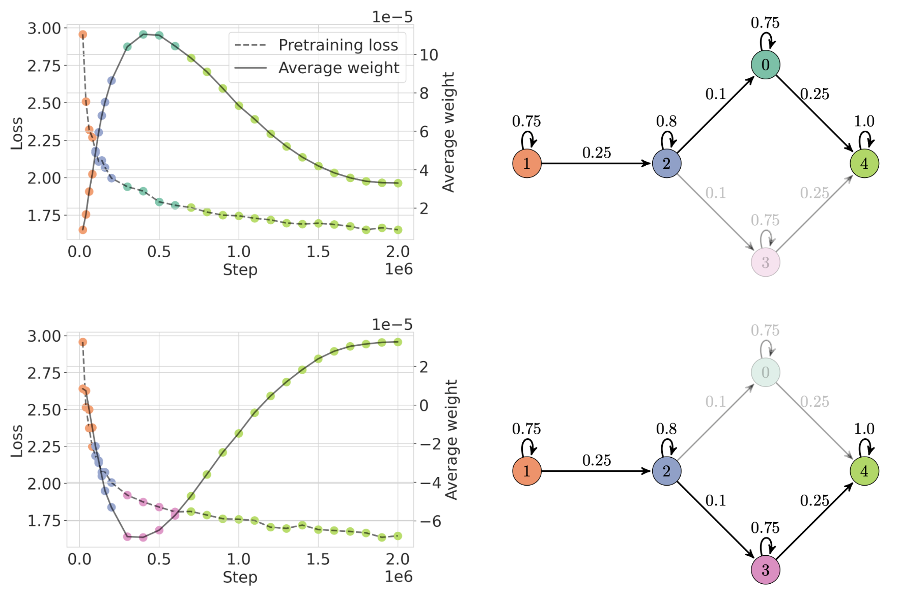

| Ребро | 3 важнейших изменения признаков, по z-оценке | Частота перехода |
|---|---|---|
| $2\to 0$ | $median(\mathbf{w})$ $\uparrow$1.69, $\mu(\mathbf{w})$ $\uparrow$1.70, $\lambda_{max}$ $\uparrow$ 1.14 | 2 / 5 |
| $2\to 3$ | $\lambda_{max}$ $\uparrow$ 1.11, $median(\mathbf{w})$ $\downarrow$1.33, $\mu(\mathbf{w})$ $\downarrow$1.30 | 3 / 5 |

*Рисунок 8: MultiBERTs. Средний вес $\frac{1}{N}\sum_{i}^{N}w_{i}$ сперва убывает в двух из пяти прогонов MultiBERT ($2\to 0$) и растёт в трёх остальных ($2\to 3$). Однако все прогоны в итоге сходятся к примерно одному среднему весу. HMM представляет это различие прогонов состояниями 0 и 3. Существенно, что по потере предобучения это различие неразличимо.* **[p. 24]**

Для изучения изменчивости обучения маскированных языковых моделей мы используем пять опубликованных обучающих траекторий MultiBERTs (Sellam et al. 2022) — воспроизведений исходной модели BERT (Devlin et al. 2019), обученных при разных случайных семенах. MultiBERTs отличается от прочих рассматриваемых обстановок тем, что обучение идёт за один проход по данным, а не за много эпох.

Самая заметная черта карты обучения MultiBERTs — вилка в состоянии 2. Средние веса моделей MultiBERTs все сходятся к примерно $3.7\times 10^{-5}$, но пути пяти моделей к этому значению кластеризуются в две разные траектории. Для пути, включающего $(2\to 0)$, средний вес растёт в состояниях 2 и ноль и затем убывает в состоянии 4, тогда как для путей, включающих $(2\to 3)$, верно обратное. Понимание этого различия между моделями MultiBERTs могло бы быть плодотворной областью будущей работы. Существенно, что это различие во внутренностях моделей неразличимо по потере предобучения, убывающей примерно с одной скоростью во всех пяти прогонах MultiBERTs. Однако MultiBERTs являют значительную изменчивость в переносном обучении и гендерном смещении Sellam et al. 2022, так что эти пути могут указывать на различия поведения при определённых сдвигах распределения и обстановках.

## Приложение F Алгоритмические данные: разрежённые чётности

###### fig-9

| Ребро | 3 важнейших изменения признаков, по z-оценке | Частота перехода |
|---|---|---|
| $2\to 0$ | $L_{1}$ $\downarrow$0.61, $L_{2}$ $\uparrow$0.11, $\frac{L_{1}}{L_{2}}$ $\downarrow$0.32 | 39 / 40 |
| $2\to 5$ | $L_{2}$ $\downarrow$0.19, $\sigma(\mathbf{w})$ $\downarrow$ 0.74, $\mu(\lambda)$ $\uparrow$ 1.20 | 1 / 40 |

*Рисунок 9: Разрежённые чётности. Более быстрая генерализация в разрежённых чётностях происходит при раннем падении $L_{2}$-нормы. Отношение норм $\frac{L_{1}}{L_{2}}$ — метрика рассеяния, убывающая по мере того, как вектор становится разреженнее. Например, one-hot вектор полностью разрежен и есть минимум $\frac{L_{1}}{L_{2}}$.* **[p. 25]**

## Приложение G Классификация изображений: MNIST

| Ребро | 3 важнейших изменения признаков, по z-оценке |
|---|---|
| $3\to 4$ | $L_{2}$ $\uparrow$0.62, $\sigma(w)$ $\uparrow$0.58, $L_{1}$ $\uparrow$0.61 |
| $0\to 2$ | $\sigma(w)$ $\uparrow$0.70, $L_{2}$ $\uparrow$0.69, $L_{1}$ $\uparrow$0.70 |
| $5\to 1$ | $L_{2}$ $\uparrow$0.46, $\sigma(w)$ $\uparrow$0.50, $L_{1}$ $\uparrow$0.48 |

*Рисунок 10: MNIST. Все 40 собранных нами прогонов MNIST идут одним путём, хотя отдельные прогоны могут проводить в каждом состоянии слегка разное время. Как показывают карта обучения и сопровождающие пометки в таблице, динамики обучения MNIST между состояниями схожи.* **[p. 26]**

## Приложение H Кривые выбора модели

**[p. 27]**

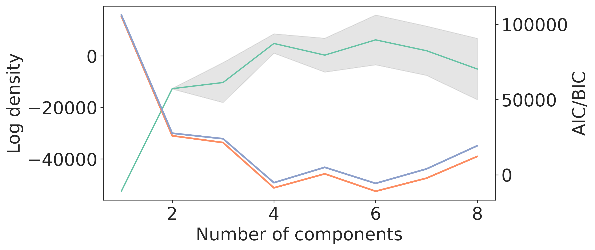

*(a) Модульное сложение. 6 компонент.*

*(b) Модульное сложение, стабилизированное. 3 компоненты.*

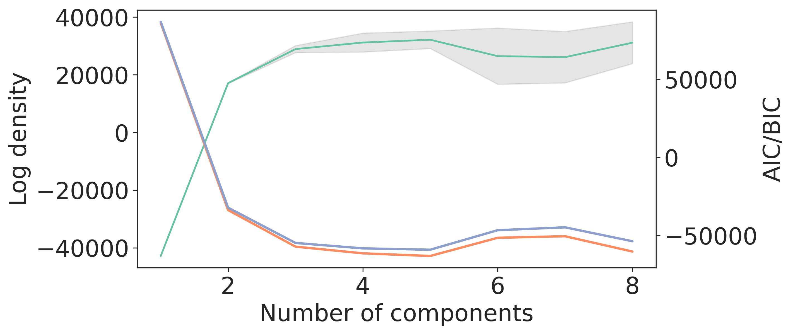

*(c) CIFAR-100. 5 компонент.*

*(d) CIFAR-100, дестабилизированный. 5 компонент.*

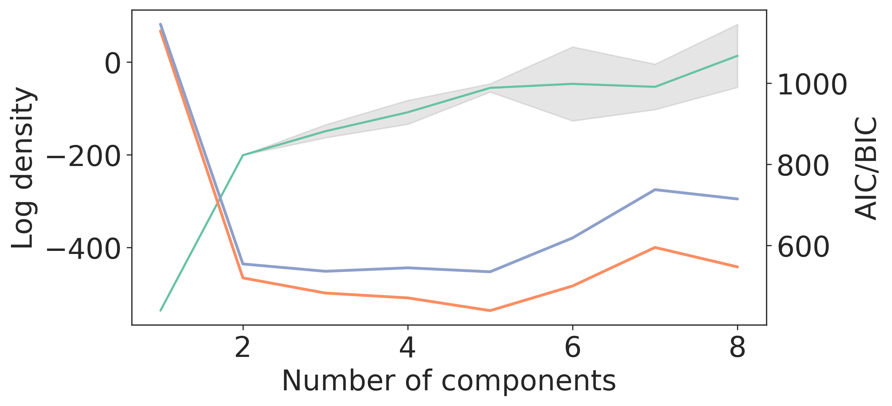

*(e) MultiBERTs. 5 компонент.*

*(f) Разрежённые чётности. 6 компонент.*

*(g) MNIST. 6 компонент.*

*Рисунок 11: Кривые выбора модели для числа скрытых состояний HMM. Во всех случаях мы выбираем модель с минимальным BIC.* **[p. 27]**

## Приложение I Гистограммы времён сходимости

**[p. 28]**

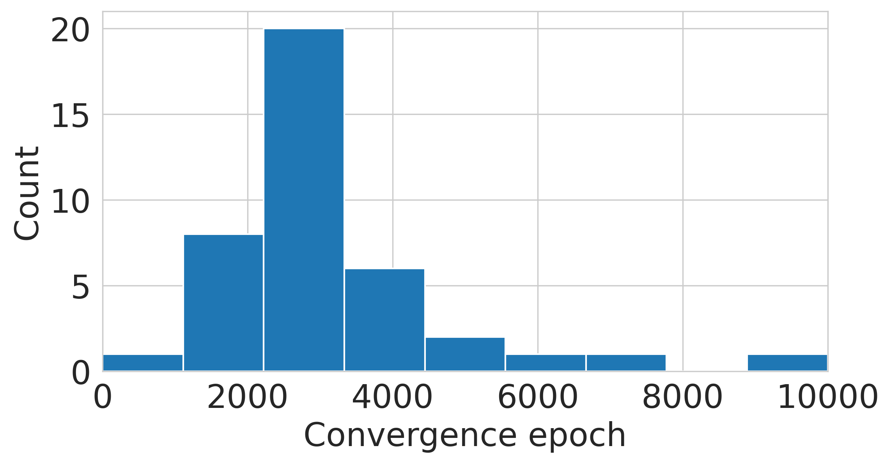

*(a) Модульное сложение. Порог 0.9.*

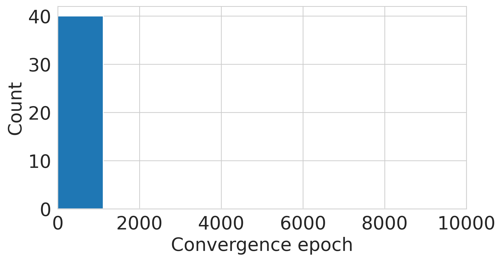

*(b) Модульное сложение, стабилизированное. Порог 0.9.*

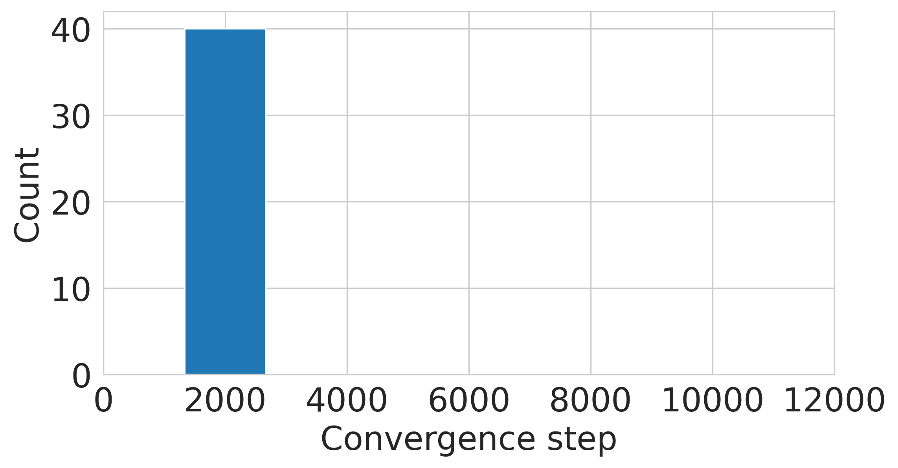

*(c) CIFAR-100. Порог: 0.6.*

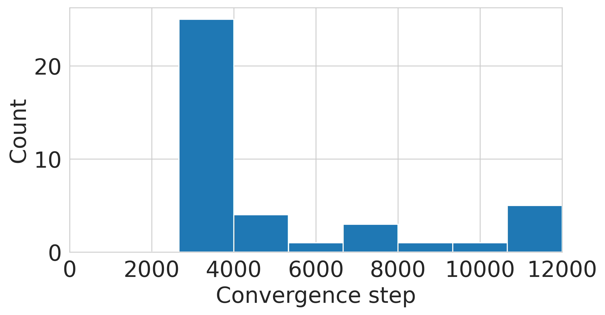

*(d) CIFAR-100, дестабилизированный. Порог: 0.4.*

*(e) Разрежённые чётности. Порог: 0.9.*

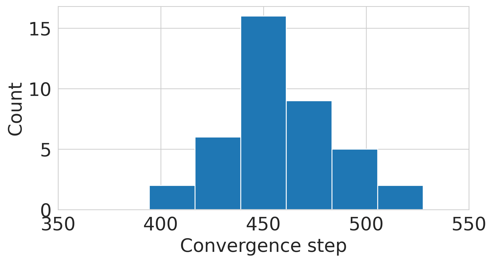

*(f) MNIST. Порог: 0.97.*

*Рисунок 12: Визуализация времён сходимости. Время сходимости здесь определено как первый момент пересечения моделью некоторого порога точности на проверке, и порог выбирается чуть меньше качества, достигаемого итоговой моделью. Например, наши полностью обученные модели на модульном сложении обычно достигают идеальной точности, поэтому мы берём порог 0.9.* **[p. 28]**
