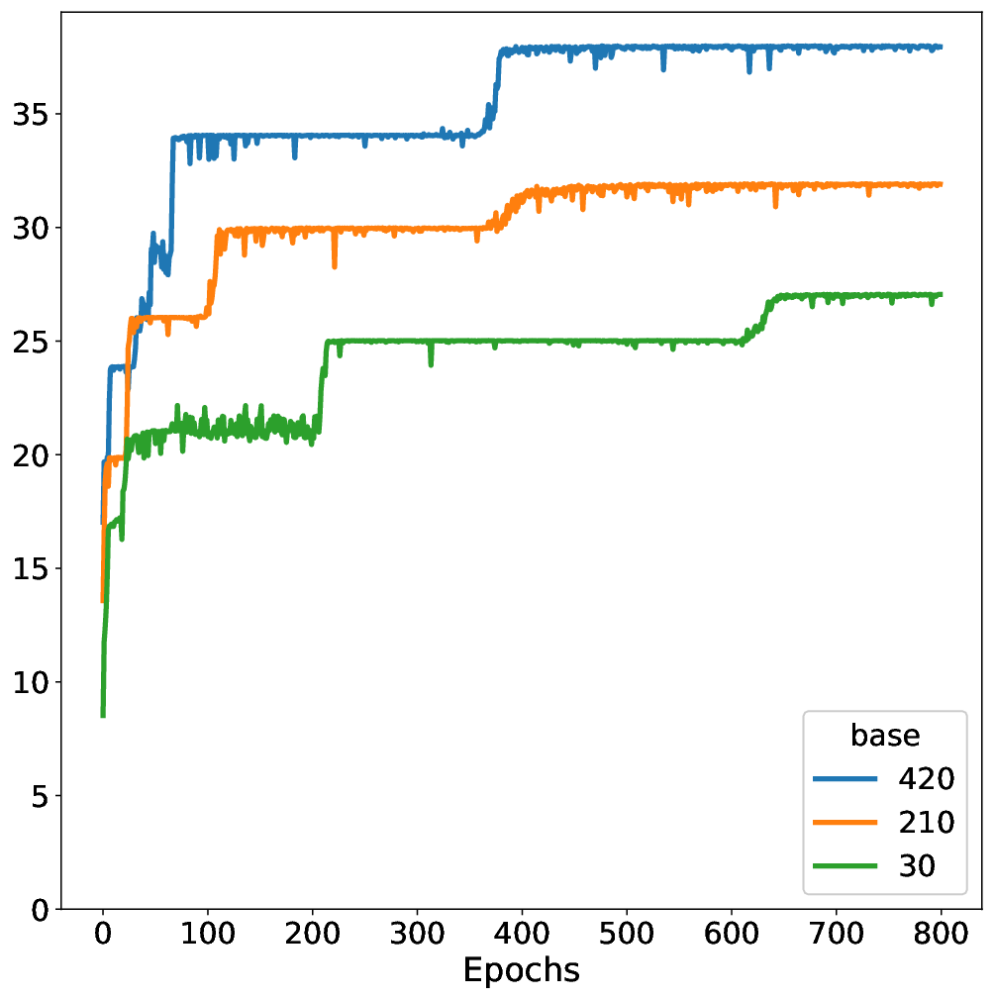
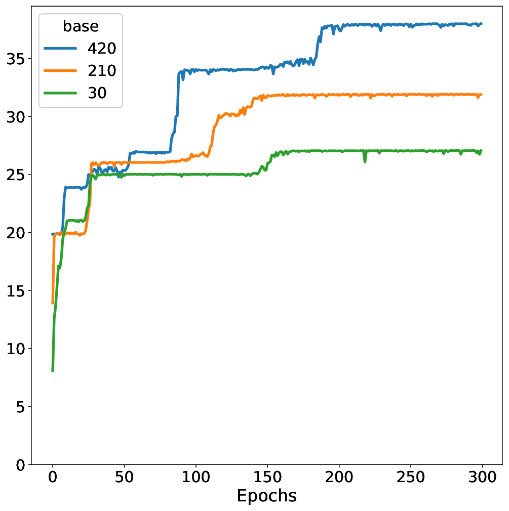
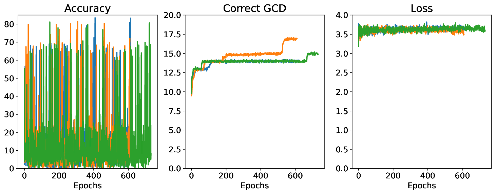
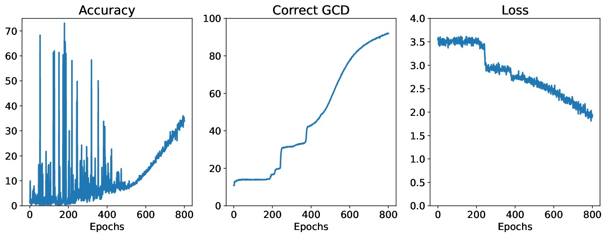
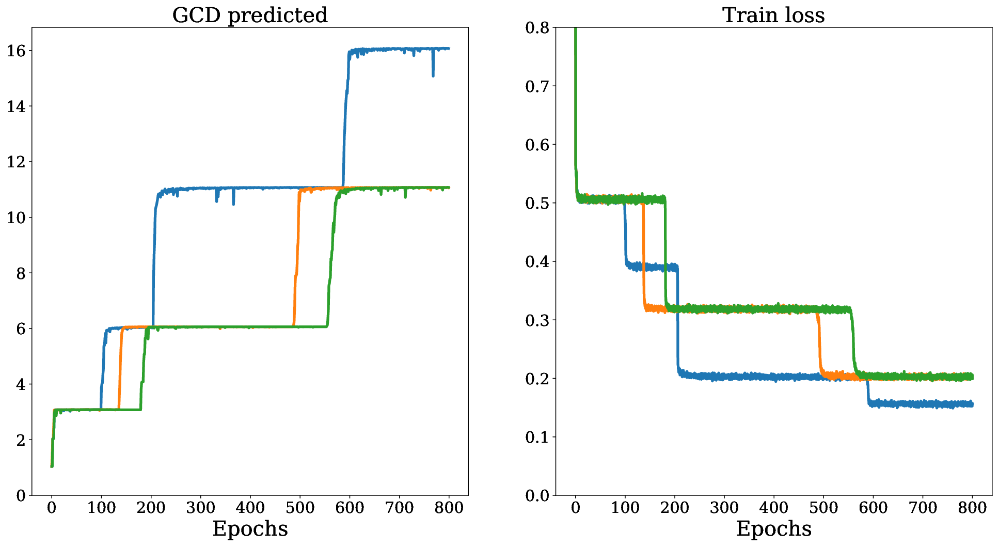
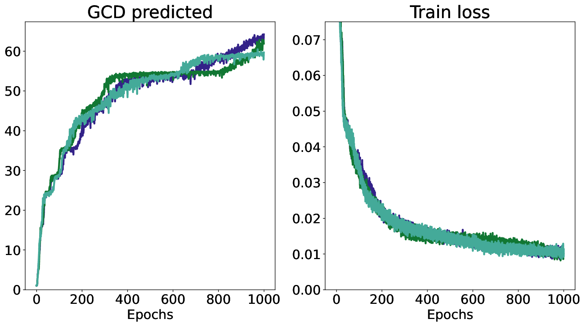
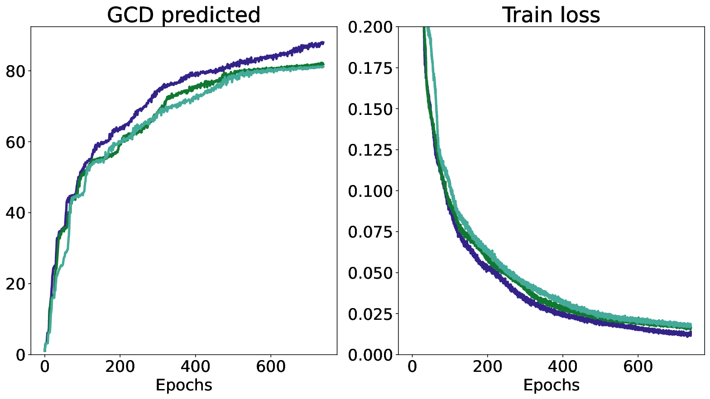

# Charton 2024 — Learning the greatest common divisor: explaining transformer predictions

См. также: [глобальный индекс понятий](../../concepts/index.md).
arXiv [2308.15594v2](https://arxiv.org/abs/2308.15594), 29 августа 2023 (v2 — 14 марта 2024). Колонтитул PDF: «Published as a conference paper at ICLR 2024». Версия v1 выходила под названием «Can transformers learn the greatest common divisor?»; этот вопрос остался заголовком первого абзаца [раздела 7](#sec-7).

**François Charton** — Meta AI (fcharton@meta.com).

Оригинал и производные файлы этой папки:

- [`original/2308.15594.native.html`](original/2308.15594.native.html) — первоисточник, нативный HTML-рендеринг arXiv (LaTeXML), скачан как есть.
- [`original/2308.15594.learning-the-greatest-common-divisor-explaining-transformer-predictions.md`](original/2308.15594.learning-the-greatest-common-divisor-explaining-transformer-predictions.md) — конверсия оригинала в Markdown без правок содержания; английский текст для сверки перевода.
- [`images/`](images/) — иллюстрации статьи в исходном разрешении (7 файлов).
- [`2308.15594.learning-the-greatest-common-divisor-explaining-transformer-predictions.claims.txt`](2308.15594.learning-the-greatest-common-divisor-explaining-transformer-predictions.claims.txt) — рабочий разбор: пронумерованные утверждения с пометками.

Схема якорей и правила ссылок на карточку — в [README папки статей](../README.md).

## Затрагиваемые понятия

**[Гроккинг](../../concepts/grokking.md)** — работа даёт корпусу пограничный случай: внезапный скачок качества после долгой полки потери на обучении, полученный там, где переобучения не бывает по устройству. Показательный прогон при основании $1000$: $13$ верных НОД к эпохе $84$, затем «потеря на обучении ровна в течение $100$ эпох, и кажется, что модель больше ничего не выучивает», а на эпохе $188$ НОД $3$ появляется с точностью $0.2\%$ и к эпохе $193$ достигает $93\%$ — при том что за эти пять эпох модель видела лишь около 100 000 пар с таким НОД ([с. 4, абз. 4](#p4-4)). Отношение к гроккингу автор формулирует осторожно — «Это явление родственно гроккингу (Power et al. 2022)» ([с. 4, абз. 6](#p4-6)), — а в [разделе 7](#sec-7) отдельным заголовком спрашивает, гроккинг ли это, и по определению Power et al. отвечает отрицательно: данные порождаются на лету из пространства в $10^{12}$ пар, «никакого переобучения случиться не может», и общим с гроккингом названо ровно одно — «внезапная перемена точности после долгого застоя потери на обучении» ([с. 9, абз. 9](#p9-9)). Чего в работе нет: ни weight decay и вообще никакой регуляризации, ни постоянного обучающего множества, ни разрыва между обучающей и проверочной ошибками, ни перехода от запоминания к обобщению — и само слово «grokked» в списке вкладов взято в кавычки. Ценное для корпуса в другом: содержание скачка здесь названо поимённо — в точке скачка появляется проверка делимости на новое простое, и известно, какие ровно предсказания она меняет ([рис. 5](#fig-5), [с. 9, абз. 5](#p9-5)).

**[Фаза меморизации / плато](../../concepts/memorization-phase.md)** — плато в работе есть, а запоминать на нём нечего: обучающего множества постоянного объёма нет вовсе, каждая эпоха берёт свежие 300 000 примеров ([с. 2, абз. 5](#p2-5)), а размер пространства задачи заявлен как гарантия минимального дублирования между обучающим и испытательным множествами ([с. 2, абз. 7](#p2-7)). Плато здесь двух видов: ровная потеря на обучении в течение $100$ эпох перед скачком ([с. 4, абз. 4](#p4-4)) и — при равномерных исходах — ровная потеря вообще на всём прогоне, при том что число верных НОД всё это время растёт ступенями ([с. 7, абз. 2](#p7-2), [рис. 3](#fig-3)). Ни фазой запоминания, ни переобучением автор эти плато не называет и переносить на них корпусную трактовку плато нельзя: у второго вида плато прямо показано, что за ним стоит перебор представителей класса, а не заучивание таблицы.

**[Фазовый переход](../../concepts/phase-transition.md)** — ступенчатые кривые обучения здесь основной наблюдаемый предмет: «Кривые обучения имеют ступенчатый вид (рисунок 1), и НОД выучиваются внезапными партиями» ([с. 4, абз. 1](#p4-1), [рис. 1](#fig-1)), а на больших основаниях ступени описаны как «долгие поры застоя, за которыми следуют внезапные обвалы потери и подъёмы точности» ([с. 4, абз. 6](#p4-6), [рис. 5](#fig-5)). Существенно для корпуса, что механизм ступеней тут не постулируется, а вычисляется из счётного устройства задачи: всякий раз, когда выучивается новый делитель $p$, все существующие классы расщепляются на кратные и некратные $p$, и это даёт ступень ([с. 9, абз. 5](#p9-5)). Чего в работе нет: языка фазовых переходов, параметров порядка, критических показателей и вообще слова «переход» в физическом смысле; ступени описаны как наблюдаемая форма кривой, и никакой аналогии со статистической физикой автор не проводит.

**[Эмерджентность / эмерджентные способности](../../concepts/emergence.md)** — редкий в корпусе случай, когда содержание внезапно появляющейся способности установлено поимённо и без обращения к весам: способность — это проверка делимости на новое простое, и после её появления верно предсказываются ровно те НОД, все степени простых у которых уже выучены ([с. 9, абз. 4](#p9-4), [с. 9, абз. 5](#p9-5)). Управляющая величина здесь — время обучения, а не масштаб: приложение B показывает, что качество устойчиво от $300$ тысяч до $700$ миллионов параметров ([с. 13, абз. 1](#p13-1)), то есть порога по размеру модели в этой задаче нет. Чего в работе нет: слов «emergent» и «emergence» — автор ими не пользуется, и приписывать ему постановку об эмерджентных способностях нельзя.

**[Когда регуляризация необходима](../../concepts/regularization-necessity.md)** — работа полезна корпусу как отрицательная точка: ни [weight decay](../../concepts/weight-decay.md), ни dropout, ни какое-либо иное явное сглаживание в ней не упомянуто ни разу — вся постановка исчерпывается четырёхслойным трансформером, Adam со скоростью обучения $10^{-5}$ без расписания и пакетами по $256$ ([с. 2, абз. 5](#p2-5)), — а ступени и поздние скачки при этом наблюдаются ([с. 4, абз. 6](#p4-6)). Оговорка обязательна: это свидетельство не о гроккинге без регуляризации, а о внезапных скачках без неё, поскольку сам автор отрицает, что определение Power et al. здесь выполняется ([с. 9, абз. 9](#p9-9)). Чего в работе нет: опыта, где регуляризация включалась бы и выключалась, — сравнения с регуляризованным прогоном не проводилось, и утверждения о ненужности weight decay автор не делает.

**[Механистическая интерпретируемость](../../concepts/mechanistic-interpretability.md)** — работа задаёт корпусу альтернативу по построению: «Вместо того чтобы смотреть на параметры модели, я конструирую опыты, обнажающие алгоритмы, которые модель исполняет» ([с. 9, абз. 3](#p9-3)), и предшествующие работы по объяснимости арифметических трансформеров названы именно теми, что «пытается истолковать веса модели (Nanda et al. 2023; Zhong et al. 2023)» ([с. 2, абз. 3](#p2-3)). Итог — полное описание поведения тремя правилами и проверка этого описания числом: из правил в [приложении C](#sec-c) выведена теоретическая точность, сверенная с измеренной по $20$ основаниям ([с. 14, абз. 1](#p14-1)). Столь же существенна и граница: при равномерных исходах объяснимость ломается — «Предсказания модели больше не объяснимы, и три правила не соблюдаются» ([с. 8, абз. 5](#p8-5)), и это вынесено в аннотацию ([аннотация](#p1-2)). Чего в работе нет: ни одного взгляда внутрь сети — ни весов, ни вложений, ни голов внимания, ни абляций; контуров работа не выделяет и словом «circuit» не пользуется.

**[Эталонный полигон гроккинга](../../concepts/canonical-grokking-testbed.md)** — постановка Power et al. здесь не наследуется ни в одной части, и это стоит держать в виду при переносе выводов. Задача оформлена как перевод: пара целых, записанных цифрами в основании $B$, переводится в запись их НОД ([с. 2, абз. 4](#p2-4)); символы информативны (это цифры, а не безликие токены), доля таблицы в обучении управляющей величиной не служит, потому что таблицы нет, а данные порождаются на лету ([с. 2, абз. 5](#p2-5)). От Power et al. заимствовано ровно одно слово, и оно взято в кавычки. Что задача даёт корпусу самостоятельно: главной управляющей величиной здесь оказывается основание записи $B$, а второй — распределение обучающих примеров, и обе эти ручки у канонического полигона отсутствуют.

**[Доля данных / критический размер набора](../../concepts/data-fraction-critical-dataset-size.md)** — работа стоит по другую сторону этого понятия: обучающего множества постоянного объёма нет, и порога по объёму данных в ней быть не может ([с. 2, абз. 5](#p2-5), [с. 2, абз. 7](#p2-7)). Вместо объёма рычагом служит **форма** обучающего распределения: лог-равномерные операнды поднимают точность со «$61$ и $97\%$» до «$94$ и $99\%$» ([с. 6, абз. 3](#p6-3)), лог-равномерные исходы доводят число верных НОД до $87$–$91$ ([с. 7, абз. 1](#p7-1)), а совершенно уравновешенное, равномерное распределение исходов качество ухудшает и ломает объяснимость ([с. 9, абз. 8](#p9-8)). Чего в работе нет: ни величины $D_{\text{crit}}$, ни доли данных, ни зависимости времени до скачка от объёма выборки — эту ось работа не трогает вовсе.

**[Катастрофическое забывание](../../concepts/catastrophic-forgetting.md)** — упоминание одно, но точное: лог-равномерное распределение операндов «родственно учебному расписанию (curriculum learning), но избегает катастрофического забывания, потому что обучающее распределение никогда не меняется» ([с. 9, абз. 8](#p9-8)). Это довод, а не измерение: опыта с меняющимся расписанием, на котором забывание было бы показано, в работе нет, и величины забывания она не считает.

---

## Несогласованности внутри статьи

**Для основания $1000$ при равномерных операндах и исходах названы $95$ верных НОД и $71$.** Раздел 6 сообщает: «К эпохе 740 верно предсказываются $95$ НОД до $100$» ([с. 9, абз. 1](#p9-1)), приложение D.3 повторяет то же число для эпохи $800$ ([с. 15, абз. 3](#p15-3)), а раздел 7 переносит его в итог — «Модели, обученные на равномерных исходах, предсказывают $95$ НОД» ([с. 9, абз. 2](#p9-2)). Таблица 16, где то же основание в той же постановке обучено $1200$ эпох, даёт $71$ ([с. 16, абз. 4](#p16-4)). Ни повтор опыта, ни расхождение нигде не оговорены; при цитировании числа $95$ стоит указывать, что оно взято из одного прогона раздела 6, а не из сводной таблицы. Отдельно: рисунок 4, изображающий тот самый прогон, к эпохе $800$ показывает около $92$ верных НОД, а не $95$, и нарисован одной кривой без указания числа семян ([рис. 4](#fig-4)).

**«Лишь $27$ НОД предсказываются неверно» верно для одного основания из трёх.** Утверждение относится к основаниям $1024$, $2401$ и $2744$, и следующее за ним перечисление действительно даёт ровно $27$ ([с. 6, абз. 4](#p6-4)). Но таблица 6 приписывает этим основаниям $71$, $73$ и $72$ верных НОД, то есть $29$, $27$ и $28$ неверных: перечень сходится только для $2401$.

**Ступенчатость кривых при лог-равномерных операндах заявлена, но не показана.** Текст говорит: «Кривые обучения сохраняют свой ступенчатый вид, но становятся более шумными и более гладкими» ([с. 6, абз. 7](#p6-7)). На рисунках 6 и 7 — тех самых, на которые ссылается фраза, — и число верных НОД, и потеря на обучении идут почти гладко: ступеней, сопоставимых со ступенями рисунка 5, там нет ([рис. 6](#fig-6), [рис. 7](#fig-7)). Хедж «smoother» в оригинале стоит, а «retain their step-like shape» рисунками не подтверждается.

**Повторяющиеся строки с разными итогами.** В таблице 4 основание $2401=7^{4}$ занимает две строки с разными результатами ($10$ и $14$ НОД, разный порядок выучивания неделителей) ([с. 4, абз. 6](#p4-6)), в таблице 5 дважды стоит основание $10000$ ($40$ и $62$ НОД) ([с. 5, абз. 3](#p5-3)). Ни повтор, ни расхождение не оговорены; неизвестно, это два прогона, две настройки или опечатка.

**Мелкие сбои, оставшиеся в опубликованной версии.** Частота $200\%$ в таблице 8 (основание $10$, эпоха $268$, НОД $6$) ([с. 7, абз. 3](#p7-3)); значение $81.4$ среди $91.x$ в таблице 11 (основание $12$, устройство $1/12$) ([с. 12, абз. 10](#p12-10)); «$124$ измерений» вместо $1024$ в D.5 ([с. 17, абз. 2](#p17-2)); оборванная фраза «Пока модель В ходе обучения, пока модель выучивает новый делитель…» в разделе 5 ([с. 6, абз. 7](#p6-7)). Там же, в разделах 3–4, «$25$ НОД» в соседних абзацах значит то величину НОД ([с. 4, абз. 1](#p4-1)), то их число ([с. 4, абз. 2](#p4-2)). Всё это перенесено в перевод как есть.

## Что показано, что предположено и что не проверено

**Показано и проверено числом.** Три правила поведения не только сформулированы, но и проверены двумя независимыми способами: поимённо — таблицы 22–23 дают предсказание модели для всех НОД от $1$ до $100$ по шести основаниям, — и численно: из правил в [приложении C](#sec-c) выведена теоретическая точность, и она сверена с измеренной по $20$ основаниям ([с. 14, абз. 1](#p14-1)). Это редкая для корпуса ситуация, когда объяснение предсказывает число, а не пересказывает его. Сюда же — разбор равномерных исходов: правила U1–U3 не просто описывают хаос предсказаний, а объясняют величину скачков точности, поскольку $61\%$ примеров естественного множества имеют НОД $1$ ([с. 8, абз. 1](#p8-1)).

**Объявлено рассуждением самим автором.** Итоговое истолкование через решето введено словами «Опыты указывают на то, что…» ([с. 9, абз. 4](#p9-4)); необходимость неуравновешенного распределения — словами «наводят на мысль»; перенос на другие задачи трижды помечен как возможность: «могут распространяться на другие арифметические задачи», «Эти наблюдения могут распространяться на другие арифметические задачи», «Это многообещающее направление будущих исследований» ([с. 9, абз. 3](#p9-3), [с. 9, абз. 8](#p9-8)).

**Единственная проверка переноса — отрицательная, и её нет ни в аннотации, ни в обсуждении.** [Приложение A](#sec-a) обучает трансформеры пяти действиям над рациональными числами: сравнение выучивается почти идеально, целочисленное деление — отчасти, а все три задачи, требующие вычисления НОД (сокращение дроби, сложение и умножение дробей), не выучиваются: сокращение даёт не выше $0.21\%$, сложение и умножение — ровно $0$ при обоих $M$ ([с. 12, абз. 7](#p12-7)). Это прямая цена заявке «трансформеры выучиваются вычислять НОД»: умение предсказать НОД пары не переносится даже на ближайшую задачу, где НОД служит промежуточным шагом.

**Разброс по семенам не приведён нигде, кроме рисунков.** Все таблицы дают «лучшую из 3» или «лучшую из 6» моделей без средних и разбросов. Единственное место, где изменчивость видна, — рисунки 3 и 5–7, и она там велика: на рисунке 5 из трёх прогонов при основании $2023$ до $16$ НОД доходит лишь один (к эпохе $\approx590$), два других к эпохе $800$ стоят на $11$ ([рис. 5](#fig-5)). Таблица 4 приводит для $2023$ именно $16$ как «лучшую модель из 3»: разброс между семенами того же порядка, что и разбираемый прирост ([с. 4, абз. 6](#p4-6)).

**Три обычных объяснения сняты.** Размер модели ничего не решает — от $300$ тысяч до $700$ миллионов параметров одна и та же точность ([с. 13, абз. 1](#p13-1)); размер пакета «по-видимому, мало влияет на качество»; и явление не свойственно трансформерам — LSTM и GRU дают ту же картину, хотя и хуже по величине ([с. 17, абз. 2](#p17-2)).

## Ошибочные цитирования

Замечания редактора карточки: места, где эта статья передаёт чужие результаты с ошибкой или без авторских оговорок. Сюда ведут ссылки «подробности» из разделов «Ошибочные пересказы и цитирования этой статьи» карточек процитированных работ.

###### mc-2201-02177

**Power et al. (2201.02177) — «классическая картина гроккинга» пересказана с падающей точностью на обучении.** Разбирая, гроккинг ли перед ним, автор пишет: `"No overfitting can happen, and the classical pattern of grokking, train accuracy dropping, and validation accuracy catching up after a long time, will not occur."` — «Никакого переобучения случиться не может, и классическая картина гроккинга — падение точности на обучении и догоняющая её спустя долгое время точность на проверке — не возникнет» ([с. 9, абз. 9](#p9-9)). У Power et al. точность на обучении не падает: на каноническом рисунке она [становится близкой к идеальной за $<10^{3}$ шагов и там остаётся](../2201.02177.grokking-generalization-beyond-overfitting-on-small-algorithmic-datasets/2201.02177.grokking-generalization-beyond-overfitting-on-small-algorithmic-datasets.card.md#fig-1), а «догоняет» её точность на валидации спустя $\sim10^{6}$ шагов — картина состоит в *разрыве* между двумя кривыми, а не в падении верхней. Само определение, которое Charton цитирует верно («generalization far after overfitting»), никакого падения не содержит: [у Power et al. речь о генерализации далеко за точкой переобучения](../2201.02177.grokking-generalization-beyond-overfitting-on-small-algorithmic-datasets/2201.02177.grokking-generalization-beyond-overfitting-on-small-algorithmic-datasets.card.md#p1-4). На вывод самого Charton ошибка не влияет — при данных, порождаемых на лету, не возникнет ни разрыва, ни падения, — но формулировка, взятая из этого абзаца, приписывает первоисточнику картину, которой в нём нет.

## Ошибочные пересказы и цитирования этой статьи

Ниже — узоры, наблюдённые в цитирующих работах корпуса. Для каждого сказано, что именно искажается, и даны ссылки на авторские абзацы с теряемой оговоркой. Разделы «Ошибочные цитирования» на стороне цитирующих карточек по этой работе ещё не заведены, поэтому подробные разборы пока не адресуются, а цитирующие работы перечислены простыми ссылками на карточки.

**«Гроккинг наблюдался на задаче НОД» (расширяющее).** Самый частый способ цитировать эту работу — поставить её в перечень постановок, где гроккинг наблюдали. Lyu et al. 2024 пишут `"grokking has been reported in learning group operations (Chughtai et al. 2023), learning sparse parity (Barak et al. 2022; Bhattamishra et al. 2023), learning greatest common divisor (Charton 2024), and image classification"`; Mohamadi et al. 2024 — `"grokking can happen in tasks beyond modular arithmetic: in learning sparse parities [5, 6], image classifiers [27], greatest common divisors [9]"`; Notsawo et al. 2025 — `"Charton (2024) on greatest common divisor (with Transformer)"`; Xu et al. 2026 — `"grokking has also been observed in other learning paradigms, which include learning sparse parities (Barak et al., 2022; Merrill et al., 2023), learning the greatest common divisor of integers (Charton, 2024)"`; ту же форму дают три работы, карточек которых пока нет. Теряется при этом целый раздел: автор ставит вопрос «Гроккинг ли это на самом деле?» отдельным заголовком и по определению Power et al. отвечает отрицательно — данные порождаются на лету, «никакого переобучения случиться не может», а общим с гроккингом названо ровно одно, «внезапная перемена точности после долгого застоя потери на обучении» ([с. 9, абз. 9](#p9-9)); в самом наблюдении отношение к гроккингу выражено словом «родственно» ([с. 4, абз. 6](#p4-6)), а в списке вкладов «grokked» стоит в кавычках. Образцовая для сравнения формулировка есть в том же корпусе: Jeffares и van der Schaar 2025 цитируют работу не как наблюдение гроккинга, а как источник признака — насколько эффект «гроккингоподобен», зависит в том числе от того, доходит ли качество на обучении до почти идеального, `"near-perfect train performance rather than stagnation at some arbitrary level (Charton 2024)"`. Затронутые работы: [Lyu et al. 2024](../2311.18817.dichotomy-of-early-and-late-phase-implicit-biases-can-provably-induce-grokking/2311.18817.dichotomy-of-early-and-late-phase-implicit-biases-can-provably-induce-grokking.card.md), [Mohamadi et al. 2024](../2407.12332.why-do-you-grok-a-theoretical-analysis-of-grokking-modular-addition/2407.12332.why-do-you-grok-a-theoretical-analysis-of-grokking-modular-addition.card.md), [Notsawo et al. 2025](../2506.05718.grokking-beyond-the-euclidean-norm-of-model-parameters/2506.05718.grokking-beyond-the-euclidean-norm-of-model-parameters.card.md), [Xu et al. 2026](../2601.19791.to-grok-grokking-provable-grokking-in-ridge-regression/2601.19791.to-grok-grokking-provable-grokking-in-ridge-regression.card.md); карточек пока нет у 2405.16658 (Park, Kim, Kim), 2412.10898 (Hu, Zhou, Yu) и 2605.14659 (So, Lee, No), цитирующих в той же форме, и у 2506.23286 (Jeffares, van der Schaar) с образцовой формулировкой.

**«Модели умеют вычислять НОД» (расширяющее).** Saxena et al. 2024 перечисляют НОД среди сложных математических задач, которые модели машинного обучения решать умеют — `"ML models can learn other complex math tasks such as symbolic regression, linear algebra, discovering Lyapunov functions, computing Gröbner bases, polynomial simplification"`, и далее в том же перечне вычисление наибольшего общего делителя, со ссылкой в том числе на эту работу. Формулировка верна лишь при подходящем обучающем распределении и рассыпается без него: при равномерных операндах модель на основании $10$ верно предсказывает $13$ НОД из первой сотни при точности $84.7\%$, и сам автор строит на этом предупреждение о «пределах наивных, опирающихся на бенчмарки оценок арифметических задач»: точность $95\%$ достижима моделью, предсказывающей горстку НОД ([с. 9, абз. 2](#p9-2)). Сильнее того, единственная проверка переноса в работе отрицательна: три задачи, где НОД служит промежуточным шагом, — сокращение дроби, сложение и умножение дробей — не выучиваются вовсе ([с. 12, абз. 7](#p12-7)). Затронутая работа: [Saxena et al. 2024](../2410.03569.making-hard-problems-easier-with-custom-data-distributions-and-loss-regularization/2410.03569.making-hard-problems-easier-with-custom-data-distributions-and-loss-regularization.card.md) (соавтор — сам Charton, то есть это самоцитирование).

**«Постановка как у Charton 2024» при иных гиперпараметрах (ошибочное).** Работа о модульном возведении в степень воспроизводит рамку этой статьи и заявляет: `"For comparability with Charton 2024 train four-layer encoder-decoder transformers with embedding dimension 256, eight attention heads, batch size 256, and learning rate $10^{-4}$ with the Adam optimizer"`. Совпадают только число слоёв, число голов и размер пакета: в опытах с НОД у Charton $512$ измерений и скорость обучения $10^{-5}$ без расписания ([с. 2, абз. 5](#p2-5)); $10^{-4}$ с расписанием по обратному квадратному корню и разогревом относится к другой постановке — приложению A об арифметике рациональных чисел, где измерений тоже $512$. Модель на $256$ измерениях в статье есть ровно в одном месте — в столбце таблицы 10, среди однослойных моделей опыта о масштабировании ([с. 12, абз. 9](#p12-9)), — и к опытам, с которыми объявлена сопоставимость, отношения не имеет. Прочие ссылки той же работы на Charton (кодирование целых цифрами основания, разбор детерминированных ошибок предсказания, роль распределения выборки) точны — предупреждение относится к одной фразе о сопоставимости, а не к работе в целом. Затронутая работа: 2506.23679 (карточки пока нет).

---

# Текст статьи

# Learning the greatest common divisor: explaining transformer predictions

François Charton (Meta AI, fcharton@meta.com)

## Аннотация

###### p1-2

Предсказания малых трансформеров, обученных вычислять наибольший общий делитель (НОД) двух положительных целых чисел, могут быть полностью охарактеризованы по входам и выходам модели. По ходу обучения модель выучивает список $\mathcal{D}$ целых чисел — произведений делителей основания, в котором записаны целые числа, и малых простых, — и предсказывает наибольший элемент $\mathcal{D}$, делящий оба входа. Обучающие распределения сказываются на качестве. Модели, обученные на равномерных операндах, выучивают лишь горстку НОД (до $38$ НОД $\leq 100$). Лог-равномерные операнды поднимают качество до $73$ НОД $\leq 100$, а лог-равномерное распределение исходов (то есть НОД) — до $91$. Однако обучение на равномерных (уравновешенных) НОД ломает объяснимость.

## 1 Введение

Трансформеры (Vaswani et al. 2017) применялись к задачам математики, как символьным (Lample & Charton 2019; Charton et al. 2020; Shi et al. 2021), так и численным (Charton 2021). При этом они с трудом справляются с простейшей арифметикой (Lee et al. 2023; Nogueira et al. 2021). Большие языковые модели (LLM) способны выучить сложение или умножение на малый предмножитель и обобщить за пределы своего обучающего диапазона при дообучении с использованием черновика (Nye et al. 2021), цепочки рассуждений (Wei et al. 2023) или алгоритмического промптинга (Zhou et al. 2022), но эти приёмы требуют особым образом устроенных данных и не переносятся на сложные задачи (Dziri et al. 2023). Обнаружилось также, что математические трансформеры хрупки (Welleck et al. 2021), проваливаются на простых задачах (Davis 2023) и трудны для истолкования, кроме самых простых случаев (Nanda et al. 2023). И всё же малые трансформеры способны выучить продвинутые вычисления, такие как разложение по собственным векторам (Charton 2021) и корни многочленов (Charton 2022b).

В этой статье я обучаю $4$-слойные трансформеры вычислять наибольший общий делитель (НОД) двух положительных целых чисел — важную операцию для арифметики рациональных чисел и теории чисел — и наблюдаю, что:

1. **Трансформеры выучиваются собирать входные пары с одним и тем же НОД в один класс.** Все пары целых чисел $(a,b)$ с одним и тем же НОД $k$ предсказываются одинаково.
2. **Предсказания трансформера могут быть полностью охарактеризованы.** В ходе обучения модель выучивает множество целых чисел $\mathcal{D}$ и предсказывает для любой входной пары $(a,b)$ наибольший элемент $\mathcal{D}$, делящий $a$ и $b$.
3. Рано в ходе обучения **трансформеры выучиваются предсказывать произведения делителей основания, в котором записаны целые числа**. **Малые простые «грокнуты»** (Power et al. 2022) после продолжительного обучения.
4. **Модели, обученные на лог-равномерных операндах и исходах, достигают лучшего качества.** Они верно предсказывают до $91$ НОД $\leq 100$. Предсказания модели остаются полностью объяснимыми.
5. **Неуравновешенное распределение исходов в обучающем множестве необходимо для полной объяснимости:** объяснимость частично отказывает, как только модели обучаются на равномерно распределённых НОД.

Эти результаты показывают, как трансформеры можно обучить выполнять точные вычисления, связанные с делимостью целых чисел, — центральную задачу целочисленной арифметики и теории чисел. За пределами вычисления НОД более широкое возможное влияние этого исследования простирается в трёх направлениях. Во-первых, оно предъявляет новый подход к объяснимости моделей: полное описание предсказаний модели — чёрного ящика — через опыты с избранными входами и опору на наше теоретическое понимание лежащей в основе математики. Во-вторых, результаты о лог-равномерных обучающих распределениях операндов и исходов — более быстрое обучение и лучшее качество — могут распространяться на другие арифметические задачи, например на дообучение LLM. Наконец, математические задачи играют центральную роль для Foundational Models for Science — больших языковых моделей, предобученных на математике и дообученных на отдельных областях, таких как физика высоких энергий, вычислительная биология или астрофизика. Прежде чем заниматься наукой, трансформеры должны выучить математику.

**[p. 2]**

### Родственные работы

**Нейросети для арифметики** были впервые предложены Siu & Roychowdhury 1992, а рекуррентные модели — Kalchbrenner et al. 2015, Zaremba et al. 2015 и Kaiser & Sutskever 2015. Недавние исследования в основном сосредоточены на дообучении LLM на арифметических задачах для решения математических текстовых задач (Meng & Rumshisky 2019; Griffith & Kalita 2021). Сводку см. в Lee et al. 2023. В качестве иной возможности Neural Arithmetic Logical Units (Trask et al. 2018; Mistry 2023) выучивают точные вычисления, способные обобщаться на любой вход, за счёт ограничения весов линейных моделей значениями, близкими к $0$, $1$ или $-1$.

**Трудность выучивания арифметических задач** обсуждалась многими авторами. Saxton et al. 2019, оценивая математические задачи на бенчмарке, отмечают, что теоретико-числовые операции, такие как разложение на множители, трудны. Palamas 2017 подробнее исследует трудность модульной арифметики. Dziri et al. 2023 отмечают трудность распространения многообещающих результатов, полученных Lee et al. 2023 на четырёх действиях, на сложные математические вычисления или алгоритмы — здесь это НОД и алгоритм Евклида.

###### p2-3

**Роль представления чисел** обсуждалась Nogueira et al. 2021 и Charton 2021. **Гроккинг** был впервые описан Power et al. 2022. Liu et al. 2022 предлагают меры для его характеризации. Gromov 2023 даёт проницательный разбор гроккинга в сетях прямого распространения. Большая часть предшествующих работ по **объяснимости арифметических трансформеров** пытается истолковать веса модели (Nanda et al. 2023; Zhong et al. 2023). Charton 2022a проводит схожие опыты для линейной алгебры.

## 2 Постановка опытов

###### p2-4

Вычисление НОД оформлено как задача перевода с учителем. Задачи (пары целых чисел) берутся случайно, представляются последовательностями токенов и используются для обучения последовательность-в-последовательность трансформеров переводить входные пары в их НОД, минимизируя перекрёстную энтропию между предсказаниями модели и последовательностями, представляющими верные решения. Целые числа кодируются последовательностями цифр в основании $B$, предваряемыми знаком, который служит также разделителем (таблица 1). В основании $10$ модель переводит $(8,12)$, закодированное как последовательность «+ 8 + 1 2», в его НОД $4$, закодированный как «+ 4». Выбор $B$ — это размен. Малые основания дают более длинные последовательности, которые труднее выучить, но пользуются малым словарём, который легче запомнить. Составные основания позволяют просто проверять делимость: в основании $10$ делимость на $2$, $5$ и $10$ решается взглядом на самый правый токен последовательности.

###### p2-5

Трансформеры с $4$ слоями, $512$ измерениями и $8$ головами внимания, использующие Adam (Kingma & Ba 2014), обучаются со скоростью обучения $10^{-5}$ (расписание не требуется) на пакетах из $256$ примеров. Все входные пары берутся равномерно между $1$ и $M=10^{6}$. Все данные порождаются на лету: разные эпохи обучения используют разные примеры для обучающего и испытательного множеств. После каждой эпохи (300 000 примеров) модели оцениваются на двух испытательных множествах по 100 000 примеров: *естественном испытательном множестве* из равномерно взятых пар $(a,b)$ и *расслоённом испытательном множестве* с НОД, равномерно распределёнными между $1$ и $100$. В естественном множестве малые НОД встречаются чаще — имеем $P(\text{gcd}(a,b)=k)=\frac{6}{\pi^{2}k^{2}}$ (Cesàro 1883). Расслоённое множество содержит около $1000$ примеров с НОД $k$ для $1\leq k\leq 100$ и порождается так:

- берётся $k$ равномерно между $1$ и $100$,
- берутся $a$ и $b$ равномерно между $1$ и $\frac{M}{k}$ так, чтобы $\text{gcd}(a,b)=1$, при помощи выборки с отклонением,
- пара $(ka,kb)$ добавляется в расслоённое испытательное множество.

###### p2-7

Эти два испытательных множества дают две меры точности. **Точность модели**, измеряемая на естественном множестве, — это вероятность того, что НОД двух случайных целых чисел от $1$ до $M$ предсказан верно. Точность на расслоённом испытательном множестве — это **число верно предсказанных НОД** между $1$ и $100$. Размер пространства задачи ($10^{12}$ возможных входных пар) обеспечивает минимальное дублирование между обучающим и испытательным множествами. Все опыты проведены на одном GPU NVIDIA V100 с $32$ ГБ памяти. Исходный код этих опытов доступен по адресу https://github.com/facebookresearch/GCD.

*Таблица 1: Кодирование gcd(160,120) = 40 в основаниях 2, 6, 10 и 30* **[p. 2]**

| Основание | Кодированный вход | Кодированный выход |
|---|---|---|
| 2 | [+,1,0,1,0,0,0,0,0,+,1,1,1,1,0,0,0] | [+,1,0,1,0,0,0] |
| 6 | [+,4,2,4,+,3,2,0] | [+,1,0,4] |
| 10 | [+,1,6,0,+,1,2,0] | [+,4,0] |
| 30 | [+,5,10,+,4,0] | [+,1,10] |

## 3 Выучивание наибольшего общего делителя — базовые опыты

*Таблица 2: Число верных НОД до 100 и точность. Лучший из 6 опытов.* **[p. 3]**

| Основание | 2 | 3 | 4 | 5 | 6 | 7 | 10 | 11 | 12 | 15 |
|---|---|---|---|---|---|---|---|---|---|---|
| Верных НОД | 7 | 5 | 7 | 3 | 19 | 3 | 13 | 2 | 19 | 9 |
| Точность | 81.6 | 68.9 | 81.4 | 64.0 | 91.5 | 62.5 | 84.7 | 61.8 | 91.5 | 71.7 |
| Основание | 30 | 31 | 60 | 100 | 210 | 211 | **420** | 997 | 1000 | 1024 |
| Верных НОД | 27 | 2 | 28 | 13 | 32 | 1 | **38** | 1 | 14 | 7 |
| Точность | 94.7 | 61.3 | 95.0 | 84.7 | 95.5 | 61.3 | **96.8** | 61.3 | 84.7 | 81.5 |

**[p. 3]**

Модель, обученная на парах положительных целых чисел меньше миллиона, закодированных в основании $B=10$, верно предсказывает $84.7\%$ примеров естественного испытательного множества и $13$ верных НОД до $100$ (точность на расслоённом испытательном множестве). Качество меняется с основанием кодирования: от $61.8\%$ точности и $2$ верных НОД для основания $11$ до $96.8\%$ и $38$ НОД для основания $420$ (таблица 2). Наилучшее качество достигается на составных основаниях ($30$, $60$, $210$ и $420$), наихудшее — на больших простых. Обучение очень быстрое: для основания $30$ модель достигает $90\%$ точности после $2$ эпох (600 000 примеров) и $93\%$ после $6$. Размер модели мало влияет на качество (приложение B). Для основания $30$ $1$-слойные трансформеры с $32$ измерениями (менее 300 000 параметров) достигают $93.3\%$ точности. $24$-слойные модели с $1024$ измерениями ($714$ миллионов параметров) достигают $93.4\%$. Для основания $31$ точность равна $61\%$ у всех моделей.

###### p3-2

Эти изменения качества модели можно понять, взглянув на предсказания модели. Таблица 3 представляет для оснований $2$ и $10$ и НОД до $36$ самое частое предсказание модели для пар с данным НОД (Пред.) и его частоту в расслоённом испытательном множестве ($\%$) — подробные результаты для $6$ оснований и НОД до $100$ приведены в приложении E.3). Все частоты очень близки к $100\%$: для каждой испытательной пары с НОД $k$ модель делает одно и то же предсказание $f(k)$. Иначе говоря, модель способна определить, одинаков ли НОД у двух входных пар. Верные предсказания модели ($f(k)=k$) случаются только для произведений делителей основания. По сути все предсказания модели сводятся к **трём правилам**:

*Таблица 3: Предсказания модели и их частоты для НОД от 1 до 36. Верные предсказания выделены полужирным.* **[p. 3]**

|  | Основание 2 | Основание 10 |  | Основание 2 | Основание 10 |  | Основание 2 | Основание 10 |  |  |  |  |  |  |
|---|---|---|---|---|---|---|---|---|---|---|---|---|---|---|
| НОД | Пред. | % | Пред. | % | НОД | Пред. | % | Пред. | % | НОД | Пред. | % | Пред. | % |
| 1 | **1** | 100 | **1** | 100 | 13 | 1 | 100 | 1 | 100 | 25 | 1 | 100 | **25** | 100 |
| 2 | **2** | 100 | **2** | 100 | 14 | 2 | 100 | 2 | 100 | 26 | 2 | 100 | 2 | 100 |
| 3 | 1 | 100 | 1 | 100 | 15 | 1 | 100 | 5 | 100 | 27 | 1 | 100 | 1 | 100 |
| 4 | **4** | 100 | **4** | 100 | 16 | **16** | 100 | **16** | 99.7 | 28 | 4 | 100 | 4 | 100 |
| 5 | 1 | 100 | **5** | 100 | 17 | 1 | 100 | 1 | 100 | 29 | 1 | 100 | 1 | 100 |
| 6 | 2 | 100 | 2 | 100 | 18 | 2 | 100 | 2 | 100 | 30 | 2 | 100 | 10 | 100 |
| 7 | 1 | 100 | 1 | 100 | 19 | 1 | 100 | 1 | 100 | 31 | 1 | 100 | 1 | 100 |
| 8 | **8** | 100 | **8** | 100 | 20 | 4 | 100 | **20** | 100 | 32 | **32** | 99.9 | 16 | 99.9 |
| 9 | 1 | 100 | 1 | 100 | 21 | 1 | 100 | 1 | 100 | 33 | 1 | 100 | 1 | 100 |
| 10 | 2 | 100 | **10** | 100 | 22 | 2 | 100 | 2 | 100 | 34 | 2 | 100 | 2 | 100 |
| 11 | 1 | 100 | 1 | 100 | 23 | 1 | 100 | 1 | 100 | 35 | 1 | 100 | 5 | 100 |
| 12 | 4 | 100 | 4 | 100 | 24 | 8 | 100 | 8 | 100 | 36 | 4 | 100 | 4 | 100 |

###### p3-3

1. **Предсказания детерминированы.** Модель предсказывает единственное значение $f(k)$ почти для всех ($99.9\%$) пар целых чисел с НОД $k$. Предсказания верны, когда $f(k)=k$.
2. **Верные предсказания суть произведения простых, делящих B.** Для основания $2$ это $1$, $2$, $4$, $8$, $16$, $32$ и $64$. Для основания $31$ — $1$ и $31$. Для основания $10$ — все произведения элементов из $\{1,2,4,8,16\}$ и $\{1,5,25\}$. Для основания $30$ — все произведения из $\{1,2,4,8\}$, $\{1,3,9,27\}$ и $\{1,5,25\}$.
3. **f(k) есть наибольшее верное предсказание, делящее k.** Например, $f(8)=8$ и $f(7)=1$ для оснований $2$ и $10$, но $f(15)=5$ для основания $10$ и $f(15)=1$ для основания $2$.

Эти результаты можно истолковать так. Для простых оснований, таких как $B=2$, целое число делится на $B^{k}$ тогда и только тогда, когда его запись оканчивается $k$ нулями. Модель выучивается «предсказывать» НОД, считая самые правые нули в своих операндах, $z_{a}$ и $z_{b}$, и предсказывая $B^{z}$ с $z=\text{min}(z_{a},z_{b})$. Это объясняет все наблюдаемые результаты. Например, она верно предскажет, что НОД чисел $a=8=1000_{2}$ и $b=12=1100_{2}$ равен $2^{2}=4$, и неверно предскажет, что НОД чисел $7=111_{2}$ и $14=1110_{2}$ равен **[p. 4]** $1$. Для составных оснований, таких как $B=10$, целое число $a$ делится на $f$, такое что $kf=B^{n}$, тогда и только тогда, когда его $n$ самых правых цифр принадлежат $\{0,f,2f\dots(k-1)f\}$. Модель выучивается проверять делимость своих операндов, сравнивая их $n$ самых правых цифр с $k$ возможными значениями, и предсказывать наибольшее $f$, делящее оба операнда. На деле выучиваются только те делимости, которые можно проверить, рассматривая две последние цифры записи. Для $B=210$ делимость на $4$ выучивается, а делимость на $8$ — нет. Для $B=420$ делимость на $16$ выучивается, а на $32$ — нет. Три правила объясняют также изменения точности модели (посчитанной на естественном испытательном множестве) для разных оснований (см. приложение C).

###### p4-1

**Выучивание НОД по одной степени простого за раз.** Кривые обучения имеют ступенчатый вид (рисунок 1), и НОД выучиваются внезапными партиями. Когда модель выучивает новую степень простого делителя $B$, она выучивает также её произведения с уже известными НОД. Например, для основания $30$ модель поначалу предсказывает $\{1,2,4\}$, $\{1,3,9\}$, $\{1,5\}$ и их произведения — $17$ НОД до $100$. Первая ступень случается около эпохи $50$, когда модель выучивает $25$ и три связанных кратных — $50$, $75$ и $100$ ($21$ НОД), вторая — около эпохи $220$, с выучиванием $8$, $24$, $40$ и $72$, а третья — на эпохе $660$, с выучиванием $27$ и $54$, что в общем итоге даёт $27$ верных НОД. Три правила выполняются на всём протяжении обучения.

###### fig-1

*Рисунок 1: Верные НОД в зависимости от времени обучения. Естественное ($\frac{1}{k^{2}}$) распределение НОД.* **[p. 4]**

*Рисунок 2: Верные НОД в зависимости от времени обучения. 5% равномерных, 95% естественных НОД.* **[p. 4]**

###### p4-2

**Ускорение обучения уравновешиванием распределения НОД.** Распределение НОД удовлетворяет $P(\text{gcd}(a,b)=k)=\frac{6}{\pi^{2}k^{2}}$ (Cesàro 1883). Как следствие, большие НОД очень редки в обучающем множестве, и выучиваются они очень медленно. Это можно смягчить, а обучение ускорить, добавив небольшую долю ($5\%$) равномерно взятых НОД в обучающее множество: для $B=30$ модель выучивает $25$ НОД за $30$ эпох и $27$ НОД за $175$ против $250$ и $660$ в исходных опытах (рисунок 2).

В этих опытах модели верно вычисляют лишь те НОД, которые являются произведениями делителей основания, и наилучшая точность достигается для оснований, делящихся на много малых простых, например $30$, $210$ или $420$. Тем не менее все модели выучиваются собирать пары входных целых чисел в классы по их НОД и выдавать единственное предсказание $f(k)$ для всех пар с НОД $k$. Это нетривиальный результат и значительное достижение.

## 4 Большие составные основания $B$ — гроккинг малых простых

###### p4-4

Для больших оснований $B$ неделители $B$ иногда выучиваются после продолжительного обучения. В одном опыте с основанием $1000$ модель предсказывает $13$ НОД $\leq 100$ после $84$ эпох: все произведения $\{1,2,4,8,16\}$ и $\{1,5,25\}$. Затем потеря на обучении ровна в течение $100$ эпох, и кажется, что модель больше ничего не выучивает. Но затем модель начинает предсказывать НОД $3$ с точностью $0.2\%$ на эпохе $188$ и $93\%$ на эпохе $193$ (несмотря на то, что за эти $5$ эпох она видела лишь 100 000 входных пар с НОД $3$). Далее выучиваются кратные $3$, и к эпохе $220$ модель предсказывает $22$ НОД: все произведения $\{1,2,4,8,16\}$, $\{1,5,25\}$ и $\{1,3\}$. Предсказания модели по-прежнему подчиняются правилам R1 и R3 (приложение E.1, таблица 20), а **три правила** можно уточнить так:

1. **Предсказание детерминировано.** Все пары с одним и тем же НОД предсказываются одинаково, как $f(k)$.
2. **Верные предсказания суть произведения простых делителей B и малых простых**.
3. **f(k) есть наибольшее верное предсказание, делящее k.**

###### p4-6

Это явление родственно гроккингу (Power et al. 2022). Таблица 4 представляет результаты для $16$ больших оснований при обучении моделей до $1300$ эпох. Гроккинг обычно наступает поздно в обучении: для оснований $625$ и $4000$ все произведения делителей $B$ выучиваются за $5$ и $15$ эпох, но на гроккинг ($2$ и $3$) уходит $600$ эпох. Простые и степени простых грокаются примерно по **[p. 5]** порядку. Кривые обучения (приложение E.1, рисунок 5) сохраняют свой обычный ступенчатый вид: долгие поры застоя, за которыми следуют внезапные обвалы потери и подъёмы точности по мере выучивания новых НОД. Поскольку он помогает выучить малые НОД, гроккинг поднимает точность модели (с $63\%$ до $91\%$ для $B=2023$), но в целом число верных НОД остаётся низким (менее $30$ для всех больших оснований).

*Таблица 4: **Предсказанные НОД, делители и неделители ${\bf B}$.** Лучшая модель из 3. Для неделителей эпоха выучивания — первая эпоха, на которой модель достигает $90\%$ точности для этого НОД.* **[p. 5]**

| Основание | Предсказано НОД | Предсказано делителей | Неделители (эпоха выучивания) |
|---|---|---|---|
| $625=5^{4}$ | 6 | {1,5,25} | 2 (634) |
| $2017$ | 4 | {1} | 2 (142), 3 (392) |
| $2021=43.47$ | 10 | {1,43}, {1,47} | 2 (125), 3 (228) |
| $2023=7.17^{2}$ | 16 | {1,7}, {1,17} | 3 (101), 2 (205), 4 (599) |
| $2025=3^{4}.5^{2}$ | 28 | {1,3, 9, 27, 81}, {1,5,25} | 2 (217), 4 (493), 8 (832) |
| $2187=3^{7}$ | 20 | {1,3,9,27,81} | 2 (86), 4 (315), 5 (650) |
| $2197=13^{3}$ | 11 | {1,13} | 2 (62), 3 (170), 4 (799) |
| $2209=47^{2}$ | 8 | {1,47} | 2 (111), 3 (260), 9 (937) |
| $2401=7^{4}$ | 10 | {1,7,49} | 2 (39), 3 (346) |
| $2401=7^{4}$ | 14 | {1,7,49} | 3 (117), 2 (399), 4 (642) |
| $2744=2^{3}.7^{3}$ | 30 | {1,2,4,8,16,32}, {1,7,49} | 3 (543), 5 (1315) |
| $3125=5^{5}$ | 16 | {1,5,25} | 2 (46), 3 (130), 4 (556) |
| $3375=3^{3}.5^{3}$ | 23 | {1,3,9,27}, {1,5,25} | 2 (236), 4 (319) |
| $4000=2^{5}.5^{3}$ | 24 | {1,2, 4,8,16,32}, {1, 5, 25 } | 3 (599) |
| $4913=17^{3}$ | 17 | {1,17} | 2 (54), 3 (138), 4 (648), 5 (873) |
| $5000=2^{3}.5^{4}$ | 28 | {1,2,4,8,16,32}, {1,5,25} | 3 (205), 9 (886) |
| $10000=2^{4}.5^{4}$ | 22 | {1,2,4,8,16}, {1,5,25} | 3 (211) |

**Уравновешивание исходов.** Приём, предложенный в разделе 3 для ускорения обучения (добавление небольшого количества равномерно распределённых НОД в обучающее множество), не применим к большим основаниям (приложение E.3, таблица 21). Однако неуравновешенное распределение НОД можно поправить, беря выборку из лог-равномерного распределения — так, чтобы $P(\text{gcd}(a,b)=k)=\frac{C}{k}$ вместо $\frac{C}{k^{2}}$, — следующим образом:

- Взять $k$ между $1$ и $100$ с вероятностью $P(k)=\frac{C}{k}$, где $\frac{1}{C}=\sum_{i=1}^{100}{\frac{1}{i}}$.
- Взять $a$ и $b$ равномерно от $1$ до $\frac{M}{k}$ так, чтобы $\text{gcd}(a,b)=1$.
- Добавить $(ak,bk)$ в обучающее множество.

###### p5-3

Лог-равномерное обучающее распределение НОД помогает модели выучивать новые неделители $B$ для $9$ оснований из $35$ (таблица 5). Для $B=211$ выучиваются простые до $7$. Для $B=10000$ выучиваются $7$, $9$, $13$ и $27$, что доводит число верных НОД до $62$ — наш лучший результат на данный момент. Для $B=30$ складывается противоречащая интуиции обстановка: вместо малых простых модель выучивает $B-1$ и $B+1$.

*Таблица 5: **Лог-равномерные исходы против естественных.** Лучшая модель из 3, обученная 700 эпох. Неделители выделены полужирным.* **[p. 5]**

|  | Естественные | Лог-равномерные исходы |  | Естественные | Лог-равномерные исходы |  |  |
|---|---|---|---|---|---|---|---|
| Основание | # НОД | # НОД | Выучено новых делителей | Основание | # НОД | # НОД | Выучено новых делителей |
| 2 | 7 | 7 | - | 997 | 1 | 1 | - |
| 3 | 5 | 5 | - | 1000 | 22 | 31 | **9**, 32, 64 |
| 4 | 7 | 7 | - | 2017 | 4 | 6 | **9** |
| 5 | 3 | 3 | - | 2021 | 10 | 10 | - |
| 6 | 19 | 20 | 64 | 2023 | 16 | 11 | - |
| 7 | 3 | 3 | - | 2025 | 28 | 28 | - |
| 10 | 13 | 14 | 32 | 2187 | 20 | 20 | - |
| 11 | 2 | 2 | - | 2197 | 11 | 11 | - |
| 12 | 19 | 20 | 81 | 2209 | 8 | 8 | - |
| 15 | 9 | 10 | 81 | 2401 | 14 | 16 | **5** |
| 30 | 25 | 36 | 16, **29, 31** | 2744 | 29 | 21 | - |
| 31 | 2 | 2 | - | 3125 | 16 | 16 | - |
| 60 | 28 | 33 | 27, 32, 64 | 3375 | 23 | 21 | - |
| 100 | 13 | 15 | 32, 64 | 4000 | 25 | 31 | **9**, 64 |
| 210 | 32 | 32 | - | 4913 | 17 | 9 | - |
| 211 | 1 | 18 | **2,3,4,5,7** | 5000 | 28 | 30 | 64 |
| 420 | 38 | 47 | **13, 49** | 10000 | 22 | 40 | **7, 9**, 32 |
| 625 | 6 | 9 | **4** | 10000 | 22 | 62 | **7, 9, 13, 27**, 32, 64 |

**[p. 6]**

## 5 Обучение на лог-равномерных операндах

Во всех опытах до сих пор все пары в обучающих множествах брались равномерно между $1$ и $10^{6}$. Как следствие, модели обучаются в основном на примерах с большими операндами. $90\%$ операндов больше 100 000, а малые случаи вроде $\text{gcd}(6,9)$ почти никогда не встречаются. Это расходится с тем, как нас учат арифметике и как мы ей учим. Мы обычно настаиваем, что малые примеры должны быть освоены, а иногда и заучены наизусть, прежде чем можно браться за более крупные случаи вроде $\text{gcd}(102370,102372)$.

В этом разделе я беру обучающие пары из лог-равномерного распределения, равномерно выбирая вещественные числа $0\leq x\leq\log M$, вычисляя $e^{x}$ и округляя до ближайшего целого. При такой постановке в обучающем множестве столько же $1$-значных операндов, сколько $6$-значных. В $3\%$ обучающих примеров оба операнда меньше $10$, а в $11\%$ примеров оба меньше $100$. Это предъявляет модели много простых примеров, которые она может запомнить, — совсем как дети зазубривают таблицы умножения и сложения. Это отличается от учебного расписания (curriculum learning): распределение операндов не меняется в ходе обучения. Кроме того, лог-равномерная выборка применяется только к обучающему множеству (испытательные множества не затрагиваются) и не влияет на распределение исходов.

*Таблица 6: **Точность и верные НОД (до 100), лог-равномерные операнды.** Лучшая из трёх моделей, обученных 1000 эпох (300 млн примеров). Все модели проверены на 100 000 парах, равномерно распределённых между 1 и $10^{6}$.* **[p. 6]**

| Основание | Точность | Верных НОД | Основание | Точность | НОД | Основание | Точность | НОД |
|---|---|---|---|---|---|---|---|---|
| 2 | 94.4 | 25 | 60 | 98.4 | 60 | 2025 | 99.0 | 70 |
| 3 | 96.5 | 36 | 100 | 98.4 | 60 | 2187 | 98.7 | 66 |
| 4 | 98.4 | 58 | 210 | 98.5 | 60 | 2197 | 98.8 | 68 |
| 5 | 97.0 | 42 | 211 | 96.9 | 41 | 2209 | 98.6 | 65 |
| 6 | 96.9 | 39 | 420 | 98.1 | 59 | **2401** | **99.1** | **73** |
| 7 | 96.8 | 40 | 625 | 98.2 | 57 | 2744 | 98.9 | 72 |
| 10 | 97.6 | 48 | 997 | 98.3 | 64 | 3125 | 98.6 | 65 |
| 11 | 97.4 | 43 | 1000 | 99.1 | 71 | 3375 | 98.8 | 67 |
| 12 | 98.2 | 55 | 1024 | 99.0 | 71 | 4000 | 98.7 | 66 |
| 15 | 97.8 | 52 | 2017 | 98.6 | 63 | 4913 | 98.2 | 57 |
| 30 | 98.2 | 56 | 2021 | 98.6 | 66 | 5000 | 98.6 | 64 |
| 31 | 97.2 | 44 | 2023 | 98.7 | 65 | 10000 | 98.0 | 56 |

###### p6-3

Обучение на лог-равномерных операндах сильно улучшает качество (таблица 6). Точность для всех оснований лежит между $94$ и $99\%$ против $61$ и $97\%$ при равномерных операндах. **Для основания 2401 число верных НОД равно 73 — наш лучший результат на данный момент**. Для основания $10$ число верных НОД равно $48$ (против $13$). Обучение ускоряется: для основания $10$ НОД $1,2,4$ и $5$ выучиваются уже на эпохе $3$, $3$ и $8$ — к эпохе $25$, $7$ и $9$ — к эпохе $220$, а $11$ — к эпохе $750$.

###### p6-4

Как и прежде, большие основания работают лучше. Все модели с $B\leq 420$ имеют точность выше $98\%$ и верно предсказывают более $55$ НОД до $100$. Сначала выучиваются делители $B$, затем грокаются малые степени простых, примерно по порядку. После обучения модели выучились предсказывать все простые до некоторого значения, некоторые их малые степени и все связанные произведения. Все простые до $5$ выучиваются для основания $2$, до $11$ — для основания $10$, до $17$ — для основания $100$ и до $23$ — для основания $1024$. Для оснований $1024$, $2401$ и $2744$ неверно предсказываются лишь $27$ НОД:

- $16$ простых от $29$ до $97$, все предсказываемые как $1$,
- малые кратные этих простых: произведения $2$ и $29,31,37,41,43$ и $47$, предсказываемые как $2$, и произведения $3$ и $29$ и $31$, предсказываемые как $3$,
- степени малых простых: $49=7^{2}$, предсказываемое как $7$, и $81=3^{4}$, предсказываемое как $27$.
- малые кратные этих: $98=49*2$, предсказываемое как $14$.

Три правила с гроккингом (G1–G3) по-прежнему применимы: предсказания детерминированы, и для пары $(a,b)$ с НОД $k$ модель предсказывает наибольший верно предсказываемый НОД, делящий $k$.

###### p6-7

Кривые обучения сохраняют свой ступенчатый вид, но становятся более шумными и более гладкими (см. приложение E.2): переходы теперь растягиваются на несколько эпох, и на каждое новое простое уходит больше примеров, чтобы выучить его до конца. Пока модель В ходе обучения, пока модель выучивает новый делитель, правила G1 и G3 временно нарушаются. В течение нескольких эпох предсказания модели расщепляются между старым и новым значением (например, между $7$ и $49$, когда модель выучивает $49$). Эта обстановка, редко наблюдавшаяся в предыдущих опытах, обычна при лог-равномерных операндах.

**[p. 7]**

###### p7-1

**Лог-равномерные исходы.** Уравновешивание распределения НОД путём приведения его к лог-равномерному, как описано в разделе 4, вместе с лог-равномерными операндами приносит ещё одно большое улучшение качества (таблица 7). После $1000$ эпох **все модели с B больше 1000 предсказывают от 87 до 91 НОД**: все простые до $53$ и все составные числа до $100$. Это наши лучшие результаты. Их можно незначительно улучшить, обучая модели на распределении исходов по обратному квадратному корню (приложение D.1). Отметим низкую точность для основания $2$: при лог-равномерных исходах модель не выучивает НОД $1$ из-за нехватки примеров.

*Таблица 7: **Точность и верные НОД, лог-равномерные операнды и исходы.** Лучшая модель из 3.* **[p. 7]**

| Основание | Точность | Верных НОД | Основание | Точность | НОД | Основание | Точность | НОД |
|---|---|---|---|---|---|---|---|---|
| 2 | 16.5 | 17 | 60 | 96.4 | 75 | **2025** | **97.9** | **91** |
| 3 | 93.7 | 51 | 100 | 97.1 | 78 | 2187 | 97.8 | 91 |
| 4 | 91.3 | 47 | 210 | 96.2 | 80 | 2197 | 97.6 | 90 |
| 5 | 92.2 | 58 | 211 | 95.3 | 67 | 2209 | 97.6 | 87 |
| 6 | 95.2 | 56 | 420 | 96.4 | 88 | 2401 | 97.8 | 89 |
| 7 | 93.0 | 63 | 625 | 96.0 | 80 | 2744 | 97.6 | 91 |
| 10 | 94.3 | 65 | 997 | 97.6 | 83 | 3125 | 97.7 | 91 |
| 11 | 94.5 | 57 | **1000** | **97.9** | **91** | 3375 | 97.6 | 91 |
| 12 | 95.0 | 70 | 1024 | 98.1 | 90 | 4000 | 97.3 | 90 |
| 15 | 95.4 | 62 | 2017 | 97.6 | 88 | 4913 | 97.1 | 88 |
| 30 | 95.8 | 72 | 2021 | 98.1 | 89 | 5000 | 97.1 | 89 |
| 31 | 94.4 | 64 | 2023 | 97.5 | 88 | 10000 | 95.2 | 88 |

## 6 Обучение на равномерных исходах

###### p7-2

Лог-равномерные распределения исходов улучшают качество модели, уменьшая перекос между малыми и большими НОД в обучающем множестве. Поэтому соблазнительно довести эту логику до конца и обучать модели на равномерном распределении НОД и операндов, то есть брать обучающее множество так же, как расслоённое испытательное множество из раздела 2. Рисунок 3 представляет кривые обучения для трёх моделей на основании $10$. Точность модели (измеренная на естественном испытательном множестве), по-видимому, меняется случайно, а испытательная потеря ровна. И всё же число верных НОД устойчиво во времени и растёт ступенями, с $10$ до $17$, в согласии с результатами раздела 3 (выучиваются $13$ НОД). Нечто выучивается, несмотря на ровную потерю.

###### fig-3

*Рисунок 3: **Кривые обучения для B=10. Равномерные исходы и операнды.** 3 разных семени.* **[p. 7]**

###### p7-3

Таблица 8 представляет самые частые предсказания модели и их частоты для всех НОД до $20$. На первый взгляд предсказания выглядят хаотичными. На эпохе 266 модель достигает $81\%$ точности и верно предсказывает $14$ НОД: $1$, $2$, $5$, $8$, $20$, $32$, $40$, $44$, $48$, $50$, $64$, $75$, $80$ и $100$. Эпохой позже точность падает до $6\%$, модель по-прежнему предсказывает $14$ НОД: $4$, $8$, $10$, $16$, $40$, $50$, $55$, $60$, $64$, $66$, $75$, $80$, $95$ и $100$ — половина верных НОД сменилась! Ещё через эпоху точность равна $4\%$, и модель предсказывает $4$, $20$, $25$, $26$, $30$, $32$, $40$, $48$, $50$, $55$, $64$, $73$, $80$, $88$ и $100$. Снова половина верных НОД сменилась.

*Таблица 8: **Предсказание для основания 10 — равномерные операнды и исходы.** Самое частое предсказание для НОД от 1 до 20 и частота, по последовательным эпохам. Верные предсказания выделены полужирным* **[p. 8]**

|  | Эпоха 266 | Эпоха 267 | Эпоха 268 | Эпоха 269 | Эпоха 270 | Эпоха 580 | Эпоха 581 |  |  |  |  |  |  |  |
|---|---|---|---|---|---|---|---|---|---|---|---|---|---|---|
|  | Пред. | % | Пред. | % | Пред. | % | Пред. | % | Пред. | % | Пред. | % | Пред. | % |
| 1 | **1** | 100 | 19 | 54 | 73 | 100 | 7 | 100 | 13 | 100 | **1** | 98 | 77 | 99 |
| 2 | **2** | 100 | 66 | 100 | 26 | 100 | 62 | 100 | 66 | 100 | 22 | 93 | 22 | 99 |
| 3 | 1 | 100 | 19 | 52 | 73 | 100 | 7 | 100 | 13 | 100 | 1 | 99 | 77 | 99 |
| 4 | 44 | 91 | **4** | 100 | **4** | 100 | 44 | 100 | **4** | 100 | **4** | 100 | **4** | 100 |
| 5 | **5** | 100 | 55 | 100 | 55 | 100 | 55 | 100 | **5** | 100 | **5** | 100 | **5** | 100 |
| 6 | 2 | 100 | 66 | 100 | 26 | 200 | 62 | 100 | 66 | 100 | 22 | 93 | 22 | 99 |
| 7 | 1 | 100 | 19 | 62 | 73 | 100 | **7** | 100 | 13 | 100 | 1 | 99 | 77 | 99 |
| 8 | **8** | 99 | **8** | 100 | 88 | 100 | **8** | 100 | **8** | 100 | 88 | 100 | 88 | 99 |
| 9 | 1 | 100 | 19 | 53 | 73 | 100 | 7 | 100 | 13 | 100 | 1 | 99 | 77 | 99 |
| 10 | 70 | 70 | **10** | 100 | 30 | 99 | 70 | 100 | 70 | 100 | 30 | 100 | 70 | 100 |
| 11 | 1 | 100 | 19 | 57 | 73 | 100 | 7 | 100 | 13 | 100 | 1 | 98 | 77 | 99 |
| 12 | 44 | 91 | 4 | 100 | 4 | 100 | 44 | 100 | 4 | 100 | 4 | 100 | 18 | 22 |
| 13 | 1 | 100 | 19 | 55 | 73 | 100 | 7 | 100 | **13** | 100 | 1 | 98 | 77 | 99 |
| 14 | 2 | 100 | 66 | 100 | 26 | 100 | 62 | 100 | 66 | 100 | 22 | 92 | 22 | 99 |
| 15 | 5 | 100 | 55 | 100 | 55 | 100 | 55 | 100 | 5 | 100 | 5 | 100 | 5 | 100 |
| 16 | 48 | 97 | **16** | 84 | 48 | 99 | 48 | 99 | **16** | 98 | 48 | 98 | 48 | 78 |
| 17 | 1 | 100 | 19 | 54 | 73 | 100 | 7 | 100 | 13 | 100 | 1 | 99 | 77 | 100 |
| 18 | 2 | 100 | 66 | 100 | 26 | 100 | 62 | 100 | 66 | 100 | 22 | 93 | 22 | 99 |
| 19 | 1 | 100 | **19** | 53 | 73 | 100 | 7 | 100 | 13 | 100 | 1 | 99 | 77 | 99 |
| 20 | **20** | 100 | 60 | 100 | **20** | 98 | **20** | 100 | **20** | 53 | **20** | 100 | **20** | 100 |

Как и в предыдущих опытах, частоты близки к $100\%$: модель делает единственное предсказание $f(k)$ для всех пар с НОД $k$, за примечательным исключением эпохи $267$, где предсказания модели для $1$, $3$ … расщеплены (почти поровну) между $11$ и $19$. Предсказания модели собираются в классы НОД: все элементы класса $C_{1}=\{1,3,7,9,11,13,17,19\}$ предсказываются как $1$ на эпохе $266$, как $19$ на эпохе $267$, как $73$ на эпохе $268$ и так далее. Та же картина возникает для классов $C_{2}=\{2,6,14,18\}$, $C_{4}=\{4,12\}$ и $C_{5}=\{5,15\}$, то есть пар целых чисел, оба из которых делятся на $2$, $4$ и $5$, которые были бы предсказаны **[p. 8]** как $2$, $4$ и $5$ моделью на основании $10$ из раздела 3. Иначе говоря, модель выучивается собирать входные пары в классы, имеющие общий делитель (произведение делителей $10$), ровно как она делала в разделе 3, но вместо того, чтобы предсказывать наименьший (и самый частый) элемент каждого класса, она предсказывает на каждой эпохе другой элемент. Это можно свести к **трём правилам при равномерных исходах**:

###### p8-1

1. **Предсказания по большей части детерминированы.** На данной эпохе модель обычно предсказывает единственное значение $f(k)$ для данного НОД $k$. В редких случаях модель делает $2$ или $3$ предсказания.
2. **Классы кратных произведений простых делителей B предсказываются одинаково.** Для основания $10$ некоторые из классов — $C_{1}=\{1,3,7,9,11,13,17,19\dots\}$, $C_{2}=\{2,6,14,18,22,26,34,38\dots\}$, $C_{4}=\{4,12,24,36,44,52,\dots\}$ и $C_{5}=\{5,15,35,55\dots\}$.
3. **Для каждого класса предсказание модели есть элемент этого класса.** Предсказание меняется от одной эпохи к следующей, но число верных НОД устойчиво во времени: это число классов, которое растёт по мере того, как модель выучивает новые делители $B$.

Три правила объясняют изменения кривой точности: поскольку $61\%$ примеров естественного испытательного множества имеют НОД $1$, точность подскакивает на $61\%$ всякий раз, когда класс $C_{1}$ предсказывается как $1$. Правило U3, со своей стороны, объясняет ступенчатую форму кривой обучения для верных НОД.

Эти результаты проливают свет на процесс обучения и роль распределения исходов. В ходе обучения все модели, независимо от распределения исходов, выучиваются разбивать свои входные пары на классы, у которых НОД кратны произведению делителей основания (или малым простым, когда случается гроккинг), то есть для основания $10$ — на кратные $2$, $4$, $5$, $10$, $20$ и класс по умолчанию, связанный с $1$. Модель делает единственное предсказание для всех пар в классе. Когда распределение исходов неуравновешено, этим предсказанием оказывается наименьший элемент класса, который заодно и самый частый. Когда исходы распределены равномерно, на каждой эпохе предсказывается другой элемент класса, до некоторой степени случайно: модель становится менее объяснимой.

**Основание 1000, гроккинг и потеря детерминированности**. Модели на основании $1000$, обученные на равномерных операндах и исходах, проходят схожий процесс обучения (см. приложение D.3) в течение первых $400$ эпох обучения. Гроккинг наступает около эпохи $200$. Кратные $11$, $22$, $44$, $55$ и $88$ выучиваются около эпохи $220$, затем кратные $3$ — к эпохе $260$ и кратные $7$ — к эпохе $400$. К этому моменту верно предсказывается $41$ НОД. Отметим, что гроккинг больше не происходит по порядку: $11$ выучивается раньше $3$.

###### p8-5

Во время поры гроккинга развивается новое явление. По мере того как грокаются новые простые и создаётся всё больше классов, предсказания модели для каждого класса становятся менее детерминированными. Вместо того чтобы предсказывать единственное значение для каждого класса на каждой эпохе, модель теперь «колеблется» между несколькими значениями, и частота самого частого предсказания падает. К эпохе 400 для класса $C_{1}$ модель делает $18$ разных предсказаний с частотами от $2\%$ до $13\%$ (таблица 15 в приложении D.3). Предсказания модели больше не объяснимы, и три правила не соблюдаются.

**[p. 9]**

###### p9-1

Любопытно, что при этом новом режиме НОД продолжают выучиваться, начиная с наибольших (то есть с наименьших классов кратных). К эпохе 740 верно предсказываются $95$ НОД до $100$. Худшее качество достигается на малых НОД: $43$, $74$ и $85\%$ верных предсказаний для НОД $1$, $2$ и $3$. Приложение D.4 представляет результаты для больших оснований, где выучивается до $99$ НОД до $100$.

###### sec-7

## 7 Обсуждение

###### p9-2

**Могут ли трансформеры выучить наибольший общий делитель?** При достаточном числе примеров и подходящей настройке обучающего распределения — могут. Модели, пользующиеся большими составными основаниями и обученные на лог-равномерных операндах и исходах, предсказывают более $90$ из $100$ первых НОД. Модели, обученные на равномерных исходах, предсказывают $95$ НОД. Однако опыты раздела 3 показывают пределы наивных, опирающихся на бенчмарки оценок арифметических задач: высокая точность ($95\%$) достижима на отложенных испытательных множествах из случайных примеров моделями, предсказывающими лишь горстку НОД.

###### p9-3

**Подход к объяснимости**, представленный в этой статье, отличается от большинства работ на эту тему. Вместо того чтобы смотреть на параметры модели, я конструирую опыты, обнажающие алгоритмы, которые модель исполняет. Часто повторяют, что трансформеры — непостижимые чёрные ящики, которые порой конфабулируют и часто отказывают непредсказуемым образом. Здесь предсказания модели могут быть полностью охарактеризованы небольшим числом правил. Это многообещающее направление будущих исследований.

###### p9-4

Опыты указывают на то, что **трансформеры выучивают алгоритм решета для вычисления НОД**. Сначала модель выучивает делимость на произведения делителей основания, которую можно проверить, взглянув на последние цифры числа или посчитав его самые правые нули. Пользуясь этими правилами, модель собирает входные пары в классы кратных делителей основания и предсказывает НОД как минимум класса. Все НОД, отвечающие произведениям делителей $B^{2}$, выучиваются этим путём. К концу этой поры в основании $2$ модель верно предсказывает $1,2,4,8,16$ и $32$.

###### p9-5

По ходу обучения выучиваются (грокаются) новые простые делители, по порядку. Все они простые, потому что кратные предыдущих делителей уже были выучены, то есть модель работает как решето. Всякий раз, когда выучивается новый делитель $p$, все существующие классы расщепляются на кратные и некратные $p$. В основании $2$, как только модель выучивает делимость на $3$, создаются шесть новых классов: кратные $3$, $6$, $12$, $24$, $48$ и $96$ (отщеплённые от $1,2,4,8,16$ и $32$. Это объясняет ступени, наблюдаемые на кривых обучения. НОД предсказывается верно, как только выучены все степени простых, делящие его. В конце концов все НОД будут выучены этим путём.

Опыты с равномерными исходами наводят на мысль, что **неуравновешенное обучающее распределение НОД необходимо** для успеха этого алгоритма, потому что оно приводит к тому, что каждый класс предсказывается своим наименьшим и самым частым членом (верным НОД), и обеспечивает выучивание простых по порядку. Любопытно, что этот алгоритм не родствен алгоритму Евклида. Отметим также, что он не свойственен исключительно трансформерам: приложение D.5 показывает, что схожие результаты достижимы с LSTM и GRU.

Другая важная находка — **роль обучающих распределений**. Все модели проверяются на множествах с равномерными операндами, но лучшие результаты достигаются при лог-равномерном распределении операндов и исходов в обучающем множестве. Это может показаться неожиданным, поскольку многие авторы отмечали, что оценивание модели вне её обучающего распределения отрицательно сказывается на качестве. Существование особых обучающих распределений, позволяющих быстрее обучаться и дающих более устойчивые модели (в смысле генерализации вне распределения), уже отмечалось для линейной алгебры (Charton 2022a).

###### p9-8

Лог-равномерное распределение операндов уравновешивает запоминание и генерализацию и помогает моделям выучивать трудные случаи через запоминание более лёгких. Это родственно учебному расписанию (curriculum learning), но избегает катастрофического забывания, потому что обучающее распределение никогда не меняется. Эти наблюдения могут распространяться на другие арифметические задачи. С другой стороны, лог-равномерное распределение исходов помогает обучению, обеспечивая лучшую представленность больших НОД в обучающем множестве, — классический рецепт машинного обучения (классификаторы часто обучают на уравновешенных наборах данных). Противоречащий интуиции результат состоит в том, что совершенно уравновешенное, равномерное обучающее распределение ухудшает качество, мешая модели выучить малые НОД и ломая объяснимость модели.

###### p9-9

**Гроккинг ли это на самом деле?** Power et al. 2022 определяют гроккинг как «генерализацию много позже переобучения». Во всех опытах обучающие и испытательные данные порождаются на лету из очень большого пространства задачи. Никакого переобучения случиться не может, и классическая картина гроккинга — падение точности на обучении и догоняющая её спустя долгое время точность на проверке — не возникнет. Сходство с гроккингом состоит во внезапной перемене точности после долгого застоя потери на обучении.

**[p. 10]**

## Список литературы

- Ernesto Cesàro. Question 75 (solution). *Mathesis*, (3):224–225, 1883.

- François Charton. Linear algebra with transformers. *arXiv preprint arXiv:2112.01898*, 2021.

- François Charton, Amaury Hayat, and Guillaume Lample. Learning advanced mathematical computations from examples. *arXiv preprint arXiv:2006.06462*, 2020.

- François Charton. What is my math transformer doing? – three results on interpretability and generalization. *arXiv preprint arXiv:2211.00170*, 2022a.

- François Charton. Computing the roots of polynomials, 2022b. https://f-charton.github.io/polynomial-roots.

- Kyunghyun Cho, Bart Van Merriënboer, Caglar Gulcehre, Dzmitry Bahdanau, Fethi Bougares, Holger Schwenk, and Yoshua Bengio. Learning phrase representations using rnn encoder-decoder for statistical machine translation. *arXiv preprint arXiv:1406.1078*, 2014.

- Ernest Davis. Mathematics, word problems, common sense, and artificial intelligence, 2023.

- Nouha Dziri, Ximing Lu, Melanie Sclar, Xiang Lorraine Li, Liwei Jiang, Bill Yuchen Lin, Peter West, Chandra Bhagavatula, Ronan Le Bras, Jena D. Hwang, Soumya Sanyal, Sean Welleck, Xiang Ren, Allyson Ettinger, Zaid Harchaoui, and Yejin Choi. Faith and fate: Limits of transformers on compositionality, 2023.

- Kaden Griffith and Jugal Kalita. Solving arithmetic word problems with transformers and preprocessing of problem text. *arXiv preprint arXiv:2106.00893*, 2021.

- Andrey Gromov. Grokking modular arithmetic, 2023.

- Sepp Hochreiter and Jürgen Schmidhuber. Long short-term memory. *Neural computation*, 9(8):1735–1780, 1997.

- Łukasz Kaiser and Ilya Sutskever. Neural gpus learn algorithms. *arXiv preprint arXiv:1511.08228*, 2015.

- Nal Kalchbrenner, Ivo Danihelka, and Alex Graves. Grid long short-term memory. *arXiv preprint arxiv:1507.01526*, 2015.

- Diederik P Kingma and Jimmy Ba. Adam: A method for stochastic optimization. *arXiv preprint arXiv:1412.6980*, 2014.

- Guillaume Lample and François Charton. Deep learning for symbolic mathematics. *arXiv preprint arXiv:1912.01412*, 2019.

- Nayoung Lee, Kartik Sreenivasan, Jason D. Lee, Kangwook Lee, and Dimitris Papailiopoulos. Teaching arithmetic to small transformers. *arXiv preprint arXiv:2307.03381*, 2023.

- Ziming Liu, Ouail Kitouni, Niklas Nolte, Eric J. Michaud, Max Tegmark, and Mike Williams. Towards understanding grokking: An effective theory of representation learning, 2022.

- Yuanliang Meng and Anna Rumshisky. Solving math word problems with double-decoder transformer. *arXiv preprint arXiv:1908.10924*, 2019.

- Bhumika Mistry. *An investigation into neural arithmetic logic modules*. PhD thesis, University of Southampton, July 2023. URL https://eprints.soton.ac.uk/478926/.

- Neel Nanda, Lawrence Chan, Tom Lieberum, Jess Smith, and Jacob Steinhardt. Progress measures for grokking via mechanistic interpretability, 2023.

- Rodrigo Nogueira, Zhiying Jiang, and Jimmy Lin. Investigating the limitations of transformers with simple arithmetic tasks. *arXiv preprint arXiv:2102.13019*, 2021.

**[p. 11]**

- Maxwell Nye, Anders Johan Andreassen, Guy Gur-Ari, Henryk Michalewski, Jacob Austin, David Bieber, David Dohan, Aitor Lewkowycz, Maarten Bosma, David Luan, Charles Sutton, and Augustus Odena. Show your work: Scratchpads for intermediate computation with language models. *arXiv preprint arXiv:2112.00114*, 2021.

- Theodoros Palamas. Investigating the ability of neural networks to learn simple modular arithmetic. 2017.

- Alethea Power, Yuri Burda, Harri Edwards, Igor Babuschkin, and Vedant Misra. Grokking: Generalization Beyond Overfitting on Small Algorithmic Datasets. *arXiv preprint arXiv:2201.02177*, 2022.

- David Saxton, Edward Grefenstette, Felix Hill, and Pushmeet Kohli. Analysing mathematical reasoning abilities of neural models, 2019.

- Feng Shi, Chonghan Lee, Mohammad Khairul Bashar, Nikhil Shukla, Song-Chun Zhu, and Vijaykrishnan Narayanan. Transformer-based Machine Learning for Fast SAT Solvers and Logic Synthesis. *arXiv preprint arXiv:2107.07116*, 2021.

- Kai-Yeung Siu and Vwani Roychowdhury. Optimal depth neural networks for multiplication and related problems. In S. Hanson, J. Cowan, and C. Giles (eds.), *Advances in Neural Information Processing Systems*, volume 5. Morgan-Kaufmann, 1992.

- Andrew Trask, Felix Hill, Scott Reed, Jack Rae, Chris Dyer, and Phil Blunsom. Neural arithmetic logic units. *arXiv preprint arXiv:1808.00508*, 2018.

- Ashish Vaswani, Noam Shazeer, Niki Parmar, Jakob Uszkoreit, Llion Jones, Aidan N Gomez, Łukasz Kaiser, and Illia Polosukhin. Attention is all you need. In *Advances in neural information processing systems*, pp. 5998–6008, 2017.

- Jason Wei, Xuezhi Wang, Dale Schuurmans, Maarten Bosma, Brian Ichter, Fei Xia, Ed Chi, Quoc Le, and Denny Zhou. Chain-of-thought prompting elicits reasoning in large language models, 2023.

- Sean Welleck, Peter West, Jize Cao, and Yejin Choi. Symbolic Brittleness in Sequence Models: on Systematic Generalization in Symbolic Mathematics, 2021.

- Wojciech Zaremba, Tomas Mikolov, Armand Joulin, and Rob Fergus. Learning simple algorithms from examples, 2015.

- Ziqian Zhong, Ziming Liu, Max Tegmark, and Jacob Andreas. The clock and the pizza: Two stories in mechanistic explanation of neural networks, 2023.

- Hattie Zhou, Azade Nova, Hugo Larochelle, Aaron Courville, Behnam Neyshabur, and Hanie Sedghi. Teaching algorithmic reasoning via in-context learning. *arXiv preprint arXiv:2211.09066*, 2022.

## Приложение

**[p. 12]**

###### sec-a

## Приложение A Арифметика рациональных чисел с трансформерами

В этих опытах трансформеры обучаются выполнять пять арифметических действий над положительными рациональными числами:

- сравнение: по четырём положительным целым числам $a,b,c$ и $d$ предсказать, верно ли $\frac{a}{b}<\frac{c}{d}$.
- Целочисленное деление: по двум целым числам $a$ и $b$ предсказать целое $\lfloor\frac{a}{b}\rfloor$.
- Сложение: по четырём целым числам $a,b,c$ и $d$ предсказать сумму $\frac{a}{b}+\frac{c}{d}$ в несократимом виде.
- Умножение: по четырём целым числам $a,b,c$ и $d$ предсказать произведение $\frac{a}{b}\times\frac{c}{d}$ в несократимом виде.
- Сокращение: по двум целым числам $a$ и $b$ предсказать несократимое представление $\frac{a}{b}$, то есть $\frac{c}{d}$ с $c=\frac{a}{\text{gcd}(a,b)}$ и $d=\frac{b}{\text{gcd}(a,b)}$.

Для задач сравнения, сложения и умножения все целые числа $a,b,c$ и $d$ берутся равномерно между $1$ и $M$ ($M$=100 000 или 1 000 000).

Для задачи сокращения $3$ целых числа $m,n,p$ берутся равномерно между $1$ и $M$, я полагаю $a=\frac{pm}{\text{gcd}(m,n)}$ и $b=\frac{pn}{\text{gcd}(m,n)}$, а модели поручено предсказать $a$ и $b$.

Для задачи целочисленного деления $3$ целых числа $m,n,p$ берутся равномерно между $1$ и $M$, с $m<n$, я полагаю $a=pn+m$ и $b=n$, а модели поручено предсказать $p=\lfloor\frac{a}{b}\rfloor$.

Все целые числа кодируются последовательностями цифр в основании $B$ (см. раздел 2). Последовательность-в-последовательность трансформеры с $4$ слоями, $512$ измерениями и $8$ головами внимания обучаются минимизировать потерю перекрёстной энтропии, используя Adam со скоростью обучения $10^{-4}$, расписанием по обратному квадратному корню, линейным разогревом на $10,000$ шагах оптимизации и размером пакета $256$. После каждой эпохи (300 000 примеров) модели проверяются на 100 000 случайных примеров.

###### p12-7

Сравнение выучивается с очень высокой точностью, а целочисленное деление — до некоторой степени. С другой стороны, три задачи, требующие вычисления НОД (сокращение, сложение и умножение), не выучиваются (таблица 9).

*Таблица 9: **Арифметика рациональных чисел с трансформерами. Точность обученных моделей** Лучшая из 3 моделей, обученных $1000$–$1500$ эпох.* **[p. 12]**

|  | Сравнение | Целочисленное деление | Сокращение | Сложение | Умножение |  |  |  |  |  |
|---|---|---|---|---|---|---|---|---|---|---|
| Основание | M=$10^{5}$ | M=$10^{6}$ | M=$10^{5}$ | M=$10^{6}$ | M=$10^{5}$ | M=$10^{6}$ | M=$10^{5}$ | M=$10^{6}$ | M=$10^{5}$ | M=$10^{6}$ |
| 10 | 100 | 100 | 21.2 | 2.4 | 0.14 | 0.02 | 0 | 0 | 0 | 0 |
| 30 | 99.9 | 100 | 14.2 | 2.2 | 0.21 | 0.02 | 0 | 0 | 0 | 0 |
| 31 | 99.9 | 100 | 14.3 | 2.4 | 0.02 | 0 | 0 | 0 | 0 | 0 |
| 1000 | 100 | 99.9 | 8.8 | 0.7 | 0.09 | 0.01 | 0 | 0 | 0 | 0 |

## Приложение B Масштабирование модели для базовых опытов

Раздел 3 представляет результаты для $4$-слойных трансформеров с $512$ измерениями и $8$ головами внимания. В этом разделе я ставлю опыты с очень малыми моделями (вплоть до $1$ слоя и $32$ измерений) и очень большими (вплоть до $24$ слоёв и $1024$ измерений). Замечание: в таблицах 10 и 11 числа обучаемых параметров указаны для основания $10$; для больших оснований они будут больше, поскольку большие словари увеличивают число параметров в слоях вложения и декодирования.

###### p12-9

Таблица 10 представляет точность для моделей с одним слоем, $8$ головами внимания и $32$–$512$ измерениями. У этих моделей в $3$–$100$ раз меньше параметров, чем у 4-слойной базовой модели, но значимого изменения точности обученной модели для $12$ разных оснований нет.

###### p12-10

Таблица 11 представляет результаты для моделей от $6$ до $24$ слоёв, симметричных (одинаковое число слоёв в кодировщике и декодировщике) или несимметричных (с однослойным кодировщиком или декодировщиком). Измерений — $512$, $640$, $768$ и $1024$ для $6$, $8$, $12$ и $24$ слоёв, а отношение числа измерений к числу голов внимания держится постоянным и равным $64$ (то есть голов внимания $8$, $10$, $12$ и $24$ соответственно). И снова размер модели не оказывает значимого влияния на точность.

**[p. 13]**

###### p13-1

В целом эти опыты по масштабированию наводят на мысль, что качество обученной модели устойчиво в широком диапазоне размеров модели (от 300 тысяч до 700 миллионов параметров). Эти результаты разительно отличаются от того, что обычно наблюдается в обработке естественного языка, где очень малые трансформеры (менее нескольких миллионов параметров) не могут обучиться, а точность растёт с размером модели.

*Таблица 10: **Точность моделей при разных числах измерений и параметров.** У всех моделей один слой и 8 голов внимания. Число параметров — для основания 10.* **[p. 13]**

|  | 512 измерений | 256 изм. | 128 изм. | 64 изм. | 32 изм. | 4-слойная базовая |
|---|---|---|---|---|---|---|
| Основание | 11.6M | 4.0M | 1.7M | 0.6M | 0.3M | 33.7M |
| 2 | 81.3 | 81.4 | 81.4 | 81.4 | 81.2 | 81.6 |
| 3 | 68.8 | 68.9 | 68.7 | 68.8 | 68.7 | 68.9 |
| 4 | 81.4 | 81.4 | 81.4 | 81.4 | 81.4 | 81.4 |
| 5 | 64.0 | 63.7 | 63.8 | 63.7 | 63.8 | 64.0 |
| 6 | 91.3 | 91.3 | 91.1 | 91.1 | 90.7 | 91.5 |
| 7 | 62.5 | 62.4 | 62.5 | 62.5 | 62.5 | 62.5 |
| 10 | 84.4 | 84.3 | 84.3 | 84.4 | 84.2 | 84.7 |
| 11 | 61.7 | 61.7 | 61.7 | 61.9 | 61.7 | 61.8 |
| 12 | 91.4 | 91.4 | 91.3 | 91.3 | 91.1 | 91.5 |
| 15 | 71.6 | 71.6 | 71.5 | 71.5 | 71.4 | 71.7 |
| 30 | 94.6 | 93.8 | 93.5 | 93.7 | 93.3 | 94.7 |
| 31 | 61.3 | 61.3 | 61.2 | 61.3 | 61.3 | 61.3 |

*Таблица 11: **Точность моделей при разной глубине и числе параметров (в миллионах).** У 1- и 6-слойных моделей 512 измерений и 8 голов, у 8-слойных — 640 измерений и 10 голов, у 12-слойных — 768 измерений и 12 голов, у 24-слойных — 1024 измерения и 16 голов. Самые большие модели для оснований 2 и 3 не поместились на один GPU с 32 ГБ. Все параметры модели — для основания 10.* **[p. 13]**

|  | 1/6 | 6/1 | 6/6 | 1/8 | 8/1 | 8/8 | 1/12 | 12/1 | 12/12 | 1/24 | 24/1 | 24/24 |
|---|---|---|---|---|---|---|---|---|---|---|---|---|
| Основание | 32.5 | 27.3 | 48.3 | 59.1 | 48.4 | 97.1 | 117.1 | 94.7 | 204.8 | 387.4 | 313.3 | 713.8 |
| 2 | 81.3 | 81.3 | 81.4 | 81.5 | 81.4 | 81.3 | 81.3 | 81.3 | 81.4 | - | 81.4 | - |
| 3 | 68.7 | 68.8 | 68.7 | 68.8 | 68.9 | 69.0 | 68.9 | 68.8 | 68.8 | 68.8 | 68.6 | - |
| 4 | 81.3 | 81.4 | 81.4 | 81.4 | 81.4 | 81.6 | 81.4 | 81.4 | 81.4 | 81.5 | 81.4 | 81.3 |
| 5 | 63.8 | 63.8 | 63.7 | 63.8 | 63.6 | 63.7 | 63.7 | 63.7 | 63.6 | 63.9 | 63.7 | 63.6 |
| 6 | 91.3 | 91.1 | 91.3 | 91.3 | 91.4 | 91.3 | 91.3 | 91.0 | 91.0 | 91.3 | 91.0 | 90.9 |
| 7 | 62.6 | 62.6 | 62.4 | 62.5 | 62.4 | 62.6 | 62.5 | 62.4 | 62.4 | 62.4 | 62.3 | 62.2 |
| 10 | 84.3 | 84.2 | 84.4 | 84.7 | 84.4 | 84.5 | 84.4 | 84.4 | 83.4 | 84.5 | 83.4 | 83.3 |
| 11 | 61.8 | 61.7 | 61.6 | 61.7 | 61.8 | 61.7 | 62.0 | 61.6 | 61.7 | 61.7 | 61.6 | 61.6 |
| 12 | 91.4 | 91.3 | 91.3 | 91.4 | 91.5 | 91.4 | 81.4 | 91.2 | 91.2 | 91.4 | 91.3 | 91.2 |
| 15 | 71.5 | 71.5 | 71.4 | 71.5 | 71.5 | 71.5 | 71.4 | 71.5 | 71.5 | 71.5 | 70.6 | 71.4 |
| 30 | 94.6 | 93.4 | 93.5 | 94.7 | 93.6 | 93.6 | 94.7 | 93.6 | 93.6 | 93.5 | 93.4 | 93.4 |
| 31 | 61.2 | 61.2 | 61.3 | 61.2 | 61.3 | 61.2 | 61.4 | 61.2 | 61.3 | 61.4 | 61.3 | 61.1 |

###### sec-c

## Приложение C Теоретические значения точности

В этом разделе я вычисляю теоретическую точность для моделей из раздела 3, следующих трём правилам, в предположении, что все произведения простых делителей $B$ предсказываются верно. Распределение НОД случайных равномерных положительных целых чисел удовлетворяет: $P(\text{gcd}(a,b)=k)=\frac{6}{\pi^{2}k^{2}}$ (Cesàro 1883).

Поэтому, если $B$ = $p^{k}$ с простым $p$, теоретическая точность модели равна

$$
\mathcal{A}(p^{k})=\mathcal{A}(p)=\frac{6}{\pi^{2}}\sum_{i=0}^{\infty}{\frac{1}{p^{2i}}}=\frac{6}{\pi^{2}}\frac{p^{2}}{p^{2}-1},
$$

если $B=p^{k}q^{l}$, то $\mathcal{A}(B)=1-\frac{\pi^{2}}{6}(1-\mathcal{A}(p))(1-\mathcal{A}(q)),$

если $B=p^{k}q^{l}r^{m}$, то $\mathcal{A}(B)=1-\frac{\pi^{4}}{36}(1-\mathcal{A}(p))(1-\mathcal{A}(q))(1-\mathcal{A}(r))$, и так далее.

**[p. 14]**

###### p14-1

Таблица 12 сравнивает теоретические значения точности с эмпирическими наблюдениями. Качество лучших моделей может быть выше теоретического из-за погрешностей выборки в испытательном множестве или ниже теоретического, когда некоторые степени простых делителей $B$ не были выучены.

*Таблица 12: Теоретическая точность, точность и число верных НОД до 100. Лучший из 6 опытов.* **[p. 14]**

| Основание | 2 | 3 | 4 | 5 | 6 | 7 | 10 | 11 | 12 | 15 |
|---|---|---|---|---|---|---|---|---|---|---|
| Теоретическая точность | 81.1 | 68.4 | 81.1 | 63.3 | 90.2 | 62.1 | 88.6 | 61.3 | 90.2 | 80.3 |
| Точность | 81.6 | 68.9 | 81.4 | 64.0 | 91.5 | 62.5 | 84.7 | 61.8 | 91.5 | 71.7 |
| Верных НОД | 7 | 5 | 7 | 3 | 19 | 3 | 13 | 2 | 19 | 9 |
| Основание | 30 | 31 | 60 | 100 | 210 | 211 | **420** | 997 | 1000 | 1024 |
| Теоретическая точность | 94.1 | 60.9 | 94.1 | 88.6 | 96.3 | 60.8 | 96.3 | 60.8 | 88.6 | 81.1 |
| Точность | 94.7 | 61.3 | 95.0 | 84.7 | 95.5 | 61.3 | **96.8** | 61.3 | 84.7 | 81.5 |
| Верных НОД | 27 | 2 | 28 | 13 | 32 | 1 | **38** | 1 | 14 | 7 |

## Приложение D Дополнительные опыты

### D.1 Опыты с распределениями исходов

Результаты в конце раздела 5 показывают, что обучение на лог-равномерном распределении НОД ($P(\text{gcd}=k)=\frac{C}{k}$) улучшает качество модели по сравнению с естественным, обратноквадратичным распределением ($P(\text{gcd}=k)=\frac{C}{k^{2}}$). В этом разделе я ставлю опыты с тремя иными распределениями исходов:

- лог-равномерное распределение с «длинным хвостом»: вместо того чтобы брать НОД между $1$ и $100$, их берут между $1$ и $200$,
- распределение по обратному квадратному корню исходов: $P(\text{gcd}=k)=\frac{C}{\sqrt{k}}$,
- распределение по обратной степени $1.5$: $P(\text{gcd}=k)=\frac{C}{k\sqrt{k}}$.

*Таблица 13: **Верные НОД при разных степенных законах распределения исходов.** Лучшая из 3 моделей, обученных 1000–1300 эпох. Лог-равномерные операнды.* **[p. 14]**

|  | Степенной закон распределения исходов |  |  |  |  |
|---|---|---|---|---|---|
| Основание | $\frac{1}{k^{2}}$ | $\frac{1}{k\sqrt{k}}$ | $\frac{1}{k},k\leq 100$ | $\frac{1}{k},k\leq 200$ | $\frac{1}{\sqrt{k}}$ |
| 1000 | 71 | 71 | 91 | 90 | 91 |
| 1024 | 71 | 72 | 90 | 85 | 91 |
| 2017 | 63 | 64 | 88 | 87 | 88 |
| 2021 | 66 | 71 | 89 | 87 | 92 |
| 2023 | 65 | 67 | 88 | 85 | 90 |
| 2025 | 70 | 71 | 91 | 88 | 92 |
| 2187 | 66 | 70 | 91 | 86 | 91 |
| 2197 | 68 | 65 | 90 | 85 | 91 |
| 2209 | 65 | 68 | 87 | 85 | 90 |
| 2401 | 73 | 69 | 89 | 85 | 92 |
| 2744 | 72 | 72 | 91 | 88 | 89 |
| 3125 | 65 | 67 | 91 | 87 | 92 |
| 3375 | 67 | 68 | 91 | 87 | 92 |
| 4000 | 66 | 60 | 90 | 85 | 90 |
| 4913 | 57 | 60 | 88 | 90 | 92 |
| 5000 | 64 | 65 | 89 | 90 | 91 |
| 10000 | 56 | 55 | 88 | 90 | 91 |

Таблица 13 представляет результаты для $17$ оснований между $1000$ и $10000$ для моделей, обученных на лог-равномерных операндах и пяти распределениях исходов. Как и отмечалось в разделе 5, лог-равномерное распределение исходов достигает лучшего качества, чем естественное (обратноквадратичное) распределение. Распределение исходов по обратной степени $1.5$ приносит лишь незначительное улучшение по сравнению с естественным распределением. При лог-равномерных исходах взятие НОД до $200$ вместо $100$ отрицательно сказывается на числе верных НОД, кроме самых больших оснований. С другой стороны, обучение на распределении исходов по обратному квадратному корню улучшает качество для всех оснований. Для $6$ оснований верно предсказываются $92$ НОД до $100$.

**[p. 15]**

### D.2 Обучение меньшими пакетами

Обычный совет при обучении трансформеров задачам обработки естественного языка — пользоваться как можно большими пакетами (то есть такими, какие помещаются в память GPU). У больших пакетов два преимущества: они позволяют избежать крайних градиентов, усредняя их по многим примерам, и ускоряют обучение, уменьшая число шагов оптимизации. Все модели в этой статье обучались пакетами по $256$ примеров. В этом разделе я ставлю опыты с пакетами по $64$, обучая модели на лог-равномерных операндах (и разных распределениях исходов) около $800$ эпох.

Таблица 14 сравнивает модели с пакетами по $64$ и по $256$, обученные в течение недели (около $800$ эпох при пакете $64$ и $1300$ при пакете $256$), на 11 разных основаниях. При одном и том же времени обучения размер пакета, по-видимому, мало влияет на качество. Это наводит на мысль, что модели можно было бы обучать на машинах с меньшим объёмом памяти GPU без потерь.

*Таблица 14: **Верные НОД при разных размерах пакета.** Лучшая из 3 моделей, лог-равномерные операнды. Модели с размером пакета $64$ обучались $800$ эпох, модели с размером пакета $256$ — $1300$ эпох.* **[p. 15]**

|  | Обратноквадратичные исходы | Лог-равномерные исходы |  |  |
|---|---|---|---|---|
| Основание | размер пакета 64 | размер пакета 256 | размер пакета 64 | размер пакета 256 |
| 10 | 49 | 48 | 69 | 65 |
| 12 | 54 | 55 | 67 | 70 |
| 30 | 56 | 56 | 73 | 72 |
| 31 | 45 | 44 | 64 | 64 |
| 210 | 55 | 60 | 81 | 80 |
| 1000 | 70 | 71 | 91 | 91 |
| 2025 | 66 | 70 | 90 | 91 |
| 2401 | 68 | 73 | 90 | 89 |
| 2744 | 70 | 72 | 91 | 91 |
| 4000 | 67 | 66 | 90 | 90 |
| 10000 | 55 | 56 | 89 | 88 |

### D.3 Равномерные операнды и исходы — основание 1000

###### p15-3

В этом разделе я привожу подробные результаты для моделей на основании $1000$, обученных на равномерных операндах и исходах. Кривые обучения (рисунок 4) схожи с кривыми для основания $10$ (рисунок 3) в течение первых $200$ эпох: кривые потери ровны, точность бешено скачет, а число верных НОД имеет характерный ступенчатый вид, наблюдаемый по всей этой статье. Гроккинг, характеризуемый крутыми обвалами потери и ростом числа верных НОД, происходит между эпохами 200 и 400. Затем точность и число верных НОД неуклонно растут. После $800$ эпох верно предсказываются $95$ (из $100$) НОД.

###### fig-4

*Рисунок 4: Кривые обучения для B=1000 — равномерные операнды и исходы.* **[p. 15]**

Точнее, к эпохе 180 модель выучилась распределять все примеры по $14$ множествам: кратные $1$, $2$, $4$, $5$, $8$, $10$, $16$, $20$, $25$, $32$, $40$, $50$, $80$ и $100$. На каждой эпохе модель выбирает по одному элементу в каждом классе, который и служит её единственным предсказанием для всех пар целых чисел с НОД из этого класса: правила U1–U3 соблюдаются.

**[p. 16]**

Гроккинг наступает около эпохи $200$, и к эпохе $220$ выучены $5$ новых классов: кратные $11$ ($11$, $33$, $77$ и $99$), $22$, $44$, $55$ и $88$, — созданные «отщеплением» кратных $11$ от классов кратных $1$, $2$, $4$, $5$ и $8$. Из-за равномерных исходов гроккинг не происходит в возрастающем порядке: $11$ выучивается раньше $3$. К эпохе 260 выучиваются кратные $3$, и модель предсказывает $31$ разный исход (расщепляя $12$ классов, от $1$ до $32$). К эпохе $400$ выучиваются кратные $7$, и предсказывается $41$ НОД.

Во время поры гроккинга развивается новое явление. По мере того как грокаются новые простые и создаётся всё больше классов, предсказания модели для каждого класса становятся менее детерминированными. Вместо того чтобы предсказывать единственное значение для каждого класса на каждой эпохе, модель теперь «колеблется» между несколькими значениями, и частота самого частого предсказания падает. К эпохе 400 для класса кратных $1$ модель делает $18$ разных предсказаний с частотами от $2\%$ до $13\%$ (таблица 15).

*Таблица 15: Основание 1000 — эпоха 400 — предсказанные значения и частоты.* **[p. 16]**

| НОД 1 | НОД 2 | НОД 3 | НОД 4 | НОД 5 |  |  |  |  |  |
|---|---|---|---|---|---|---|---|---|---|
| Пред. | % | Пред. | % | Пред. | % | Пред. | % | Пред. | % |
| 11 | 5 | 2 | 8 | 3 | 12 | 4 | 40 | 5 | 12 |
| 17 | 2 | 22 | 13 | 27 | 11 | 44 | 19 | 55 | 21 |
| 19 | 2 | 34 | 18 | 33 | 7 | 68 | 5 | 85 | 31 |
| 23 | 3 | 38 | 12 | 51 | 9 | 76 | 24 | 95 | 36 |
| 29 | 5 | 46 | 10 | 57 | 12 | 92 | 12 |  |  |
| 31 | 7 | 58 | 10 | 69 | 22 |  |  |  |  |
| 37 | 5 | 62 | 10 | 81 | 7 |  |  |  |  |
| 41 | 13 | 74 | 4 | 87 | 7 |  |  |  |  |
| 43 | 8 | 82 | 8 | 93 | 8 |  |  |  |  |
| 59 | 1 | 86 | 6 | 99 | 2 |  |  |  |  |
| 61 | 2 |  |  |  |  |  |  |  |  |
| 67 | 2 |  |  |  |  |  |  |  |  |
| 71 | 4 |  |  |  |  |  |  |  |  |
| 73 | 3 |  |  |  |  |  |  |  |  |
| 79 | 9 |  |  |  |  |  |  |  |  |
| 83 | 13 |  |  |  |  |  |  |  |  |
| 89 | 7 |  |  |  |  |  |  |  |  |
| 97 | 7 |  |  |  |  |  |  |  |  |

К этому моменту предсказания модели не детерминированы и не истолковываемы, и три правила больше не соблюдаются. У классов столько же предсказаний, сколько в них элементов, и модель начинает выучивать отдельные НОД, начиная с самых больших (то есть с самых малых классов). К эпохе 740 верно предсказываются $95$ из $100$ первых НОД, причём худшее качество достигается на самых малых значениях (НОД $1$, $2$ и $3$ верно предсказываются в $43$, $74$ и $85\%$ случаев).

### D.4 Равномерные исходы — большие основания

###### p16-4

В этих опытах модели обучаются $1200$ эпох на равномерных и лог-равномерных операндах и равномерных исходах. Как и прежде, большие основания достигают лучших результатов. Модели, обученные на равномерных операндах, также, по-видимому, работают лучше.

*Таблица 16: **Верные НОД при равномерных исходах.** Лучшая из 3 моделей, обученных $1200$ эпох.* **[p. 16]**

| Основание | Равномерные операнды | Лог-равномерные | Основание | Равномерные операнды | Лог-равномерные |
|---|---|---|---|---|---|
| 1000 | 71 | 94 | 2401 | 98 | 90 |
| 2017 | 98 | 87 | 2744 | 96 | 93 |
| 2023 | 99 | 90 | 3375 | 98 | 92 |
| 2187 | 99 | 94 | 4000 | 98 | 94 |
| 2209 | 57 | 90 | 4913 | 99 | 93 |
| 2310 | 96 | 92 | 10000 | 99 | 95 |

**[p. 17]**

### D.5 Опыты с иными архитектурами

В этом разделе я ставлю опыты с двумя ходовыми рекуррентными архитектурами: долгой краткосрочной памятью (LSTM) (Hochreiter & Schmidhuber 1997) и вентильными рекуррентными блоками (GRU) (Cho et al. 2014). Я обучаю модели с $1024$ и $2048$ измерениями и четырьмя слоями на равномерных операндах, лог-равномерных операндах и лог-равномерных операндах и исходах для $10$ разных оснований: $10,30,31,210,420,1000,2021,2023,2025$ и $2401$.

###### p17-2

В целом и общем результаты моих опытов с трансформерами распространяются и на другие рекуррентные сети. После $500$ эпох модели, обученные на равномерных операндах (таблица 17), достигают качества, схожего с полученным в разделах 3 и 4. Составные основания вроде $210$ и $420$ достигают лучших результатов ($35$ и $38$ НОД), а большие основания позволяют грокать малые простые. Явного преимущества LSTM над GRU или $2048$ измерений над $124$ нет. Модели, обученные на лог-равномерных операндах (таблица 18) и исходах (таблица 19), работают лучше, но результаты ниже (при сравнимом времени обучения), чем с трансформерами.

*Таблица 17: **Верные НОД при равномерных операндах.** Лучшая из 3 моделей, обученных $500$ эпох.* **[p. 17]**

|  | LSTM | GRU |  |  |
|---|---|---|---|---|
| Основание | 1024 изм. | 2048 изм. | 1024 изм. | 2048 изм. |
| 10 | 15 | 15 | 15 | 15 |
| 30 | 32 | 30 | 32 | 30 |
| 31 | 2 | 2 | 2 | 2 |
| 210 | 35 | **35** | **35** | 35 |
| 420 | **38** | 34 | 34 | **38** |
| 1000 | 14 | 22 | 14 | 14 |
| 2021 | 8 | 7 | 8 | 10 |
| 2023 | 6 | 11 | 11 | 11 |
| 2025 | 24 | 24 | 10 | 18 |
| 2401 | 8 | 6 | 10 | 10 |

*Таблица 18: **Верные НОД при лог-равномерных операндах.** Лучшая из 3 моделей, обученных $500$ эпох.* **[p. 17]**

|  | LSTM | GRU |  |  |
|---|---|---|---|---|
| Основание | 1024 изм. | 2048 изм. | 1024 изм. | 2048 изм. |
| 10 | 30 | 33 | 45 | 36 |
| 30 | 38 | 40 | 40 | 40 |
| 31 | 29 | 32 | 22 | 20 |
| 210 | 47 | 46 | 44 | 46 |
| 420 | 50 | 45 | 44 | 43 |
| 1000 | **53** | 51 | **46** | **47** |
| 2021 | 44 | 40 | 36 | 35 |
| 2023 | 46 | 48 | 38 | 39 |
| 2025 | 52 | **52** | 40 | 46 |
| 2401 | 47 | 41 | 35 | 33 |

*Таблица 19: **Верные НОД при лог-равномерных операндах и исходах.** Лучшая из 3 моделей, обученных $450$ эпох.* **[p. 17]**

|  | LSTM | GRU |  |  |
|---|---|---|---|---|
| Основание | 1024 изм. | 2048 изм. | 1024 изм. | 2048 изм. |
| 10 | 53 | 54 | 38 | 53 |
| 30 | 40 | 58 | 36 | 40 |
| 31 | 44 | 58 | 37 | 44 |
| 210 | 61 | 74 | 53 | 61 |
| 420 | 64 | 74 | 53 | 64 |
| 1000 | **69** | 73 | **62** | **69** |
| 2021 | 60 | **76** | 54 | 60 |
| 2023 | 65 | 73 | 53 | 65 |
| 2025 | **69** | 74 | 60 | **69** |
| 2401 | 55 | 73 | 50 | 55 |

## Приложение E Дополнительные результаты

### E.1 Гроккинг

###### fig-5

*Рисунок 5: **Кривые обучения для основания B=2023.** 3 разных начальных приготовления модели.* **[p. 18]**

*Таблица 20: **Предсказания модели.** $B=1000$, после $220$ эпох. $32$ находится в процессе выучивания.* **[p. 18]**

| НОД | Предсказание | НОД | Предсказание | НОД | Предсказание | НОД | Предсказание | НОД | Предсказание |
|---|---|---|---|---|---|---|---|---|---|
| 1 | 1 | 11 | 1 | 21 | 3 | 31 | 1 | 41 | 1 |
| 2 | 2 | 12 | 12 | 22 | 2 | 32 | 16/ 32 | 42 | 6 |
| 3 | 3 | 13 | 1 | 23 | 1 | 33 | 3 | 43 | 1 |
| 4 | 4 | 14 | 2 | 24 | 24 | 34 | 2 | 44 | 4 |
| 5 | 5 | 15 | 15 | 25 | 25 | 35 | 5 | 45 | 15 |
| 6 | 6 | 16 | 16 | 26 | 2 | 36 | 12 | 46 | 2 |
| 7 | 1 | 17 | 1 | 27 | 3 | 37 | 1 | 47 | 1 |
| 8 | 8 | 18 | 6 | 28 | 4 | 38 | 2 | 48 | 48 |
| 9 | 3 | 19 | 1 | 29 | 1 | 39 | 3 | 49 | 1 |
| 10 | 10 | 20 | 20 | 30 | 30 | 40 | 40 | 50 | 50 |

*Таблица 21: **Предсказанные НОД, естественное испытательное распределение и 5% равномерных НОД.** Лучшая модель из 3..* **[p. 18]**

|  | Естественное распределение | $5\%$ равномерных НОД |  |  |
|---|---|---|---|---|
| Основание | Верных НОД | Эпох | Верных НОД | Эпох |
| 625 | 6 | 650 | 3 | 10 |
| 1000 | 22 | 250 | 15 | 560 |
| 2017 | 4 | 450 | 1 | 0 |
| 2021 | 10 | 550 | 10 | 600 |
| 2023 | 16 | 600 | 11 | 800 |
| 2025 | 28 | 850 | 18 | 225 |
| 2187 | 20 | 750 | 12 | 750 |
| 2197 | 11 | 800 | 11 | 775 |
| 2209 | 8 | 850 | 6 | 575 |
| 2401 | 14 | 700 | 14 | 630 |
| 2744 | 29 | 1400 | 21 | 650 |
| 3125 | 16 | 550 | 11 | 500 |
| 3375 | 23 | 400 | 23 | 475 |
| 4000 | 25 | 650 | 25 | 600 |
| 4913 | 17 | 950 | 7 | 575 |
| 5000 | 28 | 900 | 24 | 675 |
| 10000 | 22 | 250 | 22 | 300 |

**[p. 19]**

### E.2 Кривые обучения — лог-равномерные операнды

###### fig-6

*Рисунок 6: **Кривые обучения для основания B=2023. Лог-равномерные операнды, естественные исходы.** 3 разных начальных приготовления модели.* **[p. 19]**

###### fig-7

*Рисунок 7: **Кривые обучения для основания B=2023. Лог-равномерные операнды, лог-равномерные исходы.** 3 разных начальных приготовления модели.* **[p. 19]**

**[p. 20]**

### E.3 Подробные предсказания модели — базовые опыты

*Таблица 22: Предсказанные значения для нод от 1 до 63.* **[p. 20]**

| Основание | 2 | 4 | 10 | 30 | 31 | 420 |  |  |  |  |  |  |
|---|---|---|---|---|---|---|---|---|---|---|---|---|
| НОД | Предсказание | % | Пред. | % | Пред. | % | Пред. | % | Пред. | % | Пред. | % |
| 1 | **1** | 100 | **1** | 100 | **1** | 100 | **1** | 100 | **1** | 100 | **1** | 100 |
| 2 | **2** | 100 | **2** | 100 | **2** | 100 | **2** | 100 | 1 | 100 | **2** | 100 |
| 3 | 1 | 100 | 1 | 100 | 1 | 100 | **3** | 100 | 1 | 100 | **3** | 100 |
| 4 | **4** | 100 | **4** | 100 | **4** | 100 | **4** | 100 | 1 | 100 | **4** | 100 |
| 5 | 1 | 100 | 1 | 100 | **5** | 100 | **5** | 100 | 1 | 100 | **5** | 100 |
| 6 | 2 | 100 | 2 | 100 | 2 | 100 | **6** | 100 | 1 | 100 | **6** | 99.6 |
| 7 | 1 | 100 | 1 | 100 | 1 | 100 | 1 | 100 | 1 | 100 | **7** | 100 |
| 8 | **8** | 100 | **8** | 100 | **8** | 100 | **8** | 100 | 1 | 100 | **8** | 100 |
| 9 | 1 | 100 | 1 | 100 | 1 | 100 | **9** | 100 | 1 | 100 | **9** | 100 |
| 10 | 2 | 100 | 2 | 100 | 10 | 100 | 10 | 100 | 1 | 100 | 10 | 100 |
| 11 | 1 | 100 | 1 | 100 | 1 | 100 | 1 | 100 | 1 | 100 | 1 | 100 |
| 12 | 4 | 100 | 4 | 100 | 4 | 100 | 12 | 100 | 1 | 100 | 12 | 99.8 |
| 13 | 1 | 100 | 1 | 100 | 1 | 100 | 1 | 100 | 1 | 100 | 1 | 100 |
| 14 | 2 | 100 | 2 | 100 | 2 | 100 | 2 | 100 | 1 | 100 | 14 | 100 |
| 15 | 1 | 100 | 1 | 100 | 5 | 100 | 15 | 100 | 1 | 100 | 15 | 99.4 |
| 16 | 16 | 100 | 16 | 100 | 16 | 99.7 | 8 | 100 | 1 | 100 | 16 | 100 |
| 17 | 1 | 100 | 1 | 100 | 1 | 100 | 1 | 100 | 1 | 100 | 1 | 100 |
| 18 | 2 | 100 | 2 | 100 | 2 | 100 | 18 | 100 | 1 | 100 | 18 | 100 |
| 19 | 1 | 100 | 1 | 100 | 1 | 100 | 1 | 100 | 1 | 100 | 1 | 100 |
| 20 | 4 | 100 | 4 | 100 | 20 | 100 | 20 | 100 | 1 | 100 | 20 | 100 |
| 21 | 1 | 100 | 1 | 100 | 1 | 100 | 3 | 100 | 1 | 100 | 21 | 100 |
| 22 | 2 | 100 | 2 | 100 | 2 | 100 | 2 | 100 | 1 | 100 | 2 | 100 |
| 23 | 1 | 100 | 1 | 100 | 1 | 100 | 1 | 100 | 1 | 100 | 1 | 100 |
| 24 | 8 | 100 | 8 | 100 | 8 | 100 | 24 | 100 | 1 | 100 | 24 | 100 |
| 25 | 1 | 100 | 1 | 100 | 25 | 100 | 25 | 99 | 1 | 100 | 25 | 99.9 |
| 26 | 2 | 100 | 2 | 100 | 2 | 100 | 2 | 100 | 1 | 100 | 2 | 100 |
| 27 | 1 | 100 | 1 | 100 | 1 | 100 | 9 | 100 | 1 | 100 | 9 | 100 |
| 28 | 4 | 100 | 4 | 100 | 4 | 100 | 4 | 100 | 1 | 100 | 28 | 100 |
| 29 | 1 | 100 | 1 | 100 | 1 | 100 | 1 | 100 | 1 | 100 | 1 | 100 |
| 30 | 2 | 100 | 2 | 100 | 10 | 100 | 30 | 100 | 1 | 100 | 30 | 99.6 |
| 31 | 1 | 100 | 1 | 100 | 1 | 100 | 1 | 100 | 31 | 100 | 1 | 100 |
| 32 | 32 | 99.9 | 32 | 98.7 | 16 | 99.9 | 8 | 100 | 1 | 100 | 16 | 100 |
| 33 | 1 | 100 | 1 | 100 | 1 | 100 | 3 | 100 | 1 | 100 | 3 | 100 |
| 34 | 2 | 100 | 2 | 100 | 2 | 100 | 2 | 100 | 1 | 100 | 2 | 100 |
| 35 | 1 | 100 | 1 | 100 | 5 | 100 | 5 | 100 | 1 | 100 | 35 | 100 |
| 36 | 4 | 100 | 4 | 100 | 4 | 100 | 36 | 100 | 1 | 100 | 36 | 100 |
| 37 | 1 | 100 | 1 | 100 | 1 | 100 | 1 | 100 | 1 | 100 | 1 | 100 |
| 38 | 2 | 100 | 2 | 100 | 2 | 100 | 2 | 100 | 1 | 100 | 2 | 100 |
| 39 | 1 | 100 | 1 | 100 | 1 | 100 | 3 | 100 | 1 | 100 | 3 | 99.9 |
| 40 | 8 | 99.9 | 8 | 100 | 40 | 99.9 | 40 | 100 | 1 | 100 | 40 | 99.9 |
| 41 | 1 | 100 | 1 | 100 | 1 | 100 | 1 | 100 | 1 | 100 | 1 | 100 |
| 42 | 2 | 100 | 2 | 100 | 2 | 100 | 6 | 99.9 | 1 | 100 | 42 | 100 |
| 43 | 1 | 100 | 1 | 100 | 1 | 100 | 1 | 100 | 1 | 100 | 1 | 100 |
| 44 | 4 | 100 | 4 | 100 | 4 | 100 | 4 | 100 | 1 | 100 | 4 | 100 |
| 45 | 1 | 100 | 1 | 100 | 5 | 100 | 45 | 100 | 1 | 100 | 45 | 99.8 |
| 46 | 2 | 100 | 2 | 100 | 2 | 100 | 2 | 100 | 1 | 100 | 2 | 100 |
| 47 | 1 | 100 | 1 | 100 | 1 | 100 | 1 | 100 | 1 | 100 | 1 | 100 |
| 48 | 16 | 100 | 16 | 100 | 16 | 99.9 | 24 | 100 | 1 | 100 | 48 | 99.9 |
| 49 | 1 | 100 | 1 | 100 | 1 | 100 | 1 | 100 | 1 | 100 | 7 | 100 |
| 50 | 2 | 100 | 2 | 100 | 50 | 100 | 50 | 100 | 1 | 100 | 50 | 99.6 |
| 51 | 1 | 100 | 1 | 100 | 1 | 100 | 3 | 100 | 1 | 100 | 3 | 99.8 |
| 52 | 4 | 100 | 4 | 100 | 4 | 100 | 4 | 100 | 1 | 100 | 4 | 100 |
| 53 | 1 | 100 | 1 | 100 | 1 | 100 | 1 | 100 | 1 | 100 | 1 | 100 |
| 54 | 2 | 100 | 2 | 100 | 2 | 100 | 18 | 99.9 | 1 | 100 | 18 | 100 |
| 55 | 1 | 100 | 1 | 100 | 5 | 100 | 5 | 100 | 1 | 100 | 5 | 100 |
| 56 | 8 | 100 | 8 | 100 | 8 | 99.9 | 8 | 100 | 1 | 100 | 56 | 100 |
| 57 | 1 | 100 | 1 | 100 | 1 | 100 | 3 | 100 | 1 | 100 | 3 | 99.9 |
| 58 | 2 | 100 | 2 | 100 | 2 | 100 | 2 | 100 | 1 | 100 | 2 | 100 |
| 59 | 1 | 100 | 1 | 100 | 1 | 100 | 1 | 100 | 1 | 100 | 1 | 100 |
| 60 | 4 | 100 | 4 | 100 | 20 | 100 | 60 | 100 | 1 | 100 | 60 | 99.7 |
| 61 | 1 | 100 | 1 | 100 | 1 | 100 | 1 | 100 | 1 | 100 | 1 | 100 |
| 62 | 2 | 100 | 2 | 100 | 2 | 100 | 2 | 100 | 31 | 100 | 2 | 100 |
| 63 | 1 | 100 | 1 | 100 | 1 | 100 | 9 | 100 | 1 | 100 | 63 | 100 |

*Таблица 23: Предсказанные значения для нод от 64 до 100.* **[p. 21]**

| Основание | 2 | 4 | 10 | 30 | 31 | 420 |  |  |  |  |  |  |
|---|---|---|---|---|---|---|---|---|---|---|---|---|
| НОД | Предсказание | % | Пред. | % | Пред. | % | Пред. | % | Пред. | % | Пред. | % |
| 64 | 64 | 98.9 | 64 | 99.2 | 16 | 99.8 | 8 | 100 | 1 | 100 | 16 | 100 |
| 65 | 1 | 100 | 1 | 100 | 5 | 100 | 5 | 100 | 1 | 100 | 5 | 100 |
| 66 | 2 | 100 | 2 | 100 | 2 | 100 | 6 | 100 | 1 | 100 | 6 | 100 |
| 67 | 1 | 100 | 1 | 100 | 1 | 100 | 1 | 100 | 1 | 100 | 1 | 100 |
| 68 | 4 | 100 | 4 | 100 | 4 | 100 | 4 | 100 | 1 | 100 | 4 | 100 |
| 69 | 1 | 100 | 1 | 100 | 1 | 100 | 3 | 100 | 1 | 100 | 3 | 100 |
| 70 | 2 | 100 | 2 | 100 | 10 | 100 | 10 | 100 | 1 | 100 | 70 | 100 |
| 71 | 1 | 100 | 1 | 100 | 1 | 100 | 1 | 100 | 1 | 100 | 1 | 100 |
| 72 | 8 | 100 | 8 | 100 | 8 | 100 | 72 | 100 | 1 | 100 | 72 | 100 |
| 73 | 1 | 100 | 1 | 100 | 1 | 100 | 1 | 100 | 1 | 100 | 1 | 100 |
| 74 | 2 | 100 | 2 | 100 | 2 | 100 | 2 | 100 | 1 | 100 | 2 | 100 |
| 75 | 1 | 100 | 1 | 100 | 25 | 100 | 75 | 100 | 1 | 100 | 75 | 99.4 |
| 76 | 4 | 100 | 4 | 100 | 4 | 100 | 4 | 100 | 1 | 100 | 4 | 100 |
| 77 | 1 | 100 | 1 | 100 | 1 | 100 | 1 | 100 | 1 | 100 | 7 | 100 |
| 78 | 2 | 100 | 2 | 100 | 2 | 100 | 6 | 100 | 1 | 100 | 6 | 100 |
| 79 | 1 | 100 | 1 | 100 | 1 | 100 | 1 | 100 | 1 | 100 | 1 | 100 |
| 80 | 16 | 100 | 16 | 100 | 80 | 99.9 | 40 | 100 | 1 | 100 | 80 | 100 |
| 81 | 1 | 100 | 1 | 100 | 1 | 100 | 9 | 100 | 1 | 100 | 9 | 99.8 |
| 82 | 2 | 100 | 2 | 100 | 2 | 100 | 2 | 100 | 1 | 100 | 2 | 100 |
| 83 | 1 | 100 | 1 | 100 | 1 | 100 | 1 | 100 | 1 | 100 | 1 | 100 |
| 84 | 4 | 100 | 4 | 100 | 4 | 100 | 12 | 100 | 1 | 100 | 84 | 100 |
| 85 | 1 | 100 | 1 | 100 | 5 | 100 | 5 | 100 | 1 | 100 | 5 | 100 |
| 86 | 2 | 100 | 2 | 100 | 2 | 100 | 2 | 100 | 1 | 100 | 2 | 100 |
| 87 | 1 | 100 | 1 | 100 | 1 | 100 | 3 | 100 | 1 | 100 | 3 | 99.8 |
| 88 | 8 | 100 | 8 | 100 | 8 | 100 | 8 | 100 | 1 | 100 | 8 | 100 |
| 89 | 1 | 100 | 1 | 100 | 1 | 100 | 1 | 100 | 1 | 100 | 1 | 100 |
| 90 | 2 | 100 | 2 | 100 | 10 | 100 | 90 | 100 | 1 | 100 | 90 | 99.9 |
| 91 | 1 | 100 | 1 | 100 | 1 | 100 | 1 | 100 | 1 | 100 | 7 | 100 |
| 92 | 4 | 99.9 | 4 | 100 | 4 | 100 | 4 | 100 | 1 | 100 | 4 | 100 |
| 93 | 1 | 100 | 1 | 100 | 1 | 100 | 3 | 100 | 31 | 99.9 | 3 | 99.8 |
| 94 | 2 | 100 | 2 | 100 | 2 | 100 | 2 | 100 | 1 | 100 | 2 | 100 |
| 95 | 1 | 100 | 1 | 100 | 5 | 100 | 5 | 100 | 1 | 100 | 5 | 100 |
| 96 | 32 | 100 | 32 | 99.5 | 16 | 99.8 | 24 | 100 | 1 | 100 | 48 | 99.9 |
| 97 | 1 | 100 | 1 | 100 | 1 | 100 | 1 | 100 | 1 | 100 | 1 | 100 |
| 98 | 2 | 100 | 2 | 100 | 2 | 100 | 2 | 100 | 1 | 100 | 14 | 100 |
| 99 | 1 | 100 | 1 | 100 | 1 | 100 | 9 | 100 | 1 | 100 | 9 | 99.8 |
| 100 | 4 | 100 | 4 | 100 | 100 | 100 | 100 | 100 | 1 | 100 | 100 | 99.6 |
