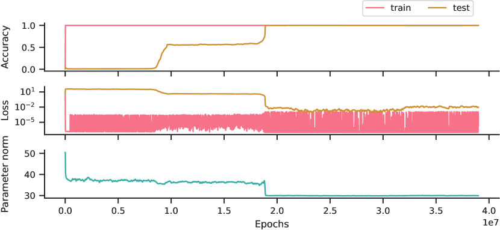

# Varma et al. 2023 — Explaining grokking through circuit efficiency

См. также: [глобальный индекс понятий](../../concepts/index.md).

**Vikrant Varma**, **Rohin Shah** (равный вклад), **Zachary Kenton**, **János Kramár**, **Ramana Kumar** — Google DeepMind.

arXiv [2309.02390](https://arxiv.org/abs/2309.02390), 5 сентября 2023. 100 цитирований — шестая по цитируемости работа корпуса. Нативного HTML для неё нет, источник — ar5iv.

Файлы разбора этой статьи:

- [`2309.02390.explaining-grokking-through-circuit-efficiency.claims.txt`](2309.02390.explaining-grokking-through-circuit-efficiency.claims.txt) — пронумерованные утверждения статьи с пометками разбора.
- [`2309.02390.explaining-grokking-through-circuit-efficiency.license.txt`](2309.02390.explaining-grokking-through-circuit-efficiency.license.txt) — лицензионная запись arXiv для этой статьи.

Схема якорей и правила ссылок на карточку — в [README папки статей](../README.md).

**Карточка-выдержка.** Лицензия статьи (`arxiv-nonexclusive`) не разрешает публикацию копии оригинала и полного перевода, поэтому карточка содержит редакторские секции и цитируемые фрагменты перевода (право цитирования). Полный текст статьи: <https://arxiv.org/abs/2309.02390>.

## Затрагиваемые понятия

**[Эффективность контуров](../../concepts/circuit-efficiency.md)** — работа вводит понятие и делает его объяснительным центром. Эффективность определена операционально: контур тем эффективнее, чем меньше нормы параметров ему нужно, чтобы выдать заданное значение логита ([`p1-6`](#p1-6)). Ключевой тезис — при нескольких контурах, одинаково хорошо решающих обучающую выборку, **weight decay предпочитает более эффективный**. Отсюда и ответ на исходный вопрос гроккинга: если обобщающий контур эффективнее запоминающего, градиентный спуск продолжает снижать почти нулевую потерю, усиливая первый и ослабляя второй.

**[Минимизация нормы весов](../../concepts/weight-norm-minimization.md)** — получает от работы механизм, связывающий норму с выбором решения. Не «меньше норма — лучше обобщение», а «при равной норме побеждает тот контур, что даёт бо́льшие логиты». Это переводит разговор о weight decay из области эвристики в область сравнения двух конкретных решений.

**[Максимизация зазора](../../concepts/margin-maximization-implicit-bias.md)** — берёт ту же формулировку с другой стороны: обобщающее решение «производит бо́льшие логиты при той же норме параметров» ([`p1-3`](#p1-3)), то есть эффективность и есть форма неявного смещения к большему зазору.

**[Доля данных / критический размер набора](../../concepts/data-fraction-critical-dataset-size.md)** — работа вводит **критический размер набора** $D_{\textrm{crit}}$ ([`p1-9`](#p2-1)) как точку пересечения двух кривых эффективности. Обоснование простое и проверяемое: обобщающий контур работает на любых новых данных, поэтому его эффективность от размера выборки не зависит, а запоминающий должен запоминать каждую добавленную точку, поэтому его эффективность падает. У Power et al. 2022 была кривая «меньше данных — дольше до генерализации»; здесь у неё появляется порог и причина.

**[Унгрокинг](../../concepts/ungrokking.md)** — работа **вводит явление**: сеть, уже успешно грокнувшая, возвращается к низкой тестовой точности, если продолжить обучать её на выборке существенно меньше $D_{\textrm{crit}}$. Это предсказание, выведенное из теории до эксперимента, и в этом его ценность: гроккинг оказывается обратимым.

**[Полу-грокинг](../../concepts/semi-grokking.md)** — второе введённое явление: при размере выборки вблизи $D_{\textrm{crit}}$, где оба контура сравнимы по эффективности, происходит фазовый переход, но лишь к средней тестовой точности, а не к идеальной.

**[Фазовый переход](../../concepts/phase-transition.md)** — берёт из работы полу-грокинг как случай перехода, ведущего не к полной генерализации ([`p1-9`](#p2-1)). Это уточняет понятие: резкость перехода и его конечная точка — независимые характеристики.

**[Гроккинг](../../concepts/grokking.md)** — работа даёт понятию механистическое объяснение через конкуренцию двух семейств контуров и формулирует **три достаточных условия**: обобщающий контур обобщает, а запоминающий нет; обобщающий эффективнее; обобщающий выучивается медленнее. Достаточность демонстрируется сконструированной симуляцией, а не только наблюдением.

**[Фаза меморизации](../../concepts/memorization-phase.md)** — берёт формулировку «сеть сначала „запоминает“ данные, достигая низкой и стабильной потери на обучении при плохом обобщении» ([`p1-4`](#p1-4)). В отличие от Power et al., запоминание здесь — не просто предшествующее состояние, а конкурирующее решение со своей эффективностью, которое затем целенаправленно ослабляется.

**[Механистическая интерпретируемость](../../concepts/mechanistic-interpretability.md)** — работа заимствует у направления язык контуров, но с явной оговоркой: внутренние механизмы, «которые мы вольно называем контурами» ([`p1-6`](#p1-6)). Обратного инжиниринга здесь нет — контуры остаются теоретической конструкцией, а не разобранным алгоритмом, как у Nanda et al.

**[Зона Златовласки](../../concepts/goldilocks-zone.md)** — упоминается при обсуждении того, сколько времени регуляризации требуется, чтобы привести норму параметров в нужный диапазон ([`p10-6`](#p10-6)).

Карточки статей корпуса: [Power et al. 2022](../2201.02177.grokking-generalization-beyond-overfitting-on-small-algorithmic-datasets/2201.02177.grokking-generalization-beyond-overfitting-on-small-algorithmic-datasets.card.md) — явление, которое здесь объясняется; [Nanda et al. 2023](../2301.05217.progress-measures-for-grokking-via-mechanistic-interpretability/2301.05217.progress-measures-for-grokking-via-mechanistic-interpretability.card.md) — авторы прямо говорят, что развивают объяснение из её приложения E, то есть берут спекулятивную часть предшественника и превращают её в проверяемую теорию.

**[Поведенческий против истинного грокинга](../../concepts/behavioral-vs-true-grokking.md)** — переход объясняется сменой победителя между двумя решениями, а не появлением нового умения ([`p1-3`](#p1-3)). У границы, задаваемой критическим размером набора ([`p2-1`](#p2-1)), предсказаны режимы, где «грокнул» перестаёт быть двоичным свойством, — то есть само поведенческое определение теряет резкость.
## Что предсказано, а что предположено

Замечания редактора карточки по итогам разбора утверждений (`…claims.txt`). Работа заметно неоднородна по силе обоснования, и при цитировании полезно знать, из какой её части взят тезис.

**Предсказательная часть сильна и стоит особняком в корпусе.** Критический размер набора выведен из простого соображения — обобщающий контур не меняется при добавлении данных, запоминающий меняется, — и из него **до эксперимента** получены два утверждения, которые затем подтвердились количественно: резкий переход тестовой точности вблизи $D_{\textrm{crit}}$ и независимость итоговой точности после унгрокинга от силы weight decay (кривые для разных значений накладываются). Само явление унгрокинга до этой работы не описывалось. Это редкий для корпуса случай, когда теория сначала предсказала, а потом нашла.

**Объяснительная часть вокруг полу-грокинга держится на цепочке предположений.** Наблюдения твёрдые: запуск удерживается на средней точности миллионы эпох, иногда проходит несколько плато, затем обобщает идеально. Истолкование же строится ступенями, ни одна из которых не проверяется: разброс по сидам объясняется тем, что у одного алгоритма много контуров разной эффективности; затем предполагается, что у $C_{\text{gen}}\,$таких контуров несколько и более эффективные выучиваются медленнее; затем этим объясняется преходящий полу-грокинг; и наконец высказывается, что при более долгом обучении большинство запусков дошли бы до полного гроккинга. Последнее существенно: если оно верно, полу-грокинг — не устойчивое состояние, а стадия недообученности. Сами авторы согласуются с этой оценкой, отмечая в [§5.3](#sec-5-3), что полу-грокинг из теории строго не следует.

**Три ограничения авторы признают сами, и два из них спрятаны в приложениях.**

- Объяснение опирается на weight decay, а гроккинг наблюдается и без него — «это показывает, что наше объяснение неполно» ([§7](#sec-7)). Ответ на это (вероятно, есть другой эффект со схожим действием) не проверяется, и рядом стоит «в целом мы уверены».
- $D_{\textrm{crit}}$ назван «чрезмерно упрощённым понятием», поскольку инициализация и динамика решают, какие контуры будут найдены ([A.2](#sec-a-2)). Это касается центрального понятия теории и в основной текст не вынесено.
- Прокси-метрики силы контуров смещены, и как именно — перечислено авторами: логиты обоих контуров коррелируют, поэтому проекция захватывает и запоминание, сила обобщающего контура переоценивается ([приложение B](#sec-b)). На этих же метриках построены выводы приложений A.3 и A.4.

**Отдельно: перенос объяснения на обучение в контексте — гипотеза в обзоре литературы, и цитируется она чаще, чем заслуживает.** В [§6](#sec-6) авторы предполагают, что эффективностью контуров объясняется и наблюдение Singh et al.: обучение в контексте от индукционных голов вытесняется обучением в весах при отсутствии weight decay, но удерживается при его наличии. Это единственное место, где теория покидает модульную арифметику, и заявка крупная — тот же механизм в языковых моделях. За ней нет ни одного эксперимента: работа, на которую опираются, значится в списке литературы как *Forthcoming*, а сам перенос держится на отождествлении «индукционные головы = обобщающий алгоритм», которое здесь принимается, а не обосновывается. Формулировка авторов честна («мы **выдвигаем гипотезу**»), и абзац стоит в обзоре литературы, а не в результатах, — но цитируют это место обычно как «Varma et al. распространили объяснение на обучение в контексте», теряя гипотетический статус. По устройству риска случай тот же, что с [приложением E](../2301.05217.progress-measures-for-grokking-via-mechanistic-interpretability/2301.05217.progress-measures-for-grokking-via-mechanistic-interpretability.card.md#sec-e-1) у Nanda et al.

**Методологические условия, о которых стоит помнить, цитируя количественные результаты.** Вклад запоминания определяется **как остаток** после проекции на тригонометрическое подпространство — при явной оговорке, что алгоритм запоминания авторам непонятен, и при гипотезе, что существенных семейств контуров ровно два. Критерий «чистой» обобщающей сети ($>95\%$ нормы логитов в тригонометрическом подпространстве) осмыслен только для модульного сложения, так что ключевой эксперимент об эффективности поставлен на одной задаче. А в A.4 все параметры инициализировались из уже обученной $C_{\text{gen}}\,$-сети, то есть показано поведение смеси контуров, а не её возникновение.

## Ошибочные цитирования

Замечания редактора карточки: места, где эта статья передаёт чужие результаты с ошибкой или без авторских оговорок. Сюда ведут ссылки «подробности» из разделов «Ошибочные пересказы и цитирования этой статьи» карточек процитированных работ.

###### mc-2301-05217
**Nanda et al. (2301.05217) — приложению D.1 приписано «медленнее и труднее».** `"grokking has been observed even when weight decay is not present (Power et al., 2021; Thilak et al., 2022) (though it is slower and often much harder to elicit (Nanda et al., 2023, Appendix D.1))"` — сама фраза о гроккинге без weight decay точна и является образцом аккуратности, но подпорка каветы выбрана неудачно: [D.1 утверждает необходимость регуляризации](../2301.05217.progress-measures-for-grokking-via-mechanistic-interpretability/2301.05217.progress-measures-for-grokking-via-mechanistic-interpretability.card.md#sec-d-1) — [без weight decay или иной регуляризации сети авторов не грокают вовсе](../2301.05217.progress-measures-for-grokking-via-mechanistic-interpretability/2301.05217.progress-measures-for-grokking-via-mechanistic-interpretability.card.md#sec-5-3), а не «медленнее и труднее». «Slower» в D.1 относится к малому, но ненулевому weight decay — и притом противоречит собственным числам D.1 (см. карточку цели, «Несогласованности внутри статьи»). Во всех остальных местах статья цитирует цель образцово: пиновые ссылки на рисунки, приложение E корректно названо «perspective».

## Ошибочные пересказы и цитирования этой статьи

Узоры ошибочного или расширенного цитирования этой работы, наблюдённые в цитирующих статьях корпуса. Каждая запись описывает, что именно искажается при пересказе, и ведёт к абзацам самих авторов, где стоит теряемая оговорка. Разбор конкретных формулировок — в карточках цитирующих работ, в их разделах «Ошибочные цитирования», куда ведут ссылки «подробности».

**«Sparse-генерализующие против dense-запоминающих подсетей» (расширяющее — чужой тезис приписан и этой работе).** Четыре работы корпуса подают конкуренцию контуров этой статьи как соревнование разреженной генерализующей и плотной запоминающей подсетей. Структурный тезис о разреженности принадлежит [Merrill et al.](../2303.11873.a-tale-of-two-circuits-grokking-as-competition-of-sparse-and-dense-subnetworks/2303.11873.a-tale-of-two-circuits-grokking-as-competition-of-sparse-and-dense-subnetworks.card.md) и подтверждён там для sparse parity; у Varma же контуры — [«внутренние механизмы… которые мы вольно называем контурами»](#p1-6): они не локализованы, и об их разрежённости или плотности работа не говорит ничего. Групповое цитирование «(Merrill et al., 2023; Varma et al., 2023)» стирает границу между измеренной структурой и абстрактной эффективностью. Подробности: [2504.13292](../2504.13292.let-me-grok-for-you-accelerating-grokking-via-embedding-transfer-from-a-weaker-model/2504.13292.let-me-grok-for-you-accelerating-grokking-via-embedding-transfer-from-a-weaker-model.card.md#mc-2309-02390); более мягкие отголоски: [2603.15492](../2603.15492.grokking-as-a-variance-limited-phase-transition-spectral-gating-and-the-epsilon-stability-threshold/2603.15492.grokking-as-a-variance-limited-phase-transition-spectral-gating-and-the-epsilon-stability-threshold.card.md), [2512.03437](../2512.03437.grokked-models-are-better-unlearners/2512.03437.grokked-models-are-better-unlearners.card.md), [2403.03942](../2403.03942.the-heuristic-core-understanding-subnetwork-generalization-in-pretrained-language-models/2403.03942.the-heuristic-core-understanding-subnetwork-generalization-in-pretrained-language-models.card.md).

**Ungrokking и semi-grokking без авторских условий (ошибочное).** Оба введённых работой термина при пересказе теряют определяющие условия. Унгрокинг — это регресс [уже грокнувшей сети при дообучении на наборе много меньше критического](#p2-1); обучение с нуля на малых данных, где генерализации просто не наступает, унгрокингом не является. Полу-грокинг возникает [в окрестности критического размера данных, причём сами авторы предупреждают, что «из нашей теории он строго не следует»](#sec-5-3), и при более длительном обучении многие запуски догрокали бы; режим «ниже порога» и «устойчивое равновесие» — привнесённые прочтения. А критический размер $D_{crit}$ авторы сами называют [«чрезмерно упрощённым понятием»](#sec-a-2) — цитирующие превращают его в конкретное число «около 25 процентов». Подробности: [2402.15175](../2402.15175.unified-view-of-grokking-double-descent-and-emergent-abilities/2402.15175.unified-view-of-grokking-double-descent-and-emergent-abilities.card.md#mc-2309-02390), [2511.04760](../2511.04760.when-data-falls-short-grokking-below-the-critical-threshold/2511.04760.when-data-falls-short-grokking-below-the-critical-threshold.card.md#mc-2309-02390).

**Circuit efficiency как механизм гроккинга вообще (расширяющее).** Объяснение через эффективность цитируют без ограничения, которое авторы вынесли в собственный раздел ограничений: [«оно решающим образом опирается на weight decay… наше объяснение неполно»](#sec-7). Формулировки вида «когда оба контура сформированы, генерализующий доминирует» теряют и это условие, и зависимость от объёма данных. Отдельный случай — перенос механизма на новые домены с переопределением самой «эффективности»: [2405.15071](../2405.15071.grokked-transformers-are-implicit-reasoners/2405.15071.grokked-transformers-are-implicit-reasoners.card.md#mc-2309-02390) применяет его к многошаговому рассуждению в графах знаний, меряя эффективность числом хранимых фактов вместо нормы параметров; перенос частично подтверждён их же экспериментом с weight decay, но подан как объяснение, а не гипотеза. Внутри корпуса никто не цитирует гипотетический перенос самих авторов на in-context learning (раздел 6, запись overcited в блоке фактов) — этот случай сверхцитирования живёт вне корпуса. Подробности: [2405.15071](../2405.15071.grokked-transformers-are-implicit-reasoners/2405.15071.grokked-transformers-are-implicit-reasoners.card.md#mc-2309-02390), [2510.04930](../2510.04930.egalitarian-gradient-descent-a-simple-approach-to-accelerated-grokking/2510.04930.egalitarian-gradient-descent-a-simple-approach-to-accelerated-grokking.card.md#mc-2309-02390); мягкий отголосок: [2504.20752](../2504.20752.grokking-in-the-wild-data-augmentation-for-real-world-multi-hop-reasoning-with-transformers/2504.20752.grokking-in-the-wild-data-augmentation-for-real-world-multi-hop-reasoning-with-transformers.card.md).

Образцы аккуратного цитирования: [2310.06110](../2310.06110.grokking-as-the-transition-from-lazy-to-rich-training-dynamics/2310.06110.grokking-as-the-transition-from-lazy-to-rich-training-dynamics.card.md) — структурированное несогласие с центральным тезисом при принятии двух периферийных; 2506.04434 и 2602.02859 — точное определение унгрокинга с условиями и явной границей применимости теории (предпосылка weight decay); [2509.21519](../2509.21519.provable-scaling-laws-of-feature-emergence-from-learning-dynamics-of-grokking/2509.21519.provable-scaling-laws-of-feature-emergence-from-learning-dynamics-of-grokking.card.md) — тезис назван «empirical hypothesis», собственная реинтерпретация помечена как своя.

---

# Цитируемые фрагменты перевода

Ниже приведены только те фрагменты перевода, на которые ссылаются карточки корпуса (право цитирования). Нумерация якорей `pN-M` / `fig-N` / `sec-X` совпадает с полной карточкой и оригиналом.

## Аннотация

###### p1-3

Одна из самых удивительных загадок генерализации нейросетей — *гроккинг*: сеть с идеальной точностью на обучении, но плохой генерализацией при дальнейшем обучении переходит к идеальной генерализации. Мы предлагаем объяснение: гроккинг возникает, когда задача допускает и обобщающее, и [запоминающее](../../concepts/memorization-phase.md) решение, причём обобщающее выучивается медленнее, но оказывается более *эффективным* — производит бо́льшие логиты при той же [норме параметров](../../concepts/weight-norm-minimization.md). Мы выдвигаем гипотезу, что запоминающие [контуры](../../concepts/circuit-efficiency.md) становятся менее эффективными с ростом обучающего набора, тогда как обобщающие — нет, а значит, существует [критический размер набора данных](../../concepts/data-fraction-critical-dataset-size.md), при котором запоминание и обобщение одинаково эффективны. Мы делаем и подтверждаем четыре новых предсказания о гроккинге, что даёт весомые свидетельства в пользу нашего объяснения. Самое разительное: мы демонстрируем два новых и неожиданных поведения — *[унгрокинг](../../concepts/ungrokking.md)*, при котором сеть скатывается с идеальной тестовой точности к низкой, и *[полу-грокинг](../../concepts/semi-grokking.md)*, при котором сеть демонстрирует отложенную генерализацию к частичной, а не идеальной тестовой точности.

## 1 Введение

###### p1-4

Обучая нейросеть, мы ожидаем, что, как только потеря на обучении сойдётся к малому значению, сеть перестанет существенно меняться. Power et al. (2021) обнаружили явление, названное *гроккингом*, которое резко нарушает это ожидание. Сеть сначала «запоминает» данные, достигая низкой и стабильной потери на обучении при плохой генерализации, но при дальнейшем обучении переходит к идеальной генерализации. Остаётся вопрос: *почему тестовое качество сети резко улучшается при продолжении обучения, когда качество на обучении уже почти идеально?*

###### p1-6

Мы анализируем взаимодействие внутренних механизмов, которыми нейросеть вычисляет выходы и которые мы вольно называем «контурами» (Olah et al., 2020). Мы выдвигаем гипотезу, что существуют два семейства контуров, оба достигающих хорошего качества на обучении: одно хорошо обобщает ($C_{\text{gen}}\,$), другое запоминает обучающий набор ($C_{\text{mem}}\,$). Ключевое наблюдение: *когда есть несколько контуров, дающих сильное качество на обучении, [weight decay](../../concepts/weight-decay.md) предпочитает контуры с высокой «эффективностью»* — то есть такие, которым нужно меньше нормы параметров, чтобы выдать заданное значение логита.

###### p2-1

Отсюда следует, что существует точка пересечения, в которой $C_{\text{gen}}\,$становится эффективнее $C_{\text{mem}}\,$; мы называем её критическим размером набора данных $D_{\textrm{crit}}$. Анализируя динамику при $D_{\textrm{crit}}$, мы предсказываем и демонстрируем два новых поведения (рисунок 1). При *унгрокинге* модель, успешно грокнувшая, возвращается к плохой тестовой точности, если её дообучать на наборе, существенно меньшем $D_{\textrm{crit}}$. При *полу-грокинге* мы выбираем размер набора, при котором $C_{\text{gen}}\,$и $C_{\text{mem}}\,$сравнимы по эффективности, что приводит к [фазовому переходу](../../concepts/phase-transition.md), но лишь к средней тестовой точности.

## 3 Три составляющие гроккинга

###### p3-6

Когда у нас есть *несколько* контуров, достигающих сильного качества на обучении, это ограничение применимо к каждому по отдельности. Но как они соотносятся друг с другом? Интуитивно ответ зависит от *эффективности* каждого контура — то есть от того, насколько контур способен превращать относительно малые параметры в относительно большие логиты. Для более эффективных контуров сила $\mathcal{L}_{\textrm{x-ent}}$, тянущая к бо́льшим параметрам, сильнее, а сила $\mathcal{L}_{\textrm{wd}}$, тянущая к меньшим, слабее. Поэтому мы ожидаем, что в любом локальном минимуме более эффективные контуры окажутся сильнее.

###### p3-9

1. **Обобщающий контур.** Есть два семейства контуров, достигающих хорошего качества на обучении: запоминающее семейство $C_{\text{mem}}\,$с плохим тестовым качеством и обобщающее семейство $C_{\text{gen}}\,$с хорошим.
2. **Эффективность.** $C_{\text{gen}}\,$«эффективнее» $C_{\text{mem}}\,$, то есть способен дать ту же кросс-энтропийную потерю на обучающем наборе при меньшей норме параметров.
3. **Медленное против быстрого обучения.** $C_{\text{gen}}\,$выучивается медленнее $C_{\text{mem}}\,$, так что на ранних фазах обучения $C_{\text{mem}}\,$сильнее $C_{\text{gen}}\,$.

#### Унгрокинг

###### p6-6

Унгрокинг можно рассматривать как частный случай катастрофического забывания (McCloskey and Cohen, 1989; Ratcliff, 1990), но здесь мы можем делать гораздо более точные предсказания. Во-первых, поскольку унгрокинга следует ожидать только при $D^{\prime}<D_{\textrm{crit}}$, при варьировании $D^{\prime}$ мы предсказываем резкий переход от очень высокой тестовой точности к почти случайной (примерно при $D_{\textrm{crit}}$). Во-вторых, мы предсказываем, что унгрокинг возникнет, даже если мы только удаляем примеры из обучающего набора, тогда как катастрофическое забывание обычно предполагает и обучение на новых примерах. В-третьих, поскольку $D_{\textrm{crit}}$ не зависит от weight decay, мы предсказываем, что и величина «забывания» (то есть тестовая точность при сходимости) от weight decay не зависит.

## 5 Экспериментальные свидетельства

###### p7-5

1. **Обобщающий контур.** Nanda et al. (2023, рисунок 1) выделяют и характеризуют обобщающий контур, выученный к концу гроккинга в случае [модульного сложения](../../concepts/modular-arithmetic.md).
2. **Медленное против быстрого обучения.** Nanda et al. (2023, рисунок 7) демонстрируют «[меры прогресса](../../concepts/progress-measures.md)», показывающие, что обобщающий контур развивается и усиливается ещё долго после того, как сеть достигает идеальной точности на обучении в модульном сложении.

#### Постановка эксперимента

###### p7-12

Сети только с $C_{\text{mem}}\,$мы получаем, используя для обучающих данных полностью случайные метки (Zhang et al., 2021), и предполагаем, что вся норма параметров при сходимости отведена на запоминание. Сети только с $C_{\text{gen}}\,$мы получаем, обучая на больших размерах набора и проверяя, что $>95\%$ нормы логитов приходится лишь на тригонометрическое подпространство (подробности — в приложении B).

###### sec-5-3

### 5.3 Полу-грокинг: контуры на равных

###### sec-6

## 6 Связанные работы

#### Гроккинг

###### p10-6

С тех пор как Power et al. (2021) обнаружили гроккинг, многие работы пытались понять, почему он происходит. Thilak et al. (2022) предполагают, что за гроккинг могут отвечать «рогатки», особенно в отсутствие weight decay, а Notsawo Jr et al. (2023) обсуждают схожее явление «колебаний». В отличие от них, наше объяснение работает и там, где нет ни рогаток, ни колебаний (как в большинстве наших экспериментов). Liu et al. (2022) показывают, что для конкретной (немодульной) задачи сложения при невыразительной архитектуре идеальная генерализация наступает, когда данных достаточно, чтобы определить подходящее структурированное представление. Однако такая теория не объясняет полу-грокинга. Мы утверждаем, что для более типичных задач, на которых возникает гроккинг, критическим фактором является всё же относительная эффективность $C_{\text{mem}}\,$и $C_{\text{gen}}\,$. Liu et al. (2023) показывают, что гроккинг возникает и на неалгоритмических задачах, когда параметры инициализируются очень большими, поскольку тогда регуляризации требуется больше времени, чтобы привести норму параметров в «зону Златовласки», где происходит обобщение.

###### sec-7

## 7 Обсуждение

###### sec-a

Во всех экспериментах мы используем однослойные decoder-only трансформеры (Vaswani et al., 2017) с обучаемыми позиционными эмбеддингами и несвязанными матрицами эмбеддинга и разэмбеддинга. Гиперпараметры таковы: $d_{\text{model}}=128$ — ширина остаточного потока, $d_{\text{head}}=32$ — размер векторов запроса, ключа и значения для каждой головы внимания, $d_{\text{mlp}}=512$ — число нейронов в скрытом слое MLP; голов в слое самовнимания $d_{\text{model}}/d_{\text{head}}=4$. Мы оптимизируем сеть полнобатчевым обучением (то есть используя весь обучающий набор на каждом обновлении) оптимизатором AdamW (Loshchilov and Hutter, 2019) с $\beta_{1}=0.9$, $\beta_{2}=0.98$, скоростью обучения $10^{-3}$ и weight decay $1.0$. В части экспериментов мы варьируем weight decay, чтобы получить сети с разной нормой параметров.

## Приложение A Детали экспериментов и дополнительные свидетельства

### A.1 Полу-грокинг

###### fig-6

*Рисунок 6: **Подробный разбор одного запуска с полу-грокингом. Мы приводим точность, потерю и норму параметров по ходу обучения для одного специально отобранного запуска на модульном сложении при размере набора 1532 (12 % полного набора). Этот запуск показывает преходящий полу-грокинг. На эпохе $0.8\times 10^{7}$ тестовая точность поднимается примерно до $0.55$ и остаётся там $10^{7}$ эпох, поскольку эффективности $C_{\text{gen}}\,$и $C_{\text{mem}}\,$уравновешены. На эпохе $1.8\times 10^{7}$ мы предполагаем, что градиентный спуск находит ещё более эффективный контур $C_{\text{gen}}\,$, так как норма параметров резко падает, а тестовая точность поднимается до 1. На эпохе $3.2\times 10^{7}$ мы видим, что тестовая потеря *растёт*, и не знаем почему. **[p. 17]** По-видимому, фаз несколько — возможно, они соответствуют переходам сети между смесями нескольких контуров с растущей эффективностью, — но нужны дальнейшие исследования.*** **[p. 16]**

###### sec-a-2

### A.2 Унгрокинг

###### p17-3

Мы уже видели, что на $D_{\textrm{crit}}$ влияет случайная инициализация. Интересно сравнить $D_{\textrm{crit}}$ при старте с заданной случайной инициализации и при унгрокинге из сети, обученной до полной генерализации с той же случайной инициализации. Рисунок 5 показывает запуск с полу-грокингом, достигающий тестовой точности $\sim$0.7 при размере набора $\sim$2000, тогда как рисунок 7 показывает запуски с унгрокингом, достигающие тестовой точности $\sim$0.7 при размере набора около 800–1000 — меньше половины того, что потребовалось запуску с полу-грокингом.

###### sec-b

## Приложение B $C_{\text{gen}}\,$и $C_{\text{mem}}\,$в модульном сложении
