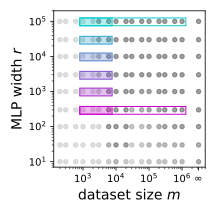
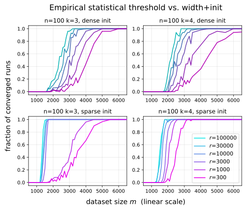

# Edelman, Goel, Kakade, Malach & Zhang 2023 — Pareto Frontiers in Neural Feature Learning: Data, Compute, Width, and Luck

См. также: [глобальный индекс понятий](../../concepts/index.md).

**Benjamin L. Edelman** (Гарвард), **Surbhi Goel** (Университет Пенсильвании), **Sham Kakade** (Гарвард), **Eran Malach** (Еврейский университет в Иерусалиме), **Cyril Zhang** (Microsoft Research NYC).

arXiv [2309.03800](https://arxiv.org/abs/2309.03800), сентябрь 2023, версия v2 (октябрь 2023), NeurIPS 2023, 38 страниц, 6 рисунков (9 панелей), 2 таблицы. Всего цитирований по Semantic Scholar — 14, в картотеке — 1. Прямое продолжение Barak et al. 2022 «Hidden Progress» тем же составом (пятеро авторов из шести): офлайновая разрежённая чётность разобрана как **доказуемый многоресурсный фронт компромисса** — обучение удаётся, если учащийся достаточно богат (ширина), знающ (данные), терпелив (время) или удачлив (перезапуски), — и ширина получает роль параллельного поиска «лотерейных билетов». Гроккинг здесь — наблюдение на кромке этого фронта: у нижней границы годных размеров выборки оптимизация требует значительно большего числа шагов.

Файлы разбора этой статьи:

- [`2309.03800.pareto-frontiers-in-neural-feature-learning-data-compute-width-and-luck.claims.txt`](2309.03800.pareto-frontiers-in-neural-feature-learning-data-compute-width-and-luck.claims.txt) — пронумерованные утверждения статьи с пометками разбора.
- [`2309.03800.pareto-frontiers-in-neural-feature-learning-data-compute-width-and-luck.license.txt`](2309.03800.pareto-frontiers-in-neural-feature-learning-data-compute-width-and-luck.license.txt) — лицензионная запись arXiv для этой статьи.

Схема якорей и правила ссылок на карточку — в [README папки статей](../README.md).

**Карточка-выдержка.** Лицензия статьи (`arxiv-nonexclusive`) не разрешает публикацию копии оригинала и полного перевода, поэтому карточка содержит редакторские секции и цитируемые фрагменты перевода (право цитирования). Полный текст статьи: <https://arxiv.org/abs/2309.03800>.

## Затрагиваемые понятия

**[Разрежённая чётность](../../concepts/sparse-parity.md)** — носитель всей работы: офлайновая $(n,k)$-чётность как задача, статистически лёгкая ($\Theta(k\log n)$ примеров) и вычислительно трудная ($n^{\Omega(k)}$), причём «maximally hard» в строгом смысле — её SQ-размерность равна числу гипотез ([`p4-1`](#p4-1), [`p4-3`](#p4-3), [`p10-1`](#p10-1)). Классическая нижняя граница статистических запросов прочитана не как запрет, а как фронт размена четырёх ресурсов ([`p5-2`](#p5-2)).

**[Гроккинг](../../concepts/grokking.md)** — статья даёт корпусу самую связную привязку явления к **доказанному** пределу: раз $m\approx 1/\tau^{2}$, условие успеха требует $rT/(\tau^{2}\delta)>\binom{n}{k}/2$, и при падении $m$ обязано расти время $T$ ([`p5-10`](#p5-10)). Опытно размен «данные против времени» локализован «в режиме гроккинга (на краю осуществимости)» ([`fig-2`](#fig-2), [`p9-1`](#p9-1)): гроккинг здесь не свойство задачи вообще, а **пограничное** явление ресурсного фронта. Само определение взято заимствованно — «скачкообразная и отложенная генерализация, вызванная динамикой оптимизации» ([`p2-3`](#p2-3)).

**[Критический объём данных](../../concepts/data-fraction-critical-dataset-size.md)** — «наименьшее годное $m$» получает смысл кромки ресурсного фронта, под которой лежит доказанная нижняя граница; при этом признано прямо, что ни у теории, ни у опыта нет разрешения, чтобы предсказать, как оно зависит от $n,k,r$ ([`p33-3`](#p33-3)).

**[Двойной спуск](../../concepts/double-descent.md)** — «повыборочный двойной спуск» снят на тех же прогонах, что и гроккинг: с ростом $m$ сеть входит в первую область успеха и выходит из неё, а при больших $m$ успех возвращается; объяснять авторы не берутся ([`p9-1`](#p9-1), [`p33-3`](#p33-3)). Полезная корпусу привязка: оба явления — соседи на одной оси $m$.

**[Разреженная подсеть и лотерейный билет](../../concepts/sparse-subnetwork-lottery-ticket.md)** — центральный механизм: каждый нейрон имеет свою выборочную сложность по фурье-зазору на инициализации, сеть работает как ансамбль, и общую сложность определяют «счастливые билеты» ([`p2-2`](#p2-2), [`p7-6`](#p7-6)). Прямая проверка в стиле Frankle & Carbin: обрезка до пяти лучших нейронов с откатом весов к инициализации учится быстро, случайные подсети того же размера — нет ([`p33-4`](#p33-4), [`fig-5`](#fig-5)).

**[Нейронное касательное ядро](../../concepts/neural-tangent-kernel-ntk.md)** — заявленный контраст: в NTK-режиме переопределённость **убирает** зависящий от данных отбор признаков, а здесь распараллеливает его; ни одно фиксированное ядро не решает $(n,k)$-чётность без $\Omega(n^{k})$ примеров ([`p6-6`](#p6-6), [`p2-2`](#p2-2)).

**[Возникновение признаков](../../concepts/feature-emergence-feature-learning.md)** — верхние границы (Теоремы 4 и 5) дают семейство доказуемых механизмов отбора признаков: пере-разрежённое начало со сквозной гарантией и недо-разрежённое, где после одного шага градиента существует подсеть, вычисляющая чётность ([`p7-5`](#p7-5), [`p8-1`](#p8-1)). Ширина монотонно полезна во всех настройках сетки — прямо против оценок равномерной сходимости ([`p9-1`](#p9-1)).

**[Ослабление весов](../../concepts/weight-decay.md)** — в теоремах $\ell_{2}$-регуляризация — рабочий инструмент доказательств (срезание плохих нейронов); в опытах $\lambda=0.01$ закреплено на всей сетке, и при этом сообщено, что положения переходов двойного спуска чувствительны к затуханию весов ([`p33-3`](#p33-3)).

## Что показано, а что предположено

Замечания редактора карточки по итогам разбора утверждений (`…claims.txt`, 45 пунктов).

**Доказано ровно два размена, и ни один из них — не «данные против времени».** Нижняя граница (Предложение 3) связывает четыре ресурса ($r$, $T$, $\tau$, $\delta$) как необходимое условие; верхние границы (Теоремы 4 и 5) разменивают **данные против ширины** через один параметр разрежённости инициализации $s$. Размен «данные против времени», ради которого статью чаще всего цитируют, — опытное наблюдение медианного времени до порога, доказательной части не имеющее: время в теоремах либо $O(1/\epsilon^{2})$, либо один шаг.

**Сильные места.** Фронт успеха при $m\ll n^{k}$ — далеко вне онлайнового режима Barak et al. 2022, и обеспечен именно шириной; монотонная польза ширины во **всех** настройках сетки (около $2\times10^{5}$ прогонов, по 50 на точку); Теорема 4 воспроизводит результат Barak et al. как крайнюю точку однопараметрического семейства — редкий случай, когда прежний результат становится частным случаем нового.

**Оговорки к опытной части.** Опыты почти не пересекаются с условиями теорем: в сетке $s=2$ — недо-разрежённый случай, покрытый лишь Теоремой 5, которая требует чётных $k$ и $s$ (так что $k=3$ вне разбора) и гарантирует существование подсети, а не что обучение её выделит. Успех цензурирован порогом $T=10^{5}$: прогон, который гроккнул бы позже, засчитан как неудача, и часть немонотонности по $m$ может быть следствием отсечки — авторы этого не обсуждают. Гиперпараметры подобраны в одной точке сетки и закреплены; развёрток по $\lambda$ нет. Разрыв между обучающей и тестовой кривыми — то, чем гроккинг отличается от долгого плато, — количественно не снимается ни в одном опыте. Опыт с лотерейным билетом поставлен в единственной онлайновой настройке. Лучшая разрежённость $s=2$ признана непонятой («we do not fully understand why this is the case»).

**Табличная часть предварительная — по признанию авторов.** На полных данных лучший MLP выигрывает у случайного леса примерно в половине из 16 задач, а на 1 % данных — лишь в двух; именно в малоданной области, ради которой строилась теория, разрыв с деревьями не закрывается. «Лучший MLP» — максимум по всему пространству поиска устройств.

**Внутренние шероховатости.** Одно и то же утверждение зовётся то «Theorem 3» (введение, §3.1, §4.2), то «Proposition 3» (формулировка и доказательство). Плотная инициализация теорем не имеет вовсе: перенос принципа «параллельный поиск со случайной посубсетевой сложностью» на неё объявлен верой, подкреплённой опытом.

**Как работу будут цитировать** («доказан размен данных и времени при гроккинге») — точнее: доказан SQ-барьер, связывающий $r,T,\tau,\delta$, и доказан размен данные–ширина; размен данные–время — опытное наблюдение на сетке $n\le300$, $k\in\{3,4\}$ при закреплённых $\eta,\lambda,B$ и отсечке $T=10^{5}$.

---

# Цитируемые фрагменты перевода

Ниже приведены только те фрагменты перевода, на которые ссылаются карточки корпуса (право цитирования). Нумерация якорей `pN-M` / `fig-N` / `sec-X` совпадает с полной карточкой и оригиналом.

##### **Неформальная теорема 1****.**

###### p2-2

Интуитивно этот разбор вскрывает механизм обучения признаков, в котором переопределённость (то есть большая ширина сети) играет роль параллельного поиска по случайным подсетям. Каждый отдельный нейрон скрытого слоя имеет собственную выборочную сложность опознания значимых координат, определяемую его *фурье-зазором* (Barak et al., 2022) на инициализации. Обучаемая параллельными градиентными обновлениями, полная сеть неявно действует как ансамбль над этими нейронами, чья итоговая выборочная сложность определяется «выигрышными лотерейными билетами» (Frankle and Carbin, 2018) (то есть удачливыми нейронами, инициализированными с наименьшей выборочной сложностью). Это существенно расходится с режимом *нейронного касательного ядра* (Jacot et al., 2018) приближения функций широкими сетями, в котором переопределённость *убирает* зависящий от данных отбор признаков (а не распараллеливает его по подсетям).

#### Эмпирическое исследование статистических порогов нейросетей при обучении разрежённой чётности.

###### p2-3

Мы подкрепляем теоретический разбор систематическим эмпирическим исследованием офлайнового обучения разрежённой чётности посредством SGD на MLP, демонстрирующим некоторые (возможно) контринтуитивные эффекты ширины, данных и инициализации. Например, рисунок 1 подчёркивает наше эмпирическое исследование взаимодействий между данными, шириной и вероятностью успеха. Левый рисунок показывает доли успешных прогонов обучения как функцию размера набора данных (ось x) и ширины (ось y). Грубо говоря, мы видим «фронт успеха», где большая ширина разменивается на меньшие размеры выборки. Правый рисунок изображает некоторые кривые обучения (для различных ширин и размеров выборки). Гроккинг (Power et al., 2022; Liu et al., 2022) (скачкообразное и отложенное поведение генерализации, вызванное динамикой оптимизации) очевиден на некоторых из этих графиков.

### 2.1 Чётности и алгоритмы обучения чётности

###### p4-1

Лампочка управляется $k$ из $n$ бинарных переключателей; каждый из $k$ влиятельных переключателей может перещёлкнуть состояние лампочки из любой конфигурации. Задача обучения чётности — опознать подмножество из $k$ важных переключателей, имея доступ к $m$ независимым равномерным примерам состояния всех $n$ переключателей. Формально, для любых $1\leq k\leq n$ и $S\subseteq[n]$ таких, что $|S|=k$, функция чётности $\chi_{S}:\{\pm 1\}^{n}\rightarrow\pm 1$ определяется как $\chi_{S}(x_{1:n}):=\prod_{i\in S}x_{i}$.11 1 Эквивалентно, чётность можно представить как функцию битовой строки $b\in\{0,1\}^{n}$, вычисляющую XOR влиятельного подмножества индексов $S$: $\chi_{S}(b_{1:n}):=\oplus_{i\in S}b_{i}$. Задача обучения $(n,k)$-чётности — опознать $S$ по примерам $(x\sim\mathrm{Unif}(\{\pm 1\}^{n},y=\chi_{S}(x)))$; то есть выдать классификатор со $100$-процентной точностью на этом распределении, без предварительного знания $S$.

###### p4-3

1. **Элементы мономиального базиса:** $k$-разрежённая чётность — это моном степени $k$, а значит аналог коэффициента Фурье с «частотой» $k$ в гармоническом анализе булевых функций (O’Donnell, 2014). Чётности образуют важный базис для алгоритмов полиномиального обучения (например, Andoni et al., 2014).
2. **Вычислительная трудность:** для этой задачи широко предполагается *вычислительно-статистический разрыв* (Applebaum et al., 2009; Applebaum et al., 2010), доказанный в ограниченных моделях, таких как SQ (Kearns, 1998) и потоковые (Kol et al., 2017) алгоритмы. Статистический предел — $\Theta(\log(\text{number of possibilities for }S))=\Theta(k\log n)$ примеров, но объём вычислений (для алгоритма, терпимого к $O(1)$ доле шума), как предполагается, растёт как $\Omega(n^{ck})$ для некоторой константы $c>0$ — то есть существенного улучшения по сравнению с перебором всех подмножеств нет.
3. **Обучение признаков:** эта постановка схватывает обучение концепта, зависящего совместно от нескольких атрибутов входа, где взаимодействия младших порядков (то есть корреляции с чётностями степени $k^{\prime}<k$) не дают никакой информации об $S$. Интуитивно, примеры из распределения разрежённой чётности выглядят случайным шумом, пока учащийся не опознал разрежённое взаимодействие. Это понятие сложности обучения признаков схватывается и более общим *информационным показателем* (Ben Arous et al., 2021).

### 3.1 Нижняя граница: многоресурсный фронт трудности

###### p5-2

В этом разделе мы показываем версию SQ-нижней границы. Пусть мы оптимизируем некоторую модель $h_{\theta}$, где $\theta\in{\mathbb{R}}^{r}$ (то есть $r$ параметров). Пусть $\ell$ — некоторая функция потерь, удовлетворяющая $\ell^{\prime}(\hat{y},y)=-y+\ell_{0}(\hat{y})$; например, можно взять $\ell_{2}(\hat{y},y)=\frac{1}{2}(y-\hat{y})^{2}$. Зафиксируем некоторую гипотезу $h$, цель $f$, выборку ${\cal S}\subseteq\{\pm 1\}^{n}$ и распределение ${\cal D}$ над $\{\pm 1\}^{n}$. Обозначим эмпирическую потерю $L_{\cal S}(h,f)=\frac{1}{\left\lvert{\cal S}\right\rvert}\sum_{{\mathbf{x}}\in{\cal S}}\ell(h({\mathbf{x}}),f({\mathbf{x}}))$ и популяционную потерю $L_{\cal D}(h,f):=\mathbb{E}_{{\mathbf{x}}\sim{\cal D}}\left[\ell(h({\mathbf{x}}),f({\mathbf{x}}))\right]$. Мы рассматриваем SGD-обновления вида:

##### **Предложение 3****.**

###### p5-10

*Пусть $\theta_{0}$ случайно выбирается из некоторого распределения. Для всяких $r,T,\delta,\tau>0$, если $\frac{rT}{\tau^{2}\delta}\leq\frac{1}{2}\binom{n}{k}$, то найдётся некоторая $(n,k)$-чётность, такая что с вероятностью не менее $1-\delta$ по выбору $\theta_{0}$ первые $T$ итераций SGD статистически независимы от целевой функции.*

#### Ядерный режим.

###### p6-6

Когда нейросети, обучаемые градиентным спуском, остаются близки к своим начальным весам, оптимизация ведёт себя как ядерная регрессия на нейронном касательном ядре (Jacot et al., 2018; Du et al., 2018): результирующая функция приближённо имеет вид ${\mathbf{x}}\mapsto\left\langle\psi({\mathbf{x}}),{\mathbf{w}}\right\rangle$, где $\psi$ — *независимое от данных* бесконечномерное вложение входа, а ${\mathbf{w}}$ — некоторое взвешивание признаков. Однако показано, что NTK (шире — любое фиксированное ядро) не может достичь низкой $\ell_{2}$-ошибки на задаче $(n,k)$-чётности, если выборочная сложность не растёт как $\Omega(n^{k})$ (см. Kamath et al., 2020). Значит, как бы мы ни масштабировали размер сети или время обучения, нейросети в NTK-режиме не могут обучить чётности с малой выборочной сложностью и потому лишены гибкости распределения ресурсов, обсуждавшейся выше.

##### **Теорема 4****.**

###### p7-5

Интуитивно, варьируя параметр разрежённости в Теореме 4, мы получаем семейство алгоритмов, гладко интерполирующих между режимами разрешимости *малые-данные/большая-ширина* и *большие-данные/малая-ширина*. Сначала рассмотрим уровень разрежённости, линейный по $n$ (то есть $s=\alpha\cdot n$). В этом случае малой сети (с шириной $r$, независимой от входной размерности) достаточно для решения задачи, но размер выборки должен быть большим ($\Omega(n^{k+1})$) для успешного обучения; это воспроизводит результат Barak et al., 2022. На другом полюсе, если разрежённость не зависит от $n$, выборочная сложность растёт лишь как $O(n^{2}\log n)$44 4 Отметим, что дополнительный множитель $n^{2}$ в выборочной сложности можно убрать, применяя обрезание градиента, что допускает лишь логарифмическую зависимость от $n$ в маловыборочном случае., но требуемая ширина становится $\Omega(n^{k})$.

###### p7-6

*Набросок доказательства.* Доказательство Теоремы 4 опирается на установление условия фурье-антиконцентрации, разделяющего значимые (то есть с индексами из $S$) и незначимые веса в начальном популяционном градиенте, аналогично главному результату Barak et al., 2022. Когда мы инициализируем $s$-разрежённый нейрон, с вероятностью $\gtrsim(s/n)^{k}$ подмножество активированных весов содержит «правильное» подмножество $S$. В этом случае для обнаружения подмножества $S$ через фурье-зазор достаточно наблюдать $s^{k-1}$ примеров вместо $n^{k-1}$. Более разрежённая инициализация нейронов делает вытягивание *удачливого* нейрона менее вероятным, но уж если удачливый нейрон вытянут, ему нужно меньше примеров для нахождения правильных признаков. Таким образом, увеличение ширины сокращает итоговую выборочную сложность за счёт выборки большого числа «лотерейных билетов».

##### **Теорема 5****.**

###### p8-1

*Для чётных $k,s$, уровня разрежённости $s<k$, ширины сети $r=O((n/k)^{s})$ и $\varepsilon$-возмущённой55 5 Для простоты разбора мы используем близкий вариант схемы разрежённой инициализации: $s$ координат из $n$ выбираются случайно и устанавливаются в 1, а остальные координаты устанавливаются в $\epsilon<(n-s)^{-1}$. Без плотной компоненты малой нормы в инициализации популяционный градиент на инициализации был бы равен 0. $s$-разрежённой случайной схемы инициализации, для всякого $(n,k)$-чётностного распределения ${\cal D}$ с вероятностью не менее $0.99$ по выбору выборки и инициализации после одного шага батчевого градиентного спуска (с обрезанием градиента) с размером выборки $m=O((n/k)^{k-s-1})$ и подходящей скоростью обучения в ReLU MLP существует подсеть, приближённо вычисляющая функцию чётности.*

### 4.1 Эмпирические парето-фронты офлайнового обучения разрежённой чётности

###### fig-2

*Рисунок 2: Приближенные виды взаимодействий между шириной, данными, временем и удачей. *Слева:* положения этих прогонов в большем пространстве параметров. *В центре:* вероятность успеха против размера набора данных. В согласии с нашей теорией, **ширина покупает удачу и улучшает сквозную выборочную эффективность**, несмотря на увеличение ёмкости сети. *Справа:* число итераций до сходимости против размера набора данных. Мы наблюдаем **размен данных и времени** в режиме гроккинга (на краю осуществимости), а также провал качества «**повыборочного двойного спуска**» при большем объёме данных (его видно и на рисунке 1, и он исчезает при больших ширинах). Сравнивая плотные и разрежённые инициализации (верхние против нижних графиков; разрежённые инициализации окрашены ярче), мы видим вычислительные и статистические выгоды схемы разрежённой инициализации из раздела 3.2.1.* **[p. 9]**

###### p9-1

1. **«Фронт успеха»: большая ширина может компенсировать малые наборы данных.** Мы наблюдаем сходимость и совершенную генерализацию при $m\ll n^{k}$. В таких режимах, лежащих далеко вне онлайновой постановки, рассмотренной Barak et al., 2022, высоковероятное выборочно-эффективное обучение обеспечивается большой шириной. Это видно на рисунке 1 (слева) и аналогичных графиках в Приложении C.1.
2. **Ширина монотонно полезна и покупает данные, время и удачу.** В этой постановке увеличение размера модели даёт исключительно положительные эффекты на вероятность успеха, выборочную эффективность и число последовательных шагов до сходимости (см. рисунок 2). Это разительный пример, где сквозное поведение генерализации идёт *противоположно* верхним оценкам на основе равномерной сходимости, предсказывающим, что увеличение ёмкости модели *ухудшает* генерализацию.
3. **Разрежённая осевая инициализация покупает данные, время и удачу.** В сочетании с широкой сетью, мы наблюдаем, что разрежённая осевая схема инициализации даёт сильные улучшения по всем этим осям; см. рисунок 2 (нижний ряд). В менее крупных развёртках гиперпараметров мы находим, что лучше всего работает $s=2$ (то есть инициализация каждого нейрона скрытого слоя случайным $2$-горячим вектором весов).
4. **Интригующие эффекты размера набора данных.** Варьируя размер выборки $m$, мы отмечаем два интересных явления; см. рисунок 2 (справа). Первое — гроккинг (Power et al., 2022), ранее задокументированный в этой постановке (Barak et al., 2022; Merrill et al., 2023). Он влечёт размен *данных и времени*: при малых $m$, где обучение едва осуществимо, оптимизация требует значительно большего числа итераций обучения $T$. Второе наше наблюдение — «повыборочный двойной спуск» (Nakkiran et al., 2021): вероятность успеха и времена сходимости могут ухудшаться с *ростом* объёма данных. Оба эффекта видны и на рисунке 1).

### 4.2 Выборочно-эффективное глубокое обучение на естественных табличных наборах данных

###### p10-1

Обучение разрежённой чётности — игрушечная задача в том смысле, что она задана идеализированным распределением, обходя двусмысленности, свойственные рассуждениям о жизненных наборах данных. Однако благодаря доказуемой трудности (Теорема 3, а также обсуждение в разделе 2.1) это *максимально трудная* игрушечная задача в строгом смысле66 6 А именно, её SQ-размерность равна числу гипотез, что и ведёт к Теореме 3.. В этом разделе мы проводим предварительное исследование того, как эмпирические и алгоритмические уроки раздела 4.1 переносятся на более реалистичные сценарии обучения.

### C.1 Полные развёртки по размеру набора данных и ширине

###### p33-3

1. **«Фронт успеха»: большая ширина может компенсировать малые наборы данных.** Мы наблюдаем сходимость и совершенную генерализацию при $m\ll n^{k}$. В таких режимах, лежащих далеко вне онлайновой постановки, рассмотренной Barak et al., 2022, высоковероятное выборочно-эффективное обучение обеспечивается большой шириной. Отметим, что ни у наших теоретических, ни у эмпирических результатов нет достаточной гранулярности, чтобы предсказать или измерить точный способ, каким наименьший осуществимый размер выборки $m$ масштабируется с остальными параметрами размера (такими как $n,k,r$). Теоретические верхние границы показывают, что если $r=\Omega(n^{k})$, идеализированные алгоритмы (видоизменённые ради разрешимости разбора) могут получить $O(\mathrm{poly}(n))$ или даже $O(\log(n))$ выборочную сложность, а меньшие $r$ могут давать более умеренные сокращения показателя степени.
2. **Ширина монотонно полезна и покупает данные, время и удачу.** Несмотря на способность более широких нейросетей переобучаться на больших наборах данных, мы находим *монотонные выгоды выборочной эффективности* от увеличения ширины сети во *всех* настройках гиперпараметров, рассмотренных в сеточной развёртке. Это быстро подтверждается количественно: начав в любой точке рисунка 4, заметим, что вероятности успеха только растут99 9 Малые исключения (такие как $98\%\rightarrow 96\%$ для $n=100,k=4,m=2000$) целиком лежат в пределах стандартных ошибок бернуллиевых доверительных интервалов. при движении вверх (увеличение $r$ при прочих равных). Вдоль некоторых из этих вертикальных срезов мы наблюдаем присутствие переходов от $0\%$ к $100\%$: при соответствующих размерах наборов данных $m$ *большая ширина делает выборочно-эффективное обучение возможным*. Рисунок 2 (в центре) показывает это подробнее, выбирая более плотную сетку размеров выборки $m$ близ эмпирического статистического предела.
3. **Разрежённая осевая инициализация покупает данные, время и удачу.** В сочетании с широкой сетью, мы наблюдаем, что разрежённая осевая схема инициализации даёт сильные улучшения по всем этим осям. Это видно при сравнении пар подграфиков в столбцах 1 и 3 и 2 и 4 рисунка 4. Мы нашли, что $s=2$ (то есть инициализация каждого нейрона скрытого слоя случайным $2$-горячим вектором весов) работает лучше всего для постановок, рассмотренных в этом исследовании.
4. **Интригующие эффекты размера набора данных.** В отличие от монотонности вдоль вертикальных срезов рисунка 4, некоторые *горизонтальные* срезы демонстрируют немонотонные вероятности успеха. А именно, при росте $m$ при прочих равных сеть входит в первый осуществимый режим и выходит из него; затем, при достаточно больших размерах выборки (включая онлайновую постановку), обучение снова наблюдается успешным. Разрежённая инициализация уменьшает это контринтуитивное поведение, но не целиком (см., например, ячейку $n=200,k=3$). Мы не пытаемся объяснить это явление; однако в предварительных исследованиях мы нашли, что положения переходов чувствительны к выбору гиперпараметра затухания весов. Рисунок 2 (справа) показывает это подробнее, изображая медианные времена сходимости (как определено выше) вместо вероятностей успеха.

### C.2 Подсети-лотерейные билеты

###### p33-4

Наш теоретический разбор разрежённых сетей и экспериментальные находки позволяют предположить, что ширина даёт форму распараллеливания: у более широких сетей выше вероятность содержать удачливые нейроны, обладающие достаточными фурье-зазорами на инициализации, чтобы обучаться по набору данных. На рисунке 5 мы проводим эксперимент в стиле Frankle and Carbin, 2018, показывающий, что нейроны, оказывающиеся важными в широкой разрежённо инициализированной сети, действительно образуют необычно удачливую подсеть-«выигрышный билет». Когда мы откатываем веса этой подсети к инициализации, её тестовая ошибка поначалу плоха, но когда мы обучаем от инициализации только эту подсеть, её качество быстро улучшается — в отличие от подавляющего большинства случайно инициализированных подсетей того же размера. Для этого эксперимента размер батча=32 и скорость обучения=0.1.

###### fig-5

