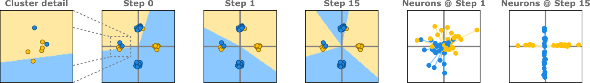
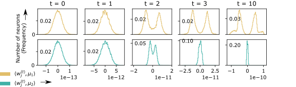
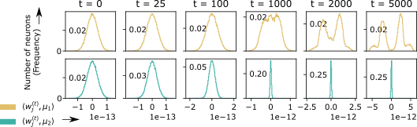

# Xu et al. 2023 — Benign Overfitting and Grokking in ReLU Networks for XOR Cluster Data

См. также: [глобальный индекс понятий](../../concepts/index.md).
arXiv [2310.02541v1](https://arxiv.org/abs/2310.02541), 4 октября 2023. Колонтитул PDF: боковая пометка «arXiv:2310.02541v1 [cs.LG] 4 Oct 2023»; сведений о конференции в этой версии нет.

**Zhiwei Xu** — University of Michigan.
**Yutong Wang** — University of Michigan.
**Spencer Frei** — University of California, Davis.
**Gal Vardi** — TTI-Chicago and Hebrew University.
**Wei Hu** — University of Michigan.

Оригинал и производные файлы этой папки:

- [`original/2310.02541.native.html`](original/2310.02541.native.html) — первоисточник, нативный HTML-рендеринг arXiv (LaTeXML), скачан как есть.
- [`original/2310.02541.benign-overfitting-and-grokking-in-relu-networks-for-xor-cluster-data.md`](original/2310.02541.benign-overfitting-and-grokking-in-relu-networks-for-xor-cluster-data.md) — конверсия оригинала в Markdown без правок содержания; английский текст для сверки перевода.
- [`images/`](images/) — иллюстрации статьи в исходном разрешении (4 файла).
- [`2310.02541.benign-overfitting-and-grokking-in-relu-networks-for-xor-cluster-data.claims.txt`](2310.02541.benign-overfitting-and-grokking-in-relu-networks-for-xor-cluster-data.claims.txt) — рабочий разбор: пронумерованные утверждения с пометками.

Схема якорей и правила ссылок на карточку — в [README папки статей](../README.md).

## Затрагиваемые понятия

**[Гроккинг / отложенная генерализация](../../concepts/grokking.md)** — работа даёт понятию первое строгое доказательство в нейросетевой постановке, взяв определение у [Power et al.](../2201.02177.grokking-generalization-beyond-overfitting-on-small-algorithmic-datasets/2201.02177.grokking-generalization-beyond-overfitting-on-small-algorithmic-datasets.card.md) без изменений: [модель сначала достигает совершенной точности на обучении при полном отсутствии генерализации (то есть не лучше случайного предсказателя), а при дальнейшем обучении переходит к почти совершенной генерализации](#p1-4). Заявка сформулирована буквально: [ни в одной из предшествующих работ строгого доказательства гроккинга в нейросетевой постановке не установлено](#p2-1). Доказано ровно следующее ([теорема 3.1](#p6-4)): на шаге $t=1$ точность на обучении 100% при ошибке на тесте, зажатой около $\tfrac{1}{2}$, а на шагах от $Cn^{0.01}$ до $\sqrt{n}$ точность на обучении та же, а ошибка на тесте почти нулевая; авторы прямо говорят, что сеть [проявляет доброкачественное переобучение, и достигает она этого посредством гроккинга](#p6-6). Чего в работе нет: длительность плато снизу не оценена — катастрофическая стадия доказана ровно в одной точке $t=1$; резкость перехода не показана; поведение при $t\to\infty$ [оставлено на будущее](#p6-7). Ни фазовых переходов, ни мер прогресса, ни контуров работа не вводит, алгоритмических данных не касается, а масштаб задержки здесь — десяток шагов, а не $10^{5}$ эпох.

**[Фаза меморизации / плато](../../concepts/memorization-phase.md)** — работа опознаёт «запоминающую» стадию как конкретный объект, а не как чёрный ящик: после одного шага [классификатор-нейросеть ведёт себя схоже с линейным классификатором $\operatorname{sgn}(\langle\sum_{i=1}^{n}y_{i}x_{i},\cdot\rangle)$](#p10-1), который подгоняется к любым меткам, коль скоро обучающие данные почти ортогональны, но на XOR-кластерном распределении даёт ровно 50% ошибки. Способность к подгонке отнесена тем самым к [высокой размерности пространства признаков](#p8-1), а не к устройству сети. Работа отдельно отмечает, что предшествующие разборы доброкачественного переобучения [не показали разделения во времени между катастрофическим переобучением и генерализацией](#p2-3), и что таксономия «катастрофическое / умеренное / доброкачественное» взята у [Mal+22](#p3-1). Чего в работе нет: плато потерь здесь не наблюдается — обучающая потеря во всём разбираемом окне остаётся около $\log 2$ (см. раздел «Что доказано, что показано и что предположено»); ни конкурирующих подсетей, ни «таблицы запоминания» в разборе не появляется.

**[Шум в метках / случайные метки](../../concepts/label-noise-random-labels.md)** — работа делает шум в метках условием результата, а не помехой: доля $\eta$ меток переворачивается [в определении 2.1](#p4-3), и именно совершенная подгонка к перевёрнутым меткам при почти нулевой чистой ошибке на тесте и составляет «доброкачественность». Требование к доле слабое — (A3): [доля шума удовлетворяет $\eta\leq 1/C$](#p5-9). Чего в работе нет: зависимости задержки или качества от величины $\eta$ работа не изучает, а стадия 50% на шаге 1 держится на нелинейной разделимости XOR и от $\eta$ не зависит вовсе.

**[Когда регуляризация необходима](../../concepts/regularization-necessity.md)** — работа даёт прямое возражение против необходимости регуляризатора: [мы наблюдаем гроккинг без каких-либо явных форм регуляризации, что выявляет значимость неявной регуляризации GD](#p11-5). Механизм задержки здесь целиком геометрический — линейный классификатор на шаге 1 против выстроенных вдоль средних кластеров нейронов позже, — и никакого явного штрафа в постановке нет. Чего в работе нет: ни одна из корпусных настроек гроккинга (Adam, мини-батчи, алгоритмические данные) в разборе не появляется, а утверждения «регуляризация не нужна вообще» авторы не делают — сказано лишь, что в этой постановке она не требуется.

**[Weight decay / L2-регуляризация](../../concepts/weight-decay.md)** — работа противопоставляет себя объяснениям через weight decay, приписывая предшественникам, что [применение weight decay существенно для гроккинга](#p11-5); в обзоре той же приписке отвечает более осторожная формулировка о том, что [LMT23 выявили большой масштаб инициализации вместе с weight decay как механизм гроккинга](#p3-2). Обучение здесь — полнобатчевый GD по логистической потере без всякого штрафа на норму. Чего в работе нет: опытов с weight decay в ней нет, поэтому утверждать по ней, что weight decay гроккингу мешает или помогает, нельзя; о том, что одна из двух названных работ такого тезиса не выдвигала, — в разделе «Ошибочные цитирования» ниже.

**[Масштаб инициализации](../../concepts/initialization-scale.md)** — работа делает отношение шага к масштабу инициализации управляющим параметром задержки. Допущение (A5) — [дисперсия инициализации удовлетворяет $\omega_{\text{init }}nm^{3/2}p\leq\alpha\|\mu\|^{2}$](#p5-9) — истолковано авторами прямо: оно [обеспечивает, что шаг велик относительно масштаба инициализации, так что поведение сети после единственного шага GD значительно отличается от поведения при случайной инициализации](#p6-2). Опыт с уменьшенным шагом при том же $\omega_{\text{init}}=10^{-15}$ растягивает то же явление примерно до $10^{3}$ шагов ([рис. 1](#fig-1), [рис. 4](#fig-4)). Чего в работе нет: этот опыт лежит вне области действия теоремы (см. ниже), «ленивого» и «богатого» режимов авторы не называют, и с одновременной работой [Kumar et al.](../2310.06110.grokking-as-the-transition-from-lazy-to-rich-training-dynamics/2310.06110.grokking-as-the-transition-from-lazy-to-rich-training-dynamics.card.md) сверки нет.

**[Скорость обучения](../../concepts/learning-rate.md)** — шаг $\alpha$ здесь один из двух рычагов задержки: [при меньшем шаге возникает то же самое явление гроккинга, но с отсрочкой как переобучения, так и генерализации](#p2-2). Сверху шаг ограничен (A4), снизу — (A5) через масштаб инициализации; в опытах взяты $\alpha=10^{-12}$ и $\alpha=10^{-16}$ [при прочих равных](#p53-8). Чего в работе нет: количественного закона задержки от $\alpha$ нет — есть две точки и доказанное окно $[1,\sqrt{n}]$ для большего шага.

**[Возникновение признаков](../../concepts/feature-emergence-feature-learning.md)** — работа даёт механизм генерализации в виде выучивания признаков отдельными нейронами: [нейроны постепенно выстраиваются вдоль ключевых признаков $\pm\mu_{1}$ и $\pm\mu_{2}$, чего достаточно для генерализации](#p2-4), причём положительные нейроны должны выстроиться вдоль $\pm\mu_{1}$, а отрицательные — [вдоль $\pm\mu_{2}$](#p9-5). Направление, которое выучит нейрон, задано случайным перевесом при инициализации: [точек из кластера $\nu$, активирующих $j$-й нейрон, по меньшей мере на $n^{1/2-\kappa}$ больше, чем из кластера $-\nu$](#p8-10). Опытное подтверждение — [гистограммы проекций](#fig-3) и [геометрия границы решения и весов](#fig-2). Чего в работе нет: признаки здесь заданы устройством данных (средние гауссовских кластеров), а не выучены как структура; ни фурье-признаков, ни разложений представлений, ни мер сложности признака работа не предлагает.

**[Переход lazy→rich](../../concepts/lazy-to-rich-kernel-to-feature-learning.md)** — работа даёт картину, родственную этому понятию, но не называет его: сеть [после одного шага приблизительно реализует линейный классификатор](#p2-4), то есть ведёт себя как фиксированный признаковый предсказатель, а генерализация приходит позже, когда нейроны перестраиваются. Условие (A5) — «шаг велик относительно масштаба инициализации» — по смыслу совпадает с рычагом, которым в корпусе управляют этим переходом. Чего в работе нет: слов lazy, rich, NTK-режима применительно к собственной динамике авторы не употребляют (NTK помянут только [в обзоре, применительно к Wei+19](#p3-3)); ни ядра, ни его изменения работа не измеряет, и приписывать ей объяснение гроккинга через смену режима нельзя.

**[Границы генерализации](../../concepts/generalization-bounds.md)** — работа даёт явные оценки ошибки на тесте в обе стороны: [почти случайная ошибка при $t=1$, зажатая между $\tfrac{1}{2}(1-n^{-\Omega(1)})$ и $\tfrac{1}{2}(1+n^{-\Omega(1)})$, и $\exp(-\Omega(n^{0.99}\|\mu\|^{4}/p))=\exp(-\Omega(n^{2.01}))$ при $Cn^{0.01}\leq t\leq\sqrt{n}$](#p6-5), с приложением в виде [теоремы 4.8](#p11-3). Все они высказаны при вероятности не менее [$1-n^{-\Omega(1)}-O(1/\sqrt{m})$](#p6-4) по данным и инициализации. Чего в работе нет: границ, зависящих от нормы весов, зазора или сложности; оценка получена траекторным разбором, а не через ёмкость класса.

**[Максимизация зазора](../../concepts/margin-maximization-implicit-bias.md)** — работа ставит собственный результат в ряд с разборами неявного смещения GD: [неявная регуляризация GD](#p11-5) названа причиной, по которой обобщение возникает без штрафа, а нижняя граница выводится через нормированный зазор ${\mathbb{E}}_{x\sim N(\nu,I_{p})}[f(x;W)]/\|W\|_{F}$ (лемма A.9, [теорема 4.8](#p11-3)). В обзоре отдельно названы работы, показавшие доброкачественное переобучение [через стационарные точки задач максимизации зазора](#p3-1). Чего в работе нет: предельного направления при $t\to\infty$ работа не рассматривает вовсе, так что о сходимости к максимизирующему зазор решению по ней судить нельзя.

**[Роль шума градиента](../../concepts/gradient-noise.md)** — постановка показывает, что для отложенной генерализации шум оптимизатора не нужен: обучение — [полнобатчевый градиентный спуск с постоянным шагом](#p5-3) по логистической потере, стохастичность отсутствует, а весь разброс между прогонами идёт от случайности данных и инициализации. Чего в работе нет: сравнения с SGD или мини-батчами нет, поэтому вывода «шум градиента гроккингу не нужен вообще» работа не даёт — она даёт постановку, где его нет и гроккинг всё равно есть.

**[Разрежённая чётность](../../concepts/sparse-parity.md)** — работа лишь упоминает смежное семейство: XOR-кластерное распределение поставлено рядом с [задачей разрежённой чётности как со своим вариантом](#p3-3), и названы разборы выборочной сложности обучения разрежённым чётностям на гиперкубе SGD ([Barak et al.](../2207.08799.hidden-progress-in-deep-learning-sgd-learns-parities-near-the-computational-limit/2207.08799.hidden-progress-in-deep-learning-sgd-learns-parities-near-the-computational-limit.card.md), Tel23). Собственных опытов на чётностях в работе нет; XOR здесь — смесь четырёх гауссиан в $\mathbb{R}^{p}$, а не булева функция на гиперкубе.

**[Эталонный полигон гроккинга](../../concepts/canonical-grokking-testbed.md)** — работа берёт у эталонного полигона только определение явления, а сам полигон заменяет: [задача — бинарная классификация XOR-кластерных данных](#p4-3), архитектура — двухслойная ReLU-сеть с [замороженным вторым слоем](#p5-3), оптимизатор — полнобатчевый GD, окно наблюдения — десяток шагов. Чего в работе нет: ни модульной арифметики, ни трансформеров, ни доли обучающих данных как управляющего параметра; воспроизводимость на алгоритмических данных не заявлена и не проверялась.

**[Меры прогресса](../../concepts/progress-measures.md)**, **[Эффективность контуров](../../concepts/circuit-efficiency.md)**, **[Эффект рогатки](../../concepts/slingshot.md)**, **[Разрежённая подсеть / lottery ticket](../../concepts/sparse-subnetwork-lottery-ticket.md)** — все четыре понятия работа только упоминает, одним предложением каждое, [в обзоре по гроккингу](#p3-2): [Bar+22, Nan+23] названы предложившими метрики прогресса, [Var+23] — использовавшими эффективность контуров и открывшими ungrokking и semi-grokking, [Thi+22] — отнёсшими гроккинг к механизму рогатки, [MTS23] — объяснившими гроккинг состязанием плотных и разрежённых подсетей. Ни одно из них в собственном разборе не используется и ни на одно нет опытной проверки; о том, что пересказ [Thi+22] здесь сильнее авторского, — в разделе «Ошибочные цитирования».

**[Нейронное касательное ядро](../../concepts/neural-tangent-kernel-ntk.md)** — упомянуто один раз и только исторически: [нейросети в среднеполевом режиме, где нейросети способны выучивать признаки, имеют в этой постановке лучшие гарантии выборочной сложности, чем нейросети в режиме нейронного касательного ядра (NTK)](#p3-3). Собственная динамика в терминах ядра не разбирается, ядро не вычисляется, и режим сети авторы никак не классифицируют.

## Несогласованности внутри статьи

**Определение выстроенности нейрона записано в статье тремя разными способами.** Второе условие $(\nu,\kappa)$-выстроенности в основном тексте (4.2) наложено на максимум: $\max\{d_{-\nu,j}^{(0)},d_{\nu,j}^{(0)}\}<\min\{c_{\nu},c_{-\nu}\}-2(n_{+\nu}+n_{-\nu})-\sqrt{n}$ ([пояснение к нему](#p8-10)). В приложении то же множество $\mathcal{J}_{\nu}^{\kappa}$ [определено только через $d_{-\nu,j}^{(0)}$](#p19-11), а при переписывании $\mathcal{J}_{1}$ и $\mathcal{J}_{2}$ [в разделе A.5.2](#p39-5) — только через $d_{\nu,j}^{(0)}$. Три записи задают три разных множества нейронов. Доказательство при этом устанавливает оценку сразу для обоих индексов ((A.14): $\mu\in\{\pm\nu\}$), то есть поддерживает вариант основного текста; расходятся именно определения, а не доказательство. Цитируя «долю выстроенных нейронов», следует брать формулировку (4.2).

**(D4) и объявленная равносильной ей (D’4) — разные утверждения.** В лемме 4.4 условие (D4) суммирует [$(c_{\nu}-n_{\nu}-d_{-\nu,j}^{(0)})$](#p8-12), а его «переформулировка» в приложении суммирует [$(c_{\nu}-d_{-\nu,j}^{(0)})$](#p21-5) — слагаемое $n_{\nu}$ пропало, при том что текст прямо говорит: «Раскрывая определения, отметим, что (D’1)-(D’4) равносильны (D1)-(D4)». Доказательство ((A.25) и предшествующая ему выкладка) ведётся для варианта с $-n_{+\mu_{1}}$, то есть для (D4); в (D’4) пропуск.

**Заявка о первенстве и собственный обзор расходятся в объёме.** Введение утверждает, что [строгого доказательства гроккинга в нейросетевой постановке не установлено ни в одной предшествующей работе](#p2-1), а обзор двумя страницами позже сообщает, что [Žunkovič, Ilievski](../2210.15435.grokking-phase-transitions-in-learning-local-rules-with-gradient-descent/2210.15435.grokking-phase-transitions-in-learning-local-rules-with-gradient-descent.card.md) [показали разделение во времени между достижением нулевой ошибки на обучении и нулевой ошибки на тесте в задаче бинарной классификации на линейно разделимом распределении](#p3-2). Оговорка, снимающая противоречие, — нелинейность распределения — в самой заявке не стоит и появляется только в соседнем абзаце о [подлинно нелинейной постановке](#p2-3).

**Мелкие расхождения записи, не влияющие на выводы.** В (A.26) выражение для математического ожидания напечатано как $c_{+\mu_{1}}-n_{+\mu_{1}}(c_{-\mu_{1}}-n_{-\mu_{1}})/2$ — знак минус перед скобкой пропущен (в PDF так же). В [(A.46)](#p33-6) скобка минимума закрыта иначе, чем в (4.2) и (A.13): $\min\{c_{\nu},c_{-\nu}-2n_{\pm\nu}-\sqrt{n}\}$ вместо $\min\{c_{\nu},c_{-\nu}\}-2n_{\pm\nu}-\sqrt{n}$. В индукционном шаге [леммы A.3](#p26-8) утверждение $P(t)$ записано с $\frac{2\alpha p}{n}(t+2)$, а применяется в виде $\frac{2\alpha p}{\sqrt{n}}(\tau+2)$.

## Что доказано, что показано и что предположено

**Доказано.** Три части [теоремы 3.1](#p6-4) при допущениях (A1)-(A6) и вероятности не менее $1-n^{-\Omega(1)}-O(1/\sqrt{m})$: подгонка ко всем обучающим точкам при $1\leq t\leq\sqrt{n}$, ошибка на тесте ровно на уровне случайного угадывания при $t=1$ и почти нулевая ошибка при $Cn^{0.01}\leq t\leq\sqrt{n}$. Разрыв во времени между второй и третьей частями и есть гроккинг в этой постановке; так это и подытожено [в обсуждении](#p11-4).

**Что доказательство не даёт, хотя аннотация говорит шире.** Аннотация называет катастрофическую стадию [периодом классического, вредного переобучения](#p1-2), но доказана она ровно в одной точке $t=1$: нижней оценки на длительность плато теорема не содержит. Отношение сроков есть $Cn^{0.01}$ при неуказанной универсальной постоянной $C$, так что количественного предсказания задержки, сопоставимого с наблюдаемыми в корпусе, из теоремы не извлекается. Верхняя граница $t\leq\sqrt{n}$ существенна и [оставлена на будущее](#p6-7); [почти ортогональность данных, то есть $p$, большое относительно $n$, признано авторами вторым узким местом](#p11-6).

**«Совершенная подгонка» здесь означает знаки, а не малую потерю.** По [лемме A.3](#p26-8) во всём разбираемом окне $\max_{i}|h_{i}^{(t)}|\leq 2/n^{3/2}$, откуда [$g_{i}^{(t)}\in[1/4,1]$](#p28-7), то есть $y_{i}f(x_{i};W^{(t)})\approx 0$ и обучающая потеря всё время остаётся около $\log 2$; [замечание A.2](#p26-7) прямо говорит, что логистическая потеря во всём окне заменима своим первым порядком. В корпусной постановке гроккинга запоминание — это потеря, ушедшая к нулю; здесь совпадают только кривые точности, но не кривые потерь.

**«Забывание» относительно.** Раздел 4.2.2 говорит, что положительные нейроны [забывают оба $\pm\mu_{2}$](#p10-4), но [лемма 4.7](#p11-1) даёт рост обеих проекций — разделяет их отношение скоростей порядка $\sqrt{n/\log n}$. Абсолютного убывания проекции на «чужое» среднее в работе нет.

**Показано опытами, но не доказано.** Правая панель [рисунка 1](#fig-1) и [рисунок 4](#fig-4) сделаны с $\alpha=10^{-16}$ при том же $\omega_{\text{init}}=10^{-15}$ [(раздел A.7)](#p53-8), то есть шаг не увеличивают, а уменьшают — прямо против того, что требует (A5). Растяжение задержки примерно до $10^{3}$ шагов, стало быть, показано вне области действия теоремы. Взятые постоянные и вообще не удовлетворяют допущениям буквально: при $n=200$, $p=40000$, $\|\mu\|^{2}=1250$ условие (A2) требовало бы $p\geq 5\cdot 10^{7}C$. Опыты заявлены как иллюстрация и проверкой числовых границ теоремы не являются.

**Два явления в одной постановке — но не из одного источника.** 50% на шаге 1 идут от нелинейной разделимости XOR: [любой линейный классификатор даёт на этом распределении ровно половину ошибки](#p10-1), и от $\eta$ это не зависит — при $\eta=0$ допущение (A3) выполнено, а стадия остаётся. «Доброкачественность» же содержательна только при $\eta>0$. Работа показывает, что оба явления уживаются, но их источники не разделяет.

## Ошибочные цитирования

Замечания редактора карточки: места, где эта статья передаёт чужие результаты с ошибкой или без авторских оговорок. Сюда ведут ссылки «подробности» из разделов «Ошибочные пересказы и цитирования этой статьи» карточек процитированных работ.

###### mc-2205-10343

**Liu et al. (2205.10343) — weight decay объявлен существенным для гроккинга.** Раздел 5 противопоставляет собственный результат предшественникам формулировкой `"In contrast to prior works on grokking which found the usage of weight decay to be crucial for grokking [Liu+22, LMT23]"` — *«в отличие от предшествующих работ о гроккинге, в которых обнаружено, что применение weight decay существенно для гроккинга [Liu+22, LMT23]»*. Для [Omnigrok](../2210.01117.omnigrok-grokking-beyond-algorithmic-data/2210.01117.omnigrok-grokking-beyond-algorithmic-data.card.md) (LMT23) приписка верна: там при большой инициализации без регуляризации генерализации нет, при малой она приходит быстро, и weight decay — управляющий параметр. Но [Liu et al. 2022](../2205.10343.towards-understanding-grokking-an-effective-theory-of-representation-learning/2205.10343.towards-understanding-grokking-an-effective-theory-of-representation-learning.card.md) такого тезиса не выдвигали: у них weight decay — одна из двух осей фазовой диаграммы, гроккинг занимает полосу между пониманием и запоминанием, и рост weight decay уводит из гроккинга в понимание, то есть в быструю генерализацию, а не в отложенную. Про сам гроккинг у них сказано `"grokking is sandwiched between comprehension and memorization, which seems to imply that it is an undesirable phase that stems from improperly tuned hyperparameters"` — *«гроккинг зажат между пониманием и запоминанием, что, по-видимому, означает, что это нежелательная фаза, происходящая от неудачно настроенных гиперпараметров»*. Родословная ошибки видна: это признак Omnigrok, перенесённый на работу-предшественницу той же группы, — тот самый узор конфляции, который уже записан в карточке [Liu et al. 2022](../2205.10343.towards-understanding-grokking-an-effective-theory-of-representation-learning/2205.10343.towards-understanding-grokking-an-effective-theory-of-representation-learning.card.md). В [обзоре](#p3-2) эта же статья процитирована точно — «предложили эффективную теорию обучения представлений для понимания гроккинга»; предупреждение касается формулировки раздела 5, а не работы в целом.

###### mc-2206-04817

**Thilak et al. (2206.04817) — совпадение по времени пересказано как объяснение.** В обзоре стоит `"[Thi+22] attributed grokking to the slingshot mechanism"` — *«[Thi+22] отнесли гроккинг к действию механизма рогатки (slingshot)»*. У самих авторов рогатки это эмпирическое наблюдение с двумя оговорками: `"It is empirically observed that grokking as reported in [17] almost exclusively happens at the onset of Slingshots, and is absent without it"` — совпадение по времени, с хеджем «почти исключительно» и без теории, объясняющей его. Глагол «attributed» превращает наблюдённое совпадение в причинное объяснение; узор «Slingshot вызывает гроккинг» уже записан на стороне [Thilak et al.](../2206.04817.the-slingshot-mechanism-an-empirical-study-of-adaptive-optimizers-and-grokking/2206.04817.the-slingshot-mechanism-an-empirical-study-of-adaptive-optimizers-and-grokking.card.md) как расширяющий. Вторая половина той же фразы — «который измерим через циклические фазовые переходы между устойчивым и неустойчивым режимами обучения» — авторскому описанию соответствует.

## Ошибочные пересказы и цитирования этой статьи

Узоры ошибочного или расширенного цитирования этой работы, наблюдённые в цитирующих статьях корпуса. Каждая запись описывает, что именно искажается при пересказе, и ведёт к абзацам самих авторов, где стоит теряемая оговорка. Работа молода и цитируется в корпусе в основном проходными упоминаниями, которые верны; узор ниже — о меньшинстве.

**«Xu et al. делят обучение на меморизацию, формирование контура и очистку» (ошибочное).** В обзорном перечислении эту работу ставят в список тех, у кого `"the training process could be a phase transition divided into memorization, circuit formation, and cleanup phase"` — *«процесс обучения может быть фазовым переходом, разделённым на фазы запоминания, формирования контура и очистки»*. Ничего из этого в статье нет: контуров работа не рассматривает, фазами процесс не называет, а доказывает разделение во времени между двумя точками — [шагом $t=1$, где точность на тесте случайна](#p6-5), и шагами от $Cn^{0.01}$, где она почти совершенна, — причём [резкость перехода и поведение при $t\to\infty$ прямо оставлены за рамками](#p6-7). Трёхфазное деление принадлежит [Nanda et al.](../2301.05217.progress-measures-for-grokking-via-mechanistic-interpretability/2301.05217.progress-measures-for-grokking-via-mechanistic-interpretability.card.md), названным в том же перечислении первыми: их признак перенесён на соседей по списку. Наблюдено у [Furuta et al.](../2402.16726.towards-empirical-interpretation-of-internal-circuits-and-properties-in-grokked-transformers-on-modular-polynomials/2402.16726.towards-empirical-interpretation-of-internal-circuits-and-properties-in-grokked-transformers-on-modular-polynomials.card.md).

**Доказанное подано как наблюдённое (мягкое).** Пересказы вида `"the grokking phenomenon observed on XOR cluster data in Xu et al. (2023), where high-dimensional linear classifiers were found to first fit the training data"` — *«явление гроккинга, наблюдённое на XOR-кластерных данных у Xu et al. (2023), где обнаружилось, что высокоразмерные линейные классификаторы сначала подгоняются к обучающим данным»* — верны по существу, но переводят теорему в разряд наблюдений и приписывают подгонку «линейным классификаторам», тогда как у авторов подгоняется сеть, которая [лишь приближает линейный классификатор после одного шага](#p10-1). Мягкие отголоски: [Zhou, Zhang, Xu](../2405.17479.a-rationale-from-frequency-perspective-for-grokking-in-training-neural-network/2405.17479.a-rationale-from-frequency-perspective-for-grokking-in-training-neural-network.card.md).

Образцы аккуратного цитирования: [Notsawo et al.](../2506.05718.grokking-beyond-the-euclidean-norm-of-model-parameters/2506.05718.grokking-beyond-the-euclidean-norm-of-model-parameters.card.md) — `"provide a theoretical example of grokking in ReLU networks by analyzing the feature learning process under GD, and show that test generalization can emerge well after perfect (and initially non-generalizing) memorization of noisy XOR-cluster training data"`, с сохранением и постановки, и порядка событий; Liu, Lu (2605.18022, карточки пока нет) — единственный пересказ, удерживающий [заморозку второго слоя](#p5-3) как ограничение постановки (`"under the assumption of fixed second-layer weights, which deviates from standard end-to-end training dynamics"`); [Xu et al. 2025](../2504.13292.let-me-grok-for-you-accelerating-grokking-via-embedding-transfer-from-a-weaker-model/2504.13292.let-me-grok-for-you-accelerating-grokking-via-embedding-transfer-from-a-weaker-model.card.md) — честное `"this configuration approximates one of the distributions explored in Xu et al. (2024), where grokking was observed"` там, где данные на гиперкубе, а не [гауссовская смесь определения 2.1](#p4-3).

---

# Текст статьи

# Benign Overfitting and Grokking in ReLU Networks for XOR Cluster Data

Zhiwei Xu Affiliation: University of Michigan Email: zhiweixu@umich.edu Yutong Wang Affiliation: University of Michigan Email: yutongw@umich.edu Spencer Frei Affiliation: University of California, Davis Email: sfrei@ucdavis.edu Gal Vardi Affiliation: TTI-Chicago and Hebrew University Email: galvardi@ttic.edu Wei Hu Affiliation: University of Michigan Email: vvh@umich.edu

## Аннотация

###### p1-2

Нейросети, обучаемые градиентным спуском (GD), проявляют целый ряд удивительных свойств генерализации. Во-первых, они способны совершенно подогнаться к шумным обучающим данным и при этом всё равно генерализовать почти оптимально, показывая, что переобучение иногда бывает доброкачественным. Во-вторых, они могут пройти через период классического, вредного переобучения — совершенной подгонки к обучающим данным при почти случайном качестве на тестовых данных, — прежде чем перейти («грокнуть», grokking) к почти оптимальной генерализации позже по ходу обучения. В этой работе мы показываем, что оба эти явления доказуемо возникают в двухслойных ReLU-сетях, обучаемых GD на XOR-кластерных данных, где постоянная доля обучающих меток перевёрнута. В этой постановке мы показываем, что после первого шага GD сеть достигает 100% точности на обучении, совершенно подгоняясь к шумным меткам обучающих данных, но достигает почти случайной точности на тесте. На более позднем шаге обучения сеть достигает почти оптимальной точности на тесте, всё ещё подгоняясь к случайным меткам обучающих данных, то есть проявляет явление «гроккинг». Это даёт первый теоретический результат о доброкачественном переобучении в нейросетевой классификации, когда распределение данных не является линейно разделимым. Наши доказательства опираются на разбор процесса обучения признаков под действием GD, который выявляет, что после одного шага сеть реализует негенерализующий линейный классификатор, а на последующих шагах постепенно выучивает генерализующие признаки.

## 1 Введение

Классическая мудрость машинного обучения считает переобучение на шумных обучающих данных вредным для генерализации, и чтобы переобучению помешать, были развиты приёмы регуляризации вроде ранней остановки. Однако современные нейросети способны проявлять целый ряд контринтуитивных явлений, противоречащих этой классической мудрости. Два любопытных явления, привлёкшие за последние годы значительное внимание, — это *доброкачественное переобучение* [Bar+20] и *гроккинг* [Pow+22]:

###### p1-4

- **Доброкачественное переобучение (benign overfitting):** модель совершенно подгоняется к обучающим данным с зашумлёнными метками, но всё равно достигает почти оптимальной ошибки на тесте.
- **Гроккинг:** модель сначала достигает совершенной точности на обучении при полном отсутствии генерализации (то есть не лучше случайного предсказателя), а при дальнейшем обучении переходит к почти совершенной генерализации.

**[p. 2]**

###### p2-1

Недавние теоретические работы установили доброкачественное переобучение в разнообразных постановках, включая линейную регрессию [Has+19, Bar+20], линейную классификацию [CL21a, WT21], ядерные методы [BRT19, LR20] и нейросетевую классификацию [FCB22a, Kou+23]. Однако существующие результаты о доброкачественном переобучении в постановках нейросетевой классификации ограничены линейно разделимыми распределениями данных, и вопрос о том, как доброкачественное переобучение может возникать в полностью нелинейных постановках, остаётся открытым. Что касается гроккинга, несколько недавних статей [Nan+23, Gro23, Var+23] предложили объяснения, но, насколько нам известно, ни в одной из предшествующих работ строгого доказательства гроккинга в нейросетевой постановке не установлено.

###### p2-2

В этой работе мы описываем постановку, в которой доказуемо возникают и доброкачественное переобучение, и гроккинг. Мы рассматриваем двухслойную ReLU-сеть, обучаемую градиентным спуском на задаче бинарной классификации, заданной XOR-кластерным распределением данных (рисунок 2). А именно, точки положительного класса берутся из смеси двух высокоразмерных гауссовских распределений $\frac{1}{2}N(\mu_{1},I)+\frac{1}{2}N(-\mu_{1},I)$, а точки отрицательного класса — из $\frac{1}{2}N(\mu_{2},I)+\frac{1}{2}N(-\mu_{2},I)$, где $\mu_{1}$ и $\mu_{2}$ — ортогональные векторы. Затем мы допускаем переворот постоянной доли меток. В этой постановке мы строго доказываем следующие результаты: (i) **Одношаговое катастрофическое переобучение:** после одного шага градиентного спуска сеть совершенно подгоняется к каждой без исключения обучающей точке (независимо от того, чистая у неё метка или перевёрнутая), но имеет точность на тесте около $50\%$, выступая не лучше случайного угадывания. (ii) **Гроккинг и доброкачественное переобучение:** после обучения на протяжении большего числа шагов сеть проходит период «гроккинга» от катастрофического переобучения к доброкачественному — в конечном счёте она достигает почти $100\%$ точности на тесте, всё это время удерживая $100\%$ точности на обучении. Это поведение видно на рисунке 1, где также видно, что при меньшем шаге возникает то же самое явление гроккинга, но с отсрочкой как переобучения, так и генерализации.

###### p2-3

Наши результаты дают первое теоретическое описание доброкачественного переобучения в подлинно нелинейной постановке, в которой нейросеть обучается на не разделимом линейно распределении. Любопытно, что предшествующие работы о доброкачественном переобучении в нейросетях для линейно разделимых распределений [FCB22a, Cao+22, XG23, Kou+23] не показали разделения во времени между катастрофическим переобучением и генерализацией, что говорит о том, что постановка с XOR-кластерными данными устроена принципиально иначе.

###### p2-4

Наши доказательства опираются на разбор того, как отдельные нейроны выучивают признаки вдоль траектории градиентного спуска. Мы доказываем, что после одного шага обучения сеть приблизительно реализует линейный классификатор над исходным распределением данных, который способен переобучиться на все обучающие точки, но не способен генерализовать. При дальнейшем обучении нейроны постепенно выстраиваются вдоль ключевых признаков $\pm\mu_{1}$ и $\pm\mu_{2}$, чего достаточно для генерализации. На рисунке 2 показаны граница решения сети и веса нейронов в разные моменты времени, подтверждающие нашу теорию.


###### fig-1

*Рисунок 1: Сравнение точности на обучении и на тесте для двухслойной нейросети (2.1), обученной на XOR-данных с зашумлёнными метками, по 100 независимым прогонам. *Левая/правая панель* показывает доброкачественное переобучение и гроккинг при шаге, большем/меньшем по сравнению с масштабом инициализации весов. При построении оси x мы прибавляем $1$ к времени, чтобы инициализацию $t=0$ можно было показать в логарифмическом масштабе. Подробности опытной постановки — в разделе A.7.* **[p. 2]**



###### fig-2

*Рисунок 2: *Четыре левые панели*: двумерная проекция XOR-кластерных данных с зашумлёнными метками (определение 2.1) и граница решения классификатора-нейросети (2.1), ограниченная на подпространство, порождённое средними кластеров, в моменты $t=0,1$ и $15$. *Две правые панели*: двумерная проекция весов нейронов в моменты $t=1$ и $15$.* **[p. 3]**

**[p. 3]**

### 1.1 Дополнительные родственные работы

#### Доброкачественное переобучение.

###### p3-1

Литература о доброкачественном переобучении (известном также как безвредная интерполяция) к настоящему времени огромна; за общим обзором мы отсылаем читателя к обзорам [BMR21, Bel21, DMB21]. Здесь мы сосредоточимся на работах о доброкачественном переобучении в нейросетях. [FCB22a] показали, что двухслойные сети с гладкими leaky ReLU-активациями, обучаемые градиентным спуском (GD), проявляют доброкачественное переобучение при обучении на высокоразмерном бинарном кластерном распределении. [XG23] распространили их результаты на более общие активации, такие как ReLU. [Cao+22] показали, что двухслойные свёрточные сети с полиномиальными ReLU-активациями, обучаемые GD, проявляют доброкачественное переобучение на данных из фрагментов изображений; [Kou+23] распространили их результаты на случай шума с переворотом меток и обычных ReLU-активаций. Каждая из этих работ опиралась на траекторный разбор, и ни в одной из них явление гроккинга выявлено не было. [Fre+23, KYS23] показали, как стационарные точки задач максимизации зазора, связанных с задачами обучения однородных нейросетей, могут проявлять доброкачественное переобучение. Наконец, [Mal+22] предложили таксономию поведений переобучения в нейросетях, в которой переобучение «катастрофическое», если качество на тесте сравнимо со случайным угадыванием, «доброкачественное», если оно почти оптимально, и «умеренное» (tempered), если оно лежит между катастрофическим и доброкачественным.

#### Гроккинг.

###### p3-2

Явление гроккинга впервые выявлено в [Pow+22] на decoder-only трансформерах, обучаемых на алгоритмических наборах данных. [Liu+22] предложили эффективную теорию обучения представлений для понимания гроккинга. [Thi+22] отнесли гроккинг к действию механизма рогатки (slingshot), который измерим через циклические фазовые переходы между устойчивым и неустойчивым режимами обучения. [ŽI22] показали разделение во времени между достижением нулевой ошибки на обучении и нулевой ошибки на тесте в задаче бинарной классификации на линейно разделимом распределении. [LMT23] выявили большой масштаб инициализации вместе с weight decay как механизм гроккинга. [Bar+22, Nan+23] предложили метрики прогресса для измерения продвижения к генерализации в ходе обучения. [DLK23] выдвинули гипотезу о модели обучения узоров (pattern learning) для гроккинга и впервые сообщили о явлении гроккинга по размеру модели (model-wise). [MTS23] изучили динамику обучения в двухслойной нейросети на задаче разрежённой чётности, относя гроккинг к состязанию между плотными и разрежёнными подсетями. [Var+23] использовали эффективность контуров для толкования гроккинга и обнаружили два новых явления, названные ungrokking и semi-grokking.

#### Обучение признаков для XOR-распределений.

###### p3-3

Поведение нейросетей, обучаемых на рассматриваемом здесь XOR-кластерном распределении или на его вариантах вроде задачи разрежённой чётности, в последние годы изучалось широко. [**[p. 4]** Wei+19] показали, что нейросети в среднеполевом режиме, где нейросети способны выучивать признаки, имеют в этой постановке лучшие гарантии выборочной сложности, чем нейросети в режиме нейронного касательного ядра (NTK). [Bar+22, Tel23] исследовали выборочную сложность обучения разрежённым чётностям на гиперкубе для нейросетей, обучаемых SGD. Ближе всего к этой работе [FCB22], где описана динамика GD в ReLU-сетях в том же распределительном устройстве, что и здесь, а именно в XOR-кластере с шумом переворота меток. Они показали, что при ранней остановке нейросеть достигает совершенной (чистой) точности на тесте, хотя ошибка на обучении близка к доле шума в метках; в частности, их сеть достигала оптимальной генерализации *без* переобучения, что принципиально отличается от нашего результата. Напротив, мы показываем, что сеть сначала проявляет катастрофическое переобучение и лишь позже по ходу обучения переходит к доброкачественному.11 1 Причина различия в поведении между нашей работой и [FCB22] в том, что они работают в постановке с большим отношением сигнал/шум (то есть норма средних кластеров больше рассматриваемой нами).

## 2 Предварительные сведения

### 2.1 Обозначения

Для вектора $x$ обозначим его евклидову норму через $\|x\|$. Для матрицы $X$ обозначим её фробениусову норму через $\|X\|_{F}$, а спектральную норму — через $\|X\|$. Обозначим индикаторную функцию через $\mathbb{I}(\cdot)$. Обозначим знак скаляра $x$ через $\operatorname{sgn}(x)$. Обозначим косинусную близость двух векторов $u,v$ через $\mathrm{cossim}(u,v):=\frac{\langle u,v\rangle}{\|u\|\|v\|}$. Обозначим многомерное гауссовское распределение со средним $\mu$ и матрицей ковариаций $\Sigma$ через $N(\mu,\Sigma)$. Обозначим через $\sum_{j}q_{j}N(\mu_{j},\Sigma_{j})$ смесь гауссовских распределений, а именно: с вероятностью $q_{j}$ выборка порождается из $N(\mu_{j},\Sigma_{j})$. Пусть $I_{p}$ — единичная матрица размера $p\times p$. Для конечного множества ${\mathcal{A}}=\{a_{i}\}_{i=1}^{n}$ обозначим равномерное распределение на ${\mathcal{A}}$ через $\text{Unif}{\mathcal{A}}$. Для случайной величины $X$ обозначим её математическое ожидание через ${\mathbb{E}}[X]$. Для целого $d\geq 1$ обозначим множество $\{1,\cdots,d\}$ через $[d]$. Для конечного множества ${\mathcal{A}}$ пусть $|{\mathcal{A}}|$ — его мощность. Записью $\{\pm\mu\}$ мы представляем множество $\{+\mu,-\mu\}$. Для двух положительных последовательностей $\{x_{n}\},\{y_{n}\}$ мы говорим $x_{n}=O(y_{n})$ (соответственно $x_{n}=\Omega(y_{n})$), если существует универсальная постоянная $C>0$ такая, что $x_{n}\leq Cy_{n}$ (соответственно $x_{n}\geq Cy_{n}$) для всех $n$, и говорим $x_{n}=o(y_{n})$, если $\lim_{n\rightarrow\infty}\tfrac{x_{n}}{y_{n}}=0.$ Мы говорим $x_{n}=\Theta(y_{n})$, если $x_{n}=O(y_{n})$ и $y_{n}=O(x_{n})$.

### 2.2 Устройство порождения данных

Пусть $\mu_{1},\mu_{2}\in\mathbb{R}^{p}$ — два ортогональных вектора, то есть $\mu_{1}^{\top}\mu_{2}=0$.22 2 Наши результаты верны, когда $\mu_{1}$ и $\mu_{2}$ почти ортогональны. Мы предполагаем точную ортогональность ради простоты изложения. Пусть $\eta\in[0,1/2)$ — вероятность переворота метки.

##### **Определение 2.1**(XOR-кластерные данные)**.**

###### p4-3

Определим $P_{\text{clean}}$ как распределение на пространстве ${\mathbb{R}}^{p}\times\{\pm 1\}$ размеченных данных, при котором точка $(x,\widetilde{y})\sim P_{\text{clean}}$ порождается по следующей процедуре. Сначала берётся метка $\widetilde{y}\sim\text{Unif}\{\pm 1\}$. Затем $x$ порождается так:

1. Если $\widetilde{y}=1$, то $x\sim\frac{1}{2}N(+\mu_{1},I_{p})+\frac{1}{2}N(-\mu_{1},I_{p})$;
2. Если $\widetilde{y}=-1$, то $x\sim\frac{1}{2}N(+\mu_{2},I_{p})+\frac{1}{2}N(-\mu_{2},I_{p})$.

Определим $P$ как распределение на ${\mathbb{R}}^{p}\times\{\pm 1\}$, представляющее собой испорченную $\eta$-шумом версию $P_{\text{clean}}$, а именно: чтобы породить выборочную точку $(x,y)\sim P$, сначала порождается $(x,\widetilde{y})\sim P_{\text{clean}}$, а затем полагается $y=\widetilde{y}$ с вероятностью $1-\eta$ и $y=-\widetilde{y}$ с вероятностью $\eta$.

Мы рассматриваем $n$ обучающих точек $\{(x_{i},y_{i})\}_{i=1}^{n}$, **[p. 5]** порождённых независимо и одинаково распределённо из распределения $P$. Мы предполагаем размер выборки $n$ достаточно большим (то есть большим, чем любая универсальная постоянная, встречающаяся в этой статье). Заметим, что $x_{i}$ берутся из смеси четырёх гауссиан с центрами в $\pm\mu_{1}$ и $\pm\mu_{2}$. Для удобства обозначим $\mathsf{centers}:=\{\pm\mu_{1},\pm\mu_{2}\}$. Ради простоты мы предполагаем $\|\mu_{1}\|=\|\mu_{2}\|$, опускаем индексы и обозначаем эти нормы через $\|\mu\|$.

### 2.3 Нейросеть, функция потерь и процедура обучения

Мы рассматриваем двухслойную нейросеть ширины $m$ вида

$$
f(x;W):=\sum_{j=1}^{m}a_{j}\phi(\langle w_{j},x\rangle), \tag{2.1}
$$

###### p5-3

где $w_{1},\ldots,w_{m}\in{\mathbb{R}}^{p}$ — веса первого слоя, $a_{1},\ldots,a_{m}\in{\mathbb{R}}$ — веса второго слоя, а активация $\phi(z):=\max\{0,z\}$ есть функция ReLU. Обозначим $W=[w_{1},\ldots,w_{m}]\in{\mathbb{R}}^{p\times m}$ и $a=[a_{1},\ldots,a_{m}]^{\top}\in{\mathbb{R}}^{m}$. Мы предполагаем, что веса второго слоя берутся согласно $a_{j}\stackrel{{\scriptstyle\text{ i.i.d. }}}{{\sim}}\text{Unif}\{\pm\tfrac{1}{\sqrt{m}}\}$ и остаются закреплёнными в течение процесса обучения.

Мы определяем эмпирический риск через логистическую функцию потерь $\ell(z)=\log(1+\exp(-z))$:

$$
\widehat{L}(W):=\frac{1}{n}\sum_{i=1}^{n}\ell(y_{i}f(x_{i};W)).
$$

###### p5-5

Для обновления матрицы весов первого слоя $W$ мы используем градиентный спуск (GD) $W^{(t+1)}=W^{(t)}-\alpha\nabla\widehat{L}\left(W^{(t)}\right)$, где $\alpha$ — шаг. А именно, в момент $t=0$ мы случайно инициализируем веса как

$$
w^{(0)}_{j}\stackrel{{\scriptstyle\text{ i.i.d. }}}{{\sim}}{N}\big(0,\omega_{\text{init }}^{2}I_{p}\big),\quad j\in[m],
$$

где $\omega_{\text{init }}^{2}$ — дисперсия инициализации; на каждом шаге $t=0,1,2,\ldots$ обновление GD вычисляется как

$$
w_{j}^{(t+1)}-w_{j}^{(t)}=-\alpha\frac{\partial\widehat{L}(W^{(t)})}{\partial w_{j}}=\frac{\alpha a_{j}}{n}\sum_{i=1}^{n}g_{i}^{(t)}\phi^{\prime}(\langle w_{j}^{(t)},x_{i}\rangle)y_{i}x_{i},\quad j\in[m], \tag{2.2}
$$

где $g_{i}^{(t)}:=-\ell^{\prime}(y_{i}f(x_{i};W^{(t)}))$.

## 3 Основные результаты

Для достаточно большой универсальной постоянной $C$ мы делаем следующие допущения:

###### p5-9

1. Норма среднего удовлетворяет $\|\mu\|^{2}\geq Cn^{0.51}\sqrt{p}$.
2. Размерность пространства признаков удовлетворяет $p\geq Cn^{2}\|\mu\|^{2}$.
3. Доля шума удовлетворяет $\eta\leq 1/C$.
4. Шаг удовлетворяет $\alpha\leq 1/(Cnp).$
5. Дисперсия инициализации удовлетворяет $\omega_{\text{init }}nm^{3/2}p\leq\alpha\|\mu\|^{2}$.
**[p. 6]**

6. Число нейронов удовлетворяет $m\geq Cn^{0.02}$.

###### p6-2

Допущение (A1) касается отношения сигнал/шум (ОСШ) в распределении, причём порядок $0.51$ можно распространить на любую постоянную, строго большую $\tfrac{1}{2}$. Допущение о высокой размерности (A2) важно для того, чтобы доброкачественное переобучение стало возможным, и влечёт, что обучающие точки почти ортогональны. При заданном $n$ эти два допущения выполняются одновременно, если $\|\mu\|=\Theta(p^{\beta})$, где $\beta\in(\tfrac{1}{4},\tfrac{1}{2})$, а $p$ — достаточно большой полином от $n$. Допущение (A3) обеспечивает, что доля шума в метках не превосходит постоянной. Допущение (A4) обеспечивает, что шаг достаточно мал, чтобы допустить некоторый вариант гладкости между разными шагами, а допущение (A5) обеспечивает, что шаг велик относительно масштаба инициализации, так что поведение сети после единственного шага GD значительно отличается от поведения при случайной инициализации. Допущение (A6) обеспечивает, что число нейронов достаточно велико, чтобы допустить рассуждения о концентрации при случайной инициализации.

Располагая этими допущениями, мы можем сформулировать нашу основную теорему, описывающую ошибку на обучении и ошибку на тесте нейросети в разные моменты вдоль обучающей траектории.

##### **Теорема 3.1****.**

###### p6-4

*Пусть выполнены допущения (A1)-(A6). С вероятностью не менее $1-n^{-\Omega(1)}-O(1/\sqrt{m})$ по случайному порождению данных и инициализации весов имеет место следующее:*

###### p6-5

- *Классификатор*$\operatorname{sgn}(f(x;W^{(t)}))$*правильно классифицирует все обучающие точки при*$1\leq t\leq\sqrt{n}$*:*

$$
y_{i}=\operatorname{sgn}(f(x_{i};W^{(t)})),\quad\forall i\in[n].
$$
- *Классификатор*$\operatorname{sgn}(f(x;W^{(t)}))$*имеет почти случайную ошибку на тесте при*$t=1$*:*

$$
\tfrac{1}{2}(1-n^{-\Omega(1)})\leq{\mathbb{P}}_{(x,y)\sim P_{\text{clean}}}(y\neq\operatorname{sgn}(f(x;W^{(1)})))\leq\tfrac{1}{2}(1+n^{-\Omega(1)}).
$$
- *Классификатор*$\operatorname{sgn}(f(x;W^{(t)}))$*генерализует при*$Cn^{0.01}\leq t\leq\sqrt{n}$*:*

$$
\mathbb{P}_{(x,y)\sim P_{\text{clean}}}(y\neq\operatorname{sgn}(f(x;W^{(t)})))\leq\exp(-\Omega(n^{0.99}\|\mu\|^{4}/p))=\exp(-\Omega(n^{2.01})).
$$

###### p6-6

Теорема 3.1 показывает, что в момент $t=1$ сеть достигает 100% точности на обучении, несмотря на постоянную долю перевёрнутых меток в обучающих данных. Вторая часть теоремы показывает, что это переобучение катастрофическое, так как ошибка на тесте близка к ошибке случайного угадывания. С другой стороны, по первой и третьей частям теоремы, коль скоро шаг времени $t$ удовлетворяет $Cn^{0.01}\leq t\leq\sqrt{n}$, сеть продолжает переобучаться на обучающие данные и одновременно достигает ошибки на тесте $\exp(-\Omega(n^{2.01}))$, что гарантирует почти нулевую ошибку на тесте при больших $n$. В частности, сеть проявляет доброкачественное переобучение, и достигает она этого посредством гроккинга. Примечательно, что теорема 3.1 — первая гарантия доброкачественного переобучения в нейросетевой классификации для нелинейного распределения данных, в отличие от предшествующих работ, которым требовались линейно разделимые распределения [FCB22a, Fre+23, Cao+22, XG23, Kou+23, KYS23].

###### p6-7

Отметим, что теорема 3.1 требует верхней границы на число итераций градиентного спуска, то есть не даёт гарантии при $t\to\infty$. На техническом уровне это нужно, чтобы мы могли гарантировать, что отношение сигмоидных потерь между всеми выборочными точками $r(t):=\max_{i,j\in[n]}\tfrac{g_{i}^{(t)}}{g_{j}^{(t)}}$ близко к $1$, и мы показываем, что это выполнено, если $t\leq\sqrt{n}$. Это свойство не даёт обучающим данным с перевёрнутыми метками оказать непомерное влияние на динамику обучения признаков. Предшествующие работы в других постановках показывали с той же целью, что $r(t)$ не превосходит большой постоянной при любом шаге $t$ [FCB22a, XG23], однако динамика обучения в **[p. 7]** XOR-постановке более замысловата и требует более тугой границы на $r(t)$. Вопрос об обобщении наших результатов на более длительные времена обучения мы оставляем на будущее.

В разделе 4 мы даём обзор ключевых составляющих доказательства теоремы 3.1.

## 4 Набросок доказательства

Сначала введём некоторые дополнительные обозначения. Для $i\in[n]$ пусть $\bar{x}_{i}\in\mathsf{centers}=\{\pm\mu_{1},\pm\mu_{2}\}$ — среднее той гауссианы, из которой взята точка $(x_{i},y_{i})$. Для каждого $\nu\in\mathsf{centers}$ определим $\mathcal{I}_{\nu}=\{i\in[n]:\bar{x}_{i}=\nu\}$, то есть множество индексов $i$, для которых $x_{i}$ принадлежит кластеру с центром в $\nu$. Тем самым $\{\mathcal{I}_{\nu}\}_{\nu\in\mathsf{centers}}$ есть разбиение $[n]$. Далее, определим ${\mathcal{C}}=\{i\in[n]:y_{i}=\widetilde{y}_{i}\}$ и ${\mathcal{N}}=\{i\in[n]:y_{i}\neq\widetilde{y}_{i}\}$ как множества чистых и шумных выборочных точек соответственно. Кроме того, для каждого $\nu\in\mathsf{centers}$ определим следующие множества:

$$
{\mathcal{C}}_{\nu}:={\mathcal{C}}\cap\mathcal{I}_{\nu}\quad\mbox{and}\quad{\mathcal{N}}_{\nu}:={\mathcal{N}}\cap\mathcal{I}_{\nu}.
$$

Пусть $c_{\nu}=|{\mathcal{C}}_{\nu}|$ и $n_{\nu}=|{\mathcal{N}}_{\nu}|$. Определим матрицу обучающих входных данных $X=[x_{1},\ldots,x_{n}]^{\top}$. Пусть $\varepsilon\in(0,10^{-3}/4)$ — универсальная постоянная.

В разделе 4.1 мы представляем несколько свойств, которым с большой вероятностью удовлетворяют обучающие данные и случайная инициализация и которые существенны для нашего доказательства. В разделе 4.2 мы намечаем основные шаги доказательства теоремы 3.1.

### 4.1 Свойства обучающих данных и случайной инициализации

##### **Лемма 4.1**(Свойства обучающих данных)**.**

*Пусть выполнены допущения (A1) и (A2). Пусть обучающие данные $\{(x_{i},y_{i})\}_{i=1}^{n}$ взяты независимо и одинаково распределённо из $P$, как в определении 2.1. С вероятностью не менее $1-O(n^{-\varepsilon})$ обучающие данные удовлетворяют свойствам (B1)-(B4), определённым ниже.*

1. *Для всех*$k\in[n]$*,*$\max\limits_{\nu\in\mathsf{centers}}\langle x_{k}-\bar{x}_{k},\nu\rangle\leq 10\sqrt{\log n}\|\mu\|$*и*$|\|x_{k}\|^{2}-p-\|\mu\|^{2}|\leq 10\sqrt{p\log n}$*.*
2. *Для каждых*$i,k\in[n]$*таких, что*$i\neq k$*, имеем*$|\langle x_{i},x_{k}\rangle-\langle\bar{x}_{i},\bar{x}_{k}\rangle|\leq 10\sqrt{p\log n}.$
3. *Для*$\nu\in\mathsf{centers}$*имеем*$|c_{\nu}+n_{\nu}-n/4|\leq\sqrt{\varepsilon n\log n}$*и*$|n_{\nu}-\eta(c_{\nu}+n_{\nu})|\leq\sqrt{\varepsilon\eta n\log n}$*.*
4. *Для*$\nu\in\mathsf{centers}$*имеем*$|c_{\nu}+n_{\nu}-c_{-\nu}-n_{-\nu}|\geq n^{1/2-\varepsilon}$*и*$|n_{\nu}-n_{-\nu}|\geq\eta n^{1/2-\varepsilon}$*.*

*Обозначим через $\mathcal{G}_{\text{data}}$ множество обучающих данных, удовлетворяющих условиям *(B1)-(B4)*. Тем самым результат кратко записывается как ${\mathbb{P}}(X\in\mathcal{G}_{\text{data}})\geq 1-O(n^{-\varepsilon})$.*

Доказательство леммы 4.1 можно найти в разделе A.2.1. Условия (B1) и (B2) по существу те же, что [FCB22a, лемма 4.3] или [CL21, лемма 10]. Условия (B3) и (B4) касаются числа чистых и шумных примеров в каждом кластере и доказываются рассуждениями о концентрации и об антиконцентрации соответственно.

У леммы 4.1 есть важное следствие.

##### **Следствие 4.2**(Почти ортогональность обучающих данных)**.**

*Пусть выполнены допущения (A1), (A2) и условия (B1), (B2) из леммы 4.1. Тогда*

$$
|\mathrm{cossim}(x_{i},x_{k})|\leq\frac{2}{Cn^{2}}
$$

*для всех $1\leq i\neq k\leq n$.*

**[p. 8]**

###### p8-1

Эта почти ортогональность происходит от высокой размерности пространства признаков (то есть от допущения (A2)) и будет существенно использоваться на протяжении всех доказательств об оптимизации и генерализации сети. Доказательство следствия 4.2 можно найти в разделе A.2.1.

Далее мы делим индексы нейронов на два множества согласно знаку соответствующего веса второго слоя:

$$
\mathcal{J}_{{\mathtt{Pos}}}:=\{j\in[m]:a_{j}>0\};\quad\mathcal{J}_{{\mathtt{Neg}}}:=\{j\in[m]:a_{j}<0\}.
$$

Для удобства мы будем называть их положительными и отрицательными нейронами. Наша следующая лемма показывает, что некоторые свойства случайной инициализации выполняются с большой вероятностью. Подробности доказательства можно найти в разделе A.3.1.

##### **Лемма 4.3**(Свойства случайной инициализации весов)**.**

*Пусть выполнены допущения (A1), (A2) и (A6). Следующее выполняется с вероятностью не менее $1-O(n^{-\varepsilon})$ по случайной инициализации:*

1. $\big\|W^{(0)}\big\|_{F}^{2}\leq\frac{3}{2}\omega_{\text{init }}^{2}mp.$
2. $|\mathcal{J}_{{\mathtt{Pos}}}|\geq m/3$*и*$|\mathcal{J}_{{\mathtt{Neg}}}|\geq m/3$*.*

*Обозначим множество $W^{(0)}$, удовлетворяющих условию (C1), через $\mathcal{G}_{W}$. Обозначим множество $a=(a_{j})_{j=1}^{m}$, удовлетворяющих условию (C2), через $\mathcal{G}_{A}$. Тогда ${\mathbb{P}}(a\in\mathcal{G}_{A},W^{(0)}\in\mathcal{G}_{W})\geq 1-O(n^{-\varepsilon})$.*

Мы говорим, что выборочная точка $i$ *активирует* нейрон $j$ в момент $t$, если $\langle w_{j}^{(t)},x_{i}\rangle>0$. Теперь для каждого нейрона $j\in[m]$, момента $t\geq 0$ и $\nu\in\mathsf{centers}$ определим множество индексов $i$ выборочных точек $x_{i}$ с чистыми (соответственно шумными) метками из кластера с центром в $\nu$, которые активируют нейрон $j$ в момент $t$:

$$
\mathcal{C}_{\nu,j}^{(t)}:=\{i\in{\mathcal{C}}_{\nu}:\langle w_{j}^{(t)},x_{i}\rangle>0\}\quad\mbox{(resp. }\mathcal{N}_{\nu,j}^{(t)}:=\{i\in{\mathcal{N}}_{\nu}:\langle w_{j}^{(t)},x_{i}\rangle>0\}\mbox{)}. \tag{4.1}
$$

Кроме того, мы определяем

$$
d_{\nu,j}^{(t)}:=|\mathcal{C}_{\nu,j}^{(t)}|-|\mathcal{N}_{\nu,j}^{(t)}|,\quad\mbox{and}\quad D_{\nu,j}^{(t)}:=d_{\nu,j}^{(t)}-d_{-\nu,j}^{(t)}.
$$

Для $\kappa\in[0,1/2)$ и $\nu\in\mathsf{centers}$ нейрон $j$ называется $(\nu,\kappa)$-*выстроенным*, если

$$
D_{\nu,j}^{(0)}>n^{1/2-\kappa},\quad\mbox{and}\quad\max\{d_{-\nu,j}^{(0)},d_{\nu,j}^{(0)}\}<\min\{c_{\nu},c_{-\nu}\}-2(n_{+\nu}+n_{-\nu})-\sqrt{n} \tag{4.2}
$$

###### p8-10

Первое условие обеспечивает, что при инициализации точек из кластера $\nu$, активирующих $j$-й нейрон, по меньшей мере на $n^{1/2-\kappa}$ больше, чем из кластера $-\nu$, после учёта взаимных погашений от шумных меток. Второе — техническое условие, необходимое для траекторного разбора. Нейрон $j$ называется $(\pm\nu,\kappa)$-*выстроенным*, если он либо $(\nu,\kappa)$-выстроен, либо $(-\nu,\kappa)$-выстроен.

##### **Лемма 4.4**(Свойства взаимодействия между обучающими данными и начальными весами)**.**

*Пусть выполнены допущения (A1)-(A3) и (A6). При данных $a\in\mathcal{G}_{A},X\in\mathcal{G}_{\text{data}}$ следующее выполняется с вероятностью не менее $1-O(n^{-\varepsilon})$ по случайной инициализации $W^{(0)}$:*

###### p8-12

1. *Для всех*$i\in[n]$*выборочная точка*$x_{i}$*активирует большую долю положительных и отрицательных нейронов, то есть выполнены оба соотношения*$|\{j\in\mathcal{J}_{{\mathtt{Pos}}}:\langle w_{j}^{(0)},x_{i}\rangle>0\}|\geq m/7$*и*$|\{j\in\mathcal{J}_{{\mathtt{Neg}}}:\langle w_{j}^{(0)},x_{i}\rangle>0\}|\geq m/7$*.*
2. *Для всех*$\nu\in\mathsf{centers}$*и*$\kappa\in[0,\tfrac{1}{2})$*выполнено и*$|\{j\in\mathcal{J}_{{\mathtt{Pos}}}:\mbox{$j$ is $(\nu,\kappa)$-aligned}\}|\geq mn^{-10\varepsilon}$*, и*$|\{j\in\mathcal{J}_{{\mathtt{Neg}}}:\mbox{$j$ is $(\nu,\kappa)$-aligned}\}|\geq mn^{-10\varepsilon}$*.*
3. *Для всех*$\nu\in\mathsf{centers}$*имеем*$\big|\{j\in\mathcal{J}_{{\mathtt{Pos}}}:\mbox{$j$ is $(\pm\nu,20\varepsilon)**[p. 9]** $-aligned}\}\big|\geq(1-10n^{-20\varepsilon})|\mathcal{J}_{{\mathtt{Pos}}}|$*. Более того, то же утверждение верно, если всюду заменить «*$\mathcal{J}_{{\mathtt{Pos}}}$*» на «*$\mathcal{J}_{{\mathtt{Neg}}}$*».*
4. *Для всех*$\nu\in\mathsf{centers}$*и*$\kappa\in[0,\tfrac{1}{2})$*положим*$\mathcal{J}_{\nu,{\mathtt{Pos}}}^{\kappa}:=\{j\in\mathcal{J}_{{\mathtt{Pos}}}:\mbox{$j$ is $(\nu,\kappa)$-aligned}\}$*. Тогда*$\sum_{j\in\mathcal{J}_{\nu,{\mathtt{Pos}}}^{\kappa}}(c_{\nu}-n_{\nu}-d_{-\nu,j}^{(0)})\geq\frac{n}{10}|\mathcal{J}_{\nu,{\mathtt{Pos}}}^{\kappa}|$*. Более того, то же утверждение верно, если всюду заменить «*$\mathcal{J}_{{\mathtt{Pos}}}$*» на «*$\mathcal{J}_{{\mathtt{Neg}}}$*».*

Условие (D1) обеспечивает, что при инициализации нейроны расходятся равномерно, так что каждая точка данных активирует по меньшей мере постоянную долю положительных и отрицательных нейронов. Условие (D2) гарантирует, что для каждого $\nu\in\mathsf{centers}$ имеется доля нейронов, выстроенных вдоль $\nu$ сильнее, чем вдоль $-\nu$. Условие (D3) показывает, что большинство нейронов будут в той или иной мере выстроены либо вдоль $\nu$, либо вдоль $-\nu$. Условие (D4) — техническое утверждение о концентрации. Подробности доказательства см. в разделе A.3.2.

Определим множество $\mathcal{G}_{\text{good}}$ как

$$
\mathcal{G}_{\text{good}}:=\{(a,W^{(0)},X):a\in\mathcal{G}_{A},X\in\mathcal{G}_{\text{data}},W^{(0)}\in\mathcal{G}_{W}\text{ and conditions \ref{B_main_1}-\ref{B_main_4} hold}\},
$$

вероятность которого ограничена снизу как ${\mathbb{P}}((a,W^{(0)},X)\in\mathcal{G}_{\text{good}})\geq 1-O(n^{-\varepsilon})$. Это следствие лемм 4.1, 4.3 и 4.4 (см. раздел A.3.3).

##### **Определение 4.5****.**

Если обучающие данные $X$ и инициализация $a,W^{(0)}$ принадлежат $\mathcal{G}_{\text{good}}$, мы называем это обстоятельство «хорошим прогоном» (good run).

### 4.2 Набросок доказательства теоремы 3.1

###### p9-5

Чтобы сеть выучила генерализующее решение для XOR-кластерного распределения, нам хотелось бы, чтобы веса $w_{j}$ положительных нейронов (то есть тех, у которых $a_{j}>0$) выстроились вдоль $\pm\mu_{1}$, а веса отрицательных нейронов — вдоль $\pm\mu_{2}$; мы доказываем, что это выполняется при $t\in[Cn^{0.01},\sqrt{n}]$. Однако при $t=1$ мы показываем, что сеть лишь приближает линейный классификатор, который в высокой размерности способен подогнаться к обучающим данным, но имеет тривиальную ошибку на тесте. Рисунок 3 изображает изменение распределения проекций положительных нейронов на $\mu_{1}$ и на $\mu_{2}$, подтверждая, что на более позднем времени обучения эти нейроны выстроены вдоль $\pm\mu_{1}$ гораздо сильнее, тогда как при $t=1$ они не способны различить $\pm\mu_{1}$ и $\pm\mu_{2}$.

Ниже мы даём набросок доказательств, а подробности — в разделе A.5.

#### 4.2.1 Одношаговое катастрофическое переобучение

При хорошем прогоне для каждого нейрона после первой итерации имеет место следующее приближение:

$$
w_{j}^{(1)}\approx\frac{\alpha a_{j}}{2n}\sum_{i=1}^{n}\mathbb{I}(\langle w_{j}^{(0)},x_{i}\rangle>0)y_{i}x_{i},\quad j\in[m].
$$

Подробности этого приближения см. в разделе A.4.

Положим $s_{ij}:=\mathbb{I}(\langle w_{j}^{(0)},x_{i}\rangle>0)$. Тогда при достаточно большом $m$ мы можем приблизить выход нейросети при $t=1$ как

$$
\begin{split}\sum_{j=1}^{m}a_{j}\phi(\langle w_{j}^{(1)},x\rangle)&\approx\frac{\alpha}{2n}\sum_{j=1}^{m}a_{j}\phi(a_{j}\langle\sum_{i=1}^{n}s_{ij}y_{i}x_{i},x\rangle)\\
&\stackrel{{\scriptstyle a.s.}}{{\rightarrow}}\frac{\alpha}{4n}\langle\sum_{i=1}^{n}{\mathbb{E}}[s_{ij}]y_{i}x_{i},x\rangle=\frac{\alpha}{8n}\langle\sum_{i=1}^{n}y_{i}x_{i},x\rangle.\end{split} \tag{4.3}
$$

**[p. 10]**

###### p10-1

Приведённая выше сходимость следует из леммы 4.6 ниже и из того, что при инициализации веса первого слоя и веса второго слоя независимы. Отсюда следует, что классификатор-нейросеть $\operatorname{sgn}(f(\cdot;W^{(1)}))$ ведёт себя схоже с линейным классификатором $\operatorname{sgn}(\langle\sum_{i=1}^{n}y_{i}x_{i},\cdot\rangle)$. Можно показать, что этот линейный классификатор достигает 100% точности на обучении всякий раз, когда обучающие данные почти ортогональны [Fre+23a, приложение D], но поскольку у каждого класса два кластера с противоположными средними, линейные классификаторы на XOR-кластерном распределении достигают лишь 50% ошибки на тесте. Тем самым в момент $t=1$ сеть способна подогнаться к обучающим данным, но не способна генерализовать.



###### fig-3

*Рисунок 3: Гистограммы скалярных произведений между положительными нейронами и $\mu_{1}$ или $\mu_{2}$, сведённые по 100 независимым прогонам в той же постановке, что и на рисунке 1. *Верхний (соответственно нижний) ряд:* скалярные произведения между положительными нейронами и $\mu_{1}$ (соответственно $\mu_{2}$). Тогда как распределения проекций положительных нейронов $w_{j}^{(t)}$ на направления $\mu_{1}$ и $\mu_{2}$ в моменты $t=0,1$ почти одинаковы, со временем они становятся значительно сильнее выстроены вдоль $\pm\mu_{1}$. Подробности опытной постановки — в разделе A.7.* **[p. 10]**

##### **Лемма 4.6****.**

*Пусть $\{a_{j}\}$ и $\{b_{j}\}$ — две независимые последовательности случайных величин с $a_{j}\stackrel{{\scriptstyle i.i.d.}}{{\sim}}\text{Unif }\{\pm\tfrac{1}{\sqrt{m}}\}$ и ${\mathbb{E}}[b_{j}]=b,{\mathbb{E}}[|b_{j}|]<\infty$. Тогда $\sum_{j=1}^{m}a_{j}\phi(a_{j}b_{j})\rightarrow b/2$ почти наверное при $m\rightarrow\infty$.*

##### Доказательство.

Заметим, что функция ReLU удовлетворяет $x=\phi(x)-\phi(-x)$, и ${\mathbb{E}}[a_{j}\phi(a_{j}b_{j})]={\mathbb{E}}[\phi(b_{j})-\phi(-b_{j})]/2m={\mathbb{E}}[b_{j}]/2m$. Тогда результат следует из усиленного закона больших чисел. ∎

#### 4.2.2 Многошаговая генерализация

###### p10-4

Далее мы показываем, что положительные (соответственно отрицательные) нейроны постепенно выстраиваются вдоль одного из $\pm\mu_{1}$ (соответственно $\pm\mu_{2}$) и забывают оба $\pm\mu_{2}$ (соответственно $\pm\mu_{1}$), делая сеть генерализующей. Взяв для примера направление $+\mu_{1}$, определим множества нейронов

$$
\mathcal{J}_{1}=\{j\in\mathcal{J}_{{\mathtt{Pos}}}:\mbox{$j$ is $(+\mu_{1},20\varepsilon)$-aligned}\};\quad\mathcal{J}_{2}=\{j\in\mathcal{J}_{{\mathtt{Neg}}}:\mbox{$j$ is $(\pm\mu_{1},20\varepsilon)$-aligned}\}.
$$

По условиям (D2)-(D3) леммы 4.4 при хорошем прогоне имеем

$$
|\mathcal{J}_{1}|\geq mn^{-10\varepsilon},\quad|\mathcal{J}_{2}|\geq(1-10n^{-20\varepsilon})|\mathcal{J}_{{\mathtt{Neg}}}|,
$$

откуда следует, что $\mathcal{J}_{1}$ содержит некоторую долю $\mathcal{J}_{{\mathtt{Pos}}}$, а $\mathcal{J}_{2}$ покрывает большую часть $\mathcal{J}_{{\mathtt{Neg}}}$. Следующая лемма показывает, что нейроны из $\mathcal{J}_{1}$ будут продолжать выстраиваться вдоль $+\mu_{1}$, а нейроны из $\mathcal{J}_{2}$ будут постепенно забывать $+\mu_{1}$.

**[p. 11]**

##### **Лемма 4.7****.**

###### p11-1

*Пусть выполнены допущения (A1)-(A6). При хорошем прогоне имеем, что для $1\leq t\leq\sqrt{n}$,*

$$
\frac{1}{|\mathcal{J}_{1}|}\sum_{j\in\mathcal{J}_{1}}\langle w_{j}^{(t)},+\mu_{1}\rangle=\Omega\left(\frac{\alpha\|\mu\|^{2}}{\sqrt{m}}t\right);
$$

$$
\frac{1}{|\mathcal{J}_{2}|}\sum_{j\in\mathcal{J}_{2}}|\langle w_{j}^{(t)},\mu_{1}\rangle|=O\left(\frac{\alpha\|\mu\|^{2}}{\sqrt{m}}+\frac{\alpha\|\mu\|^{2}\sqrt{\log(n)}}{\sqrt{mn}}t\right).
$$

Мы видим, что при больших $t$ выполнено $\sum_{j\in\mathcal{J}_{2}}|\langle w_{j}^{(t)},\mu_{1}\rangle|/|\mathcal{J}_{2}|=o(\sum_{j\in\mathcal{J}_{1}}\langle w_{j}^{(t)},+\mu_{1}\rangle/|\mathcal{J}_{1}|)$, поэтому для $x\sim N(+\mu_{1},I_{p})$ нейроны с $j\in\mathcal{J}_{1}$ будут преобладать в выходе $f(x;W^{(t)})$. Для остальных трёх кластеров с центрами в $-\mu_{1},+\mu_{2},-\mu_{2}$ у нас есть схожие результаты, которые затем и приводят модель к генерализации. Формально мы имеем следующую теорему о генерализации.

##### **Теорема 4.8****.**

###### p11-3

*Пусть выполнены допущения (A1)-(A6). При хорошем прогоне для $Cn^{10\varepsilon}\leq t\leq\sqrt{n}$ ошибка генерализации классификатора $\operatorname{sgn}(f(x,W^{(t)}))$ имеет верхнюю границу*

$$
\mathbb{P}_{(x,y)\sim P_{\text{clean}}}(y\neq\operatorname{sgn}(f(x;W^{(t)})))\leq\exp\left(-\Omega\left(\frac{n^{1-20\varepsilon}\|\mu\|^{4}}{p}\right)\right).
$$

## 5 Обсуждение

###### p11-4

Мы показали, что двухслойные нейросети, обучаемые GD на XOR-кластерных данных со случайным шумом в метках, обнаруживают целый ряд интересных явлений. Во-первых, рано по ходу обучения сеть интерполирует все обучающие данные, но не может генерализовать на тестовые данные лучше случайного угадывания, проявляя знакомую форму (катастрофического) переобучения. Позже по ходу обучения сеть продолжает достигать совершенной подгонки к шумным обучающим данным, но грокает полезные признаки, так что оказывается способна достичь почти нулевой ошибки на тестовых данных, тем самым проявляя одновременно и гроккинг, и доброкачественное переобучение. Примечательно, что это даёт пример доброкачественного переобучения в нейросетевой классификации для распределения, которое не является линейно разделимым.

###### p11-5

В отличие от предшествующих работ о гроккинге, в которых обнаружено, что применение weight decay существенно для гроккинга [Liu+22, LMT23], мы наблюдаем гроккинг без каких-либо явных форм регуляризации, что выявляет значимость неявной регуляризации GD. В нашей постановке стадия катастрофического переобучения в гроккинге возникает потому, что рано по ходу обучения сеть ведёт себя схоже с линейным классификатором. Этот линейный классификатор способен подогнаться к обучающим данным благодаря высокой размерности пространства признаков, но не может генерализовать, поскольку линейные классификаторы недостаточно сложны, чтобы для XOR-кластера достичь качества на тесте выше случайного угадывания. Позже по ходу обучения сеть грокает полезные признаки, соответствующие средним кластеров, которые и позволяют хорошо генерализовать.

###### p11-6

Есть несколько естественных вопросов для дальнейших исследований. Во-первых, наш разбор по техническим причинам требует верхней границы на число шагов обучения; любопытно было бы понять поведение генерализации при росте времени до бесконечности. Во-вторых, наше доказательство существенно опирается на допущение, что обучающие данные почти ортогональны, а оно требует, чтобы объемлющая размерность была велика относительно числа выборочных точек. Предшествующая работа показала опытами, что в этой постановке переобучение менее доброкачественно, когда размерность мала относительно числа выборочных точек [FCB22, рис. 2]; точное описание влияния высокоразмерности данных на генерализацию остаётся открытым.

## Литература

**[p. 12]**

- Boaz Barak, Benjamin. Edelman, Surbhi Goel, Sham Kakade, Eran Malach and Cyril Zhang “Hidden Progress in Deep Learning: SGD Learns Parities Near the Computational Limit” In *Advances in Neural Information Processing Systems (NeurIPS)*, 2022

- Peter Bartlett, Philip Long, Gábor Lugosi and Alexander Tsigler “Benign overfitting in linear regression” In *Proceedings of the National Academy of Sciences* **117.48** National Acad Sciences, 2020, pp. 30063–30070

- Peter. Bartlett, Andrea Montanari and Alexander Rakhlin “Deep learning: a statistical viewpoint” In *Acta Numerica* **30** Cambridge University Press, 2021, pp. 87–201

- Mikhail Belkin “Fit without fear: remarkable mathematical phenomena of deep learning through the prism of interpolation” In *Acta Numerica* **30** Cambridge University Press, 2021

- Mikhail Belkin, Alexander Rakhlin and Alexandre. Tsybakov “Does data interpolation contradict statistical optimality?” In *International Conference on Artificial Intelligence and Statistics (AISTATS)*, 2019

- Yuan Cao, Zixiang Chen, Mikhail Belkin and Quanquan Gu “Benign overfitting in two-layer convolutional neural networks” In *arXiv preprint arXiv:2202.06526*, 2022

- Niladri. Chatterji and Philip. Long “Finite-sample Analysis of Interpolating Linear Classifiers in the Overparameterized Regime” In *Journal of Machine Learning Research* **22.129**, 2021, pp. 1–30 URL: http://jmlr.org/papers/v22/20-974.html

- Niladri. Chatterji and Philip. Long “Finite-sample analysis of interpolating linear classifiers in the overparameterized regime” In *Journal of Machine Learning Research* **22.129**, 2021, pp. 1–30

- Yehuda Dar, Vidya Muthukumar and Richard. Baraniuk “A Farewell to the Bias-Variance Tradeoff? An Overview of the Theory of Overparameterized Machine Learning” In *Preprint, arXiv:2109.02355*, 2021

- Xander Davies, Lauro Langosco and David Krueger “Unifying Grokking and Double Descent”, 2023 arXiv:2303.06173 [cs.LG]

- Rick Durrett “Probability: theory and examples” Cambridge university press, 2019

- Spencer Frei, Niladri Chatterji and Peter Bartlett “Random feature amplification: Feature learning and generalization in neural networks” In *Preprint, arXiv:2202.07626*, 2022

- Spencer Frei, Niladri. Chatterji and Peter. Bartlett “Benign Overfitting without Linearity: Neural Network Classifiers Trained by Gradient Descent for Noisy Linear Data” In *Conference on Learning Theory (COLT)*, 2022

- Spencer Frei, Gal Vardi, Peter. Bartlett and Nathan Srebro “Benign Overfitting in Linear Classifiers and Leaky ReLU Networks from KKT Conditions for Margin Maximization” In *Conference on Learning Theory (COLT)*, 2023

**[p. 13]**

- Spencer Frei, Gal Vardi, Peter. Bartlett, Nathan Srebro and Wei Hu “Implicit Bias in Leaky ReLU Networks Trained on High-Dimensional Data” In *International Conference on Learning Representations*, 2023

- Andrey Gromov “Grokking modular arithmetic” In *Preprint, arXiv:2301.02679*, 2023

- Trevor Hastie, Andrea Montanari, Saharon Rosset and Ryan Tibshirani “Surprises in high-dimensional ridgeless least squares interpolation” In *arXiv preprint arXiv:1903.08560*, 2019

- Guy Kornowski, Gilad Yehudai and Ohad Shamir “From Tempered to Benign Overfitting in ReLU Neural Networks” In *Preprint, arXiv:2305.15141*, 2023

- Yiwen Kou, Zixiang Chen, Yuanzhou Chen and Quanquan Gu “Benign Overfitting for Two-layer ReLU Convolutional Networks” In *International Conference on Machine Learning (ICML)*, 2023

- Tengyuan Liang and Alexander Rakhlin “Just interpolate: Kernel “ridgeless” regression can generalize” In *Annals of Statistics* **48.3**, 2020, pp. 1329–1347

- Ziming Liu, Ouail Kitouni, Niklas Nolte, Eric. Michaud, Max Tegmark and Mike Williams “Towards Understanding Grokking: An Effective Theory of Representation Learning”, 2022 arXiv:2205.10343 [cs.LG]

- Ziming Liu, Eric. Michaud and Max Tegmark “Omnigrok: Grokking Beyond Algorithmic Data” In *International Conference on Learning Representations (ICLR)*, 2023

- Neil Mallinar, James Simon, Amirhesam Abedsoltan, Parthe Pandit, Mikhail Belkin and Preetum Nakkiran “Benign, tempered, or catastrophic: A taxonomy of overfitting” In *Advances in Neural Information Procesisng Systems (NeurIPS)*, 2022

- William Merrill, Nikolaos Tsilivis and Aman Shukla “A Tale of Two Circuits: Grokking as Competition of Sparse and Dense Subnetworks”, 2023 arXiv:2303.11873 [cs.LG]

- Neel Nanda, Lawrence Chan, Tom Lieberum, Jess Smith and Jacob Steinhardt “Progress measures for grokking via mechanistic interpretability” In *Preprint, arXiv:2301.05217*, 2023

- Alethea Power, Yuri Burda, Harri Edwards, Igor Babuschkin and Vedant Misra “Grokking: Generalization beyond overfitting on small algorithmic datasets” In *Preprint, arXiv:2201.02177*, 2022

- Matus Telgarsky “Feature selection and low test error in shallow low-rotation ReLU networks” In *International Conference on Learning Representations (ICLR)*, 2023

- Vimal Thilak, Etai Littwin, Shuangfei Zhai, Omid Saremi, Roni Paiss and Joshua Susskind “The Slingshot Mechanism: An Empirical Study of Adaptive Optimizers and the Grokking Phenomenon”, 2022 arXiv:2206.04817 [cs.LG]

- Vikrant Varma, Rohin Shah, Zachary Kenton, János Kramár and Ramana Kumar “Explaining grokking through circuit efficiency” In *Preprint, arXiv:2309.02390*, 2023

**[p. 14]**

- Martin. Wainwright “High-Dimensional Statistics: A Non-Asymptotic Viewpoint”, Cambridge Series in Statistical and Probabilistic Mathematics Cambridge University Press, 2019 DOI: 10.1017/9781108627771

- Ke Wang and Christos Thrampoulidis “Binary Classification of Gaussian Mixtures: Abundance of Support Vectors, Benign Overfitting and Regularization” In *Preprint, arXiv:2011.09148*, 2021

- Colin Wei, Jason. Lee, Qiang Liu and Tengyu Ma “Regularization Matters: Generalization and Optimization of Neural Nets v.s. their Induced Kernel” In *Advances in Neural Information Processing Systems (NeurIPS)*, 2019

- Xingyu Xu and Yuantao Gu “Benign overfitting of non-smooth neural networks beyond lazy training” In *Proceedings of The 26th International Conference on Artificial Intelligence and Statistics* **206**, Proceedings of Machine Learning Research PMLR, 2023, pp. 11094–11117 URL: https://proceedings.mlr.press/v206/xu23k.html

- Bojan Žunkovič and Enej Ilievski “Grokking phase transitions in learning local rules with gradient descent” In *arXiv preprint arXiv:2210.15435*, 2022

## Приложение A Устройство приложения

**[p. 15]**

### A.1 Дополнительные обозначения

Обозначим функцию распределения стандартного нормального закона через $\Phi(\cdot)$, а плотность стандартного нормального закона — через $\Phi^{\prime}(\cdot)$. Обозначим $\bar{\Phi}(\cdot)=1-\Phi(\cdot)$. Обозначим распределение Бернулли, принимающее $1$ с вероятностью $p\in(0,1)$, через $\text{Bern}(p)$. Обозначим биномиальное распределение с числом испытаний $n$ и вероятностью $p$ через $\text{B}(n,p)$. Для случайной величины $X$ обозначим её дисперсию через $\text{Var}(X)$, а её абсолютный третий центральный момент — через $\rho(X)$.

### A.2 Свойства обучающих данных

#### A.2.1 Доказательство леммы 4.1

См. 4.1

**[p. 16]**

##### Доказательство.

Прежде чем перейти к доказательству, напомним, что $\mathsf{centers}=\{\pm\mu_{1},\pm\mu_{2}\}$. Сначала мы покажем, что (B1) выполняется с большой вероятностью. С этой целью зафиксируем $k\in[n]$. По построению $x_{k}$ в разделе 2.2 имеем $x_{k}\sim N(\bar{x}_{k},I_{p})$ для некоторого $\bar{x}_{k}\in\{\pm\mu_{1},\pm\mu_{2}\}$. Положим $\xi_{k}=x_{k}-\bar{x}_{k}$. По лемме A.17 имеем

$$
{\mathbb{P}}\big(\|\xi_{k}\|>\sqrt{p(t+1)}\big)\leq{\mathbb{P}}\big(\big|\|\xi_{k}\|^{2}-p\big|>pt\big)\leq 2\exp(-pt^{2}/8),\quad\forall t\in(0,1). \tag{A.1}
$$

Заметим, что для любого фиксированного ненулевого вектора $\nu\in\mathbb{R}^{p}$ имеем $\langle\nu,\xi_{k}\rangle\sim N(0,\|\nu\|^{2})$. Поэтому, снова по лемме A.17, имеем

$$
{\mathbb{P}}(|\langle\nu,\xi_{k}\rangle|>t\|\nu\|)\leq\exp(-t^{2}/2),\quad\forall t\geq 1 \tag{A.2}
$$

где параметр $t$ в обоих неравенствах будет выбран позже. Чтобы показать, что первое неравенство из (B1) выполняется с большой вероятностью, мы покажем, что дополнительное событие $\mathcal{F}_{k}:=\{\max_{\nu\in\mathsf{centers}}\langle\xi_{k},\nu\rangle>t\|\mu\|\}$ имеет малую вероятность. Применяя оценку объединения, получаем

$$
\begin{split}{\mathbb{P}}(\mathcal{F}_{k})&\leq\sum_{\nu\in\{\pm\mu_{1},\pm\mu_{2}\}}{\mathbb{P}}(|\langle\xi_{k},\nu\rangle|>t\|\mu\|)\quad\because\mbox{Union bound}\\
&\leq 4\exp(-t^{2}/2)\quad\because\mbox{Inequality \eqref{ineq:4.1.2}.}\end{split}
$$

Положим $\delta:=n^{-\varepsilon}$. Взяв $t=\sqrt{2\log(16n/\delta)}$ в неравенстве (A.2) и снова применив оценку объединения, имеем

$$
\textstyle{\mathbb{P}}(\bigcup_{k=1}^{n}\mathcal{F}_{k})\leq 4n\exp(-t^{2}/2)\leq\delta/4. \tag{A.3}
$$

Далее, зафиксируем произвольные $t_{1}\in(0,1)$ и $t_{2}\geq 1$. Чтобы показать, что второе неравенство из (B1) выполняется с большой вероятностью, докажем сначала промежуточный шаг: дополнительное событие ${\mathcal{E}}_{k}:=\{|\|x_{k}\|^{2}-p-\|\mu\|^{2}|>pt_{1}+2\|\mu\|t_{2}\}$ имеет малую вероятность. Для этого заметим прежде всего, что так как

$$
\|x_{k}\|^{2}=\|\bar{x}_{k}\|^{2}+\|\xi_{k}\|^{2}+2\langle\bar{x}_{k},\xi_{k}\rangle=\|\mu\|^{2}+\|\xi_{k}\|^{2}+2\langle\bar{x}_{k},\xi_{k}\rangle
$$

мы получаем следующее равносильное описание ${\mathcal{E}}_{k}$:

$$
{\mathcal{E}}_{k}=\{|\|\xi_{k}\|^{2}-p+2\langle\bar{x}_{k},\xi_{k}\rangle|>pt_{1}+2\|\mu\|t_{2}\}.
$$

Далее, напомним факт: если $X,Y\in\mathbb{R}$ — случайные величины, а $a,b\in\mathbb{R}$ — постоянные, то

$$
{\mathbb{P}}(|X+Y|>a+b)\leq{\mathbb{P}}(|X|>a)+{\mathbb{P}}(|Y|>b). \tag{A.4}
$$

Чтобы это увидеть, заметим сначала, что $|X+Y|\leq|X|+|Y|$ по неравенству треугольника. Отсюда мы выводим, что ${\mathbb{P}}(|X+Y|>a+b)\leq{\mathbb{P}}(|X|+|Y|>a+b)$. Теперь по оценке объединения имеем

$$
{\mathbb{P}}(|X|+|Y|>a+b)\leq{\mathbb{P}}(\{|X|>a\}\cup\{|Y|>b\})\leq{\mathbb{P}}(|X|>a)+{\mathbb{P}}(|Y|>b)
$$

что доказывает (A.4). Теперь, чтобы ограничить сверху ${\mathbb{P}}({\mathcal{E}}_{k})$, заметим, что

**[p. 17]**

$$
{\mathbb{P}}({\mathcal{E}}_{k}) ={\mathbb{P}}(|\|\xi_{k}\|^{2}-p+2\langle\bar{x}_{k},\xi_{k}\rangle|>pt_{1}+2\|\mu\|t_{2}) \\
\leq{\mathbb{P}}\big(\big|\|\xi_{k}\|^{2}-p\big|>pt_{1}\big)+{\mathbb{P}}(|\langle\bar{x}_{k},\xi_{k}\rangle|>t_{2}\|\mu\|)\quad\because\mbox{Inequality \eqref{equation:lemma.4.1.simplefact}} \\
\leq 2\exp(-pt_{1}^{2}/8)+\exp(-t_{2}^{2}/2).\quad\because\mbox{Inequalities \eqref{ineq:4.1.1} and \eqref{ineq:4.1.2}} \tag{A.5}
$$

Неравенство (A.5) — существенный промежуточный шаг к доказательству второго неравенства из (B1). Доказательство второго неравенства из (B1) удобно завершить одновременно с доказательством (B2). С этой целью мы докажем далее аналогичный промежуточный шаг для (B2).

Зафиксируем $s_{1},s_{2}\geq 1$, которые будут выбраны позже. Определим событие ${\mathcal{E}}_{ij}:=\{|\langle x_{i},x_{j}\rangle-\langle\bar{x}_{i},\bar{x}_{j}\rangle|>s_{1}\sqrt{p}+2t_{2}\|\mu\|\}$ для каждой пары $i,j\in[n]$ такой, что $1\leq i\neq j\leq n$. Мы ограничиваем ${\mathbb{P}}({\mathcal{E}}_{ij})$ сверху схожим с (A.5) образом. С этой целью зафиксируем $i,j\in[n]$ такие, что $i\neq j$. Заметим, что тождество $\langle x_{i},x_{j}\rangle=\xi_{i}^{\top}\xi_{j}+\bar{x}_{i}^{\top}\bar{x}_{j}+\xi_{i}^{\top}\bar{x}_{j}+\xi_{j}^{\top}\bar{x}_{i}$ влечёт, что $|\langle x_{i},x_{j}\rangle-\langle\bar{x}_{i},\bar{x}_{j}\rangle|=|\xi_{i}^{\top}\xi_{j}+\xi_{i}^{\top}\bar{x}_{j}+\xi_{j}^{\top}\bar{x}_{i}|$. Теперь мы утверждаем, что

$$
{\mathbb{P}}({\mathcal{E}}_{ij}) ={\mathbb{P}}(|\xi_{i}^{\top}\xi_{j}+\xi_{i}^{\top}\bar{x}_{j}+\xi_{j}^{\top}\bar{x}_{i}|\geq s_{1}\sqrt{p}+2t_{2}\|\mu\|) \\
\leq{\mathbb{P}}(|\xi_{i}^{\top}\xi_{j}|>s_{1}\sqrt{p})+{\mathbb{P}}(|\xi_{i}^{\top}\bar{x}_{j}|>t_{2}\|\mu\|)+{\mathbb{P}}(|\xi_{j}^{\top}\bar{x}_{i}|>t_{2}\|\mu\|) \\
\leq\exp(-s_{1}^{2}/2s_{2})+2\exp(-p(s_{2}-1)^{2}/8)+2\exp(-t_{2}^{2}/2), \tag{A.6}
$$

Первое неравенство попросту следует из двукратного применения (A.4). Кроме того, ${\mathbb{P}}(|\xi_{i}^{\top}\bar{x}_{j}|>t_{2}\|\mu\|)$ и ${\mathbb{P}}(|\xi_{j}^{\top}\bar{x}_{i}|>t_{2}\|\mu\|)\leq\exp(-t_{2}^{2}/2)$ следуют из (A.2). Чтобы доказать это утверждение, остаётся доказать

$$
{\mathbb{P}}(|\langle\xi_{i},\xi_{j}\rangle|>s_{1}\sqrt{p}) \\
\leq{\mathbb{P}}\big(|\langle\xi_{i},\xi_{j}\rangle|>s_{1}\sqrt{p}\,\,\big|\,\,\|\xi_{j}\|\leq\sqrt{s_{2}p}\big)+{\mathbb{P}}(\|\xi_{j}\|>\sqrt{s_{2}p})\quad\because\mbox{law of total expectation} \\
\leq\exp(-s_{1}^{2}/2s_{2})+2\exp(-p(s_{2}-1)^{2}/8). \tag{A.7}
$$

Чтобы доказать неравенство (A.7), сначала получаем ${\mathbb{P}}(\|\xi_{j}\|>\sqrt{s_{2}p})\leq 2\exp(-p(s_{2}-1)^{2}/8)$, применяя (A.1) для оценки сверху второго слагаемого в левой части (A.7). Для оценки сверху первого слагаемого положим сначала ${\mathbb{P}}\big(|\langle\xi_{i},\xi_{j}\rangle|>s_{1}\sqrt{p}\,\,\big|\,\,\xi_{j}\big)$ условной вероятностью при условии реализации $\xi_{j}$ (тогда как $\xi_{i}$ остаётся случайным). Тогда по определению

$$
{\mathbb{P}}\big(|\langle\xi_{i},\xi_{j}\rangle|>s_{1}\sqrt{p}\,\,\big|\,\,\|\xi_{j}\|\leq\sqrt{s_{2}p}\big)={\mathbb{E}}_{\xi_{j}}[{\mathbb{P}}\big(|\langle\xi_{i},\xi_{j}\rangle|>s_{1}\sqrt{p}\,\,\big|\,\,\xi_{j}\big)\,\,\big|\,\,\|\xi_{j}\|\leq\sqrt{s_{2}p}\,]. \tag{A.8}
$$

Для фиксированного $\xi_{j}$ такого, что $\|\xi_{j}\|\leq\sqrt{s_{2}p}$, по (A.2) имеем

$$
{\mathbb{P}}\big(|\langle\xi_{i},\xi_{j}\rangle|>s_{1}\sqrt{p}\,\,\big|\,\,\xi_{j}\big)={\mathbb{P}}\big(|\langle\xi_{i},\xi_{j}\rangle|>{\|\xi_{j}\|}(s_{1}\sqrt{p}/{\|\xi_{j}\|})\,\,\big|\,\,\xi_{j}\big)\leq\exp(-(s_{1}\sqrt{p}/{\|\xi_{j}\|})^{2}/2).
$$

Продолжая считать $\xi_{j}$ фиксированным и таким, что $\|\xi_{j}\|\leq\sqrt{s_{2}p}$, заметим, что $s_{1}\sqrt{p}/{\|\xi_{j}\|}\geq s_{1}\sqrt{p}/\sqrt{s_{2}p}=s_{1}/\sqrt{s_{2}}$ влечёт

$$
\exp(-(s_{1}\sqrt{p}/{\|\xi_{j}\|})^{2}/2)\leq\exp(-(s_{1}/\sqrt{s_{2}})^{2}/2).
$$

Следовательно, ${\mathbb{P}}\big(|\langle\xi_{i},\xi_{j}\rangle|>s_{1}\sqrt{p}\,\,\big|\,\,\xi_{j}\big)\leq\exp(-s_{1}^{2}/2s_{2})$. Применяя ${\mathbb{E}}_{\xi_{j}}[\,\,\cdot\,\,\big|\,\,\|\xi_{j}\|\leq\sqrt{s_{2}p}\,]$ к обеим частям предыдущего неравенства, получаем ${\mathbb{P}}\big(|\langle\xi_{i},\xi_{j}\rangle|>s_{1}\sqrt{p}\,\,\big|\,\,\|\xi_{j}\|\leq\sqrt{s_{2}p}\big)\leq\exp(-s_{1}^{2}/2s_{2})$, что и ограничивает сверху первое слагаемое в левой части (A.7). Теперь выберем значения $t_{1}=\sqrt{8\log(16n/\delta)/p}$, $t_{2}=\sqrt{2\log(16n^{2}/\delta)}$, $s_{1}=2\sqrt{\log(8n^{2}/\delta)}$ и $s_{2}=1+\sqrt{8\log(16n^{2}/\delta)/p}.$ Напомним, что $\delta=n^{-\varepsilon}$, а $n$ достаточно велико; тогда имеем

**[p. 18]**

$$
\sqrt{\log(16n^{2}/\delta)/p}=\sqrt{\log(16n^{2+\varepsilon})/p}\leq\sqrt{3\log(16n)/p}\leq 1
$$

по допущениям (A1) и (A2). Соединяя (A.5) и (A.6) и затем применяя оценку объединения, имеем

$$
\begin{split}\textstyle{\mathbb{P}}&((\cup_{k=1}^{n}{\mathcal{E}}_{k})\cup(\cup_{i,j\in[n]:i\neq j}{\mathcal{E}}_{ij}))\leq\textstyle\sum_{k=1}^{n}{\mathbb{P}}({\mathcal{E}}_{k})+\sum_{i,j\in[n]:i\neq j}{\mathbb{P}}({\mathcal{E}}_{ij})\\
&\leq 2n\exp(-\tfrac{pt_{1}^{2}}{8})+n^{2}[2\exp(-\tfrac{t_{2}^{2}}{2})+\exp(-\tfrac{s_{1}^{2}}{2s_{2}})+2\exp(-\tfrac{p(s_{2}-1)^{2}}{8})]\leq\delta.\end{split} \tag{A.9}
$$

Кроме того, подставив приведённые выше значения $t_{1}$, $t_{2}$ и $s_{1}$ в определения ${\mathcal{E}}_{k}$ и ${\mathcal{E}}_{ij}$, мы видим, что (B1) и (B2) выполнены, поскольку они содержат дополнение к событию из (A.9).

Далее покажем, что (B3) выполняется с большой вероятностью. Мы доказываем неравенство из (B3), содержащее $|c_{\nu}+n_{\nu}-n/4|$. Доказательства остальных неравенств из (B3) проводятся аналогично тем же приёмом, что и ниже. Напомним, что по модели порождения данных для каждого $k\in[n]$ величина $\bar{x}_{k}$ берётся $\text{ i.i.d}\sim\text{Unif}\{\pm\mu_{1},\pm\mu_{2}\}$. Определим следующую индикаторную случайную величину:

$$
\mathbb{I}_{\nu}(k)=\begin{cases}1&\text{if }\bar{x}_{k}=\nu\\
0&\text{otherwise,}\end{cases}\quad\mbox{for each }k\in[n],\mbox{ and }\nu\in\{\pm\mu_{1},\pm\mu_{2}\}
$$

Тогда для каждого $k$ имеем $\sum_{\nu}\mathbb{I}_{\mu}(k)=1$, и ${\mathbb{E}}[\mathbb{I}_{\nu}(k)]=n/4$ для каждого $\nu$. Применяя неравенство Хёфдинга, получаем

$$
\textstyle{\mathbb{P}}(|\sum_{k=1}^{n}\mathbb{I}_{\nu}(k)-n/4|>t\sqrt{n})\leq 2\exp(-2t^{2}).
$$

Применяя оценку объединения, имеем

$$
\textstyle{\mathbb{P}}(\max_{\nu}|\sum_{k=1}^{n}\mathbb{I}_{\nu}(k)-n/4|>t\sqrt{n})\leq 8\exp(-2t^{2}). \tag{A.10}
$$

Тем самым мы можем ограничить приведённую выше хвостовую вероятность величиной $O(\delta)$, положив $t=\sqrt{\log(1/\delta)/2}$, и получить верхнюю границу $t\sqrt{n}\leq\sqrt{n\log(1/\delta)}=\sqrt{n\varepsilon\log(n)}$.

Далее покажем, что (B4) выполняется с большой вероятностью. Мы доказываем неравенство из (B4), содержащее $|c_{\nu}+n_{\nu}-c_{-\nu}-n_{-\nu}|$. Доказательства остальных неравенств из (B4) проводятся аналогично тем же приёмом, что и ниже. Заметим, что для каждого $k$

$$
{\mathbb{E}}[\mathbb{I}_{\nu}(k)-\mathbb{I}_{-\nu}(k)]=0;\quad{\mathbb{E}}[|\mathbb{I}_{\nu}(k)-\mathbb{I}_{-\nu}(k)|^{l}]=\frac{1}{4}\text{ for any }l\geq 1.
$$

Отсюда следует, что

$$
\rho(\mathbb{I}_{\nu}(k)-\mathbb{I}_{-\nu}(k))/\text{Var}(\mathbb{I}_{\nu}(k)-\mathbb{I}_{-\nu}(k))^{3/2}=2.
$$

Применяя теорему Берри — Эссеена (лемма A.19), имеем

$$
{\mathbb{P}}(|c_{\nu}+n_{\nu}-c_{-\nu}-n_{-\nu}|>t\sqrt{n})={\mathbb{P}}(|\sum_{k=1}^{n}(\mathbb{I}_{\nu}(k)-\mathbb{I}_{-\nu}(k))|>t\sqrt{n})\geq 2\bar{\Phi}(2t)-\frac{12}{\sqrt{n}}.
$$

Положим $t=n^{-\varepsilon}$. Из $\Phi(t)\leq 1/2+\Phi^{\prime}(0)t$ имеем

$$
{\mathbb{P}}(|\sum_{k=1}^{n}(\mathbb{I}_{\nu}(k)-\mathbb{I}_{-\nu}(k))|>t\sqrt{n})\geq 1-\frac{4}{\sqrt{2\pi}n^{\varepsilon}}-\frac{12}{\sqrt{n}}=1-O(\delta). \tag{A.11}
$$

**[p. 19]**

Соединяя (A.3), (A.9)-(A.11), мы доказываем, что условия (B1)-(B4) выполняются с вероятностью не менее $1-O(\delta)$ по случайности обучающих данных. Как следствие (B1), имеем

$$
p/2\leq p+\|\mu\|^{2}-10\sqrt{p\log(n)}\leq\|x_{k}\|^{2}\leq p+\|\mu\|^{2}+10\sqrt{p\log(n)}\leq 2p
$$

по допущениям (A1) и (A2). ∎

#### A.2.2 Доказательство следствия 4.2

См. 4.2

##### Доказательство.

По лемме 4.1 имеем, что при (B1) и (B2), когда $i\neq j$,

$$
\frac{|\langle x_{i},x_{j}\rangle|}{\|x_{i}\|\cdot\|x_{j}\|}\leq\frac{\|\mu\|^{2}+10\sqrt{p\log(n)}}{p+\|\mu\|^{2}-10\sqrt{p\log(n)}}\leq\frac{2\|\mu\|^{2}}{p}\leq\frac{2}{Cn^{2}},
$$

при достаточно большом $p$. Здесь второе неравенство происходит из допущения (A1), а последнее неравенство — из допущения (A2). ∎

### A.3 Свойства начальных весов и узоров активации

Мы начинаем с дополнительных обозначений, используемых в доказательствах лемм 4.3 и 4.4. Следуя обозначениям из [XG23], мы упрощаем обозначения $\mathcal{J}_{{\mathtt{Pos}}}$ и $\mathcal{J}_{{\mathtt{Neg}}}$, определённые в разделе 4, до

$$
\mathcal{J}_{{\mathtt{P}}}:=\mathcal{J}_{{\mathtt{Pos}}}=\{j\in[m]:a_{j}>0\};\quad\mathcal{J}_{{\mathtt{N}}}:=\mathcal{J}_{{\mathtt{Neg}}}=\{j\in[m]:a_{j}<0\}.
$$

Множество пар $(i,j)$ таких, что нейрон $j$ активен относительно выборочной точки $x_{i}$ в момент $t$, мы обозначаем через ${\mathcal{A}}^{(t)}$, то есть определяем

$$
\mathcal{A}^{(t)}:=\{(i,j)\in[n]\times[m]:\langle w_{j}^{(t)},x_{i}\rangle>0\}.
$$

Определим подмножества $\mathcal{A}^{i,(t)}$ и $\mathcal{A}_{j}^{(t)}$ множества ${\mathcal{A}}^{(t)}$, где $i$ (соответственно $j$) — индекс выборочной точки (соответственно нейрона):

$$
\mathcal{A}^{i,(t)}:=\{j\in[m]:\langle w_{j}^{(t)},x_{i}\rangle>0\},
$$

$$
\mathcal{A}_{j}^{(t)}:=\{i\in[n]:\langle w_{j}^{(t)},x_{i}\rangle>0\}.
$$

Определим

$$
\mathcal{C}_{\nu,j}^{(t)}={\mathcal{C}}_{\nu}\cap{\mathcal{A}}_{j}^{(t)};\quad\mathcal{N}_{\nu,j}^{(t)}={\mathcal{N}}_{\nu}\cap{\mathcal{A}}_{j}^{(t)},\text{ for }j\in[m],\nu\in\mathsf{centers}.
$$

Заметим, что приведённое выше определение равносильно (4.1) из основного текста.

###### p19-11

Положим $n_{\pm\nu}:=n_{\nu}+n_{-\nu}$. Для $\nu\in\mathsf{centers}$ мы обозначаем множества индексов $j$ $(\nu,\kappa)$-*выстроенных* нейронов (определение $(\nu,\kappa)$-выстроенности см. в (4.2) в основном тексте) с параметром $\kappa\in[0,\tfrac{1}{2})$:

$$
\mathcal{J}_{\nu}^{\kappa}:=\{j\in[m]:D_{\nu,j}^{(0)}>n^{1/2-\kappa},\,\,\mbox{and}\,\,d_{-\nu,j}^{(0)}<\min\{c_{\nu},c_{-\nu}\}-2n_{\pm\nu}-\sqrt{n}\}.
$$

Тем самым по определению имеем

$$
\mathcal{J}_{\nu}^{\kappa}=\{j\in\mathcal{J}_{{\mathtt{P}}}:\mbox{neuron $j$ is $(\nu,\kappa)$-aligned}\}
$$

Далее мы обозначаем

$$
\mathcal{J}_{{\mathtt{P}}}^{i,(t)}=\mathcal{J}_{{\mathtt{P}}}\cap\mathcal{A}^{i,(t)};\quad\mathcal{J}_{{\mathtt{N}}}^{i,(t)}=\mathcal{J}_{{\mathtt{N}}}\cap\mathcal{A}^{i,(t)}. \tag{A.12}
$$

Наконец, мы обозначаем

$$
\mathcal{J}_{\nu,{\mathtt{P}}}^{\kappa}=\mathcal{J}_{{\mathtt{P}}}\cap\mathcal{J}_{\nu}^{\kappa};\quad\mathcal{J}_{\nu,{\mathtt{N}}}^{\kappa}=\mathcal{J}_{{\mathtt{N}}}\cap\mathcal{J}_{\nu}^{\kappa}. \tag{A.13}
$$

#### A.3.1 Доказательство леммы 4.3

См. 4.3

**[p. 20]**

##### Доказательство.

Напомним, что ранее ради простоты мы определили ради простоты $\mathcal{J}_{{\mathtt{P}}}=\mathcal{J}_{{\mathtt{Pos}}}$ и $\mathcal{J}_{{\mathtt{N}}}=\mathcal{J}_{{\mathtt{Neg}}}$. Положим $\delta=n^{-\varepsilon}$. Тогда (C1) доказано с вероятностью $1-O(\delta)$ в лемме 4.2 из [FCB22a]. Что до (C2), поскольку и $|\mathcal{J}_{{\mathtt{P}}}|$, и $|\mathcal{J}_{{\mathtt{N}}}|$ подчиняются распределению $\text{B}(m,1/2)$, достаточно показать, что ${\mathbb{P}}(|\mathcal{J}_{{\mathtt{P}}}|\geq m/3)\geq 1-\delta$. Применяя неравенство Хёфдинга, имеем

$$
{\mathbb{P}}(|\mathcal{J}_{{\mathtt{P}}}|\leq m/3)={\mathbb{P}}(|\mathcal{J}_{{\mathtt{P}}}|-m/2\leq-m/6)\leq\exp(-m/18)\leq\delta,
$$

где последнее неравенство происходит из допущения (A6). ∎

#### A.3.2 Доказательство леммы 4.4

См. 4.4

**[p. 21]**

Прежде чем перейти к доказательству леммы 4.4, рассмотрим следующие переформулировки (D1)-(D4):

(D’1) Для каждого $i\in[n]$ точка $x_{i}$ изначально активирует постоянную долю нейронов, то есть для каждого $i\in[n]$ множества $\mathcal{J}_{{\mathtt{P}}}^{i,(0)}$ и $\mathcal{J}_{{\mathtt{N}}}^{i,(0)}$, определённые в (A.12), удовлетворяют

$$
|\mathcal{J}_{{\mathtt{P}}}^{i,(0)}|\geq m/7\quad\text{ and }\quad|\mathcal{J}_{{\mathtt{N}}}^{i,(0)}|\geq m/7.
$$

(D’2) Для $\nu\in\mathsf{centers}$ и $\kappa\in[0,1/2)$ имеем $\min\{|\mathcal{J}_{\nu,{\mathtt{P}}}^{\kappa}|,|\mathcal{J}_{\nu,{\mathtt{N}}}^{\kappa}|\}\geq mn^{-10\varepsilon}.$

(D’3) Для $\nu\in\mathsf{centers}$ имеем $\big|\mathcal{J}_{\nu,{\mathtt{P}}}^{20\varepsilon}\cup\mathcal{J}_{-\nu,{\mathtt{P}}}^{20\varepsilon}\big|\geq(1-10n^{-20\varepsilon})|\mathcal{J}_{{\mathtt{P}}}|$ и $\big|\mathcal{J}_{\nu,{\mathtt{N}}}^{20\varepsilon}\cup\mathcal{J}_{-\nu,{\mathtt{N}}}^{20\varepsilon}\big|\geq(1-10n^{-20\varepsilon})|\mathcal{J}_{{\mathtt{N}}}|.$

###### p21-5

(D’4) Для $\nu\in\mathsf{centers}$ и $\kappa\in[0,\tfrac{1}{2})$ имеем $\sum_{j\in\mathcal{J}}(c_{\nu}-d_{-\nu,j}^{(0)})\geq\frac{n}{10}|\mathcal{J}|,$ где $\mathcal{J}\in\{\mathcal{J}_{\nu,{\mathtt{P}}}^{\kappa},\mathcal{J}_{\nu,{\mathtt{N}}}^{\kappa}\}.$

Раскрывая определения, отметим, что (D’1)-(D’4) равносильны (D1)-(D4) из леммы 4.4

##### Доказательство.

Положим $\delta=n^{-\varepsilon}$. На протяжении этого доказательства мы неявно обусловливаем всё на фиксированных $\{a_{j}\}\in\mathcal{G}_{A}$ и $\{x_{i}\}\in\mathcal{G}_{\text{data}}$, то есть, записывая вероятность и математическое ожидание, мы пишем ${\mathbb{P}}(\,\cdot\,|\{a_{j}\},\{x_{i}\})$ и ${\mathbb{E}}[\,\cdot\,|\{a_{j}\},\{x_{i}\}]$ для обозначения ${\mathbb{P}}(\,\cdot\,)$ и ${\mathbb{E}}[\,\cdot\,]$ соответственно.

**Доказательство условия (D1): определим следующие события для каждого $i\in[n]$:**

$$
\mathcal{P}_{i}:=\{|\mathcal{J}_{{\mathtt{P}}}^{i,(0)}|\geq m/7\};\quad{\mathcal{N}}_{i}:=\{|\mathcal{J}_{{\mathtt{N}}}^{i,(0)}|\geq m/7\}.
$$

Сначала мы покажем, что $\cap_{i=1}^{n}(\mathcal{P}_{i}\cap{\mathcal{N}}_{i})$ происходит с большой вероятностью. С этой целью, применяя оценку объединения, имеем

$$
{\mathbb{P}}\big(\cap_{i=1}^{n}(\mathcal{P}_{i}\cap{\mathcal{N}}_{i})\big)=1-{\mathbb{P}}\big(\cup_{i=1}^{n}(\mathcal{P}_{i}^{c}\cup{\mathcal{N}}_{i}^{c})\big)\geq 1-\sum_{i=1}^{n}\big({\mathbb{P}}\big(\mathcal{P}_{i}^{c}\big)+{\mathbb{P}}\big({\mathcal{N}}_{i}^{c}\big)\big).
$$

Заметим, что $\mathcal{P}_{i}$ и ${\mathcal{N}}_{i}$ определены совершенно одинаково, отвечая случаям $a_{j}>0$ и $a_{j}<0$ соответственно. Поэтому, чтобы доказать (D1), достаточно показать, что ${\mathbb{P}}(\mathcal{P}_{i}^{c})\leq\delta/(4n)$ для каждого $i$, или, равносильно, что

$$
{\mathbb{P}}\big(\sum_{j\in\mathcal{J}_{{\mathtt{P}}}}U_{j}\leq\frac{m}{7}\big)\leq\frac{\delta}{4n}
$$

выполняется для каждого $i\in[n]$, где $U_{j}:=\mathbb{I}(\langle w_{j}^{(0)},x_{i}\rangle>0)$. Заметим, что при данных $x_{i}$ и $\mathcal{J}_{{\mathtt{P}}}$ величины $\{U_{j}\}_{j\in\mathcal{J}_{{\mathtt{P}}}}$ суть независимые одинаково распределённые бернуллиевские случайные величины со средним $1/2$, а потому имеем

$$
{\mathbb{P}}\big(\sum_{j\in\mathcal{J}_{{\mathtt{P}}}}U_{j}\leq\frac{m}{7}\big)\leq{\mathbb{P}}\big(\sum_{j\in\mathcal{J}_{{\mathtt{P}}}}(U_{j}-\frac{1}{2})\leq(\frac{1}{7}-\frac{1}{6})m\big)\leq\exp(-2m(\frac{1}{6}-\frac{1}{7})^{2})\leq\frac{\delta}{4n},
$$

где первое неравенство использует $|\mathcal{J}_{{\mathtt{P}}}|\geq m/3$; второе неравенство происходит из неравенства Хёфдинга; а третье неравенство использует допущение (A6). Теперь мы доказали, что (D1) выполняется с вероятностью не менее $1-\delta/2$.

**Доказательство условия (D2): без ограничения общности мы докажем результаты только для $\mathcal{J}_{\nu,{\mathtt{P}}}^{\kappa}$. Заметим, что $\mathcal{J}_{\nu,{\mathtt{P}}}^{\kappa_{1}}\subseteq\mathcal{J}_{\nu,{\mathtt{P}}}^{\kappa_{2}}$ при $\kappa_{1}<\kappa_{2}$. Поэтому мы рассматриваем только случай $\kappa=0$. Достаточно показать, что для каждого $j\in[m]$**

$$
{\mathbb{P}}(D_{\nu,j}^{(0)}>\sqrt{n})\geq 8n^{-10\varepsilon}\quad\text{and}\quad{\mathbb{P}}(d_{\mu,j}^{(0)}\geq\min\{c_{\nu},c_{-\nu}\}-2n_{\pm\nu}-\sqrt{n})\leq n^{-10\varepsilon},\mu\in\{\pm\nu\}. \tag{A.14}
$$

Пусть (A.14) выполняется для любого $\nu\in\{\pm\mu_{1},\pm\mu_{2}\}$. Применяя неравенство $P(A\cap B)\geq 1-P(A^{c})-P(B^{c})$, имеем

$$
{\mathbb{P}}(D_{\nu,j}^{(0)}>\sqrt{n},d_{\mu,j}^{(0)}<\min\{c_{\nu},c_{-\nu}\}-2n_{\pm\nu}-\sqrt{n},\mu\in\{\pm\nu\})\geq 8n^{-10\varepsilon}-2n^{-10\varepsilon}=6n^{-10\varepsilon}.
$$

Тогда имеем

$$
{\mathbb{E}}[|\mathcal{J}_{\nu,{\mathtt{P}}}|]\geq 6n^{-10\varepsilon}|\mathcal{J}_{{\mathtt{P}}}|\geq\frac{2m}{n^{10\varepsilon}},
$$

**[p. 22]**

где последнее неравенство использует $\min\{|\mathcal{J}_{{\mathtt{P}}}|,|\mathcal{J}_{{\mathtt{N}}}|\}\geq m/3$, что происходит из определения $\mathcal{G}_{A}$. Заметим, что при данных $\{a_{j}\}$ и $\{x_{i}\}$ величина $|\mathcal{J}_{\nu,{\mathtt{P}}}|$ есть сумма независимых одинаково распределённых бернуллиевских случайных величин. Применяя неравенство Хёфдинга, получаем

$$
{\mathbb{P}}(|\mathcal{J}_{\nu,{\mathtt{P}}}|\leq\frac{m}{n^{10\varepsilon}})\leq{\mathbb{P}}(|\mathcal{J}_{\nu,{\mathtt{P}}}|-{\mathbb{E}}[|\mathcal{J}_{\nu,{\mathtt{P}}}|]\leq-\frac{m}{n^{10\varepsilon}})\leq\exp(-\frac{2m^{2}}{n^{20\varepsilon}|\mathcal{J}_{{\mathtt{P}}}|})\leq n^{-\varepsilon},
$$

где последнее неравенство использует $|\mathcal{J}_{{\mathtt{P}}}|=m-|\mathcal{J}_{{\mathtt{N}}}|\leq 2m/3$, $20\varepsilon\leq 0.01$ и допущение (A6). Применяя оценку объединения, имеем

$$
{\mathbb{P}}(\cap_{\nu\in\{\pm\mu_{1},\pm\mu_{2}\}}\{|\mathcal{J}_{\nu,{\mathtt{P}}}|>m/n^{10\varepsilon}\})\geq 1-4n^{-\varepsilon}.
$$

Тем самым остаётся показать (A.14). Без ограничения общности мы докажем (A.14) только для $\nu=+\mu_{1}$, что легко распространяется на остальные $\nu$. Напомним, что $X=[x_{1},\ldots,x_{n}]^{\top}$ — данные обучающие данные. Положим $V=Xw_{j}^{(0)}$, тогда $V\sim N(0,XX^{\top})$. Положим $Z=[z_{1},\cdots,z_{n}]^{\top},z_{i}=v_{i}/\|x_{i}\|,i\in[n]$. Обозначим $\Sigma=\text{Cov}(Z)$. Тогда $Z\sim N(0,\Sigma)$. По следствию 4.2 имеем

$$
\Sigma_{ii}=1;\quad|\Sigma_{ij}|\leq\frac{2}{Cn^{2}}
$$

для $1\leq i\neq j\leq n.$ Обозначим

$$
{\mathcal{A}}_{1}={\mathcal{C}}_{+\mu_{1}}\cup{\mathcal{N}}_{-\mu_{1}};\quad{\mathcal{A}}_{2}={\mathcal{C}}_{-\mu_{1}}\cup{\mathcal{N}}_{+\mu_{1}}.
$$

По определению $\mathcal{G}_{\text{data}}$ и по (B3) из леммы 4.1 имеем

$$
||{\mathcal{A}}_{1}|-|{\mathcal{A}}_{2}||\leq|c_{+\mu_{1}}-c_{-\mu_{1}}|+|n_{+\mu_{1}}-n_{-\mu_{1}}|\leq(1+\eta)\sqrt{n\varepsilon\log(n)}; \tag{A.15}
$$

$$
|{\mathcal{A}}_{1}|+|{\mathcal{A}}_{2}|=c_{+\mu_{1}}+n_{+\mu_{1}}+c_{-\mu_{1}}+n_{-\mu_{1}}\geq\frac{n}{2}-2\sqrt{n\varepsilon\log(n)}=\frac{n}{2}-o(n) \tag{A.16}
$$

при достаточно большом $n$. Заметим, что равносильным образом мы можем переписать $D_{+\mu_{1},j}^{(0)}$ как

$$
\sum_{i\in{\mathcal{A}}_{1}}\mathbb{I}(z_{i}>0)-\sum_{i\in{\mathcal{A}}_{2}}\mathbb{I}(z_{i}>0). \tag{A.17}
$$

Поскольку мы хотим дать нижнюю границу для $D_{+\mu_{1},j}^{(0)}$, ниже мы рассматриваем только случай $|{\mathcal{A}}_{1}|<|{\mathcal{A}}_{2}|$. С новым выражением для $D_{+\mu_{1},j}^{(0)}$ имеем

$$
{\mathbb{P}}(D_{+\mu_{1},j}^{(0)}>\sqrt{n})=\sum_{k=0}^{\lfloor|{\mathcal{A}}_{1}|-\sqrt{n}\rfloor}\sum_{\begin{subarray}{c}{\mathcal{B}}_{2}\subseteq{\mathcal{A}}_{2}\\
|{\mathcal{B}}_{2}|=k\end{subarray}}\sum_{\begin{subarray}{c}{\mathcal{B}}_{1}\subseteq{\mathcal{A}}_{1}\\
|{\mathcal{B}}_{1}|>k+\sqrt{n}\end{subarray}}{\mathbb{E}}\Big[\prod_{i\in{\mathcal{B}}_{1}\cup{\mathcal{B}}_{2}}\mathbb{I}(z_{i}>0)\cdot\prod_{i\in({\mathcal{A}}_{1}\backslash{\mathcal{B}}_{1})\cup({\mathcal{A}}_{2}\backslash{\mathcal{B}}_{2})}\mathbb{I}(z_{i}\leq 0)\Big]. \tag{A.18}
$$

По лемме A.16 имеем

$$
{\mathbb{E}}\Big[\prod_{i\in{\mathcal{B}}_{1}\cup{\mathcal{B}}_{2}}\mathbb{I}(z_{i}>0)\cdot\prod_{i\in({\mathcal{A}}_{1}\backslash{\mathcal{B}}_{1})\cup({\mathcal{A}}_{2}\backslash{\mathcal{B}}_{2})}\mathbb{I}(z_{i}\leq 0)\Big]\geq\gamma^{|{\mathcal{A}}_{1}|+|{\mathcal{A}}_{2}|}, \tag{A.19}
$$

где $\gamma=1/2-4/(Cn)$. Положим $Z^{\prime}=[z_{1}^{\prime},\cdots,z_{n}^{\prime}]^{\top}\sim N(0,I_{n})$. Обозначим $\Delta_{j}:=\sum_{i\in{\mathcal{A}}_{1}}\mathbb{I}(z_{i}^{\prime}>0)-\sum_{i\in{\mathcal{A}}_{2}}\mathbb{I}(z_{i}^{\prime}>0)$ и $n_{\Delta}=|{\mathcal{A}}_{1}|+|{\mathcal{A}}_{2}|$. Тогда имеем $\Delta_{j}\sim B(|{\mathcal{A}}_{1}|,1/2)-B(|{\mathcal{A}}_{2}|,1/2)$, ${\mathbb{E}}[\Delta_{j}]=(|{\mathcal{A}}_{1}|-|{\mathcal{A}}_{2}|)/2$ и

**[p. 23]**

$$
\frac{{\mathbb{E}}[\Delta_{j}]}{\sqrt{n_{\Delta}}}\geq\frac{-(1+\eta)\sqrt{n\varepsilon\log(n)}}{2\sqrt{n/2-o(n)}}\geq-\sqrt{n\varepsilon\log(n)} \tag{A.20}
$$

по (A.15) и (A.16). Здесь последнее неравенство происходит из допущения (A3). Соединяя (A.18) и (A.19), имеем

$$
\begin{split}{\mathbb{P}}(D_{+\mu_{1},j}^{(0)}>\sqrt{n})&\geq\sum_{k=0}^{\lfloor|{\mathcal{A}}_{1}|-\sqrt{n}\rfloor}\sum_{\begin{subarray}{c}{\mathcal{B}}_{2}\subseteq{\mathcal{A}}_{2}\\
|{\mathcal{B}}_{2}|=k\end{subarray}}\sum_{\begin{subarray}{c}{\mathcal{B}}_{1}\subseteq{\mathcal{A}}_{1}\\
|{\mathcal{B}}_{1}|>k+\sqrt{n}\end{subarray}}\gamma^{|{\mathcal{A}}_{1}|+|{\mathcal{A}}_{2}|}\\
&=(2\gamma)^{|{\mathcal{A}}_{1}|+|{\mathcal{A}}_{2}|}\sum_{k=0}^{\lfloor|{\mathcal{A}}_{1}|-\sqrt{n}\rfloor}\sum_{\begin{subarray}{c}{\mathcal{B}}_{2}\subseteq{\mathcal{A}}_{2}\\
|{\mathcal{B}}_{2}|=k\end{subarray}}\sum_{\begin{subarray}{c}{\mathcal{B}}_{1}\subseteq{\mathcal{A}}_{1}\\
|{\mathcal{B}}_{1}|>k+\sqrt{n}\end{subarray}}(\frac{1}{2})^{|{\mathcal{A}}_{1}|+|{\mathcal{A}}_{2}|}\\
&=(2\gamma)^{|{\mathcal{A}}_{1}|+|{\mathcal{A}}_{2}|}{\mathbb{P}}(\Delta_{j}>\sqrt{n})\\
&\geq(1-\frac{8}{Cn})^{n}{\mathbb{P}}(\Delta_{j}>\sqrt{n})\geq(1-\frac{8}{C}){\mathbb{P}}(\Delta_{j}>\sqrt{n}),\end{split} \tag{A.21}
$$

где второе равенство использует разложение ${\mathbb{P}}(\Delta_{j}>\sqrt{n})$; второе неравенство использует $|{\mathcal{A}}_{1}|+|{\mathcal{A}}_{2}|\leq n$; а последнее неравенство использует то, что $f(n)=(1-8/(Cn))^{n}$ есть монотонно возрастающая функция при $n\geq 1.$ Заметим, что

$$
{\mathbb{P}}(\Delta_{j}>\sqrt{n})={\mathbb{P}}\Big(\frac{\Delta_{j}-{\mathbb{E}}[\Delta_{j}]}{\sqrt{n_{\Delta}}/2}>\frac{\sqrt{n}-{\mathbb{E}}[\Delta_{j}]}{\sqrt{n_{\Delta}}/2}\Big) \\
\geq\bar{\Phi}\Big(\frac{\sqrt{n}-{\mathbb{E}}[\Delta_{j}]}{\sqrt{n_{\Delta}}/2}\Big)-O(\frac{1}{\sqrt{n}})\geq\bar{\Phi}(2(\sqrt{3}+\sqrt{\varepsilon\log(n)}))-O(\frac{1}{\sqrt{n}}),
$$

где первое неравенство использует теорему Берри — Эссеена (лемма A.19), а второе неравенство следует из (A.16) и (A.20). Если $\sqrt{\varepsilon\log(n)}\leq\sqrt{3}$, то $\bar{\Phi}(2(\sqrt{3}+\sqrt{\varepsilon\log(n)}))-O(1/\sqrt{n})=\Omega(1)$, что даёт постоянную нижнюю границу для ${\mathbb{P}}(\Delta_{j}>\sqrt{n})$. Если $\sqrt{\varepsilon\log(n)}>\sqrt{3}$, имеем

$$
\begin{split}\bar{\Phi}(2(\sqrt{3}+\sqrt{\varepsilon\log(n)}))&\geq\bar{\Phi}(4\sqrt{\varepsilon\log(n)})\geq\frac{1}{8\sqrt{2\pi\varepsilon\log(n)}}\exp(-8\varepsilon\log(n))\\
&=\frac{1}{8\sqrt{2\pi\varepsilon\log(n)}n^{8\varepsilon}}\geq\frac{17}{n^{10\varepsilon}},\end{split}
$$

при достаточно большом $n.$ Здесь второе неравенство использует $\bar{\Phi}(x)\geq\Phi^{\prime}(x)/(2x)$ при $x\geq 1$. Соединяя оба случая, имеем

$$
{\mathbb{P}}(\Delta_{j}>\sqrt{n})\geq\frac{17}{n^{10\varepsilon}}-\frac{C_{\text{BE}}}{\sqrt{n/3}}\geq\frac{16}{n^{10\varepsilon}} \tag{A.22}
$$

при достаточно большом $n$. Соединяя (A.21) и (A.22), имеем

$$
{\mathbb{P}}(D_{+\mu_{1},j}^{(0)}>\sqrt{n})\geq(1-\frac{8}{C})\frac{16}{n^{10\varepsilon}}\geq\frac{8}{n^{10\varepsilon}}
$$

при $C\geq 16$. Остаётся доказать

**[p. 24]**

$$
{\mathbb{P}}(d_{\mu,j}^{(0)}\geq\min\{c_{+\mu_{1}},c_{-\mu_{1}}\}-2n_{\pm\mu_{1}}-\sqrt{n})\leq\frac{1}{n^{10\varepsilon}},\mu\in\{\pm\mu_{1}\}.
$$

Без ограничения общности ниже мы доказываем это для $\mu=+\mu_{1}$. Согласно условию (B3) в лемме 4.1 имеем

$$
\min\{c_{+\mu_{1}},c_{-\mu_{1}}\}-2n_{\pm\mu_{1}}-\sqrt{n}\geq(\frac{1}{4}-5\eta)n-6\sqrt{n\varepsilon\log(n)}-\sqrt{n}\geq(\frac{1}{5}-\frac{5}{C})n\geq\frac{n}{6} \tag{A.23}
$$

при $C\geq 150$ и достаточно большом $n$. Здесь второе неравенство следует из допущения (A3). Тем самым достаточно доказать ${\mathbb{P}}(d_{+\mu_{1},j}^{(0)}\geq n/6)\leq n^{-10\varepsilon}$. Заметим, что

$$
d_{+\mu_{1},j}^{(0)}=\sum_{i\in{\mathcal{C}}_{+\mu_{1}}}\mathbb{I}(z_{i}>0)-\sum_{i\in{\mathcal{N}}_{+\mu_{1}}}\mathbb{I}(z_{i}>0).
$$

Обозначим

$$
\Delta_{j}^{\prime}:=\sum_{i\in{\mathcal{C}}_{+\mu_{1}}}\mathbb{I}(z_{i}^{\prime}>0)-\sum_{i\in{\mathcal{N}}_{+\mu_{1}}}\mathbb{I}(z_{i}^{\prime}>0).
$$

Следуя той же процедуре доказательства, что и для антиконцентрационного результата о $D_{+\mu_{1},j}^{(0)}$, имеем

$$
{\mathbb{P}}(d_{+\mu_{1},j}^{(0)}\geq\frac{n}{6})\leq(2\gamma_{2})^{c_{+\mu_{1}}+n_{+\mu_{1}}}{\mathbb{P}}(\Delta_{j}^{\prime}\geq\frac{n}{6}),
$$

где $\gamma_{2}=1/2+4/(Cn)$. Согласно условию (B3) в лемме 4.1 имеем $c_{+\mu_{1}}-n_{+\mu_{1}}\leq(1/4-2\eta)n+2\sqrt{n\varepsilon\log(n)}$. Отсюда следует, что

$$
{\mathbb{E}}[\Delta_{j}^{\prime}]=\frac{c_{+\mu_{1}}-n_{+\mu_{1}}}{2}\leq(1/8-\eta)n+\sqrt{n\varepsilon\log(n)}\leq n/7.
$$

Применяя неравенство Хёфдинга, имеем

$$
{\mathbb{P}}(\Delta_{j}^{\prime}\geq n/6)\leq{\mathbb{P}}(\Delta_{j}^{\prime}-{\mathbb{E}}[\Delta_{j}^{\prime}]\geq n/42)\leq\exp(-\Omega(n)).
$$

Соединяя приведённые выше неравенства, имеем

$$
{\mathbb{P}}(d_{+\mu_{1},j}^{(0)}\geq n/6)\leq(1+\frac{8}{Cn})^{c_{+\mu_{1}}+n_{+\mu_{1}}}{\mathbb{P}}(\Delta_{j}^{\prime}\geq n/6)=\exp(-\Omega(n))\leq\frac{1}{n^{10\varepsilon}}, \tag{A.24}
$$

где равенство использует $(1+8/(Cn))^{c_{+\mu_{1}}+n_{+\mu_{1}}}\leq(1+8/(Cn))^{n}\leq\exp(8/C).$ Тем самым мы завершили доказательство (D2).

**Доказательство условия (D3): без ограничения общности мы докажем результаты только для $\mathcal{J}_{+\mu_{1},{\mathtt{P}}}^{20\varepsilon}\cup\mathcal{J}_{-\mu_{1},{\mathtt{P}}}^{20\varepsilon}$. По теореме Берри — Эссеена имеем**

$$
\begin{split}{\mathbb{P}}(|\Delta_{j}|\leq n^{1/2-20\varepsilon})&={\mathbb{P}}\big(\frac{\Delta_{j}-{\mathbb{E}}[\Delta_{j}]}{\sqrt{n_{\Delta}}/2}\in[-\frac{{\mathbb{E}}[\Delta_{j}]}{\sqrt{n_{\Delta}}/2}-\frac{2}{n^{20\varepsilon}},-\frac{{\mathbb{E}}[\Delta_{j}]}{\sqrt{n_{\Delta}}/2}+\frac{2}{n^{20\varepsilon}}]\big)\\
&\leq 2[\Phi(\frac{2}{n^{20\varepsilon}})-\Phi(0)]+O(\frac{1}{\sqrt{n}})\leq 4n^{-20\varepsilon},\end{split}
$$

**[p. 25]**

где первое неравенство использует $\Phi(b)-\Phi(a)\leq 2(\Phi((b-a)/2)-\Phi(0)),b\geq a$; второе неравенство использует $\Phi(x)-\Phi(0)\leq\Phi^{\prime}(0)x,x\geq 0$ и $20\varepsilon<1/2$. Отсюда следует, что

$$
{\mathbb{P}}(|D_{+\mu_{1},j}^{(0)}|\leq n^{1/2-20\varepsilon})\leq 2{\mathbb{P}}(|\Delta_{j}|\leq n^{1/2-20\varepsilon})\leq 8n^{-20\varepsilon},
$$

где первое неравенство следует из леммы A.15. В соединении с (A.23) и (A.24) имеем

$$
\begin{split}{\mathbb{P}}&(|D_{\nu,j}^{(0)}|>n^{1/2-20\varepsilon},d_{\nu,j}^{(0)}<\min\{c_{\nu},c_{-\nu}\}-2n_{\pm\nu}-\sqrt{n},\nu\in\{\pm\mu_{1}\})\\
&\geq{\mathbb{P}}(|D_{\nu,j}^{(0)}|>n^{1/2-20\varepsilon},d_{\nu,j}^{(0)}<n/6,\nu\in\{\pm\mu_{1}\})\\
&\geq 1-8n^{-20\varepsilon}-2\exp(-\Omega(n))\geq 1-9n^{-20\varepsilon},\end{split}
$$

где второе неравенство использует $D_{\nu,j}^{(0)}=-D_{-\nu,j}^{(0)}$ и ${\mathbb{P}}(\cap_{i=1}^{n}A_{i})=1-{\mathbb{P}}(\cup_{i=1}^{n}A_{i}^{c})\geq 1-\sum_{i=1}^{n}{\mathbb{P}}(A_{i}^{c})$. Заметим, что при данных $\{a_{j}\}$ и $\{x_{i}\}$ величина $|\mathcal{J}_{\nu,{\mathtt{P}}}\cup\mathcal{J}_{-\nu,{\mathtt{P}}}|$ есть сумма независимых одинаково распределённых бернуллиевских случайных величин с математическим ожиданием, большим $1-9n^{-20\varepsilon}$. Применяя неравенство Хёфдинга, получаем

$$
\begin{split}{\mathbb{P}}&(|\mathcal{J}_{+\mu_{1},{\mathtt{P}}}^{20\varepsilon}\cup\mathcal{J}_{-\mu_{1},{\mathtt{P}}}^{20\varepsilon}|<|\mathcal{J}_{{\mathtt{P}}}|(1-10n^{-20\varepsilon}))\\
&\leq{\mathbb{P}}(|\mathcal{J}_{+\mu_{1},{\mathtt{P}}}^{20\varepsilon}\cup\mathcal{J}_{-\mu_{1},{\mathtt{P}}}^{20\varepsilon}|-{\mathbb{E}}[|\mathcal{J}_{+\mu_{1},{\mathtt{P}}}^{20\varepsilon}\cup\mathcal{J}_{-\mu_{1},{\mathtt{P}}}^{20\varepsilon}|]<-|\mathcal{J}_{{\mathtt{P}}}|n^{-20\varepsilon})\\
&\leq\exp(-2|\mathcal{J}_{{\mathtt{P}}}|n^{-40\varepsilon})\leq n^{-\varepsilon},\end{split}
$$

где первое неравенство использует ${\mathbb{E}}[|\mathcal{J}_{+\mu_{1},{\mathtt{P}}}^{20\varepsilon}\cup\mathcal{J}_{-\mu_{1},{\mathtt{P}}}|]\geq|\mathcal{J}_{{\mathtt{P}}}^{20\varepsilon}|(1-9n^{-20\varepsilon})$, а последнее неравенство следует из допущения (A6) и $40\varepsilon<0.01$.

**Доказательство условия (D4): наконец, мы покажем, что (D4) также выполняется с вероятностью не менее $1-O(n^{-\varepsilon})$. Без ограничения общности мы докажем это только для $\mathcal{J}_{+\mu_{1},{\mathtt{P}}}^{\kappa}$. Обращаясь назад к определению $\mathcal{J}_{+\mu_{1},{\mathtt{P}}}^{\kappa}$ в равенстве (A.13), существенно заметить, что оно налагает только верхние границы на $d_{-\mu_{1},j}^{(0)}$. Следовательно, среднее $d_{-\mu_{1},j}^{(0)}$ по $\mathcal{J}_{+\mu_{1},{\mathtt{P}}}^{\kappa}$ не больше среднего $d_{-\mu_{1},j}^{(0)}$ по $\mathcal{J}_{{\mathtt{P}}}$, которое никаких ограничений на $d_{-\mu_{1},j}^{(0)}$ не налагает. Вооружённые этим пониманием, при $|\mathcal{J}_{+\mu_{1},{\mathtt{P}}}^{\kappa}|>0$ мы имеем с вероятностью $1$**

$$
\frac{1}{|\mathcal{J}_{+\mu_{1},{\mathtt{P}}}^{\kappa}|}\sum_{j\in\mathcal{J}_{+\mu_{1},{\mathtt{P}}}^{\kappa}}(c_{+\mu_{1}}-n_{+\mu_{1}}-d_{-\mu_{1},j}^{(0)})\geq\frac{1}{|\mathcal{J}_{{\mathtt{P}}}|}\sum_{j\in\mathcal{J}_{{\mathtt{P}}}}(c_{+\mu_{1}}-n_{+\mu_{1}}-d_{-\mu_{1},j}^{(0)}).
$$

Тем самым достаточно показать, что

$$
\frac{1}{|\mathcal{J}_{{\mathtt{P}}}|}\sum_{j\in\mathcal{J}_{{\mathtt{P}}}}(c_{+\mu_{1}}-n_{+\mu_{1}}-d_{-\mu_{1},j}^{(0)})\geq\frac{n}{10} \tag{A.25}
$$

с вероятностью не менее $1-O(\delta)$. Заметим, что при данных обучающих данных $X$ величины $\{d_{-\mu_{1},j}^{(0)}\}_{j=1}^{m}$ суть независимые одинаково распределённые случайные величины с ${\mathbb{E}}[d_{-\mu_{1},j}^{(0)}]=(c_{-\mu_{1}}-n_{-\mu_{1}})/2$, что происходит из симметрии распределения $w_{j}^{(0)}$. Тогда имеем

**[p. 26]**

$$
{\mathbb{E}}[c_{+\mu_{1}}-n_{+\mu_{1}}-d_{-\mu_{1},j}^{(0)}]=c_{+\mu_{1}}-n_{+\mu_{1}}(c_{-\mu_{1}}-n_{-\mu_{1}})/2\geq(\frac{1}{8}-5\eta)n-5\sqrt{n\varepsilon\log(n)}\geq\frac{n}{9}. \tag{A.26}
$$

Здесь первое неравенство использует (B3) из леммы 4.1, а второе неравенство использует допущение (A3). Применяя неравенство Хёфдинга, получаем

$$
\begin{split}&{\mathbb{P}}\Big(\frac{1}{|\mathcal{J}_{{\mathtt{P}}}|}\sum_{j\in\mathcal{J}_{{\mathtt{P}}}}(c_{+\mu_{1}}-n_{+\mu_{1}}-d_{-\mu_{1},j}^{(0)})<\frac{n}{10}\Big)\\
&={\mathbb{P}}\Big(\sum_{j\in\mathcal{J}_{{\mathtt{P}}}}(d_{-\mu_{1},j}^{(0)}-{\mathbb{E}}[d_{-\mu_{1},j}^{(0)}])>\big(c_{+\mu_{1}}-n_{+\mu_{1}}-\frac{n}{10}-{\mathbb{E}}[d_{-\mu_{1},j}^{(0)}]\big)|\mathcal{J}_{{\mathtt{P}}}|\Big)\\
&\leq{\mathbb{P}}\Big(\sum_{j\in\mathcal{J}_{{\mathtt{P}}}}(d_{-\mu_{1},j}^{(0)}-{\mathbb{E}}[d_{-\mu_{1},j}^{(0)}])>\frac{n}{90}|\mathcal{J}_{{\mathtt{P}}}|\Big)\leq\exp\Big(-\frac{n^{2}|\mathcal{J}_{{\mathtt{P}}}|}{4050(c_{-\mu_{1}}+n_{-\mu_{1}})^{2}}\Big)\leq\delta,\end{split}
$$

где первое неравенство использует (A.26), второе неравенство использует неравенство Хёфдинга и границы на $d_{-\mu_{1},j}^{(0)}$, то есть $-n_{-\mu_{1}}\leq d_{-\mu_{1},j}^{(0)}\leq c_{-\mu_{1}}$, а последнее неравенство использует допущение (A6). Это доказывает (A.25). ∎

##### **Замечание A.1****.**

В доказательстве (D2) заметим, что при $\Sigma=I_{n}$ величины $z_{i}$ независимы друг от друга. Тогда (A.14) доказывается применением неравенства Хёфдинга. В нашей постановке $\Sigma$ близка к единичной матрице, что означает, что $\{z_{i}\}$ слабо зависимы, и это подсказывает нам доказывать схожие результаты.

#### A.3.3 Доказательство вероятностной границы для события «хороший прогон»

Соединяя части лемм 4.1, 4.3 и 4.4, дающие нижние границы на вероятность, имеем

$$
\begin{split}{\mathbb{P}}&((a,W^{(0)},X)\in\mathcal{G}_{\text{good}})\\
&\geq{\mathbb{P}}(a\in\mathcal{G}_{A},X\in\mathcal{G}_{\text{data}},\text{\ref{B_main_1}-\ref{B_main_4} are satisfied})-{\mathbb{P}}(W^{(0)}\notin\mathcal{G}_{W})\\
&\geq{\mathbb{P}}(\text{\ref{B_main_1}-\ref{B_main_4} are satisfied}\,|\,a\in\mathcal{G}_{A},X\in\mathcal{G}_{\text{data}}){\mathbb{P}}(a\in\mathcal{G}_{A},X\in\mathcal{G}_{\text{data}})-O(n^{-\varepsilon})\\
&\geq(1-O(n^{-\varepsilon}))(1-O(n^{-\varepsilon}))-O(n^{-\varepsilon})=1-O(n^{-\varepsilon}),\end{split}
$$

что и требовалось.

### A.4 Траекторный разбор нейронов

Пусть $t\geq 0$ — произвольный шаг. Обозначим $z_{i}^{(t)}:=y_{i}f(x_{i};W^{(t)})$ и $h_{i}^{(t)}:=g_{i}^{(t)}-1/2$. Тогда мы можем разложить (2.2) как

$$
\textstyle w_{j}^{(t+1)}-w_{j}^{(t)}=\frac{\alpha a_{j}}{2n}\sum_{i=1}^{n}\phi^{\prime}(\langle w_{j}^{(t)},x_{i}\rangle)y_{i}x_{i}+\frac{\alpha a_{j}}{n}\sum_{i=1}^{n}h_{i}^{(t)}\phi^{\prime}(\langle w_{j}^{(t)},x_{i}\rangle)y_{i}x_{i}. \tag{A.27}
$$

##### **Замечание A.2****.**

###### p26-7

Когда $|z_{i}^{(t)}|$ достаточно мало, мы можем использовать $1/2$ как приближение отрицательной производной логистической потери по разложению Тейлора первого порядка, и мы покажем, что на первых $O(p)$ шагах динамика обучения почти та же самая.

##### **Лемма A.3****.**

###### p26-8

*Пусть выполнены допущения (A1)-(A6). При хорошем прогоне для $0\leq t\leq 1/(\sqrt{n}p\alpha)-2$ имеем $\max_{i\in[n]}|h_{i}^{(t)}|\leq 2/n^{3/2}.$*

**[p. 27]**

##### **Лемма A.4****.**

*Пусть выполнены допущения (A1)-(A6). При хорошем прогоне для $0\leq t\leq 1/(\sqrt{n}p\alpha)-2$ имеем, что для каждого $k\in[n]$*

$$
\Big|\langle w_{j}^{(t+1)}-w_{j}^{(t)},x_{k}\rangle-\frac{\alpha a_{j}}{2n}\big[y_{k}\phi^{\prime}(\langle w_{j}^{(t)},x_{k}\rangle)p+y_{\bar{x}_{k}}D_{\bar{x}_{k},j}^{(t)}\|\mu\|^{2}\big]\Big| \\
\qquad\qquad\qquad\leq\frac{4\alpha}{n^{5/2}\sqrt{m}}\big[\phi^{\prime}(\langle w_{j}^{(t)},x_{k}\rangle)p+\frac{C_{n}n^{1.99}\|\mu\|^{2}}{3C}\big],\,\,\mbox{and} \\
\Big|\langle w_{j}^{(t+1)}-w_{j}^{(t)},\nu\rangle-\frac{\alpha a_{j}}{2n}y_{\nu}D_{\nu,j}^{(t)}\|\mu\|^{2}\Big|\leq\frac{5\alpha}{n^{3/2}\sqrt{m}}\|\mu\|^{2}. \tag{A.28}
$$

*где $C_{n}:=10\sqrt{\log(n)}$, $\bar{x}_{k}\in\mathsf{centers}$ определено как среднее кластера для выборочной точки $(x_{k},y_{k})$, а $y_{\nu}$ определено как чистая метка для кластера с центром в $\nu$ (то есть $y_{\nu}=1$ при $\nu\in\{\pm\mu_{1}\}$, $y_{\nu}=-1$ при $\nu\in\{\pm\mu_{2}\}$).*

Приглядевшись к (A.28), мы видим, что если $a_{j}y_{k}>0$ и $x_{k}$ активирует нейрон $w_{j}$ в момент $s$, то $x_{k}$ будет активировать нейрон $w_{j}^{(t)}$ при любом $t\in[s,1/(\sqrt{n}p\alpha)-2]$. Более того, если $a_{j}y_{k}<0$ и $x_{k}$ активирует нейрон $w_{j}$ в момент $s$, то $x_{k}$ не будет активировать нейрон $w_{j}$ в момент $s+1$, откуда следует, что для скалярного произведения $\langle w_{j}^{(t)},x_{k}\rangle$ есть верхняя граница. Эти наблюдения сформулированы в виде следствия ниже:

##### **Следствие A.5****.**

*Пусть выполнены допущения (A1)-(A6). При хорошем прогоне для любой пары $(j,k)\in[m]\times[n]$ верно следующее:*

1. *Когда*$a_{j}y_{k}>0$*, если существует такое*$0\leq s<1/(\sqrt{n}p\alpha)-2$*, что*$\langle w_{j}^{(s)},x_{k}\rangle>0$*, то для любого*$s\leq t\leq 1/(\sqrt{n}p\alpha)-2$*имеем*$\langle w_{j}^{(t)},x_{k}\rangle>0$*.*
2. *Когда*$a_{j}y_{k}<0$*, для любого*$0\leq t\leq 1/(\sqrt{n}p\alpha)-2$*имеем*$\langle w_{j}^{(t)},x_{k}\rangle\leq\frac{\alpha}{\sqrt{m}}\|\mu\|^{2}.$
3. *Когда*$a_{j}y_{k}<0$*, для любого*$0\leq t\leq 1/(\sqrt{n}p\alpha)-3$*имеем, что*$\langle w_{j}^{(t)},x_{k}\rangle>0$*влечёт*$\langle w_{j}^{(t+1)},x_{k}\rangle<0.$

#### A.4.1 Доказательство леммы A.3

См. A.3

##### Доказательство.

Достаточно показать, что при $0\leq t\leq 1/(\sqrt{n}p\alpha)-2$

$$
\max_{i\in[n]}|h_{i}^{(t)}|\leq\frac{2\alpha p}{n}(t+2).
$$

Мы доказываем результат индукцией по $t$. Обозначим

$$
P(t):\quad\max_{i\in[n]}|h_{i}^{(\tau)}|\leq\frac{2\alpha p}{n}(t+2),\quad\forall\tau\leq t.
$$

При $t=0$ имеем

$$
|h_{i}^{(0)}|\leq\frac{p\omega_{\text{init}}\sqrt{3m}}{2}\leq\frac{\sqrt{3}\alpha\|\mu\|^{2}}{4nm}\leq\frac{4\alpha p}{n}
$$

**[p. 28]**

по лемме A.10, допущению (A2) и (A5). Тем самым $P(0)$ выполнено. Пусть $P(t)$ выполнено и $t\leq 1/(\sqrt{n}p\alpha)-3$; тогда имеем

$$
|h_{i}^{(\tau)}|\leq\frac{2\alpha p}{\sqrt{n}}(\tau+2)\leq\frac{2}{\sqrt{n}};\quad\frac{1}{2}-\frac{2}{\sqrt{n}}\leq g_{i}^{(\tau)}\leq\frac{1}{2}+\frac{2}{\sqrt{n}},\quad\forall\tau\leq t,
$$

откуда следует, что $\max_{i\in[n]}g_{i}^{(\tau)}\leq 1$. Далее имеем, что для каждой пары $(j,k)\in[m]\times[n]$

$$
\begin{split}|\langle w_{j}^{(\tau+1)}-w_{j}^{(\tau)},x_{k}\rangle|&=\big|\frac{\alpha a_{j}}{n}\sum_{i=1}^{n}g_{i}^{(\tau)}\phi^{\prime}(\langle w_{j}^{(\tau)},x_{i}\rangle)y_{i}\langle x_{i},x_{k}\rangle\big|\\
&\leq\frac{\alpha}{n\sqrt{m}}\max_{i\in[n]}g_{i}^{(\tau)}(2p+2n\|\mu\|^{2})\leq\frac{4\alpha p}{n\sqrt{m}},\end{split}
$$

где первое неравенство использует $\|x_{i}\|^{2}\leq 2p$, $|\langle x_{i},x_{j}\rangle|\leq 2\mu^{2}$, что происходит из леммы 4.1, а второе неравенство использует допущение (A2). Отсюда следует, что для каждой пары $(j,k)\in[m]\times[n]$

$$
|\langle w_{j}^{(t+1)},x_{k}\rangle|\leq\sum_{\tau=0}^{t}|\langle w_{j}^{(\tau+1)}-w_{j}^{(\tau)},x_{k}\rangle|+|\langle w_{j}^{(0)},x_{k}\rangle|\leq\frac{4\alpha p}{n\sqrt{m}}(t+1)+\sqrt{2p}\|w_{j}^{(0)}\|\leq\frac{4\alpha p}{n\sqrt{m}}(t+2),
$$

где последнее неравенство использует лемму 4.3 и допущение (A5). Тогда имеем, что для каждого $k\in[n]$

$$
|f(x_{k};W^{(t+1)})|\leq\sum_{j=1}^{m}|a_{j}\langle w_{j}^{(t+1)},x_{k}\rangle|\leq\sqrt{m}\max_{j\in[m]}|\langle w_{j}^{(t+1)},x_{k}\rangle|\leq\frac{4\alpha p}{n}(t+2).
$$

Из $|1/(1+\exp(z))-1/2|\leq|z|/2,\forall z$ имеем для каждого $i\in[n]$

$$
|h_{i}^{(t+1)}|\leq\frac{1}{2}|z_{i}^{(t+1)}|=\frac{1}{2}|f(x_{i};W^{(t+1)})|\leq\frac{2\alpha p}{n}(t+2).
$$

Тем самым $P(t+1)$ доказано. ∎

###### p28-7

Как следствие леммы A.3 имеем $g_{i}^{(t)}\in[1/4,1]$ при $0\leq t\leq 1/(\sqrt{n}p\alpha)-2$.

#### A.4.2 Доказательство леммы A.4

См. A.4

##### Доказательство.

Сначала имеем

$$
\begin{split}\Big|\frac{\alpha a_{j}}{n}\sum_{i=1}^{n}h_{i}^{(t)}\phi^{\prime}(\langle w_{j}^{(t)},x_{i}\rangle)y_{i}\langle x_{i},x_{k}\rangle\Big|&\leq\frac{2\alpha}{n^{5/2}\sqrt{m}}\sum_{i=1}^{n}\phi^{\prime}(\langle w_{j}^{(t)},x_{i}\rangle)|\langle x_{i},x_{k}\rangle|\\
&\leq\frac{2\alpha}{n^{5/2}\sqrt{m}}\big[\phi^{\prime}(\langle w_{j}^{(t)},x_{k}\rangle)\|x_{k}\|^{2}+\sum_{i\neq k}|\langle x_{i},x_{k}\rangle|\big]\\
&\leq\frac{4\alpha}{n^{5/2}\sqrt{m}}\big[\phi^{\prime}(\langle w_{j}^{(t)},x_{k}\rangle)p+n\|\mu\|^{2}\big],\end{split} \tag{A.30}
$$

где первое неравенство использует **[p. 29]** $\max_{i}h_{i}^{(t)}\leq 2n^{-3/2}$, что следует из леммы A.3; третье неравенство использует $\|x_{k}\|^{2}\leq 2p,|\langle x_{i},x_{k}\rangle|\leq 2\|\mu\|^{2}$, что порождено леммой 4.1. Далее имеем следующее разложение:

$$
\begin{split}&\sum_{i=1}^{n}\phi^{\prime}(\langle w_{j}^{(t)},x_{i}\rangle)\langle y_{i}x_{i},x_{k}\rangle\\
=&y_{k}\phi^{\prime}(\langle w_{j}^{(t)},x_{k}\rangle)(\|x_{k}\|^{2}-p-\|\mu\|^{2})+\sum_{i\neq k}\phi^{\prime}(\langle w_{j}^{(t)},x_{i}\rangle)y_{i}(\langle x_{i},x_{k}\rangle-\langle\bar{x}_{i},\bar{x}_{k}\rangle)\\
&+y_{k}\phi^{\prime}(\langle w_{j}^{(t)},x_{k}\rangle)(p+\|\mu\|^{2})+\sum_{i\neq k}\phi^{\prime}(\langle w_{j}^{(t)},x_{i}\rangle)y_{i}\langle\bar{x}_{i},\bar{x}_{k}\rangle\\
=&y_{k}\phi^{\prime}(\langle w_{j}^{(t)},x_{k}\rangle)(\|x_{k}\|^{2}-p-\|\mu\|^{2})+\sum_{i\neq k}\phi^{\prime}(\langle w_{j}^{(t)},x_{i}\rangle)y_{i}(\langle x_{i},x_{k}\rangle-\langle\bar{x}_{i},\bar{x}_{k}\rangle)\\
&+y_{k}\phi^{\prime}(\langle w_{j}^{(t)},x_{k}\rangle)p+y_{\bar{x}_{k}}D_{\bar{x}_{k},j}^{(t)}\|\mu\|^{2}+\sum_{i:\bar{x}_{i}\notin\{\pm\bar{x}_{k}\}}\phi^{\prime}(\langle w_{j}^{(t)},x_{i}\rangle)y_{i}\langle\bar{x}_{i},\bar{x}_{k}\rangle,\end{split} \tag{A.31}
$$

где второе равенство использует определение $D_{\nu,j}^{(t)}$. Напомним, что $C_{n}=10\sqrt{\log(n)}$. В соединении с результатами леммы 4.1 из (A.31) следует, что

$$
\Big|\sum_{i=1}^{n}\phi^{\prime}(\langle w_{j}^{(t)},x_{i}\rangle)\langle y_{i}x_{i},x_{k}\rangle-\big[y_{k}\phi^{\prime}(\langle w_{j}^{(t)},x_{k}\rangle)p+y_{\bar{x}_{k}}D_{\bar{x}_{k},j}^{(t)}\|\mu\|^{2}\big]\Big|\leq nC_{n}\sqrt{p}+2n\|\mu\|\leq 2nC_{n}\sqrt{p}, \tag{A.32}
$$

где первое неравенство использует (B1) и (B2) из леммы 4.1, а второе неравенство использует допущение (A2). Вспоминая разложение (A.27) обновления градиентного спуска, имеем

$$
\langle w_{j}^{(t+1)}-w_{j}^{(t)},x_{k}\rangle=\frac{\alpha a_{j}}{2n}\sum_{i=1}^{n}\phi^{\prime}(\langle w_{j}^{(t)},x_{i}\rangle)\langle y_{i}x_{i},x_{k}\rangle+\frac{\alpha a_{j}}{n}\sum_{i=1}^{n}h_{i}^{(t)}\phi^{\prime}(\langle w_{j}^{(t)},x_{i}\rangle)\langle y_{i}x_{i},x_{k}\rangle \tag{A.33}
$$

Тогда, соединяя (A.30), (A.32) и (A.33), имеем

$$
\begin{split}&\Big|\langle w_{j}^{(t+1)}-w_{j}^{(t)},x_{k}\rangle-\frac{\alpha a_{j}}{2n}\big[y_{k}\phi^{\prime}(\langle w_{j}^{(t)},x_{k}\rangle)p+y_{\bar{x}_{k}}D_{\bar{x}_{k},j}^{(t)}\|\mu\|^{2}\big]\Big|\\
&\leq\frac{4\alpha}{n^{5/2}\sqrt{m}}\big[\phi^{\prime}(\langle w_{j}^{(t)},x_{k}\rangle)p+n\|\mu\|^{2}\big]+\frac{\alpha C_{n}\sqrt{p}}{\sqrt{m}}\\
&\leq\frac{4\alpha}{n^{5/2}\sqrt{m}}\big[\phi^{\prime}(\langle w_{j}^{(t)},x_{k}\rangle)p+n\|\mu\|^{2}+\frac{C_{n}n^{2-0.01}\|\mu\|^{2}}{4C}\big]\\
&\leq\frac{4\alpha}{n^{5/2}\sqrt{m}}\big[\phi^{\prime}(\langle w_{j}^{(t)},x_{k}\rangle)p+\frac{C_{n}n^{2-0.01}\|\mu\|^{2}}{3C}\big],\end{split}
$$

**[p. 30]**

где второе неравенство использует допущение (A1), а последнее неравенство выполняется при достаточно большом $n$.

Теперь мы переходим к доказательству (A.29). Подобно (A.33), у нас есть разложение для $\langle w_{j}^{(t+1)}-w_{j}^{(t)},\nu\rangle$:

$$
\langle w_{j}^{(t+1)}-w_{j}^{(t)},\nu\rangle=\frac{\alpha a_{j}}{2n}\sum_{i=1}^{n}\phi^{\prime}(\langle w_{j}^{(t)},x_{i}\rangle)\langle y_{i}x_{i},\nu\rangle+\frac{\alpha a_{j}}{n}\sum_{i=1}^{n}h_{i}^{(t)}\phi^{\prime}(\langle w_{j}^{(t)},x_{i}\rangle)\langle y_{i}x_{i},\nu\rangle.
$$

Подобно (A.30), имеем

$$
\Big|\frac{\alpha a_{j}}{n}\sum_{i=1}^{n}h_{i}^{(t)}\phi^{\prime}(\langle w_{j}^{(t)},x_{i}\rangle)y_{i}\langle x_{i},\nu\rangle\Big|\leq\frac{4\alpha}{n^{3/2}\sqrt{m}}\|\mu\|^{2}
$$

по лемме A.3 и $|\langle x_{i},\nu\rangle|\leq 2\|\mu\|^{2}$, что порождено (B1) из леммы 4.1. Подобно (A.32), имеем

$$
\Big|\sum_{i=1}^{n}\phi^{\prime}(\langle w_{j}^{(t)},x_{i}\rangle)\langle y_{i}x_{i},\nu\rangle-y_{\nu}D_{\nu,j}^{(t)}\|\mu\|^{2}\Big|=\Big|\sum_{i=1}^{n}\phi^{\prime}(\langle w_{j}^{(t)},x_{i}\rangle)y_{i}\langle x_{i}-\bar{x}_{i},\nu\rangle\Big|\leq nC_{n}\|\mu\| \tag{A.34}
$$

по (B1) из леммы 4.1. Соединяя приведённые выше неравенства, имеем

$$
\Big|\langle w_{j}^{(t+1)}-w_{j}^{(t)},\nu\rangle-\frac{\alpha a_{j}}{2n}y_{\nu}D_{\nu,j}^{(t)}\|\mu\|^{2}\Big|\leq\frac{4\alpha}{n^{3/2}\sqrt{m}}\|\mu\|^{2}+\frac{\alpha C_{n}}{2\sqrt{m}}\|\mu\|\leq\frac{5\alpha}{n^{3/2}\sqrt{m}}\|\mu\|^{2}
$$

при достаточно большом $n$. Здесь последнее неравенство использует

$$
\|\mu\|^{2}\geq Cn^{0.51}\sqrt{p}\geq C^{3/2}n^{1.51}\|\mu\|,
$$

что происходит из допущений (A1)-(A2). ∎

#### A.4.3 Доказательство следствия A.5

См. A.5

**[p. 31]**

##### Доказательство.

**(E1)****: достаточно показать, что результат верен при $t=s+1$, тогда по индукции мы можем доказать его для всех $s\leq t\leq 1/(\sqrt{n}p\alpha)-2$. Заметим, что $a_{j}y_{k}=1/\sqrt{m}$ и $\langle w_{j}^{(s)},x_{k}\rangle>0$; по (A.28) имеем**

$$
\langle w_{j}^{(s+1)}-w_{j}^{(s)},x_{k}\rangle\geq\frac{\alpha}{2n\sqrt{m}}(p-n\|\mu\|^{2})-\frac{4\alpha}{n^{5/2}\sqrt{m}}\big[p+\frac{C_{n}n^{1.99}\|\mu\|^{2}}{3C}\big]\geq\frac{\alpha p}{4n\sqrt{m}}>0, \tag{A.35}
$$

где второе неравенство использует допущение (A2).

**(E2)****: мы доказываем (E2) индукцией. Обозначим**

$$
Q(t):\quad\langle w_{j}^{(t)},x_{k}\rangle\leq\frac{\alpha}{\sqrt{m}}\|\mu\|^{2}.
$$

При $t=0$ по определению хорошего прогона имеем

$$
|\langle w_{j}^{(0)},x_{k}\rangle|\leq\|w_{j}^{(0)}\|\cdot\|x_{k}\|\leq\|W^{(0)}\|_{F}\cdot\sqrt{2p}\leq\omega_{\text{init}}p\sqrt{3m}\leq\frac{\alpha}{Cn\sqrt{m}}\|\mu\|^{2}, \tag{A.36}
$$

где второе неравенство использует лемму 4.1; третье неравенство использует лемму 4.3; а последнее неравенство следует из допущения (A5). Тем самым $Q(0)$ выполнено. Пусть $Q(t)$ выполнено и $t\leq 1/(\sqrt{n}p\alpha)-3$. Если $\langle w_{j}^{(t)},x_{k}\rangle<0$, имеем

$$
\langle w_{j}^{(t+1)},x_{k}\rangle\leq\langle w_{j}^{(t+1)}-w_{j}^{(t)},x_{k}\rangle\leq\frac{\alpha a_{j}y_{\bar{x}_{k}}}{2n}D_{\bar{x}_{k},j}^{(t)}\|\mu\|^{2}+\frac{4\alpha C_{n}}{3Cn^{0.51}\sqrt{m}}\|\mu\|^{2}\leq\frac{\alpha}{\sqrt{m}}\|\mu\|^{2},
$$

где второе неравенство использует (A.28) и $\phi^{\prime}(\langle w_{j}^{(t)},x_{k}\rangle)=0$; а третье неравенство использует $D_{\nu,j}^{(t)}\leq n$ и достаточную величину $n$. Если $\langle w_{j}^{(t)},x_{k}\rangle>0$, имеем

$$
\begin{split}\langle w_{j}^{(t+1)}-w_{j}^{(t)},x_{k}\rangle&\leq-\frac{\alpha}{2n\sqrt{m}}(p-n\|\mu\|^{2})+\frac{4\alpha}{n^{5/2}\sqrt{m}}\big[p+\frac{C_{n}n^{1.99}\|\mu\|^{2}}{3C}\big]\\
&\leq-\frac{\alpha}{2n\sqrt{m}}(p-n\|\mu\|^{2})+\frac{8\alpha p}{n^{5/2}\sqrt{m}},\end{split}
$$

где первое неравенство использует (A.28) и $\phi^{\prime}(\langle w_{j}^{(t)},x_{k}\rangle)=1$; а второе неравенство использует допущение (A2). В соединении с предположением индукции имеем

$$
\langle w_{j}^{(t+1)},x_{k}\rangle=\langle w_{j}^{(t)},x_{k}\rangle+\langle w_{j}^{(t+1)}-w_{j}^{(t)},x_{k}\rangle\leq\frac{\alpha}{\sqrt{m}}\|\mu\|^{2}-\frac{\alpha}{2n\sqrt{m}}(p-n\|\mu\|^{2})+\frac{8\alpha p}{n^{5/2}\sqrt{m}}<0
$$

по допущению (A2). Тем самым $Q(t+1)$ выполнено. Последним неравенством доказано и (E3). ∎

#### A.4.4 Доказательство леммы A.6

Поскольку разбор одного кластера схожим образом повторяется на других кластерах, ниже мы сосредоточимся на разборе кластера с центром в $+\mu_{1}$. При заданном обучающем наборе $D_{+\mu_{1},j}^{(0)}$ есть функция случайной инициализации $w_{j}^{(0)}$. $D_{+\mu_{1},j}^{(0)}$ играет важную роль в определении того, вдоль какого направления выстраивается $w_{j}^{(t)},t\geq 1$, и знака скалярного произведения $\langle w_{j}^{(t)},x_{k}\rangle$. Для $\bar{x}_{k}\in\{\pm\mu_{1}\}$ имеем $y_{\bar{x}_{k}}=1$. Тогда для каждого $t\leq 1/(\sqrt{n}p\alpha)-2$ соотношение (A.28) упрощается до

$$
\Big|\langle w_{j}^{(t+1)}-w_{j}^{(t)},x_{k}\rangle-\frac{\alpha a_{j}y_{k}p}{2n}\Big|\leq\frac{4\alpha p}{n^{5/2}\sqrt{m}}+\frac{\alpha}{2\sqrt{m}}\|\mu\|^{2},\quad\text{ when }\langle w_{j}^{(t)},x_{k}\rangle>0; \tag{A.37}
$$

$$
\Big|\langle w_{j}^{(t+1)}-w_{j}^{(t)},x_{k}\rangle-\frac{\alpha a_{j}}{2n}D_{\bar{x}_{k},j}^{(t)}\|\mu\|^{2}\Big|\leq\frac{4\alpha C_{n}}{3Cn^{0.01}\sqrt{mn}}\|\mu\|^{2},\quad\text{ when }\langle w_{j}^{(t)},x_{k}\rangle\leq 0. \tag{A.38}
$$

**[p. 32]**

Здесь $C_{n}=10\sqrt{\log(n)}$ определено в лемме A.4. В следующих леммах мы разберём по отдельности исходы для нейронов с $a_{j}>0$ и с $a_{j}<0$.

##### **Лемма A.6****.**

*Пусть выполнены допущения (A1)-(A6). При хорошем прогоне имеем, что для любого $j\in\mathcal{J}_{+\mu_{1},{\mathtt{P}}}^{20\varepsilon}$ (или, равносильно, для любого нейрона $j\in\mathcal{J}_{{\mathtt{Pos}}}$, который $(\mu_{1},20\varepsilon)$-выстроен)) при $1\leq t\leq 1/(\sqrt{n}p\alpha)-2$ выполняется следующее:*

1. $$
{\mathcal{C}}_{+\mu_{1},j}^{(t)}={\mathcal{C}}_{+\mu_{1}};\quad{\mathcal{C}}_{-\mu_{1},j}^{(t)}={\mathcal{C}}_{-\mu_{1},j}^{(0)};\quad{\mathcal{N}}_{-\mu_{1},j}^{(t)}=\varnothing;\quad D_{+\mu_{1},j}^{(t)}>c_{+\mu_{1}}-n_{+\mu_{1}}-d_{-\mu_{1},j}^{(0)}.
$$
2. $$
\langle w_{j}^{(t)}-w_{j}^{(t-1)},\mu_{1}\rangle\geq\frac{\alpha}{4n\sqrt{m}}D_{+\mu_{1},j}^{(t-1)}\|\mu\|^{2}.
$$

##### Доказательство.

При данном $j\in\mathcal{J}_{+\mu_{1},{\mathtt{P}}}^{20\varepsilon}$, когда $t=0$, для $x_{k}\in{\mathcal{C}}_{+\mu_{1},j}^{(0)}$ имеем $a_{j}y_{k}>0$. Тем самым по следствию A.5 имеем

$$
x_{k}\in{\mathcal{C}}_{+\mu_{1},j}^{(t)},\quad 0\leq t\leq 1/(\sqrt{n}p\alpha)-2. \tag{A.39}
$$

Схожим образом имеем, что для $x_{k}\in{\mathcal{C}}_{-\mu_{1},j}^{(0)}$

$$
x_{k}\in{\mathcal{C}}_{-\mu_{1},j}^{(t)},\quad 0\leq t\leq 1/(\sqrt{n}p\alpha)-2; \tag{A.40}
$$

а для $x_{k}\in{\mathcal{N}}_{-\mu_{1},j}^{(0)}$ имеем $x_{k}\notin{\mathcal{N}}_{-\mu_{1},j}^{(1)}$, поскольку $a_{j}y_{k}<0$.

Далее, для $x_{k}\in{\mathcal{C}}_{+\mu_{1}}\backslash{\mathcal{C}}_{+\mu_{1},j}^{(0)}$ имеем

$$
\begin{split}\langle w_{j}^{(1)}-w_{j}^{(0)},x_{k}\rangle&\geq\frac{\alpha a_{j}}{2n}D_{+\mu_{1},j}^{(0)}\|\mu\|^{2}-\frac{4\alpha C_{n}}{3Cn^{0.01}\sqrt{mn}}\|\mu\|^{2}\\
&\geq\frac{\alpha}{2n^{20\varepsilon}\sqrt{mn}}\|\mu\|^{2}-\frac{4\alpha C_{n}}{3Cn^{0.01}\sqrt{mn}}\|\mu\|^{2}\geq\frac{\alpha}{4n^{20\varepsilon}\sqrt{mn}}\|\mu\|^{2},\end{split} \tag{A.41}
$$

где первое неравенство следует из (A.38); второе неравенство использует $D_{+\mu_{1},j}^{(0)}>n^{1/2-20\varepsilon}$, что следует из $j\in\mathcal{J}_{+\mu_{1},{\mathtt{P}}}^{20\varepsilon}$; а последнее неравенство использует $40\varepsilon<0.01$. Отсюда следует, что

$$
\langle w_{j}^{(1)},x_{k}\rangle\geq\langle w_{j}^{(1)}-w_{j}^{(0)},x_{k}\rangle-\|w_{j}^{(0)}\|\cdot\|x_{k}\|\geq\frac{\alpha}{4n^{20\varepsilon}\sqrt{mn}}\|\mu\|^{2}-\frac{\alpha}{Cn\sqrt{m}}\|\mu\|^{2}>0, \tag{A.42}
$$

где второе неравенство использует (A.36). Тем самым имеем

$$
{\mathcal{C}}_{+\mu_{1}}\backslash{\mathcal{C}}_{+\mu_{1},j}^{(0)}\subseteq{\mathcal{C}}_{+\mu_{1},j}^{(1)}.
$$

В соединении с (A.39) получаем ${\mathcal{C}}_{+\mu_{1},j}^{(1)}={\mathcal{C}}_{+\mu_{1}}$. Тогда по следствию A.5 имеем

$$
{\mathcal{C}}_{+\mu_{1},j}^{(t)}={\mathcal{C}}_{+\mu_{1}},\quad 0\leq t\leq 1/(\sqrt{n}p\alpha)-2.
$$

Для $x_{k}\in\big({\mathcal{C}}_{-\mu_{1}}\backslash{\mathcal{C}}_{-\mu_{1},j}^{(0)}\big)\cup\big({\mathcal{N}}_{-\mu_{1}}\backslash{\mathcal{N}}_{-\mu_{1},j}^{(0)}\big)$, следуя разбору, схожему с (A.42), имеем

$$
\langle w_{j}^{(1)},x_{k}\rangle\leq\langle w_{j}^{(1)}-w_{j}^{(0)},x_{k}\rangle+\|w_{j}^{(0)}\|\cdot\|x_{k}\|\leq-(\frac{\alpha}{4n^{20\varepsilon}\sqrt{mn}}\|\mu\|^{2}-\frac{\alpha}{Cn\sqrt{m}}\|\mu\|^{2})<0. \tag{A.43}
$$

Тем самым имеем ${\mathcal{C}}_{-\mu_{1}}\backslash{\mathcal{C}}_{-\mu_{1},j}^{(0)}\notin{\mathcal{C}}_{-\mu_{1},j}^{(1)}$ и ${\mathcal{N}}_{-\mu_{1}}\backslash{\mathcal{N}}_{-\mu_{1},j}^{(0)}\notin{\mathcal{N}}_{-\mu_{1},j}^{(1)}$. В соединении с (A.40) и ${\mathcal{N}}_{-\mu_{1},j}^{(0)}\notin{\mathcal{N}}_{-\mu_{1},j}^{(1)}$ получаем

$$
{\mathcal{C}}_{-\mu_{1},j}^{(1)}={\mathcal{C}}_{-\mu_{1},j}^{(0)};\quad{\mathcal{N}}_{-\mu_{1},j}^{(1)}=\varnothing.
$$

Отсюда следует, что

$$
D_{+\mu_{1},j}^{(1)}=c_{+\mu_{1}}-|{\mathcal{N}}_{+\mu_{1},j}^{(1)}|-|{\mathcal{C}}_{-\mu_{1},j}^{(0)}|>c_{+\mu_{1}}-n_{+\mu_{1}}-d_{-\mu_{1},j}^{(0)}>\sqrt{n},
$$

где последнее неравенство использует $d_{+\mu_{1},j}^{(0)}<\min\{c_{+\mu_{1}},c_{-\mu_{1}}\}-2n_{\pm\mu_{1}}-\sqrt{n}$ и

**[p. 33]**

$$
c_{+\mu_{1}}-n_{+\mu_{1}}-d_{-\mu_{1},j}^{(0)}>\sqrt{n}+d_{+\mu_{1},j}^{(0)}-d_{-\mu_{1},j}^{(0)}>\sqrt{n}.
$$

Тем самым (F1) выполнено при $t=1$. Далее (F1) доказывается повторением того же разбора и применением индукции.

Для скалярного произведения со средним кластера $+\mu_{1}$ по (A.29) имеем

$$
\langle w_{j}^{(t+1)}-w_{j}^{(t)},\mu_{1}\rangle\geq\frac{\alpha}{2n\sqrt{m}}D_{+\mu_{1},j}^{(t)}\|\mu\|^{2}-\frac{5C_{n}\alpha}{n^{3/2}\sqrt{m}}\|\mu\|^{2}\geq\frac{\alpha}{4n\sqrt{m}}D_{+\mu_{1},j}^{(t)}\|\mu\|^{2},
$$

где последнее неравенство использует $D_{+\mu_{1},j}^{(t)}>0$. ∎

#### A.4.5 Доказательство леммы A.7

##### **Лемма A.7****.**

*Пусть выполнены допущения (A1)-(A6). При хорошем прогоне имеем, что для любого $j\in\mathcal{J}_{+\mu_{1},{\mathtt{N}}}^{20\varepsilon}\cup\mathcal{J}_{-\mu_{1},{\mathtt{N}}}^{20\varepsilon}$ (или, равносильно, для любого нейрона $j\in\mathcal{J}_{{\mathtt{Neg}}}$, который $(\pm\mu_{1},20\varepsilon)$-выстроен) при $2\leq t\leq 1/(\sqrt{n}p\alpha)-2$ выполняется следующее.*

$$
{\mathcal{N}}_{+\mu_{1},j}^{(t)}={\mathcal{N}}_{+\mu_{1}},{\mathcal{N}}_{-\mu_{1},j}^{(t)}={\mathcal{N}}_{-\mu_{1}}; \tag{A.44}
$$

$$
-n-\Delta_{\mu_{1}}(t-2)\leq\sum_{s=0}^{t}D_{\nu,j}^{(s)}\leq n+\Delta_{\mu_{1}}(t-2),\quad\nu\in\{\pm\mu_{1}\}, \tag{A.45}
$$

*где $\Delta_{\mu_{1}}:=|n_{+\mu_{1}}-n_{-\mu_{1}}|+\sqrt{n}$.*

##### Доказательство.

###### p33-6

Для данного $\nu\in\{\pm\mu_{1}\}$ пусть $j\in\mathcal{J}_{\nu,{\mathtt{N}}}^{20\varepsilon}$. Тогда имеем

$$
a_{j}<0;\quad D_{\nu,j}^{(0)}>n^{1/2-20\varepsilon};\quad d_{\nu,j}^{(0)}\leq\min\{c_{\nu},c_{-\nu}-2n_{\pm\nu}-\sqrt{n}\} \tag{A.46}
$$

согласно определению (A.13). Заметим, что мы изучаем те же данные, что и в лемме A.6, и в траекторном разборе по сравнению с постановкой леммы A.6 перевёрнут только $\operatorname{sgn}(a_{j})$, так что наш разбор первых двух итераций следует процедурам, схожим с леммой A.6. Для $x_{k}\in{\mathcal{C}}_{\nu,j}^{(0)}\cup{\mathcal{C}}_{-\nu,j}^{(0)}$ имеем $a_{j}y_{k}<0$, и по следствию A.5 имеем

$$
\langle w_{j}^{(1)},x_{k}\rangle<0. \tag{A.47}
$$

Для $x_{k}\in{\mathcal{N}}_{\nu,j}^{(0)}\cup{\mathcal{N}}_{-\nu,j}^{(0)},$ имеем $a_{j}y_{k}>0$, и по следствию A.5 имеем

$$
\langle w_{j}^{(t)},x_{k}\rangle>0 \tag{A.48}
$$

для любого $t\leq 1/(\sqrt{n}p\alpha)-2$. Для $x_{k}\in\big({\mathcal{C}}_{\nu}\backslash{\mathcal{C}}_{\nu,j}^{(0)}\big)\cup\big({\mathcal{N}}_{\nu}\backslash{\mathcal{N}}_{\nu,j}^{(0)}\big)$, подобно (A.41), имеем

$$
\langle w_{j}^{(1)}-w_{j}^{(0)},x_{k}\rangle\leq-\big(\frac{\alpha a_{j}}{2n}D_{+\mu_{1},j}^{(0)}\|\mu\|^{2}-\frac{4\alpha C_{n}}{3Cn^{0.01}\sqrt{mn}}\|\mu\|^{2}\big)\leq-\frac{\alpha}{4n^{20\varepsilon}\sqrt{mn}}\|\mu\|^{2}<0,
$$

тогда, подобно (A.42), имеем

$$
\langle w_{j}^{(1)},x_{k}\rangle\leq-\langle w_{j}^{(1)}-w_{j}^{(0)},x_{k}\rangle+\|w_{j}^{(0)}\|\cdot\|x_{k}\|\leq-\frac{\alpha}{4n^{20\varepsilon}\sqrt{mn}}\|\mu\|^{2}+\frac{\alpha}{Cn\sqrt{m}}\|\mu\|^{2}<0. \tag{A.49}
$$

Для $x_{k}\in\big({\mathcal{C}}_{-\nu}\backslash{\mathcal{C}}_{-\nu,j}^{(0)}\big)\cup\big({\mathcal{N}}_{-\nu}\backslash{\mathcal{N}}_{-\nu,j}^{(0)}\big)$, подобно (A.43), имеем

$$
\langle w_{j}^{(1)},x_{k}\rangle\geq\langle w_{j}^{(1)}-w_{j}^{(0)},x_{k}\rangle-\|w_{j}^{(0)}\|\cdot\|x_{k}\|\geq\frac{\alpha}{4n^{20\varepsilon}\sqrt{mn}}\|\mu\|^{2}-\frac{\alpha}{Cn\sqrt{m}}\|\mu\|^{2}>0. \tag{A.50}
$$

Соединяя (A.47)-(A.50), имеем

$$
{\mathcal{C}}_{\nu,j}^{(1)}=\varnothing;\quad{\mathcal{C}}_{-\nu,j}^{(1)}={\mathcal{C}}_{-\nu}\backslash{\mathcal{C}}_{-\nu,j}^{(0)};\quad{\mathcal{N}}_{\nu,j}^{(1)}={\mathcal{N}}_{\nu,j}^{(0)};\quad{\mathcal{N}}_{-\nu,j}^{(1)}={\mathcal{N}}_{-\nu}. \tag{A.51}
$$

Тем самым по определению $D_{\nu,j}^{(1)}$ имеем

$$
D_{\nu,j}^{(1)}=-|{\mathcal{N}}_{\nu,j}^{(0)}|-c_{-\nu}+|{\mathcal{C}}_{-\nu,j}^{(0)}|+n_{-\nu}\leq-|{\mathcal{N}}_{\nu,j}^{(0)}|-c_{-\nu}+d_{-\nu,j}^{(0)}+2n_{-\nu}. \tag{A.52}
$$

Отсюда далее следует, что

$$
D_{\nu,j}^{(1)}+D_{\nu,j}^{(0)}\leq-|{\mathcal{N}}_{\nu,j}^{(0)}|-c_{-\nu}+2n_{-\nu}+d_{\nu,j}^{(0)}\leq-c_{-\nu}+2n_{-\nu}+d_{\nu,j}^{(0)}<-\sqrt{n},
$$

где первое неравенство использует (A.52) и определение $D_{\nu,j}^{(0)}$, **[p. 34]** а третье неравенство использует (A.46).

После второй итерации для $x_{k}\in{\mathcal{N}}_{\nu}\backslash{\mathcal{N}}_{\nu,j}^{(1)}$ имеем $\langle w_{j}^{(0)},x_{k}\rangle<0,\langle w_{j}^{(1)},x_{k}\rangle<0$. Тогда имеем

$$
\begin{split}\langle w_{j}^{(2)}-w_{j}^{(0)},x_{k}\rangle&\geq-\frac{\alpha}{2n\sqrt{m}}(D_{\nu,j}^{(0)}+D_{\nu,j}^{(1)})\|\mu\|^{2}-\frac{4\alpha C_{n}}{3Cn^{0.01}\sqrt{mn}}\|\mu\|^{2}\\
&>\frac{\alpha}{2\sqrt{mn}}\|\mu\|^{2}-\frac{4\alpha C_{n}}{3Cn^{0.01}\sqrt{mn}}\|\mu\|^{2},\end{split}
$$

где первое неравенство использует (A.38), а второе неравенство использует $D_{\nu,j}^{(1)}+D_{\nu,j}^{(0)}<-\sqrt{n}$. Отсюда далее следует, что

$$
\langle w_{j}^{(2)},x_{k}\rangle\geq\langle w_{j}^{(2)}-w_{j}^{(0)},x_{k}\rangle-\|w_{j}^{(0)}\|\cdot\|x_{k}\|\geq\frac{\alpha}{2\sqrt{mn}}\|\mu\|^{2}-\frac{4\alpha C_{n}}{3Cn^{0.01}\sqrt{mn}}\|\mu\|^{2}-\frac{\alpha}{Cn\sqrt{m}}\|\mu\|^{2}>0. \tag{A.53}
$$

Для $x_{k}\in{\mathcal{N}}_{\nu,j}^{(1)}\cup{\mathcal{N}}_{-\nu}$ заметим, что $a_{j}y_{k}>0$. Тогда по следствию A.5 имеем $\langle w_{j}^{(2)},x_{k}\rangle>0$. В соединении с (A.53) получаем ${\mathcal{N}}_{\nu,j}^{(2)}={\mathcal{N}}_{\nu},{\mathcal{N}}_{-\nu,j}^{(2)}={\mathcal{N}}_{-\nu}$. Снова по следствию A.5 имеем, что при $2\leq t\leq 1/(\sqrt{n}p\alpha)-2$

$$
{\mathcal{N}}_{\nu,j}^{(t)}={\mathcal{N}}_{\nu},\quad{\mathcal{N}}_{-\nu,j}^{(t)}={\mathcal{N}}_{-\nu}, \tag{A.54}
$$

то есть при $t\geq 2$ нейроны с $j\in\mathcal{J}_{\nu,{\mathtt{N}}}^{20\varepsilon}\cup\mathcal{J}_{-\nu,{\mathtt{N}}}^{20\varepsilon}$ активны для всех шумных точек из ${\mathcal{N}}_{\pm\mu_{1}}$, что доказывает (A.44).

Для $x_{k}\in{\mathcal{C}}_{-\nu,j}^{(1)}$ заметим, что $a_{j}y_{k}<0$ и $\langle w_{j}^{(1)},x_{k}\rangle>0$. Тогда по следствию A.5 имеем $\langle w_{j}^{(2)},x_{k}\rangle<0$. Для $x_{k}\in{\mathcal{C}}_{-\nu}\backslash{\mathcal{C}}_{-\nu,j}^{(1)}$ по (A.51) имеем $\langle w_{j}^{(0)},x_{k}\rangle>0,\langle w_{j}^{(1)},x_{k}\rangle<0$. Отсюда следует, что

**[p. 35]**

$$
\langle w_{j}^{(2)}-w_{j}^{(0)},x_{k}\rangle\leq-\frac{\alpha}{2n\sqrt{m}}(p+D_{\nu,j}^{(1)}\|\mu\|^{2})+\frac{4\alpha p}{n^{5/2}\sqrt{m}}+\frac{\alpha}{2\sqrt{m}}\|\mu\|^{2}+\frac{4\alpha C_{n}}{3Cn^{0.01}\sqrt{mn}}\|\mu\|^{2}\leq-\frac{\alpha p}{4n\sqrt{m}},
$$

где первое неравенство использует (A.37) и (A.38), а второе неравенство использует допущение (A2). Отсюда далее следует, что

$$
\langle w_{j}^{(2)},x_{k}\rangle<\langle w_{j}^{(2)}-w_{j}^{(0)},x_{k}\rangle+\|w_{j}^{(0)}\|\cdot\|x_{k}\|\leq-\frac{\alpha p}{4n\sqrt{m}}+\frac{\alpha}{Cn\sqrt{m}}\|\mu\|^{2}<0 \tag{A.55}
$$

по допущению (A2). Тем самым имеем ${\mathcal{C}}_{-\nu,j}^{(2)}=\varnothing.$

Для $x_{k}\in{\mathcal{C}}_{\nu,j}^{(0)}$ имеем $\langle w_{j}^{(0)},x_{k}\rangle>0,\langle w_{j}^{(1)},x_{k}\rangle<0$, что схоже с устройством ${\mathcal{C}}_{-\nu}\backslash{\mathcal{C}}_{-\nu,j}^{(1)}$. Повторяя приведённый выше разбор, имеем

$$
\langle w_{j}^{(2)},x_{k}\rangle<0.
$$

Для $x_{k}\in{\mathcal{C}}_{\nu}\backslash{\mathcal{C}}_{\nu,j}^{(0)}$ заметим, что $\langle w_{j}^{(0)},x_{k}\rangle<0,\langle w_{j}^{(1)},x_{k}\rangle<0$; тогда имеем

$$
\langle w_{j}^{(2)}-w_{j}^{(0)},x_{k}\rangle \geq-\frac{\alpha}{2n\sqrt{m}}(D_{\nu,j}^{(0)}+D_{\nu,j}^{(1)})\|\mu\|^{2}-\frac{4\alpha C_{n}}{3Cn^{0.01}\sqrt{mn}}\|\mu\|^{2} \\
>\frac{\alpha}{2\sqrt{mn}}\|\mu\|^{2}-\frac{4\alpha C_{n}}{3Cn^{0.01}\sqrt{mn}}\|\mu\|^{2}>0,
$$

где первое неравенство использует (A.38), а второе неравенство использует (A.52). Соединяя приведённые выше неравенства, получаем

$$
{\mathcal{C}}_{\nu,j}^{(2)}={\mathcal{C}}_{\nu}\backslash{\mathcal{C}}_{\nu,j}^{(0)};\quad{\mathcal{C}}_{-\nu,j}^{(2)}=\varnothing;\quad{\mathcal{N}}_{\nu,j}^{(2)}={\mathcal{N}}_{\nu};\quad{\mathcal{N}}_{-\nu,j}^{(2)}={\mathcal{N}}_{-\nu}. \tag{A.56}
$$

Соединяя (A.51) и (A.56), имеем

$$
\sum_{s=0}^{2}D_{\nu,j}^{(s)}=c_{\nu}-c_{-\nu}-n_{\nu}+3n_{-\nu}-2|{\mathcal{N}}_{\nu}^{(0)}|,
$$

и отсюда следует, что

$$
c_{\nu}-c_{-\nu}-3n_{\nu}+3n_{-\nu}\leq\sum_{s=0}^{2}D_{\nu,j}^{(s)}\leq c_{\nu}-c_{-\nu}+3n_{-\nu}-n_{\nu}.
$$

Остаётся доказать (A.45). Достаточно доказать

**[p. 36]**

$$
c_{\nu}-2c_{-\nu}-4n_{\nu}+3n_{-\nu}-\Delta_{\mu_{1}}(t-2)\leq\sum_{s=0}^{t}D_{\nu,j}^{(s)}\leq(2c_{\nu}-c_{-\nu}+4n_{-\nu}-n_{\nu})+\Delta_{\mu_{1}}(t-2),\nu\in\{\pm\mu_{1}\},
$$

поскольку $2c_{\nu}-c_{-\nu}+4n_{-\nu}-n_{\nu}\leq n$ и $c_{\nu}-2c_{-\nu}-4n_{\nu}+3n_{-\nu}\geq-n$ по лемме 4.1. Без ограничения общности ниже мы приводим доказательство только для правой части. Обозначим $\mathcal{T}=\{t\in[T],t\geq 3,D_{\nu,j}^{(t)}>\Delta_{\mu_{1}}\}=\{t_{i}\}_{i=1}^{K},t_{1}<t_{2}<\cdots<t_{K}$. Чтобы доказать правую часть (A.45), достаточно показать, что выполняется следующее:

$$
\sum_{t=t_{i}}^{s}D_{\nu,j}^{(t)}\leq c_{\nu}+n_{-\nu}+\Delta_{\mu_{1}}(s-t_{i}); \tag{A.57}
$$

$$
\sum_{t=t_{i}}^{t_{i+1}-1}D_{\nu,j}^{(t)}\leq\Delta_{\mu_{1}}(t_{i+1}-t_{i}) \tag{A.58}
$$

для любого $i\in[K]$ и всех $s\in[t_{i},t_{i+1}-2]$. Соотношение (A.57) прямо следует из определения множества $\mathcal{T}$ и из того, что $D_{\nu,j}^{(t)}\leq c_{\nu}+n_{-\nu}$ при любых $j,t.$ Для данного $t_{i},t_{i}\in\mathcal{T}$ имеем $D_{\nu,j}^{(t_{i})}>\Delta_{\mu_{1}}\geq\sqrt{n}$. По (A.38) имеем, что для любого $x_{k}\in{\mathcal{C}}_{\nu}\backslash{\mathcal{C}}_{\nu}^{(t_{i})}(j)$

$$
\langle w_{j}^{(t_{i}+1)},x_{k}\rangle \leq\langle w_{j}^{(t_{i}+1)}-w_{j}^{(t_{i})},x_{k}\rangle\leq-\frac{\alpha}{2n\sqrt{m}}D_{\nu,j}^{(t_{i})}\|\mu\|^{2}+\frac{4\alpha C_{n}}{3Cn^{0.01}\sqrt{mn}}\|\mu\|^{2} \\
\leq-\frac{\alpha}{4n\sqrt{m}}D_{\nu,j}^{(t_{i})}\|\mu\|^{2}<0, \tag{A.59}
$$

откуда следует, что $w_{j}^{(t_{i}+1)}$ по-прежнему неактивен для тех $x_{k}$, которые не активировали $w_{j}^{(t_{i})}$. Для любого $x_{k}\in{\mathcal{C}}_{\nu,j}^{(t_{i})}$, поскольку $a_{j}y_{k}<0$, по следствию A.5 имеем

$$
\langle w_{j}^{(t_{i})},x_{k}\rangle\leq\frac{\alpha\|\mu\|^{2}}{\sqrt{m}}.
$$

В соединении с (A.37) имеем

$$
\begin{split}\langle w_{j}^{(t_{i}+1)},x_{k}\rangle&=\langle w_{j}^{(t_{i}+1)}-w_{j}^{(t_{i})},x_{k}\rangle+\langle w_{j}^{(t_{i})},x_{k}\rangle\\
&\leq-\frac{\alpha p}{2n\sqrt{m}}+\frac{4\alpha p}{n^{5/2}\sqrt{m}}+\frac{3\alpha}{2\sqrt{m}}\|\mu\|^{2}\leq-\frac{\alpha p}{4n\sqrt{m}}<0\end{split} \tag{A.60}
$$

где второе неравенство использует допущение (A2). Соединяя (A.59) и (A.60), имеем ${\mathcal{C}}_{\nu,j}^{(t_{i}+1)}=\varnothing$ и

$$
\langle w_{j}^{(t_{i}+1)},x_{k}\rangle\leq-\frac{\alpha}{2n\sqrt{m}}D_{\nu,j}^{(t_{i})}\|\mu\|^{2}+\frac{4\alpha C_{n}}{3Cn^{0.01}\sqrt{mn}}\|\mu\|^{2} \tag{A.61}
$$

для всех $x_{k}\in{\mathcal{C}}_{\nu}$. Отсюда следует, что

$$
D_{\nu,j}^{(t_{i}+1)}=|{\mathcal{C}}_{\nu,j}^{(t_{i}+1)}|-|{\mathcal{C}}_{-\nu,j}^{(t_{i}+1)}|+n_{-\nu}-n_{\nu}=-|{\mathcal{C}}_{-\nu,j}^{(t_{i}+1)}|+n_{-\nu}-n_{\nu}\leq|n_{+\mu_{1}}-n_{-\mu_{1}}|,
$$

где первое равенство использует (A.44). Отсюда следует, что $t_{i+1}-t_{i}>1$. Положим $t_{i}^{\star}=\min\{t\in\mathbb{N}:t_{i}+1<t\leq t_{i+1},{\mathcal{C}}_{\nu}^{(t)}(j)\neq\varnothing\}$. Мы утверждаем, что $t_{i}^{\star}$ корректно определено для каждого $i$, поскольку ${\mathcal{C}}_{\nu}^{(t_{i+1})}(j)\neq\varnothing$. Иначе мы имели бы **[p. 37]** $D_{\nu,j}^{(t_{i+1})}\leq|n_{+\mu_{1}}-n_{-\mu_{1}}|<\Delta_{\mu_{1}}$, что противоречит определению множества $\mathcal{T}$. Тем самым $t_{i}^{\star}$ существует всегда. Выберем одну точку из множества ${\mathcal{C}}_{\nu,j}^{(t_{i}^{\star})}$ и обозначим её как $x_{k}^{\star}$. Заметим, что для любого $t\in[t_{i}+1,t_{i}^{\star}-1]$ имеем ${\mathcal{C}}_{\nu}^{(t)}(j)=\varnothing$, $D_{\nu,j}^{(t)}\leq|n_{+\mu_{1}}-n_{-\mu_{1}}|$, и по (A.38)

$$
\langle w_{j}^{(t+1)}-w_{j}^{(t)},x_{k}^{\star}\rangle\leq-\frac{\alpha}{2n\sqrt{m}}D_{\nu,j}^{(t)}\|\mu\|^{2}+\frac{4\alpha C_{n}}{3Cn^{0.01}\sqrt{mn}}\|\mu\|^{2}.
$$

В соединении с (A.61) отсюда следует, что

$$
\begin{split}0&\leq\langle w_{j}^{(t_{i}^{\star})},x_{k}^{\star}\rangle=\sum_{t=t_{i}+1}^{t_{i}^{\star}-1}\langle w_{j}^{(t+1)}-w_{j}^{(t)},x_{k}^{\star}\rangle+\langle w_{j}^{(t_{i}+1)},x_{k}^{\star}\rangle\\
&\leq-\frac{\alpha\|\mu\|^{2}}{2n\sqrt{m}}\big(D_{\nu,j}^{(t_{i})}+\sum_{t=t_{i}+1}^{t_{i}^{\star}-1}D_{\nu,j}^{(t)}-\frac{4\sqrt{n}C_{n}}{3Cn^{0.01}}(t_{i}^{\star}-t_{i})\big).\end{split}
$$

Отсюда далее следует, что

$$
\sum_{t=t_{i}}^{t_{i}^{\star}-1}D_{\nu,j}^{(t)}\leq\frac{4\sqrt{n}C_{n}}{3Cn^{0.01}}(t_{i}^{\star}-t_{i})\leq\sqrt{n}(t_{i}^{\star}-t_{i}).
$$

Если $t_{i}^{\star}=t_{i+1}$, то (A.58) доказано. Если $t_{i}^{\star}<t_{i+1}$, то имеем

$$
\sum_{t=t_{i}}^{t_{i+1}-1}D_{\nu,j}^{(t)}=\sum_{t=t_{i}}^{t_{i}^{\star}-1}D_{\nu,j}^{(t)}+\sum_{t=t^{\star}}^{t_{i+1}-1}D_{\nu,j}^{(t)}\leq\sqrt{n}(t^{\star}-t_{i})+\Delta_{\mu_{1}}(t_{i+1}-t^{\star})\leq\Delta_{\mu_{1}}(t_{i+1}-t_{i}),
$$

что доказывает правую часть. Для левой части схожим образом обозначим $\mathcal{T}_{-}=\{t\in[T],t\geq 3,D_{\nu,j}^{(t)}<-\Delta_{\mu_{1}}\}=\{t_{i}\}_{i=1}^{K},t_{1}<t_{2}<\cdots<t_{K}$. Следуя тому же разбору, мы можем доказать, что выполняется следующее:

$$
\sum_{t=t_{i}}^{s}D_{\nu,j}^{(t)}\geq-c_{-\nu}-n_{\nu}-\Delta_{\mu_{1}}(s-t_{i});\quad\sum_{t=t_{i}}^{t_{i+1}-1}D_{\nu,j}^{(t)}\geq-\Delta_{\mu_{1}}(t_{i+1}-t_{i})
$$

для любого $i\in[K]$ и всех $s\in[t_{i},t_{i+1}-2]$. Это доказывает левую часть (A.45). ∎

### A.5 Доказательство основной теоремы

В этом разделе мы строго доказываем теорему 3.1. Верхняя граница для $t$ в приведённых ниже теоремах есть $1/(\sqrt{n}p\alpha)-2$, которая по допущению (A4) больше, чем $\sqrt{n}$ — верхняя граница для $t$ в теореме 3.1.

#### A.5.1 Доказательство теоремы A.8: одношаговое переобучение

##### **Теорема A.8****.**

*Пусть выполнены допущения (A1)-(A6). При хорошем прогоне классификатор $\operatorname{sgn}(f(x,W^{(t)}))$ правильно классифицирует все обучающие точки при $1\leq t\leq 1/(\sqrt{n}p\alpha)-2$.*

##### Доказательство.

Без ограничения общности мы рассматриваем только точки из кластера ${\mathcal{C}}_{+\mu_{1}}\cup{\mathcal{N}}_{+\mu_{1}}$. Согласно (D1) из леммы 4.4 имеем, что при хорошем прогоне $|\mathcal{J}_{{\mathtt{P}}}^{i,(0)}|\geq m/7,|\mathcal{J}_{{\mathtt{N}}}^{i,(0)}|\geq m/7$ для каждого $i\in[n]$. Для $x_{k}\in{\mathcal{C}}_{+\mu_{1}}$ по следствию A.5 имеем

$$
\langle w_{j}^{(s)},x_{k}\rangle>0
$$

для всех $j\in\mathcal{J}_{{\mathtt{P}}}^{k,(0)}$ и $0\leq s\leq 1/(\sqrt{n}p\alpha)-2$; и

$$
\langle w_{j}^{(s)},x_{k}\rangle\leq\frac{\alpha}{\sqrt{m}}\|\mu\|^{2}
$$

для всех $j\in\mathcal{J}_{{\mathtt{N}}}$ и $0\leq s\leq 1/(\sqrt{n}p\alpha)-2$. Тогда при $1\leq t\leq 1/(\sqrt{n}p\alpha)-2$ имеем

$$
\begin{split}\sum_{j=1}^{m}a_{j}\phi(\langle w_{j}^{(t)},x_{k}\rangle)&\geq\sum_{j\in\mathcal{J}_{{\mathtt{P}}}^{k,(0)}}\frac{1}{\sqrt{m}}\phi(\langle w_{j}^{(t)},x_{k}\rangle)-\sum_{j:a_{j}<0}\frac{1}{\sqrt{m}}\phi(\langle w_{j}^{(t)},x_{k}\rangle)\\
&\geq\sum_{j\in\mathcal{J}_{{\mathtt{P}}}^{k,(0)}}\sum_{s=0}^{t-1}\frac{1}{\sqrt{m}}\langle w_{j}^{(s+1)}-w_{j}^{(s)},x_{k}\rangle-\sum_{j:a_{j}<0}\frac{\alpha}{m}\|\mu\|^{2}\\
&\geq\frac{\alpha pt}{4nm}|\mathcal{J}_{{\mathtt{P}}}^{k,(0)}|-\frac{\alpha|\mathcal{J}_{{\mathtt{N}}}|}{m}\|\mu\|^{2}\\
&\geq\frac{\alpha pt}{28n}-\alpha\|\mu\|^{2}>0,\end{split}
$$

**[p. 38]**

где первое неравенство использует $\phi(x)\geq 0,\forall x$; второе неравенство использует определение $\mathcal{J}_{{\mathtt{P}}}^{k,(0)}$ и (E2) из следствия A.5; третье неравенство использует (A.35) из следствия A.5; а последнее неравенство следует из допущения (A2). Для $x_{k}\in{\mathcal{N}}_{+\mu_{1}}$ схожим образом имеем

$$
\begin{split}\sum_{j=1}^{m}a_{j}\phi(\langle w_{j}^{(t)},x_{k}\rangle)&\leq-\sum_{j\in\mathcal{J}_{{\mathtt{N}}}^{k,(0)}}\frac{1}{\sqrt{m}}\phi(\langle w_{j}^{(t)},x_{k}\rangle)+\sum_{j:a_{j}>0}\frac{1}{\sqrt{m}}\phi(\langle w_{j}^{(t)},x_{k}\rangle)\\
&\leq-\sum_{j\in\mathcal{J}_{{\mathtt{N}}}^{k,(0)}}\sum_{s=1}^{t}\frac{1}{\sqrt{m}}\langle w_{j}^{(s)}-w_{j}^{(s-1)},x_{k}\rangle+\sum_{j:a_{j}>0}\frac{\alpha}{\sqrt{m}}\|\mu\|^{2}\\
&\leq-(\frac{\alpha pt}{28n}-\alpha\|\mu\|^{2})<0.\end{split}
$$

Тем самым наш классификатор правильно классифицирует все обучающие точки при $1\leq t\leq 1/(\sqrt{n}p\alpha)-2$. ∎

#### A.5.2 Доказательство теоремы 4.8: генерализация

Прежде чем перейти к доказательству теоремы 4.8, сформулируем сначала техническую лемму:

##### **Лемма A.9****.**

*Пусть $\|W\|>0$. Тогда существует постоянная $c>0$ такая, что*

$$
\mathbb{P}_{(x,\widetilde{y})\sim P_{\text{clean}}}(\widetilde{y}\neq\operatorname{sgn}(f(x;W)))\leq\max_{\nu\in\mathsf{centers}}2\exp\left(-c\left(\frac{{\mathbb{E}}_{x\sim N(\nu,I_{p})}[f(x;W)]}{\|W\|_{F}}\right)^{2}\right).
$$

##### Доказательство.

Достаточно доказать, что для каждого $\nu\in\mathsf{centers}$

$$
\mathbb{P}_{x\sim N(\nu,I_{p})}(y_{\nu}f(x;W)<0)\leq 2\exp\left(-c\left(\frac{{\mathbb{E}}_{x\sim N(\nu,I_{p})}[f(x;W)]}{\|W\|_{F}}\right)^{2}\right). \tag{A.62}
$$

Тогда, применяя формулу полного математического ожидания, имеем

$$
\begin{split}\mathbb{P}_{(x,\widetilde{y})\sim P_{\text{clean}}}(\widetilde{y}\neq\operatorname{sgn}(f(x;W)))&=\frac{1}{4}\sum_{\nu\in\mathsf{centers}}\mathbb{P}_{x\sim N(\nu,I_{p})}(y_{\nu}\neq\operatorname{sgn}(f(x;W)))\\
&\leq\frac{1}{2}\sum_{\nu\in\mathsf{centers}}\exp\left(-c\left(\frac{{\mathbb{E}}_{x\sim N(\nu,I_{p})}[f(x;W)]}{\|W\|_{F}}\right)^{2}\right)\\
&\leq\max_{\nu\in\mathsf{centers}}2\exp\left(-c\left(\frac{{\mathbb{E}}_{x\sim N(\nu,I_{p})}[f(x;W)]}{\|W\|_{F}}\right)^{2}\right).\end{split}
$$

**[p. 39]**

Поскольку для каждого $\nu$ распределение $N(\nu,I_{p})$ есть $1$-сильно логарифмически вогнутое, мы подставляем $\lambda=1$ в доказательство леммы 4.1 из [FCB22a]. Тогда получается (A.62).

∎

###### p39-5

Наша следующая теорема показывает, что риск генерализации мал при больших $t$. Вспоминая определения $\mathcal{J}_{1}$ и $\mathcal{J}_{2}$, мы записываем их равносильным образом как

$$
\begin{split}\mathcal{J}_{1}&=\mathcal{J}_{+\mu_{1},{\mathtt{P}}}^{20\varepsilon}=\{j\in[m]:a_{j}>0,D_{+\mu_{1},j}^{(0)}>n^{1/2-20\varepsilon},d_{+\mu_{1},j}^{(0)}<\min\{c_{+\mu_{1}},c_{-\mu_{1}}\}-2n_{\pm\mu_{1}}-\sqrt{n}\};\\
\mathcal{J}_{2}&=\mathcal{J}_{+\mu_{1},{\mathtt{N}}}^{20\varepsilon}\cup\mathcal{J}_{-\mu_{1},{\mathtt{N}}}^{20\varepsilon}=\{j\in[m]:a_{j}<0,D_{\nu,j}^{(0)}>n^{1/2-20\varepsilon},\\
&\quad\quad\quad\quad\quad\quad\quad\quad\quad\quad\quad\quad\quad\quad d_{\nu,j}^{(0)}<\min\{c_{\nu},c_{-\nu}\}-2n_{\pm\mu_{1}}-\sqrt{n},\nu\in\{\pm\mu_{1}\}\}.\end{split}
$$

Здесь $\mathcal{J}_{+\mu_{1},{\mathtt{P}}}^{20\varepsilon},\mathcal{J}_{+\mu_{1},{\mathtt{N}}}^{20\varepsilon}$ и $\mathcal{J}_{-\mu_{1},{\mathtt{N}}}^{20\varepsilon}$ определены в (A.13). По лемме 4.4 мы знаем, что при хорошем прогоне

$$
|\mathcal{J}_{1}|\geq\frac{m}{n^{10\varepsilon}},\quad|\mathcal{J}_{2}|\geq(1-\frac{10}{n^{20\varepsilon}})|\mathcal{J}_{{\mathtt{N}}}|. \tag{A.63}
$$

См. 4.8

##### Доказательство.

Без ограничения общности мы считаем, что $x$ подчиняется $N(+\mu_{1},I_{p})$. Тогда имеем

$$
\begin{split}{\mathbb{E}}_{x}[yf(x,W^{(t)})]&=\sum_{j=1}^{m}a_{j}{\mathbb{E}}_{x}[\phi(\langle w_{j}^{(t)},x\rangle)]\\
&\geq\frac{1}{\sqrt{m}}\Big[\sum_{j:a_{j}>0}\phi\big(\langle w_{j}^{(t)},{\mathbb{E}}[x]\rangle\big)-\sum_{j:a_{j}<0}{\mathbb{E}}_{x}[\phi(\langle w_{j}^{(t)},x\rangle)\Big]\\
&\geq\frac{1}{\sqrt{m}}\sum_{j:j\in\mathcal{J}_{1}}\phi\big(\langle w_{j}^{(t)},\mu_{1}\rangle\big)-\frac{1}{\sqrt{m}}\sum_{j:a_{j}<0}{\mathbb{E}}_{x}[\phi(\langle w_{j}^{(t)},x\rangle)],\end{split} \tag{A.64}
$$

**[p. 40]**

где первое неравенство использует неравенство Йенсена. По лемме A.6 имеем, что для $j\in\mathcal{J}_{1}$

$$
\begin{split}\langle w_{j}^{(t)},\mu_{1}\rangle&=\sum_{s=0}^{t-1}\langle w_{j}^{(s+1)}-w_{j}^{(s)},\mu_{1}\rangle+\langle w_{j}^{(0)},\mu_{1}\rangle\\
&\geq\frac{\alpha}{4n\sqrt{m}}\sum_{s=0}^{t-1}D_{+\mu_{1},j}^{(s)}\|\mu\|^{2}-\omega_{\text{init}}\sqrt{3mp/2}\|\mu\|\\
&\geq\frac{\alpha\|\mu\|^{2}}{4n\sqrt{m}}\big[n^{1/2-20\varepsilon}+(c_{+\mu_{1}}-n_{+\mu_{1}}-d_{-\mu_{1},j}^{(0)})(t-1)\big]-\omega_{\text{init}}\sqrt{3mp/2}\|\mu\|\\
&\geq\frac{\alpha\|\mu\|^{2}}{4n\sqrt{m}}(c_{+\mu_{1}}-n_{+\mu_{1}}-d_{-\mu_{1},j}^{(0)})(t-1)>0,\end{split} \tag{A.65}
$$

где первое неравенство следует из леммы A.6 и (C1) из леммы 4.3; второе неравенство использует свойство, что для $j\in\mathcal{J}_{1}$ выполнено $D_{+\mu_{1},j}^{(s)}\geq c_{+\mu_{1}}-n_{+\mu_{1}}-d_{-\mu_{1}}^{(0)}(j),s\geq 1$, что также следует из леммы A.6; а третье неравенство использует допущение (A5). Отсюда следует, что

$$
\sum_{j:j\in\mathcal{J}_{1}}\phi\big(\langle w_{j}^{(t)},\mu_{1}\rangle\big)\geq\frac{\alpha\|\mu\|^{2}(t-1)}{4n\sqrt{m}}\sum_{j\in\mathcal{J}_{1}}\big(c_{+\mu_{1}}-d_{-\mu_{1}}^{(0)}(j)-n_{+\mu_{1}}\big)\geq\frac{\alpha\|\mu\|^{2}(t-1)}{40\sqrt{m}}|\mathcal{J}_{1}|, \tag{A.66}
$$

где последнее неравенство использует (D4) из леммы 4.4. Что до второго слагаемого в (A.64), заметим, что $\phi(\lambda x)=\lambda\phi(x),\forall\lambda>0$, и по неравенству Йенсена $\phi(x_{1}+x_{2})\leq\phi(x_{1})+\phi(x_{2}),\forall x_{1},x_{2}\in\mathbb{R}$. Тогда имеем

$$
{\mathbb{E}}_{x}[\phi(\langle w,x\rangle)]\leq\phi(\langle w,\mu_{1}\rangle)+{\mathbb{E}}_{x}[\phi(\langle w,x-\mu_{1}\rangle)]=\phi(\langle w,\mu_{1}\rangle)+\sqrt{\frac{1}{2\pi}}\|w\|, \tag{A.67}
$$

где последнее равенство использует математическое ожидание полунормального распределения. По лемме A.3 имеем $g_{i}^{(t)}\leq 1$ и

$$
\begin{split}&\|w_{j}^{(t+1)}-w_{j}^{(t)}\|=\big\|\frac{\alpha a_{j}}{n}\sum_{i=1}^{n}g_{i}^{(t)}\phi^{\prime}(\langle w_{j}^{(t)},x_{i}\rangle)y_{i}x_{i}\big\|\\
&\leq\frac{\alpha}{n\sqrt{m}}\max_{i\in[n]}g_{i}^{(t)}\sqrt{\sum_{i=1}^{n}\|x_{i}\|^{2}+\sum_{i\neq j}|\langle x_{i},x_{j}\rangle|}\leq\frac{2\alpha\sqrt{p}}{\sqrt{mn}},\quad 0\leq t\leq 1/(\sqrt{n}p\alpha)-2,\end{split}
$$

где последнее неравенство использует $\|x_{i}\|^{2}\leq 2p$, $|\langle x_{i},x_{j}\rangle|\leq 2\mu^{2}$, что происходит из леммы 4.1, и допущение (A2). Отсюда следует, что для каждого $j\in[m]$

$$
\|w_{j}^{(t)}\|\leq\sum_{\tau=0}^{t-1}\|w_{j}^{(\tau+1)}-w_{j}^{(\tau)}\|+\|w_{j}^{(0)}\|\leq\frac{2\alpha\sqrt{p}t}{\sqrt{nm}}+\|w_{j}^{(0)}\|\leq\frac{3\alpha\sqrt{p}t}{\sqrt{mn}}, \tag{A.68}
$$

где последнее неравенство использует лемму 4.3. Далее мы рассматриваем разложение $\sum_{j:a_{j}<0}\phi(\langle w_{j}^{(t)},\mu_{1}\rangle)$:

$$
\sum_{j:a_{j}<0}\phi(\langle w_{j}^{(t)},\mu_{1}\rangle)=\sum_{j\in\mathcal{J}_{2}}\phi(\langle w_{j}^{(t)},\mu_{1}\rangle)+\sum_{j\in\mathcal{J}_{{\mathtt{N}}},j\notin\mathcal{J}_{2}}\phi(\langle w_{j}^{(t)},\mu_{1}\rangle).
$$

Для первого слагаемого имеем

**[p. 41]**

$$
\begin{split}&\sum_{j\in\mathcal{J}_{2}}\phi(\langle w_{j}^{(t)},\mu_{1}\rangle)\leq\sum_{j\in\mathcal{J}_{2}}|\langle w_{j}^{(t)},\mu_{1}\rangle|\\
&\leq\sum_{j\in\mathcal{J}_{2}}\Big[\Big|\sum_{s=0}^{t-1}\langle w_{j}^{(s+1)}-w_{j}^{(s)},\mu_{1}\rangle\Big|+|\langle w_{j}^{(0)},\mu_{1}\rangle|\Big]\\
&\leq\sum_{j\in\mathcal{J}_{2}}\Big[\Big|\sum_{s=0}^{t-1}\big(\frac{\alpha\|\mu\|^{2}}{2n\sqrt{m}}D_{+\mu_{1},j}^{(s)}+\frac{5\alpha\|\mu\|^{2}}{n\sqrt{mn}}\big)\Big|+\omega_{\text{init}}\sqrt{3mp/2}\|\mu\|\Big]\\
&\leq\sum_{j\in\mathcal{J}_{2}}\Big[\frac{\alpha\|\mu\|^{2}}{2n\sqrt{m}}(n+\Delta_{\mu_{1}}(t-2))+\frac{5\alpha\|\mu\|^{2}t}{n\sqrt{mn}}+\omega_{\text{init}}\sqrt{3mp/2}\|\mu\|\Big]\\
&=\sum_{j\in\mathcal{J}_{2}}\frac{\alpha\|\mu\|^{2}}{2n\sqrt{m}}[n+1+(\Delta_{\mu_{1}}+1)(t-2)]\leq\frac{\alpha\|\mu\|^{2}}{2n\sqrt{m}}[n+1+(\Delta_{\mu_{1}}+1)(t-2)]|\mathcal{J}_{2}|,\end{split} \tag{A.69}
$$

где третье неравенство использует (A.29) из леммы A.4; четвёртое неравенство использует лемму A.7; а пятое неравенство использует допущения (A1) и (A5). Для второго слагаемого имеем

$$
\begin{split}&\sum_{j\in\mathcal{J}_{{\mathtt{N}}},j\notin\mathcal{J}_{2}}\phi(\langle w_{j}^{(t)},\mu_{1}\rangle)\\
&\leq\sum_{j\in\mathcal{J}_{{\mathtt{N}}},j\notin\mathcal{J}_{2}}\Big[\sum_{s=0}^{t-1}|\langle w_{j}^{(s+1)}-w_{j}^{(s)},\mu_{1}\rangle|+|\langle w_{j}^{(0)},\mu_{1}\rangle|\Big]\\
&\leq\sum_{j\in\mathcal{J}_{{\mathtt{N}}},j\notin\mathcal{J}_{2}}\Big[\sum_{s=0}^{t-1}\big(\frac{\alpha\|\mu\|^{2}}{2n\sqrt{m}}|D_{+\mu_{1},j}^{(s)}|+\frac{5\alpha\|\mu\|^{2}}{n\sqrt{mn}}\big)+\omega_{\text{init}}\sqrt{3mp/2}\|\mu\|\Big]\\
&\leq\sum_{j\in\mathcal{J}_{{\mathtt{N}}},j\notin\mathcal{J}_{2}}\frac{\alpha t(\max_{\nu\in\{\pm\mu_{1}\}}\{c_{\nu}+n_{-\nu}\}+1)\|\mu\|^{2}}{n\sqrt{m}}\\
&\leq\frac{\alpha tn\|\mu\|^{2}}{n\sqrt{m}}(|\mathcal{J}_{{\mathtt{N}}}|-|\mathcal{J}_{2}|)\leq\frac{10\alpha t\|\mu\|^{2}}{n^{20\varepsilon}\sqrt{m}}|\mathcal{J}_{{\mathtt{N}}}|,\end{split} \tag{A.70}
$$

где второе неравенство использует (A.29) из леммы A.4; третье неравенство использует допущение (A5) и $|D_{\nu,j}^{(t)}|\leq\max\{c_{\nu}+n_{-\nu},c_{-\nu}+n_{\nu}\}$, что происходит из определения $D_{\nu,j}^{(t)}$; четвёртое неравенство использует $c_{\nu}+n_{-\nu}+1\leq n$ для всех $\nu\in\mathsf{centers}$, а последнее неравенство использует (A.63). Соединяя (A.67), (A.68), (A.69) и (A.70), имеем

$$
\begin{split}\sum_{j:a_{j}<0}{\mathbb{E}}_{x}[\phi(\langle w_{j}^{(t)},x\rangle)]&\leq\sum_{j:a_{j}<0}\phi(\langle w_{j}^{(t)},\mu_{1}\rangle)+\sqrt{\frac{1}{2\pi}}\sum_{j:a_{j}<0}\|w_{j}^{(t)}\|\\
&=\sum_{j\in\mathcal{J}_{2}}\phi(\langle w_{j}^{(t)},\mu_{1}\rangle)+\sum_{j\in\mathcal{J}_{{\mathtt{N}}},j\notin\mathcal{J}_{2}}\phi(\langle w_{j}^{(t)},\mu_{1}\rangle)+\sqrt{\frac{1}{2\pi}}\sum_{j:a_{j}<0}\|w_{j}^{(t)}\|\\
&\leq\frac{\alpha\|\mu\|^{2}t\sqrt{m}}{2n}\big[\frac{n+1}{t}+(\Delta_{\mu_{1}}+1)+\frac{20n}{n^{20\varepsilon}}+\frac{3\sqrt{2np}}{\sqrt{\pi}\|\mu\|^{2}}\big].\end{split}
$$

Отсюда следует, что

**[p. 42]**

$$
\begin{split}&{\mathbb{E}}_{x\sim N(+\mu_{1},I_{p})}[yf(x,W^{(t)})]\\
&\geq\frac{\alpha\|\mu\|^{2}(t-1)}{40m}|\mathcal{J}_{1}|-\frac{\alpha\|\mu\|^{2}t}{2n}\big[\frac{n+1}{t}+(\Delta_{\mu_{1}}+1)+\frac{20n}{n^{20\varepsilon}}+\frac{3\sqrt{2np}}{\sqrt{\pi}\|\mu\|^{2}}\big]\\
&\geq\frac{\alpha\|\mu\|^{2}t}{2}\Big[\frac{1}{20n^{10\varepsilon}}(1-\frac{1}{t})-\frac{2}{t}-\frac{\Delta_{\mu_{1}}+1}{n}-\frac{20}{n^{20\varepsilon}}-\frac{6\sqrt{p}}{\sqrt{2\pi n}\|\mu\|^{2}}\Big]\\
&\geq\frac{\alpha\|\mu\|^{2}t}{2}\Big[\frac{1}{20n^{10\varepsilon}}(1-\frac{1}{t})-\frac{2}{t}-\frac{2\eta\sqrt{n\varepsilon\log(n)}+1}{n}-\frac{20}{n^{20\varepsilon}}-\frac{6}{\sqrt{2\pi}Cn}\Big]\geq\frac{\alpha\|\mu\|^{2}t}{80n^{10\varepsilon}}\end{split} \tag{A.71}
$$

для $t\geq Cn^{10\varepsilon}$ при достаточно большом $C$. Здесь второе неравенство использует $|\mathcal{J}_{1}|\geq mn^{-10\varepsilon}$; третье неравенство использует (B3) из леммы 4.1 и допущение (A1); а последнее неравенство использует $\varepsilon<0.01$. По (A.68) отсюда следует, что $\|W^{(t)}\|_{F}\leq 3\alpha t\sqrt{p/n}$. Тем самым имеем

$$
\frac{{\mathbb{E}}_{x\sim N(+\mu_{1},I_{p})}[yf(x,W^{(t)})]}{\|W^{(t)}\|_{F}}\geq\frac{\sqrt{n}\|\mu\|^{2}}{240\sqrt{p}n^{10\varepsilon}}.
$$

Эта нижняя граница на нормированный зазор легко распространяется на остальные $\nu$. Применяя лемму A.9, имеем

$$
\mathbb{P}_{(x,y)\sim P_{\text{clean}}}(y\neq\operatorname{sgn}(f(x;W^{(t)})))\leq 2\exp\left(-\frac{cn^{1-20\varepsilon}\|\mu\|^{4}}{240^{2}p}\right)=\exp\big(-\Omega(\frac{n^{1-20\varepsilon}\|\mu\|^{4}}{p})\big).
$$

∎

См. 4.7

##### Доказательство.

Эта лемма по существу следует из доказательства леммы 4.8. По (A.65) мы знаем, что для всех $j\in\mathcal{J}_{1}$

$$
\langle w_{j}^{(t)},+\mu_{1}\rangle>0.
$$

Далее заметим, что $\langle w_{j}^{(t)},+\mu_{1}\rangle=\phi(\langle w_{j}^{(t)},+\mu_{1}\rangle)$. Отсюда имеем

$$
\frac{1}{|\mathcal{J}_{1}|}\sum_{j:j\in\mathcal{J}_{1}}\langle w_{j}^{(t)},+\mu_{1}\rangle=\frac{1}{|\mathcal{J}_{1}|}\sum_{j:j\in\mathcal{J}_{1}}\phi(\langle w_{j}^{(t)},+\mu_{1}\rangle)\geq\frac{\alpha\|\mu\|^{2}(t-1)}{40\sqrt{m}}=\Omega\Big(\frac{\alpha\|\mu\|^{2}t}{\sqrt{m}}\Big),
$$

где первое неравенство происходит из (A.66). Напомним, что в лемме A.7 величина $\Delta_{\mu_{1}}$ определена как $|n_{+\mu_{1}}-n_{-\mu_{1}}|+\sqrt{n}$. Применяя (B3) из леммы 4.1, имеем

$$
\begin{split}|n_{+\mu_{1}}-n_{-\mu_{1}}|\leq&|n_{+\mu_{1}}-\eta(n_{+\mu_{1}}+c_{+\mu_{1}})|+|\eta(n_{+\mu_{1}}+c_{+\mu_{1}}-n/4)|\\
&+|\eta(n_{-\mu_{1}}+c_{-\mu_{1}}-n/4)|+|n_{-\mu_{1}}-\eta(n_{-\mu_{1}}+c_{-\mu_{1}})|\\
\leq&4\sqrt{\varepsilon n\log(n)}.\end{split}
$$

Тогда $\Delta_{\mu_{1}}$ ограничено сверху как

$$
\Delta_{\mu_{1}}\leq\sqrt{n}+4\sqrt{\varepsilon n\log(n)}=O(\sqrt{n\log(n)}).
$$

Соединяя приведённое выше неравенство с равенством (A.69), имеем

$$
\frac{1}{|\mathcal{J}_{2}|}\sum_{j\in\mathcal{J}_{2}}|\langle w_{j}^{(t)},\mu_{1}\rangle|\leq\frac{\alpha\|\mu\|^{2}}{2n\sqrt{m}}[n+1+(\Delta_{\mu_{1}}+1)(t-2)]=O\Big(\frac{\alpha\|\mu\|^{2}}{\sqrt{m}}+\frac{\alpha\|\mu\|^{2}\sqrt{\log(n)}t}{\sqrt{mn}}\Big).
$$

∎

**[p. 43]**

#### A.5.3 Доказательство теоремы A.13: точность на тесте за один шаг

Прежде чем излагать доказательство, начнём с необходимых определений и с предварительного результата. Напомним, что $h_{i}^{(t)}=g_{i}^{(t)}-1/2$, и вспомним разложение (A.27). При $t=0$ мы обозначаем

$$
w_{j,{\mathtt{T}}}^{(1)}:=w_{j}^{(0)}+\frac{\alpha a_{j}}{2n}\sum_{i=1}^{n}\phi^{\prime}(\langle w_{j}^{(0)},x_{i}\rangle)y_{i}x_{i},\quad j\in[m] \tag{A.72}
$$

и $W_{{\mathtt{T}}}^{(1)}:=[w_{1,{\mathtt{T}}}^{(1)},\cdots,w_{m,{\mathtt{T}}}^{(1)}]^{\top}$. Следующая лемма показывает, что $W_{{\mathtt{T}}}^{(1)}$ с большой вероятностью есть хорошее приближение $W^{(1)}$.

##### **Лемма A.10****.**

*Пусть выполнены допущения (A1) и (A2). При данных $\{x_{i}\}\in\mathcal{G}_{\text{data}}$ и $W^{(0)}\in\mathcal{G}_{W}$ имеем*

$$
|h_{i}^{(0)}|\leq p\omega_{\text{init}}\sqrt{3m}/2;
$$

$$
\|W_{{\mathtt{T}}}^{(1)}-W^{(1)}\|_{F}=\sqrt{\sum_{j=1}^{m}\|w_{j,{\mathtt{T}}}^{(1)}-w_{j}^{(1)}\|^{2}}\leq\frac{\alpha\omega_{\text{init}}p^{3/2}\sqrt{3m}}{\sqrt{n}}.
$$

##### Доказательство.

Положим $z_{i}^{(t)}=y_{i}f(x_{i};W^{(t)})$. Заметим, что $\ell^{\prime}(z)=-1/(1+\exp(z))$, откуда имеем $|-\ell^{\prime}(z)-1/2|\leq|z|/2$. Отсюда следует, что

$$
\begin{split}|h_{i}^{(0)}|&\leq\frac{1}{2}|z_{i}^{(0)}|\leq\frac{1}{2}\sum_{j=1}|a_{j}\langle w_{j}^{(0)},x_{i}\rangle|\leq\frac{1}{2}\sqrt{\sum_{j=1}^{m}a_{j}^{2}\sum_{j=1}^{m}\|w_{j}^{(0)}\|^{2}\cdot\|x\|^{2}}\\
&=\frac{1}{2}\|W^{(0)}\|_{F}\cdot\|x_{i}\|\leq\frac{1}{2}p\omega_{\text{init}}\sqrt{3m},\end{split} \tag{A.73}
$$

где первое неравенство использует $h_{i}^{(t)}=g_{i}^{(t)}-1/2$ и $g_{i}^{(t)}:=-\ell^{\prime}(z_{i}^{(t)})$; второе неравенство использует неравенство треугольника; третье неравенство использует неравенство Коши — Буняковского; а последнее неравенство использует (B1) из леммы 4.1 и (C1) из леммы 4.3. Обозначим $h_{\max}=\max_{i\in[n]}|h_{i}^{(0)}|$. Тогда имеем

$$
\begin{split}\|w_{j,{\mathtt{T}}}^{(1)}-w_{j}^{(1)}\|&=\frac{\alpha}{n\sqrt{m}}\|\sum_{i=1}^{n}h_{i}^{{(0)}}\phi^{\prime}(\langle w_{j}^{(0)},x_{i}\rangle)y_{i}x_{i}\|\\
&\leq\frac{\alpha h_{\max}}{n\sqrt{m}}\sqrt{\sum_{i=1}^{n}\|x_{i}\|^{2}+n(n-1)\max_{i\neq j}|x_{i}^{\top}x_{j}|}\\
&\leq\frac{\alpha h_{\max}}{n\sqrt{m}}\sqrt{4np}\leq\frac{\sqrt{3}\alpha\omega_{\text{init}}p^{3/2}}{\sqrt{n}},\end{split}
$$

**[p. 44]**

где второе неравенство использует $\|x_{i}\|^{2}\leq 2p$ и $p\geq Cn^{2}\|\mu\|^{2}$, что происходит из (B1) и (B2) в лемме 4.1 и из допущения (A2) соответственно, а третье неравенство использует (A.73). Далее имеем

$$
\|W_{{\mathtt{T}}}^{(1)}-W^{(1)}\|_{F}=\sqrt{\sum_{j=1}^{m}\|w_{j,{\mathtt{T}}}^{(1)}-w_{j}^{(1)}\|^{2}}\leq\frac{\alpha\omega_{\text{init}}p^{3/2}\sqrt{3m}}{\sqrt{n}}.
$$

∎

##### **Лемма A.11****.**

*Пусть выполнены допущения (A1)-(A6). При данном $X\in\mathcal{G}_{\text{data}}$ для каждого $j\in[m]$ имеем*

$$
n/24\leq\text{Var}(D_{+\mu_{1},j}^{(0)})\leq n/2;
$$

$$
{\mathbb{E}}\big[\big|D_{+\mu_{1},j}^{(0)})-{\mathbb{E}}[D_{+\mu_{1},j}^{(0)})]\big|^{3}\big]\leq n^{3/2}.
$$

##### Доказательство.

Напомним, что ${\mathcal{A}}_{1}={\mathcal{C}}_{+\mu_{1}}\cup{\mathcal{N}}_{-\mu_{1}}$, ${\mathcal{A}}_{2}={\mathcal{C}}_{-\mu_{1}}\cup{\mathcal{N}}_{+\mu_{1}}$. Согласно равенству (A.17) имеем

$$
D_{+\mu_{1},j}^{(0)}=\sum_{i\in{\mathcal{A}}_{1}}\mathbb{I}(z_{i}>0)-\sum_{i\in{\mathcal{A}}_{2}}\mathbb{I}(z_{i}>0). \tag{A.74}
$$

Согласно лемме A.15 имеем

$$
\begin{split}\text{Var}(D_{+\mu_{1},j}^{(0)})&={\mathbb{E}}_{B}[f_{1}(b_{1},\cdots,b_{n})]\geq\frac{1}{2}{\mathbb{E}}_{B^{\prime}}[f_{1}(b_{1}^{\prime},\cdots,b_{n}^{\prime})]\\
&=\frac{1}{2}\text{Var}_{B^{\prime}}(\sum_{i\in{\mathcal{A}}_{1}}b_{i}^{\prime}-\sum_{i\in{\mathcal{A}}_{2}}b_{i}^{\prime})=\frac{|{\mathcal{A}}_{1}|+|{\mathcal{A}}_{2}|}{8}\geq\frac{n}{24},\end{split}
$$

где $f_{1}(b_{1},\cdots,b_{n}):=(\sum_{i\in{\mathcal{A}}_{1}}b_{i}-\sum_{i\in{\mathcal{A}}_{2}}b_{i}-(|{\mathcal{A}}_{1}|-|{\mathcal{A}}_{2}|)/2)^{2}\geq 0$, а $b_{i}^{\prime}$ суть независимые одинаково распределённые бернуллиевские случайные величины, определённые в лемме A.15, и последнее неравенство следует из (A.16). С другой стороны, схожим образом имеем

$$
\text{Var}(D_{+\mu_{1},j}^{(0)})\leq 2{\mathbb{E}}_{B^{\prime}}[f_{1}(b_{1}^{\prime},\cdots,b_{n}^{\prime})]=(|{\mathcal{A}}_{1}|+|{\mathcal{A}}_{2}|)/2\leq n/2, \tag{A.75}
$$

где последнее неравенство следует из (B3) в лемме 4.1. Обозначим $f_{2}(b_{1},\cdots,b_{n}):=(\sum_{i\in{\mathcal{A}}_{1}}b_{i}-\sum_{i\in{\mathcal{A}}_{2}}b_{i}-(|{\mathcal{A}}_{1}|-|{\mathcal{A}}_{2}|)/2)^{4}\geq 0$; тогда имеем

**[p. 45]**

$$
\begin{split}{\mathbb{E}}[|D_{+\mu_{1},j}^{(0)}-{\mathbb{E}}[D_{+\mu_{1},j}^{(0)}]|^{4}]&={\mathbb{E}}_{B}[f_{2}(b_{1},\cdots,b_{n})]\leq 2{\mathbb{E}}_{B^{\prime}}[f_{2}(b_{1}^{\prime},\cdots,b_{n}^{\prime})]\\
&=2{\mathbb{E}}_{B^{\prime}}\big[\big[\sum_{i\in{\mathcal{A}}_{1}}(b_{i}^{\prime}-\frac{1}{2})-\sum_{i\in{\mathcal{A}}_{2}}(b_{i}^{\prime}-\frac{1}{2})\big]^{4}\big]\\
&\leq 16{\mathbb{E}}_{B^{\prime}}\big[\big[\sum_{i\in{\mathcal{A}}_{1}}(b_{i}^{\prime}-\frac{1}{2})\big]^{4}+\big[\sum_{i\in{\mathcal{A}}_{2}}(b_{i}^{\prime}-\frac{1}{2})\big]^{4}\big]\\
&\leq 4(|{\mathcal{A}}_{1}|^{2}+|{\mathcal{A}}_{2}|^{2})\leq n^{2},\end{split} \tag{A.76}
$$

где первое неравенство использует лемму A.15; второе неравенство использует $(a+b)^{4}\leq 8(a^{4}+b^{4})$; третье неравенство использует формулу четвёртого центрального момента биномиального распределения с параметром, равным $1/2$, то есть $\mu_{4}(\text{B}(n,1/2))=n(1+(3n-6)/4)/4\leq n^{2}/4$; а последнее неравенство следует из (B3) в лемме 4.1. Соединяя (A.75) и (A.76), имеем

$$
{\mathbb{E}}\big[\big|D_{+\mu_{1},j}^{(0)})-{\mathbb{E}}[D_{+\mu_{1},j}^{(0)})]\big|^{3}\big]\leq\sqrt{\text{Var}(D_{+\mu_{1},j}^{(0)}){\mathbb{E}}[|D_{+\mu_{1},j}^{(0)}-{\mathbb{E}}[D_{+\mu_{1},j}^{(0)}]|^{4}]}\leq n^{3/2}
$$

применяя неравенство Коши — Буняковского.

∎

##### **Лемма A.12****.**

*Пусть выполнены допущения (A1)-(A6). При данном $X=[x_{1},\cdots,x_{n}]^{\top}\in\mathcal{G}_{\text{data}}$ имеем*

$$
{\mathbb{P}}(\Big|\sum_{j=1}^{m}a_{j}\phi(a_{j}D_{+\mu_{1},j}^{(0)})-\frac{1}{2}{\mathbb{E}}[D_{+\mu_{1},j}^{(0)}]\Big|>t)\leq 2\bar{\Phi}\big(\frac{t\sqrt{m}}{3C_{n}\sqrt{n\varepsilon}}\big)+\frac{C}{\sqrt{m}};
$$

$$
{\mathbb{P}}(\Big|\sum_{j=1}^{m}a_{j}|a_{j}D_{+\mu_{1},j}^{(0)}|\Big|>t)\leq 2\bar{\Phi}\big(\frac{t\sqrt{m}}{3C_{n}\sqrt{n\varepsilon}}\big)+\frac{C}{\sqrt{m}}.
$$

##### Доказательство.

В этом доказательстве по соглашению все ${\mathbb{P}}(\cdot),{\mathbb{E}}[\cdot],\text{Var}(\cdot),\rho(\cdot)$ неявно обусловлены на фиксированном $X$. Обозначим математическое ожидание $D_{+\mu_{1},j}^{(0)}$ через $e_{+\mu_{1}}$. Заметим, что при обусловливании на $X$ величины $\{a_{j}\phi(a_{j}D_{+\mu_{1},j}^{(0)})\}_{j\geq 1}$ независимы и одинаково распределены, а математическое ожидание $D_{+\mu_{1},j}^{(0)}$ есть

$$
e_{+\mu_{1}}=(c_{+\mu_{1}}-n_{+\mu_{1}}-c_{-\mu_{1}}+n_{-\mu_{1}})/2\leq 2C_{n}\sqrt{n\varepsilon}, \tag{A.77}
$$

где неравенство использует (B3) из леммы 4.1. По лемме A.11 имеем

$$
\frac{n}{24}\leq\text{Var}\big(D_{+\mu_{1},j}^{(0)}\big)\leq\frac{n}{2};\quad\rho(D_{+\mu_{1},j}^{(0)})\leq n^{3/2}. \tag{A.78}
$$

Обозначим

$$
\sigma_{+\mu_{1}}^{2}=\text{Var}\big(ma_{j}\phi(a_{j}D_{+\mu_{1},j}^{(0)})\big);\quad\rho_{+\mu_{1}}=\rho(ma_{j}\phi(a_{j}D_{+\mu_{1},j}^{(0)})).
$$

Соединяя (A.78) и результаты леммы A.14, имеем

$$
{\mathbb{E}}[ma_{j}\phi(a_{j}D_{+\mu_{1},j}^{(0)})]=\frac{e_{+\mu_{1}}}{2};\quad\max\{\frac{n}{48},\frac{e_{+\mu_{1}}^{2}}{4}\}\leq\sigma_{+\mu_{1}}^{2}\leq\max\{\frac{n}{2},\frac{e_{+\mu_{1}}^{2}}{2}\};\quad\rho_{+\mu_{1}}\leq 32\max\{n^{3/2},|e_{+\mu_{1}}|^{3}\}. \tag{A.79}
$$

Применяя теорему Берри — Эссеена, имеем

$$
{\mathbb{P}}(\Big|\sum_{j=1}^{m}a_{j}\phi(a_{j}D_{+\mu_{1},j}^{(0)})-\frac{1}{2}e_{+\mu_{1}}\Big|>t)\leq 2\bar{\Phi}\big(\frac{t\sqrt{m}}{\sigma_{+\mu_{1}}}\big)+\frac{C_{\text{BE}}\rho_{+\mu_{1}}}{\sigma_{+\mu_{1}}^{3}\sqrt{m}}\leq 2\bar{\Phi}\big(\frac{t\sqrt{m}}{\sqrt{n}+2C_{n}\sqrt{n\varepsilon}}\big)+\frac{C}{\sqrt{m}}
$$

для некоторой универсальной постоянной $C>0$. Здесь второе неравенство использует **[p. 46]** $\sigma_{+\mu_{1}}^{2}\leq(\sqrt{n}+|e_{+\mu_{1}}|)^{2}$, что происходит из (A.79), а последнее неравенство использует (A.77). По симметрии $a_{j}$ имеем

$$
{\mathbb{E}}[ma_{j}|a_{j}D_{+\mu_{1},j}^{(0)}|]=0;\quad\text{Var}(ma_{j}|a_{j}D_{+\mu_{1},j}^{(0)}|)={\mathbb{E}}[(D_{+\mu_{1},j}^{(0)})^{2}];\quad\rho(ma_{j}|a_{j}D_{+\mu_{1},j}^{(0)}|)={\mathbb{E}}[|D_{+\mu_{1},j}^{(0)}|^{3}].
$$

По (A.78) имеем

$$
\frac{n}{24}+e_{+\mu_{1}}^{2}\leq{\mathbb{E}}[(D_{+\mu_{1},j}^{(0)})^{2}]\leq\frac{n}{2}+e_{+\mu_{1}}^{2};\quad{\mathbb{E}}[|D_{+\mu_{1},j}^{(0)}|^{3}]\leq 8(\rho(D_{+\mu_{1},j}^{(0)})+|e_{+\mu_{1}}|^{3})\leq 8(n^{3/2}+|e_{+\mu_{1}}|^{3}). \tag{A.80}
$$

Схожим образом, применяя теорему Берри — Эссеена, имеем

$$
{\mathbb{P}}(\Big|\sum_{j=1}^{m}a_{j}|a_{j}D_{+\mu_{1},j}^{(0)}|\Big|>t)\leq 2\bar{\Phi}\big(\frac{t\sqrt{m}}{\sqrt{n}+2C_{n}\sqrt{n\varepsilon}}\big)+\frac{C}{\sqrt{m}},
$$

где неравенство использует $\text{Var}(ma_{j}|a_{j}D_{+\mu_{1},j}^{(0)}|)\leq(\sqrt{n}+|e_{+\mu_{1}}|)^{2}$ и (A.77). Тогда результаты этой леммы доказываются, если заметить, что $C_{n}\sqrt{\varepsilon}\geq 1$ при достаточно большом $n$. ∎

##### **Теорема A.13****.**

*Пусть выполнены допущения (A1)-(A6). С вероятностью не менее $1-O(1/\sqrt{m})-O(n^{-\varepsilon})$ по инициализации весов и порождению обучающих данных после одной итерации классификатор $\operatorname{sgn}(f(x,W^{(1)}))$ проявляет риск генерализации со следующими границами:*

$$
\tfrac{1}{2}(1-n^{-\varepsilon})\leq{\mathbb{P}}_{(x,y)\sim P_{\text{clean}}}(y\neq\operatorname{sgn}(f(x;W^{(1)})))\leq\tfrac{1}{2}(1+n^{-\varepsilon}).
$$

##### Доказательство.

Для любых данных обучающих данных $X\in\mathcal{G}_{\text{data}}$ обозначим математическое ожидание $D_{\nu,j}^{(0)}$ через $e_{\nu}$, то есть

$$
e_{\nu}:={\mathbb{E}}[D_{\nu,j}^{(0)}|X]=(c_{\nu}-n_{\nu}-c_{-\nu}+n_{-\nu})/2,\quad\nu\in\{\pm\mu_{1},\pm\mu_{2}\}, \tag{A.81}
$$

и множество параметров $\mathcal{G}_{X}$:

$$
\begin{split}\mathcal{G}_{X}:=\big\{(a,W^{(0)}):&|\sum_{j=1}^{m}a_{j}\phi(a_{j}D_{\nu,j}^{(0)})-e_{\nu}/2|\leq 3C_{n}\sqrt{n\varepsilon/m}\log(m),\\
&\big|\sum_{j=1}^{m}a_{j}|a_{j}D_{\nu,j}^{(0)}|\big|\leq 3C_{n}\sqrt{n\varepsilon/m}\log(m),a\in\mathcal{G}_{A},W^{(0)}\in\mathcal{G}_{W}\big\}.\end{split}
$$

Применяя оценку объединения, имеем

$$
{\mathbb{P}}(\mathcal{G}_{X}|X\in\mathcal{G}_{\text{data}})\geq 1-\exp(-\Omega(\log^{2}(m)))-\frac{2C}{\sqrt{m}}-n^{-\varepsilon}
$$

по лемме A.12 и лемме 4.3. Далее имеем

$$
\begin{split}{\mathbb{P}}((a,W^{(0)})\in\mathcal{G}_{X},X\in\mathcal{G}_{\text{data}})&\geq{\mathbb{P}}(\mathcal{G}_{X}|X\in\mathcal{G}_{\text{data}}){\mathbb{P}}(X\in\mathcal{G}_{\text{data}})\\
&\geq 1-\exp(-\log^{2}(m)/2)-\frac{2C}{\sqrt{m}}-2n^{-\varepsilon}\\
&\geq 1-\frac{3C}{\sqrt{m}}-2n^{-\varepsilon}.\end{split}
$$

Определим события $\mathcal{F}_{{\text{test}},\nu}$ для тестовых данных:

$$
\begin{split}\mathcal{F}_{{\text{test}},\nu}=\{x\in\mathbb{R}^{p}:&|\|x\|^{2}-p-\|\mu\|^{2}|\leq 10\sqrt{p\log(n)};\\
&|\langle x,x_{i}\rangle-\langle\nu,\bar{x}_{i}\rangle|\leq 10\sqrt{p\log(n)}\text{ for all }i\in[n]\},\quad\nu\in\{\pm\mu_{1},\pm\mu_{2}\}.\end{split}
$$

**[p. 47]**

Будем рассматривать $\{x\}\cup\{x_{i}\}_{i=1}^{n}$ как новый «обучающий» набор из $n+1$ точек. Следуя процедуре доказательства леммы 4.1, мы можем показать, что ${\mathbb{P}}_{x\sim N(\nu,I_{p})}(x\in\mathcal{F}_{{\text{test}}}|X\in\mathcal{G}_{{\text{data}}})\geq 1-n^{-\varepsilon}$, где $\mathcal{F}_{{\text{test}}}:=\cup_{\nu\in\{\pm\mu_{1},\pm\mu_{2}\}}\mathcal{F}_{{\text{test}},\nu}$. И $\mathcal{F}_{{\text{test}}}$ есть симметричное по $x$ множество, то есть если $x\in\mathcal{F}_{{\text{test}}}$, то и $-x$ принадлежит $\mathcal{F}_{{\text{test}}}$. В оставшейся части доказательства по соглашению все вероятности и математические ожидания неявно обусловлены на фиксированных $X\in\mathcal{G}_{\text{data}}$ и $a,W^{(0)}\in\mathcal{G}_{X}$. Поэтому для упрощения обозначений мы пишем ${\mathbb{P}}(\,\cdot\,)$ и ${\mathbb{E}}[\,\cdot\,]$ для обозначения ${\mathbb{P}}(\,\cdot\,|a,W^{(0)},\{x_{i}\})$ и ${\mathbb{E}}[\,\cdot\,|a,W^{(0)},\{x_{i}\}]$ соответственно. Иначе говоря, случайность берётся по тестовым данным $(x,y)$ при условии фиксированных инициализации и обучающих данных. Сначала посмотрим на кластеры с центрами в $\pm\mu_{1}$, то есть $x\sim N(\pm\mu_{1},I_{p}),y=1$. Тогда имеем

$$
\begin{split}{\mathbb{P}}&{}_{x\sim N(\pm\mu_{1},I_{p})}(y\neq\operatorname{sgn}(f(x,W^{(1)})))={\mathbb{P}}_{x\sim N(\pm\mu_{1},I_{p})}(f(x,W^{(1)})\leq 0)\\
&=\frac{1}{2}{\mathbb{P}}_{x\sim N(\mu_{1},I_{p})}(f(x,W^{(1)})\leq 0)+\frac{1}{2}{\mathbb{P}}_{x\sim N(\mu_{1},I_{p})}(f(-x,W^{(1)})\leq 0).\end{split} \tag{A.82}
$$

Заметим, что при данных $W^{(0)}$ и $X$ мы имеем с вероятностью $1$, что

$$
\begin{split}|f(x;W^{(1)})-f(x;W^{(1)}-W^{(0)})|&=\Big|\sum_{j=1}^{m}a_{j}[\phi(\langle w_{j}^{(1)},x\rangle)-\phi(\langle w_{j}^{(1)}-w_{j}^{(0)},x\rangle)]\Big|\\
&\leq\sum_{j=1}^{m}|a_{j}\langle w_{j}^{(0)},x\rangle|\leq\sqrt{\sum_{j=1}^{m}a_{j}^{2}\sum_{j=1}^{m}\|w_{j}^{(0)}\|^{2}\cdot\|x\|^{2}}\\
&=\|W^{(0)}\|_{F}\cdot\|x\|\leq\omega_{\text{init}}\sqrt{3mp/2}\|x\|,\end{split} \tag{A.83}
$$

**[p. 48]**

где первое неравенство происходит из $1$-липшицевости $\phi(\cdot)$; второе неравенство использует неравенство Коши — Буняковского; а последнее неравенство использует лемму 4.3. Далее напомним, что $W_{{\mathtt{T}}}$ определено как в (A.72). Тем же рассуждением, что и выше, имеем

$$
|f(x;W^{(1)}-W^{(0)})-f(x;W_{{\mathtt{T}}}^{(1)}-W^{(0)})| \\
=\Big|\sum_{j=1}^{m}a_{j}[\phi(\langle w_{j}^{(1)}-w_{j}^{(0)},x\rangle)-\phi(\langle w_{j,{\mathtt{T}}}^{(1)}-w_{j}^{(0)},x\rangle)]\Big| \\
\leq\sum_{j=1}^{m}|a_{j}\langle w_{j}^{(1)}-w_{j,{\mathtt{T}}}^{(1)},x\rangle|\leq\sqrt{\sum_{j=1}^{m}a_{j}^{2}\sum_{j=1}^{m}\|w_{j}^{(1)}-w_{j,{\mathtt{T}}}^{(1)}\|^{2}\cdot\|x\|^{2}}=\|W^{(1)}-W_{{\mathtt{T}}}^{(1)}\|_{F}\cdot\|x\| \\
\leq\alpha\omega_{\text{init}}p\sqrt{3mp/n}\|x\|\leq\omega_{\text{init}}\sqrt{3mp/n}\|x\|, \tag{A.84}
$$

где первое неравенство происходит из $1$-липшицевости $\phi(\cdot)$; второе неравенство использует неравенство Коши — Буняковского; третье неравенство использует лемму A.10; а последнее неравенство использует допущение (A3). Пользуясь (A.83) и (A.84), по неравенству треугольника имеем

$$
|f(x;W^{(1)})-f(x;W_{{\mathtt{T}}}^{(1)}-W^{(0)})|\leq 2\omega_{\text{init}}\sqrt{mp}\|x\|=:\epsilon_{x},\quad\mbox{
that for any $x\in\mathbb{R}^{p}$.
} \tag{A.85}
$$

Напомним, что

$$
\langle w_{j,{\mathtt{T}}}^{(1)}-w_{j}^{(0)},x\rangle=\frac{\alpha a_{j}}{2n}\sum_{i=1}^{n}\phi^{\prime}(\langle w_{j}^{(0)},x_{i}\rangle)\langle y_{i}x_{i},x\rangle.
$$

Тогда при хорошем прогоне для $x\in\mathcal{F}_{{\text{test}}}$ мы имеем с вероятностью $1$, что

$$
\Big|\langle w_{j,{\mathtt{T}}}^{(1)}-w_{j}^{(0)},x\rangle-\frac{\alpha a_{j}}{2n}D_{+\mu_{1},j}^{(0)}\|\mu\|^{2}\Big|\leq\frac{\alpha}{\sqrt{m}}C_{n}\sqrt{p},
$$

где $C_{n}=10\sqrt{\log(n)}$, а неравенство использует определение $\mathcal{F}_{{\text{test}}}$. Отсюда следует, что

$$
\Big|f(x;W_{{\mathtt{T}}}^{(1)}-W^{(0)})-\sum_{j=1}^{m}\frac{\alpha a_{j}}{2n}\phi(a_{j}D_{+\mu_{1},j}^{(0)})\|\mu\|^{2}\Big|\leq\alpha C_{n}\sqrt{p}. \tag{A.86}
$$

Согласно определению $\mathcal{G}_{X}$ имеем

$$
\Big|\sum_{j=1}^{m}\frac{\alpha a_{j}}{2n}\phi(a_{j}D_{+\mu_{1},j}^{(0)})\|\mu\|^{2}-\frac{\alpha\|\mu\|^{2}}{4n}e_{+\mu_{1}}\Big|\leq\frac{3\alpha C_{n}\sqrt{\varepsilon}\log(m)}{2\sqrt{mn}}\|\mu\|^{2}. \tag{A.87}
$$

Соединяя (A.85)-(A.87), имеем

$$
\Big|f(x;W^{(1)})-\frac{\alpha\|\mu\|^{2}}{4n}e_{+\mu_{1}}\Big|\leq\epsilon_{x}+\alpha C_{n}\sqrt{p}+\frac{3\alpha C_{n}\sqrt{\varepsilon}\log(m)}{2\sqrt{mn}}\|\mu\|^{2}. \tag{A.88}
$$

Приведённое выше неравенство немедленно влечёт, что

$$
{\mathbb{P}}(f(x;W^{(1)})\leq 0|\mathcal{F}_{{\text{test}}})\geq{\mathbb{P}}(\frac{\alpha\|\mu\|^{2}}{2n}e_{+\mu_{1}}\leq-\epsilon_{x}-\alpha C_{n}\sqrt{p}-\frac{3\alpha C_{n}\sqrt{\varepsilon}\log(m)}{2\sqrt{mn}}\|\mu\|^{2}|\mathcal{F}_{{\text{test}}}). \tag{A.89}
$$

Подобно (A.88), для $-x\sim N(-\mu_{1},I_{p})$ имеем

**[p. 49]**

$$
\Big|f(-x;W^{(1)})-\frac{\alpha\|\mu\|^{2}}{2n}e_{-\mu_{1}}\Big|\leq\epsilon_{x}+\alpha C_{n}\sqrt{p}+\frac{3\alpha C_{n}\sqrt{\varepsilon}\log(m)}{2\sqrt{mn}}\|\mu\|^{2}.
$$

Заметим, что по определению $e_{-\mu_{1}}=-e_{+\mu_{1}}$, и приведённое выше неравенство немедленно влечёт, что

$$
{\mathbb{P}}(f(-x;W^{(1)})\leq 0|\mathcal{F}_{{\text{test}}})\geq{\mathbb{P}}(\frac{\alpha\|\mu\|^{2}}{2n}e_{+\mu_{1}}\geq\epsilon_{x}+\alpha C_{n}\sqrt{p}+\frac{3\alpha C_{n}\sqrt{\varepsilon}\log(m)}{2\sqrt{mn}}\|\mu\|^{2}|\mathcal{F}_{{\text{test}}}). \tag{A.90}
$$

Согласно определению $\mathcal{G}_{{\text{test}}}$ имеем $\epsilon_{x}\leq 4\omega_{\text{init}}\sqrt{m}p^{3/2}$. Согласно определению $\mathcal{G}_{{\text{data}}}$ имеем

$$
\begin{split}|c_{\nu}-n_{\nu}-c_{-\nu}+n_{-\nu}|&\geq|c_{\nu}-c_{-\nu}|-|n_{\nu}-n_{-\nu}|\geq|c_{\nu}+n_{\nu}-c_{-\nu}-n_{-\nu}|-2|n_{\nu}-n_{-\nu}|\\
&\geq(1-2\eta)n^{1/2-\varepsilon}\geq n^{1/2-\varepsilon}/2.\end{split}
$$

Тем самым имеем $|e_{+\mu_{1}}|\geq n^{1/2-\varepsilon}/4$. Отсюда следует, что

$$
\begin{split}&\frac{\alpha\|\mu\|^{2}}{2n}|e_{+\mu_{1}}|-\epsilon_{x}-\alpha C_{n}\sqrt{p}-\frac{3\alpha C_{n}\sqrt{\varepsilon}\log(m)}{2\sqrt{mn}}\|\mu\|^{2}\\
&\geq\frac{\alpha\|\mu\|^{2}}{\sqrt{n}}\Big(\frac{1}{8n^{\varepsilon}}-4\sqrt{mn}p^{3/2}\frac{\omega_{\text{init}}}{\alpha\|\mu\|^{2}}-C_{n}\sqrt{\frac{np}{\|\mu\|^{4}}}-\frac{3C_{n}\sqrt{\varepsilon}\log(m)}{2\sqrt{m}}\Big)\\
&\geq\frac{\alpha\|\mu\|^{2}}{\sqrt{n}}\Big(\frac{1}{8n^{\varepsilon}}-\frac{2}{m\sqrt{n}}-\frac{C_{n}}{3Cn^{0.01}}-\frac{3C_{n}}{2\sqrt{C}n^{0.01}}\Big)>0,\end{split} \tag{A.91}
$$

где первое неравенство использует $|e_{+\mu_{1}}|\geq n^{1/2-\varepsilon}/4$ и $\epsilon_{x}\leq 4\omega_{\text{init}}\sqrt{m}p^{3/2}$; второе неравенство использует допущения (A5), (A1) и (A6); а последнее неравенство использует достаточную величину $n$. Соединяя (A.89)-(A.91), имеем

$$
\begin{split}&{\mathbb{P}}(f(x;W^{(1)})\leq 0|\mathcal{F}_{{\text{test}}})+{\mathbb{P}}(f(-x;W^{(1)})\leq 0|\mathcal{F}_{{\text{test}}})\\
\geq&{\mathbb{P}}(\frac{\alpha\|\mu\|^{2}}{2n}|e_{+\mu_{1}}|\geq\epsilon_{x}+\alpha C_{n}\sqrt{p}+\frac{3\alpha C_{n}\sqrt{\varepsilon}\log(m)}{2\sqrt{mn}}\|\mu\|^{2}|\mathcal{F}_{{\text{test}}})=1,\end{split} \tag{A.92}
$$

где неравенство использует $\epsilon_{x}\geq 0$. Следуя схожей процедуре, для другой стороны имеем

$$
\begin{split}&{\mathbb{P}}(f(x;W^{(1)})\leq 0|\mathcal{F}_{{\text{test}}})+{\mathbb{P}}(f(-x;W^{(1)})\leq 0|\mathcal{F}_{{\text{test}}})\\
\leq&{\mathbb{P}}(\frac{\alpha\|\mu\|^{2}}{2n}|e_{+\mu_{1}}|\geq-\epsilon_{x}-\alpha C_{n}\sqrt{p}-\frac{3\alpha C_{n}\sqrt{\varepsilon}\log(m)}{2\sqrt{mn}}\|\mu\|^{2}|\mathcal{F}_{{\text{test}}})=1.\end{split} \tag{A.93}
$$

Соединяя (A.92) и (A.93), имеем

$$
{\mathbb{P}}(f(x;W^{(1)})\leq 0|\mathcal{F}_{{\text{test}}})+{\mathbb{P}}(f(-x;W^{(1)})\leq 0|\mathcal{F}_{{\text{test}}})=1.
$$

Следуя той же процедуре, имеем, что для любого $\nu\in\{\pm\mu_{1},\pm\mu_{2}\}$

$$
{\mathbb{P}}_{x\sim N(\nu,I_{p})}(yf(x;W^{(1)})\leq 0|\mathcal{F}_{{\text{test}}})+{\mathbb{P}}_{x\sim N(\nu,I_{p})}(yf(-x;W^{(1)})\leq 0|\mathcal{F}_{{\text{test}}})=1.
$$

Тогда для $(x,y)\sim P_{\text{clean}}$ имеем

$$
{\mathbb{P}}_{(x,y)\sim P_{\text{clean}}}(yf(x;W^{(1)})\leq 0)\geq{\mathbb{P}}(yf(x;W^{(1)})\leq 0|\mathcal{F}_{{\text{test}}}){\mathbb{P}}(\mathcal{F}_{{\text{test}}})\geq\frac{1}{2}(1-n^{-\varepsilon});
$$

**[p. 50]**

$$
{\mathbb{P}}_{(x,y)\sim P_{\text{clean}}}(yf(x;W^{(1)})\leq 0)\leq{\mathbb{P}}(yf(x;W^{(1)})\leq 0|\mathcal{F}_{{\text{test}}}){\mathbb{P}}(\mathcal{F}_{{\text{test}}})+{\mathbb{P}}(\mathcal{F}_{{\text{test}}}^{c})\leq\frac{1}{2}(1+n^{-\varepsilon}).
$$

∎

### A.6 Вероятностные леммы

##### **Лемма A.14****.**

*Пусть у нас есть случайная величина $g$ с конечной нормой $L_{3}$ и радемахеровская величина $a$, независимая с $g$. Тогда имеем*

$$
\max\{\frac{1}{2}\text{Var}(g),\frac{1}{4}({\mathbb{E}}[g])^{2}\}\leq\text{Var}(a\phi(ag))\leq\max\{\text{Var}(g),\frac{1}{2}({\mathbb{E}}[g])^{2}\}; \tag{A.94}
$$

$$
{\mathbb{E}}\big[\big|a\phi(ag)-{\mathbb{E}}[a\phi(ag))]\big|^{3}\big]\leq 32\max\{{\mathbb{E}}[|g-{\mathbb{E}}[g]|^{3}],|{\mathbb{E}}[g]|^{3}\}. \tag{A.95}
$$

##### Доказательство.

Математическое ожидание случайной величины $a\phi(ag)$ есть

$$
{\mathbb{E}}[a\phi(ag)]=\frac{1}{2}{\mathbb{E}}[\phi(g)-\phi(-g)]=\frac{1}{2}{\mathbb{E}}[g], \tag{A.96}
$$

где первое равенство использует закон математического ожидания, а второе равенство использует $\phi(x)-\phi(-x)=x.$ Второй момент $a\phi(ag)$ есть

$$
{\mathbb{E}}[(a\phi(ag))^{2}]={\mathbb{E}}[\phi(ag)^{2}]=\frac{1}{2}{\mathbb{E}}[\phi(g)^{2}+\phi(-g)^{2}]=\frac{1}{2}{\mathbb{E}}[g^{2}], \tag{A.97}
$$

где последнее равенство использует $\phi(x)^{2}+\phi(-x)^{2}=x^{2}.$ Соединяя (A.96) и (A.97), имеем

$$
\text{Var}(a\phi(ag))=\frac{1}{2}{\mathbb{E}}[g^{2}]-\frac{1}{4}({\mathbb{E}}[g])^{2}=\frac{1}{2}\text{Var}(g)+\frac{1}{4}({\mathbb{E}}[g])^{2},
$$

откуда следует (A.94). Более того, для случайной величины $X$ с конечной нормой $L_{3}$ имеем

$$
\|X-{\mathbb{E}}[X]\|_{3}\leq\|X\|_{3}+\|{\mathbb{E}}[X]\|_{3}\leq\|X\|_{3}+{\mathbb{E}}[|X|]\leq 2\|X\|_{3},
$$

где второе неравенство обусловлено тем, что $\|{\mathbb{E}}[X]\|_{3}=|{\mathbb{E}}[X]|$, а последнее неравенство — тем, что $\|X\|_{1}\leq\|X\|_{3}$. Тем самым имеем

$$
{\mathbb{E}}\big[\big|a\phi(ag)-\frac{1}{2}{\mathbb{E}}[g]\big|^{3}\big]\leq 8{\mathbb{E}}[|a\phi(ag)|^{3}]=4{\mathbb{E}}[\phi(g)^{3}+\phi(-g)^{3}]=4{\mathbb{E}}[|g|^{3}],
$$

где последнее равенство обусловлено тем, что $\phi(x)^{3}+\phi(-x)^{3}=|x|^{3}.$ Тогда из $\|g\|_{3}\leq\|g-{\mathbb{E}}[g]\|_{3}+|{\mathbb{E}}[g]|$ имеем

$$
{\mathbb{E}}\big[\big|a\phi(ag)-\frac{1}{2}{\mathbb{E}}[g]\big|^{3}\big]\leq 4\big(\|g-{\mathbb{E}}[g]\|_{3}+|{\mathbb{E}}[g]|\big)^{3}\leq 32\max\{{\mathbb{E}}[|g-{\mathbb{E}}[g]|^{3}],|{\mathbb{E}}[g]|^{3}\}.
$$

∎

**[p. 51]**

##### **Лемма A.15****.**

*Пусть $Z=[z_{1},\cdots,z_{n}]^{\top}\sim N(0,\Sigma)$, где $\Sigma_{ii}=1,\text{ and }|\Sigma_{ij}|\leq 1/(Cn^{2}),1\leq i\neq j\leq n.$ И пусть $Z^{\prime}=[z_{1}^{\prime},\cdots,z_{n}^{\prime}]^{\top}\sim N(0,\mathbb{I}_{n})$. Пусть $b_{i}=\mathbb{I}(z_{i}>0)\text{ and }b_{i}^{\prime}=\mathbb{I}(z_{i}^{\prime}>0),i\in[n]$ — бернуллиевские случайные величины. Пусть $B=[b_{1},\cdots,b_{n}]^{\top}$ и $B^{\prime}=[b_{1}^{\prime},\cdots,b_{n}^{\prime}]^{\top}$. Тогда имеем, что для любой неотрицательной функции $f:\mathbb{R}^{n}\rightarrow\mathbb{R}^{+}\cup\{0\}$*

$$
\frac{1}{2}{\mathbb{E}}_{B^{\prime}}[f(b_{1}^{\prime},\cdots,b_{n}^{\prime})]\leq{\mathbb{E}}_{B}[f(b_{1},\cdots,b_{n})]\leq 2{\mathbb{E}}_{B^{\prime}}[f(b_{1}^{\prime},\cdots,b_{n}^{\prime})].
$$

##### Доказательство.

Заметим, что для любого фиксированного значения $(b_{1},\cdots,b_{n})\in\{0,1\}^{n}$ имеем ${\mathbb{P}}_{B^{\prime}}(b_{1}^{\prime},\cdots,b_{n}^{\prime})=(1/2)^{n}$. Тогда имеем

$$
\begin{split}{\mathbb{E}}_{B}[f(b_{1},\cdots,b_{n})]&=\sum_{b_{1},\cdots,b_{n}}f(b_{1},\cdots,b_{n}){\mathbb{P}}_{B}(b_{1},\cdots,b_{n})\\
&\geq(2\gamma_{1})^{n}\sum_{b_{1},\cdots,b_{n}}f(b_{1},\cdots,b_{n}){\mathbb{P}}_{B^{\prime}}(b_{1},\cdots,b_{n})\\
&=(2\gamma_{1})^{n}{\mathbb{E}}_{B^{\prime}}[f(b_{1},\cdots,b_{n})],\end{split} \tag{A.98}
$$

где неравенство происходит из леммы A.16. С другой стороны, схожим образом имеем

$$
{\mathbb{E}}_{B}[f(b_{1},\cdots,b_{n})]\leq(2\gamma_{2})^{n}{\mathbb{E}}_{B^{\prime}}[f(b_{1},\cdots,b_{n})]. \tag{A.99}
$$

Из $C>8$ имеем $(2\gamma_{1})^{n}=(1-4/(Cn))^{n}\geq 1-4/(Cn)\geq 1/2$ и $(2\gamma_{2})^{n}=(1+4/(Cn))^{n}\leq\exp(4/C)\leq\exp(1/2)\leq 2$. Соединяя эти результаты с (A.98) и (A.99), имеем

$$
\frac{1}{2}{\mathbb{E}}_{B^{\prime}}[f(b_{1}^{\prime},\cdots,b_{n}^{\prime})]\leq{\mathbb{E}}_{B}[f(b_{1},\cdots,b_{n})]\leq 2{\mathbb{E}}_{B^{\prime}}[f(b_{1}^{\prime},\cdots,b_{n}^{\prime})].
$$

∎

##### **Лемма A.16****.**

*Пусть $Z=[z_{1},\cdots,z_{n}]^{\top}\sim N(0,\Sigma)$, где $\Sigma_{ii}=1,\text{ and }|\Sigma_{ij}|\leq 1/(Cn^{2}),1\leq i\neq j\leq n.$ Тогда имеем, что для любого подмножества ${\mathcal{A}}\subseteq[n]$*

$$
\gamma_{1}^{n}\leq{\mathbb{E}}[\prod_{i\in{\mathcal{A}}}\mathbb{I}(z_{i}>0)\cdot\prod_{i\in[n]\backslash{\mathcal{A}}}\mathbb{I}(z_{i}<0)]\leq\gamma_{2}^{n}
$$

*при $\gamma_{1}=1/2-2/(Cn)$ и $\gamma_{2}=1/2+2/(Cn)$.*

##### Доказательство.

Сначала докажем результат для ${\mathcal{A}}=[n]$. Заметим, что

$$
{\mathbb{P}}(z_{1}>0,\cdots,z_{n}>0)={\mathbb{P}}(z_{1}>0)\prod_{k=2}^{n}{\mathbb{P}}(z_{k}>0|z_{k-1}>0,\cdots,z_{1}>0). \tag{A.100}
$$

Положим $Z_{k-1}=[z_{1},\cdots,z_{k-1}]^{\top}$ и обозначим матрицу ковариаций $[z_{1},\cdots,z_{k}]$ как

$$
\begin{split}\left[\begin{array}[]{cc}\Sigma_{k-1}&\epsilon_{k}\\
\epsilon_{k}^{\top}&1\end{array}\right],\end{split}
$$

где $\Sigma_{k-1}=\text{Cov}(Z_{k-1})$ и $\epsilon_{k}=\text{Cov}(Z_{k-1},z_{k})$. Тогда $|\epsilon_{kj}|\leq 1/(Cn^{2})$ при $j\in[k-1]$, а условное распределение $z_{k}|Z_{k-1}$ есть $N(\epsilon_{k}^{\top}\Sigma_{k-1}^{-1}Z_{k-1},1-\epsilon_{k}^{\top}\Sigma_{k-1}^{-1}\epsilon_{k})$. По теореме Гершгорина о кругах имеем

$$
1-\frac{1}{Cn}\leq\lambda_{\min}(\Sigma_{k-1})\leq\lambda_{\max}(\Sigma_{k-1})\leq 1+\frac{1}{Cn}.
$$

Обозначим через $f_{k-1}(\cdot)$ функцию плотности $Z_{k-1}$. Тогда имеем

**[p. 52]**

$$
\begin{split}{\mathbb{P}}(z_{k}>0|z_{k-1}>0,\cdots,z_{1}>0)&=\int_{0}^{\infty}\cdots\int_{0}^{\infty}f_{k-1}(Z_{k-1})\bar{\Phi}\Big(\frac{-\epsilon_{k}^{\top}\Sigma_{k-1}^{-1}Z_{k-1}}{\sqrt{1-\epsilon_{k}^{\top}\Sigma_{k-1}^{-1}\epsilon_{k}}}\Big)dz_{1}\cdots dz_{k-1}\\
&\geq\int_{\|\Sigma_{k-1}^{-1/2}Z_{k-1}\|\leq 2\sqrt{n}}f_{k-1}(Z_{k-1})\bar{\Phi}\Big(\frac{-\epsilon_{k}\Sigma_{k-1}^{-1}Z_{k-1}}{\sqrt{1-\epsilon_{k}^{\top}\Sigma_{k-1}^{-1}\epsilon_{k}}}\Big)dz_{1}\cdots dz_{k-1}\\
&\geq\Big(\frac{1}{2}-\frac{\|\Sigma_{k-1}^{-1/2}\epsilon_{k}\|\cdot 2\sqrt{n}}{\sqrt{2\pi(1-\epsilon_{k}^{\top}\Sigma_{k-1}^{-1}\epsilon_{k})}}\Big){\mathbb{P}}(\|\Sigma_{k-1}^{-1/2}Z_{k-1}\|\leq 2\sqrt{n})\\
&\geq\big(\frac{1}{2}-\frac{2\sqrt{2}}{nC\sqrt{\pi}}\big){\mathbb{P}}(\|\Sigma_{k-1}^{-1/2}Z_{k-1}\|\leq 2\sqrt{n})\\
&\geq\big(\frac{1}{2}-\frac{2\sqrt{2}}{nC\sqrt{\pi}}\big)(1-\exp(-n))\geq\frac{1}{2}-\frac{2}{Cn}\end{split} \tag{A.101}
$$

при достаточно большом $n$. Здесь второе неравенство использует $|\Phi(x)-\Phi(0)|\leq\Phi^{\prime}(0)|x|$ и неравенство Коши — Буняковского; третье неравенство использует $\sigma_{\min}(\Sigma_{k-1})=\lambda_{\min}(\Sigma_{k-1})\geq 1/2$ и $\|\Sigma_{k-1}^{-1/2}\epsilon_{k}\|\leq\sqrt{2}\|\epsilon_{k}\|\leq\sqrt{2}n^{-3/2}/C$; а четвёртое неравенство использует неравенство концентрации для случайных величин хи-квадрат из леммы A.17. Тогда результат доказывается соединением (A.100) и (A.101). С другой стороны, имеем

$$
\begin{split}{\mathbb{P}}(z_{k}>0|z_{k-1}>0,\cdots,z_{1}>0)&\leq\int_{\|\Sigma_{k-1}^{-1/2}Z_{k-1}\|\leq 2\sqrt{n}}f_{k-1}(Z_{k-1})\bar{\Phi}\Big(\frac{-\epsilon_{k}\Sigma_{k-1}^{-1}Z_{k-1}}{\sqrt{1-\epsilon_{k}^{\top}\Sigma_{k-1}^{-1}\epsilon_{k}}}\Big)dz_{1}\cdots dz_{k-1}\\
&+{\mathbb{P}}(\|\Sigma_{k-1}^{-1/2}Z_{k-1}\|>2\sqrt{n})\\
&\leq\Big(\frac{1}{2}+\frac{\|\Sigma_{k-1}^{-1/2}\epsilon_{k}\|\cdot 2\sqrt{n}}{\sqrt{2\pi(1-\epsilon_{k}^{\top}\Sigma_{k-1}^{-1}\epsilon_{k})}}\Big)+{\mathbb{P}}(\|\Sigma_{k-1}^{-1/2}Z_{k-1}\|>2\sqrt{n})\\
&\leq\frac{1}{2}+\frac{2\sqrt{2}}{nC\sqrt{\pi}}+\exp(-n)\leq\frac{1}{2}+\frac{2}{Cn}.\end{split}
$$

Заметим, что наше доказательство не использует никаких сведений, связанных с ${\mathcal{A}}$, а потому мы можем распространить результат на любое подмножество ${\mathcal{A}}\subseteq[n]$. ∎

##### **Лемма A.17****.**

*Для $X_{k}\text{ i.i.d}\sim N(0,\sigma^{2}),1\leq k\leq n$ имеем*

$$
\Phi^{\prime}(t)/t\leq{\mathbb{P}}(|X_{1}|\geq t\sigma)\leq\exp(-t^{2}/2),\quad\forall t\geq 1;
$$

$$
{\mathbb{P}}(\big|\frac{1}{n\sigma^{2}}\sum_{k=1}^{n}X_{k}^{2}-1\big|\geq t)\leq 2\exp(-nt^{2}/8),\quad\forall t\in(0,1).
$$

##### Доказательство.

Что до первого неравенства, заметим, что

$$
\bar{\Phi}(t)=\int_{t}^{+\infty}\frac{x}{\sqrt{2\pi}x}\exp(-\frac{1}{2}x^{2})dx\leq\int_{t}^{+\infty}\frac{1}{2\sqrt{2\pi}t}\exp(-\frac{1}{2}x^{2})dx^{2}=\frac{\Phi^{\prime}(t)}{t}.
$$

Отсюда следует, что для любого $t\geq 1$

$$
{\mathbb{P}}(|X_{1}|\geq t\sigma)=2\bar{\Phi}(t)\leq 2\Phi^{\prime}(t)/t\leq\exp(-t^{2}/2).
$$

С другой стороны, имеем

$$
\bar{\Phi}(t)\geq\int_{t}^{+\infty}\frac{\frac{1+x^{2}}{x^{2}}}{\sqrt{2\pi}\frac{1+t^{2}}{t^{2}}}\exp(-\frac{1}{2}x^{2})dx=\frac{1}{\sqrt{2\pi}}\frac{t^{2}}{1+t^{2}}\Big(-\frac{\exp(-\frac{x^{2}}{2})}{x}\Big)\Big|_{x=t}^{+\infty}=\frac{t}{1+t^{2}}\Phi^{\prime}(t).
$$

При $t\geq 1$ отсюда далее следует, что $\bar{\Phi}(t)\geq\Phi^{\prime}(t)/(2t)$. Тем самым имеем

**[p. 53]**

$$
{\mathbb{P}}(|X_{1}|\geq t\sigma)=2\bar{\Phi}(t)\geq\Phi^{\prime}(t)/t.
$$

Второе неравенство есть пример 2.11 в [Wai19] ∎

##### **Лемма A.18**(неравенство Хёфдинга, равенство (2.11) в [Wai19])**.**

*Пусть $X_{k},1\leq k\leq n$ — последовательность независимых случайных величин с $X_{k}\in[a,b]$. Тогда*

$$
{\mathbb{P}}(\sum_{k=1}^{n}(X_{k}-{\mathbb{E}}[X_{k}])\geq t)\leq\exp\Big(-\frac{2t^{2}}{n(b-a)^{2}}\Big),\quad\forall t\geq 0.
$$

##### **Лемма A.19****.**

*[Теорема Берри — Эссеена, теорема 3.4.17 в [Dur19]] Пусть $X_{1},\cdots,X_{n}$ — независимые одинаково распределённые случайные величины с ${\mathbb{E}}[X_{i}]=0,\text{Var}(X_{i})=\sigma^{2}$ и ${\mathbb{E}}[|X_{i}|^{3}]=\rho<\infty$. Если $F_{n}(x)$ есть распределение $\sum_{i=1}^{n}X_{i}/(\sigma\sqrt{n})$, то*

$$
|F_{n}(x)-\Phi(x)|\leq\frac{3\rho}{\sigma^{3}\sqrt{n}}.
$$

### A.7 Подробности опытов

###### p53-8

В наших опытах размерность $p=40000$, число обучающих/тестовых точек $n=200$ $\mu=2.5\sqrt{p/n}$, число нейронов $m=1000$, доля шума в метках $\eta=0.05$ и начальный масштаб весов $\omega_{\text{init }}=10^{-15}$. Для рисунков 3, 2 и 1-слева шаг $\alpha=10^{-12}$. Для рисунка 4 и 1-справа $\alpha=10^{-16}$.



###### fig-4

*Рисунок 4: Гистограммы скалярных произведений между положительными нейронами и $\mu$, сведённые по 100 независимым прогонам в той же постановке, что и на рисунке 1, но с меньшим шагом. *Верхний (соответственно нижний) ряд:* скалярные произведения между положительными нейронами и $\mu_{1}$ (соответственно $\mu_{2}$). Тогда как проекции положительных нейронов $w_{j}^{(t)}$ на направления $\mu_{1}$ и $\mu_{2}$ имеют почти одинаковое распределение, когда сеть не может генерализовать, они становятся гораздо сильнее выстроены вдоль $\pm\mu_{1}$, когда сеть генерализовать может.* **[p. 54]**
---

# Машиночитаемый блок фактов

```
paper:
  arxiv: 2310.02541
  version: v1 (2023-10-04)
  venue: "препринт arXiv; сведений о конференции в v1 нет"
  authors: Xu, Wang, Frei, Vardi, Hu
  citations_s2: 39             # на 2026-08-14, по списку citations-2201.02177.txt

setup:
  task_family: "бинарная классификация XOR-кластерных данных: положительный класс 1/2 N(+mu1,I)+1/2 N(-mu1,I), отрицательный - то же для mu2, mu1 ортогонально mu2; доля eta меток перевёрнута"
  model: "двухслойная ReLU-сеть ширины m; второй слой Unif{+-1/sqrt(m)} и ЗАМОРОЖЕН, обучается только первый"
  optimizer: "полнобатчевый GD, постоянный шаг alpha, логистическая потеря, БЕЗ weight decay и без какой-либо явной регуляризации"
  init: "w_j ~ N(0, omega_init^2 I_p), omega_init исчезающе мал"
  assumptions: "(A1) |mu|^2 >= C n^0.51 sqrt(p); (A2) p >= C n^2 |mu|^2; (A3) eta <= 1/C; (A4) alpha <= 1/(Cnp); (A5) omega_init n m^1.5 p <= alpha |mu|^2; (A6) m >= C n^0.02"
  experiment: "p=40000, n=200 обучающих и столько же тестовых, |mu|=2.5 sqrt(p/n), m=1000, eta=0.05, omega_init=1e-15; alpha=1e-12 (рис. 1-слева, 2, 3), alpha=1e-16 (рис. 1-справа, 4); 100 независимых прогонов"

findings:
  - {claim: "при 1<=t<=sqrt(n) sgn(f) правильно классифицирует ВСЕ обучающие точки, включая перевёрнутые метки", anchor: p6-5, fig: fig-1}
  - {claim: "при t=1 ошибка на чистом распределении зажата между (1/2)(1-n^-Omega(1)) и (1/2)(1+n^-Omega(1)) - ровно случайное угадывание", anchor: p6-5, fig: fig-1}
  - {claim: "при Cn^0.01 <= t <= sqrt(n) ошибка не превосходит exp(-Omega(n^0.99 |mu|^4/p)) = exp(-Omega(n^2.01))", anchor: p6-5, fig: fig-2}
  - {claim: "механизм катастрофической стадии: после одного шага сеть приближает линейный классификатор sgn(<sum y_i x_i, .>), а любой линейный классификатор даёт на XOR ровно 50%", anchor: p10-1, fig: fig-2}
  - {claim: "механизм генерализации: разделение скоростей выстроенных и остальных нейронов (лемма 4.7), проекции расходятся начиная с t=2", anchor: p11-1, fig: fig-3}
  - {claim: "гроккинг получен БЕЗ weight decay и без какой-либо явной регуляризации; названа неявная регуляризация GD", anchor: p11-5, fig: null}
  - {claim: "при меньшем шаге (alpha=1e-16) то же явление растянуто примерно до 10^3 шагов - показано, не доказано: (A5) требует обратного", anchor: p53-8, fig: fig-4}
  - {claim: "подгонка к любым меткам следует из почти ортогональности, то есть из высокой размерности p, а не из устройства сети", anchor: p8-1, fig: null}

grokking_relation:
  definition_source: "Power et al. 2022, взято без изменений"
  regime: "гауссовские XOR-кластеры в высокой размерности, логистическая потеря, полнобатчевый GD, второй слой заморожен; рычаги: шаг alpha и масштаб инициализации omega_init"
  delay_scale: "окно [1, sqrt(n)] ~ [1,14] при n=200; при alpha=1e-16 порядка 10^3 шагов"
  what_is_memorized: "линейный классификатор в почти ортогональных данных, а не таблица"
  loss_behavior: "обучающая потеря во всём окне около log 2; совпадают кривые точности, но не потерь"
  hedges: ["to the best of our knowledge", "we leave the question of generalizing our results to longer training times for future work", "it is intriguing to understand the generalization behavior as time grows to infinity", "a precise characterization ... remains open"]

overcited:
  - {claim: "«первое строгое доказательство гроккинга в нейронной сети»", anchor: p2-1,
     status: "доказаны две точки: t=1 (тест ровно случаен) и t в [Cn^0.01, sqrt(n)] (тест почти нулевой) при неизменной 100% точности на обучении. Длительность плато, резкость перехода и поведение при t->infty не доказаны; в собственном обзоре (p3-2) признано, что разделение времён уже показано у Žunkovič, Ilievski для линейно разделимого распределения, и заявка держится на нелинейности"}

concept_cards:
  grokking.md: p2-1
  memorization-phase.md: p10-1
  label-noise-random-labels.md: p1-2
  regularization-necessity.md: p11-5
  weight-decay.md: p11-5
  initialization-scale.md: p6-2
  learning-rate.md: p2-2
  feature-emergence-feature-learning.md: p2-4
  lazy-to-rich-kernel-to-feature-learning.md: p2-4
  generalization-bounds.md: p6-6
  margin-maximization-implicit-bias.md: p3-1
  gradient-noise.md: p5-5
  sparse-parity.md: p3-3
  canonical-grokking-testbed.md: p3-2
  progress-measures.md: p3-2
  circuit-efficiency.md: p3-2
  slingshot.md: p3-2
  sparse-subnetwork-lottery-ticket.md: p3-2
  neural-tangent-kernel-ntk.md: p3-3

sources:
  original_html: original/2310.02541.native.html
  converted_text: original/2310.02541.benign-overfitting-and-grokking-in-relu-networks-for-xor-cluster-data.md
  images_dir: images/
  pdf: https://arxiv.org/pdf/2310.02541v1

internal_inconsistencies:
  - what: "второе условие (nu,kappa)-выстроенности записано тремя способами: max{d_-nu, d_nu} в (4.2), только d_-nu в (A.13), только d_nu при переписывании J_1 в A.5.2; доказательство (A.14) покрывает оба индекса"
    anchors: [p8-10, p19-11, p39-5]
  - what: "(D4) суммирует (c_nu - n_nu - d_-nu,j), объявленная равносильной (D'4) - (c_nu - d_-nu,j); доказательство (A.25) ведётся для варианта (D4)"
    anchors: [p8-12, p21-5]
  - what: "заявка «нет строгого доказательства гроккинга в нейросетевой постановке» и собственный обзор, признающий разделение времён у Žunkovič, Ilievski; оговорка о нелинейности в заявке отсутствует"
    anchors: [p2-1, p3-2, p2-3]
  - what: "мелкое: в (A.26) пропущен минус перед скобкой; в (A.46) иначе закрыта скобка минимума; в индукционном шаге леммы A.3 n заменено на sqrt(n)"
    anchors: [p33-6, p26-8]

conversion_artifacts:
  - what: "в PDF лемма A.4 несёт два тега, (A.28) и (A.29); LaTeXML-конверсия слила оба неравенства в один display-блок с тегом (A.28), хотя текст дальше ссылается на (A.29). Формула в карточке воспроизведена как в хранимом original/"
    anchors: [p26-8]
  - what: "в (A.85) висячее «that for any $x\\in\\mathbb{R}^{p}$.» есть и в PDF; стоит внутри display-формулы и потому не переводится"
    anchors: []

anchors:
  scheme: "pN-M | fig-N (token headings, cross-viewer portable)"
  policy: "anchors exist only where something links to them"
  paragraph: [p1-2, p1-4, p2-1, p2-2, p2-3, p2-4, p3-1, p3-2, p3-3, p4-3, p5-3, p5-5, p5-9, p6-2, p6-4, p6-5, p6-6, p6-7, p8-1, p8-10, p8-12, p9-5, p10-1, p10-4, p11-1, p11-3, p11-4, p11-5, p11-6, p19-11, p21-5, p26-7, p26-8, p28-7, p33-6, p39-5, p53-8]
  figure: [fig-1, fig-2, fig-3, fig-4]
  section: []
  miscitation: [mc-2205-10343, mc-2206-04817]
  mirrored_in: original/2310.02541.benign-overfitting-and-grokking-in-relu-networks-for-xor-cluster-data.md
  page_breaks_marked_as: "**[p. N]**  (visible marker, no anchor)"

language:
  card: ru
  original: en
  quotes_in_concept_cards: "verbatim en (link to original/), translation must match this card"
  untranslated: [references, work titles, author names, "weight decay", "ReLU", "decoder-only", "ungrokking", "semi-grokking", "slingshot", "NTK"]
```
