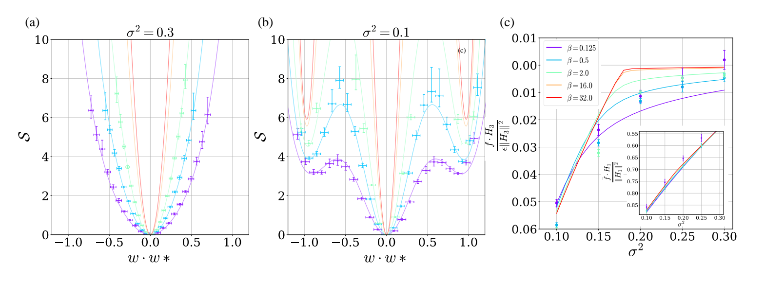
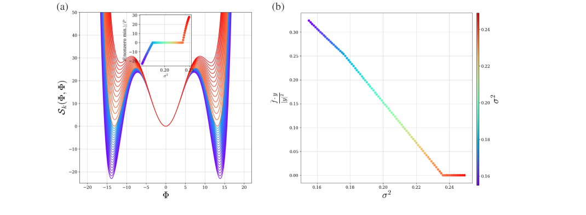
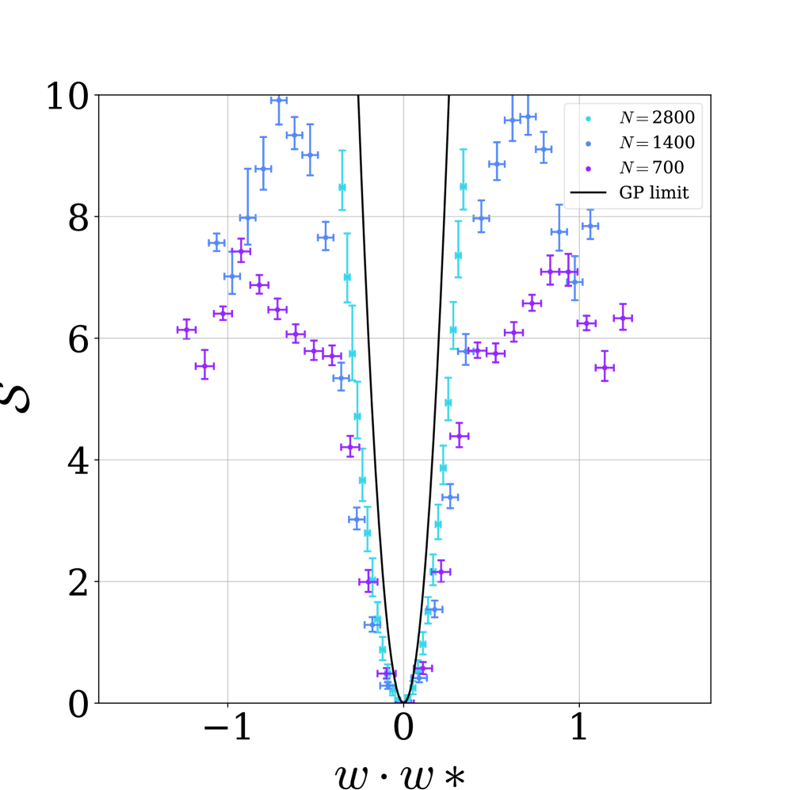
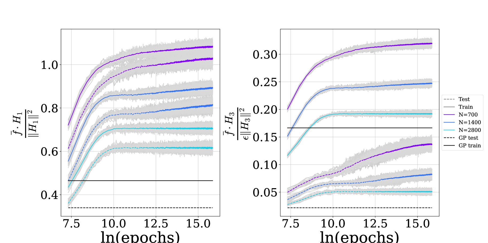

# Rubin et al. 2024 — Grokking as a First Order Phase Transition in Two Layer Networks

См. также: [глобальный индекс понятий](../../concepts/index.md).

**Noa Rubin** — Еврейский университет в Иерусалиме, Институт физики имени Рака. **Inbar Seroussi** — Тель-Авивский университет, факультет прикладной математики. **Zohar Ringel** — Еврейский университет в Иерусалиме, Институт физики имени Рака.

arXiv [2310.03789](https://arxiv.org/abs/2310.03789), 5 октября 2023; ICLR 2024. 47 цитирований — одиннадцатая по цитируемости работа корпуса. Источник — нативный HTML arXiv версии v3 (принятая на ICLR). Ar5iv отдаёт более раннюю версию под другим названием — «Droplets of Good Representations: Grokking as a First Order Phase Transition in Two Layer Networks», с тремя приложениями вместо четырёх; она здесь не используется.

Оригинал и производные файлы этой папки:

- [`original/2310.03789.native.html`](original/2310.03789.native.html) — первоисточник, нативный HTML arXiv (v3), скачан как есть.
- [`original/2310.03789.grokking-as-a-first-order-phase-transition-in-two-layer-networks.md`](original/2310.03789.grokking-as-a-first-order-phase-transition-in-two-layer-networks.md) — конверсия оригинала в Markdown без правок содержания.
- [`images/`](images/) — 6 иллюстраций статьи. Рисунок 2 восстановлен из PDF: нативный HTML отдаёт вместо него пустой растр, на котором осталась только подпись оси.

Схема якорей и правила ссылок на карточку — в [README папки статей](../README.md).

## Затрагиваемые понятия

**[Фазовый переход](../../concepts/phase-transition.md)** — работа не сравнивает гроккинг с фазовым переходом по аналогии, а строит **отображение**: параметр порядка, действие, сёдла, смешанная фаза. Переход именно **первого рода** — минимумы действия существуют по отдельности до перехода и лишь пересекаются по значению в точке перехода ([`p6-6`](#p6-6)). Отсюда следует то, чего аналогия дать не может: конечный промежуток управляющего параметра, на котором два седла остаются вырожденными, — та самая смешанная фаза.

**[Параметр порядка](../../concepts/order-parameter.md)** — предъявлена конкретная величина: $\Phi=\boldsymbol{w}\cdot\boldsymbol{w}^{*}$, перекрытие весов нейрона с весами учителя. Высокоразмерное апостериорное распределение сети сводится к **скалярной** вероятности от этой одной величины ([`p6-4`](#p6-4)). Это редкий в корпусе случай, когда параметр порядка не постулируется, а выводится из расцепления мод.

**[Эффективная теория / статистическая механика](../../concepts/effective-theory-statistical-mechanics.md)** — гроккинг изучается как **равновесное (байесовское) явление**, управляемое размером выборки, шумом или шириной, а не как явление во времени ([`p2-1`](#p2-1)). Ланжевенова динамика с weight decay даёт апостериорное распределение, совпадающее с байесовским выводом при гауссовском априорном; дальше работает обычная машина среднего поля и седловых точек.

**[Обучение признакам](../../concepts/feature-emergence-feature-learning.md)** — введена классификация, а не одно понятие: **GFL** (веса гауссовски флуктуируют вокруг единственного минимума в нуле), **GMFL-I** (смесь нулевого и ненулевых сёдел — часть нейронов «знает» об учителе, часть нет) и **GMFL-II** (нулевое седло подавлено) ([`p5-5`](#p5-5)). Гроккинг начинается на входе в GMFL-I. Нейроны, флуктуирующие вокруг седла, знающего об учителе, авторы называют **каплями** — по прямой аналогии с каплями воды в переходе «вода — пар» ([`p4-4`](#p4-4)).

**[NTK](../../concepts/neural-tangent-kernel-ntk.md)** и **[от ленивого к богатому](../../concepts/lazy-to-rich-kernel-to-feature-learning.md)** — фаза GFL «плавно связана с пределом GP», то есть с ленивым режимом, а гроккинг — это выход за его пределы. Точка расхождения с Kumar et al.: там переход из ленивого в богатый описан как **динамический**, здесь — как равновесный фазовый переход по управляющему параметру.

**[Модульная арифметика](../../concepts/modular-arithmetic.md)** — вторая модель взята прямо у Gromov: двугорячий вход, квадратичная активация, $\delta$-функция как цель ([`p3-3`](#p3-3)). Существенно, что теория **воспроизводит** его решение: веса вблизи седла с $\Phi,\Psi\neq 0$ отвечают его косинусным выражениям, а фазовое ограничение $\varphi^{(1)}+\varphi^{(2)}=\varphi^{(3)}$ здесь становится ненужным, потому что формализм маргинализует по считывающему слою ([`p9-1`](#p9-1)). Два независимых вывода одного и того же решения.

**[Обучение структурированным представлениям](../../concepts/structured-representation-learning.md)** — после перехода сеть порождает внутренние представления учителя, **резко отличные** от прежних ([`p1-2`](#p1-2)). «Резко» здесь не риторика: до перехода представление одно, после — другое, промежуточных нет по построению перехода первого рода.

**[Границы генерализации](../../concepts/generalization-bounds.md)** — заявлен механизм снижения **выборочной сложности** ([`p2-3`](#p2-3)). Счётно: NNGP-ядро полносвязной сети задаёт равномерное априорное распределение по кубическим многочленам, которых $O(d^{3})$, — для их выучивания понадобилось бы $n\approx 5\cdot 10^{5}$ точек; конечная сеть справляется при $n=3000$, на два порядка раньше ([`p7-2`](#p7-2)). Объяснение: признаки выучиваются из легко доступных линейных компонент цели и применяются к нелинейным.

**[Критический размер данных](../../concepts/data-fraction-critical-dataset-size.md)** — управляющих параметров здесь три и они взаимозаменяемы: размер выборки, шум и ширина. Уменьшение $\sigma^{2}$ равносильно росту $n$, поскольку в теорию входит только комбинация $n/\sigma^{2}$; переход в приложении D вызывается **уменьшением ширины** с 2800 до 700. Это ставит критический размер данных в один ряд с прочими управляющими параметрами, а не выше их.

**[Спектральный анализ](../../concepts/spectral-analysis-svd-esd-fve.md)** — обучение признакам определено как отклонение скрытых ядер от ядер случайной сети; ядро развивает **пики в направлении цели** ([`p1-4`](#p1-4)). В заключении из этого выводится практическое предложение: прунинг и регуляризация удалением низколежащих собственных значений скрытого ядра ([`p9-3`](#p9-3)).

**[Меры прогресса](../../concepts/progress-measures.md)** — предложена, но не проверена: отслеживать **выбросы** в распределениях весов или преактиваций вдоль доминирующих собственных векторов ядра, чтобы понять, близка ли модель к гроккингу ([`p9-3`](#p9-3)). Это прямое следствие картины капель — выброс и есть первая капля.

**[Weight decay](../../concepts/weight-decay.md)** — входит в постановку дважды. Как $\gamma$ в ланжевеновой динамике он задаёт ковариацию априорного распределения ([`p3-8`](#p3-8)); в модели модульной алгебры дополнительно вводится **нелинейный** член $\Gamma\propto(w_{k}w_{-k})^{3}$, выбранный так, чтобы моды расцеплялись. Авторы оговаривают, что для более естественного $\sum_{n}w_{n}^{6}$ результаты качественно те же, но выводились приближённо.

**[Гроккинг](../../concepts/grokking.md)** — понятие смещается: в основной части гроккингом называется **скачок расхождения** $a$ (тестовой RMSE) при переходе, а не задержка во времени ([`p8-5`](#p8-5)). На промежутке GMFL-I расхождение падает на $30\%$ ([`p8-6`](#p8-6)). Отложенная генерализация в привычном смысле показана отдельно, в приложении D, и уже вне предела эквивалентного ядра.

Карточки статей корпуса: [Gromov 2023](../2301.02679.grokking-modular-arithmetic/2301.02679.grokking-modular-arithmetic.card.md) — источник второй модели и решения, которое здесь выводится заново из апостериорного распределения; [Nanda et al. 2023](../2301.05217.progress-measures-for-grokking-via-mechanistic-interpretability/2301.05217.progress-measures-for-grokking-via-mechanistic-interpretability.card.md) — работа, где связь гроккинга с фазовым переходом была предположена, но не выведена; [Kumar et al. 2023](../2310.06110.grokking-as-the-transition-from-lazy-to-rich-training-dynamics/2310.06110.grokking-as-the-transition-from-lazy-to-rich-training-dynamics.card.md) — тот же выход за пределы ленивого режима, но как динамика, а не как равновесие; [Varma et al. 2023](../2309.02390.explaining-grokking-through-circuit-efficiency/2309.02390.explaining-grokking-through-circuit-efficiency.card.md) — конкуренция контуров, упомянутая в обзоре как альтернативное объяснение; [Liu et al. 2022](../2205.10343.towards-understanding-grokking-an-effective-theory-of-representation-learning/2205.10343.towards-understanding-grokking-an-effective-theory-of-representation-learning.card.md) — предшествующая «эффективная теория» с одним обучаемым слоем, ограничение которой эта работа снимает.

**[Роль шума градиента](../../concepts/gradient-noise.md)** — «температура» здесь входит в постановку, а не в объяснение траекторий: обучение — ланжевенова динамика до равновесия ([`p3-8`](#p3-8)), шум — часть байесовской рамки. Перенос выводов на детерминированные и полнобатчевые постановки корпуса — открытый вопрос; цепочка бесшумных сетапов собрана в карточке понятия.

**[Фазовая диаграмма](../../concepts/phase-diagram.md)** — редкий случай аналитической диаграммы: она получена численным решением вытекающего уравнения, а не сеткой прогонов ([`p8-6`](#p8-6)), и потому предсказывает границу там, где опытов не ставили.
## Что показано, а что предположено

Замечания редактора карточки по итогам разбора утверждений (`…claims.txt`). Это самая теоретическая работа корпуса: почти всё в ней выводится, а не измеряется, и потому важнее обычного различать, что именно выведено и в каком пределе.

**Отображение построено, а не заявлено.** Гроккинг не сравнивается с фазовым переходом по аналогии: выписаны параметр порядка, действие, сёдла и условие вырождения; для модульной модели точка перехода определяется аналитически ([`p6-6`](#p6-6)). После полудюжины работ, где «фазовый переход» — фигура речи, это качественно другой уровень.

**Предсказания подтвердились там, где их можно было проверить.** Конечная вероятность найти нейрон с $\boldsymbol{w}\cdot\boldsymbol{w}^{*}\approx1$ — то есть каплю — предсказана до эксперимента и видна на гистограммах по 200 обученным сетям ([`p7-1`](#p7-1)). Совпадение улучшается ровно так, как требует теория, — по мере роста масштабных параметров.

**Главная оговорка сделана самими авторами.** Приближение эквивалентного ядра **смывает** явления генерализации: в нём разрыва между обучением и тестом нет по построению. То есть основной аналитический результат описывает обучение признакам, а не отложенную генерализацию. Связь с наблюдаемым гроккингом восстанавливается численно и только в приложении D — на 50 сетях, трёх значениях ширины и одном наборе гиперпараметров.

**«Гроккинг» здесь означает не то же, что в остальном корпусе.** В основной части им называется скачок расхождения $a$ при изменении управляющего параметра, причём на промежутке смешанной фазы расхождение падает на $30\%$ ([`p8-6`](#p8-6)) — а не выход на почти идеальную точность. Читая работу как объяснение гроккинга вообще, легко не заметить эту подмену.

**Обучение — ланжевеново, не SGD.** Все результаты относятся к равновесному ансамблю полностью обученных сетей, эквивалентному байесовскому выводу ([`p3-8`](#p3-8)). Перенос на обычные оптимизаторы в статье не обоснован; это существенно, потому что весь остальной корпус изучает именно траектории SGD и Adam.

**Выигрыш в выборочной сложности показан косвенно.** Числа выразительные — $n=3000$ против $\approx 5\cdot 10^{5}$ ([`p7-2`](#p7-2)), — но сравнение идёт с оценкой $O(d^{3})$ из другой работы, а не с прогоном бесконечно широкой сети. Авторы прямо пишут, что доказательство требует дальнейшей работы.

**Расцепление мод в модульной модели куплено выбором регуляризатора.** Нелинейный член $\Gamma\propto(w_{k}w_{-k})^{3}$ подобран так, чтобы моды разошлись; для естественного $\sum_{n}w_{n}^{6}$ сказано лишь, что результаты «качественно схожи», без чисел. И обучающих экспериментов с этой моделью нет вовсе — только численное решение уравнения на $a$.

**Самое ценное для корпуса — не объяснение, а стык с Gromov.** Формализм воспроизводит его косинусное решение как седло апостериорного распределения и попутно снимает одно из его ограничений: фазовое условие $\varphi^{(1)}+\varphi^{(2)}=\varphi^{(3)}$ оказывается артефактом фиксированного считывающего слоя, а не свойством решения ([`p9-1`](#p9-1)). Два независимых вывода одного и того же ответа — редкость.

**Что осталось предположением.** Обобщение на глубокие сети — «мы полагаем». Мера близости к гроккингу через выбросы вдоль собственных векторов ядра — предложение без проверки. Прунинг по низколежащим собственным значениям — тоже ([`p9-3`](#p9-3)). Каждое из трёх выглядит проверяемым и ни одно не проверено.

**Место в корпусе.** С Kumar et al. соотношение не разобрано, хотя описывается одно и то же различие — ленивый режим против богатого, — только там как динамика, а здесь как равновесие. С Nanda et al. тем более: их довод, что «внезапность» есть артефакт меры, прямо противоположен утверждению о переходе первого рода, но в статье не обсуждается.

## Ошибочные пересказы и цитирования этой статьи

Узоры ошибочного или расширенного цитирования этой работы, наблюдённые в цитирующих статьях корпуса. Каждая запись описывает, что именно искажается при пересказе, и ведёт к абзацам самих авторов, где стоит теряемая оговорка. Разбор конкретных формулировок — в карточках цитирующих работ, в их разделах «Ошибочные цитирования», куда ведут ссылки «подробности». Закономерность по этой работе: чем короче цитирование, тем оно точнее — списочные «phase transition / mean-field» ссылки безошибочны, конфабулируют развёрнутые пересказы.

**Проекция динамики обучения на равновесную теорию (ошибочное).** Работу цитируют как модель «фазовых переходов во время обучения» и включают в списки динамических lazy-to-rich теорий. У авторов же гроккинг изучается [как равновесное байесовское явление, управляемое размером выборки, шумом и шириной](#p2-1) — времени обучения в теории нет, а [«обучение» — ланжевенова динамика до равновесия, эквивалент байесовского вывода](#p3-8), не траектория SGD. Отложенная генерализация во времени появляется только численно, в приложении D. Родственная инверсия: «mean-field, в котором скрытые веса почти не уходят от инициализации» — тогда как [у авторов ядро адаптируется, а капельные нейроны уходят к решению учителя](#p7-1). Подробности: [2511.12768](../2511.12768.evidence-of-phase-transitions-in-small-transformer-based-language-models/2511.12768.evidence-of-phase-transitions-in-small-transformer-based-language-models.card.md#mc-2310-03789), [2402.16726](../2402.16726.towards-empirical-interpretation-of-internal-circuits-and-properties-in-grokked-transformers-on-modular-polynomials/2402.16726.towards-empirical-interpretation-of-internal-circuits-and-properties-in-grokked-transformers-on-modular-polynomials.card.md#mc-2310-03789), [2509.21519](../2509.21519.provable-scaling-laws-of-feature-emergence-from-learning-dynamics-of-grokking/2509.21519.provable-scaling-laws-of-feature-emergence-from-learning-dynamics-of-grokking.card.md#mc-2310-03789); мягкий отголосок: [2603.01192](../2603.01192.a-basin-selection-perspective-on-grokking-via-singular-learning-theory/2603.01192.a-basin-selection-perspective-on-grokking-via-singular-learning-theory.card.md).

**Приписывание атрибутов перехода первого рода, которых в работе нет (ошибочное).** Цитирующие дополняют картину гистерезисом, «энтропийным барьером» и кинетикой побега из «бассейна запоминания». У авторов [сёдла существуют по отдельности и в смешанной фазе остаются вырожденными](#p6-6) — ни барьера, ни гистерезиса, ни метастабильности в статье нет (слов hysteresis, barrier, metastable в оригинале нет вовсе); [нулевое седло — «не знающее об учителе», а не запоминающее](#p5-5). Подробности: [2511.12768](../2511.12768.evidence-of-phase-transitions-in-small-transformer-based-language-models/2511.12768.evidence-of-phase-transitions-in-small-transformer-based-language-models.card.md#mc-2310-03789), [2606.17120](../2606.17120.noise-driven-escape-from-metastable-phases-explains-grokking/2606.17120.noise-driven-escape-from-metastable-phases-explains-grokking.card.md#mc-2310-03789).

**«Наблюдал гроккинг на модульной арифметике» (ошибочное, мягкое).** В перечнях эмпирических наблюдений работа стоит рядом с экспериментальными — но её модульная модель решена аналитически и численно, обучающих экспериментов с ней нет; наблюдения задержки — на teacher-student модели приложения D. Мягкий отголосок: [2310.19470](../2310.19470.bridging-lottery-ticket-and-grokking-understanding-grokking-from-inner-structure-of-networks/2310.19470.bridging-lottery-ticket-and-grokking-understanding-grokking-from-inner-structure-of-networks.card.md).

Образцы аккуратного цитирования: [2603.24746](../2603.24746.grokking-as-a-falsifiable-finite-size-transition/2603.24746.grokking-as-a-falsifiable-finite-size-transition.card.md) — отделяет мотивировку от доказательства и проверяет предсказание («motivate first-order expectations… the present finite-width data do not yet show coexistence»); [2410.04489](../2410.04489.grokking-at-the-edge-of-linear-separability/2410.04489.grokking-at-the-edge-of-linear-separability.card.md) — хеджированное расширение «(though not necessarily stated in these terms)»; [2511.04760](../2511.04760.when-data-falls-short-grokking-below-the-critical-threshold/2511.04760.when-data-falls-short-grokking-below-the-critical-threshold.card.md) — «first-order phase transition in feature learning», удерживающее область применимости.

---

# Текст статьи

## Аннотация

###### p1-2
Ключевое свойство глубоких нейросетей (DNN) — способность выучивать новые признаки в ходе обучения. Эта занятная сторона глубокого обучения яснее всего проявляется в недавно описанных явлениях гроккинга. Проявляясь в основном как внезапный рост тестовой точности, гроккинг считается также явлением за пределами ленивого обучения и гауссовских процессов (GP), связанным с обучением признаков. Здесь мы применяем недавнее развитие теории обучения признакам — подход адаптивного ядра — к двум моделям «учитель — ученик» с учителем-кубическим многочленом и учителем-модульным сложением. Мы даём аналитические предсказания об обучении признакам и свойствах гроккинга в этих моделях и показываем отображение между гроккингом и теорией фазовых переходов. Мы показываем, что после гроккинга состояние DNN аналогично смешанной фазе, следующей за фазовым переходом первого рода. В этой смешанной фазе DNN порождает полезные внутренние представления учителя, резко отличные от тех, что были до перехода.

## 1 Введение

###### p1-3
Обучение признакам — процесс, в котором полезные представления выводятся из данных, а не конструируются вручную. Успех глубокого обучения часто приписывают именно ему. Отчасти это отражается в разрыве качества между настоящими глубокими нейросетями и их аналогами — бесконечно широкими гауссовскими процессами (GP) (Williams, 1996; Novak et al., 2018; Neal, 1996). Оно же ключевое для приложений переноса обучения (Weiss et al., 2016) и для интерпретируемости (Zeiler & Fergus, 2014; Chakraborty et al., 2017). И всё же, несмотря на его важность, согласия о том, как измерять — а тем более классифицировать — эффекты обучения признакам, нет.

###### p1-4
Несколько недавних результатов, Li & Sompolinsky (2021); Ariosto et al. (2022), начали проливать свет на этот вопрос. Одно направление работ (подходы адаптивного ядра) рассматривает в качестве величин, претерпевающих обучение признакам, ковариационные матрицы активаций внутри каждого слоя (ядра). Обучение признакам проявлялось бы как отклонение этих ядер от ядер случайной сети и их подстройка под решаемую задачу. Давая количественную оценку обучения признакам в довольно общих постановках, уравнения, которым подчиняются эти скрытые ядра, всё же довольно громоздки и могут вмещать разнообразные явления обучения. Одно из таких явлений (Seroussi et al., 2023), способное дать сильный прирост качества, — гауссовское обучение признакам (GFL): постепенный процесс, в котором ковариационные матрицы преактиваций нейронов меняются в ходе обучения так, чтобы увеличить свои флуктуации вдоль направлений, значимых для меток/цели. Примечательно, что, несмотря на эту плавную подстройку, флуктуации преактиваций — по ширине и по сидам обучения — остаются гауссовскими. В то же время само скрытое ядро развивает заметные пики в направлении цели, что указывает на обучение признакам.

Другое явление, часто связываемое с обучением признакам, — гроккинг. Это резкое явление, впервые замеченное у больших языковых моделей на простых математических задачах, состоит в быстрых изменениях тестовой точности после долгого периода постоянного и плохого качества (Power et al., 2022). Хотя его обычно описывают как зависящее от времени, гроккинг возникает и как функция других параметров — например, размера выборки Power et al. (2022); Gromov (2023); Liu et al. (2022a). Шире говоря, поведение DNN как функция времени и как функция размера набора данных **[p. 2]** часто схоже, что отражено, например, в использовании однопроходного SGD You et al. (2014). Несколько авторов дали количественные объяснения в рамках конкретных игрушечных моделей, где решение, получаемое сетью, можно сконструировать вручную или восстановить обратной инженерией (Gromov, 2023; Nanda et al., 2023), либо в подходящим образом устроенных перцептронных моделях (Liu et al., 2022a; Žunkovič & Ilievski, 2022), где, однако, обучение представлениям определить непросто. Учитывая упомянутые подходы адаптивного ядра к глубокому обучению, а также универсальность гроккинга для разных DNN и гиперпараметров, естественно поискать более объединяющую картину гроккинга с помощью формализма, применимого к произвольным глубоким сетям.

###### p2-1
В этой работе мы изучаем гроккинг как равновесное (или байесовское) явление, управляемое размером выборки, шумом или шириной сети. Пользуясь упомянутыми теоретическими продвижениями, мы показываем, что гроккинг в крупномасштабных моделях можно классифицировать и предсказывать средствами теории фазовых переходов среднего поля из физики (Landau & Lifshitz, 2013). Изучая две разные модели — «учитель — ученик» с кубическим учителем и модульную арифметику, — мы показываем, что внутреннее состояние DNN до гроккинга хорошо описывается GFL. Напротив, во время гроккинга оно аналогично смешанной фазе в теории фазовых переходов первого рода, а статистика преактиваций описывается смесью гауссовских распределений (GMFL). В этом состоянии GMFL скрытые ядра, связанные с DNN, развивают совершенно новые признаки, которые меняют их выборочную сложность по сравнению с обычными пределами бесконечной ширины GP. После гроккинга все веса специализированы под учителя. Помимо того, что наш подход даёт рамку для классификации эффектов обучения признакам, он даёт аналитически поддающиеся разбору и количественно точные предсказания для этих двух моделей.

Наши основные результаты таковы:

###### p2-3
- Мы устанавливаем конкретное отображение между теорией фазовых переходов первого рода, внутренними представлениями DNN и гроккингом для двух нелинейных моделей DNN, каждая из которых имеет два обучаемых слоя.
- Мы выделяем три фазы, связанные с гроккингом: одну, плавно связанную с пределом GP, и две различные фазы, включающие разные смеси GP.
- Для обеих наших моделей мы сводим задачу выучивания высокоразмерных представлений к решению нелинейного уравнения относительно двух (кубический учитель) или одной (учитель-модульное сложение) переменных. Более того, для последней мы определяем положение фазового перехода аналитически.
- Мы намечаем основанный на гроккинге механизм, способный снизить выборочную сложность по сравнению с пределом GP.

**Предшествующие работы.** Фазовые переходы вездесущи в теории обучения (например, Gardner & Derrida (1988); Seung et al. (1992); Györgyi (1990)), зачастую в контексте нарушения репличной симметрии. Связи между гроккингом и фазовым переходом предполагались у Nanda et al. (2023), но в том, что касается аналитических предсказаний, предшествующие работы сосредоточивались в основном на одном обучаемом слое Žunkovič & Ilievski (2022); Arnaboldi et al. (2023), причём некоторые предлагали их в качестве эффективной теории обучения представлениям Liu et al. (2022a). Это можно исследовать дальше, анализируя ландшафт потерь Liu et al. (2022b). Varma et al. (2023) предполагают, что обобщающее решение, выучиваемое алгоритмом, эффективнее, но выучивается медленнее запоминающего; пользуясь этим истолкованием, они определяют режимы полу-гроккинга и унгрокинга. Формализм работ Arnaboldi et al. (2023); Saad & Solla (1995) потенциально можно распространить на онлайн-гроккинг с двумя обучаемыми слоями, но это потребовало бы сократить участвующие большие матрицы. Фазовые переходы в обучении представлениям изучались в контексте точек бифуркации в подходе информационного бутылочного горлышка (например, Tishby & Zaslavsky (2015)); тем не менее связь с глубоким обучением остаётся качественной. Насколько нам известно, мы даём новую связь между гроккингом и фазовым переходом *в обучении представлениям*, выведенную из первых принципов.

## 2 Модели

### 2.1 Нелинейная модель учителя

###### p2-5
Наша первая постановка состоит из ученика — Erf-сети, выучивающей нелинейного учителя с одним индексом. Ученик обучается на обучающем наборе размера $n$, $\mathcal{D}=\left\{\boldsymbol{x}_{\mu},y\left(\boldsymbol{x}_{\mu}\right)\right\}_{\mu=1}^{n}$, с MSE-потерей. Далее полужирный символ обозначает вектор. Входной вектор — $\boldsymbol{x}_{\mu}\in\mathbb{R}^{d}$ с независимыми одинаково распределёнными гауссовскими компонентами дисперсии **[p. 3]** 1. Целевая функция $y$ — скалярная линейная функция $\boldsymbol{x}$ с ортогональной нелинейной поправкой. А именно, $y$ задаётся как

$$
y(\boldsymbol{x})=\underbrace{\boldsymbol{w}^{*}\cdot\boldsymbol{x}}_{H_{1}(\boldsymbol{w}^{*}\cdot\boldsymbol{x})}+\epsilon\underbrace{\left(\left(\boldsymbol{w}^{*}\cdot\boldsymbol{x}\right)^{3}-3\left|\boldsymbol{w}^{*}\right|^{2}\boldsymbol{w}^{*}\cdot\boldsymbol{x}\right)}_{H_{3}(\boldsymbol{w}^{*}\cdot\boldsymbol{x})}. \tag{1}
$$

где $H_{1},H_{3}$ — первые два нечётных многочлена Эрмита, а $\boldsymbol{w}^{*}\in\mathbb{R}^{d}$ — веса учителя. Для простоты мы берём здесь норму весов учителя равной 1, но качественного влияния на теорию это не оказывает, пока мы требуем $\left|\boldsymbol{w}^{*}\right|\sim\mathcal{O}(1)$. Мы рассматриваем полносвязную нелинейную сеть-ученика с одним скрытым слоем ширины $N$, задаваемую как

$$
f\left(\boldsymbol{x}\right)=\sum_{i=1}^{N}a_{i}\text{erf}\left(\boldsymbol{w}_{i}\cdot\boldsymbol{x}\right). \tag{2}
$$

где $\boldsymbol{w}_{i}\in\mathbb{R}^{d}$ при $i\in[1,N]$ — веса ученика. Свидетельства того, что эта модель грокает, приведены в приложении D.

### 2.2 Гроккинг модульной алгебры

###### p3-3
Здесь мы рассматриваем постановку из работы Gromov (2023), где задача обучения — сложение по модулю $P$, где $P$ простое. Сеть обучается на следующем наборе данных

$$
\mathcal{D} =\left\{\boldsymbol{x}_{nm},\boldsymbol{y}\left(\boldsymbol{x}_{nm}\right)|m,n\in\mathbb{Z}_{P}\right\} \tag{3}
$$

где $\boldsymbol{x}_{nm}\in\mathbb{R}^{2P}$ — вектор, у которого все координаты нулевые, кроме координат $n$ и $P+m$, равных 1 («двугорячий вектор»). Целевая функция $\boldsymbol{y}\in\mathbb{R}^{P}$ задаётся как

$$
y_{p}(\boldsymbol{x}_{nm}) =\delta_{p,(n+m)\,\text{mod}\,P}-1/P, \tag{4}
$$

где $\delta$ — дельта Кронекера, а $\text{mod}\,P$ обозначает операцию взятия по модулю, возвращающую остаток от деления на $P$. В качестве модели ученика мы рассматриваем двухслойную глубокую нейросеть с квадратичной функцией активации, задаваемую как

$$
f_{p}\left(\boldsymbol{x}_{nm}\right) =\sum_{i=1}^{N}a_{pi}(\boldsymbol{w}_{i}\cdot\boldsymbol{x}_{mn})^{2} \tag{5}
$$

где $\boldsymbol{w}_{c}\in\mathbb{R}^{2P}$ при $c\in[1,N]$ — веса ученика. Для краткости мы обозначаем $y_{p}\left(\boldsymbol{x}_{mn}\right)=y_{nm}^{p}$ и $f_{p}\left(\boldsymbol{x}_{nm}\right)=f_{mn}^{p}$.

### 2.3 Обучение моделей

###### p3-7

В обоих случаях мы рассматриваем сети, обучаемые с MSE-потерей до равновесия ланжевеновой динамикой посредством алгоритмов вроде Durmus & Moulines (2017); Neal et al. (2011). Динамика параметров в непрерывном времени, таким образом, есть

$$
\dot{\boldsymbol{\theta}}(t)=-\nabla_{\boldsymbol{\theta}}\left(\frac{\gamma}{2}\|\boldsymbol{\theta}(t)\|^{2}+L\left(\boldsymbol{\theta}(t),\mathcal{D}\right)\right)+2\sigma\boldsymbol{\xi}(t)\quad \tag{6}
$$

###### p3-8
где $\boldsymbol{\theta}(t)$ — вектор всех параметров сети в момент $t$, $\gamma$ — сила weight decay, $L$ — функция потерь, шум $\xi$ задаётся как $\quad\left\langle\xi_{i}(t)\xi_{j}\left(t^{\prime}\right)\right\rangle=\delta_{ij}\delta\left(t-t^{\prime}\right)$, а $\sigma$ — величина шума. Мы задаём weight decay выходного слоя так, чтобы в отсутствие данных $a_{i}^{2},a_{pc}^{2}$ в среднем равнялись $\sigma^{2}_{a}/N$ по равновесному ансамблю полностью обученных сетей. От весов входного слоя требуется ковариация $\sigma_{w}^{2}/d$ в модели «учитель — ученик» с $\sigma_{w}^{2}=\mathcal{O}(1)$ и ковариация $1$ в модели модульной алгебры. Заметим, что ковариация скрытого слоя равна $\sigma^{2}/\gamma$. Апостериорное распределение, порождаемое описанным протоколом обучения, совпадает с байесовским выводом при гауссовском априорном распределении на весах, заданном приведённой ковариацией, и измерительном шуме $\sigma^{2}$ Naveh et al. (2021).

**[p. 4]**

### 2.4 Обзор вывода

#### 2.4.1 Краткое введение в фазовые переходы теории среднего поля

Фазовые переходы Landau & Lifshitz (2013); Tong (2011) — например, переход «вода — пар» — вездесущи в физике. Их отличает особенное поведение некоторых усреднённых наблюдаемых как функции управляющего параметра (скажем, средней плотности как функции объёма). Поскольку законы физики обычно гладки, фазовые переходы по своей природе — крупномасштабные, или термодинамические, явления, отдалённо аналогичные тому, как сумма многих непрерывных функций может привести к разрывной.

###### p4-2
В типичной постановке вероятность $p(x)$ обнаружить систему в состоянии $x$ можно приближённо маргинализовать, оставив одну случайную величину, называемую параметром порядка ($\Phi$). Поскольку последняя обычно есть сумма многих переменных (то есть макроскопическая), она склонна концентрироваться, давая вероятность вида $\log(p(\Phi))\propto-d\tilde{S}(\Phi)$, где $d$ — макроскопический масштаб (например, число частиц), а $\tilde{S}(\Phi)$ — некоторая хорошо ведущая себя функция, не масштабирующаяся с $d$. При такой структуре статистику $\Phi$ можно разбирать методами седловой точки, а именно раскладывая в ряд Тейлора до второго порядка вблизи минимумов $\tilde{S}$.

Фазовые переходы происходят, когда появляются два или более *глобальных* минимума $\tilde{S}(\Phi)$. Фазовые переходы первого рода происходят, когда эти минимумы различны до фазового перехода и лишь в точке перехода пересекаются по значению $\tilde{S}$. Примечательно, что действие такого пересечения решительно: при большом $d$ наблюдаемое поведение (например, среднее $\Phi$) претерпело бы разрывное изменение. В зависимости от постановки такая резкая перемена может быть несогласованной, поскольку она немедленно изменила бы ограничения, которые ощущает система. Например, при переходе «вода — пар» по мере уменьшения объёма давление на пар нарастает. В какой-то момент это делает минимум $\Phi$ высокой плотности столь же выгодным, как минимум низкой плотности, что означает появление капель воды. Однако превращение всего пара в капли создало бы падение давления, делающее образование капель невыгодным. Вместо этого наблюдается смешанная фаза, где как функция управляющего параметра образуется такая доля капель, чтобы поддерживать два в точности вырожденных минимума $\tilde{S}$. При дальнейшем уменьшении объёма достигается точка, где весь пар превратился в капли, и система оказывается в жидкой фазе.

###### p4-4
В нашем разборе ниже $\Phi$ будет свойством весов каждого нейрона входного слоя — скажем, их перекрытием с некоторыми заданными весами учителя. Высокая размерность входа будет аналогом крупномасштабного предела, а плотность приблизительно отвечает расхождению в предсказаниях. Фазовые переходы отмечены новым минимумом $\tilde{S}(\Phi)$, который схватывает некоторый признак сети-учителя, полезный для уменьшения расхождения. То, что мы называем каплями, отвечает тому, что часть входных нейронов принимает значения $\Phi$, соответствующие признаку учителя, тогда как другие флуктуируют вокруг минимума, не знающего об учителе. Однако пространственное представление, связанное с каплями, здесь неуместно — как и в теории фазовых переходов среднего поля.

#### 2.4.2 Подход адаптивного ядра и его расширение до гауссовских смесей

Наш основной предмет здесь — апостериорное распределение весов входного слоя ($p(\boldsymbol{w}_{i})$) и усреднённые по апостериорному распределению предсказания сети ($f(\boldsymbol{x})$). Такие апостериорные распределения, вообще говоря, неподатливы для глубоких и/или нелинейных сетей. Поэтому мы обращаемся к приближению из работы Seroussi et al. (2023), где выполняется среднеполевое расцепление между считывающим слоем и входным слоем. Оно точно в пределе $N\rightarrow\infty$ и исчезающего $\sigma_{a}^{2}$ (то есть при среднеполевом масштабировании). Вслед за этим апостериорное распределение расцепляется в произведение двух вероятностей: гауссовской вероятности для выходов считывающего слоя и, вообще говоря, негауссовской вероятности для весов входного слоя. Эти две вероятности связаны через две нефлуктуирующие величины: среднее ядро, порождаемое входным слоем, и расхождение в предсказаниях. Как показано в Seroussi et al. (2023), в частности для двухслойной полносвязной сети, получающаяся вероятность далее расцепляется в независимые одинаково распределённые вероятности по каждому нейрону $p(\boldsymbol{w}_{i})$. Ниже мы поэтому опускаем индекс нейрона $i$. Действие ($-\log(p(\boldsymbol{w}_{i}))$ с точностью до постоянных нормировочных множителей) для весов каждого нейрона тогда имеет следующий вид

$$
\mathcal{S}[\boldsymbol{w}]=\frac{|\boldsymbol{w}|^{2}}{2\sigma_{w}^{2}}-\frac{\sigma_{a}^{2}}{2N}\sum_{\mu,\nu}\overline{\boldsymbol{t}}(\boldsymbol{x}_{\mu})^{T}\overline{\boldsymbol{t}}(\boldsymbol{x}_{\nu})\underbrace{\phi(\boldsymbol{w}\cdot\boldsymbol{x}_{\mu})\phi(\boldsymbol{w}\cdot\boldsymbol{x}_{\nu})}_{:=\sigma_{a}^{-2}\tilde{Q}_{\mu\nu}}, \tag{**[p. 5]** 7}
$$

где $\phi$ — функция активации, а $\bar{\boldsymbol{t}}$ — расхождение между усреднённым выходом сети и целью, задаваемое как

$$
\overline{\boldsymbol{t}}\left(\boldsymbol{x}_{\mu}\right)=(\boldsymbol{y}\left(\boldsymbol{x}_{\mu}\right)-\overline{\boldsymbol{f}}\left(\boldsymbol{x}_{\mu}\right))/\sigma^{2}. \tag{8}
$$

Примечательно, что $\bar{\boldsymbol{t}}$ не задаётся, а определяется решением следующих двух среднеполевых уравнений самосогласования

$$
\overline{\boldsymbol{f}}=Q\left[Q+\sigma^{2}I_{n}\right]^{-1}\boldsymbol{y} \tag{9}
$$

где ядро $Q$ определено через

$$
Q_{\mu\nu}=\sigma_{a}^{2}\left\langle\phi\left(\boldsymbol{w}\cdot\boldsymbol{x}_{\mu}\right)\phi\left(\boldsymbol{w}\cdot\boldsymbol{x}_{\nu}\right)\right\rangle_{\mathcal{S}[\boldsymbol{w}]} \tag{10}
$$

а $\langle...\rangle_{\mathcal{S}[\boldsymbol{w}]}$ обозначает усреднение по $\boldsymbol{w}$ с вероятностью, задаваемой $\mathcal{S}[\boldsymbol{w}]$. В этой работе мы пользуемся приближением эквивалентного ядра (EK), позволяющим заменить суммы, входящие в уравнения 7, 9, интегралами. Это приближение смывает явления генерализации, связанные с гроккингом, но схватывает лежащие в основе механизмы обучения признакам. Как показано в приложении D, эффекты обучения признакам сохраняются и для конечных наборов данных, где можно наблюдать разрыв генерализации. Теоретические поправки на конечность наборов данных можно внести, как показано в Cohen et al. (2021); Seroussi et al. (2023); Naveh & Ringel (2021); здесь мы ради простоты сосредоточиваемся на пределе EK.

Даже если $\bar{t}$ задано, оставшееся действие всё ещё нелинейно. Работа Seroussi et al. (2023) продолжает, выполняя вариационное гауссовское приближение к этому действию. Здесь мы расширяем это приближение до некоторого вариационного приближения гауссовской *смесью*. А именно, мы показываем, что при подходящем совместном увеличении $d,N,n$ и после некоторых доводов о расцеплении $\mathcal{S}[\boldsymbol{w}]$ имеет вид $d\mathcal{\hat{S}}[\Phi(\boldsymbol{w})]$, где $d\gg 1$, коэффициенты $\mathcal{\hat{S}}[\Phi(\boldsymbol{w})]$ порядка $O(1)$, а $\Phi(\boldsymbol{w})$ — некоторая линейная комбинация весов. Это позволяет нам разбирать интегрирование, лежащее в основе $\langle...\rangle_{\mathcal{S}[\boldsymbol{w}]}$, в приближении седловой точки. Примечательно, что когда появляется более одного глобального седла, разбор методом седловой точки отвечает тому, что $p(\boldsymbol{w})$ имеет вид гауссовской смеси.

*Рисунок 1: Схематическая фазовая диаграмма фаз обучения. Врезки в разных фазах отвечают нормированному отрицательному логарифму апостериорной плотности ($\hat{\mathcal{S}}$). Переход между разными фазами достигается изменением либо $n$, либо $N$.* **[p. 5]**

###### p5-5
Три фазы обучения, описанные во введении, отвечают следующему поведению сёдел (см. также иллюстрацию на рис. 1). Сначала существует единственное седло с центром в $\Phi(\boldsymbol{w})=0$, и веса гауссовским образом флуктуируют вокруг этого минимума, как в GFL. В следующей фазе распределение состоит из взвешенного среднего этого нулевого седла и других сёдел с $|\Phi(\boldsymbol{w})|>0$. Это знаменует новую способность сети к обучению и, значит, начало гроккинга. Мы называем эту смешанную фазу первой фазой обучения признакам гауссовской смесью (GMFL-I). Эта фаза отвечает смешанной («капельной») фазе. В ней у случайно выбранного нейрона есть конечная вероятность оказаться в фазе GFL и, значит, флуктуировать вокруг минимума, не знающего о цели, при $\boldsymbol{w}=0$. Точно так же есть конечная вероятность, что он флуктуирует вокруг одного из нетривиальных сёдел. Некоторое время спустя, после того как предъявлено больше данных, в среднем доминируют только сёдла с $|\boldsymbol{w}|>0$ (GMFL-II). Феноменология фаз общая для обеих моделей, однако подробности появляющихся новых сёдел, равно как и схема расцепления между разными компонентами $\boldsymbol{w}$, у двух моделей различаются. Далее мы обращаемся к этим подробностям.

## 3 Результаты

### 3.1 Нелинейная модель «учитель — ученик»

**Постановка масштабирования и эффективное взаимодействие.** Рассмотрим следующие две масштабные переменные ($\alpha,\beta$), которые мы вскоре устремим к бесконечности вместе, и будем увеличивать микроскопические параметры так:

$$
N\rightarrow\beta N\,\,\,\ d\rightarrow\sqrt{\beta}d\,\,\,\ \sigma_{a}^{2}\rightarrow\sigma_{a}^{2}/\sqrt{\beta}\,\,\,,\,\sigma^{2}\rightarrow\frac{\alpha}{\beta}\sigma^{2}\,\,\,\ n\rightarrow\alpha n \tag{1**[p. 6]** 1}
$$

при этом заметим, что $\alpha$ можно рассматривать как приближение сплошной среды, позволяющее заменить суммирование по данным интегралами по мере данных, а $\beta$ есть сочетание масштабирования среднеполевого типа Mei et al. (2018) с термодинамическим/седловым пределом. Примечательно, что следующая комбинация ($u$) гиперпараметров, $u=\frac{n^{2}\sigma_{a}^{2}}{\sigma^{4}dN}$, которую мы называем эффективным взаимодействием, инвариантна относительно и $\alpha$, и $\beta$.

**Утверждение I. Две значимые моды расхождения до перехода.** При $\beta\rightarrow\infty$, $\sqrt{\beta}/\alpha\rightarrow 0$ и $u\leq u_{c}(\epsilon)$ ($\approx 30.2$ при $\epsilon=-0.3$) расхождение принимает следующий вид

$$
\sigma^{2}\overline{t}\left(\boldsymbol{x}\right)=bH_{1}\left(\boldsymbol{x}\right)+cH_{3}\left(\boldsymbol{x}\right) \tag{12}
$$

где $b,c\in\mathbb{R}$ — некоторые постоянные коэффициенты порядка $O(1)$. Заметим, что $ub^{2}$ пропорционально эмерджентному масштабу из работы Seroussi et al. (2023). Подробнее см. приложение A.2.

**Утверждение II. Одномерное апостериорное распределение весов.** В том же масштабном пределе при $u\leq u_{c}$ отрицательный логарифм вероятности (действие в терминологии физики) весов вдоль направления учителя расцепляется от остальных мод $\boldsymbol{w}$ и принимает следующий вид

$$
\mathcal{S}[\boldsymbol{w}\cdot\boldsymbol{w}^{*}] =d\left(\frac{\left(\boldsymbol{w}\cdot\boldsymbol{w}^{*}\right)^{2}}{2\sigma_{w}^{2}}-\frac{2n^{2}\sigma_{a}^{2}}{\pi\sigma^{4}dN}\frac{\left(\boldsymbol{w}\cdot\boldsymbol{w}^{*}\right)^{2}}{1+2\left(\sigma_{w}^{2}+\left(\boldsymbol{w}\cdot\boldsymbol{w}^{*}\right)^{2}\right)}\left(b-\frac{2c\left(\boldsymbol{w}\cdot\boldsymbol{w}^{*}\right)^{2}}{1+2\left(\sigma_{w}^{2}+\left(\boldsymbol{w}\cdot\boldsymbol{w}^{*}\right)^{2}\right)}\right)^{2}\right) \tag{13}
$$

###### p6-4
Примечательно, что это выражение сводит высокоразмерное апостериорное распределение сети к скалярной вероятности, содержащей только значимый параметр порядка ($\Phi=\boldsymbol{w}\cdot\boldsymbol{w}^{*}$). Отметим далее, что все выражения в скобках инвариантны относительно $\alpha$ и $\beta$. Эвристически это же будет действием и при малом $\Delta u$ после фазового перехода, поскольку возникающие поправки к расхождению дают параметрически малый эффект. Подробнее см. приложение A.2.

**Утверждение III. Точность приближения гауссовской смесью.** В том же масштабном пределе вероятность, описываемая приведённым действием, есть в точности смесь гауссовских распределений, каждое из которых сосредоточено вокруг глобального минимума $\mathcal{S}$.

###### p6-6
**Утверждение IV. Фазовый переход первого рода.** При $u<u_{c}$ единственное седло — то, что при $\Phi=0$. Ровно при $u=u_{c}$ появляются три седла, два из которых расположены примерно при $\Phi=\pm|w_{*}|^{2}=\pm 1$. На некотором конечном промежутке $u\in[u_{c},u_{c}+\Delta u]$ эти сёдла остаются вырожденными по значению $\mathcal{\hat{S}}$.

#### 3.1.1 Экспериментальные результаты для модели «учитель — ученик»

*Рисунок 2: **От GFL к GMFL-I: теория и эксперимент в модели «учитель — ученик».** Панели (a) и (b) показывают отрицательный логарифм апостериорной плотности до и после фазового перехода, вызванного изменением шума $\sigma^{2}$. Хорошее согласие экспериментальных значений (крестики) и теории (сплошные линии) для всё более редких событий достигается по мере увеличения модели согласно таблице 1 (цветовая кодировка). Обращаясь к выходам сети, панель (c) показывает ожидаемый фазовый переход в выучивании кубической компоненты учителя, а врезка — расхождение в линейной компоненте учителя. Поскольку наша аналитика верна до фазовых переходов и в самих точках перехода, расхождения в $\bar{f}\cdot H_{3}$ вблизи перехода — ожидаемый эффект конечного размера, подчёркнутый малостью абсолютного значения.* **[p. 6]**

**[p. 7]**

Чтобы подтвердить наш теоретический подход, мы обучили ансамбль из 200 DNN при разных значениях $\alpha=\beta$ нашей ланжевеновой динамикой при достаточно малых скоростях обучения и достаточно долго, чтобы обеспечить равновесие. Наши исходные $N,d,\sigma^{2},\sigma_{a}^{2}$ (то есть при $\alpha=\beta=1$) были: $N=700,n=3000,d=150,\sigma_{w}^{2}=0.5,\sigma_{a}^{2}=8/N$, и мы взяли $\epsilon=-0.3$. Наш обучающий ансамбль состоял как из разных сидов инициализации, так и из разных сидов выборки данных. Вместе с индексами нейронов, отвечающими $N$, они дали $200N$ выборок $\boldsymbol{w}_{*}\cdot\boldsymbol{w}$, использованных для оценки $p(\boldsymbol{w})$. Расхождение оценивалось скалярным произведением выходов с $H_{1/3}(x)$ по выборке из 3000 тестовых точек и затем усреднялось по 50 сидам.

###### p7-1
Наши экспериментальные результаты приведены на рис. 2. Панель (c) показывает, как выучиваются линейная (врезка) и кубическая компоненты цели в зависимости от $\sigma^{2}$. Примечательно, что уменьшение $\sigma^{2}$ подобно увеличению $n$, поэтому при меньшем $\sigma^{2}$ ожидается больше обучения признакам. По мере роста $\alpha=\beta$ (см. цветовую кодировку) вблизи $\sigma^{2}=0.18$ развивается резкий фазовый переход, где кубическая компонента начинает приближаться к значению учителя ($\epsilon$). Панели (a) и (b) отслеживают $-\log(p(\boldsymbol{w}\cdot\boldsymbol{w}_{*}))$ в двух точках — до и после фазового перехода соответственно. По мере роста $\alpha=\beta$ теория предсказывает конечную вероятность для $\Phi(\boldsymbol{w})=\boldsymbol{w}\cdot\boldsymbol{w}_{*}\approx 1$. Это означает, что у случайно выбранного нейрона есть конечная вероятность флуктуировать вокруг минимума, знающего об учителе. Такие нейроны мы и называем нашими каплями. Все графики показывают хорошее согласие с теорией по мере увеличения $\alpha=\beta$ до перехода. Оставшиеся расхождения отнесены на счёт эффектов конечного размера (то есть конечных $\alpha,\beta$), которые, как и ожидается, заметнее вблизи перехода.

###### p7-2
Описанный эксперимент указывает и на некоторые потенциально сильные стороны обучения признакам, связанные со сложностью. Примечательно, что NNGP-ядро полносвязной сети задаёт равномерное априорное распределение по кубическим многочленам (то есть по всем гиперсферическим гармоникам с $l=3$). Поскольку их $n=O(d^{3})$, в нашей постановке для выучивания таких компонент цели потребовалось бы $n=0.5e+6$ точек данных (см. также Cohen et al. (2021)). Здесь это происходит на два порядка раньше ($n=3000$). Так выходит потому, что сложное априорное распределение, порождаемое *конечной* DNN, выучивает признаки из легко доступных линейных компонент цели и применяет их к нелинейным. Доказательство того, что такое «обучение с подсказкой» сложным признакам меняет выборочную сложность по сравнению с NNGP, требует дальнейшей работы. В приложении A.1 мы приводим аналитический довод в его пользу.

*Таблица 1: Законы масштабирования*

| Модель | Ширина | Размерность входа | Размер данных | Величина шума | Weight decay |
|---|---|---|---|---|---|
| Полиномиальная регрессия | $N\to\beta N$ | $d\to\sqrt{\beta}d$ | $n\to\alpha n$ | $\sigma^{2}\to\frac{\alpha}{\beta}\sigma^{2}$ | $\sigma^{2}_{a}\to\sigma^{2}_{a}/\sqrt{\beta}$ |
| Модульная теория | $N\to\beta^{2}N$ | $P\to\sqrt{\beta}P$ | $P^{2}\to{\beta}P^{2}$ | $\sigma^{2}\to\sigma^{2}/\beta$ | $\sigma_{a}^{2}\to\sigma_{a}^{2}/{\beta}$ |

### 3.2 Теория модульной алгебры

**Постановка масштабирования и эффективное взаимодействие.**

Как и в задаче полиномиальной регрессии, мы рассматриваем масштабную переменную ($\beta$), которую позже устремим к бесконечности совместно, и увеличиваем микроскопические параметры. Точное масштабирование дано в таблице 1.

$$
N \rightarrow\beta^{2}N\,\,\,\ P\rightarrow\sqrt{\beta}P\,\,\,\ \sigma_{a}^{2}\rightarrow\sigma_{a}^{2}/{\beta}\,\,\,\ \sigma^{2}\rightarrow\sigma^{2}/{\beta} \tag{14}
$$

Заметим, что здесь нам не нужен дополнительный масштаб для предельного перехода к сплошной среде по набору данных, поскольку этот предел берётся рассмотрением всех сочетаний точек данных. Как и раньше, $\beta$ есть сочетание среднеполевого масштабирования с термодинамическим/седловым пределом. Примечательно, что следующая комбинация ($u$) гиперпараметров, $u=\frac{2\sigma_{a}^{2}P^{2}}{N\sigma^{4}}$, которую мы называем эффективным взаимодействием, инвариантна относительно $\beta$.

**Симметрии задачи**

Следующие симметрии $S[\boldsymbol{w}]$ (которое также является функцией $\bar{\boldsymbol{t}}$) помогают нам расцепить апостериорное распределение вероятности по его фурье-модам и заметно упростить задачу:

1. Замена $[n,m]\rightarrow[(n+q)\,\text{mod}\,P,(m+q^{\prime})\,\text{mod}\,P]$ и $f_{p}\rightarrow f_{(p+q+q^{\prime})\,\text{mod}\,P}$ при $q,q^{\prime}\in\mathbb{Z}_{P}$
2. Замена $[n,m]\rightarrow[qn\,\text{mod}\,P,qm\,\text{mod}\,P]$ и $f_{p}\rightarrow f_{qp\,\text{mod}\,P}$ при $q\in\mathbb{Z}_{P}$, отличном от нуля.

**Утверждение I. Единственная мода расхождения.** Несколько следствий этих симметрий приведены в приложении B.1. Во-первых, мы находим, что адаптивное GP-ядро $Q$ (выписанное явно в уравнении 21) диагонально в **[p. 8]** базисе $\phi_{k,k^{\prime}}(x_{n,m})=P^{-1}e^{2\pi i(kn+k^{\prime}m)/P}$, где $k,k^{\prime}\in\{0,1,...,P-1\}$. Что до собственных значений, вторая симметрия влечёт вырожденность $\phi_{k,k^{\prime}}$ с $\phi_{ck,ck^{\prime}}$. Для простого $P$ отсюда, в частности, следует, что все собственные векторы $\phi_{k,k}$ с $k>0$ имеют одно и то же собственное значение ($\lambda$). Примечательно, что сама цель натянута на это вырожденное подпространство, а именно

$$
y^{p}_{nm} =P^{-1}\sum_{k=1}^{P-1}e^{-i2\pi kp/P}e^{i2\pi k(n+m)/P}=\left[\sum^{P-1}_{k=1}e^{-i2\pi kp/P}\phi_{k,k}(x_{n,m})\right] \tag{15}
$$

Как следствие, обнаруживается, что цель всегда является собственным вектором ядра и $\sigma^{2}\bar{t}^{p}_{mn}=ay^{p}_{nm}$, где $a\in\mathbb{R}$. Таким образом, есть лишь одна мода расхождения, и она согласована с целью.

**Утверждение II. Расцепленное двумерное апостериорное распределение весов для каждой фурье-моды.** Мы расцепляем все различные флуктуирующие моды, снова пользуясь симметриями задачи и делая продуманный выбор нелинейного слагаемого weight decay ($\Gamma$). Для этого мы определяем следующие фурье-преобразованные весовые переменные ($w_{k},v_{k}$): $w_{n}=\sum_{k=0}^{P-1}w_{k}e^{-\frac{2\pi ikn}{P}},\ \ \ w_{m}=\sum_{k=0}^{P-1}v_{k}e^{-\frac{2\pi ikm}{P}}$, что при подстановке в действие даёт

$$
\mathcal{S}[\hat{\boldsymbol{w}}]=P\left[\left(\frac{1}{2}\sum_{k=0}^{P-1}w_{k}w_{-k}+\frac{1}{2}\sum_{k=0}^{P-1}v_{k}v_{-k}\right)-\frac{2\sigma_{a}^{2}a^{2}P^{2}}{N\sigma^{4}}\sum_{k=1}^{P-1}w_{k}w_{-k}v_{k}v_{-k}\right]+\Gamma[\boldsymbol{w}] \tag{16}
$$

(см. приложение B.2), где, помимо нелинейного слагаемого weight decay, все различные моды $k$ расцеплены. Для простоты мы далее выбираем $\Gamma[\boldsymbol{w}]=\sum_{k}P\frac{\gamma}{6}\left(\left(w_{k}w_{-k}\right)^{3}+\left(v_{k}v_{-k}\right)^{3}\right)$. Здесь формально два параметра порядка — $\Phi=w_{k}w_{-k},\Psi=v_{k}v_{-k}$, — но из симметрии действия мы получаем, что сёдла возникают лишь в точках, где $\Phi=\Psi$. Заметим, что при разборе более естественных слагаемых weight decay вроде $\sum_{n}w_{n}^{6}+w_{m}^{6}$ с использованием в качестве приближения некоторого анзаца GP-смеси для $p(w_{i})$ мы получили схожие качественные результаты.

**Утверждение III. Точность приближения гауссовской смесью.** Благодаря большому множителю $P$ перед действием приведённое нелинейное действие для каждой $k-$моды можно разбирать обычным методом седловой точки. А именно, рассматривая $Q$ как функцию $a$, а вместе с ним и $\lambda$, можно вычислить их седловым приближением к вероятности, связанной с этим действием. В пределе $\beta\rightarrow\infty$ мы получаем, что это приближение точно. Далее $a$ можно вычислить по выражению GP-регрессии $-\frac{\sigma^{2}}{\lambda+\sigma^{2}}$, и в этом пределе значение $\lambda$ вычисляется точно. Требование, чтобы это последнее значение $a$ совпадало со значением в действии, даёт уравнение на $a$.

###### p8-5
**Утверждение IV. Фазовый переход первого рода.** Поскольку квадратичное слагаемое в масштабированном действии постоянно, пока никакие другие сёдла не становятся вырожденными (по значению действия) с седлом $\Phi=\Psi=0$, разбор методом седловой точки обрывает действие на этом первом слагаемом. С ростом $u$ слагаемое четвёртой степени становится более отрицательным, и потому при некотором критическом значении $u$ должен произойти переход первого рода с нарушением симметрии. За этой точкой $a$ начинает убывать. Если оно будет убывать слишком быстро, обратное влияние на действие окажется таким, что убывать $a$ станет невыгодно, и потому распределение вероятности будет иметь два вырожденных минимума — при нулевом и ненулевом значении $\Phi$, — представляющих фазу GFML-I. Дальнейший рост $u$ снимет вырождение, и глобальный минимум логарифма апостериорного распределения станет нетривиальным. Примечательно, что $a$ измеряет здесь тестовую RMSE, поэтому то обстоятельство, что оно остаётся постоянным и вдруг начинает убывать, тоже можно понимать как гроккинг.

#### 3.2.1 Численное моделирование модульной алгебры

###### p8-6
Численное решение вытекающего уравнения на $a$ даёт полную фазовую диаграмму (технические подробности решения см. в приложении B.3), подтверждающую предположения **утверждения IV**. Рис. 3 отображает отрицательный логарифм вероятности весов для произвольного $k$ при $\Phi=\Psi$ — для простоты, поскольку в глобальном минимуме это всё равно так. Здесь мы увеличиваем $u$, уменьшая $\sigma^{2}$, и находим действие, решая уравнение на $a(\sigma^{2})$ численно. Сёдла с $\Phi\neq 0$ экспоненциально подавлены по $P$, но тем не менее становятся всё вероятнее по мере убывания $\sigma^{2}$. Примерно при $\sigma^{2}\approx 0.227$ они подходят на $\mathcal{O}(1)$ к седлу $S_{k}(\Phi=0,\Psi=0)$ (на графике $\mathcal{O}(1/P)$ ввиду масштабированной оси y). Это знаменует начало смешанной фазы (GMFL-I), в которой все минимумы действия дают неотбрасываемый вклад. Далее, в этой фазе уменьшение $\sigma^{2}$ сколько-нибудь заметно не меняет высоту минимумов с $\Phi\neq 0$ (см. врезку). Если бы мы увеличили масштаб сильнее, мы увидели бы очень небольшое изменение высоты этих сёдел **[p. 9]** на протяжении смешанной фазы: они переходят от положения на $\mathcal{O}(1)$ выше седла $\Phi=0$ к положению на $\mathcal{O}(1)$ ниже него при $\sigma^{2}\approx 0.175$; это показано на графике-врезке рис. 3. Последняя точка знаменует начало фазы GMFL-II, где экспоненциально подавленным по $P$ становится вклад минимума при $\Phi=0$. Примечательно, что $a$, измеряющее здесь тестовую RMSE, идёт от $-1$ в начале GMFL-I до $-0.7$ в её конце. На этом небольшом промежутке $\sigma^{2}$ мы наблюдаем сокращение величины расхождения на $30\%$, что можно считать проявлением гроккинга.

###### p9-1
Наши аналитические результаты согласуются с экспериментами, проведёнными в работе Gromov (2023). Действительно, когда мы входим в GMFL-I, веса, выбранные вблизи седла $\Phi,\Psi\neq 0$, отвечают косинусным выражениям для $W_{k}^{(1)}$ из той работы. Поскольку наш формализм маргинализует по весам считывающего слоя, фазовое ограничение, предложенное в их уравнении (12), становится неважным, и обе точки зрения возвращают свободу выбора фаз косинусов. В нашем случае она проистекает из $U(1)\times U(1)$-свободы комплексной фазы в нашем выборе сёдел при $\Phi,\Psi>0$.

*Рисунок 3: **От GFL к GMFL-I и к GMFL-II.** (a) Распределение вероятности весов, предсказанное нашим подходом. Фаза GFL представлена красными графиками, где в распределении вероятности доминирует минимум действия в нуле (общий и с пределом GP). Фазу GMFL-I видно на графике-врезке, а итоговая фаза GMFL-II показана фиолетовым. (b) Компонента цели в среднем выходе сети. Здесь наблюдаются особенности при тех значениях $\sigma^{2}$, где происходят фазовые переходы. Параметры, взятые в этом расчёте: $N=1000,P=401,\sigma_{a}^{2}=0.002/N,\gamma=0.0001$* **[p. 9]**

## 4 Обсуждение

В этой работе мы изучили две разные модели, обнаруживающие формы гроккинга и обучения представлениям/признакам. Мы доказываем, что гроккинг есть следствие фазового перехода первого рода. Чтобы разобрать это аналитически, мы расширили подход Seroussi et al. (2023), включив в него смеси гауссовских распределений. Получившаяся рамка привела к конкретным аналитическим предсказаниям для богатых эффектов обучения признакам, вскрыв, в частности, несколько фаз обучения (GFL, GMFL-I, GMFL-II) в термодинамическом/крупномасштабном пределе. Наши результаты подсказывают также, что обучение признакам в конечных полносвязных сетях со среднеполевым масштабированием может менять выборочную сложность по сравнению с соответствующим NNGP. Разумеется, это описывает поведение, весьма отличное от недавно исследованного подхода масштабирования ядра Li & Sompolinsky (2021); Ariosto et al. (2022), где обучение признакам сводится к мультипликативному множителю перед выходным ядром. Возможный источник различия здесь — их использование стандартного масштабирования, но это ещё предстоит исследовать.

###### p9-3
Поскольку наши результаты опираются на довольно общий формализм Seroussi et al. (2023), мы полагаем, что они обобщаются на глубокие сети и разные архитектуры. В этом качестве они приглашают к дальнейшему изучению обучения признакам «в дикой природе» сквозь призму подстройки скрытого ядра. Такие усилия могут дать, например, возможные меры того, насколько модель близка к гроккингу, — путём отслеживания выбросов в распределениях весов или преактиваций вдоль доминирующих собственных векторов ядра. Поскольку скрытые ядра по сути дают спектральное разложение дисперсии нейронов, они могут помочь поставить эмпирические наблюдения о чувствительности нейронов и интерпретируемости Zeiler & Fergus (2014) на более твёрдую аналитическую основу. Наконец, они подсказывают новые способы прунинга и регуляризации сетей — удалением из внутренних представлений низколежащих собственных значений скрытого ядра.

**[p. 10]**

## Литература

- S Ariosto, R Pacelli, M Pastore, F Ginelli, M Gherardi, and P Rotondo. Statistical mechanics of deep learning beyond the infinite-width limit. *arXiv preprint arXiv:2209.04882*, 2022.

- Luca Arnaboldi, Ludovic Stephan, Florent Krzakala, and Bruno Loureiro. From high-dimensional & mean-field dynamics to dimensionless ODEs: A unifying approach to SGD in two-layers networks. *arXiv e-prints*, art. arXiv:2302.05882, February 2023. doi: 10.48550/arXiv.2302.05882.

- Gerard Ben Arous, Reza Gheissari, and Aukosh Jagannath. Online stochastic gradient descent on non-convex losses from high-dimensional inference. *The Journal of Machine Learning Research*, 22(1):4788–4838, 2021.

- Alberto Bietti, Joan Bruna, Clayton Sanford, and Min Jae Song. Learning single-index models with shallow neural networks. *Advances in Neural Information Processing Systems*, 35:9768–9783, 2022.

- Blake Bordelon and Cengiz Pehlevan. Self-consistent dynamical field theory of kernel evolution in wide neural networks. *Advances in Neural Information Processing Systems*, 35:32240–32256, 2022.

- Supriyo Chakraborty, Richard Tomsett, Ramya Raghavendra, Daniel Harborne, Moustafa Alzantot, Federico Cerutti, Mani Srivastava, Alun Preece, Simon Julier, Raghuveer M. Rao, Troy D. Kelley, Dave Braines, Murat Sensoy, Christopher J. Willis, and Prudhvi Gurram. Interpretability of deep learning models: A survey of results. In *2017 IEEE SmartWorld, Ubiquitous Intelligence & Computing, Advanced & Trusted Computed, Scalable Computing & Communications, Cloud & Big Data Computing, Internet of People and Smart City Innovation (SmartWorld/SCALCOM/UIC/ATC/CBDCom/IOP/SCI)*, pp. 1–6, 2017. doi: 10.1109/UIC-ATC.2017.8397411.

- Omry Cohen, Or Malka, and Zohar Ringel. Learning curves for overparametrized deep neural networks: A field theory perspective. *Physical Review Research*, 3(2):023034, 2021.

- Alain Durmus and Eric Moulines. Nonasymptotic convergence analysis for the unadjusted langevin algorithm. *The Annals of Applied Probability*, 27(3):1551–1587, 2017.

- David Gamarnik, Eren C Kızıldağ, and Ilias Zadik. Stationary points of shallow neural networks with quadratic activation function. *arXiv preprint arXiv:1912.01599*, 2019.

- E. Gardner and B. Derrida. Optimal storage properties of neural network models. *Journal of Physics A Mathematical General*, 21:271–284, January 1988. doi: 10.1088/0305-4470/21/1/031.

- Andrey Gromov. Grokking modular arithmetic. *arXiv preprint arXiv:2301.02679*, 2023.

- Géza Györgyi. First-order transition to perfect generalization in a neural network with binary synapses. *Phys. Rev. A*, 41:7097–7100, Jun 1990. doi: 10.1103/PhysRevA.41.7097. URL https://link.aps.org/doi/10.1103/PhysRevA.41.7097.

- Lev Davidovich Landau and Evgenii Mikhailovich Lifshitz. *Statistical Physics: Volume 5*, volume 5. Elsevier, 2013.

- Qianyi Li and Haim Sompolinsky. Statistical mechanics of deep linear neural networks: The backpropagating kernel renormalization. *Phys. Rev. X*, 11:031059, Sep 2021. doi: 10.1103/PhysRevX.11.031059. URL https://link.aps.org/doi/10.1103/PhysRevX.11.031059.

- Ziming Liu, Ouail Kitouni, Niklas Nolte, Eric J Michaud, Max Tegmark, and Mike Williams. Towards understanding grokking: An effective theory of representation learning. In Alice H. Oh, Alekh Agarwal, Danielle Belgrave, and Kyunghyun Cho (eds.), *Advances in Neural Information Processing Systems*, 2022a. URL https://openreview.net/forum?id=6at6rB3IZm.

- Ziming Liu, Eric J Michaud, and Max Tegmark. Omnigrok: Grokking beyond algorithmic data. *arXiv preprint arXiv:2210.01117*, 2022b.

**[p. 11]**

- Song Mei, Andrea Montanari, and Phan-Minh Nguyen. A mean field view of the landscape of two-layer neural networks. *Proceedings of the National Academy of Sciences*, 115(33):E7665–E7671, 2018. ISSN 0027-8424. doi: 10.1073/pnas.1806579115. URL https://www.pnas.org/content/115/33/E7665.

- Alireza Mousavi-Hosseini, Sejun Park, Manuela Girotti, Ioannis Mitliagkas, and Murat A Erdogdu. Neural networks efficiently learn low-dimensional representations with sgd. *arXiv preprint arXiv:2209.14863*, 2022.

- Neel Nanda, Lawrence Chan, Tom Lieberum, Jess Smith, and Jacob Steinhardt. Progress measures for grokking via mechanistic interpretability, 2023.

- Gadi Naveh and Zohar Ringel. A self consistent theory of gaussian processes captures feature learning effects in finite cnns. *Advances in Neural Information Processing Systems*, 34, 2021.

- Gadi Naveh, Oded Ben David, Haim Sompolinsky, and Zohar Ringel. Predicting the outputs of finite deep neural networks trained with noisy gradients. *Physical Review E*, 104(6), Dec 2021. ISSN 2470-0053. doi: 10.1103/physreve.104.064301. URL http://dx.doi.org/10.1103/PhysRevE.104.064301.

- Radford M Neal. Priors for infinite networks. In *Bayesian Learning for Neural Networks*, pp. 29–53. Springer, 1996.

- Radford M Neal et al. MCMC using hamiltonian dynamics. *Handbook of markov chain monte carlo*, 2(11):2, 2011.

- Roman Novak, Lechao Xiao, Jaehoon Lee, Yasaman Bahri, Greg Yang, Daniel A. Abolafia, Jeffrey Pennington, and Jascha Sohl-Dickstein. Bayesian Deep Convolutional Networks with Many Channels are Gaussian Processes. *arXiv e-prints*, art. arXiv:1810.05148, October 2018.

- Alethea Power, Yuri Burda, Harri Edwards, Igor Babuschkin, and Vedant Misra. Grokking: Generalization beyond overfitting on small algorithmic datasets. *arXiv preprint arXiv:2201.02177*, 2022.

- Carl Edward Rasmussen and Christopher K. I. Williams. *Gaussian Processes for Machine Learning (Adaptive Computation and Machine Learning)*. The MIT Press, 2005. ISBN 026218253X.

- David Saad and Sara A. Solla. Exact solution for on-line learning in multilayer neural networks. *Phys. Rev. Lett.*, 74:4337–4340, May 1995. doi: 10.1103/PhysRevLett.74.4337. URL https://link.aps.org/doi/10.1103/PhysRevLett.74.4337.

- Stefano Sarao Mannelli, Eric Vanden-Eijnden, and Lenka Zdeborová. Optimization and generalization of shallow neural networks with quadratic activation functions. *Advances in Neural Information Processing Systems*, 33:13445–13455, 2020.

- Inbar Seroussi, Gadi Naveh, and Zohar Ringel. Separation of scales and a thermodynamic description of feature learning in some CNNs. *Nature Communications*, 14(1):908, 2023.

- H. S. Seung, H. Sompolinsky, and N. Tishby. Statistical mechanics of learning from examples. *Phys. Rev. A*, 45:6056–6091, Apr 1992. doi: 10.1103/PhysRevA.45.6056. URL https://link.aps.org/doi/10.1103/PhysRevA.45.6056.

- Yan Shuo Tan and Roman Vershynin. Online stochastic gradient descent with arbitrary initialization solves non-smooth, non-convex phase retrieval. *arXiv preprint arXiv:1910.12837*, 2019.

- Naftali Tishby and Noga Zaslavsky. Deep learning and the information bottleneck principle, 2015.

- David Tong. *Statistical physics*. University of Cambridge, 2011.

- Vikrant Varma, Rohin Shah, Zachary Kenton, János Kramár, and Ramana Kumar. Explaining grokking through circuit efficiency. *arXiv preprint arXiv:2309.02390*, 2023.

- Bojan Žunkovič and Enej Ilievski. Grokking phase transitions in learning local rules with gradient descent. *arXiv e-prints*, art. arXiv:2210.15435, October 2022. doi: 10.48550/arXiv.2210.15435.

**[p. 12]**

- Karl Weiss, Taghi M Khoshgoftaar, and DingDing Wang. A survey of transfer learning. *Journal of Big data*, 3(1):1–40, 2016.

- Christopher Williams. Computing with infinite networks. *Advances in neural information processing systems*, 9, 1996.

- Zhao You, Xiaorui Wang, and Bo Xu. Exploring one pass learning for deep neural network training with averaged stochastic gradient descent. In *2014 IEEE International Conference on Acoustics, Speech and Signal Processing (ICASSP)*, pp. 6854–6858, 2014. doi: 10.1109/ICASSP.2014.6854928.

- Matthew D. Zeiler and Rob Fergus. Visualizing and understanding convolutional networks. In David Fleet, Tomas Pajdla, Bernt Schiele, and Tinne Tuytelaars (eds.), *Computer Vision – ECCV 2014*, pp. 818–833, Cham, 2014. Springer International Publishing. ISBN 978-3-319-10590-1.

**[p. 13]**

## Дополнительные материалы

## Приложение A. Модель «учитель — ученик»

### A.1 Масштабный предел модели «учитель — ученик» и стороны выборочной сложности

Здесь мы подробно разбираем масштабные пределы, в которых, как мы полагаем, наши результаты становятся точными. Для этого мы сперва укажем множители, управляющие тремя используемыми приближениями, и обсудим масштабные пределы, в которых все эти множители исчезают.

Наше первое приближение — среднеполевое расцепление между считывающим слоем и входным слоем. А именно, мы следуем Mei et al. (2018); Seroussi et al. (2023); Bordelon & Pehlevan (2022) и вводим среднеполевой масштабный параметр $\chi$, полагая $\sigma_{a}^{2}=\tilde{\sigma}^{2}_{a}/\chi$ (то есть микроскопическая дисперсия каждого веса считывающего слоя равна $\tilde{\sigma}^{2}_{a}/(\chi N)$) и $\sigma^{2}=\tilde{\sigma}^{2}/\chi$ (то есть дисперсия шума в градиентах равна $\sigma^{2}$). Примечательно, что, поскольку $b,c\propto\sigma^{2}/[\sigma^{2}+K]$, а $K\propto\sigma_{a}^{2}$, мы находим, что $\chi$ не влияет ни на $b$, ни на $c$. Рассматривая действие, это даёт дополнительный постоянный множитель $\chi$ перед нелинейным слагаемым — как и ожидалось, поскольку среднеполевое масштабирование усиливает обучение признакам. Взятие $\chi\gg 1$ управляет точностью нашего среднеполевого расцепления между считывающим и входным слоями.

Наше второе приближение — предел сплошной среды, где мы меняем суммирование по точкам данных на интегралы. Это приближение тесно связано с приближением EK Rasmussen & Williams (2005); Cohen et al. (2021). Если брать $n$ большим, удерживая $n/(\tilde{\sigma}^{2})\equiv n_{\text{eff}}$ фиксированным, поправки к этому приближению масштабируются как $1/\tilde{\sigma}^{2}$. Примечательно, что взятие большого $\tilde{\sigma}^{2}$ при фиксированном $n_{\text{eff}}$ не меняет ни $b,c$, ни действие весов, поскольку последнее содержит только комбинацию $n/\tilde{\sigma}^{2}$.

Третье приближение, которое мы проводим, — приближение седловой точки, или приближение гауссовской смесью, для $p(\boldsymbol{w})$. Рассматривая наше действие

$$
\mathcal{S}\left[\boldsymbol{w}\right] =d\left(\frac{\left|\boldsymbol{w}\right|^{2}}{2\sigma_{w}^{2}}-\frac{2\chi n_{\text{eff}}^{2}\tilde{\sigma}_{a}^{2}}{\pi dN}\frac{\left(\boldsymbol{w}\cdot\boldsymbol{w}^{*}\right)^{2}}{1+2\left|\boldsymbol{w}\right|^{2}}\left(b[n_{\text{eff}}/d]-\frac{2c[\epsilon]\left(\boldsymbol{w}\cdot\boldsymbol{w}^{*}\right)^{2}}{1+2\left|\boldsymbol{w}\right|^{2}}\right)^{2}\right) \tag{1}
$$

где мы дополнительно указали зависимости $b$ и $c$, возникающие через GP-регрессию, видно, что приближением седловой точки управляет $d$ — при условии, что прочие коэффициенты действия не убывают с ростом $d$.

Тем самым мы находим, что следующее семейство масштабных пределов, управляемое двумя масштабными параметрами ($\alpha,\beta\rightarrow\infty$), обеспечивает точность $S[\boldsymbol{w}]$ и доминирование его седловых точек в $\boldsymbol{w}$

$$
N \rightarrow\beta N \\
d \rightarrow\sqrt{\beta}d \\
\chi \rightarrow\sqrt{\beta}\chi \\
\tilde{\sigma}^{2} \rightarrow\frac{\alpha}{\sqrt{\beta}}\tilde{\sigma}^{2}\,\,\,\ \sigma^{2}\rightarrow\frac{\alpha}{\beta}\sigma^{2} \\
n \rightarrow n\alpha \tag{2}
$$

Примечательно, что увеличение $\alpha$ делает точным приближение сплошной среды Cohen et al. (2021), тогда как увеличение $\beta$ делает точными и седловое приближение, и среднеполевое расцепление. Более того, можно проверить, что ни $\alpha$, ни $\beta$ не влияют на $\tilde{S}$ и, в частности, оставляют инвариантным коэффициент перед нелинейным слагаемым. Единственное противоречие между этими двумя пределами — в $\tilde{\sigma}^{2}$, поэтому мы требуем $\alpha^{2}>\beta$, но в остальном увеличивать их можно по-разному.

Мы высказываем предположение, что модель «учитель — ученик» обладает лучшей выборочной сложностью, чем бесконечно широкая сеть, описываемая пределом GP. А именно, предел GP способен выучить кубическую цель при $n\propto d^{3}$, тогда как первая может достичь хорошей точности при $n\propto d$. Если заменить $n$ на введённое выше $n_{\text{eff}}$, последнее вытекает из линейного масштабирования $d,n_{\text{eff}}$ вместе с нашими аналитическими результатами, показывающими, что кубическая компонента выучивается. Вообще говоря, снижение сложности наблюдалось в контексте градиентного спуска в Bietti et al. (2022); Sarao Mannelli et al. (2020); Gamarnik et al. (2019), а также в онлайн-обучении с точностью до логарифмических множителей Arous et al. (2021); Mousavi-Hosseini et al. (2022); Tan & Vershynin (2019).

**[p. 14]**

Более строгое установление этого требует показать, что пропорциональным $d$ можно удерживать само $n$, а не $n/\tilde{\sigma}^{2}$. Иначе говоря — что $\alpha$ может масштабироваться как $\sqrt{\beta}$, внося в теорию поправки, пропорциональные $\sqrt{\beta}/\alpha$, которые затем можно сделать сколь угодно малыми. Этот сценарий, по-видимому, согласуется с поправками к EK, выведенными в работе Cohen et al. (2021), которые при вычислении в простых постановках (случайные данные на гиперсфере и вращательно-инвариантное ядро) действительно показывают, что поправками к EK управляет $\sqrt{\beta}/\alpha$.

### A.2 Действие в пределе сплошной среды и расцепление мод

Наш первый шаг здесь состоит в устранении случайности, вносимой конкретным выбором обучающего набора. Для этого мы берём предел большого $n$ при фиксированном $n/\sigma^{2}$. У этого есть несколько достоинств. При большом $n$ естественно заменить суммы в уравнении (7) интегралами, которые можно вычислить напрямую. Более того, в этом пределе получается аналитическая опора для регрессии гауссовскими процессами через приближение эквивалентного ядра (EK) Rasmussen & Williams (2005); Cohen et al. (2021). Примечательно, что предшествующие работы обнаруживали разумную сходимость к этому приближению в постановках, схожих с нашей, уже при значениях вплоть до $n=100$ и $\sigma^{2}=0.1$ Cohen et al. (2021). Ключевой элемент приближения EK — спектр ядра, определяемый как

$$
\int d\mu_{z}Q(\boldsymbol{x},\boldsymbol{z})\phi_{\lambda}(\boldsymbol{z}) =\lambda\phi_{\lambda}(\boldsymbol{x}) \tag{3}
$$

где $\mu_{z}$ — мера набора данных, отвечающая здесь независимым одинаково распределённым стандартным гауссовским величинам. Обозначая через $g_{\lambda}$ спектральное разложение целевой функции по $\phi_{\lambda}(\boldsymbol{x})$, предсказания GP-регрессии (уравнение 9) задаются как

$$
\bar{f}(\boldsymbol{x}) =\sum_{\lambda}\frac{\lambda}{\lambda+\sigma^{2}/n}g_{\lambda}\phi_{\lambda}(\boldsymbol{x}) \tag{4}
$$

где $\frac{\lambda}{\lambda+\sigma^{2}/n}$ — множители выучиваемости. Примечательно, что $n$ входит только через комбинацию $n/\sigma^{2}$, которую мы рассматриваем как эффективное количество данных. Значит, управлять объёмом обучения можно двумя равнозначными способами: либо давая больше точек данных, либо уменьшая шум.

Получающийся предел позволяет нам также выделить два значимых направления в пространстве функций — $H_{1}(\boldsymbol{x})$ и $H_{3}(\boldsymbol{x})$. А именно, мы доказываем, что при большом $d$ оператор $Q(\boldsymbol{x},\boldsymbol{y})$ блочно-диагонален в пространстве, натянутом на $H_{1}(\boldsymbol{x})$ и $H_{3}(\boldsymbol{x})$. Поскольку он действует на цель, имеющую носитель только на $H_{1}(\boldsymbol{x}),H_{3}(\boldsymbol{x})$, это ограничивает этим пространством $\bar{f}(\boldsymbol{x})$, а значит, и $\bar{t}(\boldsymbol{x})=[y(\boldsymbol{x})-\bar{f}(\boldsymbol{x})]/\sigma^{2}$. Самосогласованность нашего утверждения показана в приложении A: принятие этого предположения даёт $Q$ и $\bar{t}$, ему же и подчиняющиеся. Операционально мы, таким образом, берём анзац

$$
\sigma^{2}\overline{t}\left(\boldsymbol{x}\right)=bH_{1}\left(\boldsymbol{x}\right)+cH_{3}\left(\boldsymbol{x}\right) \tag{5}
$$

где $b,c\in\mathbb{R}$ — некоторые неизвестные постоянные коэффициенты. Позднее мы выводим самосогласованные уравнения, определяющие эти постоянные. При таком анзаце мы обращаемся к действию в уравнении 7, берём приближение сплошной среды, где $\sum^{n}_{\mu=1}\to n\int d\mu_{y}$, и находим, что входящий в действие интеграл решается точно: $\overline{t}\left(\boldsymbol{x}\right)=bH_{1}\left(\boldsymbol{w}^{*}\cdot\boldsymbol{x}\right)+cH_{3}\left(\boldsymbol{w}^{*}\cdot\boldsymbol{x}\right)$, и мы можем вычислить действие в пределе сплошной среды:

$$
\mathcal{S} \equiv\frac{d\left|\boldsymbol{w}\right|^{2}}{2\sigma_{w}^{2}}-\frac{n^{2}\sigma_{a}^{2}}{2N\sigma^{4}}\left(\left(b-3c\left|\boldsymbol{w}^{*}\right|^{2}\right)\underbrace{\int d\mu_{x}\left(\boldsymbol{w}^{*}\cdot\boldsymbol{x}\right)\phi\left(\boldsymbol{w}\cdot\boldsymbol{x}\right)}_{I_{0}}+c\underbrace{\int d\mu_{x}\left(\boldsymbol{w}^{*}\cdot\boldsymbol{x}\right)^{3}\phi\left(\boldsymbol{w}\cdot\boldsymbol{x}\right)}_{I_{1}}\right)^{2} \\
=d\left(\frac{\left|\boldsymbol{w}\right|^{2}}{2\sigma_{w}^{2}}-\frac{2n^{2}\sigma_{a}^{2}}{\pi dN\sigma^{4}}\frac{\left(\boldsymbol{w}\cdot\boldsymbol{w}^{*}\right)^{2}}{1+2\left|\boldsymbol{w}\right|^{2}}\left(b-\frac{2c\left(\boldsymbol{w}\cdot\boldsymbol{w}^{*}\right)^{2}}{1+2\left|\boldsymbol{w}\right|^{2}}\right)^{2}\right) \tag{6}
$$

где интегралы $I_{0},I_{1}$ вычислены в приложении A.4.

В принципе, седловой разбор можно провести по двум переменным. Упрощение достигается замечанием, что доминирующие флуктуации идут в направлении $\boldsymbol{w}^{*}$. **[p. 15]** Поэтому мы проецируем $\boldsymbol{w}$ на подпространство $\boldsymbol{w}^{*}$ так, что $\boldsymbol{w}=P_{\boldsymbol{w}^{\star}}\boldsymbol{w}+P_{\boldsymbol{w}^{*}}^{\perp}\boldsymbol{w}$, где $P_{\boldsymbol{w}^{*}}=\frac{1}{|\boldsymbol{w}^{*}|^{2}}\boldsymbol{w}^{*}(\boldsymbol{w}^{*})^{T}$ и $P_{\boldsymbol{w}^{*}}=I_{d}-P_{\boldsymbol{w}^{*}}^{\perp}$. Обозначив $\alpha=\boldsymbol{w}^{*}\cdot\boldsymbol{w}$ и $\alpha_{\perp}=|P_{\boldsymbol{w}^{*}}^{\perp}\boldsymbol{w}|$, получаем действие

$$
\mathcal{S}[\boldsymbol{w}] =\frac{d}{2\sigma_{w}^{2}}\alpha^{2}+\frac{d}{2\sigma_{w}^{2}}\alpha_{\perp}^{2}-\frac{4n^{2}\sigma_{a}^{2}}{\pi 2N\sigma^{4}}\frac{\left|\boldsymbol{w}^{*}\right|^{2}\alpha^{2}}{1+2\left(\alpha^{2}+\alpha_{\perp}^{2}\right)}\left(b-\frac{2c\left|\boldsymbol{w}^{*}\right|^{2}\alpha^{2}}{1+2\left(\alpha^{2}+\alpha_{\perp}^{2}\right)}\right)^{2}, \tag{7}
$$

По концентрации нормы мы заменяем $\alpha_{\perp}$ на его среднее $\sigma_{w}^{2}$, что даёт следующее действие:

$$
\tilde{\mathcal{S}}[\boldsymbol{w}\cdot\boldsymbol{w}^{*}] =d\left(\frac{\left(\boldsymbol{w}\cdot\boldsymbol{w}^{*}\right)^{2}}{2\sigma_{w}^{2}}-\frac{2n^{2}\sigma_{a}^{2}}{\pi\sigma^{4}dN}\frac{\left(\boldsymbol{w}\cdot\boldsymbol{w}^{*}\right)^{2}}{1+2\left(\sigma_{w}^{2}+\left(\boldsymbol{w}\cdot\boldsymbol{w}^{*}\right)^{2}\right)}\left(b-\frac{2c\left(\boldsymbol{w}\cdot\boldsymbol{w}^{*}\right)^{2}}{1+2\left(\sigma_{w}^{2}+\left(\boldsymbol{w}\cdot\boldsymbol{w}^{*}\right)^{2}\right)}\right)^{2}\right) \tag{8}
$$

### A.3 Решение уравнений на $b,c$

Поскольку ядро не смешивает многочлены более высокого порядка, мы можем записать выражение GP-регрессии для среднего выхода сети в пространстве функций, натянутом на компоненты цели. А именно, любая функция в этом двумерном пространстве функций задаётся линейной комбинацией $\hat{H}_{1}(\boldsymbol{x})=H_{1}(\boldsymbol{x}),\hat{H}_{3}(\boldsymbol{x})=\frac{1}{\sqrt{6}}H_{3}(\boldsymbol{x})$. Множитель $\frac{1}{\sqrt{6}}$ следует из требования, чтобы базис этого пространства был нормированным. В этом базисе расхождение и цель задаются как

$$
\overline{\boldsymbol{t}}=\begin{bmatrix}b\\
\sqrt{6}c\end{bmatrix},\boldsymbol{y}=\begin{bmatrix}1\\
\sqrt{6}\epsilon\end{bmatrix} \tag{9}
$$

В этом базисе двумерное ядро $\tilde{Q}$ задаётся как

$$
\tilde{Q}=\begin{bmatrix}\int d\mu_{\boldsymbol{x}}d\mu_{\boldsymbol{z}}\hat{H}_{1}\left(\boldsymbol{x}\right)Q\left(\boldsymbol{x},\boldsymbol{z}\right)\hat{H}_{1}\left(\boldsymbol{z}\right)&\int d\mu_{\boldsymbol{x}}d\mu_{\boldsymbol{z}}\hat{H}_{3}\left(\boldsymbol{x}\right)Q\left(\boldsymbol{x},\boldsymbol{z}\right)\hat{H}_{1}\left(\boldsymbol{z}\right)\\
\int d\mu_{\boldsymbol{x}}d\mu_{\boldsymbol{z}}\hat{H}_{1}\left(\boldsymbol{x}\right)Q\left(\boldsymbol{x},\boldsymbol{z}\right)\hat{H}_{3}\left(\boldsymbol{z}\right)&\int d\mu_{\boldsymbol{x}}d\mu_{\boldsymbol{z}}\hat{H}_{3}\left(\boldsymbol{x}\right)Q\left(\boldsymbol{x},\boldsymbol{z}\right)\hat{H}_{3}\left(\boldsymbol{z}\right)\end{bmatrix} \tag{10}
$$

где $\mu_{\boldsymbol{x}}$ — стандартная гауссовская мера, а $Q$ — среднее ядро в пределе сплошной среды, определяемое как

$$
Q\left(\boldsymbol{x},\boldsymbol{z}\right)=\sigma_{a}^{2}\int\frac{e^{-\mathcal{S}\left(\boldsymbol{w};b,c\right)}}{\mathcal{Z}}\phi\left(\boldsymbol{x}\cdot\boldsymbol{w}\right)\phi\left(\boldsymbol{z}\cdot\boldsymbol{w}\right)d\boldsymbol{w} \tag{11}
$$

Далее мы переходим к вычислению матричных элементов $\hat{Q}$. Как показано в приложении с интегралами A.4, имеем

$$
\int d\mu_{\boldsymbol{x}}\hat{H}_{1}\left(\boldsymbol{x}\right)\phi\left(\boldsymbol{x}\cdot\boldsymbol{w}\right) =\frac{2\left(\boldsymbol{w}^{*}\cdot\boldsymbol{w}\right)}{\sqrt{\pi}\sqrt{\left(1+2\left|\boldsymbol{w}\right|^{2}\right)}} \\
\int d\mu_{\boldsymbol{x}}\hat{H}_{3}\left(\boldsymbol{x}\right)\phi\left(\boldsymbol{x}\cdot\boldsymbol{w}\right) =-\frac{4\left(\boldsymbol{w}^{*}\cdot\boldsymbol{w}\right)^{3}}{\sqrt{6\pi}\sqrt{\left(1+2\left|\boldsymbol{w}\right|^{2}\right)^{3}}}
$$

Поскольку флуктуации в направлениях, ортогональных $\boldsymbol{w}^{*}$, малы, величину $\left|\boldsymbol{w}\right|^{2}$ в знаменателе можно приблизить как $\left(\boldsymbol{w}\cdot\boldsymbol{w}^{*}\right)^{2}+\left(d-1\right)\frac{\sigma_{w}^{2}}{d}$, как пояснено в основном тексте. Поскольку мы берём большие значения $d$, то $\frac{d-1}{d}\cong 1$. Дополнительно обозначим $q=\boldsymbol{w}\cdot\boldsymbol{w}^{*}$, так что

$$
\tilde{Q}=\frac{\sigma_{a}^{2}}{\mathcal{Z}}\begin{bmatrix}\int\frac{2q^{2}e^{-\mathcal{S}\left(q;b,c\right)}}{\pi\left(1+2\left(q^{2}+\sigma_{w}^{2}\right)\right)}dq&-\int\frac{8q^{4}e^{-\mathcal{S}\left(q;b,c\right)}}{\sqrt{6}\pi\left(1+2\left(q^{2}+\sigma_{w}^{2}\right)\right)^{2}}dq\\
-\int\frac{8q^{4}e^{-\mathcal{S}\left(q;b,c\right)}}{\sqrt{6}\pi\left(1+2\left(q^{2}+\sigma_{w}^{2}\right)\right)^{2}}dq&\int\frac{8q^{6}e^{-\mathcal{S}\left(q;b,c\right)}}{3\pi\left(1+2\left(q^{2}+\sigma_{w}^{2}\right)\right)^{3}}dq\end{bmatrix}
$$

где $\mathcal{Z}=\int dqe^{-\mathcal{S}\left(q;b,c\right)}$. Эти интегралы вычисляются численно при заданных $b,c$, что даёт самосогласованные уравнения. Таким образом, $\tilde{Q}$ есть функция $b,c$, а с другой стороны, по $\tilde{Q}$ можно получить выражение для $b,c$ через формулу GP-регрессии в этом двумерном подпространстве:

$$
\begin{bmatrix}b\\
\sqrt{6}c\end{bmatrix}=\overline{\boldsymbol{t}}=\left[\tilde{Q}+\frac{\sigma^{2}}{n}I_{2}\right]^{-1}\boldsymbol{y}=\left[\tilde{Q}+\frac{\sigma^{2}}{n}I_{2}\right]^{-1}\begin{bmatrix}1\\
\sqrt{6}\epsilon\end{bmatrix} \tag{12}
$$

**[p. 16]**

Пользуясь приближением седловой точки, действие можно разложить вблизи его минимума до квадратичного многочлена, чтобы решить интегралы, входящие в матричные элементы $\tilde{Q}$. Это даёт два уравнения на $b,c$, которые можно решить численно.

### A.4 Вычисление интегралов для модели «учитель — ученик»

Здесь мы вычисляем интеграл $\big{\langle}\left(\boldsymbol{w}^{*}\cdot\boldsymbol{x}\right)^{2n+1}\phi\left(\boldsymbol{w}\cdot\boldsymbol{x}\right)\big{\rangle}_{\boldsymbol{x}}$, где $\boldsymbol{x}\sim\mathcal{N}\left(0,I_{d}\right)$. Этот интеграл возникает и при вычислении действия, и при вычислении матричных элементов $\tilde{Q}$. Обозначим

$$
I_{n}\equiv\frac{1}{Z}\int d\boldsymbol{x}e^{-\frac{1}{2}\boldsymbol{x}^{2}}\phi\left(\boldsymbol{w}\cdot\boldsymbol{x}\right)\left(\boldsymbol{w}^{*}\cdot\boldsymbol{x}\right)^{2n+1}. \tag{13}
$$

где $Z=(2\pi)^{d/2}$ — нормировочный множитель. Этот интеграл задаётся как

$$
I_{n} \equiv\frac{1}{Z}\int d\boldsymbol{x}e^{-\frac{1}{2}\boldsymbol{x}^{2}}\phi\left(\boldsymbol{w}\cdot\boldsymbol{x}\right)\left(\boldsymbol{w}^{*}\cdot\boldsymbol{x}\right)^{2n+1} \\
=\frac{2}{\sqrt{\pi}}\frac{\boldsymbol{w}\cdot\boldsymbol{w}^{*}}{\sqrt{\det\left(\boldsymbol{1}+2\boldsymbol{w}\boldsymbol{w}^{T}\right)}}\left\langle\left(\boldsymbol{w}^{*}\cdot\boldsymbol{x}\right)^{2n}\right\rangle_{\mathcal{N}\left(0,\left(\boldsymbol{1}+2\boldsymbol{w}\boldsymbol{w}^{T}\right)^{-1}\right)}+2n\left|\boldsymbol{w}^{*}\right|^{2}I_{n-1} \\
=\frac{2}{\sqrt{\pi}}\frac{\boldsymbol{w}\cdot\boldsymbol{w}^{*}}{\sqrt{1+2\left|\boldsymbol{w}\right|^{2}}}\left\langle\left(\boldsymbol{w}^{*}\cdot\boldsymbol{x}\right)^{2n}\right\rangle_{\mathcal{N}\left(0,\left(\boldsymbol{1}+2\boldsymbol{w}\boldsymbol{w}^{T}\right)^{-1}\right)}+2n\left|\boldsymbol{w}^{*}\right|^{2}I_{n-1} \tag{14}
$$

По формуле Шермана — Моррисона,

$$
\left(\boldsymbol{1}+2\boldsymbol{w}\boldsymbol{w}^{T}\right)^{-1}=\boldsymbol{1}-\frac{2\boldsymbol{w}\boldsymbol{w}^{T}}{1+2\left|\boldsymbol{w}\right|^{2}}. \tag{15}
$$

Поэтому рекурсивное выражение для $I_{n}$ можно получить через $\boldsymbol{w}$ и $I_{n-1}$

$$
I_{n} =\frac{1}{Z}\int d\boldsymbol{x}e^{-\frac{1}{2}\boldsymbol{x}^{2}}\phi\left(\boldsymbol{w}\cdot\boldsymbol{x}\right)\left(\boldsymbol{w}^{*}\cdot\boldsymbol{x}\right)^{2n+1} \\
=\frac{2}{\sqrt{\pi}}\frac{\boldsymbol{w}\cdot\boldsymbol{w}^{*}}{\sqrt{1+2\left|\boldsymbol{w}\right|^{2}}}\left\langle\left(\boldsymbol{w}^{*}\cdot\boldsymbol{x}\right)^{2n}\right\rangle_{\mathcal{N}\left(0,\left(\boldsymbol{1}+2\boldsymbol{w}\boldsymbol{w}^{T}\right)^{-1}\right)}+2n\left|\boldsymbol{w}^{*}\right|^{2}I_{n-1}. \tag{16}
$$

В этой работе используются случаи $n=0,1$. При $n=0$ интеграл попросту равен

$$
I_{0}=\frac{2}{\sqrt{\pi}}\frac{\boldsymbol{w}\cdot\boldsymbol{w}^{*}}{\sqrt{1+2\left|\boldsymbol{w}\right|^{2}}}. \tag{17}
$$

При $n=1$ вычисление немного сложнее. Имеем

$$
\left\langle\left(\boldsymbol{w}^{*}\cdot\boldsymbol{x}\right)^{2}\right\rangle =\sum_{ij}w_{i}^{\prime}w_{j}^{\prime}\left\langle x_{i}x_{j}\right\rangle=\sum_{ij}w_{i}^{\prime}w_{j}^{\prime}\left[\left(\boldsymbol{1}+2\boldsymbol{w}\boldsymbol{w}^{T}\right)^{-1}\right]_{ij} \\
=\sum_{ij}w_{i}^{\prime}w_{j}^{\prime}\left[\delta_{ij}-\frac{2w_{i}w_{j}}{1+2\left|\boldsymbol{w}\right|^{2}}\right] \\
=\left|\boldsymbol{w}^{*}\right|^{2}-\frac{2\left(\boldsymbol{w}\cdot\boldsymbol{w}^{*}\right)^{2}}{1+2\left|\boldsymbol{w}\right|^{2}}. \tag{18}
$$

что даёт

$$
I_{1} =\frac{2}{\sqrt{\pi}}\frac{\left(\boldsymbol{w}\cdot\boldsymbol{w}^{*}\right)}{\sqrt{\left(1+2\left|\boldsymbol{w}\right|^{2}\right)}}\left(3\left|\boldsymbol{w}^{*}\right|^{2}-\frac{2\left(\boldsymbol{w}\cdot\boldsymbol{w}^{*}\right)^{2}}{1+2\left|\boldsymbol{w}\right|^{2}}\right) \tag{19}
$$

**[p. 17]**

## Приложение B. Модульная алгебра

### B.1 Ядро модульной алгебры и симметрии

Сперва нас занимают спектральные свойства $Q_{nm,n^{\prime}m^{\prime}}$ — среднего от $\tilde{Q}_{nm,n^{\prime}m^{\prime}}$ по $S[\boldsymbol{w}]$. Для этого отметим несколько полезных симметрий модели, возникающих, когда $n_{\text{train}}$ покрывает весь обучающий набор. Под симметриями здесь мы понимаем, что алгоритм обучения, нейросеть и набор данных остаются инвариантными относительно следующих преобразований:

1. Замена $[n,m]\rightarrow[(n+q)\,\text{mod}\,P,(m+q^{\prime})\,\text{mod}\,P]$ и $f_{p}\rightarrow f_{(p+q+q^{\prime})\,\text{mod}\,P}$ при $q,q^{\prime}\in\mathbb{Z}_{P}$
2. Замена $[n,m]\rightarrow[qn\,\text{mod}\,P,qm\,\text{mod}\,P]$ и $f_{p}\rightarrow f_{qp\,\text{mod}\,P}$ при $q\in\mathbb{Z}_{P}$, отличном от нуля.

Примечательно, что $Q$ не содержит никакой отсылки к конкретной метке ($p$). Поэтому обе эти симметрии суть симметрии $Q$ (как до, так и после любого возможного фазового перехода). А именно, обозначим через $T_{1}$ ($T_{2}$) ортогональное преобразование, переводящее $[n,m]\rightarrow[n+1,m]\,\text{mod}\,P$ ($[n,m]\rightarrow[n,m+1]\,\text{mod}\,P$), и через $C_{q}$ — преобразование, переводящее $[n,m]\rightarrow[qn,qm]\,\text{mod}\,P$. Тогда выполняются следующие коммутационные соотношения:

$$
[Q,T_{1}]=[Q,T_{2}]=[Q,C_{q}] =0 \\
[T_{1},T_{2}] =0 \tag{20}
$$

Отсюда следует, что $Q,T_{1}$ и $T_{2}$ можно диагонализовать в одном базисе. Фурье-базис ($\phi_{k,k^{\prime}}$), обсуждавшийся в основном тексте, очевидно, диагонализует $T_{1}$ и $T_{2}$ одновременно. Более того, поскольку никакие два $\phi_{k,k^{\prime}}$ не имеют одинаковых собственных значений $T_{1}$ и $T_{2}$, каждая $\phi_{k,k^{\prime}}$ обязана быть собственной функцией $Q$.

Далее заметим, что, поскольку $[Q,C_{q}]=0$, вектор $C_{q}\phi_{k,k^{\prime}}$ тоже обязан быть собственным вектором $Q$ с тем же собственным значением. Однако, поскольку $[T_{1,2},C_{q}]\neq 0$, $C_{q}$ переставляет нас между $\phi_{k,k^{\prime}}$, что и означает вырождение. Исходя из определения фурье-мод, мы находим $C_{q}\phi_{k,k^{\prime}}=\phi_{qk,qk^{\prime}}$, поэтому все пары импульсов ($k,k^{\prime}$, $g,g^{\prime}$) такие, что $k=qg,k^{\prime}=qg^{\prime}$, обязаны иметь вырожденные собственные значения. Примечательно, что для простого $P$ при любых $k,g\neq 0$ существует $q$ такое, что $qk=g$. Отметим далее, что существует дополнительная симметрия «переворота», из которой следует, что $k,k^{\prime}$ отвечает то же собственное значение, что и $k^{\prime},k$.

Приведённые результаты для $Q$ верны в точности независимо от ширины сети, шума и прочих гиперпараметров. Далее мы сосредоточимся на $Q$ в пределе NNGP ($N\rightarrow\infty$), который, согласно нашему седловому разбору, является также ядром в любой точке до фазового перехода (при большом $P$). Здесь мы обнаруживаем усиленную симметрию, объясняющую его плохое качество. Действительно, до фазового перехода ядро $Q$ задаётся как

$$
Q_{nm,n^{\prime}m^{\prime}} =\sigma_{a}^{2}\left[K_{nm,nm}K_{n^{\prime}m^{\prime},n^{\prime}m^{\prime}}+2K_{nm,n^{\prime}m^{\prime}}^{2}\right] \\
K_{nm,n^{\prime}m^{\prime}} =\langle(W_{n}+W_{m+P})(W_{n^{\prime}}+W_{m^{\prime}+P})\rangle_{\boldsymbol{w}\sim N[0,I_{2P\times 2P}]} \\
=\delta_{n,n^{\prime}}+\delta_{m+P,m^{\prime}+P}+\delta_{n,m^{\prime}+P}+\delta_{m+P,n^{\prime}} \\
=\delta_{n,n^{\prime}}+\delta_{m,m^{\prime}} \tag{21}
$$

где напомним, что $n,m\in[0...P-1]$. При этом симметрией II можно действовать на каждый индекс по отдельности. Эта дополнительная симметрия влечёт, по приведённым выше доводам, что все $k,k^{\prime}$ и $q,q^{\prime}$ с $k=ck^{\prime}$ и $q=c^{\prime}q^{\prime}$ эквивалентны. Для простого $P$ это оставляет лишь 3 различных собственных значения: отвечающее $k,k^{\prime}=0,0$; отвечающее всем модам $0,k\neq 0$ и $k\neq 0,0$; и то ($\lambda$), что отвечает $k\neq 0,k^{\prime}\neq 0$. Примечательно, что цель имеет носитель только в этом последнем вырожденном подпространстве размерности $(P-1)^{2}$. Равное априорное распределение на $(P-1)^{2}$ собственных функциях тогда влечёт, что GP для хорошего решения здешней задачи нужно $O(P^{2})$ примеров — а именно вся таблица умножения.

### B.2 Фурье-преобразование действия

Здесь мы вычисляем действие в фурье-пространстве без слагаемого weight decay, которое фигурирует в основном тексте. Чтобы построить фурье-преобразованное действие, мы начинаем с флуктуирующего слагаемого ядра ($\tilde{Q}$), задаваемого как

$$
\sigma_{a}^{-2}\tilde{Q} =\sum_{n,n^{\prime}=0}^{P}\sum_{m,m^{\prime}=P}^{2P-1}\left(w_{m}+w_{n}\right)^{2}\left(w_{m^{\prime}}+w_{n^{\prime}}\right)^{2}\left|n,m\righ**[p. 18]** t\rangle\left\langle n^{\prime},m^{\prime}\right| \tag{22}
$$

где мы воспользовались принятой в физике записью бра-кет для обозначения базиса, в котором представлен оператор $\tilde{Q}$. Например, $\tilde{Q}_{n_{0}m_{0},n_{0}^{\prime}m_{0}^{\prime}}$ получается действием $\langle n_{0},m_{0}|$ слева и $|n^{\prime}_{0},m^{\prime}_{0}\rangle$ справа с использованием $\langle n_{0},m_{0}|n_{1},m_{1}\rangle=\delta_{n_{0},n_{1}}\delta_{m_{0},m_{1}}$.

Исходя из симметрий задачи, мы рассматриваем следующее преобразование координат

$$
w_{m}\mapsto\sum_{k=0}^{P-1}w_{k}e^{-\frac{2\pi i}{P}kn},\ \ \ w_{n}\mapsto\sum_{k=0}^{P-1}v_{k}e^{-\frac{2\pi i}{P}km} \tag{23}
$$

Подставляя это в уравнение для $\tilde{Q}$:

$$
\tilde{Q} =\sum_{kk^{\prime}qq^{\prime}}\underbrace{\sum_{m,n}\left(w_{k}e^{-\frac{2\pi i}{P}kn}+v_{k}e^{-\frac{2\pi i}{P}km}\right)\left(w_{k^{\prime}}e^{-\frac{2\pi i}{P}k^{\prime}n}+v_{k^{\prime}}e^{-\frac{2\pi i}{P}k^{\prime}m}\right)\left|n,m\right\rangle}_{J} \\
\ \ \ \ \ \ \ \cdot\underbrace{\sum_{m^{\prime},n^{\prime}}\left(w_{q}e^{\frac{2\pi i}{P}qn^{\prime}}+v_{q}e^{\frac{2\pi i}{P}qm^{\prime}}\right)\left(w_{q^{\prime}}e^{\frac{2\pi i}{P}q^{\prime}n^{\prime}}+v_{q^{\prime}}e^{\frac{2\pi i}{P}q^{\prime}m^{\prime}}\right)\left\langle n^{\prime},m^{\prime}\right|}_{J^{\prime}} \tag{24}
$$

где можно упростить далее

$$
J =\sum_{mn}\left(w_{k}w_{k^{\prime}}e^{-\frac{2\pi i}{P}\left(k+k^{\prime}\right)n}+v_{k}v_{k^{\prime}}e^{-\frac{2\pi i}{P}\left(k+k^{\prime}\right)m}+w_{k^{\prime}}v_{k}e^{-\frac{2\pi i}{P}\left(k^{\prime}n+km\right)}+w_{k}v_{k^{\prime}}e^{-\frac{2\pi i}{P}\left(kn+k^{\prime}m\right)}\right)\left|n,m\right\rangle \\
\equiv P\left(w_{k}w_{k^{\prime}}\left|k+k^{\prime},0\right\rangle+v_{k}v_{k^{\prime}}\left|0,k+k^{\prime}\right\rangle+w_{k}v_{k^{\prime}}\left|k,k^{\prime}\right\rangle+w_{k^{\prime}}v_{k}\left|k^{\prime},k\right\rangle\right), \tag{25}
$$

(что служит также определением фурье-преобразованной записи бра-кет) и аналогично для сопряжённого слагаемого:

$$
J^{\prime}=P\left(\left\langle-q,-q^{\prime}\right|w_{q}v_{q^{\prime}}+\left\langle-q^{\prime},-q\right|w_{q^{\prime}}v_{q}+\left\langle-\left(q+q^{\prime}\right),0\right|w_{q}w_{q^{\prime}}+\left\langle 0,-(q+q^{\prime})\right|v_{q}v_{q^{\prime}}\right) \tag{26}
$$

Далее мы обращаемся к квадратичному слагаемому

$$
\sum_{n=0}^{P-1}w_{n}^{2} =\sum_{n=0}^{P-1}\sum_{k,k^{\prime}=0}^{P-1}w_{k}w_{k^{\prime}}e^{\frac{2\pi i}{P}\left(k+k^{\prime}\right)n} \\
=P\sum_{k=0}^{P-1}w_{k}w_{-k}, \tag{27}
$$

пользуясь $\sum_{n=0}^{P-1}e^{\frac{2\pi i}{P}\left(k+k^{\prime}\right)n}=P\delta_{k,-k}$. Квадратичное слагаемое действия (уравнение 3.2 основного текста) $\left|\boldsymbol{w}\right|^{2}$ задаётся как

$$
\left|\boldsymbol{w}\right|^{2}=\sum_{n=0}^{P-1}w_{n}^{2}+\sum_{m=P}^{2P-1}w_{m}^{2}=P\left(\sum_{k=0}^{P-1}w_{k}w_{-k}+\sum_{k=0}^{P-1}v_{k}v_{-k}\right) \tag{28}
$$

Цель тоже можно выразить в фурье-базисе, заметив, что нулевая мода равна нулю при простом $P$

$$
y^{p}_{nm}=P^{-1}\sum_{k=1}^{P-1}e^{-i2\pi kp/P}e^{i2\pi k(n+m)/P}=\left\langle n,m\right|\sum_{q=1}^{P-1}e^{-2\pi iqp/P}\left|q,q\right\rangle \tag{29}
$$

**[p. 19]**

Оставшееся слагаемое действия (уравнение 23 основного текста), следующее анзацу $\sigma^{2}t=ay$ и учитывающее весь набор данных, содержит ядро и задаётся как

$$
\sum_{p,mn,m^{\prime}n^{\prime}}y_{nm}^{p}\overline{y}_{n^{\prime}m^{\prime}}^{p}\tilde{Q}_{nmn^{\prime}m^{\prime}} \\
=\sum_{p,mn,m^{\prime}n^{\prime}}\left\langle n,m\right|\sum_{q=1}^{P-1}e^{-2\pi iqp/P}\left|q,q\right\rangle\left\langle n^{\prime},m^{\prime}\right|\sum_{q^{\prime}}e^{2\pi iq^{\prime}p/P}\left|q^{\prime},q^{\prime}\right\rangle\tilde{Q}_{nmn^{\prime}m^{\prime}} \\
=\sum_{mn,m^{\prime}n^{\prime}}\sum_{q,q^{\prime}=1}^{P-1}\left\langle n,m\mid q,q\right\rangle\left\langle n^{\prime},m^{\prime}\mid q^{\prime},q^{\prime}\right\rangle\tilde{Q}_{nn^{\prime}mm^{\prime}}\sum_{p}e^{-2\pi i\left(q^{\prime}-q\right)p/P} \\
=P\sum_{mn,m^{\prime}n^{\prime}}\sum_{q,q^{\prime}}\left\langle n,m\mid q,q\right\rangle\left\langle n^{\prime},m^{\prime}\mid q^{\prime},q^{\prime}\right\rangle\tilde{Q}_{nn^{\prime}mm^{\prime}}\delta_{q,q^{\prime}} \\
=P\sum_{q}\left\langle q,q\right|\left[\sum_{mn,m^{\prime}n^{\prime}}\tilde{Q}_{nn^{\prime}mm^{\prime}}\left|n,m\right\rangle\left\langle n^{\prime},m^{\prime}\right|\right]\left|q,q\right\rangle \\
=P\sum_{q=1}^{P-1}\left\langle q,q\right|\tilde{Q}\left|q,q\right\rangle \tag{30}
$$

Заметим, что выбранный базис ортонормирован, так что $\left\langle t\mid k\right\rangle=\delta_{k,t}$, и потому все слагаемые с $\left|0\right\rangle$ обращаются в нуль, и остаётся

$$
P\sum_{t=1}^{P-1}\left\langle t,t\right|\tilde{Q}\left|t,t\right\rangle \\
=P^{3}\sum_{kk^{\prime}qq^{\prime}}\sum_{t=1}^{P-1}\left\langle t,t\right|\left(w_{k}v_{k^{\prime}}\left|k,k^{\prime}\right\rangle+w_{k^{\prime}}v_{k}\left|k^{\prime},k\right\rangle\right)\left(w_{q}v_{q^{\prime}}\left\langle-q,-q^{\prime}\right|+w_{q^{\prime}}v_{q}\left\langle-q^{\prime},-q\right|\right)\left|t,t\right\rangle \\
=P^{3}\sum_{kk^{\prime}qq^{\prime}}\sum_{t=1}^{P-1}\left(w_{k}v_{k^{\prime}}\delta_{k,t}\delta_{k^{\prime},t}+w_{k^{\prime}}v_{k}\delta_{k,t}\delta_{k^{\prime},t}\right)\left(w_{q}v_{q^{\prime}}\delta_{-q,t}\delta_{-q^{\prime},t}+w_{q^{\prime}}v_{q}\delta_{-q,t}\delta_{-q^{\prime},t}\right) \\
=4P^{3}\sum_{t=1}^{P-1}w_{t}v_{t}w_{-t}v_{-t}. \tag{31}
$$

Действие в фурье-пространстве тогда задаётся как

$$
\mathcal{S}[\hat{\boldsymbol{w}}]=P\left[\left(\frac{1}{2}\sum_{k=0}^{P-1}w_{k}w_{-k}+\frac{1}{2}\sum_{k=0}^{P-1}v_{k}v_{-k}\right)-\frac{2\sigma_{a}^{2}a^{2}P^{2}}{N\sigma^{4}}\sum_{k=1}^{P-1}w_{k}w_{-k}v_{k}v_{-k}\right]. \tag{32}
$$

Заметим, что, поскольку все веса вещественны, фурье-образы подчиняются $\overline{w_{k}}=w_{-k},$ и потому мы можем переписать *$\mathcal{S}$* через параметры $\left|w_{k}\right|,\left|v_{k}\right|$

$$
\mathcal{S}\left[\hat{\boldsymbol{w}}\right]=P\left[\frac{1}{2}\sum_{k=0}^{P-1}\left(\left|w_{k}\right|^{2}+\left|v_{k}\right|^{2}\right)-\frac{2\sigma_{a}^{2}a^{2}P^{2}}{N\sigma^{4}}\sum_{k=1}^{P-1}\left|w_{k}\right|^{2}\left|v_{k}\right|^{2}\right]. \tag{33}
$$

так что действие можно разделить на независимые действия $\mathcal{S}_{k}$, каждое из которых зависит от своего значения $k$

$$
\mathcal{S}[\hat{\boldsymbol{w}}] =\sum_{k\neq 0}^{P-1}P\left[\frac{1}{2}\left(\left|w_{k}\right|^{2}+\left|v_{k}\right|^{2}\right)-\frac{2\sigma_{a}^{2}a^{2}P^{2}}{N\sigma^{4}}\left|w_{k}\right|^{2}\left|v_{k}\right|^{2}\right]+\frac{1}{2}\left(\left|w_{0}\right|^{2}+\left|v_{0}\right|^{2}\right) \\
\equiv\mathcal{S}_{0}(\left|w_{0}\right|,\left|v_{0}\right|)+\sum_{k\neq 0}^{P-1}\mathcal{S}_{k}(\left|w_{k}\right|,\left|v_{k}\right|) \tag{34}
$$

**[p. 20]**

### B.3 Решение уравнения на $a$

Как и в модели «учитель — ученик», получение самосогласованного уравнения на расхождение требует усреднения ядра по весам. Здесь $\tilde{Q}$ задаётся как

$$
\tilde{Q} =\sum_{k,k^{\prime},q,q^{\prime}}\left(w_{k}w_{k^{\prime}}\left|k+k^{\prime},0\right\rangle+v_{k}v_{k^{\prime}}\left|0,k+k^{\prime}\right\rangle+w_{k}v_{k^{\prime}}\left|k,k^{\prime}\right\rangle+w_{k^{\prime}}v_{k}\left|k^{\prime},k\right\rangle\right)\cdot \\
\ \ \ \cdot\left(\left\langle-q,-q^{\prime}\right|w_{q}v_{q^{\prime}}+\left\langle-q^{\prime},-q\right|w_{q^{\prime}}v_{q}+\left\langle-\left(q+q^{\prime}\right),0\right|w_{q}w_{q^{\prime}}+\left\langle 0,-(q+q^{\prime})\right|v_{q}v_{q^{\prime}}\right) \tag{35}
$$

Поскольку действие в фурье-пространстве зависит только от модуля весов, но не от фазы, мы заключаем, что фазы равномерно распределены по единичной окружности и не зависят от модулей. В $\tilde{Q}$ входит несколько типов слагаемых, и каждую часть мы вычислим по отдельности:

1. Для слагаемых вида $w_{k}v_{k^{\prime}}w_{q}v_{q^{\prime}}$ имеем $\left\langle w_{k}v_{k^{\prime}}w_{q}v_{q^{\prime}}\right\rangle=\left\langle\left|w_{k}\right|\left|v_{k^{\prime}}\right|\left|w_{q}\right|\left|v_{q^{\prime}}\right|\right\rangle\left\langle e^{i\left(\phi_{k}+\phi_{q}+\theta_{k^{\prime}}+\theta_{q^{\prime}}\right)}\right\rangle$. Поскольку фазы $v,w$ независимы, то $\left\langle e^{i\left(\phi_{k}+\phi_{q}+\theta_{k^{\prime}}+\theta_{q^{\prime}}\right)}\right\rangle=\left\langle e^{i\left(\phi_{k}+\phi_{q}\right)}\right\rangle\left\langle e^{i\left(\theta_{k^{\prime}}+\theta_{q^{\prime}}\right)}\right\rangle$. Если $q\neq\pm k$, то $\left\langle e^{i\left(\phi_{k}+\phi_{q}\right)}\right\rangle=\left\langle e^{i\phi_{k}}\right\rangle\left\langle e^{i\phi_{q}}\right\rangle$, и, поскольку фазы равномерно распределены по $\left[0,2\pi\right]$, эти средние обращаются в нуль; если же $q=k$, то $\left\langle e^{i\left(\phi_{k}+\phi_{q}\right)}\right\rangle=\left\langle e^{2i\phi_{k}}\right\rangle$, что тоже обращается в нуль, так что $\left\langle e^{i\left(\phi_{k}+\phi_{q}\right)}\right\rangle=\delta_{k,-q}$. Аналогично $\left\langle e^{i\left(\theta_{k^{\prime}}+\theta_{q^{\prime}}\right)}\right\rangle=\delta_{k^{\prime},-q^{\prime}}$. Тем самым $\left\langle w_{k}v_{k^{\prime}}w_{q}v_{q^{\prime}}\right\rangle=\delta_{k^{\prime},-q^{\prime}}\delta_{k,-q}\left\langle\left|w_{k}\right|^{2}\left|v_{k^{\prime}}\right|^{2}\right\rangle$
2. Слагаемые вида $\left\langle w_{k}w_{k^{\prime}}w_{q}v_{q^{\prime}}\right\rangle$ обращаются в нуль при усреднении по фазам $v_{q^{\prime}}$; так же обращаются в нуль слагаемые вида $\left\langle w_{k}v_{k^{\prime}}v_{q}v_{q^{\prime}}\right\rangle$.
3. Остаются слагаемые вида $\left\langle w_{k}w_{k^{\prime}}w_{q}w_{q^{\prime}}\right\rangle$; чтобы они не обратились в нуль, требуется $\phi_{k}+\phi_{q}+\phi_{k^{\prime}}+\phi_{q^{\prime}}=0$, то есть либо $k=-k^{\prime}$ и $q=-q^{\prime}$, либо $k=-q$ и $k^{\prime}=-q^{\prime}$, либо $k=-q^{\prime},k^{\prime}=-q$. То же верно для $\left\langle v_{k}v_{k^{\prime}}v_{q}v_{q^{\prime}}\right\rangle$.

В итоге среднее ядро задаётся как

$$
\sigma_{a}^{-2}{Q} =\sum_{k,k^{\prime}=0}^{P-1}\left\langle\left|w_{k}\right|^{2}\left|v_{k^{\prime}}\right|^{2}\right\rangle\left|k,k^{\prime}\right\rangle\left\langle k,k^{\prime}\right| \\
+\sum_{k,k^{\prime}=0}^{P-1}\left\langle\left|w_{k}\right|^{2}\left|w_{k^{\prime}}\right|^{2}\right\rangle\left(2\left|k+k^{\prime},0\right\rangle\left\langle k+k^{\prime},0\right|+\left|0,0\right\rangle\left\langle 0,0\right|\right) \\
+\sum_{k,k^{\prime}=0}^{P-1}\left\langle\left|v_{k}\right|^{2}\left|v_{k^{\prime}}\right|^{2}\right\rangle\left(2\left|0,k+k^{\prime}\right\rangle\left\langle 0,k+k^{\prime}\right|+\left|0,0\right\rangle\left\langle 0,0\right|\right) \tag{36}
$$

Поскольку у цели нет компоненты $\left|0\right\rangle$, она ортогональна векторам $\left\langle k+k^{\prime},0\right|,\left\langle 0,k+k^{\prime}\right|$ и $\left\langle 0,0\right|$, так что эти слагаемые не дают вклада, когда ${Q}$ действует на цель. Остаётся

$$
\sigma_{a}^{-2}{Q}\boldsymbol{y}^{p} =\sum_{t=1}^{P-1}e^{\frac{2\pi i}{P}pt}{Q}\left|t,t\right\rangle=\sum_{t=1}^{P-1}e^{\frac{2\pi i}{P}pt}\sum_{k,k^{\prime}=0}^{P-1}\left\langle\left|w_{k}\right|^{2}\left|v_{k^{\prime}}\right|^{2}\right\rangle\left|k,k^{\prime}\right\rangle\delta_{t,k}\delta_{t,k^{\prime}} \\
=\sum_{k=1}^{P-1}e^{\frac{2\pi i}{P}pk}\left\langle\left|w_{k}\right|^{2}\left|v_{k}\right|^{2}\right\rangle\left|k,k\right\rangle=\sigma_{a}^{-2}\lambda\boldsymbol{y}^{P} \tag{37}
$$

Поскольку при всех $k\neq 0$ действия одинаковы, среднее

$$
\lambda=\sigma_{a}^{2}\left\langle\left|w_{k}\right|^{2}\left|v_{k}\right|^{2}\right\rangle=\sigma_{a}^{2}\frac{\int\left(\left|w_{k}\right|^{2}\left|v_{k}\right|^{2}\right)e^{-S_{k}\left(\left|w_{k}\right|,\left|v_{k}\right|;a\right)}}{\int e^{-S_{k}\left(\left|w_{k}\right|,\left|v_{k}\right|;a\right)}},
$$

**[p. 21]**

есть постоянная функция $a$ при каждом $k$. Отсюда можно заключить, что цель является собственным вектором ${Q}$ с собственным значением $\lambda$. Самосогласованное уравнение на $a$ получается по формуле GP-регрессии:

$$
a=-\frac{\sigma^{2}}{\lambda\left(a\right)+\sigma^{2}} \tag{38}
$$

### B.4 Вычисление собственного значения цели

В пределе $P\gg 1$ величину $\left\langle\left|w_{k}\right|^{2}\left|v_{k}\right|^{2}\right\rangle$ можно оценить приближением седловой точки. Минимум действия находится минимизацией по $\left|w_{k}\right|,\left|v_{k}\right|$:

$$
0 =\left|w_{k}\right|-\frac{8\sigma_{a}^{2}a^{2}P}{N\sigma^{4}}\left|w_{k}\right|\left|v_{k}\right|^{2}+\epsilon\left|w_{k}\right|^{5} \\
=\left|w_{k}\right|\left(1-\frac{8\sigma_{a}^{2}a^{2}P}{N\sigma^{4}}\left|v_{k}\right|^{2}+\epsilon\left|w_{k}\right|^{4}\right) \\
0 =\left|v_{k}\right|-\frac{8\sigma_{a}^{2}a^{2}P}{N\sigma^{4}}\left|w_{k}\right|^{2}\left|v_{k}\right|+\epsilon\left|v_{k}\right|^{5} \\
=\left|v_{k}\right|\left(1-\frac{8\sigma_{a}^{2}a^{2}P}{N\sigma^{4}}\left|w_{k}\right|^{2}+\epsilon\left|v_{k}\right|^{4}\right) \tag{39}
$$

Если $\left|w_{k}\right|,\left|v_{k}\right|$ оба ненулевые, то из симметрии мы предполагаем, что $\left|w_{k}\right|^{2}=\left|v_{k}\right|^{2}$, так что

$$
\left|v_{k}\right|^{2}=\left|w_{k}\right|^{2}=\frac{1}{\gamma}\left(\frac{2\sigma_{a}^{2}a^{2}P^{2}}{N\sigma^{4}}\pm\sqrt{\left(\frac{2\sigma_{a}^{2}a^{2}P^{2}}{N\sigma^{4}}\right)^{2}-\gamma}\right):=w_{\pm}^{2}
$$

Если $\left|w_{k}\right|=0$, то либо $\left|v_{k}\right|=0$, либо $\left(-\gamma\right)^{-\frac{1}{4}}$, но, поскольку мы выбрали положительное $\gamma$, это невозможно. Аналогично выбор $\left|v_{k}\right|=0$ даёт $\left|w_{k}\right|=0$, так что либо оба равны нулю, либо $\left|v_{k}\right|^{2}=\left|w_{k}\right|^{2}=w_{\pm}^{2}$. Пользуясь приближением седловой точки, при $k\neq 0$ имеем

$$
P\left(\left|w_{k}\right|,\left|v_{k}\right|\right)=\frac{4e^{-S_{k}\left(w_{+},w_{+}\right)}\delta\left(\left|w_{k}\right|-w_{+}\right)\delta\left(\left|v_{k}\right|-w_{+}\right)+\delta\left(\left|w_{k}\right|\right)\delta\left(\left|v_{k}\right|\right)}{1+4e^{-S_{k}\left(w_{+},w_{+}\right)}} \tag{41}
$$

В принципе в распределении вероятности должны появляться флуктуации ведущего порядка вблизи нуля. Однако этим слагаемым можно пренебречь, поскольку флуктуации $w_{k},v_{k}$ имеют порядок $P^{-1}$ и потому дают в $\lambda$ вклад порядка $P^{-2}$; это поправки более высокого порядка, и их можно не учитывать. При таком дискретном распределении вероятности матричные элементы $Q$ вычисляются так:

$$
\left\langle\left|w_{k}\right|^{2}\left|v_{k}\right|^{2}\right\rangle=\frac{4w_{+}^{4}e^{-\mathcal{S}_{k}\left(w_{+},w_{+}\right)}}{1+4e^{-\mathcal{S}_{k}\left(w_{+},w_{+}\right)}} \tag{42}
$$

## Приложение C. Постановка эксперимента

Сети обучались 360000 эпох со скоростью обучения $2\cdot 10^{-3}$ при разных величинах шума, как указано на графиках. Сети обучались на 50 различных случайно порождённых наборах данных, причём на каждом наборе обучалось не менее 4 различных сетей. Параметры сетей для случая $\beta=1$ были таковы:

$$
N=700,n=3000,d=150,\sigma_{w}^{2}=0.5,\tilde{\sigma}_{a}^{2}=8,\epsilon=-0.3 \tag{43}
$$

при $\sigma^{2}\in\{0.1,0.15,0.2,0.25,0.3\}$. Это повторялось для $\beta=1/8,1/2,2$, и в каждом случае бралось $\alpha=\beta$. Планки погрешностей на графиках отрицательного логарифма апостериорной плотности вычислялись разбиением набора из 200 обученных сетей на 5 подмножеств и построением гистограммы весов в направлении $\boldsymbol{w}^{*}$ в каждом подмножестве. Погрешность получалась делением стандартного отклонения различных гистограмм на корень из числа образцов на ансамбль. При расчёте среднего выхода сети значение $b,c$ вычислялось как среднее по различным наборам данных, а погрешность задаётся стандартным отклонением, делённым на число ансамблей.

**[p. 22]**

## Приложение D. Гроккинг во времени

Уравнения, фигурирующие в разделе [3], опираются на приближение эквивалентного ядра (EK), где число точек данных устремляется к бесконечности, что позволяет заменить суммы интегралами. Это приближение схватывает лежащую в основе сторону гроккинга, связанную с обучением признакам, но явления, возникающие из различий между обучающими и тестовыми данными, — такие как отложенная генерализация — остаются скрытыми. Здесь мы приводим численные свидетельства того, что вдали от предела EK (то есть для конечных наборов данных и конечного шума GP-регрессии) предсказанное нами по EK поведение фазового перехода сохраняется и сопровождается ожидаемым поведением генерализации у моделей, которые грокают.

Чтобы это показать, мы демонстрируем экспериментально в постановке «учитель — ученик», что для наборов данных конечного размера качественные явления, описанные в пределе EK, тоже имеют место. А именно, фазовый переход первого рода в фазу GMFL наблюдается и для сетей вне предела EK. Более того, в этом случае в ходе обучения наблюдается отложенная генерализация между обучающими и тестовыми данными.

Здесь мы изучаем постановку «учитель — ученик»: мы обучаем ансамбль из 50 сетей на протяжении $7\cdot 10^{6}$ эпох, каждую при

$$
n=600,\ \ d=150\ \ \epsilon=-1.2 \\
\sigma^{2}=0.05,\ \ \sigma_{a}^{2}=0.011,\ \ \sigma_{w}^{2}=0.5 \tag{44}
$$

Фазовый переход мы вызываем уменьшением ширины сети $N$ с $N=2800$ до $N=700$, как сделано в Gromov (2023). По мере приближения ширины сети к бесконечности сеть не выучивала бы кубическую компоненту, поскольку для неё требуется $n\propto d^{3}$ Cohen et al. (2021). Уменьшение ширины сети позволяет сети выучить кубическую компоненту. Заметим, что, в отличие от экспериментов, показанных на рис. 3, мы не используем $\sigma^{2}$ для запуска фазового перехода, поскольку исчезающе малые значения $\sigma^{2}$ помещают нас в предел EK, а при больших значениях $\sigma^{2}$ сеть не смогла бы выучить ни обучающие, ни тестовые данные, искусственно сводя различие между ними к минимуму.

*Рисунок 4: **Фазовый переход в фазу GMFL-I для сетей, обученных на наборах данных конечного размера.** Здесь для запуска фазового перехода мы используем $N$ и наблюдаем, что при меньших $N$ в действии появляются два новых локальных минимума, которые становятся значимее при уменьшении ширины.* **[p. 22]**

Наши экспериментальные результаты приведены на рис. 4, 5 и 6. Рис. 4 отслеживает действие $\mathcal{S}$, где $\mathcal{S}=-\log(p(\boldsymbol{w}\cdot\boldsymbol{w}_{*}))$, при разных значениях $N$: до фазового перехода ($N=2800$), вскоре после фазового перехода ($N=1400)$ и в фазе GMFL-I ($N=700$). Планки погрешностей вычислялись расчётом действия по пяти подмножествам ансамбля по отдельности. Возникающий здесь фазовый переход также является переходом первого рода, как показано выше для предела EK.

*Рисунок 5: **Динамическая отложенная генерализация.** Здесь потери на обучении и на тесте у ансамбля из 50 сетей отслеживались на протяжении $7\cdot 10^{6}$ эпох для сетей трёх разных ширин. Средняя потеря показана цветом, отдельные сети — серым. **[p. 23]** При $N=700$ наблюдается резкое падение тестовой потери, как это обычно связывают с гроккингом Nanda et al. (2023); Gromov (2023).* **[p. 23]**

Рис. 5 отображает потери на обучении и на тесте, а рис. 6 отслеживает проекцию среднего выхода сети на разные нормированные компоненты цели как функцию числа шагов обучения для разных ширин сети, усреднённую по ансамблю из 50 сетей. При этом линейной компонентой сети мы называем $H_{1}(\boldsymbol{w}^{*}\cdot\boldsymbol{x})$, а кубической — $\epsilon H_{3}(\boldsymbol{w}^{*}\cdot\boldsymbol{x})$, причём $\boldsymbol{x}$ берётся либо из тестового, либо из обучающего набора. Таким образом, если проекция сети на некоторую нормированную компоненту близка к единице, то эта компонента выучена сетью полностью.

*Рисунок 6: **Выучиваемость компонент цели.** Здесь мы отслеживаем проекцию выхода сети на линейную (слева) и кубическую (справа) компоненты цели — как для тестовых, так и для обучающих данных — как функцию логарифма числа эпох. Линейная компонента цели задаётся вектором в пространстве данных, компоненты которого суть $H_{1}(\boldsymbol{w}^{*}\cdot\boldsymbol{x_{\mu}})$, где $\boldsymbol{x_{\mu}}$ взяты либо из обучающего, либо из тестового набора. Аналогично кубическая компонента задаётся как $\epsilon H_{3}(\boldsymbol{w}^{*}\cdot\boldsymbol{x_{\mu}})$, где множитель $\epsilon$ идёт из определения цели. Средний выход как функцию либо обучающих, либо тестовых данных можно спроецировать на эти нормированные компоненты. Этот расчёт выполнен на ансамбле из 50 сетей для сетей трёх разных ширин. Средние величины показаны цветом, отдельные сети — серым.* **[p. 24]**

Оба рисунка представляют разные способы, которыми проявляется отложенная генерализация. На рис. 5 мы наблюдаем отложенную генерализацию, связываемую с гроккингом у Nanda et al. (2023), где после продолжительного периода без изменений тестовой потери — или даже с небольшим её ростом — наступает резкое падение. Другая мера генерализации — то, насколько лучше сопоставляются тест и обучение по выучиванию компонент выхода. На рис. 6 отложенная генерализация наблюдается в том смысле, что более узкие сети (то есть после фазового перехода) продолжают выучивать кубическую компоненту цели для тестовых данных, тогда как выучивание обучающих данных выходит на насыщение и замедляется.

В заключение мы показали, что фазовые переходы обучения признакам, обсуждавшиеся в основном тексте, сопровождаются отложенной генерализацией, связываемой с гроккингом. Этот результат вместе с известным гроккинг-поведением второй модели Gromov (2023) поддерживает наше предположение, что фазовые переходы первого рода — возможный механизм, лежащий в основе гроккинга. Отметим, что наш формализм естественно распространяется на режим наборов данных конечного размера применением Cohen et al. (2021) для дополнения результатов EK, как это делается и в работах Naveh & Ringel (2021); Seroussi et al. (2023) в контексте подстройки ядра. Наше сосредоточение на пределе EK в аналитическом разборе было продиктовано в основном простотой.
