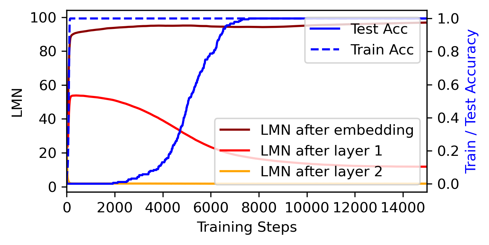
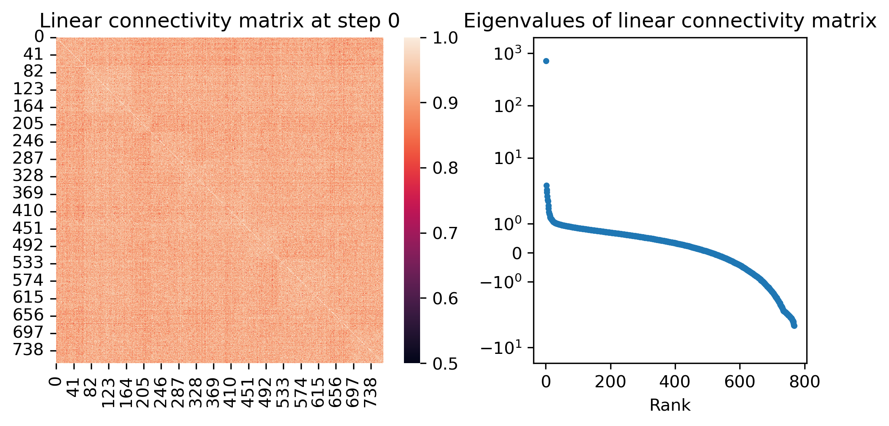
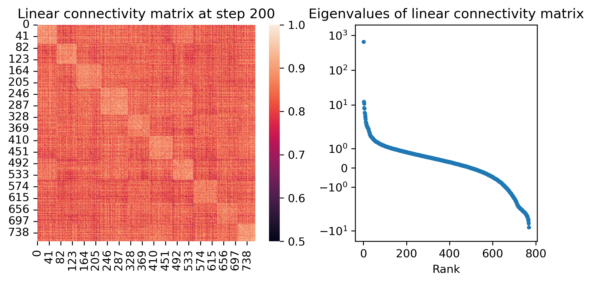

# Liu, Zhong, Tegmark 2023 — Grokking as Compression: A Nonlinear Complexity Perspective

См. также: [глобальный индекс понятий](../../concepts/index.md).

**Ziming Liu** (MIT и IAIFI), **Ziqian Zhong** (MIT), **Max Tegmark** (MIT и IAIFI). Первые двое отмечены как внёсшие равный вклад.

arXiv [2310.05918](https://arxiv.org/abs/2310.05918), 9 октября 2023. 16 цитирований — восемнадцатая по цитируемости работа корпуса. Источник — нативный HTML arXiv версии v1.

Оригинал и производные файлы этой папки:

- [`original/2310.05918.native.html`](original/2310.05918.native.html) — первоисточник, нативный HTML arXiv (v1), скачан как есть.
- [`original/2310.05918.grokking-as-compression-a-nonlinear-complexity-perspective.md`](original/2310.05918.grokking-as-compression-a-nonlinear-complexity-perspective.md) — конверсия оригинала в Markdown без правок содержания.
- [`images/`](images/) — 6 иллюстраций статьи в исходном разрешении.

Схема якорей и правила ссылок на карточку — в [README папки статей](../README.md).

## Затрагиваемые понятия

**[Колмогоровская сложность](../../concepts/kolmogorov-complexity.md)** — работа предлагает LMN как **нейросетевой вариант** колмогоровской сложности: величину, которая, в отличие от нормы $L_{2}$, естественно читается как количество информации — «если сжать сеть до зависящих от входа линейных отображений, сжатая информация есть LMN, умноженное на размер одного отображения» ([`p2-1`](#p2-1)). Обоснование выбора именно такой формы прямое: современные сети и есть склейка локальных линейных вычислений, и мера должна считать их, а не длину вектора весов.

**[Сжатие представлений](../../concepts/manifold-representation-compression.md)** — тезис «гроккинг есть сжатие» здесь назван общим знаменателем **уже существующих** объяснений корпуса: у всех них есть решение-запоминание, которое выучивается раньше, и решение-обобщение, которое эффективнее ([`p1-3`](#p1-3)). Вклад работы — не в тезисе, а в величине, которой сжатие меряют: LMN неуклонно убывает между запоминанием и генерализацией ([`fig-2`](#fig-2)).

**[Минимизация нормы весов](../../concepts/weight-norm-minimization.md)** — прямое возражение $L_{2}$ как мере сложности, и возражение конструктивное. Показательный довод: глубокая **линейная** сеть представляет только линейное отображение, и LMN даёт для неё 1, тогда как $L_{2}$ может быть каким угодно ([`p2-1`](#p2-1)). Эмпирический довод: в фазе сжатия LMN связано с тестовой потерей почти линейно, а $L_{2}$ — сложным нелинейным образом ([`p3-8`](#p3-8)).

**[Спектральный анализ](../../concepts/spectral-analysis-svd-esd-fve.md)** — способ подсчёта: матрица линейной связности $\mathbf{L}$ строится из $r^{2}$ линейной регрессии выходной кривой между парами входов, а число кластеров в ней оценивается мягко — через энтропию фон Неймана нормированных собственных значений, $\mathrm{LMN}=2^{S_{\mathrm{NL}}}$ ([`p3-3`](#p3-3)). Дискретный подсчёт кластеров заменён спектральной величиной именно ради устойчивости.

**[Фаза запоминания](../../concepts/memorization-phase.md)** — обучение разбито на три фазы по операциональным точкам: запоминание (до 100 % на обучении), генерализация (до 100 % на тесте) и **доводка** — остаток ([`p3-8`](#p3-8)). Третья фаза здесь не декоративна: именно в ней обнаруживается неожиданное поведение LMN на XOR.

**[Модульная арифметика](../../concepts/modular-arithmetic.md)** и **[группы](../../concepts/group-composition-non-commutative-s5.md)** — задачи проверки: сложение по модулю 31, композиция перестановок в $S_{4}$ и поразрядный XOR из пяти разрядов; трёхслойные полносвязные сети с активациями SiLU, AdamW, разбиение 80–20 ([`p3-7`](#p3-7)). Заметим отличие от привычного корпусу набора: не трансформер и не $p=113$.

**[Разрежённая чётность](../../concepts/sparse-parity.md)** — поразрядный XOR даёт единственное наблюдение работы, которого никто не предсказывал: после гроккинга LMN не выходит на плато, а **растёт и снова падает** ([`p4-1`](#p4-1)). Объяснение предложено арифметическое: точки перелома 15 и 20 — это $5\times 3$ и $5\times 4$, то есть три или четыре запомненных образца на каждый из пяти разрядов, симметричная и несимметричная обработка пар $(0,1)$ и $(1,0)$.

**[Гроккинг](../../concepts/grokking.md)** — понятие получает измеряемый «скрытый прогресс»: между запоминанием и генерализацией сеть внешне ничего не меняет, но LMN убывает ([`p3-8`](#p3-8)). Это ставит работу в один ряд с мерами прогресса Nanda et al., но с величиной, не привязанной к задаче.

**[Двойной спуск](../../concepts/double-descent.md)** — упомянут дважды и по-разному: как чужая линия объяснений гроккинга (Davies et al.) и как форма кривой LMN на XOR («двойной спад»). Второе — совпадение формы, а не то же самое явление; работа этого не оговаривает.

**[Эффективность контуров](../../concepts/circuit-efficiency.md)** — эффективность сети Varma et al. названа среди величин, описывающих сжатие, и отнесена к «косвенным заменителям», не допускающим прямой информационной трактовки ([`p1-3`](#p1-3)).

Отдельно стоит сказать, чего в работе **нет**. LMN считается по конкретному набору входов, и его значение зависит от выбора этого набора и от того, между какими слоями его мерить: авторы прямо пишут, что осмыслен лишь первый скрытый слой, а вложения и второй слой ничего не показывают ([`p7-1`](#p7-1)). Проверки на других архитектурах и задачах нет — она названа планом. Нет и вмешательства: LMN здесь измеряет, но ничего не меняет, так что утверждение «гроккинг есть сжатие» подтверждено соответствием кривых.

Карточки статей корпуса: [Power et al. 2022](../2201.02177.grokking-generalization-beyond-overfitting-on-small-algorithmic-datasets/2201.02177.grokking-generalization-beyond-overfitting-on-small-algorithmic-datasets.card.md) — задача; [Liu et al. 2022](../2205.10343.towards-understanding-grokking-an-effective-theory-of-representation-learning/2205.10343.towards-understanding-grokking-an-effective-theory-of-representation-learning.card.md) и [Omnigrok](../2210.01117.omnigrok-grokking-beyond-algorithmic-data/2210.01117.omnigrok-grokking-beyond-algorithmic-data.card.md) — работы того же первого автора, чью норму весов эта работа и оспаривает; [Varma et al. 2023](../2309.02390.explaining-grokking-through-circuit-efficiency/2309.02390.explaining-grokking-through-circuit-efficiency.card.md) — эффективность контуров как ещё один заменитель; [Nanda et al. 2023](../2301.05217.progress-measures-for-grokking-via-mechanistic-interpretability/2301.05217.progress-measures-for-grokking-via-mechanistic-interpretability.card.md) — меры прогресса, привязанные к задаче; [DeMoss et al. 2024](../2412.09810.the-complexity-dynamics-of-grokking/2412.09810.the-complexity-dynamics-of-grokking.card.md) — год спустя та же мысль о сложности как ключевой величине, но с оценкой через сжатие файлов, а не через число линейных отображений.

**[Компромисс сложность–ошибка](../../concepts/model-complexity-error-tradeoff.md)** — работа даёт размену измеримую координату: *число линейных отображений* (LMN), обобщающее счёт линейных областей ReLU-сети ([`p1-2`](#p1-2)). Гроккинг тогда читается как переход к решению меньшей сложности при той же ошибке.

**[Информационное узкое место](../../concepts/information-bottleneck.md)** — рамка привлечена как соседняя, с сохранённой оговоркой: она предполагает фазу сжатия после фазы подгонки, *хотя история со сжатием чувствительна к техническим подробностям* ([`p5-1`](#p5-1)). Место непроверяемой информационной меры занимает вычислимая мера сложности ([`p1-2`](#p1-2)).
## Что показано, а что предположено

Замечания редактора карточки по итогам разбора утверждений (`…claims.txt`). Работа короткая (восемь страниц вместе с приложениями) и заявленная как предварительная; читать её стоит как предложение величины, а не как объяснение.

**Величина определена аккуратно и проверяема.** LMN не постулируется, а выводится: линейная связность двух входов меряется через $r^{2}$ выходной кривой, матрица связности сводится к числу через энтропию фон Неймана, и определение проверено на предельном случае — $c$ равных кластеров дают ровно $\mathrm{LMN}=c$ ([`p3-5`](#p3-5)). Для любой линейной или аффинной функции $S_{\mathrm{NL}}=0$. Это больше, чем обычно предъявляют, вводя новую метрику.

**Основное наблюдение — соответствие кривых.** LMN убывает между запоминанием и генерализацией на всех трёх задачах ([`fig-2`](#fig-2)), и убывает более линейно по отношению к тестовой потере, чем $L_{2}$. Но «более линейно» нигде не выражено числом: ни коэффициента корреляции, ни $R^{2}$ для сравнения двух величин работа не приводит — при том, что сам LMN определён через $r^{2}$.

**Довод против $L_{2}$ сильнее эмпирики.** Пример глубокой линейной сети ([`p2-1`](#p2-1)) — это концептуальный контрпример, и он убедителен: $L_{2}$ может расти при неизменной вычисляемой функции. Он не зависит ни от задачи, ни от разбиения, и его одного достаточно, чтобы считать $L_{2}$ заменителем, а не мерой.

**Находка на XOR — честно поданная догадка.** Двойной спад LMN после генерализации назван ранее не описанным; предложенное объяснение (симметричная и несимметричная обработка пар разрядов) опирается на совпадение точек перелома с $5\times 3$ и $5\times 4$ ([`p4-1`](#p4-1)), и авторы прямо оставляют механистическую проверку на будущее. Совпадение чисел красивое, но это одно наблюдение на одной задаче.

**Зависимость от выбора слоя признана.** LMN осмыслен только между первым скрытым слоем и выходом: вложения ещё не обработаны сетью, а второй скрытый слой почти повторяет выходные логиты ([`p7-1`](#p7-1)). Значит, величина не свойство сети целиком, а свойство выбранного среза — и выбор сделан по результату.

**Заявка на «нейросетевую колмогоровскую сложность» остаётся заявкой.** Аргумент — что LMN считает локальные линейные вычисления и потому ближе к информации, чем норма весов. Ни границ генерализации через LMN, ни сопоставления с оценками сложности сжатием работа не даёт; проверка на широком круге задач названа планом.

**Место в корпусе.** Две работы корпуса подходят к гроккингу со стороны сложности: эта и DeMoss et al. Различие поучительно. Здесь сложность считается по **функции** — сколько разных линейных отображений сеть реализует на данных, — и не зависит от того, как веса записаны. Там сложность считается по **описанию** — размеру сжатого файла огрублённых весов, — и потому зависит от процедуры огрубления и архиватора. Обе меры дают одну и ту же картину: подъём при запоминании, спад при генерализации. То, что две независимые формализации «простоты» согласуются, — довод в пользу самого тезиса «гроккинг есть сжатие»; сопоставления между работами в корпусе пока нет, поскольку они вышли с разницей в год и друг друга не цитируют.

---

# Текст статьи

## Аннотация

###### p1-2
Мы относим гроккинг — явление, при котором генерализация сильно запаздывает за запоминанием, — к сжатию. Мы определяем *число линейных отображений* (linear mapping number, LMN), чтобы измерять сложность сети; это обобщение числа линейных областей для ReLU-сетей. LMN хорошо описывает сжатие нейронной сети до генерализации. Хотя для описания сложности модели была в ходу норма $L_{2}$, мы высказываемся в пользу LMN по нескольким причинам: (1) LMN естественно трактуется как информация или вычисление, а $L_{2}$ — нет. (2) В фазе сжатия LMN находится в хорошем линейном отношении с тестовыми потерями, тогда как $L_{2}$ связан с ними сложным нелинейным образом. (3) LMN обнаруживает и любопытное явление: сеть на задаче XOR перескакивает между двумя решениями-обобщениями, чего $L_{2}$ не показывает. Помимо объяснения гроккинга мы доказываем, что LMN — многообещающий кандидат на роль нейросетевого варианта колмогоровской сложности, поскольку он явно учитывает локальные, или обусловленные, линейные вычисления, отвечающие природе современных искусственных нейронных сетей.

## 1 Введение

###### p1-3
Гроккинг — явление, при котором генерализация наступает много позже запоминания [Power et al., 2022], — бросает вызов нашему пониманию глубокого обучения. Хотя объяснений гроккинга уже несколько и они кажутся независимыми [Liu et al., 2022a; Nanda et al., 2023; Liu et al., 2022b; Merrill et al., 2023; Barak et al., 2022; Davies et al., 2023; Thilak et al., 2022; Gromov, 2023; Notsawo Jr et al., 2023; Varma et al., 2023], многие из них разделяют схожую мысль высокого уровня — «гроккинг есть сжатие»: существуют решение-обобщение и решение-запоминание; решение-запоминание выучить проще, поэтому оно выучивается первым, но решение-обобщение эффективнее и потому возникает позже. Хотя для описания этого «сжатия» предлагались разные величины — например, $L_{2}$ [Liu et al., 2022b], фурье-зазор [Barak et al., 2022], эффективность сети [Varma et al., 2023], — ни одна из них не допускает естественной трактовки как информационной или вычислительной сложности (в лучшем случае это косвенные заменители).

Мы предлагаем величину, которую называем *числом линейных отображений* (LMN); она измеряет сложность сети (или подсети). Коротко, LMN — обобщение числа линейных областей для ReLU-сетей. Известно, что ReLU-сети представляют кусочно-линейные функции: они разбивают входное пространство на области, на каждой из которых сеть есть локальное линейное отображение; разным областям отвечают разные линейные отображения, как показано на рисунке 1. Геометрически ReLU-сеть можно представлять себе как оригами — складывание плоского входного пространства (рисунок 1 слева) в сложные формы (рисунок 1 в центре), — и число линейных областей измеряет сложность сети. LMN обобщает понятие числа линейных областей на сети с гладкими активациями.

**[p. 2]**

###### p2-1
Мы доказываем, что LMN — величина лучшая, чем $L_{2}$, которой измеряли сложность сети в глубоком обучении, особенно для гроккинга [Liu et al., 2022b]. Показательный пример — линейные сети: они способны представлять лишь линейные отображения, даже будучи глубокими. Для линейных сетей LMN всегда даёт 1, тогда как $L_{2}$ может быть произвольным и потому не слишком осмысленным. Более того, LMN естественно трактуется как информация: если сжать сеть до (зависящих от входа) линейных отображений, то сжатая информация есть, по сути, LMN, умноженное на размер одного линейного отображения.

###### p2-2
Мы пользуемся LMN, чтобы описать процесс сжатия при гроккинге на трёх алгоритмических задачах: модульном сложении, группе перестановок $S_{4}$ и многоразрядном XOR. После запоминания и до генерализации LMN неуклонно убывает и находится в сильном линейном отношении с тестовой потерей. Напротив, $L_{2}$ связан с тестовыми потерями сложным нелинейным образом. Для модульного сложения и перестановок LMN после гроккинга выходит на плато, как и ожидается. Для многоразрядного XOR LMN обнаруживает неожиданный двойной спад после гроккинга. Это открывает нечто любопытное в случае XOR: у него есть два (а не одно) решения-обобщения, почти вырожденные, и сеть перескакивает между ними.

Статья устроена так. В разделе 2 мы определяем число линейных отображений (LMN). В разделе 3 мы пользуемся LMN, чтобы объяснить гроккинг, показывая, что оно связано с $L_{2}$, но и лучше $L_{2}$ в нескольких смыслах. Связанные работы мы обсуждаем в разделе 4.

###### fig-1
*Рисунок 1: Число линейных отображений (LMN) — обобщение числа линейных областей для ReLU-сетей. ReLU-сеть разбивает входное пространство на кусочно-линейные области. Если две точки лежат в одной линейной области или в разных, соединяющая их прямая во входном пространстве (слева) останется прямой (зелёная) или превратится в нелинейную кривую (красная и синяя) в выходном пространстве (в центре). Мы можем построить матрицу линейной связности (справа), описывающую, лежат ли две точки в одной линейной области; она применима к сетям с любыми активациями. Через энтропию фон Неймана этой матрицы мы можем оценить число линейных отображений (подробности в разделе 2).* **[p. 2]**

## 2 Число линейных отображений (LMN)

###### p2-4
Число линейных отображений (LMN) — обобщение числа линейных областей для ReLU-сетей. Для простоты рассмотрим сперва ReLU-сети. ReLU-сеть разбивает входное пространство на линейные области, и в каждой области она локально ведёт себя как линейное отображение, хотя разным линейным областям отвечают разные линейные отображения (см. рисунок 1). Число линейных областей предлагалось как мера сложности сети для ReLU-сетей [Montufar et al., 2014; Hanin and Rolnick, 2019].

Тогда как число линейных областей определено только для сетей с ReLU-активациями, предлагаемое нами число линейных отображений определено для сетей с *любыми* активациями, включая гладкие. Однако ReLU-сети подсказывают путь к общему определению LMN. Как показано на рисунке 1, если два образца лежат в одной или в разных линейных областях, прямая, соединяющая их во входном пространстве (рисунок 1 слева), останется прямой или станет нелинейной в выходном пространстве (рисунок 1 в центре). Это наводит на мысль измерять «линейную связность» двух образцов: чем прямее выходная линия, тем больше линейная связность. Для сети $\mathbf{f}:\mathbb{R}^{d_{1}}\to\mathbb{R}^{d_{2}}$ и двух входных образцов $\mathbf{x}^{(i)},\mathbf{x}^{(j)}\in\mathbb{R}^{d_{1}}$, $i,j\in[N]$, обозначим их линейную связность через $L_{ij}\in\mathbb{R}$. Мы линейно интерполируем между $\mathbf{x}^{(i)}$ и $\mathbf{x}^{(j)}$ во входном пространстве:

$$
\mathbf{x}^{(i,j)}(\lambda)=\mathbf{x}^{(i)}+\lambda(\mathbf{x}^{(j)}-\mathbf{x}^{(i)}),\ \lambda\in[0,1], \tag{1}
$$

чему отвечает выходная кривая $\mathbf{y}^{(i,j)}(\lambda)=\mathbf{f}(\mathbf{x}^{(i,j)}(\lambda))\in\mathbb{R}^{d_{2}}$. Её $k^{\rm th}$-я координата $\mathbf{y}_{k}^{(i,j)}(\lambda)$ — просто скалярная функция от $\lambda$, **[p. 3]** так что её линейность можно оценить линейной регрессией, вычислив $r^{2}$ (квадрат коэффициента корреляции Пирсона). Мы определяем $L_{ij}$ как среднее $r^{2}$ по координатам $k$:

$$
L_{ij}\equiv\frac{1}{d_{2}}\sum_{k=1}^{d_{2}}r^{2}(\mathbf{y}_{k}^{(i,j)}(\lambda),\lambda). \tag{2}
$$

Заметим, что $L_{ij}\in[0,1]$. Величина $r^{2}$ измеряется по равномерным точкам на $\lambda\in[0,1]$ (сноска: на практике мы берём 21 равноотстоящую точку на $\lambda\in[0,1]$, то есть $\lambda=0.0,0.05,0.1,\cdots,0.95,1.0$; $r^{2}$ между переменными $x$ и $y$ есть $r^{2}(x,y)=(\langle xy\rangle-\langle x\rangle\langle y\rangle)^{2}/(\langle x^{2}\rangle-\langle x\rangle^{2})(\langle y^{2}\rangle-\langle y\rangle^{2})$, где $\langle\cdot\rangle$ означает усреднение по образцам). Когда $\mathbf{y}^{(i,j)}(\lambda)$ — прямая, $L_{ij}=1$; когда $\mathbf{y}^{(i,j)}(\lambda)$ похожа на симметричную параболу, $L_{ij}=0$. Самосвязность мы полагаем равной $L_{ii}\equiv 1$. Итого: большее $L_{ij}$ означает, что для образцов $i$ и $j$ сеть ведёт себя скорее как линейное отображение (то есть двум образцам достаточно одного общего линейного отображения), а меньшее $L_{ij}$ означает, что между образцами $i$ и $j$ сеть ведёт себя нелинейно. Величины $L_{ij}$ можно сложить в матрицу $\mathbf{L}$ так, что $\mathbf{L}_{ij}=L_{ij}$, и назвать $\mathbf{L}$ матрицей линейной связности (рисунок 1 справа).

###### p3-3
Если считать, что линейно связанные образцы принадлежат одному линейному отображению, то задача подсчёта линейных отображений сводится к задаче кластеризации: по матрице сходства образцов $\mathbf{L}$ — сколько там кластеров? Поскольку число кластеров — величина дискретная, а его определение может быть неустойчивым или зависящим от гиперпараметров, мы пользуемся мягкой оценкой, опирающейся на структуру собственных значений матрицы сходства и вдохновлённой энтропией фон Неймана [Von Neumann, 2013]. Обозначим через $\lambda_{i}~{}(i=1,\cdots,N)$ собственные значения $\mathbf{L}$. Заметим, что $\mathbf{L}$ симметрична ($\mathbf{L}_{ij}=\mathbf{L}_{ji}$), так что все собственные значения вещественны. Матрица $\mathbf{L}$ почти положительно полуопределена: все большие по величине собственные значения положительны, но может быть несколько малых отрицательных (см. приложение B), у которых мы берём модуль. Определим нормированные собственные значения $\tilde{\lambda}_{i}=|\lambda_{i}|/(\sum_{j=1}^{N}|\lambda_{j}|)$. Затем будем рассматривать вектор нормированных собственных значений $(\tilde{\lambda}_{1},\tilde{\lambda}_{2},\cdots,\tilde{\lambda}_{N})$ как распределение вероятностей. Нелинейную сложность этого распределения (в битах) определим как

$$
S_{\rm NL}\equiv-\sum_{i}\tilde{\lambda}_{i}{\rm log_{2}}\tilde{\lambda}_{i} \tag{3}
$$

а число линейных отображений LMN определим как ${\rm LMN}\equiv 2^{S_{\rm NL}}$. Заметим, что при заданном наборе данных ${\bf x}^{(i)}$ величина $S_{\rm NL}$ задаёт меру нелинейной сложности *любой* функции — независимо от того, задана она нейронной сетью или нет, — и что $S_{\rm NL}=0$ для любой линейной или аффинной функции.

###### p3-5
Чтобы почувствовать это определение, рассмотрим случай, когда есть $c$ кластеров равного размера $N/c$, и внутри кластера образцы связаны линейно идеально. Тогда $\mathbf{L}$ — блочно-диагональная матрица с $c$ блоками ($c=3$ показано на рисунке 1 справа), каждый блок состоит из единиц. Вектор нормированных собственных значений тогда равен $\tilde{\lambda}_{i}=1/c\ (1\leq i\leq c)$ и $\tilde{\lambda}_{i}=0\ (c<i\leq N)$, его энтропия равна $S={\rm log}(c)$, откуда ${\rm LMN}=c$, как и ожидается. Заметим, что LMN применимо не только ко всей сети, но и к любой подсети. В частности, представляет интерес LMN между промежуточным слоем и выходным.

## 3 Объяснение гроккинга через LMN

###### fig-2
*Рисунок 2: Точность на обучении и на тесте, LMN (число линейных отображений) после первого слоя и норма $L_{2}$ параметров модели в ходе обучения. Три строки отвечают трём разным алгоритмическим задачам. *Вверху:* модульное сложение. *В середине:* операция группы S4. *Внизу:* поразрядный XOR.* **[p. 4]**

В этом разделе мы показываем, что LMN способно описать процесс сжатия сложности сети до гроккинга. Между запоминанием и генерализацией LMN неуклонно убывает.

###### p3-7
**Постановка эксперимента** Мы обучаем трёхслойные полносвязные сети с активациями SiLU [Elfwing et al., 2018] решать алгоритмические задачи: {сложение по модулю $31$, композиция перестановок в $S_{4}$, поразрядный XOR из 5 разрядов}. Параметры сети (включая вложения) обучаются оптимизатором AdamW (скорость обучения $10^{-3}$, weight decay 0.2) на кросс-энтропийной потере в течение 20000 шагов. Размерность вложения — 32, скрытая размерность — 100, выходная размерность — {31, 24, 32}. По всем возможным входам сделано разбиение 80–20 на обучение и тест.

###### p3-8
**Результаты** LMN измеряется между первым скрытым слоем и слоем выходных логитов (сноска: первый скрытый слой наиболее осмыслен для трёхслойной сети; результаты для слоя вложений и второго скрытого слоя приведены в приложении A). На рисунке 2 мы привели LMN и потери в ходе обучения для трёх задач. **[p. 4]** Период до достижения 100 % точности на обучении (точка переобучения) мы называем фазой запоминания, период после неё, но до достижения 100 % точности на тесте (точка генерализации) — фазой генерализации, а остаток — фазой доводки. Мы видим, что в фазе генерализации LMN убывает, обнаруживая «скрытый» процесс сжатия сети. Более того, LMN связано с тестовой потерей более линейно, чем норма $L_{2}$ параметров модели.

###### p4-1
**Любопытное явление в XOR** В задаче поразрядного XOR из 5 разрядов мы обнаружили ранее не описанное явление: в фазе доводки LMN приобретает форму, похожую на двойной спад; после генерализации LMN ненадолго растёт, а затем снова убывает. Мы полагаем, что причина в двух возможных решениях для обработки отдельных разрядов: можно построить отображение для всех четырёх возможных пар $(0,0),(0,1),(1,0),(1,1)$, а можно сократить число пар до трёх по симметрии (обрабатывая $(0,1)$ и $(1,0)$ одинаково). Хотя второе эффективнее по внутренним представлениям, первое может давать лучшие результаты раньше в фазе доводки, поскольку модель может быть не в состоянии обработать симметрии идеально. В период, когда LMN после генерализации растёт, модель, возможно, обрабатывает асимметрии: добавляет раздельную обработку пар $(0,1)$ и $(1,0)$ и лишь затем предпочитает более симметричную обработку. В пользу такого объяснения говорит то, что две точки перелома LMN — 15 и 20, что как раз равно $5\times 3$ и $5\times 4$ (всего 5 разрядов; на каждый разряд запоминается либо 3, либо 4 образца). Механистическое исследование этого явления оставлено на будущее.

## 4 Связанные работы и обсуждение

**Гроккинг** — явление, при котором генерализация наступает много позже переобучения [Power et al., 2022]. Есть попытки понять гроккинг, изучая игрушечные модели [Liu et al., 2022a; Gromov, 2023], определяя величины для описания динамики [Nanda et al., 2023; Liu et al., 2022b; Barak et al., 2022; Varma et al., 2023; Notsawo Jr et al., 2023], связывая его с двойным спуском [Davies et al., 2023] и с оптимизацией [Thilak et al., 2022]. Эта работа изучает гроккинг со стороны вычислительной, или информационной, сложности.

###### p4-3
**Меры сложности для глубокого обучения** Чтобы понять, почему глубокое обучение обобщает, предложен ряд мер сложности [Jiang et al., 2019; Udrescu and Tegmark, 2021; Raghu et al., 2017]. Со стороны информации (наименьшего числа линейных отображений, нужных, чтобы воспроизвести сеть) для измерения сложности ReLU-сетей используется число линейных областей [Montufar et al., 2014; Hanin and Rolnick, 2019], **[p. 5]** а наша работа расширяет его до числа линейных отображений, охватывающего произвольные сети с любыми активациями.

###### p5-1
**Сжатие и глубокое обучение** Теория информационного бутылочного горлышка [Tishby et al., 2000] предполагает фазу сжатия, следующую за фазой подгонки, хотя история со сжатием чувствительна к техническим подробностям [Saxe et al., 2018]. Недавно успех языковых моделей тоже относили к сжатию [Delétang et al., 2023]. Мы согласны, что взгляды со стороны информации и сжатия, весьма вероятно, и есть ключ к разгадке загадок генерализации в глубоком обучении, и наше LMN может оказаться здесь полезной величиной. В дальнейшем нам хотелось бы проверить пригодность LMN на широком круге задач и архитектур.

## Благодарности

ZL и MT поддержаны IAIFI по гранту NSF PHY-2019786, Foundational Questions Institute и Rothberg Family Fund for Cognitive Science.

## Литература

- Alethea Power, Yuri Burda, Harri Edwards, Igor Babuschkin, and Vedant Misra. Grokking: Generalization beyond overfitting on small algorithmic datasets. *arXiv preprint arXiv:2201.02177*, 2022.

- Ziming Liu, Ouail Kitouni, Niklas S Nolte, Eric Michaud, Max Tegmark, and Mike Williams. Towards understanding grokking: An effective theory of representation learning. *Advances in Neural Information Processing Systems*, 35:34651–34663, 2022a.

- Neel Nanda, Lawrence Chan, Tom Liberum, Jess Smith, and Jacob Steinhardt. Progress measures for grokking via mechanistic interpretability. *arXiv preprint arXiv:2301.05217*, 2023.

- Ziming Liu, Eric J Michaud, and Max Tegmark. Omnigrok: Grokking beyond algorithmic data. *arXiv preprint arXiv:2210.01117*, 2022b.

- William Merrill, Nikolaos Tsilivis, and Aman Shukla. A tale of two circuits: Grokking as competition of sparse and dense subnetworks. *arXiv preprint arXiv:2303.11873*, 2023.

- Boaz Barak, Benjamin Edelman, Surbhi Goel, Sham Kakade, Eran Malach, and Cyril Zhang. Hidden progress in deep learning: Sgd learns parities near the computational limit. *Advances in Neural Information Processing Systems*, 35:21750–21764, 2022.

- Xander Davies, Lauro Langosco, and David Krueger. Unifying grokking and double descent. *arXiv preprint arXiv:2303.06173*, 2023.

- Vimal Thilak, Etai Littwin, Shuangfei Zhai, Omid Saremi, Roni Paiss, and Joshua Susskind. The slingshot mechanism: An empirical study of adaptive optimizers and the grokking phenomenon. *arXiv preprint arXiv:2206.04817*, 2022.

- Andrey Gromov. Grokking modular arithmetic. *arXiv preprint arXiv:2301.02679*, 2023.

- Pascal Notsawo Jr, Hattie Zhou, Mohammad Pezeshki, Irina Rish, Guillaume Dumas, et al. Predicting grokking long before it happens: A look into the loss landscape of models which grok. *arXiv preprint arXiv:2306.13253*, 2023.

- Vikrant Varma, Rohin Shah, Zachary Kenton, János Kramár, and Ramana Kumar. Explaining grokking through circuit efficiency. *arXiv preprint arXiv:2309.02390*, 2023.

- Guido F Montufar, Razvan Pascanu, Kyunghyun Cho, and Yoshua Bengio. On the number of linear regions of deep neural networks. *Advances in neural information processing systems*, 27, 2014.

- Boris Hanin and David Rolnick. Complexity of linear regions in deep networks. In *International Conference on Machine Learning*, pages 2596–2604. PMLR, 2019.

- John Von Neumann. *Mathematische grundlagen der quantenmechanik*, volume 38. Springer-Verlag, 2013.

**[p. 6]**

- Stefan Elfwing, Eiji Uchibe, and Kenji Doya. Sigmoid-weighted linear units for neural network function approximation in reinforcement learning. *Neural networks*, 107:3–11, 2018.

- Yiding Jiang, Behnam Neyshabur, Hossein Mobahi, Dilip Krishnan, and Samy Bengio. Fantastic generalization measures and where to find them. *arXiv preprint arXiv:1912.02178*, 2019.

- Silviu-Marian Udrescu and Max Tegmark. Symbolic pregression: Discovering physical laws from distorted video. *Physical Review E*, 103(4):043307, 2021.

- Maithra Raghu, Ben Poole, Jon Kleinberg, Surya Ganguli, and Jascha Sohl-Dickstein. On the expressive power of deep neural networks. In *international conference on machine learning*, pages 2847–2854. PMLR, 2017.

- Naftali Tishby, Fernando C Pereira, and William Bialek. The information bottleneck method. *arXiv preprint physics/0004057*, 2000.

- Andrew Michael Saxe, Yamini Bansal, Joel Dapello, Madhu Advani, Artemy Kolchinsky, Brendan Daniel Tracey, and David Daniel Cox. On the information bottleneck theory of deep learning. In *International Conference on Learning Representations*, 2018.

- Grégoire Delétang, Anian Ruoss, Paul-Ambroise Duquenne, Elliot Catt, Tim Genewein, Christopher Mattern, Jordi Grau-Moya, Li Kevin Wenliang, Matthew Aitchison, Laurent Orseau, et al. Language modeling is compression. *arXiv preprint arXiv:2309.10668*, 2023.

- Ulrike Von Luxburg. A tutorial on spectral clustering. *Statistics and computing*, 17:395–416, 2007.

Приложение

**[p. 7]**

## Приложение A. LMN для всех слоёв

###### p7-1
На рисунке 2 мы приводили LMN для первого скрытого слоя. Заметим, что LMN можно определить для любого слоя, включая слой вложений и второй скрытый слой. Для модульного сложения мы показываем изменение LMN для всех слоёв на рисунке 3. Ясно видно, что лишь первый скрытый слой чувствителен к скрытому продвижению сети после запоминания и до генерализации. Слой вложений и второй скрытый слой менее осмысленны. Вложения ещё не обработаны сетью, поэтому осмысленным образом с выходами не связаны. Второй же слой сильно связан с выходными логитами и потому, по сути, повторяет ход обучающей кривой.

###### fig-3
*Рисунок 3: Изменение LMN для всех слоёв. Только первый скрытый слой осмыслен для описания скрытого продвижения до гроккинга, тогда как LMN слоя вложений и второго скрытого слоя быстро выходят на плато после запоминания.* **[p. 7]**

## Приложение B. Матрица линейной связности и распределение собственных значений

###### p7-2
В основном тексте мы определили матрицу линейной связности $\mathbf{L}$ в уравнении (2). Здесь, на рисунке 4, мы изображаем её и показываем её собственные значения для трёх мгновенных снимков обучения (для модульного сложения): при инициализации (шаг 0), при запоминании (шаг 200) и при генерализации (шаг 7600). Сравнивая генерализацию с запоминанием, видим, что внедиагональные элементы $\mathbf{L}$ при генерализации в среднем больше, то есть образцы связаны линейно сильнее, а значит, при генерализации сеть проще. При инициализации линейная связность тоже сильна — из-за индуктивного смещения к простоте при инициализации (при инициализации сеть близка к линейной).

###### fig-4
*Рисунок 4: Изменение матрицы линейной связности (слева) и её собственных значений (справа) при инициализации (вверху), сразу после запоминания (в середине) и сразу после генерализации (внизу). Для наглядности мы переставили входные оси матриц линейной связности в 10 кластеров спектральной кластеризацией (например, [22]).* **[p. 8]**
