# Kumar et al. 2023 — Grokking as the Transition from Lazy to Rich Training Dynamics

См. также: [глобальный индекс понятий](../../concepts/index.md).

**Tanishq Kumar**, **Blake Bordelon**, **Samuel J. Gershman**, **Cengiz Pehlevan** (равный старший вклад) — Harvard University.

arXiv [2310.06110](https://arxiv.org/abs/2310.06110), 9 октября 2023. ICLR 2024. 103 цитирования — пятая по цитируемости работа корпуса.

Источник — **нативный HTML arXiv версии v3**, последней на момент импорта. Это отличие от предыдущих карточек: у этой работы нативный рендеринг есть, и он свежее. Рендеринг ar5iv соответствует более ранней версии и содержит раздел «Dynamical Mean Field Theory for Asymptotic Risk Evolution», которого в v3 уже нет; расхождение заметно и по счётчикам — 515 формул против 290, 61 иллюстрация против 52. Карточка следует v3.

Оригинал и производные файлы этой папки:

- [`original/2310.06110.arxiv.html`](original/2310.06110.arxiv.html) — первоисточник, нативный HTML arXiv (v3), скачан как есть.
- [`original/2310.06110.grokking-as-the-transition-from-lazy-to-rich-training-dynamics.md`](original/2310.06110.grokking-as-the-transition-from-lazy-to-rich-training-dynamics.md) — конверсия оригинала в Markdown без правок содержания.
- [`images/`](images/) — 51 иллюстрация статьи; каждая скачана из нативного рендеринга и из ar5iv, оставлен больший файл.

Схема якорей и правила ссылок на карточку — в [README папки статей](../README.md).

## Затрагиваемые понятия

**[От ленивого к богатому: от ядра к обучению признакам](../../concepts/lazy-to-rich-kernel-to-feature-learning.md)** — работа **делает этот переход объяснением гроккинга**. «Запоминающее решение» прежних работ отождествляется с ранней ленивой динамикой: сеть подгоняет выборку как линейная модель с исходным NTK, а позже перестраивает признаки, и именно зазор между двумя этапами и есть отложенная генерализация ([`p4-3`](#p4-2)). Ленивость управляется масштабом выхода $\alpha$: при $\alpha\to\infty$ модель в точности линеаризуется, при малом $\alpha$ признаки выучиваются сразу и гроккинг исчезает.

**[Нейронное касательное ядро (NTK)](../../concepts/neural-tangent-kernel-ntk.md)** — работа даёт понятию **роль измерителя трудности задачи**. Согласованность исходного NTK с метками (CKA) определяет, сколько обучения признакам необходимо; трудная задача формально определена как $\bm{y}^{\top}\bm{K}^{-1}\bm{y}\gg1$, и та же величина задаёт, насколько далеко уйдут параметры, — то есть трудность для ядра и слом линеаризации оказываются одним и тем же ([`p17-1`](#p17-1)).

**[Масштаб инициализации](../../concepts/initialization-scale.md)** — работа **переобъясняет** его роль: большая начальная норма весов вызывает гроккинг не потому, что генерализующие решения лежат на сферах меньшей нормы, а потому, что она линеаризует модель. Проверка прямая: масштаб выхода и масштаб меток дают тот же эффект, что и норма весов при инициализации, а относительное смещение параметров управляется произведением $\sigma^{2}\alpha$ ([`p13-3`](#fig-7)).

**[Минимизация нормы весов](../../concepts/weight-norm-minimization.md)** — получает **контрпример**. На модульной арифметике в двухслойном MLP без weight decay норма весов в ходе обучения *растёт*, а сеть всё равно грокает ([`p3-3`](#p3-3)). Итоговое генерализующее решение имеет бо́льшую норму, чем запоминающее, с которого сеть начинала, — прямое возражение и Omnigrok, и объяснению через эффективность контуров.

**[Варианты регуляризации](../../concepts/regularization-variants.md)** — работа показывает, что weight decay для гроккинга **ни необходим, ни достаточен**, но объясняет, почему он так часто сопутствует: по Lewkowycz and Gur-Ari (2020) при weight decay NTK эволюционирует с порядком $O(\kappa)$, то есть weight decay выталкивает сеть из ленивого режима. Отсюда предсказание, которое авторы называют количественным подтверждением: наблюдавшаяся у предшественников линейность времени генерализации по weight decay ([`p19-4`](#p19-4)).

**[Зона Златовласки](../../concepts/goldilocks-zone.md)** — понятие применяется **к размеру выборки**: данных должно хватать, чтобы генерализация была возможна, но не столько, чтобы обучающая потеря сразу отслеживала тестовую. Приложение 8.3.2 показывает все три режима на одной задаче, а приложение 17 — сетку «трудность задачи × объём данных», где гроккинг занимает промежуточную полосу.

**[Доля данных / критический размер набора](../../concepts/data-fraction-critical-dataset-size.md)** — работа уточняет статус порога: пребывание в златовласкиной зоне по данным **необходимо, но не достаточно** для гроккинга; вторым условием остаётся ленивость старта, третьим — рассогласование ядра с задачей.

**[Появление признаков / обучение признакам](../../concepts/feature-emergence-feature-learning.md)** — здесь обучение признакам получает **измеримую подпись в разложении потери**: тестовая MSE распадается на ошибку дисперсии, ошибку рассогласования и мощность в линейных модах, и гроккинг виден как рост, а затем падение последней ([`p7-1`](#p6-4)). Это редкий случай, когда «сеть выучила признаки» — не описание картинки, а слагаемое в формуле.

**[Эмерджентность](../../concepts/emergence.md)** — работа встраивается в спор о том, насколько скачки реальны: приложение 16 показывает, что «гроккинг в точности» может быть миражом выбора порога на задаче регрессии, тогда как гроккинг в потере — строго более сильное условие. Отсюда методическое требование: изучать потерю, а не точность.

**[Фаза меморизации](../../concepts/memorization-phase.md)** — запоминание переопределяется как **ленивая подгонка**: сеть интерполирует обучающую выборку решением ядровой регрессии на исходных признаках, и на тестовых точках это работает хуже случайного, если признаки не соответствуют задаче.

**[Модульная арифметика](../../concepts/modular-arithmetic.md)** — задача используется дважды: как контрпример к теориям нормы весов (двухслойный MLP, $p=23$, 90 % пар, без weight decay) и как проверка переносимости — на однослойном трансформере из Nanda et al. один лишь параметр $\alpha$ заставляет гроккинг исчезнуть.

**[Реальные данные: зрение, MNIST, CIFAR](../../concepts/vision-real-world-data-mnist-cifar.md)** — гроккинг на MNIST, вызванный у Liu et al. увеличением нормы весов, здесь **непрерывно устраняется настройкой $\alpha$ без изменения нормы весов** — довод в пользу того, что норма весов лишь один из способов управлять ленивостью.

**[Гроккинг](../../concepts/grokking.md)** — понятие получает механизм, не требующий ни регуляризации, ни убывания нормы, и три условия одновременно: рассогласованность исходного NTK с задачей, златовласкин объём данных и ленивый старт.

Карточки статей корпуса: [Power et al. 2022](../2201.02177.grokking-generalization-beyond-overfitting-on-small-algorithmic-datasets/2201.02177.grokking-generalization-beyond-overfitting-on-small-algorithmic-datasets.card.md) — исходное наблюдение; [Liu et al. 2022](../2205.10343.towards-understanding-grokking-an-effective-theory-of-representation-learning/2205.10343.towards-understanding-grokking-an-effective-theory-of-representation-learning.card.md) и [Omnigrok](../2210.01117.omnigrok-grokking-beyond-algorithmic-data/2210.01117.omnigrok-grokking-beyond-algorithmic-data.card.md) — объяснения через норму весов, которым здесь приводится контрпример; [Nanda et al. 2023](../2301.05217.progress-measures-for-grokking-via-mechanistic-interpretability/2301.05217.progress-measures-for-grokking-via-mechanistic-interpretability.card.md) — постановка с трансформером, на которой проверяется управление через $\alpha$; [Varma et al. 2023](../2309.02390.explaining-grokking-through-circuit-efficiency/2309.02390.explaining-grokking-through-circuit-efficiency.card.md) — авторы соглашаются с двумя из трёх её причин и прямо спорят с центральной: «эффективность» как меньшая норма параметров здесь опровергается.

**[Когда регуляризация необходима](../../concepts/regularization-necessity.md)** — полюс «не необходима»: перцептрон [грокает на полиномиальной регрессии без weight decay на ванильном градиентном спуске](#fig-4), причём [при растущей норме параметров](#p3-3) — одновременно контрпример и к необходимости регуляризации, и к норм-объяснениям.

## Что показано, а что предположено

Замечания редактора карточки по итогам разбора утверждений (`…claims.txt`). Эта работа в корпусе играет роль опровержения: она не столько добавляет ещё одно объяснение, сколько показывает, что два предыдущих описывали не причину, а следствие.

**Контрпример — самая твёрдая часть.** Двухслойный MLP на модульной арифметике без всякого weight decay грокает, и норма весов при этом **растёт** ([`p3-3`](#p3-3)). Итоговое генерализующее решение имеет бо́льшую норму, чем запоминающее, с которого сеть начинала. Это прямо противоречит и «генерализующие решения лежат на сферах меньшей нормы» (Omnigrok), и «обобщающий контур эффективнее, потому что даёт ту же потерю при меньшей норме» (Varma et al.). Возражение конкретное и воспроизводимое, а не концептуальное.

**Переобъяснение сильнее опровержения.** Работа не отрицает наблюдений предшественников, а перечитывает их: большая начальная норма действительно вызывает гроккинг — потому что линеаризует модель. Проверка прямая и убедительная: масштаб выхода и масштаб меток дают тот же эффект, а относительное смещение параметров управляется произведением $\sigma^{2}\alpha$ ([`p13-3`](#fig-7)). То же и с weight decay: он не нужен для гроккинга, но объясняется его частота — по чужой теореме weight decay заставляет NTK эволюционировать с порядком $O(\kappa)$, то есть выталкивает сеть из ленивого режима.

**Предсказание, сделанное до эксперимента.** Из диагонализации исходного NTK следует разделение выборочных сложностей: ядровому методу нужно $P\sim D^{2}$ образцов, сети с обучением признакам — $P\sim D$. Отсюда задача и была выбрана: гроккинг ожидался в промежутке — и наблюдается. Второе такое место — конструкция с метками-собственными векторами, где трудность задачи задаётся номером $j$, а три предсказанных режима (немедленная генерализация, гроккинг, невозможность) наблюдаются по порядку.

**Где механизм признан недостаточным — самими авторами, и только в приложении.** На однослойном трансформере из Nanda et al. потеря из-за weight decay быстро отклоняется от своей линеаризации, **хотя гроккинг там есть**. Отсюда вывод приложения 14: переход от ленивого к богатому — «достаточный, но не необходимый» механизм отложенного обучения признакам. В основном тексте и аннотации эта оговорка не повторяется, а перенос на трансформер подан как подтверждение.

**Количественное подтверждение слабее, чем звучит.** Фраза о том, что теория «в точности предсказывает количественное действие weight decay на временные масштабы гроккинга», опирается на чужую теорему о порядке $O(\kappa)$ и на две линейности, наблюдённые в чужих работах. Собственного эксперимента, где предсказанная и измеренная зависимости сравнивались бы количественно, в статье нет — есть эксперимент о противонаправленности $\alpha$ и weight decay, что слабее.

**Приложение 16 — методологически ценнее многих разделов.** Показано, что «гроккинг в точности» на регрессионных задачах зависит от выбора порога $\theta$: одни и те же кривые потерь дают эффектный скачок при одном пороге и ничего при другом. Гроккинг в потере строго сильнее гроккинга в точности. Для корпуса из этого следует конкретное: постановка «учитель — ученик» из Liu et al. 2022a, служившая свидетельством гроккинга вне алгоритмических данных, в терминах потери гроккинга **не** показывает — обучающая кривая всё время следует за тестовой ([`p24-1`](#fig-18)).

**Мелочи.** Скорость обучения $\eta=100$ в контрпримере не комментируется; устойчивость результата по $p$ и по ширине заявлена словами, без таблицы; в формуле трёхиндексной модели опечатка `\beta_{3}cdotx`, перенесённая как есть.

## Ошибочные цитирования

Замечания редактора карточки: места, где эта статья передаёт чужие результаты с ошибкой или без авторских оговорок. Сюда ведут ссылки «подробности» из разделов «Ошибочные пересказы и цитирования этой статьи» карточек процитированных работ.

###### mc-2301-02679
**Gromov (2301.02679) — конструкция названа решением обученных весов.** `"Gromov [2023] writing out the closed-form solution of final trained weights for another modular arithmetic task"` — «выписал замкнутое решение финальных обученных весов»: у Gromov решение — аналитическая конструкция, а о том, что её находит оптимизатор, сказано осторожно — [«evidence that these feature maps are also found by vanilla gradient descent as well as AdamW»](../2301.02679.grokking-modular-arithmetic/2301.02679.grokking-modular-arithmetic.card.md#p8-3), с приближённым соответствием фаз. Усиленная версия уязвима в точке живого спора: [Mohamadi et al.](../2407.12332.why-do-you-grok-a-theoretical-analysis-of-grokking-modular-addition/2407.12332.why-do-you-grok-a-theoretical-analysis-of-grokking-modular-addition.card.md) в сноске сообщают, что в их экспериментах градиентный спуск этого решения не находил. Во всём остальном эта статья цитирует Gromov образцово — вплоть до воспроизведения сетапа с «Our results agree».

###### mc-2301-05217
**Nanda et al. (2301.05217) — унаследована ошибочная половина внутреннего конфликта D.1.** `"Nanda et al. [2023] finds that the time taken to generalize drops by a factor of ten in Figure 27 of that paper, when weight decay is increased by a factor of [ten], again linear"` — «время генерализации падает в десять раз при десятикратном росте weight decay». В [приложении D.1 цитируемой работы](../2301.05217.progress-measures-for-grokking-via-mechanistic-interpretability/2301.05217.progress-measures-for-grokking-via-mechanistic-interpretability.card.md#sec-d-1) словесная формулировка и подпись рисунка 27 действительно говорят это — но приведённые там же числа говорят обратное: около 3 тысяч эпох при λ=0.3, 5–10 тысяч при 1.0, 20 тысяч при 3.0 — время растёт, а не падает (конфликт зафиксирован в карточке цели, раздел «Несогласованности внутри статьи»). Цитирующий воспроизводит ошибочную словесную половину и строит на ней количественное «наша теория в точности предсказывает эффект». В другом месте та же статья цитирует цель образцово — точным указателем на §5.3.

## Ошибочные пересказы и цитирования этой статьи

Узоры ошибочного или расширенного цитирования этой работы, наблюдённые в цитирующих статьях корпуса. Каждая запись описывает, что именно искажается при пересказе, и ведёт к абзацам самих авторов, где стоит теряемая оговорка. Разбор конкретных формулировок — в карточках цитирующих работ, в их разделах «Ошибочные цитирования», куда ведут ссылки «подробности».

**Инверсия действия масштаба выхода (ошибочное).** Работе приписывают, что увеличение масштаба выхода ускоряет гроккинг. У авторов ровно наоборот: [больший масштаб α делает динамику ленивее и удлиняет задержку, а уменьшение α гроккинг устраняет](#p4-2); в пределе α→∞ сеть линеаризуется и вовсе не генерализует. Знак эффекта легко переворачивается, когда результат пересказывают через чужую параметризацию. Подробности: [2509.21519](../2509.21519.provable-scaling-laws-of-feature-emergence-from-learning-dynamics-of-grokking/2509.21519.provable-scaling-laws-of-feature-emergence-from-learning-dynamics-of-grokking.card.md#mc-2310-06110).

**Kumar в лагере «нормы весов» или «масштаба инициализации» (ошибочное или полуправда).** Работу помещают в список объяснений через динамику нормы весов — тогда как она построена как главный контрпример к ним: [в её постановках гроккинг идёт при растущей норме параметров, без weight decay](#p3-3) ([рис. 1](#fig-1)). Родственная неточность — атрибуция «initialization scale/regimes»: рычаг этой работы — масштаб выхода α, а масштаб инициализации — рычаг Liu et al.; [эквивалентность двух рычагов](#fig-7) делает такую атрибуцию полуправдой, но группировка с работами о норме стирает противоположность выводов. Подробности: [2604.13123](../2604.13123.spectral-entropy-collapse-as-a-phase-transition-in-delayed-generalisation/2604.13123.spectral-entropy-collapse-as-a-phase-transition-in-delayed-generalisation.card.md#mc-2310-06110); мягкие отголоски: [2603.01968](../2603.01968.intrinsic-task-symmetry-drives-generalization-in-algorithmic-tasks/2603.01968.intrinsic-task-symmetry-drives-generalization-in-algorithmic-tasks.card.md), [2504.13292](../2504.13292.let-me-grok-for-you-accelerating-grokking-via-embedding-transfer-from-a-weaker-model/2504.13292.let-me-grok-for-you-accelerating-grokking-via-embedding-transfer-from-a-weaker-model.card.md).

**«Lazy-to-rich объясняет гроккинг» без границ применимости (расширяющее).** Обзорные пересказы подают переход от ленивого режима к обучению признакам как общее объяснение гроккинга. Сами авторы в приложении 14 признают механизм достаточным, но не необходимым: на однослойном трансформере с AdamW и кросс-энтропией потеря быстро уходит от линеаризации, хотя гроккинг есть, — и эта оговорка не повторяется ни в основном тексте, ни в аннотации (см. раздел «Что показано, а что предположено»). Контрсвидетельства получили и цитирующие: [Prieto et al.](../2501.04697.grokking-at-the-edge-of-numerical-stability/2501.04697.grokking-at-the-edge-of-numerical-stability.card.md) — глубже одного скрытого слоя и с кросс-энтропией те же постановки не генерализуют; [2504.13292](../2504.13292.let-me-grok-for-you-accelerating-grokking-via-embedding-transfer-from-a-weaker-model/2504.13292.let-me-grok-for-you-accelerating-grokking-via-embedding-transfer-from-a-weaker-model.card.md) — гроккинг сохраняется при выверенном масштабе инициализации. Мягкие отголоски: [2509.17738](../2509.17738.flatness-is-necessary-neural-collapse-is-not-rethinking-generalization-via-grokking/2509.17738.flatness-is-necessary-neural-collapse-is-not-rethinking-generalization-via-grokking.card.md), [2510.04930](../2510.04930.egalitarian-gradient-descent-a-simple-approach-to-accelerated-grokking/2510.04930.egalitarian-gradient-descent-a-simple-approach-to-accelerated-grokking.card.md).

**«Первыми показали гроккинг без weight decay» (ошибочное).** Приоритетная формула «first showed that neither weight norms nor adaptive optimizers are necessary» завышает вклад: гроккинг без weight decay виден уже на каноническом рисунке 1 [Power et al.](../2201.02177.grokking-generalization-beyond-overfitting-on-small-algorithmic-datasets/2201.02177.grokking-generalization-beyond-overfitting-on-small-algorithmic-datasets.card.md), без явной регуляризации его демонстрируют [Thilak et al.](../2206.04817.the-slingshot-mechanism-an-empirical-study-of-adaptive-optimizers-and-grokking/2206.04817.the-slingshot-mechanism-an-empirical-study-of-adaptive-optimizers-and-grokking.card.md), а [Gromov](../2301.02679.grokking-modular-arithmetic/2301.02679.grokking-modular-arithmetic.card.md) — на vanilla градиентном спуске вообще без регуляризации. Вклад этой работы — контрпример к теориям нормы плюс механизм lazy-to-rich, а не первенство наблюдения. Подробности: [2601.03162](../2601.03162.on-the-convergence-behavior-of-preconditioned-gradient-descent-toward-the-rich-learning-regime/2601.03162.on-the-convergence-behavior-of-preconditioned-gradient-descent-toward-the-rich-learning-regime.card.md#mc-2310-06110).

Образцы аккуратного цитирования: [Prieto et al.](../2501.04697.grokking-at-the-edge-of-numerical-stability/2501.04697.grokking-at-the-edge-of-numerical-stability.card.md) — границы применимости (мелкие сети, MSE) в каждом упоминании; [Miller et al.](../2310.17247.grokking-beyond-neural-networks-an-empirical-exploration-with-model-complexity/2310.17247.grokking-beyond-neural-networks-an-empirical-exploration-with-model-complexity.card.md) — «a form of grokking», «they argue»; [2605.06152](../2605.06152.grokking-or-glitching-how-low-precision-drives-slingshot-loss-spikes/2605.06152.grokking-or-glitching-how-low-precision-drives-slingshot-loss-spikes.card.md) — сохраняет MSE-оговорку в обзорной фразе; [2405.17479](../2405.17479.a-rationale-from-frequency-perspective-for-grokking-in-training-neural-network/2405.17479.a-rationale-from-frequency-perspective-for-grokking-in-training-neural-network.card.md) — точный пересказ с явным «мы этого перехода не требуем».

---

# Текст статьи

leftmargin=12pt \setenumerateleftmargin=12pt

# Grokking as the transition from lazy to rich training dynamics

Tanishq Kumar Blake Bordelon Samuel J. Gershman${}^{*}$ Cengiz Pehlevan Harvard University Equal Senior Authors. Correspondence to cpehlevan@seas.harvard.edu.

## Аннотация

###### p1-3

Мы предполагаем, что явление гроккинга, при котором потеря на обучении нейросети падает намного раньше её тестовой потери, может возникать из-за перехода сети от ленивой динамики обучения к богатому режиму обучения признакам. Чтобы показать этот механизм, мы изучаем простую постановку — обычный градиентный спуск на задаче полиномиальной регрессии с двухслойной нейросетью, — которая демонстрирует гроккинг без всякой регуляризации и притом так, что имеющиеся теории этого объяснить не могут. Мы находим достаточные статистики для тестовой потери такой сети, и прослеживание их по ходу обучения показывает, что гроккинг в этой постановке возникает, когда сеть сначала пытается подобрать решение ядровой регрессии на своих исходных признаках, а затем, уже при низкой потере на обучении, происходит позднее обучение признакам, на котором и отыскивается обобщающее решение. Мы обнаруживаем, что ключевые определяющие факторы гроккинга — это скорость обучения признакам, которой можно точно управлять параметрами, масштабирующими выход сети, и согласованность исходных признаков с целевой функцией $y(x)$. Мы утверждаем, что эта отложенная генерализация возникает, когда (1) старшие собственные векторы исходного нейронного касательного ядра и метки задачи $y(x)$ рассогласованы, но (2) размер набора данных достаточно велик, чтобы сеть в конце концов могла генерализовать, но не настолько велик, чтобы потеря на обучении в точности отслеживала тестовую потерю на всех эпохах, и (3) сеть начинает обучение в ленивом режиме и потому не обучается признакам сразу. В заключение мы приводим свидетельства того, что этот переход от ленивого обучения (линейная модель) к богатому (обучение признакам) способен управлять гроккингом и в более общих постановках — например, на MNIST, однослойных трансформерах и сетях «учитель — ученик».

## 1 Введение

Цель системы машинного обучения — выучить модели, генерализующие за пределы обучающей выборки. Обычно практик надеется, что качество модели на её обучающей выборке будет показателем её способности генерализовать на невиданные данные. Однако на практике этого может и не происходить. Гроккинг, обнаруженный Power et al. (2022), — явление, при котором потеря на обучении сети сначала падает без соответствующего снижения тестовой потери, а генерализует сеть позже в ходе обучения. В последнее время это явление много изучают — не только потому, что оно ставит под сомнение широко применяемые приёмы ранней остановки и критериев останова по потере на обучении, но и потому, что некоторые, как Nanda et al. (2023), видят в гроккинге пример внезапного, эмерджентного поведения нейросети, а одна из главных целей области интерпретируемости ML — понять внутреннее устройство моделей достаточно хорошо, чтобы таких неожиданных и непредсказуемых изменений поведения не возникало.

По этим причинам феноменология гроккинга с момента его обнаружения находится под пристальным эмпирическим изучением (Nanda et al., 2023; Davies et al., 2023; Thilak et al., 2022; Varma et al., 2023; Liu et al., 2022a; b; Gromov, 2023). Предложено ограниченное число теорий, объясняющих причины гроккинга, — наиболее заметны те, что относят гроккинг на счёт weight decay и убывания нормы весов (Liu et al., 2022a; Varma et al., 2023). **[p. 2]** Однако мы приводим контрпримеры к таким теориям, откуда следует необходимость объяснить гроккинг способом, согласующимся с эмпирическими наблюдениями нынешних и прежних работ.

###### p1-6

В этой статье мы выдвигаем мысль, что гроккинг вызывается отложенным обучением признакам в ходе обучения. Наша теоретическая рамка опирается на понятие ленивого обучения, при котором сеть способна подогнать свои обучающие данные, не приспосабливая внутренних представлений (Chizat et al., 2019). В этом режиме сеть ведёт себя как линеаризованная модель с признаками, вычисленными при инициализации (Jacot et al., 2018; Chizat et al., 2019; Lee et al., 2019)111Термины «ленивый», «ядровой режим» и «линеаризованная модель» мы употребляем взаимозаменяемо, обозначая одно и то же явление, при котором сеть учится, не меняя своих внутренних признаков. Конкретно это режим, где выход сети $f$ может сильно смещаться, тогда как $\nabla_{w}f$ остаётся приблизительно постоянным.. Мы показываем, что гроккинг может возникать, когда сеть начинает подгонять и «запоминать» свою обучающую выборку (пусть и несовершенно) в линеаризованном режиме, а затем приспосабливает свои признаки к данным, что и приводит к улучшению генерализации на поздних временах.

Схематически эту мысль мы иллюстрируем на рисунке 1(a). Пусть мы случайно инициализируем сеть параметрами $\bm{w}_{0}$. При линеаризации вокруг $\bm{w}_{0}$ под действием градиентного спуска веса нейросети ограничены аффинным подпространством, натянутым на исходные градиенты $\bm{w}_{0}+\text{span}\{\nabla_{\bm{w}}f(\bm{w},\bm{x}_{\mu})|_{\bm{w}_{0}}\}_{\mu=1}^{P}$, и градиентный спуск находит минимизатор обучающей потери в этом подпространстве, $\bm{w}_{\text{lazy}}$. Для MSE-потери этот минимизатор есть решение ядровой регрессии с исходным нейронным касательным ядром (NTK) сети (Jacot et al., 2018; Lee et al., 2019). Если же сеть покидает линеаризованный режим, веса могут выйти из подпространства линейной модели и сойтись к другому решению $\bm{w}_{\text{feature}}$. Мы выдвигаем гипотезу, что гроккинг может происходить, когда сеть переходит от первоначального следования динамике линеаризованной сети внутри подпространства к более сложной динамике, приближающейся к $\bm{w}_{\text{feature}}$ вне подпространства, которое обобщает лучше, поскольку обучается признакам.

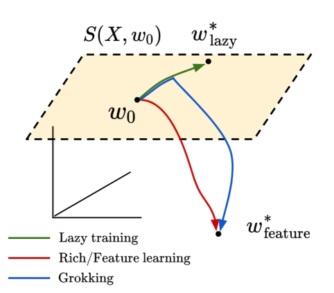

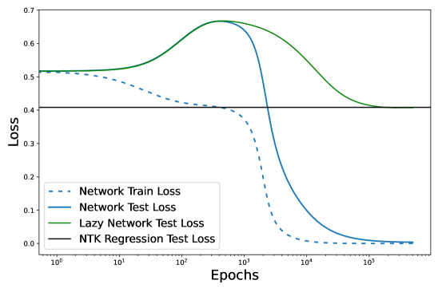


###### fig-1

*Рисунок 1: (a) Заявляемая динамика параметров при гроккинге в пространстве параметров $\mathbb{R}^{3}$ — для наглядности. $S(X,w_{0})$ — аффинное подпространство пространства параметров, достижимое моделями, линеаризованными вокруг $w_{0}$. (b) Гроккинг на задаче полиномиальной регрессии, введённой в разделе 5, с MLP, обычным градиентным спуском и нулевой регуляризацией. Зелёная и синяя кривые потерь на (b) отвечают набросанным зелёной и синей динамикам параметров на (a). Горизонтальная линия (чёрная) на (b) — среднеквадратичная ошибка наилучшей оценки ядровой регрессии с NTK при инициализации. (c) Тот факт, что норма весов параметров растёт (оранжевый пунктир), не может быть объяснён ни одной из существующих теорий гроккинга. Признаки согласуются (серый) в смысле, который мы уточняем в разделе 5.* **[p. 2]**

При фиксированном наборе данных, где гроккинг возможен, наше предложение естественно указывает на два ключевых фактора, управляющих гроккингом: (1) сколько обучения признакам необходимо для хорошего качества и (2) как быстро эти признаки выучиваются. Мы вводим два параметра, отвечающие этим понятиям, и показываем, что они способны управлять гроккингом.

###### p2-3

Ключевые вклады этой статьи таковы:

###### p2-4

- Мы даём простые примеры двухслойного MLP без всякого weight decay, который демонстрирует гроккинг способами, несовместимыми с существующими теориями гроккинга.
- Мы показываем и теоретически, и экспериментально, что гроккинг в этой постановке связан с переходом от ленивого обучения к богатому режиму обучения признакам и что им можно управлять параметрами, задающими этот переход. Эти параметры: масштабный параметр $\alpha$, управляющий величиной выхода сети и тем самым скоростью обучения признакам на протяжении обучения (то есть ленивостью); согласованность ядра задачи и модели между нейронным касательным ядром (NTK) сети при инициализации и тестовыми метками — мера того, сколько обучения признакам необходимо для хорошего качества на задаче (Cortes et al., 2012). **[p. 3]** «Златовласкин» размер обучающей выборки, при котором генерализация возможна, но не немедленна (например, гроккинг невозможен в пределе бесконечных данных, где потеря на обучении в точности отслеживает тестовую).
- Мы приводим несколько линий свидетельств того, что динамика обучения признакам, дающая гроккинг в этой простой постановке, действует и при гроккинге в более сложных постановках, изучавшихся в прошлых работах: на MNIST, с однослойными трансформерами и с сетями «учитель — ученик». По заданному набору обучающих входов мы даём способ построить метки, порождающие гроккинг.

## 2 Связанные работы

###### p3-1

**Гроккинг.** Nanda et al. (2023) механистически интерпретируют алгоритм, выучиваемый при гроккинге на задачах модульного сложения. В разделе 6 мы показываем, что одной лишь настройки параметра масштаба выхода сети / ленивости $\alpha$ достаточно, чтобы гроккинг непрерывно исчез на однослойном трансформере, использованном в той работе. Thilak et al. (2022) утверждают, что гроккинг вызван оптимизационной аномалией адаптивных оптимизаторов. Мы обнаруживаем гроккинг с обычным градиентным спуском, так что в общем случае это не может быть причиной гроккинга. Хотя в экспериментах раздела 6 мы показываем, что параметры нашей теории управляют гроккингом и с адаптивными оптимизаторами, в разделе 14 приложения мы отмечаем, что динамика обучения в таких постановках изучена хуже. Davies et al. (2023) указывают, что гроккинг и двойной спуск имеют сходства в динамике и по сути связаны со скоростью, с которой выучиваются закономерности разной сложности. Это согласуется с нашим доводом, что сеть сначала выучивает в данных закономерности, на которых хорошо справляется линеаризованная модель, а затем меняет свои признаки, чтобы выучить закономерности, которые обобщают. Liu et al. (2022a) эмпирически обнаруживают, что норма весов параметров при инициализации способна управлять гроккингом, тогда как Varma et al. (2023) предлагают эвристику для обучения с кросс-энтропией и weight decay, полагая, что гроккинг возникает из-за предпочтения «обобщающего контура» «запоминающему». Обе статьи опираются на weight decay и убывание нормы весов, чтобы объяснить гроккинг. Однако мы показываем примеры гроккинга при нулевом weight decay и *росте* нормы весов параметров в ходе обучения. Подробнее об отношении к существующим теориям мы говорим в разделе 9 приложения.

**Ядровая динамика и обучение признакам в полиномиальной постановке.** Предельное поведение нейросетей в пределе большой ширины (при общепринятых параметризациях) — это линейная модель с NTK в качестве ядра (Jacot et al., 2018). Это подтолкнуло к изучению индуктивных смещений ядровых методов (Bordelon et al., 2020; Canatar et al., 2021), которое показало, что ядра сильно смещены к объяснению обучающих данных старшими компонентами своего собственного спектра. Хотя такое спектральное смещение способно обеспечить хорошую генерализацию на некоторых задачах обучения, целевые функции, не лежащие в старших собственных подпространствах ядра, могут потребовать существенно большего объёма данных. Во многих работах предложены примеры, где нейросети способны статистически превзойти ядра, усиливая релевантные задаче направления по сравнению с нерелевантными во входном пространстве (Mei et al., 2018; Paccolat et al., 2021; Refinetti et al., 2021). Один из примеров такой задачи, привлёкший недавнее внимание, — одно- и многоиндексные модели, где целевая функция есть многочлен, зависящий от малого подмножества высокоразмерных входов (Ba et al., 2022; Arnaboldi et al., 2023; Nichani et al., 2022; Atanasov et al., 2022; Berthier et al., 2023; Bietti et al., 2022). То обстоятельство, что обучающиеся признакам нейросети способны превзойти ядра на этих задачах, наводит на мысль, что они могут быть полезными игрушечными моделями гроккинга — особенно если раннее обучение близко к линеаризованной динамике.

## 3 Норма весов и weight decay не могут объяснить гроккинг

###### p3-3

Прежние объяснения гроккинга опираются на убывание нормы весов на поздних временах (Liu et al., 2022a; Varma et al., 2023). На рисунке 2 мы показываем простой пример задачи модульной арифметики — распространённой задачи в исследованиях гроккинга (Power et al., 2022; Nanda et al., 2023; Gromov, 2023) — с двухслойным MLP, обученным без всякого weight decay (детали в разделе 8.3 приложения). Норма весов параметров в ходе обучения *растёт* (рисунок 2(a)), так что гроккинг в общем случае не может быть объяснён теориями weight decay.


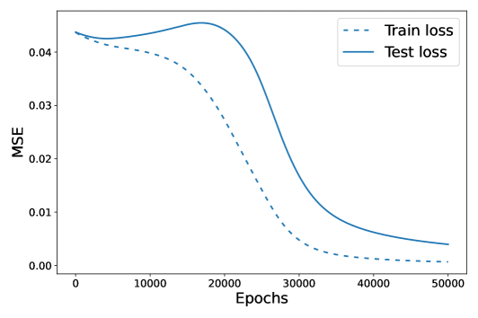


*Рисунок 2: (a) и (b) показывают кривые точности и потерь для гроккинга на задаче модульной арифметики, демонстрирующей *рост* нормы весов параметров в ходе обучения. (c) — перебор по параметру ленивости $\alpha$, который мы введём и для которого дадим теорию, показывающий, как он способен непрерывно управлять гроккингом.* **[p. 4]**

Мы сосредоточимся на динамике гроккинга в *потере* (рисунок 2(b)), поскольку динамику обучения направляет потеря, а не точность. Более того, в разделе 19 приложения мы показываем, что кривые точности для задач *регрессии* вводят в заблуждение, поскольку ими можно манипулировать выбором метрики. На этой задаче классификации мы используем среднеквадратичную потерю (MSE), придерживаясь того, как гроккинг наблюдали в модульной арифметике Liu et al. (2022a); Gromov (2023). В разделе 6 мы показываем, что наши результаты сохраняются без дополнительной подгонки для разных архитектур, оптимизаторов и наборов данных.

Хотя задачу модульной арифметики мы привели первой в качестве контрпримера, поскольку это распространённая задача в исследованиях гроккинга, в остальной части статьи мы сосредоточимся на задаче полиномиальной регрессии, динамику которой можем анализировать математически. Эту задачу мы вводим в разделе 5. Норма весов параметров в том примере *тоже растёт* по мере гроккинга, как видно на рисунке 1 (c). Эти несоответствия и мотивируют наше исследование, приводящее к двум ключевым параметрам, которые мы вводим, — ленивости сети и согласованности NTK. Действие изменения первого, $\alpha$, показано на рисунке 2(c): мы видим, что он способен сделать гроккинг драматичнее или заставить его исчезнуть вовсе.

## 4 Гроккинг как переход от ленивого обучения к богатому

###### p4-2

Гроккинг часто представляют себе так: сеть сначала находит запоминающее решение, подгоняющее обучающую выборку, но не тестовую, а позже сходится к обобщающему решению. Мы выдвигаем гипотезу, что «запоминающие» решения, задокументированные в прежних работах о гроккинге, равносильны *ленивой динамике обучения на ранних временах*. На поздних временах линеаризованное приближение перестаёт работать, поскольку сеть извлекает полезные признаки и начинает «грокать».

Далее мы кратко напоминаем и определяем понятие ленивого режима обучения нейросетей и вводим несколько ключевых теоретических понятий, которые сыграют важную роль в нашем обсуждении.

### 4.1 Введение в ленивое обучение: линейный и нелинейный режимы обучения

В ленивом режиме обучения сеть $f(\bm{w},\bm{x})$ от входов $\bm{x}$ и параметров $\bm{w}$ подчиняется приближению

$$
f(\bm{w},\bm{x})\approx f(\bm{w}_{0},\bm{x})+\nabla_{\bm{w}}f(\bm{w},\bm{x})|_{\bm{w}_{0}}\cdot(\bm{w}-\bm{w}_{0}). \tag{1}
$$

###### p4-5

Хотя это приближение всё ещё способно выучивать нелинейные функции входа $\bm{x}$, оно является *линейной моделью* по обучаемым параметрам $\bm{w}$. Поэтому его можно переписать как ядровой метод с нейронным касательным ядром $K$

$$
K(\bm{x},\bm{x}^{\prime})=\nabla_{\bm{w}}f(\bm{w},\bm{x})|_{\bm{w}_{0}}\cdot\nabla_{\bm{w}}f(\bm{w},\bm{x}^{\prime})|_{\bm{w}_{0}} \tag{2}
$$

вычисленным при инициализации. Это верно для любой линеаризованной модели, обучаемой градиентным спуском на любой потере, хотя некоторые функции потерь (например, кросс-энтропия) заставляют нелинейные модели в конце концов отклониться от своей линеаризации (Lee et al., 2019). Глубокие нейросети могут приближаться к этой линеаризации разными способами:

- Большая ширина: при общепринятых схемах параметризации и инициализации нейросетей увеличение ширины сети улучшает качество этого приближения Jacot et al. (2018); Lee et al. (2019).
- Большие начальные веса: увеличение величины начальных весов также заставляет сеть вести себя ближе к линеаризованной динамике (Chizat et al., 2019). *Мы утверждаем, что именно этим объясняется, почему Liu et al. (2022a) и Varma et al. **[p. 5]** (2023) наблюдали связь между гроккингом и большой начальной нормой весов.*
- Перемасштабирование меток: масштабирование $y$ множителем $\alpha^{-1}$ способно вызвать ленивое обучение (Geiger et al., 2020).
- Перемасштабирование выхода: умножение выходных логитов сети на большой масштабный множитель $\alpha$ также способно вызвать ленивое обучение (Chizat et al., 2019).

В этой работе мы преимущественно пользуемся последним вариантом, где предел $\alpha\to\infty$ — это предел, в котором уравнение 1 становится точным, а сеть на этапе вывода ведёт себя как линейная модель (в случае MSE эта линейная модель есть ядровая регрессия с исходным NTK). На рисунке 7 мы показываем, что эти способы вызвать ленивость равносильны в смысле порождения гроккинга.

**Индуктивное смещение ядер и их недостаточность на рассогласованных задачах:** хотя линеаризованные вокруг начальных весов модели способны хорошо справляться с некоторыми задачами обучения, они плохо генерализуют при обучении на целевых функциях $y(x)$, *рассогласованных* с NTK — в смысле, который мы уточним, определив центрированную согласованность ядер (CKA) в следующем разделе. Напротив, нейросети в режиме обучения признакам способны приспосабливать свои внутренние представления, улучшая выборочную сложность обучения для функций, которые были бы трудны для NTK (Ghorbani et al., 2019; Arnaboldi et al., 2023; Ba et al., 2022; Damian et al., 2023).

## 5 Полиномиальная регрессия в двухслойном перцептроне

Чтобы показать наши основные идеи, мы изучаем простейший из возможных игрушечных примеров гроккинга — высокоразмерную полиномиальную регрессию. Этот выбор мотивирован известными результатами о разделении между нейросетями и ядровыми методами. Во-первых, теоретические исследования ядровой регрессии показали, что выучивание многочленов степени $k$ в размерности $D$ с помощью NTK требует $P\sim D^{k}$ образцов (Bordelon et al., 2020; Canatar et al., 2021; Xiao et al., 2022). С другой стороны, в режиме обучения признакам двухслойные сети, обучаемые в онлайн-постановке, способны выучивать многочлены высокой степени за $P\sim D$ образцов (Saad and Solla, 1995; Engel, 2001; Goldt et al., 2019; Arnaboldi et al., 2023; Berthier et al., 2023; Sarao Mannelli et al., 2020). Отсюда следует, что нейросети потенциально способны генерализовать при $D\ll P\ll D^{k}$ — но только если они обучаются признакам (Atanasov et al., 2022). Поэтому мы предсказываем возможность гроккинга в этом промежуточном диапазоне размеров выборки, особенно если обучение признакам происходит поздно в обучении, как в ленивой сети. Мы действительно обнаруживаем, что таким способом можем вызвать гроккинг в двухслойной сети. Более того, гроккинг сохраняется даже при считывающих весах двухслойного MLP, зафиксированных на $1$, — и в поисках минимальной постановки, воспроизводящей гроккинг, мы изучаем именно её222Механизм гроккинга в этой постановке тот же, что и при обучении полного двухслойного MLP со считыванием, но тогда ядро является функцией не только $\bar{\bm{w}},\bm{M}$. Мы обсуждаем это в разделе 11 приложения, но это техническая деталь: те же доводы и графики верны и в обычных двухслойных MLP так, как и следовало бы ожидать.. Такой двухслойный тип нейросети называют комитетной машиной (Saad and Solla, 1995).

Модель $f(\bm{w},\bm{x})$ и целевая функция $y(\bm{x})$ определяются через вход $\bm{x}\in\mathbb{R}^{D}$ как

$$
f(\bm{w},\bm{x}) =\frac{\alpha}{N}\sum_{i=1}^{N}\phi(\bm{w}_{i}\cdot\bm{x})\ ,\quad\phi(h)=h+\frac{\epsilon}{2}h^{2}\ ,\quad y(\bm{x})=\frac{1}{2}(\bm{\beta}_{\star}\cdot\bm{x})^{2} \tag{3}
$$

Величина $\alpha$ управляет масштабом выхода и, следовательно, скоростью обучения признакам. Величина $\epsilon$ меняет то, насколько задача трудна для исходного NTK. Мы рассматриваем обучение на фиксированном наборе данных $\{(\bm{x}_{\mu},y_{\mu})\}_{\mu=1}^{P}$ из $P$ образцов. Входы $\bm{x}$ берутся из изотропного гауссова распределения $\bm{x}\sim\mathcal{N}(0,\frac{1}{D}\bm{I})$. Удобно ввести следующие две сводные статистики

$$
\bar{\bm{w}}=\frac{1}{N}\sum_{i=1}^{N}\bm{w}_{i}\in\mathbb{R}^{D}\ ,\quad\bm{M}=\frac{1}{N}\sum_{i=1}^{N}\bm{w}_{i}\bm{w}_{i}^{\top}\in\mathbb{R}^{D\times D} \tag{4}
$$

Через эти два момента весов функцию нейросети можно записать как $f(\bm{x})=\alpha\bar{\bm{w}}\bm{x}+\frac{\alpha\epsilon}{2}\bm{x}^{\top}\bm{M}\bm{x}$. Более того, NTK также можно выразить как

$$
K(\bm{x},\bm{x}^{\prime})=\bm{x}\cdot\bm{x}^{\prime}+\epsilon(\bm{x}\cdot\bm{x}^{\prime})\ \bar{\bm{w}}\cdot(\bm{x}+\bm{x}^{\prime})+\epsilon^{2}(\bm{x}\cdot\bm{x}^{\prime})\ \bm{x}^{\top}\bm{M}\bm{x}^{\prime} \tag{5}
$$

При инициализации в широкой сети $\bar{\bm{w}}=0$ и $\bm{M}=\bm{I}$. **[p. 6]** Диагонализация этого исходного NTK относительно гауссова распределения данных показывает, что все линейные функции имеют собственное значение $\lambda_{\text{lin}}=D^{-1}$, тогда как квадратичные функции — $\lambda_{\text{quadr}}=2\epsilon D^{-2}$ (раздел 11 приложения). Мы видим, что $\epsilon$ управляет мощностью, которую ядро отводит квадратичным функциям (включая целевую $y(x)$). Именно это мы имеем в виду, говоря, что $\epsilon$ управляет исходной согласованностью в этом примере. Далее, исходя из прежних работ о ядровой регрессии, генерализация с исходным ядром (или полностью ленивой нейросетью) потребует $P\sim\lambda_{\text{quadr}}^{-1}=\frac{1}{2\epsilon}D^{2}$ образцов (Bordelon et al., 2020; Canatar et al., 2021; Simon et al., 2023; Xiao et al., 2022). Однако нейросети вне ядрового режима способны генерализовать из гораздо меньшего числа образцов, поскольку могут приспособить свои признаки так, чтобы $\bm{M}$ согласовалась с $\bm{\beta}_{\star}\bm{\beta}_{\star}^{\top}$ и достигалась низкая тестовая ошибка, а это не требует стольких образцов (Ghorbani et al., 2019; Atanasov et al., 2022).333Прежние работы указывают, что выучивание квадратичных многочленов (без линейной составляющей в направлении $\bm{\beta}_{\star}$) с помощью SGD требует $\sim\mathcal{O}(D\log D)$ шагов SGD при единичном размере батча (Arous et al., 2021).. Если это обучение признакам отложено, динамика нейросети на ранних временах совпадала бы с ядровым методом, а на поздних временах наблюдалась бы генерализация по мере того, как веса начинают согласовываться с $\bm{\beta}_{\star}$, что и даёт кривую обучения с гроккингом. Это и есть задача, порождающая кривые обучения на рисунках 1, 3.

Хотя $\epsilon$ — естественная мера согласованности в нашей игрушечной модели, нам нужен и общий способ определять, насколько хорошо сеть согласована с задачей $y(X)$. Оказывается, центрированная согласованность ядер (CKA), $\frac{y^{T}K_{0}y}{||K||_{F}||y||^{2}}$, (Kornblith et al., 2019; Cortes et al., 2012; Atanasov et al., 2022; Arora et al., 2019), — естественное обобщение того, чем является $\epsilon$ в нашей игрушечной модели. В этой формуле $K_{0}$ — матрица Грама исходного NTK, вычисленная на тестовой выборке, а $y$ — метки задачи. Соотношение между ${\epsilon}$ и CKA мы выводим в разделе 11 приложения и обнаруживаем, что они сильно коррелированы. Поскольку CKA вычислима для любой задачи, это общий способ измерять согласованность признаков с задачей. «Согласованность NTK» на графиках без дополнительного определения означает CKA.

### 5.1 Изменение масштаба $\alpha$ способно вызвать или устранить гроккинг

Далее мы рассматриваем действие масштаба $\alpha$ и показываем, что большое $\alpha$ увеличивает разделение временных масштабов между падением потери на обучении и падением тестовой потери, тогда как малое $\alpha$ способно устранить гроккинг вовсе. По рисунку 3(a) видно, что увеличение $\alpha$ на задаче полиномиальной регрессии непрерывно порождает всё большую задержку между падением потери на обучении и падением тестовой потери. Далее, предел $\alpha\to\infty$ даёт плохое итоговое качество, поскольку отвечает регрессии с исходным (рассогласованным) NTK.

#### Норма весов параметров по своей сути не является основополагающей.

Одно из наших ключевых утверждений: в прежних работах Liu et al. (2022a); Varma et al. (2023) видели связь между нормой весов параметров при инициализации и гроккингом потому, что *норма весов при инициализации управляет скоростью обучения признакам*, переводя сеть в ленивый режим обучения. Это утверждение можно проверить, воспользовавшись тем, что норма весов при инициализации — не единственное изменение, способное вызвать ленивое обучение: в тех же работах (Chizat et al., 2019; Lee et al., 2019) доказано также, что увеличение масштаба выхода модели или масштаба меток действует так же. И действительно, как видно на рисунке 7 приложения, их изменение *действует на кривые обучения так же, как изменение нормы весов при инициализации*.

### 5.2 Исходная согласованность ядра и задачи $\epsilon$ также способна менять динамику гроккинга

Исходная согласованность между NTK и целевой функцией тоже управляет поведением гроккинга. Действительно, на рисунке 3(b) видно, что у сетей с малым $\epsilon$ задержка между снижением потери на обучении и снижением тестовой потери дольше, а у сетей с большим $\epsilon$ тестовая потеря снижается почти сразу. Любопытно, что худшая исходная согласованность, вызванная меньшим $\epsilon$, ведёт к меньшей итоговой тестовой потере, поскольку вынуждает сеть обучаться признакам (см. приложение 10). Это означает, что сети с *плохими исходными признаками* могут в конце работать лучше, чем сети с *лучшими исходными признаками*, — потому что они вынуждены выучить хорошие признаки.

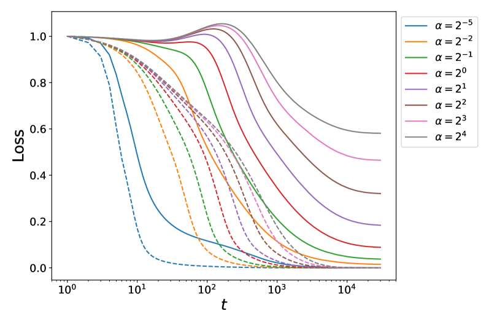


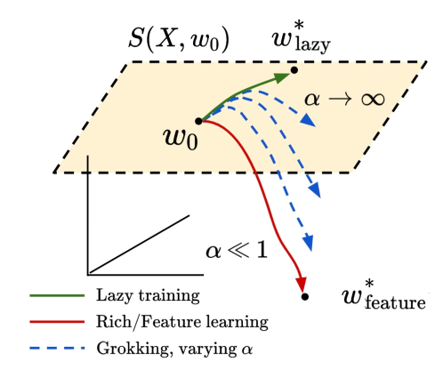


*Рисунок 3: Ленивое обучение ($\alpha$) и рассогласование ядра и задачи ($\epsilon$) меняют кривые обучения с гроккингом по-разному. (Вверху) Кривые обучения, показывающие гроккинг, и (внизу) соответствующая динамика параметров в ходе обучения. (a) При фиксированном $\epsilon$ параметр ленивости $\alpha$ управляет временным масштабом задержки при гроккинге. При малом $\alpha$ эффект гроккинга исчезает, поскольку обобщающие признаки извлекаются сразу. При большом $\alpha$ модель приближается к линеаризованной. Итоговая тестовая потеря убывает с $\alpha$, поскольку мы позволяем сети выучить больше признаков. (b) Согласованность задачи с исходным ядром, измеряемая $\epsilon$, определяет, насколько падает потеря, когда сеть поначалу пользуется своим линеаризованным решением. Меньшее $\epsilon$ увеличивает объём обучения признакам в ходе обучения, поскольку исходное ядро хуже справляется с задачей, а значит, обучение признакам необходимо. Тем самым меньшая согласованность может приводить к лучшей генерализации. (c)-(d) Иллюстрации динамики при разных $\alpha,\epsilon$. На (d) каждая плоскость представляет своё аффинное пространство, натянутое на исходные градиенты, которые являются функцией $\epsilon$. (e) Время до гроккинга (задержка между падением потери на обучении и падением тестовой потери) как функция $\alpha,\epsilon$, показывающая, что ленивые рассогласованные сети грокают всего интенсивнее.* **[p. 7]**

### 5.3 Разложение потери в игрушечной модели

###### p6-4

Чтобы понять источники ошибки генерализации в нашей модели, мы раскладываем тестовый риск на три слагаемых, зависящих только от введённых ранее сводных статистик ($\bm{\bar{w}},\bm{M}$). Предсказатель выражается через эти объекты: $f=\alpha\bar{\bm{w}}\cdot\bm{x}+\frac{\alpha\epsilon}{2}\bm{x}^{\top}\bm{M}\bm{x}$. Тестовая MSE нашей модели тогда принимает вид:

$$
\mathcal{L}=\left<\left(y-f\right)^{2}\right>=\frac{1}{4}\underbrace{\left(\frac{1}{D}|\bm{\beta}_{\star}|^{2}-\frac{\alpha\epsilon}{D}\text{Tr}\bm{M}\right)^{2}}_{\text{variance error}}+\underbrace{\frac{1}{2D^{2}}\left|\alpha\epsilon\bm{M}-\bm{\beta}_{\star}\bm{\beta}_{\star}^{\top}\right|_{F}^{2}}_{\text{misalignment error}}+\underbrace{\frac{\alpha^{2}}{D}|\bar{\bm{w}}|^{2}}_{\text{power in linear modes}}. \tag{6}
$$

Первое слагаемое измеряет, имеет ли полная дисперсия весов $\frac{1}{DN}\sum_{i}|\bm{w}_{i}|^{2}=\frac{1}{D}\sum_{j=1}^{D}M_{jj}$ верный масштаб по сравнению с целями. Второе слагаемое измеряет, достигли ли веса решения с *высокой согласованностью* с целевой функцией. Оно тесно связано и сильно коррелировано со своим общим аналогом — CKA, $\frac{y^{T}K_{0}y}{||K_{0}||_{F}||y||}$, — в смысле, который мы разбираем в разделе 11 приложения. Последнее слагаемое штрафует любую мощность, которую наши признаки отводят линейным составляющим, поскольку наша целевая функция — чистая квадратичная. Так как у функции активации нашей сети есть линейная составляющая, векторы весов в ходе обучения должны усредниться, чтобы выучить решение с нулевой суммарной мощностью в линейных функциях. Тестовая ошибка минимизируется любой нейросетью, удовлетворяющей $\bm{M}=\frac{1}{\alpha\epsilon}\bm{\beta}_{\star}\bm{\beta}_{\star}^{\top}$ и $\bar{\bm{w}}=0$.

На рисунке 4 мы показываем это разложение потери вдоль кривой обучения с гроккингом. Мы обнаруживаем, как и ожидалось, что первоначальный пик тестовой ошибки связан с попыткой модели выучить линейную функцию входа (оранжевая кривая), после чего согласованность улучшается (зелёная пунктирная потеря падает на поздних временах), а масштаб линейной составляющей снижается (чёрный пунктир).

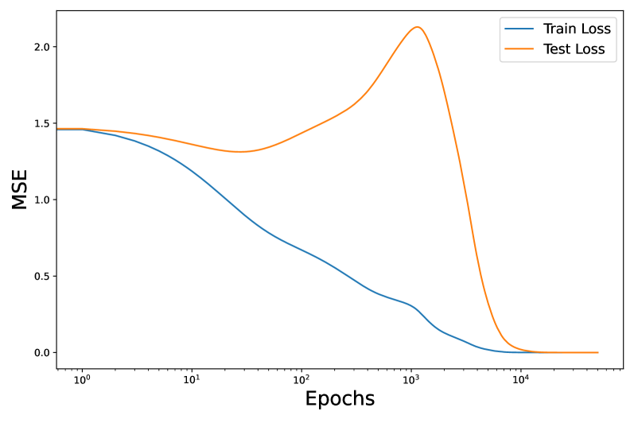


###### fig-4

*Рисунок 4: (Слева) Кривые обучения для двухслойного многослойного перцептрона, который грокает на нашей задаче полиномиальной регрессии (без weight decay, обычный градиентный спуск). **[p. 8]** (Справа) Теоретическое разложение, показывающее, как первоначальный рост тестовой потери происходит оттого, что сеть вкладывает мощность в линейную составляющую своего исходного NTK, прежде чем начать согласовываться с признаками задачи около 1–2 тыс. эпох, что и даёт отложенное падение тестовой потери. Эта задержка и есть в точности гроккинг.* **[p. 8]**

## 6 Гроккинг не ограничен модульной арифметикой

### 6.1 Порождение гроккинга на гауссовых данных понижением согласованности меток

В этом подразделе мы вызываем гроккинг, управляя согласованностью NTK при инициализации способом, применимым к произвольным наборам данных $X$ и не затрагивающим параметр ленивости. Рассмотрим ту же функцию, что и в нашей постановке полиномиальной регрессии, но заменим метки задачи $j$-м по величине собственным вектором (по убыванию собственных значений, так что $j=1$ — собственный вектор $K_{0}(X,X)$ с наибольшим собственным значением) матрицы NTK при инициализации $K_{0}(X,X)$ и будем варьировать $j$. Мотивировка в том, что выбор собственного вектора с большим собственным значением по построению делает CKA, $\frac{y^{T}K_{0}y}{||K_{0}||_{F}||y||^{2}}$, высокой, и наоборот. Тем самым согласованность при инициализации высока для малых $j$ (первый график), и сеть генерализует сразу, поскольку стартует с хорошими признаками. Наоборот, если начать с больших $j$, значение CKA мало, а задача по построению трудна, так что при таком объёме данных сеть генерализовать никогда не сможет (при гораздо большем объёме данных мы бы выучили признаки). Собственные функции с промежуточными $j$ рассогласованы с исходным NTK *достаточно*, чтобы линеаризованная модель работала плохо, но данных у сети хватает, чтобы обучение признакам снизило тестовую потерю. Эмпирически мы видим, что это происходит при $j\approx 70$ на (b) ниже.

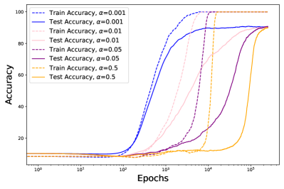

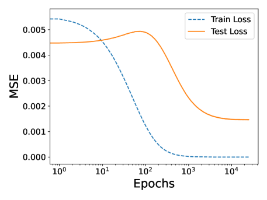


*Рисунок 5: Демонстрация гроккинга на стандартных гауссовых данных $X\in\mathbb{R}^{D\times P}$ с той же архитектурой с одним скрытым слоем, что была у нас для полиномиальной регрессии. Векторы меток $y$ заменены $j$-ми по величине собственными векторами исходного NTK (упорядоченными по убыванию собственных значений) для $j\in\{1,70,100\}$ соответственно на (a)-(c). Если сеть начинает сильно согласованной, как на (a), кривые обучения движутся вместе. Если признаки сети при инициализации согласованы плохо, как на (c), сеть генерализовать не может. Посередине, как на (b), сеть грокает.* **[p. 8]**

**[p. 9]**

**MNIST.** Liu et al. (2022a) вызывают гроккинг на MNIST, увеличивая норму весов параметров при инициализации. На рисунке 6(a) ниже мы заставляем этот гроккинг непрерывно исчезнуть, настраивая $\alpha$ и не меняя нормы весов параметров, что поддерживает мысль, что норма весов при инициализации — один из нескольких параметров, управляющих ленивостью. Эта настройка $\alpha$ выполнена с квадратичным масштабированием, показанным на рисунке 7.

**Однослойные трансформеры.** На 6(b) мы воспроизводим классическую постановку, в которой гроккинг наблюдали Nanda et al. (2023): однослойный трансформер обучался задаче модульного сложения с кросс-энтропийной потерей и AdamW. Мы обнаруживаем, что даже в совершенно иной архитектуре сети — на этот раз с вниманием, — с адаптивным оптимизатором и другой функцией потерь наша гипотеза о том, что ленивость управляет гроккингом, выполняется без дополнительной подгонки. Обратите внимание, как изменение альфы способно непрерывно заставить гроккинг исчезнуть или сделать его резче.


*Рисунок 6: (a) **MNIST.** Непрерывное управление гроккингом на MNIST изменением одной лишь ленивости $\alpha$, вплоть до его исчезновения за счёт поощрения быстрого обучения признакам при $\alpha=0.0001$. (b) **Однослойный трансформер.** Непрерывное управление гроккингом на однослойном трансформере из Nanda et al. (2023) с помощью масштабного параметра $\alpha$. Обратите внимание, как гроккинг исчез при $\alpha=0.15$ — его едва видно среди кривых обучения. Масштабы осей сохранены верными исходным статьям. Ту же тенденцию мы обнаруживаем и для сетей «учитель — ученик», графики — в разделе 8 приложения.* **[p. 9]**

## 7 Заключение

В этой работе мы выдвинули гипотезу, что гроккинг может возникать из перехода от ленивого обучения к богатому. Чтобы исследовать эту мысль, мы искали простейшую возможную модель, в которой гроккинг наблюдается, — а именно полиномиальную регрессию. Это мотивировало изучение параметра ленивости $\alpha$ и исходной согласованности NTK, о которых мы показали, что они способны вызывать и устранять гроккинг без дополнительной подгонки. Хотя во многих прежних работах эмпирически обнаруживалось, что норма весов параметров кажется важным фактором гроккинга сети, мы показали, что это происходит потому, что большая начальная норма весов приблизительно *линеаризует* модель. В этом смысле наши результаты вбирают в себя прежние работы о гроккинге и показывают, почему weight decay не всегда необходим.

#### Ограничения

Хотя мы предложили новую понятийную рамку для рассуждений о гроккинге, некоторые вопросы остались за её пределами. Мы не даём точной теоретической характеризации требуемого размера выборки или времени обучения для перехода от запоминания к поведению с гроккингом. Хотя верно, что адаптивные оптимизаторы и weight decay ни необходимы, ни достаточны для наблюдения гроккинга, их повсеместность в прежних примерах гроккинга всё же наводит на мысль, что они способны его усиливать. Одна из возможностей состоит в том, что weight decay побуждает модель покинуть ленивый режим, вынуждая NTK меняться (Lewkowycz and Gur-Ari, 2020), — это мы исследуем в разделе 13 приложения. Хотя о роли оптимизаторов (моментума и Adam) в порождении гроккинга мы рассуждаем в приложении 14, действующая при этом динамика, когда гроккинг вызывают адаптивные оптимизаторы, остаётся плохо понятой.

**[p. 10]**

## Благодарности

TK был поддержан Harvard College Research Program. BB и CP поддержаны NSF Award DMS-2134157. BB дополнительно поддержан стипендией Google PhD. Эта работа стала возможной отчасти благодаря дару Chan Zuckerberg Initiative Foundation на учреждение Kempner Institute for the Study of Natural and Artificial Intelligence. Мы благодарим Andrey Gromov, Bruno Louriero, Francesca Mignacco, Stefano Sarao Mannelli и Nikhil Vyas за полезные обсуждения и благодарим Alex Atanasov за полезные замечания к более раннему черновику этой статьи.

## Литература

- Alethea Power, Yuri Burda, Harri Edwards, Igor Babuschkin, and Vedant Misra. Grokking: Generalization beyond overfitting on small algorithmic datasets. *arXiv preprint arXiv:2201.02177*, 2022.

- Neel Nanda, Lawrence Chan, Tom Liberum, Jess Smith, and Jacob Steinhardt. Progress measures for grokking via mechanistic interpretability. *arXiv preprint arXiv:2301.05217*, 2023.

- Xander Davies, Lauro Langosco, and David Krueger. Unifying grokking and double descent. *arXiv preprint arXiv:2303.06173*, 2023.

- Vimal Thilak, Etai Littwin, Shuangfei Zhai, Omid Saremi, Roni Paiss, and Joshua Susskind. The slingshot mechanism: An empirical study of adaptive optimizers and the grokking phenomenon. *arXiv preprint arXiv:2206.04817*, 2022.

- Vikrant Varma, Rohin Shah, Zachary Kenton, János Kramár, and Ramana Kumar. Explaining grokking through circuit efficiency. *arXiv preprint arXiv:2309.02390*, 2023.

- Ziming Liu, Eric J Michaud, and Max Tegmark. Omnigrok: Grokking beyond algorithmic data. *arXiv preprint arXiv:2210.01117*, 2022a.

- Ziming Liu, Ouail Kitouni, Niklas S Nolte, Eric Michaud, Max Tegmark, and Mike Williams. Towards understanding grokking: An effective theory of representation learning. *Advances in Neural Information Processing Systems*, 35:34651–34663, 2022b.

- Andrey Gromov. Grokking modular arithmetic. *arXiv preprint arXiv:2301.02679*, 2023.

- Lenaic Chizat, Edouard Oyallon, and Francis Bach. On lazy training in differentiable programming. *Advances in neural information processing systems*, 32, 2019.

- Arthur Jacot, Franck Gabriel, and Clément Hongler. Neural tangent kernel: Convergence and generalization in neural networks. *Advances in neural information processing systems*, 31, 2018.

- Jaehoon Lee, Lechao Xiao, Samuel Schoenholz, Yasaman Bahri, Roman Novak, Jascha Sohl-Dickstein, and Jeffrey Pennington. Wide neural networks of any depth evolve as linear models under gradient descent. *Advances in neural information processing systems*, 32, 2019.

- Corinna Cortes, Mehryar Mohri, and Afshin Rostamizadeh. Algorithms for learning kernels based on centered alignment. *The Journal of Machine Learning Research*, 13(1):795–828, 2012.

- Blake Bordelon, Abdulkadir Canatar, and Cengiz Pehlevan. Spectrum dependent learning curves in kernel regression and wide neural networks. In *International Conference on Machine Learning*, pages 1024–1034. PMLR, 2020.

- Abdulkadir Canatar, Blake Bordelon, and Cengiz Pehlevan. Spectral bias and task-model alignment explain generalization in kernel regression and infinitely wide neural networks. *Nature communications*, 12(1):2914, 2021.

- Song Mei, Andrea Montanari, and Phan-Minh Nguyen. A mean field view of the landscape of two-layer neural networks. *Proceedings of the National Academy of Sciences*, 115(33):E7665–E7671, 2018.

**[p. 11]**

- Jonas Paccolat, Leonardo Petrini, Mario Geiger, Kevin Tyloo, and Matthieu Wyart. Geometric compression of invariant manifolds in neural networks. *Journal of Statistical Mechanics: Theory and Experiment*, 2021(4):044001, 2021.

- Maria Refinetti, Sebastian Goldt, Florent Krzakala, and Lenka Zdeborová. Classifying high-dimensional gaussian mixtures: Where kernel methods fail and neural networks succeed. In *International Conference on Machine Learning*, pages 8936–8947. PMLR, 2021.

- Jimmy Ba, Murat A Erdogdu, Taiji Suzuki, Zhichao Wang, Denny Wu, and Greg Yang. High-dimensional asymptotics of feature learning: How one gradient step improves the representation. *Advances in Neural Information Processing Systems*, 35:37932–37946, 2022.

- Luca Arnaboldi, Ludovic Stephan, Florent Krzakala, and Bruno Loureiro. From high-dimensional & mean-field dynamics to dimensionless odes: A unifying approach to sgd in two-layers networks. *arXiv preprint arXiv:2302.05882*, 2023.

- Eshaan Nichani, Yu Bai, and Jason D Lee. Identifying good directions to escape the ntk regime and efficiently learn low-degree plus sparse polynomials. *Advances in Neural Information Processing Systems*, 35:14568–14581, 2022.

- Alexander Atanasov, Blake Bordelon, Sabarish Sainathan, and Cengiz Pehlevan. The onset of variance-limited behavior for networks in the lazy and rich regimes. *arXiv preprint arXiv:2212.12147*, 2022.

- Raphaël Berthier, Andrea Montanari, and Kangjie Zhou. Learning time-scales in two-layers neural networks. *arXiv preprint arXiv:2303.00055*, 2023.

- Alberto Bietti, Joan Bruna, Clayton Sanford, and Min Jae Song. Learning single-index models with shallow neural networks. *Advances in Neural Information Processing Systems*, 35:9768–9783, 2022.

- Mario Geiger, Stefano Spigler, Arthur Jacot, and Matthieu Wyart. Disentangling feature and lazy training in deep neural networks. *Journal of Statistical Mechanics: Theory and Experiment*, 2020(11):113301, 2020.

- Behrooz Ghorbani, Song Mei, Theodor Misiakiewicz, and Andrea Montanari. Limitations of lazy training of two-layers neural networks, 2019.

- Alex Damian, Eshaan Nichani, Rong Ge, and Jason D. Lee. Smoothing the landscape boosts the signal for sgd: Optimal sample complexity for learning single index models, 2023.

- Lechao Xiao, Hong Hu, Theodor Misiakiewicz, Yue Lu, and Jeffrey Pennington. Precise learning curves and higher-order scalings for dot-product kernel regression. *Advances in Neural Information Processing Systems*, 35:4558–4570, 2022.

- David Saad and Sara A Solla. On-line learning in soft committee machines. *Physical Review E*, 52(4):4225, 1995.

- Andreas Engel. *Statistical mechanics of learning*. Cambridge University Press, 2001.

- Sebastian Goldt, Madhu S Advani, Andrew M Saxe, Florent Krzakala, and Lenka Zdeborová. Generalisation dynamics of online learning in over-parameterised neural networks. *arXiv preprint arXiv:1901.09085*, 2019.

- Stefano Sarao Mannelli, Eric Vanden-Eijnden, and Lenka Zdeborová. Optimization and generalization of shallow neural networks with quadratic activation functions. *Advances in Neural Information Processing Systems*, 33:13445–13455, 2020.

- James B Simon, Madeline Dickens, Dhruva Karkada, and Michael Deweese. The eigenlearning framework: A conservation law perspective on kernel ridge regression and wide neural networks. *Transactions on Machine Learning Research*, 2023.

- Gerard Ben Arous, Reza Gheissari, and Aukosh Jagannath. Online stochastic gradient descent on non-convex losses from high-dimensional inference. *The Journal of Machine Learning Research*, 22(1):4788–4838, 2021.

**[p. 12]**

- Simon Kornblith, Mohammad Norouzi, Honglak Lee, and Geoffrey Hinton. Similarity of neural network representations revisited. In *International conference on machine learning*, pages 3519–3529. PMLR, 2019.

- Sanjeev Arora, Simon Du, Wei Hu, Zhiyuan Li, and Ruosong Wang. Fine-grained analysis of optimization and generalization for overparameterized two-layer neural networks. In *International Conference on Machine Learning*, pages 322–332. PMLR, 2019.

- Aitor Lewkowycz and Guy Gur-Ari. On the training dynamics of deep networks with $l\_2$ regularization. *Advances in Neural Information Processing Systems*, 33:4790–4799, 2020.

- Boaz Barak, Benjamin Edelman, Surbhi Goel, Sham Kakade, Eran Malach, and Cyril Zhang. Hidden progress in deep learning: Sgd learns parities near the computational limit. *Advances in Neural Information Processing Systems*, 35:21750–21764, 2022.

- Theodor Misiakiewicz. Spectrum of inner-product kernel matrices in the polynomial regime and multiple descent phenomenon in kernel ridge regression. *arXiv preprint arXiv:2204.10425*, 2022.

- Jeremy M Cohen, Simran Kaur, Yuanzhi Li, J Zico Kolter, and Ameet Talwalkar. Gradient descent on neural networks typically occurs at the edge of stability. *arXiv preprint arXiv:2103.00065*, 2021.

- Rylan Schaeffer, Brando Miranda, and Sanmi Koyejo. Are emergent abilities of large language models a mirage? *arXiv preprint arXiv:2304.15004*, 2023.

**[p. 13]**

## 8 Приложение

### Дополнительные эксперименты

### 8.1 Замечание о реализации большого $\alpha$

Как обсуждалось в исходной статье о порождении ленивого обучения Chizat et al. [2019], важно вычесть исходный предсказатель из функции нейросети. Конкретно, в качестве предсказателя следует брать изменённую функцию

$$
\tilde{f}(\bm{x},\theta)=\alpha[f(\bm{x},\theta)-f(\bm{x},\theta_{0})] \tag{7}
$$

В наших экспериментах мы подставляем $\tilde{f}$ в оптимизатор при вычислении градиентов. Это позволяет обучать с очень большими значениями $\alpha$, не сталкиваясь с неустойчивостью при инициализации. Кроме того, чтобы сохранить согласованные временные масштабы обучения, важно перемасштабировать скорость обучения как $\eta=\eta_{0}/\alpha^{2}$. Это перемасштабирование удерживает исходную производную $\frac{d}{dt}f|_{t=0}$ независимой от $\alpha$, и тем самым ранняя динамика обучения согласована при разных $\alpha$. Иначе у сетей с большим $\alpha$ скорость обучения окажется слишком велика, а сети с малым $\alpha$ будут обучаться слишком долго.

### 8.2 Норма весов и масштаб инициализации действуют одинаково


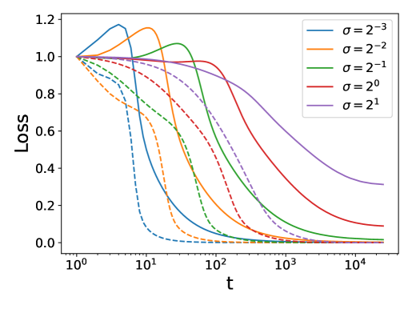


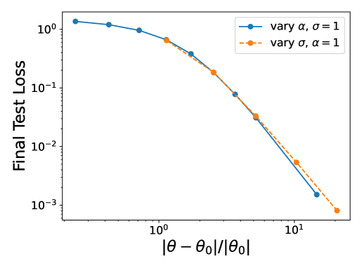

###### fig-7

*Рисунок 7: Масштаб весов меняет динамику гроккинга и итоговую тестовую потерю прежде всего за счёт управления богатством динамики — а именно тем, насколько далеко динамика отходит от линейного/ядрового режима. (a) Кривые потерь для двухслойной сети, обученной на квадратичном многочлене, при разных значениях параметра ленивости $\alpha$. Заметьте, что сети с малым $\alpha$ грокают не столь драматично, как с большим $\alpha$, и при этом достигают хорошей тестовой потери. (b) Схожий перебор по масштабу инициализации весов $\sigma$ даёт ту же тенденцию. (c) Для двухслойной сети приблизительного сохранения обучения признакам можно добиться, выбирая $\alpha\sim\sigma^{-2}$. (d)-(f) *Относительное изменение параметров* $|\bm{w}-\bm{w}_{0}|/|\bm{w}_{0}|$ и итоговая тестовая потеря управляются величиной $\sigma^{2}\alpha$.* **[p. 13]**

### 8.3 Модульная арифметика в двухслойном перцептроне

Здесь приведены детали архитектуры для гроккинга с ростом нормы весов на задаче модульной арифметики в двухслойном перцептроне с обычным градиентным спуском. Прежде всего мы рассматриваем классическую задачу модульной арифметики $a+b\equiv c\mod p$, ранее использовавшуюся для изучения гроккинга в Power et al. [2022], Nanda et al. [2023]. Мы обнаруживаем гроккинг в сети с одним скрытым слоем при входной размерности $D=2p$, где **[p. 14]** вход — конкатенация $a,b$ в one-hot кодировке, а выход — one-hot вектор размерности $p$, $c\in\{0,1,\cdots,p-1\}$. В качестве скрытой ширины мы берём $N=100$, но гроккинг проявляется в широком диапазоне скрытых ширин. Для обучения мы используем $90\%$ всех $p^{2}$ возможных пар, остальное — для теста; скорость обучения $\eta=100$. На рисунках ниже $p=23$, но те же кривые мы видим для большинства целых $p$: например, любое из $p\in\{13,17,19,23,29,31\cdots\}$ тоже даёт гроккинг тем же образом. Существенно, что мы *не используем никакого weight decay* и применяем лишь *обычный градиентный спуск*. Наши результаты согласуются с результатами Gromov [2023].

#### 8.3.1 Сети «учитель — ученик»

Рассмотрим задачу, где мы инициализируем «учителя» — MLP 5-100-100-5 с активациями $\tanh$ — и ученика той же архитектуры. Ученик должен обучиться выходам, порождённым сетью-учителем на входном наборе данных $X$ из стандартных гауссовых величин. Эта задача введена в Liu et al. [2022a], чтобы показать, как гроккинг можно вызвать удвоением нормы весов ученика при инициализации. Здесь мы заставляем этот гроккинг и исчезнуть, и стать выраженнее, не трогая их нормы весов при инициализации, — показывая, что наш параметр $\alpha$ делает то же самое, поскольку действует более глубокая феноменология ленивого обучения и линеаризации модели.

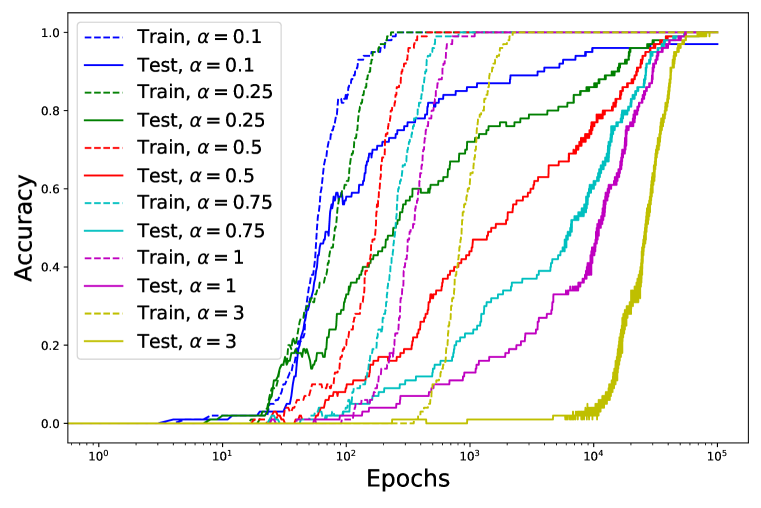

*Рисунок 8: Управление гроккингом на задаче «учитель — ученик», определённой в Liu et al. [2022a]. Фиолетовая кривая отвечает в точности эксперименту из их статьи — гроккингу, вызванному увеличением нормы весов. Видно, что, настраивая наш масштабный параметр в меньшую сторону $\alpha\to 0$, мы можем заставить этот вызванный гроккинг исчезнуть, как слева от фиолетовой кривой, и, более того, можем даже сделать гроккинг выраженнее, увеличивая его. Поскольку это задача регрессии, точность определена как попадание ученика в пределы $0.001$ от метки учителя.* **[p. 14]**

#### 8.3.2 Златовласкин размер набора данных

Здесь мы видим три режима по размеру обучающей выборки: слишком мало (a, d), в самый раз (b, e) и слишком много (c, f). Верхний ряд — кривая обучения, нижний — разложение потери. Заметьте, что на (a) прямо видно, как сеть вкладывает мощность в линейные составляющие. Эта линейная мощность идёт от NTK при инициализации, поскольку у функции активации есть линейное слагаемое. Такая попытка (приближённого) ядрового метода помогает нам интерполировать обучающую выборку, но приводит к поведению *хуже случайного*, поскольку исходные признаки не соответствуют задаче. Любые расхождения между обучающей и тестовой потерями при инициализации возникают потому, что мы используем размер набора данных $P=50$. По мере увеличения данных обе сходятся.


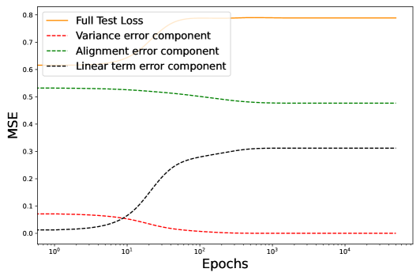

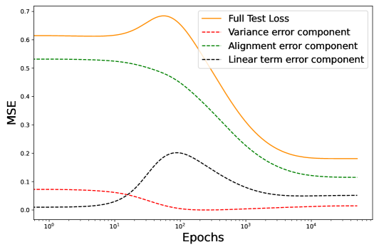

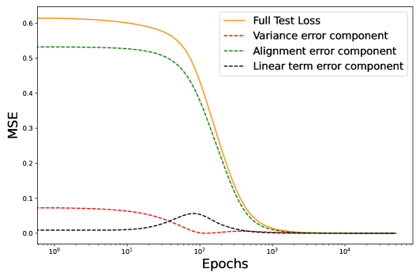

*Рисунок 9: (Первый ряд) Зона Златовласки по размеру набора данных. Двухслойный перцептрон, обученный на обычной задаче полиномиальной регрессии при $P\in\{50,120,500\}$ на (a)-(c) соответственно. (Второй ряд) Разложение потери для каждого из (a)-(c) соответственно, показывающее, как неспособность генерализовать (a) происходит от мощности в линейных модах (чёрный пунктир), гроккинг происходит от роста, а затем падения мощности в линейных модах (b), а полная генерализация — от низкой мощности в линейных модах на всём протяжении и нулевой в конце (у оптимальных признаков нет мощности в линейных модах), как видно на (f).* **[p. 15]**

#### 8.3.3 Интерполяция от случайных весов к согласованному решению заставляет гроккинг исчезнуть

Мы утверждаем, что согласованность NTK при инициализации — один из двух важных факторов, управляющих гроккингом. Рисунок 1 наводит на мысль, что при увеличении согласованности при инициализации гроккинг должен исчезнуть. Это произошло, как и предсказывалось, на рисунке 6, где мы меняли метки; теперь же мы настроим согласованность иначе — меняя веса при инициализации. Здесь мы начинаем со случайных весов для нашей задачи полиномиальной регрессии, где, как обычно, наблюдаем гроккинг, и постепенно добавляем к начальным весам малую составляющую весов итогового решения (вычисленного аналитически). Это увеличивает исходную согласованность и, разумеется, немного снижает начальную потерю. Ключевое наблюдение на графике ниже: *увеличение согласованности даже на самую малость заставляет драматичный гроккинг (рост тестовой потери наряду с первоначальным снижением тестовой потери) исчезнуть*. Мы видим это при переходе от тёмно-синей кривой к золотой.


*Рисунок 10: Изменение согласованности добавлением к начальным весам части итогового решения. Характерный для гроккинга рост тестовой потери исчезает даже при малом увеличении согласованности (сплошная синяя к сплошной красной) по мере добавления к весам инициализации малой составляющей весов решения. Это свидетельство того, что исходная согласованность NTK управляет тем, насколько страдает тестовая потеря во время первоначального падения потери на обучении, когда всё больше мощности вкладывается в решение ядровой регрессии.* **[p. 15]**

**[p. 16]**

## 9 Отношение к другим теориям гроккинга

Существующая литература о гроккинге сосредоточена на двух вещах. Одна — изучение задач модульной арифметики (и более общо, композиционных задач на группах) и хороших представлений для их решения, другая — эмпирическая связь между начальной нормой весов параметров, weight decay и гроккингом.

Примеры работ, разрабатывающих первую тему, — изучение того, как трансформер учится выполнять модульную арифметику, в Nanda et al. [2023]; Gromov [2023], выписывающий решение в замкнутой форме для итоговых обученных весов на другой задаче модульной арифметики; и Liu et al. [2022b], обнаруживающие внутри сети круговой эмбеддинг для задачи модульной арифметики. Схожий результат был получен и в исходной статье Power et al. [2022], где гроккинг был обнаружен. Изучение геометрии эмбеддингов и выученных представлений подобным образом возможно только тогда, когда *фиксирована конкретная интересующая задача*, и часто это задачи с естественной геометрической структурой. Такие работы нередко дают убедительные озарения о том, что и как сети выучивают в представлениях для определённых конкретных классов задач, но Liu et al. [2022a] показали, что гроккинг можно наблюдать и на других задачах, настраивая начальную норму весов; так что, хотя у алгоритмических задач вроде модульной арифметики может быть некоторая интересная структура, облегчающая порождение гроккинга, они не являются ни достаточными, ни необходимыми для его появления.

Две важные работы, разрабатывающие вторую тему (норма весов параметров и weight decay), — это упомянутая выше Liu et al. [2022a] и Varma et al. [2023].

Liu et al. [2022a] вызывают гроккинг увеличением начальной нормы весов и заключают, что генерализующие решения лежат на сферах меньшей нормы в пространстве параметров. Мы согласны, что начальная норма весов способна вызвать гроккинг, но утверждаем, что это *не* потому, что генерализующие решения всегда лежат на сферах меньшей нормы в пространстве параметров. И наша задача модульной арифметики из раздела 2, и наша задача полиномиальной регрессии, которой посвящена статья, — контрпримеры: итоговое генерализующее решение имеет бо́льшую норму весов параметров, чем исходное, и weight decay нам не нужен ни чтобы его выучить, ни чтобы грокать. Вместо этого мы утверждаем, что начальная норма весов управляет гроккингом, линеаризуя модель (переводя её в режим «ленивого обучения»). Иная динамика обучения при большом масштабе весов в Liu et al. [2022a] весьма напоминает переход к ленивому обучению у Chizat et al. [2019].

Varma et al. [2023] объясняют гроккинг тремя конкретными причинами. Их первая и третья заявленные причины естественно отвечают объектам нашей статьи, а вот со второй их причиной наша теория (и эксперименты) расходится. Их первое утверждение — что гроккинг требует «двух семейств контуров», одно из которых запоминает, а другое обобщает. Этому отвечают наши два режима — ленивая и богатая динамика обучения. Их третье утверждение — что при гроккинге «запоминающий контур сильнее на ранних фазах обучения», что на нашем языке отвечает тому, что сеть начинает ленивой, а признакам обучается на поздних временах.

Их второе, центральное утверждение — то, где две теории расходятся. Они утверждают, что переход от запоминающего контура к обобщающему происходит *потому, что обобщающий контур «эффективнее» запоминающего в том смысле, что способен дать ту же потерю при меньшей норме параметров*. В нашей статье мы показали две разные задачи (модульная арифметика и полиномиальная регрессия), в которых генерализующее решение, достигающее нулевой потери, имеет *бо́льшую норму параметров*, чем запоминающее решение, с которого сеть начинала. При этом мы согласны с их интуицией, что существуют два *режима* (ленивый и богатый), в которых сеть может работать, и что норма параметров имеет отношение к тому, в каком режиме мы находимся. Более того, роль weight decay мы исследуем в разделе 13 и обнаруживаем — в согласии с нашей теорией, — что weight decay может быть полезен для порождения гроккинга.

###### p16-7

*Замечание о размере набора данных.* Давно известно, что гроккинг происходит в определённом режиме по данным. В статье, вводящей гроккинг, Power et al. [2022] в разделе 3.1 упоминают, что при больших размерах набора данных обучающая и валидационная кривые следуют друг за другом, а Nanda et al. [2023] в разделе 5.3 отмечают, что при достаточном объёме данных зазора между обучающей и тестовой потерями больше нет. Varma et al. [2023] изучают поведение кривых обучения вблизи критического размера набора данных $D_{\text{crit}}$ и обнаруживают разновидности поведения с гроккингом. Заметим, что пребывание в «зоне Златовласки по размеру набора данных» необходимо, но не достаточно, чтобы наблюдать гроккинг.

*Чётности как задача о двоичном многочлене*: Barak et al. [2022] изучают выучивание чётностей нейросетью, которое демонстрирует похожую на гроккинг динамику при обучении двухслойных сетей с SGD. Рассматриваемая ими целевая функция имеет вид $y=\prod_{i\in S}x_{i}$, где $S\subseteq[n]$ — подмножество первых $n$ битов. Переменные $x_{i}\sim\{\pm 1\}$ — случайные двоичные величины. Для ядер скалярного произведения, каковыми являются широкие сети при инициализации, эта задача имеет ту же выборочную сложность, что и выучивание многочленов **[p. 17]** степени $|S|$ на гауссовых данных для ядровой регрессии [Misiakiewicz, 2022]. Наш выбор изучать динамику обучения полиномиальной регрессии на гауссовых данных поэтому ближе всего к этой предшествующей работе.

## 10 «Трудные/рассогласованные задачи» для ядра ломают линеаризацию

###### p17-1

«Трудной задачей» для исходного ядра мы называем задачу, в которой вектор меток обучающей выборки $\bm{y}\in\mathbb{R}^{P}$ и матрица Грама ядра $\bm{K}\in\mathbb{R}^{P\times P}$ удовлетворяют

$$
\textit{Difficulty}\equiv\bm{y}^{\top}\bm{K}^{-1}\bm{y}\gg 1. \tag{8}
$$

Одно из обоснований этой величины — заметить, что вблизи ядрового предела то, насколько параметры смещаются в ходе обучения по MSE, задаётся в точности ею:

$$
|\bm{w}-\bm{w}_{0}|^{2}\sim\bm{y}^{\top}\bm{K}^{-1}\bm{y} \tag{9}
$$

Мы видим, что приближение линеаризации может ломаться на трудных задачах, поскольку $|\bm{w}-\bm{w}_{0}|^{2}$ может быть велико (вспомните разложения Тейлора вокруг $\bm{w}_{0}$). Тем самым ленивое обучение на задачах бесконечной трудности несамосогласованно. При прочих равных мы ожидаем большего обучения признакам на задачах, трудных для исходного ядра. Особенно это верно, если обучающая выборка достаточно велика.

## 11 Выводы для игрушечной модели

### 11.1 Диагонализация исходного NTK

При бесконечной ширине сеть при случайной инициализации имеет следующее значение (поскольку $\bar{\bm{w}}=0$ и $\bm{M}=\bm{I}$)

$$
K(\bm{x},\bm{x}^{\prime})=\bm{x}\cdot\bm{x}^{\prime}+\epsilon^{2}(\bm{x}\cdot\bm{x}^{\prime})^{2} \tag{10}
$$

Задача о собственных значениях Мерсера для распределения данных $p(\bm{x})$ имеет вид

$$
\int d\bm{x}\ p(\bm{x})K(\bm{x},\bm{x}^{\prime})\phi(\bm{x})=\lambda\phi(\bm{x}^{\prime}) \tag{11}
$$

Мы ищем собственные функции $\phi(\bm{x})$ и собственные значения $\lambda$, удовлетворяющие приведённому уравнению для гауссовой плотности данных $\bm{x}\sim\mathcal{N}(0,D^{-1}\bm{I})$. Прежде всего заметим следующее

$$
\left<K(\bm{x},\bm{x}^{\prime})x_{i}\right>=\left<(\bm{x}\cdot\bm{x}^{\prime})x_{i}\right>=\frac{1}{D}x^{\prime}_{i} \tag{12}
$$

откуда следует, что $x_{i}$ — собственная функция с собственным значением $\lambda_{\text{lin}}=\frac{1}{D}$. Далее видим, что

$$
\left<K(\bm{x},\bm{x}^{\prime})x_{i}^{2}\right>=\frac{2\epsilon^{2}}{D^{2}}x_{i}^{2}+\frac{\epsilon^{2}}{D^{2}}|\bm{x}^{\prime}|^{2}\ ,\ \left<K(\bm{x},\bm{x}^{\prime})|\bm{x}|^{2}\right>=\frac{\epsilon^{2}}{D}\left(1+\frac{2}{D}\right)|\bm{x}^{\prime}|^{2} \tag{13}
$$

Отсюда следует существование $D$ собственных функций

$$
\left<K(\bm{x},\bm{x}^{\prime})[x_{i}^{2}-c|\bm{x}|^{2}]\right> =\frac{2\epsilon^{2}}{D^{2}}(x_{i}^{\prime})^{2}+\frac{\epsilon^{2}}{D^{2}}|\bm{x}^{\prime}|^{2}-\frac{c\epsilon^{2}}{D}\left(1+\frac{2}{D}\right)|\bm{x}^{\prime}|^{2} \\
=\frac{2\epsilon^{2}}{D^{2}}\left[(x_{i}^{\prime})^{2}+\left(\frac{1}{2}-\frac{c}{2}\left(D+2\right)\right)|\bm{x}^{\prime}|^{2}\right] \tag{14}
$$

Приведённое является собственной функцией, если $2c=c(D+2)-1$, то есть $c=\frac{1}{D}$. Тем самым мы нашли ещё $D$ собственных функций с собственным значением $\lambda=\frac{2\epsilon^{2}}{D^{2}}$. Наконец, рассмотрим $x_{i}x_{j}-c|\bm{x}|^{2}$ при $i\neq j$.

$$
\left<K(\bm{x},\bm{x}^{\prime})x_{i}x_{j}\right>=\frac{2\epsilon^{2}}{D^{2}}x_{i}^{\prime}x_{j}^{\prime} \tag{15}
$$

**[p. 18]**

что прозрачно даёт нам ещё $\frac{1}{2}(D^{2}-D)$ собственных функций с тем же собственным значением $\frac{2\epsilon^{2}}{D^{2}}$. Наконец, заметим, что $|\bm{x}|^{2}$ — тоже собственная функция

$$
\left<K(\bm{x},\bm{x}^{\prime})|\bm{x}|^{2}\right>=\frac{1}{D}\left(1+\frac{2}{D}\right)|\bm{x}^{\prime}|^{2} \tag{16}
$$

с собственным значением $\frac{1}{D}(1+\frac{2}{D})$. Целевая функция имеет разложение

$$
y(\bm{x})=\frac{1}{2}\left[(\bm{x}\cdot\bm{\beta}_{\star})^{2}-\frac{1}{D}|\bm{x}|^{2}\right]+\frac{1}{2D}|\bm{x}|^{2} \tag{17}
$$

Первое слагаемое в скобках имеет собственное значение ядра $\frac{2\epsilon}{D^{2}}$, тогда как второе — $\frac{1}{D}(1+\frac{2}{D})$. Отсюда следует, что ядровой метод выучил бы функцию $\frac{1}{2D}|\bm{x}|^{2}$ при размерах выборки $P\approx D$, но полную целевую функцию выучит лишь при $P\approx D^{2}$. Именно это разделение временных масштабов и мотивировало исходное обращение к этой задаче как к месту, где искать гроккинг.

### 11.2 Согласованность ядра

При любой конфигурации весов NTK нашей игрушечной модели имеет следующий вид

$$
K(\bm{x},\bm{x}^{\prime})=\bm{x}\cdot\bm{x}^{\prime}+\epsilon(\bm{x}\cdot\bm{x}^{\prime})\bar{\bm{w}}\cdot(\bm{x}+\bm{x}^{\prime})+\epsilon^{2}(\bm{x}\cdot\bm{x}^{\prime})\bm{x}^{\top}\bm{M}\bm{x}^{\prime}. \tag{18}
$$

В этом разделе мы вычисляем метрику согласованности ядра и задачи на тестовом распределении, обсуждаемую в статье. В частности, мы покажем, что она связана с корреляцией $\bm{M}$ с $\bm{\beta}_{\star}\bm{\beta}_{\star}^{\top}$, которая присутствует и в нашей ошибке рассогласования. Эта согласованность требует вычисления

$$
\frac{\left<y(\bm{x})K(\bm{x},\bm{x}^{\prime})y(\bm{x}^{\prime})\right>}{\sqrt{\left<K(\bm{x},\bm{x}^{\prime})^{2}\right>}\left<y(\bm{x})^{2}\right>} \tag{19}
$$

Важнее всего числитель, имеющий вид

$$
\left<y(\bm{x})K(\bm{x},\bm{x}^{\prime})y(\bm{x}^{\prime})\right> =\frac{\epsilon^{2}}{D^{2}}\left[|\bm{\beta}_{\star}|^{2}\left<(\bm{\beta}_{\star}\cdot\bm{x})^{2}\bm{x}^{\top}\bm{M}\bm{x}\right>+2\left<\bm{\beta}_{\star}\bm{M}\bm{x}(\bm{\beta}_{\star}\cdot\bm{x})^{3}\right>\right] \\
=\frac{\epsilon^{2}}{D^{4}}|\bm{\beta}_{\star}|^{4}\text{Tr}\bm{M}+\frac{8\epsilon^{2}}{D^{4}}\bm{\beta}_{\star}^{\top}\bm{M}\bm{\beta}_{\star}|\bm{\beta}_{\star}|^{2} \tag{20}
$$

Мы видим, что числитель в формуле согласованности ядра растёт с согласованностью $\bm{M}$ с направлением $\bm{\beta}_{\star}\bm{\beta}_{\star}$. Это слагаемое присутствует и в ошибке согласованности разложения MSE для нашей задачи.

## 12 Разложение потери со считывающими весами

Если вместо этого обучать и входные веса $\{\bm{w}_{i}\}$, и считывающие веса $v_{i}$ в двухслойной сети

$$
f(\bm{x})=\frac{\alpha}{N}\sum_{i=1}^{N}v_{i}\phi(\bm{w}_{i}\cdot\bm{x})=\alpha\bar{\bm{w}}\cdot\bm{x}+\frac{\alpha\epsilon}{2}\bm{x}^{\top}\bm{M}\bm{x} \tag{21}
$$

где новые $\bar{\bm{w}}$ и $\bm{M}$ задаются формулами

$$
\bm{M}=\frac{1}{N}\sum_{i=1}^{N}v_{i}\bm{w}_{i}\bm{w}_{i}^{T}\ ,\ \bar{\bm{w}}=\frac{1}{N}\sum_{i=1}^{N}v_{i}\bm{w}_{i}. \tag{22}
$$

Эти $\bar{\bm{w}}$ и $\bm{M}$ можно подставить в разложение потери из основного текста. При инициализации ядро имеет вид

$$
K(\bm{x},\bm{x}^{\prime})=2\bm{x}\cdot\bm{x}^{\prime}+\frac{3\epsilon^{2}}{2}(\bm{x}\cdot\bm{x}^{\prime})^{2}+\frac{\epsilon^{2}}{4}|\bm{x}|^{2}|\bm{x}^{\prime}|^{2} \tag{23}
$$

Это ядро по-прежнему сильно смещено в сторону линейных функций. Как и раньше, собственные значения, отвечающие квадратичным функциям, суть $\mathcal{O}(\epsilon D^{-2})$.

**[p. 19]**

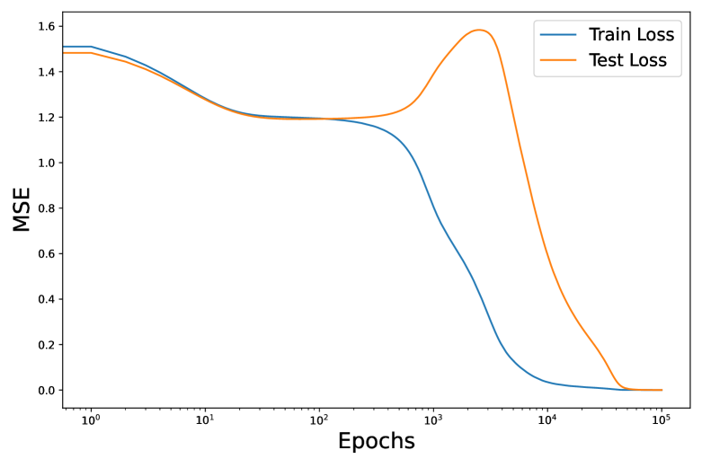


*Рисунок 11: Разложение гроккинга для обычного двухслойного MLP, то есть комитетной машины из основного текста с обучаемыми считывающими весами. Механизм остаётся тем же, что и заявлен.* **[p. 19]**

###### sec-13

## 13 Роль weight decay

Хотя мы показали, что weight decay в модели ни необходим, ни достаточен для порождения гроккинга, верно, что он может быть полезен для его получения. Здесь мы разбираем, почему это так, и умозрительно доказываем, что дело в том, что weight decay выводит нас из ленивого режима. В Lewkowycz and Gur-Ari [2020] доказано, что при weight decay NTK сети непрерывно эволюционирует со временем. Это означает, что сети, обучаемые с большими значениями weight decay, не могут долго оставаться ленивыми.

Для интуиции рассмотрим следующее. Ленивое обучение при градиентном спуске требует, чтобы параметры сети двигались лишь в определённом касательном пространстве внутри гораздо большего пространства параметров. Неформально это довольно хрупкое условие, требующее, чтобы одни веса двигались в одном направлении, а другие — в другом, дабы NTK сети не менялся. Weight decay же — штраф на норму весов *безотносительно* того, какой вес вносит вклад в эту норму, и потому его можно мыслить как возмущение, быстро выводящее нас из режима ленивого обучения. Когда генерализующее решение имеет меньшую норму весов, чем наша инициализация, weight decay способен поощрять выучивание полезных признаков и тем самым генерализацию.

В Nanda et al. [2023] показано, что величина weight decay способна управлять величиной гроккинга (временной задержкой). Это напоминает то, как то же действие оказывает наш параметр ленивости $\alpha$. Более того, мы показываем здесь, что в этом смысле их действия противонаправлены. В той статье показано, как временная задержка гроккинга между обучающей и тестовой потерями исчезает, если weight decay достаточно велик. Наша гипотеза предсказала бы, что увеличение ленивости сети это компенсирует, восстанавливая ту величину гроккинга, с которой мы начинали. Именно это мы и наблюдаем ниже.


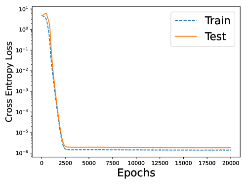

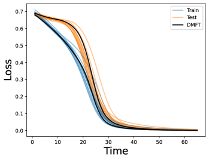

*Рисунок 12: (a) Начинаем с большой временной задержки гроккинга при $\alpha=0.5,\text{wd}=1$. (b) Увеличение weight decay до $\text{wd}=5$ (при $\alpha=0.5$) заставляет гроккинг исчезнуть, поощряя немедленное движение NTK (обучение признакам). (c) Затем соразмерное увеличение ленивости до $\alpha=1.4$ (при $\text{wd}=5)$ восстанавливает гроккинг, препятствуя обучению признакам. Мы полагаем, что в прежних работах гроккинг наблюдали при высокой начальной норме весов и weight decay потому, что эти две составляющие означают исходную ленивость (высокая начальная норма весов) и последующее обучение признакам (weight decay, как показано здесь).* **[p. 19]**

###### p19-4

Стоит подчеркнуть, что это объясняет, почему Liu et al. [2022a] обнаружили, что время до генерализации в их постановке гроккинга было линейно по величине weight decay $\kappa$. Более того, Nanda et al. [2023] обнаруживают, что время до генерализации падает в десять раз на рисунке 27 их статьи, **[p. 20]** когда weight decay увеличивается во столько же раз, — снова линейно. Оказывается, Lewkowycz and Gur-Ari [2020] доказывают, что NTK эволюционирует с порядком $O(\kappa)$, где $\kappa$ — параметр weight decay, *так что наша теория, согласно которой гроккинг можно рассматривать как переход от NTK к режиму обучения признакам, в точности предсказывает количественное действие weight decay на временные масштабы гроккинга!*

## 14 Роль моментума и адаптивных оптимизаторов

Этот раздел более умозрителен. В основном тексте мы сосредоточены на сетях, использующих обычный градиентный спуск, поскольку его достаточно, чтобы сети грокали, и это простая постановка, поддающаяся анализу. Отчасти это мотивировано тем, что динамика сетей, оптимизируемых адаптивными оптимизаторами, теоретически понята плохо. Но поскольку почти каждая прошлая работа о гроккинге использовала AdamW [Power et al., 2022, Nanda et al., 2023, Liu et al., 2022a, b, Varma et al., 2023], это заслуживает некоторого комментария.

На (a) мы повторяем нашу постановку полиномиальной регрессии и вызываем гроккинг, как на 1, но теперь используя $\text{momentum}=0.95$ в обычном оптимизаторе градиентного спуска. Форма в целом та же и картина, безусловно, та же (сначала линейное, затем обучение признакам), но с бо́льшим числом изломов на кривых обучения — предположительно, отражающих моментум в градиентном спуске. На (b) мы хотим указать на другой набор кривых обучения, порождающих похожие на гроккинг кривые точности. Это кривые *потерь* для задачи «учитель — ученик» из раздела 8, для которой построенные нами кривые *точности* показывали резкий гроккинг. В той задаче тоже используется AdamW, и снова видно, как линеаризация отслеживает модель, пока потеря не уменьшится вдвое, а затем расходится с ней. Немонотонность на поздних временах — предположительно, следствие оптимизатора AdamW, во многом как такая же немонотонность возникла на (a) от моментума.

Заметим, что и (a), и (b) характеризуются как гроккинг, хотя кривые потерь выглядят по-разному: ключевое — отложенная генерализация. Это показывает, что мощность в исходном ядровом методе часто бесполезна для генерализации (a), но иногда может быть в некоторой мере полезна для последующего обучения признакам — например, на (b). Наконец, (c) показывает динамику ранней линеаризации на ранних стадиях гроккинга с однослойным трансформером из Nanda et al. [2023], который тоже обучался с AdamW. Обратите внимание, как из-за weight decay потеря сети на деле быстро отклоняется от своей линеаризации, несмотря на наличие гроккинга. Это, вместе с тем, что масштабирование $\alpha$ всё же настраивает гроккинг, — свидетельство того, что переход от ленивой динамики к богатой есть достаточный, но не необходимый механизм, лежащий в основе отложенного обучения признакам на общих задачах и в общих постановках. Если посмотреть на рисунок 7 той статьи, видно, что это раннее отклонение совпадает с большим ранним ростом начальной нормы весов параметров, который может быть вызван ранним поведением адаптивных оптимизаторов Lewkowycz and Gur-Ari [2020], Cohen et al. [2021], Thilak et al. [2022], — отсюда и утверждение, что динамика, порождаемая адаптивными оптимизаторами в постановках с гроккингом, всё ещё понята не полностью.


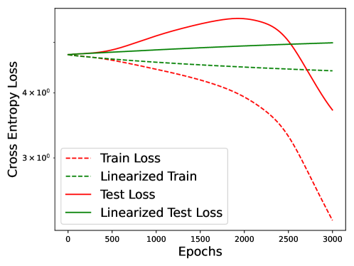

*Рисунок 13: Кривые обучения для гроккинга с моментумом и адаптивными оптимизаторами.* **[p. 20]**

## 15 Варианты полиномиальной задачи

Известно, что задача обучения одноиндексной квадратичной модели имеет хорошо изученную структуру с теоретической точки зрения Arous et al. [2021], Nichani et al. [2022], Bietti et al. [2022]. Естественно спросить, сохраняются ли поведение с гроккингом и его истолкование при отказе от любого из этих условий. В частности, мы рассматриваем более трудные задачи выучивания многоиндексных моделей и многочленов (Эрмита) более высокой степени. Мы обнаруживаем, что гроккинг сохраняется без дополнительной подгонки, как и ожидалось.

**[p. 21]**

### 15.1 Выучивание многоиндексных моделей

Известно Nichani et al. [2022], что одноиндексные модели способны демонстрировать переход от ленивой динамики обучения к богатой, но в целом многоиндексным моделям посвящено меньше работ Arous et al. [2021]. Поэтому можно задаться вопросом, сохраняется ли гроккинг по мере добавления к целевой функции нескольких направлений. То есть удастся ли восстановить гроккинг с целью вида $(\beta_{1}\cdot x+\beta_{2}\cdot x)$ (двухиндексная модель) или даже $(\beta_{1}\cdot x+\beta_{2}\cdot x+\beta_{3}cdotx)$ (трёхиндексная). Оказывается, гроккинг в нашей модели действительно сохраняется, даже если целевая функция охватывает несколько направлений, как видно ниже.

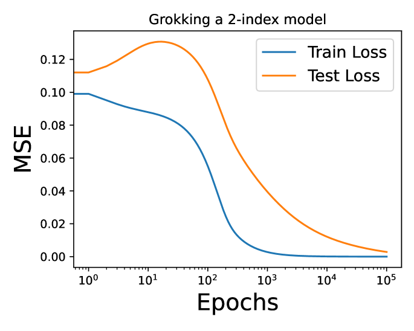

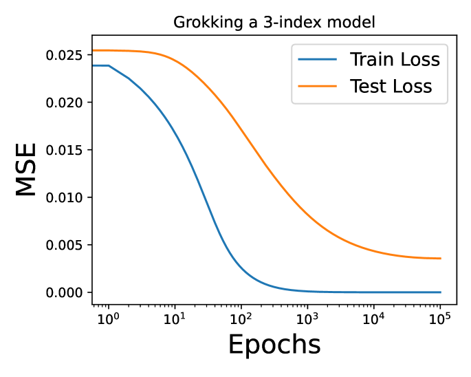

*Рисунок 14: Гроккинг в нашей постановке сохраняется, когда целевая функция — многочлен более высокой степени (с соответственно изменённой активацией), так что он не опирается на особые свойства информационного показателя $k=2$.* **[p. 21]**

### 15.2 Выучивание многочленов более высокой степени

Для задачи выучивания одноиндексной модели известно Arous et al. [2021], Nichani et al. [2022], что выборочная сложность и динамика обучения сильно зависят от величины целевой функции, называемой *информационным показателем*. Для простых полиномиальных целевых функций, как в нашей постановке, это попросту степень многочлена. Один заметный результат — качественное различие трудности выучивания квадратичной цели (где информационный показатель $k=2$) и целей более высокой степени (где $k\geq 3$). Например, теорема 1.3 в Arous et al. [2021] показывает разницу в обучаемости и выборочной сложности для этих случаев. Поэтому естественно спросить, не возникает ли гроккинг здесь из особых свойств квадратичной цели. Ответ оказывается отрицательным: изучаемый в этой статье гроккинг (то есть полиномиальная регрессия в двухслойном MLP с нулевым weight decay и обычным градиентным спуском) сохраняется без дополнительной подгонки для полиномиальных целей более высокой степени так, как и следовало бы ожидать. Ниже мы приводим эксперименты, где цель есть $H_{k}$ — $k$-й многочлен Эрмита, а активация $\phi(z)=z+\frac{{\epsilon}}{2}H_{k}(z)$. В частности, $H_{3},H_{4}$ ниже — многочлены степени $k>2$, а значит, и с информационным показателем больше двух. Для выучивания многочленов более высокого порядка $H_{k}$ мы используем бо́льшие объёмы данных.

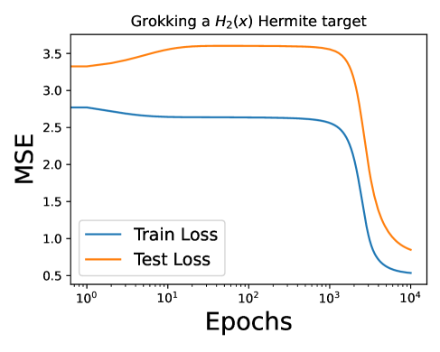


**[p. 22]**

*Рисунок 15: Гроккинг при выучивании многочленов Эрмита разной степени показывает, что наша постановка не опирается на какие-либо особые свойства одноиндексной квадратичной задачи обучения, которая, как известно, теоретически проще задач более высокой степени или многоиндексных. Обратите внимание на логарифмический масштаб по оси $x$: малый зазор справа на графике отвечает генерализации, отложенной (гроккингу) на несколько тысяч эпох.* **[p. 22]**

## 16 Изучение потери против точности на кривых обучения с гроккингом

### 16.1 Определения «гроккинга в потере» и «гроккинга в точности»

«Гроккинг в потере» относится к кривым потерь, которые мы изучаем в этой статье: потеря на обучении сначала убывает, тогда как тестовая потеря не убывает, а затем тестовая потеря в конце концов падает по мере генерализации сети. Это предполагает, что и обучающая, и тестовая потери поначалу смещаются на ненулевую величину (обычно это означает начальный период, когда тестовая потеря растёт, пока сеть запоминает обучающую выборку) и обычно предполагает ненулевую (но низкую) тестовую потерю к концу обучения. Пример гроккинга в потере — справа на рисунке ниже.

«Гроккинг в точности» относится к резкому росту тестовой точности много позже соразмерного роста точности на обучении. В частности, тестовая потеря вначале держится плоской и поднимается до идеальной на поздних временах. Пример гроккинга в точности приведён слева на рисунке ниже.

Поскольку эти два определения на первый взгляд кажутся несколько разными, а второе — «исходное» определение гроккинга Power et al. [2022] на задаче (модульная арифметика), на которой он был обнаружен, можно задаться вопросом, то же ли это, что изучается в этой статье (гроккинг в потере), что исторически изучалось в прошлой литературе.

Ответ на этот вопрос — да. Две кривые внизу отвечают одному и тому же запуску сети. Хотя Power et al. [2022] представляют явление в терминах точности (как на графике ниже слева), в действительности сеть обучается по потере (ниже справа). В частности, мы замечаем две вещи:

- Когда мы строим точность, видно, что сеть справляется идеально в терминах точности классификации на задаче модульной арифметики.
- Однако потеря к концу ненулевая. В данном случае это не противоречит сказанному выше, поскольку сеть обучается на one-hot входах, и потому если максимальный элемент выхода сети есть верный индекс задачи модульного сложения, вход будет отвечен верно (точность), но будет нести потерю, пока сеть не поместит вероятность единица на индекс верного ответа.

Мы также замечаем, что

- Тестовая точность рано в обучении плоская, а тестовая потеря смещается.
- Точность на обучении достигает идеальной классификации за 2 тыс. эпох, когда потеря на обучении около $\approx 0.06$, но потеря на обучении продолжает падать много позже — вплоть до нуля.

Интуиция для первого пункта в том, что во время запоминания тестовая потеря убывает, поскольку сеть на ранних временах пытается подогнать линеаризованное (NTK) решение. Разумеется, поскольку к этому моменту (до 2 тыс. эпох) сеть не выучила структуру задачи, на тестовых точках это не помогает. Но мы замечаем, что этого линеаризованного решения достаточно, чтобы справиться идеально на обучающей выборке! **[p. 23]** Если потеря $\approx 0.06$ отвечает идеальной классификации, то мы видим, что тестовая потеря опускается ниже этой величины лишь около 3–4 тыс. эпох — *ровно тогда, когда сеть генерализует в точности*. Наконец, кривая точности на ранних временах плоская, потому что хуже нулевой точности быть не может: бесполезное изменение весов, позволяющее сети интерполировать обучающую выборку, контрпродуктивно для тестовой (что мы и видим в терминах потери), но точность уже нулевая, поэтому кривая тестовой точности остаётся плоской. Вот почему одна и та же сеть в одном и том же запуске одной и той же задачи имеет кривую точности слева, выведенную из кривой потери справа, и это совершенно согласованно. Два определения гроккинга равносильны.

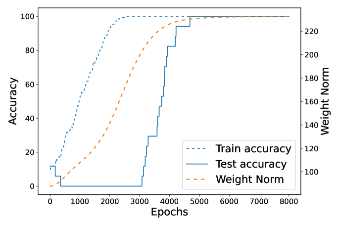


*Рисунок 16: Графики точности и потери для одного и того же запуска сети на задаче модульной арифметики. Такой тип задачи исторически интересен в исследованиях гроккинга и изучается также в Power et al. [2022], Nanda et al. [2023], Gromov [2023]. Эти графики — для двухслойной сети без weight decay, выполняющей сложение по малому простому модулю.* **[p. 23]**

Дополнительное свидетельство равносильности двух мер можно увидеть, вернувшись к приложению исходной статьи, вводившей гроккинг Power et al. [2022], и отметив рисунок 4, который показывает гроккинг в потере того рода, что мы изучаем в этой статье.

### 16.2 Построение кривых точности по кривым потерь может вводить в заблуждение

Некоторые классы — это задачи классификации, такие как модульная арифметика (как выше) и классификация изображений на MNIST. В таких задачах есть естественное понятие точности. Однако и для задач регрессии можно определить понятие точности классификации, как это делается в Liu et al. [2022a], задав порог $\theta$ так, что точка данных $(x,y)$ считается «классифицированной верно», если $|f(x)-y|\leq\theta$, то есть попадает в пределы порога от истинной метки. Тогда точность на тестовой выборке $X_{\text{test}}$ можно определить как среднее число точек выборки, классифицированных верно: $\frac{1}{|X_{\text{test}}|}\sum_{x_{i}\in X_{\text{test}}}\mathbf{1}[|f_{\text{net}}(x_{i})-y_{i}|\leq\theta]$. График ниже делает ровно это для описанной ранее задачи «учитель — ученик», взятой из Liu et al. [2022a], показывая, насколько получающиеся кривые точности могут вводить в заблуждение и быть бесполезными: они демонстрируют кажущийся «гроккинг» при одних значениях $\theta$ и не демонстрируют при других.

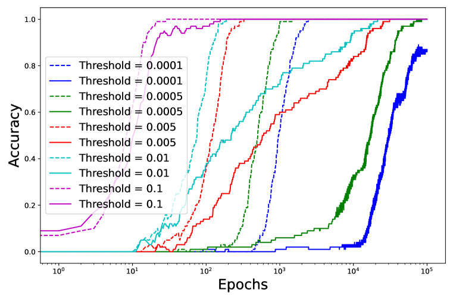

*Рисунок 17: Гроккинг на этой конкретной задаче зависит от выбора порога. Каждая из этих кривых отвечает *в точности одному и тому же запуску сети* (в терминах потери по эпохам) при разном выборе порога для построения точности. На рисунке 9 порог был всюду один и тот же. Это оправдывает наше изучение потери, а не точности, на задачах регрессионного типа вроде полиномиальной регрессии в нашем основном тексте.* **[p. 24]**

### 16.3 Не всякий случай гроккинга в точности достоин изучения

Вернёмся к задаче «учитель — ученик» из предыдущего раздела, для которой мы видели, что гроккинг в терминах точности может быть артефактом выбора порога $\theta$. Теперь мы рассматриваем её кривые потерь (ниже слева) и видим, что они совершенно ничем не примечательны. Тем самым наблюдение того, что сеть «грокает» на графике точности, *не* влечёт интересной динамики обучения в терминах потери (а ведь именно потеря направляет динамику обучения). Следовательно, гроккинг в точности *не* влечёт гроккинга в потере. Кривые ниже говорят больше о надуманности этой задачи, чем об интересной динамике обучения в сети.

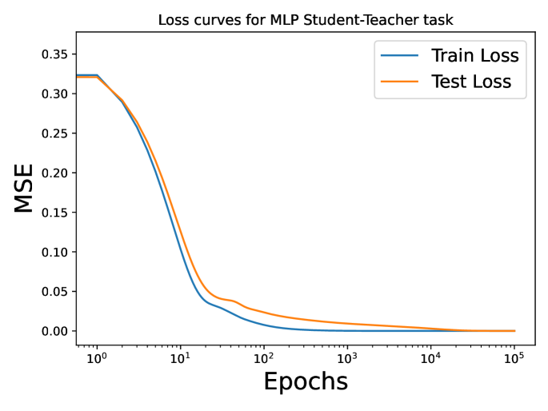


###### fig-18

*Рисунок 18: Кривые *потерь* для задачи «учитель — ученик», на которой кривые *точности* демонстрировали «гроккинг». Кривые потерь показывают, что ничего особенно удивительного в сети за время обучения не происходит: потеря на обучении всё время следует за тестовой. «Гроккинг» на соответствующих кривых точности тем самым есть мираж, возникающий от перебора порогов $\theta$, которыми определяется «точность» в этой задаче регрессии, и выбора такого $\theta$, который даёт эффектный график.* **[p. 24]**

### 16.4 Потеря — правильная величина для изучения

###### p23-4

Мы установили, что гроккинг в терминах кривых потерь, как мы его определили в этой статье, *влечёт гроккинг на кривых точности, как он определён в Power et al. [2022]*. Мы также показали, что обратное *неверно*, — тем самым гроккинг в потере в нашем определении есть *более сильное* условие, чем гроккинг в точности. Это оправдывает наше изучение кривых обучения в терминах потери, а не точности. Разумеется, как мы видели в случае MLP на MNIST, задач модульной арифметики и прочего, это означает, что наши утверждения о том, как ленивость и согласованность NTK управляют гроккингом (в терминах потери), выполняются *без дополнительной подгонки* и для гроккинга (в терминах точности классификации).

Закончим замечанием, что *мы не первые, кто это заметил*. Действительно, то, что изучать интересно именно потерю, а не точность, было быстро осознано после публикации исходной статьи, обнаружившей гроккинг! Это отмечается, когда Davies et al. [2023] изучают потерю на своём рисунке 5b, когда Liu et al. [2022a] характеризуют *ландшафты потерь* различных задач с гроккингом, когда Nanda et al. [2023] строят исключающую и ограниченную потери и замечают, что точностью можно манипулировать, и решительно у Schaeffer et al. [2023], которые доказывают, что меры качества с «жёстким порогом» (как точность при гроккинге) крайне обманчивы и что вместо них следует изучать непрерывно оптимизируемые меры (как потеря). Тем самым наш выбор поступать так в этой статье совершенно согласуется с прошлой литературой о гроккинге.

**[p. 25]**

## 17 Больше данных позволяет генерализовать на более трудных задачах

###### p25-1

Если гроккинг грубо понимать как «отложенную генерализацию», то следует ожидать, что мы не можем грокать на задачах, где не можем генерализовать. Так оно и есть, и можно задаться вопросом, позволяет ли увеличение размера набора данных генерализовать на более трудных задачах — в частности, на нашей задаче с метками-собственными векторами, как на рисунке 5, — или же эта задача по своей сути трудна для сети, обучающейся признакам. Ниже мы увидим, что больше данных позволяет нам генерализовать на этой задаче там, где иначе мы не могли. Вернёмся к задаче с рисунка 5(c) — выучиванию $j$-го собственного вектора гауссова набора данных $X$ при разных значениях $j$. Мы выбрали эту задачу, поскольку она позволяет варьировать трудность задачи, измеряемую согласованностью NTK и меток задачи при инициализации. Мы наблюдаем, что при любом фиксированном $j$ увеличения размера набора данных достаточно, чтобы устранить гроккинг, заставив кривые обучения двигаться вместе. Рассмотрим сетку графиков ниже. Она показывает, как при фиксированном размере набора данных усложнение задачи (увеличение $j$) может привести к неудаче сети (движение вниз по левому столбцу). Но затем мы замечаем (двигаясь слева направо по каждому ряду), что увеличение размера набора данных ведёт к генерализации в конце концов, причём гроккинг возникает в златовласкиной середине — когда задача трудна (в смысле согласованности NTK), но в конечном счёте обучаема (в смысле, что сеть способна достичь низкой тестовой потери к концу обучения).

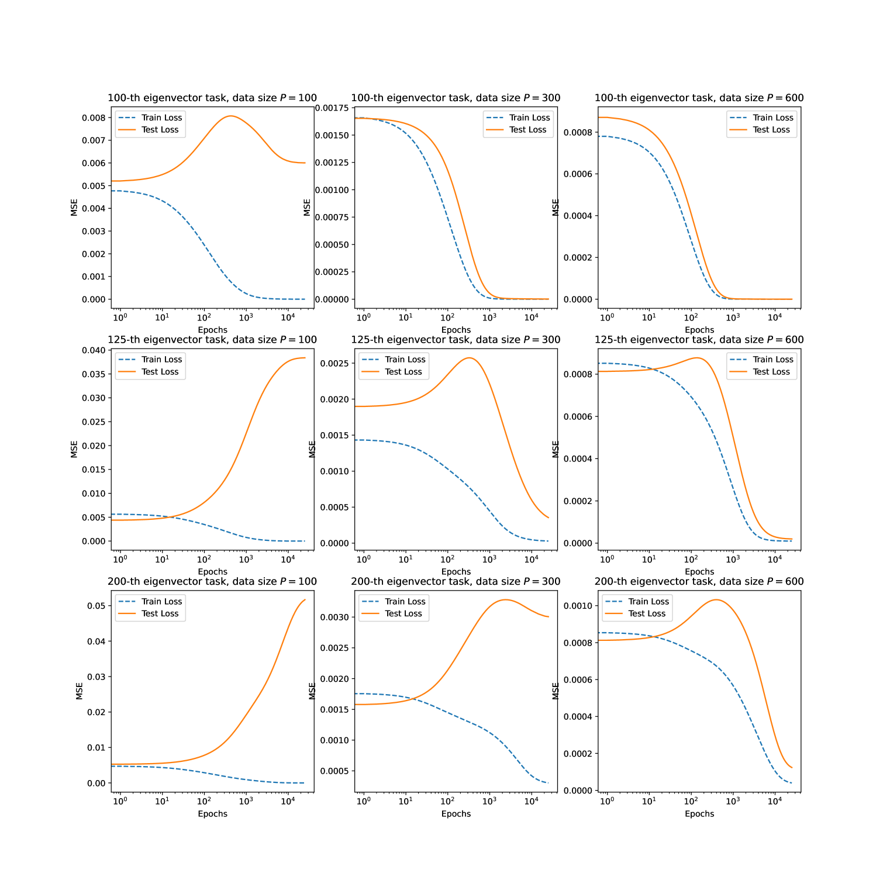

*Рисунок 19: Варьирование размера набора данных и трудности задачи, чтобы увидеть, где богатого обучения достаточно для генерализации. Графики слева направо в каждом ряду имеют возрастающий объём данных, а сверху вниз задача становится труднее (растёт $j$, используемое для меток). Мы видим, что движение слева направо показывает (1), как увеличение данных при фиксированной трудности задачи $j$ достаточно, чтобы позволить сети генерализовать, тогда как движение сверху вниз по сетке показывает (2), что если позволить трудности задачи расти вместе с размером набора данных, некоторые задачи этой архитектурой сети выучены быть не могут: если бы мы взяли ещё меньшие собственные векторы (например, положив $P=j$), никакое $P$ не позволило бы их выучить.* **[p. 26]**

---

# Машиночитаемый блок фактов

```yaml
paper:
  id: 2310.06110
  title: "Grokking as the Transition from Lazy to Rich Training Dynamics"
  authors: [Tanishq Kumar, Blake Bordelon, Samuel J. Gershman, Cengiz Pehlevan]
  affiliation: Harvard University
  date: 2023-10-09
  venue: ICLR 2024
  citations: 103
  source: "нативный HTML arXiv, версия v3"
  source_note: "ar5iv отдаёт более раннюю версию с разделом DMFT, которого в v3 нет"

core_claim:
  name: "переход от ленивого обучения к богатому"
  statement: "сеть сначала подгоняет выборку как линейная модель с исходным NTK
    (ленивый режим), затем перестраивает признаки; зазор между этими этапами и есть гроккинг"
  control_parameters:
    alpha: "масштаб выхода сети; большое alpha линеаризует модель и удлиняет задержку"
    cka: "согласованность исходного NTK с метками; малая согласованность удлиняет задержку
      и при этом улучшает итоговое качество"
    data_size: "златовласкин объём: генерализация возможна, но не немедленна"

counterexamples:                  # против объяснений через норму весов
  - "модульная арифметика в двухслойном MLP, p=23, 90% пар, без weight decay: норма весов растёт"
  - "полиномиальная регрессия: итоговое генерализующее решение имеет большую норму, чем исходное"

setups:
  polynomial: "f = (alpha/N) sum phi(w_i · x), phi(h) = h + (eps/2) h^2, y = (1/2)(beta* · x)^2;
    x ~ N(0, I/D); считывающие веса зафиксированы на 1 (комитетная машина)"
  modular: "MLP с одним скрытым слоем, D = 2p, N = 100, p = 23, lr = 100, vanilla GD, без wd"
  student_teacher: "MLP 5-100-100-5 с tanh, постановка Liu et al. 2022a"
  transformer: "однослойный трансформер из Nanda et al. 2023, AdamW, кросс-энтропия"
  mnist: "MLP, гроккинг Liu et al. устраняется настройкой alpha без изменения нормы весов"

loss_decomposition:
  formula: "L = (1/4)(variance error) + (misalignment error) + (power in linear modes)"
  reading: "гроккинг виден как рост, а затем падение мощности в линейных модах"
  anchor: p6-4

findings:
  - id: 1
    claim: "гроккинг возможен без weight decay и при растущей норме весов"
    anchor: p3-3
  - id: 2
    claim: "запоминающее решение отождествлено с ранней ленивой динамикой"
    anchor: p4-2
  - id: 3
    claim: "alpha непрерывно управляет задержкой вплоть до её исчезновения"
    anchor: null
  - id: 4
    claim: "худшая исходная согласованность даёт лучшую итоговую генерализацию"
    anchor: null
  - id: 5
    claim: "масштаб выхода, масштаб меток и норма весов действуют одинаково; управляет sigma^2 * alpha"
    anchor: fig-7
  - id: 6
    claim: "трудность задачи для ядра y^T K^-1 y задаёт и смещение параметров, то есть слом линеаризации"
    anchor: p17-1
  - id: 7
    claim: "weight decay заставляет NTK эволюционировать с порядком O(kappa), что объясняет
      линейность времени генерализации по weight decay у предшественников"
    anchor: p19-4
  - id: 8
    claim: "гроккинг в потере строго сильнее гроккинга в точности; на регрессии точность зависит от порога"
    anchor: null

concept_cards:
  lazy-to-rich-kernel-to-feature-learning: p4-2
  neural-tangent-kernel-ntk: p17-1
  initialization-scale: fig-7
  weight-norm-minimization: p3-3
  regularization-variants: p19-4
  goldilocks-zone: null
  data-fraction-critical-dataset-size: null
  feature-emergence-feature-learning: p6-4
  emergence: null
  memorization-phase: null
  modular-arithmetic: null
  vision-real-world-data-mnist-cifar: null
  grokking: null

sources:
  original_html: original/2310.06110.arxiv.html
  converted_text: original/2310.06110.grokking-as-the-transition-from-lazy-to-rich-training-dynamics.md
  images_dir: images/
  pdf: https://arxiv.org/pdf/2310.06110

anchors:
  scheme: "pN-M | fig-N | sec-N (token headings, cross-viewer portable)"
  policy: "якоря заводятся только там, где на них ссылаются; разрывы страниц якорей не несут"
  paragraph: [p1-3, p1-6, p2-3, p2-4, p3-1, p3-3, p4-2, p4-5, p6-4, p16-7, p17-1, p19-4, p25-1]
  figure: [fig-1, fig-7, fig-18]

review_summary:                   # см. раздел «Что показано, а что предположено»
  strong: "контрпример к объяснениям через норму весов: гроккинг без weight decay при
    растущей норме; разделение выборочных сложностей P~D^2 против P~D предсказано
    до эксперимента; конструкция с метками-собственными векторами даёт три режима"
  weak: "фраза о точном количественном предсказании действия weight decay опирается на
    чужую теорему и чужие наблюдения, собственного количественного сравнения нет"
  authors_own_limits:
    - "на трансформере потеря отклоняется от линеаризации, хотя гроккинг есть: механизм
      достаточен, но не необходим (приложение 14, в основном тексте не повторено)"
    - "точной характеризации требуемого размера выборки и времени перехода нет"
    - "динамика при адаптивных оптимизаторах понята плохо; раздел 14 назван умозрительным"
  method_caveats:
    - "считывающие веса зафиксированы на 1; сравнения с обучаемыми считываниями нет"
    - "lr = 100 в контрпримере не комментируется"
    - "устойчивость по p и по ширине заявлена словами, без перебора"
  corpus_consequence: "приложение 16.3 показывает, что задача «учитель — ученик» из
    Liu et al. 2022a в терминах потери гроккинга не демонстрирует"

translation:
  status: complete
  formula_parity: "display 23/23, inline 240/240"
  figures: "51/51, подписей 19/19"
```
