# Doshi et al. 2024 — To grok or not to grok: Disentangling generalization and memorization on corrupted algorithmic datasets

См. также: [глобальный индекс понятий](../../concepts/index.md).

**Darshil Doshi**, **Aritra Das**, **Tianyu He** — Condensed Matter Theory Center и Department of Physics, University of Maryland, College Park (равный вклад). **Andrey Gromov** — Condensed Matter Theory Center, University of Maryland и Meta AI (автор для переписки).

arXiv [2310.13061v2](https://arxiv.org/abs/2310.13061), 19 октября 2023 (v2 — 4 марта 2024), ICLR 2024. Поле «Comments» страницы arXiv: «9+20 pages, 7+25 figures, 2 tables»; в PDF 29 страниц, 32 рисунка и 2 таблицы. Лицензия — `cc-by-4.0`, поэтому карточка одна.

Работа найдена не обычным путём: Semantic Scholar не числит её среди цитирующих Power et al., поэтому в таблице цитирующих корпуса строки у неё не было и триаж её не видел. Она всплыла в библиографии обзора «A Survey on Grokking» при разборе задачи task-030 (отчёт `b1.reports/260905.non-arxiv-grokking-works-loss-assessment.txt`, раздел 8.1), при том что шестнадцать хранимых оригиналов корпуса на неё ссылаются.

Файлы этой папки:

- [`original/2310.13061.native.html`](original/2310.13061.native.html) — первоисточник, нативная HTML-подача arXiv (LaTeXML), скачана как есть.
- [`original/2310.13061.to-grok-or-not-to-grok-disentangling-generalization-and-memorization-on-corrupted-algorithmic-datasets.md`](original/2310.13061.to-grok-or-not-to-grok-disentangling-generalization-and-memorization-on-corrupted-algorithmic-datasets.md) — конверсия оригинала в Markdown без правок содержания; английский текст для сверки перевода; пагинация размечена по PDF.
- [`images/`](images/) — 46 иллюстраций статьи в исходном разрешении.
- [`2310.13061.to-grok-or-not-to-grok-disentangling-generalization-and-memorization-on-corrupted-algorithmic-datasets.claims.txt`](2310.13061.to-grok-or-not-to-grok-disentangling-generalization-and-memorization-on-corrupted-algorithmic-datasets.claims.txt) — рабочий разбор: пронумерованные утверждения с пометками.
- [`2310.13061.to-grok-or-not-to-grok-disentangling-generalization-and-memorization-on-corrupted-algorithmic-datasets.license.txt`](2310.13061.to-grok-or-not-to-grok-disentangling-generalization-and-memorization-on-corrupted-algorithmic-datasets.license.txt) — лицензионная запись arXiv.

Схема якорей и правила ссылок на карточку — в [README папки статей](../README.md).

## Затрагиваемые понятия

**[Шум в метках и случайные метки](../../concepts/label-noise-random-labels.md)** — статья делает порчу меток управляющей осью, а не помехой. Доля испорченных меток меняется вместе с долей данных и силой регуляризации, и на этой сетке размечены фазы: сосуществование, частичная и полная инверсия, запоминание, забывание. Инверсией названо превышение тестовой точности над обучающей, то есть сеть исправляет часть испорченных примеров ([`p4-5`](#p4-5), [`p4-6`](#p4-6)).

**[Фаза меморизации](../../concepts/memorization-phase.md)** — запоминание и обобщение здесь не сменяют друг друга, а сосуществуют: сеть одновременно даёт почти полную точность на тесте и держит выученными испорченные обучающие примеры. Разделяются они не по времени, а по нейронам ([`p4-6`](#p4-6), [`p6-1`](#p6-1)).

**[Необходимость регуляризации](../../concepts/regularization-necessity.md)** — прямое возражение: гроккинг на модульном сложении оказывается «замечательно устойчив» к порче меток и наступает даже без явной регуляризации, что авторы называют резким расхождением с распространённым убеждением, будто гроккинг её требует ([`p4-5`](#p4-5)).

**[Разреженная подсеть и лотерейный билет](../../concepts/sparse-subnetwork-lottery-ticket.md)** — запоминающие нейроны не только отличимы, но и удаляемы: их прунинг снижает точность на испорченных данных и поднимает на чистых, то есть подсети разделены не гипотетически, а операционально ([`fig-6`](#fig-6), [`p1-2`](#p1-2)).

**[Фурье-признаки и контуры](../../concepts/fourier-features-circuits.md)** — мерой обобщающего признака служит периодичность весов, измеряемая через inverse participation ratio; распределение IPR по нейронам двумодально в фазе сосуществования и сдвигается вверх при регуляризации ([`p6-1`](#p6-1)).

**[Разгроккинг](../../concepts/ungrokking.md)** — фаза забывания: при очень большом weight decay точность рушится уже после того, как сеть обобщила, а причина — коллапс норм весов к произвольно малым значениям. Забывание встречается исключительно у грокнувших сетей ([`p5-3`](#p5-3)).

---

# Текст статьи

# To grok or not to grok: Disentangling generalization and memorization on corrupted algorithmic datasets

Darshil Doshi, Aritra Das, Tianyu He (Condensed Matter Theory Center и Department of Physics, University of Maryland, College Park; равный вклад), Andrey Gromov (Condensed Matter Theory Center, University of Maryland; Meta AI; автор для переписки). Код: https://github.com/d-doshi/Grokking.git

## Аннотация

###### p1-2

Робастное обобщение — серьёзная проблема в глубоком обучении, особенно когда число обучаемых параметров очень велико. В общем случае очень трудно понять, запомнила ли сеть конкретный набор примеров или же поняла лежащее в основе правило (или и то, и другое). Мотивированные этой проблемой, мы изучаем интерпретируемую модель, в которой обобщающие представления понятны аналитически и легко отличимы от запоминающих. А именно, мы рассматриваем архитектуры многослойного перцептрона (MLP) и Transformer, обученные на задачах модульной арифметики, где ($\xi\cdot 100$%) меток испорчены (*то есть* некоторые результаты модульных операций в обучающем наборе неверны). Мы показываем, что (i) сеть может одновременно запоминать испорченные метки *и* достигать $100$% обобщения; (ii) запоминающие нейроны можно выявить и удалить прунингом, что снижает точность на испорченных данных и повышает точность на неиспорченных; (iii) методы регуляризации, такие как weight decay, dropout и BatchNorm, заставляют сеть игнорировать испорченные данные в ходе оптимизации и достигать $100$% точности на неиспорченном наборе данных; и (iv) действие этих методов регуляризации («механистически») интерпретируемо: weight decay и dropout заставляют все нейроны выучивать обобщающие представления, тогда как BatchNorm ослабляет выход запоминающих нейронов и усиливает выход обобщающих. Наконец, мы показываем, что при наличии регуляризации динамика обучения включает две последовательные стадии: сначала сеть проходит динамику *гроккинга*, достигая высокой обучающей *и* тестовой точности; затем она разучивает запоминающие представления, и обучающая точность внезапно скачком меняется со $100$% на $100(1-\xi)$%.11 1 Код для воспроизведения наших результатов доступен по адресу https://github.com/d-doshi/Grokking.git

{ddoshi, aritrad, tianyuh}@umd.edu gromovand@meta.com

## 1 Введение

Поразительный прогресс глубокого обучения за последнее десятилетие был обеспечен огромными высококачественными наборами данных. Размеченные реальные наборы данных неизбежно содержат шумные метки — из-за смещений схем разметки (Paolacci et al., 2010; Cothey, 2004) или присущей данным неоднозначности (Beyer et al., 2020). Ключевая проблема при обучении больших моделей — не допустить переобучения на шумных данных и добиться робастного качества обобщения. С другой стороны, в больших моделях запоминание и обобщение могут сосуществовать (Zhang et al., 2017; Zhang et al., 2021). В целом борьба между запоминанием и обобщением, особенно при наличии порчи меток, остаётся плохо понятой.

В генеративных языковых моделях проблема запоминания ещё более тонкая. С одной стороны, некоторые фактические знания критически важны для того, чтобы языковые модели выдавали точную информацию. С другой стороны, дословное запоминание обучающих данных, как правило, нежелательно из соображений приватности (Carlini et al., 2021). Полный набор условий, влияющих на запоминание в больших **[p. 2]** языковых моделях (LLM), всё ещё исследуется (Carlini et al., 2022; Tirumala et al., 2022). В частности, более крупные модели, а также повторяющиеся данные (Hernandez et al., 2022) способствуют запоминанию.

В этой работе мы применяем подход к разделению обобщения и запоминания, мотивированный теоретической физикой. А именно, мы сосредотачиваемся на простых, аналитически поддающихся анализу, («механистически») интерпретируемых моделях, обученных на алгоритмических наборах данных. Более конкретно, мы изучаем двухслойные многослойные перцептроны (MLP), обученные на задачах модульной арифметики. В этом случае сеть обучается выучить правило, такое как $z=(m+n)\bmod p\equiv m+n\mkern3mu\mkern3mu\textrm{mod}\mkern3mu\mkern3mu p$, по некоторому числу примеров. Эти задачи формулируются как задачи классификации. Затем мы заставляем сеть запомнить $\xi\cdot 100$% примеров, портя метки, *то есть* внедряя точки данных, где $(m+n)\bmod p$ отображается в $z^{\prime}\neq z$. В этой постановке обобщающие представления понятны как качественно Nanda et al. (2023); Liu et al. (2022), так и количественно — благодаря наличию аналитического решения для представлений, описанного в Gromov (2023). Мы эмпирически показываем, что достаточно большие сети могут запоминать испорченные примеры, одновременно достигая почти идеального обобщения на тестовом наборе. Нейроны, ответственные за запоминание, можно выявить с помощью inverse participation ratio (IPR) и удалить прунингом, что приводит к идеальной точности на неиспорченном наборе данных. Далее мы показываем, что регуляризация радикально влияет на способность сети запоминать испорченные примеры. Weight decay, Dropout и BatchNorm — все они препятствуют запоминанию, но по-разному: weight decay и Dropout устраняют запоминающие нейроны, превращая их в обобщающие, тогда как BatchNorm ослабляет сигнал, идущий от запоминающих нейронов, не устраняя их.

### 1.1 Предварительные сведения

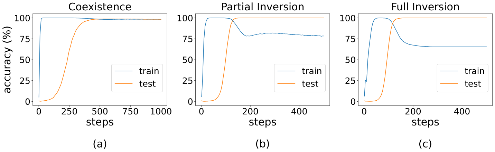

<i>Рисунок 1: Кривые обучения в различных фазах. Все графики построены для сетей, обученных с долей данных $\alpha=0.5$ и долей порчи $\xi=0.35$. (a) Без регуляризации: *Сосуществование* обобщения и запоминания — и обучающая, и тестовая точности высоки. (b)(c) Добавление weight decay: сеть обобщает на тестовых данных, но не запоминает испорченные обучающие данные, что даёт отрицательный зазор обобщения! Что примечательно, сеть предсказывает «истинные» метки для испорченных примеров. Мы называем эти фазы *Частичная инверсия* и *Полная инверсия* — в зависимости от степени запоминания испорченных данных. («инверсия» означает, что тестовая точность выше обучающей.)</i> **[p. 2]**

#### Гроккинг модульной арифметики.

Мы рассматриваем задачу модульного сложения $(m+n)\mkern3mu\bmod\mkern3mu p$. Её может выучить двухслойный MLP. Явно функция сети имеет вид

$$
{\boldsymbol{f}}(m,n)={\boldsymbol{W}}\phi\left({\boldsymbol{W}}_{in}({\boldsymbol{e}}_{m}\oplus{\boldsymbol{e}}_{n})\right)={\boldsymbol{W}}\phi\left({\boldsymbol{U}}\mkern3mu{\boldsymbol{e}}_{m}+{\boldsymbol{V}}\mkern3mu{\boldsymbol{e}}_{n}\right)\mkern3mu. \tag{1}
$$

Здесь ${\boldsymbol{e}}_ {m},{\boldsymbol{e}}_ {n}\in\mathbb{R}^{p}$ — числа $m,n$ в one_hot-кодировке. $\text{«}{\oplus}\text{»}$ обозначает конкатенацию векторов $({\boldsymbol{e}}_ {m}\oplus{\boldsymbol{e}}_ {n}\in\mathbb{R}^{2p})$. ${\boldsymbol{W}}_ {in}\in\mathbb{R}^{N\times 2p}$ и ${\boldsymbol{W}}\in\mathbb{R}^{p\times N}$ — матрицы весов первого и второго слоя соответственно. $\phi$ — функция активации. ${\boldsymbol{W}}_ {in}$ разбивается на два блока $N\times P$: ${\boldsymbol{U}},{\boldsymbol{V}}\in\mathbb{R}^{N\times p}$. ${\boldsymbol{U}},{\boldsymbol{V}}$ служат векторами эмбеддингов для $m,n$ соответственно. ${\boldsymbol{f}}(m,n)\in\mathbb{R}^{p}$ — выход сети на одной паре примеров $(m,n)$. Целевые значения — ответы ${\boldsymbol{e}}_ {(m+n)\mkern3mu\bmod\mkern3mu p}$ в one_hot-кодировке.

Набор данных состоит из $p^{2}$ пар примеров; из них мы случайно выбираем $\alpha p^{2}$ примеров для обучения22 2 Везде в тексте сети обучаются полнобатчевым AdamW и MSE-функцией потерь, если не указано иное., а остальные $(1-\alpha)p^{2}$ примеров используем как тестовый набор. Величину $\alpha$ мы будем называть *долей данных*.

Эта постановка демонстрирует гроккинг: отложенное и внезапное возникновение обобщения, спустя долгое время после запоминания (Power et al., 2022; Nanda et al., 2023; Liu et al., 2022; Gromov, 2023).

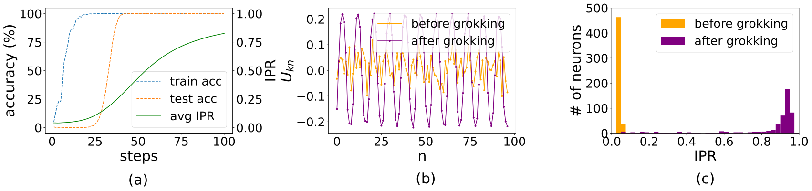

<i>Рисунок 2: Гроккинг задачи модульной арифметики над $\mathbb{Z}_ {97}$ двухслойным MLP, обученным с AdamW. (a) Резкий переход в тестовой точности, спустя долгое время после переобучения. $\overline{\text{IPR}}\mathrel{:=}\mathbb{E}_ {k}\left[\text{IPR}_ {k}\right]$ монотонно растёт со временем, указывая на периодические представления. (b) Пример вектора-строки $(U_{k\cdot})$ до и после гроккинга. Обобщение достигается за счёт периодических весов (уравнение 2). (c) Гистограмма IPR отдельных нейронов до и после гроккинга — распределение смещается к высоким **[p. 3]** значениям IPR.</i> **[p. 3]**

#### Периодические веса.

Выбор квадратичной активации $\phi(x)=x^{2}$ делает задачу аналитически решаемой (Gromov, 2023). После гроккинга веса обученной сети качественно похожи на аналитическое решение, представленное в Gromov (2023).33 3 В обученных сетях периодичность весов приблизительна. Следующее аналитическое выражение для весов сети приводит к $100$% обобщению (при достаточно большой ширине)

$$
\begin{aligned} &{U}_{ki}=\left(\frac{2}{N}\right)^{-\frac{1}{3}}\cos{\left(\frac{2\pi}{p}i\sigma(k)+\phi^{(u)}_{k}\right)}\mkern3mu,&&{V}_{kj}=\left(\frac{2}{N}\right)^{-\frac{1}{3}}\cos{\left(\frac{2\pi}{p}j\sigma(k)+\phi^{(v)}_{k}\right)}\mkern3mu,&\cr
&{W}_{qk}=\left(\frac{2}{N}\right)^{-\frac{1}{3}}\cos{\left(-\frac{2\pi}{p}q\sigma(k)-\phi^{(u)}_{k}-\phi^{(v)}_{k}\right)}\mkern3mu,\end{aligned} \tag{2}
$$

где $\sigma(k)$ обозначает случайную перестановку $k$ в $S_{N}$ — что отражает перестановочную симметрию скрытых нейронов. Фазы $\phi_{k}^{(u)}$ и $\phi_{k}^{(v)}$ независимо и одинаково распределены равномерно на $(-\pi,\pi]$. За дальнейшими подробностями об аналитическом решении мы отсылаем читателя к Приложению D.

#### Inverse participation ratio.

Чтобы охарактеризовать обобщающие представления количественно, мы используем величину, знакомую из физики локализации: *inverse participation ratio (IPR)*. Её роль — обнаруживать периодичность в матрице весов.

Пусть ${\boldsymbol{U}}_ {k\cdot},{\boldsymbol{V}}_ {k\cdot}({\boldsymbol{W}}_ {k\cdot})$ обозначают $k^{th}$ вектор-строку(столбец) весов ${\boldsymbol{U}},{\boldsymbol{V}}({\boldsymbol{W}})$. Рассмотрим дискретные преобразования Фурье этих векторов, обозначаемые $\widetilde{\boldsymbol{U}}_ {k\cdot},\widetilde{\boldsymbol{V}}_ {k\cdot}(\widetilde{\boldsymbol{W}}_ {k\cdot})$. Фурье-разложения периодических строк(столбцов) этих весов сильно локализованы. Мы используем это, чтобы количественно оценить сходство обученных весов с аналитическим решением (уравнение 2). С этой целью мы определяем *Inverse Participation Ratio (IPR)* (Girvin & Yang, 2019; Pastor-Satorras & Castellano, 2016; Gromov, 2023) для этих векторов: 44 4 В общем случае IPR определяется как $(\lVert U_{k\cdot}\rVert_{2r}/\lVert U_{k\cdot}\rVert_{2})^{2r}$. Мы полагаем $r=2$ — распространённый выбор.

$$
\text{IPR}^{(u)}_{k}\mathrel{:=}\left(\frac{\lVert\widetilde{\boldsymbol{U}}_{k\cdot}\rVert_{4}}{\lVert\widetilde{\boldsymbol{U}}_{k\cdot}\rVert_{2}}\right)^{4}\mkern3mu; \text{IPR}^{(v)}_{k}\mathrel{:=}\left(\frac{\lVert\widetilde{\boldsymbol{V}}_{k\cdot}\rVert_{4}}{\lVert\widetilde{\boldsymbol{V}}_{k\cdot}\rVert_{2}}\right)^{4}\mkern3mu; \text{IPR}^{(w)}_{k}\mathrel{:=}\left(\frac{\lVert\widetilde{\boldsymbol{W}}_{\cdot k}\rVert_{4}}{\lVert\widetilde{\boldsymbol{W}}_{\cdot k}\rVert_{2}}\right)^{4}\mkern3mu; \tag{3}
$$

где $\lVert\cdot\rVert_{P}$ обозначает $L^{P}$-норму вектора. Из уравнения 3 сразу видно, что $IPR\in[1/p,1]$, причём значения выше для периодических векторов и ниже для непериодических. Полезно количественно оценить периодичность каждого нейрона в скрытом слое сети (индексируемого $k$). Мы определяем IPR отдельного нейрона усреднением по векторам весов, связанным с этим нейроном:

$$
\text{IPR}_{k}\mathrel{:=}\frac{1}{3}\left(\text{IPR}^{(u)}_{k}+\text{IPR}^{(v)}_{k}+\text{IPR}^{(w)}_{k}\right)\mkern3mu. \tag{4}
$$

Поскольку обученные сети обобщают за счёт периодических признаков, большая популяция нейронов с высоким IPR приводит к лучшему обобщению. Чтобы количественно оценить общее сходство обученной сети с аналитическим решением (уравнение 2), мы усредняем $\text{IPR}_{k}$ по всем скрытым нейронам: $\overline{\text{IPR}}\mathrel{:=}\mathbb{E}_ {k}\left[\text{IPR}_ {k}\right]$.

**[p. 4]**

#### Порча меток.

Чтобы внести порчу меток, мы выбираем долю $\xi$ обучающих примеров и заменяем истинные метки случайными. Испорченные метки генерируются из равномерного случайного распределения по всем меткам. В литературе это часто называют *симметричным шумом в метках* (Song et al., 2022). Такой тип порчи меток не вносит асимметрии меток.

### 1.2 Связанные работы

#### Гроккинг

Гроккинг был впервые описан в Power et al. (2022) для Transformer'ов, обученных на наборах данных модульной арифметики. Liu et al. (2022); Liu et al. (2023) представили объяснения гроккинга в терминах качества обучения представлений, а также норм весов. Они также обнаружили гроккинг-подобное поведение на других наборах данных. Nanda et al. (2023); Zhong et al. (2023) выполнили обратную разработку моделей Transformer, прошедших гроккинг, и раскрыли лежащий в основе выученный алгоритм. Barak et al. (2022) наблюдали гроккинг на задаче sparse-parity, что они объяснили усилением так называемого Fourier gap. Merrill et al. (2023) исследовали гроккинг в постановке sparse-parity и связали его с возникновением разреженных подсетей. Žunkovič & Ilievski (2022) обсуждают решаемые модели гроккинга в постановке «учитель — ученик». Недавно Notsawo et al. (2023) исследовали ландшафт функции потерь на ранних этапах обучения и использовали его для предсказания возникновения гроккинга. Varma et al. (2023) продемонстрировали новые виды поведения гроккинга, исследуя критический объём данных, необходимый для гроккинга.

#### Шум в метках

Zhang et al. (2017) показали, что нейронные сети легко подгоняются под случайные метки. Большое количество работ посвящено разработке методов робастного обучения при шуме в метках: явная регуляризация(Hinton et al., 2012; Ioffe & Szegedy, 2015), устойчивые к шуму функции потерь (Ghosh et al., 2017), отбор примеров (Katharopoulos & Fleuret, 2018; Paul et al., 2021), моделирование шума и специализированные архитектуры (Xiao et al., 2015; Han et al., 2018; Yao et al., 2019) и т. д. За исчерпывающим обзором мы отсылаем читателя к недавним обзорам Song et al. (2022); Liang et al. (2022).

#### Регуляризация и прунинг

Morcos et al. (2018) исследовали взаимодействие между порчей меток и регуляризацией в задачах зрения. Они показали, что BatchNorm (Ioffe & Szegedy, 2015) и Dropout (Hinton et al., 2012) дают качественно разные эффекты. Dropout фактически уменьшает размер сети, но не препятствует чрезмерной опоре на несколько выделенных направлений в пространстве весов; тогда как BatchNorm распределяет обобщающие признаки по многим измерениям. Bartoldson et al. (2020) обнаружили, что при прунинге обученных сетей существует компромисс между стабильностью и обобщением.

## 2 Гроккинг при шуме в метках

###### p4-5

Гроккинг MLP на датасете модульного сложения на удивление устойчив к порче меток. Даже без явной регуляризации модель способна обобщаться с точностью, близкой к $100$%, при заметной порче меток. Во многих случаях сеть неожиданно умудряется «исправить» часть испорченных примеров, что приводит к *инверсии* (*т. е.* тестовая точность $>$ обучающей точности). Мы подчёркиваем, что это резко контрастирует с распространённым убеждением, будто гроккинг требует явной регуляризации. Добавление регуляризации делает гроккинг более устойчивым к порче меток, с более выраженной *инверсией*. Чтобы количественно описать это поведение, мы наблюдаем за обучающим и тестовым качеством сети при варьировании размера обучающего датасета, объёма порчи меток и регуляризации. Мы обобщаем наши результаты в виде эмпирических фазовых диаграмм (Рисунок 3), на которых представлены следующие фазы. Более подробные фазовые диаграммы вместе с обучающим и тестовым качеством приведены в Приложении L.

#### Сосуществование.

###### p4-6

В отсутствие явной регуляризации сеть обобщается на тестовых данных *и* запоминает испорченные обучающие данные. Иными словами, и обучающая, и тестовая точность близки к $100$%, несмотря на порчу меток.

#### Частичная инверсия.

В этой фазе сеть обобщается на тестовых данных, но запоминает лишь часть испорченных обучающих данных. Примечательно, что на остальных испорченных примерах сеть предсказывает «истинные» метки. Иными словами, сеть *исправляет* часть испорченных данных. Как следствие, мы видим обучающую точность $<100$%, но тестовую точность, близкую к $100$%, что приводит к *отрицательному* зазору обобщения (Рисунок 1(b))! Мы называем это явление *частичной инверсией*; здесь «инверсия» означает, что тестовая точность выше обучающей. Примечательно, что частичная инверсия возникает даже в отсутствие какой-либо явной регуляризации, но только при достаточном объёме обучающих данных (крайние слева панели на Рисунке 3(a,b)).

#### Полная инверсия.

При добавлении регуляризации сеть часто обобщается на тестовой выборке, но не запоминает ни одного из испорченных примеров. В результате обучающая точность выходит на плато вблизи $100(1-\xi)$% ($\xi$ — это *доля порчи*), тогда как тестовая точность составляет $100$% (Рисунок 1(c)). Усиление регуляризации усиливает эту фазу (средние столбцы на Рисунке 3(a,b)).

#### Запоминание.

При очень высокой порче меток и/или очень малой доле обучающих данных сеть запоминает все обучающие данные (как испорченные, так и неиспорченные), но не обобщается. В этой фазе мы получаем точность, близкую к $100$%, на обучающих данных, но точность случайного угадывания на тестовых.

#### Забывание.

###### p5-3

При очень большом weight decay сеть плохо работает и на обучающих, и на тестовых данных (крайняя справа панель на Рисунке 3(a)). Однако при рассмотрении кривых обучения (Рисунок 8(a)) мы обнаруживаем, что точности резко падают *после* того, как сеть обобщилась! Это падение качества — результат схлопывания норм весов до сколь угодно малых значений (Рисунок 8(b)). Забывание возникает исключительно в грокнувших сетях с функциями активации степени выше 1 (например, мы используем $\phi(x)=x^{2}$) и с адаптивными оптимизаторами. (Подробное обсуждение см. в Приложении E.)

#### Путаница.

При очень большом dropout сеть становится эффективно узкой, что снижает её способность к запоминанию. Как следствие, даже в отсутствие гроккинга сеть не успевает запомнить все испорченные метки (крайняя справа панель на Рисунке 3(b)).

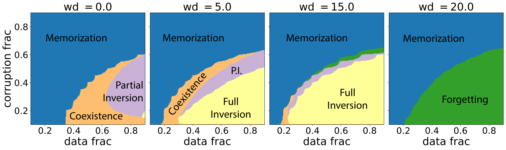

**[p. 5]**

*(a) Регуляризация с помощью weight decay. (wd обозначает значение weight decay)*

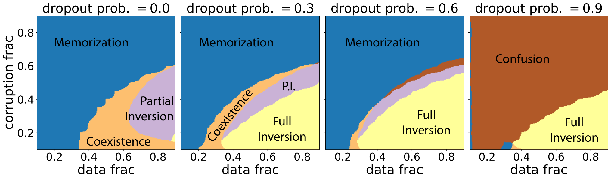

*(b) Регуляризация с помощью Dropout.*

*Рисунок 3: Фазовые диаграммы модульного сложения при различных методах регуляризации. Большая доля данных приводит к большему числу «правильных» примеров, что даёт более высокую устойчивость к порче. Усиление регуляризации в виде weight decay или dropout повышает устойчивость к порче меток и способствует лучшему обобщению.* **[p. 5]**

*Таблица 1: Качественная характеристика фаз.* **[p. 6]**

|  | **Сосуществование** | **Частичная** **инверсия** | **Полная** **инверсия** | **Запоминание** | **Забывание** / **Путаница** |
|---|---|---|---|---|---|
| Запоминает испорченные обучающие данные | Да | Частично | Нет | Да | Нет |
| Обобщается на тестовых данных | Да | Да | Да | Нет | Нет |

### 2.1 Обобщающая и запоминающая подсети

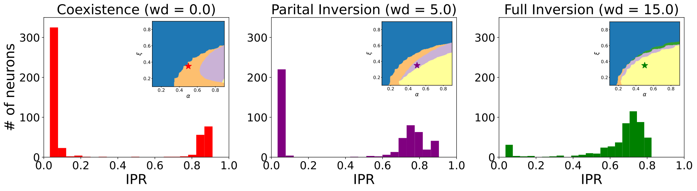

*(a) Регуляризация с помощью weight decay. (wd обозначает значение weight decay)*

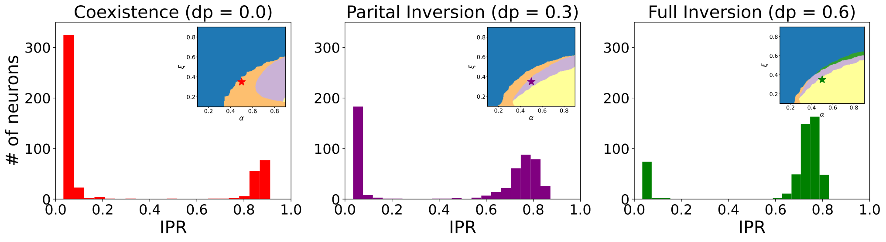

**[p. 6]**

*(b) Регуляризация с помощью Dropout. (dp обозначает вероятность Dropout)*

<i>Рисунок 4: Распределение понейронного IPR для обученных сетей в различных фазах. Фаза сосуществования имеет бимодальное распределение IPR, где нейроны с высоким и низким IPR обеспечивают соответственно обобщение и запоминание. Регуляризация с помощью weight decay или Dropout сдвигает распределение IPR в сторону более высоких значений — обобщающие нейроны становятся многочисленнее по сравнению с запоминающими, что приводит к более устойчивому обобщению и *инверсии*. Все графики построены для сетей, обученных при доле данных $\alpha=0.5$ и доле порчи $\xi=0.35$, с различными силами регуляризации.</i> **[p. 6]**

###### p6-1

Обобщающие признаки в нашей постановке «механистически» интерпретируемы (уравнение 2). Благодаря этому мы можем использовать меры периодичности, такие как IPR, для количественной характеристики различных представленных выше фаз. Это также позволяет нам анализировать эффект различных схем регуляризации. С этой целью мы формулируем следующую гипотезу и обстоятельно проверяем её в экспериментах.

##### **Гипотеза 2.1****.**

*Для двухслойного MLP с квадратичной активацией, обученного на датасетах модульного сложения (с one-hot кодированием) с порчей меток, нейроны с высоким IPR обеспечивают обобщение через обучение признаков, тогда как нейроны с низким IPR вызывают запоминание испорченных обучающих данных.*

Чтобы проверить Гипотезу 2.1, мы изучаем распределение понейронного IPR в различных фазах при разных уровнях регуляризации. В фазе *сосуществования* сеть одновременно обобщается и запоминает испорченные обучающие данные. Исходя из Гипотезы 2.1, мы ожидаем присутствия как обобщающих, так и запоминающих нейронов. Действительно, мы обнаруживаем бимодальное распределение IPR в обученных сетях (левый столбец на Рисунке 4). Примечательно, что сеть не только разделяет задачи обучения признаков и запоминания, но и выделяет каждой из них отдельные и независимые подсети.

Как упоминалось в предыдущем разделе, добавление регуляризации в виде weight decay или Dropout делает обобщение более устойчивым и способствует *инверсии*. Поскольку в этих фазах запоминание испорченных меток снижается, мы ожидаем увидеть уменьшение числа запоминающих нейронов и соответствующее увеличение числа обобщающих. Действительно, мы наблюдаем сдвиг распределения в сторону более высокого IPR в фазе *частичной инверсии* (средний столбец на Рисунке 4). В фазе *полной инверсии* (вызванной weight decay или dropout) мы видим, что запоминающие нейроны почти полностью **[p. 7]** устраняются в пользу обобщающих (правый столбец на Рисунке 4). Это даёт механизм, посредством которого сеть восстанавливает «истинные» метки даже для испорченных данных: в отсутствие запоминающей подсети её предсказания направляются лежащим в основе правилом, а не испорченными примерами.

**BatchNorm** также оказывает регуляризующее воздействие на обучение (Рисунок 9), хотя и посредством качественно иного механизма. В сети (Уравнение 1) мы применяем BatchNorm *после* функции активации (post-BN):

$$
{\boldsymbol{f}}(m,n)={\boldsymbol{W}}\mkern3mu\texttt{BN}\left(\phi\left({\boldsymbol{U}}\mkern3mu{\boldsymbol{e}}_{m}+{\boldsymbol{V}}\mkern3mu{\boldsymbol{e}}_{n}\right)\right)\mkern3mu. \tag{5}
$$

Слой BatchNorm существенно не влияет на распределение IPR нейронов — нейроны с низким IPR сохраняются даже в фазе *полной инверсии* (Рисунок 5). Вместо этого BatchNorm подстраивает собственные веса так, чтобы ослабить нейроны с низким IPR (запоминающие), смещая сеть в сторону обобщающих представлений. Это видно из сильной корреляции между $\text{IPR}_{k}$ и соответствующими весами BatchNorm на Рисунке 5(справа). BatchNorm фактически выполняет прунинг сети, и он учится делать это непосредственно из данных! Отметим, что этот эффект BatchNorm действует совместно с неявной регуляризацией от шума мини-батчей в данном случае. Мы обнаруживаем, что уменьшение размера батча усиливает *инверсию* даже без явной регуляризации (Рисунок 10).

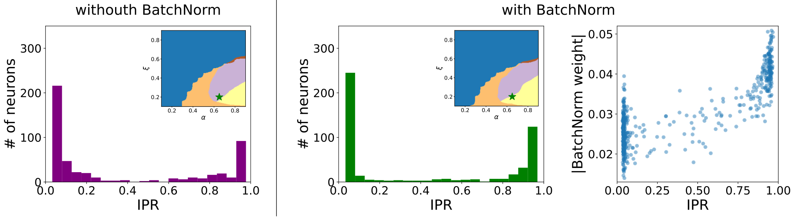

<i>Рисунок 5: Распределения IPR для сетей с BatchNorm и без него; корреляция между весами BatchNorm и IPR. Распределения IPR у двух моделей не демонстрируют существенных различий. Однако BatchNorm помогает обобщению, назначая более высокие веса ($\gamma_{k}$) нейронам с высоким IPR по сравнению с нейронами с низким IPR. Обе модели обучены при доле данных $\alpha=0.65$ и доле порчи $\xi=0.2$, с размером батча = 64.</i> **[p. 7]**

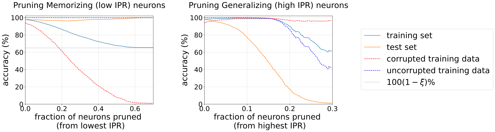

###### fig-6

<i>Рисунок 6: Последовательный прунинг нейронов обученной модели (фаза *сосуществования*) на основе IPR. (доля данных $\alpha=0.5$, доля порчи $\xi=0.35$). (Слева) Прунинг нейронов начиная с наименьшего IPR. Точность на испорченных обучающих данных снижается, что свидетельствует в пользу того, что нейроны с низким IPR отвечают за запоминание. Тестовая точность, как и точность на неиспорченных обучающих данных, остаётся высокой. (Справа) Прунинг нейронов начиная с наивысшего IPR. Тестовая точность снижается, что свидетельствует в пользу того, что нейроны с высоким IPR отвечают за обобщение. Точность на испорченных обучающих данных остаётся высокой.</i> **[p. 7]**

Чтобы дополнительно изолировать влияние отдельных нейронов на качество, мы проводим два взаимодополняющих эксперимента с прунингом (Рисунок 6): начиная с обученной сети в фазе сосуществования, мы постепенно удаляем нейроны, по одному, (i) начиная с нейрона с наименьшим IPR, (ii) начиная с нейрона с наивысшим IPR, отслеживая при этом обучающую и тестовую точности. Чтобы отделить способность сети к запоминанию, мы также отслеживаем точности на испорченной и неиспорченной частях обучающего датасета. До прунинга сеть имеет точность, близкую к $100$%, как на обучающих, так и на тестовых данных. **[p. 8]** В случае (i) (Рисунок 6(слева)) мы видим монотонное снижение точности на испорченных примерах по мере того, как удаляется всё больше нейронов с низким IPR. Точность на тестовых данных, а также на неиспорченных обучающих данных остаётся высокой. Итоговая (общая) обучающая точность выходит на плато вблизи $100(1-\xi)$%, что соответствует доле неиспорченных примеров. В случае (ii) (Рисунок 6(справа)), по мере удаления всё большего числа нейронов с высоким IPR, мы наблюдаем снижение тестовой точности (а также точности на неиспорченных обучающих данных). Сеть сохраняет способность к запоминанию, поэтому точность на испорченных обучающих данных остаётся высокой.

Мы подчёркиваем, что, хотя каждый обобщающий нейрон обучается полезным периодическим признакам, общее вычисление в сети является эмерджентным: оно выполняется коллективно *всеми* обобщающими нейронами.

### 2.2 Общие архитектуры

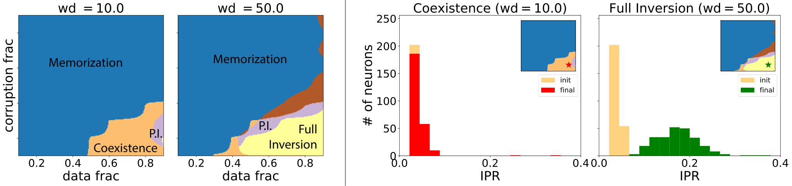

*(a) 1-слойный Трансформер.*

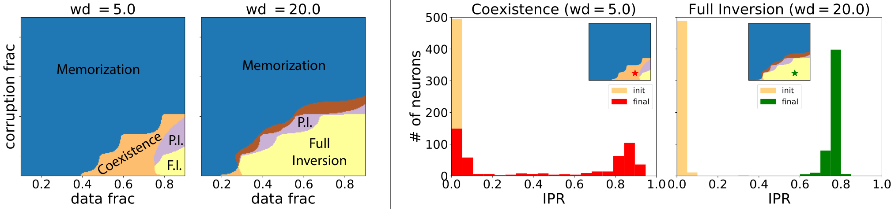

*(b) 3-слойный ReLU MLP.*

*Рисунок 7: Фазовые диаграммы модульного сложения и гистограммы IPR при различных архитектурах и значениях weight decay (обозначенных «wd»). Гистограммы IPR построены для нейронов, связанных с входными (эмбеддинговыми) слоями.* **[p. 8]**

В этом подразделе мы стремимся проверить, (i) можем ли мы количественно оценить способности общих архитектур к запоминанию/обобщению с помощью распределения IPR нейронов; (ii) можно ли обобщить наше понимание регуляризации на такие случаи.

##### **Гипотеза 2.2****.**

*Для любой сети, достигающей нетривиальной точности обобщения на датасете модульного сложения с порчей меток, её работу можно разложить на два шага: (I) входной (эмбеддинговый) слой с построчно периодическими весами отображает данные в периодические признаки; (II) остальная часть сети нелинейно реализует тригонометрические операции над периодическими нейронами и отображает их в выходные предсказания. Мы предполагаем, что шаг (I) зависит только от характеристик датасета и, следовательно, является универсальным свойством для различных сетевых архитектур.*

Чтобы проверить Гипотезу 2.2 и лучше понять влияние регуляризации, мы проводим дополнительные эксперименты с $1$-слойными Трансформерами и $3$-слойными ReLU MLP. Наши результаты, показанные в первых двух столбцах Рисунка 7 и параллельные наблюдениям на Рисунке 3(a), указывают, что усиление weight decay способствует обобщению в противовес запоминанию. Гистограммы IPR в последних двух столбцах Рисунка 7 дополнительно подтверждают, что weight decay поощряет правильные признаки, и подкрепляют утверждения, сделанные в Гипотезе 2.2.

Для этих общих моделей Dropout в основном приводит к расширенной фазе путаницы, тогда как BatchNorm обеспечивает лишь сосуществование. Мы наблюдаем, что weight decay необходим для того, чтобы у этих моделей была фаза *полной инверсии*. Отсылаем читателя к Приложению G за подробным обсуждением.

**[p. 9]**

## 3 Влияние регуляризации

В этом разделе мы обобщаем эффект различных методов регуляризации и сравниваем их с существующей литературой.

### 3.1 Weight decay

Как показано на Рисунке 3(a), увеличение weight decay имеет два заметных эффекта: (i) Обобщение при меньшем количестве данных: Граница фаз между фазами *Запоминание* и *Сосуществование* смещается в сторону меньшей доли данных. Weight decay поощряет обобщение даже тогда, когда обучающих данных мало; в согласии с классическими идеями (Bartlett, 1998). (ii) Возникновение фазы *Полная инверсия*: В этой фазе weight decay предотвращает запоминание и помогает сети «исправить» метки для испорченных точек данных. Этот эффект дополнительно проясняется на Рисунке 4(a) – При фиксированном количестве данных и порчи меток увеличение weight decay приводит к уменьшению доли нейронов с низким IPR (запоминающих) в пользу нейронов с высоким IPR (обобщающих).

### 3.2 Dropout

Считается, что dropout предотвращает сложные ко-адаптации между нейронами в разных слоях, побуждая каждый нейрон учить полезные признаки (Hinton et al., 2012; Srivastava et al., 2014). В нашей постановке эта интуиция становится более точной. Обобщающее решение состоит из периодических нейронов, каждый из которых соответствует вектору весов заданной «частоты» $\sigma(k)$. Такое решение требует $p$ нейронов с различными частотами55 5 Точнее, для вещественных весов оно требует лишь $\lceil p/2\rceil$ частот., (см. Уравнение 6). В широкой сети ($N=500$ в нашей постановке) может быть несколько нейронов с одной и той же частотой.66 6 Аналитическое решение становится точным лишь при больших $N$; с подведущими поправками порядка $1/\sqrt{N}$. Из-за этой избыточности обобщающие решения более устойчивы к выброшенным нейронам; тогда как переобучающиеся решения — нет. В результате обучение с Dropout притягивается к таким периодическим решениям.

## 4 Заключение

Мы исследовали взаимодействие между запоминанием и обобщением в двухслойных нейронных сетях, обученных на алгоритмических датасетах. Запоминание индуцировалось созданием датасета с испорченными метками, что заставляло сеть одновременно запоминать неверные примеры и учить правило. Мы обнаружили, что запоминающие нейроны могут быть явно идентифицированы и удалены прунингом, что приводит к идеальному обобщению.

Далее мы показали, что различные методы регуляризации, такие как weight decay, Dropout и BatchNorm, побуждают сеть игнорировать испорченные метки и приводят к идеальному обобщению. Мы использовали интерпретируемость представлений, выученных на задаче модульного сложения, чтобы количественно охарактеризовать эффекты этих методов регуляризации. А именно, мы обнаружили, что weight decay и dropout действуют схожим образом, уменьшая число запоминающих нейронов; тогда как BatchNorm ослабляет выход регуляризующих нейронов, не устраняя их, эффективно выполняя прунинг сети.

## 5 Ограничения и будущая работа

Хотя обученные модели в нашей постановке полностью интерпретируемы посредством аналитических решений, динамика обучения, приводящая к этим решениям, остаётся открытым вопросом. Решение динамики должно также пролить больше света на эффекты регуляризации и порчи меток.

Хотя наша работа ограничена точно решаемыми моделями и алгоритмическими датасетами, она прокладывает путь к количественному исследованию обобщения и запоминания в более реалистичных постановках.

**[p. 10]**

## Благодарности

Работа A.G. в Университете Мэриленда была частично поддержана NSF CAREER Award DMR-2045181, Sloan Foundation и Laboratory for Physical Sciences через Condensed Matter Theory Center. Авторы благодарят суперкомпьютерные ресурсы Университета Мэриленда (http://hpcc.umd.edu), предоставленные для проведения исследования, о котором сообщается в этой статье.

## Литература

- Boaz Barak, Benjamin L. Edelman, Surbhi Goel, Sham M. Kakade, eran malach, and Cyril Zhang. Hidden progress in deep learning: SGD learns parities near the computational limit. In Alice H. Oh, Alekh Agarwal, Danielle Belgrave, and Kyunghyun Cho (eds.), *Advances in Neural Information Processing Systems*, 2022. URL https://openreview.net/forum?id=8XWP2ewX-im.

- P.L. Bartlett. The sample complexity of pattern classification with neural networks: the size of the weights is more important than the size of the network. *IEEE Transactions on Information Theory*, 44(2):525–536, 1998. doi: 10.1109/18.661502.

- Brian R. Bartoldson, Ari S. Morcos, Adrian Barbu, and Gordon Erlebacher. The generalization-stability tradeoff in neural network pruning, 2020.

- Lucas Beyer, Olivier J. Hénaff, Alexander Kolesnikov, Xiaohua Zhai, and Aäron van den Oord. Are we done with imagenet?, 2020.

- Nicholas Carlini, Florian Tramer, Eric Wallace, Matthew Jagielski, Ariel Herbert-Voss, Katherine Lee, Adam Roberts, Tom Brown, Dawn Song, Ulfar Erlingsson, et al. Extracting training data from large language models. In *30th USENIX Security Symposium (USENIX Security 21)*, pp. 2633–2650, 2021.

- Nicholas Carlini, Daphne Ippolito, Matthew Jagielski, Katherine Lee, Florian Tramer, and Chiyuan Zhang. Quantifying memorization across neural language models. *arXiv preprint arXiv:2202.07646*, 2022.

- Viv Cothey. Web-crawling reliability. *Journal of the American Society for Information Science and Technology*, 55(14):1228–1238, 2004. doi: https://doi.org/10.1002/asi.20078. URL https://onlinelibrary.wiley.com/doi/abs/10.1002/asi.20078.

- Aritra Ghosh, Himanshu Kumar, and P Shanti Sastry. Robust loss functions under label noise for deep neural networks. In *Proceedings of the AAAI conference on artificial intelligence*, volume 31, 2017.

- Steven M. Girvin and Kun Yang. *Modern Condensed Matter Physics*. Cambridge University Press, 2019. doi: 10.1017/9781316480649.

- Andrey Gromov. Grokking modular arithmetic, 2023. URL https://arxiv.org/abs/2301.02679.

- Bo Han, Jiangchao Yao, Gang Niu, Mingyuan Zhou, Ivor Tsang, Ya Zhang, and Masashi Sugiyama. Masking: A new perspective of noisy supervision. In S. Bengio, H. Wallach, H. Larochelle, K. Grauman, N. Cesa-Bianchi, and R. Garnett (eds.), *Advances in Neural Information Processing Systems*, volume 31, 2018.

- Danny Hernandez, Tom Brown, Tom Conerly, Nova DasSarma, Dawn Drain, Sheer El-Showk, Nelson Elhage, Zac Hatfield-Dodds, Tom Henighan, Tristan Hume, et al. Scaling laws and interpretability of learning from repeated data. *arXiv preprint arXiv:2205.10487*, 2022.

- Geoffrey E. Hinton, Nitish Srivastava, Alex Krizhevsky, Ilya Sutskever, and Ruslan R. Salakhutdinov. Improving neural networks by preventing co-adaptation of feature detectors, 2012.

- Sergey Ioffe and Christian Szegedy. Batch normalization: Accelerating deep network training by reducing internal covariate shift, 2015.

**[p. 11]**

- Arthur Jacot, François Ged, Berfin Şimşek, Clément Hongler, and Franck Gabriel. Saddle-to-saddle dynamics in deep linear networks: Small initialization training, symmetry, and sparsity, 2022.

- Angelos Katharopoulos and Francois Fleuret. Not all samples are created equal: Deep learning with importance sampling. In *Proceedings of the 35th International Conference on Machine Learning*, volume 80 of *Proceedings of Machine Learning Research*, pp. 2525–2534. PMLR, 10–15 Jul 2018.

- Xuefeng Liang, Xingyu Liu, and Longshan Yao. Review–a survey of learning from noisy labels. *ECS Sensors Plus*, 1(2):021401, jun 2022. doi: 10.1149/2754-2726/ac75f5. URL https://dx.doi.org/10.1149/2754-2726/ac75f5.

- Ziming Liu, Ouail Kitouni, Niklas S Nolte, Eric Michaud, Max Tegmark, and Mike Williams. Towards understanding grokking: An effective theory of representation learning. In S. Koyejo, S. Mohamed, A. Agarwal, D. Belgrave, K. Cho, and A. Oh (eds.), *Advances in Neural Information Processing Systems*, volume 35, pp. 34651–34663. Curran Associates, Inc., 2022. URL https://proceedings.neurips.cc/paper_files/paper/2022/file/dfc310e81992d2e4cedc09ac47eff13e-Paper-Conference.pdf.

- Ziming Liu, Eric J Michaud, and Max Tegmark. Omnigrok: Grokking beyond algorithmic data. In *The Eleventh International Conference on Learning Representations*, 2023. URL https://openreview.net/forum?id=zDiHoIWa0q1.

- William Merrill, Nikolaos Tsilivis, and Aman Shukla. A tale of two circuits: Grokking as competition of sparse and dense subnetworks, 2023.

- Ari S. Morcos, David G. T. Barrett, Neil C. Rabinowitz, and Matthew Botvinick. On the importance of single directions for generalization, 2018.

- Neel Nanda, Lawrence Chan, Tom Lieberum, Jess Smith, and Jacob Steinhardt. Progress measures for grokking via mechanistic interpretability, 2023.

- Pascal Jr. Tikeng Notsawo, Hattie Zhou, Mohammad Pezeshki, Irina Rish, and Guillaume Dumas. Predicting grokking long before it happens: A look into the loss landscape of models which grok, 2023.

- Gabriele Paolacci, Jesse Chandler, and Panagiotis G. Ipeirotis. Running experiments on amazon mechanical turk. *Judgment and Decision Making*, 5(5):411–419, 2010. doi: 10.1017/S1930297500002205.

- Romualdo Pastor-Satorras and Claudio Castellano. Distinct types of eigenvector localization in networks. *Scientific Reports*, 6(1):18847, 2016. doi: 10.1038/srep18847. URL https://doi.org/10.1038/srep18847.

- Mansheej Paul, Surya Ganguli, and Gintare Karolina Dziugaite. Deep learning on a data diet: Finding important examples early in training. In M. Ranzato, A. Beygelzimer, Y. Dauphin, P.S. Liang, and J. Wortman Vaughan (eds.), *Advances in Neural Information Processing Systems*, volume 34, pp. 20596–20607. Curran Associates, Inc., 2021.

- Alethea Power, Yuri Burda, Harri Edwards, Igor Babuschkin, and Vedant Misra. Grokking: Generalization beyond overfitting on small algorithmic datasets, 2022.

- Hwanjun Song, Minseok Kim, Dongmin Park, Yooju Shin, and Jae-Gil Lee. Learning from noisy labels with deep neural networks: A survey. *IEEE Transactions on Neural Networks and Learning Systems*, pp. 1–19, 2022. doi: 10.1109/TNNLS.2022.3152527.

- Nitish Srivastava, Geoffrey Hinton, Alex Krizhevsky, Ilya Sutskever, and Ruslan Salakhutdinov. Dropout: A simple way to prevent neural networks from overfitting. *Journal of Machine Learning Research*, 15(56):1929–1958, 2014. URL http://jmlr.org/papers/v15/srivastava14a.html.

- Kushal Tirumala, Aram Markosyan, Luke Zettlemoyer, and Armen Aghajanyan. Memorization without overfitting: Analyzing the training dynamics of large language models. *Advances in Neural Information Processing Systems*, 35:38274–38290, 2022.

**[p. 12]**

- Vikrant Varma, Rohin Shah, Zachary Kenton, János Kramár, and Ramana Kumar. Explaining grokking through circuit efficiency, 2023.

- Tong Xiao, Tian Xia, Yi Yang, Chang Huang, and Xiaogang Wang. Learning from massive noisy labeled data for image classification. In *Proceedings of the IEEE Conference on Computer Vision and Pattern Recognition (CVPR)*, June 2015.

- Jiangchao Yao, Jiajie Wang, Ivor W. Tsang, Ya Zhang, Jun Sun, Chengqi Zhang, and Rui Zhang. Deep learning from noisy image labels with quality embedding. *IEEE Transactions on Image Processing*, 28(4):1909–1922, 2019. doi: 10.1109/TIP.2018.2877939.

- Chiyuan Zhang, Samy Bengio, Moritz Hardt, Benjamin Recht, and Oriol Vinyals. Understanding deep learning requires rethinking generalization. In *International Conference on Learning Representations*, 2017. URL https://openreview.net/forum?id=Sy8gdB9xx.

- Chiyuan Zhang, Samy Bengio, Moritz Hardt, Benjamin Recht, and Oriol Vinyals. Understanding deep learning (still) requires rethinking generalization. *Communications of the ACM*, 64(3):107–115, 2021.

- Ziqian Zhong, Ziming Liu, Max Tegmark, and Jacob Andreas. The clock and the pizza: Two stories in mechanistic explanation of neural networks, 2023.

- Bojan Žunkovič and Enej Ilievski. Grokking phase transitions in learning local rules with gradient descent, 2022.

**[p. 13]**

## Приложение A Дополнительные детали экспериментов

На каждом представленном графике, если явно не указано иное, мы используем следующую настройку по умолчанию:

#### Настройка по умолчанию

Двухслойная полносвязная сеть с квадратичной активацией и шириной $N=500$, начальные веса сэмплируются из $\mathcal{N}(0,(16N)^{-2/3})$, обучается на датасете модульного сложения с $p=97$. Сети обучаются в течение 2000 шагов оптимизации, с использованием полного батча, MSE-функции потерь, оптимизатора AdamW, learning rate $\eta=0.01$ и $\beta=(0.9,0.98)$.

### A.1 Рисунки в основном тексте

Рисунок 1: Настройка по умолчанию с $\alpha=0.5,\xi=0.35$ и (a) $wd=0$ (b) $wd=5$ и (c) $wd=15$.

Рисунок 2: Настройка по умолчанию с $\alpha=0.5,\xi=0.0,wd=5.0$.

Рисунок 3: Каждый график просканирован по $17$ различным долям данных $\alpha$ в диапазоне от $0.1$ до $0.9$ и $19$ уровням шума $\xi$ от $0.0$ до $0.9$ при использовании настройки по умолчанию.

Рисунки 4 и 6: Настройка по умолчанию с $\alpha=0.5,\xi=0.35$.

Рисунок 5: Двухслойная полносвязная сеть с квадратичной активацией и шириной $N=500$, с BatchNorm и без него. Мы обучаем в течение $\sim 8000$ шагов, с MSE-функцией потерь, оптимизатором Adam с мини-батчем размера 64 и learning rate $\eta=0.005$. Доля данных $\alpha=0.65$, доля порчи $\xi=0.2$.

Общая настройка для обучения на мини-батчах: Мы обучаем сеть с batch size $256$ в течение $2000$ шагов. Для batch size $8$ и $64$ мы масштабируем общее число шагов так, чтобы число эпох оставалось примерно одинаковым. (Иначе говоря, все сети видят одинаковое количество данных.) Learning rate масштабируется как $0.01\cdot\sqrt{\text{batch size}/256}$.

Рисунок 7: Все сети обучаются с MSE-функцией потерь с использованием оптимизатора AdamW с learning rate $\eta=0.001$ и $(\beta_{1},\beta_{2})=(0.9,0.98)$. (a) Transformer только с энкодером, размерность эмбеддинга $d_{\mathrm{embed}}=128$ с активацией ReLU, обучение в течение $3000$ шагов с $3$ случайными зёрнами; (b) Ширина $N=500$, обучение в течение $5000$ шагов с $3$ случайными зёрнами.

## Приложение B Детали использованных ресурсов

Рисунок 3 требует 72 часов на одном GPU NVIDIA RTX 3090.

Рисунок 7 использовал $60$ часов на $1/7$ GPU NVIDIA A100.

Все остальные рисунки, кроме Рисунка 7 в основном тексте, — это либо дополнительные эксперименты, выполненные на данных из эксперимента для Рисунка 3; либо они очень быстро выполняются на любой машине.

Мы использовали $~300$ GPU-часов для ранней стадии исследования и построения фазовых диаграмм в приложении.

**[p. 14]**

## Приложение C Количественная характеризация фаз

Все фазовые диаграммы построены с использованием эмпирических точностей обученных сетей.

Обученные сети с тестовой точностью $\geq 90$% классифицируются в фазы *Сосуществование*, *Частичная инверсия* и *Полная инверсия* на основе их обучающей точности (в частности, их способности запоминать испорченные примеры). Фаза *Сосуществование* имеет обучающую точность $\geq 90$%, поскольку она запоминает большинство испорченных обучающих примеров. Фаза *Частичная инверсия* имеет обучающую точность $<90$%, но $\geq 100(1.05-\xi)$%, где $\xi$ — доля порчи. Заметим, что мы вычитаем $\xi$ из $1.05$, а не из $1.00$, чтобы учесть точность случайного угадывания в $1-2$%, а также статистические флуктуации вокруг этого значения. Фаза *Полная инверсия* имеет обучающую точность $<100(1.05-\xi)$%, поскольку она не запоминает ни одного из испорченных примеров. Фаза *Запоминание* имеет тестовую точность $<90$%, но обучающую точность $\geq 90$%, что указывает на то, что сеть запоминает все обучающие данные, включая испорченные и неиспорченные примеры. Фаза *Забывание* или *путаница* имеет как тестовую, так и обучающую точность $<90$%. сеть ни обобщает, ни успевает запомнить все обучающие примеры. Мы отличаем *Забывание* от *путаницы* по обучающей кривой. В *фазе Забывания* грокнувшая сеть теряет свою производительность из-за неуклонно уменьшающихся норм весов. Тогда как в фазе *путаницы* сеть никогда не достигает высокой производительности.

*Таблица 2: Количественная характеризация фаз.* **[p. 14]**

|  | **Сосуществование** | **Частичная** **инверсия** | **Полная** **инверсия** | **Запоминание** | **Забывание** / **Путаница** |
|---|---|---|---|---|---|
| Тестовая точность | $\geq 90$% | $\geq 90$% | $\geq 90$% | $<90$% | $<90$% |
| Обучающая точность | $\geq 90$% | $<90$% и $\geq 100(1.05-\xi)$% | $<100(1.05-\xi)$% | $\geq 90$% | $<90$% |

**[p. 15]**

## Приложение D Аналитическое решение

Мы показываем, что сеть с периодическими весами, приведённая в Уравнении 2, действительно является аналитическим решением для задачи модульной арифметики. Выход сети задаётся как

$$
f_{q}(m,n) =\sum_{k=1}^{N}W_{qk}(U_{km}+V_{kn})^{2} \cr
=\frac{2}{N}\sum_{k=1}^{N}\cos{\left(-\frac{2\pi}{p}\sigma(k)q-(\phi^{(u)}_{k}+\phi^{(v)}_{k})\right)}\cdot \cr
\qquad\qquad\cdot\left(\cos{\left(\frac{2\pi}{p}\sigma(k)m+\phi^{(u)}_{k}\right)}+\cos{\left(\frac{2\pi}{p}\sigma(k)n+\phi^{(v)}_{k}\right)}\right)^{2} \cr
=\frac{2}{N}\sum_{k=1}^{N}\left\lbrace\frac{1}{4}\cos{\left(\frac{2\pi}{p}\sigma(k)(2m-q)+\phi^{(u)}_{k}-\phi^{(v)}_{k}\right)}\right. \cr
\left.\qquad\qquad\quad+\frac{1}{4}\cos{\left(\frac{2\pi}{p}\sigma(k)(2m+q)+3\phi^{(u)}_{k}+\phi^{(v)}_{k}\right)}\right. \cr
\left.\qquad\qquad\quad+\frac{1}{4}\cos{\left(\frac{2\pi}{p}\sigma(k)(2n-q)-\phi^{(u)}_{k}+\phi^{(v)}_{k}\right)}\right. \cr
\left.\qquad\qquad\quad+\frac{1}{4}\cos{\left(\frac{2\pi}{p}\sigma(k)(2n+q)+\phi^{(u)}_{k}+3\phi^{(v)}_{k}\right)}\right. \cr
\left.\qquad\qquad\quad+\boxed{\frac{1}{2}\cos{\left(\frac{2\pi}{p}\sigma(k)(m+n-q)\right)}}\right. \cr
\left.\qquad\qquad\quad+\frac{1}{2}\cos{\left(\frac{2\pi}{p}\sigma(k)(m+n+q)+2\phi^{(u)}_{k}+2\phi^{(v)}_{k}\right)}\right. \cr
\left.\qquad\qquad\quad+\frac{1}{2}\cos{\left(\frac{2\pi}{p}\sigma(k)(m-n-q)-2\phi^{(v)}_{k}\right)}\right. \cr
\left.\qquad\qquad\quad+\frac{1}{2}\cos{\left(\frac{2\pi}{p}\sigma(k)(m-n+q)+2\phi^{(u)}_{k}\right)}\right. \cr
\left.\qquad\qquad\quad+\cos{\left(-\frac{2\pi}{p}\sigma(k)q-\phi^{(u)}_{k}-\phi^{(v)}_{k}\right)}\right\rbrace\mkern3mu. \tag{6}
$$

Мы выделили рамкой член, который даёт нам желаемый выход. Заметим, что желаемый член — единственный, у которого в аргументе нет аддитивных фаз. Напомним, что фазы $\phi_{k}^{(u)}$ и $\phi_{k}^{(v)}$ выбраны случайно — равномерно i.i.d. сэмплированы на промежутке $(-\pi,\pi]$. Следовательно, когда $N$ становится большим, все остальные члены исчезнут из-за приближения случайных фаз. Единственным выжившим членом будет член в рамке. Мы можем записать этот член в рамке в более наглядной форме, чтобы аналитическое решение стало очевидным.

$$
f_{q}(m,n)={\frac{1}{N}\sum_{k=1}^{N}\cos{\left(\frac{2\pi}{p}\sigma(k)(m+n-q)\right)}}\approx\delta^{p}(m+n-q)\mkern3mu, \tag{7}
$$

где мы определили *модульную дельта-функцию Кронекера* $\delta^{p}(\cdot)$ как дельта-функцию Кронекера с точностью до целых кратных модульного основания $p$.

$$
\delta^{p}(x)=\begin{cases}1&\thickspace x=rp\qquad(r\in\mathbb{Z})\cr
0&\thickspace\text{otherwise}\end{cases}\mkern3mu, \tag{8}
$$

где $\mathbb{Z}$ обозначает множество всех целых чисел. Заметим, что $\delta^{p}(m+n-q)$ — это по определению желаемые one_hot закодированные метки для задачи модульной арифметики. Таким образом, наш выход сети с периодическими весами действительно является решением.

## Приложение E Фаза забывания

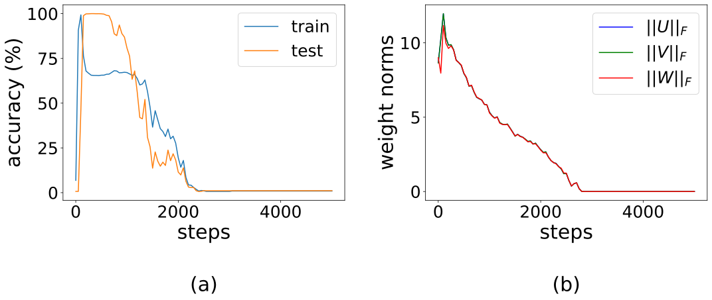

<i>Рисунок 8: Фаза *забывания* (доля данных $\alpha=0.5$, доля порчи $\xi=0.35$, weight decay = 20). (a) Кривые обучения. (b) Фробениусовы нормы весов сети в ходе обучения.</i> **[p. 16]**

**[p. 16]**

Мы видели на Рисунке 3(a) (самая правая панель, wd=20.0), что чрезвычайно высокий weight decay приводит к фазе *забывания*. В этой фазе к концу обучения точности как на обучающем, так и на тестовом наборе соответствуют случайному угадыванию. Наивно это выглядело бы похожим на фазу *путаницы*. Однако при внимательном рассмотрении их динамики обучения мы обнаруживаем богатое поведение. А именно, сеть первоначально проходит через динамику, похожую на *полную инверсию*, *то есть* тестовая точность достигает $100$%, тогда как обучающая точность выходит на плато около $100(1-\xi)$%. Однако затем обе точности спадают до уровня случайного угадывания. Это любопытное явление объясняется влиянием высокого weight decay на веса сети. Мы замечаем, что фробениусовы нормы весов сети неуклонно спадают до сколь угодно малых значений.

Это любопытное поведение возникает только тогда, когда мы используем функции активации степени выше 1 (например, $\phi(x)=x^{2}$ в данном случае). (Точнее, мы имеем в виду, что первый член разложения в ряд должен быть степени не ниже 2.) Это можно интуитивно объяснить, внимательно рассмотрев градиенты. С квадратичными функциями активации и потерей MSE градиенты принимают следующий вид

$$
\begin{aligned} \frac{\partial\mathcal{L}}{\partial U_{ab}}&=\frac{4}{|D|p}\sum_{(b,n)\in D}\sum_{q}^{p}\left(\sum_{k=1}^{N}W_{qk}\left(U_{kb}+V_{kn}\right)^{2}-\delta^{p}(b+n-q)\right)W_{qa}\left(U_{ab}+V_{an}\right)\cr
\frac{\partial\mathcal{L}}{\partial V_{ab}}&=\frac{4}{|D|p}\sum_{(m,b)\in D}\sum_{q}^{p}\left(\sum_{k=1}^{N}W_{qk}\left(U_{km}+V_{kb}\right)^{2}-\delta^{p}(b+n-q)\right)W_{qa}\left(U_{am}+V_{ab}\right)\cr
\frac{\partial\mathcal{L}}{\partial W_{cd}}&=\frac{4}{|D|p}\sum_{(m,n)\in D}\left(\sum_{k=1}^{N}W_{ck}\left(U_{km}+V_{kn}\right)^{2}-\delta^{p}(m+n-q)\right)\left(U_{dm}+V_{dn}\right)^{2}\mkern3mu,\end{aligned} \tag{9}
$$

где $D$ — обучающий набор данных, а $|D|$ — его размер.

Для необобщающих решений выражение внутри скобки имеет степень 0 по весам из-за члена с дельта-функцией. Но вблизи обобщающих решений выражение внутри скобки эффективно становится степени 3 по весам, поскольку член с дельта-функцией сокращается с выходом сети. Следовательно, вблизи обобщающего решения градиенты по весам имеют зависимость более высокой степени от самих весов. Это делает такие решения более подверженными коллапсу из-за высокого weight decay. Это служит эвристическим обоснованием того, почему только сети, прошедшие гроккинг, оказались подвержены *забыванию*, тогда как запоминающие сети, по-видимому, к нему невосприимчивы.

Если мы используем обычный оптимизатор градиентного спуска, обновления вышли бы на плато, как только достигается баланс между градиентными обновлениями и вкладом weight decay. Но это не так в адаптивных оптимизаторах. Действительно, мы обнаруживаем, что это явление возникает исключительно с адаптивными оптимизаторами (например, Adam в данном случае).

Мы полагаем, что возможно получить дальнейшее понимание этой фазы, внимательно изучив ландшафт оптимизации и динамику сети. Поскольку это поведение свойственно исключительно сетям, прошедшим гроккинг, понимание этой фазы привело бы к дальнейшему пониманию динамики гроккинга. И наоборот, лучшее понимание динамики гроккинга должно дать нам представление об этом любопытном явлении. Мы откладываем этот анализ на будущую работу и приветствуем его рассмотрение нашими читателями.

**[p. 17]**

## Приложение F Сравнение BatchNorm, LayerNorm и minibatch без нормализации

Здесь мы исследуем эффекты BatchNorm, LayerNorm и шума мини-батчей. Мы обнаруживаем, что обобщение и *инверсия* действительно усиливаются при уменьшении размера батча. Это показывает, что неявная регуляризация от шума мини-батчей отдаёт предпочтение более простым решениям в нашей постановке.

Кроме того, сравнивая Рисунок 9, Рисунок 10 и Рисунок 11, мы обнаруживаем усиленную *инверсию* в случаях со слоями нормализации (особенно с BatchNorm). Для BatchNorm мы приводим объяснение в основном тексте: веса BatchNorm ослабляют запоминающие нейроны в пользу обобщающих. Однако для LayerNorm мы такого эффекта не обнаруживаем.

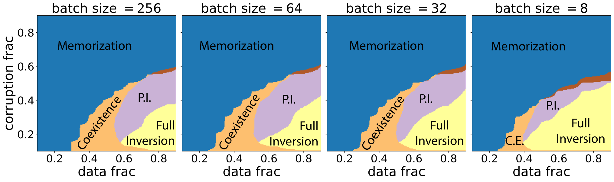

*Рисунок 9: Фазовая диаграмма с BatchNorm (post-BN)* **[p. 17]**

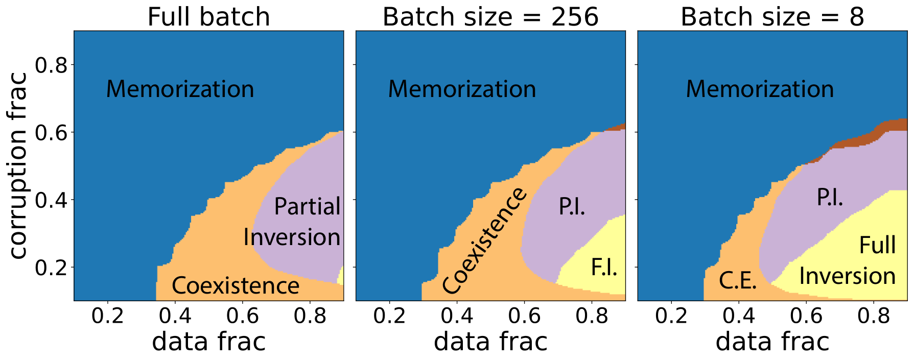

*Рисунок 10: Фазовая диаграмма при обучении с мини-батчами, без каких-либо явных слоёв регуляризации или нормализации.* **[p. 17]**

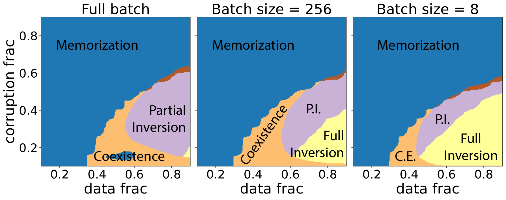

*Рисунок 11: Фазовая диаграмма с LayerNorm (post-LN)* **[p. 17]**

**[p. 18]**

## Приложение G Трансформеры и глубокие MLP

В этом разделе мы представляем (i) дополнительные эксперименты с weight decay на различных конфигурациях трансформеров; (ii) влияние Dropout на трансформеры; (iii) влияние BatchNorm на $3$-слойные ReLU MLP.

По причинам, которые мы не до конца понимаем, $3$-слойные ReLU MLP даже с вероятностью Dropout $0.05$ не смогли запомнить набор данных ни при какой доле данных $\alpha>0.3$ и уровне шума $\xi\geq 0.1$, даже после обширного поиска гиперпараметров. Мы оставляем обсуждение этого на будущее.

### G.1 Влияние глубины / числа голов / weight tying

Чтобы дополнительно подкрепить нашу Гипотезу 2.2, мы провели дальнейшие эксперименты, варьируя конфигурацию моделей-трансформеров. Рисунок 12 позволяет предположить, что наша Гипотеза выполняется независимо от конфигураций трансформера.

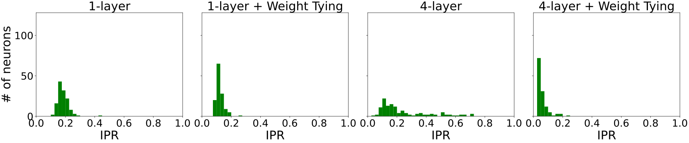

<i>(a) Трансформер с $8$ головами и размерностью эмбеддинга $128$.</i>

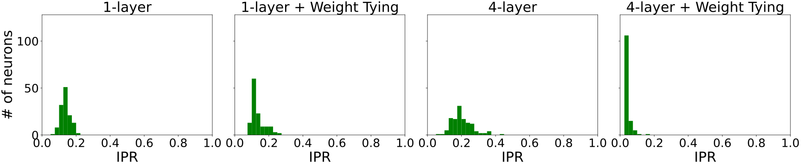

<i>(b) Трансформер с $4$ головами и размерностью эмбеддинга $128$.</i>

<i>Рисунок 12: Гистограммы IPR слоя эмбеддинга для трансформеров с разными конфигурациями. Мы видим, что глубина не влияет на распределение IPR, тогда как большее число голов способствует эмбеддингам с высоким IPR, а weight tying этому препятствует. Все модели обучены с долей порчи $\alpha=0.8$ и долей порчи $\xi=0.2$.</i> **[p. 18]**

### G.2 Фазовая диаграмма Dropout для трансформеров

Мы проводим дальнейшие эксперименты, чтобы проверить влияние Dropout на трансформеры. Из Рисунка 13 мы видим, что при малой вероятности dropout модели удалось получить фазу сосуществования с более высоким средним IPR для нейронов, связанных со слоем эмбеддинга. Примечательно, что любая вероятность dropout больше $0.1$ не помогает.

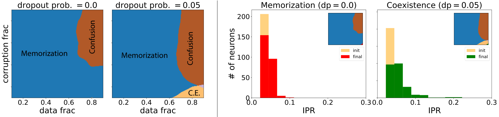

<i>Рисунок 13: Фазовые диаграммы модульного сложения и гистограммы IPR при разных вероятностях dropout (обозначены «dp»). Гистограммы IPR построены для нейронов, связанных со слоем эмбеддинга. Мы выбираем точки, обученные с долей данных $\alpha=0.9$ и долей порчи $\xi=0.1$.</i> **[p. 19]**

### G.3 Влияние параметризации для $3$-слойных MLP

Как мы упоминали в Гипотезе 2.2, входной слой должен иметь столбцы с высоким IPR независимо от деталей сети. В этом разделе мы показываем, что различная параметризация сети не нарушает нашу Гипотезу.

В частности, мы рассматриваем две различные параметризации: (i) стандартную параметризацию с весами, сэмплированными из $\mathcal{N}(0,2/\mathrm{fan\textunderscore in})$; (ii) параметризацию с весами, сэмплированными из $\mathcal{N}(0,2/N^{2/3})$, что соответствует сети, параметризованной в более ленивом режиме обучения (Jacot et al., 2022).

**[p. 19]**

Наши результаты на Рисунке 14 показывают, что по мере перехода сети в более ленивый режим построчное распределение IPR весов входного слоя почти не смещается, тогда как постолбцовое распределение IPR весов выходного слоя имеет бо́льшие значения. Мы интерпретируем это смещение как происходящее из-за того, что сеть с более ленивой параметризацией не справляется с использованием скрытых слоёв для декодирования периодических признаков, встроенных входными слоями.

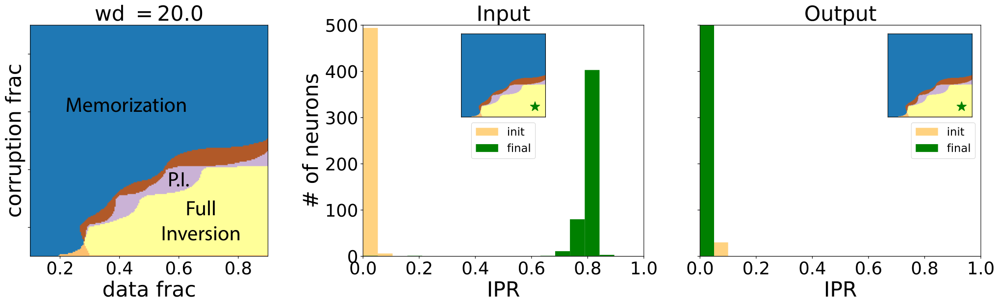

*(a) MLP в стандартной параметризации.*

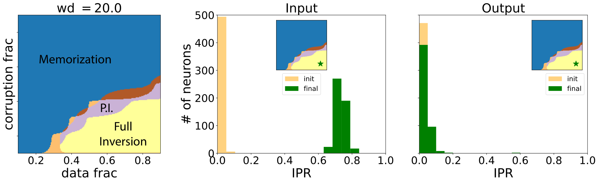

*(b) MLP в более ленивой параметризации.*

<i>Рисунок 14: Фазовые диаграммы и гистограммы IPR столбцов весов входного слоя и строк весов выходного слоя для $3$-слойных MLP с разными параметризациями. Отобранные модели обучены с долей данных $\alpha=0.8$ и долей порчи $\xi=0.2$.</i> **[p. 19]**

### G.4 BatchNorm для $3$-слойных ReLU MLP

В этом подразделе проверяется корреляция между весами BatchNorm и нейронами с высоким IPR для $3$-слойных ReLU MLP. Мы обнаружили, что BatchNorm для $3$-слойных MLP даёт только фазы сосуществования и может идеально запоминать и обобщать при малых долях порчи $\xi$; мы показали репрезентативную кривую обучения на Рисунке 15. Мы обнаруживаем, что с BatchNorm $3$-слойный MLP склонен иметь нейроны с высоким IPR **[p. 20]** вблизи выходного слоя вместо высокого IPR у нейронов вблизи входного слоя. Мы полагаем, что неспособность удалить нейроны с очень низким IPR, связанные со входным слоем, и является причиной того, что эта сеть всегда находится в фазе сосуществования.

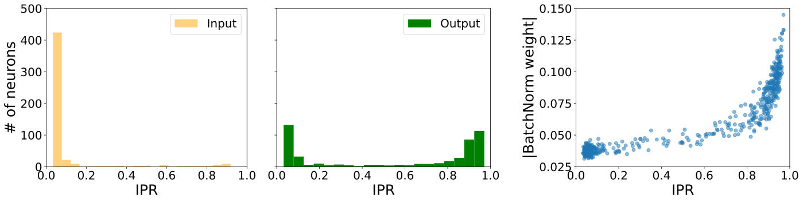

<i>Рисунок 15: IPR $3$-слойного MLP в фазе сосуществования, обученного с долей данных $\alpha=0.8$ и долей порчи $\xi=0.1$. Мы построили построчный IPR для весов входного слоя и постолбцовый IPR для весов выходного слоя; корреляцию постолбцового IPR весов выходного слоя с абсолютным значением весов BatchNorm непосредственно перед ним. Корреляция между весами BatchNorm и значениями IPR, на которую мы указывали в основном тексте, по-прежнему сохраняется. Однако мы не наблюдали сильной корреляции между построчным IPR входного слоя и соседним с ним весом BatchNorm.</i> **[p. 20]**

## Приложение H Порча меток на обычных наборах данных

Мы обучаем 4-слойный ReLU MLP на наборе данных MNIST с порчей меток, с weight decay и dropout (потеря CrossEntropy). Weight decay действительно усиливает обобщение и приводит к *полной инверсии*. Очень высокий weight decay приводит к путанице. Dropout, с другой стороны, не столь эффективен. Увеличение dropout ухудшает как тестовую, *так и* обучающую точности в этом случае.

Обобщающие признаки труднее количественно охарактеризовать для MNIST — мы оставляем этот анализ на будущую работу.

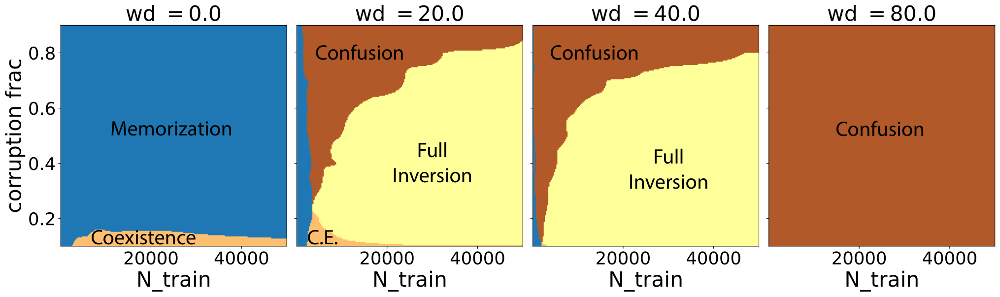

*(a) Weight decay*

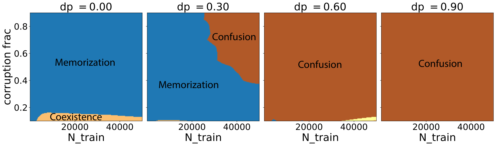

*(b) Dropout*

*Рисунок 16: 4-слойный ReLU MLP, обученный на наборе данных MNIST с порчей меток.* **[p. 20]**

**[p. 21]**

## Приложение I Дополнительные кривые прунинга

### I.1 Точности

На рисунке 6 мы показали прунинг нейронов с низким и высоким IPR в фазе *сосуществования*. Здесь мы приводим расширенную версию экспериментов с прунингом. В отличие от графиков на рисунке 6, на рисунке 17 мы строим более длинные оси x — мы показываем точности при доле обрезанных нейронов от 0.0 до 1.0. Мы также проводим эксперимент с прунингом для фаз *частичной инверсии* и *полной инверсии*. Прунинг по-разному влияет на обобщение и запоминание в разных фазах, поскольку доля нейронов с высоким и низким IPR в обученных сетях зависит от фазы.

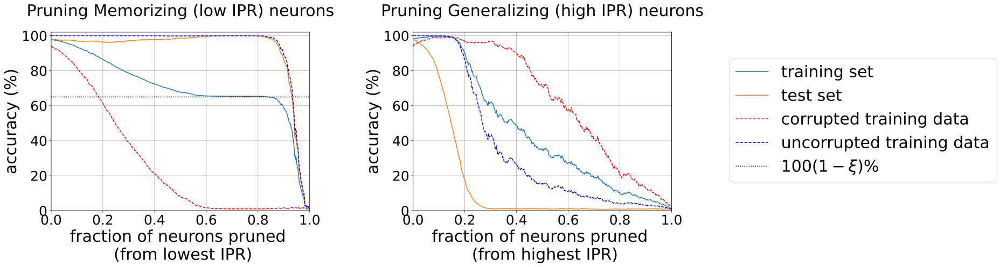

<i>(a) Фаза *сосуществования* (weight decay = 0.0). (Слева) Прунинг начиная с нейронов с низким IPR сохраняет качество на тестовых данных и на неиспорченных обучающих данных, при этом снижая качество на испорченных обучающих данных до $100 * (1-\xi)$%. (Справа) Прунинг нейронов с высоким IPR снижает качество на тестовых данных, при этом сохраняя качество на обучающих данных. Отметим, что точность на испорченных данных сохраняется дольше, чем на неиспорченных.</i>

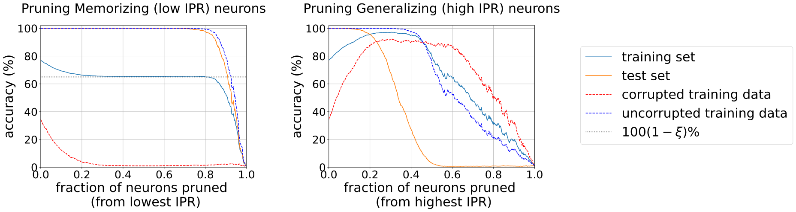

<i>(b) Фаза *частичной инверсии* (weight decay = 5.0). (Слева) Прунинг начиная с нейронов с низким IPR сохраняет качество на тестовых данных и на неиспорченных обучающих данных, при этом снижая качество на испорченных обучающих данных до $100 * (1-\xi)$%. (Справа) Прунинг нейронов с высоким IPR снижает качество на тестовых данных. Он улучшает качество на испорченных обучающих данных и сохраняет его на неиспорченных обучающих данных. В отсутствие периодических нейронов (запоминающие) нейроны с низким IPR оказывают повышенное влияние на предсказания сети, что и приводит к такому росту запоминания.</i>

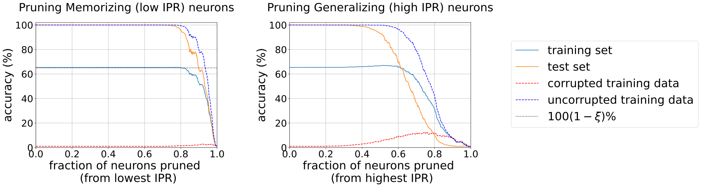

<i>(c) Фаза *полной инверсии* (weight decay = 15.0). (Слева) Прунинг начиная с нейронов с низким IPR сохраняет качество на тестовых данных и на неиспорченных обучающих данных, при этом снижая качество на испорченных обучающих данных до $100 * (1-\xi)$%. (Справа) Прунинг нейронов с высоким IPR не улучшает запоминание существенно, за исключением небольшого роста точности на испорченных обучающих данных ближе к концу. Это связано с тем, что доля нейронов с низким IPR в данном случае очень мала.</i>

<i>Рисунок 17: Эксперименты с прунингом во всех различных фазах ($N=500,\alpha=0.5,\xi=0.35$). Прунинг по-разному влияет на обобщение и запоминание в разных фазах, поскольку доля нейронов с высоким и низким IPR в обученных сетях зависит от фазы.</i> **[p. 21]**

**[p. 22]**

### I.2 Потери

Здесь мы показываем, как прунинг влияет на обучающую и тестовую потери. Обучающая потеря понижается как запоминающими нейронами (с низким IPR), *так и* обобщающими (с высоким IPR). Это приводит к монотонному поведению во всех случаях. Тестовая потеря понижается периодическими нейронами и повышается запоминающими нейронами. Поверх этих эффектов накладывается эффективное сокращение субведущих членов в аналитическом решении 6. Поскольку точности зависят только от наибольшего логита, эти субведущие члены слабо на них влияют (при достаточной ширине). Однако на потери они влияют существенно. При нулевых или малых значениях weight decay это сокращение достигается нейронами с низким IPR. Таким образом, в этих случаях нейроны с низким IPR выполняют двойную функцию: запоминание, а также сокращение субведущих членов. При больших значениях weight decay это сокращение достигается другим алгоритмом, при котором во фурье-спектре периодических нейронов появляются «вторичные пики». Углублённый анализ этих алгоритмических смещений мы оставляем для будущей работы.

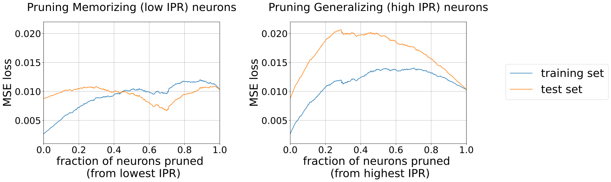

*(a) Фаза *сосуществования* (weight decay = 0.0). (Слева) Прунинг начиная с нейронов с низким IPR (почти) монотонно увеличивает обучающую потерю. На тестовую потерю действуют два конкурирующих фактора: меньшее запоминание и меньшее число нейронов, сокращающих субведущие члены. В результате в первой половине мы наблюдаем немонотонное поведение. (Справа) Прунинг нейронов с высоким IPR увеличивает и обучающую, и тестовую потери. Во второй половине мы видим немонотонное поведение, поскольку в отсутствие периодических нейронов сокращение субведущих членов нерелевантно.*

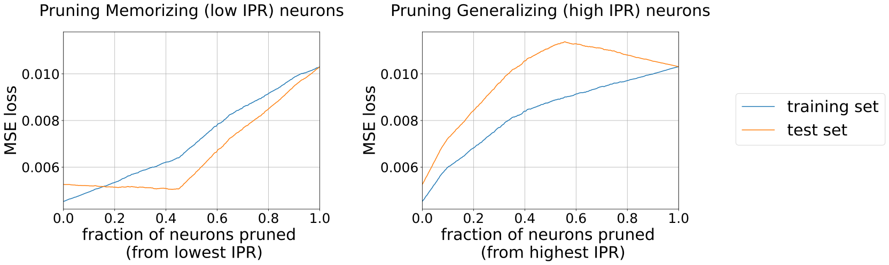

*(b) Фаза *частичной инверсии* (weight decay = 5.0). (Слева) Прунинг начиная с нейронов с низким IPR: сначала удаление запоминающих нейронов заставляет обучающую потерю расти, а тестовую — падать. Во второй половине, когда мы начинаем удалять периодические нейроны, растут и обучающая, и тестовая потери. (Справа) Прунинг начиная с нейронов с высоким IPR: сначала и обучающая, и тестовая потери растут из-за удаления периодических нейронов. Во второй половине удаление запоминающих нейронов приводит к росту обучающей потери и падению тестовой соответственно.*

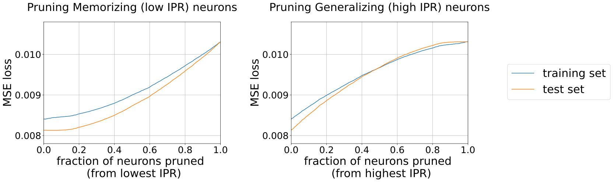

*(c) Фаза *полной инверсии* (weight decay = 15.0). (Слева) Прунинг начиная с нейронов с низким IPR монотонно увеличивает обучающую потерю, поскольку на неё влияет удаление как запоминающих, *так и* периодических нейронов. С другой стороны, тестовая потеря кратковременно остаётся постоянной (во время удаления нейронов с низким IPR), после чего монотонно возрастает. (Справа) Удаление нейронов с высоким IPR монотонно увеличивает и обучающую, и тестовую потери.*

<i>Рисунок 18: Эксперименты с прунингом во всех различных фазах ($N=500,\alpha=0.5,\xi=0.35$). Прунинг по-разному влияет на обобщение и запоминание в разных фазах, поскольку доля нейронов с высоким и низким IPR в обученных сетях зависит от фазы.</i> **[p. 22]**

## Приложение J Дополнительные кривые обучения

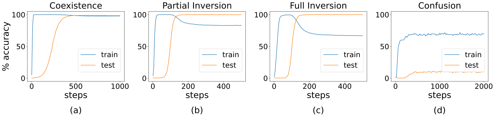

*Рисунок 19: Кривые обучения с dropout (a) dp=0.0 (b) dp=0.3 (c) dp=0.6 (d) dp=0.9* **[p. 23]**

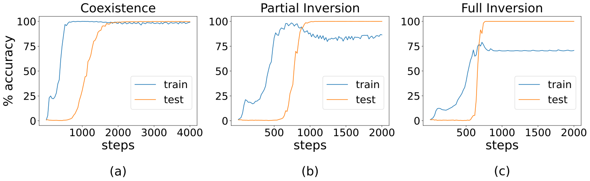

<i>Рисунок 20: Кривые обучения в различных фазах с BatchNorm. Все сети обучаются при доле порчи $\xi=0.3$ и размере батча = 64; с переменными долями данных. (a) Сосуществование ($\alpha=0.4$) (b) Частичная инверсия ($\alpha=0.5$) (c) Полная инверсия ($\alpha=0.8$)</i> **[p. 23]**

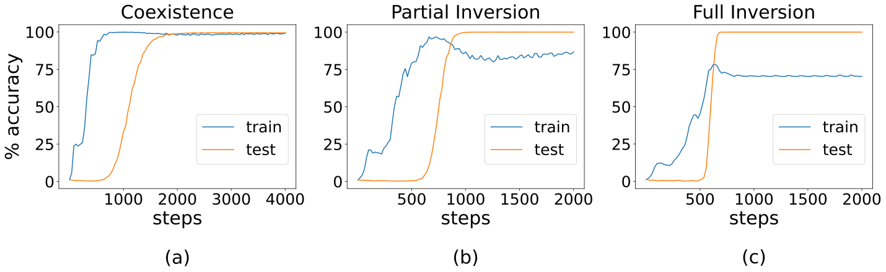

<i>Рисунок 21: Кривые обучения в различных фазах с LayerNorm. Все сети обучаются при доле порчи $\xi=0.3$ и размере батча = 64; с переменными долями данных. (a) Сосуществование ($\alpha=0.4$) (b) Частичная инверсия ($\alpha=0.5$) (c) Полная инверсия ($\alpha=0.8$)</i> **[p. 23]**

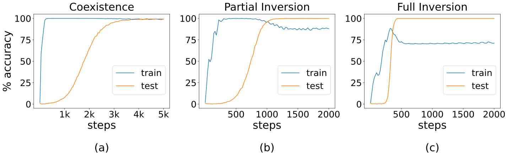

<i>Рисунок 22: Кривые обучения в различных фазах без какой-либо нормализации, но с мини-батчами. Все сети обучаются при доле порчи $\xi=0.3$ и размере батча = 64; с переменными долями данных. (a) Сосуществование ($\alpha=0.4$) (b) Частичная инверсия ($\alpha=0.5$) (c) Полная инверсия ($\alpha=0.8$)</i> **[p. 23]**

**[p. 24]**

## Приложение K Выходные логиты

Здесь мы показываем, как выглядят выходные логиты обученных сетей в различных фазах (то есть при разном количестве weight decay) на испорченных обучающих примерах. Во всех случаях мы видим два пика в логитах, соответствующие испорченной и «правильной» меткам. Их относительная величина определяет степень запоминания, а следовательно, и фазу.

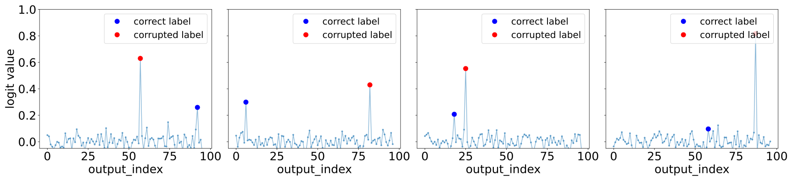

*(a) Фаза *сосуществования* (wd=0.0). Логиты, соответствующие испорченной метке, имеют более высокие значения, чем правильные, что объясняет запоминание испорченных данных в этой фазе.*

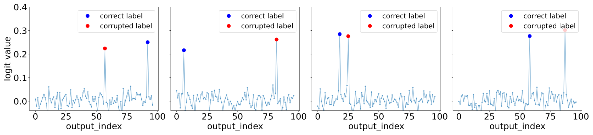

*(b) Фаза *частичной инверсии* (wd=5.0). Логиты, соответствующие испорченным меткам, имеют значения, схожие с правильными, что объясняет частичное запоминание испорченных данных в этой фазе.*

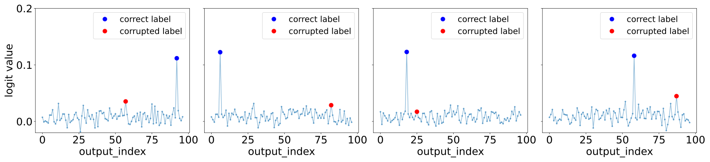

*(c) Фаза *полной инверсии* (wd=15.0). Логиты, соответствующие испорченным меткам, сильно подавлены по сравнению с правильными, что объясняет отсутствие запоминания испорченных данных в этой фазе.*

<i>Рисунок 23: Выходные логиты сети на 4 различных (испорченных) обучающих примерах, в различных фазах ($N=500,\alpha=0.5,\xi=0.35$). Синие точки соответствуют значению логита для «правильных» меток. Красные точки соответствуют значению логита для испорченных меток.</i> **[p. 24]**

**[p. 25]**

## Приложение L Подробные фазовые диаграммы

Здесь мы перестраиваем фазовые диаграммы с рисунка 3 вместе с обучающими и тестовыми точностями.

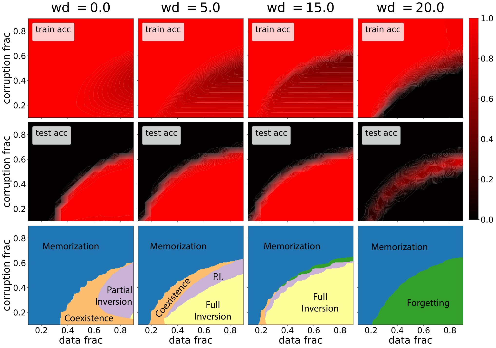

*Рисунок 24: Модульное сложение с weight decay. Первые два ряда — обучающая и тестовая точности.* **[p. 25]**

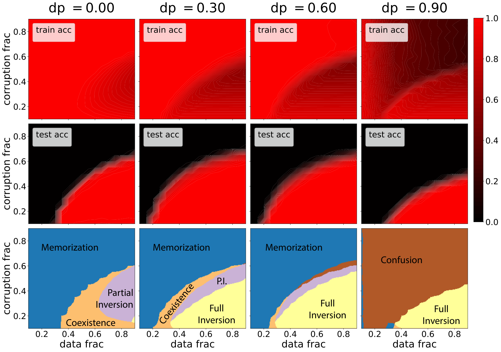

*Рисунок 25: Модульное сложение с Dropout. Первые два ряда — обучающая и тестовая точности.* **[p. 25]**

**[p. 26]**

## Приложение M Выбор функции потерь

Известно, что потеря CrossEntropy чувствительна к шуму в метках (Ghosh et al., 2017). Добавляя регуляризацию, мы восстанавливаем схожие фазовые диаграммы. Потребность в регуляризации для потери CrossEntropy гораздо выше, чем для MSE. Мы обнаруживаем, что обучение с CrossEntropy очень чувствительно к weight decay, причём *инверсия* возникает в узкой полосе значений weight decay, за пределами которой мы обнаруживаем *путаницу*. Фазы *забывания* в этом случае мы не наблюдаем. См. рисунок 26. С Dropout мы обнаруживаем, что обучению с CrossEntropy требуются очень высокие вероятности dropout, чтобы грокнуть и/или достичь *инверсии*.

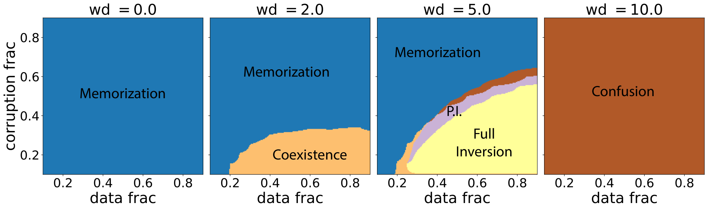

*(a) Weight decay*

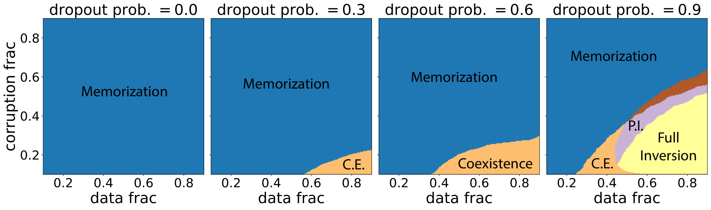

*(b) Dropout*

*Рисунок 26: Модульное сложение, обученное с потерей CrossEntropy. Устойчивость к порче меток слабее по сравнению с MSE.* **[p. 26]**

**[p. 27]**

## Приложение N Выбор функции активации

Чтобы проверить, зависит ли картина от функции активации, мы провели эксперименты с модульным сложением для 2-слойной ReLU-сети, см. рисунки 27 и 28. Потребность в регуляризации для гроккинга здесь выше, чем при квадратичной функции активации. Мы заметили, что фазовая диаграмма для weight decay ведёт себя схоже с квадратичными функциями активации, за исключением исчезновения фазы *забывания*. Dropout, по-видимому, не столь эффективен для ReLU-сетей: сеть входит в фазу *путаницы* даже при умеренных вероятностях dropout.

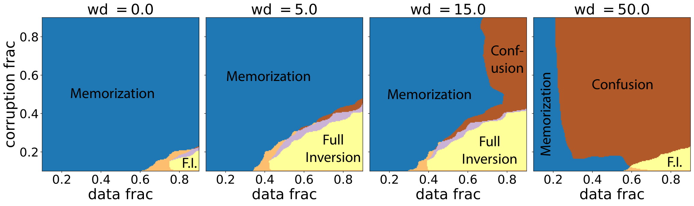

*Рисунок 27: Фазовая диаграмма с weight decay, ReLU.* **[p. 27]**

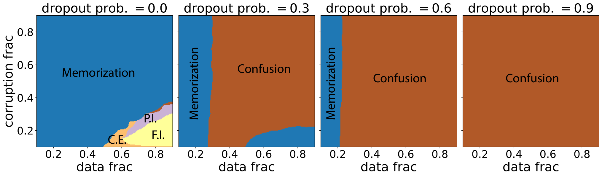

*Рисунок 28: Фазовая диаграмма с Dropout, ReLU.* **[p. 27]**

## Приложение O Влияние ширины

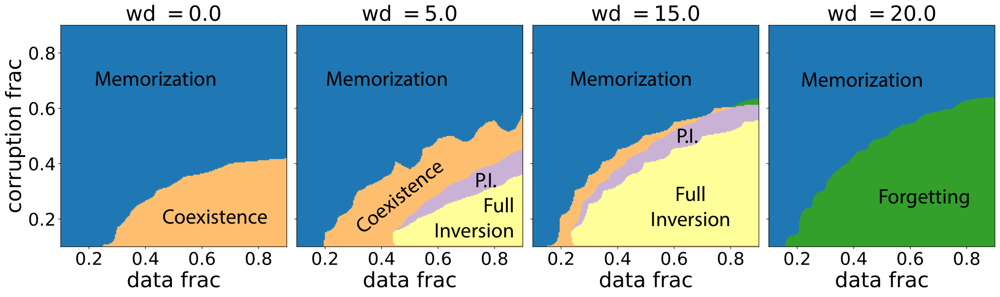

<i>Рисунок 29: Фазовая диаграмма для полносвязной сети ширины $N=5000$ с квадратичной активацией. Регуляризация посредством weight decay. По сравнению с сетью $N=500$ на рисунке 3(a), сеть обобщает незначительно хуже. Примечание: отсутствие фазы *частичной инверсии* и меньшая фаза *сосуществования* при $wd=0.0$. Это можно объяснить возросшей способностью к запоминанию из-за обилия нейронов.</i> **[p. 28]**

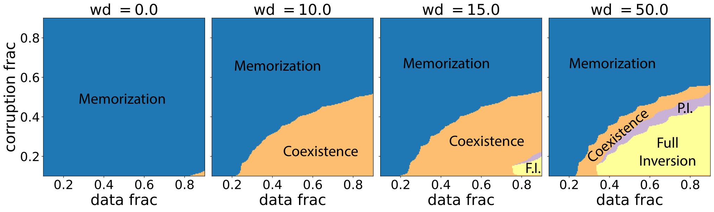

<i>Рисунок 30: Фазовая диаграмма для полносвязной сети ширины $N=5000$ с активацией ReLU. Регуляризация посредством weight decay. В этом случае качество сети резко улучшается по сравнению с $N=500$ (рисунок 27). Фаза путаницы в значительной степени устранена благодаря возросшей ёмкости сети, являющейся следствием обилия нейронов.</i> **[p. 28]**

**[p. 28]**

## Приложение P Другие датасеты модульной арифметики

В этом разделе мы проверяем, уникальна ли картина с фазовой диаграммой для модульного сложения. Мы повторяем наши эксперименты с модульным умножением ($z=(mn)\bmod p\equiv mn\mkern3mu\mkern3mu\textrm{mod}\mkern3mu\mkern3mu p$) и получаем почти идентичные фазовые диаграммы по сравнению с модульным сложением (см. рисунок 31).

*Рисунок 31: Фазовая диаграмма для модульного умножения, weight decay. Все остальные настройки идентичны рисунку 3. Отметим, что фазовая диаграмма идентична случаю модульной арифметики — что отражает схожесть алгоритмов, выученных сетью.* **[p. 28]**

**[p. 29]**

## Приложение Q Сколько нейронов можно обрезать, сохранив обобщение?

В экспериментах с прунингом (рисунки 6, 17) мы показали, что значительную долю нейронов (начиная с низкого IPR) можно обрезать без увеличения тестовой ошибки. На рисунке 32 мы показываем, сколько нейронов можно обрезать из обученной сети при различных ширинах. Мы обучаем сети с шириной от 500 до 10000; со скоростью обучения 0.005 и weight decay 1.0, с оптимизатором AdamW и потерей MSE. Мы используем испорченные данные модульного сложения с долей данных $\alpha=0.5$ и долей порчи $\xi=0.35$. Мы повторяем эксперимент 40 раз, усредняя по различным случайным зёрнам.

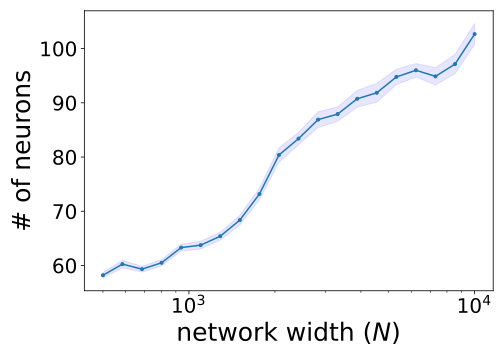

*(a) Число нейронов, требующихся после прунинга (начиная с низкого IPR), чтобы сохранить обобщение. Мы видим сублинейный рост требуемого числа нейронов с ростом ширины. затенённая область обозначает стандартную ошибку по 40 запускам.*

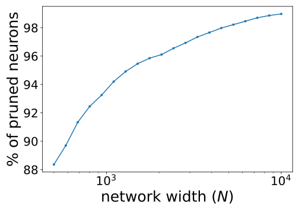

*(b) % нейронов, которые можно обрезать (начиная с низкого IPR), сохранив обобщение.*

<i>Рисунок 32: Прунинг как можно большего числа нейронов с низким IPR при сохранении обобщения, для различных ширин сети ($\alpha=0.5,\xi=0.35$). Кривые усреднены по 40 случайным зёрнам. Отметим, что оси x на обоих графиках имеют логарифмический масштаб.</i> **[p. 29]**
