# Minegishi et al. 2025 — Bridging Lottery Ticket and Grokking: Understanding Grokking from Inner Structure of Networks

См. также: [глобальный индекс понятий](../../concepts/index.md).

**Gouki Minegishi, Yusuke Iwasawa, Yutaka Matsuo** (The University of Tokyo).

arXiv [2310.19470](https://arxiv.org/abs/2310.19470), 30 октября 2023 (версия v3 — май 2025). Опубликовано в TMLR (05/2025). 5 цитирований — двадцать девятая по цитируемости работа корпуса. Источник — нативный HTML arXiv версии v3.

Оригинал и производные файлы этой папки:

- [`original/2310.19470.native.html`](original/2310.19470.native.html) — первоисточник, нативный HTML arXiv (v3), скачан как есть.
- [`original/2310.19470.bridging-lottery-ticket-and-grokking-understanding-grokking-from-inner-structure-of-networks.md`](original/2310.19470.bridging-lottery-ticket-and-grokking-understanding-grokking-from-inner-structure-of-networks.md) — конверсия оригинала в Markdown без правок содержания.
- [`images/`](images/) — 37 иллюстраций статьи в исходном разрешении.

Схема якорей и правила ссылок на карточку — в [README папки статей](../README.md).

## Затрагиваемые понятия

**[Разрежённые подсети и лотерейный билет](../../concepts/sparse-subnetwork-lottery-ticket.md)** — работа впервые связывает гипотезу лотерейного билета с гроккингом напрямую, и связь эта деятельная, а не метафорическая. Маска берётся у **уже обобщившей** сети (отсюда название «грокнувший билет»), накладывается на исходную инициализацию $\boldsymbol{\theta}_{0}$ — и обучение с нуля под этой маской приходит к генерализации почти одновременно с запоминанием ([`p5-2`](#p5-2), [`p5-3`](#p5-3), [`fig-2`](#fig-2)). Сокращается не только разность $t_{\text{gen}}-t_{\text{mem}}$, но и **отношение** $\tau_{\text{grok}}=t_{\text{gen}}/t_{\text{mem}}$, то есть дело не в общем ускорении обучения ([`p5-1`](#p5-1), [`fig-1`](#fig-1)). Существенная оговорка самих авторов: билеты, снятые **до** 25 тыс. эпох, полностью не обобщают, и их способность обобщать равна тогдашней точности базовой модели ([`p6-1`](#p6-1), [`fig-4`](#fig-4)).

**[Гроккинг](../../concepts/grokking.md)** — объяснение выстроено как отсев: различия грокнувшего билета и случайно инициализированной плотной сети разложены на три составляющие — малая норма весов, разрежённость и хорошая структура ([`p6-2`](#p6-2), [`fig-1`](#fig-1)). Две первые проверяются управляемыми опытами и отвергаются, остаётся третья ([`p7-11`](#p7-11)). Это редкая для корпуса постановка: не «вот величина, которая коррелирует», а «вот три возможные причины, две из них устранены построением».

**[Минимизация нормы весов](../../concepts/weight-norm-minimization.md)** — прямое возражение главенствующей линии корпуса. Гипотеза 1 гласит, что грокнувшие билеты просто имеют меньшую норму ([`p7-1`](#p7-1)); её проверяют, изготавливая **управляемые плотные модели** — исходные веса, помноженные на скаляр так, чтобы $L_{1}$- или $L_{2}$-норма совпала с нормой билета ([`p7-7`](#p7-7)). При одинаковой начальной норме билет обобщает много быстрее обеих ([`p7-9`](#p7-9), [`fig-5`](#fig-5)). Любопытная подробность: по $L_{2}$-норме все модели сходятся в одну «зону генерализации», а по $L_{1}$-норме — к разным значениям ([`fig-6`](#fig-6)).

**[Weight decay](../../concepts/weight-decay.md)** — переосмыслен как **исследователь структуры**, а не как средство уменьшения весов ([`p13-7`](#p13-7)). Довод приложения H: если структура уже найдена, сеть обобщается полностью **без** weight decay — при критической доле прореживания $k=0.81$, найденной перебором с шагом 0.01 ([`p24-3`](#p24-3), [`fig-17`](#fig-17)). Отсюда вывод авторов: weight decay нужен, чтобы отыскать хорошую подсеть, и становится излишним после её обнаружения.

**[Меры прогресса](../../concepts/progress-measures.md)** — предложена мера структурного сдвига: **расстояние Жаккара** между масками, снятыми на эпохах $t$ и $t+\delta t$ ($\delta t$ = 2 тыс. эпох) ([`p8-6`](#p8-6)). Наибольшее изменение маски приходится ровно на пору наибольшего роста точности на тесте (16–20 тыс. эпох), причём послойно ([`p9-1`](#p9-1), [`fig-7`](#fig-7)). Мера считается по обучающим данным и не требует тестового набора, но она **синхронна** переходу, а не предваряет его.

**[Обучение структурированным представлениям](../../concepts/structured-representation-learning.md)** — итог работы формулируется как поправка к линии «дело в качестве представлений»: хорошая структура (топология подсети) **способствует** обретению хороших представлений, то есть внутреннее устройство сети стоит в объяснении раньше представлений ([`p13-6`](#p13-6)).

**[Фурье-признаки и контуры](../../concepts/fourier-features-circuits.md)** — периодичность взята у Nanda et al. как известный признак обобщающего решения ([`p9-3`](#p9-3), [`p10-3`](#p10-3)) и превращена в измеримую величину: **фурье-энтропия** (FE) весов каждого нейрона ([`p10-5`](#p10-5)). Малая FE означает, что частоты весов мало разбросаны и сходятся к определённым ([`p11-1`](#p11-1)). Главное наблюдение: грокнувший билет приходит к периодической структуре уже на 2 тыс. эпох, тогда как базовая модель — к 30 тыс. ([`p10-4`](#p10-4), [`p11-2`](#p11-2), [`fig-8`](#fig-8)). Маски билета сами повторяют периодический узор матриц весов ([`p26-3`](#p26-3), [`fig-18`](#fig-18)), а маски приёмов прореживания при инициализации — нет ([`fig-19`](#fig-19)).

**[Спектральный разбор](../../concepts/spectral-analysis-svd-esd-fve.md)** — второй взгляд на «хорошую структуру» теоретико-графовый: взвешенный спектральный зазор, зазор Рамануджана, средняя длина пути и коэффициент кластеризации ([`p28-1`](#p28-1)). Взвешенный спектральный зазор резко растёт в фазе запоминания (веса подчинены одной главной составляющей) и сужается при переходе к генерализации ([`p11-4`](#p11-4), [`fig-9`](#fig-9)); средняя длина пути растёт, а коэффициент кластеризации убывает, и обе величины оседают в **умеренном** режиме, а не в крайности ([`p12-1`](#p12-1)).

**[Замораживание подсети](../../concepts/freezing-subnetwork.md)** — самый сильный опыт работы. Из запомнившего решения $\boldsymbol{\theta}_{\text{mem}}$ запускается edge-popup: веса **не меняются вовсе**, обучаются лишь оценки рёбер, определяющие, что оставить ([`p12-3`](#p12-3), [`p8-4`](#p8-4)). Одним прореживанием точность на тесте доходит до 0.92 ([`p13-1`](#p13-1), [`tab-1`](#tab-1)). Сочетание прореживания с weight decay даёт самый быстрый рост точности из трёх испытанных способов.

**[Механистическая интерпретируемость](../../concepts/mechanistic-interpretability.md)** — работа не разбирает механизм заново, а **наследует** разбор Nanda et al.: сеть кодирует входы в фурье-базисе и складывает их формулами сложения, отчего на верном ответе возникает конструктивная интерференция ([`p10-1`](#p10-1), [`p10-3`](#p10-3)). Собственный вклад здесь не механизм, а показ того, что этот механизм привязан к структуре подсети, а не только к значениям весов.

**[Запоминание](../../concepts/memorization-phase.md)** — определения рабочие и позиционные: $t_{\text{mem}}$ — шаг, на котором точность на обучении превышает $P$ %, $t_{\text{gen}}$ — шаг, на котором её превышает точность на тесте, $P=95$ для задач модульной арифметики ([`p5-1`](#p5-1)). Всё остальное в работе меряется отношением этих двух шагов.

**[Модульная арифметика](../../concepts/modular-arithmetic.md)** — основная постановка: $(a+b)\bmod p$ при $p=67$, 2211 пар с $a\geq b$, деление 40 % на обучение и 60 % на тест ([`p4-5`](#p4-5)); MLP из четырёх обучаемых матриц ($W_{\text{emb}}$, $W_{\text{in}}$, $W_{\text{out}}$, $W_{\text{unemb}}$) с ReLU, размерностью вложения 500 и скрытым слоем на 48 нейронов ([`p4-6`](#p4-6), [`p4-7`](#p4-7)), AdamW со скоростью $10^{-3}$ и весом weight decay $\alpha=1.0$ ([`p4-8`](#p4-8)). Доля прореживания по умолчанию $k=0.6$ ([`p5-2`](#p5-2)).

**[Разрежённая чётность](../../concepts/sparse-parity.md)** — набор задач нарочно шире модульной арифметики: помимо неё проверены многочленная регрессия и разрежённая чётность, и всюду грокнувший билет сокращает задержку ([`p5-3`](#p5-3), [`fig-2`](#fig-2)).

**[Настоящие данные](../../concepts/vision-real-world-data-mnist-cifar.md)** — MNIST заявлен в аннотации ([`p1-2`](#p1-2)), но живёт в приложении B: четырёхслойная MLP со **среднеквадратичной** потерей вслед за Liu et al., и подтверждается он лишь кривыми точности рисунка 10 ([`p19-1`](#p19-1)).

Отдельно стоит сказать, чего в работе **нет**. Нет способа получить грокнувший билет, не обучив сеть до генерализации: маска снимается с уже обобщившего решения, а более ранние билеты не работают ([`p6-1`](#p6-1)), — то есть приём объясняет гроккинг, но не ускоряет обучение на деле. Нет и объяснения, **почему** именно эта структура хороша: периодичность и свойства графа описаны, но не выведены из задачи.

Карточки статей корпуса: [Power et al. 2022](../2201.02177.grokking-generalization-beyond-overfitting-on-small-algorithmic-datasets/2201.02177.grokking-generalization-beyond-overfitting-on-small-algorithmic-datasets.card.md) — задача и явление, откуда взята постановка; [Omnigrok](../2210.01117.omnigrok-grokking-beyond-algorithmic-data/2210.01117.omnigrok-grokking-beyond-algorithmic-data.card.md) — норма весов как объяснение, которому здесь возражают; [Nanda et al. 2023](../2301.05217.progress-measures-for-grokking-via-mechanistic-interpretability/2301.05217.progress-measures-for-grokking-via-mechanistic-interpretability.card.md) — периодические представления и меры прогресса, взятые за основу; [Merrill et al. 2023](../2303.11873.a-tale-of-two-circuits-grokking-as-competition-of-sparse-and-dense-subnetworks/2303.11873.a-tale-of-two-circuits-grokking-as-competition-of-sparse-and-dense-subnetworks.card.md) — ближайшая работа о разрежённой подсети, с которой авторы себя сравнивают; [Liu et al. 2022](../2205.10343.towards-understanding-grokking-an-effective-theory-of-representation-learning/2205.10343.towards-understanding-grokking-an-effective-theory-of-representation-learning.card.md) — качество представлений как ключ; [Varma et al. 2023](../2309.02390.explaining-grokking-through-circuit-efficiency/2309.02390.explaining-grokking-through-circuit-efficiency.card.md) — конкурирующее объяснение через действенность контуров.

**[Разрежённость](../../concepts/activation-sparsity.md)** — гипотеза 2 работы поставлена проверяемо: грокнувшие билеты разрежённее базовой модели, и *именно* эта разрежённость даёт сокращение задержки ([`p7-3`](#p7-3)). Проверка честная — строятся модели с той же разрежённостью, чтобы отделить сопутствие от причины. Разрежённость и норма весов идут здесь парой как два соперничающих объяснения ([`p1-2`](#p1-2)).

**[Разброс по семенам и воспроизводимость](../../concepts/seed-variance-reproducibility.md)** — три семени названы прямо как мера воспроизводимости, а не как способ усреднить кривые ([`p20-1`](#p20-1)).
## Что показано, а что предположено

Замечания редактора карточки по итогам разбора утверждений (`…claims.txt`). Работа целиком опытная: один приём, три гипотезы, из которых две отвергнуты, и четыре набора измерений структуры.

**Устройство работы правильное, и это её главное достоинство.** Три гипотезы названы **до** опытов, и опыты ставятся так, чтобы их отвергать, а не подтверждать ([`p6-2`](#p6-2), [`p7-1`](#p7-1), [`p7-3`](#p7-3), [`p7-5`](#p7-5)). Управляемая плотная модель уравнивает норму ([`p7-7`](#p7-7)), приёмы прореживания при инициализации уравнивают разрежённость ([`p7-10`](#p7-10)) — и обе гипотезы падают. Оставшаяся гипотеза при этом получена **вычитанием**, а не проверена сама по себе: «хорошая структура» — это то, что осталось после устранения двух объяснимых различий ([`p7-11`](#p7-11)).

**Опыт с edge-popup стоит всей остальной работы.** Точность на тесте 0.92 **без единого изменения весов** ([`p13-1`](#p13-1), [`tab-1`](#tab-1)) — это довод, который трудно объяснить иначе, чем через структуру. Оговорить надо две вещи. Первая: 0.92 — не 1.00, которую даёт weight decay на той же таблице, так что «превращение запоминающей сети в обобщающую» верно с оговоркой о степени. Вторая: edge-popup **обучается** — оценки рёбер обновляются обратным распространением ([`p12-3`](#p12-3)), так что «без обновления весов» не значит «без оптимизации»; поиск структуры здесь такой же градиентный поиск, только по другим переменным.

**Синхронность структурного сдвига показана, причинность — нет.** Расстояние Жаккара всплескивает ровно тогда, когда растёт точность на тесте ([`p9-1`](#p9-1), [`fig-7`](#fig-7)), и это добротное наблюдение. Но всплеск маски и рост точности — две проекции одного события; работа нигде не вмешивается в структуру, чтобы проверить направление связи. Опыт с edge-popup ближе всего к вмешательству, однако он ставится из другой точки и на другой оптимизации.

**Величины свойств графа приведены с разбросом, превосходящим изменение.** В таблице 1 коэффициент кластеризации меняется с $0.733\pm 0.41$ до $0.719\pm 0.28$, а средняя длина пути — с $1.964\pm 0.006$ до $1.959\pm 0.001$ ([`tab-1`](#tab-1)). В обоих случаях сдвиг меньше заявленного разброса, а разброс $\pm 0.41$ у величины, лежащей в $[0,1]$ и равной 0.733, вообще трудно истолковать. Вывод «обе величины сошлись к схожим значениям» ([`p13-2`](#p13-2)) этими числами не подкреплён.

**Средняя длина пути описана в статье трояко.** Аннотация обещает **возросшую** среднюю длину пути ([`p1-2`](#p1-2)); основной текст говорит, что она растёт, а по нахождении решения **убывает** и стабилизируется ([`p12-1`](#p12-1)); приложение K говорит, что она растёт и затем просто стабилизируется. Таблица 1 при этом показывает слабое убывание. Читателю, ссылающемуся на «возросшую длину пути», стоит знать, что в самой статье это место несогласовано.

**Определение фурье-энтропии сформулировано неточно.** В формуле $FE=-\sum_{i=1}^{n}p_{i}\log p_{i}$ величина $p_{i}$ названа нормированным значением $\mathcal{F}(\omega)$, то есть индексом должна быть частота, а $n$ при этом объявлено **числом нейронов** ([`p11-1`](#p11-1), [`p10-5`](#p10-5)). В подписи к рисунку 8 та же величина названа «частотной энтропией», а в тексте — «фурье-энтропией». Наблюдение от этого не рушится (картина весов на рисунке 8 видна и без величины), но воспроизвести FE по статье нельзя.

**Порядок величин у приёмов прореживания при инициализации не разобран.** Все три (GraSP, SNIP, SynFlow) при той же разрежённости работают хуже базовой модели, а иногда и хуже случайного прореживания ([`p7-10`](#p7-10), [`fig-5`](#fig-5)). Для отклонения гипотезы 2 этого достаточно, но вывод «разрежённость ни при чём» слабее, чем «эти три способа выбрать маску плохи»: доля прореживания у них та же, а вот **что** именно прорежено — совсем не то.

**Приём по построению не может опережать обучение.** Грокнувший билет снимается с решения, уже достигшего генерализации; билеты, снятые раньше, обобщают ровно настолько, насколько к тому времени обобщила базовая модель ([`p6-1`](#p6-1), [`fig-4`](#fig-4)). Авторы этого не скрывают и подают приём как средство разбора, а не как способ ускорить обучение. Ссылаться на работу как на приём ускорения — значит приписывать ей то, чего в ней нет.

**Заявка «weight decay есть исследователь структуры» держится на одном рисунке приложения.** Утверждение вынесено в раздел обсуждения ([`p13-7`](#p13-7)), а свидетельство под ним — одна доля прореживания $k=0.81$, найденная перебором с шагом 0.01 на одной задаче ([`p24-3`](#p24-3), [`fig-17`](#fig-17)). Само наблюдение любопытное: при точно подобранной доле билет обобщается вовсе без weight decay. Но «критическая доля» здесь подобрана под желаемый исход, а не предсказана. Само приложение при этом излагает один и тот же опыт дважды, почти дословно — два абзаца до рисунка 17 и один после ([`p24-3`](#p24-3), [`p24-4`](#p24-4)).

**Воспроизводимость проверена, хотя и скромно.** Три сида для рисунков 2, 5 и опытов раздела 4.1, а также для трансформера ([`p20-1`](#p20-1), [`fig-12`](#fig-12)). Это больше, чем в среднем по корпусу, но кривые основных рисунков приведены без полос разброса.

**MNIST в аннотации весомее, чем в статье.** Задача названа среди четырёх, на которых показано сокращение задержки ([`p1-2`](#p1-2)), а обеспечена приложением B: четырёхслойная MLP со среднеквадратичной потерей и кривые точности рисунка 10 ([`p19-1`](#p19-1)). Ни разбора структуры, ни свойств графа, ни фурье-энтропии для MNIST нет — всё это сделано только для модульного сложения.

**Место в корпусе.** Работа переносит вопрос с *величин* (норма, разрежённость) на *устройство* сети и делает это опытно проверяемым способом: маска, снятая у обобщившего решения, ускоряет переход; маски той же разрежённости, но другого происхождения — нет. Самое ценное для корпуса — не сам грокнувший билет, а опыт с edge-popup: он показывает, что переход от запоминания к генерализации может произойти при **полностью неподвижных весах**. Цена — узость постановки (модульное сложение, MLP на 48 нейронов), синхронные, но не причинные измерения и заявки о свойствах графа, не подкреплённые разбросом.

## Ошибочные цитирования

Замечания редактора карточки: места, где эта статья передаёт чужие результаты с ошибкой или без авторских оговорок. Сюда ведут ссылки «подробности» из разделов «Ошибочные пересказы и цитирования этой статьи» карточек процитированных работ.

###### mc-2201-02177
**Power et al. (2201.02177) — weight decay объявлен необходимым.** Статья дважды приписывает оригинальной работе тезис о необходимости weight decay: `"The original paper (Power et al., 2022) showed that adding weight decay during training is necessary for triggering grokking"` — «оригинальная статья показала, что добавление weight decay при обучении необходимо для запуска гроккинга» — и `"the original paper (Power et al., 2022) posited that weight decay plays a pivotal role in grokking, i.e., test accuracy will not increase without weight decay"` — «…постулировала, что weight decay играет ключевую роль в гроккинге, то есть точность на тесте без него не вырастет». Оба утверждения противоречат самой цитируемой статье: её канонический график получен [на Adam вовсе без weight decay](../2201.02177.grokking-generalization-beyond-overfitting-on-small-algorithmic-datasets/2201.02177.grokking-generalization-beyond-overfitting-on-small-algorithmic-datasets.card.md#sec-a1-2), и точность на валидации на нём достигает уровня обучения — просто спустя $\sim 10^{6}$ шагов. Power et al. утверждали лишь [эффективность](../2201.02177.grokking-generalization-beyond-overfitting-on-small-algorithmic-datasets/2201.02177.grokking-generalization-beyond-overfitting-on-small-algorithmic-datasets.card.md#p2-3): weight decay «особенно эффективен для улучшения генерализации» — это про экономию данных, а не про условие существования эффекта. Вероятный источник ошибки: похожее на необходимость наблюдение в корпусе действительно есть, но у других авторов — [Nanda et al., приложение D.1](../2301.05217.progress-measures-for-grokking-via-mechanistic-interpretability/2301.05217.progress-measures-for-grokking-via-mechanistic-interpretability.card.md): в их постановке (кросс-энтропия, AdamW) без регуляризации гроккинг много медленнее, и вызвать его много труднее. Наблюдение, сделанное с оговоркой о собственной постановке, перенесено на «оригинальную статью» уже без оговорки.

###### mc-2210-01117
**Omnigrok (2210.01117) — «с кросс-энтропией без проблем».** `"In (Liu et al., 2023a), it was confirmed in the Appendix that grokking occurred without any problems, even when trying with cross-entropy"` — «в [Liu et al., 2023a] в приложении подтверждено, что гроккинг происходил без каких-либо проблем даже при кросс-энтропии». Ссылка ведёт на то самое [приложение E](../2210.01117.omnigrok-grokking-beyond-algorithmic-data/2210.01117.omnigrok-grokking-beyond-algorithmic-data.card.md#sec-e), где авторы описывают ровно проблемы: для кросс-энтропии потребовался масштаб инициализации α=100 — на два порядка больше обычного, — точность на тесте сначала выходит на плато выше случайного угадывания, и «динамика не столь чиста, как при MSE-потере»; «гроккингом» авторы называют её с оговоркой, что считают такую классификацию «всё же справедливой». «Without any problems» превращает осторожное «воспроизводится, но хуже» в безусловное подтверждение.

###### mc-2310-17247
**Miller et al. (2310.17247) — двойная подмена Merrill → Miller.** (1) `"previous works proposed possible explanations, including … sparsity of generalizing network (Miller et al., 2023)"` и (2) `"good subnetwork (grokked ticket) weights become stronger, as indicated in Miller et al. (2023)"` — оба тезиса принадлежат [Merrill et al.](../2303.11873.a-tale-of-two-circuits-grokking-as-competition-of-sparse-and-dense-subnetworks/2303.11873.a-tale-of-two-circuits-grokking-as-competition-of-sparse-and-dense-subnetworks.card.md), которых та же статья в другом месте цитирует правильно (n−k parity, возникновение разреженной подсети). У Miller ничего об усилении весов подсетей нет: [работа расширяет круг моделей — гауссовы процессы, линейная регрессия, байесова нейросеть](../2310.17247.grokking-beyond-neural-networks-an-empirical-exploration-with-model-complexity/2310.17247.grokking-beyond-neural-networks-an-empirical-exploration-with-model-complexity.card.md#p1-1), а тезис о разреженности лишь пересказывает со ссылкой на первоисточник. Обе содержательные ссылки на Miller в статье оказались ошибочными — классическая коллизия похожих фамилий.

---

# Текст статьи

## Аннотация

###### p1-2

Гроккинг — занимательное явление *отложенной генерализации*, при котором нейронные сети сперва запоминают обучающие данные с безупречной точностью, но обобщают плохо, а затем, при продолжении обучения, переходят к обобщающему решению. Хотя для объяснения этой задержки предлагались такие множители, как нормы весов и разрежённость, **влияние устройства сети** остаётся мало изученным. В этой работе мы связываем явление гроккинга с гипотезой лотерейного билета, чтобы исследовать влияние внутреннего устройства сети. Мы показываем, что применение лотерейных билетов, полученных в обобщающей фазе (мы называем их *грокнувшими билетами*), значительно сокращает отложенную генерализацию в разных задачах, включая несколько операций модульной арифметики, многочленную регрессию, разрежённую чётность и классификацию MNIST. Управляемыми опытами мы показываем, что смягчение отложенной генерализации вызвано не одним лишь снижением нормы весов и не ростом разрежённости, а обнаружением хороших подсетей. Более того, мы находим, что грокнувшие билеты обнаруживают периодические образцы весов, полезные свойства графа — возросшую среднюю длину пути и сниженный коэффициент кластеризации — и претерпевают быстрые структурные изменения, совпадающие с улучшением генерализации. К тому же приёмы прореживания вроде алгоритма edge-popup способны найти эти действенные структуры, не меняя весов, и тем самым превратить запоминающую сеть в обобщающую. Эти результаты подчёркивают новое наблюдение: обследование структур играет решающую роль в понимании гроккинга.

## 1 Введение

Понимание механизма генерализации — центральный вопрос в объяснении действенности нейронных сетей. Недавно Power et al. (2022) открыли занимательное явление *отложенной генерализации (гроккинга)*: нейронные сети сперва приходят к *запоминающей сети* $C_{\text{mem}}$ с безупречной точностью на обучении, но плохой генерализацией, а при дальнейшем обучении решение переходит к *обобщающей сети* $C_{\text{gen}}$. Это явление, противоречащее привычным ожиданиям машинного обучения, изучается ради ответа на вопрос: *что лежит в основе перехода от запоминания к генерализации?* (Liu et al., 2022; 2023a)

Что до связи генерализации с глубоким обучением вообще, хорошо известно, что *устройство сетей* существенно сказывается на качестве генерализации. Например, качество распознавания изображений сильно выросло благодаря устройству свёртки (Krizhevsky et al., 2012). Более того, как показано в Neyshabur (2020), добавление $\beta$-Lasso-регуляризации в полносвязные MLP способствует возникновению локальности, напоминающей строение свёрточных сетей, и ведёт к росту качества на задачах с изображениями. С несколько иной стороны, Frankle & Carbin (2019) предложили гипотезу лотерейного билета (LTH), по которой хорошие подсети (хорошее устройство) помогают достичь лучшего качества при лучшей выборочной эффективности (Zhang et al., 2021). Кроме того, Ramanujan et al. (2020) показывают, что одно лишь обследование структур способно дать качество, сравнимое с обновлением весов, откуда следует, что хороших подсетей достаточно для обобщающего качест**[p. 2]**ва.

Хотя важность устройства известна вообще, его связь с явлением гроккинга изучена недостаточно. Схоже с нашим исследованием, несколько прежних работ связывают гроккинг со свойствами сетей — например, с нормой весов и разрежённостью. Так, Liu et al. (2023a) опытным путём подтвердили, что у обобщающих решений норма меньше, чем у запоминающих. Исходная работа (Power et al., 2022) показала, что добавление weight decay при обучении необходимо, чтобы запустить гроккинг. Однако наша работа отличается от них тем, что обсуждает связь гроккинга с процессом обнаружения хороших структур (то есть подсетей), а не с одним лишь снижением нормы весов.

###### fig-1

*Рисунок 1: (Слева) Точность плотной модели и лотерейного билета, полученного на обобщающем решении (грокнувшего билета). При использовании лотерейного билета (хороших подсетей) точность на обучении и на тесте растёт почти одинаково, то есть время от запоминания ($t_{\text{mem}}$) до генерализации ($t_{\text{gen}}$) значительно сократилось. Отметим, что улучшается значительно не только разность ($t_{\text{gen}}-t_{\text{mem}}$), но и отношение ($t_{\text{gen}}/t_{\text{mem}}$), а значит, дело не просто в более быстром обучении. (Справа) Три гипотезы о том, почему лотерейный билет сокращает отложенную генерализацию. Мы показываем, что дело не в снижении нормы весов и не в росте разрежённости, а в обнаружении *хорошей структуры*.* **[p. 2]**

Чтобы исследовать роль устройства в явлении гроккинга, мы сперва показываем, что при использовании лотерейного билета, полученного на обобщающем решении (мы называем его грокнувшим билетом), отложенная генерализация значительно сокращается. Рисунок 1 (слева) показывает, что с грокнувшими билетами точность на обучении и на тесте растёт почти одновременно, в отличие от случайно инициализированных плотных сетей, где отложенная генерализация происходит. Как будет показано ниже, этот результат связан с долей прореживания: при подобающей доле задержка меньше. Мы провели дальнейшие опыты с нескольких сторон, чтобы понять, почему с грокнувшими билетами отложенная генерализация значительно сокращается. Сперва, как показано на рисунке 1 (справа), мы раскладываем различия между грокнувшим билетом и случайно инициализированной плотной сетью на три составляющие: (1) малые нормы весов, (2) разрежённость и (3) хорошая структура. Мы исследуем, какая из них даёт значительное сокращение отложенной генерализации. Что до (1) нормы весов, мы находим, что плотные сети с той же начальной нормой, что у грокнувшего билета, быстрее не обобщают, а значит, норма весов *не* причина. Что до (2) разрежённости, сети того же размера по числу параметров, полученные известными приёмами прореживания (Wang et al., 2019; Lee et al., 2019; Tanaka et al., 2020), тоже быстрее не обобщают, а значит, разрежённость *не* причина. Отсюда следует, что для понимания гроккинга существенна (3) хорошая структура.

Опираясь на эти находки, мы глубже разбираем природу и роль этих структурных свойств в явлении гроккинга. А именно, мы исследуем несколько ключевых сторон. Во-первых, чтобы выяснить, согласовано ли обретение структуры с улучшением качества генерализации, мы берём расстояние Жаккара (Jaccard, 1901) как меру структурного расстояния. Наш разбор показывает, что устройство подсети быстро меняется при переходе от запоминания к генерализации. Эта быстрая структурная перестройка согласована с улучшением качества генерализации. **[p. 3]** Во-вторых, мы рассматриваем и теоретико-графовые свойства, включая возросшую среднюю длину пути и сниженный коэффициент кластеризации, и периодическую природу задачи модульного сложения (Nanda et al., 2023). Мы находим, что полезные свойства графа возникают и тесно совпадают с улучшением генерализации, а модель пользуется присущей задаче периодичностью, чтобы найти внутренне хорошо устроенные подсети, пригодные для лучшей генерализации. Наконец, опираясь на наши результаты о том, что обследование структур решающе для гроккинга, мы показываем, что прореживание способствует генерализации. Мы применяем алгоритм edge-popup (Ramanujan et al., 2020), чтобы найти хорошую структуру, не меняя весов. Наши опыты показывают, что запоминающую сеть можно перевести в обобщающую прореживанием без обновления весов, что подкрепляет наше утверждение: отложенная генерализация происходит из-за обнаружения хорошей структуры.

Итог наших вкладов таков:

- **Связь лотерейных билетов и гроккинга** (раздел 3): мы исследуем роль внутреннего устройства (подсетей) в процессе гроккинга, связывая лотерейные билеты с отложенной генерализацией. Наши результаты показывают, что применение лотерейных билетов значительно сокращает отложенную генерализацию, что подчёркивает важность подсетей для действенной генерализации. - **Разделение свойств лотерейных билетов** (раздел 4): мы систематически разделяем внутренние свойства лотерейных билетов на три составляющие: (1) норма весов, (2) разрежённость и (3) хорошая структура. Рядом управляемых опытов мы показываем, что ни норма весов, ни разрежённость по отдельности сокращения отложенной генерализации не объясняют. Решающим оказывается обнаружение хорошего структурного устройства внутри сети. - **Понимание свойств хорошей структуры** (раздел 5): мы глубже разбираем природу полезных структур, найденных лотерейными билетами. Наши находки обнаруживают, что грокнувшие билеты имеют периодические представления весов и претерпевают быстрые структурные изменения, согласованные с улучшением качества генерализации. Более того, мы показываем, что приёмы прореживания вроде алгоритма edge-popup способны найти эти действенные структуры, не меняя весов, и тем самым превратить запоминающую сеть в обобщающую.

## 2 Предварительные сведения

**Гроккинг** — явление, при котором генерализация наступает много позже переобучения на обучающих данных (как показано на рисунке 1 слева). Явление впервые наблюдалось в задаче модульного сложения ($(a+b)\bmod p$ при $a,b\in(0,\cdots,p-1)$), и то же явление наблюдалось на более сложных наборах данных, охватывающих модульную арифметику (Gromov, 2023; Davies et al., 2023; Rubin et al., 2023; Stander et al., 2023; Furuta et al., 2024), смысловой разбор (Liu et al., 2023a), n-k-чётность (Merrill et al., 2023), многочленную регрессию (Kumar et al., 2023), иерархические задачи (Murty et al., 2023) и классификацию изображений (Liu et al., 2023a; Radhakrishnan et al., 2022). Эта статья сосредоточена главным образом на гроккинге в задачах модульной арифметики, обычных для прежних исследований.

Для объяснения гроккинга прежние работы предлагали разные механизмы: механизм рогатки (Thilak et al., 2022), случайное блуждание среди минимумов (Millidge, 2022), образование хорошего представления (Liu et al., 2022), масштаб нормы весов (Liu et al., 2023a; Varma et al., 2023), простоту фурье-признаков (Nanda et al., 2023) и разрежённость обобщающей сети (Miller et al., 2023).

Среди них одно из главенствующих объяснений того, как сеть меняется в ходе гроккинга, — простота обобщающего решения, и прежде всего нормы весов $\|\boldsymbol{\theta}\|_{2}$. Так, исходная работа (Power et al., 2022) полагала, что weight decay играет ключевую роль в гроккинге: без него точность на тесте не растёт. Liu et al. (2023a) разобрали ландшафты потерь на обучающем и тестовом наборах и подтвердили, что гроккинг происходит при входе в зону генерализации, заданную L2-нормой, у моделей с большими начальными значениями $\boldsymbol{\theta}_{0}$. Позднее Varma et al. (2023) показали, что обобщающее решение способно давать более высокие логиты при меньших нормах весов. В этой статье мы рассматриваем изменения устройства сети и показываем, что сеть не просто снижает свои общие нормы весов, а ищет внутри себя хорошие структуры.

**[p. 4]**

Несколько работ выдвигали мысль, что ключ к пониманию гроккинга — обретение хороших представлений. Так, Power et al. (2022); Liu et al. (2022) объяснили, что топология идеальных вложений в задачах модульного сложения стремится к окружностям или цилиндрам. Nanda et al. (2023) выделили тригонометрический алгоритм, которым сети решают модульное сложение после гроккинга, и показали, что он нарастает в ходе обучения плавно. Gromov (2023) привёл аналитическое решение для представлений при обучении модульному сложению на MLP. Zhong et al. (2023), взяв модульное сложение как образцовую задачу, показывают, что открытие алгоритма в нейронных сетях порой сложнее. Эти исследования поддерживают качество представления как ключ к различению запоминающих и обобщающих сетей; однако они не объясняют, что происходит внутри устройства сети.

**Гипотеза лотерейного билета**, предложенная Frankle & Carbin (2019), привлекла внимание как объяснение того, почему переопараметризованные нейронные сети обладают способностью обобщать (Allen-Zhu et al., 2019). Неформально гипотеза лотерейного билета гласит, что случайно инициализированные переопараметризованные сети содержат разрежённые подсети, достигающие хорошего качества после обучения, и что существование таких подсетей — ключ к хорошей генерализации в глубоких нейронных сетях. Поначалу это утверждение было показано опытом, но позднее получило и теоретические основания (Frankle et al., 2020; Sakamoto & Sato, 2022). Более формально процедура состоит из следующих шагов:

1. Инициализировать плотную сеть $f_{\boldsymbol{\theta_{0}}}$ и обучать её $t$ эпох, получив веса $\boldsymbol{\theta_{t}}$. 2. Прорядить обученную сеть на $k\%$ по абсолютным значениям $|\boldsymbol{\theta_{t}}|$. Эта процедура, известная как прореживание по величине, даёт маску $\boldsymbol{m}_{t}^{k}\in\{0,1\}^{|\boldsymbol{\theta_{t}}|}$. 3. Вернуть веса сети к начальным значениям $\boldsymbol{\theta_{0}}$ и получить подсеть $f_{\boldsymbol{\theta_{0}}\odot\boldsymbol{m}_{t}^{k}}$ — *лотерейный билет*. Обучать эту подсеть $t^{\prime}$ эпох и получить $f_{\boldsymbol{\theta^{\prime}_{t^{\prime}}}\odot\boldsymbol{m}_{t}^{k}}$.

После открытия лотерейных билетов Ramanujan et al. (2020) показали, что существуют **сильные лотерейные билеты**, достигающие хорошего качества без обновления весов. Они применяют алгоритм **edge-popup** (Ramanujan et al., 2020), отбирающий подсети по оценке $\boldsymbol{s}~{}(\boldsymbol{s}\in\mathbb{R}^{|\boldsymbol{\theta_{0}}|})$. Иначе говоря, при прореживании доли $k$ весов из данных весов $\boldsymbol{\theta}_{0}$ модель предсказывает, пользуясь при прямом проходе рёбрами с наибольшими $(1-k)$ оценками. Подробное описание edge-popup — в приложении A. В разделе 5 мы применяем edge-popup, чтобы проверить, способно ли прореживание послужить силой, ускоряющей процесс гроккинга.

## 3 Лотерейные билеты значительно сокращают отложенную генерализацию

### 3.1 Постановка эксперимента

###### p4-5

Вслед за Power et al. (2022) и другой литературой о гроккинге (Nakkiran et al., 2019; Liu et al., 2022; Gromov, 2023; Liu et al., 2023a) мы построили набор данных из равенств вида $(a+b)\%p=c$. Задача состоит в предсказании $c$ по паре $a$ и $b$. Наша постановка такова: $p=67$, $0\leq a,b,c<p$. Размер набора 2211 при учёте всех пар с $a\geq b$. Мы делим его на обучение (40 %) и тест (60 %) вслед за Liu et al. (2022).

###### p4-6

Вслед за Liu et al. (2022) мы строим MLP так. Сперва мы отображаем one-hot кодировку $\boldsymbol{a}$, $\boldsymbol{b}$ весами вложения $W_{\text{emb}}$: $\boldsymbol{E}_{a}=W_{\text{emb}}\boldsymbol{a},\boldsymbol{E}_{b}=W_{\text{emb}}\boldsymbol{b}$. Затем подаём вложения $\boldsymbol{E}_{a}$ и $\boldsymbol{E}_{b}$ в MLP:

$$
\mathrm{softmax}(\sigma((\boldsymbol{E}_{a}+\boldsymbol{E}_{b})W_{\text{in}})W_{\text{out}}W_{\text{unemb}}) \tag{1}
$$

###### p4-7

где $W_{\text{emb}}$, $W_{\text{in}}$, $W_{\text{out}}$ и $W_{\text{unemb}}$ — обучаемые параметры, а $\sigma$ — функция активации ReLU (Nair & Hinton, 2010). Размерность пространства вложений равна 500, а $W_{\text{in}}$ проецирует в 48 нейронов.

###### p4-8

Вслед за Nanda et al. (2023) мы применяем оптимизатор AdamW (Loshchilov & Hutter, 2019) со скоростью обучения $10^{-3}$, весом weight decay $\alpha=1.0$, $\beta_{1}=0.9$ и $\beta_{2}=0.98$. Веса инициализируются как $\boldsymbol{\theta}_{0}\sim\mathcal{N}(0,\kappa/\sqrt{d_{\text{in}}})$, где $d_{\text{in}}$ — размерность слоя, предшествующего каждому весу. Если не оговорено иное, полагаем $\kappa=1$. Пусть у нас есть обучающий набор $\mathbb{S}_{\text{train}}$ и тестовый $\mathbb{S}_{\text{test}}$, и мы обучаем нейронную сеть $f(\boldsymbol{x};\boldsymbol{\theta})$, где $\boldsymbol{x}$ — вход, а $\boldsymbol{\theta}$ — весовые параметры сети. **[p. 5]** А именно, сеть обучается AdamW по перекрёстно-энтропийной потере с weight decay (L2-норма весов $\|\boldsymbol{\theta}\|_{2}$):

$$
\underset{{\boldsymbol{\theta}}}{\operatorname{argmin}}~{}\mathbb{E}_{(\boldsymbol{x},y)\sim\boldsymbol{S}}\left[\mathcal{L}(f(\boldsymbol{x};\boldsymbol{\theta}),y)+\frac{\alpha}{2}\|\boldsymbol{\theta}\|_{2}\right].
$$

###### p5-1

Чтобы количественно измерить, насколько сокращается отложенная генерализация, мы определяем $t_{\text{mem}}$ как шаг, на котором точность на обучении превосходит $P$ %, и $t_{\text{gen}}$ как шаг, на котором $P$ % превосходит точность на тесте. Вслед за Kumar et al. (2024) для задач модульной арифметики мы берём $P=95$. Для измерения ускорения мы пользуемся величиной $\tau_{\text{grok}}=t_{\text{gen}}/t_{\text{mem}}$.

###### p5-2

Мы сравнили качество 1) плотных сетей $f_{\boldsymbol{\theta_{t^{\prime}}}}$ и 2) обученных лотерейных билетов $f_{\boldsymbol{\theta^{\prime}_{t^{\prime}}}\odot\boldsymbol{m}_{t}^{k}}$, где $t^{\prime}$ — эпоха обучения для получения итоговой оценки, $t$ — момент прореживания, а $k$ — доля прореживания. Как особый случай, при $t\geq t_{\text{gen}}$ мы называем подсети **грокнувшими билетами**. Мы проверили разные $t$ и $k$ и исследовали, как они меняют скорость генерализации. По умолчанию мы брали $k=0.6$.

### 3.2 Результаты

*(a) Модульное сложение на MLP*

*(b) Модульное сложение на трансформере*

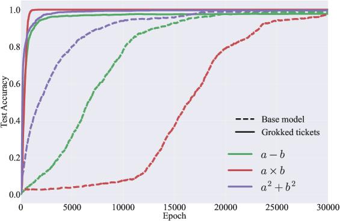

*(c) Модульная арифметика на MLP*

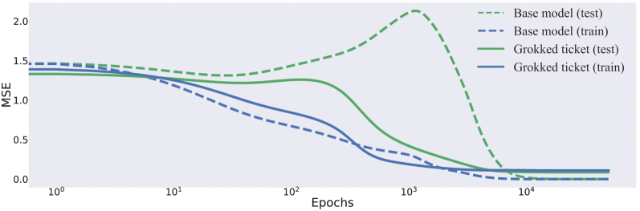

*(d) Многочленная регрессия на MLP*

*(e) Точность на разрежённой чётности с MLP*

###### fig-2

*Рисунок 2: Сравнение скорости гроккинга плотных сетей и грокнувших билетов в разных постановках. (a) Модульное сложение на MLP, (b) модульное сложение на трансформере и (c) прочие задачи модульной арифметики (различаются цветом), а также опыты помимо модульной арифметики: (d) потеря на многочленной регрессии, (e) точность на разрежённой чётности. Пунктирная линия отвечает точности базовой модели, сплошная — точности грокнувших билетов. Во всех постановках время до генерализации ($t_{\text{gen}}$) с грокнувшими билетами сокращается.* **[p. 5]**

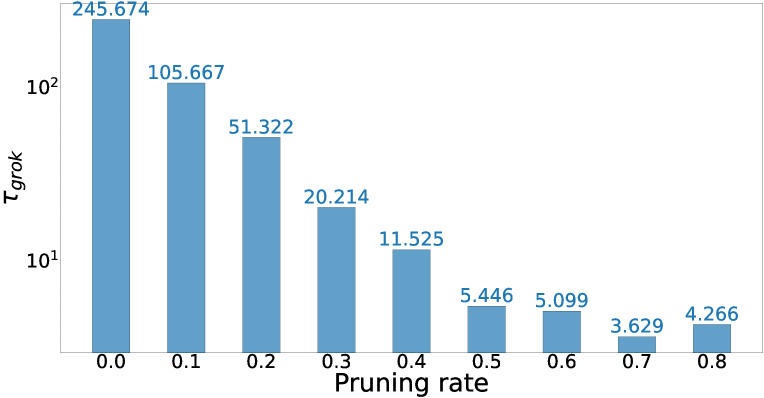

*(a) Доля прореживания и $\tau_{\mathrm{grok}}$ (логарифмическая шкала)*

*(b) Точность на обучении при разных долях прореживания*

*Рисунок 3: Количественное сравнение скорости гроккинга при разных долях прореживания. Отметим, что доля прореживания 0.0 отвечает плотной сети. Определение $\tau_{\text{grok}}$ дано в подразделе 3.1.* **[p. 6]**

*(a) Разные моменты прореживания $t$: $\boldsymbol{m}_{{\color[rgb]{1,0,0}\definecolor[named]{pgfstrokecolor}{rgb}{1,0,0}t}}^{k}$*

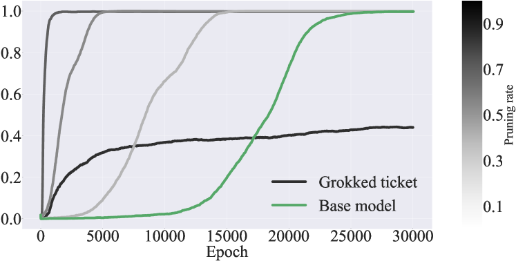

*(b) Разные доли прореживания $k$: $\boldsymbol{m}_{t}^{{\color[rgb]{0,0,1}\definecolor[named]{pgfstrokecolor}{rgb}{0,0,1}k}}$*

###### fig-4

*Рисунок 4: (a) Сравнение точности на тесте при разных эпохах $t$, на которых берутся лотерейные билеты. Мы брали их каждые 2 тыс. эпох. Билеты, полученные до 25 тыс. эпох (не грокнувшие билеты), полностью не обобщают. Более того, эта способность обобщать отвечает точности базовой модели на тесте. Билеты, полученные после 25 тыс. эпох (грокнувшие билеты), сокращают отложенную генерализацию. (b) Влияние доли прореживания $k$ на грокнувшие билеты. Мы брали шаг 0.2. Большинство долей (0.1, 0.3, 0.5 и 0.7) ускоряют генерализацию, а значит, приведённое наблюдение не сильно зависит от выбора доли прореживания.* **[p. 6]**

###### p5-3

Рисунок 2(a) приводит точность на тесте грокнувшего билета и базовой модели в задаче модульного сложения. Базовой моделью мы называем плотную модель, обученную из случайных начальных значений. У грокнувшего билета точность на тесте растёт почти одновременно с ростом точности базовой модели на обучении. На рисунке 2(b), в опытах с трансформерами, результат тоже показывает, что грокнувшие билеты дают меньшую задержку генерализации. Вслед за Power et al. (2022) мы провели опыты на разных задачах модульной арифметики, чтобы показать устранение отложенной генерализации. Рисунок 2(c) приводит сравнение базовой модели (пунктир) и грокнувшего билета (сплошная линия) на разных задачах модульной арифметики. Более того, вслед за Kumar et al. (2023); Pearce et al. (2023) мы показываем, что грокнувший билет сокращает отложенную генерализацию и в задачах многочленной регрессии, и на разрежённой чётности — рисунок 2(d, e). Результаты показывают, что грокнувшие билеты значительно сокращают отложенную генерализацию и на разных задачах. Подробное изложение постановки опытов — в приложении B.

Рисунок 3(a) количественно выражает связь доли прореживания с $\tau_{\text{grok}}=t_{\text{gen}}/t_{\text{mem}}$ (логарифмическая шкала). При доле прореживания 0.7 величина $\tau_{\text{grok}}$ достигает наименьшего значения, что указывает: грокнувший билет значительно сокращает отложенную **[p. 6]** генерализацию. Отметим, что, как показано на рисунке 3(b), при большей доле прореживания $t_{\text{mem}}$ *отодвигается*, а значит, грокнувшие билеты не просто ускоряют всё обучение, а именно ускоряют переход от запоминания к генерализации.

###### p6-1

На рисунке 4(a) мы сравниваем точность на тесте при разных эпохах $t$, на которых берутся лотерейные билеты. Результаты показывают, что билеты, полученные до 25 тыс. эпох (не грокнувшие билеты), полностью не обобщают. Более того, эта способность обобщать отвечает точности базовой модели на тесте. Билеты же, полученные после 25 тыс. эпох (грокнувшие билеты), достигают безупречной генерализации и сокращают отложенную генерализацию. На рисунке 4(b) мы исследуем влияние доли прореживания в грокнувшем билете: если она слишком велика (например, 0.9), обобщения не происходит; если слишком мала (например, 0.3), обобщение наступает недостаточно быстро.

## 4 Разделение лотерейного билета: норма, разрежённость и структура

###### p6-2

В разделе 3 мы установили, что *грокнувшие билеты* — подсети, извлечённые в момент наступления генерализации, — значительно сокращают явление отложенной генерализации. Хотя эти результаты убедительно указывают, что за быстрый переход к генерализации отвечает некоторое внутреннее свойство грокнувших билетов, пока неясно, какое именно. Напомним из рисунка 2, что грокнувший билет способен резко сократить отложенную генерализацию по сравнению с базовой моделью (плотной сетью, обученной с нуля). Чтобы понять ключевой множитель этого действия, мы рассматриваем три гипотезы, изображённые на рисунке 1 (справа):

**[p. 7]**

###### p7-1

**Гипотеза 1 (норма весов):** *у грокнувших билетов норма весов меньше, чем у базовой модели, и именно это снижение нормы даёт сокращение отложенной генерализации.*

В разделе 4.1 мы проверяем гипотезу 1, подготовив плотную модель с теми же нормами весов, что у грокнувшего билета. Если эти модели при одинаковых нормах показывают разную скорость генерализации, значит, одна норма весов сокращения отложенной генерализации не объясняет. Следовательно, гипотеза 1 отвергается.

###### p7-3

**Гипотеза 2 (разрежённость):** *грокнувшие билеты — более разрежённые подсети по сравнению с базовой моделью, и именно эта бо́льшая разрежённость даёт сокращение отложенной генерализации.*

В разделе 4.2 мы проверяем гипотезу 2, строя модели с той же разрежённостью, что у грокнувшего билета. Если эти столь же разрежённые модели сокращения отложенной генерализации не показывают, значит, одна разрежённость за него не отвечает. Стало быть, гипотеза 2 отвергается.

###### p7-5

**Гипотеза 3 (хорошая структура):** *помимо различий в норме весов и разрежённости, грокнувшие билеты обладают лучшим структурным устройством, которое напрямую ускоряет генерализацию.*

Если обе гипотезы, 1 и 2, отвергнуты, то единственным оставшимся объяснением будет то, что сокращение отложенной генерализации даёт *хорошая структура*, присущая грокнувшим билетам.

### 4.1 Управление нормой весов начальной сети

###### p7-7

Чтобы проверить гипотезу 1, мы подготовили две плотные модели с теми же L2- и L1-нормами, что у грокнувшего билета; мы называем их «управляемыми плотными моделями». Такие модели получаются так:

1. Получить лотерейные билеты после полной генерализации $\boldsymbol{m}_{t_{\text{gen}}}^{k}$. 2. Найти отношение $L_{p}$-норм весов $r_{p}=\frac{\|\boldsymbol{\theta}_{0}\odot\boldsymbol{m}_{t_{\text{gen}}}^{k}\|_{p}}{\|\boldsymbol{\theta}_{0}\|_{p}}$. 3. Построить веса $\boldsymbol{\theta}_{0}\cdot r_{p}$ с той же $L_{p}$-нормой, что у грокнувшего билета.

###### p7-9

Рисунок 5(a) приводит точность на тесте базовой модели, грокнувшего билета и управляемых плотных моделей. Несмотря на одинаковые начальные нормы весов, грокнувший билет приходит к генерализации намного быстрее обеих управляемых плотных моделей. Этот результат указывает, что отложенный рост точности на тесте вызван не нормами весов, а обнаружением хорошей структуры. Слева на рисунке 6 приведена динамика L2-норм для каждой модели. Как и у Liu et al. (2023b), L2-нормы убывают в соответствии с ростом точности на тесте, сходясь к «зоне генерализации». Однако, как показано справа на рисунке 6, точки окончательной сходимости L1-норм у моделей различаются. Это явление — схожие L2-нормы при меньших L1-нормах — указывает, что веса хорошей подсети (грокнувшего билета) становятся сильнее, как отмечено в Miller et al. (2023). Схожие результаты наблюдались и на трансформере (рисунок 16). Эти результаты показывают, что одной нормы весов недостаточно, чтобы объяснить гроккинг, и опровергают гипотезу 1.

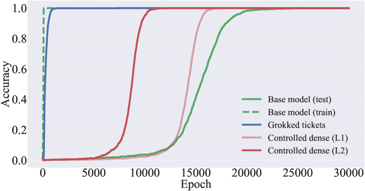

*(a) Управление начальными нормами весов (L1 и L2)*

*(b) Управление разрежённостью прореживанием при инициализации*

###### fig-5

*Рисунок 5: (a) Динамика точности на тесте у базовой модели, грокнувшего билета и управляемой плотной модели (L1- и L2-норма). Грокнувший билет приходит к генерализации намного быстрее прочих моделей. (b) Сравнение точности на тесте у разных приёмов прореживания. Все приёмы прореживания при инициализации работают хуже базовой модели, а порой и хуже случайного прореживания. Эти результаты указывают, что причиной отложенной генерализации не является ни норма весов, *ни* разрежённость сама по себе.* **[p. 8]**

###### fig-6

*Рисунок 6: (Слева) Динамика L2-нормы у базовой модели, грокнувшего билета и управляемой плотной модели. (Справа) Динамика L1-нормы у тех же моделей. Со стороны L2-нормы все модели, кажется, сходятся к схожему решению («зоне генерализации»). Однако со стороны L1-норм они сходятся к разным значениям.* **[p. 8]**

### 4.2 Управление разрежённостью

###### p7-10

Далее мы проверяем гипотезу 2, полагающую, что бо́льшая разрежённость грокнувших билетов и объясняет сокращение отложенной генерализации. Чтобы это исследовать, мы сравнили модели с той же разрежённостью, что у грокнувшего билета, полученные разными приёмами прореживания при инициализации (PaI). А именно, мы проверили три известных приёма PaI — GraSP (Wang et al., 2020), SNIP (Lee et al., 2019) и SynFlow (Tanaka et al., 2020) — наряду со случайным прореживанием как базовым. Подробности о каждом приёме — в приложении D. Рисунок 5(b) сравнивает ход точности на тесте у этих приёмов PaI и у грокнувшего билета. Результаты показывают, что все приёмы PaI работают хуже базовой модели, а порой и хуже случайного прореживания. Отсюда следует, что одна разрежённость сокращения отложенной генерализации не объясняет, и гипотеза 2 отвергается.

###### p7-11

После отклонения гипотез 1 и 2 остаётся лишь гипотеза 3: ключевое различие должно состоять в хорошей структуре грокнувших билетов, позволяющей им быстро обобщать и тем самым сокращать пору отложенной генерализации.

**[p. 8]**

## 5 Понимание гроккинга через внутреннее устройство сетей

В разделе 4 мы показали, что норма весов и разрежённость недостаточны как объяснения отложенной генерализации. Вместо этого мы полагаем, что для понимания гроккинга существенна хорошая структура. Опираясь на эти результаты, этот раздел глубже разбирает природу и роль структурных свойств в гроккинге. А именно, мы исследуем следующие стороны:

**Согласовано ли обретение структуры с улучшением качества генерализации?** (подраздел 5.1)

**Что именно составляет хорошую структуру?** (подраздел 5.2)

###### p8-4

**Достижима ли генерализация одним лишь обследованием структур (прореживанием) без обновления весов?** (подраздел 5.3)

### 5.1 Мера прогресса: структурный сдвиг улавливает момент генерализации

В этом разделе мы проводим более строгий разбор того, как обретается хорошая структура, и показываем, что её обнаружение отвечает росту точности на тесте.

###### p8-6

Сперва мы предлагаем меру структурных изменений сети, названную *расстоянием Жаккара* (JD), по подходу Paganini & Forde (2020); Jaccard (1901). Мы измеряем расстояние Жаккара между маской на эпохе $t+\delta t$ и на эпохе $t$.

$$
\mathrm{JD}(\boldsymbol{m}_{t+\delta t},\boldsymbol{m}_{t})=1-\frac{|\boldsymbol{m}_{t+\delta t}\cap\boldsymbol{m}_{t}|}{|\boldsymbol{m}_{t+\delta t}\cup\boldsymbol{**[p. 9]** m}_{t}|}
$$

###### p9-1

Здесь $\boldsymbol{m_{t}}$ — маска, полученная на эпохе $t$ прореживанием по величине, а $\delta t$ равно 2 тыс. эпох. Если две структуры различаются, эта мера близка к 1, и наоборот. Изменение точности на тесте тоже выражено как разность точностей на эпохах $t+\delta{t}$ и $t$. На рисунке 7 красная линия отвечает изменениям точности на тесте и расстоянию Жаккара между масками на эпохах $t+\delta t$ и $t$ по каждому слою. Результаты показывают, что во время значительных изменений точности на тесте (16–20 тыс.) наибольшее изменение маски совпадает с ними, а значит, обнаружение хорошей структуры отвечает росту точности на тесте. В приложении F мы показываем, что схожие результаты получаются и для многочленной регрессии, и для разрежённой чётности.

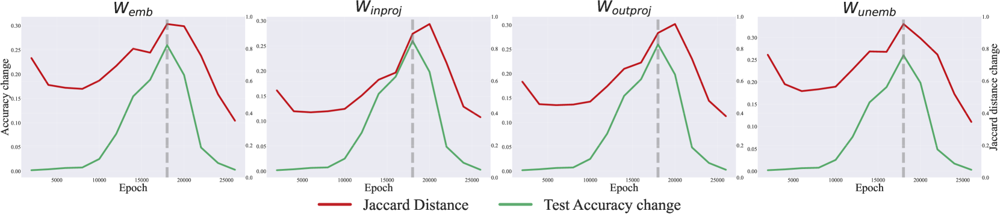

###### fig-7

*Рисунок 7: Сравнение расстояния Жаккара (красный) и изменений точности на тесте (зелёный) по каждому слою. Расстояние Жаккара записано как $\mathrm{JD}(t+\delta t,t)$, а изменение точности на тесте есть разность между эпохами $t+\delta t$ и $t$. Вертикальная линия отмечает самое резкое изменение точности на тесте. При значительном изменении точности расстояние Жаккара (структурное изменение) быстро растёт.* **[p. 9]**

### 5.2 Разбор хороших структур через периодические структуры и свойства графа

В предыдущем подразделе (5.1) мы установили, что значительные изменения устройства сети, измеряемые расстоянием Жаккара, в точности совпадают с ростом точности на тесте. Опираясь на эту находку, мы глубже разбираем структурные свойства, вызывающие столь резкие различия. А именно, мы исследуем природу найденной структуры с двух разных сторон: (1) периодические представления, о возникновении которых в задачах модульной арифметики известно (см. Pearce et al. (2023); Nanda et al. (2023)), и (2) теоретико-графовые свойства, показывающие, как связность сети развивается в пользу лучшей генерализации. Рассматривая обе стороны, мы выясняем, как сеть в конце концов останавливается на «хорошей структуре», дающей высокую точность на тесте.

#### Модульное сложение и периодичность

###### p9-3

Nanda et al. (2023) показали, что трансформеры, обучаемые задачам модульного сложения, опираются на эти периодические представления для достижения генерализации. А именно, сети вкладывают входы $a$ и $b$ в базис Фурье, кодируя их как синусные и косинусные составляющие ключевых частот $w_{k}=\frac{2\pi k}{p}\quad\text{для некоторого }k\in\mathbb{N}.$ Эти периодические представления затем соединяются внутри слоёв сети по тригонометрическим тождествам для вычисления модульной суммы.

**[p. 10]**

###### p10-1

Проведя обратную инженерию весов и активаций однослойного трансформера, обученного этой задаче, Nanda et al. (2023) обнаружили, что модель по сути вычисляет:

$$
\cos\bigl{(}w_{k}(a+b)\bigr{)} =\cos(w_{k}a)\cos(w_{k}b)\;-\;\sin(w_{k}a)\sin(w_{k}b), \\
\sin\bigl{(}w_{k}(a+b)\bigr{)} =\sin(w_{k}a)\cos(w_{k}b)\;+\;\cos(w_{k}a)\sin(w_{k}b). \tag{2}
$$

с помощью матрицы вложений, слоя внимания и MLP. Логиты для каждого возможного выхода $c$ затем вычисляются проецированием этих величин:

$$
\cos\bigl{(}w_{k}(a+b-c)\bigr{)}\;=\;\cos\bigl{(}w_{k}(a+b)\bigr{)}\cos(w_{k}c)\;+\;\sin\bigl{(}w_{k}(a+b)\bigr{)}\sin(w_{k}c).
$$

###### p10-3

Такой ход обеспечивает конструктивную интерференцию выходных логитов сети при $c\equiv(a+b)\mod p$, тогда как деструктивная интерференция подавляет прочие, неверные значения. Ввиду этого механизма можно заключить, что модель внутренне пользуется **периодичностью** — например, формулами сложения — для выполнения модульной арифметики.

###### fig-8

*Рисунок 8: (сверху) Частотная энтропия (FE) и точность на тесте у базовой модели и грокнувшего билета. Грокнувший билет сходится к меньшей частотной энтропии намного быстрее базовой модели. (снизу) Изменение весов со стороны входа для каждого нейрона базовой модели и грокнувшего билета. Отметки отвечают эпохам отметок на графике FE. Результаты указывают, что грокнувшие билеты обретают хорошие для генерализации структуры в виде периодических.* **[p. 10]**

#### Обретение периодической структуры в грокнувших билетах

###### p10-4

В этой работе, опираясь на эти прежние исследования, мы рассматриваем структуру, обретаемую грокнувшими билетами, со стороны периодичности. Сперва мы исследуем периодичность каждого нейрона, изображая направление матрицы весов ($W_{\text{inproj}}$), получаемой умножением $W_{\text{emb}}$ на $W_{\text{in}}$ (см. подраздел 3.1). Эта двумерная матрица весов имеет по одной оси входные размерности (67), по другой — число нейронов (48). Рисунок 8 (снизу) изображает веса (67 измерений) каждого нейрона в контрольных точках обучения (0, 2 и 30 тыс.). У базовой модели на 30 тыс. шагов веса обнаруживают ясную периодичность, тогда как на 0 и 2 тыс. шагов их устройство случайно. Примечательно, что грокнувшие билеты вырабатывают эту периодическую структуру намного раньше базовой модели (см. грокнувший билет на **2 тыс.** шагов). Эта находка подчёркивает, что устройство грокнувших билетов хорошо приспособлено к модульному сложению: они обретают периодическую структуру, отвечающую природе задачи.

###### p10-5

Чтобы количественно выразить эту периодичность как хорошую структуру, мы вводим фурье-энтропию (FE). В общем случае дискретное преобразование Фурье $\mathcal{F}(\omega)$ функции $f(x)$ определяется так:

$$
\mathcal{F}(\omega)=\sum_{x=0}^{N}f(x)\exp\left(-i\frac{2\pi\omega x}{N}\right)
$$

В нашем случае, поскольку нас занимает периодичность весов каждого нейрона, $f(x)$ есть вес $i$-го нейрона на $j$-м входе, а $d$ — размерность входа. Тогда фурье-энтропия (FE) вычисляется так:

**[p. 11]**

$$
FE=-\sum_{i=1}^{n}p_{i}\log p_{i}
$$

###### p11-1

Здесь $p_{i}$ — нормированное значение $\mathcal{F}(\omega)$, а $n$ — число нейронов. Малое значение FE указывает, что **частоты весов каждого нейрона мало разбросаны и сходятся к определённым частотам**, а это показывает, что сеть обрела периодическую структуру.

###### p11-2

Рисунок 8 (сверху) приводит FE базовой модели (зелёный) и грокнувшего билета (синий). Результаты показывают, что у грокнувшего билета нейроны с периодической структурой появляются рано (2 тыс. эпох), а FE резко убывает уже на ранних эпохах. Это указывает, что модель обнаруживает внутренне хорошие (обобщающие) структуры, приспособленные к задаче (модульному сложению). Для более подробного разбора мы добавили изображения матриц весов и масок грокнувшего билета в приложение I.

#### Свойства графа и грокнувший билет

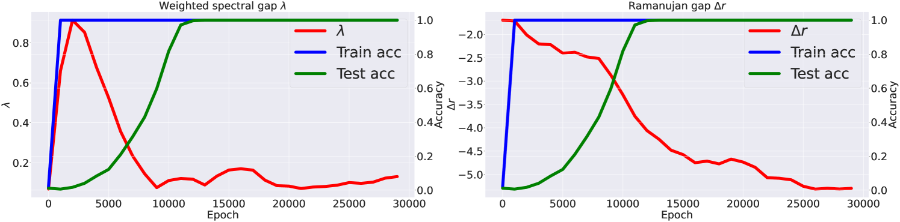

*(a) Зазор Рамануджана, взвешенный спектральный зазор*

*(b) Длина пути, коэффициент кластеризации*

###### fig-9

*Рисунок 9: **(a)** Развитие взвешенного спектрального зазора (слева) и зазора Рамануджана (справа), усреднённых по слоям сети. **(b)** Средняя длина пути (слева) и коэффициент кластеризации (справа). Определения и результаты по отдельным слоям приведены в приложениях J и K.* **[p. 11]**

Устройство самой сети обнаруживает разные теоретико-графовые свойства, как разбиралось в прежних работах (Hoang et al., 2023b; a; You et al., 2020). Вдохновляясь этими наблюдениями, мы разбираем развитие **(1) взвешенного спектрального зазора, (2) зазора Рамануджана, (3) средней длины пути** и **(4) коэффициента кластеризации** на протяжении обучения наряду с изменениями точности на обучении и тесте. Подробности о каждой мере свойств графа — в приложении J.

###### p11-4

Рисунок 9(a) показывает, как взвешенный спектральный зазор (слева) и зазор Рамануджана (справа) развиваются в ходе обучения при усреднении по слоям сети. Результаты по отдельным слоям приведены в приложении K. Мы наблюдаем, что взвешенный спектральный зазор резко растёт в фазе запоминания, что указывает на выраженное различие между наибольшим и вторым по величине собственными числами при переобучении модели. Отсюда следует, что в фазе запоминания в весах главенствует определённая составляющая (отвечающая ведущему собственному вектору). По мере перехода модели к лучшей генерализации спектральный зазор, однако, сужается, отражая более уравновешенное использование пространства параметров. Схожее поведение мы наблюдаем и в других слоях (подробности — в приложении K).

**[p. 12]**

###### p12-1

Рисунок 9(b) приводит меры, полученные при взгляде на всю сеть как на **граф отношений** (You et al., 2020). Средняя длина пути (слева) *растёт* вместе с ростом точности на тесте, а затем сходится к умеренным значениям. Отсюда следует, что, пока сеть ищет обобщающее решение (грокнувший билет), её связность становится разрежённее; как только решение найдено, длина пути убывает и стабилизируется. Коэффициент кластеризации (справа), напротив, *убывает* с ростом точности на тесте и тоже оседает на промежуточном значении. В пору, когда сеть ищет обобщающее решение (то есть обнаруживает грокнувший билет), кластеризация уменьшается, но в конце концов стабилизируется вблизи умеренного уровня. Обе меры, стало быть, сходятся не к крайностям, а остаются в уравновешенном режиме, в согласии с прежними исследованиями (You et al., 2020).

### 5.3 Прореживание в ходе обучения: прореживание способствует генерализации

###### tab-1

*Таблица 1: Изменение точности на тесте при разных способах оптимизации, начинающихся с запомненных решений. WD (Weight Decay) отражает регуляризующее действие weight decay при той же оптимизации, что у базовой модели. При EP w/o WD (edge-popup без weight decay) точность растёт одним лишь прореживанием, без обновления весов. Сочетание прореживания с weight decay в EP w/ WD даёт более быструю генерализацию, чем один weight decay. Кроме того, мы приводим средние значения мер свойств графа на матрице весов сети, чтобы разобрать структурные изменения по эпохам при EP w/o WD.* **[p. 12]**

| **Эпоха** | **600** | **1000** | **1400** | **2000** | |---|---|---|---|---| | **Точность на тесте (%)** | | | | | | WD | $0.53\pm 0.31$ | $0.95\pm 0.03$ | $1.00\pm 0.00$ | $1.00\pm 0.00$ | | EP w/o WD | $0.68\pm 0.19$ | $0.80\pm 0.17$ | $0.84\pm 0.16$ | $0.92\pm 0.06$ | | EP w/ WD | $\boldsymbol{0.82\pm 0.04}$ | $\boldsymbol{0.96\pm 0.01}$ | $0.99\pm 0.00$ | $1.00\pm 0.00$ | | **Меры свойств графа** | | | | | | Взвешенный спектральный зазор | $0.612\pm 0.05$ | $0.810\pm 0.11$ | $0.479\pm 0.04$ | $0.358\pm 0.03$ | | Спектральный зазор | $48.91\pm 5.05$ | $48.51\pm 5.12$ | $47.42\pm 4.97$ | $47.20\pm 4.55$ | | Зазор Рамануджана | $-2.550\pm 0.52$ | $-4.022\pm 0.05$ | $-4.335\pm 0.02$ | $-4.555\pm 0.01$ | | Средняя длина пути | $1.964\pm 0.006$ | $1.961\pm 0.002$ | $1.960\pm 0.001$ | $1.959\pm 0.001$ | | Коэффициент кластеризации | $0.733\pm 0.41$ | $0.724\pm 0.35$ | $0.719\pm 0.30$ | $0.719\pm 0.28$ |

Опираясь на результат о том, что обнаружение хорошей структуры отвечает росту точности на тесте, мы показываем, что одно лишь прореживание способно перевести запоминающее решение в обобщающее *без обновления весов*, и, более того, что сочетание прореживания с weight decay способствует генерализации действеннее, чем одна лишь регуляризация норм весов.

###### p12-3

Чтобы это проверить, мы вводим edge-popup (Ramanujan et al., 2020) — способ, выучивающий, как прореживать веса без их обновления. В edge-popup каждому весу приписывается оценка, и эти оценки обновляются обратным распространением, определяя, какие веса прорядить. Подробности об edge-popup — в приложении A. Мы проверяем наше утверждение, оптимизируя тремя разными способами.

: обучение из $\boldsymbol{\theta}_{\text{mem}}$ с **weight decay** *с* обновлением весов (как у базовой модели).

: обучение из $\boldsymbol{\theta}_{\text{mem}}$ с **edge-popup** *без* обновления весов.

: обучение из $\boldsymbol{\theta}_{\text{mem}}$ с **edge-popup** и **weight decay** *с* обновлением весов.

**[p. 13]**

###### p13-1

В таблице 1 результат EP без weight decay (EP w/o WD) показывает, что сеть достигает качества генерализации 0.92 без всяких изменений весов (*одним лишь прореживанием весов*). Этот результат показывает, что генерализация достижима одним обследованием структур, без обновления весов, и тем самым подкрепляет наше утверждение: отложенная генерализация происходит из-за обнаружения хорошей структуры. Кроме того, результат EP w/ WD показывает самый быстрый рост точности на тесте и оказывается самым действенным для генерализации. Отсюда следует, что практики могут улучшить генерализацию, включая приёмы, прямо оптимизирующие полезные структуры, вместо того чтобы полагаться лишь на привычные приёмы регуляризации вроде weight decay. Наши находки подчёркивают, что грокнувшие билеты способны подсказать разработку новых приёмов регуляризации, ориентированных на структуру.

###### p13-2

В таблице 1, схоже с разбором подраздела 5.2, мы рассмотрели средние значения мер свойств графа на матрице весов сети при EP w/o WD. Как и в подразделе 5.2, взвешенный спектральный зазор сперва рос, а затем убывал, тогда как зазор Рамануджана продолжал убывать. Более того, и средняя длина пути, и коэффициент кластеризации сошлись к схожим значениям.

## 6 Обсуждение и связанные работы

В этой статье мы провели ряд опытов, чтобы понять механизм гроккинга (отложенной генерализации). Ниже сводка наблюдений. (1) В подразделе 3.2 применение лотерейного билета значительно сокращает отложенную генерализацию. (2) В разделе 4 хорошая структура оказывается более важным множителем в объяснении гроккинга, чем норма весов и разрежённость, — это показано сравнением при равных норме и разрежённости. (3) В подразделе 5.2 устройство грокнувших билетов оказывается хорошо приспособленным к задаче. (4) В подразделе 5.1 хорошая структура обнаруживается постепенно, в соответствии с ростом точности на тесте. (5) В подразделе 5.3 прореживание без обновления весов, начатое с запоминающего решения, повышает точность на тесте. В этом разделе мы связываем эти результаты с прежними объяснениями механизма гроккинга и с соответствующими работами.

#### Снижение нормы весов

Liu et al. (2023a) полагают, что для генерализации решающе снижение норм весов. На рисунке 5 наши результаты идут дальше и показывают, что сеть не просто снижает нормы весов, а обнаруживает хорошую структуру (подсеть), что и приводит к снижению норм.

#### Разрежённость и эффективность

Merrill et al. (2023) утверждали, что фазовый переход гроккинга отвечает возникновению разрежённой подсети, главенствующей в предсказаниях модели. Если они опытным путём изучали задачи разрежённой чётности, где разрежённость очевидна, то мы ведём задачи (модульная арифметика, MNIST) и архитектуры (MLP, трансформер), обычные для исследований гроккинга. Более того, на рисунке 5 мы показываем, что решающа не только разрежённость, но и хорошая структура.

#### Обучение представлениям

###### p13-6

Liu et al. (2022); Nanda et al. (2023); Liu et al. (2023a); Gromov (2023) показали, что качество представления есть ключ к различению запоминающих и обобщающих сетей. Рисунок 8 показывает, что хорошая структура способствует обретению хорошего представления, из чего следует важность внутреннего устройства (топологии сети) для достижения хороших представлений.

#### Регуляризация

###### p13-7

Weight decay (Rumelhart et al., 1986) — один из самых распространённых приёмов регуляризации, известный как решающий множитель гроккинга (Power et al., 2022; Liu et al., 2023a). В приложении H мы показываем, что при обнаруженной хорошей структуре сеть обобщает и без weight decay, а значит, weight decay работает как обследование структур, — откуда следует, что он способствует **[p. 14]** не снижению весов, а поиску хорошей структуры. Кроме того, мы проверили прореживание как новую силу, вызывающую генерализацию (таблица 1). Однако, как показывают результаты прореживания при инициализации (рисунок 5(b)), неподобающее прореживание способно ухудшить качество генерализации.

#### Гипотеза лотерейного билета

Гипотеза лотерейного билета (Frankle & Carbin, 2019) полагает, что хорошие структуры решающи для генерализации, но остаётся неясным, как они обретаются в ходе обучения и как соотносятся с представлениями сети. Насколько мне известно, наша статья первой связывает гроккинг с гипотезой лотерейного билета, показывая, как хорошие структуры возникают (подраздел 5.1) и способствуют действенным представлениям (подраздел 5.2). Опираясь на это, мы далее показываем, что, хотя более быстрая генерализация — хорошо описанное свойство выигрышных билетов, наша работа идёт дальше и исследует, как происходит обнаружение хороших структур.

#### Дальнейшие направления

Хотя наше исследование сосредоточено на простых задачах, ключевое наблюдение об обнаружении хороших подсетей может распространиться и на более сложные области — крупномасштабное распознавание изображений и порождение языка. Наши находки указывают, что хорошие подсети, или «лотерейные билеты», помогают смягчить отложенную генерализацию, давая взгляд на регуляризацию со стороны структуры. Привычные приёмы вроде weight decay способствуют обнаружению структуры косвенно, тогда как прореживание и оптимизация масок дают более прямой и, возможно, более действенный подход. Как показано в таблице 1, сочетание weight decay с алгоритмом edge-popup ускоряет генерализацию, что говорит о преимуществах приёмов, учитывающих структуру. Будущие исследования могли бы внести эти наблюдения в современные архитектуры ради роста эффективности и устойчивости обучения. Обследование стратегий на основе прореживания или оптимизации масок в больших моделях могло бы дополнительно подтвердить их действенность в настоящих применениях. Соединение этих структурных наблюдений с общепринятыми приёмами обучения могло бы улучшить генерализацию и эффективность моделей в сложных постановках.

Кроме того, опираясь на наблюдения о свойствах графа, полученные в подразделе 5.2, будущим работам стоит явно выбирать устройство нейронных сетей согласно свойствам графа, как показано в прежних исследованиях (Javaheripi et al., 2021). Внесение выявленных здесь структурных наблюдений в процедуру выбора могло бы облегчить обнаружение более эффективных и устойчивых архитектур.

**[p. 15]**

## Литература

- Zeyuan Allen-Zhu, Yuanzhi Li, and Zhao Song. A convergence theory for deep learning via over-parameterization, 2019.

- Xander Davies, Lauro Langosco, and David Krueger. Unifying grokking and double descent. *arXiv preprint arXiv:2303.06173*, 2023.

- Jonathan Frankle and Michael Carbin. The lottery ticket hypothesis: Finding sparse, trainable neural networks, 2019.

- Jonathan Frankle, Gintare Karolina Dziugaite, Daniel M. Roy, and Michael Carbin. Stabilizing the lottery ticket hypothesis, 2020.

- Hiroki Furuta, Gouki Minegishi, Yusuke Iwasawa, and Yutaka Matsuo. Interpreting grokked transformers in complex modular arithmetic, 2024.

- Andrey Gromov. Grokking modular arithmetic. *arXiv preprint arXiv:2301.02679*, 2023.

- Duc N.M Hoang, Souvik Kundu, Shiwei Liu, and Zhangyang Wang. Don’t just prune by magnitude! your mask topology is a secret weapon. In *Thirty-seventh Conference on Neural Information Processing Systems*, 2023a. URL https://openreview.net/forum?id=DIBcdjWV7k.

- Duc N.M Hoang, Shiwei Liu, Radu Marculescu, and Zhangyang Wang. REVISITING PRUNING AT INITIALIZATION THROUGH THE LENS OF RAMANUJAN GRAPH. In *The Eleventh International Conference on Learning Representations*, 2023b. URL https://openreview.net/forum?id=uVcDssQff_.

- P. Jaccard. *Etude comparative de la distribution florale dans une portion des Alpes et du Jura*. Bulletin de la Société vaudoise des sciences naturelles. Impr. Corbaz, 1901. URL https://books.google.co.jp/books?id=JCNdmgEACAAJ.

- Mojan Javaheripi, Bita Darvish Rouhani, and Farinaz Koushanfar. Swann: Small-world architecture for fast convergence of neural networks. *IEEE Journal on Emerging and Selected Topics in Circuits and Systems*, 11(4):575–585, 2021. doi: 10.1109/JETCAS.2021.3125309.

- Alex Krizhevsky, Ilya Sutskever, and Geoffrey E. Hinton. Imagenet classification with deep convolutional neural networks. In F. Pereira, C. J. C. Burges, L. Bottou, and K. Q. Weinberger (eds.), *Advances in Neural Information Processing Systems 25*, pp. 1097–1105. Curran Associates, Inc., 2012. URL http://papers.nips.cc/paper/4824-imagenet-classification-with-deep-convolutional-neural-networks.pdf.

- Tanishq Kumar, Blake Bordelon, Samuel J. Gershman, and Cengiz Pehlevan. Grokking as the transition from lazy to rich training dynamics. *arXiv preprint arXiv:2310.06110*, 2023.

- Tanishq Kumar, Blake Bordelon, Samuel J. Gershman, and Cengiz Pehlevan. Grokking as the transition from lazy to rich training dynamics. In *The Twelfth International Conference on Learning Representations*, 2024. URL https://openreview.net/forum?id=vt5mnLVIVo.

- Namhoon Lee, Thalaiyasingam Ajanthan, and Philip H. S. Torr. Snip: Single-shot network pruning based on connection sensitivity, 2019.

- Ziming Liu, Ouail Kitouni, Niklas Nolte, Eric J. Michaud, Max Tegmark, and Mike Williams. Towards understanding grokking: An effective theory of representation learning. *arXiv preprint arXiv:2205.10343*, 2022.

- Ziming Liu, Eric J Michaud, and Max Tegmark. Omnigrok: Grokking beyond algorithmic data. In *International Conference on Learning Representations*, 2023a.

- Ziming Liu, Ziqian Zhong, and Max Tegmark. Grokking as compression: A nonlinear complexity perspective. *arXiv preprint arXiv:2310.05918*, 2023b.

- Ilya Loshchilov and Frank Hutter. Decoupled weight decay regularization, 2019.

**[p. 16]**

- William Merrill, Nikolaos Tsilivis, and Aman Shukla. A tale of two circuits: Grokking as competition of sparse and dense subnetworks. *arXiv preprint arXiv:2303.11873*, 2023.

- Jack Miller, Charles O’Neill, and Thang Bui. Grokking beyond neural networks: An empirical exploration with model complexity. *arXiv preprint arXiv:2310.17247*, 2023.

- Beren Millidge. Grokking ’grokking’, 2022. URL https://www.beren.io/2022-01-11-Grokking-Grokking/.

- Shikhar Murty, Pratyusha Sharma, Jacob Andreas, and Christopher D. Manning. Grokking of hierarchical structure in vanilla transformers. *arXiv preprint arXiv:2305.18741*, 2023.

- Vinod Nair and Geoffrey E. Hinton. Rectified linear units improve restricted boltzmann machines. In *Proceedings of the 27th International Conference on International Conference on Machine Learning*, ICML’10, pp. 807–814, Madison, WI, USA, 2010. Omnipress. ISBN 9781605589077.

- Preetum Nakkiran, Gal Kaplun, Yamini Bansal, Tristan Yang, Boaz Barak, and Ilya Sutskever. Deep double descent: Where bigger models and more data hurt. *arXiv preprint arXiv:1912.02292*, 2019.

- Neel Nanda, Lawrence Chan, Tom Lieberum, Jess Smith, and Jacob Steinhardt. Progress measures for grokking via mechanistic interpretability. In *International Conference on Learning Representations*, 2023.

- Behnam Neyshabur. Towards learning convolutions from scratch, 2020. URL https://arxiv.org/abs/2007.13657.

- Michela Paganini and Jessica Zosa Forde. Bespoke vs. prêt-à-porter lottery tickets: Exploiting mask similarity for trainable sub-network finding, 2020.

- Adam Pearce, Asma Ghandeharioun, Nada Hussein, Nithum Thain, Martin Wattenberg, and Lucas Dixo. Do machine learning models memorize or generalize? https://pair.withgoogle.com/explorables/grokking/, 2023. [Online; accessed 11-October-2023].

- Alethea Power, Yuri Burda, Harri Edwards, Igor Babuschkin, and Vedant Misra. Grokking: Generalization beyond overfitting on small algorithmic datasets. *arXiv preprint arXiv:2201.02177*, 2022.

- Adityanarayanan Radhakrishnan, Daniel Beaglehole, Parthe Pandit, and Mikhail Belkin. Mechanism of feature learning in deep fully connected networks and kernel machines that recursively learn features. *arXiv preprint arXiv:2212.13881*, 2022.

- Vivek Ramanujan, Mitchell Wortsman, Aniruddha Kembhavi, Ali Farhadi, and Mohammad Rastegari. What’s hidden in a randomly weighted neural network?, 2020.

- Noa Rubin, Inbar Seroussi, and Zohar Ringel. Droplets of good representations: Grokking as a first order phase transition in two layer networks. *arXiv preprint arXiv:2310.03789*, 2023.

- David E Rumelhart, Geoffrey E Hinton, and Ronald J Williams. Learning representations by back-propagating errors. *nature*, 323(6088):533–536, 1986.

- Keitaro Sakamoto and Issei Sato. Analyzing lottery ticket hypothesis from pac-bayesian theory perspective, 2022.

- Dashiell Stander, Qinan Yu, Honglu Fan, and Stella Biderman. Grokking group multiplication with cosets. *arXiv preprint arXiv:2312.06581*, 2023.

- Hidenori Tanaka, Daniel Kunin, Daniel L. K. Yamins, and Surya Ganguli. Pruning neural networks without any data by iteratively conserving synaptic flow, 2020.

- Vimal Thilak, Etai Littwin, Shuangfei Zhai, Omid Saremi, Roni Paiss, and Joshua Susskind. The slingshot mechanism: An empirical study of adaptive optimizers and the grokking phenomenon. *arXiv preprint arXiv:2206.04817*, 2022.

**[p. 17]**

- Vikrant Varma, Rohin Shah, Zachary Kenton, János Kramár, and Ramana Kumar. Explaining grokking through circuit efficiency. *arXiv preprint arXiv:2309.02390*, 2023.

- Chaoqi Wang, Guodong Zhang, and Roger Grosse. Picking winning tickets before training by preserving gradient flow, 2020.

- Yulong Wang, Xiaolu Zhang, Lingxi Xie, Jun Zhou, Hang Su, Bo Zhang, and Xiaolin Hu. Pruning from scratch, 2019.

- Jiaxuan You, Jure Leskovec, Kaiming He, and Saining Xie. Graph structure of neural networks. In Hal Daumé III and Aarti Singh (eds.), *Proceedings of the 37th International Conference on Machine Learning*, volume 119 of *Proceedings of Machine Learning Research*, pp. 10881–10891. PMLR, 13–18 Jul 2020. URL https://proceedings.mlr.press/v119/you20b.html.

- Zhenyu Zhang, Xuxi Chen, Tianlong Chen, and Zhangyang Wang. Efficient lottery ticket finding: Less data is more, 2021.

- Ziqian Zhong, Ziming Liu, Max Tegmark, and Jacob Andreas. The clock and the pizza: Two stories in mechanistic explanation of neural networks. In *Neural Information Processing Systems*, 2023.

**[p. 18]**

## Приложение A. Алгоритм edge-popup

Мы приводим подробное изложение алгоритма edge-popup. Edge-popup (Ramanujan et al., 2020) — способ находить действенные подсети внутри случайно инициализированных нейронных сетей без обновления весов.

**Основной ход:**

1. Случайная инициализация: инициализировать веса $\mathbf{w}$ большой нейронной сети случайно. 2. Назначить оценки: приписать каждому ребру $w_{ij}$ случайную оценку $s_{ij}$. 3. Выбрать подсеть: образовать подсеть $\mathcal{G}$ только из рёбер с наибольшими $k\%$ оценок. 4. Оптимизировать оценки: обновить оценки $s_{ij}$ по качеству подсети $\mathcal{G}$.

**Обновление оценок:** обновить оценку $s_{ij}$ каждого ребра $w_{ij}$ по формуле:

$$
s_{ij}\leftarrow s_{ij}-\alpha\frac{\partial L}{\partial I_{j}}Z_{i}w_{ij}
$$

- $\alpha$ is the learning rate
- $\frac{\partial L}{\partial I_{j}}$ is the gradient of the loss with respect to the input of the $j$-th neuron
- $Z_{i}$ is the output of the $i$-th neuron

**Собственно вычисление.** Прямой проход: вычислять только по рёбрам, чьи оценки $s_{ij}$ входят в наибольшие $k\%$.

$$
I_{j}=\sum_{i\in V}w_{ij}Z_{i}h(s_{ij})
$$

Здесь $h(s_{ij})$ равно 1, если $s_{ij}$ входит в наибольшие $k\%$, и 0 иначе.

**[p. 19]**

## Приложение B. Другие настройки задачи и архитектуры.

### B.1 MLP для MNIST

###### p19-1

Для классификации MNIST мы берём четырёхслойный MLP. Отличие от обычной классификации в том, что мы берём среднеквадратичную ошибку (MSE) как функцию потерь. Мы приняли эту настройку вслед за прежним исследованием (Liu et al., 2023a). У Liu et al. (2023a) в приложении подтверждено, что гроккинг происходит без затруднений и с перекрёстной энтропией. Рисунок 10 приводит точность на тесте и обучении при разных настройках. Видно, что грокнувшие билеты ускоряют генерализацию при всех настройках, а обследование грокнувших билетов способствует генерализации.

### B.2 Трансформер для модульного сложения

Как и Nanda et al. (2023), мы берём во всех опытах однослойный трансформер. Мы применяем внимание с одной головой и опускаем послойную нормализацию.

- **Hyperparameters:** $d_{\text{vocab}}=67$: Size of the input and output spaces (same as $p$). $d_{\text{emb}}=500$: Embedding size. $d_{\text{mlp}}=128$: Width of the MLP layer.
- **Parameters:** $W_{E}$: Embedding layer. $W_{\text{pos}}$: Positional embedding. $W_{Q}$: Query matrix. $W_{K}$: Key matrix. $W_{V}$: Value matrix. $W_{O}$: Attention output. $W_{\text{in}}$, $b_{\text{in}}$: Weights and bias of the first layer of the MLP. $W_{\text{out}}$, $b_{\text{out}}$: Weights and bias of the second layer of the MLP. $W_{U}$: Unembedding layer.

Мы описываем получение логитов для однослойной модели. Отметим, что потеря считается лишь по логитам на последнем токене. Пусть $x_{i}^{(l)}$ обозначает токен в позиции $i$ слоя $l$. Здесь $i$ равно 0 или 1, поскольку входных токенов два, а $x_{i}^{(0)}$ — one-hot вектор. Оценки внимания мы обозначаем через $A$, а треугольную матрицу с элементами, равными минус бесконечности, — через $M$; она нужна для причинного внимания.

Логиты вычисляются по следующим равенствам:

$$
\begin{split}x_{i}^{(1)}&=W_{E}x_{i}^{(0)}+W_{\text{pos}}x_{i}^{(0)},\\
A&=\mathrm{softmax}(x^{(1)\text{T}}W_{K}^{\text{T}}W_{Q}x^{(1)}-M),\\
x^{(2)}&=W_{O}W_{V}(x^{(1)}A)+x^{(1)},\\
x^{(3)}&=W_{\text{out}}\mathrm{ReLU}(W_{\text{in}}x^{(2)}+b_{\text{in}})+b_{\text{out}}+x^{(2)},\\
\mathrm{logits}&=\mathrm{softmax}(W_{U}x^{(3)}).\end{split}
$$

Рисунок 10 приводит точность на обучении и тесте у базовой модели (зелёный) и грокнувшего билета (синий). На разных наборах данных (модульное сложение, MNIST) и архитектурах (трансформер) грокнувший билет (синий) неизменно приходит к генерализации быстрее базовой модели (зелёный). Эти результаты подчёркивают важность структурных составляющих в гроккинге независимо от задачи и архитектуры.

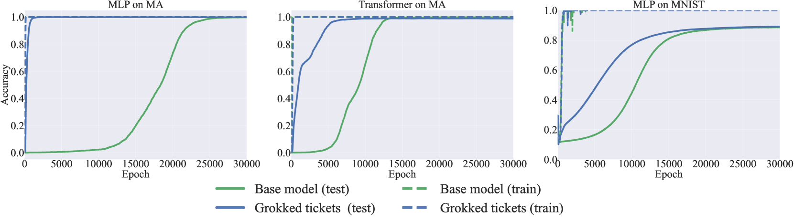

*Рисунок 10: Сравнение базовой модели (зелёный) и грокнувшего билета (синий). Каждый столбец отвечает своей настройке задачи (модульное сложение и MNIST) и архитектуры (MLP и трансформер). Пунктирная линия отвечает результатам на обучающих данных.* **[p. 20]**

**[p. 20]**

## Приложение C. Опыты с разными сидами

###### p20-1

Ради воспроизводимости мы проводим опыты с тремя разными сидами и приводим результаты для опытов рисунка 2. Помимо точности, мы приводим потерю на обучении и тесте на рисунке 11.

*(a) Потеря MLP на модульном сложении*

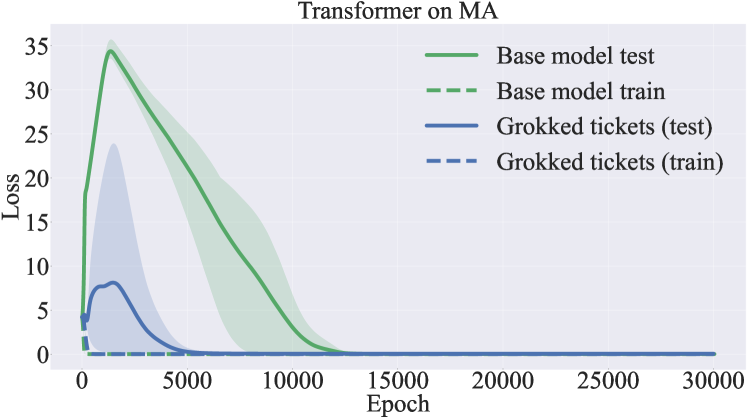

*(b) Потеря трансформера на модульном сложении*

*Рисунок 11: Потеря на обучении и тесте у базовой модели и грокнувшего билета на MLP и трансформере. В обеих архитектурах грокнувший билет сходится к 0 быстрее базовой модели.* **[p. 20]**

Кроме того, ради воспроизводимости мы проводим опыты с тремя разными сидами и приводим результаты для опытов подраздела 4.1 и для архитектуры трансформера.

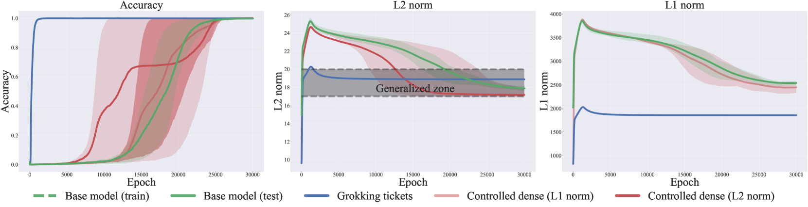

###### fig-12

*Рисунок 12: (Слева) Динамика точности на тесте у базовой модели, грокнувшего билета и управляемой плотной модели (L1- и L2-норма) при трёх разных сидах. Грокнувший билет приходит к генерализации намного быстрее прочих моделей. (В центре) Динамика L2-нормы у базовой модели, грокнувшего билета и управляемой плотной модели. (Справа) Динамика L1-нормы у тех же моделей. Со стороны L2-нормы все модели, кажется, сходятся к схожему решению («зоне генерализации»). Однако со стороны L1-норм они сходятся к разным значениям.* **[p. 21]**

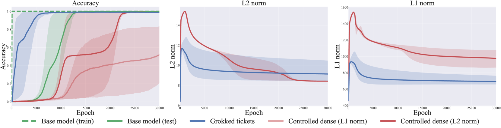

*Рисунок 13: Динамика точности на тесте у базовой модели, грокнувшего билета и управляемой плотной модели (L1- и L2-норма) при трёх разных сидах на трансформере. Грокнувший билет приходит к генерализации намного быстрее прочих моделей. (В центре) Динамика L2-нормы у базовой модели, грокнувшего билета и управляемой плотной модели. (Справа) Динамика L1-нормы у тех же моделей. Со стороны L2-нормы все модели, кажется, сходятся к схожему решению («зоне генерализации»). Однако со стороны L1-норм они сходятся к разным значениям.* **[p. 21]**

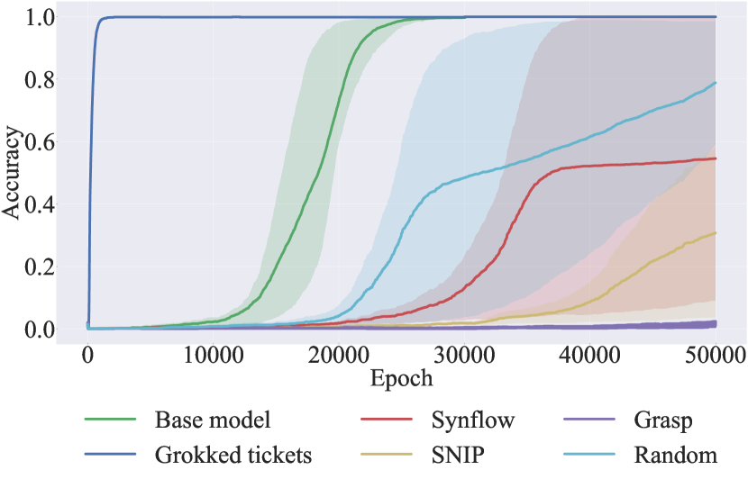

*Рисунок 14: Сравнение точности на тесте у разных приёмов прореживания. Все приёмы прореживания при инициализации работают хуже базовой модели, а порой и хуже случайного прореживания, при трёх разных сидах.* **[p. 21]**

**[p. 22]**

## Приложение D. Способы прореживания при инициализации

Ныне приёмы прореживания нейронных сетей при инициализации (SNIP, GraSP, SynFlow) всё ещё уступают приёмам, пользующимся сведениями после обучения (вроде лотерейного билета). Тем не менее эта область переживает всплеск исследовательской деятельности.

Основной ход прореживания при инициализации таков:

1. Случайно инициализировать нейронную сеть $f(\boldsymbol{x};\boldsymbol{\theta}_{0})$. 2. Прорядить *p* % параметров $\boldsymbol{\theta}_{0}$ по оценкам $S(\boldsymbol{\theta})$, получив маску m. 3. Обучать сеть из $\boldsymbol{\theta}_{0}\odot\boldsymbol{m}$.

По Tanaka et al. (2020), исследования прореживания при инициализации сводятся к способу задать оценку в пункте 2 выше, и все они описываются единообразно:

$$
S(\boldsymbol{\theta})=\frac{\partial R}{\partial\boldsymbol{\theta}}\odot\boldsymbol{\theta}
$$

Когда $R$ есть обучающая потеря $L$, получаемая мера синаптической выпуклости равна $|\frac{\partial L}{\partial\boldsymbol{\theta}}\odot\boldsymbol{\theta}|$, применяемой в SNIP (Lee et al., 2019). Мера $-(H\frac{\partial L}{\partial\boldsymbol{\theta}})\odot\boldsymbol{\theta}$ применяется в GraSP (Wang et al., 2020). Tanaka et al. (2020) предложили алгоритм SynFlow с $R_{SF}=1^{T}(\prod_{l=1}^{L}|\boldsymbol{\theta}^{|l|}|)1$. В разделе 4.2 все начальные значения брались одинаковыми, при одинаковой доле прореживания.

**[p. 23]**

## Приложение E. Значимость периодичности в задаче модульного сложения

Задача модульного сложения, состоящая в предсказании $c\equiv(a+b)\mod p$, по своей природе содержит периодичность из-за устройства модульной арифметики. Nanda et al. (2023) показали, что трансформеры, обучаемые модульному сложению, опираются на периодические представления ради генерализации. А именно, сети вкладывают входы $a$ и $b$ в базис Фурье, кодируя их как синусные и косинусные составляющие ключевых частот $w_{k}=\frac{2k\pi}{p}$ при некотором $k\in\mathbb{N}$. Эти периодические представления затем соединяются внутри слоёв сети по тригонометрическим тождествам для вычисления модульной суммы.

**Механизм периодических представлений**

Nanda et al. (2023) провели обратную инженерию весов и активаций однослойного трансформера, обученного этой задаче, и обнаружили, что модель вычисляет:

$$
\cos(w_{k}(a+b))=\cos(w_{k}a)\cos(w_{k}b)-\sin(w_{k}a)\sin(w_{k}b),
$$

$$
\sin(w_{k}(a+b))=\sin(w_{k}a)\cos(w_{k}b)+\cos(w_{k}a)\sin(w_{k}b),
$$

с помощью матрицы вложений, слоя внимания и MLP. Логиты для каждого возможного выхода $c$ затем вычисляются проецированием этих величин:

$$
\cos(w_{k}(a+b-c))=\cos(w_{k}(a+b))\cos(w_{k}c)+\sin(w_{k}(a+b))\sin(w_{k}c).
$$

Такой ход обеспечивает конструктивную интерференцию выходных логитов сети при $c\equiv(a+b)\mod p$, тогда как деструктивная интерференция подавляет прочие, неверные значения.

Ввиду этого механизма можно заключить, что модель внутренне пользуется **периодичностью** — например, формулами сложения — для выполнения модульной арифметики.

## Приложение F. Структурные изменения в задачах помимо модульного сложения

*(a) Расстояние Жаккара на многочленной регрессии*

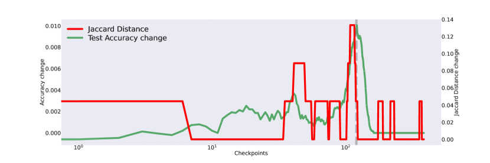

*(b) Расстояние Жаккара на разрежённой чётности*

*Рисунок 15: Изменение расстояния Жаккара и изменение точности на тесте на многочленной регрессии (a) и разрежённой чётности (b). Структурные изменения (расстояние Жаккара) отвечают обретению способности обобщать.* **[p. 23]**

**[p. 24]**

## Приложение G. Достаточно ли нормы весов, чтобы объяснить гроккинг в трансформере?

Рисунок 16 приводит точность базовой модели, грокнувшего билета и управляемых плотных моделей (L1 и L2) на трансформере. Результаты показывают, что грокнувший билет обобщает быстрее всех прочих моделей. Отсюда следует, что и в случае трансформера обнаружение грокнувшего билета важнее норм весов.

*Рисунок 16: Точность базовой модели, грокнувшего билета и управляемых плотных моделей на трансформере.* **[p. 24]**

## Приложение H. Weight decay как исследователь структур

Наш результат состоит в том, что обнаружение хорошей структуры происходит между запоминанием и генерализацией, а значит, weight decay существен для выявления хорошей структуры, но становится излишним после её обнаружения.

###### p24-3

В этом разделе мы сперва отыскиваем критическую долю прореживания — наибольшую долю, при которой генерализация наступает без weight decay (рисунок 17(a)). Мы находим, что критическая доля прореживания лежит **[p. 25]** между 0.8 и 0.9, поскольку при росте доли до 0.9 точность на тесте резко падает. Поэтому мы постепенно повышали долю прореживания с 0.8 с шагом 0.01 и нашли, что критическая доля равна $k=$ 0.81. Затем мы сравниваем поведение грокнувшего билета без weight decay и базовой модели. Рисунок 17(b) приводит результаты опытов. Они показывают, что при обнаруженной хорошей структуре сеть полностью обобщает без weight decay, а значит, weight decay работает как исследователь структур.

*(a) Точность на тесте при разных долях прореживания*

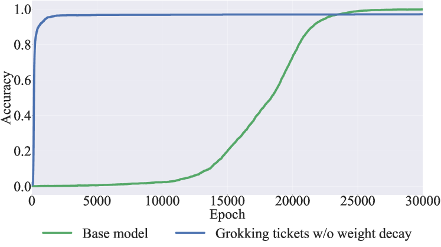

*(b) Точность на тесте при критической доле прореживания (0.81)*

###### fig-17

*Рисунок 17: Влияние доли прореживания на точность на тесте без weight decay (слева). Точность на тесте у грокнувшего билета при критической доле прореживания (0.81) без weight decay (справа).* **[p. 24]**

###### p24-4

В этом разделе мы показываем, что при точно подобранных долях прореживания грокнувшему билету weight decay для генерализации не нужен, а значит, weight decay существен для выявления хороших подсетей, но становится излишним после их обнаружения. Сперва мы отыскиваем *критическую долю прореживания* — наибольшую долю, при которой ещё возникает гроккинг (рисунок 17a). В этом случае (рисунок 17a) мы находим, что критическая доля лежит между 0.8 и 0.9, поскольку при росте доли до 0.9 точность на тесте резко падает. Поэтому мы постепенно повышали долю с 0.8 с шагом 0.01 и нашли, что критическая доля равна $k=0.81$. Затем мы сравниваем поведение грокнувшего билета без weight decay ($\alpha=0.0$) и базовой модели. Рисунок 17b приводит результаты опытов. Как видно на рисунке, точность на тесте достигает безупречной генерализации без weight decay. Результаты показывают, что грокнувшему билету при критической доле прореживания weight decay в ходе обучения не требуется вовсе.

**[p. 26]**

## Приложение I. Изображение весов и грокнувшего билета

Чтобы выявить свойства грокнувшего билета, мы изобразили матрицы весов и соответствующие маски грокнувшего билета — рисунок 18. Рассматриваемая задача — модульное сложение на следующей архитектуре MLP:

$$
\mathrm{softmax}(\sigma((\boldsymbol{E}_{a}+\boldsymbol{E}_{b})W_{\text{in}})W_{\text{out}}W_{\text{unemb}}), \tag{4}
$$

где $\boldsymbol{E}_{a}$ и $\boldsymbol{E}_{b}$ — входные вложения, $W_{\text{in}}$, $W_{\text{out}}$ и $W_{\text{unemb}}$ — соответствующие матрицы весов, а $\sigma$ обозначает функцию активации. Эта архитектура моделирует отношение между входами в задаче модульного сложения.

###### p26-3

Рисунок 18 изображает выученные матрицы весов $W_{E}$, $W_{\text{inproj}}$, $W_{\text{outproj}}$ и $W_{U}$ (верхний ряд) после генерализации, а также соответствующие маски грокнувшего билета (нижний ряд). Матрицы весов обнаруживают периодические образцы, отражающие хорошую структуру, выученную в ходе обучения. Более того, маски грокнувшего билета согласуются с этими периодическими свойствами, а значит, грокнувший билет успешно обрёл структуры, полезные для задачи модульного сложения. Эти результаты подчёркивают способность грокнувшего билета выявлять содержательные образцы, дающие вклад в качество модели.

Для сравнения рисунок 19 приводит изображения масок (структур), полученных приёмами прореживания при инициализации (PaI): Random, GraSP, SNIP и SynFlow. В отличие от результатов рисунка 18, эти приёмы периодических структур *не* обнаруживают. Это сравнение подчёркивает превосходство грокнувшего билета в обретении структур, более пригодных для задачи модульного сложения, и лишний раз выделяет его преимущество перед привычными приёмами PaI.

###### fig-18

*Рисунок 18: Изображение матриц весов $W_{E}$, $W_{\text{inproj}}$, $W_{\text{outproj}}$ и $W_{U}$ (сверху), а также соответствующих масок грокнувшего билета (снизу). В матрицах весов наблюдаются периодические образцы, и маски грокнувшего билета отражают эти свойства. Это указывает, что грокнувший билет обрёл структуры, полезные для задачи (модульного сложения).* **[p. 26]**

*(a) Random*

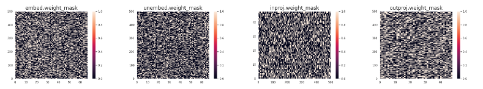

*(b) Grasp*

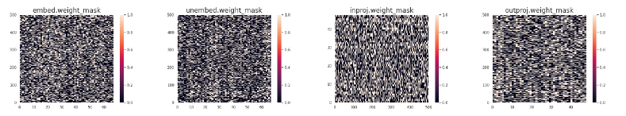

*(c) Snip*

*(d) Synflow*

###### fig-19

*Рисунок 19: Изображение масок (структур), полученных приёмами прореживания при инициализации (PaI): Random, GraSP, SNIP и SynFlow. По сравнению с грокнувшим билетом на рисунке 18 видно, что периодические структуры *не* достигаются.* **[p. 27]**

**[p. 28]**

## Приложение J. Меры свойств графа

###### p28-1

В этом разделе мы вводим теоретико-графовые меры, применяемые в нашем исследовании: **зазор Рамануджана**, **взвешенный спектральный зазор** и две меры, полученные при взгляде на прорежённую сеть как на граф отношений, — **среднюю длину пути** и **коэффициент кластеризации**.

#### Граф Рамануджана.

*Граф Рамануджана* известен тем, что сочетает разрежённость с сильной связностью. Рассмотрим $k$-регулярный граф, у которого каждый узел имеет степень $k$. Собственные числа его матрицы смежности $A$ упорядочены как

$$
\lambda_{0}\,\geq\,\lambda_{1}\,\geq\,\lambda_{2}\,\geq\,\dots\,\geq\,\lambda_{n}.
$$

Здесь наибольшее собственное число $\lambda_{0}$ равно $k$, а наименьшее $\lambda_{n}$ равно $-k$; это тривиальные собственные числа. Граф называется графом Рамануджана, если *все нетривиальные собственные числа* $\lambda_{i}$ (то есть те, у которых $|\lambda_{i}|\neq k$) удовлетворяют

$$
\max_{|\lambda_{i}|\neq k}\!\bigl{|}\lambda_{i}\bigr{|}\;\leq\;\sqrt{2k-1}.
$$

Такие графы разрежены, но обладают действенным распространением сведений.

#### Зазор Рамануджана.

Зазор Рамануджана измеряет, насколько близко наибольшее нетривиальное собственное число графа подходит к теоретической границе $\sqrt{2k-1}$. Хотя изначально он определялся для строго $k$-регулярных графов, Hoang et al. (2023b; a) распространяют его на *нерегулярные графы* (какие часто возникают при неструктурном прореживании сетей), заменяя $k$ средней степенью $d_{\text{avg}}$:

$$
\Delta_{r}\;=\;\sqrt{\,2\,d_{\text{avg}}\;-\;1\,}\;-\;\hat{\mu}(G),
$$

где $\hat{\mu}(G)$ — наибольшее по модулю нетривиальное собственное число. Для двудольных графов наибольшее и наименьшее собственные числа симметричны по величине, отчего третье по величине собственное число становится естественным выбором для $\hat{\mu}(G)$. Hoang et al. (2023a) сообщают об отрицательной связи между $\Delta_{r}$ и качеством.

#### Взвешенный спектральный зазор

*Спектральным зазором* матрицы смежности обычно называют разность между её наибольшим собственным числом $\lambda_{0}$ и вторым по величине $\lambda_{1}$:

$$
\text{Spectral Gap}\;=\;\lambda_{0}\;-\;\lambda_{1}.
$$

Hoang et al. (2023a) распространяют это на *взвешенный спектральный зазор*, внося выученные веса (например, полученные при обучении) в матрицу смежности. Это лучше отражает, как прореживание и прочие структурные изменения меняют действующую связность, и часто обнаруживает сильные связи с качеством модели.

Помимо мер на основе собственных чисел, взгляд на прорежённую сеть как на *граф отношений* (You et al., 2020) позволяет вычислить устоявшиеся меры науки о сетях:

#### Средняя длина пути.

*Средняя длина пути* $L$ определяется как среднее расстояние между всеми парами узлов:

$$
L\;=\;\frac{1}{N(N-1)}\sum_{i\neq j}d(i,j),
$$

где $d(i,j)$ — длина кратчайшего пути между узлами $i$ и $j$, а $N$ — число узлов графа. Меньшее $L$ означает в среднем меньше переходов при движении между узлами, то есть более сжатую сеть.

#### Коэффициент кластеризации.

Мы берём *средний коэффициент кластеризации* $C$, чтобы выразить, насколько плотно узлы склонны образовывать треугольники со своими соседями. Местный коэффициент кластеризации $C_{i}$ узла $i$ задаётся как

$$
C_{i}\;=\;\frac{2e_{i}}{k_{i}(k_{i}-1)},
$$

где $k_{i}$ — степень узла $i$, а $e_{i}$ — число рёбер между его $k_{i}$ соседями. Тогда *средний коэффициент кластеризации* равен

$$
C\;=\;\frac{1}{N}\sum_{i=1}^{N}C_{i}.
$$

**[p. 29]**

Более высокие значения $C$ указывают на сильную местную сгруппированность, или общинную структуру.

Любопытно, что прежняя работа (You et al., 2020) показала: если смотреть на качество, наилучшее устройство графа вовсе не доводит *обе* величины — среднюю длину пути и коэффициент кластеризации — до крайностей (слишком малых или слишком больших). Напротив, наиболее качественные сети часто занимают умеренный, уравновешенный режим по $L$ и $C$.

## Приложение K. Развитие свойств графа по слоям

Рисунок 20(a) показывает, как взвешенный спектральный зазор (слева) и зазор Рамануджана (справа) развиваются в ходе обучения по разным слоям, а именно для $W_{\text{emb}},W_{\text{in}},W_{\text{out}},W_{\text{unemb}}$.

Мы наблюдаем, что взвешенный спектральный зазор резко растёт в фазе запоминания, что указывает на выраженное разделение наибольшего и второго по величине собственных чисел при переобучении модели. Отсюда следует, что в фазе запоминания в весах главенствует определённая составляющая, отвечающая ведущему собственному вектору. Однако по мере продвижения обучения и улучшения генерализации спектральный зазор сужается, отражая более уравновешенное использование пространства параметров. Между тем зазор Рамануджана неуклонно убывает с самого начала, в согласии с прежними исследованиями (Hoang et al., 2023a), сообщающими об устойчивой нисходящей тенденции. Отсюда следует структурный сдвиг графа, порождаемого матрицами весов, — возможно, отвечающий переходу сети от запоминания к генерализации.

Рисунок 20(b) приводит меры, полученные при взгляде на всю сеть как на граф отношений (You et al., 2020). Средняя длина пути (слева) *растёт* вместе с ростом точности на тесте, а затем стабилизируется в умеренных пределах. Отсюда следует, что, пока сеть ищет обобщаемое решение (то есть обнаруживает грокнувший билет), её действующая связность становится разрежённее. Как только решение найдено, длина пути стабилизируется, что говорит об устроенном и экономном распределении параметров. Напротив, коэффициент кластеризации (справа) *убывает* с ростом точности на тесте, а затем оседает на промежуточном значении. Это убывание говорит о том, что при обнаружении образца генерализации местная связность графа слабеет, но не рушится полностью. Вместо этого она сходится к устроенному режиму, где некоторая степень локальности сохраняется, а чрезмерной кластеризации не возникает, — в согласии с прежними находками (You et al., 2020).

*(a) Зазор Рамануджана и взвешенный спектральный зазор $W_{\text{emb}}$*

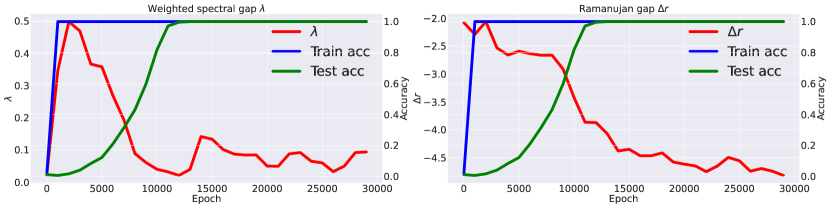

*(b) Зазор Рамануджана и взвешенный спектральный зазор $W_{\text{in}}$*

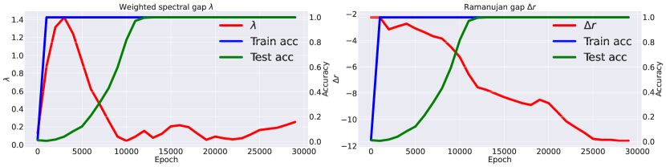

*(c) Зазор Рамануджана и взвешенный спектральный зазор $W_{\text{out}}$*

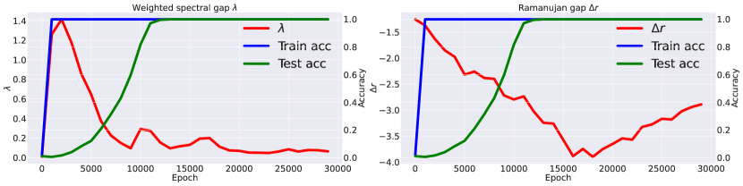

*(d) Зазор Рамануджана и взвешенный спектральный зазор $W_{\text{unemb}}$*

*Рисунок 20: Развитие взвешенного спектрального зазора и зазора Рамануджана по каждому слою.* **[p. 29]**
