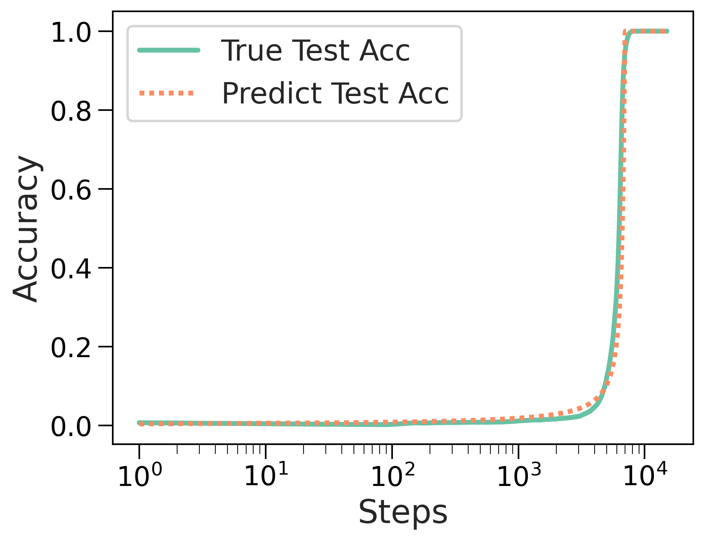

# Tan, Huang 2023 — Understanding Grokking Through A Robustness Viewpoint

См. также: [глобальный индекс понятий](../../concepts/index.md).

**Zhiquan Tan** (факультет математических наук, Университет Цинхуа), **Weiran Huang** (Институт Цин Юань, SEIEE, Шанхайский университет Цзяо Тун). Переписка — с Weiran Huang.

arXiv [2311.06597](https://arxiv.org/abs/2311.06597), 11 ноября 2023 (версия v2 — 2 февраля 2024). 11 цитирований — двадцать первая по цитируемости работа корпуса. Источник — нативный HTML arXiv версии v2.

Файлы разбора этой статьи:

- [`2311.06597.understanding-grokking-through-a-robustness-viewpoint.claims.txt`](2311.06597.understanding-grokking-through-a-robustness-viewpoint.claims.txt) — пронумерованные утверждения статьи с пометками разбора.
- [`2311.06597.understanding-grokking-through-a-robustness-viewpoint.license.txt`](2311.06597.understanding-grokking-through-a-robustness-viewpoint.license.txt) — лицензионная запись arXiv для этой статьи.

Схема якорей и правила ссылок на карточку — в [README папки статей](../README.md).

**Карточка-выдержка.** Лицензия статьи (`arxiv-nonexclusive`) не разрешает публикацию копии оригинала и полного перевода, поэтому карточка содержит редакторские секции и цитируемые фрагменты перевода (право цитирования). Полный текст статьи: <https://arxiv.org/abs/2311.06597>.

## Затрагиваемые понятия

**[Минимизация нормы весов](../../concepts/weight-norm-minimization.md)** — работа даёт норме весов **точный логический статус**: убывание $l_{2}$-нормы есть *достаточное*, но не необходимое условие гроккинга ([`p1-4`](#p1-4)). Довод не эмпирический, а выводимый: по лемме, взятой из Ma & Ying, норма весов и резкость ограничивают ошибку возмущения; чем меньше норма, тем устойчивее сеть; а из устойчивости следует, что тестовые точки, у которых есть достаточно близкий обучающий сосед, классифицируются верно ([`p4-7`](#p4-7)). Следствие 3.4 переносит то же рассуждение на $l_{1}$-норму, и заодно объясняет наблюдение Žunkovič & Ilievski, что $l_{1}$ работает лучше: она налагает больше ограничений.

**[Закон задержки по норме](../../concepts/norm-separation-delay-law.md)** — здесь же названа и слабость нормы как показателя: она меняется **не одновременно** с гроккингом на тесте ([`p1-2`](#p1-2)), а раньше. Отсюда и весь дальнейший поиск величин, совпадающих с гроккингом по времени ([`p9-8`](#p9-8)).

**[Меры прогресса](../../concepts/progress-measures.md)** — предложены две новые: **возмущённая взаимная информация** (PMI) и **возмущённая энтропия** (PE), считаемые по $l_{2}$-нормированным матрицам Грама признаков на возмущённом обучающем наборе ([`p2-4`](#p2-4)). Их отличие от нормы весов в том, что они меняются резко *в момент* гроккинга, а не до него.

**[Спектральный анализ](../../concepts/spectral-analysis-svd-esd-fve.md)** — обе величины суть матричные энтропии Реньи: $\operatorname{H}_{\alpha}(\mathbf{R})=\frac{1}{1-\alpha}\log\operatorname{tr}((\mathbf{R}/n)^{\alpha})$ по матрице Грама, то есть спектральные величины, не требующие оценки плотностей. При $\alpha=1$ это энтропия фон Неймана. Абляция показывает, что тенденция устойчива к выбору $\alpha$.

**[Причинные вмешательства](../../concepts/causal-ablation-intervention.md)** — из объяснения выводится приём: добавлять ко входу гауссов шум $\Delta\sim\mathcal{N}(0,\sigma^{2}\mathbf{I})$ с силой, приспосабливаемой по ходу обучения, $\sigma=\max(\lambda_{1}(1-\text{train acc}),\lambda_{2})$. Авторы называют это «дегроккингом» ([`p2-4`](#p2-4)); генерализация ускоряется и на MNIST, и на модульном сложении.

**[Варианты регуляризации](../../concepts/regularization-variants.md)** — попутное объяснение: если возмущение входа ускоряет генерализацию, то обычные приёмы обогащения данных — тоже своего рода возмущение, и потому гроккинг редок в обычных постановках. Это одно из самых простых объяснений редкости гроккинга в корпусе.

**[Группы](../../concepts/group-composition-non-commutative-s5.md)** — самое неожиданное наблюдение работы. Раз задача есть сложение в абелевой группе, выучив общее правило, модель обязана подчиняться закону коммутативности ([`p7-1`](#p7-1)). Авторы вводят «абелев тест»: совпадает ли предсказание для $a+b$ с предсказанием для $b+a$. Оказывается, при обычном обучении модель **не усваивает коммутативность до самого гроккинга**, хотя это необходимое условие задачи; при обучении с возмущениями — сразу после достижения 100 % на обучении.

**[Модульная арифметика](../../concepts/modular-arithmetic.md)** — постановка Nanda et al. воспроизведена (однослойный трансформер, $P=113$, 30 % данных на обучение), но задана новым вопросом: не «какой алгоритм выучен», а «какие свойства операции выучены раньше других» ([`p1-2`](#p1-2)).

**[Реальные данные](../../concepts/vision-real-world-data-mnist-cifar.md)** — все выводы проверяются параллельно на MNIST в постановке Omnigrok и на модульном сложении ([`p1-3`](#p1-3)); это редкая в корпусе привычка вести обе линии одновременно.

**[Фазовый переход](../../concepts/phase-transition.md)** — резкость перехода получает **количественную модель**: если считать вероятность соседства $P(r)$ гауссовой, а произведение нормы на резкость убывающим как $\max\{a-b\log_{10}(\text{шаги}),0\}$, то предсказанная кривая точности близко ложится на настоящую ([`fig-3`](#fig-3)). Это подгонка с тремя свободными параметрами, но она показывает, что резкий скачок совместим с плавным убыванием нормы.

**[Гроккинг](../../concepts/grokking.md)** — понятие раскладывается надвое: «в конце концов обобщает» и «обобщает резко». Первое объясняется устойчивостью, второе — формой $P(r)$ ([`p1-3`](#p1-3)).

Отдельно стоит сказать, чего в работе **нет**. Нет проверки предсказательного правила: гипотеза «гроккинг случится, если MID и ED малы или резко убывают до того, как точность на обучении дойдёт до 100 %» сформулирована, но не превращена в решающее правило с порогом и оценкой ошибок — только две пары графиков. И нет объяснения, *почему* обычное обучение не усваивает коммутативность: наблюдение приведено, механизм не разобран.

Карточки статей корпуса: [Power et al. 2022](../2201.02177.grokking-generalization-beyond-overfitting-on-small-algorithmic-datasets/2201.02177.grokking-generalization-beyond-overfitting-on-small-algorithmic-datasets.card.md) — задача; [Omnigrok](../2210.01117.omnigrok-grokking-beyond-algorithmic-data/2210.01117.omnigrok-grokking-beyond-algorithmic-data.card.md) — постановка MNIST и объяснение через норму, которому здесь придан статус достаточного условия; [Nanda et al. 2023](../2301.05217.progress-measures-for-grokking-via-mechanistic-interpretability/2301.05217.progress-measures-for-grokking-via-mechanistic-interpretability.card.md) — постановка модульного сложения и меры прогресса, привязанные к задаче; [Notsawo et al. 2023](../2306.13253.predicting-grokking-long-before-it-happens/2306.13253.predicting-grokking-long-before-it-happens.card.md) — другая попытка предсказать гроккинг заранее, тоже без решающего правила; [Merrill et al. 2023](../2303.11873.a-tale-of-two-circuits-grokking-as-competition-of-sparse-and-dense-subnetworks/2303.11873.a-tale-of-two-circuits-grokking-as-competition-of-sparse-and-dense-subnetworks.card.md) и [Varma et al. 2023](../2309.02390.explaining-grokking-through-circuit-efficiency/2309.02390.explaining-grokking-through-circuit-efficiency.card.md) — объяснения через подсети и эффективность, названные в обзоре.

## Что показано, а что предположено

Замечания редактора карточки по итогам разбора утверждений (`…claims.txt`). Работа короткая и держится на трёх опорах разной прочности: логическом уточнении статуса нормы весов, эмпирической находке про коммутативность и двух новых величинах.

**Уточнение статуса нормы — главный вклад.** До этой работы корпус пользовался нормой весов как объяснением; здесь показано, что она достаточна, но не необходима, и объяснено, **через что** она действует: через устойчивость к возмущению входа ([`p4-7`](#p4-7)). Цепочка «малая норма → малая ошибка возмущения → верная классификация соседей обучающих точек» выведена, а не постулирована.

**Цена вывода — сильные допущения.** Теорема 3.2 требует интерполирующего решения, липшицева градиента и того, чтобы у доли $\delta$ тестовых точек нашёлся обучающий сосед в радиусе $\epsilon(W^{*})$. Для MNIST это правдоподобно, для модульного сложения с one-hot входами «сосед в радиусе» — понятие куда более условное, и работа этого не обсуждает.

**Находка про коммутативность — самое ценное наблюдение.** Модель не усваивает $a+b=b+a$ до самого гроккинга ([`p7-1`](#p7-1)), хотя это необходимое условие правильного алгоритма. Это прямое свидетельство того, что обучение не идёт «от простого к сложному», и оно проверяемо: абелев тест воспроизводится в пару строк.

**Объяснение действенности возмущений — правдоподобное, но не доказанное.** Авторы связывают ускорение с усвоением коммутативности и подкрепляют это третьим приёмом — прямым штрафом на расхождение логитов «$a+b=$» и «$b+a=$», который работает ещё лучше. Довод сильный, но остаётся корреляционным: показано, что оба приёма усваивают коммутативность и оба ускоряют, а не что первое вызывает второе.

**Представления при этом различаются.** Абелев тест на логитах показывает, что после гроккинга обычное обучение даёт устойчивое нулевое расхождение, а обучение с возмущениями — хаотичное поведение. Значит, ускорение достигается не воспроизведением того же решения быстрее, а приходом к другому решению.

**Новые величины совпадают с гроккингом по времени — и это всё.** PMI и PE меняются резко именно в момент скачка тестовой точности ([`p9-8`](#p9-8)), что делает их лучшими индикаторами, чем норма. Но предсказание остаётся гипотезой: правило «MID и ED малы или резко убывают до 100 % на обучении» проиллюстрировано двумя парами графиков, без порога, без доли верных прогнозов, без отрицательных примеров.

**Теоретическая часть про величины доказывает не то, что нужно.** Теоремы 5.9 и 5.12 ограничивают MID и ED через ошибку возмущения представлений — то есть показывают, что эти величины **отражают устойчивость**. Что устойчивость связана с гроккингом, показано отдельно; связка «величины → предсказание гроккинга» замыкается только через эту цепочку и потому наследует все её допущения.

**Место в корпусе.** Работа занимает промежуточное положение между объяснениями через норму весов и попытками предсказать гроккинг заранее. Её вклад в вики двоякий: она аккуратно понижает статус нормы весов с объяснения до достаточного условия и добавляет к корпусу проверяемый факт о том, что необходимые свойства задачи (коммутативность) выучиваются не раньше, а одновременно с самой задачей.

## Ошибочные цитирования

Замечания редактора карточки: места, где эта статья передаёт чужие результаты с ошибкой или без авторских оговорок. Сюда ведут ссылки «подробности» из разделов «Ошибочные пересказы и цитирования этой статьи» карточек процитированных работ.

###### mc-2210-01117
**Omnigrok (2210.01117) — первенство, оговорка о вызове, норма как объяснение.** Три неточности в одном введении. (1) `"the MNIST image classification task introduced by [Liu et al., 2022b]"` — «задача классификации изображений MNIST, введённая в [Liu et al., 2022b]»: гроккинг на MNIST введён не в Omnigrok, а в предыдущей работе тех же авторов — [2205.10343, раздел 4.3](../2205.10343.towards-understanding-grokking-an-effective-theory-of-representation-learning/2205.10343.towards-understanding-grokking-an-effective-theory-of-representation-learning.card.md#p9-2), начинающийся со слов «We now demonstrate, for the first time…». (2) `"later found in traditional tasks such as image classification"` — «позже найденное и в обычных задачах вроде классификации изображений»: «found» подаёт гроккинг как встреченный, тогда как в цитируемой работе он вызван — [«в слегка нестандартной постановке, где он относительно слаб»](../2210.01117.omnigrok-grokking-beyond-algorithmic-data/2210.01117.omnigrok-grokking-beyond-algorithmic-data.card.md#p1-9). (3) `"One popular explanation for grokking is based on the decay of the network’s ($l_{2}$) weight norm [Liu et al., 2022b; Nanda et al., 2023]"` — «одно из популярных объяснений гроккинга основано на убывании ($l_{2}$-)нормы весов сети»: объяснение передано как общее, без авторской оговорки, что [«U»-образную форму лучше считать эмпирически распространённой, нежели доказуемо универсальной](../2210.01117.omnigrok-grokking-beyond-algorithmic-data/2210.01117.omnigrok-grokking-beyond-algorithmic-data.card.md#sec-6). Показательно, что дальше статья сама спорит с этим объяснением с позиций робастности — неточен пересказ чужой позиции, а не собственная.

---

# Цитируемые фрагменты перевода

Ниже приведены только те фрагменты перевода, на которые ссылаются карточки корпуса (право цитирования). Нумерация якорей `pN-M` / `fig-N` / `sec-X` совпадает с полной карточкой и оригиналом.

## Аннотация

###### p1-2

В последнее время большое внимание привлекло любопытное явление, названное гроккингом: генерализация наступает много позже того, как модель изначально переобучилась на обучающие данные. Мы пытаемся понять это на первый взгляд странное явление через устойчивость нейронной сети. Со стороны устойчивости мы показываем, что популярная $l_{2}$-норма весов сети (величина) на деле есть *достаточное* условие гроккинга. Опираясь на эти наблюдения, мы предлагаем приёмы на основе возмущений, ускоряющие генерализацию. Кроме того, мы рассматриваем обычный процесс обучения на наборе модульного сложения и находим, что до гроккинга он почти не выучивает других основных групповых операций — например, закона коммутативности. Что интересно, ускорение генерализации при нашем приёме объясняется выучиванием закона коммутативности — *необходимого* условия того, что модель грокает на тестовом наборе. Мы также эмпирически находим, что $l_{2}$-норма связана с гроккингом на тестовых данных не своевременно, и предлагаем новые величины, основанные на устойчивости и теории информации; они хорошо связаны с явлением гроккинга и могут пригодиться для его предсказания.

## 1 Введение

###### p1-3

Генерализация переопределённых по числу параметров нейронных сетей — увлекательная тема в сообществе машинного обучения, бросающая вызов интуиции классической теории обучения. Недавно исследователи обнаружили любопытное явление, названное гроккингом, впервые замеченное при обучении на нетрадиционных алгоритмических наборах данных [Power et al., 2022], а позже найденное и в обычных задачах вроде классификации изображений [Liu et al., 2022b]. Гроккинг — это неожиданная генерализация задач обучения, наступающая много позже того, как модель изначально переобучилась на обучающие данные. Это явление привлекает всё больше внимания благодаря его сходству с «фазовым переходом» [Nanda et al., 2023]. С момента первого сообщения [Power et al., 2022] явление получило множество объяснений с разных сторон [Nanda et al., 2023; Liu et al., 2022b; Merrill et al., 2023; Barak et al., 2022; Davies et al., 2023; Thilak et al., 2022; Gromov, 2023; Notsawo Jr et al., 2023; Varma et al., 2023].

###### p1-4

Одно из популярных объяснений гроккинга опирается на убывание ($l_{2}$-)нормы весов сети [Liu et al., 2022b; Nanda et al., 2023]. На рисунке 1 мы приводим кривые точности и нормы весов в ходе обучения на двух стандартных наборах данных. Видно, что когда точность на тесте быстро растёт, норма весов соответственно быстро падает. Тогда возникает естественный вопрос: является ли эта величина необходимым и достаточным признаком гроккинга? Из рисунка 1 видно, что убывание нормы весов обычно происходит до гроккинга на тестовом наборе, что делает её, по-видимому, достаточным условием гроккинга, но не необходимым. И действительно, мы можем это доказать. Грубо говоря, когда устойчивость сети возрастает до определённого уровня, наступает гроккинг. Когда норма весов убывает, устойчивость растёт, а значит, убывание нормы весов есть достаточное условие гроккинга. Побуждаемые целью повысить устойчивость, мы исследуем применение обучения с возмущениями для ускорения генерализации.

###### p2-4

- Мы теоретически объясняем, почему убывание $l_{2}$-нормы весов ведёт к гроккингу, — через устойчивость сети. - Побуждаемые повышением устойчивости, мы применяем обучение с возмущениями для ускорения генерализации. - Мы находим удивительный факт: обычное обучение на наборе модульного сложения не выучивает закон коммутативности до гроккинга, что противоречит интуиции. Далее мы пользуемся этим, чтобы объяснить успех нашей новой стратегии с возмущениями. - Заимствуя идеи из теории устойчивости и теории информации, мы вводим новые величины, лучше связанные с ходом гроккинга и, возможно, пригодные для его предсказания.

##### **Определение 2.1**($\alpha$-order matrix entropy)**.**

###### p3-4

Пусть дана положительно полуопределённая матрица $\mathbf{R}\in\mathbb{R}^{n\times n}$, у которой $\mathbf{R}(i,i)=1$ для каждого $i=1,\cdots,n$, и $\alpha>0$. Энтропия (Реньи) порядка $\alpha$ для матрицы $\mathbf{R}$ определяется так:

##### **Теорема 3.2****.**

###### p4-7

Из теоремы 3.2 ясно, что при убывании $l_{2}$-нормы порог расстояния $\epsilon(W^{*})$ растёт, и потому растёт доля тестовых образцов, у которых есть сосед из обучающего набора на расстоянии не более $\epsilon(W^{*})$. Тогда ясно, что точность на тесте растёт, а значит, убывание $l_{2}$-нормы весов и вправду есть достаточное условие генерализации на тестовом наборе.

##### **Следствие 3.3****.**

###### fig-3



*Рисунок 3: Предсказанная точность совпадает с настоящей точностью на тесте.* **[p. 5]**

### 4.1 Необходимое условие из теории групп

###### p7-1

Поскольку задача — модульное сложение, из теории групп следует, что, как только модель по-настоящему выучит общее правило сложения, она обязана подчиняться закону коммутативности.

##### **Определение 5.2**(Perturb Entropy)**.**

###### p9-8

Из приведённых наблюдений мы находим, что предложенные две величины, PMI и PE, резко меняются *в момент* гроккинга. Это делает их лучшими показателями гроккинга, чем $l_{2}$-норма весов.

```yaml
paper:
  id: 2311.06597
  title: "Understanding Grokking Through A Robustness Viewpoint"
  authors: [Zhiquan Tan, Weiran Huang]
  affiliation: "Tsinghua University; Shanghai Jiao Tong University"
  date: 2023-11-11
  venue: "препринт arXiv (v2 от 2024-02-02)"
  citations: 11
  source: native-html-v2

core_claim:
  name: "гроккинг со стороны устойчивости к возмущению входа"
  logic: "убывание l2-нормы весов — ДОСТАТОЧНОЕ, но не необходимое условие гроккинга"
  chain: "малая норма и малая резкость -> малая ошибка возмущения (лемма 3.1) ->
    тестовые точки с близким обучающим соседом классифицируются верно (теорема 3.2)"
  timing: "норма меняется раньше гроккинга; предложены величины, меняющиеся
    одновременно с ним"

new_metrics:
  pmi: "возмущённая взаимная информация: матричная взаимная информация l2-нормированных
    матриц Грама признаков входного и выходного слоёв на возмущённом обучающем наборе"
  pe: "возмущённая энтропия: матричная энтропия Реньи той же матрицы Грама"
  mid_ed: "разности возмущённой и невозмущённой величин, предложены для предсказания"

interventions:
  degrokking: "гауссов шум на вход с силой sigma = max(lambda_1 (1 - train acc), lambda_2);
    MNIST: 0.06/0.03, модульное сложение: 0.5/0.4"
  abelian_degrok: "штраф на расхождение логитов a+b и b+a, коэффициент 100 —
    работает лучше возмущений"

setup:
  mnist: "ReLU-MLP шириной 200 и глубиной 3, MSE-потеря, AdamW, lr 1e-3, батч 200
    (постановка Omnigrok)"
  modular: "однослойный ReLU-трансформер, P = 113, d = 128, 4 головы, MLP 512,
    30 % пар на обучение (постановка Nanda et al.)"

findings:
  - id: 1
    claim: "l2-норма весов — достаточное, но не необходимое условие гроккинга"
    anchor: p1-4
  - id: 2
    claim: "норма меняется не одновременно с гроккингом на тесте, а раньше"
    anchor: p1-2
  - id: 3
    claim: "убывание нормы увеличивает радиус, в котором тестовые точки покрыты
      обучающими соседями, и потому повышает точность"
    anchor: p4-7
  - id: 4
    claim: "при обычном обучении модель не усваивает коммутативность до самого
      гроккинга, хотя это необходимое условие задачи"
    anchor: p7-1
  - id: 5
    claim: "обучение с возмущениями усваивает коммутативность сразу после 100 % на
      обучении и ускоряет генерализацию"
    anchor: p2-4
  - id: 6
    claim: "PMI и PE меняются резко в момент гроккинга — в отличие от нормы весов"
    anchor: p9-8
  - id: 7
    claim: "резкость перехода воспроизводится моделью с гауссовой вероятностью
      соседства"
    anchor: fig-3

gaps:
  - "предсказателя как такового нет: гипотеза о MID и ED показана двумя парами
    графиков, без порога, доли верных прогнозов и отрицательных примеров"
  - "теоремы о MID и ED показывают связь с устойчивостью, а не с гроккингом:
    связка замыкается через цепочку раздела 3 и наследует её допущения"
  - "теорема 3.2 требует интерполирующего решения и липшицева градиента; для
    one-hot входов модульного сложения понятие «близкого соседа» условно"
  - "модель резкости перехода имеет три свободных параметра, подобранных под один прогон"
  - "причинность «возмущения работают через коммутативность» показана совпадением"
  - "для доказательств взято alpha = 2, в экспериментах alpha = 1"

corpus_tension:
  omnigrok: "объяснение через норму весов не отвергается, а получает точный статус
    достаточного условия, действующего через устойчивость"
  nanda: "их меры прогресса привязаны к разобранному механизму; PMI и PE не привязаны
    ни к чему, кроме признаков и матрицы Грама"
  notsawo: "та же цель предсказать гроккинг заранее и та же незавершённость —
    решающее правило не построено"

concept_cards:
  weight-norm-minimization: p1-4
  norm-separation-delay-law: p1-2
  progress-measures: p2-4
  regularization-variants: p2-4
  group-composition-non-commutative-s5: p7-1
  modular-arithmetic: p1-2
  vision-real-world-data-mnist-cifar: p1-3
  phase-transition: p4-7
  grokking: p1-3

sources:
  original_html: original/2311.06597.native.html
  converted_text: original/2311.06597.understanding-grokking-through-a-robustness-viewpoint.md
  images_dir: images/
  pdf: https://arxiv.org/pdf/2311.06597v2

anchors:
  scheme: "pN-M | fig-N | sec-N (token headings, cross-viewer portable)"
  policy: "якоря заводятся только там, где на них ссылаются; разрывы страниц якорей не несут"
  paragraph: [p1-2, p1-3, p1-4, p2-4, p3-3, p4-7, p5-3, p6-5, p7-1, p9-8, p11-2]
  figure: [fig-1, fig-2, fig-3, fig-4, fig-5, fig-6, fig-8, fig-10]

review_summary:                   # см. раздел «Что показано, а что предположено»
  strong: "статус нормы весов уточнён логически и выведен через устойчивость;
    находка про коммутативность проверяема в пару строк и показывает, что обучение
    не идёт от простого к сложному; отрицательный результат из приложения B приведён"
  weak: "предсказание гроккинга заявлено, но правило решения не построено;
    причинность приёма с возмущениями показана совпадением; модель резкости перехода
    подогнана тремя параметрами"
  authors_own_limits:
    - "ступенчатая форма кривой на алгоритмическом наборе оставлена без объяснения"
    - "вычисление величин упрощено: батчевое усреднение, одна выборка возмущения"

translation:
  status: complete
  formula_parity: "display 19/19, inline 247/251"
  figures: "24/24"
  pagination: "19 из 19 страниц отмечены"
  note: "четыре inline-формулы — надстрочные номера аффилиаций в строке авторов
    конверсии; карточка даёт аффилиации по-русски в шапке"
```
