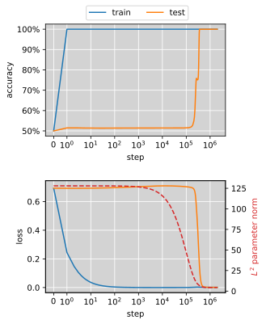
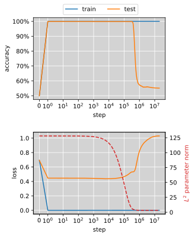
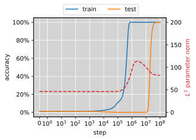
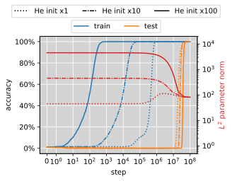
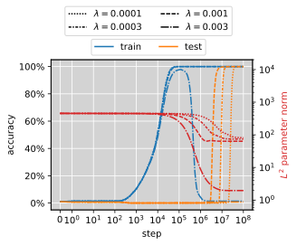
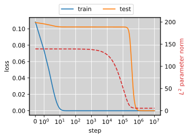
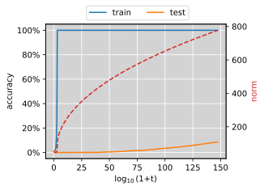
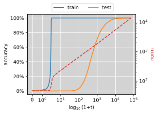

# Lyu et al. 2024 — Dichotomy of Early and Late Phase Implicit Biases Can Provably Induce Grokking

См. также: [глобальный индекс понятий](../../concepts/index.md).
arXiv [2311.18817v2](https://arxiv.org/abs/2311.18817), ноябрь 2023 (v2 — апрель 2024). Колонтитул PDF: «Published as a conference paper at ICLR 2024».

**Kaifeng Lyu** (равный вклад) — Princeton University.
**Jikai Jin** (равный вклад) — Stanford University.
**Zhiyuan Li** — Toyota Technological Institute at Chicago.
**Simon S. Du** — University of Washington.
**Jason D. Lee** — Princeton University.
**Wei Hu** — University of Michigan.

Код: https://github.com/vfleaking/grokking-dichotomy.

Оригинал и производные файлы этой папки:

- [`original/2311.18817.native.html`](original/2311.18817.native.html) — первоисточник, нативный HTML-рендеринг arXiv (LaTeXML), скачан как есть.
- [`original/2311.18817.dichotomy-of-early-and-late-phase-implicit-biases-can-provably-induce-grokking.md`](original/2311.18817.dichotomy-of-early-and-late-phase-implicit-biases-can-provably-induce-grokking.md) — конверсия оригинала в Markdown без правок содержания; английский текст для сверки перевода.
- [`images/`](images/) — иллюстрации статьи в исходном разрешении (8 файлов).
- [`2311.18817.dichotomy-of-early-and-late-phase-implicit-biases-can-provably-induce-grokking.claims.txt`](2311.18817.dichotomy-of-early-and-late-phase-implicit-biases-can-provably-induce-grokking.claims.txt) — рабочий разбор: пронумерованные утверждения с пометками.

Схема якорей и правила ссылок на карточку — в [README папки статей](../README.md).

## Затрагиваемые понятия

**[Гроккинг](../../concepts/grokking.md)** — работа даёт корпусу первое доказательство гроккинга в нейросетевой постановке и вместе с ним точный механизм: гроккинг возникает из «дихотомии» раннего и позднего неявных смещений — большая инициализация задаёт раннюю склонность к ядерному предсказателю, малое ненулевое затухание весов задаёт позднюю склонность к решению минимальной нормы / максимального зазора, а между ними лежит доказуемо резкий переход ([с. 2, абз. 2](#p2-2)). Оба пробела предшественников названы прямо: «No prior work has rigorously proved grokking in a neural network setting» и «No prior work has provided a quantitative explanation as to why the transition from memorization to generalization is often sharp» ([с. 1, абз. 6](#p1-6)). Чего в работе нет: гроккинг доказан только на двух *построенных* примерах — разрежённой линейной классификации диагональными линейными сетями и переопараметризованном матричном восполнении; для модульного сложения, единственной задачи из литературы о гроккинге, показанной в статье, не доказано ничего ([рис. 2](#fig-2) — воспроизведение, а не теорема). Нет и разбора того, как убрать задержку: «our work focuses on understanding the cause of grokking but does not study how to make neural nets generalize without so much delay in time» ([с. 9, абз. 9](#p9-9)).

**[Переход lazy→rich](../../concepts/lazy-to-rich-kernel-to-feature-learning.md)** — работа даёт этому переходу строгие количественные границы с обеих сторон: до момента $\frac{1-c}{\lambda}\log\alpha$ предсказатель после нормировки сходится к максимально $L^{2}$-зазорному линейному классификатору на NTK-признаках (теорема 3.4, [с. 6, абз. 1](#p6-1)), а к моменту $\frac{1+c}{\lambda}\log\alpha$ находится время, в котором направление параметров лежит вдоль KKT-точки задачи максимизации зазора (теорема 3.5, [с. 6, абз. 7](#p6-7)). Термины у авторов — *kernel regime* и *rich regime*, взятые из Moroshko et al. 2020, а не *lazy*/*rich*: слово «lazy» появляется в статье только в названии работы Chizat et al. и в пересказе одновременной работы Kumar et al. ([с. 16, абз. 4](#p16-4)), где сходство выводов признано, а отличие заявлено как «rigorous analyses for both lazy and rich regimes with quantitative bounds». Чего в работе нет: поздняя сторона обеих теорем даёт лишь KKT-точку, а не глобальный оптимум, и авторы сами оговаривают, что для невыпуклых $f_{i}$ это только необходимое условие первого порядка ([с. 6, абз. 8](#p6-8)); утверждения о позднем режиме имеют вид «существует последовательность времён $t_{k}$ в окне», а не «для всех достаточно больших $t$».

**[Нейронное касательное ядро (NTK)](../../concepts/neural-tangent-kernel-ntk.md)** — ядерный режим *при затухании весов* объявлен самостоятельным результатом, интересным вне задачи о гроккинге, и отличие от обычного NTK-разбора названо прямо: там норма меняется мало, здесь она меняется на порядки, а ядерный режим держится за счёт большого множителя ([с. 2, абз. 5](#p2-5)). Техническая находка, на которой всё стоит: под затуханием весов ${\boldsymbol{\theta}}(t;\alpha\bar{{\boldsymbol{\theta}}}_{\mathrm{init}})\approx\alpha e^{-\lambda t}\bar{{\boldsymbol{\theta}}}_{\mathrm{init}}$ — норма падает экспоненциально, а направление остаётся близким к начальному, и «удалённость» меряется не абсолютным смещением $\|{\boldsymbol{\theta}}(t)-{\boldsymbol{\theta}}(0)\|_{2}$, как в существующих разборах, а нормированной величиной $\|\frac{e^{\lambda t}}{\alpha}{\boldsymbol{\theta}}(t)-\bar{{\boldsymbol{\theta}}}_{\mathrm{init}}\|_{2}$ ([с. 6, абз. 3](#p6-3)). Чего в работе нет: измерения эмпирического NTK, ширинных пределов и вообще всякого обращения к бесконечной ширине — «NTK-признак» здесь определён как $\nabla f(\bar{{\boldsymbol{\theta}}}_{\mathrm{init}};{\boldsymbol{x}})$ при конечной модели, а асимптотика ведётся по масштабу инициализации $\alpha$, а не по ширине.

**[Максимизация зазора / неявное смещение](../../concepts/margin-maximization-implicit-bias.md)** — это первоисточник самой формулировки «дихотомия ранней и поздней неявных смещений», которую карточка понятия пока цитирует из вторых рук, через Mohamadi et al. 2024. Позднее смещение задано двумя задачами: максимизация зазора (R1) для классификации и минимизация нормы (R2) для регрессии; в диагональном линейном случае глобальный оптимум (R1) равен максимально $L^{1}$-зазорному классификатору, и «our theory suggests a sharp transition at time $\frac{1}{\lambda}\log\alpha$ from max $L^{2}$-margin linear classifier to max $L^{1}$-margin linear classifier» ([с. 7, абз. 5](#p7-5)). Чего в работе нет: доказательства глобальной оптимальности — для диагональных сетей авторы лишь «полагаем, что можно» («we believe that one may be able to obtain the global optimality», [с. 7, абз. 6](#p7-6)), для матричного восполнения глобальность заменена «положительным свидетельством» теоремы 3.12 ([с. 9, абз. 4](#p9-4)).

**[Минимизация нормы весов](../../concepts/weight-norm-minimization.md)** — работа даёт понятию строгую форму на регрессионной стороне: позднее смещение есть KKT-точка задачи $\min\frac{1}{2}\|{\boldsymbol{\theta}}\|_{2}^{2}$ при $f_{i}({\boldsymbol{\theta}})=y_{i}$ (R2, теорема 3.10), а в матричном восполнении глобальный оптимум этой задачи — решение минимальной ядерной нормы ([с. 9, абз. 3](#p9-3)). Существенно, что норма падает не постепенно и не «вдоль многообразия нулевой потери»: в ядерной фазе она падает экспоненциально по времени, $\|{\boldsymbol{\theta}}(t)\|_{2}\approx\alpha e^{-\lambda t}$, при почти неизменном направлении, а весь поворот направления умещается в узкое окно около $\frac{1}{\lambda}\log\alpha$. Норма вынесена на вторую ось всех четырёх иллюстраций, и на них видно, что при затухании весов резкий переход теста совпадает с обвалом нормы ([рис. 1](#fig-1), [рис. 3](#fig-3)), а без затухания весов — наоборот, с её монотонным ростом на несколько порядков ([рис. 4](#fig-4)). Чего в работе нет: разбора этих кривых — норма нанесена как иллюстрация, ни порога, ни закона, ни меры по ней не строится, и языка «многообразия нулевой потери» в статье тоже нет.

**[Weight decay](../../concepts/weight-decay.md)** — работа даёт затуханию весов роль источника позднего смещения и выводит из него количественный срок перехода $t^{*}=\frac{1}{\lambda}\log\alpha$: обратно пропорционально $\lambda$ и логарифмически по масштабу инициализации. Опыт на модульном сложении подтверждает направление сдвига в обе стороны и добавляет цену: «when weight decay surpasses a small threshold, the regularization strength can become so strong that it even hinders the optimization of the training loss and causes the training accuracy to collapse eventually», что авторы отмечают как согласующееся с Lewkowycz, Gur-Ari 2020 ([с. 4, абз. 1](#p4-1)). Чего в работе нет: количественной проверки самого закона — показано только направление сдвига, подгонки коэффициента или наклона не приводится; вся теория ведётся для градиентного потока на $\mathcal{L}+\frac{\lambda}{2}\|{\boldsymbol{\theta}}\|_{2}^{2}$, то есть для $L^{2}$-регуляризации, а не для развязанного AdamW-варианта.

**[Когда регуляризация необходима](../../concepts/regularization-necessity.md)** — работа даёт корпусу редкий ответ «не необходима, но необходима для *резкости*». Приложение B.1 прямо ставит вопрос и отвечает опытом: без затухания весов на том же модульном сложении гроккинг остаётся, но «the transition is no longer sharp» — тест ползёт от ~0 % к 100 % при росте времени от $10^{10^{2}}$ до $10^{10^{4}}$ ([с. 18, абз. 4](#p18-4)), и медленность объяснена известной скоростью схождения к максимальному зазору $\mathcal{O}(\frac{\log\log t}{\log t})$ для линейной логистической регрессии ([с. 19, абз. 1](#p19-1)). Второй возможный источник позднего смещения — снижение остроты (label noise SGD, 1-SAM): по результату Li et al. 2022 переход там резок лишь в логарифмической шкале времени, «less sharp than our main results» ([с. 19, абз. 6](#p19-6)). Существенная для корпуса подробность, оставленная авторами без обсуждения: на [рис. 4](#fig-4) обобщение без затухания весов приходит при *растущей* норме параметров, тогда как во всех прогонах с затуханием оно совпадает с её обвалом. Чего в работе нет: утверждения, что большая инициализация и малое затухание весов необходимы, — наоборот, в заключении сказано, что «these may not be the only source of the dichotomy of the implicit biases» ([с. 9, абз. 9](#p9-9)).

**[Масштаб инициализации](../../concepts/initialization-scale.md)** — работа превращает масштаб в управляющий параметр с формулой: время перехода растёт как $\log\alpha$, и опыт показывает откладывание резкого перехода при росте $\alpha$ от $1$ до $100$ ([с. 3, абз. 7](#p3-7)). Существенна и оговорка об устройстве опыта: при большой инициализации модель выдаёт очень большое случайное число на каждом примере, что даёт неустойчивость обучения, и чтобы убрать эту мешающую причину, веса второго слоя обнулены — то же требование стоит в теории как допущение 3.2 о нулевом выходе при инициализации. Чего в работе нет: утверждения, что *стандартный* масштаб уже велик, — $\alpha$ здесь домножает He-инициализацию, и базовый прогон ведётся при $\alpha=1$; нет и разбора распределения инициализации (симметризованная инициализация Chizat et al. и «difference trick» Hu et al. лишь названы как равноценные способы обнулить выход).

**[Зона Златовласки](../../concepts/goldilocks-zone.md)** — работа отвергает объяснение через зону Златовласки и на его месте строит своё. Довод — однородность: у MLP и CNN с ReLU выход однороден по параметрам, $f(c{\boldsymbol{\theta}};{\boldsymbol{x}})=c^{L}f({\boldsymbol{\theta}};{\boldsymbol{x}})$, «as a result, it is impossible to explain the effect of norm just from the expressive power, since all classifiers that can be represented with a certain norm can also be represented by all other norms» ([с. 4, абз. 2](#p4-2)). Отдельно отмечено, что Fort, Scherlis 2019 и Liu et al. 2023 «did not provide much explanation on why such a narrow Goldilocks zone could exist in the first place». Чего в работе нет: опровержения самого наблюдения о зоне — рецепт «большая инициализация плюс малое ненулевое затухание весов» взят у Liu et al. 2023 целиком и служит отправной точкой; отвергнуто лишь объяснение через норму.

**[Фазовый переход](../../concepts/phase-transition.md)** — работа даёт корпусу первое *количественное* определение резкости: смены множителя с $(1-c)$ на $(1+c)$ при том же $\frac{1}{\lambda}\log\alpha$ достаточно, чтобы неявное смещение сменилось целиком, и это заявлено как второй из двух вкладов против размытых переходов у предшественников ([с. 5, абз. 6](#p5-6)). Существенное ограничение: резкость есть свойство предела $\alpha\to+\infty$ при связанном затухании $\lambda(\alpha)=\Theta(\alpha^{-p})$, оценок при конкретных конечных $\alpha$ и $\lambda$ в работе нет. Чего в работе нет: языка фазовых переходов как физической теории — ни параметра порядка, ни критических показателей, ни термодинамического предела; сочетание «phase transition» встречается у авторов дважды и оба раза в пересказе чужого — рогатки Thilak et al. и HMM-разбора Hu et al., — а собственное словоупотребление авторов ограничено «early phase» и «late phase»

**[Модульная арифметика](../../concepts/modular-arithmetic.md)** — работа берёт модульное сложение при $p=97$ как мотивирующий опыт и намеренно упрощает постановку «without involving too many confounding factors»: двухслойная ReLU-сеть шириной $h=1024$ на конкатенации one-hot-представлений, полнобатчевый GD, 40 % данных в обучении, шаг $0.002$, затухание $10^{-4}$ ([с. 3, абз. 4](#p3-4)). Воспроизведение удаётся: обучающая точность доходит до 100 % за $10^{6}$ шагов, а тестовая скачет на порядок позже. Чего в работе нет: никакой теории для этой задачи — не доказано ни что max-margin-решение для сложения по модулю обобщает, ни что NTK-решение не обобщает; доказательства касаются только двух построенных примеров, а модульное сложение служит иллюстрацией рычагов $\alpha$ и $\lambda$.

**[Границы генерализации](../../concepts/generalization-bounds.md)** — работа выводит разрыв в выборочной сложности, из которого и следует гроккинг в первом примере: на $k$-разреженной линейной классификации максимально $L^{1}$-зазорному классификатору хватает $\mathcal{O}(k^{2}\log d)$ примеров, а максимально $L^{2}$-зазорному нужно $\mathcal{O}(kd)$ ([с. 7, абз. 7](#p7-7)); обе оценки получены через радемахеровскую сложность (теоремы E.4 и E.5). Чего в работе нет: нижней границы для максимально $L^{2}$-зазорного классификатора — обе оценки суть верхние границы ошибки, поэтому строго показано не «ядерное решение не обобщает», а «его гарантия слабее». На регрессионной стороне негенерализация ядерного решения, наоборот, показана явно и без всяких границ: в ядерном режиме все ненаблюдённые элементы матрицы заполняются нулями ([с. 9, абз. 2](#p9-2)).

**[Фаза меморизации](../../concepts/memorization-phase.md)** — работа даёт плато точное содержание: это не «ничего не происходит», а полноценная подгонка обучающей выборки *ядерным* предсказателем, чья форма выписана в замкнутом виде (максимальный $L^{2}$-зазор на NTK-признаках в классификации, минимально-нормовое ядерное решение в регрессии). Длительность плато при этом задана формулой $\frac{1}{\lambda}\log\alpha$, а не измерена. Чего в работе нет: понятия «запоминание» как отдельного механизма — слово «memorization» употребляется описательно, в пересказе Power et al. и в названии перехода «from memorization to generalization», и никакой меры запоминания не вводится.

**[Унгрокинг](../../concepts/ungrokking.md)** — работа вводит родственное, но иначе устроенное явление, которое называет *misgrokking*: обращением условия построен набор данных, разделимый с большим $L^{2}$-зазором ($\gamma=25$, $n=32$), на котором сеть сперва достигает 100 % точности и на обучении, и на тесте, а после долгого обучения тест падает почти до 50 % ([с. 7, абз. 8](#p7-8), [рис. 1](#fig-1)). Отличие от ungrokking у Varma et al. существенно: там регресс вызван сокращением обучающей выборки после гроккинга, здесь — тем, что позднее смещение само по себе не совпадает с данными, при неизменной выборке. Ценность для корпуса — довод против прочтения «гроккинг есть переход к простому решению»: направление перехода задаётся не простотой, а совпадением позднего смещения с данными. Чего в работе нет: сопоставления misgrokking с ungrokking и semi-grokking — оба термина Varma et al. в статье лишь названы, в обзоре приложения A ([с. 16, абз. 1](#p16-1)).

**[Меры прогресса](../../concepts/progress-measures.md)** — работа лишь упоминает меры прогресса, и упоминает критически: целый подраздел обзора отведён им, а вывод один — «why progress measures themselves can make progress is still not well understood and requires new insights into the training dynamics, which is the focus of our work» ([с. 16, абз. 2](#p16-2)). Никакой меры прогресса работа не вводит и не считает; в карточке понятия ей место в «Цитированиях».

**[Эффективность контуров](../../concepts/circuit-efficiency.md)**, **[эффект рогатки](../../concepts/slingshot.md)**, **[двойной спуск](../../concepts/double-descent.md)** и **[эффективная теория](../../concepts/effective-theory-statistical-mechanics.md)** — все четыре затронуты только обзором приложения A, и претензия ко всем одна и та же: «none of these works provides rigorous justification their claims with mathematical analysis for neural net training, while our work is grounded by theoretical analyses of implicit biases in the kernel and rich regimes» ([с. 16, абз. 1](#p16-1)). Varma et al. пересказаны через норму параметров, Thilak et al. — через циклическое поведение нормы последнего слоя, Davies et al. — через два узора с разной скоростью обучения и качеством обобщения; эффективная теория Liu et al. 2022 разобрана отдельно, в подразделе о динамике ([с. 16, абз. 3](#p16-3)), и сведена к медленной скорости выучивания входных вложений. Ни одна из этих трактовок в работе не проверяется и не опровергается опытом.

---

## Несогласованности внутри статьи

**Допущение $\mathcal{C}^{2}$-гладкости исключает ReLU, на котором ведётся весь мотивирующий опыт.** Допущение 3.1 требует одновременно $L$-однородности и $\mathcal{C}^{2}$-гладкости, и авторы сами пишут: «we also need to assume the $\mathcal{C}^{2}$-smoothness to ease the definition and analysis of gradient flow, which excludes the use of any non-smooth activation» ([с. 4, абз. 6](#p4-6)). При этом и раздел 2, и вся риторика об однородности («when talking about MLPs and CNNs with ReLU activation, which are commonly used in practice», [с. 4, абз. 2](#p4-2)) ведутся именно на ReLU-сетях. Обход назван — субдифференциал Кларка, — но не проделан: «we choose to make this assumption for simplicity». Практическое следствие: теоремы 3.4, 3.5, 3.9 и 3.10 к сети из формулы (1), на которой получены рисунки 2 и 4, формально неприменимы.

**Два рычага теории связаны, а в опыте крутятся порознь.** Асимптотика всюду ведётся при $\alpha\to+\infty$ с затуханием, привязанным к масштабу как $\lambda(\alpha)=\Theta(\alpha^{-p})$ ([с. 4, абз. 7](#p4-7)): $\alpha$ растёт и $\lambda$ падает одновременно. В опытах раздела 2, наоборот, меняется ровно один рычаг при закреплённом другом — рисунок 2 (b) варьирует $\alpha$ при $\lambda=10^{-4}$, рисунок 2 (c) варьирует $\lambda$ при He-инициализации. Разделить в теории, что именно из двух создаёт резкость, поэтому нельзя, и предсказание $t^{*}=\frac{1}{\lambda}\log\alpha$ проверяется опытом в постановке, которой предел не отвечает.

**Ссылка на равенство в доказательстве теоремы E.4 указывает не туда.** Доказательство заканчивается словами «Combining this with (41) completes the proof», тогда как выведенное двумя строками выше и нужное здесь неравенство — (39); (41) относится к доказательству следующей теоремы E.5, где та же фраза стоит уже верно. Описка правки, но при сверке выкладки она сбивает.

**«For any all constants».** Формулировка теоремы 3.4 начинается со сдвоенного квантора — «For any all constants $c\in(0,1)$» ([с. 6, абз. 1](#p6-1)); в параллельной теореме 3.9 стоит «For all constants $c\in(0,1)$». Смысл однозначен, но при дословном цитировании формулировки это стоит знать.

---

## Что доказано, что показано и что предположено

Работа распадается на слои разной прочности, и цена цитаты зависит от слоя.

**Доказано.** Ранняя сторона обеих пар теорем (3.4 для классификации, 3.9 для регрессии) — законченные утверждения: в момент $\frac{1-c}{\lambda}\log\alpha$ предсказатель сходится к ядерному решению при $\alpha\to+\infty$. Доказан и ядерный режим при затухании весов как таковой — результат, заявленный самостоятельным ([с. 2, абз. 5](#p2-5)). Доказаны обе радемахеровские верхние границы (E.4, E.5), из которых берётся разрыв $\mathcal{O}(k^{2}\log d)$ против $\mathcal{O}(kd)$. Доказано следствие 3.11: в ядерном режиме матричное восполнение заполняет все ненаблюдённые элементы нулями.

**Доказано с ценой, которую надо называть.** Поздняя сторона (теоремы 3.5 и 3.10) даёт KKT-точку, а не глобальный оптимум, и это признано прямо: «the KKT condition is a first-order necessary condition for global optimality, but it is not sufficient in general since $f_{i}({\boldsymbol{\theta}})$ can be highly non-convex» ([с. 6, абз. 8](#p6-8)). Форма утверждения тоже слабее, чем читается: не «для всех достаточно больших $t$», а «существует последовательность времён $t_{k}$ в окне $[\frac{1}{\lambda}\log\alpha_{k},\frac{1+c}{\lambda}\log\alpha_{k}]$, каждая предельная точка которой лежит вдоль KKT-точки». Всё вместе живёт в пределе $\alpha\to+\infty$ при $\lambda=\Theta(\alpha^{-p})$; неравенств при конкретных конечных $\alpha,\lambda$ работа не даёт, так что «резкость» — свойство предела, а не измеренная величина. Разбирается градиентный поток, а не GD, SGD или Adam, которыми ведутся сами опыты.

**Предсказано до опыта и подтверждено.** Из $t^{*}=\frac{1}{\lambda}\log\alpha$ следует, что увеличение $\alpha$ откладывает переход, а увеличение $\lambda$ приближает, — обе стороны проверены ([рис. 2](#fig-2)). Из разрыва выборочной сложности следует гроккинг на $k$-разреженной классификации — проверено при $n=256$, $d=10^{5}$, $k=3$ ([рис. 1](#fig-1) a). Самое сильное здесь — misgrokking: явление построено обращением условия теории и затем наблюдено ([рис. 1](#fig-1) b); это предсказание, которое нечем было бы получить, идя от данных.

**Объявлено рассуждением или свидетельством.** Глобальная оптимальность KKT-точки в матричном восполнении не доказана; теорема 3.12 названа «positive evidence» в её пользу и говорит о пределе $t\to\infty$ («if the time is not limited around $\frac{1}{\lambda}\log\alpha$»), то есть вне окна, о котором вся остальная теория ([с. 9, абз. 4](#p9-4)). Для диагональных сетей глобальность оставлена как «we believe that one may be able to obtain the global optimality» ([с. 7, абз. 6](#p7-6)).

**Показано опытом и только опытом.** Что модульное сложение вообще подчиняется этой картине ([рис. 2](#fig-2)); что матричное восполнение таблицы умножения разводит подгонку обучающей потери и скачок тестовой потери на пять порядков по числу шагов ([рис. 3](#fig-3)); что при затухании выше небольшого порога рушится обучаемость; что без затухания весов гроккинг остаётся, но перестаёт быть резким ([рис. 4](#fig-4)). Ни один из этих опытов не сопровождён числом семян, разбросом или доверительной полосой: настройки в тексте приведены, кода отдельного раздела воспроизводимости нет.

---

## Ошибочные пересказы и цитирования этой статьи

Ниже — узоры, наблюдённые в цитирующих работах корпуса. Для каждого сказано, что именно искажается, и даны ссылки на авторские абзацы с теряемой оговоркой. Разделы «Ошибочные цитирования» на стороне цитирующих карточек ещё не заведены, поэтому подробные разборы пока не адресуются, а цитирующие работы перечислены простыми ссылками на карточки.

**«Большая инициализация и малое затухание весов необходимы для гроккинга» (ошибочное).** Цитирующая работа пересказывает статью так: `"They established that large initialization and small weight decay are essential conditions for the occurrence of the grokking phenomenon."` Слова «essential conditions» в статье нет и быть не может: авторы формулируют достаточное условие, а в заключении прямо оговаривают обратное — «our work only studies the training dynamics with large initialization and small weight decay, but these may not be the only source of the dichotomy of the implicit biases» ([с. 9, абз. 9](#p9-9)), — и целое приложение B отведено двум другим источникам позднего смещения ([с. 18, абз. 1](#p18-1)), причём в B.1 гроккинг наблюдается при $\lambda=0$ ([с. 18, абз. 4](#p18-4)). Затронутая работа: Zhang, Wang 2024, «Exploring Grokking: Experimental and Mechanistic Investigations» (карточки ещё нет).

**«Lyu et al. наблюдали гроккинг без регуляризации при MSE-потере» и «$\alpha$ домножает логиты» (ошибочное).** Prieto et al. 2025 относят статью к работам, показавшим, что «regularization may not be necessary for grokking, at least on shallow networks with Mean Squared Error (MSE) loss (Kumar et al., 2024; Lyu et al., 2024; Gromov, 2023)», и повторяют это дважды: `"This explains why Barak et al. (2022), Kumar et al. (2024), and Lyu et al. (2024) observed grokking with MSE loss without regularization."` Разложение по постановкам у авторов ровно обратное: единственный опыт без затухания весов ведётся на кросс-энтропии ([с. 18, абз. 4](#p18-4)), а единственный опыт с квадратичной потерей — матричное восполнение таблицы умножения — ведётся с затуханием $10^{-4}$ ([с. 9, абз. 7](#p9-7)). Второе искажение той же работы: `"Liu et al. (2023a), Kumar et al. (2024) and Lyu et al. (2024) showed that an $\alpha$ parameter multiplying the logits can increase or reduce the delay in generalization."` У Lyu et al. $\alpha$ домножает не логиты, а начальное приближение: обучение стартует из $\alpha\bar{{\boldsymbol{\theta}}}_{\mathrm{init}}$ ([с. 4, абз. 7](#p4-7)), а выход при инициализации, наоборот, тождественно нулевой по допущению 3.2. Затронутая работа: [Prieto et al. 2025](../2501.04697.grokking-at-the-edge-of-numerical-stability/2501.04697.grokking-at-the-edge-of-numerical-stability.card.md).

**«Доказан гроккинг как переход lazy→rich» (расширяющее, частично опровергнуто).** Самый частый узор корпуса: работу цитируют как доказательство того, что гроккинг есть переход от ленивого режима к богатому. Liang et al. 2025 — `"Lyu et al. (2023) formalize a transition from \"lazy\" (kernel-like) to \"rich\" feature-learning"`; авторы «The Norm-Separation Delay Law» — `"prove that homogeneous neural networks trained with large initialisation and small weight decay undergo a sharp transition from a kernel (memorisation) regime to a rich (margin-maximisation) regime, establishing provable grokking in this setting"`; авторы «Grokking as a Falsifiable Finite-Size Transition» — `"prove that early- and late-phase implicit biases can induce grokking"`. Точнее: для $L$-однородных $\mathcal{C}^{2}$-гладких моделей под градиентным потоком с затуханием весов в пределе $\alpha\to\infty$ доказан резкий переход от ядерного предсказателя к KKT-точке задачи максимального зазора; что этот переход даёт обобщение, показано лишь на двух построенных примерах, а на модульном сложении — только опытом. Слово «lazy» авторы к своему раннему режиму не применяют: их термины взяты у Moroshko et al. и звучат как *kernel regime* и *rich regime*, а связь с lazy→rich Kumar et al. описана как согласие с одновременной работой ([с. 16, абз. 4](#p16-4)). Расширенный тезис «большая инициализация и ненулевое затухание дают гроккинг» проверен и в части опровергнут: Notsawo et al. 2025 показывают, что в переопараметризованном режиме он не выполняется, и — что важно — сами указывают причину в терминах статьи, нарушение допущения 3.2 о нулевом выходе при инициализации: `"Contrary to prior studies (Lyu et al., 2023; Liu et al., 2023a), we find that in the over-parameterized regime ($N<n$), large-scale initialization and non-zero weight decay do not necessarily lead to grokking"`. Образцовая по точности формулировка для сравнения — у авторов «To Grok Grokking»: `"their technique only guarantees convergence to a KKT (Karush-Kuhn-Tucker) point, which is, in general, not sufficient for arguing global optimality, and their result does not provably imply grokking"`; так же аккуратен Miller 2024: `"demonstrating that under idealised conditions, grokking could be provably induced through a sharp transition from an early kernel regime to a rich regime"`. Затронутые работы: [Liang et al. 2025](../2512.03437.grokked-models-are-better-unlearners/2512.03437.grokked-models-are-better-unlearners.card.md), [«The Norm-Separation Delay Law of Grokking»](../2603.13331.the-norm-separation-delay-law-of-grokking-a-first-principles-theory-of-delayed-generalization/2603.13331.the-norm-separation-delay-law-of-grokking-a-first-principles-theory-of-delayed-generalization.card.md), [«Grokking as a Falsifiable Finite-Size Transition»](../2603.24746.grokking-as-a-falsifiable-finite-size-transition/2603.24746.grokking-as-a-falsifiable-finite-size-transition.card.md); опровергающая — [Notsawo et al. 2025](../2506.05718.grokking-beyond-the-euclidean-norm-of-model-parameters/2506.05718.grokking-beyond-the-euclidean-norm-of-model-parameters.card.md); образцовые — [«To Grok Grokking»](../2601.19791.to-grok-grokking-provable-grokking-in-ridge-regression/2601.19791.to-grok-grokking-provable-grokking-in-ridge-regression.card.md), [Miller 2024](../2310.17247.grokking-beyond-neural-networks-an-empirical-exploration-with-model-complexity/2310.17247.grokking-beyond-neural-networks-an-empirical-exploration-with-model-complexity.card.md).

**«Показано, что стандартный масштаб инициализации велик и потому задерживает генерализацию» (расширяющее).** Kim et al. 2025 объединяют четыре работы: `"A series of works (Liu et al., 2023; Kumar et al., 2024; Lyu et al., 2024; Mohamadi et al., 2024) found that the default initialization scale is relatively large and causes generalization delay."` У Lyu et al. утверждения о «стандартном» масштабе нет: базовый прогон ведётся при $\alpha=1$, то есть при обычной He-инициализации, а задержка демонстрируется намеренным домножением на $\alpha$ до $100$ ([с. 3, абз. 7](#p3-7)). Затронутая работа: [Kim et al. 2025](../2504.13292.let-me-grok-for-you-accelerating-grokking-via-embedding-transfer-from-a-weaker-model/2504.13292.let-me-grok-for-you-accelerating-grokking-via-embedding-transfer-from-a-weaker-model.card.md).

Более мягкие отголоски, не заслужившие отдельного разбора: отнесение работы к «объяснениям через NTK» наравне с Kumar et al. ([Miller 2024](../2310.17247.grokking-beyond-neural-networks-an-empirical-exploration-with-model-complexity/2310.17247.grokking-beyond-neural-networks-an-empirical-exploration-with-model-complexity.card.md)) и к «сходящимся» объяснениям через сворачивание представлений в низкоразмерные структурированные многообразия ([Hwang et al. 2026](../2603.01968.intrinsic-task-symmetry-drives-generalization-in-algorithmic-tasks/2603.01968.intrinsic-task-symmetry-drives-generalization-in-algorithmic-tasks.card.md)) — никакого разбора представлений в статье нет.

---

# Текст статьи

# Dichotomy of Early and Late Phase Implicit Biases Can Provably Induce Grokking

Kaifeng Lyu (равный вклад; Princeton University, klyu@cs.princeton.edu), Jikai Jin (равный вклад; код доступен по адресу https://github.com/vfleaking/grokking-dichotomy; Stanford University, jkjin@stanford.edu), Zhiyuan Li (Toyota Technological Institute at Chicago, zhiyuanli@ttic.edu), Simon S. Du (University of Washington, ssdu@cs.washington.edu), Jason D. Lee (Princeton University, jasonlee@princeton.edu), Wei Hu (University of Michigan, vvh@umich.edu)

## Аннотация

Недавняя работа Power et al. 2022 обратила внимание на удивительное явление «гроккинга» при выучивании арифметических задач: нейросеть сперва «запоминает» обучающую выборку, получая идеальную обучающую точность при почти случайной тестовой, а после достаточно долгого дальнейшего обучения внезапно переходит к идеальной тестовой точности. Настоящая статья изучает явление гроккинга в теоретических постановках и показывает, что оно может быть наведено дихотомией ранних и поздних неявных смещений. А именно, при обучении однородных нейросетей с большой инициализацией и малым затуханием весов как на задачах классификации, так и на задачах регрессии мы доказываем, что процесс обучения надолго застревает в решении, отвечающем ядерному предсказателю, а затем происходит очень резкий переход к предсказателям минимальной нормы / максимального зазора, приводящий к разительному изменению тестовой точности.

## 1 Введение

Обобщающее поведение современных переопараметризованных нейросетей ставит в тупик: эти сети обладают ёмкостью, достаточной, чтобы переобучиться на обучающей выборке, и тем не менее они часто обнаруживают малый разрыв между обучающим и тестовым качеством, когда обучаются популярными градиентными оптимизаторами. Ныне распространён взгляд, что архитектуры сетей и обучающие конвейеры способны автоматически наводить эффекты регуляризации, позволяющие избежать переобучения или смягчить его на всей траектории обучения.

Недавно Power et al. 2022 обнаружили ещё более озадачивающее явление обобщения, названное *гроккингом*: при обучении нейросети выучиванию операций модульной арифметики она сперва «запоминает» обучающую выборку с нулевой обучающей ошибкой и почти случайной тестовой ошибкой, а затем куда более долгое обучение приводит к резкому переходу от отсутствия обобщения к идеальному обобщению. Наше воспроизведение этого явления см. в разделе 2. Помимо модульной арифметики, о гроккинге сообщалось при выучивании групповых операций (Chughtai et al. 2023), выучивании разрежённой чётности (Barak et al. 2022; Bhattamishra et al. 2023), выучивании наибольшего общего делителя (Charton 2024) и классификации изображений (Liu et al. 2023; Radhakrishnan et al. 2022).

Были предложены разные точки зрения на механизм гроккинга, в том числе механизм рогатки (циклические фазовые переходы) (Thilak et al. 2022), случайное блуждание среди минимизаторов (Millidge 2022), медленное складывание хороших представлений (Liu et al. 2022), масштаб инициализации (Liu et al. 2023) и простота обобщающего решения (Nanda et al. 2023; Varma et al. 2023). Однако существующие исследования не смогли охватить два решающих для всестороннего понимания гроккинга аспекта:

###### p1-6

1. Ни одна предшествующая работа не доказала гроккинг строго в нейросетевой постановке.
2. Ни одна предшествующая работа не дала количественного объяснения тому, почему переход от запоминания к обобщению часто резок, а не постепенен.

*(a) Гроккинг*

*(b) «Misgrokking»*

###### fig-1

*Рисунок 1: Обучение двухслойных диагональных линейных сетей для линейной классификации может обнаруживать (a) гроккинг — на наборе данных, линейно разделимом $3$-разреженным вектором весов, — или (b) «misgrokking» — на наборе данных, линейно разделимом с большим $L^{2}$-зазором. Подробности см. в разделе 3.2.3.* **[p. 2]**

**[p. 2]**

#### Наши вклады.

В этой работе мы устраняем указанные ограничения, выделяя простые, но поучительные теоретические постановки, в которых гроккинг с резким переходом может быть строго доказан, а его механизм — интуитивно понят. Наша основная догадка состоит в том, что оптимизаторы могут неявно наводить разные смещения в ранней и поздней фазах; гроккинг случается, если смещение ранней фазы влечёт переобучающее решение, а смещение поздней фазы — обобщающее решение.

###### p2-2

Конкретнее, мы сосредоточиваемся на нейросетях с большой инициализацией и малым затуханием весов. Это навеяно недавней работой (Liu et al. 2023), показывающей, что обучение с этими двумя приёмами может наводить гроккинг на многих задачах, даже за пределами выучивания модульной арифметики. Наш теоретический разбор относит это на счёт следующей *дихотомии* ранних и поздних неявных смещений: большая инициализация наводит очень сильное неявное смещение ранней фазы к ядерным предсказателям, но со временем оно затухает и вступает в состязание с неявным смещением поздней фазы к предсказателям минимальной нормы / максимального зазора, наводимым малым затуханием весов, — и в промежутке возникает переход, оказывающийся доказуемо резким.

Этот результат о неявном смещении верен для однородных нейросетей — широкого класса нейросетей, включающего употребительные MLP и CNN с однородной активацией. Далее мы иллюстрируем эту дихотомию на разрежённой линейной классификации диагональными линейными сетями и на восполнении матриц малого ранга переопараметризованными моделями, где даём теорию и опыты, показывающие, что ядерный предсказатель обобщает плохо, а предсказатели минимальной нормы / максимального зазора — хорошо, и потому происходит гроккинг (см. рисунки 1 и 3).

Опираясь на эти теоретические соображения, мы можем построить примеры, в которых неявное смещение ранней фазы ведёт к обобщающему решению, а смещение поздней фазы — к переобучению. Это порождает новое явление, которое мы называем «*misgrokking*»: нейросеть сперва достигает идеальных обучающей и тестовой точностей, но обучение в течение более долгого времени приводит к внезапному большому падению тестовой точности. См. рисунок 1.

###### p2-5

Наше доказательство ядерного режима в ранней фазе связано с режимом нейронного касательного ядра (NTK), изучавшимся в литературе (Jacot et al. 2018; Chizat et al. 2019). Однако наш результат качественно отличается от существующих NTK-разборов тем, что в нашей постановке норма весов значительно меняется (из-за затухания весов), тогда как в обычном NTK-режиме веса меняются лишь на малую величину, а с ними и их норма. Наше доказательство опирается на тщательный разбор нормы и направления весов, что позволяет получить точную оценку времени, проводимого в ядерном режиме. Этот новый результат о ядерном режиме в однородных нейросетях при затухании весов может представлять самостоятельный интерес. Далее мы разбираем позднюю фазу доводом о сходимости градиента, и оказывается, что чуть более долгого времени достаточно для сходимости к предсказателю максимального зазора / минимальной нормы, что и даёт резкий переход между двумя фазами.

**[p. 3]**

Конкретно наши вклады можно свести к следующему:

1. Для обучения однородных нейросетей с большой инициализацией и малым затуханием весов на задачах классификации и регрессии мы доказываем очень резкий переход от оптимальных решений ядерного SVM / ядерной регрессии к KKT-решениям глобальных задач максимального зазора / минимальной нормы, связанных с нейросетью.
2. Для задач классификации и регрессии соответственно мы даём конкретные примеры с диагональными линейными сетями и переопараметризованным матричным восполнением, показывающие либо гроккинг, либо misgrokking.

## 2 Мотивирующий опыт: гроккинг в модульном сложении

В этом разделе мы приводим опыты, показывающие, что масштаб инициализации и затухание весов — важные факторы явления гроккинга в том смысле, что увеличение масштаба инициализации или уменьшение затухания весов откладывает резкий переход в тестовой точности.

#### Гроккинг в модульном сложении.

###### p3-4

Вслед за многими предшествующими работами (Nanda et al. 2023; Gromov 2023) мы сосредоточиваемся на *модульном сложении*, принадлежащем к задачам модульной арифметики, на которых явление гроккинга было впервые замечено (Power et al. 2022). Задача состоит в том, чтобы выучить операцию сложения над $\mathbb{Z}_{p}$: случайно разбить $\{(a,b,c):a+b\equiv c\pmod{p}\}$ на обучающую и тестовую выборки и обучить нейросеть на обучающей выборке предсказывать $c$ по входной паре $(a,b)$. Явление гроккинга наблюдалось при выучивании этой задачи во многих режимах обучения, включая обучение трансформеров и MLP на кросс-энтропии и квадратичной потере с различными оптимизаторами (полнобатчевый GD, SGD, Adam, AdamW и т. д.) (Power et al. 2022; Liu et al. 2022; Thilak et al. 2022; Gromov 2023). Ради простоты мы сосредоточиваемся на простой постановке, не вовлекающей слишком много мешающих причин: обучение двухслойной ReLU-сети полнобатчевым GD. Конкретнее, мы представляем вход $(a,b)\in\mathbb{Z}_{p}\times\mathbb{Z}_{p}$ как конкатенацию one-hot-представлений $a$ и $b$, что даёт входной вектор ${\boldsymbol{x}}\in\mathbb{R}^{2p}$, и затем нейросеть обрабатывает вход так:

$$
f({\boldsymbol{\theta}};{\boldsymbol{x}})={\boldsymbol{W}}_{2}\,\mathrm{ReLU}({\boldsymbol{W}}_{1}{\boldsymbol{x}}+{\boldsymbol{b}}_{1}), \tag{1}
$$

###### p3-5

где ${\boldsymbol{\theta}}=({\boldsymbol{W}}_{1},{\boldsymbol{b}}_{1},{\boldsymbol{W}}_{2})$ — вектор параметров, состоящий из ${\boldsymbol{W}}_{1}\in\mathbb{R}^{h\times 2p},{\boldsymbol{b}}_{1}\in\mathbb{R}^{h},{\boldsymbol{W}}_{2}\in\mathbb{R}^{p\times h}$, $h$ — ширина, а $\mathrm{ReLU}({\boldsymbol{v}})$ обозначает ReLU-активацию, отображающую каждую координату $v_{i}$ вектора ${\boldsymbol{v}}$ в $\max\{v_{i},0\}$. Выход нейросети $f({\boldsymbol{\theta}};{\boldsymbol{x}})\in\mathbb{R}^{p}$ рассматривается как логиты и подаётся в стандартную кросс-энтропийную потерю при обучении. Мы полагаем модуль $p$ равным $97$, размер обучающих данных — $40\%$ от общего числа данных ($p^{2}$), ширину $h$ — $1024$, скорость обучения — $0.002$, а затухание весов — $10^{-4}$. Рисунок 2 успешно воспроизводит явление гроккинга: обучающая точность достигает $100\%$ за $10^{6}$ шагов, тогда как тестовая точность остаётся близкой к случайному угадыванию, но после обучения ещё на один порядок по числу шагов тестовая точность внезапно скачет к $100\%$.

*(a) He-инициализация, $\lambda=10^{-4}$*

*(b) Влияние масштаба инициализации*

*(c) Влияние затухания весов*

###### fig-2

*Рисунок 2: Обучение двухслойных ReLU-сетей модульному сложению обнаруживает гроккинг при He-инициализации и затухании весов. Увеличение масштаба инициализации или уменьшение затухания весов откладывает резкий переход в тестовой точности.* **[p. 3]**

Естественно спросить, как это явление гроккинга зависит от обучающих приёмов в конвейере. Liu et al. 2023 показали, что эмпирически использование большого масштаба инициализации и малого, но ненулевого затухания весов может наводить гроккинг на разнообразных задачах даже за пределами модульной арифметики, включая классификацию изображений на MNIST и классификацию тональности на IMDB. И действительно, наши опыты на модульном сложении подтверждают важность масштаба инициализации и затухания весов.

#### Влияние масштаба инициализации.

###### p3-7

Чтобы изучить влияние инициализации, мы увеличиваем стандартную He-инициализацию (He et al. 2015) в $\alpha>0$ раз и затем прогоняем ту же процедуру обучения. Однако модель при большой инициализации выдаёт очень большое случайное число для каждого обучающего **[p. 4]** примера, что наводит неустойчивость обучения. Чтобы убрать эту мешающую причину, мы полагаем веса ${\boldsymbol{W}}_{2}$ во втором слое равными ${\boldsymbol{0}}$, так что начальный выход модели всегда равен $0$. Результаты на рисунке 2 показывают, что резкий переход в тестовой точности откладывается, когда $\alpha$ растёт от $1$ до $100$.

#### Влияние затухания весов.

###### p4-1

На рисунке 2 мы прогоняем опыты с различными значениями затухания весов. Мы наблюдаем, что увеличение затухания весов заставляет переход происходить раньше. Однако, когда затухание весов превосходит небольшой порог, сила регуляризации может стать настолько большой, что она даже мешает оптимизации обучающей потери и в конце концов вызывает обвал обучающей точности. Этот обвал из-за затухания весов также согласуется с наблюдением Lewkowycz and Gur-Ari 2020. Наоборот, по мере уменьшения затухания весов явление гроккинга становится более выраженным, потому что теперь тестовой точности нужно больше времени, чтобы обнаружить резкий переход. Но затухание весов обязано быть ненулевым: в разделе B.1 мы обсудим, что обучение без затухания весов в конце концов приводит к идеальному обобщению, но переход в тестовой точности уже не резок.

#### Объяснение?

###### p4-2

Liu et al. 2023 строили свою интуицию на эмпирическом наблюдении из Fort and Scherlis 2019: существует узкий диапазон нормы весов, называемый *зоной Златовласки*, где обобщение внутри зоны лучше, чем снаружи. Утверждается, что норме весов может понадобиться больше времени, чтобы войти в эту зону Златовласки, при обучении с большей начальной нормой весов или меньшим затуханием весов, — отчего и возникает отложенное обобщение. Однако Fort and Scherlis 2019; Liu et al. 2023 не дали особых объяснений тому, почему такая узкая зона Златовласки вообще может существовать. Когда речь идёт об MLP и CNN с ReLU-активацией, употребительных на практике, это становится ещё загадочнее: выходные функции $f({\boldsymbol{\theta}};{\boldsymbol{x}})$ этих нейросетей однородны по своим параметрам, то есть $f(c{\boldsymbol{\theta}};{\boldsymbol{x}})=c^{L}f({\boldsymbol{\theta}};{\boldsymbol{x}})$ для всех $c>0$ (Lyu and Li 2020; Ji and Telgarsky 2020a; Kunin et al. 2023). В итоге объяснить влияние нормы одной лишь выразительной способностью невозможно, поскольку все классификаторы, представимые при некоторой норме, представимы и при всех остальных нормах. Это побуждает нас глубоко вникнуть в динамику обучения при гроккинге посредством строгого теоретического разбора.

## 3 Гроккинг при большой инициализации и малом затухании весов

В этом разделе мы излагаем нашу теорию для однородных нейросетей с большой инициализацией и малым затуханием весов, относящую гроккинг на счёт дихотомии ранних и поздних неявных смещений.

### 3.1 Теоретическая постановка

Мы сосредоточиваемся на обучении моделей для классификации и регрессии. Пусть $\mathcal{D}_{\mathrm{X}}$ — распределение входов. Для каждого входа ${\boldsymbol{x}}\sim\mathcal{D}_{\mathrm{X}}$ пусть $y^{*}({\boldsymbol{x}})$ — классификационная / регрессионная цель для ${\boldsymbol{x}}$. Мы параметризуем модель через ${\boldsymbol{\theta}}$ и обозначаем через $f({\boldsymbol{\theta}};{\boldsymbol{x}})$ выход модели на входе ${\boldsymbol{x}}$. Мы обучаем модель, оптимизируя эмпирическую потерю на наборе данных $\{({\boldsymbol{x}}_{i},y_{i})\}_{i=1}^{n}$, где точки данных взяты независимо и одинаково распределённо как ${\boldsymbol{x}}_{i}\sim\mathcal{D}_{\mathrm{X}},y_{i}=y^{*}({\boldsymbol{x}}_{i})$. Для каждого $i\in[n]$ мы пишем для краткости $f_{i}({\boldsymbol{\theta}}):=f({\boldsymbol{\theta}};{\boldsymbol{x}}_{i})$. Мы предполагаем, что модель *однородна* по своим параметрам ${\boldsymbol{\theta}}$, — это обычное допущение при разборе нейронных сетей (Lyu and Li 2020; Ji and Telgarsky 2020a; Telgarsky 2023; Woodworth et al. 2020).

##### **Допущение 3.1****.**

*Для всех ${\boldsymbol{x}}$ функция $f({\boldsymbol{\theta}};{\boldsymbol{x}})$ является $L$-однородной (то есть $f_{i}(c{\boldsymbol{\theta}})=c^{L}f_{i}({\boldsymbol{\theta}})$ для всех $c>0$) и $\mathcal{C}^{2}$-гладкой по ${\boldsymbol{\theta}}$.*

###### p4-6

Двухслойная сеть из нашего мотивирующего опыта и другие MLP и CNN с ReLU-активацией действительно $L$-однородны. Однако нам нужно ещё предположить $\mathcal{C}^{2}$-гладкость, чтобы облегчить определение и разбор градиентного потока, а это исключает использование какой бы то ни было негладкой активации. С этим потенциально можно справиться, определяя и разбирая градиентный поток через субдифференциал Кларка (Clarke 1975; Clarke 2001; Lyu and Li 2020; Ji and Telgarsky 2020a), но мы предпочитаем сделать это допущение ради простоты. Заметим, что наши конкретные примеры гроккинга на разрежённой линейной классификации и матричном восполнении этому допущению действительно удовлетворяют.

###### p4-7

Как мотивировано в разделе 2, мы рассматриваем обучение с большой инициализацией и малым затуханием весов. Математически мы начинаем обучение из $\alpha\bar{{\boldsymbol{\theta}}}_{\mathrm{init}}$, где $\bar{{\boldsymbol{\theta}}}_{\mathrm{init}}\in\mathbb{R}^{d}$ — закреплённый вектор, а $\alpha$ — большой множитель, управляющий масштабом инициализации. Мы также предполагаем малое, но ненулевое затухание весов $\lambda>0$. Чтобы удобнее изучать асимптотику, мы рассматриваем $\lambda$ как функцию от $\alpha$ порядка $\lambda(\alpha)=\Theta(\alpha^{-p})$ для некоторого положительного $p=\Theta(1)$.

Чтобы избежать взрыва потери при инициализации, мы детерминированно полагаем или случайно выбираем $\bar{{\boldsymbol{\theta}}}_{\mathrm{init}}$ так, чтобы начальный выход модели был нулевым. Это можно сделать, полагая веса последнего слоя нулевыми (**[p. 5]** так же, как в наших опытах из раздела 2), используя симметризованную инициализацию из Chizat et al. 2019 или используя «difference trick» из Hu et al. 2020. Такая инициализация с нулевым выходом используется и во многих предшествующих исследованиях неявного смещения (Chizat et al. 2019; Woodworth et al. 2020; Moroshko et al. 2020) ради математической простоты. Отметим, что наш разбор должен легко переноситься на случайную инициализацию с малыми выходами, как в Chizat et al. 2019; Arora et al. 2019b.

##### **Допущение 3.2****.**

$f(\bar{{\boldsymbol{\theta}}}_{\mathrm{init}};{\boldsymbol{x}})=0$*для всех ${\boldsymbol{x}}$.*

Мы определяем обычную обучающую потерю как среднее значений потери на отдельных примерах:

$$
\mathcal{L}({\boldsymbol{\theta}})=\frac{1}{n}\sum_{i=1}^{n}\ell(f_{i}({\boldsymbol{\theta}});y_{i}). \tag{2}
$$

С затуханием весов $\lambda$ она превращается в следующую регуляризованную обучающую потерю:

$$
\mathcal{L}_{\lambda}({\boldsymbol{\theta}})=\mathcal{L}({\boldsymbol{\theta}})+\frac{\lambda}{2}\|{\boldsymbol{\theta}}\|_{2}^{2}. \tag{3}
$$

Ради простоты в этой статье мы рассматриваем минимизацию потери градиентным потоком $\frac{\mathrm{d}{\boldsymbol{\theta}}}{\mathrm{d}t}=-\nabla\mathcal{L}_{\lambda}({\boldsymbol{\theta}})$, который есть непрерывный двойник градиентного спуска и стохастического градиентного спуска при скорости обучения, стремящейся к $0$. Мы обозначаем через ${\boldsymbol{\theta}}(t;{\boldsymbol{\theta}}_{0})$ параметр в момент $t$ при прогоне градиентного потока из ${\boldsymbol{\theta}}_{0}$ и пишем ${\boldsymbol{\theta}}(t)$, когда инициализация ${\boldsymbol{\theta}}_{0}$ ясна из контекста.

### 3.2 Гроккинг в классификации

В этом подразделе мы изучаем явление гроккинга на задачах классификации. Ради простоты мы ограничиваемся задачами двоичной классификации, где $y^{*}({\boldsymbol{x}})\in\{-1,+1\}$. Хотя на практике принято использовать логистическую потерю $\ell(\hat{y},y)=\log(1+e^{-y\hat{y}})$ (она же двоичная кросс-энтропийная потеря), мы, следуя литературе о неявном смещении, разбираем экспоненциальную потерю $\ell(\hat{y};y)=e^{-y\hat{y}}$ как простой суррогат, обладающий тем же хвостовым поведением, что и логистическая потеря, при $y\hat{y}\to+\infty$, и потому обычно ведущий к тому же неявному смещению (Soudry et al. 2018; Nacson et al. 2019b; Lyu and Li 2020; Chizat and Bach 2020).

###### p5-6

Тщательно разбирая динамику обучения, мы строго доказываем, что около $\frac{1}{\lambda}\log\alpha$ имеется резкий переход. До этой точки градиентный поток идеально подгоняет обучающие данные, удерживая направление параметров в пределах локальной области близ начального направления, из-за чего классификатор ведёт себя как ядерный классификатор на основе нейронного касательного ядра (NTK) (Jacot et al. 2018; Arora et al. 2019b; Arora et al. 2019c). После перехода, однако, градиентный поток вырывается из локальной области и принимается максимизировать зазор. Следуя терминологии из (Moroshko et al. 2020), мы называем первый режим *ядерным режимом*, а второй — *богатым режимом*. Ключевое отличие от существующих работ, разбирающих ядерный и богатый режимы (Moroshko et al. 2020; Telgarsky 2023), состоит в том, что переход в нашем случае доказуемо резок, а это решающая составляющая явления гроккинга.

#### 3.2.1 Ядерный режим

Сперва мы показываем, что градиентный поток застревает в ядерном режиме на начальный промежуток $\frac{1-c}{\lambda}\log\alpha$, где модель ведёт себя так, как если бы она оптимизировалась по линеаризованной модели. Конкретнее, для всех ${\boldsymbol{x}}$ мы определяем $\nabla f(\bar{{\boldsymbol{\theta}}}_{\mathrm{init}};{\boldsymbol{x}})$ как NTK-признак для ${\boldsymbol{x}}$. Поскольку мы рассматриваем переопараметризованные модели, где размерность ${\boldsymbol{\theta}}$ больше числа данных $n$, естественно предположить, что NTK-признаки обучающих данных линейно разделимы (Ji and Telgarsky 2020b; Telgarsky 2023):

##### **Допущение 3.3****.**

*Существует ${\boldsymbol{h}}$ такое, что $y_{i}\left\langle{\nabla f_{i}(\bar{{\boldsymbol{\theta}}}_{\mathrm{init}})},{{\boldsymbol{h}}}\right\rangle>0$ для всех $i\in[n]$.*

Пусть ${\boldsymbol{h}}^{*}_{\mathrm{ntk}}$ — единичный вектор такой, что линейный классификатор с весом ${\boldsymbol{h}}^{*}_{\mathrm{ntk}}$ достигает максимального $L^{2}$-зазора на NTK-признаках обучающих данных, $\{(\nabla f_{i}(\bar{{\boldsymbol{\theta}}}_{\mathrm{init}}),y_{i})\}_{i=1}^{n}$, а $\gamma_{\mathrm{ntk}}$ — соответствующий $L^{2}$-зазор. То есть ${\boldsymbol{h}}^{*}_{\mathrm{ntk}}$ — единственный единичный вектор, указывающий в направлении единственного оптимального решения следующей задачи оптимизации с ограничениями:

$$
\min\quad\frac{1}{2}\|{\boldsymbol{h}}\|_{2}^{2}\quad\text{s.t.}\quad y_{i}\left\langle{\nabla f_{i}(\bar{{\boldsymbol{\theta}}}_{\mathrm{init}})},{{\boldsymbol{h}}}\right\rangle\geq 1,\quad\forall i\in[n], \tag{K1}
$$

и $\gamma_{\mathrm{ntk}}:=\min_{i\in[n]}\{y_{i}\langle{\nabla f_{i}(\bar{{\boldsymbol{\theta}}}_{\mathrm{init}})},{{\boldsymbol{h}}^{*}_{\mathrm{ntk}}}\rangle\}$.

Следующая теорема утверждает, что для любого $c\in(0,1)$ решение, найденное градиентным потоком в момент $\frac{1-c}{\lambda}\log\alpha$, представляет тот же классификатор, что и линейный классификатор максимального $L^{2}$-зазора на NTK-признаках:

**[p. 6]**

##### **Теорема 3.4****.**

###### p6-1

*Для любых всех констант $c\in(0,1)$, полагая $T^{-}_{\mathrm{c}}(\alpha):=\frac{1-c}{\lambda}\log\alpha$, имеем*

$$
\forall{\boldsymbol{x}}\in\mathbb{R}^{d}:\qquad\lim_{\alpha\to+\infty}\frac{1}{Z(\alpha)}f({\boldsymbol{\theta}}(T^{-}_{\mathrm{c}}(\alpha);\alpha\bar{{\boldsymbol{\theta}}}_{\mathrm{init}});{\boldsymbol{x}})=\left\langle{\nabla f(\bar{{\boldsymbol{\theta}}}_{\mathrm{init}};{\boldsymbol{x}})},{{\boldsymbol{h}}^{*}_{\mathrm{ntk}}}\right\rangle,
$$

*где $Z(\alpha):=\frac{1}{\gamma_{\mathrm{ntk}}}\log\frac{\alpha^{c}}{\lambda}$ — нормирующий множитель.*

#### Ключевая мысль доказательства.

###### p6-3

Стандартный NTK-разбор динамики требует ${\boldsymbol{\theta}}(t;\alpha\bar{{\boldsymbol{\theta}}}_{\mathrm{init}})\approx\alpha\bar{{\boldsymbol{\theta}}}_{\mathrm{init}}$, но затухание весов в нашем случае может значительно менять норму, нарушая это условие. Ключевая составляющая нашего доказательства — куда более тщательный разбор динамики, показывающий, что ${\boldsymbol{\theta}}(t;\alpha\bar{{\boldsymbol{\theta}}}_{\mathrm{init}})\approx\alpha e^{-\lambda t}\bar{{\boldsymbol{\theta}}}_{\mathrm{init}}$, то есть норма ${\boldsymbol{\theta}}(t;\alpha\bar{{\boldsymbol{\theta}}}_{\mathrm{init}})$ убывает, а направление остаётся близким к $\bar{{\boldsymbol{\theta}}}_{\mathrm{init}}$. Тогда по $L$-однородности и разложению Тейлора имеем

$$
f({\boldsymbol{\theta}};{\boldsymbol{x}})=\left(\alpha e^{-\lambda t}\right)^{L}f(\tfrac{e^{\lambda t}}{\alpha}{\boldsymbol{\theta}};{\boldsymbol{x}}) \approx\left(\alpha e^{-\lambda t}\right)^{L}\left(f(\bar{{\boldsymbol{\theta}}}_{\mathrm{init}};{\boldsymbol{x}})+\left\langle{\nabla f(\bar{{\boldsymbol{\theta}}}_{\mathrm{init}};{\boldsymbol{x}})},{\tfrac{e^{\lambda t}}{\alpha}{\boldsymbol{\theta}}-\bar{{\boldsymbol{\theta}}}_{\mathrm{init}}}\right\rangle\right) \\
=\alpha^{L}e^{-L\lambda t}\left\langle{\nabla f(\bar{{\boldsymbol{\theta}}}_{\mathrm{init}};{\boldsymbol{x}})},{\tfrac{e^{\lambda t}}{\alpha}{\boldsymbol{\theta}}-\bar{{\boldsymbol{\theta}}}_{\mathrm{init}}}\right\rangle.
$$

Большой масштабирующий множитель $\alpha^{L}e^{-L\lambda t}$ выше позволяет подогнать набор данных даже тогда, когда изменение направления $\tfrac{e^{\lambda t}}{\alpha}{\boldsymbol{\theta}}-\bar{{\boldsymbol{\theta}}}_{\mathrm{init}}$ очень мало. И действительно, мы показываем, что $\tfrac{e^{\lambda t}}{\alpha}{\boldsymbol{\theta}}-\bar{{\boldsymbol{\theta}}}_{\mathrm{init}}\approx\frac{1}{\gamma_{\mathrm{ntk}}}\alpha^{L}e^{-L\lambda t}\log\frac{\alpha^{c}}{\lambda}{\boldsymbol{h}}^{*}_{\mathrm{ntk}}$ в момент $\frac{1-c}{\lambda}\log\alpha$, тщательно прослеживая динамику, чем и завершаем доказательство. Подробности см. в разделе C.2. Когда $\alpha^{L}e^{-L\lambda t}$ перестаёт быть большим масштабирующим множителем, а именно при $t=\frac{1}{\lambda}(\log\alpha+\omega(1))$, этот разбор ломается и динамика вступает в богатый режим.

#### 3.2.2 Богатый режим

Далее мы показываем, что при продолжении градиентного потока чуть более долгое время, до момента $\frac{1+c}{\lambda}\log\alpha$, он способен покинуть ядерный режим. Конкретнее, рассмотрим следующую задачу оптимизации с ограничениями, направленную на максимизацию зазора предсказателя $f({\boldsymbol{\theta}};{\boldsymbol{x}})$ на обучающих данных $\{({\boldsymbol{x}}_{i},y_{i})\}_{i=1}^{n}$:

$$
\min\quad\frac{1}{2}\|{\boldsymbol{\theta}}\|_{2}^{2}\quad\text{s.t.}\quad y_{i}f_{i}({\boldsymbol{\theta}})\geq 1,\quad\forall i\in[n]. \tag{R1}
$$

Тогда мы имеем следующий результат о направленной сходимости:

##### **Теорема 3.5****.**

###### p6-7

*Для всех констант $c>0$ и для каждой последовательности $\{\alpha_{k}\}_{k\geq 1}$ с $\alpha_{k}\to+\infty$, полагая $T^{+}_{\mathrm{c}}(\alpha):=\frac{1+c}{\lambda}\log\alpha$, существует последовательность времён $\{t_{k}\}_{k\geq 1}$ такая, что $\frac{1}{\lambda}\log\alpha_{k}\leq t_{k}\leq T^{+}_{\mathrm{c}}(\alpha_{k})$ и каждая предельная точка множества $\left\{\frac{{\boldsymbol{\theta}}(t_{k};\alpha_{k}\bar{{\boldsymbol{\theta}}}_{\mathrm{init}})}{\|{\boldsymbol{\theta}}(t_{k};\alpha_{k}\bar{{\boldsymbol{\theta}}}_{\mathrm{init}})\|_{2}}:k\geq 1\right\}$ лежит вдоль направления KKT-точки задачи (R1).*

###### p6-8

Для задачи из уравнения R1 условие KKT есть необходимое условие первого порядка для глобальной оптимальности, но в общем случае оно не достаточно, поскольку $f_{i}({\boldsymbol{\theta}})$ может быть сильно невыпуклой. Тем не менее, поскольку градиентный поток легко может застрять в паразитных минимумах, располагая лишь сведениями первого порядка, условие KKT широко принимается как суррогат глобальной оптимальности в теоретическом разборе (Lyu and Li 2020; Wang et al. 2021; Kunin et al. 2023).

#### Ключевая мысль доказательства.

Ключ в том, чтобы использовать оценки сходимости потери и убывания нормы из ядерного режима как отправную точку для получения малой верхней оценки градиента $\nabla\mathcal{L}_{\lambda}({\boldsymbol{\theta}})$. Затем мы связываем верхние оценки градиента с условиями KKT. Доказательство см. в разделе C.3.

#### 3.2.3 Пример: линейная классификация диагональными линейными сетями

Теперь мы поясняем на примере, как наши результаты о неявном смещении влекут резкий переход в тестовой точности в конкретной постановке: при обучении диагональных линейных сетей для линейной классификации. Пусть $\mathcal{D}_{\mathrm{X}}$ — распределение над $\mathbb{R}^{d}$, а $y^{*}({\boldsymbol{x}})=\operatorname{sign}(\left\langle{{\boldsymbol{w}}^{*}},{{\boldsymbol{x}}}\right\rangle)\in\{\pm 1\}$ — истинная цель для двоичной классификации, где ${\boldsymbol{w}}^{*}\in\mathbb{R}^{d}$ — неизвестный вектор. Вслед за Moroshko et al. 2020 мы рассматриваем обучение так называемой двухслойной «диагональной» линейной сети для выучивания $y^{*}$. На входе ${\boldsymbol{x}}\in\mathbb{R}^{d}$ модель выдаёт следующую функцию $f({\boldsymbol{\theta}};{\boldsymbol{x}})$, где ${\boldsymbol{\theta}}:=({\boldsymbol{u}},{\boldsymbol{v}})\in\mathbb{R}^{d}\times\mathbb{R}^{d}\simeq\mathbb{R}^{2d}$ — параметр модели.

$$
f({\boldsymbol{\theta}};{\boldsymbol{x}})=\sum_{k=1}^{d}u_{k}^{2}x_{k}-\sum_{k=1}^{d}v_{k}^{2}x_{k}. \tag{4}
$$

Эта модель считается диагональной сетью, поскольку её можно рассматривать как разрежённо связанную двухслойную сеть с $2d$ скрытыми нейронами, каждый из которых принимает на вход и выдаёт лишь один скаляр. Конкретнее, вход ${\boldsymbol{x}}$ сперва расширяется до $2d$-мерного вектора $({\boldsymbol{x}},-{\boldsymbol{x}})$. **[p. 7]** Затем $k$-й скрытый нейрон в первой половине принимает $x_{k}$ и выдаёт $u_{k}x_{k}$, а $k$-й скрытый нейрон во второй половине принимает $-x_{k}$ и выдаёт $v_{k}x_{k}$. Выходной нейрон во втором слое разделяет те же веса, что и скрытые нейроны, и берёт взвешенную сумму выходов скрытых нейронов согласно их весам: $f({\boldsymbol{\theta}};{\boldsymbol{x}})=\sum_{k=1}^{d}u_{k}\cdot(u_{k}\cdot x_{k})+\sum_{k=1}^{d}v_{k}\cdot(v_{k}\cdot(-x_{k}))$. Заметим, что выход модели всегда линеен по входу. Для удобства мы можем записать $f({\boldsymbol{\theta}};{\boldsymbol{x}})=\left\langle{{\boldsymbol{w}}({\boldsymbol{\theta}})},{{\boldsymbol{x}}}\right\rangle$ с действующим весом ${\boldsymbol{w}}({\boldsymbol{\theta}}):={\boldsymbol{u}}^{\odot 2}-{\boldsymbol{v}}^{\odot 2}$.

В этой постановке мы можем очень конкретно понять неявные смещения ранней и поздней фаз. Мы начинаем обучение с большой инициализации: ${\boldsymbol{\theta}}(0)=\alpha\bar{{\boldsymbol{\theta}}}_{\mathrm{init}}$, где $\alpha>0$ управляет масштабом инициализации, а $\bar{{\boldsymbol{\theta}}}_{\mathrm{init}}=({\boldsymbol{1}},{\boldsymbol{1}})$. То есть $u_{k}=v_{k}=\alpha$ для всех $1\leq k\leq d$ при $t=0$. Как отмечено в Moroshko et al. 2020, ядерный признак для каждой точки данных есть $\nabla f(\bar{{\boldsymbol{\theta}}}_{\mathrm{init}};{\boldsymbol{x}})=(2{\boldsymbol{x}},-2{\boldsymbol{x}})$, так что ядерный классификатор максимального $L^{2}$-зазора есть линейный классификатор максимального $L^{2}$-зазора. Отсюда следует такое следствие:

##### **Следствие 3.6****(диагональные линейные сети, ядерный режим).**

*Пусть $T^{-}_{\mathrm{c}}(\alpha):=\frac{1-c}{\lambda}\log\alpha$. Для всех констант $c\in(0,1)$ при $\alpha\to+\infty$ нормированный вектор действующего веса $\frac{{\boldsymbol{w}}({\boldsymbol{\theta}}(T^{-}_{\mathrm{c}}(\alpha);\alpha\bar{{\boldsymbol{\theta}}}_{\mathrm{init}}))}{\|{\boldsymbol{w}}({\boldsymbol{\theta}}(T^{-}_{\mathrm{c}}(\alpha);\alpha\bar{{\boldsymbol{\theta}}}_{\mathrm{init}}))\|_{2}}$ сходится к направлению максимального $L^{2}$-зазора, а именно к ${\boldsymbol{w}}^{*}_{2}:=\operatorname*{arg\,max}_{{\boldsymbol{w}}\in\mathcal{S}^{d-1}}\{\min_{i\in[n]}y_{i}\langle{{\boldsymbol{w}}},{{\boldsymbol{x}}_{i}}\rangle\}$.*

Напротив, если обучать чуть дольше, от $T^{-}_{\mathrm{c}}(\alpha)$ до $T^{+}_{\mathrm{c}}(\alpha)$, то можно получить KKT-точку задачи (R1).

##### **Следствие 3.7****(диагональные линейные сети, богатый режим).**

*Пусть $T^{+}_{\mathrm{c}}(\alpha):=\frac{1+c}{\lambda}\log\alpha$. Для всех констант $c\in(0,1)$ и для каждой последовательности $\{\alpha_{k}\}_{k\geq 1}$ с $\alpha_{k}\to+\infty$ существует последовательность времён $\{t_{k}\}_{k\geq 1}$ такая, что $\frac{1}{\lambda}\log\alpha_{k}\leq t_{k}\leq T^{+}_{\mathrm{c}}(\alpha_{k})$ и каждая предельная точка множества $\left\{\frac{{\boldsymbol{\theta}}(t_{k};\alpha_{k}\bar{{\boldsymbol{\theta}}}_{\mathrm{init}})}{\|{\boldsymbol{\theta}}(t_{k};\alpha_{k}\bar{{\boldsymbol{\theta}}}_{\mathrm{init}})\|_{2}}:k\geq 1\right\}$ лежит вдоль направления KKT-точки задачи $\min\|{\boldsymbol{u}}\|_{2}^{2}+\|{\boldsymbol{v}}\|_{2}^{2}$ при $y_{i}\langle{{\boldsymbol{u}}^{\odot 2}-{\boldsymbol{v}}^{\odot 2}},{{\boldsymbol{x}}_{i}}\rangle\geq 1$.*

###### p7-5

Как отмечено в этих двух работах, в диагональном линейном случае оптимизация (R1) до глобального оптимума равносильна нахождению линейного классификатора максимального $L^{1}$-зазора: $\min\|{\boldsymbol{w}}\|_{1}$ при $y_{i}\langle{{\boldsymbol{w}}},{{\boldsymbol{x}}_{i}}\rangle\geq 1,\forall i\in[n]$, или, что то же самое, ${\boldsymbol{w}}^{*}_{1}:=\operatorname*{arg\,max}_{{\boldsymbol{w}}\in\mathcal{S}^{d-1}}\{\min_{i\in[n]}y_{i}\langle{{\boldsymbol{w}}},{{\boldsymbol{x}}_{i}}\rangle\}$. Поэтому наша теория предполагает резкий переход в момент $\frac{1}{\lambda}\log\alpha$ от линейного классификатора максимального $L^{2}$-зазора к линейному классификатору максимального $L^{1}$-зазора.

###### p7-6

Хотя это следствие показывает лишь условия KKT, а не глобальную оптимальность, мы полагаем, что глобальную оптимальность, возможно, удастся получить, опираясь на соображения существующего разбора обучения диагональных линейных сетей без затухания весов (Gunasekar et al. 2018b; Moroshko et al. 2020).

#### Опытная проверка: гроккинг.

###### p7-7

Поскольку хорошо известно, что максимизация $L^{1}$-зазора поощряет разрежённость лучше, чем максимизация $L^{2}$-зазора, наша теория предсказывает, что явление гроккинга можно наблюдать при обучении диагональных линейных сетей для $k$-разреженной линейной классификации. Чтобы это проверить, мы рассматриваем следующую задачу: выбрать $n$ точек данных равномерно из $\{\pm 1\}^{d}$ при очень большом $d$ и взять в качестве истины линейный классификатор с $k$-разреженным весом, ненулевые координаты которого выбраны равномерно из $\{\pm 1\}^{k}$. Применение стандартных границ обобщения на основе радемахеровской сложности позволяет показать, что линейному классификатору максимального $L^{2}$-зазора требуется $\mathcal{O}(kd)$, чтобы обобщать, тогда как линейному классификатору максимального $L^{1}$-зазора требуется лишь $\mathcal{O}(k^{2}\log d)$. Доказательство см. в разделе E.2. Это позволяет предполагать, что явление гроккинга можно наблюдать в такой постановке. На рисунке 1 мы прогоняем опыты с $n=256,d=10^{5},k=3$, большой инициализацией с начальной нормой параметров $128$ и малым затуханием весов $\lambda=0.001$. Как и ожидалось, мы наблюдаем явление гроккинга: в ранней фазе сеть очень быстро подгоняет обучающую выборку, но не обобщает; после резкого перехода в поздней фазе тестовая точность становится $100\%$.

#### Опытная проверка: misgrokking.

###### p7-8

Из приведённого выше примера видно, что гроккинг может быть наведён рассогласованием между неявным смещением ранней фазы и данными и хорошим согласованием между неявным смещением поздней фазы и данными. Однако это согласование и рассогласование может в значительной мере зависеть от данных. Наоборот, если рассмотреть случай, когда метки в задаче линейной классификации порождены линейным классификатором с большим $L^{2}$-зазором, то неявное смещение ранней фазы может позволить нейросети легко обобщать, а неявное смещение поздней фазы может разрушить это хорошее обобщение, поскольку истинный вектор весов может не обладать большим $L^{1}$-зазором. Чтобы это обосновать, мы сперва выбираем вектор единичной нормы ${\boldsymbol{w}}^{*}$, затем выбираем набор данных из распределения $({\boldsymbol{x}},y)\sim({\boldsymbol{z}}+\frac{\gamma}{2}\operatorname{sign}(\langle{{\boldsymbol{z}}},{{\boldsymbol{w}}^{*}}\rangle){\boldsymbol{w}}^{*},\operatorname{sign}(\langle{{\boldsymbol{z}}},{{\boldsymbol{w}}^{*}}\rangle)$, где ${\boldsymbol{z}}\sim\mathcal{N}({\boldsymbol{0}},{\boldsymbol{I}}_{d})$ (то есть гауссово распределение, разделённое зазором посередине). Мы берём $\gamma=25$ и выбираем $n=32$ точки. И действительно, мы наблюдаем явление, которое называем «*misgrokking*»: нейросеть сперва подгоняет обучающую выборку и достигает $100\%$ тестовой точности, а затем, после достаточно долгого дальнейшего обучения, тестовая точность падает почти до $50\%$. См. рисунок 1.

**[p. 8]**

### 3.3 Гроккинг в регрессии

В этом подразделе мы изучаем явление гроккинга на задачах регрессии с квадратичной потерей $\ell(\hat{y},y)=(\hat{y}-y)^{2}$. Параллельно постановке с классификацией мы разбираем поведение градиентного потока и в ядерном, и в богатом режимах и показываем, что около $\frac{1}{\lambda}\log\alpha$ имеется резкий переход.

#### 3.3.1 Ядерный режим

Сходно с постановкой с классификацией мы сперва показываем, что градиентный поток застревает в ядерном режиме на начальный промежуток времени $\frac{1-c}{\lambda}\log\alpha$. Для всех ${\boldsymbol{x}}$ мы определяем $\nabla f(\bar{{\boldsymbol{\theta}}}_{\mathrm{init}};{\boldsymbol{x}})$ как NTK-признак для ${\boldsymbol{x}}$. Для переопараметризованных моделей, где размерность ${\boldsymbol{\theta}}$ больше числа данных $n$, мы делаем следующее естественное допущение, также широко используемое в литературе (Du et al. 2019b; Chizat et al. 2019; Arora et al. 2019b):

##### **Допущение 3.8****.**

*NTK-признаки обучающих примеров $\{\nabla f(\bar{{\boldsymbol{\theta}}}_{\mathrm{init}};{\boldsymbol{x}})\}_{i=1}^{n}$ линейно независимы.*

Теперь пусть ${\boldsymbol{h}}^{*}_{\mathrm{ntk}}$ — вектор с минимальной нормой такой, что линейный предсказатель ${\boldsymbol{g}}\mapsto\left\langle{{\boldsymbol{g}}},{{\boldsymbol{h}}}\right\rangle$ идеально подгоняет $\{(\nabla f_{i}(\bar{{\boldsymbol{\theta}}}_{\mathrm{init}}),y_{i})\}_{i=1}^{n}$. То есть ${\boldsymbol{h}}^{*}_{\mathrm{ntk}}$ — решение следующей задачи оптимизации с ограничениями:

$$
\begin{aligned} \min\quad\frac{1}{2}\|{\boldsymbol{h}}\|_{2}^{2}\quad\text{s.t.}\quad\left\langle{\nabla f_{i}(\bar{{\boldsymbol{\theta}}}_{\mathrm{init}})},{{\boldsymbol{h}}}\right\rangle=y_{i},\quad\forall i\in[n].\end{aligned} \tag{K2}
$$

Тогда мы имеем следующий результат, подобный теореме 3.4. Доказательство см. в разделе C.2.

##### **Теорема 3.9****.**

*Для всех констант $c\in(0,1)$, полагая $T^{-}_{\mathrm{c}}(\alpha):=\frac{1-c}{\lambda}\log\alpha$, имеем*

$$
\forall{\boldsymbol{x}}\in\mathbb{R}^{d}:\qquad\lim_{\alpha\to+\infty}f({\boldsymbol{\theta}}(T^{-}_{\mathrm{c}}(\alpha);\alpha\bar{{\boldsymbol{\theta}}}_{\mathrm{init}});{\boldsymbol{x}})=\left\langle{\nabla f(\bar{{\boldsymbol{\theta}}}_{\mathrm{init}};{\boldsymbol{x}})},{{\boldsymbol{h}}^{*}_{\mathrm{ntk}}}\right\rangle.
$$

#### 3.3.2 Богатый режим

Сходно с постановкой с классификацией мы затем показываем, что градиентный поток способен покинуть ядерный режим в момент $\frac{1+c}{\lambda}\log\alpha$. А именно, рассмотрим следующую задачу оптимизации с ограничениями, ищущую параметр с минимальной нормой, способный идеально подогнать обучающие данные:

$$
\min\quad\frac{1}{2}\|{\boldsymbol{\theta}}\|_{2}^{2}\quad\text{s.t.}\quad f_{i}({\boldsymbol{\theta}})=y_{i},\quad\forall i\in[n]. \tag{R2}
$$

Тогда мы имеем следующий результат о сходимости. Доказательство см. в разделе D.2.

##### **Теорема 3.10****.**

*Для любой константы $c>0$, полагая $T^{+}_{\mathrm{c}}(\alpha):=\frac{1+c}{\lambda}\log\alpha$, для любой последовательности $\{\alpha_{k}\}_{k\geq 1}$ с $\alpha_{k}\to+\infty$ существует последовательность времён $\{t_{k}\}_{k\geq 1}$, удовлетворяющая $\frac{1}{\lambda}\log\alpha_{k}\leq t_{k}\leq T^{+}_{\mathrm{c}}(\alpha_{k})$, такая, что $\|{\boldsymbol{\theta}}(t_{k};\alpha_{k}\bar{{\boldsymbol{\theta}}}_{\mathrm{init}})\|_{2}$ равномерно ограничены и каждая предельная точка множества $\left\{{\boldsymbol{\theta}}(t_{k};\alpha_{k}\bar{{\boldsymbol{\theta}}}_{\mathrm{init}}):k\geq 1\right\}$ есть KKT-точка задачи (R2).*

#### 3.3.3 Пример: переопараметризованное матричное восполнение

В качестве примера мы рассматриваем задачу матричного восполнения — восстановления симметричной матрицы малого ранга по частичным наблюдениям её элементов. А именно, пусть ${\boldsymbol{X}}^{*}\in\mathbb{R}^{d\times d}$ — истинная симметричная матрица ранга $r\ll d$, и мы наблюдаем (случайный) набор элементов, занумерованный $\Omega\subseteq[d]\times[d]$. В этой постановке распределение входов $\mathcal{D}_{X}$ — равномерное распределение на конечном множестве $[d]\times[d]$. Для каждого входа ${\boldsymbol{x}}=(i,j)\sim\mathcal{D}_{X}$ имеем $y^{*}({\boldsymbol{x}})=\left\langle{\boldsymbol{P}}_{{\boldsymbol{x}}},{\boldsymbol{X}}^{*}\right\rangle$, где ${\boldsymbol{P}}_{x}={\boldsymbol{e}}_{i}{\boldsymbol{e}}_{j}^{\top}$.

Вслед за предшествующими работами (Arora et al. 2019a; Razin and Cohen 2020; Woodworth et al. 2020; Li et al. 2021) мы решаем задачу матричного восполнения подходом матричной факторизации, *то есть* параметризуем матрицу как ${\boldsymbol{W}}={\boldsymbol{U}}{\boldsymbol{U}}^{\top}-{\boldsymbol{V}}{\boldsymbol{V}}^{\top}$, где ${\boldsymbol{U}},{\boldsymbol{V}}\in\mathbb{R}^{d\times d}$, и оптимизируем ${\boldsymbol{U}},{\boldsymbol{V}}$ так, чтобы ${\boldsymbol{W}}$ совпадала с истиной на наблюдённых элементах. Это можно рассматривать как нейросеть, параметризованную ${\boldsymbol{\theta}}=(\mathrm{vec}({\boldsymbol{U}}),\mathrm{vec}({\boldsymbol{V}}))\in\mathbb{R}^{2d^{2}}$ и выдающую $f({\boldsymbol{\theta}};{\boldsymbol{x}})=\left\langle{\boldsymbol{P}}_{{\boldsymbol{x}}},{\boldsymbol{W}}({\boldsymbol{\theta}})\right\rangle$ при заданном ${\boldsymbol{x}}=(i,j)$, где ${\boldsymbol{W}}({\boldsymbol{\theta}}):={\boldsymbol{U}}{\boldsymbol{U}}^{\top}-{\boldsymbol{V}}{\boldsymbol{V}}^{\top}$. Легко видеть, что $f({\boldsymbol{\theta}};{\boldsymbol{x}})$ является $2$-однородной, удовлетворяя 3.1. Для набора данных $\{({\boldsymbol{x}}_{i},y_{i})\}_{i=1}^{n}$ мы рассматриваем использование градиентного потока для минимизации $\ell_{2}$-регуляризованной квадратичной потери, определённой в уравнении 3, которую можно равносильно записать как

$$
\mathcal{L}(\boldsymbol{\theta})=\frac{1}{n}\sum_{i=1}^{n}\left(f({\boldsymbol{\theta}};{\boldsymbol{x}}_{i})-y_{i}\right)^{2}+\frac{\lambda}{2}\left(\|{\boldsymbol{U}}\|_{F}^{2}+\|{\boldsymbol{V}}\|_{F}^{2}\right). \tag{5}
$$

В ядерном режиме теорема 3.9 влечёт следующий результат для единичной инициализации.

**[p. 9]**

##### **Следствие 3.11****(матричное восполнение, ядерный режим).**

*Пусть $\bar{{\boldsymbol{\theta}}}_{\mathrm{init}}:=(\mathrm{vec}({\boldsymbol{I}}),\mathrm{vec}({\boldsymbol{I}}))$. Для всех констант $c\in(0,1)$, полагая $T_{c}^{-}(\alpha)=\frac{1-c}{\lambda}\log\alpha$, для всех $(i,j)\in[d]\times[d]$ имеем*

$$
\lim_{\alpha\to+\infty}\left[{\boldsymbol{W}}({\boldsymbol{\theta}}(T_{c}^{-}(\alpha);\alpha\bar{{\boldsymbol{\theta}}}_{\mathrm{init}}))\right]_{ij}=\left\{\begin{aligned} {\boldsymbol{X}}_{ij}^{*}\quad&\text{if }(i,j)\in\Omega\text{ or }(j,i)\in\Omega,\\
0\quad&\text{otherwise.}\end{aligned}\right.
$$

###### p9-2

Иначе говоря, в ядерном режиме GD способен подогнать наблюдённые элементы, но всегда заполняет ненаблюдённые элементы значением $0$, что ведёт к значительному провалу в восстановлении матрицы.

###### p9-3

В богатом режиме теорема 3.10 влечёт, что решение резко переходит вблизи $\frac{1}{\lambda}\log\alpha$ к KKT-точке задачи минимизации нормы. Если эта KKT-точка глобально оптимальна, то известно, что ${\boldsymbol{W}}({\boldsymbol{\theta}})$ есть решение минимальной ядерной нормы задачи матричного восполнения: $\min\|{\boldsymbol{W}}\|_{*}$ при ${\boldsymbol{W}}={\boldsymbol{W}}^{\top}$, ${\boldsymbol{W}}_{ij}={\boldsymbol{X}}^{*}_{ij},\forall(i,j)\in\Omega$ (Ding et al. 2022, теорема 3.2). Известно, что решение минимальной ядерной нормы способно восстановить истину с очень малыми ошибками, когда наблюдены $\tilde{\mathcal{O}}(d\log^{2}d)$ элементов (теорема F.5).

###### p9-4

Хотя не доказано, что эта KKT-точка глобально оптимальна, следующая теорема даёт положительное свидетельство, показывая, что градиентный поток в конце концов сходится к глобальным минимумам и восстанавливает истину, если время не ограничено окрестностью $\frac{1}{\lambda}\log\alpha$.

##### **Теорема 3.12****(матричное восполнение, богатый режим).**

*Предположим, что $\mathrm{rank}{({\boldsymbol{X}}^{*})}=r=\mathcal{O}(1)$ и ${\boldsymbol{X}}^{*}={\boldsymbol{V}}_{{\boldsymbol{X}}^{*}}{\boldsymbol{\Sigma}}_{{\boldsymbol{X}}^{*}}{\boldsymbol{V}}_{{\boldsymbol{X}}^{*}}^{\top}$ — SVD матрицы ${\boldsymbol{X}}^{*}$, где каждая строка ${\boldsymbol{V}}_{{\boldsymbol{X}}^{*}}$ имеет $\ell_{\infty}$-норму, ограниченную $\sqrt{\frac{\mu}{d}}$. Если число наблюдённых элементов удовлетворяет $N\gtrsim\mu^{4}d\log^{2}d$, то для любого $\sigma>0$ траектория градиентного потока $({\boldsymbol{\theta}}(t))_{t\geq 0}$ для уравнения 5, стартующая из случайной инициализации $({\boldsymbol{U}}(0))_{ij},({\boldsymbol{V}}(0))_{ij}\overset{i.i.d}{\sim}\mathcal{N}(\alpha\mathbb{1}\{i=j\},\sigma^{2})$, сходится к глобальному минимизатору ${\boldsymbol{\theta}}_{\infty}$ функции $\mathcal{L}_{\lambda}$. Более того, $\|{\boldsymbol{W}}({\boldsymbol{\theta}}_{\infty})-{\boldsymbol{X}}^{*}\|_{F}\lesssim\sqrt{\lambda\|{\boldsymbol{X}}^{*}\|_{*}}\mu^{2}\log d$ с вероятностью $\geq 1-d^{-3}$.*

##### **Замечание 3.13****.**

*Малое случайное возмущение единичной инициализации $(\alpha{\boldsymbol{I}},\alpha{\boldsymbol{I}})$ в приведённой выше теореме нужно, чтобы гарантировать, что градиентный поток не застревает в седловых точках и потому почти наверное сходится к глобальным минимизаторам. По непрерывности траектории градиентного потока по инициализации заключение следствия 3.11 остаётся верным, если $\sigma=\sigma(\alpha)$ достаточно мало.*

###### fig-3

*Рисунок 3: Матричное восполнение таблицы умножения обнаруживает гроккинг.* **[p. 9]**

#### Опытная проверка.

###### p9-7

Мы проверяем нашу теорию на простой алгоритмической задаче: матричном восполнении таблицы умножения. Здесь таблица умножения означает матрицу ${\boldsymbol{X}}^{*}$, у которой $(i,j)$-й элемент равен $ij/d^{2}$. Легко видеть, что эта матрица имеет ранг $1$, поскольку ${\boldsymbol{X}}^{*}={\boldsymbol{u}}{\boldsymbol{u}}^{\top}$ для ${\boldsymbol{u}}=(0,\frac{1}{d},\frac{2}{d},\dots,\frac{d-1}{d})$. Это означает, что позднее смещение способно восполнить матрицу по немногим наблюдённым элементам; раннее же смещение заполняет каждый ненаблюдённый элемент значением $0$, что ведёт к большой тестовой потере. Эта дихотомия неявных смещений влечёт гроккинг. Чтобы это проверить, мы полагаем $d=97$ и случайно выбираем $5\%$ элементов в качестве обучающей выборки. Мы прогоняем GD с масштабом инициализации $\alpha=10$, скоростью обучения $\eta=0.1$, затуханием весов $10^{-4}$. Рисунок 3 показывает, что гроккинг действительно происходит: GD требуется $\sim 10^{1}$ шагов, чтобы минимизировать обучающую потерю, но резкий переход в тестовой потере происходит лишь после $\sim 10^{6}$ шагов.

## 4 Заключение

В этой статье мы показываем, что явление гроккинга доказуемо происходит в нескольких постановках. Наши результаты позволяют предполагать, что резкий переход в тестовой точности может проистекать из дихотомии неявных смещений между ранней и поздней фазами обучения. Тогда как смещение ранней фазы направляет оптимизатор к переобучающим решениям, оно быстро исправляется, когда вступает в силу смещение поздней фазы.

###### p9-9

Некоторые ограничения нашей работы таковы. Во-первых, наша работа изучает динамику обучения только при большой инициализации и малом затухании весов, но они могут быть не единственным источником дихотомии неявных смещений. Далее в приложении B мы обсуждаем, что неявное смещение поздней фазы может наводиться также неявной максимизацией зазора и снижением остроты, хотя переход может быть не столь резким, как в случае с затуханием весов. Кроме того, наша работа сосредоточена на понимании причины гроккинга, но не изучает, как заставить нейросети обобщать без столь большой задержки во времени. Мы оставляем будущей работе исследование других источников гроккинга и практических способов устранить гроккинг.

**[p. 10]**

#### Благодарности

Kaifeng Lyu отчасти поддержан NSF и ONR. Simon S. Du поддержан поддержан NSF IIS 2110170, NSF DMS 2134106, NSF CCF 2212261, NSF IIS 2143493, NSF CCF 2019844, NSF IIS 2229881. Wei Hu поддержан программой Google Research Scholar.

## References

- Zeyuan Allen-Zhu, Yuanzhi Li, and Zhao Song. A convergence theory for deep learning via over-parameterization. In Kamalika Chaudhuri and Ruslan Salakhutdinov, editors, *Proceedings of the 36th International Conference on Machine Learning*, volume 97 of *Proceedings of Machine Learning Research*, pages 242–252. PMLR, 09–15 Jun 2019. URL https://proceedings.mlr.press/v97/allen-zhu19a.html.

- Sanjeev Arora, Nadav Cohen, Wei Hu, and Yuping Luo. Implicit regularization in deep matrix factorization. In H. Wallach, H. Larochelle, A. Beygelzimer, F. d'Alché-Buc, E. Fox, and R. Garnett, editors, *Advances in Neural Information Processing Systems*, volume 32. Curran Associates, Inc., 2019a. URL https://proceedings.neurips.cc/paper_files/paper/2019/file/c0c783b5fc0d7d808f1d14a6e9c8280d-Paper.pdf.

- Sanjeev Arora, Simon Du, Wei Hu, Zhiyuan Li, and Ruosong Wang. Fine-grained analysis of optimization and generalization for overparameterized two-layer neural networks. In Kamalika Chaudhuri and Ruslan Salakhutdinov, editors, *Proceedings of the 36th International Conference on Machine Learning*, volume 97 of *Proceedings of Machine Learning Research*, pages 322–332. PMLR, 09–15 Jun 2019b. URL https://proceedings.mlr.press/v97/arora19a.html.

- Sanjeev Arora, Simon S Du, Wei Hu, Zhiyuan Li, Russ R Salakhutdinov, and Ruosong Wang. On exact computation with an infinitely wide neural net. In H. Wallach, H. Larochelle, A. Beygelzimer, F. d'Alché-Buc, E. Fox, and R. Garnett, editors, *Advances in Neural Information Processing Systems*, volume 32. Curran Associates, Inc., 2019c. URL https://proceedings.neurips.cc/paper_files/paper/2019/file/dbc4d84bfcfe2284ba11beffb853a8c4-Paper.pdf.

- Pranjal Awasthi, Natalie Frank, and Mehryar Mohri. On the Rademacher complexity of linear hypothesis sets. *arXiv preprint arXiv:2007.11045*, 2020.

- Boaz Barak, Benjamin Edelman, Surbhi Goel, Sham Kakade, Eran Malach, and Cyril Zhang. Hidden progress in deep learning: SGD learns parities near the computational limit. In S. Koyejo, S. Mohamed, A. Agarwal, D. Belgrave, K. Cho, and A. Oh, editors, *Advances in Neural Information Processing Systems*, volume 35, pages 21750–21764. Curran Associates, Inc., 2022. URL https://proceedings.neurips.cc/paper_files/paper/2022/file/884baf65392170763b27c914087bde01-Paper-Conference.pdf.

- Satwik Bhattamishra, Arkil Patel, Varun Kanade, and Phil Blunsom. Simplicity bias in transformers and their ability to learn sparse boolean functions. In *Proceedings of the 61st Annual Meeting of the Association for Computational Linguistics (Volume 1: Long Papers)*, pages 5767–5791, 2023.

- Guy Blanc, Neha Gupta, Gregory Valiant, and Paul Valiant. Implicit regularization for deep neural networks driven by an Ornstein-Uhlenbeck like process. In Jacob Abernethy and Shivani Agarwal, editors, *Proceedings of Thirty Third Conference on Learning Theory*, volume 125 of *Proceedings of Machine Learning Research*, pages 483–513. PMLR, 09–12 Jul 2020. URL https://proceedings.mlr.press/v125/blanc20a.html.

- Emmanuel J Candes and Yaniv Plan. Matrix completion with noise. *Proceedings of the IEEE*, 98(6):925–936, 2010.

- Yuan Cao and Quanquan Gu. Generalization bounds of stochastic gradient descent for wide and deep neural networks. In H. Wallach, H. Larochelle, A. Beygelzimer, F. d'Alché-Buc, E. Fox, and R. Garnett, editors, *Advances in Neural Information Processing Systems*, volume 32. Curran Associates, Inc., 2019. URL https://proceedings.neurips.cc/paper_files/paper/2019/file/cf9dc5e4e194fc21f397b4cac9cc3ae9-Paper.pdf.

**[p. 11]**

- Francois Charton. Learning the greatest common divisor: explaining transformer predictions. In *The Twelfth International Conference on Learning Representations*, 2024. URL https://openreview.net/forum?id=cmcD05NPKa.

- Lenaic Chizat and Francis Bach. Implicit bias of gradient descent for wide two-layer neural networks trained with the logistic loss. In *Conference on Learning Theory*, pages 1305–1338. PMLR, 2020.

- Lénaïc Chizat, Edouard Oyallon, and Francis Bach. On lazy training in differentiable programming. In H. Wallach, H. Larochelle, A. Beygelzimer, F. d'Alché-Buc, E. Fox, and R. Garnett, editors, *Advances in Neural Information Processing Systems*, volume 32. Curran Associates, Inc., 2019. URL https://proceedings.neurips.cc/paper_files/paper/2019/file/ae614c557843b1df326cb29c57225459-Paper.pdf.

- Bilal Chughtai, Lawrence Chan, and Neel Nanda. A toy model of universality: Reverse engineering how networks learn group operations. In Andreas Krause, Emma Brunskill, Kyunghyun Cho, Barbara Engelhardt, Sivan Sabato, and Jonathan Scarlett, editors, *Proceedings of the 40th International Conference on Machine Learning*, volume 202 of *Proceedings of Machine Learning Research*, pages 6243–6267. PMLR, 23–29 Jul 2023. URL https://proceedings.mlr.press/v202/chughtai23a.html.

- Francis Clarke. Nonsmooth analysis in control theory: a survey. *European Journal of Control*, 7(2-3):145–159, 2001.

- Frank H Clarke. Generalized gradients and applications. *Transactions of the American Mathematical Society*, 205:247–262, 1975.

- Alex Damian, Tengyu Ma, and Jason D Lee. Label noise SGD provably prefers flat global minimizers. In M. Ranzato, A. Beygelzimer, Y. Dauphin, P.S. Liang, and J. Wortman Vaughan, editors, *Advances in Neural Information Processing Systems*, volume 34, pages 27449–27461. Curran Associates, Inc., 2021. URL https://proceedings.neurips.cc/paper_files/paper/2021/file/e6af401c28c1790eaef7d55c92ab6ab6-Paper.pdf.

- Xander Davies, Lauro Langosco, and David Krueger. Unifying grokking and double descent. In *NeurIPS ML Safety Workshop*, 2022. URL https://openreview.net/forum?id=JqtHMZtqWm.

- Lijun Ding, Dmitriy Drusvyatskiy, Maryam Fazel, and Zaid Harchaoui. Flat minima generalize for low-rank matrix recovery. *arXiv preprint arXiv:2203.03756*, 2022.

- Simon Du, Jason Lee, Haochuan Li, Liwei Wang, and Xiyu Zhai. Gradient descent finds global minima of deep neural networks. In Kamalika Chaudhuri and Ruslan Salakhutdinov, editors, *Proceedings of the 36th International Conference on Machine Learning*, volume 97 of *Proceedings of Machine Learning Research*, pages 1675–1685. PMLR, 09–15 Jun 2019a. URL https://proceedings.mlr.press/v97/du19c.html.

- Simon S. Du, Xiyu Zhai, Barnabas Poczos, and Aarti Singh. Gradient descent provably optimizes over-parameterized neural networks. In *International Conference on Learning Representations*, 2019b. URL https://openreview.net/forum?id=S1eK3i09YQ.

- Stanislav Fort and Adam Scherlis. The Goldilocks zone: Towards better understanding of neural network loss landscapes. In *Proceedings of the Thirty-Third AAAI Conference on Artificial Intelligence and Thirty-First Innovative Applications of Artificial Intelligence Conference and Ninth AAAI Symposium on Educational Advances in Artificial Intelligence*, AAAI’19/IAAI’19/EAAI’19. AAAI Press, 2019. ISBN 978-1-57735-809-1. doi: 10.1609/aaai.v33i01.33013574. URL https://doi.org/10.1609/aaai.v33i01.33013574.

- Andrey Gromov. Grokking modular arithmetic. *arXiv preprint arXiv:2301.02679*, 2023.

- Xinran Gu, Kaifeng Lyu, Longbo Huang, and Sanjeev Arora. Why (and when) does local SGD generalize better than SGD? In *The Eleventh International Conference on Learning Representations*, 2023. URL https://openreview.net/forum?id=svCcui6Drl.

**[p. 12]**

- Suriya Gunasekar, Blake E Woodworth, Srinadh Bhojanapalli, Behnam Neyshabur, and Nati Srebro. Implicit regularization in matrix factorization. In I. Guyon, U. Von Luxburg, S. Bengio, H. Wallach, R. Fergus, S. Vishwanathan, and R. Garnett, editors, *Advances in Neural Information Processing Systems*, volume 30. Curran Associates, Inc., 2017. URL https://proceedings.neurips.cc/paper_files/paper/2017/file/58191d2a914c6dae66371c9dcdc91b41-Paper.pdf.

- Suriya Gunasekar, Jason Lee, Daniel Soudry, and Nathan Srebro. Characterizing implicit bias in terms of optimization geometry. In Jennifer Dy and Andreas Krause, editors, *Proceedings of the 35th International Conference on Machine Learning*, volume 80 of *Proceedings of Machine Learning Research*, pages 1832–1841. PMLR, 10–15 Jul 2018a. URL https://proceedings.mlr.press/v80/gunasekar18a.html.

- Suriya Gunasekar, Jason D Lee, Daniel Soudry, and Nati Srebro. Implicit bias of gradient descent on linear convolutional networks. In S. Bengio, H. Wallach, H. Larochelle, K. Grauman, N. Cesa-Bianchi, and R. Garnett, editors, *Advances in Neural Information Processing Systems*, volume 31. Curran Associates, Inc., 2018b. URL https://proceedings.neurips.cc/paper_files/paper/2018/file/0e98aeeb54acf612b9eb4e48a269814c-Paper.pdf.

- Jeff Z HaoChen, Colin Wei, Jason Lee, and Tengyu Ma. Shape matters: Understanding the implicit bias of the noise covariance. In *Conference on Learning Theory*, pages 2315–2357. PMLR, 2021.

- Kaiming He, Xiangyu Zhang, Shaoqing Ren, and Jian Sun. Delving deep into rectifiers: Surpassing human-level performance on imagenet classification. In *Proceedings of the IEEE International Conference on Computer Vision (ICCV)*, December 2015.

- Michael Y Hu, Angelica Chen, Naomi Saphra, and Kyunghyun Cho. Latent state models of training dynamics. *Transactions on Machine Learning Research*, 2023.

- Wei Hu, Zhiyuan Li, and Dingli Yu. Simple and effective regularization methods for training on noisily labeled data with generalization guarantee. In *International Conference on Learning Representations*, 2020. URL https://openreview.net/forum?id=Hke3gyHYwH.

- Arthur Jacot, Franck Gabriel, and Clement Hongler. Neural tangent kernel: Convergence and generalization in neural networks. In S. Bengio, H. Wallach, H. Larochelle, K. Grauman, N. Cesa-Bianchi, and R. Garnett, editors, *Advances in Neural Information Processing Systems*, volume 31. Curran Associates, Inc., 2018. URL https://proceedings.neurips.cc/paper_files/paper/2018/file/5a4be1fa34e62bb8a6ec6b91d2462f5a-Paper.pdf.

- Ziwei Ji and Matus Telgarsky. Directional convergence and alignment in deep learning. In H. Larochelle, M. Ranzato, R. Hadsell, M.F. Balcan, and H. Lin, editors, *Advances in Neural Information Processing Systems*, volume 33, pages 17176–17186. Curran Associates, Inc., 2020a. URL https://proceedings.neurips.cc/paper_files/paper/2020/file/c76e4b2fa54f8506719a5c0dc14c2eb9-Paper.pdf.

- Ziwei Ji and Matus Telgarsky. Polylogarithmic width suffices for gradient descent to achieve arbitrarily small test error with shallow relu networks. In *International Conference on Learning Representations*, 2020b. URL https://openreview.net/forum?id=HygegyrYwH.

- V. Koltchinskii and D. Panchenko. Empirical Margin Distributions and Bounding the Generalization Error of Combined Classifiers. *The Annals of Statistics*, 30(1):1 – 50, 2002. doi: 10.1214/aos/1015362183.

- Tanishq Kumar, Blake Bordelon, Samuel J. Gershman, and Cengiz Pehlevan. Grokking as the transition from lazy to rich training dynamics. In *The Twelfth International Conference on Learning Representations*, 2024. URL https://openreview.net/forum?id=vt5mnLVIVo.

- Daniel Kunin, Atsushi Yamamura, Chao Ma, and Surya Ganguli. The asymmetric maximum margin bias of quasi-homogeneous neural networks. In *The Eleventh International Conference on Learning Representations*, 2023. URL https://openreview.net/forum?id=IM4xp7kGI5V.

**[p. 13]**

- Noam Itzhak Levi, Alon Beck, and Yohai Bar-Sinai. Grokking in linear estimators – a solvable model that groks without understanding. In *The Twelfth International Conference on Learning Representations*, 2024. URL https://openreview.net/forum?id=GH2LYb9XV0.

- Aitor Lewkowycz and Guy Gur-Ari. On the training dynamics of deep networks with l_2 regularization. In H. Larochelle, M. Ranzato, R. Hadsell, M.F. Balcan, and H. Lin, editors, *Advances in Neural Information Processing Systems*, volume 33, pages 4790–4799. Curran Associates, Inc., 2020. URL https://proceedings.neurips.cc/paper_files/paper/2020/file/32fcc8cfe1fa4c77b5c58dafd36d1a98-Paper.pdf.

- Zhiyuan Li, Yuping Luo, and Kaifeng Lyu. Towards resolving the implicit bias of gradient descent for matrix factorization: Greedy low-rank learning. In *International Conference on Learning Representations*, 2021. URL https://openreview.net/forum?id=AHOs7Sm5H7R.

- Zhiyuan Li, Tianhao Wang, and Sanjeev Arora. What happens after SGD reaches zero loss? –a mathematical framework. In *International Conference on Learning Representations*, 2022. URL https://openreview.net/forum?id=siCt4xZn5Ve.

- Ziming Liu, Ouail Kitouni, Niklas S Nolte, Eric Michaud, Max Tegmark, and Mike Williams. Towards understanding grokking: An effective theory of representation learning. In S. Koyejo, S. Mohamed, A. Agarwal, D. Belgrave, K. Cho, and A. Oh, editors, *Advances in Neural Information Processing Systems*, volume 35, pages 34651–34663. Curran Associates, Inc., 2022. URL https://proceedings.neurips.cc/paper_files/paper/2022/file/dfc310e81992d2e4cedc09ac47eff13e-Paper-Conference.pdf.

- Ziming Liu, Eric J Michaud, and Max Tegmark. Omnigrok: Grokking beyond algorithmic data. In *The Eleventh International Conference on Learning Representations*, 2023. URL https://openreview.net/forum?id=zDiHoIWa0q1.

- Kaifeng Lyu and Jian Li. Gradient descent maximizes the margin of homogeneous neural networks. In *International Conference on Learning Representations*, 2020. URL https://openreview.net/forum?id=SJeLIgBKPS.

- Kaifeng Lyu, Zhiyuan Li, and Sanjeev Arora. Understanding the generalization benefit of normalization layers: Sharpness reduction. In S. Koyejo, S. Mohamed, A. Agarwal, D. Belgrave, K. Cho, and A. Oh, editors, *Advances in Neural Information Processing Systems*, volume 35, pages 34689–34708. Curran Associates, Inc., 2022. URL https://proceedings.neurips.cc/paper_files/paper/2022/file/dffd1c523512e557f4e75e8309049213-Paper-Conference.pdf.

- William Merrill, Nikolaos Tsilivis, and Aman Shukla. A tale of two circuits: Grokking as competition of sparse and dense subnetworks. In *ICLR 2023 Workshop on Mathematical and Empirical Understanding of Foundation Models*, 2023.

- Beren Millidge. Grokking. 2022. URL https://www.beren.io/2022-01-11-Grokking-Grokking/.

- Mehryar Mohri, Afshin Rostamizadeh, and Ameet Talwalkar. *Foundations of Machine Learning*. MIT press, 2018.

- Edward Moroshko, Blake E Woodworth, Suriya Gunasekar, Jason D Lee, Nati Srebro, and Daniel Soudry. Implicit bias in deep linear classification: Initialization scale vs training accuracy. In H. Larochelle, M. Ranzato, R. Hadsell, M.F. Balcan, and H. Lin, editors, *Advances in Neural Information Processing Systems*, volume 33, pages 22182–22193. Curran Associates, Inc., 2020. URL https://proceedings.neurips.cc/paper_files/paper/2020/file/fc2022c89b61c76bbef978f1370660bf-Paper.pdf.

- Depen Morwani, Benjamin L. Edelman, Costin-Andrei Oncescu, Rosie Zhao, and Sham M. Kakade. Feature emergence via margin maximization: case studies in algebraic tasks. In *The Twelfth International Conference on Learning Representations*, 2024. URL https://openreview.net/forum?id=i9wDX850jR.

**[p. 14]**

- Mor Shpigel Nacson, Suriya Gunasekar, Jason Lee, Nathan Srebro, and Daniel Soudry. Lexicographic and depth-sensitive margins in homogeneous and non-homogeneous deep models. In Kamalika Chaudhuri and Ruslan Salakhutdinov, editors, *Proceedings of the 36th International Conference on Machine Learning*, volume 97 of *Proceedings of Machine Learning Research*, pages 4683–4692. PMLR, 09–15 Jun 2019a. URL https://proceedings.mlr.press/v97/nacson19a.html.

- Mor Shpigel Nacson, Jason Lee, Suriya Gunasekar, Pedro Henrique Pamplona Savarese, Nathan Srebro, and Daniel Soudry. Convergence of gradient descent on separable data. In Kamalika Chaudhuri and Masashi Sugiyama, editors, *Proceedings of the Twenty-Second International Conference on Artificial Intelligence and Statistics*, volume 89 of *Proceedings of Machine Learning Research*, pages 3420–3428. PMLR, 16–18 Apr 2019b. URL https://proceedings.mlr.press/v89/nacson19b.html.

- Neel Nanda, Lawrence Chan, Tom Lieberum, Jess Smith, and Jacob Steinhardt. Progress measures for grokking via mechanistic interpretability. In *The Eleventh International Conference on Learning Representations*, 2023. URL https://openreview.net/forum?id=9XFSbDPmdW.

- Pascal Notsawo Jr, Hattie Zhou, Mohammad Pezeshki, Irina Rish, Guillaume Dumas, et al. Predicting grokking long before it happens: A look into the loss landscape of models which grok. *arXiv preprint arXiv:2306.13253*, 2023.

- Alethea Power, Yuri Burda, Harri Edwards, Igor Babuschkin, and Vedant Misra. Grokking: Generalization beyond overfitting on small algorithmic datasets. *arXiv preprint arXiv:2201.02177*, 2022.

- Adityanarayanan Radhakrishnan, Daniel Beaglehole, Parthe Pandit, and Mikhail Belkin. Mechanism of feature learning in deep fully connected networks and kernel machines that recursively learn features. *arXiv preprint arXiv:2212.13881*, 2022.

- Noam Razin and Nadav Cohen. Implicit regularization in deep learning may not be explainable by norms. In H. Larochelle, M. Ranzato, R. Hadsell, M.F. Balcan, and H. Lin, editors, *Advances in Neural Information Processing Systems*, volume 33, pages 21174–21187. Curran Associates, Inc., 2020. URL https://proceedings.neurips.cc/paper_files/paper/2020/file/f21e255f89e0f258accbe4e984eef486-Paper.pdf.

- Daniel Soudry, Elad Hoffer, Mor Shpigel Nacson, Suriya Gunasekar, and Nathan Srebro. The implicit bias of gradient descent on separable data. *The Journal of Machine Learning Research*, 19(1):2822–2878, 2018.

- Matus Telgarsky. Feature selection and low test error in shallow low-rotation reLU networks. In *The Eleventh International Conference on Learning Representations*, 2023. URL https://openreview.net/forum?id=swEskiem99.

- Vimal Thilak, Etai Littwin, Shuangfei Zhai, Omid Saremi, Roni Paiss, and Joshua Susskind. The slingshot mechanism: An empirical study of adaptive optimizers and the grokking phenomenon. *arXiv preprint arXiv:2206.04817*, 2022.

- Vikrant Varma, Rohin Shah, Zachary Kenton, János Kramár, and Ramana Kumar. Explaining grokking through circuit efficiency. *arXiv preprint arXiv:2309.02390*, 2023.

- Bohan Wang, Qi Meng, Wei Chen, and Tie-Yan Liu. The implicit bias for adaptive optimization algorithms on homogeneous neural networks. In Marina Meila and Tong Zhang, editors, *Proceedings of the 38th International Conference on Machine Learning*, volume 139 of *Proceedings of Machine Learning Research*, pages 10849–10858. PMLR, 18–24 Jul 2021. URL https://proceedings.mlr.press/v139/wang21q.html.

- G Alistair Watson. Characterization of the subdifferential of some matrix norms. *Linear algebra and its applications*, 170(0):33–45, 1992.

- Kaiyue Wen, Tengyu Ma, and Zhiyuan Li. How sharpness-aware minimization minimizes sharpness? In *The Eleventh International Conference on Learning Representations*, 2023. URL https://openreview.net/forum?id=5spDgWmpY6x.

**[p. 15]**

- Blake Woodworth, Suriya Gunasekar, Jason D Lee, Edward Moroshko, Pedro Savarese, Itay Golan, Daniel Soudry, and Nathan Srebro. Kernel and rich regimes in overparametrized models. In *Conference on Learning Theory*, pages 3635–3673. PMLR, 2020.

- Zhiwei Xu, Yutong Wang, Spencer Frei, Gal Vardi, and Wei Hu. Benign overfitting and grokking in reLU networks for XOR cluster data. In *The Twelfth International Conference on Learning Representations*, 2024. URL https://openreview.net/forum?id=BxHgpC6FNv.

- Difan Zou, Yuan Cao, Dongruo Zhou, and Quanquan Gu. Gradient descent optimizes over-parameterized deep ReLU networks. *Machine learning*, 109:467–492, 2020.

- Bojan Žunkovič and Enej Ilievski. Grokking phase transitions in learning local rules with gradient descent. *arXiv preprint arXiv:2210.15435*, 2022.

**[p. 16]**

## Приложение A Дополнительные родственные работы

#### Выявление механизмов, вызывающих гроккинг.

###### p16-1

Некоторые работы пытались выявить механизмы, вызывающие гроккинг, посредством опытов. Davies et al. 2022 выдвинули гипотезу, что и гроккинг, и двойной спуск суть следствие существования двух узоров: один узор выучивается быстрее, но обобщает плохо, а другой выучивается медленнее, но обобщает хорошо. Однако неясно, как эти понятия можно строго определить для произвольной динамики обучения. Сходно с работой Liu et al. 2023, которую мы обсуждали в разделе 2, Varma et al. 2023 выдвинули гипотезу, что гроккинг случается, когда обобщающие решения обладают меньшей нормой параметров, чем переобучающие, но первые дольше выучиваются. Они также показали, что нарушение части этого условия действительно меняет поведение обобщения с гроккинга на «ungrokking» и «semi-grokking» — два интересных явления, которые они назвали в статье. Для обучения адаптивными градиентными методами Thilak et al. 2022 выявили механизм рогатки, отсылающий к циклическому поведению нормы параметров последнего слоя, которое эмпирически вызывает гроккинг. Notsawo Jr et al. 2023 также обсуждали схожую связь между колебаниями обучающей потери и гроккингом. Для задачи выучивания разрежённой чётности Merrill et al. 2023 эмпирически наблюдали, что число деятельных нейронов значительно уменьшается по мере того, как тестовая точность начинает улучшаться. Хотя многие объяснения гроккинга могут выглядеть осмысленно интуитивно, ни одна из этих работ не даёт строгого обоснования своим утверждениям математическим разбором обучения нейросети, тогда как наша работа обоснована теоретическим разбором неявных смещений в ядерном и богатом режимах.

#### Меры прогресса гроккинга.

###### p16-2

Прилагались усилия найти меры прогресса, которые улучшались бы плавно и предсказывали бы время до идеального обобщения. Nanda et al. 2023, Chughtai et al. 2023, Gromov 2023 сосредоточились на задачах выучивания модульной арифметики или более общих групповых операций и попытались провести обратный инжиниринг весов нейросетей после гроккинга. Было обнаружено, что веса могут обнаруживать особые структуры, заставляющие нейросеть внутренне вычислять тригонометрические функции или другие представления элементов группы. Эти работы также прилагали усилия определить меры прогресса гроккинга на основе такого понимания итоговых весов. В родственном исследовании Morwani et al. 2024 вывели аналитические формулы для весов двухслойных нейросетей в предположении, что зазор в конечном счёте максимизируется. Hu et al. 2023 вычислили разнообразные метрики на всём протяжении обучения и подогнали по ним скрытую марковскую модель (HMM), чтобы изучить фазовый переход при гроккинге. Общая беда этих работ в том, что до сих пор плохо понято, почему сами меры прогресса могут продвигаться, и для этого требуются новые соображения о динамике обучения, — что и составляет предмет нашей работы.

#### Разбор динамики гроккинга.

###### p16-3

Несколько недавних работ были посвящены теоретическому разбору динамики обучения в явлении гроккинга. Liu et al. 2022 отнесли отложенное обобщение при гроккинге на счёт медленной скорости выучивания входных вложений. Они, в частности, разобрали динамику входных вложений в родственной задаче оптимизации и показали, что собственные значения матрицы коэффициентов в ОДУ могут использоваться для предсказания сходимости. Однако неясно, как это относится к динамике обучения исходной задачи и почему нейросеть переобучается на наборе данных до предсказанного времени сходимости. Žunkovič and Ilievski 2022 разобрали простую задачу линейной классификации, где потеря — квадратичная с явной $\ell_{1}$- и $\ell_{2}$-регуляризацией. Предполагая определённые распределения входов, они доказали резкий переход в тестовой точности и вывели оценку времени гроккинга, зависящую от инициализации и силы регуляризации. Levi et al. 2024 привлекли теорию случайных матриц, чтобы разобрать гроккинг в стандартной постановке линейной регрессии, где тестовая точность доказуемо может обнаруживать резкий переход, если точность определена как доля точек, регрессионная потеря на которых меньше малого порога. Все эти работы ограничены линейными моделями, тогда как наша работа способна разбирать глубокие однородные нейросети.

#### Одновременные работы.

###### p16-4

Одновременно с нашей работой Kumar et al. 2024 выдвинули гипотезу, что гроккинг обязан переходу от ленивого режима к богатому, и наблюдали, что изменение параметра масштаба для выхода и согласованности задачи и модели между NTK и истинными метками может управлять временем выхода из ленивого режима и тестовой точностью при пребывании в ленивом режиме. Это наблюдение согласуется с нашей работой, но мы даём строгий разбор и для ленивого, и для богатого режимов с количественными оценками. Xu et al. 2024 доказали, что обучение двухслойных нейросетей на XOR-кластерных данных с зашумлёнными метками может обнаруживать гроккинг. И их работа, и наша выходят за пределы линейных моделей, но их разбор не показывает, резок ли переход в тестовой точности, тогда как наша работа даёт количественные оценки резкого перехода при гроккинге.

**[p. 17]**

#### Неявное смещение.

Ряд работ стремится описать неявное смещение алгоритмов оптимизации, приводящее их к обобщающим решениям. Рассматривались несколько видов неявного смещения, включая равносильность NTK [Du et al. 2019b, Du et al. 2019a, Allen-Zhu et al. 2019, Zou et al. 2020, Chizat et al. 2019, Arora et al. 2019b, Ji and Telgarsky 2020b, Cao and Gu 2019], максимизацию зазора [Soudry et al. 2018, Nacson et al. 2019a, Lyu and Li 2020, Ji and Telgarsky 2020a], минимизацию нормы параметров [Gunasekar et al. 2017, Gunasekar et al. 2018a, Arora et al. 2019a] и минимизацию остроты [Blanc et al. 2020, Damian et al. 2021, HaoChen et al. 2021, Li et al. 2022, Lyu et al. 2022, Gu et al. 2023]. В этой работе мы описываем неявное смещение ранней фазы на основе NTK, а неявное смещение поздней фазы — на основе максимизации зазора.

**[p. 18]**

## Приложение B Обсуждение: другие неявные смещения тоже могут наводить гроккинг

###### p18-1

Основная часть статьи сосредоточена на явлении гроккинга, наводимом большой инициализацией и малым затуханием весов, где переход в неявном смещении очень резок: $\frac{1-c}{\lambda}\log\alpha$ ведёт к ядерному предсказателю, а незначительное увеличение до $\frac{1+c}{\lambda}\log\alpha$ ведёт к KKT-решению задач минимальной нормы / максимального зазора, связанных с нейросетью. В этом разделе мы обсуждаем два других возможных источника гроккинга: неявную максимизацию зазора и снижение остроты. Эти два источника тоже могут заставить нейросеть в конце концов обобщать, но переход в тестовой точности не столь резок, как в случае с использованием большой инициализации и малого затухания весов.

### B.1 Неявная максимизация зазора без затухания весов

*(a) время в логарифмической шкале (более короткий горизонт)*

*(b) время в двойной логарифмической шкале (более длинный горизонт)*

###### fig-4

*Рисунок 4: Обучение двухслойных ReLU-сетей модульному сложению обнаруживает гроккинг и без затухания весов, но переход уже не резок: он может занять экспоненциально больше времени, чем требуется для достижения 100 % обучающей точности.* **[p. 18]**

Можно задаться вопросом, существует ли гроккинг по-прежнему, если убрать малое затухание весов из нашей постановки. В Liu et al. 2023 утверждалось, что добавление ненулевого затухания весов решающе важно для гроккинга, поскольку норма весов обязана лежать в определённом диапазоне (зоне Златовласки), чтобы обобщать.

Отметим, что для задач классификации Lyu and Li 2020, Ji and Telgarsky 2020a показали, что градиентный спуск / поток на однородных нейросетях сходится к KKT-точкам задачи максимизации зазора (R1) даже без затухания весов. Так что по-прежнему возможно, что какое-то неявное смещение удерживает решение в ранней фазе, например неявное смещение к NTK Allen-Zhu et al. 2019, zou2018stochastic, Ji and Telgarsky 2020b, Cao and Gu 2019. Затем, после достаточно долгого обучения, поднимается смещение к максимизации зазора и приводит к гроккингу.

###### p18-4

Мы эмпирически показываем, что обучение двухслойных нейросетей без затухания весов действительно приводит к гроккингу, но переход уже не резок. Конкретнее, мы используем ту же постановку, что и в разделе 2, но с затуханием весов $\lambda=0$. Мы сосредоточиваемся на разборе динамики обучения полнобатчевым градиентным спуском со скоростью обучения, настолько малой, что траектория близка к градиентному потоку, чем обеспечивается, что градиентный шум / неустойчивость обучения не служат возможным источником неявной регуляризации.

Однако прямое обучение с постоянной скоростью обучения приводит к очень медленной сходимости потери в поздней фазе. Вдохновляясь Lyu and Li 2020, Nacson et al. 2019b, мы полагаем скорость обучения равной $\frac{\eta}{\mathcal{L}({\boldsymbol{\theta}}(t))}$, где $\eta$ — константа. Основное соображение здесь в том, что гессиан $\mathcal{L}({\boldsymbol{\theta}})$, как можно показать, ограничен величиной $\mathcal{O}(\mathcal{L}({\boldsymbol{\theta}})\cdot\mathrm{poly}(\|{\boldsymbol{\theta}}\|_{2}))$, а градиентный спуск остаётся близок к градиентному потоку, когда скорость обучения много ниже обратной величины гладкости. Рисунок 4 изображает обучающие и тестовые кривые, где ось $x$ показывает соответствующее непрерывное время, вычисленное суммированием скоростей обучения до этой точки. Показано, что очень быстрая сходимость обучающей точности происходит в ранней фазе, но тестовая точность улучшается крайне медленно в поздней фазе: тестовая точность медленно переходит от $\sim 0\%$ к $100\%$ по мере роста $t$ от $10^{10^{2}}$ до $10^{10^{4}}$. Напротив, рисунок 2 показывает, что обучение с затуханием весов приводит к резкому переходу, когда число шагов составляет $\sim 10^{7}$.

**[p. 19]**

###### p19-1

Отметим, что это куда более долгое время до гроккинга не удивительно, поскольку сходимость к решениям максимального зазора уже и так медленна — $\mathcal{O}(\frac{\log\log t}{\log t})$ для линейной логистической регрессии [Soudry et al. 2018].

### B.2 Снижение остроты при шуме в метках

Гроккинг может быть также запущен неявным смещением алгоритма оптимизации к снижению остроты, *например* label noise SGD [Blanc et al. 2020, Damian et al. 2021, Li et al. 2022] и 1-SAM [Wen et al. 2023]. Ход мысли здесь в том, что минимизаторы обучающей потери из-за переопараметризации модели связываются в риманово многообразие. Обучение обычно содержит две фазы для алгоритмов, неявно минимизирующих остроту при малой скорости обучения: в первой фазе алгоритм минимизирует обучающую потерю и находит минимизатор с плохим обобщением, а во второй фазе алгоритм неявно минимизирует остроту вдоль многообразия минимизаторов, и модель грокает, когда острота становится достаточно малой. Вторая фаза обычно на порядок длиннее первой, и это вызывает гроккинг.

Как конкретный пример, Li et al. 2022 показывают, что гроккинг случается при обучении двухслойных диагональных линейных сетей из уравнения 4 посредством label noise SGD (6), когда скорость обучения достаточно мала. Мы рассматриваем ту же инициализацию, что и в разделе 3.2.3, где ${\boldsymbol{\theta}}(0)=\alpha({\boldsymbol{1}},{\boldsymbol{1}})$, а $\alpha>0$ управляет масштабом инициализации. В отличие от раздела 3.2.3, мы рассматриваем $\ell_{2}$-потерю, а метка порождена разрежённой линейной истиной, то есть ${\boldsymbol{y}}^{*}({\boldsymbol{x}})={\boldsymbol{x}}^{\top}{\boldsymbol{w}}^{*}$, где ${\boldsymbol{w}}^{*}$ является $\kappa$-разреженным. Мы также предполагаем, что распределение данных — изотропное гауссово распределение $\mathcal{N}(0,I)$.

$$
{\boldsymbol{\theta}}(t+1)={\boldsymbol{\theta}}(t)-\eta\nabla_{\boldsymbol{\theta}}(f(\theta;{\boldsymbol{x}}_{i_{t}})-y_{i_{t}}+\xi_{t})^{2},\text{where }\xi_{t}\overset{i.i.d.}{\sim}\mathcal{N}(0,1) \tag{6}
$$

##### **Теорема B.1****.**

*Существуют $C_{1}>0,C_{2}\in(0,1)$ такие, что для любых $n,d$, удовлетворяющих $C_{1}\kappa\ln d\leq n\leq d(1-C_{2})$, с вероятностью $1-e^{-\Omega(n)}$ по случайности обучающих данных выполняется следующее:*

1. *Градиентный поток, стартующий для*$\mathcal{L}$*из*${\boldsymbol{\theta}}(0)$*, имеет предел*${\boldsymbol{\theta}}_{GF}$*, достигающий нулевой обучающей потери. Ожидаемая популяционная потеря*${\boldsymbol{\theta}}_{GF}$*составляет по меньшей мере*$\Omega(\|{\boldsymbol{w}}^{*}\|_{2}^{2})$*. (Теорема 6.7)*
2. *Для любых*$\alpha\in(1,2)$*и*$T>0$*величина*${\boldsymbol{\theta}}(T/\eta^{\alpha})$*сходится к*${\boldsymbol{\theta}}_{GF}$*по распределению при*$\eta\to 0$*. (Следствие теоремы B.9)*
3. *Для любого*$T>0$*величина*${\boldsymbol{\theta}}(T/\eta^{2})$*сходится к некоторому*$\bar{{\boldsymbol{\theta}}}(T)$*по распределению при*$\eta\to 0$*, и*$\bar{{\boldsymbol{\theta}}}(T)$*имеет нулевую обучающую потерю. Более того, популяционная потеря*$\bar{{\boldsymbol{\theta}}}(T)$*сходится к*$0$*при*$T\to\infty$*. (Теорема 6.1)*

###### p19-6

Приведённая выше теорема показывает, что резкий переход неявных смещений виден в логарифмической шкале времени: когда $\log t=\log T+\alpha\log\frac{1}{\eta}$ при любом $\alpha\in(1,2)$, всё сходится к ${\boldsymbol{\theta}}_{GF}$; но незначительное увеличение времени в логарифмической шкале до $\log t=\log T+2\log\frac{1}{\eta}$ ведёт к $\bar{{\boldsymbol{\theta}}}(T)$, минимизирующему популяционную потерю до $0$. Однако этот переход менее резок, чем в наших основных результатах, где мы показываем, что незначительное увеличение времени в обычной шкале, от $\frac{1-c}{\lambda}\log\alpha$ до $\frac{1+c}{\lambda}\log\alpha$, меняет неявное смещение.

**[p. 20]**

## Приложение C Доказательства для классификации с L2-регуляризацией

### C.1 Предварительные сведения

Пусть $F_{\mathrm{LL}}:[1,+\infty)\to[0,+\infty),x\mapsto x\log x$ — функция «линейное на логарифм», а $F_{\mathrm{LL}}^{-1}:[0,+\infty)\to[1,+\infty)$ — обратная к ней функция.

##### **Лемма C.1****.**

*Для всех $y>0$ выполнено $F_{\mathrm{LL}}^{-1}(y)\geq\frac{y}{\log(y+1)}$.*

##### Доказательство.

Поскольку $F_{\mathrm{LL}}$ — возрастающая функция, достаточно показать $F_{\mathrm{LL}}(\frac{y}{\log(y+1)})\leq y$, а это и вправду доказывается так:

$$
F_{\mathrm{LL}}\left(\frac{y}{\log(y+1)}\right)\leq\frac{y}{\log(y+1)}\log\frac{y}{\log(y+1)}=y\cdot\frac{\log\frac{y}{\log(y+1)}}{\log(y+1)}\leq y,
$$

где последнее неравенство выполняется, поскольку $\frac{y}{\log(y+1)}\leq y+1$.

##### **Лемма C.2****.**

*Для всех $y>0$ и $\beta\in(0,1)$*

$$
F_{\mathrm{LL}}^{-1}(\beta y)-1\geq\beta(F_{\mathrm{LL}}^{-1}(y)-1).
$$

##### Доказательство.

По вогнутости $F_{\mathrm{LL}}^{-1}$ имеем $F_{\mathrm{LL}}^{-1}(\beta y)\geq\beta F_{\mathrm{LL}}^{-1}(y)+(1-\beta)F_{\mathrm{LL}}^{-1}(0)$. Перегруппировка слагаемых даёт искомое.

##### **Лемма C.3****.**

*Следующее выполняется для $r_{1},\dots,r_{n}>0$ и $\mathcal{L}=\frac{1}{n}\sum_{i=1}^{n}r_{i}$:*

$$
\mathcal{L}\log\frac{1}{n\mathcal{L}}\leq\frac{1}{n}\sum_{i=1}^{n}r_{i}\log\frac{1}{r_{i}}\leq\mathcal{L}\log\frac{1}{\mathcal{L}}.
$$

##### Доказательство.

Для доказательства первого неравенства заметим, что $\log\frac{1}{r_{i}}\geq\log\frac{1}{n\mathcal{L}}$, так что

$$
\frac{1}{n}\sum_{i=1}^{n}r_{i}\log\frac{1}{r_{i}}\geq\frac{1}{n}\sum_{i=1}^{n}r_{i}\log\frac{1}{n\mathcal{L}}=\mathcal{L}\log\frac{1}{n\mathcal{L}}.
$$

Для другого неравенства по неравенству Йенсена имеем

$$
\frac{1}{n}\sum_{i=1}^{n}r_{i}\log\frac{1}{r_{i}}=-\frac{1}{n}\sum_{i=1}^{n}F_{\mathrm{LL}}(r_{i})\leq-F_{\mathrm{LL}}(\mathcal{L})=\mathcal{L}\log\frac{1}{\mathcal{L}},
$$

чем и завершается доказательство.

### C.2 Ядерный режим

Теперь мы представляем доказательство теоремы 3.4 для ядерного режима. Мы следуем обозначениям раздела 3.2.1 и определяем ${\boldsymbol{h}}^{*}_{\mathrm{ntk}}$ как единственный единичный вектор вдоль направления оптимального решения уравнения K1, а $\gamma_{\mathrm{ntk}}:=\min_{i\in[n]}\{y_{i}\langle{\nabla f_{i}(\bar{{\boldsymbol{\theta}}}_{\mathrm{init}})},{{\boldsymbol{h}}^{*}_{\mathrm{ntk}}}\rangle\}$. Ядерный режим — это режим обучения, в котором параметр не уходит слишком далеко от инициализации. Математически пусть $\epsilon_{\max}>0$ — малая константа, такая что

$$
\max_{i\in[n]}\{\|\nabla f_{i}({\boldsymbol{\theta}})-\nabla f_{i}(\bar{{\boldsymbol{\theta}}}_{\mathrm{init}})\|_{2}:i\in[n]\}<\frac{\gamma_{\mathrm{ntk}}}{2}
$$

выполняется для всех $\|{\boldsymbol{\theta}}-\bar{{\boldsymbol{\theta}}}_{\mathrm{init}}\|_{2}<\epsilon_{\max}$, и пусть $T_{\max}:=\inf\left\{t\geq 0:\left\|\frac{e^{\lambda t}}{\alpha}{\boldsymbol{\theta}}(t)-\bar{{\boldsymbol{\theta}}}_{\mathrm{init}}\right\|_{2}>\epsilon_{\max}\right\}$ — момент, когда ${\boldsymbol{\theta}}(t)$ уходит достаточно далеко, чтобы значительно изменить NTK-признаки.

Ключевое отличие от существующих разборов ядерного режима в том, что в нашей постановке есть затухание весов, так что норма может сильно меняться даже тогда, когда направление параметра ещё не изменилось заметно. Поэтому мы нормируем параметр домножением на множитель $\frac{e^{\lambda t}}{\alpha}$ и сравниваем его с начальным направлением параметра. Мы считаем, что ${\boldsymbol{\theta}}(t)$ ушёл слишком далеко, только если $\|\frac{e^{\lambda t}}{\alpha}{\boldsymbol{\theta}}(t)-\bar{{\boldsymbol{\theta}}}_{\mathrm{init}}\|_{2}$ слишком велика, — это отличается от существующих разборов тем, что в них обычно рассматривают абсолютное пройденное расстояние $\left\|{\boldsymbol{\theta}}(t)-{\boldsymbol{\theta}}(0)\right\|_{2}$.

**[p. 21]**

Ниже мы сперва выводим верхнюю оценку скорости сходимости потери, а затем используем её, чтобы оценить снизу время обучения в ядерном режиме: $T_{\max}\geq\frac{1}{\lambda}(\log\alpha-\frac{1}{L}\log\log A+\Omega(1))$. Наконец, мы устанавливаем неявное смещение к ядерному предсказателю более тщательным разбором траектории.

Для доказательства нужны дополнительные обозначения. Пусть $q_{i}({\boldsymbol{\theta}}):=y_{i}f_{i}({\boldsymbol{\theta}})$ — выходной зазор нейросети на $i$-м обучающем примере. Пусть $r_{i}({\boldsymbol{\theta}})=\ell(f_{i}({\boldsymbol{\theta}}),y_{i})=\exp(-q_{i}({\boldsymbol{\theta}}))$ — потеря, понесённая на $i$-м обучающем примере. Пусть $A:=\frac{\alpha^{2(L-1)}}{\lambda}$ — множитель, который будет очень часто появляться в нашем доказательстве. Пусть $G_{\mathrm{ntk}}:=\sup\{\|\nabla f_{i}({\boldsymbol{\theta}})\|_{2}:\|{\boldsymbol{\theta}}-\bar{{\boldsymbol{\theta}}}_{\mathrm{init}}\|_{2}<\epsilon_{\max},i\in[n]\}$ — максимальная норма NTK-признаков. Следующая лемма даёт верхнюю оценку обучающей потери во времени.

##### **Лемма C.4****.**

*Для всех $0\leq t\leq T_{\max}$*

$$
\frac{\mathrm{d}\mathcal{L}}{\mathrm{d}t} \leq-\frac{\gamma_{\mathrm{ntk}}^{2}}{4}\alpha^{2(L-1)}e^{-2(L-1)\lambda t}\mathcal{L}^{2}+\lambda L\cdot\mathcal{L}\log\frac{1}{\mathcal{L}}, \\
\mathcal{L}({\boldsymbol{\theta}}(t)) \leq\max\left\{\frac{1}{1+\frac{\gamma_{\mathrm{ntk}}^{2}}{16(L-1)}A(1-e^{-2(L-1)\lambda t})},\frac{e^{2(L-1)\lambda t}}{F_{\mathrm{LL}}^{-1}(\frac{\gamma_{\mathrm{ntk}}^{2}}{8L}A)-1}\right\}. \tag{7}
$$

##### Доказательство.

По правилу обновления ${\boldsymbol{\theta}}$ для всех $t>0$ выполняется

$$
\frac{\mathrm{d}\mathcal{L}}{\mathrm{d}t}=\left\langle{\nabla\mathcal{L}({\boldsymbol{\theta}})},{\frac{\mathrm{d}{\boldsymbol{\theta}}}{\mathrm{d}t}}\right\rangle=\underbrace{-\left\|\frac{1}{n}\sum_{i=1}^{n}r_{i}\nabla q_{i}({\boldsymbol{\theta}})\right\|_{2}^{2}}_{=:V_{1}}+\underbrace{\frac{\lambda L}{n}\sum_{i=1}^{n}r_{i}q_{i}}_{=:V_{2}}.
$$

Для $V_{1}$ имеем

$$
-V_{1}=\left\|\frac{1}{n}\sum_{i=1}^{n}r_{i}\nabla q_{i}({\boldsymbol{\theta}})\right\|_{2}^{2}\geq\left(\frac{1}{n}\sum_{i=1}^{n}r_{i}\left\langle{\nabla q_{i}({\boldsymbol{\theta}})},{{\boldsymbol{h}}^{*}_{\mathrm{ntk}}}\right\rangle\right)^{2}. \tag{9}
$$

Заметим, что для всех $t\leq T_{\max}$

$$
\frac{1}{n}\sum_{i=1}^{n}r_{i}\left\langle{\nabla q_{i}({\boldsymbol{\theta}})},{{\boldsymbol{h}}^{*}_{\mathrm{ntk}}}\right\rangle \geq\frac{1}{n}\sum_{i=1}^{n}r_{i}\left(\left\langle{\nabla q_{i}(\alpha e^{-\lambda t}\bar{{\boldsymbol{\theta}}}_{\mathrm{init}})},{{\boldsymbol{h}}^{*}_{\mathrm{ntk}}}\right\rangle-\|\nabla f_{i}({\boldsymbol{\theta}})-\nabla f_{i}(\alpha e^{-\lambda t}\bar{{\boldsymbol{\theta}}}_{\mathrm{init}})\|_{2}\right) \\
\geq\frac{1}{n}\sum_{i=1}^{n}r_{i}\cdot\alpha^{L-1}e^{-(L-1)\lambda t}\left(\gamma_{\mathrm{ntk}}-\frac{1}{2}\gamma_{\mathrm{ntk}}\right) \\
=\frac{\gamma_{\mathrm{ntk}}}{2}\alpha^{L-1}e^{-(L-1)\lambda t}\mathcal{L},
$$

где второе неравенство обязано $\left\langle{\nabla q_{i}(\bar{{\boldsymbol{\theta}}}_{\mathrm{init}})},{{\boldsymbol{h}}^{*}_{\mathrm{ntk}}}\right\rangle\geq\gamma_{\mathrm{ntk}}$, $\left\|\nabla f_{i}(\frac{e^{\lambda t}}{\alpha}{\boldsymbol{\theta}}(t))-\nabla f_{i}(\bar{{\boldsymbol{\theta}}}_{\mathrm{init}})\right\|_{2}\leq\frac{\gamma_{\mathrm{ntk}}}{2}$ и $(L-1)$-однородности $\nabla f_{i}$. Вместе с (9) это даёт следующую верхнюю оценку для $V_{1}$:

$$
V_{1}\leq-\frac{\gamma_{\mathrm{ntk}}^{2}}{4}\alpha^{2(L-1)}e^{-2(L-1)\lambda t}\mathcal{L}^{2}. \tag{10}
$$

Для $V_{2}$ по лемме C.3 имеем $\frac{1}{n}\sum_{i=1}^{n}r_{i}\log\frac{1}{r_{i}}\leq\mathcal{L}\log\frac{1}{\mathcal{L}}$. Так что мы имеем следующую верхнюю оценку для $V_{2}$:

$$
V_{2}\leq\lambda L\cdot\mathcal{L}\log\frac{1}{\mathcal{L}}. \tag{11}
$$

Объединение этого с (10) доказывает (7).

Для доказательства (8) мы сперва делим обе части (7) на $\mathcal{L}^{2}$, получая

$$
\frac{\mathrm{d}}{\mathrm{d}t}\frac{1}{\mathcal{L}}\geq\frac{\gamma_{\mathrm{ntk}}^{2}}{4}\alpha^{2(L-1)}e^{-2(L-1)\lambda t}-\lambda L\cdot\frac{1}{\mathcal{L}}\log\frac{1}{\mathcal{L}}. \tag{12}
$$

**[p. 22]**

Пусть $\mathcal{E}:=\{t\in[0,T_{\max}]:F_{\mathrm{LL}}(\frac{1}{\mathcal{L}})\geq\frac{\gamma_{\mathrm{ntk}}^{2}}{8L}Ae^{-2(L-1)\lambda t}\}$. Для всех $t\in[0,T_{\max}]$: если $t\in\mathcal{E}$, то по лемме C.2

$$
\mathcal{L}({\boldsymbol{\theta}}(t))\leq\frac{1}{F_{\mathrm{LL}}^{-1}\left(\frac{\gamma_{\mathrm{ntk}}^{2}}{8L}Ae^{-2(L-1)\lambda t}\right)} \leq\frac{1}{1+\left(F_{\mathrm{LL}}^{-1}(\frac{\gamma_{\mathrm{ntk}}^{2}}{8L}A)-1\right)e^{-2(L-1)\lambda t}} \\
\leq\frac{1}{\left(F_{\mathrm{LL}}^{-1}(\frac{\gamma_{\mathrm{ntk}}^{2}}{8L}A)-1\right)e^{-2(L-1)\lambda t}}\leq\frac{e^{2(L-1)\lambda t}}{F_{\mathrm{LL}}^{-1}(\frac{\gamma_{\mathrm{ntk}}^{2}}{8L}A)-1}.
$$

Иначе пусть $t^{\prime}$ — наибольшее число в $\mathcal{E}\cup\{0\}$, меньшее $t$. Тогда

$$
\frac{1}{\mathcal{L}({\boldsymbol{\theta}}(t))} =\frac{1}{\mathcal{L}({\boldsymbol{\theta}}(t^{\prime}))}+\int_{t^{\prime}}^{t}\frac{\mathrm{d}}{\mathrm{d}\tau}\frac{1}{\mathcal{L}}\,\mathrm{d}\tau \\
\geq\frac{1}{\mathcal{L}({\boldsymbol{\theta}}(t^{\prime}))}+\int_{t^{\prime}}^{t}\frac{\gamma_{\mathrm{ntk}}^{2}}{8}\alpha^{2(L-1)}e^{-2(L-1)\lambda\tau}\,\mathrm{d}\tau \\
=\frac{1}{\mathcal{L}({\boldsymbol{\theta}}(t^{\prime}))}+\frac{\gamma_{\mathrm{ntk}}^{2}}{16(L-1)}A(e^{-2(L-1)\lambda t^{\prime}}-e^{-2(L-1)\lambda t}).
$$

Если $t^{\prime}\in\mathcal{E}$, то $\frac{1}{\mathcal{L}({\boldsymbol{\theta}}(t))}\geq F_{\mathrm{LL}}^{-1}\left(\frac{\gamma_{\mathrm{ntk}}^{2}}{8L}Ae^{-2(L-1)\lambda t^{\prime}}\right)\geq F_{\mathrm{LL}}^{-1}\left(\frac{\gamma_{\mathrm{ntk}}^{2}}{8L}Ae^{-2(L-1)\lambda t}\right)$, что противоречит $t\notin\mathcal{E}$. Значит, обязано выполняться $t^{\prime}=0$, и потому $\frac{1}{\mathcal{L}({\boldsymbol{\theta}}(t))}\geq 1+\frac{\gamma_{\mathrm{ntk}}^{2}}{16(L-1)}A(1-e^{-2(L-1)\lambda t})$. Объединение всего этого доказывает (8).

##### **Лемма C.5****.**

*Существует константа $\Delta T$ такая, что $T_{\max}\geq\frac{1}{\lambda}\left(\log\alpha-\frac{1}{L}\log\log A+\Delta T\right)$, когда $\alpha$ достаточно велико. Более того, для всех $t\leq\frac{1}{\lambda}\left(\log\alpha-\frac{1}{L}\log\log A+\Delta T\right)$*

$$
\left\|\frac{1}{\alpha}e^{\lambda t}{\boldsymbol{\theta}}(t)-\bar{{\boldsymbol{\theta}}}_{\mathrm{init}}\right\|_{2}=\mathcal{O}\!\left(\alpha^{-L}\log A\right)\cdot e^{L\lambda t}.
$$

##### Доказательство.

По определению $T_{\max}$, чтобы доказать первое утверждение, достаточно показать, что существует константа $\Delta T$ такая, что $\left\|\frac{1}{\alpha}e^{\lambda t}{\boldsymbol{\theta}}(t)-\bar{{\boldsymbol{\theta}}}_{\mathrm{init}}\right\|_{2}\leq\epsilon_{\max}$ для всех $t\leq\min\{\frac{1}{\lambda}\left(\log\alpha-\frac{1}{L}\log\log A+\Delta T\right),T_{\max}\}$.

При $t\leq T_{\max}$ имеем следующую верхнюю оценку градиента:

$$
\|\nabla\mathcal{L}({\boldsymbol{\theta}}(t))\|_{2}=\left\|\frac{1}{n}\sum_{i=1}^{n}r_{i}\nabla q_{i}({\boldsymbol{\theta}}(t))\right\|_{2} \leq\frac{1}{n}\sum_{i=1}^{n}r_{i}\|\nabla q_{i}({\boldsymbol{\theta}}(t))\|_{2} \\
\leq\frac{1}{n}\sum_{i=1}^{n}r_{i}\alpha^{L-1}e^{-(L-1)\lambda t}\|\nabla q_{i}(\tfrac{1}{\alpha}e^{\lambda t}{\boldsymbol{\theta}}(t))\|_{2} \\
\leq G_{\mathrm{ntk}}\alpha^{L-1}e^{-(L-1)\lambda t}\mathcal{L}.
$$

По правилу обновления $e^{\lambda t}{\boldsymbol{\theta}}(t)-\alpha\bar{{\boldsymbol{\theta}}}_{\mathrm{init}}=\int_{0}^{t}e^{\lambda\tau}\nabla\mathcal{L}({\boldsymbol{\theta}}(\tau))\mathrm{d}\tau$. Применение верхних оценок градиента даёт

$$
\frac{1}{\alpha}\left\|e^{\lambda t}{\boldsymbol{\theta}}(t)-\alpha\bar{{\boldsymbol{\theta}}}_{\mathrm{init}}\right\|_{2} \leq\frac{1}{\alpha}\int_{0}^{t}\left\|e^{\lambda\tau}\nabla\mathcal{L}({\boldsymbol{\theta}}(\tau))\right\|_{2}\,\mathrm{d}\tau \\
\leq\frac{1}{\alpha}\int_{0}^{t}e^{\lambda\tau}G_{\mathrm{ntk}}\alpha^{L-1}e^{-(L-1)\lambda\tau}\mathcal{L}({\boldsymbol{\theta}}(\tau))\,\mathrm{d}\tau \\
=G_{\mathrm{ntk}}\alpha^{L-2}\int_{0}^{t}e^{-(L-2)\lambda\tau}\mathcal{L}({\boldsymbol{\theta}}(\tau))\,\mathrm{d}\tau.
$$

Подставляя в $\int_{0}^{t}e^{-(L-2)\lambda\tau}\mathcal{L}({\boldsymbol{\theta}}(\tau))\,\mathrm{d}\tau$ вместо $\mathcal{L}$ верхнюю оценку потери из леммы C.4, мы получаем для всех $t\leq T_{\max}$

$$
\int_{0}^{t}e^{-(L-2)\lambda\tau}\mathcal{L}({\boldsymbol{\theta}}(\tau))\,\mathrm{d}\tau \leq\int_{0}^{t}\max\left\{\frac{e^{-(L-2)\lambda\tau}}{1+\frac{\gamma_{\mathrm{ntk}}^{2}}{16(L-1)}A(1-e^{-2(L-1)\lambda\tau})},\frac{e^{-(L-2)\lambda\tau}\cdot e^{2(L-1)\lambda\tau}}{F_{\mathrm{LL}}^{-1}(\frac{\gamma_{\mathrm{ntk}}^{2}}{8L}A)-1}\right\}\,\mathrm{d}\tau.
$$

**[p. 23]**

Итак, мы имеем $\int_{0}^{t}e^{-(L-2)\lambda\tau}\mathcal{L}({\boldsymbol{\theta}}(\tau))\,\mathrm{d}\tau\leq\max\{I_{1},I_{2}\}$, где

$$
I_{1}:=\int_{0}^{t}\frac{\mathrm{d}\tau}{1+\frac{\gamma_{\mathrm{ntk}}^{2}}{16(L-1)}A(1-e^{-2(L-1)\lambda\tau})},\qquad I_{2}:=\int_{0}^{t}\frac{e^{L\lambda\tau}}{F_{\mathrm{LL}}^{-1}(\frac{\gamma_{\mathrm{ntk}}^{2}}{8L}A)-1}\mathrm{d}\tau.
$$

Мы можем точно вычислить интегралы и для $I_{1}$, и для $I_{2}$. Для $I_{1}$ для всех $t\leq\min\{T_{\max},\mathcal{O}(\frac{1}{\lambda}\log\alpha)\}$ выполняется

$$
I_{1} =\frac{1}{2(L-1)\lambda\left(1+\frac{\gamma_{\mathrm{ntk}}^{2}}{16(L-1)}A\right)}\log\left(\left(1+\frac{\gamma_{\mathrm{ntk}}^{2}}{16(L-1)}A\right)e^{2(L-1)\lambda t}-\frac{\gamma_{\mathrm{ntk}}^{2}}{16(L-1)}A\right) \\
\leq\frac{1}{2(L-1)\lambda\left(1+\frac{\gamma_{\mathrm{ntk}}^{2}}{16(L-1)}A\right)}\log\left(\left(1+\frac{\gamma_{\mathrm{ntk}}^{2}}{16(L-1)}A\right)\mathrm{poly}(\alpha)-\frac{\gamma_{\mathrm{ntk}}^{2}}{16(L-1)}A\right) \\
=\mathcal{O}\!\left(\frac{\log A}{\lambda A}\right).
$$

Для $I_{2}$ для всех $t\leq T_{\max}$ выполняется

$$
I_{2} =\frac{e^{L\lambda t}-1}{L\lambda\cdot\left(F_{\mathrm{LL}}^{-1}(\frac{\gamma_{\mathrm{ntk}}^{2}}{8L}A)-1\right)}=\mathcal{O}\!\left(\frac{\log A}{\lambda A}\right)\cdot e^{L\lambda t}.
$$

Собирая всё это вместе, имеем

$$
\begin{aligned} \frac{1}{\alpha}\left\|e^{\lambda t}{\boldsymbol{\theta}}(t)-\alpha\bar{{\boldsymbol{\theta}}}_{\mathrm{init}}\right\|_{2}&=\mathcal{O}\!\left(\alpha^{L-2}\right)\cdot\left(\mathcal{O}\!\left(\frac{\log A}{\lambda A}\right)+\mathcal{O}\!\left(\frac{\log A}{\lambda A}\right)\cdot e^{L\lambda t}\right)\\
&=\mathcal{O}\!\left(\frac{\alpha^{L-2}\log A}{\lambda A}\right)\cdot e^{L\lambda t}=\mathcal{O}\!\left(\alpha^{-L}\log A\right)\cdot e^{L\lambda t}.\end{aligned} \tag{13}
$$

Поэтому существует константа $C>0$ такая, что при достаточно большом $\alpha$ выполнено $\left\|\frac{1}{\alpha}e^{\lambda t}{\boldsymbol{\theta}}(t)-\bar{{\boldsymbol{\theta}}}_{\mathrm{init}}\right\|_{2}\leq C\alpha^{-L}\log A\cdot e^{L\lambda t}$ для всех $t\leq\min\{T_{\max},\mathcal{O}(\frac{1}{\lambda}\log\alpha)\}$. Полагая $\Delta T:=\frac{1}{L}\log\frac{\epsilon_{\max}}{C}$, мы получаем следующую оценку для всех $t\leq\min\{T_{\max},\frac{1}{\lambda}(\log\alpha-\frac{1}{L}\log\log A+\Delta T)\}$:

$$
\left\|\frac{1}{\alpha}e^{\lambda t}{\boldsymbol{\theta}}(t)-\bar{{\boldsymbol{\theta}}}_{\mathrm{init}}\right\|_{2}\leq C\alpha^{-L}\log A\cdot\exp\left(L\log\alpha-\log\log A+\log\frac{\epsilon_{\max}}{C}\right)=\epsilon_{\max},
$$

откуда следует $T_{\max}\geq\frac{1}{\lambda}(\log\alpha-\frac{1}{L}\log\log A+\Delta T)$. Объединение этого с (13) доказывает второе утверждение.

Теперь мы обращаемся к разбору неявного смещения. Пусть ${\boldsymbol{\delta}}(t;\alpha\bar{{\boldsymbol{\theta}}}_{\mathrm{init}}):=\left(\frac{1}{\alpha}e^{\lambda t}{\boldsymbol{\theta}}(t;\alpha\bar{{\boldsymbol{\theta}}}_{\mathrm{init}})-\bar{{\boldsymbol{\theta}}}_{\mathrm{init}}\right)$ и ${\boldsymbol{h}}(t;\alpha\bar{{\boldsymbol{\theta}}}_{\mathrm{init}}):=\alpha^{L}e^{-L\lambda t}{\boldsymbol{\delta}}(t;\alpha\bar{{\boldsymbol{\theta}}}_{\mathrm{init}})$. Следующая лемма показывает, что выходную функцию можно приблизить линейной функцией.

##### **Лемма C.6****.**

*Для всех $t\leq\frac{1}{\lambda}\left(\log\alpha-\frac{1}{L}\log\log A+\Delta T\right)$*

$$
q_{i}(\tfrac{1}{\alpha}e^{\lambda t}{\boldsymbol{\theta}}) =\left\langle{\nabla q_{i}(\bar{{\boldsymbol{\theta}}}_{\mathrm{init}})},{{\boldsymbol{\delta}}}\right\rangle+\mathcal{O}(\alpha^{-L}\log A)\cdot e^{L\lambda t}\|{\boldsymbol{\delta}}\|_{2}, \\
q_{i}({\boldsymbol{\theta}}) =\left\langle{\nabla q_{i}(\bar{{\boldsymbol{\theta}}}_{\mathrm{init}})},{{\boldsymbol{h}}}\right\rangle+\mathcal{O}(\alpha^{-L}\log A)\cdot e^{L\lambda t}\|{\boldsymbol{h}}\|_{2}. \tag{14}
$$

##### Доказательство.

По лемме C.5 и разложению Тейлора имеем

$$
q_{i}(\tfrac{1}{\alpha}e^{\lambda t}{\boldsymbol{\theta}}) =q_{i}(\bar{{\boldsymbol{\theta}}}_{\mathrm{init}})+\left\langle{\nabla q_{i}(\bar{{\boldsymbol{\theta}}}_{\mathrm{init}})},{{\boldsymbol{\delta}}}\right\rangle+\mathcal{O}(\|{\boldsymbol{\delta}}\|_{2}^{2}) \\
=q_{i}(\bar{{\boldsymbol{\theta}}}_{\mathrm{init}})+\left\langle{\nabla q_{i}(\bar{{\boldsymbol{\theta}}}_{\mathrm{init}})},{{\boldsymbol{\delta}}}\right\rangle+\mathcal{O}(\alpha^{-L}\log A)\cdot e^{L\lambda t}\|{\boldsymbol{\delta}}\|_{2} \\
=\left\langle{\nabla q_{i}(\bar{{\boldsymbol{\theta}}}_{\mathrm{init}})},{{\boldsymbol{\delta}}}\right\rangle+\mathcal{O}(\alpha^{-L}\log A)\cdot e^{L\lambda t}\|{\boldsymbol{\delta}}\|_{2},
$$

чем доказывается (14). Объединение этого с $L$-однородностью $f_{i}$ доказывает (15).

В следующих двух леммах мы выводим нижние оценки сходимости потери, которые будут использованы далее при разборе неявного смещения.

**[p. 24]**

##### **Лемма C.7****.**

*Для всех $0\leq t\leq T_{\max}$*

$$
\frac{\mathrm{d}\mathcal{L}}{\mathrm{d}t} \geq-G_{\mathrm{ntk}}^{2}\alpha^{2(L-1)}e^{-2(L-1)\lambda t}\mathcal{L}^{2}+\lambda L\cdot\mathcal{L}\log\frac{1}{n\mathcal{L}}, \\
\mathcal{L}({\boldsymbol{\theta}}(t)) \geq\min\left\{\frac{n}{F_{\mathrm{LL}}^{-1}\left(\frac{2}{nL}G_{\mathrm{ntk}}^{2}Ae^{-2(L-1)\lambda t}\right)},\frac{1}{n}\exp(1-2(L-1)\lambda)\right\}. \tag{16}
$$

##### Доказательство.

Доказательство сходно с доказательством леммы C.4, но теперь мы доказываем нижние оценки. По правилу обновления ${\boldsymbol{\theta}}$ для всех $t>0$ выполняется

$$
\frac{\mathrm{d}\mathcal{L}}{\mathrm{d}t}=\left\langle{\nabla\mathcal{L}({\boldsymbol{\theta}})},{\frac{\mathrm{d}{\boldsymbol{\theta}}}{\mathrm{d}t}}\right\rangle=\underbrace{-\left\|\frac{1}{n}\sum_{i=1}^{n}r_{i}\nabla q_{i}({\boldsymbol{\theta}})\right\|_{2}^{2}}_{=:V_{1}}+\underbrace{\frac{\lambda L}{n}\sum_{i=1}^{n}r_{i}\log\frac{1}{r_{i}}}_{=:V_{2}}.
$$

Для $V_{1}$ мы можем оценить его снизу так:

$$
V_{1} \geq-\left\|\frac{1}{n}\sum_{i=1}^{n}r_{i}\nabla q_{i}({\boldsymbol{\theta}})\right\|_{2}^{2} \\
\geq-\alpha^{2(L-1)}e^{-2(L-1)\lambda t}\left\|\frac{1}{n}\sum_{i=1}^{n}r_{i}\nabla q_{i}(\tfrac{1}{\alpha}e^{\lambda t}{\boldsymbol{\theta}})\right\|_{2}^{2} \\
\geq-\alpha^{2(L-1)}e^{-2(L-1)\lambda t}G_{\mathrm{ntk}}^{2}\mathcal{L}^{2},
$$

где последнее неравенство выполняется, поскольку $\|\nabla q_{i}(\tfrac{1}{\alpha}e^{\lambda t}{\boldsymbol{\theta}})\|_{2}\leq\|\nabla q_{i}(\bar{{\boldsymbol{\theta}}}_{\mathrm{init}})\|_{2}+\|\nabla q_{i}(\tfrac{1}{\alpha}e^{\lambda t}{\boldsymbol{\theta}})-\nabla q_{i}(\bar{{\boldsymbol{\theta}}}_{\mathrm{init}})\|_{2}\leq G_{\mathrm{ntk}}$.

Для $V_{2}$ по лемме C.3 имеем $\frac{1}{n}\sum_{i=1}^{n}r_{i}\log\frac{1}{r_{i}}\geq\mathcal{L}\log\frac{1}{n\mathcal{L}}$. Так что $V_{2}\geq\lambda L\cdot\mathcal{L}\log\frac{1}{n\mathcal{L}}$. Объединение неравенств для $V_{1}$ и $V_{2}$ доказывает (16).

Для доказательства (8) мы сперва делим обе части (16) на $\mathcal{L}^{2}$, получая

$$
\frac{\mathrm{d}}{\mathrm{d}t}\frac{1}{\mathcal{L}}\leq G_{\mathrm{ntk}}^{2}\alpha^{2(L-1)}e^{-2(L-1)\lambda t}-\lambda L\cdot\frac{1}{\mathcal{L}}\log\frac{1}{n\mathcal{L}}.~ \tag{18}
$$

Пусть $\mathcal{E}:=\{t\in[0,T_{\max}]:F_{\mathrm{LL}}(\frac{1}{n\mathcal{L}})\leq\frac{2}{nL}G_{\mathrm{ntk}}^{2}Ae^{-2(L-1)\lambda t}\}$. Легко видеть, что $0\in\mathcal{E}$. Для всех $t\in[0,T_{\max}]$: если $t\in\mathcal{E}$, то по лемме C.2

$$
\mathcal{L}({\boldsymbol{\theta}}(t))\geq\frac{n}{F_{\mathrm{LL}}^{-1}\left(\frac{2}{nL}G_{\mathrm{ntk}}^{2}Ae^{-2(L-1)\lambda t}\right)}.
$$

Если ни одно $t$ не лежит на границе $\mathcal{E}$, то мы закончили. Иначе пусть $t>0$ — одно из лежащих на границе $\mathcal{E}$. Тогда в момент $t$

$$
\frac{\mathrm{d}}{\mathrm{d}t}\frac{1}{n\mathcal{L}}=-\frac{\lambda L}{2}\cdot\frac{1}{n\mathcal{L}}\log\frac{1}{n\mathcal{L}}.
$$

Так что, пока $1+\log\frac{1}{n\mathcal{L}({\boldsymbol{\theta}}(t))}>2(L-1)\lambda$,

$$
\frac{\mathrm{d}}{\mathrm{d}t}F_{\mathrm{LL}}(\frac{1}{n\mathcal{L}}) =(1+\log\frac{1}{n\mathcal{L}})\frac{\mathrm{d}}{\mathrm{d}t}\frac{1}{n\mathcal{L}} \\
=-(1+\log\frac{1}{n\mathcal{L}})\cdot\frac{\lambda L}{2}\cdot\frac{1}{n\mathcal{L}}\log\frac{1}{n\mathcal{L}} \\
=-(1+\log\frac{1}{n\mathcal{L}})\cdot\frac{2}{nL}G_{\mathrm{ntk}}^{2}Ae^{-2(L-1)\lambda t}<\left(\frac{2}{nL}G_{\mathrm{ntk}}^{2}Ae^{-2(L-1)\lambda t}\right)^{\prime},
$$

что означает, что $t$ на самом деле не лежит на границе. Значит, $1+\log\frac{1}{n\mathcal{L}({\boldsymbol{\theta}}(t))}\leq 2(L-1)\lambda$. Повторяя этот довод с неравенствами и взяв некоторые интегралы, можно показать, что всякая точка вне $\mathcal{E}$ удовлетворяет $1+\log\frac{1}{n\mathcal{L}({\boldsymbol{\theta}}(t))}\leq 2(L-1)\lambda$.

**[p. 25]**

##### **Лемма C.8****.**

*Для любой константы $c\in(0,1)$, полагая $T^{-}_{\mathrm{c}}(\alpha):=\frac{1-c}{\lambda}\log\alpha$, имеем*

$$
\frac{\mathrm{d}\|{\boldsymbol{h}}\|_{2}}{\mathrm{d}t} =\alpha^{2(L-1)}e^{-2(L-1)\lambda t}\left\langle{\frac{1}{n}\sum_{i=1}^{n}r_{i}({\boldsymbol{\theta}})\nabla q_{i}(\tfrac{1}{\alpha}e^{\lambda t}{\boldsymbol{\theta}})},{\frac{{\boldsymbol{h}}}{\|{\boldsymbol{h}}\|_{2}}}\right\rangle-L\lambda\|{\boldsymbol{h}}\|_{2}, \\
\frac{\mathrm{d}}{\mathrm{d}t}\log\frac{1}{\mathcal{L}} \geq\left(\gamma_{\mathrm{ntk}}+\mathcal{O}(\alpha^{-L}\log A)\cdot e^{L\lambda t}\right)\frac{\mathrm{d}\|{\boldsymbol{h}}\|_{2}}{\mathrm{d}t}. \tag{19}
$$

##### Доказательство.

По правилу обновления

$$
\frac{\mathrm{d}{\boldsymbol{h}}}{\mathrm{d}t} =\alpha^{L}e^{-L\lambda t}\frac{\mathrm{d}{\boldsymbol{\delta}}}{\mathrm{d}t}-L\lambda\alpha^{L}e^{-L\lambda t}{\boldsymbol{\delta}} \\
=\alpha^{L}e^{-L\lambda t}\left(\frac{e^{\lambda t}}{\alpha}\frac{1}{n}\sum_{i=1}^{n}r_{i}({\boldsymbol{\theta}}(t))\nabla q_{i}({\boldsymbol{\theta}}(t))\right)-L\lambda{\boldsymbol{h}} \\
=\alpha^{2(L-1)}e^{-2(L-1)\lambda t}\frac{1}{n}\sum_{i=1}^{n}r_{i}({\boldsymbol{\theta}}(t))\nabla q_{i}(\tfrac{1}{\alpha}e^{\lambda t}{\boldsymbol{\theta}}(t))-L\lambda{\boldsymbol{h}}.
$$

Тогда мы можем вывести (19) из $\frac{\mathrm{d}}{\mathrm{d}t}\|{\boldsymbol{h}}\|_{2}=\left\langle{\frac{\mathrm{d}{\boldsymbol{h}}}{\mathrm{d}t}},{\frac{{\boldsymbol{h}}}{\|{\boldsymbol{h}}\|_{2}}}\right\rangle$.

Для доказательства (20) сперва применим цепное правило и получим

$$
\frac{\mathrm{d}}{\mathrm{d}t}\log\frac{1}{\mathcal{L}}=\frac{1}{\mathcal{L}({\boldsymbol{\theta}})}\left\langle{-\nabla\mathcal{L}({\boldsymbol{\theta}})-\lambda{\boldsymbol{\theta}}},{-\nabla\mathcal{L}({\boldsymbol{\theta}})}\right\rangle=\underbrace{\frac{1}{\mathcal{L}({\boldsymbol{\theta}})}\|\nabla\mathcal{L}({\boldsymbol{\theta}})\|_{2}^{2}}_{=:V_{1}}-\underbrace{\frac{\lambda}{\mathcal{L}({\boldsymbol{\theta}})}\left\langle{{\boldsymbol{\theta}}},{-\nabla\mathcal{L}({\boldsymbol{\theta}})}\right\rangle}_{=:V_{2}}.
$$

Для $V_{1}$ заметим, что

$$
\|\nabla\mathcal{L}({\boldsymbol{\theta}})\|_{2}=\left\|\frac{1}{n}\sum_{i=1}^{n}r_{i}({\boldsymbol{\theta}})\nabla q_{i}({\boldsymbol{\theta}})\right\|_{2}=\alpha^{L-1}e^{-(L-1)\lambda t}\underbrace{\left\|\frac{1}{n}\sum_{i=1}^{n}r_{i}({\boldsymbol{\theta}})\nabla q_{i}(\tfrac{1}{\alpha}e^{\lambda t}{\boldsymbol{\theta}})\right\|_{2}}_{=:V_{3}}.
$$

По лемме C.5 $\left\|{\boldsymbol{\delta}}(t)\right\|_{2}=\mathcal{O}\!\left(\alpha^{-L}\log A\right)\cdot e^{L\lambda t}$, так что $\left\langle{\nabla q_{i}(\frac{1}{\alpha}e^{\lambda t}{\boldsymbol{\theta}})},{{\boldsymbol{h}}^{*}_{\mathrm{ntk}}}\right\rangle=\left\langle{\nabla q_{i}(\bar{{\boldsymbol{\theta}}}_{\mathrm{init}})},{{\boldsymbol{h}}^{*}_{\mathrm{ntk}}}\right\rangle+\mathcal{O}(\alpha^{-L}\log A)\cdot e^{L\lambda t}$. Один из способов дать нижнюю оценку для $V_{3}$ — рассмотреть проекцию $\frac{1}{n}\sum_{i=1}^{n}r_{i}({\boldsymbol{\theta}})\nabla q_{i}(\tfrac{1}{\alpha}e^{\lambda t}{\boldsymbol{\theta}})$ вдоль ${\boldsymbol{h}}^{*}_{\mathrm{ntk}}$:

$$
V_{3} \geq\left\langle{\frac{1}{n}\sum_{i=1}^{n}r_{i}({\boldsymbol{\theta}})\nabla q_{i}(\tfrac{1}{\alpha}e^{\lambda t}{\boldsymbol{\theta}})},{{\boldsymbol{h}}^{*}_{\mathrm{ntk}}}\right\rangle \\
=\frac{1}{n}\sum_{i=1}^{n}r_{i}({\boldsymbol{\theta}})\left(\left\langle{\nabla q_{i}(\bar{{\boldsymbol{\theta}}}_{\mathrm{init}})},{{\boldsymbol{h}}^{*}_{\mathrm{ntk}}}\right\rangle+\mathcal{O}(\alpha^{-L}\log A)\cdot e^{L\lambda t}\right) \\
\geq\mathcal{L}({\boldsymbol{\theta}})\cdot\left(\gamma_{\mathrm{ntk}}+\mathcal{O}(\alpha^{-L}\log A)\cdot e^{L\lambda t}\right)>0.
$$

Другой способ дать нижнюю оценку для $V_{3}$ — рассмотреть проекцию $\frac{1}{n}\sum_{i=1}^{n}r_{i}({\boldsymbol{\theta}})\nabla q_{i}(\tfrac{1}{\alpha}e^{\lambda t}{\boldsymbol{\theta}})$ вдоль ${\boldsymbol{h}}$:

$$
V_{3} \geq\left\langle{\frac{1}{n}\sum_{i=1}^{n}r_{i}({\boldsymbol{\theta}})\nabla q_{i}(\tfrac{1}{\alpha}e^{\lambda t}{\boldsymbol{\theta}})},{\tfrac{{\boldsymbol{h}}}{\|{\boldsymbol{h}}\|_{2}}}\right\rangle.
$$

Соединяя эти две нижние оценки, получаем:

$$
V_{1} =\alpha^{2(L-1)}e^{-2(L-1)\lambda t}\frac{V_{3}^{2}}{\mathcal{L}({\boldsymbol{\theta}})} \\
\geq\left(\gamma_{\mathrm{ntk}}+\mathcal{O}(\alpha^{-L}\log A)\cdot e^{L\lambda t}\right)\alpha^{2(L-1)}e^{-2(L-1)\lambda t}\left\langle{\frac{1}{n}\sum_{i=1}^{n}r_{i}({\boldsymbol{\theta}})\nabla q_{i}(\tfrac{1}{\alpha}e^{\lambda t}{\boldsymbol{\theta}})},{\tfrac{{\boldsymbol{h}}}{\|{\boldsymbol{h}}\|_{2}}}\right\rangle.
$$

**[p. 26]**

Для $V_{2}$ по лемме C.6 имеем

$$
V_{2} =\frac{\lambda}{\mathcal{L}({\boldsymbol{\theta}})}\cdot\frac{1}{n}\sum_{i=1}^{n}r_{i}({\boldsymbol{\theta}})\left\langle{{\boldsymbol{\theta}}},{\nabla q_{i}({\boldsymbol{\theta}})}\right\rangle \\
=L\lambda\cdot\frac{1}{n\mathcal{L}({\boldsymbol{\theta}})}\sum_{i=1}^{n}r_{i}({\boldsymbol{\theta}})q_{i}({\boldsymbol{\theta}}) \\
=L\lambda\cdot\frac{1}{n\mathcal{L}({\boldsymbol{\theta}})}\sum_{i=1}^{n}r_{i}({\boldsymbol{\theta}})\left(\left\langle{\nabla q_{i}(\bar{{\boldsymbol{\theta}}}_{\mathrm{init}})},{{\boldsymbol{h}}}\right\rangle+\mathcal{O}(\alpha^{-L}\log A)\cdot e^{L\lambda t}\|{\boldsymbol{h}}\|_{2}\right) \\
\leq L\lambda\|{\boldsymbol{h}}\|_{2}(\gamma_{\mathrm{ntk}}+\mathcal{O}(\alpha^{-L}\log A)\cdot e^{L\lambda t}).
$$

Соединение оценок для $V_{1}$ и $V_{2}$ доказывает (20).

Теперь мы готовы доказать направленную сходимость ${\boldsymbol{h}}(T^{-}_{\mathrm{c}}(\alpha);\alpha\bar{{\boldsymbol{\theta}}}_{\mathrm{init}})$ к ${\boldsymbol{h}}^{*}_{\mathrm{ntk}}$.

##### **Теорема C.9****.**

*Для любой константы $c\in(0,1)$, полагая $T^{-}_{\mathrm{c}}(\alpha):=\frac{1-c}{\lambda}\log\alpha$, имеем*

$$
\lim_{\alpha\to+\infty}\frac{{\boldsymbol{h}}(T^{-}_{\mathrm{c}}(\alpha);\alpha\bar{{\boldsymbol{\theta}}}_{\mathrm{init}})}{\frac{1}{\gamma_{\mathrm{ntk}}}\log\frac{\alpha^{c}}{\lambda}}={\boldsymbol{h}}^{*}_{\mathrm{ntk}}.
$$

##### Доказательство.

Интегрирование (20) из леммы C.8 по $t\in[0,T^{-}_{\mathrm{c}}(\alpha)]$ даёт

$$
\log\frac{1}{\mathcal{L}({\boldsymbol{\theta}}(T^{-}_{\mathrm{c}}(\alpha)))}\geq\left(\gamma_{\mathrm{ntk}}+\mathcal{O}(\alpha^{-cL}\log A)\right)\|{\boldsymbol{h}}(T^{-}_{\mathrm{c}}(\alpha))\|_{2}.
$$

По (8) из леммы C.4 и (17) из леммы C.7 имеем

$$
\log\frac{1}{\mathcal{L}({\boldsymbol{\theta}}(T^{-}_{\mathrm{c}}(\alpha)))} =\log(F_{\mathrm{LL}}^{-1}(\Theta(A))-1)-2(L-1)\lambda T^{-}_{\mathrm{c}}(\alpha) \\
=\log A-2(L-1)(1-c)\log\alpha+O(\log\log A) \\
=\log\tfrac{\alpha^{c}}{\lambda}+O(\log\log A)\to+\infty.
$$

По лемме C.6 $\log\frac{1}{\mathcal{L}({\boldsymbol{\theta}}(T^{-}_{\mathrm{c}}(\alpha)))}\leq O(\|{\boldsymbol{h}}(T^{-}_{\mathrm{c}}(\alpha))\|_{2})$, так что мы также имеем $\|{\boldsymbol{h}}(T^{-}_{\mathrm{c}}(\alpha))\|_{2}\to+\infty$.

Тогда

$$
\gamma_{\mathrm{ntk}}\geq\frac{\min_{i\in[n]}\left\langle{\nabla f_{i}(\bar{{\boldsymbol{\theta}}}_{\mathrm{init}})},{{\boldsymbol{h}}}\right\rangle}{\|{\boldsymbol{h}}\|_{2}} \geq\frac{\min_{i\in[n]}\{q_{i}({\boldsymbol{\theta}})\}}{\|{\boldsymbol{h}}\|_{2}}+\mathcal{O}(\alpha^{-L}\log A)\cdot e^{L\lambda T^{-}_{\mathrm{c}}(\alpha)} \\
\geq\frac{\log\left(\frac{1}{n}\sum_{i=1}^{n}\exp(-q_{i}({\boldsymbol{\theta}}))\right)}{\|{\boldsymbol{h}}\|_{2}}+\mathcal{O}(\alpha^{-cL}\log A) \\
\geq\frac{\log\frac{1}{\mathcal{L}({\boldsymbol{\theta}})}}{\|{\boldsymbol{h}}\|_{2}}+\mathcal{O}(\alpha^{-cL}\log A)\to\gamma_{\mathrm{ntk}}.
$$

Поэтому мы имеем $\min_{i\in[n]}\left\langle{\nabla q_{i}(\bar{{\boldsymbol{\theta}}}_{\mathrm{init}})},{\frac{{\boldsymbol{h}}(T^{-}_{\mathrm{c}}(\alpha);\alpha\bar{{\boldsymbol{\theta}}}_{\mathrm{init}})}{\|{\boldsymbol{h}}(T^{-}_{\mathrm{c}}(\alpha);\alpha\bar{{\boldsymbol{\theta}}}_{\mathrm{init}})\|_{2}}}\right\rangle\to\gamma_{\mathrm{ntk}}$. По единственности решения максимального зазора задачи (K1) обязано выполняться $\frac{{\boldsymbol{h}}(T^{-}_{\mathrm{c}}(\alpha);\alpha\bar{{\boldsymbol{\theta}}}_{\mathrm{init}})}{\|{\boldsymbol{h}}(T^{-}_{\mathrm{c}}(\alpha);\alpha\bar{{\boldsymbol{\theta}}}_{\mathrm{init}})\|_{2}}\to{\boldsymbol{h}}^{*}_{\mathrm{ntk}}$ при $\alpha\to+\infty$.

Затем мы можем приблизить норму $h$ как

$$
\|{\boldsymbol{h}}\|_{2}=\frac{\log\frac{1}{\mathcal{L}}}{\gamma_{\mathrm{ntk}}+o(1)}=\frac{\log\frac{\alpha^{c}}{\lambda}+O(\log\log A)}{\gamma_{\mathrm{ntk}}+o(1)}=\frac{1}{\gamma_{\mathrm{ntk}}}\log\frac{\alpha^{c}}{\lambda}\left(1+o(1)\right).
$$

Так что ${\boldsymbol{h}}$ можно приблизить как

$$
{\boldsymbol{h}}=\|{\boldsymbol{h}}\|_{2}\frac{{\boldsymbol{h}}}{\|{\boldsymbol{h}}\|_{2}}=(1+o(1))\frac{1}{\gamma_{\mathrm{ntk}}}\log\frac{\alpha^{c}}{\lambda}{\boldsymbol{h}}^{*}_{\mathrm{ntk}},
$$

чем завершается доказательство.

**[p. 27]**

Теперь мы готовы доказать теорему 3.4.

##### Доказательство.

Для любого входа ${\boldsymbol{x}}$ простым распространением леммы C.6 на $f(\cdot;{\boldsymbol{x}})$ имеем

$$
f({\boldsymbol{\theta}};{\boldsymbol{x}})=\left\langle{\nabla f(\bar{{\boldsymbol{\theta}}}_{\mathrm{init}};{\boldsymbol{x}})},{{\boldsymbol{h}}}\right\rangle+\mathcal{O}(\alpha^{-L}\log A)\cdot e^{L\lambda t}\|{\boldsymbol{h}}\|_{2}.
$$

Нормируя на $Z(\alpha)$ и переходя к пределу, имеем

$$
\frac{f({\boldsymbol{\theta}};{\boldsymbol{x}})}{Z(\alpha)}=\left\langle{\nabla f(\bar{{\boldsymbol{\theta}}}_{\mathrm{init}};{\boldsymbol{x}})},{\frac{{\boldsymbol{h}}}{Z(\alpha)}}\right\rangle+\mathcal{O}(\alpha^{-L}\log A)\cdot e^{L\lambda t}\cdot\frac{\|{\boldsymbol{h}}\|_{2}}{Z(\alpha)}\to\left\langle{\nabla f(\bar{{\boldsymbol{\theta}}}_{\mathrm{init}};{\boldsymbol{x}})},{{\boldsymbol{h}}^{*}_{\mathrm{ntk}}}\right\rangle,
$$

что следует из теоремы C.9.

### C.3 Богатый режим

Теперь мы переходим к доказательству теоремы 3.5 для богатого режима. Сперва мы выводим следующую оценку обучающей потери в конце ядерного режима.

##### **Лемма C.10****.**

*При $t=\frac{1}{\lambda}(\log\alpha-\frac{1}{L}\log\log A+\Delta T)$ имеем $\mathcal{L}_{\lambda}({\boldsymbol{\theta}}(t))=\mathcal{O}(\lambda(\log\frac{1}{\lambda})^{2/L})$.*

##### Доказательство.

По лемме C.4 мы легко можем получить оценку

$$
\mathcal{L}({\boldsymbol{\theta}}(t))=\mathcal{O}(\tfrac{\log A}{A}\exp(2(L-1)(\log\alpha-\tfrac{1}{L}\log\log A)))=\mathcal{O}(\lambda(\log A)^{-1+2/L}).
$$

Также мы имеем оценку нормы $\|{\boldsymbol{\theta}}(t)\|_{2}=\mathcal{O}(\alpha e^{-\lambda t})=\mathcal{O}(\log A)^{1/L}$, поскольку это в ядерном режиме. Мы можем завершить доказательство, заметив, что $\mathcal{L}_{\lambda}=\mathcal{L}+\|{\boldsymbol{\theta}}\|_{2}^{2}$ и $\log A=O(\log\frac{1}{\lambda})$.

Оценка потери влечёт затем следующую оценку нормы.

##### **Лемма C.11****.**

*Если $\mathcal{L}_{\lambda}({\boldsymbol{\theta}}(0))=\mathcal{O}(\lambda(\log\frac{1}{\lambda})^{2/L})$, то для всех $t\geq 0$*

$$
\|{\boldsymbol{\theta}}(t)\|_{2}=\Theta((\log\tfrac{1}{\lambda})^{1/L}).
$$

##### Доказательство.

Для всех $t\geq 0$ следующее соотношение выводится из монотонности $\mathcal{L}_{\lambda}$, из $r_{i}({\boldsymbol{\theta}}(t))\leq n\mathcal{L}_{\lambda}({\boldsymbol{\theta}}(t))$ и из липшицевости $f_{i}$:

$$
\Omega(\log(1/\lambda))\leq\log\frac{1}{n\mathcal{L}_{\lambda}({\boldsymbol{\theta}}(0))}\leq\log\frac{1}{n\mathcal{L}_{\lambda}({\boldsymbol{\theta}}(t))}\leq q_{i}({\boldsymbol{\theta}}(t))\leq B_{0}\|{\boldsymbol{\theta}}(t)\|_{2}^{L}.
$$

Так что $\|{\boldsymbol{\theta}}(t)\|_{2}=\Omega((\log\frac{1}{\lambda})^{1/L})$. Заметим также, что $\|{\boldsymbol{\theta}}(t)\|_{2}^{2}\leq\frac{2}{\lambda}\mathcal{L}_{\lambda}({\boldsymbol{\theta}}(t))\leq\frac{2}{\lambda}\mathcal{L}_{\lambda}({\boldsymbol{\theta}}(0))=\mathcal{O}((\log\frac{1}{\lambda})^{1/L})$. Так что мы имеем точную оценку нормы $\|{\boldsymbol{\theta}}(t)\|_{2}=\Theta((\log\frac{1}{\lambda})^{1/L})$.

Чтобы доказать теорему 3.5, достаточно доказать следующее.

##### **Теорема C.12****.**

*Для любой начальной точки ${\boldsymbol{\theta}}_{0}(\alpha)$, удовлетворяющей $\mathcal{L}_{\lambda}({\boldsymbol{\theta}}_{0}(\alpha))=O(\lambda(\log\frac{1}{\lambda})^{2/L})$, и функции времени $T(\alpha)=\Omega(\frac{1}{\lambda}\log\frac{1}{\lambda})$, для любой заданной последовательности $\{\alpha_{k}\}$ с $\alpha_{k}\to+\infty$ существует последовательность $\{t_{k}\}_{k\geq 1}$ такая, что $t_{k}\leq T(\alpha)$, и каждая предельная точка множества $\{\frac{{\boldsymbol{\theta}}(t_{k};{\boldsymbol{\theta}}_{0}(\alpha_{k}))}{\|{\boldsymbol{\theta}}(t_{k};{\boldsymbol{\theta}}_{0}(\alpha_{k}))\|_{2}}:k\geq 0\}$ лежит вдоль направления KKT-точки задачи (R1).*

##### Доказательство.

Для всех $\alpha>0$ имеем $0\leq\mathcal{L}_{\lambda}({\boldsymbol{\theta}}(T(\alpha)))=\mathcal{L}_{\lambda}({\boldsymbol{\theta}}_{0})-\int_{0}^{T(\alpha)}\|\nabla\mathcal{L}_{\lambda}({\boldsymbol{\theta}}(t))\|_{2}^{2}\,\mathrm{d}t$. Поскольку $\mathcal{L}_{\lambda}({\boldsymbol{\theta}}_{0}(\alpha))=O(\lambda(\log A)^{2/L})$, мы имеем оценку $\int_{0}^{T(\alpha)}\|\nabla\mathcal{L}_{\lambda}({\boldsymbol{\theta}}(t))\|_{2}^{2}\,\mathrm{d}t\leq\mathcal{O}(\lambda(\log\frac{1}{\lambda})^{2/L})$, откуда следует, что существует момент $\tau_{\alpha}$ такой, что $\|\nabla\mathcal{L}_{\lambda}({\boldsymbol{\theta}}(\tau_{\alpha}))\|_{2}^{2}\leq\mathcal{O}(\lambda^{2}(\log\frac{1}{\lambda})^{-(1-2/L)})$.

Теперь положим $t_{k}=\tau_{\alpha_{k}}$. Достаточно доказать это в случае, когда $\frac{{\boldsymbol{\theta}}(t_{k};{\boldsymbol{\theta}}_{0}(\alpha_{k}))}{\|{\boldsymbol{\theta}}(t_{k};{\boldsymbol{\theta}}_{0}(\alpha_{k}))\|_{2}}\in\mathcal{S}^{d-1}$ сходится; иначе мы можем провести то же доказательство для любой сходящейся подпоследовательности. Обозначим ${\boldsymbol{\theta}}(t_{k};{\boldsymbol{\theta}}_{0}(\alpha_{k}))$ как ${\boldsymbol{\theta}}^{(k)}$, а $\frac{{\boldsymbol{\theta}}(t_{k};{\boldsymbol{\theta}}_{0}(\alpha_{k}))}{\|{\boldsymbol{\theta}}(t_{k};{\boldsymbol{\theta}}_{0}(\alpha_{k}))\|_{2}}$ — для краткости как $\bar{{\boldsymbol{\theta}}}^{(k)}$. Мы утверждаем, что предел $\bar{{\boldsymbol{\theta}}}:=\lim_{k\to+\infty}\bar{{\boldsymbol{\theta}}}^{(k)}$ лежит вдоль KKT-зазорного направления задачи (R1).

Во-первых, согласно нашему выбору $t_{k}$ имеем

$$
\left\|\frac{1}{n}\sum_{i=1}^{n}r_{i}({\boldsymbol{\theta}}^{(k)})\nabla q_{i}({\boldsymbol{\theta}}^{(k)})-\lambda{\boldsymbol{\theta}}^{(k)}\right\|_{2}\leq\mathcal{O}(\lambda(\log A)^{-(1/2-1/L)}). \tag{21}
$$

**[p. 28]**

По лемме C.11 $\lambda\|{\boldsymbol{\theta}}^{(k)}\|_{2}=\mathcal{O}(\lambda(\log\frac{1}{\lambda})^{1/L})$. Теперь мы делим обе части (21) на $\lambda\|{\boldsymbol{\theta}}^{(k)}\|_{2}$:

$$
\left\|\sum_{i=1}^{n}\frac{\|{\boldsymbol{\theta}}\|_{2}^{L-2}}{n\lambda}r_{i}({\boldsymbol{\theta}}^{(k)})\nabla q_{i}(\bar{{\boldsymbol{\theta}}}^{(k)})-\bar{{\boldsymbol{\theta}}}^{(k)}\right\|_{2}\leq\mathcal{O}\!\left(\frac{(\log A)^{-(1/2-1/L)}}{(\log\frac{1}{\lambda})^{1/L}}\right). \tag{22}
$$

Пусть ${\boldsymbol{\mu}}_{k}$ — вектор с координатами $\mu_{k,i}:=\frac{\|{\boldsymbol{\theta}}\|_{2}^{L-2}}{n\lambda}r_{i}({\boldsymbol{\theta}}^{(k)})$. Мы можем показать, что $\mu_{k,i}=\mathcal{O}(1)$, заметив, что $f_{i}(\bar{{\boldsymbol{\theta}}}^{(k)})=\frac{1}{\|{\boldsymbol{\theta}}\|_{2}^{L}}f_{i}({\boldsymbol{\theta}}^{(k)})=\Omega(1)$ и

$$
\sum_{i=1}^{n}\mu_{k,i}y_{i}f_{i}(\bar{{\boldsymbol{\theta}}}^{(k)}) \leq 1+\left\lvert\sum_{i=1}^{n}\mu_{k,i}y_{i}f_{i}(\bar{{\boldsymbol{\theta}}}^{(k)})-1\right\rvert \\
=1+\left\lvert\left\langle{\sum_{i=1}^{n}\mu_{k,i}y_{i}\nabla f_{i}(\bar{{\boldsymbol{\theta}}}^{(k)})-\bar{{\boldsymbol{\theta}}}^{(k)}},{\bar{{\boldsymbol{\theta}}}^{(k)}}\right\rangle\right\rvert \\
=1+\mathcal{O}\!\left(\frac{1}{\log\frac{1}{\lambda}}(\log A)^{-(1/2-1/L)}\right)=\mathcal{O}(1).
$$

Затем пусть $\{(\alpha_{k_{p}},t_{k_{p}})\}_{p\geq 1}$ — подпоследовательность $\{(\alpha_{k},t_{k})\}_{k\geq 1}$ такая, что ${\boldsymbol{\mu}}_{k_{p}}\in\mathbb{R}^{n}$ сходится. Пусть $\bar{{\boldsymbol{\mu}}}:=\lim_{p\to+\infty}{\boldsymbol{\mu}}_{k_{p}}$ — соответствующий предел. Мы можем перейти к пределу $k_{p}\to+\infty$ в обеих частях (22) и получить $\sum_{i=1}^{n}\bar{\mu}_{i}y_{i}\nabla f_{i}(\bar{{\boldsymbol{\theta}}})=\bar{{\boldsymbol{\theta}}}$.

Пусть $i_{*}\in[n]$ — индекс такой, что $q_{i_{*}}(\bar{{\boldsymbol{\theta}}})=q_{\min}(\bar{{\boldsymbol{\theta}}})$. Мы можем убедиться, что $\bar{\mu}_{i}=0$ для всех $i\in[n]$ с $f_{i}(\bar{{\boldsymbol{\theta}}})>q_{\min}(\bar{{\boldsymbol{\theta}}})$, заметив, что $\frac{\mu_{k,i}}{\mu_{k,i_{*}}}=\exp(q_{i_{*}}({\boldsymbol{\theta}}^{(k)})-f_{i}({\boldsymbol{\theta}}^{(k)}))=\exp(\|{\boldsymbol{\theta}}\|_{2}^{L}(q_{i_{*}}(\bar{{\boldsymbol{\theta}}})-q_{i}(\bar{{\boldsymbol{\theta}}}))\to 0$ и $\bar{{\boldsymbol{\mu}}}\neq{\boldsymbol{0}}$.

Наконец, теорему 3.5 можно доказать простым объединением леммы C.10 с теоремой C.12.

**[p. 29]**

## Приложение D Доказательства для регрессии с L2-регуляризацией

Разборы для задачи регрессии сходны с разборами для задачи классификации, но использование квадратичной потери упрощает разбор.

Мы определяем $s_{i}({\boldsymbol{\theta}}):=f_{i}({\boldsymbol{\theta}})-y_{i}$. В постановке с регрессией градиенты обычной и регуляризованной квадратичной потери можно записать как

$$
\nabla\mathcal{L}({\boldsymbol{\theta}})=2\sum_{i=1}^{n}s_{i}\nabla f_{i}({\boldsymbol{\theta}}), \tag{23}
$$

и

$$
\nabla\mathcal{L}_{\lambda}({\boldsymbol{\theta}})=2\sum_{i=1}^{n}s_{i}\nabla f_{i}({\boldsymbol{\theta}})+\lambda{\boldsymbol{\theta}}. \tag{24}
$$

### D.1 Ядерный режим

Теперь мы представляем доказательство теоремы 3.9 для ядерного режима. Следуя разделу 3.3.1, мы определяем ${\boldsymbol{h}}^{*}_{\mathrm{ntk}}$ как решение уравнения K2. Дополнительно пусть ${\boldsymbol{\Phi}}({\boldsymbol{\theta}})\in\mathbb{R}^{D\times n}$ — матрица, $i$-й столбец которой есть $\nabla f_{i}({\boldsymbol{\theta}})$. Пусть ${\boldsymbol{K}}({\boldsymbol{\theta}}):={\boldsymbol{\Phi}}({\boldsymbol{\theta}})^{\top}{\boldsymbol{\Phi}}({\boldsymbol{\theta}})$ — NTK-матрица в точке ${\boldsymbol{\theta}}$. Пусть $\nu_{\mathrm{ntk}}>0$ — минимальное собственное значение ${\boldsymbol{K}}(\bar{{\boldsymbol{\theta}}}_{\mathrm{init}})$. Пусть $\epsilon_{\max}$ — малая константа, такая что $\lambda_{\min}({\boldsymbol{K}}({\boldsymbol{\theta}}))>\frac{\nu_{\mathrm{ntk}}}{2}$ выполняется для всех $\|{\boldsymbol{\theta}}-\bar{{\boldsymbol{\theta}}}_{\mathrm{init}}\|_{2}<\epsilon_{\max}$. Пусть $T_{\max}:=\inf\left\{t\geq 0:\left\|\frac{e^{\lambda t}}{\alpha}{\boldsymbol{\theta}}(t)-\bar{{\boldsymbol{\theta}}}_{\mathrm{init}}\right\|_{2}>\epsilon_{\max}\right\}$ — момент, когда ${\boldsymbol{\theta}}(t)$ уходит достаточно далеко, чтобы значительно изменить NTK-признаки.

Сперва мы выводим верхнюю оценку сходимости потери.

##### **Лемма D.1****.**

*Для всех $0\leq t\leq T_{\max}$*

$$
\frac{\mathrm{d}\mathcal{L}}{\mathrm{d}t} \leq-\frac{\nu_{\mathrm{ntk}}}{2n}\alpha^{2(L-1)}e^{-2(L-1)\lambda t}\mathcal{L}+\frac{\lambda L}{\sqrt{n}}\|{\boldsymbol{y}}\|_{2}\sqrt{\mathcal{L}}, \\
\mathcal{L}({\boldsymbol{\theta}}(t)) \leq\max\left\{\frac{1}{n}\|{\boldsymbol{y}}\|_{2}^{2}\exp\left(-\frac{\nu_{\mathrm{ntk}}A}{8n(L-1)}\left(1-e^{-2(L-1)\lambda t}\right)\right),\frac{16nL^{2}\|{\boldsymbol{y}}\|_{2}^{2}\lambda^{2}}{\nu_{\mathrm{ntk}}^{2}\alpha^{4(L-1)}}e^{4(L-1)\lambda t}.\right\}. \tag{25}
$$

##### Доказательство.

По правилу обновления ${\boldsymbol{\theta}}$ для всех $t>0$ выполняется

$$
\frac{\mathrm{d}\mathcal{L}}{\mathrm{d}t}=\left\langle{\nabla\mathcal{L}({\boldsymbol{\theta}})},{\frac{\mathrm{d}{\boldsymbol{\theta}}}{\mathrm{d}t}}\right\rangle=\underbrace{-\left\|\frac{1}{n}\sum_{i=1}^{n}s_{i}\nabla f_{i}\right\|_{2}^{2}}_{=:V_{1}}-\underbrace{\frac{\lambda L}{n}\sum_{i=1}^{n}s_{i}f_{i}}_{=:V_{2}}.
$$

Для $V_{1}$ имеем

$$
-V_{1}=\left\|\frac{1}{n}\sum_{i=1}^{n}r_{i}\nabla f_{i}({\boldsymbol{\theta}})\right\|_{2}^{2} =\frac{1}{n^{2}}{\boldsymbol{s}}({\boldsymbol{\theta}})^{\top}{\boldsymbol{K}}({\boldsymbol{\theta}}){\boldsymbol{s}}({\boldsymbol{\theta}}) \\
=\frac{1}{n^{2}}\alpha^{2(L-1)}e^{-2(L-1)\lambda t}{\boldsymbol{s}}({\boldsymbol{\theta}})^{\top}{\boldsymbol{K}}(\tfrac{e^{\lambda t}}{\alpha}{\boldsymbol{\theta}}){\boldsymbol{s}}({\boldsymbol{\theta}}) \\
\geq\frac{\nu_{\mathrm{ntk}}}{2n^{2}}\alpha^{2(L-1)}e^{-2(L-1)\lambda t}\|{\boldsymbol{s}}({\boldsymbol{\theta}})\|_{2}^{2} \\
=\frac{\nu_{\mathrm{ntk}}}{2n}\alpha^{2(L-1)}e^{-2(L-1)\lambda t}\mathcal{L}.
$$

Для $V_{2}$ имеем $\frac{1}{n}\sum_{i=1}^{n}s_{i}f_{i}=\frac{1}{n}\sum_{i=1}^{n}(s_{i}^{2}+s_{i}y_{i})\geq\frac{1}{n}\sum_{i=1}^{n}s_{i}y_{i}\geq-\frac{1}{\sqrt{n}}\|{\boldsymbol{y}}\|_{2}\sqrt{\mathcal{L}}$. Так что $V_{2}\leq\frac{\lambda L}{\sqrt{n}}\|{\boldsymbol{y}}\|_{2}\sqrt{\mathcal{L}}$. Объединение неравенств для $V_{1}$ и $V_{2}$ доказывает (25).

Для доказательства (26) мы сперва делим обе части (25) на $\mathcal{L}$, получая

$$
\frac{\mathrm{d}}{\mathrm{d}t}\log\mathcal{L} \leq-\frac{\nu_{\mathrm{ntk}}}{2n}\alpha^{2(L-1)}e^{-2(L-1)\lambda t}+\frac{\lambda L}{\sqrt{n}}\|{\boldsymbol{y}}\|_{2}\cdot\frac{1}{\sqrt{\mathcal{L}}}.
$$

**[p. 30]**

Пусть $\mathcal{E}:=\{t\in[0,T_{\max}]:\frac{\lambda L}{\sqrt{n}}\|{\boldsymbol{y}}\|_{2}\cdot\frac{1}{\sqrt{\mathcal{L}}}\geq\frac{\nu_{\mathrm{ntk}}}{4n}\alpha^{2(L-1)}e^{-2(L-1)\lambda t}\}$. Для всех $t\in[0,T_{\max}]$: если $t\in\mathcal{E}$, то

$$
\mathcal{L} \leq\frac{\lambda^{2}L^{2}}{n}\|{\boldsymbol{y}}\|_{2}^{2}\cdot\frac{1}{\left(\frac{\nu_{\mathrm{ntk}}}{4n}\alpha^{2(L-1)}e^{-2(L-1)\lambda t}\right)^{2}} \\
=\frac{16nL^{2}\|{\boldsymbol{y}}\|_{2}^{2}}{\nu_{\mathrm{ntk}}^{2}}\cdot\frac{\lambda^{2}}{\alpha^{4(L-1)}}e^{4(L-1)\lambda t}.
$$

Иначе пусть $t^{\prime}$ — наибольшее число в $\mathcal{E}\cup\{0\}$, меньшее $t$. Тогда

$$
\log\mathcal{L}({\boldsymbol{\theta}}(t)) =\log\mathcal{L}({\boldsymbol{\theta}}(t^{\prime}))+\int_{t^{\prime}}^{t}\frac{\mathrm{d}}{\mathrm{d}\tau}\log\mathcal{L}({\boldsymbol{\theta}}(\tau))\,\mathrm{d}\tau \\
\leq\log\mathcal{L}({\boldsymbol{\theta}}(t^{\prime}))-\int_{t^{\prime}}^{t}\left(\frac{\nu_{\mathrm{ntk}}}{4n}\alpha^{2(L-1)}e^{-2(L-1)\lambda\tau}\right)\,\mathrm{d}\tau \\
\leq\log\mathcal{L}({\boldsymbol{\theta}}(t^{\prime})).
$$

Если $t^{\prime}\in\mathcal{E}$, то $\mathcal{L}({\boldsymbol{\theta}}(t))\leq\mathcal{L}({\boldsymbol{\theta}}(t^{\prime}))\leq\frac{16nL^{2}\|{\boldsymbol{y}}\|_{2}^{2}}{\nu_{\mathrm{ntk}}^{2}}\cdot\frac{\lambda^{2}}{\alpha^{4(L-1)}}e^{4(L-1)\lambda t^{\prime}}\leq\frac{16nL^{2}\|{\boldsymbol{y}}\|_{2}^{2}}{\nu_{\mathrm{ntk}}^{2}}\cdot\frac{\lambda^{2}}{\alpha^{4(L-1)}}e^{4(L-1)\lambda t}$. Иначе $t^{\prime}=0$, и мы имеем

$$
\mathcal{L}({\boldsymbol{\theta}}(t)) \leq\mathcal{L}({\boldsymbol{\theta}}(0))\exp\left(-\int_{0}^{t}\left(\frac{\nu_{\mathrm{ntk}}}{4n}\alpha^{2(L-1)}e^{-2(L-1)\lambda\tau}\right)\,\mathrm{d}\tau\right) \\
=\frac{1}{n}\|{\boldsymbol{y}}\|_{2}^{2}\exp\left(-\frac{\nu_{\mathrm{ntk}}A}{8n(L-1)}\left(1-e^{-2(L-1)\lambda t}\right)\right)
$$

чем и завершается доказательство.

Теперь мы выводим нижнюю оценку времени, которое динамика проводит в ядерном режиме.

##### **Лемма D.2****.**

*Существует константа $\Delta T$ такая, что $T_{\max}\geq\frac{1}{\lambda}\left(\log\alpha+\Delta T\right)$, когда $\alpha$ достаточно велико. Более того, для всех $t\leq\frac{1}{\lambda}\left(\log\alpha+\Delta T\right)$*

$$
\left\|\frac{1}{\alpha}e^{\lambda t}{\boldsymbol{\theta}}(t)-\bar{{\boldsymbol{\theta}}}_{\mathrm{init}}\right\|_{2}=\mathcal{O}\!\left(\alpha^{-L}\right)\cdot e^{L\lambda t}.
$$

##### Доказательство.

По определению $T_{\max}$, чтобы доказать первое утверждение, достаточно показать, что существует константа $\Delta T$ такая, что $\left\|\frac{1}{\alpha}e^{\lambda t}{\boldsymbol{\theta}}(t)-\bar{{\boldsymbol{\theta}}}_{\mathrm{init}}\right\|_{2}\leq\epsilon_{\max}$ для всех $t\leq\min\{\frac{1}{\lambda}\left(\log\alpha+\Delta T\right),T_{\max}\}$.

При $t\leq T_{\max}$ имеем следующую верхнюю оценку градиента:

$$
\|\nabla\mathcal{L}({\boldsymbol{\theta}}(t))\|_{2} =\left\|\frac{1}{n}\sum_{i=1}^{n}s_{i}\nabla f_{i}({\boldsymbol{\theta}}(t))\right\|_{2} \\
\leq\frac{1}{n}\|{\boldsymbol{s}}({\boldsymbol{\theta}})\|_{2}\|\Phi({\boldsymbol{\theta}})\|_{2} \\
=\frac{1}{\sqrt{n}}\alpha^{L-1}e^{-(L-1)\lambda t}\|\Phi(\tfrac{1}{\alpha}e^{-\lambda t}{\boldsymbol{\theta}})\|_{2}\cdot\sqrt{\frac{1}{n}\|{\boldsymbol{s}}({\boldsymbol{\theta}})\|_{2}^{2}} \\
\leq G_{\mathrm{ntk}}\alpha^{L-1}e^{-(L-1)\lambda t}\sqrt{\mathcal{L}}.
$$

По правилу обновления $e^{\lambda t}{\boldsymbol{\theta}}(t)-\alpha\bar{{\boldsymbol{\theta}}}_{\mathrm{init}}=\int_{0}^{t}e^{\lambda\tau}\nabla\mathcal{L}({\boldsymbol{\theta}}(\tau))\mathrm{d}\tau$. Применение верхней оценки градиента даёт

$$
\frac{1}{\alpha}\left\|e^{\lambda t}{\boldsymbol{\theta}}(t)-\alpha\bar{{\boldsymbol{\theta}}}_{\mathrm{init}}\right\|_{2} \leq\frac{1}{\alpha}\int_{0}^{t}\left\|e^{\lambda\tau}\nabla\mathcal{L}({\boldsymbol{\theta}}(\tau))\right\|_{2}\,\mathrm{d}\tau \\
\leq\frac{1}{\alpha}\int_{0}^{t}e^{\lambda\tau}G_{\mathrm{ntk}}\alpha^{L-1}e^{-(L-1)\lambda\tau}\sqrt{\mathcal{L}({\boldsymbol{\theta}}(\tau))}\,\mathrm{d}\tau \\
=G_{\mathrm{ntk}}\alpha^{L-2}\int_{0}^{t}e^{-(L-2)\lambda\tau}\sqrt{\mathcal{L}({\boldsymbol{\theta}}(\tau))}\,\mathrm{d}\tau.
$$

**[p. 31]**

Теперь мы подставляем в $\int_{0}^{t}e^{-(L-2)\lambda\tau}\sqrt{\mathcal{L}({\boldsymbol{\theta}}(\tau))}\,\mathrm{d}\tau$ вместо $\mathcal{L}$ верхнюю оценку потери из леммы D.1. Тогда для всех $t\leq T_{\max}$ имеем $\int_{0}^{t}e^{-(L-2)\lambda\tau}\sqrt{\mathcal{L}({\boldsymbol{\theta}}(\tau))}\,\mathrm{d}\tau\leq\max\{I_{1},I_{2}\}$, где

$$
I_{1} :=\int_{0}^{t}\frac{1}{\sqrt{n}}\|{\boldsymbol{y}}\|_{2}\exp\left(-\frac{\nu_{\mathrm{ntk}}A}{16n(L-1)}\left(1-e^{-2(L-1)\lambda\tau}\right)-(L-2)\lambda\tau\right), \\
I_{2} :=\int_{0}^{t}\frac{4\sqrt{n}L\|{\boldsymbol{y}}\|_{2}}{\nu_{\mathrm{ntk}}}\cdot\frac{\lambda}{\alpha^{2(L-1)}}e^{L\lambda\tau}\mathrm{d}\tau.
$$

Теперь мы оцениваем $I_{1}$ и $I_{2}$. Для $I_{1}$ мы разбиваем интеграл на две части. Пусть $t_{0}=\frac{1}{20(L-1)\lambda}$; для $\tau\in\left[0,t_{0}\right]$ имеем $1-e^{-2(L-1)\lambda\tau}\geq\frac{1}{2}\cdot 2(L-1)\lambda\tau=(L-1)\lambda\tau$, так что

$$
\int_{0}^{t_{0}}\exp\left(-\frac{\nu_{\mathrm{ntk}}A}{16n(L-1)}\left(1-e^{-2(L-1)\lambda\tau}\right)-(L-2)\lambda\tau\right) \\
\leq\int_{0}^{t_{0}}\exp\left(-\frac{\nu_{\mathrm{ntk}}A\lambda\tau}{16n}\right)\mathrm{d}\tau=\mathcal{O}\left(\frac{1}{A\lambda}\right)=\mathcal{O}\!\left(\frac{1}{\alpha^{2(L-1)}}\right).
$$

С другой стороны, имеем

$$
\int_{t_{0}}^{t}\exp\left(-\frac{\nu_{\mathrm{ntk}}A}{16n(L-1)}\left(1-e^{-2(L-1)\lambda\tau}\right)-(L-2)\lambda\tau\right) \\
\leq\exp\left(-\Omega(A)\right)\cdot\int_{t_{0}}^{t}\exp\left(-(L-2)\lambda\tau\right)\mathrm{d}\tau\leq\exp\left(-\Omega(A)\right)\cdot\mathcal{O}\!\left(\lambda^{-1}\right)=\mathcal{O}\!\left(\frac{1}{\alpha^{2(L-1)}}\right).
$$

Таким образом, имеем

$$
I_{1} =\mathcal{O}\!\left(\frac{1}{\alpha^{2(L-1)}}\right).
$$

Для $I_{2}$ для всех $t\leq T_{\max}$ выполняется

$$
I_{2} =\mathcal{O}\!\left(\frac{1}{\alpha^{2(L-1)}}\right)\cdot e^{L\lambda t}.
$$

Собирая всё это вместе, имеем

$$
\begin{aligned} \frac{1}{\alpha}\left\|e^{\lambda t}{\boldsymbol{\theta}}(t)-\alpha\bar{{\boldsymbol{\theta}}}_{\mathrm{init}}\right\|_{2}&=\mathcal{O}\!\left(\alpha^{L-2}\right)\cdot\mathcal{O}\!\left(\frac{1}{\alpha^{2(L-1)}}\right)\cdot e^{L\lambda t}\\
&=\mathcal{O}\!\left(\alpha^{-L}\right)\cdot e^{L\lambda t}.\end{aligned} \tag{27}
$$

Поэтому существует константа $C>0$ такая, что при достаточно большом $\alpha$ выполнено $\left\|\frac{1}{\alpha}e^{\lambda t}{\boldsymbol{\theta}}(t)-\bar{{\boldsymbol{\theta}}}_{\mathrm{init}}\right\|_{2}\leq C\alpha^{-L}e^{L\lambda t}$ для всех $t\leq\min\{T_{\max},\mathcal{O}(\frac{1}{\lambda}\log\alpha)\}$. Полагая $\Delta T:=\frac{1}{L}\log\frac{\epsilon_{\max}}{C}$, мы получаем следующую оценку для всех $t\leq\min\{T_{\max},\frac{1}{\lambda}(\log\alpha+\Delta T)\}$:

$$
\left\|\frac{1}{\alpha}e^{\lambda t}{\boldsymbol{\theta}}(t)-\bar{{\boldsymbol{\theta}}}_{\mathrm{init}}\right\|_{2}\leq C\alpha^{-L}\exp\left(L\log\alpha+\log\frac{\epsilon_{\max}}{C}\right)=\epsilon_{\max},
$$

откуда следует $T_{\max}\geq\frac{1}{\lambda}(\log\alpha+\Delta T)$. Объединение этого с (13) доказывает второе утверждение.

Пусть ${\boldsymbol{\delta}}(t;\alpha\bar{{\boldsymbol{\theta}}}_{\mathrm{init}}):=\left(\frac{1}{\alpha}e^{\lambda t}{\boldsymbol{\theta}}(t;\alpha\bar{{\boldsymbol{\theta}}}_{\mathrm{init}})-\bar{{\boldsymbol{\theta}}}_{\mathrm{init}}\right)$ и ${\boldsymbol{h}}(t;\alpha\bar{{\boldsymbol{\theta}}}_{\mathrm{init}}):=\alpha^{L}e^{-L\lambda t}{\boldsymbol{\delta}}(t;\alpha\bar{{\boldsymbol{\theta}}}_{\mathrm{init}})$. Ниже мы показываем чередой лемм, что для любого ${\boldsymbol{v}}$, лежащего в ортогональном дополнении к ${\boldsymbol{\Phi}}$, выполнено $\frac{\left\langle{{\boldsymbol{\delta}}},{{\boldsymbol{v}}}\right\rangle}{\|{\boldsymbol{\delta}}\|_{2}}\to 0$, — это решающее свойство для вывода неявного смещения.

##### **Лемма D.3****.**

*Для любого вектора ${\boldsymbol{v}}$, лежащего в ортогональном пространстве к пространству столбцов $\Phi$, имеем $\left\langle{{\boldsymbol{\delta}}(T_{c}^{-}(\alpha);\alpha\bar{{\boldsymbol{\theta}}}_{\mathrm{init}})},{{\boldsymbol{v}}}\right\rangle=\mathcal{O}\left(\alpha^{-2cL}\right)$, где $T_{c}^{-}(\alpha):=\frac{1-c}{\lambda}\log\alpha$.*

##### Доказательство.

По правилу обновления

$$
\frac{\mathrm{d}{\boldsymbol{\delta}}}{\mathrm{d}t}=\tfrac{1}{\alpha}e^{\lambda t}\left(-2\sum_{i=1}^{n}s_{i}\nabla f_{i}({\boldsymbol{\theta}}(t;\alpha\bar{{\boldsymbol{\theta}}}_{\mathrm{init}}))\right).
$$

**[p. 32]**

Тогда имеем

$$
\frac{\mathrm{d}\left\langle{{\boldsymbol{\delta}}},{{\boldsymbol{v}}}\right\rangle}{\mathrm{d}t} =-2\frac{1}{\alpha}e^{\lambda t}\left\langle{\sum_{i=1}^{n}s_{i}\nabla f_{i}({\boldsymbol{\theta}}(t;\alpha\bar{{\boldsymbol{\theta}}}_{\mathrm{init}}))},{{\boldsymbol{v}}}\right\rangle \\
=-2\frac{1}{\alpha}e^{\lambda t}\left\langle{\sum_{i=1}^{n}s_{i}\left(\nabla f_{i}({\boldsymbol{\theta}}(t;\alpha\bar{{\boldsymbol{\theta}}}_{\mathrm{init}}))-\nabla f_{i}(\alpha e^{-\lambda t}\bar{{\boldsymbol{\theta}}}_{\mathrm{init}})\right)},{{\boldsymbol{v}}}\right\rangle \\
=-2\alpha^{L-2}e^{-(L-2)\lambda t}\left\langle{\sum_{i=1}^{n}s_{i}\left(\nabla f_{i}(\alpha^{-1}e^{\lambda t}{\boldsymbol{\theta}}(t;\alpha\bar{{\boldsymbol{\theta}}}_{\mathrm{init}}))-\nabla f_{i}(\bar{{\boldsymbol{\theta}}}_{\mathrm{init}})\right)},{{\boldsymbol{v}}}\right\rangle
$$

где второе равенство обязано нашему выбору ${\boldsymbol{v}}$, а последнее следует из однородности $f_{i}$. Теперь, поскольку $f_{i}$ локально гладка в окрестности $\bar{{\boldsymbol{\theta}}}_{\mathrm{init}}$ и $\left\|\frac{1}{\alpha}e^{\lambda t}{\boldsymbol{\theta}}(t)-\bar{{\boldsymbol{\theta}}}_{\mathrm{init}}\right\|_{2}=\mathcal{O}\!\left(\alpha^{-L}\right)\cdot e^{L\lambda t}$ по лемме D.2, имеем

$$
\|\nabla f_{i}(\alpha^{-1}e^{\lambda t}{\boldsymbol{\theta}}(t;\alpha\bar{{\boldsymbol{\theta}}}_{\mathrm{init}})-\nabla f_{i}(\bar{{\boldsymbol{\theta}}}_{\mathrm{init}})\|_{2}=\mathcal{O}\!\left(\alpha^{-L}e^{L\lambda t}\right).
$$

Пусть $t_{0}=\frac{1}{20(L-1)\lambda}$; тогда для $t\in[0,t_{0}]$ имеем $1-e^{2(L-1)\lambda\tau}\geq(L-1)\lambda\tau$, так что

$$
\frac{\mathrm{d}\left\langle{{\boldsymbol{\delta}}},{{\boldsymbol{v}}}\right\rangle}{\mathrm{d}t} =\mathcal{O}\left(\alpha^{-2}e^{2\lambda t}\sqrt{\mathcal{L}\left({\boldsymbol{\theta}}(t;\alpha\bar{{\boldsymbol{\theta}}}_{\mathrm{init}})\right)}\right) \\
=\mathcal{O}\!\left(\alpha^{-2}e^{2\lambda t}\max\left\{\exp\left(-\frac{\nu_{\mathrm{ntk}}A\lambda t}{16n}+\lambda t\right),\alpha^{-2(L-1)}\lambda e^{2(L-1)\lambda t}\right\}\right) \\
=\mathcal{O}\!\left(\max\left\{\alpha^{-2}\exp\left(-\frac{\nu_{\mathrm{ntk}}A\lambda t}{32n}\right),\lambda\alpha^{-2L}e^{2L\lambda t}\right\}\right)
$$

при достаточно большом $\alpha$, поскольку $A=\frac{\alpha^{2(L-1)}}{\lambda}$. С другой стороны, для $t\in\left[t_{0},T_{c}^{-}(\alpha)\right]$ второе слагаемое в (26) преобладает над первым, так что

$$
\frac{\mathrm{d}\left\langle{{\boldsymbol{\delta}}},{{\boldsymbol{v}}}\right\rangle}{\mathrm{d}t} =\mathcal{O}\left(\alpha^{-2}e^{2\lambda t}\sqrt{\mathcal{L}\left({\boldsymbol{\theta}}(t;\alpha\bar{{\boldsymbol{\theta}}}_{\mathrm{init}})\right)}\right) \\
=\mathcal{O}\!\left(\alpha^{-2}e^{2\lambda t}\cdot\alpha^{-2(L-1)}\lambda e^{2(L-1)\lambda t}\right)=\mathcal{O}\!\left(\lambda\alpha^{-2L}e^{2L\lambda t}\right).
$$

Отсюда

$$
\left\langle{{\boldsymbol{\delta}}(T_{c}^{-}(\alpha);\alpha\bar{{\boldsymbol{\theta}}}_{\mathrm{init}})},{{\boldsymbol{v}}}\right\rangle =\mathcal{O}\left(\max\left\{\alpha^{-2}\int_{0}^{T_{c}^{-}(\alpha)}\exp\left(-\frac{\nu_{\mathrm{ntk}}A\lambda t}{32n}\right)\mathrm{d}t,\lambda\alpha^{-2L}\int_{0}^{T_{c}^{-}(\alpha)}e^{2L\lambda t}\mathrm{d}t\right\}\right) \\
=\mathcal{O}\!\left(\max\left\{\alpha^{-2}\frac{1}{A\lambda},\alpha^{-2L}\alpha^{2L(1-c)}\right\}\right)=\mathcal{O}\!\left(\alpha^{-2cL}\right),
$$

чем и доказывается утверждение.

##### **Лемма D.4****.**

*Для ${\boldsymbol{\theta}}={\boldsymbol{\theta}}(t)$ с $t\leq\frac{1}{\lambda}\left(\log\alpha+\Delta T\right)$, как определено в лемме D.2, имеем*

$$
f(\tfrac{1}{\alpha}e^{\lambda t}{\boldsymbol{\theta}};{\boldsymbol{x}}) =\left\langle{\nabla f(\bar{{\boldsymbol{\theta}}}_{\mathrm{init}};{\boldsymbol{x}})},{{\boldsymbol{\delta}}}\right\rangle+\mathcal{O}(\alpha^{-L})\cdot e^{L\lambda t}\|{\boldsymbol{\delta}}\|_{2}, \\
f({\boldsymbol{\theta}};{\boldsymbol{x}}) =\left\langle{\nabla f(\bar{{\boldsymbol{\theta}}}_{\mathrm{init}};{\boldsymbol{x}})},{{\boldsymbol{h}}}\right\rangle+\mathcal{O}(\alpha^{-L})\cdot e^{L\lambda t}\|{\boldsymbol{h}}\|_{2}. \tag{28}
$$

##### Доказательство.

По лемме D.2 и разложению Тейлора имеем

$$
f(\tfrac{1}{\alpha}e^{\lambda t}{\boldsymbol{\theta}};{\boldsymbol{x}}) =f(\bar{{\boldsymbol{\theta}}}_{\mathrm{init}};{\boldsymbol{x}})+\left\langle{\nabla f(\bar{{\boldsymbol{\theta}}}_{\mathrm{init}};{\boldsymbol{x}})},{{\boldsymbol{\delta}}}\right\rangle+\mathcal{O}(\|{\boldsymbol{\delta}}\|_{2}^{2}) \\
=f(\bar{{\boldsymbol{\theta}}}_{\mathrm{init}};{\boldsymbol{x}})+\left\langle{\nabla f(\bar{{\boldsymbol{\theta}}}_{\mathrm{init}};{\boldsymbol{x}})},{{\boldsymbol{\delta}}}\right\rangle+\mathcal{O}(\alpha^{-L})\cdot e^{L\lambda t}\|{\boldsymbol{\delta}}\|_{2} \\
=\left\langle{\nabla f(\bar{{\boldsymbol{\theta}}}_{\mathrm{init}};{\boldsymbol{x}})},{{\boldsymbol{\delta}}}\right\rangle+\mathcal{O}(\alpha^{-L})\cdot e^{L\lambda t}\|{\boldsymbol{\delta}}\|_{2},
$$

чем доказывается (28). Объединение этого с $L$-однородностью $q_{i}$ доказывает (29).

##### **Лемма D.5****.**

$\|{\boldsymbol{h}}(T_{c}^{-}(\alpha);\alpha\bar{{\boldsymbol{\theta}}}_{\mathrm{init}})\|_{2}=\Theta(1)$*.*

**[p. 33]**

##### Доказательство.

По лемме D.2 имеем $\|{\boldsymbol{\delta}}(T_{c}^{-}(\alpha);\alpha\bar{{\boldsymbol{\theta}}}_{\mathrm{init}})\|_{2}=\mathcal{O}(e^{-cL})$, так что $\|{\boldsymbol{h}}(T_{c}^{-}(\alpha);\alpha\bar{{\boldsymbol{\theta}}}_{\mathrm{init}})\|_{2}=\alpha^{L}e^{-L\lambda T_{c}^{-}}\|{\boldsymbol{\delta}}(T_{c}^{-}(\alpha);\alpha\bar{{\boldsymbol{\theta}}}_{\mathrm{init}})\|_{2}=\mathcal{O}(1)$.

С другой стороны, вспомним, что $T_{c}^{-}(\alpha)=\frac{1-c}{\lambda}\log\alpha$, так что по уравнению 26 имеем

$$
|s_{i}|\leq\sqrt{n\mathcal{L}({\boldsymbol{\theta}}(T_{c}^{-}(\alpha);\alpha\bar{{\boldsymbol{\theta}}}_{\mathrm{init}}))}=\mathcal{O}\!\left(\max\left\{e^{-\Omega(A)},\lambda\alpha^{-2(L-1)c}\right\}\right)=\mathcal{O}\!\left(\alpha^{-2(L-1)c}\right).
$$

Таким образом, при достаточно большом $\alpha$ имеем $\left|f_{i}({\boldsymbol{\theta}}(T_{c}^{-}(\alpha);\alpha\bar{{\boldsymbol{\theta}}}_{\mathrm{init}}))\right|\geq\frac{1}{2}y_{i}$.

По лемме D.4 имеем

$$
\frac{1}{2}y_{i}\leq\|\nabla f_{i}(\bar{{\boldsymbol{\theta}}}_{\mathrm{init}})\|_{2}\|{\boldsymbol{h}}\|_{2}+\mathcal{O}(\alpha^{-cL})\|{\boldsymbol{h}}\|_{2}\Rightarrow\|{\boldsymbol{h}}\|_{2}=\Omega(1)
$$

что и требовалось.

##### **Следствие D.6****.**

$\lim_{\alpha\to 0}\left\langle{\frac{{\boldsymbol{\delta}}}{\|{\boldsymbol{\delta}}\|_{2}}(T_{c}^{-}(\alpha);\alpha\bar{{\boldsymbol{\theta}}}_{\mathrm{init}})},{{\boldsymbol{v}}}\right\rangle=0$*.*

##### Доказательство.

По предыдущей лемме имеем $\|{\boldsymbol{\delta}}(T_{c}^{-}(\alpha);\alpha\bar{{\boldsymbol{\theta}}}_{\mathrm{init}})\|_{2}=\Omega\left(\alpha^{-L}e^{L\lambda T_{c}^{-}(\alpha)}\right)=\Omega(\alpha^{-cL})$. С другой стороны, $\left\langle{{\boldsymbol{\delta}}(T_{c}^{-}(\alpha);\alpha\bar{{\boldsymbol{\theta}}}_{\mathrm{init}})},{{\boldsymbol{v}}}\right\rangle=\mathcal{O}\left(\alpha^{-2cL}\right)$ по лемме D.3. Заключение следует немедленно.

##### **Теорема D.7****.**

*Для любой константы $c\in(0,1)$, полагая $T^{-}_{\mathrm{c}}(\alpha):=\frac{1-c}{\lambda}\log\alpha$, имеем*

$$
\forall{\boldsymbol{x}}\in\mathbb{R}^{d}:\qquad\lim_{\alpha\to+\infty}f({\boldsymbol{\theta}}(T^{-}_{\mathrm{c}}(\alpha);\alpha\bar{{\boldsymbol{\theta}}}_{\mathrm{init}});{\boldsymbol{x}})=\left\langle{\nabla f(\bar{{\boldsymbol{\theta}}}_{\mathrm{init}};{\boldsymbol{x}})},{{\boldsymbol{h}}^{*}_{\mathrm{ntk}}}\right\rangle.
$$

##### Доказательство.

По леммам D.5 и D.4 имеем

$$
f({\boldsymbol{\theta}}(T^{-}_{\mathrm{c}}(\alpha);\alpha\bar{{\boldsymbol{\theta}}}_{\mathrm{init}});{\boldsymbol{x}}) \\
=\left\langle{\nabla f(\bar{{\boldsymbol{\theta}}}_{\mathrm{init}};{\boldsymbol{x}})},{{\boldsymbol{h}}({\boldsymbol{\theta}}(T^{-}_{\mathrm{c}}(\alpha);\alpha\bar{{\boldsymbol{\theta}}}_{\mathrm{init}}))}\right\rangle+\mathcal{O}(\alpha^{-L})\cdot e^{L\lambda T_{c}^{-}(\alpha)}\|{\boldsymbol{h}}(T^{-}_{\mathrm{c}}(\alpha);\alpha\bar{{\boldsymbol{\theta}}}_{\mathrm{init}})\|_{2} \\
=\left\langle{\nabla f(\bar{{\boldsymbol{\theta}}}_{\mathrm{init}};{\boldsymbol{x}})},{{\boldsymbol{h}}({\boldsymbol{\theta}}(T^{-}_{\mathrm{c}}(\alpha);\alpha\bar{{\boldsymbol{\theta}}}_{\mathrm{init}}))}\right\rangle+\mathcal{O}(\alpha^{-cL})
$$

По лемме D.1 имеем для $\forall i\in[n]$: $\left|f_{i}({\boldsymbol{\theta}}(T^{-}_{\mathrm{c}}(\alpha);\alpha\bar{{\boldsymbol{\theta}}}_{\mathrm{init}}))-y_{i}\right|=\mathcal{O}(\alpha^{-2(L-1)})$. Поскольку $y_{i}=\left\langle{\nabla f_{i}(\bar{{\boldsymbol{\theta}}}_{\mathrm{init}})},{{\boldsymbol{h}}^{*}_{\mathrm{ntk}}}\right\rangle$, имеем

$$
\lim_{\alpha\to+\infty}\left\langle{\nabla f_{i}(\bar{{\boldsymbol{\theta}}}_{\mathrm{init}})},{{\boldsymbol{h}}({\boldsymbol{\theta}}(T^{-}_{\mathrm{c}}(\alpha);\alpha\bar{{\boldsymbol{\theta}}}_{\mathrm{init}}))-{\boldsymbol{h}}^{*}_{\mathrm{ntk}}}\right\rangle=0. \tag{31}
$$

По следствиям D.6 и D.5 имеем, что для любого направления ${\boldsymbol{v}}$, ортогонального пространству столбцов $\Phi$, выполнено $\lim_{\alpha\to+\infty}\left\langle{{\boldsymbol{h}}({\boldsymbol{\theta}}(T^{-}_{\mathrm{c}}(\alpha);\alpha\bar{{\boldsymbol{\theta}}}_{\mathrm{init}}))},{{\boldsymbol{v}}}\right\rangle=0$. Пусть ${\boldsymbol{P}}_{\Phi}$ — оператор проектирования на пространство столбцов $\Phi$; тогда

$$
\lim_{\alpha\to+\infty}({\boldsymbol{I}}-{\boldsymbol{P}}_{\Phi}){\boldsymbol{h}}({\boldsymbol{\theta}}(T^{-}_{\mathrm{c}}(\alpha);\alpha\bar{{\boldsymbol{\theta}}}_{\mathrm{init}}))=0. \tag{32}
$$

В сочетании с уравнением 31 мы выводим, что

$$
\lim_{\alpha\to+\infty}\left\langle{\nabla f_{i}(\bar{{\boldsymbol{\theta}}}_{\mathrm{init}})},{{\boldsymbol{P}}_{\Phi}{\boldsymbol{h}}({\boldsymbol{\theta}}(T^{-}_{\mathrm{c}}(\alpha);\alpha\bar{{\boldsymbol{\theta}}}_{\mathrm{init}}))-{\boldsymbol{h}}^{*}_{\mathrm{ntk}}}\right\rangle=0.
$$

Сказанное выше верно для всех $\nabla f_{i}(\bar{{\boldsymbol{\theta}}}_{\mathrm{init}}),i\in[d]$, которые суть в точности столбцы $\Phi$. Заметим также, что ${\boldsymbol{h}}^{*}_{\mathrm{ntk}}$ тоже лежит в пространстве столбцов $\Phi$, так что на самом деле имеем $\lim_{\alpha\to+\infty}\|{\boldsymbol{P}}_{\Phi}{\boldsymbol{h}}({\boldsymbol{\theta}}(T^{-}_{\mathrm{c}}(\alpha);\alpha\bar{{\boldsymbol{\theta}}}_{\mathrm{init}}))-{\boldsymbol{h}}^{*}_{\mathrm{ntk}}\|_{2}=0$. Отсюда мы можем воспользоваться уравнением 32, чтобы вывести $\lim_{\alpha\to+\infty}\|{\boldsymbol{h}}({\boldsymbol{\theta}}(T^{-}_{\mathrm{c}}(\alpha);\alpha\bar{{\boldsymbol{\theta}}}_{\mathrm{init}}))-{\boldsymbol{h}}^{*}_{\mathrm{ntk}}\|_{2}=0$. Наконец, подстановка этого в уравнение 30 даёт искомое.

### D.2 Богатый режим

Теперь мы переходим к доказательству теоремы 3.10 для богатого режима. Сперва мы выводим оценку нормы.

##### **Лемма D.8****.**

*Для любой константы $c>0$ положим $T_{c}^{+}(\alpha):=\frac{1+c}{\lambda}\log\alpha$; тогда имеем*

$$
\max_{\frac{1}{\lambda}\log\alpha\leq t\leq T_{c}^{+}(\alpha)}\|{\boldsymbol{\theta}}\left(t;\alpha\bar{{\boldsymbol{\theta}}}_{\mathrm{init}}\right)\|_{2}=\mathcal{O}(1).
$$

**[p. 34]**

##### Доказательство.

Из лемм D.2 и D.1 мы знаем, что

$$
\mathcal{L}\left({\boldsymbol{\theta}}\left(\frac{1}{\lambda}\log\alpha;\alpha\bar{{\boldsymbol{\theta}}}_{\mathrm{init}}\right)\right)\leq\max\left\{\frac{1}{n}\|y\|_{2}^{2}\exp\left(-\frac{\nu_{\mathrm{ntk}}A}{16n(L-1)}\right),\frac{16nL^{2}\|{\boldsymbol{y}}\|_{2}^{2}\lambda^{2}}{\nu_{\mathrm{ntk}}^{2}}\right\}\leq\mathcal{O}(\lambda^{2}).
$$

Более того, по лемме D.2 мы знаем, что $\|{\boldsymbol{\theta}}\left(\frac{1}{\lambda}\log\alpha;\alpha\bar{{\boldsymbol{\theta}}}_{\mathrm{init}}\right)\|_{2}=\mathcal{O}(1)$, так что

$$
\mathcal{L}_{\lambda}\left({\boldsymbol{\theta}}\left(\frac{1}{\lambda}\log\alpha;\alpha\bar{{\boldsymbol{\theta}}}_{\mathrm{init}}\right)\right)=\mathcal{L}\left({\boldsymbol{\theta}}\left(\frac{1}{\lambda}\log\alpha;\alpha\bar{{\boldsymbol{\theta}}}_{\mathrm{init}}\right)\right)+\frac{\lambda}{2}\left\|{\boldsymbol{\theta}}\left(\frac{1}{\lambda}\log\alpha;\alpha\bar{{\boldsymbol{\theta}}}_{\mathrm{init}}\right)\right\|_{2}^{2}=\mathcal{O}(\lambda).
$$

Поскольку $\left\{{\boldsymbol{\theta}}\left(t;\alpha\bar{{\boldsymbol{\theta}}}_{\mathrm{init}}\right)\right\}_{t\geq 0}$ — траектория GF на $\mathcal{L}_{\lambda}$, мы знаем, что для $\forall t\geq\frac{1}{\lambda}\log\alpha$ также имеем $\mathcal{L}_{\lambda}\left({\boldsymbol{\theta}}\left(t;\alpha\bar{{\boldsymbol{\theta}}}_{\mathrm{init}}\right)\right)=\mathcal{O}(\lambda)$. Отсюда следует, что $\|{\boldsymbol{\theta}}\left(t;\alpha\bar{{\boldsymbol{\theta}}}_{\mathrm{init}}\right)\|_{2}=\mathcal{O}(1)$, что и требовалось.

Теперь мы доказываем теорему 3.10.

##### Доказательство.

По лемме C.5 мы знаем, что для $t=\frac{1}{\lambda}\log\alpha$ имеем $\|{\boldsymbol{\theta}}(t;\alpha\bar{{\boldsymbol{\theta}}}_{\mathrm{init}})-\bar{{\boldsymbol{\theta}}}_{\mathrm{init}}\|_{2}=\mathcal{O}(1)\Rightarrow\|{\boldsymbol{\theta}}(t;\alpha\bar{{\boldsymbol{\theta}}}_{\mathrm{init}})\|_{2}=\mathcal{O}(1)$. Поскольку

$$
\mathcal{L}_{\lambda}\left({\boldsymbol{\theta}}\left(\frac{1}{\lambda}\log\alpha;\alpha\bar{{\boldsymbol{\theta}}}_{\mathrm{init}}\right)\right)-\mathcal{L}_{\lambda}\left({\boldsymbol{\theta}}\left(T_{c}^{+}(\alpha);\alpha\bar{{\boldsymbol{\theta}}}_{\mathrm{init}}\right)\right)=\int_{\frac{1}{\lambda}\log\alpha}^{T_{c}^{+}(\alpha)}\|\nabla\mathcal{L}_{\lambda}({\boldsymbol{\theta}}(t;\alpha\bar{{\boldsymbol{\theta}}}_{\mathrm{init}}))\|_{2}^{2}\mathrm{d}t
$$

и $0\leq\mathcal{L}_{\lambda}\left({\boldsymbol{\theta}}\left(T_{c}^{+}(\alpha);\alpha\bar{{\boldsymbol{\theta}}}_{\mathrm{init}}\right)\right),\mathcal{L}_{\lambda}\left({\boldsymbol{\theta}}\left(\frac{1}{\lambda}\log\alpha;\alpha\bar{{\boldsymbol{\theta}}}_{\mathrm{init}}\right)\right)\leq\mathcal{O}(\lambda)$ по лемме D.1, мы выводим, что существует $t_{\alpha}\in\left[\frac{1}{\lambda}\log\alpha,T_{c}^{+}(\alpha)\right]$ такое, что $\left\|\nabla\mathcal{L}_{\lambda}({\boldsymbol{\theta}}(t;\alpha\bar{{\boldsymbol{\theta}}}_{\mathrm{init}}))\right\|_{2}\leq\mathcal{O}\!\left(\sqrt{\lambda}{\frac{c}{\lambda}\log\alpha}\right)=\mathcal{O}(\lambda(\log\frac{1}{\lambda})^{-1/2})$.

Для любой последовательности $\{\alpha_{k}\}_{k\geq 1}$ с $\alpha_{k}\to+\infty$ мы выбираем $t_{k}=t_{\alpha_{k}}$. Пусть $\left\{{\boldsymbol{\theta}}(t_{i_{k}};\alpha_{i_{k}}\bar{{\boldsymbol{\theta}}}_{\mathrm{init}}):k\geq 1\right\}$ — любая сходящаяся подпоследовательность $\left\{{\boldsymbol{\theta}}(t_{k};\alpha_{k}\bar{{\boldsymbol{\theta}}}_{\mathrm{init}}):k\geq 1\right\}$; тогда имеем $\lim_{k\to+\infty}\|\nabla\mathcal{L}_{\lambda}\left({\boldsymbol{\theta}}(t_{i_{k}};\alpha\bar{{\boldsymbol{\theta}}}_{\mathrm{init}})\right)\|_{2}=0$, *то есть*

$$
\lim_{k\to+\infty}\left\|2\sum_{i=1}^{n}s_{i}\nabla f_{i}({\boldsymbol{\theta}}(t_{i_{k}};\alpha_{i_{k}}\bar{{\boldsymbol{\theta}}}_{\mathrm{init}}))+\lambda{\boldsymbol{\theta}}(t_{i_{k}};\alpha_{i_{k}}\bar{{\boldsymbol{\theta}}}_{\mathrm{init}})\right\|_{2}=0. \tag{33}
$$

По выбору $\{i_{k}\}_{k\geq 1}$ мы знаем, что $\left\{{\boldsymbol{\theta}}(t_{i_{k}};\alpha_{i_{k}}\bar{{\boldsymbol{\theta}}}_{\mathrm{init}})\right\}_{k\geq 1}$ сходится к точке ${\boldsymbol{\theta}}^{*}\in\mathbb{R}^{d}$, так что сказанное выше влечёт

$$
2\sum_{i=1}^{n}s_{i}\nabla f_{i}({\boldsymbol{\theta}}^{*})+\lambda{\boldsymbol{\theta}}^{*}=0,
$$

и потому ${\boldsymbol{\theta}}^{*}$ есть KKT-точка уравнения R2, что и требовалось.

**[p. 35]**

## Приложение E Разборы обобщения для линейной классификации

В этом разделе мы даём дополнительные разборы обобщения для опытов с линейной классификацией из раздела 3.2.3. Мы следуем обозначениям раздела 3.1. Пусть распределение входов — $\mathcal{D}_{\mathrm{X}}$, а истинная метка $y^{*}({\boldsymbol{x}})$ есть $\operatorname{sign}({\boldsymbol{x}}^{\top}{\boldsymbol{w}}^{*})$ для неизвестного ${\boldsymbol{w}}^{*}\in\mathbb{R}^{d}$. Для обучающей выборки $S=({\boldsymbol{x}}_{1},\dots,{\boldsymbol{x}}_{n})$ мы определяем $y_{i}:=y^{*}({\boldsymbol{x}}_{i})$ для всех $i\in[n]$.

### E.1 Предварительные сведения

Мы строим наши разборы обобщения на радемахеровской сложности.

##### **Определение E.1****.**

*Для заданного семейства функций $\mathcal{F}$, отображающих из $\mathbb{R}^{d}$ в $\mathbb{R}$, эмпирическая радемахеровская сложность $\mathcal{F}$ для набора примеров $S=({\boldsymbol{x}}_{1},\dots,{\boldsymbol{x}}_{n})$ определяется как*

$$
\hat{\mathfrak{R}}_{S}(\mathcal{F})=\mathbb{E}_{\sigma_{1},\dots,\sigma_{n}\sim\mathrm{unif}\{\pm 1\}}\left[\sup_{f\in\mathcal{F}}\frac{1}{n}\sum_{i=1}^{n}\sigma_{i}f({\boldsymbol{x}}_{i})\right]. \tag{34}
$$

Радемахеровская сложность полезна при выводе границ обобщения на основе зазора для классификации. Следующая оценка стандартна в литературе Koltchinskii and Panchenko 2002, Mohri et al. 2018.

##### **Теорема E.2****(теорема 5.8, Mohri et al. 2018).**

*Пусть $\mathcal{F}$ — семейство функций, отображающих из $\mathbb{R}^{d}\to\mathbb{R}$. $q>0$. Для любого $\delta>0$ с вероятностью не менее $1-\delta$ по случайному взятию $S=({\boldsymbol{x}}_{1},\dots,{\boldsymbol{x}}_{n})\sim\mathcal{D}_{\mathrm{X}}^{n}$ следующая оценка тестовой ошибки выполняется для всех $f\in\mathcal{F}$:*

$$
\mathbb{E}_{x\sim\mathcal{D}_{\mathrm{X}}}[\mathbb{1}_{[y^{*}({\boldsymbol{x}})f({\boldsymbol{x}})\leq 0]}]\leq\frac{1}{n}\sum_{i=1}^{n}\mathbb{1}_{[y_{i}f({\boldsymbol{x}}_{i})\leq q]}+\frac{2}{q}\hat{\mathfrak{R}}_{S}(\mathcal{F})+3\sqrt{\frac{\log(2/\delta)}{2n}}. \tag{35}
$$

Пусть $\mathcal{F}_{p}=\{{\boldsymbol{x}}\mapsto\left\langle{{\boldsymbol{w}}},{{\boldsymbol{x}}}\right\rangle:\|{\boldsymbol{w}}\|_{p}\leq 1\}$ — семейство линейных функций на $\mathbb{R}^{d}$ с весом, ограниченным по $L^{p}$-норме. Следующая теорема из Awasthi et al. 2020 оценивает эмпирическую радемахеровскую сложность $\mathcal{F}_{p}$.

##### **Теорема E.3****(прямое следствие следствия 3 в Awasthi et al. 2020).**

*Для набора примеров $S=({\boldsymbol{x}}_{1},\dots,{\boldsymbol{x}}_{n})$ эмпирическая радемахеровская сложность $\mathcal{F}_{1}$ и $\mathcal{F}_{2}$ оценивается как*

$$
\hat{\mathfrak{R}}_{S}(\mathcal{F}_{1}) \leq\frac{1}{n}\sqrt{2\log(2d)}\cdot\left(\sum_{i=1}^{n}\|{\boldsymbol{x}}_{i}\|_{\infty}^{2}\right)^{1/2}, \\
\hat{\mathfrak{R}}_{S}(\mathcal{F}_{2}) \leq\frac{1}{n}\left(\sum_{i=1}^{n}\|{\boldsymbol{x}}_{i}\|_{2}^{2}\right)^{1/2}. \tag{36}
$$

### E.2 Границы обобщения для разрежённой линейной классификации

Пусть $\mathcal{D}_{\mathrm{X}}$ — равномерное распределение на $\mathrm{unif}\{\pm 1\}^{d}$. Пусть $k=\mathcal{O}(1)$ — положительное нечётное число. Мы берём ${\boldsymbol{w}}^{*}$ так: случайно берём первые $k$ координат из $\mathrm{unif}\{\pm 1\}^{k}$, а все остальные координаты полагаем равными $0$.

##### **Теорема E.4****.**

*С вероятностью не менее $1-\delta$ по случайному взятию обучающей выборки $S=({\boldsymbol{x}}_{1},\dots,{\boldsymbol{x}}_{n})$ для любого линейного классификатора $f:\mathbb{R}^{d}\to\mathbb{R},{\boldsymbol{x}}\mapsto\left\langle{{\boldsymbol{w}}},{{\boldsymbol{x}}}\right\rangle$, максимизирующего $L^{1}$-зазор $\gamma_{1}({\boldsymbol{w}}):=\min_{i\in[n]}\frac{y_{i}\left\langle{{\boldsymbol{w}}},{{\boldsymbol{x}}_{i}}\right\rangle}{\|{\boldsymbol{w}}\|_{1}}$ на $S$, выполняется следующая оценка тестовой ошибки:*

$$
\mathbb{E}_{x\sim\mathcal{D}_{\mathrm{X}}}[\mathbb{1}_{[y^{*}({\boldsymbol{x}})f({\boldsymbol{x}})\leq 0]}]\leq 4k\cdot\sqrt{\frac{2\log(2d)}{n}}+3\sqrt{\frac{\log(2/\delta)}{2n}}. \tag{38}
$$

##### Доказательство.

Достаточно рассмотреть случай $\|{\boldsymbol{w}}\|_{1}=1$, поскольку перемасштабирование ${\boldsymbol{w}}$ не меняет тестовой ошибки. Поскольку ${\boldsymbol{w}}\in\operatorname*{arg\,max}\gamma_{1}({\boldsymbol{w}})$, имеем $\gamma_{1}({\boldsymbol{w}})\geq\gamma_{1}({\boldsymbol{w}}^{*})=\frac{1}{k}$. По определению это влечёт **[p. 36]** $y_{i}f({\boldsymbol{x}}_{i})\geq\frac{1}{k}$. Полагая $q:=\frac{1}{2k}$ и применяя теорему E.2, имеем

$$
\mathbb{E}_{x\sim\mathcal{D}_{\mathrm{X}}}[\mathbb{1}_{[y^{*}({\boldsymbol{x}})f({\boldsymbol{x}})\leq 0]}]\leq 4k\cdot\hat{\mathfrak{R}}_{S}(\mathcal{F}_{1})+3\sqrt{\frac{\log(2/\delta)}{2n}}. \tag{39}
$$

По теореме E.3 $\hat{\mathfrak{R}}_{S}(\mathcal{F}_{1})\leq\frac{1}{n}\sqrt{2\log(2d)}\cdot\sqrt{n}=\sqrt{\frac{2\log(2d)}{n}}$. Объединение этого с (41) завершает доказательство.

##### **Теорема E.5****.**

*С вероятностью не менее $1-\delta$ по случайному взятию обучающей выборки $S=({\boldsymbol{x}}_{1},\dots,{\boldsymbol{x}}_{n})$ для любого линейного классификатора $f:\mathbb{R}^{d}\to\mathbb{R},{\boldsymbol{x}}\mapsto\left\langle{{\boldsymbol{w}}},{{\boldsymbol{x}}}\right\rangle$, максимизирующего $L^{2}$-зазор $\gamma_{2}({\boldsymbol{w}}):=\min_{i\in[n]}\frac{y_{i}\left\langle{{\boldsymbol{w}}},{{\boldsymbol{x}}_{i}}\right\rangle}{\|{\boldsymbol{w}}\|_{2}}$ на $S$, выполняется следующая оценка тестовой ошибки:*

$$
\mathbb{E}_{x\sim\mathcal{D}_{\mathrm{X}}}[\mathbb{1}_{[y^{*}({\boldsymbol{x}})f({\boldsymbol{x}})\leq 0]}]\leq 4\sqrt{\frac{kd}{n}}+3\sqrt{\frac{\log(2/\delta)}{2n}}. \tag{40}
$$

##### Доказательство.

Достаточно рассмотреть случай $\|{\boldsymbol{w}}\|_{2}=1$, поскольку перемасштабирование ${\boldsymbol{w}}$ не меняет тестовой ошибки. Поскольку ${\boldsymbol{w}}\in\operatorname*{arg\,max}\gamma_{2}({\boldsymbol{w}})$, имеем $\gamma_{2}({\boldsymbol{w}})\geq\gamma_{2}({\boldsymbol{w}}^{*})=\frac{1}{\sqrt{k}}$. По определению это влечёт $y_{i}f({\boldsymbol{x}}_{i})\geq\frac{1}{\sqrt{k}}$. Полагая $q:=\frac{1}{2\sqrt{k}}$ и применяя теорему E.2, имеем

$$
\mathbb{E}_{x\sim\mathcal{D}_{\mathrm{X}}}[\mathbb{1}_{[y^{*}({\boldsymbol{x}})f({\boldsymbol{x}})\leq 0]}]\leq 4\sqrt{k}\cdot\hat{\mathfrak{R}}_{S}(\mathcal{F}_{2})+3\sqrt{\frac{\log(2/\delta)}{2n}}. \tag{41}
$$

По теореме E.3 $\hat{\mathfrak{R}}_{S}(\mathcal{F}_{2})\leq\frac{1}{n}\cdot\sqrt{nd}=\sqrt{\frac{d}{n}}$. Объединение этого с (41) завершает доказательство.

**[p. 37]**

## Приложение F Доказательства для матричного восполнения

В этом разделе мы даём подробное доказательство результатов раздела 3.3.3.

Пусть $\Omega=\left\{{\boldsymbol{x}}_{k}=(i_{k},j_{k}):1\leq k\leq n\right\}$, и мы имеем $n$ наблюдений $\boldsymbol{P}_{{\boldsymbol{x}}_{k}}=\boldsymbol{e}_{i_{k}}\boldsymbol{e}_{j_{k}}^{\top},1\leq k\leq n$. Для удобства мы обозначаем $\boldsymbol{P}_{{\boldsymbol{x}}_{k}}$ через $\boldsymbol{P}_{k}$. Определим ${\boldsymbol{\theta}}_{t}=({\boldsymbol{U}}_{t},{\boldsymbol{V}}_{t})$, $\boldsymbol{W}_{t}=\boldsymbol{U}_{t}\boldsymbol{U}_{t}^{\top}-\boldsymbol{V}_{t}\boldsymbol{V}_{t}^{\top}$ и $f_{i}({\boldsymbol{\theta}})=\left\langle\boldsymbol{W}_{t},\boldsymbol{P}_{i}\right\rangle$; наша цель — минимизировать функцию из уравнения 5. Поскольку ${\boldsymbol{W}}_{t}$ симметрична, удобнее заменить ${\boldsymbol{P}}_{i}$ на $\frac{1}{2}\left({\boldsymbol{P}}_{i}+{\boldsymbol{P}}_{i}^{\top}\right)$. Далее мы полагаем ${\boldsymbol{P}}_{i}=\frac{1}{2}\left(\boldsymbol{e}_{i_{i}}\boldsymbol{e}_{j_{i}}^{\top}+\boldsymbol{e}_{j_{i}}\boldsymbol{e}_{i_{i}}^{\top}\right)$.

Ключевой шаг — показать, что потеря $\mathcal{L}$, определённая в уравнении 5, обладает следующими двумя свойствами:

##### **Свойство F.1****.**

*Все локальные минимумы $\mathcal{L}$ глобальны.*

##### **Свойство F.2****.**

*В любой седловой точке $(\boldsymbol{U}_{s},\boldsymbol{V}_{s})$ функции $\mathcal{L}$ есть направление $\left(\boldsymbol{\mathcal{E}}_{\boldsymbol{U}},\boldsymbol{\mathcal{E}}_{\boldsymbol{V}}\right)$ такое, что*

$$
\boldsymbol{vec}\left(\boldsymbol{\mathcal{E}}_{\boldsymbol{U}},\boldsymbol{\mathcal{E}}_{\boldsymbol{V}}\right)^{\top}\nabla^{2}\mathcal{L}(\boldsymbol{U}_{s},\boldsymbol{V}_{s})\boldsymbol{vec}\left(\boldsymbol{\mathcal{E}}_{\boldsymbol{U}},\boldsymbol{\mathcal{E}}_{\boldsymbol{V}}\right)<0.
$$

Располагая этими двумя свойствами, мы можем вывести, что GF со случайной инициализацией почти наверное сходится к глобальным минимизаторам.

##### **Теорема F.3****.**

*Функция $\mathcal{L}$ удовлетворяет F.1 и F.2.*

##### Доказательство.

Вспомним, что

$$
\mathcal{L}(\boldsymbol{U},\boldsymbol{V})=\frac{1}{n}\sum_{i=1}^{n}\left(\left\langle\boldsymbol{P}_{i},\boldsymbol{U}\boldsymbol{U}^{\top}-\boldsymbol{V}\boldsymbol{V}^{\top}\right\rangle-y_{i}^{*}\right)^{2}+\frac{\lambda}{2}\mathrm{tr}{(\boldsymbol{U}\boldsymbol{U}^{\top}+\boldsymbol{V}\boldsymbol{V}^{\top})}.
$$

Определим

$$
\hat{\mathcal{L}}(\boldsymbol{W})=\frac{1}{n}\sum_{i=1}^{n}\left(\left\langle\boldsymbol{P}_{i},\boldsymbol{W}\right\rangle-y_{i}^{*}\right)^{2}+\frac{\lambda}{2}\|\boldsymbol{W}\|_{*}, \tag{42}
$$

тогда имеем $\mathcal{L}(\boldsymbol{U},\boldsymbol{V})\geq\hat{\mathcal{L}}\left(\boldsymbol{U}\boldsymbol{U}^{\top}-\boldsymbol{V}\boldsymbol{V}^{\top}\right)$. Поскольку $\hat{L}$ выпукла, $\boldsymbol{W}$ есть глобальный минимизатор $\hat{\mathcal{L}}$ тогда и только тогда, когда

$$
0\in\partial\nabla\hat{\mathcal{L}}(\boldsymbol{W})=\frac{2}{n}\sum_{i=1}^{n}\left(\langle\boldsymbol{P}_{i},\boldsymbol{W}\rangle-y_{i}^{*}\right)\boldsymbol{P}_{i}+\frac{\lambda}{2}\partial\|\boldsymbol{W}\|_{*}. \tag{43}
$$

Более того, для любой $\boldsymbol{W}\in\mathbb{R}^{d\times d}$ выполняется

$$
\min_{\boldsymbol{U}\boldsymbol{U}^{\top}-\boldsymbol{V}\boldsymbol{V}^{\top}=\boldsymbol{W}}\mathcal{L}(\boldsymbol{U},\boldsymbol{V})=\hat{L}(\boldsymbol{W}). \tag{44}
$$

теперь рассмотрим некоторые $(\boldsymbol{U}_{*},\boldsymbol{V}_{*})$ такие, что

$$
\nabla\mathcal{L}(\boldsymbol{U}_{*},\boldsymbol{V}_{*})=0\quad\text{and}\quad\nabla^{2}\mathcal{L}(\boldsymbol{U}_{*},\boldsymbol{V}_{*})\succeq\boldsymbol{0}.
$$

Чтобы доказать утверждение теоремы, нам нужно лишь показать, что $(\boldsymbol{U}_{*},\boldsymbol{V}_{*})$ есть глобальный минимизатор $\mathcal{L}$. Последующее доказательство разбито на две части:

**Утверждение 1. $\boldsymbol{W}^{*}=\boldsymbol{U}_{*}\boldsymbol{U}_{*}^{\top}-\boldsymbol{V}_{*}\boldsymbol{V}_{*}^{\top}$ есть глобальный минимизатор $\hat{\mathcal{L}}$.**

*Доказательство утверждения 1:* Мы проверяем, что условие из уравнения 43 выполняется в $\boldsymbol{W}^{*}$. Во-первых, условие первого порядка влечёт

$$
\nabla_{\boldsymbol{U}}\mathcal{L}(\boldsymbol{U}_{*},\boldsymbol{V}_{*})=\left(\frac{4}{n}\sum_{i=1}^{n}\left(\langle\boldsymbol{P}_{i},\boldsymbol{W}^{*}\rangle-y_{i}^{*}\right)\boldsymbol{P}_{i}+\lambda\boldsymbol{I}\right)\boldsymbol{U}_{*}=0. \tag{45}
$$

Сходно,

$$
\left(-\frac{4}{n}\sum_{i=1}^{n}\left(\langle\boldsymbol{P}_{i},\boldsymbol{W}^{*}\rangle-y_{i}^{*}\right)\boldsymbol{P}_{i}+\lambda\boldsymbol{I}\right)\boldsymbol{V}_{*}=0. \tag{46}
$$

**[p. 38]**

Во-вторых, для любой $\boldsymbol{\mathcal{E}}\in\mathbb{R}^{d\times d}$ имеем

$$
\left(\nabla_{\boldsymbol{U}}^{2}\mathcal{L}(\boldsymbol{U}_{*},\boldsymbol{V}_{*})\right)\boldsymbol{\mathcal{E}}=\lim_{t\to 0}\frac{1}{t}\left(\nabla_{\boldsymbol{U}}\mathcal{L}(\boldsymbol{U}_{*}+t\boldsymbol{\mathcal{E}},\boldsymbol{V}_{*})-\nabla_{\boldsymbol{U}}\mathcal{L}(\boldsymbol{U}_{*},\boldsymbol{V}_{*})\right) \\
=\lim_{t\to 0}\frac{1}{t}\frac{4}{n}\sum_{i=1}^{n}\Big[\left(\left\langle\left(\boldsymbol{U}_{*}+t\boldsymbol{\mathcal{E}}\right)\left(\boldsymbol{U}_{*}+t\boldsymbol{\mathcal{E}}\right)^{\top}-\boldsymbol{V}_{*}\boldsymbol{V}_{*}^{\top},\boldsymbol{P}_{i}\right\rangle-y_{i}^{*}\right)\boldsymbol{P}_{i}(\boldsymbol{U}_{*}+t\boldsymbol{\mathcal{E}}) \\
-\left(\langle\boldsymbol{P}_{i},\boldsymbol{W}^{*}\rangle-y_{i}^{*}\right)\boldsymbol{P}_{i}\boldsymbol{U}_{*}\Big]+\lambda\boldsymbol{\mathcal{E}} \\
=\frac{4}{n}\sum_{i=1}^{n}\left[\left(\langle\boldsymbol{P}_{i},\boldsymbol{W}^{*}\rangle-y_{i}^{*}\right)\boldsymbol{P}_{i}\boldsymbol{\mathcal{E}}+2\left\langle\boldsymbol{U}_{*}\boldsymbol{\mathcal{E}}^{\top},\boldsymbol{P}_{i}\right\rangle\boldsymbol{P}_{i}\boldsymbol{U}_{*}\right]+\lambda\boldsymbol{\mathcal{E}}.
$$

где мы используем $\left\langle\boldsymbol{U}_{*}\boldsymbol{\mathcal{E}}^{\top}+\boldsymbol{\mathcal{E}}\boldsymbol{U}_{*}^{\top},\boldsymbol{P}_{i}\right\rangle=2\left\langle\boldsymbol{U}_{*}\boldsymbol{\mathcal{E}}^{\top},\boldsymbol{P}_{i}\right\rangle$, поскольку $\boldsymbol{P}_{i}$ симметрична. Сходно,

$$
\left(\nabla_{\boldsymbol{V}}^{2}\mathcal{L}(\boldsymbol{U}_{*},\boldsymbol{V}_{*})\right)\boldsymbol{\mathcal{E}}=\frac{4}{n}\sum_{i=1}^{n}\left[-\left(\langle\boldsymbol{P}_{i},\boldsymbol{W}^{*}\rangle-y_{i}^{*}\right)\boldsymbol{P}_{i}\boldsymbol{\mathcal{E}}+2\left\langle\boldsymbol{V}_{*}\boldsymbol{\mathcal{E}}^{\top},\boldsymbol{P}_{i}\right\rangle\boldsymbol{P}_{i}\boldsymbol{V}_{*}\right]+\lambda\boldsymbol{\mathcal{E}} \tag{48}
$$

и

$$
\nabla_{\boldsymbol{V}}\nabla_{\boldsymbol{U}}\mathcal{L}(\boldsymbol{U}_{*},\boldsymbol{V}_{*})\boldsymbol{\mathcal{E}}=-\frac{8}{n}\sum_{i=1}^{n}\left\langle\boldsymbol{V}_{*}\boldsymbol{\mathcal{E}}^{\top},\boldsymbol{P}_{i}\right\rangle\boldsymbol{P}_{i}\boldsymbol{U}_{*} \tag{49}
$$

Пусть $\boldsymbol{M}=\frac{4}{n}\sum_{i=1}^{n}\left(\langle\boldsymbol{P}_{i},\boldsymbol{W}^{*}\rangle-y_{i}^{*}\right)\boldsymbol{P}_{i}$. Поскольку $\nabla^{2}\mathcal{L}(\boldsymbol{U}_{*},\boldsymbol{V}_{*})\succeq\boldsymbol{0}$, для любых $\boldsymbol{\mathcal{E}}_{\boldsymbol{U}},\boldsymbol{\mathcal{E}}_{\boldsymbol{V}}\in\mathbb{R}^{d\times d}$ имеем

$$
0\leq\left\langle\boldsymbol{\mathcal{E}}_{\boldsymbol{U}},\left(\nabla_{\boldsymbol{U}}^{2}\mathcal{L}(\boldsymbol{U}_{*},\boldsymbol{V}_{*})\right)\boldsymbol{\mathcal{E}}_{\boldsymbol{U}}\right\rangle+\left\langle\boldsymbol{\mathcal{E}}_{\boldsymbol{V}},\left(\nabla_{\boldsymbol{V}}^{2}\mathcal{L}(\boldsymbol{U}_{*},\boldsymbol{V}_{*})\right)\boldsymbol{\mathcal{E}}_{\boldsymbol{V}}\right\rangle+2\left\langle\boldsymbol{\mathcal{E}}_{\boldsymbol{U}},\nabla_{\boldsymbol{V}}\nabla_{\boldsymbol{U}}\mathcal{L}(\boldsymbol{U}_{*},\boldsymbol{V}_{*})\boldsymbol{\mathcal{E}}_{\boldsymbol{V}}\right\rangle \\
=\left\langle\boldsymbol{\mathcal{E}}_{\boldsymbol{U}},\left(\boldsymbol{M}+\lambda\boldsymbol{I}\right)\boldsymbol{\mathcal{E}}_{\boldsymbol{U}}\right\rangle+\left\langle\boldsymbol{\mathcal{E}}_{\boldsymbol{V}},\left(-\boldsymbol{M}+\lambda\boldsymbol{I}\right)\boldsymbol{\mathcal{E}}_{\boldsymbol{V}}\right\rangle-\frac{16}{n}\sum_{i=1}^{n}\left\langle\boldsymbol{U}_{*}\boldsymbol{\mathcal{E}}_{\boldsymbol{U}}^{\top},\boldsymbol{P}_{i}\right\rangle\left\langle\boldsymbol{V}_{*}\boldsymbol{\mathcal{E}}_{\boldsymbol{V}}^{\top},\boldsymbol{P}_{i}\right\rangle \\
+\frac{8}{n}\sum_{i=1}^{n}\left(\left\langle\boldsymbol{V}_{*}\boldsymbol{\mathcal{E}}_{\boldsymbol{V}}^{\top},\boldsymbol{P}_{i}\right\rangle^{2}+\left\langle\boldsymbol{U}_{*}\boldsymbol{\mathcal{E}}_{\boldsymbol{U}}^{\top},\boldsymbol{P}_{i}\right\rangle^{2}\right).
$$

Теперь мы рассматриваем два случая:

- $\max\left\{\mathrm{rank}{\boldsymbol{U}_{*}},\mathrm{rank}{\boldsymbol{V}_{*}}\right\}=d$. Мы без ограничения общности считаем, что $\mathrm{rank}{\boldsymbol{U}_{*}}=d$; тогда уравнение 45 немедленно влечёт $\boldsymbol{M}+\lambda\boldsymbol{I}=0$. Тогда $-\boldsymbol{M}+\lambda\boldsymbol{I}=2\lambda\boldsymbol{I}$, и по уравнению 46 имеем $\boldsymbol{V}_{*}=0$. В этом случае $\boldsymbol{W}^{*}$ положительно полуопределена, и уравнение 43 выполняется, поскольку $\boldsymbol{I}\in\partial\|\boldsymbol{W}^{*}\|_{*}$ по лемме F.4.
- $\max\left\{\mathrm{rank}{\boldsymbol{U}_{*}},\mathrm{rank}{\boldsymbol{V}_{*}}\right\}<d$. В этом случае существуют ненулевые векторы $\boldsymbol{a},\boldsymbol{c}\in\mathbb{R}^{d}$ такие, что $\boldsymbol{U}_{*}\boldsymbol{a}=\boldsymbol{V}_{*}\boldsymbol{c}=0$. Для произвольных векторов $\boldsymbol{b},\boldsymbol{d}\in\mathbb{R}^{d}$ мы полагаем $\boldsymbol{\mathcal{E}}_{\boldsymbol{U}}=\boldsymbol{b}\boldsymbol{a}^{\top}$ и $\boldsymbol{\mathcal{E}}_{\boldsymbol{V}}=\boldsymbol{d}\boldsymbol{c}^{\top}$ в уравнении 50, так что

$$
\|\boldsymbol{a}\|^{2}\boldsymbol{b}^{\top}\left(\boldsymbol{M}+\lambda\boldsymbol{I}\right)\boldsymbol{b}+\|\boldsymbol{c}\|^{2}\boldsymbol{d}^{\top}\left(\lambda\boldsymbol{I}-\boldsymbol{M}\right)\boldsymbol{d}\geq 0.
$$

 Поскольку $\boldsymbol{b},\boldsymbol{d}$ выбраны произвольно, сказанное выше влечёт

$$
\boldsymbol{M}+\lambda\boldsymbol{I}\succeq 0,\quad\text{and}\quad\lambda\boldsymbol{I}-\boldsymbol{M}\succeq 0. \tag{51}
$$

 Поскольку $\boldsymbol{M}$ симметрична, существует ортогональный базис $\{\boldsymbol{f}_{i}:i\in[d]\}$ пространства $\mathbb{R}^{d}$ и соответствующие собственные значения $\boldsymbol{m}_{i},i\in[d]$ такие, что $\boldsymbol{M}\boldsymbol{f}_{i}=\boldsymbol{m}_{i}\boldsymbol{f}_{i}$. Мы разбиваем множество $[d]$ на три подмножества:

$$
\mathcal{S}_{-}=\left\{i\in[d]:\boldsymbol{m}_{i}=-\lambda\right\},\quad\mathcal{S}_{+}=\left\{i\in[d]:\boldsymbol{m}_{i}=\lambda\right\},\quad\mathcal{S}_{0}=[d]-\mathcal{S}_{-}-\mathcal{S}_{+}.
$$

 Поскольку $\left(\boldsymbol{M}+\lambda\boldsymbol{I}\right)\boldsymbol{U}_{*}=0$, имеем $\boldsymbol{U}_{*}^{\top}\boldsymbol{f}_{i}=0$ для всех $i\in\mathcal{S}_{+}\cup\mathcal{S}_{0}$. В итоге мы можем записать

$$
\boldsymbol{U}_{*}\boldsymbol{U}_{*}^{\top}=\sum_{i,j\in\mathcal{S}_{-}}a_{ij}\boldsymbol{f}_{i}\boldsymbol{f}_{j}^{\top},\quad a_{ij}\in\mathbb{R}.
$$

 Сходно мы можем записать

$$
\boldsymbol{V}_{*}\boldsymbol{V}_{*}^{\top}=\sum_{i,j\in\mathcal{S}_{+}}a_{ij}\boldsymbol{f}_{i}\boldsymbol{f}_{j}^{\top},\quad a_{ij}\in\mathbb{R}.
$$

**[p. 39]** Положим без ограничения общности, что $\mathcal{S}_{-}=[t]$ и $\mathcal{S}_{+}=\{t+1,t+2,\cdots,s\}$; тогда следовательно $\boldsymbol{W}^{*}=\sum_{i,j=1}^{t}a_{ij}\boldsymbol{f}_{i}\boldsymbol{f}_{j}^{\top}-\sum_{i,j=t+1}^{s}a_{ij}\boldsymbol{f}_{i}\boldsymbol{f}_{j}^{\top}$. заметим, что матрицы $(a_{ij})_{i,j\in\mathcal{S}_{-}}$ и $(a_{ij})_{i,j\in\mathcal{S}_{+}}$ обе положительно полуопределены, так что существуют $b_{i}\geq 0,i\in[d]$ и ортогональный базис $\{\boldsymbol{g}_{i}:i\in[d]\}$ такие, что

$$
\sum_{i,j=1}^{t}a_{ij}\boldsymbol{f}_{i}\boldsymbol{f}_{j}^{\top}=\sum_{i=1}^{t}b_{i}\boldsymbol{g}_{i}\boldsymbol{g}_{i}^{\top}\quad\text{and}\quad\sum_{i,j=t+1}^{s}a_{ij}\boldsymbol{f}_{i}\boldsymbol{f}_{j}^{\top}=\sum_{i=t+1}^{s}b_{i}\boldsymbol{g}_{i}\boldsymbol{g}_{i}^{\top} \tag{52}
$$

 и $b_{i}=0$, $\boldsymbol{g}_{i}=\boldsymbol{f}_{i}$ при $i>s$. теперь положим

$$
\boldsymbol{G}_{1}=\left(\boldsymbol{g}_{i}:i\in[d]\right),\quad\boldsymbol{G}_{2}=\left((-1)^{\mathbb{I}\{i>t\}}\boldsymbol{g}_{i}:i\in[d]\right),\quad\text{and}\quad\boldsymbol{B}=\mathrm{diag}{|b_{i}|:i\in[d]},
$$

 тогда и $\boldsymbol{G}_{1}$, и $\boldsymbol{G}_{2}$ ортонормированы, и мы имеем $\boldsymbol{W}^{*}=\boldsymbol{G}_{1}\boldsymbol{B}\boldsymbol{G}_{2}^{\top}$. Это даёт сингулярное разложение $\boldsymbol{W}^{*}$. По лемме F.4 мы можем выписать явный вид $\partial\|\boldsymbol{W}^{*}\|_{*}$ так:

$$
\partial\|\boldsymbol{W}^{*}\|_{*}=\left\{\sum_{i\in\mathcal{T}}(-1)^{\mathbb{I}\{i>t\}}\boldsymbol{g}_{i}\boldsymbol{g}_{i}^{\top}+\boldsymbol{E}:\|\boldsymbol{E}\|\leq 1\text{ and }\boldsymbol{E}\boldsymbol{g}_{i}=0,\forall i\in\mathcal{T}\right\}.
$$

 Здесь $\mathcal{T}=\left\{i\in[d]:b_{i}\neq 0\right\}\subset[s]$. Мы выбираем

$$
\boldsymbol{E} =-\left(\lambda^{-1}\boldsymbol{M}+\sum_{i\in\mathcal{T}}(-1)^{\mathbb{I}\{i>t\}}\boldsymbol{g}_{i}\boldsymbol{g}_{i}^{\top}\right) \\
=-\lambda^{-1}\left(-\lambda\sum_{i=1}^{t}\boldsymbol{f}_{i}\boldsymbol{f}_{i}^{\top}+\lambda\sum_{i=t+1}^{s}\boldsymbol{f}_{i}\boldsymbol{f}_{i}^{\top}+\sum_{i>s}m_{i}\boldsymbol{f}_{i}\boldsymbol{f}_{i}^{\top}\right)-\sum_{i\in\mathcal{T}}(-1)^{\mathbb{I}\{i>t\}}\boldsymbol{g}_{i}\boldsymbol{g}_{i}^{\top} \\
=-\lambda^{-1}\left(-\lambda\sum_{i=1}^{t}\boldsymbol{g}_{i}\boldsymbol{g}_{i}^{\top}+\lambda\sum_{i=t+1}^{s}\boldsymbol{g}_{i}\boldsymbol{g}_{i}^{\top}+\sum_{i>s}m_{i}\boldsymbol{g}_{i}\boldsymbol{g}_{i}^{\top}\right)-\sum_{i\in\mathcal{T}}(-1)^{\mathbb{I}\{i>t\}}\boldsymbol{g}_{i}\boldsymbol{g}_{i}^{\top} \\
=\sum_{i\in[s]-\mathcal{T}}(-1)^{\mathbb{I}\{i>t\}}\boldsymbol{g}_{i}\boldsymbol{g}_{i}^{\top}-\lambda^{-1}\sum_{i>s}m_{i}\boldsymbol{g}_{i}\boldsymbol{g}_{i}^{\top}
$$

 где третье равенство выполняется благодаря определению из уравнения 52 и $\boldsymbol{g}_{i}=\boldsymbol{f}_{i}$ при $i>s$. Поскольку по уравнению 51 имеем $m_{i}\in[-\lambda,\lambda]$ для всех $i\in[d]$, приведённое выше выражение для $\boldsymbol{E}$ немедленно влечёт $\|\boldsymbol{E}\|\leq 1$. Более того, у нас очевидно $\boldsymbol{E}\boldsymbol{g}_{i}=0$ при $i\in\mathcal{T}$ (поскольку $\{\boldsymbol{g}_{i}\}$ ортогонален). Отсюда имеем $0\in\boldsymbol{M}+\lambda\partial\|\boldsymbol{W}^{*}\|$.

Подытоживая, мы показали, что уравнение 43 всегда выполняется в $\boldsymbol{W}^{*}$. Поэтому $\boldsymbol{W}^{*}$ есть глобальный минимизатор $\hat{\mathcal{L}}$, чем и завершается доказательство **утверждения 1**.

**Утверждение 2. $(\boldsymbol{U}_{*},\boldsymbol{V}_{*})$ решает задачу**

$$
\mathrm{minimize}\quad\|\boldsymbol{U}\|_{F}^{2}+\|\boldsymbol{V}\|_{F}^{2}\quad s.t.\quad\boldsymbol{U}\boldsymbol{U}^{\top}-\boldsymbol{V}\boldsymbol{V}^{\top}=\boldsymbol{W}^{*}. \tag{53}
$$

*Доказательство утверждения 2.* Для удобства мы будем пользоваться обозначениями из доказательства утверждения 1. заметим, что

$$
\|\boldsymbol{U}_{*}\|_{F}^{2}=\mathrm{tr}{\boldsymbol{U}_{*}\boldsymbol{U}_{*}^{\top}}=\sum_{i=1}^{t}b_{i}
$$

и сходно

$$
\|\boldsymbol{V}_{*}\|_{F}^{2}=\sum_{i=t+1}^{s}b_{i}.
$$

Таким образом, $\|\boldsymbol{U}_{*}\|_{F}^{2}+\|\boldsymbol{V}_{*}\|_{F}^{2}=\sum_{i=1}^{s}b_{i}=\|\boldsymbol{W}\|_{*}$. С другой стороны, для любых $(\boldsymbol{U},\boldsymbol{V})$, удовлетворяющих $\boldsymbol{U}\boldsymbol{U}^{\top}-\boldsymbol{V}\boldsymbol{V}^{\top}=\boldsymbol{W}^{*}$, имеем

$$
\|\boldsymbol{W}^{*}\|_{*}=\left\|\boldsymbol{U}\boldsymbol{U}^{\top}-\boldsymbol{V}\boldsymbol{V}^{\top}\right\|_{*}\leq\left\|\boldsymbol{U}\boldsymbol{U}^{\top}\right\|_{*}+\left\|\boldsymbol{V}\boldsymbol{V}^{\top}\right\|_{*}=\|\boldsymbol{U}\|_{F}^{2}+\|\boldsymbol{V}\|_{F}^{2}.
$$

**[p. 40]** Отсюда $(\boldsymbol{U}_{*},\boldsymbol{V}_{*})$ есть минимизатор уравнения 53, что и требовалось.

Теперь мы можем доказать, что $(\boldsymbol{U}_{*},\boldsymbol{V}_{*})$ есть глобальный минимизатор $\mathcal{L}$, чем и завершается доказательство теоремы F.3. Действительно, для любых $(\boldsymbol{U},\boldsymbol{V})$ имеем

$$
\mathcal{L}(\boldsymbol{U},\boldsymbol{V})\geq\hat{\mathcal{L}}(\boldsymbol{U}\boldsymbol{U}^{\top}-\boldsymbol{V}\boldsymbol{V}^{\top})\geq\hat{\mathcal{L}}(\boldsymbol{W}^{*})=\mathcal{L}(\boldsymbol{U}_{*},\boldsymbol{V}_{*}).
$$

Последний шаг следует из **утверждения 2** и уравнения 44.

##### **Лемма F.4****.**

*[*Watson 1992*, пример 2]**Пусть $\boldsymbol{A}=\boldsymbol{L}\boldsymbol{\Sigma}\boldsymbol{R}^{\top}$ — её сингулярное разложение; тогда имеем*

$$
\partial\|\boldsymbol{A}\|_{*}=\left\{\boldsymbol{L}\boldsymbol{R}^{\top}+\boldsymbol{E}:\left\|\boldsymbol{E}\right\|\leq 1,\boldsymbol{L}^{\top}\boldsymbol{E}=0\text{ and }\boldsymbol{E}\boldsymbol{R}=0\right\}.
$$

Хорошо известно, что при определённых условиях регулярности на истинную матрицу ${\boldsymbol{X}}^{*}$ глобальный минимизатор выпуклой задачи из уравнения 42 близок к истинной ${\boldsymbol{X}}^{*}$. Здесь мы приводим вариант этого результата, приспособленный из [Candes and Plan 2010, теорема 7].

##### **Теорема F.5****.**

*Предположим, что $\mathrm{rank}({\boldsymbol{X}}^{*})=r=\mathcal{O}(1)$, ${\boldsymbol{X}}^{*}={\boldsymbol{V}}_{{\boldsymbol{X}}^{*}}{\boldsymbol{\Sigma}}_{{\boldsymbol{X}}^{*}}{\boldsymbol{V}}_{{\boldsymbol{X}}^{*}}^{\top}$ есть (вариант) её SVD и каждая строка ${\boldsymbol{V}}_{{\boldsymbol{X}}^{*}}$ имеет $\ell_{\infty}$-норму, ограниченную $\sqrt{\frac{\mu}{d}}$; тогда, если число наблюдённых элементов удовлетворяет $n\gtrsim\mu^{4}d\log^{2}d$, имеем $\|{\boldsymbol{W}}^{*}-{\boldsymbol{X}}^{*}\|_{F}\lesssim\sqrt{\lambda\|{\boldsymbol{X}}^{*}\|_{*}}\mu^{2}\log d$ с вероятностью $\geq 1-d^{-3}$.*
